Project-Trial
================
Arun Kumar
13 March 2018

STAT 540 Group Project - Splice and Dice
========================================

Loading the Bam files
=====================

``` r
#loading libraries

#James
combined_gene_sf <- file.path("C:/Users/11jpw/Desktop/Files/UBC Masters 2017/2018 Semester 2/STATS540/SF3B1_rna_seq/2017-01-30_yeast/combined.gene.sf.tpm")
#Arun
#combined_gene_sf <- file.path("E:/Projects/Splice and Dice/SF3B1_rna_seq/2017-01-30_yeast/combined.gene.sf.tpm")
genedata <- read.table(combined_gene_sf)
genedata %>%
  as_tibble()
```

    ## # A tibble: 6,693 x 10
    ##    V1      V2      V3       V4      V5      V6     V7    V8    V9    V10  
    ##    <fct>   <fct>   <fct>    <fct>   <fct>   <fct>  <fct> <fct> <fct> <fct>
    ##  1 gene_id K335N1  K335N2   K335N3  P369E1  P369E2 P369~ WT1   WT2   WT3  
    ##  2 Q0010   21.5097 25.7552  23.1459 82.111  82.87~ 68.3~ 23.9~ 32.2~ 29.4~
    ##  3 Q0017   55.1604 82.3234  69.8019 199.405 264.3~ 290.~ 58.8~ 64.4~ 99.4~
    ##  4 Q0032   1.50128 2.18501  2.0338  14.8162 14.55~ 12.9~ 2.24~ 3.79~ 2.95~
    ##  5 Q0045   56.1937 42.4625  51.8916 63.9759 61.05~ 65.6~ 54.9~ 38.2~ 36.4~
    ##  6 Q0050   324.732 320.425  361.093 437.584 419.4~ 446.~ 316.~ 287.~ 280.~
    ##  7 Q0055   162.085 149.234  163.025 199.698 192.2~ 197.~ 153.9 134.~ 132.~
    ##  8 Q0060   4.26592 4.71197  4.92962 9.06441 10.13~ 11.2~ 4.69~ 4.15~ 5.40~
    ##  9 Q0065   25.3249 25.4588  27.3347 29.9324 30.37~ 36.8~ 24.9~ 21.5~ 22.4~
    ## 10 Q0070   1.07462 0.860935 1.5594  2.03596 2.272~ 2.66~ 0.94~ 0.67~ 0.72~
    ## # ... with 6,683 more rows

``` r
genematrix = as.matrix(genedata)
dim(genematrix)
```

    ## [1] 6693   10

``` r
genematrixclean<-genematrix[rowSums(genematrix >= 1) > 3,]
dim(genematrixclean)
```

    ## [1] 6384   10

``` r
max_num=max(genematrixclean[-1,-1])
max_num
```

    ## [1] "999.887"

``` r
head(genematrixclean)
```

    ##      V1        V2        V3        V4        V5        V6        V7       
    ## [1,] "gene_id" "K335N1"  "K335N2"  "K335N3"  "P369E1"  "P369E2"  "P369E3" 
    ## [2,] "Q0010"   "21.5097" "25.7552" "23.1459" "82.111"  "82.8739" "68.357" 
    ## [3,] "Q0017"   "55.1604" "82.3234" "69.8019" "199.405" "264.351" "290.097"
    ## [4,] "Q0032"   "1.50128" "2.18501" "2.0338"  "14.8162" "14.5541" "12.9882"
    ## [5,] "Q0045"   "56.1937" "42.4625" "51.8916" "63.9759" "61.0526" "65.6864"
    ## [6,] "Q0050"   "324.732" "320.425" "361.093" "437.584" "419.416" "446.048"
    ##      V8        V9        V10      
    ## [1,] "WT1"     "WT2"     "WT3"    
    ## [2,] "23.981"  "32.2212" "29.4817"
    ## [3,] "58.8137" "64.463"  "99.4298"
    ## [4,] "2.2479"  "3.79705" "2.9546" 
    ## [5,] "54.9588" "38.2745" "36.4092"
    ## [6,] "316.325" "287.879" "280.81"

``` r
genematrixclean = data.frame(genematrixclean)
genematrixclean
```

    ##             V1        V2       V3       V4       V5       V6       V7
    ## 1      gene_id    K335N1   K335N2   K335N3   P369E1   P369E2   P369E3
    ## 2        Q0010   21.5097  25.7552  23.1459   82.111  82.8739   68.357
    ## 3        Q0017   55.1604  82.3234  69.8019  199.405  264.351  290.097
    ## 4        Q0032   1.50128  2.18501   2.0338  14.8162  14.5541  12.9882
    ## 5        Q0045   56.1937  42.4625  51.8916  63.9759  61.0526  65.6864
    ## 6        Q0050   324.732  320.425  361.093  437.584  419.416  446.048
    ## 7        Q0055   162.085  149.234  163.025  199.698  192.203  197.037
    ## 8        Q0060   4.26592  4.71197  4.92962  9.06441  10.1324  11.2855
    ## 9        Q0065   25.3249  25.4588  27.3347  29.9324  30.3737  36.8211
    ## 10       Q0070   1.07462 0.860935   1.5594  2.03596  2.27211  2.66551
    ## 11       Q0075   31.4893  32.9197  28.2922   57.732  60.9046  59.6189
    ## 12       Q0080   5.76731  10.6763  3.81497  7.29849  4.33798  13.8434
    ## 13       Q0085   8.16413  6.59534  7.65563  14.5221  12.0085  9.15261
    ## 14       Q0092  0.463082  1.04203      0.0  1.82808  1.93222  3.98374
    ## 15       Q0105   30.3721  18.0179  23.2283  20.0795  13.1356  12.8045
    ## 16       Q0110   2.38049  1.91825  2.47062  3.30078  2.77569  2.71188
    ## 17       Q0115   1.19505  1.34905  1.57326  2.51782  2.83205  2.52215
    ## 18       Q0120  0.550616  0.56136 0.483623  1.46083  1.45959  1.01265
    ## 19       Q0130   2277.85  2085.93  2098.57   2696.8  2418.35  3044.34
    ## 20       Q0140   5.84327  5.56159  4.80499  15.3832  15.3836  11.5214
    ## 21       Q0142   6.81918  15.1421  11.0582  41.6747  51.6916  53.9377
    ## 22       Q0143   39.3021  43.8242  35.9167  166.149  123.886   114.23
    ## 23       Q0144   5.17245  6.62813  4.23571  17.0869   18.785  22.4749
    ## 24       Q0160   197.547  211.773  240.281  233.313  209.149  238.606
    ## 25       Q0182   58.8284   56.171  46.0081  148.038  133.202  132.906
    ## 26       Q0250   94.7346  81.6798  89.6678  130.682  156.021  203.133
    ## 27       Q0255   3.62506  3.84388  3.44996  9.34155  8.59919  9.33783
    ## 28       Q0275   90.3934  77.5227   86.344  141.383  140.806  172.228
    ## 29       Q0297   1201.67  1208.94   1077.1  2264.39  1881.13  1779.77
    ## 30     YAL001C     9.126  9.59261  9.79973  9.70704  9.51552  10.4736
    ## 31     YAL002W   8.18869   8.0035  8.10379  8.74304  8.33499  8.86693
    ## 32     YAL003W   1791.68  2152.02  2088.94  1672.01  1980.71  1944.87
    ## 33     YAL005C   555.953  289.608  272.437  541.346  288.871  291.704
    ## 34     YAL007C   108.142  107.753  106.155  113.024  101.775  108.397
    ## 35     YAL008W   18.1277   15.368   15.192  17.3912  13.8819  16.2187
    ## 36     YAL009W   16.0342    13.65  13.5576  15.3311  12.3337   13.816
    ## 37     YAL010C   9.67841  8.38898  9.09675  9.43559  9.29091  9.28582
    ## 38     YAL011W   7.09504  6.57749  6.89738  7.12292  6.54364  6.98692
    ## 39     YAL012W   255.868  255.127  248.945  231.792  229.638  230.562
    ## 40     YAL013W   13.2806  12.4673  14.1636   14.281  13.2285  14.5296
    ## 41     YAL014C   33.4121   32.534  30.5995  34.1501  33.8684  34.9417
    ## 42     YAL015C    9.9808  8.86986  9.46783  10.9269  9.86541  9.69173
    ## 43   YAL016C-A   62.3439  56.1618  67.7138  66.1938  58.4406  67.7712
    ## 44     YAL016W   39.4354  37.9504   39.359  42.7129  39.4259  39.6985
    ## 45     YAL017W   14.2447  14.1696  14.1509   15.388  14.6612  15.1471
    ## 46     YAL019W   29.6942  28.7477  30.3091   29.906  28.8738  29.8182
    ## 47   YAL019W-A   3.20104  2.82424   3.8667  2.31371  2.63362  2.20031
    ## 48     YAL020C   9.66319  10.0692  10.4349  9.82982  8.80658  9.74868
    ## 49     YAL021C   31.0242  31.1375  31.1542  34.5282  35.2365  34.2607
    ## 50     YAL022C   21.3663  21.5057  23.1731  20.3728  20.1421   21.378
    ## 51     YAL023C   78.5564  83.8201  83.9638  80.8212  79.9802  83.8103
    ## 52     YAL024C   8.01684  8.56037  8.42749   9.2914  9.65677  9.58758
    ## 53     YAL025C   57.5636  49.5261  62.0303  56.3825  48.6514  53.4841
    ## 54     YAL026C   20.7446  20.8253  22.5984  21.2962  21.2916    22.37
    ## 55   YAL026C-A   15.4193  14.8121  16.2023  14.6916   13.802  15.1749
    ## 56     YAL027W    10.742  9.19377   9.7703  10.1801  9.42386   9.6248
    ## 57     YAL028W   4.84991  4.68667  4.82912  5.50438  4.36803  5.31894
    ## 58     YAL029C   28.6696  28.0296  30.6463   28.927  26.7043  29.9711
    ## 59     YAL030W   52.9617  41.4821  46.3464  52.3169  47.5927  47.5545
    ## 60     YAL031C    7.8623  7.32081  7.68794  7.99484  7.44116  8.09853
    ## 61   YAL031W-A   9.33058  10.5981  8.19133  9.80195  10.3631  10.1515
    ## 62     YAL032C   12.1043  11.1679  11.4523  13.2538  11.7715  11.5936
    ## 63     YAL033W   53.6802   49.202  54.3342  53.1534  47.5466  50.0907
    ## 64     YAL034C   12.3614  12.0315  12.2028  13.2311  12.4262  14.0434
    ## 65   YAL034C-B   3.27495   4.3415  3.74151  3.57723  3.59869  4.32912
    ## 66   YAL034W-A   4.91835  5.36425  5.50236  6.00796  5.55167  5.62008
    ## 67     YAL035W   119.911  118.736  134.576  125.164  123.209  133.968
    ## 68     YAL036C   73.4808  66.0069   71.431  65.8675  61.2902  64.4715
    ## 69   YAL037C-A   20.3883   12.675  14.6925  14.1552  16.3073   9.5182
    ## 70   YAL037C-B   638.823  722.095  628.168  1007.31  1058.33  915.389
    ## 71     YAL037W   6.10045  6.67803   6.8314  5.67698  6.59238  6.31183
    ## 72     YAL038W   5267.08  5859.52  5835.15  5669.43  5992.68  5969.59
    ## 73     YAL039C   23.5941  22.4311  23.4207   23.379  23.1268  19.8175
    ## 74     YAL040C   18.2026  19.2191  18.9629  17.3756  17.8221  19.6081
    ## 75     YAL041W   17.1637  16.2169  16.5703  18.2898  17.1262  17.7783
    ## 76   YAL042C-A   44.9193  48.0112  52.1696  47.5314  47.7986  43.0886
    ## 77     YAL042W   87.3369   89.229  92.7669  86.2805  87.3975  89.0076
    ## 78     YAL043C   17.8939  17.8206  17.6774  19.5062  17.9346  18.3203
    ## 79     YAL044C   200.931   149.38  152.966  143.775  111.681  109.466
    ## 80   YAL044W-A   70.7177  69.4345  65.2584  79.3842  64.8757  65.9643
    ## 81     YAL045C   14.6832  12.3303  11.9849  15.7086  12.8613  10.7306
    ## 82     YAL046C   53.2465  51.3069  47.8783  58.5108  49.8165  46.3054
    ## 83     YAL047C   6.65498  6.65363  6.20361  6.85546  6.08543  6.72601
    ## 84     YAL048C   6.84455  6.93239   7.4625  7.84021  7.52213  7.66292
    ## 85     YAL049C   39.7491  38.1421  39.6486  34.6854  32.9107  32.8148
    ## 86     YAL051W    9.0065  9.15489  9.55893  8.99186  8.44208  8.88448
    ## 87     YAL053W   31.1255  27.3708  28.1006  31.9788  25.4065  26.2403
    ## 88     YAL054C   4.05072  3.86734   3.9676  4.95322  4.38207  4.57983
    ## 89     YAL055W   6.99021  7.22646  8.12548  7.78566  5.98916  7.13978
    ## 90   YAL056C-A   5.37933  4.76422   5.9739  3.12884  4.47868  5.20915
    ## 91     YAL056W    15.117  14.4562  16.0796  16.9232  15.5544    16.83
    ## 92     YAL058W   11.5119  10.5367  11.1438  10.6417  9.63722  9.88726
    ## 93     YAL059W   98.2405  76.0965  86.0021  87.7473  67.7854  72.0815
    ## 94     YAL060W   27.9107  24.2951  22.8008  24.7749  20.0085  20.1602
    ## 95     YAL061W   10.5059  9.46447  9.29779  9.37175   8.1276  7.79757
    ## 96     YAL062W   7.90485  6.69314  6.94055  6.62703  5.98705  5.09783
    ## 97     YAL063C   3.83189  3.83397  4.01816  3.97731  3.76573  3.77168
    ## 98   YAL064C-A   3.71873  3.63108  3.64136  3.20328  4.20339   4.1008
    ## 99     YAL064W   1.65903  1.51123  1.91468   1.3069  1.21945  1.44546
    ## 100  YAL064W-B   2.44702  2.57648  2.51735  1.78348  2.71943  1.98732
    ## 101    YAL065C   3.46696  3.36306  3.85895  3.45099  3.41553   3.5752
    ## 102  YAR002C-A   180.782  172.737  175.148  175.028  159.704  158.358
    ## 103    YAR002W   31.7768  31.9925  31.5936  32.1337  31.2744  32.1887
    ## 104    YAR003W   14.2786  14.3638  14.8419  14.3401  13.8312  15.3843
    ## 105    YAR007C   19.8026  25.4441  23.4719  22.9557  23.3031  27.2498
    ## 106    YAR008W   11.7984  14.1697  14.0574   11.326  11.8627  12.7705
    ## 107    YAR009C   40.2357  45.8007  41.0977  32.9003  37.1412  45.9134
    ## 108    YAR010C   29.2434  34.6243  29.5084  30.5982  33.7995  33.3435
    ## 109    YAR014C    30.217  28.6911  31.8746  29.3717  25.8694  28.4826
    ## 110    YAR015W   182.219  117.073  134.329  144.227  106.754  104.205
    ## 111    YAR018C   15.0486  15.0965  15.9243  13.2908  16.9213  17.0904
    ## 112    YAR019C   4.90796  4.87597  4.84783   4.7159  4.68958  5.01002
    ## 113  YAR019W-A   1.87156  3.24329  2.47752  2.79204  1.89919  1.79133
    ## 114    YAR020C   3.85436  1.32818  1.84421   2.5801  4.62598  1.27458
    ## 115    YAR023C   6.94218  6.15239  6.08185  7.58746  6.99581  6.66022
    ## 116    YAR027W   33.7961   31.619   29.278  32.6694  30.6888  30.4711
    ## 117    YAR028W   37.0904  32.7124  34.4137  37.9788   31.995  36.6752
    ## 118    YAR029W    18.788  17.6102  18.1701  21.6154  17.8878  20.0638
    ## 119    YAR030C   5.62993   5.9149  5.06848  5.34921  6.48507  7.47057
    ## 120    YAR031W    11.897  10.9456  10.7405  10.3925  10.1904  10.9229
    ## 121    YAR033W   14.4419  14.1406  14.8031  13.9321  12.3453  11.7809
    ## 122  YAR035C-A   18.0337  18.5593  14.7917   10.885  15.4325  13.9466
    ## 123    YAR035W   3.75453  3.61863  3.42059  4.91511  4.37259  2.13802
    ## 124    YAR042W   18.6428  19.6292  19.4265  19.8951  19.8891  20.0607
    ## 125    YAR047C   5.27181   5.0549  6.63779  4.86283  4.57006  5.13208
    ## 126    YAR050W   2.65671  2.63656  3.11036  2.66459   2.6612    2.782
    ## 127    YAR053W   4.97526  4.41167  6.25463  4.40627  2.63593  2.29165
    ## 128    YAR060C   5.66462  5.93973  6.90304  4.07063  4.32496  4.23885
    ## 129    YAR064W   7.44251  10.9214  8.59369  5.93043  7.41064  7.32792
    ## 130    YAR066W   5.43705  6.65814  6.30178  5.60423  4.98981  4.53298
    ## 131    YAR068W   7.59094  8.07514   8.2201  4.92904  8.08588  7.48865
    ## 132    YAR071W   54.5362  55.1211  62.4319  55.9135  63.4845  79.8943
    ## 133    YBL001C   252.903  230.984  222.645  439.915  358.102  349.695
    ## 134    YBL002W   919.424  930.309  852.588  1442.64  1338.41  1341.38
    ## 135    YBL003C   536.982  463.299  455.233  856.165  757.947  721.505
    ## 136    YBL004W   59.3108  57.6173  64.4047  92.9532  88.9976  92.3479
    ## 137    YBL005W   11.0355  10.4967   11.214   17.435  16.8209  17.6284
    ## 138  YBL005W-A   50.2762   52.902  47.5142  68.2905  63.9641  77.1647
    ## 139  YBL005W-B   105.225  108.192  99.6961  165.904  154.022  182.733
    ## 140    YBL006C   69.8308  67.9181  68.4188   128.04   118.05  117.073
    ## 141    YBL007C   43.6905  45.5397  43.7183  83.7147  82.5914  79.8047
    ## 142    YBL008W   8.86888   7.4323  8.51628  15.5612  14.3452   14.251
    ## 143    YBL009W   10.9365  11.5235  11.8963  18.7839  16.7924  18.1224
    ## 144    YBL010C   8.83414   10.688  10.5266   16.799  14.7656   17.248
    ## 145    YBL011W   32.3249  30.6444  31.9414  54.9662    50.06  49.9111
    ## 146    YBL012C   23.0451  23.8272  26.7397  43.2851  36.6616  41.6423
    ## 147    YBL013W   4.85008  5.01215  5.33034   8.4328  8.33599  7.52872
    ## 148    YBL014C   15.0651  12.4723  14.3932  26.1744  21.4089  23.3193
    ## 149    YBL015W   13.4529  13.3334   12.707  23.6401  19.8238  19.8464
    ## 150    YBL016W   39.2377  32.6213  34.4597  42.9211  37.0633  40.5905
    ## 151    YBL017C   31.9793  30.7844  32.6056  53.5003  50.6222  52.7953
    ## 152    YBL018C   48.0539  41.8079  45.1466  69.4057  58.9117  59.6429
    ## 153    YBL019W    5.8754  5.22085   5.6622  11.2414  9.60103  9.13846
    ## 154    YBL020W   18.2966  17.4728  19.7869  30.5709  25.9993  27.9537
    ## 155    YBL021C   23.0445   25.288  23.6913  40.7606  42.0477  33.5804
    ## 156    YBL022C   38.1914  39.2358  40.4961  75.9251   74.731  78.7546
    ## 157    YBL023C    15.525  15.0212  17.1104   27.749  28.3801  29.5921
    ## 158    YBL024W   85.3082  77.5518  88.3809  154.974  142.646  145.255
    ## 159    YBL025W   17.6382  12.7153  15.6903  29.9344  25.7568  27.0983
    ## 160    YBL026W   273.991  246.724  246.201  446.001  360.834  366.409
    ## 161    YBL027W    2009.2  2212.03  2201.22  3442.13  3687.31  3431.18
    ## 162    YBL028C   345.371  277.188  310.644  475.438  368.151  381.038
    ## 163  YBL029C-A   87.0003  66.8791  67.3824   132.37  98.0852  99.2541
    ## 164    YBL029W   6.77688  6.36631  6.46573  10.1305  8.92818  9.55545
    ## 165    YBL030C   106.068  94.2813  94.6159  179.346  145.158  145.487
    ## 166    YBL031W   8.92554    7.768  8.01274  15.7579   15.083  15.7242
    ## 167    YBL032W   76.6827  79.0896  82.4283  142.488  142.213  136.481
    ## 168    YBL033C   20.2762  19.7024  21.0513  40.8581  37.2427  33.7241
    ## 169    YBL034C   6.91833  7.55279  7.38481   12.376  12.2979  13.3056
    ## 170    YBL035C   9.99978  12.7685  12.1766  18.2243  18.8764  19.0643
    ## 171    YBL036C   66.4418   61.151  70.6763  115.374   104.74  111.467
    ## 172    YBL037W   9.79587  9.89396  10.4497  18.0722  17.9072  17.2877
    ## 173    YBL038W   32.0692  28.2881  31.2785  58.6013  45.4112  46.7325
    ## 174    YBL039C   205.357  182.075  206.169   320.13  286.263  300.577
    ## 175  YBL039W-B   35.0526  28.6739  30.0067  70.2375  47.8147  57.8794
    ## 176    YBL040C   56.4636  53.3105  52.0604  87.1459  81.1043  82.7975
    ## 177    YBL041W    95.792   102.33  102.657  193.324  186.134  187.083
    ## 178    YBL042C   25.7066  16.2981  18.5687   32.149   19.609  19.0577
    ## 179    YBL043W   6.29468  4.57203   4.8372  24.5494  13.1119  11.9501
    ## 180    YBL044W   1.17475 0.956486  1.01819   2.1174  1.60026  1.16756
    ## 181    YBL045C   36.3698  36.8061  35.6566  63.2662  56.0622  54.8445
    ## 182    YBL046W   9.64343  9.61652  10.4699  16.8686  16.1193  17.7459
    ## 183    YBL047C   34.4136  37.9047  37.2255  68.6564  67.1176  69.8696
    ## 184    YBL048W   8.02734   9.4387  8.78654  14.8919  11.6923   14.911
    ## 185    YBL049W   11.7038  10.2258  10.0404  19.1572  14.6645  16.9005
    ## 186    YBL050W   33.4837   32.793  36.1988  63.7232  65.2496  64.3907
    ## 187    YBL051C   27.2416  30.9927  29.8196  45.4427  46.1928  47.2532
    ## 188    YBL052C   13.0844  13.0132  14.6877  23.7174  22.5359  25.1094
    ## 189    YBL053W   18.5239  18.0112  20.4061  33.5263  31.6626  35.1903
    ## 190    YBL054W   26.0305  21.3689  22.7413  38.0056  27.5915  27.9462
    ## 191    YBL055C    32.105   27.579  30.1463  51.6515  44.1878  43.0679
    ## 192    YBL056W   70.0385  67.6226  71.3336  124.301  114.242  113.009
    ## 193    YBL057C   63.3676  60.2766  64.4939  112.884  101.025   100.99
    ## 194    YBL058W   61.7307  66.0743  67.9788  134.148  132.669  129.996
    ## 195  YBL059C-A   44.1476  41.4215  35.1892  82.0144  66.5217  71.7604
    ## 196    YBL059W   11.5659  10.7594  10.7779  22.9474  18.8815  21.1782
    ## 197    YBL060W   5.18966  5.07199  5.72392  8.17483  7.26421  7.94706
    ## 198    YBL061C   20.9088  22.1462  21.6986  31.8033  29.7917  31.2735
    ## 199    YBL062W   20.3074  18.4997  23.9675  29.1713  23.0388  23.3145
    ## 200    YBL063W   5.43853  5.91529  6.34258  10.2375   10.978  10.8502
    ## 201    YBL064C   32.3823  30.4254  27.2325  67.5277  54.3311  52.8275
    ## 202    YBL065W   1.64455  2.07592  2.92475  4.07866  4.28948  4.87331
    ## 203    YBL066C   5.48401  5.53463  5.78496  10.3992  10.1448  9.87732
    ## 204    YBL067C   25.8829  25.1447  26.7352  46.6499  44.3304  45.3392
    ## 205    YBL068W   41.3891  36.1838  38.9584   64.294  55.1689  58.0545
    ## 206  YBL068W-A   30.3362  21.3796  27.1282  47.7689  38.9105  52.0087
    ## 207    YBL069W   33.6072   29.803  32.5483  61.8327  53.8022  55.8767
    ## 208    YBL070C   28.4913  21.7673  27.4805  45.5884  37.5644  35.8877
    ## 209    YBL071C   33.9373  22.0964  23.6054  45.5602  34.7158  40.4502
    ## 210  YBL071C-B    12.129  8.93534  16.7308  16.5742  13.9438  19.5615
    ## 211  YBL071W-A   64.7663  51.1987  52.3544    107.0   85.254  88.6713
    ## 212    YBL072C    1247.4  1334.09  1360.48  2010.25  2177.99  2069.77
    ## 213    YBL073W   3.17823  2.06293  3.30648  10.5685  5.47002  7.64346
    ## 214    YBL074C   6.09979  6.03866  6.35546  11.2407  9.85213   9.9778
    ## 215    YBL075C   7.29375  7.00597  7.91732  13.8868  13.7614   12.586
    ## 216    YBL076C   228.009   238.25   245.93  363.747  368.486  370.314
    ## 217    YBL077W   135.449  144.744  151.865  216.976  219.425  228.896
    ## 218    YBL078C   29.4971  25.3586  25.5284  66.0578  53.2241  53.1244
    ## 219    YBL079W   31.4729   29.683  31.8506  55.9999  50.3599  51.3909
    ## 220    YBL080C   4.92382  5.13986  5.16627  10.3498  9.66134  9.00874
    ## 221    YBL081W   7.82987  8.29321  7.16249  14.0596  11.1535    11.23
    ## 222    YBL082C   15.9792  14.7988  15.3307  26.2027  24.7691  24.1012
    ## 223    YBL083C   9.76415  9.09864  12.1561  19.0275  15.3871  15.6126
    ## 224    YBL084C   6.25655  6.18688  6.61488  13.0501  12.3057  11.5131
    ## 225    YBL085W   18.7859  19.2257  18.1804  34.7669  32.4409   31.246
    ## 226    YBL086C   12.6945  12.2585  12.5586  20.1406  18.8291  19.8135
    ## 227    YBL087C   1350.68  1408.39  1365.83  2289.65  2354.13  2116.57
    ## 228    YBL088C   5.72944  6.38551  6.65828  10.9309  10.9991   11.322
    ## 229    YBL089W   8.81118  7.87707  8.70822  14.7821  12.5065  12.9501
    ## 230    YBL090W    33.666  26.6171   26.828  59.3191  48.6357   45.777
    ## 231    YBL091C   64.4595  63.4902  68.1957  111.406  104.735  106.259
    ## 232  YBL091C-A   13.9485  12.9441  11.3668  28.5063   20.832  22.4144
    ## 233    YBL092W   3646.68  3990.97  3859.15  6182.78  6556.81  6241.83
    ## 234    YBL093C   76.7492  58.7831  64.4159  134.684  101.305   107.59
    ## 235    YBL094C   10.7581  10.7109  11.7574  18.0619  18.1835   21.652
    ## 236    YBL095W   8.23501  7.17566  6.77588  13.3653  11.5123  11.6368
    ## 237    YBL096C   7.39132  7.22792  7.19792  9.64735  13.5942  11.0171
    ## 238    YBL097W   4.64389  4.74667  5.58657  8.56539   8.1301   8.8003
    ## 239    YBL098W   9.68009   7.6956  8.78358  15.0635   13.975  11.8975
    ## 240    YBL099W   87.8661  88.7665  86.7938  159.163  148.585  141.603
    ## 241    YBL100C   114.368  117.974  126.484    164.9  140.454  159.313
    ## 242  YBL100W-B   6.63677  7.32053  6.70967  8.12352   7.6645  9.18212
    ## 243  YBL100W-C    72.543  107.714  106.297  178.297  144.779  155.146
    ## 244    YBL101C   10.7873  11.5695  11.2388  20.6207  20.9502  20.9332
    ## 245    YBL102W   47.8732  47.3729  47.9375  89.3578  78.8424   77.006
    ## 246    YBL103C   11.7284  12.2876  12.2688  21.8293  22.1534  21.1937
    ## 247    YBL104C   9.12386  8.59516  9.56668  17.2643   16.551  16.2768
    ## 248    YBL105C   18.5312  18.5175  20.0506  35.1713  33.3527  35.3324
    ## 249    YBL106C   5.99046  6.02081  6.45229   8.7631   8.9919  9.87562
    ## 250    YBL107C   21.8631  19.9686  22.8949  50.4589  40.7219  46.1266
    ## 251  YBL107W-A   8.76381  13.6049  14.0965  3.13089  2.34929  3.36684
    ## 252  YBL108C-A    6.0932  1.88657      0.0  7.28049  6.20601   5.0373
    ## 253    YBL113C   1.77372  2.07787  2.27784   2.9828  2.87572  3.90851
    ## 254    YBR001C   10.1057  10.1482  10.2372  20.7452   19.588  19.2682
    ## 255    YBR002C   32.5498  31.3318  33.3261  63.9331  53.5118  56.2687
    ## 256    YBR003W   18.3179  17.0202  17.0725  36.3908  29.5001  30.4027
    ## 257    YBR004C   14.9009  12.0891  13.8172  20.3877  15.3108  16.3459
    ## 258    YBR005W   43.3079  36.3134  33.8271  59.7999  54.9033  54.3504
    ## 259    YBR006W   13.4294  9.57483  10.2669  26.9578  18.1732  18.5141
    ## 260    YBR007C   7.93556  8.08579  7.93583  13.2822  12.9632  13.4319
    ## 261    YBR008C   7.80831  8.11834  7.98409  16.6101  15.0016  14.4166
    ## 262    YBR009C   1470.07  1416.69   1364.4  1676.64   1546.2  1599.99
    ## 263    YBR010W   1329.14  1194.94  1179.58  1761.09  1528.37  1470.69
    ## 264    YBR011C    698.93  695.576  681.708  1175.91  1109.27  1110.19
    ## 265    YBR012C    8.3137  7.62209   9.2059   12.435  9.84107  12.0467
    ## 266  YBR012W-A    2.5105  0.89502  2.28916  3.47009  3.34994   6.3022
    ## 267  YBR012W-B   10.4578  12.4741  10.9943  16.5269  15.1962  19.3793
    ## 268    YBR013C   14.5105  11.0903   13.394  19.1855  16.3918  17.2972
    ## 269    YBR014C   34.7227  31.3151  32.6895  44.3466  39.4427  41.3082
    ## 270    YBR015C   52.3279  55.1739  56.4221  80.2471  76.4115  80.5312
    ## 271    YBR016W   92.6316  90.0207  91.8883  160.126  159.855  162.273
    ## 272    YBR017C   41.3187  40.7472  41.6552  62.3384  61.3934  63.8095
    ## 273    YBR018C  0.800218 0.753697 0.925482  1.56597  1.78034   1.6868
    ## 274    YBR019C   3.55788  3.44932  3.45157  6.71039  6.81909  6.67398
    ## 275    YBR020W   2.87911  2.76448  3.42833  4.90035  4.94917  5.22496
    ## 276    YBR021W   7.24242  5.61078  6.43991  10.4355  8.15665  7.95141
    ## 277    YBR022W   24.9353  19.4835   19.755  43.5996  34.8893  37.2257
    ## 278    YBR023C   24.6269  25.2412  26.6678  44.2133  40.7976  43.3151
    ## 279    YBR024W   11.8816  10.6136  11.2403  23.6106  19.4462  18.5219
    ## 280    YBR025C   305.201  307.997  310.693  455.737  444.744  435.764
    ## 281    YBR026C   26.8144  26.5934  26.5233    49.83  43.0021  42.9347
    ## 282    YBR028C   20.8573   20.611   22.528  32.6374  29.7611  30.1592
    ## 283    YBR029C   28.7007  27.5842  29.9199  47.6199  43.5157  44.5169
    ## 284    YBR030W   15.8369   14.616  15.7167   26.597  24.4627  24.4781
    ## 285    YBR031W   1110.39  1248.96  1231.04  1360.38  1466.61  1405.65
    ## 286    YBR032W   4.44712   6.1831   5.7582  9.14825  7.70618  9.19116
    ## 287    YBR033W   3.24557   2.7933  3.01629  5.08994  4.55044  4.30568
    ## 288    YBR034C   119.406  90.3357  105.338  211.538  157.183  158.336
    ## 289    YBR035C   75.3015  70.7841  67.4096   133.99  118.015  115.049
    ## 290    YBR036C   56.3181  54.8829  57.0835  102.548  92.5461  91.2953
    ## 291    YBR037C   16.9622   14.922  16.4464  28.2599  27.2499  26.4864
    ## 292    YBR038W   14.7176  14.5642  16.3131  25.2441  28.3021   27.876
    ## 293    YBR039W   76.0185  77.8728  77.4614  138.689  125.097  131.098
    ## 294    YBR040W   1.44628  1.11901  1.29244 0.563348 0.637537   1.0246
    ## 295    YBR041W   20.4417  21.4245  20.7631  33.1664  30.5429  33.3643
    ## 296    YBR042C   19.4629  17.1992  17.7078  32.6075  26.5948  28.8291
    ## 297    YBR043C   8.55662  8.51529  8.74436  15.9045  14.5805  14.8344
    ## 298    YBR044C   10.9871  10.8959  10.5304  18.4774  17.1282  17.1002
    ## 299    YBR045C   1.21438  1.07538  1.24644  1.55722  1.41264  1.75057
    ## 300    YBR046C   12.2806  11.1722  11.5194  19.1576   17.314  17.7662
    ## 301    YBR047W    5.9984  5.80945  4.97546   7.2357  6.60193  6.80594
    ## 302    YBR048W   1064.56  1198.72   1188.9  1973.74  2072.68  2034.27
    ## 303    YBR049C   27.4513  28.5084  30.1431  35.1197   34.395  34.3382
    ## 304    YBR050C   2.61831  2.07168  2.79837  5.51062  4.69284  4.97889
    ## 305    YBR051W   1.83187  2.00376  1.89728  3.42445  2.23586  2.61881
    ## 306    YBR052C   69.4487  59.6256  61.3932  134.714  106.564  105.242
    ## 307    YBR053C   14.1857  13.5664   12.808  29.1689  22.5241  23.9875
    ## 308    YBR054W   103.614  88.8618  81.7502  261.148  203.036  192.892
    ## 309    YBR055C   14.3594  13.5588  13.7916  24.1363  21.5188  22.5387
    ## 310    YBR056W   20.4839  17.2334  16.2835  34.5656  28.1489  28.2943
    ## 311  YBR056W-A   80.5609  61.9411   56.487  92.3717  105.681  93.5991
    ## 312    YBR057C   18.9262  19.8938  18.9696  36.3121  33.3681  35.9202
    ## 313    YBR058C   21.2496  20.7073  22.6073  37.9804  33.8055  35.0243
    ## 314  YBR058C-A   260.021  246.331  250.962  415.152  359.705  386.544
    ## 315    YBR059C   19.5608  19.6921    21.54  38.9003  36.5175  37.9107
    ## 316    YBR060C   16.0115  15.7182  15.3903  28.6796  25.0555  26.3933
    ## 317    YBR061C   44.8815  38.6573  41.5081  83.8778  71.7929   70.844
    ## 318    YBR062C   26.3913  24.9734  28.0024  56.5566  51.9269   55.766
    ## 319    YBR063C   9.52173  10.0506   10.133  15.6563  15.0995  15.0729
    ## 320    YBR064W   4.34839  2.70295    5.016   3.4564  3.03607  3.52494
    ## 321    YBR065C    13.356  12.6962  13.5751  21.3475  21.1563  21.7521
    ## 322    YBR066C   22.7244  21.1951  18.0345  31.3719  25.7747  27.1267
    ## 323    YBR067C   284.604  268.223  284.558  492.774  439.869  446.746
    ## 324    YBR068C    133.43  125.578  136.346  197.001  188.727  191.158
    ## 325    YBR069C   91.8879  79.8935  85.3797  161.295  130.649  129.347
    ## 326    YBR070C   15.7029  18.1344   18.457  24.4815  22.5829  25.9113
    ## 327    YBR071W    30.052  36.2046  32.6672  55.3046  60.8377  68.8376
    ## 328  YBR072C-A   7.75215  3.63425  5.32646  10.6752  8.42588  7.31026
    ## 329    YBR072W   21.5324  9.31626  10.3451  42.5685  22.4906  20.9662
    ## 330    YBR073W   20.7433  25.7036  25.2591  38.5771  39.6583  43.4656
    ## 331    YBR074W    21.548  21.5683  21.4816  32.0915  30.3893  31.5747
    ## 332  YBR076C-A   22.2213  23.3299  18.7496  39.5504  30.9835  33.7244
    ## 333    YBR076W   1.29127  1.42667  1.42933  2.14035  1.89601  1.68018
    ## 334    YBR077C   40.9735  34.1498  34.3088  71.4745  63.2593   62.031
    ## 335    YBR078W   347.209  362.076  360.991   619.97  590.133  606.438
    ## 336    YBR079C   117.819  111.276  121.022  132.504  129.848  131.047
    ## 337    YBR080C   30.0532  30.6507  31.0283   52.891  49.3361  54.3345
    ## 338    YBR081C   11.8537  12.0214  13.5229  21.1624   20.321  21.8634
    ## 339    YBR082C    406.95  426.248  395.724  697.237  672.478  670.161
    ## 340    YBR083W   21.9222   22.868  21.9583  19.4671  18.9549  22.2456
    ## 341  YBR084C-A   1441.45  1587.37  1575.99  2667.52  2821.29  2690.08
    ## 342    YBR084W   95.3646  95.1535   101.58  156.355  148.498  144.813
    ## 343  YBR085C-A   290.078  224.704  217.611   536.98  427.264  402.873
    ## 344    YBR085W   9.61005  10.6398  10.0898  11.7238  11.5748  12.3479
    ## 345    YBR086C   38.6366  38.7092  39.2795  64.3168  57.5586  61.5198
    ## 346    YBR087W   30.9585  33.6408  31.7631  50.1672  47.9446  52.0959
    ## 347    YBR088C   49.2249  62.9747  60.7308  94.4906  98.7245  105.526
    ## 348  YBR089C-A   96.1223  108.673  98.9226  180.134  169.997  174.174
    ## 349    YBR089W   22.1235  27.4005  24.6503  39.0543  38.6807  46.0401
    ## 350    YBR090C   31.8275  30.7557  30.9919  59.1925  57.1687  54.9006
    ## 351    YBR091C   32.6799   31.232  30.7233  62.8637   56.431  55.9102
    ## 352    YBR092C   114.639  126.334  130.016  141.266  160.935  173.629
    ## 353    YBR093C   102.018  83.9133  99.7589  173.135   241.88  254.214
    ## 354    YBR094W   17.4563  16.1469  17.1208  25.5484   23.656  23.9743
    ## 355    YBR095C   16.7025   14.723  16.5088  28.4171  24.6383  25.6396
    ## 356    YBR096W   62.9108  56.1245  54.1981  100.878  89.4559  87.5484
    ## 357    YBR097W   7.21907   6.8196  7.09519   11.762  10.5125  11.3444
    ## 358    YBR098W   4.28519  4.55377  4.49552  8.08544  8.30659  8.59592
    ## 359    YBR101C   47.1317  65.1468  68.0959  101.486  123.265  125.773
    ## 360    YBR102C   12.9475  12.7027  12.9499  22.9198  22.4103   22.427
    ## 361  YBR103C-A  0.438036  1.97039 0.450078  1.72284  2.75202   1.4199
    ## 362    YBR103W   11.0443  10.2031  10.9611  19.8182  17.9103  18.9094
    ## 363    YBR104W   33.3638  29.6462  33.4226  49.3705  43.4661  43.7089
    ## 364    YBR105C    32.768  21.9699  23.4638  49.5935  30.3536  29.5103
    ## 365    YBR106W   475.072  456.269  462.283  858.886  806.336  805.742
    ## 366    YBR107C    17.501  15.5939  15.5207  27.3691  28.1276  27.5598
    ## 367    YBR108W    6.9289  8.14823  7.67516  13.7484  13.5465  13.6475
    ## 368    YBR109C    268.89   259.23  253.692  465.434  419.991  430.157
    ## 369  YBR109W-A    18.788  16.2292  17.8513  22.6588  25.7835   26.425
    ## 370    YBR110W   20.0406  18.4617  20.0384  31.4382  29.2008  31.3751
    ## 371    YBR111C   100.954   83.082  82.8918  174.722  140.869   141.65
    ## 372  YBR111W-A    51.294  44.4084  43.5618  83.3258  70.4225  67.6135
    ## 373    YBR112C   21.3733  24.4979  21.6857  34.2664  34.1116  33.0872
    ## 374    YBR113W   22.6947  23.9662  24.5323  37.2005  35.2089  35.4515
    ## 375    YBR114W   10.2434  8.09736  9.04246  16.5105  12.8329  13.0678
    ## 376    YBR115C 0.0193424 0.021064 0.042401   25.244  25.7013  26.0844
    ## 377    YBR116C   2.18004  1.91834   1.7992  4.59461  2.99194  3.82888
    ## 378    YBR117C   2.81941   2.6038  2.74647  5.23119  4.51669  4.14294
    ## 379    YBR118W   7353.68  7725.67  7693.18  12506.3  12619.6  12085.8
    ## 380    YBR119W   15.4136  14.2362  14.1253   25.244  22.7447  23.0495
    ## 381    YBR120C   19.6929  16.8568  16.8294  32.2875  25.8212  27.8272
    ## 382    YBR121C   257.878   267.26  280.074  439.121  442.338   453.68
    ## 383    YBR122C   65.3061  56.9924  57.6924   128.92  94.2042  95.6656
    ## 384    YBR123C   9.39399  9.06466  8.70326  17.9207  16.5781  16.6588
    ## 385    YBR124W   6.42301  7.55609  5.09957  11.3167  9.99491  12.2817
    ## 386    YBR125C   21.8889  20.8279  20.7683  42.2332  37.1322  36.9035
    ## 387    YBR126C   81.5464  76.6266  73.7699  174.801  136.906  134.521
    ## 388  YBR126W-A   246.541  204.489  195.276  463.513   307.92  295.387
    ## 389  YBR126W-B   146.588  96.2685  118.532  240.201  186.625  173.184
    ## 390    YBR127C   362.166  355.481  362.889  607.585  570.222   572.24
    ## 391    YBR128C    4.2296  3.79531  3.62142  7.32544  6.34358  6.98364
    ## 392    YBR129C    17.214  15.7789  16.9004  31.5945  28.5589  27.1455
    ## 393    YBR130C   34.8874  35.8354  35.8323  59.6471  53.6294  55.4562
    ## 394    YBR131W   6.56419  5.82005  6.52753  12.0339  9.73981  10.2043
    ## 395    YBR132C   6.18773   6.4537  6.51801  10.2271  9.41852  9.80985
    ## 396    YBR133C   19.7905  21.0819  21.6041  31.7299  32.1499  34.1979
    ## 397    YBR134W   1.82807  1.77963  2.20818  2.75226  3.94277  2.92365
    ## 398    YBR135W    75.198  73.7851  74.7357  134.639  128.207  126.174
    ## 399    YBR136W   7.37349  7.10471  7.26366  11.8867  11.6547  12.0799
    ## 400    YBR137W   37.7681  31.6285  35.1184  64.4909  51.5253  50.0568
    ## 401    YBR138C   5.23007   5.4661  5.81835  8.53717  9.24516   10.539
    ## 402    YBR139W   16.5841  17.6602  17.1576  29.8829   29.672  30.0255
    ## 403    YBR140C   15.7038  15.8486  16.5584  28.1241  28.0906   28.686
    ## 404    YBR141C   16.4389  12.8983  14.5822  27.2745  21.6995   22.464
    ## 405    YBR142W   47.3972  39.3763  44.4134  75.6641   59.682  61.6861
    ## 406    YBR143C   211.086  198.931  216.532  349.133   327.84  340.958
    ## 407    YBR144C    1.4655  1.17249  1.67801  3.25137  1.77404  1.37221
    ## 408    YBR145W   11.4478  9.31108  11.1813  16.6836  14.0336  14.8532
    ## 409    YBR146W   45.1402  40.5703  42.2687  82.4014  64.5285  72.3016
    ## 410    YBR147W   1.17373 0.680949 0.814554  2.55553   1.9097  2.17669
    ## 411    YBR148W   1.29551 0.786795 0.920591   1.7723  1.52904  1.70097
    ## 412    YBR149W   76.9317  66.5126    62.98  129.154  102.476  104.091
    ## 413    YBR150C   7.31191  7.13962  7.52427  11.8575  12.0374   12.341
    ## 414    YBR151W   57.7171  53.9854    57.83  105.358  99.1334  99.9151
    ## 415    YBR152W   11.3839  12.1162  12.0129  22.9402  20.9419  21.2094
    ## 416    YBR153W   19.1779  17.3632  17.9803  35.4359  29.8427  32.5977
    ## 417    YBR154C   191.465  165.379  180.297  313.745  268.041  295.328
    ## 418    YBR155W   39.0747  33.4765  36.9157  62.4165  50.8899  54.8385
    ## 419    YBR156C   7.02646  7.43404  6.83925  12.2651  11.1482  12.5945
    ## 420    YBR157C   20.2913  19.6189  18.8439   41.938  33.6915  34.9639
    ## 421    YBR158W   139.864  127.817  131.782  199.129  158.526   195.43
    ## 422    YBR159W   62.1906  56.9844   60.615  99.8187  91.6444  97.2818
    ## 423    YBR160W   30.7917  29.3402  31.1401  55.6889  51.9355  54.3856
    ## 424    YBR161W   9.70412  10.2649  10.0245  14.0296  13.2059   14.707
    ## 425    YBR162C     208.4  215.766  233.025  349.191  338.538  345.325
    ## 426  YBR162W-A   620.623  610.129  625.807  1033.66  967.832  1008.62
    ## 427    YBR163W   14.3423  13.6704   14.713   27.856  25.8957  25.3774
    ## 428    YBR164C   85.4965  77.2608  84.7862  143.305  127.156  133.367
    ## 429    YBR165W   14.5869  14.0842  15.7775  25.4575  23.7714  23.2481
    ## 430    YBR166C   19.5435  19.3492  21.3254  32.0925  28.6346   32.056
    ## 431    YBR167C   26.8423  26.8045  25.6198  51.5033  43.0219  42.4086
    ## 432    YBR168W   7.44567  7.03044  8.24482  13.6358  11.3618  11.6345
    ## 433    YBR169C   15.9685    15.08  12.9728  35.8855  27.9425  28.1033
    ## 434    YBR170C   17.0977    18.13  19.4278  36.0311  35.9904  36.3968
    ## 435    YBR171W   85.6473   74.823  77.8297  123.307  116.021  122.227
    ## 436    YBR172C   27.4586  26.0927  27.4285  52.7598  49.5817  47.6388
    ## 437    YBR173C    118.13  123.797  117.114  225.226  217.543  225.239
    ## 438    YBR174C   3.20208  5.53857  4.04433  10.5947  9.02587  9.00146
    ## 439    YBR175W   17.3066   16.524  15.3441  31.5978  29.1666  28.7253
    ## 440    YBR176W   14.6946  12.6579  14.0338   21.096  18.6876  18.9397
    ## 441    YBR177C   24.1575  29.4343  30.6812   31.848  36.3168  36.5031
    ## 442    YBR179C   9.97143  10.0578  9.83282  17.0699  15.3577  16.1171
    ## 443    YBR180W   1.54592   1.5411  1.65256  2.41286  2.10143  2.03766
    ## 444    YBR181C   1508.84  1585.67  1596.99  2383.11  2490.88  2358.41
    ## 445    YBR182C    3.7206  3.06952  3.45916  5.28126  4.14178  4.47876
    ## 446  YBR182C-A   4.85026  4.48256  3.01329   8.5239  6.59586  6.45622
    ## 447    YBR183W   11.1691  8.54873  7.97035  18.0738  12.8052  12.4001
    ## 448    YBR184W   1.71654  1.72252  1.64871  2.97511  2.52944  3.20081
    ## 449    YBR185C   14.6947  11.3724  12.8509  26.5707  18.2895  19.2566
    ## 450    YBR186W   2.09351  2.07173  2.17523  3.05953  2.91844  3.08266
    ## 451    YBR187W   73.4705   69.731  74.7124  127.736  119.028   108.96
    ## 452    YBR188C    27.288  20.3628  24.7048   46.245  37.6443  37.8001
    ## 453    YBR189W   2116.21  2293.85  2249.92  2500.67  2667.86  2567.42
    ## 454    YBR190W    2.7315   2.4749  4.26575  6.77662   6.0185  4.36055
    ## 455    YBR191W   1713.16  1799.66  1846.54  2828.83  2978.49  2999.86
    ## 456  YBR191W-A    2.2118  1.85144   1.2055  3.81271  4.38537  3.86107
    ## 457    YBR192W   16.3899  14.7744  16.2358  32.9589    26.44  28.9636
    ## 458    YBR193C   18.4528  17.2447  16.4654  32.3208  28.5009  28.4413
    ## 459    YBR194W   27.5735  24.9185  25.4099  44.6651    39.38  38.6813
    ## 460    YBR195C   12.9599  11.7747   12.034   22.282  19.1975  18.6649
    ## 461    YBR196C   791.621  871.007  847.181   1375.3  1491.62  1468.34
    ## 462  YBR196C-A   10.1351  11.0428  12.8275  15.3473   20.621  20.7593
    ## 463  YBR196C-B   181.348  184.533  164.021  326.385   262.69  255.547
    ## 464    YBR197C   25.5169  25.8416  26.4464  45.9033  42.6582   42.253
    ## 465    YBR198C   23.8082  22.8509  24.7352  43.0952  39.8761  41.9814
    ## 466    YBR199W   39.2664  41.0461  41.8036  67.0534  65.2588  66.4691
    ## 467    YBR200W    20.321  19.2848  21.1531  36.9782  34.3095  35.1467
    ## 468  YBR201C-A   48.0102  42.6326   48.516   85.468  71.4337  79.7794
    ## 469    YBR201W   20.4366  17.6668  17.9279    33.74  27.5893  30.8004
    ## 470    YBR202W   22.6553   23.514  26.1593  39.6294  44.1506  45.6665
    ## 471    YBR203W   2.88048  2.30268  2.40717  7.96829  6.02555  6.41366
    ## 472    YBR204C   12.6036  10.7217  10.9552  20.2612  16.8876  17.9342
    ## 473    YBR205W   47.1354  47.0472  47.7219  75.4989  69.9317  75.0235
    ## 474    YBR206W   71.1382  70.7278   72.358  108.989  99.3134  113.082
    ## 475    YBR207W   23.0313  19.0213  20.2554  32.7824  28.4637  29.6083
    ## 476    YBR208C   9.20027   13.439  12.8905  17.1708  20.0514  21.5298
    ## 477    YBR209W   4.63853  3.63251  3.38001  8.97854  7.63595  7.24131
    ## 478    YBR210W   48.1585  49.5463  52.9937  78.9118  75.9392  85.4155
    ## 479    YBR211C   13.6914  11.7271  12.9046  23.4312  19.3215  19.9803
    ## 480    YBR212W   17.9948   19.543  18.6842   34.329  32.5441  32.6114
    ## 481    YBR213W    9.3682  9.14009  9.60038  16.3956  14.3201  14.1685
    ## 482    YBR214W   21.6793  20.2357  17.8241  47.6829  37.4597  36.8777
    ## 483    YBR215W   9.18357  9.17557  9.41313  14.5493   14.939  14.6834
    ## 484    YBR216C   11.7148   11.326  12.2727  19.7742   18.595  19.2796
    ## 485    YBR217W   14.9751  14.2601  14.3179  27.2092  22.5042  25.8352
    ## 486    YBR218C   53.0227  57.0117  58.2237  85.6848  85.6073  83.2175
    ## 487    YBR219C  0.697654 0.418898 0.438217  1.37996  1.81092  3.10857
    ## 488    YBR220C   16.5647  16.4489  17.0009  27.9279  26.7254  27.3354
    ## 489    YBR221C   192.944   189.08  185.671  334.612  324.195  316.348
    ## 490  YBR221W-A   32.3177   37.599  49.7429  47.7971  49.4694  48.2667
    ## 491    YBR222C   37.1513  40.4791  40.1328  73.6437  72.5855  71.1363
    ## 492    YBR223C   5.77344   5.7078  6.10419  10.6995  10.7601  9.81413
    ## 493  YBR223W-A       0.0  8.49797  3.48237  7.09098      0.0      0.0
    ## 494    YBR224W  0.729216   1.0843 0.994644  2.06923  1.33879  1.46599
    ## 495    YBR225W   7.12014  7.08519  7.54046  12.6436  12.3535  12.8322
    ## 496    YBR226C   5.39464  4.77158  5.26805  9.22404  7.15361  6.85275
    ## 497    YBR227C   14.9932  14.1606  15.8896  25.9356  23.7116  24.7291
    ## 498    YBR228W   10.0867  8.94205  10.6844  18.1371  16.4063  16.5313
    ## 499    YBR229C   19.1227  19.1407   19.036  31.8655  30.6534  32.3376
    ## 500    YBR230C   24.2113  26.1236  23.4949  51.7962  49.3752  46.7644
    ## 501  YBR230W-A   21.1289  16.0931  19.0983  40.5915  25.9077  23.3492
    ## 502    YBR231C   7.20661  7.10693  7.84345   13.325   13.367  12.1886
    ## 503    YBR232C   9.67188  13.8167  10.6361   22.187  21.1195  23.8213
    ## 504    YBR233W   8.11467   8.7331  8.25241  15.9094  15.4525  16.6705
    ## 505  YBR233W-A   81.4409  70.5466  74.0299  127.146  113.823  114.421
    ## 506    YBR234C   64.0912  60.1474  61.7309  126.154  113.425  115.942
    ## 507    YBR235W   8.51508  9.02892  9.70553  16.5582  15.4444  16.5592
    ## 508    YBR236C    24.621  22.6468  23.6748  40.5387  36.7431   38.816
    ## 509    YBR237W    10.767  10.2164  11.3013  19.0181  17.3233  18.3045
    ## 510    YBR238C   51.2144  44.5683  48.2248  72.0033  62.6961  64.1121
    ## 511    YBR239C   9.28962  8.57236  8.95724  15.6801  14.4139  15.3322
    ## 512    YBR240C   1.42408  1.26969  1.65562  2.33314  2.46849  1.87942
    ## 513    YBR241C   5.91165  5.06559   5.2151   9.7955  7.39145  6.98067
    ## 514    YBR242W    42.691  39.7848  44.7216  70.3592    60.98   59.457
    ## 515    YBR243C   17.3055  18.1032  17.9263  29.8901  28.8802  27.9599
    ## 516    YBR244W   157.223  177.559  179.835  262.947  310.096  324.067
    ## 517    YBR245C   23.4447  23.7487  24.6609  41.2676  39.5646   41.291
    ## 518    YBR246W   29.1592  26.5973  28.0386  51.4457  45.1001  47.4921
    ## 519    YBR247C   56.3123  44.2716   49.806  87.8539   72.445  74.4848
    ## 520    YBR248C   34.6302  29.9486  33.8891  50.7812  44.6876  46.9528
    ## 521    YBR249C   191.579  199.371  206.096  274.528  291.827  285.192
    ## 522    YBR251W   20.0193   18.508  18.8814  32.8232  28.4713  29.5818
    ## 523    YBR252W   107.547  97.4143   94.911  186.382  166.353  157.494
    ## 524    YBR253W    62.989  56.8572  53.3679  105.735  94.6608  100.281
    ## 525    YBR254C   37.8342  33.8021  35.0802  57.6823  53.6931  57.8847
    ## 526  YBR255C-A   18.5438  13.9042  18.1074  36.0984  30.2004  34.5757
    ## 527    YBR255W   6.84163  6.27784  6.87526  11.7626  11.0374  11.8595
    ## 528    YBR256C   65.7664  63.2507  63.2443  125.212  113.338  116.121
    ## 529    YBR257W   15.7004   13.226   14.877  24.8527  20.0843  20.8178
    ## 530    YBR258C   13.0816  11.0522  11.9811  18.3626  14.8777  16.9114
    ## 531    YBR259W   7.21194  6.39658  6.80964  11.4673  10.8195  11.2557
    ## 532    YBR260C   13.3663  13.2998  12.9043  24.9921   23.034  24.1514
    ## 533    YBR261C   59.9815  58.8538  58.3172  102.671  95.5654  93.2387
    ## 534    YBR262C   80.4823  67.5331  65.6421  118.636  97.1789  100.971
    ## 535    YBR263W   155.859  159.669  166.122  249.846  256.257  251.872
    ## 536    YBR264C   22.5406   21.511  22.6619  36.9438  34.0055  33.9396
    ## 537    YBR265W   39.4746  40.5056  40.6807   71.036  70.0285  69.2502
    ## 538    YBR267W   44.5649  37.0658  40.9946   74.929  60.5412  60.5106
    ## 539    YBR268W   68.1274   55.361  61.1558  124.777  93.1161   109.45
    ## 540    YBR269C   38.3528  35.6494  33.8135  68.3693  54.1002  54.9916
    ## 541    YBR270C   4.43657  4.08407  4.23449   8.1055   7.0309  7.18445
    ## 542    YBR271W   24.3637  20.6789   24.422  39.9893  32.4779  32.5694
    ## 543    YBR272C   10.1353  8.88825  9.21106  17.2802  14.0592  14.6006
    ## 544    YBR273C   21.5335  20.1004  21.7525  38.3523  32.2535  32.5159
    ## 545    YBR274W   13.1514  10.9718  12.2368  20.0349  18.6923  19.0793
    ## 546    YBR275C   8.86716   9.6462  10.9386  15.2754  15.7031  16.9699
    ## 547    YBR276C   19.5612  20.5957  21.0604  34.8265   33.529  36.4729
    ## 548    YBR277C   3.39043  3.03046  3.01447  4.52032  4.24119  4.07425
    ## 549    YBR278W   15.4159  14.5372  14.4443  24.3461  25.3423  24.6659
    ## 550    YBR279W    35.746  33.5766  35.4355  57.6604  54.2378  58.5612
    ## 551    YBR280C   5.36135  5.04882  5.57933  9.93509  9.42665  9.15685
    ## 552    YBR281C   13.0479  13.7055  14.2866  22.3029  22.5094  22.9734
    ## 553    YBR282W   38.1166  30.3373  36.0464  67.1722  55.3081  55.8513
    ## 554    YBR283C   127.977  129.933  138.975  211.141  201.249  212.623
    ## 555    YBR284W   1.91237   1.9895  1.57415  3.16687  2.73857  2.67161
    ## 556    YBR285W   2.84542  2.35163  3.06521  4.48945  3.47992  3.81414
    ## 557    YBR286W   216.209  234.658  227.255  351.765  331.065  340.652
    ## 558    YBR287W   64.1156   50.963  52.8439  110.745  87.2312  87.2537
    ## 559    YBR288C   20.4499  21.4953  22.0919  31.5255  32.5511    31.52
    ## 560    YBR289W   7.73744   8.7091  8.42532   14.978  14.9212  14.3545
    ## 561    YBR290W   24.2248  20.6525  21.7886  37.8584  33.9345  34.3947
    ## 562    YBR291C   7.28904  6.57031  6.64946  17.1728  13.8559   14.939
    ## 563    YBR292C   3.29471  2.96388  3.63948  4.06099  3.28224   3.9646
    ## 564    YBR293W     7.318  6.81203  6.92928  13.7149  11.9963  12.3591
    ## 565    YBR294W   5.30597  5.12921  5.12234  8.67266  8.46577   8.1871
    ## 566    YBR295W   6.27755  5.86461   6.6471  9.92146  9.77564  9.70422
    ## 567    YBR296C   44.4251  31.6767  40.7159  51.5432  52.8443  56.7294
    ## 568  YBR296C-A   10.7798  11.2609  12.4688  9.87287  14.1861   12.357
    ## 569    YBR297W   4.02709   3.4182  3.58075  5.07093  4.49015  5.04409
    ## 570    YBR298C    4.2899  3.94875  4.58484  6.38493  5.95024  6.33726
    ## 571  YBR298C-A  0.481337 0.179466  1.14725  1.48887 0.665325  1.34198
    ## 572    YBR299W   2.29596  1.40476  1.80015  3.12428  2.61243  2.46514
    ## 573    YBR300C  0.844464  1.29175  1.57104   2.2331  1.67974  1.77961
    ## 574    YBR301W   1.98826  2.04525  2.56768  3.48796  3.46949  2.51458
    ## 575    YBR302C   5.14017  5.07978  4.43122   6.0008  4.78039  5.01757
    ## 576    YCL001W   64.0423  58.6931  58.5728  54.1798  50.4004  56.7042
    ## 577  YCL001W-A   2.85429  2.33326  1.99382  2.78068  1.38701   1.9861
    ## 578  YCL001W-B   8.78626  4.94949  7.57194  7.29282  6.27374   7.1295
    ## 579    YCL002C   22.0063  20.8473  22.3774  19.9126  18.6883  20.3038
    ## 580    YCL004W   6.31452  6.22541  6.70707  7.11552  7.10688  6.56254
    ## 581    YCL005W   21.1707  19.7079  19.5964  17.4424  17.1144  17.7157
    ## 582  YCL005W-A   399.725  419.129  396.649  473.833  440.173  430.394
    ## 583    YCL007C   9.38981  7.88852  9.98331  10.9772  10.3744  10.7391
    ## 584    YCL008C    15.968  16.2909  15.6965  16.9518  15.9611  17.0942
    ## 585    YCL009C   211.752  235.698  230.988   230.36   233.51  221.226
    ## 586    YCL010C    21.281  23.8989  24.9338  24.3875  25.5775  22.2057
    ## 587    YCL011C   77.4095  75.2791  86.3972  76.1051   78.607  82.6771
    ## 588    YCL012C   24.4767  20.2079   21.587  24.1114  17.3914  20.4389
    ## 589    YCL014W   10.6895  11.2717  11.2777  10.9499  11.6113  12.6049
    ## 590    YCL016C   8.29129  7.73009  7.75451  8.06156  8.04171  7.96061
    ## 591    YCL017C    48.159  44.2474  46.8073  46.3863  42.4541  43.3133
    ## 592    YCL019W   24.0268  26.0405  24.4192  16.6653  16.7223  21.8053
    ## 593    YCL020W   3.87372  4.83207  4.02591  4.65207  3.65744  4.21053
    ## 594  YCL021W-A   51.5095  55.3352  57.1164  44.1558  50.6768  64.1445
    ## 595    YCL022C     1.853   3.7544  3.00023  1.79718  2.21138   3.8374
    ## 596    YCL023C   1.60501  2.64374  2.62047  1.44364  2.30224  2.33244
    ## 597    YCL024W   4.74403  7.09539  6.53583  4.63755  6.11987  6.69019
    ## 598    YCL025C   5.93374  6.21077  6.28909  7.81793   6.9136  7.39773
    ## 599  YCL026C-A   2.41238    1.901  1.35936  1.80807   1.7255   1.5774
    ## 600  YCL026C-B   5.19554  4.85381   4.3303  6.41498   4.7286  5.02121
    ## 601    YCL027W   13.0932  10.9526  11.4559  6.79782  6.68392  7.26566
    ## 602    YCL028W   60.3204  65.0275  64.0533  64.3217  62.6356  64.9127
    ## 603    YCL029C   18.8683  17.3473  17.2233   18.773  17.6575  17.8382
    ## 604    YCL030C   72.4095  66.4953  67.6564  67.4492  64.2599  62.6007
    ## 605    YCL031C   75.7371  72.8109  75.1172  76.1611  71.8058  72.6301
    ## 606    YCL032W   13.2502  12.1932  12.4226  13.1946  12.1283  12.7559
    ## 607    YCL033C    31.496  30.3679  26.5798  32.8079  28.5208  26.8114
    ## 608    YCL034W   24.3451  25.4893  27.2276  27.8094  25.6387  26.8955
    ## 609    YCL035C   196.887  175.836  172.297  220.673  182.491  196.951
    ## 610    YCL036W   16.1188   11.244  13.2899   15.828   9.1548  9.83788
    ## 611    YCL037C   94.7765  99.5606  94.9575  93.9922  93.8788  94.0511
    ## 612    YCL038C   10.6352  8.40223  8.90246  9.99629   9.1765  9.11543
    ## 613    YCL039W   6.50507  6.01072  5.99423  7.03852  5.61928   5.9198
    ## 614    YCL040W   104.154  79.7032   78.361  134.273  89.5431   85.451
    ## 615    YCL041C    102.51  92.2797  105.857  55.2554  43.8461  46.4422
    ## 616    YCL042W   61.5557  44.8164  48.5874  73.3212  55.3448  55.3042
    ## 617    YCL043C   271.724  273.061  275.458  312.248  298.044  291.451
    ## 618    YCL044C   10.2451  10.6168  9.97223  12.8291  11.8119  11.6533
    ## 619    YCL045C   48.6742   49.669  48.4413  47.8335  48.4855  52.9897
    ## 620    YCL046W   48.4252  51.1193  53.8892  53.5393  48.9965  53.1596
    ## 621    YCL047C   18.6013  14.0175  14.3966  16.5368   13.309  14.5629
    ## 622  YCL048W-A   1.22397  1.66151  1.25599  1.69685 0.990847 0.431334
    ## 623    YCL049C   20.8826  17.1264  18.0046  25.5125  20.3927  21.1363
    ## 624    YCL050C   119.786  132.214  132.977  105.253  110.724  117.924
    ## 625    YCL051W    14.128  13.8198  13.3488   15.204  14.2356   15.296
    ## 626    YCL052C   25.2432  24.9145  25.2894  27.1896  26.8679  28.0871
    ## 627    YCL054W   39.5828  34.0137    40.42  42.0937  34.0053  38.0559
    ## 628    YCL055W   31.3043  22.4653  24.5137  22.9702  17.6635  20.4652
    ## 629    YCL056C   15.1261   12.174  15.0322  12.5248  10.4878  15.7999
    ## 630  YCL057C-A   100.491  85.2882  92.7561  104.846  92.2266  87.0998
    ## 631    YCL057W   42.8713  45.4222  46.5752   48.125  51.4285   51.983
    ## 632    YCL058C    14.234  12.5056  14.3154  12.5137  11.9727   12.766
    ## 633    YCL059C   105.596  96.2253  99.2515  94.0079   84.361   91.603
    ## 634    YCL061C   8.09543  9.91682  9.56934  8.77726  9.51593  10.5497
    ## 635    YCL063W   19.2122  19.5753  21.8462  20.0234  19.7234  20.1361
    ## 636    YCL064C   115.725  117.838  118.503  85.7975  80.8669  71.4903
    ## 637    YCL066W   27.6659  21.9891  24.0406  18.7636  16.0825  18.5862
    ## 638    YCL067C   46.5795   40.058  39.9718  34.1131  28.5868  32.8763
    ## 639    YCR001W   4.47624  4.68725  5.36779  5.10885   2.7873  3.77207
    ## 640    YCR002C    53.086  52.2627  51.4658  51.6153  48.6308  50.8159
    ## 641    YCR003W   34.0389  29.3615  29.7384  39.8176  29.1137  31.5725
    ## 642    YCR004C   127.969  114.635  118.416  125.021  108.465    107.4
    ## 643    YCR005C   37.4477  43.0486   37.599  58.7236   67.237  67.7513
    ## 644    YCR006C   8.77709  8.97246  9.88348  8.88412  8.38794  8.42111
    ## 645    YCR007C   7.72028  5.98772  6.56762  7.02192  5.78901  5.89428
    ## 646    YCR008W   40.5816  38.0218  38.2897  41.7585  39.4107  39.7355
    ## 647    YCR009C   118.307  116.056  117.695  114.733  99.4202  113.104
    ## 648    YCR010C   3.04409  2.07672   2.2193  2.18934  2.17336  2.30083
    ## 649    YCR011C    20.569  19.0178  19.4476  20.4206  17.7387  20.2863
    ## 650    YCR012W   2596.57  2519.27  2487.79  2920.94  2772.78  2647.96
    ## 651    YCR013C   708.778  724.921  636.768  786.052  752.103  805.114
    ## 652    YCR014C     7.746  6.62517  8.00633  8.88011  7.42163  8.06316
    ## 653    YCR015C   14.0228  11.8258  13.3496  12.6587  11.0163  12.4206
    ## 654    YCR016W   56.0111  48.0922  56.3662  49.5526  40.6867  44.2448
    ## 655    YCR017C   32.4877  35.2816  36.6536  30.2477  31.1026  34.3732
    ## 656    YCR018C    49.684  35.4697  37.0077  45.7315  30.9146  33.1752
    ## 657  YCR018C-A   88.4216  69.2574  75.0827  62.3324  53.5329  57.0351
    ## 658    YCR019W    9.4714   9.2069  8.81996  9.59127  9.13136  9.67022
    ## 659    YCR020C   4.78222   4.1897  4.55404  4.95478  4.47085  4.58395
    ## 660  YCR020C-A    90.422  87.4533  85.6759  73.7067  69.5394  74.5657
    ## 661  YCR020W-B   57.0555  48.9586  49.2946  47.3509  46.0413  52.7307
    ## 662    YCR021C   198.117  146.777  138.522  272.598  174.704   169.25
    ## 663    YCR022C   3.11875  2.52988  3.06755  1.51538  1.29322  1.96672
    ## 664    YCR023C   11.3621  11.6993  12.0413   11.963  11.9486  12.2472
    ## 665    YCR024C   6.31961  6.08095   6.2347  6.52889  6.42114  6.64213
    ## 666  YCR024C-A   3512.22  3437.27  3535.98  3618.16  3815.79  4421.64
    ## 667  YCR024C-B   304.044  307.183  333.724  260.984  258.991  300.243
    ## 668    YCR025C   2.85211  3.26065  3.30199  3.04815  3.26866  2.06161
    ## 669    YCR026C   14.7064    15.43  15.7646  16.2118  14.7486  15.6242
    ## 670    YCR027C   26.5824  20.8769  23.7402  25.6338  23.5888   23.552
    ## 671    YCR028C   12.2942  11.8243   13.087  13.5603  12.0678  12.3525
    ## 672  YCR028C-A   199.275  191.865   193.09  203.564  189.581  207.691
    ## 673    YCR030C   8.46903  10.1256  8.88714  9.83423  9.81071  10.5797
    ## 674    YCR031C   3023.74  3328.57  3185.25  2918.65  3100.89  3017.54
    ## 675    YCR032W    7.1047  6.94668  7.66621  6.99284   6.7002  7.14827
    ## 676    YCR033W   21.2328  21.7493  22.4055   23.975  23.7624  23.8616
    ## 677    YCR034W   69.9901  70.1951  72.3826  63.3894  59.5545  64.8393
    ## 678    YCR035C   39.5348  33.5968  35.3303  36.8494  31.5865  32.8214
    ## 679    YCR036W   26.4846  25.0044  26.9805  29.3031  25.9446  28.4641
    ## 680    YCR037C    9.6918  9.52349  9.29824  8.83502  8.39434  9.03246
    ## 681    YCR038C   4.66413  4.24736  3.93539  4.50369  4.05749  4.26308
    ## 682    YCR039C   46.5795   40.058  39.9718  34.1131  28.5868  32.8763
    ## 683    YCR040W   27.6659  21.9891  24.0406  18.7636  16.0825  18.5862
    ## 684    YCR041W   32.9749  26.0052  27.1914   20.436  18.2651  20.7977
    ## 685    YCR042C    9.8409  9.77398  11.0653  9.58502  9.88946  11.4331
    ## 686    YCR043C   117.206  122.328   126.31  119.918  117.965  120.485
    ## 687    YCR044C   27.1865  26.2914  26.6248  27.5864  26.9099  28.5124
    ## 688    YCR045C   8.83613  8.15874  7.73929   8.7036   8.4489  8.29874
    ## 689    YCR046C   47.6786  45.2394  47.0469  53.9125  46.2565  47.9777
    ## 690    YCR047C   35.8426  26.9755  34.7168  34.6729  28.0479  26.5713
    ## 691    YCR048W    22.394  23.0454  23.5618  22.3601   23.231  22.6373
    ## 692    YCR049C   18.0298  21.0888  20.5845  17.6869  19.4446  17.0024
    ## 693    YCR050C   34.6439  34.1123  34.2198  33.5211  33.5216  34.5396
    ## 694    YCR051W   88.2798  92.4094  101.369   92.385  90.6134  94.9368
    ## 695    YCR052W   34.7688   33.847  35.5365   37.684  35.6892  35.6119
    ## 696    YCR053W   144.091  152.085  153.746  142.858  147.892   152.28
    ## 697    YCR054C   10.9868  9.05021   9.9877  9.60047  7.91693  8.67103
    ## 698    YCR057C   58.0514  48.4217  57.0795  57.5571  46.5827  49.7295
    ## 699    YCR059C   50.6577   46.509  49.6785  51.5533   47.768  47.4987
    ## 700    YCR060W   70.5815  57.9454  60.9648  62.9123  57.3811  59.4868
    ## 701    YCR061W   5.26785   6.5171  5.77369  6.38505  6.29849  6.25051
    ## 702    YCR063W   14.4776  12.9695  13.1623  14.8637  12.8544  13.9385
    ## 703    YCR064C   4.92364  5.18706  4.84787   4.6153  4.93812  4.82163
    ## 704    YCR065W   21.2805  23.0735  23.4385  22.6969     21.5   23.735
    ## 705    YCR066W   6.89957  6.80227  6.74081  6.91188  6.81339  7.73766
    ## 706    YCR067C   15.3285  16.7539  16.3695  16.4601  16.9658  17.7382
    ## 707    YCR068W   8.93315  9.11122  8.36201  8.98275  9.44848  8.85169
    ## 708    YCR069W   37.6055   40.885  39.5146  41.2441  44.0322  44.1516
    ## 709    YCR071C   34.9596  32.2301  35.1893  36.8592  32.6473  35.1012
    ## 710    YCR072C   35.8022    28.14   32.807  35.2104  25.9349  27.5586
    ## 711    YCR073C    7.6108  7.28606  7.75537  7.50111  7.15933  7.03579
    ## 712  YCR073W-A   24.7153  24.0859   25.026  25.6979  23.0695  24.1773
    ## 713    YCR075C   10.2131  9.44444  9.06523  10.8974   9.5559  9.58502
    ## 714  YCR075W-A   50.8529  47.3777  46.3858  53.1146  46.8126  39.7063
    ## 715    YCR076C   18.5695  15.7468  16.2407  16.6566  13.8751  14.0891
    ## 716    YCR077C   49.2883  51.1754  52.2565  50.0804  49.0125  49.5864
    ## 717    YCR079W   10.4506   9.2889  10.5104  11.0434  9.81389  10.8544
    ## 718  YCR081C-A   2.65493  4.94679  5.88294  7.31782  5.89694  5.83338
    ## 719    YCR081W   7.17888  6.87895  6.93299  6.66918  6.47843  7.00764
    ## 720    YCR082W   217.684  191.143   198.22  241.328  209.909  228.103
    ## 721    YCR083W   61.2092  53.8143  64.8205  68.5643  60.7485  66.9969
    ## 722    YCR084C   55.4679  58.3153  57.7049  64.3178  64.1594    62.07
    ## 723    YCR085W   2.25432  1.83295  1.77533  3.08918  1.78625  2.43757
    ## 724    YCR086W   18.2363  16.2703  15.5409  19.6403  16.4881  16.2858
    ## 725    YCR087W    116.05  111.183  125.323  101.961  100.072  107.911
    ## 726    YCR088W   69.4584  66.6577  61.7447  66.2478  62.3482  62.3514
    ## 727    YCR089W   3.16811  3.33806  3.21894  2.63556  2.48259  3.06014
    ## 728    YCR090C   66.5942  62.0221  64.0801  56.7225  53.3755  57.2773
    ## 729    YCR091W   4.02109  4.51019  4.29284    3.697  3.82237  3.93676
    ## 730    YCR092C   6.57503  6.68125   6.9055   6.6556   6.6223  6.97828
    ## 731    YCR093W   36.7408  39.4359  40.8483   38.301  40.5535  43.4143
    ## 732    YCR094W   21.8144  20.9798  20.4638  20.0506  18.3138  20.2683
    ## 733    YCR095C   14.5326  12.6263  14.7714  12.7033  11.5125   13.119
    ## 734  YCR095W-A    10.452  14.4048  14.2633  13.1421    14.48  13.8701
    ## 735    YCR096C       0.0  1.94747      0.0  6.74916   12.437  12.7134
    ## 736    YCR098C   1.06703 0.900979  1.09222 0.877899 0.881023  0.92172
    ## 737    YCR099C   5.25668  4.99455  5.51679  5.53087  4.95638  5.30911
    ## 738    YCR100C   4.08995  4.48996   5.0797  4.24099  4.18938  4.90564
    ## 739    YCR101C   5.63933   6.4126   7.0021   6.1761  5.75751  5.94485
    ## 740    YCR102C   2.75218  2.57304   3.0636   3.5402  2.92369  2.75382
    ## 741  YCR102W-A    2.0449  2.05428  1.45647   0.5896  1.69932   2.1564
    ## 742    YCR105W   2.28524  2.25179  1.96659  2.07821   2.2725  2.39715
    ## 743    YCR106W   4.90896  4.91544  5.39575  5.73763  5.24208  5.88039
    ## 744    YCR107W   6.73977  6.97499  8.15796  8.89458  7.69887  8.91469
    ## 745    YDL001W   12.1119   11.411  12.2886  11.3755  10.6235  11.7708
    ## 746    YDL002C   33.4239    31.79  29.8303  35.1565  30.3199   32.152
    ## 747    YDL003W   14.3951  18.9203  18.7491  14.6705  16.6087  18.6928
    ## 748    YDL004W   111.465  114.161  107.386  113.799  103.838  109.284
    ## 749    YDL005C   13.4613  14.3971  14.8879  13.1219  13.4003  15.1443
    ## 750    YDL006W   22.7461  21.4678   24.839  22.4063  20.9643  22.1874
    ## 751    YDL007W   77.1315  78.9272  83.5633  85.2158  80.7652  91.3225
    ## 752    YDL008W   37.1315   31.871  34.0208  40.4355  36.5955  32.4038
    ## 753    YDL009C   9.36555  8.48049  8.02835   8.1997  7.25197  8.53886
    ## 754    YDL010W   10.2113  12.2675  10.8926  9.41373  10.0353  11.3034
    ## 755    YDL011C   7.65044  6.12273   8.9747  6.24667  5.92517  5.33926
    ## 756    YDL012C   70.8944  66.3818  70.2094  72.6746  73.3798  77.1095
    ## 757    YDL013W    10.325   9.0904  10.1934  11.8076   10.419  10.7416
    ## 758    YDL014W    321.34  318.441  379.059  318.704  336.034  353.501
    ## 759    YDL015C   100.874   92.847  95.7574  89.5917  76.1324  89.5486
    ## 760    YDL016C   19.0446  14.9449  13.2519  19.0644   14.231  15.7726
    ## 761    YDL017W   5.77369  5.99621  6.79629   6.3634  5.76734  6.69097
    ## 762    YDL018C   18.9919  21.3159  21.4556  15.7927  15.6705  19.3741
    ## 763    YDL019C   13.4089  14.3633   14.531  13.2592  12.4778  14.1403
    ## 764    YDL020C   29.4666  31.9396  34.8447  35.3791  35.8694   39.145
    ## 765    YDL021W   3.86806  2.71007  2.81106  4.48109  3.18161  3.36878
    ## 766  YDL022C-A   3.02531   2.5262  2.72938  2.97892  1.84035  2.00141
    ## 767    YDL022W   48.5926  44.7485  40.4689   49.498  40.6096  39.1008
    ## 768    YDL023C   43.3753  38.6087  34.0219  41.2509  27.4142  32.6524
    ## 769    YDL024C   1.99645  1.58883  1.73119  2.17711  1.71723  1.99122
    ## 770    YDL025C   9.81232  9.34802  9.15704  10.7682   9.4037  10.1876
    ## 771    YDL026W   7.87157  8.49084  7.35907    7.866  7.92291   7.6108
    ## 772    YDL027C   8.88962  7.69612  7.58175   9.7266   8.3019  9.21587
    ## 773    YDL028C   12.4013  12.1817  12.4538  13.5294  13.1778  13.4217
    ## 774    YDL029W   53.7695   56.411  53.3457  57.6363  55.8245  56.7034
    ## 775    YDL030W   10.3373  9.81721  10.0488  9.04773  8.39123  9.47006
    ## 776    YDL031W   47.4333  39.8069  46.2761  52.0821  43.9104  46.9886
    ## 777    YDL032W   7.49742  6.00695  7.32546  7.15111   6.3124  6.10447
    ## 778    YDL033C   12.3724  12.5259  13.1051  13.1209  12.2352  12.9181
    ## 779    YDL034W   11.7202  12.7028  9.88983  12.9342   9.8556  11.1098
    ## 780    YDL035C   11.6066  11.5874  12.0796  11.3315   10.701  12.4731
    ## 781    YDL036C    20.679  18.3324  19.5801  19.5377  16.8031  18.2936
    ## 782    YDL037C   36.6738  30.1841   31.213  57.0557  44.8086  41.3125
    ## 783    YDL039C   27.8716  21.2525  22.5172  45.4622  36.1073  33.8017
    ## 784    YDL040C   59.2519  59.5949   59.496  59.8193  56.9705  61.3728
    ## 785    YDL041W   9.90685  10.9557  8.52521  10.8686  11.4463  12.6387
    ## 786    YDL042C   7.47923    7.104  7.44634  7.57632   7.4457  7.96472
    ## 787    YDL043C   12.6438  11.7307  11.9702  11.8273  11.3604  13.1257
    ## 788    YDL044C   7.11472  6.78074  6.38664  7.40058  7.04464  7.58563
    ## 789    YDL045C   17.5373  16.3221  17.6709  18.1849  16.7521  17.7809
    ## 790  YDL045W-A   98.4077  88.4488  92.7333  104.522  92.9203  93.8792
    ## 791    YDL046W   137.952    141.5  149.861  161.877  169.078  181.446
    ## 792    YDL047W    50.333  49.5471  49.6421   57.309  53.4968  51.0154
    ## 793    YDL048C   57.3142  48.9998   43.322  69.2147  53.2447  49.0481
    ## 794    YDL049C   5.77039  3.69758   3.9322  7.14315  4.11144  3.84036
    ## 795    YDL050C   137.724   116.69  130.701   127.85  121.266  126.874
    ## 796    YDL051W   168.102  155.829  166.857  156.511  153.156  158.792
    ## 797    YDL052C    53.072   47.725  48.5898  50.6703  42.2242  50.0804
    ## 798    YDL053C   76.4286  74.3454  79.0691  75.1682  70.7314  79.9718
    ## 799    YDL054C   10.1042  9.29731  9.20413  9.50485  9.73974  9.39541
    ## 800    YDL055C   962.096  931.749  894.605  978.565  803.544  838.604
    ## 801    YDL056W   14.4647  14.0827  13.8024  15.7271  14.1034   15.379
    ## 802    YDL057W   5.88994  5.70043  5.81462  5.51404  5.01131  5.35758
    ## 803    YDL058W   19.2173  20.4315  19.7946  18.3837  18.5957  20.0595
    ## 804    YDL059C   6.03211  6.07169  6.10294  6.20255  5.09598  6.14508
    ## 805    YDL060W   49.8077  43.9598  48.9802  49.9355   43.016  46.0044
    ## 806    YDL061C   3325.31  3469.36  3641.98  3603.07  3716.16  3892.02
    ## 807    YDL062W   33.9862   27.533  30.6579  33.0816  25.9647  23.1502
    ## 808    YDL063C    38.559  30.1265  33.5511   32.413  25.5606  27.0372
    ## 809    YDL064W   68.3004  62.4382    65.22  80.0326  72.3481   68.451
    ## 810    YDL065C   15.0479  16.9687  17.1844  16.6881  15.2746  16.9145
    ## 811    YDL066W   131.353  127.047  126.501  136.147  124.658  130.291
    ## 812    YDL067C   343.191  337.029  334.962  360.201  318.838  333.062
    ## 813    YDL068W   11.8768  12.3086  11.5324  13.6703  9.53773  10.7485
    ## 814    YDL069C   4.43824  4.75394  4.51941  5.57489  4.34584  4.51409
    ## 815    YDL070W   57.7379  54.9908  59.3976   68.929  63.3779  64.3611
    ## 816    YDL071C   7.46295  7.50741  7.11819  7.38366  6.91166  7.50477
    ## 817    YDL072C   93.5459   95.401  89.2251  106.557  90.5419  98.1065
    ## 818    YDL073W   11.4222  11.1024  12.5997   11.542   10.705  12.2331
    ## 819    YDL074C   29.2316  28.6992  29.8937  29.7629  27.3852   29.142
    ## 820    YDL075W    2813.9   2961.6  2960.72  2733.32   2946.4  2902.86
    ## 821    YDL076C   22.1426  21.2214  19.8549  25.6667   22.013  23.9375
    ## 822    YDL077C   7.97575  8.38217  8.14557  8.00636  7.39375  8.20933
    ## 823    YDL078C   65.9397  60.4126  60.2161  67.3866  56.7966  59.8438
    ## 824    YDL079C   5.07531  4.59216  5.29757  5.20612  5.06926  5.33205
    ## 825    YDL080C   12.4269  11.4116  11.8251   12.856  11.6794  13.0376
    ## 826    YDL081C   3529.15  3652.41  3658.35  3353.34  3568.91  3435.62
    ## 827    YDL082W   827.614  893.739  872.007    837.0  887.722  913.549
    ## 828    YDL083C   1663.78  1853.63   1795.8  1759.34  1902.95  1864.69
    ## 829    YDL084W   319.696  315.572   322.93  323.659  324.358  333.085
    ## 830  YDL085C-A   217.599  208.402  196.217  231.319  205.415  207.665
    ## 831    YDL085W   1.92023  1.70255  1.55685   2.1024  1.77363  1.98668
    ## 832    YDL086W   55.1679  50.6185  56.1651  69.6498  63.8515  60.9506
    ## 833    YDL087C   11.9928   11.788  11.8799  13.0719  12.9228  13.7465
    ## 834    YDL088C    20.907   19.757  21.7584  21.2516  20.8649  21.7641
    ## 835    YDL089W   8.02886  9.02385  8.71867  7.02589   7.2639  7.70889
    ## 836    YDL090C   13.5755  12.1784  14.0067  10.0395  10.7367  12.2715
    ## 837    YDL091C   8.34083  6.86619  8.09784  9.12501  8.72006  8.77909
    ## 838    YDL092W   116.392   107.33  118.804  111.895  106.871  116.938
    ## 839    YDL093W   10.6443  12.0087  11.7703  9.87996  10.3921  11.1123
    ## 840    YDL094C   3.68003  5.00363  3.09099  3.86383   2.5207  4.31579
    ## 841    YDL095W   69.9843  72.2223  73.0476  68.4569  65.7675  69.2604
    ## 842    YDL096C   41.8065  45.7808  43.5795  37.3723  40.1194  38.0367
    ## 843    YDL097C   68.0665  72.6641  74.0335  83.0555  80.6547  85.9467
    ## 844    YDL098C   17.9365   13.952  16.1616  17.0233  15.4795  14.9866
    ## 845    YDL099W   21.7282  21.5186  23.7398  20.8135   20.081  23.4398
    ## 846    YDL100C   187.644  173.424  178.371  191.987  174.449  190.156
    ## 847    YDL101C   7.66251  9.18911   8.3376  7.56493  7.65668  8.77349
    ## 848    YDL102W   12.6248  12.1694  13.4871  12.1976   10.972  12.5997
    ## 849    YDL103C   31.4659  32.4293  34.1929  30.9536  30.0194  30.7675
    ## 850    YDL104C   4.81647  4.83349  5.32611  5.01918  4.70767  4.24326
    ## 851    YDL105W   5.42983  6.44295  6.24475  5.52065  5.72015  5.75199
    ## 852    YDL106C   8.06454  8.87098  8.85621    8.519    8.965  9.59531
    ## 853    YDL107W   6.78178  6.12827  5.84854  7.54643  5.53574    6.458
    ## 854    YDL108W   15.0442  13.9317  13.5356  15.2343  13.5957  14.6817
    ## 855    YDL109C   4.00044  4.28273  4.48376  4.45205  4.26302  4.73762
    ## 856    YDL110C   29.0421  23.5612  23.6538  27.6175  24.3787  23.8177
    ## 857    YDL111C    64.068  55.7398  59.9692  64.9374  56.1437  58.0869
    ## 858    YDL112W   33.1938  31.8719  34.6667  30.9566  29.2354  31.8764
    ## 859    YDL113C   10.7045  10.1099  10.8406  12.1883  10.4625  11.6324
    ## 860  YDL114W-A   13.1234  6.49774  20.3034  18.0011  12.8167  20.5789
    ## 861    YDL115C   8.36295  8.65089  9.64297  10.3995  10.3582   10.875
    ## 862    YDL116W   25.0705   23.662  24.1623  25.1135  22.7886  24.3032
    ## 863    YDL117W   19.7878  19.3545  20.0309  19.1481  19.3313   21.698
    ## 864    YDL118W   8.43136  6.46885  8.48943  8.08419  5.10192  7.35985
    ## 865    YDL119C   5.83865  5.04217  5.31548  5.28562  4.10801  5.48796
    ## 866    YDL120W   68.6962  74.1861  73.7671  75.1758  71.8908  75.7061
    ## 867    YDL121C    160.99  146.855  147.163  145.696  130.234  143.009
    ## 868    YDL122W   42.2694  36.8372  42.3268  43.1708  38.0476   40.078
    ## 869    YDL123W   29.4175  22.9286   27.653  34.1792  27.4011  30.7062
    ## 870    YDL124W   138.989  129.258  127.677  151.336  133.637  142.816
    ## 871    YDL125C   160.152  146.998  152.536  169.026  165.945   154.85
    ## 872    YDL126C   237.148  244.487  259.628  269.918  265.224  281.689
    ## 873    YDL127W   15.3833  13.7289  12.8769  14.4456  11.9141  13.3533
    ## 874    YDL128W   48.6732  50.5157  51.0568  41.5553  42.0176  45.8628
    ## 875    YDL129W   23.2578  20.2995  20.7359  21.6951  16.6486  18.1391
    ## 876    YDL130W   2414.35  2487.87  2505.44  2366.61  2527.85  2356.44
    ## 877  YDL130W-A   38.5316   34.959  29.0543  47.0032  35.2001  38.2433
    ## 878    YDL131W   66.4529  61.8641  61.9677  61.1542  60.3082  60.6674
    ## 879    YDL132W   30.2187   31.632  32.0836  31.1351  31.1449  34.2058
    ## 880  YDL133C-A  112164.0 101699.0 101410.0  94558.3  90537.3  86548.1
    ## 881    YDL133W   14.5205   13.128  14.8365  15.1175  13.7007  14.3827
    ## 882    YDL134C   61.6539  57.0942   62.205  69.5587   61.188  62.3902
    ## 883    YDL135C   70.2333  61.1113  68.2279  73.0086  65.4314  68.5493
    ## 884    YDL136W   1448.75  1566.68  1543.54  1368.72  1462.42  1432.91
    ## 885    YDL137W   203.161  172.931  179.945   212.27  186.988  190.477
    ## 886    YDL138W   8.59294  8.53196  9.43668  8.53605  8.62843  9.05252
    ## 887    YDL139C   7.66125  8.23185   7.9212  9.36818  7.91419  8.83683
    ## 888    YDL140C   55.4742  60.7853  62.8321  63.0546  65.5366  69.5382
    ## 889    YDL141W    21.676  22.3837  23.0824  20.3214  23.1147  22.7275
    ## 890    YDL142C    12.157  12.6238  11.6123  11.7052  12.1661  12.5367
    ## 891    YDL143W   95.4798  93.8503  100.746  96.5507  95.7947   102.44
    ## 892    YDL144C   23.4857  22.9997  23.7291  24.3086  23.2913  22.8326
    ## 893    YDL145C   104.509  108.416   111.38  109.767  109.728  116.365
    ## 894    YDL146W   9.49612  8.26623  8.12868  8.27904  7.50337  8.42108
    ## 895    YDL147W    101.59  103.542  109.179  109.852  106.339  111.959
    ## 896    YDL148C   41.0004  35.1622  41.7108   36.905  32.3323  35.3625
    ## 897    YDL149W   3.06393    3.343  3.29383  3.83127  3.15643  3.67547
    ## 898    YDL150W   30.9705  31.0252  30.3918  32.7809   29.929  30.1018
    ## 899    YDL151C   29.0435  25.9513  31.3106  29.2615  22.1459  27.2852
    ## 900    YDL152W    5.4636  3.30252  5.63928  3.69395  3.51494  5.32712
    ## 901    YDL153C   18.9611  15.4638  20.8315  16.9152  14.0303  15.3922
    ## 902    YDL154W   2.63841   2.8195  2.93625  2.26386  2.39179  2.79496
    ## 903    YDL155W   23.6222  23.1319  23.1933  25.3252  24.2171  23.2773
    ## 904    YDL156W   6.30103  7.21562   8.5502  6.46264  7.52839  8.57582
    ## 905    YDL157C   135.826  127.833  126.957  130.825  114.387  129.174
    ## 906    YDL158C   8.93887  9.15531   8.4984   10.119  6.20188  8.42783
    ## 907    YDL159W   9.94381  10.1966  10.5101  9.76147  8.63623  10.4843
    ## 908    YDL160C   68.0484  67.0779  69.8915  70.8271  66.9984  68.5665
    ## 909  YDL160C-A   64.5763  49.0611  60.0196  50.1914  50.1669  44.1937
    ## 910    YDL161W    22.007  24.3148  24.7257  23.7823  23.8039  26.1023
    ## 911    YDL163W   11.7958  16.6566  11.5011  11.7466  11.8269   14.002
    ## 912    YDL164C   10.7345   13.333  13.9723  10.9487  12.4061  13.3254
    ## 913    YDL165W   61.5886   57.887  60.7749  58.6054    56.46  58.7852
    ## 914    YDL166C   44.4473  39.0618  42.2102  44.7757  38.2359  43.5807
    ## 915    YDL167C   33.8158  29.6141  33.5735  32.5167  26.5759  29.5664
    ## 916    YDL168W   35.6642   35.471  38.9117  32.1353  30.6347  33.5075
    ## 917    YDL169C   1.80733  2.53951  2.88296  3.71387  2.70835  2.14327
    ## 918    YDL170W   7.50188  6.34133  7.07775  7.38452  6.85194   7.1608
    ## 919    YDL171C   56.3171  67.0702  70.1641  53.6325  60.4623  62.6937
    ## 920    YDL172C   10.4282  8.78484  7.96984  10.3883  10.6221   10.142
    ## 921    YDL173W   41.6833  39.8908  40.3126  47.6584  42.8351  42.4121
    ## 922    YDL174C   22.5838  23.9874  23.0966  29.7253  26.2319  27.1201
    ## 923    YDL175C   12.9259  11.8722  13.1423  13.0492  13.1773  12.4597
    ## 924    YDL176W    6.1554  6.01404   6.7812  6.32212  5.92365   6.3914
    ## 925    YDL177C   17.6447  13.3364  13.7446  16.5575  15.0314  15.5115
    ## 926    YDL178W   25.3773   19.437  21.7676  22.6616  18.3971  18.8839
    ## 927    YDL179W   21.5331  19.6158   21.824  18.4442  18.2904  21.4942
    ## 928    YDL180W   9.01172  9.56366  9.78111  9.07853  9.38152  9.66677
    ## 929    YDL181W   30.1024  25.8532  23.6545  37.6541  28.4201  25.1574
    ## 930    YDL182W   83.0592  93.0219  89.3398  85.2488  112.275  110.097
    ## 931    YDL183C   4.19028   3.3432  3.66997  3.53903   3.6252  3.87535
    ## 932    YDL184C  120603.0 122254.0 117531.0 113069.0 123765.0 116252.0
    ## 933  YDL185C-A   145.464  139.778  145.515   115.08  90.3248  112.763
    ## 934    YDL185W   258.319  254.519  257.499  243.878  230.113  241.461
    ## 935    YDL186W   5.28584  4.61577   4.7835  4.24071  4.07915  4.10074
    ## 936    YDL187C    2.3284  1.52624    1.891   1.7186   1.5757  1.91063
    ## 937    YDL188C   42.9147  42.3301  46.2074  45.0576   45.551  48.9124
    ## 938    YDL189W   27.6539  28.9716  29.4211  29.8013   29.966  31.3587
    ## 939    YDL190C   21.8283  22.6651  23.4824  24.2651  21.1252  22.8259
    ## 940    YDL191W   3016.72  3101.02  3005.98  2850.67  3044.05  3058.79
    ## 941    YDL192W   600.145  586.294  577.199  660.079  648.847  647.635
    ## 942    YDL193W   20.7825  19.2462  20.5613  18.9784   19.393  20.0735
    ## 943    YDL194W   3.69365   3.2278  4.10043  3.39746  3.11519  3.09354
    ## 944    YDL195W   44.6012  48.4219  48.3047  49.7165  49.2235  51.5228
    ## 945    YDL196W   2.99884  5.13699   4.7747  4.91299  4.03705  4.57448
    ## 946    YDL197C   10.1271  11.4074  10.7679  11.7382   11.763  12.2378
    ## 947    YDL198C   26.8332  27.4361  31.2594    26.96  27.1655  29.3386
    ## 948    YDL199C   2.63227  2.86971  2.84131  2.80138  2.51269  2.90459
    ## 949    YDL200C   15.9707  12.8867  12.3642  12.0099  10.8359  11.1541
    ## 950    YDL201W   91.3245  80.2772  85.8167  83.4144  75.9966  78.5336
    ## 951    YDL202W   24.2243  22.8841  23.2725  26.3689  22.1954  23.0757
    ## 952    YDL203C   13.3697  12.7969  12.9531  12.5603  12.2743  12.9666
    ## 953    YDL204W   7.33871  6.01829  5.83069  6.76312  5.37399  5.81313
    ## 954    YDL205C   61.9667    55.92   63.409  72.0628  63.8375  69.2163
    ## 955    YDL206W   5.69822  5.00448   4.9747  5.17329  4.22935  4.68986
    ## 956    YDL207W   16.9619  15.8839  17.2465  17.4873  15.5502  17.2459
    ## 957    YDL208W    406.87  373.377  418.802  413.199  389.902  388.916
    ## 958    YDL209C   9.46806  7.36104  8.39907  9.05587  7.45274  9.14152
    ## 959    YDL210W   1.25746  1.16263  1.15737   1.2712  1.26333  1.18882
    ## 960    YDL211C   4.03338  4.28797  3.75518  4.72297  5.22595  4.30522
    ## 961    YDL212W    181.52  163.093  172.835  183.392  167.991  172.114
    ## 962    YDL213C   81.1738   70.841   83.358  78.2287  71.9586  79.5349
    ## 963    YDL214C    1.2216  1.24442  1.36037 0.949755   1.0608  1.11124
    ## 964    YDL215C   10.4787  9.34955  10.1441  9.75392  8.58964  9.08608
    ## 965    YDL216C   4.58335   4.5043  5.20898  4.45293  4.42021  4.80312
    ## 966    YDL217C   23.8654  18.1282  21.6111  24.5151  20.0624  20.9293
    ## 967    YDL218W   2.12728  1.71767  2.09745  1.98189  1.80802  1.42547
    ## 968    YDL219W   60.6672  48.6436  50.1382  52.1989  43.7799  47.6815
    ## 969    YDL220C   4.81438  5.07668  5.30759  4.80125  4.58509  5.09809
    ## 970    YDL221W   5.53741  5.72585  6.49412  5.78359   6.1634  6.14902
    ## 971    YDL222C   2.02521  2.17779  2.00906   2.7099  2.26557  2.45027
    ## 972    YDL223C   4.94404  4.89891  4.93822  5.28608  4.84109  5.05893
    ## 973    YDL224C   20.0866  19.3767  19.7308  22.7405   21.161  21.3183
    ## 974    YDL225W   29.3208  26.5602  27.1642  29.4171  26.7021  29.3039
    ## 975    YDL226C   65.5094   63.158  67.9916  72.0109  66.3384  66.3818
    ## 976    YDL227C   28.6873   33.988  33.9836  26.1742  25.3292  30.8375
    ## 977    YDL228C   450.501  573.008  558.201  419.579  485.448  516.978
    ## 978    YDL229W   1097.91  1284.96  1299.46  1058.86  1243.29  1239.91
    ## 979    YDL230W   12.1757  11.8187  11.4004  13.7707  12.4926  13.4795
    ## 980    YDL231C   13.9794  13.1954  14.3925  14.7549  13.3232  13.2046
    ## 981    YDL232W    1097.7   1042.6  955.105  1144.04  994.706  1171.64
    ## 982    YDL233W   7.83142  7.40817  6.93414  7.38946  6.51074  6.55186
    ## 983    YDL234C   21.4157  19.4844     19.3  18.1618  17.5395  18.1903
    ## 984    YDL235C    99.078  94.1267  104.429  106.318  100.625  102.991
    ## 985    YDL236W   76.7082  73.5754  76.1924  71.0088  63.0034  66.0549
    ## 986    YDL237W   33.9973  33.3965  31.5487  31.8836  29.2781  30.0951
    ## 987    YDL238C   5.71004  5.95021  5.56467  6.92638  6.33265  6.45248
    ## 988    YDL239C   2.87826  3.20073  2.92921  3.30652  2.93967  3.38037
    ## 989  YDL240C-A   3.41584  2.74472  2.48885  3.38278  2.54997  3.70208
    ## 990    YDL240W   12.5019  11.6909  12.8604  12.5805  12.2849  13.0701
    ## 991    YDL241W   57.8304  63.9116  68.8879  30.5697  38.1178  43.3485
    ## 992    YDL242W   5.50225  6.45013  6.28022  5.54741  5.76942  4.66556
    ## 993    YDL243C   4.29729  4.25344  4.24174  4.85742  3.64675  4.29172
    ## 994    YDL244W  0.658283 0.998017 0.807976  1.10075  1.04571 0.967598
    ## 995    YDL245C   2.15863  3.05225  3.08329  1.90952  2.20219  2.99608
    ## 996    YDL246C   1.25966  1.39211  1.13958  1.06116  1.03162  1.30105
    ## 997    YDL247W    1.6631  1.92891  1.76439  1.55226  1.66475  1.85995
    ## 998  YDL247W-A   4.59191  3.88598  4.30094  2.85993  2.80727   2.6331
    ## 999    YDL248W    14.321  12.4292  13.0105  11.1787  8.99049  11.0252
    ## 1000   YDR001C   35.9577  30.9254  29.2303  44.0461  32.9534  33.0921
    ## 1001   YDR002W    369.29  337.434  344.136  364.373  330.862  335.841
    ## 1002   YDR003W   20.8431  16.5091  18.5505  21.1328  18.1692   18.267
    ## 1003 YDR003W-A   129.244  113.375  106.893  119.363  96.9378  106.418
    ## 1004   YDR004W   10.0512  9.30413  9.75235  10.9896  9.51002  9.94383
    ## 1005   YDR005C   20.8518  20.4435  20.7229  20.8799  19.2455   21.468
    ## 1006   YDR006C   19.9326  18.1852  19.3068  21.6061  18.1164  18.7606
    ## 1007   YDR007W   37.1766  35.4094   35.592  39.4307  32.0377  35.4626
    ## 1008   YDR008C   14.9815  14.3913  13.7986  17.1054  11.6663  13.6122
    ## 1009   YDR009W   1.59825  1.71348  1.62186  1.77412  1.62091  1.68247
    ## 1010   YDR010C   1.69739  1.38663  1.36518  1.05152  1.98768  1.63038
    ## 1011   YDR011W   37.1698  44.9474  49.8234  38.5268   43.613  45.7988
    ## 1012   YDR012W   412.348    465.5   459.22  316.489  350.632  353.905
    ## 1013   YDR013W   15.3045  13.9361    15.14  16.2279  14.4242   16.498
    ## 1014   YDR014W   4.84988  4.35398  4.57211    4.554  3.93337  4.50487
    ## 1015 YDR014W-A   1.35029  1.35418  1.50445  1.80035  1.68348  2.02945
    ## 1016   YDR016C   58.2281  48.9731  52.8788  71.3626  62.7505  62.0084
    ## 1017   YDR017C    21.253  18.9468  20.3653  21.3786  18.7066  19.4351
    ## 1018   YDR018C   1.61103  1.26465    1.202   1.7586  1.14342  1.17336
    ## 1019   YDR019C   31.6843  15.3922  15.0388  18.1392  9.37459  9.62498
    ## 1020   YDR020C   18.6326  16.1572  17.8946  16.1229  13.8807  15.6195
    ## 1021   YDR021W   17.3041  13.8293  16.5274  16.2733  11.5912  13.0644
    ## 1022   YDR022C    9.3268  8.40627  8.13716  9.01891  8.75765  8.69626
    ## 1023   YDR023W   328.193  345.459   352.75  316.794  328.089  345.326
    ## 1024   YDR025W   1743.55  1986.19  1885.17  1755.05  1877.85   1874.3
    ## 1025   YDR026C    14.417  14.2962  14.2784  14.4627    13.32  14.8277
    ## 1026   YDR027C   11.6539   11.575   12.358  13.2139  12.4924  12.5503
    ## 1027   YDR028C   33.7251  34.8159  34.6668  37.2932  35.5584  37.2567
    ## 1028   YDR029W   56.6353   56.147  63.9849  56.4218    54.97  58.0261
    ## 1029   YDR030C    3.6287  2.74349  3.04473   3.1319  2.73272  2.98639
    ## 1030   YDR031W   22.0403  20.2225  17.3386  21.7678  15.1826  17.0206
    ## 1031   YDR032C   105.689  83.6872   83.951  106.091  79.7116  85.4418
    ## 1032   YDR033W   559.065  567.324  584.947  649.058  694.988  711.894
    ## 1033   YDR034C   14.0576  13.8483  15.2091  15.6674  14.8792  15.5169
    ## 1034 YDR034C-A   708.386  639.832  721.732  492.704  465.479  532.205
    ## 1035 YDR034C-C   7.47158  6.19821  6.99812  3.19173  5.34157   6.9868
    ## 1036 YDR034C-D   10.9581  12.1896  10.7984    9.157  9.61731  11.3899
    ## 1037 YDR034W-B   16.6441  12.7129  6.56018  16.2468  6.30377  6.89769
    ## 1038   YDR035W   84.4168  81.7481  90.0986  82.1399  82.5255  83.9955
    ## 1039   YDR036C    19.333  17.8935  18.3772  18.6827  17.7521  19.2782
    ## 1040   YDR037W   300.469  306.342  311.259  294.388  290.802  299.311
    ## 1041   YDR038C   20.9126  18.9952  21.8812  21.1311  21.0707  20.0961
    ## 1042   YDR039C   23.3465  23.8583  22.0789  25.9671  24.8041  27.3533
    ## 1043   YDR040C   24.2545  22.8598  25.3297  23.6606  22.3944  21.8171
    ## 1044   YDR041W   35.5886  27.7371  32.9253  36.0266  28.7697  31.0713
    ## 1045   YDR042C   4.30078  5.23587  4.60361  4.57942  3.86433  4.93354
    ## 1046   YDR043C   20.8278  21.1769   21.095  17.7011   20.336  19.1681
    ## 1047   YDR044W   108.089  106.932  123.701  92.9255  90.3468  95.1635
    ## 1048   YDR045C   105.193  89.5082  100.589   91.422  77.4904  83.7316
    ## 1049   YDR046C   47.1613   46.651  47.8742  51.3352   49.299   49.508
    ## 1050   YDR047W   35.7444  32.3669  34.8831  34.7928  33.3111  33.6082
    ## 1051   YDR048C   3.75004  3.66877  4.39909  4.17634  3.37484  3.28841
    ## 1052   YDR049W   14.1666  13.4444  13.4426  13.2643    13.69   13.501
    ## 1053   YDR050C   2586.03  2699.84  2727.49  2717.68  2935.95  2759.08
    ## 1054   YDR051C   28.4957  30.0555  30.5098  26.4427  25.5662   28.617
    ## 1055   YDR052C   14.2008  15.2031  14.9478  14.8065  14.7024  15.5815
    ## 1056   YDR053W     9.148  10.1228  10.9793  10.6979  10.2392   8.1168
    ## 1057   YDR054C   58.4031  57.2461  59.9154  62.3896  61.7822   64.308
    ## 1058   YDR055W   62.6689  48.1088   46.801  62.3088  46.3565  50.0044
    ## 1059   YDR056C   65.7925  60.7325  65.4365  61.0854  57.2476  59.5959
    ## 1060   YDR057W    12.024  10.7686    11.43  10.6921  9.70527  9.83905
    ## 1061   YDR058C   5.72753  5.18904   5.2139  5.76268  4.54174  4.41288
    ## 1062   YDR059C    16.233  17.0344  16.1781  19.3645  17.4509  19.3284
    ## 1063   YDR060W   77.9187  67.4628  76.5558  75.1502  65.6628  68.9894
    ## 1064   YDR061W   18.0986  15.5606   16.049  19.2137  16.2694  17.1459
    ## 1065   YDR062W   67.8616  66.8986  69.0011  65.2657  59.9831  64.8368
    ## 1066   YDR063W   71.1813  66.5361  65.9699  66.7795  66.8635  66.9228
    ## 1067   YDR064W   2443.72  2590.78  2500.95  2444.15  2602.95  2559.62
    ## 1068   YDR065W   8.24807  8.10424  8.83333  9.08796  8.10108  8.56101
    ## 1069   YDR066C   12.8091  14.4865  12.3139  13.4997  12.3544  12.7292
    ## 1070   YDR067C    22.494  19.4727  20.6792  20.5544  18.0369   18.726
    ## 1071   YDR068W   21.5163   21.121  23.2938  18.4046   18.903   22.226
    ## 1072   YDR069C   5.61931  5.65462  5.40864  5.83894  5.27301  5.38858
    ## 1073   YDR070C   25.3634  29.2872  29.0434  36.2833  33.9492  42.6275
    ## 1074   YDR071C   199.888  190.224  194.255  205.636  189.474  198.595
    ## 1075   YDR072C   38.0889  33.3125  34.1612  30.4359  26.5355  26.7731
    ## 1076   YDR073W   37.7923  34.9448  34.3306  36.3998   31.095  30.8958
    ## 1077   YDR074W   53.4947  41.8411   39.776  61.9313  41.8771  43.8323
    ## 1078   YDR075W   25.1078  23.6409  23.8402  23.1002  21.2738  22.2085
    ## 1079   YDR076W   4.12092  4.33985  4.11159  3.87547  3.64811  4.15404
    ## 1080   YDR077W   356.879  343.027  298.114  371.105  294.272  295.301
    ## 1081   YDR078C   7.78851   7.0599  7.34985   8.4817  7.70386  8.04313
    ## 1082 YDR079C-A   74.9859  70.4359  71.3158  74.5459  64.3801  72.1922
    ## 1083   YDR079W   35.7994  28.9731   32.684  39.8033  30.6086  34.9746
    ## 1084   YDR080W   7.71664   7.8919  7.79479  7.61322  7.32211  7.97355
    ## 1085   YDR081C   12.1265  11.7693  11.9066  11.8069  11.0324  11.5456
    ## 1086   YDR082W   6.67246  5.92513  6.28572  6.92997  5.97794  6.95612
    ## 1087   YDR083W   42.0225   36.244  40.8188  39.6596  32.8251  36.1029
    ## 1088   YDR084C   32.3574  33.6494  29.8724  33.8698  31.4934  33.1991
    ## 1089   YDR085C   9.95684  7.48175  7.01245   8.6673   6.6093  7.02516
    ## 1090   YDR086C   866.603  874.382  870.334  830.431    808.3  838.816
    ## 1091   YDR087C   88.2249  72.6059  80.6448  84.4772  66.5121  72.3415
    ## 1092   YDR088C   12.1774  11.5385  11.9338  12.4429  11.5554  11.4872
    ## 1093   YDR089W   12.5949  9.91355  9.85639  9.94022  7.48427  8.16295
    ## 1094   YDR090C   12.6577  12.5182  13.6309   14.648  12.3764  13.6843
    ## 1095   YDR091C    105.92  101.551  104.908  105.035  102.497  103.926
    ## 1096   YDR092W   95.3453  98.5489  93.4232   99.845  101.443  104.563
    ## 1097   YDR093W   21.5187  22.7709   24.547  19.7466  21.0979  21.4321
    ## 1098   YDR094W   11.8786  13.0702  15.0437  15.1755  11.7031   10.889
    ## 1099   YDR096W   8.53467   7.5962  8.23288  7.48117  6.30953  7.20454
    ## 1100   YDR097C   15.4193  18.1084    18.66  14.3985  15.1783  17.2497
    ## 1101   YDR098C   76.2777  71.6792  72.9915   70.564  66.3426  68.6509
    ## 1102 YDR098C-A   14.5137  14.4136  16.4394  21.1446  29.0212  18.6019
    ## 1103 YDR098C-B   16.8262  18.0811  17.4414  18.5218  15.7712  23.3471
    ## 1104   YDR099W   181.961  201.934  198.815  203.255  204.955  219.073
    ## 1105   YDR100W   51.3169  44.7391  43.2304  51.7473  39.0442  39.1599
    ## 1106   YDR101C   103.443  80.5496  93.7208  98.2332  82.3282  86.5993
    ## 1107   YDR102C   4.27926  3.42459  4.16982  3.78365  5.27373   4.5016
    ## 1108   YDR103W   11.3208  10.6825  11.2588  10.7589  10.3986  11.5496
    ## 1109   YDR104C   4.79421  4.22925  4.49672  5.10524  4.49093  4.85526
    ## 1110   YDR105C   16.6228  16.0896  15.7584   15.288  14.2093   14.994
    ## 1111   YDR106W   1.96452  1.98577   2.1715  1.89854  1.93209  1.74725
    ## 1112   YDR107C   7.60063  6.82832  6.90154  7.67581  6.77917  6.98769
    ## 1113   YDR108W   7.58803  7.13523  7.49674  7.15261  6.33988  6.37331
    ## 1114   YDR109C   6.91745   6.7455  6.68283  6.40746  5.84746  6.29667
    ## 1115   YDR110W   12.8984  11.6109  13.4349  12.0561  10.5172  11.5166
    ## 1116   YDR111C   17.7058  19.5561  22.4042  16.4016  17.9556  20.0775
    ## 1117   YDR112W   30.4684  33.1837  38.5245  25.5649  34.4778  35.1594
    ## 1118   YDR113C   10.9691  12.6021  11.3943  11.4917  10.6836  12.1758
    ## 1119   YDR114C  0.349597  1.25671 0.631478 0.916659  1.09034 0.736138
    ## 1120   YDR115W   61.3307  58.0183  59.9187  66.2679  57.0138  54.0518
    ## 1121   YDR116C   21.3653  18.2613  19.2483   23.364  18.8123  20.3326
    ## 1122   YDR117C    18.762  18.0385  19.1021   17.224  16.9282  18.9822
    ## 1123   YDR118W   5.38934  5.39559  5.20841  4.88517  4.47996  5.10741
    ## 1124 YDR118W-A   14.2068  11.0027  20.9674  13.9223  8.82487  13.3104
    ## 1125   YDR119W   35.5782  34.1972  36.2103  29.6947   27.863   30.701
    ## 1126 YDR119W-A   12.6387  13.8889  7.43953  14.4169  12.1325  13.1348
    ## 1127   YDR120C   50.8181  44.7629  50.9264  47.0837  43.6709  47.1326
    ## 1128   YDR121W   40.6675  41.4984  41.8602  34.1055  34.4354  36.9581
    ## 1129   YDR122W   16.6184  18.6793  18.8431  20.7311    20.95   22.883
    ## 1130   YDR123C   11.3949    9.808  11.2974   9.9092  9.61632   9.8903
    ## 1131   YDR124W   7.02907  5.71553  5.90117  5.70081  3.60439  5.65211
    ## 1132   YDR125C   4.62829  4.18051  4.29388  4.37821  3.85301  4.14362
    ## 1133   YDR126W    7.2338  6.27203   6.3007  6.24501  5.18424  6.72374
    ## 1134   YDR127W    40.275    41.62  42.3083  37.9463  37.1864  40.2366
    ## 1135   YDR128W   15.3112  15.6616  17.7853  17.4812  17.7007  19.8027
    ## 1136   YDR129C   90.0156  83.9318  87.7427  81.8261  73.4944  77.9003
    ## 1137   YDR130C   12.9635  12.7916  13.5837  14.0541  13.1989  14.0706
    ## 1138   YDR131C   6.21748  5.15432  5.75974  5.14847   5.5758  5.55394
    ## 1139   YDR132C   6.46211  6.28446  7.35132   6.5118  6.09535  6.64734
    ## 1140   YDR133C   395.166  402.082  376.381  398.303    323.0  372.724
    ## 1141   YDR135C   34.8625  34.3613   36.939  30.9486  31.3974  34.0022
    ## 1142   YDR136C   0.88525  1.14514  1.16344   1.0732 0.718606  0.75703
    ## 1143   YDR137W   12.8949   12.587  13.6777  12.6934  12.1683  12.9175
    ## 1144   YDR138W   12.7008  12.3242  12.8997  13.7278  12.4815   14.367
    ## 1145   YDR139C   211.427  197.944  196.432   223.74  205.997  198.342
    ## 1146   YDR140W   28.6669   27.732   27.677  27.6184  26.3919  27.6595
    ## 1147   YDR141C   15.9208   16.268  17.5988  15.6495  15.4643  16.4626
    ## 1148   YDR142C   11.4103  11.3955  9.91962  12.6523  11.7521  11.7385
    ## 1149   YDR143C   25.1653  24.8761  25.4374  25.7381  25.0827  25.1631
    ## 1150   YDR144C   42.5432  44.5517  45.2953  39.0932  40.5838  41.9093
    ## 1151   YDR145W   27.0369  29.5562  28.2704    28.01  27.5827  30.0995
    ## 1152   YDR146C   18.4379  20.1927  21.8984  17.7129  20.8027  22.3933
    ## 1153   YDR147W   12.2602  12.7781  13.7232  12.1225   11.348  12.0171
    ## 1154   YDR148C   36.0576  37.0459  35.2281  37.5099  34.3279   36.018
    ## 1155   YDR149C    9.0493  12.2765  13.9925  13.3837  12.8835  13.7539
    ## 1156   YDR150W   18.3199  19.2141  19.3721   18.888  19.2665  20.3018
    ## 1157   YDR151C   27.2023  27.6551  28.0552  26.4599  29.4162  29.7852
    ## 1158   YDR152W   82.8887   83.152  87.1391  81.2483  77.5608   84.336
    ## 1159   YDR153C   34.3377  31.8999  34.0216  32.9187   30.306  33.0268
    ## 1160   YDR154C    1423.6   1273.6   1206.0  1583.62   1245.2  1229.33
    ## 1161   YDR155C   1891.79  1651.84  1596.59  2065.81  1667.15  1495.87
    ## 1162   YDR156W   80.3971  76.6517  74.7314  79.0352  79.4833  79.2601
    ## 1163   YDR157W   6.12815  4.09237   5.0781   6.1155  4.16487   4.3852
    ## 1164   YDR158W   83.3513   85.713  93.6348  81.9723  85.1099  82.2246
    ## 1165   YDR159W   11.5716  11.3013  11.5932  11.6082  11.0971  11.9849
    ## 1166   YDR160W   6.74996  6.63245  6.91711  7.28482  7.02578  7.22734
    ## 1167   YDR161W   64.2251  58.8978  63.6416  57.2522   50.344  54.5616
    ## 1168   YDR162C   16.2854  16.8101  16.3658  17.3675  15.1869   17.558
    ## 1169   YDR163W   15.6875  15.5562  16.3782   15.476  13.7536  16.0526
    ## 1170   YDR164C   16.4958  15.4949  16.0391  15.8902  14.8664  16.0447
    ## 1171   YDR165W   55.3071  48.8799  51.7321   47.298  40.6602  44.1995
    ## 1172   YDR166C   11.5747  11.7614  11.7557  11.4423   10.416  11.4073
    ## 1173   YDR167W   33.4159  31.6859   33.657  34.3512  31.1827  34.1615
    ## 1174   YDR168W    48.191  45.8167  48.9173  43.6402  43.6925  47.0711
    ## 1175   YDR169C   11.4609  11.6552  11.6212  12.6609   11.393  12.8884
    ## 1176 YDR169C-A   17.5387  26.4965    19.64  24.1699  18.5593  20.7593
    ## 1177   YDR170C   46.2359  48.1559   50.489  46.6552  48.4242  50.3403
    ## 1178 YDR170W-A    5.7101  5.79915  5.66006  6.52353  4.92515  5.17347
    ## 1179   YDR171W   44.9303  54.7504  51.2872  75.3473  76.3811   78.293
    ## 1180   YDR172W    147.98  142.606  149.556  144.432  137.907  140.826
    ## 1181   YDR173C   7.87847  7.84326  7.80537  7.52626  7.61743  7.70548
    ## 1182   YDR174W   145.821   158.75  162.042  140.637  153.282  158.208
    ## 1183   YDR175C   18.0418  15.5713  15.9905  19.1185  16.8523  17.6814
    ## 1184   YDR176W   12.8167  13.0088  13.1964  14.8821  14.4457  15.1339
    ## 1185   YDR177W   76.1374  70.9566  76.0236   77.487  73.4059  78.2839
    ## 1186   YDR178W   28.1461  26.1126  26.8806  35.7777  28.9078  31.4004
    ## 1187   YDR179C   13.6581  12.1841  10.6506  10.3503  6.77375  8.94474
    ## 1188 YDR179W-A    8.8303  7.15655  7.96033  7.87094  6.17042  7.03808
    ## 1189   YDR180W   7.27481  7.74909  8.12085  6.75111  7.01702  8.17785
    ## 1190   YDR181C   10.0208  9.42846  9.04616  10.3722   9.4168  9.86047
    ## 1191   YDR182W   25.1488  25.9057  25.6856  22.9818  23.4554  24.6717
    ## 1192 YDR182W-A   9.18279  4.26518  7.21087  6.61857  5.77224  5.25319
    ## 1193   YDR183W    14.958  13.5022  12.7395  14.8813  13.1043   12.928
    ## 1194   YDR184C   33.1869  29.3608    32.41  30.8539  24.9012  25.5185
    ## 1195   YDR185C   19.6574  17.3241  20.0728  22.7941  16.2284  17.4735
    ## 1196   YDR186C   24.3591  20.8598  21.9278  23.4559  19.4437   20.579
    ## 1197   YDR187C   29.7987   25.959  29.4135   33.853   29.639  30.6663
    ## 1198   YDR188W    86.475  82.9316  92.7886  105.313  101.444  98.5515
    ## 1199   YDR189W   31.1364  31.9992  31.3225  31.9068  30.7507  31.3749
    ## 1200   YDR190C   71.3889  67.1419  73.0739  67.4743  63.3544  67.1332
    ## 1201   YDR191W   5.23021  4.44912  4.66494  4.93184  5.16061  5.68733
    ## 1202   YDR192C    8.6397  10.0961  9.75968  9.41475  9.35682  9.39417
    ## 1203   YDR193W   5.94843  6.19544  6.28743  5.66104  5.34964  5.71992
    ## 1204   YDR194C   57.4022  48.3719  53.0246  62.4375  51.4556  55.9494
    ## 1205   YDR195W   9.52663  8.58885  9.25613  10.6578  8.71896  9.81047
    ## 1206   YDR196C   26.5707  25.3307  25.2364  29.5376  27.9928  28.4127
    ## 1207   YDR197W   11.4092  9.78101  10.2737  12.3748  10.0804  10.1683
    ## 1208   YDR198C   13.1977  11.1531  12.5229  12.2149  10.0779  11.5739
    ## 1209   YDR199W   12.8537  13.6424  13.8329  11.2916  12.1135  10.6318
    ## 1210   YDR200C   10.4556  11.3535   11.015  11.3729  11.1257  11.3932
    ## 1211   YDR201W   21.9082  21.2475  19.5819  23.1009  21.3742  23.5775
    ## 1212   YDR202C   14.5276   13.531  14.0152  15.4712  14.2653  14.3143
    ## 1213   YDR203W   14.9901  16.6092  13.3222  14.5454  16.0608   16.745
    ## 1214   YDR204W   18.7765  17.2257  16.7734  20.2248  18.2328  18.7982
    ## 1215   YDR205W   7.80775  7.39726  7.78507  7.31965   7.2078   7.6935
    ## 1216   YDR206W   22.5352  23.0521  24.0451  21.7629  22.0951  23.3862
    ## 1217   YDR207C   8.29205  8.88043  8.23627  8.12958  8.73183  8.22905
    ## 1218   YDR208W   22.4128  21.0622   22.423  24.8419  22.7708  23.2667
    ## 1219   YDR209C   111.346   107.12  109.676   87.439  84.2491  91.1571
    ## 1220 YDR210C-C   5.68653  6.03153  6.70018  4.64908  5.09138   6.0263
    ## 1221 YDR210C-D   9.81787  11.1446  10.0372  11.2765   10.502  13.0623
    ## 1222 YDR210W-A   1.91518  1.76232  1.29144   1.4257 0.825323  1.27282
    ## 1223 YDR210W-B   18.8259  19.8544  17.4793  12.6674  12.6689   16.753
    ## 1224   YDR211W   51.8617  50.5722  53.5671  47.7943  45.3721  50.0144
    ## 1225   YDR212W   120.626  115.907  120.743  127.976  123.609  126.458
    ## 1226   YDR213W   14.3685  14.3233  15.7937  15.5458  15.1693  14.9034
    ## 1227   YDR214W   46.1052  63.1256  59.3772  47.0277  59.7764   60.744
    ## 1228   YDR215C   3.07495   6.2751  7.99989  5.39253  8.15533  6.00261
    ## 1229   YDR216W    1.8969    3.278  3.37123  2.12907  3.18217  3.33331
    ## 1230   YDR217C   11.9199  11.6701  12.4991  11.7394  11.6918  11.7808
    ## 1231   YDR219C   16.3911  13.7288  14.3543  17.5495   14.259  15.6661
    ## 1232   YDR220C   4.69845  4.18376  5.22793  3.52213  4.21918  3.01444
    ## 1233   YDR221W   16.3979   16.442  16.7868  15.6346  14.6513  16.7277
    ## 1234   YDR222W   17.6823  22.7314  21.3874  19.3841  22.3022    23.72
    ## 1235   YDR223W   4.46105  4.17492  4.01033  4.60055  4.08814  4.06752
    ## 1236   YDR224C    817.91   710.74  658.324  671.775  545.078  554.562
    ## 1237   YDR225W   1085.75  825.435  812.247   849.25  616.587  636.547
    ## 1238   YDR226W   564.703  542.076  555.571  575.832  570.181  549.951
    ## 1239   YDR227W   7.31785  7.76802  7.71502  8.03113  8.05695  8.22364
    ## 1240   YDR228C   13.5932  12.9567  13.5797  14.0587  13.7401  14.4319
    ## 1241   YDR229W   14.4888  13.8484  14.7764  14.9544  13.5298  14.1059
    ## 1242   YDR230W    18.029  15.6251  18.8121  20.5316  18.7115  17.3713
    ## 1243   YDR231C    12.075  12.0934  11.0018  12.6268  12.3986  10.8946
    ## 1244   YDR232W   94.1257  90.4986  95.4898  104.174  94.5688  94.2889
    ## 1245   YDR233C     215.4  216.523  193.248  222.438  204.373  208.815
    ## 1246   YDR234W   37.6437   36.095  37.9686  48.1016  44.8164  42.6007
    ## 1247   YDR235W    11.808   10.044  11.9181  10.7718  9.27576  9.41704
    ## 1248   YDR236C   21.0341  18.8668  18.7896  24.7167  20.9418  20.3971
    ## 1249   YDR237W   24.8958  21.6379  22.8198  27.2761  22.4408  24.3272
    ## 1250   YDR238C   79.2999  81.9712  82.3525  80.4514  79.0805  83.3561
    ## 1251   YDR239C   7.95924  7.48395  8.19243  8.08573  7.61251   8.3853
    ## 1252   YDR240C   9.87741  8.20442  9.80588  9.54006  8.59191  8.22889
    ## 1253   YDR241W   24.4831  18.8332  21.4311  17.4822  11.0439  15.2764
    ## 1254   YDR242W   9.11447  8.35805  7.97674  8.65077  9.02947  8.80884
    ## 1255   YDR243C   9.73094  7.99257  8.84024  9.35388  8.64445  8.72291
    ## 1256   YDR244W   10.3156  9.31404  9.78944  9.34085   8.6468   9.0971
    ## 1257   YDR245W   57.2487  49.8925  56.7836   49.401  46.4774  49.6737
    ## 1258   YDR246W   22.0017  20.3239  21.3617   22.799  21.3264  22.3325
    ## 1259 YDR246W-A   6.71522  9.25998  8.84663  8.91644  11.7213  8.13189
    ## 1260   YDR247W   24.6642  21.2751  19.8431   25.414  21.1456  22.3348
    ## 1261   YDR248C   25.5745  20.3646  19.0586  28.8372  21.1498  21.7575
    ## 1262   YDR249C   8.08184  5.89578  6.70503  6.39134  4.24847  5.42398
    ## 1263   YDR250C   6.09901  4.01254  6.07967   6.2524  4.85377  4.82406
    ## 1264   YDR251W   24.9241  24.7129  25.1981  26.1402  23.3923  26.0137
    ## 1265   YDR252W   8.50436  8.47858  8.62724  8.30522  7.07789  8.27176
    ## 1266   YDR253C   8.22045  7.61066  8.46708  9.64455   7.7141  7.83831
    ## 1267   YDR254W   7.61832  7.21047  8.35123  7.94865  7.99543  7.69897
    ## 1268   YDR255C   9.42976  9.92445  9.80361  10.4238  9.55233  11.0765
    ## 1269   YDR256C   7.61061  7.30507  8.30133  7.91694  7.56563   7.7304
    ## 1270   YDR257C    21.201  19.3018  20.5748  22.1464  20.0339   20.939
    ## 1271   YDR258C   8.01411  13.8603   12.642  13.6674  16.2094  17.1435
    ## 1272   YDR259C   2.94362  2.72945  2.67204  2.11054  2.26905  2.31764
    ## 1273   YDR260C   27.7061  24.8428  26.5044  27.3511  25.6257   27.357
    ## 1274   YDR261C   27.4489   26.104  26.8496  28.8977  25.5815  27.0812
    ## 1275 YDR261C-D   85.5022  90.8902  88.1443  80.2274  87.1526  100.913
    ## 1276 YDR261W-A   4.66067  4.74939  4.51845   1.6455  3.19839  3.96078
    ## 1277 YDR261W-B   15.3057  18.0351  16.9622  11.6937  10.9715  15.2065
    ## 1278   YDR262W   44.5853  37.3073  40.3634  39.6973  34.9361  36.1367
    ## 1279   YDR263C    4.0641  4.49947  4.52255  4.07807  3.95877  4.56377
    ## 1280   YDR264C   43.7287   39.387  38.4432  34.8563  34.1708  35.7827
    ## 1281   YDR265W   11.9528  11.2195  11.5359   12.103  10.2061  12.2804
    ## 1282   YDR266C   27.3993  26.0962  27.1963  26.3131  25.5023  28.3581
    ## 1283   YDR267C   22.6091  21.3229  23.1838  21.6757  19.4165  19.5927
    ## 1284   YDR268W    11.707  10.1408   10.295  10.6204  9.03715  9.28859
    ## 1285   YDR269C   10.0853   6.8354  8.04784  8.33017  6.67921  7.83452
    ## 1286   YDR270W   7.21074  6.22572  6.61881  4.98048  5.09406  5.70182
    ## 1287   YDR271C   9.38374  9.45735  9.13117  7.36918  7.28326  8.14149
    ## 1288   YDR272W    39.604  36.8808  37.0465  38.2133  33.1642  35.6848
    ## 1289   YDR273W   3.07235  2.70655  2.98205  3.42754  2.72903  2.99716
    ## 1290   YDR274C   26.9635  15.8942   22.022  31.1497  19.8796   19.309
    ## 1291   YDR275W   22.4833  18.2318  22.7826  24.5524  19.6655  21.5076
    ## 1292   YDR276C    1934.0  1661.38  1733.13  2334.98  1971.21  2005.96
    ## 1293   YDR277C   7.04162   6.2616  5.62845  8.38937  5.68592  5.46831
    ## 1294   YDR278C   22.8696  22.2335  21.4298  23.7386  29.9604  29.6362
    ## 1295   YDR279W   18.3782  17.8748  18.8908  17.0267  17.0383  18.7311
    ## 1296   YDR280W   43.4603   35.137  42.4787  44.5975   35.709  38.4422
    ## 1297   YDR281C   124.255   84.896  89.8134  102.704  79.1192  79.7106
    ## 1298   YDR282C   7.43695  6.61919  6.84953  7.16327  6.38104  6.52548
    ## 1299   YDR283C   13.2301   12.933  13.8352  13.5871  13.1747  14.4717
    ## 1300   YDR284C   32.7938  29.5477  29.7856   29.501  27.1328  29.9963
    ## 1301   YDR285W   2.92124  2.22884  2.42351  2.87539  2.52706  2.53128
    ## 1302   YDR286C   20.7185  14.7156  15.5488  19.8896  15.4389  17.9131
    ## 1303   YDR287W   14.3735  12.3816  13.6184  14.4873  12.8074  13.2047
    ## 1304   YDR288W   19.5284  17.8805  18.3773  18.2427  16.0974  17.1357
    ## 1305   YDR289C   12.4429  11.6281  12.3064  10.7796  10.5566  11.4225
    ## 1306   YDR290W   1.55692  1.22172  1.21632  1.69516 0.743099 0.660125
    ## 1307   YDR291W   10.6828  10.5689  10.8602  11.0978  9.74914  11.0807
    ## 1308   YDR292C   36.7501  38.1041  40.4598  36.4348  35.4013  37.2623
    ## 1309   YDR293C   49.0592  45.8561  45.7632   50.384  44.9404  46.2477
    ## 1310   YDR294C   40.8867  39.5892  39.3104  41.8212  38.5571  41.0021
    ## 1311   YDR295C   10.3329  10.0087  10.0688  9.95214  10.2971  10.5266
    ## 1312   YDR296W   39.5636  39.9737  39.3429  41.3571   35.473  39.0931
    ## 1313   YDR297W    79.378  75.3771  79.1721  71.5961   65.507  71.0814
    ## 1314   YDR298C   92.1445  87.2712  90.6786   86.401  76.1983  79.5818
    ## 1315   YDR299W   28.4485  25.2918  28.6475  26.8743  22.2424  23.6907
    ## 1316   YDR300C   51.1002  47.4463  50.7035  45.9506   43.398  46.1198
    ## 1317   YDR301W   13.7282   13.824  14.6119  14.2082  13.8761  14.6166
    ## 1318   YDR302W   29.9263  25.2119  26.7087  24.1242  20.7071  22.5493
    ## 1319   YDR303C   14.5442  14.2392  14.9064  13.4715  12.3387  13.4836
    ## 1320   YDR304C   207.324  191.179  194.204  198.673  187.289  196.745
    ## 1321   YDR305C     15.78  14.6427  15.3509  13.7861  14.4195  15.1454
    ## 1322   YDR306C   11.4623  9.42887  10.6253  11.4161  9.39961  10.8341
    ## 1323   YDR307W   8.63906  9.58125  10.0095  8.34587  7.83331  8.48677
    ## 1324   YDR308C   66.9069   56.338  59.6263   64.602  50.7556  54.5251
    ## 1325   YDR309C   29.8144  30.6084  29.8696  23.8895  23.3511  26.8344
    ## 1326   YDR310C   16.5489  18.3022  17.2708  17.6079  17.2322  17.8043
    ## 1327   YDR311W   13.6115   13.684  13.5435  14.3472   13.147  15.5756
    ## 1328   YDR312W   19.2788  15.9562  18.3582  18.9382  14.3458  15.8627
    ## 1329   YDR313C   11.9629  10.5117  12.7641  13.2433  11.8938  11.1038
    ## 1330   YDR314C    6.9508  6.82724  7.67001  7.18841  7.21423  7.78699
    ## 1331   YDR315C   5.26965  4.41817  5.24972  5.04066  3.89548  4.81923
    ## 1332   YDR316W     6.008  6.42179  6.97928  7.00369  6.31838  7.45833
    ## 1333 YDR316W-A   147.497  157.985  147.439  150.327  149.583   192.34
    ## 1334 YDR316W-B   125.088  144.765  128.161   112.27  120.519  140.764
    ## 1335   YDR317W   4.19679  3.47285  3.94703  3.49761   2.6537  3.64045
    ## 1336   YDR318W   7.90889  7.50243  7.70379  8.40934  8.83025  7.95345
    ## 1337   YDR319C   10.9523  8.71199  10.0386  7.55459  7.49341    7.673
    ## 1338   YDR320C   11.9134  12.2931  12.2436  11.1392  10.7234  11.5288
    ## 1339 YDR320C-A   190.916  167.214  170.887  174.991  156.081  165.575
    ## 1340 YDR320W-B   4.87769  4.93611  2.98563  4.83047  3.56792  2.11774
    ## 1341   YDR321W   118.525  118.555  126.164   106.44  108.718  108.746
    ## 1342 YDR322C-A   89.2715  86.5277  94.9635  96.2555  77.5526  101.618
    ## 1343   YDR322W   19.7458  17.4264  16.6308  20.2908  15.8145  17.7815
    ## 1344   YDR323C   4.30494  4.47274  4.13176  4.78519  4.89601  4.54165
    ## 1345   YDR324C   45.3457  38.6469  43.9868  42.2117   37.387  39.4467
    ## 1346   YDR325W    9.9155  9.89819  10.6676  10.4568  9.48729  9.66449
    ## 1347   YDR326C    13.488  13.6106  13.5637  14.3098  13.4876  14.8627
    ## 1348   YDR327W   61.1465  77.5863   66.018  88.6682  55.1894  78.6036
    ## 1349   YDR328C   123.644  111.015  118.353  119.912  116.991  116.826
    ## 1350   YDR329C   15.1825  15.4689    16.23  15.0859  15.2927  15.6961
    ## 1351   YDR330W   15.2695  14.6603  15.4972  16.5485   16.467  16.5313
    ## 1352   YDR331W    26.332  24.7774  26.3551  26.5656  25.5267  27.4453
    ## 1353   YDR332W   7.23449  6.51214  6.80577  7.15897  6.91949  6.77226
    ## 1354   YDR333C   19.4937  18.4857  20.3171  19.8654  19.5505  20.0276
    ## 1355   YDR334W   13.0396  14.1156  15.4464  14.9844  15.6821  15.9253
    ## 1356   YDR335W   14.3205  13.8496  15.1974  15.6906  14.8802  15.4129
    ## 1357   YDR336W   12.2149  11.3114  11.2144  13.0851  11.7416  10.8309
    ## 1358   YDR337W   26.3366  22.5045  24.6783  27.7236  21.6615  23.8816
    ## 1359   YDR338C   8.03325  7.57141  7.46379  8.60702  8.43496  8.47968
    ## 1360   YDR339C      92.8  81.4246  86.0307  94.3095  79.2343  86.6093
    ## 1361   YDR340W   113.162  99.7845  115.736  66.9685  56.6573  74.2796
    ## 1362   YDR341C   149.187   151.12  158.531  133.064  134.425  144.335
    ## 1363   YDR342C   13.2393  10.0154  10.4851    8.232  5.85915  6.15033
    ## 1364   YDR343C    5.4751  5.31434  4.36861   4.7012  2.59363  4.81057
    ## 1365   YDR344C   5.69709  5.82305  5.46431  4.60782   4.3244  4.65523
    ## 1366   YDR345C    228.99  175.276  187.796  320.937  228.207  216.439
    ## 1367   YDR346C   128.485  106.308  122.541  127.658  111.877  113.848
    ## 1368   YDR347W   34.9752  30.7848  33.6746  38.5393  31.1385  33.4922
    ## 1369   YDR348C   27.2217  27.8454  27.5887  29.0025  27.7362  28.6921
    ## 1370   YDR349C   28.3569  26.5335   27.804  31.2389   28.821  29.1747
    ## 1371   YDR350C    10.087  9.13432  9.28508  10.5167  9.66825  9.92819
    ## 1372   YDR351W   14.9531  14.5799  14.8086  15.8554  14.1066  15.0863
    ## 1373   YDR352W   22.7931  21.1647  21.5057  22.2141  19.9711  20.4634
    ## 1374   YDR353W   259.711  268.615  273.504  272.505  283.166  290.646
    ## 1375   YDR354W   35.5544   34.309  36.3571  31.9858  33.0387  32.4028
    ## 1376   YDR355C    11.109  13.5444  10.7551  7.87817  10.7211   9.8547
    ## 1377   YDR356W   9.27248  9.89306  9.93369  10.1165  9.45783  9.92285
    ## 1378   YDR357C   53.8871  52.6381  53.9945  54.0382  54.6437  59.3187
    ## 1379   YDR358W   11.7511  10.6988  10.2548  13.5228  12.4896  12.6086
    ## 1380   YDR359C   12.9623  13.6177  13.8193  13.2491  14.3791  15.3778
    ## 1381   YDR360W    10.734  11.0855  11.7899  11.7806  10.6027  11.7197
    ## 1382   YDR361C   82.7868  67.9085  78.5107  77.1153  66.7282  68.7464
    ## 1383   YDR362C   10.3594  10.2007  10.8291  11.8561   10.884  11.4828
    ## 1384   YDR363W   11.5324  11.1852  11.2086  12.7752  11.2846  12.6258
    ## 1385 YDR363W-A    304.22  301.967  296.224  321.794  293.921  326.447
    ## 1386   YDR364C   13.2894  11.8224  13.3728  14.1553  11.0136  12.9686
    ## 1387   YDR365C   91.7152  79.1945  90.3439  90.2583  78.1123  81.8595
    ## 1388 YDR365W-A   213.082  219.183  208.359  192.115  228.872  242.263
    ## 1389 YDR365W-B    478.71  518.285  501.645  476.501  476.312  582.119
    ## 1390   YDR366C   23.8523  17.2741  20.3399  15.9159  12.2123  14.5914
    ## 1391   YDR367W   30.3153  30.4147  29.3065  30.1159  27.5625  28.2218
    ## 1392   YDR368W   62.1972  55.6284  53.3347  50.7743  45.5905  47.2538
    ## 1393   YDR369C   4.72556  4.49856  4.39625  4.50701  4.12609  4.22767
    ## 1394   YDR370C   17.1403  15.3684  16.3795  18.6864    15.78  17.4818
    ## 1395   YDR371W   8.61917  8.26332  9.12939  8.41882   8.3124  9.00693
    ## 1396   YDR372C   74.2864  71.2935  75.5738  73.9025  71.0955  76.2469
    ## 1397   YDR373W   55.8144  46.9023  52.5346  53.6155  47.9618  59.0888
    ## 1398 YDR374W-A   38.0555  30.9384  28.2446  39.5394  27.4261  33.4564
    ## 1399   YDR375C   13.5134  12.1085  12.6763  15.0633   12.843  13.5237
    ## 1400   YDR376W   17.2387  15.1835   16.591  18.9813  15.8289  16.4404
    ## 1401   YDR377W   186.872  170.408  168.871  173.166   146.38  144.665
    ## 1402   YDR378C   263.619  255.805   274.05  285.442  248.788  279.022
    ## 1403 YDR379C-A    19.699  13.5833  13.5231  36.7816  22.7584  23.0728
    ## 1404   YDR379W   8.44049  8.97926  8.91659  9.83086  8.99667  9.76019
    ## 1405   YDR380W   22.6972  19.9738  15.5782  46.0517  40.5202  38.1942
    ## 1406 YDR381C-A   30.7656   23.989  24.6067  25.4875  22.9785  21.6994
    ## 1407   YDR381W   262.214  311.234   326.58  283.661  285.643  282.124
    ## 1408   YDR382W    3471.4  3529.92  3766.16  3196.03  3461.86  3338.42
    ## 1409   YDR383C   9.11819  8.78718  8.77287  9.63362  8.67024  9.10821
    ## 1410   YDR384C   51.8267  55.2719   55.297  37.5821  45.5803  47.7069
    ## 1411   YDR385W   1474.41  1649.47  1657.75  1392.99  1541.66  1538.15
    ## 1412   YDR386W   3.89566  4.04484  3.86765  4.03084  3.85867   4.3755
    ## 1413   YDR387C   8.42105  7.93905  8.72659  8.86885  9.38244  9.20094
    ## 1414   YDR388W   66.0288  66.5793  63.3273  61.3233   56.036  61.5325
    ## 1415   YDR389W    22.402   22.806  23.6408   24.942   23.939  25.5257
    ## 1416   YDR390C   18.1976  18.1729  18.9047  18.1037  17.2826  17.6796
    ## 1417   YDR391C   23.0067  18.5675  17.5989  21.4441  18.5491    19.11
    ## 1418   YDR392W   13.9145  14.2779  14.8451  14.4865  13.1893  14.3297
    ## 1419   YDR393W   10.4831  10.1567  10.2411  10.9187  11.1962  10.6416
    ## 1420   YDR394W   82.0019  86.4361  87.2407  93.3793  92.0945  96.0291
    ## 1421   YDR395W   58.9898  55.0791  59.2553  49.0284  45.3786  49.3546
    ## 1422   YDR396W   47.4553  42.0131  43.4845  51.0702  44.3811  43.3155
    ## 1423   YDR397C   30.0286  27.5983  26.1901  29.5303  28.1407  28.7263
    ## 1424   YDR398W   45.9328  37.8179   43.415  42.6809  37.0808  36.9639
    ## 1425   YDR399W   388.301  301.886  342.529  364.832  311.325  318.657
    ## 1426   YDR400W   32.1719  30.0804  29.9893  29.5433  27.1582  29.5585
    ## 1427   YDR402C   1.21862  1.07486  1.13367 0.676232 0.795107 0.842657
    ## 1428   YDR403W   1.72385  1.38365  1.78537  1.47248  1.37352  1.28458
    ## 1429   YDR404C   88.0927  79.9409  86.1265  87.4499  79.4054  87.9433
    ## 1430   YDR405W   14.5955   14.627  13.5062  16.4294  13.9047  13.8494
    ## 1431   YDR406W   5.03029  4.88941  5.12892  4.74383  4.49056   4.5529
    ## 1432   YDR407C   12.3396  13.4352  13.1502  11.5157  12.2841  13.1963
    ## 1433   YDR408C   89.8653  82.3405  85.2557  79.0121  82.3537  73.7725
    ## 1434   YDR409W   7.21348  8.02004  7.81808  8.30852  8.02276   8.3248
    ## 1435   YDR410C   29.9968  27.4916  29.4942  23.1434  20.4411  23.2624
    ## 1436   YDR411C   19.6139  20.9942  21.1173  20.0817  19.1365  21.2637
    ## 1437   YDR412W   46.6869  46.9155  49.9955  45.7758  37.6208  43.3725
    ## 1438   YDR413C   17.2439  15.5202  15.5611  15.6756  15.8378  17.1956
    ## 1439   YDR414C   14.6583  14.2904  15.3538  13.6603  12.9696  13.9009
    ## 1440   YDR415C   14.3377     13.4  13.9693  13.5499  11.9416  12.9041
    ## 1441   YDR416W   10.4835    10.27  10.7325  10.5293  9.78474  11.0175
    ## 1442   YDR417C   1524.03  1519.63  1625.06  1283.91  1393.69  1407.13
    ## 1443   YDR418W   1627.34  1768.62  1712.49  1573.58  1740.93  1706.61
    ## 1444   YDR419W   8.71486  8.00838  9.28378  9.03792  8.07853  8.36575
    ## 1445   YDR420W    7.5903  7.72488  7.86646  8.41251  8.28486  8.43832
    ## 1446   YDR421W    5.3535  5.60769  5.16618  6.16785  6.01926   5.9244
    ## 1447   YDR422C   14.6426  13.8429  14.5825  14.8767   14.367  15.3339
    ## 1448   YDR423C   18.1386  17.0795  17.8337  17.5869  17.2973  18.8733
    ## 1449   YDR424C   124.975  105.085    103.7  114.431  105.289  105.859
    ## 1450   YDR425W   5.37707  5.61978  5.05338   5.9582  5.47694  5.73652
    ## 1451   YDR426C   6.11025  6.42339  6.57959  6.96974  7.15323  8.01194
    ## 1452   YDR427W   64.1937  67.0872  71.7857  69.2257  69.0607  73.9646
    ## 1453   YDR428C   20.3065  17.2722  18.4021  19.1877  16.4218  15.9477
    ## 1454   YDR429C   239.481  216.767  233.093  231.944  218.616  233.513
    ## 1455   YDR430C   14.8288  14.2139  15.5883  16.0895  15.1616  17.0396
    ## 1456   YDR431W   3.97271  3.29956  3.66866  3.46749  3.26758  3.67833
    ## 1457   YDR432W   200.156  213.466  219.635  219.456  226.789  227.039
    ## 1458   YDR433W   199.701    218.3  225.924  221.288  227.372  220.634
    ## 1459   YDR434W   24.8162  23.7851  24.4523  22.8167  20.2061  22.2802
    ## 1460   YDR435C   13.7587  11.8643  12.5076  14.5957  12.3253  11.9526
    ## 1461   YDR436W   5.54595  6.16739  6.10174  5.80522  5.90558  6.24296
    ## 1462   YDR437W   12.7281  11.9559  12.7085  12.8644  12.3436  10.9779
    ## 1463   YDR438W   6.94633  6.77032  6.71357  6.54167  5.97616   7.1691
    ## 1464   YDR439W   2.62936  2.92161   2.8823  3.07381  2.92707   3.1363
    ## 1465   YDR440W   10.8851  11.6496  11.7531  9.95671  10.4845   11.538
    ## 1466   YDR441C   49.5938  48.7705  52.1694  45.2885   41.806  43.6645
    ## 1467   YDR442W   5.48977  7.12742  6.28439  6.88338  5.74596  7.68447
    ## 1468   YDR443C   7.52661  7.69716  7.97499  7.83706  7.76698  8.62591
    ## 1469   YDR444W   10.2084  9.49803  10.0087  10.8547  10.2145  11.3372
    ## 1470   YDR445C   15.9575  19.9743  19.4324  18.2656  17.8121  20.5799
    ## 1471   YDR447C   1089.93  1039.49  1002.48  1051.43  1030.56   1000.9
    ## 1472   YDR448W   15.0656  14.2213  15.0806  16.4052  15.9486  16.8423
    ## 1473   YDR449C   29.3284  23.3123   26.622  24.6788  20.2819  20.8978
    ## 1474   YDR450W   2435.53  2494.55  2412.72   2390.9  2440.72   2423.0
    ## 1475   YDR451C   16.4523  17.2859   16.052  17.4224  15.3515  17.2447
    ## 1476   YDR452W   27.7558  28.7541  30.0726  26.9051  27.0505  30.4739
    ## 1477   YDR453C    11.931  10.8981  9.22001  14.2132  12.6359   11.973
    ## 1478   YDR454C   309.818  322.579  331.333  305.259  315.691  321.972
    ## 1479   YDR455C   12.3063  15.2915  16.4521  13.7636  13.2031  16.2896
    ## 1480   YDR456W   15.4504  15.2348  15.7786  14.1559  14.1572  16.0978
    ## 1481   YDR457W   26.4974  27.9294  29.8339  27.7179  28.9516  31.2144
    ## 1482   YDR458C   14.7966  14.5987  15.7064    15.42   13.817  15.4104
    ## 1483   YDR459C   10.1817  8.62486  9.81406  9.47487   9.1784  9.08584
    ## 1484   YDR460W   12.4106  11.7008   12.624  13.1643  11.4669  13.1697
    ## 1485 YDR461C-A   17.4683  11.4929  11.9778  11.8482  9.09732  11.7487
    ## 1486   YDR461W   7.05093   8.9892  15.4873  8.74182  11.0003  8.69556
    ## 1487   YDR462W   26.5541  22.7844  26.8957  29.5573  25.8965  27.4971
    ## 1488   YDR463W   22.4224  21.3523  21.8706  21.0135  20.5332  20.8069
    ## 1489   YDR464W   12.0767  12.1665  12.7217  13.0931  12.8124  13.1881
    ## 1490   YDR465C   65.7784  58.0937  69.7819   59.216  52.4001  58.8333
    ## 1491   YDR466W   9.85376  9.18651   9.1744  10.2106   9.4312  10.0266
    ## 1492   YDR467C   15.0372  11.5812  14.3471  13.7297  12.1672  12.7619
    ## 1493   YDR468C   38.5103  37.5581  39.3186  35.6544  29.7999  35.7423
    ## 1494   YDR469W   48.3041  43.6658  44.2678  41.6037   42.177  44.7914
    ## 1495   YDR470C    10.935  10.4008  9.82042  10.6319  9.84802  10.0435
    ## 1496   YDR471W   1179.41  1161.09  1175.23  1202.56  1181.31  1155.77
    ## 1497   YDR472W    30.815  26.6043  26.7825   29.907   27.223  26.2431
    ## 1498   YDR473C   7.06383  6.03396  7.52899  6.47376   5.9313  6.73206
    ## 1499   YDR475C   13.0063  12.4204  12.7396  14.4818  13.4412  13.9075
    ## 1500   YDR476C   31.5522   31.955  31.0574  31.2959  32.9106  31.0871
    ## 1501   YDR477W   27.5716  27.2671  27.6899  28.6052  25.4366  27.6067
    ## 1502   YDR478W   15.6788  12.6156  14.1853  14.4927  11.2598  13.2049
    ## 1503   YDR479C   10.4526  10.0963  11.4957  11.8864  11.7026  12.2301
    ## 1504   YDR480W     8.367  9.60213  8.91728  9.17629  8.80472  10.3012
    ## 1505   YDR481C   67.2412  66.9317  71.8997  68.1075  63.2674  68.0905
    ## 1506   YDR482C   30.9043  30.4443  33.9421  31.1992  29.4294  28.8708
    ## 1507   YDR483W   115.488  114.626   119.41  111.941   109.12  120.615
    ## 1508   YDR484W   7.11442  7.53348  7.70563  6.77733  6.11549  6.82646
    ## 1509   YDR485C   8.75073  8.77724  9.82352  9.31956  8.68144  9.57396
    ## 1510   YDR486C   39.5007  41.1163  42.3494  42.6793  38.5975  42.8637
    ## 1511   YDR487C   157.958   156.97  165.311  161.461  150.816  158.239
    ## 1512   YDR488C   7.94487  8.02019  8.88224  8.92358  8.59838  8.30404
    ## 1513   YDR489W   11.3314  11.2776  11.4969  11.1156  10.2198  12.0154
    ## 1514   YDR490C   10.3044  10.0712  10.5492  10.5713  10.0459  10.4959
    ## 1515   YDR491C   9.20595  4.97602  6.53134  6.31705  3.37674  3.44734
    ## 1516   YDR492W   52.7732   28.645  33.4822  52.7562  26.7297  28.0022
    ## 1517   YDR493W   31.1116  27.6797  25.9118  31.7878  25.6856  26.0222
    ## 1518   YDR494W   20.8324  18.1971  18.5389  21.2018  18.7289  20.1495
    ## 1519   YDR495C   5.59275  5.36748  5.43359  4.87781  4.91603  5.17442
    ## 1520   YDR496C   84.3256  69.0011  77.9817  82.8654   67.047  70.2059
    ## 1521   YDR497C   82.6419  83.7009   92.803  78.8575   77.649  84.0566
    ## 1522   YDR498C   16.7715   16.476  16.6962   16.589  15.6395  17.3746
    ## 1523   YDR499W   5.92093  5.79018  6.10286  5.74479  5.42356   6.2431
    ## 1524   YDR500C   2025.55  2252.08  2125.91  1993.05  2117.98  2159.77
    ## 1525   YDR501W   4.27731  4.73697  4.49947  4.17091  4.07199  4.56901
    ## 1526   YDR502C   91.1787  76.0581    78.84  85.9907  81.9982  82.3533
    ## 1527   YDR503C   10.8741  12.7575  12.0701  10.8447   10.624  12.4025
    ## 1528   YDR504C    15.462  11.5687  16.4732  7.86311  5.14771  6.90619
    ## 1529   YDR505C   19.3948  18.8641    17.97  19.4779  16.4212   16.964
    ## 1530   YDR506C   6.84641  6.16109   6.6839  6.38146   6.3034  6.55874
    ## 1531   YDR507C   18.1343  22.3223  22.2171  17.7368  19.9216  21.4903
    ## 1532   YDR508C   49.2431  47.2601  49.8988  54.5841  50.5809  49.5877
    ## 1533   YDR509W   25.2943  25.5673  25.5925  29.4793  30.3776  34.1267
    ## 1534 YDR510C-A   102.424  105.935  109.549  152.873  124.245  123.884
    ## 1535   YDR510W   404.675  413.021  397.477  425.199  407.815  409.159
    ## 1536   YDR511W   29.1873  24.0176  25.7746  27.7218   23.987  26.0835
    ## 1537   YDR512C   23.2633  20.9641  21.3138  21.9438  19.0633  21.8711
    ## 1538   YDR513W    123.62  127.455  117.985  130.639  130.906  140.564
    ## 1539   YDR514C   9.32192  8.68358  10.1854  9.92878   8.8447  9.92863
    ## 1540   YDR515W   10.6135  10.8681  10.8656  11.1386  11.5996  13.0972
    ## 1541   YDR516C    23.049  16.3454  16.4768  25.1212   17.762  17.4303
    ## 1542   YDR517W   36.5565  36.8458  38.0732  36.2594  34.1216  32.9263
    ## 1543   YDR518W   19.0419  20.7246  19.7858  16.8975    16.39  17.8279
    ## 1544   YDR519W   106.983  92.6049  95.9527  110.365  90.0215  94.4053
    ## 1545   YDR520C   5.66526  5.07968  5.42947  5.25405  5.04614  5.37996
    ## 1546   YDR521W   7.93504  7.36937  6.40043  6.88155  7.33104  5.96628
    ## 1547   YDR522C  0.739981 0.849358  1.05332 0.747289 0.922412 0.586793
    ## 1548   YDR523C   1.00717 0.958985  1.26278  1.36921  1.21275   1.2263
    ## 1549   YDR524C   21.3425  19.1639  21.3984  18.6977    18.53  19.4873
    ## 1550 YDR524C-B   6422.01  6527.39   6005.5  7189.67  6815.45  6925.35
    ## 1551 YDR524W-C   15664.6  14429.4  15586.9  12684.3  10851.4  11247.2
    ## 1552   YDR525W  0.750272  1.07777 0.616761  1.28218 0.932225  1.34135
    ## 1553 YDR525W-A   88.7088  78.4741  73.4648  85.0395  78.1667  72.5115
    ## 1554   YDR526C    16.317   17.688  16.3908  16.6906  14.2592  17.8372
    ## 1555   YDR527W   30.0687  26.2702  28.2573  28.8146  24.1281  25.6158
    ## 1556   YDR528W   10.9768   14.188  12.6647  11.3842  12.9684  14.4468
    ## 1557   YDR529C   141.701   142.46  134.398  149.499  129.935  128.117
    ## 1558   YDR530C   15.2448  13.6454  16.6523  15.0412  15.2985  15.8065
    ## 1559   YDR531W   34.1837  30.3458  33.3593  31.0876  29.8828  29.9207
    ## 1560   YDR532C   6.51472  6.23524  6.79132  6.53689  5.81266  6.58721
    ## 1561   YDR533C   23.3192  18.1859  18.9844  20.4566  14.1083  15.8741
    ## 1562   YDR534C    3.5421  3.84447  4.86598  1.29321  1.60292  1.88894
    ## 1563   YDR535C   1.91511  2.31682  2.58828  1.91753  1.38622 0.998912
    ## 1564   YDR536W    2.8339   2.7901  3.05296  2.53655  2.41562   2.5857
    ## 1565   YDR537C   5.79681  7.42582    7.422  6.70093  7.32372  6.67614
    ## 1566   YDR538W   10.7061  10.9971  10.7223  9.79098  9.49381  11.4013
    ## 1567   YDR539W   21.2748  20.2216   21.397   16.779  15.8127  18.2958
    ## 1568   YDR540C   6.83909  6.26562  6.85522  6.35536  5.11378  5.19219
    ## 1569   YDR541C   12.8072  11.8884  11.8749   12.339  10.8637  12.8135
    ## 1570   YDR545W   7.94336  9.32693  10.4297  7.66053  8.78613  9.63675
    ## 1571   YEL001C   168.485  172.207  179.445  172.297  165.928  178.182
    ## 1572   YEL002C   100.043   99.898  100.191    102.4   95.634  102.238
    ## 1573   YEL003W   100.789  91.5726  101.632  98.0241  77.5357   83.159
    ## 1574   YEL004W   8.17406  7.44739  7.70344  7.20823  5.86307   7.0633
    ## 1575   YEL005C   9.73806  9.31344  8.64677   10.019  8.69204  9.71329
    ## 1576   YEL006W   18.0261  17.6442  16.7267  19.2186  17.3947  17.9885
    ## 1577   YEL007W   21.6132  24.6085  21.5944  24.0941  24.6891  25.3031
    ## 1578   YEL008W   4.51704  3.75456   3.9175  4.51359  3.63917  3.68347
    ## 1579   YEL009C   398.906  392.639  389.855  432.342  412.588  418.784
    ## 1580   YEL011W    14.049  10.3403  9.78454  14.6999  8.92645  9.10856
    ## 1581   YEL012W    11.068  9.11721  10.2782  11.4325  10.8638  10.1714
    ## 1582   YEL013W   51.1435  50.6284  52.4723  50.2949  48.7526  53.1084
    ## 1583   YEL014C    6.7697  6.07338  6.18659  7.59364  5.96282  6.41234
    ## 1584   YEL015W    27.727  28.3365  30.1961  30.1797  28.3469  30.2449
    ## 1585   YEL016C   9.90395  9.73719  10.2214  9.70202  10.0196  10.0063
    ## 1586 YEL017C-A   1633.05  1411.17  1467.38  1716.37  1574.19  1582.61
    ## 1587   YEL017W   22.1567   22.173  22.2676  25.1194  23.7721  23.9458
    ## 1588 YEL018C-A   5.61958  6.61872  5.07931  5.53971  4.87288  6.11499
    ## 1589   YEL018W   9.96523  9.88679   10.317  10.3134  9.43894  10.8548
    ## 1590   YEL019C   6.22165    5.882  5.57627  6.49337  5.42414  6.18602
    ## 1591   YEL020C   7.07019  6.93241  6.87933  7.60969   6.8839  7.66635
    ## 1592 YEL020C-B   47.7038  50.4482  43.4832  42.7978  34.4093  35.5413
    ## 1593 YEL020W-A   83.4852  75.3799  74.8614  81.8432  66.5557  72.8192
    ## 1594   YEL021W   41.3082  39.4037  41.5017  43.4399  39.0108  38.5619
    ## 1595   YEL022W   25.6809  26.1999  26.9792  24.3315    24.15  25.9855
    ## 1596   YEL023C   3.67472  3.68486  3.79544  3.27295  3.45237  3.85639
    ## 1597   YEL024W   25.8335  24.8145  23.9416  27.4639  25.4439  24.0021
    ## 1598   YEL025C   9.68674  9.44652  9.81518  9.16528   8.9123  9.74793
    ## 1599   YEL026W   777.475  750.719  732.401   760.14  714.555  774.506
    ## 1600   YEL027W   905.993  872.442  887.026  965.209  914.464  916.322
    ## 1601   YEL028W   9.42682   7.3321  9.25855  9.15896  8.00673   9.4774
    ## 1602   YEL029C   22.2337  18.4578  21.9245  22.6152  19.2215  21.1536
    ## 1603 YEL030C-A   2.97451  2.75352  1.75152   1.9944  2.00642  2.31061
    ## 1604   YEL030W   3.59357  3.50469  3.55304  3.39016  3.41317  3.47928
    ## 1605   YEL031W   73.7112   76.596  77.8388  78.6629  80.1931  84.0835
    ## 1606   YEL032W   27.7462  28.0707  30.8046  26.1481  28.6656  28.5302
    ## 1607   YEL033W     106.9  109.242  109.524  107.361  121.732  103.362
    ## 1608 YEL034C-A   1267.13  1383.85  1384.81  1447.33  1504.68  1501.25
    ## 1609   YEL035C   1.37898 0.758515 0.627759  1.66432   1.5446 0.998912
    ## 1610   YEL036C   30.5486  28.0145  29.1723  31.3155  26.9369  27.2392
    ## 1611   YEL037C   83.1179  82.7797  88.2927  89.2887    89.64   89.371
    ## 1612   YEL038W   45.3523    44.92  47.7381  49.3304    47.88  44.8868
    ## 1613   YEL039C   7.95905   8.6313  6.20137  9.71607  6.85496  7.11137
    ## 1614   YEL040W   178.323  199.174   206.43  146.345  162.854  183.433
    ## 1615   YEL041W   2.07926  2.21561  2.32832   2.3048   2.3979  2.09125
    ## 1616   YEL042W    64.508  66.4221  66.0924  62.0292  60.5639  64.3314
    ## 1617   YEL043W   12.9939  13.5799  13.1123  14.1603  14.4604   15.065
    ## 1618   YEL044W    52.617  54.4568  55.8753  51.2574  44.1091  46.3713
    ## 1619   YEL045C   18.6657  20.4644  21.0639  15.1307  15.0934   17.869
    ## 1620   YEL046C   200.857  209.403  209.389  207.334  203.737  198.966
    ## 1621   YEL047C   46.5128  48.9225  50.2432  39.5533  38.9408  39.5768
    ## 1622   YEL048C   15.9805   11.207  11.8997  15.6936  11.1143  11.1247
    ## 1623   YEL049W   3.70266  3.29147  4.59223  4.31952  3.35421  3.76893
    ## 1624   YEL050C   19.4004   16.654  17.3499  21.9084  17.4267  18.1099
    ## 1625 YEL050W-A   19.1859  20.0091  16.9769  17.0036  13.2901  14.3127
    ## 1626   YEL051W   233.919  222.405  233.158  236.161  218.811  230.324
    ## 1627   YEL052W   16.5287  16.5994  17.0622  18.2147  16.7173  17.7211
    ## 1628   YEL053C   18.3571  17.3352  18.5067  19.3824    17.81  19.0766
    ## 1629 YEL053W-A    671.56  722.773  736.721  628.237  689.528  724.677
    ## 1630   YEL054C    1318.8  1457.36  1496.76  1236.63  1367.93  1387.72
    ## 1631   YEL055C   53.4502  50.1755  55.0331  50.1866  45.9118  50.2818
    ## 1632   YEL056W    24.436  24.5048  23.9672  23.8908  25.1358  23.7807
    ## 1633   YEL057C   2.09099  1.63321  1.76491  2.08055  1.71319  1.34864
    ## 1634   YEL058W   44.7705   43.551  45.3342  44.4077  39.3058  41.3496
    ## 1635 YEL059C-A   23.6011  23.1344  21.0388  15.5039  16.5987   21.858
    ## 1636   YEL059W   1.60082 0.933231  1.47615  1.44459  1.57485  1.42016
    ## 1637   YEL060C   47.3876  41.0302  40.4521  46.8217  38.9832  38.7077
    ## 1638   YEL061C   10.0046  10.6467  10.3619  10.3034  9.79138  10.0507
    ## 1639   YEL062W   6.03197  5.90832  6.13331  5.86336  5.70997  6.07195
    ## 1640   YEL063C   28.0718  27.3305  27.8145   26.693  23.4658  24.8577
    ## 1641   YEL064C   5.07275  5.38151  5.52873  5.72857  5.76768  6.12897
    ## 1642   YEL065W   36.1971  27.0144  25.3225  11.2288  16.3238  19.9355
    ## 1643   YEL066W   23.5064  20.2983  19.0032  23.1655  17.7475  18.1434
    ## 1644   YEL067C   6.25183  5.05981  5.15445  5.18994  5.04695  4.99102
    ## 1645   YEL068C   53.6299  50.8684  50.1811  50.9304  46.6932  60.6843
    ## 1646   YEL069C   1.26958  1.49581  1.37561  1.21673  1.10719  1.48765
    ## 1647   YEL071W   111.972  115.306  103.623  138.772  132.616  143.499
    ## 1648   YEL072W   6.82934  6.52641  6.86657  7.04397  6.75373  6.59156
    ## 1649   YEL073C   16.3311  14.9901  14.8863  13.9765  14.9974  17.8327
    ## 1650   YEL074W   21.9459  26.0737  24.1055  19.6923  21.4685  25.1003
    ## 1651   YEL075C   6.69331  5.74985  4.86059  5.64545  4.76819  5.96259
    ## 1652 YEL075W-A   1.56449  1.49231   1.2551   1.2095  1.46088  1.42673
    ## 1653   YEL076C   3.94457  5.23975  5.33727  3.96927  5.05147  3.85255
    ## 1654   YEL077C   3.35754  4.48857   4.9194  4.06544  4.11625  4.51369
    ## 1655   YER001W   29.1112  31.5047  32.3075  20.6247  20.1676   23.361
    ## 1656   YER002W   69.0203  60.6001  69.8037  66.3898  55.5846  62.5798
    ## 1657   YER003C   88.5097  92.2452  89.5135  88.1045  83.1758  85.3013
    ## 1658   YER004W   60.1984  57.2438   62.863  72.1529  71.7528  70.6863
    ## 1659   YER005W   20.8013  18.5664  19.6706  20.9588  18.4191  19.0236
    ## 1660 YER006C-A   1.74063  1.39266   2.5007  1.03563   1.2795  1.50676
    ## 1661   YER006W   118.061  98.6804  116.317  110.051  95.9713  101.899
    ## 1662 YER007C-A   105.513  103.075  101.986   106.63  99.7608    106.5
    ## 1663   YER007W   4.18658  3.13077  3.58404  3.36704  3.12732  3.19807
    ## 1664   YER008C   13.0125   12.474  13.4092  13.3513   13.244   14.263
    ## 1665   YER009W   682.687   707.81  731.633  689.432  679.245  709.628
    ## 1666   YER010C   24.7828  24.3575  26.1028  28.2649  25.5269  27.4879
    ## 1667   YER011W   42.9363  61.6022  61.8354  34.8679  45.8354   43.291
    ## 1668   YER012W   169.538  175.631  179.097  209.085  212.852   219.01
    ## 1669   YER013W    8.4976  8.78312  8.83122  8.82188   8.9012  9.35372
    ## 1670   YER014W   15.3847  15.5315  15.4546  15.7468   14.712  14.6664
    ## 1671   YER015W   2.44609  2.22418  2.25193   2.7039  2.25358  2.43849
    ## 1672   YER016W   23.1954  25.0254  25.2283  21.5861  22.5239  24.0578
    ## 1673   YER017C   21.3512   19.681  20.9516  24.5179  21.2895   21.537
    ## 1674   YER018C   17.7463   17.029   14.982  18.1133  16.6813  15.1017
    ## 1675 YER019C-A   616.887   608.99  640.971  588.906  611.043  602.935
    ## 1676   YER019W   18.7452  17.9139  17.7163  20.6262  16.7218  17.0744
    ## 1677   YER020W   22.7432  20.8764  20.6802  23.5735  21.4057   20.646
    ## 1678   YER021W    84.629  85.6603   91.503  95.3383  93.5953  96.7148
    ## 1679   YER022W   12.4537  11.3451  12.5994  12.7079  11.1174  12.1104
    ## 1680   YER023W   162.785  165.019  165.855  168.711  169.154  163.725
    ## 1681   YER024W    5.2324  4.44864  5.13112  5.35851  5.44969  4.89004
    ## 1682   YER025W   168.182  168.051  185.924  167.482  167.723  175.112
    ## 1683   YER026C   61.4392  58.0761  61.2636  51.4915  47.8768  51.0311
    ## 1684   YER027C   28.4227  28.4579  27.5318    29.06  28.0424  28.9305
    ## 1685   YER028C   9.59579  7.34163  7.74268  13.2369  10.2066  8.78569
    ## 1686   YER029C   35.1866  32.3948  34.9609  35.2186  31.6206  33.4293
    ## 1687   YER030W   117.657  109.737  107.643  117.467  99.2068  108.038
    ## 1688   YER031C   63.0698  65.7692   69.289  65.1685  67.7551  74.6878
    ## 1689   YER032W   7.43818  8.12236  7.78177  7.76774  8.23662  8.33696
    ## 1690   YER033C   3.26111  4.02978  3.57668  3.22348  3.47751  3.99178
    ## 1691   YER034W   18.5006  16.4175  18.1825  18.8774  16.3359  16.9102
    ## 1692   YER035W   58.0267  54.5295  56.4551  67.4185  56.2666  58.4103
    ## 1693   YER036C   226.433  220.566  239.334  230.968  228.348  232.049
    ## 1694   YER037W   33.4279  25.2693  23.8215  49.6305  32.9692  36.0158
    ## 1695   YER038C   5.75356  5.09935  5.48935  5.57886  5.16922  5.18417
    ## 1696 YER038W-A   4.22576  2.47521  2.65471    3.343  2.99536  2.04479
    ## 1697   YER039C   3.70589  3.18433  3.07971  3.50655  3.36405  2.94932
    ## 1698 YER039C-A   9.37468  8.41733  7.06582  9.79342  6.83231  8.61634
    ## 1699   YER040W   6.57931  7.07462  7.05726  7.52281  7.18982  7.33538
    ## 1700   YER041W   4.82471  5.02581  4.86591  5.37823   4.8082  5.61898
    ## 1701   YER042W   72.4538  54.4585   53.381  55.0123  46.5493  52.9818
    ## 1702   YER043C   395.165  436.059   443.41  409.308  447.582  445.725
    ## 1703   YER044C   88.9838  85.0696  92.0313  100.134  92.2857  96.0701
    ## 1704 YER044C-A   2.03065  1.87223  1.90216  1.88121  1.41844  1.78827
    ## 1705   YER045C   10.5887  9.70817  9.88375   9.6153  8.42648  8.59304
    ## 1706   YER046W   11.7875  12.0435  11.7547  12.2109  11.1487  12.0688
    ## 1707 YER046W-A   2.64366  2.42957  1.59866  1.74279  2.03234  2.44994
    ## 1708   YER047C   4.71309  5.35786  5.33748  5.47397  5.71701   5.4472
    ## 1709   YER048C   57.9331  57.8198  60.9239  56.0074  55.3498  58.7673
    ## 1710 YER048W-A   206.088  195.242  200.735   212.22    185.0   190.46
    ## 1711   YER049W   77.5025  65.5378  74.5466  76.8139  66.6263  68.2784
    ## 1712   YER050C   64.2419  61.1847  64.0372  65.6807  56.2998  62.4615
    ## 1713   YER051W   7.33191  7.50732  7.87066  7.28399  7.17178  7.47619
    ## 1714   YER052C   42.6668  47.2332  45.9823  38.9017  40.8318  44.1854
    ## 1715   YER053C   104.254  72.8183  76.6707  133.189  82.8689  83.2618
    ## 1716 YER053C-A   48.3705  100.117  78.6513   35.994  34.1637  66.1906
    ## 1717   YER054C    2.5883  2.33861  2.59953  2.26101  2.05965  2.48849
    ## 1718   YER055C   266.983  245.298  258.206  254.314   235.22   231.74
    ## 1719   YER056C   133.781  90.5417  96.5762  134.219  82.1096  80.4961
    ## 1720 YER056C-A   2052.42  2307.51  2201.06   2139.8  2291.01  2294.92
    ## 1721   YER057C   250.903  236.498  236.095  283.113  247.036  260.335
    ## 1722   YER058W   13.1579  12.8488  13.5331  15.5947  14.3558  13.7615
    ## 1723   YER059W   16.3236  17.2452  16.7583  17.7072  17.6029  18.3044
    ## 1724   YER060W    15.485  15.0563  15.3258  14.9136  13.0745  14.5341
    ## 1725 YER060W-A   5.97333  5.47342  5.99849  5.43465  4.95385  5.29564
    ## 1726   YER061C   13.7788  11.8927  10.8709  11.1474  8.74892  8.54571
    ## 1727   YER062C   58.4312  34.0658  29.7073  70.8571  34.2566  33.5353
    ## 1728   YER063W   65.2262  64.7966  72.0529  73.1373  69.1099  70.2439
    ## 1729   YER064C   31.0786  27.9219  26.6103  29.2237  23.6631  24.1608
    ## 1730   YER065C   10.1763  8.45822  9.18674  8.88962  7.41959  7.48196
    ## 1731 YER066C-A   8.68507  6.95622   5.9776  10.9281  5.11779  5.98684
    ## 1732   YER066W   4.12909  3.90163  3.97631  4.40077  4.20266  3.89472
    ## 1733 YER067C-A   56.2439  32.1305  23.8596  66.6986  32.0221  32.9237
    ## 1734   YER067W   39.4116  22.0263  18.9019   41.938  18.4972  21.0533
    ## 1735 YER068C-A   2.61361  3.43088  1.80779  3.17348  1.95832  2.03611
    ## 1736   YER068W   17.9717  18.1117  17.6891   17.457  17.1879  18.2973
    ## 1737   YER069W   7.64529  7.19783  7.16946  7.32056  5.79618  6.53679
    ## 1738   YER070W    92.713  123.888  117.618  85.2085    100.9  114.667
    ## 1739   YER071C   44.0506  37.2162  36.7592  41.0078  33.1722  30.2614
    ## 1740   YER072W   1224.99  1222.36  1322.93  1188.18  1195.92  1260.35
    ## 1741   YER073W   82.8272  85.3463  82.9724  80.6104  80.8691  79.3968
    ## 1742   YER074W   2248.12  2230.14  2193.08  2228.12  2316.68  2224.13
    ## 1743 YER074W-A   193.307  181.618  172.245  206.018  176.271  188.921
    ## 1744   YER075C   8.07465  6.90311  6.79896  7.23585  5.78957  5.67152
    ## 1745   YER076C   7.07661  5.61752  6.69964  6.80195  6.98826  6.14088
    ## 1746 YER076W-A   9.91203  9.28897  9.24626  10.4242  7.07347  9.09409
    ## 1747   YER077C   8.67198   7.5441  8.63425  9.15353  8.00254  8.77008
    ## 1748   YER078C   15.8818  15.1904  16.5762  16.2816  15.5261  16.3079
    ## 1749 YER078W-A   1.86068  3.81215  1.91882  3.00369 0.647223  1.99466
    ## 1750 YER079C-A   34.8734  38.6402    37.21  40.3898  30.4148  41.1712
    ## 1751   YER079W   14.8604   12.911  11.1754  13.2665  11.3914  11.9869
    ## 1752   YER080W   35.1118  35.9506  35.0874  34.2952  33.6205  35.8001
    ## 1753   YER081W    19.392  16.7236  18.3643  20.9374  17.3926  18.2633
    ## 1754   YER082C   52.1767  46.4238  50.3764  52.4565  43.4248  47.1565
    ## 1755   YER083C   45.2079  45.5919  45.3234  47.0078  44.9915  44.5691
    ## 1756   YER084W   1.43006  1.51463  1.64459  1.90033  1.53709  1.67474
    ## 1757   YER086W    75.141  76.2161  79.0859  77.4582  74.7454   78.531
    ## 1758 YER087C-A   6.59142  5.85832  5.85631  6.88747  5.65954  5.21076
    ## 1759 YER087C-B   477.045  471.577  477.285  496.097  457.397  472.419
    ## 1760   YER087W   5.42765   5.0355  5.56437  5.92276  5.23064  5.51832
    ## 1761   YER088C   26.8316  24.3919  22.5294  31.2544  24.1826  24.2327
    ## 1762 YER088C-A   27.2101  31.6008  29.2387  27.5783  30.0431  34.0918
    ## 1763 YER088W-B   1.81765   2.5797   3.6074   3.7438  3.57641 0.584235
    ## 1764   YER089C   58.7319  61.1855  63.8905  59.1119   64.686  63.5458
    ## 1765   YER090W   56.4948  58.4272  60.9992  50.7459  50.5694  55.6012
    ## 1766   YER091C   174.197  125.318  123.186  115.278   99.439  99.8541
    ## 1767   YER092W   57.3912  51.4014  51.5575  50.0845   49.694  58.9807
    ## 1768   YER093C    9.9487  9.78429  10.0585  10.1532  9.55304  10.0879
    ## 1769 YER093C-A   17.1149  15.5456  15.7361  20.1599  18.0046   15.488
    ## 1770   YER094C   183.592  196.536  201.573  214.536  220.105  221.795
    ## 1771   YER095W   12.0667  15.4058  15.2536  14.1031   15.179  16.5569
    ## 1772   YER096W   1.22199  1.32302   1.2878  1.02151  1.05748  1.16726
    ## 1773   YER097W   15.1411  14.7466  11.7816  16.5886  17.4654  13.4853
    ## 1774   YER098W   4.95758  4.43827  4.51416  4.99074  4.52521  4.67996
    ## 1775   YER099C   40.4091  35.3601  40.7085  39.7903  35.3302  35.7676
    ## 1776   YER100W   51.9548  47.4564   54.247  51.4968  47.3832  48.2169
    ## 1777   YER101C   5.94154   5.6493  6.23155  6.72875  5.70767  5.84397
    ## 1778   YER102W   2386.98  2538.41  2489.88  3180.25  3419.01  3226.99
    ## 1779   YER103W   6.78748  6.09956  6.05155   9.2815  7.72956  7.58717
    ## 1780   YER104W   8.71363  8.97436   10.122   10.468  9.57774  10.5147
    ## 1781   YER105C   25.7372  25.6851  27.2894   25.573  24.2453  26.0441
    ## 1782   YER107C   26.8897  25.8568  26.9525  26.6085  26.5562  26.5189
    ## 1783 YER107W-A   33.3532  32.0549  33.8986  37.0616  32.9884  33.3283
    ## 1784   YER109C   9.81917  9.22134  9.55981  9.76698  10.0421  10.0482
    ## 1785   YER110C   158.573  174.504  179.862  149.013  162.919   169.67
    ## 1786   YER111C   6.96253  9.34506  9.31153  6.26767  8.08112  9.11586
    ## 1787   YER112W   62.4549  61.9693   66.518  62.8441  55.3864  63.9302
    ## 1788   YER113C   14.8578   15.182   16.302  14.3766  14.4115  15.0273
    ## 1789   YER114C   22.2764  21.9223  22.8107  21.8653  21.4465  21.2658
    ## 1790   YER115C   18.4799  17.6315  18.9222   19.348  17.5022  17.9624
    ## 1791   YER116C   12.6734  12.6719  13.4644  15.0722   13.896  13.3769
    ## 1792   YER117W    2295.5   2321.4  2268.72  2230.44  2245.18   2258.3
    ## 1793   YER118C   28.2023  29.3393  29.6558  24.8185  24.6871   27.584
    ## 1794   YER119C    8.1721  8.41959  8.98541  8.80632  7.72478  7.97409
    ## 1795 YER119C-A   13.1216  11.2166  9.94035  15.2136  14.3623  10.7145
    ## 1796   YER120W   190.937  194.824  197.517   188.63  186.151  193.831
    ## 1797   YER121W   3.88095  2.22332  3.21019  2.89839  2.44211  4.29678
    ## 1798   YER122C   66.4343  65.4312  70.1259  65.9107  60.5927  64.6043
    ## 1799   YER123W   20.0224  18.6565   19.639  19.4852  17.5638  19.9121
    ## 1800   YER124C   96.3042  82.3483  79.0057  87.1898  53.7423  68.7919
    ## 1801   YER125W   65.8734    68.87  74.1803  68.4915  69.1163  70.0642
    ## 1802   YER126C    151.02  132.009  144.568  140.624  113.964  123.523
    ## 1803   YER127W   33.5356  29.7058  31.4184  29.3721  24.1236  26.8343
    ## 1804   YER128W   8.11085  8.51767  7.01565  8.37469  7.36407  8.07575
    ## 1805   YER129W   20.2201  20.5677   22.598  21.1273  21.4038  21.6825
    ## 1806   YER130C   89.4202  74.8556  79.1803  97.5779   81.221  85.0983
    ## 1807   YER131W   1278.62  1404.04  1382.62  1269.65  1359.36  1406.05
    ## 1808   YER132C   15.0202  14.9352  15.7302  14.2754  14.8121  14.9426
    ## 1809   YER133W   162.106  155.723  159.138   154.03  145.245  154.145
    ## 1810 YER133W-A   26.0036  30.2942  30.1351  27.1269  27.4887  30.9229
    ## 1811   YER134C   33.8614  31.6049  34.9702   34.265  32.9551  33.1301
    ## 1812   YER135C    3.1793  2.52273  3.09193  4.18094  3.51552  3.73401
    ## 1813   YER136W   88.3891  89.1431  90.1077  86.2161  84.1501  90.3831
    ## 1814   YER137C   9.01347  7.71287  8.01998  7.50507  7.05596  6.44081
    ## 1815 YER137C-A   10.0572  10.9716  10.3862   8.8716  9.21052  12.4571
    ## 1816 YER137W-A   5.72248  4.46601  5.03664  5.03009  3.56015  5.00198
    ## 1817   YER138C   116.208  126.178  122.008  111.743   118.06  139.102
    ## 1818 YER138W-A   206.721  128.179  155.569  132.354  75.8694  82.8595
    ## 1819   YER139C   13.7299  11.3233  13.3951  13.6054  12.8666  14.4261
    ## 1820   YER140W    9.4591  9.04572   9.5618  9.32502  8.46987  8.59702
    ## 1821   YER141W   28.1999   24.847  26.3479  29.8962  27.0592  26.7731
    ## 1822   YER142C   9.44192  8.48045  9.64597  11.3406  11.1451  11.0672
    ## 1823   YER143W   17.9657  19.8657  19.2739  20.3914  20.7309  21.4988
    ## 1824   YER144C   12.7163   11.322  11.7728  10.8798  10.1039  10.6849
    ## 1825   YER145C   100.386  76.9647  72.5945  71.7823  66.3184  66.4998
    ## 1826 YER145C-A   26.5558  23.9799  22.2714  19.1731  21.4453  25.0252
    ## 1827   YER146W   240.586  199.616   216.87  194.107  211.234  208.324
    ## 1828   YER147C   7.66641  7.70918  8.91646   8.3942  8.22311  7.64756
    ## 1829 YER147C-A   102.705  107.649  115.774  97.4592  100.504  108.837
    ## 1830   YER148W   85.5769  87.2193  94.9786  81.7893   80.657  88.3504
    ## 1831 YER148W-A   3.78275  4.06661  3.88965  2.25669  4.07874  4.50449
    ## 1832   YER149C   14.5544  13.9331  13.2924  13.5746  13.5512  13.4825
    ## 1833   YER150W   147.639   92.835  89.0475   152.03  90.3572  87.9496
    ## 1834   YER151C   23.7571  24.6556  25.1204  25.6292  24.2321  25.8115
    ## 1835   YER152C   27.8691  25.0607  24.5052  30.6076  23.4897  24.4913
    ## 1836 YER152W-A   6.36444  4.97647  5.83966  7.41084  6.70897  5.81863
    ## 1837   YER153C   9.55112  9.77645  9.66677  10.9216  10.2204  9.62838
    ## 1838   YER154W   40.0365  37.8871   37.782  41.4505   39.121  39.2896
    ## 1839   YER155C   32.5784  32.9428  35.4159  29.4171   27.896  31.6316
    ## 1840   YER156C   93.4364  83.4423  96.0433  102.326  94.2992  94.6587
    ## 1841   YER157W    12.646  11.7973  12.2916  12.2056  11.7221   11.755
    ## 1842   YER158C   5.26736  4.55991  4.85536  4.54445  4.15188  4.41059
    ## 1843 YER158W-A   58.2044  59.9638  61.3513  81.4871  65.9214  76.0104
    ## 1844   YER159C   54.4955  57.0002  58.8353  62.8319  56.2606   68.309
    ## 1845   YER160C   22.4036  23.9466  21.8585  19.8432  17.2148  26.3547
    ## 1846   YER161C   25.5745  27.2131  31.0275   25.756  26.7409  30.0152
    ## 1847   YER162C   4.23179  3.66728  3.83455  4.18486  3.96671  4.28573
    ## 1848   YER163C   28.3475  26.2221  26.3489  29.9488  25.9636   26.568
    ## 1849   YER164W   25.3317  25.3731  27.1558  25.7197  26.3588  26.8705
    ## 1850 YER165C-A   28.6728  31.3577  31.4602  31.3753   28.112  33.6112
    ## 1851   YER165W   448.239  511.616   512.86  458.663  514.673  531.284
    ## 1852   YER166W    19.414  19.7083  19.5998  19.7934  19.6308  20.2986
    ## 1853   YER167W   13.9004  15.0712  14.8644  16.0386  16.4326   17.661
    ## 1854   YER168C   19.6875   18.164  19.8683  19.5216  18.2232  19.2552
    ## 1855   YER169W    14.855   10.903  12.0393  14.8781  10.7473  11.0246
    ## 1856   YER170W   9.93628   9.3207  10.0863  9.13952  9.43358  10.1709
    ## 1857   YER171W   17.8944  16.1848  18.3791  17.7473  15.4265  17.3297
    ## 1858   YER172C    16.072  16.0292  18.2139  15.6745   15.431  17.1635
    ## 1859 YER172C-A     3.684  2.79914    5.475  6.58647  3.76032  4.69361
    ## 1860   YER173W   5.26753  4.99495  5.16065  5.13499  4.70719  5.34656
    ## 1861   YER174C   33.0574  32.7914  34.5523  34.3711  29.3281  31.9862
    ## 1862   YER175C   11.0476  9.25984  10.6355   9.9639  9.04995  9.60113
    ## 1863 YER175W-A   15.1734  11.4295  14.0511  11.7057  7.73126  5.31356
    ## 1864   YER176W   13.5718  13.1746  15.4439  14.2026  14.2808   15.739
    ## 1865   YER177W   523.632  517.347  511.455  520.195  507.284  527.052
    ## 1866   YER178W   257.707  252.807  253.714  272.696  256.405  257.965
    ## 1867   YER179W   3.76575  2.72178  2.68851  3.85184  2.31713  2.97975
    ## 1868   YER180C   18.7655  15.6555  15.4938  18.1317  15.5836  16.6704
    ## 1869 YER180C-A   19.2848  17.6276  14.3145  22.1632  17.3955  19.9269
    ## 1870   YER181C   2.01304  1.02869  1.27442  1.83965  1.60472  1.22218
    ## 1871   YER182W   20.2421  18.3801  19.5267  23.4466  18.6634  20.9087
    ## 1872   YER183C   26.1346  23.8861    24.92  27.8588  24.1937  25.6718
    ## 1873   YER184C   4.35221  5.03506  5.09536  4.61167  4.41265  4.73334
    ## 1874   YER185W   1.81474  1.55006  1.54773  1.54202  1.42787  1.59543
    ## 1875   YER186C   25.3411  24.7071  25.5246  24.8559  24.0701  25.9275
    ## 1876   YER187W   3.18484  3.83413  4.07243  3.15647   2.1277  3.22606
    ## 1877   YER188W   8.72016  6.34442  5.69039  9.79998  6.36549  6.03921
    ## 1878   YER189W   5.09437  5.22356    6.716  4.02924  5.03398  6.57664
    ## 1879 YER190C-A   1.54426  4.15381  2.97108  2.45465  2.59777  3.94404
    ## 1880   YER190W   1.88223  1.76505  2.20214  1.65769  1.88265  1.91559
    ## 1881   YFL001W    22.776  21.5932   21.584  23.8025  21.0705  22.0762
    ## 1882   YFL002C   27.6562  24.9802  28.1218  25.9907  22.9384  25.1199
    ## 1883 YFL002W-A   45.2826  51.5376  44.9083  35.0722  34.5008  45.7422
    ## 1884 YFL002W-B   6.89655  7.80345  6.91135  3.60184   5.2786  7.55418
    ## 1885   YFL003C   1.17577 0.854157  1.23914   1.2027  1.00286  1.09634
    ## 1886   YFL004W   86.2245   84.097  93.4983  80.6638  81.5853  85.1944
    ## 1887   YFL005W   158.018  140.682  149.947  154.169  140.216  148.234
    ## 1888   YFL007W   29.9594  30.5208  33.4337  29.9499  30.7471  33.2595
    ## 1889   YFL008W   11.5577  13.5414  14.1043  11.1897  11.8933  13.6675
    ## 1890   YFL009W   19.5333  17.6164   18.802  17.7717  16.8698  18.5213
    ## 1891   YFL010C    108.27  107.598  108.885  101.541  98.1321  102.326
    ## 1892 YFL010W-A   134.964  121.653  132.835  108.538  100.117  108.193
    ## 1893   YFL012W   1.18265 0.952393 0.932896 0.774994 0.470833 0.807783
    ## 1894 YFL012W-A    2.2846  2.04004  1.69645  2.86538  1.95449  1.86765
    ## 1895   YFL013C   9.58323  9.48267  10.8354  10.6124  9.21812   10.268
    ## 1896 YFL013W-A   3.08988  3.39121  3.16819  4.93428  4.35705  4.42095
    ## 1897   YFL014W   38.3013  13.9182  13.2446  31.1118  15.4473  14.0373
    ## 1898   YFL016C   15.1282  21.5729  21.5854  18.4083  22.7204   22.176
    ## 1899   YFL017C   43.2734  45.3612  45.6356   39.724  40.0521  41.5182
    ## 1900 YFL017W-A   106.929  98.8933  104.167  104.797  104.412  101.734
    ## 1901   YFL018C   78.5017  79.9894  82.0098  79.1222    75.94  79.5888
    ## 1902   YFL019C   1.39263  1.17335  1.63882  1.82855  1.78625  1.81094
    ## 1903   YFL020C   1.85451  1.09303  1.46337   1.9998  1.66425  2.07516
    ## 1904 YFL021C-A    2.4278  1.80847  1.74736  1.64116  1.78161  1.22486
    ## 1905   YFL021W     4.647  5.50724  4.87914   4.9496  4.24613   5.4113
    ## 1906   YFL022C   151.138  157.012  159.032  142.226  147.063  145.989
    ## 1907   YFL023W     13.12   12.035  13.5861  12.4618  10.8431  11.7683
    ## 1908   YFL024C    14.046  12.6353  13.2818  13.5051  12.9681  13.9058
    ## 1909   YFL025C   7.84342  8.49657  9.06005  7.47268  6.61137  7.37403
    ## 1910   YFL026W   1.89542  1.52085  1.85529  1.87312  1.50866  1.85619
    ## 1911   YFL027C   6.19001  5.70465  6.00633  5.70846  5.28554  5.89319
    ## 1912   YFL028C   30.8895  28.7664  31.2021  31.9608  28.2484  29.6923
    ## 1913   YFL029C   9.92377  10.2128  9.97449  10.7624  10.7972  10.7229
    ## 1914   YFL030W   4.17415  3.83494  3.93744  4.21975  4.17495  3.82576
    ## 1915 YFL031C-A    2497.4   2176.2  2233.47  2858.01  2616.53  2565.33
    ## 1916   YFL031W    937.42  838.012  901.055  1105.31  1034.17  965.347
    ## 1917   YFL032W   3.85572  4.27065  5.26183  3.44161  5.14122  4.38722
    ## 1918   YFL033C   7.60886  7.83933  7.85597  8.72209  7.89572  8.15005
    ## 1919 YFL034C-A   141.823   155.25   135.59  155.528  163.418  158.441
    ## 1920 YFL034C-B   20.6835  22.7308  19.8154  22.8848  22.6936  21.7476
    ## 1921   YFL034W   9.18241  9.45963  9.92258  9.63167  9.44736  9.81887
    ## 1922   YFL036W   17.4404  14.5931  16.0547  18.2476  16.4098  16.7144
    ## 1923   YFL037W   162.516   162.24  161.528  185.334  183.919   178.72
    ## 1924   YFL038C   268.061  264.037  263.072  301.591  286.049  279.999
    ## 1925   YFL039C   1051.76  1054.13  1014.24  1043.25  999.887  1006.87
    ## 1926   YFL040W   1.48822  1.51718  1.28531  1.51841  1.62733  1.92468
    ## 1927   YFL041W   18.6308  15.5636  17.3961  14.9244  13.0938  14.5102
    ## 1928 YFL041W-A    18.314  13.4216  13.4033  15.9541  15.2388  17.5441
    ## 1929   YFL042C   8.52746  8.00244  8.59022  8.80157   8.4699  8.44429
    ## 1930   YFL044C   26.2194  24.4854  24.7675  33.0188  31.6967  29.1832
    ## 1931   YFL045C   457.153  475.478   472.96  399.785  417.138   426.23
    ## 1932   YFL046W   20.4079   19.238  20.5779  23.5356  21.1656  23.3262
    ## 1933   YFL047W   14.6125  13.3905  15.2245  13.2434   11.753  13.5903
    ## 1934   YFL048C    40.678  37.8788  38.3307  38.0963  35.4086  36.8487
    ## 1935   YFL049W   10.2751    10.33  9.96043  10.8601  10.5487  10.9633
    ## 1936   YFL050C   5.39825  4.83797  5.00932  5.41653  5.16647  5.72318
    ## 1937   YFL051C    2.5484  2.04697   2.0289    2.216  1.79865  1.35012
    ## 1938   YFL052W   1.40355  1.31468  1.18034  1.13865  1.05952  1.00837
    ## 1939   YFL053W    1.2828  1.08427  1.15482  1.32135 0.893611  1.07811
    ## 1940   YFL054C   2.69088  2.78336  2.80251  2.46471  2.08637  2.51951
    ## 1941   YFL055W   2.01593  1.91942  2.08854  1.80805   1.7455  1.59069
    ## 1942   YFL056C   8.43889  8.41986  8.50397  8.84281  8.78516  9.45608
    ## 1943   YFL057C   7.90619   7.0934  8.68891   7.3905   8.2456  9.01873
    ## 1944   YFL059W   3.16712  3.87748  3.92252  2.81933  2.29266  2.71354
    ## 1945   YFL060C    3.6251  4.57737   4.4602   3.3931  3.61674  3.11952
    ## 1946   YFL061W   2.49055  2.33412  2.23582  1.45636  1.27665  2.88934
    ## 1947   YFL062W    1.2213  1.00116 0.868702  1.15938 0.813408 0.833657
    ## 1948   YFL064C    5.3413  4.59434   6.2065  5.31583    5.264  4.35236
    ## 1949   YFL066C   1.53034  2.11277  1.60075 0.326938 0.617529 0.434282
    ## 1950   YFL067W   2.82694  4.37965  3.41538 0.538606  1.06465 0.762029
    ## 1951   YFR001W   90.2568  78.6895  91.1434  84.4246  69.8895   73.116
    ## 1952   YFR002W   26.5417  24.8835  26.0872  25.9889  24.0919  25.1538
    ## 1953   YFR003C   39.7615    41.82  43.4797  49.4139  48.3757  55.7857
    ## 1954   YFR004W   75.8521  76.3806  81.4386  85.3435  86.1052  88.3372
    ## 1955   YFR005C   17.8518   17.805  18.0816  16.5886  16.9493  17.2149
    ## 1956   YFR006W   33.5803  33.3723  34.7267  32.3764  30.9619  32.8737
    ## 1957   YFR007W   9.35612  8.19476  8.29678  9.54862  7.49006  8.71193
    ## 1958   YFR008W   6.20751  6.70278  6.99172  7.20182  6.35873  7.92585
    ## 1959   YFR009W   94.3393  95.0095  99.7641  88.4507  85.9188  88.8608
    ## 1960   YFR010W    46.153  47.2147  48.4617  49.7029  48.4435  52.3785
    ## 1961 YFR010W-A   19.5849  14.0138  14.1297  18.7376  15.8449  9.62097
    ## 1962   YFR011C   26.5693  21.8986  23.0519  27.8729  20.2993  22.7225
    ## 1963   YFR012W      1.86   2.1043  1.78092  2.32712  2.40144  2.66005
    ## 1964 YFR012W-A   28.3401  46.0579  42.7638  29.8175  32.1238  21.1725
    ## 1965   YFR013W   17.7452   18.188  19.3498  17.8534  18.6191  19.3814
    ## 1966   YFR014C   14.1324  11.5912  12.7777  15.5825  13.8508  13.5286
    ## 1967   YFR015C   23.9301  15.6091  16.1119  19.2866  12.5537  12.4628
    ## 1968   YFR016C    9.1929  9.74596  10.8088  10.0242  9.64221  10.6583
    ## 1969   YFR017C   15.2174  10.4406  10.9363  18.5401  11.8436  11.5813
    ## 1970   YFR018C   21.0598  22.9029  23.6423  22.7497  22.5046  23.3382
    ## 1971   YFR019W   8.27986  8.98262  8.61699  9.33124  9.16415  9.18238
    ## 1972   YFR020W   12.7843   11.522  11.8312  14.2582   15.054  15.4186
    ## 1973   YFR021W   17.6053  16.1137  17.4662  17.8417  16.5865  16.5014
    ## 1974   YFR022W   11.1601  8.66761  9.08945  10.3203  8.28998  8.98769
    ## 1975 YFR024C-A   38.2948  36.6007  38.0374  39.8636  39.2088  37.3319
    ## 1976   YFR025C   26.4953  24.8424  23.5481  25.1408  23.2772  24.2756
    ## 1977   YFR026C   4.25336  2.74838  3.78091  3.06594  3.43391  4.78645
    ## 1978   YFR027W   4.39773  4.16927  4.63213  4.09668  4.28697  4.70121
    ## 1979   YFR028C   24.3055  23.5461  23.6314  24.6143  23.7431  23.3446
    ## 1980   YFR029W   6.05105  6.22847  6.15644   6.9883  7.06997  6.89898
    ## 1981   YFR030W   12.6676  12.7624  12.5575  11.5448  12.0368  12.6622
    ## 1982   YFR031C   8.45776  8.28358  8.75041  9.22666  8.31168  9.35523
    ## 1983 YFR031C-A   892.677  960.808  978.293  872.327  957.712  903.583
    ## 1984   YFR032C   1.55655  1.20213  1.28629  1.59992  1.56953  1.46295
    ## 1985 YFR032C-A   4935.26   5196.5  4601.75  5069.85  5082.88  5055.91
    ## 1986 YFR032C-B   30.9213  25.5959  30.6547  28.2366  27.5458  28.7219
    ## 1987   YFR033C   106.169  97.7687  99.1031  107.622  93.1787  88.6327
    ## 1988   YFR034C   19.4149  20.5006  20.1767  20.5166  20.0138  18.8359
    ## 1989 YFR034W-A   2.27063  1.93305  2.14285  1.89549  2.45355  1.75365
    ## 1990   YFR035C   37.5745  39.9101  40.1057  41.7082  44.1861  40.7531
    ## 1991   YFR036W   30.4518  24.9789   25.562  30.6204  28.3296  23.3328
    ## 1992 YFR036W-A   16.2586  17.9301   20.308  18.4236  19.1137  21.5263
    ## 1993   YFR037C   37.7705  36.5654  38.8445   44.551   39.916   41.113
    ## 1994   YFR038W   14.3506   15.374  15.3951  12.7917  12.7106  14.2082
    ## 1995   YFR039C    14.274  13.2462  13.2116  13.2662  12.3741   13.374
    ## 1996   YFR040W   24.8315  22.8911   24.573  24.4253  22.8264  24.0575
    ## 1997   YFR041C   22.7829  23.6134  24.6968  19.9748  20.8154  22.1708
    ## 1998   YFR042W   18.0565  15.2868  16.3977  14.4593  14.6958  16.0563
    ## 1999   YFR043C   12.5765  12.4932  12.6803  12.5394  11.3644  11.7469
    ## 2000   YFR044C   141.228  136.343  137.011  141.468  125.206  129.124
    ## 2001   YFR045W   5.23152  5.57337  4.77342  5.54641  5.12345  5.44289
    ## 2002   YFR046C    6.9816  7.10736  6.55497  7.91787  7.51193  7.45266
    ## 2003   YFR047C   37.1738  32.2071  34.5464  37.5009   32.781  33.5988
    ## 2004   YFR048W   10.7492  10.9246  10.8065  11.3289  10.2374   11.013
    ## 2005   YFR049W   38.3098  37.8488  36.4519  41.7648  32.4381  37.0829
    ## 2006   YFR050C   121.586  128.569  139.092  148.831  151.287  156.853
    ## 2007   YFR051C   56.4197  58.6342  56.9415  61.0561   58.453  59.9832
    ## 2008 YFR052C-A   6.50476  2.94915  3.09127   7.1276  2.96573   3.9544
    ## 2009   YFR052W   81.4764  78.8343  79.2515   86.113   87.293  89.1914
    ## 2010   YFR053C   21.6544    13.34  12.6321  24.2918  12.2022  13.6578
    ## 2011   YFR054C   1.37081  1.19692  1.24195  0.85204  1.12648  1.29712
    ## 2012   YFR055W   61.0846  61.0075  68.0316  26.3212  47.8001  53.2698
    ## 2013   YFR056C   19.1315  15.5331  17.4689  7.94828  11.5439  12.4384
    ## 2014   YGL001C   52.8117  48.2745  49.3158  45.8051  44.0128  45.9663
    ## 2015   YGL002W   33.3738  32.6701   34.063  35.3662  30.2509  31.9419
    ## 2016   YGL003C   12.9657  11.9777   12.906  14.1271   13.346  13.1867
    ## 2017   YGL004C   10.9565  12.0927  11.7186  10.8725  10.2207  10.6218
    ## 2018   YGL005C   18.7218  19.0227  19.5698  18.7609  18.7809   18.873
    ## 2019   YGL006W     16.57  14.7162  14.3357  16.8851   13.899  14.3788
    ## 2020 YGL006W-A   28.1773   28.943  40.0703  33.1945  34.8144  39.5788
    ## 2021 YGL007C-A    47.221  39.7801  42.7638  67.0662  46.1692   63.479
    ## 2022   YGL007W   3.14935  3.40989  2.32189   4.2354  2.64192  2.61366
    ## 2023   YGL008C    1346.6  1404.34  1449.03  1494.84  1632.49  1608.91
    ## 2024   YGL009C   313.488   368.29   376.56  357.945  400.878  418.174
    ## 2025   YGL010W   14.5982  17.0627  15.5225  17.2576  15.9021  16.3722
    ## 2026   YGL011C   122.677  132.285   136.84   138.17  142.643  154.103
    ## 2027   YGL012W   87.5518    96.01  94.9256   83.304  85.0752  91.3887
    ## 2028   YGL013C     14.57  15.2055  16.0443  15.8117  15.9608  16.5479
    ## 2029   YGL014W   37.9877  36.2067  39.7576  40.7271  38.4968  41.0627
    ## 2030   YGL016W   23.1021  23.5856   24.855  20.8895   20.547  22.2266
    ## 2031   YGL017W   10.5943  8.19123  9.79849  10.4106  9.36101  10.6759
    ## 2032   YGL018C   16.3619  16.7623  16.0247  16.1234    16.12  16.0084
    ## 2033   YGL019W   69.7079  71.5128  75.2072  73.2136  71.6696  73.4976
    ## 2034   YGL020C   43.3502  41.8547  44.5228  41.1889  37.2439  40.7186
    ## 2035   YGL021W   11.3799  13.1681  14.5831  11.7342  13.0322  13.6492
    ## 2036   YGL022W    80.734  86.0356  88.2708  90.5236  91.1217  93.2977
    ## 2037   YGL023C   16.4801  16.7822  18.4038  17.9823  18.8952  18.3155
    ## 2038   YGL024W   5.05253  4.30638  4.32769   4.1888  3.84461    4.315
    ## 2039   YGL025C   10.2075  9.85847  9.33218  10.3941  10.1158  9.68997
    ## 2040   YGL026C   94.9571    94.79  96.2045  96.6488  93.6434  94.6538
    ## 2041   YGL027C   26.2873  28.3582  29.0164  25.4653    25.88  27.5815
    ## 2042   YGL028C    52.577  47.3659  44.0372  50.7748  35.0425  42.3861
    ## 2043   YGL029W   104.592  80.4723  96.0255  94.2055  70.7299  86.5383
    ## 2044   YGL030W   2260.81  2318.39  2134.66  2343.89  2470.13  2358.62
    ## 2045   YGL031C   2088.39  2235.26  2217.14   2049.6  2194.39  2180.31
    ## 2046   YGL032C   1.91256  1.87402  2.09117    1.732 0.938862  2.86135
    ## 2047   YGL034C   1.94162  1.66276  1.74088   1.4915  1.81729  1.84066
    ## 2048   YGL035C   14.5216  13.6842   13.631  15.1374  12.5688  13.1072
    ## 2049   YGL036W   10.1375  10.7003  11.2368  10.1153  11.0986  10.5077
    ## 2050   YGL037C   181.284  149.606  144.597  226.617   161.73  166.141
    ## 2051   YGL038C   17.7342  18.1403  18.2477  19.3159  18.6274   19.328
    ## 2052   YGL039W   51.7177  39.0011   41.924  43.5302  35.5024  36.3373
    ## 2053   YGL040C   50.0448  45.2551  45.9616  47.9185  43.7869  44.9348
    ## 2054 YGL041C-B   1.46037  2.18449  2.00557 0.703992 0.515568  2.07059
    ## 2055 YGL041W-A   42.2544   37.096   37.634  42.7825  40.0385  39.4035
    ## 2056   YGL042C   69.4302  60.1817   59.882  62.0198   57.447  60.3491
    ## 2057   YGL043W   35.1968  34.4493  33.7968  35.9457  31.6882  32.9663
    ## 2058   YGL044C   21.8175  18.6723  21.6625   21.846  16.5615  22.1157
    ## 2059   YGL045W   6.68688  6.97698  6.99053  7.07302  6.78279  6.75411
    ## 2060   YGL047W   19.6435  19.8606  21.7536  21.1883  23.3514  22.4268
    ## 2061   YGL048C   97.2802  97.6751  104.414   102.68  107.372  109.466
    ## 2062   YGL049C   31.5774  32.3993  33.6407  30.0568  31.6712  32.4466
    ## 2063   YGL050W     25.03  22.3849  25.2514  23.4691  22.7245  24.8983
    ## 2064   YGL051W   7.95132   7.6767  7.22976  8.21685  7.98003  7.06608
    ## 2065   YGL052W   22.5351  22.7726  21.7392  20.2484  19.4625  21.7637
    ## 2066   YGL053W   26.7137  21.0345  22.0187  20.4698  20.5289   22.026
    ## 2067   YGL054C   175.144  155.559  171.719  142.836  128.677  132.339
    ## 2068   YGL055W   563.752  225.627  278.122  629.361  265.954  262.192
    ## 2069   YGL056C   22.8716  21.0499   20.724  24.5022  19.9604  18.1658
    ## 2070   YGL057C    9.9725  10.0017   9.9642  10.7225  9.84037  9.10152
    ## 2071   YGL058W   85.1448  83.9269  83.0009  92.1849  85.0876  84.3863
    ## 2072   YGL059W   7.49644  6.36363  6.70893  7.99292  7.13736  6.93262
    ## 2073   YGL060W   12.2485  13.1715  13.2319   10.396  10.1647  11.5898
    ## 2074   YGL061C   14.4221  14.3327  14.3819  11.6973  13.2389   11.576
    ## 2075   YGL062W   30.6899  25.7997  25.7862  37.3313  29.1467  26.6682
    ## 2076   YGL063W    11.904  11.5764  12.4304  12.5083  12.3881  11.6426
    ## 2077   YGL064C   8.34691  7.30771  7.93391  8.67618  7.26465  7.54578
    ## 2078   YGL065C    13.902  13.4009   14.362  12.8268  11.3994  12.5015
    ## 2079   YGL066W   7.56115    7.544   8.1451  8.34836   8.1193  7.95922
    ## 2080   YGL067W   30.1415   28.991  31.0113  31.8047  29.7837  31.6169
    ## 2081   YGL068W   47.4484  39.1106  41.3794  47.5053  39.1265  41.2419
    ## 2082   YGL069C   44.1852  40.3721  44.0142  49.0201  41.1689  39.8207
    ## 2083   YGL070C   112.903  95.3762  98.8305  118.542  101.609  102.689
    ## 2084   YGL071W   17.1337  15.3432   14.599  14.3333  14.6973   14.776
    ## 2085   YGL072C   10.0275  12.4105  10.3264  9.85576  13.9606  11.7611
    ## 2086   YGL073W   13.6349  14.3289  14.2099   14.063  15.1105  15.9309
    ## 2087   YGL074C   12.0598  14.2344   10.844  14.9162  13.2672  15.8182
    ## 2088   YGL075C   5.57086  5.44945   6.3564  5.51562  5.61762  5.87805
    ## 2089   YGL076C   1170.65  1309.77  1264.69  1112.91  1245.94  1253.99
    ## 2090   YGL077C   38.4071  36.4496  39.3757  37.6729  33.6052    37.65
    ## 2091   YGL078C    114.69  96.2452  111.529  116.172  96.9393  103.924
    ## 2092   YGL079W   23.5519  19.7872  19.7264   21.729  19.5601  22.1968
    ## 2093   YGL080W   80.8074  75.8487   75.109  80.8571  73.7568  82.7777
    ## 2094   YGL081W   1.53708  1.34446  1.48125    1.762  1.18624  1.47643
    ## 2095   YGL082W   32.0104  30.9257  31.4173   33.616  29.6493  29.4126
    ## 2096   YGL083W   10.4311  9.39752  10.2989  10.7708  8.83788  9.76154
    ## 2097   YGL084C   19.2025  17.9666  18.7475  15.5062   14.795  15.7111
    ## 2098   YGL085W   12.4778  11.3234  11.2137  12.9768  10.2604  11.6312
    ## 2099   YGL086W   10.8289  10.6961  11.4671  10.4998  9.74832  10.5609
    ## 2100   YGL087C   60.6182    51.61  49.1545  68.3969  60.9497  62.3793
    ## 2101   YGL088W   7472.39  6658.23  7667.75   5470.6  5430.53  6047.68
    ## 2102   YGL089C   1075.38   1238.6  1349.64  314.843  439.706  599.702
    ## 2103   YGL090W   13.5464  13.0618  14.0085  11.3364  10.8599   12.534
    ## 2104   YGL091C   19.1773   17.719  19.3923  20.9647  19.7691  19.9317
    ## 2105   YGL092W   34.4081  32.1224  35.2086  34.2298   32.465  33.8294
    ## 2106   YGL093W    9.0407  9.95402  10.3337  9.36795  9.69332  10.0337
    ## 2107   YGL094C   19.5454  20.5169  20.3906  20.0865  20.4537  21.6352
    ## 2108   YGL095C   14.8744   15.101   15.164  14.5848  13.5665  15.4974
    ## 2109   YGL096W   7.73337  6.91502  6.96733  6.92154  5.28424  6.53747
    ## 2110   YGL097W   53.0644  51.0595    55.65   58.562  54.0221  55.3803
    ## 2111   YGL098W   17.2307  18.2834  19.4008  17.1375  18.0073  19.7692
    ## 2112   YGL099W    57.416  53.3047  58.6431  55.3357  49.8787  53.1698
    ## 2113   YGL100W   43.1685  42.8062  41.4698  44.0666  44.5852  46.1478
    ## 2114   YGL101W   53.3764  47.3143  48.5101  53.8461  49.3421  51.1985
    ## 2115   YGL102C   691.572  719.007  605.701   719.07  718.214  710.169
    ## 2116   YGL103W    2322.9  2447.98  2497.74   2213.5  2293.74  2235.59
    ## 2117   YGL104C    3.8564  3.67549  3.34794  4.56574  3.58947  4.01193
    ## 2118   YGL105W   302.695  318.396   315.28   306.33  309.777  317.777
    ## 2119   YGL106W   257.682  262.078  271.352  252.679  261.167  257.069
    ## 2120   YGL107C   13.8177  12.2037  13.8648  13.8348  13.0281  12.7777
    ## 2121   YGL108C   22.4472  23.0511  22.6772  23.0372  22.1245  22.7982
    ## 2122   YGL109W   12.0549  10.5153  9.86257  10.6165  10.0274  11.8662
    ## 2123   YGL110C   12.6363  12.0497  12.8308  12.7857  11.1616  12.0454
    ## 2124   YGL111W   55.0441  45.2361  51.1592  52.2948  42.5731  44.4613
    ## 2125   YGL112C   27.5343  26.2694  28.8212  26.2218  24.6863  25.7344
    ## 2126   YGL113W   9.34001  9.89263  9.79772  10.0693  9.10259  10.0424
    ## 2127   YGL114W   9.40666  9.34467  10.6486  8.76805   9.6733  9.73186
    ## 2128   YGL115W   56.9237  51.9116  53.7525  54.4342  48.1666  52.1646
    ## 2129   YGL116W   12.6911  12.3199   14.686  11.3248  12.0899  13.6708
    ## 2130   YGL117W   6.79033  5.80411  5.98257  6.49774  6.19158  5.99093
    ## 2131   YGL119W   13.6175  11.2333  13.0874  13.7054  11.0131  12.4978
    ## 2132   YGL120C   80.6945   71.314  76.5072  76.1662   67.219  69.7344
    ## 2133   YGL121C    13.198  10.4857  10.2448  17.5512   10.795  12.1541
    ## 2134   YGL122C   44.2189  44.6322  41.9489  45.3087  42.0145  41.5269
    ## 2135   YGL123W   2968.29  3240.73  3166.64  2879.62  3113.35  3025.97
    ## 2136   YGL124C   9.44981  8.79201  8.76155  8.88107  8.63709   9.3725
    ## 2137   YGL125W   11.3701  11.5313  12.0765  12.4186  13.7191  13.7912
    ## 2138   YGL126W   22.2067  22.1372  21.6399  21.0639  20.7038  18.9576
    ## 2139   YGL127C    44.358   39.562  40.0819  46.2412  46.4443  44.0388
    ## 2140   YGL128C   7.91057  7.83341  6.46621   7.6446  7.25703  7.99394
    ## 2141   YGL129C   17.4899   15.674  15.9813  18.4301  15.0909  16.1711
    ## 2142   YGL130W   23.3617  20.8236  21.2362  21.8643  21.3378  20.5749
    ## 2143   YGL131C   6.93085   7.4459  7.54599  7.65737  7.45938  8.32426
    ## 2144   YGL132W   4.92204  5.70386  5.34357  3.61491   4.2755  3.52937
    ## 2145   YGL133W   9.67629  9.62783  10.2072  9.78042  9.45023  9.91812
    ## 2146   YGL134W   11.2097  11.0476  10.5532   12.041  11.5124   11.501
    ## 2147   YGL135W   1673.28  1668.81  1647.04  1596.05  1654.62  1664.34
    ## 2148   YGL136C   17.2783  15.7425  16.5719  14.5961  15.4525  15.0312
    ## 2149   YGL137W   77.6995   79.586  81.1865  80.3447  79.0455  81.2221
    ## 2150   YGL139W    19.335  19.0712  19.7604  19.9671  18.6792  20.3071
    ## 2151   YGL140C     17.35  16.8358  17.9843  17.3757  16.9956  18.1595
    ## 2152   YGL141W   7.88727  8.36934  9.46515   9.2376  9.40412  10.1783
    ## 2153   YGL142C    12.548  11.5699  12.6254  11.2539  11.7316  12.5104
    ## 2154   YGL143C   10.3112   9.3215  9.58443  10.3421  9.04741  10.0452
    ## 2155   YGL144C   8.63814  7.92964  8.01124  8.71812  7.58999  7.94407
    ## 2156   YGL145W   11.3925  10.9469  11.5437  10.7133  9.09832  10.4925
    ## 2157   YGL146C   2.59551  2.19739  2.48738  2.04409  1.95399  3.03886
    ## 2158   YGL147C   1964.95   2023.8  1988.08  1761.68  1920.01  1887.09
    ## 2159   YGL148W   233.564  244.995   253.72  246.689  255.519   258.16
    ## 2160   YGL149W   14.6524  14.8025  18.6464   13.472  13.7934  13.8171
    ## 2161   YGL150C   18.6143  20.2763  21.5833  19.3643  20.1686  22.3612
    ## 2162   YGL151W   12.5545  12.8747  13.5706  11.6144  10.5745  12.0087
    ## 2163   YGL152C   3.69956  3.24265  3.61929  2.69744  2.20945  2.94463
    ## 2164   YGL153W   10.7957  11.0202  10.9016  10.8372  9.90879   10.296
    ## 2165   YGL154C   10.9738  10.6501  10.4729  10.2769  10.3546  10.7141
    ## 2166   YGL155W     30.97  30.7067   32.233  32.0962  31.9866  33.3191
    ## 2167   YGL156W   4.20557  4.20747  4.10763  4.91577  4.55043  4.60445
    ## 2168   YGL157W   33.0342  28.2354  29.0606  32.2254  25.6599  27.8449
    ## 2169   YGL158W     1.128  1.17944 0.973027   1.3385  1.08658  1.18671
    ## 2170   YGL159W   13.1707  12.6328  11.9597  11.7034  10.3492  11.0358
    ## 2171   YGL160W   14.0416  14.5146  14.4477  12.3765  12.3471  14.7155
    ## 2172   YGL161C   37.9055  36.8742  37.9336  36.6039   36.261  37.7928
    ## 2173   YGL162W   13.4011  13.5823  14.1746  12.9827  13.2212  13.3723
    ## 2174   YGL163C   6.14239   6.9598  7.75439  7.24998  6.99548  7.66067
    ## 2175   YGL164C   6.34527  6.06251  6.34134  6.04173  5.43315  6.67353
    ## 2176   YGL165C   12.2882  10.8581  11.2038  12.9323  9.93151  12.9065
    ## 2177   YGL166W   19.4068  17.8251   18.096  22.2967  20.3312  17.1493
    ## 2178   YGL167C   47.9635  49.0485  52.0677  51.2837  52.2171  56.0402
    ## 2179   YGL168W   49.8139  50.0743  52.2699   41.277  37.2532  44.7036
    ## 2180   YGL169W   23.5815   18.659  21.2464  21.8573  16.7097  18.9428
    ## 2181   YGL171W   34.0436  29.7948  30.8717  30.8001  24.4358  26.8438
    ## 2182   YGL172W   16.1064  17.5331  19.5179  18.5093  18.8033  19.1659
    ## 2183   YGL173C   88.0996   93.938  98.1157  88.6065  89.8564  96.0132
    ## 2184   YGL174W    10.249   10.331  9.79945  10.1104  9.39016  10.8082
    ## 2185   YGL175C   6.06373  6.54603  6.75155  6.03723  6.65771  7.02087
    ## 2186   YGL176C   9.62607  9.33556    9.242  9.09629  8.81475  9.39753
    ## 2187   YGL177W   10.8338  9.13794  9.48662  12.8513  9.40749  10.6871
    ## 2188   YGL178W   12.5588  12.9512  13.5023  12.2058  12.6434  12.9357
    ## 2189   YGL179C   18.9048  14.3102  14.3541   19.562  14.8828  15.3766
    ## 2190   YGL180W   7.76881  8.53753  7.63939  8.03271  8.67962  9.20583
    ## 2191   YGL181W   23.6658   24.525  25.9486  24.9611  26.2179  27.7795
    ## 2192   YGL182C   1.23909 0.771732  1.75203  1.47187  1.68491  1.05933
    ## 2193   YGL184C   1.68633  1.26896  1.45679  1.76681  1.39464  1.31193
    ## 2194   YGL185C   9.08488  9.02696  8.97616  10.2354  9.81644  10.7292
    ## 2195   YGL186C   14.6784  11.8773  12.7853  10.9583  9.83356  10.1536
    ## 2196   YGL187C   38.6593  36.4993   34.836  40.6373  37.8498  34.3741
    ## 2197   YGL188C   30.0343  18.1908  21.3786  31.0823  22.7624  20.9801
    ## 2198 YGL188C-A     196.7  176.269  158.265   207.43   149.86  159.156
    ## 2199   YGL189C   4311.33  4685.56  4428.02  4079.06  4299.21   4307.0
    ## 2200   YGL190C   27.4894  25.3633    28.32  27.8008  25.3492  26.5751
    ## 2201   YGL191W   124.605  124.604  120.425  134.617  122.089  126.449
    ## 2202   YGL192W   8.93368  8.93442  8.90942  10.4695   10.033  9.92542
    ## 2203   YGL193C   15.7229  13.4704  14.1603  15.2858  16.5924  18.5731
    ## 2204   YGL194C   14.2656  13.7062  13.1774  14.7691  13.7982  15.2723
    ## 2205 YGL194C-A   58.0923  51.8603  56.2089  40.3827  37.2121  41.9561
    ## 2206   YGL195W    74.219   76.987  82.4516   71.608  72.3651  75.8318
    ## 2207   YGL196W   32.4901  28.0708  28.0284  34.2229  28.4885  28.8994
    ## 2208   YGL197W   16.5457  18.1089  17.6121  18.1748  18.8792  19.5278
    ## 2209   YGL198W   33.3444  31.4265   33.111  37.1536  33.8929  36.3283
    ## 2210   YGL199C    6.8028  9.49495   8.9834  8.39372  7.66596  9.76149
    ## 2211   YGL200C   208.104  212.143  205.273  201.612  188.388  190.569
    ## 2212   YGL201C   16.2712  17.2392  19.2703  16.3279  18.0791  19.4227
    ## 2213   YGL202W   166.303  174.996  174.044  147.941  148.202  152.087
    ## 2214   YGL203C   19.8372  18.9538  20.8539  17.7483   16.507  17.9171
    ## 2215   YGL204C    33.588  26.5678  27.8366  24.1672  19.5774  20.8607
    ## 2216   YGL205W   2.32653  2.29248  2.13202  2.29928  2.05495  2.47572
    ## 2217   YGL206C   82.7458  82.4754  84.5825  84.2806  81.4675  84.3195
    ## 2218   YGL207W    48.243  52.6036  56.3706  47.8417  48.6318  53.6284
    ## 2219   YGL208W   7.67868  8.34535  8.40486  8.49599   8.7265  8.72993
    ## 2220   YGL209W   23.5148  19.8231  19.1874  24.6518  20.3878  19.3989
    ## 2221   YGL210W   30.3656   26.864  29.4443   30.996   26.396  28.6383
    ## 2222   YGL211W   21.6744  18.4864  20.4109  21.9636  17.6863   19.785
    ## 2223   YGL212W    7.0957  6.55527  8.15415  7.95751  6.59775   7.5798
    ## 2224   YGL213C   27.4869  26.0005  29.7681  27.4257  26.7548  28.0354
    ## 2225   YGL214W   14.6895  11.2743  12.5093  12.1621  11.1721   12.164
    ## 2226   YGL215W   80.4341  85.7782   86.685  94.1284  88.6943  99.0007
    ## 2227   YGL216W   12.0023  11.3994  12.3658  12.9276  12.2893  12.4056
    ## 2228   YGL217C   10.0297  9.77459  9.33639  15.6643  11.6987    9.884
    ## 2229   YGL218W   6.77663  5.11057  6.24051  5.95747  5.62788  6.12372
    ## 2230   YGL219C   15.0371  15.1217  13.8092  16.0835  16.2673  16.5171
    ## 2231   YGL220W   115.705  119.936  111.975  132.903   120.01  115.451
    ## 2232   YGL221C   68.5154  63.8755  64.6752  66.8218  59.9851  58.7045
    ## 2233   YGL222C   20.5144   22.067  20.3728  24.6877  23.0325  24.0418
    ## 2234   YGL223C   19.2924  19.1489  19.3301  18.3098  18.3726  18.1123
    ## 2235   YGL224C   27.0922  24.4175  24.7944  28.0876  26.2082  25.4077
    ## 2236   YGL225W   97.8418  97.5007  100.142  101.262  94.1301  99.0458
    ## 2237 YGL226C-A   140.091  142.256  139.456   150.85  135.289  139.207
    ## 2238   YGL226W   27.2685  26.1981   28.986  30.2797  26.3797  28.7074
    ## 2239   YGL227W   7.52573  7.83619  7.74572  8.53262  7.70565  8.58389
    ## 2240   YGL228W   27.1147  30.1929  29.4428  28.7686  28.0163  30.1431
    ## 2241   YGL229C    3.6576  3.55617   3.5642   3.2748  3.25641  3.26796
    ## 2242   YGL230C   2.29749  1.57006  1.88455  2.78225  1.37843  1.44009
    ## 2243   YGL231C   59.9546  58.0033  56.7347  61.4536  54.0019  59.0559
    ## 2244   YGL232W    31.036  30.8498  30.7921  26.4047  29.6665  28.0586
    ## 2245   YGL233W   13.8077  13.8064  14.8527  13.0917  12.3883  12.8658
    ## 2246   YGL234W    186.69  156.396  175.468  164.191  153.181  151.961
    ## 2247   YGL235W   3.77414  3.00467   3.0303  3.49262  2.74421  2.34949
    ## 2248   YGL236C   9.56329  8.37317   8.5005  9.96216   7.6888   8.2084
    ## 2249   YGL237C    11.888  10.8937  11.2171  13.3403  11.2036  12.1722
    ## 2250   YGL238W   49.8904  48.3112  52.0658  45.9254  42.5674  45.4383
    ## 2251   YGL239C   14.1979  15.8599  15.2994  19.2687  21.6058  19.6916
    ## 2252   YGL240W   10.2287  9.40012   10.514  10.3821  10.8825  11.7181
    ## 2253   YGL241W   9.48205   9.1994  9.64778  8.76764   8.6138  9.31987
    ## 2254   YGL242C    54.296  52.1877  52.4462   56.842   48.797  54.6245
    ## 2255   YGL243W   13.1366  11.7106  11.2728  11.8284  10.0552  11.8798
    ## 2256   YGL244W   17.6643  18.4573  20.6766  17.8558  17.5688  18.5129
    ## 2257   YGL245W   258.807  263.266  266.733  261.583  254.979    262.8
    ## 2258   YGL246C   27.5436  22.1927  27.4345  27.8928  21.7762  23.8331
    ## 2259   YGL247W   19.1865  14.4174  15.9135  16.9753  13.4496  15.4552
    ## 2260   YGL248W   24.4983  24.0026  21.3017  28.4029  23.9942  24.5202
    ## 2261   YGL249W   1.41092   1.1554  1.32302  1.45082  0.93645  1.19171
    ## 2262   YGL250W   5.08428  4.66308   5.5353  5.43164  4.25378  4.97063
    ## 2263   YGL251C   3.61818  3.29515  3.59928   3.2379  2.96819  3.25875
    ## 2264   YGL252C   22.0658  22.7905  24.4761  22.5353  22.5137  23.6418
    ## 2265   YGL253W   504.578  573.469  557.896  463.604  524.408  519.815
    ## 2266   YGL254W   13.6119  12.7562  12.6731  13.1477  12.6046  12.9897
    ## 2267   YGL255W   75.1459  83.9576  105.637  47.9562  77.4409  82.7159
    ## 2268   YGL256W   28.9342  30.2434  29.4677  29.4886  28.2178  29.2683
    ## 2269   YGL257C   17.5618  16.1746  18.1895  15.6158  15.5149  15.4466
    ## 2270   YGL258W   2.77313  2.19687  3.14929   2.5053  1.69531  1.58317
    ## 2271 YGL258W-A   1.00209 0.797822   1.7645 0.962803  1.04262  1.65937
    ## 2272   YGL259W   1.11575  1.29191 0.848133  1.02746   1.0502 0.881956
    ## 2273   YGR001C   42.0451  41.9245  42.5597  39.0805  38.5724  39.6835
    ## 2274   YGR002C   13.7097  12.2345  12.8089  13.2769  13.1291  13.6519
    ## 2275   YGR003W    11.419  10.1956  11.0949  10.1964  9.63869  10.2763
    ## 2276   YGR004W   8.84138  8.62506  8.20483  7.86062  7.27453  8.23489
    ## 2277   YGR005C   26.6835  27.3065  29.2307  27.7745  25.8248   28.617
    ## 2278   YGR006W   10.1987  11.0742  10.2378  11.8897  11.3009  11.4542
    ## 2279   YGR007W    51.785  47.8525  55.2765  55.3423  53.3726  53.5955
    ## 2280   YGR008C   312.894  209.429  203.914  403.358  234.969   235.36
    ## 2281   YGR009C   11.4376  12.1957  13.3243  12.1524  13.2167  13.4909
    ## 2282   YGR010W   13.3048  13.3834  14.0091  14.0592  14.9252  15.5224
    ## 2283   YGR011W   14.3831  13.1585  15.3051  13.1907  9.43093  15.3663
    ## 2284   YGR012W   21.5715   19.677  20.5232  21.0988  20.6698  19.7407
    ## 2285   YGR013W   13.2808  12.8234  12.6979  13.4888  13.1008  13.1141
    ## 2286   YGR014W   24.7362  26.8274  26.0613  29.0217  26.4237  26.5455
    ## 2287   YGR015C   7.13072  6.97097  7.79537   6.4576   7.2493  8.43524
    ## 2288   YGR016W   5.72078  4.19793  4.07124  5.09657  4.34265  4.27733
    ## 2289   YGR017W   46.2776   47.977  48.6862  42.8641  43.1266  43.3761
    ## 2290   YGR018C   43.3704  40.6015  35.2328  41.5702  42.4939  44.5233
    ## 2291   YGR019W   18.1477  14.8488  14.3881  19.8694   15.311  15.3333
    ## 2292   YGR020C    568.98  552.084  560.949  536.168  520.088  541.732
    ## 2293   YGR021W   16.5555  14.9005  16.0544  17.1628  14.9681  15.4167
    ## 2294   YGR022C   2.57455  2.37697   1.2585  3.10638  2.41295  1.36876
    ## 2295   YGR023W    2.2623  1.62149  1.52934  2.70039  1.88761  1.83839
    ## 2296   YGR024C   50.2346  45.1295  45.1355  45.8446  43.9271  44.2762
    ## 2297   YGR025W    3.1394  2.89884  5.57829   3.6598  2.08586  2.11467
    ## 2298   YGR026W   66.1351  62.4319  61.8284  56.3002  52.5869  57.1516
    ## 2299   YGR027C   4027.75  4255.53  4315.49  3739.74  4079.21  3931.78
    ## 2300 YGR027W-A   297.207  332.548  316.122  274.488  291.078  379.553
    ## 2301 YGR027W-B   238.357  247.521  234.202  245.243  247.513  282.134
    ## 2302   YGR028W   16.1815  12.0614  13.2517   15.784  12.7965  12.6122
    ## 2303   YGR029W   28.5247  31.4168  30.4348  30.2657  29.3718  28.5385
    ## 2304   YGR030C   25.9164  22.0819  22.2373  22.7344  16.4884  17.5403
    ## 2305   YGR031W   17.1101  14.5517  15.3308  16.1973  13.5466  12.9802
    ## 2306   YGR032W   11.4922  8.97956   9.7729  11.6868   8.9787  9.06987
    ## 2307   YGR033C   55.9008  50.3459  56.2142  49.2178  47.3673  49.2299
    ## 2308   YGR034W    2257.6  2344.43  2300.33   2209.4  2278.44  2191.39
    ## 2309   YGR035C   37.7364  33.8455  32.1851  46.4967   35.403  35.8255
    ## 2310 YGR035W-A    56.131  55.7961  56.6277  55.7722  52.7631  48.9229
    ## 2311   YGR036C   16.0217  9.96237  11.9495  13.8249  9.29591  10.4356
    ## 2312   YGR037C   1087.04  980.961  1062.54  1207.64  1092.53  1102.71
    ## 2313 YGR038C-A    13.816  14.9188  12.7688  9.85472  4.39366  16.3819
    ## 2314 YGR038C-B   8.23862  9.38465  7.11399  5.12542   7.2284  6.75822
    ## 2315   YGR038W   34.9741  34.2747  35.6362  30.4899  31.2362  33.1096
    ## 2316   YGR039W   7.44811  6.78146  7.33647  5.59479  6.19043  5.58126
    ## 2317   YGR040W   17.9559   16.622   16.494  17.7572  14.4906   15.012
    ## 2318   YGR041W    19.438  18.1175  17.9142  18.5332   15.023  18.2493
    ## 2319   YGR042W   15.1881  13.7378  13.2275  15.0752   14.211  15.9912
    ## 2320   YGR043C   2.73035  2.51239  2.69819  3.43137  3.02621  2.83056
    ## 2321   YGR044C   38.4305  34.1899  33.1286  37.5073  27.7616  33.6568
    ## 2322   YGR045C   1.65174  1.33487   1.1119  1.33084  1.25076  1.06656
    ## 2323   YGR046W   18.0875  16.3193  17.1631  19.5373  16.2027  18.0371
    ## 2324   YGR047C   9.20164  8.89877  10.0049  9.66453  9.50723  9.80995
    ## 2325   YGR048W   21.1548  24.1402   25.393  28.2515  25.6473  28.5754
    ## 2326   YGR049W   30.1776  30.0803  30.8304  28.8621  28.0105  30.9559
    ## 2327   YGR050C   14.5044  15.4648  14.7943  13.8665  13.7406  12.8974
    ## 2328   YGR051C   9.98471  9.50832  9.71219  7.94485  5.77489  7.08471
    ## 2329   YGR052W   2.74644  2.56758  2.37469  2.14059  1.84801  1.92551
    ## 2330   YGR053C   2.59314  2.38512   2.4106  2.71898  2.11515  2.84675
    ## 2331   YGR054W   85.3588  81.6884  85.9384  85.7607  77.1816  82.5646
    ## 2332   YGR055W   35.2272  32.2456   32.309  31.6486  30.0149  30.7113
    ## 2333   YGR056W   11.4198  12.2495  12.2351  12.8263  12.3822  12.3459
    ## 2334   YGR057C   14.8967  13.4877  14.6969  14.2056  11.2512  11.9331
    ## 2335   YGR058W   10.6288  12.4046  11.8209  10.8815  10.2155  11.2726
    ## 2336   YGR060W   237.149  283.052  292.113  259.058  303.894  329.836
    ## 2337   YGR061C   124.089  114.265  127.898  108.332  106.743  108.466
    ## 2338   YGR062C   11.5633   10.201  9.85847  12.1212  10.1255  10.9353
    ## 2339   YGR063C   93.5335  80.1018   82.957  89.2801  78.0966  83.9033
    ## 2340   YGR064W   20.5965  19.9923  20.3569  21.0473  19.0616  20.7547
    ## 2341   YGR065C   10.1679  9.65174  9.60062   8.0852  8.36643  8.66661
    ## 2342   YGR066C    1.7539   1.8396  1.80367  1.63061  1.54974  1.38816
    ## 2343   YGR067C  0.884145  1.04492 0.867026  1.16576 0.894504  1.07412
    ## 2344   YGR068C   9.19295   10.185  10.1869  9.20725  10.0716  10.3713
    ## 2345   YGR069W   14.4162  13.7754  14.2778  14.4984  13.9369  17.4997
    ## 2346   YGR070W     4.748  5.18449  5.39952  4.75124  5.06788  5.61213
    ## 2347   YGR071C   8.44587  8.42353  8.69982  8.65189  7.94266  8.23214
    ## 2348   YGR072W   9.78445  9.50113  10.5326  10.7765  9.87409  10.7785
    ## 2349   YGR073C   16.5254  11.8566  14.4956  16.4056  11.9867  15.0838
    ## 2350   YGR074W   31.2042  24.4006  25.4738  31.0683  28.3298  26.5726
    ## 2351   YGR075C    13.295  10.5546  12.9007  12.3762  10.8021  11.7192
    ## 2352   YGR076C   31.4051  29.8919  29.5644  32.3513  25.6791  29.1256
    ## 2353   YGR077C   12.2476  11.4354  11.4112  12.5238  11.1694  11.7697
    ## 2354   YGR078C   91.4663  85.2296  88.7986  94.5947  85.1051   82.874
    ## 2355   YGR079W   43.6386  27.8546   29.124  43.0823  22.5403  22.2973
    ## 2356   YGR080W   24.5519  24.5193  22.9691  28.4499  25.4785  26.2077
    ## 2357   YGR081C   52.6036  46.6544  51.7944  46.9644  39.8693   44.563
    ## 2358   YGR082W   96.2543   84.793  89.8277  97.0765  83.6239  89.7207
    ## 2359   YGR083C   43.8824  42.7436   44.258  44.6666  42.4703  43.9104
    ## 2360   YGR084C   19.5249  17.5937  17.7346  21.9521  18.3042  19.6447
    ## 2361   YGR085C   1071.43  1057.83  1051.33  999.067  1002.92  1033.49
    ## 2362   YGR086C   186.097  211.914  205.121  172.739   167.98  193.158
    ## 2363   YGR088W   6.18645  5.10256  5.25307  7.91301  5.32628  5.06738
    ## 2364   YGR089W   13.4545  12.7287  13.4447  14.0525  12.3757   13.611
    ## 2365   YGR090W   48.9976  45.4447  48.7883  46.3634  41.7204  45.9179
    ## 2366   YGR091W   11.1044  9.67231  10.6549  10.7707  9.40106  10.3177
    ## 2367   YGR092W   18.2758  17.6401   18.641  16.3525   17.214  19.4301
    ## 2368   YGR093W   18.4642   15.242  15.7104  17.3338  14.0253   14.928
    ## 2369   YGR094W   188.007  204.864  210.414  196.163  211.033  215.146
    ## 2370   YGR095C    49.275  44.7856  45.8898  43.1982  42.6198  43.8127
    ## 2371   YGR096W   7.28264  8.95863  7.57733  6.18522  7.21252  7.34656
    ## 2372   YGR097W   14.8227  14.9386  14.9182  15.1346  14.7553  15.3131
    ## 2373   YGR098C   8.21091  8.76193  9.22365  7.97745  8.01932  8.54157
    ## 2374   YGR099W   6.97426  7.71437  7.80801  7.38005  7.70122  8.04685
    ## 2375   YGR100W   12.6484  11.9483  12.3092  13.2752   12.455  13.0306
    ## 2376   YGR101W   15.9473  13.8845  15.6892  16.8874  15.9935  15.7348
    ## 2377   YGR102C   26.1787  26.1804  26.0254   27.687  24.8465  26.7846
    ## 2378   YGR103W   188.412  165.823  200.182  177.122  161.747  175.787
    ## 2379   YGR104C   14.6616  15.0668  15.0221  13.8641  13.4366  14.1824
    ## 2380   YGR105W   233.155  230.271  229.342  231.569  212.095  222.758
    ## 2381   YGR106C   191.041  180.546  182.462   176.68  157.333  169.286
    ## 2382   YGR107W  0.765352 0.793767  1.06151 0.894788  1.16452 0.564422
    ## 2383   YGR108W   33.0539   29.506  33.0517  43.2695  38.3786  38.1781
    ## 2384   YGR109C   4.96426  7.68682  6.25193   4.1361  4.62063  5.89526
    ## 2385 YGR109W-B   7.16555  8.65095  7.17225  5.29584  5.31201  7.84539
    ## 2386   YGR110W   3.96332  3.54524  3.86782  4.08626  3.28415  2.86092
    ## 2387   YGR111W   21.6703  20.5546  19.8158  23.2252  20.5983  20.8089
    ## 2388   YGR112W   9.05798  9.24777  8.72025  11.0735  8.92647   9.7158
    ## 2389   YGR113W    14.013  14.8754  14.8989  14.7715  15.2525  15.6055
    ## 2390   YGR114C   46.4475   53.914  51.7408  49.1945  53.4139  53.7489
    ## 2391   YGR115C   10.1259  12.2868   13.097  12.1287   9.0243  11.2425
    ## 2392   YGR116W   52.8576  54.1534   57.995  54.6519  53.4386  58.6571
    ## 2393   YGR117C   17.8818  16.9434  16.5676  16.1923    14.94  16.7454
    ## 2394   YGR118W   1257.76  1234.31  1285.28  1255.64  1248.78  1232.79
    ## 2395   YGR119C   42.3513  41.2243  42.2623  46.5076  42.4676  44.8604
    ## 2396   YGR120C   18.5749  16.8944   18.292   18.531  16.6419  16.4075
    ## 2397   YGR121C   8.64889   8.5476  8.52903  9.26381  8.34846  9.00193
    ## 2398 YGR121W-A   12.0074  7.91173  8.28541  6.99142  8.97035   7.2853
    ## 2399 YGR122C-A   7.85653  3.84349  6.77441  4.42843  8.46277  6.23584
    ## 2400   YGR122W   13.8651  13.9663  14.2484  13.3143  13.0617  13.3486
    ## 2401   YGR123C    58.664  55.3081  59.8569  53.5251  50.2857  51.4176
    ## 2402   YGR124W   265.648  287.332  285.208  256.199  262.817  265.586
    ## 2403   YGR125W   11.9882  12.6252  13.5664  11.7011   11.916  12.6493
    ## 2404   YGR126W   20.4327  19.7174  19.7448  21.3903  22.1685  21.5889
    ## 2405   YGR127W   18.3641  15.9773  17.3937  20.3599  15.5185   18.023
    ## 2406   YGR128C   49.9407  44.4986  47.8622  42.0897  36.7415  40.4749
    ## 2407   YGR129W   16.5902  12.9494  14.3433  11.9716   10.818  11.7789
    ## 2408   YGR130C   26.4272  26.0298  26.1257   29.122  27.7342  27.9466
    ## 2409   YGR131W   4.36541  2.94895  2.85585  4.05292  3.06977  4.02807
    ## 2410   YGR132C   82.6226  72.2935  73.3391  94.4362  81.4486  78.6548
    ## 2411   YGR133W    19.451  19.3429  20.3707  24.4186  21.9903  22.5519
    ## 2412   YGR134W   8.39431  8.16877   9.2095  8.67647  8.19444  8.57234
    ## 2413   YGR135W   150.813  143.545  146.027  165.624  158.028  163.278
    ## 2414   YGR136W   65.1649   67.044  67.8906  62.1865  72.5421  74.4625
    ## 2415   YGR137W   45.3968  46.7021  44.0889  40.0759  43.8485  43.8221
    ## 2416   YGR138C   96.8413  94.1373   92.656   103.92   99.355  100.721
    ## 2417   YGR139W   1.85926  2.29204  2.05846  2.17355  1.77738  1.95461
    ## 2418   YGR140W   8.08661  8.81057  8.52712  8.33722  8.48614  8.72133
    ## 2419   YGR141W   4.96135  5.83575  6.21119  5.36241  5.27152  5.92321
    ## 2420   YGR142W   5.91242  20.2923  20.4239  13.0255  33.3242  32.7442
    ## 2421   YGR143W    21.684  19.5239  20.8354  22.8773  21.4263  22.0369
    ## 2422   YGR144W   1.58231   1.7125  1.41624  1.08434  1.56848  1.29609
    ## 2423   YGR145W   49.8126  40.8399  46.9526  46.2478  36.5144  39.9612
    ## 2424   YGR146C   56.8986  47.0208  44.8334  51.5643   41.879  42.9951
    ## 2425 YGR146C-A    13.241  9.44325  11.6477  13.5002  9.09968  11.8335
    ## 2426   YGR147C   42.2383  37.0781  38.2062  44.9683  34.9962   35.219
    ## 2427   YGR148C   1397.73  1519.63  1496.85  1369.71  1451.56  1518.95
    ## 2428   YGR149W   9.80458  8.81431  8.46503  9.43639  7.89903  8.61916
    ## 2429   YGR150C   11.1205  10.3513  10.4291   11.056  9.51043  11.2405
    ## 2430   YGR151C   8.66162  7.32368  8.58648  8.75499  8.06082  11.2209
    ## 2431   YGR152C   28.9288  28.3803  30.6332  24.8033  23.7832   27.821
    ## 2432   YGR153W   6.14854  5.29587  4.92863  5.01779  4.77033   4.9389
    ## 2433   YGR154C   5.85727  5.59043  4.85313  5.12122  4.89967  4.91813
    ## 2434   YGR155W   390.312  362.881  382.901  388.909  371.973  381.301
    ## 2435   YGR156W   13.5861   15.112  14.8821  14.0744  13.4733   14.657
    ## 2436   YGR157W   55.8159  56.2744  60.4444  40.8235  41.1224  47.8199
    ## 2437   YGR158C     38.39  35.9409  34.7182  38.1634   32.919  34.6068
    ## 2438   YGR159C   364.248  288.498  356.532  377.972  311.485  321.573
    ## 2439   YGR160W   135.112  105.879  130.791  146.319  118.644  128.163
    ## 2440   YGR161C   8.46092  10.6379  10.0668  10.7595  11.0132  10.6863
    ## 2441 YGR161C-D   7.23263  7.94503  7.61916   8.3478  8.17426  9.52884
    ## 2442 YGR161W-A   6.89655  7.80345  6.91135  3.60184   5.2786  7.55418
    ## 2443 YGR161W-B   45.2826  51.5376  44.9083  35.0722  34.5008  45.7422
    ## 2444 YGR161W-C   18.2306  17.2906  18.9411  15.6537  17.5314  18.1451
    ## 2445   YGR162W    161.43  158.607  171.637   154.13  147.993  154.502
    ## 2446   YGR163W   25.2071  23.8786  26.8654  23.8109  24.6019  25.8801
    ## 2447   YGR164W    23.455  26.0839  28.1322  22.5578  26.3972  30.6219
    ## 2448   YGR165W   25.8369   22.547  23.6827  27.3128  24.3247  24.9099
    ## 2449   YGR166W   14.2679  13.0295  14.5786   14.295  12.8106  13.6603
    ## 2450   YGR167W    130.66  128.239  132.179  130.156  129.762  135.639
    ## 2451   YGR168C   9.51699  8.20607  8.72054  8.22475  6.62373  7.57515
    ## 2452   YGR169C   11.8059  11.3078  10.8562  12.1656  11.4636  11.7054
    ## 2453 YGR169C-A   36.5615  29.7525  39.8693  32.0842  27.5638  34.6787
    ## 2454   YGR170W   13.2517   14.348  15.4509  13.3666  14.5527  16.3989
    ## 2455   YGR171C   8.89118  8.19242  8.58357   9.7503  8.27179  8.74442
    ## 2456   YGR172C   48.2765  49.6244   47.193  43.8977  39.5573  41.5951
    ## 2457   YGR173W   48.1791  44.6844    47.03   45.595  39.7922   44.283
    ## 2458   YGR174C   22.4164  20.6957  24.4976  26.1635  22.3365  23.1899
    ## 2459 YGR174W-A   35.8925  23.0394  40.8208  13.0556  22.0914  9.63434
    ## 2460   YGR175C   241.466  248.987  278.248    260.9  271.082  279.418
    ## 2461   YGR176W   17.4755  18.6729  21.6081  20.5041  25.6708   21.377
    ## 2462   YGR177C   19.9321  19.9349  23.7429  22.0573  25.6697  23.1408
    ## 2463   YGR178C   53.1159  56.0459  56.8279  55.6437  56.2783  59.5398
    ## 2464   YGR179C   8.25395   9.2671  8.39695  9.34453  9.53032  9.87833
    ## 2465   YGR180C   289.943  303.082  297.182  252.975  251.537    273.9
    ## 2466   YGR181W   92.0357  82.9968  88.6838  92.4414   84.983  86.3813
    ## 2467   YGR182C    28.304  24.4791  27.0982  27.7976  25.2045  25.6226
    ## 2468   YGR183C    95.172  83.9834  90.6594  88.0093  76.4854  76.2972
    ## 2469   YGR184C   23.2921  24.1068   24.883  24.3533  25.0042  26.0183
    ## 2470   YGR185C   210.548  225.333   225.37  211.872  220.869  222.655
    ## 2471   YGR186W   28.6149  29.3996  31.7578  29.1597  28.3652  30.6812
    ## 2472   YGR187C   28.6859  25.3981   28.501  27.3641   23.288  25.2291
    ## 2473   YGR188C   3.71817  4.03124  3.96534  3.37788  3.32157  4.06264
    ## 2474   YGR189C   71.3953  74.9133   72.466  75.1218  64.7222  73.3416
    ## 2475   YGR190C   37.2545  30.0547  36.1947  25.7179  22.6117  26.9358
    ## 2476   YGR191W   37.7037  31.7449  33.9187  35.3098   29.032  30.5711
    ## 2477   YGR192C   11914.8  12446.9  11769.1  12617.2  12334.2  12455.7
    ## 2478   YGR193C   42.4139  42.9082  41.9652  42.2278  40.4258   44.477
    ## 2479   YGR194C   7.63267   7.4296  7.12595  8.10684  7.33966   7.3401
    ## 2480   YGR195W   50.1232  45.8245  47.1397  51.6276  45.2926  47.2904
    ## 2481   YGR196C   9.77381  9.88292  10.2261  9.24053  9.94495  10.8082
    ## 2482   YGR197C   9.50072  7.99196  8.40787  11.8757  9.60682  9.49512
    ## 2483   YGR198W   27.2447   24.618  27.0293  25.8734   23.232  24.4977
    ## 2484   YGR199W   6.46754   6.0709  7.32978   5.7783  5.95509  6.26294
    ## 2485   YGR200C   49.8312  45.1106  51.7449  45.2202  40.9883  43.6093
    ## 2486   YGR201C   13.4831  11.7197  12.9351  13.8749  12.4741  12.4194
    ## 2487   YGR202C   23.4763  22.2531  22.8503  25.7493  21.7596  21.7319
    ## 2488   YGR203W   32.6474  32.6654  31.7497  29.2187  27.5167  26.6416
    ## 2489 YGR204C-A   13.1234  17.6208  22.8403  20.4547  12.8167  17.8959
    ## 2490   YGR204W   110.793  105.982  105.376  106.954  101.252  102.034
    ## 2491   YGR205W   14.0941  13.5242  13.6973  13.0177  11.8804   11.539
    ## 2492   YGR206W   57.3218  54.3682  49.2214  51.2728   44.137  49.3058
    ## 2493   YGR207C   43.6682  35.9552  37.1428  42.9083  36.3854  36.8801
    ## 2494   YGR208W   55.2332  48.9963  47.0115   52.135  46.4582  48.0921
    ## 2495   YGR209C   658.132  595.168  569.568   819.15  754.876  736.844
    ## 2496   YGR210C   51.7718  51.6874  58.2212  51.3901  52.3851  53.1175
    ## 2497   YGR211W     78.86  88.4486  95.7321  80.3984  87.4614  87.3837
    ## 2498   YGR212W   5.71879  4.72086   5.3517  5.78789  5.41976  5.25234
    ## 2499   YGR213C   3.56718  3.77509  3.04623  3.81001  3.49761  3.71613
    ## 2500   YGR214W   1154.69  1310.26  1298.85  1140.53  1270.28  1264.59
    ## 2501   YGR215W   56.2117  43.9393  46.8458  55.9743   45.929  45.5522
    ## 2502   YGR216C   9.74298   8.5101  9.12652  8.67965  7.87704  8.31197
    ## 2503   YGR217W    7.9316  7.76568  8.28605  7.60422   7.8305  8.57941
    ## 2504   YGR218W   57.8922  60.5544  64.3066  52.8162  53.1198  58.4516
    ## 2505   YGR219W   29.9841  25.6244  27.5056  28.4066  21.5904  26.3846
    ## 2506   YGR220C   27.8744  23.4546  23.1777  27.4251   23.492   26.491
    ## 2507   YGR221C   8.06479  9.64565  9.41684  9.70122  10.1215  10.1203
    ## 2508   YGR222W   15.2136  15.4611  14.8255  14.5955   13.014  14.9422
    ## 2509   YGR223C   13.3069  13.1183  13.3449  14.2949  15.1788  15.2921
    ## 2510   YGR224W   4.81358  4.99725  5.13204   5.4445  4.94358  5.35292
    ## 2511   YGR227W   11.4432  10.8091  10.7308  8.96421  8.71615  9.75051
    ## 2512   YGR228W   50.6333  48.8404  49.1501  57.1239  48.6458  44.4106
    ## 2513   YGR229C   63.2383  57.8198  62.1701  62.1551  57.3896  58.8323
    ## 2514   YGR230W   15.2702  17.8067  14.9467  12.6791  12.8152  15.2201
    ## 2515   YGR231C   53.9418  53.6752  55.8913  64.0212   60.406   62.895
    ## 2516   YGR232W   32.5583  30.6498  30.6157  40.5065   38.283  39.1806
    ## 2517   YGR233C    22.622   23.234  25.4937   20.799  20.8763  22.4714
    ## 2518   YGR234W   385.291  493.775  510.039  332.858   405.88  441.537
    ## 2519   YGR235C   39.5804  35.0559   33.823  40.1369  33.6385  35.9075
    ## 2520   YGR236C   3.15686  3.91561  2.37114  3.47886  2.78658  4.85678
    ## 2521   YGR237C     14.03  13.1215   13.582  14.1708  13.2975  14.0706
    ## 2522   YGR238C   6.30786   6.9528  7.03498  5.92098  5.92882  6.94364
    ## 2523   YGR239C   13.7179  12.4534  12.6731  19.2105  15.1721  14.1564
    ## 2524   YGR240C     279.0  305.175  312.429  262.905   296.49  305.701
    ## 2525 YGR240C-A   63.3829  57.3122  47.4413   49.506  35.1597  45.6541
    ## 2526   YGR241C   15.5307  15.9261  15.4805  17.1125  15.6605  15.5011
    ## 2527   YGR242W   17.1568  15.3546  14.4998  18.1582  16.1096  15.4317
    ## 2528   YGR243W   2.73963  2.66073  2.80987  2.63635  2.68904  2.42457
    ## 2529   YGR244C   30.3961  25.2737  25.1622  29.6091  23.4309  25.5238
    ## 2530   YGR245C   65.8999  61.7309  71.5002  65.7455  59.0192   64.628
    ## 2531   YGR246C   13.4239  14.0334  14.0833  13.2989  12.3039   13.737
    ## 2532   YGR247W   17.9749  17.4021  18.7777  18.6154  16.2376  17.1751
    ## 2533   YGR248W   13.3564  13.7825  14.5256  15.7973  13.2203  13.8701
    ## 2534   YGR249W   12.9673  11.6293  10.4041  12.8053  10.3341   11.218
    ## 2535   YGR250C   39.2123  33.5525  31.5397  48.4551  37.1054  36.5609
    ## 2536   YGR251W   33.7937  27.3113  30.5058  28.8542  26.3974  26.8128
    ## 2537   YGR252W   16.9943  16.6724  16.9844  16.7679  16.4454  18.1046
    ## 2538   YGR253C   128.841  135.421   133.23  146.906  145.018  150.473
    ## 2539   YGR254W   367.459  305.429  287.851  490.269  385.523    377.6
    ## 2540   YGR255C   22.6477  20.8359  22.2388  23.9171  21.1489  22.4767
    ## 2541   YGR256W   2.68319  2.68125  2.81315  3.22305  3.63159  3.38723
    ## 2542   YGR257C   28.5133   26.736  26.7089  26.4771  25.6777  27.3726
    ## 2543   YGR258C   7.99044  7.65334  7.94311  8.66934  8.17566  8.78424
    ## 2544   YGR259C   12.1807  11.2601  9.43024  10.4506  7.75303  14.2806
    ## 2545   YGR260W   49.3062  46.1016  49.1045  46.2308  42.5088  44.7409
    ## 2546   YGR261C   32.3065  30.8955  31.1599   30.353  28.8681  29.9155
    ## 2547   YGR262C   34.9387  32.4279  35.6817   34.819   33.423  34.6142
    ## 2548   YGR263C   7.31751  6.18573  5.95487  6.26018  6.20854  5.87878
    ## 2549   YGR264C   152.633  151.557  160.047  140.482  140.476  147.447
    ## 2550   YGR265W   81.1449   77.546  83.1146  66.9383  63.7552   73.483
    ## 2551   YGR266W   16.8957  16.8737  18.3038  15.4097  15.0173  15.8523
    ## 2552   YGR267C   94.3014  94.6829  95.7161  94.8627  95.3385  95.9011
    ## 2553   YGR268C   23.0254  21.5282  21.9031   25.355  23.9384  21.8112
    ## 2554   YGR269W   8.29888  10.4493  8.45302  9.48209  9.07084  9.37615
    ## 2555   YGR270W   23.9065  25.4684  26.3948  24.5103  26.0876  27.5389
    ## 2556 YGR271C-A   44.7952  33.8181  38.9945  39.4585  29.1947  31.8873
    ## 2557   YGR271W   12.8989  13.2856  13.6822  12.6207  12.5652  13.7466
    ## 2558   YGR274C   13.1349  12.2274  14.0732  13.8372  12.9324  14.2566
    ## 2559   YGR275W   49.0832  46.8746  50.7789  47.6423  44.8198  49.7866
    ## 2560   YGR276C   22.1549  20.3554   22.171  21.3722  19.7482  22.2601
    ## 2561   YGR277C   24.8933  23.5872  26.2549  24.5851  22.9799  24.4132
    ## 2562   YGR278W   7.58954  7.30812  7.66555  6.81449  7.24625   8.1915
    ## 2563   YGR279C   222.756  244.983  252.464   210.23   233.95  243.549
    ## 2564   YGR280C   4.52087  4.34067  5.57385  5.62769  4.27982  4.26035
    ## 2565   YGR281W   18.1751  19.0898  21.4835  20.5265   20.142  21.8217
    ## 2566   YGR282C   365.529  356.984  344.882  375.663  349.486  358.526
    ## 2567   YGR283C   25.7319  20.5681  22.7945  23.9517  19.2139     20.3
    ## 2568   YGR284C   73.4576  64.9433  67.4013  61.1958  54.8341    59.67
    ## 2569   YGR285C   384.137  409.203  410.257  385.502  397.198  406.481
    ## 2570   YGR286C   25.6228  21.5165   24.431  29.3291  26.1479  25.1855
    ## 2571   YGR287C   2.36601  2.14578  2.14471  2.01296  1.78552   2.0967
    ## 2572   YGR288W   3.77052  3.90195  4.31774   4.1494  4.20985  4.29624
    ## 2573   YGR289C   2.94235  2.27271  2.81621  2.67687  2.25147   2.1329
    ## 2574   YGR290W   2.10989  2.17505  2.38078  1.94776  1.43571  1.38273
    ## 2575   YGR292W   1.61929  1.59757  1.37879   1.6376  1.39467  1.28784
    ## 2576   YGR293C   1.17459  1.07697 0.545105  1.34225 0.803983  1.16719
    ## 2577   YGR294W   1.91422  1.86018  2.31259  3.72395  2.03817  2.21679
    ## 2578   YGR295C   43.6846   38.142  36.4113  35.9938  30.6888  34.7947
    ## 2579 YGR296C-A   1.54426  4.15381  2.97108  2.45465  2.59777  3.94404
    ## 2580   YGR296W   11.2491  14.7404  15.8678  9.97449  12.9638  14.0401
    ## 2581   YHL001W    759.28  769.491  775.775  771.909  795.042  767.947
    ## 2582 YHL002C-A   11.3951  11.1462  11.3555  15.6514  13.8128  10.9211
    ## 2583   YHL002W     20.16  19.5707  19.3122   21.638  20.1227  21.7134
    ## 2584   YHL003C   41.9214  39.4436  39.9613   35.123  34.0149  35.6864
    ## 2585   YHL004W   22.7993  23.4072  22.9448   26.355  23.5886  23.9309
    ## 2586   YHL005C   2.17548  1.60001  2.17597  1.69386  1.72924  1.34228
    ## 2587   YHL006C   8.99801  10.7992  9.86361  9.10774  10.2771  9.76927
    ## 2588 YHL006W-A   24.8099   25.384  25.0584  28.1203  25.5982  25.1955
    ## 2589   YHL007C    21.951  22.2944  21.2614   23.362  22.1236  22.3992
    ## 2590   YHL008C   15.7484  17.0006  17.6402  17.8891  17.9883  18.6105
    ## 2591   YHL009C   17.8378  17.3004  18.5059  16.7288  17.1464  17.6205
    ## 2592 YHL009W-A   4.03997  3.31301  2.97041  3.18167  3.07877   3.1241
    ## 2593 YHL009W-B   4.82021   4.6735  4.91424  4.81802  4.38058  5.12227
    ## 2594   YHL010C   6.97258   6.4904  6.57934  6.96215  7.11196   7.5898
    ## 2595   YHL011C    132.11  117.448  129.941  115.993  106.513  110.485
    ## 2596   YHL012W   3.77533  2.84633   3.8816  3.27082   2.3481  2.85178
    ## 2597   YHL013C    19.356  16.1085  16.9431  18.0488  17.6695  17.7809
    ## 2598   YHL014C   9.01321  7.20457  7.73583  8.37088  7.82323  7.46805
    ## 2599   YHL015W   4763.01  5108.56  5165.86  4311.99  4651.32  4881.52
    ## 2600 YHL015W-A   50.3475  54.2576  63.7959  64.0778   45.642  35.9884
    ## 2601   YHL016C   1.75767  1.65405  1.67287  1.99413  1.59186  1.71256
    ## 2602   YHL017W   22.2632  19.8173  21.3017  20.9552  18.0413  18.2456
    ## 2603   YHL018W   12.5109  12.4296  15.2966  14.6332  15.3966  12.3917
    ## 2604   YHL019C   5.77083  5.92562  6.22669  5.83825  5.96492  6.36107
    ## 2605 YHL019W-A   6.35841  6.05681  6.58354  6.83018  7.02731  7.63039
    ## 2606   YHL020C   21.9393  20.5876  22.0245  20.5258  20.8706  20.7614
    ## 2607   YHL021C   31.3996   20.233   18.937  29.1803  19.3506  18.5717
    ## 2608   YHL022C   1.60167  1.38025  1.57633  1.43155  1.13677  1.24427
    ## 2609   YHL023C   9.45986  9.93477  9.55006   9.6251  9.53175  10.0051
    ## 2610   YHL024W   3.62605  3.56109  4.25904  3.71188  3.56635  3.68144
    ## 2611   YHL025W   24.1958  22.5226  25.2045  25.1662  24.1518  23.0943
    ## 2612   YHL026C   12.1681  11.0154  11.4899  13.1741  12.7522  13.1489
    ## 2613   YHL027W   27.6184  24.6407  27.2375  27.9267  25.1239  26.8636
    ## 2614   YHL028W    6.0867  7.70288   7.7823  6.52601  6.66831   7.5158
    ## 2615   YHL029C   14.6659   14.367   15.073  15.0761  14.3802  14.6875
    ## 2616   YHL030W   16.4302  18.5393  19.2817  20.1069  21.2025  22.6308
    ## 2617 YHL030W-A   13.7572  14.7792  13.8431  15.3327  16.6159     14.4
    ## 2618   YHL031C   15.5985  14.6099  14.0113  14.5434  16.1836  15.5812
    ## 2619   YHL032C   12.3971  12.8122   14.088  13.2462  13.2399  12.8855
    ## 2620   YHL033C   496.312  473.628  476.842  581.874  528.078  530.275
    ## 2621   YHL034C   200.901  197.444  208.183  210.316  208.329  215.214
    ## 2622 YHL034W-A    68.438  66.0788  67.5522  68.0388  50.6475  68.0074
    ## 2623   YHL035C   8.46975  8.11272  7.88684  5.72204  6.11762  7.26072
    ## 2624   YHL036W   7.21879  6.83422  6.62283  7.71199  7.63066  7.65866
    ## 2625   YHL038C   8.17705  7.25381  8.15632  8.03367  7.36613  7.71462
    ## 2626   YHL039W   25.3038  24.0867  27.5178  23.8017  21.2604  22.2996
    ## 2627   YHL040C   20.1062  15.5914  15.5371   11.157  11.0178  12.5806
    ## 2628   YHL042W   7.30539  6.28335  6.16493  6.45144  5.80699  6.09434
    ## 2629   YHL043W   6.84356  6.34316  6.51279  7.09128  5.54617  6.13537
    ## 2630   YHL044W   5.46651  4.45396  4.92026  3.62268  3.46191  4.37087
    ## 2631 YHL046W-A   19.7216  17.7183  22.5986  11.2638  13.1363  13.1222
    ## 2632   YHL047C   16.2546  14.0488  17.8377  8.09316  8.43394  9.63106
    ## 2633 YHL048C-A   7.27959  9.91874  12.0788  6.70684  3.25307  11.2248
    ## 2634   YHL048W   6.35744  6.32819   5.8624  3.99568  3.52053  4.49027
    ## 2635   YHL049C    5.7108  5.02979  5.85113  4.65444  4.55543   6.0273
    ## 2636   YHL050C   1.19682 0.975783  1.15673 0.726295 0.899893 0.591047
    ## 2637   YHR001W   27.5125   25.802  27.2763  27.2535  25.9396  26.8103
    ## 2638 YHR001W-A   61.3276  59.5595  56.1245  65.1039  56.6687  60.2875
    ## 2639   YHR002W   5.89477  5.55639  6.48304   7.2765  5.23544  6.09414
    ## 2640   YHR003C   29.1322  26.7676  27.8368  29.6229  25.9125  26.3856
    ## 2641   YHR004C   14.1324  12.0587  12.0976  16.7558  13.4541   14.313
    ## 2642   YHR005C   46.0432  42.4276  45.5173  33.2066  31.5478  36.3064
    ## 2643 YHR005C-A    343.14  302.221  320.801  330.351   303.05  328.698
    ## 2644   YHR006W   17.1315  15.3615   15.956  17.5946  15.9106  18.3832
    ## 2645   YHR007C   185.129  234.782  238.975   218.38  256.681  262.885
    ## 2646 YHR007C-A   7.61096  3.76848  8.11283  5.85355  8.26694  7.10765
    ## 2647   YHR008C   95.6942   100.98  95.6108  112.813  110.919  112.941
    ## 2648   YHR009C   53.8065  51.8328  53.8549  53.8944  50.8427  51.8384
    ## 2649   YHR010W   2795.91  3032.63  2935.62  2721.44  2905.02  2870.25
    ## 2650   YHR011W     6.369  6.25713  6.82375  7.58545  6.80078  7.42373
    ## 2651   YHR012W   30.3272  29.3648  29.4754  30.9964  29.4082  31.0978
    ## 2652   YHR013C    83.184  84.4367  89.2523  81.1143  77.9577  86.2709
    ## 2653   YHR014W   2.03364   2.0063   2.1255  1.63752  1.35005   1.3187
    ## 2654   YHR015W  0.974996  1.22598  1.13299 0.886092  0.75644 0.978794
    ## 2655   YHR016C   10.6577  10.0771  10.5133  10.4551  9.83061  10.7413
    ## 2656   YHR017W   15.4999  15.1689  15.5247  16.3055  14.3771  16.1917
    ## 2657   YHR018C   16.4607  17.6557  18.2926   13.562   14.068   17.181
    ## 2658   YHR019C   274.366  290.968    301.9  281.563  293.434   296.95
    ## 2659   YHR020W    189.41   203.77  209.844   182.65  199.733  197.757
    ## 2660   YHR021C    4378.7  4622.62  4386.62  4041.11   4278.4   4440.7
    ## 2661 YHR021W-A    2.8672  2.38118   2.6412  3.33851  2.28166  2.85584
    ## 2662   YHR022C    3.9404  3.54527  3.37611  3.20428   3.0579  3.05233
    ## 2663 YHR022C-A   117.018  75.0633  69.6657  71.5765  71.6267  34.5885
    ## 2664   YHR023W   16.3913  17.3375  18.1592  15.3816   17.077  18.7594
    ## 2665   YHR024C   28.5539  24.4103  26.5234  29.8653   26.409  27.1177
    ## 2666   YHR025W   164.865  171.188  173.017  162.332  167.794  168.306
    ## 2667   YHR026W    232.39  224.228  225.162  233.596  227.827  231.354
    ## 2668   YHR027C   88.9743  94.6512  101.609  99.2991  102.121  106.743
    ## 2669   YHR028C   24.9209  24.2909  25.4632   24.537  23.0387   24.605
    ## 2670 YHR028W-A    1.1078  2.30241  1.69816  2.19491   2.1113  2.18623
    ## 2671   YHR029C   16.3694   15.769  15.4387  13.8439  13.5337  12.8337
    ## 2672   YHR030C   84.3011  68.7597  68.4276  85.9325  61.8199  65.1518
    ## 2673   YHR031C   11.0694  9.80059  10.4326  9.60145   8.3143  9.56805
    ## 2674 YHR032C-A   30.3086  23.5948  28.3833  30.3044  20.5113  26.2531
    ## 2675   YHR032W    29.711    27.62  30.4452  25.5433  25.7635  24.5902
    ## 2676 YHR032W-A    52.151  65.9618  55.1712  52.6804  48.2173  51.7155
    ## 2677   YHR033W   5.16766  5.24735  5.28393  4.04631  4.73227  4.79556
    ## 2678   YHR034C   10.7593   9.8935  10.1095  10.9045  9.60723  9.81395
    ## 2679   YHR035W   2.89266  2.55926  3.13826  2.79924  2.63026  2.48914
    ## 2680   YHR036W   11.0456  9.56503  10.8461  11.2407  10.2393  10.2365
    ## 2681   YHR037W    24.525  21.7922  22.4144  23.9423   20.415  21.6857
    ## 2682   YHR038W   10.5342  8.25146  8.52631  9.70625  7.54957  9.19446
    ## 2683   YHR039C   33.5594  36.8705  37.9837  31.6096  33.2228  34.9165
    ## 2684 YHR039C-A   608.646  588.518  577.778  611.224  591.464  602.321
    ## 2685   YHR040W   12.0013   10.384   13.025  11.7892  9.74137  10.9348
    ## 2686   YHR041C   23.1314  22.3749  22.3787  22.2492  22.2415  19.3853
    ## 2687   YHR042W   66.2641  76.1602  75.2851  65.3094  70.9717  75.0705
    ## 2688   YHR043C   26.2386  25.1309  24.5148  27.3062  23.4472  24.6049
    ## 2689   YHR044C   6.00459  6.58081  6.88913   7.3583  6.98733  6.99998
    ## 2690   YHR045W   19.1004   18.941  19.6107   19.044  19.6945  19.9623
    ## 2691   YHR046C    25.961  23.7892  29.5489  22.3731  24.7609  25.9678
    ## 2692   YHR047C   52.3611  49.2956  50.0383  45.1631  40.0386  43.4191
    ## 2693   YHR048W   10.0884  10.3229  10.4847  7.77639    6.481  8.25081
    ## 2694 YHR049C-A   13.1151  10.4262  13.6284  11.9214  10.9173  12.1226
    ## 2695   YHR049W   96.5321  86.4789  91.3305  85.2502  73.9432  76.4892
    ## 2696   YHR050W   18.1332   18.196  18.1505  19.5334  19.4052  18.8593
    ## 2697 YHR050W-A   29.2563  18.6879  30.2574  15.3922  10.0776  12.5014
    ## 2698   YHR051W   52.6084  51.2524  48.6267  58.2649  48.4478  51.9531
    ## 2699   YHR052W   120.324  89.7251  103.708  110.142  84.9615  91.3988
    ## 2700 YHR052W-A   477.097  583.625  573.863  657.976  646.364  682.684
    ## 2701   YHR053C   755.269  957.736  942.741  895.113  902.281  1039.28
    ## 2702   YHR054C   11.2118  6.82618  9.43369  8.91323  3.45622  4.15243
    ## 2703 YHR054W-A   477.097  583.625  573.863  657.976  646.364  682.684
    ## 2704   YHR055C   755.269  957.736  942.741  895.113  902.281  1039.28
    ## 2705   YHR056C   15.6796  15.6542  16.1072  15.1992  14.2459  15.5968
    ## 2706 YHR056W-A   11.3627  10.4298  12.2509  10.7736   11.876  10.8026
    ## 2707   YHR057C    41.156  37.1769  41.2106  41.8773  42.1856  41.9127
    ## 2708   YHR058C   16.3909  15.8791   16.719  17.8616  16.9437  17.0403
    ## 2709   YHR059W   36.1378  29.7124   32.288  41.7518  32.3265   29.868
    ## 2710   YHR060W   33.0514  28.3413  29.4752  33.9266  26.8804  29.6384
    ## 2711   YHR061C   13.7541  12.9221  15.1882  14.0486  12.3056  13.1825
    ## 2712   YHR062C   31.0752  27.2389  26.7738  29.7828  27.1062  25.8499
    ## 2713   YHR063C   56.2037  49.3149  52.0261  52.7414   48.357  51.4228
    ## 2714 YHR063W-A    231.06  215.138  231.837  212.205  212.637   209.64
    ## 2715   YHR064C   291.455  311.683  307.972  294.207  305.491  313.145
    ## 2716   YHR065C   45.6577  42.6946  45.1362  45.8078  37.7902  41.1807
    ## 2717   YHR066W   49.8097  38.9425  44.0223  46.0764  36.3656  37.6234
    ## 2718   YHR067W   13.0417  11.1671  11.1857  11.5035  10.8924  11.6963
    ## 2719   YHR068W   167.432  169.973  175.113  166.047  169.459    172.2
    ## 2720   YHR069C   38.3393   29.387  30.9533  34.2096  26.7042  27.7837
    ## 2721 YHR069C-A   17.6348  13.3707  17.5314   17.355  15.9359   15.889
    ## 2722 YHR070C-A   27.1518  22.9856  26.7568  26.6979  21.6193  22.6438
    ## 2723   YHR070W   20.0984  18.5853  18.1962  19.4486  17.2457  16.2985
    ## 2724 YHR071C-A   19.8797  21.0676  24.2455  18.1298  21.8187  19.8822
    ## 2725   YHR071W   94.6342  89.2646  92.8474  85.5898   74.376  81.8699
    ## 2726   YHR072W   27.7238  27.5094   31.175  27.2588  27.0472  28.1787
    ## 2727 YHR072W-A   2480.97  2314.25  2443.82  2469.52  2357.18  2542.49
    ## 2728   YHR073W   28.5642  25.2034  26.8835   29.575  28.3999  29.3024
    ## 2729   YHR074W   40.7062  42.0274  42.6905  36.3658  37.0628  38.0731
    ## 2730   YHR075C   7.10325  6.73843  6.72329  7.27909  6.47236  6.30073
    ## 2731   YHR076W   27.2963   25.503  24.4984  28.4668  23.5551  24.5427
    ## 2732   YHR077C   16.8786  16.5145   19.007  16.0819  15.3662  16.5829
    ## 2733   YHR078W   15.8715  16.0682  16.4008  14.6142  14.0781   16.447
    ## 2734   YHR079C   12.3336  11.6754  13.0072  14.1122  13.8382  14.1887
    ## 2735   YHR080C   9.16268  9.69163  9.74858   8.9448  8.90544  9.63639
    ## 2736   YHR081W   50.1426   42.268  51.6231  46.7168  40.3337  46.7851
    ## 2737   YHR082C   25.3894  30.1757   29.086  29.7708  31.1156  32.8818
    ## 2738   YHR083W   35.0539  36.7455  37.9744  36.9288   36.518  39.2472
    ## 2739   YHR084W   29.1667  26.5781  28.2505  25.2802  24.0285   26.268
    ## 2740   YHR085W   24.4842  19.8579  21.2256  21.6966  17.9012  18.6744
    ## 2741   YHR086W   17.6235  16.4832  17.0451  18.1597  16.7582  17.1719
    ## 2742 YHR086W-A   4.20056  2.54507  4.99376  5.96693  2.69857  2.78701
    ## 2743   YHR087W   51.7019  32.5846  29.8485  67.2581  35.6473  36.5782
    ## 2744   YHR088W   50.1364  40.6446  48.3758  43.7734  35.2884  38.7479
    ## 2745   YHR089C   209.709  201.347  237.519  214.482  209.397  218.952
    ## 2746   YHR090C   13.9654  12.6588  12.7971  13.9556  12.3948  13.0424
    ## 2747   YHR091C   9.69244  9.40472  9.08778  10.2648  9.84353  10.1897
    ## 2748   YHR092C   15.8761  10.3895  9.81407  12.6436  6.57204  6.50096
    ## 2749   YHR093W   1.54435  1.80611  1.57917  1.04545  1.14484 0.839573
    ## 2750   YHR094C   68.0449  55.3466  61.9792  75.4836  60.3506  54.8384
    ## 2751   YHR095W    17.313  18.0058  17.3023  16.0369  17.3036  15.5858
    ## 2752   YHR096C   3.81878  3.45961  3.13395  4.80503  3.40812  3.16328
    ## 2753   YHR097C   14.4706  13.0064  12.1978  12.0869  10.1686  11.0778
    ## 2754   YHR098C   42.4823  47.0115   47.154  39.6778  41.4806  43.5451
    ## 2755   YHR099W   25.1348  26.9002  27.7167  25.4619  27.1779  28.5962
    ## 2756   YHR100C   41.6915  41.9792  44.5834  38.8685   36.264  38.1243
    ## 2757   YHR101C   7.71898  7.29884  7.16423    7.791   6.5152  7.23994
    ## 2758   YHR102W   13.1991  13.8662  13.9319  15.3242  15.2759  15.4494
    ## 2759   YHR103W   32.5895  30.5573  31.7966  32.2237  29.6005  31.6752
    ## 2760   YHR104W   35.4997   36.361  34.9352  35.2028  33.4489  35.7441
    ## 2761   YHR105W   9.05935  9.37522  8.47917  9.08586   9.2463  8.94575
    ## 2762   YHR106W    11.611  10.9914  11.4563  12.7054   11.294  10.5794
    ## 2763   YHR107C   52.9067  49.5454  51.4641  52.0772  49.5678  54.4537
    ## 2764   YHR108W   54.0369   56.105  54.5668  56.0383  54.0838  56.8433
    ## 2765   YHR109W   4.67814  4.35938  4.86874  4.86669  4.73575  5.12419
    ## 2766   YHR110W   36.2863  41.3816   37.989   37.344  37.1714  40.5696
    ## 2767   YHR111W   16.7607  14.9857  15.7739  16.1703  16.1266  15.5868
    ## 2768   YHR112C    20.205  17.7324  17.9673  21.1944  17.7871  18.8272
    ## 2769   YHR113W   24.9399  22.5607  24.1714  26.5499  22.8061  24.9328
    ## 2770   YHR114W    16.537  17.5457  19.0557  15.4061   15.684   16.864
    ## 2771   YHR115C   27.5975  26.3167  28.5622   28.728  27.1256  27.9517
    ## 2772   YHR116W   12.6142   13.313  12.4726  14.9384  12.7296   13.126
    ## 2773   YHR117W    24.691  26.1764  25.2857  27.3604  24.6365  26.5087
    ## 2774   YHR118C   9.79521   9.6944  10.6583  9.24537  9.29454  9.61558
    ## 2775   YHR119W   14.7855  14.8583  15.9853  15.6971  15.5313  16.1995
    ## 2776   YHR120W   7.66967  7.25213   7.6552  8.49648   7.5695  7.10928
    ## 2777   YHR121W   63.4565  65.5874  71.6068  62.1432  57.8235  65.3434
    ## 2778   YHR122W   34.5346  27.4101  29.6221  31.5141  26.2359  27.5272
    ## 2779   YHR123W   18.6853  19.1804  19.7371  17.3197  17.1667    18.35
    ## 2780   YHR124W   5.30461  4.26045  4.67871  4.68513  4.69096  4.30496
    ## 2781   YHR127W   21.8513  21.3955  22.8792  23.2074  21.1604  22.8878
    ## 2782   YHR128W   239.934  228.601    243.1  204.448  209.423  219.533
    ## 2783   YHR129C   9.59945  10.3571  9.32998  9.40695  10.4755  10.5661
    ## 2784   YHR130C   3.92188  1.76643  5.44796  2.62201  1.65523  1.68073
    ## 2785   YHR131C   10.4122  9.46341  10.7487  10.2524  9.82582  10.4635
    ## 2786 YHR131W-A   23.2627  17.3307   22.241  16.7966   17.282  16.5537
    ## 2787   YHR132C   33.3019  33.7952    35.11  30.5312  31.7402  33.1785
    ## 2788 YHR132W-A   58.8773  59.1326   61.188  57.2499  57.6415  62.4726
    ## 2789   YHR133C   63.8543  56.4292  60.6734  55.7896  52.4388   55.792
    ## 2790   YHR134W   15.3893  13.5814  14.2074  15.5547  14.4259  16.0576
    ## 2791   YHR135C   31.0647  32.5731  30.3283  33.4499  33.1383  33.2677
    ## 2792   YHR136C    146.23  124.348  124.713   135.85  135.371  138.383
    ## 2793   YHR137W   34.8045  31.6295   28.991   57.637  52.3862  51.0488
    ## 2794   YHR138C   49.4046  40.6965  44.7194  48.5376   36.119  45.6554
    ## 2795   YHR139C   1.64559  1.48765  1.12659  1.54475  1.50313  1.21407
    ## 2796 YHR139C-A   2.23501  2.84141  2.55979  2.20687  1.20439  1.57036
    ## 2797   YHR140W   1.97675  1.91115  2.41855  1.59706  1.53751  1.52206
    ## 2798   YHR141C   2092.13  2218.67  2113.49  2030.61  2189.39  2103.34
    ## 2799   YHR142W   32.6035  30.3332  30.9786  29.4547  28.0017  29.2116
    ## 2800   YHR143W   136.821  118.241  113.561  126.918  79.0169  104.009
    ## 2801 YHR143W-A   386.143   304.11  348.402  380.981   343.92   369.97
    ## 2802   YHR144C   23.9016  22.3791  23.1463  22.6152  20.7716  20.8942
    ## 2803   YHR145C   2.10378  3.37721  3.50959   1.8494  1.44303 0.997847
    ## 2804   YHR146W   61.1547  56.3778  58.8415  61.5112  56.3436    56.04
    ## 2805   YHR147C   34.5162   28.184  28.5377  31.0533  27.5995  29.2408
    ## 2806   YHR148W   64.5471   50.642  57.4667  66.3729  53.0996  53.8811
    ## 2807   YHR149C   13.0622  14.6041  15.3599  11.3718  12.4722  13.1638
    ## 2808   YHR150W   6.94563  5.93867  6.49667  6.83455  6.11851  6.60793
    ## 2809   YHR151C   14.8483  12.7265  14.7708  14.1738  13.5642  14.3257
    ## 2810   YHR152W   34.9211   35.286  33.9959  27.6835  30.5418  33.6195
    ## 2811   YHR153C   3.01655  2.58892   2.8068  2.27968  2.68409  2.70337
    ## 2812   YHR154W   11.8202  14.0721  13.1805  11.6659  12.2649  14.1041
    ## 2813   YHR155W   12.5478  12.2444  12.9649  12.6634  12.6272  12.9733
    ## 2814   YHR156C   9.26946  8.30554  8.55318  8.30386   7.3956  8.31393
    ## 2815   YHR157W   3.52471  2.91167  3.39825  3.10404  2.77488  3.14744
    ## 2816   YHR158C   12.7358  14.3032  13.6269  13.7534  14.3639  15.4533
    ## 2817   YHR159W   4.60144  4.80154  4.58256  4.61567  5.02559  4.84103
    ## 2818   YHR160C   2.21735  2.57015  2.92712   2.7896  1.99873  2.82725
    ## 2819   YHR161C   11.9729   12.653    12.66  12.9727  12.8828  13.1409
    ## 2820   YHR162W   451.896  382.284  408.876  423.356  362.824  362.461
    ## 2821   YHR163W   115.605  101.322  99.3626  117.176  106.304   100.46
    ## 2822   YHR164C   5.97243  6.24793  6.87911   6.0856  6.45171  7.48904
    ## 2823   YHR165C   23.3908  23.8784  25.7108  25.9199  25.9489  27.6385
    ## 2824 YHR165W-A   44.6002  41.2215  45.5076  47.8174  45.4047  47.4942
    ## 2825   YHR166C   5.03539  4.73573  5.47314  4.93293  5.03315  5.21546
    ## 2826   YHR167W   15.9418  15.2014  14.2728   18.113  14.6187  15.7103
    ## 2827   YHR168W   7.00476  6.09368  6.75997  7.09211  6.18574  6.09626
    ## 2828   YHR169W   32.2317  27.3357  29.8105  32.8795  25.2683  25.8787
    ## 2829   YHR170W    137.19  109.603  127.816  128.952  104.227  109.654
    ## 2830   YHR171W   3.87928  3.65955  3.87353  4.17782  3.53269  3.92692
    ## 2831   YHR172W   8.02906  8.04227  8.33601  8.69157  8.35375  8.40887
    ## 2832   YHR173C   10.0083  7.82266  11.3917  8.89586  7.47745  9.46945
    ## 2833   YHR174W   5911.74  6585.98  6432.36  6585.29  6833.46  6631.85
    ## 2834   YHR175W   46.0341  41.8657  41.5996  38.8229  37.2327  41.3658
    ## 2835 YHR175W-A   32.7355   20.315  32.0628  16.1145  7.83853  5.51068
    ## 2836   YHR176W   3.18856  3.36916  3.23806  3.23449  3.00923  3.26616
    ## 2837   YHR177W    3.3229   3.6977  3.51618  3.41766  3.30737  3.49585
    ## 2838   YHR178W   5.71158  5.71487  5.74561  5.46239  5.68073  5.73029
    ## 2839   YHR179W   383.059  361.749  370.482  347.104  333.063  342.372
    ## 2840   YHR180W   8.02575  6.74993  8.01491  7.69186  7.60733    7.756
    ## 2841 YHR180W-A    57.591  43.3542   54.512  49.8197  36.8369  43.1722
    ## 2842   YHR181W   32.2616   32.357  34.3985  29.4551  26.3053  30.2398
    ## 2843 YHR182C-A   177.959  169.246  154.867  189.563   169.55  160.751
    ## 2844   YHR182W   6.90314   6.9588  6.99102  6.92836  6.58802   7.1236
    ## 2845   YHR183W   228.316  210.561  209.511  244.298  230.445  212.484
    ## 2846   YHR184W   1.91529  1.61675  1.65576   1.7079  1.53833  2.02438
    ## 2847   YHR186C    13.148  13.5867  14.4384  13.3741  13.9448  14.8273
    ## 2848   YHR187W   20.7737    20.06  20.0375  19.5071  17.6877  19.4609
    ## 2849   YHR188C   31.5224  34.4094   33.762   32.343  31.7708  33.9085
    ## 2850   YHR189W   12.8635  12.9747  12.6331  13.2327  12.3417  13.4564
    ## 2851   YHR190W   77.9663  84.5066  84.4344  83.9922  88.7369  90.9129
    ## 2852   YHR191C   30.2623  26.6268  29.0309  26.6007  24.3757  23.3291
    ## 2853   YHR192W   19.4392  19.7807  19.1883  18.6104  18.0118  18.7782
    ## 2854   YHR193C   901.454    949.2  916.648  916.425    924.0  916.786
    ## 2855 YHR193C-A   3.54031  3.28636  3.02062  6.36803  4.73618  3.43124
    ## 2856   YHR194W   7.47193  6.45329  7.26366  8.06894  7.51433  7.49518
    ## 2857   YHR195W   24.7405  22.1327  22.9854  26.7824   24.132  25.2696
    ## 2858   YHR196W   44.2407  35.8697  41.6267  40.4016  31.5349  35.0116
    ## 2859   YHR197W   32.2036  25.4634  29.8181  27.9381  21.8937  23.5101
    ## 2860   YHR198C   8.49409  8.42323  8.91882  9.07887  8.12177   9.4595
    ## 2861   YHR199C   29.5344  31.5802  29.9296  34.2205  33.2928   31.221
    ## 2862 YHR199C-A   47.6556   52.953  51.2269  63.7395  58.7361  59.1427
    ## 2863   YHR200W   111.202  112.572  113.086  140.648  138.868  137.035
    ## 2864   YHR201C   33.0279  31.5478  35.3516  32.0074  29.7038  29.7389
    ## 2865   YHR202W   4.21883  4.33526  3.98426  4.50208  3.85105    4.583
    ## 2866   YHR203C   1305.68  1419.53  1447.75  1192.88  1325.98  1339.54
    ## 2867   YHR204W   12.3482  12.6168  12.7216  12.8962  13.2441  13.9816
    ## 2868   YHR205W   29.5134  31.2983  32.9151  32.7013   33.106   33.476
    ## 2869   YHR206W    29.932  26.5729  28.7193  30.6009  26.0779  27.2017
    ## 2870   YHR207C   14.4288   13.821  15.0022  13.7979  13.0653  13.8067
    ## 2871   YHR208W   313.909  358.343  359.457  318.992  359.695  376.727
    ## 2872   YHR209W   11.0571  8.79923  7.63285  11.9051  8.47435  7.98659
    ## 2873   YHR210C   2.74427  3.52375  2.72937  2.22361  2.24512  2.45603
    ## 2874   YHR211W    3.2142  3.99691  3.78088  3.39385  3.79494  3.69806
    ## 2875   YHR212C   5.66462  5.93973  6.90304  4.07063  4.32496  4.23885
    ## 2876 YHR212W-A   20.8501  24.0883  25.5254   18.933  17.9097  20.4008
    ## 2877   YHR213W   5.79077  6.30318  5.36702  3.41998  3.59928  4.42667
    ## 2878 YHR213W-A   14.5825  16.5632  19.6886  10.4398  13.3874   16.128
    ## 2879 YHR213W-B   3.83141  3.05174  2.40256   4.5759  2.66414  2.59916
    ## 2880 YHR214C-B   78.3439  87.0046  78.9937  77.2535  77.4164  92.5483
    ## 2881 YHR214C-E    1.7165  1.09394 0.962928  1.69514 0.555397  1.12455
    ## 2882   YHR214W   6.96777   6.9821  6.79675  5.27218  4.98981   5.2435
    ## 2883 YHR214W-A    11.214  11.4953  13.8693  9.15436  7.45093  9.44245
    ## 2884   YHR215W   227.996  214.086  228.731  189.526  211.304  233.352
    ## 2885   YHR216W   9.81478  10.8744  12.1273  12.0571  14.0175  14.0414
    ## 2886   YHR218W   2.71455  3.64211  4.00783   4.0197  3.76789  4.57035
    ## 2887 YHR218W-A   2.80539  3.29092    4.583  6.89062  6.94903  11.2432
    ## 2888   YHR219W   8.92471  10.7692  11.7894  11.2367  11.5116  12.4999
    ## 2889   YIL001W   7.59686  7.17326  7.82365  7.40678  6.67904  7.10422
    ## 2890   YIL002C   10.9094  11.4708  12.0319  10.9506  11.3603  12.0865
    ## 2891 YIL002W-A   383.217   359.63  346.364  386.495  349.194   388.37
    ## 2892   YIL003W    17.032  14.4369  16.8414  16.5235  14.4642  15.4465
    ## 2893   YIL004C   35.2711  33.2624  34.1031  35.8526  29.4042   35.088
    ## 2894   YIL005W   20.2163  20.8854  21.3196  20.2867  19.2815  21.6593
    ## 2895   YIL006W   5.54534  5.83682  5.58069  7.39115  6.69997  6.97564
    ## 2896   YIL007C   14.7696    14.49  12.6666  14.4176  14.1053  16.2438
    ## 2897   YIL008W   187.101  189.202  206.604  164.687  176.046  182.775
    ## 2898 YIL009C-A   28.8227  23.3268  21.7605  25.2456  20.4837  22.4844
    ## 2899   YIL009W   30.3397  27.3259  28.0056  25.3072  21.1376  22.5643
    ## 2900   YIL010W   42.3699  37.7343    38.53  40.7431  36.2616  37.9476
    ## 2901   YIL011W   8.88543   18.072  15.9604  6.15053  9.83778  11.3629
    ## 2902   YIL012W  0.985818  1.09022  1.59345  1.47152  1.16645 0.814285
    ## 2903   YIL013C   3.23681  3.56288  3.58301  3.09461  3.24751  3.57583
    ## 2904 YIL014C-A   23.1103  19.5574  20.1269  22.0584   12.751  14.6572
    ## 2905   YIL014W   17.9162  16.2109  18.5942  18.4606   16.136  17.4158
    ## 2906   YIL015W   2.28591   1.9381   2.0156  1.67921   1.7422    1.905
    ## 2907   YIL016W   68.0533  63.4605  67.0324  67.8776  61.8716   64.683
    ## 2908   YIL017C   6.26753  6.01194  6.24503  7.21537  6.58443  6.84646
    ## 2909   YIL018W   2035.47  2127.32   2133.9  1930.78  2064.39  2007.27
    ## 2910   YIL019W   27.2813   23.436  29.4903  22.5718  17.9261  19.8594
    ## 2911   YIL020C   20.2442  20.4354  23.9079  18.9728  18.2035  20.8463
    ## 2912 YIL020C-A   28.7876   34.692  34.2228   33.899  29.5522  30.6054
    ## 2913   YIL021W   45.2714  43.5392  46.7829  44.5923  42.4803  43.4881
    ## 2914   YIL022W   51.6528  47.0801  52.2466  55.5162  50.1475  48.9437
    ## 2915   YIL023C   19.7794  17.9757  19.1657  19.8057  19.4783  19.0345
    ## 2916   YIL024C   7.60894  8.17772   8.4634  7.83688  8.74928  9.08217
    ## 2917   YIL026C   8.27026  10.7629  10.3111  8.50235  9.56587  10.5368
    ## 2918   YIL027C   64.1774   61.932    59.32  64.0024  51.8128  53.9133
    ## 2919   YIL028W   3.80951  1.92139  2.68235  2.94151  3.82168   3.4721
    ## 2920   YIL029C   7.36469  5.76664  7.65617  7.75847  6.66267  6.53194
    ## 2921 YIL029W-A   28.8865   32.122  36.1197  33.5202   36.337  34.0761
    ## 2922   YIL030C   25.9099  26.6294  28.1178  26.6452  27.0871  28.5194
    ## 2923 YIL030W-A   7.13655  8.34913  9.46986   9.7737  9.31252  12.4688
    ## 2924   YIL031W    11.183  10.7667  11.6407  10.9897  10.3094  11.2818
    ## 2925   YIL032C  0.915305  1.22918 0.942086 0.746766 0.745206 0.823881
    ## 2926   YIL033C   47.9537  47.0894  48.8999  50.8676  47.6478  49.7958
    ## 2927   YIL034C   72.9827   70.071  69.1467  72.2109  65.2962  69.9367
    ## 2928   YIL035C   37.2874  35.5743  40.3015  32.8188   31.383  35.7169
    ## 2929   YIL036W   18.3352  19.3361  17.5662  20.1648  19.4885  19.1077
    ## 2930   YIL037C   1.84521  1.85591  1.90012  1.69393  1.61629  1.65668
    ## 2931   YIL038C   21.2531  20.7609  24.0502  20.5969  20.2416   21.392
    ## 2932   YIL039W   46.4471  46.5419  49.5174  44.8531  44.2077  46.2793
    ## 2933   YIL040W   59.9355  49.5066  46.8185  56.1263  45.2495  52.1838
    ## 2934   YIL041W   129.974  122.371  123.923  136.058  123.276  126.706
    ## 2935   YIL042C   9.45654  8.83481  8.37289   10.637  9.39631  9.62491
    ## 2936   YIL043C   211.886  200.931  203.132  213.847  194.754  192.119
    ## 2937   YIL044C    36.047  33.7769  36.1117   36.226  34.5266  35.4522
    ## 2938   YIL045W   8.27198  6.28764  6.76869  9.12277  7.16932   6.6076
    ## 2939   YIL046W   15.3698  14.0913  15.9367  16.0127  15.3071  15.2869
    ## 2940 YIL046W-A   6.81424  6.92834  7.98495  6.60451  8.05326  6.64112
    ## 2941   YIL047C   36.9588   33.328  35.9307  36.2969   33.003  33.7847
    ## 2942 YIL047C-A   61.1271  55.9915  58.4838  59.8022  55.3697   58.775
    ## 2943   YIL048W   12.1448   12.023  12.8065  12.6831   12.562  13.0413
    ## 2944   YIL049W   13.2094  11.0807   11.434  9.96046  9.15528  10.5302
    ## 2945   YIL050W   27.9779  24.8647  25.7908  26.1641   24.025  24.6619
    ## 2946   YIL051C    1049.4  1007.68  1004.39  931.817  868.196  854.146
    ## 2947   YIL052C   2029.18  2109.29   2100.3  2036.82  2094.63   2041.3
    ## 2948   YIL053W   963.234  980.544  980.469   1023.1  1100.83  1100.98
    ## 2949   YIL054W   1.91986  1.24095  1.07227  2.28325  1.82662  1.26371
    ## 2950   YIL055C   3.38867  3.13801  3.38332  2.86316  2.83012  2.99951
    ## 2951   YIL056W   10.1829  9.19661  8.45641  10.1524  8.40795  8.51726
    ## 2952   YIL058W   16.0939  15.2104  13.1953  16.3255  11.4746  14.6517
    ## 2953   YIL059C   7.74322  5.73965  7.48602  8.16636  8.78096  7.30088
    ## 2954   YIL060W   7.63231  4.96001  5.36586   7.0496  6.27479  5.94006
    ## 2955   YIL061C   9.39348  9.31769  8.15321  9.10176  8.05586  8.23744
    ## 2956   YIL062C   109.809  113.981  107.732  120.495  113.739   115.44
    ## 2957   YIL063C   27.8859  29.0543  28.8428   29.861  28.2566  29.5008
    ## 2958   YIL064W   59.6599  57.1129  65.2347  54.3393  52.6439   54.072
    ## 2959   YIL065C   37.6844  38.9263  39.5271  38.1526  36.5779  39.2403
    ## 2960   YIL066C    2.2665  1.95743  2.40926  1.56201  1.58084  1.87843
    ## 2961 YIL066W-A   5.38795  5.01621  5.19842  4.73282  4.91508  5.85656
    ## 2962   YIL067C   8.27086  7.46163  8.07083   8.2227  7.41576  8.12584
    ## 2963   YIL068C   11.2858  10.9462  11.9085  10.9026  10.9382  11.2671
    ## 2964 YIL068W-A   5.24144  6.14532  6.16428  6.74935  7.06055  5.19531
    ## 2965   YIL069C   1102.82   1146.1  1134.11  1084.33  1115.01  1120.71
    ## 2966   YIL070C    27.053  23.3723  25.1392  31.7235  25.6968  25.9984
    ## 2967   YIL071C   4.27781  3.93789  4.08936  4.41602  3.04765  4.01568
    ## 2968 YIL071W-A   11.0601  10.1645   8.7821  10.0104  8.37216  11.3751
    ## 2969   YIL072W   2.19564   2.0962  1.95752  2.08516   1.7256  1.78607
    ## 2970   YIL073C   2.85191  2.95434  2.81368  2.89517  2.59995  2.88897
    ## 2971   YIL074C   53.3615  45.5056  45.1523  52.6934  47.0049    47.36
    ## 2972   YIL075C   75.3543  78.3004  82.2462  83.7921  83.3609  88.4607
    ## 2973   YIL076W   96.5869  89.5291   90.106  96.1185  88.5905  88.1302
    ## 2974   YIL077C   13.7839  11.6742   13.873  16.1302  14.0159   13.924
    ## 2975   YIL078W   263.959  275.711  287.126  248.441  256.191  267.994
    ## 2976   YIL079C   31.3646  27.0316  27.2061  26.0481  22.6237  25.5063
    ## 2977   YIL082W   5.53886  6.36297  7.32495  3.69677  3.42626  7.28145
    ## 2978 YIL082W-A    5.8463  9.88541  6.71065  3.68007  4.08209  8.25013
    ## 2979   YIL083C   24.7578  23.6169  23.2084  26.0692  22.2456  23.9333
    ## 2980   YIL084C   14.7549  13.7863  14.1569  15.6409  13.8679  14.4481
    ## 2981   YIL085C   29.9295  28.1399  30.9477   28.447   27.531  28.8536
    ## 2982   YIL086C   1.85345  1.11969  1.30259   1.5248  1.66229  1.15405
    ## 2983   YIL087C   14.2677  14.5571  11.5875  15.2128  12.6032  14.1072
    ## 2984   YIL088C   22.7085  22.5499  23.6302  23.0716  20.4623  23.0016
    ## 2985   YIL089W   5.06998  4.93636  4.27546  5.90222  5.14844  5.18381
    ## 2986   YIL090W   25.4739  23.2829  25.7656  26.3506  23.7096  24.9164
    ## 2987   YIL091C   29.4928  26.2109   28.918  27.7126  23.9785  25.8939
    ## 2988   YIL092W   5.34632  5.61078  5.67075  5.77122  5.52476  6.32115
    ## 2989   YIL093C   23.3767  21.3531  21.9363  25.8837  24.1008  23.5886
    ## 2990   YIL094C   71.6734  75.8234  71.3925  84.6563  86.7785  88.7658
    ## 2991   YIL095W   8.54298  8.91318  9.02796  9.11305  9.09094  9.05406
    ## 2992   YIL096C   26.0504  20.4337  24.4419  23.6189  18.8772  19.6647
    ## 2993   YIL097W   6.26169  5.40849  5.51279  5.14142  5.20276  5.69847
    ## 2994   YIL098C   21.4493  18.8099  19.4163  21.5612   16.491  19.9964
    ## 2995 YIL100C-A   1.57572  1.37386  3.78402 0.806557  1.31068  2.26788
    ## 2996   YIL100W   1.32038  1.00695      0.0  3.11202  1.52577 0.851086
    ## 2997   YIL101C   1.29965  1.17167  1.48727  1.48859  1.22876  1.20886
    ## 2998   YIL102C   4.28494  2.56275  4.94945  4.65448  4.89501  3.97419
    ## 2999 YIL102C-A   31.6893  29.2337  25.9085  32.9432  32.8321   30.336
    ## 3000   YIL103W   28.3671   24.359  26.3234  25.5818  22.4794  22.7424
    ## 3001   YIL104C   15.9174  13.6452  14.6013  14.1555  12.9955  13.2071
    ## 3002   YIL105C   11.4516  11.8087  11.2035  12.2561   10.439  10.6269
    ## 3003   YIL106W   27.4419   27.328  28.6755  28.4857  30.9688  31.8231
    ## 3004   YIL107C   6.27752  5.60286  6.18151  6.59306  5.85646  6.68995
    ## 3005   YIL108W   17.9594    18.08  18.5963  19.5725  17.0719  17.8897
    ## 3006   YIL109C   64.6611  66.2354  67.0446  64.9254  66.3017   66.826
    ## 3007   YIL110W   41.5475  36.0843  38.9304  38.3583  37.0186  36.7083
    ## 3008   YIL111W   66.4652  42.2214  44.1954  61.6717  40.7884  41.4496
    ## 3009   YIL112W   10.2607   10.261   10.233  10.3246  10.5557  10.8128
    ## 3010   YIL113W   8.26903  6.99974  6.23271  7.83927  7.02238  6.89839
    ## 3011   YIL114C   34.3654  33.9127  33.8519  33.2887  28.3634  32.0222
    ## 3012   YIL115C     27.81  28.9873  29.8183  26.5344  27.3922  29.2925
    ## 3013 YIL115W-A   23.0526   25.906  24.9298   23.357  22.1147   20.569
    ## 3014   YIL116W   41.0381  38.3907  40.9058   35.745  34.2578  34.4442
    ## 3015   YIL117C   54.0853  50.4736  50.0274  53.1047  45.4798   48.986
    ## 3016   YIL118W   85.8379  70.3494  76.9675  90.4254  72.0039  77.7574
    ## 3017   YIL119C    15.132  15.2592  15.6437  13.4681   11.706  12.2244
    ## 3018   YIL120W   5.48921  4.92645  4.58203  5.52109  4.87065  4.63742
    ## 3019   YIL121W   29.0321  30.6984  32.7952  23.0036  23.3526   23.703
    ## 3020   YIL122W   9.95523  9.51694  9.66399  9.83072  8.78228  9.37154
    ## 3021   YIL123W   98.8542  102.072  98.9497   111.73  102.453   105.17
    ## 3022   YIL124W   35.8588  36.0085  34.8553  36.8415  36.2961  36.0396
    ## 3023   YIL125W   38.0265  39.3944   40.565   40.679  39.6446  41.5158
    ## 3024   YIL126W   29.4171  29.0897  32.5238  30.0049  30.2218  32.0001
    ## 3025   YIL127C   82.2237  67.3749  73.7273  78.9889  62.6574  66.1159
    ## 3026   YIL128W   15.1324  14.6386  15.8164  15.7313  14.4449  15.2623
    ## 3027   YIL129C   14.9799  15.7836  16.8238   15.295  16.4929   17.438
    ## 3028   YIL130W    12.003  11.9303   12.101  13.1507  11.5555  11.9007
    ## 3029   YIL131C   26.2888  26.2083  25.5868  25.7395  24.8913   26.297
    ## 3030   YIL132C   4.86934  5.10312  5.35734  4.83924  5.00163  5.62659
    ## 3031   YIL133C   680.212  679.166  667.677  629.661  656.522  659.997
    ## 3032 YIL134C-A   3.44474  3.19942  3.70383   3.3102  3.58353  4.04138
    ## 3033   YIL134W   12.7424  11.0045  12.2829  13.0499   11.239  10.9742
    ## 3034   YIL135C   10.2766  10.3455  9.89796  11.4498  11.8174  12.4721
    ## 3035   YIL136W   8.72263  8.87483  9.31354  10.1089  8.50655  9.36406
    ## 3036   YIL137C   25.8543  25.8289  26.3869  24.8001  23.7765  26.0435
    ## 3037   YIL138C    161.37  136.679  145.648  175.222   151.01  156.546
    ## 3038   YIL139C   11.6224  9.10479  11.0666  10.8673  9.23644  9.45192
    ## 3039   YIL140W   8.04586  11.0505  9.31771  8.33008  8.55017  9.27117
    ## 3040   YIL141W     2.146  3.42722  2.49372  1.92975   2.0422  2.77513
    ## 3041 YIL142C-A   44.3525   37.509  43.4809  41.6637  39.2861  38.4044
    ## 3042   YIL142W   110.332   106.44  113.311  117.312  111.721  113.525
    ## 3043   YIL143C   17.8722  16.9369  19.1909  19.7501   18.553  20.0457
    ## 3044   YIL144W    9.6247  10.1759  10.0394  10.3504  9.75727  10.4269
    ## 3045   YIL145C   55.2332  47.6491  55.2874  56.9523   50.623  52.1872
    ## 3046   YIL146C   5.88195  5.81381  6.23515   6.9105   5.7525  6.29234
    ## 3047   YIL147C   16.2383  17.5977  18.2307  17.2848  17.3315  19.9102
    ## 3048   YIL148W   2660.16  2741.23  2657.04  2526.37  2553.73  2887.51
    ## 3049   YIL149C   17.5697  17.5721  18.9477  18.1068  17.6709  19.0635
    ## 3050   YIL150C   9.08485  9.30949  9.39351  8.67176  9.06625  9.25153
    ## 3051   YIL151C   14.1038  14.2654    14.68  15.0072    13.77  14.9012
    ## 3052   YIL152W   9.45927  10.2099  7.94983  10.2191  9.40321  9.90204
    ## 3053   YIL153W   18.4862  17.5276   18.498  19.0627   20.565  19.0042
    ## 3054   YIL154C   20.9437  19.7474  20.4394   23.858  22.8565  22.1203
    ## 3055   YIL155C   6.88855  7.40834  7.50642  6.79441  6.52606  6.72703
    ## 3056   YIL156W   7.12298  7.46362  8.13316  7.07087  7.44577  8.21691
    ## 3057 YIL156W-A   4.00382  5.00421  3.53515  4.57952  3.60153  4.18123
    ## 3058 YIL156W-B   109.862  97.0199  88.5412  109.704  100.879  102.703
    ## 3059   YIL157C    36.554  32.4842  33.6379  38.2902  33.8609   34.246
    ## 3060   YIL158W   43.3223  39.0304  41.2826  36.4869  38.1728  39.8382
    ## 3061   YIL159W    3.9574   4.4375  4.46971  4.05682  3.91443  4.57907
    ## 3062   YIL160C   2.35978  2.05872  2.32454  2.50144  2.14215  1.98939
    ## 3063   YIL161W   18.4905  16.1742    18.42  16.4802  15.3936   18.347
    ## 3064   YIL162W   22.1821    22.47  22.6815  21.8073  22.2611  22.8768
    ## 3065   YIL163C   4.77312   6.0104  6.07545  5.54741  4.53326  6.54543
    ## 3066   YIL164C   9.07572    6.997   8.0894  8.57945  8.24119  8.42343
    ## 3067   YIL165C   8.43553  8.62035  8.75431  9.69097  10.7441  9.05785
    ## 3068   YIL166C   3.66989  3.03143  3.03435  3.36303  2.90436  3.20369
    ## 3069   YIL169C   52.7936  56.7422  60.5792  45.0491  45.1594   50.902
    ## 3070 YIL171W-A   1.02009  1.33297  1.58828  1.04819  1.25435  1.09964
    ## 3071   YIL172C    1.0117 0.981484  1.00228 0.873876 0.862986 0.921552
    ## 3072   YIL173W   5.96338  5.49141  4.96227  4.30877  4.40075  4.57077
    ## 3073   YIR001C   25.2642  23.8245  23.9583  26.2748  23.8504  23.7324
    ## 3074   YIR002C   11.2072   10.806  12.1768  11.6114  10.9525   11.315
    ## 3075   YIR003W   13.8875  13.9239   14.612  15.5856  15.1693  15.4212
    ## 3076   YIR004W   30.6206  28.5934  31.0959   31.949  27.6698  31.0216
    ## 3077   YIR005W   17.3697  14.6797  17.1572   15.922  13.5469  14.5795
    ## 3078   YIR006C   27.1964  29.3394   29.305   29.451  30.1012  31.1777
    ## 3079   YIR007W   6.54329  6.37178  6.36832  6.60583  6.20724  6.67639
    ## 3080   YIR008C    18.478  17.6752  18.1539  19.4172  17.9482  19.3003
    ## 3081   YIR009W   23.1646  23.5157  26.3414  29.6629  24.0659  23.7493
    ## 3082   YIR010W   12.6019   12.496  12.8339  14.4969  13.4137  13.7185
    ## 3083   YIR011C   33.7612  29.6688  29.7838  31.8488  26.3431  28.4754
    ## 3084   YIR012W   95.0507  84.3004  94.5562  98.0817  82.9702  87.5074
    ## 3085   YIR013C   1.31549  2.14753  1.80534  1.31259  1.36313 0.854942
    ## 3086   YIR014W    5.0115  5.31501  4.92246  5.55324  5.55479  5.72897
    ## 3087   YIR015W   20.6737  21.9965  24.2264  22.1312  20.5831  20.5545
    ## 3088   YIR016W   13.6824  13.7956  13.7098  13.3786  13.0568  13.2094
    ## 3089   YIR017C   2.50378  1.41964 0.780793  2.02729   1.2465  1.58083
    ## 3090 YIR017W-A   1.55785  2.01759  2.10229 0.964158   1.2157   1.9141
    ## 3091 YIR018C-A   50.1949  47.6683   46.702   41.988  37.6693  50.1761
    ## 3092   YIR018W   11.1494  9.86967  11.1125  10.4648  9.63194  11.7914
    ## 3093   YIR020C    7.3241  8.88779  10.6159  12.6409  8.34073  10.5697
    ## 3094 YIR020C-B   3.48191  4.32248   3.8343  4.59898  3.86386  4.36244
    ## 3095 YIR020W-A   8.20552  11.1983  11.4334  10.3195  9.51078  9.51114
    ## 3096   YIR021W   10.9649  9.46174   10.234  11.1077  9.86185  9.95202
    ## 3097 YIR021W-A  0.874183  1.16785  0.88874  1.34138  1.08901 0.917141
    ## 3098   YIR022W   69.3927  60.4833  64.1658  65.6558  58.0831   62.167
    ## 3099 YIR023C-A   20.5206  21.3266  22.1792  20.6782  21.4855  23.5492
    ## 3100   YIR023W   12.2226  11.9946  12.0874  11.4026  11.8622  12.4193
    ## 3101   YIR024C   10.3283  10.4243  9.70151  11.9972  10.3946   11.899
    ## 3102   YIR025W   4.50964  4.83695  5.44703  5.04051  5.40575  5.19819
    ## 3103   YIR026C   53.5485  44.2012  51.0825   46.967  41.6962   41.936
    ## 3104   YIR027C   1.81311   1.7938  2.02375  1.65946  1.57597  1.62447
    ## 3105   YIR028W   1.74885   1.7292  1.47297  2.05359  1.68236  1.67835
    ## 3106   YIR029W    2.8891   2.9622  3.13435  3.50782  2.78309  3.51946
    ## 3107   YIR030C   5.43429  4.06813  4.40868  4.53615  4.09304  4.63349
    ## 3108 YIR030W-A   3.28233   3.0423  3.38543   3.2096  3.67786  2.42657
    ## 3109   YIR031C    5.1603  4.84072  5.67872  5.99677  6.29617  6.78719
    ## 3110   YIR032C   2.71438  2.64386  2.67979  2.84593  3.05562  2.82418
    ## 3111   YIR033W   33.0411  24.9583  27.2169  35.5791  26.3275  27.6958
    ## 3112   YIR034C   12.2644  13.6633   11.792  14.7189  15.5588  15.8523
    ## 3113   YIR035C   81.5916  86.9732  91.3173  86.4008  87.2714  86.4526
    ## 3114   YIR036C   22.3201  20.7347  20.2729   23.984  20.4121  20.4783
    ## 3115 YIR036W-A   9.28633  8.83635   6.8082  8.74529  5.99285  4.82578
    ## 3116   YIR037W   174.788  150.523  145.631  180.323  142.742  152.404
    ## 3117   YIR038C   29.2278  22.3409  20.8628  35.3029  24.6875  23.5646
    ## 3118   YIR039C   2.70189  2.85489  2.92631  3.40507  2.69272  3.09055
    ## 3119   YIR040C    7.3229  4.27391  5.29899  7.29633  4.40541  5.63292
    ## 3120   YIR042C   5.12924  4.37754   5.4474  7.04942  6.20188  7.46537
    ## 3121   YJL001W   95.9598  104.296  106.209  112.118  117.477  117.426
    ## 3122   YJL002C    95.896  103.497  104.997  100.508  98.6205  102.098
    ## 3123   YJL003W   29.8575  29.1224  28.6465  36.8726  30.3233  31.8995
    ## 3124   YJL004C   38.7924  36.6978  38.9974  38.1746  34.9111  36.8652
    ## 3125   YJL005W     10.79  11.6825  11.7362  11.4897  11.5157  12.6744
    ## 3126   YJL006C   12.8464  11.3861  11.3093  13.4264  10.5557  10.4173
    ## 3127   YJL007C   8.70755  5.58848  7.04496  7.12112  9.62677  6.25764
    ## 3128   YJL008C   91.4703  89.1609  95.1309   94.919  90.9798  95.6869
    ## 3129   YJL009W   33.1134  36.6664  33.0162  35.8269  35.6051  35.6045
    ## 3130   YJL010C   42.4344   36.279  41.5446  39.1377   33.306   34.903
    ## 3131   YJL011C   47.5258   39.404  41.0165  42.6893  34.1382  37.2353
    ## 3132   YJL012C    187.13  175.574  190.084  178.927  178.952  186.349
    ## 3133   YJL013C   8.66581  8.70086  8.10233   9.5353  9.71482  10.0108
    ## 3134   YJL014W   118.009  119.003  129.833  121.434  120.755  133.337
    ## 3135   YJL015C   10.8209  8.69325  10.4509   12.686  11.7573   8.9247
    ## 3136   YJL016W   22.0692  18.6759  19.8325  21.2491  17.7296  19.6198
    ## 3137   YJL019W   10.6881  11.3459  11.5878  10.3834  11.0856  11.9377
    ## 3138   YJL020C   17.6887   19.365  18.4744  19.8758  19.6144  19.8467
    ## 3139   YJL022W   4.80294  2.01043  1.59652  3.48434  1.83581  2.75493
    ## 3140   YJL023C    7.6524  5.85021  6.23655  6.83072  5.59641  5.81502
    ## 3141   YJL024C   32.0644  29.2516  32.9506  30.4854  28.9604  31.4748
    ## 3142   YJL025W   8.11378  9.42434  9.24063  8.42515  8.12296  8.17334
    ## 3143   YJL026W   172.229   189.33  188.251  145.336  151.328  157.624
    ## 3144   YJL029C   19.3755  19.3497  19.8245   20.548  19.4885  19.7022
    ## 3145   YJL030W   21.0455  20.5666  20.0795  20.0639  19.9545  20.2909
    ## 3146   YJL031C   16.0675  15.5242  15.3664  15.4831  15.3217  15.2243
    ## 3147   YJL032W   9.33632  13.8028  11.7043   11.816  10.6132   11.015
    ## 3148   YJL033W   54.5172  44.1884  50.4148  50.2924  39.8472  42.0903
    ## 3149   YJL034W   91.1261  129.379  121.375  98.4497  121.092  124.898
    ## 3150   YJL035C   17.2965  15.0737  17.7171  16.7805   16.709  17.8963
    ## 3151   YJL036W   18.7456  18.4418  19.4886  22.4511  21.8908  21.6702
    ## 3152   YJL037W   1.84732 0.887908  1.23945  1.26254 0.967443 0.947071
    ## 3153   YJL038C   2.52886  1.74394    1.756  1.96354   1.1312  1.81612
    ## 3154   YJL039C   29.7158  28.9357  32.4547  28.3205  27.7938  29.2429
    ## 3155   YJL041W   39.5124  43.1766  41.1067  42.8657  42.2769  42.5071
    ## 3156   YJL042W   9.82989  11.7062  11.8329  11.7283  11.8364  11.9333
    ## 3157   YJL043W   1.12347   1.5319 0.971931  1.19578  1.24791  1.12259
    ## 3158   YJL044C   28.9706  28.1786  28.7206  28.6588  28.2532  29.5602
    ## 3159   YJL045W   1.02443 0.760912 0.895879 0.847915  0.80437 0.852178
    ## 3160   YJL046W   12.2581  10.9892   12.624  12.0051   10.789   12.419
    ## 3161   YJL047C   7.40386  7.88977  7.42589  7.50521   7.4814  7.59591
    ## 3162 YJL047C-A   104.964  107.299  108.668  122.182  127.746  150.904
    ## 3163   YJL048C   12.7112   9.6489  9.19318  11.5896  9.70512  10.4027
    ## 3164   YJL049W   7.52213  6.82261  7.12985  7.29466  7.32672  7.83243
    ## 3165   YJL050W   64.2724    53.77  63.4564   58.853  50.7243   54.128
    ## 3166   YJL051W    7.5798  7.65562  8.55711  6.65178  7.93656  8.29235
    ## 3167 YJL052C-A   2.16171  2.41936  3.67248  1.41645  4.48494  2.32322
    ## 3168   YJL052W   249.722  177.617   156.98  288.543  191.385  195.063
    ## 3169   YJL053W   17.0572  16.0864  16.4853  17.0299  14.3008  16.4504
    ## 3170   YJL054W   40.9249  38.0586  39.8523  42.1251  38.7403  41.8545
    ## 3171   YJL055W   82.5264  75.9455  83.7327  82.6577  79.4967  83.6617
    ## 3172   YJL056C   7.37089  7.38431  7.21051  7.65204  7.07264  8.06487
    ## 3173   YJL057C   6.72849   5.7355  5.74014  6.94299  6.70402  6.20233
    ## 3174   YJL058C   3.97051   4.0528  4.31438  4.54354   4.0523  4.24458
    ## 3175   YJL059W   4.99741  4.95257  4.89108  4.26392  4.31782  4.35716
    ## 3176   YJL060W   24.0941  23.2292  22.4591  23.8042  21.9992   23.094
    ## 3177   YJL061W   23.7486  22.1282  24.2623  22.2159  20.8719  23.3041
    ## 3178   YJL062W   10.5256  10.2492  10.6281  10.2744  9.85275  9.94443
    ## 3179 YJL062W-A    80.663  77.9488  71.9314  92.9463  82.5628  80.9491
    ## 3180   YJL063C   34.8823  31.0235  35.2815  36.5764  33.7384  32.9832
    ## 3181   YJL064W   7.40088   9.2573  9.55237  8.36888  9.71382  7.41265
    ## 3182   YJL065C   36.0872  36.4272  38.2856  38.8986  33.8413  36.0882
    ## 3183   YJL066C    11.566  12.8249  11.6834  13.7805  12.8924  13.9359
    ## 3184   YJL067W   12.3576   10.345  8.40069  13.5271  11.1188  13.1752
    ## 3185   YJL068C   39.0263  32.7547  32.8891   38.222  31.6472  31.9365
    ## 3186   YJL069C   33.8114  28.4057  32.3792  31.9297  26.8956  29.4396
    ## 3187   YJL070C   4.46584  3.94925   4.0598    4.608  3.63293  3.88435
    ## 3188   YJL071W   7.21108   7.6303  6.87004  7.03221  7.05737  6.92853
    ## 3189   YJL072C   18.3404  16.7921  17.2312  15.9689  15.9822  16.2603
    ## 3190   YJL073W   7.88946  8.70562  8.08183  7.33834  8.06619  8.18893
    ## 3191   YJL074C   9.79855  11.4857   11.567  10.1593  9.68947  11.6311
    ## 3192   YJL075C   26.1197  30.1902  27.5838  32.5803  27.6073  33.7935
    ## 3193   YJL076W   50.7069    53.64  53.2853  54.6181  55.0738  56.5903
    ## 3194   YJL077C   33.4871  36.4035  37.8893   29.461  37.3278  39.8812
    ## 3195 YJL077W-B   68.6839  68.0581   81.522  58.4724  67.5327  63.0074
    ## 3196   YJL078C   13.6253  14.2231  14.3613  15.5193  14.1066  14.8295
    ## 3197   YJL079C   32.1063  35.3674  36.6606   40.471  47.0989  50.0636
    ## 3198   YJL080C   90.6486  95.5592  97.7108  92.6433  95.2038  97.5483
    ## 3199   YJL081C   36.4072  35.7655  35.4667  38.0715  36.1773  37.4956
    ## 3200   YJL082W   16.8659  15.8683  15.9375  17.8327  16.1236  16.4045
    ## 3201   YJL083W   11.3188  10.6107  10.7896  11.4559  11.0829  11.3023
    ## 3202   YJL084C   10.7996  10.5827  10.5272  11.4491   10.439  10.8847
    ## 3203   YJL085W   9.76817  10.1155  9.75324  8.55067  8.44838  9.13218
    ## 3204   YJL087C   16.0975  14.3682   15.846  15.6878  14.3796  15.1934
    ## 3205   YJL088W   1.63673  1.04361  1.14041  1.23744 0.766815 0.864116
    ## 3206   YJL090C   6.87075  6.78819  6.78632  6.65691  6.51384  6.65759
    ## 3207   YJL091C   10.9594   11.345  12.3964  9.29716  8.92685  9.02289
    ## 3208   YJL092W   13.5871  14.3094  14.1243    14.95  14.7592  15.1802
    ## 3209   YJL093C   11.7943  12.3422  12.3626  12.2926  11.9682  12.5235
    ## 3210   YJL094C   12.5229  11.1598  10.9909  10.6835  9.65543  9.87259
    ## 3211   YJL095W   7.32119  7.75175  7.69816  7.97016  7.92076  8.63573
    ## 3212   YJL096W   56.5821  47.3817  50.2861  54.3834  47.2712  49.1454
    ## 3213   YJL097W   50.2947  43.3488  44.8133  44.1645  37.2612  40.8537
    ## 3214   YJL098W   23.6784   22.211  24.8125  21.0958  19.2035    21.15
    ## 3215   YJL099W   8.32489  8.18578  8.27505   9.4332  9.21279  9.35888
    ## 3216   YJL100W   7.71515  7.25047  7.72251  8.87876  7.97783   7.7865
    ## 3217   YJL101C   41.3979   42.824  45.5922  38.9714  42.9036  42.7847
    ## 3218   YJL102W   3.59654  3.91341  3.98736  4.16581  4.75625  4.86932
    ## 3219   YJL103C   2.12978  2.26421   2.0594  2.30859  2.26086  2.05272
    ## 3220   YJL104W   75.0508  65.1975  71.7365  74.8287  63.7438  72.1393
    ## 3221   YJL105W    2.2632  2.39439  2.26152  1.90447  1.80884  1.85724
    ## 3222   YJL106W   4.26894  4.13045  4.29951  4.03066  3.93916    4.038
    ## 3223   YJL107C    7.2899  6.62119  6.65845  5.49137  4.95046  4.73996
    ## 3224   YJL108C   6.82902  5.91603  6.20799  5.53383  5.18623  5.21791
    ## 3225   YJL109C   61.6143  53.5541  60.4954  56.0169  48.7177  50.8578
    ## 3226   YJL110C   16.4578  15.8455  16.4075  17.2966  15.4921  15.7991
    ## 3227   YJL111W   79.7204  80.4474  89.1598  90.3561  87.7918  93.5577
    ## 3228   YJL112W   11.5465  11.1505  11.4217  12.3947  10.7029   12.491
    ## 3229   YJL113W   2.18235  2.26042  2.21239  2.27501  2.10062  2.00834
    ## 3230   YJL114W   1.43427  2.28631  1.65176  0.90867  1.01037  1.35833
    ## 3231   YJL115W    8.2423    11.51  12.8324  7.79917  9.49916  11.9867
    ## 3232   YJL116C    8.3944   6.4991   7.1443  9.73384  7.77235  6.62107
    ## 3233   YJL117W   125.179  121.249  119.199  122.683  112.267  122.555
    ## 3234   YJL118W   11.4333  10.3015  10.0061  10.9013  10.1413  10.7867
    ## 3235   YJL119C   7.38533  6.99196  6.51778   7.7833  6.20693  7.98118
    ## 3236   YJL120W    5.5732  4.54046  3.42366  5.00258  4.73235  5.61908
    ## 3237   YJL121C   138.804  150.198    144.2  144.897  144.323  147.428
    ## 3238   YJL122W   175.221   149.71  173.221  187.818  153.267  171.989
    ## 3239   YJL123C   33.0059  34.0145  36.2556  32.1171  30.0848  33.6476
    ## 3240   YJL124C   125.256  128.873  129.513  129.214  128.891  137.066
    ## 3241   YJL125C   24.8301  20.4343  23.1832  22.5644  18.9753  20.1258
    ## 3242   YJL126W   11.3449   10.026  10.2282  11.8196  11.1006   11.219
    ## 3243   YJL127C   11.4686  12.0885  12.3232  12.7524   12.737  13.8737
    ## 3244 YJL127C-B   256.501  260.359  260.158  272.306  230.922  233.544
    ## 3245 YJL127W-A    183.28  153.689  156.833  191.854  161.116  176.261
    ## 3246   YJL128C   23.0554  22.5221  21.8564   23.427  22.2643  23.2025
    ## 3247   YJL129C    15.981  16.5281  18.0063  17.1946  17.3258  18.3426
    ## 3248   YJL130C    92.064  96.8723  102.542  91.9258  96.9254  102.063
    ## 3249   YJL131C   7.53888  6.91403  7.27238  7.19372  6.91538  7.08913
    ## 3250   YJL132W   2.93846  2.44097  2.44569   2.8716  2.71927  2.84591
    ## 3251 YJL133C-A   27.9484  33.8376   27.573  56.4957  57.5273   67.365
    ## 3252   YJL133W   23.7179  21.6814  21.8224  24.6161  22.0816   23.052
    ## 3253   YJL134W   16.7806  15.6496  14.8409  14.8017  13.4048  15.4704
    ## 3254   YJL136C   3101.38  3122.39  2997.44  2860.23  2717.78   2905.0
    ## 3255 YJL136W-A   35.2508  16.2963   20.432  19.7333  29.5425  28.2821
    ## 3256   YJL137C   7.60476  6.67731  6.46658  8.94077  8.21889  7.91958
    ## 3257   YJL138C   261.533  290.832  292.216  262.865   284.65  307.904
    ## 3258   YJL139C   12.3953  11.2083  12.1441   12.688  11.0248  12.2749
    ## 3259   YJL140W   94.4226   89.521  99.1422  96.9912  89.9233  97.6241
    ## 3260   YJL141C   24.4024   20.838  19.8273  25.2045  19.7894  21.5262
    ## 3261   YJL142C   12.3438  9.17403  10.2342  9.70158   6.8461   8.6858
    ## 3262   YJL143W   92.9518  92.2708  100.552  98.0993  90.3222  99.4792
    ## 3263   YJL144W   12.7761  19.1969   19.456   22.368  32.3406  30.1706
    ## 3264   YJL145W   73.4378   66.292  69.1996  61.2361  55.6895  61.0618
    ## 3265   YJL146W   8.64046  8.46787  8.16078  8.85521  9.06819  9.81351
    ## 3266   YJL147C   5.51138  5.51846  5.18696  5.66152  5.52717  5.24746
    ## 3267   YJL148W   102.711  90.2601  101.738  93.5243  81.7001  88.5447
    ## 3268   YJL149W   6.07985  5.92739   5.7134  5.87686  5.60273  5.69486
    ## 3269   YJL151C   141.977  129.801  124.217  139.973  116.173  121.206
    ## 3270   YJL152W   44.9837  40.4039  38.9495   44.723  37.4173  38.5164
    ## 3271   YJL153C   2.27388  1.91198  2.30726  2.83708  2.83836  2.78977
    ## 3272   YJL154C   25.9607  25.4864  26.2502  26.5169  25.0579  26.0122
    ## 3273   YJL155C   11.9727  10.0347  10.1686  12.1133  10.6836  11.5998
    ## 3274   YJL156C     13.21   13.455  14.5911  12.3523  12.7702  12.9614
    ## 3275 YJL156W-A   14.8735  16.8822  16.3675  14.2506  12.6113  15.2477
    ## 3276   YJL157C   42.5407  39.6785  42.3829  28.5335  27.4571  33.0447
    ## 3277   YJL158C   352.187  340.387  306.102  358.848  323.572  311.599
    ## 3278   YJL159W   708.652  704.104   636.94  781.971  692.657  751.915
    ## 3279   YJL160C   2.10545  1.67721  1.84259  1.92602  1.92627  1.95458
    ## 3280   YJL161W   7.53576  6.47764  5.96343  6.82054    5.038  6.67803
    ## 3281   YJL162C   7.86157  6.63038  7.40504  7.89542  6.71892  7.41652
    ## 3282   YJL163C   3.74656  3.26191  3.16464  4.24936  3.84881  3.81377
    ## 3283   YJL164C   15.3972  15.0751  14.9668  16.9334  15.0916  16.4163
    ## 3284   YJL165C   33.6555  28.3397  28.9209  32.4599  27.9977   28.723
    ## 3285   YJL166W   144.155  119.734  122.275  139.646  103.365  110.191
    ## 3286   YJL167W   150.819  151.014  152.867  150.933  145.753  153.045
    ## 3287   YJL168C   14.1058  13.6553  16.2886  14.2157  14.3411   15.244
    ## 3288   YJL169W   11.4601  10.6093  13.1056   12.561  11.2087  12.2949
    ## 3289   YJL170C    1.4154  1.43062  1.07679   1.5158 0.917458  1.35682
    ## 3290   YJL171C   55.6267  48.5326  45.7992  46.9363   40.652  42.6013
    ## 3291   YJL172W    51.727  46.4331  44.8932   53.531  43.6625  46.9394
    ## 3292   YJL173C   109.009  108.416  97.9401  110.134  107.303  104.699
    ## 3293   YJL174W   73.1456  68.8938  67.3031  67.2102  61.7274  66.4389
    ## 3294   YJL175W   10.1291  8.12373  9.55803  9.80244  10.6476  8.69945
    ## 3295   YJL176C   18.7427  18.9774  19.3033  20.0885  19.3067  19.8306
    ## 3296   YJL177W   933.434  1025.51  1017.37  890.848  967.233  978.902
    ## 3297   YJL178C   52.6026   52.281  52.0411  56.2566  52.9937  54.1885
    ## 3298   YJL179W   127.494  116.061  125.278  106.433  96.7938  111.583
    ## 3299   YJL180C   13.5615  11.9614  12.3722  15.5034  12.3798  13.6825
    ## 3300   YJL181W   5.59452  5.32638  5.87899  4.50155  5.13681  5.81928
    ## 3301   YJL183W   41.0316  39.3083  40.6396  43.0506  41.1598  38.8557
    ## 3302   YJL184W   65.6387  69.0298  62.9277  65.1992  66.7057  68.2192
    ## 3303   YJL185C   5.70746  4.78618  5.02138  6.30848  5.54037  5.26725
    ## 3304   YJL186W   36.8768  36.4592  35.1985  29.1372  28.3189  30.7036
    ## 3305   YJL187C   12.2529  13.6416  13.6276  13.2873  12.6019  13.7294
    ## 3306   YJL188C   636.399  587.523  557.443  590.907  575.401  564.354
    ## 3307   YJL189W   8066.69  8223.11  7862.93  7386.58  7494.01  7913.33
    ## 3308   YJL190C   3242.98  3488.56  3401.27  2950.79  3165.08  3248.53
    ## 3309   YJL191W   244.122  243.882  239.788  296.953  283.227  279.679
    ## 3310   YJL192C   121.786  116.575  114.988  117.489  114.278   120.33
    ## 3311   YJL193W    10.303  8.92823  8.40587  9.16234  7.67364  8.37812
    ## 3312   YJL194W   10.1141  9.04806  9.99593  10.3767  8.25486  9.22233
    ## 3313   YJL195C   8.06539  4.76174  6.34236  6.76086  6.65843  6.86087
    ## 3314   YJL196C   54.0931  42.5358  44.8773  45.0642  38.0489  36.9561
    ## 3315   YJL197W   14.7304  13.7102  15.6421  14.1437  13.4716  14.5972
    ## 3316   YJL198W    23.679  22.6933  24.0849   23.391  21.9979  23.2666
    ## 3317   YJL199C   8.07049  8.17425  8.13997  9.33734  5.60056  6.25103
    ## 3318   YJL200C   28.8329  26.0425  27.3364  46.4084  41.0414  40.9461
    ## 3319   YJL201W   11.9755  12.7586  13.0361  12.3527   12.228  13.3018
    ## 3320   YJL202C   10.5481  9.03185  10.6301  7.67262  7.97494  9.88469
    ## 3321   YJL203W   9.58651  9.96721  9.43569  9.46032  8.55771  8.38086
    ## 3322   YJL204C   6.60648  6.27418  6.78417  6.49923  5.55046  6.33002
    ## 3323   YJL205C   131.735  133.611  141.732  143.762  132.068  147.879
    ## 3324   YJL206C   4.40957  4.83298  4.72405  4.93945  4.62571  4.96312
    ## 3325   YJL207C     15.18  15.3373  16.3165  13.5789  12.6786  14.2766
    ## 3326   YJL208C   30.6409  26.2248  27.8363  30.4215  24.7547  28.1821
    ## 3327   YJL209W   10.9858  11.4617   11.402  12.0445  11.5142  12.0728
    ## 3328   YJL210W   19.5606  18.1769  19.4463  17.1313  17.2094  16.6295
    ## 3329   YJL211C   12.3802  12.2255  14.4163  13.1124  12.4291  11.8526
    ## 3330   YJL212C   25.3541  24.9114   26.512   19.999   19.953  21.5838
    ## 3331   YJL213W   8.03232   5.6894  5.70396  6.34362   4.5239  4.10742
    ## 3332   YJL214W   3.29366  3.53775  3.48545  3.67953  3.27831  3.48504
    ## 3333   YJL215C   5.21611  5.55718  4.77538  4.90712  5.87284  5.20517
    ## 3334   YJL216C   2.12404  2.15622  2.04689  2.25682  2.06554  2.08729
    ## 3335   YJL217W   159.444  154.464  126.292  55.4374   76.781  94.2967
    ## 3336   YJL218W   8.23669  9.93462  10.9216  3.85318  5.75513  6.39625
    ## 3337   YJL219W   1.47707  1.71129  1.75157  1.50422  1.58179   1.6126
    ## 3338   YJL220W   1.02009  1.33297  1.58828  1.04819  1.25435  1.09964
    ## 3339   YJL221C    1.0117 0.981484  1.00228 0.873876 0.862986 0.921552
    ## 3340   YJL222W   6.61937  7.86948  8.83921  6.64753  6.40496  7.65263
    ## 3341 YJL222W-A   1.09985 0.246013  1.11831      0.0 0.987537 0.946584
    ## 3342 YJL222W-B   12.1869  4.93611  5.21239  9.17356  8.14871  13.2081
    ## 3343   YJL225C   6.16195  6.82831  7.50383  4.82691  4.56543  5.26517
    ## 3344   YJR001W   20.3632  21.5903  23.0286  21.0315    19.79  20.7289
    ## 3345   YJR002W   52.5563  44.8175  52.4912  49.9169  42.6478  44.6216
    ## 3346   YJR003C   16.4049  14.2518  16.1118   15.359  14.2557  14.3599
    ## 3347   YJR004C   207.948  243.116  264.661  78.2032  102.876  146.758
    ## 3348 YJR005C-A   3.08427  4.51513  3.79808  1.23893 0.725538  1.79031
    ## 3349   YJR005W   21.8204  21.0703  21.2446  19.8441  18.8643  20.3629
    ## 3350   YJR006W   15.5885  16.9892  17.2051  15.9009  15.1453  18.2019
    ## 3351   YJR007W   175.775  163.985  168.688  169.133  155.618  167.097
    ## 3352   YJR008W   10.1378  8.14894   8.9989  11.2923  8.93408  9.94354
    ## 3353   YJR009C   1219.14   1596.9   1530.3  1428.58  1768.51  1957.44
    ## 3354 YJR010C-A   86.6101  79.8233  83.0947  76.9596  78.2856  82.1273
    ## 3355   YJR010W   8.51555  7.65694  7.84842   8.8424  7.43742  8.42207
    ## 3356   YJR011C    8.3971  7.60083   8.0259  7.26878  7.12698   7.2726
    ## 3357   YJR012C   8.32075  10.3899  8.32317  8.57782  8.15868  9.50018
    ## 3358   YJR013W    15.367  13.7376  14.1323  14.3863  14.1828  14.0638
    ## 3359   YJR014W   153.023  144.994  154.479  142.814  133.942  144.039
    ## 3360   YJR015W   31.5782  32.9917  32.5642  26.5146  25.3522  27.3828
    ## 3361   YJR016C   333.464  362.759   378.99  351.065  382.543  377.968
    ## 3362   YJR017C   71.3653  67.4197  69.4903  73.6208   69.541  69.4738
    ## 3363   YJR018W   34.0837   31.587  33.7102  34.9124  35.3845  37.0715
    ## 3364   YJR019C   8.01486  7.09758  8.21444  9.32353  7.31071   8.4294
    ## 3365   YJR020W   4.76812  3.73568  5.24385  5.67074  5.93491  4.46485
    ## 3366   YJR021C   9.74876   10.877  9.76629  10.7075  11.2972   11.878
    ## 3367   YJR022W   14.8914  14.3323  10.4464  14.9902  11.0896  14.5635
    ## 3368   YJR023C   4.10341   4.3296   5.0417    4.815  4.28377  4.06632
    ## 3369   YJR024C   67.3599   64.888  66.8656  62.5451  62.1174  62.2317
    ## 3370   YJR025C   46.4478  39.4269  39.6167  33.6802  26.4467  31.7675
    ## 3371   YJR027W    151.49  168.405  164.587   141.46  151.573  185.573
    ## 3372   YJR028W   283.517  311.264  273.763  299.236  298.068  307.863
    ## 3373   YJR029W   385.408  431.121   402.64  388.495  420.958   493.63
    ## 3374   YJR030C   7.36493  8.84285  9.01974  7.03268  8.66034  9.66231
    ## 3375   YJR031C   12.2507  12.5929  13.8259  11.8795  10.9255  12.0224
    ## 3376   YJR032W   29.7734  29.7719  30.7267  25.8734  24.4184  27.2765
    ## 3377   YJR033C   10.0202  10.1494  10.4586  10.2065  9.93145  10.9881
    ## 3378   YJR034W   34.7158  30.4194  34.1228  41.3279  32.8896  30.6109
    ## 3379   YJR035W   5.02436  4.96817  5.20811  5.73824   5.3172  5.48009
    ## 3380   YJR036C   1.68208  1.56973  1.63947  1.98333  1.72394  2.17554
    ## 3381   YJR037W    2.2959   2.4062  2.08967   3.1028  1.66575  2.07887
    ## 3382   YJR038C    2.4084  2.59946  2.89873  2.31582  1.44702  1.71797
    ## 3383   YJR039W   3.83017  3.82005  3.74723  4.80358  4.34263  4.94988
    ## 3384   YJR040W   13.2256  13.4374  13.2732  12.0653  12.0963  13.6101
    ## 3385   YJR041C   21.0342  18.3212  19.5917  19.3437  16.3061  17.4679
    ## 3386   YJR042W   20.0737   19.813  21.9874  19.8088  18.8202  19.9525
    ## 3387   YJR043C   15.6157  15.8729  16.6588  16.8766  15.9575  17.2996
    ## 3388   YJR044C    61.806  58.6854  60.9987  62.5363  57.5673  63.1724
    ## 3389   YJR045C    225.67  248.393   243.72  247.129  251.748  261.371
    ## 3390   YJR046W   17.2051   20.069  19.6419  18.0817    20.13  20.1109
    ## 3391   YJR047C   41.1047  50.7752  49.3349  26.4986  27.6624  33.3868
    ## 3392   YJR048W    92.934  95.6073  88.9615  93.3115  94.5369  85.7856
    ## 3393   YJR049C   24.2649  22.6239  23.1534  21.9754   22.532  23.3101
    ## 3394   YJR050W   19.0609  18.1016  19.1471  18.5821  16.4493  18.7421
    ## 3395   YJR051W   19.6268  19.2405   19.763   18.334  17.2849  18.5274
    ## 3396   YJR052W   9.75593  8.39903  8.90581  10.0362  9.85958  9.63057
    ## 3397   YJR053W   7.63331  8.27142  7.92824  7.82304  8.44149  8.60712
    ## 3398   YJR054W   15.0522  12.3105  13.7484  13.1466  11.3533  12.4601
    ## 3399   YJR055W    10.682  7.11829  8.89922  9.31782  5.20085  6.42652
    ## 3400   YJR056C   25.0307  22.2493  24.8017   27.441  22.2431   25.195
    ## 3401   YJR057W   30.6125  29.2051  30.4047  30.4175  27.5083   29.899
    ## 3402   YJR058C   37.3501  34.1763  37.3053  37.4246  33.0714  36.2787
    ## 3403   YJR059W   23.8276  25.4947  23.9724  24.9641  24.1494  25.1006
    ## 3404   YJR060W   25.3298  26.9987  27.3123  24.8961  24.3717  23.2784
    ## 3405   YJR061W   4.92167  4.76606  5.22951   5.2397  4.98717  5.43447
    ## 3406   YJR062C   14.5694  13.5473  13.9027  14.8656  13.4726  14.6842
    ## 3407   YJR063W    192.55  173.675  181.488  218.349  176.476  193.925
    ## 3408   YJR064W   131.837  123.189  133.999  137.091  129.464  131.215
    ## 3409   YJR065C   71.3459  74.1437  71.1245  76.9304  74.7115  77.6647
    ## 3410   YJR066W   11.9409  12.8486  12.8582  12.2858  12.4552  13.4173
    ## 3411   YJR067C   21.8501  23.3801  23.5272  20.0968  20.5127  22.1698
    ## 3412   YJR068W   39.7702  36.8837  39.6103  38.3967  37.7024  39.0987
    ## 3413   YJR069C    80.835  74.7582  80.6722  81.3046  75.3223  78.5889
    ## 3414   YJR070C   182.543  175.409  185.879  183.531  167.061  172.791
    ## 3415   YJR071W   110.226  98.4469  112.726  109.618  98.5643  104.863
    ## 3416   YJR072C   72.5578  65.6888  71.4398  71.8436  65.0252  66.3154
    ## 3417   YJR073C    32.369   28.117  29.3235  31.6597  25.1333  26.8938
    ## 3418   YJR074W   23.0011  21.1101  24.7048  23.8278   21.321  19.9881
    ## 3419   YJR075W   58.0934  55.4736  57.1275  52.1999  48.0964  50.8921
    ## 3420   YJR076C   45.4753   44.317  46.5411  47.5323  42.8073   45.526
    ## 3421   YJR077C   92.3273  81.6813  85.0423  89.8232   73.692  73.7795
    ## 3422   YJR078W   1.56441  1.49564  1.46788   1.4561  1.36978  1.20631
    ## 3423   YJR079W   2.48741  1.34177  1.68242 0.818357 0.663065 0.945909
    ## 3424   YJR080C   19.9235  17.3351   18.021  20.2116  16.9821  17.5059
    ## 3425   YJR082C   64.5257  65.6008  64.9404  70.9357  62.9499  69.8917
    ## 3426   YJR083C   10.3616  10.0578  9.63252  10.7599  10.7521  10.1506
    ## 3427   YJR084W   12.2132   11.437  11.7169  13.3526  11.4873  12.0914
    ## 3428   YJR085C   161.362   150.58   143.74  168.296  152.205  150.619
    ## 3429   YJR086W   57.1707  50.9499  53.2131  46.6571  47.9159  49.1994
    ## 3430   YJR087W   38.9831  35.6404  36.7728  33.2689  30.6678  34.4147
    ## 3431   YJR088C   43.7613  41.0776  42.0274  43.9342  39.1115  39.9318
    ## 3432   YJR089W   7.23863  7.11524  7.49904  7.25033  6.84152  7.43062
    ## 3433   YJR090C   17.2204   17.296  18.3931  17.7657  17.7943  18.8696
    ## 3434   YJR091C   16.6384  19.4182  17.8261  21.8645  22.5936  23.7152
    ## 3435   YJR092W   18.3408  19.3935  20.2062  18.3214   20.933  21.8674
    ## 3436   YJR093C   19.4839  17.5774  19.3034  20.3908  18.9788  19.6618
    ## 3437   YJR094C   2.33489  2.33601  2.60208  2.33574  2.48322  2.08436
    ## 3438 YJR094W-A   1469.18  1414.49  1382.28  1326.29  1353.85  1339.83
    ## 3439   YJR096W   35.6114  25.8955   25.767  41.8663  25.2962  28.0428
    ## 3440   YJR097W   27.6491  20.4266  21.4804  22.3886  14.7393  17.2568
    ## 3441   YJR098C   4.85607   4.4993  4.34407  4.80046  4.53137  4.44479
    ## 3442   YJR099W   17.4436  16.5251   16.655  15.9221  14.3812  16.0355
    ## 3443   YJR100C   15.1962  14.3377  14.4295  15.3449  14.2586  14.4971
    ## 3444   YJR101W   36.8756  27.8156  29.3773  34.9664  29.8049  30.2332
    ## 3445   YJR102C   21.5613  21.0401  22.7033  24.3364  21.1604  23.6056
    ## 3446   YJR103W   25.6334  22.1063  22.6025   26.944  22.8841  21.5103
    ## 3447   YJR104C   1003.26  1032.85  993.925  984.434  1014.08  1014.96
    ## 3448   YJR105W   256.802  272.663  273.269  249.889  254.708  248.727
    ## 3449   YJR106W   5.31935  5.05007    5.861  6.17368  5.54182  6.11644
    ## 3450   YJR107W   14.3398  14.1135  15.1433  16.2027  15.0823  15.8607
    ## 3451   YJR108W   8.90689  5.92708  7.46656  8.93349  8.26777   7.8007
    ## 3452   YJR109C   21.9306  21.9799  22.9935  21.3318  20.3167  21.7038
    ## 3453   YJR110W   7.97931  7.65515   8.0008  8.81028  7.26676  7.91344
    ## 3454   YJR111C   16.5537  13.7751  14.2522  15.3773  12.0496  12.8877
    ## 3455   YJR112W   18.5189  17.4931  17.3311  20.1483  16.6507  15.9159
    ## 3456 YJR112W-A   39.5755  38.1078  39.2702  43.7129  39.8202  41.5583
    ## 3457   YJR113C   30.8788  26.2383   26.834  33.1461  28.8922   27.558
    ## 3458   YJR114W   17.6628   14.727  14.2508  20.8924  13.8373  15.6154
    ## 3459   YJR115W   21.8622  19.2772  21.4234  18.9224  19.2127  21.3625
    ## 3460   YJR116W   12.8892  11.5309  10.6126  13.3339  12.0269   11.312
    ## 3461   YJR117W   54.4055  60.2213  59.5543  51.9308  54.2747  58.5118
    ## 3462   YJR118C    39.947  39.4525  38.4963  36.7607  29.8131  37.0153
    ## 3463   YJR119C   3.34735  3.12658  3.12146  3.37204  2.74213  3.11066
    ## 3464   YJR120W   14.9335   12.051  12.5976  15.7978  15.1233  14.6274
    ## 3465   YJR121W    162.83  162.531  163.285  170.899  163.524  156.742
    ## 3466   YJR122W    6.7439  6.07576  6.94326  6.83739  6.57932  7.12008
    ## 3467   YJR123W   3272.55  3732.06  3689.35  3088.49  3476.48  3541.49
    ## 3468   YJR124C     26.57  25.4732     27.2  23.9919  22.3058  23.8881
    ## 3469   YJR125C   30.0203  29.9139  30.7168   31.534  30.8516  33.6349
    ## 3470   YJR126C   22.0231  20.7905  22.5976   24.051  21.4149  22.4405
    ## 3471   YJR127C   14.0033  13.2836  13.5984  13.0949  10.8223  11.7234
    ## 3472   YJR128W   4.50581  5.12543  4.84472  4.01162  5.38265  4.38703
    ## 3473   YJR129C   15.0099  12.2958  13.3893  15.1639  12.8317  13.0078
    ## 3474   YJR130C   8.31624  8.41792  8.62016  8.43348  7.69326  7.57288
    ## 3475   YJR131W   12.8802  12.1338  12.7239   11.738  11.2374  11.7961
    ## 3476   YJR132W   29.1539  26.3704  29.1437  26.7255  24.5588  26.9801
    ## 3477   YJR133W   44.3962  37.0364  39.0379  39.9792  34.2509  35.2124
    ## 3478   YJR134C   14.2087  14.8999   15.388  15.2679  14.1513  15.1747
    ## 3479   YJR135C   8.95269  8.53557  9.41269  8.42189  7.92678  9.46935
    ## 3480 YJR135W-A   162.473  135.216    139.8  165.953  145.577  147.061
    ## 3481   YJR136C    8.3742  8.25973  7.46888  9.17033   8.2448  8.99972
    ## 3482   YJR137C   16.0086  14.0207  14.4828  14.4106  13.7432  15.2685
    ## 3483   YJR138W   7.61338  7.49626   7.4522  7.62544  7.57522  8.49045
    ## 3484   YJR139C   255.167  243.791  251.211  238.579  233.839  243.355
    ## 3485   YJR140C   10.3686  10.0219  10.8366  10.9432  10.2553  10.4428
    ## 3486 YJR140W-A       0.0      0.0  2.09184      0.0  5.43811  3.78838
    ## 3487   YJR141W   12.2796  10.9957  12.2605  14.4864  11.4803  12.4839
    ## 3488   YJR142W   26.2852  22.9298  23.8697  26.5326  22.8501  24.0241
    ## 3489   YJR143C   70.1233  74.3968  73.3375  71.0594  69.1621  71.5729
    ## 3490   YJR144W   42.5052  38.0715  38.3209  42.0557  37.9038  39.0947
    ## 3491   YJR145C   1578.79  1657.19  1690.59  1496.71  1637.31  1591.92
    ## 3492   YJR146W    7.8222  8.28235  7.57708  9.77053  7.34895  7.65943
    ## 3493   YJR147W   35.8463  37.0947  37.5314  28.4915  27.3621  28.9611
    ## 3494   YJR148W   96.7192  65.6476  68.5137  90.5713   59.502  59.2015
    ## 3495   YJR149W   3.62795  4.36473  3.66045  2.94059   3.0723  2.90415
    ## 3496   YJR150C  0.582146 0.656052  1.14886 0.381142 0.455436  0.80508
    ## 3497 YJR151W-A   1.24485 0.543352 0.505192 0.698584  1.79647      0.0
    ## 3498   YJR152W   3.31904  3.36134  3.46581  3.40561  3.42539  3.45215
    ## 3499   YJR153W   4.57033  3.82947  3.81904  3.84063  3.93696  4.50361
    ## 3500   YJR154W    2.8447  2.89943  2.75736   2.6418  3.24144  3.95673
    ## 3501   YJR155W    3.6653  4.39105  3.31349  3.42001  4.04476  4.21652
    ## 3502   YJR156C   1.58178  1.25657  1.58825  1.98355  1.26809  1.34551
    ## 3503   YJR159W   2.23479  2.56585  2.18157  2.35074   2.7815  1.95232
    ## 3504   YJR160C   4.34148  4.13808   4.1496  3.87897  3.96494  3.79631
    ## 3505   YJR161C   6.86016  5.60473  5.73043   6.2532  5.20796  6.61752
    ## 3506   YKL001C    35.451  26.4913  27.7484  29.7839   24.552  28.8948
    ## 3507   YKL002W   41.8083  41.1342  41.1376  44.0477  39.6443  41.6097
    ## 3508   YKL003C   61.9616  48.6796   52.762  67.7491  56.3328  62.5878
    ## 3509   YKL004W   72.8487    70.06  73.2118  69.0202  64.5102  72.2797
    ## 3510   YKL005C   13.5294  13.0248  13.7394  14.0201  12.9665  14.0849
    ## 3511 YKL006C-A    56.095  62.3341  60.3488  59.6861  64.0412  56.3819
    ## 3512   YKL006W   2164.36  2284.91  2264.59  2071.45  2173.22  2077.18
    ## 3513   YKL007W   47.4284   45.667  46.4264  53.6669  46.0958  49.3586
    ## 3514   YKL008C   39.2946  34.9385  37.7488  29.1351  24.1202  28.5201
    ## 3515   YKL009W   237.518  201.666  226.346  239.384  204.117  208.582
    ## 3516   YKL010C   15.5856  16.7388  17.4936   14.935  15.4783  16.5076
    ## 3517   YKL011C   9.54324  7.54989   8.5309  9.69718  8.44116  8.32407
    ## 3518   YKL012W   16.0242  16.2518  16.7252  16.1109  15.0251  17.6025
    ## 3519   YKL013C   110.694   101.75   100.13  106.083  95.2561  99.8782
    ## 3520   YKL014C   35.0751  32.4914  36.3672  31.6769  28.0203  30.9904
    ## 3521   YKL015W   13.6717  14.1852  14.8562  15.0401  15.4648  16.5995
    ## 3522   YKL016C   115.746  119.044  116.929  114.992  102.363  108.487
    ## 3523   YKL017C    7.7347  7.64148  7.80774  7.83607  7.69888  8.12508
    ## 3524 YKL018C-A   7.72275  6.49463  11.6367  8.55705  7.76355  9.92615
    ## 3525   YKL018W   18.7633  17.2267  17.2843   18.156  16.8371  17.8147
    ## 3526   YKL019W    39.814  39.3487  40.0015  41.3136  39.2295  37.8813
    ## 3527   YKL020C   12.8718  12.6255  13.0731  14.7616  13.8806  14.2249
    ## 3528   YKL021C   32.3159  28.7104  34.0308   30.235  26.2613  29.5116
    ## 3529   YKL022C   11.1368  10.7156  11.4809  12.0912   11.163  11.1992
    ## 3530 YKL023C-A    259.54  256.202  281.255  270.792  257.776  265.864
    ## 3531   YKL023W   14.0852  13.9575  14.1074  13.8168  13.4499  13.5364
    ## 3532   YKL024C   85.4114  80.7338  84.4386  85.1808  83.0678  83.6421
    ## 3533   YKL025C   10.9943  10.9649   10.519  10.2335  10.6128  10.5562
    ## 3534   YKL026C    8.6934  6.47029  6.99601   15.455  11.4207  10.3747
    ## 3535   YKL027W    23.056  22.0351  23.2102  21.5175  19.0953  21.0689
    ## 3536   YKL028W   29.5155  28.9332  30.7706  30.0464  29.3309  31.4718
    ## 3537   YKL029C   114.435  90.8443  96.4053  108.281  81.6558  82.3404
    ## 3538   YKL030W   44.1316  37.9613   37.347  44.2988  35.9153  32.3292
    ## 3539   YKL031W  0.666641  1.75291  1.15833  2.13787  1.11255 0.857976
    ## 3540   YKL032C    18.402  18.0455  18.6332  20.3792  18.3032  18.7905
    ## 3541   YKL033W   7.71481  7.16502  7.62941  7.96909  6.83983  7.04427
    ## 3542 YKL033W-A   134.229  124.662  131.142  129.198   125.62  128.749
    ## 3543   YKL034W   8.72123  7.62607  8.31973  8.68834  7.76837  8.88299
    ## 3544   YKL035W   94.9566  89.5527  83.7672  97.6837  80.0735  87.1172
    ## 3545   YKL036C   6.79358  5.53809  6.06255  6.09308  4.00822  5.28162
    ## 3546   YKL037W   5.30497  5.34681  3.57192  4.65564  3.75374  4.69772
    ## 3547   YKL038W   11.0005  12.1501  12.0528  11.7958  12.3441  12.9626
    ## 3548   YKL039W   34.9898  35.9205  35.4221   33.181  33.9804  35.2934
    ## 3549   YKL040C   46.1536  41.5145  43.6414  45.4982    40.08  43.8799
    ## 3550   YKL041W   9.64042    7.878  11.5402  8.12186  8.28665  10.4941
    ## 3551   YKL042W   10.8782  11.5504  11.9628  11.3945  10.7707   11.864
    ## 3552   YKL043W   21.6437  24.2493  24.1291  17.4444  19.2832    20.24
    ## 3553   YKL044W   7.71065  9.76037  10.8466  9.79972  8.56815  12.6634
    ## 3554   YKL045W   12.4334  13.5248  14.2015  12.1061  13.3195  14.3027
    ## 3555   YKL046C   29.1291  29.0366  31.8224  29.5384  28.6946  29.5925
    ## 3556   YKL047W   17.8904  14.9647  17.5972  16.4454  14.5406  14.5883
    ## 3557   YKL048C    8.5445  8.57977  8.42661  9.40265  7.92274   8.3729
    ## 3558   YKL049C   20.6722  20.5044  20.3599  21.9759  20.6701  21.1765
    ## 3559   YKL050C   3.20459  2.92416  3.23706  3.67548   3.1477  3.76789
    ## 3560   YKL051W   30.8605  25.6378  26.0753  28.8887  24.0006  25.5537
    ## 3561   YKL052C   22.9892  21.0169  20.5752  23.8554  20.5274  20.7539
    ## 3562 YKL053C-A   82.4679  72.8511  68.8987  94.0053  73.5118  80.2608
    ## 3563   YKL053W   12.1846  9.32732  9.22095  12.0431  7.87599  7.91535
    ## 3564   YKL054C    59.591  68.9768  64.6211  60.4903  63.5742   65.661
    ## 3565   YKL055C   9.06661  7.33645  8.27395  8.30348  7.77612   8.3327
    ## 3566   YKL056C   2358.73  2473.41  2470.43  2383.57  2540.18   2471.7
    ## 3567   YKL057C   19.2255  17.4321  19.8273   18.175  16.1792  17.3751
    ## 3568   YKL058W   126.683  112.717  119.118  126.069  113.574  121.554
    ## 3569   YKL059C   15.4494  14.9711  15.1796  15.4299  15.7175  16.1683
    ## 3570   YKL060C   6853.28  7948.72  7816.19  7753.41  8500.87  8633.17
    ## 3571   YKL061W   35.6056  28.0929  28.0906  29.3508  28.3424  28.6228
    ## 3572   YKL062W   10.4717  9.36473  8.82337  7.68378  5.90063   6.9107
    ## 3573   YKL063C   42.8581  45.0808  38.5929  39.2287  38.1074  43.0023
    ## 3574   YKL064W   16.4093  16.5245  17.5935  18.2464  17.0661  17.4765
    ## 3575   YKL065C   103.727   93.971  97.7059  117.844  97.9313  108.545
    ## 3576 YKL065W-A   7.99724  4.79937  5.07507  5.05767  5.64282  6.53567
    ## 3577   YKL066W   13.6448  13.3671   13.613  11.8232  9.83622  12.4291
    ## 3578   YKL067W   106.545  108.404  108.351  107.368  109.092  108.805
    ## 3579   YKL068W   32.7006  32.7977  33.3588  35.0584   33.125  34.2384
    ## 3580 YKL068W-A   254.379  221.238  225.403  242.768  221.369  225.459
    ## 3581   YKL069W   39.7232  37.0294  37.5573  35.7099  35.2639  29.6947
    ## 3582   YKL070W   28.1671   27.152  31.0847  26.9212  26.0798  27.7829
    ## 3583   YKL071W   13.0561  12.8044   14.909  13.9179  12.4289  15.5704
    ## 3584   YKL072W   10.3588  9.31984  10.1753  10.0223   9.3845  10.8584
    ## 3585   YKL073W   20.3208  19.7943  20.4973  18.4517  17.7649  19.5539
    ## 3586   YKL074C   16.1821  13.7917  15.9863  16.1899  14.3527  14.0222
    ## 3587   YKL075C   9.76886  8.65157  9.72649  9.56045  9.01529  9.77782
    ## 3588   YKL076C   12.9898  10.7285  11.1644  12.3497   10.265  11.3965
    ## 3589   YKL077W   83.3317  77.4669  83.1771  75.6291  73.9976  76.3211
    ## 3590   YKL078W   19.9659  14.1898  18.1574  18.6154  13.7586  13.9745
    ## 3591   YKL079W   14.9113  14.1917  14.8741  16.2826   14.974  14.9465
    ## 3592   YKL080W    182.11  178.966  183.665   177.96  173.642  177.717
    ## 3593   YKL081W   914.692  1075.08  1090.52  904.798  1050.58   1057.2
    ## 3594   YKL082C    10.156  8.24834   11.478  9.72996  7.47231  10.1592
    ## 3595   YKL083W   6.89351  5.88171  8.55483  4.42028  4.97364  6.37599
    ## 3596   YKL084W   64.9115  58.3923  54.2644  57.1773  54.2191  57.6596
    ## 3597   YKL085W   46.6474   49.006  47.4214  62.3774  51.4814  48.3428
    ## 3598   YKL086W    4.5753  6.00834  5.05536   6.9284  7.30231  8.78402
    ## 3599   YKL087C   22.8988  19.6391  21.9958  25.6512  19.6576  23.0393
    ## 3600   YKL088W   9.33466  10.5538  11.3026  9.91168  9.59905  10.5781
    ## 3601   YKL089W    5.9227  5.91043   5.9914  5.18072  5.88803  6.41545
    ## 3602   YKL090W   9.28404  7.62217  8.50577  8.90948  7.73272   8.1227
    ## 3603   YKL091C   12.1534  11.1764  11.0142  13.6062  12.3764  13.3531
    ## 3604   YKL092C   7.57856  7.88457    8.894  7.67474  7.66221  8.24916
    ## 3605   YKL093W   10.4949   9.5396  9.75027  9.99121  10.5086   10.112
    ## 3606   YKL094W   66.6759  58.6285  59.6356  74.2436  62.0738  60.7222
    ## 3607   YKL095W   13.4846  11.1412  12.6358  13.2313  11.2674  13.2166
    ## 3608   YKL096W   25.9507   18.141  17.3789  16.9748  10.6891  10.9912
    ## 3609 YKL096W-A   3637.11  3495.17  3171.88  3993.78   3352.1  3194.96
    ## 3610   YKL098W   12.8405  12.0749  12.3451  12.4872  12.5531  13.1596
    ## 3611   YKL099C   62.2711  51.2067   59.146  55.2533  43.8012  49.5392
    ## 3612   YKL100C   25.2815   24.833  24.9974  24.6501  22.0642  24.1875
    ## 3613   YKL101W   16.8249  20.7168  20.1785  18.0757  18.3247  20.6147
    ## 3614   YKL102C   2.91403  2.65764  3.53557  2.93998  2.75939  2.89056
    ## 3615   YKL103C     15.17  12.8653   11.121  14.6234  10.8563  12.2503
    ## 3616   YKL104C   77.9854  77.8832  84.5528  72.5964  76.0817  81.5549
    ## 3617   YKL105C   8.91961  8.77167  9.08755  9.72035  9.50719  10.2796
    ## 3618 YKL106C-A   6.47077  4.02691  5.87156  6.34936  1.49995  6.18238
    ## 3619   YKL106W   29.7956  27.9786  30.3626  27.9156  27.4868  28.3991
    ## 3620   YKL107W   2.21084  1.84561  1.88887  2.36128  2.38755  2.64278
    ## 3621   YKL108W   7.13117  7.68968   7.6347  6.77454  7.04891  8.18661
    ## 3622   YKL109W   62.0524  54.4445  51.7129  82.7933   64.093  59.1193
    ## 3623   YKL110C    43.631  40.2969  41.2616   40.203   35.858  36.3921
    ## 3624   YKL111C   27.0335  23.1832  27.3705  25.9305  26.9476  27.3775
    ## 3625   YKL112W   18.0406  21.5885  18.9367  18.1667  19.1664  19.9121
    ## 3626   YKL113C   24.0659  26.9181  29.8811  25.6487   26.538  28.9284
    ## 3627   YKL114C   24.7784  23.3152  23.4927  23.7091  23.5372  24.1645
    ## 3628   YKL115C   2.62162  2.64576  2.97743  3.06969  1.78686  2.56731
    ## 3629   YKL116C   17.1824  17.8962  18.1708  17.1478  17.3218   18.663
    ## 3630   YKL117W   244.447  245.169  259.305   277.13  257.857  288.193
    ## 3631   YKL118W   6.58031  4.99156  5.65329  5.04321  4.64304  4.88371
    ## 3632   YKL119C   18.9808  16.3048  16.5447  20.0447   17.579  17.8349
    ## 3633   YKL120W   112.128  108.052  111.649   111.32  116.158  114.047
    ## 3634   YKL121W   6.30213  6.27966  5.71961  6.70931  6.21854  6.36297
    ## 3635   YKL122C   88.6768  84.8601  84.9972   82.007  72.2506  78.0453
    ## 3636   YKL123W   5.94585   6.4368   5.6983  6.81661  4.60121  4.55402
    ## 3637   YKL124W   6.94268  6.07782  6.19262   6.6016  6.04349  6.36039
    ## 3638   YKL125W   21.2032  19.1144  20.6958  19.7744  16.7322  17.5771
    ## 3639   YKL126W   27.6893  28.1706  29.7489  31.3207  28.8067  31.6321
    ## 3640   YKL127W   46.9719  48.3665  49.0136  43.8099  40.9415  41.0997
    ## 3641   YKL128C   74.4367  69.7851  68.8564   72.335  65.9674  71.4204
    ## 3642   YKL129C   9.40416  9.58379  9.47413   10.417  10.0483   10.912
    ## 3643   YKL130C    27.448  23.2437  26.2421  25.8771    22.82  23.7152
    ## 3644   YKL131W   7.87783  8.47633  8.44114  7.76535  8.47631  9.60995
    ## 3645   YKL132C   8.49026  7.82665  8.38609  7.24339  7.51221  9.01437
    ## 3646   YKL133C   4.35732  4.41114  4.65871  5.40513   4.3454  4.41246
    ## 3647   YKL134C   7.76567  7.40525  7.23331  7.58712  7.40032  7.30857
    ## 3648   YKL135C   19.4858  18.8759  18.7574  18.6072  17.3476  18.9445
    ## 3649   YKL136W   23.5437  18.6253  21.4627  21.5679  19.4438  18.7805
    ## 3650   YKL137W   64.7724  50.4816  52.3089  67.1891  52.6433  52.7669
    ## 3651   YKL138C   83.0008  71.1656  70.4622  82.6361  69.4769  76.9956
    ## 3652 YKL138C-A   123.909  115.067  110.699  124.577  118.083  124.801
    ## 3653   YKL139W    13.409  12.6826  12.6348  13.3857  11.1918  11.9252
    ## 3654   YKL140W     16.61  16.8165  16.7461  14.9042  14.2821  16.6796
    ## 3655   YKL141W   55.7562  54.9505  53.2626  58.5047  53.9226  56.2053
    ## 3656   YKL142W    72.704  66.5737  62.9406  74.1881  65.3251   66.753
    ## 3657   YKL143W   47.1822  40.9859  48.0179  42.7867  35.3382  40.0163
    ## 3658   YKL144C    47.801  43.3521  43.7137  43.0084  39.3927  42.6646
    ## 3659   YKL145W   97.5573  102.983  107.959  110.684  111.012  118.462
    ## 3660   YKL146W   13.4301  14.9339  15.0566  15.5101  14.4313  15.1899
    ## 3661   YKL147C   3.47115  1.90844  2.42614  2.88624  3.28293   2.7855
    ## 3662   YKL148C   7.07512  7.19388  6.95886  9.82223   7.8166  7.49915
    ## 3663   YKL149C   9.23394  8.85168  9.71647  8.52036  9.06379  9.25883
    ## 3664   YKL150W   49.3298  46.9125  47.1446  52.7496  45.1002  47.2237
    ## 3665   YKL151C   21.2747  20.1119  19.1594  24.0061  19.6897  20.9033
    ## 3666   YKL152C   4256.55  4566.15  4447.34  4467.79  4664.45  4724.44
    ## 3667   YKL153W   1069.88  1243.47   1067.5  1266.71  1352.15  1450.21
    ## 3668   YKL154W     42.25  41.1008  40.4149  43.4004  37.0226  41.9347
    ## 3669   YKL155C   12.7133  11.1477  11.5317    13.82  11.6643  11.9148
    ## 3670   YKL156W   1884.99  1839.04  1834.18  1873.99  1844.56  1875.27
    ## 3671   YKL157W   45.6811  41.3445  41.4118  47.1737   39.953  42.4879
    ## 3672   YKL159C   15.9165  15.0228  13.2572  16.4832  13.7524  13.7621
    ## 3673   YKL160W   140.211  136.762  141.691  125.599  122.573  157.344
    ## 3674   YKL161C   4.56574  4.12898   4.4405  5.52553  5.00597   5.5859
    ## 3675   YKL162C   3.64879  3.09323  3.64387  3.09672  3.34532  3.27959
    ## 3676 YKL162C-A   10.0137  8.35085  10.3192  6.54766  3.50999  7.26929
    ## 3677   YKL163W   6.01253  3.24408  3.10585  6.68803  3.53721  3.60257
    ## 3678   YKL164C   280.581  304.538   294.02  290.928  272.032  308.403
    ## 3679   YKL165C   13.9478  12.7296  14.0371  12.1636  10.7135  12.2636
    ## 3680 YKL165C-A    6.8631  6.37143  6.90666  4.53383  5.65334  5.42724
    ## 3681   YKL166C   21.4959  18.2286  19.8297  18.2568  18.5868  17.5996
    ## 3682   YKL167C   34.0755  31.0341  28.9456  35.4131  29.4955  32.8512
    ## 3683   YKL168C   7.43504  7.27818  7.08149  7.42189  7.62554  8.28479
    ## 3684   YKL169C   32.1667  30.6162  34.3662  34.6381  26.9678  30.1862
    ## 3685   YKL170W   32.8573   26.093  26.9528  30.7296  27.8842  26.5788
    ## 3686   YKL171W   6.77405  7.42379  7.68751  7.29116  7.88376  7.58576
    ## 3687   YKL172W   83.1563  76.2618  83.7433  84.9651  72.4128  84.1588
    ## 3688   YKL173W   17.7156  16.9103  18.4051  17.2336   16.224  17.6474
    ## 3689   YKL174C   17.2286  15.7158  16.1959  16.2669  14.3919  15.5844
    ## 3690   YKL175W   36.6723  34.8359  35.5351  36.9982  35.2173  37.9508
    ## 3691   YKL176C   25.4168  25.7832  27.8624  25.6821  25.7889  27.3402
    ## 3692   YKL177W   137.707  113.507  128.851  71.1345   60.737  71.5926
    ## 3693   YKL178C   128.627  110.825  123.562  64.0125  63.5968   73.823
    ## 3694   YKL179C   19.2744  19.1435  20.5489  20.7442  19.1784  20.6779
    ## 3695   YKL180W   1673.17   1850.1   1768.3  1570.69   1703.1  1724.42
    ## 3696   YKL181W   147.514  140.227  157.477  145.817  149.959  153.166
    ## 3697   YKL182W   279.027  270.436  282.507  285.485  267.937   276.02
    ## 3698 YKL183C-A   12.5649  7.77469   9.9358  10.7193  9.60543  10.0702
    ## 3699   YKL183W   21.6868  21.4203  20.5031  20.7026  21.3545  19.3571
    ## 3700   YKL184W   53.0763  52.5802  55.9299  47.4188  50.1246  51.2098
    ## 3701   YKL185W   23.6057   23.916  21.5321  26.5969  23.6286   26.377
    ## 3702   YKL186C    80.618   76.844  75.5244  67.5802  65.8793  69.6095
    ## 3703   YKL187C   3.13641  2.97365  2.99753  2.25214  2.42565  2.02093
    ## 3704   YKL188C   1.87538  1.84399  1.51826  1.99165  1.76819  1.63752
    ## 3705   YKL189W   12.1266  10.5321  10.6212  11.9447  10.2518  10.5317
    ## 3706   YKL190W   42.6965  44.8354   47.064  49.9444  47.0182  51.7819
    ## 3707   YKL191W   58.7085  53.9786  58.8056  60.7884  55.5272   53.877
    ## 3708   YKL192C   225.226  208.685  208.366  259.398  228.995  241.458
    ## 3709   YKL193C   16.7447  17.7055  15.9021  18.3036  15.3803  17.9548
    ## 3710   YKL194C   8.76752    8.959  8.50474  10.8763  8.84267  9.38165
    ## 3711   YKL195W   42.6968  40.4718   44.326   52.942  46.2148  49.2167
    ## 3712   YKL196C   178.382  173.614  186.028  200.706  193.841  207.809
    ## 3713   YKL197C    9.0255  8.76035  9.46533  9.89566     9.99  10.7783
    ## 3714   YKL198C   10.9829   11.079   11.661  12.1177  11.8522   11.899
    ## 3715   YKL201C   3.31949  3.23066   3.6148   3.7409  3.21134   3.5816
    ## 3716   YKL202W   1.59372  1.28278  1.53119  1.10377  1.07036  1.51377
    ## 3717   YKL203C   11.0082  12.0758  12.5848  11.8464  12.7081  13.1435
    ## 3718   YKL204W   20.1633  20.7031  19.9121  22.4831  20.6074  23.2792
    ## 3719   YKL205W   19.6239  17.8519  19.8035   17.803  16.3598  17.1186
    ## 3720   YKL206C   24.9264  24.1686  24.7324  25.5932  24.2619  24.1354
    ## 3721   YKL207W   95.3833  87.8152  90.5894  93.7893   82.954  84.6442
    ## 3722   YKL208W   7.09845  5.92494  7.04804  7.73335  6.90083  6.99755
    ## 3723   YKL209C   1.80122  1.87064  1.85947  1.95467  1.80431  1.97572
    ## 3724   YKL210W   121.324  116.161  120.857  122.276  118.784  120.354
    ## 3725   YKL211C   46.0604  45.4465  47.0173  41.2169  43.6139  43.3102
    ## 3726   YKL212W   83.1538  84.7762  86.6812  81.1564  81.3833   85.546
    ## 3727   YKL213C   22.2308  21.3227  22.6303  24.1726   22.778  24.2773
    ## 3728   YKL214C    45.633    46.07  46.4844  44.3194  43.1395  44.6704
    ## 3729   YKL215C   13.3098  12.4097  13.1893  12.9197  11.7875  12.7302
    ## 3730   YKL216W   98.7274  91.3582  94.6979  88.3938  76.6014  83.0761
    ## 3731   YKL217W   3.05662  2.81528  2.86699  2.35268  2.28471  2.34527
    ## 3732   YKL218C   7.45207   6.2787  6.90354  6.53498  5.21154  5.49556
    ## 3733   YKL219W   12.3325  11.3927  11.5246  10.6841  9.46548  10.7641
    ## 3734   YKL220C   2.39198  2.15034  2.09951  2.15298  1.78525  1.76167
    ## 3735   YKL222C   4.96686  4.81616  5.82685  4.46945  4.60654   5.2311
    ## 3736   YKR001C   61.4419  63.8826   66.611  60.5414  59.4569  65.3141
    ## 3737   YKR002W   20.5957  18.1248    19.84  20.0491  18.8865  20.7773
    ## 3738   YKR003W   26.9524  23.7082  21.1544   24.422  20.8285  20.8569
    ## 3739   YKR004C   3.17149  3.24612  3.26351  2.48734  2.22868  2.67836
    ## 3740   YKR005C   2.48614  1.86476  2.43003    2.971  2.15081  2.39278
    ## 3741   YKR006C   37.1035  30.7735  34.6679  36.6493  30.9353  33.5642
    ## 3742   YKR007W   36.5245  43.5015  40.1965  41.1345  41.0167  42.7917
    ## 3743   YKR008W   16.3765  15.8763  16.9604  16.9071  15.4058  16.6172
    ## 3744   YKR009C   3.37443   3.2554  2.90878  3.73309  3.26632  3.62405
    ## 3745   YKR010C   6.68359  6.90508  6.81125  7.22121  6.92115  6.83459
    ## 3746   YKR011C     12.35  12.4729  11.2379  15.2345  14.8016   15.738
    ## 3747   YKR012C   13.7868  15.0374  14.0731  15.1596  13.8034  13.3193
    ## 3748   YKR013W    80.404  89.5652  80.0648  79.7506  68.5808   71.695
    ## 3749   YKR014C   66.5809  63.8792   70.192  65.0517  59.4225   67.515
    ## 3750   YKR015C   2.01022  1.78151  2.14976  1.60808  1.47816  2.02755
    ## 3751   YKR016W   20.8162  20.3986  19.8896   22.078   20.112  20.8223
    ## 3752   YKR017C   8.22894  7.11492  7.82152  7.65045  6.70464  8.22667
    ## 3753   YKR018C   38.6146  38.3227   38.893  41.0114  40.2489   42.012
    ## 3754   YKR019C   7.72028  7.02134  7.84563  7.96868  7.94324  7.39744
    ## 3755   YKR020W   21.5585  22.5117  22.6665  22.0234  20.2781  21.7597
    ## 3756   YKR021W   8.56161  8.35882  9.06045  9.10903  8.77677  9.38006
    ## 3757   YKR022C   16.6357  16.2389    15.68  16.5821  17.1942  17.3661
    ## 3758   YKR023W   7.65125  7.44927    8.452  8.05655   7.3085  8.08512
    ## 3759   YKR024C   22.4225  18.1585  21.9182  22.9471  17.6222  19.0402
    ## 3760   YKR025W   33.1203  32.0287  36.3158  33.1952  27.9076  30.8236
    ## 3761   YKR026C    54.021  48.7118  52.5444  47.2701  45.1274  47.5815
    ## 3762   YKR027W    12.075  11.7025  12.6941  10.3198  10.2287  10.9927
    ## 3763   YKR028W   31.6632  28.8257  31.6895  32.0557  30.2035  31.3431
    ## 3764   YKR029C    8.7779   8.1135  8.00894  8.64856  8.33082  8.64027
    ## 3765   YKR030W   16.0908  13.5257   15.267   14.292  12.7623  11.9904
    ## 3766   YKR031C   11.7505   11.519  12.6944  12.3983  12.0644  12.7842
    ## 3767   YKR035C   50.8279  43.8786  46.6951  50.7077  45.7668  48.9211
    ## 3768   YKR036C   12.9598  12.4094   13.135  13.3305  11.8273  12.9639
    ## 3769   YKR037C   13.3734  14.1798  13.3389  13.6353   14.086  14.3176
    ## 3770   YKR038C   33.1232  33.5311  32.8523  31.7706    32.95  32.9971
    ## 3771   YKR039W   2.66331  2.63032  2.64557  3.14853  2.53767  2.82784
    ## 3772   YKR040C   21.7023  20.8245   20.555  23.0546   20.106  21.8364
    ## 3773   YKR041W   2.05267  1.98699   1.9067  2.25051  1.94323  2.32427
    ## 3774   YKR042W    479.75  502.272  512.719   516.89  547.106  536.409
    ## 3775   YKR043C   146.863  151.222  164.483  141.508  143.337   148.22
    ## 3776   YKR044W   19.5528  19.3029  19.9103  20.1629  17.2928  20.0488
    ## 3777   YKR045C   15.6541   17.149  17.1687  14.8964  16.3465  18.5273
    ## 3778   YKR046C   57.0264  58.1016  59.1318  59.4255  58.3847  56.4048
    ## 3779   YKR047W   41.5817  40.3863  41.8738  36.4947  34.6946  40.2534
    ## 3780   YKR048C   128.141  124.867   131.53  135.305  128.487  120.612
    ## 3781   YKR049C   43.1088  39.4359  42.4422  49.6848  40.5887  41.5984
    ## 3782   YKR050W    12.479  13.0977  13.5651  12.9197  12.9978   13.776
    ## 3783   YKR051W   11.1275  11.4268  12.0946  13.1153  13.2198  13.7397
    ## 3784   YKR052C   15.5259  14.8907  14.8705  12.6411  12.6558  13.3179
    ## 3785   YKR053C   11.5354  10.3274  10.5813  11.9465  12.5173  12.4569
    ## 3786   YKR054C   9.26919  9.34478  10.2872  9.83575  9.98223  10.7323
    ## 3787   YKR055W   9.05995  8.36225  8.81563  9.46612   8.9993  8.23145
    ## 3788   YKR056W   32.7349  26.3931  30.2637  32.2455  25.8592  26.3108
    ## 3789   YKR057W   1578.93  1377.77  1403.32  1682.89  1448.38  1621.55
    ## 3790   YKR058W   7.14733  6.43242  5.82713  7.25156  6.39548  6.20374
    ## 3791   YKR059W   1019.45  1116.78  1123.57  1035.14  1108.43   1136.7
    ## 3792   YKR060W   34.7928  28.2974  30.5734  31.1368  25.6508  26.4896
    ## 3793   YKR061W   17.3103  11.7045  13.4563  16.3693  11.1978  11.8818
    ## 3794   YKR062W    36.721  32.2101  31.4046  35.0443  30.6509  31.6887
    ## 3795   YKR063C   15.1822  15.0979  14.8915   14.692  13.5968  14.0211
    ## 3796   YKR064W   8.54761  7.85868  8.59739  7.76327  7.35308  7.72301
    ## 3797   YKR065C   60.4158  51.9283  50.7812   66.285  52.8655  56.4389
    ## 3798   YKR066C   58.1089  68.8819  68.7688  75.8763  92.1823  95.6335
    ## 3799   YKR067W   8.37988  8.88218  8.71657  8.18771  8.40177  9.21235
    ## 3800   YKR068C   65.8994  62.4166   64.476  63.6806  57.0273  55.4233
    ## 3801   YKR069W   5.63909  5.42696  5.41203  5.93116  6.32224  6.37812
    ## 3802   YKR070W   31.8738  27.9335  26.8679   30.829  27.3019  26.9869
    ## 3803   YKR071C   91.6367   94.607  100.248  92.5685  95.5191   101.38
    ## 3804   YKR072C   36.9288  33.5866  35.9767  38.4746  36.5891  37.4142
    ## 3805   YKR073C   7.63197  8.80185  6.47591  6.50846  6.03875  7.61494
    ## 3806   YKR074W   94.8674  87.3268   93.735  97.9458  84.6024    89.54
    ## 3807   YKR075C   10.7326  8.89136  8.18609  12.6821  9.30905   8.0262
    ## 3808   YKR076W   5.28469   5.5502   5.0802  7.58934  5.79337  5.95546
    ## 3809   YKR077W   3.44043  5.29594  4.62948  4.31222  5.43573  5.80219
    ## 3810   YKR078W   6.85096  6.72914  6.94943  6.53698  6.17486  7.32982
    ## 3811   YKR079C   18.5024  16.8237  18.1614  17.0089  15.1524  15.9165
    ## 3812   YKR080W   70.2129  41.1778   43.396  54.7389  36.4009  36.0176
    ## 3813   YKR081C   110.515  88.3914  101.682  105.228  88.1646  93.1235
    ## 3814   YKR082W   25.2857  22.9412  25.0346  23.4574  20.6575  22.6779
    ## 3815   YKR083C   26.3385  24.3141  24.2845  27.9766  25.2085   26.983
    ## 3816   YKR084C   30.9171   30.504  31.6944  28.9919  28.0447  30.0423
    ## 3817   YKR085C   44.7673  35.9389   38.292  42.1388   35.908  37.2817
    ## 3818   YKR086W   9.74241  9.78727  9.91639  9.78923  9.17327  10.0088
    ## 3819   YKR087C   18.4423  17.4073  17.4726  21.1647  18.5985  19.5754
    ## 3820   YKR088C   21.7613  19.1147  20.8295  18.7254  17.2717  16.9781
    ## 3821   YKR089C   22.6657  22.3456  23.4666  23.5339  23.1469   23.647
    ## 3822   YKR090W   13.0749  14.1886  14.0526  14.0119  14.3707  15.7715
    ## 3823   YKR091W   25.9243  20.6666  20.3269  27.1836   21.524  20.5268
    ## 3824   YKR092C   150.978  129.177  139.777  152.113  127.579  124.352
    ## 3825   YKR093W   43.1304  49.6798  48.3209  47.8588  39.0594  42.3965
    ## 3826   YKR094C   2297.08  2533.37  2442.07  2181.87  2426.59  2406.01
    ## 3827   YKR095W   26.5003  27.7779  28.9921  26.3472  26.7928  29.5276
    ## 3828 YKR095W-A   69.3018    77.56  73.6315  75.8216  70.9164  76.4327
    ## 3829   YKR096W    9.9632  10.2641  10.3283  10.7819  10.4656  11.3996
    ## 3830   YKR097W   1.55684    1.518  1.46483  1.60478  1.59773   1.8986
    ## 3831   YKR098C   5.06531  3.70947  4.13454  6.05989  4.33553  4.92813
    ## 3832   YKR099W    16.159  13.4636  14.6539  15.6526  12.5767  12.6871
    ## 3833   YKR100C    23.678  21.7015  24.5205  24.8055  23.6196  25.2351
    ## 3834   YKR101W   3.50173  3.69284  3.58001  3.60735  3.37656  3.73987
    ## 3835   YKR102W    1.3826  1.64478   1.5295  1.44107  1.49811  1.55598
    ## 3836   YKR103W   2.38613  2.53846  2.78393  2.49429  2.60671  2.97698
    ## 3837   YKR104W   2.71527   2.9695  3.00612  3.12717  3.56217  2.95773
    ## 3838   YKR105C   3.03148  2.72848  2.89212  3.33537  2.84352  2.86729
    ## 3839   YKR106W   1.91815   2.2625  2.17694  2.66419  2.42076  2.48004
    ## 3840   YLL001W   14.4968    14.92  14.7572  15.7277  14.6045  14.9611
    ## 3841   YLL002W   6.88494  7.28249  7.11741  7.10861  6.75786  7.67696
    ## 3842   YLL003W   7.33249  7.06868  7.58107  7.87538  7.24155  7.90139
    ## 3843   YLL004W   7.82146  6.90023  6.65069    6.979  6.49034  6.54442
    ## 3844   YLL005C   2.69245  2.63999  2.90538  2.72199  2.95267  2.66241
    ## 3845   YLL006W   10.5759  11.7488  11.8336  11.8236  11.1319  11.8858
    ## 3846 YLL006W-A   1.05132  1.16746  1.62058 0.760202      0.0 0.561705
    ## 3847   YLL007C   7.10987  6.62243  6.72355  7.11748  6.47875  7.04603
    ## 3848   YLL008W   65.4959  56.5512  65.4986  61.5438  52.7772  56.1605
    ## 3849   YLL009C   128.219  104.643  98.6226  148.732  97.4987  107.808
    ## 3850   YLL010C    19.791  18.8104  19.6539  23.3455  21.6084  21.1981
    ## 3851   YLL011W   45.0859  38.5516  42.2266  45.1925  37.3723  38.6734
    ## 3852   YLL012W   14.9475  15.4438  17.0651  16.0258  14.6897  15.8487
    ## 3853   YLL013C   18.2929  17.6265  17.7546  21.2749  17.3575  17.6596
    ## 3854   YLL014W   165.582  140.213  144.628  151.847  134.238  136.705
    ## 3855   YLL015W   11.8343  11.4469  12.5998  10.7616  10.2071  11.3266
    ## 3856   YLL018C   180.075  186.275  191.826  175.739  177.512  184.045
    ## 3857 YLL018C-A   66.5669  56.9387  57.0309  62.8858   54.771  51.4462
    ## 3858   YLL019C   13.6122  12.1809  12.8453  14.1742  12.4352  12.4462
    ## 3859   YLL020C   8.11103  7.43055  7.50521  9.18674  5.98579  6.97466
    ## 3860   YLL021W   18.3593  20.1187  20.1101  19.2722  18.7479  20.9429
    ## 3861   YLL022C   22.2486  20.1399  21.6553  20.8544  17.8001  19.4381
    ## 3862   YLL023C   20.9592  19.2111    16.61  19.5336  17.5762   17.583
    ## 3863   YLL024C   1392.89  1620.95  1505.93  1547.39  1648.47  1574.28
    ## 3864   YLL025W   3.91232  3.65439   4.8503  5.86179  5.73559  4.39724
    ## 3865   YLL026W   120.204  133.459  125.276  173.859  159.869  157.205
    ## 3866   YLL027W   41.3312  31.5656  33.5102  51.8064  38.9949  39.1891
    ## 3867   YLL028W   12.6888  11.7383   13.536  12.6249   11.984   11.719
    ## 3868   YLL029W   34.0106  30.6161  31.1232   32.711  31.9743  32.8865
    ## 3869   YLL031C   15.7794  16.1383  17.3994  16.2025  15.7448  16.9879
    ## 3870   YLL032C    9.1419  9.05599   8.5747  8.49133  8.41851  8.59483
    ## 3871   YLL033W   8.01682  5.97435  7.03051  6.73924  5.25195  5.66409
    ## 3872   YLL034C    29.018  25.4505  29.4587  27.3005  23.7222  26.0082
    ## 3873   YLL035W   20.8187  18.7051  21.3095  20.7118  18.5628  19.6278
    ## 3874   YLL036C   22.3757  21.8872  23.5534  23.5969  20.5409  23.1113
    ## 3875   YLL037W   8.63258  7.75312  8.27921  8.91306   7.5312  8.57275
    ## 3876   YLL038C   22.6695  23.6842  26.8323  24.8199  24.7739  25.8605
    ## 3877   YLL039C   47.0288  39.4229  35.8711  60.4053  41.7563  42.3667
    ## 3878   YLL040C    16.744  16.3554  16.5857   16.785  15.2472  16.9869
    ## 3879   YLL041C   17.8595   18.218  18.1102  19.6103  17.4597  19.2987
    ## 3880   YLL042C    5.0112  3.92408  4.89732  4.59015  4.55282  5.02916
    ## 3881   YLL043W   25.5311   24.218  26.5341  25.9381  25.3417  26.1037
    ## 3882   YLL044W    1237.7  1510.54  1461.11  1125.36  1333.02  1390.79
    ## 3883   YLL045C   1362.14  1508.29  1501.45  1242.53  1407.01  1398.73
    ## 3884   YLL047W   1.17969  1.21211  1.49862  1.72685  1.13689  1.41657
    ## 3885   YLL048C   43.8186  45.5577  49.0452   41.482   41.352  46.0979
    ## 3886   YLL049W   28.0426    24.08  24.8888   25.615  24.2181  22.9518
    ## 3887   YLL050C   498.024  452.827   446.71  521.509  496.271  508.271
    ## 3888   YLL051C   20.5131  17.1047  17.2211  14.9067   15.671  15.9589
    ## 3889   YLL052C   15.6584  13.9323  15.2242  13.1603  12.6653  11.3265
    ## 3890   YLL053C   17.1593  12.3613  13.2418  10.9443  10.7077  8.79958
    ## 3891   YLL054C   6.39582  6.23245  6.69196  5.99962  5.55187  6.05211
    ## 3892   YLL055W   6.24537  6.42935  6.27304   5.5204  5.23472  6.17252
    ## 3893   YLL056C   5.04391  3.89677  4.16413  4.37311  4.53451  4.26248
    ## 3894   YLL057C   4.00381  3.30851  3.73712  4.14849  3.50007  3.74801
    ## 3895   YLL058W    9.6266  11.0944  11.9281  9.47172  9.88349  10.3172
    ## 3896   YLL059C   3.95143  4.71689  4.27621  4.47896  4.51385  3.92587
    ## 3897   YLL060C   7.11361  5.74191  6.34814  6.42209  6.52929  6.76719
    ## 3898   YLL061W    14.014  10.2162  11.3015  9.30531  7.93671  8.98231
    ## 3899   YLL062C   7.44347  6.16857  6.29025  5.40156  5.71097  5.61906
    ## 3900   YLL063C   4.01777  3.83671  4.09935  2.96779  3.06791  3.71312
    ## 3901   YLL064C   2.25817  1.64301  1.57537  3.08614  1.11162  1.92627
    ## 3902   YLL066C   1.51439  1.95376  2.19872  1.76024  1.59139  1.76556
    ## 3903   YLL067C  0.777697 0.845422   1.1604  0.23197 0.554894 0.635545
    ## 3904   YLR001C    7.2313  6.65477  6.87457  7.44382  6.60342  6.74674
    ## 3905   YLR002C   41.1446  34.9628  39.9647   36.591  32.7333  34.2711
    ## 3906   YLR003C   60.3865  52.8142  59.6384  51.8497  46.0457  47.6172
    ## 3907   YLR004C     2.818  2.40347  2.53356  3.25025  2.63364  2.45999
    ## 3908   YLR005W    17.927  19.4743  20.2618  19.2587  18.3509  21.5356
    ## 3909   YLR006C   14.2578   14.544  13.3271  16.2234  15.2726  15.4245
    ## 3910   YLR007W   21.5485  20.4337  20.5778   24.464   20.831  20.5348
    ## 3911   YLR008C   111.947  94.4126   102.62  97.7477  80.0365  85.4187
    ## 3912   YLR009W   235.932  206.353  228.131  250.752  207.677  224.555
    ## 3913   YLR010C    8.2106  5.91757  6.29285  8.32806   4.9351  5.86319
    ## 3914   YLR011W   11.5462   13.327  11.5459  14.2892  15.1362  16.2641
    ## 3915   YLR014C   6.95007  6.21513  6.46765  6.44996  5.69696  6.04126
    ## 3916   YLR015W   13.4108  11.9041  12.7676  13.3779  10.9745   11.231
    ## 3917   YLR016C   25.3455  21.8899  22.6323  27.3315  22.9216  21.6189
    ## 3918   YLR017W   77.6622    72.12  76.5291  77.4701  70.9862  70.7651
    ## 3919   YLR018C   30.3324   28.951  29.0819  32.6462  29.5615  28.3294
    ## 3920   YLR019W   26.1764   27.272  28.3782  29.7128  30.6624  30.9477
    ## 3921   YLR020C   21.7116  20.0271   21.795   21.203  20.4429  22.6938
    ## 3922   YLR021W   34.5033  32.9873  34.6614  37.3524  33.8413  34.6961
    ## 3923   YLR022C   57.0691  48.2738  51.5403  53.0036  48.2674  50.7931
    ## 3924   YLR023C   16.8062  15.1065   16.105  19.9055  17.0993  17.3059
    ## 3925   YLR024C   3.96528  4.16495  4.79845  4.41951  4.86992  5.32973
    ## 3926   YLR025W   26.4127  26.4307  29.1695   27.326  27.5939  28.9507
    ## 3927   YLR026C    26.514  26.9721  26.9598  29.2326  28.3235   28.997
    ## 3928   YLR027C   181.479  182.529  178.343   208.89  184.062   178.48
    ## 3929   YLR028C   63.7433  60.3295  62.8927   62.828  59.9575  59.9054
    ## 3930   YLR029C   2963.99  3106.03   3084.1  2873.72  3073.08  2995.92
    ## 3931   YLR030W    3.7468  3.42591  4.17365  4.48968  3.86966  4.29603
    ## 3932   YLR031W   3.25572  2.57354  3.69626  3.31696   3.0614  3.25512
    ## 3933   YLR032W   6.73135  7.19733   7.8625  6.82238  6.71747  7.63215
    ## 3934   YLR033W   23.3401  20.1201  22.0593  21.5788  18.8431  21.1409
    ## 3935   YLR034C   33.7284  32.5603  30.7763  23.9814  29.4365  31.4448
    ## 3936   YLR035C   5.86375  5.42595  5.79535  5.92874  5.37844  5.55592
    ## 3937 YLR035C-A   2.95218  3.72641  2.88011  3.20229  2.87322  4.21561
    ## 3938   YLR036C   16.1348  14.1854  15.9175  10.8218  11.0609  10.9577
    ## 3939   YLR037C   7.28241  7.50741  8.70528  8.44767  7.83868   7.7746
    ## 3940   YLR038C   133.667  134.209  124.201  136.757  115.422  124.572
    ## 3941   YLR039C   7.59344  7.41536  8.13213  7.17865  6.65931  7.59691
    ## 3942   YLR040C    146.69  148.037   147.23  93.6738  98.6565  111.426
    ## 3943   YLR041W   34.7346  31.4693  35.6976  18.4736  20.7954  20.0562
    ## 3944   YLR042C     33.14  25.2998  27.5222  25.9998   17.525  18.4298
    ## 3945   YLR043C   719.987  671.458  648.692   727.93  554.656  663.893
    ## 3946   YLR044C   5262.65   6176.3  5989.35  5684.42  6329.79  6338.64
    ## 3947   YLR045C   13.6452  14.7561  14.4551  14.8527  14.4943  14.8596
    ## 3948   YLR046C   10.1988  8.80874  10.3676  9.80991  8.45508  9.86274
    ## 3949   YLR047C   8.93784  8.48894  8.86884  8.44923  8.09114  8.62882
    ## 3950   YLR048W   1616.65  1862.85  1856.82  1602.14  1830.45  1831.71
    ## 3951   YLR049C   17.4248  17.7171  17.2285  15.3098  15.0878  17.6853
    ## 3952   YLR050C   37.7483  32.8808  31.5828  35.1204  29.8709  32.0115
    ## 3953   YLR051C   58.8179  46.6477   50.792  60.4591  49.7996  49.1945
    ## 3954   YLR052W   41.5507  40.2202  40.5791  43.4679   36.637   40.329
    ## 3955   YLR053C   4.11175  4.71951  5.08778  5.79087  4.41751  5.77025
    ## 3956   YLR054C   1.61944  1.39405    1.303   1.5578  1.45885  1.30224
    ## 3957   YLR055C   13.6462  14.3593  15.6738  14.2638   13.896   15.179
    ## 3958   YLR056W   196.968  227.277  243.574  229.637  260.316  274.593
    ## 3959   YLR057W    12.863  12.3234  13.8096  11.5994  12.1543   12.606
    ## 3960   YLR058C   324.797   176.08  182.841  230.379  151.952  146.042
    ## 3961   YLR059C   43.7059  42.5182  44.6397  46.3816   46.584  43.4985
    ## 3962   YLR060W   151.675  150.643  153.919  146.066  147.459   150.44
    ## 3963   YLR061W   1353.43  1494.88  1442.65  1305.49   1408.4  1427.66
    ## 3964   YLR062C   849.039  936.301  924.303  884.468  956.292  955.733
    ## 3965   YLR063W   11.0435  8.87533  8.87553  10.4771  8.48683  8.84781
    ## 3966   YLR064W   23.9101  24.1267  24.6111  22.5458   22.055  23.5728
    ## 3967   YLR065C    52.131  49.7734  55.2138  50.2993  47.8532  58.3249
    ## 3968   YLR066W   62.1741   52.463  58.3844  57.5383  47.9495  50.7096
    ## 3969   YLR067C   7.86967  7.18371  8.32304  7.28205  6.93446  8.15643
    ## 3970   YLR068W   30.6968  22.9815  29.8705  31.0864  25.1393  28.5082
    ## 3971   YLR069C   13.9824   12.406  13.1858  14.4988  12.2283  12.8807
    ## 3972   YLR070C   2.87883  2.38264  2.34696  2.76792  2.64854   2.0973
    ## 3973   YLR071C   15.2845  13.8483   15.288  14.6088  13.0681  14.5018
    ## 3974   YLR072W   9.54742  9.51962   9.7757  10.6395  9.68501  10.7704
    ## 3975   YLR073C   41.6502  40.1395  37.7294  43.2108  38.8536  44.7671
    ## 3976   YLR074C   121.356  103.859  117.475  122.048  100.967  99.8916
    ## 3977   YLR075W   3031.97  3072.01   3061.7   2758.5  2871.83  2788.65
    ## 3978   YLR076C   822.601  797.508  794.157  830.198  847.555  793.337
    ## 3979   YLR077W   15.1697  13.6778  14.7109  16.6519  14.4876  15.1949
    ## 3980   YLR078C   29.7743  29.6412  30.1208  29.8139  27.8547  28.8816
    ## 3981   YLR079W   51.9707  50.0897  51.7308  52.6094  47.3702  52.2955
    ## 3982   YLR080W   2.03094  1.61459  1.64756  1.98637  1.35583  2.35406
    ## 3983   YLR081W   1.83802  1.67964   1.5874   1.7523  1.46964  1.56734
    ## 3984   YLR082C   8.28999  7.87199   8.4485  8.39538  7.74298  8.65318
    ## 3985   YLR083C   65.9006  62.6839  66.1462  58.4824  57.7555  59.7567
    ## 3986   YLR084C   17.1172  17.2317  17.6734  15.5753  15.5599  16.8086
    ## 3987   YLR085C   14.3819   14.293  14.0692  14.8784  13.9659  15.7611
    ## 3988   YLR086W   11.0717  11.5688  12.4552  11.4293  12.1384  12.3092
    ## 3989   YLR087C    9.0832  9.65726  10.0482  9.78392  9.97815  11.1679
    ## 3990   YLR088W   17.7744  17.9577  18.7056  16.0162  14.4153   17.636
    ## 3991   YLR089C   30.3841  27.1414  28.4901  26.6085  22.4784  23.8216
    ## 3992   YLR090W   21.4698  18.3294  18.3983  20.5992  17.7504  17.4832
    ## 3993   YLR091W   13.0711  13.3537  13.6527  14.0882  13.3115  12.5888
    ## 3994   YLR092W   4.10566  4.07667  4.04077  4.30203  4.17785  4.23774
    ## 3995   YLR093C   36.4715  36.1301  36.1742  34.7391  32.6458  33.7455
    ## 3996   YLR094C   17.5267  16.5658  16.0227  18.2569  15.2728  15.7513
    ## 3997   YLR095C   13.4736  13.9793  15.1066  14.9463  14.3828   14.966
    ## 3998   YLR096W   15.5655  15.7703    17.67  16.7677  16.9731  17.3829
    ## 3999   YLR097C   13.4899  13.8995  14.2287  14.7622  13.3305  14.1825
    ## 4000   YLR098C    8.8571  7.86339  8.84207  8.58366  8.84069  8.88953
    ## 4001   YLR099C     21.66  17.1303  18.0318  29.1092  21.3147  20.2069
    ## 4002 YLR099W-A   89.8384  79.2821  80.0022  81.5705  78.4155  73.6502
    ## 4003   YLR100W   69.0403  66.8606  70.6444  62.7481   59.129  59.9847
    ## 4004   YLR101C   21.9578  22.3489  21.5119  22.2281  20.3177  20.2221
    ## 4005   YLR102C   6.38251  7.90244  8.35059  6.17191  7.20242  7.98078
    ## 4006   YLR103C   7.17317  8.72697  8.65118  6.85062  7.70779  8.95676
    ## 4007   YLR104W   54.5263  56.1547  52.5923  54.1158  47.5131  52.9058
    ## 4008   YLR105C    15.164  13.8574  14.2723  15.6109  14.0317  14.4819
    ## 4009   YLR106C   37.6249   36.702  43.2448  38.2907  38.0208  43.0491
    ## 4010   YLR107W   21.0046  14.7055  14.5415  19.5341  13.7106  14.9533
    ## 4011   YLR108C   11.6957  12.1636  11.9628  13.6821  13.8239  13.8933
    ## 4012   YLR109W   2233.21  2065.46  1893.25  2643.64  2459.86  2506.84
    ## 4013   YLR110C   12910.5  14224.7  13580.0  14418.4  14496.5  14645.1
    ## 4014   YLR111W   1.69739  1.63119 0.910371  1.33174  1.07064  2.09599
    ## 4015   YLR112W   17.8288  18.6126   18.617  18.5098  16.4187  18.5412
    ## 4016   YLR113W   88.6531  83.2895  83.1315  90.8854  76.3146  79.4388
    ## 4017   YLR114C   11.1217  10.4037  13.6832  11.8212   11.188  12.8449
    ## 4018   YLR115W   14.6609   14.519   15.665  15.5287   15.916  15.9153
    ## 4019   YLR116W   23.3493  21.9975    21.89  25.5692  23.6366  23.9461
    ## 4020   YLR117C   12.2497  11.0782  12.4408  12.3386  11.5806  11.8924
    ## 4021   YLR118C   45.7999  40.9677  38.8855   42.778  36.7577  38.7882
    ## 4022   YLR119W   12.9304  12.9057  12.9787  13.8041  11.3721  14.8537
    ## 4023   YLR120C   62.5279  52.4541  54.1547  56.5932  49.8635  52.1966
    ## 4024 YLR120W-A   77.1118  55.7186  58.9057  82.3091  67.0416  51.8127
    ## 4025   YLR121C   41.4837  32.3925  31.8613  41.4221  30.5626  28.2985
    ## 4026   YLR122C    5.4432  4.82772  3.85113  3.11912  4.91208  3.30101
    ## 4027   YLR123C   3.32787  4.25674  4.84908  5.53733  3.72984  4.09756
    ## 4028   YLR124W   6.79114  6.20859  6.91892  6.45469  5.52975  7.50061
    ## 4029   YLR125W   9.17745  8.06498  8.09443  8.01288   8.0369  8.35329
    ## 4030   YLR126C   23.8476  20.3065  21.9664  16.7359  17.1204  17.6235
    ## 4031   YLR127C   6.48285  5.96642  6.11111  6.03031  5.54354  6.00968
    ## 4032   YLR128W   7.52463  6.68131  7.11399  7.37307  6.90304  7.70692
    ## 4033   YLR129W   42.1864  37.2885  44.3149  42.8309  36.6096  38.4991
    ## 4034   YLR130C   54.4593  52.2194  58.5775  49.5861  48.9474  53.5477
    ## 4035   YLR131C   8.89381  9.56263  10.0269  9.74677  10.7468  10.5055
    ## 4036   YLR132C   7.96787  8.95637  10.1153  10.0374  11.2403  11.7849
    ## 4037   YLR133W   12.3691  12.0942  13.1839  11.7969   12.302  13.8068
    ## 4038   YLR134W   8.67954  8.37818  8.60787  7.66132  7.56038   8.5587
    ## 4039   YLR135W   5.74489  5.89002  5.96827  6.09648  5.62699   6.1443
    ## 4040   YLR136C   24.7554  16.4475  15.5315  8.85566  10.5604  11.8865
    ## 4041   YLR137W   8.26415  7.45137  8.25957  6.84969  7.06977  7.55151
    ## 4042   YLR138W   26.4365  25.7635  28.5413  27.0047  24.9515   27.704
    ## 4043   YLR139C   3.58172  4.16044  3.54324  4.29757  3.65083  3.98371
    ## 4044   YLR140W   3.57885  2.88822  2.06947  1.57444  2.40419  2.40474
    ## 4045   YLR141W   7.39608  7.83325  7.35565  6.74603  7.64343  7.01456
    ## 4046   YLR142W   2.42785  2.84997  2.59914  4.32056  3.40081  4.08613
    ## 4047   YLR143W   17.6174  16.8039   17.918  17.3148  15.1729  16.0644
    ## 4048   YLR144C     13.19  12.9455  12.7796  13.8381  12.8561  12.9103
    ## 4049   YLR145W   13.3115  11.7799  13.1478  13.8917  11.8459  11.5642
    ## 4050   YLR146C   31.2762  27.6657  30.1735  30.4757  25.9554  27.7601
    ## 4051 YLR146W-A   109.958  81.4183  76.8921  92.7427  85.4987  88.2467
    ## 4052   YLR147C   82.6836  76.0012  81.5639  89.4819  75.3704  86.2393
    ## 4053   YLR148W   11.1333  9.49179  11.4579  9.40372  8.86969  9.92941
    ## 4054   YLR149C   2.94894   2.8049  2.56338  3.49319  2.77344  2.66685
    ## 4055 YLR149C-A   52.8852   4.2061  38.8779  7.46835  14.0655  11.5574
    ## 4056   YLR150W   1508.61  1684.45  1650.83  1447.58  1597.86  1587.42
    ## 4057   YLR151C   3.46109  3.93083   3.7947   4.0249  3.94647  3.89968
    ## 4058   YLR152C   8.09066   6.8634   7.1783  7.59219  7.14097  6.69718
    ## 4059   YLR153C   110.516  109.092  111.875  119.815  106.286  111.719
    ## 4060   YLR154C   74.9487  75.1609  67.2363  60.3177  61.2894  64.5643
    ## 4061 YLR154C-G   308.227  339.103  1312.81  265.063  230.501   210.52
    ## 4062 YLR154C-H   2.77534   2.9259  20.3921  5.06342  2.44411  2.25289
    ## 4063 YLR154W-A   153.018  210.449  1312.76    133.9  144.053  116.951
    ## 4064 YLR154W-B   201.861  200.479  1806.44  145.236    134.6  138.402
    ## 4065 YLR154W-C   87.5628  96.9905  487.338  57.8634  64.6281  56.8177
    ## 4066 YLR154W-E    5320.7   4986.7  3859.31  5930.43  5811.84  4430.98
    ## 4067 YLR154W-F    254.47  243.146  1388.19  242.989  212.501  196.457
    ## 4068   YLR155C   38.1967  38.3212  38.4374  51.3797  49.7033  53.0186
    ## 4069 YLR156C-A   2.77534   2.9259  20.3921  5.06342  2.44411  2.25289
    ## 4070   YLR156W   2.60397  2.51814  2.39622  4.48411  4.13993  4.65003
    ## 4071   YLR157C   38.1967  38.3212  38.4374  51.3797  49.7033  53.0186
    ## 4072 YLR157C-A   10.0572  10.9716  10.3862   8.8716  9.21052  12.4571
    ## 4073 YLR157C-B   5.30349  6.10639   5.7657  7.94506  6.13684  6.95453
    ## 4074 YLR157C-C   2.77534   2.9259  20.3921  5.06342  2.44411  2.25289
    ## 4075 YLR157W-D   12.3058   10.175  15.2308  14.0335   12.608  16.2895
    ## 4076 YLR157W-E   17.5799   16.314  10.6634  17.6996  12.3988  10.7806
    ## 4077   YLR158C   38.1967  38.3212  38.4374  51.3797  49.7033  53.0186
    ## 4078 YLR159C-A   2.77534   2.9259  20.3921  5.06342  2.44411  2.25289
    ## 4079   YLR159W   2.60397  2.51814  2.39622  4.48411  4.13993  4.65003
    ## 4080   YLR160C   38.1967  38.3212  38.4374  51.3797  49.7033  53.0186
    ## 4081   YLR161W   2.60397  2.51814  2.39622  4.48411  4.13993  4.65003
    ## 4082   YLR162W   110.412   111.14  275.297  97.9321  97.1956  90.8951
    ## 4083   YLR163C   20.5102  19.0809  18.7446  19.5871  18.9376  19.5277
    ## 4084   YLR164W   4.77927  5.50297  4.85402  6.54054  5.25312  5.10351
    ## 4085   YLR165C   10.7772  9.70578  10.2367  10.7396  10.4426  10.5666
    ## 4086   YLR166C   13.9554  13.3062  13.5921  12.7708  11.0439  12.3424
    ## 4087   YLR167W    5800.5  5906.55  5786.08  5299.29  5576.03  5472.74
    ## 4088   YLR168C   13.3449  11.8681  12.5899  19.0443   12.574  13.2582
    ## 4089   YLR169W   11.3172  12.3132  10.9745  11.5801  10.5548  12.6639
    ## 4090   YLR170C    4.2597  3.69117  3.21304   4.7612  4.95026  4.94314
    ## 4091   YLR171W   10.7748   11.225  10.8738  10.5763  8.30444  10.9396
    ## 4092   YLR172C   119.769  115.541  128.348  117.598  116.193  120.148
    ## 4093   YLR173W   6.43454  6.17804   6.2898  6.54154  5.85431  6.25331
    ## 4094   YLR174W   2.53699  2.16633  2.35712  2.60412    2.532  2.55267
    ## 4095   YLR175W    184.78  170.777  194.652  192.952  185.386  191.612
    ## 4096   YLR176C   3.97011  4.25237  4.06992  3.62446  4.21378  3.90965
    ## 4097   YLR177W   17.4836  14.5255  14.2701  16.7554   12.655  14.4669
    ## 4098   YLR178C   23.9568  18.7803  16.0413  26.8237   18.526  18.3213
    ## 4099   YLR179C   334.301  315.352  317.034  341.359  306.567  313.778
    ## 4100   YLR180W   442.582  378.688  395.199  432.511  447.149  428.091
    ## 4101   YLR181C   17.1673    16.38  18.0301  17.2411  14.5543  16.2626
    ## 4102   YLR182W   13.8252  14.0337  14.3271  14.0234  13.8736  14.8906
    ## 4103   YLR183C   14.3393  17.7856  17.6782  15.5495  16.6077  17.6878
    ## 4104   YLR185W   3022.73  3380.27  3036.85  3009.09  3112.88  3278.89
    ## 4105   YLR186W   97.9939  85.6197  91.1606  108.894   87.884  96.4923
    ## 4106   YLR187W   10.9819  10.8345  10.8922   12.236  11.8055   12.331
    ## 4107   YLR188W   23.2332  21.9379  23.6375  23.7588  23.8215   25.057
    ## 4108   YLR189C   7.46034  8.03555  8.83337  8.43741  8.46549  8.83441
    ## 4109   YLR190W   32.7929  33.2796  36.5137  37.4999  39.7532  39.5563
    ## 4110   YLR191W   8.37489  7.97224   7.7719  8.10991  6.77213  7.38652
    ## 4111   YLR192C   163.086  160.812  164.266   145.63  149.562   155.23
    ## 4112   YLR193C   35.6692  35.5565   31.703  36.2441  32.8615  33.6584
    ## 4113   YLR194C   82.4521  70.9072   64.685  80.0907  72.5411  70.0333
    ## 4114   YLR195C    40.963  36.7324  39.0066  36.9323  34.4035   36.005
    ## 4115   YLR196W   87.9326  73.9673  85.5865  84.9653  72.7452  79.1026
    ## 4116   YLR197W   287.694  282.198  311.352  283.317   280.42  295.885
    ## 4117   YLR198C   393.027  395.443  440.287  369.209   393.24  392.403
    ## 4118   YLR199C   20.4088   22.187  22.7371  23.3142  24.3989    24.52
    ## 4119   YLR200W   122.644  117.719  126.311  118.873  116.613  129.028
    ## 4120   YLR201C    27.232  25.6345  24.6174  26.1731  23.1453  25.0031
    ## 4121   YLR202C   3.66393  3.62411  4.23831  4.34334  2.36689   3.8471
    ## 4122   YLR203C   29.5677  26.5463  28.0116  33.5992   28.264  30.3341
    ## 4123   YLR204W   68.9114  60.3531  62.5318  70.7072    58.81  58.5704
    ## 4124   YLR205C   4.74527  4.72329  4.16145  3.93291  4.93376  4.71723
    ## 4125   YLR206W   23.0741    24.86  22.0355  27.0491  26.5932  26.7802
    ## 4126   YLR207W    12.895  12.2697  12.4917  12.2569  12.7518  12.6996
    ## 4127   YLR208W   114.819  112.364   119.47  118.757  119.457  124.724
    ## 4128   YLR209C   26.1545  27.2272  26.8143  26.9487  26.1087  26.1329
    ## 4129   YLR210W   8.53503  9.43143  8.26691  9.59856  9.36775   9.6914
    ## 4130   YLR211C   4.27669  4.22243  4.72035  4.35483  4.46988  4.28903
    ## 4131   YLR212C     13.89  14.9684  15.1536  13.8343  14.3578  16.3871
    ## 4132   YLR213C   7.29877  8.23722  8.07812  3.75031  6.21814  6.83135
    ## 4133   YLR214W   86.1487  83.0914  84.6678  23.8427  62.8166  73.6579
    ## 4134   YLR215C   14.2196  13.3238  13.2672  14.4492  12.1106  13.4237
    ## 4135   YLR216C    90.051  87.7298  81.9238  84.7242  74.8111   79.882
    ## 4136   YLR217W   68.8376  64.3492  60.4796  71.2525  56.6019  62.1691
    ## 4137   YLR218C   10.9133   10.112  10.2746  11.7219  10.2771  10.5601
    ## 4138   YLR219W   12.5077   12.151  12.8677  14.7794  12.8139  13.4991
    ## 4139   YLR220W   22.8017  23.5244  25.8228  27.0287  22.5165  23.1936
    ## 4140   YLR221C   95.9753  83.9839  92.6572  85.3576  76.2798   83.427
    ## 4141   YLR222C   47.1364  38.7504  44.7763  48.6578  41.3808  41.5295
    ## 4142   YLR223C   16.4721  14.2675  15.6835  16.9568  13.4868  14.1964
    ## 4143   YLR224W   33.6936  29.8092  31.2026   34.004  29.4814  30.3246
    ## 4144   YLR225C    28.191  21.8501  25.0818  33.4987  24.2805  25.6231
    ## 4145   YLR226W   12.6601  10.8904  12.2594  12.2155  10.0333  10.1588
    ## 4146   YLR227C   8.22716  6.64487   7.5342  6.21998  5.08069  6.03835
    ## 4147 YLR227W-B   359.648  381.843  364.803  339.634  343.274  404.561
    ## 4148   YLR228C   14.5344  14.9201  15.6381  12.6109  12.6083  13.8723
    ## 4149   YLR229C    109.03  104.492  113.164  107.309  108.167  113.057
    ## 4150   YLR230W   120.717  116.858  116.244  112.642  109.064  114.069
    ## 4151   YLR231C   22.4854  21.0528   20.013    18.68  17.9122  17.2838
    ## 4152   YLR232W   19.5117  17.6858  18.8268  18.9869  15.9462   12.585
    ## 4153   YLR233C   4.09188  4.39531  4.16894  4.09874  4.00194  4.51376
    ## 4154   YLR234W   3.59549   3.9358  4.44978  4.22131  4.73911  4.61852
    ## 4155   YLR235C   2.30025  2.26878  3.01855  1.94684   2.1413  3.23437
    ## 4156   YLR236C   6.42454   6.3801  7.11765  6.89897  6.55721  7.05918
    ## 4157   YLR237W   14.2084  15.9558   15.702  12.0153  11.9305  12.7176
    ## 4158   YLR238W   9.23889  8.71977  9.21342  10.9024  9.89211  9.63619
    ## 4159   YLR239C    13.209  13.1863  13.2744  13.3721  12.1469  14.1021
    ## 4160   YLR240W   11.3701   10.864  11.3839  11.2659  10.6222  11.6805
    ## 4161   YLR241W   16.9149  14.9934  16.1079  16.1775  15.6408  16.6964
    ## 4162   YLR242C   8.10727   7.4188  7.60725  7.32365  6.69051  7.11974
    ## 4163   YLR243W   37.5393  33.8077    35.72  35.9873  31.6341  32.8181
    ## 4164   YLR244C   156.123   145.96  145.748  149.694  133.606   137.75
    ## 4165   YLR245C   19.6707   19.381  19.2888  22.7236  18.3841  18.6328
    ## 4166   YLR246W   7.40834  6.29073  7.47308  8.03618  7.16785  7.85265
    ## 4167   YLR247C   11.1928  11.4979  11.9573  12.0965  12.7444  13.3123
    ## 4168   YLR248W     30.33  31.4625  35.1678   31.676  31.9307  34.1408
    ## 4169   YLR249W   1880.98  2135.69  2192.16  1797.19  2042.58  2056.12
    ## 4170   YLR250W   66.2463  59.6363  66.6093  57.9686  57.3982  56.6143
    ## 4171   YLR251W   11.6041  10.1946  9.16753  13.4601  10.7926   11.795
    ## 4172   YLR252W   15.3497  11.1021  10.3922  14.6183  12.6847  11.7398
    ## 4173   YLR253W   13.8013  12.6646  13.3819  14.2795  12.3452   13.741
    ## 4174   YLR254C   20.7251  17.9626  19.6281  19.9971  18.6165  20.5173
    ## 4175   YLR255C   5.96624  4.25147  5.73417   5.9256  4.39591  5.01368
    ## 4176   YLR256W    43.539  40.7208  43.3233  44.6953  41.1512  41.4589
    ## 4177 YLR256W-A   243.335  282.006   250.46   252.38  258.296  289.593
    ## 4178   YLR257W   123.299  88.1426  87.7276  141.189  87.0245  85.7024
    ## 4179   YLR258W   26.8975   16.604   15.442  28.1411  14.9387  16.1103
    ## 4180   YLR259C   163.958  166.946  167.094  163.268  159.831  164.717
    ## 4181   YLR260W   10.2976  10.3812   10.372  10.5814  11.8122   12.012
    ## 4182   YLR261C   55.0004  50.0992  54.2864  47.9468  47.0444    44.82
    ## 4183   YLR262C   28.3861  26.7025  29.7321  27.7544  21.9262  29.5491
    ## 4184 YLR262C-A   814.492  741.358  771.715  746.477   699.15  731.529
    ## 4185   YLR263W   2.92434  3.39331  2.94683  2.94997  3.17251  3.08017
    ## 4186 YLR264C-A   3084.06   3049.3  3438.34  2166.12  1716.09  1929.64
    ## 4187   YLR264W   1447.84  1528.47  1499.93  1462.52  1586.18  1500.49
    ## 4188   YLR265C   13.0904   11.171  12.3831  11.6397  9.45796  10.9821
    ## 4189   YLR266C   10.1348  9.10429  9.84349  8.59557  7.38853  8.49724
    ## 4190   YLR267W   2.31948  2.02029  1.99753  2.93792  2.52287  2.29586
    ## 4191   YLR268W   60.6719  57.1638  56.2244  63.9032  60.4465  62.5906
    ## 4192   YLR269C   6.18906  5.20763  5.19173  7.22767  5.64554  5.44156
    ## 4193   YLR270W   23.0454  20.9254  20.0438  22.7977  18.7797  21.5491
    ## 4194   YLR271W   7.21688  5.95077  7.19038  7.18698  6.24117  6.17092
    ## 4195   YLR272C   11.5634   12.085  12.6297  11.6717  12.0564  12.6593
    ## 4196   YLR273C   2.08024  2.60801  2.23446  2.11034  2.28876  2.45105
    ## 4197   YLR274W   15.3174  16.0635   17.693  14.9042  15.5831   16.618
    ## 4198   YLR275W   62.6295  63.5853  66.4783  68.4441  64.7283  62.3139
    ## 4199   YLR276C   56.9874  48.5514  56.0408  47.8609  40.6025   45.149
    ## 4200   YLR277C   12.2873  11.7416  12.6652  12.3154  12.1269  12.1184
    ## 4201   YLR278C    11.028  12.1522  11.8579  11.8352  12.6575  13.3688
    ## 4202   YLR279W   2.43685  2.21303  2.53004  2.22485  2.74154   3.3567
    ## 4203   YLR281C   2.19824  3.61716  1.99779   2.5629  2.76396  2.52862
    ## 4204   YLR282C   4.13468  4.09729  3.74197  4.63086  4.22062   5.0574
    ## 4205   YLR283W   10.1336  8.40406  9.30026  10.2839  9.36734  9.82903
    ## 4206   YLR284C   5.00737  4.64615   5.5251  4.59794  4.73849  5.13701
    ## 4207 YLR285C-A   30.9604  24.0717  29.6699  16.7663  18.6707  24.0853
    ## 4208   YLR285W   51.8988  47.4926  56.2012  43.5531  43.2975  46.0299
    ## 4209   YLR286C    241.98  222.928  199.029  221.141  151.713  187.674
    ## 4210   YLR287C   39.2059   36.294  37.7472  35.1355   31.916  34.3778
    ## 4211 YLR287C-A   6553.52  6423.13  6258.52  6753.18  6530.87  6444.79
    ## 4212   YLR288C   7.91245  7.41604  7.40787  7.75067    7.384  7.22457
    ## 4213   YLR289W   4.56033  4.47994  4.45464  5.11504  4.72097  4.82148
    ## 4214   YLR290C    14.529  13.1974  11.8675  13.9618  11.9754  12.6354
    ## 4215   YLR291C   62.6519  62.9295  64.0782     61.8  58.7414  61.3204
    ## 4216   YLR292C   102.668  95.5764  98.4837  101.177   89.678  101.899
    ## 4217   YLR293C   894.681  950.694   919.02   905.52  941.772  947.818
    ## 4218   YLR294C   29.0822  26.3444  25.6414  24.2061   19.406  24.6829
    ## 4219   YLR295C   105.497  96.9241  101.318  114.181  102.047  107.329
    ## 4220   YLR297W   131.211  102.674  107.032  194.851  129.964   138.55
    ## 4221   YLR298C   20.7792  18.6197  19.0623  22.8695  20.3862  21.3652
    ## 4222 YLR299C-A       0.0      0.0      0.0   4.5395      0.0  8.50779
    ## 4223   YLR299W   7.87186  7.90105  7.69406   7.2061  7.28733  8.45417
    ## 4224   YLR300W   231.198  221.792  228.249  213.285  179.979  206.249
    ## 4225   YLR301W   152.901  132.033  135.277  136.291  124.141   124.51
    ## 4226   YLR303W   90.7583  78.0126  72.6782  66.5399  60.1871  67.1563
    ## 4227   YLR304C   112.659  123.424  108.424  206.206  133.954  141.496
    ## 4228   YLR305C   18.8561   19.767   20.291  17.4053    18.07  18.8442
    ## 4229   YLR306W   12.7959  11.9009  11.9378  11.8889  10.1069  10.1523
    ## 4230   YLR309C   10.3349  10.4234  11.5516  9.27381  9.03027    10.13
    ## 4231   YLR310C    18.639  19.2538  21.4855  19.0014  19.1324  20.6687
    ## 4232   YLR312C   1.17626  1.27094  1.41108  1.50195  1.04636  1.41275
    ## 4233 YLR312W-A   27.0672  22.8714  23.2203  27.1368  22.5306  22.3399
    ## 4234   YLR313C   3.54531  3.94668  4.19393  3.61745  4.01365  4.14554
    ## 4235   YLR314C   56.0372  57.2671  62.2364  52.4682  49.9688  56.6751
    ## 4236   YLR315W   5.10279  6.04668  5.00602  6.78755  7.51472  5.59637
    ## 4237   YLR316C   12.3026  11.8423  11.8498  10.8972   11.519  11.0386
    ## 4238   YLR317W   6.72613  5.24831  4.45186  8.22063  7.46305  6.34153
    ## 4239   YLR318W   2.43306  2.55512  2.52336  2.35397  2.41937  2.31078
    ## 4240   YLR319C   10.9459  10.7471  11.9508  10.8138    10.58   12.297
    ## 4241   YLR320W    5.1121  4.64578  5.17034  5.07294  4.93739  4.96537
    ## 4242   YLR321C   21.3683   21.384  22.5119  21.2761  19.4111  20.9793
    ## 4243   YLR322W   13.9375  11.8337  8.58003  13.5123  14.4257  13.2884
    ## 4244   YLR323C   16.6848  14.3854  15.3966  15.5284  14.3061  15.4285
    ## 4245   YLR324W   11.6664  11.8868  11.7174  11.7712  11.3206  12.1666
    ## 4246   YLR325C   6302.67  6477.51  6297.35  5576.82  6000.82  5971.33
    ## 4247   YLR326W   9.04339   8.6668  10.2814  8.63742  9.31758  9.20193
    ## 4248   YLR327C   27.9501  24.7524  20.3977   37.824  20.9529  22.8977
    ## 4249   YLR328W   37.3733  37.3058  35.4593  34.8126  34.2271   33.776
    ## 4250   YLR329W   3.31922  2.89363  2.25434  3.79413  2.87789   2.5526
    ## 4251   YLR330W   42.3698  43.3716  44.6105  42.2166  41.0358   43.271
    ## 4252   YLR331C   11.7347  10.5801  11.6862  10.0135  7.70086  8.22214
    ## 4253   YLR332W   23.0102  21.4003  21.5255   25.397  20.8043  21.1167
    ## 4254   YLR333C   1109.39  1109.51  1090.81  979.739  1011.62  1021.61
    ## 4255   YLR334C   10.2914  6.38204  7.45018  6.76072  8.47383  6.77935
    ## 4256   YLR335W   46.4487  45.8976  44.3959  45.2649  42.6457  43.1032
    ## 4257   YLR336C   18.8231  15.7298  18.3147  16.4325   12.681  14.4606
    ## 4258   YLR337C   4.19329  4.10858  3.82269  4.38949  4.23594  4.57325
    ## 4259   YLR338W   1.50749  2.28151  2.11696  1.81521   2.2796  1.64205
    ## 4260   YLR339C   971.123  1019.54  1080.32  910.995  935.031  917.861
    ## 4261   YLR340W   1722.34  1924.07  1916.34  1715.61  1914.83  1874.33
    ## 4262   YLR341W   1.91328  1.62157  1.62194  1.52584    1.145  1.31675
    ## 4263   YLR342W   138.732  145.795  152.375  146.804  134.719  144.899
    ## 4264 YLR342W-A   48.5993  39.1068  55.6924  33.1894  33.5732  39.3351
    ## 4265   YLR343W   14.8915  15.3437  15.7095  13.1584  13.9495  14.7037
    ## 4266   YLR344W   1705.15  1772.06  1803.19  1616.97  1682.08  1719.35
    ## 4267   YLR345W   11.0412  10.2817  9.61131   12.285   10.546  11.2789
    ## 4268   YLR346C   22.1067  15.2769  16.7023  17.0643  12.8146  12.3723
    ## 4269   YLR347C   46.1357  48.0072  48.4139  46.6001  46.6057   47.484
    ## 4270   YLR348C   70.5115   53.158  57.9077  60.9639  39.4201  39.7576
    ## 4271   YLR349W   20.9871  14.0785  16.8189   16.228  10.5945  10.1927
    ## 4272   YLR350W   68.2341  60.3025  56.2566   59.835  49.5037  51.7639
    ## 4273   YLR351C   65.7788  62.6262  64.0554   63.857  61.7566   68.525
    ## 4274   YLR352W   5.76377  6.03232  6.22427   5.8749  6.05923  6.13501
    ## 4275   YLR353W   10.6179  10.6386  10.3957  10.8821  11.3377  11.4203
    ## 4276   YLR354C   344.039   301.69  296.453  320.173  284.306  283.892
    ## 4277   YLR355C   942.201  976.648  999.658  947.949  1009.41  1014.56
    ## 4278   YLR356W   16.1492  13.6916  13.7323  15.3883  12.6109  14.4228
    ## 4279   YLR357W   14.8989   15.026  15.4998  16.2031  15.7687  16.3329
    ## 4280   YLR358C   22.2522  22.9439   22.693  22.9926  20.2385  22.7525
    ## 4281   YLR359W   217.145  165.559  181.049   188.54  165.762  169.899
    ## 4282   YLR360W   10.3755  9.87411  9.82057  10.4066  8.89789  10.3257
    ## 4283   YLR361C     10.96  10.0451  9.87612  8.44025  8.80945  9.09369
    ## 4284 YLR361C-A   25.7771  24.6607  28.9359   27.729  26.1626  26.9167
    ## 4285   YLR362W   8.76684  8.36744  8.48628  9.03813  8.24884  8.86253
    ## 4286   YLR363C   14.8184  13.3737  14.3466  13.6548  13.0311  12.7347
    ## 4287 YLR363W-A   197.893  155.635  175.763  205.227  153.732  166.007
    ## 4288   YLR364W   33.5793  24.2733  29.7993  27.7658  21.1912  23.1058
    ## 4289   YLR365W  0.812182  1.06056 0.986172  1.12157 0.994221  1.63038
    ## 4290   YLR367W   226.029  191.144  206.114  393.062  333.734  331.481
    ## 4291   YLR368W   11.0795  10.1325  10.9169    10.76  9.80856  10.9361
    ## 4292   YLR369W   11.7594  10.4315  11.7289  11.2091  10.8896  11.7468
    ## 4293   YLR370C    75.312  81.4549  73.7492  80.7701  70.4757  76.7339
    ## 4294   YLR371W   13.2554  14.1755  14.7692  15.0365   14.287  15.0352
    ## 4295   YLR372W   177.308  174.896  175.657   149.72  144.359  154.287
    ## 4296   YLR373C   9.76046  10.1755  9.97797  10.3061  10.1544  10.0607
    ## 4297   YLR374C   10.0246  9.21967   9.6244  11.0911  8.85433  8.73235
    ## 4298   YLR375W   41.9265  40.0369  38.5344  44.6223  41.5476  41.3379
    ## 4299   YLR376C   6.15562  5.59077  5.99555  6.65094  5.24751  6.84619
    ## 4300   YLR377C   3.63048  3.50352  3.11058  3.61276  3.37052  3.01939
    ## 4301   YLR378C    89.246  97.0875  94.8367  96.7185  99.8097   103.75
    ## 4302   YLR379W   130.233  152.451  151.087  158.954  169.924   165.73
    ## 4303   YLR380W   52.2832  54.5566  51.9481   54.814  53.6575   52.549
    ## 4304   YLR381W   4.45774  4.46517  4.51905   5.0326  5.04468  4.98226
    ## 4305   YLR382C   7.98108   8.2497  7.68749  8.00869   8.0601  8.54479
    ## 4306   YLR383W   6.50777   6.9207  6.79782  6.77024  6.52122  7.42422
    ## 4307   YLR384C   56.8844  56.7277  61.8597  55.1786  53.3291  57.1311
    ## 4308   YLR385C   15.6717  19.3286  19.8905  19.6071  16.8584  17.1306
    ## 4309   YLR386W   12.6514  12.7237  13.8822  13.5678  12.1767   13.005
    ## 4310   YLR387C   28.3659  29.4014  30.7028  31.0523  30.3028  32.2007
    ## 4311   YLR388W   4858.86  4721.86  4870.39  4169.17  4226.54  4557.51
    ## 4312   YLR389C   31.4425  32.0457  33.4498   33.723  33.2251  34.5681
    ## 4313   YLR390W   51.5397  43.2186  47.3285  51.6742  43.7506  47.5697
    ## 4314 YLR390W-A   191.244  203.124  196.407  216.972  208.128  216.503
    ## 4315   YLR392C   7.22743  6.44795  6.95768  7.36154  6.83686  7.99711
    ## 4316   YLR393W   9.12197  10.5055  10.3594  10.9439  10.3483  11.1135
    ## 4317   YLR394W   6.85944  6.43193  6.37059  6.81378  6.32205  7.23492
    ## 4318   YLR395C   178.678  173.675  168.515  190.603  166.353  167.149
    ## 4319   YLR396C   10.5169  10.1317  10.9509  11.0273  10.1827  10.4898
    ## 4320   YLR397C   26.4444  22.7913  26.4256  25.1795  21.7542   23.204
    ## 4321   YLR398C   18.6913  18.3674  19.5522  17.6477   17.467  19.0943
    ## 4322   YLR399C   54.7031  57.9293  61.3631  63.8949  63.3649  65.0573
    ## 4323   YLR400W    13.822  12.3141  13.4134  12.2855  10.9372  12.5703
    ## 4324   YLR401C   34.6512  28.8215   33.205  33.9325  29.8671  29.8979
    ## 4325   YLR402W   63.2214  57.5826  65.6673  73.6753  66.6338  53.3201
    ## 4326   YLR403W   15.9553  14.9844  15.3378  17.0881  15.4754  15.6414
    ## 4327   YLR404W   9.90974  9.33458  10.3544  10.2732  9.84865  9.74118
    ## 4328   YLR405W   16.4732  14.4819  17.3435   18.472  15.1331   16.029
    ## 4329   YLR406C   982.803  1045.22  1034.41  930.164  938.452  987.817
    ## 4330 YLR406C-A   1.17288  1.32902  5.21356  4.60689  2.47815  3.81639
    ## 4331   YLR407W   28.0343  22.8451  26.7068  27.7334  20.7123  23.0717
    ## 4332   YLR408C   7.78696   6.6913  6.74192  6.17464  7.16694   7.3911
    ## 4333   YLR409C   49.9377  40.6114  48.0402  49.7017  40.2388  42.5296
    ## 4334   YLR410W   49.4166  46.7272  47.3148  46.9232  42.8459  44.6398
    ## 4335 YLR410W-A   38.5987   43.246  41.5969  23.7296  33.2972   37.489
    ## 4336 YLR410W-B   26.4907  29.4135  26.0352  9.97539  24.7562  27.4766
    ## 4337   YLR411W   5.42935  5.72166  4.80824  5.25853  4.82409  5.37686
    ## 4338 YLR412C-A   1.48589  1.45073  1.32384  2.67288  1.73782  1.36687
    ## 4339   YLR412W    37.394  32.7711  36.7079  41.0439  36.6785  37.9785
    ## 4340   YLR413W   156.255  140.175  144.503  142.479  125.434  129.133
    ## 4341   YLR414C   77.1142  69.1674  64.9717  62.0789  61.5073  64.6512
    ## 4342   YLR415C   1.78778  2.17902  2.35242  1.69823  1.18517  2.70609
    ## 4343   YLR416C   1.14323  1.64711  1.39732  0.92925   1.2368  1.59406
    ## 4344   YLR417W   10.1068  9.04292  9.85226  9.27635  9.05067  9.39426
    ## 4345   YLR418C   22.3333  22.5335  23.3869  23.6825  20.9057  22.1342
    ## 4346   YLR419W   15.8497  15.3855  16.8707  15.6761  14.3404   16.238
    ## 4347   YLR420W   56.9222  50.3293  51.0402  48.6732  42.2122  44.8996
    ## 4348   YLR421C   120.592  107.617  113.722  129.477  117.966  133.275
    ## 4349   YLR422W   9.58502   9.5415  10.5088  9.80603  9.95376  10.6407
    ## 4350   YLR423C   3.24909   3.4829  3.43255  3.60202   2.7664  3.73307
    ## 4351   YLR424W   4.97041  4.82273  5.19938  5.02197  4.74165  4.85993
    ## 4352   YLR425W   6.40595  6.49004  6.75553  6.92189  6.93484   7.7209
    ## 4353   YLR426W   7.38879  7.02243  8.01388  8.00532  7.62936  8.49752
    ## 4354   YLR427W   17.0677  16.2994  18.1284  17.5279  17.5041  18.3498
    ## 4355   YLR428C   32.7839  35.5232  39.4576  36.0478  36.9066  35.4617
    ## 4356   YLR429W   52.0666  51.8057  52.4322  53.7514  52.7328   52.755
    ## 4357   YLR430W   18.4067  18.7821  20.0775  18.8731  18.6118  19.8602
    ## 4358   YLR431C   6.12786   5.6407   5.1373  5.69265  4.69931  5.11528
    ## 4359   YLR432W   198.631  207.995  218.284  189.545   200.39  204.682
    ## 4360   YLR433C   20.2569  19.7719  20.9018  17.6311  17.1216  18.6096
    ## 4361   YLR434C   2.49062  1.53452  1.96303  1.04523   0.9582  0.96981
    ## 4362   YLR435W   64.6532  54.5468  61.1322  56.6858  47.9221  54.5605
    ## 4363   YLR436C   9.20874  9.58344  10.1485  10.0137  10.0209  10.4019
    ## 4364   YLR437C   57.6038  66.5246  70.5763  57.0966  62.8801  57.6544
    ## 4365 YLR437C-A   67.8736  72.2342  64.3074  82.3946  81.4776  72.6271
    ## 4366 YLR438C-A   87.3213  90.7822  91.9593  89.9457    86.21  96.7132
    ## 4367   YLR438W   53.8766  54.6042  48.8843  65.3844  69.7976   60.012
    ## 4368   YLR439W   12.3743  10.6709  10.6879  15.0326  11.8553  11.6529
    ## 4369   YLR440C   13.0347  12.4252   13.235  12.8525  12.2361   12.702
    ## 4370   YLR441C   1781.07  1876.95   1899.4  1620.98  1780.63   1787.8
    ## 4371   YLR442C    8.2343  7.49883  8.30492  7.90308  7.61577  8.46047
    ## 4372   YLR443W   15.5988  13.5837  14.1863  15.9468  13.7154  15.1063
    ## 4373   YLR444C    12.574  11.0099  12.6989  13.0292  11.4924  9.87337
    ## 4374   YLR446W   8.12056  8.12144  8.50028  8.09128   7.4327  8.00837
    ## 4375   YLR447C   215.257  208.191  212.752  204.567  200.841  206.636
    ## 4376   YLR448W   1328.25  1392.28  1425.46   1271.5   1355.2  1367.26
    ## 4377   YLR449W   167.109   174.21  192.938  153.838  155.107  167.996
    ## 4378   YLR450W   21.4993  20.2117  22.3037  22.4376  21.0379  22.2179
    ## 4379   YLR451W   12.4256  12.2484  13.2365   11.659  12.0088  12.6705
    ## 4380   YLR452C   54.2055  49.0861  55.0525  32.9156  32.3062  37.8801
    ## 4381   YLR453C   6.04611  5.65203  5.55271  6.35639  5.77245  5.81815
    ## 4382   YLR454W   9.86114  10.4097   10.658  9.76451  9.68523   10.614
    ## 4383   YLR455W   19.1233  19.5029  18.4086   22.146  19.1969  20.2624
    ## 4384   YLR456W   5.99254  5.85011  6.79284  5.72578  5.41967  5.69569
    ## 4385   YLR457C   3.87425  5.16234  4.78938  5.17434  5.05657  4.93539
    ## 4386   YLR458W   2.95882  2.08831  3.01822  2.37504  1.90808   2.2669
    ## 4387   YLR459W    20.584  19.3286  19.6909  18.1161  16.8714   17.886
    ## 4388   YLR460C   7.80902  6.86543  7.05106  7.59389  6.82244  6.52421
    ## 4389   YLR462W   4.25515  5.21236  6.02056  3.70461  5.48486  4.97782
    ## 4390   YLR463C   4.07504  4.31871  5.79267  4.72375  5.80989   5.1668
    ## 4391   YLR464W   3.28445  4.81738  5.38419  3.72745  4.48131     4.68
    ## 4392   YLR465C   2.32411  2.40839  2.13634   1.1567 0.917941  2.42474
    ## 4393 YLR466C-B   60.6373  58.3599  65.3664  62.0039  68.3335  92.4069
    ## 4394   YLR466W   9.40103  12.2831   12.665  10.8635  11.6171   11.192
    ## 4395   YLR467W   7.94336  9.32693  10.4297  7.66053  8.78613  9.63675
    ## 4396   YML001W   101.153  92.8956  92.9486  107.597  95.0824  97.7955
    ## 4397   YML002W   7.09815  6.34922  6.82503  6.67271  6.04936  6.24993
    ## 4398   YML003W   7.54852  7.56008  7.79528  7.10845  6.08151  7.20719
    ## 4399   YML004C   76.9242  69.7212  70.6432   78.433  70.6233  68.9468
    ## 4400   YML005W   11.2152  10.1566  10.1543  11.7266  8.98423  10.6922
    ## 4401   YML006C   14.8064  13.7981  13.7353  14.5612  12.9454  13.8717
    ## 4402 YML007C-A   25.5365    25.95  19.1292   26.208  21.0755   22.207
    ## 4403   YML007W    31.423  34.2618  35.5348  38.0128  38.8965  41.8552
    ## 4404   YML008C   167.884  184.207  190.104  170.024  171.168  179.031
    ## 4405   YML009C   228.581  198.596  191.054  218.206  171.599  175.741
    ## 4406 YML009C-A   29.6863  30.8139   34.161  28.7742  31.2422  33.6701
    ## 4407 YML009W-B   8.08984  9.57082  12.2486  8.47568  8.80548    7.731
    ## 4408   YML010W   41.2087  45.3045   50.854  43.3223  44.4873  46.6448
    ## 4409   YML011C   24.2019  21.0943  22.8271  26.4301  21.4677  21.0693
    ## 4410 YML012C-A   12.9429  13.9217  12.7289  14.4054  13.9163  11.6356
    ## 4411   YML012W   175.051  171.287  171.614  184.821  174.504   176.51
    ## 4412   YML013W   14.6793  14.4198  14.9932   15.897  14.8832  16.2248
    ## 4413   YML014W   31.1328  28.1887  29.2281  29.3273  26.3445  28.1804
    ## 4414   YML015C    13.825   13.369  12.0779  15.2277  12.7066  13.6114
    ## 4415   YML016C   16.0475  14.9198  15.7505  17.8888   15.069  16.0205
    ## 4416   YML017W   22.2366  22.5414  24.1999  22.3632  21.6701  23.2403
    ## 4417   YML018C   44.0951  32.8088  40.7624  42.7928  33.0821  34.1942
    ## 4418   YML019W   26.5953  26.6007  27.5188  24.7593  25.6223  26.1917
    ## 4419   YML020W   7.63675  8.59557  8.50232  9.30292  8.57964  9.64853
    ## 4420   YML021C   19.4026  19.9203  20.3965   19.329  17.9631  19.9458
    ## 4421   YML022W   266.297   234.22  250.342  258.721  240.307  245.491
    ## 4422   YML023C   12.1347  10.6172  11.8674  12.2165  10.7179  11.7377
    ## 4423   YML024W   2630.67  2829.26  2736.26  2585.56  2766.19  2813.87
    ## 4424   YML025C   16.6923  17.5735  16.7481  19.2027  17.0841  18.5703
    ## 4425   YML026C   2070.16  2222.43  2253.63  2017.66  2179.67  2182.17
    ## 4426   YML027W   8.93331  11.5045  9.75091  9.98821  10.8063  10.4667
    ## 4427   YML028W   1285.33  1341.53  1202.21  1381.13  1450.09  1371.75
    ## 4428   YML029W   11.1871  11.3175   11.243  11.8035  11.8205  11.5627
    ## 4429   YML030W   30.2915  25.1959  30.9672  34.4403  32.5398  31.1707
    ## 4430 YML031C-A   6.92997  5.82936  7.13935  9.07472  6.57766  7.48156
    ## 4431   YML031W   20.3488  21.1073  21.4826  22.1137  19.7192  21.8758
    ## 4432   YML032C   24.6511  26.2276  27.5291  29.0302  32.5504  31.4678
    ## 4433 YML034C-A   16.4651   15.687  17.1119  15.0358  15.3002  14.3698
    ## 4434   YML034W   20.8407  19.3023  19.9539  20.0279  19.5288   20.189
    ## 4435   YML035C   40.6928  33.9518  39.0325   36.985  32.3088  33.7966
    ## 4436   YML036W   25.5413  23.5497  22.6946  23.7774  23.5597  23.8235
    ## 4437   YML037C   7.64432  7.03917  7.42093  7.89433  7.42668  7.83039
    ## 4438   YML038C   27.9569  26.5706  26.2702  29.6881  27.3573  29.8063
    ## 4439   YML039W   252.361  259.465  280.664  220.761   220.66  302.339
    ## 4440   YML041C   12.9465  11.1046  12.8335   12.559  11.5019  12.3483
    ## 4441   YML042W    2.8307  2.64424  2.80649  3.19289  3.13017  2.87648
    ## 4442   YML043C   13.8743  11.5611  12.1903  13.8528  9.37641  10.1782
    ## 4443   YML045W   178.646  184.411  171.573  175.481  160.481  199.255
    ## 4444   YML046W   15.2893  13.9205   15.612  13.9221  11.2963  12.8542
    ## 4445   YML047C   1.08385  1.06675  1.07407 0.281293  0.47031 0.596609
    ## 4446   YML048W   92.0162  96.0144  105.816  110.036  110.622  115.077
    ## 4447   YML049C   12.4869  13.2578  13.7363  12.7691  12.7493  14.2553
    ## 4448   YML050W   5.15736  4.37628   4.8383  5.66029  4.49569  4.61898
    ## 4449   YML051W   44.6034  47.8178  50.1359  43.7801  46.5189  50.1596
    ## 4450   YML052W   71.1923  69.8183  72.4119  69.3713  69.4509  70.0977
    ## 4451   YML053C   18.1841  20.0639  19.8144   19.582   19.092  20.5539
    ## 4452   YML054C    3.9685  3.60236  3.86277  4.17409  3.75621  4.05513
    ## 4453 YML054C-A    10.115  8.72018  6.61169  8.21507   8.1245  9.49121
    ## 4454   YML055W   49.1573  50.0297  50.6429    47.56  45.7073  46.7768
    ## 4455   YML056C    244.08  274.704  286.414   231.32  253.972  262.809
    ## 4456 YML057C-A   9.17027  12.1279  11.3921  10.8506  12.3114  11.8679
    ## 4457   YML057W   15.2058  14.5916  14.6364  15.8721  14.9679   15.253
    ## 4458   YML058W    352.99  357.245  355.142  411.278  420.671  419.205
    ## 4459 YML058W-A   17.0683  24.2154  22.2861  19.7679  16.9751  17.7459
    ## 4460   YML059C    8.0455  8.72837  8.38992  8.47993  7.93878  8.68339
    ## 4461   YML060W   16.4675  13.9736  14.5885  13.5532  11.7846  13.4468
    ## 4462   YML061C   10.6654  11.2201  10.9113  12.1707  11.2141  11.8246
    ## 4463   YML062C   11.2061  10.7092  10.2986  10.7957  9.72799   11.133
    ## 4464   YML063W   2897.85  3073.22  3150.93  2710.42  2874.96  3048.12
    ## 4465   YML064C   16.0144  15.1251  14.8319  16.2478  15.4249  17.7572
    ## 4466   YML065W   13.3179  13.2293  13.9261  12.1923  11.8864  12.4747
    ## 4467   YML066C   3.82583  3.89607  3.81886  3.96063  4.16138  3.89334
    ## 4468   YML067C   26.1692  25.7399  25.7374  25.7744  23.5294  25.7146
    ## 4469   YML068W   6.84546  6.18795  6.58719   7.2515   6.8164    7.586
    ## 4470   YML069W   36.4888  37.5583  42.1245  36.6285  35.4182  39.5119
    ## 4471   YML070W   45.1144   38.236  37.7046   41.745  34.9056  37.4491
    ## 4472   YML071C   8.50923  7.87023  9.69655  9.79725  8.63662  9.44524
    ## 4473   YML072C   47.6777  44.7018  45.2637   47.096  41.6883  45.8362
    ## 4474   YML073C   1242.46  1431.67   1447.4   1281.9  1405.78  1406.65
    ## 4475   YML074C    99.203  105.863  120.165  90.4583  94.2159  105.823
    ## 4476   YML075C   25.9088    25.18  27.0493  23.1577  24.4603  25.1186
    ## 4477   YML076C   8.40365  7.93852  8.07362  7.81163  8.20623   8.5191
    ## 4478   YML077W   52.5812   50.032   52.155  59.8943    55.33  58.1679
    ## 4479   YML078W   148.997  131.635  131.832   153.73  137.305  139.836
    ## 4480   YML079W   60.5296  62.8459  58.1182  62.6493  57.8989  63.2063
    ## 4481   YML080W   20.1104  16.0984  17.8182  19.2579  14.9913  16.1741
    ## 4482 YML081C-A   533.823   479.26  481.362   571.15  492.652  510.979
    ## 4483   YML081W   23.7896  25.6084  25.6424  23.7295  23.7225  25.2469
    ## 4484   YML082W   19.1532  17.7515  18.5054  19.6989  17.8756  17.8613
    ## 4485   YML085C   110.898   106.66   107.81  125.573  118.223  117.999
    ## 4486   YML086C   47.2992  45.9205  48.2642   46.477  43.2998  46.2139
    ## 4487   YML087C   3.90312  3.41083    3.411  5.93582  3.89266  3.63241
    ## 4488   YML088W   16.1066  15.7257  16.5309  17.4603  15.3325  16.6768
    ## 4489   YML090W   2.68802  3.28097  3.11244  3.63728   2.8372  3.10972
    ## 4490   YML091C   3.45463  3.75048  3.40023  4.38816  3.61821  3.45249
    ## 4491   YML092C   105.687  101.836  104.601  115.893  115.012  119.641
    ## 4492   YML093W   40.4334   34.813  40.6208  38.3997  33.5794  36.5147
    ## 4493 YML094C-A   3.42315  2.37233  2.99241  2.35769  2.34342  1.71209
    ## 4494   YML094W    64.452  62.6065  62.8193   59.219  60.8478  62.5602
    ## 4495   YML095C   6.86517  6.16843   6.3901  7.73676  5.72433  6.62447
    ## 4496   YML096W   14.4137   12.594   14.014  13.5961  12.4044  13.5429
    ## 4497   YML097C   12.7727  13.1254  14.1025  13.4955  12.4564  13.7394
    ## 4498   YML098W   16.3235  15.2359  17.1397  16.5666  14.0501  15.2847
    ## 4499   YML099C   10.4069  10.2751  10.8699  10.5109  9.53083  10.5032
    ## 4500 YML099W-A   7.46448  7.62815  8.48983  6.67928  5.04243  5.94662
    ## 4501   YML100W   26.5123  20.6807  18.7635  32.0945  19.7996  19.9766
    ## 4502 YML100W-A   6.00905  6.36876  5.62802  10.5381  8.82219  7.86935
    ## 4503   YML101C   46.5984  43.9006  49.0084  49.4174   44.159  43.7251
    ## 4504 YML101C-A   8.70031  10.2966  8.94842  7.59958  10.1444  10.7478
    ## 4505   YML102W   9.57842  9.79072  10.3279  9.27736  9.71013  9.97021
    ## 4506   YML103C   26.6853  27.5447  28.7639  23.7972  22.3117   24.728
    ## 4507   YML104C   8.64414  8.57654  9.04865  8.40706  8.27631  8.61112
    ## 4508   YML105C   59.7063  55.6287  55.7649  60.8605  55.5531  59.9922
    ## 4509   YML106W   254.611    263.2  272.515  253.485   263.14  276.275
    ## 4510   YML107C   11.2201  9.20662  10.0658  11.6562  10.4742  10.7235
    ## 4511   YML108W   109.707  82.6425  89.5904  97.6151  78.0948  78.4673
    ## 4512   YML109W   6.59939  7.72925  7.70861  7.23956  7.27418  7.57124
    ## 4513   YML110C   81.5566  72.9711  73.7945  81.4907  69.9748   76.415
    ## 4514   YML111W   13.0318  13.2729  13.6028  13.3031  12.2606  12.9637
    ## 4515   YML112W   11.9846  12.8762  12.1253  12.8104  12.1182  12.2661
    ## 4516   YML113W   26.6996   24.533  24.9075   26.297  24.3713  22.1335
    ## 4517   YML114C   14.1324  14.9869  15.6834  15.7071  15.1315  15.5329
    ## 4518   YML115C   30.8148  28.5197  30.9762  27.2458  26.5836   28.151
    ## 4519   YML116W   8.77761  7.44852  7.65288  6.82513  6.56429  6.86364
    ## 4520 YML116W-A   36.3806  32.4269  35.5085  38.0427  33.9034  36.1277
    ## 4521   YML117W   30.5516  28.7213  29.8665  32.4723  29.1474  30.8882
    ## 4522   YML118W   4.94441  4.50967  4.08802  5.24926  4.58098  4.76113
    ## 4523   YML119W   11.7184  11.7645  11.1322  12.8337  12.3478  12.8211
    ## 4524   YML120C   12.1174  11.5222   10.974  14.0667  12.6998   12.772
    ## 4525   YML121W   23.4158  19.9629  21.6178  21.6562  17.8789  19.4892
    ## 4526   YML122C   1.40831  1.10093 0.783983  1.78348  0.72832  0.98271
    ## 4527   YML123C   463.224  398.164  427.903  533.444   467.88  477.599
    ## 4528   YML124C   88.0934  83.2323  85.5815  90.4322  86.5895  81.9491
    ## 4529   YML125C   107.732  100.095  101.595  117.977  113.158  110.749
    ## 4530   YML126C   171.135  168.709   170.66  175.288  169.129  177.187
    ## 4531   YML127W   26.1983   24.662  26.0284  26.5378  24.9794  24.9029
    ## 4532   YML128C   16.7693  12.5454  12.4397  17.7744  13.9484  14.5286
    ## 4533   YML129C    143.78   131.75  113.888  161.771   129.56   140.41
    ## 4534   YML130C    30.998  30.8775  33.3608  29.5617  30.4629  32.4877
    ## 4535   YML131W   17.6446  18.2495  18.5105  14.4238   15.259  16.0607
    ## 4536   YML132W   45.5203  41.3513  40.4615  50.2713  40.0481  47.2826
    ## 4537   YML133C   1.73236  1.86957  2.26786  1.53625  1.78234  1.87318
    ## 4538   YMR001C   24.9795  25.5152   26.063  25.4298  27.8436  28.9451
    ## 4539 YMR001C-A   3.37955  2.94601  4.83379  4.23611  1.52884  1.70229
    ## 4540   YMR002W   230.644  214.171  204.519   321.39  248.005  238.423
    ## 4541   YMR003W   14.6635  12.7794  13.2701   14.746  12.1544  12.0243
    ## 4542   YMR004W   23.0502  22.5492   23.526  22.9707  23.6732   25.461
    ## 4543   YMR005W   32.8348  31.0214  34.7236  32.9212  31.8215  32.8122
    ## 4544   YMR006C   36.2991  33.9272  35.5899  32.7026  29.2864  29.1123
    ## 4545   YMR007W   3.22662  2.33066    2.411  2.89781  2.36568  2.14895
    ## 4546   YMR008C   14.5535  11.6813  11.4795  13.3795  11.0268  11.8161
    ## 4547   YMR009W   46.1189  38.7618  37.9306  42.1511  35.3327  40.0312
    ## 4548   YMR010W   28.9156  26.4209  29.2364  27.4466   26.381  27.4079
    ## 4549   YMR011W   114.201  115.274  115.055  77.3746  68.7418  76.8938
    ## 4550   YMR012W   135.214  136.289  137.668  127.682  123.624    131.4
    ## 4551   YMR013C   8.82274  8.36323  8.71825  7.22425  7.44321  7.50089
    ## 4552 YMR013W-A   1922.19  1755.94   2298.1  2072.17  2093.63  1982.47
    ## 4553   YMR014W   17.9416  15.1709  19.1462  16.3477  14.2939  15.4136
    ## 4554   YMR015C   35.3202  40.1608  40.0882  33.3583  37.8933  37.5377
    ## 4555   YMR016C   11.4561  13.8212  12.8059   11.426  12.5014  12.4937
    ## 4556   YMR018W  0.954645 0.898621 0.911803  1.13103  0.99493  1.16217
    ## 4557   YMR019W   6.95672  6.89819  7.43863  6.50329  6.96909  7.44733
    ## 4558   YMR020W   12.8007  11.2355  11.9516  13.9466  12.2329  12.6579
    ## 4559   YMR021C   10.7194   9.5551  10.2011  11.4395  9.78002  10.2535
    ## 4560   YMR022W   64.2168   63.529  63.0964  63.2076  61.0056  65.2102
    ## 4561   YMR023C   5.52713  4.53742  4.53497  5.98911  5.28077  5.01123
    ## 4562   YMR024W   22.1611  19.3496  19.6008  22.5492  20.4709  21.4302
    ## 4563   YMR025W   2.76767  2.44159  2.70791  3.22027  2.59979  3.11185
    ## 4564   YMR026C   16.7427  14.7421  15.6909  16.9051  14.9268  16.5146
    ## 4565   YMR027W   42.7049  40.5203  41.3354   40.329   38.599  41.5048
    ## 4566   YMR028W   12.5117  11.8158  12.7867  13.2645   12.846  13.2361
    ## 4567   YMR029C   16.2558  17.4546  17.9206  15.5974   16.635  17.2574
    ## 4568   YMR030W   4.53133  4.42434  4.59125  5.51664  4.47106  5.13785
    ## 4569 YMR030W-A   1.97014  1.24902   1.5498  1.16816  1.27071  1.88463
    ## 4570   YMR031C    19.804  19.0124  20.4961  21.5883  20.6195   22.268
    ## 4571   YMR032W   9.90587  9.68571  11.4428  9.95456  11.7318  11.8502
    ## 4572   YMR033W   31.0391  29.6219  31.8279  32.7405  29.3479  31.7626
    ## 4573   YMR034C   3.54559   3.5616  3.20946  3.27051  3.14539  2.83842
    ## 4574   YMR035W   18.7888  17.2207  17.1472  19.8721  19.0865  18.1218
    ## 4575   YMR036C   7.79214  6.79977  7.47748  7.93507  6.46003  7.26863
    ## 4576   YMR037C   16.4004  16.8607  17.4872  17.4836   16.233  18.0321
    ## 4577   YMR038C   118.363  121.621  119.599  108.151  110.224  110.222
    ## 4578   YMR039C   39.3234  34.4346  36.2356  34.2055  29.4044  32.6175
    ## 4579   YMR040W   4.93461  4.13798  4.63694  5.04283  3.72234  4.26042
    ## 4580   YMR041C   10.4757  9.24069  10.6061  10.2203  8.09651  9.39917
    ## 4581   YMR042W   31.2563  29.0334  29.8645  29.3302  28.0703  26.4912
    ## 4582   YMR043W   54.4535  48.3348  49.5669  56.2886  46.1233  46.4159
    ## 4583   YMR044W   12.1881  12.1409  13.1612  13.8355  12.5482  13.7055
    ## 4584   YMR045C   43.5024  46.2682  40.7572  47.8246  44.9102  53.9191
    ## 4585   YMR046C   6.66796  5.82339  6.94112  8.69507  7.74836  9.11523
    ## 4586 YMR046W-A   77.1034  99.6024  110.047  88.3222  74.7641  105.287
    ## 4587   YMR047C   25.5269  27.2748  27.9706  27.2091  27.4224  29.0401
    ## 4588   YMR048W   6.65968  8.01515  7.87332  8.14219  7.70467  8.45016
    ## 4589   YMR049C   65.3964  57.3563  64.4038  59.7705  53.1815  57.4783
    ## 4590   YMR050C   9.50837  10.4107  9.89724   11.422  11.4175  11.8395
    ## 4591 YMR052C-A   3.82998  3.93755  4.05828  3.92896  4.60978  4.00922
    ## 4592   YMR052W   6.04531  5.32024  4.42263  5.05405   4.2339  4.53276
    ## 4593   YMR053C   2.74791  2.75872  2.79577   2.9051  3.13107   2.9575
    ## 4594   YMR054W   21.9666  21.4385  23.3973  23.5918  22.0374  23.2713
    ## 4595   YMR055C    6.8306  5.92014   6.8287  6.02968  6.38355  6.94246
    ## 4596   YMR056C    5.3159   5.2412  5.58041   5.6098  4.44383  4.27034
    ## 4597   YMR057C    15.259  15.7777  13.8282  10.5082  10.2524   10.283
    ## 4598   YMR058W   226.404  209.565  176.316  101.045  140.642   161.74
    ## 4599   YMR059W   24.1304  20.3766  19.6699  22.4181  19.0295   19.612
    ## 4600   YMR060C   12.0908  12.7006  12.0887  11.9415  11.0521   12.258
    ## 4601   YMR061W   21.6444  21.4276  23.4389  21.3543  20.9229  21.3446
    ## 4602   YMR062C   19.3535  18.4316   19.415  17.8487  17.8989   17.435
    ## 4603   YMR063W   8.16209  8.07696  7.23147  8.46564  7.30226  7.68181
    ## 4604   YMR064W   12.4972  12.5314  12.9832  11.9244  11.0117  12.4324
    ## 4605   YMR065W   5.99811  4.36315  5.80584  4.45434  3.98889  4.66284
    ## 4606   YMR066W   4.79557  4.25261   4.7974  4.75856  3.93202  4.40768
    ## 4607   YMR067C   19.1792  21.9933  20.1687  21.5042  23.2102  23.9744
    ## 4608   YMR068W   4.02678  4.27007   4.5831   4.3173  4.68215   4.6729
    ## 4609   YMR069W   3.55794   4.4432  4.57044  3.23785  4.02036  3.63374
    ## 4610   YMR070W   8.08627  8.60846  8.32776  7.53951  8.07086  8.15433
    ## 4611   YMR071C   70.7972  65.2418  69.1016  63.1458  61.6152  63.0778
    ## 4612   YMR072W   175.256  167.502  155.027  162.915  157.165  162.232
    ## 4613   YMR073C   30.9524   32.386  30.5981  27.0664  26.6228  29.9752
    ## 4614   YMR074C   155.175  137.744  148.188  154.644  139.259  152.003
    ## 4615 YMR075C-A   17.6457  19.0857  18.1499  18.4461  15.4085   19.621
    ## 4616   YMR075W   9.10416  9.10016  9.30179  8.97314  8.51538   8.7441
    ## 4617   YMR076C   8.95025  10.9251  10.7583  8.64914   8.9938  10.2018
    ## 4618   YMR077C   13.9344  11.3528  12.3536  13.2153  12.2649  11.4335
    ## 4619   YMR078C   9.60128  11.0463  11.1244  9.48437  9.99765  10.8655
    ## 4620   YMR079W   132.193  139.719  140.857  125.439  127.267  134.891
    ## 4621   YMR080C   46.5473  43.6023  47.7744  46.8231  44.6722  46.3421
    ## 4622   YMR081C   8.47094  7.46988   7.7662  6.89773    6.462  6.56625
    ## 4623   YMR083W   210.787  192.519  192.013  188.022  165.178   177.27
    ## 4624   YMR084W   2.44098  2.69514  3.16124  2.33356  2.49968  3.04974
    ## 4625   YMR085W   2.63058  2.31245  2.13947  2.55132  2.06888  2.35827
    ## 4626 YMR086C-A   7.72083  6.60602  8.01117  6.53867   5.7008  6.61381
    ## 4627   YMR086W   15.8261  15.2773   15.019  16.2838  14.8035  15.6712
    ## 4628   YMR087W   8.17554  7.84012  8.45689   8.4725   8.0755  9.45373
    ## 4629   YMR088C   10.1356  9.36385  10.6866  9.67496  9.55924  9.51223
    ## 4630   YMR089C   28.4699     27.6  29.0237  31.3629  29.7441  31.6835
    ## 4631   YMR090W   13.7998  9.48575  10.1972  13.3625  10.8143  12.7142
    ## 4632   YMR091C   34.0965  31.4757  35.8524  34.3654  33.3877  35.6077
    ## 4633   YMR092C    46.306  45.7512  46.9567  46.1519  41.8937  45.3605
    ## 4634   YMR093W    44.821  38.6082  43.5817  44.1943  37.4699    39.82
    ## 4635   YMR094W   3.93928  4.33224  4.46248   4.0718  3.58386  4.59222
    ## 4636   YMR095C   5.74387  6.24143  5.93803  6.16886  5.56809  6.89092
    ## 4637   YMR096W   6.67607  6.45031  7.31724  6.32058  5.94284   6.7415
    ## 4638   YMR097C   12.9393  12.1835  13.1509   12.964  13.0463  13.3789
    ## 4639   YMR098C   12.8076  12.0569  12.6222  12.6784  11.2663   11.906
    ## 4640   YMR099C   108.019  103.357  102.169  104.952   97.661  104.004
    ## 4641   YMR100W    22.051  21.5493  23.8838  24.7341  23.7368  24.8278
    ## 4642   YMR102C   27.3742  23.2445  26.4896  25.9594  22.8224  22.7649
    ## 4643   YMR103C   33.8482   26.333  28.7623  40.0891  28.2924  24.1166
    ## 4644   YMR104C   26.7099  23.3414  23.3688  30.8961  25.0518  23.5241
    ## 4645   YMR105C   15.9748  11.4428  10.8632  17.9903  11.0166  11.4408
    ## 4646 YMR105W-A   12.2279  10.1418  11.1864  15.0167  9.89269  15.3583
    ## 4647   YMR106C   5.15888  5.57641  5.74066  5.82547  5.39321  5.43599
    ## 4648   YMR107W   3.27793  4.30505  2.60055   4.5438  4.24437  4.37567
    ## 4649   YMR108W   132.821  140.375  143.889  125.238  137.043  137.743
    ## 4650   YMR109W   23.1826  22.9349  24.4832  26.4834  25.8385  26.6855
    ## 4651   YMR110C   19.2912   17.302  17.3082  20.5925  17.3535  19.0842
    ## 4652   YMR111C   6.77349   6.5408  6.30896  7.35636  6.96961  6.69497
    ## 4653   YMR112C   46.2648  39.8676  38.2851   43.251  38.1813  42.1865
    ## 4654   YMR113W   12.9248  12.1204   12.294  12.6248  12.5672  13.1921
    ## 4655   YMR114C   7.55252  7.36765  7.82917  8.35791  8.10856  8.32271
    ## 4656   YMR115W   17.7007  16.8131  18.2578  18.8844  17.9807  18.7566
    ## 4657   YMR116C   1708.28  1762.82  1740.22  1620.61  1753.38  1692.83
    ## 4658   YMR117C   19.8011  21.2423  21.7323  16.4783  15.2837  17.6106
    ## 4659   YMR118C   9.41764  8.10724  7.51839  10.3032  7.66298  7.75105
    ## 4660   YMR119W   13.4332  13.1446  13.3278  13.8553  13.7397  14.0352
    ## 4661 YMR119W-A   13.4502  9.50463  11.5813  12.1198  10.1639  10.5491
    ## 4662   YMR120C   147.711  74.5121  77.0693  109.791  67.2204  67.3094
    ## 4663   YMR121C   38.2099  34.5202  37.5453  44.1604  41.4673  42.3803
    ## 4664   YMR122C   5.71772   6.6438  7.24198  7.66983  7.78332  7.82007
    ## 4665 YMR122W-A    1295.5  1175.79  1033.71  1361.81  1036.09  1086.17
    ## 4666   YMR123W   178.036  172.864  189.838  175.932  168.793  182.298
    ## 4667   YMR124W   11.1012  11.0557  11.4198  11.2458  11.9634  12.2975
    ## 4668   YMR125W   36.2384  35.3789  38.4273   34.255  33.7074  36.5435
    ## 4669   YMR126C   11.0133  9.45618  10.5447  11.7519   8.9951  9.61904
    ## 4670   YMR127C   13.4413  12.7865  13.4058  13.3971  12.0946  11.8757
    ## 4671   YMR128W   33.4619   30.053  34.1663  31.8113  28.2475   30.513
    ## 4672   YMR129W    22.447  21.9678  23.3067  21.3184  19.9509  21.8509
    ## 4673   YMR130W   23.7193  22.1469  21.6301  22.8143  20.4627  21.5243
    ## 4674   YMR131C   158.968  140.763  152.933  147.725  130.372  136.175
    ## 4675   YMR132C   16.7567  13.4461  13.5149  14.8603  11.1644  13.4482
    ## 4676   YMR133W   2.70474  2.56343  3.15593  2.65421  2.58998  2.51465
    ## 4677   YMR134W   14.7861  13.3948  15.6286  18.9085  16.1723  17.5348
    ## 4678   YMR135C    8.5595  8.18981   8.6257  8.59136  7.62945  7.86666
    ## 4679 YMR135W-A   1.90816  1.53573  1.44951   2.5393  2.18068  1.49621
    ## 4680   YMR136W   17.1351  12.1664   11.946  15.8966  10.3258  10.3245
    ## 4681   YMR137C   3.51101  3.63471  3.97737  3.62543  3.47668  3.76268
    ## 4682   YMR138W   15.3425   14.429  15.0416  15.9459  13.2564  14.7292
    ## 4683   YMR139W   16.1262  18.2127  16.8875   19.037  17.2673  16.9911
    ## 4684   YMR140W   15.2299  14.2544  14.3434   17.441  15.7089   17.186
    ## 4685   YMR141C   16.2533  16.0365  14.9273  15.0001  15.6532  17.0322
    ## 4686 YMR141W-A   129.954  96.1579  103.753  116.866  106.191  112.056
    ## 4687   YMR142C   1863.52  2049.16  2025.47  1798.32   1960.9  1941.43
    ## 4688   YMR143W   1486.17  1627.26  1602.15   1526.0   1663.8  1676.98
    ## 4689   YMR144W   8.89133  10.1258  10.6359  10.0831  10.1368  10.6568
    ## 4690   YMR145C   109.727  91.9948  95.8607  130.798  97.9012  89.9268
    ## 4691   YMR146C   209.103  205.625  213.071  201.305  203.034  209.955
    ## 4692   YMR147W   10.9191  10.1851  9.47942  9.77548  10.3331  9.94802
    ## 4693   YMR148W    22.826  21.8439  22.6119  27.1102  23.8479  23.7448
    ## 4694   YMR149W   82.4591  80.7236  81.1152  81.2537  76.6861  80.4002
    ## 4695   YMR150C   24.8733  21.7862   21.195  24.1405  21.0263   21.484
    ## 4696   YMR151W   4.36299  2.17134  4.04327  3.59785  3.29884  3.23459
    ## 4697   YMR152W   22.5712  23.3145   23.982   23.278  23.0314  26.4284
    ## 4698 YMR153C-A   20.3118  16.2362  14.9005    17.97  15.7996  16.6958
    ## 4699   YMR153W   21.8228  19.0114  19.8385  20.1736  17.5286  20.1759
    ## 4700   YMR154C    4.4207  4.39346  4.31944   4.6644   4.2975    4.577
    ## 4701   YMR155W   5.92925  6.22023  6.12208  6.86208  6.46165  5.67362
    ## 4702   YMR156C   8.01936   7.8137  8.17691  9.67761  8.16308  8.81675
    ## 4703   YMR157C   17.1663  14.9076  15.6815  17.0651  15.7405  15.5149
    ## 4704 YMR158C-A   180.299  130.393  148.045  155.391  114.525  117.775
    ## 4705   YMR158W   45.1873  42.2868   48.388  46.0876  41.7093  44.4605
    ## 4706 YMR158W-B   5.06791  5.37858  4.42261  5.69361  7.70824  5.53195
    ## 4707   YMR159C   3.72382  3.64678  4.08127  4.80257   4.2189  4.52056
    ## 4708   YMR160W   5.87087  6.05949  5.84711  6.40287  5.77194  6.23182
    ## 4709   YMR161W   35.1704  35.5332  37.6664  35.8926   39.524  39.9766
    ## 4710   YMR162C   9.65825  10.5631  10.8102  10.3759   11.067  11.4842
    ## 4711   YMR163C   5.05283  5.16943  5.48489  4.99563  5.14567     5.32
    ## 4712   YMR164C   3.89614  3.85346  3.93062  3.46289   3.5596  3.69233
    ## 4713   YMR165C   14.7983  14.7496  14.5105   15.785  14.0095  14.8262
    ## 4714   YMR166C   10.0197  7.77197  8.87397  10.4281  8.83025  8.49313
    ## 4715   YMR167W   9.06282  8.87374  9.08878   9.2307  8.81698  9.26901
    ## 4716   YMR168C   10.5377  10.2204  10.5302  10.1797  9.65554  10.6981
    ## 4717   YMR169C   3.85405  3.91657  3.62981  4.50614  3.73996    3.637
    ## 4718   YMR170C   9.13674  7.63909  7.41807  8.45847  6.94497  7.12567
    ## 4719   YMR171C   23.9986  22.7889  23.2124  23.9243  22.8594  24.0023
    ## 4720 YMR172C-A   9.06533  6.98494  9.43534  7.52846  9.35678   8.4937
    ## 4721   YMR172W   7.66225  6.87226  7.65565  7.52679   6.9525  7.07399
    ## 4722   YMR173W   98.6918  68.1982  69.7475  103.471  82.2856  83.0188
    ## 4723 YMR173W-A   31.1672  18.2689  18.9017  35.2495  27.7131  25.8632
    ## 4724   YMR174C   26.1581  18.6277  21.3419  28.8496   21.797  22.0357
    ## 4725   YMR175W   3.12582  3.62332  4.74097   5.8705   3.5351  4.01385
    ## 4726 YMR175W-A   4.21789  4.48256  3.22837  4.87167  4.61776  6.67877
    ## 4727   YMR176W   9.07252  9.33046  9.74637  8.88917  8.97642  9.56063
    ## 4728   YMR177W   15.6145  16.7998  16.7564  15.6099  15.6674  16.9592
    ## 4729   YMR178W    44.376  43.5591  44.4956  45.2899  41.0412  45.0424
    ## 4730   YMR179W   6.56846  8.43266  7.44561  6.89116  7.59799  8.54158
    ## 4731   YMR180C   11.0498  10.7368  11.6185  11.0724   10.324  10.8876
    ## 4732   YMR181C   60.5773  48.9302  51.1464  70.0627  49.2961  56.5586
    ## 4733   YMR182C    7.8351  7.12098  8.08311  8.40941  8.34774  7.03788
    ## 4734 YMR182W-A   56.6614  48.1504  60.2501  78.2408  40.1498   61.556
    ## 4735   YMR183C   76.4722  74.0429  76.3617  83.3537  79.0392  82.9965
    ## 4736   YMR184W   29.2371  24.1496  24.6486  31.8837  23.6607  24.2036
    ## 4737   YMR185W   10.9017  9.83783  10.8616  10.1933  8.82275  9.48418
    ## 4738   YMR186W   732.901  789.129  765.931  666.865   692.83  685.113
    ## 4739   YMR187C   6.70218  5.89603  6.78311  6.76436  6.37608  6.41953
    ## 4740   YMR188C   28.6317  22.6421  24.2338  28.0199  21.6844  23.1029
    ## 4741   YMR189W   26.0728  14.1396  14.3819  15.8923  9.84603  9.59718
    ## 4742   YMR190C    9.8644  10.9676  11.9829  11.7894  12.0132  12.7296
    ## 4743   YMR191W   18.0659  17.9229  18.3598  17.0096  15.3638  16.5372
    ## 4744   YMR192W    10.072  9.68273  9.87017  9.10021  8.61859  9.14336
    ## 4745 YMR193C-A   56.0938  50.7828  53.0782  51.5663   43.968  53.0351
    ## 4746   YMR193W   19.2551  16.4192  16.9106    18.48  17.6436  18.8989
    ## 4747 YMR194C-A   9.31715  11.3955  8.44833  9.69048  9.18639  7.50457
    ## 4748 YMR194C-B   41.8987  35.3618  34.0427  48.1114  44.6332  35.8549
    ## 4749   YMR194W   633.127  640.819   642.17  684.967  719.478  687.252
    ## 4750   YMR195W   40.9993  29.9752  26.4043  36.2893  22.9232  25.1394
    ## 4751   YMR196W   6.38819  5.18056  5.58108  7.04193  5.52089  6.07512
    ## 4752   YMR197C   37.7079  33.4522  36.2762  36.7873   35.544  36.7931
    ## 4753   YMR198W    7.2949  7.84272  7.45601  8.31656  8.22752  8.17224
    ## 4754   YMR199W   13.9562  18.2594  16.3971  14.7765  14.5659  17.0372
    ## 4755   YMR200W   62.3829  63.4844  68.7931  60.3972  55.5663  61.0646
    ## 4756   YMR201C    8.7166  8.88475    9.245  9.22099  8.67658  9.62228
    ## 4757   YMR202W   229.865   248.82  242.006  256.547  269.327  254.682
    ## 4758   YMR203W   88.5243  85.3114   90.393  94.9879  87.4381  90.5789
    ## 4759   YMR204C   4.26916  5.08504    5.626  5.31445  4.97745  6.02847
    ## 4760   YMR205C   332.981  365.361  361.176  324.925  366.107  359.351
    ## 4761   YMR206W    2.5921  2.58004  2.85686  2.27785  1.75017  1.96451
    ## 4762   YMR207C   7.06637  7.68815  8.27812  7.66495  7.88187    8.607
    ## 4763   YMR208W   28.8367  29.0509  30.5171  27.8173  27.5953  28.5151
    ## 4764   YMR209C   19.3759  19.1434  20.0298  18.2792   18.941   19.074
    ## 4765   YMR210W   13.8944  13.0969  13.0787    13.37  12.2833  13.1661
    ## 4766   YMR211W   11.9018  9.41812  9.86052  9.80177  8.77007  8.97478
    ## 4767   YMR212C   23.9233  21.8326   23.853     23.4  22.6037  22.5104
    ## 4768   YMR213W   7.18065  6.97283  6.65633  8.17568  6.98758  7.48563
    ## 4769   YMR214W   25.9972  23.5371  25.9988    23.46  22.3405  24.5183
    ## 4770   YMR215W   40.9789  41.6696  40.8952  37.8464   38.559  39.2271
    ## 4771   YMR216C   30.3389  30.4097  31.4404  31.8788  30.5046  31.3907
    ## 4772   YMR217W   302.146  322.416  347.796  267.366  281.263  297.317
    ## 4773   YMR218C   8.64075  8.05181  9.31471   8.1736  7.63868  8.82949
    ## 4774   YMR219W   9.39116   10.278  10.5385  9.88358  9.80137  10.7712
    ## 4775   YMR220W   38.1553  37.3639  38.2779  35.9031  35.1979  36.5372
    ## 4776   YMR221C   23.8965  24.2265  24.6696  24.4313  22.4025  23.8484
    ## 4777   YMR222C   35.2765   34.238  33.7876  36.9689  33.7857  34.2354
    ## 4778   YMR223W   14.3902  13.1814  14.2624  14.6554   12.967  14.3075
    ## 4779   YMR224C   6.38394  6.26076  6.28107   6.3483  5.96777  6.71943
    ## 4780   YMR225C    88.454  76.2855  79.1522  92.7735  82.4383  85.0432
    ## 4781   YMR226C   163.636  153.921  156.583  143.363  132.553  136.927
    ## 4782   YMR227C   3.87951  3.90693  5.20613  3.88856  3.63889  4.44488
    ## 4783   YMR228W   9.07224  8.89926  8.84343  8.65478  6.47184  7.81855
    ## 4784   YMR229C   120.877  114.897  131.202  121.241  118.974  126.195
    ## 4785   YMR230W   2107.57  2205.67  2146.28  2140.33  2159.17  2281.29
    ## 4786 YMR230W-A   1.35695  2.78381  0.92591  2.17918  2.59315  2.16055
    ## 4787   YMR231W   10.9128  10.7001   10.456  11.0789  10.6483  11.5538
    ## 4788   YMR232W   2.99931  2.87818  2.85898  2.02487  2.18221  2.31532
    ## 4789   YMR233W   19.7819  16.7244  17.4263  18.7603   15.476  17.0774
    ## 4790   YMR234W   16.1463  15.6453  15.6714  15.9341  14.0408  14.8688
    ## 4791   YMR235C   118.287   119.17  128.171  124.379  122.698  127.534
    ## 4792   YMR236W    79.656  83.1746  80.1724  69.0655  67.5306  68.1037
    ## 4793   YMR237W   35.4013  35.1297  34.7818  34.9921  33.8638  35.3713
    ## 4794   YMR238W   28.0117  24.9572  26.6869  27.0412  23.3152  24.7402
    ## 4795   YMR239C   19.3142  15.8177  17.1232  15.7678  11.9441  13.5595
    ## 4796   YMR240C   6.89621  6.07696  7.39203  7.76348  6.83927  7.00028
    ## 4797   YMR241W    91.627  90.9601   89.377  106.094  103.964  102.335
    ## 4798   YMR242C   1644.61  1802.64  1775.42  1589.84  1762.12  1766.16
    ## 4799 YMR242W-A   52.3588  61.4185  53.4682  46.2317  33.3237  44.0174
    ## 4800   YMR243C   115.111  106.803  113.586   104.86  99.3059  103.604
    ## 4801 YMR244C-A   37.1076  29.8575  36.5666  38.3077  23.5729  25.9299
    ## 4802   YMR245W   11.4873  8.89804  10.2261  10.4214  9.28888  8.63555
    ## 4803   YMR246W   226.969  157.839  184.041  218.036  154.995  157.025
    ## 4804   YMR247C    16.374  16.2561  18.2736  13.8317  12.7143  13.5955
    ## 4805 YMR247W-A   10.8468  11.7978  11.5906  19.7675  10.0785  11.3262
    ## 4806   YMR250W   17.9826  15.3063  13.6603  21.1065  14.2991  14.0809
    ## 4807   YMR251W   2.31761  1.89909  2.04711  1.46245  1.43854  1.34375
    ## 4808 YMR251W-A   1261.05  773.841  675.871  1455.92  793.525   801.97
    ## 4809   YMR252C   26.7067  27.2951  29.5457  27.4336   25.017  26.5482
    ## 4810   YMR253C   10.6293  9.19109  10.4564  10.8962  9.10867   9.8934
    ## 4811   YMR254C   4.54816  3.45044  4.60029  4.01131  3.76093  3.72648
    ## 4812   YMR255W   41.2091   39.434   39.781  40.1736  38.2395  43.8139
    ## 4813   YMR256C   184.432   182.35  183.941  165.359  141.497  157.947
    ## 4814   YMR257C   6.12373  6.10787  6.92625  6.90766  6.44363   6.3955
    ## 4815   YMR258C   12.8547    11.02  12.0177  11.7245  10.8713  11.2372
    ## 4816   YMR259C   21.2535  20.0209  22.4415  17.9647  16.9272  18.5426
    ## 4817   YMR260C   682.549  685.697  717.836  639.995  676.017  707.026
    ## 4818   YMR261C   22.8129  22.6752  22.4735  24.0518  22.4478   22.467
    ## 4819   YMR262W   11.5974  9.79276  11.0212  10.6398  9.89969  9.70123
    ## 4820   YMR263W   28.8753  25.8704  28.4467  26.6254  26.8645    29.61
    ## 4821   YMR264W   72.3892  64.0863  64.2881  80.5633  68.7189  70.3077
    ## 4822   YMR265C   15.6848  13.1368  15.1937  14.6993  14.3991  15.3278
    ## 4823   YMR266W   60.0853  54.4018  62.9269  50.9743  46.8071  52.3541
    ## 4824   YMR267W   21.8357    18.86  18.3512  22.0823  18.2608  18.7222
    ## 4825   YMR268C   8.63114  7.72305  8.42785  9.32106  8.06606  7.93041
    ## 4826   YMR269W   1.09605  1.11197  1.11901  1.03206 0.651101  1.11148
    ## 4827   YMR270C   19.7066  20.3662  19.0731  21.6162   19.831  21.3091
    ## 4828   YMR271C   7.08651  5.58798  6.29089  6.90366  5.11188  5.27191
    ## 4829   YMR272C    54.518  52.7394  55.6479  43.7192   41.242  44.9257
    ## 4830 YMR272W-B   11.4479  19.2005  7.91348  11.2923   13.082  18.6547
    ## 4831   YMR273C   11.6524  11.7263  12.4049  12.2857  11.8367  12.7755
    ## 4832   YMR274C   6.71067  6.02161  6.35725  6.56392  5.89094  5.30068
    ## 4833   YMR275C   13.4407  13.2443  13.8921  14.9711  13.7757  14.8295
    ## 4834   YMR276W   98.5591  106.107  107.621  126.521   128.62   119.45
    ## 4835   YMR277W   28.9573  29.7029   30.714  30.0735  30.0175  30.1935
    ## 4836   YMR278W   13.9011  14.5718  13.8293   13.576  12.8982   14.032
    ## 4837   YMR279C    5.8906  6.84148  6.51607  5.91574  6.21649   6.1771
    ## 4838   YMR280C   1.77684  1.94854  1.86568  1.76057  1.80081  1.97386
    ## 4839   YMR281W   14.7341  13.7424  15.8864  13.4816  11.6782  12.4075
    ## 4840   YMR282C   10.2472   9.4623  10.0211  9.75705  9.05468  9.93954
    ## 4841   YMR283C   9.01305   7.5928  8.30905  9.89326  8.72144  9.12287
    ## 4842   YMR284W   8.12333  7.48811  7.39472  8.13604  7.32909  7.97144
    ## 4843   YMR285C   15.5293  14.1108  15.0295  16.3149  15.0637  16.0888
    ## 4844   YMR286W   122.149  103.343  103.288  121.875  94.2241  96.2153
    ## 4845   YMR287C   7.76469  7.37273  8.05774  8.29345  8.01598  8.46112
    ## 4846   YMR288W   19.6182   17.665  20.4904  16.1773  15.1637  16.3224
    ## 4847   YMR289W   6.24087  6.53847  6.12359  6.91379   5.8459  6.14553
    ## 4848   YMR290C   115.018  104.066  118.256  108.743  95.9078  104.408
    ## 4849 YMR290W-A   250.411  213.631  272.241  236.609   240.54  292.381
    ## 4850   YMR291W   29.4723  23.3177   24.749  32.3502  24.4523  24.2247
    ## 4851   YMR292W   56.8957  53.5297  59.5114  54.4939  44.3591  49.8528
    ## 4852   YMR293C   2.70885  2.75026  3.24036  2.84359  2.73096  3.01056
    ## 4853   YMR294W   8.25723  7.57604  8.92628  8.40362   7.3407  8.89076
    ## 4854 YMR294W-A   49.3668  48.5788  45.9705  49.2312  40.7288  45.4451
    ## 4855   YMR295C   142.042  128.272  130.618   130.85  116.094  117.935
    ## 4856   YMR296C   49.6359   52.325  51.4054  55.3192  54.9894  56.4311
    ## 4857   YMR297W   116.917  102.043  99.7912   126.87  103.098  103.342
    ## 4858   YMR298W   107.615   101.95  94.8877  99.6329  91.6607  95.8743
    ## 4859   YMR299C   11.8425  11.1623  11.4375  12.6232  11.5226  12.0038
    ## 4860   YMR300C   88.3528   61.441  71.3748  75.9706  58.9082  61.2034
    ## 4861   YMR301C   20.4439  21.2103  21.8332  19.6497  19.4544  20.2146
    ## 4862   YMR302C   13.5987  13.1508  13.4085  14.7024  13.5287  14.4966
    ## 4863   YMR303C   8.53193  7.17362  7.77386  8.03024  6.51376  6.58282
    ## 4864 YMR304C-A   23.8268   22.782  25.0561  18.6791  20.7127  22.0467
    ## 4865   YMR304W   12.9292  13.6114  13.8144  13.2684  12.9457  13.7531
    ## 4866   YMR305C   134.599   149.39  143.373  127.041  117.782   128.38
    ## 4867 YMR306C-A   1.47103  1.75756  1.81493  2.06361  1.94223  2.19353
    ## 4868   YMR306W   2.72402  2.99249  3.06949  2.41742  2.27818  2.63282
    ## 4869   YMR307W   458.898  478.098  470.075  472.373   443.31  461.806
    ## 4870   YMR308C   74.5952   76.264  80.1451  68.5998  67.8473   72.104
    ## 4871   YMR309C   136.707  126.243   134.94  136.754  127.153  132.363
    ## 4872   YMR310C   29.0599   26.031  28.1637  28.7738  27.9121  26.3682
    ## 4873   YMR311C   55.7728  53.7528  52.4289   59.936  54.6712  60.2339
    ## 4874   YMR312W   22.1027  21.6323  23.1905   21.401  19.7217  22.2474
    ## 4875   YMR313C   14.4169  13.0214  13.8479   14.923  13.6155   13.887
    ## 4876   YMR314W    145.66  151.592  157.664  174.715  172.786  177.366
    ## 4877   YMR315W   64.6725   48.992    47.18  66.4351  47.5224  51.5004
    ## 4878 YMR315W-A   45.7632   35.192  38.5399  38.5593  41.2371  24.8695
    ## 4879 YMR316C-A   30.7363  21.7282   22.809  20.6251  22.0975   16.252
    ## 4880 YMR316C-B   8.02677  8.91712  7.16813  8.87627   8.7734  8.53249
    ## 4881   YMR316W   57.5574  39.7477  38.1232  41.5691  31.3562  32.9002
    ## 4882   YMR317W    9.3166  9.17069   10.697  6.55365  7.69731  8.33106
    ## 4883   YMR318C   145.683  134.927  143.779  146.418  131.312  137.719
    ## 4884   YMR319C   41.7447  39.6516  43.9926   21.229  34.8205  38.7339
    ## 4885   YMR320W   25.1056  19.7363  21.7392  18.2073  19.6664  19.2352
    ## 4886   YMR321C   8.46223   7.8536  8.64973  8.74953  7.88664  8.91967
    ## 4887   YNL001W   29.7915  23.9448   26.187  26.2992    23.14  24.6438
    ## 4888   YNL002C   126.966  104.578  120.555  118.787  97.0128  105.012
    ## 4889   YNL003C   20.7285  19.7535  19.1992  20.7943  20.9226  19.6837
    ## 4890   YNL004W   25.3215  24.5145  25.5343  27.5746   25.259  25.5007
    ## 4891   YNL005C   30.7657  29.0123  31.3361  33.1774  28.5244  33.2275
    ## 4892   YNL006W   26.1127  30.2605  31.5315  29.0519  31.4273  30.3638
    ## 4893   YNL007C   63.6464  128.525  119.672  87.9334  132.736  137.194
    ## 4894   YNL008C   10.9158  10.4896  10.8646  9.29806  8.72837  9.52647
    ## 4895   YNL009W   3.25776  2.55542  2.74737  2.85574  2.92582  2.69157
    ## 4896   YNL010W   207.135   211.34  206.651   192.48  199.275  204.957
    ## 4897   YNL011C   6.79897  6.08449  6.02953  6.55891  6.19767  6.34207
    ## 4898   YNL012W   2.52204  2.51414  2.68636  2.10977  2.04052  2.14529
    ## 4899   YNL013C   1.01291 0.780683 0.471287  1.16818  1.19018 0.833696
    ## 4900   YNL014W   2.09194  1.74893  1.90482  2.27952  1.82924   1.9037
    ## 4901   YNL015W   132.336  93.5777  84.7032  101.874  60.3218  68.9289
    ## 4902   YNL016W    176.32  189.807  188.001    171.0  180.677  186.515
    ## 4903   YNL017C   6.00525  5.61041  5.29203  8.35264  6.44107  8.71796
    ## 4904   YNL018C   2.33137  2.10493  2.51817  2.89156   2.8827  2.63127
    ## 4905   YNL019C   11.9314  12.6982  10.9652     12.8   11.967  12.7718
    ## 4906   YNL020C   13.5425  13.2313  13.6888  14.9564  13.5109  13.4868
    ## 4907   YNL021W   18.5491  17.3344  18.1766  17.0528  16.6329  18.0928
    ## 4908   YNL022C   25.7791   19.684  21.9867  22.7108  18.2205  20.5083
    ## 4909   YNL023C   15.5597  14.4189  14.8023  16.1646  14.3516  14.1882
    ## 4910   YNL024C   17.9253  11.0452  13.2468   15.362  11.1324  12.1021
    ## 4911 YNL024C-A   181.214  145.444  163.991  197.418  155.227  151.447
    ## 4912   YNL025C   10.2547   10.704  10.0726  10.0173  9.97756  10.0026
    ## 4913   YNL026W   17.3891  15.3383  17.6405   17.044  16.1809  17.2413
    ## 4914   YNL027W   21.7591   18.595  19.7984  19.2145  18.3619  20.2331
    ## 4915   YNL028W   1.60002  0.35519  1.07227    1.142  1.07971  1.09533
    ## 4916   YNL029C    9.4653  9.16251   10.109  9.81456  9.48404  10.2605
    ## 4917   YNL030W   1751.71  1774.38  1731.15  1824.96   1744.6   1752.0
    ## 4918   YNL031C   1408.85  1308.92  1339.54  1527.44  1330.43  1368.05
    ## 4919   YNL032W   26.0442  23.1893   24.067  24.4367  23.0587  25.4919
    ## 4920   YNL033W   2.45536  2.40886  2.82493  3.40676  2.90894  3.06857
    ## 4921   YNL034W    1.7348  1.96746  2.30233  2.06432  2.13352  2.45205
    ## 4922   YNL035C   29.3064  27.8974  31.0036  26.1834  25.5722  25.2342
    ## 4923   YNL036W   21.4552  18.3845   18.136  25.8483  22.6939  24.0983
    ## 4924   YNL037C   106.203  82.0011  76.7002  137.273  82.4933  86.2547
    ## 4925   YNL038W   35.4696  30.5005   33.348  31.7378  27.2214  29.9382
    ## 4926   YNL039W   14.7332  14.8246  14.5965   14.274  14.8588  16.1217
    ## 4927   YNL040W   22.2403  19.8457  19.7101  17.8431  14.5561  16.9711
    ## 4928   YNL041C   15.3359  14.8895  15.2421   15.191  14.0126  15.5107
    ## 4929   YNL042W   12.3336  12.3841  12.4664  12.4983    11.55  12.5145
    ## 4930 YNL042W-B   8.81004  7.48317   10.348  9.35333  8.51637  9.00992
    ## 4931   YNL043C   40.4559   40.722  41.4684  37.1417  37.5013  35.4951
    ## 4932   YNL044W   55.8217  55.8208  54.6276  52.1825  51.3401  58.2611
    ## 4933   YNL045W    29.063  29.1376  28.8819  32.2226  29.8822  31.2862
    ## 4934   YNL046W   41.5462  34.4571  35.4777  38.7678  32.8246  34.9684
    ## 4935   YNL047C   9.26866  8.60864  8.88387  8.49616  8.06637  8.63067
    ## 4936   YNL048W   13.8649  13.5273  16.7373  13.7207  13.9853  14.4436
    ## 4937   YNL049C   23.7601  22.9514  24.3325  23.4599  22.8776  23.6953
    ## 4938   YNL050C   19.8398   18.751  17.4482  19.3388  16.8482  18.5881
    ## 4939   YNL051W   10.8654  9.79146  10.3863  10.3618  8.83566  9.81023
    ## 4940   YNL052W   83.0651  89.2653  88.5062  96.6558  96.8809  91.4756
    ## 4941   YNL053W   14.4283  13.0666  13.7609  14.2977  14.1156  13.8164
    ## 4942   YNL054W   9.18571  9.35942  9.56714  9.83004  10.0525  10.6266
    ## 4943 YNL054W-A   40.9931  48.1714  41.2324  35.8158   37.322  45.0287
    ## 4944   YNL055C   268.314  191.245  179.385   224.69  147.601  145.993
    ## 4945   YNL056W   43.5752  43.4826  44.0534  46.0227  44.1375  46.5215
    ## 4946   YNL057W   28.2023  27.4605  31.8589  22.3777  24.7434   26.981
    ## 4947   YNL058C    18.079  17.1897   19.194  15.6924  17.2358  18.5033
    ## 4948   YNL059C   25.8087  25.3862  27.7308  25.5846  25.4771  27.3917
    ## 4949   YNL061W   113.882   98.498  114.168  117.148  105.579  112.943
    ## 4950   YNL062C   45.4326  36.1861  41.8413  40.1273  33.0817  33.5005
    ## 4951   YNL063W   9.40118  11.0942  10.0694  10.0859   11.058  9.20032
    ## 4952   YNL064C   165.162  236.449  238.228  166.353   217.63    220.2
    ## 4953   YNL065W   37.1195  19.6726  24.6505  31.4636  15.7922  16.9171
    ## 4954   YNL066W   165.175  164.451  167.929  188.428  156.859  166.285
    ## 4955   YNL067W   289.188  257.571  270.718  358.937  299.322   290.92
    ## 4956 YNL067W-A   1.65074 0.468624 0.851063  2.43553  1.73779  1.79013
    ## 4957   YNL068C   13.6686  14.8367  13.6411  14.2444  15.0267  14.7877
    ## 4958   YNL069C   1831.91  1977.22  1940.07  1777.98  1962.88  1951.14
    ## 4959   YNL070W   715.121  603.672  676.021  636.168  484.692  576.201
    ## 4960   YNL071W   132.741  126.847  121.591  140.515  126.844  128.363
    ## 4961   YNL072W   12.2124  14.2856  13.6549  14.8065  13.8054  14.1824
    ## 4962   YNL073W   17.8637   15.112  15.4023   19.131  15.5926  16.2608
    ## 4963   YNL074C   22.2041  23.1387     21.6  23.7907  23.0974  22.4941
    ## 4964   YNL075W   66.9689  56.7691  61.9898  59.1102  51.7197  53.3244
    ## 4965   YNL076W   13.2403  13.1736  13.9415  13.7224  13.8818  14.4268
    ## 4966   YNL077W   5.87619  8.93727  8.56148  7.75884  10.2169   10.478
    ## 4967   YNL078W   26.8863  26.4837  27.1379  21.2082  19.3338  23.5899
    ## 4968   YNL079C   471.626  456.183  473.894  480.937  432.264  452.103
    ## 4969   YNL080C   28.3892  27.7005  28.8399  28.6641  27.3012  28.9592
    ## 4970   YNL081C   56.6354  53.1375  55.2305  59.6001  51.0843  55.8852
    ## 4971   YNL082W   5.47816  6.69704  6.90463  5.11552  6.09705  6.48213
    ## 4972   YNL083W    6.2322  5.63689  6.47438  7.25079  6.03852   6.3891
    ## 4973   YNL084C   43.3436  43.2367  45.5485  40.5484  37.4305  41.5663
    ## 4974   YNL085W   83.5388  83.0818  86.0254  76.0271   73.297  80.5128
    ## 4975   YNL086W   29.0531  28.0631  26.4692  32.5662  27.9827   27.588
    ## 4976   YNL087W    42.639  40.2756  43.8864  39.0547  36.3022  40.7952
    ## 4977   YNL088W   26.8181   28.457  28.4771  23.7996  21.9273   25.258
    ## 4978   YNL089C   28.3286  24.9354  29.6382  25.7641  22.4155  25.6448
    ## 4979   YNL090W   26.3031  24.2419  27.7174  27.1731  27.6357  26.5679
    ## 4980   YNL091W   20.7426  20.4049  21.2508  21.7735  21.2794  22.4958
    ## 4981   YNL092W   1.84122  1.67112  1.87048  2.08815  2.11901   1.9586
    ## 4982   YNL093W   2.35818  2.15954  1.71907  2.29335  1.39203  1.61654
    ## 4983   YNL094W    19.676  19.1159  19.3113  21.1254  20.3054  21.0043
    ## 4984   YNL095C   13.4065  12.9415  12.9718  13.2984  12.9883  12.6982
    ## 4985   YNL096C   694.209  698.894  698.492  666.627  663.517  674.692
    ## 4986   YNL097C   15.0468  15.9879  15.2075  14.6359  14.7475  15.1957
    ## 4987 YNL097C-B   115.182  90.1012  106.212  120.019  107.323  119.537
    ## 4988   YNL098C   73.0614  67.5008  69.2199  73.1869  61.3978  66.7333
    ## 4989   YNL099C   42.4338  43.5506  43.4105  42.8447  39.3171  42.6255
    ## 4990   YNL100W   28.6065  25.3266  27.1752  27.7027  23.2803  25.2531
    ## 4991   YNL101W   14.7327  15.0276  14.8038  16.6329  15.5124  16.2319
    ## 4992   YNL102W   13.9998   17.079  16.4581  13.3112  14.8665  16.3557
    ## 4993   YNL103W   18.0923  18.0619  17.7871  19.3623  18.8565  18.6361
    ## 4994 YNL103W-A   138.572  75.0633  123.118  106.593  76.6228  66.0182
    ## 4995   YNL104C   107.705  105.092  104.222   111.46  95.1307  97.9236
    ## 4996   YNL105W   4.13359  3.72284  4.79495   4.1544   4.3412  3.15166
    ## 4997   YNL106C   6.68867  6.88068  7.28028  6.89289  7.18246  7.32765
    ## 4998   YNL107W   21.6576  18.8629    21.33  17.8894  17.1553  19.8586
    ## 4999   YNL108C   36.5661  35.5087  36.3865  32.1791  29.5549  33.6742
    ## 5000   YNL109W   14.3198  14.0563  14.0303  10.8236  10.5327  11.7132
    ## 5001   YNL110C   142.045  118.276   132.56  130.732  110.351  118.716
    ## 5002   YNL111C   127.517  125.202   136.88  131.029  125.471  137.168
    ## 5003   YNL112W    258.36  203.105  265.922  266.409  212.852  232.826
    ## 5004   YNL113W   127.218  101.324  108.061  127.348   101.78  110.418
    ## 5005   YNL114C   123.785  108.238  116.336  119.079  103.443  116.566
    ## 5006   YNL115C   7.95391  7.35189  7.45917  6.92725  5.85095  6.86715
    ## 5007   YNL116W   9.87923  9.20265  9.99699  10.7021  9.36063  10.1368
    ## 5008   YNL117W   1.48962   1.1365  1.19682  1.54031  1.23521 0.979917
    ## 5009   YNL118C   25.2569  25.2692  26.3899  28.1114  26.1943  29.3628
    ## 5010   YNL119W   17.8519  14.6797  15.5882  16.2793  12.3169  13.7741
    ## 5011   YNL120C   5.86939  6.74779  5.56885   7.3084  6.87812  6.34143
    ## 5012   YNL121C   83.9861  80.5281  86.7385  89.4764  83.6712  87.1555
    ## 5013   YNL122C   36.6649  32.6228  31.1286    33.62  30.6965   29.191
    ## 5014   YNL123W   36.8534  33.1957  36.1068  33.9515  30.6924  33.0458
    ## 5015   YNL124W   25.5239  20.1945  22.8636  27.6899  20.7949  21.1061
    ## 5016   YNL125C   6.30857  7.48458  6.54479  6.80395  7.27781  7.13461
    ## 5017   YNL126W   9.31817  9.06436  9.20646  8.98308  7.70164  8.15872
    ## 5018   YNL127W   9.45946  9.01744  10.4337  9.05059  9.19146  10.4233
    ## 5019   YNL128W   1.31409  1.11308  1.35747  1.12563   1.1109  1.09087
    ## 5020   YNL129W   21.7408  21.5146  22.2839  15.5994  15.6486  18.0913
    ## 5021   YNL130C   29.2783  30.6594  28.4177  23.2301  22.2295  24.5147
    ## 5022 YNL130C-A   10.7072  9.74831  8.04911  7.70374  4.77135  7.59356
    ## 5023   YNL131W   274.499   250.92  261.829  269.799  242.743  262.606
    ## 5024   YNL132W   71.0523  63.1566  71.2472  68.3134  62.6912   66.103
    ## 5025   YNL133C   13.4925  14.4318  12.8825  11.3051  10.7775  11.6956
    ## 5026   YNL134C   38.8428  31.1739  33.1839  40.2331  34.0288  31.7819
    ## 5027   YNL135C    1104.7  1127.53  1104.85  1142.96   1112.2  1097.75
    ## 5028   YNL136W   3.24868  3.76226  4.40697  3.69814  3.52111   4.3131
    ## 5029   YNL137C   27.7017  25.6408  27.0154  29.0092  26.4216   28.217
    ## 5030   YNL138W   75.0347  72.3285  71.4939  80.5742  70.3621  71.2412
    ## 5031 YNL138W-A   45.6233  42.0433   47.429  43.0816  41.4045  43.0904
    ## 5032   YNL139C   14.8003  14.5791  16.2009  15.1047  14.3186  15.7103
    ## 5033   YNL140C   14.7026  14.7974  14.8989  14.4342  16.0047  15.1201
    ## 5034   YNL141W   117.096  88.9116  102.727   91.659  68.3352  72.2078
    ## 5035   YNL142W   2.98925  2.76564  2.69023   3.1541  2.35637  2.54293
    ## 5036   YNL143C   15.4914  15.6012  14.0439  13.2593  14.5829  12.6696
    ## 5037   YNL144C   6.61523  4.35112  4.48557  6.46726  4.12539  3.83478
    ## 5038   YNL145W   12.3285  13.0324  10.2527  15.2942  8.82487  10.8163
    ## 5039 YNL146C-A   1.26684 0.945559 0.647395  1.82814   1.9803  1.33753
    ## 5040   YNL146W   9.06773  7.53544   8.5469  5.82192  4.53342  6.06648
    ## 5041   YNL147W    118.05  115.839  104.486   103.52  103.405  117.766
    ## 5042   YNL148C   9.80925  8.10389  10.6093  9.38454   8.9984  9.40499
    ## 5043   YNL149C   150.274  137.704  147.022  149.091  155.086  161.962
    ## 5044   YNL150W   53.2745  50.9754  53.1367  58.0639  59.2014   53.757
    ## 5045   YNL151C   36.6885  34.1311  42.1522  34.4367  31.2856  36.1313
    ## 5046   YNL152W   13.8828   14.074  13.3137  14.7335  14.0432  14.2523
    ## 5047   YNL153C   155.149   140.18  147.502  165.752   145.48  155.493
    ## 5048   YNL154C   62.8159  68.5991  69.7431  58.5401  61.2614  66.0485
    ## 5049   YNL155W   46.1753  52.9344  51.3273  53.1751  55.5226  57.1808
    ## 5050   YNL156C   23.3597  23.2262  21.4495   27.186  22.1803  25.6695
    ## 5051   YNL157W   77.7798  63.7142  70.4937  78.5181  68.0136  75.5658
    ## 5052   YNL158W   25.0561  24.5756  27.2111  28.1128  27.7018  26.3474
    ## 5053   YNL159C   15.3075  16.9274  14.9302  18.0275  16.5067  17.5153
    ## 5054   YNL160W    34.215  29.6278  27.1255  60.0203  49.5294  53.2259
    ## 5055   YNL161W   18.1299  18.8387  19.0059  20.6176  19.8021  21.2594
    ## 5056   YNL162W   2485.56  2636.68  2515.72  2376.17  2559.45  2462.48
    ## 5057 YNL162W-A   51.4711  34.7615  33.9768  37.4317   25.958  27.9131
    ## 5058   YNL163C   24.4618  22.2665  24.2047  23.1754  20.9082  21.4555
    ## 5059   YNL164C   12.3462  9.97615   10.813   11.408  10.2933  10.4529
    ## 5060   YNL165W   9.78244   10.589  10.7943   10.858  8.57099  10.1696
    ## 5061   YNL166C   21.2386  21.3827  22.0973   21.647  21.7758  23.3339
    ## 5062   YNL167C   13.5113  13.0064  13.3922  15.3271   14.085  15.8269
    ## 5063   YNL168C   49.5504  43.6383  46.1038  51.4978  44.6737  46.7428
    ## 5064   YNL169C   21.6734  21.5368  24.0358  19.7791   19.774  21.6143
    ## 5065   YNL170W   8.84114  10.0321  9.91686  5.99439  5.74963  8.42175
    ## 5066   YNL171C   8.39769  10.3536  9.16691  8.23231  10.4457  8.73977
    ## 5067   YNL172W   5.53447  6.06526  6.50338  5.96945  6.31407  6.63942
    ## 5068   YNL173C   17.1053  15.7643  15.8431  13.7433  11.8918  12.9216
    ## 5069   YNL174W   58.1541  49.5428  54.9874  53.8422  43.9836  47.8613
    ## 5070   YNL175C   63.6254   54.329  59.4614  59.8736  49.9431  51.9535
    ## 5071   YNL176C   10.8372  11.4539   11.793  12.5978  11.6032  11.9955
    ## 5072   YNL177C   29.5151  27.5339  28.5881  33.2618  28.5267  30.5039
    ## 5073   YNL178W   2049.95  2034.66  2037.98   2121.9  2160.53  2051.18
    ## 5074   YNL179C   13.1818  12.1468  13.6208   11.903  11.5932   16.759
    ## 5075   YNL180C   29.5498  32.3014  31.1262  31.4842  32.5326  34.3239
    ## 5076   YNL181W   25.0939  24.6063  25.9117  22.9575  22.7323  25.4589
    ## 5077   YNL182C   52.0726   42.563   46.832  49.7923  39.9239  42.9996
    ## 5078   YNL183C   7.65771  7.44702  7.12725  8.05272  7.56941  8.00639
    ## 5079   YNL184C   12.3337  8.41914  11.1336  11.1807   7.4302  8.92785
    ## 5080   YNL185C   32.3027  28.6153  32.9443  36.4578   29.943  34.9768
    ## 5081   YNL186W   35.9734   32.543  35.3264  35.5081  31.3211  33.1084
    ## 5082   YNL187W   10.2696  9.77789  9.45738  11.2212  10.0308  10.6131
    ## 5083   YNL188W   12.3455  13.6638  12.8945  12.7011  12.7434  14.4056
    ## 5084   YNL189W   88.8427  87.6586  90.6789  86.6353  83.0677  85.5297
    ## 5085   YNL190W    696.85  749.309  717.756  714.879  761.053   811.43
    ## 5086   YNL191W   21.0504  21.5732   20.936  20.2967  19.6802  20.7992
    ## 5087   YNL192W   57.2095   45.654  46.8365  49.3834  39.7634  43.0317
    ## 5088   YNL193W   11.4801  11.4974  10.1997  9.93592  10.0935   10.392
    ## 5089   YNL194C   3.20572  2.62973  3.06728  3.37075  2.78846  2.62033
    ## 5090   YNL195C   4.11551  3.57296  2.85897  3.94711  2.57615  2.80559
    ## 5091   YNL196C   2.04589  1.62055  1.95652  2.00443  1.60268  1.88437
    ## 5092   YNL197C   18.0654  17.5314  17.7217  19.8067    19.33  20.0453
    ## 5093   YNL198C   3.92403  4.44438  3.05947  3.74296  2.62977  4.04462
    ## 5094   YNL199C   16.9956  18.4724  18.3461  17.9862  16.4389  17.8632
    ## 5095   YNL200C   17.3427  14.8005  15.8504  20.1665  15.4834  16.8264
    ## 5096   YNL201C   28.2924  22.9933  25.2852  26.5363  21.1907  22.3667
    ## 5097   YNL202W   4.17916   4.6153  4.94607  6.28601  4.70897  4.81328
    ## 5098   YNL203C   3.40202  5.59393  4.01629  4.48361  5.06192  5.41561
    ## 5099   YNL204C   3.95612  4.39047  4.91745  5.14304  5.12042  5.82556
    ## 5100   YNL205C   1.47853  2.32239  2.07293  2.11135  2.17819  1.29149
    ## 5101   YNL206C   24.3567  23.8908  25.4813  23.3808  24.0215  23.3477
    ## 5102   YNL207W   40.1431  34.9867  39.1787  36.5236  30.8627  32.2694
    ## 5103   YNL208W   230.386  196.721  187.716  237.898  193.523  187.253
    ## 5104   YNL209W   892.118  1048.67   1056.0  868.445  987.926  1000.16
    ## 5105   YNL210W   6.23492  4.62251  5.31577  6.14062  4.03221  4.11476
    ## 5106   YNL211C   29.6754  26.9213  26.2083  28.5341  28.9744   29.109
    ## 5107   YNL212W   20.6941  20.5177  20.8797  21.3689  19.4731  20.8108
    ## 5108   YNL213C   28.0915  25.7666  26.3974  30.4206  22.6294  27.4517
    ## 5109   YNL214W   9.81718  7.48514  7.57436  9.13835  8.17992  7.83721
    ## 5110   YNL215W   4.01232  4.43986  5.08523  4.20732  3.74214  4.27797
    ## 5111   YNL216W   28.3015  28.5057  29.0783  29.2282   28.805  29.1489
    ## 5112   YNL217W   73.7757  65.1204  68.0685  61.4276  58.7793  60.2854
    ## 5113   YNL218W   8.06107  6.64218  8.25058  7.90412  7.54372  7.68659
    ## 5114   YNL219C   35.9267  35.7676  37.7917  31.7973  30.7898  34.6966
    ## 5115   YNL220W   137.389  108.491  117.411  125.807  114.267  112.598
    ## 5116   YNL221C   23.7629  21.5793   24.697  24.3767   21.623   23.632
    ## 5117   YNL222W    18.816   19.862  19.0676  16.9226  15.5185   16.154
    ## 5118   YNL223W   6.05609  4.74012  5.51119  6.49914  5.17012  6.07522
    ## 5119   YNL224C   12.8563  11.7223  12.0157  12.1444  11.0911  11.4924
    ## 5120   YNL225C   8.33253  8.48207   8.8005   7.8872  7.60433   8.5179
    ## 5121   YNL226W    3.9666  4.52092  4.96222  4.82142  3.65146  3.97998
    ## 5122   YNL227C   8.45334  7.25342  7.88157  7.31411  6.02621  6.91813
    ## 5123   YNL228W   9.28075  8.03498  9.97956  8.57539  8.16492  9.06497
    ## 5124   YNL229C   30.5281  27.6526  31.7922  30.1919  25.6535  26.3305
    ## 5125   YNL230C   11.2965  11.8189  11.0755  11.0055  10.8965  11.0722
    ## 5126   YNL231C   55.0067  52.5562  53.2249  46.4065  45.2723  47.0373
    ## 5127   YNL232W   56.5713  49.5652  55.8163  54.6199   47.495  49.9108
    ## 5128   YNL233W   8.47797  9.82026  9.40322  8.80176  9.65915  10.7901
    ## 5129   YNL234W    14.105  10.6497  12.0921  15.6418  12.4696  12.2572
    ## 5130   YNL235C   8.09648  7.90406  8.33839  8.49538  8.67012  10.1338
    ## 5131   YNL236W   14.3265  14.3152  14.9014  13.4839  13.1297  13.6074
    ## 5132   YNL237W   5.19747   5.5221  5.33072  5.13992  5.39761  5.65544
    ## 5133   YNL238W    28.083  26.5614  29.4904  27.4282  26.6206  29.3612
    ## 5134   YNL239W   53.0858  52.3883  50.7406  61.9468  59.6818  61.4176
    ## 5135   YNL240C   19.2089  16.4464   17.837   19.253  15.6777  15.7308
    ## 5136   YNL241C   69.8505  75.2046    69.95  79.3367  84.2686  79.1299
    ## 5137   YNL242W   4.22509  3.91766  4.13621  4.26143   3.9831  4.36338
    ## 5138   YNL243W   34.0228   36.796  35.7314  34.1355  34.9812  35.5949
    ## 5139   YNL244C   897.796  817.004  842.172  890.453  824.429  850.193
    ## 5140   YNL245C   18.6608  16.9467  16.3466  19.8112  17.8618  16.5784
    ## 5141   YNL246W   36.9806  34.5416  35.5654  35.6093  32.9666  29.9057
    ## 5142   YNL247W   74.4445  72.9068  78.7903   71.894  70.4279  73.5735
    ## 5143   YNL248C   119.173  99.4918  109.661   109.91  94.2671  98.2012
    ## 5144   YNL249C   6.70453  6.38996  6.65041  6.61856  5.89967  7.31086
    ## 5145   YNL250W    6.7091   6.9824  7.62303  6.59028  6.74483  7.15629
    ## 5146   YNL251C   34.2589   35.338  37.2092  36.3313  34.5877  36.0801
    ## 5147   YNL252C   22.2343  20.1196  22.2528  22.7091  21.2187  22.8759
    ## 5148   YNL253W   11.1586  10.4976  11.7726  11.4919  9.75577  10.8647
    ## 5149   YNL254C   11.5854  9.61779  9.50126  12.3177  9.59085  9.57146
    ## 5150   YNL255C   759.733  756.395  812.544  712.364  742.438  758.834
    ## 5151   YNL256W   29.5134   25.375  28.5911  27.2441  24.5959  26.5404
    ## 5152   YNL257C   9.47706  9.89892  10.5747   8.6978  9.47466  10.0813
    ## 5153   YNL258C   16.1028  14.3002  14.8891  13.8036  13.3343  13.3403
    ## 5154   YNL259C   111.621   95.243  89.0321  74.0049  65.2069    68.86
    ## 5155   YNL260C   23.4435  18.2188  22.4827  21.3309  16.7508  20.7238
    ## 5156   YNL261W   14.4739  13.9938  14.2398    13.61   12.221   12.423
    ## 5157   YNL262W   11.8666  14.3494  14.9814  11.6033  12.4785  14.6494
    ## 5158   YNL263C   43.7281  45.3354  43.4931  43.4976  43.6502  45.8979
    ## 5159   YNL264C   30.4897  29.0445  29.6074  25.3898  26.4806  27.9685
    ## 5160   YNL265C   13.0028  12.2913  13.4247  13.1026  11.6975  12.9561
    ## 5161   YNL266W   7.99827  8.66165  8.79632  6.40714  4.12567  5.27791
    ## 5162   YNL267W   18.0067  18.7675  20.1248  18.1948  18.0333  20.1078
    ## 5163   YNL268W   44.6365  43.2231  45.3191  45.0655  43.2316  44.0641
    ## 5164   YNL271C   19.4002  19.9507  21.3152  20.9297  21.3155  22.5234
    ## 5165   YNL272C   16.0985  16.3221  17.2162  16.6147  17.6005  18.9718
    ## 5166   YNL273W   6.24821  7.13401  7.67638    6.387    6.855  8.12994
    ## 5167   YNL274C   7.79336  6.81637  6.22314  8.03589  5.74959  6.01275
    ## 5168   YNL275W   8.86591  7.79889  8.85154  8.61168  8.15381  8.36079
    ## 5169   YNL276C   8.84523  9.42042  8.41189  9.47219  8.52216  7.68829
    ## 5170   YNL277W   6.30182  5.98076  5.61617  6.16858  5.53574   6.2355
    ## 5171 YNL277W-A   2.48587  0.76106  0.92591  1.96148 0.708937 0.961575
    ## 5172   YNL278W   5.09355  5.80051  5.48079   5.0443  5.35662  5.51913
    ## 5173   YNL279W   7.48298  7.38534  7.63821  4.15661  4.31106  4.81885
    ## 5174   YNL280C   39.6929  39.0608  41.7067    35.42  34.9897  35.8394
    ## 5175   YNL281W   189.047   197.05   202.35  217.598  204.764  194.458
    ## 5176   YNL282W   16.1628  13.9541  17.7285  17.8215  16.5683  17.5781
    ## 5177   YNL283C    19.434  20.6087  19.9958  20.5246  18.3063  20.2008
    ## 5178   YNL284C   32.0829  28.5102  29.9224  31.3702  26.8274  27.9222
    ## 5179 YNL284C-A   2.36189  2.59071  2.64489   2.8198  2.47738  3.44268
    ## 5180 YNL284C-B   28.5103  29.7816  28.1647  28.9169  27.7859  34.3731
    ## 5181   YNL285W   19.5212  19.8676  22.3984  19.7806   17.734  19.2451
    ## 5182   YNL286W   18.3105  15.7341  17.0865   15.436  15.0422  17.4335
    ## 5183   YNL287W   72.5927  73.4817  75.9955  72.3174  74.0152  77.2184
    ## 5184   YNL288W   27.3484  26.6337  27.5876  29.2858  26.7437  27.4269
    ## 5185   YNL289W   33.2364  40.5146  36.7054  35.5808  33.0787  36.5154
    ## 5186   YNL290W   30.5618   31.725  32.4374  30.1082  30.8715  32.0542
    ## 5187   YNL291C    15.573  16.2176  17.2855  14.5777   15.748   18.014
    ## 5188   YNL292W   30.1295  28.1754  31.0959  29.0615  26.9778  28.6512
    ## 5189   YNL293W   5.81477  5.70808  6.18352  6.17499  6.16163  5.62906
    ## 5190   YNL294C   15.5841  14.6971  15.1563  16.9211  15.3601   15.985
    ## 5191   YNL295W   10.8814  10.3725  10.4284    11.42  9.48149  10.5011
    ## 5192   YNL296W   19.4201  17.0046  17.1583  21.5712  23.3446  21.8504
    ## 5193   YNL297C   14.7164  14.7493  16.0385  14.3174  13.9013  15.0226
    ## 5194   YNL298W    12.551  12.9987  13.7442  12.2752  12.6118  13.1022
    ## 5195   YNL299W   10.2581  10.5624  10.5957  10.9746  9.58071  10.8128
    ## 5196   YNL300W   143.915  186.274  155.947  187.613   178.91  198.611
    ## 5197   YNL301C   226.669  230.776  241.839  211.186  223.987  214.665
    ## 5198   YNL302C   1398.95  1547.66  1525.39  1414.55   1552.2  1536.76
    ## 5199   YNL303W   5.59932  5.58879  7.72997  3.24576  3.74927  4.94944
    ## 5200   YNL304W   5.98819  7.06926  6.40732  6.62585  7.54007  7.88352
    ## 5201   YNL305C   14.1842  14.1013  13.4268   14.404  13.2569  13.9971
    ## 5202   YNL306W   50.4794  49.6283  53.2427  51.2934  49.4725   56.575
    ## 5203   YNL307C   78.2625  78.9032  84.4929  82.2645  83.3852   86.239
    ## 5204   YNL308C   27.7229  23.1526  27.8033  27.5441  21.8171  25.4001
    ## 5205   YNL309W   6.10378  6.90841   7.0713  6.32881  6.33711  7.07582
    ## 5206   YNL310C   30.5557  29.2894  28.7383  28.5711  29.2151  32.2965
    ## 5207   YNL311C   6.40677  6.01674  5.72482  5.71724  5.72097  6.28405
    ## 5208   YNL312W   31.6509  35.2868  33.2349  30.5227  30.3128  36.6642
    ## 5209   YNL313C   30.0492  26.8695  30.6287  30.1549  27.6901   28.934
    ## 5210   YNL314W   10.6167  11.6496  11.2105  11.1085  11.4517  11.4251
    ## 5211   YNL315C   32.5197  29.3895  30.5107  36.7142  33.7648  34.8886
    ## 5212   YNL316C    12.173   12.617  11.9883  12.8247  10.8392  12.0301
    ## 5213   YNL317W   14.2126  14.3117  14.7477  13.2014  13.4914  14.5278
    ## 5214   YNL320W   16.9121  15.3321  16.5517  18.5971   16.769  17.8396
    ## 5215   YNL321W   11.0821  11.5424  11.5718   12.363  12.3653  12.1144
    ## 5216   YNL322C   74.3022  71.9275  70.2848  75.2576  66.8434  67.4079
    ## 5217   YNL323W   28.9105  28.1083  28.4664    26.96  25.7459  25.9282
    ## 5218   YNL324W   3.55119  2.87489  2.24052  2.76248  3.23177  3.29499
    ## 5219   YNL325C   4.78872    4.349  4.34951  4.85915  4.08297  4.49226
    ## 5220   YNL326C   13.3076  12.0768  11.9805  12.2607  11.3295  12.6247
    ## 5221   YNL327W   49.2324    52.64  50.0963  50.7619   47.553  55.6415
    ## 5222   YNL328C   12.4428  14.2736  12.4761  11.7742  12.7232  13.4784
    ## 5223   YNL329C   11.4045  11.7513  12.5593   11.117  11.1927  12.0024
    ## 5224   YNL330C   27.2689  25.3436  27.2191  25.2424  23.5288  25.3537
    ## 5225   YNL331C   6.20213  5.69655  5.40624  7.06721  6.54093  6.34265
    ## 5226   YNL332W  0.835773 0.730869 0.770075 0.875011 0.618458  1.06448
    ## 5227   YNL333W   4.71628  3.87748  4.80059  4.65144  3.88094  4.84188
    ## 5228   YNL334C   6.00219   5.2199  4.55381  4.24787  4.00101  5.26482
    ## 5229   YNL335W   2.49055  2.96087  3.30819  2.85331  2.95977  2.88934
    ## 5230   YNL336W   18.3343  17.1015  16.7263  14.0488  11.4243  12.9838
    ## 5231   YNL338W  0.578214  3.00659  3.40707  1.81112 0.424495  0.41576
    ## 5232   YNR001C   47.0173  43.1971  37.6609  65.2215  49.1242  49.1152
    ## 5233 YNR001W-A   1.15272 0.916558  2.02001  2.37057  1.19706  1.38006
    ## 5234   YNR002C   5.45415   4.6878  5.38029  5.49722  5.08668  5.03299
    ## 5235   YNR003C   50.9365   42.866  45.3582  43.6138  37.7455  40.7569
    ## 5236   YNR004W   17.8747  11.5622  16.1902  15.9477  13.2513  14.9328
    ## 5237   YNR005C   5.83076  4.53849  6.04252  6.98308  6.48838  5.60684
    ## 5238   YNR006W   13.7055  13.3198  12.0855  13.9044  11.9576   13.084
    ## 5239   YNR007C   8.05191  7.04044  8.61986  8.69729   7.7592   8.1758
    ## 5240   YNR008W   11.8947  11.3757  11.8672   11.746  10.9935  11.3246
    ## 5241   YNR009W   13.9875  15.5139  14.6157  16.2239  15.6781  14.9867
    ## 5242   YNR010W   13.0938   12.792  12.5024  13.7566  14.2484  13.5823
    ## 5243   YNR011C   9.62771  9.14407  9.69801   8.8165  8.35012  9.64163
    ## 5244   YNR012W    26.474  22.7607  26.9664  23.3054  19.9786   21.597
    ## 5245   YNR013C   21.8313  23.1404   23.026  22.1988  21.2132  22.8902
    ## 5246   YNR014W   15.4892  13.4358  12.6447  14.3534  10.6849  9.17297
    ## 5247   YNR015W   33.0369  30.1022  32.1245  30.1534  27.8448  27.5365
    ## 5248   YNR016C   125.847  120.818   129.33  135.444  129.455  131.446
    ## 5249   YNR017W   81.4438  71.7212  72.9703  80.7435   68.661  72.2873
    ## 5250   YNR018W   105.511  93.5343  99.3418   107.82  92.2746  96.7062
    ## 5251   YNR019W   19.8278  18.6658  19.3351  22.3194  19.1236  18.7709
    ## 5252   YNR020C   6.97193  6.01792  7.08086   7.0205  5.78079  7.31957
    ## 5253   YNR021W   94.3851  88.6081  91.2959  85.8735  83.1773  86.9681
    ## 5254   YNR022C   78.1245  71.7424  71.0208  79.4958   70.231  73.7442
    ## 5255   YNR023W   9.18194  9.30888  10.0485  10.0953  9.33703  10.1075
    ## 5256   YNR024W    17.047  14.1337  17.7283  17.3178  14.3128  18.2055
    ## 5257   YNR025C   10.3902  8.51598  11.3124  9.32854   7.2418  10.0742
    ## 5258   YNR026C   15.9902  16.6739   17.731  16.0387  16.3765  17.1925
    ## 5259   YNR027W   22.4167  21.0037  23.3367  21.2923  21.1876  22.0244
    ## 5260   YNR028W   29.2077  27.3464  30.2354  23.0047  23.1457  23.6492
    ## 5261   YNR029C   17.3783  16.6296  18.4647  16.4524  14.8935   16.699
    ## 5262   YNR030W   25.9946  27.0326  25.7405  24.7928  23.6448  26.0957
    ## 5263   YNR031C    11.761  11.9485  12.5545  13.2497  12.7473  13.8258
    ## 5264 YNR032C-A   93.8704  86.5362  96.2331  99.2856  100.215  96.3363
    ## 5265   YNR032W   16.9416  15.4539  16.4383  15.4299  13.9953  14.4013
    ## 5266   YNR033W   15.6365  13.8475  14.8845  16.3803  13.4006  14.2325
    ## 5267   YNR034W    9.9769  10.9255  11.0173  8.24666  9.76939  8.77429
    ## 5268 YNR034W-A   83.2084  35.8878  32.6695  108.149  40.2786  37.2248
    ## 5269   YNR035C    59.982  57.6835  56.5973  63.6529  59.1847  62.3758
    ## 5270   YNR036C   84.0596  78.0299  75.4385  89.5416  77.5138  74.8684
    ## 5271   YNR037C   87.7498  78.7391  84.9949  101.909  91.6631  84.4029
    ## 5272   YNR038W   32.6451    29.09  32.1732  34.9665  29.6314  33.1499
    ## 5273   YNR039C   10.0637  9.27922  9.89032  10.8425  8.88568  9.37453
    ## 5274   YNR040W   13.5459  11.4283  10.3083  13.3172  9.56921  11.7663
    ## 5275   YNR041C   12.1508  10.2201  10.9997  12.0291  10.2814   10.364
    ## 5276   YNR042W   12.7541  11.1479  13.8856  12.6485  10.3291   11.187
    ## 5277   YNR043W    108.95   115.84   115.61  114.774  113.979  120.347
    ## 5278   YNR044W   8.59177  8.35145  8.38491  5.27887  4.78702  6.78645
    ## 5279   YNR045W   8.46111  7.50523  8.09585  8.90134  8.49797  8.13215
    ## 5280   YNR046W   162.599  155.518  165.937  166.394   159.61  169.161
    ## 5281   YNR047W   14.6673  16.0437  15.5545   15.902  16.6371  17.6668
    ## 5282   YNR048W   10.5128  9.62363   10.152  9.96603  8.49344  8.77224
    ## 5283   YNR049C   24.8131  21.5888  22.4913   23.028  21.3302  22.8552
    ## 5284   YNR050C   40.7061  38.7768  40.6409  61.5886  61.7955  60.9806
    ## 5285   YNR051C   63.3868  61.6492  65.0833  66.7116  64.7167  69.3795
    ## 5286   YNR052C   30.8351  29.2253  30.9905  32.9503  31.7192  32.1037
    ## 5287   YNR053C   148.991  130.879  142.905  116.279   101.15  109.423
    ## 5288   YNR054C   29.9591  27.4956  30.4105  31.2744   26.594  28.3429
    ## 5289   YNR055C   22.4805  22.0556  23.1893  22.5292  20.8864  20.9685
    ## 5290   YNR056C   4.15227  3.75115  3.71287    2.855  2.72539   3.5665
    ## 5291   YNR057C   7.02882  6.25962  6.80768  6.21453  5.90087  5.71484
    ## 5292   YNR058W   2.57684  2.41513  2.58492  2.64182  2.59708  2.59389
    ## 5293   YNR059W   7.93913  7.09675   6.8745  8.93694  8.28606  9.16064
    ## 5294   YNR060W   5.80111  3.97354  4.31243  3.64803  3.57425  3.74188
    ## 5295   YNR061C   45.2022  42.9914  44.2394  35.2904  34.1437  35.8023
    ## 5296   YNR062C    5.2179  5.35951  5.25885  5.01642  4.99712  5.14847
    ## 5297   YNR063W    4.5466  4.72897  4.99834  4.76016  4.45895  4.75084
    ## 5298   YNR064C   4.94125  4.92709  5.75371  4.72761  4.17992  4.10497
    ## 5299   YNR065C   6.27113  5.72046  5.93032  6.28141  6.09282  6.16197
    ## 5300   YNR066C   6.72719  6.07696  6.68259  7.49942  6.42055  6.62694
    ## 5301   YNR067C   34.5249  37.3692  37.3027  36.1611  33.1366  41.3935
    ## 5302   YNR068C   3.75016  3.28376  3.89983  2.37459  3.13914  3.27789
    ## 5303   YNR069C    2.6522  2.85097  3.38505  2.40158   2.9621  2.82686
    ## 5304   YNR070W   3.43417  3.35501  3.44032  3.41258  3.36569  3.53327
    ## 5305   YNR071C    1.8531  2.17227  2.08171  2.13172  1.77446  2.13769
    ## 5306   YNR072W   1.91294  1.99678  2.28977  1.94057  1.95072  1.82214
    ## 5307   YNR074C   14.5062  14.6996  14.3496  12.8836  12.8364  14.1342
    ## 5308 YNR075C-A   28.0291  8.45471   19.962  24.4406  12.2339  31.2431
    ## 5309   YNR075W   10.7869  7.65513  8.26953  11.7836  8.13699  8.70959
    ## 5310   YNR076W   19.4017  14.4225  12.9519   20.416  14.3497  16.8184
    ## 5311   YOL001W   13.8453  13.2946  15.5402  13.7161  13.1442  14.2325
    ## 5312   YOL002C   58.4141  33.0262  37.9677  57.5782  33.1498  34.7673
    ## 5313   YOL003C   15.2634  15.7154  15.3755  13.4319  13.9335  13.9416
    ## 5314   YOL004W   35.1415  36.8166  36.6593  36.8637  37.1814  38.5555
    ## 5315   YOL005C     192.1  201.109  188.651   178.01  182.515  182.069
    ## 5316   YOL006C   22.4733  23.2672  24.2692  22.1412   20.374  22.8954
    ## 5317   YOL007C   21.6832  26.1402  23.0537  20.8276  19.5391  22.5072
    ## 5318   YOL008W    20.436  19.8238  20.2909  21.4442  20.0333  20.9585
    ## 5319   YOL009C   9.77517  9.15858  9.77427  9.85764  8.94849  10.2493
    ## 5320   YOL010W   42.6953  32.5091  36.7274  39.6656  30.1383   31.203
    ## 5321   YOL011W   28.8395  23.7734  24.9141  27.7197  22.9587  23.2449
    ## 5322   YOL012C   118.453  112.224  117.581  132.585  114.769  114.355
    ## 5323   YOL013C   14.7947  13.3983  13.1383  14.8059  13.3824  13.3705
    ## 5324 YOL013W-A   47.8141   43.242  45.2262   56.061  59.8204  58.3693
    ## 5325   YOL014W   87.5027  89.4173  85.4734  61.8697   70.543  74.9159
    ## 5326   YOL015W   3.05088  2.69194  2.55295  2.22041  2.07118  2.55313
    ## 5327   YOL016C    89.584  72.7406  72.3329   65.394  62.1017  66.6989
    ## 5328   YOL017W   3.32048  4.72193  4.37162  3.77951  4.24754  4.20867
    ## 5329   YOL018C   12.6741  11.0733  12.1367  13.4149  11.4904  12.8549
    ## 5330   YOL019W   16.1113  15.2691  15.6605  16.6151  15.3401  15.2255
    ## 5331 YOL019W-A   1.11593 0.421507 0.385872  2.18498 0.393461      0.0
    ## 5332   YOL020W   33.5449   32.622  33.6199  31.7414   31.009  32.0242
    ## 5333   YOL021C   40.9582  36.2553  41.6386  41.0594  36.7503  38.6661
    ## 5334   YOL022C   59.5663  53.6936  57.1601  56.5013  48.3608  51.2142
    ## 5335   YOL023W    6.7073  5.80329  5.97976  7.32183  6.12845  6.71364
    ## 5336   YOL025W   6.54332  6.40606   6.3685   6.6509  6.64218  6.76633
    ## 5337   YOL026C   58.4743  58.5194  53.7913  61.5089  63.6056  62.1261
    ## 5338   YOL027C   41.0932   37.691  38.8507  46.9819  42.2542  42.8781
    ## 5339   YOL028C   24.4608  24.4764  27.5054  25.9286  25.4056  25.5712
    ## 5340   YOL029C    24.253  23.7841  25.3391  23.7589  23.2383  25.1062
    ## 5341   YOL030W    52.127  53.1047  53.5309  58.1482  57.8935  62.9345
    ## 5342   YOL031C   17.0415  16.1864  16.4743  16.6582  15.5088  17.1977
    ## 5343   YOL032W   14.4747  16.9849  16.2387  16.3102  18.9781  20.8759
    ## 5344   YOL033W   6.93085  5.95328   6.6156  7.47917  6.61836  7.10636
    ## 5345   YOL034W   5.65292  6.05399  6.30146  5.74827   5.8321  6.34129
    ## 5346   YOL035C   23.9567  24.8935  27.0464  27.1004  28.2804  29.3254
    ## 5347   YOL036W   19.1293  19.7407  19.3131  21.3065  21.8315   23.092
    ## 5348   YOL037C    15.118  18.9319  19.4383   21.722  18.9406  21.5785
    ## 5349 YOL038C-A   119.631  122.174  101.521  181.098  144.794  137.733
    ## 5350   YOL038W    138.66  148.057  151.224  170.334  170.566  172.369
    ## 5351   YOL039W   2801.33  2926.11  2925.98  2646.65  2855.01  2604.84
    ## 5352   YOL040C   4799.62  5288.37  5270.88   4406.6  4836.88  4955.18
    ## 5353   YOL041C   79.1403    66.96  75.4057   77.715  65.0334  68.0401
    ## 5354   YOL042W   16.7559  15.0962  15.2756  16.9349  15.1853   16.396
    ## 5355   YOL043C   6.94463  6.24467  7.05688   7.8139  7.26481   7.1673
    ## 5356   YOL044W   6.89443  5.51592  6.71313  6.06143  5.19974  5.84133
    ## 5357   YOL045W   14.1051  12.6354  13.8123  14.2458  11.8969  13.1049
    ## 5358   YOL046C   10.3073  10.2519  10.7283  8.34513  8.52569  9.09383
    ## 5359   YOL047C   1.88127  1.82205  1.59366  2.90163  2.20714  2.11207
    ## 5360   YOL048C   8.21889   7.6597  7.47553  8.63863  7.82252   8.0856
    ## 5361   YOL049W    54.159  53.3698  55.6204   53.744  51.9536  56.5715
    ## 5362   YOL050C    7.3167  7.87612  7.65714  6.66121  6.67928  6.94154
    ## 5363   YOL051W   14.6663  14.7426  13.3806  15.5915  14.7815  15.2573
    ## 5364   YOL052C   26.4542  26.7748  27.4259  26.4364  26.8935  26.4759
    ## 5365 YOL052C-A   16.8739   9.1527  13.4208  32.6444   16.611  17.4214
    ## 5366   YOL053W   9.55505  8.83639   9.5793  9.41024  8.97785  9.32204
    ## 5367   YOL054W   10.0881  8.79975  9.50245  8.45022  8.14182  8.37127
    ## 5368   YOL055C   5.74296  5.30078    5.396  6.31996  5.74812  6.17927
    ## 5369   YOL056W   21.1183  18.0128  20.3997  20.0443  17.5073  19.6809
    ## 5370   YOL057W   33.8342  35.0045  35.7902   31.938  33.0869  35.1305
    ## 5371   YOL058W    12.772  11.2999  12.6613  17.7183  12.9533  13.3234
    ## 5372   YOL059W   78.7515   90.802  86.5919  88.6803  95.5962  94.1783
    ## 5373   YOL060C   15.0427  15.8802  15.6125  17.4113  17.4301  18.0928
    ## 5374   YOL061W   72.1973   68.748  77.0622   76.768  70.0022   70.928
    ## 5375   YOL062C   23.8978  22.0467   23.366  26.9874   24.096  24.9062
    ## 5376   YOL063C   11.1389  10.8737  11.6387   12.289   12.324  12.1658
    ## 5377   YOL064C   36.7457  35.3707  38.2911  36.8884  36.9552  38.3893
    ## 5378   YOL065C   10.1733  8.96097    9.436  10.1531  8.61743  9.10685
    ## 5379   YOL066C   10.6306  10.5883  10.4985  11.0732  11.0451  11.4106
    ## 5380   YOL067C   29.0562  30.2606  31.3648  37.6677  38.1004  36.1341
    ## 5381   YOL068C    26.452  26.3833  26.3594  28.4111  27.5881  30.1027
    ## 5382   YOL069W   12.9679  12.1904   13.497  13.2008  13.3182  14.2894
    ## 5383   YOL070C    25.954  26.6697  26.9664  26.6979  27.3537  29.1614
    ## 5384   YOL071W   20.6061  20.1756  18.3741  25.5376  20.4846  22.3612
    ## 5385   YOL072W   8.90976  8.72917  10.0051   10.292  9.37378  10.2126
    ## 5386   YOL073C   14.9336  13.6758   12.446  15.5872  13.7123  14.9685
    ## 5387   YOL075C   5.99039  5.90763  6.52045  6.50419   6.2982  6.17338
    ## 5388   YOL076W   24.0349  21.8312   24.008   20.661  19.2793  20.5076
    ## 5389   YOL077C   180.015  160.627  179.395  172.246   156.66  168.656
    ## 5390 YOL077W-A   230.214   201.78  213.024  231.675  182.463  202.985
    ## 5391   YOL078W   5.95634   5.8816  6.47229  6.05119  5.95495  6.50609
    ## 5392   YOL079W   34.4956  26.4133  27.4368  33.5391  26.6968  27.9073
    ## 5393   YOL080C   34.1498  27.2033  28.8337  31.7712  24.1817  27.5388
    ## 5394   YOL081W   17.7558  18.9166  19.5918  18.3338  19.0978  20.0577
    ## 5395   YOL082W    17.718  16.0136  15.0657   18.501  15.7667  16.9041
    ## 5396   YOL083W   3.05398  3.21661  3.11429  3.00994  3.02845  2.81416
    ## 5397   YOL085C   1.40801  1.63494   1.5653  2.35281  1.23931  1.37417
    ## 5398 YOL085W-A   14.6587   12.244  11.0691  10.5214  9.96783  8.13523
    ## 5399   YOL086C   5444.63   5733.8  5711.41  5765.63   6196.4  5940.53
    ## 5400 YOL086W-A    58.992  51.9299  55.1934  59.8171  52.2885  54.2998
    ## 5401   YOL087C   11.8152  11.2139  11.9435  12.3925  12.0013  12.3573
    ## 5402   YOL088C    33.592  31.9691  31.8691  33.2362  31.9408  32.1588
    ## 5403   YOL089C   7.87509  7.32475  7.60264  7.61357  7.00059  7.44851
    ## 5404   YOL090W   15.1841   17.533  17.2924   12.752  13.7181  15.8516
    ## 5405   YOL091W  0.884386 0.888306  1.17235 0.922504 0.800584  1.02703
    ## 5406   YOL092W   62.3288  56.5082  63.1598  60.6934  57.9427  60.1243
    ## 5407   YOL093W   25.2599  23.1226  24.6297  23.2377  22.8302  25.0654
    ## 5408   YOL094C   20.1734  20.3584  19.5755  18.0671  17.7579  19.9222
    ## 5409   YOL095C   4.86019  4.48482  4.71324   4.2648   4.1702  4.78611
    ## 5410   YOL096C   12.4262  10.7793  10.7587  13.0931  10.3859  12.2114
    ## 5411   YOL097C   135.258  132.213  138.896  130.123  130.344  133.153
    ## 5412 YOL097W-A   18.9829  13.8585  15.5774  20.7132  13.4359  20.4075
    ## 5413   YOL098C     37.61  37.3837  41.7092  38.3945  38.4096  40.4573
    ## 5414   YOL099C   9.06961  8.08451  8.56054  7.17334  6.52333  8.01347
    ## 5415   YOL100W   7.03743  7.09834  7.24354  7.38783  7.56411  7.90009
    ## 5416   YOL101C   28.4884  7.91581  9.35026  30.3049   8.6291  8.59646
    ## 5417   YOL102C    22.608  23.1197  22.6367  23.3913  21.7898  23.2398
    ## 5418   YOL103W   33.3245  33.7864  36.6396  36.4107  35.9107  39.5297
    ## 5419 YOL103W-B   380.488  425.992  377.193  373.339  408.222  442.794
    ## 5420   YOL104C   18.4282  16.2552  17.2366  15.5026  12.9875  11.6749
    ## 5421   YOL105C   10.9856  9.83148  10.8408  10.4495  9.39915  10.2561
    ## 5422   YOL106W   44.4699   32.636  39.1117   31.837  22.9153  24.6289
    ## 5423   YOL107W   5.63372  5.25895  5.28761  4.37548   4.3202  4.94126
    ## 5424   YOL108C   16.4512  15.4021   16.856  17.7341  15.5126  16.3959
    ## 5425   YOL109W   2846.56  2639.57  2494.86  2645.52  2271.63  2328.81
    ## 5426   YOL110W   15.4208  12.7766  12.8001  15.5028  12.8699  12.1865
    ## 5427   YOL111C   51.6392  55.2649  54.4128  51.4665  49.7399  51.8656
    ## 5428   YOL112W   9.67102  9.83455  10.9431  10.7003  11.6148  11.1481
    ## 5429   YOL113W   12.4074  12.6455  12.6978  14.3112  12.8921   14.438
    ## 5430   YOL114C   6.21869   6.0891  5.25314  5.44784  5.34284  6.28698
    ## 5431   YOL115W   23.6294  21.7758  22.7167   24.364  22.1639  22.5098
    ## 5432   YOL116W   14.4081  14.6488  14.0806  14.4244  14.5763  14.2875
    ## 5433   YOL117W   4.13781  4.24959  4.31429   4.0102  4.21731   4.0832
    ## 5434   YOL118C   18.2743  9.23069  11.6296   14.198  9.09496  10.7342
    ## 5435   YOL119C   5.91315  5.19112  6.16745  4.89935  4.00573  4.56464
    ## 5436   YOL120C   2380.31  2615.31  2582.28  2366.04  2593.53   2528.2
    ## 5437   YOL121C   849.029  906.272  862.805   915.06  968.428  953.997
    ## 5438   YOL122C   9.87449  8.70613  8.86019  11.3057  9.13307  9.25728
    ## 5439   YOL123W    89.686  105.159  107.328  93.5095  105.288  110.621
    ## 5440   YOL124C    43.737  31.5803  37.6108  42.0423  31.1255   31.598
    ## 5441   YOL125W   24.7162  21.8082  23.7538  23.1987  20.4464  20.9581
    ## 5442   YOL126C   13.4717  14.7744  15.4098  15.6983   14.637   14.827
    ## 5443   YOL127W   3425.57  3733.82  3670.55  3184.55  3514.92  3459.28
    ## 5444   YOL128C   9.46617  7.30897  7.82127  8.37623  7.36416  7.54326
    ## 5445   YOL129W   90.4349  81.1977  87.4244  93.5581  79.6083  89.3355
    ## 5446   YOL130W   31.6965  29.7316  31.8991  32.0181  29.6466  30.2993
    ## 5447   YOL131W   2.05626  2.78149  1.25297  2.67867  1.49932  1.04251
    ## 5448   YOL132W   1.28014  1.35204  1.07947 0.890056 0.959035  1.02588
    ## 5449   YOL133W   46.6754  38.9387  42.5229  46.1013    40.94  40.5187
    ## 5450   YOL134C   12.6782  10.3266   9.0027  11.8956  10.9086  11.0645
    ## 5451   YOL135C   14.2356  15.6357  15.1011   14.992  15.3934  15.1177
    ## 5452   YOL136C   47.4712  36.5363  39.4567  43.4218  35.4295  36.3678
    ## 5453   YOL137W   12.2342  10.0096  11.7167  10.4609  9.34741  10.9114
    ## 5454   YOL138C   8.39149  8.36627  8.20669  7.95899  8.16683  8.71252
    ## 5455   YOL139C   595.406  612.903  633.072  605.382   623.52  654.059
    ## 5456   YOL140W   16.6342  13.0163  14.4654  15.2663  12.4506  12.6712
    ## 5457   YOL141W   9.79303  8.11326  8.75088  8.68875  6.68837  6.89627
    ## 5458   YOL142W   51.9926   49.288  45.7938  57.3712  47.4231  48.4352
    ## 5459   YOL143C   101.214  95.4823  95.4682  103.173  91.0467  96.2663
    ## 5460   YOL144W   15.8975   14.366  16.3917  13.7328  11.9962   13.936
    ## 5461   YOL145C   28.2602  26.8463  28.7088   26.404   25.795  27.4321
    ## 5462   YOL146W   26.4132  26.3535  25.3563  24.4347  22.5848   24.413
    ## 5463   YOL147C   13.0237  14.5826   13.112  13.5205  12.9895  13.8746
    ## 5464   YOL148C   11.7023  11.2083   11.393  12.1889  12.2461  12.6463
    ## 5465   YOL149W   38.0342  36.4667  39.6117  34.7387  31.1315  36.1893
    ## 5466   YOL150C   2.98526   2.5363  2.32327   3.3359  3.04462  2.56013
    ## 5467   YOL151W   33.3373  33.6977  32.7395  34.4092  37.2697  34.7373
    ## 5468   YOL152W    11.037  16.4233  14.5263  2.60665  9.96886  12.8309
    ## 5469   YOL154W    8.4279  8.43368  8.92688  6.14114  8.45443  8.34131
    ## 5470   YOL155C   73.8009  76.9259    82.22  62.3371  58.8218  64.7988
    ## 5471 YOL155W-A   112.758  100.884  87.1451  68.5686  68.2061  71.8087
    ## 5472   YOL156W   3.11347  3.69849  3.80782  3.34507   3.4848  3.76999
    ## 5473   YOL157C   2.05035   1.8491   1.8722  1.56179  1.60085  1.86292
    ## 5474   YOL158C   30.9552  25.0823  24.7045  12.8968  15.0992   17.876
    ## 5475   YOL159C   18.1985  14.2712  14.2671  16.1049   13.993  12.3943
    ## 5476 YOL159C-A   17.2024  14.5038  13.8264  11.7615  13.3206  14.8913
    ## 5477   YOL160W    2.0413  1.55713  2.02783   1.3378 0.875022    1.332
    ## 5478   YOL162W  0.881856  0.87919 0.818314  1.00625  0.60739  1.30593
    ## 5479   YOL163W   1.82841  1.31288  1.45149  2.71358  2.50802  2.45178
    ## 5480   YOL164W   7.52706  6.58162  6.77018  9.53185  9.32084  9.31822
    ## 5481 YOL164W-A   3.64728  5.42165  5.97614   6.5511  6.09926  7.24061
    ## 5482   YOR001W   46.5488  40.5039  44.9842  46.6697  41.4889  43.2665
    ## 5483   YOR002W   30.4248  27.2951  29.2737  28.5793  26.8479  30.0507
    ## 5484   YOR003W   4.12202  3.71178  3.61741  4.45234  4.34882  4.32951
    ## 5485   YOR004W   63.4363  50.2476  55.0842  63.1422   48.857  49.1463
    ## 5486   YOR005C   3.65274  3.55813  3.52948    4.372   3.8885  3.74963
    ## 5487   YOR006C   27.9631  23.3825  28.6009  30.3746  25.2723  25.3298
    ## 5488   YOR007C   285.708  266.073  278.058  305.478  275.951  287.899
    ## 5489   YOR008C   44.8732  43.1409  46.8552   46.002  42.3488  41.7556
    ## 5490 YOR008C-A    18.167  16.7471  17.3732  19.3795  15.9541  15.6599
    ## 5491 YOR008W-B     69.29  65.4067  74.7619  68.4146  61.1618  57.6991
    ## 5492   YOR009W   3.24106  2.94012  3.00719  2.87845  2.23699  2.47982
    ## 5493   YOR010C   4.58625  5.26217  4.89644  4.35354   5.3686  5.21933
    ## 5494   YOR011W   6.61354  6.39029  7.02268  7.21425  6.48125  7.00014
    ## 5495 YOR011W-A   1.30039 0.622924 0.757287 0.714073 0.194805 0.391927
    ## 5496   YOR012W   11.1938  11.5081  11.1933  15.2595  12.2086  11.8461
    ## 5497   YOR013W   13.0822   11.392  9.77778  11.4667  11.2261  11.7839
    ## 5498   YOR014W   31.1923  32.6503  31.3954  32.3782   31.187  34.2211
    ## 5499   YOR015W   31.9373  34.0519  32.6279  31.7703  32.7647  33.1878
    ## 5500   YOR016C   54.4768  51.0851   52.951  47.3622  47.7022  48.7566
    ## 5501   YOR017W   9.59246   9.4417  10.1963  10.0293  9.67732  10.6611
    ## 5502   YOR018W   8.68289  8.88705  9.41834  9.23569  9.16891  9.30978
    ## 5503   YOR019W   3.10817  2.46471  2.58275  2.80172  2.51057  2.74587
    ## 5504   YOR020C   613.249  595.679  570.052  641.422  607.058  611.861
    ## 5505 YOR020W-A   55.0874  56.1403  59.5479  75.7343  73.3135  76.9149
    ## 5506   YOR021C   163.006  145.164  156.211  152.097  133.193  142.318
    ## 5507   YOR022C    5.7841  5.36091  5.48759  6.25505  5.78697  5.89261
    ## 5508   YOR023C   9.77052  9.35474  10.7223  11.9695  12.3047  11.7776
    ## 5509   YOR025W   17.3714  19.7156  19.6403  18.6328   21.492  21.3977
    ## 5510   YOR026W   15.3702  15.5203  15.8571  15.9303  14.7395  16.9581
    ## 5511   YOR027W   68.9142  120.242  103.239  74.1629  106.644  108.265
    ## 5512   YOR028C   6.41004  8.12517  8.01433  4.79677  5.89999  7.57561
    ## 5513   YOR029W   2.76006  3.37154  2.01547  1.31135  2.10645  2.36799
    ## 5514   YOR030W   11.7727  12.1067  13.3387  12.3997  12.8802  14.1855
    ## 5515   YOR031W    31.248  37.6888  34.0342  40.0313     39.3  41.5385
    ## 5516   YOR032C   2.05037  2.06528  2.68032  1.84767  1.99953  2.07606
    ## 5517 YOR032W-A    2.9637  1.98601  5.02736   3.2263  2.88046  4.58813
    ## 5518   YOR033C   10.8766  11.9295  11.1553  10.3671  11.5113  12.1869
    ## 5519   YOR034C   13.3441  14.1264  14.2742  11.9956  13.0212  13.7695
    ## 5520 YOR034C-A   12.3076  12.0822  10.4807  12.4851  11.1646  11.3292
    ## 5521   YOR035C    11.962  11.7539  11.8157  12.2024  11.5569  12.3226
    ## 5522   YOR036W   17.5427  15.7326  16.0239  17.5694  16.7671  18.0102
    ## 5523   YOR037W   10.4702  9.73597  9.23953  10.7799  10.1116  10.5775
    ## 5524   YOR038C    4.7201  5.27485  6.10654  5.17665  5.31922  5.57741
    ## 5525   YOR039W   73.3713  71.7494  73.9161  68.2882  65.5856  72.0034
    ## 5526   YOR040W   13.0577  10.9854  11.7577  14.4035  12.1184  12.9688
    ## 5527   YOR041C   21.6054  22.4254  20.7074  20.2673  17.2179  19.3403
    ## 5528   YOR042W   40.0296  38.7518  40.3037  41.6628  38.1159  39.6919
    ## 5529   YOR043W   36.1716  34.2529  38.1816  39.5503  36.4183    36.55
    ## 5530   YOR044W   32.5282  26.7334  27.6474  33.9237  26.4533  29.6898
    ## 5531   YOR045W   395.078  335.419  337.859  399.588  351.958  366.795
    ## 5532   YOR046C   91.2836  89.7932  92.0251  87.5225  81.1266  86.9845
    ## 5533   YOR047C   33.0232  30.1208  28.3093   38.484  34.0411  32.4412
    ## 5534   YOR048C    38.061  36.7743  40.1228  36.7397  34.0747  37.8318
    ## 5535   YOR049C    8.4642  7.91653  9.10026  9.46283  9.12396  8.81659
    ## 5536   YOR050C   9.83243  8.53383  8.64343  11.8777  8.84167   11.978
    ## 5537   YOR051C   95.3552  88.9326  93.8404  80.6342  76.7135  84.8817
    ## 5538   YOR052C    179.15  154.961  150.916  210.818  172.307  182.863
    ## 5539   YOR053W   12.6511  14.2199  14.4933  13.2657  14.9809  13.6175
    ## 5540   YOR054C   7.61451  8.13529  7.79787  7.49814  7.61297   8.4828
    ## 5541   YOR055W   12.7847  10.8404  11.0506  10.9008  11.9267  11.7829
    ## 5542   YOR056C   44.6825  36.3339  41.8681  40.2222  33.7235  35.1203
    ## 5543   YOR057W   22.4927  22.3458   20.864  23.1881  21.1349  22.3439
    ## 5544   YOR058C   10.5027   10.942  11.4095  10.1073  11.8094  11.5773
    ## 5545   YOR059C   15.6529  15.5317  16.4007  17.7169  16.9422  17.7804
    ## 5546   YOR060C   17.2517  14.1798  15.5693  18.7907   16.855   17.518
    ## 5547   YOR061W    69.356  66.4296   70.723  71.4965   64.345  70.5327
    ## 5548   YOR062C   4.74503  4.90802  4.81281  6.76522   5.3365  5.84391
    ## 5549   YOR063W    2159.4  2304.21   2323.0  2198.61  2370.82  2268.41
    ## 5550   YOR064C   14.7026  14.0639  13.2215  14.5531  12.7906  13.9579
    ## 5551   YOR065W   21.7356  21.8685  20.8102   24.578  20.7895  20.7735
    ## 5552   YOR066W   13.7694  14.7206  13.4251  12.7585  13.1739  14.4571
    ## 5553   YOR067C   20.1508  19.2039  21.0843   18.177  17.0834   19.014
    ## 5554   YOR069W   17.9079   18.239  18.4391  19.1712  17.0341  18.2664
    ## 5555   YOR070C   11.7122  11.0316  11.3758   13.468  11.9871  13.0212
    ## 5556   YOR071C   12.7493   12.444  12.3669  11.5736  10.7851  11.2734
    ## 5557   YOR072W   6.51052  6.39957  5.78708  4.48969  4.89825  6.25764
    ## 5558 YOR072W-A   3.40331  2.66647  3.24901  4.12121  3.67939   4.4015
    ## 5559 YOR072W-B    12.195  9.61511  15.0479  19.8435  15.9881   12.107
    ## 5560   YOR073W   7.07623  8.04152  7.63399  8.49909  7.63411  8.72353
    ## 5561 YOR073W-A    25.346  29.8287  26.1964  18.3302  20.0322  31.8941
    ## 5562   YOR074C     19.91  24.9188   24.884  20.5869  20.6602  22.6973
    ## 5563   YOR075W   13.6186  12.8214  13.3516   11.853  12.0066  11.9768
    ## 5564   YOR076C   7.41202  7.95724  8.02376  7.30308  6.96214  7.51483
    ## 5565   YOR077W   9.81183  8.92629  10.2538  10.8472  9.48686   10.321
    ## 5566   YOR078W   72.5536  61.8807  68.5997  69.0408  56.3094  65.3022
    ## 5567   YOR079C   12.9266  11.4279  13.3201  11.9502  10.8776  11.4071
    ## 5568   YOR080W   8.89046  9.36571  9.95265  9.03397  9.34407  9.59183
    ## 5569   YOR081C   11.9254  12.9244  12.1516  12.5058  12.0048  12.7127
    ## 5570   YOR082C   7.29496  7.78841  7.51268  8.11992  9.13772  7.42493
    ## 5571   YOR083W   9.41567  9.78384  9.59968  11.0786  11.7923  9.69853
    ## 5572   YOR084W   10.9219  10.6588  10.4538  12.6191  12.5961  11.6221
    ## 5573   YOR085W   69.2086   71.054  72.2666  75.1597  73.3168  75.7378
    ## 5574   YOR086C   30.3173  29.3135  33.0306  31.3792  29.5312  32.0147
    ## 5575   YOR087W   12.8815  11.8595  12.8926  12.7073  11.8187  13.0259
    ## 5576   YOR089C   63.9623  61.3793  64.2925  61.9961  53.6526  60.3635
    ## 5577   YOR090C     26.62  25.6353  25.4954  27.4591  24.2899   26.927
    ## 5578   YOR091W    61.124  58.0079  56.8232  58.4836  53.1537  52.1343
    ## 5579   YOR092W   22.3193  18.6366  19.3719  20.7177  19.1621  19.2528
    ## 5580   YOR093C   7.90748  8.00106  8.74742  8.17522   8.0904   8.6515
    ## 5581   YOR094W   32.7067  28.5571  29.8406  31.8353  27.2554  33.3419
    ## 5582   YOR095C   86.3415  77.0607  82.0167  73.4237  65.5639  69.1785
    ## 5583   YOR096W   1543.35  1620.29  1594.79  1501.91   1627.4  1565.08
    ## 5584   YOR097C   18.8818  16.9207  18.4482  19.3951  17.4578  20.4911
    ## 5585   YOR098C   27.6138  28.3137   30.474  28.6445  27.0591  27.5373
    ## 5586   YOR099W   101.839  102.947  109.723  99.8497  97.5291  100.833
    ## 5587   YOR100C  0.756809   0.9135  1.01021  1.02116  1.15581 0.719292
    ## 5588   YOR101W   55.4863  44.1243  49.7415  45.6855  37.2746  40.6368
    ## 5589   YOR102W   42.3058  36.7209  47.3418  25.0451  17.6863  25.8068
    ## 5590   YOR103C   49.3027  49.6029  47.3451  47.3827  42.9419  43.9142
    ## 5591   YOR104W   14.5287  12.3346   12.184  12.5452  11.4884  10.8209
    ## 5592   YOR105W   12.6495  11.1824  13.4547  12.4159  11.3195  12.9371
    ## 5593   YOR106W   23.5622  20.7654  21.6174   24.028  20.5095  22.2852
    ## 5594   YOR107W   27.8445   20.466  22.0979  26.8916  20.3887   20.336
    ## 5595   YOR108W   69.2599     70.3  75.2714  63.8226  65.6808  64.6753
    ## 5596   YOR109W   28.4612  26.2276  28.3331  27.0889  25.4566  27.7271
    ## 5597   YOR110W   15.2407  14.9239  15.5686  17.1986  14.9388   15.827
    ## 5598   YOR111W   12.2043  11.2836  10.6974  10.2332  9.31211  11.4008
    ## 5599   YOR112W   12.9532   13.176  13.8155   12.601  12.8567  13.7557
    ## 5600   YOR113W   8.09592  8.35219  7.84089  8.05388  8.35305  8.54937
    ## 5601   YOR114W   4.24938  4.57001  3.81418  3.52005  3.70293  3.23647
    ## 5602   YOR115C   35.8277  33.9367  32.6849  31.9923  28.6127  31.7858
    ## 5603   YOR116C   43.7726  41.4197  47.4691  47.4227  45.5768   47.458
    ## 5604   YOR117W   80.7532  85.1293  90.1608  93.3551  94.7557  99.4462
    ## 5605   YOR118W    20.426  18.1236  21.0962  18.9172   18.525   18.934
    ## 5606   YOR119C   20.6226  17.7526  20.9226  19.8299  15.8089  16.4124
    ## 5607   YOR120W   10.4377   9.1788  7.61428  10.5233  7.81496  9.20508
    ## 5608   YOR121C   10.5588  6.14476  10.7199  6.37588  3.31725  4.67963
    ## 5609   YOR122C    420.91  367.367  370.539  442.445   383.02  384.062
    ## 5610   YOR123C   12.8194  13.9228  16.4145  14.1093  12.6682  15.5631
    ## 5611   YOR124C   19.0169  19.8799  19.9794  19.6636  18.7325  20.0491
    ## 5612   YOR125C   22.1093  22.8088  22.3772  25.5068  22.2685   24.571
    ## 5613   YOR126C   23.0523  21.5449   22.647  21.6424  21.3733  20.0863
    ## 5614   YOR127W   17.3862  18.6263  18.7769   18.545   19.285  21.0833
    ## 5615   YOR128C   38.4958  25.1218  29.3883  32.2381  21.9221   23.456
    ## 5616   YOR129C   5.92239  5.94443  5.88172  6.34259   6.3647  6.40167
    ## 5617   YOR130C    10.414  8.92031  9.36729  9.96964  9.70826  9.58468
    ## 5618   YOR131C   30.4758   29.278   29.362  30.3464   26.956  28.3868
    ## 5619   YOR132W   20.2691  20.3902  20.3358  21.4584  21.2401  22.3678
    ## 5620   YOR133W   877.271  1000.12  1009.76  939.036  1023.45  1002.51
    ## 5621   YOR134W   11.2154  6.24931  6.07191  9.06068  4.59353  4.73412
    ## 5622   YOR135C   76.9144  71.6907  63.9175  97.5831  60.7967    68.35
    ## 5623   YOR136W   123.924  118.576  104.024  174.601  118.765  127.709
    ## 5624   YOR137C   11.4529  8.65382  9.21697   9.7438  7.79058  8.05082
    ## 5625   YOR138C   17.2913  15.6796  17.2711  17.5321  15.6828  16.5162
    ## 5626   YOR139C   5.67053  4.98667  5.53395  8.10832  7.19335  5.33983
    ## 5627   YOR140W   9.19973   8.9306  9.07408   10.836   10.334  9.85494
    ## 5628   YOR141C   15.5309  15.3521  16.4242  14.8471  15.2509   15.642
    ## 5629   YOR142W   57.9015  57.5131  54.3673  58.3603  54.9546  56.0395
    ## 5630 YOR142W-B    89.124  100.781  91.6999  93.4158  87.9967  119.908
    ## 5631   YOR143C   19.8281  16.1217  17.0146  17.6397  14.4377  15.3913
    ## 5632   YOR144C   7.04559  6.68558  6.50766  6.75707  6.75742  7.30708
    ## 5633   YOR145C   95.2273  83.4456  93.8476  89.6957  76.2582   79.694
    ## 5634   YOR146W   72.9068  65.9029  76.4534  80.0996  65.2573   70.607
    ## 5635   YOR147W   13.4918  10.8937  12.7069  12.5612  10.5986  11.8371
    ## 5636   YOR148C    25.717  22.2859  25.8981  24.4167  21.0807  23.6741
    ## 5637   YOR149C   12.3928  11.5387  11.8387  11.7929  10.5208  11.6668
    ## 5638   YOR150W   51.1424  45.1269  48.5305  54.1752  49.9132  46.6981
    ## 5639   YOR151C     65.11  66.8106  71.1485   65.502  65.4857  69.6087
    ## 5640   YOR152C   6.58139  5.76092  5.70764  5.52724  4.46575  4.48992
    ## 5641   YOR153W   157.581  139.464  161.345  151.255  136.261  139.383
    ## 5642   YOR154W   14.4824  11.5841  13.4614  12.1852  10.5028  11.8223
    ## 5643   YOR155C   20.1096   16.908  18.6633  20.0907  17.5593  19.3671
    ## 5644   YOR156C   6.80426   7.0749  7.09285   7.6219  7.97307   8.3992
    ## 5645   YOR157C   110.095   114.51  121.741  127.122  133.391  134.205
    ## 5646   YOR158W   21.0115  16.7712  19.3179  20.4768  18.6162  19.2192
    ## 5647   YOR159C   117.626  109.918  121.066  120.709  107.223  115.968
    ## 5648   YOR160W   13.5743  12.8779  13.8814  13.7728  12.5581  13.5032
    ## 5649   YOR161C   11.3172  10.7772   10.132  11.1242  10.4798   9.8174
    ## 5650 YOR161C-C   13.5888  12.0682  13.1301  13.7824  15.1721   13.397
    ## 5651   YOR162C   6.76036  6.82766  7.30204   6.7895  7.41027  7.44695
    ## 5652   YOR163W   57.4682  58.2706  57.3265  58.2637    56.63  60.5779
    ## 5653   YOR164C   62.1639  57.6347  61.1746  53.3271  49.6552  54.1723
    ## 5654   YOR165W   34.0749  33.0377  33.8862  32.6019  31.1046  31.9692
    ## 5655   YOR166C   17.2183  16.0025  16.0208  16.6262  15.6058  16.5008
    ## 5656   YOR167C   6286.48  6722.45  6440.21  5589.82  5823.82  6022.21
    ## 5657   YOR168W   118.962  106.953  116.056  114.608  105.906  108.866
    ## 5658   YOR169C   46.9981  41.1801   46.539   45.091  39.9424  46.9758
    ## 5659   YOR170W   8.57427  6.60437  9.48929  5.36405    6.708  5.15429
    ## 5660   YOR171C   22.8853  22.2741  23.8585  20.8709  19.5454  21.5359
    ## 5661   YOR172W   10.0288  10.2572  11.6496  10.7939  10.2812   10.993
    ## 5662   YOR173W    8.4781  6.76346   6.6433   8.0495  7.22257  7.51853
    ## 5663   YOR174W   24.6759  21.8619  22.7418  25.3293  22.1783  23.2167
    ## 5664   YOR175C   47.5632  37.5911  40.6651  41.7579  32.8452  36.0232
    ## 5665   YOR176W   53.1858  47.2856   48.386  46.1862  40.4351  41.8879
    ## 5666   YOR177C  0.997511  1.21476  1.09795  1.32837 0.942903  1.03257
    ## 5667   YOR178C   3.54825  3.12421  3.23618  3.15677  2.67525  3.11369
    ## 5668   YOR179C   23.2825  19.7172  22.7603  19.7542  20.1803  19.7365
    ## 5669   YOR180C   5.80966  5.16536  4.82666   5.0873  4.62792  4.50732
    ## 5670   YOR181W    8.0306  8.53775  8.55887  8.50016  8.80887  8.57428
    ## 5671   YOR182C   5171.48  5349.83  5083.23  4799.24  4967.06  4976.77
    ## 5672   YOR184W   132.583  118.842  118.105   114.33  102.807  110.072
    ## 5673   YOR185C   22.2839  16.3083  15.4166  20.9066  13.2756  14.9508
    ## 5674   YOR186W   2.27643  2.03815  2.04364  2.28213   1.3115  1.93208
    ## 5675   YOR187W   78.2891  67.4678  69.8681   76.651  63.7352  66.0133
    ## 5676   YOR188W   11.0573  11.3643  11.3613  10.8207  10.3903  10.4662
    ## 5677   YOR189W    80.786  68.3598  71.7755  78.1549  68.2267    74.83
    ## 5678   YOR190W   2.85142  2.30745   2.5376  2.60039  1.79554  2.12007
    ## 5679   YOR191W   15.0431  15.0195  16.2229  16.1957  15.9214  16.8935
    ## 5680   YOR192C   2.66715  2.49352  2.71018  2.99432  2.93978  2.79568
    ## 5681 YOR192C-A   3.50096  4.06279  3.34955  3.97537  3.35763  3.61038
    ## 5682 YOR192C-B   23.2047  24.1554   22.307  15.8977   17.284  21.8769
    ## 5683 YOR192C-C   80.8773  73.9924  83.7543  83.0652  60.0603  84.5491
    ## 5684   YOR193W    7.7259  5.79686   6.4929  6.50711  4.89883  5.30403
    ## 5685   YOR194C   15.1158  15.6051  16.9558  16.0313  13.7133  17.1271
    ## 5686   YOR195W   12.4848  13.0187  13.3246   10.684  9.31966  11.2972
    ## 5687   YOR196C   29.7714  28.4869  31.3568  30.2333  29.5473    29.94
    ## 5688   YOR197W   83.6968  86.3891  85.5165  79.5574  77.1908  77.7483
    ## 5689   YOR198C    174.41  181.641  186.644    185.5  184.226  191.746
    ## 5690   YOR200W   11.2865  8.15945  11.6237  12.9367  9.77594  10.6031
    ## 5691   YOR201C   15.9378  13.8779  14.9232  16.3262  13.6653  14.7389
    ## 5692   YOR202W   40.7586  43.8388  38.2371  39.0807  35.8918  35.7469
    ## 5693   YOR203W   2.98345  2.85899  3.07219  3.08918  3.64048  3.13381
    ## 5694   YOR204W   298.575  281.476  301.353  318.969  294.105  291.324
    ## 5695   YOR205C   12.9237  10.7856  11.9631  12.2807  10.6825  11.2142
    ## 5696   YOR206W   84.4813  72.4839  83.8731  85.9595  72.1259  78.2669
    ## 5697   YOR207C   38.0581  33.2777  37.8444  34.8311  31.4338  33.6745
    ## 5698   YOR208W   10.6587  8.48254  8.35909  10.2184  8.29811  8.15388
    ## 5699   YOR209C   112.557  103.411  106.125  108.248  97.0266  102.666
    ## 5700   YOR210W   399.579  374.454  395.944  377.297  318.552  362.282
    ## 5701   YOR211C   13.7191  13.7181   15.063  13.6732  13.6124  14.1838
    ## 5702   YOR212W   62.8738  56.2294  60.8469  57.5765  50.6209  50.5877
    ## 5703   YOR213C   24.3268  20.2823  22.5117  24.1699  20.7981  21.4195
    ## 5704   YOR215C   40.6746  36.3988  35.0563  44.6245  38.6364  42.1895
    ## 5705   YOR216C   25.4379   25.378  25.7392  25.5425  25.7282  27.7579
    ## 5706   YOR217W     19.27  19.7018  21.6797  17.8642    19.08   21.103
    ## 5707   YOR218C   18.5455  18.9106  19.2551  18.0076  19.1168  17.1313
    ## 5708   YOR219C   15.4116  15.0374  15.0039  14.3853  13.5049  13.9171
    ## 5709   YOR220W    54.362  45.0027  43.1438  44.1605  39.4439  38.7599
    ## 5710   YOR221C   20.1268  17.3193  16.4839  21.2977  15.4213  17.4609
    ## 5711   YOR222W   33.5922   38.076  40.3067  39.1482  42.1711  43.5524
    ## 5712   YOR223W   9.34735  8.05006  9.51451  10.0885  9.22285  9.24707
    ## 5713   YOR224C   356.138  318.511  348.699   356.99   330.79  338.548
    ## 5714   YOR225W   18.7207  14.9154  19.4436  14.9308  15.1794   21.426
    ## 5715   YOR226C   129.251  128.418    133.4  110.198   122.98  131.755
    ## 5716   YOR227W   8.18232  8.84481   8.7151  8.63106  8.84385  9.48589
    ## 5717   YOR228C   8.65845  8.54005  9.35843  9.95688   8.5113  8.74662
    ## 5718   YOR229W   20.6372  21.0675  22.0616  19.7303  18.9879  21.5455
    ## 5719   YOR230W   121.311  97.0732  89.0527  110.331  78.5262  84.8177
    ## 5720   YOR231W     19.77  20.4432  21.6514  22.4211  20.9133  24.0695
    ## 5721   YOR232W   182.518   168.18  174.765  187.804  169.195  186.704
    ## 5722   YOR233W   16.3452   15.669  16.0403  16.6993  15.1442   16.096
    ## 5723   YOR234C   1350.61  1451.43  1348.81  1330.11  1327.08   1321.9
    ## 5724   YOR235W   576.436  554.432   563.53  381.017   348.73  404.721
    ## 5725   YOR236W   32.7915  27.2512  29.1991   30.851  26.9102  27.2389
    ## 5726   YOR237W   2.40152  2.01582  2.70332  2.16621  1.81245  2.18162
    ## 5727   YOR238W   16.3313  15.7824  15.2998  16.6197  14.1343  14.6263
    ## 5728   YOR239W   50.2979  51.2479   54.821  48.0329  48.0811  49.5672
    ## 5729   YOR241W     28.88  26.7028  28.1077  29.0248  28.0604  27.8864
    ## 5730   YOR242C   1.75158  1.70587  1.87671  1.78317  1.78028   1.6601
    ## 5731   YOR243C   64.4906  57.4587  65.0959   61.613  56.1554  61.1737
    ## 5732   YOR244W   15.3575  13.9763  14.3196  15.3851  13.5453   13.928
    ## 5733   YOR245C    14.604  14.2285  13.7641  12.9933  10.9372  12.0865
    ## 5734   YOR246C   57.0214  54.2018  59.8464  60.6946   55.979  58.3898
    ## 5735   YOR247W   92.1541  103.599  89.5523  112.579  96.7422  100.146
    ## 5736   YOR248W   162.458  170.168  134.365  191.648  172.047  174.589
    ## 5737   YOR249C   6.48203   5.8989  6.86283  6.59768  5.78756  6.08153
    ## 5738   YOR250C   11.2072  11.5848  11.3014  12.6094  12.0113   13.324
    ## 5739   YOR251C   44.6151  45.6319  46.0824   42.061  39.2291  43.0418
    ## 5740   YOR252W   69.0418  61.0628  65.9171  74.8538  61.2413  64.3901
    ## 5741   YOR253W   93.8822    86.34  91.0897  88.9492  84.1358  81.9917
    ## 5742   YOR254C   56.6834  55.8972  58.2947  48.9932  45.0037  50.9534
    ## 5743   YOR256C   14.2229  13.5428  14.3286  13.1914  13.6456  14.3595
    ## 5744   YOR257W   26.7685  27.8121  31.7058  25.8105  25.3137  28.2922
    ## 5745   YOR258W   10.3441  8.56582  8.59123  9.61306  7.11447  8.88981
    ## 5746   YOR259C   64.8476  70.7437  69.6171  77.3147  78.4334  84.2126
    ## 5747   YOR260W   77.4834  76.4801  79.0917  76.6387  73.7478  78.9955
    ## 5748   YOR261C   86.5719   91.293  91.8213  87.9195  87.5557  97.2349
    ## 5749   YOR262W   23.3399  21.0442  23.9833  23.4041  22.0202  22.4404
    ## 5750   YOR263C   17.7642  19.7477  19.6479  18.8361   15.669  22.6226
    ## 5751   YOR264W    20.451  21.3322  21.7325  20.6739  19.7094  23.1721
    ## 5752   YOR265W   124.932  122.343  116.229  134.793  119.372  125.303
    ## 5753   YOR266W   9.69363   8.1002  8.98023  9.32825  8.64563  9.02327
    ## 5754   YOR267C   23.8979  21.8762  22.2252  28.5084  25.3142  25.3947
    ## 5755   YOR268C   1.95944  1.68129  1.39732  2.47714  2.41685  1.93552
    ## 5756   YOR269W   11.8773   10.505    11.34  12.1915  11.0066  12.2516
    ## 5757   YOR270C   119.579  118.032  120.288  121.024  119.045   124.21
    ## 5758   YOR271C   116.587  120.266  125.134  119.858  122.434  122.857
    ## 5759   YOR272W   68.0568  56.1367  62.6146  61.5157  50.0995  50.5089
    ## 5760   YOR273C   27.1699  22.8112  23.1564  20.9382  17.3084  17.4993
    ## 5761   YOR274W   19.3007  15.9454  17.7311  18.7515  15.8719  16.7319
    ## 5762   YOR275C   14.0651  15.1341  15.0462  14.7273  14.8799  15.6519
    ## 5763   YOR276W   297.283  322.427  322.148  301.431  299.844  318.758
    ## 5764   YOR277C   192.866   202.84  190.471  194.436   216.38  206.009
    ## 5765   YOR278W   14.7772  14.5959  15.4254  14.1437  13.9537  14.3465
    ## 5766   YOR279C   7.98467  7.00368  8.17519  7.03994   7.2211  7.77486
    ## 5767   YOR280C   22.6085   21.195  24.0228  21.8994  20.2054  21.8901
    ## 5768   YOR281C   44.4055    43.31  47.1459  41.5059  41.7203  43.6698
    ## 5769   YOR282W   9.65916  9.21301  11.9859  9.50494  10.1729  8.83186
    ## 5770   YOR283W   67.6278  59.1785  65.4664  64.2624  52.7697  59.8896
    ## 5771   YOR284W   7.21565  8.05464  8.21439  7.40767  8.01758  7.28265
    ## 5772   YOR285W    151.19   133.93  125.585  162.883  133.211  143.507
    ## 5773   YOR286W   90.4388  86.3183  82.4853  99.6579  80.3665  83.8883
    ## 5774   YOR287C   21.0783  16.4541  19.6707  21.5877  14.6305  17.0734
    ## 5775   YOR288C   16.4311  15.4167  15.8358  13.8349  12.3379  13.3538
    ## 5776   YOR289W   11.8366  9.37605  8.54635  10.8014  9.18059  9.50363
    ## 5777   YOR290C    19.048  20.1454   20.771  21.1364  20.6356  22.0328
    ## 5778   YOR291W   10.2402  10.4169  11.3747  10.4372  10.1629  11.0968
    ## 5779   YOR292C   10.9016  8.32306  8.53364  9.23864   7.5631  8.71552
    ## 5780 YOR293C-A   3.90052  2.21209   6.8165  4.99048  3.71516  3.39281
    ## 5781   YOR293W   3954.02  4262.52  4243.93  3824.87  4099.89  4295.16
    ## 5782   YOR294W   171.101  140.204  159.025   182.28  155.564   163.28
    ## 5783   YOR295W    15.723  13.5771  13.7696  15.8444  12.2334  12.7435
    ## 5784   YOR296W   6.58298  6.55813  6.63162  6.50447   6.6942  6.79987
    ## 5785   YOR297C   24.7938  20.7525  22.1905  21.9988  19.0807  20.7167
    ## 5786 YOR298C-A   301.628  570.299  549.681  385.467  583.578  577.709
    ## 5787   YOR298W   1.95493  1.60287  2.01526  2.02165  1.78777  1.85568
    ## 5788   YOR299W   18.9685  18.1933  18.2687  18.8369    19.31  19.4979
    ## 5789   YOR300W   5.41763  4.23115  3.68901  5.05821  5.70451  4.23276
    ## 5790   YOR301W   17.7036   18.513  18.0582  16.8068  17.9476  17.7571
    ## 5791   YOR302W    1997.9  1727.58  1566.36  1714.76  1319.36  1616.82
    ## 5792   YOR303W   48.5526  35.8363  36.8873   50.011  34.5501  35.5241
    ## 5793 YOR304C-A     55.96  47.2753  53.3076  56.8875  44.5991  49.7871
    ## 5794   YOR304W   16.2586  16.2098  16.7964  17.5366  16.5196  17.0642
    ## 5795   YOR305W   21.2352  20.4821  21.2055  19.9954  19.6421  21.8217
    ## 5796   YOR306C   30.6043  23.0307  25.3407   28.056  22.9854  23.3693
    ## 5797   YOR307C   20.8431  19.9482  21.0856  21.3042  19.5319  20.2821
    ## 5798   YOR308C   10.5165  10.8706  10.7495  11.0355  9.81931  10.6944
    ## 5799   YOR309C   195.981  196.243  223.946  184.996  180.932  202.327
    ## 5800   YOR310C   182.044  172.059  192.084  185.791   172.84  185.213
    ## 5801   YOR311C   33.9495  29.9605  33.0737  32.5955   30.708  31.0035
    ## 5802   YOR312C   1958.13  2107.64  2009.04  1870.49  2003.75  2074.37
    ## 5803   YOR313C   1.62157  1.44111   1.4794  2.20453  1.58041  1.19399
    ## 5804   YOR314W   1.57475  2.56891  2.00274  2.70603  1.78605  1.10478
    ## 5805 YOR314W-A   3.52986      0.0      0.0  3.50197  1.84101  4.83515
    ## 5806   YOR315W   55.8448  55.5051  58.0963  59.9561  60.5803   58.967
    ## 5807   YOR316C   24.0044  23.3242  24.7386  16.8832  17.4725  19.8294
    ## 5808 YOR316C-A   11.1355  9.22324  10.2481  9.83659  7.48723  9.81964
    ## 5809   YOR317W   36.5962  37.7957  38.5361  35.3462   31.711  33.6418
    ## 5810   YOR318C   7.36947  7.87613  6.36333  7.18543  6.31876  6.41234
    ## 5811   YOR319W   21.0725  17.0888  17.7835  18.5921  14.9205  14.6568
    ## 5812   YOR320C    25.661  24.9705  24.0959  23.0279  22.0016  23.6217
    ## 5813   YOR321W   10.4097  12.1655  12.2443  10.5261  11.2942  13.3467
    ## 5814   YOR322C    17.279  16.3312   17.301  18.8945   18.381  17.9182
    ## 5815   YOR323C    99.251  98.7255  104.193  94.6142  93.5257  94.7318
    ## 5816   YOR324C   12.9238  12.1289  12.7919  13.9802  12.6523  12.9028
    ## 5817   YOR325W   7.98496  6.83583   9.1878  9.49512  7.37301   8.7735
    ## 5818   YOR326W   43.3402  42.2997  42.9135   48.848  45.4696  46.5879
    ## 5819   YOR327C   180.932   162.96  153.321  176.729  150.297  156.567
    ## 5820   YOR328W   4.53157  4.86606  4.91465  4.81509   4.6483  4.76243
    ## 5821   YOR329C   10.9486  11.2021  10.6203  12.5877  11.4215  12.1369
    ## 5822   YOR330C   13.5534  13.2529  14.5082  14.5598  14.0639  14.6194
    ## 5823   YOR331C   304.674  312.562  317.673  307.069  280.726   290.16
    ## 5824   YOR332W   257.131  252.483  248.336   249.94  247.902  256.899
    ## 5825   YOR333C   5.68521  5.58475  5.50703  5.55565  5.55352  5.18862
    ## 5826   YOR334W   7.36551  6.88968  7.01866   6.8295  6.09827  6.68446
    ## 5827   YOR335C    175.41  184.212  190.799  153.297  155.542  161.636
    ## 5828   YOR336W   10.4485  9.50431  10.6043  9.62516  9.17958  10.1067
    ## 5829   YOR337W   10.1196  8.29421  9.79366  9.09322  8.43793  8.69359
    ## 5830   YOR338W   12.6749  6.04161   6.0735  12.5444  4.93244  5.03724
    ## 5831   YOR339C   3.52746  4.39204  4.38759  4.88257  3.51854  3.54918
    ## 5832   YOR340C   107.475  90.0615  100.703  93.7304  80.9807  87.4999
    ## 5833   YOR341W   139.473  130.489  144.359   133.38  129.362  136.202
    ## 5834   YOR342C    34.362  33.2375  33.1371  29.2723  26.1084  29.1153
    ## 5835   YOR343C   5.93886  4.21394  4.38342  3.54719  3.15559  2.72526
    ## 5836 YOR343W-A   9.31328  11.1447  8.97892  6.70575  6.45255  8.26363
    ## 5837 YOR343W-B   28.5476  30.0871  27.9039  25.2823  23.7826  28.0677
    ## 5838   YOR344C    66.614  62.8249  61.7822  67.2852  64.4001  67.8281
    ## 5839   YOR345C   17.0811  16.9952  18.2036  15.4975  16.7397  17.5478
    ## 5840   YOR346W   15.9335  15.3258  17.0799  14.1889  14.3955  15.1049
    ## 5841   YOR347C   9.63828  8.11595   8.3511  10.0558  8.47318  9.08709
    ## 5842   YOR349W   5.22991  5.10148  5.41204  5.09749  4.57211  4.77357
    ## 5843   YOR350C   7.42306  7.06044  7.53421  6.86294   6.8356  7.18618
    ## 5844   YOR351C   1.00098 0.975604  1.02579  1.42946  1.07324 0.985634
    ## 5845   YOR352W   8.99461  9.56981  9.14535  9.74058  9.24072  9.60107
    ## 5846   YOR353C   8.96178   9.1051  9.74666  9.41942  9.39164  9.46295
    ## 5847   YOR354C   17.6603  17.6639  17.3515  18.5963  18.3488  19.3069
    ## 5848   YOR355W   58.7414  66.6459  62.1377  56.2243  60.1126  60.6869
    ## 5849   YOR356W   18.9148  18.4446  20.9758  21.9773  19.6807  21.0741
    ## 5850   YOR357C   47.9612  46.1588  49.3898  48.0373  44.7455  43.3142
    ## 5851   YOR358W   10.1143  10.8554  9.96133  11.2569  10.7312  10.4831
    ## 5852   YOR359W   15.4664  14.5105   14.167  15.5717  13.4141  13.6103
    ## 5853   YOR360C   34.7949  25.2638  27.3945  32.1153  22.6854  23.2627
    ## 5854   YOR361C   120.458   118.93  130.955  117.998  120.051  126.722
    ## 5855   YOR362C   128.241  132.217  137.231  156.896  155.726  155.966
    ## 5856   YOR363C   5.55837  5.80164  5.81198  6.03305  5.29143  6.12125
    ## 5857   YOR364W    2.6161  4.17728  3.35647  3.85466  2.48048  2.71148
    ## 5858   YOR365C   1.89491    1.839  1.72447  1.71848   1.2053  1.78541
    ## 5859   YOR366W   2.52259  1.72638  2.78884  2.18852  2.00466  2.49991
    ## 5860   YOR367W    31.223  31.7368  30.2979  34.1912  30.2128  33.4299
    ## 5861   YOR368W   10.1342  9.42815  10.3455  9.65409  8.95062  9.95688
    ## 5862   YOR369C   4217.48  4209.18   4148.4  3787.01  3991.92  3791.45
    ## 5863   YOR370C   39.3818  39.6467  42.9109  40.1284  41.0454  41.2847
    ## 5864   YOR371C   12.8203  12.4278  13.6225  13.3464  13.0747  13.7823
    ## 5865   YOR372C   16.5835   18.195  17.6898  19.8238  18.3168  19.1626
    ## 5866   YOR373W   7.09878  7.99483  7.76346  7.75418  7.85956  7.95671
    ## 5867   YOR374W   14.2478  14.4841  14.0825  15.6192  12.8225   14.676
    ## 5868   YOR375C   131.858   146.78  146.835  170.661  174.113  188.697
    ## 5869 YOR376W-A   93.1201  77.4488  71.3971  91.9338  78.9397  91.9219
    ## 5870   YOR377W   30.1252  25.7463  27.6661  26.9182  23.3278  23.6054
    ## 5871   YOR378W   6.12019  5.32671   5.5275   5.5438  5.29292  5.06581
    ## 5872   YOR379C  0.473013  1.27921  1.30247  2.32843  1.76378  1.25986
    ## 5873   YOR380W   5.07505  4.81071  5.30006  4.76163  4.93061  5.19633
    ## 5874   YOR381W   4.91496  4.67209  4.45142   3.7784  3.42844  4.08564
    ## 5875 YOR381W-A   4.44688  8.61494  4.60593  4.58462  4.00959  4.45309
    ## 5876   YOR382W    69.012  72.5073  73.7995  25.7588  32.3387  42.0601
    ## 5877   YOR383C   81.3114  82.7151  86.8102  29.7351  33.8788  42.7008
    ## 5878   YOR384W   8.75216  8.69067  8.91463  8.80939  9.37833  8.75032
    ## 5879   YOR385W   50.6142  49.4087  45.7129  32.9723  41.8352  45.4743
    ## 5880   YOR386W   6.84097  5.67902  6.70075  6.51725   6.5383  6.71092
    ## 5881   YOR387C   1.49988  2.73814  2.34037  2.29211  2.25057  2.38965
    ## 5882   YOR388C   1.97836  2.17574  2.51303  1.86822  1.78023  2.10508
    ## 5883   YOR389W   4.08161  3.36898  3.60225   3.1838  2.93243  3.17071
    ## 5884   YOR390W   18.0641  15.8071   16.876  18.5351   15.743  16.3956
    ## 5885 YOR394C-A   1.18801  1.65939 0.309926   1.1483  2.77682 0.956732
    ## 5886   YOR396W   7.94336  9.32693  10.4297  7.66053  8.78613  9.63675
    ## 5887   YPL001W   15.8306  14.2081  15.7052  14.8872  13.5662  13.0574
    ## 5888   YPL002C   19.0573  17.3042    17.99  18.4518  16.7325  16.6055
    ## 5889   YPL003W   7.19551  6.81716  6.75883   6.3775  6.23999   6.8151
    ## 5890   YPL004C   121.221  107.002   104.58  133.324  111.257  112.147
    ## 5891   YPL005W   5.23336   5.2904  5.42667  5.71086  5.49724   5.3806
    ## 5892   YPL006W   11.4326  10.1916  11.2282  13.1345  11.2454  12.0538
    ## 5893   YPL007C    9.8035  10.1468  9.78069  9.02926  9.57628  10.3324
    ## 5894   YPL008W   6.11448  7.05839  7.00206  6.03534  6.53454  6.95914
    ## 5895   YPL009C   12.3854  12.5857  14.8919  12.0886  11.9764  13.5405
    ## 5896   YPL010W   166.244  153.973  153.312  171.414  160.014  166.092
    ## 5897   YPL011C   18.8129  18.8745  18.9785  19.4753  19.0965  19.9597
    ## 5898   YPL012W    74.586  59.8634  73.2982  66.8598  54.4328  59.0465
    ## 5899   YPL013C   66.6206  58.0345  58.8465  59.5174   56.122  55.9235
    ## 5900   YPL014W   61.6515  52.3622  45.7951  92.8975  70.2777  67.4566
    ## 5901   YPL015C   41.0353  41.2684  41.5975  41.5794  40.5187  43.2027
    ## 5902   YPL016W    7.5836  8.50104  8.13699  7.70148  7.75306  8.05921
    ## 5903   YPL017C   9.87689  7.92726  8.46321  10.2869  9.07575  9.26042
    ## 5904   YPL018W   13.4721  11.1953  12.4561  13.7145  12.0889  11.4532
    ## 5905   YPL019C   206.226   189.13  206.181  199.805  197.903  208.952
    ## 5906   YPL020C   14.9279  15.6491  15.9483  14.8228   14.065  14.8892
    ## 5907   YPL022W   12.1111   12.269  12.9229  12.1626  12.0235  12.2914
    ## 5908   YPL023C   25.0395  23.3852  24.4496   24.811  23.1863  24.2541
    ## 5909   YPL024W   13.9871  11.3423  10.5544   11.707   9.4816  11.0163
    ## 5910   YPL025C   5.42357  5.32872  4.99874  4.64221  3.83005  5.77359
    ## 5911   YPL026C   12.8568  10.7573  10.8249  13.2696  11.0877  10.3716
    ## 5912   YPL028W   153.799  158.331  168.539  151.908  150.283  153.146
    ## 5913   YPL029W   8.95147  7.70288  8.56323  9.42201  8.36501   8.4136
    ## 5914   YPL030W   22.0288  19.5973  21.6836  23.7113  21.1058  21.0783
    ## 5915   YPL031C    29.145  29.7746  28.2436  28.9482  28.2556   26.049
    ## 5916   YPL032C   31.0388    32.84  31.1461  33.8502  31.4554  31.5969
    ## 5917   YPL034W   13.0281  11.1453  12.3319  14.3051  13.3705  12.8895
    ## 5918   YPL035C   18.0137  18.7834  20.3267  22.5232  21.4551    22.75
    ## 5919   YPL036W   3.80488   3.2157  3.86993   3.8979  3.58253  3.67276
    ## 5920   YPL037C   878.749  915.373  909.326  879.647  926.326  894.632
    ## 5921   YPL038W   32.9326  28.3814  28.8642  31.7359  32.6885   31.258
    ## 5922   YPL039W   10.7749  8.71036  10.5268  9.12952  7.78497  7.85233
    ## 5923   YPL040C    8.4165  7.98175  8.24164  8.31031  7.84939  8.20379
    ## 5924   YPL041C    12.481  12.6097  13.8335  11.4635  11.5846  12.0432
    ## 5925   YPL042C   11.7894  9.93551  9.82503  11.4281   10.083  10.4633
    ## 5926   YPL043W   49.3321  42.4329  50.4026  53.9196  43.9221  46.2983
    ## 5927   YPL044C   45.0744  35.7689  45.1826  42.4623  32.6263  39.0797
    ## 5928   YPL045W   11.5106  11.2457  11.4262  11.3397  10.8976  12.1255
    ## 5929   YPL046C   37.1013  27.5498  34.1752  29.4816  26.8005  28.2784
    ## 5930   YPL047W   66.3024  57.1647  64.9596  75.2276  66.2605  70.1329
    ## 5931   YPL048W    202.54  193.476  200.697  183.232  175.957  181.597
    ## 5932   YPL049C   43.8241  43.0899  43.7708  43.4759  40.9814  40.2968
    ## 5933   YPL050C   62.6562   60.696  64.0921  58.2245  54.8828  60.7952
    ## 5934   YPL051W   23.3539  22.5112  21.6286  24.4545    22.18  24.5453
    ## 5935   YPL052W   13.0718  10.2455  12.4038  12.5512  10.7537  10.0723
    ## 5936   YPL053C   31.7567  29.7269   32.234  30.2077  27.8602  29.8651
    ## 5937   YPL054W   1.35905  1.23874   1.6667  2.14359   1.5832  1.59034
    ## 5938   YPL055C   16.8427     17.7  18.5768   18.337  17.9181  18.9216
    ## 5939   YPL056C    21.764  19.4517  21.0323  20.8199    15.84  20.2285
    ## 5940   YPL057C   29.5116  25.4274  24.1742  32.5409  26.1587  25.3803
    ## 5941   YPL058C   11.3818  14.9783  14.6552  9.91993  12.2996  13.3178
    ## 5942   YPL059W   88.1053  83.0029  86.8967  91.1158  83.7343  87.9662
    ## 5943   YPL060W   6.97807  6.66387  7.58719  7.82403  6.74536  7.48738
    ## 5944   YPL061W    225.76   184.99  153.786  231.054  146.399  144.776
    ## 5945   YPL063W    71.333  66.5377  72.4313  69.8444  64.9399  70.6239
    ## 5946   YPL064C   19.1289   18.426  19.9452  20.1255  19.0504  19.7145
    ## 5947   YPL065W   11.6245   11.783  12.4808  10.8049  10.6602  10.7446
    ## 5948   YPL066W   16.8643  16.3814   15.196  14.9388  14.5314  17.6124
    ## 5949   YPL067C   18.4861  17.3996  17.5714  17.5319  15.8253   14.572
    ## 5950   YPL068C   10.7486  10.1433  8.52156   10.452  8.84961  8.74127
    ## 5951   YPL069C   13.4928  11.4671  12.0701  13.2389  12.3028  11.7013
    ## 5952   YPL070W    14.289   11.897  12.5674  14.3038   10.709  12.0018
    ## 5953   YPL071C   28.7626  22.0508  23.5276  26.8722  26.1474  26.0245
    ## 5954   YPL072W    5.4101  4.72715  5.01366  4.78846  5.07718  5.04505
    ## 5955   YPL073C   3.91736  3.71032  3.50112  3.92379  3.95645  3.43001
    ## 5956   YPL074W   11.5942  10.3648  11.0796  11.1615   10.161    10.25
    ## 5957   YPL075W   27.1294  30.2552   30.937  27.3495  30.0227  32.9754
    ## 5958   YPL076W   9.29107  9.45877  9.94502  9.39248  8.59203  9.83917
    ## 5959   YPL077C   7.60943  7.47578    7.829  8.65917   8.7681  8.57727
    ## 5960   YPL078C   85.3376  78.8527  79.4678  94.0411  78.6524  82.9285
    ## 5961   YPL079W   1143.13  1079.67   1129.2  1111.42  1170.16  1204.89
    ## 5962   YPL080C   28.6255  31.5991  33.5749  8.46882   11.989     11.7
    ## 5963   YPL081W    220.86  253.893  255.233   72.908   89.935  104.444
    ## 5964   YPL082C   22.6101  23.3233  23.8949  23.1332  23.2479  24.1689
    ## 5965   YPL083C   14.7275  13.2753  14.3798  13.4791  12.4256  13.1518
    ## 5966   YPL084W   22.1008  22.6351  23.0938  21.7139  20.2503  22.0426
    ## 5967   YPL085W   19.0963  20.4447  20.8428  19.6719  20.2153  21.1933
    ## 5968   YPL086C   42.9133  35.7931  39.1432  39.6703  31.9658   32.699
    ## 5969   YPL087W    32.676  24.5639  22.9205  30.4329  23.4178  22.3638
    ## 5970   YPL088W   9.72815  7.16975   7.5363  12.2847   9.2111  8.25598
    ## 5971   YPL089C   23.4096  21.6307  19.8762  25.7688  20.5423  21.2645
    ## 5972   YPL090C   1475.46  1465.97  1501.43  1391.04  1435.66  1384.17
    ## 5973   YPL091W   54.9778  53.9406  56.2431  48.1298  47.1436  49.2585
    ## 5974   YPL092W   16.5471  12.3275  13.6302  11.0542  9.06221   9.7395
    ## 5975   YPL093W   173.998  141.478  162.672  178.011  144.213  153.584
    ## 5976   YPL094C    96.164  92.6833  88.4533  94.2005  88.7674  90.6123
    ## 5977   YPL095C   9.28379  8.08795  8.06677  9.02196  8.04627  8.93455
    ## 5978 YPL096C-A   66.5981  62.2945  57.2233  71.9433  65.1941  62.5933
    ## 5979   YPL096W   8.20392  7.70034  9.48534  9.08166  8.61368  8.70322
    ## 5980   YPL097W   9.17961  7.65746  7.88063  9.38352  8.79479   9.1545
    ## 5981   YPL098C   121.873  121.941  130.604   138.26  124.879  123.438
    ## 5982   YPL099C    24.436  19.3108  22.7904  23.8483  19.9423  22.7643
    ## 5983   YPL100W   12.6027  12.5722  12.1387    13.14  12.0223  13.6172
    ## 5984   YPL101W   33.5792  28.9036  32.6359  35.1743  31.9748    30.14
    ## 5985   YPL102C   2.18563   1.4499  1.62429  1.91347  1.54196 0.919943
    ## 5986   YPL103C   9.82585   9.5097  9.52109  10.8644  10.2921  10.7736
    ## 5987   YPL104W   7.34906  6.66046  6.85946  7.56713  6.78922  7.03939
    ## 5988   YPL105C   26.1971  26.3052  28.1351  28.2763  27.9519  28.7721
    ## 5989   YPL106C   601.005  571.085  570.628  576.071  529.689   535.96
    ## 5990   YPL107W   12.4407  9.93479  10.8039   12.742  10.7198  10.9632
    ## 5991   YPL108W   14.4123  14.0671  16.0251  13.6139  13.2295  15.5845
    ## 5992   YPL109C   5.26213  4.92777  5.33597  5.80845  5.00276  4.82872
    ## 5993   YPL110C   8.92527   9.1233  9.67022  8.80449  8.55804   9.3797
    ## 5994   YPL111W   33.9965  40.8533   37.349  43.9111  50.1052  48.2929
    ## 5995   YPL112C   20.9764  21.6651  21.1571  18.3892  18.0607  19.7217
    ## 5996   YPL113C   3.64773  3.60612  3.47826  3.82415  3.13729  3.05763
    ## 5997   YPL114W   4.06532  4.01264  3.70177  4.03371  4.17139  4.31905
    ## 5998   YPL115C   13.3069  14.3071   13.938  14.9536  14.5228   14.928
    ## 5999   YPL116W   15.7152  15.3145  14.9285  17.2418  15.5668   16.318
    ## 6000   YPL117C   135.817  126.825  132.589  122.466  104.703   120.08
    ## 6001   YPL118W   45.1737  37.9841  39.0947  49.3136   39.455  40.8243
    ## 6002   YPL119C   3.64765  3.15216  3.86236  4.56088  3.72476  4.08895
    ## 6003 YPL119C-A   5.51055  4.12136   6.2712  5.30201  3.51751  4.64894
    ## 6004   YPL120W   6.36774  6.36703  6.63393  6.07607  6.33317  5.77308
    ## 6005   YPL122C   17.0788  16.9251  18.1313  16.3247   15.139  17.4692
    ## 6006   YPL123C   4.59904  3.82129  4.17571  5.12869  4.18601  4.57424
    ## 6007   YPL124W   6.33459  6.20339  6.16875  6.66748  5.73888  6.62356
    ## 6008   YPL125W   19.9314  17.4014  19.3713  18.4204  17.0068  18.4284
    ## 6009   YPL126W   63.5125  54.1276  58.3063  58.0466  48.3668  50.1477
    ## 6010   YPL127C   61.8563  64.1057  58.3808  68.3477  58.5501  60.0467
    ## 6011   YPL128C   22.8473  24.1166  25.5944  24.9532  23.7886  24.0215
    ## 6012   YPL129W   63.2165  68.7822  68.0658  60.0748  62.9827  67.1707
    ## 6013   YPL131W   2277.24  2547.64  2523.54  2159.37  2433.86  2472.56
    ## 6014   YPL132W   15.1659  11.4988  13.9031  15.6897  11.6683  13.5717
    ## 6015   YPL133C   10.0146  9.81715  10.2356  10.5187  10.4845  10.1635
    ## 6016   YPL134C   7.76615  7.22426  8.12388   10.039  8.69653   8.6639
    ## 6017   YPL135W   144.198  110.527  110.804  160.683  117.736  115.065
    ## 6018   YPL136W   21.5833  20.7894  21.0775  25.3644  22.8835  22.5011
    ## 6019   YPL137C   19.1194    18.98  19.1809  21.5092  19.7013  21.2243
    ## 6020   YPL138C   13.6023  12.0325  13.6962  14.3431  11.8146  12.8142
    ## 6021   YPL139C   11.9278  11.8153  13.1538  12.7285  11.2938   12.106
    ## 6022   YPL140C   11.0002  10.8385  11.0285   11.064  10.9011  10.9104
    ## 6023   YPL141C   13.3632  15.6901  16.1462  11.6385   14.385  15.1993
    ## 6024   YPL142C     314.4  303.207  297.906  347.001  399.731  340.708
    ## 6025   YPL143W   2788.01  3065.81  2989.44   2758.4  2930.39  2955.81
    ## 6026   YPL144W   30.5103   28.407  29.0457  27.2823  26.1056  25.5494
    ## 6027   YPL145C   120.535  124.676  130.709  119.041  119.672  126.879
    ## 6028   YPL146C   44.2478  36.4629  41.4261  41.8419   34.204  36.0273
    ## 6029   YPL147W    2.1107  1.75953  1.87693  1.94516  1.60613  2.02873
    ## 6030   YPL148C    6.6382  6.06635  7.16122  8.37679  7.27215  6.91976
    ## 6031   YPL149W   22.9853  18.6913  20.4753  20.9511  19.5877  19.9015
    ## 6032   YPL150W   9.55712  9.27819  9.13832  10.0207  9.52503  9.54055
    ## 6033   YPL151C   12.1981  11.3738  13.1997  13.7089  12.1766  13.1894
    ## 6034   YPL152W   11.5666  12.0969  11.9445  11.9811  12.0002  11.9865
    ## 6035 YPL152W-A   8.08937  11.1664  11.5057  5.85601  8.58494  10.8723
    ## 6036   YPL153C   4.73234  5.98935  5.63825  4.64869  5.62425  5.93003
    ## 6037   YPL154C   147.668  122.623  121.068  182.386  144.576  153.969
    ## 6038   YPL155C    9.3043  9.15673  10.2298  10.0315  9.96204  9.53801
    ## 6039   YPL156C   22.5245  18.3002  20.3991  18.8432  17.5804  18.8684
    ## 6040   YPL157W   24.0887  22.0667  23.0467  18.7007  17.7406  20.8773
    ## 6041   YPL158C   15.9134   16.152  17.4763  15.1502  16.7862  19.4603
    ## 6042   YPL159C   24.3432  23.4633  22.6696  28.3158  23.9373  25.0342
    ## 6043   YPL160W   183.756  193.337  196.795  172.321  177.608  187.006
    ## 6044   YPL161C   7.91163  6.76211  7.76709  7.30277  7.16682   7.1978
    ## 6045   YPL162C   14.5191  13.8052  14.4066   14.329  13.4116  14.8045
    ## 6046   YPL163C    38.596   50.034  41.0482  35.9904  36.8856  43.9342
    ## 6047   YPL164C   5.26953  6.06386  5.93663  6.14531  6.40532  6.66032
    ## 6048   YPL165C   6.75962   5.3357  5.32018  6.80898  5.46029  5.73151
    ## 6049   YPL166W   6.33006  4.98445  5.82677   6.8767  6.03542  5.42967
    ## 6050   YPL167C   4.11024  4.17824  4.33333  4.36477  4.47301  4.60692
    ## 6051   YPL168W   6.90316  6.71164  7.34762  7.58726  7.87015  8.16728
    ## 6052   YPL169C   28.7222   29.299  30.5671  30.2234  28.8661  31.0237
    ## 6053   YPL170W   37.1999  27.8003    33.73  38.7791  30.5861  33.1453
    ## 6054   YPL171C   1.41826 0.856008  1.17542  1.32993  1.20725  1.06956
    ## 6055   YPL172C   9.25285  8.17597  8.81537  9.39317  8.03682  7.92909
    ## 6056   YPL173W   20.0102  15.8446  16.8691  19.3439  16.4385  18.0934
    ## 6057   YPL174C   6.56971  6.40391  7.14008  6.64158  6.28186  7.09056
    ## 6058   YPL175W   11.1508  10.8611  11.3656   11.272  10.5385  10.3458
    ## 6059   YPL176C   14.2339    13.93  14.8106  13.5687  13.2609  13.9627
    ## 6060   YPL177C    37.448  34.0446  33.3957  25.0162  29.4836  30.5144
    ## 6061   YPL178W   67.9756    63.37   66.119  69.5398  60.1478  64.4807
    ## 6062   YPL179W   31.8222  29.4095  31.3861  32.8352  27.9768  30.2234
    ## 6063   YPL180W   11.2062  10.4685  11.5807  10.7621  10.4953  11.1175
    ## 6064   YPL181W   16.7756  16.1786  17.6447  17.8757  15.9342  17.5091
    ## 6065   YPL182C   14.1061  11.9594  14.3608  13.7226  12.8661   13.901
    ## 6066   YPL183C   30.4376  28.2144  30.0769  28.2354  25.8026    26.82
    ## 6067 YPL183W-A   92.4993  80.0425  73.2739  93.3255  66.4483  76.7286
    ## 6068   YPL184C   28.2925  30.3062  32.4904   31.909  32.5567  34.1857
    ## 6069   YPL185W   2.50604  3.08852  2.51662  3.40371  2.68728  2.32994
    ## 6070   YPL186C   2.50475  2.01802  1.79561  2.32544  2.14706  2.01001
    ## 6071   YPL187W   2465.65  2529.25   2629.5  1828.41  1944.94  2203.39
    ## 6072   YPL188W   23.7334  20.9801  22.3093  20.3125  18.4023  21.8545
    ## 6073 YPL189C-A   119.096  97.2693  89.5166  96.3393  72.7163  80.9222
    ## 6074   YPL189W   1.48168  1.80191  1.77029  1.20577  1.12079  1.24365
    ## 6075   YPL190C   37.2153  39.6595  39.7375  39.5498   40.523  41.6036
    ## 6076   YPL191C    5.5276  5.07143  5.33269  4.71094  4.53066  4.80988
    ## 6077   YPL192C   12.7933  11.4457  13.3567  12.6891  9.60624  11.5805
    ## 6078   YPL193W   22.8891  20.8184  22.4027  23.1967   18.874  20.8629
    ## 6079   YPL194W   5.98723  6.39449  6.34634  6.37896  6.28209  6.99042
    ## 6080   YPL195W   24.5843  24.3284  25.9486  22.9435  21.9293  23.5909
    ## 6081   YPL196W   19.5289  16.7081   17.508  17.8558  18.0579   17.802
    ## 6082   YPL197C   374.352  430.453  412.183  381.022  389.785  436.952
    ## 6083   YPL198W   425.433  451.804  433.098  450.482  479.944  474.484
    ## 6084   YPL199C   68.0899  66.3424  67.7945  64.1809  61.9725  65.0848
    ## 6085   YPL200W   1.47002  1.10991  1.84992  1.90563  1.30344  1.09573
    ## 6086   YPL201C   2.08365  1.23529  1.40672  1.81396  1.58302  1.66426
    ## 6087   YPL202C   17.8237    14.58  14.8911  17.5133  14.4343  14.5423
    ## 6088   YPL203W     16.49  17.6809   17.092   18.612  18.1141  18.4925
    ## 6089   YPL204W   44.8477  41.0803   43.771  44.8334  41.6632  42.7892
    ## 6090   YPL205C   13.6509  11.1902  11.2695  12.7112  8.97642   10.486
    ## 6091   YPL206C   19.4862  18.9961  19.4114  21.0023  20.5205  20.8909
    ## 6092   YPL207W    26.654  26.4104  30.8877  25.7722  24.4461  27.1797
    ## 6093   YPL208W   12.6957  13.6778  13.7533  13.3749  12.3375  14.0501
    ## 6094   YPL209C   3.97402  3.47037  3.78746  4.07632  3.70531  3.60485
    ## 6095   YPL210C   37.8218  35.0879  36.9025  38.8416  35.1934  37.7614
    ## 6096   YPL211W   172.089  139.885  157.822  177.355  155.583  154.428
    ## 6097   YPL212C   43.9195  39.8788  42.8586  41.0873  36.7129  39.8767
    ## 6098   YPL213W   12.7186  11.9894  11.5382  13.2187  11.4717  11.4884
    ## 6099   YPL214C   8.87572  8.36823  8.72701  8.69519  8.73048  8.97233
    ## 6100   YPL215W    23.126   21.009  20.3555  26.7794  23.2772  23.3707
    ## 6101   YPL216W   4.38819  4.37727  4.62824  4.56908  3.80665  4.36383
    ## 6102   YPL217C   40.4288  34.8461  43.2089  41.6351  35.6339  40.4253
    ## 6103   YPL218W   165.673  159.751  155.794  182.691  178.329  173.219
    ## 6104   YPL219W   6.76188   6.7995  7.12251  7.95621  7.05005  7.05916
    ## 6105   YPL220W   1467.62  1567.97  1543.97  1400.59  1501.93  1537.18
    ## 6106   YPL221W   35.3887  32.0798  32.2255  37.0247  34.3567  34.1536
    ## 6107 YPL222C-A    6.1323  3.52662  3.87511   3.2567  5.48843  3.82042
    ## 6108   YPL222W   5.18511  4.86019  4.82581   5.3382  4.94877  4.55703
    ## 6109   YPL223C   4.44061  4.63414   4.6229  5.40312  5.13639  4.20065
    ## 6110   YPL224C   15.6772  15.1963  15.3643  16.3967  14.1247  15.2933
    ## 6111   YPL225W   307.483   291.09  300.939  312.927  279.083  303.689
    ## 6112   YPL226W   112.436  102.275  115.917  108.101  101.059   106.81
    ## 6113   YPL227C   30.6629  29.4003  31.2444  30.9868  28.3593  29.0631
    ## 6114   YPL228W   19.5595  17.5603  19.8976  20.4701  18.5974  21.3066
    ## 6115   YPL229W   9.00061  9.18634  9.24506   10.207  6.57579  8.06246
    ## 6116   YPL230W   4.13819  2.44126  2.71218  3.72515  2.83486  2.39474
    ## 6117   YPL231W   184.678  161.647  178.167   178.45  153.386  155.538
    ## 6118   YPL232W    63.997  64.9873  62.8992  63.1011  59.4202  61.8177
    ## 6119   YPL233W   24.4264  19.1887  19.9718  21.4198  18.8966  18.5524
    ## 6120   YPL234C   139.992  136.097  140.107  159.207  148.032  150.689
    ## 6121   YPL235W   63.7541  58.8429  64.4894  62.2585  55.5327  61.3541
    ## 6122   YPL236C   9.51028    8.358  9.62395  10.9539  9.04456   9.5526
    ## 6123   YPL237W   188.855  178.044  188.874  193.172   192.58  194.328
    ## 6124   YPL238C   187.118  172.521  207.991  193.792  184.398  214.493
    ## 6125   YPL239W   113.787  107.167  115.173  109.206  102.534  104.609
    ## 6126   YPL240C   57.6614  104.039   87.786  77.4679  110.108  113.804
    ## 6127   YPL241C   6.87618  6.58064  7.45462  5.78259  6.06323  6.47002
    ## 6128   YPL242C    15.408  15.7337  17.4779  13.9109  15.9197  17.0706
    ## 6129   YPL243W   56.5911  54.1182  58.1375  56.1417  51.3818   54.604
    ## 6130   YPL244C   31.0766  28.2059  28.8973  33.7855  31.6347  31.3688
    ## 6131   YPL245W    25.795  22.1535  23.5566  25.4364  22.4488    23.54
    ## 6132   YPL246C   55.7658  52.2452  49.7337  59.7734  50.6944  55.6003
    ## 6133   YPL247C    14.521  14.0098  12.3973  17.9792  14.4846  14.2181
    ## 6134   YPL248C   4.76396  4.39121  4.58489  4.31095  4.16864  4.54683
    ## 6135   YPL249C   12.2561  11.7517  12.4766  11.7349  11.3867  11.8239
    ## 6136 YPL249C-A   3114.13  3263.81  3255.75  3053.21  3209.76  3053.66
    ## 6137   YPL250C   20.8949   24.537  21.9925  21.4324  24.5382  25.3842
    ## 6138 YPL250W-A    25.794  15.9474  16.4455  23.3922  18.8067  23.8503
    ## 6139   YPL251W   41.5737  38.2517  35.2587  39.8945  37.3683  35.4195
    ## 6140   YPL252C   36.0945  34.2578  33.4326  35.8583  35.2605  33.8157
    ## 6141   YPL253C   5.92439  5.85013  6.03722  5.75026  6.04611  5.70615
    ## 6142   YPL254W   24.3009  21.0738  22.8938  22.8622  20.6385  21.1471
    ## 6143   YPL255W   8.69925  10.1837  10.3851  9.91503   9.6116  10.7631
    ## 6144   YPL256C   33.8173  41.0025  37.9229  35.7395  33.2901  41.0471
    ## 6145   YPL257W   5.96864  5.19321  4.67796  6.41498  5.14393  6.21207
    ## 6146 YPL257W-A   213.082  219.183  208.359  192.115  228.872  242.263
    ## 6147 YPL257W-B   361.709  408.574  388.334  364.324  391.104  438.474
    ## 6148   YPL258C   4.00191  4.05356  4.40294  4.36477  3.80827  4.05065
    ## 6149   YPL259C    21.053  20.4876  21.5996  21.0406  20.3051  21.5055
    ## 6150   YPL260W   32.5344  30.2641  31.4792  35.2015  32.3339   34.152
    ## 6151   YPL261C  0.842938  2.05199  1.47615  2.08627  1.22508  1.86369
    ## 6152   YPL262W   70.8296  71.1658   68.369  69.8598  63.1337  65.3916
    ## 6153   YPL263C   48.0147  47.2491  49.5014  44.7408  41.3987  44.3578
    ## 6154   YPL264C   2.00088  2.29653    1.917  2.29609  2.25901    2.014
    ## 6155   YPL265W   27.4398  29.6102    26.16  28.9164  28.3009  28.9032
    ## 6156   YPL266W   87.5665  75.1399  80.6042  78.7234  66.3344  73.5465
    ## 6157   YPL267W   11.2658  12.6297  12.4935  9.48546  11.0637  12.5266
    ## 6158   YPL268W   10.5451   9.4127  10.1241  11.0721  9.68102  9.94841
    ## 6159   YPL269W   7.17312  7.24845  7.56277   8.3892  8.15516  7.86325
    ## 6160   YPL270W   16.5636  16.1213   16.929  15.0802  15.6265  16.5528
    ## 6161   YPL271W   351.546  369.407  347.738  379.455  317.728   364.01
    ## 6162   YPL272C     2.027  2.02893  2.59479  2.47373  2.02485  2.02051
    ## 6163   YPL273W   162.835  162.082  173.516  134.058  138.193  147.115
    ## 6164   YPL274W   22.7211   24.049  24.1535  14.4618  16.4794  17.7292
    ## 6165   YPL277C   1.18986  1.12838  1.09696  1.13454  1.10829  1.03932
    ## 6166   YPL278C   1.65218  1.92957  1.26497  1.16567  1.43175  1.94081
    ## 6167   YPL279C   4.27391  4.02512  4.50299  4.58116  3.60858   4.0808
    ## 6168   YPL283C   5.88882  6.51182  7.08863   6.0491  6.24606  6.41197
    ## 6169   YPR001W   2.58093  2.22926  2.20502  2.28758   1.8205  1.58833
    ## 6170 YPR002C-A   120.595    102.9  113.201  71.5579  71.4821  74.2008
    ## 6171   YPR002W   2.84204  2.54164  2.60988  4.78354  3.59676  3.81829
    ## 6172   YPR003C   6.22463   6.0607  6.19136  5.92901   6.1563  6.30775
    ## 6173   YPR004C   45.2033  38.5517  37.6764  42.8378  35.5632   34.733
    ## 6174   YPR005C   5.77335  5.53105  5.49307  5.20421  4.75822  5.56139
    ## 6175   YPR006C    5.3711   4.6325  4.60197  4.87519  3.59017  4.06881
    ## 6176   YPR008W   27.0972  23.6004  24.0019  29.6647  23.9143  25.3188
    ## 6177   YPR009W   34.2193  27.5764  28.5481  28.2508  22.4458  24.5438
    ## 6178   YPR010C   137.816  126.171  144.107   132.03   122.64   129.55
    ## 6179 YPR010C-A   80.5768  76.6561  75.5207   78.968  61.9894  69.6078
    ## 6180   YPR011C   10.9486  10.7238  11.2966  11.6886  11.4848  11.8112
    ## 6181   YPR012W    13.239  12.3049  13.4051   11.691  8.28094  10.1845
    ## 6182   YPR013C   19.0624  16.7279  17.2612   18.097   15.595  16.4929
    ## 6183   YPR014C   12.8925  11.0187  11.9356  12.8865  8.53906  10.9619
    ## 6184   YPR015C   3.21004  3.32088  3.95347  2.99786  2.69402  3.10253
    ## 6185   YPR016C   212.577  206.395  219.078  197.111  192.192  200.872
    ## 6186 YPR016W-A   84.5382  72.7236   86.212  67.4629  69.8003  75.6328
    ## 6187   YPR017C   26.3535  25.1429  27.2958  23.3773  26.0131  26.2904
    ## 6188   YPR018W   6.08348  7.19559  6.81101   7.1276  7.49328  8.15557
    ## 6189   YPR019W    19.021  20.1963  20.5685  18.8801  19.6452  20.9014
    ## 6190   YPR020W   78.7229  70.6063  72.0937  77.5587  64.4336  62.7562
    ## 6191   YPR021C   6.62626  6.78861  7.39876  6.28943  6.14522  6.52779
    ## 6192   YPR022C   11.8459   11.629  11.6824  11.5401  11.1535  12.0305
    ## 6193   YPR023C   33.8382  34.1089   37.362  37.2784  35.2387   36.474
    ## 6194   YPR024W   33.7608  33.0139  34.7023  35.6721  37.4388  37.1243
    ## 6195   YPR025C   16.4675  17.3335  17.4273  15.4431  17.3406  17.7811
    ## 6196   YPR026W   3.31239  3.59967  3.61124  3.41429  3.69757   3.4679
    ## 6197   YPR027C   5.59562  4.87789  5.79633  4.98648  4.14471  4.36544
    ## 6198   YPR028W    204.07  174.587  170.593  187.717   152.75  154.546
    ## 6199   YPR029C   23.4266  22.2731  24.1068  21.7386  20.8654  21.4335
    ## 6200   YPR030W   2.23577  1.92545   1.8641  2.27214  1.79867  2.07216
    ## 6201   YPR031W   6.99188  6.34986  6.45881  6.83966  5.90226  6.52271
    ## 6202   YPR032W   12.0645  11.3607  12.0395  11.5643  11.0631   11.143
    ## 6203   YPR033C   114.038  111.761  112.862  109.622  108.237  109.818
    ## 6204   YPR034W   30.1836  29.9527  29.2345  32.9656  29.9354  29.4403
    ## 6205   YPR035W   298.019  209.384  185.845   415.81   250.81   234.29
    ## 6206   YPR036W   127.891  126.419  125.864  120.953  118.243  119.416
    ## 6207 YPR036W-A   359.969   359.59  277.838  428.068  411.282  389.598
    ## 6208   YPR037C   22.0476  20.8073  23.2095  24.1871   24.428  25.1507
    ## 6209   YPR038W   18.2769  15.4993  18.5551  19.2183  16.9438  18.6309
    ## 6210   YPR040W   16.2034  14.0303  13.5595   16.286  16.0523  14.9904
    ## 6211   YPR041W   135.491  122.984  143.067  131.886  129.018  131.362
    ## 6212   YPR042C   9.96994  9.82699  9.87749  10.8437  10.9604  10.8018
    ## 6213   YPR043W   2290.63  2458.54  2428.94  2189.44  2269.65   2342.5
    ## 6214   YPR044C   257.749  262.401  242.322  307.288  296.197  291.267
    ## 6215   YPR045C    16.815   16.093  18.2149  17.0858  16.8217  16.8805
    ## 6216   YPR046W   13.0584  12.3322  11.7972  12.7666  11.2208  10.3966
    ## 6217   YPR047W    7.0742  6.69055  7.11832  7.69851  6.68073  6.83942
    ## 6218   YPR048W   15.6094  14.2656   15.401  15.0894  14.1717  13.8743
    ## 6219   YPR049C   5.91892  5.67083  5.89811  5.91861  4.94836  5.98793
    ## 6220   YPR050C   14.5723  15.4924  16.3776  20.2353  15.3589  18.1938
    ## 6221   YPR051W   29.8377  27.6438  29.1321  32.6774  30.0085  31.6417
    ## 6222   YPR052C   356.934  364.718  342.174  353.592  344.319  385.323
    ## 6223   YPR053C   44.3386  43.1129  45.8101  43.4351  42.6715  41.9561
    ## 6224   YPR054W   8.60828  8.26215  8.37985  8.60503  8.38117  9.14427
    ## 6225   YPR055W   10.7244  10.7965  11.0065  10.0745  9.69789  10.6227
    ## 6226   YPR056W   22.1242  19.8421  20.4168  23.2813  19.7142  22.3689
    ## 6227   YPR057W   14.7704  11.7673  13.5395  15.6488  13.5319  14.1914
    ## 6228   YPR058W   28.6682  30.0634  31.1769  27.2238  27.8428  28.2514
    ## 6229   YPR059C   13.7524  12.0349  14.4173  11.8101  12.1025  12.4622
    ## 6230   YPR060C   58.1659  52.2896  55.7941  52.5271  46.9653  50.6034
    ## 6231   YPR061C   5.31371  4.89723  5.17703  6.59407  5.46881  4.71644
    ## 6232   YPR062W   110.792  122.423  145.532  114.644  120.188  147.198
    ## 6233   YPR063C   118.164  123.266  122.048   126.34   122.97  120.079
    ## 6234   YPR064W    1.9536  1.10512  1.18333  2.23109 0.673819  1.62414
    ## 6235   YPR065W   23.1918  28.7813  25.0753  29.4195  31.7687  31.8418
    ## 6236   YPR066W   7.13097  5.80188  6.81033  7.07706  5.80364  6.48583
    ## 6237   YPR067W   30.9325  30.0264  31.3326  32.5555  27.0117  32.6585
    ## 6238   YPR068C   5.50506  4.79974  5.23135  5.52726   4.7956  5.34484
    ## 6239   YPR069C   235.115  225.808  223.242  201.765  193.144  197.534
    ## 6240   YPR070W   14.6978  12.7298  13.4263   14.513  12.4522  13.2998
    ## 6241   YPR071W   12.7113  11.4775  10.6282  10.8083  9.28152  10.4285
    ## 6242   YPR072W   41.2296  39.3111  41.1029  40.2235  37.9488  39.7925
    ## 6243   YPR073C   99.9401  85.8156  91.4662   92.758  78.1361   87.634
    ## 6244   YPR074C   374.485  400.258  396.854  392.007   416.82  402.768
    ## 6245 YPR074W-A  0.854884  1.26993      0.0 0.552372  1.18822  1.52724
    ## 6246   YPR075C   32.1419  32.6229  32.5949  33.0776  31.6182  32.6359
    ## 6247   YPR076W   16.1128  20.9372   18.758  19.8194  19.2756  19.7278
    ## 6248   YPR077C   1.15017  1.14993  1.98644  1.65912  2.05909 0.805625
    ## 6249   YPR079W   12.3725   11.617  11.3285  10.5182  10.2999  11.5224
    ## 6250   YPR080W   5712.28  6239.94  6270.16   5637.9   6107.7  6076.28
    ## 6251   YPR081C   9.07614   8.1909  8.77153  9.54146  8.34999  9.49751
    ## 6252   YPR082C   36.5593  29.6854  32.5582   30.867  28.4409  27.6925
    ## 6253   YPR083W   5.09239  4.59713  5.18238  5.64428  5.09454  4.95385
    ## 6254   YPR084W   11.6074  10.4372  11.6435  12.0527  12.4451  11.7723
    ## 6255   YPR085C   8.65331   8.0691  9.09004  9.24137  7.78983  8.71844
    ## 6256   YPR086W   48.9377  49.8296  51.2146  47.5614  45.0455  50.9386
    ## 6257   YPR087W   14.4789  10.8661   12.874  11.1428  9.79847  11.3816
    ## 6258   YPR088C    49.962  48.7489  52.6929   50.209  45.4501  50.5262
    ## 6259   YPR089W   15.7155  15.2849  17.0133  16.3549  14.8778  16.9939
    ## 6260   YPR091C   16.8856  16.8867  16.7928  18.2187  16.3373  17.1844
    ## 6261   YPR092W    25.534  19.8825  24.9205  21.0269  17.6197  23.4412
    ## 6262   YPR093C   6.38096  4.90904  5.67212  7.13495  5.92463  6.52502
    ## 6263   YPR094W   42.6453  40.9429   41.712  45.3851  38.8155  41.7714
    ## 6264   YPR095C    6.9478  7.27915  7.83693  7.87488  7.01996  7.88685
    ## 6265   YPR096C   7.67283  8.11502  7.19753  9.39773  8.34073  7.44501
    ## 6266   YPR097W   20.7945  21.0045  22.3193   21.192    19.88  22.1874
    ## 6267   YPR098C   23.0819  20.0548  20.1393  26.4917  19.2236  22.6506
    ## 6268   YPR099C   36.9957  34.2711  36.4276  38.5878  34.3767  34.4351
    ## 6269   YPR100W   26.2847  25.5899  29.8533  30.3489  25.9217  30.3457
    ## 6270   YPR101W   28.3225  27.2133  29.0157  28.7408   25.123  30.1076
    ## 6271   YPR102C   1710.35  1832.47  1783.95  1619.95   1755.8  1731.37
    ## 6272   YPR103W   123.989  116.361  120.076  134.411  133.701  141.176
    ## 6273   YPR104C   13.1323  12.6329  14.3746  14.6462  13.8263  14.4636
    ## 6274   YPR105C   21.1018  19.5529  19.4489  19.7533  16.6198  18.0485
    ## 6275   YPR106W   14.0754  13.6618  12.4721  14.6969  10.7938  12.0866
    ## 6276   YPR107C    19.717  18.1322  19.1602  21.1988  18.7802  21.2323
    ## 6277   YPR108W   73.5993  74.4378  75.7234  79.6793  80.3085  85.9788
    ## 6278 YPR108W-A   8.20267  3.88831  5.85575  8.70977  7.61223  10.6194
    ## 6279   YPR109W   17.9114  16.0044  16.3146  17.4985  16.2552  16.6094
    ## 6280   YPR110C   201.317  181.245  198.647  186.406  179.543  180.947
    ## 6281   YPR111W    7.0232   6.3439   6.4827   7.3048  6.99541  7.13454
    ## 6282   YPR112C   47.9629  38.2835  45.1981    45.25  34.9058  38.1579
    ## 6283   YPR113W   161.453  160.865  160.748  157.005  155.503  158.018
    ## 6284   YPR114W   73.0408  69.8596  73.5344  74.1521   71.745  75.5239
    ## 6285   YPR115W   19.5338  21.8212  22.0131  20.3126  21.0078  22.2352
    ## 6286   YPR116W   12.9468  13.9575    14.52  13.8712  15.1834  15.0783
    ## 6287   YPR117W   9.97655  9.92992  10.6312  10.0412  9.94076  10.4186
    ## 6288   YPR118W   83.9632  83.8241  86.9643  80.9625  80.6498  83.4595
    ## 6289   YPR119W   29.6013  27.7115  29.6949  28.1411  28.0306  29.3716
    ## 6290   YPR120C   6.25903  7.62403  7.09026   5.6557  5.51613  7.35794
    ## 6291   YPR121W   6.12524  5.39363  5.57296  6.27332  5.57509  5.43763
    ## 6292   YPR122W   15.1533  15.4358  16.0357  13.2076  13.5236  15.2567
    ## 6293   YPR123C   54.5574  54.0942  55.6317  17.7939  47.3021  49.1208
    ## 6294   YPR124W   72.2229  75.5066  76.5332  25.7474  60.8139  67.6307
    ## 6295   YPR125W   19.5873  15.8775   15.526  20.6609   16.961  17.2173
    ## 6296   YPR126C   36.3674  32.5659  33.4985  39.9847  30.6103  38.2807
    ## 6297   YPR127W    23.027  19.7671  19.3973  27.8679  21.7135  22.2733
    ## 6298   YPR128C   25.6168  23.4365  23.5615  23.0877  23.5315  24.1981
    ## 6299   YPR129W   47.2171    47.61   49.887  49.1687  50.0214  51.7944
    ## 6300   YPR130C   10.7297  8.37451  8.26974  11.9574  7.05088  9.69121
    ## 6301   YPR131C   27.2021  26.1009  24.8011  24.6338  21.5449  23.7018
    ## 6302   YPR132W    2179.2  2249.44  2233.19  2200.23  2332.37   2266.9
    ## 6303   YPR133C   41.3136   38.657  41.7196  40.9355  39.3774  40.0318
    ## 6304 YPR133W-A    975.42  883.917  846.631   1087.4  862.892  996.958
    ## 6305   YPR134W   13.1088  11.6205  11.0589  13.0011  11.0465  11.4163
    ## 6306   YPR135W   9.68686  11.1081  11.2046  9.75421  10.1268  11.6669
    ## 6307   YPR136C   26.8919  22.1577   26.495  31.7438  22.9244  25.5035
    ## 6308 YPR137C-A   29.2434  34.6243  29.5084  30.5982  33.7995  33.3435
    ## 6309 YPR137C-B   37.9525  39.8364  40.3099  39.2322   36.434  48.7733
    ## 6310   YPR137W   35.6269  30.4988  34.3341  36.6832  31.7474  32.7274
    ## 6311   YPR138C   22.5133  21.9647  22.4191  22.7354  21.3878  21.7436
    ## 6312   YPR139C   42.3663  39.1452  40.1245  36.0944  35.5463  37.3763
    ## 6313   YPR140W   17.0583  14.7656   15.488  14.5674   12.936  14.2905
    ## 6314   YPR141C   7.29706  7.37714  7.54624  7.32503  6.79241   7.5441
    ## 6315   YPR142C    17.674  12.3877  14.3258  15.8034    12.67  13.5212
    ## 6316   YPR143W   51.4498  42.1862  46.5177  52.0227  43.1324  44.5958
    ## 6317   YPR144C   29.5645  24.8189  28.9425  28.0139  22.8033  24.4871
    ## 6318 YPR145C-A   9.60319  12.0859  8.88567  9.09674  11.7286  9.40167
    ## 6319   YPR145W   172.148  174.682  175.056  190.089  182.994  183.282
    ## 6320   YPR146C   13.1174  13.2554  13.5526  16.6597  15.0592  14.5893
    ## 6321   YPR147C   26.8173  23.9644  25.2044  29.8566  27.8532   31.545
    ## 6322   YPR148C   45.9139  43.5503  47.8414  44.3837  43.1136  42.8135
    ## 6323   YPR149W    297.26  291.206  265.099  290.656  262.083  254.024
    ## 6324   YPR150W   1.35429  1.91078  1.29037  2.71623  1.80443   1.7151
    ## 6325   YPR152C   7.69811  6.87015  7.88957  7.28288  6.96197  6.91701
    ## 6326   YPR153W    12.629  13.1023  13.3185  12.9114  14.6483  14.0847
    ## 6327   YPR154W   47.1146  47.7961  44.7506  55.8053  49.8439  52.1042
    ## 6328   YPR155C   8.46494  7.16755  7.93264  8.29159  8.02397  8.01017
    ## 6329   YPR156C   54.5836  46.2545  53.6702  66.8233  59.5365  59.3239
    ## 6330   YPR157W   39.9611  36.0832  40.2716  48.9055  47.8839  48.3343
    ## 6331 YPR158C-C   123.594  131.507  120.555  120.914  133.996  151.183
    ## 6332 YPR158C-D   61.3914   63.975  60.4072  57.9854  59.3765  68.7121
    ## 6333   YPR158W    10.647  25.5814   23.604  13.6885   29.018  28.8847
    ## 6334 YPR158W-B   49.6153  50.3815  49.1084   49.273  49.2322  61.7321
    ## 6335 YPR159C-A   139.686  107.792   113.27  119.717  127.016  124.805
    ## 6336   YPR159W   53.5145  53.1278  53.4336  58.0438  51.6378  52.2064
    ## 6337   YPR160W   11.8206  6.79967  6.20509  11.0302  5.62657   5.8089
    ## 6338   YPR161C   22.2264  21.4624  21.8794  22.8459   20.475  21.9948
    ## 6339   YPR162C   10.8394  11.2914  11.6517  11.6986   11.533  11.6562
    ## 6340   YPR163C   264.542  276.681  274.416  253.488  254.922   264.14
    ## 6341   YPR164W   14.4144    13.59  14.1745  15.0545  13.1531  13.7177
    ## 6342   YPR165W   275.172  279.673  278.476  280.663   276.04  285.247
    ## 6343   YPR166C   62.5415  54.5218  50.6625  65.6816  53.4708  57.3772
    ## 6344   YPR167C   9.47788  6.94089  7.56003  8.75376  8.22175  8.78319
    ## 6345   YPR168W   16.1811  14.5571  16.1456  17.2175  17.0765   17.189
    ## 6346   YPR169W   46.4087  43.6921  47.1137  45.8214  43.1113  45.7314
    ## 6347 YPR169W-A   11.4212  10.4695  7.26041  10.3372  10.1517  13.1919
    ## 6348   YPR170C   6.51465  6.23129   5.2541  7.41675  6.44899   5.9896
    ## 6349 YPR170W-A   1.22508 0.565956  1.74058  2.57489  1.78827  1.05377
    ## 6350 YPR170W-B    294.15   276.93   260.21  302.652  276.657  287.652
    ## 6351   YPR171W   13.9875  13.7987  13.1685  14.0721  13.4137  14.7422
    ## 6352   YPR172W   42.5044  40.4304  39.2638  44.6539  39.5838  40.4161
    ## 6353   YPR173C   34.3681  35.1879  38.6546   35.892  35.9743  37.4227
    ## 6354   YPR174C   13.0587  15.3346  16.6904   15.737  16.0161  17.1634
    ## 6355   YPR175W   8.67188   10.001  9.85802  8.51078  9.40321  11.1258
    ## 6356   YPR176C   18.2461  15.9716  18.0898  18.1419   16.807  16.2346
    ## 6357   YPR177C   7.95777  8.68788  11.6317  9.97961  9.16398  10.2251
    ## 6358   YPR178W   7.46307  7.78469  8.11937  8.10701  8.26785   8.6742
    ## 6359   YPR179C   9.97178  9.20879  10.0537  10.1198   9.2182  10.0229
    ## 6360   YPR180W   17.2296   16.967  17.8307  18.5662  17.2887  18.3147
    ## 6361   YPR181C   82.7766  82.6568  83.8571  89.7555  90.6385  89.7589
    ## 6362   YPR182W   114.097  111.381  114.198  130.943  113.859  113.266
    ## 6363   YPR183W   84.0705   88.448   85.102  81.4877  81.5261  79.1786
    ## 6364   YPR184W   5.39881  5.64782  5.77843  5.99275  5.90816  6.03183
    ## 6365   YPR185W   4.80913  5.31072  5.33463  5.31976  5.18316  5.85684
    ## 6366   YPR186C   11.0882   9.1106  10.7944  11.3091  9.54992  10.1859
    ## 6367   YPR187W   207.411  198.877  212.619  209.116  201.922  214.382
    ## 6368   YPR188C   54.5649  44.3913  51.0275  51.1283  45.3979  48.3395
    ## 6369   YPR189W   16.8279  16.8347  17.5246  15.3976  15.6482  16.7833
    ## 6370   YPR190C   34.3062  32.1553   35.603  34.4741  29.4999  30.5344
    ## 6371   YPR191W   42.1619  40.6113  40.5662  47.5752  39.4668  38.1334
    ## 6372   YPR192W   2.76036  2.43764  2.98326  2.39908  2.49643  2.66729
    ## 6373   YPR193C   2.22582  1.61841  2.06498  2.34225  2.17211  2.27864
    ## 6374   YPR194C   4.09128  4.09332  4.16717  3.91098  3.75167  4.22291
    ## 6375   YPR195C   7.12121  6.04824  5.46769  6.33684  5.58947  6.86132
    ## 6376   YPR196W   4.33268  4.04075   3.8214  3.91354   3.4031  4.48099
    ## 6377   YPR197C   1.91776  2.18201  2.08466  1.76149  1.13392  1.76689
    ## 6378   YPR198W   8.32525  8.12947  8.24389  6.38412   6.6603   6.9634
    ## 6379   YPR199C   17.1225  15.1806  16.2416  16.2523  13.8855  14.9355
    ## 6380   YPR200C   6.80417  6.95181   6.6985  8.25552  6.62711  7.17576
    ## 6381   YPR201W   3.25902  3.07549  3.09828  2.08728  1.70125  2.10173
    ## 6382   YPR202W   13.7583  14.5436  18.3732  8.02053  8.57362  10.1862
    ## 6383   YPR203W   16.8235  16.6271  15.8943  8.59132  11.8226  12.1022
    ## 6384   YPR204W   20.0079  22.5686  26.5673  15.7128   17.458  18.7289
    ##             V8       V9       V10
    ## 1          WT1      WT2       WT3
    ## 2       23.981  32.2212   29.4817
    ## 3      58.8137   64.463   99.4298
    ## 4       2.2479  3.79705    2.9546
    ## 5      54.9588  38.2745   36.4092
    ## 6      316.325  287.879    280.81
    ## 7        153.9  134.099   132.935
    ## 8      4.69023  4.15003   5.40688
    ## 9      24.9255  21.5842   22.4775
    ## 10    0.947506 0.679553  0.728796
    ## 11     27.3477  32.8836   38.7209
    ## 12     6.83698  7.45758   9.63954
    ## 13      9.1529  8.73791   6.98496
    ## 14     2.12629  0.56537       0.0
    ## 15     31.3219  14.5314   12.1444
    ## 16     2.87287  1.28922   1.87534
    ## 17      1.5965  1.55847   1.38307
    ## 18    0.622403 0.734289  0.913725
    ## 19     2137.68  2009.89   2066.69
    ## 20     5.83816   6.6908   6.87142
    ## 21     8.93517  8.84654    19.216
    ## 22     42.7958  48.0066   46.8032
    ## 23      4.9763  6.93867   6.76203
    ## 24     221.796  189.037   194.801
    ## 25     56.7854  58.4867      54.9
    ## 26     94.1532  80.2086   92.5225
    ## 27     3.91804  3.44433    3.9434
    ## 28      99.194  80.2447   89.9647
    ## 29     1012.08  941.416   1033.83
    ## 30     9.49302  9.67635   10.5206
    ## 31     7.69635  8.32651   7.95348
    ## 32     1637.98  2153.48   2145.42
    ## 33     547.588  282.734   305.942
    ## 34     106.551  108.946   111.249
    ## 35     22.1372  16.5953   16.1613
    ## 36     14.5368  14.6205   15.0053
    ## 37     10.0791  9.43611   8.76621
    ## 38     6.96126  7.05729   7.12101
    ## 39     239.748  277.153    270.74
    ## 40     12.5985  13.0995   14.0595
    ## 41     32.0462  33.2647   33.0545
    ## 42     10.9689  9.13838   10.8972
    ## 43     59.6922  55.3397   60.1548
    ## 44     38.8396  36.5556   37.2561
    ## 45     14.2265  14.5959   14.3918
    ## 46     30.1009  30.7494    29.672
    ## 47     2.91137  2.69802   2.99071
    ## 48     10.5667   11.252   10.4932
    ## 49     30.2072  34.7837    32.537
    ## 50     21.5605  22.4137   23.6232
    ## 51     78.1437  85.7392   87.1929
    ## 52     7.91242  8.74534   8.84118
    ## 53     55.3161   55.435   53.4332
    ## 54     19.9893   20.722   21.5348
    ## 55     13.7041  13.7135   16.7764
    ## 56     11.0446  10.8088    10.637
    ## 57     4.94941   4.4699   4.78995
    ## 58     29.0603  29.1512   29.6484
    ## 59     48.1881  46.1603   47.1656
    ## 60     8.17926  7.94586   7.81277
    ## 61     9.49612  8.66439     8.452
    ## 62     12.3478  11.9962    11.749
    ## 63     56.4266  49.6492   52.6225
    ## 64     11.4728  11.4462   10.9916
    ## 65     3.94996  3.83507    3.7758
    ## 66     5.99345  6.20684   7.16852
    ## 67     120.447  126.753   121.781
    ## 68     70.4781  69.3746   64.7052
    ## 69     28.4308  19.6532   19.1871
    ## 70     579.217  762.312   784.617
    ## 71     7.19841  5.99244   6.58456
    ## 72     4793.83  5721.73   5827.54
    ## 73     26.3798  27.3819   23.8462
    ## 74     16.8581  17.9356   17.5061
    ## 75     16.5838   16.443    16.354
    ## 76     46.6004  52.5204   56.8879
    ## 77     86.6975  94.6382    96.261
    ## 78     17.0253  18.6437   17.3894
    ## 79     203.814  166.255   167.012
    ## 80     70.7425  75.0136   70.3812
    ## 81     10.8875  12.3777   11.0195
    ## 82     49.9142   50.827   54.8654
    ## 83     7.04656  6.65177   6.77154
    ## 84     7.35875  7.11532   7.79525
    ## 85     38.8707  37.7234   39.1449
    ## 86     9.30214  9.63942   9.76109
    ## 87     32.6058  29.9463   29.1908
    ## 88     4.06047  4.08335   3.92776
    ## 89     8.73301   6.8992   7.71228
    ## 90     5.28622   6.3382   5.25129
    ## 91     15.0279  15.0178   14.8797
    ## 92     10.9994  12.5445   10.7344
    ## 93     102.402  84.0019   76.6313
    ## 94     30.1002  24.4479    25.689
    ## 95     12.9624   10.862   10.1836
    ## 96     7.22926  6.55841   6.76986
    ## 97     4.02921  4.10654   4.32792
    ## 98     3.41617  5.12022    5.1463
    ## 99     1.70877    3.135   2.49808
    ## 100    2.21829  2.49747   2.84596
    ## 101     5.1156  4.69913   4.75881
    ## 102    177.227  179.699   183.677
    ## 103    30.8965  32.9225   32.2535
    ## 104    12.8918  14.4562   15.0946
    ## 105     19.636  25.2786   25.3776
    ## 106    11.7165  13.3292   14.8928
    ## 107    41.1867  49.0273   42.5439
    ## 108    25.8022  30.4638   26.4648
    ## 109    28.9451  30.0248   30.1446
    ## 110    155.582  106.109   100.298
    ## 111     14.075  14.4839   14.8787
    ## 112    5.01711  5.17333   4.95161
    ## 113    2.63545  1.95643    2.4074
    ## 114    1.73327  1.78531   2.39817
    ## 115    6.59451  5.37788   6.33908
    ## 116     34.813  34.5608   31.5043
    ## 117    36.0804  31.8895   32.2357
    ## 118    22.1864  21.1658   23.9003
    ## 119    5.32682  7.59558   6.41852
    ## 120    12.0408  14.1771   13.5231
    ## 121     17.367  13.9056    14.903
    ## 122    9.67093  24.1139   17.7838
    ## 123       3.04  2.57466   2.71971
    ## 124    19.8213  21.1306   20.5358
    ## 125    6.89026  6.90597   5.02021
    ## 126     2.8863   3.3227   3.02391
    ## 127    8.57929  6.23688   5.69241
    ## 128    5.62206  5.50977   6.44521
    ## 129      7.412  6.18333   8.70373
    ## 130    6.74418  6.08306   5.99336
    ## 131    9.49613  9.74087   10.7911
    ## 132     57.852  68.0109   63.1619
    ## 133    300.786  247.375   236.054
    ## 134    913.626  945.626   990.555
    ## 135    567.309  493.074   502.754
    ## 136    61.3103  62.6642   59.5235
    ## 137    11.7128  12.2419   12.0695
    ## 138    41.8729  47.4072   42.5719
    ## 139    97.6924  104.798   95.3888
    ## 140    68.4847  68.9482   68.0839
    ## 141    42.9296  45.4156   46.5528
    ## 142     8.9303  8.54086    8.9006
    ## 143     10.186  10.8933   11.8717
    ## 144    9.32929  10.8237   9.72018
    ## 145    31.3789  31.7514   31.1364
    ## 146    25.1864  23.4861   25.6564
    ## 147     5.0046  5.50075   5.20767
    ## 148    14.4026  13.4862   13.3875
    ## 149    12.8095  11.9204   12.2938
    ## 150    37.5693  37.2403   34.5697
    ## 151    31.1593  31.1554   32.1751
    ## 152    49.3053  42.1875   42.9921
    ## 153    5.89606  5.75636   5.96796
    ## 154    17.6508    18.23    18.738
    ## 155    25.6068   26.135   28.3991
    ## 156    38.2663  44.6549   43.7743
    ## 157    14.0751  15.7212   16.0775
    ## 158    80.9393  82.2527   75.9009
    ## 159    16.1394  15.0023   15.3919
    ## 160    281.958  233.741   226.653
    ## 161    1921.93  2251.23   2217.27
    ## 162    349.554  290.852   279.004
    ## 163     89.889  80.7845   72.6096
    ## 164    7.31397  7.47779   7.57473
    ## 165    96.6548  97.5833   98.7136
    ## 166    8.23889  9.24465   9.08974
    ## 167    74.3428  81.0082   77.7225
    ## 168    21.9686  23.0298   22.7825
    ## 169    7.23045  7.55413   7.90801
    ## 170    9.47803  12.1766   13.0879
    ## 171    63.4786   64.951   67.7918
    ## 172    9.76826   10.645   10.9987
    ## 173    34.9141  31.1719   30.4938
    ## 174    189.968  188.639    178.62
    ## 175    43.8601  30.0822   40.3735
    ## 176    53.6177  50.3195   52.4614
    ## 177    96.3767  106.709   109.257
    ## 178    24.5005  19.1421   20.0493
    ## 179    6.75776  4.72304   5.88532
    ## 180    1.36806  1.24414   1.02991
    ## 181    33.8892   34.453   33.8572
    ## 182    8.79006  9.41915   10.3766
    ## 183    35.1463  39.1404   37.7544
    ## 184    7.93299  10.4189   9.18127
    ## 185    9.42007  8.68211   7.51483
    ## 186    33.2953   36.039   33.9576
    ## 187    29.1618  32.3605   30.7489
    ## 188    12.7076  13.5242   13.5007
    ## 189    17.3284  19.0306   19.8385
    ## 190    25.5814  22.6092   21.9344
    ## 191    33.4039  28.1936   28.9146
    ## 192    69.7029  68.5786   69.4105
    ## 193    58.5304  63.2657   59.9975
    ## 194    60.0431  66.2102   67.8149
    ## 195    48.7893  42.0723   44.2431
    ## 196    12.2902  10.9783   12.2126
    ## 197    5.22826  5.21282   5.04615
    ## 198    21.5327  22.5622   21.8485
    ## 199    22.9041  18.1179   17.4246
    ## 200    5.69055  6.39195   5.92212
    ## 201    32.9621  32.3936   31.1867
    ## 202    1.39837   2.5068    2.4078
    ## 203    5.24319  6.02632   5.70493
    ## 204    25.2956   24.225    25.311
    ## 205    38.4526  38.9301    35.187
    ## 206     23.582  30.0191    32.526
    ## 207    35.6603  34.1066   31.2031
    ## 208    24.5302  24.3011   21.7785
    ## 209    30.7078  29.2231   23.4231
    ## 210    9.28288  6.03524   14.9441
    ## 211     66.223  52.3878   55.1959
    ## 212    1161.54  1321.35   1330.28
    ## 213    3.12378   2.9648   3.12309
    ## 214    6.34719  6.55902   6.66316
    ## 215    7.08368  7.03427   7.41896
    ## 216    218.307  242.839   243.622
    ## 217    129.001  143.646   147.259
    ## 218    28.6808  28.4671   28.3647
    ## 219    30.7089  30.6717   31.0281
    ## 220    5.58497  5.00133   5.47143
    ## 221    8.77273  9.01781   7.21149
    ## 222    14.5133  16.0649    15.986
    ## 223    9.32147  12.3699   13.3066
    ## 224     6.7021  6.47498   6.59257
    ## 225    19.0461  18.9974   19.3513
    ## 226    12.9191  13.2938   13.5547
    ## 227    1287.87  1441.86   1425.93
    ## 228    6.24223  6.75228   6.72899
    ## 229    8.63219  8.14186   8.09951
    ## 230    34.9129  31.1844   30.0338
    ## 231    62.5488  64.5688    65.526
    ## 232     14.601  14.3272   12.3033
    ## 233    3515.94  4005.06   4033.59
    ## 234    74.0361  61.6361   64.9469
    ## 235    10.4167  10.3133   12.0659
    ## 236    8.06575  6.20598   6.99061
    ## 237    6.10776  8.04864   5.24613
    ## 238    4.78369  4.54077   5.38602
    ## 239     10.366  8.45655   8.54996
    ## 240    83.7353  87.1063   86.0026
    ## 241    121.449  112.856   102.645
    ## 242    7.61399  9.03625    7.8564
    ## 243     99.961    87.52   104.563
    ## 244    10.1511  11.0139   11.2976
    ## 245     49.172  50.4423   49.9934
    ## 246    11.9649   13.714   13.0602
    ## 247    8.86353  9.48755   9.61452
    ## 248    18.0302  18.9204    19.113
    ## 249    6.13981  6.53678   6.33599
    ## 250    26.5316  23.3063   22.8797
    ## 251    18.0776  2.45542    4.8185
    ## 252    1.22906  2.89632   3.19959
    ## 253    2.65981  3.43411   3.38942
    ## 254    10.3192  10.1689   10.6484
    ## 255     33.343  35.9967   34.6426
    ## 256    18.0115  17.3361   17.3111
    ## 257    17.6399  13.0726   11.2099
    ## 258     46.865  42.0905   41.8173
    ## 259    13.1514  10.6232   9.94256
    ## 260    8.10066  8.14157   8.33817
    ## 261    7.91199  8.12886   8.35939
    ## 262    1499.61  1484.69   1563.42
    ## 263    1340.43  1240.97   1293.44
    ## 264    638.263  745.894   717.891
    ## 265    8.29828   8.7617   7.77048
    ## 266    1.33808  2.61059   1.51989
    ## 267    9.91143  11.3907   10.7744
    ## 268    16.9967  12.8215   11.0957
    ## 269    34.1296   32.138   32.6014
    ## 270    51.0115  53.8703   56.4951
    ## 271    89.1728  109.365   98.6846
    ## 272    39.2382  41.8358   41.1521
    ## 273    1.37605 0.920512  0.932459
    ## 274    3.52638  3.67303   3.62085
    ## 275    3.20552   2.8561   2.49572
    ## 276    6.85819  6.48175   6.51367
    ## 277    26.5454  23.0905   23.4577
    ## 278     25.203  25.7763   26.1625
    ## 279    13.0967  11.2471   11.3148
    ## 280    288.821  310.912   316.352
    ## 281    26.7457   27.055   26.7903
    ## 282    21.1103  20.7394   21.2823
    ## 283    27.7933  27.9571   29.1279
    ## 284    15.2541  16.1268   14.9841
    ## 285    1057.58  1279.73    1271.9
    ## 286    5.06379  4.56275   3.85851
    ## 287    2.86093  2.72039   2.78029
    ## 288    120.067  100.705   100.517
    ## 289    74.4296  71.1262   72.2148
    ## 290    55.8237  54.1494   57.3008
    ## 291    16.3501  15.3779   14.2038
    ## 292    13.9406  15.6971   16.0601
    ## 293     76.129  75.9484   76.4321
    ## 294     1.2436  0.99207   1.05697
    ## 295    20.4185   20.448   20.1084
    ## 296    19.6434  18.3541   18.0219
    ## 297    8.93621  9.86987   9.63577
    ## 298    11.1086  11.8021   11.4241
    ## 299    1.45987    1.075   1.42557
    ## 300    14.1952  15.1005   16.3169
    ## 301    7.65916  7.56059   8.06446
    ## 302    989.546  1228.24   1190.29
    ## 303    26.4963  29.7535   30.4508
    ## 304    2.45084  2.44275   2.61684
    ## 305      1.881  2.26258   1.79803
    ## 306    71.2618  61.4264   58.9025
    ## 307    14.6662  14.0373   14.8602
    ## 308    111.621  86.5123   77.0691
    ## 309    13.8983  13.8229   13.6467
    ## 310     20.792  16.8334   17.2642
    ## 311    98.1214  72.4768   86.2347
    ## 312    18.8339  20.1026   19.2327
    ## 313    21.6004  22.3158   21.3758
    ## 314     265.18  252.745   242.717
    ## 315    19.4753  20.3083   19.6379
    ## 316    15.7421  15.5371   16.3912
    ## 317    42.8768  42.9279   41.6633
    ## 318    27.0748  28.1571   30.3517
    ## 319    8.66081   8.7758   9.79683
    ## 320    5.76215    3.096   3.09614
    ## 321    13.0479  13.0822   13.8074
    ## 322    23.2137  21.8436   21.5906
    ## 323     235.33  255.645    239.27
    ## 324    132.271  134.823    136.44
    ## 325    88.0234  85.7209   87.2858
    ## 326    17.4313  20.6081   20.8479
    ## 327    25.5538  36.0986   37.0428
    ## 328    9.48646  8.19232   9.13934
    ## 329    20.7834  8.93365   8.85815
    ## 330    19.8885  24.4991   24.3817
    ## 331    21.2879  20.9503   21.1216
    ## 332    24.4017  21.5876   22.9572
    ## 333    1.69377  1.51166   1.12228
    ## 334    42.5364  36.4014   40.0598
    ## 335    346.633  362.719   356.625
    ## 336    112.046  113.239   108.219
    ## 337    30.5843  31.3327    30.824
    ## 338    12.7701  12.8565   13.2029
    ## 339    383.355  445.547   433.864
    ## 340    20.0113  23.4896   22.3723
    ## 341    1371.29  1597.72   1560.45
    ## 342    90.9466   97.583   95.2788
    ## 343    325.142  248.441   237.164
    ## 344      11.82  11.2783   11.2591
    ## 345    40.0346  41.1976    38.455
    ## 346    32.6124  31.8927   32.9717
    ## 347    45.2452  61.8705   63.9262
    ## 348     100.12  110.842   106.224
    ## 349    20.4188  27.9643   28.7925
    ## 350    32.3859  27.3119   34.2901
    ## 351    37.1104  33.3556   31.0145
    ## 352    105.929  123.092   118.166
    ## 353    89.7207  88.4723   73.7192
    ## 354    17.1017  17.1025   16.6083
    ## 355    16.4615  15.5608    16.513
    ## 356    59.7569  55.0519   55.3173
    ## 357    7.45099  7.14395    7.2439
    ## 358     4.0402  4.54044   4.63019
    ## 359    49.7575  69.1869   64.9152
    ## 360    12.8403  12.7711    13.956
    ## 361    1.60784 0.530911   1.78524
    ## 362     11.203  11.6028   10.8293
    ## 363     32.947  31.5949   31.5362
    ## 364    36.2651  29.5897   27.3495
    ## 365     470.37  487.601   493.883
    ## 366    14.9447  15.5389   13.8002
    ## 367    7.30454  8.41724   7.52641
    ## 368    253.775  275.149   262.746
    ## 369    13.2271   12.626   12.9531
    ## 370    18.8183  20.3038   20.2685
    ## 371    101.748   88.541   84.9872
    ## 372     50.732  39.0769   40.9832
    ## 373    21.9878  25.5942   22.6322
    ## 374    23.1897  25.0557   23.3955
    ## 375    10.6547  9.22432   9.13987
    ## 376        0.0 0.015063 0.0124213
    ## 377    1.68795  1.52123   2.16165
    ## 378    2.37383     2.58   2.53594
    ## 379    7134.48  8126.65   8363.46
    ## 380    14.4692  14.7955   13.8409
    ## 381     19.189  17.9202   18.1005
    ## 382    248.774  280.183   273.835
    ## 383    70.0499  60.4373   61.0504
    ## 384    9.53779  9.02871   9.01275
    ## 385    6.35511  7.03158   6.34609
    ## 386    21.8271  20.7998   21.7524
    ## 387    78.7307   74.095   73.9051
    ## 388    260.149  214.656   242.343
    ## 389    141.402  103.503   135.202
    ## 390    343.649  363.074   365.679
    ## 391    3.91189  3.56213   3.38275
    ## 392     17.152  14.1816   15.0066
    ## 393    34.5664  37.1472   35.9799
    ## 394    6.87732   6.1751   6.44556
    ## 395    5.91084  5.76466   5.55054
    ## 396    18.2986  21.0708    21.454
    ## 397    2.07753  1.84313    1.6278
    ## 398     71.577  80.2868   76.1158
    ## 399    7.17903  7.52162   7.50752
    ## 400    43.9826  39.0983   41.1688
    ## 401    5.49408  5.23613   5.26354
    ## 402    15.6503  15.5645    16.074
    ## 403    16.0722  17.6768    16.905
    ## 404    15.4781  14.2277   15.4382
    ## 405    47.2335   41.058   39.8131
    ## 406    205.969  206.943   199.695
    ## 407    1.35057  2.22173   1.99854
    ## 408    13.4211  13.6058   13.1405
    ## 409    48.4179  47.5553   46.4172
    ## 410    1.17248  0.95863  0.704826
    ## 411     1.2552   1.6771   1.26354
    ## 412    77.6919  70.3011   68.3546
    ## 413    7.97751  8.04331    7.9762
    ## 414    55.2908  56.8131   58.7173
    ## 415    11.5223  13.2342   12.2682
    ## 416    19.0907   17.215   18.8921
    ## 417    186.912  184.641   173.384
    ## 418    41.1177  38.3775   35.8735
    ## 419    6.73981  7.56828   7.54275
    ## 420    20.0829  16.3438   19.0126
    ## 421    127.758  125.822   125.991
    ## 422    64.2988  60.1034   62.5594
    ## 423    29.6488  31.9465   31.8918
    ## 424    8.47587   10.497   10.0136
    ## 425    203.732  223.481   225.314
    ## 426    615.642  629.514    639.66
    ## 427    14.5646  13.8626   13.8243
    ## 428    88.7711  84.0384   81.0108
    ## 429    15.5522   14.815    15.337
    ## 430    21.0206  20.7323   19.2598
    ## 431    26.6692  27.0363   26.9105
    ## 432    8.53335  8.33221   7.19667
    ## 433    16.5719   15.751   13.9702
    ## 434    16.5289  19.8678    19.936
    ## 435    80.1434  84.1659   79.5488
    ## 436    26.2365  28.8788   29.0221
    ## 437    121.416  139.096   124.701
    ## 438    5.58382  6.21162   4.75323
    ## 439    16.2201   15.483   17.2613
    ## 440     14.782     14.4   13.0384
    ## 441    25.4272  31.0436   28.8052
    ## 442    9.88288   9.9627   9.90889
    ## 443    1.74005  1.62227   1.90676
    ## 444    1470.46  1583.99   1570.84
    ## 445    4.84719  4.35148   3.98559
    ## 446    5.22811  3.29609   4.21728
    ## 447     12.586  10.2161   9.26794
    ## 448    1.97241  1.62041   1.57542
    ## 449    15.9048  13.5552   13.1322
    ## 450    2.08379  2.28907   1.93673
    ## 451    70.1865  71.5692   68.3531
    ## 452    27.4442  25.9829   27.4419
    ## 453    2012.83  2293.07   2198.76
    ## 454    2.82281  3.34259    3.5755
    ## 455    1658.25  1917.04   1789.89
    ## 456     2.7953  2.38105   1.79982
    ## 457    17.2161  16.4373   16.0928
    ## 458    17.8296  18.2286   18.2215
    ## 459     30.682   26.266   27.6551
    ## 460     11.898  11.7539   13.0131
    ## 461    791.677  913.585   922.709
    ## 462    12.9692   12.718   14.7337
    ## 463    179.378  191.804   138.708
    ## 464    25.0458  27.5774   25.0845
    ## 465    22.4498  23.7519   23.9414
    ## 466    40.7035  41.4759   41.0957
    ## 467    19.4188  20.0472   19.7908
    ## 468    54.8442  59.2738   58.0331
    ## 469    21.4331  19.1112   19.4376
    ## 470    21.0802  24.0617   23.4658
    ## 471    3.50019  3.11506   2.82148
    ## 472    11.2873  12.1147   12.5561
    ## 473    46.6288  47.3352   46.4086
    ## 474    64.9858  66.7827   68.9086
    ## 475    21.1212  19.6953   19.6492
    ## 476    10.8629  13.9356   14.9161
    ## 477    5.97598  4.17738   3.85013
    ## 478     54.539  50.0062   50.8567
    ## 479    14.3572  13.3097   12.4721
    ## 480    18.2944  19.9335   19.8965
    ## 481    8.81401   9.5611      10.1
    ## 482      21.72   19.162   18.7614
    ## 483    8.60851  10.0529   9.11197
    ## 484    11.6787  11.6749   11.7495
    ## 485     13.928  13.5525   14.2214
    ## 486    53.4643  59.9081   59.8829
    ## 487   0.658719  0.91957  0.640265
    ## 488    15.3445  17.0406   17.7789
    ## 489    189.865  209.227   210.319
    ## 490    33.4666  39.1035   29.4311
    ## 491    37.5176  42.5216   42.6153
    ## 492    6.00799  5.78154   5.53904
    ## 493    4.16045      0.0       0.0
    ## 494    1.10712 0.866062  0.857404
    ## 495    7.04642  7.13572   7.22146
    ## 496     6.8166   4.4965   5.54912
    ## 497    15.4749  15.0441   14.1003
    ## 498    9.64537  9.37739   9.96418
    ## 499    17.6602  19.2675   19.4042
    ## 500     23.555  26.2315   25.7654
    ## 501    24.2155  18.8882   16.9335
    ## 502    7.32647  7.20824    8.1171
    ## 503    10.4636  13.5587   13.4983
    ## 504    7.84122  9.61431   9.21434
    ## 505     92.316  72.3115   78.9484
    ## 506    58.1165  63.7243   61.4775
    ## 507    8.46554  8.73351   8.73421
    ## 508     23.706  24.3311   24.0695
    ## 509    11.4719  11.0247   11.6634
    ## 510     53.049   48.252   44.3088
    ## 511    8.95805  8.93142   8.51102
    ## 512    1.58088  1.72914   1.52058
    ## 513     5.2882  5.28869   4.96467
    ## 514    45.0012  44.9691   41.8752
    ## 515     17.587  18.2727   19.0132
    ## 516    157.632  203.761   199.101
    ## 517    22.9406  25.0831   25.8634
    ## 518    28.5241  28.6778    26.924
    ## 519    53.2688  49.1271   47.1582
    ## 520    32.8396  31.3138   32.6681
    ## 521    182.223  218.399   216.748
    ## 522    20.5719  18.7306    18.754
    ## 523     101.35  103.764   105.984
    ## 524    60.7346   63.948   59.4004
    ## 525    38.9789  35.6293   39.6317
    ## 526    16.3419  18.2096   15.8266
    ## 527    7.04635  6.53108   6.91589
    ## 528    70.8661  72.6802    70.916
    ## 529     16.377  14.1448   14.1645
    ## 530    13.2895  13.3316   12.7027
    ## 531    7.87653  6.64058   6.69355
    ## 532    13.3426   14.688   14.1199
    ## 533    59.4601  60.1595   60.3555
    ## 534    80.1369   71.664   69.1145
    ## 535    144.525  169.288   170.743
    ## 536    21.6847  23.2742   22.8079
    ## 537    35.9448  37.4618   36.9962
    ## 538    42.7015  43.4863   40.7227
    ## 539    71.5562  66.2544   65.3611
    ## 540    36.5597  39.2769   35.1992
    ## 541    4.56142  4.15086   3.83764
    ## 542    23.0641  21.6597   21.9393
    ## 543    10.5811  9.70107   9.52169
    ## 544    22.2012  21.3128   21.2973
    ## 545    12.2165  12.6931   12.6012
    ## 546    9.54322  10.5925   10.2991
    ## 547    19.1141  20.8832   20.7909
    ## 548     3.1336  3.14369   3.66174
    ## 549    15.6646  14.1423   16.6874
    ## 550    36.6022  37.7663   35.7806
    ## 551    4.36075  4.62515    4.6044
    ## 552    14.2049    14.56   14.2969
    ## 553    37.8296  40.4126   37.8599
    ## 554    124.562  130.383   132.599
    ## 555    2.09713  2.09148    1.6076
    ## 556    3.97007  2.74272   2.81724
    ## 557    208.265  240.624   237.246
    ## 558    66.5553  54.6585   53.5126
    ## 559    20.7937  21.3663   19.9356
    ## 560    8.34211  8.91631   8.46471
    ## 561    24.4193  20.9731   20.6475
    ## 562    7.26943  6.02989   7.04494
    ## 563    3.03499  2.52623   3.28569
    ## 564    7.49868  7.47889   8.12584
    ## 565    5.51806  5.09715   5.20284
    ## 566    6.04274  6.74827   6.33181
    ## 567    18.5969  17.9881   14.8675
    ## 568    14.6666  10.4061   7.47571
    ## 569    3.73371  3.32898   3.53666
    ## 570    4.13943  4.40217   4.08258
    ## 571   0.440341 0.575536  0.952188
    ## 572    1.92838  1.52473   1.59468
    ## 573    1.77323  2.01313    1.8054
    ## 574    2.74897  1.92246   3.88168
    ## 575    5.37674  5.59758   5.32637
    ## 576    66.2831  61.9167   59.7706
    ## 577    3.02078   2.0399   2.35409
    ## 578    11.3065  5.90834   6.79587
    ## 579    22.0469  22.6677   20.6311
    ## 580    5.95928  6.46603   6.42623
    ## 581    19.4368  19.1103   19.5363
    ## 582    391.056  422.472   436.397
    ## 583    9.38568   7.9476   7.93796
    ## 584     15.098  16.6476   16.2925
    ## 585    211.873  256.584   249.202
    ## 586    22.5551  24.0227   23.8174
    ## 587    71.8016  78.9706   79.7566
    ## 588    24.1903  20.4582   20.1148
    ## 589    10.9817  11.5027   11.7904
    ## 590    8.72203  8.03472   8.46286
    ## 591    46.5006  46.6055   45.2707
    ## 592    23.8807  26.4171   23.6483
    ## 593    5.07982  5.59101   3.49091
    ## 594    47.7249  56.8422   55.6278
    ## 595     2.7173  3.55582   3.38252
    ## 596    1.46505  2.71967   2.56602
    ## 597    4.23467  6.85889   6.45613
    ## 598     5.9406  7.27241   7.06543
    ## 599    2.69668  2.69031   2.25073
    ## 600    6.44326  6.72523   6.42151
    ## 601    12.4366  12.0438   11.5013
    ## 602    57.6185     66.2   61.4923
    ## 603     17.697  17.9871   18.3756
    ## 604    69.4666  68.3384   67.1349
    ## 605    75.5463  72.6431   70.5167
    ## 606    12.3024  12.6488    12.797
    ## 607    31.6695  30.8559   30.5705
    ## 608    24.7219  24.7719   25.8371
    ## 609    220.873  189.605   189.829
    ## 610    16.4663  11.8621    11.769
    ## 611     91.956  104.396   95.3104
    ## 612    10.4468  9.86337   8.48523
    ## 613    5.97354  5.90282   6.27261
    ## 614    102.243  80.3553   73.7968
    ## 615    116.519  87.1807   71.7185
    ## 616    56.7998  39.1246   40.0873
    ## 617    269.094  284.648   286.432
    ## 618    10.3917  11.1394   9.98911
    ## 619    45.6822  50.0188   50.1536
    ## 620    45.0757   46.314   58.8921
    ## 621    15.7677  15.1624   16.1402
    ## 622    2.24793  1.30014   1.08422
    ## 623    22.3409  19.3628   19.0015
    ## 624    116.681  138.655   136.435
    ## 625    13.6971  13.9055   13.2413
    ## 626    24.2235  26.8335   26.2523
    ## 627     40.625  37.5509   37.3274
    ## 628    29.8591   24.426   24.3361
    ## 629    14.7012  13.3756    11.637
    ## 630    92.2962  100.119     85.32
    ## 631    42.3284  47.9121   49.5051
    ## 632    15.9358  12.9752   14.9026
    ## 633    104.461  103.237   94.4554
    ## 634    8.02259  10.2712   10.0814
    ## 635    20.5089  20.4281   20.7891
    ## 636     114.63  121.834    124.81
    ## 637    26.1055  24.8947   24.0376
    ## 638    46.4796  41.9822   38.9566
    ## 639      5.625  6.18049   5.03511
    ## 640    53.0069  53.1482   52.6972
    ## 641    37.7653   33.694   32.6632
    ## 642    131.183  120.086   126.401
    ## 643    39.3693  34.6566    36.654
    ## 644    10.1327  9.27061    9.6669
    ## 645    7.69417  7.36794   6.84389
    ## 646    38.5033   39.351   40.1104
    ## 647     120.17  114.864   113.553
    ## 648    2.68472  2.53286   2.03487
    ## 649    19.7767  18.9369   19.5995
    ## 650     2512.4  2676.86    2832.5
    ## 651    694.539  786.702   766.366
    ## 652    7.94616  6.81354   7.44276
    ## 653    13.0923  11.4804   12.3469
    ## 654    56.6701  51.8581   49.5809
    ## 655    30.9397   35.474   35.0698
    ## 656    47.8723  34.8057   35.7091
    ## 657    84.7268  59.3874   58.3011
    ## 658    8.78207  9.09765    10.006
    ## 659    4.33677  4.04697    4.6863
    ## 660    88.0468  89.1106   87.3647
    ## 661    65.5975  51.4031   57.4101
    ## 662    212.973  148.722   131.567
    ## 663    2.49417   2.2203   1.63223
    ## 664    11.4959  11.8324   12.1051
    ## 665    6.26443  6.82612   6.58736
    ## 666    3565.78  3639.67   3685.41
    ## 667    339.069  303.263   268.293
    ## 668    3.81854  2.57353   2.93587
    ## 669    14.6358  15.6145   16.0061
    ## 670    24.1794  21.8969   24.9354
    ## 671     12.342  12.2745   12.2083
    ## 672    211.528  199.219   185.814
    ## 673    8.72713  9.74238   9.93485
    ## 674    2851.78  3427.06    3335.2
    ## 675    7.65177  7.28147   7.29257
    ## 676    20.6719  22.7695   21.6519
    ## 677    66.3018  69.2866   67.7231
    ## 678    35.6149  35.5664   34.1267
    ## 679    27.2215   27.275    27.089
    ## 680    9.81082  9.13598   9.46178
    ## 681    4.04253  4.39754   4.23355
    ## 682    46.4796  41.9822   38.9566
    ## 683    26.1055  24.8947   24.0376
    ## 684    27.2613  25.7247   24.0187
    ## 685    9.67228  10.3715   10.8438
    ## 686    116.189  118.285   119.233
    ## 687    27.1805   26.887   28.7625
    ## 688    7.88224  8.35063   8.32194
    ## 689    47.9906  49.6579   50.4976
    ## 690    34.4358  28.8949   32.0823
    ## 691    21.7935  24.5103   24.4871
    ## 692     20.365  21.7531   22.0454
    ## 693    34.7436  35.5877   34.0481
    ## 694    89.2801  97.6596    99.267
    ## 695    32.5945  34.8947   35.4678
    ## 696      137.9  155.787   156.354
    ## 697    11.0578  9.85611   9.74317
    ## 698    54.2785  51.6275   50.6773
    ## 699    49.9691  51.9919   52.5828
    ## 700    71.5396  71.7028   68.1486
    ## 701    6.39091  7.00994   7.03963
    ## 702    13.2359   13.753   13.5079
    ## 703    4.62229  6.59298   5.31614
    ## 704    19.7414  22.6629   22.8005
    ## 705    6.95508  6.81212   7.84292
    ## 706    15.6936  17.0706   17.9563
    ## 707    7.77129  9.02867   9.47743
    ## 708    38.5605  43.7799    44.396
    ## 709    37.4454  36.3604   35.7365
    ## 710     32.225  30.1313    30.479
    ## 711    8.24904  7.65544    7.9195
    ## 712    24.5591  25.9955   29.0893
    ## 713    8.59172  7.51963   9.31492
    ## 714     51.956  54.5232   46.2359
    ## 715    18.4243  16.4537   16.6114
    ## 716    50.2281  52.3627   51.2817
    ## 717    10.3504  10.4978   10.3391
    ## 718    2.83707   4.4436   3.42092
    ## 719    7.48247  7.39909   7.25166
    ## 720    224.353  207.307   216.938
    ## 721    68.6257  69.2052   63.4966
    ## 722    52.9048  58.0589   57.0146
    ## 723    1.89631  2.43851   2.14747
    ## 724    17.6392  17.0539   17.3898
    ## 725     111.17  116.406    113.84
    ## 726     65.817  66.8659   65.8061
    ## 727    3.05809    3.568   3.32331
    ## 728    70.5134  63.7648   63.4807
    ## 729    4.00003  4.68984   4.14799
    ## 730      6.501  6.86318   7.05747
    ## 731    37.5084  41.8472   40.9743
    ## 732    21.5361  22.5676   21.4627
    ## 733    15.4345   14.067    14.599
    ## 734    16.1379  13.0792   16.3986
    ## 735        0.0  9.00713   8.13092
    ## 736    1.21321  1.03051   1.18988
    ## 737    5.96218  6.69983   6.06007
    ## 738    4.33077  4.21354   4.90383
    ## 739    6.74959  6.43606   6.61559
    ## 740    3.37274  3.61512   3.63495
    ## 741     3.9291  4.16006   2.84948
    ## 742    3.43833  3.06889   3.58734
    ## 743    6.92343  7.23268   7.22793
    ## 744    8.78753  9.92048   9.97661
    ## 745    11.5189  11.2086    11.885
    ## 746     35.374  31.8668   31.9018
    ## 747     13.745  17.8864   19.5177
    ## 748    112.789  118.392   112.573
    ## 749    13.3159    15.88     15.07
    ## 750    23.1766  21.6848   24.2476
    ## 751    80.3791  86.0532   84.8247
    ## 752    38.9154  34.7393    35.974
    ## 753    8.35169  9.82623   9.37046
    ## 754      11.11  10.9081   12.2669
    ## 755    6.94809  8.41226   6.40549
    ## 756    71.3765  84.1129   79.0227
    ## 757    10.0931  10.8543   9.72296
    ## 758    311.007  338.947    321.35
    ## 759    98.0038  92.3145   91.1231
    ## 760     16.465  17.9989   17.3616
    ## 761    5.97101  6.99294   6.34567
    ## 762    18.8658  19.0773   20.8579
    ## 763    14.6558  15.2631   15.5441
    ## 764     30.326  34.1616   33.4396
    ## 765    4.99774  3.96237    3.1228
    ## 766    3.71237  3.02089   3.38051
    ## 767    45.4473  42.4695   42.7883
    ## 768    39.6509  37.4514   35.2999
    ## 769    2.34888  2.24959   2.18641
    ## 770    9.34518  9.52851   9.35388
    ## 771    6.12113  7.34701   5.34798
    ## 772    8.52866  8.43736    7.6735
    ## 773    11.7546  13.0121   12.7288
    ## 774    51.5673  57.3753   56.2269
    ## 775    10.0473  9.34609   10.3155
    ## 776    45.6915  44.0029   43.0988
    ## 777    6.27787  9.26309   7.82897
    ## 778    12.0806  12.7314   13.1774
    ## 779    10.4063  11.5238   11.6393
    ## 780    12.2114  11.9336   11.7747
    ## 781    20.1478  19.1125   19.2648
    ## 782    38.5164  31.4163   26.9783
    ## 783    27.6129  23.6654   18.5508
    ## 784    57.7778  62.5472   62.8605
    ## 785     13.206  13.3418   14.8433
    ## 786     9.1275  9.31437   9.63042
    ## 787    14.1858  13.9214   13.8399
    ## 788    7.90507  7.69578   7.28359
    ## 789    18.1522   17.985   19.0433
    ## 790    111.056  98.5979   100.473
    ## 791    130.248  145.124   157.341
    ## 792    47.5539  49.5666   49.4447
    ## 793    58.0466  53.7971   46.5515
    ## 794    4.97298  4.19631   3.73391
    ## 795     124.42  124.995   129.864
    ## 796    158.658   162.75   152.274
    ## 797    51.3476   52.056   50.6057
    ## 798    81.9475  84.1748   84.4861
    ## 799    10.2517  9.68256   9.48522
    ## 800    894.855    820.4   874.695
    ## 801    14.7735  14.2401   13.9315
    ## 802    5.90913  5.99648   5.94809
    ## 803    20.7304  20.9114   21.4066
    ## 804    7.09323  6.22841   6.40596
    ## 805    48.7764  47.3776   47.0726
    ## 806    3013.81  3632.95   3748.59
    ## 807    34.8633  28.7563   28.6999
    ## 808    35.8573   31.945   30.2756
    ## 809    68.2886  60.3789   68.1108
    ## 810    16.7271  19.7712   18.7486
    ## 811    125.153   133.23   128.348
    ## 812    339.958  356.396   345.822
    ## 813    12.8084  13.2559   11.3658
    ## 814    5.62626  4.29864     4.032
    ## 815    61.0528  57.7056   56.9688
    ## 816    6.76564  7.90311    9.1398
    ## 817    95.2129  99.0236   100.434
    ## 818    11.5147  11.0283   11.3013
    ## 819    30.0552  27.9055   29.6534
    ## 820    2730.31  3001.46   2958.85
    ## 821    21.1468  20.5266   21.1434
    ## 822    8.74177  8.48321   8.51231
    ## 823    62.8597  59.1073   61.6307
    ## 824    5.15184  5.31471   5.03353
    ## 825     12.055  11.9386   11.6105
    ## 826    3433.96   3861.6   3672.86
    ## 827    770.838  922.106   880.065
    ## 828    1564.12  1857.95   1843.52
    ## 829    295.905  317.347    324.04
    ## 830    234.268  224.852   225.799
    ## 831    1.23461  1.03523   1.44551
    ## 832    57.4803  58.8263   56.9251
    ## 833    12.4537  12.0411    12.507
    ## 834     19.814  20.0239   20.7094
    ## 835    9.13677   9.3531   9.19152
    ## 836    12.4073  14.4376   13.7151
    ## 837     7.7268   8.4618   8.08733
    ## 838    119.978  120.196   113.353
    ## 839    10.7388  11.6025   11.3969
    ## 840    3.48438  3.23112   4.16196
    ## 841    68.6208  72.7911   73.4783
    ## 842    40.4587  39.6176   45.2831
    ## 843     67.203  76.9955   74.1084
    ## 844    16.1755  15.1579   17.2486
    ## 845    23.1125  23.7381   23.6806
    ## 846    185.433  193.858   185.361
    ## 847    7.70984  8.80481     9.351
    ## 848    12.7069  13.3315   12.9294
    ## 849    31.3077  34.1293   33.8227
    ## 850    5.64448  4.99328   4.98944
    ## 851    6.69882  6.80181   6.72058
    ## 852    7.56801  9.17705   9.49179
    ## 853    7.40022  6.12438   6.10154
    ## 854    13.4148  14.6441   15.1324
    ## 855    3.98851  4.20771   4.33072
    ## 856    26.5422  22.6855   21.5797
    ## 857    61.7384  58.1018   57.9699
    ## 858    32.8875  33.3376    32.748
    ## 859    11.1145  10.5677   10.5704
    ## 860    16.0664  18.0091   11.1213
    ## 861    8.90504  8.93107    9.3966
    ## 862    25.1556   22.371   22.9491
    ## 863     18.886   20.016   20.2939
    ## 864    9.52037  8.62599   6.85298
    ## 865    5.88297  5.63198   5.33548
    ## 866    70.4448  76.7416   72.6999
    ## 867    176.082   155.75   154.927
    ## 868    42.3011  39.9238   39.8455
    ## 869    28.5383  26.4511   26.1375
    ## 870     140.03  136.945    131.93
    ## 871    159.724  164.472    150.98
    ## 872     247.13  260.641   261.491
    ## 873    14.1466  13.7146    13.834
    ## 874    47.2293  49.7232   50.9616
    ## 875     22.978   20.681   21.3596
    ## 876    2365.27  2633.71   2507.22
    ## 877    39.2571  37.8883   35.9579
    ## 878    59.7585  60.3038   60.2288
    ## 879    29.4604  31.4477    32.779
    ## 880   125926.0  90976.3   91215.8
    ## 881    12.8192  12.4099   11.9491
    ## 882    59.2717   57.721   56.3349
    ## 883    73.7065  69.1836   70.0413
    ## 884    1452.11  1593.12   1573.93
    ## 885     208.41  180.788   183.165
    ## 886    8.56892  9.34908   8.68119
    ## 887    7.86475  8.18808   8.26021
    ## 888    53.6328  60.7137   62.9385
    ## 889    19.9108  22.6427   24.1394
    ## 890    12.1323  10.9676   11.3363
    ## 891    92.1439  99.5883   95.6397
    ## 892    23.3059  23.3061   24.8122
    ## 893    103.501  110.068   108.547
    ## 894    9.12537   8.2009   7.98945
    ## 895    105.758  112.384   111.314
    ## 896    40.6005  37.6825   37.7247
    ## 897    3.29583   2.9963   3.31506
    ## 898    30.7533  31.2365    29.627
    ## 899    27.4966   28.505   27.3641
    ## 900    5.27537  3.79249   3.61676
    ## 901    21.2686  17.5443   17.0383
    ## 902    2.79635  2.89699   2.87861
    ## 903    22.1042  23.4888   23.3603
    ## 904    6.66986  8.49535   8.54105
    ## 905    143.834  141.245    135.24
    ## 906    11.1732  8.30392   7.91132
    ## 907    10.6984  10.0333   10.0795
    ## 908    66.9976  67.1659   67.0144
    ## 909    63.4639  59.1914   51.8142
    ## 910    23.0217  26.1158   25.4852
    ## 911     9.6654  13.5392   15.2702
    ## 912    10.2819  13.0318    13.229
    ## 913    61.3132  58.8312   60.1268
    ## 914    48.0562  39.1828   40.1875
    ## 915    33.3616  30.9265   31.8425
    ## 916    35.2645  38.0188   37.3919
    ## 917    2.21723  1.88289    1.8988
    ## 918    7.39086  7.03923   7.96859
    ## 919    61.2263  75.3112   74.1727
    ## 920    10.6843  9.59388   8.40029
    ## 921    41.7121  42.3062   41.9945
    ## 922    22.0638  25.0909   26.5014
    ## 923    13.1072   12.024   13.0146
    ## 924    6.17939  6.31416   6.14602
    ## 925    15.7698  14.9006   14.7356
    ## 926    23.5511  20.8065   20.5438
    ## 927    19.1172  21.1745   22.8559
    ## 928    8.58273  8.62511   8.90674
    ## 929    31.9519   16.611    18.746
    ## 930    78.1292   92.474   82.7602
    ## 931    4.33958  4.43418   4.25149
    ## 932   122994.0 110349.0  117913.0
    ## 933    147.022  133.958   127.646
    ## 934     244.72  254.773   258.238
    ## 935    4.25254    4.969   4.98468
    ## 936    2.58405   1.4523   1.75338
    ## 937    41.9709  45.1275   46.5481
    ## 938    28.2915  31.5798   30.9928
    ## 939    23.6528  22.6885   22.7148
    ## 940    2943.58   3229.5   3184.59
    ## 941    583.951  605.014   606.641
    ## 942    20.0103   19.553   21.0604
    ## 943     3.2471  3.64702    3.3673
    ## 944    43.3794  50.1978   48.5114
    ## 945    3.66329  4.00346   5.80663
    ## 946    9.74457  12.2663   11.5533
    ## 947    25.7234  28.5295   29.8562
    ## 948    2.90324  2.88457   2.86388
    ## 949    14.4877  13.4244   13.6977
    ## 950    85.1661  85.2744   82.0159
    ## 951    26.7069  24.8206   23.5935
    ## 952    12.9824  13.1651   13.3587
    ## 953    5.41329   5.2595   4.96331
    ## 954    64.3573  63.8757   62.6375
    ## 955    5.35761  4.88718   4.68653
    ## 956    16.1349  17.2076   16.7047
    ## 957    428.942  406.229   379.002
    ## 958    7.94733  8.00978   7.64294
    ## 959    1.29426  1.28478   1.18002
    ## 960    3.59166   4.3089    3.9071
    ## 961    189.104  178.029   169.865
    ## 962    80.8363  84.1046   77.2175
    ## 963    1.27515  1.29458    1.0162
    ## 964    11.4644   10.151   9.52519
    ## 965    4.67168  4.81317   4.95976
    ## 966    22.6892  21.1284   21.5823
    ## 967    2.33697  2.53005   2.15017
    ## 968    56.4427  50.6216   50.1788
    ## 969    4.76137  5.20846   5.00558
    ## 970     5.8748  6.65181   6.33005
    ## 971    1.90057   1.6015   1.94069
    ## 972    5.06821  5.37699   5.20311
    ## 973    18.3275  20.6038   19.3491
    ## 974     27.861  27.9446   27.3396
    ## 975    67.4344  68.5431   68.4376
    ## 976    23.6737    29.29   31.5823
    ## 977    472.641  609.932   528.081
    ## 978    1023.18  1324.27   1315.32
    ## 979    11.3269  12.5359   11.6429
    ## 980    13.7262  13.3535   13.0478
    ## 981    1003.54  1108.91   1150.27
    ## 982    8.39048  7.83808   7.13294
    ## 983    24.7181  22.0289   21.4996
    ## 984     100.34  100.816   96.1433
    ## 985    75.1462  74.9495    75.361
    ## 986    34.4104  34.1922   33.1989
    ## 987     6.0543  6.20218   6.24162
    ## 988    3.30926  3.05432   2.77243
    ## 989    3.61275 0.597133   6.47111
    ## 990    11.8716  12.0387   12.0373
    ## 991    63.8359  78.5802    75.259
    ## 992    5.44311  6.13442   7.22177
    ## 993     4.1821  4.69402   4.17845
    ## 994    1.42629  1.35299   1.26126
    ## 995    2.62711  3.30057   3.15322
    ## 996    1.70149  1.98065   1.69878
    ## 997    1.79693  2.01191   2.00147
    ## 998    3.57135  3.17408   4.25188
    ## 999    13.9068  11.3499   12.2781
    ## 1000   37.0565  32.0013   30.5628
    ## 1001   371.262  346.221   354.675
    ## 1002   19.7502  18.6192   18.1199
    ## 1003   125.268  107.307   106.503
    ## 1004   9.66786  8.19616   9.29653
    ## 1005   21.1676   20.648   21.2223
    ## 1006   20.4939  19.1151   18.5932
    ## 1007   36.4603  36.2962   35.0709
    ## 1008   16.4657  13.6595   14.3363
    ## 1009   1.92599  2.31125   1.93297
    ## 1010   1.90416  1.83829   1.88165
    ## 1011   40.7415  54.3734   54.0424
    ## 1012    383.33  474.509   465.002
    ## 1013   15.4717  13.4799   14.8913
    ## 1014   4.90433  4.58096   4.83444
    ## 1015   1.71494   1.4041   1.42832
    ## 1016   61.6641  57.5709   62.6211
    ## 1017   20.6258  19.4327   19.5007
    ## 1018   1.76179  1.36969   1.06905
    ## 1019   30.0912  16.8554   16.7846
    ## 1020   20.5808  17.2737   17.1075
    ## 1021   18.0227  15.4592   15.6775
    ## 1022   9.33487  8.50437   8.13585
    ## 1023   318.628  354.128   350.623
    ## 1024    1619.5   1999.8   1984.81
    ## 1025   14.2256  14.4028   14.7176
    ## 1026   11.7607   11.604   12.2262
    ## 1027   34.7262  35.1396   35.9569
    ## 1028    57.893  52.2373   54.4193
    ## 1029   3.87554  3.01767   3.45321
    ## 1030   24.9067  19.4372   18.8587
    ## 1031   108.082  88.7642   93.0273
    ## 1032   541.733  552.336   551.111
    ## 1033   15.0278  14.8955   14.6395
    ## 1034   742.261  562.565   548.091
    ## 1035   6.26207  7.02249   6.76455
    ## 1036   12.2306  13.9209    12.529
    ## 1037   16.9363  8.54702   8.61282
    ## 1038    86.706  93.6406   90.3785
    ## 1039   20.8475  20.5389   20.7655
    ## 1040   289.865  316.308   316.176
    ## 1041   19.5556  19.5895    21.335
    ## 1042   24.6207  24.1834   21.8576
    ## 1043   21.2471  22.7763   24.2036
    ## 1044   39.8752  34.7144    33.357
    ## 1045   4.45911  6.40155   5.28441
    ## 1046   23.3486  21.9358   20.4291
    ## 1047   124.017  118.547   114.574
    ## 1048   105.848   95.109   92.9618
    ## 1049   48.8948  48.5549   49.6714
    ## 1050   35.1782  36.2142   34.2846
    ## 1051   3.35405   3.9041   3.95569
    ## 1052   14.0756    14.34   14.4604
    ## 1053   2510.58  2751.28   2848.89
    ## 1054   31.4572  30.6149   30.1543
    ## 1055   13.9112  15.0923    15.075
    ## 1056   9.94416  11.1125   8.33281
    ## 1057   57.0288  61.4064   63.7351
    ## 1058   68.1932  51.0954   50.8222
    ## 1059   63.4592  65.9616   62.7869
    ## 1060   12.0342  11.0441     11.32
    ## 1061   6.57543   6.2816    5.6863
    ## 1062   17.7696  18.5002   17.8274
    ## 1063   77.3349  70.4341   69.8423
    ## 1064   18.6094  16.6637   17.0211
    ## 1065   66.7168  67.1707    67.047
    ## 1066   69.3986  68.8275   66.9353
    ## 1067   2252.84  2586.85   2588.35
    ## 1068   8.28226  8.19664   8.45822
    ## 1069   13.1132  12.4183   14.4504
    ## 1070   24.3361  18.9228   21.1284
    ## 1071   22.2233  22.4289   23.3575
    ## 1072   5.56757  5.45466   5.59667
    ## 1073   12.2918  11.2483   9.98451
    ## 1074   206.316  191.062   192.436
    ## 1075   36.8158  37.2599   35.6886
    ## 1076   39.4895  39.1991   38.3899
    ## 1077   51.0484   41.473   38.7765
    ## 1078   25.1442  23.0825   24.4917
    ## 1079   3.84831  4.20633   3.92979
    ## 1080   349.329  332.376   301.157
    ## 1081   8.58819  7.68008   7.64379
    ## 1082   82.3928  74.7116   79.0299
    ## 1083   40.3542  34.2594    30.977
    ## 1084   8.11989  8.08806   8.11081
    ## 1085   11.9745  12.2437    11.925
    ## 1086   6.94271  6.49761   6.85926
    ## 1087   40.4046  39.8156   35.9394
    ## 1088   30.6632  34.1795    35.319
    ## 1089     10.11  8.35523   7.55789
    ## 1090   871.669  895.287    862.23
    ## 1091   87.4934  82.4335   78.1977
    ## 1092   13.2912  12.4697   12.9712
    ## 1093   11.9819   8.6438   8.89893
    ## 1094   13.0047  13.7449   13.4493
    ## 1095    104.18  100.685   100.422
    ## 1096    93.036  104.315    100.83
    ## 1097   22.5874   24.233   24.6467
    ## 1098   15.0505  15.6978   13.3144
    ## 1099   8.08888   7.8176   7.80444
    ## 1100   15.5525  18.2739   18.7642
    ## 1101   72.5193  73.5941   75.8893
    ## 1102   19.3926  15.9626    13.981
    ## 1103   14.3686  19.9608   17.2671
    ## 1104    182.26  209.868   203.807
    ## 1105   49.6211  45.9402   50.3301
    ## 1106   94.2815  87.1841   83.0208
    ## 1107   4.55544  4.98815   5.28178
    ## 1108   10.5811  11.4077   11.2621
    ## 1109   4.73956  4.52006    4.6601
    ## 1110   15.8411  16.0627   16.4985
    ## 1111   2.12474  1.79822   2.20685
    ## 1112   6.78162  6.96742   6.55165
    ## 1113   7.43639  6.98251   7.59428
    ## 1114   6.72707  6.97768   7.23549
    ## 1115   13.3068  12.1962   12.7822
    ## 1116   15.8989  18.8953   19.0346
    ## 1117   30.2714  33.1569   33.4203
    ## 1118   10.6545  11.0382   12.7262
    ## 1119   1.12591 0.726763  0.686662
    ## 1120   65.5071  61.5085   67.3251
    ## 1121   23.3032  21.2422   20.6923
    ## 1122   17.8849   19.044   18.4515
    ## 1123   5.35177  5.00725   5.21714
    ## 1124   18.3512   16.649   15.2936
    ## 1125   35.4902   32.633   34.6902
    ## 1126   9.21746  12.0421   9.64901
    ## 1127   50.6552  48.1131   46.3885
    ## 1128   42.7561  41.8088   40.9424
    ## 1129   16.8225  19.2825   18.6637
    ## 1130   10.1812  10.6882   10.6628
    ## 1131   6.36161  5.89895   5.40466
    ## 1132   4.57848   4.0882   3.87151
    ## 1133   6.66311  6.27254    6.6337
    ## 1134    42.789  45.8363   45.2183
    ## 1135   14.6205  16.3303   15.7477
    ## 1136   89.3828   85.836   87.0263
    ## 1137   13.7503  14.5108   13.1107
    ## 1138   6.33527  6.16472   5.67134
    ## 1139   7.08763  7.60134   7.38024
    ## 1140   383.928  388.035   403.405
    ## 1141   33.3485  35.7821   36.3456
    ## 1142   1.01569   1.3379   0.67503
    ## 1143   13.9318  13.7858   13.3994
    ## 1144   13.2421  12.7462   12.6568
    ## 1145   236.767  217.496   223.447
    ## 1146   29.1675  29.0602   28.5723
    ## 1147   16.1251  16.4914   17.2968
    ## 1148   10.1954  11.1104   10.2649
    ## 1149   24.6824   25.499   24.2388
    ## 1150   41.5425  46.8964   47.8183
    ## 1151   28.1128  30.5465   28.7963
    ## 1152   18.6359  20.3417   20.0183
    ## 1153   13.1534  12.5915   12.2009
    ## 1154   35.3743  36.4573   36.6078
    ## 1155   14.2906  14.3198   12.3756
    ## 1156   20.0606   21.855   20.8626
    ## 1157   24.3489  28.5107   27.1554
    ## 1158   83.3328  91.5281   86.5701
    ## 1159   33.0451  32.6834   33.2996
    ## 1160   1392.96  1268.64   1298.66
    ## 1161   1810.77  1595.71   1677.24
    ## 1162   73.1794  82.5411   80.8968
    ## 1163   5.34144   3.6221   2.99261
    ## 1164   84.4551  90.4854   88.0551
    ## 1165   11.5957  11.2336   11.4839
    ## 1166   6.52793  6.62901   6.38657
    ## 1167   61.5183  60.5621   61.6455
    ## 1168   16.5091  15.9229    17.004
    ## 1169   16.5564  16.6245    16.232
    ## 1170   16.1628  15.6067   16.3192
    ## 1171   53.4441  47.3259   44.9446
    ## 1172   11.9913  11.8043   11.5883
    ## 1173   34.5957  34.1916    32.478
    ## 1174   50.5378  49.6062   48.2978
    ## 1175   11.6119   12.478   11.3134
    ## 1176   18.3716  24.0188   23.4918
    ## 1177   46.1295  50.2825   50.2819
    ## 1178   5.94087  5.66125   5.51955
    ## 1179   47.1977  53.7312    48.334
    ## 1180   138.379  141.597   139.392
    ## 1181   8.49246  8.78784   8.47789
    ## 1182   140.203  170.135   167.704
    ## 1183   18.0776  16.4339   15.9874
    ## 1184   13.1777  14.0338    13.507
    ## 1185   76.7837  77.4827   81.6048
    ## 1186   26.4289  26.9419   27.9767
    ## 1187   14.2642  11.9781   11.4239
    ## 1188   8.07601  6.74506   7.06581
    ## 1189   7.22438  7.63823   7.24039
    ## 1190   9.72655   9.7844   10.0535
    ## 1191   24.5383   26.238   25.6021
    ## 1192    7.3608  5.03693   7.63759
    ## 1193    14.228  14.1433   13.5395
    ## 1194   30.4067  30.1069   29.7567
    ## 1195     20.13  16.8606   18.2493
    ## 1196   24.4956  21.5488   22.3003
    ## 1197   29.0938  30.7405   25.6106
    ## 1198   86.4592  83.1666   86.1948
    ## 1199   30.2346  32.1295   30.9512
    ## 1200   69.6705  70.4897     68.84
    ## 1201   5.29695  4.97391   4.57625
    ## 1202   9.55308  10.2187   9.66845
    ## 1203   5.54316  7.90575   6.04297
    ## 1204   59.4676  56.0339   54.4411
    ## 1205   9.19542  9.72869   9.82619
    ## 1206   28.0634  26.8596   25.7443
    ## 1207   10.5798  9.98326    10.405
    ## 1208   13.2922  11.5005   11.8691
    ## 1209   12.1361  13.1904   13.0202
    ## 1210   9.88917  11.8388   11.9354
    ## 1211   20.2035  20.5797   21.3668
    ## 1212   14.5161  14.9428   14.6574
    ## 1213    15.081  17.4836     15.76
    ## 1214   18.5463  17.6829   17.2646
    ## 1215   7.49998  7.61948    7.7077
    ## 1216   22.8953  22.5118    22.092
    ## 1217   8.08546   9.0283    8.2409
    ## 1218   21.7035  22.2179   21.7552
    ## 1219   112.388  111.427   113.165
    ## 1220   7.16444  5.23204    6.1379
    ## 1221   9.54864  10.7434   9.09958
    ## 1222   2.06071  2.06011   1.18753
    ## 1223   20.0029  22.3889   20.2958
    ## 1224   51.6098    51.52   49.8581
    ## 1225   124.017  120.147   119.702
    ## 1226   15.3182  16.0205   15.2269
    ## 1227   46.8663  65.2118   70.8675
    ## 1228   3.91656  7.08589   6.55425
    ## 1229   1.92495  2.67752   2.89385
    ## 1230   13.2268  12.9442   12.5963
    ## 1231    17.328  13.6202   14.9314
    ## 1232   5.59451  3.28723   4.17166
    ## 1233    15.795  16.8903   17.5975
    ## 1234   18.0081  23.0441   21.3663
    ## 1235   4.72812  4.60749   3.77009
    ## 1236   826.436   762.24   720.036
    ## 1237   1061.62  877.166   884.616
    ## 1238   539.389  566.358   567.299
    ## 1239   7.46281  7.90152   7.53925
    ## 1240   13.1619  14.1777   12.9186
    ## 1241   15.1462  13.8415   13.8206
    ## 1242   18.4815  18.6687   18.7285
    ## 1243   10.8044  10.3214    11.998
    ## 1244   97.6919  97.0461   94.9265
    ## 1245   205.159  228.113   212.105
    ## 1246   36.2351  35.6423   36.6848
    ## 1247   11.9689  10.2904   9.77452
    ## 1248   18.8799  18.4468   18.7043
    ## 1249   27.1528  22.9667   23.6813
    ## 1250   76.6238  81.6732   79.2901
    ## 1251   8.28816  8.37708   8.27206
    ## 1252   9.59882  8.79119    9.4687
    ## 1253   24.0629  16.1683   19.3986
    ## 1254   8.81042    8.946   8.76168
    ## 1255   9.94258  9.33733    8.9442
    ## 1256   10.0153  10.0981   9.82286
    ## 1257    55.398   57.437   55.2324
    ## 1258   21.0839  21.4564   22.6315
    ## 1259   7.04907  9.91743   8.07398
    ## 1260   24.2213  23.5505   21.6383
    ## 1261   29.5755  23.3375   25.8952
    ## 1262     7.852  7.04301   6.38272
    ## 1263   3.05446  6.04211   4.49259
    ## 1264   25.6355  25.8947   25.9401
    ## 1265   9.06315  7.69515   7.22362
    ## 1266   9.18715   9.2215   8.31146
    ## 1267   6.82154  6.44245    7.7085
    ## 1268   10.0422  9.16543   9.90255
    ## 1269   6.74564  7.83858   7.26641
    ## 1270   21.7674  20.7967   21.6815
    ## 1271   10.1874  13.7511   14.0082
    ## 1272   3.39957   3.1999   2.98045
    ## 1273    25.048  27.4046   27.5302
    ## 1274    26.924  27.3086   27.0731
    ## 1275   80.4512  92.6662   84.0941
    ## 1276   3.74739  4.74701   3.60318
    ## 1277   17.7633  20.1576   17.3397
    ## 1278   40.5695  40.7943   39.7221
    ## 1279   3.59186  3.96394   3.95437
    ## 1280   38.6885  39.6242   40.4295
    ## 1281   12.1932  11.2005   11.0609
    ## 1282   27.0164  26.6837   25.9002
    ## 1283   22.0372  22.2954    21.254
    ## 1284    11.754  8.95844   9.57566
    ## 1285   8.12792    8.651   7.64533
    ## 1286   6.00718  6.62732   6.34747
    ## 1287   9.58324  9.20062   9.96595
    ## 1288   40.6835  37.4183   37.7894
    ## 1289   2.83682  2.57574    2.5389
    ## 1290    26.018  15.3703    16.426
    ## 1291   21.5894  20.2791   20.4583
    ## 1292   1789.99  1849.45   1882.31
    ## 1293   7.49028  6.11123   6.26794
    ## 1294   19.4756  19.1746   20.6616
    ## 1295   18.3367  19.8139   19.7144
    ## 1296   40.2321  39.5282    41.453
    ## 1297   121.485  75.9898   77.9128
    ## 1298   7.85336  6.88223   7.73043
    ## 1299   13.0715  13.0223   13.3151
    ## 1300   31.5246  31.3295    29.543
    ## 1301   3.17728  2.75611   2.40926
    ## 1302   22.9539  16.9346   17.1319
    ## 1303    14.901  14.2378   12.9155
    ## 1304   20.1277  17.3319   19.7747
    ## 1305   12.8264  11.9969   12.4943
    ## 1306   1.91065  1.36149   1.55839
    ## 1307   11.1635   11.101   10.8199
    ## 1308   35.6209  37.1148    36.515
    ## 1309   48.2857  46.8267   46.4715
    ## 1310   40.4019  41.9625   41.5345
    ## 1311   10.6886  11.8128   11.1941
    ## 1312   43.1289  41.8066   42.3679
    ## 1313   82.2209  81.9498   80.3653
    ## 1314   86.2357  87.4339    84.774
    ## 1315   29.5294  29.5653   28.1803
    ## 1316   49.4907  49.5172   47.9167
    ## 1317   13.7567   14.928    14.508
    ## 1318   31.9603  27.4555   28.1631
    ## 1319   15.2594  14.2254   13.8969
    ## 1320   200.303  204.591   211.257
    ## 1321   14.9308   15.493   14.2939
    ## 1322   11.2624  10.0675   10.5165
    ## 1323   9.32691  8.83617   9.07505
    ## 1324   67.1965  63.1424   61.8887
    ## 1325   29.6735  33.0846   31.6723
    ## 1326     16.13  18.5428   17.8042
    ## 1327   13.0845  14.3046    14.408
    ## 1328   20.3463  18.8254   17.9137
    ## 1329   10.9559  11.0643   11.1532
    ## 1330   6.95744  7.56072   7.42525
    ## 1331   5.98958  4.95479   4.60041
    ## 1332   7.70375  6.89302   6.91995
    ## 1333   117.716  132.733   127.108
    ## 1334   127.793  162.974   140.955
    ## 1335   4.05798  3.95874   3.70374
    ## 1336   9.11861  8.42292   8.23156
    ## 1337   10.4621   9.1484   8.24649
    ## 1338    12.671  13.0098   12.7361
    ## 1339   177.738  182.144   169.161
    ## 1340   2.71069  2.37079   4.48153
    ## 1341    106.98  119.841   118.699
    ## 1342   93.1664  89.5404   93.5956
    ## 1343   19.9186  18.1229   16.8742
    ## 1344   4.73905  4.63987   4.35808
    ## 1345   42.7209  40.0932   40.3023
    ## 1346   10.8276  9.56271   9.95246
    ## 1347   13.9176  14.5185   14.2242
    ## 1348   72.9869  71.6427   83.2386
    ## 1349   116.661  116.644   120.645
    ## 1350    15.881  17.3421   16.5145
    ## 1351   16.3815  15.8669   15.5346
    ## 1352   24.0669  26.0959    25.539
    ## 1353   6.74245   6.8123   7.09455
    ## 1354   18.6985  19.2839   19.1709
    ## 1355   13.2009  15.3147   15.7938
    ## 1356   14.0873  14.3536   14.4829
    ## 1357   12.0466   11.497   11.6264
    ## 1358   28.1623  26.7367   25.3365
    ## 1359   8.11582  8.05103   8.65236
    ## 1360   88.8506  87.6254   85.7734
    ## 1361   129.892  86.1552   66.2667
    ## 1362   145.909  157.282   154.829
    ## 1363   10.0874  7.58962   7.33102
    ## 1364   6.77747  4.89481   3.75551
    ## 1365   6.71761  6.28594   7.01831
    ## 1366   254.925   234.92   233.068
    ## 1367   126.702  119.026   119.193
    ## 1368   37.3149  36.9056   35.6269
    ## 1369   26.3701  27.6881    28.527
    ## 1370   28.1525  28.8972   29.4367
    ## 1371   10.1253  9.14991   9.14609
    ## 1372   15.2812  14.3277   14.2884
    ## 1373   22.8291  22.4623   21.7848
    ## 1374     254.2  287.913   272.065
    ## 1375   33.5227  36.2175    38.605
    ## 1376   10.6478  10.5024   12.4308
    ## 1377   10.0324  10.2856   9.91378
    ## 1378   66.6086  56.5394   60.2452
    ## 1379   11.9175  11.1143    11.287
    ## 1380   12.9345  14.1017   13.7227
    ## 1381   9.37708  10.3031   10.0436
    ## 1382   81.3626  74.2836   71.1051
    ## 1383   10.4112  11.1836   10.8478
    ## 1384   12.1342  11.2584   11.1866
    ## 1385   308.454  317.556   324.841
    ## 1386   12.7536  12.0021   12.7988
    ## 1387   90.0907  84.2432   83.1896
    ## 1388   200.459  259.441   235.027
    ## 1389   467.885  548.574    500.92
    ## 1390   21.9768  15.5926   15.9032
    ## 1391    31.293  30.4512   30.6185
    ## 1392    59.158  56.6616   57.2138
    ## 1393   4.60338  4.70163   4.67558
    ## 1394   15.6371  15.1043   15.3908
    ## 1395   8.69972  9.14077   9.06503
    ## 1396   73.8239  72.2924   72.5467
    ## 1397   55.8763  60.2265   52.5367
    ## 1398    43.071  31.6795   36.9099
    ## 1399   13.7403  12.7862   12.9115
    ## 1400   16.2933  16.0631   16.3692
    ## 1401   191.202  162.269   157.308
    ## 1402   275.217  261.628   272.749
    ## 1403   19.4725  12.3375   16.6505
    ## 1404   8.88978  8.78097   8.74335
    ## 1405      16.9  14.1656   18.1881
    ## 1406   28.5164  24.4151   25.8335
    ## 1407   267.875   307.94   309.049
    ## 1408   3355.24  3705.24    3738.7
    ## 1409   9.47186  9.21902   9.43906
    ## 1410   47.1864  60.9848   60.3613
    ## 1411   1446.84  1726.69   1712.74
    ## 1412    4.1602  3.98634    3.8906
    ## 1413   8.81479  7.96485   7.90271
    ## 1414   64.2653  67.8122   65.8443
    ## 1415   21.4082  23.0393   23.1703
    ## 1416   19.1565  19.5003   18.7841
    ## 1417    24.657  21.4715   21.0157
    ## 1418   15.7983  16.6672   15.4823
    ## 1419   11.1646  10.5947   10.0194
    ## 1420   81.9686  91.5758   87.6824
    ## 1421   57.5324  55.6732   56.4775
    ## 1422   45.9611   46.459   44.2784
    ## 1423   24.0333  25.5423   26.2217
    ## 1424   43.4496  40.1931    39.868
    ## 1425   375.301  327.431    312.77
    ## 1426   31.1679  30.4462   32.6296
    ## 1427    0.8051  1.00549    1.0107
    ## 1428   2.50712  1.88984   2.11838
    ## 1429   78.2471  86.4731   85.7986
    ## 1430   15.3141  14.1704   14.3781
    ## 1431   6.09067  6.16375   5.85258
    ## 1432   11.7753  13.9191   13.5153
    ## 1433   84.7845  82.5469   80.1381
    ## 1434   7.21143  8.21118   7.60031
    ## 1435     30.84  27.9974   29.1533
    ## 1436   19.3657  22.4213   21.4357
    ## 1437   48.9458  50.9769   44.5628
    ## 1438   19.7929  19.5668     19.44
    ## 1439   15.3705  15.0485   15.2332
    ## 1440   13.3041  13.3963   13.2706
    ## 1441    10.259  10.2567   10.0193
    ## 1442   1499.93  1651.51   1381.68
    ## 1443   1488.48  1802.43   1820.99
    ## 1444   8.53821  8.26852   8.67122
    ## 1445   7.48147  7.92017   7.76135
    ## 1446     5.493  5.76853   5.99262
    ## 1447   13.8875  15.3968   13.4822
    ## 1448   18.1243  18.8811   18.6044
    ## 1449   112.247  112.481   114.797
    ## 1450   5.60205  5.86554   4.90992
    ## 1451   7.08453  6.80625   6.19907
    ## 1452   64.2496  68.4905    69.019
    ## 1453   19.6898  18.0128   18.4789
    ## 1454   229.446  232.763   225.487
    ## 1455   15.4966  15.5882   15.4844
    ## 1456   2.97535  2.35977   3.65674
    ## 1457   199.224  225.191   220.725
    ## 1458    201.38   218.44   230.925
    ## 1459   24.2566  23.9039   23.3813
    ## 1460   13.6153  13.3723   13.3223
    ## 1461   5.98658   6.0802   5.91859
    ## 1462   11.8076   13.694   11.6438
    ## 1463   7.09164  5.96228   6.19367
    ## 1464   2.71565  2.83767   3.17776
    ## 1465    10.242  12.0832   12.1033
    ## 1466   47.2674  54.5202   53.6544
    ## 1467   7.13043  7.38684   6.98769
    ## 1468   7.41782  8.05033   8.31594
    ## 1469   9.87975  10.2828   9.48531
    ## 1470    18.868  14.3216   14.6839
    ## 1471   1082.38   1036.2   1019.75
    ## 1472   15.2725  14.6943   14.4262
    ## 1473   26.8566  23.7784    22.991
    ## 1474   2299.39  2466.95   2489.23
    ## 1475    16.901  15.4018   16.6664
    ## 1476   29.7807  30.1484   31.6017
    ## 1477   13.8355  12.3116   10.9848
    ## 1478   310.031  339.469   341.076
    ## 1479   10.3832  19.6465    16.855
    ## 1480   13.0985  15.2545    14.678
    ## 1481   28.4996  31.4099   30.8211
    ## 1482   15.6442  15.3057   15.4975
    ## 1483   10.3135  8.35897    10.401
    ## 1484   13.3384  13.7619   12.0055
    ## 1485    12.913  14.4034   12.2624
    ## 1486   17.0035   8.4352   23.1068
    ## 1487    29.066  28.1765   31.9161
    ## 1488    22.602  22.2305   21.6468
    ## 1489   12.9054  13.4255   13.0937
    ## 1490   64.4204  63.4956   60.9941
    ## 1491   9.66122  9.51255   9.14544
    ## 1492    14.714  15.4751   11.2454
    ## 1493    40.158  37.5186   37.5016
    ## 1494   50.3857  44.0249   48.0749
    ## 1495   10.2806  10.0213   10.5726
    ## 1496   1132.55  1166.65   1166.15
    ## 1497   26.2089  27.1325   25.3792
    ## 1498   7.18123  7.14465   7.10346
    ## 1499   12.4255  12.2342   11.8044
    ## 1500   32.1542  35.1718   34.4868
    ## 1501   27.8132  25.5618   24.4924
    ## 1502   13.0687  15.3323   15.8427
    ## 1503   11.5325  11.2415    11.164
    ## 1504   8.74312  10.3428   9.35038
    ## 1505   63.3664   64.263   66.0343
    ## 1506   36.1161  32.2426   34.6324
    ## 1507   115.284  122.274   123.479
    ## 1508    7.8105  7.06173   7.04671
    ## 1509    9.3668  9.60313   9.52586
    ## 1510   41.7789  44.5484   42.3514
    ## 1511   168.905  170.774    163.26
    ## 1512   8.25041  9.61312   9.06367
    ## 1513   11.2959  11.7235   10.7278
    ## 1514   10.1465  10.3974   10.3921
    ## 1515   9.58651  3.94111   4.01522
    ## 1516     49.83  29.5129   28.3589
    ## 1517   33.5478  31.3171   32.2542
    ## 1518    21.707   20.431   20.1562
    ## 1519   5.82919  5.36895   5.52358
    ## 1520   83.5827  76.1491   72.6563
    ## 1521   82.6584  88.6768   90.2351
    ## 1522   13.9929   17.637   16.8591
    ## 1523   5.78027  5.86399   6.09886
    ## 1524   2014.58  2351.93   2228.36
    ## 1525   4.60224   5.0112   5.16411
    ## 1526   92.3899   89.277   92.9865
    ## 1527   10.6592  11.6934   12.4831
    ## 1528   17.0635   10.816   9.34656
    ## 1529   19.2527   17.865   17.5941
    ## 1530   6.64227  6.29344   6.73328
    ## 1531   17.9444  22.1172   23.9081
    ## 1532   43.5403  45.8608   49.4014
    ## 1533   25.3142   23.557   28.9477
    ## 1534   100.373  133.023   132.751
    ## 1535   414.993  416.825   417.157
    ## 1536   30.4142  29.9889   29.8164
    ## 1537   24.2417  23.4801   23.9013
    ## 1538   120.847  137.141   129.466
    ## 1539   9.20398  8.78829   9.39687
    ## 1540   10.6292  11.8243   12.7008
    ## 1541   24.5016  19.5458     18.15
    ## 1542   37.9465  37.2105   37.6978
    ## 1543   18.3129  21.3376   21.3729
    ## 1544    107.72  104.415   100.413
    ## 1545   5.43145  5.26907   5.48525
    ## 1546   7.28835  6.77916   7.22209
    ## 1547   1.30052  1.01122  0.954492
    ## 1548   1.38151   1.1661  0.904654
    ## 1549   20.1709  19.9462    19.119
    ## 1550   6008.43  6953.06   6934.06
    ## 1551   15849.2  13034.8   13121.0
    ## 1552  0.691747 0.801403  0.882643
    ## 1553     88.87  93.0077   79.9985
    ## 1554   23.6336  16.5078   14.7746
    ## 1555   28.3234  26.6999   27.6589
    ## 1556   9.89168  13.0457   12.3587
    ## 1557   144.129  142.859   144.609
    ## 1558    14.653  15.4736   14.2068
    ## 1559   33.6842   33.091    33.589
    ## 1560   6.90064  7.25867   6.55223
    ## 1561    26.093  22.7047   22.3728
    ## 1562   4.00273  5.75456   4.35212
    ## 1563   2.14686  2.30181   2.30806
    ## 1564   2.35396  2.81394   2.73981
    ## 1565   6.68452  6.99349   7.37946
    ## 1566    10.548  10.7537   11.5822
    ## 1567    22.181  22.9683   22.7066
    ## 1568   7.88811  7.35906   7.77364
    ## 1569   14.3161  12.9622   14.5195
    ## 1570   8.23946  10.3193   10.4731
    ## 1571   166.446  185.396   186.793
    ## 1572   95.1869  102.376   107.848
    ## 1573   113.232  99.3335   91.5766
    ## 1574   8.28838  8.24101   7.31767
    ## 1575   9.93864  9.11363   9.72576
    ## 1576   18.9669  17.2704   17.2794
    ## 1577   22.9836  24.5866   22.7423
    ## 1578   5.13209  5.41037   3.84589
    ## 1579   404.728  423.449   424.101
    ## 1580   13.1795  9.92035   9.17053
    ## 1581   10.7989  9.02338   9.91138
    ## 1582   50.5271  50.4691   52.0777
    ## 1583   5.36672  5.70536   6.06734
    ## 1584   26.4276  28.3698   28.5504
    ## 1585   10.7427  10.5024   10.4778
    ## 1586   1582.36  1595.11   1546.48
    ## 1587   20.7813  22.9173   22.2833
    ## 1588   4.42659  6.60567   5.91869
    ## 1589   10.3681  10.1151   10.5662
    ## 1590   5.23694  6.48982   6.21333
    ## 1591   7.28857  6.41423    7.5292
    ## 1592   57.7258  51.3913   52.8231
    ## 1593   88.4007  80.4117   85.1499
    ## 1594   39.8402  39.2693   39.2133
    ## 1595   25.3529  26.3813   25.7662
    ## 1596   3.60312  3.73256   3.53407
    ## 1597   26.8279  24.4371   25.0357
    ## 1598   9.11282  9.06045     9.599
    ## 1599   728.573  792.934   722.288
    ## 1600   859.941  914.865   925.498
    ## 1601    8.2667  9.33071   7.69186
    ## 1602   23.2266  20.4764   21.5157
    ## 1603   2.24746  4.02249   1.97673
    ## 1604    3.3554  3.06411   2.98365
    ## 1605   71.8398  79.3903   77.3928
    ## 1606   24.9435  28.1319   27.7025
    ## 1607   100.851  103.378   104.056
    ## 1608    1188.3  1369.64   1377.92
    ## 1609  0.880068 0.902946  0.521463
    ## 1610   29.6165  29.9619   28.5839
    ## 1611   82.5456  92.9665   93.0585
    ## 1612   46.1158  44.7743   46.8418
    ## 1613   9.77116  6.57738    8.8025
    ## 1614   173.412  214.267   203.972
    ## 1615   2.30309  2.20287   2.30639
    ## 1616   61.5302  67.2801   67.2811
    ## 1617   12.1821  13.9963   13.9923
    ## 1618   60.3137  54.3306   54.9755
    ## 1619   19.2116  23.9531   18.0997
    ## 1620   205.226   232.84   225.147
    ## 1621   46.5509  52.2994   50.7715
    ## 1622   15.8154  12.4603   13.2893
    ## 1623   4.45045  3.18051   3.33607
    ## 1624   21.7225   18.289    17.745
    ## 1625   22.0591   17.071   19.2467
    ## 1626   241.709  244.833   236.329
    ## 1627   15.9273  17.5323   16.7319
    ## 1628   18.6663  18.1699   17.7091
    ## 1629   630.466  809.886   687.157
    ## 1630   1229.06  1485.56   1460.55
    ## 1631   53.6663  52.7616   51.4548
    ## 1632   23.5813  25.0068   23.5718
    ## 1633   2.70983  1.91818   1.37323
    ## 1634   45.0798  46.7079   46.5834
    ## 1635   28.0171  31.0052   29.9135
    ## 1636   2.79232  1.80236   1.57335
    ## 1637   49.3927  46.3323   42.7959
    ## 1638   10.2969  10.0285   9.92666
    ## 1639   6.41901   6.4031    6.2867
    ## 1640   27.9172  27.4002   29.0314
    ## 1641   4.47276  4.47839   5.22382
    ## 1642   21.9262  22.9189   25.4362
    ## 1643   23.3115  24.7294   24.3366
    ## 1644   5.71257  5.85524   5.31099
    ## 1645   52.4144  56.2608   54.9093
    ## 1646   1.66662  1.80133   1.71257
    ## 1647   103.035  112.439   122.764
    ## 1648   7.48597  6.84621   7.95526
    ## 1649   17.1309   17.815   15.5622
    ## 1650    23.005  27.6396   26.7083
    ## 1651   4.77846  4.87505   6.60498
    ## 1652   1.09288  1.49463    1.6489
    ## 1653    4.0542  4.89305   5.46922
    ## 1654   3.91202  4.85043   4.68706
    ## 1655   30.0946  30.1538   29.9701
    ## 1656   68.2853  69.3153   62.7932
    ## 1657   81.1512  87.8265   91.2688
    ## 1658   58.3935  65.3789   66.4882
    ## 1659   20.1488  19.9221   19.8301
    ## 1660   1.81054  1.47519  0.989455
    ## 1661   115.411  106.356    101.49
    ## 1662   105.528  103.429   98.4757
    ## 1663   4.25423  3.83395   3.46581
    ## 1664   12.6689  14.1102   13.6627
    ## 1665   670.768   701.28   704.884
    ## 1666   25.2805  27.0374   24.9925
    ## 1667   38.8689  57.5531   46.7711
    ## 1668   171.342   178.44   190.428
    ## 1669   8.44454  8.62075   9.27478
    ## 1670   15.3545  15.5016   15.3096
    ## 1671   2.29825  2.06284   2.09194
    ## 1672   22.1124  27.4881   26.4017
    ## 1673   20.9541  21.4328   19.9223
    ## 1674   17.0282  15.1199   15.4965
    ## 1675   590.802  615.474   608.174
    ## 1676   18.0923  18.4094   17.6966
    ## 1677    23.473  23.5922   23.6326
    ## 1678   85.5486  90.6942   89.6788
    ## 1679   12.2344  12.4439   12.4187
    ## 1680   160.871  166.766   171.527
    ## 1681   4.80357   4.3684   4.42793
    ## 1682   160.078  171.159   169.185
    ## 1683   64.6548  68.5247   64.4364
    ## 1684   26.2068  28.2159   29.5323
    ## 1685   10.7714  10.2952   10.5814
    ## 1686   35.0606  38.1083   34.6278
    ## 1687   120.418  119.101   123.736
    ## 1688   62.4729  66.8174   65.9567
    ## 1689   7.16526  8.39271   7.98061
    ## 1690   3.41816  4.34344   4.38091
    ## 1691    19.034  20.0989   17.9611
    ## 1692   60.7588  55.8002   54.2132
    ## 1693   210.532  225.835    218.41
    ## 1694     37.61  26.6741   24.7271
    ## 1695   5.71337  5.10785   5.33706
    ## 1696   3.51671  1.64525   2.42273
    ## 1697    3.3341  3.21701   3.47615
    ## 1698   7.83395    9.661   10.1251
    ## 1699   6.57769  6.71103   6.42428
    ## 1700   5.15717  5.19335   5.62426
    ## 1701   71.7758  65.8941   66.7132
    ## 1702   379.453  453.704    419.96
    ## 1703   92.3584   93.464   87.3659
    ## 1704   2.29152  1.84948    1.6546
    ## 1705   11.6832  11.3281    10.603
    ## 1706   10.5862  12.5038   11.9059
    ## 1707   3.31911  2.26042   2.48083
    ## 1708   5.24108  5.33592   5.38735
    ## 1709   58.8706  61.3358   59.9992
    ## 1710   212.496   203.12    198.81
    ## 1711   74.1118  72.2265   70.1778
    ## 1712   73.8651  64.2438   62.7848
    ## 1713   7.94511  7.32026   7.56361
    ## 1714   43.1154  48.3676   46.9998
    ## 1715   110.501  81.0176   72.3919
    ## 1716   56.5957  94.0055   85.4915
    ## 1717   2.52584  2.11888   2.15922
    ## 1718   248.951  244.467   233.526
    ## 1719   126.097   91.629    96.861
    ## 1720   1984.86  2387.55   2299.32
    ## 1721   240.909  263.162   241.224
    ## 1722   16.1317  15.0603   13.5886
    ## 1723   17.1378  17.0051   17.7372
    ## 1724   16.1443  15.9363   15.4993
    ## 1725   5.42401   5.4073   5.35902
    ## 1726   14.4093  10.3421   10.7886
    ## 1727   60.0193  38.5214   35.6866
    ## 1728   66.8608  69.5673   70.0897
    ## 1729   27.8431  26.8503   26.5267
    ## 1730   9.29615  8.50334   8.06924
    ## 1731   10.1172  5.40634    5.3979
    ## 1732   3.69541  4.28987   2.92017
    ## 1733   53.5693  29.3602   25.1524
    ## 1734   39.2519  21.6015   21.1702
    ## 1735   3.11338  2.83313   3.51849
    ## 1736   17.6112  19.7292    18.755
    ## 1737   7.98285  7.88091    8.0047
    ## 1738   85.3249  118.638   120.922
    ## 1739   45.5363  36.4813   40.1181
    ## 1740   1237.81  1298.91    1222.4
    ## 1741   79.9252  90.9985   86.9084
    ## 1742   2155.46  2267.92   2356.12
    ## 1743   202.429  186.226    189.08
    ## 1744   7.65249  7.23127   7.18735
    ## 1745   6.33927  6.73826   6.73892
    ## 1746   10.8327  8.38973   9.05709
    ## 1747   9.43445  8.75095   8.60411
    ## 1748   15.3063  15.2859   15.7593
    ## 1749   2.54976   1.1212   2.50408
    ## 1750   35.7469  44.1212   40.3373
    ## 1751    14.819  14.3126   13.6301
    ## 1752   35.7881  37.3278   36.5343
    ## 1753   18.2637  16.4455      15.8
    ## 1754   51.9551  49.7562   46.9133
    ## 1755   44.2691  48.1823   45.1303
    ## 1756   1.79029  1.89326   2.23703
    ## 1757   73.0464  80.2932   75.2524
    ## 1758   5.34101  6.45884    6.9643
    ## 1759   468.773  491.859   479.356
    ## 1760   6.35127  5.85247    5.4509
    ## 1761   26.2306  23.5586   23.9278
    ## 1762   25.9101  34.1819   33.8312
    ## 1763   3.62352  3.64328   3.81759
    ## 1764   56.1963  66.1236   63.9244
    ## 1765   55.9787  59.7512   59.4162
    ## 1766   148.799  131.576   136.914
    ## 1767   60.6958  56.6314   55.6278
    ## 1768   9.65919  10.1797   9.89439
    ## 1769   17.7408   18.168   20.2621
    ## 1770   185.282  201.062   201.972
    ## 1771   12.4394  15.3271   16.5925
    ## 1772   1.15177  1.36271   1.34145
    ## 1773   12.5779  13.3428   11.2451
    ## 1774   5.13782  5.21613   5.31491
    ## 1775   38.7545  37.0211   36.5374
    ## 1776   52.9795  51.1116   52.9774
    ## 1777   6.60768  6.01281    5.6885
    ## 1778   2212.54  2572.42   2570.74
    ## 1779   6.60589  6.45082   5.82111
    ## 1780   9.19602  9.31467   10.5052
    ## 1781   26.2456  26.1564   26.7771
    ## 1782   25.7875   25.561   27.2524
    ## 1783   38.1974  29.4902   32.7004
    ## 1784   8.81474  9.49075   8.88457
    ## 1785   149.479  180.406   175.244
    ## 1786   7.03106  9.84609   9.78334
    ## 1787   62.9794  69.9837   63.4226
    ## 1788   15.6376  15.4133    15.638
    ## 1789   21.4495  22.5974   21.7884
    ## 1790   19.7276  14.4591   17.4446
    ## 1791   13.7763  12.5646   13.5234
    ## 1792   2322.72  2381.89   2353.44
    ## 1793   27.2796  28.8098   30.7081
    ## 1794   8.19401  8.40805   8.94808
    ## 1795   12.0623  11.9516   11.3978
    ## 1796   173.752  198.936   197.756
    ## 1797    4.4762  3.04233    3.1958
    ## 1798   67.3967  68.8038   68.4647
    ## 1799   20.5691  19.8413   20.1443
    ## 1800   85.2159  70.6658   75.8242
    ## 1801   65.9297  71.1621   71.5945
    ## 1802   149.938  138.153   132.387
    ## 1803   31.4961  29.7636   30.2438
    ## 1804   9.05553  9.18737   9.76663
    ## 1805   20.7031  21.6598   21.5192
    ## 1806   93.3579  81.7717   79.8191
    ## 1807   1235.95  1447.34   1358.04
    ## 1808   15.0172  15.7502   15.1853
    ## 1809   161.409  160.665   158.297
    ## 1810   30.2635  30.8747   30.6282
    ## 1811    34.573  32.8561   34.4058
    ## 1812   3.07931  2.90197   2.83603
    ## 1813   86.6248  92.5222   97.2846
    ## 1814   9.24811  8.85541    7.5015
    ## 1815   11.1475   7.3777   13.2151
    ## 1816   6.69366  5.18233   6.52481
    ## 1817   111.194  126.611   120.419
    ## 1818   199.934  132.887   135.128
    ## 1819   13.9408  12.2427   13.7352
    ## 1820   8.81289  8.95133   9.19315
    ## 1821   28.9962  24.7014   25.9953
    ## 1822   10.0137  10.8137   11.4121
    ## 1823    18.213  21.4737   22.0984
    ## 1824   12.6108  10.9482   10.7904
    ## 1825   74.9856  73.2819   80.7174
    ## 1826   23.9418  22.2132   21.5625
    ## 1827   214.466  231.425   228.633
    ## 1828    8.2646  7.89933   7.97061
    ## 1829   116.356  115.684   110.781
    ## 1830   88.2687  91.2889   86.0481
    ## 1831   3.50583  3.98109   4.64637
    ## 1832   14.1511  15.6195   15.0053
    ## 1833   134.628  99.1479    80.642
    ## 1834   24.7843  25.7906   24.9125
    ## 1835   25.7384  23.7571   26.1368
    ## 1836   8.06803  6.80436   5.49987
    ## 1837   9.42173  9.63864   9.69991
    ## 1838   37.3069  39.0012   37.0283
    ## 1839   33.1868  33.7216   33.6666
    ## 1840   88.5736  87.1928   82.6115
    ## 1841   12.2517  11.7946   13.0135
    ## 1842   5.70287  5.17714   5.32528
    ## 1843   69.6194   69.599   76.3044
    ## 1844   62.5266  66.2516   61.4016
    ## 1845   23.7131  25.6079   21.6271
    ## 1846   27.7722   29.587   29.5475
    ## 1847   4.23843  4.06659   3.88695
    ## 1848   27.2933  26.7188   27.4047
    ## 1849   24.8075  26.0569   26.2293
    ## 1850   29.3002  34.0945   31.4717
    ## 1851   434.038  530.901   510.229
    ## 1852   19.2929  20.1388    20.527
    ## 1853   13.5362  15.2179   14.7299
    ## 1854   18.6643  18.9933   19.3428
    ## 1855   13.8138  11.7318   12.2741
    ## 1856   9.45609  8.88913   9.96612
    ## 1857   17.3694   17.817   17.2255
    ## 1858   16.1624  17.2757    16.713
    ## 1859    4.1202  5.52676   4.92571
    ## 1860   5.13046  4.95825   4.76708
    ## 1861    33.865  33.3671   33.2254
    ## 1862   12.3193  16.1548   13.0033
    ## 1863   12.4545  12.6684   10.0069
    ## 1864   14.1353  15.3022   15.2258
    ## 1865   539.918  561.538   555.412
    ## 1866    254.44  265.847   263.446
    ## 1867   3.67201  2.69989   3.19224
    ## 1868   17.1723  15.0636    16.002
    ## 1869   18.4134  17.0333   14.9039
    ## 1870   0.57172  1.10282   1.29122
    ## 1871   21.9958  18.9152    20.755
    ## 1872   27.5137  24.7737   26.0761
    ## 1873   5.11513  5.45709   4.84787
    ## 1874   1.61416  1.76172   2.02105
    ## 1875   24.2028  25.9671   27.1787
    ## 1876   4.78069  5.72836   4.05968
    ## 1877   12.5109  7.96827   8.48727
    ## 1878   4.00819  5.66246   7.44675
    ## 1879   3.76591  5.68921   4.59635
    ## 1880   1.73141  2.22974    2.5594
    ## 1881   22.6692  23.7723    22.155
    ## 1882   26.8506  26.4041   25.1891
    ## 1883   44.5731  53.7872   50.8164
    ## 1884   7.23312   8.1028   7.25964
    ## 1885   1.21284   1.2083   1.04678
    ## 1886   82.6257  86.0711    84.124
    ## 1887   158.492   146.15   145.889
    ## 1888   30.1398  33.6098    32.443
    ## 1889   11.5021   13.809   13.7237
    ## 1890   17.5533  17.7911   18.1931
    ## 1891   102.405  111.066   111.745
    ## 1892   130.915  123.949   128.101
    ## 1893   1.33833  1.23385   1.37175
    ## 1894   2.03229  1.78267   2.03493
    ## 1895   10.5298  10.1299   9.97689
    ## 1896   3.37111  3.27076   3.77208
    ## 1897   20.9397  7.11657   5.21869
    ## 1898   16.0643  21.7284   21.9358
    ## 1899   36.7634  39.8905    43.206
    ## 1900   101.135  95.1662   101.399
    ## 1901   81.3129  83.8444   85.7582
    ## 1902   1.04019  1.96669   1.62703
    ## 1903   2.77154  1.97556   1.69593
    ## 1904   1.38159  1.82435   1.69691
    ## 1905   5.42447  5.83659   5.76409
    ## 1906   148.007  163.658    160.97
    ## 1907   14.0577  13.1958   12.8777
    ## 1908   13.2613  13.2308   13.1659
    ## 1909   8.18683  8.13661   8.32568
    ## 1910    1.7651  1.61617   1.68556
    ## 1911   6.10479  5.29463   6.10052
    ## 1912   30.1496  29.7844   29.8262
    ## 1913   9.85863  10.7973   9.84609
    ## 1914   4.02145  3.78919   3.50211
    ## 1915   2495.14  2369.21   2434.66
    ## 1916   977.851  906.784   915.477
    ## 1917   6.74522  4.85312   5.25187
    ## 1918   7.30956  7.82781   7.44754
    ## 1919   142.333  149.064   150.642
    ## 1920   21.0056  21.0808   21.6565
    ## 1921   8.91411  9.43764    9.5199
    ## 1922   16.7652  16.5743   16.9463
    ## 1923   162.148  174.775   168.162
    ## 1924   258.701  273.098   267.366
    ## 1925   1014.83   1083.8    1069.7
    ## 1926   1.65227  1.56362   1.60559
    ## 1927   17.3911  16.8286    16.107
    ## 1928   14.2388  15.2328   10.4992
    ## 1929   9.28588  8.51074   9.15336
    ## 1930   26.4485  27.7808   29.5665
    ## 1931    420.52  458.202   463.026
    ## 1932   23.6174  23.4392    21.664
    ## 1933   14.5477  14.2203   15.2471
    ## 1934    40.348   40.599   40.7404
    ## 1935   10.6377  10.4861   10.6899
    ## 1936   5.36833  5.10349   5.53941
    ## 1937   2.26729  2.38356    2.0443
    ## 1938   1.63806  1.04122   1.04064
    ## 1939   1.03347  1.24621   1.18235
    ## 1940   2.69898  3.21212   3.10463
    ## 1941   2.04615  2.25647   2.12452
    ## 1942   8.51394  9.01541   8.04757
    ## 1943   7.07219  7.53005   8.09786
    ## 1944   3.94572  4.33545   4.56734
    ## 1945     4.081  3.98304   5.35314
    ## 1946   2.69012  3.13302   2.44722
    ## 1947   1.45838  1.05859   1.28599
    ## 1948   5.11048  6.26062   5.42721
    ## 1949   1.22946  2.05858    1.9633
    ## 1950   1.97175   2.6223   2.86987
    ## 1951    97.811  90.5139   86.3902
    ## 1952   25.5168  25.4053   25.2513
    ## 1953   44.5385  49.0956   51.9403
    ## 1954   76.5638  83.9027   82.1134
    ## 1955   17.4771  17.8254   18.2228
    ## 1956   29.3125  30.1942   30.5291
    ## 1957   9.59003  8.52665    9.3549
    ## 1958    7.6522  6.77389   7.16197
    ## 1959   92.3673  100.348    96.245
    ## 1960   46.4064   52.424   49.8243
    ## 1961   12.8857  24.1843   14.6978
    ## 1962   25.1174  24.0492   24.1941
    ## 1963   2.61264  2.28711   2.31057
    ## 1964   47.2875  36.7197   30.8865
    ## 1965    18.192  18.8535   19.0109
    ## 1966    13.338  12.5352   12.1083
    ## 1967   25.0303  17.6503   14.7529
    ## 1968   10.5768  11.2131   11.0991
    ## 1969   16.4521  10.2493   9.58422
    ## 1970   21.0054  24.7003   24.3557
    ## 1971   8.93382  9.61128   9.30372
    ## 1972   12.7606  12.8206   13.0355
    ## 1973   16.4168  16.3408   16.2699
    ## 1974   11.1558  9.41458   8.72326
    ## 1975   37.6878  40.4105   40.5689
    ## 1976   24.1677  24.4081   26.3333
    ## 1977   2.84548   3.2084   3.66168
    ## 1978   3.76743  4.24382   5.26021
    ## 1979   23.1093   22.791   22.2708
    ## 1980   5.98482   6.4086   6.11626
    ## 1981   12.4918   14.467   15.2266
    ## 1982    9.0519  8.63016   9.22282
    ## 1983   847.865  962.949   958.353
    ## 1984    1.3081  1.71689   1.02683
    ## 1985   4922.51  5257.79   5261.18
    ## 1986   30.4252  29.6394   33.0461
    ## 1987   103.842  99.6458   104.687
    ## 1988   21.0581   20.242   21.6285
    ## 1989    3.0103  3.61308   1.73988
    ## 1990   44.1077  45.9749   44.4966
    ## 1991   26.0628  28.9762   29.5999
    ## 1992   16.7363  17.1882   18.2081
    ## 1993   37.7997   37.601    37.403
    ## 1994   14.5857  14.1098   14.5476
    ## 1995   13.9587    14.26   14.3738
    ## 1996     24.92  24.4109   24.5127
    ## 1997   21.7783   24.207   24.4552
    ## 1998   15.6468  17.0933   17.3379
    ## 1999   13.4883  13.7388   13.9063
    ## 2000   131.072  138.854   139.844
    ## 2001   4.97522   4.8634   4.66394
    ## 2002   7.14593  7.49967   7.98674
    ## 2003   41.2674  38.6642    38.538
    ## 2004    11.178  10.6563   10.5625
    ## 2005    40.291  38.3163   38.8244
    ## 2006   118.821  135.666   138.652
    ## 2007   52.8008  57.9207   57.9438
    ## 2008   7.56069  5.47889   2.63412
    ## 2009   80.1666  86.3691   84.7707
    ## 2010   28.4991  12.9076   11.8937
    ## 2011   1.71566  1.53822   1.69271
    ## 2012   60.9851  67.6527   64.3851
    ## 2013   19.9468  13.4808   14.9032
    ## 2014   54.7161  51.7866   50.1438
    ## 2015   32.1402  31.6738   32.1614
    ## 2016   11.9999  12.2846   12.6444
    ## 2017   11.6608  12.0411   10.5955
    ## 2018   17.8833  19.1212   19.2126
    ## 2019   18.4525  14.9993   14.4694
    ## 2020   22.6686  37.9215   35.1175
    ## 2021   47.2875  56.1481   55.9662
    ## 2022   2.35393  2.24907   3.60821
    ## 2023   1284.93  1398.14   1466.57
    ## 2024     333.6  419.663   420.842
    ## 2025   15.2458  14.0682   14.2136
    ## 2026   127.185  142.118   142.158
    ## 2027   90.1512  103.536   104.302
    ## 2028   14.5059  16.9555   17.0896
    ## 2029   35.6971  37.5272   37.3162
    ## 2030   22.3356   22.693   22.3063
    ## 2031   9.50367   9.8084   9.73542
    ## 2032    16.237  17.1444   18.4835
    ## 2033   72.4684  76.4441   73.6284
    ## 2034   42.1982  45.9136    45.818
    ## 2035   12.4454  12.7868   12.9714
    ## 2036   79.4643  87.1247   87.5629
    ## 2037   15.7214  18.8066   17.9382
    ## 2038   4.78146  3.36138   2.58863
    ## 2039   9.84541  9.32336   9.21277
    ## 2040   88.1618  97.2444   98.0035
    ## 2041   26.4307  28.0606   28.7094
    ## 2042    49.185   41.753    43.851
    ## 2043   106.893  91.3457   88.9128
    ## 2044   1973.75  2370.51   2404.27
    ## 2045   2038.38  2339.02   2295.91
    ## 2046   2.28544  2.96515   2.33763
    ## 2047   1.73419  1.78118    2.7034
    ## 2048   13.2703  15.5801   14.4645
    ## 2049   10.8689  10.7089   10.2086
    ## 2050   179.326  146.303   136.544
    ## 2051   16.7172  17.2515   16.5289
    ## 2052   49.3158  42.8801   43.5149
    ## 2053   50.0442  47.7305   47.6723
    ## 2054   1.12005  1.75459   2.43896
    ## 2055   44.2321  41.1436   41.4663
    ## 2056   64.4637  61.9235   63.5544
    ## 2057   36.8819  35.9029   35.4468
    ## 2058   21.6556  21.2105   22.1366
    ## 2059   7.17053  6.71315   6.52329
    ## 2060   20.3928  21.9806   22.5115
    ## 2061   97.0741  108.812   102.724
    ## 2062   31.2868  33.7285   33.3305
    ## 2063   23.9352  24.9218   24.7766
    ## 2064   7.76029  7.18617   8.12276
    ## 2065   20.2809  20.1699   19.2114
    ## 2066   22.9123  24.5234   23.4344
    ## 2067   171.232  159.142   159.037
    ## 2068   537.678  237.241   240.876
    ## 2069   22.6853  21.7261   22.1925
    ## 2070   10.4014  9.35013   9.30187
    ## 2071    87.165  86.7808   81.5971
    ## 2072   7.56695  6.58838   6.71647
    ## 2073   12.6309  14.0891   13.0402
    ## 2074   14.0336  15.5863   14.9725
    ## 2075    30.876  26.2442   27.5172
    ## 2076    10.681  11.6853   11.5193
    ## 2077    9.1451  8.60485   8.12822
    ## 2078   12.6861  13.4515   14.3673
    ## 2079   8.13823   8.6009   8.86147
    ## 2080   30.2994   30.023   30.0527
    ## 2081   51.3655  40.5284     40.86
    ## 2082   50.5374  44.5769   41.6911
    ## 2083   107.177   107.08   107.957
    ## 2084   15.0414  16.4897   15.1777
    ## 2085   9.39431  11.2271   11.6061
    ## 2086   13.4296  15.7697   15.4093
    ## 2087   11.9399  15.8126   12.7564
    ## 2088   5.73567  6.27718   6.15094
    ## 2089    1116.7   1389.1   1296.39
    ## 2090   36.8848  35.9246   36.0454
    ## 2091   113.094  102.026   97.5997
    ## 2092   22.2951  23.1585   25.4388
    ## 2093   75.6877  82.7538   77.3221
    ## 2094   1.61447  1.44029   1.42248
    ## 2095    32.854  31.7934   29.6432
    ## 2096    11.017   10.004   9.44456
    ## 2097   17.6107  18.1784   18.4128
    ## 2098    12.576  10.9138   11.2727
    ## 2099   11.6065  10.9705   11.4583
    ## 2100    53.599    55.29   54.5818
    ## 2101    9101.9  5031.06    4679.5
    ## 2102   970.931  1434.81   1241.72
    ## 2103   12.4133  13.8441   13.5353
    ## 2104     20.43  19.4973   19.2248
    ## 2105   33.9444  34.5907    33.785
    ## 2106   8.83509  10.6852   10.4261
    ## 2107   18.6571   21.046   20.3756
    ## 2108   15.3144  15.3257   15.6469
    ## 2109   9.17823  8.15682   7.42216
    ## 2110   52.7312  54.1228    55.892
    ## 2111   17.7313  18.9214   19.1197
    ## 2112   54.7061   54.787   51.8251
    ## 2113   39.3481  41.6924   42.2679
    ## 2114    50.005  45.3918   43.7798
    ## 2115   643.047  759.303    733.17
    ## 2116   2427.37  2409.63   2368.74
    ## 2117   3.64511  3.35576   3.30595
    ## 2118   298.119   322.54   311.204
    ## 2119   252.309  279.448   279.735
    ## 2120   13.9001  13.2476   12.8668
    ## 2121   22.2342  23.9215   25.7987
    ## 2122   11.4412  13.5201   14.0451
    ## 2123   13.1736   12.939   12.4618
    ## 2124   53.0085  50.2056   50.0997
    ## 2125   27.3754  28.4973   26.4776
    ## 2126   9.70356  9.86388   10.0537
    ## 2127   9.84038  9.81182   9.40233
    ## 2128   54.8149  53.2234   54.6363
    ## 2129   13.3287  13.3287   13.8732
    ## 2130   7.75249  9.06217   9.82289
    ## 2131   13.1921  12.9263    12.788
    ## 2132   76.3557  75.6416   71.5835
    ## 2133   12.4783  10.4733    10.446
    ## 2134   44.6275  49.8235   45.5079
    ## 2135    2808.7  3263.05   3292.78
    ## 2136   8.66455  9.11471   8.88831
    ## 2137   10.5672  12.9927   12.8054
    ## 2138   20.9472  21.0909   23.2089
    ## 2139   39.6719  42.1668   37.4412
    ## 2140   8.08824  8.85344   7.35774
    ## 2141   17.6969   16.413   16.7254
    ## 2142    22.358  21.7404    22.053
    ## 2143   7.55044  7.79471   7.68409
    ## 2144    5.4573  3.77743   5.19427
    ## 2145   10.1592  10.4807   10.9995
    ## 2146   11.7288  10.5086   11.3962
    ## 2147   1541.68  1719.28   1729.23
    ## 2148   17.2246  15.5002   16.3959
    ## 2149   73.9001  79.1499   79.5746
    ## 2150   19.8469  19.0195   19.4664
    ## 2151   17.2913  17.8109   17.1354
    ## 2152   9.11881  8.93419   9.26173
    ## 2153   12.2199  11.9597   11.8126
    ## 2154   10.5405  10.1136   10.8065
    ## 2155   8.43163  8.36215   8.63194
    ## 2156   12.2736  10.8371   10.4249
    ## 2157   2.56027  2.68741   2.11968
    ## 2158   1925.08  2098.67   2161.35
    ## 2159   216.382   259.23   255.627
    ## 2160    13.968  16.2991    17.105
    ## 2161   19.3379  21.2042   20.8778
    ## 2162   13.6772  13.2108   12.6169
    ## 2163   3.51414  3.06483   2.79487
    ## 2164   10.6318   11.083   10.6065
    ## 2165   10.7572  11.8705   10.9757
    ## 2166   31.6894  32.1947   33.2923
    ## 2167    4.5074  4.36761   3.93209
    ## 2168   33.7828   32.124   31.3365
    ## 2169   1.20334  1.03305   1.05142
    ## 2170   14.8312  12.6418   12.1242
    ## 2171   13.2569  15.2804   14.9669
    ## 2172   36.5361  38.3398   37.9437
    ## 2173   14.7317  16.9574   13.3428
    ## 2174    7.1928  7.55412   7.67897
    ## 2175   6.31387  6.83491   6.81022
    ## 2176   10.5101  13.0114   10.6256
    ## 2177    22.611  17.5021   18.8701
    ## 2178   45.8525  50.8036   50.9573
    ## 2179   51.8207    44.65   45.4387
    ## 2180   22.5871  21.1563   20.6656
    ## 2181   34.2039  31.2958   31.1492
    ## 2182   15.8131  18.0762    18.187
    ## 2183   93.6818  100.043   100.382
    ## 2184   10.8765  10.7088   10.6793
    ## 2185   6.21303  5.99134   6.59918
    ## 2186   9.65112  9.07778   8.12606
    ## 2187   12.2812  11.8283    8.6255
    ## 2188   12.6783   13.686   12.7031
    ## 2189   19.4231  16.8061   15.9605
    ## 2190   8.10675  9.58507   9.66544
    ## 2191   22.7752  27.5087   24.9864
    ## 2192   1.28548    1.011   1.59486
    ## 2193   2.27984  2.21706   1.88924
    ## 2194   9.26996  9.25292   10.1637
    ## 2195   13.3593  12.4591   12.4334
    ## 2196   36.0439  33.2972   32.2361
    ## 2197   20.8658  19.6897   21.9712
    ## 2198   203.721  162.339   171.887
    ## 2199   4186.22  4854.88   4568.07
    ## 2200   26.9282  25.4507   25.2998
    ## 2201   119.026  124.002   116.417
    ## 2202   8.41198  8.64339   8.72444
    ## 2203   12.7381  13.7605   13.4871
    ## 2204   12.9389  13.8131   14.0745
    ## 2205   49.6994  50.3287   50.2321
    ## 2206   74.5279  84.3267   81.9128
    ## 2207   32.7728  29.1746   30.4935
    ## 2208   16.5102  18.7143   17.6562
    ## 2209   34.0863  33.1536    32.698
    ## 2210   8.89018  7.25289   8.78528
    ## 2211   204.962  209.166   217.183
    ## 2212   16.2142  17.9327   17.9095
    ## 2213   159.233  176.814   179.443
    ## 2214   19.8788  20.5428   20.2046
    ## 2215    33.459  33.8196    32.187
    ## 2216   2.16026  2.04368   2.16353
    ## 2217   85.0449  86.9443   84.9541
    ## 2218   47.9179  54.4498   53.7135
    ## 2219   8.00609   7.9372   7.85853
    ## 2220    24.073  24.3404   22.5349
    ## 2221   28.2655  30.7199   29.2941
    ## 2222   22.0432  19.1448   18.9943
    ## 2223   7.83437  7.08016   7.26839
    ## 2224   27.0393  27.4494   28.1184
    ## 2225   11.6284  12.6817   10.2559
    ## 2226   81.7576  89.4811   87.7644
    ## 2227   10.8062  11.9541   12.4931
    ## 2228   12.3698  12.5015   12.8821
    ## 2229   6.67071  5.03346   5.83487
    ## 2230   14.7276  16.2904    15.258
    ## 2231   114.858  119.261   128.478
    ## 2232    66.805  68.2721   64.8503
    ## 2233   22.0643  20.0913   19.0578
    ## 2234   19.2321  20.3366   20.1841
    ## 2235   25.1278  28.4984   27.1904
    ## 2236   91.7128  89.3894   88.9417
    ## 2237   125.408  143.696   136.318
    ## 2238   29.1086  28.9359   31.1791
    ## 2239   7.76831  8.36477   7.98509
    ## 2240   27.8668  29.7757   30.5083
    ## 2241   3.68229  3.79133   3.64774
    ## 2242   3.04217  2.16792   2.95063
    ## 2243   62.3458  57.0684   59.4373
    ## 2244   34.9621  34.8486   33.4549
    ## 2245   14.5193  13.9857   13.4276
    ## 2246    163.34  146.959   143.361
    ## 2247   3.92722  2.40884    2.7451
    ## 2248   9.13444  8.83288   9.05504
    ## 2249   12.7775  11.7162   10.4541
    ## 2250   50.7988  47.0982   46.7707
    ## 2251   12.3427  18.0436   19.4101
    ## 2252    10.238  11.3555   10.7911
    ## 2253   9.18921  8.98071   9.22147
    ## 2254   56.0252  53.1274   54.7052
    ## 2255   12.0752  10.6839   11.7901
    ## 2256   19.5783  19.0095    18.733
    ## 2257   246.096  270.798   271.279
    ## 2258   27.3415  25.7586   24.8529
    ## 2259   18.4833  15.6168   17.6441
    ## 2260   25.8433  22.8371   23.0855
    ## 2261   1.45906  1.17627    1.0339
    ## 2262   5.60864  4.85925   5.07777
    ## 2263   3.77753  3.59813   3.72814
    ## 2264   21.5287  23.1218    23.289
    ## 2265   508.973  604.925   621.194
    ## 2266   13.3325  15.1465   14.2255
    ## 2267   55.2086  74.5575   64.6875
    ## 2268   29.5479  29.7305   31.1865
    ## 2269   16.8294  17.0626   16.3945
    ## 2270   3.28008  2.94231   2.67632
    ## 2271  0.657173 0.514264  0.571075
    ## 2272   1.41539 0.909069  0.879879
    ## 2273   39.4849  42.2235   42.0444
    ## 2274   13.6574  13.1809   12.2784
    ## 2275   10.6071  10.7877   10.6278
    ## 2276   8.71338  9.25402   9.05748
    ## 2277   27.6102  28.9365   27.5901
    ## 2278   9.78571  10.5547   11.6025
    ## 2279   48.4307  49.7459   50.7232
    ## 2280   353.459  236.854    223.51
    ## 2281   12.3598  12.9848   13.2245
    ## 2282   13.8386  15.3025   15.4636
    ## 2283   15.2891  15.2639   14.3229
    ## 2284   20.5725  22.1815   21.6666
    ## 2285   13.0373  13.1994   13.6569
    ## 2286   23.6014   26.962   25.9945
    ## 2287   7.64876  8.42442   7.19231
    ## 2288   5.13531  5.31335   4.66203
    ## 2289   49.1977  47.9967    49.841
    ## 2290   48.6471  49.2612   49.7551
    ## 2291   19.9484  16.9245   17.5138
    ## 2292    527.59  581.016   598.642
    ## 2293   17.9663  17.9058   15.8632
    ## 2294   1.87245   1.7349   2.18886
    ## 2295   2.59593  2.28541    2.2327
    ## 2296   52.3797  46.2368   44.4268
    ## 2297   5.06379  2.59292   3.00125
    ## 2298   63.6892  62.2361   62.5767
    ## 2299   4028.15  4260.83   4274.16
    ## 2300   257.097  298.225   276.562
    ## 2301    228.45  267.857    244.25
    ## 2302   16.5598  13.5109   12.9125
    ## 2303   28.4967  29.3459   30.8675
    ## 2304   25.4092  21.0815   20.8708
    ## 2305   15.5372  15.5895   15.3713
    ## 2306   10.2567  9.23401   9.35874
    ## 2307   55.7334  50.9191   53.1287
    ## 2308   2191.44  2352.88    2358.0
    ## 2309   46.2834   44.931   35.1191
    ## 2310   61.0055  57.5555   51.1757
    ## 2311   14.1733  11.2974   11.6615
    ## 2312   1093.09  1052.96   1005.04
    ## 2313   5.44273  12.0569   13.3267
    ## 2314   8.19715  8.38543   6.37802
    ## 2315   32.6321  36.2806   35.4208
    ## 2316    10.755  8.45329   7.88138
    ## 2317   17.8357   16.974   15.9866
    ## 2318   19.2013  18.2913   18.9751
    ## 2319   14.2214    13.39   14.7468
    ## 2320   2.97924  2.31222    2.3246
    ## 2321   38.2326  35.3544   37.7007
    ## 2322   1.64057   1.1294  0.686001
    ## 2323   17.5845  15.3998   15.6649
    ## 2324   9.37121  9.23673   9.58114
    ## 2325   21.9379   24.632   25.2459
    ## 2326   28.2712  32.4085   31.0528
    ## 2327   14.8903  14.7218    18.588
    ## 2328   13.1339  11.9382   10.0967
    ## 2329   2.92577  2.91075   2.24271
    ## 2330   2.96006  2.84118    2.2892
    ## 2331   82.2951  83.1924   83.2021
    ## 2332     34.59  34.3892   36.3826
    ## 2333   11.6183  12.6101    11.457
    ## 2334   15.2258  14.7409   13.4458
    ## 2335   11.0325  11.7109   11.1843
    ## 2336   240.101  290.033   290.981
    ## 2337   110.989  106.119   103.531
    ## 2338   12.1199  11.4667   11.1564
    ## 2339   88.9016  77.8178   81.2307
    ## 2340     23.05  20.6576   19.7718
    ## 2341   9.51438  8.69983   9.60782
    ## 2342   1.75515  1.61041    1.7129
    ## 2343   1.10175 0.932072   1.18891
    ## 2344   8.70754  9.80754   9.79689
    ## 2345   12.7228  13.8793   13.2341
    ## 2346   4.85563  5.07705   4.78538
    ## 2347   8.65975  7.62995   7.70707
    ## 2348   11.2465   10.482   11.1415
    ## 2349   15.0107  14.5507   13.4798
    ## 2350   29.4561   30.247   28.0258
    ## 2351   12.5204  11.0625   12.2939
    ## 2352   34.0298  34.4814   32.0738
    ## 2353   11.6454  11.3512   11.6266
    ## 2354   87.6359  84.8385   90.7994
    ## 2355   39.6204   25.395   29.1269
    ## 2356   24.2731  25.1256   24.3754
    ## 2357   51.4613  49.5103   49.5219
    ## 2358   99.4431  97.0457   86.8966
    ## 2359   41.6869  45.1644   44.0374
    ## 2360    20.262  18.7423   18.7862
    ## 2361   1078.37  1083.31   1051.95
    ## 2362   182.675  211.327   214.771
    ## 2363   5.84973   4.4178   4.13374
    ## 2364   13.5825  13.7782   12.8949
    ## 2365   47.0675  45.6846   45.0451
    ## 2366   11.0135   10.101   10.7936
    ## 2367   17.8254  17.1737   18.6663
    ## 2368   18.2136  15.6434   16.9434
    ## 2369   185.064  214.658   211.242
    ## 2370   47.9808  48.6489   46.1821
    ## 2371   7.75838  8.00726   8.20408
    ## 2372   15.0652   16.526     14.82
    ## 2373   8.24583  8.75956   8.76938
    ## 2374   7.51033  7.74337   8.45362
    ## 2375   12.5447  13.1699   13.2716
    ## 2376   15.7961  15.6686   15.5158
    ## 2377   29.9983  26.7594     27.78
    ## 2378   190.524  180.827   172.073
    ## 2379    13.315   16.479   16.2722
    ## 2380   254.869  253.546   239.397
    ## 2381   186.074  179.756   179.669
    ## 2382   1.40741 0.902658   1.18241
    ## 2383   35.8561  29.3221   30.5172
    ## 2384   3.88995  6.16514    6.2707
    ## 2385   6.09163  7.05427   5.72584
    ## 2386   3.79624  3.64412   3.66418
    ## 2387   21.9083     20.8   21.2149
    ## 2388    9.7569  9.78781   10.2314
    ## 2389   14.2703  15.1518   15.7062
    ## 2390   51.3523  59.8243   50.9669
    ## 2391   11.3635  9.64461   11.1446
    ## 2392   52.1197  55.5266   54.4795
    ## 2393   18.0512  16.3061   17.7485
    ## 2394   1252.57   1272.0   1263.42
    ## 2395   40.1612  40.4749    41.947
    ## 2396   18.2115  17.2951   17.1489
    ## 2397   7.94511  8.81417   8.40715
    ## 2398   10.0825  7.50823   9.94642
    ## 2399    7.9479  9.80317   8.03589
    ## 2400   14.3593  13.2706   13.8708
    ## 2401   60.0744  57.1265   55.8162
    ## 2402   257.602  300.914   297.271
    ## 2403   12.0424   12.681   12.5092
    ## 2404   21.5099  19.3644   17.9658
    ## 2405   17.3627  16.0412   15.7299
    ## 2406   49.7699  44.9161   44.7342
    ## 2407   15.1903  15.4968   13.3335
    ## 2408   25.2548  28.4103   26.7439
    ## 2409   4.79739   4.3387   3.64923
    ## 2410   82.8886   76.531   76.2348
    ## 2411   19.8155  20.0598   19.6304
    ## 2412   8.27288  8.47709   8.69843
    ## 2413   157.153   152.71   155.708
    ## 2414    66.231  72.4109   69.1177
    ## 2415   46.9551  47.5262   45.3651
    ## 2416   103.843  98.5632   91.8635
    ## 2417   2.17586  1.52691   1.47278
    ## 2418   8.77563  9.09681   8.69691
    ## 2419   5.32865  5.68011   5.44899
    ## 2420   7.37762  21.5721   19.1353
    ## 2421   21.7757  19.5834   19.1408
    ## 2422   1.68017  1.83458   1.46754
    ## 2423   50.2456  42.9955   41.6395
    ## 2424   56.2331  49.9331   46.6818
    ## 2425   18.0809  13.2613   9.79192
    ## 2426   46.2937  39.8686   40.3004
    ## 2427   1291.73  1590.99   1550.78
    ## 2428   8.63507  8.19207   8.65772
    ## 2429   11.4051  10.8886   10.9608
    ## 2430   8.32497  13.1598   12.0988
    ## 2431   29.1004  30.9863    32.528
    ## 2432   6.53386  5.94952   6.26492
    ## 2433   5.64725  5.88921   4.98181
    ## 2434   360.559  384.805    384.07
    ## 2435   13.8606  14.8753   14.4749
    ## 2436   54.9468  57.2301   60.8015
    ## 2437   36.9892  37.2588    35.814
    ## 2438   346.611  325.206    304.09
    ## 2439   134.939   122.96   108.942
    ## 2440   9.78825  12.8668   12.8248
    ## 2441   6.66986   6.9607   6.53132
    ## 2442   7.23312   8.1028   7.25964
    ## 2443   44.5731  53.7872   50.8164
    ## 2444   16.5572  22.7147   21.3003
    ## 2445   157.745  163.833   157.237
    ## 2446   24.8007  26.3015   24.3034
    ## 2447   25.4308   20.315   21.7909
    ## 2448   27.1934  25.1596    24.668
    ## 2449   14.2581  14.4393   13.7214
    ## 2450   131.493  136.481   141.209
    ## 2451   10.1881  8.33819   7.94895
    ## 2452   12.2408  11.0219   11.9279
    ## 2453   42.7479  36.3669   37.4998
    ## 2454   12.5708  15.0481   15.3386
    ## 2455    8.8689  8.66293   8.80941
    ## 2456   46.8007  46.8022    45.371
    ## 2457   46.5207  44.8253   44.7039
    ## 2458   24.7421  24.9212   20.7376
    ## 2459   54.2905  15.1326    9.6653
    ## 2460    248.82  269.642   274.794
    ## 2461   15.2195  16.8184   16.0402
    ## 2462   18.0715   18.376   17.9538
    ## 2463   52.6686   55.589   58.0024
    ## 2464   8.89347  9.25661   8.68551
    ## 2465    285.36  338.033   328.467
    ## 2466   99.5882  87.0417    87.436
    ## 2467   30.0261  23.6703   24.7867
    ## 2468   97.0372  84.2805   82.1003
    ## 2469    24.322  25.4536   25.5916
    ## 2470   205.917  233.173   229.002
    ## 2471   29.8615  30.6199   31.8728
    ## 2472   29.3953  27.4933   26.7467
    ## 2473   3.68184  3.64971   4.03442
    ## 2474   69.0567  75.2056   74.6734
    ## 2475   37.2561  30.1057   30.7023
    ## 2476   36.1899  32.2872   33.4155
    ## 2477   11707.8  12764.0   12873.9
    ## 2478   42.0088  43.8938   44.4662
    ## 2479    7.4605  7.06769    7.4781
    ## 2480   47.3922  48.8432   48.7739
    ## 2481   10.6693  10.8549   10.8596
    ## 2482   9.21346  8.99257   9.10878
    ## 2483   26.7326  23.7793   24.4694
    ## 2484   5.92739  6.42034   6.63615
    ## 2485   48.1813  45.7196   46.2024
    ## 2486   12.4774  13.6436   12.7195
    ## 2487   24.0396  22.4549   23.6625
    ## 2488   32.6121  35.3912   30.1249
    ## 2489   11.4782  18.0091   27.3631
    ## 2490   103.913   107.32   104.186
    ## 2491   15.1611  14.2734   16.1452
    ## 2492   58.9472  51.8494   51.0605
    ## 2493   44.1779  36.8297   36.6559
    ## 2494   56.2554  47.2484   46.6053
    ## 2495   693.133  723.102   629.689
    ## 2496   50.2735  51.9237   52.7185
    ## 2497   75.8895  89.7637   87.3747
    ## 2498   5.91485  5.39885   5.24525
    ## 2499   3.87987    3.565   3.82591
    ## 2500   1052.45  1336.19   1376.07
    ## 2501   57.1731  53.0235   49.4835
    ## 2502   9.54475  8.41234   8.72473
    ## 2503   7.62026  8.24233    8.4227
    ## 2504   56.3007  61.9406   60.6863
    ## 2505   30.1815  25.9486   26.9959
    ## 2506   27.7793   27.126   25.9911
    ## 2507   7.35835  9.62776   9.48889
    ## 2508   14.7726  14.1358   14.8278
    ## 2509   13.2603  13.7365   14.0281
    ## 2510   5.00577  5.20206   4.92122
    ## 2511   11.5497  11.3153   10.1345
    ## 2512   56.8297  52.6202   51.0495
    ## 2513   63.5953  61.8345    59.727
    ## 2514   15.5233  17.5624   15.9096
    ## 2515   61.2524  59.9415   59.7905
    ## 2516   31.1409  33.3143   30.6244
    ## 2517   23.1755  25.1872   24.5541
    ## 2518   406.724  547.448   525.348
    ## 2519   38.0449  36.3275   37.1874
    ## 2520    2.2925  1.59508   1.88421
    ## 2521   14.5063  14.0963   14.1725
    ## 2522   5.87787  6.97761   7.32675
    ## 2523   15.3415   13.577   13.5284
    ## 2524   282.446  324.205   320.488
    ## 2525   63.2465   56.896    56.703
    ## 2526    16.199  16.0819   14.9139
    ## 2527    14.309  13.2319   15.6267
    ## 2528   2.22065  2.40994    2.6208
    ## 2529   30.8551  26.3776   27.0236
    ## 2530   65.5668  63.2628   59.0479
    ## 2531   14.2469  14.6946     14.86
    ## 2532   18.4998  17.9556   18.3926
    ## 2533   13.8855  12.2767   10.5212
    ## 2534    13.094  11.7593   10.2673
    ## 2535   41.9073   34.961   33.7609
    ## 2536   30.3655  30.3515   28.8712
    ## 2537   16.7306  16.8962   17.9057
    ## 2538   128.548   140.86   138.711
    ## 2539   388.006  316.744    296.05
    ## 2540   23.4536  23.9958   21.8332
    ## 2541   1.51899  1.70087   1.74406
    ## 2542   28.4022  29.1446    26.638
    ## 2543   8.63313  8.16111   7.88428
    ## 2544   13.7922  12.1679   15.0531
    ## 2545   48.6935  51.5379   51.2314
    ## 2546    31.081  31.2916   31.2766
    ## 2547   33.5143  34.1242   33.5594
    ## 2548   7.40669  7.19928   6.45452
    ## 2549   143.898  152.442   154.331
    ## 2550   76.8225   78.187   79.1592
    ## 2551   16.5249   17.344   17.9261
    ## 2552   92.7256  97.9625   94.6539
    ## 2553     21.37  22.2439   21.5193
    ## 2554   8.42945   9.6686   10.4603
    ## 2555   24.4113   26.109   26.4254
    ## 2556   49.9628  38.6684    36.722
    ## 2557   13.3718  14.3578   14.1679
    ## 2558   12.7504  13.3926   13.0719
    ## 2559   46.2268  47.4792   49.1013
    ## 2560   22.7247  21.8323    22.406
    ## 2561   24.9744  23.4398   26.1111
    ## 2562    7.1041  7.57148   7.83144
    ## 2563   226.947  272.472   266.123
    ## 2564   6.03014   5.2771   5.02438
    ## 2565   19.2025  21.7774   21.6568
    ## 2566    366.26  389.838    395.46
    ## 2567   25.7202  23.3694   23.1013
    ## 2568   75.0881  65.2976   65.7192
    ## 2569    374.26  422.914   413.578
    ## 2570   24.9423  21.1379   22.3678
    ## 2571   2.09943  2.03583   2.44288
    ## 2572   4.11538  4.79365   4.13214
    ## 2573   2.81918  2.59851   2.52709
    ## 2574   2.04634  1.77413   1.82051
    ## 2575   1.58147  1.20952   1.26747
    ## 2576   1.11591 0.652795  0.459857
    ## 2577   2.31598  2.72758   1.11494
    ## 2578   41.6364   40.279   37.4518
    ## 2579   3.76591  5.68921   4.59635
    ## 2580   13.3454  17.5803   17.4205
    ## 2581   720.874  779.252   768.332
    ## 2582   11.7834  11.7086   11.0508
    ## 2583   19.6358  18.9837   19.4442
    ## 2584   41.6263   38.495   39.4429
    ## 2585   23.5116    23.39   23.3255
    ## 2586   1.89911  1.58319    1.6364
    ## 2587   9.66686  11.8681   9.10014
    ## 2588    30.258  26.8493   30.0094
    ## 2589   20.9035  23.0689   22.7306
    ## 2590   15.9686  17.2522   17.6171
    ## 2591   18.5832  19.9034    18.151
    ## 2592   3.97733  4.07636   3.57468
    ## 2593   5.37053  5.10783   4.92295
    ## 2594   6.93767  7.02134   6.99426
    ## 2595   127.236  125.062    117.49
    ## 2596    3.8111  2.66008   2.39257
    ## 2597   19.5286  18.4517   17.9815
    ## 2598   8.87397  7.23134   7.59789
    ## 2599   4848.03  5379.51   5206.24
    ## 2600   60.3841  54.1148   40.0417
    ## 2601   1.64683  1.63963   1.69328
    ## 2602   22.3819   19.477   19.5459
    ## 2603   13.5305  11.7387   12.8982
    ## 2604    5.8627  6.83332   6.20028
    ## 2605   6.04756  6.80629   7.66026
    ## 2606   18.8787  23.4106   20.6987
    ## 2607   31.3417   22.194   22.1849
    ## 2608   1.55693   1.3617   1.46133
    ## 2609   9.51391    9.934   9.50544
    ## 2610   3.69622  3.81622   3.94664
    ## 2611   26.9229  24.3823   23.7474
    ## 2612    10.672  11.5301    11.741
    ## 2613   27.4106    27.48   26.9797
    ## 2614   6.67847  8.45525   7.71886
    ## 2615   14.0974  14.4143   14.2439
    ## 2616   18.7178  19.8594    20.947
    ## 2617   12.4303  16.3269   15.4349
    ## 2618   14.4279   15.921   15.2324
    ## 2619    11.661  13.0774   12.8558
    ## 2620   494.597  488.171   467.557
    ## 2621    201.22  221.338   219.129
    ## 2622    73.129  79.4288   62.7052
    ## 2623     7.887  9.04801   8.60897
    ## 2624   7.24018  7.11872   7.12812
    ## 2625   7.74116  7.57237   8.12513
    ## 2626   25.1933  25.3277    24.468
    ## 2627   16.9576  18.1828   17.3998
    ## 2628   7.41409  6.40693   5.63358
    ## 2629   6.76354  7.14556   7.11642
    ## 2630   6.53579  5.99746   5.75334
    ## 2631    21.508   29.314   23.3513
    ## 2632   18.9323  23.1685   20.2211
    ## 2633   6.20866  8.18134   9.55573
    ## 2634   11.9218   12.477   10.8557
    ## 2635   6.24056   6.5784   7.05528
    ## 2636   1.77186  1.68977   1.71413
    ## 2637   27.0055   26.384   26.9883
    ## 2638   57.3236  55.3577   62.8055
    ## 2639   6.30452   6.1025   6.14488
    ## 2640   29.1574   29.392   28.1859
    ## 2641   13.4887  11.7903   11.5786
    ## 2642   45.8287  44.3292   43.7836
    ## 2643   350.933  346.769   345.901
    ## 2644   17.7165  17.3287   17.5476
    ## 2645    181.71  228.681    235.45
    ## 2646   4.96446  4.87092   5.39544
    ## 2647   94.6163  112.705    98.367
    ## 2648   54.9062  54.9402   55.0658
    ## 2649   2792.52  3047.23   3035.22
    ## 2650   7.19134  6.52455   6.71629
    ## 2651   29.7983  28.8004   28.3011
    ## 2652   79.8877  89.5538   87.4623
    ## 2653   2.11173     1.83   2.10628
    ## 2654   1.25545  1.00615   1.24122
    ## 2655   10.3081  10.3598   10.4202
    ## 2656   15.3478  15.4759   14.7737
    ## 2657   18.1348  21.6996     21.38
    ## 2658   252.627  294.391   292.759
    ## 2659   178.211  202.341   203.579
    ## 2660   4446.84  4792.21   4617.33
    ## 2661     3.041  2.20325   3.25955
    ## 2662   3.76653  4.08834    3.7508
    ## 2663   99.8949  69.8809   72.1174
    ## 2664   17.6734  17.9683   17.7531
    ## 2665    28.449  26.4146   26.9081
    ## 2666   150.006  183.486    175.07
    ## 2667   225.318  235.769     234.7
    ## 2668    90.832  100.968   102.957
    ## 2669   24.9153  23.5106    25.181
    ## 2670   1.94701  2.04608    2.5792
    ## 2671   18.1916  19.5391   18.4052
    ## 2672     98.05  80.6769   74.6708
    ## 2673   10.1639  9.72091   10.7077
    ## 2674   24.4144  28.2745   29.1301
    ## 2675   28.4318  27.9645    29.355
    ## 2676   49.9796  57.2378   63.4802
    ## 2677   4.71648  4.59882   4.85126
    ## 2678   10.4043  10.6687   11.3663
    ## 2679   2.91066  2.48051   3.01096
    ## 2680   9.51637  9.41599   10.2056
    ## 2681   23.9474  22.9947   23.0111
    ## 2682   9.54516  10.6721   9.23158
    ## 2683   34.9448  37.7375   37.8595
    ## 2684   586.683  604.603   605.917
    ## 2685   11.6008  10.2693   11.4411
    ## 2686   22.3801  22.7963   21.9416
    ## 2687   60.8121  74.5804   73.0532
    ## 2688   27.3809   26.379   25.1854
    ## 2689   7.58854  7.11234   7.28024
    ## 2690    19.392  20.4259   19.6512
    ## 2691   28.4654  29.6468    28.114
    ## 2692   49.7548  49.3749     50.47
    ## 2693   10.4998  11.2583   11.3249
    ## 2694   10.1617  11.6126   12.1843
    ## 2695   83.6512  81.5375   82.3154
    ## 2696   16.4598  17.8919    18.127
    ## 2697   37.3771  14.0143   12.9178
    ## 2698   55.2313  49.9228   46.4479
    ## 2699   111.665  97.0843   93.3987
    ## 2700   480.655  650.073   616.882
    ## 2701   772.461  1044.56   887.977
    ## 2702   18.7522  9.91161   8.66807
    ## 2703   480.655  650.073   616.882
    ## 2704   772.461  1044.56   887.977
    ## 2705    16.614  16.4451   15.6354
    ## 2706   11.1258  12.7899   10.1349
    ## 2707   38.4048   40.507   40.6708
    ## 2708   15.4182  16.5077   16.3438
    ## 2709   38.9473  31.1238   31.7362
    ## 2710    36.522  35.1398   32.8364
    ## 2711   14.1377  14.2113   13.9612
    ## 2712   28.8031  29.7481   29.5163
    ## 2713   53.7167  53.7499   53.6052
    ## 2714   212.052  225.016   211.592
    ## 2715   280.134  323.854   315.807
    ## 2716   47.2641  42.7758   44.2888
    ## 2717   47.2245  42.0038   40.9277
    ## 2718   11.9972  11.2924   11.2481
    ## 2719   162.133  176.059   181.979
    ## 2720   35.1503  32.7393   31.1485
    ## 2721   17.4861  14.8936   14.1531
    ## 2722   24.1603  26.4139   24.0997
    ## 2723   18.9593  18.6952   18.2906
    ## 2724   21.1942  20.5074   21.0497
    ## 2725    86.059   89.991   88.9163
    ## 2726   27.9442  29.0718   28.9026
    ## 2727   2401.71  2520.37   2470.37
    ## 2728   27.3132  26.5733   27.2495
    ## 2729   39.7436  42.1274   41.3542
    ## 2730   6.31651  6.12802   5.75103
    ## 2731   26.4415  24.4451   25.0263
    ## 2732    17.408  17.3786   17.6276
    ## 2733    14.685   16.046   15.4091
    ## 2734   11.9017  12.4182    12.241
    ## 2735   9.25947  10.0446   9.66672
    ## 2736   54.9017  50.6549   50.3478
    ## 2737   26.1865  29.3133    28.536
    ## 2738   34.3365  37.9909   36.1471
    ## 2739   27.1984  28.2678   27.1666
    ## 2740   24.5355  21.4359   20.5038
    ## 2741    18.263  16.4285    16.957
    ## 2742   4.74471  2.34345   2.93986
    ## 2743   51.6639   33.743    26.206
    ## 2744   50.5052  47.3259   45.1479
    ## 2745   213.916  210.494    203.96
    ## 2746   13.6893  13.7588   11.7147
    ## 2747   9.59463  9.35227   9.57259
    ## 2748   12.0416  8.17601   7.51259
    ## 2749   2.00352  1.69815   1.66229
    ## 2750   70.2391  69.8733   70.3034
    ## 2751   17.0153  16.0435   13.5117
    ## 2752   3.45673  3.15328   2.86456
    ## 2753   15.4887  12.8205   12.2802
    ## 2754   42.9846  48.6471   47.9933
    ## 2755   26.4937  30.6708   29.5799
    ## 2756   41.7118  44.8265   48.1187
    ## 2757   7.61208  7.10196   7.92968
    ## 2758   12.9252  15.0324   14.1864
    ## 2759   32.0133  30.9079   29.9996
    ## 2760   37.5178   35.741   35.5754
    ## 2761   8.57975  8.49172   9.95236
    ## 2762   10.5724   10.673   11.0125
    ## 2763   50.3309  54.4824   52.3763
    ## 2764   51.0092  56.3596   54.6485
    ## 2765   4.75855   4.7662   4.80614
    ## 2766   38.1746  41.1117   44.0889
    ## 2767   17.2686  17.3219   17.5794
    ## 2768    21.648   20.071   21.2367
    ## 2769    23.764  23.4699   22.7569
    ## 2770   16.4623   17.829   17.2694
    ## 2771   27.7369  28.1133   28.6618
    ## 2772   16.4196  14.8247   12.5223
    ## 2773   25.5163  26.3225   26.6024
    ## 2774    9.3007  9.63392   9.94096
    ## 2775   14.8155  15.7428   16.5056
    ## 2776   7.75103  7.55552   7.93961
    ## 2777   66.0349  67.7421    68.253
    ## 2778   34.1539  32.1191   30.2905
    ## 2779   16.5816  18.5324   19.6012
    ## 2780   5.37786   4.6182   4.75007
    ## 2781   22.1124  23.4759   22.5399
    ## 2782   235.376  251.112   246.097
    ## 2783   9.48729  10.1502   10.8528
    ## 2784   4.61824  2.49709   2.20822
    ## 2785   10.2913  10.5371   11.1045
    ## 2786    18.764  19.6307   16.2451
    ## 2787   32.5354  35.7146   33.4235
    ## 2788   66.8713  59.7189    60.297
    ## 2789   61.5681  61.1278   60.0593
    ## 2790    15.399   13.914   13.7426
    ## 2791   31.0174  33.4482   31.4971
    ## 2792   140.983  138.989   142.174
    ## 2793   28.6094  25.8331    30.169
    ## 2794   58.3747   55.981   51.5305
    ## 2795   1.65121  1.24165   1.68154
    ## 2796   2.74653  2.06492   1.78816
    ## 2797   2.77089   2.3743   2.47655
    ## 2798   2077.85  2167.85   2205.97
    ## 2799   29.9536  30.7634   32.0565
    ## 2800   124.242   107.44   108.928
    ## 2801   334.784  354.929    362.85
    ## 2802   26.3723    22.02   23.3047
    ## 2803    2.8737   1.9603   1.85973
    ## 2804   64.8194  61.2904   58.0684
    ## 2805   34.6634  31.7247   30.4818
    ## 2806    62.198  54.6937   57.4676
    ## 2807   12.8059  15.7319   15.4628
    ## 2808   6.48476  6.05709   6.42621
    ## 2809   12.3258  12.9759    14.334
    ## 2810   34.6579  36.7805    32.933
    ## 2811   2.71259   3.0527   3.09926
    ## 2812   11.6779  14.5273   14.4077
    ## 2813   13.0073  12.8703   12.7882
    ## 2814    9.3794   8.5455   8.28469
    ## 2815   3.26709  2.68521   3.48719
    ## 2816   13.0275   14.401   15.1881
    ## 2817   4.61009  5.11143   5.13827
    ## 2818   2.28892  2.46679   2.21653
    ## 2819   12.0603  12.4889   12.2012
    ## 2820   437.015  426.628   457.663
    ## 2821    108.97  106.011   109.511
    ## 2822    6.3689  7.00111   6.77825
    ## 2823   23.6677  25.7763   24.8474
    ## 2824   43.8963  48.7518   46.8406
    ## 2825   5.15334  5.19797   6.04952
    ## 2826   15.9765   14.966   14.7992
    ## 2827   6.68501  6.51877   6.31579
    ## 2828   30.7153  29.3558   29.6553
    ## 2829   129.796   115.46   112.395
    ## 2830   4.19515   3.8692   3.84651
    ## 2831   7.92548  8.22638   8.65543
    ## 2832   12.0631  7.97031   10.0248
    ## 2833   5843.23  6797.86   6971.68
    ## 2834   42.5549   41.436   43.0722
    ## 2835   35.6591  9.89284   16.3261
    ## 2836   3.14577  4.32921   4.03227
    ## 2837    3.8187  4.17652   4.23575
    ## 2838   5.72248  6.30685   5.96577
    ## 2839   379.041  390.859   379.356
    ## 2840   7.41155  7.69632   7.99183
    ## 2841   56.3401  49.6336   46.2965
    ## 2842   31.2542  31.8343    32.061
    ## 2843   182.969  180.398   183.032
    ## 2844     6.653  7.16859   6.69479
    ## 2845   239.939  244.832   251.347
    ## 2846   2.25349  2.30668   1.91046
    ## 2847   12.6478   14.562   14.2911
    ## 2848   19.2515  21.0148   20.6121
    ## 2849   31.3007  35.0634   34.1418
    ## 2850   11.5468  12.8184   12.3293
    ## 2851   73.2509  85.8733   83.9901
    ## 2852   31.4033  28.5276   30.7088
    ## 2853   21.1126  20.7155    18.723
    ## 2854   889.658  959.434   935.329
    ## 2855   3.53637  4.32086   3.96375
    ## 2856   6.98882  7.37312   6.97781
    ## 2857   25.0685   22.993   23.3102
    ## 2858   42.2063  37.4231   38.2004
    ## 2859   31.5839  26.6001   26.6343
    ## 2860   9.04481  9.28791   8.76671
    ## 2861   27.7791  31.0539   31.8039
    ## 2862   51.3502  56.4083   48.9576
    ## 2863   106.271  111.455   114.228
    ## 2864    35.831  34.2266   32.3255
    ## 2865   4.74007  4.79253   4.41445
    ## 2866   1190.31  1427.43    1385.2
    ## 2867   12.4139  12.4299   12.9336
    ## 2868   27.4756  29.5907   29.4439
    ## 2869   27.9227  27.6165   27.3051
    ## 2870   14.5358  14.8738    15.996
    ## 2871    313.79  402.652   380.339
    ## 2872    12.071  10.1704    10.127
    ## 2873   3.04702  2.70405   3.24444
    ## 2874   3.37238  4.22212   3.98903
    ## 2875   5.62206  5.50977   6.44521
    ## 2876   25.2328  29.0659   24.4361
    ## 2877   5.43128  6.13079   5.88336
    ## 2878   12.9874  18.9663   16.9485
    ## 2879   2.72724  3.52496   2.64776
    ## 2880   74.3002  84.5663   79.5202
    ## 2881   1.71376  1.38085   1.83429
    ## 2882   5.23817  7.58589   6.52241
    ## 2883   9.84073  14.4358    11.133
    ## 2884   238.956  261.571   252.786
    ## 2885   17.1839  20.5369   19.5248
    ## 2886   4.87508  6.99265   6.66889
    ## 2887   9.56972   12.565     11.55
    ## 2888   14.3278  15.8932   16.1008
    ## 2889   7.88993  6.99562   7.41571
    ## 2890   10.6559  11.6001   11.9042
    ## 2891   397.195  386.728   404.735
    ## 2892   17.7897  16.2244   16.2723
    ## 2893   32.0636     33.7   34.2352
    ## 2894   19.6511  21.0755   21.2792
    ## 2895   5.43224  5.90605   5.75748
    ## 2896   13.6384  14.4205   14.5612
    ## 2897   200.218  208.473   205.082
    ## 2898   27.5158   26.345    25.711
    ## 2899   26.2484  23.9392   25.1031
    ## 2900    38.343    40.31   39.4562
    ## 2901   8.19454  14.6883   15.8717
    ## 2902   0.97495  1.00234   1.03582
    ## 2903   3.23489  3.70748   3.53372
    ## 2904    28.197  22.8845   21.1769
    ## 2905   18.4202  16.5857   17.7628
    ## 2906   2.36299  2.01076   2.02427
    ## 2907   64.6733  68.5208    66.138
    ## 2908   6.75683  6.46042   5.87767
    ## 2909   1907.44  2188.83   2184.77
    ## 2910   26.5066  26.4019   24.0708
    ## 2911   22.2985  22.0102   21.2336
    ## 2912   32.2096  33.3962   34.4416
    ## 2913   43.6098  45.8056   46.5958
    ## 2914   50.7987  51.3659   49.9799
    ## 2915    20.342  18.8955   20.1705
    ## 2916   7.10247  6.92503   7.50854
    ## 2917   8.82953  11.0031   10.8323
    ## 2918   68.5923  59.3612   59.6468
    ## 2919    3.5546  3.66627   3.66829
    ## 2920    7.8936  7.03797   7.31962
    ## 2921   31.5751  35.4521   34.2458
    ## 2922   24.4101  28.7059   27.7181
    ## 2923     10.64  12.1516   8.56825
    ## 2924   10.7768  10.8892   10.3763
    ## 2925   1.32681  1.08548  0.833867
    ## 2926   48.3273  48.8677   46.7561
    ## 2927   69.0542  65.9907   71.2715
    ## 2928   38.3676  36.4185   35.9207
    ## 2929   19.1397  19.6253   18.9418
    ## 2930   1.90235  2.05568   1.43348
    ## 2931   22.0978  22.6028   22.3203
    ## 2932    44.479   47.503   47.3551
    ## 2933   57.2176  47.8387   49.9807
    ## 2934   118.326   124.48   121.182
    ## 2935   8.99936  8.53249   8.00332
    ## 2936   208.363  207.713   208.404
    ## 2937   32.9916  36.3272   37.0735
    ## 2938   8.23828  6.29046   6.37152
    ## 2939   13.9486  15.1347   14.8608
    ## 2940   5.66268  14.1584   10.3196
    ## 2941   36.1104  35.1765   35.6341
    ## 2942   57.6525  59.4206   58.9415
    ## 2943   12.4648  12.5052   12.5191
    ## 2944   11.7869  11.5639   12.1129
    ## 2945   26.6127  28.0755   27.9679
    ## 2946   1041.83  1071.32   1065.71
    ## 2947   1854.85  2082.61   2099.02
    ## 2948   978.568  1058.79   1018.21
    ## 2949   1.47611   1.2349   1.25772
    ## 2950   2.96026  2.69545   2.74436
    ## 2951   11.4637  10.9025   9.91905
    ## 2952   17.4392  16.9471   15.9441
    ## 2953   8.14319  5.84108   7.69821
    ## 2954   6.89331  6.77164   6.69921
    ## 2955    9.0177  9.87888   9.11253
    ## 2956   113.413  116.564   112.658
    ## 2957   29.3649  30.5165   31.1132
    ## 2958   55.8084  58.2397   56.6367
    ## 2959   36.9011  37.2468   40.1096
    ## 2960   2.20622  2.09776   2.08104
    ## 2961   6.25816  5.11106   4.80116
    ## 2962   7.73721  8.02631    8.1612
    ## 2963   11.7394   11.438    11.264
    ## 2964   5.19036  6.83639   6.07545
    ## 2965   1018.32  1150.35   1163.37
    ## 2966   30.3794  25.8198   27.5815
    ## 2967   4.66555  3.83929   3.31804
    ## 2968   10.1054  8.87041   9.63017
    ## 2969   2.12145  2.30106   1.76975
    ## 2970   2.94744  2.64215   2.95317
    ## 2971   51.3849  47.8919   48.0403
    ## 2972   77.6157  84.9592   82.7667
    ## 2973    96.505  88.0292   88.4085
    ## 2974   13.1073  12.3358   12.6916
    ## 2975    262.76  284.726   284.233
    ## 2976   29.2819  28.3184   28.4388
    ## 2977   4.13357  6.63807   4.92648
    ## 2978   4.83269  7.30357   5.19555
    ## 2979   25.0238  23.6825   23.9981
    ## 2980   14.7619  13.4399   14.4983
    ## 2981   29.5182  28.5443   29.5581
    ## 2982   2.09443  1.00176   1.24229
    ## 2983   14.8739  15.4016   11.9319
    ## 2984   22.6986  22.8004   22.7569
    ## 2985   6.06138  4.51594   4.55604
    ## 2986   23.7096  23.9575   23.1512
    ## 2987   29.0906  26.4299   27.1325
    ## 2988   5.66873  5.82142   5.48182
    ## 2989   24.5694  24.0247   24.9321
    ## 2990   82.0092  79.5032   82.6994
    ## 2991   8.85815  9.38574   9.08973
    ## 2992   26.9733   23.392   21.3897
    ## 2993   6.20277  5.26163   5.04044
    ## 2994   25.5621  20.9984   20.9413
    ## 2995   2.79362  1.56364   2.77762
    ## 2996  0.773228  1.66255   1.61624
    ## 2997   1.65252    1.298   1.53923
    ## 2998   4.18306  5.50163   3.62389
    ## 2999   29.8476  35.3866    31.675
    ## 3000   27.5088  25.4344   25.1882
    ## 3001   14.9289  14.8435   14.1577
    ## 3002   11.6374  11.5961   10.9484
    ## 3003   26.4266  28.9071   28.6419
    ## 3004   6.35744  6.08905   6.25543
    ## 3005   17.2667  17.2442   17.0192
    ## 3006   61.3195  67.0582   64.6203
    ## 3007   39.8211  37.5529    39.029
    ## 3008   72.4477  49.0505   47.6437
    ## 3009   10.6013  10.8847    10.648
    ## 3010   9.01015  7.55986   7.02084
    ## 3011   34.3221  35.8597   36.9303
    ## 3012    27.179  30.0268   30.5772
    ## 3013   26.5124  27.1254   24.5879
    ## 3014   37.6198  40.1883   39.7897
    ## 3015   56.6469  59.2832   57.0108
    ## 3016   78.2886  73.6511   74.7963
    ## 3017    16.052  14.7798   13.7561
    ## 3018   5.32014  5.11099   4.67187
    ## 3019   33.3681  39.3709   37.4129
    ## 3020   10.4372  11.6379   10.2858
    ## 3021   93.8754  104.981   101.365
    ## 3022   35.1869  33.6139   33.3072
    ## 3023   37.8284  40.4446   38.7684
    ## 3024   30.4341  31.1273    30.391
    ## 3025   83.7508  73.7989    66.245
    ## 3026   15.6235  14.8918   14.6078
    ## 3027   15.5501  17.3024   16.9546
    ## 3028   12.2919   11.338   11.4361
    ## 3029   25.6249  25.3667    26.551
    ## 3030   4.76364  5.40057   6.10895
    ## 3031   628.794  684.629   627.685
    ## 3032   3.15563  1.37537   4.39243
    ## 3033   12.8774  11.8671   12.1995
    ## 3034   9.36908  10.3072   9.74092
    ## 3035   8.60776  7.32461   6.89956
    ## 3036    24.902  26.6947   25.6537
    ## 3037   169.381  148.266   157.864
    ## 3038   13.2108  9.32871   11.2059
    ## 3039    7.6543  10.2666   10.1438
    ## 3040   1.45585  2.53813   2.48455
    ## 3041   43.1045  41.5285    37.125
    ## 3042    106.91  111.368   106.494
    ## 3043   17.4535  19.3429   18.3641
    ## 3044    10.366  10.3126   10.0939
    ## 3045   53.1344  50.4115   51.6768
    ## 3046   6.35601  5.86956   5.89832
    ## 3047   15.6504   18.869   18.3969
    ## 3048   2399.83  3070.72   2789.15
    ## 3049   18.4316  19.8666   18.8507
    ## 3050   9.07462  9.29456   9.58406
    ## 3051   14.4784  14.4714    14.022
    ## 3052   9.28073   9.4284   8.86002
    ## 3053   18.0285  19.9976   19.1788
    ## 3054   22.0551  21.8635   21.3804
    ## 3055   6.51487  7.76981   7.69089
    ## 3056   7.30093  8.19434   8.29293
    ## 3057   4.13616  4.20227    4.2855
    ## 3058   108.112  100.004   105.677
    ## 3059   38.5766  37.6942   36.7861
    ## 3060   43.9743  40.1724    40.499
    ## 3061   4.20149  4.19287    4.4835
    ## 3062   2.08276  2.06708   1.76221
    ## 3063   18.4087  18.5218   19.0315
    ## 3064   24.1277  26.4255   26.9873
    ## 3065    5.1985  4.95487   6.50616
    ## 3066   8.84273  8.95452   8.54236
    ## 3067   13.2499  10.6121   10.6793
    ## 3068   3.70226  3.22773   3.41903
    ## 3069   55.6752  58.7492   58.5539
    ## 3070   1.49234  1.53444   1.29328
    ## 3071   1.05199  1.06807   1.05226
    ## 3072   5.80296  6.15038   5.98677
    ## 3073   25.3031  27.2425   24.7045
    ## 3074   11.9825  11.8166   12.4998
    ## 3075   14.7774  15.2352   15.4386
    ## 3076    30.811  28.7985   28.8185
    ## 3077   19.0657  17.9103   17.1639
    ## 3078   27.6387  32.4233   30.2364
    ## 3079   6.78341  6.82131   6.58935
    ## 3080   17.4477  17.6753   18.4639
    ## 3081   24.0254  25.3074   23.7136
    ## 3082   12.3806  13.3809   14.1347
    ## 3083   32.0371  30.9465   29.5428
    ## 3084   90.2657  89.6566   88.3377
    ## 3085   1.73419  2.44884   1.59771
    ## 3086   5.53678  5.37027   5.89234
    ## 3087    21.768  22.8332   18.6097
    ## 3088   13.9917  12.2661   14.7737
    ## 3089   2.07579  1.89415   1.95538
    ## 3090   1.90578   1.7478   1.40008
    ## 3091    52.324  44.3475   51.7341
    ## 3092   12.8186  12.8434   11.0097
    ## 3093   9.00167  7.36198   9.25922
    ## 3094   3.91512  4.30909   2.82326
    ## 3095   8.64968  7.91466   11.3395
    ## 3096   10.6855  10.3336   10.1699
    ## 3097   1.91829  1.25551  0.349294
    ## 3098   69.4046  69.0595   63.1241
    ## 3099   20.0205   23.489   19.0442
    ## 3100   11.6568  12.6626   12.2966
    ## 3101   10.6649  10.9426   11.1666
    ## 3102   4.44021  5.42281   5.25396
    ## 3103   53.8682  49.8095   48.1247
    ## 3104   2.17219  2.25682   2.27052
    ## 3105   1.93052  1.88766   1.76389
    ## 3106   3.14856  2.78989   2.96301
    ## 3107   6.03861  4.88841   5.34781
    ## 3108   2.69202  3.38689    3.1428
    ## 3109   5.56969  5.86266   5.76484
    ## 3110   2.23862  1.64879    2.6625
    ## 3111   32.5593  25.6855   25.2407
    ## 3112    12.531  15.2544    15.123
    ## 3113   88.5784  95.3749    91.065
    ## 3114   22.8609  20.6571   22.0835
    ## 3115    7.2622  7.70657    8.3502
    ## 3116   162.396  157.348   153.979
    ## 3117   24.8423  20.5586   20.8272
    ## 3118   3.50549  3.75134   3.22746
    ## 3119   6.97913  5.48044   5.69744
    ## 3120   7.14973  7.29585   7.11755
    ## 3121   97.2168  111.236    108.97
    ## 3122    93.241  106.066   105.202
    ## 3123   28.6346  26.0337   31.4069
    ## 3124   39.0014  33.9008   36.2113
    ## 3125   10.9274  11.7163   11.5418
    ## 3126   13.6638  10.9799   11.6686
    ## 3127   6.89983  5.40805   5.35475
    ## 3128   89.0006  93.4257   88.5126
    ## 3129   37.7274  32.2006   34.5903
    ## 3130   41.0822  38.7131   37.1062
    ## 3131   46.8747  42.0719   38.8628
    ## 3132   177.021  183.109   182.197
    ## 3133   8.97423  8.60277   9.28333
    ## 3134   119.676  125.013     124.1
    ## 3135    12.891  11.2371   8.57264
    ## 3136   22.1764   19.792   18.0224
    ## 3137    9.4996  11.2856   11.3023
    ## 3138   17.3472  19.6332   19.0202
    ## 3139    3.4388  2.11976   2.34971
    ## 3140   6.58275  6.51486   6.06626
    ## 3141   31.8716  32.0839   32.9776
    ## 3142   7.65883  8.86221   8.88846
    ## 3143   171.597  198.151   197.966
    ## 3144   19.5039  19.7742   20.1791
    ## 3145    18.725  21.0291   21.2643
    ## 3146   16.8937  16.6874   16.0276
    ## 3147   10.8941  10.6307   11.9534
    ## 3148   51.8994   48.191   45.5758
    ## 3149   87.8833  125.302   131.359
    ## 3150    14.301  17.2777   17.9921
    ## 3151   18.9083  19.0362   20.6653
    ## 3152   2.27375  1.93117   2.69642
    ## 3153   2.65362  2.41832   2.07142
    ## 3154   29.6957  30.4917   30.2799
    ## 3155   38.2048  42.8384   39.6045
    ## 3156   10.5302   11.402   11.2711
    ## 3157   1.18471  1.01938   1.04599
    ## 3158   28.2701  28.3987   29.6415
    ## 3159   1.10606  1.02357  0.944307
    ## 3160   13.8539  11.4904   12.7423
    ## 3161   7.66435   7.7534    8.0465
    ## 3162   110.243  110.055   112.488
    ## 3163   12.1591   11.089   10.4829
    ## 3164   7.83443  7.88238    8.0534
    ## 3165   60.7424   54.598   55.2926
    ## 3166   7.43886  8.14544   7.71096
    ## 3167   3.33847  5.20736   1.50112
    ## 3168   277.689  189.844   176.403
    ## 3169   17.8612  17.3278    16.492
    ## 3170   39.3858  40.1152   41.1943
    ## 3171   80.9565   83.877   84.4355
    ## 3172   6.84951  7.35368   6.68687
    ## 3173   6.88192  6.34325   6.05702
    ## 3174   4.71693  4.39426    4.3711
    ## 3175   4.54955  4.62349   4.82276
    ## 3176    23.421  24.2568   22.8929
    ## 3177   23.3355  22.7596    23.113
    ## 3178   9.67417   10.297   10.0736
    ## 3179   87.8388    85.02   83.1305
    ## 3180    35.701   35.037    35.311
    ## 3181   9.30748   9.7627   6.63653
    ## 3182   37.2632  37.0839   38.4331
    ## 3183   14.3585  14.4995   12.7973
    ## 3184   11.9023  10.9439   12.5015
    ## 3185   38.3407  35.3758   33.4925
    ## 3186   32.4185  29.9455   30.8292
    ## 3187   4.27407  3.98521   3.78368
    ## 3188   7.03159  6.63795   7.90864
    ## 3189    17.466  16.1693   17.5922
    ## 3190   7.54451  9.28652   8.87325
    ## 3191   9.84088  11.5704   12.3964
    ## 3192     26.05  31.6995   31.5278
    ## 3193   49.4311  54.7244   52.4456
    ## 3194   36.3004  42.4612   43.7693
    ## 3195   64.9245  89.1554   70.4111
    ## 3196   13.5968  14.7321    15.303
    ## 3197   28.1445  38.1745   34.9015
    ## 3198   86.6453  97.5958   95.9149
    ## 3199   37.5018  36.4141   36.0654
    ## 3200   17.6637  18.0156   16.8119
    ## 3201   11.1772  11.5259   10.9166
    ## 3202   9.90638  10.3282   10.4605
    ## 3203   9.89068  10.5657   9.83678
    ## 3204   16.8377  16.2439   15.7082
    ## 3205   2.63543  3.08758   2.64945
    ## 3206   6.71691  6.67256   6.33816
    ## 3207   11.5029  10.2977   11.2547
    ## 3208   13.7401   14.205   14.9191
    ## 3209   11.0517  12.6104   11.4614
    ## 3210   11.2604  10.1794   10.5313
    ## 3211    7.1182   8.2905   7.97446
    ## 3212   55.0491  54.7264   51.5573
    ## 3213   49.1475  45.5799   46.3076
    ## 3214   24.5873  23.7941   24.1433
    ## 3215   8.26214  8.31447   8.57112
    ## 3216   7.87127  7.96063   7.36075
    ## 3217    43.533  50.6878   47.6997
    ## 3218   3.33288  4.16105   4.19048
    ## 3219   2.59584  2.42634   2.22913
    ## 3220   77.1785  79.1224   78.0108
    ## 3221   2.22474  2.17792   2.01769
    ## 3222   4.45482  4.69863    4.5209
    ## 3223   7.03651  8.06197   7.92257
    ## 3224   6.87083  7.54788   6.94579
    ## 3225   60.5174  56.5934    53.916
    ## 3226    16.449   16.058   16.8263
    ## 3227   78.0063  85.0884   81.8747
    ## 3228   11.4891  11.4692   11.5453
    ## 3229   2.22615  2.23366   2.11023
    ## 3230   1.33001  1.22362   1.46962
    ## 3231   9.12563  11.4773   13.0365
    ## 3232   8.10103  7.35431   7.27118
    ## 3233   120.739  120.435   126.362
    ## 3234   10.8462  12.2108   11.6064
    ## 3235   7.51478  7.26127   7.70548
    ## 3236   5.56803  4.31912   3.94806
    ## 3237   141.561  158.419   150.478
    ## 3238   168.136  162.857   170.036
    ## 3239   32.9979  35.8295   34.6926
    ## 3240   125.361  130.728   133.499
    ## 3241   24.7778  21.8932   23.1102
    ## 3242   10.9323  11.2783   10.5523
    ## 3243   12.4174  12.4478   12.5315
    ## 3244   306.564  281.118   274.964
    ## 3245   144.506  189.226   175.389
    ## 3246   21.2337  23.2013   23.3911
    ## 3247   16.3575  16.7522   17.1487
    ## 3248    91.374  106.772   101.563
    ## 3249   8.49038  7.00696   6.78457
    ## 3250   2.88335   2.3991   2.70556
    ## 3251    25.315  29.1487   31.3012
    ## 3252   22.2293  23.4204   22.8688
    ## 3253   15.0075  15.9447   15.7143
    ## 3254   2927.54  3242.01   3189.68
    ## 3255   13.4361  17.1084   25.0355
    ## 3256   6.94624  7.01495   6.94619
    ## 3257   253.542  305.626   290.252
    ## 3258    12.686  11.7399   11.6822
    ## 3259   96.6417  96.3728   101.462
    ## 3260   23.1475  20.8087   19.0311
    ## 3261   10.9867    7.132   5.75512
    ## 3262   96.4856  102.006   92.4551
    ## 3263   11.6242   17.574   15.4234
    ## 3264   69.3836  67.3149   66.6361
    ## 3265   8.11088  8.46681   8.39407
    ## 3266   5.13887  4.91427   5.19364
    ## 3267    97.392  98.8847   93.9223
    ## 3268   5.58956  6.36846   5.78351
    ## 3269   137.215  139.023   132.405
    ## 3270   41.7906  43.9616   41.3666
    ## 3271   2.44067  2.27991   1.94971
    ## 3272   26.0764  24.9075   25.4878
    ## 3273   12.5432  10.8153   10.8298
    ## 3274   13.0865  14.4189   13.8465
    ## 3275   19.3121  16.8282   15.2112
    ## 3276   39.1123  38.0904    40.214
    ## 3277   347.304  347.035   298.516
    ## 3278   689.772  718.596   674.576
    ## 3279   1.82673  1.53689   1.91051
    ## 3280   9.10861  7.13985   6.62003
    ## 3281   8.16921  7.72323   7.70322
    ## 3282   3.63752  3.15386   2.99049
    ## 3283   15.8204  15.1091   15.1031
    ## 3284   36.0979  32.1479   31.0105
    ## 3285   152.901  123.033   119.191
    ## 3286   142.944    149.8   149.176
    ## 3287   14.0189  14.9526   15.3523
    ## 3288   10.5952  12.0941   12.0987
    ## 3289   1.37465  1.62954    1.5335
    ## 3290   56.5003  49.7012   51.0173
    ## 3291   51.2411  50.6628   50.1312
    ## 3292   109.514  107.812   119.097
    ## 3293   69.3415  71.1603   70.6401
    ## 3294   10.1157  8.52381   10.9278
    ## 3295   18.7307  18.3495   18.6641
    ## 3296   875.277  1048.97   1005.74
    ## 3297   54.3061  52.7224   53.8472
    ## 3298   120.797  118.922    116.56
    ## 3299   14.5222  12.8885   12.7493
    ## 3300   5.17213  5.34722    5.6239
    ## 3301    39.963  40.9263   40.1227
    ## 3302   59.7338  67.5401    69.525
    ## 3303   4.84736  6.05529   5.23859
    ## 3304   35.0519  37.2438   37.8301
    ## 3305   12.2307  13.1272   13.9645
    ## 3306   608.021  570.344   604.016
    ## 3307   8312.79  8034.84    8675.6
    ## 3308   3162.43  3524.95   3477.82
    ## 3309   211.549  219.774   223.815
    ## 3310   116.171  119.143   122.694
    ## 3311   9.65214  9.60931   8.26043
    ## 3312   10.0911  8.89682    9.1222
    ## 3313   6.59421  5.29166   5.42937
    ## 3314   57.5435  45.4484   46.3251
    ## 3315   14.7905  15.7495   14.8666
    ## 3316   22.0888  22.1133   22.8993
    ## 3317   7.23538  4.87993   7.47188
    ## 3318   29.6521  26.8826   27.4456
    ## 3319   12.3703  12.4442    13.065
    ## 3320   10.1307  9.29117   9.49294
    ## 3321   9.01799  9.17942   8.34595
    ## 3322   6.86293  6.47444    6.5528
    ## 3323   156.481  134.138   147.159
    ## 3324   4.82356  4.88641    4.6425
    ## 3325   15.4811   15.267   14.8385
    ## 3326   31.0275  28.8826   29.9034
    ## 3327   11.2354  11.5197   11.5126
    ## 3328    19.513  19.5523    19.235
    ## 3329   14.3497  13.2167   12.2011
    ## 3330   25.3561  27.0478   26.9653
    ## 3331   8.83145  7.47777   7.06908
    ## 3332   3.56911   3.6747   3.78735
    ## 3333   5.88257  4.19949   5.62433
    ## 3334   2.12853  2.04324   1.88988
    ## 3335   170.849  151.495   162.653
    ## 3336   8.77924  11.3865   11.4547
    ## 3337   1.64865  2.58709   2.57579
    ## 3338   1.49234  1.53444   1.29328
    ## 3339   1.05199  1.06807   1.05226
    ## 3340   7.67164   8.0019   9.06462
    ## 3341   1.03967 0.623969   1.07102
    ## 3342   9.92718  12.4215   11.9425
    ## 3343   5.55206  5.81926    5.7077
    ## 3344    22.314  22.4933   23.0714
    ## 3345   50.4412  48.6234   46.3297
    ## 3346   17.4467  15.6393   14.9162
    ## 3347   193.512  271.019   233.894
    ## 3348   5.68774  6.03913    5.1885
    ## 3349   21.1374  21.9569   21.1645
    ## 3350   16.2466  16.5884   18.3224
    ## 3351   170.021  171.552   162.003
    ## 3352   9.54266  9.97215   8.34325
    ## 3353   1227.47   1714.6   1669.98
    ## 3354   84.0463  81.9452   78.7564
    ## 3355   7.91589  7.95138   8.45646
    ## 3356    9.9021  8.87247   6.93724
    ## 3357   9.64306  9.24384   9.15628
    ## 3358   13.9007  13.5355   14.7712
    ## 3359   150.411  155.846   154.254
    ## 3360    30.015  32.5373   32.6983
    ## 3361   306.663  349.925   342.473
    ## 3362   67.8556  75.4036   72.6628
    ## 3363    33.587  34.4088   34.7189
    ## 3364   7.93864  7.70752     8.099
    ## 3365   4.58522  3.91625   3.77522
    ## 3366   10.1525  9.79091   9.53143
    ## 3367   14.7759  14.4868   13.2643
    ## 3368   4.51034  3.76932   4.07002
    ## 3369   66.5886  66.2558   68.9491
    ## 3370   52.6417  47.7007   47.0167
    ## 3371   84.3515  98.8881   85.9207
    ## 3372   255.947   305.92   266.625
    ## 3373    277.89  339.103   315.327
    ## 3374    6.0191  7.96987   8.07334
    ## 3375   12.6631  12.2012   12.6724
    ## 3376   31.4221  29.7734   30.9802
    ## 3377   10.3213   10.411   10.2965
    ## 3378   41.5123  34.7865   35.4886
    ## 3379   5.36099  5.70976   5.46447
    ## 3380   1.62153  1.75982   1.38815
    ## 3381   2.11374  2.37698   2.46287
    ## 3382   2.18635  2.38832   1.65596
    ## 3383   3.42761   3.6761   3.56049
    ## 3384   12.7649   12.916    13.838
    ## 3385   20.4309   18.168   17.8874
    ## 3386   19.8512  19.4688   20.1494
    ## 3387   17.0859  17.4648   16.6112
    ## 3388   58.2157  62.8498   59.4247
    ## 3389   242.028  264.162   262.479
    ## 3390   16.3866  20.8563   20.8599
    ## 3391   45.7836  61.9121   59.6677
    ## 3392   86.0771  99.7271    87.637
    ## 3393   23.0053  23.3968   23.9009
    ## 3394    18.692  17.7129   17.9269
    ## 3395   19.8321  20.0199   20.5518
    ## 3396   10.0747  9.72884   9.94859
    ## 3397   7.93229  7.77006   8.31564
    ## 3398   14.1911  13.0546   14.2532
    ## 3399   10.5333  9.46433    7.6535
    ## 3400   22.1637  25.1325   23.8467
    ## 3401   32.3349  31.5491   30.6691
    ## 3402   40.5148  37.9297   39.1127
    ## 3403   25.0702  25.0053    24.953
    ## 3404   26.0463  26.6515   25.5253
    ## 3405   5.23379  4.81676   5.41706
    ## 3406   14.9664  14.4159   14.3116
    ## 3407   192.321  188.793   180.731
    ## 3408   127.708  128.668   127.702
    ## 3409   69.2625  74.4088   72.8214
    ## 3410   11.8765  13.5219   13.0707
    ## 3411   25.7506  23.1431   24.4512
    ## 3412   39.5321  39.5994    38.698
    ## 3413   84.1119  78.1886   76.4376
    ## 3414   179.081  182.411   173.544
    ## 3415   112.003  105.753   101.555
    ## 3416   69.5883  70.8962   68.5587
    ## 3417   32.7271  30.2375   28.6926
    ## 3418   23.0647  25.1294   23.5074
    ## 3419   56.9494  57.6386   59.3501
    ## 3420   43.8803  45.2232   46.2877
    ## 3421   81.8318  79.0671   72.8241
    ## 3422   2.02287  2.00631   1.84214
    ## 3423   2.31455 0.850934   1.17897
    ## 3424   19.7651  19.4859   17.6801
    ## 3425   67.5521  68.1867   67.9745
    ## 3426   9.70307  10.9523   10.3551
    ## 3427    11.695  12.2269   12.3362
    ## 3428   168.783  143.898   140.227
    ## 3429    57.785  57.7482    52.739
    ## 3430   40.3642  38.1646   36.6477
    ## 3431   43.2194  42.3693   41.5049
    ## 3432   8.16567  7.08918   7.14532
    ## 3433   17.0157  17.5744   17.7111
    ## 3434   16.7447  20.2246   19.2886
    ## 3435   18.2213  20.1505   20.1213
    ## 3436   17.7777  18.0183   17.6812
    ## 3437   2.79315  2.51917   2.51262
    ## 3438   1444.87  1351.85   1368.53
    ## 3439   34.8972   27.805   27.0055
    ## 3440   25.7273  22.1881   22.6447
    ## 3441   4.90939  4.18648   4.86541
    ## 3442   20.0622  18.6692   17.6905
    ## 3443   16.3925  14.0676   14.4374
    ## 3444   35.7153  32.0545    31.272
    ## 3445   24.1247  24.1308   22.7369
    ## 3446   28.0389  23.7655   23.1166
    ## 3447   940.199  1109.15    1070.2
    ## 3448   242.484  275.935   274.684
    ## 3449   5.50079  5.39691   5.31627
    ## 3450    13.874  13.2435   14.1872
    ## 3451   7.64283  7.43294   7.94454
    ## 3452   24.5089  28.1537    27.744
    ## 3453   8.70204   7.6799   7.51143
    ## 3454   15.5224   13.258   14.8243
    ## 3455   17.4187  16.7358   15.8008
    ## 3456   42.0169  39.2261   36.8939
    ## 3457   35.4398  29.3548   30.3264
    ## 3458   17.9125   13.485   14.1403
    ## 3459   20.3962  19.6876   17.4007
    ## 3460    12.944  10.9393   9.96699
    ## 3461   51.9608  59.3402   59.8508
    ## 3462   41.1991  36.6467   37.9463
    ## 3463   3.82991  3.82072   3.50788
    ## 3464   13.6497    12.61   12.4769
    ## 3465   151.322  157.517   150.607
    ## 3466   7.52655  7.44197    7.4874
    ## 3467   3154.87  3797.36    3772.1
    ## 3468   26.9301  26.9745   26.9283
    ## 3469    27.497  30.2867    31.095
    ## 3470   21.8249  21.9552   21.5081
    ## 3471   13.9187   12.897   12.3991
    ## 3472   5.22322  7.05981   4.49438
    ## 3473   13.6969  15.0469   13.5646
    ## 3474    8.6714  9.16694   8.65237
    ## 3475   12.3966   12.992   13.2137
    ## 3476   28.2107  28.6867   27.9441
    ## 3477   41.5119  36.8856   37.1743
    ## 3478   14.8122  15.8981   16.1603
    ## 3479   10.3583  8.48674   8.80244
    ## 3480   162.505  151.425   139.302
    ## 3481   8.66894  8.35592   8.45397
    ## 3482   16.3854  16.2871   16.8167
    ## 3483   7.31641  7.79132   7.82789
    ## 3484   253.141  255.289   253.533
    ## 3485   10.8743  10.6815   10.3062
    ## 3486       0.0      0.0   2.28995
    ## 3487   13.2417  12.0896   12.8099
    ## 3488   24.4682  24.4602    24.464
    ## 3489   68.4867  71.9074   74.8431
    ## 3490   40.9903  37.7527   36.0402
    ## 3491   1440.72  1700.96   1701.34
    ## 3492   8.19494  8.96532   6.83144
    ## 3493   34.2685  38.8964   37.3211
    ## 3494   90.2246  68.9884   75.1397
    ## 3495   3.62282  3.85632   3.39449
    ## 3496   1.11441  2.04592   1.46606
    ## 3497   1.81701      0.0  0.480228
    ## 3498   3.63029  4.02379   3.62421
    ## 3499   4.18241  4.34889   4.46722
    ## 3500   2.53612  2.88193   2.90399
    ## 3501   3.40842   3.7931   4.10865
    ## 3502   2.13218  1.91791   1.90454
    ## 3503   2.91332  3.25738    3.1295
    ## 3504   4.62951  4.67377   4.24254
    ## 3505    7.2666  5.91384   6.54311
    ## 3506   36.6002  32.9366   36.4859
    ## 3507   40.9398  42.5173   41.5632
    ## 3508   62.5113  61.5424   57.5514
    ## 3509   70.9481  71.8418   71.0263
    ## 3510   12.9806  13.4075   12.9019
    ## 3511   63.1414  64.6284   61.1115
    ## 3512   2137.98   2343.7   2257.62
    ## 3513    47.518  48.3022   49.4525
    ## 3514   38.0878  37.8081   34.8025
    ## 3515   232.879  219.117   206.952
    ## 3516   15.8628  17.9297   18.1175
    ## 3517   9.65589   8.6109     9.341
    ## 3518   17.1567  16.9301   16.0496
    ## 3519   104.936  103.448   105.324
    ## 3520   35.6673  32.7641   31.8156
    ## 3521   13.3803  14.3872   14.5359
    ## 3522   114.735  117.934   112.073
    ## 3523    7.6952  8.37279   7.99333
    ## 3524   9.72964  9.81274   9.95373
    ## 3525   17.0466  18.5099   18.4591
    ## 3526   38.7803  41.8066   40.5626
    ## 3527   13.0493  13.2231   13.4006
    ## 3528   32.9021  30.5443   28.1213
    ## 3529   11.6234  10.8632   11.0426
    ## 3530   247.615   276.22   291.818
    ## 3531   15.2341  14.6341   15.1504
    ## 3532   83.6614  87.7863   79.2466
    ## 3533   10.8108  11.5089   11.2172
    ## 3534   9.17287  7.24628   7.15759
    ## 3535   22.4305  21.9062   22.4852
    ## 3536   28.5733  30.4814   30.4065
    ## 3537   121.449  102.166   94.4437
    ## 3538    47.395  40.8608   36.8778
    ## 3539   1.46311  1.03009  0.951045
    ## 3540   20.2365  19.0594     16.85
    ## 3541   7.88003  7.13739   7.25514
    ## 3542   137.076  128.158   135.138
    ## 3543   8.73602  8.85835   8.80185
    ## 3544   87.9651  81.5145   82.5491
    ## 3545   6.83278  5.11291    5.1117
    ## 3546   5.89933  4.91836   4.24795
    ## 3547     10.06  11.8282   11.0911
    ## 3548    32.514  35.9258   35.2415
    ## 3549   47.3428  45.0649   42.5344
    ## 3550   9.76707  9.86258   10.3192
    ## 3551   10.2351  12.3421   11.6602
    ## 3552   20.0457  26.8357   26.1052
    ## 3553   11.4591  14.4642   12.8969
    ## 3554   12.1077  14.1739   14.5273
    ## 3555   28.8553  30.2581    30.634
    ## 3556   17.3727  15.3271   14.9414
    ## 3557   8.37453  9.00533   8.22694
    ## 3558   22.1515  22.7649    22.997
    ## 3559   3.17738  2.90213   2.85665
    ## 3560   30.5087  27.1299   25.7848
    ## 3561   24.1053  21.4151   20.3501
    ## 3562   91.0325  80.0461   79.4246
    ## 3563   12.0927   8.3469    9.4114
    ## 3564   63.0332   71.809   67.7709
    ## 3565     8.234  8.57905   8.45146
    ## 3566   2321.69  2511.44   2577.12
    ## 3567   18.9937  16.8771   17.0091
    ## 3568   131.279   123.83   118.916
    ## 3569   15.2198   17.303   16.9759
    ## 3570   6685.53  8095.22   8221.07
    ## 3571   35.0105  33.6347   28.0873
    ## 3572   9.61323  9.31041   8.76621
    ## 3573   42.5846  43.9674   45.0097
    ## 3574   18.0241  17.5007   17.4862
    ## 3575   109.444  103.538   105.443
    ## 3576   6.73092  6.31178    4.2793
    ## 3577     16.73  14.5762   13.1422
    ## 3578   117.557  114.002   123.526
    ## 3579   32.1473  33.5886   33.3114
    ## 3580   248.704  232.389   263.333
    ## 3581    40.346  40.3102   40.1819
    ## 3582    25.538  28.6963   27.7684
    ## 3583   13.3287  14.6887   14.3225
    ## 3584   9.99175   9.7405   9.69308
    ## 3585   20.4808  20.1555   20.2268
    ## 3586   15.6617  13.9167   15.5672
    ## 3587   9.84602  9.75128   9.33911
    ## 3588   10.5939  11.0896   9.48185
    ## 3589   80.1451  79.5714   82.7933
    ## 3590   18.6288  16.3956   16.0004
    ## 3591   15.3098  14.5146   14.8373
    ## 3592   174.271  185.085   187.022
    ## 3593   868.481  1094.75    1093.3
    ## 3594   11.5454   12.254   11.0651
    ## 3595   7.90935    6.741   4.46269
    ## 3596   58.0712  68.7129   67.2009
    ## 3597   52.2785  51.4566   53.0779
    ## 3598   4.74617  8.14642   5.94801
    ## 3599   22.9442  23.0222   21.4961
    ## 3600   10.3764  10.1218   11.1172
    ## 3601    5.6775  6.25207   6.53146
    ## 3602   9.01808  7.35155    7.6009
    ## 3603   13.3125  11.4213   11.7438
    ## 3604   7.96893  7.77514   8.33839
    ## 3605   8.66603  9.65414   7.86172
    ## 3606   66.8999  60.8211   61.8404
    ## 3607    13.301  13.8704   12.9278
    ## 3608   25.2347  20.6297   18.6177
    ## 3609   3199.85  3014.85   2808.81
    ## 3610   13.1289  12.0552   12.0153
    ## 3611   58.9935  55.6434   54.2732
    ## 3612   26.2802  25.4119   26.9607
    ## 3613   17.2218   19.461   20.3082
    ## 3614   2.05247  3.15878   2.27578
    ## 3615   15.5486  14.8031   13.6349
    ## 3616    75.673  85.4735   82.5901
    ## 3617   8.74348  9.54552   9.56363
    ## 3618   5.33756  7.80671   6.72889
    ## 3619   29.9196  30.0166   29.3601
    ## 3620   1.79241  1.32473   1.36994
    ## 3621   5.95989  7.54539   7.52437
    ## 3622   61.8029  58.9748   57.1973
    ## 3623   40.8884  43.0517   41.1467
    ## 3624   25.1828  24.7714   26.7773
    ## 3625   17.9235  19.9934   20.3101
    ## 3626   23.9289  28.8245   29.3118
    ## 3627   23.8822  24.8344   22.8353
    ## 3628   3.13063  3.16572   2.89056
    ## 3629   18.1206  18.1786   18.2047
    ## 3630   254.977  270.534   261.277
    ## 3631   6.31253  6.61064   6.41901
    ## 3632   18.6999  19.5356   17.8901
    ## 3633   116.797  121.093   123.934
    ## 3634    6.2962  6.61641   5.91369
    ## 3635   88.3774  92.4071   86.6249
    ## 3636   6.66181  6.03537   6.83092
    ## 3637   6.16001  6.33491   6.14948
    ## 3638   21.0099  19.8597   20.0283
    ## 3639   28.5395  29.4492   29.6349
    ## 3640   47.1313  49.5173    50.466
    ## 3641   66.9859  71.3025   69.8101
    ## 3642   10.5865  10.3994   9.97435
    ## 3643   26.5299  24.2114   25.6991
    ## 3644   7.76834  8.09971   8.31986
    ## 3645   9.00101  8.52098   9.14058
    ## 3646   4.85142   3.9757   4.41617
    ## 3647   7.06947  7.64176   7.27252
    ## 3648   19.0574  19.6873   19.9481
    ## 3649    20.947  19.2022    16.117
    ## 3650   70.9373  56.3811   53.7642
    ## 3651   81.2189  74.3066   76.0172
    ## 3652   117.792  116.278   117.713
    ## 3653   13.9927  13.0233   12.9861
    ## 3654   16.7163  16.4512    16.265
    ## 3655   53.0138  57.7495   59.9813
    ## 3656   75.3228  71.1635   71.7081
    ## 3657   46.9925   46.107   45.8562
    ## 3658   46.4136  44.6282   43.5876
    ## 3659   98.3448  113.441   109.843
    ## 3660   13.7602  15.0409   14.9556
    ## 3661   1.90938  2.71653   2.28693
    ## 3662   7.27987  7.32275    6.8676
    ## 3663   9.78267  10.2013   10.0595
    ## 3664   47.7739  46.1273   43.0968
    ## 3665   21.7835  19.7477   18.3907
    ## 3666   4217.79  4642.58   4655.59
    ## 3667   1079.57  1371.67   1270.41
    ## 3668   46.4399  41.0181   43.1097
    ## 3669   12.9926  12.0248   12.5844
    ## 3670    1736.5   1845.6   1846.08
    ## 3671   43.5259  41.1236   40.9403
    ## 3672   15.5284  14.3496   14.9235
    ## 3673   147.883  165.241   130.668
    ## 3674   3.80233  3.60036   4.35033
    ## 3675   3.54183  3.48781   3.61699
    ## 3676   10.6159  9.42547   12.4585
    ## 3677   5.15539  3.36578   3.01519
    ## 3678   276.695  309.717    307.81
    ## 3679    13.936  12.9042   13.1343
    ## 3680   8.13399  8.37345      6.41
    ## 3681   20.3303  20.8334   19.7204
    ## 3682   34.9622  31.9752   32.0188
    ## 3683   6.99489  7.65702   7.24958
    ## 3684   37.0467  33.8992   31.6036
    ## 3685   35.1717  29.2651   29.2698
    ## 3686   6.81072  7.65697   7.71869
    ## 3687   86.8324  84.1543   76.8505
    ## 3688   17.8188  17.7753   17.3094
    ## 3689   17.0959  15.4763    15.677
    ## 3690   34.9547  37.2492   36.0476
    ## 3691   25.3612  24.9612   25.4125
    ## 3692   135.619  123.811   118.203
    ## 3693   125.529  125.577   116.671
    ## 3694   21.0863  20.5791   20.8879
    ## 3695   1586.82  1875.58   1822.89
    ## 3696   143.381   152.46   152.487
    ## 3697    272.31  272.462   265.588
    ## 3698   10.7031   11.074   11.6449
    ## 3699   21.6231   21.666   23.1193
    ## 3700   49.9656   55.362   56.2744
    ## 3701   23.0101  23.9226   24.0117
    ## 3702   81.2447  78.7618   76.0511
    ## 3703   3.17168  3.26622    3.5041
    ## 3704   1.93035  1.84403   1.70756
    ## 3705   11.6309  11.4302   11.2946
    ## 3706   41.4884  45.3197   46.3862
    ## 3707   56.2379  56.5409   57.3117
    ## 3708   223.955  225.821   215.178
    ## 3709   17.5872  17.7439   17.4914
    ## 3710   9.34058  9.20466   9.34243
    ## 3711   46.6437  47.2153   47.3128
    ## 3712   181.273  172.348   179.918
    ## 3713   8.94201  9.69369   9.64551
    ## 3714   10.8803   11.583    11.006
    ## 3715   3.28445  3.47795   3.41841
    ## 3716   1.54818  1.02978   1.62322
    ## 3717   10.8883   12.123   12.1451
    ## 3718   20.8279  21.9941   20.4864
    ## 3719   19.9703  17.7628   18.1911
    ## 3720   24.5001   24.348    24.462
    ## 3721   91.8772  90.0493   90.6673
    ## 3722   7.28336  7.88066   7.32553
    ## 3723   1.89999  2.07401   1.85449
    ## 3724   119.083  120.486    125.14
    ## 3725    42.763  46.0393   46.0924
    ## 3726   79.6161  85.5859    88.545
    ## 3727     22.61  22.1275   22.5472
    ## 3728   45.5678  44.9185   49.4477
    ## 3729   13.2599  13.3206   13.4843
    ## 3730   98.0841  95.0962   91.0749
    ## 3731   2.73114  2.59612   2.50286
    ## 3732    9.5879  8.67188   8.14723
    ## 3733   12.3641  12.4884   12.7998
    ## 3734    2.2341  2.31205   2.23507
    ## 3735   4.95665  5.60931   5.55632
    ## 3736   62.5069  66.7336   67.5565
    ## 3737   19.7101  20.1074   19.6919
    ## 3738   24.9716  23.1794   23.3871
    ## 3739   2.96292  2.80726   2.62435
    ## 3740   2.69946  1.96612   2.37946
    ## 3741   39.9415  37.5024   35.9116
    ## 3742   38.5436  39.7698   39.1167
    ## 3743   16.6931  16.2378   15.3973
    ## 3744   3.40422  3.56013   3.39666
    ## 3745   6.40433  6.55122   6.77365
    ## 3746    14.385  13.0763   13.7056
    ## 3747   13.3573  14.2388   12.7795
    ## 3748   68.9014  74.7785   75.5049
    ## 3749    68.086  65.4055   68.1274
    ## 3750   2.23602  2.00691   1.85704
    ## 3751   21.1141  19.6424   20.6752
    ## 3752   8.33144  8.04932   7.49883
    ## 3753   39.5725  41.7281    41.621
    ## 3754   8.10267  7.78414   7.62538
    ## 3755   22.4635  24.8546    21.861
    ## 3756   8.49007  9.66477   8.61554
    ## 3757    15.273  16.4185   16.1645
    ## 3758   7.69881   7.5805   7.99608
    ## 3759   21.5847  20.1834    19.563
    ## 3760   34.7243  33.7995   29.5783
    ## 3761   50.4667  54.3713   53.8126
    ## 3762   11.2123  11.8126   11.1534
    ## 3763   29.1977  30.2667   31.7647
    ## 3764   8.89156  8.36297   8.40838
    ## 3765   16.3948   13.843   12.9394
    ## 3766   11.6161  12.3645   12.1013
    ## 3767   49.9414  45.6484   47.0084
    ## 3768    12.461  13.1444   12.7071
    ## 3769   12.8349  14.1435   14.2383
    ## 3770   31.8009  32.4662   34.5888
    ## 3771   2.61425  2.70846   2.71079
    ## 3772   18.6893  18.2438   17.0907
    ## 3773   2.50907  1.59998   2.17065
    ## 3774   463.458  563.387    529.68
    ## 3775   147.898   161.77   154.082
    ## 3776    19.453  18.5987   19.4398
    ## 3777   15.8708  16.9255   16.5582
    ## 3778   57.0124  58.4931   56.2446
    ## 3779   36.9732  35.2978   36.9754
    ## 3780   122.426  134.164   130.534
    ## 3781   41.6895  41.9969   41.6798
    ## 3782   11.3932  13.2298   12.8619
    ## 3783   11.8126  11.0534   10.8288
    ## 3784   15.5081  14.4189   14.7715
    ## 3785   10.3732  11.3385   10.7767
    ## 3786   10.0084  10.8149   10.6719
    ## 3787   9.27775  10.0215   8.74052
    ## 3788   29.1557  29.6419   29.6165
    ## 3789   1430.38  1619.98   1575.47
    ## 3790   7.12886  6.02467    5.9285
    ## 3791   968.481  1133.81   1153.21
    ## 3792   34.1985  32.9016   31.2643
    ## 3793   19.0503  14.3052   14.2398
    ## 3794   34.2752  33.7891   32.7594
    ## 3795   15.7723  14.7174   15.2149
    ## 3796   8.34554  7.50839   8.25766
    ## 3797   58.1253  55.3646   55.9649
    ## 3798   65.0051  81.5101   81.9237
    ## 3799   8.66935  9.44564   9.58372
    ## 3800   66.3033  60.1243   66.7329
    ## 3801   5.29391  5.53544   5.36594
    ## 3802   29.1441   27.813   28.0055
    ## 3803   91.0352  106.103   103.203
    ## 3804   36.1982  36.4327   35.8878
    ## 3805   7.61548  6.62604   6.41021
    ## 3806   97.4153  90.9914   94.0282
    ## 3807   10.1225  11.4178   9.20452
    ## 3808   6.34385  6.45647   5.82548
    ## 3809    3.3778  4.71195   4.45165
    ## 3810    7.8271  7.13504   6.73638
    ## 3811   18.2223  17.1574   16.8416
    ## 3812   70.4973   40.683   42.9668
    ## 3813    108.85  97.4936   91.2732
    ## 3814   25.3503  24.2908   23.1693
    ## 3815   26.9525   26.558   26.8243
    ## 3816   31.0113  31.7577    31.488
    ## 3817   46.7815  38.2727   42.1814
    ## 3818   9.43064  9.45622   9.19623
    ## 3819   18.8554  18.3546    17.469
    ## 3820   21.4912  19.7121   20.7703
    ## 3821    22.705  23.6482   23.1882
    ## 3822   13.0002  15.2359   14.4865
    ## 3823    30.883  27.2871   24.7232
    ## 3824   148.268  138.947   144.336
    ## 3825   40.8962  44.8114   47.6458
    ## 3826   2033.99  2551.94   2599.83
    ## 3827   27.0519  29.7311   29.8137
    ## 3828   70.9663  80.6867   67.5637
    ## 3829   10.4739  10.0974   10.2412
    ## 3830   1.95617  1.70796   1.98716
    ## 3831   5.45445  4.77178   4.36073
    ## 3832   15.2343  14.5748   14.5506
    ## 3833   24.5742  25.6602   24.1631
    ## 3834    3.7255  3.51297   3.86524
    ## 3835   1.62646  1.72221   1.58378
    ## 3836   2.49069  2.42695   2.72069
    ## 3837   2.97077  3.04101   2.62396
    ## 3838   3.21186  2.98144   2.79614
    ## 3839   2.52053  2.68273    2.3849
    ## 3840   14.5471  14.6084   15.0033
    ## 3841   7.73028  7.15709   8.40373
    ## 3842   8.05812  7.11901    7.2792
    ## 3843   7.52802  7.04517   7.79636
    ## 3844   2.68745  2.61305   2.92415
    ## 3845    11.029  11.7626   11.9462
    ## 3846   1.20954 0.950663   1.58181
    ## 3847   7.46481  6.75098   7.78789
    ## 3848   62.3881  60.5027   57.0625
    ## 3849   158.154  121.662   123.626
    ## 3850   18.6102  20.4515   19.4744
    ## 3851   43.7913  40.4987   40.8945
    ## 3852   15.9179  17.2666   17.4949
    ## 3853   19.7054  19.7656   19.6174
    ## 3854   163.799  144.836    138.59
    ## 3855   11.8339  11.7376    11.725
    ## 3856    170.89  196.455   195.591
    ## 3857   63.3814  65.5845    57.005
    ## 3858   12.9742   12.858   12.6204
    ## 3859   7.26234  5.89658      7.74
    ## 3860   18.7811  21.3207   21.5292
    ## 3861   21.3798  23.1757   22.7066
    ## 3862   19.9676  19.5022   19.0092
    ## 3863   1354.38  1617.11   1735.85
    ## 3864   5.08846  4.48341   5.19927
    ## 3865   134.223  138.165   128.662
    ## 3866   40.7102  36.8983   36.8336
    ## 3867   14.4558  14.1013   13.0261
    ## 3868   31.9035  31.7969   33.2946
    ## 3869   16.2918  16.2256    16.054
    ## 3870   9.58896  8.73984   9.13317
    ## 3871   8.33524    6.455    6.2018
    ## 3872    28.999  27.0951   27.2914
    ## 3873   19.4526  19.5571   20.0916
    ## 3874   22.7054  22.1991   22.5017
    ## 3875   5.95188  6.63275   7.18431
    ## 3876   21.8164  26.1774   24.8749
    ## 3877   50.5456  43.5312   41.8541
    ## 3878   17.8303  18.4555   18.2212
    ## 3879   17.9414  17.2291   18.1587
    ## 3880   5.16207  4.02591    5.0178
    ## 3881   22.9972  25.9281   27.1256
    ## 3882   1208.29   1541.1   1480.42
    ## 3883   1287.32  1566.29   1573.41
    ## 3884   1.67923  1.06509  0.931409
    ## 3885   43.0303  46.0013   45.6049
    ## 3886   30.7942  23.7745   27.1235
    ## 3887   477.418   478.35   457.822
    ## 3888   18.3176  17.8868   17.8529
    ## 3889    17.381  14.6468   15.0597
    ## 3890   17.0196  14.0049    12.058
    ## 3891   7.19586  6.71747   6.36492
    ## 3892   6.48612  6.56231   6.96121
    ## 3893   4.36026  5.04218   5.28419
    ## 3894   4.22367  3.74179   3.39963
    ## 3895   11.7773  12.6901   12.1707
    ## 3896   4.94433  4.69969   4.90036
    ## 3897   6.43279  6.85394   6.42305
    ## 3898   12.1794  12.9069   14.1983
    ## 3899   6.84309  7.84032   8.69972
    ## 3900   3.41195  4.19494   3.66755
    ## 3901    1.6701  1.14196   1.30769
    ## 3902   1.80152  1.92112   2.21434
    ## 3903  0.860918  1.07326   1.23004
    ## 3904   7.52808  7.18164   6.73853
    ## 3905   40.5675   38.392   36.7716
    ## 3906   62.1999  56.8725    52.372
    ## 3907   2.88723   2.5647   2.66399
    ## 3908   18.8431  21.2004   21.4241
    ## 3909   13.6231  14.9898   13.7994
    ## 3910   22.0564  20.5328   19.8124
    ## 3911   109.667  97.6207   94.5264
    ## 3912   238.175  226.119   220.685
    ## 3913   8.77073  6.19648   6.21073
    ## 3914   12.8158  14.3485   14.6742
    ## 3915   6.58194  6.21119   6.76125
    ## 3916   13.0837  12.4655   12.7848
    ## 3917   25.5641  21.7195   23.1821
    ## 3918   76.0399  77.0316   73.9737
    ## 3919   30.8141  28.3377   30.7595
    ## 3920    23.409  25.7985   25.4099
    ## 3921    23.446   21.117   21.3097
    ## 3922   33.9494  38.2897   38.5666
    ## 3923   56.9218  53.8668    52.234
    ## 3924   16.7264  17.1342   17.4587
    ## 3925   4.03908  4.50547   4.69531
    ## 3926   26.4341  30.5059   27.9658
    ## 3927   28.6613  27.6271   27.8188
    ## 3928   182.975  191.793   198.043
    ## 3929   61.1904  60.0011   62.6448
    ## 3930   2932.35  3159.24   3053.11
    ## 3931   3.75322  4.27301   3.72411
    ## 3932   3.43738  2.87158    2.4969
    ## 3933   6.94321  7.52437   7.54698
    ## 3934   21.5979  20.9076   21.9235
    ## 3935   28.5534  31.0079   32.1349
    ## 3936   5.70319  6.06575   5.75316
    ## 3937   2.11035  3.43596   2.67686
    ## 3938   18.0843   15.086    14.328
    ## 3939   8.38736  8.40146   8.12748
    ## 3940   125.584  141.511    128.77
    ## 3941   7.91508  7.96733     7.526
    ## 3942   139.212  166.061   152.942
    ## 3943     33.67  39.3589   34.4585
    ## 3944   31.7777   28.898   27.8427
    ## 3945   715.579  747.145   694.059
    ## 3946    5216.6   6223.1   6235.26
    ## 3947   15.3129  14.4696   14.4485
    ## 3948   10.6928  9.27185   9.30543
    ## 3949   8.95998  8.61154   8.48698
    ## 3950   1518.86  1907.65   1938.58
    ## 3951   17.3287   17.354   18.2895
    ## 3952   39.9153  37.3973   39.2911
    ## 3953   62.1422  50.8475   53.3649
    ## 3954   41.8164  41.9966   39.7862
    ## 3955   7.30562  4.51852   3.58689
    ## 3956    2.3023  2.16204   2.12353
    ## 3957   14.0764  14.6712   14.9317
    ## 3958   189.071  228.643     224.2
    ## 3959   12.6152  13.9785   13.3482
    ## 3960   281.098  173.034   171.921
    ## 3961   42.4018  45.1906    46.318
    ## 3962   142.216  156.676    154.55
    ## 3963   1190.52  1521.53   1500.75
    ## 3964   844.054  955.342   992.006
    ## 3965   10.2958  8.60161   9.39355
    ## 3966    25.177  23.8162   21.7746
    ## 3967    57.609  52.5304    52.538
    ## 3968   57.2993  54.9701    55.803
    ## 3969   7.62653  7.65472   6.79042
    ## 3970   35.1092   29.909    25.859
    ## 3971   14.6429  13.3733   13.7274
    ## 3972   2.79109  2.85293   2.68364
    ## 3973   14.4996  14.5092   14.0135
    ## 3974   9.62537  10.5873   10.2505
    ## 3975   38.4004  39.3764   37.8746
    ## 3976   125.905  116.693   104.963
    ## 3977   2990.07  3046.99   3090.58
    ## 3978   858.473  835.426   849.599
    ## 3979   14.3147  13.2493   14.3631
    ## 3980   28.2417  28.5056   30.4859
    ## 3981   52.4292  53.8305   56.9757
    ## 3982   2.02924  1.82035   1.88477
    ## 3983   2.08909  1.83857   1.82759
    ## 3984   8.69152  8.97055   9.26765
    ## 3985   63.6893  61.6675   62.3968
    ## 3986   17.1011  17.6662   17.5295
    ## 3987   15.0005  13.9771    15.703
    ## 3988    12.031  12.3365   12.3363
    ## 3989   9.09086  10.4444   10.4868
    ## 3990   16.4943  18.1654   17.8194
    ## 3991   30.9517  28.4765   28.2445
    ## 3992   21.1429  19.6149   20.0641
    ## 3993   12.7282  13.2496   12.8787
    ## 3994   4.03757  4.06931   3.82535
    ## 3995   37.7177  37.1255    36.903
    ## 3996    18.707  18.1888   17.6426
    ## 3997   13.5324  15.2588   14.8651
    ## 3998     15.89  16.9753   16.4751
    ## 3999   13.2159  12.5626   13.0146
    ## 4000   8.37427  7.90995   8.19277
    ## 4001   21.8322   19.035   18.4136
    ## 4002   93.7655  81.7754   75.5484
    ## 4003    67.343  69.9512   68.6847
    ## 4004   26.0365  21.7096   21.8694
    ## 4005   7.73381  8.15358   7.27846
    ## 4006   6.27944   8.7696   9.21633
    ## 4007   49.2791  51.1878   54.2136
    ## 4008   15.0823  14.1292   14.4848
    ## 4009   40.1877  45.3166   42.8292
    ## 4010   20.6113  16.0004    16.343
    ## 4011   10.2116   13.816   12.1369
    ## 4012   2097.59  2274.28    2126.5
    ## 4013   12786.8  14838.7   14398.4
    ## 4014   1.83618  2.45076   1.23056
    ## 4015   22.2202  21.4298    21.649
    ## 4016   88.3971  84.2991   84.0286
    ## 4017   11.9264  11.7159   11.5839
    ## 4018   14.5551  15.8285   15.7114
    ## 4019    23.238  22.2463   22.5299
    ## 4020   12.3961  11.6811   11.9796
    ## 4021    43.312  42.2642   42.0733
    ## 4022   12.9507  13.8822   13.3712
    ## 4023   61.1016  57.4396   55.0444
    ## 4024   104.898  62.4972   53.8403
    ## 4025   42.3814  37.3813   33.4004
    ## 4026   5.13881  4.59733   4.76576
    ## 4027   5.39893  3.78805   4.56509
    ## 4028   6.84185  6.00163   7.34265
    ## 4029   7.30253  8.88329   8.40172
    ## 4030   20.3517  19.9819   21.8734
    ## 4031    6.0618  6.16758   6.17616
    ## 4032   6.87464  7.76659   7.47143
    ## 4033   42.1435  38.3958   39.1353
    ## 4034   49.9457  55.8683   54.3885
    ## 4035   8.85878  9.74221   8.78734
    ## 4036   8.71606  10.4487    10.505
    ## 4037   11.8074  13.3411   13.7223
    ## 4038    7.6952  9.20548    9.1907
    ## 4039   6.10646  5.94974    6.0542
    ## 4040   16.1383  18.5788   18.2071
    ## 4041   7.80144  7.58079   8.48365
    ## 4042   27.0529  28.1998   27.2854
    ## 4043    3.8419   4.1253   3.82485
    ## 4044   3.86441  2.55359   1.59477
    ## 4045   7.62209  7.43055   7.72862
    ## 4046   2.68677   3.0299   2.97128
    ## 4047    17.755   16.501     16.35
    ## 4048   12.4718  12.6663   12.6081
    ## 4049   12.1583  11.3406   12.5386
    ## 4050   30.8648  28.7754   27.5739
    ## 4051   89.0036  86.3885    92.949
    ## 4052   82.5415  86.0754   90.6612
    ## 4053   11.4568  10.4052   10.2557
    ## 4054   2.73006  2.67107   2.39917
    ## 4055   56.0412  8.65644   15.4529
    ## 4056   1428.87   1758.7   1714.55
    ## 4057   3.82897  3.84117   4.06975
    ## 4058   8.42966  7.99085   7.68748
    ## 4059   112.237  112.956   114.155
    ## 4060   71.0414  74.0225   78.8549
    ## 4061   214.657  200.122   242.446
    ## 4062   2.02903  2.00343   3.65817
    ## 4063   96.8841  123.915   150.593
    ## 4064   142.065  140.433   191.639
    ## 4065    49.297   58.094   75.4728
    ## 4066    3450.0  5126.87   6095.76
    ## 4067   171.041  180.252   216.031
    ## 4068   46.5973  51.5283   51.2481
    ## 4069   2.02903  2.00343   3.65817
    ## 4070   3.81857  3.43192   4.40526
    ## 4071   46.5973  51.5283   51.2481
    ## 4072   11.1475   7.3777   13.2151
    ## 4073   5.64041  8.57013   6.09059
    ## 4074   2.02903  2.00343   3.65817
    ## 4075   18.9422  18.1827   18.8033
    ## 4076   17.6259  14.4388    12.956
    ## 4077   46.5973  51.5283   51.2481
    ## 4078   2.02903  2.00343   3.65817
    ## 4079   3.81857  3.43192   4.40526
    ## 4080   46.5973  51.5283   51.2481
    ## 4081   3.81857  3.43192   4.40526
    ## 4082   90.3033  91.5035   89.9891
    ## 4083   21.1609  20.2847   19.7432
    ## 4084    5.4975   4.4337   4.35186
    ## 4085   11.1562  9.73957   9.88724
    ## 4086   14.8565  12.4692   12.1813
    ## 4087   5732.17  6088.43   6132.03
    ## 4088     14.34  12.0204   13.3502
    ## 4089   12.2309  11.9535   10.2647
    ## 4090   4.78048  5.00105   3.00702
    ## 4091   11.5462  9.48433   10.4113
    ## 4092   112.824  125.902   123.178
    ## 4093    7.0543  5.96651   6.25395
    ## 4094   2.55185  1.88503   2.33221
    ## 4095    188.55  188.248   177.239
    ## 4096   3.99184  3.97258    4.1417
    ## 4097   16.9006  14.8469   13.5168
    ## 4098   19.4345  16.4367   16.4433
    ## 4099   362.512  388.764   402.247
    ## 4100   411.893  423.656    405.06
    ## 4101   18.0694  17.8583   17.5485
    ## 4102   14.1889  14.4822    15.044
    ## 4103   13.7917  16.4078   18.8869
    ## 4104   2893.92  3598.65   3336.91
    ## 4105   96.8222  90.3533   86.9224
    ## 4106   10.7822  11.0013   11.2859
    ## 4107    21.155  23.2662   24.2161
    ## 4108   7.65083  8.19907   8.52221
    ## 4109   32.6367  36.2932   36.0804
    ## 4110   8.59974   7.3126   7.88394
    ## 4111   155.625  169.619   172.667
    ## 4112   37.6753  35.5875   37.8741
    ## 4113   89.2485  83.7937   74.6421
    ## 4114   39.8707   39.082   38.5205
    ## 4115   82.6296  80.4185   79.4419
    ## 4116   285.487  291.729   288.494
    ## 4117   383.587  391.379   418.681
    ## 4118   19.9185  23.6294   22.7534
    ## 4119   117.388  129.224   129.165
    ## 4120    25.947  25.2282   25.5399
    ## 4121   4.84723  3.88605    3.6616
    ## 4122   29.0553   28.048   27.5157
    ## 4123    68.595  66.8825    68.291
    ## 4124   4.32925  4.69577   5.01158
    ## 4125   23.9866  24.6869   22.8689
    ## 4126   11.9501  11.8905   12.7071
    ## 4127   108.625  118.852   115.582
    ## 4128   25.2487  28.3042   27.1655
    ## 4129   8.88242   9.4237   9.28631
    ## 4130   4.26495  4.40405   4.09409
    ## 4131   13.5392  15.8825    16.122
    ## 4132   8.05688  8.52472   8.92752
    ## 4133   78.3667  85.5258   82.7754
    ## 4134   14.1068  14.3568   14.1108
    ## 4135   87.6274  84.9149   89.8935
    ## 4136   64.2949  68.9112   68.8641
    ## 4137   12.2883  10.8704   10.8334
    ## 4138   12.1085  12.5589   11.5759
    ## 4139   24.5044  22.8128   23.3314
    ## 4140   99.2216  91.6934   89.3741
    ## 4141   45.7042  42.4177   40.8567
    ## 4142   17.1055  15.5835   15.6575
    ## 4143   32.1447  32.2726   29.2988
    ## 4144   28.7909   24.652   23.9936
    ## 4145   12.6567  10.2207   10.8914
    ## 4146   8.33948  6.45511   6.91275
    ## 4147   357.179  419.822   385.223
    ## 4148   15.1819  16.5288   16.2093
    ## 4149   105.456  112.506   113.229
    ## 4150   117.042  114.168   109.511
    ## 4151   22.9136  22.5547   21.6673
    ## 4152   24.2977  17.9394   23.6573
    ## 4153   4.51472  4.12532   4.63055
    ## 4154    3.9708  4.53529   4.74166
    ## 4155   2.79629  2.22011   3.14856
    ## 4156   7.47581  6.40519   8.71027
    ## 4157   15.2454  16.6318   15.1097
    ## 4158    9.8883   9.8894   9.91922
    ## 4159   13.7015  12.8021   14.2479
    ## 4160   11.3432  11.8449   11.6319
    ## 4161   16.4362  16.6413   15.2792
    ## 4162   8.27757  7.68332   7.48988
    ## 4163    36.791  35.4955    35.141
    ## 4164   151.915  152.267   145.885
    ## 4165   19.0867  17.1078   20.8246
    ## 4166   7.08956  6.29361   6.45871
    ## 4167   12.1299  12.2028   12.7113
    ## 4168   29.3966  29.1275   29.5896
    ## 4169   1829.79  2240.12   2215.82
    ## 4170   72.1825  68.0139    63.129
    ## 4171   12.1915  10.1308   9.91585
    ## 4172   14.1316   13.373   12.1338
    ## 4173    13.405  12.9457   13.5617
    ## 4174   20.2547  20.5872   18.5392
    ## 4175   4.83159  4.48305    3.8389
    ## 4176   44.1989   43.101   40.8083
    ## 4177    245.32  273.349   258.081
    ## 4178   132.837  95.4447   96.0586
    ## 4179    24.505  14.9271   14.1328
    ## 4180   180.829  184.452   190.676
    ## 4181   10.4689  10.8864   11.4357
    ## 4182   55.8099   55.555   48.2613
    ## 4183   31.3958  28.5822    26.124
    ## 4184   846.835  790.709   734.497
    ## 4185   3.29327  3.12262    3.2565
    ## 4186   3337.71  2700.56   2369.27
    ## 4187   1493.47  1633.61   1564.88
    ## 4188    14.484  10.4981   11.4599
    ## 4189   9.99891  8.75366   9.04002
    ## 4190   2.20446  1.91135   1.69702
    ## 4191    55.841  64.5855   61.7971
    ## 4192   8.12802  5.90637    6.7999
    ## 4193   22.9275   22.248   22.6491
    ## 4194   7.56001  7.52053   6.37405
    ## 4195   12.1904  12.4414   12.5945
    ## 4196   2.07374   2.3036    2.3608
    ## 4197   14.3092  15.7778   16.2791
    ## 4198   69.8857  57.9232   67.0629
    ## 4199   57.6215  52.1017    49.717
    ## 4200   11.8205   11.931   12.0875
    ## 4201   10.5444   12.665   11.8577
    ## 4202   2.99083  3.37931     2.421
    ## 4203   3.40864  3.12033   3.05709
    ## 4204   4.19387  3.23314   4.13261
    ## 4205   11.0381  10.1064   11.0847
    ## 4206   5.49302   5.5124   5.22836
    ## 4207   27.9681  29.7338   21.8147
    ## 4208   52.5946  56.4754   52.1788
    ## 4209   224.526  206.552   202.566
    ## 4210   37.5548  34.8496   34.8224
    ## 4211   6509.32  6464.71   6427.39
    ## 4212   7.50805   6.9036   8.14561
    ## 4213    4.8943  4.70714   4.91401
    ## 4214   13.6612  12.8246   12.1838
    ## 4215    61.577  62.7856   65.1818
    ## 4216   100.732  103.454    98.689
    ## 4217   839.664  996.927   953.091
    ## 4218   31.8584  20.4585   20.7256
    ## 4219   106.024  102.874   100.591
    ## 4220   147.197  119.128   118.128
    ## 4221   22.7025  22.3922   19.3229
    ## 4222       0.0  10.0487       0.0
    ## 4223   7.83166  8.90986   8.70115
    ## 4224   227.151  229.697   238.318
    ## 4225   153.616  146.246   153.196
    ## 4226 0.0303866 0.064676 0.0639934
    ## 4227   112.352   110.59   125.052
    ## 4228   19.5566  20.6719   20.2896
    ## 4229   13.4571  12.5571   13.0128
    ## 4230   11.6056  11.3644   10.9685
    ## 4231   18.7157  19.4442   19.8839
    ## 4232   1.33943  1.06889   1.08697
    ## 4233   27.3771   23.026   23.8699
    ## 4234   3.11761  4.13391   4.88313
    ## 4235   56.5609  58.5886   59.4472
    ## 4236   4.57071  6.78147   4.83384
    ## 4237   11.1061  11.3546   11.6311
    ## 4238   4.77601  6.45074   4.72151
    ## 4239   2.50762  2.19914   2.52798
    ## 4240    11.445  11.9352   11.6905
    ## 4241   4.90272  4.86436   4.83717
    ## 4242   21.0909  20.9767   22.7121
    ## 4243   11.8765   13.738   12.4429
    ## 4244   16.0943  16.1957   16.8124
    ## 4245    11.406  12.1685   13.5408
    ## 4246   5966.96  6692.66   6575.66
    ## 4247   10.8324  9.77075   10.0535
    ## 4248   33.3156    26.04   20.5966
    ## 4249   34.6684  34.2374   35.7466
    ## 4250   2.79683  3.17147   2.67572
    ## 4251   44.8756  47.1875   44.3825
    ## 4252   11.5714  13.7595    9.7353
    ## 4253   25.1776  25.0014   24.3202
    ## 4254   1072.78  1163.29   1142.34
    ## 4255   10.9986  6.49536    7.7662
    ## 4256    44.307  47.5245   44.5311
    ## 4257    19.262  17.4526     17.17
    ## 4258   3.94653  4.25175   3.63402
    ## 4259   1.59855  1.30783   1.08801
    ## 4260    1016.5   1006.7   941.445
    ## 4261   1632.75  1992.54   1992.85
    ## 4262   2.06617  2.03502   1.92385
    ## 4263   144.491  148.687   147.222
    ## 4264   50.5268  42.0009   37.8983
    ## 4265   13.9685  15.7287   15.3332
    ## 4266   1601.61  1802.89   1813.54
    ## 4267   10.3299  10.1987   9.97166
    ## 4268   28.8032  25.7724   22.7502
    ## 4269   43.7568   48.701   47.6287
    ## 4270   82.8451  66.2836   68.4658
    ## 4271   22.0169  15.7517   19.6843
    ## 4272   66.9341  64.4072   63.2934
    ## 4273   64.9932  68.1278    65.307
    ## 4274   5.64857  6.51811   5.91512
    ## 4275   10.2513  10.2548    10.672
    ## 4276    338.71  327.059   323.809
    ## 4277   915.146  1073.21   1053.46
    ## 4278   15.9178  14.7335   14.8153
    ## 4279   15.2142  15.5925   15.3215
    ## 4280   21.9542  21.4151   23.7666
    ## 4281   193.439  150.854   147.713
    ## 4282    10.063  9.91283   10.0963
    ## 4283   9.89967  8.70926   10.1606
    ## 4284   30.6501  28.3847   28.1028
    ## 4285    8.7247  9.07314   9.23443
    ## 4286   15.8736  13.5195   12.2494
    ## 4287   203.945  167.364   161.137
    ## 4288   34.7608  30.5983   29.7651
    ## 4289   1.42829  1.40081   1.23056
    ## 4290   213.939  188.658   184.924
    ## 4291   11.8794  11.1353   10.7245
    ## 4292   10.7226  11.0869   11.7579
    ## 4293    74.547  75.0809   81.3416
    ## 4294    13.887  14.0477   13.9366
    ## 4295   165.731  168.982   173.532
    ## 4296   9.83355  10.0265   9.57567
    ## 4297   8.58034  8.56046    8.5082
    ## 4298   40.3563  42.3832   39.5224
    ## 4299   5.85136  6.12207    6.0917
    ## 4300   3.02794  3.37641   3.19518
    ## 4301   81.5713   95.329   96.2303
    ## 4302   130.087  151.658   153.771
    ## 4303   49.1763  58.8803   51.1718
    ## 4304   4.11463  4.39252   4.64877
    ## 4305   8.10762  8.58978   8.31288
    ## 4306   6.37213  7.35078   7.10987
    ## 4307   54.5892  57.4688    56.563
    ## 4308   17.6709  17.0426   20.4124
    ## 4309   12.6463  13.7272   13.4892
    ## 4310   29.0507  31.1428   32.0926
    ## 4311   4718.79   4913.0   4890.34
    ## 4312   30.5423  33.5433   31.6668
    ## 4313   50.0961  49.0893   51.0326
    ## 4314   199.269  216.065   216.437
    ## 4315   7.16856  7.79864   6.99567
    ## 4316   9.47594  9.30291   10.2998
    ## 4317   6.63172  6.72723   6.47006
    ## 4318   185.921  178.493   166.542
    ## 4319    10.749   10.439   11.2009
    ## 4320   25.7492    25.54    24.393
    ## 4321   17.9325  18.6133   18.3746
    ## 4322   54.7745  59.8187   58.9818
    ## 4323   12.9835   13.532   13.1803
    ## 4324    33.478  32.4516   32.3241
    ## 4325   64.9701  56.9846   54.6742
    ## 4326   16.5165   15.594   15.5975
    ## 4327   11.0376  10.3047   10.3192
    ## 4328   16.0054  15.8857   15.2545
    ## 4329   926.954   1050.3   1053.54
    ## 4330   3.24501  2.82989   2.79068
    ## 4331   28.2172   28.323   26.0032
    ## 4332   8.77528  8.63148   7.20574
    ## 4333   48.2199  44.2678   44.0583
    ## 4334   50.1343  47.7687   48.6583
    ## 4335   39.2144  43.0811    40.585
    ## 4336   28.4509  33.9473   31.8854
    ## 4337   6.13575  5.07521   4.98869
    ## 4338    2.7198  1.55751   2.22463
    ## 4339   37.0469  35.8822   35.3874
    ## 4340   153.314  147.113   141.427
    ## 4341   83.2836  77.8033   75.8127
    ## 4342   1.38488  1.69648   1.33258
    ## 4343   1.45218   1.0939   1.22312
    ## 4344   10.1165  9.84739    9.8967
    ## 4345   23.0932  22.5232   22.5489
    ## 4346   16.9214  16.5408   16.2868
    ## 4347    54.135  50.4757   49.5054
    ## 4348   121.987  126.282   121.447
    ## 4349    9.1289  9.39984   9.80528
    ## 4350   3.68814  3.02425   3.40988
    ## 4351   5.08432  4.67604   4.97265
    ## 4352   6.30691  6.77527   6.99956
    ## 4353   7.47338  6.89307   7.33711
    ## 4354   17.0506  17.7119   18.0351
    ## 4355   38.4039  35.7909   36.3292
    ## 4356    49.962  52.5593   52.0124
    ## 4357    18.884  20.2164   20.0295
    ## 4358   5.77241  5.80417   4.78732
    ## 4359    187.53  209.262    204.66
    ## 4360   19.6091  20.5415    19.836
    ## 4361   2.29337 0.822103   1.13341
    ## 4362   67.5609  60.5763   61.2959
    ## 4363   9.26657  9.55838   9.28189
    ## 4364   61.0541  71.5582   74.0467
    ## 4365   65.9644  57.6207    71.463
    ## 4366   85.0469  90.9151   94.9855
    ## 4367   51.0227  48.7045   53.2736
    ## 4368   12.7852  12.0211   11.9082
    ## 4369   12.9947  12.3479   12.2985
    ## 4370   1775.93  1923.99   1922.58
    ## 4371   7.95772  7.79177   8.37743
    ## 4372   14.5964  12.6261   14.5208
    ## 4373    11.114  13.5715   9.02379
    ## 4374   8.61225    7.732    7.4185
    ## 4375   206.867  203.198    206.37
    ## 4376   1241.74  1398.57   1389.05
    ## 4377   157.778  182.001     170.7
    ## 4378   21.2975  20.9259     20.21
    ## 4379   12.5314  13.3501   13.1226
    ## 4380   54.0891  55.5315   52.3802
    ## 4381   6.40927  5.21379   5.61634
    ## 4382   10.3131  10.7436   10.6826
    ## 4383   19.9683  18.6134   17.8489
    ## 4384   7.57474  6.56661   5.86523
    ## 4385   4.19571  5.29739   5.11207
    ## 4386   2.36542  3.15632   3.51157
    ## 4387   19.5738  18.4573   18.2425
    ## 4388   7.96351  7.51965   7.34683
    ## 4389   4.78044  5.07985   4.85184
    ## 4390   4.08247  6.56144   7.64434
    ## 4391   4.13281  4.72409   4.88778
    ## 4392    2.2703  3.06492   2.57579
    ## 4393   57.2357  73.7005   73.6525
    ## 4394   10.7775  11.1665   11.2184
    ## 4395   8.23946  10.3193   10.4731
    ## 4396   94.6474  88.1258   89.7525
    ## 4397   7.17852  6.62743   6.48587
    ## 4398   6.99625  8.03424   7.56155
    ## 4399   78.8602  78.5272   73.8283
    ## 4400   10.8845  10.2164    11.042
    ## 4401    14.504  13.7113   12.9435
    ## 4402   31.5709   17.913   22.1829
    ## 4403   31.7733  36.9519     39.03
    ## 4404   164.071  188.877    185.02
    ## 4405   240.387  224.991    229.91
    ## 4406   24.5292  28.1307   28.3311
    ## 4407   9.97657  9.64404   9.59927
    ## 4408   40.7288  43.5646   44.2759
    ## 4409   25.6798  23.2548   21.9323
    ## 4410    11.252  10.6337   13.8917
    ## 4411   175.508  177.082   186.222
    ## 4412   14.1719  14.9868   15.0114
    ## 4413   30.5293  29.0963   28.4953
    ## 4414   13.1792  12.4245   12.2276
    ## 4415   16.4251  16.0044   15.8062
    ## 4416   21.8837  23.8763   23.9347
    ## 4417   43.4565  38.2418   38.5046
    ## 4418   27.0362  26.6302   25.1979
    ## 4419   7.52866  8.78242   8.61679
    ## 4420    19.241  20.4828   20.2615
    ## 4421   247.022  253.376   250.459
    ## 4422   11.5963  11.2869   10.7308
    ## 4423   2664.19   2932.7   2874.36
    ## 4424   16.8839  18.1289   17.3572
    ## 4425   2023.81  2225.17   2236.48
    ## 4426   8.14987  9.66296   9.66511
    ## 4427   1241.95  1456.29   1341.43
    ## 4428    11.367  11.8466   12.1129
    ## 4429   32.8996  32.5284    31.145
    ## 4430   6.75124  7.41954   6.40762
    ## 4431   20.4435   20.731   20.6192
    ## 4432   23.3471  28.3322   29.6211
    ## 4433   19.2823  16.5201   14.9019
    ## 4434   21.4776  21.1208   21.4508
    ## 4435   38.7477  36.3654   37.0829
    ## 4436   25.3109  25.7481   27.2871
    ## 4437   7.25839  7.85835   6.91847
    ## 4438   26.0381  26.8347   26.0509
    ## 4439   251.855  272.347   276.163
    ## 4440   13.9503  11.6271   11.7636
    ## 4441   3.12397  2.44985   2.59286
    ## 4442   13.3213  11.4215    11.711
    ## 4443    172.63   186.67   167.776
    ## 4444   15.8788  13.6224   13.4933
    ## 4445  0.739238 0.906327  0.834632
    ## 4446   93.1632  105.397     105.6
    ## 4447   12.6642  13.6863   13.9466
    ## 4448   5.51896  4.21736   4.67604
    ## 4449   41.3361  47.8651   48.4727
    ## 4450   70.6837   72.657   72.1577
    ## 4451   19.6242  20.6199   17.4405
    ## 4452   4.19963  3.47611   3.91006
    ## 4453   12.4145  9.81039   9.90883
    ## 4454   55.9739  48.9128   53.9701
    ## 4455   231.726  282.874   276.132
    ## 4456   11.5615  13.2876   11.7861
    ## 4457   15.0382   15.926   15.0696
    ## 4458   337.456   376.18   368.624
    ## 4459   24.9742  31.9967   29.8241
    ## 4460   7.53238  8.42724   8.10695
    ## 4461   15.7897  14.7833    14.517
    ## 4462    10.039  10.8126   11.3019
    ## 4463   11.3712  11.3249   10.4107
    ## 4464   2778.21  3282.82   3262.45
    ## 4465   16.1832  15.6446   15.4571
    ## 4466   13.5139  13.1781   13.5916
    ## 4467   4.08852  4.09418    4.4721
    ## 4468    28.285  26.4435   27.8103
    ## 4469   6.83682    6.262   6.60294
    ## 4470   35.9774  39.5489   39.7934
    ## 4471   41.8305  39.8529   40.7605
    ## 4472   9.70741  9.19793   9.45415
    ## 4473   47.8802  49.3263   49.1083
    ## 4474   1218.29  1436.06    1441.1
    ## 4475   101.418  113.383   110.707
    ## 4476   24.0012    25.84   25.6163
    ## 4477   7.93036  8.38915   8.12949
    ## 4478   54.0571   55.577   53.9975
    ## 4479   141.181   146.52   142.603
    ## 4480     62.83  62.2686   65.7838
    ## 4481   18.8763  17.0166   16.7709
    ## 4482   521.886  500.108    528.38
    ## 4483   23.3291  25.2792   24.9356
    ## 4484   17.9042  18.9467    20.158
    ## 4485   109.237  109.326   112.288
    ## 4486   43.4654  44.6852   42.7731
    ## 4487   4.21481   3.6148   4.33551
    ## 4488   16.0294  16.5408   17.4656
    ## 4489   3.68533  3.85344   3.52299
    ## 4490   3.65276  3.91449    3.8202
    ## 4491   103.605  112.368   110.288
    ## 4492   40.9823  37.8268   36.2244
    ## 4493   3.51595  3.89713   1.53149
    ## 4494   61.0944  60.2076   65.5315
    ## 4495   7.73838  6.44407    6.0936
    ## 4496   14.1321  12.2556   13.1219
    ## 4497   13.7351  13.9748   14.0159
    ## 4498   16.7411  15.9681   16.9342
    ## 4499   10.3669  10.7556   10.9188
    ## 4500    6.5348  6.77498    7.0561
    ## 4501   28.3097  20.0841    17.539
    ## 4502   7.79482  7.87784   5.76945
    ## 4503   49.9615  53.8666   47.4909
    ## 4504   10.1431  11.4002   9.11617
    ## 4505   8.61081  10.2493   10.4199
    ## 4506   28.3411  27.3446   26.5337
    ## 4507   8.54961  8.46566    8.5999
    ## 4508    58.938  58.4347   55.5951
    ## 4509   254.989  271.331   267.505
    ## 4510   11.3534   11.357   9.73974
    ## 4511   100.621  92.7368    91.521
    ## 4512   6.91594  8.21556   8.00774
    ## 4513   86.0403  78.8274   77.3332
    ## 4514   12.4207  13.2028   12.9946
    ## 4515   12.5212  13.2931   13.0105
    ## 4516   25.6663  25.5736   23.6514
    ## 4517   14.2522  15.0988   15.2113
    ## 4518   29.7708  30.2465   32.3153
    ## 4519   8.76755  7.96089    7.4163
    ## 4520   39.3867  36.1615   34.7389
    ## 4521   32.6722  30.4322   29.6194
    ## 4522   5.30684  5.28979   4.48255
    ## 4523    11.595  11.0243   9.83447
    ## 4524   11.6376  11.8969   11.3948
    ## 4525   23.8239  20.3219   22.1718
    ## 4526   1.78308   1.5265  0.861465
    ## 4527   452.403   408.09   413.254
    ## 4528   86.3548  86.3356   91.4428
    ## 4529   106.176   111.35    103.92
    ## 4530   154.292    155.4   159.502
    ## 4531   24.3466   25.654    25.914
    ## 4532   13.6873  11.4692   10.4543
    ## 4533   151.101  147.279   146.149
    ## 4534   31.4797  34.3923   34.6757
    ## 4535   18.6413  20.2646   19.1477
    ## 4536   47.8087  46.4986   43.6555
    ## 4537   1.60393  2.34941   2.24841
    ## 4538   26.0161  24.8785   25.8698
    ## 4539   5.11639  2.28332   2.92858
    ## 4540   233.671  217.254   219.373
    ## 4541   16.3838  13.2974   12.9175
    ## 4542   23.2565  24.9332   24.3701
    ## 4543   31.1268  34.2618   34.6298
    ## 4544   38.7047  33.6269   32.6693
    ## 4545   2.97144  2.84424   1.83714
    ## 4546   15.2573  13.3344   12.2008
    ## 4547   49.3463  46.7804   46.0063
    ## 4548   28.6298  28.1932   26.4621
    ## 4549   89.2553  110.554   115.302
    ## 4550    134.07  140.623    134.24
    ## 4551   7.62718  7.86842   7.81968
    ## 4552   1645.05  1701.25   1931.05
    ## 4553   20.1302  17.3926   16.2731
    ## 4554   33.7824  39.9777   39.4978
    ## 4555   12.2617  14.7499   13.5484
    ## 4556     1.258  1.15984  0.983677
    ## 4557   6.90578  6.94345   7.02314
    ## 4558   14.3844  12.5825   12.4441
    ## 4559   11.0317   10.973   10.4697
    ## 4560   64.5155  65.9268   58.7298
    ## 4561   5.73763  4.95801   4.91582
    ## 4562    21.905  20.5963   21.1311
    ## 4563   3.72795  3.20128    3.3828
    ## 4564    16.459   15.576   15.2079
    ## 4565    41.469  43.7563   43.3659
    ## 4566   12.5097  12.4007   12.5599
    ## 4567   17.1551  17.9093   17.5146
    ## 4568   4.63549  4.83402   4.54231
    ## 4569   1.29723  1.34086  0.831645
    ## 4570   19.1839  18.2021   18.7005
    ## 4571   8.91352  10.3304   10.3207
    ## 4572   29.7123  30.9475   30.8135
    ## 4573   3.77159  3.25962   3.49733
    ## 4574   21.1915  21.2006   20.4746
    ## 4575   7.55717  7.68895   7.74425
    ## 4576   15.7221  17.4031   17.1285
    ## 4577   119.483  132.099   131.866
    ## 4578   41.0272  38.0517   36.8588
    ## 4579   5.20312  5.24325   4.75641
    ## 4580    10.612  9.70236   10.2819
    ## 4581   30.5849    31.02   33.1185
    ## 4582   56.1037   53.495   50.7445
    ## 4583   14.1107  13.2959   12.6232
    ## 4584    40.573  43.0645   38.7407
    ## 4585   5.78968  6.92025   6.03212
    ## 4586   127.689   106.65   88.1871
    ## 4587    25.037  28.1918   27.8869
    ## 4588   7.69967  8.18391   8.64763
    ## 4589   64.9031  61.5275   59.6244
    ## 4590   6.08719  7.35213   7.68519
    ## 4591   5.17424  4.85084   5.51784
    ## 4592   4.95708  5.67836    5.6018
    ## 4593   2.95585  2.85541   2.70206
    ## 4594   22.9615  21.5201   22.1713
    ## 4595   6.20718  5.44166   7.07946
    ## 4596   5.74774  5.21925   5.25099
    ## 4597   15.6603  14.2148   11.3724
    ## 4598   148.139  185.399   201.513
    ## 4599   21.8988  19.7377   20.2406
    ## 4600   12.5541  12.6276   12.3357
    ## 4601   22.0005  21.3235   22.0471
    ## 4602   18.5669  21.1669   21.3003
    ## 4603   7.43841  8.48674   7.11403
    ## 4604   12.6404  12.3433    12.381
    ## 4605   5.76478   4.9884    4.9261
    ## 4606   5.28623   4.5039    4.3087
    ## 4607   19.5028  22.4795   22.3971
    ## 4608   4.39261  4.61578   4.30962
    ## 4609   3.32674  4.80314   4.30429
    ## 4610   8.27052  9.43191   8.16016
    ## 4611   69.6139  67.0467   68.8056
    ## 4612   174.606  170.701    168.36
    ## 4613   33.2267  34.0211   30.0411
    ## 4614   157.161  158.487   147.064
    ## 4615   15.4406   16.479   17.7032
    ## 4616   8.62499  9.21279    8.6971
    ## 4617   8.71956   10.961   11.3027
    ## 4618   14.9263   13.366   13.3006
    ## 4619   9.14137  10.5933   11.3384
    ## 4620   124.821  141.082   134.157
    ## 4621   45.5152  45.4024   46.2627
    ## 4622   6.65771  6.54761    6.4258
    ## 4623   203.648  193.881     198.5
    ## 4624    3.1649  3.63872   2.72159
    ## 4625   2.39581  2.47769   2.10958
    ## 4626    5.8671  7.40408   6.94048
    ## 4627   15.6933  15.5531   15.8525
    ## 4628   8.07012  9.25332   8.26616
    ## 4629   10.2118  9.52887   9.33758
    ## 4630   28.1697  29.9762   28.7925
    ## 4631    12.971  10.7414   9.99471
    ## 4632   32.9655  34.4518   33.5832
    ## 4633   45.2554  46.4802   46.5877
    ## 4634    41.902  40.2298   41.4281
    ## 4635   4.19678  4.10779   4.61205
    ## 4636   5.68402  7.54554   5.85829
    ## 4637   7.60504  7.51141   7.29144
    ## 4638   14.3571  13.6646   13.2764
    ## 4639   13.2174  12.3612   12.1503
    ## 4640   101.815  109.556   107.042
    ## 4641   21.6663  22.3101   23.7438
    ## 4642   30.1951  27.5669    25.456
    ## 4643   38.2474   31.979   27.9142
    ## 4644   29.4982   27.274   26.1489
    ## 4645   14.5437  10.0928   8.84779
    ## 4646   11.2285  15.2036   11.8046
    ## 4647   5.24279  5.15331   5.44065
    ## 4648   2.77164     1.54      1.81
    ## 4649   135.566  154.968   156.461
    ## 4650   22.8188  23.6529   23.6394
    ## 4651   19.5657  18.3294   17.4098
    ## 4652   6.87037  7.27985   6.84911
    ## 4653   41.9786  43.8288   44.0385
    ## 4654   13.8284  12.7839   12.5932
    ## 4655   8.62945   8.7117   8.39037
    ## 4656   16.9789  17.0361   18.0629
    ## 4657   1576.47  1783.34   1725.41
    ## 4658   21.4603  24.0156   24.9594
    ## 4659   9.39043  8.11297   8.19459
    ## 4660   13.6187  11.7195   12.7029
    ## 4661   12.2848  7.98655   8.42449
    ## 4662   113.748  55.8868   51.6376
    ## 4663   35.3227  36.4438   35.6344
    ## 4664   7.70832  7.11999   8.90395
    ## 4665   1364.29  1219.13   1171.31
    ## 4666   174.469  195.363   190.422
    ## 4667   11.0902  12.2444   11.8185
    ## 4668    35.571  36.1955   35.9489
    ## 4669   10.7092  9.86818    10.161
    ## 4670   14.8965  12.4918    13.232
    ## 4671      33.7   32.222   31.7481
    ## 4672   22.7642  22.9293    22.229
    ## 4673   25.0071   22.647    20.861
    ## 4674   151.529   147.33   142.123
    ## 4675   16.1377  13.2503   14.8913
    ## 4676   2.94785   2.5985   2.94284
    ## 4677   14.0054  14.6768   14.3842
    ## 4678   8.84896  8.30442   7.87617
    ## 4679   2.58761   1.5837   1.67461
    ## 4680   19.0575  13.5344   12.7947
    ## 4681   3.63711   3.7956   3.71123
    ## 4682   15.8685  15.4181   16.2268
    ## 4683   17.4609  17.6474   17.5156
    ## 4684   14.4343  14.9614   14.6018
    ## 4685    16.595  16.4134   14.7329
    ## 4686   126.712  104.336   116.874
    ## 4687   1787.05   2095.0   2081.36
    ## 4688   1453.79  1703.73    1707.1
    ## 4689   8.86281  9.20332     11.33
    ## 4690    99.752  96.6198   91.4731
    ## 4691   197.991  218.539   203.453
    ## 4692   8.61153  10.3097   9.96151
    ## 4693   23.3303  20.9132   22.2952
    ## 4694   80.8178  81.7096   83.0379
    ## 4695   26.6618  24.5961   21.3154
    ## 4696   3.49577   2.7684   2.69511
    ## 4697   20.9587  22.9859   22.4214
    ## 4698   18.8611  20.0081   20.0816
    ## 4699   20.1997  20.9908   20.2365
    ## 4700   4.33259  4.69331   4.80738
    ## 4701   5.90015  5.72629   6.01082
    ## 4702   8.87184  8.78003   9.19008
    ## 4703   17.5333  16.6199   16.1339
    ## 4704   210.636  138.943   159.669
    ## 4705   49.9937  42.4463   45.4685
    ## 4706   3.97493  4.44146   5.96181
    ## 4707   5.04661  3.27786    3.5886
    ## 4708   5.79351  5.84709   5.48596
    ## 4709   37.7452  37.9047   39.2173
    ## 4710   9.42548  10.4744   10.7119
    ## 4711   4.75113  5.17664   4.53683
    ## 4712   3.54363  4.06627   3.61893
    ## 4713   14.4182  14.3819   13.9492
    ## 4714   9.50744   9.0807   9.56818
    ## 4715   8.99225  9.16502   8.93307
    ## 4716   10.2156  10.8977   10.8451
    ## 4717   2.80135  2.58628   2.68468
    ## 4718   8.45071  7.27948   7.56464
    ## 4719   22.5449  22.6646   23.6295
    ## 4720   9.02473   8.8395   9.63494
    ## 4721   6.89817  7.50952    7.4533
    ## 4722   82.3647  63.5761    58.148
    ## 4723   24.3511  18.3895   17.7974
    ## 4724   25.6537  17.5548   19.0807
    ## 4725   3.24645  3.08559   3.65604
    ## 4726    4.2603  3.54944   6.11411
    ## 4727   8.99446  9.84087   10.1338
    ## 4728   15.2622  16.7654   16.9318
    ## 4729   46.0757  47.3231   43.3311
    ## 4730   6.08672  8.05111   8.32465
    ## 4731   10.8413  10.8199   10.2065
    ## 4732   62.0192  55.2787   49.4597
    ## 4733   8.84474  9.13751   8.33815
    ## 4734   70.0472  45.3546   52.1078
    ## 4735   75.7331  78.3114   81.2868
    ## 4736   28.5755  26.9102   26.1823
    ## 4737   11.6327  10.1854   10.0364
    ## 4738   723.642  779.607   826.593
    ## 4739   7.14365  6.91836   6.20214
    ## 4740   32.0829  24.6083   25.9688
    ## 4741    25.254  17.2827   18.0638
    ## 4742   9.99588  11.0548   11.1302
    ## 4743    17.457   17.781   16.8033
    ## 4744   10.5761  10.6408   10.0709
    ## 4745   56.9571  49.1404   51.7188
    ## 4746   18.5501  19.8372   17.6298
    ## 4747   10.2406  10.2125    10.332
    ## 4748   43.1578  30.7864   36.2829
    ## 4749   595.194  677.125   644.643
    ## 4750   39.8319  34.9794   34.4391
    ## 4751   6.52864  5.45981   5.30426
    ## 4752   35.5237  33.9914   34.3664
    ## 4753   7.50703   7.7147   7.66894
    ## 4754   12.7523  15.6999   16.3482
    ## 4755   61.8032  64.3248    66.295
    ## 4756    8.7837  8.86737   8.65151
    ## 4757   224.362  254.834   250.275
    ## 4758    86.128  87.5155   84.5395
    ## 4759   4.73368  5.11814   5.18619
    ## 4760   343.278  393.779   392.626
    ## 4761   2.05369  2.16055   2.02297
    ## 4762   7.39444  8.04354    8.1847
    ## 4763    29.392  30.6871   30.7235
    ## 4764   18.2586  20.3246     20.71
    ## 4765   12.9675  12.8349   12.4471
    ## 4766   10.8939  10.1274   9.40824
    ## 4767   22.7544  22.5131   23.4714
    ## 4768   7.40157   7.2561    7.3392
    ## 4769   22.3004  24.5155   23.6567
    ## 4770   39.5719  41.7598   42.3815
    ## 4771   30.5126  30.7465   31.9097
    ## 4772   285.172  329.691   318.167
    ## 4773    8.7499  8.75893     9.007
    ## 4774   10.0341  11.4232   11.1145
    ## 4775   39.6085  39.2485   38.2089
    ## 4776   22.6915  23.6106   24.9899
    ## 4777   32.7418  33.0503   33.0894
    ## 4778   14.3972  15.1138   13.5909
    ## 4779   6.26047  6.76445   6.15737
    ## 4780   89.8664  92.1404   85.0179
    ## 4781   154.568  155.158   160.741
    ## 4782    4.3837   4.4119   4.18833
    ## 4783   10.9113  9.21793   8.37158
    ## 4784   121.437  123.155    117.45
    ## 4785   2017.06  2274.58   2288.14
    ## 4786   3.32924  2.99091  0.909064
    ## 4787   10.1397  10.3796   10.8344
    ## 4788   3.16464  3.22968   2.66356
    ## 4789   19.6959  16.9107   18.0228
    ## 4790   16.3583  15.5788   14.8161
    ## 4791   113.936  122.874    122.58
    ## 4792    78.918  83.1372   86.1091
    ## 4793   33.6587  34.8617   34.8547
    ## 4794   28.7963  26.8784   26.5787
    ## 4795   18.0791  16.4658   15.2935
    ## 4796   7.27678  6.97256   6.87086
    ## 4797   85.1133  90.9279   99.7906
    ## 4798   1533.88  1857.02   1820.81
    ## 4799   49.9544   40.189    37.634
    ## 4800    114.33  113.878   110.571
    ## 4801    51.307  43.2675   39.6882
    ## 4802   10.8701  9.99847   11.3112
    ## 4803   222.813  171.087    168.06
    ## 4804   16.8678  16.6332    15.637
    ## 4805   15.2404  15.2492   17.3672
    ## 4806   17.2181  13.2277   12.7772
    ## 4807   2.31016  2.16379   1.83815
    ## 4808   1326.64  746.818   767.306
    ## 4809   24.1903  28.4906   27.8391
    ## 4810   10.8393  9.88964   10.5918
    ## 4811   2.79232  3.90395   3.80799
    ## 4812   39.4579  43.8923    40.999
    ## 4813   211.046  173.126   157.402
    ## 4814   6.94108  5.80413   6.54887
    ## 4815   12.3129  10.5179   11.5107
    ## 4816   20.8708  21.4026   20.6073
    ## 4817   693.575  720.771   703.032
    ## 4818   23.0806  23.5023    23.216
    ## 4819   11.0436  10.6463   9.77708
    ## 4820    27.349  29.3132    26.588
    ## 4821   76.3875  70.7845   75.1368
    ## 4822   15.3511  13.5441   12.4056
    ## 4823   55.9321  53.7059     50.58
    ## 4824   24.3164  19.3571   19.4755
    ## 4825   8.44978  7.38429   8.16699
    ## 4826   1.10581   1.2229  0.823433
    ## 4827    20.009   20.459   20.7111
    ## 4828   7.22645  5.31247   5.73201
    ## 4829   56.0281  58.9316   57.5746
    ## 4830    5.1615  9.12208   10.9321
    ## 4831   11.4922  12.1116     12.16
    ## 4832   7.50217   6.3928   6.27679
    ## 4833   13.0911  13.7524   13.6839
    ## 4834   96.7782  113.081   109.924
    ## 4835    27.057  29.6503   30.6314
    ## 4836   13.4002  14.1006    13.302
    ## 4837   5.62077  6.34736   6.21714
    ## 4838   1.66581  1.80776   1.93252
    ## 4839   14.8147  14.6004   14.0562
    ## 4840   10.5579   9.4796   9.37241
    ## 4841   8.85901  8.88156   9.26057
    ## 4842   8.43152  7.72124   7.24632
    ## 4843    14.106  16.3321   14.9829
    ## 4844   123.074  104.294    105.71
    ## 4845   7.82535  7.95091   8.05211
    ## 4846   23.9353  21.3881   19.6816
    ## 4847   6.03059  5.96624   6.20689
    ## 4848   111.384  111.226   104.018
    ## 4849   194.744  196.601   216.061
    ## 4850   30.5835  27.0486   26.5435
    ## 4851   55.4922   58.975   55.1221
    ## 4852   3.11119  2.51715   2.84581
    ## 4853   9.07422  8.02206   8.76642
    ## 4854   50.9895  52.6881   47.4008
    ## 4855   145.956  139.624   136.831
    ## 4856   50.0898  57.1581   52.8558
    ## 4857   118.283  105.165    108.93
    ## 4858   97.7299  102.713   104.214
    ## 4859   11.6363  11.2152   11.4107
    ## 4860   78.2874  60.4279    58.815
    ## 4861    18.927  22.0021    20.663
    ## 4862   13.2468  12.8491   12.6125
    ## 4863   7.90105  7.59062   7.34241
    ## 4864   22.5216  25.0938   22.7181
    ## 4865   13.4869  13.8657   14.5464
    ## 4866   126.756  150.206   138.623
    ## 4867   2.00321  3.02006   3.16054
    ## 4868   2.79358  2.81828   2.80508
    ## 4869   427.951  459.296   456.235
    ## 4870   73.1667  77.2517   75.1126
    ## 4871   132.749  126.621   125.245
    ## 4872   28.8509  29.9752   28.4246
    ## 4873   56.9671  58.0802   54.2307
    ## 4874   23.7013  23.2174   22.1926
    ## 4875   14.4298  13.8341   13.6672
    ## 4876   146.117  158.465   160.622
    ## 4877   68.2949  56.9789    56.653
    ## 4878   35.2201   51.259   44.6915
    ## 4879    38.628  27.5853   22.1142
    ## 4880   8.46451  8.90255   8.16054
    ## 4881   61.8744  49.3631   45.4593
    ## 4882   7.29841  8.90604   8.42971
    ## 4883   139.716  137.623   137.616
    ## 4884   38.2694  39.4478   36.9267
    ## 4885   28.9611  19.9662   19.4642
    ## 4886   8.56634  8.50096   11.8535
    ## 4887   29.5117  25.7758   26.4047
    ## 4888   128.739  113.067   111.351
    ## 4889   22.7708  20.4798   21.7594
    ## 4890   25.3544  25.7508   25.5268
    ## 4891   31.0595  31.8776   31.9316
    ## 4892   28.5142  32.3554   30.1798
    ## 4893   76.0917  131.337   134.295
    ## 4894   10.3505  10.1897   10.7779
    ## 4895   3.34588  2.42156   2.89388
    ## 4896   201.566  218.249   210.897
    ## 4897   6.23893  6.18372   6.19714
    ## 4898   3.15115  2.36286   2.25791
    ## 4899   1.24552 0.548187  0.975466
    ## 4900   1.87267  1.60577   1.62168
    ## 4901   132.375  86.6584   87.9669
    ## 4902   172.789  193.924   184.284
    ## 4903   6.19667  5.59642   4.55712
    ## 4904   2.38599  2.42672    2.3049
    ## 4905   11.2539  12.2821   12.4278
    ## 4906   15.1689  13.8773   14.0238
    ## 4907    18.601  18.0362   18.4564
    ## 4908   22.5813  21.8306    21.719
    ## 4909   15.5683  15.6129    14.532
    ## 4910   17.0227  13.9591   12.5352
    ## 4911   176.985  150.604   163.283
    ## 4912   10.3833  10.5864   9.52039
    ## 4913   17.6418  16.9385   17.2823
    ## 4914   22.9553  22.9257   21.8189
    ## 4915   1.32857  1.04506   1.72906
    ## 4916   8.98284  10.2697   9.89803
    ## 4917   1869.76  1855.84   1926.86
    ## 4918   1407.15  1321.04   1391.86
    ## 4919   25.2251  24.2176   25.2556
    ## 4920   2.93311  2.78206   3.07357
    ## 4921   2.02227  1.82004   2.00062
    ## 4922   29.9758  28.9422   28.8586
    ## 4923   20.8306  23.9195   21.9096
    ## 4924    110.46  86.9141   99.6032
    ## 4925   33.7116  30.5262   30.6626
    ## 4926   13.6146  15.3268    15.576
    ## 4927   22.5055  18.8474   19.8424
    ## 4928   15.0364  14.5027   15.6527
    ## 4929   12.4355  13.1948    11.066
    ## 4930   10.4497  7.55713   6.43134
    ## 4931   38.7527   45.139   42.5573
    ## 4932    53.257  58.2541   58.7827
    ## 4933   28.5033  30.8741   30.1285
    ## 4934   39.4261  35.5521   37.1639
    ## 4935   8.39363  8.65699   8.35247
    ## 4936   15.0112  14.9945   14.0471
    ## 4937    22.989   23.612   23.3919
    ## 4938   18.7944  18.8471   19.3813
    ## 4939    11.283  9.76929    9.7007
    ## 4940   83.5775  84.4821   81.7483
    ## 4941   13.8279  13.2605   13.1321
    ## 4942   9.25907  9.92233   10.1151
    ## 4943   43.2154  50.6448    48.189
    ## 4944   257.562  198.471   201.143
    ## 4945   43.8078  45.3305   45.4369
    ## 4946   29.5185  26.9593   29.3539
    ## 4947   19.4248  19.1986   19.4125
    ## 4948    25.568  26.7964   27.0097
    ## 4949   108.625  107.433    105.17
    ## 4950   42.7654  39.2842   39.0107
    ## 4951   10.0768  10.8185   11.0507
    ## 4952   166.435  237.693   244.617
    ## 4953   36.0506  24.4478   25.3813
    ## 4954   149.097  151.545   158.964
    ## 4955   288.925  276.174   271.808
    ## 4956  0.763038  2.98601  0.842046
    ## 4957   14.0482  15.0727   13.7901
    ## 4958   1753.31  2014.06   2013.06
    ## 4959    769.73  623.306   575.998
    ## 4960   133.047  129.815   130.204
    ## 4961   12.6765  12.6333   13.9546
    ## 4962   17.2438  16.4057   16.6627
    ## 4963    22.455  23.7681   23.5375
    ## 4964   66.4546  63.4391   61.8483
    ## 4965    12.691  13.6799    14.469
    ## 4966   5.70509  8.71673   7.56579
    ## 4967   26.5599  26.9346   27.4767
    ## 4968   471.317  474.153   491.932
    ## 4969   26.4078  29.5644    29.728
    ## 4970   63.3826  58.7263   57.0531
    ## 4971   5.54377  6.69214   7.18965
    ## 4972   6.85325  6.71495   5.96295
    ## 4973   44.6221  43.9811   42.6906
    ## 4974   81.3935  83.5939   82.2984
    ## 4975   31.9484  31.1246   33.6859
    ## 4976   41.1468  42.2529   41.5591
    ## 4977   28.1924  29.5886   30.6011
    ## 4978    28.646  28.6982   28.5131
    ## 4979   24.6879  24.0273   27.3878
    ## 4980    21.121  22.4709    21.798
    ## 4981   2.00315  2.05247   2.07717
    ## 4982   3.32662   1.7648   1.55676
    ## 4983   17.8327  19.9368   19.6036
    ## 4984   12.9507  13.4833   13.3285
    ## 4985   666.216  731.353   694.047
    ## 4986   15.1578  15.9592   14.7317
    ## 4987   109.065  100.046   125.741
    ## 4988   74.5565    68.25   66.5657
    ## 4989   42.3012  44.9691   43.9576
    ## 4990   27.3616  25.9436   26.0802
    ## 4991   14.4921  14.9594   14.1247
    ## 4992   13.6889  16.7836   17.2195
    ## 4993   17.8805  18.2649   18.7218
    ## 4994   147.061  110.052    92.494
    ## 4995     105.4  113.502   117.061
    ## 4996   4.24105  2.76882   4.53009
    ## 4997   6.77312  7.39811   7.31773
    ## 4998    19.329  19.5823   19.3067
    ## 4999   33.6876  37.6679   34.7239
    ## 5000    12.323   15.167   15.2894
    ## 5001   130.133  131.334    120.78
    ## 5002   132.488  124.302   124.179
    ## 5003   255.268  227.315   207.101
    ## 5004   119.193  110.555    110.72
    ## 5005   127.119  116.877    122.34
    ## 5006   7.07039  6.94903    6.1248
    ## 5007   8.65482   8.8287   9.26832
    ## 5008   1.51937  1.19771   1.16212
    ## 5009   25.3916  26.9716   26.8139
    ## 5010   17.7384  15.0496   14.3878
    ## 5011   7.24855  6.96032   7.34189
    ## 5012   84.7504  81.5848   84.1843
    ## 5013   42.3844  37.5086   32.5017
    ## 5014   36.6876  36.3815   36.0299
    ## 5015   24.4193  23.5579   22.4821
    ## 5016   5.32118  6.74486   6.53435
    ## 5017   9.33951  8.60306   8.40897
    ## 5018   9.56639  9.96049   10.3678
    ## 5019   1.45067  1.11313   1.13671
    ## 5020   23.8904  26.0006   21.8084
    ## 5021   26.6594  30.3528   31.2376
    ## 5022   9.49432  17.3944    7.5449
    ## 5023   277.525   272.52   254.187
    ## 5024   69.1153  66.0813   62.9839
    ## 5025     13.32  13.0815   14.7149
    ## 5026   38.2816  38.7337    35.473
    ## 5027   1132.96  1187.83   1199.26
    ## 5028   4.08608  3.78678   3.71675
    ## 5029   29.3152  28.2901   27.7731
    ## 5030   73.3874  72.6734   75.0199
    ## 5031   46.3569  46.0297   45.6408
    ## 5032   15.2287  15.3557   15.2134
    ## 5033   13.5277  16.0705   16.9495
    ## 5034   107.451   86.088   81.7954
    ## 5035   3.10505  2.42055   2.67741
    ## 5036   14.1924  13.3682   10.7739
    ## 5037   6.86604  5.11012   4.29895
    ## 5038   16.3789  19.6804   14.4891
    ## 5039   1.55043  2.53604    1.0559
    ## 5040   8.59984  8.60608   5.48729
    ## 5041   116.572  117.466    107.22
    ## 5042   10.3087  9.66387   10.4284
    ## 5043   151.318  153.587    149.45
    ## 5044   54.6908   57.909   57.8189
    ## 5045   37.2211  38.1191   36.7936
    ## 5046   13.0553  14.4126   13.1986
    ## 5047    152.55  158.792   156.437
    ## 5048   62.9049   70.501   72.4192
    ## 5049   49.8019  57.2967    56.268
    ## 5050   22.0331  22.6578   23.9184
    ## 5051   77.6866  71.8635   69.6973
    ## 5052   25.0961  26.5593   26.7325
    ## 5053   15.6953  16.3944   15.2584
    ## 5054   30.5775  24.3856     21.21
    ## 5055   17.9702  19.0137   19.1014
    ## 5056   2490.94   2657.1    2711.0
    ## 5057   48.0505  31.1474   36.4134
    ## 5058   23.3387  23.7639   23.1181
    ## 5059   12.6784  10.7218   11.2234
    ## 5060   10.2806  10.7588    9.9718
    ## 5061    21.694  22.0166   22.2172
    ## 5062   13.2993  13.9887   13.5657
    ## 5063   48.7826  49.2265   47.7565
    ## 5064   21.2503  24.6122   23.8414
    ## 5065    7.7254  8.73023   9.45054
    ## 5066   7.75759   10.302   9.77348
    ## 5067   5.87387  6.11746   6.29802
    ## 5068   17.2434  17.0024   17.8475
    ## 5069   56.5051  56.2022    50.141
    ## 5070   61.8342  56.0655   53.4083
    ## 5071   10.6568   11.332   10.9355
    ## 5072   30.1286  28.9027   29.6787
    ## 5073   1980.51  2062.66   2054.67
    ## 5074    13.766  12.4558   11.9209
    ## 5075   29.4378  30.4018   30.6172
    ## 5076   23.8604  26.7206   27.6532
    ## 5077   49.9108  44.9361   46.0408
    ## 5078   7.45779  8.05591   7.64662
    ## 5079   10.6222  11.0664   9.91139
    ## 5080   37.8213  35.8251   35.5461
    ## 5081   34.8204  35.0184   33.9875
    ## 5082   10.2041  10.9079   10.7534
    ## 5083   12.7469  13.9095   14.3767
    ## 5084   88.2797  87.8884   89.1393
    ## 5085   687.936   790.31   761.972
    ## 5086   20.2782  22.4474   22.4943
    ## 5087   63.5146  50.3482   50.3412
    ## 5088    11.394  11.3119   11.1822
    ## 5089   3.65316  3.47022   3.31712
    ## 5090   4.47509   3.9245   3.76028
    ## 5091   1.95413    1.488   1.63651
    ## 5092   17.7898  17.8009   17.5785
    ## 5093   2.49211  2.59292   3.34415
    ## 5094   16.2531  17.2989   18.2796
    ## 5095   15.8318  16.2199   14.2051
    ## 5096   28.2117  25.1295   25.2057
    ## 5097   4.37063  5.41218   4.38135
    ## 5098   3.70782  4.08737   4.43053
    ## 5099   4.10146  4.30117   4.43936
    ## 5100   1.36533  1.53071   1.22857
    ## 5101   23.3275  24.9458   25.5768
    ## 5102   41.6983  36.0071   36.9538
    ## 5103    233.55  201.452    204.55
    ## 5104   853.148  1073.16   1071.96
    ## 5105   6.64202  4.90462   4.93216
    ## 5106   33.2095    27.28   26.5136
    ## 5107     21.16  20.6342   20.8907
    ## 5108   29.9546   29.231   29.1271
    ## 5109   8.76111     8.85   8.42732
    ## 5110   4.93199  5.19213   4.00141
    ## 5111   29.6441  30.2238   29.7587
    ## 5112   71.9228  69.7443   65.8188
    ## 5113   7.35466  7.64629   7.43509
    ## 5114   33.9312  36.0675   34.5927
    ## 5115    124.03  98.8803    98.543
    ## 5116   24.2007  22.9426   23.4456
    ## 5117   20.2437  20.6679   19.9148
    ## 5118   5.94068  4.89611   5.77425
    ## 5119   12.6101  11.8781    12.047
    ## 5120   8.56618  8.80281   8.86639
    ## 5121   6.23501  4.04022   4.75766
    ## 5122   7.78884   7.5338   8.52486
    ## 5123   10.1375  9.78203   8.28139
    ## 5124   31.8641  31.1202   30.8798
    ## 5125   11.1118  10.5548   11.8001
    ## 5126   58.7499  62.8539   62.6934
    ## 5127   52.6995  51.4418   54.5803
    ## 5128   8.37581  10.1943   10.5347
    ## 5129   14.1302  12.7913   11.5442
    ## 5130   7.64007  7.57312   7.55737
    ## 5131   14.2091  14.6685   14.5976
    ## 5132   5.53125  6.26491   5.11606
    ## 5133   26.2739  27.2743    28.615
    ## 5134   48.2086  53.7292   54.9463
    ## 5135   18.8722  17.7953   17.6508
    ## 5136   72.6276  84.6238   82.7553
    ## 5137   4.18135  4.29692   4.19268
    ## 5138   33.6082  37.1905   36.6029
    ## 5139   881.718  841.452   818.912
    ## 5140   17.8898  16.1733   18.5495
    ## 5141   35.9061  35.6766   34.6234
    ## 5142    72.123  74.8587   73.8695
    ## 5143   113.894  102.777    100.71
    ## 5144    6.5898  6.07381   6.25964
    ## 5145   7.51068  7.97092   7.50546
    ## 5146   33.7228  33.8692   30.3787
    ## 5147   24.5654  22.4402   23.1663
    ## 5148   11.8445  11.1929     10.88
    ## 5149   11.1779   10.116   10.1279
    ## 5150    725.05  790.467   734.975
    ## 5151   28.4056    27.54   26.4979
    ## 5152     9.481  10.5065   10.6007
    ## 5153   16.1835   15.835   15.0677
    ## 5154   108.843  76.2939   74.7824
    ## 5155   21.3427  20.6301   20.2739
    ## 5156   14.8021  13.7627   13.7349
    ## 5157   12.4463  15.3568    15.224
    ## 5158    44.519  47.2283   49.5915
    ## 5159   30.2861  31.6612    31.439
    ## 5160   13.3655  12.5632   13.7847
    ## 5161   7.76128   6.8098   7.58945
    ## 5162   17.9049  19.7411   20.2408
    ## 5163   42.9593  43.9784   45.4256
    ## 5164   19.1307  21.3463   20.7813
    ## 5165   16.2863  17.2777   17.9552
    ## 5166   6.18955  7.93459   7.73342
    ## 5167   8.54302  7.79628   7.75104
    ## 5168    8.1356  8.63666   8.31551
    ## 5169   8.79694  8.05982   10.4003
    ## 5170   6.23758  6.27154   6.40832
    ## 5171   2.49745   2.4476   2.04256
    ## 5172   5.26747  6.09665   5.66634
    ## 5173   6.43135  6.89499   6.36987
    ## 5174   38.6237  40.3576   41.7123
    ## 5175   191.516  205.316   226.709
    ## 5176   15.7806   18.169    16.713
    ## 5177   19.7963   20.278     21.44
    ## 5178   32.6773  29.3952   30.5139
    ## 5179    2.3722  2.88231   3.47754
    ## 5180   24.6342  28.3838   26.3412
    ## 5181   23.8826   21.648   19.8306
    ## 5182   17.6566  18.5133   18.3332
    ## 5183   70.5082  75.8004   73.0144
    ## 5184   26.9014  27.6978   27.6406
    ## 5185    34.768  36.9644   39.4791
    ## 5186   29.0194  34.5691   33.3127
    ## 5187   14.8757  17.0623   17.8949
    ## 5188   30.0465  29.5962    28.471
    ## 5189   6.32803  5.84749   6.00491
    ## 5190   16.1556  14.7611    15.805
    ## 5191   11.4152  11.1467   10.7124
    ## 5192   22.5962  18.5386   21.8784
    ## 5193   15.8813  14.9907   14.5677
    ## 5194   12.5575  13.3243   12.7828
    ## 5195   10.8826  10.0783   11.2682
    ## 5196   122.208  172.031   173.558
    ## 5197   202.009  222.922   220.993
    ## 5198   1327.71  1603.14   1600.78
    ## 5199   6.04646   5.4285   3.75336
    ## 5200   6.32399  7.01941   7.01415
    ## 5201   13.9127  13.6117   15.1133
    ## 5202   55.5118   56.115   54.3366
    ## 5203   76.2377  84.2216   85.8982
    ## 5204   30.6576   26.637   24.5032
    ## 5205   5.86328  7.14058   7.04728
    ## 5206   30.1955  32.7692   33.1878
    ## 5207   5.98272   5.6038   5.81478
    ## 5208   28.6682   37.613   35.2838
    ## 5209   28.7808  28.7487   28.2156
    ## 5210    11.787  11.4231   11.7639
    ## 5211   33.9196  33.9662   32.5687
    ## 5212   12.0287  11.8609   12.7091
    ## 5213   13.5828  14.0856    14.497
    ## 5214   18.0248  16.8181   17.5269
    ## 5215   10.3103  11.3808   11.5072
    ## 5216    72.376  78.6295    74.202
    ## 5217    28.263  27.4166   29.0292
    ## 5218     3.227  2.60773   2.85738
    ## 5219   4.96625  4.38204   4.90532
    ## 5220   12.2924  12.7593   12.9724
    ## 5221   46.4506  52.1779   52.0215
    ## 5222   12.0836  13.2522   12.4697
    ## 5223   11.7013   11.837   12.0849
    ## 5224   26.1482   26.796   26.3863
    ## 5225   6.20022  6.02294   7.05725
    ## 5226   1.09632  1.45001   1.39852
    ## 5227   5.63067  5.06699   5.48968
    ## 5228   8.10361  8.01081   6.42939
    ## 5229   3.62963  3.86642   3.96164
    ## 5230   23.8589   20.896   21.5246
    ## 5231    1.5932 0.960883   1.41772
    ## 5232    44.332  39.2981   39.9249
    ## 5233   2.41149 0.790464   2.28757
    ## 5234   5.18546  4.55693   4.87209
    ## 5235   47.3956  44.8477   45.0397
    ## 5236   15.2858  14.6759   15.9032
    ## 5237   6.27703  6.75608   6.25199
    ## 5238   14.1732  13.9708   13.5825
    ## 5239   8.44928  8.74327   7.74805
    ## 5240   11.8513  12.1573   12.1792
    ## 5241   13.5254  15.5809   15.6508
    ## 5242   13.9463  12.2589   11.7764
    ## 5243   9.87435    9.714    9.7563
    ## 5244   26.0407  23.2852   23.5607
    ## 5245   22.1776   24.578   24.3758
    ## 5246   15.7044  14.6099   12.8759
    ## 5247   30.6932  31.6714   30.1408
    ## 5248    124.57  129.626    125.83
    ## 5249   80.1948  78.1217    78.357
    ## 5250   101.311  103.168   97.8713
    ## 5251   22.2939  20.4731   19.6011
    ## 5252   7.49962  6.35258   6.99357
    ## 5253   88.0138  89.8145   91.7432
    ## 5254   88.3723  81.2776   79.8995
    ## 5255   9.58613  9.68032   9.53196
    ## 5256   19.1768  17.4103   18.2174
    ## 5257   12.7971  10.6295   8.43948
    ## 5258   15.9078   16.671   17.7826
    ## 5259   21.1513  23.7464   22.3856
    ## 5260   28.0604  26.1986   27.2094
    ## 5261   16.4949  17.4687   18.0301
    ## 5262   24.8041  26.8106   27.1308
    ## 5263    11.805  12.2427   12.1227
    ## 5264   103.723  100.386   109.796
    ## 5265   15.8164  16.4767   16.3439
    ## 5266   14.9605  15.3339   14.4166
    ## 5267   11.0957  11.4966   10.5107
    ## 5268   80.6216  36.3407   28.6363
    ## 5269   57.0878  58.8058   61.8599
    ## 5270   85.0479  78.6189   76.1583
    ## 5271   95.5184  90.4911   96.9781
    ## 5272   32.8731  31.1031   30.5366
    ## 5273   9.72839  10.0531   9.72951
    ## 5274   13.5629    13.09   12.4266
    ## 5275   10.6887  10.2783   9.99991
    ## 5276   12.3506   10.881   9.24233
    ## 5277    103.72  115.262   114.108
    ## 5278   8.45054  9.18969   6.76277
    ## 5279    8.3891  7.84527   8.00718
    ## 5280   159.817  163.876   156.357
    ## 5281   14.7058  16.0913   16.1217
    ## 5282   9.83908  10.0434   10.0123
    ## 5283   22.9617  23.8648   23.6787
    ## 5284    40.948  42.3447   41.7591
    ## 5285   62.8191  65.7428   67.2338
    ## 5286   29.3063  31.4413   28.8628
    ## 5287   152.052  152.694   159.681
    ## 5288   31.5325  32.0139   28.4859
    ## 5289   22.0166  22.3388   22.8463
    ## 5290   3.68759  4.58533   4.25651
    ## 5291     6.852  6.23504   5.37147
    ## 5292   2.78165  2.23335   2.58272
    ## 5293   7.90906  7.74823   7.46323
    ## 5294     4.367   3.8725   4.04196
    ## 5295   44.3906  41.6575   43.6211
    ## 5296   5.06503  5.77852   5.42172
    ## 5297   4.93914  4.94017    4.9372
    ## 5298   5.77737  5.53429   5.42886
    ## 5299   6.06929  6.00249   6.23515
    ## 5300   6.30793  7.13073   6.16422
    ## 5301   34.3685  35.6473   38.4516
    ## 5302   3.21825  3.67933   3.83686
    ## 5303   2.77833  3.21686   2.71048
    ## 5304   3.45071  3.52112   3.43507
    ## 5305   2.53038  2.72962    3.2187
    ## 5306   2.27407  2.31002   2.07953
    ## 5307   14.4766  13.9922   14.8119
    ## 5308    30.799  18.1426    16.448
    ## 5309   11.1626  8.54787   7.50537
    ## 5310   19.6915  15.9218   17.0982
    ## 5311   14.4263  15.1273   14.2187
    ## 5312   61.9108   36.664   35.5386
    ## 5313   15.4125  16.1066   15.4915
    ## 5314   34.4842  37.3942   36.8537
    ## 5315   198.849  215.722   209.228
    ## 5316   23.1244  23.8796   25.0241
    ## 5317   21.6028  26.0557   24.7813
    ## 5318   22.7923  20.7652   19.0753
    ## 5319   9.91692  8.69428   10.1061
    ## 5320   38.2769  35.6179   36.9612
    ## 5321   26.3443  23.0278    23.006
    ## 5322   116.796  114.714   104.978
    ## 5323     13.59  13.4762   12.8765
    ## 5324   42.4413  41.0156    47.266
    ## 5325   106.079  104.085   102.301
    ## 5326    3.2552  2.98867   2.78468
    ## 5327   107.213  85.8439   81.5827
    ## 5328   3.39251  4.16098    4.6257
    ## 5329   13.4554  13.2591   12.3538
    ## 5330   16.1084  15.6227   16.0748
    ## 5331   1.37278 0.453104   1.89085
    ## 5332   34.1631  34.5552   33.7978
    ## 5333   40.9651  39.9067   39.4281
    ## 5334   59.5655  55.7933   55.3139
    ## 5335   6.51022  6.56672    6.3894
    ## 5336    6.7277  6.88148   6.82538
    ## 5337   55.7306  64.5145   59.2794
    ## 5338   41.5653  39.5066   39.5872
    ## 5339   23.4078  26.6379   24.9406
    ## 5340   22.8938   24.296   23.6018
    ## 5341   52.8335  57.2886   55.8245
    ## 5342   17.3378  17.6721   17.3605
    ## 5343   13.4498  16.7456   15.5063
    ## 5344    7.6927  6.95349   7.00078
    ## 5345   5.79297  6.36731   6.39988
    ## 5346   23.5846   25.175    28.842
    ## 5347   18.3949  19.9585   19.7088
    ## 5348   15.4336  16.8641   16.9129
    ## 5349    140.48  110.159   176.278
    ## 5350   125.358  144.551   144.642
    ## 5351   2647.98  3052.07    2966.2
    ## 5352   4316.04  5487.06    5373.1
    ## 5353   75.2879  69.6462   67.3892
    ## 5354   15.1678  15.4072   16.5824
    ## 5355   6.55967  6.38145   6.33443
    ## 5356   7.14614  7.05797   5.92288
    ## 5357     14.36  14.6828    14.186
    ## 5358     10.28  9.26703   8.85243
    ## 5359   2.11291  1.40152   1.55519
    ## 5360   9.68343  8.25851   6.91354
    ## 5361   53.8059  54.6067   56.8946
    ## 5362   8.68961  5.53758   5.01224
    ## 5363   13.9562   15.424   13.6684
    ## 5364   25.1356  29.8355   27.7073
    ## 5365   14.9266  11.0157   12.2209
    ## 5366   9.30782  9.82189   9.85591
    ## 5367   9.51992  9.81457   10.5972
    ## 5368    6.1694  5.55862   5.45296
    ## 5369   21.2987  21.6041   19.9919
    ## 5370   30.9232  33.6156   34.6742
    ## 5371   18.3642  22.3433    18.611
    ## 5372   85.5063  99.9523    92.297
    ## 5373     14.34  16.9022   16.7323
    ## 5374   70.4923  68.4155   68.1304
    ## 5375    23.088  22.2298   24.0252
    ## 5376   10.9094   11.453   11.2999
    ## 5377   35.9027  38.5928   38.9946
    ## 5378   9.65436  9.86022   9.06499
    ## 5379   11.0743   11.618   11.3823
    ## 5380   30.2323  33.6495   33.7965
    ## 5381   25.5212  27.2503    25.924
    ## 5382   13.2492  12.5926   13.3047
    ## 5383   24.9751  27.1361   26.2817
    ## 5384   24.2962  22.1779   22.0369
    ## 5385   8.78714  9.76746   10.0755
    ## 5386   13.0681  12.9204   13.2946
    ## 5387   6.01777  6.23023   6.63846
    ## 5388   23.8255  22.1556   21.7256
    ## 5389    172.65  169.809   161.152
    ## 5390   211.164    209.3   198.755
    ## 5391    6.2162   6.1199   6.50234
    ## 5392   32.5381  24.8737   26.5692
    ## 5393   30.9545  30.5618   28.2716
    ## 5394   18.2967  20.0198   18.6348
    ## 5395   18.2153  14.9815   15.8205
    ## 5396   3.21178  3.13693   2.98194
    ## 5397    1.5248  2.02692   1.67508
    ## 5398   14.6219  12.4785    10.904
    ## 5399   5445.11   6050.4   6201.77
    ## 5400   62.9849   51.392     50.94
    ## 5401   12.2164  11.6965   11.7494
    ## 5402     33.49  33.5653   34.5919
    ## 5403   7.52949  7.23715    7.5568
    ## 5404   15.2525  17.5528   18.6121
    ## 5405   1.23393  1.10601   1.10654
    ## 5406   60.0295  60.3557   59.5101
    ## 5407   26.6268  25.5075   25.3221
    ## 5408   19.3313  21.9595    20.957
    ## 5409   4.62313  4.43583   4.51713
    ## 5410    11.789  11.0394   10.7015
    ## 5411   125.702  132.749    134.72
    ## 5412   25.0925  16.6633   21.3849
    ## 5413    37.319  39.8349   39.3659
    ## 5414   9.21058   8.0843   8.86937
    ## 5415   7.56999  7.71755   7.41143
    ## 5416   28.0215  10.1992   10.7499
    ## 5417    24.109  23.8971   24.3331
    ## 5418   33.8107  35.6071   34.9585
    ## 5419   374.597  472.859   420.399
    ## 5420   17.7905  16.1806   17.0154
    ## 5421    10.726  11.2869   9.75531
    ## 5422    44.557  28.3582   28.1623
    ## 5423   4.70501  5.12664   5.68674
    ## 5424    17.271  17.8416   16.8106
    ## 5425    2993.9  2826.83   2821.22
    ## 5426   14.5656  13.8492    13.838
    ## 5427   54.9523  59.8132   57.4659
    ## 5428   9.75161  12.2042   10.7767
    ## 5429   12.6114  12.9736   12.5565
    ## 5430   5.41161  6.10976   6.05773
    ## 5431   23.8374  22.8504   23.0815
    ## 5432   14.1917  15.0343   15.3527
    ## 5433   4.30167  4.29006   4.16288
    ## 5434   22.6433  14.1117   13.7397
    ## 5435   5.93561  5.25841   5.65575
    ## 5436   2244.36  2623.47   2576.04
    ## 5437   803.159  910.474   927.205
    ## 5438   9.65455  8.59533   8.09255
    ## 5439   86.4397  105.187   100.624
    ## 5440   41.2325    35.75   35.3498
    ## 5441   24.2828  24.8467   23.1006
    ## 5442   14.2533  15.8915   14.3176
    ## 5443   3377.38  3800.26   3753.82
    ## 5444   9.55742  8.22301   9.07405
    ## 5445   91.1688  89.0638   88.1486
    ## 5446   30.8696  30.0516   30.1092
    ## 5447   2.45909  1.44654   1.86853
    ## 5448   1.46341   1.5815   1.51351
    ## 5449   42.3681  43.1956   44.9328
    ## 5450   11.1666  8.86439    8.4752
    ## 5451   13.7103  16.4422   16.4951
    ## 5452   45.1647  40.4523   39.5923
    ## 5453   10.7877  10.3051   11.0671
    ## 5454   7.86095  8.72846   8.31269
    ## 5455   577.735  642.154   620.203
    ## 5456   16.4754  14.0827   14.7787
    ## 5457   9.40501  8.56108   8.67178
    ## 5458   49.2432  52.1637   53.6699
    ## 5459   103.454  100.941   101.212
    ## 5460   15.4995  15.0304   15.8534
    ## 5461   29.2333  28.6934   28.4114
    ## 5462   28.5745  27.7531   27.2282
    ## 5463    13.476  14.0366   13.7772
    ## 5464   11.6996  12.3034   11.9728
    ## 5465   39.6791  38.5086    38.881
    ## 5466   1.39975  2.45757   1.68923
    ## 5467   31.2884  35.6231    34.094
    ## 5468    12.787  19.7769   20.3644
    ## 5469   8.34984  9.26583   9.18131
    ## 5470   78.6545   79.687   79.3121
    ## 5471   144.126  86.1587   96.5707
    ## 5472   4.32054  4.10247   4.44606
    ## 5473   2.40687  2.32286   2.55594
    ## 5474   24.5477  29.4301   30.1201
    ## 5475   20.3876  16.7594   17.4593
    ## 5476   19.0811  14.4864   14.4806
    ## 5477   2.20906  1.75347   2.07096
    ## 5478   1.07825  1.12961    1.1653
    ## 5479   2.53697  2.28556   2.61041
    ## 5480   7.24591  7.33339   7.84907
    ## 5481   5.59131  6.42571    5.3628
    ## 5482   43.7014   43.732   43.6711
    ## 5483   30.4845  29.3407   27.2143
    ## 5484    3.8811  3.81099   3.78954
    ## 5485    60.846  51.8003   50.4761
    ## 5486   4.01383  3.81893   3.82018
    ## 5487   29.5407  26.5862    26.393
    ## 5488   303.495  299.461   295.168
    ## 5489   44.9611  46.0185   43.8711
    ## 5490   18.0623  16.3389    14.495
    ## 5491   78.6761  59.8937   68.4191
    ## 5492   3.24575  3.04576   3.06819
    ## 5493   4.72286  4.25276   5.36811
    ## 5494   7.30627  7.33652   7.61182
    ## 5495   1.36075 0.668774   1.11324
    ## 5496   13.9755  12.6851   11.8634
    ## 5497   13.2296  12.0115   10.8171
    ## 5498   30.5719  31.1055   31.5051
    ## 5499   31.0741  30.6897   32.9846
    ## 5500   48.9104   51.797   54.2551
    ## 5501   9.20904  9.72743   9.90666
    ## 5502   8.69822  8.47729   8.39984
    ## 5503   2.97454  2.54458    2.7121
    ## 5504   628.834  639.557     695.0
    ## 5505   55.9759  69.7818   65.7321
    ## 5506    158.11   146.76   144.616
    ## 5507   5.80434  5.60803   5.67294
    ## 5508   9.80137   10.496   10.0345
    ## 5509    18.293  18.6011   19.4421
    ## 5510   14.9875  15.1349   15.1064
    ## 5511   74.0505  123.273   125.014
    ## 5512   5.75535  8.38995   8.66385
    ## 5513   2.67752  2.92747    2.7779
    ## 5514   12.1619  13.0269   13.0569
    ## 5515   31.6322  38.1149   40.6722
    ## 5516   2.05163  2.10687   1.84708
    ## 5517   3.43509  2.36309   3.54578
    ## 5518   9.93488  11.7906   12.3484
    ## 5519   13.3559  13.6552   14.1975
    ## 5520   14.0093  12.1877   12.6579
    ## 5521   12.5429  12.4185     11.81
    ## 5522   20.0062  17.2837   16.9593
    ## 5523   9.99767   9.7688   10.5354
    ## 5524    4.7683  4.93645   5.00029
    ## 5525   70.9924  75.2422    72.212
    ## 5526   13.5112  12.4005   12.9665
    ## 5527   21.9595  22.9336   24.3562
    ## 5528   39.8741  42.7218   40.8313
    ## 5529   33.1789  32.9624   34.0005
    ## 5530   32.0033  28.0561   25.8451
    ## 5531   384.577   361.45    366.56
    ## 5532   90.2951  91.2513   89.9878
    ## 5533   34.0512  32.0541   30.3996
    ## 5534   37.4481  38.3186   38.9029
    ## 5535   9.71556  9.67374   8.82488
    ## 5536   8.62854  10.1271   8.24319
    ## 5537   95.4812  93.6116   92.1815
    ## 5538   198.408  177.279   169.125
    ## 5539   12.7844  13.8917   14.2155
    ## 5540   7.90571  7.58715   8.02139
    ## 5541   10.2005  15.3383   12.1636
    ## 5542   43.8702  40.9823   39.7795
    ## 5543   21.8836  22.3317   23.1228
    ## 5544   10.8042  11.3452   11.1624
    ## 5545   16.0963  15.9553   16.9246
    ## 5546   16.7388  16.0826   17.2659
    ## 5547   68.6915  67.5249   70.5355
    ## 5548   5.35975  5.23354   4.82291
    ## 5549   2052.97  2374.55   2399.58
    ## 5550   14.1038  14.4166   13.2608
    ## 5551   21.5227  22.4777   22.8788
    ## 5552   12.0939  12.6775   13.5221
    ## 5553   20.0027  19.5491   20.2966
    ## 5554   18.3453  18.2819   18.9785
    ## 5555      11.3  10.9846   11.8987
    ## 5556   13.0562  13.4829    13.028
    ## 5557   6.22492  6.66327   8.71096
    ## 5558   3.48042  2.26605    3.1302
    ## 5559   13.8966  11.7545   11.3081
    ## 5560     6.961  7.65974   7.73402
    ## 5561    19.641  31.6774    28.507
    ## 5562   19.1373  24.1712   24.5332
    ## 5563   13.3275  13.0802   13.8646
    ## 5564   7.93791  8.48388   8.24751
    ## 5565   10.8333  10.4097    10.157
    ## 5566   69.9676  69.6993   68.0497
    ## 5567   12.7929  12.5926    13.036
    ## 5568   9.37307  10.1629    9.5131
    ## 5569   11.9745  12.5552   12.7354
    ## 5570   7.78129  8.75322   6.67143
    ## 5571   9.01245  10.5895   9.77416
    ## 5572   11.1874  11.7223   12.2269
    ## 5573   66.6533  74.9484   74.5464
    ## 5574   31.1015  31.7631   32.2314
    ## 5575    12.452  12.5875   13.0532
    ## 5576   66.6088  61.5559    63.125
    ## 5577   24.4813  26.1005    26.261
    ## 5578   57.1344  59.9118   55.4635
    ## 5579   23.9232   22.401   20.6199
    ## 5580   8.09346  7.81881   8.21532
    ## 5581   32.4446   27.112   31.0462
    ## 5582   84.9049  76.4789   75.0686
    ## 5583   1512.86  1636.75   1639.64
    ## 5584   18.2186  17.3345   17.8517
    ## 5585   25.6437  28.2346   27.4413
    ## 5586   100.155  105.603   104.791
    ## 5587  0.952515  1.21862  0.807296
    ## 5588   53.9533   47.367    44.306
    ## 5589   48.5027  34.0667   28.9214
    ## 5590   49.7349  40.8916   50.1062
    ## 5591   13.6056   13.124   13.3011
    ## 5592   15.1616  12.8037   11.5105
    ## 5593   24.1439  23.4767    22.091
    ## 5594   27.4248   25.878   23.1886
    ## 5595   62.2642   69.466   69.9757
    ## 5596   27.1523  27.2594    26.546
    ## 5597   16.1211  14.7349   16.6227
    ## 5598   10.8333   10.977   12.0058
    ## 5599    12.951  13.6223   14.0853
    ## 5600   8.06992  8.41318   8.47128
    ## 5601    3.1853  4.07607   4.47145
    ## 5602   36.9646  31.0936   33.2925
    ## 5603   43.3372  44.7966   43.5312
    ## 5604    83.781  93.0545   95.2994
    ## 5605   19.6411  18.8519   19.0994
    ## 5606   21.1664  19.1626   18.5181
    ## 5607    9.3428  7.90604   7.16615
    ## 5608   10.1952  4.41873    4.9184
    ## 5609   400.045  363.142   354.802
    ## 5610   14.5377  14.7217   14.9983
    ## 5611   19.3031  20.4274   20.8471
    ## 5612   22.8887  23.2125   22.2939
    ## 5613   22.1793  21.0168    22.839
    ## 5614   17.6435   19.672   18.8894
    ## 5615   39.0008  25.7618   23.9921
    ## 5616   6.03053  5.93913   5.95052
    ## 5617   10.6957  10.7419     11.43
    ## 5618   30.6407  31.1345   30.1911
    ## 5619   21.1373  21.5761    20.392
    ## 5620   848.061  1021.76   1027.57
    ## 5621   13.1108  8.32704   6.76317
    ## 5622   72.9434  67.4204   77.8233
    ## 5623   126.478  121.896   132.263
    ## 5624   12.1807  9.70747   10.2778
    ## 5625   18.1072  17.2673   17.0309
    ## 5626   6.33116  7.88331   5.89132
    ## 5627   8.71863  9.13626   8.97641
    ## 5628   14.8384  15.9481   16.2757
    ## 5629     54.52  55.6942   55.5737
    ## 5630   79.4431   89.828   85.3346
    ## 5631   19.6534  17.1757   16.7091
    ## 5632   6.76964  6.91227   7.27046
    ## 5633   93.4897  91.6091   90.0824
    ## 5634   75.4621  74.5092   72.7277
    ## 5635   12.9983  12.0192   10.6942
    ## 5636   30.0567  26.8884   25.4448
    ## 5637   12.0646  12.3968   12.2281
    ## 5638   51.9872  51.8779   51.1227
    ## 5639    62.727  65.7273   66.9657
    ## 5640   6.73276  6.67002   5.70853
    ## 5641   186.967  183.062   176.786
    ## 5642   13.5573  12.8759    12.153
    ## 5643   19.0192  19.1591   17.2602
    ## 5644   6.81596  6.97557   7.49338
    ## 5645   100.962  116.777    119.86
    ## 5646    22.817  20.6395   19.7019
    ## 5647   124.945  120.248   124.089
    ## 5648    13.641  12.6897   12.6596
    ## 5649   11.2566  9.69111   9.31927
    ## 5650   12.5313  14.4134   14.2478
    ## 5651   7.18229  7.23056   7.06554
    ## 5652   54.0925  59.7673   59.4593
    ## 5653   62.2732   58.381    59.309
    ## 5654   34.3664  32.7794   34.1271
    ## 5655   16.5665  15.4143   14.7488
    ## 5656   6043.78  6833.06   6369.17
    ## 5657   117.552  109.139    111.75
    ## 5658   46.9624  46.6576   40.6557
    ## 5659   8.49839   7.5842   7.47798
    ## 5660   23.1733   22.979   22.3413
    ## 5661   10.5679  10.6213   10.2381
    ## 5662   7.54822  6.84157   5.67138
    ## 5663   24.4499  22.5848   23.3149
    ## 5664   43.7923  36.7834   37.0631
    ## 5665    50.949  48.1514    46.458
    ## 5666     1.354  1.24022   1.53941
    ## 5667   3.54606  2.71527   2.64331
    ## 5668   24.8821  23.4924   22.8811
    ## 5669   4.26838  5.09113   4.14227
    ## 5670   8.32633  9.76603   8.14745
    ## 5671   5202.58  5378.63   5141.65
    ## 5672   120.146  114.006    113.53
    ## 5673   22.4058  17.3715   16.4691
    ## 5674   2.39967  1.40443   1.61665
    ## 5675   80.1735  73.2096   69.0157
    ## 5676   11.2421  11.8547   11.2457
    ## 5677   70.5415  72.1446   71.6238
    ## 5678   2.61813  2.63977   2.64461
    ## 5679   15.1826  15.5454   16.0495
    ## 5680   2.65088  2.66667   2.77206
    ## 5681   4.84468  5.47597   5.19765
    ## 5682   22.7451  26.2909   24.2247
    ## 5683   83.5694  92.7374   79.3664
    ## 5684   7.80319  6.19502   6.36176
    ## 5685   16.1195  17.3029   17.1241
    ## 5686   13.6146  13.2437    12.252
    ## 5687   31.5006  29.3889   29.8945
    ## 5688   80.3188  86.4217   83.6427
    ## 5689   172.226  187.476   184.851
    ## 5690   12.5013  10.4087   10.3662
    ## 5691   15.3245  14.7017   13.9805
    ## 5692   40.1307  42.5917   38.9381
    ## 5693   3.42511  2.75306    3.8389
    ## 5694   291.036   294.96   288.907
    ## 5695    12.153  11.1165   11.2599
    ## 5696   82.6776  77.0175   74.3927
    ## 5697   38.7272  35.4402   34.8358
    ## 5698   10.7983  9.07593   8.07484
    ## 5699   114.403  109.672   106.807
    ## 5700   409.694  377.073   370.844
    ## 5701   14.8718  14.6165   14.9871
    ## 5702   65.3037  56.6717   54.7246
    ## 5703   23.7561  21.8533    22.471
    ## 5704   40.3264  40.3902    36.718
    ## 5705   25.7073  26.6895    26.802
    ## 5706   18.4724  19.9366   20.2177
    ## 5707   14.2963  15.8879   22.3066
    ## 5708   15.8357   15.594   14.3727
    ## 5709   58.3573  46.7445    45.011
    ## 5710   19.8087  19.7571   17.3023
    ## 5711   31.9869  35.6478    35.174
    ## 5712   9.60293  9.19529   8.86092
    ## 5713   329.277   339.56   330.751
    ## 5714   17.9371  20.8563   20.8215
    ## 5715   120.693  155.229   154.308
    ## 5716   8.65602  8.73309   8.71772
    ## 5717   8.88127  8.72145   8.03258
    ## 5718   19.9989  20.7089   21.5644
    ## 5719   118.785  93.5464   99.8965
    ## 5720   19.8121  21.4621   21.1302
    ## 5721   187.456  178.584   176.083
    ## 5722   16.2556  15.6731   16.1886
    ## 5723   1311.14  1456.07   1353.97
    ## 5724    603.67  608.298   633.845
    ## 5725   31.3077  30.8544   31.0682
    ## 5726   2.60077  2.65012   2.15309
    ## 5727   18.1973  16.6637   16.6015
    ## 5728   48.7546  53.6117   53.3587
    ## 5729   28.3172  26.5968   27.0355
    ## 5730   1.96307  2.14545   1.94014
    ## 5731   62.5266  59.6093   58.4378
    ## 5732   15.9902  14.9881   14.8263
    ## 5733   15.1119  13.4882   14.2976
    ## 5734   57.8903  58.5959   59.8753
    ## 5735   96.6889   105.51   101.107
    ## 5736   160.771  180.767   167.832
    ## 5737   6.68545  6.76786    6.5808
    ## 5738   11.9323  11.4986   11.7358
    ## 5739   43.5139  45.9989   45.9444
    ## 5740   69.9991  65.9098   68.4965
    ## 5741   92.4437  89.2286   88.6913
    ## 5742   55.1971  58.0093   54.9258
    ## 5743   13.5445  14.5668    14.375
    ## 5744   29.2001  30.0313   27.8816
    ## 5745   10.6234  9.35792   8.18267
    ## 5746   65.5143  75.6811   76.1178
    ## 5747   74.7052  78.8051   81.1971
    ## 5748   90.8761  95.7808   95.1555
    ## 5749   22.7729  23.7491   23.6762
    ## 5750   15.2907  19.5966   18.6341
    ## 5751   18.0984  20.9568   22.6905
    ## 5752   127.856  140.621   127.186
    ## 5753   9.68894  9.17021   8.77945
    ## 5754   25.7584  25.4127   24.0324
    ## 5755   1.50223  1.35114   1.01049
    ## 5756   11.1029  11.0847    10.888
    ## 5757   114.857  116.807   120.899
    ## 5758   114.689  125.794   126.828
    ## 5759   63.7375  57.5212   58.7139
    ## 5760   30.8384  26.7647   24.4459
    ## 5761   19.0131  17.8252   17.9452
    ## 5762   14.4316  14.7678   14.7422
    ## 5763    282.37  315.681   315.244
    ## 5764   182.574  212.905   189.237
    ## 5765   16.1212  14.3791   14.3091
    ## 5766   7.71056  7.40424   7.34198
    ## 5767    24.337  25.7246    23.989
    ## 5768   43.5489  46.7024   45.3509
    ## 5769    8.9312  11.0572   12.5722
    ## 5770   69.3915  63.6581   64.6669
    ## 5771   8.32359  9.58817   8.79137
    ## 5772   157.336  142.013   145.822
    ## 5773   87.0689  90.5847   86.9413
    ## 5774   23.0966  19.8805   18.6983
    ## 5775   16.6987  15.7135   15.7804
    ## 5776   12.3071  9.83737     8.834
    ## 5777   19.7875  20.9944   20.9384
    ## 5778   10.7544  11.2036   10.8842
    ## 5779   9.68762  9.09399    10.404
    ## 5780   4.32548  6.12594   5.17927
    ## 5781   3937.17  4339.94   4347.19
    ## 5782   162.757  154.281   144.425
    ## 5783   16.1825  14.1616    14.175
    ## 5784   6.50398  7.02875   7.27618
    ## 5785   24.0155  21.3473   20.6417
    ## 5786   349.912  588.756   579.739
    ## 5787   2.09349  1.83592   1.69986
    ## 5788    18.084  18.4153   18.6265
    ## 5789   3.85443  4.52397   4.16908
    ## 5790   16.7205  19.2149   19.3913
    ## 5791   2496.57  2060.41   1686.86
    ## 5792   53.1744  44.9413   41.0834
    ## 5793    47.652  54.7594   46.5426
    ## 5794   16.0085  17.0143   17.6706
    ## 5795   20.5946   20.809   18.6291
    ## 5796    31.701   27.685   26.6468
    ## 5797   21.1159  21.5887   21.2304
    ## 5798   11.5267   11.611   11.6703
    ## 5799     193.9  192.561   183.498
    ## 5800   180.935  179.923   173.125
    ## 5801   30.6561  31.1962   30.9154
    ## 5802   1914.64  2185.72   2118.52
    ## 5803   1.77549  1.31321    1.4053
    ## 5804   2.21207  1.06824   1.39709
    ## 5805    1.6267   2.1167   2.78094
    ## 5806   56.3449   57.014   58.4187
    ## 5807   21.4962  24.5726   24.8414
    ## 5808   11.6983  7.32325   10.3934
    ## 5809   37.6086  36.5403   36.0426
    ## 5810   7.57623  8.04821   7.41545
    ## 5811   20.8153  17.7576   17.9593
    ## 5812   25.2049  23.6234   25.0131
    ## 5813    10.341  12.2315     13.06
    ## 5814   15.9341  16.8172    16.762
    ## 5815    94.556  101.224   102.031
    ## 5816   12.1665  12.2934   12.2638
    ## 5817   8.29525  7.01381    7.6585
    ## 5818   44.4823  43.8881   45.1334
    ## 5819   178.479  174.983   177.047
    ## 5820   4.37352  4.63625   4.66843
    ## 5821   11.0482  11.4889   10.4276
    ## 5822   13.5219  13.9987   13.9582
    ## 5823   297.648  311.514   315.449
    ## 5824   244.015  260.857    270.86
    ## 5825    5.5935  5.21277   5.55986
    ## 5826   6.78597  6.49754   6.90215
    ## 5827   167.016  187.077   186.559
    ## 5828   10.0303  9.74169    10.006
    ## 5829   9.04733  8.61036   9.47767
    ## 5830   12.6568  7.07599   7.78693
    ## 5831   5.86626  4.30891   4.65574
    ## 5832   102.308  97.8532   96.4506
    ## 5833   139.243  138.705   132.032
    ## 5834   34.4157  35.5684   33.5592
    ## 5835   4.70675  3.61499   4.55814
    ## 5836   9.30707  14.0146   11.4476
    ## 5837   28.8493  31.9255   29.8779
    ## 5838   69.1997  68.6384   62.4638
    ## 5839   19.3608  16.9172   17.3416
    ## 5840   16.3236   15.731   16.0957
    ## 5841   10.8165  10.5003   10.6258
    ## 5842   5.07742  4.96987   4.46982
    ## 5843   7.70258  7.50006   6.88707
    ## 5844   1.43074  1.12491   1.20893
    ## 5845   9.49994  10.8278   10.8161
    ## 5846   9.04396  9.56661   9.50448
    ## 5847   18.2015  19.2289   18.6345
    ## 5848   56.7479  62.1229   63.1128
    ## 5849   19.3363  20.1578   20.1408
    ## 5850   50.3796  51.5606   53.0656
    ## 5851   9.98282   10.606   10.1231
    ## 5852   14.7715  14.2395     13.47
    ## 5853    34.759  24.7256   25.3702
    ## 5854   113.693  120.353   120.202
    ## 5855   124.634  140.962   145.397
    ## 5856   6.01394  5.89217    5.8625
    ## 5857   4.79991  2.83024   2.71479
    ## 5858   1.78017  1.71345   1.53502
    ## 5859   2.09082  1.59206  0.717397
    ## 5860   29.3746  28.7193   30.9053
    ## 5861   9.10124  9.18716   9.94833
    ## 5862   4157.86  4388.31   4343.57
    ## 5863   38.3599  39.3327    39.861
    ## 5864   12.2044  13.3248   13.1479
    ## 5865   18.2323  18.5909    18.309
    ## 5866   7.09449  7.78561   7.73178
    ## 5867   13.2142  14.0051   14.1843
    ## 5868   139.301  165.265   168.202
    ## 5869    84.994  76.4619   85.7372
    ## 5870   29.0664   24.244   24.5253
    ## 5871   6.02009  6.13737   5.69125
    ## 5872   1.31715  1.00378  0.837484
    ## 5873   4.97615   4.4697   4.36969
    ## 5874   4.58193  5.30538   4.82995
    ## 5875   10.6008  9.62498   8.08672
    ## 5876   74.0792  114.971   87.2121
    ## 5877   93.7607  138.902   115.548
    ## 5878   8.71877  10.0284    9.2298
    ## 5879   60.4604  62.6485   61.5487
    ## 5880   7.78715  6.85354   7.40665
    ## 5881   2.24845  2.50769   2.48117
    ## 5882   2.01816  2.25283   2.24541
    ## 5883   3.82822  3.93129   3.89944
    ## 5884   17.2461  15.8517   17.1058
    ## 5885  0.817953  2.14166  0.601788
    ## 5886   8.23946  10.3193   10.4731
    ## 5887   16.8239  13.8213   15.3612
    ## 5888   19.4962  17.3177   18.2215
    ## 5889   6.62914  7.00841   6.82876
    ## 5890     110.1  111.561   104.238
    ## 5891   5.41866  4.89445   5.23181
    ## 5892   11.8401   11.139   11.1914
    ## 5893   9.69936  9.98745   10.7703
    ## 5894   6.20156  6.39922   6.68523
    ## 5895   12.4805  13.7316   13.3637
    ## 5896   172.908  149.423   156.221
    ## 5897   18.9165   19.328   19.7939
    ## 5898   73.2185  63.5423    59.863
    ## 5899   70.2117  66.9896   57.6804
    ## 5900   65.3466  56.2545   51.1035
    ## 5901   40.4912  42.5668   42.2727
    ## 5902   7.75786  9.12307   7.86525
    ## 5903   10.0492  7.67991   8.61975
    ## 5904   12.6654  11.2107   12.0177
    ## 5905   198.198  197.665   193.303
    ## 5906   16.9984  16.1929   15.5939
    ## 5907   11.8995  12.5339   13.0112
    ## 5908   24.7017  24.4928    24.823
    ## 5909   11.7442  12.4986   12.4714
    ## 5910   4.84907  4.47529   3.60823
    ## 5911   14.9551  12.1222    12.815
    ## 5912   148.699  158.965   157.352
    ## 5913   8.51512  8.40209   8.56279
    ## 5914   21.9428  21.9024   21.4454
    ## 5915   25.1628  29.9274   28.9939
    ## 5916    30.609  32.4025   30.3739
    ## 5917   12.2817  13.2367   11.3224
    ## 5918   19.4675  19.1419   19.3328
    ## 5919    3.8775  3.80098   3.73368
    ## 5920   843.738  931.279   892.109
    ## 5921   32.3161  32.7045   32.0338
    ## 5922   9.24784   9.4658   10.0297
    ## 5923    7.8101  8.64966   8.33566
    ## 5924   12.9948  12.6441   12.1265
    ## 5925   11.0617  10.3553   9.78311
    ## 5926   48.3279  45.5052   45.9201
    ## 5927   41.3173  41.0034   35.5557
    ## 5928   11.4761  11.5448   11.5053
    ## 5929   35.3189  28.6976   34.6613
    ## 5930   67.6121  64.9903   60.5911
    ## 5931   191.478   206.45    210.06
    ## 5932   42.6347  44.1208    42.359
    ## 5933    61.297  63.2285   63.1795
    ## 5934    25.781  22.9105   22.4171
    ## 5935   14.0401  12.4369   11.2203
    ## 5936   30.9847  33.0332   33.2103
    ## 5937   2.02606  1.98016   1.71757
    ## 5938   16.8056  18.5814   18.0349
    ## 5939   23.9108  21.3923   20.8965
    ## 5940   29.0077  27.3503   28.7038
    ## 5941   11.7352   15.505   15.8662
    ## 5942   87.9406  90.7404   88.6142
    ## 5943    7.4475  7.43448    7.7636
    ## 5944   200.196  198.978   236.601
    ## 5945   69.9284  73.0846   74.2206
    ## 5946   17.2761   19.514   18.6391
    ## 5947   12.0381  11.5726    10.987
    ## 5948   15.3115  15.8709   16.0111
    ## 5949   18.8495  19.7179   19.8395
    ## 5950   10.5684  10.3803   8.70186
    ## 5951   12.4764  12.1772   12.1311
    ## 5952   15.2134  13.1636   12.8195
    ## 5953   24.1971  24.4148   28.1774
    ## 5954   5.17913  5.02913   5.17296
    ## 5955   5.24878  3.08691   4.53634
    ## 5956   11.1525  10.9279    10.849
    ## 5957   26.6603  29.3346   29.1505
    ## 5958   9.45135  9.64095   10.0147
    ## 5959   9.03056  8.57658   8.79963
    ## 5960   83.8945  79.7248   80.0826
    ## 5961   1143.17  1221.85   1080.31
    ## 5962   29.5013  31.4435   31.9025
    ## 5963   219.586   266.27    266.16
    ## 5964   22.7263  23.6814   24.5354
    ## 5965   15.4237  13.4444   14.2356
    ## 5966     22.86  22.3736   22.8761
    ## 5967   19.4973  21.9083   22.2707
    ## 5968    43.327  38.4447   35.8658
    ## 5969   35.2322  24.9347   25.1996
    ## 5970   11.5025  8.60844   8.02488
    ## 5971   25.0664  23.9133   21.3023
    ## 5972   1467.36  1496.96   1476.29
    ## 5973   52.6999  54.3953   53.6904
    ## 5974   15.4166   12.324   12.5596
    ## 5975   168.032   155.92   151.244
    ## 5976   91.0047  97.3285   96.5917
    ## 5977   8.97091   8.0024   8.62493
    ## 5978   67.6144  65.7687    67.426
    ## 5979   9.40662  8.70636   8.51316
    ## 5980   8.96071  8.75671    8.5588
    ## 5981   121.074  129.028   125.528
    ## 5982   25.6723  24.0058   23.9521
    ## 5983   13.0743  13.2322   12.7452
    ## 5984   30.7026  31.8339    30.564
    ## 5985   1.12591 0.934114   1.20102
    ## 5986   10.0704  10.4328   10.3099
    ## 5987   7.89019  7.39568   7.30135
    ## 5988   26.0468  29.3801   27.5518
    ## 5989   585.149  606.454   607.398
    ## 5990   13.2092  11.7853   11.1819
    ## 5991     14.21  14.0539   15.8705
    ## 5992   5.29281  5.08049   5.98564
    ## 5993   10.0614  10.2896   9.82903
    ## 5994   28.5063  37.6972   40.4248
    ## 5995   21.6817  22.5161   22.2869
    ## 5996   3.10515  3.29693   3.13012
    ## 5997   3.79581  3.50082   3.68131
    ## 5998   13.4754  14.1025   14.0843
    ## 5999   15.2202  16.0988   15.0573
    ## 6000   137.045  123.075   125.061
    ## 6001   44.3877   41.927   43.7304
    ## 6002   3.47425  3.37786   3.62597
    ## 6003   7.06193  4.17762   4.45162
    ## 6004   6.66696  6.40254   6.48511
    ## 6005   16.8603   17.149   16.6852
    ## 6006    5.0771  3.45837   4.15306
    ## 6007   6.41852  6.13708   7.34311
    ## 6008   19.2759  18.3668   19.0249
    ## 6009   62.1412  55.3332   54.7027
    ## 6010   59.0122  62.5534   59.3163
    ## 6011   23.2437  24.4857   23.6502
    ## 6012   64.8871  70.4267   68.9929
    ## 6013   2126.72  2599.98    2578.1
    ## 6014   14.5596  12.9532   14.1167
    ## 6015   9.76251  9.45284   9.67183
    ## 6016   7.87985   7.5027   7.74805
    ## 6017   141.848  117.921   118.548
    ## 6018   24.6918  20.7801   21.7839
    ## 6019   19.1905  19.7102   19.8637
    ## 6020   12.6593  12.3686   13.4415
    ## 6021   12.6933  12.9203   11.8738
    ## 6022   10.8165  11.2241   11.1676
    ## 6023   13.8118  16.0275   15.5286
    ## 6024   267.488    345.2   337.611
    ## 6025   2646.44  3121.53   3036.68
    ## 6026   31.3996  28.4739   27.4708
    ## 6027   114.409  123.781   122.873
    ## 6028   45.7123  38.5338   36.4703
    ## 6029   2.28066  1.83637   1.88029
    ## 6030   8.25056  6.92322   6.27157
    ## 6031   22.5588   21.556   21.0394
    ## 6032   8.70017  9.29637   9.57567
    ## 6033   12.2674  11.7302   12.8026
    ## 6034   12.2176  11.6839   11.7569
    ## 6035   9.28288  22.9002   18.1441
    ## 6036    4.6169  6.47111   6.36931
    ## 6037   142.498   126.36   130.902
    ## 6038   9.91613  9.86673   9.86127
    ## 6039   21.6914  19.9097   20.7103
    ## 6040   21.9175  22.4419   22.8605
    ## 6041   15.0407  16.2164    17.586
    ## 6042   25.9706  23.2289   25.7945
    ## 6043   175.039  197.792   197.166
    ## 6044   7.36796  6.95962   7.09409
    ## 6045   15.8909  14.7643   14.4974
    ## 6046   34.1175  44.7737   41.6033
    ## 6047   5.66146  6.54396   5.92395
    ## 6048    5.9878  5.92184   5.67933
    ## 6049   6.47548  4.66995   5.53217
    ## 6050   4.31314  4.27712   4.55878
    ## 6051   7.20457  6.61541   6.94768
    ## 6052   27.9324  30.0672   29.3733
    ## 6053   38.5745  36.4017   33.3287
    ## 6054   1.30892  1.39748   1.02064
    ## 6055   9.63971  9.09362   8.04998
    ## 6056   18.3881  19.4629   17.2185
    ## 6057   6.41887  6.25147   6.08258
    ## 6058   10.6439  11.1694   11.0593
    ## 6059   14.0441  14.1695   14.9794
    ## 6060   38.7432  35.6898   32.3108
    ## 6061   67.7774  63.5937   62.5155
    ## 6062   31.5917  29.5114   29.9069
    ## 6063   11.3445  11.1108   11.0389
    ## 6064   17.9077  17.2764   17.7611
    ## 6065   13.9044  12.0796    14.334
    ## 6066   29.8069  28.1148   29.0256
    ## 6067   86.3121  85.1244   75.2689
    ## 6068   28.6211  31.0065   31.1415
    ## 6069   2.85424  2.43102   3.11799
    ## 6070   2.12323  1.74821   1.66517
    ## 6071   2588.13   2853.5   2719.13
    ## 6072   21.6895  22.1711   21.5989
    ## 6073   126.903  99.5407   83.9115
    ## 6074   1.65231  1.80401   1.74949
    ## 6075    36.823  41.3464   40.6578
    ## 6076    5.5347  5.26867   5.07943
    ## 6077    11.078  12.0722   10.7615
    ## 6078   23.0026  22.2277   22.2737
    ## 6079   6.22786  6.53676   6.46928
    ## 6080   24.4883  24.9734   25.6383
    ## 6081   19.1302  17.2519   17.4045
    ## 6082   349.588  421.492    430.27
    ## 6083   403.472  465.651   438.722
    ## 6084   68.8725  70.7276   68.2012
    ## 6085    1.2739 0.644281   1.18466
    ## 6086   1.77993  1.47202   1.36716
    ## 6087   18.0997  16.5815   15.6275
    ## 6088   16.7312  16.9191   16.1354
    ## 6089    43.642  44.5217   44.1365
    ## 6090   11.2535  13.4821   10.4018
    ## 6091   19.2994  19.1986   20.1648
    ## 6092   25.3513  28.0972   26.8632
    ## 6093   12.7597  13.6202   13.5237
    ## 6094   3.53588  3.49272   3.89007
    ## 6095   38.2661  36.0983   36.8228
    ## 6096   166.864  150.308   144.807
    ## 6097   41.3449  41.2639   39.0724
    ## 6098   12.0648   12.045   12.4269
    ## 6099   8.90086  9.20518   9.52209
    ## 6100   23.9294  21.8256    23.626
    ## 6101   4.63585  4.60973   4.76261
    ## 6102   42.4837  38.4593   37.6335
    ## 6103   159.447  156.566   157.058
    ## 6104   7.46877  7.43518   6.96649
    ## 6105   1455.04  1660.34   1615.69
    ## 6106   34.4644  34.1136   33.5935
    ## 6107   2.73074  2.15996   5.90248
    ## 6108   4.77327  4.63364   4.33193
    ## 6109   4.52945  4.78836   3.87648
    ## 6110   16.9185  15.8967   15.4479
    ## 6111   300.926  301.722    311.37
    ## 6112   106.527  104.802   100.177
    ## 6113   29.6142  30.2009   29.5307
    ## 6114   19.1395  20.0877   19.7619
    ## 6115   9.05788  7.80883   7.46138
    ## 6116   3.73941  3.06394   2.72455
    ## 6117    179.48  167.541   160.821
    ## 6118   63.7497  66.0886    67.418
    ## 6119   21.8408  18.2687    20.995
    ## 6120   147.283   147.38   142.833
    ## 6121   62.1769  60.8411   60.7853
    ## 6122   9.16024  8.43443   8.98159
    ## 6123   177.829  187.865   179.326
    ## 6124   185.962    193.7   185.051
    ## 6125   116.903  117.921   123.563
    ## 6126   63.5396  99.5185   105.452
    ## 6127   7.51463  7.68517   7.70098
    ## 6128   15.8344  15.9772   16.2208
    ## 6129   57.2079  54.1708   54.8484
    ## 6130   31.4572  31.7911   31.3443
    ## 6131   23.0611  21.3206   20.3156
    ## 6132   53.1749  52.6854   53.0473
    ## 6133   14.6037  14.3039    12.824
    ## 6134   3.75365  4.55403   4.79851
    ## 6135    11.583  12.0376   12.4742
    ## 6136   2957.75   3353.0   3246.92
    ## 6137   25.1997  31.3044   30.2145
    ## 6138   23.0854  21.1106   21.1308
    ## 6139   38.6008  39.6455   36.8677
    ## 6140   37.7452  38.9192   36.8086
    ## 6141   6.15859  5.93826   5.52707
    ## 6142   23.8011  21.9082   23.0151
    ## 6143   8.62576  9.81513   9.97891
    ## 6144   30.5506  38.5867   38.3756
    ## 6145   6.72709  5.23485   5.40132
    ## 6146   200.459  259.441   235.027
    ## 6147   373.499  429.206   397.144
    ## 6148   3.97569  3.92853   3.87471
    ## 6149   20.8246  20.6254   21.0057
    ## 6150   32.4702  31.7313   31.6067
    ## 6151   1.24146  1.40206   1.40782
    ## 6152   69.7433   74.562   73.0626
    ## 6153   47.7316  47.3046   47.4981
    ## 6154   2.62155  2.17392   2.22415
    ## 6155   27.4213  27.1623   30.3707
    ## 6156   80.2249  75.3784   75.9881
    ## 6157   8.75563  13.4902    12.831
    ## 6158    10.862  9.93944   9.65196
    ## 6159   7.17711  7.48618   7.90386
    ## 6160   16.1769   16.731   17.4723
    ## 6161   376.595  373.255   364.535
    ## 6162   2.28706  2.20668   1.86484
    ## 6163   156.848  171.518    167.92
    ## 6164   21.5469  26.6391   27.3033
    ## 6165   1.29797  1.36019   1.24883
    ## 6166   1.99289  2.13539   1.20611
    ## 6167   4.13844   4.1408   4.97738
    ## 6168   6.65744   6.8644   6.55463
    ## 6169   2.65184  2.21391   2.14314
    ## 6170   134.016  108.745   98.7408
    ## 6171   3.43371  2.71257   3.03688
    ## 6172   6.39135  6.40878   6.19776
    ## 6173   44.5371  37.3399   36.2628
    ## 6174   6.43611  6.15601    6.0312
    ## 6175   6.08134  5.17655    5.0977
    ## 6176   26.7526  26.0612   24.1957
    ## 6177   32.8022  30.5278   28.6642
    ## 6178   133.862  128.714   127.074
    ## 6179   77.1209  75.6973   71.5189
    ## 6180   11.3403  10.5433   11.5864
    ## 6181   14.6316  13.6882   9.29918
    ## 6182   21.1663  20.8332   16.7418
    ## 6183   13.8218   11.386   13.3028
    ## 6184   4.08563  3.76601   3.94823
    ## 6185   198.036  217.277   201.594
    ## 6186   85.0911  70.5399   74.3042
    ## 6187   26.4648  26.7044   29.3672
    ## 6188    6.0532  8.02976   7.71237
    ## 6189   18.1853  19.6711   20.7316
    ## 6190   78.8484  70.6417   68.8894
    ## 6191    6.9176    6.801   6.28336
    ## 6192   11.8853  11.3443   12.2095
    ## 6193   32.6257  35.3114   33.5918
    ## 6194   32.1149  36.0037   36.0243
    ## 6195   16.5649  17.2342    17.745
    ## 6196   3.01235  3.66245   3.30322
    ## 6197   5.46105  5.92614   5.05648
    ## 6198   192.589  171.829   168.141
    ## 6199   23.0662  23.7792    23.464
    ## 6200   2.26006  1.71966   1.81439
    ## 6201   7.34248  6.18888   6.82517
    ## 6202   11.8382  11.6517    12.014
    ## 6203   110.666  115.831    118.19
    ## 6204   29.0835  30.3332   29.8574
    ## 6205   334.298  234.117    260.97
    ## 6206   126.114   130.33   135.353
    ## 6207   420.519  456.782   449.935
    ## 6208    21.955  23.4443   23.3201
    ## 6209   19.5801  18.6998    18.195
    ## 6210   14.8026  14.8479   15.4819
    ## 6211   133.546  130.707   130.144
    ## 6212   9.86047   10.988   10.2798
    ## 6213   2297.37  2541.25   2230.64
    ## 6214    224.27  264.117   296.991
    ## 6215   17.2331  16.6628   15.9292
    ## 6216   11.2736  11.5411   12.7079
    ## 6217   7.58914  7.87245   7.24353
    ## 6218   14.9121  14.5974   14.5984
    ## 6219   6.26463  5.71098   5.95232
    ## 6220   18.2561  18.2981   13.9271
    ## 6221   31.5823  31.9325   31.1918
    ## 6222   341.735  378.263   361.635
    ## 6223    44.607  43.3282   43.1946
    ## 6224   8.83114  9.24416   9.42875
    ## 6225   10.8524  10.3229   11.0346
    ## 6226   21.7066  19.8731   20.1553
    ## 6227   13.3406  13.8356   14.1215
    ## 6228   30.5495  32.1485   33.2858
    ## 6229    13.492  13.6958   13.1887
    ## 6230    54.251  57.1804    55.476
    ## 6231   5.28026  5.42976   4.91666
    ## 6232   121.705  128.673   126.184
    ## 6233   113.559  130.439   130.106
    ## 6234   1.56783  1.30292   1.27105
    ## 6235    24.546  32.1831   29.7894
    ## 6236   7.67149  6.17395   6.84123
    ## 6237   31.0204  32.1348   30.6992
    ## 6238   5.72549  4.98561   5.41958
    ## 6239   222.609  230.853   224.225
    ## 6240   14.4137  13.0217   13.0659
    ## 6241    11.081  12.0009   9.71895
    ## 6242   41.1563  41.2395   39.9995
    ## 6243   106.453  90.8484   91.7048
    ## 6244   357.403  414.827   406.724
    ## 6245  0.525334 0.345146  0.863863
    ## 6246   29.7014  33.3381   33.7945
    ## 6247   20.5954  18.8035   20.7936
    ## 6248    1.1827   2.0901   1.21616
    ## 6249    12.501   12.816   12.4901
    ## 6250   5671.59  6657.92   6718.47
    ## 6251   9.52489  9.17879   9.40919
    ## 6252    33.522  29.9858   33.7091
    ## 6253   4.73053  4.65785   4.95603
    ## 6254    11.243  11.7593     10.98
    ## 6255   8.37032  8.90467   8.38019
    ## 6256    49.392  53.8687   51.6926
    ## 6257   11.7269  14.3023    10.879
    ## 6258   51.1556  51.1979   50.6068
    ## 6259   15.8555  16.5074   16.0047
    ## 6260   16.1975  16.5654   16.5088
    ## 6261    23.405  22.3675   21.9076
    ## 6262   6.07946  6.46535   5.70656
    ## 6263   44.3251  41.9651   44.4079
    ## 6264   6.83697  6.99944   7.26094
    ## 6265   7.39437  9.02078   7.11608
    ## 6266   21.7042  22.7825   22.3961
    ## 6267   24.9656  19.4072   19.6263
    ## 6268   37.0943  35.4263   37.1158
    ## 6269   31.2582  26.2622   29.5642
    ## 6270    31.483  29.1969   28.4315
    ## 6271   1689.73  1870.25   1942.59
    ## 6272   118.168  124.341   123.386
    ## 6273   13.4978  13.6585   13.8116
    ## 6274   19.4578  19.2536   19.5931
    ## 6275   13.5726  12.0109   12.4581
    ## 6276    21.107  19.6129   20.3333
    ## 6277    74.211  78.8169   81.1906
    ## 6278    10.224  4.59797   5.38885
    ## 6279   17.7975   17.207   15.8576
    ## 6280   189.752  185.597   185.116
    ## 6281   6.44416  6.86701    6.8516
    ## 6282   46.3057  42.6943   41.5456
    ## 6283   160.926  172.191    168.53
    ## 6284    69.209  72.3467   72.3567
    ## 6285   18.9394  20.6702   20.2525
    ## 6286   13.8202  16.3757   14.9265
    ## 6287   10.6161  10.9031    10.459
    ## 6288   79.8773  85.1853   85.9946
    ## 6289   29.4478  27.5856   28.7276
    ## 6290   5.89131  6.97769   7.40125
    ## 6291    5.6911  5.08031   4.96706
    ## 6292   15.9121   15.951   16.0201
    ## 6293    52.351  57.5774   59.3121
    ## 6294   71.9626  80.6781   78.8242
    ## 6295   18.1815  16.5013     16.61
    ## 6296   32.1626  34.0178   32.8549
    ## 6297   22.1852  19.9996   20.3258
    ## 6298   24.3118  27.0019   25.5672
    ## 6299   45.8482  50.8372   49.6363
    ## 6300   7.92699  7.04358   8.09592
    ## 6301   26.7764  27.0562    25.232
    ## 6302    2100.8  2278.81    2356.5
    ## 6303    41.489  40.6121   41.2458
    ## 6304   1008.19  1034.97   959.769
    ## 6305   12.9479  12.3056   12.3487
    ## 6306   9.74331  11.0177     11.19
    ## 6307   24.5459  26.8398    27.827
    ## 6308   25.8022  30.4638   26.4648
    ## 6309   33.2501  42.0748   39.2744
    ## 6310   32.9942  32.5744   33.8522
    ## 6311   21.2848  22.3785   23.2197
    ## 6312   44.6714  43.2655   46.1368
    ## 6313   16.5354  16.3743   16.2129
    ## 6314   7.63092  7.42139    7.2388
    ## 6315   15.8942  16.2634   12.8419
    ## 6316   52.4811   45.085   43.8772
    ## 6317   27.4098  28.3329   26.4429
    ## 6318   13.6831  12.4777   14.1456
    ## 6319   174.528  199.016    198.57
    ## 6320   14.5129  12.8091   12.5679
    ## 6321   27.1234  26.8412   27.3139
    ## 6322   48.5182  48.4466   48.8978
    ## 6323   292.072  286.511   292.996
    ## 6324   1.72432  1.60614   2.01233
    ## 6325   7.55772  7.61854   7.51625
    ## 6326   14.0414  14.2207    11.982
    ## 6327   49.6289  52.9278   49.3047
    ## 6328   8.13726  7.95826    7.9957
    ## 6329   55.8243  49.9085   48.6389
    ## 6330   40.6553  38.8824   37.3582
    ## 6331   115.217  145.862   127.171
    ## 6332   56.9656  67.2027   60.0063
    ## 6333   12.1054  25.9975   24.4747
    ## 6334   45.8634  48.2804   47.1022
    ## 6335   93.8042  117.171    123.37
    ## 6336   50.8298  47.4717   49.2458
    ## 6337   11.3901  6.30294   5.38854
    ## 6338   21.5691  22.1403      21.5
    ## 6339   10.8226  11.8873   11.9713
    ## 6340   245.779  287.491   277.635
    ## 6341   14.1377  13.3767    13.178
    ## 6342    293.56  290.619   287.655
    ## 6343   72.3617  62.1357   60.8479
    ## 6344   9.00712  8.43373   8.26433
    ## 6345    14.721  14.4207   18.3627
    ## 6346   46.3311  46.3572   46.4711
    ## 6347   12.6051  11.4234   11.5817
    ## 6348   7.09293  5.30231   5.01151
    ## 6349   1.78751  2.71203  0.994739
    ## 6350   276.088   286.71   282.162
    ## 6351   13.7981  14.5743   13.6339
    ## 6352    44.967  43.9092   43.7871
    ## 6353   34.7566  36.1251   34.6217
    ## 6354   13.4384  15.3316   16.0954
    ## 6355   8.00045  10.0917   10.5373
    ## 6356   18.1127  16.4035   17.1985
    ## 6357   8.05443   9.0678     10.63
    ## 6358   7.72703  8.28415   8.79964
    ## 6359   10.3458  10.5296   9.67104
    ## 6360   17.6107  18.0054   17.8317
    ## 6361   77.9902  84.3612   85.6507
    ## 6362    107.69  121.653   118.909
    ## 6363    86.712  93.3886   88.8403
    ## 6364   4.58358  4.68999   3.92057
    ## 6365   5.03949  5.58096   5.50614
    ## 6366   11.2871  10.6612   10.8868
    ## 6367   196.662   200.98   208.585
    ## 6368   54.3371  49.4208   48.5226
    ## 6369    16.727  17.2005   17.6126
    ## 6370   35.0178  34.3241   32.4979
    ## 6371   42.5949  40.7182   38.8281
    ## 6372   1.94661  2.81215    2.3031
    ## 6373     2.586  1.78329    2.2464
    ## 6374   4.43163  4.28293   4.38351
    ## 6375    6.2893  7.02762   5.65964
    ## 6376   4.88675  4.18974   4.51498
    ## 6377   3.12823  1.28383   1.73896
    ## 6378   9.06802  8.35846   8.80636
    ## 6379   17.8139  16.3246   16.9321
    ## 6380   7.74883  5.93515   7.63455
    ## 6381   3.53281   3.3671    3.2046
    ## 6382   13.8942  16.1852   18.0445
    ## 6383   15.3191  21.3911   21.0239
    ## 6384   21.4274  25.5221   24.0975

First, to confirm that the two mutations did not affect the expression of Hsh155, we do a quick check on the database before averaging the triplicates. We will repeat this process later.

##### Hsh155 expression:

``` r
colnames(genedata) <- c("Gene_ID", "K335N1", "K335N2", "K335N3", "P369E1", "P369E2", "P369E3", "WT1", "WT2", "WT3")
genedata = genedata[-1,]

 I <- "YMR288W"
 hsh155expression <- genedata %>% filter(Gene_ID %in% I)
 hsh155expression
```

    ##   Gene_ID  K335N1 K335N2  K335N3  P369E1  P369E2  P369E3     WT1     WT2
    ## 1 YMR288W 19.6182 17.665 20.4904 16.1773 15.1637 16.3224 23.9353 21.3881
    ##       WT3
    ## 1 19.6816

``` r
 hsh155expression$Gene_ID <- "Hsh155"
 hsh155 <- hsh155expression %>%
  as.data.frame() %>% 
  column_to_rownames("Gene_ID") %>%
  t() %>% as.data.frame() %>% 
  rownames_to_column("sample_id") %>% 
  melt(id = "sample_id") %>% 
  as_tibble() %>% 
  dplyr::select(sample_id,
         gene = variable, 
         expression = value)
 hsh155
```

    ## # A tibble: 9 x 3
    ##   sample_id gene   expression
    ##   <chr>     <fct>  <chr>     
    ## 1 K335N1    Hsh155 19.6182   
    ## 2 K335N2    Hsh155 17.665    
    ## 3 K335N3    Hsh155 20.4904   
    ## 4 P369E1    Hsh155 16.1773   
    ## 5 P369E2    Hsh155 15.1637   
    ## 6 P369E3    Hsh155 16.3224   
    ## 7 WT1       Hsh155 23.9353   
    ## 8 WT2       Hsh155 21.3881   
    ## 9 WT3       Hsh155 19.6816

``` r
 ggplot(hsh155, aes(x=sample_id, y=expression)) + geom_point(aes(color=sample_id)) + theme(axis.text.x = element_text(angle=90, hjust=1))
```

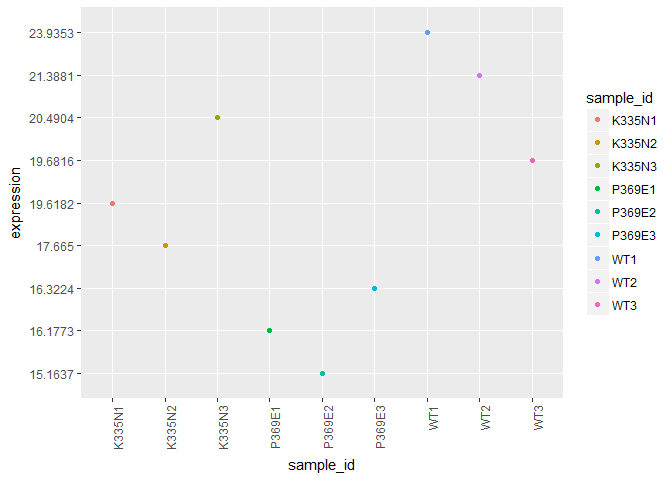

###### Let's shift the focus to the expression of intron containing genes (ICG) in all these replicates.

``` r
 ID <- c("YML085C","YFL039C","YBR111W-A")
 ICGexpression <- genedata %>% filter(Gene_ID %in% ID)
 ICGexpression
```

    ##     Gene_ID  K335N1  K335N2  K335N3  P369E1  P369E2  P369E3     WT1
    ## 1 YBR111W-A  51.294 44.4084 43.5618 83.3258 70.4225 67.6135  50.732
    ## 2   YFL039C 1051.76 1054.13 1014.24 1043.25 999.887 1006.87 1014.83
    ## 3   YML085C 110.898  106.66  107.81 125.573 118.223 117.999 109.237
    ##       WT2     WT3
    ## 1 39.0769 40.9832
    ## 2  1083.8  1069.7
    ## 3 109.326 112.288

``` r
 ICGexpression$Gene_ID <- c("Tub1", "Act1", "Sus1")
 ICG <- ICGexpression %>%
  as.data.frame() %>% 
  column_to_rownames("Gene_ID") %>%
  t() %>% as.data.frame() %>% 
  rownames_to_column("sample_id") %>% 
  melt(id = "sample_id") %>% 
  as_tibble() %>% 
  dplyr::select(sample_id,
         gene = variable, 
         expression = value)
```

    ## Warning: attributes are not identical across measure variables; they will
    ## be dropped

``` r
 ICG
```

    ## # A tibble: 27 x 3
    ##    sample_id gene  expression
    ##    <chr>     <fct> <chr>     
    ##  1 K335N1    Tub1  51.294    
    ##  2 K335N2    Tub1  44.4084   
    ##  3 K335N3    Tub1  43.5618   
    ##  4 P369E1    Tub1  83.3258   
    ##  5 P369E2    Tub1  70.4225   
    ##  6 P369E3    Tub1  67.6135   
    ##  7 WT1       Tub1  50.732    
    ##  8 WT2       Tub1  39.0769   
    ##  9 WT3       Tub1  40.9832   
    ## 10 K335N1    Act1  1051.76   
    ## # ... with 17 more rows

``` r
 ggplot(ICG, aes(x=sample_id, y=expression))+geom_point(aes(color=sample_id)) + theme(axis.text.x = element_text(angle=90, hjust=1)) + facet_wrap(~gene)
```

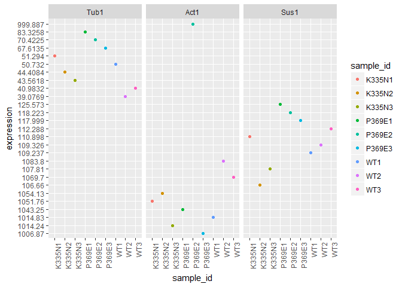

### Filtering the intron containing genes

Instead of loading the intron containing genes one by one, I downloaded the Ares database.

``` r
intronlist <- file.path("http://intron.ucsc.edu/yeast4.1/yeastbasic.txt")
introndata <- read.table(intronlist)
introndata %>%
  as_tibble()
```

    ## # A tibble: 298 x 6
    ##    V1                         V2      V3        V4     V5 V6              
    ##    <fct>                      <fct>   <fct>  <int>  <int> <fct>           
    ##  1 SNR17A_chr15_780120_780277 SNR17A  chr15 780120 780277 GTATGTAATATACCC~
    ##  2 SNR17B_chr16_281502_281372 SNR17B  chr16 281502 281372 GTATGTTTTATACCA~
    ##  3 YAL001C_chr1_151097_151007 YAL001C chr1  151097 151007 GTATGTTCATGTCTC~
    ##  4 YAL003W_chr1_142255_142621 YAL003W chr1  142255 142621 GTATGTTCCGATTTA~
    ##  5 YAL030W_chr1_87389_87502   YAL030W chr1   87389  87502 GTAAGTACAGAAAGC~
    ##  6 YBL018C_chr2_186389_186314 YBL018C chr2  186389 186314 GTATGTATATTTTTG~
    ##  7 YBL026W_chr2_170638_170766 YBL026W chr2  170638 170766 GTATGTTCATAATGA~
    ##  8 YBL027W_chr2_168386_168770 YBL027W chr2  168386 168770 GTATGTTTAACAGTG~
    ##  9 YBL040C_chr2_142808_142711 YBL040C chr2  142808 142711 GTATGTTACTATTTG~
    ## 10 YBL050W_chr2_125116_125232 YBL050W chr2  125116 125232 GTATGTAGTAGGGAA~
    ## # ... with 288 more rows

Filtering the Ares database with the RNA-seq data, we now have a dataset of only intron containing genes. We can check for intron retention, and expression using differential gene expression analysis on this set rather than the whole genome.

``` r
intronrnaseq <- genedata %>%
  filter(Gene_ID %in% introndata$V2)
intronrnaseq %>%
  as_tibble()
```

    ## # A tibble: 278 x 10
    ##    Gene_ID   K335N1  K335N2  K335N3 P369E1 P369E2 P369E3 WT1   WT2   WT3  
    ##    <fct>     <fct>   <fct>   <fct>  <fct>  <fct>  <fct>  <fct> <fct> <fct>
    ##  1 YAL001C   9.126   9.59261 9.799~ 9.707~ 9.515~ 10.47~ 9.49~ 9.67~ 10.5~
    ##  2 YAL003W   1791.68 2152.02 2088.~ 1672.~ 1980.~ 1944.~ 1637~ 2153~ 2145~
    ##  3 YAL030W   52.9617 41.4821 46.34~ 52.31~ 47.59~ 47.55~ 48.1~ 46.1~ 47.1~
    ##  4 YBL018C   48.0539 41.8079 45.14~ 69.40~ 58.91~ 59.64~ 49.3~ 42.1~ 42.9~
    ##  5 YBL026W   273.991 246.724 246.2~ 446.0~ 360.8~ 366.4~ 281.~ 233.~ 226.~
    ##  6 YBL027W   2009.2  2212.03 2201.~ 3442.~ 3687.~ 3431.~ 1921~ 2251~ 2217~
    ##  7 YBL040C   56.4636 53.3105 52.06~ 87.14~ 81.10~ 82.79~ 53.6~ 50.3~ 52.4~
    ##  8 YBL050W   33.4837 32.793  36.19~ 63.72~ 65.24~ 64.39~ 33.2~ 36.0~ 33.9~
    ##  9 YBL059C-A 44.1476 41.4215 35.18~ 82.01~ 66.52~ 71.76~ 48.7~ 42.0~ 44.2~
    ## 10 YBL059W   11.5659 10.7594 10.77~ 22.94~ 18.88~ 21.17~ 12.2~ 10.9~ 12.2~
    ## # ... with 268 more rows

### Differential gene expression analysis on ICG's

``` r
g <- genedata
g <- mutate_all(g, function(x) as.numeric((as.character(x))))
```

    ## Warning in (function (x) : NAs introduced by coercion

``` r
g$Gene_ID <- genedata$Gene_ID
g %>%
  as_tibble()
```

    ## # A tibble: 6,692 x 10
    ##    Gene_ID K335N1  K335N2 K335N3 P369E1 P369E2 P369E3     WT1     WT2
    ##    <fct>    <dbl>   <dbl>  <dbl>  <dbl>  <dbl>  <dbl>   <dbl>   <dbl>
    ##  1 Q0010    21.5   25.8    23.1   82.1   82.9   68.4   24.0    32.2  
    ##  2 Q0017    55.2   82.3    69.8  199.   264.   290.    58.8    64.5  
    ##  3 Q0032     1.50   2.19    2.03  14.8   14.6   13.0    2.25    3.80 
    ##  4 Q0045    56.2   42.5    51.9   64.0   61.1   65.7   55.0    38.3  
    ##  5 Q0050   325.   320.    361.   438.   419.   446.   316.    288.   
    ##  6 Q0055   162.   149.    163.   200.   192.   197.   154.    134.   
    ##  7 Q0060     4.27   4.71    4.93   9.06  10.1   11.3    4.69    4.15 
    ##  8 Q0065    25.3   25.5    27.3   29.9   30.4   36.8   24.9    21.6  
    ##  9 Q0070     1.07   0.861   1.56   2.04   2.27   2.67   0.948   0.680
    ## 10 Q0075    31.5   32.9    28.3   57.7   60.9   59.6   27.3    32.9  
    ## # ... with 6,682 more rows, and 1 more variable: WT3 <dbl>

``` r
g$K335N <- rowMeans(subset(g, select = c(K335N1,K335N2,K335N3)), na.rm = TRUE)
g$P369E <- rowMeans(subset(g, select = c(P369E1,P369E2,P369E3)), na.rm = TRUE)
g$WT <- rowMeans(subset(g, select = c(WT1,WT2,WT3)), na.rm = TRUE)
meangenedata <- g[-c(2,3,4,5,6,7,8,9,10)]
meangenedata %>%
  as_tibble()
```

    ## # A tibble: 6,692 x 4
    ##    Gene_ID  K335N  P369E      WT
    ##    <fct>    <dbl>  <dbl>   <dbl>
    ##  1 Q0010    23.5   77.8   28.6  
    ##  2 Q0017    69.1  251.    74.2  
    ##  3 Q0032     1.91  14.1    3.00 
    ##  4 Q0045    50.2   63.6   43.2  
    ##  5 Q0050   335.   434.   295.   
    ##  6 Q0055   158.   196.   140.   
    ##  7 Q0060     4.64  10.2    4.75 
    ##  8 Q0065    26.0   32.4   23.0  
    ##  9 Q0070     1.16   2.32   0.785
    ## 10 Q0075    30.9   59.4   33.0  
    ## # ... with 6,682 more rows

``` r
#Reordering the data
head(genematrixclean)
```

    ##        V1      V2      V3      V4      V5      V6      V7      V8      V9
    ## 1 gene_id  K335N1  K335N2  K335N3  P369E1  P369E2  P369E3     WT1     WT2
    ## 2   Q0010 21.5097 25.7552 23.1459  82.111 82.8739  68.357  23.981 32.2212
    ## 3   Q0017 55.1604 82.3234 69.8019 199.405 264.351 290.097 58.8137  64.463
    ## 4   Q0032 1.50128 2.18501  2.0338 14.8162 14.5541 12.9882  2.2479 3.79705
    ## 5   Q0045 56.1937 42.4625 51.8916 63.9759 61.0526 65.6864 54.9588 38.2745
    ## 6   Q0050 324.732 320.425 361.093 437.584 419.416 446.048 316.325 287.879
    ##       V10
    ## 1     WT3
    ## 2 29.4817
    ## 3 99.4298
    ## 4  2.9546
    ## 5 36.4092
    ## 6  280.81

``` r
genematrixclean_ordered <- genematrixclean[,c(1, 8,9,10,2,3,4,5,6,7)]
head(genematrixclean_ordered)
```

    ##        V1      V8      V9     V10      V2      V3      V4      V5      V6
    ## 1 gene_id     WT1     WT2     WT3  K335N1  K335N2  K335N3  P369E1  P369E2
    ## 2   Q0010  23.981 32.2212 29.4817 21.5097 25.7552 23.1459  82.111 82.8739
    ## 3   Q0017 58.8137  64.463 99.4298 55.1604 82.3234 69.8019 199.405 264.351
    ## 4   Q0032  2.2479 3.79705  2.9546 1.50128 2.18501  2.0338 14.8162 14.5541
    ## 5   Q0045 54.9588 38.2745 36.4092 56.1937 42.4625 51.8916 63.9759 61.0526
    ## 6   Q0050 316.325 287.879  280.81 324.732 320.425 361.093 437.584 419.416
    ##        V7
    ## 1  P369E3
    ## 2  68.357
    ## 3 290.097
    ## 4 12.9882
    ## 5 65.6864
    ## 6 446.048

``` r
#Note - change clean to genematrixclean_ordered
clean <- genematrixclean
clean <- mutate_all(clean, function(x) as.numeric((as.character(x))))
```

    ## Warning in (function (x) : NAs introduced by coercion

    ## Warning in (function (x) : NAs introduced by coercion

    ## Warning in (function (x) : NAs introduced by coercion

    ## Warning in (function (x) : NAs introduced by coercion

    ## Warning in (function (x) : NAs introduced by coercion

    ## Warning in (function (x) : NAs introduced by coercion

    ## Warning in (function (x) : NAs introduced by coercion

    ## Warning in (function (x) : NAs introduced by coercion

    ## Warning in (function (x) : NAs introduced by coercion

    ## Warning in (function (x) : NAs introduced by coercion

``` r
clean$Gene_ID <- genematrixclean_ordered$Gene_ID
clean %>%
  as_tibble() 
```

    ## # A tibble: 6,384 x 10
    ##       V1     V2      V3     V4     V5     V6     V7      V8      V9
    ##    <dbl>  <dbl>   <dbl>  <dbl>  <dbl>  <dbl>  <dbl>   <dbl>   <dbl>
    ##  1    NA  NA     NA      NA     NA     NA     NA     NA      NA    
    ##  2    NA  21.5   25.8    23.1   82.1   82.9   68.4   24.0    32.2  
    ##  3    NA  55.2   82.3    69.8  199.   264.   290.    58.8    64.5  
    ##  4    NA   1.50   2.19    2.03  14.8   14.6   13.0    2.25    3.80 
    ##  5    NA  56.2   42.5    51.9   64.0   61.1   65.7   55.0    38.3  
    ##  6    NA 325.   320.    361.   438.   419.   446.   316.    288.   
    ##  7    NA 162.   149.    163.   200.   192.   197.   154.    134.   
    ##  8    NA   4.27   4.71    4.93   9.06  10.1   11.3    4.69    4.15 
    ##  9    NA  25.3   25.5    27.3   29.9   30.4   36.8   24.9    21.6  
    ## 10    NA   1.07   0.861   1.56   2.04   2.27   2.67   0.948   0.680
    ## # ... with 6,374 more rows, and 1 more variable: V10 <dbl>

``` r
metadata = data.frame(dataClass = c(rep("group1",3), rep("group2",3), rep("group3", 3)))
mm = model.matrix(~dataClass,metadata)
mm
```

    ##   (Intercept) dataClassgroup2 dataClassgroup3
    ## 1           1               0               0
    ## 2           1               0               0
    ## 3           1               0               0
    ## 4           1               1               0
    ## 5           1               1               0
    ## 6           1               1               0
    ## 7           1               0               1
    ## 8           1               0               1
    ## 9           1               0               1
    ## attr(,"assign")
    ## [1] 0 1 1
    ## attr(,"contrasts")
    ## attr(,"contrasts")$dataClass
    ## [1] "contr.treatment"

``` r
#vw <- voom( clean[-1,-1], mm, plot=T)
logCPM <- cpm(clean[-1,-1], log=TRUE,prior.count=3)
fit_clean <- lmFit(logCPM, mm)
fit_clean <- eBayes(fit_clean, trend=TRUE)
plotSA(fit_clean, main="Limma Trend")
```

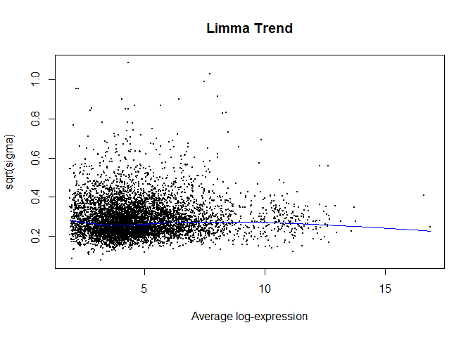

``` r
#Effect of Limma Trend
plot( sqrt(fit_clean$sigma), sqrt(eBayes(fit_clean, trend=FALSE)$sigma), pch=20, ylim=c(0.5,3), xlim=c(0,2), xlab="Regular fit sqrt(sigma)", 
      ylab="Weighted fit sqrt(sigma)", cex=0.2, main="Effect of Limma Trend")
abline(0,1, lty=3)
```

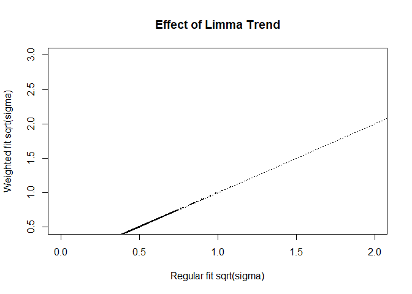

``` r
expression_coeff_2 <- topTable(fit_clean, 1000, coef=2, genelist = genematrixclean$V1, adjust.method="fdr", sort.by = "p", p.value = 0.05)
expression_coeff_3 <- topTable(fit_clean, 1000, coef=3, genelist = genematrixclean$V1, adjust.method="fdr", sort.by = "p", p.value = 0.05)

#Change column name to Gene_ID
colnames(expression_coeff_2)[1] <- "Gene_ID"
colnames(expression_coeff_3)[1] <- "Gene_ID"
expression_coeff_2
```

    ##        Gene_ID      logFC   AveExpr          t      P.Value    adj.P.Val
    ## 376    YBR114W  3.2435196  2.676509  93.330309 1.066258e-14 6.805923e-11
    ## 254    YBL113C  0.7961612  3.991722  21.074944 6.085578e-09 9.192258e-06
    ## 537    YBR264C  0.7582834  5.646737  20.627178 7.350668e-09 9.192258e-06
    ## 402    YBR138C  0.7070245  4.533164  19.687332 1.107173e-08 9.192258e-06
    ## 141    YBL006C  0.8457108  5.852433  19.240858 1.353929e-08 9.192258e-06
    ## 4        Q0017  1.8038096  2.988411  18.977202 1.527963e-08 9.192258e-06
    ## 365    YBR105C  0.8217324  9.162296  18.551604 1.863700e-08 9.192258e-06
    ## 204    YBL066C  0.7441537  5.085352  18.470861 1.936219e-08 9.192258e-06
    ## 528    YBR255W  0.8525295  6.402390  18.269866 2.130716e-08 9.192258e-06
    ## 27       Q0250  0.8647842  3.028159  18.146492 2.260783e-08 9.192258e-06
    ## 335    YBR077C  0.7582132  8.741559  18.133026 2.275505e-08 9.192258e-06
    ## 186    YBL049W  0.8612597  5.505351  17.965719 2.467556e-08 9.192258e-06
    ## 140  YBL005W-B  0.7894195  6.426080  17.771578 2.713270e-08 9.192258e-06
    ## 315  YBR058C-A  0.8102493  4.799921  17.730136 2.769163e-08 9.192258e-06
    ## 194    YBL057C  0.9876543  6.416961  17.671035 2.851096e-08 9.192258e-06
    ## 244  YBL100W-C  0.7476491  4.063481  17.568311 2.999976e-08 9.192258e-06
    ## 360    YBR101C  0.6893007  4.227188  17.529222 3.058877e-08 9.192258e-06
    ## 414    YBR150C  0.8119933  6.168742  17.456162 3.172433e-08 9.192258e-06
    ## 403    YBR139W  0.7175803  4.510538  17.356628 3.334731e-08 9.192258e-06
    ## 312  YBR056W-A  0.7783354  4.738543  17.352894 3.340996e-08 9.192258e-06
    ## 248    YBL104C  0.7721110  4.710865  17.315560 3.404362e-08 9.192258e-06
    ## 466    YBR198C  0.6645536  5.675298  17.307689 3.417890e-08 9.192258e-06
    ## 384    YBR122C  0.7339912  3.841368  17.155660 3.691241e-08 9.192258e-06
    ## 274    YBR018C  0.5857244  2.901537  17.147835 3.705952e-08 9.192258e-06
    ## 495    YBR224W  0.6071876  3.554270  17.072637 3.850690e-08 9.192258e-06
    ## 260    YBR006W  0.5625699  3.654158  16.965522 4.067798e-08 9.192258e-06
    ## 427  YBR162W-A  0.7682394  4.359209  16.941379 4.118585e-08 9.192258e-06
    ## 318    YBR061C  0.9716304  5.235861  16.837708 4.344805e-08 9.192258e-06
    ## 532    YBR259W  0.7404690  4.288535  16.773107 4.492717e-08 9.192258e-06
    ## 426    YBR162C  0.6940545  9.519008  16.764481 4.512886e-08 9.192258e-06
    ## 167    YBL031W  0.7995673  6.620463  16.758957 4.525856e-08 9.192258e-06
    ## 293    YBR038W  0.7476177  6.567590  16.598928 4.920101e-08 9.192258e-06
    ## 151    YBL016W  0.6687432  5.339271  16.593832 4.933268e-08 9.192258e-06
    ## 423    YBR159W  0.7700034  5.329593  16.585496 4.954886e-08 9.192258e-06
    ## 337    YBR079C  0.7158748  5.312855  16.544175 5.063614e-08 9.192258e-06
    ## 506  YBR233W-A  0.9017310  6.315633  16.474183 5.253870e-08 9.192258e-06
    ## 183    YBL046W  0.8574030  5.599125  16.447516 5.328428e-08 9.192258e-06
    ## 467    YBR199W  0.7267926  4.770695  16.381337 5.518582e-08 9.269765e-06
    ## 225    YBL084C  0.7200271  4.690370  16.190176 6.111426e-08 1.000237e-05
    ## 177    YBL040C  0.8941540  7.004795  16.097707 6.423262e-08 1.024047e-05
    ## 552    YBR280C  0.6183225  4.284850  15.999978 6.772130e-08 1.024047e-05
    ## 500    YBR229C  0.9219750  5.103257  15.971623 6.877242e-08 1.024047e-05
    ## 413    YBR149W  0.5463568  3.580619  15.965910 6.898638e-08 1.024047e-05
    ## 465    YBR197C  0.7364908  4.981571  15.902546 7.140959e-08 1.032587e-05
    ## 224    YBL083C  0.7081466  3.473376  15.825594 7.448011e-08 1.032587e-05
    ## 247    YBL103C  0.7040125  3.839380  15.707770 7.946899e-08 1.032587e-05
    ## 437    YBR172C  0.8795151  7.264000  15.686337 8.041571e-08 1.032587e-05
    ## 480    YBR211C  0.7342840  4.700328  15.662472 8.148461e-08 1.032587e-05
    ## 533    YBR260C  0.6896942  6.192554  15.541424 8.715436e-08 1.032587e-05
    ## 5284   YNR049C  0.5828499  5.639803  15.532424 8.759305e-08 1.032587e-05
    ## 398    YBR134W  0.7737524  6.543716  15.474492 9.047614e-08 1.032587e-05
    ## 399    YBR135W  0.5375022  3.543573  15.464824 9.096743e-08 1.032587e-05
    ## 156    YBL021C  0.9095126  5.737063  15.464105 9.100405e-08 1.032587e-05
    ## 25       Q0160  1.3209438  6.285240  15.462298 9.109629e-08 1.032587e-05
    ## 436    YBR171W  0.8203532  5.196076  15.432980 9.260668e-08 1.032587e-05
    ## 192    YBL055C  0.7249704  6.421843  15.416539 9.346579e-08 1.032587e-05
    ## 321    YBR064W  0.5914781  4.218691  15.378376 9.549424e-08 1.032587e-05
    ## 390  YBR126W-B  0.6905175  8.730992  15.377585 9.553680e-08 1.032587e-05
    ## 261    YBR007C  0.7398843  3.709231  15.367381 9.608767e-08 1.032587e-05
    ## 240    YBL098W  0.7490287  6.742685  15.346860 9.720618e-08 1.032587e-05
    ## 231    YBL090W  0.6920638  6.317557  15.320205 9.868061e-08 1.032587e-05
    ## 246    YBL102W  0.7119475  4.178155  15.181454 1.067671e-07 1.066922e-05
    ## 278    YBR022W  0.6829051  5.064160  15.178228 1.069637e-07 1.066922e-05
    ## 484    YBR215W  0.5889753  4.078524  15.164135 1.078270e-07 1.066922e-05
    ## 489    YBR220C  0.7708609  7.876725  15.150851 1.086479e-07 1.066922e-05
    ## 499    YBR228W  0.6472091  4.674411  15.098442 1.119546e-07 1.082736e-05
    ## 172    YBL036C  0.6699876  3.943824  14.947951 1.220859e-07 1.150482e-05
    ## 560    YBR288C  0.6535534  3.726205  14.941190 1.225643e-07 1.150482e-05
    ## 515    YBR242W  0.6186757  4.594751  14.757245 1.364119e-07 1.257266e-05
    ## 491  YBR221W-A  0.8372874  5.697102  14.738970 1.378797e-07 1.257266e-05
    ## 406    YBR142W  0.6926534  7.946579  14.669679 1.436058e-07 1.276105e-05
    ## 473    YBR204C  0.6037862  5.848962  14.660424 1.443905e-07 1.276105e-05
    ## 219    YBL078C  0.7082024  5.320523  14.642267 1.459434e-07 1.276105e-05
    ## 297    YBR042C  0.6410318  3.785195  14.568696 1.524284e-07 1.297274e-05
    ## 2      gene_id  1.6076066  5.341854  14.527983 1.561537e-07 1.297274e-05
    ## 550    YBR278W  0.6574322  5.485971  14.504709 1.583286e-07 1.297274e-05
    ## 362  YBR103C-A  0.6712129  4.019631  14.495451 1.592030e-07 1.297274e-05
    ## 507    YBR234C  0.6677602  3.799027  14.472331 1.614102e-07 1.297274e-05
    ## 386    YBR124W  0.7871419  4.862731  14.465044 1.621128e-07 1.297274e-05
    ## 517    YBR244W  0.6975280  4.996185  14.460104 1.625911e-07 1.297274e-05
    ## 137    YBL004W  0.5445537  4.016304  14.425054 1.660297e-07 1.308355e-05
    ## 272    YBR016W  0.5663074  5.650534  14.370846 1.715076e-07 1.335040e-05
    ## 226    YBL085W  0.5429820  4.158307  14.314721 1.773908e-07 1.364199e-05
    ## 511    YBR238C  0.6033596  3.772909  14.229071 1.868045e-07 1.404969e-05
    ## 290    YBR035C  0.7348635  6.127044  14.221766 1.876326e-07 1.404969e-05
    ## 547    YBR275C  0.6967449  4.777555  14.207205 1.892955e-07 1.404969e-05
    ## 145    YBL010C  0.6567926  5.330066  14.183740 1.920096e-07 1.408732e-05
    ## 442    YBR177C  0.5653866  3.882539  14.099620 2.020995e-07 1.464735e-05
    ## 203    YBL065W  0.6113711  3.311164  14.082435 2.042323e-07 1.464735e-05
    ## 415    YBR151W  0.7345016  4.151464  14.030022 2.108921e-07 1.477245e-05
    ## 166    YBL030C  0.7223411  3.755527  14.022294 2.118944e-07 1.477245e-05
    ## 298    YBR043C  0.5747504  4.000373  14.014430 2.129195e-07 1.477245e-05
    ## 551    YBR279W  0.5862906  3.204894  13.936618 2.233651e-07 1.531552e-05
    ## 508    YBR235W  0.6456656  4.957750  13.907771 2.273807e-07 1.531552e-05
    ## 358    YBR097W  0.6056698  3.095149  13.903760 2.279452e-07 1.531552e-05
    ## 464  YBR196C-B  0.6869067  5.082800  13.867154 2.331706e-07 1.550342e-05
    ## 368    YBR108W  0.7431421  8.295479  13.839093 2.372662e-07 1.561310e-05
    ## 331    YBR073W  0.4853614  4.770358  13.803855 2.425224e-07 1.579613e-05
    ## 492    YBR222C  0.5987068  3.342312  13.753228 2.503009e-07 1.613809e-05
    ## 215    YBL074C  0.6573356  3.587222  13.624878 2.712880e-07 1.728658e-05
    ## 309    YBR054W  0.6052352  4.277632  13.596764 2.761408e-07 1.728658e-05
    ## 509    YBR236C  0.6244190  4.011601  13.593255 2.767531e-07 1.728658e-05
    ## 316    YBR059C  0.6656761  4.451997  13.569313 2.809719e-07 1.728658e-05
    ## 439    YBR174C  0.7597754  4.527803  13.565473 2.816551e-07 1.728658e-05
    ## 527  YBR255C-A  0.5906181  3.477424  13.539384 2.863458e-07 1.730608e-05
    ## 169    YBL033C  0.6063598  3.577112  13.533612 2.873953e-07 1.730608e-05
    ## 245    YBL101C  0.7372893  5.930426  13.362574 3.205105e-07 1.911980e-05
    ## 295    YBR040W  0.5656708  4.754793  13.320850 3.292155e-07 1.945725e-05
    ## 444    YBR180W  0.6234903 10.814186  13.305632 3.324553e-07 1.946846e-05
    ## 158    YBL023C  0.7972066  6.679978  13.286520 3.365744e-07 1.952575e-05
    ## 5962   YPL079W -1.3284248  4.649608 -13.272865 3.395516e-07 1.952575e-05
    ## 220    YBL079W  0.6487363  3.245954  13.231441 3.487638e-07 1.987642e-05
    ## 554    YBR282W  0.6439032  7.282757  13.213477 3.528446e-07 1.993104e-05
    ## 348    YBR088C  0.7715786  6.979683  13.165403 3.640271e-07 2.038232e-05
    ## 22       Q0142  1.6761799  6.036195  13.116288 3.758583e-07 2.086177e-05
    ## 382    YBR120C  0.7238603  8.323107  13.098833 3.801648e-07 2.090348e-05
    ## 434    YBR169C  0.8847238  4.712474  13.076310 3.858028e-07 2.090348e-05
    ## 338    YBR080C  0.6420239  4.178615  13.073810 3.864343e-07 2.090348e-05
    ## 346    YBR086C  0.5955301  5.337406  12.984276 4.098213e-07 2.198227e-05
    ## 228    YBL087C  0.6065055  3.428104  12.966815 4.145626e-07 2.205127e-05
    ## 518    YBR245C  0.7207051  5.192355  12.900078 4.332505e-07 2.280179e-05
    ## 313    YBR057C  0.6539636  4.838232  12.891163 4.358167e-07 2.280179e-05
    ## 422    YBR158W  0.6572921  6.212061  12.851806 4.473488e-07 2.315135e-05
    ## 393    YBR129C  0.6199224  5.478696  12.841758 4.503466e-07 2.315135e-05
    ## 284    YBR029C  0.6154650  4.407201  12.831669 4.533791e-07 2.315135e-05
    ## 157    YBL022C  0.7425877  4.469861  12.815882 4.581698e-07 2.321030e-05
    ## 188    YBL051C  0.6912172  4.271766  12.782859 4.683729e-07 2.346058e-05
    ## 565    YBR293W  0.4829658  3.199139  12.769885 4.724501e-07 2.346058e-05
    ## 564    YBR292C  0.6457513  3.571365  12.764555 4.741367e-07 2.346058e-05
    ## 283    YBR028C  0.6031874  5.181903  12.715589 4.899441e-07 2.369731e-05
    ## 366    YBR106W  0.6775778  4.450331  12.708750 4.921982e-07 2.369731e-05
    ## 345    YBR085W  0.6136079  5.604058  12.707511 4.926078e-07 2.369731e-05
    ## 193    YBL056W  0.7149637  6.260211  12.703997 4.937714e-07 2.369731e-05
    ## 536    YBR263W  0.5883303  4.860011  12.650672 5.118073e-07 2.437960e-05
    ## 281    YBR025C  0.6998211  5.126578  12.617666 5.233352e-07 2.471031e-05
    ## 488    YBR219C  0.6245210  4.506811  12.608766 5.264926e-07 2.471031e-05
    ## 176  YBL039W-B  0.6063034  6.017500  12.595631 5.311912e-07 2.474629e-05
    ## 168    YBL032W  0.7834811  4.850120  12.585041 5.350131e-07 2.474629e-05
    ## 504    YBR232C  0.7418784  3.774521  12.521434 5.586179e-07 2.565222e-05
    ## 341    YBR083W  0.8284462 10.853143  12.509758 5.630752e-07 2.567221e-05
    ## 429    YBR164C  0.6085027  4.368402  12.444186 5.888474e-07 2.665683e-05
    ## 559    YBR287W  0.5185473  4.765072  12.363828 6.222261e-07 2.796950e-05
    ## 323    YBR066C  0.7127382  8.312143  12.343043 6.311970e-07 2.817434e-05
    ## 200    YBL062W  0.6221176  3.365530  12.318394 6.420209e-07 2.845847e-05
    ## 342  YBR084C-A  0.6071149  6.837572  12.301750 6.494455e-07 2.858904e-05
    ## 222    YBL081W  0.6091468  4.405666  12.277668 6.603569e-07 2.887026e-05
    ## 255    YBR001C  0.7793696  5.434958  12.187653 7.029747e-07 3.052441e-05
    ## 458    YBR192W  0.6829706  4.592962  12.164339 7.145022e-07 3.081532e-05
    ## 227    YBL086C  0.7102766 10.667997  12.146741 7.233419e-07 3.098719e-05
    ## 351    YBR090C  0.8283246  5.416002  12.110074 7.421519e-07 3.145587e-05
    ## 455    YBR190W  0.7158616 11.043253  12.100505 7.471492e-07 3.145587e-05
    ## 497    YBR226C  0.6258437  4.375029  12.096852 7.490667e-07 3.145587e-05
    ## 271    YBR015C  0.7929663  6.862252  12.052837 7.726039e-07 3.184153e-05
    ## 367    YBR107C  0.6550143  3.628159  12.051924 7.731006e-07 3.184153e-05
    ## 562    YBR290W  0.8941548  3.592325  12.048896 7.747509e-07 3.184153e-05
    ## 502  YBR230W-A  0.6197185  3.589965  12.042582 7.782045e-07 3.184153e-05
    ## 324    YBR067C  0.5355912  7.262192  12.032820 7.835773e-07 3.185716e-05
    ## 549    YBR277C  0.6427458  4.385551  11.996088 8.041657e-07 3.248123e-05
    ## 380    YBR118W  0.6003652  4.330267  11.987430 8.091047e-07 3.248123e-05
    ## 142    YBL007C  0.6538520  3.732903  11.936681 8.387397e-07 3.346047e-05
    ## 379    YBR117C  0.7083351 13.143123  11.923516 8.466227e-07 3.356517e-05
    ## 218    YBL077W  1.0170284  5.261000  11.886034 8.695168e-07 3.426003e-05
    ## 181    YBL044W  0.6339514  5.479111  11.872272 8.780937e-07 3.438572e-05
    ## 374    YBR112C  0.5434583  4.923754  11.853065 8.902206e-07 3.464804e-05
    ## 339    YBR081C  0.7273372  8.942819  11.841787 8.974274e-07 3.471684e-05
    ## 250    YBL106C  0.9856380  4.995268  11.816271 9.139720e-07 3.496076e-05
    ## 171    YBL035C  0.7177014  6.343262  11.815180 9.146869e-07 3.496076e-05
    ## 370  YBR109W-A  0.5808162  4.691692  11.804901 9.214531e-07 3.498530e-05
    ## 189    YBL052C  0.7305001  4.694697  11.797602 9.262910e-07 3.498530e-05
    ## 264    YBR010W  0.7067231  9.681531  11.739046 9.661347e-07 3.627551e-05
    ## 233  YBL091C-A  0.7234105 12.147161  11.715742 9.825153e-07 3.649962e-05
    ## 357    YBR096W  0.4993232  3.505850  11.714299 9.835399e-07 3.649962e-05
    ## 196  YBL059C-A  0.7712012  4.093748  11.692188 9.993843e-07 3.687324e-05
    ## 289    YBR034C  0.7554210  6.472747  11.679897 1.008314e-06 3.698890e-05
    ## 216    YBL075C  0.6247408  8.111601  11.643521 1.035262e-06 3.776044e-05
    ## 136    YBL003C  0.5750087  6.183560  11.618587 1.054193e-06 3.823246e-05
    ## 291    YBR036C  0.6675833  4.456792  11.607193 1.062971e-06 3.832241e-05
    ## 214    YBL073W  0.5420250  3.395160  11.599837 1.068681e-06 3.832241e-05
    ## 524    YBR252W  0.7667873  6.205846  11.532345 1.122682e-06 4.003395e-05
    ## 483    YBR214W  0.5320269  3.792442  11.518029 1.134519e-06 4.023132e-05
    ## 416    YBR152W  0.7485501  4.657945  11.493228 1.155356e-06 4.074384e-05
    ## 198    YBL060W  0.4657662  4.782459  11.448277 1.194206e-06 4.148326e-05
    ## 292    YBR037C  0.7277520  4.427805  11.447826 1.194602e-06 4.148326e-05
    ## 280    YBR024W  0.5278729  8.452239  11.446444 1.195820e-06 4.148326e-05
    ## 451    YBR186W  0.6823255  6.451298  11.415213 1.223703e-06 4.222107e-05
    ## 461    YBR195C  0.7866198  9.996012  11.403968 1.233918e-06 4.234462e-05
    ## 395    YBR131W  0.4492495  3.346054  11.395033 1.242101e-06 4.239749e-05
    ## 425    YBR161W  0.6468308  8.005662  11.359939 1.274829e-06 4.328315e-05
    ## 207  YBL068W-A  0.7815298  5.410117  11.347174 1.286969e-06 4.346413e-05
    ## 485    YBR216C  0.6826040  4.340913  11.334188 1.299450e-06 4.365468e-05
    ## 350    YBR089W  0.8129143  5.366669  11.315288 1.317854e-06 4.404118e-05
    ## 134    YBL001C  0.6078134 10.047034  11.212852 1.422751e-06 4.707810e-05
    ## 317    YBR060C  0.8114078  5.759222  11.212170 1.423480e-06 4.707810e-05
    ## 5173   YNL278W -0.5004502  3.180787 -11.166203 1.473550e-06 4.839836e-05
    ## 5963   YPL080C -1.4307588  7.477796 -11.161694 1.478565e-06 4.839836e-05
    ## 187    YBL050W  0.6091950  5.237875  11.144054 1.498368e-06 4.845212e-05
    ## 23       Q0143  1.4304194  3.577166  11.141381 1.501394e-06 4.845212e-05
    ## 428    YBR163W  0.6860494  6.657263  11.139983 1.502980e-06 4.845212e-05
    ## 182    YBL045C  0.6249565  3.883325  11.124611 1.520535e-06 4.877173e-05
    ## 3693   YKL177W -0.8225070  6.684245 -11.094967 1.555032e-06 4.949922e-05
    ## 256    YBR002C  0.7731624  4.614755  11.091836 1.558725e-06 4.949922e-05
    ## 319    YBR062C  0.5025531  3.824751  11.018580 1.647975e-06 5.195220e-05
    ## 498    YBR227C  0.6351236  3.890879  11.015184 1.652248e-06 5.195220e-05
    ## 457  YBR191W-A  0.7838728  4.512790  10.971811 1.707899e-06 5.343882e-05
    ## 478    YBR209W  0.6417480  5.961229  10.953232 1.732368e-06 5.394004e-05
    ## 419    YBR155W  0.5700432  3.534430  10.891062 1.817108e-06 5.630388e-05
    ## 431    YBR166C  0.7205626  5.126239  10.796861 1.954358e-06 6.026409e-05
    ## 525    YBR253W  0.6239604  5.506524  10.789927 1.964904e-06 6.029800e-05
    ## 470    YBR201W  0.7673490  4.992060  10.761601 2.008644e-06 6.134534e-05
    ## 523    YBR251W  0.7478810  6.951071  10.753788 2.020897e-06 6.142566e-05
    ## 354    YBR093C  0.4603581  4.469139  10.745993 2.033203e-06 6.150679e-05
    ## 474    YBR205W  0.5636843  6.375114  10.706404 2.096998e-06 6.313744e-05
    ## 20       Q0130  1.0179613  3.465798  10.659742 2.175042e-06 6.517977e-05
    ## 212  YBL071W-A  0.6657491 10.567541  10.404214 2.663509e-06 7.887803e-05
    ## 471    YBR202W  0.8221604  2.790748  10.402774 2.666584e-06 7.887803e-05
    ## 566    YBR294W  0.4674428  3.372351  10.401539 2.669224e-06 7.887803e-05
    ## 435    YBR170C  0.5850935  6.569394  10.392069 2.689568e-06 7.911296e-05
    ## 355    YBR094W  0.6226886  4.457774  10.309640 2.874038e-06 8.415130e-05
    ## 161    YBL026W  0.7172851 11.300646  10.291282 2.916996e-06 8.501911e-05
    ## 486    YBR217W  0.5729022  6.087887  10.277001 2.950904e-06 8.561647e-05
    ## 545    YBR273C  0.5606418  4.115684  10.248868 3.018981e-06 8.719527e-05
    ## 8        Q0055  0.7828985  3.199245  10.199928 3.141571e-06 9.032723e-05
    ## 270    YBR014C  0.5098811  6.011161  10.122234 3.347625e-06 9.582014e-05
    ## 314    YBR058C  0.6089051  8.201446  10.106082 3.392308e-06 9.596841e-05
    ## 601  YCL026C-B -0.5788841  3.701185 -10.105107 3.395025e-06 9.596841e-05
    ## 5724   YOR234C -0.5774730  8.997577 -10.104073 3.397910e-06 9.596841e-05
    ## 282    YBR026C  0.4762587  4.757321  10.025967 3.623882e-06 1.018997e-04
    ## 522    YBR249C  0.5871789  4.668088   9.982252 3.757555e-06 1.051951e-04
    ## 468    YBR200W  0.7281571  5.963882   9.953501 3.848430e-06 1.066970e-04
    ## 3943   YLR040C -0.6983601  4.996967  -9.950872 3.856859e-06 1.066970e-04
    ## 392    YBR128C  0.7077431  4.499600   9.949473 3.861353e-06 1.066970e-04
    ## 535    YBR262C  0.6448741  7.569839   9.925323 3.939850e-06 1.083968e-04
    ## 302    YBR047W  0.8168736 10.434810   9.836166 4.245254e-06 1.162981e-04
    ## 217    YBL076C  0.6135452  7.389288   9.802863 4.365954e-06 1.185902e-04
    ## 544    YBR272C  0.6279717  4.810971   9.797236 4.386717e-06 1.185902e-04
    ## 153    YBL018C  0.5950459  3.315783   9.793575 4.400286e-06 1.185902e-04
    ## 139  YBL005W-A  0.6649635  6.944041   9.792779 4.403240e-06 1.185902e-04
    ## 3692   YKL176C -0.8721786  6.721602  -9.781787 4.444291e-06 1.191929e-04
    ## 387    YBR125C  0.9088605  6.619176   9.752840 4.554420e-06 1.215472e-04
    ## 147    YBL012C  0.4603004  3.174867   9.748766 4.570158e-06 1.215472e-04
    ## 307    YBR052C  0.7665525  4.329408   9.714737 4.703993e-06 1.245875e-04
    ## 201    YBL063W  0.8861237  5.368917   9.707992 4.731032e-06 1.247859e-04
    ## 430    YBR165W  0.5556302  4.717954   9.665535 4.905206e-06 1.288474e-04
    ## 541    YBR269C  0.5245805  3.028133   9.642647 5.002022e-06 1.308521e-04
    ## 417    YBR153W  0.6977614  7.745757   9.619251 5.103173e-06 1.329533e-04
    ## 396    YBR132C  0.5832003  4.756290   9.604384 5.168617e-06 1.341109e-04
    ## 3318   YJL199C  0.5898594  5.131122   9.593477 5.217219e-06 1.348239e-04
    ## 174    YBL038W  0.6048934  7.820191   9.525380 5.532280e-06 1.417505e-04
    ## 3251   YJL132W  0.9539625  5.330157   9.521826 5.549291e-06 1.417505e-04
    ## 531    YBR258C  0.5327568  3.482842   9.521286 5.551878e-06 1.417505e-04
    ## 391    YBR127C  0.5220163  2.937292   9.512305 5.595144e-06 1.422861e-04
    ## 143    YBL008W  0.5315784  4.013717   9.422355 6.049538e-06 1.532310e-04
    ## 300    YBR045C  0.5239102  4.151495   9.394438 6.198720e-06 1.563891e-04
    ## 557    YBR285W  0.5878241  8.039582   9.358444 6.397073e-06 1.603109e-04
    ## 420    YBR156C  0.8144736  4.743098   9.357138 6.404399e-06 1.603109e-04
    ## 334    YBR076W  0.7988173  5.602823   9.351545 6.435886e-06 1.604698e-04
    ## 481    YBR212W  0.5360080  3.811683   9.271423 6.906133e-06 1.715247e-04
    ## 304    YBR049C  0.5535652  2.642081   9.266572 6.935796e-06 1.715937e-04
    ## 146    YBL011W  0.6598547  5.005687   9.236808 7.120896e-06 1.754930e-04
    ## 401    YBR137W  0.5460879  3.260071   9.226593 7.185671e-06 1.764082e-04
    ## 149    YBL014C  0.5728314  4.180333   9.201705 7.346219e-06 1.792161e-04
    ## 409    YBR145W  0.7310983  5.803886   9.200178 7.356200e-06 1.792161e-04
    ## 2793   YHR136C  0.7052407  5.300936   9.145372 7.724407e-06 1.874711e-04
    ## 356    YBR095C  0.6546645  6.132650   9.120967 7.894864e-06 1.908822e-04
    ## 460    YBR194W  0.5926739  4.127048   9.113405 7.948518e-06 1.914543e-04
    ## 433    YBR168W  0.9240782  4.468506   9.080903 8.183739e-06 1.958125e-04
    ## 249    YBL105C  0.4148024  3.342053   9.076218 8.218268e-06 1.958125e-04
    ## 482    YBR213W  0.9252098  4.822811   9.075782 8.221487e-06 1.958125e-04
    ## 164  YBL029C-A  0.3939312  3.428916   9.006681 8.750143e-06 2.076288e-04
    ## 235    YBL093C  0.6607339  4.029200   8.948734 9.222380e-06 2.180239e-04
    ## 238    YBL096C  0.5262974  3.166994   8.922089 9.448877e-06 2.225542e-04
    ## 643    YCR004C  0.6733702  5.598128   8.913790 9.520667e-06 2.234206e-04
    ## 526    YBR254C  0.8885560  4.599781   8.855835 1.003906e-05 2.347228e-04
    ## 229    YBL088C  0.5159551  3.683192   8.803166 1.053721e-05 2.454708e-04
    ## 546    YBR274W  0.5687359  3.879457   8.789106 1.067474e-05 2.477705e-04
    ## 4380   YLR451W -0.5795064  5.617826  -8.724331 1.133441e-05 2.621287e-04
    ## 154    YBL019W  0.5335889  4.597410   8.679830 1.181355e-05 2.722234e-04
    ## 279    YBR023C  0.7185612  4.091785   8.605114 1.266890e-05 2.908834e-04
    ## 296    YBR041W  0.6119388  4.615964   8.550006 1.334342e-05 3.052725e-04
    ## 11       Q0070  0.8827358  5.400631   8.533447 1.355374e-05 3.089768e-04
    ## 148    YBL013W  0.6489259  4.293455   8.507792 1.388682e-05 3.154434e-04
    ## 459    YBR193C  0.5985937  5.090138   8.448231 1.469536e-05 3.326258e-04
    ## 195    YBL058W  0.8219324  5.754705   8.414197 1.518051e-05 3.423930e-04
    ## 3        Q0010  1.8187153  6.787442   8.410161 1.523919e-05 3.425062e-04
    ## 29       Q0275  0.7572960 10.363382   8.405305 1.531014e-05 3.428934e-04
    ## 636    YCL063W -0.5506140  6.739499  -8.396884 1.543404e-05 3.444597e-04
    ## 4290   YLR365W  0.7540902  7.939759   8.391857 1.550853e-05 3.449161e-04
    ## 1655   YEL077C -0.4796907  4.912875  -8.354704 1.607141e-05 3.561937e-04
    ## 373  YBR111W-A  0.5309652  4.864748   8.319899 1.661916e-05 3.670591e-04
    ## 394    YBR130C  0.5512637  3.410812   8.290702 1.709448e-05 3.759474e-04
    ## 4068 YLR154W-F  0.3954943  5.618038   8.277394 1.731608e-05 3.759474e-04
    ## 4071   YLR156W  0.3954943  5.618038   8.277394 1.731608e-05 3.759474e-04
    ## 4077 YLR157W-E  0.3954943  5.618038   8.277394 1.731608e-05 3.759474e-04
    ## 4080   YLR159W  0.3954943  5.618038   8.277394 1.731608e-05 3.759474e-04
    ## 205    YBL067C  0.5704536  5.560119   8.210572 1.847751e-05 3.998032e-04
    ## 469  YBR201C-A  0.6352916  4.676306   8.200330 1.866298e-05 4.024520e-04
    ## 353    YBR092C  1.1880450  6.950550   8.174292 1.914374e-05 4.114293e-04
    ## 561    YBR289W  0.6072686  4.852402   8.095018 2.069324e-05 4.432381e-04
    ## 1950   YFL066C -0.7833381  2.358316  -8.085073 2.089716e-05 4.461090e-04
    ## 325    YBR068C  0.6878692  6.706039   8.058364 2.145582e-05 4.565083e-04
    ## 5877   YOR382W -1.1854489  6.188327  -8.044047 2.176202e-05 4.597728e-04
    ## 2205   YGL194C -0.4464468  5.672125  -8.039211 2.186654e-05 4.597728e-04
    ## 28       Q0255  0.8123046  6.749634   8.038519 2.188153e-05 4.597728e-04
    ## 1405   YDR379W  1.0010598  4.740831   8.037789 2.189737e-05 4.597728e-04
    ## 159    YBL024W  0.7444552  4.443894   8.002408 2.268017e-05 4.746477e-04
    ## 1179 YDR170W-A  0.5834628  5.922574   7.973113 2.335160e-05 4.863015e-04
    ## 472    YBR203W  0.5654932  4.055695   7.971491 2.338940e-05 4.863015e-04
    ## 308    YBR053C  1.2276790  6.961946   7.960208 2.365426e-05 4.902116e-04
    ## 197    YBL059W  0.3741562  3.172623   7.950560 2.388336e-05 4.933577e-04
    ## 514    YBR241C  0.5505903  5.703167   7.903297 2.504141e-05 5.156108e-04
    ## 543    YBR271W  0.5583459  3.838521   7.892630 2.531121e-05 5.194902e-04
    ## 479    YBR210W  0.5980048  4.195258   7.879890 2.563762e-05 5.245029e-04
    ## 155    YBL020W  0.6248598  5.008647   7.874064 2.578844e-05 5.259028e-04
    ## 520    YBR247C  0.4953130  5.318873   7.843777 2.658829e-05 5.404875e-04
    ## 553    YBR281C  0.7231940  5.525603   7.816796 2.732379e-05 5.536754e-04
    ## 165    YBL029W  0.6511532  6.875374   7.807694 2.757695e-05 5.570369e-04
    ## 2632 YHL046W-A -0.6980446  4.120962  -7.767185 2.873517e-05 5.786012e-04
    ## 306    YBR051W  0.8276106  6.330298   7.696246 3.089417e-05 6.201178e-04
    ## 4070 YLR156C-A  0.4308673  2.711333   7.647570 3.247830e-05 6.458225e-04
    ## 4079 YLR159C-A  0.4308673  2.711333   7.647570 3.247830e-05 6.458225e-04
    ## 4081   YLR160C  0.4308673  2.711333   7.647570 3.247830e-05 6.458225e-04
    ## 135    YBL002W  0.6791455  9.188262   7.643761 3.260599e-05 6.463480e-04
    ## 570    YBR297W  0.3431574  2.972224   7.591640 3.440941e-05 6.799854e-04
    ## 144    YBL009W  0.5668641  3.886511   7.585065 3.464455e-05 6.825191e-04
    ## 540    YBR268W  0.6686458  5.517672   7.577698 3.491014e-05 6.856351e-04
    ## 378    YBR116C  0.4125793  2.634850   7.559584 3.557270e-05 6.965048e-04
    ## 381    YBR119W  0.6036461  4.591146   7.507994 3.753645e-05 7.309522e-04
    ## 17       Q0110  0.3635671  2.264212   7.507366 3.756107e-05 7.309522e-04
    ## 277    YBR021W  0.7710157  4.915089   7.489605 3.826492e-05 7.423859e-04
    ## 539    YBR267W  0.7915050  6.316693   7.484440 3.847230e-05 7.441475e-04
    ## 363    YBR103W  0.4647796  5.287302   7.469368 3.908451e-05 7.537053e-04
    ## 5295   YNR060W -0.3080836  5.446609  -7.442290 4.021144e-05 7.731013e-04
    ## 330    YBR072W  0.6990906  4.959751   7.400751 4.201000e-05 8.052547e-04
    ## 1219   YDR208W -0.3111110  6.720975  -7.377382 4.306043e-05 8.229183e-04
    ## 503    YBR231C  0.8290886  4.149164   7.306896 4.640706e-05 8.842277e-04
    ## 2863 YHR199C-A  0.2990864  6.941789   7.299811 4.675889e-05 8.882797e-04
    ## 432    YBR167C  0.5231058  3.595009   7.135604 5.578978e-05 1.056695e-03
    ## 232    YBL091C  0.7657437  4.259104   7.117404 5.690288e-05 1.074589e-03
    ## 521    YBR248C  0.5059887  7.840941   7.096922 5.818468e-05 1.093364e-03
    ## 538    YBR265W  0.6357382  5.680241   7.096055 5.823964e-05 1.093364e-03
    ## 275    YBR019C  0.4151570  2.713633   7.059486 6.060997e-05 1.134526e-03
    ## 516    YBR243C  0.7880647  7.745874   7.019583 6.331745e-05 1.181741e-03
    ## 438    YBR173C  0.7983137  3.193577   7.014007 6.370619e-05 1.185530e-03
    ## 21       Q0140  1.9318985  4.443796   7.006587 6.422755e-05 1.191757e-03
    ## 3276 YJL156W-A -0.4498009  5.299900  -6.991757 6.528367e-05 1.207842e-03
    ## 287    YBR032W  0.3451969  2.685236   6.969082 6.693534e-05 1.234822e-03
    ## 173    YBL037W  0.6597761  5.309261   6.962082 6.745441e-05 1.240811e-03
    ## 505    YBR233W  0.6332898  6.533616   6.959145 6.767349e-05 1.241264e-03
    ## 3942   YLR039C -0.5315934  7.070623  -6.942917 6.889822e-05 1.257272e-03
    ## 418    YBR154C  0.5782609  5.517318   6.942366 6.894020e-05 1.257272e-03
    ## 5480   YOL163W  0.3161870  3.444958   6.930987 6.981406e-05 1.269582e-03
    ## 3493   YJR146W -0.3489055  5.198710  -6.926059 7.019618e-05 1.272904e-03
    ## 369    YBR109C  0.4382435  4.387021   6.919632 7.069812e-05 1.278374e-03
    ## 371    YBR110W  0.7555272  6.784188   6.895535 7.261497e-05 1.309326e-03
    ## 475    YBR206W  0.4871422  4.718371   6.868950 7.479598e-05 1.344853e-03
    ## 4829   YMR271C -0.3081996  5.763790  -6.846651 7.668066e-05 1.374867e-03
    ## 230    YBL089W  0.7588880  5.292228   6.837214 7.749376e-05 1.385554e-03
    ## 4549   YMR010W -0.6095884  6.633070  -6.826527 7.842607e-05 1.398306e-03
    ## 2642   YHR004C -0.3788500  5.447832  -6.803712 8.045762e-05 1.430532e-03
    ## 191    YBL054W  0.5797772  5.235928   6.755823 8.491141e-05 1.505526e-03
    ## 452    YBR187W  0.6861560  5.032269   6.722377 8.818155e-05 1.559177e-03
    ## 236    YBL094C  0.5456871  3.542402   6.719182 8.850106e-05 1.560504e-03
    ## 3348   YJR004C -0.6795853  2.650110  -6.709730 8.945377e-05 1.572957e-03
    ## 6381   YPR200C -0.3088108  2.533432  -6.698630 9.058683e-05 1.588505e-03
    ## 2102   YGL088W -1.4721875  9.754639  -6.651718 9.555172e-05 1.670977e-03
    ## 383    YBR121C  0.7822687  6.263909   6.641502 9.667193e-05 1.685946e-03
    ## 440    YBR175W  0.4268570  4.218571   6.639113 9.693596e-05 1.685946e-03
    ## 2516   YGR231C  0.3044665  5.205902   6.615021 9.964282e-05 1.728316e-03
    ## 412    YBR148W  0.6752147  6.409043   6.608055 1.004408e-04 1.737424e-03
    ## 404    YBR140C  0.6030240  4.349391   6.605698 1.007123e-04 1.737424e-03
    ## 332    YBR074W  0.6261247  4.845523   6.567707 1.052022e-04 1.809987e-03
    ## 615    YCL040W -1.0066052  6.302628  -6.500037 1.137503e-04 1.951797e-03
    ## 2634 YHL048C-A -0.3929874  3.295182  -6.398404 1.280461e-04 2.191201e-03
    ## 310    YBR055C  0.6662258  4.616212   6.389988 1.293150e-04 2.206998e-03
    ## 258    YBR004C  0.5457080  5.591607   6.384081 1.302137e-04 2.216411e-03
    ## 385    YBR123C  0.6063888  3.433867   6.379898 1.308542e-04 2.221389e-03
    ## 3865   YLL025W  0.3658071  7.162377   6.376581 1.313647e-04 2.224139e-03
    ## 519    YBR246W  0.6142798  5.929116   6.363544 1.333917e-04 2.252485e-03
    ## 400    YBR136W  0.6197427  5.522917   6.357381 1.343619e-04 2.258579e-03
    ## 1562   YDR533C -0.6220699  2.652390  -6.356759 1.344603e-04 2.258579e-03
    ## 327    YBR070C  0.8441196  5.441528   6.329677 1.388189e-04 2.325672e-03
    ## 542    YBR270C  0.5367656  4.868185   6.306114 1.427368e-04 2.385049e-03
    ## 1778   YER101C  0.4054635 11.402961   6.280414 1.471476e-04 2.452332e-03
    ## 5054   YNL159C  0.7823885  5.234217   6.249146 1.527157e-04 2.538501e-03
    ## 456    YBR191W  0.5662797  2.487832   6.219510 1.582056e-04 2.622059e-03
    ## 5260   YNR027W -0.2807505  4.875040  -6.216996 1.586810e-04 2.622059e-03
    ## 660    YCR020C -0.2653274  6.418560  -6.215446 1.589749e-04 2.622059e-03
    ## 3330   YJL211C -0.2825964  4.757353  -6.201608 1.616255e-04 2.658906e-03
    ## 133    YAR071W  0.6872511  8.172672   6.170236 1.678149e-04 2.753631e-03
    ## 424    YBR160W  0.3849036  3.814731   6.112916 1.798006e-04 2.942737e-03
    ## 410    YBR146W  0.4228813  2.105641   6.046576 1.948482e-04 3.180860e-03
    ## 448    YBR183W  0.3281399  2.343275   6.041622 1.960259e-04 3.191922e-03
    ## 5474   YOL157C -0.7123143  4.677243  -6.037674 1.969696e-04 3.199127e-03
    ## 477    YBR208C  0.6710494  3.052510   6.034064 1.978370e-04 3.203541e-03
    ## 234    YBL092W  0.7524540  6.367725   6.032372 1.982451e-04 3.203541e-03
    ## 3304   YJL185C -0.2750952  5.206474  -6.028405 1.992053e-04 3.210928e-03
    ## 2097   YGL083W -0.2387752  4.342866  -6.018881 2.015312e-04 3.240235e-03
    ## 5876 YOR381W-A -1.0629624  5.977930  -5.990548 2.086267e-04 3.343143e-03
    ## 5470   YOL154W -0.3112471  6.238316  -5.989168 2.089792e-04 3.343143e-03
    ## 6170   YPR001W -0.6089667  6.646459  -5.979339 2.115086e-04 3.375148e-03
    ## 991    YDL240W -0.7311308  5.869737  -5.975345 2.125459e-04 3.383243e-03
    ## 558    YBR286W  0.7317614  6.137547   5.971508 2.135476e-04 3.390733e-03
    ## 26       Q0182  0.8381284  6.796830   5.959194 2.167972e-04 3.433788e-03
    ## 138    YBL005W  0.4489814  5.822117   5.922469 2.268123e-04 3.583523e-03
    ## 211  YBL071C-B  0.7099994  6.129458   5.913953 2.292058e-04 3.612396e-03
    ## 359    YBR098W  0.9354007  6.285295   5.902300 2.325255e-04 3.655690e-03
    ## 3746   YKR010C  0.2822969  4.053752   5.893004 2.352112e-04 3.688828e-03
    ## 6330   YPR156C  0.2999932  5.485520   5.874693 2.406009e-04 3.764107e-03
    ## 185    YBL048W  0.5396219  3.867962   5.861525 2.445596e-04 3.816685e-03
    ## 1896   YFL013C  0.2838187  2.749656   5.855605 2.463624e-04 3.835442e-03
    ## 529    YBR256C  0.4990837  4.309565   5.852067 2.474466e-04 3.842949e-03
    ## 347    YBR087W  0.7643815  6.162142   5.845631 2.494325e-04 3.864387e-03
    ## 6        Q0045  0.3715514  8.463469   5.841513 2.507118e-04 3.874803e-03
    ## 408    YBR144C  0.4155760  3.994730   5.827664 2.550679e-04 3.932605e-03
    ## 267  YBR012W-A  0.4826974  3.976497   5.802911 2.630599e-04 4.046052e-03
    ## 213    YBL072C  0.8774734  2.854060   5.795778 2.654130e-04 4.067059e-03
    ## 1435   YDR409W -0.3408241  4.890394  -5.794913 2.657001e-04 4.067059e-03
    ## 269    YBR013C  0.3155117  5.271328   5.785752 2.687595e-04 4.092318e-03
    ## 1949   YFL064C -0.4554643  2.092917  -5.785687 2.687815e-04 4.092318e-03
    ## 170    YBL034C  0.5731297  4.055522   5.784117 2.693095e-04 4.092318e-03
    ## 160    YBL025W  0.6025641  8.196874   5.782322 2.699147e-04 4.092318e-03
    ## 2436   YGR156W -0.3901796  5.789424  -5.778462 2.712214e-04 4.102384e-03
    ## 372    YBR111C  0.6336117  5.805011   5.762959 2.765387e-04 4.172923e-03
    ## 3335   YJL216C -0.9553650  6.948261  -5.760871 2.772636e-04 4.173994e-03
    ## 450    YBR185C  0.2354478  2.431700   5.754726 2.794086e-04 4.192722e-03
    ## 1972   YFR019W  0.2517876  4.020424   5.753549 2.798213e-04 4.192722e-03
    ## 3360   YJR014W -0.2666156  5.046967  -5.748615 2.815596e-04 4.208888e-03
    ## 4186   YLR263W -0.7232718 11.331412  -5.739965 2.846351e-04 4.241016e-03
    ## 179    YBL042C  1.1962101  3.465732   5.738840 2.850377e-04 4.241016e-03
    ## 1668   YER011W  0.2855546  7.582530   5.733549 2.869398e-04 4.259388e-03
    ## 3019   YIL120W -0.3594481  5.036053  -5.715008 2.937149e-04 4.349843e-03
    ## 3514   YKL007W -0.4170475  5.188336  -5.703079 2.981654e-04 4.396575e-03
    ## 2877 YHR212W-A -0.3736197  3.014951  -5.702859 2.982480e-04 4.396575e-03
    ## 1032   YDR032C  0.2625615  9.232097   5.697077 3.004322e-04 4.418568e-03
    ## 343    YBR084W  0.8930551  8.282590   5.694967 3.012338e-04 4.420173e-03
    ## 128    YAR053W -0.3442818  3.063482  -5.690132 3.030788e-04 4.420755e-03
    ## 2875   YHR211W -0.3442818  3.063482  -5.690132 3.030788e-04 4.420755e-03
    ## 2990   YIL093C  0.2405892  6.377801   5.689421 3.033512e-04 4.420755e-03
    ## 6382   YPR201W -0.6338647  4.007772  -5.653458 3.174798e-04 4.616113e-03
    ## 5479   YOL162W  0.2960499  2.368594   5.633040 3.258179e-04 4.726581e-03
    ## 3343 YJL222W-B -0.3168532  3.131168  -5.623921 3.296183e-04 4.770869e-03
    ## 5287   YNR052C -0.3626821  7.091227  -5.617084 3.324989e-04 4.801676e-03
    ## 5324   YOL013C  0.3355553  5.689456   5.593018 3.428586e-04 4.928784e-03
    ## 534    YBR261C  0.5494029  6.407829   5.592113 3.432553e-04 4.928784e-03
    ## 1621   YEL046C -0.2830352  5.605085  -5.591287 3.436172e-04 4.928784e-03
    ## 462    YBR196C  0.6061341  4.106924   5.577951 3.495226e-04 4.996970e-03
    ## 510    YBR237W  0.4412584  5.822173   5.577025 3.499367e-04 4.996970e-03
    ## 4295   YLR371W -0.2317027  7.388319  -5.566297 3.547732e-04 5.054726e-03
    ## 421    YBR157C  0.4542702  7.215965   5.564295 3.556837e-04 5.056413e-03
    ## 3309   YJL190C  0.2374255  7.969317   5.561544 3.569389e-04 5.062980e-03
    ## 2693   YHR047C -0.3441791  3.644011  -5.557566 3.587630e-04 5.077570e-03
    ## 221    YBL080C  0.4889734  3.613724   5.541320 3.663167e-04 5.173007e-03
    ## 684    YCR040W -0.4698137  4.777499  -5.524344 3.743945e-04 5.275408e-03
    ## 530    YBR257W  0.3891523  4.071901   5.494198 3.892185e-04 5.472207e-03
    ## 3347   YJR003C -1.1440191  7.514448  -5.482972 3.949005e-04 5.539890e-03
    ## 4804   YMR246W -0.2848286  4.209194  -5.479194 3.968330e-04 5.554791e-03
    ## 152    YBL017C  0.4500725  5.731026   5.466899 4.031928e-04 5.631465e-03
    ## 4030   YLR125W -0.3105932  4.515134  -5.461447 4.060480e-04 5.651622e-03
    ## 239    YBL097W  0.5050549  3.732093   5.460765 4.064068e-04 5.651622e-03
    ## 349  YBR089C-A  0.6750426  5.027919   5.450655 4.117649e-04 5.704756e-03
    ## 3938 YLR035C-A -0.3991474  4.077694  -5.450088 4.120678e-04 5.704756e-03
    ## 5068   YNL172W -0.2801833  4.199387  -5.448515 4.129089e-04 5.704756e-03
    ## 6378   YPR197C -0.2166519  3.438781  -5.440697 4.171175e-04 5.750456e-03
    ## 5807   YOR315W -0.3617953  4.627659  -5.435229 4.200886e-04 5.778934e-03
    ## 4792   YMR235C -0.2376818  6.322517  -5.422524 4.270810e-04 5.862490e-03
    ## 273    YBR017C  0.2897864  2.062327   5.417731 4.297514e-04 5.886487e-03
    ## 405    YBR141C  0.5517586  5.715945   5.395647 4.422913e-04 6.045278e-03
    ## 5380   YOL066C  0.2786912  5.179006   5.385548 4.481578e-04 6.112374e-03
    ## 3207   YJL090C -0.2686962  3.755550  -5.383613 4.492911e-04 6.114765e-03
    ## 6164   YPL273W -0.4739621  4.602033  -5.376897 4.532493e-04 6.155511e-03
    ## 1683   YER025W -0.2519198  5.939759  -5.373953 4.549966e-04 6.166122e-03
    ## 1421   YDR394W -0.2554341  5.830142  -5.355689 4.659995e-04 6.301854e-03
    ## 2627   YHL039W -0.4549464  4.180949  -5.342336 4.742256e-04 6.399539e-03
    ## 5161   YNL265C -0.4823829  3.311858  -5.330061 4.819268e-04 6.489744e-03
    ## 1246   YDR233C  0.2584519  5.403741   5.327025 4.838523e-04 6.493870e-03
    ## 175    YBL039C  0.8365647  5.456373   5.326371 4.842679e-04 6.493870e-03
    ## 326    YBR069C  0.4203110  4.539088   5.321247 4.875401e-04 6.524043e-03
    ## 1892   YFL010C -0.2897409  6.947871  -5.314343 4.919859e-04 6.569762e-03
    ## 184    YBL047C  0.5140393  3.740465   5.307833 4.962182e-04 6.612444e-03
    ## 1567   YDR538W -0.2651406  4.526377  -5.299694 5.015658e-04 6.669780e-03
    ## 288    YBR033W  0.7210888  6.997353   5.289117 5.086080e-04 6.749366e-03
    ## 5230   YNL335W -0.3686170  4.325564  -5.285559 5.110009e-04 6.767052e-03
    ## 85     YAL048C -0.2100239  5.321493  -5.281146 5.139855e-04 6.791344e-03
    ## 3223   YJL106W -0.2906098  3.241715  -5.279706 5.149632e-04 6.791344e-03
    ## 5020   YNL128W -0.3559391  4.553558  -5.270696 5.211293e-04 6.858492e-03
    ## 375    YBR113W  0.4958980  3.783574   5.242039 5.412754e-04 7.108974e-03
    ## 5505   YOR020C  0.3866753  6.084189   5.237638 5.444430e-04 7.135893e-03
    ## 5117   YNL221C -0.2130950  4.426181  -5.222897 5.552007e-04 7.261980e-03
    ## 998    YDL247W -0.3311854  2.706733  -5.207708 5.665254e-04 7.394953e-03
    ## 208    YBL069W  0.5629414  4.994308   5.204820 5.687069e-04 7.408278e-03
    ## 18       Q0115  0.2858939  1.945236   5.196036 5.753973e-04 7.480165e-03
    ## 377    YBR115C  0.4485660  2.443113   5.184535 5.842869e-04 7.580292e-03
    ## 4445   YML046W -0.2414393  1.916092  -5.169343 5.962571e-04 7.719897e-03
    ## 5325 YOL013W-A -0.3311193  6.470238  -5.142773 6.178336e-04 7.966845e-03
    ## 4046   YLR141W  0.3003895  2.614216   5.142203 6.183052e-04 7.966845e-03
    ## 1128   YDR120C -0.2170882  5.403548  -5.141275 6.190749e-04 7.966845e-03
    ## 4157   YLR236C -0.2639676  4.113534  -5.101412 6.531167e-04 8.388016e-03
    ## 463  YBR196C-A  0.6567658  7.684119   5.092099 6.613574e-04 8.476795e-03
    ## 2631   YHL044W -0.5664512  4.418259  -5.088236 6.648085e-04 8.503953e-03
    ## 286    YBR031W  0.4681611  3.174035   5.070767 6.806599e-04 8.689305e-03
    ## 206    YBL068W  0.7523327  5.149524   5.065937 6.851142e-04 8.711994e-03
    ## 259    YBR005W  0.7719225  4.070360   5.065880 6.851670e-04 8.711994e-03
    ## 2895   YIL005W  0.2112950  3.186177   5.058744 6.918053e-04 8.778913e-03
    ## 70   YAL037C-A  0.5817403  9.599194   5.049562 7.004504e-04 8.870982e-03
    ## 6071   YPL186C -0.3546755 11.226970  -5.043905 7.058347e-04 8.921471e-03
    ## 3391   YJR046W -0.6383845  5.503009  -5.038018 7.114843e-04 8.975107e-03
    ## 637    YCL064C -0.4029405  4.654654  -5.031932 7.173768e-04 9.004468e-03
    ## 683    YCR039C -0.4029405  4.654654  -5.031932 7.173768e-04 9.004468e-03
    ## 1930   YFL042C  0.2836095  4.954528   5.030078 7.191832e-04 9.004468e-03
    ## 2887   YHR218W  0.7797849  3.338028   5.029799 7.194546e-04 9.004468e-03
    ## 243  YBL100W-B  0.7375168  6.861417   5.012163 7.368837e-04 9.188690e-03
    ## 10       Q0065  0.3561248  2.128603   5.011994 7.370530e-04 9.188690e-03
    ## 4967   YNL077W -0.2951385  4.803116  -4.993385 7.559439e-04 9.405829e-03
    ## 3120   YIR040C  0.3112410  3.216709   4.984886 7.647440e-04 9.496812e-03
    ## 2067   YGL053W -0.3084047  7.296807  -4.979339 7.705469e-04 9.550293e-03
    ## 1287   YDR270W -0.2185507  3.560465  -4.976591 7.734399e-04 9.567572e-03
    ## 1125 YDR118W-A -0.2421750  5.165792  -4.942367 8.104607e-04 1.000613e-02
    ## 6239   YPR068C -0.2046585  7.779176  -4.940259 8.128025e-04 1.001567e-02
    ## 548    YBR276C  0.2443184  2.713210   4.912455 8.443823e-04 1.038476e-02
    ## 4597   YMR056C -0.4262907  3.987044  -4.910134 8.470777e-04 1.039788e-02
    ## 5021   YNL129W -0.3022173  4.917762  -4.900810 8.579987e-04 1.051172e-02
    ## 487    YBR218C  0.5220823  2.017431   4.854857 9.140862e-04 1.117742e-02
    ## 3572   YKL061W -0.3544578  3.517781  -4.849984 9.202609e-04 1.121044e-02
    ## 5775   YOR287C -0.2249041  4.168972  -4.849954 9.202990e-04 1.121044e-02
    ## 7        Q0050  0.3078773  7.376567   4.822346 9.561447e-04 1.162490e-02
    ## 1075   YDR071C -0.3050644  5.169306  -4.808473 9.747209e-04 1.182822e-02
    ## 933    YDL184C -0.4344219  7.025109  -4.803460 9.815288e-04 1.188823e-02
    ## 4458   YML057W  0.2300327  8.568075   4.786557 1.004862e-03 1.214779e-02
    ## 3784   YKR051W -0.1892912  4.109055  -4.773204 1.023718e-03 1.234535e-02
    ## 5973   YPL090C -0.1819167  5.786390  -4.772255 1.025072e-03 1.234535e-02
    ## 202    YBL064C  0.5134250  2.536265   4.759768 1.043074e-03 1.253850e-02
    ## 1365   YDR343C -0.2021964  3.100111  -4.754621 1.050593e-03 1.260514e-02
    ## 263    YBR009C  0.3589662 10.413094   4.746681 1.062306e-03 1.272177e-02
    ## 5126   YNL230C -0.2008388  5.817781  -4.734184 1.081028e-03 1.292172e-02
    ## 2671 YHR028W-A -0.2014229  4.237520  -4.728161 1.090177e-03 1.300673e-02
    ## 5834   YOR341W -0.2325272  5.127458  -4.708959 1.119907e-03 1.333650e-02
    ## 3703   YKL186C -0.2065796  2.546287  -4.704852 1.126377e-03 1.338857e-02
    ## 4040   YLR135W -0.6877955  4.178915  -4.701167 1.132217e-03 1.343297e-02
    ## 555    YBR283C  0.2800504  2.373392   4.693539 1.144411e-03 1.355245e-02
    ## 2515   YGR230W  0.1863684  5.954030   4.690149 1.149874e-03 1.359194e-02
    ## 449    YBR184W  0.5991080  4.228222   4.676771 1.171710e-03 1.382444e-02
    ## 3336   YJL217W -0.6145354  3.486753  -4.661037 1.197964e-03 1.410813e-02
    ## 2495   YGR208W  0.3418687  9.420911   4.658533 1.202200e-03 1.413194e-02
    ## 4551   YMR012W -0.1632178  3.448847  -4.652878 1.211826e-03 1.421890e-02
    ## 4658   YMR116C -0.2990835  4.528300  -4.639919 1.234198e-03 1.445483e-02
    ## 1642   YEL064C -0.8005373  4.645869  -4.633935 1.244678e-03 1.455088e-02
    ## 581    YCL004W -0.1806884  4.456022  -4.631965 1.248149e-03 1.456478e-02
    ## 569  YBR296C-A  0.2374283  2.806875   4.630094 1.251455e-03 1.457671e-02
    ## 322    YBR065C  0.3954752  4.723031   4.624843 1.260785e-03 1.465864e-02
    ## 4012   YLR108C  0.2997625 11.134053   4.614165 1.279987e-03 1.485483e-02
    ## 5508   YOR022C  0.2149915  3.771475   4.604710 1.297250e-03 1.502785e-02
    ## 241    YBL099W  0.3628058  7.027582   4.602685 1.300981e-03 1.504377e-02
    ## 663    YCR021C -0.3641384  2.369498  -4.599618 1.306651e-03 1.508202e-02
    ## 1647   YEL069C  0.3192082  6.938706   4.596089 1.313209e-03 1.511617e-02
    ## 1551 YDR524C-B -0.3953780 13.719918  -4.595479 1.314347e-03 1.511617e-02
    ## 1528   YDR503C -0.8595486  3.763617  -4.591352 1.322068e-03 1.517762e-02
    ## 476    YBR207W  0.6131405  4.128299   4.576966 1.349367e-03 1.546322e-02
    ## 4535   YML130C -0.2126674  4.357320  -4.571512 1.359873e-03 1.555568e-02
    ## 223    YBL082C  0.5624675  3.962906   4.566653 1.369309e-03 1.563560e-02
    ## 1325   YDR308C -0.2593534  4.981486  -4.552665 1.396863e-03 1.592174e-02
    ## 2692   YHR046C -0.2247862  5.661786  -4.548590 1.405000e-03 1.598595e-02
    ## 4816   YMR258C -0.2194881  4.519780  -4.537266 1.427884e-03 1.621740e-02
    ## 6171 YPR002C-A  0.3156053  2.638987   4.531762 1.439150e-03 1.631634e-02
    ## 3370   YJR024C -0.4171655  5.416892  -4.511460 1.481537e-03 1.676711e-02
    ## 2946   YIL050W -0.2060787  9.948515  -4.500549 1.504868e-03 1.700101e-02
    ## 3151   YJL035C  0.1919097  4.529875   4.485271 1.538201e-03 1.733722e-02
    ## 6163   YPL272C -0.2447496  7.317811  -4.484429 1.540060e-03 1.733722e-02
    ## 4367 YLR438C-A  0.2946123  5.877455   4.480239 1.549352e-03 1.741112e-02
    ## 513    YBR240C  0.3894153  3.186281   4.475499 1.559935e-03 1.748196e-02
    ## 303    YBR048W  0.2476822  5.070833   4.474964 1.561134e-03 1.748196e-02
    ## 2215   YGL203C -0.3962324  4.932390  -4.443151 1.634256e-03 1.826875e-02
    ## 4894   YNL007C -0.1755322  3.712261  -4.425093 1.677384e-03 1.871808e-02
    ## 2584   YHL002W -0.1951442  5.369026  -4.419840 1.690159e-03 1.882772e-02
    ## 5742   YOR253W -0.2260496  5.822994  -4.416866 1.697436e-03 1.887584e-02
    ## 1047   YDR043C -0.2719598  6.788825  -4.409601 1.715356e-03 1.904195e-02
    ## 2456   YGR171C -0.2019155  5.595793  -4.403784 1.729849e-03 1.916949e-02
    ## 2411   YGR132C  0.1928730  4.572578   4.378824 1.793543e-03 1.980945e-02
    ## 5589   YOR101W -0.8128517  5.154642  -4.378723 1.793806e-03 1.980945e-02
    ## 1363   YDR341C -0.5487848  3.532437  -4.376338 1.800025e-03 1.984380e-02
    ## 592    YCL017C -0.3871840  4.665482  -4.361495 1.839238e-03 2.024113e-02
    ## 265    YBR011C  0.3412225  3.616079   4.348933 1.873137e-03 2.057871e-02
    ## 3534   YKL025C  0.5616758  3.579764   4.345248 1.883210e-03 2.065383e-02
    ## 3376   YJR031C -0.1986101  4.991201  -4.343162 1.888934e-03 2.068107e-02
    ## 3162   YJL047C  0.3071990  6.900427   4.337804 1.903730e-03 2.080737e-02
    ## 638    YCL066W -0.3750576  5.373009  -4.321535 1.949412e-03 2.123396e-02
    ## 682    YCR038C -0.3750576  5.373009  -4.321535 1.949412e-03 2.123396e-02
    ## 1012   YDR011W -0.3858121  8.672448  -4.315947 1.965372e-03 2.137133e-02
    ## 832    YDL085W  0.2503785  5.945857   4.307229 1.990550e-03 2.160830e-02
    ## 1286   YDR269C -0.2296357  3.180213  -4.304847 1.997490e-03 2.164682e-02
    ## 397    YBR133C  0.3256600  2.402954   4.302421 2.004584e-03 2.168689e-02
    ## 344  YBR085C-A  0.1829314  3.820228   4.284260 2.058551e-03 2.223305e-02
    ## 3014 YIL115W-A -0.1887383  5.356350  -4.282051 2.065221e-03 2.224410e-02
    ## 5278   YNR043W -0.4158742  3.362594  -4.281332 2.067397e-03 2.224410e-02
    ## 3017   YIL118W -0.2478067  4.101275  -4.280463 2.070029e-03 2.224410e-02
    ## 1822   YER141W  0.2198811  3.737502   4.276662 2.081588e-03 2.229092e-02
    ## 2899 YIL009C-A -0.2812588  4.829332  -4.275633 2.084731e-03 2.229092e-02
    ## 1073   YDR069C  0.3914345  4.702557   4.275589 2.084863e-03 2.229092e-02
    ## 5918   YPL034W  0.1966460  4.532793   4.272938 2.092981e-03 2.234029e-02
    ## 4663   YMR120C  0.2007180  5.367640   4.270015 2.101967e-03 2.239875e-02
    ## 4500   YML099C -0.2918958  3.292961  -4.264178 2.120039e-03 2.255368e-02
    ## 2550   YGR264C -0.2362952  6.291534  -4.262283 2.125939e-03 2.257881e-02
    ## 4506   YML102W -0.2049555  4.865716  -4.257024 2.142413e-03 2.269036e-02
    ## 4781   YMR225C -0.1960016  7.262059  -4.255604 2.146884e-03 2.269036e-02
    ## 1658   YER003C  0.2410476  6.083358   4.255533 2.147106e-03 2.269036e-02
    ## 6040   YPL156C -0.2395873  4.611535  -4.251297 2.160505e-03 2.276811e-02
    ## 3383   YJR038C  0.1784472  2.807266   4.250953 2.161597e-03 2.276811e-02
    ## 3739   YKR003W -0.1891808  2.541120  -4.245291 2.179656e-03 2.290900e-02
    ## 4151   YLR230W -0.2057746  4.549728  -4.244512 2.182151e-03 2.290900e-02
    ## 5000   YNL108C -0.2900569  4.004205  -4.235028 2.212796e-03 2.319258e-02
    ## 1184   YDR175C  0.1546849  4.068871   4.231673 2.223747e-03 2.326914e-02
    ## 2749   YHR092C -0.2118261  2.158846  -4.228567 2.233936e-03 2.333750e-02
    ## 3702   YKL185W -0.1902290  6.276080  -4.224561 2.247152e-03 2.343721e-02
    ## 3434   YJR090C  0.2969178  4.503999   4.214410 2.281015e-03 2.375158e-02
    ## 2675 YHR032C-A -0.1881801  4.938080  -4.210857 2.292994e-03 2.383742e-02
    ## 1198   YDR187C  0.2137877  6.557119   4.208331 2.301552e-03 2.385832e-02
    ## 1034   YDR034C -0.4716698  9.220606  -4.208058 2.302479e-03 2.385832e-02
    ## 4003 YLR099W-A -0.1755608  6.106930  -4.200343 2.328840e-03 2.409236e-02
    ## 4502   YML100W  0.4187598  3.364650   4.196569 2.341851e-03 2.418776e-02
    ## 19       Q0120  0.3307896 11.165530   4.187655 2.372894e-03 2.446879e-02
    ## 3640   YKL126W -0.1859023  5.622158  -4.182352 2.391571e-03 2.462161e-02
    ## 783    YDL037C  0.6227158  4.935011   4.178169 2.406410e-03 2.473448e-02
    ## 2195   YGL185C -0.2724044  3.905900  -4.172698 2.425969e-03 2.489544e-02
    ## 388    YBR126C  0.6919271  8.044872   4.165929 2.450406e-03 2.510584e-02
    ## 5686   YOR194C -0.2495019  3.914052  -4.154273 2.493097e-03 2.550231e-02
    ## 5134   YNL238W  0.2171634  5.856831   4.145444 2.525960e-03 2.579712e-02
    ## 512    YBR239C  0.2314459  2.247330   4.143464 2.533393e-03 2.583171e-02
    ## 3264   YJL144W -0.2210185  6.095838  -4.139193 2.549504e-03 2.591950e-02
    ## 3034   YIL134W  0.1785317  3.765233   4.139030 2.550125e-03 2.591950e-02
    ## 4585   YMR045C  0.2815463  3.324752   4.136496 2.559737e-03 2.597584e-02
    ## 2653   YHR013C -0.1893571  2.270786  -4.134381 2.567792e-03 2.601621e-02
    ## 5025   YNL132W -0.2189251  3.982278  -4.130859 2.581262e-03 2.611125e-02
    ## 5358   YOL045W -0.2048016  3.642698  -4.107349 2.673136e-03 2.699783e-02
    ## 237    YBL095W  0.4801674  3.477998   4.102416 2.692850e-03 2.715397e-02
    ## 2475   YGR189C -0.4146925  5.061413  -4.098924 2.706900e-03 2.724823e-02
    ## 2298   YGR025W -0.1882313  5.986892  -4.097974 2.710736e-03 2.724823e-02
    ## 389  YBR126W-A  0.7235336  7.195281   4.078340 2.791318e-03 2.801413e-02
    ## 3914   YLR010C  0.2687028  4.062143   4.074961 2.805440e-03 2.811165e-02
    ## 2202   YGL191W  0.1399245  3.609136   4.064750 2.848582e-03 2.848340e-02
    ## 874    YDL127W -0.2030239  5.655097  -4.064073 2.851464e-03 2.848340e-02
    ## 446    YBR182C  0.5219263  3.004674   4.048245 2.919810e-03 2.912054e-02
    ## 4622   YMR080C -0.1764518  3.323122  -4.046421 2.927796e-03 2.915463e-02
    ## 4876   YMR313C  0.2032474  7.350280   4.043576 2.940300e-03 2.923354e-02
    ## 4807   YMR250W -0.2039672  2.279800  -4.039709 2.957389e-03 2.935772e-02
    ## 1923   YFL036W  0.1691717  7.441346   4.028651 3.006835e-03 2.980222e-02
    ## 352    YBR091C  0.3484893  7.067794   4.019387 3.048934e-03 3.017263e-02
    ## 861  YDL114W-A  0.1897488  3.641115   4.011511 3.085219e-03 3.045457e-02
    ## 1779   YER102W  0.2637499  3.305260   4.011134 3.086966e-03 3.045457e-02
    ## 1843   YER158C  0.2971858  6.156206   4.008806 3.097789e-03 3.046796e-02
    ## 3069   YIL166C -0.2549265  5.821043  -4.008255 3.100353e-03 3.046796e-02
    ## 6272   YPR102C  0.1792420  7.010681   4.007764 3.102644e-03 3.046796e-02
    ## 4788   YMR231W -0.1926747  2.507717  -4.000348 3.137433e-03 3.076136e-02
    ## 4360   YLR432W -0.1656104  4.480998  -3.999348 3.142160e-03 3.076136e-02
    ## 5868   YOR374W  0.3206897  7.332051   3.994524 3.165048e-03 3.093798e-02
    ## 1944   YFL057C -0.2461879  2.694305  -3.993014 3.172249e-03 3.096096e-02
    ## 3215   YJL098W  0.1312699  3.542323   3.985970 3.206073e-03 3.119979e-02
    ## 2910   YIL018W -0.3627776  4.751729  -3.985883 3.206495e-03 3.119979e-02
    ## 4922   YNL034W -0.1759425  4.956561  -3.981649 3.227010e-03 3.135161e-02
    ## 163    YBL028C  0.5534587  6.482165   3.976869 3.250341e-03 3.153029e-02
    ## 253  YBL108C-A  0.3082181  2.531818   3.974108 3.263901e-03 3.161378e-02
    ## 2328   YGR050C -0.3640232  3.617377  -3.972752 3.270583e-03 3.163050e-02
    ## 3143   YJL025W -0.2699261  7.464639  -3.970583 3.281298e-03 3.168612e-02
    ## 454    YBR189W  0.5030508  2.788858   3.966064 3.303744e-03 3.185468e-02
    ## 6383   YPR202W -0.5008140  4.175120  -3.964599 3.311057e-03 3.187704e-02
    ## 4923   YNL035C  0.2872226  4.632332   3.961077 3.328702e-03 3.199865e-02
    ## 1209   YDR198C -0.1976732  3.953363  -3.946017 3.405298e-03 3.259743e-02
    ## 2341   YGR064W -0.1713627  3.600927  -3.943921 3.416106e-03 3.259743e-02
    ## 5995   YPL111W -0.1603545  4.564842  -3.943863 3.416407e-03 3.259743e-02
    ## 5537   YOR050C -0.1932494  6.521076  -3.943221 3.419723e-03 3.259743e-02
    ## 443    YBR179C  0.1781302  2.272767   3.942999 3.420870e-03 3.259743e-02
    ## 4226   YLR301W -0.2996558  4.688683  -3.942852 3.421632e-03 3.259743e-02
    ## 3783   YKR050W  0.1693787  3.908274   3.941835 3.426900e-03 3.259896e-02
    ## 311    YBR056W  0.5443411  6.401342   3.939079 3.441213e-03 3.265921e-02
    ## 2179   YGL167C -0.2885686  5.618537  -3.938293 3.445306e-03 3.265921e-02
    ## 3495   YJR148W -0.2034192  2.695783  -3.937664 3.448584e-03 3.265921e-02
    ## 2623 YHL034W-A -0.2553541  3.409352  -3.936502 3.454653e-03 3.266822e-02
    ## 4977   YNL087W -0.2151042  4.901648  -3.931824 3.479195e-03 3.285163e-02
    ## 1953   YFR002W  0.2764683  5.641108   3.928523 3.496626e-03 3.296745e-02
    ## 6321   YPR146C  0.2089719  4.922185   3.924957 3.515557e-03 3.309705e-02
    ## 2073   YGL059W -0.2125164  3.929095  -3.923927 3.521045e-03 3.309990e-02
    ## 1223 YDR210W-A -0.3583245  4.366089  -3.920245 3.540741e-03 3.318832e-02
    ## 5313   YOL002C -0.1380168  4.165314  -3.920015 3.541978e-03 3.318832e-02
    ## 3731   YKL216W -0.1502176  2.488412  -3.918186 3.551807e-03 3.318832e-02
    ## 2511   YGR224W -0.2052264  3.737934  -3.917744 3.554184e-03 3.318832e-02
    ## 5293   YNR058W  0.1956648  3.447846   3.916525 3.560761e-03 3.318832e-02
    ## 735  YCR095W-A  1.9102942  2.814704   3.916001 3.563588e-03 3.318832e-02
    ## 3762   YKR026C -0.1655191  3.841530  -3.915398 3.566848e-03 3.318832e-02
    ## 5855   YOR361C  0.2323495  7.174500   3.907874 3.607773e-03 3.352025e-02
    ## 2729   YHR073W -0.1577250  5.425001  -3.906597 3.614767e-03 3.353642e-02
    ## 5174   YNL279W -0.1673387  5.376067  -3.903312 3.632828e-03 3.361258e-02
    ## 2862   YHR199C  0.2454179  5.839196   3.903189 3.633508e-03 3.361258e-02
    ## 677    YCR033W -0.1718441  6.128774  -3.900261 3.649690e-03 3.371342e-02
    ## 5827   YOR334W -0.2220125  7.459268  -3.898863 3.657443e-03 3.373621e-02
    ## 4834   YMR275C  0.2560092  6.837597   3.897172 3.666848e-03 3.377415e-02
    ## 567    YBR295W  0.4464782  5.176783   3.891698 3.697457e-03 3.400701e-02
    ## 2013   YFR055W -0.5906773  4.113875  -3.890517 3.704093e-03 3.401903e-02
    ## 2541   YGR255C  0.1633050  2.472265   3.887077 3.723505e-03 3.414817e-02
    ## 3072   YIL172C -0.1885041  3.046837  -3.884331 3.739077e-03 3.419599e-02
    ## 618    YCL043C  0.1847517  3.800388   3.884269 3.739433e-03 3.419599e-02
    ## 5974   YPL091W -0.4020371  3.940065  -3.870363 3.819364e-03 3.486400e-02
    ## 5653   YOR163W -0.1935126  5.917106  -3.869668 3.823406e-03 3.486400e-02
    ## 5420 YOL103W-B -0.3145792  4.230525  -3.867498 3.836055e-03 3.492944e-02
    ## 5092   YNL196C  0.1296756  4.418746   3.862021 3.868183e-03 3.517181e-02
    ## 5959   YPL076W  0.1334351  3.505544   3.839860 4.001096e-03 3.632859e-02
    ## 941    YDL191W  0.1491600  9.264950   3.838774 4.007737e-03 3.633720e-02
    ## 1280   YDR263C -0.1963297  5.366386  -3.837482 4.015643e-03 3.635724e-02
    ## 13       Q0080  0.4950987  3.586190   3.831387 4.053187e-03 3.664518e-02
    ## 1392   YDR367W -0.2378833  5.832043  -3.824850 4.093866e-03 3.696060e-02
    ## 301    YBR046C  0.2027338  3.277805   3.820491 4.121227e-03 3.715507e-02
    ## 3419   YJR074W -0.1663020  5.857495  -3.817164 4.142244e-03 3.725478e-02
    ## 2074   YGL060W -0.1978118  4.066368  -3.816893 4.143959e-03 3.725478e-02
    ## 1379   YDR357C  0.1922261  3.878516   3.813606 4.164838e-03 3.738982e-02
    ## 5192   YNL295W  0.2770696  4.540032   3.792285 4.303020e-03 3.852437e-02
    ## 4761   YMR205C -0.1847433  2.389747  -3.792245 4.303286e-03 3.852437e-02
    ## 3468   YJR123W -0.1564543  4.834710  -3.786764 4.339589e-03 3.879495e-02
    ## 276    YBR020W  0.3264740  3.353297   3.784816 4.352571e-03 3.885659e-02
    ## 5065   YNL169C -0.3829961  3.487453  -3.782183 4.370180e-03 3.895930e-02
    ## 2803   YHR144C -0.4328331  2.366906  -3.780960 4.378384e-03 3.897800e-02
    ## 262    YBR008C  0.1815204 10.564144   3.770417 4.449793e-03 3.955854e-02
    ## 4125   YLR205C  0.1807050  4.786965   3.764452 4.490739e-03 3.986702e-02
    ## 3133   YJL012C  0.1508072  3.591264   3.759944 4.521943e-03 4.004969e-02
    ## 1016 YDR014W-A  0.2793015  5.965612   3.759668 4.523865e-03 4.004969e-02
    ## 4650   YMR108W  0.1451887  4.774920   3.758730 4.530391e-03 4.005192e-02
    ## 3325   YJL206C -0.1733460  4.149168  -3.750356 4.589082e-03 4.051467e-02
    ## 3711   YKL194C  0.2042298  5.621255   3.749241 4.596961e-03 4.052818e-02
    ## 3298   YJL178C -0.2238456  6.885082  -3.744977 4.627209e-03 4.073859e-02
    ## 2734   YHR078W  0.1531237  3.984823   3.739084 4.669361e-03 4.100136e-02
    ## 453    YBR188C  0.2161103 11.177837   3.739009 4.669902e-03 4.100136e-02
    ## 336    YBR078W  0.1649478  6.935019   3.737827 4.678404e-03 4.101958e-02
    ## 3109 YIR030W-A  0.1866062  3.130409   3.735079 4.698241e-03 4.113700e-02
    ## 3256 YJL136W-A  0.1968024  3.376882   3.733465 4.709931e-03 4.118286e-02
    ## 3054   YIL153W  0.1501372  4.624685   3.732351 4.718015e-03 4.119712e-02
    ## 2383   YGR107W  0.2999518  5.221734   3.728652 4.744979e-03 4.131838e-02
    ## 2213   YGL201C -0.1973541  7.382974  -3.728007 4.749692e-03 4.131838e-02
    ## 835    YDL088C -0.1653012  3.504949  -3.727785 4.751322e-03 4.131838e-02
    ## 5347   YOL035C  0.1626528  4.538232   3.721379 4.798454e-03 4.167147e-02
    ## 3328   YJL209W -0.1417736  4.423936  -3.706222 4.911961e-03 4.259925e-02
    ## 6074 YPL189C-A -0.1603804  2.179247  -3.699247 4.965148e-03 4.299515e-02
    ## 4684   YMR139W  0.1669507  4.195228   3.698473 4.971083e-03 4.299515e-02
    ## 2509   YGR222W  0.1402554  4.081934   3.692272 5.018932e-03 4.335026e-02
    ## 5835   YOR342C -0.3483585  2.815124  -3.687296 5.057681e-03 4.352670e-02
    ## 5627   YOR139C  0.1441325  3.636212   3.686508 5.063846e-03 4.352670e-02
    ## 5435   YOL118C -0.2256674  3.046232  -3.686245 5.065906e-03 4.352670e-02
    ## 496    YBR225W  0.3936145  3.181053   3.686152 5.066636e-03 4.352670e-02
    ## 2214   YGL202W -0.1661501  4.467084  -3.681664 5.101920e-03 4.377091e-02
    ## 1294   YDR277C  0.2836174  4.699942   3.678656 5.125714e-03 4.391601e-02
    ## 1337   YDR318W -0.2833299  3.567782  -3.677233 5.137006e-03 4.395377e-02
    ## 4491   YML091C  0.1629974  6.816800   3.671679 5.181354e-03 4.427387e-02
    ## 5572   YOR083W  0.1591376  3.861709   3.668521 5.206744e-03 4.443135e-02
    ## 411    YBR147W  0.2239854  2.118840   3.662499 5.255530e-03 4.478778e-02
    ## 1533   YDR508C  0.2667687  4.927333   3.657097 5.299702e-03 4.510400e-02
    ## 815    YDL069C  0.1830800  5.985856   3.648046 5.374586e-03 4.568040e-02
    ## 5350 YOL038C-A  0.2256127  7.266791   3.631941 5.510598e-03 4.677413e-02
    ## 4677   YMR133W  0.2223470  4.203779   3.625659 5.564634e-03 4.717006e-02
    ## 6384   YPR203W -0.3547454  4.590427  -3.621744 5.598583e-03 4.739490e-02
    ## 1592   YEL020C -0.3106345  5.605207  -3.617548 5.635225e-03 4.760596e-02
    ## 445    YBR181C  0.2491297  2.831776   3.617182 5.638431e-03 4.760596e-02
    ## 2406   YGR127W -0.2384230  5.566225  -3.615829 5.650303e-03 4.764318e-02
    ## 4060   YLR153C -0.2125929  6.178846  -3.613851 5.667707e-03 4.772688e-02
    ## 1927   YFL040W -0.2324223  4.246489  -3.612406 5.680453e-03 4.777119e-02
    ## 4478   YML076C  0.1549833  5.847425   3.599008 5.800126e-03 4.871343e-02
    ## 1980   YFR028C  0.1268378  3.236591   3.597128 5.817135e-03 4.879208e-02
    ## 3898   YLL060C -0.3319542  3.814099  -3.588915 5.892030e-03 4.933182e-02
    ## 2289   YGR016W -0.1347506  5.630138  -3.587713 5.903076e-03 4.933182e-02
    ## 2882 YHR214C-E -0.2797530  3.190807  -3.587422 5.905749e-03 4.933182e-02
    ## 209    YBL070C  0.5633297  5.075539   3.586700 5.912399e-03 4.933182e-02
    ## 728    YCR089W -0.1936216  6.017674  -3.585234 5.925926e-03 4.938014e-02
    ## 4311   YLR387C -0.1587514 12.184204  -3.582512 5.951124e-03 4.952546e-02
    ## 843    YDL096C  0.2094498  6.297061   3.580219 5.972429e-03 4.963804e-02
    ## 5211   YNL314W  0.1736458  5.173112   3.577323 5.999469e-03 4.979794e-02
    ## 985    YDL235C -0.1730103  6.234677  -3.574925 6.021950e-03 4.991962e-02
    ##                 B
    ## 376  19.113297470
    ## 254  11.290459446
    ## 537  11.114757328
    ## 402  10.729759939
    ## 141  10.538748887
    ## 4    10.423370853
    ## 365  10.232939416
    ## 204  10.196213874
    ## 528  10.103945972
    ## 27   10.046704536
    ## 335  10.040428412
    ## 186   9.961985830
    ## 140   9.869864230
    ## 315   9.850045310
    ## 194   9.821685584
    ## 244   9.772125818
    ## 360   9.753176916
    ## 414   9.717627213
    ## 403   9.668912706
    ## 312   9.667078906
    ## 248   9.648717157
    ## 466   9.644840407
    ## 384   9.569548702
    ## 274   9.565652422
    ## 495   9.528102271
    ## 260   9.474280692
    ## 427   9.462095253
    ## 318   9.409539904
    ## 532   9.376601501
    ## 426   9.372192291
    ## 167   9.369366951
    ## 293   9.287056950
    ## 151   9.284420481
    ## 423   9.280106510
    ## 337   9.258684742
    ## 506   9.222258664
    ## 183   9.208334075
    ## 467   9.173664483
    ## 225   9.072614763
    ## 177   9.023245978
    ## 552   8.970717991
    ## 500   8.955409480
    ## 413   8.952321509
    ## 465   8.917986906
    ## 224   8.876081646
    ## 247   8.811471683
    ## 437   8.799660309
    ## 480   8.786486998
    ## 533   8.719322591
    ## 5284  8.714305426
    ## 398   8.681932707
    ## 399   8.676517173
    ## 156   8.676114651
    ## 25    8.675101492
    ## 436   8.658652572
    ## 192   8.649413142
    ## 321   8.627923966
    ## 390   8.627477919
    ## 261   8.621721727
    ## 240   8.610132810
    ## 231   8.595054257
    ## 246   8.516089587
    ## 278   8.514243742
    ## 484   8.506176960
    ## 489   8.498565471
    ## 499   8.468463670
    ## 172   8.381382239
    ## 560   8.377447217
    ## 515   8.269636078
    ## 491   8.258844615
    ## 406   8.217795743
    ## 473   8.212296432
    ## 219   8.201498008
    ## 297   8.157591269
    ## 2     8.133190758
    ## 550   8.119207971
    ## 362   8.113639540
    ## 507   8.099715566
    ## 386   8.095322224
    ## 517   8.092342274
    ## 137   8.071168907
    ## 272   8.038311427
    ## 226   8.004151568
    ## 511   7.951740931
    ## 290   7.947255497
    ## 547   7.938306390
    ## 145   7.923864847
    ## 442   7.871880898
    ## 203   7.861219759
    ## 415   7.828619264
    ## 166   7.823800875
    ## 298   7.818895740
    ## 551   7.770197368
    ## 508   7.752069493
    ## 358   7.749546370
    ## 464   7.726478242
    ## 368   7.708750459
    ## 331   7.686434884
    ## 492   7.654267817
    ## 215   7.572151910
    ## 309   7.554055294
    ## 509   7.551794116
    ## 316   7.536347917
    ## 439   7.533867997
    ## 527   7.516999324
    ## 169   7.513262318
    ## 245   7.401765609
    ## 295   7.374338991
    ## 444   7.364313522
    ## 158   7.351705036
    ## 5962  7.342685809
    ## 220   7.315263973
    ## 554   7.303343962
    ## 348   7.271362454
    ## 22    7.238562290
    ## 382   7.226875067
    ## 434   7.211769745
    ## 338   7.210091418
    ## 346   7.149766190
    ## 228   7.137950936
    ## 518   7.092641600
    ## 313   7.086570744
    ## 422   7.059716729
    ## 393   7.052847826
    ## 284   7.045944848
    ## 157   7.035132166
    ## 188   7.012469889
    ## 565   7.003549915
    ## 564   6.999882103
    ## 283   6.966118397
    ## 366   6.961391613
    ## 345   6.960534914
    ## 193   6.958105123
    ## 536   6.921148607
    ## 281   6.898194122
    ## 488   6.891994143
    ## 176   6.882835145
    ## 168   6.875443947
    ## 504   6.830916582
    ## 341   6.822717165
    ## 429   6.776528221
    ## 559   6.719585146
    ## 323   6.704794865
    ## 200   6.687223147
    ## 342   6.675337967
    ## 222   6.658112606
    ## 255   6.593421632
    ## 458   6.576588630
    ## 227   6.563861057
    ## 351   6.537281401
    ## 455   6.530331704
    ## 497   6.527677288
    ## 271   6.495629618
    ## 367   6.494963698
    ## 562   6.492754380
    ## 502   6.488146023
    ## 324   6.481016569
    ## 549   6.454136675
    ## 380   6.447789376
    ## 142   6.410490308
    ## 379   6.400787804
    ## 218   6.373107103
    ## 181   6.362921943
    ## 374   6.348687552
    ## 339   6.340318766
    ## 250   6.321355164
    ## 171   6.320543346
    ## 370   6.312891313
    ## 189   6.307453874
    ## 264   6.263711686
    ## 233   6.246243132
    ## 357   6.245160116
    ## 196   6.228552059
    ## 289   6.219306144
    ## 216   6.191887284
    ## 136   6.173043815
    ## 291   6.164419655
    ## 214   6.158847612
    ## 524   6.107559186
    ## 483   6.096642164
    ## 416   6.077697565
    ## 198   6.043259838
    ## 292   6.042914063
    ## 280   6.041852754
    ## 451   6.017844205
    ## 461   6.009183968
    ## 395   6.002297188
    ## 425   5.975195493
    ## 207   5.965317224
    ## 485   5.955256503
    ## 350   5.940594610
    ## 134   5.860710916
    ## 317   5.860176469
    ## 5173  5.824096504
    ## 5963  5.820550120
    ## 187   5.806660709
    ## 23    5.804554286
    ## 428   5.803451993
    ## 182   5.791326908
    ## 3693  5.767898012
    ## 256   5.765420647
    ## 319   5.707247920
    ## 498   5.704541967
    ## 457   5.669913997
    ## 478   5.655040510
    ## 419   5.605092958
    ## 431   5.528890903
    ## 525   5.523256578
    ## 470   5.500204171
    ## 523   5.493835381
    ## 354   5.487477879
    ## 474   5.455117512
    ## 20    5.416830213
    ## 212   5.204313718
    ## 471   5.203102183
    ## 566   5.202063476
    ## 435   5.194090979
    ## 355   5.124414313
    ## 161   5.108825521
    ## 486   5.096680578
    ## 545   5.072710015
    ## 8     5.030865479
    ## 270   4.964050298
    ## 314   4.950100465
    ## 601   4.949258086
    ## 5724  4.948364337
    ## 282   4.880603286
    ## 522   4.842465968
    ## 468   4.817299766
    ## 3943  4.814995512
    ## 392   4.813768861
    ## 535   4.792570501
    ## 302   4.713900594
    ## 217   4.684347511
    ## 544   4.679345653
    ## 153   4.676089442
    ## 139   4.675381739
    ## 3692  4.665597716
    ## 387   4.639785766
    ## 147   4.636147626
    ## 307   4.605703790
    ## 201   4.599657460
    ## 430   4.561513808
    ## 541   4.540888524
    ## 417   4.519758896
    ## 396   4.506308530
    ## 3318  4.496428569
    ## 174   4.434516458
    ## 3251  4.431274082
    ## 531   4.430781870
    ## 391   4.422583033
    ## 143   4.340090729
    ## 300   4.314344965
    ## 557   4.281050393
    ## 420   4.279840510
    ## 334   4.274655599
    ## 481   4.200083988
    ## 304   4.195550681
    ## 146   4.167690236
    ## 401   4.158110377
    ## 149   4.134731061
    ## 409   4.133294380
    ## 2793  4.081605918
    ## 356   4.058501307
    ## 460   4.051331197
    ## 433   4.020454698
    ## 249   4.015996550
    ## 482   4.015581878
    ## 164   3.949582709
    ## 235   3.893896322
    ## 238   3.868186124
    ## 643   3.860164913
    ## 526   3.803968589
    ## 229   3.752622049
    ## 546   3.738870557
    ## 4380  3.675272600
    ## 154   3.631346555
    ## 279   3.557163872
    ## 296   3.502097885
    ## 11    3.485493353
    ## 148   3.459713829
    ## 459   3.399611573
    ## 195   3.365108255
    ## 3     3.361009755
    ## 29    3.356075381
    ## 636   3.347512278
    ## 4290  3.342397041
    ## 1655  3.304515735
    ## 373   3.268899766
    ## 394   3.238927907
    ## 4068  3.225237419
    ## 4071  3.225237419
    ## 4077  3.225237419
    ## 4080  3.225237419
    ## 205   3.156220775
    ## 469   3.145601116
    ## 353   3.118555229
    ## 561   3.035774568
    ## 1950  3.025342745
    ## 325   2.997275652
    ## 5877  2.982199315
    ## 2205  2.977101542
    ## 28    2.976372155
    ## 1405  2.975602108
    ## 159   2.938227510
    ## 1179  2.907180582
    ## 472   2.905458966
    ## 308   2.893474967
    ## 197   2.883216267
    ## 514   2.832817031
    ## 543   2.821409209
    ## 479   2.807768355
    ## 155   2.801523937
    ## 520   2.769003599
    ## 553   2.739949254
    ## 165   2.730128635
    ## 2632  2.686315786
    ## 306   2.609152373
    ## 4070  2.555881075
    ## 4079  2.555881075
    ## 4081  2.555881075
    ## 135   2.551700602
    ## 570   2.494340819
    ## 144   2.487083865
    ## 540   2.478946060
    ## 378   2.458910602
    ## 381   2.401643948
    ## 17    2.400944950
    ## 277   2.381157293
    ## 539   2.375396169
    ## 363   2.358567734
    ## 5295  2.328267271
    ## 330   2.281620729
    ## 1219  2.255290377
    ## 503   2.175483418
    ## 2863  2.167429601
    ## 432   1.979091628
    ## 232   1.958017972
    ## 521   1.934254381
    ## 538   1.933247061
    ## 275   1.890688088
    ## 516   1.844063246
    ## 438   1.837532706
    ## 21    1.828836651
    ## 3276  1.811434938
    ## 287   1.784776188
    ## 173   1.776533523
    ## 505   1.773073707
    ## 3942  1.753935750
    ## 418   1.753285664
    ## 5480  1.739845195
    ## 3493  1.734020779
    ## 369   1.726417798
    ## 371   1.697870881
    ## 475   1.666291614
    ## 4829  1.639735146
    ## 230   1.628478860
    ## 4549  1.615716454
    ## 2642  1.588423785
    ## 191   1.530923737
    ## 452   1.490592569
    ## 236   1.486732461
    ## 3348  1.475304638
    ## 6381  1.461870772
    ## 2102  1.404920559
    ## 383   1.392480438
    ## 440   1.389569357
    ## 2516  1.360173543
    ## 412   1.351659500
    ## 404   1.348778344
    ## 332   1.302225489
    ## 615   1.218841162
    ## 2634  1.092483773
    ## 310   1.081958820
    ## 258   1.074566327
    ## 385   1.069329548
    ## 3865  1.065173881
    ## 519   1.048829916
    ## 400   1.041095377
    ## 1562  1.040313863
    ## 327   1.006265206
    ## 542   0.976560189
    ## 1778  0.944078410
    ## 5054  0.904438572
    ## 456   0.866747091
    ## 5260  0.863544774
    ## 660   0.861569721
    ## 3330  0.843922976
    ## 133   0.803818794
    ## 424   0.730201221
    ## 410   0.644441725
    ## 448   0.638012323
    ## 5474  0.632888216
    ## 477   0.628199565
    ## 234   0.626001042
    ## 3304  0.620845949
    ## 2097  0.608460865
    ## 5876  0.571543592
    ## 5470  0.569742581
    ## 6170  0.556907336
    ## 991   0.551687805
    ## 558   0.546671698
    ## 26    0.530560126
    ## 138   0.482384384
    ## 211   0.471186943
    ## 359   0.455848275
    ## 3746  0.443598739
    ## 6330  0.419433324
    ## 185   0.402027113
    ## 1896  0.394193741
    ## 529   0.389510084
    ## 347   0.380984968
    ## 6     0.375528646
    ## 408   0.357157302
    ## 267   0.324255252
    ## 213   0.314758611
    ## 1435  0.313605786
    ## 269   0.301397217
    ## 1949  0.301309877
    ## 170   0.299217241
    ## 160   0.296823241
    ## 2436  0.291673690
    ## 372   0.270970552
    ## 3335  0.268179236
    ## 450   0.259961938
    ## 1972  0.258387873
    ## 3360  0.251784526
    ## 4186  0.240201320
    ## 179   0.238694005
    ## 1668  0.231602711
    ## 3019  0.206721148
    ## 3514  0.190688199
    ## 2877  0.190392677
    ## 1032  0.182613823
    ## 343   0.179773129
    ## 128   0.173263545
    ## 2875  0.173263545
    ## 2990  0.172305934
    ## 6382  0.123778379
    ## 5479  0.096145847
    ## 3343  0.083785660
    ## 5287  0.074511555
    ## 5324  0.041812702
    ## 534   0.040580536
    ## 1621  0.039457407
    ## 462   0.021298468
    ## 510   0.020036816
    ## 4295  0.005409522
    ## 421   0.002678196
    ## 3309 -0.001075461
    ## 2693 -0.006507010
    ## 221  -0.028708647
    ## 684  -0.051948121
    ## 530  -0.093316933
    ## 3347 -0.108755641
    ## 4804 -0.113955737
    ## 152  -0.130891562
    ## 4030 -0.138407786
    ## 239  -0.139348600
    ## 349  -0.153299334
    ## 3938 -0.154082539
    ## 5068 -0.156254339
    ## 6378 -0.167055136
    ## 5807 -0.174614223
    ## 4792 -0.192195093
    ## 273  -0.198833074
    ## 405  -0.229460689
    ## 5380 -0.243491223
    ## 3207 -0.246180284
    ## 6164 -0.255519490
    ## 1683 -0.259616291
    ## 1421 -0.285055878
    ## 2627 -0.303684255
    ## 5161 -0.320832499
    ## 1246 -0.325077133
    ## 175  -0.325990993
    ## 326  -0.333159188
    ## 1892 -0.342821346
    ## 184  -0.351938401
    ## 1567 -0.363346970
    ## 288  -0.378185921
    ## 5230 -0.383181184
    ## 85   -0.389378839
    ## 3223 -0.391401231
    ## 5020 -0.404067704
    ## 375  -0.444427186
    ## 5505 -0.450635380
    ## 5117 -0.471451903
    ## 998  -0.492932517
    ## 208  -0.497020797
    ## 18   -0.509461438
    ## 377  -0.525768621
    ## 4445 -0.547337369
    ## 5325 -0.585139039
    ## 4046 -0.585950288
    ## 1128 -0.587273249
    ## 4157 -0.644185147
    ## 463  -0.657513766
    ## 2631 -0.663046200
    ## 286  -0.688092025
    ## 206  -0.695024400
    ## 259  -0.695106356
    ## 2895 -0.705353511
    ## 70   -0.718551400
    ## 6071 -0.726688647
    ## 3391 -0.735160113
    ## 637  -0.743924078
    ## 683  -0.743924078
    ## 1930 -0.746596206
    ## 2887 -0.746997046
    ## 243  -0.772428807
    ## 10   -0.772672953
    ## 4967 -0.799557551
    ## 3120 -0.811851599
    ## 2067 -0.819880789
    ## 1287 -0.823861135
    ## 1125 -0.873513808
    ## 6239 -0.876577536
    ## 548  -0.917046851
    ## 4597 -0.920430228
    ## 5021 -0.934028593
    ## 487  -1.001232113
    ## 3572 -1.008375633
    ## 5775 -1.008419543
    ## 7    -1.048958047
    ## 1075 -1.069368517
    ## 933  -1.076750789
    ## 4458 -1.101667257
    ## 3784 -1.121381440
    ## 5973 -1.122782608
    ## 202  -1.141241348
    ## 1365 -1.148855947
    ## 263  -1.160609955
    ## 5126 -1.179128296
    ## 2671 -1.188061038
    ## 5834 -1.216575262
    ## 3703 -1.222679535
    ## 4040 -1.228159178
    ## 555  -1.239509854
    ## 2515 -1.244556226
    ## 449  -1.264485497
    ## 3336 -1.287958744
    ## 2495 -1.291697077
    ## 4551 -1.300143669
    ## 4658 -1.319516858
    ## 1642 -1.328470614
    ## 581  -1.331419806
    ## 569  -1.334220549
    ## 322  -1.342085456
    ## 4012 -1.358088191
    ## 5508 -1.372270657
    ## 241  -1.375311157
    ## 663  -1.379914525
    ## 1647 -1.385213877
    ## 1551 -1.386130330
    ## 1528 -1.392329811
    ## 476  -1.413961093
    ## 4535 -1.422168282
    ## 223  -1.429485555
    ## 1325 -1.450564689
    ## 2692 -1.456710080
    ## 4816 -1.473800758
    ## 6171 -1.482114451
    ## 3370 -1.512813742
    ## 2946 -1.529336165
    ## 3151 -1.552498814
    ## 6163 -1.553775993
    ## 4367 -1.560134890
    ## 513  -1.567331049
    ## 303  -1.568142914
    ## 2215 -1.616519814
    ## 4894 -1.644039589
    ## 2584 -1.652054183
    ## 5742 -1.656592631
    ## 1047 -1.667685241
    ## 2456 -1.676571004
    ## 2411 -1.714752926
    ## 5589 -1.714907546
    ## 1363 -1.718561359
    ## 592  -1.741311312
    ## 265  -1.760587036
    ## 3534 -1.766246893
    ## 3376 -1.769449586
    ## 3162 -1.777683148
    ## 638  -1.802702522
    ## 682  -1.802702522
    ## 1012 -1.811304005
    ## 832  -1.824731574
    ## 1286 -1.828402322
    ## 397  -1.832141787
    ## 344  -1.860157087
    ## 3014 -1.863567842
    ## 5278 -1.864678078
    ## 3017 -1.866019571
    ## 1822 -1.871890848
    ## 2899 -1.873481284
    ## 1073 -1.873548121
    ## 5918 -1.877645178
    ## 4663 -1.882161842
    ## 4500 -1.891186719
    ## 2550 -1.894116043
    ## 4506 -1.902252738
    ## 4781 -1.904450072
    ## 1658 -1.904558942
    ## 6040 -1.911115672
    ## 3383 -1.911648581
    ## 3739 -1.920416589
    ## 4151 -1.921622137
    ## 5000 -1.936317784
    ## 1184 -1.941519362
    ## 2749 -1.946335826
    ## 3702 -1.952550279
    ## 3434 -1.968306739
    ## 2675 -1.973823635
    ## 1198 -1.977747519
    ## 1034 -1.978171824
    ## 4003 -1.990161469
    ## 4502 -1.996028556
    ## 19   -2.009895307
    ## 3640 -2.018150506
    ## 783  -2.024662404
    ## 2195 -2.033184703
    ## 388  -2.043734834
    ## 5686 -2.061913743
    ## 5134 -2.075694258
    ## 512  -2.078786128
    ## 3264 -2.085456359
    ## 3034 -2.085712281
    ## 4585 -2.089670684
    ## 2653 -2.092976064
    ## 5025 -2.098480679
    ## 5358 -2.135266259
    ## 237  -2.142993137
    ## 2475 -2.148465103
    ## 2298 -2.149953976
    ## 389  -2.180749701
    ## 3914 -2.186053897
    ## 2202 -2.202092551
    ## 874  -2.203154948
    ## 446  -2.228042139
    ## 4622 -2.230911560
    ## 4876 -2.235388625
    ## 4807 -2.241476150
    ## 1923 -2.258891542
    ## 352  -2.273492650
    ## 861  -2.285914458
    ## 1779 -2.286508806
    ## 1843 -2.290182984
    ## 3069 -2.291051606
    ## 6272 -2.291827173
    ## 4788 -2.303532262
    ## 4360 -2.305112532
    ## 5868 -2.312730508
    ## 1944 -2.315115820
    ## 3215 -2.326246339
    ## 2910 -2.326384707
    ## 4922 -2.333077169
    ## 163  -2.340636092
    ## 253  -2.345004061
    ## 2328 -2.347149839
    ## 3143 -2.350581495
    ## 454  -2.357733334
    ## 6383 -2.360052714
    ## 4923 -2.365627847
    ## 1209 -2.389488132
    ## 2341 -2.392811024
    ## 5995 -2.392903261
    ## 5537 -2.393920705
    ## 443  -2.394272365
    ## 4226 -2.394505772
    ## 3783 -2.396118883
    ## 311  -2.400489247
    ## 2179 -2.401735483
    ## 3495 -2.402732520
    ## 2623 -2.404576196
    ## 4977 -2.411997831
    ## 1953 -2.417236864
    ## 6321 -2.422896971
    ## 2073 -2.424532128
    ## 1223 -2.430378899
    ## 5313 -2.430745061
    ## 3731 -2.433649400
    ## 2511 -2.434350689
    ## 5293 -2.436288193
    ## 735  -2.437120118
    ## 3762 -2.438078308
    ## 5855 -2.450033824
    ## 2729 -2.452063388
    ## 5174 -2.457285705
    ## 2862 -2.457481766
    ## 677  -2.462137807
    ## 5827 -2.464361044
    ## 4834 -2.467051494
    ## 567  -2.475760216
    ## 2013 -2.477638492
    ## 2541 -2.483113712
    ## 3072 -2.487485164
    ## 618  -2.487584906
    ## 5974 -2.509734359
    ## 5653 -2.510841835
    ## 5420 -2.514300076
    ## 5092 -2.523032318
    ## 5959 -2.558393600
    ## 941  -2.560129069
    ## 1280 -2.562191431
    ## 13   -2.571928724
    ## 1392 -2.582376317
    ## 301  -2.589344626
    ## 3419 -2.594665278
    ## 2074 -2.595098444
    ## 1379 -2.600354900
    ## 5192 -2.634485183
    ## 4761 -2.634549777
    ## 3468 -2.643331498
    ## 276  -2.646453744
    ## 5065 -2.650673815
    ## 2803 -2.652634285
    ## 262  -2.669540970
    ## 4125 -2.679111594
    ## 3133 -2.686345882
    ## 1016 -2.686789770
    ## 4650 -2.688295853
    ## 3325 -2.701741171
    ## 3711 -2.703532966
    ## 3298 -2.710382608
    ## 2734 -2.719852428
    ## 453  -2.719973500
    ## 336  -2.721872864
    ## 3109 -2.726290666
    ## 3256 -2.728885438
    ## 3054 -2.730675951
    ## 2383 -2.736625532
    ## 2213 -2.737661903
    ## 835  -2.738020156
    ## 5347 -2.748324139
    ## 3328 -2.772723326
    ## 6074 -2.783960135
    ## 4684 -2.785206382
    ## 2509 -2.795199361
    ## 5835 -2.803221449
    ## 5627 -2.804491965
    ## 5435 -2.804916166
    ## 496  -2.805066439
    ## 2214 -2.812304064
    ## 1294 -2.817155967
    ## 1337 -2.819450704
    ## 4491 -2.828413406
    ## 5572 -2.833509787
    ## 411  -2.843231827
    ## 1533 -2.851955587
    ## 815  -2.866577635
    ## 5350 -2.892613988
    ## 4677 -2.902777230
    ## 6384 -2.909111308
    ## 1592 -2.915904186
    ## 445  -2.916496555
    ## 2406 -2.918686498
    ## 4060 -2.921888585
    ## 1927 -2.924227338
    ## 4478 -2.945929198
    ## 1980 -2.948976733
    ## 3898 -2.962288799
    ## 2289 -2.964237577
    ## 2882 -2.964708508
    ## 209  -2.965879498
    ## 728  -2.968257098
    ## 4311 -2.972671543
    ## 843  -2.976389134
    ## 5211 -2.981088064
    ## 985  -2.984978409

``` r
expression_coeff_3
```

    ##        Gene_ID      logFC  AveExpr          t      P.Value    adj.P.Val
    ## 4226   YLR301W -4.7673713 4.688683 -62.728759 3.729247e-13 2.380379e-09
    ## 1073   YDR069C -1.1248900 4.702557 -12.287030 6.560914e-07 2.093916e-03
    ## 2634 YHL048C-A  0.6828052 3.295182  11.117057 1.529244e-06 3.253722e-03
    ## 567    YBR295W -1.0500101 5.176783  -9.152343 7.676465e-06 1.224972e-02
    ## 3371   YJR025C -0.8291126 7.075782  -8.176961 1.909385e-05 2.040319e-02
    ## 2885   YHR215W  0.6640893 4.096870   8.172415 1.917894e-05 2.040319e-02
    ## 743    YCR105W  0.3275291 3.153336   7.382115 4.284541e-05 2.516572e-02
    ## 4068 YLR154W-F  0.3521696 5.618038   7.370641 4.336878e-05 2.516572e-02
    ## 4071   YLR156W  0.3521696 5.618038   7.370641 4.336878e-05 2.516572e-02
    ## 4077 YLR157W-E  0.3521696 5.618038   7.370641 4.336878e-05 2.516572e-02
    ## 4080   YLR159W  0.3521696 5.618038   7.370641 4.336878e-05 2.516572e-02
    ## 2887   YHR218W  1.1205471 3.338028   7.227797 5.050557e-05 2.686475e-02
    ## 2541   YGR255C -0.2990584 2.472265  -7.118355 5.684412e-05 2.791046e-02
    ## 786    YDL041W  0.2566940 3.470655   6.758975 8.461016e-05 3.857619e-02
    ##              B
    ## 4226 11.049122
    ## 1073  6.045339
    ## 2634  5.408234
    ## 567   4.096949
    ## 3371  3.307568
    ## 2885  3.303640
    ## 743   2.582532
    ## 4068  2.571480
    ## 4071  2.571480
    ## 4077  2.571480
    ## 4080  2.571480
    ## 2887  2.432425
    ## 2541  2.324035
    ## 786   1.956492

``` r
expression_coeff_2 %>%
  ggplot(aes(x=Gene_ID, y =P.Value)) +
  geom_point()
```

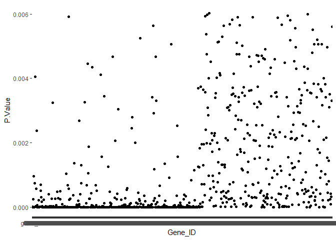

``` r
expression_coeff_3 %>%
  ggplot(aes(x=Gene_ID, y =P.Value)) +
  geom_point()
```

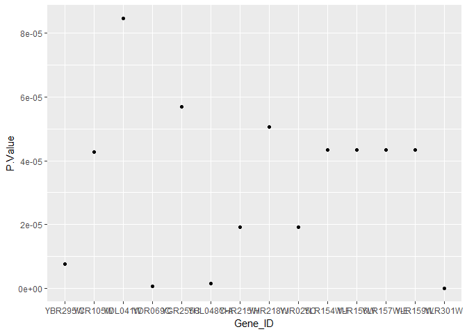

``` r
#Check HSH155
#Add numbers to the expression matrix
genematrixclean_num <- cbind(genematrixclean_ordered, "observation"=1:nrow(genematrixclean_ordered)) 
str(genematrixclean_num)
```

    ## 'data.frame':    6384 obs. of  11 variables:
    ##  $ V1         : Factor w/ 6384 levels "gene_id","Q0010",..: 1 2 3 4 5 6 7 8 9 10 ...
    ##  $ V8         : Factor w/ 6325 levels "0.0","0.0303866",..: 6325 2831 4910 2267 4818 3671 1597 4132 2935 17 ...
    ##  $ V9         : Factor w/ 6330 levels "0.0","0.015063",..: 6330 3699 5236 3503 3989 3313 1204 4083 2604 16 ...
    ##  $ V10        : Factor w/ 6329 levels "0.0","0.0124213",..: 6329 3325 6323 2393 3904 3289 1211 4603 2702 16 ...
    ##  $ V2         : Factor w/ 6332 levels "0.0","0.0193424",..: 6332 2561 4833 120 4857 3707 1750 4090 2966 45 ...
    ##  $ V3         : Factor w/ 6326 levels "0.0","0.021064",..: 6326 3053 5931 2289 4303 3723 1479 4162 3030 29 ...
    ##  $ V4         : Factor w/ 6332 levels "0.0","0.042401",..: 6332 2790 5350 2264 4774 3920 1790 4207 3162 131 ...
    ##  $ V5         : Factor w/ 6332 levels "0.0","0.23197",..: 6332 5932 2230 1353 5255 4378 2231 6034 3342 2239 ...
    ##  $ V6         : Factor w/ 6324 levels "0.0","0.194805",..: 6324 5940 3122 1374 5175 4295 2224 284 3551 2286 ...
    ##  $ V7         : Factor w/ 6327 levels "0.0","0.391927",..: 6327 5336 3385 995 5289 4455 2252 574 3936 2376 ...
    ##  $ observation: int  1 2 3 4 5 6 7 8 9 10 ...

``` r
#Filter out genes to isolate HSH155
genematrixclean_HSH155 <- genematrixclean_num %>% filter(V1 %in% I)
#Find out what number corresponds to HSH155
genematrixclean_HSH155$observation #HSH155 is observation 4846
```

    ## [1] 4846

``` r
#Looking at the coefficients of the linear model for HSH155
fit_clean[4847,]
```

    ## An object of class "MArrayLM"
    ## $coefficients
    ##      (Intercept) dataClassgroup2 dataClassgroup3
    ## 4848    6.849152      -0.1227209     -0.04397317
    ## 
    ## $rank
    ## [1] 3
    ## 
    ## $assign
    ## [1] 0 1 1
    ## 
    ## $qr
    ## $qr
    ##   (Intercept) dataClassgroup2 dataClassgroup3
    ## 1  -3.0000000      -1.0000000     -1.00000000
    ## 2   0.3333333       1.4142136     -0.70710678
    ## 3   0.3333333       0.1767767      1.22474487
    ## 4   0.3333333      -0.5303301      0.03592482
    ## 5   0.3333333      -0.5303301      0.03592482
    ## 6   0.3333333      -0.5303301      0.03592482
    ## 7   0.3333333       0.1767767     -0.55630600
    ## 8   0.3333333       0.1767767     -0.55630600
    ## 9   0.3333333       0.1767767     -0.55630600
    ## attr(,"assign")
    ## [1] 0 1 1
    ## attr(,"contrasts")
    ## attr(,"contrasts")$dataClass
    ## [1] "contr.treatment"
    ## 
    ## 
    ## $qraux
    ## [1] 1.333333 1.176777 1.260191
    ## 
    ## $pivot
    ## [1] 1 2 3
    ## 
    ## $tol
    ## [1] 1e-07
    ## 
    ## $rank
    ## [1] 3
    ## 
    ## 
    ## $df.residual
    ## [1] 6
    ## 
    ## $sigma
    ##       4848 
    ## 0.08164515 
    ## 
    ## $cov.coefficients
    ##                 (Intercept) dataClassgroup2 dataClassgroup3
    ## (Intercept)       0.3333333      -0.3333333      -0.3333333
    ## dataClassgroup2  -0.3333333       0.6666667       0.3333333
    ## dataClassgroup3  -0.3333333       0.3333333       0.6666667
    ## 
    ## $stdev.unscaled
    ##      (Intercept) dataClassgroup2 dataClassgroup3
    ## 4848   0.5773503       0.8164966       0.8164966
    ## 
    ## $pivot
    ## [1] 1 2 3
    ## 
    ## $Amean
    ##     4848 
    ## 6.793587 
    ## 
    ## $method
    ## [1] "ls"
    ## 
    ## $design
    ##   (Intercept) dataClassgroup2 dataClassgroup3
    ## 1           1               0               0
    ## 2           1               0               0
    ## 3           1               0               0
    ## 4           1               1               0
    ## 5           1               1               0
    ## 6           1               1               0
    ## 7           1               0               1
    ## 8           1               0               1
    ## 9           1               0               1
    ## attr(,"assign")
    ## [1] 0 1 1
    ## attr(,"contrasts")
    ## attr(,"contrasts")$dataClass
    ## [1] "contr.treatment"
    ## 
    ## 
    ## $df.prior
    ## [1] 2.959192
    ## 
    ## $s2.prior
    ##           2           3           4           5           6 
    ## 0.004920888 0.005462005 0.004826198 0.005114561 0.005626183 
    ## 6378 more elements ...
    ## 
    ## $var.prior
    ## [1] 3392.0719  171.3474   23.1730
    ## 
    ## $proportion
    ## [1] 0.01
    ## 
    ## $s2.post
    ##        4848 
    ## 0.006268781 
    ## 
    ## $t
    ##      (Intercept) dataClassgroup2 dataClassgroup3
    ## 4848    149.8324       -1.898334      -0.6802082
    ## 
    ## $df.total
    ## [1] 8.959192
    ## 
    ## $p.value
    ##       (Intercept) dataClassgroup2 dataClassgroup3
    ## 4848 1.538563e-16      0.09027656       0.5135642
    ## 
    ## $lods
    ##      (Intercept) dataClassgroup2 dataClassgroup3
    ## 4848    28.66894       -5.695969       -6.139971
    ## 
    ## $F
    ## [1] 22088.22
    ## 
    ## $F.p.value
    ## [1] 1.202356e-17

``` r
fit_g <- lmFit(meangenedata[,-1], design=c(1,1,1))
fit_g <- eBayes(fit_g)
```

    ## Warning: Zero sample variances detected, have been offset away from zero

``` r
plotSA(fit_g, main="Default limma")
```

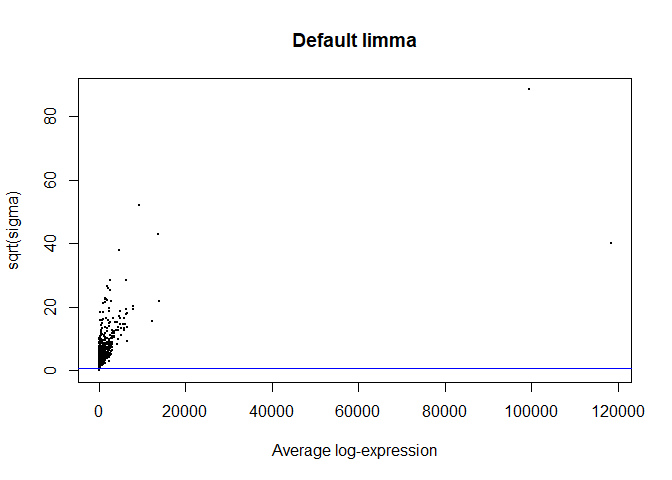

``` r
topTable(fit_g, 1, 7000, adjust.method="fdr", sort.by = "p", p.value = 0.05)
```

    ##             logFC      AveExpr          t      P.Value    adj.P.Val
    ## 1414 1.178546e+02 1.178546e+02 855.109296 3.556388e-08 7.024108e-05
    ## 4736 2.641168e+02 2.641168e+02 812.923008 4.057860e-08 7.024108e-05
    ## 2228 3.113464e+02 3.113464e+02 785.724992 4.434347e-08 7.024108e-05
    ## 3444 3.317278e+02 3.317278e+02 624.996353 8.053335e-08 7.024108e-05
    ## 5814 6.884830e+01 6.884830e+01 599.130727 8.991553e-08 7.024108e-05
    ## 2679 9.512719e+01 9.512719e+01 588.191193 9.434111e-08 7.024108e-05
    ## 6267 1.587947e+02 1.587947e+02 557.509819 1.084831e-07 7.024108e-05
    ## 4698 1.367923e+03 1.367923e+03 526.829829 1.257345e-07 7.024108e-05
    ## 1679 7.503990e+02 7.503990e+02 517.616783 1.316532e-07 7.024108e-05
    ## 3709 8.368542e+01 8.368542e+01 508.477641 1.379122e-07 7.024108e-05
    ## 1899 1.349074e+03 1.349074e+03 501.427053 1.430255e-07 7.024108e-05
    ## 5816 2.272394e+03 2.272394e+03 498.874863 1.449411e-07 7.024108e-05
    ## 1524 2.290122e+02 2.290122e+02 489.888143 1.519760e-07 7.024108e-05
    ## 3981 1.088397e+03 1.088397e+03 487.295312 1.540934e-07 7.024108e-05
    ## 3970 1.284518e+02 1.284518e+02 457.167666 1.819906e-07 7.024108e-05
    ## 1893 6.947578e+01 6.947578e+01 441.877801 1.988690e-07 7.024108e-05
    ## 5385 8.515699e+02 8.515699e+02 432.531127 2.102689e-07 7.024108e-05
    ## 4251 8.923307e+01 8.923307e+01 428.062381 2.160402e-07 7.024108e-05
    ## 3878 1.491653e+02 1.491653e+02 421.207403 2.253276e-07 7.024108e-05
    ## 3311 1.145405e+02 1.145405e+02 413.186392 2.369109e-07 7.024108e-05
    ## 4642 2.495817e+02 2.495817e+02 398.274095 2.607397e-07 7.024108e-05
    ## 2998 9.232149e+02 9.232149e+02 397.740257 2.616531e-07 7.024108e-05
    ## 3273 1.577927e+02 1.577927e+02 394.163632 2.678886e-07 7.024108e-05
    ## 2481 4.364667e+01 4.364667e+01 391.811499 2.721018e-07 7.024108e-05
    ## 2147 9.492303e+01 9.492303e+01 391.715209 2.722763e-07 7.024108e-05
    ## 2851 3.048609e+02 3.048609e+02 389.571183 2.762005e-07 7.024108e-05
    ## 1425 8.696198e+01 8.696198e+01 381.904795 2.908905e-07 7.024108e-05
    ## 5661 5.531529e+01 5.531529e+01 379.988576 2.947307e-07 7.024108e-05
    ## 4854 4.588241e+01 4.588241e+01 353.331152 3.562746e-07 7.024108e-05
    ## 2558 3.786346e+02 3.786346e+02 350.442243 3.639829e-07 7.024108e-05
    ## 1848 4.768676e+02 4.768676e+02 346.957792 3.735906e-07 7.024108e-05
    ## 1846 7.664107e+01 7.664107e+01 340.956906 3.909773e-07 7.024108e-05
    ## 4583 9.043102e+01 9.043102e+01 340.256281 3.930798e-07 7.024108e-05
    ## 4791 6.327086e+01 6.327086e+01 337.226845 4.023530e-07 7.024108e-05
    ## 4424 9.276874e+02 9.276874e+02 335.482411 4.078306e-07 7.024108e-05
    ## 1374 4.709272e+01 4.709272e+01 334.444704 4.111380e-07 7.024108e-05
    ## 3592 4.528780e+01 4.528780e+01 333.240154 4.150240e-07 7.024108e-05
    ## 3889 5.686398e+01 5.686398e+01 330.925950 4.226336e-07 7.024108e-05
    ## 4381 4.255519e+01 4.255519e+01 327.480663 4.343246e-07 7.024108e-05
    ## 5409 4.421147e+01 4.421147e+01 325.255378 4.421147e-07 7.024108e-05
    ## 5748 4.384072e+01 4.384072e+01 321.981041 4.539329e-07 7.024108e-05
    ## 2948 5.781874e+01 5.781874e+01 318.284889 4.678052e-07 7.024108e-05
    ## 5249 1.129574e+02 1.129574e+02 315.807375 4.774341e-07 7.024108e-05
    ## 2476 8.792690e+01 8.792690e+01 314.371148 4.831419e-07 7.024108e-05
    ## 922  4.053336e+01 4.053336e+01 310.778844 4.978380e-07 7.024108e-05
    ## 3423 2.832689e+02 2.832689e+02 307.314358 5.126036e-07 7.024108e-05
    ## 5674 3.894268e+01 3.894268e+01 304.057031 5.270446e-07 7.024108e-05
    ## 3280 1.011251e+02 1.011251e+02 304.024098 5.271935e-07 7.024108e-05
    ## 6377 4.028997e+02 4.028997e+02 303.017245 5.317729e-07 7.024108e-05
    ## 3087 3.539252e+01 3.539252e+01 302.809391 5.327251e-07 7.024108e-05
    ## 6636 6.178024e+01 6.178024e+01 302.247716 5.353101e-07 7.024108e-05
    ## 5446 1.500793e+03 1.500793e+03 298.407554 5.534571e-07 7.089264e-05
    ## 1214 3.606964e+01 3.606964e+01 295.459188 5.679723e-07 7.089264e-05
    ## 910  5.963946e+01 5.963946e+01 294.648330 5.720565e-07 7.089264e-05
    ## 2372 2.618157e+02 2.618157e+02 291.994103 5.857134e-07 7.126534e-05
    ## 6397 3.941718e+01 3.941718e+01 287.165488 6.117392e-07 7.310283e-05
    ## 1545 2.428110e+03 2.428110e+03 284.453491 6.270622e-07 7.361930e-05
    ## 2518 1.255839e+03 1.255839e+03 278.134192 6.648888e-07 7.476887e-05
    ## 4354 1.096011e+02 1.096011e+02 275.846764 6.793598e-07 7.476887e-05
    ## 4501 1.763003e+02 1.763003e+02 274.400538 6.887347e-07 7.476887e-05
    ## 1842 4.558592e+01 4.558592e+01 272.249689 7.030113e-07 7.476887e-05
    ## 3092 5.839599e+01 5.839599e+01 271.712756 7.066391e-07 7.476887e-05
    ## 1463 7.345129e+01 7.345129e+01 271.590718 7.074672e-07 7.476887e-05
    ## 3684 4.160023e+01 4.160023e+01 269.707487 7.204190e-07 7.476887e-05
    ## 6548 3.239171e+01 3.239171e+01 267.626738 7.351137e-07 7.476887e-05
    ## 3124 9.133377e+01 9.133377e+01 266.653222 7.421316e-07 7.476887e-05
    ## 6534 1.263710e+02 1.263710e+02 265.016508 7.541407e-07 7.476887e-05
    ## 6210 8.967977e+02 8.967977e+02 263.256857 7.673538e-07 7.476887e-05
    ## 6036 1.216052e+02 1.216052e+02 261.741393 7.789915e-07 7.476887e-05
    ## 4509 7.660726e+01 7.660726e+01 261.341746 7.821011e-07 7.476887e-05
    ## 5019 1.217142e+02 1.217142e+02 259.912618 7.933627e-07 7.477723e-05
    ## 1237 4.855493e+01 4.855493e+01 253.136205 8.499329e-07 7.530733e-05
    ## 5202 1.913514e+03 1.913514e+03 253.118080 8.500916e-07 7.530733e-05
    ## 114  3.189247e+01 3.189247e+01 253.093811 8.503041e-07 7.530733e-05
    ## 34   1.079991e+02 1.079991e+02 252.823916 8.526727e-07 7.530733e-05
    ## 6619 4.681643e+01 4.681643e+01 252.531021 8.552536e-07 7.530733e-05
    ## 5056 2.772694e+01 2.772694e+01 249.730131 8.804885e-07 7.558514e-05
    ## 3743 2.456474e+03 2.456474e+03 249.674692 8.809983e-07 7.558514e-05
    ## 1133 1.964318e+02 1.964318e+02 246.073150 9.150131e-07 7.607008e-05
    ## 1662 5.105267e+01 5.105267e+01 245.375019 9.218162e-07 7.607008e-05
    ## 2605 4.803414e+01 4.803414e+01 244.335718 9.320740e-07 7.607008e-05
    ## 3585 7.891326e+01 7.891326e+01 243.441876 9.410230e-07 7.607008e-05
    ## 5275 7.356837e+01 7.356837e+01 240.624972 9.700153e-07 7.607008e-05
    ## 1767 1.660459e+02 1.660459e+02 239.326268 9.837989e-07 7.607008e-05
    ## 4403 6.478347e+01 6.478347e+01 239.168063 9.854965e-07 7.607008e-05
    ## 6188 4.161474e+01 4.161474e+01 235.901976 1.021467e-06 7.607008e-05
    ## 863  1.291920e+02 1.291920e+02 235.886572 1.021641e-06 7.607008e-05
    ## 3320 2.873914e+01 2.873914e+01 235.242795 1.028946e-06 7.607008e-05
    ## 4519 5.322631e+01 5.322631e+01 233.656246 1.047261e-06 7.607008e-05
    ## 5924 5.798400e+01 5.798400e+01 233.199018 1.052623e-06 7.607008e-05
    ## 971  4.219312e+01 4.219312e+01 232.731104 1.058150e-06 7.607008e-05
    ## 2618 3.895594e+01 3.895594e+01 232.201638 1.064452e-06 7.607008e-05
    ## 1064 3.588182e+01 3.588182e+01 232.033772 1.066461e-06 7.607008e-05
    ## 3560 6.058403e+01 6.058403e+01 231.062922 1.078183e-06 7.607008e-05
    ## 33   3.751314e+02 3.751314e+02 230.922346 1.079895e-06 7.607008e-05
    ## 4665 1.774359e+02 1.774359e+02 229.487752 1.097584e-06 7.633643e-05
    ## 3564 9.161978e+01 9.161978e+01 228.107234 1.114987e-06 7.633643e-05
    ## 2259 1.654926e+03 1.654926e+03 227.765742 1.119351e-06 7.633643e-05
    ## 2820 5.974616e+02 5.974616e+02 226.993634 1.129305e-06 7.633643e-05
    ## 1829 2.246641e+03 2.246641e+03 223.515593 1.175695e-06 7.711417e-05
    ## 2773 2.677467e+01 2.677467e+01 221.012907 1.210721e-06 7.711417e-05
    ## 3478 1.181616e+02 1.181616e+02 220.254197 1.221625e-06 7.711417e-05
    ## 3906 1.204961e+02 1.204961e+02 219.917553 1.226506e-06 7.711417e-05
    ## 4347 3.135906e+01 3.135906e+01 218.297511 1.250379e-06 7.711417e-05
    ## 1747 1.034331e+02 1.034331e+02 217.879298 1.256646e-06 7.711417e-05
    ## 741  1.492214e+02 1.492214e+02 217.686954 1.259543e-06 7.711417e-05
    ## 3968 5.780277e+01 5.780277e+01 217.287639 1.265587e-06 7.711417e-05
    ## 872  2.889936e+03 2.889936e+03 217.281821 1.265675e-06 7.711417e-05
    ## 5698 2.501060e+03 2.501060e+03 217.144625 1.267761e-06 7.711417e-05
    ## 2698 4.003922e+02 4.003922e+02 215.818319 1.288174e-06 7.711417e-05
    ## 663  3.818608e+01 3.818608e+01 215.733987 1.289488e-06 7.711417e-05
    ## 3807 2.383878e+01 2.383878e+01 213.996144 1.316968e-06 7.711417e-05
    ## 3661 2.443154e+01 2.443154e+01 213.423692 1.326198e-06 7.711417e-05
    ## 1260 3.131176e+01 3.131176e+01 212.848676 1.335559e-06 7.711417e-05
    ## 5213 2.839492e+01 2.839492e+01 212.680362 1.338316e-06 7.711417e-05
    ## 3428 9.606911e+01 9.606911e+01 212.614293 1.339401e-06 7.711417e-05
    ## 1982 1.490886e+02 1.490886e+02 211.384833 1.359806e-06 7.711417e-05
    ## 3470 6.605769e+01 6.605769e+01 211.242798 1.362191e-06 7.711417e-05
    ## 875  6.157701e+01 6.157701e+01 210.704846 1.371277e-06 7.711417e-05
    ## 1014 4.005821e+02 4.005821e+02 209.566253 1.390786e-06 7.732188e-05
    ## 1498 8.438639e+01 8.438639e+01 208.627412 1.407163e-06 7.732188e-05
    ## 5525 7.991966e+01 7.991966e+01 206.696063 1.441701e-06 7.732188e-05
    ## 4019 7.365341e+01 7.365341e+01 205.986646 1.454682e-06 7.732188e-05
    ## 2595 2.205266e+02 2.205266e+02 204.813909 1.476498e-06 7.732188e-05
    ## 952  3.075733e+01 3.075733e+01 204.644329 1.479690e-06 7.732188e-05
    ## 3083 5.165080e+01 5.165080e+01 203.956706 1.492731e-06 7.732188e-05
    ## 1542 1.039236e+03 1.039236e+03 203.283553 1.505653e-06 7.732188e-05
    ## 4150 1.773968e+03 1.773968e+03 202.698553 1.517008e-06 7.732188e-05
    ## 5505 9.972647e+01 9.972647e+01 201.775714 1.535164e-06 7.732188e-05
    ## 5667 6.007250e+01 6.007250e+01 201.623855 1.538180e-06 7.732188e-05
    ## 3361 9.438556e+01 9.438556e+01 201.455627 1.541531e-06 7.732188e-05
    ## 2010 3.005774e+01 3.005774e+01 201.295287 1.544735e-06 7.732188e-05
    ## 3177 3.057887e+01 3.057887e+01 200.246462 1.565918e-06 7.732188e-05
    ## 4534 1.751032e+02 1.751032e+02 200.082113 1.569273e-06 7.732188e-05
    ## 3116 1.115013e+03 1.115013e+03 197.772621 1.617499e-06 7.732188e-05
    ## 6524 3.587437e+02 3.587437e+02 197.204532 1.629676e-06 7.732188e-05
    ## 3902 2.456978e+01 2.456978e+01 195.783157 1.660702e-06 7.732188e-05
    ## 5431 7.388266e+01 7.388266e+01 195.430245 1.668532e-06 7.732188e-05
    ## 1513 1.693497e+03 1.693497e+03 195.285165 1.671766e-06 7.732188e-05
    ## 5191 2.630591e+01 2.630591e+01 195.067631 1.676631e-06 7.732188e-05
    ## 2339 2.756428e+01 2.756428e+01 194.924997 1.679831e-06 7.732188e-05
    ## 4474 1.853962e+03 1.853962e+03 194.011746 1.700525e-06 7.732188e-05
    ## 5851 1.582452e+03 1.582452e+03 193.998972 1.700817e-06 7.732188e-05
    ## 1649 1.006461e+02 1.006461e+02 193.962383 1.701653e-06 7.732188e-05
    ## 5961 3.001330e+01 3.001330e+01 193.571124 1.710635e-06 7.732188e-05
    ## 6605 2.244160e+03 2.244160e+03 193.212171 1.718933e-06 7.732188e-05
    ## 4482 4.703701e+01 4.703701e+01 193.178585 1.719713e-06 7.732188e-05
    ## 1302 5.590400e+02 5.590400e+02 192.990213 1.724092e-06 7.732188e-05
    ## 3692 2.196179e+02 2.196179e+02 192.865960 1.726990e-06 7.732188e-05
    ## 3290 1.821492e+02 1.821492e+02 192.602457 1.733156e-06 7.732188e-05
    ## 1853 6.193288e+01 6.193288e+01 190.954919 1.772413e-06 7.810117e-05
    ## 5620 5.452506e+01 5.452506e+01 190.890805 1.773966e-06 7.810117e-05
    ## 6645 2.178814e+01 2.178814e+01 190.154932 1.791919e-06 7.837598e-05
    ## 1903 3.362462e+01 3.362462e+01 188.272841 1.838997e-06 7.932986e-05
    ## 2940 2.133256e+03 2.133256e+03 187.245904 1.865409e-06 7.932986e-05
    ## 1714 2.420836e+01 2.420836e+01 186.513975 1.884554e-06 7.932986e-05
    ## 4067 2.249684e+01 2.249684e+01 186.182718 1.893308e-06 7.932986e-05
    ## 1347 2.671840e+01 2.671840e+01 186.007951 1.897950e-06 7.932986e-05
    ## 1083 1.858469e+03 1.858469e+03 185.877217 1.901432e-06 7.932986e-05
    ## 5020 2.180010e+03 2.180010e+03 185.485306 1.911924e-06 7.932986e-05
    ## 4758 2.546927e+01 2.546927e+01 185.229862 1.918806e-06 7.932986e-05
    ## 2803 2.300382e+02 2.300382e+02 184.373613 1.942125e-06 7.932986e-05
    ## 6406 3.010254e+02 3.010254e+02 184.349199 1.942796e-06 7.932986e-05
    ## 6356 6.505772e+01 6.505772e+01 184.300775 1.944127e-06 7.932986e-05
    ## 1568 1.168969e+03 1.168969e+03 182.852042 1.984541e-06 8.048819e-05
    ## 6613 3.344873e+01 3.344873e+01 181.739832 2.016361e-06 8.110051e-05
    ## 6390 3.697731e+01 3.697731e+01 181.480652 2.023877e-06 8.110051e-05
    ## 4926 2.068973e+02 2.068973e+02 180.198543 2.061634e-06 8.177132e-05
    ## 1338 2.702984e+01 2.702984e+01 179.473913 2.083406e-06 8.177132e-05
    ## 5033 1.728056e+03 1.728056e+03 178.412751 2.115868e-06 8.177132e-05
    ## 2215 3.384260e+01 3.384260e+01 178.309670 2.119058e-06 8.177132e-05
    ## 5006 3.101466e+01 3.101466e+01 178.052919 2.127034e-06 8.177132e-05
    ## 1407 9.138791e+01 9.138791e+01 177.834831 2.133841e-06 8.177132e-05
    ## 3806 2.711616e+01 2.711616e+01 176.684643 2.170246e-06 8.177132e-05
    ## 3469 4.056196e+01 4.056196e+01 176.584282 2.173464e-06 8.177132e-05
    ## 2551 1.465326e+03 1.465326e+03 176.536700 2.174991e-06 8.177132e-05
    ## 5028 3.476834e+01 3.476834e+01 176.144821 2.187629e-06 8.177132e-05
    ## 4344 4.346776e+01 4.346776e+01 175.666655 2.203188e-06 8.177132e-05
    ## 3182 2.583937e+01 2.583937e+01 175.531647 2.207609e-06 8.177132e-05
    ## 3770 1.016600e+03 1.016600e+03 175.526294 2.207784e-06 8.177132e-05
    ## 2863 2.444520e+03 2.444520e+03 175.407421 2.211687e-06 8.177132e-05
    ## 3960 3.289780e+01 3.289780e+01 174.711940 2.234714e-06 8.216871e-05
    ## 84   5.140789e+01 5.140789e+01 173.966715 2.259758e-06 8.225562e-05
    ## 6051 8.752778e+01 8.752778e+01 173.910549 2.261661e-06 8.225562e-05
    ## 1874 2.644261e+01 2.644261e+01 172.767714 2.300872e-06 8.322940e-05
    ## 2902 5.191161e+01 5.191161e+01 172.000159 2.327738e-06 8.326920e-05
    ## 2355 2.909213e+01 2.909213e+01 171.787599 2.335254e-06 8.326920e-05
    ## 5362 2.336220e+01 2.336220e+01 170.753153 2.372317e-06 8.326920e-05
    ## 4110 2.264866e+02 2.264866e+02 169.608972 2.414267e-06 8.326920e-05
    ## 1337 2.659666e+01 2.659666e+01 169.566795 2.415833e-06 8.326920e-05
    ## 640  7.366314e+01 7.366314e+01 168.942973 2.439159e-06 8.326920e-05
    ## 3110 3.826290e+01 3.826290e+01 168.558653 2.453684e-06 8.326920e-05
    ## 5471 5.073057e+01 5.073057e+01 168.289676 2.463922e-06 8.326920e-05
    ## 4060 3.225741e+01 3.225741e+01 168.160328 2.468866e-06 8.326920e-05
    ## 6444 2.093857e+01 2.093857e+01 168.082160 2.471861e-06 8.326920e-05
    ## 2674 3.412249e+01 3.412249e+01 167.354604 2.499975e-06 8.326920e-05
    ## 6592 2.870133e+01 2.870133e+01 165.978777 2.554362e-06 8.326920e-05
    ## 5930 4.455579e+01 4.455579e+01 165.895022 2.557725e-06 8.326920e-05
    ## 2802 1.684516e+02 1.684516e+02 165.568129 2.570912e-06 8.326920e-05
    ## 1126 2.507801e+03 2.507801e+03 165.408006 2.577405e-06 8.326920e-05
    ## 5556 3.648393e+01 3.648393e+01 165.369220 2.578982e-06 8.326920e-05
    ## 3130 2.405951e+01 2.405951e+01 165.252611 2.583729e-06 8.326920e-05
    ## 1944 4.947226e+02 4.947226e+02 165.202551 2.585770e-06 8.326920e-05
    ## 1455 5.056612e+02 5.056612e+02 165.189100 2.586319e-06 8.326920e-05
    ## 1125 6.771272e+01 6.771272e+01 164.911674 2.597678e-06 8.326920e-05
    ## 3240 9.008073e+01 9.008073e+01 164.731801 2.605079e-06 8.326920e-05
    ## 6320 2.921390e+03 2.921390e+03 164.539908 2.613007e-06 8.326920e-05
    ## 6078 1.804460e+02 1.804460e+02 164.462468 2.616216e-06 8.326920e-05
    ## 6025 7.746051e+01 7.746051e+01 163.935422 2.638201e-06 8.326920e-05
    ## 871  2.908097e+01 2.908097e+01 163.021561 2.676932e-06 8.326920e-05
    ## 1897 2.127572e+01 2.127572e+01 162.722366 2.689783e-06 8.326920e-05
    ## 6539 3.093018e+01 3.093018e+01 162.316868 2.707337e-06 8.326920e-05
    ## 6376 1.791637e+01 1.791637e+01 162.207844 2.712084e-06 8.326920e-05
    ## 3439 2.575067e+01 2.575067e+01 162.137258 2.715163e-06 8.326920e-05
    ## 3713 2.994773e+01 2.994773e+01 162.082566 2.717552e-06 8.326920e-05
    ## 1762 1.811068e+01 1.811068e+01 161.595554 2.738956e-06 8.326920e-05
    ## 943  2.222207e+01 2.222207e+01 161.302958 2.751928e-06 8.326920e-05
    ## 6256 2.348016e+01 2.348016e+01 161.086139 2.761595e-06 8.326920e-05
    ## 847  1.267093e+02 1.267093e+02 161.060955 2.762721e-06 8.326920e-05
    ## 1750 6.974852e+02 6.974852e+02 160.912534 2.769369e-06 8.326920e-05
    ## 2205 3.125799e+01 3.125799e+01 160.794693 2.774664e-06 8.326920e-05
    ## 2855 1.711550e+02 1.711550e+02 160.665045 2.780505e-06 8.326920e-05
    ## 6357 3.051813e+01 3.051813e+01 160.258983 2.798910e-06 8.326920e-05
    ## 2285 3.735451e+01 3.735451e+01 160.220949 2.800642e-06 8.326920e-05
    ## 6513 1.320228e+02 1.320228e+02 159.770262 2.821286e-06 8.326920e-05
    ## 3292 1.234622e+02 1.234622e+02 159.150333 2.850026e-06 8.326920e-05
    ## 2869 2.553058e+01 2.553058e+01 158.946646 2.859558e-06 8.326920e-05
    ## 3821 7.009994e+01 7.009994e+01 158.588972 2.876402e-06 8.326920e-05
    ## 4129 6.149919e+01 6.149919e+01 158.127001 2.898362e-06 8.326920e-05
    ## 4259 1.120723e+02 1.120723e+02 157.509821 2.928063e-06 8.326920e-05
    ## 5180 2.345219e+01 2.345219e+01 157.243536 2.941008e-06 8.326920e-05
    ## 5849 3.045998e+01 3.045998e+01 157.164540 2.944864e-06 8.326920e-05
    ## 1807 2.217606e+03 2.217606e+03 156.654552 2.969923e-06 8.326920e-05
    ## 4074 2.552418e+01 2.552418e+01 156.615082 2.971875e-06 8.326920e-05
    ## 1154 1.032360e+02 1.032360e+02 156.588427 2.973194e-06 8.326920e-05
    ## 2203 7.832448e+01 7.832448e+01 156.549583 2.975118e-06 8.326920e-05
    ## 1941 2.720174e+01 2.720174e+01 156.405818 2.982253e-06 8.326920e-05
    ## 996  2.280534e+01 2.280534e+01 156.245798 2.990222e-06 8.326920e-05
    ## 5002 2.298466e+01 2.298466e+01 156.165165 2.994249e-06 8.326920e-05
    ## 3584 3.881017e+01 3.881017e+01 155.935227 3.005773e-06 8.326920e-05
    ## 4331 2.667830e+01 2.667830e+01 155.850984 3.010011e-06 8.326920e-05
    ## 1361 4.011533e+01 4.011533e+01 155.371940 3.034266e-06 8.326920e-05
    ## 666  9.338254e+01 9.338254e+01 155.235086 3.041245e-06 8.326920e-05
    ## 6571 3.608116e+01 3.608116e+01 155.091017 3.048615e-06 8.326920e-05
    ## 5749 2.883456e+01 2.883456e+01 155.018356 3.052342e-06 8.326920e-05
    ## 2592 2.633212e+01 2.633212e+01 154.647591 3.071457e-06 8.326920e-05
    ## 5121 1.394214e+02 1.394214e+02 154.609228 3.073445e-06 8.326920e-05
    ## 879  8.671822e+02 8.671822e+02 154.043069 3.102981e-06 8.338049e-05
    ## 4319 2.896196e+02 2.896196e+02 153.845392 3.113386e-06 8.338049e-05
    ## 3063 5.085904e+01 5.085904e+01 153.601718 3.126279e-06 8.338049e-05
    ## 5457 2.889683e+01 2.889683e+01 153.580764 3.127391e-06 8.338049e-05
    ## 4418 6.485048e+03 6.485048e+03 153.174330 3.149072e-06 8.344981e-05
    ## 654  4.910531e+01 4.910531e+01 153.065140 3.154931e-06 8.344981e-05
    ## 691  1.953257e+01 1.953257e+01 152.747126 3.172084e-06 8.357319e-05
    ## 3703 3.985979e+01 3.985979e+01 152.205949 3.201572e-06 8.372622e-05
    ## 946  2.356347e+01 2.356347e+01 152.181460 3.202916e-06 8.372622e-05
    ## 2264 1.743761e+01 1.743761e+01 151.725987 3.228043e-06 8.378006e-05
    ## 4646 2.156798e+03 2.156798e+03 151.650731 3.232221e-06 8.378006e-05
    ## 1470 2.684800e+02 2.684800e+02 151.075924 3.264380e-06 8.378006e-05
    ## 945  9.691482e+01 9.691482e+01 150.980405 3.269767e-06 8.378006e-05
    ## 5711 4.291039e+01 4.291039e+01 150.835111 3.277985e-06 8.378006e-05
    ## 2898 3.126262e+01 3.126262e+01 150.774148 3.281441e-06 8.378006e-05
    ## 4130 3.026838e+03 3.026838e+03 150.365349 3.304751e-06 8.378006e-05
    ## 5717 6.182704e+02 6.182704e+02 150.358714 3.305131e-06 8.378006e-05
    ## 3860 2.938582e+02 2.938582e+02 149.765787 3.339353e-06 8.381236e-05
    ## 2263 1.949476e+01 1.949476e+01 149.300471 3.366554e-06 8.381236e-05
    ## 6614 2.218299e+01 2.218299e+01 149.283687 3.367541e-06 8.381236e-05
    ## 1013 1.671366e+01 1.671366e+01 148.834733 3.394088e-06 8.381236e-05
    ## 1821 2.709466e+01 2.709466e+01 148.718430 3.401012e-06 8.381236e-05
    ## 3122 4.871053e+01 4.871053e+01 148.426599 3.418473e-06 8.381236e-05
    ## 5353 2.071436e+01 2.071436e+01 147.261180 3.489452e-06 8.381236e-05
    ## 3072 2.708254e+01 2.708254e+01 147.162224 3.495573e-06 8.381236e-05
    ## 3992 2.852840e+01 2.852840e+01 147.025025 3.504083e-06 8.381236e-05
    ## 6678 4.118400e+01 4.118400e+01 146.977136 3.507061e-06 8.381236e-05
    ## 6606 4.059798e+01 4.059798e+01 146.868611 3.513821e-06 8.381236e-05
    ## 1391 1.747148e+01 1.747148e+01 146.688188 3.525099e-06 8.381236e-05
    ## 6434 3.809782e+01 3.809782e+01 146.658100 3.526985e-06 8.381236e-05
    ## 6384 4.347611e+01 4.347611e+01 146.527693 3.535174e-06 8.381236e-05
    ## 3793 1.908070e+01 1.908070e+01 146.176967 3.557330e-06 8.381236e-05
    ## 1947 1.908002e+01 1.908002e+01 146.046636 3.565612e-06 8.381236e-05
    ## 5898 5.610269e+01 5.610269e+01 145.443155 3.604311e-06 8.381236e-05
    ## 989  1.183033e+05 1.183033e+05 145.269743 3.615539e-06 8.381236e-05
    ## 964  6.806530e+01 6.806530e+01 145.229865 3.618128e-06 8.381236e-05
    ## 3869 8.139281e+01 8.139281e+01 144.757028 3.649019e-06 8.381236e-05
    ## 1209 2.509810e+01 2.509810e+01 144.289429 3.679929e-06 8.381236e-05
    ## 3055 6.581228e+01 6.581228e+01 143.987272 3.700095e-06 8.381236e-05
    ## 2625 1.244879e+03 1.244879e+03 143.951254 3.702509e-06 8.381236e-05
    ## 6304 2.407791e+01 2.407791e+01 143.874426 3.707666e-06 8.381236e-05
    ## 5999 1.601237e+01 1.601237e+01 143.825343 3.710966e-06 8.381236e-05
    ## 2068 1.857703e+01 1.857703e+01 143.609248 3.725541e-06 8.381236e-05
    ## 53   8.244753e+01 8.244753e+01 143.447117 3.736529e-06 8.381236e-05
    ## 1222 7.846401e+01 7.846401e+01 143.324526 3.744866e-06 8.381236e-05
    ## 3587 1.059728e+02 1.059728e+02 143.007722 3.766533e-06 8.381236e-05
    ## 1314 8.045541e+01 8.045541e+01 142.155151 3.825709e-06 8.381236e-05
    ## 4866 3.397621e+01 3.397621e+01 142.129235 3.827528e-06 8.381236e-05
    ## 2379 2.288474e+01 2.288474e+01 142.000170 3.836604e-06 8.381236e-05
    ## 1888 1.913704e+02 1.913704e+02 141.602779 3.864737e-06 8.381236e-05
    ## 2396 2.773042e+01 2.773042e+01 141.550154 3.868484e-06 8.381236e-05
    ## 48   2.976348e+01 2.976348e+01 140.832369 3.920097e-06 8.381236e-05
    ## 5432 2.747399e+01 2.747399e+01 140.654743 3.933016e-06 8.381236e-05
    ## 6562 1.606754e+01 1.606754e+01 140.567261 3.939400e-06 8.381236e-05
    ## 3738 2.173206e+01 2.173206e+01 140.151603 3.969932e-06 8.381236e-05
    ## 4154 4.070923e+01 4.070923e+01 140.144880 3.970428e-06 8.381236e-05
    ## 4772 3.290590e+01 3.290590e+01 139.460093 4.021455e-06 8.381236e-05
    ## 5935 2.337261e+01 2.337261e+01 139.348497 4.029857e-06 8.381236e-05
    ## 6166 1.684717e+01 1.684717e+01 139.261100 4.036453e-06 8.381236e-05
    ## 1221 1.716974e+03 1.716974e+03 139.259718 4.036558e-06 8.381236e-05
    ## 2571 2.507218e+01 2.507218e+01 139.171912 4.043200e-06 8.381236e-05
    ## 920  7.325649e+01 7.325649e+01 138.748215 4.075468e-06 8.381236e-05
    ## 1233 3.330217e+01 3.330217e+01 138.595956 4.087150e-06 8.381236e-05
    ## 3908 8.404932e+01 8.404932e+01 138.346695 4.106376e-06 8.381236e-05
    ## 4162 1.504049e+02 1.504049e+02 138.019008 4.131841e-06 8.381236e-05
    ## 5379 2.774533e+01 2.774533e+01 138.007218 4.132762e-06 8.381236e-05
    ## 5384 3.540704e+01 3.540704e+01 137.961746 4.136314e-06 8.381236e-05
    ## 2993 3.313578e+01 3.313578e+01 137.918530 4.139694e-06 8.381236e-05
    ## 3879 2.746413e+02 2.746413e+02 137.703386 4.156576e-06 8.381236e-05
    ## 2963 1.071913e+02 1.071913e+02 137.321621 4.186769e-06 8.381236e-05
    ## 3042 2.062829e+01 2.062829e+01 137.224144 4.194527e-06 8.381236e-05
    ## 5708 3.070240e+01 3.070240e+01 137.210749 4.195595e-06 8.381236e-05
    ## 3453 1.495946e+02 1.495946e+02 137.056019 4.207954e-06 8.381236e-05
    ## 5989 3.388071e+02 3.388071e+02 137.032815 4.209812e-06 8.381236e-05
    ## 2358 5.867283e+01 5.867283e+01 137.001369 4.212332e-06 8.381236e-05
    ## 2712 7.675447e+02 7.675447e+02 136.881002 4.221995e-06 8.381236e-05
    ## 4119 2.986819e+01 2.986819e+01 136.800901 4.228443e-06 8.381236e-05
    ## 3707 2.674536e+02 2.674536e+02 136.775380 4.230500e-06 8.381236e-05
    ## 3662 7.165436e+01 7.165436e+01 136.671090 4.238921e-06 8.381236e-05
    ## 1607 4.118134e+02 4.118134e+02 136.565505 4.247471e-06 8.381236e-05
    ## 5845 2.591883e+01 2.591883e+01 136.540477 4.249501e-06 8.381236e-05
    ## 5889 9.721709e+02 9.721709e+02 136.340370 4.265780e-06 8.381236e-05
    ## 4294 1.199446e+02 1.199446e+02 136.300904 4.269001e-06 8.381236e-05
    ## 2337 2.002099e+01 2.002099e+01 136.080656 4.287037e-06 8.381236e-05
    ## 4755 8.666791e+01 8.666791e+01 136.057917 4.288905e-06 8.381236e-05
    ## 638  1.797414e+01 1.797414e+01 136.043176 4.290117e-06 8.381236e-05
    ## 6535 1.229968e+02 1.229968e+02 136.033433 4.290918e-06 8.381236e-05
    ## 4366 1.609862e+01 1.609862e+01 136.020810 4.291956e-06 8.381236e-05
    ## 4572 3.630053e+01 3.630053e+01 135.981429 4.295197e-06 8.381236e-05
    ## 6582 1.682840e+01 1.682840e+01 135.979588 4.295349e-06 8.381236e-05
    ## 2140 7.303884e+01 7.303884e+01 135.837770 4.307050e-06 8.381236e-05
    ## 714  1.979586e+02 1.979586e+02 135.817122 4.308757e-06 8.381236e-05
    ## 4379 1.964753e+01 1.964753e+01 135.646107 4.322933e-06 8.381236e-05
    ## 1942 2.598926e+01 2.598926e+01 135.374288 4.345599e-06 8.381236e-05
    ## 3967 1.656628e+01 1.656628e+01 135.358490 4.346921e-06 8.381236e-05
    ## 917  1.983850e+01 1.983850e+01 135.289073 4.352738e-06 8.381236e-05
    ## 3333 8.192108e+01 8.192108e+01 135.285221 4.353061e-06 8.381236e-05
    ## 2910 2.786597e+01 2.786597e+01 135.152139 4.364245e-06 8.381236e-05
    ## 3575 2.472637e+01 2.472637e+01 135.012520 4.376020e-06 8.381236e-05
    ## 3411 2.268376e+01 2.268376e+01 134.646191 4.407126e-06 8.381236e-05
    ## 4804 3.086813e+01 3.086813e+01 134.588632 4.412042e-06 8.381236e-05
    ## 1063 1.934554e+01 1.934554e+01 134.441940 4.424603e-06 8.381236e-05
    ## 2516 5.487549e+01 5.487549e+01 134.302219 4.436613e-06 8.381236e-05
    ## 1004 2.812243e+01 2.812243e+01 134.282820 4.438284e-06 8.381236e-05
    ## 1075 1.996051e+01 1.996051e+01 134.175136 4.447577e-06 8.381236e-05
    ## 3949 3.077887e+01 3.077887e+01 134.075631 4.456187e-06 8.381236e-05
    ## 5971 7.903093e+01 7.903093e+01 134.064998 4.457108e-06 8.381236e-05
    ## 3398 1.211853e+02 1.211853e+02 133.972153 4.465165e-06 8.381236e-05
    ## 2612 2.310861e+01 2.310861e+01 133.443800 4.511402e-06 8.381236e-05
    ## 2422 2.969582e+01 2.969582e+01 133.359648 4.518827e-06 8.381236e-05
    ## 1798 7.175796e+01 7.175796e+01 133.334925 4.521012e-06 8.381236e-05
    ## 739  9.402223e+01 9.402223e+01 133.219873 4.531198e-06 8.381236e-05
    ## 1909 1.212803e+02 1.212803e+02 133.205238 4.532496e-06 8.381236e-05
    ## 3053 1.750027e+01 1.750027e+01 133.196793 4.533245e-06 8.381236e-05
    ## 6103 2.542692e+02 2.542692e+02 133.190733 4.533783e-06 8.381236e-05
    ## 2221 1.840014e+01 1.840014e+01 133.018418 4.549110e-06 8.386403e-05
    ## 3405 1.298223e+02 1.298223e+02 132.739123 4.574106e-06 8.409317e-05
    ## 738  3.432641e+01 3.432641e+01 131.894988 4.650817e-06 8.494202e-05
    ## 1771 2.826670e+01 2.826670e+01 131.746625 4.664483e-06 8.494202e-05
    ## 5636 3.734783e+01 3.734783e+01 131.699360 4.668849e-06 8.494202e-05
    ## 3956 4.771060e+01 4.771060e+01 131.552846 4.682417e-06 8.494202e-05
    ## 4920 1.584932e+01 1.584932e+01 131.537268 4.683862e-06 8.494202e-05
    ## 6192 1.997070e+02 1.997070e+02 131.391544 4.697417e-06 8.494202e-05
    ## 3159 6.544358e+01 6.544358e+01 131.170710 4.718062e-06 8.494202e-05
    ## 2603 4.275408e+01 4.275408e+01 130.767860 4.756048e-06 8.494202e-05
    ## 6490 1.975561e+01 1.975561e+01 130.552600 4.776519e-06 8.494202e-05
    ## 3923 1.975364e+01 1.975364e+01 130.502451 4.781305e-06 8.494202e-05
    ## 3232 2.993092e+01 2.993092e+01 130.471314 4.784281e-06 8.494202e-05
    ## 3732 2.972900e+01 2.972900e+01 130.278747 4.802738e-06 8.494202e-05
    ## 3198 5.257277e+01 5.257277e+01 130.261507 4.804396e-06 8.494202e-05
    ## 6196 2.434924e+01 2.434924e+01 130.229472 4.807477e-06 8.494202e-05
    ## 5162 2.455401e+01 2.455401e+01 129.877525 4.841514e-06 8.494202e-05
    ## 3306 1.974951e+01 1.974951e+01 129.850435 4.844147e-06 8.494202e-05
    ## 3338 2.325006e+01 2.325006e+01 129.824340 4.846686e-06 8.494202e-05
    ## 1228 1.655663e+01 1.655663e+01 129.520476 4.876385e-06 8.494202e-05
    ## 5693 2.299210e+01 2.299210e+01 129.504615 4.877942e-06 8.494202e-05
    ## 3077 6.955118e+01 6.955118e+01 129.321000 4.896018e-06 8.494202e-05
    ## 2336 2.899819e+01 2.899819e+01 129.314421 4.896668e-06 8.494202e-05
    ## 2451 8.302023e+01 8.302023e+01 129.285492 4.899525e-06 8.494202e-05
    ## 3179 1.512767e+01 1.512767e+01 128.959459 4.931883e-06 8.522409e-05
    ## 4892 1.707040e+03 1.707040e+03 128.754433 4.952383e-06 8.522409e-05
    ## 4062 1.631374e+01 1.631374e+01 128.513930 4.976580e-06 8.522409e-05
    ## 2599 7.232177e+01 7.232177e+01 128.501581 4.977827e-06 8.522409e-05
    ## 1983 3.156256e+01 3.156256e+01 128.389023 4.989212e-06 8.522409e-05
    ## 2646 3.663356e+01 3.663356e+01 128.359480 4.992206e-06 8.522409e-05
    ## 5145 1.825908e+02 1.825908e+02 127.918312 5.037216e-06 8.562026e-05
    ## 2123 1.888291e+01 1.888291e+01 127.656257 5.064217e-06 8.562026e-05
    ## 2201 1.058021e+02 1.058021e+02 127.414616 5.089294e-06 8.562026e-05
    ## 60   2.897864e+01 2.897864e+01 127.159248 5.115981e-06 8.562026e-05
    ## 2903 5.485460e+01 5.485460e+01 127.017532 5.130875e-06 8.562026e-05
    ## 1945 1.982262e+01 1.982262e+01 126.875952 5.145815e-06 8.562026e-05
    ## 2880 1.721001e+01 1.721001e+01 126.804083 5.153421e-06 8.562026e-05
    ## 5154 1.650681e+02 1.650681e+02 126.764566 5.157611e-06 8.562026e-05
    ## 3307 2.033548e+01 2.033548e+01 126.755151 5.158609e-06 8.562026e-05
    ## 3041 3.366447e+01 3.366447e+01 126.745229 5.159662e-06 8.562026e-05
    ## 3831 7.614221e+01 7.614221e+01 126.620726 5.172899e-06 8.562026e-05
    ## 2664 1.705572e+01 1.705572e+01 126.544689 5.181006e-06 8.562026e-05
    ## 4157 1.452193e+01 1.452193e+01 126.102346 5.228518e-06 8.562026e-05
    ## 3391 1.629243e+01 1.629243e+01 126.067328 5.232305e-06 8.562026e-05
    ## 2492 2.040657e+02 2.040657e+02 125.976165 5.242182e-06 8.562026e-05
    ## 5598 2.537048e+01 2.537048e+01 125.820044 5.259156e-06 8.562026e-05
    ## 3872 3.616234e+01 3.616234e+01 125.810981 5.260144e-06 8.562026e-05
    ## 4573 5.223082e+01 5.223082e+01 125.708079 5.271377e-06 8.562026e-05
    ## 4305 1.652606e+01 1.652606e+01 125.539192 5.289884e-06 8.562026e-05
    ## 3403 1.680283e+02 1.680283e+02 125.496959 5.294526e-06 8.562026e-05
    ## 5653 1.896720e+01 1.896720e+01 125.403107 5.304862e-06 8.562026e-05
    ## 3852 1.842246e+03 1.842246e+03 125.351939 5.310509e-06 8.562026e-05
    ## 5810 2.218972e+01 2.218972e+01 125.287524 5.317630e-06 8.562026e-05
    ## 5513 1.670713e+01 1.670713e+01 125.243726 5.322479e-06 8.562026e-05
    ## 6674 2.056171e+02 2.056171e+02 124.705993 5.382518e-06 8.584496e-05
    ## 1959 2.594474e+02 2.594474e+02 124.598012 5.394687e-06 8.584496e-05
    ## 5842 3.118694e+01 3.118694e+01 124.375752 5.419855e-06 8.584496e-05
    ## 1062 2.073883e+01 2.073883e+01 124.334479 5.424546e-06 8.584496e-05
    ## 2274 2.042088e+01 2.042088e+01 124.239528 5.435361e-06 8.584496e-05
    ## 4443 1.958051e+01 1.958051e+01 124.106517 5.450560e-06 8.584496e-05
    ## 1309 2.117971e+02 2.117971e+02 124.089561 5.452502e-06 8.584496e-05
    ## 5978 2.239874e+01 2.239874e+01 123.978311 5.465266e-06 8.584496e-05
    ## 4562 2.257127e+01 2.257127e+01 123.946580 5.468914e-06 8.584496e-05
    ## 711  1.541578e+01 1.541578e+01 123.883721 5.476151e-06 8.584496e-05
    ## 4735 5.783039e+01 5.783039e+01 123.871542 5.477555e-06 8.584496e-05
    ## 3454 1.468603e+01 1.468603e+01 123.643200 5.503966e-06 8.605733e-05
    ## 6496 1.703747e+01 1.703747e+01 122.760447 5.607741e-06 8.658534e-05
    ## 4674 7.087120e+01 7.087120e+01 122.725197 5.611941e-06 8.658534e-05
    ## 4929 8.091147e+01 8.091147e+01 122.671857 5.618305e-06 8.658534e-05
    ## 4487 6.500300e+01 6.500300e+01 122.571861 5.630261e-06 8.658534e-05
    ## 6217 4.734009e+01 4.734009e+01 122.514314 5.637158e-06 8.658534e-05
    ## 5535 1.621410e+02 1.621410e+02 122.412438 5.649397e-06 8.658534e-05
    ## 6041 3.083540e+02 3.083540e+02 122.408420 5.649880e-06 8.658534e-05
    ## 864  3.410510e+02 3.410510e+02 122.191757 5.676034e-06 8.658534e-05
    ## 5277 1.516797e+01 1.516797e+01 122.141357 5.682142e-06 8.658534e-05
    ## 3013 2.799433e+01 2.799433e+01 122.042345 5.694167e-06 8.658534e-05
    ## 836  5.996566e+01 5.996566e+01 121.690046 5.737242e-06 8.658534e-05
    ## 2332 8.409051e+01 8.409051e+01 121.664972 5.740325e-06 8.658534e-05
    ## 6011 5.805494e+01 5.805494e+01 121.510716 5.759342e-06 8.658534e-05
    ## 5588 1.578083e+01 1.578083e+01 121.469170 5.764479e-06 8.658534e-05
    ## 3929 1.627461e+01 1.627461e+01 121.413879 5.771325e-06 8.658534e-05
    ## 4322 1.229961e+02 1.229961e+02 121.351431 5.779070e-06 8.658534e-05
    ## 2884 2.133084e+02 2.133084e+02 121.314868 5.783612e-06 8.658534e-05
    ## 712  2.388731e+01 2.388731e+01 121.279001 5.788072e-06 8.658534e-05
    ## 6360 1.347044e+01 1.347044e+01 121.075619 5.813453e-06 8.658534e-05
    ## 3805 1.933756e+01 1.933756e+01 121.026551 5.819600e-06 8.658534e-05
    ## 2369 5.367236e+01 5.367236e+01 121.004014 5.822426e-06 8.658534e-05
    ## 4012 2.314968e+01 2.314968e+01 120.920144 5.832959e-06 8.658534e-05
    ## 6059 4.144966e+03 4.144966e+03 120.901344 5.835324e-06 8.658534e-05
    ## 5054 2.296968e+01 2.296968e+01 120.708580 5.859648e-06 8.675391e-05
    ## 1432 1.195153e+02 1.195153e+02 120.178289 5.927292e-06 8.690408e-05
    ## 1305 1.427911e+01 1.427911e+01 120.131420 5.933323e-06 8.690408e-05
    ## 5260 2.318136e+01 2.318136e+01 120.122148 5.934517e-06 8.690408e-05
    ## 6035 1.194157e+02 1.194157e+02 120.036831 5.945519e-06 8.690408e-05
    ## 2619 4.978171e+01 4.978171e+01 120.030961 5.946277e-06 8.690408e-05
    ## 5822 1.829593e+01 1.829593e+01 120.019876 5.947709e-06 8.690408e-05
    ## 1408 1.806728e+01 1.806728e+01 118.945415 6.088789e-06 8.874136e-05
    ## 629  5.368146e+01 5.368146e+01 118.861708 6.099974e-06 8.874136e-05
    ## 6663 1.724508e+01 1.724508e+01 118.590682 6.136383e-06 8.907739e-05
    ## 5521 1.478810e+01 1.478810e+01 118.321266 6.172875e-06 8.915077e-05
    ## 3702 1.778863e+01 1.778863e+01 118.057621 6.208876e-06 8.915077e-05
    ## 4963 1.626296e+01 1.626296e+01 118.039404 6.211375e-06 8.915077e-05
    ## 3474 5.882676e+02 5.882676e+02 117.995074 6.217460e-06 8.915077e-05
    ## 3097 2.049778e+03 2.049778e+03 117.884652 6.232654e-06 8.915077e-05
    ## 2471 1.437721e+01 1.437721e+01 117.852905 6.237031e-06 8.915077e-05
    ## 5171 1.504151e+01 1.504151e+01 117.851758 6.237190e-06 8.915077e-05
    ## 5247 1.293596e+02 1.293596e+02 117.754958 6.250565e-06 8.915077e-05
    ## 4476 1.448582e+02 1.448582e+02 117.677210 6.261336e-06 8.915077e-05
    ## 4954 2.329166e+01 2.329166e+01 117.310509 6.312488e-06 8.966864e-05
    ## 1744 1.970453e+01 1.970453e+01 117.224942 6.324507e-06 8.966864e-05
    ## 3413 9.801128e+01 9.801128e+01 117.087927 6.343818e-06 8.973691e-05
    ## 6303 6.135213e+01 6.135213e+01 117.000799 6.356141e-06 8.973691e-05
    ## 5048 4.077781e+01 4.077781e+01 116.827747 6.380714e-06 8.989419e-05
    ## 3966 1.930689e+01 1.930689e+01 116.655710 6.405274e-06 8.999945e-05
    ## 3853 4.262687e+01 4.262687e+01 116.524030 6.424161e-06 8.999945e-05
    ## 3332 4.025011e+01 4.025011e+01 116.493630 6.428532e-06 8.999945e-05
    ## 3473 1.316257e+01 1.316257e+01 116.286386 6.458442e-06 9.010627e-05
    ## 6388 1.331032e+01 1.331032e+01 116.193486 6.471912e-06 9.010627e-05
    ## 2885 1.310854e+01 1.310854e+01 116.161517 6.476556e-06 9.010627e-05
    ## 3522 1.670969e+02 1.670969e+02 115.843160 6.523058e-06 9.056495e-05
    ## 2230 1.328237e+01 1.328237e+01 115.654783 6.550792e-06 9.074518e-05
    ## 6653 4.567089e+01 4.567089e+01 115.425236 6.584808e-06 9.074518e-05
    ## 729  1.197688e+02 1.197688e+02 115.398185 6.588832e-06 9.074518e-05
    ## 6347 2.956382e+01 2.956382e+01 115.316979 6.600935e-06 9.074518e-05
    ## 857  4.721447e+01 4.721447e+01 115.297510 6.603841e-06 9.074518e-05
    ## 1211 2.866792e+01 2.866792e+01 115.175550 6.622086e-06 9.080942e-05
    ## 5591 3.951420e+01 3.951420e+01 114.995610 6.649133e-06 9.099385e-05
    ## 4117 2.357838e+01 2.357838e+01 114.718956 6.691015e-06 9.132811e-05
    ## 1546 1.653089e+01 1.653089e+01 114.574563 6.713019e-06 9.132811e-05
    ## 2054 2.543560e+01 2.543560e+01 114.447308 6.732495e-06 9.132811e-05
    ## 4423 9.915079e+01 9.915079e+01 114.421515 6.736452e-06 9.132811e-05
    ## 3562 1.926016e+01 1.926016e+01 114.227075 6.766386e-06 9.132811e-05
    ## 4494 2.233429e+01 2.233429e+01 114.078360 6.789405e-06 9.132811e-05
    ## 3488 1.261469e+01 1.261469e+01 113.834660 6.827361e-06 9.132811e-05
    ## 1674 4.017211e+01 4.017211e+01 113.654511 6.855608e-06 9.132811e-05
    ## 6431 3.167554e+03 3.167554e+03 113.526959 6.875706e-06 9.132811e-05
    ## 930  2.462751e+03 2.462751e+03 113.481252 6.882928e-06 9.132811e-05
    ## 1084 1.432756e+01 1.432756e+01 113.238158 6.921513e-06 9.132811e-05
    ## 3769 1.800487e+02 1.800487e+02 113.218599 6.924631e-06 9.132811e-05
    ## 5966 1.483067e+01 1.483067e+01 113.139807 6.937209e-06 9.132811e-05
    ## 5969 2.956339e+02 2.956339e+02 113.078958 6.946945e-06 9.132811e-05
    ## 2460 8.398027e+01 8.398027e+01 113.039511 6.953266e-06 9.132811e-05
    ## 3854 1.477730e+01 1.477730e+01 112.861672 6.981865e-06 9.132811e-05
    ## 4342 2.394848e+01 2.394848e+01 112.698011 7.008327e-06 9.132811e-05
    ## 3588 6.910153e+01 6.910153e+01 112.563750 7.030139e-06 9.132811e-05
    ## 2683 2.565024e+01 2.565024e+01 112.525671 7.036343e-06 9.132811e-05
    ## 3204 1.441104e+01 1.441104e+01 112.425459 7.052705e-06 9.132811e-05
    ## 2688 4.797697e+01 4.797697e+01 112.420988 7.053436e-06 9.132811e-05
    ## 4861 1.555331e+01 1.555331e+01 112.411791 7.054940e-06 9.132811e-05
    ## 4164 9.219487e+02 9.219487e+02 112.213828 7.087432e-06 9.132811e-05
    ## 2261 7.907877e+01 7.907877e+01 112.073454 7.110597e-06 9.132811e-05
    ## 830  1.269633e+01 1.269633e+01 111.802044 7.155683e-06 9.132811e-05
    ## 4382 2.614244e+02 2.614244e+02 111.773076 7.160519e-06 9.132811e-05
    ## 5011 2.386298e+01 2.386298e+01 111.655741 7.180151e-06 9.132811e-05
    ## 6542 1.351336e+01 1.351336e+01 111.611826 7.187518e-06 9.132811e-05
    ## 4163 1.405034e+03 1.405034e+03 111.539293 7.199709e-06 9.132811e-05
    ## 2744 2.680901e+01 2.680901e+01 111.523462 7.202374e-06 9.132811e-05
    ## 4208 1.456828e+01 1.456828e+01 111.511476 7.204392e-06 9.132811e-05
    ## 897  1.601350e+01 1.601350e+01 111.450548 7.214664e-06 9.132811e-05
    ## 933  3.156747e+01 3.156747e+01 111.352421 7.231249e-06 9.132811e-05
    ## 6273 1.262917e+02 1.262917e+02 111.340911 7.233198e-06 9.132811e-05
    ## 4675 1.944166e+01 1.944166e+01 111.232261 7.251631e-06 9.132811e-05
    ## 3958 1.277093e+01 1.277093e+01 111.144122 7.266632e-06 9.132811e-05
    ## 4378 1.334732e+01 1.334732e+01 111.125110 7.269873e-06 9.132811e-05
    ## 646  9.587546e+01 9.587546e+01 111.055265 7.281798e-06 9.132811e-05
    ## 641  1.263256e+01 1.263256e+01 110.959316 7.298224e-06 9.132811e-05
    ## 5817 1.389676e+01 1.389676e+01 110.956355 7.298732e-06 9.132811e-05
    ## 1031 2.795706e+01 2.795706e+01 110.896632 7.308983e-06 9.132811e-05
    ## 2922 2.238998e+01 2.238998e+01 110.856339 7.315911e-06 9.132811e-05
    ## 3580 1.300970e+02 1.300970e+02 110.832638 7.319990e-06 9.132811e-05
    ## 6587 7.241869e+01 7.241869e+01 110.828344 7.320729e-06 9.132811e-05
    ## 6233 8.756849e+01 8.756849e+01 110.726781 7.338246e-06 9.132811e-05
    ## 1375 4.056284e+01 4.056284e+01 110.678728 7.346555e-06 9.132811e-05
    ## 637  6.295356e+01 6.295356e+01 110.604199 7.359467e-06 9.132811e-05
    ## 3048 3.907730e+01 3.907730e+01 110.594226 7.361197e-06 9.132811e-05
    ## 5753 2.704923e+01 2.704923e+01 110.591349 7.361696e-06 9.132811e-05
    ## 4446 2.438213e+01 2.438213e+01 110.568309 7.365696e-06 9.132811e-05
    ## 2087 9.260630e+02 9.260630e+02 110.545995 7.369572e-06 9.132811e-05
    ## 3076 4.846726e+01 4.846726e+01 110.458504 7.384799e-06 9.134764e-05
    ## 5408 1.901352e+01 1.901352e+01 110.374793 7.399408e-06 9.135948e-05
    ## 6546 3.957940e+02 3.957940e+02 110.246605 7.421858e-06 9.146790e-05
    ## 4623 2.353033e+01 2.353033e+01 109.930052 7.477700e-06 9.190681e-05
    ## 4923 1.605220e+03 1.605220e+03 109.868335 7.488655e-06 9.190681e-05
    ## 5837 1.238776e+01 1.238776e+01 109.774441 7.505364e-06 9.190681e-05
    ## 6408 2.989584e+01 2.989584e+01 109.663213 7.525225e-06 9.190681e-05
    ## 1677 2.531113e+01 2.531113e+01 109.658093 7.526141e-06 9.190681e-05
    ## 5707 8.777112e+01 8.777112e+01 109.398328 7.572816e-06 9.191008e-05
    ## 1926 2.496592e+01 2.496592e+01 109.388516 7.574587e-06 9.191008e-05
    ## 4673 4.674329e+01 4.674329e+01 109.374570 7.577105e-06 9.191008e-05
    ## 5951 7.293809e+01 7.293809e+01 109.328768 7.585383e-06 9.191008e-05
    ## 1692 2.904326e+01 2.904326e+01 109.275202 7.595080e-06 9.191008e-05
    ## 1694 4.642661e+01 4.642661e+01 108.871714 7.668676e-06 9.263317e-05
    ## 2487 1.332474e+01 1.332474e+01 108.607139 7.717471e-06 9.305462e-05
    ## 620  2.363107e+01 2.363107e+01 108.425611 7.751199e-06 9.329320e-05
    ## 655  5.104566e+01 5.104566e+01 108.290647 7.776407e-06 9.342857e-05
    ## 69   1.249494e+02 1.249494e+02 108.093701 7.813396e-06 9.370474e-05
    ## 3533 7.075921e+01 7.075921e+01 107.882163 7.853398e-06 9.394403e-05
    ## 4017 2.385861e+03 2.385861e+03 107.794520 7.870054e-06 9.394403e-05
    ## 4707 2.458702e+01 2.458702e+01 107.707891 7.886566e-06 9.394403e-05
    ## 688  3.952917e+01 3.952917e+01 107.692511 7.889502e-06 9.394403e-05
    ## 3201 2.698416e+03 2.698416e+03 107.095020 8.004760e-06 9.484228e-05
    ## 5072 2.966638e+01 2.966638e+01 107.052379 8.013074e-06 9.484228e-05
    ## 5307 2.193368e+01 2.193368e+01 107.013539 8.020658e-06 9.484228e-05
    ## 761  5.058578e+01 5.058578e+01 107.008576 8.021628e-06 9.484228e-05
    ## 5109 1.309750e+02 1.309750e+02 106.861134 8.050511e-06 9.501591e-05
    ## 5268 2.629587e+02 2.629587e+02 106.674007 8.087377e-06 9.517330e-05
    ## 4652 2.093790e+01 2.093790e+01 106.649157 8.092291e-06 9.517330e-05
    ## 818  4.374706e+01 4.374706e+01 106.515871 8.118714e-06 9.518473e-05
    ## 6517 1.685956e+01 1.685956e+01 106.500798 8.121710e-06 9.518473e-05
    ## 1100 2.050744e+01 2.050744e+01 106.399408 8.141900e-06 9.525454e-05
    ## 3616 1.477350e+01 1.477350e+01 106.090803 8.203784e-06 9.534329e-05
    ## 1761 6.093536e+02 6.093536e+02 106.044529 8.213120e-06 9.534329e-05
    ## 672  2.024919e+01 2.024919e+01 105.887170 8.244975e-06 9.534329e-05
    ## 3620 1.018118e+03 1.018118e+03 105.841656 8.254221e-06 9.534329e-05
    ## 4049 1.290518e+01 1.290518e+01 105.818656 8.258899e-06 9.534329e-05
    ## 2006 1.333334e+01 1.333334e+01 105.789838 8.264765e-06 9.534329e-05
    ## 1827 1.241539e+03 1.241539e+03 105.750027 8.272878e-06 9.534329e-05
    ## 3809 1.787621e+01 1.787621e+01 105.733074 8.276336e-06 9.534329e-05
    ## 3024 8.110523e+01 8.110523e+01 105.716938 8.279629e-06 9.534329e-05
    ## 1493 3.381147e+02 3.381147e+02 105.640060 8.295346e-06 9.534329e-05
    ## 6243 1.233974e+01 1.233974e+01 105.587048 8.306207e-06 9.534329e-05
    ## 4220 1.195968e+01 1.195968e+01 105.502716 8.323526e-06 9.537849e-05
    ## 6393 1.210686e+01 1.210686e+01 105.410746 8.342471e-06 9.538070e-05
    ## 2588 5.596794e+01 5.596794e+01 105.315326 8.362189e-06 9.538070e-05
    ## 3344 3.693426e+01 3.693426e+01 105.269028 8.371779e-06 9.538070e-05
    ## 4297 1.860218e+02 1.860218e+02 105.215342 8.382920e-06 9.538070e-05
    ## 1114 1.483562e+01 1.483562e+01 105.036433 8.420192e-06 9.538070e-05
    ## 6442 3.947076e+02 3.947076e+02 105.022700 8.423063e-06 9.538070e-05
    ## 5998 1.790321e+02 1.790321e+02 104.886253 8.451657e-06 9.538070e-05
    ## 5963 1.831911e+02 1.831911e+02 104.836590 8.462098e-06 9.538070e-05
    ## 2428 2.275990e+03 2.275990e+03 104.825835 8.464361e-06 9.538070e-05
    ## 1059 1.888456e+01 1.888456e+01 104.816870 8.466249e-06 9.538070e-05
    ## 3424 1.198261e+01 1.198261e+01 104.611767 8.509587e-06 9.562618e-05
    ## 5672 1.325731e+02 1.325731e+02 104.578633 8.516617e-06 9.562618e-05
    ## 6450 2.825387e+01 2.825387e+01 104.485641 8.536391e-06 9.568765e-05
    ## 5843 1.258647e+01 1.258647e+01 104.243846 8.588102e-06 9.578081e-05
    ## 1968 2.530832e+01 2.530832e+01 104.171775 8.603600e-06 9.578081e-05
    ## 2490 1.791321e+01 1.791321e+01 104.166407 8.604755e-06 9.578081e-05
    ## 2615 1.053122e+02 1.053122e+02 103.993104 8.642186e-06 9.578081e-05
    ## 2152 2.182044e+03 2.182044e+03 103.904188 8.661478e-06 9.578081e-05
    ## 3996 9.227248e+01 9.227248e+01 103.858333 8.671451e-06 9.578081e-05
    ## 4874 1.042861e+02 1.042861e+02 103.742715 8.696665e-06 9.578081e-05
    ## 1018 1.753270e+02 1.753270e+02 103.704560 8.705009e-06 9.578081e-05
    ## 5904 7.265844e+01 7.265844e+01 103.682300 8.709882e-06 9.578081e-05
    ## 2180 8.547492e+01 8.547492e+01 103.544928 8.740036e-06 9.578081e-05
    ## 6329 1.191491e+01 1.191491e+01 103.540913 8.740920e-06 9.578081e-05
    ## 6660 3.588922e+01 3.588922e+01 103.504008 8.749046e-06 9.578081e-05
    ## 2208 1.162731e+01 1.162731e+01 103.501332 8.749636e-06 9.578081e-05
    ## 2023 1.037607e+03 1.037607e+03 103.456773 8.759463e-06 9.578081e-05
    ## 5152 1.502206e+01 1.502206e+01 103.352608 8.782495e-06 9.578081e-05
    ## 3603 4.188193e+01 4.188193e+01 103.345061 8.784167e-06 9.578081e-05
    ## 5913 1.868183e+01 1.868183e+01 103.317396 8.790300e-06 9.578081e-05
    ## 2826 1.953578e+01 1.953578e+01 103.251144 8.805011e-06 9.578081e-05
    ## 1139 3.268400e+02 3.268400e+02 103.185519 8.819616e-06 9.578081e-05
    ## 2912 2.589999e+01 2.589999e+01 103.042263 8.851616e-06 9.578081e-05
    ## 4126 2.786548e+01 2.786548e+01 102.989522 8.863437e-06 9.578081e-05
    ## 2805 2.449584e+01 2.449584e+01 102.912491 8.880742e-06 9.578081e-05
    ## 3586 1.780278e+02 1.780278e+02 102.763199 8.914413e-06 9.578081e-05
    ## 907  1.435717e+01 1.435717e+01 102.616486 8.947675e-06 9.578081e-05
    ## 1346 1.152803e+01 1.152803e+01 102.613411 8.948374e-06 9.578081e-05
    ## 4524 1.817920e+01 1.817920e+01 102.519260 8.969812e-06 9.578081e-05
    ## 2080 2.472094e+01 2.472094e+01 102.503707 8.973361e-06 9.578081e-05
    ## 5169 1.488069e+01 1.488069e+01 102.461728 8.982948e-06 9.578081e-05
    ## 5785 1.134451e+01 1.134451e+01 102.393240 8.998619e-06 9.578081e-05
    ## 4180 2.925774e+01 2.925774e+01 102.353528 9.007723e-06 9.578081e-05
    ## 1023 2.161238e+01 2.161238e+01 102.327083 9.013792e-06 9.578081e-05
    ## 5865 2.713913e+01 2.713913e+01 102.318924 9.015666e-06 9.578081e-05
    ## 5228 1.311858e+01 1.311858e+01 102.171326 9.049657e-06 9.578081e-05
    ## 5929 1.121991e+02 1.121991e+02 101.974498 9.095261e-06 9.578081e-05
    ## 4671 1.328353e+01 1.328353e+01 101.819291 9.131446e-06 9.578081e-05
    ## 621  7.855598e+01 7.855598e+01 101.809738 9.133680e-06 9.578081e-05
    ## 6029 2.097964e+01 2.097964e+01 101.750537 9.147540e-06 9.578081e-05
    ## 1943 3.105062e+01 3.105062e+01 101.731044 9.152109e-06 9.578081e-05
    ## 1789 4.255962e+02 4.255962e+02 101.699850 9.159429e-06 9.578081e-05
    ## 3286 9.203186e+01 9.203186e+01 101.654414 9.170105e-06 9.578081e-05
    ## 2602 1.232040e+04 1.232040e+04 101.548447 9.195070e-06 9.578081e-05
    ## 4795 1.586279e+01 1.586279e+01 101.461997 9.215507e-06 9.578081e-05
    ## 4118 7.473088e+01 7.473088e+01 101.454630 9.217252e-06 9.578081e-05
    ## 1382 1.422863e+01 1.422863e+01 101.417849 9.225968e-06 9.578081e-05
    ## 2640 6.075133e+01 6.075133e+01 101.412756 9.227176e-06 9.578081e-05
    ## 3038 1.144108e+01 1.144108e+01 101.396571 9.231016e-06 9.578081e-05
    ## 6113 1.359161e+02 1.359161e+02 101.370583 9.237186e-06 9.578081e-05
    ## 3529 1.423080e+01 1.423080e+01 101.218066 9.273513e-06 9.578081e-05
    ## 1058 3.504549e+02 3.504549e+02 101.147259 9.290446e-06 9.578081e-05
    ## 4291 1.153920e+01 1.153920e+01 101.066229 9.309875e-06 9.578081e-05
    ## 5725 1.359919e+01 1.359919e+01 101.033208 9.317809e-06 9.578081e-05
    ## 916  2.395287e+01 2.395287e+01 100.958578 9.335775e-06 9.578081e-05
    ## 3937 2.061649e+01 2.061649e+01 100.915076 9.346269e-06 9.578081e-05
    ## 4594 1.352146e+03 1.352146e+03 100.839974 9.364425e-06 9.578081e-05
    ## 3086 2.045721e+02 2.045721e+02 100.687116 9.401530e-06 9.578081e-05
    ## 2774 5.939539e+01 5.939539e+01 100.619541 9.417998e-06 9.578081e-05
    ## 3362 3.659612e+01 3.659612e+01 100.483185 9.451349e-06 9.578081e-05
    ## 4242 2.699329e+01 2.699329e+01 100.457028 9.457766e-06 9.578081e-05
    ## 1437 1.480969e+01 1.480969e+01 100.450617 9.459339e-06 9.578081e-05
    ## 6591 8.343118e+01 8.343118e+01 100.432688 9.463742e-06 9.578081e-05
    ## 6219 1.145239e+01 1.145239e+01 100.430432 9.464296e-06 9.578081e-05
    ## 2611 1.286076e+01 1.286076e+01 100.400470 9.471660e-06 9.578081e-05
    ## 5806 1.379111e+01 1.379111e+01 100.361031 9.481366e-06 9.578081e-05
    ## 4808 1.697230e+01 1.697230e+01 100.282259 9.500792e-06 9.578081e-05
    ## 1220 1.324623e+03 1.324623e+03 100.278797 9.501647e-06 9.578081e-05
    ## 2991 1.386891e+01 1.386891e+01 100.278191 9.501797e-06 9.578081e-05
    ## 6205 3.170142e+01 3.170142e+01 100.170151 9.528535e-06 9.578081e-05
    ## 1225 1.149661e+01 1.149661e+01 100.120843 9.540772e-06 9.578081e-05
    ## 6006 2.784573e+01 2.784573e+01 100.003499 9.569983e-06 9.578081e-05
    ## 2792 1.540724e+01 1.540724e+01  99.951446 9.582980e-06 9.578081e-05
    ## 2100 2.416093e+01 2.416093e+01  99.866109 9.604341e-06 9.578081e-05
    ## 5909 6.656506e+01 6.656506e+01  99.781508 9.625583e-06 9.578081e-05
    ## 3984 3.317148e+01 3.317148e+01  99.755498 9.632127e-06 9.578081e-05
    ## 1081 3.377767e+02 3.377767e+02  99.744762 9.634829e-06 9.578081e-05
    ## 2562 3.329128e+02 3.329128e+02  99.739580 9.636134e-06 9.578081e-05
    ## 4721 6.214870e+01 6.214870e+01  99.674443 9.652558e-06 9.578081e-05
    ## 3728 1.140644e+01 1.140644e+01  99.648794 9.659036e-06 9.578081e-05
    ## 980  1.275249e+01 1.275249e+01  99.640647 9.661095e-06 9.578081e-05
    ## 5172 1.227147e+01 1.227147e+01  99.525833 9.690175e-06 9.582523e-05
    ## 2172 2.415464e+01 2.415464e+01  99.509921 9.694214e-06 9.582523e-05
    ## 1328 2.531684e+01 2.531684e+01  99.324044 9.741577e-06 9.609525e-05
    ## 5623 2.701546e+01 2.701546e+01  99.285008 9.751564e-06 9.609525e-05
    ## 5204 1.299963e+02 1.299963e+02  99.234102 9.764610e-06 9.609525e-05
    ## 2065 2.397502e+01 2.397502e+01  98.824843 9.870372e-06 9.686827e-05
    ## 2190 3.041380e+01 3.041380e+01  98.818168 9.872110e-06 9.686827e-05
    ## 3725 3.471872e+01 3.471872e+01  98.689497 9.905697e-06 9.702734e-05
    ## 1212 2.004820e+01 2.004820e+01  98.645115 9.917319e-06 9.702734e-05
    ## 1528 2.182182e+02 2.182182e+02  98.490696 9.957902e-06 9.707747e-05
    ## 3695 1.643068e+01 1.643068e+01  98.464198 9.964889e-06 9.707747e-05
    ## 5599 2.403013e+01 2.403013e+01  98.419889 9.976588e-06 9.707747e-05
    ## 6253 1.142644e+03 1.142644e+03  98.382929 9.986361e-06 9.707747e-05
    ## 4708 1.865053e+01 1.865053e+01  98.313209 1.000483e-05 9.707747e-05
    ## 1254 1.378046e+01 1.378046e+01  98.295686 1.000948e-05 9.707747e-05
    ## 4508 1.125919e+01 1.125919e+01  98.206420 1.003322e-05 9.716684e-05
    ## 6315 1.297470e+01 1.297470e+01  98.121148 1.005596e-05 9.724638e-05
    ## 1256 1.875447e+01 1.875447e+01  97.899298 1.011547e-05 9.744587e-05
    ## 6184 1.924842e+01 1.924842e+01  97.826258 1.013517e-05 9.744587e-05
    ## 6027 2.293670e+01 2.293670e+01  97.789162 1.014520e-05 9.744587e-05
    ## 2794 2.865509e+02 2.865509e+02  97.784807 1.014637e-05 9.744587e-05
    ## 5435 1.636097e+01 1.636097e+01  97.773631 1.014940e-05 9.744587e-05
    ## 3294 1.990743e+01 1.990743e+01  97.698681 1.016971e-05 9.750097e-05
    ## 2653 1.582291e+01 1.582291e+01  97.281438 1.028380e-05 9.760349e-05
    ## 4644 2.759229e+03 2.759229e+03  97.251155 1.029215e-05 9.760349e-05
    ## 1594 1.644842e+01 1.644842e+01  97.243766 1.029419e-05 9.760349e-05
    ## 3582 1.269723e+01 1.269723e+01  97.239176 1.029545e-05 9.760349e-05
    ## 2108 1.082849e+01 1.082849e+01  97.238917 1.029553e-05 9.760349e-05
    ## 2073 2.291766e+01 2.291766e+01  97.219831 1.030080e-05 9.760349e-05
    ## 3091 3.513590e+01 3.513590e+01  97.198395 1.030672e-05 9.760349e-05
    ## 2720 2.223273e+01 2.223273e+01  97.190402 1.030893e-05 9.760349e-05
    ## 5449 1.400089e+01 1.400089e+01  97.131268 1.032530e-05 9.760349e-05
    ## 3135 2.263111e+01 2.263111e+01  97.126213 1.032670e-05 9.760349e-05
    ## 1756 1.529574e+01 1.529574e+01  97.057843 1.034567e-05 9.760349e-05
    ## 6544 4.022263e+01 4.022263e+01  97.022774 1.035542e-05 9.760349e-05
    ## 1793 1.177889e+01 1.177889e+01  96.776526 1.042425e-05 9.811401e-05
    ## 2877 3.677137e+01 3.677137e+01  96.619776 1.046839e-05 9.828792e-05
    ## 4637 2.288291e+01 2.288291e+01  96.606643 1.047210e-05 9.828792e-05
    ## 1230 1.587998e+01 1.587998e+01  96.331974 1.055011e-05 9.888143e-05
    ## 1109 3.448706e+01 3.448706e+01  96.220844 1.058190e-05 9.904069e-05
    ## 6525 4.360601e+01 4.360601e+01  96.027198 1.063762e-05 9.926571e-05
    ## 5161 1.378142e+03 1.378142e+03  95.941093 1.066252e-05 9.926571e-05
    ## 2622 8.570134e+01 8.570134e+01  95.937037 1.066370e-05 9.926571e-05
    ## 6505 3.010958e+01 3.010958e+01  95.919749 1.066871e-05 9.926571e-05
    ## 3271 2.153373e+01 2.153373e+01  95.846901 1.068986e-05 9.926571e-05
    ## 5795 4.022032e+01 4.022032e+01  95.798758 1.070387e-05 9.926571e-05
    ## 6308 1.368078e+01 1.368078e+01  95.690305 1.073552e-05 9.926571e-05
    ## 5981 2.608694e+01 2.608694e+01  95.661886 1.074384e-05 9.926571e-05
    ## 6317 1.099454e+01 1.099454e+01  95.554610 1.077531e-05 9.926571e-05
    ## 4031 1.484734e+01 1.484734e+01  95.458921 1.080348e-05 9.926571e-05
    ## 4593 2.071866e+02 2.071866e+02  95.403816 1.081976e-05 9.926571e-05
    ## 5113 1.396031e+01 1.396031e+01  95.349133 1.083594e-05 9.926571e-05
    ## 4491 9.924713e+02 9.924713e+02  95.214053 1.087606e-05 9.926571e-05
    ## 2795 1.963661e+02 1.963661e+02  95.168968 1.088949e-05 9.926571e-05
    ## 3417 2.283221e+01 2.283221e+01  95.163075 1.089125e-05 9.926571e-05
    ## 6322 1.225083e+02 1.225083e+02  95.098222 1.091062e-05 9.926571e-05
    ## 3402 1.467009e+02 1.467009e+02  95.064165 1.092082e-05 9.926571e-05
    ## 4042 4.136520e+01 4.136520e+01  95.044407 1.092673e-05 9.926571e-05
    ## 6424 5.524460e+01 5.524460e+01  95.020339 1.093395e-05 9.926571e-05
    ## 2313 1.761808e+02 1.761808e+02  94.852378 1.098449e-05 9.926571e-05
    ## 2955 1.274298e+01 1.274298e+01  94.836453 1.098930e-05 9.926571e-05
    ## 5156 1.696630e+01 1.696630e+01  94.812896 1.099642e-05 9.926571e-05
    ## 3664 1.610614e+03 1.610614e+03  94.812642 1.099650e-05 9.926571e-05
    ## 3464 5.347102e+01 5.347102e+01  94.804458 1.099897e-05 9.926571e-05
    ## 5135 2.997746e+01 2.997746e+01  94.763064 1.101150e-05 9.926571e-05
    ## 6268 9.286730e+01 9.286730e+01  94.665830 1.104101e-05 9.926571e-05
    ## 2327 1.762964e+01 1.762964e+01  94.575281 1.106858e-05 9.926571e-05
    ## 4066 1.987078e+01 1.987078e+01  94.505462 1.108991e-05 9.926571e-05
    ## 5451 8.221164e+01 8.221164e+01  94.482176 1.109704e-05 9.926571e-05
    ## 115  1.438694e+01 1.438694e+01  94.471753 1.110023e-05 9.926571e-05
    ## 1035 1.209684e+03 1.209684e+03  94.465356 1.110219e-05 9.926571e-05
    ## 4819 2.728440e+01 2.728440e+01  94.445828 1.110817e-05 9.926571e-05
    ## 1434 2.785242e+01 2.785242e+01  94.432846 1.111215e-05 9.926571e-05
    ## 5319 2.061560e+03 2.061560e+03  94.395161 1.112372e-05 9.926571e-05
    ## 5026 1.221810e+02 1.221810e+02  94.390619 1.112512e-05 9.926571e-05
    ## 1881 2.193581e+01 2.193581e+01  94.237546 1.117228e-05 9.927909e-05
    ## 6240 1.585753e+01 1.585753e+01  94.187296 1.118783e-05 9.927909e-05
    ## 4121 2.152734e+01 2.152734e+01  94.157005 1.119721e-05 9.927909e-05
    ## 4827 2.248398e+01 2.248398e+01  94.147303 1.120022e-05 9.927909e-05
    ## 6307 2.413223e+03 2.413223e+03  94.095137 1.121641e-05 9.927909e-05
    ## 2383 2.956499e+01 2.956499e+01  94.089037 1.121831e-05 9.927909e-05
    ## 3835 5.592739e+01 5.592739e+01  94.049952 1.123047e-05 9.927909e-05
    ## 4069 2.461211e+01 2.461211e+01  93.929334 1.126810e-05 9.942859e-05
    ## 3756 3.336958e+01 3.336958e+01  93.850707 1.129272e-05 9.942859e-05
    ## 1927 2.573954e+01 2.573954e+01  93.840115 1.129604e-05 9.942859e-05
    ## 970  5.937470e+01 5.937470e+01  93.726781 1.133168e-05 9.942859e-05
    ## 2142 1.286114e+01 1.286114e+01  93.615300 1.136689e-05 9.942859e-05
    ## 1519 1.109849e+02 1.109849e+02  93.553424 1.138650e-05 9.942859e-05
    ## 3731 1.341077e+01 1.341077e+01  93.505808 1.140162e-05 9.942859e-05
    ## 826  5.542888e+01 5.542888e+01  93.462957 1.141525e-05 9.942859e-05
    ## 5133 2.559296e+01 2.559296e+01  93.438750 1.142296e-05 9.942859e-05
    ## 1452 1.268629e+01 1.268629e+01  93.423256 1.142790e-05 9.942859e-05
    ## 5755 4.442516e+01 4.442516e+01  93.416055 1.143020e-05 9.942859e-05
    ## 736  2.311339e+01 2.311339e+01  93.391833 1.143793e-05 9.942859e-05
    ## 4217 1.180988e+01 1.180988e+01  93.350428 1.145116e-05 9.942859e-05
    ## 6017 6.676803e+01 6.676803e+01  93.304102 1.146598e-05 9.942859e-05
    ## 3763 1.507450e+01 1.507450e+01  93.271511 1.147643e-05 9.942859e-05
    ## 2254 2.170554e+01 2.170554e+01  93.244484 1.148510e-05 9.942859e-05
    ## 6657 2.825790e+02 2.825790e+02  93.092999 1.153388e-05 9.942979e-05
    ## 2217 2.030078e+01 2.030078e+01  92.958870 1.157731e-05 9.942979e-05
    ## 6493 1.170228e+01 1.170228e+01  92.953946 1.157891e-05 9.942979e-05
    ## 1178 1.152617e+01 1.152617e+01  92.917541 1.159074e-05 9.942979e-05
    ## 4632 1.769554e+02 1.769554e+02  92.892689 1.159883e-05 9.942979e-05
    ## 3287 3.492787e+01 3.492787e+01  92.891625 1.159917e-05 9.942979e-05
    ## 3959 1.379419e+01 1.379419e+01  92.808642 1.162623e-05 9.942979e-05
    ## 1387 1.055696e+01 1.055696e+01  92.781996 1.163493e-05 9.942979e-05
    ## 1769 1.703218e+02 1.703218e+02  92.691513 1.166456e-05 9.942979e-05
    ## 3663 3.919278e+01 3.919278e+01  92.685030 1.166669e-05 9.942979e-05
    ## 5349 2.081166e+02 2.081166e+02  92.684582 1.166683e-05 9.942979e-05
    ## 2791 1.037369e+01 1.037369e+01  92.658517 1.167539e-05 9.942979e-05
    ## 2157 1.062029e+01 1.062029e+01  92.553379 1.170999e-05 9.942979e-05
    ## 6040 1.482734e+01 1.482734e+01  92.516232 1.172225e-05 9.942979e-05
    ## 5575 2.062439e+01 2.062439e+01  92.508931 1.172467e-05 9.942979e-05
    ## 3600 1.533011e+02 1.533011e+02  92.484049 1.173289e-05 9.942979e-05
    ## 1586 1.033043e+01 1.033043e+01  92.469129 1.173783e-05 9.942979e-05
    ## 730  2.732682e+01 2.732682e+01  92.369971 1.177070e-05 9.958220e-05
    ## 4574 1.930459e+01 1.930459e+01  92.323497 1.178615e-05 9.958702e-05
    ## 2279 3.205422e+01 3.205422e+01  92.271482 1.180348e-05 9.960766e-05
    ## 5571 3.666112e+01 3.666112e+01  92.168856 1.183777e-05 9.977120e-05
    ## 1278 2.270841e+01 2.270841e+01  91.923379 1.192035e-05 1.002987e-04
    ## 4161 4.458203e+01 4.458203e+01  91.868083 1.193906e-05 1.002987e-04
    ## 5188 4.470757e+01 4.470757e+01  91.849620 1.194531e-05 1.002987e-04
    ## 1340 8.778236e+01 8.778236e+01  91.793567 1.196434e-05 1.003302e-04
    ## 4216 8.427086e+01 8.427086e+01  91.746852 1.198022e-05 1.003302e-04
    ## 5434 3.162881e+01 3.162881e+01  91.706275 1.199405e-05 1.003302e-04
    ## 5613 1.586681e+01 1.586681e+01  91.547017 1.204851e-05 1.005781e-04
    ## 5257 8.467503e+01 8.467503e+01  91.531760 1.205375e-05 1.005781e-04
    ## 728  1.027504e+01 1.027504e+01  91.485556 1.206962e-05 1.005852e-04
    ## 772  6.525524e+01 6.525524e+01  91.406606 1.209681e-05 1.006359e-04
    ## 5818 2.193717e+01 2.193717e+01  91.380605 1.210579e-05 1.006359e-04
    ## 4940 4.511422e+01 4.511422e+01  91.194153 1.217041e-05 1.006700e-04
    ## 3425 9.578899e+01 9.578899e+01  91.158839 1.218270e-05 1.006700e-04
    ## 2253 1.663029e+01 1.663029e+01  91.141989 1.218858e-05 1.006700e-04
    ## 2899 3.555843e+01 3.555843e+01  91.088606 1.220721e-05 1.006700e-04
    ## 4036 1.152638e+01 1.152638e+01  91.085499 1.220829e-05 1.006700e-04
    ## 3726 4.396774e+01 4.396774e+01  91.032288 1.222690e-05 1.006700e-04
    ## 3719 1.304413e+02 1.304413e+02  91.026461 1.222894e-05 1.006700e-04
    ## 5456 3.324859e+01 3.324859e+01  91.022791 1.223023e-05 1.006700e-04
    ## 3847 4.515853e+03 4.515853e+03  90.944631 1.225764e-05 1.006935e-04
    ## 4777 2.767706e+01 2.767706e+01  90.928877 1.226318e-05 1.006935e-04
    ## 4714 1.642984e+01 1.642984e+01  90.822779 1.230056e-05 1.008228e-04
    ## 4662 1.229276e+01 1.229276e+01  90.792525 1.231124e-05 1.008228e-04
    ## 4622 1.387521e+01 1.387521e+01  90.756090 1.232413e-05 1.008228e-04
    ## 4964 4.450379e+01 4.450379e+01  90.686663 1.234874e-05 1.008302e-04
    ## 3565 2.312919e+01 2.312919e+01  90.599778 1.237963e-05 1.008302e-04
    ## 2737 2.107747e+01 2.107747e+01  90.594389 1.238155e-05 1.008302e-04
    ## 2842 1.128291e+01 1.128291e+01  90.583858 1.238531e-05 1.008302e-04
    ## 1875 3.367478e+01 3.367478e+01  90.473340 1.242478e-05 1.008718e-04
    ## 4167 5.291922e+01 5.291922e+01  90.429305 1.244056e-05 1.008718e-04
    ## 1219 3.283764e+01 3.283764e+01  90.417573 1.244477e-05 1.008718e-04
    ## 4525 1.309661e+01 1.309661e+01  90.401026 1.245070e-05 1.008718e-04
    ## 4625 1.778207e+02 1.778207e+02  90.348148 1.246971e-05 1.009036e-04
    ## 6091 1.173544e+01 1.173544e+01  90.295666 1.248861e-05 1.009345e-04
    ## 2247 3.084348e+03 3.084348e+03  90.223839 1.251454e-05 1.010221e-04
    ## 5765 3.234314e+01 3.234314e+01  90.151860 1.254060e-05 1.011105e-04
    ## 6609 1.061094e+01 1.061094e+01  89.967555 1.260768e-05 1.011831e-04
    ## 5880 1.976656e+01 1.976656e+01  89.958481 1.261099e-05 1.011831e-04
    ## 1168 1.102446e+01 1.102446e+01  89.944813 1.261599e-05 1.011831e-04
    ## 2561 3.608892e+01 3.608892e+01  89.937142 1.261880e-05 1.011831e-04
    ## 4405 1.212153e+01 1.212153e+01  89.908585 1.262925e-05 1.011831e-04
    ## 1859 9.924323e+00 9.924323e+00  89.859987 1.264706e-05 1.011831e-04
    ## 1453 8.544524e+01 8.544524e+01  89.802545 1.266815e-05 1.011831e-04
    ## 6370 3.967954e+01 3.967954e+01  89.795994 1.267056e-05 1.011831e-04
    ## 6416 6.111500e+01 6.111500e+01  89.668186 1.271769e-05 1.013044e-04
    ## 5811 1.107333e+01 1.107333e+01  89.666882 1.271818e-05 1.013044e-04
    ## 3176 3.965186e+01 3.965186e+01  89.631761 1.273117e-05 1.013044e-04
    ## 1976 2.238877e+01 2.238877e+01  89.345115 1.283791e-05 1.015619e-04
    ## 1490 4.537980e+01 4.537980e+01  89.185663 1.289783e-05 1.015619e-04
    ## 4421 1.298179e+01 1.298179e+01  89.174855 1.290190e-05 1.015619e-04
    ## 2661 1.160874e+01 1.160874e+01  89.167590 1.290464e-05 1.015619e-04
    ## 6021 1.397523e+01 1.397523e+01  89.129532 1.291901e-05 1.015619e-04
    ## 997  3.048322e+03 3.048322e+03  89.125992 1.292035e-05 1.015619e-04
    ## 2475 1.168670e+01 1.168670e+01  89.119028 1.292298e-05 1.015619e-04
    ## 831  1.130909e+01 1.130909e+01  89.112447 1.292547e-05 1.015619e-04
    ## 2191 4.317400e+01 4.317400e+01  89.107313 1.292741e-05 1.015619e-04
    ## 4571 1.751943e+01 1.751943e+01  89.107078 1.292750e-05 1.015619e-04
    ## 2404 1.315549e+01 1.315549e+01  89.049490 1.294930e-05 1.015619e-04
    ## 4318 8.075439e+01 8.075439e+01  89.049106 1.294945e-05 1.015619e-04
    ## 4694 3.811666e+01 3.811666e+01  89.019107 1.296082e-05 1.015619e-04
    ## 6080 2.026922e+03 2.026922e+03  88.922148 1.299769e-05 1.017317e-04
    ## 1797 2.004634e+02 2.004634e+02  88.743380 1.306605e-05 1.021472e-04
    ## 2272 2.470984e+02 2.470984e+02  88.641006 1.310543e-05 1.021600e-04
    ## 2120 3.262681e+01 3.262681e+01  88.601826 1.312054e-05 1.021600e-04
    ## 2785 2.903982e+03 2.903982e+03  88.597692 1.312213e-05 1.021600e-04
    ## 3257 1.206719e+01 1.206719e+01  88.580555 1.312875e-05 1.021600e-04
    ## 796  3.242391e+01 3.242391e+01  88.517400 1.315318e-05 1.022139e-04
    ## 747  1.364031e+01 1.364031e+01  88.443487 1.318185e-05 1.022139e-04
    ## 4630 2.310637e+01 2.310637e+01  88.435113 1.318511e-05 1.022139e-04
    ## 5192 1.092718e+02 1.092718e+02  88.405119 1.319677e-05 1.022139e-04
    ## 1585 1.124488e+01 1.124488e+01  88.302001 1.323698e-05 1.023536e-04
    ## 2591 8.906532e+01 8.906532e+01  88.280463 1.324540e-05 1.023536e-04
    ## 2621 5.260987e+01 5.260987e+01  88.188009 1.328163e-05 1.025152e-04
    ## 3696 1.030555e+02 1.030555e+02  88.120047 1.330834e-05 1.026030e-04
    ## 5704 1.480896e+01 1.480896e+01  88.017352 1.334885e-05 1.027848e-04
    ## 6000 1.361236e+03 1.361236e+03  87.964512 1.336977e-05 1.027848e-04
    ## 2559 1.433286e+01 1.433286e+01  87.943746 1.337800e-05 1.027848e-04
    ## 2823 7.083408e+01 7.083408e+01  87.866284 1.340876e-05 1.029030e-04
    ## 6602 4.911337e+01 4.911337e+01  87.713423 1.346976e-05 1.032527e-04
    ## 6135 1.210402e+02 1.210402e+02  87.579029 1.352370e-05 1.034417e-04
    ## 6195 1.235834e+01 1.235834e+01  87.574984 1.352533e-05 1.034417e-04
    ## 6658 1.390989e+01 1.390989e+01  87.433806 1.358233e-05 1.035965e-04
    ## 1419 1.943259e+01 1.943259e+01  87.416306 1.358942e-05 1.035965e-04
    ## 2690 2.458210e+01 2.458210e+01  87.409897 1.359202e-05 1.035965e-04
    ## 947  1.091423e+02 1.091423e+02  87.341615 1.361973e-05 1.036897e-04
    ## 3312 1.678266e+01 1.678266e+01  87.238115 1.366189e-05 1.037225e-04
    ## 3131 1.437279e+01 1.437279e+01  87.234236 1.366347e-05 1.037225e-04
    ## 4334 1.490388e+01 1.490388e+01  87.216949 1.367053e-05 1.037225e-04
    ## 5527 3.179654e+01 3.179654e+01  87.105482 1.371618e-05 1.037843e-04
    ## 1648 1.750199e+02 1.750199e+02  87.099619 1.371859e-05 1.037843e-04
    ## 1422 1.172981e+01 1.172981e+01  87.083475 1.372522e-05 1.037843e-04
    ## 5013 1.409620e+01 1.409620e+01  86.882408 1.380816e-05 1.038474e-04
    ## 777  3.995819e+01 3.995819e+01  86.807344 1.383931e-05 1.038474e-04
    ## 4400 1.221020e+01 1.221020e+01  86.752390 1.386217e-05 1.038474e-04
    ## 3745 1.215267e+02 1.215267e+02  86.717199 1.387684e-05 1.038474e-04
    ## 3160 3.833893e+01 3.833893e+01  86.716490 1.387714e-05 1.038474e-04
    ## 6423 1.595036e+01 1.595036e+01  86.710198 1.387976e-05 1.038474e-04
    ## 3549 1.030923e+01 1.030923e+01  86.690019 1.388818e-05 1.038474e-04
    ## 4586 1.268073e+01 1.268073e+01  86.683620 1.389086e-05 1.038474e-04
    ## 3253 1.030791e+01 1.030791e+01  86.664812 1.389872e-05 1.038474e-04
    ## 1099 3.027689e+02 3.027689e+02  86.620335 1.391733e-05 1.038474e-04
    ## 4867 4.563814e+01 4.563814e+01  86.586422 1.393154e-05 1.038474e-04
    ## 5897 1.556771e+01 1.556771e+01  86.546374 1.394835e-05 1.038474e-04
    ## 5327 3.417852e+01 3.417852e+01  86.540150 1.395096e-05 1.038474e-04
    ## 4364 1.333803e+01 1.333803e+01  86.517850 1.396034e-05 1.038474e-04
    ## 881  3.196213e+02 3.196213e+02  86.498876 1.396832e-05 1.038474e-04
    ## 1032 6.731169e+01 6.731169e+01  86.466762 1.398185e-05 1.038474e-04
    ## 5269 6.674936e+01 6.674936e+01  86.296654 1.405380e-05 1.042661e-04
    ## 2740 9.673332e+00 9.673332e+00  86.198324 1.409563e-05 1.042999e-04
    ## 5357 2.918824e+01 2.918824e+01  86.187706 1.410016e-05 1.042999e-04
    ## 3789 1.251776e+01 1.251776e+01  86.176082 1.410511e-05 1.042999e-04
    ## 5648 1.690233e+02 1.690233e+02  86.088638 1.414249e-05 1.044609e-04
    ## 6144 4.021683e+01 4.021683e+01  86.049041 1.415946e-05 1.044709e-04
    ## 1147 3.273369e+01 3.273369e+01  85.902419 1.422254e-05 1.048207e-04
    ## 1236 2.144954e+01 2.144954e+01  85.782047 1.427462e-05 1.049197e-04
    ## 6276 3.172314e+01 3.172314e+01  85.760490 1.428397e-05 1.049197e-04
    ## 1499 1.453053e+01 1.453053e+01  85.680171 1.431890e-05 1.049197e-04
    ## 2579 1.448070e+01 1.448070e+01  85.655866 1.432950e-05 1.049197e-04
    ## 6026 9.157874e+01 9.157874e+01  85.620024 1.434514e-05 1.049197e-04
    ## 3658 1.052560e+01 1.052560e+01  85.612142 1.434858e-05 1.049197e-04
    ## 4748 3.048568e+01 3.048568e+01  85.562465 1.437030e-05 1.049197e-04
    ## 1841 4.895992e+01 4.895992e+01  85.544788 1.437805e-05 1.049197e-04
    ## 4868 4.133944e+01 4.133944e+01  85.534488 1.438256e-05 1.049197e-04
    ## 5107 4.586713e+02 4.586713e+02  85.500680 1.439739e-05 1.049197e-04
    ## 3062 4.468504e+01 4.468504e+01  85.429837 1.442853e-05 1.049197e-04
    ## 5053 6.918331e+02 6.918331e+02  85.410405 1.443709e-05 1.049197e-04
    ## 5933 1.060344e+01 1.060344e+01  85.404281 1.443979e-05 1.049197e-04
    ## 6203 2.161063e+01 2.161063e+01  85.334350 1.447065e-05 1.050299e-04
    ## 5309 4.755249e+01 4.755249e+01  85.245437 1.451002e-05 1.052016e-04
    ## 6072 1.678651e+01 1.678651e+01  85.007355 1.461619e-05 1.057506e-04
    ## 5181 1.864854e+01 1.864854e+01  84.912809 1.465865e-05 1.057506e-04
    ## 899  1.845203e+02 1.845203e+02  84.905451 1.466196e-05 1.057506e-04
    ## 5233 6.894137e+01 6.894137e+01  84.902987 1.466307e-05 1.057506e-04
    ## 4323 2.539117e+01 2.539117e+01  84.899247 1.466475e-05 1.057506e-04
    ## 5340 1.754822e+01 1.754822e+01  84.837237 1.469271e-05 1.058381e-04
    ## 5388 7.365424e+01 7.365424e+01  84.593560 1.480328e-05 1.063939e-04
    ## 4147 1.458822e+01 1.458822e+01  84.584195 1.480755e-05 1.063939e-04
    ## 1710 1.833481e+01 1.833481e+01  84.491844 1.484978e-05 1.063939e-04
    ## 1308 9.586781e+01 9.586781e+01  84.477448 1.485637e-05 1.063939e-04
    ## 6362 8.100261e+01 8.100261e+01  84.472023 1.485886e-05 1.063939e-04
    ## 5425 2.006494e+01 2.006494e+01  84.443799 1.487181e-05 1.063939e-04
    ## 4550 4.528949e+01 4.528949e+01  84.406864 1.488878e-05 1.063939e-04
    ## 2322 3.029344e+01 3.029344e+01  84.377048 1.490250e-05 1.063939e-04
    ## 5528 9.760772e+00 9.760772e+00  84.322869 1.492747e-05 1.063939e-04
    ## 4496 9.974722e+00 9.974722e+00  84.285759 1.494460e-05 1.063939e-04
    ## 2511 2.117737e+01 2.117737e+01  84.285451 1.494475e-05 1.063939e-04
    ## 2746 1.455614e+01 1.455614e+01  84.139534 1.501240e-05 1.065265e-04
    ## 5694 1.455604e+01 1.455604e+01  84.050491 1.505389e-05 1.065265e-04
    ## 1884 2.297510e+03 2.297510e+03  84.048656 1.505474e-05 1.065265e-04
    ## 999  1.996207e+01 1.996207e+01  84.029073 1.506389e-05 1.065265e-04
    ## 1322 2.170189e+01 2.170189e+01  83.980953 1.508640e-05 1.065265e-04
    ## 2315 2.650850e+01 2.650850e+01  83.944309 1.510357e-05 1.065265e-04
    ## 4304 1.429874e+01 1.429874e+01  83.933052 1.510885e-05 1.065265e-04
    ## 6079 3.156204e+01 3.156204e+01  83.912963 1.511828e-05 1.065265e-04
    ## 1567 1.028379e+01 1.028379e+01  83.912708 1.511840e-05 1.065265e-04
    ## 5713 1.523590e+01 1.523590e+01  83.886463 1.513073e-05 1.065265e-04
    ## 713  1.244566e+01 1.244566e+01  83.869993 1.513848e-05 1.065265e-04
    ## 5532 1.136211e+02 1.136211e+02  83.824765 1.515978e-05 1.065643e-04
    ## 3521 1.668759e+01 1.668759e+01  83.725311 1.520676e-05 1.067824e-04
    ## 6566 4.244114e+01 4.244114e+01  83.551095 1.528955e-05 1.072512e-04
    ## 4918 1.746063e+01 1.746063e+01  83.414765 1.535477e-05 1.074123e-04
    ## 2575 1.328687e+02 1.328687e+02  83.395316 1.536410e-05 1.074123e-04
    ## 5576 9.608972e+00 9.608972e+00  83.392173 1.536561e-05 1.074123e-04
    ## 1835 1.579061e+01 1.579061e+01  83.342890 1.538931e-05 1.074123e-04
    ## 2095 2.754604e+01 2.754604e+01  83.327086 1.539691e-05 1.074123e-04
    ## 5918 1.323978e+01 1.323978e+01  83.302379 1.540882e-05 1.074123e-04
    ## 6008 6.072900e+01 6.072900e+01  83.106305 1.550376e-05 1.078598e-04
    ## 4904 1.023540e+01 1.023540e+01  83.103226 1.550526e-05 1.078598e-04
    ## 6649 2.830117e+02 2.830117e+02  83.035479 1.553825e-05 1.078936e-04
    ## 4193 1.321361e+01 1.321361e+01  83.027066 1.554236e-05 1.078936e-04
    ## 6453 1.013743e+01 1.013743e+01  82.974318 1.556812e-05 1.079142e-04
    ## 2089 5.042626e+03 5.042626e+03  82.911891 1.559869e-05 1.079142e-04
    ## 706  1.185499e+01 1.185499e+01  82.890856 1.560901e-05 1.079142e-04
    ## 5230 1.518556e+01 1.518556e+01  82.811883 1.564784e-05 1.079142e-04
    ## 2393 1.310308e+01 1.310308e+01  82.795244 1.565604e-05 1.079142e-04
    ## 1711 7.001117e+02 7.001117e+02  82.787440 1.565989e-05 1.079142e-04
    ## 6667 1.773830e+01 1.773830e+01  82.780380 1.566337e-05 1.079142e-04
    ## 3596 1.854559e+01 1.854559e+01  82.731853 1.568733e-05 1.079142e-04
    ## 5442 1.288308e+01 1.288308e+01  82.714494 1.569591e-05 1.079142e-04
    ## 6229 1.796868e+01 1.796868e+01  82.692941 1.570658e-05 1.079142e-04
    ## 1653 1.783506e+01 1.783506e+01  82.536699 1.578419e-05 1.083323e-04
    ## 1041 1.005408e+02 1.005408e+02  82.505390 1.579981e-05 1.083323e-04
    ## 2538 6.856113e+01 6.856113e+01  82.472656 1.581616e-05 1.083331e-04
    ## 3605 1.773781e+01 1.773781e+01  82.427975 1.583852e-05 1.083331e-04
    ## 4392 1.524154e+03 1.524154e+03  82.408067 1.584849e-05 1.083331e-04
    ## 2171 3.223753e+01 3.223753e+01  82.367136 1.586903e-05 1.083628e-04
    ## 6561 5.006104e+01 5.006104e+01  82.308114 1.589871e-05 1.084548e-04
    ## 2104 1.355722e+02 1.355722e+02  82.249972 1.592802e-05 1.085163e-04
    ## 1765 1.215899e+01 1.215899e+01  82.210342 1.594804e-05 1.085163e-04
    ## 5460 1.211900e+01 1.211900e+01  82.157223 1.597493e-05 1.085163e-04
    ## 3870 1.744883e+01 1.744883e+01  82.143877 1.598169e-05 1.085163e-04
    ## 4237 1.271374e+01 1.271374e+01  82.101321 1.600329e-05 1.085163e-04
    ## 6216 1.052494e+01 1.052494e+01  82.097919 1.600502e-05 1.085163e-04
    ## 5297 7.259251e+01 7.259251e+01  81.977562 1.606634e-05 1.087054e-04
    ## 4621 1.056356e+01 1.056356e+01  81.917665 1.609698e-05 1.087054e-04
    ## 2520 1.755524e+01 1.755524e+01  81.897843 1.610714e-05 1.087054e-04
    ## 56   2.126358e+01 2.126358e+01  81.886687 1.611286e-05 1.087054e-04
    ## 4422 6.234064e+01 6.234064e+01  81.884202 1.611413e-05 1.087054e-04
    ## 3064 1.940526e+01 1.940526e+01  81.764210 1.617584e-05 1.089076e-04
    ## 4971 2.660570e+01 2.660570e+01  81.720757 1.619827e-05 1.089076e-04
    ## 797  1.702062e+01 1.702062e+01  81.678063 1.622035e-05 1.089076e-04
    ## 1998 1.020703e+02 1.020703e+02  81.670287 1.622438e-05 1.089076e-04
    ## 5207 2.289840e+01 2.289840e+01  81.668161 1.622548e-05 1.089076e-04
    ## 4743 2.487036e+01 2.487036e+01  81.557480 1.628293e-05 1.091838e-04
    ## 4469 4.490207e+01 4.490207e+01  81.479602 1.632353e-05 1.092282e-04
    ## 2495 1.514374e+01 1.514374e+01  81.445212 1.634150e-05 1.092282e-04
    ## 3717 1.874439e+01 1.874439e+01  81.442349 1.634300e-05 1.092282e-04
    ## 5229 6.875608e+02 6.875608e+02  81.419714 1.635484e-05 1.092282e-04
    ## 2446 3.007214e+01 3.007214e+01  81.361434 1.638540e-05 1.093231e-04
    ## 3463 9.714760e+02 9.714760e+02  81.223670 1.645793e-05 1.095394e-04
    ## 2596 3.003696e+01 3.003696e+01  81.205150 1.646772e-05 1.095394e-04
    ## 5134 3.121246e+01 3.121246e+01  81.173075 1.648468e-05 1.095394e-04
    ## 3342 3.450381e+01 3.450381e+01  81.098623 1.652416e-05 1.095394e-04
    ## 1682 2.120278e+01 2.120278e+01  81.061456 1.654391e-05 1.095394e-04
    ## 5751 5.478178e+01 5.478178e+01  81.060897 1.654421e-05 1.095394e-04
    ## 5514 2.206052e+01 2.206052e+01  81.055651 1.654700e-05 1.095394e-04
    ## 3643 2.206731e+01 2.206731e+01  81.025484 1.656307e-05 1.095394e-04
    ## 5868 1.331297e+01 1.331297e+01  81.021607 1.656513e-05 1.095394e-04
    ## 3653 1.499236e+02 1.499236e+02  80.948911 1.660393e-05 1.096876e-04
    ## 3184 6.571492e+02 6.571492e+02  80.839194 1.666274e-05 1.099637e-04
    ## 6439 3.670359e+01 3.670359e+01  80.779523 1.669484e-05 1.099637e-04
    ## 4834 2.172264e+01 2.172264e+01  80.771829 1.669898e-05 1.099637e-04
    ## 848  1.592143e+02 1.592143e+02  80.748690 1.671146e-05 1.099637e-04
    ## 6223 4.272816e+01 4.272816e+01  80.688903 1.674375e-05 1.099838e-04
    ## 1037 1.366417e+01 1.366417e+01  80.682184 1.674739e-05 1.099838e-04
    ## 1872 2.597258e+01 2.597258e+01  80.643158 1.676852e-05 1.100146e-04
    ## 4535 1.063202e+01 1.063202e+01  80.576587 1.680465e-05 1.101437e-04
    ## 1506 2.060333e+01 2.060333e+01  80.399130 1.690150e-05 1.105823e-04
    ## 5330 8.752448e+01 8.752448e+01  80.393435 1.690462e-05 1.105823e-04
    ## 2236 9.762866e+00 9.762866e+00  80.357743 1.692420e-05 1.106023e-04
    ## 6662 9.577793e+00 9.577793e+00  80.280872 1.696647e-05 1.107704e-04
    ## 1582 4.175396e+01 4.175396e+01  80.249000 1.698404e-05 1.107770e-04
    ## 2742 2.437642e+01 2.437642e+01  80.068377 1.708408e-05 1.109260e-04
    ## 4047 1.842676e+02 1.842676e+02  80.065801 1.708552e-05 1.109260e-04
    ## 4703 1.415154e+02 1.415154e+02  80.053103 1.709258e-05 1.109260e-04
    ## 4922 1.955801e+03 1.955801e+03  80.042842 1.709829e-05 1.109260e-04
    ## 2914 1.556899e+01 1.556899e+01  80.014600 1.711403e-05 1.109260e-04
    ## 1549 3.219142e+02 3.219142e+02  79.911821 1.717146e-05 1.109260e-04
    ## 3093 1.252776e+01 1.252776e+01  79.905528 1.717498e-05 1.109260e-04
    ## 1532 1.230264e+01 1.230264e+01  79.904293 1.717568e-05 1.109260e-04
    ## 6648 1.386629e+01 1.386629e+01  79.885750 1.718607e-05 1.109260e-04
    ## 4950 9.048041e+00 9.048041e+00  79.885651 1.718613e-05 1.109260e-04
    ## 6127 9.355844e+00 9.355844e+00  79.880138 1.718922e-05 1.109260e-04
    ## 1128 1.313052e+01 1.313052e+01  79.807798 1.722986e-05 1.109826e-04
    ## 2800 1.738898e+01 1.738898e+01  79.805486 1.723116e-05 1.109826e-04
    ## 5649 2.090400e+02 2.090400e+02  79.759235 1.725721e-05 1.110049e-04
    ## 4307 3.185577e+03 3.185577e+03  79.740487 1.726779e-05 1.110049e-04
    ## 4329 1.243471e+01 1.243471e+01  79.645780 1.732136e-05 1.112424e-04
    ## 1680 9.068622e+02 9.068622e+02  79.598455 1.734822e-05 1.113080e-04
    ## 3578 1.430397e+01 1.430397e+01  79.541044 1.738087e-05 1.114107e-04
    ## 5798 3.665871e+02 3.665871e+02  79.499539 1.740453e-05 1.114556e-04
    ## 5094 1.093821e+02 1.093821e+02  79.371638 1.747773e-05 1.117152e-04
    ## 6351 1.796324e+01 1.796324e+01  79.352044 1.748898e-05 1.117152e-04
    ## 749  2.232547e+01 2.232547e+01  79.341313 1.749515e-05 1.117152e-04
    ## 3804 2.606381e+01 2.606381e+01  79.253842 1.754552e-05 1.117763e-04
    ## 1631 1.511357e+01 1.511357e+01  79.246708 1.754964e-05 1.117763e-04
    ## 1950 1.726374e+01 1.726374e+01  79.200797 1.757616e-05 1.117763e-04
    ## 5788 1.204277e+01 1.204277e+01  79.189130 1.758291e-05 1.117763e-04
    ## 809  3.331537e+02 3.331537e+02  79.179945 1.758823e-05 1.117763e-04
    ## 4541 3.206988e+01 3.206988e+01  79.124801 1.762020e-05 1.118732e-04
    ## 1948 1.247411e+01 1.247411e+01  79.087307 1.764198e-05 1.119053e-04
    ## 3189 2.554896e+01 2.554896e+01  79.047933 1.766489e-05 1.119446e-04
    ## 3760 1.389184e+01 1.389184e+01  78.996843 1.769468e-05 1.120273e-04
    ## 1991 1.007071e+01 1.007071e+01  78.930984 1.773319e-05 1.121052e-04
    ## 3993 9.736672e+01 9.736672e+01  78.918501 1.774051e-05 1.121052e-04
    ## 2333 5.148892e+01 5.148892e+01  78.768849 1.782849e-05 1.124062e-04
    ## 1965 2.566983e+01 2.566983e+01  78.747204 1.784126e-05 1.124062e-04
    ## 5395 1.040070e+01 1.040070e+01  78.701515 1.786827e-05 1.124062e-04
    ## 5764 3.180076e+01 3.180076e+01  78.699854 1.786926e-05 1.124062e-04
    ## 2900 9.023942e+00 9.023942e+00  78.677964 1.788222e-05 1.124062e-04
    ## 2266 1.202571e+01 1.202571e+01  78.666318 1.788912e-05 1.124062e-04
    ## 1553 1.513294e+01 1.513294e+01  78.611467 1.792167e-05 1.124062e-04
    ## 3597 6.695083e+01 6.695083e+01  78.606444 1.792466e-05 1.124062e-04
    ## 4197 1.450121e+01 1.450121e+01  78.579628 1.794060e-05 1.124062e-04
    ## 2248 8.951289e+00 8.951289e+00  78.527391 1.797173e-05 1.124062e-04
    ## 4681 1.517340e+01 1.517340e+01  78.525424 1.797290e-05 1.124062e-04
    ## 4222 1.322764e+01 1.322764e+01  78.439088 1.802451e-05 1.125297e-04
    ## 4543 1.579893e+01 1.579893e+01  78.396672 1.804994e-05 1.125297e-04
    ## 3873 2.595650e+01 2.595650e+01  78.368348 1.806694e-05 1.125297e-04
    ## 3194 4.071718e+01 4.071718e+01  78.338226 1.808506e-05 1.125297e-04
    ## 4004 9.830237e+01 9.830237e+01  78.325814 1.809253e-05 1.125297e-04
    ## 3525 8.129428e+01 8.129428e+01  78.313377 1.810002e-05 1.125297e-04
    ## 4847 1.499694e+02 1.499694e+02  78.296229 1.811035e-05 1.125297e-04
    ## 4537 1.841559e+01 1.841559e+01  78.233926 1.814797e-05 1.126588e-04
    ## 2302 1.287384e+01 1.287384e+01  78.203235 1.816653e-05 1.126696e-04
    ## 2834 5.141726e+01 5.141726e+01  78.148735 1.819957e-05 1.127700e-04
    ## 5491 1.506931e+01 1.506931e+01  78.087534 1.823678e-05 1.128959e-04
    ## 3841 1.470096e+01 1.470096e+01  78.021465 1.827705e-05 1.130329e-04
    ## 2801 2.718348e+01 2.718348e+01  77.992092 1.829500e-05 1.130329e-04
    ## 1596 2.141023e+03 2.141023e+03  77.968275 1.830957e-05 1.130329e-04
    ## 1815 6.900940e+01 6.900940e+01  77.729934 1.845626e-05 1.138335e-04
    ## 1112 2.726313e+03 2.726313e+03  77.678967 1.848784e-05 1.138909e-04
    ## 6204 2.827779e+01 2.827779e+01  77.616802 1.852646e-05 1.138909e-04
    ## 5068 1.204948e+01 1.204948e+01  77.560919 1.856127e-05 1.138909e-04
    ## 5312 9.241006e+00 9.241006e+00  77.547326 1.856975e-05 1.138909e-04
    ## 2352 1.391746e+02 1.391746e+02  77.536722 1.857637e-05 1.138909e-04
    ## 3903 8.975213e+01 8.975213e+01  77.486131 1.860800e-05 1.138909e-04
    ## 4233 4.015600e+01 4.015600e+01  77.472557 1.861650e-05 1.138909e-04
    ## 6646 1.148350e+01 1.148350e+01  77.465730 1.862078e-05 1.138909e-04
    ## 2079 3.866716e+01 3.866716e+01  77.463021 1.862247e-05 1.138909e-04
    ## 5386 1.764646e+01 1.764646e+01  77.441830 1.863576e-05 1.138909e-04
    ## 798  1.115208e+02 1.115208e+02  77.402212 1.866063e-05 1.139284e-04
    ## 2594 2.478054e+01 2.478054e+01  77.377847 1.867595e-05 1.139284e-04
    ## 3132 2.905214e+01 2.905214e+01  77.319826 1.871250e-05 1.140474e-04
    ## 2574 1.389563e+01 1.389563e+01  77.280804 1.873713e-05 1.140936e-04
    ## 6558 8.579697e+00 8.579697e+00  77.229148 1.876982e-05 1.141887e-04
    ## 6075 2.077001e+01 2.077001e+01  77.129539 1.883306e-05 1.142372e-04
    ## 5982 1.970282e+01 1.970282e+01  77.113899 1.884302e-05 1.142372e-04
    ## 6316 1.227918e+01 1.227918e+01  77.109463 1.884585e-05 1.142372e-04
    ## 4732 9.770528e+00 9.770528e+00  77.080350 1.886440e-05 1.142372e-04
    ## 2229 2.637243e+02 2.637243e+02  77.078817 1.886538e-05 1.142372e-04
    ## 6504 1.123361e+02 1.123361e+02  77.054278 1.888104e-05 1.142372e-04
    ## 2220 5.449826e+01 5.449826e+01  77.027397 1.889822e-05 1.142372e-04
    ## 5443 1.055705e+01 1.055705e+01  76.966820 1.893701e-05 1.142372e-04
    ## 82   7.019690e+01 7.019690e+01  76.946262 1.895020e-05 1.142372e-04
    ## 3734 8.539552e+00 8.539552e+00  76.932377 1.895912e-05 1.142372e-04
    ## 5538 2.295687e+01 2.295687e+01  76.892054 1.898505e-05 1.142372e-04
    ## 3686 7.063853e+01 7.063853e+01  76.882440 1.899123e-05 1.142372e-04
    ## 5212 4.671566e+02 4.671566e+02  76.869290 1.899970e-05 1.142372e-04
    ## 5347 2.425877e+01 2.425877e+01  76.806875 1.903997e-05 1.142465e-04
    ## 6118 6.567071e+01 6.567071e+01  76.800898 1.904383e-05 1.142465e-04
    ## 1669 1.020284e+01 1.020284e+01  76.756782 1.907237e-05 1.142465e-04
    ## 2513 1.494946e+01 1.494946e+01  76.752140 1.907538e-05 1.142465e-04
    ## 1272 1.115325e+01 1.115325e+01  76.702149 1.910780e-05 1.142465e-04
    ## 5663 3.293480e+01 3.293480e+01  76.690956 1.911507e-05 1.142465e-04
    ## 4987 3.560469e+01 3.560469e+01  76.671358 1.912781e-05 1.142465e-04
    ## 6073 2.049052e+01 2.049052e+01  76.634151 1.915202e-05 1.142465e-04
    ## 4643 1.143393e+01 1.143393e+01  76.629741 1.915490e-05 1.142465e-04
    ## 6675 4.968110e+01 4.968110e+01  76.522907 1.922467e-05 1.145606e-04
    ## 4370 1.945557e+01 1.945557e+01  76.440314 1.927886e-05 1.147813e-04
    ## 5797 2.920892e+01 2.920892e+01  76.393114 1.930992e-05 1.148640e-04
    ## 6071 5.075229e+01 5.075229e+01  76.355267 1.933488e-05 1.149103e-04
    ## 1240 1.425194e+02 1.425194e+02  76.304057 1.936872e-05 1.149160e-04
    ## 5175 5.537196e+01 5.537196e+01  76.271633 1.939019e-05 1.149160e-04
    ## 880  1.789531e+03 1.789531e+03  76.260715 1.939742e-05 1.149160e-04
    ## 4741 1.300589e+01 1.300589e+01  76.249993 1.940453e-05 1.149160e-04
    ## 5396 7.547556e+02 7.547556e+02  76.224117 1.942171e-05 1.149161e-04
    ## 61   4.775203e+01 4.775203e+01  76.153978 1.946836e-05 1.150573e-04
    ## 940  8.819752e+00 8.819752e+00  76.121789 1.948983e-05 1.150573e-04
    ## 949  1.079908e+02 1.079908e+02  76.110805 1.949716e-05 1.150573e-04
    ## 3154 1.132974e+01 1.132974e+01  76.015495 1.956094e-05 1.153320e-04
    ## 1166 8.992894e+01 8.992894e+01  75.956769 1.960038e-05 1.154628e-04
    ## 3761 9.949386e+00 9.949386e+00  75.919483 1.962548e-05 1.155090e-04
    ## 3945 2.038220e+01 2.038220e+01  75.855596 1.966859e-05 1.156053e-04
    ## 3646 1.377853e+01 1.377853e+01  75.844051 1.967639e-05 1.156053e-04
    ## 4744 1.508183e+01 1.508183e+01  75.798756 1.970706e-05 1.156636e-04
    ## 5472 1.277487e+01 1.277487e+01  75.778363 1.972088e-05 1.156636e-04
    ## 2199 1.240016e+03 1.240016e+03  75.739112 1.974753e-05 1.157184e-04
    ## 4140 1.294103e+02 1.294103e+02  75.702727 1.977228e-05 1.157621e-04
    ## 1417 2.585599e+01 2.585599e+01  75.624700 1.982549e-05 1.159645e-04
    ## 4178 8.254282e+02 8.254282e+02  75.601264 1.984151e-05 1.159645e-04
    ## 3455 1.178084e+01 1.178084e+01  75.516660 1.989950e-05 1.161585e-04
    ## 4576 2.023310e+02 2.023310e+02  75.487384 1.991962e-05 1.161585e-04
    ## 891  1.146397e+02 1.146397e+02  75.432088 1.995770e-05 1.161585e-04
    ## 6183 1.610668e+02 1.610668e+02  75.421655 1.996490e-05 1.161585e-04
    ## 3485 2.291268e+01 2.291268e+01  75.420487 1.996571e-05 1.161585e-04
    ## 4614 1.124268e+01 1.124268e+01  75.401449 1.997885e-05 1.161585e-04
    ## 3082 4.635373e+01 4.635373e+01  75.340083 2.002129e-05 1.162327e-04
    ## 3706 1.125732e+01 1.125732e+01  75.332792 2.002634e-05 1.162327e-04
    ## 1866 3.774209e+01 3.774209e+01  75.207026 2.011374e-05 1.165050e-04
    ## 2461 2.058763e+01 2.058763e+01  75.179304 2.013308e-05 1.165050e-04
    ## 682  5.185876e+01 5.185876e+01  75.174982 2.013610e-05 1.165050e-04
    ## 4018 2.805940e+01 2.805940e+01  75.159641 2.014681e-05 1.165050e-04
    ## 2862 2.831239e+01 2.831239e+01  75.127003 2.016963e-05 1.165050e-04
    ## 5234 4.282334e+01 4.282334e+01  75.115453 2.017772e-05 1.165050e-04
    ## 5209 1.369181e+01 1.369181e+01  75.044916 2.022718e-05 1.165376e-04
    ## 1961 1.650427e+01 1.650427e+01  75.041288 2.022973e-05 1.165376e-04
    ## 4198 1.660777e+01 1.660777e+01  75.032938 2.023560e-05 1.165376e-04
    ## 6133 1.435789e+01 1.435789e+01  74.984564 2.026964e-05 1.166332e-04
    ## 3244 1.354046e+01 1.354046e+01  74.926838 2.031037e-05 1.167184e-04
    ## 5716 8.300543e+00 8.300543e+00  74.914168 2.031932e-05 1.167184e-04
    ## 1951 1.652613e+01 1.652613e+01  74.743250 2.044065e-05 1.168779e-04
    ## 4479 1.724093e+03 1.724093e+03  74.736322 2.044559e-05 1.168779e-04
    ## 6669 1.162218e+02 1.162218e+02  74.735479 2.044619e-05 1.168779e-04
    ## 2788 8.434663e+01 8.434663e+01  74.712643 2.046248e-05 1.168779e-04
    ## 3364 1.113110e+01 1.113110e+01  74.711549 2.046326e-05 1.168779e-04
    ## 3952 1.214363e+01 1.214363e+01  74.667354 2.049485e-05 1.168779e-04
    ## 6148 1.414841e+01 1.414841e+01  74.634942 2.051805e-05 1.168779e-04
    ## 1720 1.015675e+01 1.015675e+01  74.621484 2.052770e-05 1.168779e-04
    ## 5287 1.115916e+02 1.115916e+02  74.597290 2.054505e-05 1.168779e-04
    ## 6359 1.720701e+01 1.720701e+01  74.596115 2.054590e-05 1.168779e-04
    ## 5159 9.716276e+00 9.716276e+00  74.594216 2.054726e-05 1.168779e-04
    ## 4948 1.460316e+01 1.460316e+01  74.561778 2.057057e-05 1.168779e-04
    ## 3200 1.772328e+01 1.772328e+01  74.556814 2.057414e-05 1.168779e-04
    ## 870  1.149430e+01 1.149430e+01  74.505124 2.061136e-05 1.169575e-04
    ## 5688 1.375661e+01 1.375661e+01  74.478402 2.063064e-05 1.169575e-04
    ## 1019 7.858371e+01 7.858371e+01  74.464626 2.064059e-05 1.169575e-04
    ## 4903 3.580732e+01 3.580732e+01  74.359228 2.071693e-05 1.171000e-04
    ## 3347 3.485387e+01 3.485387e+01  74.346034 2.072651e-05 1.171000e-04
    ## 6456 3.604743e+02 3.604743e+02  74.261988 2.078770e-05 1.171000e-04
    ## 2824 2.557643e+01 2.557643e+01  74.216036 2.082127e-05 1.171000e-04
    ## 2536 8.518248e+00 8.518248e+00  74.211756 2.082440e-05 1.171000e-04
    ## 6358 1.101383e+01 1.101383e+01  74.192762 2.083830e-05 1.171000e-04
    ## 1933 1.216416e+01 1.216416e+01  74.186114 2.084316e-05 1.171000e-04
    ## 3437 4.134584e+01 4.134584e+01  74.179129 2.084828e-05 1.171000e-04
    ## 3282 3.706133e+01 3.706133e+01  74.168337 2.085619e-05 1.171000e-04
    ## 1511 1.037250e+01 1.037250e+01  74.158463 2.086342e-05 1.171000e-04
    ## 4704 6.179229e+01 6.179229e+01  74.157221 2.086433e-05 1.171000e-04
    ## 5580 1.364809e+01 1.364809e+01  74.119696 2.089188e-05 1.171000e-04
    ## 3256 2.136589e+01 2.136589e+01  74.090859 2.091308e-05 1.171000e-04
    ## 2784 5.344243e+01 5.344243e+01  74.069612 2.092872e-05 1.171000e-04
    ## 1411 1.004807e+01 1.004807e+01  74.048459 2.094430e-05 1.171000e-04
    ## 5371 1.118131e+01 1.118131e+01  74.041435 2.094948e-05 1.171000e-04
    ## 3057 2.064463e+03 2.064463e+03  73.982639 2.099290e-05 1.171000e-04
    ## 5248 2.365731e+02 2.365731e+02  73.972303 2.100055e-05 1.171000e-04
    ## 1279 8.428208e+00 8.428208e+00  73.954683 2.101359e-05 1.171000e-04
    ## 4706 5.132889e+02 5.132889e+02  73.930119 2.103179e-05 1.171000e-04
    ## 2076 1.679359e+01 1.679359e+01  73.894315 2.105836e-05 1.171000e-04
    ## 6419 1.916696e+02 1.916696e+02  73.890031 2.106154e-05 1.171000e-04
    ## 2216 9.818864e+00 9.818864e+00  73.881074 2.106820e-05 1.171000e-04
    ## 3197 1.012745e+01 1.012745e+01  73.796113 2.113148e-05 1.173542e-04
    ## 2787 2.972996e+01 2.972996e+01  73.720308 2.118816e-05 1.175714e-04
    ## 2854 1.155827e+01 1.155827e+01  73.677525 2.122024e-05 1.176519e-04
    ## 4701 8.155750e+00 8.155750e+00  73.612127 2.126941e-05 1.176883e-04
    ## 4146 5.939568e+03 5.939568e+03  73.606144 2.127391e-05 1.176883e-04
    ## 2480 9.163128e+01 9.163128e+01  73.598645 2.127956e-05 1.176883e-04
    ## 3107 1.137590e+02 1.137590e+02  73.558063 2.131018e-05 1.177414e-04
    ## 966  2.437319e+01 2.437319e+01  73.539299 2.132435e-05 1.177414e-04
    ## 5879 1.441722e+01 1.441722e+01  73.515251 2.134253e-05 1.177446e-04
    ## 1517 1.449023e+01 1.449023e+01  73.453011 2.138970e-05 1.178999e-04
    ## 2179 9.850688e+00 9.850688e+00  73.431671 2.140591e-05 1.178999e-04
    ## 6145 1.308346e+01 1.308346e+01  73.387992 2.143913e-05 1.179857e-04
    ## 3935 6.602891e+01 6.602891e+01  73.319202 2.149159e-05 1.181773e-04
    ## 1289 1.518551e+01 1.518551e+01  73.250457 2.154420e-05 1.183693e-04
    ## 5201 1.434624e+01 1.434624e+01  73.127046 2.163909e-05 1.187704e-04
    ## 4723 1.334163e+01 1.334163e+01  73.063958 2.168782e-05 1.187704e-04
    ## 3566 1.826832e+01 1.826832e+01  73.005141 2.173339e-05 1.187704e-04
    ## 3891 1.720150e+01 1.720150e+01  72.997959 2.173896e-05 1.187704e-04
    ## 3180 1.629114e+01 1.629114e+01  72.995773 2.174066e-05 1.187704e-04
    ## 2585 2.637063e+02 2.637063e+02  72.973782 2.175774e-05 1.187704e-04
    ## 3764 9.492988e+00 9.492988e+00  72.967051 2.176297e-05 1.187704e-04
    ## 6191 1.225266e+01 1.225266e+01  72.960995 2.176768e-05 1.187704e-04
    ## 5637 9.447469e+00 9.447469e+00  72.949092 2.177694e-05 1.187704e-04
    ## 1742 8.745517e+01 8.745517e+01  72.920988 2.179882e-05 1.187929e-04
    ## 5612 7.162420e+01 7.162420e+01  72.855760 2.184972e-05 1.189734e-04
    ## 6066 1.868901e+01 1.868901e+01  72.821053 2.187687e-05 1.190244e-04
    ## 1900 1.507427e+01 1.507427e+01  72.710202 2.196391e-05 1.193885e-04
    ## 3864 3.230791e+01 3.230791e+01  72.668938 2.199643e-05 1.193885e-04
    ## 4355 1.144794e+02 1.144794e+02  72.665261 2.199933e-05 1.193885e-04
    ## 1920 8.076829e+00 8.076829e+00  72.633950 2.202405e-05 1.193885e-04
    ## 1518 1.804657e+01 1.804657e+01  72.622642 2.203299e-05 1.193885e-04
    ## 3832 1.187688e+02 1.187688e+02  72.347745 2.225185e-05 1.202328e-04
    ## 5155 1.016876e+01 1.016876e+01  72.337813 2.225981e-05 1.202328e-04
    ## 65   5.185616e+01 5.185616e+01  72.319209 2.227474e-05 1.202328e-04
    ## 6056 1.073010e+01 1.073010e+01  72.316567 2.227686e-05 1.202328e-04
    ## 6353 1.093404e+01 1.093404e+01  72.314343 2.227865e-05 1.202328e-04
    ## 832  1.174432e+01 1.174432e+01  72.278718 2.230728e-05 1.202903e-04
    ## 4588 8.016032e+00 8.016032e+00  72.217322 2.235674e-05 1.204067e-04
    ## 618  1.622229e+01 1.622229e+01  72.198314 2.237208e-05 1.204067e-04
    ## 4888 4.198691e+01 4.198691e+01  72.185014 2.238283e-05 1.204067e-04
    ## 6201 1.556691e+02 1.556691e+02  72.155268 2.240688e-05 1.204393e-04
    ## 4596 2.134906e+01 2.134906e+01  72.103114 2.244915e-05 1.205696e-04
    ## 2749 1.512324e+01 1.512324e+01  72.017218 2.251900e-05 1.208478e-04
    ## 6280 2.762404e+01 2.762404e+01  71.901869 2.261328e-05 1.212564e-04
    ## 6391 1.576823e+02 1.576823e+02  71.859801 2.264780e-05 1.212877e-04
    ## 3687 1.340612e+01 1.340612e+01  71.837331 2.266626e-05 1.212877e-04
    ## 3195 1.108237e+02 1.108237e+02  71.828551 2.267348e-05 1.212877e-04
    ## 5540 6.519142e+01 6.519142e+01  71.789243 2.270586e-05 1.213639e-04
    ## 5416 8.414488e+00 8.414488e+00  71.730362 2.275446e-05 1.214376e-04
    ## 2943 3.540099e+02 3.540099e+02  71.714900 2.276725e-05 1.214376e-04
    ## 4921 1.125444e+02 1.125444e+02  71.706651 2.277408e-05 1.214376e-04
    ## 5350 9.835097e+02 9.835097e+02  71.673632 2.280143e-05 1.214424e-04
    ## 1334 2.093806e+01 2.093806e+01  71.635640 2.283296e-05 1.214424e-04
    ## 6515 2.338773e+03 2.338773e+03  71.610793 2.285362e-05 1.214424e-04
    ## 4636 1.599242e+01 1.599242e+01  71.606184 2.285745e-05 1.214424e-04
    ## 647  9.447057e+00 9.447057e+00  71.572853 2.288520e-05 1.214424e-04
    ## 4639 2.623916e+01 2.623916e+01  71.560704 2.289533e-05 1.214424e-04
    ## 5841 7.254351e+01 7.254351e+01  71.521372 2.292816e-05 1.214424e-04
    ## 6563 1.684191e+01 1.684191e+01  71.500641 2.294549e-05 1.214424e-04
    ## 5278 1.516729e+01 1.516729e+01  71.476721 2.296551e-05 1.214424e-04
    ## 2849 5.234863e+01 5.234863e+01  71.452524 2.298578e-05 1.214424e-04
    ## 1925 1.082529e+02 1.082529e+02  71.451632 2.298653e-05 1.214424e-04
    ## 3113 7.943593e+00 7.943593e+00  71.443151 2.299364e-05 1.214424e-04
    ## 851  9.629458e+00 9.629458e+00  71.412464 2.301940e-05 1.214424e-04
    ## 5854 1.025855e+02 1.025855e+02  71.392526 2.303616e-05 1.214424e-04
    ## 2421 1.396339e+01 1.396339e+01  71.379403 2.304720e-05 1.214424e-04
    ## 1451 3.106027e+02 3.106027e+02  71.328138 2.309040e-05 1.215743e-04
    ## 4771 2.375446e+01 2.375446e+01  71.289664 2.312289e-05 1.216497e-04
    ## 2403 2.085573e+01 2.085573e+01  71.180851 2.321513e-05 1.219825e-04
    ## 79   8.995723e+01 8.995723e+01  71.172049 2.322261e-05 1.219825e-04
    ## 1579 1.169152e+02 1.169152e+02  71.068758 2.331068e-05 1.223186e-04
    ## 5807 7.850648e+00 7.850648e+00  71.049362 2.332727e-05 1.223186e-04
    ## 1939 2.813710e+01 2.813710e+01  71.032819 2.334143e-05 1.223186e-04
    ## 1368 1.365858e+01 1.365858e+01  70.946391 2.341561e-05 1.225276e-04
    ## 1372 1.079155e+01 1.079155e+01  70.943704 2.341792e-05 1.225276e-04
    ## 6269 8.559948e+00 8.559948e+00  70.922363 2.343629e-05 1.225279e-04
    ## 4055 1.555250e+03 1.555250e+03  70.832729 2.351366e-05 1.225684e-04
    ## 1242 1.551980e+02 1.551980e+02  70.806239 2.353660e-05 1.225684e-04
    ## 5331 7.434994e+02 7.434994e+02  70.805463 2.353727e-05 1.225684e-04
    ## 769  1.717162e+01 1.717162e+01  70.801044 2.354110e-05 1.225684e-04
    ## 1080 8.702016e+00 8.702016e+00  70.796528 2.354501e-05 1.225684e-04
    ## 5720 5.059786e+01 5.059786e+01  70.786234 2.355394e-05 1.225684e-04
    ## 1245 7.646284e+01 7.646284e+01  70.738793 2.359513e-05 1.225893e-04
    ## 4832 2.079040e+01 2.079040e+01  70.736305 2.359729e-05 1.225893e-04
    ## 6252 8.255356e+01 8.255356e+01  70.718357 2.361290e-05 1.225893e-04
    ## 1522 6.856408e+01 6.856408e+01  70.684246 2.364261e-05 1.226126e-04
    ## 4641 1.966029e+01 1.966029e+01  70.668603 2.365626e-05 1.226126e-04
    ## 1439 2.735917e+02 2.735917e+02  70.650135 2.367238e-05 1.226126e-04
    ## 2628 8.031417e+00 8.031417e+00  70.580870 2.373297e-05 1.228314e-04
    ## 6214 8.199867e+00 8.199867e+00  70.511854 2.379356e-05 1.230498e-04
    ## 4287 1.036128e+01 1.036128e+01  70.476258 2.382489e-05 1.231137e-04
    ## 5721 9.869528e+01 9.869528e+01  70.428815 2.386674e-05 1.231137e-04
    ## 3134 1.383810e+01 1.383810e+01  70.421573 2.387314e-05 1.231137e-04
    ## 2667 2.250530e+01 2.250530e+01  70.396298 2.389548e-05 1.231137e-04
    ## 5077 9.765753e+00 9.765753e+00  70.393569 2.389790e-05 1.231137e-04
    ## 5503 1.280407e+02 1.280407e+02  70.367039 2.392139e-05 1.231399e-04
    ## 2929 6.038323e+01 6.038323e+01  70.313982 2.396846e-05 1.232036e-04
    ## 1514 8.551908e+00 8.551908e+00  70.311601 2.397057e-05 1.232036e-04
    ## 2193 1.057960e+02 1.057960e+02  70.282347 2.399659e-05 1.232426e-04
    ## 2242 1.267343e+01 1.267343e+01  70.196465 2.407318e-05 1.235412e-04
    ## 5352 2.849173e+01 2.849173e+01  70.111347 2.414942e-05 1.237654e-04
    ## 3572 2.423374e+01 2.423374e+01  70.106385 2.415387e-05 1.237654e-04
    ## 4993 8.837962e+01 8.837962e+01  70.085820 2.417235e-05 1.237654e-04
    ## 3599 1.206183e+01 1.206183e+01  70.043913 2.421006e-05 1.238637e-04
    ## 5073 1.373458e+01 1.373458e+01  69.998625 2.425090e-05 1.239226e-04
    ## 3114 1.129887e+01 1.129887e+01  69.990089 2.425861e-05 1.239226e-04
    ## 1364 1.340452e+01 1.340452e+01  69.878859 2.435938e-05 1.241988e-04
    ## 1475 2.929244e+02 2.929244e+02  69.865602 2.437142e-05 1.241988e-04
    ## 6427 5.363560e+01 5.363560e+01  69.863965 2.437291e-05 1.241988e-04
    ## 2729 7.924330e+00 7.924330e+00  69.848572 2.438691e-05 1.241988e-04
    ## 6237 7.032709e+01 7.032709e+01  69.797918 2.443307e-05 1.242015e-04
    ## 3181 1.196747e+01 1.196747e+01  69.797217 2.443371e-05 1.242015e-04
    ## 5177 3.668710e+01 3.668710e+01  69.786904 2.444312e-05 1.242015e-04
    ## 3617 3.201276e+01 3.201276e+01  69.756656 2.447075e-05 1.242475e-04
    ## 4365 1.133407e+01 1.133407e+01  69.714497 2.450934e-05 1.243491e-04
    ## 4512 9.985650e+00 9.985650e+00  69.620647 2.459554e-05 1.246447e-04
    ## 700  9.308537e+00 9.308537e+00  69.610527 2.460486e-05 1.246447e-04
    ## 6520 1.472437e+01 1.472437e+01  69.566385 2.464557e-05 1.247565e-04
    ## 969  1.236252e+01 1.236252e+01  69.523864 2.468487e-05 1.248610e-04
    ## 2200 3.689059e+01 3.689059e+01  69.426691 2.477501e-05 1.250594e-04
    ## 1727 5.295242e+01 5.295242e+01  69.420223 2.478103e-05 1.250594e-04
    ## 1954 3.294933e+01 3.294933e+01  69.415920 2.478503e-05 1.250594e-04
    ## 1830 1.884572e+02 1.884572e+02  69.401093 2.479884e-05 1.250594e-04
    ## 3626 7.946568e+00 7.946568e+00  69.372801 2.482520e-05 1.250981e-04
    ## 1065 1.444631e+01 1.444631e+01  69.328850 2.486624e-05 1.251146e-04
    ## 3994 3.638763e+01 3.638763e+01  69.326711 2.486824e-05 1.251146e-04
    ## 1009 1.293634e+01 1.293634e+01  69.278733 2.491315e-05 1.251146e-04
    ## 5866 1.568626e+01 1.568626e+01  69.270176 2.492117e-05 1.251146e-04
    ## 6333 9.762946e+00 9.762946e+00  69.253365 2.493694e-05 1.251146e-04
    ## 3944 7.808676e+00 7.808676e+00  69.231556 2.495742e-05 1.251146e-04
    ## 2577 1.161057e+01 1.161057e+01  69.218075 2.497009e-05 1.251146e-04
    ## 1122 7.215011e+01 7.215011e+01  69.209603 2.497806e-05 1.251146e-04
    ## 2444 9.475122e+00 9.475122e+00  69.088258 2.509255e-05 1.255814e-04
    ## 3165 2.862419e+01 2.862419e+01  69.045406 2.513316e-05 1.255814e-04
    ## 625  4.552713e+01 4.552713e+01  69.038652 2.513957e-05 1.255814e-04
    ## 6477 2.562298e+01 2.562298e+01  69.031555 2.514630e-05 1.255814e-04
    ## 1839 3.550176e+01 3.550176e+01  68.966212 2.520844e-05 1.256750e-04
    ## 2238 5.333642e+01 5.333642e+01  68.963982 2.521057e-05 1.256750e-04
    ## 3634 5.667224e+01 5.667224e+01  68.941069 2.523241e-05 1.256750e-04
    ## 5701 1.004269e+02 1.004269e+02  68.932944 2.524016e-05 1.256750e-04
    ## 4747 3.585299e+01 3.585299e+01  68.865704 2.530444e-05 1.259014e-04
    ## 2206 9.995922e+00 9.995922e+00  68.812394 2.535556e-05 1.260620e-04
    ## 1630 1.397452e+02 1.397452e+02  68.774931 2.539157e-05 1.260918e-04
    ## 3317 4.134368e+01 4.134368e+01  68.756449 2.540937e-05 1.260918e-04
    ## 1385 1.990628e+02 1.990628e+02  68.747399 2.541808e-05 1.260918e-04
    ## 5544 2.214569e+01 2.214569e+01  68.698313 2.546544e-05 1.262332e-04
    ## 887  2.076114e+01 2.076114e+01  68.637497 2.552429e-05 1.264312e-04
    ## 6430 1.194719e+01 1.194719e+01  68.577503 2.558253e-05 1.264344e-04
    ## 5461 1.407311e+01 1.407311e+01  68.575782 2.558420e-05 1.264344e-04
    ## 5436 2.913389e+01 2.913389e+01  68.564364 2.559530e-05 1.264344e-04
    ## 5510 9.653062e+00 9.653062e+00  68.559014 2.560051e-05 1.264344e-04
    ## 4188 1.196404e+01 1.196404e+01  68.465587 2.569165e-05 1.266243e-04
    ## 1907 1.041050e+01 1.041050e+01  68.455498 2.570152e-05 1.266243e-04
    ## 4272 1.041050e+01 1.041050e+01  68.455498 2.570152e-05 1.266243e-04
    ## 2975 6.510383e+03 6.510383e+03  68.398949 2.575694e-05 1.266243e-04
    ## 4165 9.433007e+00 9.433007e+00  68.392736 2.576304e-05 1.266243e-04
    ## 1356 2.128333e+01 2.128333e+01  68.389042 2.576666e-05 1.266243e-04
    ## 3393 1.157899e+01 1.157899e+01  68.384208 2.577141e-05 1.266243e-04
    ## 1760 1.636647e+01 1.636647e+01  68.313698 2.584079e-05 1.268035e-04
    ## 1930 3.876701e+01 3.876701e+01  68.308633 2.584579e-05 1.268035e-04
    ## 3169 7.778639e+01 7.778639e+01  68.274095 2.587987e-05 1.268777e-04
    ## 6068 1.801256e+01 1.801256e+01  68.250708 2.590299e-05 1.268812e-04
    ## 1949 9.599847e+00 9.599847e+00  68.235030 2.591851e-05 1.268812e-04
    ## 2109 3.792533e+01 3.792533e+01  68.183329 2.596975e-05 1.269741e-04
    ## 5473 1.173893e+01 1.173893e+01  68.157726 2.599519e-05 1.269741e-04
    ## 1288 1.221317e+02 1.221317e+02  68.150676 2.600220e-05 1.269741e-04
    ## 4187 1.467001e+01 1.467001e+01  68.139435 2.601338e-05 1.269741e-04
    ## 5110 2.817327e+01 2.817327e+01  68.058815 2.609376e-05 1.270960e-04
    ## 6129 6.072582e+01 6.072582e+01  68.055233 2.609734e-05 1.270960e-04
    ## 1698 6.444871e+01 6.444871e+01  68.048551 2.610402e-05 1.270960e-04
    ## 5184 1.374511e+01 1.374511e+01  68.010903 2.614169e-05 1.270960e-04
    ## 3343 8.601401e+00 8.601401e+00  68.001296 2.615132e-05 1.270960e-04
    ## 932  6.141173e+01 6.141173e+01  67.985440 2.616722e-05 1.270960e-04
    ## 4545 1.611981e+01 1.611981e+01  67.981388 2.617128e-05 1.270960e-04
    ## 5000 1.301543e+01 1.301543e+01  67.847320 2.630627e-05 1.276589e-04
    ## 4999 1.934850e+01 1.934850e+01  67.796327 2.635787e-05 1.278104e-04
    ## 3426 2.161946e+01 2.161946e+01  67.778741 2.637570e-05 1.278104e-04
    ## 3751 1.736970e+01 1.736970e+01  67.699854 2.645587e-05 1.281061e-04
    ## 6031 9.045534e+00 9.045534e+00  67.634275 2.652278e-05 1.282335e-04
    ## 2648 1.389417e+01 1.389417e+01  67.629580 2.652757e-05 1.282335e-04
    ## 3768 1.498243e+01 1.498243e+01  67.617760 2.653966e-05 1.282335e-04
    ## 5629 3.377748e+01 3.377748e+01  67.552746 2.660628e-05 1.284626e-04
    ## 1780 2.258306e+02 2.258306e+02  67.522412 2.663744e-05 1.285204e-04
    ## 5970 1.159769e+01 1.159769e+01  67.501944 2.665849e-05 1.285293e-04
    ## 5633 7.141599e+01 7.141599e+01  67.468665 2.669278e-05 1.285486e-04
    ## 6401 3.415561e+01 3.415561e+01  67.460777 2.670091e-05 1.285486e-04
    ## 5224 2.148188e+01 2.148188e+01  67.376117 2.678844e-05 1.287685e-04
    ## 1796 5.855632e+01 5.855632e+01  67.362584 2.680247e-05 1.287685e-04
    ## 5651 2.894110e+01 2.894110e+01  67.360788 2.680433e-05 1.287685e-04
    ## 1182 1.826860e+01 1.826860e+01  67.327302 2.683908e-05 1.288430e-04
    ## 2983 7.660609e+00 7.660609e+00  67.298958 2.686855e-05 1.288837e-04
    ## 5458 1.138179e+01 1.138179e+01  67.265527 2.690337e-05 1.288837e-04
    ## 1905 8.942453e+01 8.942453e+01  67.263310 2.690568e-05 1.288837e-04
    ## 1443 9.869799e+00 9.869799e+00  67.245171 2.692460e-05 1.288837e-04
    ## 2752 2.091193e+02 2.091193e+02  67.169860 2.700334e-05 1.289609e-04
    ## 6283 1.456298e+01 1.456298e+01  67.159454 2.701425e-05 1.289609e-04
    ## 939  1.909039e+02 1.909039e+02  67.159240 2.701447e-05 1.289609e-04
    ## 5238 1.840704e+01 1.840704e+01  67.156064 2.701780e-05 1.289609e-04
    ## 2019 9.481574e+00 9.481574e+00  67.127984 2.704726e-05 1.289740e-04
    ## 1708 2.330721e+02 2.330721e+02  67.116721 2.705910e-05 1.289740e-04
    ## 4793 2.102158e+01 2.102158e+01  67.080244 2.709746e-05 1.290002e-04
    ## 3084 1.251440e+02 1.251440e+02  67.074845 2.710314e-05 1.290002e-04
    ## 6336 1.664239e+01 1.664239e+01  67.029701 2.715074e-05 1.291336e-04
    ## 5654 1.655404e+01 1.655404e+01  66.986988 2.719588e-05 1.291336e-04
    ## 4248 1.291842e+01 1.291842e+01  66.947088 2.723814e-05 1.291336e-04
    ## 5139 2.058389e+02 2.058389e+02  66.936367 2.724951e-05 1.291336e-04
    ## 3186 1.202632e+01 1.202632e+01  66.933713 2.725233e-05 1.291336e-04
    ## 2669 2.729671e+01 2.729671e+01  66.931204 2.725499e-05 1.291336e-04
    ## 4256 1.597652e+03 1.597652e+03  66.904649 2.728319e-05 1.291336e-04
    ## 6647 2.665660e+02 2.665660e+02  66.902438 2.728554e-05 1.291336e-04
    ## 4250 2.894674e+01 2.894674e+01  66.873961 2.731583e-05 1.291519e-04
    ## 2083 2.348401e+01 2.348401e+01  66.862527 2.732801e-05 1.291519e-04
    ## 1153 1.330160e+01 1.330160e+01  66.760114 2.743740e-05 1.294682e-04
    ## 1108 4.877220e+01 4.877220e+01  66.756082 2.744172e-05 1.294682e-04
    ## 5777 1.551159e+01 1.551159e+01  66.745561 2.745299e-05 1.294682e-04
    ## 2689 2.166942e+01 2.166942e+01  66.683527 2.751960e-05 1.296909e-04
    ## 3796 7.937678e+01 7.937678e+01  66.631618 2.757550e-05 1.298533e-04
    ## 5045 2.700737e+01 2.700737e+01  66.589982 2.762046e-05 1.298533e-04
    ## 2173 7.687773e+00 7.687773e+00  66.584861 2.762600e-05 1.298533e-04
    ## 2845 3.376576e+01 3.376576e+01  66.565952 2.764645e-05 1.298533e-04
    ## 2687 1.329740e+01 1.329740e+01  66.561685 2.765107e-05 1.298533e-04
    ## 6275 1.279387e+01 1.279387e+01  66.517360 2.769912e-05 1.299877e-04
    ## 4894 8.495388e+00 8.495388e+00  66.447170 2.777544e-05 1.302545e-04
    ## 5102 1.358013e+01 1.358013e+01  66.395204 2.783212e-05 1.302724e-04
    ## 5272 1.134449e+03 1.134449e+03  66.389025 2.783888e-05 1.302724e-04
    ## 3610 1.383463e+03 1.383463e+03  66.372661 2.785677e-05 1.302724e-04
    ## 4889 1.276987e+01 1.276987e+01  66.368619 2.786119e-05 1.302724e-04
    ## 3142 9.008421e+00 9.008421e+00  66.331571 2.790176e-05 1.302724e-04
    ## 80   1.802349e+01 1.802349e+01  66.320024 2.791442e-05 1.302724e-04
    ## 4526 3.047911e+01 3.047911e+01  66.318896 2.791566e-05 1.302724e-04
    ## 2757 7.793362e+00 7.793362e+00  66.282981 2.795510e-05 1.302724e-04
    ## 6101 1.400404e+01 1.400404e+01  66.279332 2.795911e-05 1.302724e-04
    ## 2346 1.198419e+02 1.198419e+02  66.265868 2.797391e-05 1.302724e-04
    ## 4052 1.990912e+01 1.990912e+01  66.225000 2.801893e-05 1.303913e-04
    ## 5179 1.448132e+01 1.448132e+01  66.163895 2.808641e-05 1.305850e-04
    ## 1207 1.636414e+01 1.636414e+01  66.121754 2.813309e-05 1.305850e-04
    ## 5079 7.760201e+00 7.760201e+00  66.110261 2.814583e-05 1.305850e-04
    ## 957  2.352448e+01 2.352448e+01  66.093030 2.816496e-05 1.305850e-04
    ## 4523 5.663684e+01 5.663684e+01  66.092703 2.816532e-05 1.305850e-04
    ## 2776 2.804366e+01 2.804366e+01  66.081614 2.817764e-05 1.305850e-04
    ## 4836 7.773268e+00 7.773268e+00  66.063102 2.819822e-05 1.305900e-04
    ## 1592 7.597942e+01 7.597942e+01  66.045304 2.821803e-05 1.305913e-04
    ## 2659 1.789231e+01 1.789231e+01  65.994047 2.827518e-05 1.307654e-04
    ## 3339 2.285990e+01 2.285990e+01  65.906081 2.837364e-05 1.311097e-04
    ## 4514 4.114083e+01 4.114083e+01  65.887638 2.839434e-05 1.311097e-04
    ## 878  3.574022e+03 3.574022e+03  65.875127 2.840840e-05 1.311097e-04
    ## 6259 2.057118e+01 2.057118e+01  65.813565 2.847770e-05 1.313389e-04
    ## 2691 7.480274e+00 7.480274e+00  65.748003 2.855177e-05 1.315898e-04
    ## 744  4.980100e+01 4.980100e+01  65.659321 2.865237e-05 1.319558e-04
    ## 5206 1.663051e+01 1.663051e+01  65.643289 2.867061e-05 1.319558e-04
    ## 2483 1.047744e+03 1.047744e+03  65.589875 2.873150e-05 1.321452e-04
    ## 3359 1.447744e+01 1.447744e+01  65.514866 2.881731e-05 1.323283e-04
    ## 4419 7.516984e+00 7.516984e+00  65.489473 2.884643e-05 1.323283e-04
    ## 5994 2.070024e+01 2.070024e+01  65.484090 2.885261e-05 1.323283e-04
    ## 3203 9.192292e+00 9.192292e+00  65.478200 2.885938e-05 1.323283e-04
    ## 5302 2.543900e+03 2.543900e+03  65.467501 2.887167e-05 1.323283e-04
    ## 1652 9.433403e+00 9.433403e+00  65.451593 2.888996e-05 1.323283e-04
    ## 4330 1.169611e+02 1.169611e+02  65.380799 2.897156e-05 1.325667e-04
    ## 5470 1.240043e+01 1.240043e+01  65.372069 2.898164e-05 1.325667e-04
    ## 619  2.312437e+02 2.312437e+02  65.335741 2.902365e-05 1.325847e-04
    ## 4173 1.440242e+01 1.440242e+01  65.332342 2.902759e-05 1.325847e-04
    ## 3688 6.086316e+01 6.086316e+01  65.317315 2.904500e-05 1.325847e-04
    ## 4908 2.231252e+01 2.231252e+01  65.293591 2.907251e-05 1.326198e-04
    ## 3526 8.116281e+00 8.116281e+00  65.252653 2.912006e-05 1.327207e-04
    ## 982  1.524801e+01 1.524801e+01  65.224736 2.915255e-05 1.327207e-04
    ## 3922 6.378277e+01 6.378277e+01  65.223393 2.915412e-05 1.327207e-04
    ## 3910 4.558341e+01 4.558341e+01  65.198002 2.918372e-05 1.327651e-04
    ## 2946 5.938300e+01 5.938300e+01  65.166309 2.922072e-05 1.327674e-04
    ## 4687 1.077527e+01 1.077527e+01  65.136110 2.925604e-05 1.327674e-04
    ## 4938 1.626256e+01 1.626256e+01  65.134616 2.925779e-05 1.327674e-04
    ## 1224 8.611128e+01 8.611128e+01  65.110778 2.928571e-05 1.327674e-04
    ## 3845 4.727316e+01 4.727316e+01  65.076086 2.932641e-05 1.327674e-04
    ## 4299 1.504676e+01 1.504676e+01  65.072693 2.933040e-05 1.327674e-04
    ## 5406 1.290982e+01 1.290982e+01  65.060527 2.934469e-05 1.327674e-04
    ## 1324 2.267632e+01 2.267632e+01  65.030367 2.938017e-05 1.327674e-04
    ## 1985 1.807244e+01 1.807244e+01  65.020870 2.939136e-05 1.327674e-04
    ## 1115 9.854830e+00 9.854830e+00  65.009698 2.940452e-05 1.327674e-04
    ## 3309 1.130731e+01 1.130731e+01  64.996384 2.942022e-05 1.327674e-04
    ## 3558 1.999167e+01 1.999167e+01  64.994621 2.942230e-05 1.327674e-04
    ## 1675 2.564749e+01 2.564749e+01  64.963575 2.945896e-05 1.328003e-04
    ## 6042 1.986353e+02 1.986353e+02  64.954844 2.946928e-05 1.328003e-04
    ## 5836 9.469751e+00 9.469751e+00  64.897822 2.953681e-05 1.330150e-04
    ## 3162 1.050909e+01 1.050909e+01  64.848382 2.959553e-05 1.331898e-04
    ## 4453 1.137837e+01 1.137837e+01  64.801454 2.965141e-05 1.333517e-04
    ## 3374 1.204521e+01 1.204521e+01  64.784024 2.967221e-05 1.333555e-04
    ## 6264 1.454927e+03 1.454927e+03  64.756733 2.970481e-05 1.333627e-04
    ## 1749 1.335509e+01 1.335509e+01  64.749337 2.971365e-05 1.333627e-04
    ## 6084 5.785858e+01 5.785858e+01  64.709531 2.976131e-05 1.334870e-04
    ## 5423 2.032009e+02 2.032009e+02  64.681071 2.979545e-05 1.335506e-04
    ## 5660 5.832187e+03 5.832187e+03  64.631203 2.985539e-05 1.337298e-04
    ## 4128 1.873993e+02 1.873993e+02  64.586449 2.990934e-05 1.338818e-04
    ## 4886 1.847072e+01 1.847072e+01  64.526601 2.998168e-05 1.341159e-04
    ## 1127 8.430312e+00 8.430312e+00  64.479789 3.003844e-05 1.341494e-04
    ## 1709 1.700388e+01 1.700388e+01  64.464297 3.005726e-05 1.341494e-04
    ## 5869 8.244409e+00 8.244409e+00  64.439592 3.008730e-05 1.341494e-04
    ## 5927 1.607822e+01 1.607822e+01  64.431884 3.009668e-05 1.341494e-04
    ## 1274 1.447121e+01 1.447121e+01  64.431167 3.009755e-05 1.341494e-04
    ## 5874 1.929049e+01 1.929049e+01  64.390470 3.014715e-05 1.341494e-04
    ## 6583 1.876189e+02 1.876189e+02  64.366028 3.017699e-05 1.341494e-04
    ## 6249 2.931273e+01 2.931273e+01  64.347913 3.019913e-05 1.341494e-04
    ## 4218 1.536666e+01 1.536666e+01  64.311204 3.024408e-05 1.341494e-04
    ## 5293 1.530372e+02 1.530372e+02  64.281585 3.028041e-05 1.341494e-04
    ## 5861 2.249770e+01 2.249770e+01  64.277429 3.028551e-05 1.341494e-04
    ## 6409 1.959784e+01 1.959784e+01  64.261578 3.030498e-05 1.341494e-04
    ## 3607 1.972838e+01 1.972838e+01  64.261076 3.030560e-05 1.341494e-04
    ## 5894 1.693094e+01 1.693094e+01  64.257061 3.031053e-05 1.341494e-04
    ## 5433 3.631587e+01 3.631587e+01  64.248988 3.032046e-05 1.341494e-04
    ## 1468 1.655438e+01 1.655438e+01  64.220295 3.035577e-05 1.341494e-04
    ## 3950 8.464767e+00 8.464767e+00  64.215274 3.036196e-05 1.341494e-04
    ## 4901 1.808906e+02 1.808906e+02  64.215040 3.036225e-05 1.341494e-04
    ## 3412 1.707076e+01 1.707076e+01  64.203528 3.037644e-05 1.341494e-04
    ## 3971 4.246944e+01 4.246944e+01  64.192451 3.039010e-05 1.341494e-04
    ## 4634 2.894697e+01 2.894697e+01  64.121599 3.047769e-05 1.343631e-04
    ## 2817 2.274753e+01 2.274753e+01  64.120822 3.047865e-05 1.343631e-04
    ## 2165 6.213904e+01 6.213904e+01  64.020084 3.060379e-05 1.347417e-04
    ## 2843 4.056686e+01 4.056686e+01  64.014494 3.061075e-05 1.347417e-04
    ## 3108 2.937733e+01 2.937733e+01  64.000624 3.062804e-05 1.347417e-04
    ## 2350 2.631380e+01 2.631380e+01  63.977343 3.065710e-05 1.347417e-04
    ## 740  3.512160e+01 3.512160e+01  63.954470 3.068568e-05 1.347417e-04
    ## 1386 1.487137e+01 1.487137e+01  63.950301 3.069089e-05 1.347417e-04
    ## 6569 2.158450e+01 2.158450e+01  63.924687 3.072295e-05 1.347417e-04
    ## 1392 1.396732e+01 1.396732e+01  63.922557 3.072562e-05 1.347417e-04
    ## 2750 1.291812e+01 1.291812e+01  63.889304 3.076731e-05 1.347803e-04
    ## 4951 1.042000e+01 1.042000e+01  63.883416 3.077470e-05 1.347803e-04
    ## 1913 2.697958e+01 2.697958e+01  63.835082 3.083546e-05 1.349581e-04
    ## 4320 3.974729e+02 3.974729e+02  63.779012 3.090616e-05 1.351306e-04
    ## 5662 1.193178e+01 1.193178e+01  63.771809 3.091525e-05 1.351306e-04
    ## 3827 7.409332e+00 7.409332e+00  63.726527 3.097253e-05 1.351659e-04
    ## 3015 3.537671e+02 3.537671e+02  63.717920 3.098344e-05 1.351659e-04
    ## 4529 4.836659e+01 4.836659e+01  63.717524 3.098394e-05 1.351659e-04
    ## 3283 1.156378e+01 1.156378e+01  63.669305 3.104513e-05 1.353446e-04
    ## 3978 2.913570e+01 2.913570e+01  63.632513 3.109193e-05 1.354387e-04
    ## 4072 1.820951e+01 1.820951e+01  63.620540 3.110718e-05 1.354387e-04
    ## 3229 2.490608e+01 2.490608e+01  63.586261 3.115090e-05 1.355408e-04
    ## 2338 7.347011e+00 7.347011e+00  63.549209 3.119825e-05 1.355828e-04
    ## 3202 1.845329e+01 1.845329e+01  63.528038 3.122535e-05 1.355828e-04
    ## 4852 1.035473e+01 1.035473e+01  63.516079 3.124068e-05 1.355828e-04
    ## 2527 1.240876e+01 1.240876e+01  63.515379 3.124157e-05 1.355828e-04
    ## 2489 1.042546e+01 1.042546e+01  63.480948 3.128575e-05 1.356865e-04
    ## 1754 8.836534e+00 8.836534e+00  63.461543 3.131069e-05 1.357067e-04
    ## 4784 3.751293e+01 3.751293e+01  63.438645 3.134015e-05 1.357464e-04
    ## 3074 1.091262e+01 1.091262e+01  63.309774 3.150667e-05 1.363351e-04
    ## 1901 1.567509e+02 1.567509e+02  63.301960 3.151680e-05 1.363351e-04
    ## 1577 6.657797e+01 6.657797e+01  63.268275 3.156055e-05 1.364234e-04
    ## 5848 8.188963e+00 8.188963e+00  63.253956 3.157917e-05 1.364234e-04
    ## 2583 2.330006e+01 2.330006e+01  63.239215 3.159836e-05 1.364234e-04
    ## 6405 1.559062e+01 1.559062e+01  63.218476 3.162538e-05 1.364520e-04
    ## 1693 8.789562e+01 8.789562e+01  63.197990 3.165210e-05 1.364793e-04
    ## 3234 2.965212e+01 2.965212e+01  63.173291 3.168436e-05 1.365093e-04
    ## 994  4.495774e+01 4.495774e+01  63.161439 3.169985e-05 1.365093e-04
    ## 4284 1.973077e+01 1.973077e+01  63.135053 3.173439e-05 1.365263e-04
    ## 2325 8.447852e+00 8.447852e+00  63.127258 3.174460e-05 1.365263e-04
    ## 5329 1.330967e+01 1.330967e+01  63.094586 3.178746e-05 1.366228e-04
    ## 1250 9.745482e+00 9.745482e+00  63.017602 3.188875e-05 1.369590e-04
    ## 6407 1.064560e+02 1.064560e+02  63.001031 3.191061e-05 1.369590e-04
    ## 4649 1.158453e+01 1.158453e+01  62.949341 3.197894e-05 1.369590e-04
    ## 1155 9.903882e+01 9.903882e+01  62.940421 3.199075e-05 1.369590e-04
    ## 2908 2.399462e+01 2.399462e+01  62.917408 3.202126e-05 1.369590e-04
    ## 5524 5.969219e+01 5.969219e+01  62.880117 3.207077e-05 1.369590e-04
    ## 2063 4.900100e+01 4.900100e+01  62.877013 3.207489e-05 1.369590e-04
    ## 2924 1.002504e+01 1.002504e+01  62.869232 3.208524e-05 1.369590e-04
    ## 3776 2.226048e+01 2.226048e+01  62.864781 3.209116e-05 1.369590e-04
    ## 5012 3.413040e+01 3.413040e+01  62.853259 3.210649e-05 1.369590e-04
    ## 1206 2.806063e+01 2.806063e+01  62.849955 3.211089e-05 1.369590e-04
    ## 800  2.263554e+01 2.263554e+01  62.847102 3.211469e-05 1.369590e-04
    ## 2673 3.079419e+01 3.079419e+01  62.822236 3.214782e-05 1.369590e-04
    ## 3876 2.023562e+01 2.023562e+01  62.818940 3.215222e-05 1.369590e-04
    ## 4853 1.333807e+02 1.333807e+02  62.787637 3.219401e-05 1.370271e-04
    ## 37   9.273098e+00 9.273098e+00  62.770801 3.221652e-05 1.370271e-04
    ## 4845 1.659738e+02 1.659738e+02  62.752992 3.224035e-05 1.370271e-04
    ## 2237 9.625297e+00 9.625297e+00  62.745711 3.225010e-05 1.370271e-04
    ## 5063 2.034237e+01 2.034237e+01  62.706834 3.230223e-05 1.370769e-04
    ## 3887 1.115153e+01 1.115153e+01  62.705346 3.230423e-05 1.370769e-04
    ## 4724 1.349086e+01 1.349086e+01  62.691156 3.232328e-05 1.370769e-04
    ## 2161 4.703874e+01 4.703874e+01  62.663346 3.236068e-05 1.371075e-04
    ## 6225 2.330912e+01 2.330912e+01  62.655338 3.237146e-05 1.371075e-04
    ## 6301 1.858081e+01 1.858081e+01  62.624582 3.241291e-05 1.371163e-04
    ## 1412 1.399808e+01 1.399808e+01  62.623388 3.241452e-05 1.371163e-04
    ## 1527 2.168534e+02 2.168534e+02  62.554193 3.250804e-05 1.374250e-04
    ## 5263 9.718959e+00 9.718959e+00  62.488767 3.259681e-05 1.375472e-04
    ## 2289 1.158528e+01 1.158528e+01  62.476796 3.261309e-05 1.375472e-04
    ## 5853 2.788467e+01 2.788467e+01  62.472520 3.261890e-05 1.375472e-04
    ## 2473 1.194718e+01 1.194718e+01  62.472331 3.261916e-05 1.375472e-04
    ## 4966 1.083964e+01 1.083964e+01  62.450117 3.264941e-05 1.375659e-04
    ## 5274 2.770934e+01 2.770934e+01  62.438888 3.266471e-05 1.375659e-04
    ## 3236 1.828441e+01 1.828441e+01  62.405762 3.270991e-05 1.376696e-04
    ## 3742 8.261536e+00 8.261536e+00  62.328852 3.281520e-05 1.377138e-04
    ## 6632 7.998009e+00 7.998009e+00  62.313436 3.283636e-05 1.377138e-04
    ## 2932 3.219830e+01 3.219830e+01  62.305030 3.284790e-05 1.377138e-04
    ## 3781 8.002856e+00 8.002856e+00  62.297495 3.285826e-05 1.377138e-04
    ## 4528 3.268962e+01 3.268962e+01  62.294663 3.286215e-05 1.377138e-04
    ## 642  2.996441e+01 2.996441e+01  62.294390 3.286253e-05 1.377138e-04
    ## 1573 2.689383e+01 2.689383e+01  62.290861 3.286738e-05 1.377138e-04
    ## 3060 3.242293e+01 3.242293e+01  62.273637 3.289107e-05 1.377138e-04
    ## 925  1.582981e+02 1.582981e+02  62.263081 3.290561e-05 1.377138e-04
    ## 2857 1.602773e+01 1.602773e+01  62.237807 3.294044e-05 1.377734e-04
    ## 6400 1.527814e+03 1.527814e+03  62.201049 3.299119e-05 1.378759e-04
    ## 6479 1.313293e+02 1.313293e+02  62.176628 3.302497e-05 1.378759e-04
    ## 4339 6.508446e+01 6.508446e+01  62.152461 3.305844e-05 1.378759e-04
    ## 6245 2.557493e+01 2.557493e+01  62.146246 3.306706e-05 1.378759e-04
    ## 762  1.034988e+01 1.034988e+01  62.136285 3.308087e-05 1.378759e-04
    ## 751  1.670406e+01 1.670406e+01  62.124793 3.309682e-05 1.378759e-04
    ## 894  7.040324e+01 7.040324e+01  62.115895 3.310918e-05 1.378759e-04
    ## 4742 1.255618e+01 1.255618e+01  62.040565 3.321404e-05 1.380988e-04
    ## 3928 4.028839e+01 4.028839e+01  62.029926 3.322889e-05 1.380988e-04
    ## 743  5.266724e+01 5.266724e+01  62.025176 3.323552e-05 1.380988e-04
    ## 2400 1.270963e+01 1.270963e+01  62.018220 3.324524e-05 1.380988e-04
    ## 5986 1.833089e+01 1.833089e+01  61.951301 3.333890e-05 1.384019e-04
    ## 4734 8.575443e+00 8.575443e+00  61.925359 3.337531e-05 1.384672e-04
    ## 2657 6.404458e+01 6.404458e+01  61.864126 3.346146e-05 1.387386e-04
    ## 5320 1.303859e+01 1.303859e+01  61.843625 3.349037e-05 1.387725e-04
    ## 752  8.885188e+00 8.885188e+00  61.803766 3.354669e-05 1.388566e-04
    ## 3295 1.101289e+01 1.101289e+01  61.786415 3.357124e-05 1.388566e-04
    ## 128  3.456346e+01 3.456346e+01  61.785234 3.357291e-05 1.388566e-04
    ## 4726 1.045979e+01 1.045979e+01  61.740488 3.363636e-05 1.390330e-04
    ## 4207 5.249872e+01 5.249872e+01  61.721946 3.366269e-05 1.390560e-04
    ## 6418 1.867637e+02 1.867637e+02  61.649192 3.376632e-05 1.393880e-04
    ## 1581 9.269138e+00 9.269138e+00  61.636302 3.378472e-05 1.393880e-04
    ## 4108 2.119904e+01 2.119904e+01  61.567705 3.388290e-05 1.396636e-04
    ## 2316 1.235816e+02 1.235816e+02  61.550713 3.390728e-05 1.396636e-04
    ## 5801 3.758599e+01 3.758599e+01  61.542252 3.391943e-05 1.396636e-04
    ## 1144 1.181450e+01 1.181450e+01  61.531407 3.393501e-05 1.396636e-04
    ## 29   9.767163e+00 9.767163e+00  61.487524 3.399816e-05 1.398375e-04
    ## 6248 1.083783e+01 1.083783e+01  61.439788 3.406704e-05 1.398729e-04
    ## 2111 5.779478e+01 5.779478e+01  61.405277 3.411695e-05 1.398729e-04
    ## 1298 2.106954e+01 2.106954e+01  61.392550 3.413539e-05 1.398729e-04
    ## 1149 8.575613e+02 8.575613e+02  61.389704 3.413951e-05 1.398729e-04
    ## 2553 1.077359e+01 1.077359e+01  61.384778 3.414665e-05 1.398729e-04
    ## 4455 2.130116e+01 2.130116e+01  61.374785 3.416114e-05 1.398729e-04
    ## 1047 1.232626e+01 1.232626e+01  61.363797 3.417708e-05 1.398729e-04
    ## 3783 6.350456e+01 6.350456e+01  61.354749 3.419022e-05 1.398729e-04
    ## 2848 2.843270e+01 2.843270e+01  61.351543 3.419487e-05 1.398729e-04
    ## 5642 2.679956e+01 2.679956e+01  61.303396 3.426490e-05 1.399421e-04
    ## 3877 1.730563e+03 1.730563e+03  61.263701 3.432279e-05 1.399421e-04
    ## 6610 2.610322e+01 2.610322e+01  61.253197 3.433813e-05 1.399421e-04
    ## 5441 1.490947e+01 1.490947e+01  61.218242 3.438924e-05 1.399421e-04
    ## 6586 1.616932e+02 1.616932e+02  61.212625 3.439747e-05 1.399421e-04
    ## 5046 1.016620e+01 1.016620e+01  61.211439 3.439920e-05 1.399421e-04
    ## 3137 2.447970e+01 2.447970e+01  61.202458 3.441236e-05 1.399421e-04
    ## 671  9.422186e+00 9.422186e+00  61.184796 3.443825e-05 1.399421e-04
    ## 3657 2.475450e+02 2.475450e+02  61.173375 3.445501e-05 1.399421e-04
    ## 2091 1.000721e+02 1.000721e+02  61.164628 3.446785e-05 1.399421e-04
    ## 1599 1.160096e+01 1.160096e+01  61.154611 3.448256e-05 1.399421e-04
    ## 6202 8.544244e+00 8.544244e+00  61.148058 3.449219e-05 1.399421e-04
    ## 2373 2.540288e+01 2.540288e+01  61.146022 3.449519e-05 1.399421e-04
    ## 6528 2.105361e+01 2.105361e+01  61.131303 3.451683e-05 1.399421e-04
    ## 4153 5.356282e+01 5.356282e+01  61.088892 3.457931e-05 1.399421e-04
    ## 2178 2.154198e+01 2.154198e+01  61.070440 3.460655e-05 1.399421e-04
    ## 5235 2.630331e+01 2.630331e+01  61.057626 3.462548e-05 1.399421e-04
    ## 2514 5.228923e+01 5.228923e+01  61.039709 3.465197e-05 1.399421e-04
    ## 5373 5.252223e+01 5.252223e+01  61.034252 3.466004e-05 1.399421e-04
    ## 4965 7.548882e+00 7.548882e+00  61.011323 3.469399e-05 1.399421e-04
    ## 1373 3.707368e+01 3.707368e+01  61.007828 3.469917e-05 1.399421e-04
    ## 1664 2.870877e+01 2.870877e+01  61.003057 3.470625e-05 1.399421e-04
    ## 1263 9.566828e+00 9.566828e+00  61.000558 3.470995e-05 1.399421e-04
    ## 731  8.304468e+00 8.304468e+00  60.963541 3.476490e-05 1.399421e-04
    ## 1823 1.809001e+01 1.809001e+01  60.961699 3.476764e-05 1.399421e-04
    ## 6250 9.513949e+00 9.513949e+00  60.956772 3.477496e-05 1.399421e-04
    ## 5926 3.310527e+01 3.310527e+01  60.948439 3.478735e-05 1.399421e-04
    ## 5025 1.545110e+01 1.545110e+01  60.933068 3.481022e-05 1.399421e-04
    ## 1775 6.677627e+01 6.677627e+01  60.927683 3.481824e-05 1.399421e-04
    ## 2168 6.852364e+00 6.852364e+00  60.905468 3.485134e-05 1.399911e-04
    ## 1418 6.894713e+00 6.894713e+00  60.889421 3.487528e-05 1.399997e-04
    ## 6238 1.909108e+01 1.909108e+01  60.875996 3.489533e-05 1.399997e-04
    ## 2426 9.869942e+00 9.869942e+00  60.831042 3.496257e-05 1.401791e-04
    ## 4402 1.583837e+01 1.583837e+01  60.818109 3.498195e-05 1.401791e-04
    ## 937  6.883258e+01 6.883258e+01  60.725274 3.512148e-05 1.406540e-04
    ## 55   5.464692e+01 5.464692e+01  60.652405 3.523154e-05 1.410104e-04
    ## 2915 7.666491e+00 7.666491e+00  60.603967 3.530496e-05 1.412199e-04
    ## 5517 2.578294e+01 2.578294e+01  60.589720 3.532660e-05 1.412220e-04
    ## 1877 1.666300e+02 1.666300e+02  60.555564 3.537855e-05 1.412791e-04
    ## 2580 8.752769e+00 8.752769e+00  60.552573 3.538310e-05 1.412791e-04
    ## 2170 1.030553e+02 1.030553e+02  60.493423 3.547333e-05 1.415549e-04
    ## 1187 4.772793e+01 4.772793e+01  60.473934 3.550312e-05 1.415744e-04
    ## 2987 6.889924e+00 6.889924e+00  60.458004 3.552751e-05 1.415744e-04
    ## 4426 1.040872e+02 1.040872e+02  60.443281 3.555006e-05 1.415744e-04
    ## 1197 1.355936e+01 1.355936e+01  60.398986 3.561804e-05 1.415744e-04
    ## 5359 7.613811e+00 7.613811e+00  60.386598 3.563708e-05 1.415744e-04
    ## 3462 1.911039e+01 1.911039e+01  60.350534 3.569260e-05 1.415744e-04
    ## 4873 1.234070e+01 1.234070e+01  60.346997 3.569806e-05 1.415744e-04
    ## 3089 1.510540e+01 1.510540e+01  60.344887 3.570131e-05 1.415744e-04
    ## 5891 7.304883e+01 7.304883e+01  60.344295 3.570222e-05 1.415744e-04
    ## 2218 1.500834e+01 1.500834e+01  60.332923 3.571976e-05 1.415744e-04
    ## 2092 2.026523e+01 2.026523e+01  60.327924 3.572747e-05 1.415744e-04
    ## 3300 3.134670e+01 3.134670e+01  60.324934 3.573209e-05 1.415744e-04
    ## 733  4.847308e+01 4.847308e+01  60.306336 3.576081e-05 1.416042e-04
    ## 3270 8.833613e+01 8.833613e+01  60.278724 3.580351e-05 1.416042e-04
    ## 2926 1.034433e+01 1.034433e+01  60.259063 3.583396e-05 1.416042e-04
    ## 3721 8.724218e+01 8.724218e+01  60.226914 3.588383e-05 1.416042e-04
    ## 6666 9.904623e+00 9.904623e+00  60.224478 3.588761e-05 1.416042e-04
    ## 995  2.978186e+01 2.978186e+01  60.224144 3.588813e-05 1.416042e-04
    ## 6055 2.060994e+01 2.060994e+01  60.209208 3.591133e-05 1.416042e-04
    ## 2148 2.730993e+01 2.730993e+01  60.196118 3.593168e-05 1.416042e-04
    ## 64   1.193738e+01 1.193738e+01  60.189993 3.594121e-05 1.416042e-04
    ## 3284 1.180594e+01 1.180594e+01  60.183560 3.595122e-05 1.416042e-04
    ## 1981 8.489823e+01 8.489823e+01  60.155893 3.599433e-05 1.416906e-04
    ## 2933 1.363379e+02 1.363379e+02  60.124924 3.604266e-05 1.417606e-04
    ## 1530 1.303490e+01 1.303490e+01  60.103493 3.607616e-05 1.417606e-04
    ## 776  6.759957e+00 6.759957e+00  60.090407 3.609663e-05 1.417606e-04
    ## 1891 1.953708e+01 1.953708e+01  60.087166 3.610171e-05 1.417606e-04
    ## 4148 9.641439e+00 9.641439e+00  60.067993 3.613174e-05 1.417606e-04
    ## 3496 1.152763e+01 1.152763e+01  60.063233 3.613920e-05 1.417606e-04
    ## 1304 1.362428e+01 1.362428e+01  59.995832 3.624509e-05 1.420927e-04
    ## 3651 1.510679e+01 1.510679e+01  59.978598 3.627224e-05 1.421158e-04
    ## 5641 1.317891e+01 1.317891e+01  59.944386 3.632621e-05 1.421963e-04
    ## 4788 7.009513e+00 7.009513e+00  59.938643 3.633528e-05 1.421963e-04
    ## 4934 1.999753e+01 1.999753e+01  59.894816 3.640460e-05 1.423677e-04
    ## 4009 9.611162e+00 9.611162e+00  59.879335 3.642913e-05 1.423677e-04
    ## 4015 1.395030e+02 1.395030e+02  59.869941 3.644403e-05 1.423677e-04
    ## 3718 7.403888e+00 7.403888e+00  59.857248 3.646417e-05 1.423677e-04
    ## 3777 1.032170e+01 1.032170e+01  59.788227 3.657397e-05 1.426518e-04
    ## 1678 9.394024e+00 9.394024e+00  59.774705 3.659553e-05 1.426518e-04
    ## 1554 9.492578e+00 9.492578e+00  59.744151 3.664432e-05 1.426518e-04
    ## 4229 8.258608e+00 8.258608e+00  59.737802 3.665447e-05 1.426518e-04
    ## 2363 8.813187e+00 8.813187e+00  59.730576 3.666602e-05 1.426518e-04
    ## 639  6.731232e+01 6.731232e+01  59.721025 3.668130e-05 1.426518e-04
    ## 1601 1.820042e+01 1.820042e+01  59.717988 3.668617e-05 1.426518e-04
    ## 1611 9.364683e+00 9.364683e+00  59.697618 3.671879e-05 1.426958e-04
    ## 3640 3.502750e+03 3.502750e+03  59.666074 3.676940e-05 1.428095e-04
    ## 3459 1.082138e+02 1.082138e+02  59.610909 3.685813e-05 1.429258e-04
    ## 4796 4.150940e+01 4.150940e+01  59.608315 3.686231e-05 1.429258e-04
    ## 4166 2.350992e+01 2.350992e+01  59.607643 3.686340e-05 1.429258e-04
    ## 1638 6.933654e+00 6.933654e+00  59.481420 3.706759e-05 1.436342e-04
    ## 4991 8.963198e+00 8.963198e+00  59.454308 3.711165e-05 1.436479e-04
    ## 6102 3.041639e+02 3.041639e+02  59.445060 3.712670e-05 1.436479e-04
    ## 4956 7.289381e+00 7.289381e+00  59.426800 3.715643e-05 1.436479e-04
    ## 5625 9.407388e+00 9.407388e+00  59.419422 3.716845e-05 1.436479e-04
    ## 3340 1.016881e+01 1.016881e+01  59.413294 3.717844e-05 1.436479e-04
    ## 1851 3.040956e+01 3.040956e+01  59.387388 3.722072e-05 1.437282e-04
    ## 1086 3.545987e+01 3.545987e+01  59.349662 3.728240e-05 1.438834e-04
    ## 5438 1.560282e+01 1.560282e+01  59.331965 3.731138e-05 1.438845e-04
    ## 3700 7.878363e+00 7.878363e+00  59.309839 3.734767e-05 1.438845e-04
    ## 2453 1.212713e+01 1.212713e+01  59.299853 3.736406e-05 1.438845e-04
    ## 716  3.132076e+03 3.132076e+03  59.297040 3.736868e-05 1.438845e-04
    ## 5292 1.388511e+01 1.388511e+01  59.226876 3.748414e-05 1.442460e-04
    ## 4798 1.707776e+01 1.707776e+01  59.165390 3.758573e-05 1.444144e-04
    ## 721  2.708520e+01 2.708520e+01  59.150706 3.761005e-05 1.444144e-04
    ## 1616 1.003200e+02 1.003200e+02  59.141676 3.762502e-05 1.444144e-04
    ## 3355 5.339061e+01 5.339061e+01  59.130746 3.764314e-05 1.444144e-04
    ## 2718 9.938892e+00 9.938892e+00  59.122655 3.765657e-05 1.444144e-04
    ## 3559 1.660478e+01 1.660478e+01  59.122166 3.765738e-05 1.444144e-04
    ## 3621 2.610179e+02 2.610179e+02  59.103035 3.768915e-05 1.444535e-04
    ## 3581 7.360149e+01 7.360149e+01  59.070041 3.774403e-05 1.445714e-04
    ## 1867 5.086929e+01 5.086929e+01  59.058585 3.776311e-05 1.445714e-04
    ## 1123 1.718127e+01 1.718127e+01  59.016431 3.783344e-05 1.447578e-04
    ## 6617 7.352566e+00 7.352566e+00  58.974823 3.790303e-05 1.448852e-04
    ## 3480 9.458011e+00 9.458011e+00  58.964232 3.792077e-05 1.448852e-04
    ## 869  9.644977e+01 9.644977e+01  58.957724 3.793168e-05 1.448852e-04
    ## 2822 2.209767e+01 2.209767e+01  58.886376 3.805156e-05 1.451529e-04
    ## 3079 1.907837e+01 1.907837e+01  58.853664 3.810669e-05 1.451529e-04
    ## 5148 1.212193e+01 1.212193e+01  58.835423 3.813749e-05 1.451529e-04
    ## 4134 2.127903e+01 2.127903e+01  58.831458 3.814418e-05 1.451529e-04
    ## 4310 2.334258e+01 2.334258e+01  58.822534 3.815926e-05 1.451529e-04
    ## 5953 1.578596e+01 1.578596e+01  58.795771 3.820454e-05 1.451529e-04
    ## 2415 4.639898e+01 4.639898e+01  58.782698 3.822669e-05 1.451529e-04
    ## 5942 8.583371e+00 8.583371e+00  58.765632 3.825562e-05 1.451529e-04
    ## 6573 2.862603e+01 2.862603e+01  58.762904 3.826025e-05 1.451529e-04
    ## 5569 4.322408e+01 4.322408e+01  58.756808 3.827059e-05 1.451529e-04
    ## 5973 9.124421e+00 9.124421e+00  58.750283 3.828167e-05 1.451529e-04
    ## 3737 2.716000e+01 2.716000e+01  58.735875 3.830614e-05 1.451529e-04
    ## 5095 9.958639e+01 9.958639e+01  58.729650 3.831672e-05 1.451529e-04
    ## 135  1.989234e+01 1.989234e+01  58.724890 3.832482e-05 1.451529e-04
    ## 5664 7.465399e+00 7.465399e+00  58.718986 3.833486e-05 1.451529e-04
    ## 4374 2.043383e+03 2.043383e+03  58.710774 3.834883e-05 1.451529e-04
    ## 3598 1.030278e+01 1.030278e+01  58.693821 3.837770e-05 1.451532e-04
    ## 1957 1.456400e+01 1.456400e+01  58.682096 3.839769e-05 1.451532e-04
    ## 3690 4.821287e+01 4.821287e+01  58.672545 3.841398e-05 1.451532e-04
    ## 3119 9.818927e+00 9.818927e+00  58.649810 3.845279e-05 1.452179e-04
    ## 2231 2.312109e+01 2.312109e+01  58.623044 3.849855e-05 1.452467e-04
    ## 2192 4.393184e+01 4.393184e+01  58.619957 3.850384e-05 1.452467e-04
    ## 6180 9.902893e+00 9.902893e+00  58.591544 3.855251e-05 1.453484e-04
    ## 2156 1.399612e+01 1.399612e+01  58.573115 3.858413e-05 1.453857e-04
    ## 2973 8.296536e+00 8.296536e+00  58.531049 3.865643e-05 1.454948e-04
    ## 3458 4.880237e+01 4.880237e+01  58.524631 3.866747e-05 1.454948e-04
    ## 2681 9.298737e+00 9.298737e+00  58.496755 3.871551e-05 1.454948e-04
    ## 5081 1.082414e+02 1.082414e+02  58.489280 3.872840e-05 1.454948e-04
    ## 4213 1.403323e+04 1.403323e+04  58.470384 3.876102e-05 1.454948e-04
    ## 3556 1.302520e+01 1.302520e+01  58.468887 3.876361e-05 1.454948e-04
    ## 2524 1.370057e+01 1.370057e+01  58.443956 3.880671e-05 1.454948e-04
    ## 5763 1.164299e+01 1.164299e+01  58.439061 3.881518e-05 1.454948e-04
    ## 1269 1.056172e+01 1.056172e+01  58.432055 3.882731e-05 1.454948e-04
    ## 5504 7.605562e+01 7.605562e+01  58.430218 3.883049e-05 1.454948e-04
    ## 2488 4.611439e+01 4.611439e+01  58.402586 3.887838e-05 1.455927e-04
    ## 3871 1.595919e+01 1.595919e+01  58.383822 3.891095e-05 1.456331e-04
    ## 643  2.585961e+01 2.585961e+01  58.362821 3.894744e-05 1.456838e-04
    ## 5150 1.788136e+01 1.788136e+01  58.350990 3.896802e-05 1.456838e-04
    ## 5888 2.101853e+01 2.101853e+01  58.308478 3.904210e-05 1.458792e-04
    ## 4629 4.448788e+01 4.448788e+01  58.272898 3.910424e-05 1.459052e-04
    ## 1277 7.559799e+00 7.559799e+00  58.271936 3.910593e-05 1.459052e-04
    ## 41   3.309680e+01 3.309680e+01  58.267054 3.911447e-05 1.459052e-04
    ## 5781 1.276991e+01 1.276991e+01  58.212617 3.920985e-05 1.461136e-04
    ## 2057 1.755739e+01 1.755739e+01  58.207488 3.921885e-05 1.461136e-04
    ## 6503 1.163767e+01 1.163767e+01  58.193616 3.924322e-05 1.461136e-04
    ## 2850 2.179086e+02 2.179086e+02  58.172970 3.927952e-05 1.461136e-04
    ## 5678 2.323606e+01 2.323606e+01  58.147258 3.932479e-05 1.461136e-04
    ## 4863 9.778970e+00 9.778970e+00  58.120123 3.937265e-05 1.461136e-04
    ## 5882 2.182014e+01 2.182014e+01  58.096172 3.941496e-05 1.461136e-04
    ## 927  1.371081e+01 1.371081e+01  58.090417 3.942514e-05 1.461136e-04
    ## 6553 6.121360e+03 6.121360e+03  58.087501 3.943029e-05 1.461136e-04
    ## 623  1.140887e+01 1.140887e+01  58.074851 3.945268e-05 1.461136e-04
    ## 799  1.429763e+01 1.429763e+01  58.073916 3.945433e-05 1.461136e-04
    ## 5397 2.714482e+01 2.714482e+01  58.067128 3.946635e-05 1.461136e-04
    ## 1810 1.731352e+01 1.731352e+01  58.035289 3.952280e-05 1.461136e-04
    ## 3823 2.508739e+01 2.508739e+01  58.022192 3.954605e-05 1.461136e-04
    ## 3211 1.025002e+02 1.025002e+02  58.009671 3.956829e-05 1.461136e-04
    ## 2465 9.725219e+00 9.725219e+00  58.005349 3.957597e-05 1.461136e-04
    ## 6175 1.790852e+01 1.790852e+01  58.002255 3.958148e-05 1.461136e-04
    ## 4106 1.980843e+01 1.980843e+01  57.999825 3.958580e-05 1.461136e-04
    ## 3799 2.902607e+01 2.902607e+01  57.995451 3.959358e-05 1.461136e-04
    ## 3972 1.292447e+01 1.292447e+01  57.973307 3.963300e-05 1.461136e-04
    ## 6413 6.371987e+01 6.371987e+01  57.964480 3.964873e-05 1.461136e-04
    ## 5453 6.652930e+00 6.652930e+00  57.961036 3.965487e-05 1.461136e-04
    ## 2277 1.067564e+01 1.067564e+01  57.939818 3.969272e-05 1.461136e-04
    ## 1462 8.739506e+00 8.739506e+00  57.938912 3.969433e-05 1.461136e-04
    ## 1999 8.067416e+01 8.067416e+01  57.915178 3.973674e-05 1.461892e-04
    ## 1318 8.717382e+00 8.717382e+00  57.863254 3.982972e-05 1.464508e-04
    ## 4149 8.613701e+00 8.613701e+00  57.833609 3.988294e-05 1.465193e-04
    ## 2305 2.537424e+01 2.537424e+01  57.818966 3.990926e-05 1.465193e-04
    ## 3328 7.774276e+00 7.774276e+00  57.808924 3.992733e-05 1.465193e-04
    ## 6054 1.002479e+01 1.002479e+01  57.770604 3.999638e-05 1.465193e-04
    ## 2837 9.108242e+02 9.108242e+02  57.767682 4.000165e-05 1.465193e-04
    ## 2840 9.108242e+02 9.108242e+02  57.767682 4.000165e-05 1.465193e-04
    ## 3964 5.168523e+02 5.168523e+02  57.760395 4.001480e-05 1.465193e-04
    ## 6298 1.686251e+01 1.686251e+01  57.755566 4.002352e-05 1.465193e-04
    ## 4924 9.991762e+00 9.991762e+00  57.739355 4.005280e-05 1.465464e-04
    ## 1111 1.382054e+01 1.382054e+01  57.720545 4.008682e-05 1.465907e-04
    ## 1828 8.331714e+01 8.331714e+01  57.706965 4.011141e-05 1.466005e-04
    ## 3243 2.148626e+01 2.148626e+01  57.667940 4.018218e-05 1.467790e-04
    ## 3741 6.505861e+01 6.505861e+01  57.595341 4.031429e-05 1.470999e-04
    ## 6043 1.467242e+01 1.467242e+01  57.589146 4.032559e-05 1.470999e-04
    ## 1712 1.382263e+03 1.382263e+03  57.566103 4.036766e-05 1.470999e-04
    ## 5681 4.084314e+02 4.084314e+02  57.551729 4.039394e-05 1.470999e-04
    ## 1583 1.615216e+02 1.615216e+02  57.548973 4.039898e-05 1.470999e-04
    ## 5908 5.006379e+01 5.006379e+01  57.543626 4.040876e-05 1.470999e-04
    ## 4045 1.467153e+02 1.467153e+02  57.531674 4.043064e-05 1.470999e-04
    ## 5394 1.105095e+01 1.105095e+01  57.507571 4.047481e-05 1.470999e-04
    ## 4600 1.030354e+01 1.030354e+01  57.498554 4.049135e-05 1.470999e-04
    ## 6018 8.852802e+01 8.852802e+01  57.492685 4.050212e-05 1.470999e-04
    ## 4024 2.421752e+01 2.421752e+01  57.487401 4.051182e-05 1.470999e-04
    ## 2411 5.541388e+02 5.541388e+02  57.466537 4.055016e-05 1.471258e-04
    ## 3175 3.533420e+01 3.533420e+01  57.459599 4.056292e-05 1.471258e-04
    ## 2498 1.273921e+01 1.273921e+01  57.439970 4.059905e-05 1.471770e-04
    ## 5992 8.756651e+00 8.756651e+00  57.394413 4.068307e-05 1.473954e-04
    ## 6093 9.809469e+01 9.809469e+01  57.383447 4.070333e-05 1.473954e-04
    ## 4249 1.239761e+01 1.239761e+01  57.279551 4.089599e-05 1.476966e-04
    ## 3942 8.890791e+00 8.890791e+00  57.275263 4.090397e-05 1.476966e-04
    ## 4981 1.818050e+01 1.818050e+01  57.274000 4.090632e-05 1.476966e-04
    ## 3004 8.843968e+00 8.843968e+00  57.267706 4.091803e-05 1.476966e-04
    ## 2300 9.151907e+00 9.151907e+00  57.261890 4.092886e-05 1.476966e-04
    ## 2604 7.442346e+00 7.442346e+00  57.250368 4.095033e-05 1.476966e-04
    ## 2225 6.999170e+02 6.999170e+02  57.246682 4.095720e-05 1.476966e-04
    ## 2371 1.867294e+01 1.867294e+01  57.243531 4.096308e-05 1.476966e-04
    ## 1395 7.286788e+00 7.286788e+00  57.220770 4.100555e-05 1.476999e-04
    ## 3619 2.406684e+01 2.406684e+01  57.219392 4.100812e-05 1.476999e-04
    ## 6039 1.767956e+01 1.767956e+01  57.144578 4.114816e-05 1.480881e-04
    ## 5543 2.956764e+01 2.956764e+01  57.138176 4.116017e-05 1.480881e-04
    ## 2651 2.987599e+02 2.987599e+02  57.122487 4.118964e-05 1.481145e-04
    ## 6437 2.240452e+01 2.240452e+01  57.108279 4.121634e-05 1.481309e-04
    ## 3071 3.359272e+01 3.359272e+01  57.084823 4.126049e-05 1.482100e-04
    ## 5080 1.528422e+01 1.528422e+01  57.067647 4.129285e-05 1.482467e-04
    ## 5365 1.198416e+01 1.198416e+01  57.040934 4.134326e-05 1.483480e-04
    ## 2133 1.585458e+01 1.585458e+01  57.008431 4.140471e-05 1.484889e-04
    ## 2540 9.798892e+01 9.798892e+01  56.966905 4.148340e-05 1.486914e-04
    ## 6293 4.243228e+01 4.243228e+01  56.916464 4.157926e-05 1.489351e-04
    ## 5223 2.619357e+01 2.619357e+01  56.907733 4.159588e-05 1.489351e-04
    ## 4352 3.728874e+02 3.728874e+02  56.889192 4.163122e-05 1.489660e-04
    ## 38   6.929217e+00 6.929217e+00  56.857622 4.169147e-05 1.489660e-04
    ## 46   1.455286e+01 1.455286e+01  56.845260 4.171510e-05 1.489660e-04
    ## 5905 1.197789e+01 1.197789e+01  56.843313 4.171883e-05 1.489660e-04
    ## 5792 7.148451e+01 7.148451e+01  56.835929 4.173295e-05 1.489660e-04
    ## 3377 5.182030e+01 5.182030e+01  56.833242 4.173809e-05 1.489660e-04
    ## 3410 1.702393e+02 1.702393e+02  56.804026 4.179405e-05 1.490613e-04
    ## 5943 5.118941e+03 5.118941e+03  56.786327 4.182800e-05 1.490613e-04
    ## 5289 1.506104e+02 1.506104e+02  56.784441 4.183162e-05 1.490613e-04
    ## 4171 1.343618e+01 1.343618e+01  56.751188 4.189552e-05 1.491892e-04
    ## 5242 7.082399e+00 7.082399e+00  56.733306 4.192993e-05 1.491892e-04
    ## 5767 9.826812e+00 9.826812e+00  56.730992 4.193439e-05 1.491892e-04
    ## 4849 8.919290e+00 8.919290e+00  56.703723 4.198696e-05 1.492969e-04
    ## 4458 1.196048e+01 1.196048e+01  56.631735 4.212617e-05 1.497123e-04
    ## 4521 8.171348e+00 8.171348e+00  56.597365 4.219286e-05 1.497614e-04
    ## 720  3.500302e+01 3.500302e+01  56.579067 4.222842e-05 1.497614e-04
    ## 2124 1.541178e+01 1.541178e+01  56.570825 4.224446e-05 1.497614e-04
    ## 5149 1.394297e+01 1.394297e+01  56.553192 4.227878e-05 1.497614e-04
    ## 6354 1.410664e+01 1.410664e+01  56.549758 4.228547e-05 1.497614e-04
    ## 1217 2.762099e+01 2.762099e+01  56.540172 4.230416e-05 1.497614e-04
    ## 5014 6.349284e+00 6.349284e+00  56.486742 4.240850e-05 1.497614e-04
    ## 3350 7.145301e+00 7.145301e+00  56.472298 4.243677e-05 1.497614e-04
    ## 5024 1.776397e+01 1.776397e+01  56.458909 4.246300e-05 1.497614e-04
    ## 6588 2.075398e+01 2.075398e+01  56.458197 4.246439e-05 1.497614e-04
    ## 1038 1.074279e+03 1.074279e+03  56.450062 4.248034e-05 1.497614e-04
    ## 795  1.157709e+01 1.157709e+01  56.442209 4.249574e-05 1.497614e-04
    ## 4206 8.036873e+00 8.036873e+00  56.408514 4.256191e-05 1.497614e-04
    ## 4902 1.158183e+01 1.158183e+01  56.406056 4.256675e-05 1.497614e-04
    ## 4510 1.427001e+01 1.427001e+01  56.391539 4.259531e-05 1.497614e-04
    ## 905  8.789766e+00 8.789766e+00  56.371626 4.263452e-05 1.497614e-04
    ## 5729 3.413291e+01 3.413291e+01  56.355755 4.266582e-05 1.497614e-04
    ## 3933 1.395058e+01 1.395058e+01  56.355454 4.266641e-05 1.497614e-04
    ## 4740 7.760040e+01 7.760040e+01  56.353915 4.266945e-05 1.497614e-04
    ## 5601 1.682637e+01 1.682637e+01  56.341697 4.269356e-05 1.497614e-04
    ## 2222 5.434069e+01 5.434069e+01  56.341070 4.269480e-05 1.497614e-04
    ## 1008 2.412688e+01 2.412688e+01  56.332392 4.271194e-05 1.497614e-04
    ## 1911 1.325168e+01 1.325168e+01  56.320880 4.273469e-05 1.497614e-04
    ## 2542 8.615371e+00 8.615371e+00  56.305715 4.276469e-05 1.497614e-04
    ## 5194 1.031722e+01 1.031722e+01  56.304936 4.276623e-05 1.497614e-04
    ## 3158 1.785554e+01 1.785554e+01  56.292674 4.279050e-05 1.497614e-04
    ## 1559 2.160869e+01 2.160869e+01  56.290915 4.279399e-05 1.497614e-04
    ## 4493 1.553973e+01 1.553973e+01  56.289953 4.279589e-05 1.497614e-04
    ## 1538 7.912533e+00 7.912533e+00  56.285344 4.280503e-05 1.497614e-04
    ## 4944 3.762560e+01 3.762560e+01  56.282151 4.281135e-05 1.497614e-04
    ## 4123 5.244110e+01 5.244110e+01  56.247644 4.287982e-05 1.499226e-04
    ## 5496 1.508477e+01 1.508477e+01  56.220877 4.293304e-05 1.499791e-04
    ## 5355 8.452288e+00 8.452288e+00  56.206297 4.296206e-05 1.499791e-04
    ## 36   1.432058e+01 1.432058e+01  56.205710 4.296323e-05 1.499791e-04
    ## 5096 1.165046e+01 1.165046e+01  56.191932 4.299068e-05 1.499967e-04
    ## 3939 4.022491e+01 4.022491e+01  56.155804 4.306279e-05 1.501700e-04
    ## 5568 1.417169e+01 1.417169e+01  56.133228 4.310793e-05 1.502005e-04
    ## 3940 7.712089e+00 7.712089e+00  56.128980 4.311643e-05 1.502005e-04
    ## 6590 1.032405e+01 1.032405e+01  56.102342 4.316979e-05 1.503081e-04
    ## 3323 7.640699e+00 7.640699e+00  56.084462 4.320566e-05 1.503548e-04
    ## 1261 6.872964e+01 6.872964e+01  56.070106 4.323449e-05 1.503769e-04
    ## 754  3.516989e+01 3.516989e+01  56.033687 4.330775e-05 1.505535e-04
    ## 40   1.352312e+01 1.352312e+01  55.978511 4.341906e-05 1.508621e-04
    ## 1001 4.820880e+01 4.820880e+01  55.962532 4.345137e-05 1.508909e-04
    ## 6108 9.916282e+00 9.916282e+00  55.945367 4.348612e-05 1.508909e-04
    ## 3849 4.185457e+01 4.185457e+01  55.940985 4.349499e-05 1.508909e-04
    ## 968  1.288931e+01 1.288931e+01  55.922799 4.353186e-05 1.509337e-04
    ## 3569 8.080290e+00 8.080290e+00  55.912645 4.355246e-05 1.509337e-04
    ## 4522 6.863861e+00 6.863861e+00  55.848957 4.368199e-05 1.511388e-04
    ## 3828 1.896791e+01 1.896791e+01  55.845296 4.368945e-05 1.511388e-04
    ## 4054 1.888357e+01 1.888357e+01  55.845232 4.368958e-05 1.511388e-04
    ## 5306 1.019728e+01 1.019728e+01  55.834954 4.371054e-05 1.511388e-04
    ## 4620 7.405638e+01 7.405638e+01  55.828081 4.372456e-05 1.511388e-04
    ## 1922 8.713080e+01 8.713080e+01  55.805212 4.377126e-05 1.512221e-04
    ## 1776 7.913579e+00 7.913579e+00  55.785969 4.381062e-05 1.512800e-04
    ## 5686 1.669723e+01 1.669723e+01  55.711627 4.396310e-05 1.515553e-04
    ## 3689 2.197223e+03 2.197223e+03  55.704108 4.397857e-05 1.515553e-04
    ## 5495 1.170994e+01 1.170994e+01  55.699489 4.398807e-05 1.515553e-04
    ## 6271 8.712700e+00 8.712700e+00  55.698188 4.399075e-05 1.515553e-04
    ## 3868 7.425823e+00 7.425823e+00  55.686047 4.401574e-05 1.515553e-04
    ## 1886 8.403603e+00 8.403603e+00  55.680958 4.402622e-05 1.515553e-04
    ## 3237 2.483847e+01 2.483847e+01  55.652090 4.408575e-05 1.516341e-04
    ## 803  3.578742e+01 3.578742e+01  55.647889 4.409443e-05 1.516341e-04
    ## 5298 2.637697e+01 2.637697e+01  55.621584 4.414878e-05 1.517430e-04
    ## 2243 7.391290e+01 7.391290e+01  55.586771 4.422086e-05 1.519127e-04
    ## 5098 2.048869e+01 2.048869e+01  55.571792 4.425193e-05 1.519415e-04
    ## 3498 1.290929e+01 1.290929e+01  55.544362 4.430889e-05 1.520590e-04
    ## 1295 1.531427e+01 1.531427e+01  55.481669 4.443946e-05 1.521847e-04
    ## 622  2.144184e+01 2.144184e+01  55.472434 4.445874e-05 1.521847e-04
    ## 2961 1.255919e+01 1.255919e+01  55.470955 4.446183e-05 1.521847e-04
    ## 1116 6.069052e+01 6.069052e+01  55.469713 4.446442e-05 1.521847e-04
    ## 5508 8.887550e+01 8.887550e+01  55.462667 4.447914e-05 1.521847e-04
    ## 1477 9.135583e+00 9.135583e+00  55.461321 4.448196e-05 1.521847e-04
    ## 116  2.361327e+01 2.361327e+01  55.424163 4.455970e-05 1.522059e-04
    ## 6572 2.838098e+01 2.838098e+01  55.423362 4.456138e-05 1.522059e-04
    ## 6182 1.300492e+01 1.300492e+01  55.419159 4.457019e-05 1.522059e-04
    ## 5323 4.611901e+01 4.611901e+01  55.414884 4.457915e-05 1.522059e-04
    ## 1502 1.279231e+01 1.279231e+01  55.374857 4.466315e-05 1.522911e-04
    ## 6455 1.636151e+01 1.636151e+01  55.373662 4.466567e-05 1.522911e-04
    ## 2874 9.451146e+00 9.451146e+00  55.370479 4.467236e-05 1.522911e-04
    ## 6147 7.671044e+00 7.671044e+00  55.347950 4.471975e-05 1.523088e-04
    ## 2499 1.567969e+01 1.567969e+01  55.346377 4.472306e-05 1.523088e-04
    ## 2969 6.528010e+00 6.528010e+00  55.333532 4.475012e-05 1.523234e-04
    ## 877  1.209341e+01 1.209341e+01  55.314300 4.479067e-05 1.523839e-04
    ## 6258 2.221624e+01 2.221624e+01  55.291556 4.483869e-05 1.524698e-04
    ## 2297 9.430402e+01 9.430402e+01  55.268578 4.488728e-05 1.524714e-04
    ## 1555 1.262690e+01 1.262690e+01  55.262490 4.490016e-05 1.524714e-04
    ## 4232 7.268402e+00 7.268402e+00  55.259012 4.490753e-05 1.524714e-04
    ## 3665 8.050249e+00 8.050249e+00  55.218401 4.499363e-05 1.526863e-04
    ## 5414 7.143122e+00 7.143122e+00  55.163038 4.511139e-05 1.528572e-04
    ## 2728 1.798540e+01 1.798540e+01  55.154346 4.512991e-05 1.528572e-04
    ## 656  1.538827e+01 1.538827e+01  55.135641 4.516982e-05 1.528572e-04
    ## 2033 1.052793e+01 1.052793e+01  55.127651 4.518688e-05 1.528572e-04
    ## 5923 7.112797e+00 7.112797e+00  55.126469 4.518940e-05 1.528572e-04
    ## 1438 2.168759e+01 2.168759e+01  55.118192 4.520708e-05 1.528572e-04
    ## 4337 1.370761e+01 1.370761e+01  55.087069 4.527366e-05 1.528572e-04
    ## 1602 6.511554e+00 6.511554e+00  55.086713 4.527442e-05 1.528572e-04
    ## 2018 2.158873e+01 2.158873e+01  55.074909 4.529971e-05 1.528572e-04
    ## 1687 2.786037e+01 2.786037e+01  55.074737 4.530008e-05 1.528572e-04
    ## 4962 9.393856e+00 9.393856e+00  55.073297 4.530317e-05 1.528572e-04
    ## 57   1.492180e+01 1.492180e+01  55.066330 4.531810e-05 1.528572e-04
    ## 1660 1.101990e+01 1.101990e+01  54.999596 4.546151e-05 1.530551e-04
    ## 6682 6.266814e+00 6.266814e+00  54.994079 4.547340e-05 1.530551e-04
    ## 1487 1.060179e+01 1.060179e+01  54.993612 4.547440e-05 1.530551e-04
    ## 6473 3.918947e+01 3.918947e+01  54.978149 4.550774e-05 1.530551e-04
    ## 4797 1.265901e+01 1.265901e+01  54.970801 4.552359e-05 1.530551e-04
    ## 6494 3.509212e+01 3.509212e+01  54.959754 4.554743e-05 1.530551e-04
    ## 4079 4.466554e+01 4.466554e+01  54.958970 4.554913e-05 1.530551e-04
    ## 2020 1.663842e+01 1.663842e+01  54.954056 4.555974e-05 1.530551e-04
    ## 5872 4.497599e+01 4.497599e+01  54.917617 4.563854e-05 1.532090e-04
    ## 2716 2.369477e+01 2.369477e+01  54.901197 4.567412e-05 1.532090e-04
    ## 2268 8.250769e+00 8.250769e+00  54.901140 4.567424e-05 1.532090e-04
    ## 3604 7.308394e+00 7.308394e+00  54.860996 4.576137e-05 1.534244e-04
    ## 6630 1.343759e+01 1.343759e+01  54.822876 4.584433e-05 1.536256e-04
    ## 1404 1.727452e+02 1.727452e+02  54.782983 4.593136e-05 1.537219e-04
    ## 5176 2.999771e+01 2.999771e+01  54.778601 4.594093e-05 1.537219e-04
    ## 5887 2.964126e+01 2.964126e+01  54.778124 4.594198e-05 1.537219e-04
    ## 5756 1.690856e+01 1.690856e+01  54.752408 4.599822e-05 1.537313e-04
    ## 802  8.313139e+01 8.313139e+01  54.736469 4.603313e-05 1.537313e-04
    ## 62   7.815941e+00 7.815941e+00  54.712061 4.608665e-05 1.537313e-04
    ## 1685 7.774538e+01 7.774538e+01  54.701243 4.611041e-05 1.537313e-04
    ## 4719 3.771050e+01 3.771050e+01  54.693532 4.612734e-05 1.537313e-04
    ## 1832 6.571257e+00 6.571257e+00  54.686293 4.614326e-05 1.537313e-04
    ## 4396 6.035822e+01 6.035822e+01  54.677023 4.616364e-05 1.537313e-04
    ## 3316 2.965897e+01 2.965897e+01  54.676889 4.616394e-05 1.537313e-04
    ## 1092 1.486014e+01 1.486014e+01  54.657341 4.620697e-05 1.537313e-04
    ## 1657 4.108213e+02 4.108213e+02  54.654057 4.621420e-05 1.537313e-04
    ## 1890 6.641826e+01 6.641826e+01  54.646522 4.623081e-05 1.537313e-04
    ## 2656 2.707246e+01 2.707246e+01  54.640665 4.624372e-05 1.537313e-04
    ## 5974 1.067684e+02 1.067684e+02  54.638833 4.624776e-05 1.537313e-04
    ## 6327 9.403569e+00 9.403569e+00  54.617061 4.629581e-05 1.537313e-04
    ## 981  6.247487e+00 6.247487e+00  54.610958 4.630929e-05 1.537313e-04
    ## 4102 7.000319e+00 7.000319e+00  54.605407 4.632156e-05 1.537313e-04
    ## 5051 1.156299e+01 1.156299e+01  54.593850 4.634711e-05 1.537313e-04
    ## 5579 1.162728e+02 1.162728e+02  54.588787 4.635831e-05 1.537313e-04
    ## 1681 8.661092e+00 8.661092e+00  54.552656 4.643835e-05 1.538003e-04
    ## 6338 1.867578e+02 1.867578e+02  54.539627 4.646726e-05 1.538003e-04
    ## 1563 9.578031e+00 9.578031e+00  54.539082 4.646847e-05 1.538003e-04
    ## 3819 2.944354e+01 2.944354e+01  54.533133 4.648168e-05 1.538003e-04
    ## 1800 7.496759e+00 7.496759e+00  54.521434 4.650767e-05 1.538003e-04
    ## 4488 6.019033e+00 6.019033e+00  54.507762 4.653807e-05 1.538003e-04
    ## 4684 8.259162e+00 8.259162e+00  54.506901 4.653999e-05 1.538003e-04
    ## 5799 8.891886e+01 8.891886e+01  54.460094 4.664428e-05 1.540182e-04
    ## 4133 7.219749e+00 7.219749e+00  54.456655 4.665196e-05 1.540182e-04
    ## 1087 5.674830e+01 5.674830e+01  54.431549 4.670804e-05 1.541273e-04
    ## 1218 8.419510e+01 8.419510e+01  54.408800 4.675894e-05 1.542157e-04
    ## 5466 7.235899e+01 7.235899e+01  54.398994 4.678091e-05 1.542157e-04
    ## 2994 1.268851e+01 1.268851e+01  54.381520 4.682008e-05 1.542688e-04
    ## 3492 1.409517e+02 1.409517e+02  54.365954 4.685502e-05 1.543080e-04
    ## 5022 1.074484e+01 1.074484e+01  54.317609 4.696375e-05 1.545900e-04
    ## 1805 2.465228e+02 2.465228e+02  54.302372 4.699810e-05 1.546270e-04
    ## 3561 2.496333e+02 2.496333e+02  54.284253 4.703898e-05 1.546278e-04
    ## 3174 1.021611e+02 1.021611e+02  54.281776 4.704457e-05 1.546278e-04
    ## 3759 2.768782e+01 2.768782e+01  54.252052 4.711176e-05 1.547726e-04
    ## 5683 1.039232e+01 1.039232e+01  54.213638 4.719878e-05 1.549580e-04
    ## 5578 2.486982e+01 2.486982e+01  54.206719 4.721448e-05 1.549580e-04
    ## 4927 9.946996e+00 9.946996e+00  54.183033 4.726828e-05 1.550585e-04
    ## 4997 7.867682e+00 7.867682e+00  54.162964 4.731392e-05 1.550734e-04
    ## 4462 3.528961e+01 3.528961e+01  54.160659 4.731917e-05 1.550734e-04
    ## 6608 1.209492e+01 1.209492e+01  54.148012 4.734797e-05 1.550918e-04
    ## 1124 6.608682e+01 6.608682e+01  54.088153 4.748462e-05 1.554532e-04
    ## 4013 1.424364e+01 1.424364e+01  54.079352 4.750476e-05 1.554532e-04
    ## 6481 1.126929e+01 1.126929e+01  54.062290 4.754383e-05 1.555050e-04
    ## 6305 6.606660e+01 6.606660e+01  54.051118 4.756944e-05 1.555128e-04
    ## 5902 6.890308e+00 6.890308e+00  54.029409 4.761925e-05 1.555502e-04
    ## 1235 1.189810e+01 1.189810e+01  54.025872 4.762738e-05 1.555502e-04
    ## 944  1.191526e+01 1.191526e+01  53.989060 4.771203e-05 1.557203e-04
    ## 1410 4.112680e+01 4.112680e+01  53.976511 4.774094e-05 1.557203e-04
    ## 4833 1.218323e+01 1.218323e+01  53.972904 4.774925e-05 1.557203e-04
    ## 5677 1.580617e+01 1.580617e+01  53.931104 4.784574e-05 1.559589e-04
    ## 6340 1.449207e+01 1.449207e+01  53.900111 4.791745e-05 1.561166e-04
    ## 5404 4.521568e+01 4.521568e+01  53.883478 4.795600e-05 1.561662e-04
    ## 4091 6.514668e+00 6.514668e+00  53.855799 4.802024e-05 1.562203e-04
    ## 6412 1.688564e+02 1.688564e+02  53.850752 4.803197e-05 1.562203e-04
    ## 1365 3.012826e+01 3.012826e+01  53.846161 4.804264e-05 1.562203e-04
    ## 4949 9.174827e+00 9.174827e+00  53.835027 4.806853e-05 1.562286e-04
    ## 4369 1.465498e+02 1.465498e+02  53.804576 4.813944e-05 1.563800e-04
    ## 1090 9.271612e+01 9.271612e+01  53.778207 4.820097e-05 1.563800e-04
    ## 3638 1.599174e+02 1.599174e+02  53.775667 4.820690e-05 1.563800e-04
    ## 6046 4.415107e+01 4.415107e+01  53.774944 4.820859e-05 1.563800e-04
    ## 5413 1.714922e+01 1.714922e+01  53.750815 4.826499e-05 1.564871e-04
    ## 2810 2.679717e+01 2.679717e+01  53.705942 4.837014e-05 1.566444e-04
    ## 3348 3.067271e+01 3.067271e+01  53.695917 4.839367e-05 1.566444e-04
    ## 4700 2.514802e+01 2.514802e+01  53.689768 4.840811e-05 1.566444e-04
    ## 3579 1.887009e+02 1.887009e+02  53.675358 4.844198e-05 1.566444e-04
    ## 4499 8.755814e+00 8.755814e+00  53.670065 4.845443e-05 1.566444e-04
    ## 1569 2.736617e+01 2.736617e+01  53.652223 4.849642e-05 1.566444e-04
    ## 3450 1.554589e+01 1.554589e+01  53.644253 4.851519e-05 1.566444e-04
    ## 1531 5.972690e+00 5.972690e+00  53.642953 4.851826e-05 1.566444e-04
    ## 3628 1.733481e+01 1.733481e+01  53.640436 4.852419e-05 1.566444e-04
    ## 2633 1.464312e+01 1.464312e+01  53.574144 4.868078e-05 1.570604e-04
    ## 4705 1.745712e+01 1.745712e+01  53.562374 4.870866e-05 1.570604e-04
    ## 2314 4.413261e+03 4.413261e+03  53.546352 4.874664e-05 1.570604e-04
    ## 2144 1.770281e+01 1.770281e+01  53.546230 4.874693e-05 1.570604e-04
    ## 5140 6.292381e+00 6.292381e+00  53.525753 4.879554e-05 1.571413e-04
    ## 6312 1.263700e+02 1.263700e+02  53.515390 4.882016e-05 1.571450e-04
    ## 6664 9.488697e+00 9.488697e+00  53.478449 4.890807e-05 1.572981e-04
    ## 5846 5.691516e+01 5.691516e+01  53.475660 4.891472e-05 1.572981e-04
    ## 3987 5.646328e+01 5.646328e+01  53.456307 4.896087e-05 1.573562e-04
    ## 6132 1.045713e+01 1.045713e+01  53.448368 4.897982e-05 1.573562e-04
    ## 5332 2.106173e+01 2.106173e+01  53.426619 4.903179e-05 1.574000e-04
    ## 2954 1.308007e+01 1.308007e+01  53.414611 4.906051e-05 1.574000e-04
    ## 3629 4.002020e+01 4.002020e+01  53.413142 4.906403e-05 1.574000e-04
    ## 5500 2.282570e+01 2.282570e+01  53.401476 4.909196e-05 1.574142e-04
    ## 2563 1.257499e+02 1.257499e+02  53.347362 4.922181e-05 1.577549e-04
    ## 6373 2.183864e+01 2.183864e+01  53.272700 4.940174e-05 1.582184e-04
    ## 4033 7.495210e+00 7.495210e+00  53.257431 4.943865e-05 1.582184e-04
    ## 841  1.771430e+01 1.771430e+01  53.254235 4.944638e-05 1.582184e-04
    ## 2151 2.292781e+03 2.292781e+03  53.248204 4.946098e-05 1.582184e-04
    ## 5412 2.074367e+01 2.074367e+01  53.230195 4.950459e-05 1.582822e-04
    ## 2420 2.483919e+02 2.483919e+02  53.195045 4.958986e-05 1.583658e-04
    ## 4891 1.783013e+01 1.783013e+01  53.189730 4.960277e-05 1.583658e-04
    ## 2970 2.923676e+01 2.923676e+01  53.186287 4.961114e-05 1.583658e-04
    ## 4546 9.944067e+02 9.944067e+02  53.180428 4.962538e-05 1.583658e-04
    ## 2608 2.527516e+01 2.527516e+01  53.163784 4.966587e-05 1.584194e-04
    ## 6350 8.709620e+00 8.709620e+00  53.148616 4.970280e-05 1.584617e-04
    ## 1880 1.520512e+01 1.520512e+01  53.081100 4.986768e-05 1.588701e-04
    ## 6392 4.066833e+01 4.066833e+01  53.073885 4.988535e-05 1.588701e-04
    ## 6189 8.053507e+00 8.053507e+00  53.067041 4.990211e-05 1.588701e-04
    ## 5050 6.466524e+00 6.466524e+00  53.039058 4.997074e-05 1.589166e-04
    ## 3373 1.441938e+01 1.441938e+01  53.036580 4.997682e-05 1.589166e-04
    ## 2570 1.585682e+02 1.585682e+02  53.023256 5.000955e-05 1.589166e-04
    ## 6574 1.770718e+03 1.770718e+03  53.022379 5.001170e-05 1.589166e-04
    ## 1457 2.981104e+01 2.981104e+01  52.985181 5.010323e-05 1.591319e-04
    ## 2950 6.434447e+00 6.434447e+00  52.910009 5.028891e-05 1.595650e-04
    ## 2573 2.507056e+01 2.507056e+01  52.909699 5.028967e-05 1.595650e-04
    ## 5195 2.103074e+02 2.103074e+02  52.891215 5.033547e-05 1.595650e-04
    ## 1882 1.794194e+01 1.794194e+01  52.878423 5.036721e-05 1.595650e-04
    ## 3268 2.870047e+01 2.870047e+01  52.876831 5.037116e-05 1.595650e-04
    ## 5039 1.845406e+02 1.845406e+02  52.872195 5.038267e-05 1.595650e-04
    ## 6242 9.678544e+00 9.678544e+00  52.829766 5.048816e-05 1.598234e-04
    ## 5494 8.142789e+00 8.142789e+00  52.818169 5.051705e-05 1.598393e-04
    ## 4228 6.621092e+00 6.621092e+00  52.808140 5.054204e-05 1.598428e-04
    ## 5439 1.070658e+01 1.070658e+01  52.796611 5.057080e-05 1.598582e-04
    ## 5090 8.361926e+00 8.361926e+00  52.742791 5.070536e-05 1.599486e-04
    ## 2405 2.624152e+01 2.624152e+01  52.738832 5.071528e-05 1.599486e-04
    ## 2966 4.572603e+01 4.572603e+01  52.737603 5.071836e-05 1.599486e-04
    ## 849  4.959678e+01 4.959678e+01  52.734483 5.072618e-05 1.599486e-04
    ## 2694 2.043059e+01 2.043059e+01  52.725213 5.074942e-05 1.599486e-04
    ## 5949 7.160259e+01 7.160259e+01  52.721763 5.075807e-05 1.599486e-04
    ## 5426 2.991352e+01 2.991352e+01  52.718317 5.076671e-05 1.599486e-04
    ## 4127 2.790069e+01 2.790069e+01  52.673540 5.087923e-05 1.601908e-04
    ## 5374 9.561919e+00 9.561919e+00  52.668679 5.089146e-05 1.601908e-04
    ## 3044 1.436811e+01 1.436811e+01  52.652405 5.093246e-05 1.602445e-04
    ## 1313 2.413316e+01 2.413316e+01  52.628343 5.099315e-05 1.603384e-04
    ## 2166 3.469719e+01 3.469719e+01  52.621577 5.101023e-05 1.603384e-04
    ## 1958 5.293148e+02 5.293148e+02  52.599781 5.106532e-05 1.604151e-04
    ## 6009 1.470182e+01 1.470182e+01  52.583890 5.110554e-05 1.604151e-04
    ## 4913 8.276892e+00 8.276892e+00  52.578533 5.111911e-05 1.604151e-04
    ## 1446 1.379602e+01 1.379602e+01  52.574030 5.113051e-05 1.604151e-04
    ## 3943 1.639478e+01 1.639478e+01  52.552607 5.118483e-05 1.605103e-04
    ## 3850 1.226596e+01 1.226596e+01  52.528262 5.124666e-05 1.606289e-04
    ## 648  6.137399e+00 6.137399e+00  52.487755 5.134977e-05 1.608100e-04
    ## 4533 6.651302e+00 6.651302e+00  52.477598 5.137567e-05 1.608100e-04
    ## 5061 8.233403e+00 8.233403e+00  52.477257 5.137654e-05 1.608100e-04
    ## 4302 4.183143e+02 4.183143e+02  52.465151 5.140743e-05 1.608315e-04
    ## 5610 2.825130e+03 2.825130e+03  52.454707 5.143410e-05 1.608397e-04
    ## 3817 6.318111e+00 6.318111e+00  52.438594 5.147529e-05 1.608933e-04
    ## 2167 2.085313e+01 2.085313e+01  52.426103 5.150724e-05 1.609181e-04
    ## 1552 2.920836e+01 2.920836e+01  52.383562 5.161630e-05 1.610984e-04
    ## 1297 1.632479e+01 1.632479e+01  52.377656 5.163146e-05 1.610984e-04
    ## 1177 3.269192e+01 3.269192e+01  52.365940 5.166156e-05 1.610984e-04
    ## 5919 1.043498e+01 1.043498e+01  52.357126 5.168422e-05 1.610984e-04
    ## 3656 7.687619e+00 7.687619e+00  52.348403 5.170667e-05 1.610984e-04
    ## 1102 2.317146e+01 2.317146e+01  52.347340 5.170940e-05 1.610984e-04
    ## 853  1.450049e+01 1.450049e+01  52.309295 5.180744e-05 1.613287e-04
    ## 1773 3.451194e+01 3.451194e+01  52.283208 5.187482e-05 1.614634e-04
    ## 2871 1.551332e+01 1.551332e+01  52.190010 5.211651e-05 1.620906e-04
    ## 3911 1.293456e+01 1.293456e+01  52.186834 5.212477e-05 1.620906e-04
    ## 4695 3.973318e+01 3.973318e+01  52.170286 5.216786e-05 1.621492e-04
    ## 2521 8.611794e+00 8.611794e+00  52.113037 5.231730e-05 1.624853e-04
    ## 4790 1.049145e+01 1.049145e+01  52.106626 5.233407e-05 1.624853e-04
    ## 74   5.659617e+03 5.659617e+03  52.100989 5.234883e-05 1.624853e-04
    ## 1879 6.327651e+01 6.327651e+01  52.087734 5.238354e-05 1.625177e-04
    ## 5988 9.236609e+00 9.236609e+00  52.064383 5.244477e-05 1.626323e-04
    ## 4368 3.499267e+01 3.499267e+01  52.049419 5.248406e-05 1.626587e-04
    ## 4679 2.604479e+02 2.604479e+02  52.042628 5.250191e-05 1.626587e-04
    ## 4779 1.334233e+02 1.334233e+02  51.990620 5.263885e-05 1.629772e-04
    ## 1164 2.006587e+02 2.006587e+02  51.981974 5.266166e-05 1.629772e-04
    ## 3371 6.666803e+00 6.666803e+00  51.975871 5.267777e-05 1.629772e-04
    ## 5650 6.184544e+00 6.184544e+00  51.932427 5.279266e-05 1.632572e-04
    ## 4589 1.443118e+01 1.443118e+01  51.909983 5.285215e-05 1.633097e-04
    ## 2368 9.157992e+00 9.157992e+00  51.903617 5.286904e-05 1.633097e-04
    ## 6142 9.634019e+00 9.634019e+00  51.891333 5.290165e-05 1.633097e-04
    ## 6436 5.882020e+00 5.882020e+00  51.882077 5.292625e-05 1.633097e-04
    ## 1862 1.476934e+01 1.476934e+01  51.880032 5.293168e-05 1.633097e-04
    ## 4492 1.460686e+01 1.460686e+01  51.868275 5.296295e-05 1.633309e-04
    ## 6576 1.378264e+01 1.378264e+01  51.806269 5.312826e-05 1.635997e-04
    ## 4592 8.004153e+00 8.004153e+00  51.785222 5.318453e-05 1.635997e-04
    ## 5917 1.179769e+02 1.179769e+02  51.780211 5.319794e-05 1.635997e-04
    ## 5318 2.962661e+01 2.962661e+01  51.779818 5.319899e-05 1.635997e-04
    ## 4181 5.214463e+01 5.214463e+01  51.778459 5.320263e-05 1.635997e-04
    ## 1232 1.152681e+01 1.152681e+01  51.753585 5.326927e-05 1.635997e-04
    ## 3573 3.028891e+01 3.028891e+01  51.751600 5.327460e-05 1.635997e-04
    ## 2928 3.325894e+01 3.325894e+01  51.745419 5.329118e-05 1.635997e-04
    ## 2501 1.791663e+02 1.791663e+02  51.744772 5.329292e-05 1.635997e-04
    ## 3296 1.898507e+01 1.898507e+01  51.744155 5.329457e-05 1.635997e-04
    ## 4252 8.340204e+01 8.340204e+01  51.715379 5.337187e-05 1.637618e-04
    ## 2146 9.775507e+00 9.775507e+00  51.696513 5.342263e-05 1.638424e-04
    ## 2958 1.409479e+01 1.409479e+01  51.659349 5.352281e-05 1.640595e-04
    ## 5671 1.146494e+01 1.146494e+01  51.652079 5.354244e-05 1.640595e-04
    ## 4295 6.314033e+00 6.314033e+00  51.593046 5.370220e-05 1.644737e-04
    ## 5646 6.253411e+00 6.253411e+00  51.560997 5.378920e-05 1.646355e-04
    ## 5381 1.760801e+01 1.760801e+01  51.553236 5.381030e-05 1.646355e-04
    ## 2968 1.551108e+01 1.551108e+01  51.546424 5.382883e-05 1.646355e-04
    ## 3965 1.510426e+02 1.510426e+02  51.509050 5.393065e-05 1.648716e-04
    ## 1315 8.072940e+00 8.072940e+00  51.483552 5.400026e-05 1.650090e-04
    ## 1670 5.969282e+00 5.969282e+00  51.450702 5.409013e-05 1.652082e-04
    ## 991  2.492800e+02 2.492800e+02  51.430981 5.414418e-05 1.652978e-04
    ## 6044 7.517358e+00 7.517358e+00  51.401092 5.422625e-05 1.654261e-04
    ## 6128 1.833251e+01 1.833251e+01  51.385541 5.426901e-05 1.654261e-04
    ## 1628 2.731521e+01 2.731521e+01  51.379245 5.428634e-05 1.654261e-04
    ## 4464 4.370232e+01 4.370232e+01  51.376783 5.429312e-05 1.654261e-04
    ## 2582 4.506818e+01 4.506818e+01  51.369183 5.431405e-05 1.654261e-04
    ## 6559 4.983119e+01 4.983119e+01  51.354360 5.435490e-05 1.654261e-04
    ## 5111 5.623040e+01 5.623040e+01  51.352786 5.435924e-05 1.654261e-04
    ## 3710 1.082418e+01 1.082418e+01  51.299147 5.450744e-05 1.657431e-04
    ## 5005 4.032104e+01 4.032104e+01  51.297169 5.451292e-05 1.657431e-04
    ## 2859 1.842420e+01 1.842420e+01  51.273943 5.457728e-05 1.658191e-04
    ## 2497 7.703564e+00 7.703564e+00  51.265036 5.460199e-05 1.658191e-04
    ## 5507 6.781927e+00 6.781927e+00  51.254219 5.463201e-05 1.658191e-04
    ## 4814 5.128069e+01 5.128069e+01  51.252412 5.463703e-05 1.658191e-04
    ## 1576 9.289436e+00 9.289436e+00  51.233230 5.469034e-05 1.658197e-04
    ## 6339 7.281099e+00 7.281099e+00  51.228973 5.470218e-05 1.658197e-04
    ## 3206 1.892762e+01 1.892762e+01  51.225595 5.471158e-05 1.658197e-04
    ## 1561 1.283146e+01 1.283146e+01  51.208583 5.475895e-05 1.658881e-04
    ## 2077 9.534308e+00 9.534308e+00  51.190310 5.480988e-05 1.659334e-04
    ## 1666 1.567636e+03 1.567636e+03  51.185441 5.482347e-05 1.659334e-04
    ## 2196 1.465408e+01 1.465408e+01  51.152414 5.491573e-05 1.661352e-04
    ## 2896 7.374657e+00 7.374657e+00  51.143806 5.493982e-05 1.661352e-04
    ## 4176 1.125731e+02 1.125731e+02  51.085835 5.510239e-05 1.665516e-04
    ## 2258 1.127761e+01 1.127761e+01  51.066144 5.515776e-05 1.666149e-04
    ## 6160 9.030274e+00 9.030274e+00  51.050327 5.520230e-05 1.666149e-04
    ## 1265 5.539820e+01 5.539820e+01  51.046782 5.521228e-05 1.666149e-04
    ## 3365 1.059749e+01 1.059749e+01  51.036244 5.524199e-05 1.666149e-04
    ## 1688 1.073784e+02 1.073784e+02  51.034178 5.524782e-05 1.666149e-04
    ## 5883 1.887862e+01 1.887862e+01  51.021118 5.528467e-05 1.666509e-04
    ## 5437 5.983609e+00 5.983609e+00  51.001096 5.534123e-05 1.667463e-04
    ## 1588 3.667670e+01 3.667670e+01  50.964255 5.544551e-05 1.669853e-04
    ## 5976 1.427167e+01 1.427167e+01  50.952511 5.547881e-05 1.670104e-04
    ## 4308 9.357138e+01 9.357138e+01  50.935824 5.552618e-05 1.670105e-04
    ## 5622 1.460760e+01 1.460760e+01  50.933061 5.553402e-05 1.670105e-04
    ## 5417 8.846360e+00 8.846360e+00  50.923474 5.556127e-05 1.670105e-04
    ## 3209 7.693501e+00 7.693501e+00  50.910346 5.559860e-05 1.670105e-04
    ## 2392 4.084650e+01 4.084650e+01  50.908579 5.560363e-05 1.670105e-04
    ## 5993 8.823003e+00 8.823003e+00  50.898762 5.563157e-05 1.670121e-04
    ## 4563 1.601216e+01 1.601216e+01  50.889995 5.565654e-05 1.670121e-04
    ## 2342 1.207149e+01 1.207149e+01  50.882104 5.567903e-05 1.670121e-04
    ## 1435 2.871282e+01 2.871282e+01  50.872928 5.570520e-05 1.670158e-04
    ## 2233 1.245377e+01 1.245377e+01  50.834247 5.581570e-05 1.671555e-04
    ## 3538 1.364893e+01 1.364893e+01  50.832373 5.582106e-05 1.671555e-04
    ## 1204 1.301623e+01 1.301623e+01  50.830385 5.582675e-05 1.671555e-04
    ## 6438 9.775287e+00 9.775287e+00  50.771160 5.599657e-05 1.675890e-04
    ## 2804 9.868384e+01 9.868384e+01  50.745117 5.607147e-05 1.677241e-04
    ## 4645 1.758233e+01 1.758233e+01  50.734967 5.610069e-05 1.677241e-04
    ## 2418 4.101404e+03 4.101404e+03  50.729346 5.611689e-05 1.677241e-04
    ## 1595 5.885393e+00 5.885393e+00  50.699110 5.620412e-05 1.679098e-04
    ## 1902 2.930420e+01 2.930420e+01  50.682683 5.625159e-05 1.679391e-04
    ## 6486 2.050147e+02 2.050147e+02  50.678347 5.626413e-05 1.679391e-04
    ## 924  1.369576e+02 1.369576e+02  50.667837 5.629454e-05 1.679412e-04
    ## 31   1.951901e+03 1.951901e+03  50.656592 5.632710e-05 1.679412e-04
    ## 6130 2.007802e+01 2.007802e+01  50.652108 5.634009e-05 1.679412e-04
    ## 6291 1.571790e+01 1.571790e+01  50.639118 5.637775e-05 1.679786e-04
    ## 3980 6.482188e+00 6.482188e+00  50.625335 5.641775e-05 1.679843e-04
    ## 3461 9.614184e+00 9.614184e+00  50.612524 5.645496e-05 1.679843e-04
    ## 3414 7.245048e+00 7.245048e+00  50.593089 5.651148e-05 1.679843e-04
    ## 6673 1.054147e+01 1.054147e+01  50.591782 5.651528e-05 1.679843e-04
    ## 1868 6.045752e+00 6.045752e+00  50.588764 5.652407e-05 1.679843e-04
    ## 4712 4.537759e+01 4.537759e+01  50.586632 5.653027e-05 1.679843e-04
    ## 4980 5.181561e+01 5.181561e+01  50.507208 5.676216e-05 1.685985e-04
    ## 4202 8.153869e+01 8.153869e+01  50.486274 5.682349e-05 1.686912e-04
    ## 6028 1.864543e+01 1.864543e+01  50.479353 5.684379e-05 1.686912e-04
    ## 5160 1.803473e+03 1.803473e+03  50.454462 5.691688e-05 1.688013e-04
    ## 4689 1.585402e+01 1.585402e+01  50.449538 5.693135e-05 1.688013e-04
    ## 6211 3.143500e+01 3.143500e+01  50.438915 5.696260e-05 1.688192e-04
    ## 6618 1.459796e+01 1.459796e+01  50.426332 5.699963e-05 1.688542e-04
    ## 689  1.142114e+02 1.142114e+02  50.396542 5.708745e-05 1.690036e-04
    ## 6635 1.299999e+02 1.299999e+02  50.384147 5.712405e-05 1.690036e-04
    ## 3010 1.337144e+03 1.337144e+03  50.383538 5.712585e-05 1.690036e-04
    ## 2370 1.160362e+01 1.160362e+01  50.370904 5.716318e-05 1.690393e-04
    ## 6328 1.251630e+01 1.251630e+01  50.352646 5.721720e-05 1.691243e-04
    ## 4239 5.953483e+00 5.953483e+00  50.330009 5.728427e-05 1.691501e-04
    ## 5506 2.004563e+01 2.004563e+01  50.327329 5.729221e-05 1.691501e-04
    ## 6472 6.207516e+00 6.207516e+00  50.324112 5.730175e-05 1.691501e-04
    ## 4688 3.008776e+03 3.008776e+03  50.311500 5.733918e-05 1.691860e-04
    ## 3699 1.135892e+02 1.135892e+02  50.274753 5.744843e-05 1.694007e-04
    ## 6231 2.758388e+01 2.758388e+01  50.269999 5.746259e-05 1.694007e-04
    ## 2951 1.378278e+01 1.378278e+01  50.251849 5.751667e-05 1.694855e-04
    ## 4660 2.596239e+02 2.596239e+02  50.224405 5.759859e-05 1.696522e-04
    ## 4970 7.862194e+01 7.862194e+01  50.204911 5.765687e-05 1.697491e-04
    ## 3534 3.438489e+01 3.438489e+01  50.185744 5.771425e-05 1.698302e-04
    ## 3779 8.238601e+00 8.238601e+00  50.163823 5.777998e-05 1.698302e-04
    ## 2847 1.374570e+01 1.374570e+01  50.130837 5.787908e-05 1.698302e-04
    ## 5881 2.311519e+01 2.311519e+01  50.129945 5.788176e-05 1.698302e-04
    ## 2347 6.472277e+01 6.472277e+01  50.126691 5.789155e-05 1.698302e-04
    ## 5705 3.546683e+03 3.546683e+03  50.111878 5.793615e-05 1.698302e-04
    ## 5878 3.873702e+02 3.873702e+02  50.110684 5.793974e-05 1.698302e-04
    ## 1746 1.071374e+02 1.071374e+02  50.102459 5.796452e-05 1.698302e-04
    ## 2214 1.956736e+01 1.956736e+01  50.099442 5.797362e-05 1.698302e-04
    ## 2086 8.810022e+00 8.810022e+00  50.098295 5.797708e-05 1.698302e-04
    ## 3484 1.463353e+01 1.463353e+01  50.094615 5.798817e-05 1.698302e-04
    ## 1257 2.210778e+01 2.210778e+01  50.091175 5.799855e-05 1.698302e-04
    ## 5250 1.170870e+02 1.170870e+02  50.085943 5.801433e-05 1.698302e-04
    ## 4597 1.258366e+01 1.258366e+01  50.062805 5.808421e-05 1.698514e-04
    ## 3830 5.791609e+01 5.791609e+01  50.059567 5.809400e-05 1.698514e-04
    ## 6005 5.086367e+01 5.086367e+01  50.058339 5.809771e-05 1.698514e-04
    ## 5852 1.833328e+01 1.833328e+01  50.020293 5.821290e-05 1.700482e-04
    ## 6326 2.086071e+01 2.086071e+01  50.019321 5.821585e-05 1.700482e-04
    ## 6119 1.729828e+01 1.729828e+01  49.985693 5.831794e-05 1.702204e-04
    ## 4633 1.502971e+01 1.502971e+01  49.983148 5.832567e-05 1.702204e-04
    ## 1912 9.046211e+00 9.046211e+00  49.961378 5.839191e-05 1.703394e-04
    ## 5754 2.885879e+02 2.885879e+02  49.934185 5.847478e-05 1.704764e-04
    ## 1984 1.277652e+01 1.277652e+01  49.923705 5.850677e-05 1.704764e-04
    ## 2905 3.934634e+01 3.934634e+01  49.920909 5.851530e-05 1.704764e-04
    ## 3941 2.221967e+01 2.221967e+01  49.893478 5.859915e-05 1.706464e-04
    ## 6626 2.813230e+02 2.813230e+02  49.877309 5.864865e-05 1.706759e-04
    ## 3011 1.284288e+01 1.284288e+01  49.873073 5.866163e-05 1.706759e-04
    ## 76   1.816558e+01 1.816558e+01  49.865197 5.868577e-05 1.706759e-04
    ## 3907 4.461777e+01 4.461777e+01  49.852804 5.872379e-05 1.706820e-04
    ## 5554 6.085004e+00 6.085004e+00  49.847888 5.873887e-05 1.706820e-04
    ## 45   3.902593e+01 3.902593e+01  49.810215 5.885468e-05 1.708711e-04
    ## 4398 2.166286e+01 2.166286e+01  49.810105 5.885502e-05 1.708711e-04
    ## 4247 1.683304e+01 1.683304e+01  49.794360 5.890352e-05 1.709377e-04
    ## 5790 1.013517e+01 1.013517e+01  49.770270 5.897782e-05 1.710590e-04
    ## 3938 7.736303e+00 7.736303e+00  49.764239 5.899644e-05 1.710590e-04
    ## 4722 6.642812e+00 6.642812e+00  49.720336 5.913225e-05 1.713785e-04
    ## 1131 5.533556e+00 5.533556e+00  49.680199 5.925679e-05 1.716651e-04
    ## 1436 9.671204e+00 9.671204e+00  49.628267 5.941846e-05 1.720590e-04
    ## 2138 9.786558e+00 9.786558e+00  49.616737 5.945444e-05 1.720835e-04
    ## 3218 5.571622e+00 5.571622e+00  49.607921 5.948197e-05 1.720835e-04
    ## 1316 9.123031e+00 9.123031e+00  49.600846 5.950407e-05 1.720835e-04
    ## 3836 6.963099e+01 6.963099e+01  49.584647 5.955473e-05 1.721556e-04
    ## 1275 1.562192e+01 1.562192e+01  49.539637 5.969579e-05 1.724889e-04
    ## 812  6.299724e+00 6.299724e+00  49.469047 5.991796e-05 1.729801e-04
    ## 3436 1.313322e+02 1.313322e+02  49.457047 5.995584e-05 1.729801e-04
    ## 4006 2.616000e+01 2.616000e+01  49.453750 5.996625e-05 1.729801e-04
    ## 4221 4.129183e+01 4.129183e+01  49.452825 5.996918e-05 1.729801e-04
    ## 6414 2.039558e+01 2.039558e+01  49.406327 6.011632e-05 1.732674e-04
    ## 2139 1.658507e+01 1.658507e+01  49.399474 6.013805e-05 1.732674e-04
    ## 3909 2.274404e+01 2.274404e+01  49.396815 6.014648e-05 1.732674e-04
    ## 3363 1.683597e+01 1.683597e+01  49.380739 6.019750e-05 1.733377e-04
    ## 6510 1.817769e+01 1.817769e+01  49.372812 6.022269e-05 1.733377e-04
    ## 1818 7.174784e+00 7.174784e+00  49.363193 6.025326e-05 1.733494e-04
    ## 852  8.887903e+02 8.887903e+02  49.355238 6.027857e-05 1.733494e-04
    ## 6549 1.942481e+01 1.942481e+01  49.321567 6.038583e-05 1.735833e-04
    ## 1060 1.123676e+02 1.123676e+02  49.304687 6.043970e-05 1.736636e-04
    ## 4139 8.052483e+00 8.052483e+00  49.272912 6.054129e-05 1.737766e-04
    ## 2552 8.724818e+00 8.724818e+00  49.272169 6.054367e-05 1.737766e-04
    ## 6578 1.286980e+01 1.286980e+01  49.268027 6.055693e-05 1.737766e-04
    ## 2532 2.708828e+01 2.708828e+01  49.245968 6.062762e-05 1.739049e-04
    ## 4995 3.599538e+02 3.599538e+02  49.214219 6.072956e-05 1.741226e-04
    ## 5590 3.300861e+01 3.300861e+01  49.197267 6.078409e-05 1.742043e-04
    ## 3081 2.170173e+01 2.170173e+01  49.176328 6.085154e-05 1.742965e-04
    ## 1806 1.035901e+02 1.035901e+02  49.167237 6.088085e-05 1.742965e-04
    ## 3123 8.187291e+01 8.187291e+01  49.158753 6.090823e-05 1.742965e-04
    ## 1564 1.345098e+01 1.345098e+01  49.154975 6.092042e-05 1.742965e-04
    ## 1751 2.598147e+01 2.598147e+01  49.139826 6.096936e-05 1.743619e-04
    ## 2844 1.656714e+01 1.656714e+01  49.110764 6.106340e-05 1.745060e-04
    ## 3239 3.026750e+01 3.026750e+01  49.108148 6.107187e-05 1.745060e-04
    ## 4739 7.473497e+00 7.473497e+00  49.079000 6.116640e-05 1.747015e-04
    ## 1421 1.469722e+01 1.469722e+01  49.034528 6.131103e-05 1.750398e-04
    ## 3495 2.865264e+01 2.865264e+01  49.013937 6.137815e-05 1.750791e-04
    ## 4658 7.476781e+00 7.476781e+00  49.007023 6.140071e-05 1.750791e-04
    ## 1448 7.428302e+01 7.428302e+01  49.006238 6.140327e-05 1.750791e-04
    ## 2353 2.856033e+01 2.856033e+01  48.988111 6.146248e-05 1.751733e-04
    ## 1898 8.470022e+01 8.470022e+01  48.940713 6.161767e-05 1.755408e-04
    ## 4655 2.043242e+01 2.043242e+01  48.925898 6.166628e-05 1.755529e-04
    ## 127  3.215561e+01 3.215561e+01  48.917743 6.169307e-05 1.755529e-04
    ## 2676 1.492570e+02 1.492570e+02  48.915454 6.170059e-05 1.755529e-04
    ## 3126 2.701268e+02 2.701268e+02  48.867317 6.185905e-05 1.758765e-04
    ## 4998 2.923722e+01 2.923722e+01  48.858087 6.188950e-05 1.758765e-04
    ## 5055 1.045767e+01 1.045767e+01  48.856426 6.189498e-05 1.758765e-04
    ## 1200 3.825582e+02 3.825582e+02  48.838124 6.195542e-05 1.758765e-04
    ## 4862 8.451542e+00 8.451542e+00  48.836615 6.196041e-05 1.758765e-04
    ## 1267 9.478793e+00 9.478793e+00  48.833102 6.197202e-05 1.758765e-04
    ## 2344 5.930647e+00 5.930647e+00  48.796722 6.209245e-05 1.760806e-04
    ## 4383 1.041584e+02 1.041584e+02  48.795486 6.209655e-05 1.760806e-04
    ## 6394 8.888566e+00 8.888566e+00  48.785303 6.213032e-05 1.761017e-04
    ## 3881 2.127031e+01 2.127031e+01  48.774964 6.216463e-05 1.761244e-04
    ## 2695 3.669587e+02 3.669587e+02  48.764656 6.219887e-05 1.761468e-04
    ## 5060 2.014013e+01 2.014013e+01  48.731353 6.230967e-05 1.763859e-04
    ## 2226 2.357466e+03 2.357466e+03  48.709450 6.238268e-05 1.764490e-04
    ## 3255 6.461510e+01 6.461510e+01  48.708844 6.238471e-05 1.764490e-04
    ## 5276 4.452217e+01 4.452217e+01  48.643225 6.260417e-05 1.768988e-04
    ## 3757 2.372269e+02 2.372269e+02  48.640600 6.261298e-05 1.768988e-04
    ## 6181 6.554440e+00 6.554440e+00  48.637605 6.262302e-05 1.768988e-04
    ## 3540 6.531124e+01 6.531124e+01  48.622089 6.267509e-05 1.769712e-04
    ## 1007 8.309104e+01 8.309104e+01  48.612190 6.270834e-05 1.769904e-04
    ## 5983 1.816197e+01 1.816197e+01  48.574171 6.283628e-05 1.771845e-04
    ## 2852 4.362177e+01 4.362177e+01  48.571909 6.284391e-05 1.771845e-04
    ## 5237 1.552914e+01 1.552914e+01  48.568160 6.285655e-05 1.771845e-04
    ## 4974 6.578382e+00 6.578382e+00  48.558041 6.289067e-05 1.772061e-04
    ## 6343 5.889472e+00 5.889472e+00  48.523862 6.300614e-05 1.774300e-04
    ## 5604 6.054466e+00 6.054466e+00  48.518820 6.302319e-05 1.774300e-04
    ## 2164 4.067232e+01 4.067232e+01  48.500083 6.308664e-05 1.774720e-04
    ## 6445 3.241926e+01 3.241926e+01  48.495422 6.310244e-05 1.774720e-04
    ## 5450 5.296163e+01 5.296163e+01  48.490934 6.311765e-05 1.774720e-04
    ## 6034 1.136084e+01 1.136084e+01  48.459758 6.322349e-05 1.776949e-04
    ## 4507 1.081920e+01 1.081920e+01  48.418727 6.336315e-05 1.780127e-04
    ## 6263 2.253046e+01 2.253046e+01  48.405900 6.340690e-05 1.780608e-04
    ## 2278 1.078287e+01 1.078287e+01  48.357382 6.357276e-05 1.784465e-04
    ## 1590 1.999364e+01 1.999364e+01  48.350139 6.359757e-05 1.784465e-04
    ## 1454 2.220890e+02 2.220890e+02  48.291279 6.379970e-05 1.788637e-04
    ## 6441 2.220890e+02 2.220890e+02  48.291279 6.379970e-05 1.788637e-04
    ## 3353 1.090431e+01 1.090431e+01  48.257564 6.391588e-05 1.790035e-04
    ## 6290 1.417984e+01 1.417984e+01  48.254052 6.392800e-05 1.790035e-04
    ## 5692 5.801966e+00 5.801966e+00  48.246193 6.395513e-05 1.790035e-04
    ## 1779 5.798654e+01 5.798654e+01  48.245773 6.395658e-05 1.790035e-04
    ## 6094 1.267818e+01 1.267818e+01  48.237372 6.398560e-05 1.790099e-04
    ## 2775 6.121353e+00 6.121353e+00  48.210214 6.407954e-05 1.791978e-04
    ## 2685 1.341074e+01 1.341074e+01  48.187983 6.415658e-05 1.793383e-04
    ## 2931 1.469688e+01 1.469688e+01  48.169401 6.422107e-05 1.794096e-04
    ## 4828 6.407048e+00 6.407048e+00  48.165188 6.423570e-05 1.794096e-04
    ## 2901 1.121060e+01 1.121060e+01  48.106801 6.443899e-05 1.798407e-04
    ## 3642 3.061669e+01 3.061669e+01  48.105421 6.444381e-05 1.798407e-04
    ## 1353 3.738720e+01 3.738720e+01  48.035808 6.468738e-05 1.803166e-04
    ## 3368 1.559581e+01 1.559581e+01  48.029048 6.471110e-05 1.803166e-04
    ## 1143 7.847886e+00 7.847886e+00  48.026795 6.471901e-05 1.803166e-04
    ## 2430 5.508330e+01 5.508330e+01  48.022315 6.473474e-05 1.803166e-04
    ## 6137 5.820703e+00 5.820703e+00  48.012020 6.477090e-05 1.803166e-04
    ## 833  1.908344e+01 1.908344e+01  48.008664 6.478270e-05 1.803166e-04
    ## 5084 6.223541e+00 6.223541e+00  48.002903 6.480295e-05 1.803166e-04
    ## 3528 9.034853e+00 9.034853e+00  47.986290 6.486141e-05 1.803354e-04
    ## 3235 6.551880e+00 6.551880e+00  47.985661 6.486363e-05 1.803354e-04
    ## 1249 7.465970e+00 7.465970e+00  47.969523 6.492048e-05 1.804186e-04
    ## 2796 4.444948e+03 4.444948e+03  47.946546 6.500156e-05 1.805689e-04
    ## 2469 8.265853e+00 8.265853e+00  47.928063 6.506688e-05 1.806327e-04
    ## 6378 4.470100e+02 4.470100e+02  47.922933 6.508503e-05 1.806327e-04
    ## 5389 1.053428e+02 1.053428e+02  47.917149 6.510549e-05 1.806327e-04
    ## 4122 3.542750e+01 3.542750e+01  47.886494 6.521412e-05 1.807942e-04
    ## 2472 2.830869e+01 2.830869e+01  47.882018 6.523000e-05 1.807942e-04
    ## 624  8.117709e+00 8.117709e+00  47.875122 6.525448e-05 1.807942e-04
    ## 1484 1.842022e+01 1.842022e+01  47.862315 6.529997e-05 1.807942e-04
    ## 4837 1.230500e+01 1.230500e+01  47.861315 6.530353e-05 1.807942e-04
    ## 3899 1.205813e+01 1.205813e+01  47.854445 6.532795e-05 1.807942e-04
    ## 6579 1.991932e+01 1.991932e+01  47.847447 6.535285e-05 1.807942e-04
    ## 4815 1.306769e+01 1.306769e+01  47.810920 6.548299e-05 1.810209e-04
    ## 2858 2.472546e+01 2.472546e+01  47.808733 6.549079e-05 1.810209e-04
    ## 2913 9.686553e+00 9.686553e+00  47.791159 6.555354e-05 1.810209e-04
    ## 1551 1.487841e+01 1.487841e+01  47.788019 6.556477e-05 1.810209e-04
    ## 3440 1.119567e+01 1.119567e+01  47.784413 6.557766e-05 1.810209e-04
    ## 5772 1.490528e+02 1.490528e+02  47.778981 6.559708e-05 1.810209e-04
    ## 3331 1.656567e+01 1.656567e+01  47.763812 6.565136e-05 1.810960e-04
    ## 3308 1.584399e+01 1.584399e+01  47.730198 6.577187e-05 1.812835e-04
    ## 5723 2.775383e+01 2.775383e+01  47.723920 6.579441e-05 1.812835e-04
    ## 6491 7.161677e+01 7.161677e+01  47.719844 6.580905e-05 1.812835e-04
    ## 1319 9.056567e+00 9.056567e+00  47.712736 6.583459e-05 1.812835e-04
    ## 2299 6.431186e+00 6.431186e+00  47.707116 6.585480e-05 1.812835e-04
    ## 2814 1.039192e+01 1.039192e+01  47.663161 6.601312e-05 1.816446e-04
    ## 5474 2.592078e+01 2.592078e+01  47.653943 6.604638e-05 1.816615e-04
    ## 3434 5.848513e+00 5.848513e+00  47.592673 6.626811e-05 1.820767e-04
    ## 1790 9.197364e+01 9.197364e+01  47.579516 6.631585e-05 1.820767e-04
    ## 6387 2.685131e+01 2.685131e+01  47.577453 6.632334e-05 1.820767e-04
    ## 2298 1.032809e+01 1.032809e+01  47.575226 6.633143e-05 1.820767e-04
    ## 2194 1.528792e+01 1.528792e+01  47.567579 6.635921e-05 1.820767e-04
    ## 5541 3.082606e+01 3.082606e+01  47.567201 6.636059e-05 1.820767e-04
    ## 1572 3.240789e+01 3.240789e+01  47.541472 6.645418e-05 1.822349e-04
    ## 1639 1.066617e+01 1.066617e+01  47.531165 6.649173e-05 1.822349e-04
    ## 1358 6.482747e+00 6.482747e+00  47.528914 6.649993e-05 1.822349e-04
    ## 5178 8.595273e+00 8.595273e+00  47.497890 6.661313e-05 1.824704e-04
    ## 1603 2.064357e+01 2.064357e+01  47.484066 6.666366e-05 1.825341e-04
    ## 962  1.003819e+01 1.003819e+01  47.469157 6.671822e-05 1.826087e-04
    ## 4311 8.270964e+00 8.270964e+00  47.448692 6.679320e-05 1.826720e-04
    ## 909  2.476427e+01 2.476427e+01  47.447950 6.679592e-05 1.826720e-04
    ## 3067 9.846023e+00 9.846023e+00  47.425486 6.687837e-05 1.828227e-04
    ## 6374 6.401492e+00 6.401492e+00  47.400841 6.696899e-05 1.829957e-04
    ## 4767 2.617118e+01 2.617118e+01  47.392129 6.700106e-05 1.830086e-04
    ## 6527 1.057027e+01 1.057027e+01  47.383004 6.703468e-05 1.830257e-04
    ## 5702 3.666958e+01 3.666958e+01  47.324467 6.725089e-05 1.835412e-04
    ## 1525 1.549899e+01 1.549899e+01  47.292878 6.736796e-05 1.836057e-04
    ## 5087 2.697131e+01 2.697131e+01  47.291430 6.737334e-05 1.836057e-04
    ## 2841 1.568638e+01 1.568638e+01  47.289776 6.737947e-05 1.836057e-04
    ## 4377 1.283613e+01 1.283613e+01  47.279083 6.741918e-05 1.836057e-04
    ## 5611 4.970414e+03 4.970414e+03  47.269697 6.745405e-05 1.836057e-04
    ## 4169 7.535670e+00 7.535670e+00  47.262076 6.748239e-05 1.836057e-04
    ## 4566 9.818870e+00 9.818870e+00  47.255024 6.750863e-05 1.836057e-04
    ## 85   6.627666e+00 6.627666e+00  47.253049 6.751598e-05 1.836057e-04
    ## 6512 1.513937e+01 1.513937e+01  47.245145 6.754541e-05 1.836057e-04
    ## 2500 2.691559e+01 2.691559e+01  47.244207 6.754890e-05 1.836057e-04
    ## 1986 1.057742e+02 1.057742e+02  47.223401 6.762645e-05 1.837419e-04
    ## 1464 5.383966e+01 5.383966e+01  47.206769 6.768854e-05 1.838359e-04
    ## 3178 7.276476e+01 7.276476e+01  47.193430 6.773838e-05 1.838967e-04
    ## 1070 1.504151e+01 1.504151e+01  47.179834 6.778924e-05 1.839601e-04
    ## 828  4.547673e+01 4.547673e+01  47.149980 6.790111e-05 1.839863e-04
    ## 4872 1.321789e+01 1.321789e+01  47.140230 6.793770e-05 1.839863e-04
    ## 4234 5.305999e+01 5.305999e+01  47.133021 6.796477e-05 1.839863e-04
    ## 4020 1.044613e+01 1.044613e+01  47.130141 6.797559e-05 1.839863e-04
    ## 906  6.436100e+00 6.436100e+00  47.122000 6.800619e-05 1.839863e-04
    ## 5093 5.335663e+01 5.335663e+01  47.115631 6.803013e-05 1.839863e-04
    ## 1306 1.832881e+01 1.832881e+01  47.113901 6.803664e-05 1.839863e-04
    ## 5324 7.668980e+00 7.668980e+00  47.094677 6.810901e-05 1.839863e-04
    ## 2455 1.123907e+01 1.123907e+01  47.092865 6.811584e-05 1.839863e-04
    ## 6386 1.988558e+01 1.988558e+01  47.090722 6.812391e-05 1.839863e-04
    ## 6012 9.978650e+01 9.978650e+01  47.089831 6.812727e-05 1.839863e-04
    ## 3196 1.861214e+01 1.861214e+01  47.089419 6.812882e-05 1.839863e-04
    ## 6270 6.518397e+01 6.518397e+01  47.071612 6.819598e-05 1.840934e-04
    ## 5534 8.203911e+00 8.203911e+00  47.039911 6.831576e-05 1.843053e-04
    ## 4900 1.193756e+03 1.193756e+03  47.030948 6.834968e-05 1.843053e-04
    ## 5786 1.352662e+01 1.352662e+01  47.022577 6.838138e-05 1.843053e-04
    ## 4189 9.971188e+00 9.971188e+00  47.014315 6.841269e-05 1.843053e-04
    ## 4500 1.373353e+01 1.373353e+01  47.000723 6.846423e-05 1.843053e-04
    ## 2631 2.586791e+01 2.586791e+01  46.996437 6.848050e-05 1.843053e-04
    ## 3040 1.611454e+01 1.611454e+01  46.993798 6.849052e-05 1.843053e-04
    ## 5058 1.441581e+01 1.441581e+01  46.992664 6.849482e-05 1.843053e-04
    ## 5004 2.403606e+01 2.403606e+01  46.933682 6.871927e-05 1.847916e-04
    ## 3652 8.929606e+00 8.929606e+00  46.930667 6.873077e-05 1.847916e-04
    ## 3460 6.842899e+01 6.842899e+01  46.909350 6.881216e-05 1.848261e-04
    ## 6062 6.731131e+00 6.731131e+00  46.899536 6.884968e-05 1.848261e-04
    ## 5959 1.612166e+01 1.612166e+01  46.897814 6.885626e-05 1.848261e-04
    ## 4907 2.208491e+01 2.208491e+01  46.893144 6.887412e-05 1.848261e-04
    ## 6379 6.680737e+01 6.680737e+01  46.888924 6.889027e-05 1.848261e-04
    ## 5305 1.110146e+01 1.110146e+01  46.877210 6.893512e-05 1.848261e-04
    ## 5638 1.103566e+01 1.103566e+01  46.876739 6.893693e-05 1.848261e-04
    ## 3318 1.134114e+01 1.134114e+01  46.814120 6.917738e-05 1.852230e-04
    ## 5390 6.499693e+00 6.499693e+00  46.810803 6.919015e-05 1.852230e-04
    ## 3766 7.915926e+01 7.915926e+01  46.807200 6.920403e-05 1.852230e-04
    ## 4326 6.485027e+01 6.485027e+01  46.798130 6.923897e-05 1.852230e-04
    ## 6612 3.968196e+01 3.968196e+01  46.797660 6.924078e-05 1.852230e-04
    ## 3230 1.159642e+01 1.159642e+01  46.795000 6.925103e-05 1.852230e-04
    ## 1547 2.917142e+01 2.917142e+01  46.781581 6.930279e-05 1.852874e-04
    ## 4346 1.548996e+01 1.548996e+01  46.749328 6.942740e-05 1.855464e-04
    ## 5182 1.008932e+01 1.008932e+01  46.735944 6.947921e-05 1.855606e-04
    ## 3753 5.825538e+00 5.825538e+00  46.728830 6.950676e-05 1.855606e-04
    ## 3977 8.997163e+00 8.997163e+00  46.726469 6.951591e-05 1.855606e-04
    ## 5493 1.330926e+01 1.330926e+01  46.678555 6.970194e-05 1.859733e-04
    ## 2639 5.103372e+01 5.103372e+01  46.672346 6.972609e-05 1.859733e-04
    ## 5619 8.084039e+00 8.084039e+00  46.655085 6.979331e-05 1.860177e-04
    ## 6030 1.265150e+02 1.265150e+02  46.641065 6.984797e-05 1.860177e-04
    ## 2992 1.982281e+01 1.982281e+01  46.627109 6.990244e-05 1.860177e-04
    ## 938  1.493576e+03 1.493576e+03  46.626093 6.990641e-05 1.860177e-04
    ## 2290 1.934314e+01 1.934314e+01  46.619947 6.993042e-05 1.860177e-04
    ## 2319 1.397948e+01 1.397948e+01  46.619274 6.993305e-05 1.860177e-04
    ## 4807 7.413721e+00 7.413721e+00  46.616212 6.994501e-05 1.860177e-04
    ## 2496 8.501067e+00 8.501067e+00  46.611075 6.996510e-05 1.860177e-04
    ## 77   1.694733e+01 1.694733e+01  46.579938 7.008699e-05 1.862072e-04
    ## 5313 6.146156e+00 6.146156e+00  46.578598 7.009224e-05 1.862072e-04
    ## 5455 5.919099e+00 5.919099e+00  46.571556 7.011985e-05 1.862072e-04
    ## 1665 1.014593e+01 1.014593e+01  46.561232 7.016036e-05 1.862380e-04
    ## 1782 5.381421e+00 5.381421e+00  46.554413 7.018713e-05 1.862380e-04
    ## 1238 5.657014e+00 5.657014e+00  46.541786 7.023674e-05 1.862958e-04
    ## 3846 2.056300e+01 2.056300e+01  46.520872 7.031902e-05 1.864401e-04
    ## 902  3.212092e+01 3.212092e+01  46.500308 7.040005e-05 1.865810e-04
    ## 1964 2.031484e+01 2.031484e+01  46.399295 7.079998e-05 1.875667e-04
    ## 5860 1.260388e+01 1.260388e+01  46.378842 7.088133e-05 1.876441e-04
    ## 120  2.929121e+01 2.929121e+01  46.377854 7.088527e-05 1.876441e-04
    ## 4590 1.159856e+01 1.159856e+01  46.347796 7.100508e-05 1.878869e-04
    ## 2986 1.742594e+02 1.742594e+02  46.327132 7.108761e-05 1.879350e-04
    ## 1161 7.205651e+01 7.205651e+01  46.323178 7.110341e-05 1.879350e-04
    ## 4725 1.602710e+01 1.602710e+01  46.314366 7.113866e-05 1.879350e-04
    ## 5679 3.555310e+01 3.555310e+01  46.314036 7.113998e-05 1.879350e-04
    ## 6104 5.493434e+00 5.493434e+00  46.308117 7.116367e-05 1.879350e-04
    ## 2235 2.684641e+01 2.684641e+01  46.297421 7.120650e-05 1.879663e-04
    ## 4450 1.150459e+01 1.150459e+01  46.286787 7.124912e-05 1.879663e-04
    ## 6598 1.745809e+01 1.745809e+01  46.284129 7.125978e-05 1.879663e-04
    ## 1415 1.585486e+01 1.585486e+01  46.272542 7.130627e-05 1.880135e-04
    ## 3824 8.314980e+00 8.314980e+00  46.265664 7.133388e-05 1.880135e-04
    ## 4007 3.049460e+01 3.049460e+01  46.243465 7.142312e-05 1.881021e-04
    ## 3325 1.077574e+01 1.077574e+01  46.243321 7.142370e-05 1.881021e-04
    ## 4544 1.012481e+01 1.012481e+01  46.233405 7.146360e-05 1.881331e-04
    ## 3720 8.489217e+00 8.489217e+00  46.209392 7.156038e-05 1.882443e-04
    ## 4587 1.818814e+03 1.818814e+03  46.205672 7.157539e-05 1.882443e-04
    ## 3838 4.384021e+01 4.384021e+01  46.201998 7.159021e-05 1.882443e-04
    ## 5010 3.761124e+01 3.761124e+01  46.183475 7.166503e-05 1.883670e-04
    ## 5393 2.239803e+01 2.239803e+01  46.165466 7.173787e-05 1.884383e-04
    ## 3896 1.145123e+01 1.145123e+01  46.160977 7.175604e-05 1.884383e-04
    ## 6676 1.672849e+01 1.672849e+01  46.155889 7.177665e-05 1.884383e-04
    ## 4136 5.718917e+00 5.718917e+00  46.147478 7.181073e-05 1.884539e-04
    ## 6050 1.439419e+02 1.439419e+02  46.127807 7.189053e-05 1.885893e-04
    ## 1610 1.287359e+02 1.287359e+02  46.086109 7.206008e-05 1.889601e-04
    ## 948  8.378916e+00 8.378916e+00  46.073471 7.211158e-05 1.890210e-04
    ## 2011 1.032173e+01 1.032173e+01  46.056808 7.217956e-05 1.891251e-04
    ## 5082 7.977120e+00 7.977120e+00  46.042569 7.223771e-05 1.892034e-04
    ## 5907 1.182669e+01 1.182669e+01  46.007094 7.238289e-05 1.894374e-04
    ## 2291 5.069268e+01 5.069268e+01  46.004717 7.239264e-05 1.894374e-04
    ## 5031 7.009826e+00 7.009826e+00  46.000006 7.241195e-05 1.894374e-04
    ## 2543 5.558131e+00 5.558131e+00  45.984410 7.247594e-05 1.894965e-04
    ## 1117 5.403991e+01 5.403991e+01  45.980691 7.249121e-05 1.894965e-04
    ## 6502 6.602412e+00 6.602412e+00  45.964600 7.255733e-05 1.895779e-04
    ## 858  3.560361e+03 3.560361e+03  45.959337 7.257897e-05 1.895779e-04
    ## 6529 1.386078e+01 1.386078e+01  45.948462 7.262373e-05 1.896207e-04
    ## 4761 3.203292e+01 3.203292e+01  45.920423 7.273929e-05 1.898037e-04
    ## 1251 2.491416e+01 2.491416e+01  45.916233 7.275658e-05 1.898037e-04
    ## 5858 4.680247e+01 4.680247e+01  45.910828 7.277889e-05 1.898037e-04
    ## 6495 3.509501e+01 3.509501e+01  45.893678 7.284975e-05 1.898671e-04
    ## 750  7.057300e+00 7.057300e+00  45.891218 7.285993e-05 1.898671e-04
    ## 2439 1.442100e+01 1.442100e+01  45.850452 7.302879e-05 1.902330e-04
    ## 5726 1.192897e+01 1.192897e+01  45.838301 7.307922e-05 1.902903e-04
    ## 1467 1.324069e+01 1.324069e+01  45.808529 7.320300e-05 1.905385e-04
    ## 1172 7.008206e+00 7.008206e+00  45.794548 7.326123e-05 1.906159e-04
    ## 1476 3.506997e+03 3.506997e+03  45.762285 7.339584e-05 1.908584e-04
    ## 1332 9.924514e+00 9.924514e+00  45.758541 7.341148e-05 1.908584e-04
    ## 3784 1.278623e+01 1.278623e+01  45.731012 7.352665e-05 1.910836e-04
    ## 2186 1.181504e+01 1.181504e+01  45.717117 7.358487e-05 1.911496e-04
    ## 5565 9.173064e+00 9.173064e+00  45.711328 7.360915e-05 1.911496e-04
    ## 5530 1.077911e+01 1.077911e+01  45.704237 7.363890e-05 1.911526e-04
    ## 6224 6.100576e+01 6.100576e+01  45.688913 7.370325e-05 1.912455e-04
    ## 6151 8.355050e+01 8.355050e+01  45.658275 7.383214e-05 1.915057e-04
    ## 6601 2.447922e+01 2.447922e+01  45.635438 7.392842e-05 1.916056e-04
    ## 2364 1.174030e+01 1.174030e+01  45.631183 7.394638e-05 1.916056e-04
    ## 4556 3.676560e+01 3.676560e+01  45.628769 7.395657e-05 1.916056e-04
    ## 1929 9.836111e+00 9.836111e+00  45.618244 7.400102e-05 1.916198e-04
    ## 2941 3.037298e+01 3.037298e+01  45.605538 7.405474e-05 1.916198e-04
    ## 3618 2.282217e+01 2.282217e+01  45.594396 7.410188e-05 1.916198e-04
    ## 1671 7.141541e+00 7.141541e+00  45.574375 7.418671e-05 1.916198e-04
    ## 4530 2.071277e+02 2.071277e+02  45.568369 7.421218e-05 1.916198e-04
    ## 6570 2.173789e+01 2.173789e+01  45.564637 7.422801e-05 1.916198e-04
    ## 3746 1.582383e+01 1.582383e+01  45.559332 7.425053e-05 1.916198e-04
    ## 2135 3.830879e+01 3.830879e+01  45.559172 7.425121e-05 1.916198e-04
    ## 5652 2.927404e+01 2.927404e+01  45.559167 7.425123e-05 1.916198e-04
    ## 1243 1.708386e+01 1.708386e+01  45.552199 7.428082e-05 1.916198e-04
    ## 6124 7.221349e+00 7.221349e+00  45.542745 7.432099e-05 1.916198e-04
    ## 1097 8.618328e+01 8.618328e+01  45.541095 7.432800e-05 1.916198e-04
    ## 5321 3.130832e+01 3.130832e+01  45.534252 7.435710e-05 1.916198e-04
    ## 2398 5.179158e+01 5.179158e+01  45.528628 7.438103e-05 1.916198e-04
    ## 4989 1.553252e+01 1.553252e+01  45.526158 7.439154e-05 1.916198e-04
    ## 5595 6.645761e+00 6.645761e+00  45.495045 7.452413e-05 1.918874e-04
    ## 4992 2.478576e+02 2.478576e+02  45.477528 7.459892e-05 1.920061e-04
    ## 4917 1.513978e+01 1.513978e+01  45.417320 7.485678e-05 1.925236e-04
    ## 6518 1.189938e+01 1.189938e+01  45.413561 7.487292e-05 1.925236e-04
    ## 3407 1.094458e+01 1.094458e+01  45.406797 7.490197e-05 1.925236e-04
    ## 2995 8.374040e+01 8.374040e+01  45.403757 7.491504e-05 1.925236e-04
    ## 6659 4.216841e+01 4.216841e+01  45.392118 7.496508e-05 1.925571e-04
    ## 4906 3.176923e+01 3.176923e+01  45.381353 7.501141e-05 1.925571e-04
    ## 5304 2.296587e+01 2.296587e+01  45.380660 7.501439e-05 1.925571e-04
    ## 1492 4.082244e+01 4.082244e+01  45.371994 7.505172e-05 1.925790e-04
    ## 6060 1.592130e+02 1.592130e+02  45.354908 7.512539e-05 1.926942e-04
    ## 3814 6.268724e+00 6.268724e+00  45.328590 7.523905e-05 1.929118e-04
    ## 3171 5.014428e+00 5.014428e+00  45.311568 7.531269e-05 1.930253e-04
    ## 4561 9.620428e+00 9.620428e+00  45.305030 7.534101e-05 1.930253e-04
    ## 3985 1.479846e+01 1.479846e+01  45.271395 7.548689e-05 1.932807e-04
    ## 2406 7.478299e+00 7.478299e+00  45.268735 7.549845e-05 1.932807e-04
    ## 3404 3.362728e+01 3.362728e+01  45.252932 7.556714e-05 1.933825e-04
    ## 6677 3.315697e+01 3.315697e+01  45.236023 7.564074e-05 1.934669e-04
    ## 6109 9.063063e+00 9.063063e+00  45.232074 7.565794e-05 1.934669e-04
    ## 6309 1.001347e+01 1.001347e+01  45.196695 7.581230e-05 1.937327e-04
    ## 4697 4.650872e+01 4.650872e+01  45.193808 7.582491e-05 1.937327e-04
    ## 1118 6.245534e+01 6.245534e+01  45.188142 7.584968e-05 1.937327e-04
    ## 3979 1.526519e+03 1.526519e+03  45.181742 7.587766e-05 1.937327e-04
    ## 5254 2.664018e+01 2.664018e+01  45.172869 7.591649e-05 1.937579e-04
    ## 1833 9.257616e+00 9.257616e+00  45.125698 7.612337e-05 1.942118e-04
    ## 3502 5.248910e+00 5.248910e+00  45.089448 7.628287e-05 1.945446e-04
    ## 6064 4.985299e+02 4.985299e+02  45.071498 7.636203e-05 1.946723e-04
    ## 755  3.092093e+01 3.092093e+01  45.006999 7.664740e-05 1.953254e-04
    ## 2027 8.642873e+00 8.642873e+00  44.986016 7.674055e-05 1.954883e-04
    ## 2040 8.669299e+00 8.669299e+00  44.968577 7.681809e-05 1.955598e-04
    ## 5424 1.671954e+01 1.671954e+01  44.961263 7.685064e-05 1.955598e-04
    ## 6234 7.325720e+00 7.325720e+00  44.959994 7.685629e-05 1.955598e-04
    ## 4599 5.826360e+00 5.826360e+00  44.911425 7.707297e-05 1.959578e-04
    ## 5555 6.626281e+00 6.626281e+00  44.910205 7.707842e-05 1.959578e-04
    ## 2964 6.586009e+00 6.586009e+00  44.905252 7.710057e-05 1.959578e-04
    ## 2004 1.527883e+02 1.527883e+02  44.897785 7.713397e-05 1.959683e-04
    ## 5085 1.081141e+02 1.081141e+02  44.875237 7.723496e-05 1.960513e-04
    ## 6382 1.601038e+01 1.601038e+01  44.874088 7.724011e-05 1.960513e-04
    ## 911  3.230821e+01 3.230821e+01  44.856983 7.731685e-05 1.960513e-04
    ## 4457 1.564802e+01 1.564802e+01  44.852313 7.733782e-05 1.960513e-04
    ## 1996 2.014663e+01 2.014663e+01  44.847107 7.736121e-05 1.960513e-04
    ## 5834 6.682256e+01 6.682256e+01  44.841538 7.738623e-05 1.960513e-04
    ## 3812 1.815717e+01 1.815717e+01  44.840697 7.739002e-05 1.960513e-04
    ## 3632 1.994943e+01 1.994943e+01  44.838249 7.740102e-05 1.960513e-04
    ## 1799 6.386661e+01 6.386661e+01  44.806199 7.754531e-05 1.963425e-04
    ## 2860 2.086387e+01 2.086387e+01  44.796448 7.758928e-05 1.963795e-04
    ## 978  4.231168e+01 4.231168e+01  44.783563 7.764744e-05 1.964524e-04
    ## 4536 2.460902e+01 2.460902e+01  44.766207 7.772588e-05 1.965766e-04
    ## 3544 2.891337e+02 2.891337e+02  44.722796 7.792254e-05 1.969995e-04
    ## 6488 2.633438e+01 2.633438e+01  44.709885 7.798116e-05 1.970732e-04
    ## 4174 1.004454e+01 1.004454e+01  44.695692 7.804567e-05 1.971618e-04
    ## 2296 1.796802e+01 1.796802e+01  44.685156 7.809361e-05 1.972085e-04
    ## 4192 1.942802e+01 1.942802e+01  44.675151 7.813917e-05 1.972491e-04
    ## 2059 8.785539e+00 8.785539e+00  44.648273 7.826175e-05 1.974415e-04
    ## 4945 1.050783e+01 1.050783e+01  44.645499 7.827442e-05 1.974415e-04
    ## 5965 1.085129e+01 1.085129e+01  44.631130 7.834008e-05 1.974676e-04
    ## 3418 1.529050e+01 1.529050e+01  44.629026 7.834969e-05 1.974676e-04
    ## 5714 4.043251e+01 4.043251e+01  44.621457 7.838432e-05 1.974676e-04
    ## 5454 3.053540e+01 3.053540e+01  44.609993 7.843679e-05 1.974676e-04
    ## 3351 1.686696e+01 1.686696e+01  44.604954 7.845987e-05 1.974676e-04
    ## 3445 7.065759e+02 7.065759e+02  44.600942 7.847826e-05 1.974676e-04
    ## 4116 1.244443e+01 1.244443e+01  44.598098 7.849129e-05 1.974676e-04
    ## 3633 1.172842e+01 1.172842e+01  44.570948 7.861589e-05 1.977067e-04
    ## 717  7.198301e+00 7.198301e+00  44.557161 7.867926e-05 1.977917e-04
    ## 3813 1.150198e+02 1.150198e+02  44.540780 7.875465e-05 1.978263e-04
    ## 2971 1.194548e+02 1.194548e+02  44.534933 7.878159e-05 1.978263e-04
    ## 3931 6.789563e+00 6.789563e+00  44.534913 7.878168e-05 1.978263e-04
    ## 4200 8.483714e+00 8.483714e+00  44.470648 7.907855e-05 1.984973e-04
    ## 697  3.351443e+01 3.351443e+01  44.448720 7.918021e-05 1.985693e-04
    ## 1510 1.334151e+01 1.334151e+01  44.445218 7.919645e-05 1.985693e-04
    ## 3190 1.557762e+02 1.557762e+02  44.441024 7.921592e-05 1.985693e-04
    ## 3039 3.779920e+02 3.779920e+02  44.438867 7.922594e-05 1.985693e-04
    ## 4388 2.779471e+01 2.779471e+01  44.417203 7.932662e-05 1.987472e-04
    ## 4737 1.064406e+01 1.064406e+01  44.394607 7.943183e-05 1.988850e-04
    ## 4245 7.418918e+00 7.418918e+00  44.390866 7.944927e-05 1.988850e-04
    ## 4389 7.640847e+02 7.640847e+02  44.386249 7.947079e-05 1.988850e-04
    ## 5962 8.227579e+01 8.227579e+01  44.324808 7.975803e-05 1.995293e-04
    ## 1977 2.591678e+01 2.591678e+01  44.308880 7.983273e-05 1.996415e-04
    ## 1280 2.249489e+01 2.249489e+01  44.281030 7.996357e-05 1.998345e-04
    ## 1617 5.337814e+00 5.337814e+00  44.279744 7.996962e-05 1.998345e-04
    ## 5246 1.261030e+02 1.261030e+02  44.264940 8.003930e-05 1.999339e-04
    ## 1287 5.024108e+01 5.024108e+01  44.255266 8.008488e-05 1.999680e-04
    ## 5112 2.215632e+01 2.215632e+01  44.249359 8.011272e-05 1.999680e-04
    ## 5699 8.996032e+02 8.996032e+02  44.242582 8.014469e-05 1.999733e-04
    ## 6507 1.256203e+02 1.256203e+02  44.226727 8.021954e-05 2.000854e-04
    ## 4063 8.859914e+00 8.859914e+00  44.207711 8.030945e-05 2.001355e-04
    ## 5445 2.216718e+02 2.216718e+02  44.207637 8.030980e-05 2.001355e-04
    ## 1706 1.873398e+01 1.873398e+01  44.202678 8.033327e-05 2.001355e-04
    ## 2437 1.656978e+01 1.656978e+01  44.197190 8.035925e-05 2.001355e-04
    ## 1713 5.143574e+01 5.143574e+01  44.180986 8.043604e-05 2.002522e-04
    ## 1533 6.596082e+00 6.596082e+00  44.154475 8.056189e-05 2.004453e-04
    ## 5271 3.574808e+01 3.574808e+01  44.152032 8.057350e-05 2.004453e-04
    ## 2245 4.440100e+01 4.440100e+01  44.143508 8.061403e-05 2.004716e-04
    ## 2255 7.599221e+00 7.599221e+00  44.110761 8.076999e-05 2.005883e-04
    ## 3516 4.804951e+01 4.804951e+01  44.103146 8.080632e-05 2.005883e-04
    ## 5668 2.462243e+01 2.462243e+01  44.101278 8.081524e-05 2.005883e-04
    ## 3694 8.854914e+00 8.854914e+00  44.088812 8.087476e-05 2.005883e-04
    ## 3037 7.342786e+00 7.342786e+00  44.081866 8.090796e-05 2.005883e-04
    ## 3750 4.204799e+01 4.204799e+01  44.077614 8.092829e-05 2.005883e-04
    ## 5070 1.385342e+01 1.385342e+01  44.077103 8.093074e-05 2.005883e-04
    ## 4551 4.715876e+01 4.715876e+01  44.075331 8.093921e-05 2.005883e-04
    ## 2526 2.753974e+02 2.753974e+02  44.059821 8.101344e-05 2.005883e-04
    ## 4016 4.486658e+01 4.486658e+01  44.059401 8.101545e-05 2.005883e-04
    ## 5830 2.238877e+01 2.238877e+01  44.059233 8.101626e-05 2.005883e-04
    ## 3801 7.277251e+00 7.277251e+00  44.058313 8.102066e-05 2.005883e-04
    ## 2349 1.914654e+01 1.914654e+01  44.028414 8.116404e-05 2.008611e-04
    ## 1702 2.103221e+02 2.103221e+02  44.022827 8.119087e-05 2.008611e-04
    ## 662  2.610011e+01 2.610011e+01  44.011238 8.124657e-05 2.009246e-04
    ## 6557 1.154894e+01 1.154894e+01  43.990200 8.134781e-05 2.011007e-04
    ## 2323 1.796991e+01 1.796991e+01  43.976134 8.141560e-05 2.011939e-04
    ## 1333 7.586734e+00 7.586734e+00  43.954419 8.152040e-05 2.013786e-04
    ## 2143 8.712614e+01 8.712614e+01  43.902767 8.177043e-05 2.019217e-04
    ## 2354 8.005330e+00 8.005330e+00  43.892081 8.182229e-05 2.019752e-04
    ## 1550 1.491010e+01 1.491010e+01  43.865455 8.195171e-05 2.022163e-04
    ## 5132 2.067687e+01 2.067687e+01  43.853947 8.200774e-05 2.022163e-04
    ## 3322 1.213011e+01 1.213011e+01  43.842170 8.206512e-05 2.022163e-04
    ## 5401 2.057747e+01 2.057747e+01  43.841805 8.206690e-05 2.022163e-04
    ## 2721 1.730167e+01 1.730167e+01  43.840954 8.207106e-05 2.022163e-04
    ## 1621 1.976177e+01 1.976177e+01  43.805237 8.224545e-05 2.024339e-04
    ## 1668 5.644016e+00 5.644016e+00  43.800113 8.227052e-05 2.024339e-04
    ## 2735 6.109298e+00 6.109298e+00  43.793477 8.230299e-05 2.024339e-04
    ## 5644 9.572501e+00 9.572501e+00  43.790493 8.231760e-05 2.024339e-04
    ## 1450 1.168789e+01 1.168789e+01  43.788070 8.232946e-05 2.024339e-04
    ## 4909 1.453242e+02 1.453242e+02  43.785741 8.234087e-05 2.024339e-04
    ## 2865 2.767382e+01 2.767382e+01  43.769176 8.242206e-05 2.024448e-04
    ## 1847 6.091997e+00 6.091997e+00  43.764405 8.244546e-05 2.024448e-04
    ## 3138 2.720663e+01 2.720663e+01  43.757159 8.248103e-05 2.024448e-04
    ## 2886 9.666940e+00 9.666940e+00  43.753702 8.249800e-05 2.024448e-04
    ## 2918 1.835049e+01 1.835049e+01  43.749512 8.251858e-05 2.024448e-04
    ## 4763 4.476643e+01 4.476643e+01  43.747835 8.252682e-05 2.024448e-04
    ## 707  6.433926e+00 6.433926e+00  43.694555 8.278917e-05 2.030140e-04
    ## 3900 2.116184e+01 2.116184e+01  43.665654 8.293196e-05 2.032880e-04
    ## 5844 6.188178e+01 6.188178e+01  43.659648 8.296168e-05 2.032880e-04
    ## 1834 8.618443e+00 8.618443e+00  43.652729 8.299593e-05 2.032975e-04
    ## 2894 2.752579e+01 2.752579e+01  43.642116 8.304851e-05 2.033519e-04
    ## 2780 1.699224e+01 1.699224e+01  43.608238 8.321665e-05 2.036258e-04
    ## 3612 3.024299e+01 3.024299e+01  43.597979 8.326766e-05 2.036258e-04
    ## 2326 2.041556e+02 2.041556e+02  43.595378 8.328060e-05 2.036258e-04
    ## 1593 8.458658e+01 8.458658e+01  43.595073 8.328212e-05 2.036258e-04
    ## 1535 1.118839e+01 1.118839e+01  43.584068 8.333690e-05 2.036549e-04
    ## 1808 2.510306e+02 2.510306e+02  43.580464 8.335485e-05 2.036549e-04
    ## 4953 7.779760e+00 7.779760e+00  43.564498 8.343444e-05 2.037749e-04
    ## 1503 8.222992e+01 8.222992e+01  43.554176 8.348595e-05 2.038263e-04
    ## 1837 3.810053e+01 3.810053e+01  43.533413 8.358969e-05 2.039978e-04
    ## 4489 1.071893e+01 1.071893e+01  43.527927 8.361714e-05 2.039978e-04
    ## 5008 8.573874e+00 8.573874e+00  43.500695 8.375354e-05 2.042561e-04
    ## 2835 1.002675e+02 1.002675e+02  43.444093 8.403803e-05 2.048243e-04
    ## 2482 1.917163e+01 1.917163e+01  43.442167 8.404774e-05 2.048243e-04
    ## 759  4.855167e+01 4.855167e+01  43.415511 8.418220e-05 2.050490e-04
    ## 1416 1.586187e+01 1.586187e+01  43.405165 8.423447e-05 2.050490e-04
    ## 1142 3.427040e+01 3.427040e+01  43.404171 8.423950e-05 2.050490e-04
    ## 2223 4.283917e+01 4.283917e+01  43.394370 8.428906e-05 2.050490e-04
    ## 1654 2.357943e+01 2.357943e+01  43.393564 8.429314e-05 2.050490e-04
    ## 3157 6.211476e+00 6.211476e+00  43.374087 8.439175e-05 2.050737e-04
    ## 2601 3.335253e+01 3.335253e+01  43.363207 8.444691e-05 2.050737e-04
    ## 6554 9.060044e+00 9.060044e+00  43.363175 8.444708e-05 2.050737e-04
    ## 122  1.520106e+01 1.520106e+01  43.362617 8.444991e-05 2.050737e-04
    ## 1479 1.571189e+03 1.571189e+03  43.361314 8.445652e-05 2.050737e-04
    ## 6146 1.832263e+01 1.832263e+01  43.335089 8.458970e-05 2.053225e-04
    ## 2250 2.132846e+01 2.132846e+01  43.313408 8.470002e-05 2.055158e-04
    ## 4515 6.061301e+00 6.061301e+00  43.289034 8.482428e-05 2.057427e-04
    ## 4905 1.306903e+01 1.306903e+01  43.277155 8.488494e-05 2.058107e-04
    ## 1741 6.493023e+01 6.493023e+01  43.271504 8.491381e-05 2.058107e-04
    ## 1307 1.157933e+01 1.157933e+01  43.250682 8.502032e-05 2.059012e-04
    ## 5452 2.613754e+01 2.613754e+01  43.243120 8.505905e-05 2.059012e-04
    ## 2519 4.247296e+01 4.247296e+01  43.242130 8.506412e-05 2.059012e-04
    ## 1276 1.816947e+01 1.816947e+01  43.228470 8.513415e-05 2.059012e-04
    ## 1203 1.311731e+01 1.311731e+01  43.227415 8.513956e-05 2.059012e-04
    ## 4315 3.520329e+01 3.520329e+01  43.225395 8.514992e-05 2.059012e-04
    ## 5214 5.674833e+01 5.674833e+01  43.222155 8.516655e-05 2.059012e-04
    ## 1303 7.779577e+00 7.779577e+00  43.212556 8.521583e-05 2.059459e-04
    ## 3205 9.412500e+00 9.412500e+00  43.202645 8.526675e-05 2.059946e-04
    ## 1229 1.581300e+01 1.581300e+01  43.187244 8.534597e-05 2.061116e-04
    ## 3778 5.974418e+00 5.974418e+00  43.174290 8.541268e-05 2.061983e-04
    ## 4638 3.865981e+01 3.865981e+01  43.164027 8.546558e-05 2.062516e-04
    ## 3476 3.295823e+03 3.295823e+03  43.137767 8.560115e-05 2.065043e-04
    ## 1085 1.215938e+01 1.215938e+01  43.108845 8.575080e-05 2.067908e-04
    ## 6246 5.049202e+00 5.049202e+00  43.080788 8.589632e-05 2.069772e-04
    ## 5467 2.764757e+01 2.764757e+01  43.073172 8.593588e-05 2.069772e-04
    ## 4340 1.087234e+01 1.087234e+01  43.072923 8.593718e-05 2.069772e-04
    ## 2997 1.937330e+01 1.937330e+01  43.066220 8.597202e-05 2.069772e-04
    ## 6665 8.136334e+00 8.136334e+00  43.064152 8.598277e-05 2.069772e-04
    ## 2113 8.371844e+01 8.371844e+01  43.052018 8.604590e-05 2.069902e-04
    ## 6314 1.983106e+01 1.983106e+01  43.051229 8.605001e-05 2.069902e-04
    ## 6540 5.259392e+00 5.259392e+00  43.036942 8.612443e-05 2.070778e-04
    ## 4967 5.592543e+01 5.592543e+01  43.032361 8.614831e-05 2.070778e-04
    ## 5833 1.011633e+01 1.011633e+01  43.000880 8.631266e-05 2.073524e-04
    ## 5387 3.464170e+01 3.464170e+01  42.998610 8.632453e-05 2.073524e-04
    ## 900  8.338886e+00 8.338886e+00  42.975978 8.644298e-05 2.074089e-04
    ## 2169 2.145657e+01 2.145657e+01  42.973734 8.645474e-05 2.074089e-04
    ## 734  3.136000e+01 3.136000e+01  42.970956 8.646929e-05 2.074089e-04
    ## 5587 1.252362e+01 1.252362e+01  42.970430 8.647205e-05 2.074089e-04
    ## 3855 1.408858e+02 1.408858e+02  42.954579 8.655518e-05 2.074723e-04
    ## 4223 5.570840e+01 5.570840e+01  42.953573 8.656046e-05 2.074723e-04
    ## 3649 2.753043e+01 2.753043e+01  42.927187 8.669910e-05 2.077126e-04
    ## 1850 2.523773e+01 2.523773e+01  42.922683 8.672279e-05 2.077126e-04
    ## 4568 4.927676e+00 4.927676e+00  42.915802 8.675901e-05 2.077250e-04
    ## 5596 5.972779e+01 5.972779e+01  42.904976 8.681604e-05 2.077872e-04
    ## 6447 6.956860e+01 6.956860e+01  42.896442 8.686103e-05 2.077942e-04
    ## 4864 2.942472e+01 2.942472e+01  42.876808 8.696466e-05 2.077942e-04
    ## 6281 5.759377e+02 5.759377e+02  42.874945 8.697450e-05 2.077942e-04
    ## 6399 7.179972e+00 7.179972e+00  42.871983 8.699015e-05 2.077942e-04
    ## 4542 6.185882e+01 6.185882e+01  42.871357 8.699346e-05 2.077942e-04
    ## 6061 1.426779e+01 1.426779e+01  42.864585 8.702926e-05 2.077942e-04
    ## 4231 6.061050e+00 6.061050e+00  42.863246 8.703634e-05 2.077942e-04
    ## 2321 7.713666e+01 7.713666e+01  42.847960 8.711723e-05 2.078703e-04
    ## 4454 4.945352e+00 4.945352e+00  42.841711 8.715033e-05 2.078703e-04
    ## 4170 2.879554e+01 2.879554e+01  42.839622 8.716139e-05 2.078703e-04
    ## 6090 2.413556e+01 2.413556e+01  42.782941 8.746246e-05 2.085140e-04
    ## 1494 3.030503e+01 3.030503e+01  42.756512 8.760333e-05 2.087324e-04
    ## 5536 1.593224e+01 1.593224e+01  42.754051 8.761646e-05 2.087324e-04
    ## 3660 1.245862e+01 1.245862e+01  42.735626 8.771488e-05 2.088812e-04
    ## 4580 9.720447e+00 9.720447e+00  42.730123 8.774430e-05 2.088812e-04
    ## 975  7.190767e+00 7.190767e+00  42.724843 8.777254e-05 2.088812e-04
    ## 692  2.663008e+03 2.663008e+03  42.687436 8.797300e-05 2.092288e-04
    ## 4930 2.300873e+01 2.300873e+01  42.685915 8.798116e-05 2.092288e-04
    ## 5015 8.568571e+01 8.568571e+01  42.678289 8.802211e-05 2.092519e-04
    ## 52   2.172616e+01 2.172616e+01  42.666435 8.808582e-05 2.093227e-04
    ## 2539 4.486452e+01 4.486452e+01  42.656783 8.813773e-05 2.093227e-04
    ## 2779 3.302071e+02 3.302071e+02  42.650374 8.817223e-05 2.093227e-04
    ## 6323 3.943627e+01 3.943627e+01  42.649483 8.817703e-05 2.093227e-04
    ## 5398 9.865849e+00 9.865849e+00  42.642922 8.821237e-05 2.093323e-04
    ## 695  1.246816e+01 1.246816e+01  42.629347 8.828554e-05 2.094317e-04
    ## 3199 6.112238e+00 6.112238e+00  42.603776 8.842362e-05 2.096849e-04
    ## 6589 1.451996e+01 1.451996e+01  42.577942 8.856341e-05 2.099420e-04
    ## 3001 2.415714e+01 2.415714e+01  42.563925 8.863939e-05 2.100477e-04
    ## 2965 2.519763e+01 2.519763e+01  42.539120 8.877406e-05 2.101328e-04
    ## 3535 8.015076e+00 8.015076e+00  42.535925 8.879143e-05 2.101328e-04
    ## 5316 5.672156e+01 5.672156e+01  42.531085 8.881774e-05 2.101328e-04
    ## 6077 1.949316e+02 1.949316e+02  42.529082 8.882864e-05 2.101328e-04
    ## 5290 5.542529e+01 5.542529e+01  42.528414 8.883227e-05 2.101328e-04
    ## 6096 4.477363e+01 4.477363e+01  42.496077 8.900843e-05 2.104529e-04
    ## 3213 4.030877e+01 4.030877e+01  42.490524 8.903872e-05 2.104529e-04
    ## 2438 1.819366e+01 1.819366e+01  42.486270 8.906194e-05 2.104529e-04
    ## 4648 1.341301e+03 1.341301e+03  42.452658 8.924571e-05 2.105642e-04
    ## 632  5.930283e+00 5.930283e+00  42.451386 8.925267e-05 2.105642e-04
    ## 5185 9.768657e+00 9.768657e+00  42.444365 8.929113e-05 2.105642e-04
    ## 2267 1.001249e+01 1.001249e+01  42.441823 8.930506e-05 2.105642e-04
    ## 912  1.091009e+01 1.091009e+01  42.439783 8.931623e-05 2.105642e-04
    ## 5950 1.108918e+01 1.108918e+01  42.438179 8.932503e-05 2.105642e-04
    ## 5029 2.633398e+01 2.633398e+01  42.437394 8.932933e-05 2.105642e-04
    ## 3989 8.831019e+00 8.831019e+00  42.410396 8.947750e-05 2.108392e-04
    ## 984  2.048326e+01 2.048326e+01  42.394643 8.956412e-05 2.109690e-04
    ## 5676 7.436701e+00 7.436701e+00  42.380905 8.963975e-05 2.110729e-04
    ## 2517 1.681959e+01 1.681959e+01  42.351185 8.980367e-05 2.113845e-04
    ## 6622 1.833739e+02 1.833739e+02  42.335432 8.989072e-05 2.114528e-04
    ## 5220 4.087910e+01 4.087910e+01  42.334501 8.989587e-05 2.114528e-04
    ## 2099 1.359318e+01 1.359318e+01  42.323896 8.995454e-05 2.115164e-04
    ## 6002 2.971913e+01 2.971913e+01  42.308633 9.003908e-05 2.116409e-04
    ## 958  7.593329e+00 7.593329e+00  42.302084 9.007539e-05 2.116519e-04
    ## 4932 2.321906e+01 2.321906e+01  42.288396 9.015134e-05 2.117560e-04
    ## 6300 6.403929e+00 6.403929e+00  42.262969 9.029266e-05 2.120135e-04
    ## 5009 1.035951e+01 1.035951e+01  42.252010 9.035367e-05 2.120447e-04
    ## 3517 1.541614e+01 1.541614e+01  42.249201 9.036931e-05 2.120447e-04
    ## 3475 7.996653e+03 7.996653e+03  42.226431 9.049628e-05 2.122682e-04
    ## 4969 5.694646e+01 5.694646e+01  42.188154 9.071026e-05 2.126226e-04
    ## 2074 9.045118e+00 9.045118e+00  42.182655 9.074106e-05 2.126226e-04
    ## 4043 1.607778e+01 1.607778e+01  42.177691 9.076888e-05 2.126226e-04
    ## 3231 1.489452e+01 1.489452e+01  42.171355 9.080440e-05 2.126226e-04
    ## 825  1.274013e+01 1.274013e+01  42.170857 9.080719e-05 2.126226e-04
    ## 5631 9.026176e+01 9.026176e+01  42.165359 9.083803e-05 2.126226e-04
    ## 3376 7.853434e+00 7.853434e+00  42.145905 9.094727e-05 2.128039e-04
    ## 2432 1.076057e+03 1.076057e+03  42.096553 9.122520e-05 2.133796e-04
    ## 3924 2.327339e+01 2.327339e+01  42.043180 9.152711e-05 2.139887e-04
    ## 953  2.759597e+01 2.759597e+01  42.039218 9.154958e-05 2.139887e-04
    ## 1764 9.037359e+01 9.037359e+01  41.998747 9.177950e-05 2.144473e-04
    ## 1953 5.051962e+00 5.051962e+00  41.993416 9.180985e-05 2.144473e-04
    ## 5074 6.193639e+00 6.193639e+00  41.987770 9.184200e-05 2.144476e-04
    ## 6348 3.439396e+01 3.439396e+01  41.928389 9.218113e-05 2.151643e-04
    ## 2748 1.476891e+01 1.476891e+01  41.884163 9.243483e-05 2.155670e-04
    ## 4219 2.315588e+01 2.315588e+01  41.881781 9.244852e-05 2.155670e-04
    ## 898  2.242801e+01 2.242801e+01  41.879544 9.246139e-05 2.155670e-04
    ## 3810 2.620988e+02 2.620988e+02  41.870863 9.251131e-05 2.155670e-04
    ## 4177 2.968033e+03 2.968033e+03  41.870277 9.251469e-05 2.155670e-04
    ## 3530 1.482002e+02 1.482002e+02  41.844213 9.266484e-05 2.157748e-04
    ## 5464 1.715238e+01 1.715238e+01  41.843600 9.266837e-05 2.157748e-04
    ## 3882 5.243796e+01 5.243796e+01  41.800776 9.291581e-05 2.162757e-04
    ## 1420 1.483364e+01 1.483364e+01  41.783986 9.301308e-05 2.163656e-04
    ## 1027 6.078894e+00 6.078894e+00  41.781201 9.302922e-05 2.163656e-04
    ## 6538 6.644042e+00 6.644042e+00  41.768509 9.310286e-05 2.163656e-04
    ## 2394 1.053817e+01 1.053817e+01  41.768077 9.310537e-05 2.163656e-04
    ## 5377 1.413770e+01 1.413770e+01  41.764922 9.312368e-05 2.163656e-04
    ## 821  9.656050e+00 9.656050e+00  41.758531 9.316081e-05 2.163656e-04
    ## 4175 4.022244e+01 4.022244e+01  41.752731 9.319451e-05 2.163656e-04
    ## 3112 5.253047e+00 5.253047e+00  41.743803 9.324643e-05 2.163656e-04
    ## 4870 6.182117e+00 6.182117e+00  41.739351 9.327233e-05 2.163656e-04
    ## 43   6.153464e+01 6.153464e+01  41.737589 9.328259e-05 2.163656e-04
    ## 5920 1.359234e+01 1.359234e+01  41.732868 9.331007e-05 2.163656e-04
    ## 1360 1.842277e+01 1.842277e+01  41.720854 9.338007e-05 2.164529e-04
    ## 2680 2.252161e+01 2.252161e+01  41.707411 9.345847e-05 2.165596e-04
    ## 6580 7.821618e+01 7.821618e+01  41.698469 9.351067e-05 2.165717e-04
    ## 5768 8.919779e+00 8.919779e+00  41.689327 9.356408e-05 2.165717e-04
    ## 5227 1.976793e+01 1.976793e+01  41.686228 9.358220e-05 2.165717e-04
    ## 6176 6.741156e+00 6.741156e+00  41.684353 9.359316e-05 2.165717e-04
    ## 6282 1.153120e+01 1.153120e+01  41.673342 9.365758e-05 2.166459e-04
    ## 2916 6.533231e+01 6.533231e+01  41.661146 9.372899e-05 2.167361e-04
    ## 113  1.735956e+02 1.735956e+02  41.653073 9.377631e-05 2.167707e-04
    ## 6337 2.475082e+01 2.475082e+01  41.635594 9.387887e-05 2.169328e-04
    ## 1584 8.622278e+00 8.622278e+00  41.616624 9.399035e-05 2.171154e-04
    ## 2287 7.243178e+00 7.243178e+00  41.597170 9.410487e-05 2.173050e-04
    ## 1858 5.467381e+01 5.467381e+01  41.559551 9.432686e-05 2.176676e-04
    ## 4672 4.839918e+00 4.839918e+00  41.558183 9.433495e-05 2.176676e-04
    ## 4554 5.290931e+00 5.290931e+00  41.551191 9.437629e-05 2.176676e-04
    ## 1146 3.820361e+01 3.820361e+01  41.535715 9.446790e-05 2.176676e-04
    ## 6629 7.368022e+00 7.368022e+00  41.533211 9.448273e-05 2.176676e-04
    ## 2009 5.809791e+00 5.809791e+00  41.530407 9.449934e-05 2.176676e-04
    ## 73   6.440720e+00 6.440720e+00  41.525238 9.452998e-05 2.176676e-04
    ## 90   2.910727e+01 2.910727e+01  41.524500 9.453435e-05 2.176676e-04
    ## 1614 3.640418e+01 3.640418e+01  41.521074 9.455467e-05 2.176676e-04
    ## 4209 4.058509e+01 4.058509e+01  41.488025 9.475094e-05 2.180445e-04
    ## 2623 5.423366e+00 5.423366e+00  41.452804 9.496074e-05 2.184522e-04
    ## 2626 5.045916e+01 5.045916e+01  41.442468 9.502243e-05 2.185189e-04
    ## 6415 1.457356e+02 1.457356e+02  41.413659 9.519467e-05 2.188398e-04
    ## 4065 2.714929e+01 2.714929e+01  41.404528 9.524935e-05 2.188478e-04
    ## 3589 2.946150e+01 2.946150e+01  41.390953 9.533073e-05 2.188478e-04
    ## 4076 1.427463e+03 1.427463e+03  41.388265 9.534685e-05 2.188478e-04
    ## 5418 6.084001e+00 6.084001e+00  41.385840 9.536140e-05 2.188478e-04
    ## 3744 1.789934e+01 1.789934e+01  41.385795 9.536167e-05 2.188478e-04
    ## 3400 7.260890e+00 7.260890e+00  41.373406 9.543605e-05 2.189434e-04
    ## 4039 5.977561e+01 5.977561e+01  41.360479 9.551375e-05 2.190466e-04
    ## 1883 1.344657e+01 1.344657e+01  41.348615 9.558513e-05 2.191285e-04
    ## 6177 1.128256e+02 1.128256e+02  41.340097 9.563643e-05 2.191285e-04
    ## 6141 3.112120e+01 3.112120e+01  41.338230 9.564768e-05 2.191285e-04
    ## 5205 1.357907e+01 1.357907e+01  41.331662 9.568727e-05 2.191441e-04
    ## 4289 5.754869e+03 5.754869e+03  41.318211 9.576841e-05 2.191979e-04
    ## 4770 1.358182e+01 1.358182e+01  41.316913 9.577625e-05 2.191979e-04
    ## 6097 1.679239e+02 1.679239e+02  41.262176 9.610747e-05 2.197909e-04
    ## 4895 1.328632e+01 1.328632e+01  41.258087 9.613228e-05 2.197909e-04
    ## 6063 2.172639e+01 2.172639e+01  41.255946 9.614527e-05 2.197909e-04
    ## 6651 8.382520e+00 8.382520e+00  41.252407 9.616675e-05 2.197909e-04
    ## 4023 1.439473e+01 1.439473e+01  41.246347 9.620354e-05 2.197982e-04
    ## 901  1.255760e+01 1.255760e+01  41.241071 9.623560e-05 2.197982e-04
    ## 4882 5.440819e+00 5.440819e+00  41.226102 9.632662e-05 2.199310e-04
    ## 2529 1.719670e+01 1.719670e+01  41.219596 9.636622e-05 2.199464e-04
    ## 4199 1.363182e+01 1.363182e+01  41.212235 9.641105e-05 2.199737e-04
    ## 5819 1.339979e+01 1.339979e+01  41.139383 9.685629e-05 2.209142e-04
    ## 876  5.119172e+00 5.119172e+00  41.081243 9.721366e-05 2.216538e-04
    ## 1759 2.129304e+01 2.129304e+01  41.071324 9.727481e-05 2.217097e-04
    ## 2303 1.662002e+01 1.662002e+01  41.060838 9.733952e-05 2.217097e-04
    ## 753  4.157438e+01 4.157438e+01  41.058712 9.735264e-05 2.217097e-04
    ## 3301 8.545522e+00 8.545522e+00  41.055787 9.737071e-05 2.217097e-04
    ## 1449 1.089497e+01 1.089497e+01  41.048112 9.741812e-05 2.217422e-04
    ## 665  1.342873e+01 1.342873e+01  41.026211 9.755361e-05 2.219751e-04
    ## 6363 3.116773e+01 3.116773e+01  41.009091 9.765970e-05 2.221410e-04
    ## 4875 2.316700e+01 2.316700e+01  40.962108 9.795167e-05 2.227294e-04
    ## 3865 7.447602e+00 7.447602e+00  40.933383 9.813077e-05 2.229354e-04
    ## 3139 5.690772e+00 5.690772e+00  40.931796 9.814068e-05 2.229354e-04
    ## 3650 3.838720e+01 3.838720e+01  40.931549 9.814222e-05 2.229354e-04
    ## 1919 2.161401e+02 2.161401e+02  40.909712 9.827870e-05 2.231697e-04
    ## 3614 4.604149e+00 4.604149e+00  40.890422 9.839948e-05 2.232957e-04
    ## 4048 5.951227e+01 5.951227e+01  40.890192 9.840093e-05 2.232957e-04
    ## 3976 1.010518e+01 1.010518e+01  40.870815 9.852246e-05 2.234957e-04
    ## 1504 7.858956e+00 7.858956e+00  40.864040 9.856500e-05 2.235164e-04
    ## 4081 4.819113e+02 4.819113e+02  40.832702 9.876211e-05 2.238875e-04
    ## 2181 7.055967e+00 7.055967e+00  40.817257 9.885946e-05 2.240323e-04
    ## 3070 7.110197e+00 7.110197e+00  40.768402 9.916826e-05 2.245839e-04
    ## 3520 2.082949e+01 2.082949e+01  40.765162 9.918879e-05 2.245839e-04
    ## 6425 3.106238e+01 3.106238e+01  40.762837 9.920352e-05 2.245839e-04
    ## 5322 2.499942e+01 2.499942e+01  40.728032 9.942444e-05 2.250079e-04
    ## 811  1.645943e+01 1.645943e+01  40.709650 9.954139e-05 2.251964e-04
    ## 4406 1.199630e+01 1.199630e+01  40.697432 9.961923e-05 2.252963e-04
    ## 1394 1.162811e+01 1.162811e+01  40.688664 9.967514e-05 2.253466e-04
    ## 6567 7.326991e+00 7.326991e+00  40.667669 9.980919e-05 2.255735e-04
    ## 5328 1.035949e+01 1.035949e+01  40.656547 9.988031e-05 2.256580e-04
    ## 6521 5.807854e+00 5.807854e+00  40.633462 1.000281e-04 2.257256e-04
    ## 6668 8.527172e+01 8.527172e+01  40.632322 1.000355e-04 2.257256e-04
    ## 6687 7.092378e+00 7.092378e+00  40.629540 1.000533e-04 2.257256e-04
    ## 1618 7.019257e+00 7.019257e+00  40.628770 1.000582e-04 2.257256e-04
    ## 70   6.745620e+01 6.745620e+01  40.625549 1.000789e-04 2.257256e-04
    ## 6599 3.448253e+01 3.448253e+01  40.584049 1.003456e-04 2.262509e-04
    ## 5375 1.285346e+01 1.285346e+01  40.555331 1.005307e-04 2.265270e-04
    ## 4073 4.690057e+00 4.690057e+00  40.554560 1.005357e-04 2.265270e-04
    ## 2630 2.695797e+01 2.695797e+01  40.540767 1.006248e-04 2.266514e-04
    ## 5628 1.996200e+01 1.996200e+01  40.531296 1.006861e-04 2.267130e-04
    ## 4617 9.555531e+01 9.555531e+01  40.514511 1.007947e-04 2.268156e-04
    ## 1213 1.246610e+01 1.246610e+01  40.513792 1.007994e-04 2.268156e-04
    ## 6466 6.474763e+00 6.474763e+00  40.489583 1.009564e-04 2.270925e-04
    ## 6361 2.850380e+01 2.850380e+01  40.468246 1.010951e-04 2.273280e-04
    ## 5378 5.461720e+00 5.461720e+00  40.454355 1.011855e-04 2.273466e-04
    ## 882  2.168373e+02 2.168373e+02  40.453324 1.011922e-04 2.273466e-04
    ## 5997 2.129699e+01 2.129699e+01  40.451323 1.012052e-04 2.273466e-04
    ## 3752 1.042388e+02 1.042388e+02  40.435995 1.013052e-04 2.274947e-04
    ## 2239 1.303479e+01 1.303479e+01  40.429685 1.013464e-04 2.275108e-04
    ## 3590 2.285049e+01 2.285049e+01  40.411188 1.014672e-04 2.277057e-04
    ## 2821 1.124299e+01 1.124299e+01  40.391108 1.015986e-04 2.279242e-04
    ## 757  2.515731e+01 2.515731e+01  40.358359 1.018134e-04 2.282469e-04
    ## 3441 1.341021e+01 1.341021e+01  40.355433 1.018326e-04 2.282469e-04
    ## 4517 9.495322e+01 9.495322e+01  40.353587 1.018448e-04 2.282469e-04
    ## 4210 1.682270e+01 1.682270e+01  40.344771 1.019027e-04 2.283003e-04
    ## 5218 8.108541e+01 8.108541e+01  40.275268 1.023613e-04 2.292509e-04
    ## 2714 2.006452e+01 2.006452e+01  40.267342 1.024138e-04 2.292917e-04
    ## 3098 1.022747e+03 1.022747e+03  40.255182 1.024944e-04 2.293954e-04
    ## 3833 1.280347e+01 1.280347e+01  40.233779 1.026364e-04 2.296365e-04
    ## 5759 4.892229e+00 4.892229e+00  40.213102 1.027739e-04 2.298226e-04
    ## 2545 2.098708e+01 2.098708e+01  40.210942 1.027882e-04 2.298226e-04
    ## 2491 1.627823e+01 1.627823e+01  40.189195 1.029332e-04 2.300471e-04
    ## 1377 4.023409e+01 4.023409e+01  40.178853 1.030022e-04 2.300471e-04
    ## 3839 1.078096e+02 1.078096e+02  40.178484 1.030046e-04 2.300471e-04
    ## 5118 8.424642e+00 8.424642e+00  40.175259 1.030262e-04 2.300471e-04
    ## 2032 3.876983e+01 3.876983e+01  40.166953 1.030816e-04 2.300942e-04
    ## 926  2.585951e+02 2.585951e+02  40.152234 1.031801e-04 2.302371e-04
    ## 3466 1.329120e+01 1.329120e+01  40.146293 1.032198e-04 2.302490e-04
    ## 2670 8.210517e+00 8.210517e+00  40.141153 1.032543e-04 2.302491e-04
    ## 3238 1.327301e+01 1.327301e+01  40.132317 1.033135e-04 2.303044e-04
    ## 3005 3.115727e+01 3.115727e+01  40.109160 1.034689e-04 2.305740e-04
    ## 972  3.131033e+01 3.131033e+01  40.095306 1.035620e-04 2.307046e-04
    ## 3212 3.579223e+01 3.579223e+01  40.067248 1.037509e-04 2.310487e-04
    ## 3834 1.616344e+01 1.616344e+01  40.057828 1.038145e-04 2.310968e-04
    ## 1523 1.819106e+01 1.819106e+01  40.053808 1.038416e-04 2.310968e-04
    ## 4692 2.613374e+01 2.613374e+01  40.040370 1.039324e-04 2.312219e-04
    ## 2722 1.797527e+01 1.797527e+01  40.030057 1.040021e-04 2.313002e-04
    ## 4531 7.199049e+00 7.199049e+00  40.023762 1.040447e-04 2.313180e-04
    ## 4044 1.878382e+01 1.878382e+01  40.005766 1.041666e-04 2.315122e-04
    ## 5770 6.225236e+02 6.225236e+02  39.962361 1.044615e-04 2.320358e-04
    ## 3577 5.116243e+00 5.116243e+00  39.954125 1.045176e-04 2.320358e-04
    ## 5516 1.694569e+01 1.694569e+01  39.951136 1.045380e-04 2.320358e-04
    ## 89   9.193488e+00 9.193488e+00  39.950700 1.045409e-04 2.320358e-04
    ## 2324 3.391051e+01 3.391051e+01  39.942754 1.045951e-04 2.320790e-04
    ## 1623 6.642324e+03 6.642324e+03  39.879969 1.050244e-04 2.329544e-04
    ## 4338 8.461752e+01 8.461752e+01  39.866121 1.051194e-04 2.330879e-04
    ## 3576 2.560112e+01 2.560112e+01  39.855620 1.051916e-04 2.331539e-04
    ## 5151 2.166892e+01 2.166892e+01  39.851650 1.052189e-04 2.331539e-04
    ## 1145 6.560769e+00 6.560769e+00  39.843552 1.052746e-04 2.332001e-04
    ## 2022 2.735527e+02 2.735527e+02  39.835593 1.053293e-04 2.332153e-04
    ## 5240 1.063885e+02 1.063885e+02  39.829033 1.053745e-04 2.332153e-04
    ## 6435 3.579916e+01 3.579916e+01  39.824466 1.054060e-04 2.332153e-04
    ## 3408 1.251557e+01 1.251557e+01  39.817968 1.054508e-04 2.332153e-04
    ## 2041 7.893714e+00 7.893714e+00  39.816636 1.054600e-04 2.332153e-04
    ## 5789 1.732168e+01 1.732168e+01  39.812203 1.054906e-04 2.332153e-04
    ## 2257 1.003328e+01 1.003328e+01  39.783710 1.056874e-04 2.335734e-04
    ## 4186 1.691810e+01 1.691810e+01  39.765278 1.058150e-04 2.337782e-04
    ## 652  2.846844e+02 2.846844e+02  39.749428 1.059249e-04 2.339437e-04
    ## 4601 1.945230e+01 1.945230e+01  39.740131 1.059895e-04 2.340091e-04
    ## 1704 1.317609e+01 1.317609e+01  39.723287 1.061065e-04 2.341903e-04
    ## 2947 3.066682e+01 3.066682e+01  39.695456 1.063003e-04 2.345407e-04
    ## 3762 1.969400e+01 1.969400e+01  39.685040 1.063730e-04 2.346237e-04
    ## 1290 5.767797e+01 5.767797e+01  39.674701 1.064452e-04 2.346999e-04
    ## 6526 8.764978e+00 8.764978e+00  39.670050 1.064777e-04 2.346999e-04
    ## 4317 3.794622e+01 3.794622e+01  39.646896 1.066397e-04 2.349796e-04
    ## 3515 2.160124e+01 2.160124e+01  39.618216 1.068408e-04 2.353046e-04
    ## 4843 8.294420e+00 8.294420e+00  39.615839 1.068575e-04 2.353046e-04
    ## 4696 9.146068e+00 9.146068e+00  39.600838 1.069630e-04 2.354593e-04
    ## 5573 2.304982e+01 2.304982e+01  39.590555 1.070353e-04 2.355411e-04
    ## 2725 6.962167e+00 6.962167e+00  39.583686 1.070837e-04 2.355700e-04
    ## 2830 1.178773e+01 1.178773e+01  39.547830 1.073367e-04 2.359934e-04
    ## 4459 6.206864e+03 6.206864e+03  39.536524 1.074166e-04 2.359934e-04
    ## 2550 3.990764e+01 3.990764e+01  39.535450 1.074242e-04 2.359934e-04
    ## 5392 3.464177e+01 3.464177e+01  39.530812 1.074570e-04 2.359934e-04
    ## 3493 4.760817e+00 4.760817e+00  39.524090 1.075046e-04 2.359934e-04
    ## 87   7.392669e+00 7.392669e+00  39.519593 1.075365e-04 2.359934e-04
    ## 786  4.493751e+00 4.493751e+00  39.517879 1.075486e-04 2.359934e-04
    ## 1234 4.730784e+01 4.730784e+01  39.516523 1.075582e-04 2.359934e-04
    ## 6641 5.216791e+01 5.216791e+01  39.494588 1.077139e-04 2.362574e-04
    ## 2468 5.053480e+00 5.053480e+00  39.456585 1.079842e-04 2.367727e-04
    ## 2082 4.395050e+00 4.395050e+00  39.444373 1.080713e-04 2.368860e-04
    ## 1778 1.803534e+01 1.803534e+01  39.433496 1.081489e-04 2.369786e-04
    ## 4635 1.318321e+01 1.318321e+01  39.427589 1.081911e-04 2.369935e-04
    ## 6284 5.280527e+00 5.280527e+00  39.403080 1.083664e-04 2.372097e-04
    ## 4332 9.164834e+00 9.164834e+00  39.397955 1.084032e-04 2.372097e-04
    ## 2537 1.547651e+02 1.547651e+02  39.394177 1.084302e-04 2.372097e-04
    ## 3192 9.181132e+00 9.181132e+00  39.393982 1.084316e-04 2.372097e-04
    ## 6523 3.062753e+01 3.062753e+01  39.384808 1.084974e-04 2.372675e-04
    ## 5972 3.534698e+01 3.534698e+01  39.380408 1.085290e-04 2.372675e-04
    ## 30   8.246364e+00 8.246364e+00  39.369685 1.086060e-04 2.373583e-04
    ## 3946 3.238814e+01 3.238814e+01  39.360467 1.086722e-04 2.374255e-04
    ## 2198 5.839088e+00 5.839088e+00  39.350295 1.087454e-04 2.374565e-04
    ## 4878 3.106469e+01 3.106469e+01  39.348630 1.087573e-04 2.374565e-04
    ## 2351 9.555181e+01 9.555181e+01  39.339176 1.088254e-04 2.375276e-04
    ## 3095 2.623783e+01 2.623783e+01  39.332765 1.088716e-04 2.375510e-04
    ## 1170 1.570716e+01 1.570716e+01  39.317151 1.089842e-04 2.376852e-04
    ## 1915 2.016794e+01 2.016794e+01  39.308972 1.090433e-04 2.376852e-04
    ## 3219 8.416200e+00 8.416200e+00  39.308780 1.090447e-04 2.376852e-04
    ## 1270 1.193358e+01 1.193358e+01  39.304553 1.090752e-04 2.376852e-04
    ## 4887 6.849280e+00 6.849280e+00  39.294676 1.091466e-04 2.377634e-04
    ## 1026 4.962054e+00 4.962054e+00  39.281737 1.092402e-04 2.378869e-04
    ## 2832 1.830626e+01 1.830626e+01  39.277021 1.092744e-04 2.378869e-04
    ## 3352 8.219406e+00 8.219406e+00  39.266107 1.093535e-04 2.379817e-04
    ## 4618 6.615136e+00 6.615136e+00  39.239179 1.095490e-04 2.383296e-04
    ## 6672 5.326759e+00 5.326759e+00  39.225951 1.096452e-04 2.384029e-04
    ## 6480 7.418399e+01 7.418399e+01  39.224757 1.096539e-04 2.384029e-04
    ## 2980 5.782286e+00 5.782286e+00  39.206440 1.097874e-04 2.386155e-04
    ## 2090 2.942077e+01 2.942077e+01  39.189843 1.099085e-04 2.388011e-04
    ## 5766 5.081071e+01 5.081071e+01  39.181528 1.099692e-04 2.388556e-04
    ## 1661 1.029609e+01 1.029609e+01  39.167770 1.100698e-04 2.389469e-04
    ## 1137 2.354331e+01 2.354331e+01  39.166016 1.100827e-04 2.389469e-04
    ## 5592 5.524100e+01 5.524100e+01  39.105402 1.105275e-04 2.397800e-04
    ## 1732 1.594691e+01 1.594691e+01  39.103150 1.105441e-04 2.397800e-04
    ## 1329 8.138552e+00 8.138552e+00  39.099086 1.105740e-04 2.397800e-04
    ## 2606 1.025115e+01 1.025115e+01  39.056909 1.108852e-04 2.403770e-04
    ## 4756 1.080836e+02 1.080836e+02  39.041121 1.110020e-04 2.404803e-04
    ## 4844 6.649396e+01 6.649396e+01  39.037075 1.110319e-04 2.404803e-04
    ## 2493 4.582143e+01 4.582143e+01  39.035900 1.110406e-04 2.404803e-04
    ## 4313 7.798208e+00 7.798208e+00  39.028965 1.110920e-04 2.405137e-04
    ## 3608 1.876370e+01 1.876370e+01  39.007523 1.112511e-04 2.407802e-04
    ## 985  9.177543e+00 9.177543e+00  38.996756 1.113311e-04 2.408754e-04
    ## 3705 3.029252e+01 3.029252e+01  38.980078 1.114552e-04 2.408950e-04
    ## 4498 2.747996e+01 2.747996e+01  38.979035 1.114629e-04 2.408950e-04
    ## 6022 2.809064e+01 2.809064e+01  38.978248 1.114688e-04 2.408950e-04
    ## 6279 7.205771e+00 7.205771e+00  38.976190 1.114841e-04 2.408950e-04
    ## 5369 9.033499e+00 9.033499e+00  38.969841 1.115314e-04 2.409194e-04
    ## 2816 1.025680e+01 1.025680e+01  38.927258 1.118494e-04 2.415280e-04
    ## 4038 7.011310e+00 7.011310e+00  38.922448 1.118854e-04 2.415280e-04
    ## 1180 6.121577e+01 6.121577e+01  38.909335 1.119836e-04 2.415591e-04
    ## 2635 5.090324e+00 5.090324e+00  38.906843 1.120023e-04 2.415591e-04
    ## 4205 7.461833e+00 7.461833e+00  38.906069 1.120081e-04 2.415591e-04
    ## 2504 1.780941e+02 1.780941e+02  38.876189 1.122323e-04 2.419648e-04
    ## 5776 1.939844e+01 1.939844e+01  38.864754 1.123183e-04 2.420146e-04
    ## 4008 4.017359e+01 4.017359e+01  38.863502 1.123278e-04 2.420146e-04
    ## 874  8.205580e+00 8.205580e+00  38.856383 1.123814e-04 2.420522e-04
    ## 6016 4.401317e+01 4.401317e+01  38.850982 1.124221e-04 2.420619e-04
    ## 4327 4.583390e+00 4.583390e+00  38.838008 1.125199e-04 2.421946e-04
    ## 1015 8.275372e+00 8.275372e+00  38.813001 1.127087e-04 2.425231e-04
    ## 6227 3.098653e+01 3.098653e+01  38.791564 1.128710e-04 2.427241e-04
    ## 2459 1.106086e+01 1.106086e+01  38.788951 1.128908e-04 2.427241e-04
    ## 4185 6.205321e+01 6.205321e+01  38.786285 1.129110e-04 2.427241e-04
    ## 1433 3.471689e+01 3.471689e+01  38.747816 1.132031e-04 2.431318e-04
    ## 4659 2.739701e+01 2.739701e+01  38.747168 1.132080e-04 2.431318e-04
    ## 6352 6.542291e+00 6.542291e+00  38.746958 1.132096e-04 2.431318e-04
    ## 3448 7.502612e+00 7.502612e+00  38.740309 1.132602e-04 2.431624e-04
    ## 6218 3.978562e+01 3.978562e+01  38.688731 1.136538e-04 2.439193e-04
    ## 4789 1.269291e+01 1.269291e+01  38.684568 1.136856e-04 2.439193e-04
    ## 123  4.909923e+00 4.909923e+00  38.674256 1.137646e-04 2.439748e-04
    ## 1488 8.871204e+01 8.871204e+01  38.671664 1.137844e-04 2.439748e-04
    ## 3735 2.147471e+01 2.147471e+01  38.650738 1.139449e-04 2.441867e-04
    ## 4990 6.267906e+01 6.267906e+01  38.648042 1.139656e-04 2.441867e-04
    ## 5216 6.394781e+00 6.394781e+00  38.643658 1.139993e-04 2.441867e-04
    ## 4984 6.583083e+02 6.583083e+02  38.619719 1.141833e-04 2.441867e-04
    ## 6661 1.542951e+01 1.542951e+01  38.615073 1.142191e-04 2.441867e-04
    ## 4159 1.281084e+01 1.281084e+01  38.613808 1.142289e-04 2.441867e-04
    ## 1716 4.412110e+01 4.412110e+01  38.613080 1.142345e-04 2.441867e-04
    ## 684  1.199529e+02 1.199529e+02  38.611931 1.142433e-04 2.441867e-04
    ## 2870 1.698281e+01 1.698281e+01  38.604850 1.142979e-04 2.441867e-04
    ## 4478 1.475408e+01 1.475408e+01  38.604329 1.143019e-04 2.441867e-04
    ## 5498 9.402521e+00 9.402521e+00  38.604298 1.143021e-04 2.441867e-04
    ## 5563 1.407670e+01 1.407670e+01  38.601835 1.143211e-04 2.441867e-04
    ## 2375 2.427620e+01 2.427620e+01  38.589480 1.144165e-04 2.443124e-04
    ## 4728 2.264000e+01 2.264000e+01  38.559451 1.146486e-04 2.447300e-04
    ## 2367 1.061224e+01 1.061224e+01  38.534738 1.148401e-04 2.449904e-04
    ## 3156 2.874429e+01 2.874429e+01  38.534261 1.148438e-04 2.449904e-04
    ## 5130 2.618872e+01 2.618872e+01  38.502529 1.150904e-04 2.454176e-04
    ## 3381 7.835986e+00 7.835986e+00  38.499060 1.151174e-04 2.454176e-04
    ## 2761 6.395671e+00 6.395671e+00  38.477567 1.152849e-04 2.456942e-04
    ## 2412 1.631037e+01 1.631037e+01  38.473000 1.153206e-04 2.456942e-04
    ## 1632 3.212712e+01 3.212712e+01  38.455187 1.154597e-04 2.458228e-04
    ## 6452 1.161573e+01 1.161573e+01  38.451646 1.154874e-04 2.458228e-04
    ## 1763 2.229142e+01 2.229142e+01  38.447932 1.155165e-04 2.458228e-04
    ## 5864 6.785732e+01 6.785732e+01  38.442382 1.155599e-04 2.458228e-04
    ## 4195 3.573916e+01 3.573916e+01  38.441777 1.155646e-04 2.458228e-04
    ## 4145 6.825999e+02 6.825999e+02  38.436087 1.156092e-04 2.458394e-04
    ## 2234 4.934249e+01 4.934249e+01  38.421719 1.157218e-04 2.460007e-04
    ## 1381 4.796033e+01 4.796033e+01  38.416752 1.157607e-04 2.460053e-04
    ## 2976 4.155377e+01 4.155377e+01  38.396932 1.159164e-04 2.462413e-04
    ## 4943 5.923407e+00 5.923407e+00  38.393248 1.159453e-04 2.462413e-04
    ## 5640 2.711023e+01 2.711023e+01  38.378422 1.160620e-04 2.463923e-04
    ## 3259 5.061672e+00 5.061672e+00  38.367909 1.161448e-04 2.463923e-04
    ## 722  9.242659e+00 9.242659e+00  38.363007 1.161835e-04 2.463923e-04
    ## 6514 1.037873e+01 1.037873e+01  38.360450 1.162036e-04 2.463923e-04
    ## 1566 4.525503e+01 4.525503e+01  38.359174 1.162137e-04 2.463923e-04
    ## 1629 1.243611e+01 1.243611e+01  38.356169 1.162374e-04 2.463923e-04
    ## 1273 2.143780e+01 2.143780e+01  38.347094 1.163090e-04 2.464661e-04
    ## 4936 6.100686e+00 6.100686e+00  38.337774 1.163827e-04 2.465441e-04
    ## 1029 5.068398e+00 5.068398e+00  38.300075 1.166812e-04 2.470982e-04
    ## 6577 1.920330e+01 1.920330e+01  38.272744 1.168982e-04 2.474796e-04
    ## 3747 7.834162e+03 7.834162e+03  38.265001 1.169598e-04 2.475317e-04
    ## 2443 1.711069e+01 1.711069e+01  38.247859 1.170964e-04 2.477423e-04
    ## 855  1.994786e+01 1.994786e+01  38.242710 1.171374e-04 2.477508e-04
    ## 723  4.260529e+00 4.260529e+00  38.236249 1.171890e-04 2.477815e-04
    ## 4005 2.365163e+01 2.365163e+01  38.231199 1.172293e-04 2.477885e-04
    ## 4001 6.918857e+00 6.918857e+00  38.226264 1.172687e-04 2.477935e-04
    ## 4821 6.040464e+01 6.040464e+01  38.214041 1.173664e-04 2.479216e-04
    ## 5288 9.634593e+00 9.634593e+00  38.156085 1.178311e-04 2.488248e-04
    ## 5317 1.146721e+01 1.146721e+01  38.147475 1.179003e-04 2.488925e-04
    ## 3574 3.701818e+01 3.701818e+01  38.116366 1.181510e-04 2.493430e-04
    ## 892  1.106065e+01 1.106065e+01  38.083594 1.184159e-04 2.498233e-04
    ## 6584 6.827480e+00 6.827480e+00  38.057871 1.186244e-04 2.501722e-04
    ## 2334 8.242570e+00 8.242570e+00  38.053971 1.186561e-04 2.501722e-04
    ## 5295 5.329801e+01 5.329801e+01  38.044337 1.187343e-04 2.502444e-04
    ## 865  1.190049e+01 1.190049e+01  38.040548 1.187651e-04 2.502444e-04
    ## 5616 1.366991e+01 1.366991e+01  38.032452 1.188310e-04 2.503043e-04
    ## 5984 1.478473e+01 1.478473e+01  38.016161 1.189636e-04 2.504163e-04
    ## 366  2.147659e+01 2.147659e+01  38.013569 1.189847e-04 2.504163e-04
    ## 5812 1.655567e+01 1.655567e+01  38.012140 1.189964e-04 2.504163e-04
    ## 3990 6.245374e+01 6.245374e+01  38.005855 1.190476e-04 2.504453e-04
    ## 1876 9.516407e+00 9.516407e+00  37.990432 1.191735e-04 2.506314e-04
    ## 6296 6.345070e+00 6.345070e+00  37.980802 1.192522e-04 2.507180e-04
    ## 5035 1.091165e+02 1.091165e+02  37.972962 1.193163e-04 2.507368e-04
    ## 4686 1.112886e+01 1.112886e+01  37.970548 1.193360e-04 2.507368e-04
    ## 4372 1.220502e+01 1.220502e+01  37.965100 1.193806e-04 2.507518e-04
    ## 6500 2.268371e+01 2.268371e+01  37.953445 1.194761e-04 2.508093e-04
    ## 3153 1.427246e+01 1.427246e+01  37.952606 1.194830e-04 2.508093e-04
    ## 1050 4.293659e+00 4.293659e+00  37.942020 1.195698e-04 2.509128e-04
    ## 4955 8.707080e+00 8.707080e+00  37.928112 1.196840e-04 2.510737e-04
    ## 5003 7.272841e+00 7.272841e+00  37.879365 1.200854e-04 2.518369e-04
    ## 3420 3.007050e+03 3.007050e+03  37.867485 1.201835e-04 2.519637e-04
    ## 1734 5.548719e+00 5.548719e+00  37.862753 1.202226e-04 2.519667e-04
    ## 4925 1.004504e+02 1.004504e+02  37.847071 1.203524e-04 2.521543e-04
    ## 3693 1.651654e+01 1.651654e+01  37.842831 1.203875e-04 2.521543e-04
    ## 4075 1.365370e+03 1.365370e+03  37.834842 1.204537e-04 2.522140e-04
    ## 5366 8.428879e+00 8.428879e+00  37.825847 1.205283e-04 2.522214e-04
    ## 94   1.554287e+01 1.554287e+01  37.825327 1.205326e-04 2.522214e-04
    ## 1483 2.343037e+01 2.343037e+01  37.818437 1.205898e-04 2.522622e-04
    ## 3327 5.731523e+01 5.731523e+01  37.812127 1.206422e-04 2.522672e-04
    ## 4168 5.525459e+01 5.525459e+01  37.805577 1.206966e-04 2.522672e-04
    ## 5420 5.480596e+00 5.480596e+00  37.804531 1.207053e-04 2.522672e-04
    ## 2131 1.375754e+02 1.375754e+02  37.796776 1.207698e-04 2.523232e-04
    ## 2017 1.502321e+02 1.502321e+02  37.775867 1.209439e-04 2.526081e-04
    ## 42   9.978557e+00 9.978557e+00  37.765843 1.210275e-04 2.527039e-04
    ## 1181 2.073572e+01 2.073572e+01  37.754192 1.211247e-04 2.527951e-04
    ## 6178 5.342672e+00 5.342672e+00  37.749912 1.211605e-04 2.527951e-04
    ## 1871 9.709591e+00 9.709591e+00  37.747041 1.211845e-04 2.527951e-04
    ## 4314 1.596108e+02 1.596108e+02  37.740943 1.212355e-04 2.528227e-04
    ## 1216 1.979340e+01 1.979340e+01  37.726710 1.213546e-04 2.529077e-04
    ## 3276 5.820830e+00 5.820830e+00  37.723122 1.213847e-04 2.529077e-04
    ## 2457 2.806908e+02 2.806908e+02  37.722524 1.213897e-04 2.529077e-04
    ## 3299 6.349464e+00 6.349464e+00  37.700294 1.215761e-04 2.531022e-04
    ## 6670 8.541709e+01 8.541709e+01  37.698312 1.215928e-04 2.531022e-04
    ## 6105 6.785749e+00 6.785749e+00  37.697871 1.215965e-04 2.531022e-04
    ## 6375 2.426944e+01 2.426944e+01  37.683934 1.217136e-04 2.532672e-04
    ## 3144 5.525607e+00 5.525607e+00  37.675628 1.217835e-04 2.533338e-04
    ## 842  9.789313e+01 9.789313e+01  37.668246 1.218456e-04 2.533843e-04
    ## 6098 4.690700e+00 4.690700e+00  37.648712 1.220103e-04 2.536479e-04
    ## 3791 2.496294e+01 2.496294e+01  37.635930 1.221182e-04 2.537934e-04
    ## 616  4.233142e+02 4.233142e+02  37.628949 1.221772e-04 2.537946e-04
    ## 4325 2.899354e+01 2.899354e+01  37.626887 1.221946e-04 2.537946e-04
    ## 2224 4.919601e+01 4.919601e+01  37.612918 1.223128e-04 2.539613e-04
    ## 4656 3.655150e+01 3.655150e+01  37.583436 1.225628e-04 2.544013e-04
    ## 2377 5.053819e+00 5.053819e+00  37.566946 1.227029e-04 2.546020e-04
    ## 661  1.409734e+01 1.409734e+01  37.563109 1.227355e-04 2.546020e-04
    ## 2122 1.119780e+01 1.119780e+01  37.552543 1.228254e-04 2.547096e-04
    ## 3654 8.444054e+00 8.444054e+00  37.542398 1.229119e-04 2.548099e-04
    ## 5099 1.351046e+01 1.351046e+01  37.489330 1.233654e-04 2.554678e-04
    ## 3708 1.421909e+01 1.421909e+01  37.488751 1.233703e-04 2.554678e-04
    ## 2597 2.690017e+01 2.690017e+01  37.488657 1.233711e-04 2.554678e-04
    ## 1520 5.511044e+00 5.511044e+00  37.487393 1.233820e-04 2.554678e-04
    ## 2733 2.022546e+01 2.022546e+01  37.477488 1.234669e-04 2.555646e-04
    ## 4606 7.277338e+00 7.277338e+00  37.449473 1.237075e-04 2.559054e-04
    ## 3334 7.293924e+00 7.293924e+00  37.446371 1.237342e-04 2.559054e-04
    ## 2853 4.255510e+01 4.255510e+01  37.444965 1.237463e-04 2.559054e-04
    ## 5808 1.188761e+01 1.188761e+01  37.436751 1.238170e-04 2.559725e-04
    ## 4179 1.464666e+01 1.464666e+01  37.416958 1.239876e-04 2.561566e-04
    ## 3183 5.230047e+00 5.230047e+00  37.413645 1.240161e-04 2.561566e-04
    ## 4204 2.202244e+01 2.202244e+01  37.411213 1.240371e-04 2.561566e-04
    ## 6499 1.752024e+02 1.752024e+02  37.408430 1.240612e-04 2.561566e-04
    ## 5690 1.073826e+01 1.073826e+01  37.404235 1.240974e-04 2.561566e-04
    ## 5108 7.389849e+01 7.389849e+01  37.389450 1.242252e-04 2.563413e-04
    ## 5497 1.310634e+01 1.310634e+01  37.375513 1.243458e-04 2.564944e-04
    ## 3733 1.596309e+01 1.596309e+01  37.368805 1.244039e-04 2.564944e-04
    ## 3986 7.994959e+00 7.994959e+00  37.367606 1.244143e-04 2.564944e-04
    ## 1423 2.522462e+01 2.522462e+01  37.354468 1.245283e-04 2.566117e-04
    ## 2470 1.045747e+01 1.045747e+01  37.352205 1.245479e-04 2.566117e-04
    ## 1472 9.037573e+00 9.037573e+00  37.345210 1.246087e-04 2.566578e-04
    ## 4293 1.045953e+01 1.045953e+01  37.340678 1.246481e-04 2.566599e-04
    ## 5294 6.587036e+01 6.587036e+01  37.326412 1.247721e-04 2.568364e-04
    ## 1924 1.412934e+01 1.412934e+01  37.310880 1.249074e-04 2.570358e-04
    ## 4730 4.756977e+01 4.756977e+01  37.303002 1.249761e-04 2.570981e-04
    ## 1151 1.220748e+01 1.220748e+01  37.286341 1.251215e-04 2.572474e-04
    ## 6014 6.416071e+00 6.416071e+00  37.285017 1.251331e-04 2.572474e-04
    ## 2271 1.970079e+03 1.970079e+03  37.281478 1.251640e-04 2.572474e-04
    ## 6652 1.620791e+01 1.620791e+01  37.272004 1.252469e-04 2.573387e-04
    ## 1348 2.148748e+01 2.148748e+01  37.245585 1.254783e-04 2.577350e-04
    ## 4473 9.777239e+02 9.777239e+02  37.195754 1.259164e-04 2.584888e-04
    ## 4848 1.755330e+01 1.755330e+01  37.192825 1.259422e-04 2.584888e-04
    ## 844  5.087873e+01 5.087873e+01  37.187544 1.259888e-04 2.584888e-04
    ## 2061 9.347817e+01 9.347817e+01  37.186301 1.259998e-04 2.584888e-04
    ## 4820 7.930709e+00 7.930709e+00  37.168863 1.261537e-04 2.587253e-04
    ## 3715 3.967964e+01 3.967964e+01  37.139627 1.264124e-04 2.591764e-04
    ## 3755 1.115167e+02 1.115167e+02  37.121182 1.265760e-04 2.593111e-04
    ## 3214 4.254754e+00 4.254754e+00  37.116808 1.266149e-04 2.593111e-04
    ## 1350 8.026299e+00 8.026299e+00  37.114707 1.266335e-04 2.593111e-04
    ## 1816 2.709761e+01 2.709761e+01  37.113149 1.266474e-04 2.593111e-04
    ## 2121 1.282646e+01 1.282646e+01  37.106477 1.267066e-04 2.593111e-04
    ## 6367 2.145018e+01 2.145018e+01  37.106036 1.267106e-04 2.593111e-04
    ## 3557 1.872790e+01 1.872790e+01  37.052344 1.271892e-04 2.602109e-04
    ## 3210 4.169932e+00 4.169932e+00  37.040348 1.272964e-04 2.603507e-04
    ## 2425 1.513497e+01 1.513497e+01  37.032227 1.273691e-04 2.604198e-04
    ## 4333 4.344033e+00 4.344033e+00  36.998715 1.276697e-04 2.609546e-04
    ## 866  4.678146e+00 4.678146e+00  36.975874 1.278751e-04 2.612396e-04
    ## 5838 7.831618e+00 7.831618e+00  36.974535 1.278872e-04 2.612396e-04
    ## 2260 1.597702e+01 1.597702e+01  36.949402 1.281137e-04 2.616226e-04
    ## 6451 7.705626e+01 7.705626e+01  36.939735 1.282010e-04 2.616755e-04
    ## 1293 1.222982e+01 1.222982e+01  36.937871 1.282179e-04 2.616755e-04
    ## 2401 1.442320e+01 1.442320e+01  36.847225 1.290407e-04 2.632745e-04
    ## 4151 1.704728e+01 1.704728e+01  36.841080 1.290967e-04 2.633085e-04
    ## 715  9.567863e+00 9.567863e+00  36.824874 1.292447e-04 2.635300e-04
    ## 1201 3.422080e+01 3.422080e+01  36.793735 1.295296e-04 2.640062e-04
    ## 2649 6.585701e+00 6.585701e+00  36.790735 1.295571e-04 2.640062e-04
    ## 5131 1.140075e+02 1.140075e+02  36.783472 1.296237e-04 2.640615e-04
    ## 2909 1.696147e+01 1.696147e+01  36.768179 1.297641e-04 2.642671e-04
    ## 2034 5.284772e+00 5.284772e+00  36.750737 1.299245e-04 2.645132e-04
    ## 1343 3.934578e+01 3.934578e+01  36.734767 1.300716e-04 2.647322e-04
    ## 6640 1.185146e+02 1.185146e+02  36.724574 1.301656e-04 2.648429e-04
    ## 4490 3.133479e+02 3.133479e+02  36.709743 1.303026e-04 2.650410e-04
    ## 3712 2.186721e+01 2.186721e+01  36.694872 1.304401e-04 2.652401e-04
    ## 4349 1.133181e+01 1.133181e+01  36.673645 1.306367e-04 2.655206e-04
    ## 2904 4.773753e+00 4.773753e+00  36.671418 1.306574e-04 2.655206e-04
    ## 2692 2.414971e+02 2.414971e+02  36.653995 1.308191e-04 2.657686e-04
    ## 1825 1.066533e+02 1.066533e+02  36.639962 1.309496e-04 2.659008e-04
    ## 3115 6.073161e+00 6.073161e+00  36.638452 1.309637e-04 2.659008e-04
    ## 5773 5.739171e+00 5.739171e+00  36.608647 1.312414e-04 2.662477e-04
    ## 3068 6.030647e+01 6.030647e+01  36.605636 1.312695e-04 2.662477e-04
    ## 3867 2.942248e+01 2.942248e+01  36.603257 1.312918e-04 2.662477e-04
    ## 2252 7.711687e+00 7.711687e+00  36.603047 1.312937e-04 2.662477e-04
    ## 3532 3.539833e+02 3.539833e+02  36.573616 1.315689e-04 2.666540e-04
    ## 1150 7.921456e+01 7.921456e+01  36.573103 1.315737e-04 2.666540e-04
    ## 3491 6.437190e+00 6.437190e+00  36.544671 1.318404e-04 2.671135e-04
    ## 5885 6.086409e+00 6.086409e+00  36.531290 1.319662e-04 2.672874e-04
    ## 6519 7.200761e+00 7.200761e+00  36.519055 1.320813e-04 2.674396e-04
    ## 2819 3.541159e+01 3.541159e+01  36.511175 1.321555e-04 2.675090e-04
    ## 2056 8.178190e+01 8.178190e+01  36.504967 1.322140e-04 2.675465e-04
    ## 4978 1.725561e+01 1.725561e+01  36.474987 1.324971e-04 2.679738e-04
    ## 2906 1.639710e+01 1.639710e+01  36.469959 1.325447e-04 2.679738e-04
    ## 5586 4.092104e+00 4.092104e+00  36.468893 1.325548e-04 2.679738e-04
    ## 5715 1.076001e+01 1.076001e+01  36.465661 1.325853e-04 2.679738e-04
    ## 3797 9.348733e+00 9.348733e+00  36.436434 1.328624e-04 2.684526e-04
    ## 1299 4.278690e+00 4.278690e+00  36.424323 1.329774e-04 2.686040e-04
    ## 1140 7.815446e+00 7.815446e+00  36.413249 1.330827e-04 2.686293e-04
    ## 4276 1.449522e+01 1.449522e+01  36.412693 1.330880e-04 2.686293e-04
    ## 2614 1.795580e+01 1.795580e+01  36.405286 1.331585e-04 2.686293e-04
    ## 2209 1.087071e+01 1.087071e+01  36.403978 1.331710e-04 2.686293e-04
    ## 5975 3.761910e+02 3.761910e+02  36.396876 1.332386e-04 2.686293e-04
    ## 6257 1.383809e+01 1.383809e+01  36.394741 1.332590e-04 2.686293e-04
    ## 4731 9.677398e+00 9.677398e+00  36.393483 1.332710e-04 2.686293e-04
    ## 3627 1.427781e+01 1.427781e+01  36.368933 1.335053e-04 2.689743e-04
    ## 5231 1.103585e+02 1.103585e+02  36.367131 1.335225e-04 2.689743e-04
    ## 6023 9.031387e+00 9.031387e+00  36.342354 1.337596e-04 2.693675e-04
    ## 3397 7.654620e+00 7.654620e+00  36.338332 1.337982e-04 2.693675e-04
    ## 698  3.892998e+01 3.892998e+01  36.332647 1.338527e-04 2.693961e-04
    ## 6341 4.077588e+01 4.077588e+01  36.328212 1.338952e-04 2.694007e-04
    ## 1918 2.290758e+01 2.290758e+01  36.303237 1.341352e-04 2.697764e-04
    ## 4448 5.658328e+01 5.658328e+01  36.300389 1.341626e-04 2.697764e-04
    ## 5552 4.784486e+00 4.784486e+00  36.282744 1.343325e-04 2.699922e-04
    ## 5551 5.251504e+00 5.251504e+00  36.280865 1.343506e-04 2.699922e-04
    ## 1022 4.713056e+00 4.713056e+00  36.270110 1.344543e-04 2.701011e-04
    ## 2959 4.814180e+00 4.814180e+00  36.261374 1.345387e-04 2.701011e-04
    ## 5634 2.384923e+01 2.384923e+01  36.260991 1.345424e-04 2.701011e-04
    ## 4115 6.375046e+00 6.375046e+00  36.258524 1.345662e-04 2.701011e-04
    ## 3399 1.091484e+01 1.091484e+01  36.247049 1.346771e-04 2.701886e-04
    ## 1721 6.091966e+00 6.091966e+00  36.245659 1.346906e-04 2.701886e-04
    ## 2311 3.604811e+01 3.604811e+01  36.239374 1.347514e-04 2.702296e-04
    ## 1604 4.888413e+01 4.888413e+01  36.230764 1.348348e-04 2.703158e-04
    ## 1379 8.563544e+01 8.563544e+01  36.198996 1.351430e-04 2.708527e-04
    ## 1330 8.468362e+00 8.468362e+00  36.192099 1.352101e-04 2.709059e-04
    ## 6620 2.675731e+01 2.675731e+01  36.171138 1.354141e-04 2.712336e-04
    ## 4657 2.458803e+01 2.458803e+01  36.163242 1.354911e-04 2.713066e-04
    ## 3252 9.786942e+00 9.786942e+00  36.151968 1.356012e-04 2.714310e-04
    ## 6607 9.617941e+02 9.617941e+02  36.148565 1.356344e-04 2.714310e-04
    ## 2345 1.545688e+01 1.545688e+01  36.144145 1.356776e-04 2.714362e-04
    ## 5793 1.268552e+01 1.268552e+01  36.133543 1.357812e-04 2.715624e-04
    ## 3106 8.918728e+00 8.918728e+00  36.126565 1.358495e-04 2.716178e-04
    ## 3631 1.583594e+01 1.583594e+01  36.109343 1.360182e-04 2.718665e-04
    ## 2060 6.997386e+00 6.997386e+00  36.105581 1.360551e-04 2.718665e-04
    ## 644  1.939380e+02 1.939380e+02  36.101376 1.360964e-04 2.718678e-04
    ## 2016 7.850770e+00 7.850770e+00  36.089624 1.362118e-04 2.720171e-04
    ## 1190 1.038315e+01 1.038315e+01  36.070954 1.363954e-04 2.723025e-04
    ## 1003 1.128951e+01 1.128951e+01  36.059220 1.365110e-04 2.724520e-04
    ## 5057 7.140692e+01 7.140692e+01  36.050310 1.365988e-04 2.725460e-04
    ## 936  6.082418e+01 6.082418e+01  36.038824 1.367122e-04 2.726909e-04
    ## 5091 4.782218e+01 4.782218e+01  36.034680 1.367531e-04 2.726913e-04
    ## 1482 6.363878e+01 6.363878e+01  36.022235 1.368761e-04 2.728247e-04
    ## 5383 4.173091e+00 4.173091e+00  36.019662 1.369016e-04 2.728247e-04
    ## 4565 1.213739e+02 1.213739e+02  36.004161 1.370551e-04 2.729663e-04
    ## 5197 1.631926e+02 1.631926e+02  36.000727 1.370891e-04 2.729663e-04
    ## 1515 7.942258e+00 7.942258e+00  36.000135 1.370950e-04 2.729663e-04
    ## 4348 2.621797e+01 2.621797e+01  35.992303 1.371727e-04 2.730397e-04
    ## 5916 1.984124e+01 1.984124e+01  35.980998 1.372849e-04 2.731631e-04
    ## 5403 1.366174e+01 1.366174e+01  35.976964 1.373250e-04 2.731631e-04
    ## 6190 9.026588e+00 9.026588e+00  35.973729 1.373571e-04 2.731631e-04
    ## 5593 6.457846e+00 6.457846e+00  35.965551 1.374384e-04 2.732093e-04
    ## 4386 1.091638e+01 1.091638e+01  35.963182 1.374620e-04 2.732093e-04
    ## 4935 4.500642e+00 4.500642e+00  35.953349 1.375599e-04 2.733227e-04
    ## 756  7.574716e+00 7.574716e+00  35.935999 1.377328e-04 2.735851e-04
    ## 2284 1.399413e+01 1.399413e+01  35.921616 1.378764e-04 2.737891e-04
    ## 983  2.126954e+01 2.126954e+01  35.916602 1.379266e-04 2.738005e-04
    ## 2189 8.141970e+00 8.141970e+00  35.912855 1.379640e-04 2.738005e-04
    ## 3740 9.824257e+00 9.824257e+00  35.901822 1.380744e-04 2.739383e-04
    ## 1719 4.354482e+01 4.354482e+01  35.887514 1.382178e-04 2.741415e-04
    ## 1268 2.708313e+01 2.708313e+01  35.870280 1.383907e-04 2.744031e-04
    ## 3883 2.406674e+01 2.406674e+01  35.856911 1.385251e-04 2.745882e-04
    ## 6568 7.966676e+00 7.966676e+00  35.851485 1.385796e-04 2.746150e-04
    ## 2627 8.770009e+00 8.770009e+00  35.836371 1.387318e-04 2.748352e-04
    ## 4757 1.668113e+02 1.668113e+02  35.823908 1.388575e-04 2.750028e-04
    ## 6313 2.238389e+01 2.238389e+01  35.807721 1.390210e-04 2.752451e-04
    ## 2734 1.342511e+01 1.342511e+01  35.786564 1.392350e-04 2.755163e-04
    ## 5635 1.156582e+01 1.156582e+01  35.783549 1.392656e-04 2.755163e-04
    ## 2956 8.483462e+00 8.483462e+00  35.781978 1.392815e-04 2.755163e-04
    ## 6278 1.017776e+01 1.017776e+01  35.777731 1.393245e-04 2.755200e-04
    ## 51   3.276324e+01 3.276324e+01  35.765744 1.394461e-04 2.756790e-04
    ## 6448 4.642187e+01 4.642187e+01  35.754463 1.395607e-04 2.758240e-04
    ## 4238 8.393041e+00 8.393041e+00  35.743060 1.396766e-04 2.759716e-04
    ## 1699 1.372694e+01 1.372694e+01  35.738997 1.397179e-04 2.759718e-04
    ## 5217 4.255198e+01 4.255198e+01  35.723625 1.398745e-04 2.761339e-04
    ## 4141 7.553801e+00 7.553801e+00  35.717464 1.399373e-04 2.761339e-04
    ## 4303 1.701240e+01 1.701240e+01  35.715487 1.399575e-04 2.761339e-04
    ## 6383 1.736302e+01 1.736302e+01  35.714741 1.399651e-04 2.761339e-04
    ## 2629 5.845204e+01 5.845204e+01  35.707815 1.400358e-04 2.761920e-04
    ## 718  2.245332e+01 2.245332e+01  35.695715 1.401594e-04 2.763543e-04
    ## 4417 3.576702e+01 3.576702e+01  35.691610 1.402013e-04 2.763556e-04
    ## 5695 4.196334e+00 4.196334e+00  35.677711 1.403436e-04 2.765380e-04
    ## 6318 1.464336e+01 1.464336e+01  35.669287 1.404299e-04 2.765380e-04
    ## 1002 4.434270e+00 4.434270e+00  35.661435 1.405104e-04 2.765380e-04
    ## 1413 7.278669e+01 7.278669e+01  35.659776 1.405274e-04 2.765380e-04
    ## 3216 1.769639e+01 1.769639e+01  35.659436 1.405309e-04 2.765380e-04
    ## 1921 1.084166e+02 1.084166e+02  35.658370 1.405418e-04 2.765380e-04
    ## 5502 3.036708e+01 3.036708e+01  35.628821 1.408454e-04 2.770539e-04
    ## 2502 1.469998e+01 1.469998e+01  35.613913 1.409989e-04 2.772744e-04
    ## 3335 6.370629e+00 6.370629e+00  35.609287 1.410466e-04 2.772867e-04
    ## 6215 1.242010e+01 1.242010e+01  35.566685 1.414868e-04 2.780705e-04
    ## 4399 6.823521e+00 6.823521e+00  35.527838 1.418899e-04 2.787046e-04
    ## 2397 1.089982e+01 1.089982e+01  35.527561 1.418928e-04 2.787046e-04
    ## 941  8.249616e+00 8.249616e+00  35.519227 1.419795e-04 2.787930e-04
    ## 1539 1.019660e+01 1.019660e+01  35.497308 1.422078e-04 2.791594e-04
    ## 1613 1.982023e+01 1.982023e+01  35.488962 1.422949e-04 2.792484e-04
    ## 5354 2.767443e+01 2.767443e+01  35.470224 1.424906e-04 2.795506e-04
    ## 3866 3.238786e+01 3.238786e+01  35.463014 1.425660e-04 2.796166e-04
    ## 4321 2.265192e+01 2.265192e+01  35.434225 1.428677e-04 2.800774e-04
    ## 1758 2.417990e+01 2.417990e+01  35.431466 1.428967e-04 2.800774e-04
    ## 6143 4.115020e+03 4.115020e+03  35.428625 1.429265e-04 2.800774e-04
    ## 6179 1.149518e+01 1.149518e+01  35.411853 1.431028e-04 2.803269e-04
    ## 5168 3.145732e+01 3.145732e+01  35.405929 1.431652e-04 2.803269e-04
    ## 5296 2.352006e+01 2.352006e+01  35.404565 1.431795e-04 2.803269e-04
    ## 1025 5.115027e+01 5.115027e+01  35.388541 1.433483e-04 2.805753e-04
    ## 6193 1.545417e+01 1.545417e+01  35.372848 1.435139e-04 2.808173e-04
    ## 1369 1.827737e+01 1.827737e+01  35.366293 1.435832e-04 2.808707e-04
    ## 2658 1.385354e+01 1.385354e+01  35.352438 1.437297e-04 2.810752e-04
    ## 6545 9.163958e+01 9.163958e+01  35.343160 1.438279e-04 2.811851e-04
    ## 2730 4.924004e+03 4.924004e+03  35.321920 1.440532e-04 2.815432e-04
    ## 1441 3.466589e+01 3.466589e+01  35.305848 1.442239e-04 2.817946e-04
    ## 5577 3.597719e+01 3.597719e+01  35.242781 1.448967e-04 2.829488e-04
    ## 2435 3.378380e+01 3.378380e+01  35.242546 1.448992e-04 2.829488e-04
    ## 2528 2.043141e+01 2.043141e+01  35.222953 1.451091e-04 2.832010e-04
    ## 1795 5.334551e+00 5.334551e+00  35.222591 1.451130e-04 2.832010e-04
    ## 868  7.521910e+00 7.521910e+00  35.198801 1.453685e-04 2.835907e-04
    ## 5488 5.083734e+00 5.083734e+00  35.193586 1.454245e-04 2.835907e-04
    ## 3547 1.233707e+01 1.233707e+01  35.192165 1.454398e-04 2.835907e-04
    ## 1667 2.282406e+01 2.282406e+01  35.182299 1.455460e-04 2.837151e-04
    ## 3392 8.511140e+01 8.511140e+01  35.165116 1.457312e-04 2.839233e-04
    ## 998  6.128672e+02 6.128672e+02  35.164513 1.457377e-04 2.839233e-04
    ## 765  2.149983e+02 2.149983e+02  35.151843 1.458745e-04 2.841071e-04
    ## 6272 8.702970e+00 8.702970e+00  35.141390 1.459875e-04 2.841733e-04
    ## 5871 3.291009e+01 3.291009e+01  35.140840 1.459934e-04 2.841733e-04
    ## 3997 9.841358e+00 9.841358e+00  35.120371 1.462150e-04 2.845002e-04
    ## 2944 2.282278e+01 2.282278e+01  35.117476 1.462464e-04 2.845002e-04
    ## 764  7.031032e+00 7.031032e+00  35.078683 1.466677e-04 2.852370e-04
    ## 3593 8.111873e+01 8.111873e+01  35.066198 1.468037e-04 2.853481e-04
    ## 3822 1.008885e+01 1.008885e+01  35.065607 1.468101e-04 2.853481e-04
    ## 1043 3.244453e+01 3.244453e+01  35.045779 1.470264e-04 2.856133e-04
    ## 2665 1.386676e+02 1.386676e+02  35.042830 1.470586e-04 2.856133e-04
    ## 6244 1.299606e+01 1.299606e+01  35.041366 1.470746e-04 2.856133e-04
    ## 4884 1.404560e+02 1.404560e+02  35.033871 1.471566e-04 2.856895e-04
    ## 1633 6.576620e+00 6.576620e+00  35.006988 1.474509e-04 2.861089e-04
    ## 850  7.848032e+01 7.848032e+01  35.006328 1.474581e-04 2.861089e-04
    ## 4988 7.800069e+00 7.800069e+00  34.988513 1.476536e-04 2.863007e-04
    ## 4196 1.710384e+01 1.710384e+01  34.987737 1.476622e-04 2.863007e-04
    ## 3140 2.375171e+01 2.375171e+01  34.985632 1.476853e-04 2.863007e-04
    ## 6076 1.094376e+01 1.094376e+01  34.981121 1.477349e-04 2.863138e-04
    ## 1626 8.202684e+01 8.202684e+01  34.972750 1.478269e-04 2.864093e-04
    ## 2878 2.691164e+01 2.691164e+01  34.968125 1.478778e-04 2.864250e-04
    ## 3479 8.930342e+00 8.930342e+00  34.962119 1.479440e-04 2.864702e-04
    ## 3000 7.289676e+00 7.289676e+00  34.954361 1.480294e-04 2.865528e-04
    ## 3568 9.593250e+00 9.593250e+00  34.916196 1.484510e-04 2.872857e-04
    ## 4002 1.708740e+01 1.708740e+01  34.907144 1.485512e-04 2.873965e-04
    ## 2534 7.982769e+01 7.982769e+01  34.901330 1.486156e-04 2.874381e-04
    ## 4437 1.930574e+01 1.930574e+01  34.886465 1.487805e-04 2.876738e-04
    ## 5967 3.946827e+01 3.946827e+01  34.878504 1.488689e-04 2.877538e-04
    ## 4384 1.907761e+01 1.907761e+01  34.873577 1.489237e-04 2.877538e-04
    ## 6625 4.594211e+01 4.594211e+01  34.871132 1.489508e-04 2.877538e-04
    ## 6331 5.557803e+00 5.557803e+00  34.850292 1.491828e-04 2.881187e-04
    ## 3349 4.071459e+00 4.071459e+00  34.838183 1.493178e-04 2.882962e-04
    ## 683  3.308501e+01 3.308501e+01  34.830991 1.493981e-04 2.883680e-04
    ## 4595 1.690752e+02 1.690752e+02  34.825329 1.494613e-04 2.884069e-04
    ## 2384 1.653219e+01 1.653219e+01  34.814744 1.495796e-04 2.885520e-04
    ## 4184 8.481304e+00 8.481304e+00  34.788647 1.498719e-04 2.890324e-04
    ## 5669 1.978914e+01 1.978914e+01  34.767750 1.501064e-04 2.894014e-04
    ## 1349 1.015300e+01 1.015300e+01  34.750004 1.503060e-04 2.897028e-04
    ## 4785 1.278492e+01 1.278492e+01  34.743957 1.503742e-04 2.897506e-04
    ## 1695 7.958351e+00 7.958351e+00  34.736266 1.504608e-04 2.897573e-04
    ## 5980 3.944608e+01 3.944608e+01  34.732332 1.505052e-04 2.897573e-04
    ## 1612 1.148188e+01 1.148188e+01  34.732123 1.505075e-04 2.897573e-04
    ## 4429 2.083330e+01 2.083330e+01  34.721688 1.506253e-04 2.899007e-04
    ## 4702 5.464356e+01 5.464356e+01  34.715335 1.506971e-04 2.899554e-04
    ## 6492 6.642003e+00 6.642003e+00  34.705697 1.508060e-04 2.900816e-04
    ## 3567 1.924227e+01 1.924227e+01  34.690842 1.509742e-04 2.903216e-04
    ## 3432 5.322192e+00 5.322192e+00  34.684767 1.510430e-04 2.903705e-04
    ## 3892 9.246617e+00 9.246617e+00  34.675922 1.511433e-04 2.904799e-04
    ## 3648 1.234574e+01 1.234574e+01  34.662780 1.512925e-04 2.905221e-04
    ## 6509 2.317218e+01 2.317218e+01  34.659997 1.513241e-04 2.905221e-04
    ## 3014 1.436972e+01 1.436972e+01  34.659861 1.513257e-04 2.905221e-04
    ## 2360 1.363836e+01 1.363836e+01  34.658697 1.513389e-04 2.905221e-04
    ## 3088 7.236473e+00 7.236473e+00  34.635458 1.516033e-04 2.908986e-04
    ## 5670 4.539494e+00 4.539494e+00  34.633824 1.516220e-04 2.908986e-04
    ## 2195 1.117437e+01 1.117437e+01  34.627602 1.516929e-04 2.909512e-04
    ## 5291 3.632880e+01 3.632880e+01  34.618933 1.517918e-04 2.910122e-04
    ## 5259 3.477162e+01 3.477162e+01  34.617193 1.518116e-04 2.910122e-04
    ## 3354 2.968357e+01 2.968357e+01  34.600431 1.520031e-04 2.912958e-04
    ## 4373 3.142461e+01 3.142461e+01  34.594529 1.520706e-04 2.913170e-04
    ## 6048 6.299010e+01 6.299010e+01  34.591853 1.521013e-04 2.913170e-04
    ## 5691 1.305928e+01 1.305928e+01  34.587817 1.521475e-04 2.913221e-04
    ## 6426 2.306973e+01 2.306973e+01  34.545135 1.526373e-04 2.921763e-04
    ## 2478 2.510561e+01 2.510561e+01  34.537583 1.527241e-04 2.922019e-04
    ## 4051 7.343656e+00 7.343656e+00  34.534658 1.527578e-04 2.922019e-04
    ## 1406 1.147409e+02 1.147409e+02  34.532591 1.527816e-04 2.922019e-04
    ## 5802 9.010950e+00 9.010950e+00  34.517920 1.529507e-04 2.923734e-04
    ## 2381 1.338752e+01 1.338752e+01  34.511490 1.530249e-04 2.923734e-04
    ## 5867 1.099417e+01 1.099417e+01  34.509953 1.530426e-04 2.923734e-04
    ## 960  8.747748e+00 8.747748e+00  34.509518 1.530476e-04 2.923734e-04
    ## 1938 2.250772e+01 2.250772e+01  34.505874 1.530897e-04 2.923734e-04
    ## 3748 3.053751e+01 3.053751e+01  34.499991 1.531577e-04 2.924197e-04
    ## 5273 3.837763e+00 3.837763e+00  34.490612 1.532661e-04 2.925432e-04
    ## 6429 4.430297e+00 4.430297e+00  34.481512 1.533714e-04 2.926608e-04
    ## 5465 1.158192e+01 1.158192e+01  34.464680 1.535664e-04 2.929494e-04
    ## 1320 9.604454e+00 9.604454e+00  34.448402 1.537554e-04 2.932263e-04
    ## 2427 5.200634e+01 5.200634e+01  34.428635 1.539852e-04 2.935810e-04
    ## 5301 1.930432e+01 1.930432e+01  34.424022 1.540390e-04 2.935997e-04
    ## 778  2.082857e+01 2.082857e+01  34.412686 1.541711e-04 2.937679e-04
    ## 5236 1.516861e+01 1.516861e+01  34.370201 1.546676e-04 2.946053e-04
    ## 6261 2.686016e+01 2.686016e+01  34.367552 1.546986e-04 2.946053e-04
    ## 1169 4.654592e+00 4.654592e+00  34.347036 1.549392e-04 2.949100e-04
    ## 1480 4.012256e+00 4.012256e+00  34.346397 1.549467e-04 2.949100e-04
    ## 4841 4.430034e+00 4.430034e+00  34.342257 1.549954e-04 2.949187e-04
    ## 5173 8.662111e+00 8.662111e+00  34.337214 1.550546e-04 2.949475e-04
    ## 3704 1.345672e+01 1.345672e+01  34.330445 1.551342e-04 2.950151e-04
    ## 59   4.862923e+00 4.862923e+00  34.322147 1.552318e-04 2.951169e-04
    ## 2341 8.819153e+01 8.819153e+01  34.285796 1.556606e-04 2.958479e-04
    ## 4032 7.346597e+00 7.346597e+00  34.252965 1.560492e-04 2.965024e-04
    ## 67   3.824870e+00 3.824870e+00  34.243729 1.561588e-04 2.966263e-04
    ## 6239 1.141063e+01 1.141063e+01  34.229330 1.563298e-04 2.966569e-04
    ## 4010 1.859331e+01 1.859331e+01  34.228276 1.563423e-04 2.966569e-04
    ## 1193 6.392097e+00 6.392097e+00  34.228062 1.563449e-04 2.966569e-04
    ## 1205 2.123991e+02 2.123991e+02  34.227446 1.563522e-04 2.966569e-04
    ## 2663 2.925149e+01 2.925149e+01  34.210575 1.565530e-04 2.969537e-04
    ## 2102 1.611449e+01 1.611449e+01  34.201409 1.566622e-04 2.970766e-04
    ## 4840 2.160104e+01 2.160104e+01  34.178264 1.569385e-04 2.975162e-04
    ## 4711 1.131127e+02 1.131127e+02  34.148957 1.572893e-04 2.980968e-04
    ## 2114 1.678652e+01 1.678652e+01  34.141951 1.573733e-04 2.981716e-04
    ## 3117 2.697377e+01 2.697377e+01  34.132347 1.574886e-04 2.983056e-04
    ## 2071 1.032904e+01 1.032904e+01  34.127768 1.575436e-04 2.983253e-04
    ## 5262 8.753774e+00 8.753774e+00  34.105865 1.578070e-04 2.987397e-04
    ## 5873 9.063724e+01 9.063724e+01  34.095145 1.579362e-04 2.988996e-04
    ## 6120 1.557542e+01 1.557542e+01  34.074296 1.581878e-04 2.992912e-04
    ## 1367 1.791610e+01 1.791610e+01  34.069805 1.582421e-04 2.993093e-04
    ## 1165 4.612547e+01 4.612547e+01  34.055476 1.584155e-04 2.995525e-04
    ## 2745 7.237176e+00 7.237176e+00  34.047909 1.585071e-04 2.996045e-04
    ## 4865 1.156454e+01 1.156454e+01  34.042032 1.585784e-04 2.996045e-04
    ## 6585 4.225598e+01 4.225598e+01  34.041409 1.585859e-04 2.996045e-04
    ## 3467 5.377864e+00 5.377864e+00  34.038428 1.586221e-04 2.996045e-04
    ## 1424 8.156591e+00 8.156591e+00  34.012186 1.589408e-04 3.001218e-04
    ## 5703 2.301239e+01 2.301239e+01  33.998894 1.591026e-04 3.003426e-04
    ## 4812 9.848303e+00 9.848303e+00  33.985899 1.592610e-04 3.004987e-04
    ## 886  1.248930e+01 1.248930e+01  33.984740 1.592751e-04 3.004987e-04
    ## 5469 4.575024e+00 4.575024e+00  33.972111 1.594292e-04 3.007048e-04
    ## 5299 1.628474e+01 1.628474e+01  33.959887 1.595786e-04 3.009017e-04
    ## 2365 4.765180e+01 4.765180e+01  33.949331 1.597078e-04 3.010605e-04
    ## 3451 3.103922e+01 3.103922e+01  33.937507 1.598527e-04 3.012487e-04
    ## 5518 1.247302e+01 1.247302e+01  33.904506 1.602580e-04 3.019274e-04
    ## 4080 2.572094e+01 2.572094e+01  33.885292 1.604946e-04 3.022881e-04
    ## 1258 2.941938e+01 2.941938e+01  33.870013 1.606831e-04 3.025580e-04
    ## 3452 1.260546e+02 1.260546e+02  33.860412 1.608017e-04 3.026962e-04
    ## 4358 4.282351e+00 4.282351e+00  33.856617 1.608486e-04 3.026993e-04
    ## 3523 9.479291e+00 9.479291e+00  33.851590 1.609108e-04 3.027312e-04
    ## 6092 1.729091e+01 1.729091e+01  33.842499 1.610233e-04 3.027591e-04
    ## 3490 9.103518e+00 9.103518e+00  33.840156 1.610523e-04 3.027591e-04
    ## 2589 9.056308e+00 9.056308e+00  33.839428 1.610613e-04 3.027591e-04
    ## 766  6.416458e+01 6.416458e+01  33.815035 1.613639e-04 3.032427e-04
    ## 1647 9.201696e+00 9.201696e+00  33.803046 1.615129e-04 3.032672e-04
    ## 4616 9.201696e+00 9.201696e+00  33.803046 1.615129e-04 3.032672e-04
    ## 6173 9.201696e+00 9.201696e+00  33.803046 1.615129e-04 3.032672e-04
    ## 1176 1.865884e+01 1.865884e+01  33.795190 1.616106e-04 3.033656e-04
    ## 1774 1.136671e+02 1.136671e+02  33.781695 1.617787e-04 3.035959e-04
    ## 6015 1.191164e+01 1.191164e+01  33.773327 1.618830e-04 3.037066e-04
    ## 1811 1.510769e+01 1.510769e+01  33.768600 1.619420e-04 3.037321e-04
    ## 4461 2.608078e+01 2.608078e+01  33.764701 1.619907e-04 3.037383e-04
    ## 4869 4.210944e+00 4.210944e+00  33.759710 1.620530e-04 3.037700e-04
    ## 3901 1.827610e+01 1.827610e+01  33.748232 1.621965e-04 3.039380e-04
    ## 2149 4.521917e+01 4.521917e+01  33.740968 1.622874e-04 3.039380e-04
    ## 3288 3.827847e+01 3.827847e+01  33.739821 1.623018e-04 3.039380e-04
    ## 6134 2.781904e+01 2.781904e+01  33.735288 1.623586e-04 3.039380e-04
    ## 1840 1.795360e+01 1.795360e+01  33.734395 1.623697e-04 3.039380e-04
    ## 4447 3.955246e+00 3.955246e+00  33.714334 1.626213e-04 3.043238e-04
    ## 2548 4.867102e+01 4.867102e+01  33.709630 1.626804e-04 3.043491e-04
    ## 1210 4.335930e+01 4.335930e+01  33.706013 1.627258e-04 3.043491e-04
    ## 6174 1.480679e+01 1.480679e+01  33.700958 1.627893e-04 3.043660e-04
    ## 1226 6.820108e+00 6.820108e+00  33.695637 1.628563e-04 3.043660e-04
    ## 5957 8.021909e+01 8.021909e+01  33.694443 1.628713e-04 3.043660e-04
    ## 3326 7.522068e+00 7.522068e+00  33.686002 1.629775e-04 3.043952e-04
    ## 23   2.151448e+02 2.151448e+02  33.683127 1.630137e-04 3.043952e-04
    ## 1801 4.425378e+01 4.425378e+01  33.682359 1.630234e-04 3.043952e-04
    ## 5064 6.058196e+00 6.058196e+00  33.678185 1.630760e-04 3.044085e-04
    ## 3208 7.091820e+00 7.091820e+00  33.616856 1.638514e-04 3.057707e-04
    ## 1575 1.131130e+01 1.131130e+01  33.596570 1.641090e-04 3.061661e-04
    ## 2930 5.863694e+01 5.863694e+01  33.588241 1.642150e-04 3.062783e-04
    ## 4046 1.149698e+01 1.149698e+01  33.567166 1.644834e-04 3.066710e-04
    ## 4610 4.457718e+00 4.457718e+00  33.564512 1.645173e-04 3.066710e-04
    ## 4569 6.812321e+00 6.812321e+00  33.560930 1.645630e-04 3.066710e-04
    ## 3163 7.428041e+00 7.428041e+00  33.548816 1.647177e-04 3.067610e-04
    ## 4690 1.303448e+01 1.303448e+01  33.545852 1.647556e-04 3.067610e-04
    ## 1936 6.087914e+01 6.087914e+01  33.543331 1.647878e-04 3.067610e-04
    ## 3008 3.264006e+01 3.264006e+01  33.541373 1.648128e-04 3.067610e-04
    ## 4298 4.016268e+00 4.016268e+00  33.539209 1.648405e-04 3.067610e-04
    ## 959  1.317023e+02 1.317023e+02  33.531233 1.649426e-04 3.068656e-04
    ## 4718 1.098812e+02 1.098812e+02  33.527250 1.649936e-04 3.068752e-04
    ## 2512 9.613098e+00 9.613098e+00  33.519291 1.650956e-04 3.069796e-04
    ## 6099 1.132020e+01 1.132020e+01  33.497463 1.653757e-04 3.074150e-04
    ## 2441 3.510693e+01 3.510693e+01  33.450653 1.659786e-04 3.083795e-04
    ## 808  1.036082e+01 1.036082e+01  33.450031 1.659867e-04 3.083795e-04
    ## 3433 9.429747e+01 9.429747e+01  33.446203 1.660361e-04 3.083857e-04
    ## 2503 2.341113e+02 2.341113e+02  33.440438 1.661106e-04 3.084385e-04
    ## 2593 8.600274e+01 8.600274e+01  33.429824 1.662479e-04 3.085712e-04
    ## 6643 7.819179e+00 7.819179e+00  33.425163 1.663083e-04 3.085712e-04
    ## 4575 5.419667e+00 5.419667e+00  33.424226 1.663204e-04 3.085712e-04
    ## 602  1.149710e+01 1.149710e+01  33.411152 1.664898e-04 3.087999e-04
    ## 2137 2.250452e+01 2.250452e+01  33.405918 1.665577e-04 3.088402e-04
    ## 2340 1.205970e+01 1.205970e+01  33.387733 1.667939e-04 3.091925e-04
    ## 5928 6.236778e+03 6.236778e+03  33.383082 1.668544e-04 3.092190e-04
    ## 6532 5.369476e+01 5.369476e+01  33.376740 1.669369e-04 3.092863e-04
    ## 5364 5.629213e+00 5.629213e+00  33.366673 1.670681e-04 3.093893e-04
    ## 613  2.105349e+01 2.105349e+01  33.364757 1.670930e-04 3.093893e-04
    ## 3727 9.545564e+00 9.545564e+00  33.361825 1.671312e-04 3.093893e-04
    ## 2893 4.455292e+01 4.455292e+01  33.357012 1.671940e-04 3.094199e-04
    ## 2919 4.741217e+00 4.741217e+00  33.334675 1.674857e-04 3.098741e-04
    ## 4986 5.897831e+00 5.897831e+00  33.328583 1.675654e-04 3.099358e-04
    ## 805  1.093431e+01 1.093431e+01  33.321041 1.676641e-04 3.099554e-04
    ## 6345 4.357283e+00 4.357283e+00  33.320696 1.676687e-04 3.099554e-04
    ## 1141 7.377668e+01 7.377668e+01  33.307215 1.678453e-04 3.101963e-04
    ## 5689 5.406892e+01 5.406892e+01  33.300658 1.679314e-04 3.102446e-04
    ## 5796 3.569628e+01 3.569628e+01  33.298158 1.679642e-04 3.102446e-04
    ## 3863 1.943128e+01 1.943128e+01  33.291898 1.680464e-04 3.103108e-04
    ## 5605 2.646716e+01 2.646716e+01  33.281752 1.681797e-04 3.104714e-04
    ## 2515 1.111755e+01 1.111755e+01  33.260770 1.684560e-04 3.108637e-04
    ## 1529 2.332204e+01 2.332204e+01  33.258555 1.684852e-04 3.108637e-04
    ## 6417 9.291061e+00 9.291061e+00  33.243917 1.686783e-04 3.111343e-04
    ## 5360 3.459568e+01 3.459568e+01  33.235951 1.687836e-04 3.112427e-04
    ## 701  4.511731e+00 4.511731e+00  33.229019 1.688752e-04 3.112814e-04
    ## 694  7.660540e+00 7.660540e+00  33.227326 1.688976e-04 3.112814e-04
    ## 5820 1.939576e+01 1.939576e+01  33.220781 1.689842e-04 3.113553e-04
    ## 5342 2.502350e+01 2.502350e+01  33.212743 1.690907e-04 3.114657e-04
    ## 2129 3.788267e+02 3.788267e+02  33.202285 1.692293e-04 3.116353e-04
    ## 4538 5.998751e+01 5.998751e+01  33.194837 1.693281e-04 3.117315e-04
    ## 2288 6.317392e+00 6.317392e+00  33.145694 1.699823e-04 3.128497e-04
    ## 3675 3.817922e+00 3.817922e+00  33.115347 1.703880e-04 3.135101e-04
    ## 6087 3.597983e+01 3.597983e+01  33.088411 1.707492e-04 3.140884e-04
    ## 1192 4.223968e+00 4.223968e+00  33.077161 1.709004e-04 3.142801e-04
    ## 1738 4.323378e+00 4.323378e+00  33.066214 1.710476e-04 3.144645e-04
    ## 5334 1.083186e+01 1.083186e+01  33.048912 1.712808e-04 3.148066e-04
    ## 2981 3.652317e+02 3.652317e+02  33.033900 1.714834e-04 3.150925e-04
    ## 2141 4.253432e+01 4.253432e+01  33.017330 1.717075e-04 3.154176e-04
    ## 3826 4.537050e+00 4.537050e+00  33.008492 1.718271e-04 3.155508e-04
    ## 3293 1.067042e+01 1.067042e+01  33.001782 1.719181e-04 3.156312e-04
    ## 3341 8.255452e+01 8.255452e+01  32.997609 1.719747e-04 3.156485e-04
    ## 3550 3.509709e+01 3.509709e+01  32.991271 1.720606e-04 3.157043e-04
    ## 5044 9.558823e+02 9.558823e+02  32.988418 1.720994e-04 3.157043e-04
    ## 6321 2.824940e+01 2.824940e+01  32.964867 1.724195e-04 3.162049e-04
    ## 5932 2.216263e+01 2.216263e+01  32.947759 1.726526e-04 3.164657e-04
    ## 4071 1.702347e+01 1.702347e+01  32.947485 1.726564e-04 3.164657e-04
    ## 1598 8.567471e+01 8.567471e+01  32.942948 1.727183e-04 3.164925e-04
    ## 4557 1.422037e+02 1.422037e+02  32.934594 1.728323e-04 3.166147e-04
    ## 4680 1.159504e+01 1.159504e+01  32.931133 1.728796e-04 3.166147e-04
    ## 4467 1.077899e+03 1.077899e+03  32.926814 1.729386e-04 3.166361e-04
    ## 3739 8.027764e+01 8.027764e+01  32.918214 1.730562e-04 3.166987e-04
    ## 3152 2.533161e+01 2.533161e+01  32.912890 1.731290e-04 3.166987e-04
    ## 5215 6.244454e+00 6.244454e+00  32.911145 1.731529e-04 3.166987e-04
    ## 2972 3.884517e+00 3.884517e+00  32.907370 1.732046e-04 3.166987e-04
    ## 3207 2.169603e+01 2.169603e+01  32.907021 1.732094e-04 3.166987e-04
    ## 6274 2.296914e+01 2.296914e+01  32.899624 1.733108e-04 3.167975e-04
    ## 4540 1.278203e+01 1.278203e+01  32.871138 1.737019e-04 3.174257e-04
    ## 1932 9.139820e+01 9.139820e+01  32.857971 1.738831e-04 3.176701e-04
    ## 2609 6.316492e+00 6.316492e+00  32.804077 1.746275e-04 3.189430e-04
    ## 1384 1.404059e+01 1.404059e+01  32.799705 1.746881e-04 3.189666e-04
    ## 4532 1.016347e+01 1.016347e+01  32.770606 1.750920e-04 3.195829e-04
    ## 2547 4.391212e+01 4.391212e+01  32.768517 1.751211e-04 3.195829e-04
    ## 2724 4.903348e+00 4.903348e+00  32.762173 1.752094e-04 3.196568e-04
    ## 3681 6.221950e+00 6.221950e+00  32.747989 1.754069e-04 3.199300e-04
    ## 5078 8.850401e+00 8.850401e+00  32.741785 1.754934e-04 3.200005e-04
    ## 6531 1.299510e+01 1.299510e+01  32.736287 1.755701e-04 3.200532e-04
    ## 2818 9.245677e+00 9.245677e+00  32.713872 1.758833e-04 3.205369e-04
    ## 3151 3.109467e+01 3.109467e+01  32.707174 1.759771e-04 3.206204e-04
    ## 5757 6.708033e+01 6.708033e+01  32.688127 1.762441e-04 3.208325e-04
    ## 667  4.735009e+01 4.735009e+01  32.685981 1.762742e-04 3.208325e-04
    ## 3667 7.494533e+01 7.494533e+01  32.685543 1.762803e-04 3.208325e-04
    ## 4088 3.756789e+00 3.756789e+00  32.685189 1.762853e-04 3.208325e-04
    ## 3880 1.045470e+01 1.045470e+01  32.654687 1.767141e-04 3.215255e-04
    ## 1376 1.054242e+01 1.054242e+01  32.649879 1.767819e-04 3.215613e-04
    ## 4111 6.747257e+00 6.747257e+00  32.635694 1.769819e-04 3.218377e-04
    ## 5243 1.944131e+01 1.944131e+01  32.620437 1.771974e-04 3.221420e-04
    ## 3385 7.300092e+01 7.300092e+01  32.590257 1.776247e-04 3.228312e-04
    ## 2967 5.202959e+00 5.202959e+00  32.546618 1.782451e-04 3.238709e-04
    ## 78   4.883638e+01 4.883638e+01  32.542490 1.783040e-04 3.238899e-04
    ## 1427 1.476313e+02 1.476313e+02  32.537947 1.783688e-04 3.239196e-04
    ## 3803 4.030327e+01 4.030327e+01  32.518734 1.786431e-04 3.243299e-04
    ## 5945 1.160468e+02 1.160468e+02  32.515116 1.786949e-04 3.243358e-04
    ## 5778 1.004227e+02 1.004227e+02  32.496989 1.789544e-04 3.247187e-04
    ## 6443 4.051226e+00 4.051226e+00  32.490487 1.790476e-04 3.247499e-04
    ## 1460 1.632984e+01 1.632984e+01  32.489023 1.790686e-04 3.247499e-04
    ## 1129 2.048339e+01 2.048339e+01  32.482606 1.791606e-04 3.248288e-04
    ## 4916 3.681313e+00 3.681313e+00  32.474157 1.792820e-04 3.249607e-04
    ## 4605 1.875007e+01 1.875007e+01  32.449866 1.796314e-04 3.255060e-04
    ## 1397 6.856243e+00 6.856243e+00  32.439987 1.797738e-04 3.256758e-04
    ## 4946 5.070339e+00 5.070339e+00  32.416717 1.801098e-04 3.261962e-04
    ## 1787 5.166291e+00 5.166291e+00  32.408187 1.802332e-04 3.263313e-04
    ## 4225 3.546487e+01 3.546487e+01  32.379923 1.806429e-04 3.269316e-04
    ## 2058 3.199190e+01 3.199190e+01  32.378577 1.806624e-04 3.269316e-04
    ## 4839 4.560297e+00 4.560297e+00  32.365787 1.808483e-04 3.271794e-04
    ## 4813 2.986326e+01 2.986326e+01  32.348135 1.811052e-04 3.275557e-04
    ## 5600 5.596504e+01 5.596504e+01  32.337830 1.812554e-04 3.277388e-04
    ## 4676 3.889429e+00 3.889429e+00  32.331816 1.813431e-04 3.278088e-04
    ## 6302 5.607607e+01 5.607607e+01  32.302882 1.817661e-04 3.284847e-04
    ## 807  7.390684e+01 7.390684e+01  32.272492 1.822119e-04 3.292013e-04
    ## 5537 9.712769e+00 9.712769e+00  32.247088 1.825856e-04 3.297876e-04
    ## 3109 5.708306e+01 5.708306e+01  32.229364 1.828470e-04 3.301706e-04
    ## 4431 7.984138e+00 7.984138e+00  32.221011 1.829704e-04 3.303043e-04
    ## 2610 4.628976e+01 4.628976e+01  32.206916 1.831788e-04 3.305914e-04
    ## 5100 7.493368e+00 7.493368e+00  32.203358 1.832315e-04 3.305973e-04
    ## 1061 9.634631e+00 9.634631e+00  32.187712 1.834634e-04 3.309264e-04
    ## 5718 1.442676e+01 1.442676e+01  32.180285 1.835736e-04 3.310359e-04
    ## 3647 8.393850e+00 8.393850e+00  32.158162 1.839024e-04 3.314442e-04
    ## 3765 1.111769e+01 1.111769e+01  32.155586 1.839407e-04 3.314442e-04
    ## 1940 4.040321e+00 4.040321e+00  32.155058 1.839486e-04 3.314442e-04
    ## 2293 2.060063e+01 2.060063e+01  32.143922 1.841145e-04 3.315892e-04
    ## 2029 4.433880e+02 4.433880e+02  32.143004 1.841281e-04 3.315892e-04
    ## 2021 1.710380e+02 1.710380e+02  32.086317 1.849758e-04 3.330012e-04
    ## 2265 9.095168e+00 9.095168e+00  32.083924 1.850117e-04 3.330012e-04
    ## 2738 2.371031e+01 2.371031e+01  32.076545 1.851225e-04 3.331110e-04
    ## 58   1.015836e+01 1.015836e+01  32.071647 1.851961e-04 3.331538e-04
    ## 5190 1.821446e+01 1.821446e+01  32.065900 1.852824e-04 3.332196e-04
    ## 3724 1.169836e+01 1.169836e+01  32.057718 1.854055e-04 3.333514e-04
    ## 4850 9.940183e+00 9.940183e+00  32.046167 1.855795e-04 3.335745e-04
    ## 4879 2.620147e+01 2.620147e+01  32.025834 1.858862e-04 3.340361e-04
    ## 6631 4.991957e+01 4.991957e+01  32.015397 1.860439e-04 3.342298e-04
    ## 2187 8.105923e+00 8.105923e+00  32.011800 1.860983e-04 3.342378e-04
    ## 5520 1.569970e+01 1.569970e+01  32.004045 1.862157e-04 3.343029e-04
    ## 6207 1.265680e+01 1.265680e+01  32.002361 1.862412e-04 3.343029e-04
    ## 614  6.542609e+00 6.542609e+00  31.999506 1.862845e-04 3.343029e-04
    ## 2374 1.634908e+01 1.634908e+01  31.994639 1.863582e-04 3.343456e-04
    ## 5903 8.814996e+01 8.814996e+01  31.985817 1.864920e-04 3.344959e-04
    ## 787  6.303748e+00 6.303748e+00  31.978917 1.865967e-04 3.345941e-04
    ## 2856 3.182391e+01 3.182391e+01  31.969808 1.867351e-04 3.347437e-04
    ## 6222 1.939430e+02 1.939430e+02  31.966841 1.867802e-04 3.347437e-04
    ## 1389 6.055350e+01 6.055350e+01  31.960361 1.868787e-04 3.348306e-04
    ## 4570 7.584540e+00 7.584540e+00  31.948980 1.870520e-04 3.349706e-04
    ## 6095 8.068642e+00 8.068642e+00  31.948656 1.870569e-04 3.349706e-04
    ## 4738 9.122177e+01 9.122177e+01  31.922487 1.874562e-04 3.355487e-04
    ## 6454 7.662122e+00 7.662122e+00  31.920927 1.874801e-04 3.355487e-04
    ## 2617 5.194268e+01 5.194268e+01  31.909779 1.876505e-04 3.357640e-04
    ## 5402 1.369569e+01 1.369569e+01  31.896484 1.878541e-04 3.360384e-04
    ## 6221 6.591569e+01 6.591569e+01  31.880206 1.881038e-04 3.363952e-04
    ## 5597 4.115647e+01 4.115647e+01  31.852559 1.885289e-04 3.370654e-04
    ## 6344 5.795630e+00 5.795630e+00  31.846043 1.886293e-04 3.371548e-04
    ## 4752 2.114871e+01 2.114871e+01  31.840150 1.887202e-04 3.371736e-04
    ## 1543 1.532851e+01 1.532851e+01  31.837609 1.887594e-04 3.371736e-04
    ## 1136 4.600560e+01 4.600560e+01  31.830451 1.888699e-04 3.371736e-04
    ## 2755 7.240463e+00 7.240463e+00  31.830086 1.888755e-04 3.371736e-04
    ## 3888 4.628163e+01 4.628163e+01  31.829031 1.888918e-04 3.371736e-04
    ## 6533 5.310441e+00 5.310441e+00  31.797957 1.893725e-04 3.379415e-04
    ## 3698 1.468010e+01 1.468010e+01  31.777777 1.896855e-04 3.383396e-04
    ## 2174 2.090930e+01 2.090930e+01  31.777062 1.896967e-04 3.383396e-04
    ## 4194 4.096994e+00 4.096994e+00  31.757585 1.899995e-04 3.387895e-04
    ## 2097 3.906268e+01 3.906268e+01  31.749135 1.901311e-04 3.389226e-04
    ## 6389 3.726333e+00 3.726333e+00  31.746290 1.901755e-04 3.389226e-04
    ## 719  6.707361e+01 6.707361e+01  31.730964 1.904146e-04 3.392583e-04
    ## 693  7.401492e+02 7.401492e+02  31.724603 1.905139e-04 3.392818e-04
    ## 4309 1.135006e+01 1.135006e+01  31.723628 1.905292e-04 3.392818e-04
    ## 1163 1.795392e+01 1.795392e+01  31.720140 1.905837e-04 3.392886e-04
    ## 1011 6.414253e+01 6.414253e+01  31.700637 1.908889e-04 3.397417e-04
    ## 92   7.400138e+00 7.400138e+00  31.690536 1.910473e-04 3.399331e-04
    ## 6385 1.149129e+01 1.149129e+01  31.672731 1.913269e-04 3.403401e-04
    ## 6420 1.123181e+02 1.123181e+02  31.669228 1.913819e-04 3.403476e-04
    ## 117  1.288036e+01 1.288036e+01  31.664032 1.914637e-04 3.403945e-04
    ## 3829 1.996557e+01 1.996557e+01  31.658865 1.915450e-04 3.403945e-04
    ## 2917 3.037861e+01 3.037861e+01  31.657240 1.915706e-04 3.403945e-04
    ## 1849 5.594876e+00 5.594876e+00  31.654623 1.916118e-04 3.403945e-04
    ## 1401 8.231249e+00 8.231249e+00  31.645913 1.917490e-04 3.405479e-04
    ## 5526 9.027182e+01 9.027182e+01  31.613842 1.922556e-04 3.413570e-04
    ## 942  6.161178e+01 6.161178e+01  31.601568 1.924499e-04 3.415619e-04
    ## 2867 4.001678e+01 4.001678e+01  31.599952 1.924756e-04 3.415619e-04
    ## 4631 1.281424e+01 1.281424e+01  31.596888 1.925241e-04 3.415619e-04
    ## 3844 9.409838e+00 9.409838e+00  31.575706 1.928603e-04 3.420677e-04
    ## 4745 2.940263e+01 2.940263e+01  31.567392 1.929925e-04 3.421443e-04
    ## 6152 2.613608e+01 2.613608e+01  31.566559 1.930058e-04 3.421443e-04
    ## 4367 7.524221e+00 7.524221e+00  31.518963 1.937651e-04 3.433234e-04
    ## 2876 2.916168e+01 2.916168e+01  31.518432 1.937736e-04 3.433234e-04
    ## 5760 6.997418e+00 6.997418e+00  31.515191 1.938254e-04 3.433244e-04
    ## 3258 1.083545e+01 1.083545e+01  31.510794 1.938958e-04 3.433582e-04
    ## 4124 1.707197e+01 1.707197e+01  31.503302 1.940158e-04 3.434798e-04
    ## 3673 4.166507e+00 4.166507e+00  31.498437 1.940938e-04 3.435203e-04
    ## 3630 2.985204e+01 2.985204e+01  31.495471 1.941413e-04 3.435203e-04
    ## 3551 5.363488e+00 5.363488e+00  31.476500 1.944459e-04 3.438634e-04
    ## 670  9.702201e+01 9.702201e+01  31.475448 1.944628e-04 3.438634e-04
    ## 1030 2.029937e+01 2.029937e+01  31.470567 1.945413e-04 3.438634e-04
    ## 5645 1.384517e+01 1.384517e+01  31.468827 1.945693e-04 3.438634e-04
    ## 908  4.305173e+00 4.305173e+00  31.464638 1.946367e-04 3.438634e-04
    ## 1509 1.449839e+01 1.449839e+01  31.463002 1.946631e-04 3.438634e-04
    ## 3310 4.744628e+01 4.744628e+01  31.461023 1.946949e-04 3.438634e-04
    ## 3390 5.580922e+01 5.580922e+01  31.447273 1.949165e-04 3.441498e-04
    ## 5813 1.669464e+01 1.669464e+01  31.441766 1.950053e-04 3.441498e-04
    ## 4363 9.699967e+00 9.699967e+00  31.441393 1.950114e-04 3.441498e-04
    ## 5315 5.235774e+01 5.235774e+01  31.431638 1.951689e-04 3.442533e-04
    ## 5361 1.152685e+02 1.152685e+02  31.431390 1.951729e-04 3.442533e-04
    ## 2907 1.962990e+01 1.962990e+01  31.425775 1.952636e-04 3.443226e-04
    ## 2525 5.578606e+01 5.578606e+01  31.422511 1.953164e-04 3.443249e-04
    ## 286  1.513523e+03 1.513523e+03  31.407451 1.955602e-04 3.446639e-04
    ## 5603 6.927843e+00 6.927843e+00  31.400666 1.956702e-04 3.447669e-04
    ## 1731 6.988780e+00 6.988780e+00  31.396290 1.957411e-04 3.448012e-04
    ## 6556 4.989887e+00 4.989887e+00  31.384439 1.959335e-04 3.450492e-04
    ## 4608 4.929721e+00 4.929721e+00  31.379491 1.960139e-04 3.451000e-04
    ## 1785 8.635550e+00 8.635550e+00  31.372680 1.961246e-04 3.451712e-04
    ## 2106 7.350970e+00 7.350970e+00  31.370658 1.961575e-04 3.451712e-04
    ## 4678 4.985898e+01 4.985898e+01  31.363088 1.962807e-04 3.452972e-04
    ## 5519 9.848684e+01 9.848684e+01  31.335138 1.967366e-04 3.460082e-04
    ## 4025 3.622452e+00 3.622452e+00  31.325408 1.968956e-04 3.461969e-04
    ## 4107 1.460686e+01 1.460686e+01  31.320904 1.969693e-04 3.462355e-04
    ## 1627 1.712209e+01 1.712209e+01  31.310789 1.971349e-04 3.463897e-04
    ## 6209 3.717318e+00 3.717318e+00  31.309224 1.971606e-04 3.463897e-04
    ## 2890 1.645754e+01 1.645754e+01  31.301896 1.972807e-04 3.465098e-04
    ## 4243 3.889951e+00 3.889951e+00  31.292782 1.974302e-04 3.466814e-04
    ## 2741 3.762770e+00 3.762770e+00  31.284433 1.975673e-04 3.467916e-04
    ## 5338 1.840774e+01 1.840774e+01  31.282650 1.975966e-04 3.467916e-04
    ## 5511 1.706107e+01 1.706107e+01  31.269501 1.978129e-04 3.470802e-04
    ## 5835 1.225900e+01 1.225900e+01  31.256847 1.980213e-04 3.473548e-04
    ## 4775 1.274769e+01 1.274769e+01  31.244291 1.982284e-04 3.475845e-04
    ## 2175 2.262908e+01 2.262908e+01  31.242611 1.982562e-04 3.475845e-04
    ## 2897 1.435452e+01 1.435452e+01  31.214317 1.987241e-04 3.483136e-04
    ## 4527 4.658496e+03 4.658496e+03  31.193468 1.990698e-04 3.488283e-04
    ## 1481 8.580141e+00 8.580141e+00  31.172144 1.994244e-04 3.493581e-04
    ## 4664 1.194299e+01 1.194299e+01  31.163977 1.995604e-04 3.495048e-04
    ## 6226 1.186618e+01 1.186618e+01  31.157681 1.996653e-04 3.495971e-04
    ## 6403 4.828217e+00 4.828217e+00  31.152306 1.997549e-04 3.496626e-04
    ## 1722 2.695357e+01 2.695357e+01  31.143570 1.999008e-04 3.498263e-04
    ## 2672 4.771729e+01 4.771729e+01  31.138516 1.999852e-04 3.498504e-04
    ## 5153 1.381453e+01 1.381453e+01  31.133902 2.000623e-04 3.498504e-04
    ## 3927 3.522769e+01 3.522769e+01  31.133360 2.000714e-04 3.498504e-04
    ## 708  3.692436e+03 3.692436e+03  31.124756 2.002153e-04 3.500107e-04
    ## 4034 7.083966e+00 7.083966e+00  31.097958 2.006645e-04 3.506136e-04
    ## 3431 8.664198e+00 8.664198e+00  31.097928 2.006650e-04 3.506136e-04
    ## 6372 1.170925e+01 1.170925e+01  31.078156 2.009973e-04 3.510589e-04
    ## 1855 5.644264e+01 5.644264e+01  31.076527 2.010247e-04 3.510589e-04
    ## 1997 4.171382e+01 4.171382e+01  31.070671 2.011233e-04 3.511394e-04
    ## 2988 2.301926e+02 2.301926e+02  31.062675 2.012581e-04 3.512830e-04
    ## 1972 5.532354e+00 5.532354e+00  31.055032 2.013870e-04 3.513560e-04
    ## 6639 5.006539e+01 5.006539e+01  31.053969 2.014049e-04 3.513560e-04
    ## 6186 6.110513e+01 6.110513e+01  31.041254 2.016196e-04 3.516389e-04
    ## 4910 1.416332e+01 1.416332e+01  31.028174 2.018408e-04 3.519330e-04
    ## 2269 1.085809e+01 1.085809e+01  30.981040 2.026407e-04 3.532210e-04
    ## 4103 3.726651e+01 3.726651e+01  30.978436 2.026851e-04 3.532210e-04
    ## 6594 5.568482e+00 5.568482e+00  30.957330 2.030448e-04 3.536708e-04
    ## 6564 2.223388e+01 2.223388e+01  30.955439 2.030771e-04 3.536708e-04
    ## 6686 1.607651e+01 1.607651e+01  30.953991 2.031018e-04 3.536708e-04
    ## 3471 5.419151e+00 5.419151e+00  30.949522 2.031781e-04 3.537117e-04
    ## 5566 1.678574e+01 1.678574e+01  30.933763 2.034475e-04 3.540886e-04
    ## 950  3.760899e+01 3.760899e+01  30.923512 2.036230e-04 3.543019e-04
    ## 895  4.133940e+01 4.133940e+01  30.920154 2.036806e-04 3.543099e-04
    ## 2159 1.798790e+01 1.798790e+01  30.913306 2.037980e-04 3.544220e-04
    ## 5559 3.438660e+00 3.438660e+00  30.895306 2.041070e-04 3.548662e-04
    ## 2281 3.036708e+01 3.036708e+01  30.892257 2.041594e-04 3.548662e-04
    ## 2634 1.395120e+01 1.395120e+01  30.884240 2.042973e-04 3.550137e-04
    ## 4420 4.740872e+00 4.740872e+00  30.866471 2.046035e-04 3.554534e-04
    ## 5862 2.383512e+01 2.383512e+01  30.841621 2.050327e-04 3.560251e-04
    ## 5828 7.773692e+00 7.773692e+00  30.841255 2.050390e-04 3.560251e-04
    ## 6462 4.258798e+00 4.258798e+00  30.828456 2.052605e-04 3.563174e-04
    ## 3774 5.134327e+01 5.134327e+01  30.818122 2.054397e-04 3.565358e-04
    ## 4699 1.045818e+02 1.045818e+02  30.800562 2.057445e-04 3.569723e-04
    ## 3767 1.663182e+01 1.663182e+01  30.777297 2.061494e-04 3.575821e-04
    ## 6334 1.986969e+01 1.986969e+01  30.744667 2.067191e-04 3.584774e-04
    ## 6342 6.067816e+00 6.067816e+00  30.710755 2.073135e-04 3.594150e-04
    ## 4190 1.722048e+01 1.722048e+01  30.700554 2.074928e-04 3.596223e-04
    ## 1459 4.495748e+00 4.495748e+00  30.697836 2.075406e-04 3.596223e-04
    ## 1705 3.777339e+00 3.777339e+00  30.689776 2.076824e-04 3.597181e-04
    ## 1786 6.941356e+00 6.941356e+00  30.688586 2.077034e-04 3.597181e-04
    ## 1469 1.667934e+02 1.667934e+02  30.675018 2.079425e-04 3.600391e-04
    ## 3825 8.348393e+00 8.348393e+00  30.671295 2.080081e-04 3.600596e-04
    ## 4288 1.294642e+01 1.294642e+01  30.657274 2.082557e-04 3.603949e-04
    ## 4257 3.866396e+00 3.866396e+00  30.650141 2.083818e-04 3.605200e-04
    ## 4972 1.021732e+01 1.021732e+01  30.629681 2.087442e-04 3.610535e-04
    ## 4603 4.844160e+00 4.844160e+00  30.615065 2.090035e-04 3.614087e-04
    ## 6086 9.685028e+00 9.685028e+00  30.608586 2.091187e-04 3.615144e-04
    ## 5936 3.934272e+01 3.934272e+01  30.583035 2.095735e-04 3.622071e-04
    ## 4567 3.376478e+00 3.376478e+00  30.577761 2.096675e-04 3.622761e-04
    ## 5627 5.763119e+00 5.763119e+00  30.535270 2.104274e-04 3.634952e-04
    ## 4994 5.148731e+00 5.148731e+00  30.514183 2.108060e-04 3.639870e-04
    ## 1814 4.389784e+01 4.389784e+01  30.513352 2.108209e-04 3.639870e-04
    ## 1916 1.131434e+01 1.131434e+01  30.505322 2.109653e-04 3.641423e-04
    ## 3279 1.078787e+02 1.078787e+02  30.491821 2.112084e-04 3.644679e-04
    ## 2096 1.841032e+01 1.841032e+01  30.479208 2.114359e-04 3.647664e-04
    ## 3289 4.109094e+01 4.109094e+01  30.460983 2.117651e-04 3.652403e-04
    ## 3904 7.132523e+00 7.132523e+00  30.451105 2.119439e-04 3.654544e-04
    ## 2125 3.338732e+01 3.338732e+01  30.443766 2.120768e-04 3.655894e-04
    ## 1160 1.684498e+01 1.684498e+01  30.434127 2.122516e-04 3.657965e-04
    ## 810  9.179917e+01 9.179917e+01  30.429895 2.123284e-04 3.658347e-04
    ## 2301 1.057103e+01 1.057103e+01  30.414275 2.126122e-04 3.662294e-04
    ## 3895 9.577372e+00 9.577372e+00  30.405082 2.127795e-04 3.664232e-04
    ## 4693 6.775140e+00 6.775140e+00  30.355323 2.136881e-04 3.678932e-04
    ## 5787 1.207826e+01 1.207826e+01  30.335601 2.140497e-04 3.684209e-04
    ## 4480 1.061604e+01 1.061604e+01  30.331063 2.141330e-04 3.684696e-04
    ## 6126 9.715109e+00 9.715109e+00  30.318849 2.143575e-04 3.686758e-04
    ## 3570 1.328556e+01 1.328556e+01  30.318548 2.143631e-04 3.686758e-04
    ## 5831 1.287781e+01 1.287781e+01  30.310897 2.145039e-04 3.688232e-04
    ## 3118 3.956366e+00 3.956366e+00  30.297756 2.147460e-04 3.691446e-04
    ## 1363 7.049053e+00 7.049053e+00  30.281386 2.150481e-04 3.695691e-04
    ## 1262 4.996796e+00 4.996796e+00  30.276688 2.151349e-04 3.696234e-04
    ## 827  9.646802e+00 9.646802e+00  30.230941 2.159829e-04 3.709850e-04
    ## 1570 6.799249e+00 6.799249e+00  30.226216 2.160707e-04 3.710406e-04
    ## 5252 9.558916e+00 9.558916e+00  30.222713 2.161359e-04 3.710573e-04
    ## 6395 2.303320e+01 2.303320e+01  30.215216 2.162754e-04 3.712016e-04
    ## 1894 1.362429e+02 1.362429e+02  30.204034 2.164838e-04 3.714640e-04
    ## 2696 2.275011e+01 2.275011e+01  30.184311 2.168520e-04 3.720003e-04
    ## 5115 5.646991e+01 5.646991e+01  30.176841 2.169916e-04 3.721445e-04
    ## 3078 3.597652e+01 3.597652e+01  30.165109 2.172112e-04 3.724257e-04
    ## 4857 1.913131e+02 1.913131e+02  30.144510 2.175976e-04 3.729926e-04
    ## 4928 2.316927e+01 2.316927e+01  30.134165 2.177920e-04 3.732302e-04
    ## 1121 1.774294e+01 1.774294e+01  30.124578 2.179723e-04 3.734437e-04
    ## 5430 1.706066e+01 1.706066e+01  30.121564 2.180291e-04 3.734453e-04
    ## 859  2.963257e+01 2.963257e+01  30.100431 2.184275e-04 3.740320e-04
    ## 1676 3.622942e+00 3.622942e+00  30.088599 2.186510e-04 3.743189e-04
    ## 5382 7.752744e+01 7.752744e+01  30.067788 2.190449e-04 3.748974e-04
    ## 5700 9.275477e+00 9.275477e+00  30.059878 2.191949e-04 3.749021e-04
    ## 6123 4.967079e+00 4.967079e+00  30.053312 2.193195e-04 3.749021e-04
    ## 4640 8.577067e+00 8.577067e+00  30.051963 2.193451e-04 3.749021e-04
    ## 1175 1.225770e+01 1.225770e+01  30.049513 2.193917e-04 3.749021e-04
    ## 3056 6.473964e+00 6.473964e+00  30.049209 2.193974e-04 3.749021e-04
    ## 6004 1.602848e+01 1.602848e+01  30.048827 2.194047e-04 3.749021e-04
    ## 1196 8.412844e+01 8.412844e+01  30.045409 2.194696e-04 3.749021e-04
    ## 1098 1.927429e+01 1.927429e+01  30.044027 2.194959e-04 3.749021e-04
    ## 2786 6.854669e+00 6.854669e+00  30.032196 2.197209e-04 3.751907e-04
    ## 3624 7.813644e+00 7.813644e+00  30.015572 2.200376e-04 3.756356e-04
    ## 3947 5.043409e+01 5.043409e+01  30.006525 2.202102e-04 3.758345e-04
    ## 6131 4.829029e+01 4.829029e+01  29.999689 2.203408e-04 3.759614e-04
    ## 39   2.488414e+02 2.488414e+02  29.994678 2.204366e-04 3.760104e-04
    ## 2762 6.610872e+00 6.610872e+00  29.992308 2.204819e-04 3.760104e-04
    ## 1138 4.026046e+00 4.026046e+00  29.977598 2.207634e-04 3.763946e-04
    ## 2452 3.305760e+01 3.305760e+01  29.953474 2.212263e-04 3.770877e-04
    ## 3406 2.221048e+01 2.221048e+01  29.941664 2.214533e-04 3.771688e-04
    ## 5791 5.208868e+00 5.208868e+00  29.941116 2.214639e-04 3.771688e-04
    ## 1101 2.422999e+01 2.422999e+01  29.939664 2.214918e-04 3.771688e-04
    ## 1034 5.127077e+02 5.127077e+02  29.939274 2.214993e-04 3.771688e-04
    ## 771  1.115462e+02 1.115462e+02  29.932367 2.216323e-04 3.772993e-04
    ## 5459 3.313800e+01 3.313800e+01  29.929093 2.216954e-04 3.773107e-04
    ## 3059 2.090582e+01 2.090582e+01  29.917431 2.219203e-04 3.775973e-04
    ## 1574 1.396453e+01 1.396453e+01  29.911170 2.220411e-04 3.777069e-04
    ## 2098 1.423037e+01 1.423037e+01  29.902468 2.222092e-04 3.778969e-04
    ## 686  9.155157e+00 9.155157e+00  29.898589 2.222842e-04 3.779284e-04
    ## 5391 7.199221e+00 7.199221e+00  29.865068 2.229338e-04 3.788962e-04
    ## 2130 1.558254e+01 1.558254e+01  29.863377 2.229667e-04 3.788962e-04
    ## 1689 1.380546e+03 1.380546e+03  29.842303 2.233765e-04 3.794962e-04
    ## 2408 4.659367e+01 4.659367e+01  29.815185 2.239054e-04 3.802982e-04
    ## 4654 1.607490e+01 1.607490e+01  29.812110 2.239655e-04 3.803038e-04
    ## 4937 8.612151e+00 8.612151e+00  29.805520 2.240943e-04 3.804260e-04
    ## 2184 2.889549e+01 2.889549e+01  29.789030 2.244172e-04 3.807870e-04
    ## 2177 3.600892e+02 3.600892e+02  29.788844 2.244208e-04 3.807870e-04
    ## 5977 5.727058e+01 5.727058e+01  29.761627 2.249551e-04 3.815968e-04
    ## 5901 1.710792e+01 1.710792e+01  29.728503 2.256077e-04 3.826068e-04
    ## 6155 4.876659e+00 4.876659e+00  29.719722 2.257811e-04 3.828040e-04
    ## 2678 1.668306e+01 1.668306e+01  29.699598 2.261793e-04 3.833405e-04
    ## 3002 3.850167e+01 3.850167e+01  29.697941 2.262121e-04 3.833405e-04
    ## 1562 6.144594e+01 6.144594e+01  29.694001 2.262902e-04 3.833757e-04
    ## 1183 5.115782e+00 5.115782e+00  29.681537 2.265375e-04 3.836975e-04
    ## 4975 2.566387e+01 2.566387e+01  29.661963 2.269265e-04 3.842349e-04
    ## 1809 1.422582e+01 1.422582e+01  29.659799 2.269696e-04 3.842349e-04
    ## 1726 5.396978e+00 5.396978e+00  29.648934 2.271860e-04 3.845040e-04
    ## 1784 3.313012e+00 3.313012e+00  29.644923 2.272660e-04 3.845421e-04
    ## 3897 3.431067e+00 3.431067e+00  29.640452 2.273552e-04 3.845958e-04
    ## 2431 1.206913e+01 1.206913e+01  29.580697 2.285518e-04 3.865223e-04
    ## 6285 9.404561e+00 9.404561e+00  29.544873 2.292734e-04 3.876446e-04
    ## 3890 2.263424e+02 2.263424e+02  29.541605 2.293393e-04 3.876582e-04
    ## 6398 1.653920e+02 1.653920e+02  29.537082 2.294307e-04 3.877147e-04
    ## 5341 1.630297e+01 1.630297e+01  29.531738 2.295387e-04 3.877993e-04
    ## 2101 2.272162e+01 2.272162e+01  29.525860 2.296576e-04 3.879022e-04
    ## 1198 5.731231e+00 5.731231e+00  29.516911 2.298388e-04 3.880983e-04
    ## 5038 1.012634e+01 1.012634e+01  29.514397 2.298897e-04 3.880983e-04
    ## 6487 7.625611e+01 7.625611e+01  29.499739 2.301869e-04 3.885021e-04
    ## 4466 2.308369e+01 2.308369e+01  29.492702 2.303298e-04 3.886453e-04
    ## 2701 4.187430e+00 4.187430e+00  29.467150 2.308497e-04 3.894244e-04
    ## 4851 1.290527e+01 1.290527e+01  29.429284 2.316231e-04 3.905340e-04
    ## 2188 1.321083e+01 1.321083e+01  29.429229 2.316243e-04 3.905340e-04
    ## 167  3.736366e+01 3.736366e+01  29.425081 2.317092e-04 3.905788e-04
    ## 3382 4.404381e+01 4.404381e+01  29.410321 2.320118e-04 3.909905e-04
    ## 6604 2.522769e+01 2.522769e+01  29.403318 2.321556e-04 3.911342e-04
    ## 5310 2.201303e+01 2.201303e+01  29.395722 2.323117e-04 3.912987e-04
    ## 4803 1.045951e+01 1.045951e+01  29.380194 2.326312e-04 3.917382e-04
    ## 3539 4.332164e+00 4.332164e+00  29.368626 2.328696e-04 3.920366e-04
    ## 6292 1.252957e+02 1.252957e+02  29.365916 2.329255e-04 3.920366e-04
    ## 4135 3.040266e+01 3.040266e+01  29.325798 2.337552e-04 3.933342e-04
    ## 4241 7.701327e+00 7.701327e+00  29.303516 2.342178e-04 3.940135e-04
    ## 2911 1.366227e+01 1.366227e+01  29.293077 2.344350e-04 3.942425e-04
    ## 2094 4.209077e+01 4.209077e+01  29.289599 2.345074e-04 3.942425e-04
    ## 5370 2.955699e+01 2.955699e+01  29.285988 2.345826e-04 3.942425e-04
    ## 3336 4.295600e+00 4.295600e+00  29.285655 2.345896e-04 3.942425e-04
    ## 5244 3.443877e+01 3.443877e+01  29.263218 2.350577e-04 3.949300e-04
    ## 3164 3.365738e+01 3.365738e+01  29.258720 2.351517e-04 3.949557e-04
    ## 2889 6.516212e+01 6.516212e+01  29.255542 2.352182e-04 3.949557e-04
    ## 814  1.418261e+01 1.418261e+01  29.254018 2.352500e-04 3.949557e-04
    ## 2202 2.193820e+01 2.193820e+01  29.242646 2.354881e-04 3.952562e-04
    ## 3018 3.718041e+00 3.718041e+00  29.237613 2.355935e-04 3.953340e-04
    ## 2335 2.199023e+01 2.199023e+01  29.227121 2.358136e-04 3.956041e-04
    ## 2557 5.306458e+00 5.306458e+00  29.220674 2.359489e-04 3.957319e-04
    ## 2477 3.140882e+01 3.140882e+01  29.195064 2.364877e-04 3.965361e-04
    ## 4235 9.652304e+00 9.652304e+00  29.163567 2.371526e-04 3.974593e-04
    ## 4341 1.276246e+01 1.276246e+01  29.163355 2.371571e-04 3.974593e-04
    ## 3622 5.586259e+00 5.586259e+00  29.157873 2.372731e-04 3.975542e-04
    ## 1491 2.733462e+01 2.733462e+01  29.134540 2.377676e-04 3.982044e-04
    ## 4460 9.533908e+00 9.533908e+00  29.133951 2.377802e-04 3.982044e-04
    ## 2012 3.942193e+00 3.942193e+00  29.123640 2.379992e-04 3.984715e-04
    ## 4890 8.141116e+00 8.141116e+00  29.115998 2.381617e-04 3.986438e-04
    ## 1609 2.222694e+01 2.222694e+01  29.110346 2.382820e-04 3.986999e-04
    ## 5183 8.840631e+01 8.840631e+01  29.108827 2.383143e-04 3.986999e-04
    ## 1362 9.287620e+01 9.287620e+01  29.099148 2.385206e-04 3.988545e-04
    ## 1861 2.029392e+02 2.029392e+02  29.098895 2.385260e-04 3.988545e-04
    ## 2644 2.315702e+01 2.315702e+01  29.090801 2.386986e-04 3.990435e-04
    ## 1021 9.838064e+00 9.838064e+00  29.080854 2.389110e-04 3.992989e-04
    ## 1812 5.479968e+00 5.479968e+00  29.076671 2.390004e-04 3.993486e-04
    ## 2726 1.202531e+02 1.202531e+02  29.070114 2.391407e-04 3.994831e-04
    ## 4258 7.518966e+00 7.518966e+00  29.063856 2.392746e-04 3.995284e-04
    ## 2861 8.706091e+01 8.706091e+01  29.063269 2.392872e-04 3.995284e-04
    ## 840  7.244154e+00 7.244154e+00  29.055558 2.394524e-04 3.997046e-04
    ## 4650 3.124204e+01 3.124204e+01  29.051421 2.395411e-04 3.997529e-04
    ## 2309 9.617291e+00 9.617291e+00  29.048125 2.396118e-04 3.997712e-04
    ## 6396 4.460161e+00 4.460161e+00  29.034035 2.399144e-04 4.001763e-04
    ## 2105 5.132624e+00 5.132624e+00  29.024062 2.401289e-04 4.004342e-04
    ## 2812 5.517720e+01 5.517720e+01  29.018058 2.402581e-04 4.005499e-04
    ## 1474 2.536574e+01 2.536574e+01  29.011939 2.403899e-04 4.006699e-04
    ## 5001 9.906289e+00 9.906289e+00  28.996950 2.407133e-04 4.011089e-04
    ## 1071 4.565327e+00 4.565327e+00  28.980188 2.410756e-04 4.015030e-04
    ## 4495 1.755511e+02 1.755511e+02  28.977446 2.411349e-04 4.015030e-04
    ## 5832 7.760263e+00 7.760263e+00  28.976612 2.411530e-04 4.015030e-04
    ## 6555 3.144669e+01 3.144669e+01  28.974912 2.411898e-04 4.015030e-04
    ## 1173 7.122109e+00 7.122109e+00  28.968968 2.413185e-04 4.016174e-04
    ## 5529 1.211275e+01 1.211275e+01  28.946858 2.417982e-04 4.023157e-04
    ## 4760 1.406320e+02 1.406320e+02  28.918325 2.424192e-04 4.032487e-04
    ## 50   1.009603e+01 1.009603e+01  28.905333 2.427027e-04 4.036200e-04
    ## 1409 4.541032e+00 4.541032e+00  28.898252 2.428574e-04 4.037769e-04
    ## 1444 5.687928e+01 5.687928e+01  28.889459 2.430497e-04 4.039962e-04
    ## 118  4.176077e+01 4.176077e+01  28.882525 2.432015e-04 4.041482e-04
    ## 95   1.084854e+01 1.084854e+01  28.872684 2.434172e-04 4.043094e-04
    ## 3623 1.467189e+01 1.467189e+01  28.872583 2.434194e-04 4.043094e-04
    ## 5847 2.071161e+01 2.071161e+01  28.857076 2.437598e-04 4.047743e-04
    ## 3818 1.955500e+01 1.955500e+01  28.848839 2.439408e-04 4.049745e-04
    ## 6260 3.775802e+01 3.775802e+01  28.831483 2.443230e-04 4.053625e-04
    ## 3242 5.431707e+00 5.431707e+00  28.831063 2.443322e-04 4.053625e-04
    ## 2132 9.291606e+01 9.291606e+01  28.826546 2.444318e-04 4.053625e-04
    ## 5509 7.710090e+01 7.710090e+01  28.826436 2.444342e-04 4.053625e-04
    ## 609  5.194513e+00 5.194513e+00  28.824477 2.444774e-04 4.053625e-04
    ## 5255 1.529621e+01 1.529621e+01  28.791438 2.452078e-04 4.064727e-04
    ## 6543 1.090402e+01 1.090402e+01  28.776821 2.455319e-04 4.069092e-04
    ## 2286 1.397401e+01 1.397401e+01  28.764559 2.458042e-04 4.072596e-04
    ## 3969 3.828121e+01 3.828121e+01  28.760533 2.458937e-04 4.073071e-04
    ## 5097 6.830901e+01 6.830901e+01  28.743432 2.462744e-04 4.078367e-04
    ## 1885 2.789828e+01 2.789828e+01  28.730027 2.465733e-04 4.082182e-04
    ## 767  5.889040e+01 5.889040e+01  28.727635 2.466267e-04 4.082182e-04
    ## 4885 2.441324e+01 2.441324e+01  28.717708 2.468485e-04 4.084843e-04
    ## 1241 8.014940e+00 8.014940e+00  28.701792 2.472047e-04 4.089588e-04
    ## 1042 7.244442e+01 7.244442e+01  28.699435 2.472575e-04 4.089588e-04
    ## 1103 3.334058e+01 3.334058e+01  28.680044 2.476925e-04 4.094867e-04
    ## 3635 3.747522e+01 3.747522e+01  28.679753 2.476991e-04 4.094867e-04
    ## 4619 7.321452e+00 7.321452e+00  28.675388 2.477971e-04 4.095477e-04
    ## 845  5.328208e+01 5.328208e+01  28.666859 2.479889e-04 4.097635e-04
    ## 1012 4.966802e+00 4.966802e+00  28.663800 2.480578e-04 4.097760e-04
    ## 1512 1.476286e+03 1.476286e+03  28.656615 2.482196e-04 4.098872e-04
    ## 3894 1.859910e+02 1.859910e+02  28.655372 2.482476e-04 4.098872e-04
    ## 4792 5.165788e+00 5.165788e+00  28.643400 2.485175e-04 4.102317e-04
    ## 1244 1.380023e+01 1.380023e+01  28.635394 2.486983e-04 4.104288e-04
    ## 1113 2.910148e+01 2.910148e+01  28.622970 2.489791e-04 4.107446e-04
    ## 3012 3.105781e+01 3.105781e+01  28.621502 2.490124e-04 4.107446e-04
    ## 5042 1.551763e+01 1.551763e+01  28.611305 2.492432e-04 4.110241e-04
    ## 3685 5.907533e+01 5.907533e+01  28.603263 2.494255e-04 4.112016e-04
    ## 2407 4.757466e+00 4.757466e+00  28.601137 2.494737e-04 4.112016e-04
    ## 861  6.817429e+01 6.817429e+01  28.594410 2.496264e-04 4.113519e-04
    ## 4585 1.210982e+01 1.210982e+01  28.583522 2.498738e-04 4.116581e-04
    ## 1130 2.149716e+01 2.149716e+01  28.558866 2.504353e-04 4.124816e-04
    ## 4513 9.243939e+00 9.243939e+00  28.546688 2.507132e-04 4.127828e-04
    ## 5136 1.123812e+02 1.123812e+02  28.543658 2.507824e-04 4.127828e-04
    ## 3191 1.056610e+01 1.056610e+01  28.542750 2.508032e-04 4.127828e-04
    ## 4973 7.402901e+02 7.402901e+02  28.536804 2.509391e-04 4.129050e-04
    ## 5428 2.854352e+01 2.854352e+01  28.518548 2.513571e-04 4.134911e-04
    ## 4647 9.880874e+00 9.880874e+00  28.502449 2.517265e-04 4.139292e-04
    ## 1516 5.721448e+00 5.721448e+00  28.501552 2.517471e-04 4.139292e-04
    ## 6153 5.636182e+00 5.636182e+00  28.482251 2.521910e-04 4.145062e-04
    ## 6265 5.227544e+01 5.227544e+01  28.480909 2.522219e-04 4.145062e-04
    ## 5017 4.216537e+00 4.216537e+00  28.467768 2.525248e-04 4.148126e-04
    ## 1331 7.532840e+00 7.532840e+00  28.466642 2.525508e-04 4.148126e-04
    ## 5308 1.400029e+01 1.400029e+01  28.464756 2.525944e-04 4.148126e-04
    ## 1036 1.229370e+01 1.229370e+01  28.448251 2.529757e-04 4.153369e-04
    ## 4266 5.001399e+03 5.001399e+03  28.434059 2.533042e-04 4.155642e-04
    ## 6433 2.106254e+01 2.106254e+01  28.433834 2.533094e-04 4.155642e-04
    ## 4316 7.648819e+01 7.648819e+01  28.432299 2.533450e-04 4.155642e-04
    ## 5946 1.770980e+01 1.770980e+01  28.430060 2.533968e-04 4.155642e-04
    ## 1878 8.416029e+00 8.416029e+00  28.428863 2.534246e-04 4.155642e-04
    ## 2736 6.777861e+00 6.777861e+00  28.423308 2.535534e-04 4.156536e-04
    ## 5632 1.638268e+01 1.638268e+01  28.418819 2.536576e-04 4.156536e-04
    ## 101  3.962490e+00 3.962490e+00  28.418481 2.536655e-04 4.156536e-04
    ## 63   9.449897e+00 9.449897e+00  28.397842 2.541452e-04 4.163378e-04
    ## 2825 6.977918e+00 6.977918e+00  28.391891 2.542838e-04 4.164294e-04
    ## 4835 1.904631e+01 1.904631e+01  28.389743 2.543338e-04 4.164294e-04
    ## 2758 2.436211e+01 2.436211e+01  28.385423 2.544345e-04 4.164294e-04
    ## 2642 5.909054e+01 5.909054e+01  28.384755 2.544500e-04 4.164294e-04
    ## 4343 8.866332e+01 8.866332e+01  28.379694 2.545681e-04 4.165207e-04
    ## 5572 1.942503e+02 1.942503e+02  28.375022 2.546771e-04 4.165972e-04
    ## 3247 4.697824e+01 4.697824e+01  28.365722 2.548943e-04 4.168506e-04
    ## 6047 1.021426e+01 1.021426e+01  28.361667 2.549891e-04 4.169038e-04
    ## 6595 1.516621e+01 1.516621e+01  28.357502 2.550865e-04 4.169611e-04
    ## 5876 8.798790e+00 8.798790e+00  28.322981 2.558959e-04 4.181820e-04
    ## 2962 4.125559e+02 4.125559e+02  28.309001 2.562247e-04 4.186171e-04
    ## 3697 3.276314e+01 3.276314e+01  28.302741 2.563721e-04 4.187557e-04
    ## 819  3.663618e+01 3.663618e+01  28.290375 2.566636e-04 4.191189e-04
    ## 2150 9.107944e+01 9.107944e+01  28.287997 2.567197e-04 4.191189e-04
    ## 1673 7.876743e+01 7.876743e+01  28.259849 2.573853e-04 4.200910e-04
    ## 6410 8.511706e+00 8.511706e+00  28.257509 2.574407e-04 4.200910e-04
    ## 6489 7.184651e+00 7.184651e+00  28.254157 2.575201e-04 4.201182e-04
    ## 2380 5.420958e+02 5.420958e+02  28.226404 2.581791e-04 4.210906e-04
    ## 3051 3.419638e+00 3.419638e+00  28.201882 2.587633e-04 4.219406e-04
    ## 4670 1.037491e+02 1.037491e+02  28.190157 2.590433e-04 4.222943e-04
    ## 2632 9.282811e+00 9.282811e+00  28.159607 2.597748e-04 4.233836e-04
    ## 5800 3.254717e+01 3.254717e+01  28.151897 2.599599e-04 4.235821e-04
    ## 824  8.450153e+00 8.450153e+00  28.139835 2.602498e-04 4.239031e-04
    ## 5103 1.351278e+02 1.351278e+02  28.137575 2.603041e-04 4.239031e-04
    ## 2410 1.692056e+01 1.692056e+01  28.134219 2.603849e-04 4.239031e-04
    ## 1370 1.182819e+01 1.182819e+01  28.133164 2.604103e-04 4.239031e-04
    ## 3773 6.006769e+01 6.006769e+01  28.086110 2.615464e-04 4.256489e-04
    ## 1174 6.648623e+00 6.648623e+00  28.071422 2.619024e-04 4.261248e-04
    ## 2361 1.601719e+02 1.601719e+02  28.058332 2.622203e-04 4.265382e-04
    ## 3780 1.223970e+01 1.223970e+01  28.051614 2.623836e-04 4.267002e-04
    ## 5489 4.428443e+01 4.428443e+01  28.043434 2.625827e-04 4.269202e-04
    ## 5839 1.008275e+01 1.008275e+01  28.036643 2.627481e-04 4.270733e-04
    ## 5007 3.057038e+02 3.057038e+02  28.034331 2.628045e-04 4.270733e-04
    ## 5995 9.925997e+01 9.925997e+01  28.012197 2.633449e-04 4.278475e-04
    ## 4312 3.604510e+01 3.604510e+01  28.000938 2.636203e-04 4.281910e-04
    ## 2069 1.327163e+01 1.327163e+01  27.972449 2.643191e-04 4.292219e-04
    ## 6575 1.261788e+02 1.261788e+02  27.953873 2.647761e-04 4.298597e-04
    ## 1156 2.250892e+01 2.250892e+01  27.948091 2.649186e-04 4.299867e-04
    ## 1931 3.227298e+01 3.227298e+01  27.939613 2.651277e-04 4.302121e-04
    ## 6325 7.097758e+00 7.097758e+00  27.937248 2.651861e-04 4.302121e-04
    ## 6185 6.496783e+01 6.496783e+01  27.929626 2.653743e-04 4.304132e-04
    ## 6497 3.453453e+00 3.453453e+00  27.918307 2.656542e-04 4.307627e-04
    ## 1578 3.197569e+01 3.197569e+01  27.898489 2.661452e-04 4.314544e-04
    ## 2005 1.266061e+01 1.266061e+01  27.884152 2.665012e-04 4.319269e-04
    ## 6530 2.991226e+01 2.991226e+01  27.866613 2.669376e-04 4.324944e-04
    ## 4749 4.801406e+00 4.801406e+00  27.864885 2.669806e-04 4.324944e-04
    ## 5570 1.496354e+01 1.496354e+01  27.841084 2.675746e-04 4.332772e-04
    ## 6013 1.682939e+02 1.682939e+02  27.840332 2.675934e-04 4.332772e-04
    ## 1591 5.342644e+00 5.342644e+00  27.830007 2.678516e-04 4.335905e-04
    ## 1105 2.066871e+01 2.066871e+01  27.823953 2.680032e-04 4.337135e-04
    ## 2249 1.236357e+01 1.236357e+01  27.821796 2.680572e-04 4.337135e-04
    ## 2753 6.711397e+01 6.711397e+01  27.818230 2.681466e-04 4.337532e-04
    ## 5448 6.874640e+00 6.874640e+00  27.806222 2.684478e-04 4.341355e-04
    ## 6593 6.641482e+00 6.641482e+00  27.788663 2.688891e-04 4.347442e-04
    ## 4203 6.604289e+01 6.604289e+01  27.777810 2.691624e-04 4.350580e-04
    ## 5934 7.192959e+00 7.192959e+00  27.774011 2.692582e-04 4.350580e-04
    ## 6197 1.164477e+01 1.164477e+01  27.773213 2.692783e-04 4.350580e-04
    ## 6440 5.663783e+00 5.663783e+00  27.769137 2.693811e-04 4.351191e-04
    ## 2304 8.580128e+00 8.580128e+00  27.764514 2.694977e-04 4.352024e-04
    ## 1311 1.058539e+01 1.058539e+01  27.753728 2.697702e-04 4.354956e-04
    ## 6112 9.522914e+01 9.522914e+01  27.752174 2.698095e-04 4.354956e-04
    ## 5429 2.043423e+01 2.043423e+01  27.739346 2.701340e-04 4.359144e-04
    ## 4691 4.023434e+00 4.023434e+00  27.735897 2.702214e-04 4.359503e-04
    ## 5546 6.264986e+00 6.264986e+00  27.730423 2.703601e-04 4.360689e-04
    ## 862  1.703612e+01 1.703612e+01  27.714540 2.707632e-04 4.365858e-04
    ## 6057 9.162352e+00 9.162352e+00  27.712658 2.708110e-04 4.365858e-04
    ## 903  4.952598e+00 4.952598e+00  27.700920 2.711096e-04 4.369617e-04
    ## 3105 6.398532e+00 6.398532e+00  27.694388 2.712758e-04 4.370745e-04
    ## 4801 1.998609e+01 1.998609e+01  27.690929 2.713640e-04 4.370745e-04
    ## 2251 4.222290e+01 4.222290e+01  27.690479 2.713755e-04 4.370745e-04
    ## 4227 4.394499e+00 4.394499e+00  27.677868 2.716971e-04 4.374872e-04
    ## 3501 3.532322e+00 3.532322e+00  27.672675 2.718297e-04 4.375955e-04
    ## 5174 3.991482e+01 3.991482e+01  27.667989 2.719494e-04 4.376830e-04
    ## 3644 1.286008e+01 1.286008e+01  27.663204 2.720718e-04 4.377746e-04
    ## 4385 1.713079e+02 1.713079e+02  27.646478 2.725000e-04 4.383582e-04
    ## 2809 9.930989e+00 9.930989e+00  27.611313 2.734034e-04 4.396651e-04
    ## 1057 3.398062e+01 3.398062e+01  27.609655 2.734461e-04 4.396651e-04
    ## 2879 2.114612e+01 2.114612e+01  27.607192 2.735095e-04 4.396651e-04
    ## 2031 1.398103e+01 1.398103e+01  27.599567 2.737060e-04 4.398439e-04
    ## 4059 1.287491e+01 1.287491e+01  27.597082 2.737701e-04 4.398439e-04
    ## 5422 3.860034e+01 3.860034e+01  27.595228 2.738180e-04 4.398439e-04
    ## 2484 1.939758e+02 1.939758e+02  27.588858 2.739824e-04 4.400025e-04
    ## 854  5.682402e+00 5.682402e+00  27.571043 2.744430e-04 4.406364e-04
    ## 2654 1.554203e+01 1.554203e+01  27.545351 2.751091e-04 4.415999e-04
    ## 2868 6.534746e+00 6.534746e+00  27.537267 2.753192e-04 4.417782e-04
    ## 5727 3.702676e+01 3.702676e+01  27.535996 2.753522e-04 4.417782e-04
    ## 4577 1.936439e+01 1.936439e+01  27.512682 2.759593e-04 4.426462e-04
    ## 2985 3.112964e+01 3.112964e+01  27.497071 2.763669e-04 4.431937e-04
    ## 5809 3.962028e+01 3.962028e+01  27.484335 2.767000e-04 4.436216e-04
    ## 6681 4.148378e+00 4.148378e+00  27.478340 2.768570e-04 4.437670e-04
    ## 4412 5.098427e+00 5.098427e+00  27.463629 2.772428e-04 4.442790e-04
    ## 4548 2.573856e+01 2.573856e+01  27.459733 2.773451e-04 4.443365e-04
    ## 3655 1.526929e+01 1.526929e+01  27.452526 2.775345e-04 4.443747e-04
    ## 2952 3.337991e+01 3.337991e+01  27.452372 2.775385e-04 4.443747e-04
    ## 2598 3.760312e+00 3.760312e+00  27.451243 2.775682e-04 4.443747e-04
    ## 1537 6.746706e+00 6.746706e+00  27.447890 2.776564e-04 4.444096e-04
    ## 4977 1.128089e+01 1.128089e+01  27.428737 2.781608e-04 4.451105e-04
    ## 2048 5.319182e+00 5.319182e+00  27.422861 2.783158e-04 4.452521e-04
    ## 3497 1.849492e+01 1.849492e+01  27.409744 2.786623e-04 4.456998e-04
    ## 709  2.973104e+02 2.973104e+02  27.374005 2.796093e-04 4.471076e-04
    ## 3815 8.424960e+01 8.424960e+01  27.364419 2.798640e-04 4.473493e-04
    ## 2419 3.025422e+02 3.025422e+02  27.362005 2.799282e-04 4.473493e-04
    ## 856  6.153106e+00 6.153106e+00  27.360774 2.799610e-04 4.473493e-04
    ## 1507 4.609472e+01 4.609472e+01  27.337289 2.805868e-04 4.482423e-04
    ## 6037 5.876720e+01 5.876720e+01  27.320547 2.810341e-04 4.488436e-04
    ## 5069 6.335203e+00 6.335203e+00  27.318182 2.810974e-04 4.488436e-04
    ## 3380 8.659813e+00 8.659813e+00  27.315607 2.811663e-04 4.488465e-04
    ## 4717 3.716850e+00 3.716850e+00  27.301849 2.815348e-04 4.493277e-04
    ## 1403 1.202871e+01 1.202871e+01  27.284005 2.820138e-04 4.499615e-04
    ## 5875 1.891068e+01 1.891068e+01  27.282049 2.820664e-04 4.499615e-04
    ## 1248 7.434833e+00 7.434833e+00  27.277380 2.821920e-04 4.500475e-04
    ## 3375 1.076180e+01 1.076180e+01  27.275044 2.822548e-04 4.500475e-04
    ## 3951 1.412282e+01 1.412282e+01  27.268491 2.824312e-04 4.501694e-04
    ## 5823 1.186436e+01 1.186436e+01  27.267207 2.824658e-04 4.501694e-04
    ## 2030 2.188576e+01 2.188576e+01  27.258652 2.826964e-04 4.504295e-04
    ## 4947 3.735986e+00 3.735986e+00  27.252765 2.828552e-04 4.505753e-04
    ## 1110 3.763481e+00 3.763481e+00  27.241093 2.831704e-04 4.509701e-04
    ## 1571 1.294010e+01 1.294010e+01  27.230593 2.834544e-04 4.513150e-04
    ## 3330 2.114718e+02 2.114718e+02  27.224590 2.836169e-04 4.514664e-04
    ## 2119 4.920363e+01 4.920363e+01  27.211957 2.839594e-04 4.519040e-04
    ## 977  9.668194e+00 9.668194e+00  27.199747 2.842910e-04 4.523241e-04
    ## 5840 1.155649e+01 1.155649e+01  27.190019 2.845555e-04 4.526374e-04
    ## 1966 4.851153e+00 4.851153e+00  27.161269 2.853393e-04 4.537763e-04
    ## 1399 1.336988e+02 1.336988e+02  27.151722 2.856003e-04 4.540834e-04
    ## 1039 7.331921e+00 7.331921e+00  27.143929 2.858135e-04 4.543145e-04
    ## 1580 7.110194e+00 7.110194e+00  27.102138 2.869608e-04 4.560299e-04
    ## 1388 8.903766e+00 8.903766e+00  27.057192 2.882019e-04 4.578934e-04
    ## 867  6.050239e+01 6.050239e+01  27.052458 2.883330e-04 4.579486e-04
    ## 2783 1.038496e+02 1.038496e+02  27.050998 2.883735e-04 4.579486e-04
    ## 1486 1.477676e+01 1.477676e+01  27.042938 2.885970e-04 4.581949e-04
    ## 5912 1.251382e+01 1.251382e+01  27.036003 2.887895e-04 4.583917e-04
    ## 2624 3.631448e+00 3.631448e+00  27.030124 2.889529e-04 4.585423e-04
    ## 2467 1.424896e+01 1.424896e+01  27.025305 2.890869e-04 4.585787e-04
    ## 2751 5.041482e+02 5.041482e+02  27.024369 2.891129e-04 4.585787e-04
    ## 2781 2.269637e+02 2.269637e+02  27.015021 2.893731e-04 4.588826e-04
    ## 4799 4.742699e+00 4.742699e+00  26.997463 2.898627e-04 4.595501e-04
    ## 3639 6.972848e+00 6.972848e+00  26.983041 2.902656e-04 4.600800e-04
    ## 2731 5.207220e+01 5.207220e+01  26.963471 2.908137e-04 4.608396e-04
    ## 5092 1.320247e+02 1.320247e+02  26.935917 2.915878e-04 4.619569e-04
    ## 4516 3.316309e+00 3.316309e+00  26.915921 2.921514e-04 4.627401e-04
    ## 804  8.601478e+00 8.601478e+00  26.909243 2.923399e-04 4.629292e-04
    ## 4361 7.003213e+00 7.003213e+00  26.863115 2.936469e-04 4.648359e-04
    ## 145  6.226737e+01 6.226737e+01  26.861846 2.936829e-04 4.648359e-04
    ## 1208 1.115989e+01 1.115989e+01  26.849225 2.940420e-04 4.652941e-04
    ## 4224 6.823722e+01 6.823722e+01  26.845084 2.941599e-04 4.653707e-04
    ## 5282 5.128273e+00 5.128273e+00  26.839883 2.943081e-04 4.654952e-04
    ## 1466 3.436898e+01 3.436898e+01  26.812712 2.950842e-04 4.666123e-04
    ## 1565 3.686242e+01 3.686242e+01  26.802918 2.953646e-04 4.669454e-04
    ## 6074 2.660213e+01 2.660213e+01  26.787128 2.958175e-04 4.675294e-04
    ## 6404 4.625789e+00 4.625789e+00  26.785168 2.958738e-04 4.675294e-04
    ## 6428 1.437129e+01 1.437129e+01  26.778611 2.960622e-04 4.677167e-04
    ## 890  8.244994e+00 8.244994e+00  26.763192 2.965058e-04 4.683071e-04
    ## 5261 6.683856e+00 6.683856e+00  26.731848 2.974105e-04 4.695314e-04
    ## 6052 1.913001e+01 1.913001e+01  26.731475 2.974213e-04 4.695314e-04
    ## 1119 1.098415e+01 1.098415e+01  26.674600 2.990729e-04 4.720273e-04
    ## 4041 2.032704e+01 2.032704e+01  26.634588 3.002423e-04 4.737132e-04
    ## 3396 1.061213e+01 1.061213e+01  26.633213 3.002826e-04 4.737132e-04
    ## 6522 1.674573e+01 1.674573e+01  26.587776 3.016186e-04 4.757086e-04
    ## 3009 4.380170e+00 4.380170e+00  26.583863 3.017340e-04 4.757785e-04
    ## 5859 1.265917e+01 1.265917e+01  26.578843 3.018822e-04 4.758067e-04
    ## 3918 5.115471e+00 5.115471e+00  26.577845 3.019117e-04 4.758067e-04
    ## 4053 2.104428e+01 2.104428e+01  26.576034 3.019652e-04 4.758067e-04
    ## 1194 4.149069e+01 4.149069e+01  26.573613 3.020367e-04 4.758073e-04
    ## 2103 1.272601e+01 1.272601e+01  26.560340 3.024293e-04 4.763136e-04
    ## 4387 5.098038e+01 5.098038e+01  26.553996 3.026171e-04 4.763948e-04
    ## 4468 7.933076e+00 7.933076e+00  26.553793 3.026232e-04 4.763948e-04
    ## 3291 9.065583e+00 9.065583e+00  26.537412 3.031090e-04 4.770474e-04
    ## 2128 1.453983e+03 1.453983e+03  26.532418 3.032574e-04 4.771687e-04
    ## 3591 5.509122e+01 5.509122e+01  26.523490 3.035228e-04 4.774682e-04
    ## 6045 2.287464e+01 2.287464e+01  26.521218 3.035904e-04 4.774682e-04
    ## 6299 4.352612e+00 4.352612e+00  26.517384 3.037046e-04 4.775355e-04
    ## 3167 3.804216e+01 3.804216e+01  26.494113 3.043986e-04 4.785142e-04
    ## 2417 6.054846e+01 6.054846e+01  26.482297 3.047518e-04 4.789570e-04
    ## 1960 3.098767e+00 3.098767e+00  26.476756 3.049176e-04 4.791051e-04
    ## 5167 9.643362e+01 9.643362e+01  26.467121 3.052063e-04 4.794461e-04
    ## 3265 3.138422e+00 3.138422e+00  26.452731 3.056381e-04 4.800117e-04
    ## 5088 5.424799e+01 5.424799e+01  26.432137 3.062575e-04 4.808717e-04
    ## 921  1.511896e+02 1.511896e+02  26.429080 3.063496e-04 4.809035e-04
    ## 4390 3.126613e+00 3.126613e+00  26.410917 3.068976e-04 4.816508e-04
    ## 3948 1.135457e+01 1.135457e+01  26.391761 3.074771e-04 4.824470e-04
    ## 919  5.325369e+00 5.325369e+00  26.387511 3.076058e-04 4.825359e-04
    ## 615  1.898121e+01 1.898121e+01  26.380288 3.078248e-04 4.827663e-04
    ## 2474 3.095582e+01 3.095582e+01  26.363024 3.083491e-04 4.834753e-04
    ## 5241 3.982067e+00 3.982067e+00  26.347916 3.088090e-04 4.840829e-04
    ## 5219 2.983124e+01 2.983124e+01  26.326441 3.094643e-04 4.849965e-04
    ## 5574 2.291009e+01 2.291009e+01  26.274479 3.110578e-04 4.873797e-04
    ## 3641 2.558466e+01 2.558466e+01  26.258342 3.115550e-04 4.880445e-04
    ## 1321 5.306048e+01 5.306048e+01  26.229825 3.124363e-04 4.893000e-04
    ## 4968 8.128291e+00 8.128291e+00  26.227680 3.125027e-04 4.893000e-04
    ## 5647 2.200319e+01 2.200319e+01  26.212430 3.129756e-04 4.899257e-04
    ## 2581 4.545754e+01 4.545754e+01  26.202020 3.132989e-04 4.903172e-04
    ## 2923 2.308471e+02 2.308471e+02  26.197564 3.134375e-04 4.904193e-04
    ## 1485 2.060228e+01 2.060228e+01  26.181768 3.139293e-04 4.910740e-04
    ## 3995 7.080401e+00 7.080401e+00  26.172316 3.142241e-04 4.914204e-04
    ## 1227 5.918313e+01 5.918313e+01  26.141272 3.151951e-04 4.928237e-04
    ## 4581 6.433276e+01 6.433276e+01  26.135601 3.153729e-04 4.929865e-04
    ## 1393 1.775837e+01 1.775837e+01  26.128092 3.156085e-04 4.932397e-04
    ## 5165 2.810820e+01 2.810820e+01  26.099800 3.164986e-04 4.945153e-04
    ## 5326 3.382582e+01 3.382582e+01  26.084856 3.169702e-04 4.951365e-04
    ## 2458 1.122702e+02 1.122702e+02  26.073171 3.173396e-04 4.955978e-04
    ## 4393 1.168514e+01 1.168514e+01  26.055554 3.178977e-04 4.963535e-04
    ## 2719 2.680922e+01 2.680922e+01  26.029953 3.187111e-04 4.975074e-04
    ## 5016 1.508278e+02 1.508278e+02  26.024129 3.188965e-04 4.976808e-04
    ## 4877 2.576367e+01 2.576367e+01  26.020151 3.190232e-04 4.977232e-04
    ## 1396 4.915299e+00 4.915299e+00  26.018610 3.190724e-04 4.977232e-04
    ## 1291 6.050790e+00 6.050790e+00  26.010208 3.193404e-04 4.980251e-04
    ## 1044 6.159392e+00 6.159392e+00  26.007650 3.194220e-04 4.980364e-04
    ## 3378 4.464124e+01 4.464124e+01  25.997740 3.197386e-04 4.983186e-04
    ## 873  2.196143e+01 2.196143e+01  25.997323 3.197520e-04 4.983186e-04
    ## 4253 1.026706e+01 1.026706e+01  25.992139 3.199177e-04 4.984609e-04
    ## 4518 1.515439e+02 1.515439e+02  25.956818 3.210506e-04 5.001095e-04
    ## 1860 1.758000e+01 1.758000e+01  25.943322 3.214849e-04 5.006696e-04
    ## 815  3.384129e+01 3.384129e+01  25.891122 3.231725e-04 5.030992e-04
    ## 6230 2.059289e+01 2.059289e+01  25.890415 3.231954e-04 5.030992e-04
    ## 3893 4.633777e+01 4.633777e+01  25.872671 3.237719e-04 5.038794e-04
    ## 2875 4.819708e+01 4.819708e+01  25.843886 3.247101e-04 5.052220e-04
    ## 3934 7.658280e+01 7.658280e+01  25.837432 3.249210e-04 5.054326e-04
    ## 1447 1.082624e+01 1.082624e+01  25.834366 3.250212e-04 5.054710e-04
    ## 4328 2.465939e+01 2.465939e+01  25.784530 3.266566e-04 5.078061e-04
    ## 54   8.782154e+00 8.782154e+00  25.782375 3.267276e-04 5.078061e-04
    ## 3494 1.477272e+01 1.477272e+01  25.781686 3.267503e-04 5.078061e-04
    ## 2811 2.771383e+01 2.771383e+01  25.736362 3.282481e-04 5.100154e-04
    ## 83   1.250929e+01 1.250929e+01  25.699400 3.294767e-04 5.118054e-04
    ## 3345 1.314871e+01 1.314871e+01  25.678555 3.301723e-04 5.126512e-04
    ## 4809 1.190698e+02 1.190698e+02  25.678495 3.301743e-04 5.126512e-04
    ## 2014 9.534918e+02 9.534918e+02  25.659714 3.308028e-04 5.135079e-04
    ## 2675 6.540678e+00 6.540678e+00  25.651965 3.310626e-04 5.137920e-04
    ## 5706 8.303838e+00 8.303838e+00  25.645352 3.312846e-04 5.140172e-04
    ## 929  2.064384e+01 2.064384e+01  25.635132 3.316280e-04 5.144308e-04
    ## 6032 2.471334e+01 2.471334e+01  25.625504 3.319519e-04 5.148140e-04
    ## 5138 2.855000e+00 2.855000e+00  25.622339 3.320585e-04 5.148600e-04
    ## 6411 3.086031e+00 3.086031e+00  25.609551 3.324897e-04 5.154090e-04
    ## 973  3.522218e+01 3.522218e+01  25.597834 3.328854e-04 5.159030e-04
    ## 3912 9.079000e+01 9.079000e+01  25.582460 3.334056e-04 5.165387e-04
    ## 2395 8.451799e+00 8.451799e+00  25.580401 3.334754e-04 5.165387e-04
    ## 3537 1.041662e+01 1.041662e+01  25.578873 3.335271e-04 5.165387e-04
    ## 5089 2.862081e+00 2.862081e+00  25.574227 3.336846e-04 5.166409e-04
    ## 3701 9.066327e+00 9.066327e+00  25.572374 3.337475e-04 5.166409e-04
    ## 4029 2.965300e+00 2.965300e+00  25.565393 3.339844e-04 5.168186e-04
    ## 3046 2.463283e+01 2.463283e+01  25.564441 3.340168e-04 5.168186e-04
    ## 760  1.629636e+01 1.629636e+01  25.559176 3.341956e-04 5.169758e-04
    ## 3136 5.072181e+00 5.072181e+00  25.555602 3.343171e-04 5.170442e-04
    ## 1199 6.824621e+00 6.824621e+00  25.532093 3.351178e-04 5.181627e-04
    ## 4411 9.949710e+00 9.949710e+00  25.518424 3.355846e-04 5.187646e-04
    ## 2107 3.625307e+01 3.625307e+01  25.499205 3.362424e-04 5.196614e-04
    ## 5193 3.902553e+01 3.902553e+01  25.494631 3.363992e-04 5.197837e-04
    ## 2013 2.471772e+03 2.471772e+03  25.490954 3.365253e-04 5.198586e-04
    ## 5937 4.699167e+01 4.699167e+01  25.482545 3.368140e-04 5.201845e-04
    ## 2479 4.810473e+01 4.810473e+01  25.460333 3.375783e-04 5.212446e-04
    ## 1733 2.397101e+01 2.397101e+01  25.453040 3.378298e-04 5.215125e-04
    ## 5606 2.027503e+01 2.027503e+01  25.448800 3.379761e-04 5.216181e-04
    ## 5886 1.009242e+01 1.009242e+01  25.440933 3.382478e-04 5.219170e-04
    ## 4846 3.054331e+01 3.054331e+01  25.417864 3.390463e-04 5.230285e-04
    ## 5032 9.557654e+01 9.557654e+01  25.406480 3.394413e-04 5.235171e-04
    ## 5358 6.610476e+01 6.610476e+01  25.383804 3.402299e-04 5.245510e-04
    ## 6655 6.140237e+00 6.140237e+00  25.382700 3.402684e-04 5.245510e-04
    ## 4751 1.212016e+01 1.212016e+01  25.378553 3.404129e-04 5.246530e-04
    ## 5222 2.695377e+01 2.695377e+01  25.363789 3.409282e-04 5.253261e-04
    ## 5656 3.063120e+00 3.063120e+00  25.348917 3.414483e-04 5.260064e-04
    ## 3714 9.911339e+01 9.911339e+01  25.338049 3.418290e-04 5.264718e-04
    ## 5925 5.756567e+01 5.756567e+01  25.325588 3.422663e-04 5.270240e-04
    ## 3121 2.838531e+00 2.838531e+00  25.313161 3.427032e-04 5.275753e-04
    ## 3975 1.131702e+01 1.131702e+01  25.300270 3.431572e-04 5.279351e-04
    ## 3583 2.276462e+01 2.276462e+01  25.300016 3.431662e-04 5.279351e-04
    ## 1345 3.834566e+01 3.834566e+01  25.299806 3.431736e-04 5.279351e-04
    ## 5348 3.651371e+01 3.651371e+01  25.225295 3.458144e-04 5.318753e-04
    ## 893  3.705826e+00 3.705826e+00  25.221360 3.459546e-04 5.319688e-04
    ## 5114 1.605541e+02 1.605541e+02  25.216861 3.461150e-04 5.320654e-04
    ## 934  9.944831e+04 9.944831e+04  25.215140 3.461764e-04 5.320654e-04
    ## 3143 2.276020e+01 2.276020e+01  25.210470 3.463431e-04 5.321993e-04
    ## 4432 2.195464e+02 2.195464e+02  25.203611 3.465881e-04 5.324536e-04
    ## 1558 2.759374e+01 2.759374e+01  25.198005 3.467886e-04 5.326341e-04
    ## 2831 8.416980e+01 8.416980e+01  25.194594 3.469106e-04 5.326341e-04
    ## 5829 2.571700e+01 2.571700e+01  25.193648 3.469444e-04 5.326341e-04
    ## 4471 4.128393e+00 4.128393e+00  25.184561 3.472699e-04 5.329005e-04
    ## 6650 5.995563e+01 5.995563e+01  25.184356 3.472772e-04 5.329005e-04
    ## 3281 3.031078e+01 3.031078e+01  25.179467 3.474525e-04 5.330472e-04
    ## 5399 1.476183e+01 1.476183e+01  25.172649 3.476971e-04 5.333003e-04
    ## 6541 2.171439e+02 2.171439e+02  25.165394 3.479577e-04 5.335777e-04
    ## 4131 3.972452e+00 3.972452e+00  25.159986 3.481521e-04 5.336401e-04
    ## 5724 2.590126e+01 2.590126e+01  25.159826 3.481579e-04 5.336401e-04
    ## 610  5.895144e+01 5.895144e+01  25.153239 3.483949e-04 5.338767e-04
    ## 1255 2.961129e+01 2.961129e+01  25.151101 3.484718e-04 5.338767e-04
    ## 2328 1.643403e+02 1.643403e+02  25.131720 3.491707e-04 5.348250e-04
    ## 1865 4.863864e+00 4.863864e+00  25.126239 3.493687e-04 5.350057e-04
    ## 6088 7.173928e+00 7.173928e+00  25.111618 3.498976e-04 5.356931e-04
    ## 97   8.344317e+01 8.344317e+01  25.092699 3.505836e-04 5.366207e-04
    ## 2715 3.841276e+01 3.841276e+01  25.084119 3.508954e-04 5.369750e-04
    ## 4085 6.355787e+00 6.355787e+00  25.057683 3.518583e-04 5.383254e-04
    ## 5805 1.773141e+02 1.773141e+02  25.051844 3.520714e-04 5.385284e-04
    ## 3857 3.417128e+00 3.417128e+00  25.037780 3.525856e-04 5.391917e-04
    ## 1045 3.085641e+00 3.085641e+00  25.035134 3.526825e-04 5.392166e-04
    ## 4959 2.234436e+01 2.234436e+01  25.031464 3.528168e-04 5.392988e-04
    ## 3356 3.744231e+01 3.744231e+01  25.020019 3.532364e-04 5.398169e-04
    ## 3125 1.350399e+01 1.350399e+01  24.986280 3.544773e-04 5.415896e-04
    ## 3173 9.942400e+00 9.942400e+00  24.983478 3.545807e-04 5.416238e-04
    ## 6346 7.261641e+00 7.261641e+00  24.972765 3.549761e-04 5.421041e-04
    ## 5990 1.824787e+01 1.824787e+01  24.954776 3.556415e-04 5.429963e-04
    ## 3790 5.445862e+01 5.445862e+01  24.945025 3.560029e-04 5.434241e-04
    ## 2743 1.196574e+01 1.196574e+01  24.888225 3.581182e-04 5.465283e-04
    ## 4035 2.755504e+00 2.755504e+00  24.874743 3.586228e-04 5.471736e-04
    ## 4782 1.933539e+03 1.933539e+03  24.869905 3.588041e-04 5.473255e-04
    ## 5405 2.915187e+01 2.915187e+01  24.849198 3.595816e-04 5.483866e-04
    ## 4979 9.752762e+00 9.752762e+00  24.840981 3.598908e-04 5.487330e-04
    ## 780  1.402533e+01 1.402533e+01  24.828313 3.603682e-04 5.493357e-04
    ## 1089 1.964167e+01 1.964167e+01  24.801122 3.613958e-04 5.507768e-04
    ## 2275 1.252248e+01 1.252248e+01  24.752536 3.632421e-04 5.534646e-04
    ## 6024 7.360914e+01 7.360914e+01  24.738897 3.637628e-04 5.541317e-04
    ## 35   1.678592e+01 1.678592e+01  24.729578 3.641191e-04 5.545483e-04
    ## 3260 4.791487e+01 4.791487e+01  24.720620 3.644621e-04 5.548997e-04
    ## 1215 1.292504e+01 1.292504e+01  24.719220 3.645157e-04 5.548997e-04
    ## 3045 1.911320e+02 1.911320e+02  24.714235 3.647068e-04 5.550644e-04
    ## 6552 1.171840e+01 1.171840e+01  24.705655 3.650360e-04 5.553444e-04
    ## 1838 1.315037e+01 1.315037e+01  24.705114 3.650568e-04 5.553444e-04
    ## 928  4.751061e+01 4.751061e+01  24.682126 3.659410e-04 5.565484e-04
    ## 3601 5.259759e+01 5.259759e+01  24.678267 3.660897e-04 5.565484e-04
    ## 5614 6.863082e+00 6.863082e+00  24.678058 3.660977e-04 5.565484e-04
    ## 2280 4.377602e+00 4.377602e+00  24.669785 3.664169e-04 5.569071e-04
    ## 2064 1.596663e+01 1.596663e+01  24.660733 3.667665e-04 5.573118e-04
    ## 3861 1.286997e+01 1.286997e+01  24.654420 3.670106e-04 5.575561e-04
    ## 5531 1.160290e+01 1.160290e+01  24.651018 3.671422e-04 5.576122e-04
    ## 6565 6.088677e+00 6.088677e+00  24.649160 3.672141e-04 5.576122e-04
    ## 1157 1.353587e+01 1.353587e+01  24.643742 3.674240e-04 5.578043e-04
    ## 4564 4.979920e+01 4.979920e+01  24.641036 3.675288e-04 5.578369e-04
    ## 6162 6.781617e+00 6.781617e+00  24.593198 3.693894e-04 5.605338e-04
    ## 5208 6.018046e+01 6.018046e+01  24.587095 3.696277e-04 5.607682e-04
    ## 6251 8.369502e+00 8.369502e+00  24.583416 3.697715e-04 5.608592e-04
    ## 2085 1.293519e+01 1.293519e+01  24.569990 3.702968e-04 5.615287e-04
    ## 1923 3.856913e+00 3.856913e+00  24.566629 3.704284e-04 5.616011e-04
    ## 931  3.734387e+01 3.734387e+01  24.555551 3.708628e-04 5.620276e-04
    ## 5762 1.241482e+01 1.241482e+01  24.555170 3.708778e-04 5.620276e-04
    ## 2662 3.745057e+01 3.745057e+01  24.534471 3.716914e-04 5.631331e-04
    ## 3221 3.283974e+00 3.283974e+00  24.527550 3.719640e-04 5.634185e-04
    ## 4982 9.591947e+00 9.591947e+00  24.517545 3.723585e-04 5.637879e-04
    ## 4829 5.186607e+00 5.186607e+00  24.517094 3.723763e-04 5.637879e-04
    ## 5752 3.822602e+00 3.822602e+00  24.498866 3.730967e-04 5.647508e-04
    ## 923  2.815694e+01 2.815694e+01  24.481771 3.737741e-04 5.656481e-04
    ## 1826 3.828923e+01 3.828923e+01  24.469889 3.742458e-04 5.662340e-04
    ## 5475 6.281791e+00 6.281791e+00  24.466861 3.743662e-04 5.662881e-04
    ## 66   1.224522e+01 1.224522e+01  24.456375 3.747834e-04 5.667911e-04
    ## 5914 7.361232e+00 7.361232e+00  24.451940 3.749601e-04 5.669301e-04
    ## 5782 3.714001e+01 3.714001e+01  24.441970 3.753577e-04 5.674031e-04
    ## 5769 2.716112e+00 2.716112e+00  24.413380 3.765009e-04 5.690027e-04
    ## 3409 2.640484e+02 2.640484e+02  24.367251 3.783557e-04 5.716767e-04
    ## 1736 4.645706e+00 4.645706e+00  24.364555 3.784645e-04 5.717120e-04
    ## 4087 4.551282e+00 4.551282e+00  24.354841 3.788568e-04 5.721755e-04
    ## 5804 8.907021e+01 8.907021e+01  24.350477 3.790333e-04 5.723129e-04
    ## 4433 1.398012e+02 1.398012e+02  24.343456 3.793174e-04 5.725017e-04
    ## 2329 1.916039e+01 1.916039e+01  24.343159 3.793294e-04 5.725017e-04
    ## 3366 9.562367e+00 9.562367e+00  24.334414 3.796837e-04 5.729072e-04
    ## 2510 3.634694e+00 3.634694e+00  24.321990 3.801878e-04 5.735386e-04
    ## 196  2.167567e+01 2.167567e+01  24.306574 3.808147e-04 5.743548e-04
    ## 4624 3.641548e+01 3.641548e+01  24.299199 3.811151e-04 5.746783e-04
    ## 3884 7.467922e+01 7.467922e+01  24.295919 3.812488e-04 5.747504e-04
    ## 6364 2.770596e+00 2.770596e+00  24.277756 3.819903e-04 5.757386e-04
    ## 2957 3.144498e+00 3.144498e+00  24.256920 3.828435e-04 5.768945e-04
    ## 6483 1.799752e+01 1.799752e+01  24.245208 3.833242e-04 5.774888e-04
    ## 3465 1.155469e+02 1.155469e+02  24.240904 3.835010e-04 5.776252e-04
    ## 1148 8.086213e+00 8.086213e+00  24.236653 3.836758e-04 5.777585e-04
    ## 4371 7.118968e+00 7.118968e+00  24.233829 3.837920e-04 5.778034e-04
    ## 3546 8.071684e+00 8.071684e+00  24.224292 3.841847e-04 5.782646e-04
    ## 6624 2.739104e+01 2.739104e+01  24.213458 3.846315e-04 5.788069e-04
    ## 3085 9.095292e+00 9.095292e+00  24.209960 3.847760e-04 5.788941e-04
    ## 2084 6.433654e+00 6.433654e+00  24.203843 3.850287e-04 5.791440e-04
    ## 1378 7.629419e+01 7.629419e+01  24.199071 3.852260e-04 5.792577e-04
    ## 3602 3.610269e+01 3.610269e+01  24.197829 3.852773e-04 5.792577e-04
    ## 4919 1.535123e+01 1.535123e+01  24.179111 3.860528e-04 5.802932e-04
    ## 4125 4.531967e+00 4.531967e+00  24.168479 3.864942e-04 5.808262e-04
    ## 4783 1.690109e+01 1.690109e+01  24.161910 3.867672e-04 5.811061e-04
    ## 935  1.365157e+01 1.365157e+01  24.144340 3.874990e-04 5.820748e-04
    ## 5198 2.892848e+02 2.892848e+02  24.139225 3.877123e-04 5.821745e-04
    ## 1521 6.815332e+00 6.815332e+00  24.138577 3.877394e-04 5.821745e-04
    ## 2974 9.458181e+00 9.458181e+00  24.124915 3.883102e-04 5.829008e-04
    ## 3787 3.318723e+03 3.318723e+03  24.119423 3.885399e-04 5.831148e-04
    ## 4750 1.167461e+01 1.167461e+01  24.113252 3.887983e-04 5.833718e-04
    ## 1817 8.609018e+00 8.609018e+00  24.104566 3.891624e-04 5.837873e-04
    ## 2872 1.285736e+01 1.285736e+01  24.094605 3.895806e-04 5.842835e-04
    ## 5499 2.377430e+01 2.377430e+01  24.084308 3.900134e-04 5.847396e-04
    ## 6117 2.825821e+01 2.825821e+01  24.083215 3.900594e-04 5.847396e-04
    ## 6371 5.096222e+00 5.096222e+00  24.078701 3.902495e-04 5.848935e-04
    ## 1005 2.801516e+00 2.801516e+00  24.044350 3.916997e-04 5.869356e-04
    ## 3313 2.014421e+01 2.014421e+01  24.041865 3.918049e-04 5.869618e-04
    ## 4376 1.102801e+01 1.102801e+01  24.018940 3.927772e-04 5.882867e-04
    ## 3401 4.747393e+00 4.747393e+00  23.998167 3.936611e-04 5.894787e-04
    ## 4773 3.354649e+01 3.354649e+01  23.990003 3.940093e-04 5.897059e-04
    ## 75   2.370857e+01 2.370857e+01  23.989124 3.940468e-04 5.897059e-04
    ## 4497 9.554904e+00 9.554904e+00  23.988412 3.940772e-04 5.897059e-04
    ## 3161 5.177040e+01 5.177040e+01  23.982545 3.943277e-04 5.899006e-04
    ## 3127 2.731328e+01 2.731328e+01  23.981235 3.943837e-04 5.899006e-04
    ## 668  1.356900e+01 1.356900e+01  23.967902 3.949539e-04 5.905785e-04
    ## 4359 4.311973e+00 4.311973e+00  23.966514 3.950133e-04 5.905785e-04
    ## 3145 2.058066e+01 2.058066e+01  23.959170 3.953280e-04 5.909169e-04
    ## 5101 2.260410e+01 2.260410e+01  23.955081 3.955033e-04 5.910162e-04
    ## 1231 4.819904e+01 4.819904e+01  23.953502 3.955711e-04 5.910162e-04
    ## 3248 1.118793e+01 1.118793e+01  23.940157 3.961442e-04 5.917404e-04
    ## 2747 1.974618e+01 1.974618e+01  23.933980 3.964099e-04 5.919771e-04
    ## 1159 7.674434e+00 7.674434e+00  23.932360 3.964796e-04 5.919771e-04
    ## 4155 5.034300e+00 5.034300e+00  23.914529 3.972481e-04 5.929765e-04
    ## 5643 2.178336e+01 2.178336e+01  23.912721 3.973261e-04 5.929765e-04
    ## 2462 9.151170e+00 9.151170e+00  23.908177 3.975224e-04 5.930105e-04
    ## 3104 7.433286e+00 7.433286e+00  23.908089 3.975262e-04 5.930105e-04
    ## 3168 5.278863e+01 5.278863e+01  23.876293 3.989030e-04 5.948224e-04
    ## 1068 4.544850e+01 4.544850e+01  23.875934 3.989186e-04 5.948224e-04
    ## 1946 1.527247e+01 1.527247e+01  23.859135 3.996487e-04 5.957783e-04
    ## 2660 1.347062e+01 1.347062e+01  23.850233 4.000363e-04 5.962234e-04
    ## 2827 2.651412e+01 2.651412e+01  23.840753 4.004497e-04 5.967066e-04
    ## 3795 1.343032e+01 1.343032e+01  23.830180 4.009115e-04 5.972395e-04
    ## 5325 1.011391e+01 1.011391e+01  23.828479 4.009858e-04 5.972395e-04
    ## 5280 2.744614e+00 2.744614e+00  23.822171 4.012617e-04 5.974250e-04
    ## 3337 4.641751e+00 4.641751e+00  23.821550 4.012889e-04 5.974250e-04
    ## 3387 4.264563e+00 4.264563e+00  23.809357 4.018230e-04 5.980871e-04
    ## 5991 1.318036e+02 1.318036e+02  23.789137 4.027109e-04 5.992753e-04
    ## 775  4.124234e+00 4.124234e+00  23.785151 4.028863e-04 5.994031e-04
    ## 3820 4.636863e+01 4.636863e+01  23.755619 4.041887e-04 6.012071e-04
    ## 746  6.325908e+00 6.325908e+00  23.708773 4.062667e-04 6.041638e-04
    ## 2454 1.376486e+01 1.376486e+01  23.682941 4.074189e-04 6.056481e-04
    ## 1650 9.520606e+01 9.520606e+01  23.682339 4.074459e-04 6.056481e-04
    ## 3723 4.710716e+00 4.710716e+00  23.676103 4.077247e-04 6.059280e-04
    ## 4070 4.475356e+01 4.475356e+01  23.673581 4.078376e-04 6.059611e-04
    ## 5468 2.960883e+00 2.960883e+00  23.637231 4.094689e-04 6.080270e-04
    ## 5824 1.230660e+01 1.230660e+01  23.636609 4.094969e-04 6.080270e-04
    ## 5731 8.391369e+00 8.391369e+00  23.636527 4.095006e-04 6.080270e-04
    ## 1608 2.744348e+01 2.744348e+01  23.634366 4.095978e-04 6.080365e-04
    ## 4511 1.649413e+02 1.649413e+02  23.627119 4.099243e-04 6.083862e-04
    ## 745  6.451810e+01 6.451810e+01  23.620107 4.102405e-04 6.087205e-04
    ## 6106 1.735053e+02 1.735053e+02  23.600878 4.111094e-04 6.098230e-04
    ## 1344 4.132989e+00 4.132989e+00  23.599631 4.111658e-04 6.098230e-04
    ## 3430 6.558349e+01 6.558349e+01  23.579696 4.120694e-04 6.110278e-04
    ## 126  6.525709e+00 6.525709e+00  23.571552 4.124394e-04 6.114409e-04
    ## 5900 9.305901e+01 9.305901e+01  23.532845 4.142039e-04 6.139209e-04
    ## 6616 1.535871e+01 1.535871e+01  23.526504 4.144940e-04 6.142148e-04
    ## 5157 2.062910e+01 2.062910e+01  23.492809 4.160401e-04 6.162650e-04
    ## 4375 6.308871e+01 6.308871e+01  23.492339 4.160617e-04 6.162650e-04
    ## 2846 3.175683e+01 3.175683e+01  23.489484 4.161931e-04 6.163232e-04
    ## 628  4.379276e+00 4.379276e+00  23.468292 4.171701e-04 6.176333e-04
    ## 5124 8.826911e+00 8.826911e+00  23.465270 4.173097e-04 6.177033e-04
    ## 1768 4.901144e+00 4.901144e+00  23.448414 4.180894e-04 6.187205e-04
    ## 6600 2.183963e+01 2.183963e+01  23.438396 4.185538e-04 6.192708e-04
    ## 3982 3.058947e+01 3.058947e+01  23.423801 4.192315e-04 6.201364e-04
    ## 896  7.585866e+01 7.585866e+01  23.421341 4.193459e-04 6.201686e-04
    ## 1264 6.072642e+00 6.072642e+00  23.410275 4.198610e-04 6.207932e-04
    ## 4211 1.259843e+01 1.259843e+01  23.404440 4.201330e-04 6.209434e-04
    ## 4090 4.489732e+00 4.489732e+00  23.404114 4.201482e-04 6.209434e-04
    ## 4109 9.711073e+01 9.711073e+01  23.390505 4.207835e-04 6.217450e-04
    ## 6070 4.228450e+01 4.228450e+01  23.383982 4.210885e-04 6.218670e-04
    ## 1663 6.237543e+00 6.237543e+00  23.382014 4.211805e-04 6.218670e-04
    ## 5850 7.667082e+01 7.667082e+01  23.381547 4.212024e-04 6.218670e-04
    ## 748  5.096114e+00 5.096114e+00  23.380791 4.212378e-04 6.218670e-04
    ## 4667 1.398766e+01 1.398766e+01  23.365682 4.219457e-04 6.227747e-04
    ## 2494 7.614736e+00 7.614736e+00  23.357118 4.223476e-04 6.232305e-04
    ## 3782 9.619830e+00 9.619830e+00  23.346031 4.228688e-04 6.238620e-04
    ## 2213 1.279330e+01 1.279330e+01  23.326322 4.237975e-04 6.250944e-04
    ## 4754 4.491068e+02 4.491068e+02  23.323929 4.239105e-04 6.251232e-04
    ## 1534 2.922392e+00 2.922392e+00  23.315174 4.243241e-04 6.255953e-04
    ## 88   3.707663e+01 3.707663e+01  23.313183 4.244183e-04 6.255963e-04
    ## 5137 1.012678e+01 1.012678e+01  23.297396 4.251657e-04 6.263181e-04
    ## 119  3.042757e+01 3.042757e+01  23.296910 4.251887e-04 6.263181e-04
    ## 6611 3.042757e+01 3.042757e+01  23.296910 4.251887e-04 6.263181e-04
    ## 5059 5.419639e+01 5.419639e+01  23.285549 4.257278e-04 6.269741e-04
    ## 4780 7.931983e+00 7.931983e+00  23.267494 4.265864e-04 6.281004e-04
    ## 370  1.114928e+01 1.114928e+01  23.257026 4.270853e-04 6.285692e-04
    ## 3930 3.391453e+00 3.391453e+00  23.256872 4.270927e-04 6.285692e-04
    ## 5896 9.451183e+00 9.451183e+00  23.252307 4.273105e-04 6.287515e-04
    ## 1895 2.961037e+01 2.961037e+01  23.243996 4.277075e-04 6.291973e-04
    ## 3672 3.523070e+00 3.523070e+00  23.225147 4.286097e-04 6.303860e-04
    ## 2072 1.276055e+01 1.276055e+01  23.223052 4.287102e-04 6.303952e-04
    ## 4132 3.107207e+00 3.107207e+00  23.214852 4.291036e-04 6.308351e-04
    ## 687  6.765203e+00 6.765203e+00  23.212833 4.292006e-04 6.308391e-04
    ## 4627 2.992652e+01 2.992652e+01  23.194690 4.300731e-04 6.318814e-04
    ## 645  1.284120e+01 1.284120e+01  23.194161 4.300986e-04 6.318814e-04
    ## 737  1.977783e+01 1.977783e+01  23.155447 4.319689e-04 6.341689e-04
    ## 1642 1.270939e+01 1.270939e+01  23.154700 4.320051e-04 6.341689e-04
    ## 3166 2.423942e+01 2.423942e+01  23.154697 4.320052e-04 6.341689e-04
    ## 4806 1.923376e+01 1.923376e+01  23.154089 4.320347e-04 6.341689e-04
    ## 660  1.234054e+02 1.234054e+02  23.140036 4.327165e-04 6.350305e-04
    ## 612  7.334940e+00 7.334940e+00  23.131071 4.331523e-04 6.354919e-04
    ## 779  1.370729e+01 1.370729e+01  23.129661 4.332209e-04 6.354919e-04
    ## 5281 1.377587e+01 1.377587e+01  23.122165 4.335857e-04 6.358878e-04
    ## 2569 1.848497e+01 1.848497e+01  23.109440 4.342061e-04 6.366480e-04
    ## 5915 1.198514e+02 1.198514e+02  23.107291 4.343110e-04 6.366480e-04
    ## 1589 2.947976e+01 2.947976e+01  23.105684 4.343895e-04 6.366480e-04
    ## 3217 2.353548e+01 2.353548e+01  23.103569 4.344928e-04 6.366599e-04
    ## 4685 1.432269e+01 1.432269e+01  23.079963 4.356480e-04 6.382129e-04
    ## 4415 2.064566e+02 2.064566e+02  23.038724 4.376763e-04 6.410439e-04
    ## 2160 4.263594e+01 4.263594e+01  23.025984 4.383056e-04 6.418251e-04
    ## 2402 1.396784e+01 1.396784e+01  23.022326 4.384865e-04 6.419496e-04
    ## 2273 1.517288e+01 1.517288e+01  22.998150 4.396846e-04 6.435629e-04
    ## 6289 3.920202e+00 3.920202e+00  22.960038 4.415827e-04 6.461998e-04
    ## 362  1.196689e+02 1.196689e+02  22.955634 4.418028e-04 6.463805e-04
    ## 2197 1.351652e+01 1.351652e+01  22.953087 4.419302e-04 6.464255e-04
    ## 4651 7.067891e+00 7.067891e+00  22.951028 4.420331e-04 6.464348e-04
    ## 5251 6.950504e+00 6.950504e+00  22.921885 4.434943e-04 6.484299e-04
    ## 6199 1.211780e+01 1.211780e+01  22.916257 4.437772e-04 6.487019e-04
    ## 3837 4.369810e+01 4.369810e+01  22.898616 4.446657e-04 6.498587e-04
    ## 3023 3.113874e+00 3.113874e+00  22.896046 4.447953e-04 6.499062e-04
    ## 3481 6.307210e+00 6.307210e+00  22.892235 4.449877e-04 6.499095e-04
    ## 3298 2.710360e+00 2.710360e+00  22.892153 4.449918e-04 6.499095e-04
    ## 1107 9.353922e+01 9.353922e+01  22.889884 4.451064e-04 6.499349e-04
    ## 2942 1.132419e+02 1.132419e+02  22.885467 4.453295e-04 6.501189e-04
    ## 3141 8.036686e+01 8.036686e+01  22.878215 4.456963e-04 6.505124e-04
    ## 4826 2.867710e+00 2.867710e+00  22.865202 4.463553e-04 6.513323e-04
    ## 742  9.652247e+00 9.652247e+00  22.858970 4.466714e-04 6.516515e-04
    ## 5351 5.215510e+00 5.215510e+00  22.832801 4.480023e-04 6.534137e-04
    ## 839  1.273391e+01 1.273391e+01  22.831381 4.480746e-04 6.534137e-04
    ## 2699 2.452009e+01 2.452009e+01  22.803674 4.494899e-04 6.552058e-04
    ## 6287 2.071721e+01 2.071721e+01  22.803489 4.494994e-04 6.552058e-04
    ## 3991 5.700543e+00 5.700543e+00  22.783238 4.505378e-04 6.565764e-04
    ## 2572 2.497608e+01 2.497608e+01  22.779974 4.507055e-04 6.566777e-04
    ## 6516 2.714002e+02 2.714002e+02  22.775851 4.509174e-04 6.568435e-04
    ## 1312 2.008634e+01 2.008634e+01  22.767491 4.513475e-04 6.573269e-04
    ## 4733 2.622780e+01 2.622780e+01  22.757025 4.518868e-04 6.579692e-04
    ## 1597 4.567023e+00 4.567023e+00  22.734732 4.530385e-04 6.595026e-04
    ## 5558 2.864937e+00 2.864937e+00  22.732625 4.531475e-04 6.595179e-04
    ## 1195 1.671569e+01 1.671569e+01  22.727599 4.534078e-04 6.597532e-04
    ## 2295 3.038208e+01 3.038208e+01  22.706088 4.545242e-04 6.612339e-04
    ## 4463 2.926203e+00 2.926203e+00  22.694957 4.551034e-04 6.619326e-04
    ## 2445 2.499756e+01 2.499756e+01  22.688862 4.554209e-04 6.621900e-04
    ## 2348 2.176996e+01 2.176996e+01  22.687762 4.554783e-04 6.621900e-04
    ## 1135 3.583742e+01 3.583742e+01  22.679812 4.558930e-04 6.626490e-04
    ## 5547 2.556378e+00 2.556378e+00  22.650667 4.574180e-04 6.647212e-04
    ## 1271 1.252362e+01 1.252362e+01  22.632818 4.583554e-04 6.658788e-04
    ## 5343 4.856994e+00 4.856994e+00  22.631712 4.584136e-04 6.658788e-04
    ## 4933 1.787386e+01 1.787386e+01  22.623620 4.588395e-04 6.663229e-04
    ## 6220 3.134051e+01 3.134051e+01  22.620420 4.590081e-04 6.663229e-04
    ## 5203 6.289899e+02 6.289899e+02  22.620232 4.590180e-04 6.663229e-04
    ## 3974 1.428893e+01 1.428893e+01  22.596805 4.602549e-04 6.679735e-04
    ## 4425 2.471172e+01 2.471172e+01  22.592661 4.604741e-04 6.681468e-04
    ## 3524 1.568102e+03 1.568102e+03  22.585271 4.608655e-04 6.685697e-04
    ## 3379 2.274177e+01 2.274177e+01  22.583225 4.609739e-04 6.685820e-04
    ## 774  6.198118e+01 6.198118e+01  22.571225 4.616107e-04 6.693605e-04
    ## 976  6.456112e+01 6.456112e+01  22.565900 4.618936e-04 6.696256e-04
    ## 4011 1.962826e+01 1.962826e+01  22.562646 4.620666e-04 6.697314e-04
    ## 4520 4.628602e+00 4.628602e+00  22.558545 4.622848e-04 6.699025e-04
    ## 2895 4.179643e+01 4.179643e+01  22.535796 4.634976e-04 6.715146e-04
    ## 5687 2.652100e+03 2.652100e+03  22.531791 4.637116e-04 6.716792e-04
    ## 2677 7.557230e+01 7.557230e+01  22.529100 4.638554e-04 6.717422e-04
    ## 758  9.354151e+00 9.354151e+00  22.519971 4.643439e-04 6.723040e-04
    ## 951  3.330124e+00 3.330124e+00  22.517768 4.644619e-04 6.723294e-04
    ## 1802 9.077480e+01 9.077480e+01  22.501607 4.653286e-04 6.733789e-04
    ## 2447 1.482979e+01 1.482979e+01  22.500499 4.653881e-04 6.733789e-04
    ## 6089 1.784960e+01 1.784960e+01  22.466701 4.672084e-04 6.758665e-04
    ## 1033 2.928287e+01 2.928287e+01  22.454735 4.678552e-04 6.766559e-04
    ## 5356 4.432263e+00 4.432263e+00  22.447505 4.682466e-04 6.770756e-04
    ## 4579 5.877041e+01 5.877041e+01  22.434900 4.689301e-04 6.779175e-04
    ## 6288 3.364820e+00 3.364820e+00  22.426592 4.693813e-04 6.783332e-04
    ## 2813 4.826627e+00 4.826627e+00  22.425874 4.694203e-04 6.783332e-04
    ## 6484 1.186054e+01 1.186054e+01  22.415993 4.699578e-04 6.789633e-04
    ## 1323 8.736882e+00 8.736882e+00  22.407060 4.704445e-04 6.795197e-04
    ## 6560 1.193890e+01 1.193890e+01  22.384573 4.716727e-04 6.811467e-04
    ## 6019 5.377309e+01 5.377309e+01  22.376593 4.721096e-04 6.816305e-04
    ## 1252 6.482018e+00 6.482018e+00  22.349153 4.736163e-04 6.836583e-04
    ## 4983 3.890331e+01 3.890331e+01  22.340198 4.741094e-04 6.840645e-04
    ## 6136 1.419189e+02 1.419189e+02  22.339371 4.741550e-04 6.840645e-04
    ## 6208 2.019937e+01 2.019937e+01  22.338476 4.742043e-04 6.840645e-04
    ## 1819 3.934514e+00 3.934514e+00  22.323802 4.750141e-04 6.850851e-04
    ## 3961 2.720749e+00 2.720749e+00  22.316211 4.754338e-04 6.855426e-04
    ## 3489 9.406346e+00 9.406346e+00  22.301680 4.762386e-04 6.865551e-04
    ## 4871 6.872937e+00 6.872937e+00  22.290879 4.768381e-04 6.872712e-04
    ## 1445 1.173828e+01 1.173828e+01  22.267718 4.781270e-04 6.889806e-04
    ## 2708 3.767582e+01 3.767582e+01  22.263361 4.783700e-04 6.891824e-04
    ## 2613 3.095197e+01 3.095197e+01  22.252516 4.789756e-04 6.899063e-04
    ## 3030 2.287009e+02 2.287009e+02  22.234955 4.799585e-04 6.910164e-04
    ## 1887 1.222007e+01 1.222007e+01  22.233680 4.800299e-04 6.910164e-04
    ## 5940 2.185407e+01 2.185407e+01  22.233213 4.800561e-04 6.910164e-04
    ## 5189 2.749506e+01 2.749506e+01  22.229396 4.802702e-04 6.911759e-04
    ## 3150 4.292156e+00 4.292156e+00  22.219526 4.808243e-04 6.917680e-04
    ## 5712 1.048693e+01 1.048693e+01  22.218387 4.808883e-04 6.917680e-04
    ## 4105 2.690537e+00 2.690537e+00  22.215025 4.810773e-04 6.918911e-04
    ## 4027 2.602759e+00 2.602759e+00  22.197411 4.820691e-04 6.931686e-04
    ## 5615 6.261441e+00 6.261441e+00  22.195053 4.822022e-04 6.932110e-04
    ## 2828 4.776839e+01 4.776839e+01  22.180827 4.830056e-04 6.941638e-04
    ## 2815 2.767883e+00 2.767883e+00  22.179645 4.830725e-04 6.941638e-04
    ## 2697 6.528967e+01 6.528967e+01  22.159936 4.841888e-04 6.956186e-04
    ## 6623 1.401372e+01 1.401372e+01  22.153904 4.845312e-04 6.959611e-04
    ## 2797 2.763266e+00 2.763266e+00  22.136426 4.855252e-04 6.971832e-04
    ## 3263 3.077498e+00 3.077498e+00  22.135281 4.855904e-04 6.971832e-04
    ## 4082 1.727031e+01 1.727031e+01  22.125902 4.861250e-04 6.978010e-04
    ## 2535 2.084790e+01 2.084790e+01  22.093454 4.879809e-04 7.003149e-04
    ## 5906 2.505138e+01 2.505138e+01  22.085375 4.884446e-04 7.008300e-04
    ## 3527 7.933778e+00 7.933778e+00  22.060225 4.898917e-04 7.027557e-04
    ## 5076 1.393350e+01 1.393350e+01  22.040601 4.910250e-04 7.041073e-04
    ## 2356 3.522056e+00 3.522056e+00  22.040266 4.910444e-04 7.041073e-04
    ## 1540 1.776614e+01 1.776614e+01  22.017058 4.923894e-04 7.058847e-04
    ## 1536 4.852608e+01 4.852608e+01  22.005856 4.930405e-04 7.066667e-04
    ## 3415 2.694434e+00 2.694434e+00  21.989266 4.940068e-04 7.079002e-04
    ## 2312 2.299502e+01 2.299502e+01  21.979555 4.945737e-04 7.085607e-04
    ## 3358 7.019639e+01 7.019639e+01  21.971330 4.950545e-04 7.090978e-04
    ## 2693 4.992763e+00 4.992763e+00  21.958712 4.957934e-04 7.100042e-04
    ## 3103 1.525353e+01 1.525353e+01  21.859587 5.016516e-04 7.182398e-04
    ## 1743 6.501753e+01 6.501753e+01  21.853996 5.019849e-04 7.185631e-04
    ## 1283 1.058134e+01 1.058134e+01  21.833652 5.032001e-04 7.201487e-04
    ## 1684 3.370786e+00 3.370786e+00  21.828362 5.035168e-04 7.204478e-04
    ## 4682 3.776434e+02 3.776434e+02  21.808658 5.046987e-04 7.219845e-04
    ## 5722 1.474483e+01 1.474483e+01  21.796972 5.054015e-04 7.228353e-04
    ## 4394 9.039612e+00 9.039612e+00  21.783277 5.062268e-04 7.238610e-04
    ## 5049 1.730111e+02 1.730111e+02  21.750583 5.082046e-04 7.265339e-04
    ## 659  2.041781e+01 2.041781e+01  21.736516 5.090589e-04 7.275997e-04
    ## 703  5.287137e+01 5.287137e+01  21.714515 5.103990e-04 7.293594e-04
    ## 4086 6.209449e+00 6.209449e+00  21.710406 5.106497e-04 7.295619e-04
    ## 1357 1.906934e+03 1.906934e+03  21.708493 5.107666e-04 7.295732e-04
    ## 4290 1.359889e+01 1.359889e+01  21.701201 5.112123e-04 7.300539e-04
    ## 3016 9.802624e+00 9.802624e+00  21.683127 5.123192e-04 7.314786e-04
    ## 6049 8.099523e+00 8.099523e+00  21.674088 5.128741e-04 7.321146e-04
    ## 3637 1.376302e+01 1.376302e+01  21.658007 5.138633e-04 7.333702e-04
    ## 1777 3.744761e+00 3.744761e+00  21.635868 5.152294e-04 7.351631e-04
    ## 1380 2.694113e+01 2.694113e+01  21.632926 5.154113e-04 7.352659e-04
    ## 6683 4.175992e+00 4.175992e+00  21.598212 5.175645e-04 7.381191e-04
    ## 2317 9.220583e+00 9.220583e+00  21.597116 5.176328e-04 7.381191e-04
    ## 4860 6.822551e+00 6.822551e+00  21.595356 5.177423e-04 7.381191e-04
    ## 979  2.515569e+01 2.515569e+01  21.577231 5.188720e-04 7.395722e-04
    ## 3680 4.201689e+00 4.201689e+00  21.563325 5.197411e-04 7.406532e-04
    ## 5256 6.696082e+00 6.696082e+00  21.533746 5.215964e-04 7.431388e-04
    ## 5186 4.340140e+01 4.340140e+01  21.528760 5.219100e-04 7.434274e-04
    ## 3548 2.889067e+01 2.889067e+01  21.510942 5.230330e-04 7.448684e-04
    ## 4442 1.052028e+01 1.052028e+01  21.504986 5.234091e-04 7.452454e-04
    ## 2007 7.945249e+00 7.945249e+00  21.495023 5.240391e-04 7.459837e-04
    ## 2110 1.377063e+02 1.377063e+02  21.481380 5.249035e-04 7.469581e-04
    ## 130  6.139898e+00 6.139898e+00  21.480697 5.249468e-04 7.469581e-04
    ## 1049 5.890477e+00 5.890477e+00  21.475687 5.252648e-04 7.472517e-04
    ## 3003 2.729392e+01 2.729392e+01  21.466439 5.258524e-04 7.477820e-04
    ## 3758 3.731294e+01 3.731294e+01  21.466303 5.258610e-04 7.477820e-04
    ## 2399 2.681941e+02 2.681941e+02  21.455368 5.265570e-04 7.486020e-04
    ## 1700 5.270074e+01 5.270074e+01  21.453730 5.266614e-04 7.486020e-04
    ## 5884 2.881964e+01 2.881964e+01  21.441252 5.274573e-04 7.495741e-04
    ## 5968 3.199463e+00 3.199463e+00  21.428380 5.282802e-04 7.505841e-04
    ## 3065 7.939381e+00 7.939381e+00  21.417058 5.290054e-04 7.513577e-04
    ## 6319 3.281391e+02 3.281391e+02  21.416374 5.290493e-04 7.513577e-04
    ## 4653 2.808407e+01 2.808407e+01  21.412417 5.293031e-04 7.515587e-04
    ## 4811 4.659767e+00 4.659767e+00  21.407115 5.296434e-04 7.518825e-04
    ## 3848 1.241286e+03 1.241286e+03  21.400747 5.300527e-04 7.523038e-04
    ## 4456 1.262611e+01 1.262611e+01  21.385719 5.310200e-04 7.535169e-04
    ## 5380 5.512722e+01 5.512722e+01  21.354759 5.330207e-04 7.561324e-04
    ## 653  1.096096e+01 1.096096e+01  21.353702 5.330891e-04 7.561324e-04
    ## 4774 2.559282e+00 2.559282e+00  21.348428 5.334310e-04 7.564570e-04
    ## 1544 2.430524e+01 2.430524e+01  21.324889 5.349608e-04 7.584656e-04
    ## 5941 4.836222e+00 4.836222e+00  21.315570 5.355681e-04 7.591658e-04
    ## 4602 6.164801e+00 6.164801e+00  21.301560 5.364828e-04 7.603014e-04
    ## 2283 1.227209e+01 1.227209e+01  21.293163 5.370322e-04 7.608851e-04
    ## 3096 9.882766e+02 9.882766e+02  21.291789 5.371221e-04 7.608851e-04
    ## 4816 4.439554e+01 4.439554e+01  21.289915 5.372448e-04 7.608978e-04
    ## 5512 9.858800e+00 9.858800e+00  21.281884 5.377712e-04 7.614822e-04
    ## 954  4.402892e+00 4.402892e+00  21.273114 5.383468e-04 7.619971e-04
    ## 2949 1.378162e+01 1.378162e+01  21.272875 5.383626e-04 7.619971e-04
    ## 2003 5.185062e+00 5.185062e+00  21.257310 5.393863e-04 7.632847e-04
    ## 2808 7.642114e+01 7.642114e+01  21.239156 5.405838e-04 7.648175e-04
    ## 5368 7.521587e+00 7.521587e+00  21.191507 5.437443e-04 7.691264e-04
    ## 4158 2.304754e+02 2.304754e+02  21.154333 5.462278e-04 7.724760e-04
    ## 4911 2.741348e+00 2.741348e+00  21.146671 5.467417e-04 7.730393e-04
    ## 885  5.884834e+01 5.884834e+01  21.141177 5.471105e-04 7.733974e-04
    ## 2270 2.409398e+00 2.409398e+00  21.134186 5.475803e-04 7.738981e-04
    ## 5939 3.084332e+00 3.084332e+00  21.115989 5.488059e-04 7.753258e-04
    ## 4859 2.338228e+00 2.338228e+00  21.115747 5.488222e-04 7.753258e-04
    ## 1000 3.432166e+00 3.432166e+00  21.113570 5.489691e-04 7.753696e-04
    ## 3509 7.641260e+00 7.641260e+00  21.098089 5.500152e-04 7.766832e-04
    ## 4881 1.245117e+01 1.245117e+01  21.084791 5.509160e-04 7.777911e-04
    ## 5258 3.403539e+01 3.403539e+01  21.080757 5.511896e-04 7.780133e-04
    ## 2530 4.455864e+01 4.455864e+01  21.073141 5.517068e-04 7.785791e-04
    ## 5738 1.483934e+01 1.483934e+01  21.045212 5.536090e-04 7.810988e-04
    ## 5784 3.335102e+00 3.335102e+00  21.032922 5.544490e-04 7.821190e-04
    ## 1615 1.907679e+01 1.907679e+01  21.011884 5.558909e-04 7.839877e-04
    ## 4818 9.751691e+01 9.751691e+01  21.003245 5.564845e-04 7.846596e-04
    ## 1651 7.478506e+00 7.478506e+00  20.992780 5.572048e-04 7.855096e-04
    ## 4613 6.796629e+01 6.796629e+01  20.989894 5.574036e-04 7.856244e-04
    ## 4805 3.344390e+00 3.344390e+00  20.981203 5.580030e-04 7.863037e-04
    ## 6537 2.851077e+01 2.851077e+01  20.978731 5.581737e-04 7.863786e-04
    ## 4810 3.579541e+01 3.579541e+01  20.960806 5.594134e-04 7.878324e-04
    ## 4104 5.442179e+01 5.442179e+01  20.960405 5.594411e-04 7.878324e-04
    ## 1188 3.944804e+01 3.944804e+01  20.956136 5.597370e-04 7.879306e-04
    ## 3251 3.945716e+00 3.945716e+00  20.956001 5.597463e-04 7.879306e-04
    ## 4825 5.094014e+00 5.094014e+00  20.954212 5.598703e-04 7.879395e-04
    ## 5626 9.253922e+00 9.253922e+00  20.907426 5.631275e-04 7.923569e-04
    ## 1962 1.789590e+01 1.789590e+01  20.889966 5.643499e-04 7.939099e-04
    ## 4452 2.425600e+00 2.425600e+00  20.876948 5.652635e-04 7.950281e-04
    ## 5621 6.930158e+00 6.930158e+00  20.870477 5.657185e-04 7.953975e-04
    ## 860  3.170281e+01 3.170281e+01  20.869831 5.657639e-04 7.953975e-04
    ## 5492 6.086130e+00 6.086130e+00  20.859667 5.664796e-04 7.962364e-04
    ## 1831 6.949419e+00 6.949419e+00  20.821668 5.691664e-04 7.998449e-04
    ## 5123 2.134239e+01 2.134239e+01  20.775844 5.724299e-04 8.042622e-04
    ## 4842 3.988633e+00 3.988633e+00  20.771423 5.727461e-04 8.045375e-04
    ## 696  5.034030e+01 5.034030e+01  20.762336 5.733969e-04 8.052826e-04
    ## 2053 8.469277e+01 8.469277e+01  20.747932 5.744304e-04 8.065649e-04
    ## 1366 2.649997e+00 2.649997e+00  20.711752 5.770379e-04 8.100562e-04
    ## 6458 1.571206e+02 1.571206e+02  20.693217 5.783801e-04 8.117700e-04
    ## 6637 2.155569e+01 2.155569e+01  20.672608 5.798776e-04 8.137011e-04
    ## 904  6.147948e+00 6.147948e+00  20.670690 5.800171e-04 8.137263e-04
    ## 1185 3.300642e+01 3.300642e+01  20.665944 5.803629e-04 8.140407e-04
    ## 4486 6.005894e+01 6.005894e+01  20.657971 5.809443e-04 8.146855e-04
    ## 5052 2.000346e+01 2.000346e+01  20.648384 5.816444e-04 8.154965e-04
    ## 846  4.599813e+00 4.599813e+00  20.637181 5.824641e-04 8.164746e-04
    ## 5564 2.108367e+01 2.108367e+01  20.631333 5.828927e-04 8.169043e-04
    ## 2984 4.861736e+01 4.861736e+01  20.627702 5.831589e-04 8.171063e-04
    ## 310  1.270249e+03 1.270249e+03  20.619249 5.837795e-04 8.178046e-04
    ## 4896 1.067386e+01 1.067386e+01  20.601178 5.851092e-04 8.194958e-04
    ## 3457 4.859632e+01 4.859632e+01  20.587996 5.860818e-04 8.206862e-04
    ## 3553 2.288087e+00 2.288087e+00  20.584290 5.863556e-04 8.208978e-04
    ## 5617 9.516846e+00 9.516846e+00  20.577956 5.868240e-04 8.213818e-04
    ## 6421 9.104182e+01 9.104182e+01  20.568011 5.875606e-04 8.222408e-04
    ## 829  7.085304e+00 7.085304e+00  20.565323 5.877599e-04 8.222691e-04
    ## 1078 1.702994e+01 1.702994e+01  20.564424 5.878266e-04 8.222691e-04
    ## 4286 5.146277e+00 5.146277e+00  20.560367 5.881276e-04 8.225183e-04
    ## 2607 9.354778e+00 9.354778e+00  20.550461 5.888634e-04 8.233753e-04
    ## 5954 2.743360e+00 2.743360e+00  20.548343 5.890210e-04 8.234235e-04
    ## 484  2.322288e+03 2.322288e+03  20.546585 5.891517e-04 8.234343e-04
    ## 2450 2.573353e+00 2.573353e+00  20.542479 5.894574e-04 8.236895e-04
    ## 710  3.013457e+00 3.013457e+00  20.525873 5.906955e-04 8.252473e-04
    ## 2576 8.371386e+00 8.371386e+00  20.521047 5.910561e-04 8.255786e-04
    ## 5376 8.267643e+00 8.267643e+00  20.514453 5.915492e-04 8.260950e-04
    ## 4028 2.997078e+00 2.997078e+00  20.511406 5.917772e-04 8.262410e-04
    ## 4260 6.971512e+01 6.971512e+01  20.499744 5.926511e-04 8.272886e-04
    ## 1079 1.530546e+01 1.530546e+01  20.486809 5.936225e-04 8.284717e-04
    ## 1325 2.395004e+01 2.395004e+01  20.483777 5.938505e-04 8.285511e-04
    ## 1282 5.857709e+00 5.857709e+00  20.482760 5.939270e-04 8.285511e-04
    ## 1928 6.387919e+00 6.387919e+00  20.478256 5.942660e-04 8.288513e-04
    ## 3983 1.439059e+01 1.439059e+01  20.475023 5.945095e-04 8.290181e-04
    ## 4152 3.509093e+01 3.509093e+01  20.463446 5.953826e-04 8.300626e-04
    ## 633  6.760144e+00 6.760144e+00  20.459916 5.956492e-04 8.302613e-04
    ## 4401 2.279000e+00 2.279000e+00  20.458207 5.957783e-04 8.302683e-04
    ## 5750 4.007057e+00 4.007057e+00  20.448420 5.965185e-04 8.311267e-04
    ## 4880 1.246809e+01 1.246809e+01  20.416665 5.989287e-04 8.343112e-04
    ## 3973 1.204650e+01 1.204650e+01  20.402756 5.999887e-04 8.356138e-04
    ## 4898 3.840937e+01 3.840937e+01  20.382836 6.015112e-04 8.375600e-04
    ## 3722 5.648281e+00 5.648281e+00  20.376253 6.020156e-04 8.380878e-04
    ## 3962 2.023362e+01 2.023362e+01  20.354238 6.037064e-04 8.402668e-04
    ## 6138 3.282379e+00 3.282379e+00  20.321803 6.062095e-04 8.435754e-04
    ## 4628 9.349033e+00 9.349033e+00  20.314298 6.067908e-04 8.441269e-04
    ## 6010 1.350126e+01 1.350126e+01  20.313429 6.068581e-04 8.441269e-04
    ## 5685 5.037290e+00 5.037290e+00  20.291093 6.085928e-04 8.463638e-04
    ## 5892 1.275818e+02 1.275818e+02  20.278697 6.095584e-04 8.475307e-04
    ## 2555 2.855161e+01 2.855161e+01  20.243188 6.123364e-04 8.511500e-04
    ## 2081 3.531612e+00 3.531612e+00  20.242174 6.124159e-04 8.511500e-04
    ## 3006 5.446332e+01 5.446332e+01  20.211404 6.148377e-04 8.543385e-04
    ## 2362 3.052954e+00 3.052954e+00  20.169043 6.181934e-04 8.588230e-04
    ## 4022 4.757759e+00 4.757759e+00  20.166898 6.183641e-04 8.588621e-04
    ## 5987 3.773948e+01 3.773948e+01  20.165462 6.184783e-04 8.588621e-04
    ## 1355 2.144803e+01 2.144803e+01  20.155934 6.192371e-04 8.597239e-04
    ## 1259 9.148048e+01 9.148048e+01  20.154445 6.193558e-04 8.597239e-04
    ## 132  1.417994e+01 1.417994e+01  20.146387 6.199987e-04 8.604378e-04
    ## 4324 3.830951e+00 3.830951e+00  20.143314 6.202440e-04 8.605998e-04
    ## 915  9.502469e+00 9.502469e+00  20.138773 6.206069e-04 8.609248e-04
    ## 1697 2.247721e+00 2.247721e+00  20.126029 6.216270e-04 8.621612e-04
    ## 2429 3.864730e+01 3.864730e+01  20.100219 6.236998e-04 8.648568e-04
    ## 4300 1.941821e+01 1.941821e+01  20.092268 6.243403e-04 8.655656e-04
    ## 2210 5.739771e+01 5.739771e+01  20.077661 6.255193e-04 8.670205e-04
    ## 6247 3.923453e+00 3.923453e+00  20.058811 6.270453e-04 8.689558e-04
    ## 4191 2.739964e+01 2.739964e+01  20.032407 6.291916e-04 8.717495e-04
    ## 992  4.590214e+00 4.590214e+00  20.008857 6.311144e-04 8.742326e-04
    ## 4438 1.197886e+01 1.197886e+01  20.002722 6.316167e-04 8.747473e-04
    ## 1696 1.853567e+02 1.853567e+02  19.965907 6.346423e-04 8.787556e-04
    ## 6335 2.152673e+01 2.152673e+01  19.955739 6.354814e-04 8.797355e-04
    ## 6241 1.775480e+01 1.775480e+01  19.941767 6.366370e-04 8.811531e-04
    ## 6232 1.329545e+01 1.329545e+01  19.903142 6.398468e-04 8.852819e-04
    ## 1889 3.296230e+00 3.296230e+00  19.902687 6.398847e-04 8.852819e-04
    ## 3101 9.688753e+00 9.688753e+00  19.900326 6.400817e-04 8.853713e-04
    ## 5794 2.120144e+01 2.120144e+01  19.893242 6.406731e-04 8.860063e-04
    ## 1489 5.408543e+01 5.408543e+01  19.889296 6.410028e-04 8.862791e-04
    ## 6474 5.660512e+00 5.660512e+00  19.874356 6.422535e-04 8.878249e-04
    ## 3346 1.158579e+01 1.158579e+01  19.865911 6.429619e-04 8.886207e-04
    ## 813  1.904463e+01 1.904463e+01  19.863111 6.431971e-04 8.887621e-04
    ## 1548 1.200035e+01 1.200035e+01  19.856787 6.437286e-04 8.893129e-04
    ## 2641 1.530370e+01 1.530370e+01  19.851508 6.441726e-04 8.897426e-04
    ## 2564 1.078939e+01 1.078939e+01  19.847521 6.445083e-04 8.899355e-04
    ## 1917 7.594784e+01 7.594784e+01  19.846692 6.445782e-04 8.899355e-04
    ## 4549 7.396151e+00 7.396151e+00  19.834020 6.456469e-04 8.912271e-04
    ## 1246 2.873030e+01 2.873030e+01  19.831770 6.458369e-04 8.913056e-04
    ## 4746 7.586312e+00 7.586312e+00  19.822709 6.466030e-04 8.921788e-04
    ## 6295 5.006971e+00 5.006971e+00  19.817061 6.470811e-04 8.926170e-04
    ## 3615 1.704271e+01 1.704271e+01  19.815807 6.471873e-04 8.926170e-04
    ## 2026 1.487186e+01 1.487186e+01  19.806159 6.480053e-04 8.935610e-04
    ## 5856 4.650837e+01 4.650837e+01  19.801209 6.484256e-04 8.939563e-04
    ## 6235 1.913933e+02 1.913933e+02  19.786520 6.496749e-04 8.954943e-04
    ## 2713 1.209166e+01 1.209166e+01  19.742469 6.534416e-04 9.005006e-04
    ## 4414 4.996910e+01 4.996910e+01  19.726209 6.548395e-04 9.022413e-04
    ## 2158 1.657942e+02 1.657942e+02  19.710036 6.562341e-04 9.039767e-04
    ## 3442 1.573159e+01 1.573159e+01  19.707932 6.564158e-04 9.040408e-04
    ## 3915 1.153509e+01 1.153509e+01  19.680417 6.587988e-04 9.071361e-04
    ## 2836 5.965799e+02 5.965799e+02  19.667954 6.598820e-04 9.082539e-04
    ## 2839 5.965799e+02 5.965799e+02  19.667954 6.598820e-04 9.082539e-04
    ## 2590 2.911643e+02 2.911643e+02  19.646372 6.617637e-04 9.106565e-04
    ## 2996 2.787391e+01 2.787391e+01  19.613360 6.646564e-04 9.144492e-04
    ## 5548 7.934949e+00 7.934949e+00  19.578131 6.677627e-04 9.185340e-04
    ## 6213 9.280247e+00 9.280247e+00  19.567394 6.687134e-04 9.196528e-04
    ## 3843 7.537340e+00 7.537340e+00  19.557101 6.696266e-04 9.207193e-04
    ## 4663 2.849739e+00 2.849739e+00  19.540389 6.711128e-04 9.225734e-04
    ## 1824 7.281619e+00 7.281619e+00  19.534684 6.716212e-04 9.230324e-04
    ## 4172 2.605539e+00 2.605539e+00  19.533547 6.717227e-04 9.230324e-04
    ## 1074 5.978418e+01 5.978418e+01  19.528667 6.721581e-04 9.234412e-04
    ## 1458 5.420137e+01 5.420137e+01  19.510735 6.737614e-04 9.254539e-04
    ## 5071 1.118513e+02 1.118513e+02  19.505637 6.742181e-04 9.258912e-04
    ## 4040 1.209961e+02 1.209961e+02  19.501542 6.745853e-04 9.262054e-04
    ## 3269 1.408423e+01 1.408423e+01  19.461965 6.781487e-04 9.309069e-04
    ## 1896 8.385357e+00 8.385357e+00  19.450272 6.792065e-04 9.321678e-04
    ## 2881 3.691102e+00 3.691102e+00  19.445790 6.796125e-04 9.325337e-04
    ## 1189 1.927484e+01 1.927484e+01  19.442789 6.798846e-04 9.327158e-04
    ## 4120 2.752966e+01 2.752966e+01  19.433926 6.806890e-04 9.336280e-04
    ## 4776 4.249548e+01 4.249548e+01  19.432157 6.808497e-04 9.336571e-04
    ## 4360 2.563894e+00 2.563894e+00  19.416972 6.822314e-04 9.353600e-04
    ## 2883 4.443839e+01 4.443839e+01  19.415369 6.823775e-04 9.353687e-04
    ## 2378 3.453472e+00 3.453472e+00  19.385550 6.851028e-04 9.389121e-04
    ## 137  2.860481e+00 2.860481e+00  19.360903 6.873667e-04 9.418219e-04
    ## 5444 1.687852e+02 1.687852e+02  19.358850 6.875558e-04 9.418881e-04
    ## 6262 9.146867e+00 9.146867e+00  19.356565 6.877663e-04 9.419836e-04
    ## 918  7.659438e+00 7.659438e+00  19.353408 6.880573e-04 9.421894e-04
    ## 955  1.749392e+01 1.749392e+01  19.330193 6.902021e-04 9.449330e-04
    ## 3394 2.178797e+00 2.178797e+00  19.325847 6.906047e-04 9.452908e-04
    ## 5027 7.731857e+01 7.731857e+01  19.311217 6.919623e-04 9.469553e-04
    ## 2207 1.734787e+01 1.734787e+01  19.297466 6.932416e-04 9.485121e-04
    ## 1096 1.105129e+01 1.105129e+01  19.287452 6.941753e-04 9.495955e-04
    ## 4582 7.066251e+01 7.066251e+01  19.276488 6.951995e-04 9.508022e-04
    ## 843  1.527141e+02 1.527141e+02  19.267055 6.960825e-04 9.518153e-04
    ## 4058 3.898217e+01 3.898217e+01  19.261094 6.966412e-04 9.523847e-04
    ## 4064 6.629889e+00 6.629889e+00  19.255644 6.971526e-04 9.528892e-04
    ## 4404 5.051469e+01 5.051469e+01  19.236105 6.989903e-04 9.552059e-04
    ## 2025 1.604951e+01 1.604951e+01  19.230532 6.995157e-04 9.557287e-04
    ## 91   4.208040e+00 4.208040e+00  19.222503 7.002735e-04 9.565688e-04
    ## 2359 3.111926e+01 3.111926e+01  19.215178 7.009659e-04 9.573192e-04
    ## 6654 1.093801e+01 1.093801e+01  19.201605 7.022515e-04 9.588262e-04
    ## 6457 2.169821e+00 2.169821e+00  19.199712 7.024310e-04 9.588262e-04
    ## 1892 7.767646e+01 7.767646e+01  19.198993 7.024992e-04 9.588262e-04
    ## 5665 1.597207e+01 1.597207e+01  19.184492 7.038769e-04 9.605107e-04
    ## 6615 4.052519e+01 4.052519e+01  19.164517 7.057808e-04 9.629124e-04
    ## 1914 1.037342e+01 1.037342e+01  19.156393 7.065571e-04 9.637750e-04
    ## 4236 9.974656e+00 9.974656e+00  19.153619 7.068225e-04 9.639405e-04
    ## 2127 2.953702e+00 2.953702e+00  19.143972 7.077463e-04 9.650038e-04
    ## 2960 2.478049e+00 2.478049e+00  19.130138 7.090742e-04 9.665878e-04
    ## 1327 5.078957e+00 5.078957e+00  19.128861 7.091970e-04 9.665878e-04
    ## 987  9.182279e+01 9.182279e+01  19.116374 7.103987e-04 9.678973e-04
    ## 4353 1.467823e+01 1.467823e+01  19.115873 7.104470e-04 9.678973e-04
    ## 5675 8.176561e+00 8.176561e+00  19.114122 7.106157e-04 9.679301e-04
    ## 2777 1.329658e+01 1.329658e+01  19.110374 7.109772e-04 9.682253e-04
    ## 6067 4.542306e+00 4.542306e+00  19.108154 7.111913e-04 9.683199e-04
    ## 3233 1.637721e+01 1.637721e+01  19.094993 7.124630e-04 9.696730e-04
    ## 5719 8.396492e+00 8.396492e+00  19.094870 7.124749e-04 9.696730e-04
    ## 4254 2.783444e+00 2.783444e+00  19.068446 7.150375e-04 9.729628e-04
    ## 5985 4.610951e+01 4.610951e+01  19.058573 7.159983e-04 9.740721e-04
    ## 6110 8.313757e+00 8.313757e+00  19.042192 7.175964e-04 9.758732e-04
    ## 965  5.474206e+01 5.474206e+01  19.042014 7.176138e-04 9.758732e-04
    ## 4942 4.100774e+00 4.100774e+00  19.032883 7.185067e-04 9.768889e-04
    ## 2227 3.705977e+00 3.705977e+00  19.023192 7.194561e-04 9.779809e-04
    ## 1354 2.874016e+00 2.874016e+00  19.016378 7.201247e-04 9.786910e-04
    ## 6310 8.182702e+00 8.182702e+00  19.003937 7.213477e-04 9.801540e-04
    ## 3094 1.120375e+01 1.120375e+01  19.000845 7.216520e-04 9.803685e-04
    ## 2055 4.713454e+01 4.713454e+01  18.994755 7.222521e-04 9.809845e-04
    ## 4626 2.087850e+02 2.087850e+02  18.982332 7.234781e-04 9.824504e-04
    ## 1088 3.179372e+00 3.179372e+00  18.879415 7.337473e-04 9.961933e-04
    ## 261  7.793750e+00 7.793750e+00  18.865453 7.351559e-04 9.979033e-04
    ## 2655 2.579064e+00 2.579064e+00  18.861381 7.355674e-04 9.982593e-04
    ## 100  6.645331e+00 6.645331e+00  18.841190 7.376127e-04 1.000832e-03
    ## 649  9.198671e+01 9.198671e+01  18.819563 7.398121e-04 1.003613e-03
    ## 2522 8.776529e+00 8.776529e+00  18.806253 7.411702e-04 1.005251e-03
    ## 2183 1.380459e+01 1.380459e+01  18.800634 7.417446e-04 1.005827e-03
    ## 2331 2.216494e+00 2.216494e+00  18.798228 7.419907e-04 1.005957e-03
    ## 2638 1.037927e+01 1.037927e+01  18.794954 7.423259e-04 1.006207e-03
    ## 3266 5.773007e+00 5.773007e+00  18.769194 7.449698e-04 1.009586e-03
    ## 2292 4.636681e+01 4.636681e+01  18.738980 7.480876e-04 1.013606e-03
    ## 2578 3.523607e+01 3.523607e+01  18.714065 7.506721e-04 1.016902e-03
    ## 3926 2.371173e+00 2.371173e+00  18.695146 7.526428e-04 1.019237e-03
    ## 2892 1.262194e+01 1.262194e+01  18.694599 7.526999e-04 1.019237e-03
    ## 3859 4.191848e+00 4.191848e+00  18.667323 7.555541e-04 1.022704e-03
    ## 6163 2.305337e+00 2.305337e+00  18.666065 7.556861e-04 1.022704e-03
    ## 690  2.361788e+00 2.361788e+00  18.665749 7.557193e-04 1.022704e-03
    ## 4899 7.400998e+00 7.400998e+00  18.640205 7.584066e-04 1.026134e-03
    ## 129  2.015420e+01 2.015420e+01  18.616811 7.608794e-04 1.029271e-03
    ## 98   2.446526e+01 2.446526e+01  18.607674 7.618482e-04 1.030373e-03
    ## 4301 3.424349e+02 3.424349e+02  18.580884 7.646986e-04 1.034020e-03
    ## 1906 7.928131e+00 7.928131e+00  18.564539 7.664449e-04 1.036172e-03
    ## 1725 2.158242e+01 2.158242e+01  18.556851 7.672682e-04 1.037075e-03
    ## 3816 5.953432e+00 5.953432e+00  18.547736 7.682459e-04 1.038187e-03
    ## 3802 6.135449e+01 6.135449e+01  18.542767 7.687796e-04 1.038698e-03
    ## 5367 4.548388e+00 4.548388e+00  18.529185 7.702411e-04 1.040463e-03
    ## 3999 5.986562e+00 5.986562e+00  18.488802 7.746091e-04 1.046152e-03
    ## 6114 3.208621e+01 3.208621e+01  18.475034 7.761061e-04 1.047962e-03
    ## 5047 3.844652e+00 3.844652e+00  18.464992 7.772006e-04 1.049229e-03
    ## 2953 2.771551e+00 2.771551e+00  18.456312 7.781483e-04 1.050296e-03
    ## 1748 3.571979e+00 3.571979e+00  18.443164 7.795868e-04 1.052026e-03
    ## 4931 3.296462e+00 3.296462e+00  18.424339 7.816529e-04 1.054601e-03
    ## 1820 3.910670e+01 3.910670e+01  18.421466 7.819689e-04 1.054815e-03
    ## 702  8.287612e+01 8.287612e+01  18.415107 7.826689e-04 1.055546e-03
    ## 4089 1.099551e+01 1.099551e+01  18.345917 7.903419e-04 1.065680e-03
    ## 6478 2.861982e+01 2.861982e+01  18.343524 7.906091e-04 1.065825e-03
    ## 3188 8.635827e+00 8.635827e+00  18.335834 7.914688e-04 1.066635e-03
    ## 3187 1.063073e+01 1.063073e+01  18.335299 7.915286e-04 1.066635e-03
    ## 2549 1.221105e+01 1.221105e+01  18.327710 7.923782e-04 1.067565e-03
    ## 5333 4.956472e+01 4.956472e+01  18.321705 7.930514e-04 1.068257e-03
    ## 1104 4.851402e+00 4.851402e+00  18.307177 7.946834e-04 1.070240e-03
    ## 5415 7.191271e+00 7.191271e+00  18.283142 7.973936e-04 1.073674e-03
    ## 5639 3.336246e+01 3.336246e+01  18.270954 7.987728e-04 1.075314e-03
    ## 3503 2.088717e+00 2.088717e+00  18.246923 8.015018e-04 1.078771e-03
    ## 785  5.587384e+00 5.587384e+00  18.222177 8.043254e-04 1.082354e-03
    ## 6121 9.518222e+00 9.518222e+00  18.218689 8.047245e-04 1.082673e-03
    ## 4003 4.845458e+01 4.845458e+01  18.212974 8.053790e-04 1.083336e-03
    ## 4380 4.937846e+00 4.937846e+00  18.203570 8.064576e-04 1.084549e-03
    ## 6198 4.769941e+00 4.769941e+00  18.202288 8.066048e-04 1.084549e-03
    ## 6053 1.504476e+01 1.504476e+01  18.190418 8.079695e-04 1.086166e-03
    ## 3531 3.018159e+01 3.018159e+01  18.180960 8.090591e-04 1.087412e-03
    ## 1637 2.680282e+00 2.680282e+00  18.170965 8.102128e-04 1.088744e-03
    ## 4915 1.368678e+01 1.368678e+01  18.161942 8.112563e-04 1.089927e-03
    ## 5270 1.285571e+01 1.285571e+01  18.153263 8.122617e-04 1.091059e-03
    ## 1010 5.863781e+00 5.863781e+00  18.139361 8.138758e-04 1.092970e-03
    ## 988  3.918698e+00 3.918698e+00  18.138197 8.140112e-04 1.092970e-03
    ## 956  2.712969e+00 2.712969e+00  18.093323 8.192527e-04 1.099787e-03
    ## 3222 5.380042e+01 5.380042e+01  18.091855 8.194249e-04 1.099798e-03
    ## 3609 2.444582e+00 2.444582e+00  18.083065 8.204575e-04 1.100963e-03
    ## 3170 1.422459e+01 1.422459e+01  18.065301 8.225496e-04 1.103549e-03
    ## 5774 1.069236e+01 1.069236e+01  18.061560 8.229911e-04 1.103725e-03
    ## 6633 5.495152e+01 5.495152e+01  18.061393 8.230108e-04 1.103725e-03
    ## 328  3.073959e+01 3.073959e+01  18.054740 8.237968e-04 1.104558e-03
    ## 2028 2.812964e+01 2.812964e+01  18.040669 8.254627e-04 1.106570e-03
    ## 5870 3.869538e+00 3.869538e+00  18.029078 8.268385e-04 1.108192e-03
    ## 5515 2.645083e+01 2.645083e+01  18.006827 8.294884e-04 1.111521e-03
    ## 2423 2.159558e+01 2.159558e+01  17.980100 8.326869e-04 1.115584e-03
    ## 1804 2.348837e+00 2.348837e+00  17.976780 8.330854e-04 1.115894e-03
    ## 3047 2.555233e+01 2.555233e+01  17.961682 8.349010e-04 1.118102e-03
    ## 2409 4.393950e+01 4.393950e+01  17.957724 8.353778e-04 1.118517e-03
    ## 68   5.814831e+00 5.814831e+00  17.954956 8.357115e-04 1.118740e-03
    ## 2702 2.559699e+00 2.559699e+00  17.942983 8.371571e-04 1.120451e-03
    ## 4212 2.255626e+03 2.255626e+03  17.930049 8.387226e-04 1.122322e-03
    ## 4273 6.501460e+00 6.501460e+00  17.924416 8.394057e-04 1.123011e-03
    ## 6294 3.723871e+00 3.723871e+00  17.908177 8.413792e-04 1.125427e-03
    ## 2232 1.154992e+01 1.154992e+01  17.893751 8.431377e-04 1.127553e-03
    ## 889  1.259648e+01 1.259648e+01  17.889647 8.436389e-04 1.127998e-03
    ## 1987 1.210294e+02 1.210294e+02  17.869975 8.460470e-04 1.130854e-03
    ## 3482 4.565471e+01 4.565471e+01  17.869441 8.461126e-04 1.130854e-03
    ## 2891 3.473704e+00 3.473704e+00  17.853586 8.480607e-04 1.133231e-03
    ## 1292 2.743000e+00 2.743000e+00  17.828591 8.511443e-04 1.137125e-03
    ## 5427 2.785489e+00 2.785489e+00  17.818215 8.524289e-04 1.138614e-03
    ## 2684 3.816683e+01 3.816683e+01  17.813313 8.530367e-04 1.139198e-03
    ## 1753 1.894914e+02 1.894914e+02  17.768393 8.586348e-04 1.146445e-03
    ## 1006 1.298126e+01 1.298126e+01  17.763653 8.592285e-04 1.147009e-03
    ## 5958 6.342844e+00 6.342844e+00  17.759994 8.596871e-04 1.147392e-03
    ## 4215 1.931412e+01 1.931412e+01  17.755534 8.602466e-04 1.147910e-03
    ## 5221 2.701324e+01 2.701324e+01  17.740343 8.621562e-04 1.150229e-03
    ## 2244 1.198071e+01 1.198071e+01  17.724923 8.641005e-04 1.152593e-03
    ## 2927 1.867850e+01 1.867850e+01  17.719412 8.647969e-04 1.153292e-03
    ## 5440 2.037360e+01 2.037360e+01  17.713658 8.655247e-04 1.154033e-03
    ## 5522 1.020145e+01 1.020145e+01  17.703142 8.668573e-04 1.155579e-03
    ## 4356 2.050698e+01 2.050698e+01  17.657787 8.726367e-04 1.163052e-03
    ## 5018 8.695657e+00 8.695657e+00  17.651748 8.734102e-04 1.163851e-03
    ## 3736 3.210338e+00 3.210338e+00  17.641751 8.746929e-04 1.165329e-03
    ## 4855 7.029347e+00 7.029347e+00  17.632297 8.759083e-04 1.166715e-03
    ## 5602 1.661824e+01 1.661824e+01  17.627934 8.764699e-04 1.167231e-03
    ## 2075 1.327611e+01 1.327611e+01  17.616605 8.779306e-04 1.168944e-03
    ## 5116 3.948129e+01 3.948129e+01  17.612127 8.785090e-04 1.169481e-03
    ## 4296 2.390924e+00 2.390924e+00  17.606803 8.791973e-04 1.170165e-03
    ## 2616 1.370360e+01 1.370360e+01  17.592710 8.810227e-04 1.172361e-03
    ## 3447 6.820210e+00 6.820210e+00  17.584238 8.821226e-04 1.173591e-03
    ## 5166 2.191954e+01 2.191954e+01  17.567039 8.843613e-04 1.176336e-03
    ## 1442 1.082705e+01 1.082705e+01  17.530188 8.891846e-04 1.182517e-03
    ## 2182 1.228473e+01 1.228473e+01  17.508267 8.920711e-04 1.186120e-03
    ## 3645 5.003852e+00 5.003852e+00  17.470611 8.970596e-04 1.192515e-03
    ## 6501 1.995822e+00 1.995822e+00  17.465083 8.977952e-04 1.193256e-03
    ## 121  1.278662e+02 1.278662e+02  17.455784 8.990344e-04 1.194666e-03
    ## 5609 1.517512e+02 1.517512e+02  17.451312 8.996312e-04 1.195156e-03
    ## 4410 4.160271e+00 4.160271e+00  17.450347 8.997600e-04 1.195156e-03
    ## 6679 2.533991e+00 2.533991e+00  17.446176 9.003173e-04 1.195659e-03
    ## 6149 1.590791e+02 1.590791e+02  17.431908 9.022271e-04 1.197957e-03
    ## 1935 6.871791e+01 6.871791e+01  17.414903 9.045106e-04 1.200751e-03
    ## 2645 4.498778e+02 4.498778e+02  17.390310 9.078270e-04 1.204914e-03
    ## 4112 1.377190e+01 1.377190e+01  17.373239 9.101391e-04 1.207744e-03
    ## 4470 1.670292e+01 1.670292e+01  17.325806 9.166059e-04 1.216084e-03
    ## 2650 1.442559e+01 1.442559e+01  17.311563 9.185602e-04 1.218435e-03
    ## 3422 7.415030e+00 7.415030e+00  17.310141 9.187557e-04 1.218453e-03
    ## 3250 9.333554e+00 9.333554e+00  17.298985 9.202909e-04 1.220247e-03
    ## 6603 8.793326e+00 8.793326e+00  17.292242 9.212204e-04 1.221047e-03
    ## 3963 2.082674e+00 2.082674e+00  17.291959 9.212594e-04 1.221047e-03
    ## 1934 4.888316e+00 4.888316e+00  17.244638 9.278203e-04 1.229500e-03
    ## 1400 3.680988e+00 3.680988e+00  17.238218 9.287154e-04 1.230442e-03
    ## 5363 1.857412e+01 1.857412e+01  17.231047 9.297165e-04 1.231525e-03
    ## 3384 2.258541e+00 2.258541e+00  17.227409 9.302250e-04 1.231761e-03
    ## 4558 7.071003e+01 7.071003e+01  17.227136 9.302633e-04 1.231761e-03
    ## 3100 3.000318e+00 3.000318e+00  17.213551 9.321655e-04 1.234036e-03
    ## 2979 3.665403e+00 3.665403e+00  17.210348 9.326149e-04 1.234387e-03
    ## 1508 1.731488e+01 1.731488e+01  17.190678 9.353806e-04 1.237802e-03
    ## 4912 1.549906e+01 1.549906e+01  17.181492 9.366761e-04 1.239272e-03
    ## 2176 1.550761e+02 1.550761e+02  17.179648 9.369365e-04 1.239371e-03
    ## 1606 1.205619e+02 1.205619e+02  17.139935 9.425680e-04 1.246574e-03
    ## 6422 6.903118e+00 6.903118e+00  17.132853 9.435772e-04 1.247662e-03
    ## 6498 5.134460e+00 5.134460e+00  17.129444 9.440636e-04 1.248059e-03
    ## 1723 5.309242e+00 5.309242e+00  17.066349 9.531271e-04 1.259792e-03
    ## 5344 4.466567e+00 4.466567e+00  17.064894 9.533376e-04 1.259821e-03
    ## 5893 9.674984e+00 9.674984e+00  17.059102 9.541759e-04 1.260680e-03
    ## 5803 9.633988e+00 9.633988e+00  17.054513 9.548409e-04 1.261310e-03
    ## 3383 4.108122e+00 4.108122e+00  17.018564 9.600717e-04 1.267969e-03
    ## 3303 1.746458e+02 1.746458e+02  16.990901 9.641238e-04 1.273070e-03
    ## 3486 7.240092e+00 7.240092e+00  16.987194 9.646687e-04 1.273538e-03
    ## 6449 2.200348e+00 2.200348e+00  16.980789 9.656110e-04 1.274530e-03
    ## 1757 2.307911e+00 2.307911e+00  16.977719 9.660631e-04 1.274876e-03
    ## 6368 9.624610e+01 9.624610e+01  16.969970 9.672056e-04 1.276132e-03
    ## 6065 1.874159e+00 1.874159e+00  16.950487 9.700863e-04 1.279582e-03
    ## 6332 1.413389e+02 1.413389e+02  16.949700 9.702029e-04 1.279582e-03
    ## 346  3.782116e+00 3.782116e+00  16.933515 9.726055e-04 1.282498e-03
    ## 1017 4.237592e+00 4.237592e+00  16.842887 9.862116e-04 1.300183e-03
    ## 1792 1.004775e+01 1.004775e+01  16.788682 9.944754e-04 1.310819e-03
    ## 3905 1.899391e+00 1.899391e+00  16.775663 9.964745e-04 1.312948e-03
    ## 888  8.383494e+00 8.383494e+00  16.775608 9.964828e-04 1.312948e-03
    ## 1605 2.758407e+01 2.758407e+01  16.746108 1.001033e-03 1.318684e-03
    ## 4838 4.994717e+00 4.994717e+00  16.741356 1.001769e-03 1.319393e-03
    ## 1191 5.696478e+00 5.696478e+00  16.735775 1.002634e-03 1.320273e-03
    ## 1556 1.257911e+01 1.257911e+01  16.702141 1.007868e-03 1.326904e-03
    ## 3264 4.827623e+00 4.827623e+00  16.699500 1.008281e-03 1.327186e-03
    ## 4014 2.433839e+01 2.433839e+01  16.678595 1.011555e-03 1.331235e-03
    ## 2620 6.866291e+02 6.866291e+02  16.674712 1.012165e-03 1.331775e-03
    ## 4094 3.664121e+00 3.664121e+00  16.656394 1.015049e-03 1.335307e-03
    ## 4201 2.074819e+01 2.074819e+01  16.645758 1.016728e-03 1.337253e-03
    ## 1526 3.371799e+00 3.371799e+00  16.644439 1.016937e-03 1.337265e-03
    ## 3274 2.469051e+01 2.469051e+01  16.639451 1.017726e-03 1.337634e-03
    ## 1152 9.719657e+00 9.719657e+00  16.638355 1.017900e-03 1.337634e-03
    ## 3674 2.962611e+00 2.962611e+00  16.637219 1.018079e-03 1.337634e-03
    ## 1040 2.025981e+01 2.025981e+01  16.637084 1.018101e-03 1.337634e-03
    ## 11   7.741394e+00 7.741394e+00  16.636350 1.018217e-03 1.337634e-03
    ## 631  2.188698e+00 2.188698e+00  16.624448 1.020105e-03 1.339851e-03
    ## 6324 1.924944e+00 1.924944e+00  16.618454 1.021057e-03 1.340839e-03
    ## 1656 4.268187e+00 4.268187e+00  16.551772 1.031738e-03 1.354599e-03
    ## 3932 1.366687e+01 1.366687e+01  16.538663 1.033856e-03 1.357113e-03
    ## 3472 3.409111e+01 3.409111e+01  16.489090 1.041919e-03 1.367429e-03
    ## 5075 1.836932e+00 1.836932e+00  16.483134 1.042893e-03 1.368440e-03
    ## 5815 5.314188e+00 5.314188e+00  16.472974 1.044559e-03 1.370356e-03
    ## 4397 6.193053e+00 6.193053e+00  16.452371 1.047947e-03 1.374532e-03
    ## 2112 4.696290e+00 4.696290e+00  16.428494 1.051893e-03 1.379437e-03
    ## 4762 1.757797e+01 1.757797e+01  16.406144 1.055605e-03 1.384034e-03
    ## 1167 4.473113e+00 4.473113e+00  16.392536 1.057874e-03 1.386737e-03
    ## 2318 1.486562e+01 1.486562e+01  16.386025 1.058962e-03 1.387892e-03
    ## 5335 3.124752e+00 3.124752e+00  16.356631 1.063894e-03 1.394082e-03
    ## 5607 1.832666e+01 1.832666e+01  16.290804 1.075053e-03 1.408375e-03
    ## 4769 2.363833e+02 2.363833e+02  16.289813 1.075222e-03 1.408375e-03
    ## 5030 1.592943e+01 1.592943e+01  16.269903 1.078630e-03 1.412562e-03
    ## 3185 3.356281e+00 3.356281e+00  16.267478 1.079046e-03 1.412671e-03
    ## 5086 2.348021e+02 2.348021e+02  16.266958 1.079135e-03 1.412671e-03
    ## 141  5.816066e+00 5.816066e+00  16.241078 1.083590e-03 1.418225e-03
    ## 5501 1.321902e+01 1.321902e+01  16.237937 1.084132e-03 1.418657e-03
    ## 3636 3.330970e+00 3.330970e+00  16.236409 1.084396e-03 1.418725e-03
    ## 2700 2.125536e+00 2.125536e+00  16.232569 1.085060e-03 1.419316e-03
    ## 5477 4.772883e+00 4.772883e+00  16.221413 1.086992e-03 1.421565e-03
    ## 4083 1.433939e+01 1.433939e+01  16.214748 1.088148e-03 1.422800e-03
    ## 6355 3.296070e+01 3.296070e+01  16.210087 1.088958e-03 1.423580e-03
    ## 4000 4.606377e+00 4.606377e+00  16.201369 1.090475e-03 1.425285e-03
    ## 124  2.341579e+00 2.341579e+00  16.187077 1.092967e-03 1.428264e-03
    ## 1091 6.013840e+02 6.013840e+02  16.177299 1.094677e-03 1.430219e-03
    ## 1171 1.981053e+00 1.981053e+00  16.171259 1.095735e-03 1.431322e-03
    ## 5550 4.081540e+01 4.081540e+01  16.162414 1.097288e-03 1.433070e-03
    ## 5105 2.725707e+00 2.725707e+00  16.151636 1.099183e-03 1.435265e-03
    ## 5170 1.915130e+01 1.915130e+01  16.145072 1.100339e-03 1.436494e-03
    ## 3324 1.171721e+02 1.171721e+02  16.120470 1.104689e-03 1.441892e-03
    ## 2978 3.423657e+00 3.423657e+00  16.083810 1.111214e-03 1.450126e-03
    ## 5960 1.213770e+01 1.213770e+01  16.082356 1.111474e-03 1.450183e-03
    ## 4716 3.303043e+00 3.303043e+00  16.066077 1.114390e-03 1.453703e-03
    ## 3449 3.540769e+00 3.540769e+00  16.046557 1.117900e-03 1.457998e-03
    ## 3215 2.143119e+00 2.143119e+00  15.995227 1.127204e-03 1.469845e-03
    ## 3886 1.790770e+00 1.790770e+00  15.952725 1.134988e-03 1.479708e-03
    ## 131  1.164777e+01 1.164777e+01  15.950270 1.135440e-03 1.480009e-03
    ## 5779 7.070118e+00 7.070118e+00  15.946781 1.136083e-03 1.480558e-03
    ## 1120 5.487900e+00 5.487900e+00  15.942086 1.136948e-03 1.481398e-03
    ## 1056 1.205443e+01 1.205443e+01  15.918479 1.141315e-03 1.486797e-03
    ## 5040 1.557591e+01 1.557591e+01  15.908665 1.143136e-03 1.488793e-03
    ## 3120 2.004272e+00 2.004272e+00  15.907830 1.143292e-03 1.488793e-03
    ## 1310 3.953202e+01 3.953202e+01  15.896410 1.145417e-03 1.491271e-03
    ## 1864 1.404160e+01 1.404160e+01  15.889922 1.146627e-03 1.492556e-03
    ## 105  2.399200e+00 2.399200e+00  15.879089 1.148652e-03 1.494900e-03
    ## 1352 8.835111e+00 8.835111e+00  15.869310 1.150483e-03 1.496993e-03
    ## 2723 3.481811e+00 3.481811e+00  15.852462 1.153648e-03 1.500819e-03
    ## 5187 2.016004e+02 2.016004e+02  15.845743 1.154914e-03 1.502174e-03
    ## 1703 4.593013e+01 4.593013e+01  15.839575 1.156077e-03 1.503395e-03
    ## 6680 2.146433e+00 2.146433e+00  15.834689 1.157000e-03 1.504302e-03
    ## 6402 4.099196e+00 4.099196e+00  15.830641 1.157765e-03 1.505005e-03
    ## 1390 2.875531e+01 2.875531e+01  15.828048 1.158256e-03 1.505350e-03
    ## 1046 3.218359e+00 3.218359e+00  15.800731 1.163442e-03 1.511797e-03
    ## 4713 4.038996e+00 4.038996e+00  15.796306 1.164285e-03 1.512599e-03
    ## 3272 7.534863e+00 7.534863e+00  15.793114 1.164894e-03 1.513095e-03
    ## 4182 1.858190e+00 1.858190e+00  15.782334 1.166952e-03 1.515476e-03
    ## 5163 2.873573e+00 2.873573e+00  15.776928 1.167987e-03 1.516525e-03
    ## 3372 1.055589e+01 1.055589e+01  15.774113 1.168526e-03 1.516930e-03
    ## 3022 1.552130e+01 1.552130e+01  15.765252 1.170225e-03 1.518841e-03
    ## 773  3.094756e+00 3.094756e+00  15.755070 1.172182e-03 1.521086e-03
    ## 4858 2.856172e+00 2.856172e+00  15.750037 1.173151e-03 1.522048e-03
    ## 2486 5.472224e+00 5.472224e+00  15.742698 1.174566e-03 1.523589e-03
    ## 3794 2.798244e+00 2.798244e+00  15.736242 1.175812e-03 1.524910e-03
    ## 471  3.046854e+01 3.046854e+01  15.698184 1.183198e-03 1.534191e-03
    ## 1095 1.142120e+01 1.142120e+01  15.696493 1.183528e-03 1.534321e-03
    ## 3771 1.023426e+01 1.023426e+01  15.673776 1.187968e-03 1.539780e-03
    ## 2798 3.531329e+00 3.531329e+00  15.640628 1.194490e-03 1.547933e-03
    ## 617  9.402620e+00 9.402620e+00  15.637471 1.195113e-03 1.548441e-03
    ## 3683 3.099379e+01 3.099379e+01  15.629312 1.196727e-03 1.550232e-03
    ## 5164 2.055268e+00 2.055268e+00  15.606660 1.201224e-03 1.555756e-03
    ## 2882 4.058128e+01 4.058128e+01  15.604868 1.201580e-03 1.555916e-03
    ## 1106 1.082551e+02 1.082551e+02  15.599893 1.202571e-03 1.556899e-03
    ## 4230 1.997859e+01 1.997859e+01  15.579212 1.206704e-03 1.561946e-03
    ## 1351 6.090400e+00 6.090400e+00  15.571940 1.208161e-03 1.563437e-03
    ## 914  1.516867e+01 1.516867e+01  15.571133 1.208323e-03 1.563437e-03
    ## 3446 1.856250e+00 1.856250e+00  15.551233 1.212325e-03 1.568312e-03
    ## 2310 1.205981e+01 1.205981e+01  15.513636 1.219936e-03 1.577853e-03
    ## 2211 6.395516e+03 6.395516e+03  15.510404 1.220593e-03 1.578398e-03
    ## 1990 2.062056e+00 2.062056e+00  15.487194 1.225328e-03 1.584215e-03
    ## 2008 1.730707e+00 1.730707e+00  15.475993 1.227622e-03 1.586874e-03
    ## 5211 2.506789e+01 2.506789e+01  15.470245 1.228801e-03 1.588092e-03
    ## 2556 5.538707e+00 5.538707e+00  15.464464 1.229989e-03 1.589320e-03
    ## 4160 2.042382e+02 2.042382e+02  15.430014 1.237101e-03 1.598201e-03
    ## 3729 2.221959e+01 2.221959e+01  15.422173 1.238728e-03 1.599994e-03
    ## 823  7.326368e+00 7.326368e+00  15.408688 1.241532e-03 1.603307e-03
    ## 5734 3.787634e+00 3.787634e+00  15.398407 1.243676e-03 1.605765e-03
    ## 3625 2.340699e+01 2.340699e+01  15.392754 1.244858e-03 1.606980e-03
    ## 4985 3.233123e+01 3.233123e+01  15.381075 1.247302e-03 1.609826e-03
    ## 630  2.901026e+00 2.901026e+00  15.371416 1.249330e-03 1.612131e-03
    ## 3275 3.128413e+00 3.128413e+00  15.368939 1.249850e-03 1.612492e-03
    ## 1730 1.204473e+02 1.204473e+02  15.360730 1.251577e-03 1.614409e-03
    ## 1952 4.619023e+00 4.619023e+00  15.349745 1.253894e-03 1.617086e-03
    ## 2509 6.701526e+00 6.701526e+00  15.347912 1.254281e-03 1.617273e-03
    ## 5737 1.598170e+01 1.598170e+01  15.338779 1.256212e-03 1.619452e-03
    ## 5266 2.739772e+01 2.739772e+01  15.331365 1.257783e-03 1.621165e-03
    ## 1186 1.161777e+01 1.161777e+01  15.309370 1.262460e-03 1.626879e-03
    ## 4449 5.804461e+00 5.804461e+00  15.307919 1.262769e-03 1.626964e-03
    ## 3606 1.981266e+01 1.981266e+01  15.294253 1.265688e-03 1.630410e-03
    ## 6164 2.104118e+00 2.104118e+00  15.273214 1.270199e-03 1.635907e-03
    ## 2533 3.789588e+00 3.789588e+00  15.250176 1.275165e-03 1.641986e-03
    ## 4068 7.716762e+00 7.716762e+00  15.231776 1.279150e-03 1.646801e-03
    ## 1701 1.883906e+01 1.883906e+01  15.218528 1.282030e-03 1.650191e-03
    ## 3073 9.763379e+00 9.763379e+00  15.196411 1.286858e-03 1.656087e-03
    ## 5783 2.080534e+00 2.080534e+00  15.189899 1.288284e-03 1.657604e-03
    ## 5911 1.591227e+02 1.591227e+02  15.184149 1.289545e-03 1.658907e-03
    ## 103  4.020148e+00 4.020148e+00  15.180384 1.290372e-03 1.659652e-03
    ## 1431 2.311731e+02 2.311731e+02  15.168202 1.293052e-03 1.662779e-03
    ## 4407 2.699350e+00 2.699350e+00  15.165503 1.293647e-03 1.663225e-03
    ## 6111 4.343143e+00 4.343143e+00  15.146732 1.297794e-03 1.668142e-03
    ## 1783 2.813724e+00 2.813724e+00  15.145919 1.297974e-03 1.668142e-03
    ## 6506 2.692826e+02 2.692826e+02  15.143920 1.298417e-03 1.668142e-03
    ## 5561 2.064060e+00 2.064060e+00  15.143537 1.298502e-03 1.668142e-03
    ## 4759 1.373518e+01 1.373518e+01  15.142563 1.298718e-03 1.668142e-03
    ## 5732 7.295090e+01 7.295090e+01  15.137059 1.299939e-03 1.669389e-03
    ## 6634 4.203728e+01 4.203728e+01  15.133217 1.300791e-03 1.670164e-03
    ## 6165 3.555414e+00 3.555414e+00  15.117712 1.304242e-03 1.674273e-03
    ## 1281 1.031075e+02 1.031075e+02  15.105084 1.307062e-03 1.677571e-03
    ## 993  1.860033e+00 1.860033e+00  15.098409 1.308555e-03 1.679166e-03
    ## 3007 1.205961e+02 1.205961e+02  15.064638 1.316149e-03 1.688587e-03
    ## 1478 5.131082e+01 5.131082e+01  15.056651 1.317954e-03 1.690579e-03
    ## 2566 7.667733e+00 7.667733e+00  15.055254 1.318270e-03 1.690660e-03
    ## 2587 2.098656e+01 2.098656e+01  15.040336 1.321652e-03 1.694437e-03
    ## 1978 4.513560e+01 4.513560e+01  15.038912 1.321975e-03 1.694437e-03
    ## 2568 4.513560e+01 4.513560e+01  15.038912 1.321975e-03 1.694437e-03
    ## 2732 1.706987e+00 1.706987e+00  15.021074 1.326035e-03 1.699316e-03
    ## 3043 6.125042e+00 6.125042e+00  15.003460 1.330062e-03 1.704149e-03
    ## 2145 4.085164e+00 4.085164e+00  14.979643 1.335533e-03 1.710832e-03
    ## 4137 3.119221e+00 3.119221e+00  14.972984 1.337068e-03 1.712212e-03
    ## 4362 1.439072e+01 1.439072e+01  14.972749 1.337122e-03 1.712212e-03
    ## 1383 2.631182e+01 2.631182e+01  14.967241 1.338394e-03 1.713513e-03
    ## 5337 1.799231e+00 1.799231e+00  14.964710 1.338979e-03 1.713934e-03
    ## 1398 1.469698e+02 1.469698e+02  14.959796 1.340116e-03 1.715061e-03
    ## 2434 7.423322e+00 7.423322e+00  14.934277 1.346040e-03 1.722314e-03
    ## 5895 6.326493e+00 6.326493e+00  14.917274 1.350008e-03 1.726753e-03
    ## 3808 2.761731e+00 2.761731e+00  14.917199 1.350025e-03 1.726753e-03
    ## 136  5.593990e+00 5.593990e+00  14.884118 1.357791e-03 1.736353e-03
    ## 3754 1.324020e+01 1.324020e+01  14.878629 1.359086e-03 1.737677e-03
    ## 2643 3.409706e+01 3.409706e+01  14.865012 1.362304e-03 1.741459e-03
    ## 2440 2.760570e+00 2.760570e+00  14.863254 1.362721e-03 1.741659e-03
    ## 3499 2.418694e+01 2.418694e+01  14.858328 1.363888e-03 1.742818e-03
    ## 5557 3.384423e+00 3.384423e+00  14.848468 1.366229e-03 1.745476e-03
    ## 1813 1.116938e+01 1.116938e+01  14.844106 1.367267e-03 1.746468e-03
    ## 2531 1.360800e+01 1.360800e+01  14.793949 1.379274e-03 1.761139e-03
    ## 5553 5.041674e+00 5.041674e+00  14.793930 1.379278e-03 1.761139e-03
    ## 5345 4.688339e+00 4.688339e+00  14.772887 1.384359e-03 1.767290e-03
    ## 6003 2.298324e+00 2.298324e+00  14.763417 1.386654e-03 1.769882e-03
    ## 5523 5.366852e+01 5.366852e+01  14.757232 1.388156e-03 1.771461e-03
    ## 4030 2.390082e+00 2.390082e+00  14.754857 1.388733e-03 1.771860e-03
    ## 5225 1.964597e+00 1.964597e+00  14.752318 1.389351e-03 1.772310e-03
    ## 5673 1.845734e+01 1.845734e+01  14.750757 1.389731e-03 1.772456e-03
    ## 4056 4.798086e+00 4.798086e+00  14.730368 1.394705e-03 1.778461e-03
    ## 6482 1.185827e+01 1.185827e+01  14.705033 1.400920e-03 1.786046e-03
    ## 5758 2.904814e+00 2.904814e+00  14.697463 1.402785e-03 1.788083e-03
    ## 2507 5.542310e+00 5.542310e+00  14.684615 1.405957e-03 1.791785e-03
    ## 2506 3.457036e+01 3.457036e+01  14.679881 1.407128e-03 1.792936e-03
    ## 5952 2.457220e+00 2.457220e+00  14.667448 1.410211e-03 1.796522e-03
    ## 1300 6.963446e+02 6.963446e+02  14.664494 1.410945e-03 1.797115e-03
    ## 2936 4.789097e+01 4.789097e+01  14.660971 1.411821e-03 1.797888e-03
    ## 4939 1.506307e+02 1.506307e+02  14.633377 1.418707e-03 1.806059e-03
    ## 5120 8.488941e+00 8.488941e+00  14.633099 1.418777e-03 1.806059e-03
    ## 6365 2.037500e+00 2.037500e+00  14.620161 1.422021e-03 1.809845e-03
    ## 2711 1.413132e+01 1.413132e+01  14.605315 1.425758e-03 1.814256e-03
    ## 1223 4.657816e+00 4.657816e+00  14.604121 1.426059e-03 1.814294e-03
    ## 4609 5.352790e+00 5.352790e+00  14.601225 1.426789e-03 1.814878e-03
    ## 611  2.305548e+00 2.305548e+00  14.595967 1.428117e-03 1.816222e-03
    ## 217  2.186064e+01 2.186064e+01  14.568529 1.435074e-03 1.824722e-03
    ## 1770 5.875491e+01 5.875491e+01  14.561489 1.436866e-03 1.826412e-03
    ## 1624 1.360764e+04 1.360764e+04  14.561164 1.436949e-03 1.826412e-03
    ## 2413 2.099369e+00 2.099369e+00  14.557598 1.437858e-03 1.827221e-03
    ## 2727 3.093079e+00 3.093079e+00  14.551025 1.439536e-03 1.829006e-03
    ## 6432 2.505531e+01 2.505531e+01  14.549096 1.440029e-03 1.829285e-03
    ## 838  8.120956e+00 8.120956e+00  14.542067 1.441827e-03 1.831222e-03
    ## 3285 6.889906e+00 6.889906e+00  14.540728 1.442170e-03 1.831310e-03
    ## 133  1.591305e+01 1.591305e+01  14.508429 1.450475e-03 1.841507e-03
    ## 2070 1.748752e+01 1.748752e+01  14.505944 1.451117e-03 1.841972e-03
    ## 5549 4.148078e+00 4.148078e+00  14.485963 1.456291e-03 1.848189e-03
    ## 4957 7.883352e+01 7.883352e+01  14.457621 1.463675e-03 1.857207e-03
    ## 793  8.451720e+00 8.451720e+00  14.447148 1.466416e-03 1.860333e-03
    ## 4677 9.267930e+00 9.267930e+00  14.426750 1.471775e-03 1.866778e-03
    ## 2671 1.181872e+01 1.181872e+01  14.425682 1.472057e-03 1.866781e-03
    ## 3080 1.773294e+00 1.773294e+00  14.416009 1.474608e-03 1.869663e-03
    ## 1402 8.920098e+00 8.920098e+00  14.394381 1.480336e-03 1.876569e-03
    ## 5147 2.497512e+00 2.497512e+00  14.392056 1.480953e-03 1.876996e-03
    ## 1429 4.743471e+00 4.743471e+00  14.374184 1.485712e-03 1.882671e-03
    ## 3262 1.771932e+00 1.771932e+00  14.372741 1.486097e-03 1.882803e-03
    ## 5697 5.287912e+00 5.287912e+00  14.362660 1.488792e-03 1.885570e-03
    ## 5682 1.589683e+01 1.589683e+01  14.362461 1.488845e-03 1.885570e-03
    ## 4584 5.617332e+01 5.617332e+01  14.357244 1.490242e-03 1.886982e-03
    ## 4350 6.828066e+00 6.828066e+00  14.349867 1.492221e-03 1.889130e-03
    ## 287  1.370961e+03 1.370961e+03  14.343941 1.493813e-03 1.890788e-03
    ## 3916 2.124772e+00 2.124772e+00  14.327361 1.498280e-03 1.896084e-03
    ## 664  2.422260e+01 2.422260e+01  14.311144 1.502667e-03 1.901276e-03
    ## 806  6.891646e+00 6.891646e+00  14.298730 1.506037e-03 1.905180e-03
    ## 5709 1.898376e+00 1.898376e+00  14.278914 1.511439e-03 1.911652e-03
    ## 281  1.497489e+01 1.497489e+01  14.270869 1.513639e-03 1.914073e-03
    ## 788  3.136593e+00 3.136593e+00  14.257712 1.517248e-03 1.918274e-03
    ## 1788 5.991331e+01 5.991331e+01  14.256404 1.517607e-03 1.918365e-03
    ## 4503 2.831543e+01 2.831543e+01  14.255175 1.517945e-03 1.918430e-03
    ## 3477 2.491988e+02 2.491988e+02  14.244740 1.520817e-03 1.921646e-03
    ## 1054 1.804852e+00 1.804852e+00  14.243845 1.521064e-03 1.921646e-03
    ## 4226 4.439573e+00 4.439573e+00  14.234544 1.523631e-03 1.924354e-03
    ## 1791 1.854284e+00 1.854284e+00  14.233994 1.523783e-03 1.924354e-03
    ## 816  3.611509e+00 3.611509e+00  14.217262 1.528416e-03 1.929841e-03
    ## 5122 3.720180e+01 3.720180e+01  14.201800 1.532715e-03 1.934904e-03
    ## 4097 1.857893e+00 1.857893e+00  14.198449 1.533649e-03 1.935718e-03
    ## 3329 2.947234e+00 2.947234e+00  14.192737 1.535242e-03 1.937364e-03
    ## 6475 4.832814e+00 4.832814e+00  14.181743 1.538317e-03 1.940877e-03
    ## 597  3.339201e+00 3.339201e+00  14.176367 1.539823e-03 1.942411e-03
    ## 3913 2.616852e+00 2.616852e+00  14.175305 1.540120e-03 1.942421e-03
    ## 704  1.770256e+02 1.770256e+02  14.156351 1.545449e-03 1.948774e-03
    ## 6685 7.882141e+00 7.882141e+00  14.134313 1.551675e-03 1.956257e-03
    ## 1707 1.768390e+01 1.768390e+01  14.129375 1.553075e-03 1.957653e-03
    ## 4057 1.412136e+02 1.412136e+02  14.123368 1.554781e-03 1.959434e-03
    ## 3613 2.161121e+01 2.161121e+01  14.110497 1.558444e-03 1.963680e-03
    ## 1134 3.323016e+01 3.323016e+01  14.098362 1.561908e-03 1.967675e-03
    ## 2343 1.157123e+01 1.157123e+01  14.076017 1.568315e-03 1.975374e-03
    ## 5245 1.313948e+01 1.313948e+01  14.070476 1.569910e-03 1.977011e-03
    ## 5210 8.201810e+00 8.201810e+00  14.037308 1.579500e-03 1.988714e-03
    ## 5279 9.069678e+01 9.069678e+01  14.021901 1.583983e-03 1.993983e-03
    ## 293  3.585487e+01 3.585487e+01  13.996457 1.591424e-03 2.002973e-03
    ## 5372 5.375568e+01 5.375568e+01  13.985586 1.594618e-03 2.006616e-03
    ## 1715 1.848081e+00 1.848081e+00  13.983069 1.595359e-03 2.007171e-03
    ## 2219 7.235131e+00 7.235131e+00  13.944193 1.606861e-03 2.021262e-03
    ## 5771 6.535868e+01 6.535868e+01  13.905451 1.618438e-03 2.035441e-03
    ## 5303 3.634706e+01 3.634706e+01  13.870496 1.628982e-03 2.048317e-03
    ## 1975 1.980656e+00 1.980656e+00  13.868550 1.629572e-03 2.048674e-03
    ## 140  7.769517e+00 7.769517e+00  13.848529 1.635656e-03 2.055938e-03
    ## 6508 3.948423e+02 3.948423e+02  13.832647 1.640506e-03 2.061646e-03
    ## 4409 2.806081e+00 2.806081e+00  13.818544 1.644828e-03 2.066690e-03
    ## 6007 1.845152e+00 1.845152e+00  13.805701 1.648779e-03 2.071265e-03
    ## 5143 1.873141e+00 1.873141e+00  13.803173 1.649558e-03 2.071855e-03
    ## 2770 5.744792e+00 5.744792e+00  13.784501 1.655328e-03 2.078712e-03
    ## 5744 5.812873e+00 5.812873e+00  13.738311 1.669722e-03 2.096395e-03
    ## 1772 9.839699e+00 9.839699e+00  13.731264 1.671934e-03 2.098777e-03
    ## 3536 4.677204e+00 4.677204e+00  13.726277 1.673501e-03 2.100351e-03
    ## 5948 1.922742e+00 1.922742e+00  13.713201 1.677620e-03 2.105126e-03
    ## 5065 5.170294e+01 5.170294e+01  13.708221 1.679193e-03 2.106704e-03
    ## 6156 4.449801e+00 4.449801e+00  13.694095 1.683664e-03 2.111918e-03
    ## 6381 1.600668e+00 1.600668e+00  13.687208 1.685850e-03 2.114263e-03
    ## 1640 2.018187e+01 2.018187e+01  13.685730 1.686320e-03 2.114456e-03
    ## 6058 4.517583e+00 4.517583e+00  13.679108 1.688426e-03 2.116700e-03
    ## 4764 1.918146e+00 1.918146e+00  13.668852 1.691695e-03 2.120402e-03
    ## 4292 4.289673e+00 4.289673e+00  13.644084 1.699627e-03 2.129945e-03
    ## 1296 4.213254e+00 4.213254e+00  13.617581 1.708171e-03 2.140251e-03
    ## 2038 2.707008e+00 2.707008e+00  13.611191 1.710240e-03 2.142442e-03
    ## 3811 5.681922e+00 5.681922e+00  13.597775 1.714595e-03 2.147496e-03
    ## 1069 4.089928e+02 4.089928e+02  13.593530 1.715976e-03 2.148824e-03
    ## 3666 3.397479e+01 3.397479e+01  13.590126 1.717085e-03 2.149809e-03
    ## 4552 3.787088e+01 3.787088e+01  13.572922 1.722703e-03 2.156440e-03
    ## 1052 2.720318e+00 2.720318e+00  13.568814 1.724049e-03 2.157721e-03
    ## 3054 1.996004e+00 1.996004e+00  13.559492 1.727107e-03 2.161144e-03
    ## 5910 5.738241e+00 5.738241e+00  13.556068 1.728232e-03 2.162147e-03
    ## 2541 1.921206e+00 1.921206e+00  13.520946 1.739832e-03 2.176253e-03
    ## 3069 3.281967e+00 3.281967e+00  13.519168 1.740422e-03 2.176584e-03
    ## 5956 2.199849e+01 2.199849e+01  13.506909 1.744498e-03 2.181030e-03
    ## 5336 3.559573e+00 3.559573e+00  13.506516 1.744629e-03 2.181030e-03
    ## 5141 2.421116e+00 2.421116e+00  13.505486 1.744972e-03 2.181052e-03
    ## 5658 1.644593e+00 1.644593e+00  13.471302 1.756412e-03 2.194941e-03
    ## 3571 8.366203e+00 8.366203e+00  13.462858 1.759253e-03 2.198081e-03
    ## 1752 4.817348e+01 4.817348e+01  13.461662 1.759656e-03 2.198175e-03
    ## 3058 2.417158e+01 2.417158e+01  13.437912 1.767686e-03 2.207793e-03
    ## 3936 1.906139e+00 1.906139e+00  13.434256 1.768927e-03 2.208930e-03
    ## 4727 6.846297e+00 6.846297e+00  13.395096 1.782290e-03 2.225202e-03
    ## 93   5.089981e+00 5.089981e+00  13.390553 1.783849e-03 2.226734e-03
    ## 699  6.756416e+01 6.756416e+01  13.388887 1.784421e-03 2.227032e-03
    ## 3220 9.982712e+00 9.982712e+00  13.363546 1.793158e-03 2.237171e-03
    ## 1500 5.215879e+00 5.215879e+00  13.363384 1.793214e-03 2.237171e-03
    ## 2666 3.572146e+02 3.572146e+02  13.356659 1.795542e-03 2.239658e-03
    ## 1505 2.686891e+01 2.686891e+01  13.345274 1.799493e-03 2.244026e-03
    ## 3988 7.643229e+01 7.643229e+01  13.344639 1.799714e-03 2.244026e-03
    ## 3668 3.493756e+00 3.493756e+00  13.337726 1.802120e-03 2.246607e-03
    ## 6069 1.798513e+03 1.798513e+03  13.312924 1.810787e-03 2.256731e-03
    ## 2204 1.473856e+00 1.473856e+00  13.312557 1.810916e-03 2.256731e-03
    ## 5196 2.572169e+01 2.572169e+01  13.284984 1.820619e-03 2.268402e-03
    ## 6139 1.688468e+00 1.688468e+00  13.274376 1.824372e-03 2.272654e-03
    ## 3389 6.250612e+00 6.250612e+00  13.260880 1.829161e-03 2.278196e-03
    ## 4026 1.553832e+00 1.553832e+00  13.248614 1.833530e-03 2.283212e-03
    ## 768  2.184210e+00 2.184210e+00  13.241121 1.836205e-03 2.286118e-03
    ## 99   9.841453e+00 9.841453e+00  13.239835 1.836665e-03 2.286265e-03
    ## 4477 4.221358e+01 4.221358e+01  13.217820 1.844559e-03 2.295665e-03
    ## 5608 1.370964e+02 1.370964e+02  13.191900 1.853914e-03 2.306878e-03
    ## 3386 2.101112e+00 2.101112e+00  13.190711 1.854345e-03 2.306986e-03
    ## 6550 1.477704e+00 1.477704e+00  13.148667 1.869664e-03 2.325611e-03
    ## 3028 6.177620e+00 6.177620e+00  13.129835 1.876582e-03 2.333783e-03
    ## 986  2.646118e+01 2.646118e+01  13.103396 1.886354e-03 2.345500e-03
    ## 3193 2.365839e+00 2.365839e+00  13.082982 1.893947e-03 2.354370e-03
    ## 4794 3.017901e+00 3.017901e+00  13.082329 1.894191e-03 2.354370e-03
    ## 2366 1.730219e+01 1.730219e+01  13.079431 1.895272e-03 2.355276e-03
    ## 6081 1.557223e+00 1.557223e+00  13.071661 1.898177e-03 2.358448e-03
    ## 1326 6.447130e+00 6.447130e+00  13.063060 1.901399e-03 2.362012e-03
    ## 3133 1.439483e+00 1.439483e+00  13.030989 1.913479e-03 2.376578e-03
    ## 5314 1.548474e+01 1.548474e+01  12.983903 1.931407e-03 2.398400e-03
    ## 18   2.315122e+03 2.315122e+03  12.973018 1.935585e-03 2.403142e-03
    ## 2754 7.679297e+00 7.679297e+00  12.967022 1.937891e-03 2.405303e-03
    ## 6469 2.191168e+00 2.191168e+00  12.966624 1.938045e-03 2.405303e-03
    ## 6085 2.190694e+01 2.190694e+01  12.960287 1.940487e-03 2.407888e-03
    ## 651  5.277127e+01 5.277127e+01  12.956898 1.941794e-03 2.409064e-03
    ## 2044 4.023246e+00 4.023246e+00  12.955840 1.942203e-03 2.409123e-03
    ## 2126 5.176457e+01 5.176457e+01  12.929970 1.952229e-03 2.421111e-03
    ## 1301 8.499131e+02 8.499131e+02  12.908262 1.960697e-03 2.431162e-03
    ## 4268 4.649229e+01 4.649229e+01  12.902870 1.962808e-03 2.431977e-03
    ## 4271 4.649229e+01 4.649229e+01  12.902870 1.962808e-03 2.431977e-03
    ## 4277 4.649229e+01 4.649229e+01  12.902870 1.962808e-03 2.431977e-03
    ## 4280 4.649229e+01 4.649229e+01  12.902870 1.962808e-03 2.431977e-03
    ## 3772 6.245889e+00 6.245889e+00  12.891322 1.967340e-03 2.437142e-03
    ## 5083 1.893800e+01 1.893800e+01  12.862620 1.978667e-03 2.450720e-03
    ## 1094 6.248569e+00 6.248569e+00  12.846681 1.984996e-03 2.458104e-03
    ## 3842 2.630360e+00 2.630360e+00  12.845521 1.985458e-03 2.458221e-03
    ## 2778 4.099893e+01 4.099893e+01  12.796426 2.005135e-03 2.482124e-03
    ## 990  1.286168e+02 1.286168e+02  12.791526 2.007114e-03 2.484114e-03
    ## 2015 4.800940e+00 4.800940e+00  12.783973 2.010169e-03 2.487435e-03
    ## 2463 1.671571e+00 1.671571e+00  12.772519 2.014814e-03 2.492723e-03
    ## 3225 5.293051e+00 5.293051e+00  12.742178 2.027192e-03 2.507572e-03
    ## 3925 2.830003e+00 2.830003e+00  12.720080 2.036272e-03 2.518339e-03
    ## 2937 1.455131e+00 1.455131e+00  12.716127 2.037903e-03 2.519890e-03
    ## 2155 1.857053e+00 1.857053e+00  12.702691 2.043457e-03 2.526292e-03
    ## 676  3.884488e+01 3.884488e+01  12.685762 2.050486e-03 2.534045e-03
    ## 725  3.884488e+01 3.884488e+01  12.685762 2.050486e-03 2.534045e-03
    ## 2793 1.760382e+01 1.760382e+01  12.682300 2.051927e-03 2.535358e-03
    ## 4824 4.435188e+00 4.435188e+00  12.670448 2.056873e-03 2.541000e-03
    ## 2652 5.281130e+01 5.281130e+01  12.663243 2.059887e-03 2.544253e-03
    ## 5659 1.162230e+01 1.162230e+01  12.662219 2.060316e-03 2.544314e-03
    ## 6461 1.635482e+00 1.635482e+00  12.639871 2.069708e-03 2.555440e-03
    ## 1967 1.652753e+00 1.652753e+00  12.631402 2.073282e-03 2.559381e-03
    ## 4428 1.320817e+02 1.320817e+02  12.624079 2.076380e-03 2.562732e-03
    ## 2560 5.280877e+01 5.280877e+01  12.617852 2.079019e-03 2.565516e-03
    ## 5226 2.020766e+00 2.020766e+00  12.608762 2.082880e-03 2.569806e-03
    ## 6366 2.417989e+03 2.417989e+03  12.604164 2.084836e-03 2.571746e-03
    ## 3128 5.481042e+00 5.481042e+00  12.602334 2.085615e-03 2.572233e-03
    ## 4183 1.738843e+00 1.738843e+00  12.596347 2.088168e-03 2.574908e-03
    ## 4897 8.498729e+01 8.498729e+01  12.577379 2.096285e-03 2.584439e-03
    ## 1735 1.405047e+00 1.405047e+00  12.566541 2.100942e-03 2.589704e-03
    ## 5827 1.352842e+01 1.352842e+01  12.537195 2.113623e-03 2.604855e-03
    ## 3020 2.293801e+01 2.293801e+01  12.531125 2.116259e-03 2.607624e-03
    ## 2039 1.955030e+00 1.955030e+00  12.518153 2.121908e-03 2.614104e-03
    ## 3427 8.984370e+00 8.984370e+00  12.507235 2.126679e-03 2.619499e-03
    ## 4960 3.877516e+00 3.877516e+00  12.500052 2.129826e-03 2.622892e-03
    ## 1856 1.282846e+02 1.282846e+02  12.491199 2.133713e-03 2.627195e-03
    ## 5486 4.609902e+01 4.609902e+01  12.483298 2.137191e-03 2.630993e-03
    ## 4961 4.668986e+00 4.668986e+00  12.480129 2.138588e-03 2.632229e-03
    ## 6485 3.453186e+00 3.453186e+00  12.472636 2.141896e-03 2.635816e-03
    ## 5144 9.430466e+01 9.430466e+01  12.463095 2.146118e-03 2.640526e-03
    ## 4465 1.055597e+01 1.055597e+01  12.438949 2.156856e-03 2.653249e-03
    ## 6536 1.434767e+00 1.434767e+00  12.435620 2.158342e-03 2.654590e-03
    ## 3555 4.017527e+00 4.017527e+00  12.400586 2.174068e-03 2.673441e-03
    ## 6286 4.012626e+01 4.012626e+01  12.394814 2.176674e-03 2.676154e-03
    ## 2035 2.076021e+00 2.076021e+00  12.388991 2.179308e-03 2.678899e-03
    ## 1683 2.448629e+00 2.448629e+00  12.376122 2.185143e-03 2.685579e-03
    ## 1076 1.372621e+00 1.372621e+00  12.371738 2.187136e-03 2.687159e-03
    ## 2554 9.576896e+00 9.576896e+00  12.371528 2.187232e-03 2.687159e-03
    ## 5584 2.685449e+00 2.685449e+00  12.353157 2.195611e-03 2.696958e-03
    ## 6671 5.327993e+00 5.327993e+00  12.330118 2.206182e-03 2.709446e-03
    ## 1908 5.246461e+00 5.246461e+00  12.296957 2.221521e-03 2.727783e-03
    ## 4941 5.353456e+00 5.353456e+00  12.287968 2.225704e-03 2.732418e-03
    ## 1870 6.934960e+00 6.934960e+00  12.282487 2.228260e-03 2.735054e-03
    ## 5581 4.902843e+01 4.902843e+01  12.274029 2.232212e-03 2.739403e-03
    ## 2024 1.575846e+00 1.575846e+00  12.205271 2.264703e-03 2.778767e-03
    ## 627  2.262506e+01 2.262506e+01  12.196181 2.269047e-03 2.783586e-03
    ## 1093 6.014728e+02 6.014728e+02  12.186878 2.273505e-03 2.788544e-03
    ## 2600 3.075927e+01 3.075927e+01  12.168881 2.282162e-03 2.798650e-03
    ## 2276 3.087429e+00 3.087429e+00  12.148242 2.292148e-03 2.810380e-03
    ## 1335 1.327593e+01 1.327593e+01  12.129170 2.301428e-03 2.821242e-03
    ## 1405 3.653174e+00 3.653174e+00  12.126943 2.302516e-03 2.822058e-03
    ## 2320 4.844140e+01 4.844140e+01  12.124757 2.303583e-03 2.822849e-03
    ## 635  5.570493e+00 5.570493e+00  12.116897 2.307428e-03 2.827042e-03
    ## 4357 1.882631e+01 1.882631e+01  12.114467 2.308618e-03 2.827984e-03
    ## 1641 6.626897e+00 6.626897e+00  12.108146 2.311719e-03 2.831263e-03
    ## 5825 6.215767e+00 6.215767e+00  12.098160 2.316629e-03 2.836758e-03
    ## 2705 1.441580e+00 1.441580e+00  12.091552 2.319886e-03 2.840078e-03
    ## 5743 7.942016e+00 7.942016e+00  12.090938 2.320189e-03 2.840078e-03
    ## 3017 2.768629e+00 2.768629e+00  12.047930 2.341546e-03 2.865234e-03
    ## 476  4.148371e+00 4.148371e+00  12.047828 2.341597e-03 2.865234e-03
    ## 2066 2.260461e+00 2.260461e+00  12.036963 2.347035e-03 2.871364e-03
    ## 5339 3.363823e+00 3.363823e+00  12.021747 2.354681e-03 2.880191e-03
    ## 326  6.745677e+00 6.745677e+00  12.002822 2.364238e-03 2.891352e-03
    ## 820  1.998546e+00 1.998546e+00  12.000129 2.365602e-03 2.892492e-03
    ## 6692 2.134339e+01 2.134339e+01  11.981434 2.375104e-03 2.903579e-03
    ## 1822 2.720577e+00 2.720577e+00  11.967181 2.382382e-03 2.911946e-03
    ## 1794 2.328591e+00 2.328591e+00  11.916188 2.408678e-03 2.943548e-03
    ## 3267 2.590408e+00 2.590408e+00  11.910001 2.411895e-03 2.946942e-03
    ## 348  2.365280e+01 2.365280e+01  11.906702 2.413613e-03 2.948503e-03
    ## 1184 1.472536e+01 1.472536e+01  11.877823 2.428725e-03 2.966423e-03
    ## 5041 1.369602e+01 1.369602e+01  11.875137 2.430137e-03 2.967606e-03
    ## 2807 1.599159e+01 1.599159e+01  11.864526 2.435727e-03 2.973889e-03
    ## 1979 6.737948e+00 6.737948e+00  11.848852 2.444017e-03 2.982922e-03
    ## 2567 6.737948e+00 6.737948e+00  11.848852 2.444017e-03 2.982922e-03
    ## 391  3.120704e+01 3.120704e+01  11.833669 2.452084e-03 2.992222e-03
    ## 4914 1.883946e+00 1.883946e+00  11.822237 2.458182e-03 2.999116e-03
    ## 3421 2.279078e+01 2.279078e+01  11.816316 2.461349e-03 3.002433e-03
    ## 2382 7.414523e+01 7.414523e+01  11.801581 2.469254e-03 3.011527e-03
    ## 3730 1.090768e+01 1.090768e+01  11.785427 2.477961e-03 3.021595e-03
    ## 2768 8.267508e+00 8.267508e+00  11.775522 2.483320e-03 3.027578e-03
    ## 179  3.419156e+02 3.419156e+02  11.768128 2.487331e-03 3.031916e-03
    ## 5545 3.699179e+00 3.699179e+00  11.747123 2.498775e-03 3.045311e-03
    ## 4021 1.699119e+00 1.699119e+00  11.741600 2.501796e-03 3.048287e-03
    ## 3691 3.382841e+01 3.382841e+01  11.740994 2.502128e-03 3.048287e-03
    ## 3545 3.838413e+02 3.838413e+02  11.713207 2.517407e-03 3.066343e-03
    ## 2586 1.926517e+01 1.926517e+01  11.712053 2.518044e-03 3.066561e-03
    ## 2782 6.216803e+00 6.216803e+00  11.691802 2.529265e-03 3.079665e-03
    ## 2717 1.759504e+00 1.759504e+00  11.678280 2.536794e-03 3.088271e-03
    ## 4093 6.668557e+00 6.668557e+00  11.668184 2.542437e-03 3.094578e-03
    ## 4244 2.548076e+00 2.548076e+00  11.631957 2.562827e-03 3.118829e-03
    ## 3856 4.556182e+00 4.556182e+00  11.628624 2.564714e-03 3.120558e-03
    ## 2414 2.105951e+00 2.105951e+00  11.599335 2.581381e-03 3.140266e-03
    ## 1904 3.226860e+00 3.226860e+00  11.597627 2.582358e-03 3.140755e-03
    ## 3443 3.678379e+01 3.678379e+01  11.596990 2.582722e-03 3.140755e-03
    ## 292  1.475369e+01 1.475369e+01  11.594566 2.584109e-03 3.141871e-03
    ## 6621 1.123424e+01 1.123424e+01  11.573564 2.596170e-03 3.155962e-03
    ## 1634 2.023322e+01 2.023322e+01  11.555696 2.606492e-03 3.167934e-03
    ## 837  1.174805e+01 1.174805e+01  11.534876 2.618591e-03 3.182061e-03
    ## 5585 7.816574e+01 7.816574e+01  11.527878 2.622675e-03 3.186446e-03
    ## 1869 2.733024e+03 2.733024e+03  11.503848 2.636766e-03 3.202984e-03
    ## 378  1.326673e+02 1.326673e+02  11.499343 2.639419e-03 3.205625e-03
    ## 5253 1.273064e+00 1.273064e+00  11.491486 2.644056e-03 3.210673e-03
    ## 2989 1.881004e+00 1.881004e+00  11.488507 2.645816e-03 3.212228e-03
    ## 352  2.046192e+01 2.046192e+01  11.468904 2.657444e-03 3.225760e-03
    ## 2256 4.646472e+00 4.646472e+00  11.463437 2.660699e-03 3.229125e-03
    ## 3513 5.803402e+00 5.803402e+00  11.459801 2.662867e-03 3.231171e-03
    ## 5034 4.651063e+01 4.651063e+01  11.449087 2.669270e-03 3.238215e-03
    ## 3552 1.727066e+00 1.727066e+00  11.448285 2.669750e-03 3.238215e-03
    ## 134  3.394871e+00 3.394871e+00  11.447659 2.670124e-03 3.238215e-03
    ## 5400 8.487636e+01 8.487636e+01  11.404215 2.696316e-03 3.269387e-03
    ## 2088 1.414354e+00 1.414354e+00  11.399391 2.699246e-03 3.272347e-03
    ## 6    1.649129e+02 1.649129e+02  11.397787 2.700221e-03 3.272936e-03
    ## 2806 2.019233e+00 2.019233e+00  11.392973 2.703151e-03 3.275894e-03
    ## 208  2.597878e+01 2.597878e+01  11.389986 2.704972e-03 3.277507e-03
    ## 5542 1.348949e+02 1.348949e+02  11.343518 2.733505e-03 3.311480e-03
    ## 1066 1.797922e+00 1.797922e+00  11.335610 2.738403e-03 3.316813e-03
    ## 5239 1.039549e+02 1.039549e+02  11.290938 2.766295e-03 3.349990e-03
    ## 4893 2.028707e+01 2.028707e+01  11.268450 2.780484e-03 3.366564e-03
    ## 2306 1.318922e+00 1.318922e+00  11.262470 2.784274e-03 3.370543e-03
    ## 438  1.307533e+01 1.307533e+01  11.251015 2.791555e-03 3.378746e-03
    ## 3749 8.538307e+00 8.538307e+00  11.236813 2.800617e-03 3.389101e-03
    ## 3149 1.374950e+00 1.374950e+00  11.223259 2.809304e-03 3.398998e-03
    ## 563  1.395449e+01 1.395449e+01  11.212023 2.816532e-03 3.407129e-03
    ## 3438 2.403180e+00 2.403180e+00  11.206975 2.819789e-03 3.410451e-03
    ## 8    2.713698e+01 2.713698e+01  11.203110 2.822286e-03 3.412854e-03
    ## 259  1.289381e+02 1.289381e+02  11.198970 2.824963e-03 3.415475e-03
    ## 5479 3.213302e+00 3.213302e+00  11.180848 2.836725e-03 3.429076e-03
    ## 1359 2.324221e+01 2.324221e+01  11.171342 2.842922e-03 3.435947e-03
    ## 3360 3.810981e+01 3.810981e+01  11.168140 2.845014e-03 3.437853e-03
    ## 3029 1.089287e+01 1.089287e+01  11.124781 2.873545e-03 3.471704e-03
    ## 5311 8.318004e+00 8.318004e+00  11.117738 2.878217e-03 3.476720e-03
    ## 49   2.848858e+00 2.848858e+00  11.112993 2.881370e-03 3.479901e-03
    ## 1672 4.625820e+01 4.625820e+01  11.097983 2.891377e-03 3.491356e-03
    ## 4413 2.486010e+01 2.486010e+01  11.079585 2.903707e-03 3.505613e-03
    ## 4560 1.301886e+00 1.301886e+00  11.058795 2.917728e-03 3.521904e-03
    ## 522  4.079933e+01 4.079933e+01  11.050450 2.923383e-03 3.528093e-03
    ## 2739 1.416756e+00 1.416756e+00  11.039020 2.931151e-03 3.536831e-03
    ## 4604 2.627631e+00 2.627631e+00  11.037656 2.932080e-03 3.537314e-03
    ## 4817 7.081464e+00 7.081464e+00  11.030531 2.936940e-03 3.542538e-03
    ## 1016 1.228874e+00 1.228874e+00  11.023708 2.941604e-03 3.547524e-03
    ## 1456 1.751761e+01 1.751761e+01  11.021266 2.943275e-03 3.548900e-03
    ## 3798 5.586010e+00 5.586010e+00  11.002900 2.955890e-03 3.563468e-03
    ## 675  2.246286e+01 2.246286e+01  10.993224 2.962565e-03 3.570230e-03
    ## 726  2.246286e+01 2.246286e+01  10.993224 2.962565e-03 3.570230e-03
    ## 1843 1.735780e+00 1.735780e+00  10.990090 2.964732e-03 3.572198e-03
    ## 3111 2.004388e+00 2.004388e+00  10.940611 2.999231e-03 3.612501e-03
    ## 6266 1.251788e+01 1.251788e+01  10.939954 2.999693e-03 3.612501e-03
    ## 6082 1.824518e+00 1.824518e+00  10.939800 2.999801e-03 3.612501e-03
    ## 4395 2.211864e+00 2.211864e+00  10.937445 3.001457e-03 3.613844e-03
    ## 3245 1.720461e+00 1.720461e+00  10.933838 3.003996e-03 3.616251e-03
    ## 2067 3.501881e+01 3.501881e+01  10.907259 3.022797e-03 3.638230e-03
    ## 2376 1.237506e+00 1.237506e+00  10.900740 3.027433e-03 3.643155e-03
    ## 582  3.578906e+00 3.578906e+00  10.897977 3.029402e-03 3.644868e-03
    ## 2433 1.144002e+01 1.144002e+01  10.848708 3.064791e-03 3.686784e-03
    ## 727  2.474167e+01 2.474167e+01  10.818971 3.086427e-03 3.712144e-03
    ## 792  5.940477e+00 5.940477e+00  10.815041 3.089301e-03 3.714933e-03
    ## 4078 1.316273e+00 1.316273e+00  10.807792 3.094614e-03 3.720654e-03
    ## 3898 1.366308e+00 1.366308e+00  10.779245 3.115660e-03 3.745284e-03
    ## 2449 2.409117e+00 2.409117e+00  10.774509 3.119170e-03 3.748830e-03
    ## 1067 1.638098e+00 1.638098e+00  10.744416 3.141603e-03 3.775114e-03
    ## 4830 1.301733e+01 1.301733e+01  10.730439 3.152099e-03 3.787046e-03
    ## 1024 2.019441e+00 2.019441e+00  10.716748 3.162426e-03 3.798771e-03
    ## 1971 7.991788e+00 7.991788e+00  10.699703 3.175348e-03 3.813609e-03
    ## 4445 1.257181e+00 1.257181e+00  10.676727 3.192881e-03 3.833979e-03
    ## 2887 9.947386e+00 9.947386e+00  10.664884 3.201972e-03 3.844205e-03
    ## 1836 2.156918e+00 2.156918e+00  10.661869 3.204292e-03 3.846300e-03
    ## 2546 1.515806e+00 1.515806e+00  10.633886 3.225933e-03 3.871582e-03
    ## 3129 6.198496e+00 6.198496e+00  10.632655 3.226890e-03 3.871912e-03
    ## 5265 2.073089e+01 2.073089e+01  10.632044 3.227365e-03 3.871912e-03
    ## 6349 1.198163e+00 1.198163e+00  10.626377 3.231775e-03 3.876508e-03
    ## 4144 2.627056e+01 2.627056e+01  10.624972 3.232869e-03 3.877126e-03
    ## 681  4.782233e+00 4.782233e+00  10.616477 3.239499e-03 3.884381e-03
    ## 2707 2.247156e+00 2.247156e+00  10.613500 3.241827e-03 3.886475e-03
    ## 2002 1.726012e+00 1.726012e+00  10.611866 3.243105e-03 3.887312e-03
    ## 5931 7.272760e+00 7.272760e+00  10.606534 3.247282e-03 3.891621e-03
    ## 3052 2.050218e+01 2.050218e+01  10.605586 3.248025e-03 3.891815e-03
    ## 4084 1.292183e+01 1.292183e+01  10.601261 3.251420e-03 3.895185e-03
    ## 300  7.298920e+00 7.298920e+00  10.596101 3.255476e-03 3.899346e-03
    ## 5684 3.296403e+01 3.296403e+01  10.556094 3.287164e-03 3.936597e-03
    ## 3456 1.361175e+00 1.361175e+00  10.538138 3.301524e-03 3.953087e-03
    ## 1342 1.593726e+01 1.593726e+01  10.526950 3.310516e-03 3.962398e-03
    ## 1028 2.120062e+00 2.120062e+00  10.526855 3.310593e-03 3.962398e-03
    ## 337  8.305263e+01 8.305263e+01  10.526253 3.311077e-03 3.962398e-03
    ## 3679 2.596330e+00 2.596330e+00  10.520869 3.315417e-03 3.966882e-03
    ## 5023 2.701861e+00 2.701861e+00  10.492783 3.338184e-03 3.993408e-03
    ## 2000 1.584939e+00 1.584939e+00  10.436472 3.384483e-03 4.048071e-03
    ## 5826 3.377507e+00 3.377507e+00  10.432325 3.387928e-03 4.051468e-03
    ## 4451 6.044419e+00 6.044419e+00  10.419219 3.398845e-03 4.063797e-03
    ## 603  4.025618e+00 4.025618e+00  10.405754 3.410113e-03 4.075820e-03
    ## 4547 3.053608e+00 3.053608e+00  10.405746 3.410119e-03 4.075820e-03
    ## 6038 2.343693e+01 2.343693e+01  10.381756 3.430322e-03 4.099234e-03
    ## 4996 2.250971e+00 2.250971e+00  10.351452 3.456077e-03 4.129275e-03
    ## 3862 6.519227e+00 6.519227e+00  10.330692 3.473875e-03 4.149799e-03
    ## 3278 6.359331e+00 6.359331e+00  10.321514 3.481784e-03 4.158193e-03
    ## 542  5.426987e+01 5.426987e+01  10.321096 3.482145e-03 4.158193e-03
    ## 6684 1.888639e+00 1.888639e+00  10.298176 3.502007e-03 4.181165e-03
    ## 1247 1.113642e+01 1.113642e+01  10.295369 3.504449e-03 4.183335e-03
    ## 5119 4.421673e+01 4.421673e+01  10.264299 3.531649e-03 4.215052e-03
    ## 590  3.286200e+00 3.286200e+00  10.262839 3.532935e-03 4.215834e-03
    ## 6446 1.510829e+00 1.510829e+00  10.259154 3.536182e-03 4.218957e-03
    ## 1740 2.747724e+01 2.747724e+01  10.252227 3.542296e-03 4.225498e-03
    ## 4138 1.406404e+01 1.406404e+01  10.238442 3.554508e-03 4.239309e-03
    ## 2799 7.571466e+01 7.571466e+01  10.236393 3.556328e-03 4.240724e-03
    ## 289  9.366102e+00 9.366102e+00  10.229017 3.562890e-03 4.247792e-03
    ## 1336 2.735807e+00 2.735807e+00  10.224938 3.566527e-03 4.251371e-03
    ## 5264 1.201394e+00 1.201394e+00  10.209772 3.580091e-03 4.266779e-03
    ## 2523 7.043159e+00 7.043159e+00  10.193576 3.594656e-03 4.283376e-03
    ## 4720 2.682851e+00 2.682851e+00  10.189604 3.598240e-03 4.286883e-03
    ## 2037 1.141888e+00 1.141888e+00  10.187353 3.600274e-03 4.288542e-03
    ## 81   1.561422e+02 1.561422e+02  10.155332 3.629372e-03 4.322435e-03
    ## 1430 5.621529e+00 5.621529e+00  10.153579 3.630974e-03 4.323573e-03
    ## 2829 9.609689e+00 9.609689e+00  10.143878 3.639860e-03 4.333382e-03
    ## 1317 1.868663e+01 1.868663e+01  10.134942 3.648070e-03 4.342384e-03
    ## 6228 1.700601e+00 1.700601e+00  10.113113 3.668236e-03 4.365612e-03
    ## 608  2.736259e+00 2.736259e+00  10.111593 3.669646e-03 4.366513e-03
    ## 3775 6.388259e+00 6.388259e+00  10.090724 3.689078e-03 4.388855e-03
    ## 2442 1.244738e+00 1.244738e+00  10.078281 3.700731e-03 4.401936e-03
    ## 142  8.268650e+00 8.268650e+00  10.067921 3.710473e-03 4.412740e-03
    ## 1286 1.788183e+01 1.788183e+01  10.058687 3.719186e-03 4.422315e-03
    ## 3319 1.160407e+00 1.160407e+00  10.051177 3.726293e-03 4.429979e-03
    ## 3261 1.910010e+00 1.910010e+00  10.009653 3.765925e-03 4.476301e-03
    ## 4    5.232280e+01 5.232280e+01   9.999038 3.776150e-03 4.487657e-03
    ## 1072 1.585507e+00 1.585507e+00   9.991717 3.783224e-03 4.495266e-03
    ## 4214 1.583869e+00 1.583869e+00   9.989182 3.785677e-03 4.497382e-03
    ## 181  7.843282e+00 7.843282e+00   9.985353 3.789388e-03 4.500991e-03
    ## 6627 1.792666e+00 1.792666e+00   9.983285 3.791394e-03 4.502575e-03
    ## 1980 1.115432e+00 1.115432e+00   9.982043 3.792599e-03 4.503207e-03
    ## 974  2.421579e+00 2.421579e+00   9.971466 3.802886e-03 4.514621e-03
    ## 5117 2.473062e+01 2.473062e+01   9.966985 3.807257e-03 4.519007e-03
    ## 139  5.413208e+00 5.413208e+00   9.962210 3.811921e-03 4.522939e-03
    ## 3019 5.413208e+00 5.413208e+00   9.962210 3.811921e-03 4.522939e-03
    ## 5487 1.614056e+00 1.614056e+00   9.947619 3.826223e-03 4.539103e-03
    ## 1781 3.223838e+01 3.223838e+01   9.934184 3.839456e-03 4.553995e-03
    ## 4436 1.304619e+02 1.304619e+02   9.897985 3.875427e-03 4.595845e-03
    ## 3716 1.236725e+00 1.236725e+00   9.879684 3.893790e-03 4.616804e-03
    ## 1992 3.752834e+00 3.752834e+00   9.868668 3.904901e-03 4.629158e-03
    ## 4092 1.122674e+01 1.122674e+01   9.859027 3.914660e-03 4.639905e-03
    ## 2282 1.131119e+00 1.131119e+00   9.852259 3.921531e-03 4.647226e-03
    ## 6187 6.257169e+01 6.257169e+01   9.839617 3.934410e-03 4.661663e-03
    ## 169  5.082818e+01 5.082818e+01   9.812731 3.961996e-03 4.692907e-03
    ## 4958 2.418907e+01 2.418907e+01   9.812550 3.962183e-03 4.692907e-03
    ## 5583 8.690967e+01 8.690967e+01   9.804155 3.970851e-03 4.702343e-03
    ## 5    3.549236e+02 3.549236e+02   9.790569 3.984935e-03 4.718186e-03
    ## 125  2.380462e+00 2.380462e+00   9.789130 3.986430e-03 4.719121e-03
    ## 2093 2.312498e+00 2.312498e+00   9.780760 3.995147e-03 4.728603e-03
    ## 2153 2.110909e+00 2.110909e+00   9.778763 3.997230e-03 4.730232e-03
    ## 106  3.967137e+00 3.967137e+00   9.774084 4.002117e-03 4.735178e-03
    ## 2999 4.022636e+00 4.022636e+00   9.768701 4.007749e-03 4.741003e-03
    ## 2703 1.896989e+00 1.896989e+00   9.751329 4.026001e-03 4.761753e-03
    ## 1863 1.214999e+00 1.214999e+00   9.741669 4.036200e-03 4.772973e-03
    ## 4553 2.649235e+01 2.649235e+01   9.706886 4.073219e-03 4.815897e-03
    ## 6596 4.974896e+01 4.974896e+01   9.694588 4.086419e-03 4.830651e-03
    ## 4831 1.723070e+02 1.723070e+02   9.680135 4.102007e-03 4.848222e-03
    ## 1955 1.122615e+01 1.122615e+01   9.673859 4.108802e-03 4.855395e-03
    ## 2416 3.348313e+00 3.348313e+00   9.650412 4.134323e-03 4.884691e-03
    ## 1620 1.165495e+00 1.165495e+00   9.649260 4.135582e-03 4.885316e-03
    ## 5696 1.373961e+01 1.373961e+01   9.641411 4.144179e-03 4.894607e-03
    ## 553  2.295514e+02 2.295514e+02   9.629003 4.157817e-03 4.909849e-03
    ## 3036 1.256148e+01 1.256148e+01   9.627190 4.159816e-03 4.911342e-03
    ## 3223 1.295953e+00 1.295953e+00   9.603943 4.185552e-03 4.939985e-03
    ## 3507 1.295953e+00 1.295953e+00   9.603943 4.185552e-03 4.939985e-03
    ## 3090 8.129678e+00 8.129678e+00   9.591852 4.199025e-03 4.955012e-03
    ## 474  1.840068e+00 1.840068e+00   9.587159 4.204269e-03 4.960326e-03
    ## 470  1.581444e+01 1.581444e+01   9.574404 4.218571e-03 4.976323e-03
    ## 4275 1.517453e+01 1.517453e+01   9.573625 4.219447e-03 4.976479e-03
    ## 282  4.591942e+01 4.591942e+01   9.572231 4.221015e-03 4.977451e-03
    ## 2036 1.202781e+00 1.202781e+00   9.559570 4.235288e-03 4.993402e-03
    ## 6460 1.178260e+00 1.178260e+00   9.543916 4.253029e-03 5.013434e-03
    ## 3388 6.530264e+00 6.530264e+00   9.534937 4.263250e-03 5.024599e-03
    ## 4952 3.483982e+00 3.483982e+00   9.500612 4.302638e-03 5.070128e-03
    ## 3246 1.647261e+00 1.647261e+00   9.471684 4.336224e-03 5.108805e-03
    ## 5021 2.136529e+00 2.136529e+00   9.440876 4.372388e-03 5.150506e-03
    ## 6597 6.776884e+01 6.776884e+01   9.417800 4.399749e-03 5.181823e-03
    ## 3885 2.860923e+00 2.860923e+00   9.394285 4.427873e-03 5.214029e-03
    ## 4335 7.324781e+00 7.324781e+00   9.392263 4.430303e-03 5.215973e-03
    ## 817  2.801704e+00 2.801704e+00   9.364221 4.464191e-03 5.254946e-03
    ## 4142 1.337698e+02 1.337698e+02   9.350486 4.480919e-03 5.273710e-03
    ## 5533 7.398163e+00 7.398163e+00   9.348041 4.483906e-03 5.276297e-03
    ## 2330 2.800703e+01 2.800703e+01   9.346300 4.486034e-03 5.277873e-03
    ## 3511 9.684106e+00 9.684106e+00   9.344698 4.487995e-03 5.279251e-03
    ## 2045 2.328133e+00 2.328133e+00   9.343217 4.489808e-03 5.280456e-03
    ## 4729 7.408620e+00 7.408620e+00   9.337465 4.496858e-03 5.287818e-03
    ## 4768 3.217209e+00 3.217209e+00   9.336423 4.498137e-03 5.288393e-03
    ## 5890 7.791773e+00 7.791773e+00   9.335542 4.499218e-03 5.288735e-03
    ## 390  3.656180e+01 3.656180e+01   9.321096 4.517006e-03 5.308072e-03
    ## 5780 2.479528e+00 2.479528e+00   9.320894 4.517255e-03 5.308072e-03
    ## 5286 7.140567e+00 7.140567e+00   9.314368 4.525323e-03 5.316619e-03
    ## 1020 1.170457e+00 1.170457e+00   9.309187 4.531742e-03 5.323226e-03
    ## 3676 1.664264e+00 1.664264e+00   9.291501 4.553749e-03 5.348137e-03
    ## 5146 6.307730e+00 6.307730e+00   9.270187 4.580464e-03 5.378570e-03
    ## 216  2.484061e+01 2.484061e+01   9.261148 4.591860e-03 5.391005e-03
    ## 1852 2.999287e+00 2.999287e+00   9.255972 4.598402e-03 5.397739e-03
    ## 4559 1.813628e+00 1.813628e+00   9.253034 4.602123e-03 5.401158e-03
    ## 451  1.480132e+02 1.480132e+02   9.247388 4.609282e-03 5.408612e-03
    ## 2387 1.046639e+00 1.046639e+00   9.223969 4.639142e-03 5.442696e-03
    ## 3315 2.009224e+00 2.009224e+00   9.212797 4.653481e-03 5.458562e-03
    ## 3554 2.179781e+00 2.179781e+00   9.212160 4.654301e-03 5.458567e-03
    ## 454  1.121361e+01 1.121361e+01   9.193190 4.678794e-03 5.486330e-03
    ## 2759 1.539226e+01 1.539226e+01   9.192377 4.679848e-03 5.486605e-03
    ## 325  1.498029e+01 1.498029e+01   9.188468 4.684918e-03 5.491587e-03
    ## 4778 9.807239e+01 9.807239e+01   9.177331 4.699406e-03 5.507605e-03
    ## 4484 5.992370e+01 5.992370e+01   9.171431 4.707106e-03 5.515664e-03
    ## 6161 5.007502e+01 5.007502e+01   9.161298 4.720372e-03 5.530240e-03
    ## 673  1.057216e+02 1.057216e+02   9.145584 4.741046e-03 5.553488e-03
    ## 180  8.825047e+01 8.825047e+01   9.133239 4.757374e-03 5.571640e-03
    ## 4485 1.626140e+01 1.626140e+01   9.113619 4.783484e-03 5.601238e-03
    ## 3050 1.126095e+00 1.126095e+00   9.091928 4.812580e-03 5.634322e-03
    ## 6581 7.233217e+00 7.233217e+00   9.084042 4.823218e-03 5.645789e-03
    ## 5036 3.617832e+01 3.617832e+01   9.081107 4.827186e-03 5.649445e-03
    ## 15   2.399460e+00 2.399460e+00   9.079821 4.828926e-03 5.650494e-03
    ## 2116 5.672641e+01 5.672641e+01   9.073894 4.836957e-03 5.658902e-03
    ## 324  1.357452e+00 1.357452e+00   9.071604 4.840064e-03 5.661546e-03
    ## 3914 7.142600e+00 7.142600e+00   9.055297 4.862273e-03 5.686531e-03
    ## 6115 4.093793e+00 4.093793e+00   9.038867 4.884788e-03 5.711865e-03
    ## 4753 1.217642e+00 1.217642e+00   9.032811 4.893125e-03 5.720614e-03
    ## 14   1.951507e+01 1.951507e+01   9.027767 4.900083e-03 5.727747e-03
    ## 5955 4.152776e+00 4.152776e+00   9.025984 4.902545e-03 5.729625e-03
    ## 5284 1.345526e+01 1.345526e+01   9.020966 4.909485e-03 5.736734e-03
    ## 2240 7.099423e+00 7.099423e+00   9.018615 4.912742e-03 5.739537e-03
    ## 3099 1.508377e+00 1.508377e+00   9.014450 4.918518e-03 5.745283e-03
    ## 1055 3.564049e+00 3.564049e+00   9.006151 4.930054e-03 5.757753e-03
    ## 5735 2.009209e+00 2.009209e+00   8.999807 4.938899e-03 5.767076e-03
    ## 5346 1.731054e+00 1.731054e+00   8.986928 4.956921e-03 5.787110e-03
    ## 3254 1.089044e+00 1.089044e+00   8.953865 5.003601e-03 5.840589e-03
    ## 6459 2.167592e+01 2.167592e+01   8.953177 5.004579e-03 5.840712e-03
    ## 2001 1.843683e+00 1.843683e+00   8.951893 5.006406e-03 5.840824e-03
    ## 3500 6.419880e+00 6.419880e+00   8.951882 5.006421e-03 5.840824e-03
    ## 3172 3.030409e+01 3.030409e+01   8.942220 5.020186e-03 5.855863e-03
    ## 1728 1.459232e+00 1.459232e+00   8.935711 5.029491e-03 5.865694e-03
    ## 4800 1.395799e+00 1.395799e+00   8.908789 5.068223e-03 5.909836e-03
    ## 6125 1.139476e+00 1.139476e+00   8.899374 5.081864e-03 5.924710e-03
    ## 380  1.941280e+01 1.941280e+01   8.890026 5.095458e-03 5.939524e-03
    ## 3049 1.211373e+01 1.211373e+01   8.888530 5.097639e-03 5.941031e-03
    ## 5733 9.291399e+01 9.291399e+01   8.870289 5.124327e-03 5.971094e-03
    ## 5560 2.292183e+00 2.292183e+00   8.862973 5.135084e-03 5.982588e-03
    ## 2789 1.835524e+00 1.835524e+00   8.855760 5.145721e-03 5.993936e-03
    ## 2436 7.335799e+00 7.335799e+00   8.845407 5.161041e-03 6.009750e-03
    ## 350  1.528638e+02 1.528638e+02   8.845372 5.161093e-03 6.009750e-03
    ## 1587 5.710809e+00 5.710809e+00   8.780667 5.258277e-03 6.121849e-03
    ## 5938 1.194188e+00 1.194188e+00   8.748055 5.308213e-03 6.178912e-03
    ## 2464 1.017023e+00 1.017023e+00   8.719435 5.352573e-03 6.229465e-03
    ## 304  3.529134e+02 3.529134e+02   8.711048 5.365670e-03 6.242703e-03
    ## 528  6.169654e+00 6.169654e+00   8.710956 5.365814e-03 6.242703e-03
    ## 72   7.884734e+02 7.884734e+02   8.702715 5.378726e-03 6.256637e-03
    ## 437  1.809384e+00 1.809384e+00   8.687913 5.402024e-03 6.282646e-03
    ## 359  1.576836e+00 1.576836e+00   8.665530 5.437520e-03 6.322829e-03
    ## 3021 5.150259e+00 5.150259e+00   8.657230 5.450763e-03 6.337127e-03
    ## 307  2.440956e+01 2.440956e+01   8.641818 5.475474e-03 6.364751e-03
    ## 5062 1.030424e+00 1.030424e+00   8.630145 5.494291e-03 6.385514e-03
    ## 294  6.249896e+01 6.249896e+01   8.611311 5.524840e-03 6.419904e-03
    ## 567  8.348431e+01 8.348431e+01   8.604268 5.536324e-03 6.430804e-03
    ## 552  3.752344e+01 3.752344e+01   8.604236 5.536376e-03 6.430804e-03
    ## 3541 4.052721e+01 4.052721e+01   8.603791 5.537103e-03 6.430804e-03
    ## 2385 2.533531e+00 2.533531e+00   8.598799 5.545263e-03 6.439163e-03
    ## 4246 3.152490e+00 3.152490e+00   8.595598 5.550505e-03 6.444132e-03
    ## 1162 1.816340e+01 1.816340e+01   8.593304 5.554266e-03 6.447380e-03
    ## 5618 1.954160e+00 1.954160e+00   8.582212 5.572500e-03 6.467424e-03
    ## 1341 3.870084e+00 3.870084e+00   8.574958 5.584468e-03 6.480191e-03
    ## 5447 5.121208e+00 5.121208e+00   8.559620 5.609891e-03 6.508563e-03
    ## 6471 3.263923e+00 3.263923e+00   8.552449 5.621831e-03 6.521285e-03
    ## 4095 1.746703e+00 1.746703e+00   8.534522 5.651836e-03 6.554954e-03
    ## 2938 2.135271e+00 2.135271e+00   8.506119 5.699825e-03 6.609467e-03
    ## 4598 4.704964e+01 4.704964e+01   8.456954 5.784225e-03 6.706174e-03
    ## 4787 1.050524e+00 1.050524e+00   8.454884 5.787816e-03 6.709174e-03
    ## 5407 7.047499e+00 7.047499e+00   8.453357 5.790467e-03 6.711085e-03
    ## 2763 4.953642e+00 4.953642e+00   8.450686 5.795108e-03 6.715301e-03
    ## 834  3.757319e+01 3.757319e+01   8.446572 5.802267e-03 6.722433e-03
    ## 330  2.217071e+00 2.217071e+00   8.443893 5.806935e-03 6.726676e-03
    ## 478  1.144859e+01 1.144859e+01   8.419476 5.849720e-03 6.775065e-03
    ## 357  2.466813e+01 2.466813e+01   8.416779 5.854471e-03 6.779395e-03
    ## 5855 9.505791e-01 9.505791e-01   8.390077 5.901810e-03 6.833029e-03
    ## 6470 9.949318e+01 9.949318e+01   8.384740 5.911333e-03 6.842872e-03
    ## 481  2.412299e+00 2.412299e+00   8.371185 5.935620e-03 6.869797e-03
    ## 4336 7.343256e+01 7.343256e+01   8.366115 5.944738e-03 6.879160e-03
    ## 546  4.998212e+01 4.998212e+01   8.362703 5.950884e-03 6.885083e-03
    ## 6116 9.514233e+00 9.514233e+00   8.362126 5.951926e-03 6.885097e-03
    ## 400  2.658181e+01 2.658181e+01   8.358315 5.958804e-03 6.891863e-03
    ## 604  4.902233e+00 4.902233e+00   8.315406 6.037008e-03 6.981106e-03
    ## 4472 1.737468e+00 1.737468e+00   8.285109 6.093076e-03 7.044724e-03
    ## 268  7.234084e+00 7.234084e+00   8.280778 6.101150e-03 7.052841e-03
    ## 429  4.387086e+01 4.387086e+01   8.278741 6.104952e-03 7.056017e-03
    ## 4555 1.837774e+00 1.837774e+00   8.273842 6.114109e-03 7.065380e-03
    ## 507  2.373646e+01 2.373646e+01   8.259215 6.141564e-03 7.094384e-03
    ## 3224 9.806887e-01 9.806887e-01   8.258778 6.142388e-03 7.094384e-03
    ## 3508 9.806887e-01 9.806887e-01   8.258778 6.142388e-03 7.094384e-03
    ## 4475 1.685491e+00 1.685491e+00   8.237850 6.181972e-03 7.137699e-03
    ## 3594 1.603493e+00 1.603493e+00   8.237822 6.182024e-03 7.137699e-03
    ## 227  3.152437e+01 3.152437e+01   8.226575 6.203442e-03 7.161192e-03
    ## 6001 5.194088e+02 5.194088e+02   8.223783 6.208775e-03 7.166112e-03
    ## 5043 1.868961e+00 1.868961e+00   8.218449 6.218979e-03 7.176653e-03
    ## 634  2.046826e+00 2.046826e+00   8.208893 6.237320e-03 7.196577e-03
    ## 4822 9.513313e+00 9.513313e+00   8.182327 6.288700e-03 7.254608e-03
    ## 1956 1.117048e+01 1.117048e+01   8.181011 6.291259e-03 7.256309e-03
    ## 6369 1.536656e+00 1.536656e+00   8.171452 6.309899e-03 7.276331e-03
    ## 562  1.713828e+01 1.713828e+01   8.170995 6.310793e-03 7.276331e-03
    ## 149  1.074951e+03 1.074951e+03   8.167749 6.317140e-03 7.282395e-03
    ## 3506 1.827786e+00 1.827786e+00   8.160631 6.331091e-03 7.297221e-03
    ## 2357 2.168177e+00 2.168177e+00   8.150069 6.351872e-03 7.319912e-03
    ## 4391 2.643454e+03 2.643454e+03   8.147907 6.356136e-03 7.323565e-03
    ## 2117 1.471054e+01 1.471054e+01   8.114060 6.423422e-03 7.399130e-03
    ## 518  6.622478e+01 6.622478e+01   8.113806 6.423931e-03 7.399130e-03
    ## 4683 2.276152e+01 2.276152e+01   8.098872 6.453932e-03 7.432406e-03
    ## 215  6.095433e+00 6.095433e+00   8.087100 6.477718e-03 7.458514e-03
    ## 5666 1.015738e+00 1.015738e+00   8.073001 6.506363e-03 7.490208e-03
    ## 3146 8.995677e-01 8.995677e-01   8.070816 6.510817e-03 7.494046e-03
    ## 1426 8.987798e+01 8.987798e+01   8.041795 6.570384e-03 7.561309e-03
    ## 5158 1.160801e+00 1.160801e+00   8.018384 6.618985e-03 7.615929e-03
    ## 448  4.366450e+01 4.366450e+01   8.016349 6.623231e-03 7.619505e-03
    ## 153  5.466263e+01 5.466263e+01   8.015021 6.626005e-03 7.621386e-03
    ## 784  1.019386e+00 1.019386e+00   8.011349 6.633684e-03 7.628908e-03
    ## 354  7.771369e+00 7.771369e+00   8.007659 6.641412e-03 7.636483e-03
    ## 5630 1.556074e+01 1.556074e+01   7.994044 6.670036e-03 7.668078e-03
    ## 465  9.374590e+01 9.374590e+01   7.989305 6.680038e-03 7.678257e-03
    ## 591  2.653043e+02 2.653043e+02   7.984919 6.689315e-03 7.687600e-03
    ## 2043 3.515684e+00 3.515684e+00   7.958926 6.744651e-03 7.749863e-03
    ## 5728 2.481337e+00 2.481337e+00   7.950383 6.762975e-03 7.769584e-03
    ## 6380 1.315277e+00 1.315277e+00   7.943437 6.777923e-03 7.785420e-03
    ## 151  7.101439e+01 7.101439e+01   7.939789 6.785792e-03 7.793122e-03
    ## 5539 4.772670e+01 4.772670e+01   7.918653 6.831633e-03 7.844422e-03
    ## 1285 1.533459e+00 1.533459e+00   7.900216 6.871968e-03 7.889383e-03
    ## 1745 1.525674e+00 1.525674e+00   7.886135 6.902994e-03 7.923643e-03
    ## 1717 2.340786e+01 2.340786e+01   7.878120 6.920738e-03 7.942648e-03
    ## 402  1.097926e+01 1.097926e+01   7.875652 6.926215e-03 7.947570e-03
    ## 276  2.819978e+00 2.819978e+00   7.867861 6.943545e-03 7.966090e-03
    ## 1202 9.745873e-01 9.745873e-01   7.865482 6.948847e-03 7.970063e-03
    ## 5594 9.069286e-01 9.069286e-01   7.865239 6.949390e-03 7.970063e-03
    ## 401  2.785500e+01 2.785500e+01   7.849954 6.983599e-03 8.007924e-03
    ## 4504 1.184972e+00 1.184972e+00   7.782458 7.137453e-03 8.182943e-03
    ## 239  9.414522e+00 9.414522e+00   7.776459 7.151352e-03 8.197473e-03
    ## 490  3.169238e+01 3.169238e+01   7.773792 7.157542e-03 8.203164e-03
    ## 228  1.312632e+01 1.312632e+01   7.768588 7.169643e-03 8.215625e-03
    ## 593  2.463659e+01 2.463659e+01   7.767366 7.172489e-03 8.217480e-03
    ## 152  1.340608e+01 1.340608e+01   7.755005 7.201361e-03 8.249145e-03
    ## 2790 1.050901e+00 1.050901e+00   7.750961 7.210842e-03 8.258592e-03
    ## 537  9.166481e+01 9.166481e+01   7.749213 7.214943e-03 8.261178e-03
    ## 2448 9.464274e+00 9.464274e+00   7.748928 7.215613e-03 8.261178e-03
    ## 2308 1.696844e+00 1.696844e+00   7.748421 7.216803e-03 8.261178e-03
    ## 658  1.321421e+00 1.321421e+00   7.746640 7.220990e-03 8.264557e-03
    ## 435  5.070263e+01 5.070263e+01   7.724649 7.272942e-03 8.322594e-03
    ## 12   9.219342e+00 9.219342e+00   7.716448 7.292448e-03 8.343488e-03
    ## 2046 1.077841e+00 1.077841e+00   7.689291 7.357557e-03 8.416542e-03
    ## 3786 1.828976e+01 1.828976e+01   7.675316 7.391371e-03 8.453778e-03
    ## 5421 6.165473e+00 6.165473e+00   7.667311 7.410837e-03 8.474593e-03
    ## 244  1.511804e+01 1.511804e+01   7.664221 7.418369e-03 8.481758e-03
    ## 296  4.816539e+01 4.816539e+01   7.662813 7.421806e-03 8.481923e-03
    ## 3611 9.870163e-01 9.870163e-01   7.662792 7.421858e-03 8.481923e-03
    ## 3027 1.341928e+00 1.341928e+00   7.662604 7.422317e-03 8.481923e-03
    ## 5741 9.857878e-01 9.857878e-01   7.635176 7.489689e-03 8.557452e-03
    ## 607  1.665718e+00 1.665718e+00   7.627713 7.508168e-03 8.577101e-03
    ## 883  1.639743e+00 1.639743e+00   7.615620 7.538239e-03 8.609984e-03
    ## 241  1.289378e+01 1.289378e+01   7.614242 7.541676e-03 8.612440e-03
    ## 340  2.977063e+02 2.977063e+02   7.601776 7.572871e-03 8.645683e-03
    ## 545  6.211280e+00 6.211280e+00   7.601500 7.573562e-03 8.645683e-03
    ## 3321 9.177357e-01 9.177357e-01   7.601062 7.574662e-03 8.645683e-03
    ## 460  2.377932e+01 2.377932e+01   7.589855 7.602864e-03 8.676393e-03
    ## 6140 2.014575e+00 2.014575e+00   7.584188 7.617180e-03 8.691248e-03
    ## 5067 1.186740e+01 1.186740e+01   7.577835 7.633273e-03 8.708126e-03
    ## 1239 5.891691e+01 5.891691e+01   7.574699 7.641234e-03 8.715721e-03
    ## 1428 8.776591e+00 8.776591e+00   7.571908 7.648331e-03 8.722329e-03
    ## 257  1.049642e+01 1.049642e+01   7.566985 7.660865e-03 8.735135e-03
    ## 5267 9.222988e+00 9.222988e+00   7.548987 7.706939e-03 8.786173e-03
    ## 2939 2.064980e+00 2.064980e+00   7.546594 7.713094e-03 8.791692e-03
    ## 171  2.163322e+01 2.163322e+01   7.543508 7.721040e-03 8.799250e-03
    ## 1910 1.388334e+02 1.388334e+02   7.542903 7.722598e-03 8.799527e-03
    ## 558  4.335739e+01 4.335739e+01   7.532009 7.750748e-03 8.830100e-03
    ## 4976 1.672559e+01 1.672559e+01   7.508732 7.811369e-03 8.897648e-03
    ## 544  1.762338e+00 1.762338e+00   7.499876 7.834604e-03 8.922595e-03
    ## 172  2.983927e+01 2.983927e+01   7.491422 7.856872e-03 8.946433e-03
    ## 209  3.547218e+01 3.547218e+01   7.476724 7.895793e-03 8.989222e-03
    ## 1636 1.986622e+00 1.986622e+00   7.470907 7.911270e-03 9.005310e-03
    ## 205  3.546820e+01 3.546820e+01   7.457037 7.948341e-03 9.045969e-03
    ## 5104 2.158522e+00 2.158522e+00   7.455121 7.953480e-03 9.050279e-03
    ## 576  2.679603e+01 2.679603e+01   7.428058 8.026567e-03 9.131892e-03
    ## 5480 1.743317e+01 1.743317e+01   7.426340 8.031237e-03 9.135652e-03
    ## 3487 3.273200e+01 3.273200e+01   7.418474 8.052668e-03 9.158473e-03
    ## 3147 2.028177e+00 2.028177e+00   7.413545 8.066141e-03 9.172237e-03
    ## 3670 8.604503e-01 8.604503e-01   7.408920 8.078806e-03 9.184274e-03
    ## 1497 1.726532e+00 1.726532e+00   7.408678 8.079471e-03 9.184274e-03
    ## 202  1.058677e+01 1.058677e+01   7.406592 8.085194e-03 9.189219e-03
    ## 533  2.291177e+01 2.291177e+01   7.391474 8.126834e-03 9.234976e-03
    ## 148  2.931621e+02 2.931621e+02   7.384978 8.144819e-03 9.253841e-03
    ## 6656 1.604758e+00 1.604758e+00   7.381643 8.154070e-03 9.262780e-03
    ## 3800 1.980446e+00 1.980446e+00   7.376403 8.168640e-03 9.277756e-03
    ## 2115 1.336879e+00 1.336879e+00   7.375471 8.171236e-03 9.279129e-03
    ## 493  1.457266e+01 1.457266e+01   7.368915 8.189520e-03 9.297028e-03
    ## 372  3.822743e+01 3.822743e+01   7.368823 8.189776e-03 9.297028e-03
    ## 223  4.517982e+01 4.517982e+01   7.361071 8.211472e-03 9.320076e-03
    ## 150  5.949187e+02 5.949187e+02   7.351926 8.237167e-03 9.347655e-03
    ## 291  1.301168e+01 1.301168e+01   7.343712 8.260337e-03 9.372359e-03
    ## 506  8.180950e+01 8.180950e+01   7.339424 8.272469e-03 9.384154e-03
    ## 475  1.838799e+03 1.838799e+03   7.339048 8.273537e-03 9.384154e-03
    ## 371  4.663419e+01 4.663419e+01   7.338313 8.275618e-03 9.384924e-03
    ## 1718 1.624203e+00 1.624203e+00   7.320228 8.327082e-03 9.441686e-03
    ## 600  7.479267e+00 7.479267e+00   7.312334 8.349686e-03 9.465712e-03
    ## 177  2.980569e+02 2.980569e+02   7.307192 8.364451e-03 9.480844e-03
    ## 234  2.799449e+02 2.799449e+02   7.299009 8.388026e-03 9.505956e-03
    ## 791  2.594004e+00 2.594004e+00   7.292212 8.407679e-03 9.526615e-03
    ## 500  6.088789e+01 6.088789e+01   7.281827 8.437825e-03 9.559155e-03
    ## 71   1.722307e+01 1.722307e+01   7.259790 8.502287e-03 9.630553e-03
    ## 569  2.659658e+01 2.659658e+01   7.253938 8.519519e-03 9.648439e-03
    ## 397  2.332727e+01 2.332727e+01   7.247239 8.539301e-03 9.669205e-03
    ## 1969 3.796707e+00 3.796707e+00   7.243087 8.551596e-03 9.681489e-03
    ## 1371 1.324875e+00 1.324875e+00   7.240432 8.559470e-03 9.688764e-03
    ## 505  5.585902e+01 5.585902e+01   7.235233 8.574916e-03 9.704607e-03
    ## 368  1.139525e+02 1.139525e+02   7.233759 8.579304e-03 9.707931e-03
    ## 235  1.685846e+02 1.685846e+02   7.231795 8.585154e-03 9.712908e-03
    ## 4709 8.140659e-01 8.140659e-01   7.204243 8.667794e-03 9.804746e-03
    ## 5478 5.759268e+00 5.759268e+00   7.202503 8.673049e-03 9.809032e-03
    ## 1077 1.810947e+01 1.810947e+01   7.199685 8.681568e-03 9.817008e-03
    ## 551  5.941419e+01 5.941419e+01   7.197844 8.687141e-03 9.821650e-03
    ## 579  1.463081e+01 1.463081e+01   7.184776 8.726841e-03 9.864868e-03
    ## 383  8.510178e+00 8.510178e+00   7.167672 8.779174e-03 9.922349e-03
    ## 589  2.205476e+00 2.205476e+00   7.163057 8.793370e-03 9.936716e-03
    ## 1803 6.661998e+01 6.661998e+01   7.161733 8.797446e-03 9.937106e-03
    ## 568  1.915757e+02 1.915757e+02   7.161608 8.797831e-03 9.937106e-03
    ## 358  2.638951e+01 2.638951e+01   7.161498 8.798170e-03 9.937106e-03
    ## 6690 1.551057e+01 1.551057e+01   7.156278 8.814276e-03 9.953618e-03
    ## 554  9.910200e-01 9.910200e-01   7.154898 8.818542e-03 9.956755e-03
    ## 510  6.070743e+01 6.070743e+01   7.144258 8.851515e-03 9.992298e-03
    ## 462  9.268362e+00 9.268362e+00   7.139743 8.865559e-03 1.000646e-02
    ## 504  1.392462e+01 1.392462e+01   7.137120 8.873732e-03 1.001400e-02
    ## 320  2.451976e+01 2.451976e+01   7.134000 8.883465e-03 1.002329e-02
    ## 572  4.950184e+01 4.950184e+01   7.132497 8.888162e-03 1.002690e-02
    ## 508  1.488849e+01 1.488849e+01   7.126485 8.906973e-03 1.004585e-02
    ## 3241 1.619974e+00 1.619974e+00   7.126170 8.907962e-03 1.004585e-02
    ## 416  2.700304e+02 2.700304e+02   7.115824 8.940466e-03 1.008081e-02
    ## 6688 2.825284e+00 2.825284e+00   7.111894 8.952859e-03 1.009308e-02
    ## 6277 1.432915e+00 1.432915e+00   7.105797 8.972128e-03 1.011310e-02
    ## 555  2.292683e+01 2.292683e+01   7.103131 8.980571e-03 1.012091e-02
    ## 421  4.255348e+01 4.255348e+01   7.095593 9.004504e-03 1.014618e-02
    ## 452  7.283294e+01 7.283294e+01   7.090209 9.021650e-03 1.016379e-02
    ## 1963 1.327607e+00 1.327607e+00   7.088578 9.026854e-03 1.016794e-02
    ## 5742 2.188789e+00 2.188789e+00   7.080197 9.053659e-03 1.019641e-02
    ## 5657 7.898602e-01 7.898602e-01   7.072511 9.078333e-03 1.022112e-02
    ## 455  2.603080e+02 2.603080e+02   7.072413 9.078648e-03 1.022112e-02
    ## 1179 8.355841e-01 8.355841e-01   7.061895 9.112570e-03 1.025758e-02
    ## 194  6.325342e+01 6.325342e+01   7.060612 9.116716e-03 1.026052e-02
    ## 164  6.133678e+00 6.133678e+00   7.059424 9.120563e-03 1.026313e-02
    ## 191  2.286442e+02 2.286442e+02   7.054596 9.136210e-03 1.027900e-02
    ## 3032 8.298893e-01 8.298893e-01   7.047161 9.160377e-03 1.030446e-02
    ## 480  1.618078e+01 1.618078e+01   7.044091 9.170382e-03 1.031398e-02
    ## 4270 3.605350e+00 3.605350e+00   7.037112 9.193180e-03 1.033441e-02
    ## 4279 3.605350e+00 3.605350e+00   7.037112 9.193180e-03 1.033441e-02
    ## 4281 3.605350e+00 3.605350e+00   7.037112 9.193180e-03 1.033441e-02
    ## 3671 7.872984e-01 7.872984e-01   7.030080 9.216229e-03 1.035858e-02
    ## 323  1.327267e+01 1.327267e+01   7.017272 9.258417e-03 1.040425e-02
    ## 408  2.161386e+01 2.161386e+01   7.006089 9.295466e-03 1.044413e-02
    ## 636  1.024787e+01 1.024787e+01   7.000466 9.314172e-03 1.046339e-02
    ## 443  9.134302e+00 9.134302e+00   6.998187 9.321771e-03 1.047017e-02
    ## 308  3.408173e+01 3.408173e+01   6.985325 9.364802e-03 1.051674e-02
    ## 2505 9.707597e-01 9.707597e-01   6.981038 9.379202e-03 1.053114e-02
    ## 577  1.155316e+01 1.155316e+01   6.978170 9.388857e-03 1.054022e-02
    ## 513  1.127422e+01 1.127422e+01   6.964861 9.433826e-03 1.058892e-02
    ## 584  4.281851e+01 4.281851e+01   6.963294 9.439141e-03 1.059311e-02
    ## 442  8.427699e+01 8.427699e+01   6.948406 9.489836e-03 1.064822e-02
    ## 198  1.297417e+00 1.297417e+00   6.945213 9.500758e-03 1.065869e-02
    ## 3075 9.609534e-01 9.609534e-01   6.935969 9.532471e-03 1.069247e-02
    ## 425  2.459751e+01 2.459751e+01   6.930053 9.552844e-03 1.071353e-02
    ## 515  1.107971e+01 1.107971e+01   6.926313 9.565754e-03 1.072552e-02
    ## 501  2.312699e+01 2.312699e+01   6.926027 9.566743e-03 1.072552e-02
    ## 588  1.566047e+02 1.566047e+02   6.908439 9.627781e-03 1.079215e-02
    ## 5710 1.238338e+00 1.238338e+00   6.891066 9.688602e-03 1.085850e-02
    ## 321  2.204674e+01 2.204674e+01   6.888717 9.696866e-03 1.086595e-02
    ## 483  3.054600e+01 3.054600e+01   6.869966 9.763176e-03 1.093842e-02
    ## 160  1.344511e+01 1.344511e+01   6.868950 9.766785e-03 1.094063e-02
    ## 6170 1.288953e+00 1.288953e+00   6.862841 9.788534e-03 1.096316e-02
    ## 182  1.175453e+02 1.175453e+02   6.861273 9.794129e-03 1.096759e-02
    ## 4156 1.691472e+00 1.691472e+00   6.850249 9.833574e-03 1.100992e-02
    ## 595  2.654371e+01 2.654371e+01   6.843950 9.856210e-03 1.103342e-02
    ## 511  1.568834e+01 1.568834e+01   6.836339 9.883656e-03 1.106229e-02
    ## 3031 1.446423e+01 1.446423e+01   6.833990 9.892149e-03 1.106994e-02
    ## 247  1.005653e+01 1.005653e+01   6.819843 9.943501e-03 1.112555e-02
    ## 580  1.198169e+01 1.198169e+01   6.817195 9.953157e-03 1.113449e-02
    ## 190  3.766229e+01 3.766229e+01   6.812455 9.970466e-03 1.115121e-02
    ## 547  2.165979e+01 2.165979e+01   6.812189 9.971439e-03 1.115121e-02
    ## 4611 2.142137e+00 2.142137e+00   6.808051 9.986589e-03 1.116629e-02
    ## 406  9.289869e+03 9.289869e+03   6.802921 1.000541e-02 1.118547e-02
    ## 433  1.783349e+01 1.783349e+01   6.799603 1.001761e-02 1.119724e-02
    ## 1973 3.524120e+00 3.524120e+00   6.771672 1.012113e-02 1.130916e-02
    ## 2709 3.524120e+00 3.524120e+00   6.771672 1.012113e-02 1.130916e-02
    ## 606  2.083390e+00 2.083390e+00   6.767100 1.013821e-02 1.132502e-02
    ## 4240 1.566235e+01 1.566235e+01   6.766968 1.013870e-02 1.132502e-02
    ## 459  1.806998e+01 1.806998e+01   6.765624 1.014373e-02 1.132875e-02
    ## 456  7.501652e+02 7.501652e+02   6.763845 1.015040e-02 1.133430e-02
    ## 578  2.570216e+01 2.570216e+01   6.761970 1.015742e-02 1.134025e-02
    ## 5142 9.140121e-01 9.140121e-01   6.759288 1.016749e-02 1.134960e-02
    ## 458  1.005769e+02 1.005769e+02   6.744185 1.022443e-02 1.141125e-02
    ## 5739 1.689397e+00 1.689397e+00   6.741989 1.023274e-02 1.141863e-02
    ## 226  2.970993e+01 2.970993e+01   6.739021 1.024400e-02 1.142928e-02
    ## 187  1.398360e+01 1.398360e+01   6.729778 1.027915e-02 1.146659e-02
    ## 5857 3.404417e+01 3.404417e+01   6.724406 1.029965e-02 1.148755e-02
    ## 4143 2.985712e+01 2.985712e+01   6.722336 1.030757e-02 1.149446e-02
    ## 586  1.687639e+01 1.687639e+01   6.716758 1.032895e-02 1.151638e-02
    ## 230  1.557017e+03 1.557017e+03   6.714015 1.033948e-02 1.152620e-02
    ## 6689 1.350882e+01 1.350882e+01   6.709868 1.035543e-02 1.154206e-02
    ## 564  8.352369e+00 8.352369e+00   6.707006 1.036646e-02 1.155243e-02
    ## 441  1.355672e+00 1.355672e+00   6.702454 1.038403e-02 1.156947e-02
    ## 347  1.598008e+01 1.598008e+01   6.702150 1.038521e-02 1.156947e-02
    ## 3395 1.408107e+00 1.408107e+00   6.697848 1.040186e-02 1.158609e-02
    ## 345  1.141861e+01 1.141861e+01   6.694467 1.041497e-02 1.159876e-02
    ## 1053 1.396233e+00 1.396233e+00   6.688834 1.043686e-02 1.162121e-02
    ## 382  6.902687e+01 6.902687e+01   6.676391 1.048545e-02 1.167337e-02
    ## 599  6.300122e+00 6.300122e+00   6.669552 1.051228e-02 1.170130e-02
    ## 417  1.490562e+02 1.490562e+02   6.664258 1.053312e-02 1.172120e-02
    ## 497  4.935250e+01 4.935250e+01   6.664120 1.053366e-02 1.172120e-02
    ## 240  1.863843e+01 1.863843e+01   6.659154 1.055326e-02 1.174105e-02
    ## 447  2.176880e+02 2.176880e+02   6.654736 1.057074e-02 1.175854e-02
    ## 574  4.403473e+01 4.403473e+01   6.644445 1.061161e-02 1.180204e-02
    ## 312  3.484759e+00 3.484759e+00   6.640638 1.062678e-02 1.181695e-02
    ## 540  2.879411e+01 2.879411e+01   6.634393 1.065173e-02 1.184273e-02
    ## 428  8.841259e+00 8.841259e+00   6.631945 1.066154e-02 1.185166e-02
    ## 763  4.803821e+00 4.803821e+00   6.628219 1.067648e-02 1.186630e-02
    ## 587  4.432600e+01 4.432600e+01   6.622677 1.069876e-02 1.188761e-02
    ## 3543 1.369165e+02 1.369165e+02   6.622567 1.069921e-02 1.188761e-02
    ## 288  8.415147e+02 8.415147e+02   6.619083 1.071325e-02 1.190124e-02
    ## 494  2.093793e+02 2.093793e+02   6.616359 1.072424e-02 1.191147e-02
    ## 418  4.336650e+02 4.336650e+02   6.615531 1.072759e-02 1.191321e-02
    ## 351  1.043869e+02 1.043869e+02   6.611909 1.074224e-02 1.192750e-02
    ## 1724 2.292260e+01 2.292260e+01   6.609710 1.075114e-02 1.193541e-02
    ## 1557 1.205673e+01 1.205673e+01   6.593988 1.081513e-02 1.200445e-02
    ## 473  1.201791e+01 1.201791e+01   6.579096 1.087622e-02 1.207026e-02
    ## 439  5.440012e+01 5.440012e+01   6.578502 1.087866e-02 1.207097e-02
    ## 161  1.208161e+01 1.208161e+01   6.573562 1.089904e-02 1.209157e-02
    ## 424  7.315661e+00 7.315661e+00   6.569691 1.091504e-02 1.210732e-02
    ## 1496 9.513818e-01 9.513818e-01   6.567077 1.092586e-02 1.211731e-02
    ## 835  2.853796e+01 2.853796e+01   6.563752 1.093965e-02 1.213060e-02
    ## 381  1.946273e+01 1.946273e+01   6.560395 1.095360e-02 1.214405e-02
    ## 5736 2.341243e+01 2.341243e+01   6.558884 1.095988e-02 1.214900e-02
    ## 566  7.206697e+01 7.206697e+01   6.556889 1.096819e-02 1.215619e-02
    ## 245  1.671212e+03 1.671212e+03   6.554187 1.097945e-02 1.216666e-02
    ## 309  1.867471e+01 1.867471e+01   6.551094 1.099236e-02 1.217895e-02
    ## 2163 1.583798e+00 1.583798e+00   6.550067 1.099665e-02 1.218169e-02
    ## 3711 9.220760e+00 9.220760e+00   6.544174 1.102133e-02 1.220700e-02
    ## 3858 8.723396e+00 8.723396e+00   6.534927 1.106019e-02 1.224802e-02
    ## 407  1.754654e+01 1.754654e+01   6.526456 1.109596e-02 1.228560e-02
    ## 375  3.056944e+01 3.056944e+01   6.519442 1.112570e-02 1.231649e-02
    ## 520  2.024080e+01 2.024080e+01   6.516128 1.113978e-02 1.233004e-02
    ## 284  9.801653e+00 9.801653e+00   6.515157 1.114392e-02 1.233258e-02
    ## 365  5.035071e+02 5.035071e+02   6.511696 1.115866e-02 1.234685e-02
    ## 162  3.823497e+01 3.823497e+01   6.509101 1.116974e-02 1.235582e-02
    ## 583  1.836067e+01 1.836067e+01   6.508769 1.117115e-02 1.235582e-02
    ## 232  7.681546e+00 7.681546e+00   6.508499 1.117231e-02 1.235582e-02
    ## 516  1.422949e+01 1.422949e+01   6.507467 1.117672e-02 1.235866e-02
    ## 491  1.484200e+01 1.484200e+01   6.502442 1.119822e-02 1.238039e-02
    ## 1619 9.072650e-01 9.072650e-01   6.490596 1.124914e-02 1.243463e-02
    ## 3875 1.035804e+02 1.035804e+02   6.489421 1.125421e-02 1.243818e-02
    ## 1158 8.120393e-01 8.120393e-01   6.482500 1.128412e-02 1.246918e-02
    ## 399  5.460201e+01 5.460201e+01   6.475172 1.131592e-02 1.250225e-02
    ## 486  2.170191e+03 2.170191e+03   6.473546 1.132299e-02 1.250606e-02
    ## 334  1.680794e+01 1.680794e+01   6.473519 1.132311e-02 1.250606e-02
    ## 229  6.922793e+01 6.922793e+01   6.468842 1.134348e-02 1.252649e-02
    ## 2706 9.265167e-01 9.265167e-01   6.466459 1.135388e-02 1.253437e-02
    ## 436  2.507874e+02 2.507874e+02   6.466349 1.135436e-02 1.253437e-02
    ## 163  2.994777e+01 2.994777e+01   6.460276 1.138092e-02 1.256162e-02
    ## 339  2.629627e+01 2.629627e+01   6.448819 1.143126e-02 1.261511e-02
    ## 2136 8.236763e-01 8.236763e-01   6.437224 1.148252e-02 1.266959e-02
    ## 251  4.670312e+03 4.670312e+03   6.436783 1.148448e-02 1.266966e-02
    ## 5410 8.369008e-01 8.369008e-01   6.436092 1.148754e-02 1.267095e-02
    ## 4427 8.200946e-01 8.200946e-01   6.435412 1.149056e-02 1.267219e-02
    ## 154  1.237390e+02 1.237390e+02   6.434681 1.149381e-02 1.267368e-02
    ## 2925 2.935310e+00 2.935310e+00   6.431040 1.150999e-02 1.268943e-02
    ## 541  1.345451e+01 1.345451e+01   6.426158 1.153174e-02 1.271131e-02
    ## 178  2.597056e+03 2.597056e+03   6.424049 1.154115e-02 1.271959e-02
    ## 3563 4.401400e+01 4.401400e+01   6.416540 1.157475e-02 1.275452e-02
    ## 4481 1.929588e+01 1.929588e+01   6.411364 1.159798e-02 1.277802e-02
    ## 3917 7.425746e-01 7.425746e-01   6.409618 1.160584e-02 1.278457e-02
    ## 168  3.853077e+01 3.853077e+01   6.385804 1.171367e-02 1.290123e-02
    ## 262  1.174244e+02 1.174244e+02   6.384855 1.171799e-02 1.290387e-02
    ## 6169 7.471967e-01 7.471967e-01   6.383402 1.172462e-02 1.290904e-02
    ## 199  4.280053e+01 4.280053e+01   6.382836 1.172720e-02 1.290976e-02
    ## 6033 1.747936e+00 1.747936e+00   6.359971 1.183219e-02 1.302319e-02
    ## 313  1.292695e+02 1.292695e+02   6.357508 1.184358e-02 1.303358e-02
    ## 6628 8.186810e-01 8.186810e-01   6.350841 1.187447e-02 1.306543e-02
    ## 166  1.553637e+01 1.553637e+01   6.343303 1.190954e-02 1.310186e-02
    ## 249  7.902100e+01 7.902100e+01   6.341583 1.191756e-02 1.310853e-02
    ## 529  1.822656e+01 1.822656e+01   6.334191 1.195211e-02 1.314437e-02
    ## 521  2.391401e+02 2.391401e+02   6.328796 1.197742e-02 1.317004e-02
    ## 409  3.270159e+02 3.270159e+02   6.326748 1.198704e-02 1.317846e-02
    ## 3033 4.584339e+00 4.584339e+00   6.309166 1.207011e-02 1.326760e-02
    ## 482  8.708297e+01 8.708297e+01   6.307248 1.207922e-02 1.327544e-02
    ## 364  1.550826e+01 1.550826e+01   6.301671 1.210576e-02 1.330242e-02
    ## 2294 7.587229e-01 7.587229e-01   6.292961 1.214737e-02 1.334595e-02
    ## 592  6.976431e+01 6.976431e+01   6.285064 1.218527e-02 1.338539e-02
    ## 423  7.820862e+00 7.820862e+00   6.262343 1.229520e-02 1.350393e-02
    ## 705  2.204244e+00 2.204244e+00   6.260199 1.230564e-02 1.351318e-02
    ## 2888 1.480384e+00 1.480384e+00   6.258948 1.231174e-02 1.351767e-02
    ## 3874 1.067958e+02 1.067958e+02   6.256683 1.232279e-02 1.352758e-02
    ## 531  2.316531e+01 2.316531e+01   6.253349 1.233909e-02 1.354325e-02
    ## 302  3.133374e+01 3.133374e+01   6.251847 1.234644e-02 1.354909e-02
    ## 1048 5.781567e+01 5.781567e+01   6.250237 1.235432e-02 1.355552e-02
    ## 556  1.245777e+02 1.245777e+02   6.245345 1.237833e-02 1.357964e-02
    ## 2544 1.931195e+01 1.931195e+01   6.243998 1.238495e-02 1.358467e-02
    ## 449  8.795377e+00 8.795377e+00   6.239712 1.240604e-02 1.360558e-02
    ## 336  2.221102e+01 2.221102e+01   6.237888 1.241504e-02 1.361321e-02
    ## 395  3.210071e+02 3.210071e+02   6.236696 1.242092e-02 1.361743e-02
    ## 548  2.191357e+02 2.191357e+02   6.224916 1.247926e-02 1.367914e-02
    ## 255  8.386482e+00 8.386482e+00   6.220304 1.250219e-02 1.370205e-02
    ## 264  5.977750e+01 5.977750e+01   6.206422 1.257159e-02 1.377585e-02
    ## 549  2.976273e+01 2.976273e+01   6.204047 1.258352e-02 1.378666e-02
    ## 6122 7.767252e-01 7.767252e-01   6.191677 1.264588e-02 1.385271e-02
    ## 322  1.106417e+01 1.106417e+01   6.190211 1.265330e-02 1.385857e-02
    ## 489  2.174507e+01 2.174507e+01   6.188751 1.266070e-02 1.386440e-02
    ## 1051 1.068764e+00 1.068764e+00   6.171310 1.274948e-02 1.395935e-02
    ## 2647 2.926402e+00 2.926402e+00   6.170824 1.275197e-02 1.395978e-02
    ## 188  8.067461e+01 8.067461e+01   6.170418 1.275404e-02 1.395978e-02
    ## 495  3.181412e+01 3.181412e+01   6.160138 1.280680e-02 1.401523e-02
    ## 254  8.884810e+00 8.884810e+00   6.146123 1.287921e-02 1.409216e-02
    ## 248  3.744156e+01 3.744156e+01   6.145130 1.288436e-02 1.409550e-02
    ## 557  7.310821e+01 7.310821e+01   6.137925 1.292182e-02 1.413416e-02
    ## 224  3.373991e+01 3.373991e+01   6.129225 1.296725e-02 1.418154e-02
    ## 398  1.110494e+02 1.110494e+02   6.125848 1.298494e-02 1.419857e-02
    ## 210  8.535986e+01 8.535986e+01   6.124632 1.299133e-02 1.420323e-02
    ## 2766 1.908157e+01 1.908157e+01   6.120623 1.301239e-02 1.422215e-02
    ## 5877 6.814283e+00 6.814283e+00   6.120529 1.301288e-02 1.422215e-02
    ## 492  1.052560e+03 1.052560e+03   6.113081 1.305214e-02 1.426272e-02
    ## 374  1.272454e+02 1.272454e+02   6.105178 1.309397e-02 1.430610e-02
    ## 3510 7.925503e-01 7.925503e-01   6.101035 1.311597e-02 1.432779e-02
    ## 295  1.171130e+02 1.171130e+02   6.097867 1.313283e-02 1.434387e-02
    ## 342  1.943542e+01 1.943542e+01   6.097081 1.313701e-02 1.434610e-02
    ## 305  3.292099e+01 3.292099e+01   6.093180 1.315782e-02 1.436648e-02
    ## 573  7.946211e+01 7.946211e+01   6.075467 1.325287e-02 1.446790e-02
    ## 685  4.694301e+01 4.694301e+01   6.060727 1.333268e-02 1.455265e-02
    ## 301  2.810911e+01 2.810911e+01   6.052490 1.337756e-02 1.459926e-02
    ## 363  3.789276e+01 3.789276e+01   6.051898 1.338080e-02 1.460041e-02
    ## 1993 1.770394e+01 1.770394e+01   6.049291 1.339505e-02 1.461358e-02
    ## 396  1.850467e+01 1.850467e+01   6.036359 1.346606e-02 1.468866e-02
    ## 361  4.391993e+02 4.391993e+02   6.030263 1.349972e-02 1.472296e-02
    ## 237  3.812954e+01 3.812954e+01   6.022868 1.354069e-02 1.476524e-02
    ## 314  8.870220e+01 8.870220e+01   6.017674 1.356957e-02 1.479433e-02
    ## 3505 8.524212e+00 8.524212e+00   6.015179 1.358348e-02 1.480707e-02
    ## 211  7.609230e+01 7.609230e+01   6.012276 1.359968e-02 1.482232e-02
    ## 165  1.712328e+01 1.712328e+01   5.999966 1.366868e-02 1.489510e-02
    ## 315  6.910531e+01 6.910531e+01   5.986602 1.374412e-02 1.497487e-02
    ## 4802 8.111882e-01 8.111882e-01   5.983357 1.376253e-02 1.499248e-02
    ## 186  9.169780e+00 9.169780e+00   5.977916 1.379346e-02 1.502374e-02
    ## 543  1.096066e+01 1.096066e+01   5.973890 1.381641e-02 1.504628e-02
    ## 461  3.297960e+01 3.297960e+01   5.943923 1.398889e-02 1.523164e-02
    ## 1625 9.307057e-01 9.307057e-01   5.931176 1.406314e-02 1.530807e-02
    ## 560  8.349728e+00 8.349728e+00   5.931088 1.406366e-02 1.530807e-02
    ## 252  8.268292e+01 8.268292e+01   5.929106 1.407526e-02 1.531820e-02
    ## 550  3.466210e+01 3.466210e+01   5.927672 1.408365e-02 1.532485e-02
    ## 193  4.266451e+01 4.266451e+01   5.917212 1.414511e-02 1.538922e-02
    ## 318  9.497180e+01 9.497180e+01   5.915599 1.415462e-02 1.539706e-02
    ## 411  7.670203e+01 7.670203e+01   5.908200 1.419836e-02 1.544213e-02
    ## 581  2.520377e+01 2.520377e+01   5.907435 1.420289e-02 1.544454e-02
    ## 5624 1.603193e+01 1.603193e+01   5.901257 1.423956e-02 1.548191e-02
    ## 432  2.040728e+01 2.040728e+01   5.889820 1.430779e-02 1.555357e-02
    ## 5285 1.460904e+00 1.460904e+00   5.886987 1.432477e-02 1.556949e-02
    ## 104  1.822067e+00 1.822067e+00   5.882954 1.434897e-02 1.559326e-02
    ## 389  1.360906e+01 1.360906e+01   5.881998 1.435472e-02 1.559697e-02
    ## 427  9.341316e+01 9.341316e+01   5.881211 1.435945e-02 1.559959e-02
    ## 256  6.131489e+00 6.131489e+00   5.880480 1.436385e-02 1.560183e-02
    ## 6476 6.638733e-01 6.638733e-01   5.875719 1.439253e-02 1.563045e-02
    ## 299  3.633749e+00 3.633749e+00   5.855272 1.451663e-02 1.576266e-02
    ## 319  1.041762e+00 1.041762e+00   5.852642 1.453270e-02 1.577755e-02
    ## 360  4.724383e+01 4.724383e+01   5.851061 1.454237e-02 1.578549e-02
    ## 477  5.184841e+00 5.184841e+00   5.848790 1.455628e-02 1.579802e-02
    ## 258  1.077357e+02 1.077357e+02   5.848176 1.456004e-02 1.579954e-02
    ## 426  2.331447e+00 2.331447e+00   5.839181 1.461531e-02 1.585695e-02
    ## 158  1.059407e+01 1.059407e+01   5.838478 1.461965e-02 1.585908e-02
    ## 279  4.165596e+01 4.165596e+01   5.834806 1.464230e-02 1.588108e-02
    ## 213  5.290661e+01 5.290661e+01   5.833096 1.465287e-02 1.588997e-02
    ## 598  9.137002e+00 9.137002e+00   5.822184 1.472055e-02 1.596078e-02
    ## 246  7.972081e+00 7.972081e+00   5.820926 1.472838e-02 1.596668e-02
    ## 2833 2.005356e+01 2.005356e+01   5.819524 1.473711e-02 1.597356e-02
    ## 189  1.275762e+01 1.275762e+01   5.814424 1.476894e-02 1.600546e-02
    ## 356  2.913070e+01 2.913070e+01   5.808190 1.480797e-02 1.604517e-02
    ## 243  2.356007e+01 2.356007e+01   5.807369 1.481312e-02 1.604814e-02
    ## 413  8.044973e+00 8.044973e+00   5.803818 1.483542e-02 1.606780e-02
    ## 387  1.621384e+01 1.621384e+01   5.803717 1.483606e-02 1.606780e-02
    ## 1471 1.976430e+01 1.976430e+01   5.798216 1.487071e-02 1.610272e-02
    ## 373  7.141260e+01 7.141260e+01   5.788673 1.493107e-02 1.616546e-02
    ## 27   1.086756e+02 1.086756e+02   5.785216 1.495302e-02 1.618661e-02
    ## 392  5.907158e+02 5.907158e+02   5.784215 1.495939e-02 1.619029e-02
    ## 534  9.298822e+00 9.298822e+00   5.783921 1.496126e-02 1.619029e-02
    ## 479  2.106819e+00 2.106819e+00   5.768250 1.506139e-02 1.629601e-02
    ## 265  1.557781e+01 1.557781e+01   5.764571 1.508503e-02 1.631895e-02
    ## 512  2.375899e+01 2.375899e+01   5.763811 1.508992e-02 1.632160e-02
    ## 530  1.219720e+01 1.219720e+01   5.759148 1.511996e-02 1.635025e-02
    ## 316  1.958429e+01 1.958429e+01   5.758941 1.512130e-02 1.635025e-02
    ## 200  1.211661e+01 1.211661e+01   5.756770 1.513532e-02 1.636278e-02
    ## 185  2.673730e+01 2.673730e+01   5.748903 1.518627e-02 1.641520e-02
    ## 225  4.093779e+01 4.093779e+01   5.748112 1.519140e-02 1.641810e-02
    ## 430  6.758844e+00 6.758844e+00   5.726395 1.533333e-02 1.656881e-02
    ## 5730 1.336903e+01 1.336903e+01   5.717591 1.539138e-02 1.662886e-02
    ## 650  8.017873e+01 8.017873e+01   5.715331 1.540633e-02 1.664232e-02
    ## 170  7.151080e+00 7.151080e+00   5.712723 1.542361e-02 1.665829e-02
    ## 4506 2.521206e+02 2.521206e+02   5.707418 1.545884e-02 1.669365e-02
    ## 44   6.345474e-01 6.345474e-01   5.705863 1.546918e-02 1.670213e-02
    ## 561  8.459941e+01 8.459941e+01   5.699473 1.551180e-02 1.674543e-02
    ## 594  1.053874e+01 1.053874e+01   5.698470 1.551850e-02 1.674997e-02
    ## 453  3.852990e+01 3.852990e+01   5.683280 1.562050e-02 1.685734e-02
    ## 253  1.376886e+01 1.376886e+01   5.678877 1.565023e-02 1.688671e-02
    ## 527  8.997632e+00 8.997632e+00   5.673480 1.568679e-02 1.692342e-02
    ## 2668 2.598153e+00 2.598153e+00   5.627634 1.600205e-02 1.726075e-02
    ## 155  8.609417e+01 8.609417e+01   5.623365 1.603184e-02 1.729010e-02
    ## 496  2.961001e+01 2.961001e+01   5.613172 1.610328e-02 1.736434e-02
    ## 565  1.709982e+01 1.709982e+01   5.593041 1.624565e-02 1.751504e-02
    ## 575  5.291767e+00 5.291767e+00   5.585168 1.630179e-02 1.757274e-02
    ## 349  3.274466e+02 3.274466e+02   5.582376 1.632177e-02 1.759144e-02
    ## 311  6.213229e+00 6.213229e+00   5.578049 1.635279e-02 1.762204e-02
    ## 327  1.437883e+03 1.437883e+03   5.573950 1.638225e-02 1.765094e-02
    ## 206  1.687561e+01 1.687561e+01   5.569219 1.641634e-02 1.768483e-02
    ## 517  1.786707e+01 1.786707e+01   5.567120 1.643149e-02 1.769830e-02
    ## 498  2.516112e+01 2.516112e+01   5.565274 1.644484e-02 1.770983e-02
    ## 207  2.372421e+01 2.372421e+01   5.562250 1.646674e-02 1.773056e-02
    ## 303  1.455253e+01 1.455253e+01   5.547397 1.657485e-02 1.784409e-02
    ## 369  3.233619e+02 3.233619e+02   5.543623 1.660247e-02 1.787096e-02
    ## 3429 2.010331e+01 2.010331e+01   5.532481 1.668440e-02 1.795625e-02
    ## 4591 6.226628e-01 6.226628e-01   5.530989 1.669541e-02 1.796521e-02
    ## 394  9.660320e+00 9.660320e+00   5.520150 1.677570e-02 1.804871e-02
    ## 4282 1.171853e+02 1.171853e+02   5.516464 1.680312e-02 1.807531e-02
    ## 317  1.919054e+01 1.919054e+01   5.509356 1.685618e-02 1.812947e-02
    ## 446  2.306617e+01 2.306617e+01   5.507697 1.686859e-02 1.813991e-02
    ## 3504 1.279680e+02 1.279680e+02   5.496265 1.695449e-02 1.822935e-02
    ## 184  9.916179e+01 9.916179e+01   5.490165 1.700057e-02 1.827454e-02
    ## 222  3.210154e+01 3.210154e+01   5.489978 1.700199e-02 1.827454e-02
    ## 444  7.164002e+01 7.164002e+01   5.484025 1.704713e-02 1.832012e-02
    ## 176  1.948521e+01 1.948521e+01   5.482603 1.705793e-02 1.832878e-02
    ## 377  4.125784e+01 4.125784e+01   5.478792 1.708693e-02 1.835700e-02
    ## 367  1.923684e+03 1.923684e+03   5.472267 1.713675e-02 1.840757e-02
    ## 203  1.203436e+01 1.203436e+01   5.463003 1.720782e-02 1.848094e-02
    ## 3102 6.075330e-01 6.075330e-01   5.462563 1.721120e-02 1.848161e-02
    ## 393  1.955066e+01 1.955066e+01   5.456921 1.725469e-02 1.852534e-02
    ## 343  5.322551e+01 5.322551e+01   5.453860 1.727836e-02 1.854776e-02
    ## 5199 1.502775e+00 1.502775e+00   5.453432 1.728167e-02 1.854835e-02
    ## 524  7.354192e+00 7.354192e+00   5.450550 1.730399e-02 1.856933e-02
    ## 405  3.283363e+00 3.283363e+00   5.446993 1.733159e-02 1.859596e-02
    ## 445  1.529213e+01 1.529213e+01   5.442200 1.736888e-02 1.863299e-02
    ## 5037 6.169809e-01 6.169809e-01   5.440065 1.738552e-02 1.864785e-02
    ## 485  4.040969e+00 4.040969e+00   5.437119 1.740853e-02 1.866953e-02
    ## 467  1.569180e+02 1.569180e+02   5.433812 1.743440e-02 1.869264e-02
    ## 2935 3.790094e+01 3.790094e+01   5.433651 1.743566e-02 1.869264e-02
    ## 218  7.529636e+00 7.529636e+00   5.424903 1.750436e-02 1.876328e-02
    ## 1600 1.118300e+01 1.118300e+01   5.423453 1.751578e-02 1.877252e-02
    ## 332  1.775603e+01 1.775603e+01   5.408137 1.763705e-02 1.889946e-02
    ## 4883 3.274334e+00 3.274334e+00   5.403688 1.767249e-02 1.893440e-02
    ## 221  7.133262e+00 7.133262e+00   5.397537 1.772164e-02 1.898403e-02
    ## 2945 2.219399e+00 2.219399e+00   5.397027 1.772573e-02 1.898537e-02
    ## 175  1.036899e+02 1.036899e+02   5.381624 1.784968e-02 1.911507e-02
    ## 250  1.680484e+01 1.680484e+01   5.374508 1.790735e-02 1.917210e-02
    ## 523  5.086480e+01 5.086480e+01   5.374345 1.790867e-02 1.917210e-02
    ## 331  8.095313e+01 8.095313e+01   5.349723 1.811017e-02 1.938472e-02
    ## 5476 9.821684e-01 9.821684e-01   5.346350 1.813801e-02 1.941141e-02
    ## 266  1.170482e+01 1.170482e+01   5.345058 1.814869e-02 1.941974e-02
    ## 1729 7.805903e-01 7.805903e-01   5.337379 1.821235e-02 1.948474e-02
    ## 466  3.501083e+01 3.501083e+01   5.330982 1.826561e-02 1.953859e-02
    ## 420  2.039249e+01 2.039249e+01   5.329531 1.827771e-02 1.954842e-02
    ## 6330 1.182243e+01 1.182243e+01   5.325593 1.831063e-02 1.958050e-02
    ## 414  2.712592e+01 2.712592e+01   5.324165 1.832260e-02 1.959016e-02
    ## 431  2.091901e+01 2.091901e+01   5.319772 1.835945e-02 1.962642e-02
    ## 138  5.053777e+00 5.053777e+00   5.315322 1.839688e-02 1.966119e-02
    ## 183  1.087163e+01 1.087163e+01   5.315208 1.839784e-02 1.966119e-02
    ## 488  2.061209e+01 2.061209e+01   5.314185 1.840646e-02 1.966726e-02
    ## 338  2.461769e+01 2.461769e+01   5.310533 1.843728e-02 1.969705e-02
    ## 2584 2.484694e+01 2.484694e+01   5.307558 1.846244e-02 1.972078e-02
    ## 469  2.084764e+01 2.084764e+01   5.297935 1.854414e-02 1.980488e-02
    ## 570  4.904204e+01 4.904204e+01   5.293359 1.858316e-02 1.984339e-02
    ## 376  3.986942e+01 3.986942e+01   5.287133 1.863644e-02 1.989710e-02
    ## 4578 1.467810e+00 1.467810e+00   5.281609 1.868387e-02 1.994457e-02
    ## 539  1.130495e+01 1.130495e+01   5.273441 1.875431e-02 2.001657e-02
    ## 280  2.237366e+01 2.237366e+01   5.252207 1.893914e-02 2.021061e-02
    ## 273  6.377991e-01 6.377991e-01   5.247809 1.897773e-02 2.024857e-02
    ## 174  1.991684e+01 1.991684e+01   5.247405 1.898128e-02 2.024912e-02
    ## 6154 1.285020e+00 1.285020e+00   5.246431 1.898985e-02 2.025503e-02
    ## 3518 1.935541e+02 1.935541e+02   5.240502 1.904208e-02 2.030751e-02
    ## 267  2.411326e+01 2.411326e+01   5.238953 1.905576e-02 2.031886e-02
    ## 157  5.710637e+01 5.710637e+01   5.229873 1.913622e-02 2.040139e-02
    ## 25   1.136447e+02 1.136447e+02   5.228449 1.914887e-02 2.041164e-02
    ## 502  3.004253e+01 3.004253e+01   5.225639 1.917390e-02 2.043506e-02
    ## 214  1.462127e+01 1.462127e+01   5.214940 1.926954e-02 2.053372e-02
    ## 233  9.332017e+00 9.332017e+00   5.211256 1.930263e-02 2.056570e-02
    ## 28   1.377814e+03 1.377814e+03   5.200537 1.939933e-02 2.066544e-02
    ## 1989 1.007275e+00 1.007275e+00   5.195396 1.944594e-02 2.071180e-02
    ## 419  4.795084e+00 4.795084e+00   5.190119 1.949395e-02 2.075963e-02
    ## 1495 6.291456e-01 6.291456e-01   5.183495 1.955443e-02 2.082073e-02
    ## 195  1.310736e+02 1.310736e+02   5.176923 1.961470e-02 2.088157e-02
    ## 4786 7.049086e-01 7.049086e-01   5.158043 1.978923e-02 2.106402e-02
    ## 1691 1.030840e+00 1.030840e+00   5.142841 1.993128e-02 2.121186e-02
    ## 201  4.746983e+01 4.746983e+01   5.141074 1.994789e-02 2.122615e-02
    ## 2838 9.036159e+00 9.036159e+00   5.139835 1.995954e-02 2.123518e-02
    ## 536  1.108916e+01 1.108916e+01   5.128812 2.006362e-02 2.134251e-02
    ## 238  6.700840e+00 6.700840e+00   5.122154 2.012684e-02 2.140636e-02
    ## 526  1.168084e+00 1.168084e+00   5.115223 2.019294e-02 2.147325e-02
    ## 10   4.110099e+01 4.110099e+01   5.112349 2.022043e-02 2.149907e-02
    ## 457  1.823403e+01 1.823403e+01   5.111038 2.023299e-02 2.150900e-02
    ## 306  6.534037e-01 6.534037e-01   5.103123 2.030903e-02 2.158641e-02
    ## 5419 1.643605e+00 1.643605e+00   5.087270 2.046252e-02 2.174610e-02
    ## 86   7.054611e-01 7.054611e-01   5.081209 2.052161e-02 2.180544e-02
    ## 412  1.176653e+01 1.176653e+01   5.076783 2.056492e-02 2.184798e-02
    ## 353  4.251099e+01 4.251099e+01   5.069055 2.064081e-02 2.192513e-02
    ## 219  4.014099e+01 4.014099e+01   5.055152 2.077832e-02 2.206769e-02
    ## 16   1.836380e+00 1.836380e+00   5.047092 2.085860e-02 2.214944e-02
    ## 173  5.266994e+01 5.266994e+01   5.040536 2.092422e-02 2.221559e-02
    ## 204  4.434788e+01 4.434788e+01   5.036125 2.096852e-02 2.225768e-02
    ## 535  1.541923e+01 1.541923e+01   5.035927 2.097051e-02 2.225768e-02
    ## 472  7.673008e-01 7.673008e-01   5.021314 2.111822e-02 2.241090e-02
    ## 509  5.501149e+00 5.501149e+00   5.014941 2.118308e-02 2.247616e-02
    ## 341  2.594921e+01 2.594921e+01   5.007890 2.125514e-02 2.254905e-02
    ## 384  5.725918e+00 5.725918e+00   4.998892 2.134760e-02 2.264354e-02
    ## 388  1.408584e+00 1.408584e+00   4.993167 2.140671e-02 2.270265e-02
    ## 263  1.428470e+01 1.428470e+01   4.973693 2.160944e-02 2.291402e-02
    ## 1253 6.321113e-01 6.321113e-01   4.957072 2.178453e-02 2.309602e-02
    ## 6157 6.558617e+00 6.558617e+00   4.953358 2.182391e-02 2.313411e-02
    ## 283  1.451482e+01 1.451482e+01   4.943005 2.193421e-02 2.324735e-02
    ## 2767 1.518013e+01 1.518013e+01   4.939364 2.197318e-02 2.328496e-02
    ## 242  8.410762e+00 8.410762e+00   4.938072 2.198704e-02 2.329595e-02
    ## 285  1.048214e+01 1.048214e+01   4.917049 2.221408e-02 2.353279e-02
    ## 298  4.609166e+00 4.609166e+00   4.915305 2.223306e-02 2.354917e-02
    ## 2307 5.435353e-01 5.435353e-01   4.912048 2.226856e-02 2.358304e-02
    ## 386  7.941756e+01 7.941756e+01   4.845063 2.301600e-02 2.437074e-02
    ## 538  8.053431e+01 8.053431e+01   4.842515 2.304510e-02 2.439506e-02
    ## 5589 9.131649e-01 9.131649e-01   4.842413 2.304626e-02 2.439506e-02
    ## 1645 5.511170e-01 5.511170e-01   4.828348 2.320778e-02 2.456215e-02
    ## 297  1.193503e+00 1.193503e+00   4.827789 2.321423e-02 2.456509e-02
    ## 3435 5.934167e-01 5.934167e-01   4.813229 2.338312e-02 2.473989e-02
    ## 278  1.346989e+01 1.346989e+01   4.803559 2.349620e-02 2.485560e-02
    ## 3595 1.364821e+00 1.364821e+00   4.793707 2.361218e-02 2.497435e-02
    ## 450  2.497631e+01 2.497631e+01   4.789635 2.366034e-02 2.502133e-02
    ## 415  1.005446e+02 1.005446e+02   4.762552 2.398405e-02 2.535965e-02
    ## 585  6.455377e+00 6.455377e+00   4.761628 2.399519e-02 2.536743e-02
    ## 2756 5.814537e-01 5.814537e-01   4.754663 2.407947e-02 2.545251e-02
    ## 108  5.971056e-01 5.971056e-01   4.753033 2.409924e-02 2.546938e-02
    ## 464  2.437850e+01 2.437850e+01   4.730557 2.437422e-02 2.575593e-02
    ## 3677 7.603028e-01 7.603028e-01   4.728740 2.439664e-02 2.577555e-02
    ## 2764 6.291179e-01 6.291179e-01   4.724549 2.444845e-02 2.582621e-02
    ## 4607 7.601803e-01 7.601803e-01   4.719484 2.451125e-02 2.588846e-02
    ## 102  7.556720e-01 7.556720e-01   4.711342 2.461268e-02 2.599149e-02
    ## 5300 3.665744e+01 3.665744e+01   4.694397 2.482559e-02 2.621218e-02
    ## 1659 6.614466e-01 6.614466e-01   4.684795 2.494733e-02 2.633658e-02
    ## 2386 9.968574e-01 9.968574e-01   4.677171 2.504459e-02 2.643507e-02
    ## 532  3.303528e+01 3.303528e+01   4.633199 2.561555e-02 2.703347e-02
    ## 468  6.439520e+00 6.439520e+00   4.603116 2.601632e-02 2.745210e-02
    ## 344  3.657780e+01 3.657780e+01   4.586100 2.624676e-02 2.769089e-02
    ## 559  2.242311e+01 2.242311e+01   4.569929 2.646832e-02 2.792024e-02
    ## 3148 1.318692e+00 1.318692e+00   4.567546 2.650118e-02 2.795050e-02
    ## 6547 7.918877e-01 7.918877e-01   4.556276 2.665734e-02 2.811077e-02
    ## 269  3.052796e+01 3.052796e+01   4.550205 2.674198e-02 2.819557e-02
    ## 2636 5.185582e-01 5.185582e-01   4.495965 2.751447e-02 2.900549e-02
    ## 3314 1.561452e+00 1.561452e+00   4.481269 2.772893e-02 2.922697e-02
    ## 5127 5.512957e-01 5.512957e-01   4.469101 2.790821e-02 2.941129e-02
    ## 487  2.700451e+00 2.700451e+00   4.459824 2.804595e-02 2.955180e-02
    ## 212  8.740722e+01 8.740722e+01   4.448801 2.821080e-02 2.972082e-02
    ## 463  2.024952e+01 2.024952e+01   4.443456 2.829121e-02 2.980084e-02
    ## 329  3.353460e+00 3.353460e+00   4.437228 2.838529e-02 2.989524e-02
    ## 514  2.682253e+01 2.682253e+01   4.421399 2.862629e-02 3.014432e-02
    ## 143  5.892763e-01 5.892763e-01   4.420576 2.863890e-02 3.014811e-02
    ## 3026 5.892763e-01 5.892763e-01   4.420576 2.863890e-02 3.014811e-02
    ## 96   5.555541e-01 5.555541e-01   4.395583 2.902531e-02 3.055007e-02
    ## 404  2.520427e+00 2.520427e+00   4.383187 2.921957e-02 3.074970e-02
    ## 1643 4.920778e-01 4.920778e-01   4.372738 2.938467e-02 3.091858e-02
    ## 6158 6.574874e+01 6.574874e+01   4.361564 2.956262e-02 3.110094e-02
    ## 220  2.911071e+00 2.911071e+00   4.358934 2.960472e-02 3.114033e-02
    ## 3416 3.961243e+01 3.961243e+01   4.335710 2.997995e-02 3.153007e-02
    ## 2771 1.191370e+00 1.191370e+00   4.332728 3.002859e-02 3.157627e-02
    ## 4100 8.189051e-01 8.189051e-01   4.316727 3.029142e-02 3.184764e-02
    ## 236  3.758922e+01 3.758922e+01   4.312188 3.036655e-02 3.192161e-02
    ## 5411 5.987102e-01 5.987102e-01   4.300065 3.056842e-02 3.212877e-02
    ## 2212 9.628147e+02 9.628147e+02   4.299184 3.058317e-02 3.213922e-02
    ## 4715 4.885072e-01 4.885072e-01   4.282157 3.086993e-02 3.243548e-02
    ## 5562 6.936959e-01 6.936959e-01   4.227096 3.182236e-02 3.343096e-02
    ## 4876 7.165907e-01 7.165907e-01   4.216769 3.200537e-02 3.361794e-02
    ## 4255 2.324567e+01 2.324567e+01   4.215779 3.202299e-02 3.363118e-02
    ## 6255 1.943654e+02 1.943654e+02   4.212814 3.207584e-02 3.368139e-02
    ## 605  8.080326e-01 8.080326e-01   4.210118 3.212400e-02 3.372667e-02
    ## 6236 4.922591e-01 4.922591e-01   4.190754 3.247271e-02 3.408743e-02
    ## 6511 5.585451e-01 5.585451e-01   4.170612 3.284085e-02 3.446847e-02
    ## 2686 4.703000e-01 4.703000e-01   4.167245 3.290295e-02 3.452823e-02
    ## 2977 1.960612e+01 1.960612e+01   4.160468 3.302838e-02 3.465442e-02
    ## 2873 4.827613e-01 4.827613e-01   4.143590 3.334360e-02 3.497967e-02
    ## 6551 6.632627e-01 6.632627e-01   4.130389 3.359295e-02 3.523574e-02
    ## 1635 3.460781e+00 3.460781e+00   4.124033 3.371391e-02 3.535707e-02
    ## 355  1.842158e+01 1.842158e+01   4.096470 3.424523e-02 3.590866e-02
    ## 6254 2.431162e+01 2.431162e+01   4.083340 3.450228e-02 3.617253e-02
    ## 7    6.515218e+00 6.515218e+00   4.070730 3.475158e-02 3.642819e-02
    ## 5761 7.915744e-01 7.915744e-01   4.047128 3.522474e-02 3.691840e-02
    ## 4668 7.836754e-01 7.836754e-01   4.045361 3.526050e-02 3.695009e-02
    ## 2485 5.020959e-01 5.020959e-01   4.038443 3.540102e-02 3.709154e-02
    ## 1082 4.800429e-01 4.800429e-01   4.025842 3.565890e-02 3.735588e-02
    ## 4283 9.188082e-01 9.188082e-01   3.979467 3.662986e-02 3.836704e-02
    ## 679  4.698509e-01 4.698509e-01   3.975180 3.672138e-02 3.845688e-02
    ## 601  3.659857e+01 3.659857e+01   3.935548 3.758228e-02 3.935231e-02
    ## 3034 7.716320e+00 7.716320e+00   3.932149 3.765736e-02 3.942476e-02
    ## 6083 2.248037e+00 2.248037e+00   3.930498 3.769390e-02 3.945684e-02
    ## 789  2.326623e+00 2.326623e+00   3.905732 3.824780e-02 4.003038e-02
    ## 657  4.429054e-01 4.429054e-01   3.893124 3.853398e-02 4.032359e-02
    ## 596  9.646752e+00 9.646752e+00   3.877298 3.889724e-02 4.069736e-02
    ## 5482 1.512784e+00 1.512784e+00   3.869845 3.906990e-02 4.087162e-02
    ## 3785 4.338993e-01 4.338993e-01   3.865980 3.915983e-02 4.095929e-02
    ## 3305 4.989124e-01 4.989124e-01   3.853628 3.944912e-02 4.125543e-02
    ## 3304 4.816357e-01 4.816357e-01   3.839250 3.978948e-02 4.160487e-02
    ## 6200 4.353717e-01 4.353717e-01   3.833307 3.993131e-02 4.174665e-02
    ## 525  2.581308e+00 2.581308e+00   3.824367 4.014592e-02 4.196446e-02
    ## 6159 7.837357e+01 7.837357e+01   3.820270 4.024479e-02 4.206124e-02
    ## 6150 4.604004e-01 4.604004e-01   3.803647 4.064929e-02 4.247737e-02
    ## 5746 5.150030e-01 5.150030e-01   3.783858 4.113793e-02 4.298127e-02
    ## 1132 2.556429e+01 2.556429e+01   3.779081 4.125705e-02 4.309900e-02
    ## 2154 4.666160e-01 4.666160e-01   3.777966 4.128492e-02 4.312138e-02
    ## 17   8.665651e-01 8.665651e-01   3.754180 4.188552e-02 4.374187e-02
    ## 4037 9.892533e-01 9.892533e-01   3.740356 4.223994e-02 4.410512e-02
    ## 1473 2.580767e+01 2.580767e+01   3.711686 4.298783e-02 4.487903e-02
    ## 1857 5.583993e-01 5.583993e-01   3.689050 4.359079e-02 4.550141e-02
    ## 2042 4.398248e-01 4.398248e-01   3.686148 4.366890e-02 4.557584e-02
    ## 290  2.698386e+00 2.698386e+00   3.635184 4.507160e-02 4.703246e-02
    ## 5964 5.852289e-01 5.852289e-01   3.633667 4.511426e-02 4.706963e-02
    ## 2769 7.312112e+00 7.312112e+00   3.613168 4.569608e-02 4.766924e-02
    ## 4099 5.960231e-01 5.960231e-01   3.608372 4.583365e-02 4.780529e-02
    ## 19   8.655381e+00 8.655381e+00   3.606081 4.589955e-02 4.786657e-02
    ## 333  1.340560e+02 1.340560e+02   3.602729 4.599621e-02 4.795990e-02
    ## 4440 4.993618e-01 4.993618e-01   3.557379 4.733084e-02 4.934382e-02
    ## 3249 3.931078e-01 3.931078e-01   3.555446 4.738886e-02 4.939661e-02
    ## 503  4.159396e+00 4.159396e+00   3.545751 4.768129e-02 4.969369e-02
    ## 5200 5.755027e-01 5.755027e-01   3.540251 4.784827e-02 4.985995e-02
    ##                 B
    ## 1414  2.870311310
    ## 4736  2.870101738
    ## 2228  2.869948381
    ## 3444  2.868595965
    ## 5814  2.868271311
    ## 2679  2.868120963
    ## 6267  2.867651134
    ## 4698  2.867097036
    ## 1679  2.866911146
    ## 3709  2.866716696
    ## 1899  2.866559378
    ## 5816  2.866500784
    ## 1524  2.866287140
    ## 3981  2.866223297
    ## 3970  2.865400206
    ## 1893  2.864916808
    ## 5385  2.864595804
    ## 4251  2.864434868
    ## 3878  2.864177997
    ## 3311  2.863861103
    ## 4642  2.863220426
    ## 2998  2.863196151
    ## 3273  2.863030965
    ## 2481  2.862919866
    ## 2147  2.862915275
    ## 2851  2.862812179
    ## 1425  2.862429275
    ## 5661  2.862329943
    ## 4854  2.860776814
    ## 2558  2.860586986
    ## 1848  2.860351715
    ## 1846  2.859929575
    ## 4583  2.859878834
    ## 4791  2.859655799
    ## 4424  2.859524633
    ## 1374  2.859445635
    ## 3592  2.859353013
    ## 3889  2.859172234
    ## 4381  2.858896000
    ## 5409  2.858712922
    ## 5748  2.858436637
    ## 2948  2.858114513
    ## 5249  2.857892267
    ## 2476  2.857761031
    ## 922   2.857424821
    ## 3423  2.857089405
    ## 5674  2.856763590
    ## 3280  2.856760243
    ## 6377  2.856657379
    ## 3087  2.856636017
    ## 6636  2.856578072
    ## 5446  2.856173146
    ## 1214  2.855851548
    ## 910   2.855761415
    ## 2372  2.855461142
    ## 6397  2.854893514
    ## 1545  2.854562035
    ## 2518  2.853751939
    ## 4354  2.853444987
    ## 4501  2.853246971
    ## 1842  2.852946664
    ## 3092  2.852870589
    ## 1463  2.852853236
    ## 3684  2.852582476
    ## 6548  2.852276696
    ## 3124  2.852131185
    ## 6534  2.851882951
    ## 6210  2.851610928
    ## 6036  2.851372278
    ## 4509  2.851308656
    ## 5019  2.851078756
    ## 1237  2.849935564
    ## 5202  2.849932383
    ## 114   2.849928124
    ## 34    2.849880672
    ## 6619  2.849829006
    ## 5056  2.849325792
    ## 3743  2.849315662
    ## 1133  2.848642955
    ## 1662  2.848509148
    ## 2605  2.848307839
    ## 3585  2.848132658
    ## 5275  2.847567870
    ## 1767  2.847300801
    ## 4403  2.847267972
    ## 6188  2.846575550
    ## 863   2.846572217
    ## 3320  2.846432326
    ## 4519  2.846082672
    ## 5924  2.845980590
    ## 971   2.845875506
    ## 2618  2.845755839
    ## 1064  2.845717729
    ## 3560  2.845495706
    ## 33    2.845463328
    ## 4665  2.845129530
    ## 3564  2.844802410
    ## 2259  2.844720582
    ## 2820  2.844534222
    ## 1829  2.843670911
    ## 2773  2.843024598
    ## 3478  2.842824344
    ## 3906  2.842734833
    ## 4347  2.842298334
    ## 1747  2.842184086
    ## 741   2.842131322
    ## 3968  2.842021339
    ## 872   2.842019732
    ## 5698  2.841981803
    ## 2698  2.841611436
    ## 663   2.841587658
    ## 3807  2.841091455
    ## 3661  2.840925375
    ## 1260  2.840757215
    ## 5213  2.840707738
    ## 3428  2.840688284
    ## 1982  2.840322987
    ## 3470  2.840280379
    ## 875   2.840118230
    ## 1014  2.839770958
    ## 1498  2.839480375
    ## 5525  2.838870252
    ## 4019  2.838641876
    ## 2595  2.838259195
    ## 952   2.838203321
    ## 3083  2.837975345
    ## 1542  2.837749951
    ## 4150  2.837552270
    ## 5505  2.837236970
    ## 5667  2.837184676
    ## 3361  2.837126608
    ## 2010  2.837071129
    ## 3177  2.836704979
    ## 4534  2.836647088
    ## 3116  2.835818467
    ## 6524  2.835610228
    ## 3902  2.835081355
    ## 5431  2.834948274
    ## 1513  2.834893359
    ## 5191  2.834810792
    ## 2339  2.834756506
    ## 4474  2.834406125
    ## 5851  2.834401189
    ## 1649  2.834387047
    ## 5961  2.834235322
    ## 6605  2.834095325
    ## 4482  2.834082187
    ## 1302  2.834008373
    ## 3692  2.833959567
    ## 3290  2.833855757
    ## 1853  2.833197056
    ## 5620  2.833171082
    ## 6645  2.832871110
    ## 1903  2.832088065
    ## 2940  2.831650964
    ## 1714  2.831335078
    ## 4067  2.831190907
    ## 1347  2.831114538
    ## 1083  2.831057272
    ## 5020  2.830884886
    ## 4758  2.830771945
    ## 2803  2.830389992
    ## 6406  2.830379025
    ## 6356  2.830357258
    ## 1568  2.829698174
    ## 6613  2.829181625
    ## 6390  2.829059908
    ## 4926  2.828450179
    ## 1338  2.828099869
    ## 5033  2.827579271
    ## 2215  2.827528212
    ## 5006  2.827400658
    ## 1407  2.827291885
    ## 3806  2.826711649
    ## 3469  2.826660491
    ## 2551  2.826636206
    ## 5028  2.826435464
    ## 4344  2.826188730
    ## 3182  2.826118706
    ## 3770  2.826115927
    ## 2863  2.826054134
    ## 3960  2.825690125
    ## 84    2.825295308
    ## 6051  2.825265349
    ## 1874  2.824649515
    ## 2902  2.824229118
    ## 2355  2.824111718
    ## 5362  2.823534214
    ## 4110  2.822883324
    ## 1337  2.822859083
    ## 640   2.822498464
    ## 3110  2.822274337
    ## 5471  2.822116578
    ## 4060  2.822040449
    ## 6444  2.821994359
    ## 2674  2.821562324
    ## 6592  2.820730044
    ## 5930  2.820678721
    ## 2802  2.820477678
    ## 1126  2.820378773
    ## 5556  2.820354773
    ## 3130  2.820282519
    ## 1944  2.820251454
    ## 1455  2.820243103
    ## 1125  2.820070401
    ## 3240  2.819957970
    ## 6320  2.819837627
    ## 6078  2.819788945
    ## 6025  2.819455820
    ## 871   2.818870677
    ## 1897  2.818677001
    ## 6539  2.818412833
    ## 6376  2.818341477
    ## 3439  2.818295203
    ## 3713  2.818259307
    ## 1762  2.817938097
    ## 943   2.817743742
    ## 6256  2.817599051
    ## 847   2.817582207
    ## 1750  2.817482784
    ## 2205  2.817403654
    ## 2855  2.817316397
    ## 6357  2.817041765
    ## 2285  2.817015936
    ## 6513  2.816708503
    ## 3292  2.816281435
    ## 2869  2.816140046
    ## 3821  2.815890475
    ## 4129  2.815565672
    ## 4259  2.815127370
    ## 5180  2.814936700
    ## 5849  2.814879954
    ## 1807  2.814511581
    ## 4074  2.814482924
    ## 1154  2.814463560
    ## 2203  2.814435322
    ## 1941  2.814330635
    ## 996   2.814213779
    ## 5002  2.814154762
    ## 3584  2.813985975
    ## 4331  2.813923952
    ## 1361  2.813569387
    ## 666   2.813467504
    ## 6571  2.813359965
    ## 5749  2.813305616
    ## 2592  2.813027125
    ## 5121  2.812998197
    ## 879   2.812568826
    ## 4319  2.812417816
    ## 3063  2.812230882
    ## 5457  2.812214767
    ## 4418  2.811900904
    ## 654   2.811816167
    ## 691   2.811568357
    ## 3703  2.811143154
    ## 946   2.811123808
    ## 2264  2.810762320
    ## 4646  2.810702286
    ## 1470  2.810240848
    ## 945   2.810163669
    ## 5711  2.810045997
    ## 2898  2.809996524
    ## 4130  2.809663258
    ## 5717  2.809657827
    ## 3860  2.809169643
    ## 2263  2.808782542
    ## 6614  2.808768513
    ## 1013  2.808391533
    ## 1821  2.808293331
    ## 3122  2.808045926
    ## 5353  2.807043562
    ## 3072  2.806957379
    ## 3992  2.806837608
    ## 6678  2.806795724
    ## 6606  2.806700662
    ## 1391  2.806542165
    ## 6434  2.806515678
    ## 6384  2.806400694
    ## 3793  2.806089955
    ## 1947  2.805973926
    ## 5898  2.805432698
    ## 989   2.805275956
    ## 964   2.805239834
    ## 3869  2.804809309
    ## 1209  2.804379489
    ## 3055  2.804099568
    ## 2625  2.804066087
    ## 6304  2.803994586
    ## 5999  2.803948848
    ## 2068  2.803746937
    ## 53    2.803594862
    ## 1222  2.803479541
    ## 3587  2.803180184
    ## 1314  2.802364856
    ## 4866  2.802339848
    ## 2379  2.802215107
    ## 1888  2.801828936
    ## 2396  2.801777559
    ## 48    2.801071188
    ## 5432  2.800894759
    ## 6562  2.800807627
    ## 3738  2.800391458
    ## 4154  2.800384698
    ## 4772  2.799691054
    ## 5935  2.799577071
    ## 6166  2.799487617
    ## 1221  2.799486202
    ## 2571  2.799396162
    ## 920   2.798959345
    ## 1233  2.798801419
    ## 3908  2.798541783
    ## 4162  2.798198372
    ## 5379  2.798185972
    ## 5384  2.798138118
    ## 2993  2.798092595
    ## 3879  2.797865348
    ## 2963  2.797459544
    ## 3042  2.797355401
    ## 5708  2.797341074
    ## 3453  2.797175272
    ## 5989  2.797150360
    ## 2358  2.797116580
    ## 2712  2.796987070
    ## 4119  2.796900701
    ## 3707  2.796873152
    ## 3662  2.796760418
    ## 1607  2.796646028
    ## 5845  2.796618875
    ## 5889  2.796401255
    ## 4294  2.796358226
    ## 2337  2.796117418
    ## 4755  2.796092493
    ## 638   2.796076327
    ## 6535  2.796065639
    ## 4366  2.796051789
    ## 4572  2.796008557
    ## 6582  2.796006536
    ## 2140  2.795850540
    ## 714   2.795827787
    ## 4379  2.795638959
    ## 1942  2.795337393
    ## 3967  2.795319812
    ## 917   2.795242489
    ## 3333  2.795238195
    ## 2910  2.795089618
    ## 3575  2.794933286
    ## 3411  2.794520854
    ## 4804  2.794455754
    ## 1063  2.794289475
    ## 2516  2.794130604
    ## 1004  2.794108508
    ## 1075  2.793985685
    ## 3949  2.793871936
    ## 5971  2.793859766
    ## 3398  2.793753382
    ## 2612  2.793143876
    ## 2422  2.793046149
    ## 1798  2.793017403
    ## 739   2.792883427
    ## 1909  2.792866360
    ## 3053  2.792856510
    ## 6103  2.792849440
    ## 2221  2.792648022
    ## 3405  2.792319938
    ## 738   2.791316015
    ## 1771  2.791137630
    ## 5636  2.791080677
    ## 3956  2.790903755
    ## 4920  2.790884911
    ## 6192  2.790708312
    ## 3159  2.790439601
    ## 2603  2.789946006
    ## 6490  2.789680439
    ## 3923  2.789618387
    ## 3232  2.789579824
    ## 3732  2.789340738
    ## 3198  2.789319283
    ## 6196  2.789279394
    ## 5162  2.788839274
    ## 3306  2.788805253
    ## 3338  2.788772463
    ## 1228  2.788389215
    ## 5693  2.788369138
    ## 3077  2.788136200
    ## 2336  2.788127836
    ## 2451  2.788091043
    ## 3179  2.787674719
    ## 4892  2.787411343
    ## 4062  2.787100834
    ## 2599  2.787084845
    ## 1983  2.786938902
    ## 2646  2.786900534
    ## 5145  2.786324525
    ## 2123  2.785979633
    ## 2201  2.785659779
    ## 60    2.785319833
    ## 2903  2.785130324
    ## 1945  2.784940382
    ## 2880  2.784843728
    ## 5154  2.784790515
    ## 3307  2.784777831
    ## 3041  2.784764459
    ## 3831  2.784596416
    ## 2664  2.784493551
    ## 4157  2.783891562
    ## 3391  2.783843643
    ## 2492  2.783718716
    ## 5598  2.783504159
    ## 3872  2.783491680
    ## 4573  2.783349809
    ## 4305  2.783116233
    ## 3403  2.783057681
    ## 5653  2.782927358
    ## 3852  2.782856187
    ## 5810  2.782766471
    ## 5513  2.782705393
    ## 6674  2.781950424
    ## 1959  2.781797678
    ## 5842  2.781482069
    ## 1062  2.781423280
    ## 2274  2.781287819
    ## 4443  2.781097555
    ## 1309  2.781073258
    ## 5978  2.780913604
    ## 4562  2.780867991
    ## 711   2.780777530
    ## 4735  2.780759988
    ## 3454  2.780430166
    ## 6496  2.779138326
    ## 4674  2.779086180
    ## 4929  2.779007190
    ## 4487  2.778858843
    ## 6217  2.778773311
    ## 5535  2.778621605
    ## 6041  2.778615614
    ## 864   2.778291728
    ## 5277  2.778216148
    ## 3013  2.778067403
    ## 836   2.777535304
    ## 2332  2.777497263
    ## 6011  2.777262732
    ## 5588  2.777199419
    ## 3929  2.777115060
    ## 4322  2.777019649
    ## 2884  2.776963720
    ## 712   2.776908808
    ## 6360  2.776596543
    ## 3805  2.776520977
    ## 2369  2.776486241
    ## 4012  2.776356806
    ## 6059  2.776327757
    ## 5054  2.776029143
    ## 1432  2.775200499
    ## 1305  2.775126751
    ## 5260  2.775112152
    ## 6035  2.774977661
    ## 2619  2.774968398
    ## 5822  2.774950902
    ## 1408  2.773232504
    ## 629   2.773096742
    ## 6663  2.772655265
    ## 5521  2.772213510
    ## 3702  2.771778393
    ## 4963  2.771748223
    ## 3474  2.771674753
    ## 3097  2.771491396
    ## 2471  2.771438589
    ## 5171  2.771436680
    ## 5247  2.771275404
    ## 4476  2.771145592
    ## 4954  2.770529977
    ## 1744  2.770385526
    ## 3413  2.770153588
    ## 6303  2.770005689
    ## 5048  2.769710991
    ## 3966  2.769416767
    ## 3853  2.769190717
    ## 3332  2.769138424
    ## 3473  2.768780889
    ## 6388  2.768620020
    ## 2885  2.768564575
    ## 3522  2.768010027
    ## 2230  2.767679815
    ## 6653  2.767275331
    ## 729   2.767227513
    ## 6347  2.767083765
    ## 857   2.767049259
    ## 1211  2.766832717
    ## 5591  2.766512018
    ## 4117  2.766016118
    ## 1546  2.765755922
    ## 2054  2.765525822
    ## 4423  2.765479094
    ## 3562  2.765125855
    ## 4494  2.764854511
    ## 3488  2.764407647
    ## 1674  2.764075537
    ## 6431  2.763839471
    ## 930   2.763754694
    ## 1084  2.763302143
    ## 3769  2.763265609
    ## 5966  2.763118252
    ## 5969  2.763004250
    ## 2460  2.762930251
    ## 3854  2.762595714
    ## 4342  2.762286501
    ## 3588  2.762031868
    ## 2683  2.761959490
    ## 3204  2.761768676
    ## 2688  2.761760151
    ## 4861  2.761742613
    ## 4164  2.761364093
    ## 2261  2.761094522
    ## 830   2.760570546
    ## 4382  2.760514404
    ## 5011  2.760286575
    ## 6542  2.760201127
    ## 4163  2.760059783
    ## 2744  2.760028900
    ## 4208  2.760005508
    ## 897   2.759886488
    ## 933   2.759694412
    ## 6273  2.759671849
    ## 4675  2.759458540
    ## 3958  2.759285059
    ## 4378  2.759247586
    ## 646   2.759109763
    ## 641   2.758920022
    ## 5817  2.758914159
    ## 1031  2.758795807
    ## 2922  2.758715857
    ## 3580  2.758668790
    ## 6587  2.758660259
    ## 6233  2.758458217
    ## 1375  2.758362437
    ## 637   2.758213647
    ## 3048  2.758193716
    ## 5753  2.758187965
    ## 4446  2.758141893
    ## 2087  2.758097249
    ## 3076  2.757921949
    ## 5408  2.757753849
    ## 6546  2.757495723
    ## 4623  2.756854583
    ## 4923  2.756728964
    ## 5837  2.756537463
    ## 6408  2.756309995
    ## 1677  2.756299509
    ## 5707  2.755765615
    ## 1926  2.755745376
    ## 4673  2.755716604
    ## 5951  2.755622029
    ## 1692  2.755511278
    ## 1694  2.754672014
    ## 2487  2.754116822
    ## 620   2.753733645
    ## 655   2.753447561
    ## 69    2.753028253
    ## 3533  2.752575426
    ## 4017  2.752387067
    ## 4707  2.752200454
    ## 688   2.752167278
    ## 3201  2.750867834
    ## 5072  2.750774302
    ## 5307  2.750689012
    ## 761   2.750678106
    ## 5109  2.750353485
    ## 5268  2.749939636
    ## 4652  2.749884521
    ## 818   2.749588274
    ## 6517  2.749554705
    ## 1100  2.749328550
    ## 3616  2.748636367
    ## 1761  2.748532079
    ## 672   2.748176462
    ## 3620  2.748073323
    ## 4049  2.748021151
    ## 2006  2.747955740
    ## 1827  2.747865292
    ## 3809  2.747826746
    ## 3024  2.747790043
    ## 1493  2.747614947
    ## 6243  2.747493995
    ## 4220  2.747301226
    ## 6393  2.747090493
    ## 2588  2.746871298
    ## 3344  2.746764739
    ## 4297  2.746641007
    ## 1114  2.746227363
    ## 6442  2.746195527
    ## 5998  2.745878579
    ## 5963  2.745762925
    ## 2428  2.745737857
    ## 1059  2.745716958
    ## 3424  2.745237394
    ## 5672  2.745159669
    ## 6450  2.744941151
    ## 5843  2.744370357
    ## 1968  2.744199489
    ## 2490  2.744186749
    ## 2615  2.743774425
    ## 2152  2.743562112
    ## 3996  2.743452416
    ## 4874  2.743175217
    ## 1018  2.743083543
    ## 5904  2.743030015
    ## 2180  2.742698957
    ## 6329  2.742689260
    ## 6660  2.742600099
    ## 2208  2.742593629
    ## 2023  2.742485845
    ## 5152  2.742233358
    ## 3603  2.742215037
    ## 5913  2.742147844
    ## 2826  2.741986717
    ## 1139  2.741826827
    ## 2912  2.741476780
    ## 4126  2.741347557
    ## 2805  2.741158479
    ## 3586  2.740790876
    ## 907   2.740428133
    ## 1346  2.740420514
    ## 4524  2.740186928
    ## 2080  2.740148281
    ## 5169  2.740043890
    ## 5785  2.739873314
    ## 4180  2.739774257
    ## 1023  2.739708232
    ## 5865  2.739687853
    ## 5228  2.739318367
    ## 5929  2.738823265
    ## 4671  2.738430928
    ## 621   2.738406724
    ## 6029  2.738256582
    ## 1943  2.738207092
    ## 1789  2.738127836
    ## 3286  2.738012272
    ## 2602  2.737742174
    ## 4795  2.737521226
    ## 4118  2.737502372
    ## 1382  2.737408185
    ## 2640  2.737395136
    ## 3038  2.737353655
    ## 6113  2.737287005
    ## 3529  2.736894883
    ## 1058  2.736712264
    ## 4291  2.736502831
    ## 5725  2.736417346
    ## 916   2.736223848
    ## 3937  2.736110871
    ## 4594  2.735915496
    ## 3086  2.735516559
    ## 2774  2.735339649
    ## 3362  2.734981634
    ## 4242  2.734912797
    ## 1437  2.734895919
    ## 6591  2.734848698
    ## 6219  2.734842753
    ## 2611  2.734763782
    ## 5806  2.734659729
    ## 4808  2.734451551
    ## 1220  2.734442391
    ## 2991  2.734440788
    ## 6205  2.734154470
    ## 1225  2.734023507
    ## 6006  2.733711095
    ## 2792  2.733572174
    ## 2100  2.733343982
    ## 5909  2.733117205
    ## 3984  2.733047373
    ## 1081  2.733018536
    ## 2562  2.733004613
    ## 4721  2.732829428
    ## 3728  2.732760356
    ## 980   2.732738404
    ## 5172  2.732428518
    ## 2172  2.732385491
    ## 1328  2.731881411
    ## 5623  2.731775207
    ## 5204  2.731636528
    ## 2065  2.730514231
    ## 2190  2.730495816
    ## 3725  2.730140157
    ## 1212  2.730017173
    ## 1528  2.729588045
    ## 3695  2.729514217
    ## 5599  2.729390633
    ## 6253  2.729287428
    ## 4708  2.729092443
    ## 1254  2.729043373
    ## 4508  2.728793021
    ## 6315  2.728553264
    ## 1256  2.727926710
    ## 6184  2.727719543
    ## 6027  2.727614158
    ## 2794  2.727601778
    ## 5435  2.727570002
    ## 3294  2.727356636
    ## 2653  2.726160267
    ## 4644  2.726072865
    ## 1594  2.726051529
    ## 3582  2.726038274
    ## 2108  2.726037525
    ## 2073  2.725982381
    ## 3091  2.725920412
    ## 2720  2.725897293
    ## 5449  2.725726100
    ## 3135  2.725711452
    ## 1756  2.725513123
    ## 6544  2.725411238
    ## 1793  2.724692871
    ## 2877  2.724232880
    ## 4637  2.724194242
    ## 1230  2.723382766
    ## 1109  2.723052574
    ## 6525  2.722474614
    ## 5161  2.722216559
    ## 2622  2.722204387
    ## 6505  2.722152489
    ## 3271  2.721933512
    ## 5795  2.721788536
    ## 6308  2.721461189
    ## 5981  2.721375238
    ## 6317  2.721050132
    ## 4031  2.720759266
    ## 4593  2.720591386
    ## 5113  2.720424521
    ## 4491  2.720011158
    ## 2795  2.719872824
    ## 3417  2.719854727
    ## 6322  2.719655374
    ## 3402  2.719550529
    ## 4042  2.719489657
    ## 6424  2.719415456
    ## 2313  2.718896153
    ## 2955  2.718846781
    ## 5156  2.718773704
    ## 3664  2.718772915
    ## 3464  2.718747517
    ## 5135  2.718618950
    ## 6268  2.718316317
    ## 2327  2.718033702
    ## 4066  2.717815260
    ## 5451  2.717742305
    ## 115   2.717709631
    ## 1035  2.717689575
    ## 4819  2.717628323
    ## 1434  2.717587583
    ## 5319  2.717469233
    ## 5026  2.717454959
    ## 1881  2.716972781
    ## 6240  2.716814007
    ## 4121  2.716718186
    ## 4827  2.716687474
    ## 6307  2.716522195
    ## 2383  2.716502852
    ## 3835  2.716378826
    ## 4069  2.715995151
    ## 3756  2.715744295
    ## 1927  2.715710457
    ## 970   2.715347703
    ## 2142  2.714989667
    ## 1519  2.714790420
    ## 3731  2.714636840
    ## 826   2.714498439
    ## 5133  2.714420174
    ## 1452  2.714370050
    ## 5755  2.714346747
    ## 736   2.714268324
    ## 4217  2.714134132
    ## 6017  2.713983794
    ## 3763  2.713877901
    ## 2254  2.713790007
    ## 6657  2.713296027
    ## 2217  2.712856742
    ## 6493  2.712840581
    ## 1178  2.712721026
    ## 4632  2.712639333
    ## 3287  2.712635832
    ## 3959  2.712362599
    ## 1387  2.712274714
    ## 1769  2.711975754
    ## 3663  2.711954303
    ## 5349  2.711952818
    ## 2791  2.711866527
    ## 2157  2.711517752
    ## 6040  2.711394258
    ## 5575  2.711369969
    ## 3600  2.711287152
    ## 1586  2.711237462
    ## 730   2.710906649
    ## 4574  2.710751254
    ## 2279  2.710577068
    ## 5571  2.710232586
    ## 1278  2.709404185
    ## 4161  2.709216716
    ## 5188  2.709154048
    ## 1340  2.708963581
    ## 4216  2.708804591
    ## 5434  2.708666305
    ## 5613  2.708121882
    ## 5257  2.708069586
    ## 728   2.707911063
    ## 772   2.707639662
    ## 5818  2.707550137
    ## 4940  2.706906040
    ## 3425  2.706783629
    ## 2253  2.706725172
    ## 2899  2.706539774
    ## 4036  2.706528975
    ## 3726  2.706343852
    ## 3719  2.706323561
    ## 5456  2.706310780
    ## 3847  2.706038223
    ## 4777  2.705983208
    ## 4714  2.705611987
    ## 4662  2.705505907
    ## 4622  2.705378027
    ## 4964  2.705133941
    ## 3565  2.704827738
    ## 2737  2.704808720
    ## 2842  2.704771544
    ## 1875  2.704380655
    ## 4167  2.704224535
    ## 1219  2.704182906
    ## 4525  2.704124163
    ## 4625  2.703936240
    ## 6091  2.703749420
    ## 2247  2.703493237
    ## 5765  2.703235936
    ## 6609  2.702574458
    ## 5880  2.702541792
    ## 1168  2.702492571
    ## 2561  2.702464940
    ## 4405  2.702362006
    ## 1859  2.702186623
    ## 1453  2.701978984
    ## 6370  2.701955276
    ## 6416  2.701491833
    ## 5811  2.701487097
    ## 3176  2.701359413
    ## 1976  2.700312011
    ## 1490  2.699725263
    ## 4421  2.699685386
    ## 2661  2.699658571
    ## 6021  2.699518012
    ## 997   2.699504928
    ## 2475  2.699479185
    ## 831   2.699454854
    ## 2191  2.699435871
    ## 4571  2.699435003
    ## 2404  2.699221834
    ## 4318  2.699220412
    ## 4694  2.699109215
    ## 6080  2.698749090
    ## 1797  2.698082206
    ## 2272  2.697698600
    ## 2120  2.697551456
    ## 2785  2.697535921
    ## 3257  2.697471495
    ## 796   2.697233769
    ## 747   2.696954937
    ## 4630  2.696923309
    ## 5192  2.696809941
    ## 1585  2.696419365
    ## 2591  2.696337624
    ## 2621  2.695986105
    ## 3696  2.695727047
    ## 5704  2.695334523
    ## 6000  2.695132055
    ## 2559  2.695052391
    ## 2823  2.694754761
    ## 6602  2.694165260
    ## 6135  2.693644586
    ## 6195  2.693628880
    ## 6658  2.693079427
    ## 1419  2.693011144
    ## 2690  2.692986131
    ## 947   2.692719282
    ## 3312  2.692313680
    ## 3131  2.692298454
    ## 4334  2.692230568
    ## 5527  2.691791935
    ## 1648  2.691768818
    ## 1422  2.691705145
    ## 5013  2.690909362
    ## 777   2.690610947
    ## 4400  2.690392017
    ## 3745  2.690251618
    ## 3160  2.690248786
    ## 6423  2.690223666
    ## 3549  2.690143070
    ## 4586  2.690117500
    ## 3253  2.690042314
    ## 1099  2.689864336
    ## 4867  2.689728458
    ## 5897  2.689567804
    ## 5327  2.689542818
    ## 4364  2.689453254
    ## 881   2.689376995
    ## 1032  2.689247820
    ## 5269  2.688561334
    ## 2740  2.688162777
    ## 5357  2.688119665
    ## 3789  2.688072448
    ## 5648  2.687716685
    ## 6144  2.687555255
    ## 1147  2.686955678
    ## 1236  2.686461292
    ## 6276  2.686372551
    ## 1499  2.686041356
    ## 2579  2.685940962
    ## 6026  2.685792767
    ## 3658  2.685760157
    ## 4748  2.685554417
    ## 1841  2.685481128
    ## 4868  2.685438403
    ## 5107  2.685298068
    ## 3062  2.685003496
    ## 5053  2.684922577
    ## 5933  2.684897063
    ## 6203  2.684605367
    ## 5309  2.684233528
    ## 6072  2.683232481
    ## 5181  2.682832767
    ## 899   2.682801608
    ## 5233  2.682791172
    ## 4323  2.682775331
    ## 5340  2.682512376
    ## 5388  2.681473829
    ## 4147  2.681433746
    ## 1710  2.681037835
    ## 1308  2.680976009
    ## 6362  2.680952704
    ## 5425  2.680831384
    ## 4550  2.680672452
    ## 2322  2.680544011
    ## 5528  2.680310292
    ## 4496  2.680149960
    ## 2511  2.680148633
    ## 2746  2.679516292
    ## 5694  2.679128911
    ## 1884  2.679120914
    ## 999   2.679035562
    ## 1322  2.678825586
    ## 2315  2.678665463
    ## 4304  2.678616235
    ## 6079  2.678528338
    ## 1567  2.678527219
    ## 5713  2.678412298
    ## 713   2.678340127
    ## 5532  2.678141733
    ## 3521  2.677704424
    ## 6566  2.676934872
    ## 4918  2.676329535
    ## 2575  2.676242951
    ## 5576  2.676228954
    ## 1835  2.676009283
    ## 2095  2.675938761
    ## 5918  2.675828435
    ## 6008  2.674949660
    ## 4904  2.674935815
    ## 6649  2.674630804
    ## 4193  2.674592876
    ## 6453  2.674354845
    ## 2089  2.674072590
    ## 706   2.673977349
    ## 5230  2.673619179
    ## 2393  2.673543594
    ## 1711  2.673508132
    ## 6667  2.673476037
    ## 3596  2.673255242
    ## 5442  2.673176174
    ## 6229  2.673077934
    ## 1653  2.672363651
    ## 1041  2.672220061
    ## 2538  2.672069773
    ## 3605  2.671864372
    ## 4392  2.671772749
    ## 2171  2.671584182
    ## 6561  2.671311813
    ## 2104  2.671042971
    ## 1765  2.670859424
    ## 5460  2.670613015
    ## 3870  2.670551037
    ## 4237  2.670353217
    ## 6216  2.670337388
    ## 5297  2.669776299
    ## 4621  2.669496209
    ## 2520  2.669403392
    ## 56    2.669351127
    ## 4422  2.669339484
    ## 3064  2.668776018
    ## 4971  2.668571401
    ## 797   2.668370061
    ## 1998  2.668333361
    ## 5207  2.668323325
    ## 4743  2.667799824
    ## 4469  2.667430291
    ## 2495  2.667266796
    ## 3717  2.667253174
    ## 5229  2.667145448
    ## 2446  2.666867695
    ## 3463  2.666208928
    ## 2596  2.666120129
    ## 5134  2.665966206
    ## 3342  2.665608272
    ## 1682  2.665429248
    ## 5751  2.665426552
    ## 5514  2.665401263
    ## 3643  2.665255757
    ## 5868  2.665237048
    ## 3653  2.664885745
    ## 3184  2.664353868
    ## 6439  2.664063762
    ## 4834  2.664026313
    ## 848   2.663913623
    ## 6223  2.663622041
    ## 1037  2.663589238
    ## 1872  2.663398540
    ## 4535  2.663072652
    ## 1506  2.662200271
    ## 5330  2.662172184
    ## 2236  2.661996041
    ## 6662  2.661615937
    ## 1582  2.661458045
    ## 2742  2.660559932
    ## 4047  2.660547084
    ## 4703  2.660483728
    ## 4922  2.660432509
    ## 2914  2.660291449
    ## 1549  2.659776928
    ## 3093  2.659745364
    ## 1532  2.659739171
    ## 6648  2.659646120
    ## 4950  2.659645624
    ## 6127  2.659617945
    ## 1128  2.659254304
    ## 2800  2.659242665
    ## 5649  2.659009666
    ## 4307  2.658915116
    ## 4329  2.658436526
    ## 1680  2.658196788
    ## 3578  2.657905419
    ## 5798  2.657694412
    ## 5094  2.657042251
    ## 6351  2.656942085
    ## 749   2.656887202
    ## 3804  2.656439038
    ## 1631  2.656402423
    ## 1950  2.656166585
    ## 5788  2.656106592
    ## 809   2.656059348
    ## 4541  2.655775376
    ## 1948  2.655581980
    ## 3189  2.655378612
    ## 3760  2.655114315
    ## 1991  2.654772909
    ## 3993  2.654708110
    ## 2333  2.653929062
    ## 1965  2.653816042
    ## 5395  2.653577194
    ## 5764  2.653568507
    ## 2900  2.653453931
    ## 2266  2.653392934
    ## 1553  2.653105331
    ## 3597  2.653078962
    ## 4197  2.652938131
    ## 2248  2.652663404
    ## 4681  2.652653050
    ## 4222  2.652197851
    ## 4543  2.651973703
    ## 3873  2.651823840
    ## 3194  2.651664299
    ## 4004  2.651598511
    ## 3525  2.651532562
    ## 4847  2.651441583
    ## 4537  2.651110563
    ## 2302  2.650947234
    ## 2834  2.650656760
    ## 5491  2.650329897
    ## 3841  2.649976246
    ## 2801  2.649818753
    ## 1596  2.649690927
    ## 1815  2.648405803
    ## 1112  2.648129572
    ## 6204  2.647791976
    ## 5068  2.647487855
    ## 5312  2.647413787
    ## 2352  2.647355985
    ## 3903  2.647079902
    ## 4233  2.647005740
    ## 6646  2.646968431
    ## 2079  2.646953620
    ## 5386  2.646837737
    ## 798   2.646620843
    ## 2594  2.646487306
    ## 3132  2.646168835
    ## 2574  2.645954271
    ## 6558  2.645669787
    ## 6075  2.645119722
    ## 5982  2.645033172
    ## 6316  2.645008617
    ## 4732  2.644847361
    ## 2229  2.644838867
    ## 6504  2.644702804
    ## 2220  2.644553624
    ## 5443  2.644216911
    ## 82    2.644102474
    ## 3734  2.644025137
    ## 5538  2.643800318
    ## 3686  2.643746672
    ## 5212  2.643673259
    ## 5347  2.643324344
    ## 6118  2.643290888
    ## 1669  2.643043745
    ## 2513  2.643017718
    ## 1272  2.642737138
    ## 5663  2.642674247
    ## 4987  2.642564071
    ## 6073  2.642354686
    ## 4643  2.642329846
    ## 6675  2.641726967
    ## 4370  2.641259293
    ## 5797  2.640991399
    ## 6071  2.640776262
    ## 1240  2.640484695
    ## 5175  2.640299806
    ## 880   2.640237504
    ## 4741  2.640176292
    ## 5396  2.640028471
    ## 61    2.639627095
    ## 940   2.639442550
    ## 949   2.639379528
    ## 3154  2.638831613
    ## 1166  2.638493072
    ## 3761  2.638277749
    ## 3945  2.637908133
    ## 3646  2.637841248
    ## 4744  2.637578568
    ## 5472  2.637460159
    ## 2199  2.637232011
    ## 4140  2.637020230
    ## 1417  2.636565119
    ## 4178  2.636428171
    ## 3455  2.635932816
    ## 4576  2.635761052
    ## 891   2.635436120
    ## 6183  2.635374738
    ## 3485  2.635367866
    ## 4614  2.635255796
    ## 3082  2.634894019
    ## 3706  2.634850984
    ## 1866  2.634106816
    ## 2461  2.633942320
    ## 682   2.633916659
    ## 4018  2.633825548
    ## 2862  2.633631528
    ## 5234  2.633562813
    ## 5209  2.633142529
    ## 1961  2.633120883
    ## 4198  2.633071056
    ## 6133  2.632782072
    ## 3244  2.632436551
    ## 5716  2.632360617
    ## 1951  2.631332792
    ## 4479  2.631290997
    ## 6669  2.631285907
    ## 2788  2.631148055
    ## 3364  2.631141446
    ## 3952  2.630874314
    ## 6148  2.630678128
    ## 1720  2.630596598
    ## 5287  2.630449928
    ## 6359  2.630442806
    ## 5159  2.630431285
    ## 4948  2.630234413
    ## 3200  2.630204263
    ## 870   2.629889999
    ## 5688  2.629727305
    ## 1019  2.629643363
    ## 4903  2.628999747
    ## 3347  2.628919002
    ## 6456  2.628403728
    ## 2824  2.628121320
    ## 2536  2.628094996
    ## 6358  2.627978103
    ## 1933  2.627937171
    ## 3437  2.627894158
    ## 3282  2.627827672
    ## 1511  2.627766820
    ## 4704  2.627759164
    ## 5580  2.627527691
    ## 3256  2.627349587
    ## 2784  2.627218242
    ## 1411  2.627087373
    ## 5371  2.627043897
    ## 3057  2.626679508
    ## 5248  2.626615367
    ## 1279  2.626505973
    ## 4706  2.626353341
    ## 2076  2.626130623
    ## 6419  2.626103956
    ## 2216  2.626048185
    ## 3197  2.625518236
    ## 2787  2.625043984
    ## 2854  2.624775733
    ## 4701  2.624364866
    ## 4146  2.624327226
    ## 2480  2.624280038
    ## 3107  2.624024441
    ## 966   2.623906134
    ## 5879  2.623754388
    ## 1517  2.623361008
    ## 2179  2.623225917
    ## 6145  2.622949085
    ## 3935  2.622512185
    ## 1289  2.622074446
    ## 5201  2.621285789
    ## 4723  2.620881213
    ## 3566  2.620503166
    ## 3891  2.620456948
    ## 3180  2.620442879
    ## 2585  2.620301270
    ## 3764  2.620257899
    ## 6191  2.620218871
    ## 5637  2.620142136
    ## 1742  2.619960820
    ## 5612  2.619539265
    ## 6066  2.619314537
    ## 1900  2.618594807
    ## 3864  2.618326123
    ## 4355  2.618302165
    ## 1920  2.618097978
    ## 1518  2.618024180
    ## 3832  2.616220388
    ## 5155  2.616154864
    ## 65    2.616032066
    ## 6056  2.616014621
    ## 6353  2.615999934
    ## 832   2.615764503
    ## 4588  2.615358020
    ## 618   2.615231981
    ## 4888  2.615143737
    ## 6201  2.614946216
    ## 4596  2.614599361
    ## 2749  2.614026614
    ## 6280  2.613254526
    ## 6391  2.612972100
    ## 3687  2.612821060
    ## 3195  2.612762012
    ## 5540  2.612497391
    ## 5416  2.612100271
    ## 2943  2.611995840
    ## 4921  2.611940106
    ## 5350  2.611716818
    ## 1334  2.611459556
    ## 6515  2.611291097
    ## 4636  2.611259835
    ## 647   2.611033574
    ## 4639  2.610951032
    ## 5841  2.610683539
    ## 6563  2.610542386
    ## 5278  2.610379381
    ## 2849  2.610214342
    ## 1925  2.610208255
    ## 3113  2.610150371
    ## 851   2.609940765
    ## 5854  2.609804450
    ## 2421  2.609714677
    ## 1451  2.609363525
    ## 4771  2.609099534
    ## 2403  2.608350814
    ## 79    2.608290117
    ## 1579  2.607576252
    ## 5807  2.607441890
    ## 1939  2.607327210
    ## 1368  2.606726895
    ## 1372  2.606708195
    ## 6269  2.606559642
    ## 4055  2.605934368
    ## 1242  2.605749168
    ## 5331  2.605743735
    ## 769   2.605712826
    ## 1080  2.605681224
    ## 5720  2.605609175
    ## 1245  2.605276765
    ## 4832  2.605259320
    ## 6252  2.605133390
    ## 1522  2.604893821
    ## 4641  2.604783846
    ## 1439  2.604653929
    ## 2628  2.604165852
    ## 6214  2.603678227
    ## 4287  2.603426219
    ## 5721  2.603089799
    ## 3134  2.603038393
    ## 2667  2.602858870
    ## 5077  2.602839474
    ## 5503  2.602650821
    ## 2929  2.602272965
    ## 1514  2.602255985
    ## 2193  2.602047295
    ## 2242  2.601433266
    ## 5352  2.600822676
    ## 3572  2.600787020
    ## 4993  2.600639167
    ## 3599  2.600337511
    ## 5073  2.600010970
    ## 3114  2.599949357
    ## 1364  2.599144633
    ## 1475  2.599048490
    ## 6427  2.599036615
    ## 2729  2.598924912
    ## 6237  2.598556856
    ## 3181  2.598551755
    ## 5177  2.598476730
    ## 3617  2.598256504
    ## 4365  2.597949125
    ## 4512  2.597263051
    ## 700   2.597188920
    ## 6520  2.596865236
    ## 969   2.596552909
    ## 2200  2.595837194
    ## 1727  2.595789453
    ## 1954  2.595757694
    ## 1830  2.595648200
    ## 3626  2.595439096
    ## 1065  2.595113807
    ## 3994  2.595097960
    ## 1009  2.594742190
    ## 5866  2.594678671
    ## 6333  2.594553816
    ## 3944  2.594391714
    ## 2577  2.594291440
    ## 1122  2.594228404
    ## 2444  2.593323163
    ## 3165  2.593002454
    ## 625   2.592951858
    ## 6477  2.592898675
    ## 1839  2.592408332
    ## 2238  2.592391576
    ## 3634  2.592219326
    ## 5701  2.592158201
    ## 4747  2.591651650
    ## 2206  2.591249080
    ## 1630  2.590965681
    ## 3317  2.590825711
    ## 1385  2.590757135
    ## 5544  2.590384766
    ## 887   2.589922409
    ## 6430  2.589465218
    ## 5461  2.589452088
    ## 5436  2.589364943
    ## 5510  2.589324102
    ## 4188  2.588609441
    ## 1907  2.588532111
    ## 4272  2.588532111
    ## 2975  2.588098086
    ## 4165  2.588050341
    ## 1356  2.588021950
    ## 3393  2.587984791
    ## 1760  2.587441940
    ## 1930  2.587402881
    ## 3169  2.587136372
    ## 6068  2.586955699
    ## 1949  2.586834483
    ## 2109  2.586434232
    ## 5473  2.586235721
    ## 1288  2.586181021
    ## 4187  2.586093776
    ## 5110  2.585466907
    ## 6129  2.585439009
    ## 1698  2.585386955
    ## 5184  2.585093409
    ## 3343  2.585018433
    ## 932   2.584894624
    ## 4545  2.584862974
    ## 5000  2.583812830
    ## 4999  2.583411928
    ## 3426  2.583273485
    ## 3751  2.582651245
    ## 6031  2.582132480
    ## 2648  2.582095289
    ## 3768  2.582001625
    ## 5629  2.581485650
    ## 1780  2.581244450
    ## 5970  2.581081537
    ## 5633  2.580816365
    ## 6401  2.580753459
    ## 5224  2.580077067
    ## 1796  2.579968728
    ## 5651  2.579954347
    ## 1182  2.579686016
    ## 2983  2.579458606
    ## 5458  2.579190041
    ## 1905  2.579172220
    ## 1443  2.579026345
    ## 2752  2.578419538
    ## 6283  2.578335551
    ## 939   2.578333819
    ## 5238  2.578308183
    ## 2019  2.578081332
    ## 1708  2.577990272
    ## 4793  2.577695077
    ## 3084  2.577651348
    ## 6336  2.577285331
    ## 5654  2.576938409
    ## 4248  2.576613800
    ## 5139  2.576526488
    ## 3186  2.576504873
    ## 2669  2.576484427
    ## 4256  2.576267959
    ## 6647  2.576249932
    ## 4250  2.576017515
    ## 2083  2.575924121
    ## 1153  2.575085683
    ## 1108  2.575052602
    ## 5777  2.574966261
    ## 2689  2.574456416
    ## 3796  2.574028802
    ## 5045  2.573685165
    ## 2173  2.573642856
    ## 2845  2.573486570
    ## 2687  2.573451287
    ## 6275  2.573084403
    ## 4894  2.572502076
    ## 5102  2.572069884
    ## 5272  2.572018431
    ## 3610  2.571882105
    ## 4889  2.571848423
    ## 3142  2.571539404
    ## 80    2.571442998
    ## 4526  2.571433581
    ## 2757  2.571133418
    ## 6101  2.571102893
    ## 2346  2.570990241
    ## 4052  2.570647909
    ## 5179  2.570135004
    ## 1207  2.569780539
    ## 5079  2.569683762
    ## 957   2.569538582
    ## 4523  2.569535824
    ## 2776  2.569442341
    ## 4836  2.569286184
    ## 1592  2.569135936
    ## 2659  2.568702622
    ## 3339  2.567956871
    ## 4514  2.567800178
    ## 878   2.567693816
    ## 6259  2.567169660
    ## 2691  2.566609997
    ## 744   2.565850571
    ## 5206  2.565712991
    ## 2483  2.565253960
    ## 3359  2.564607637
    ## 4419  2.564388387
    ## 5994  2.564341877
    ## 3203  2.564290978
    ## 5302  2.564198487
    ## 1652  2.564060894
    ## 4330  2.563447482
    ## 5470  2.563371718
    ## 619   2.563056138
    ## 4173  2.563026581
    ## 3688  2.562895888
    ## 4908  2.562689386
    ## 3526  2.562332584
    ## 982   2.562088922
    ## 3922  2.562077188
    ## 3910  2.561855313
    ## 2946  2.561578052
    ## 4687  2.561313519
    ## 4938  2.561300425
    ## 1224  2.561091368
    ## 3845  2.560786755
    ## 4299  2.560756935
    ## 5406  2.560650000
    ## 1324  2.560384652
    ## 1985  2.560301030
    ## 1115  2.560202625
    ## 3309  2.560085285
    ## 3558  2.560069740
    ## 1675  2.559795855
    ## 6042  2.559718764
    ## 5836  2.559214624
    ## 3162  2.558776556
    ## 4453  2.558359914
    ## 3374  2.558204960
    ## 6264  2.557962116
    ## 1749  2.557896254
    ## 6084  2.557541449
    ## 5423  2.557287420
    ## 5660  2.556841571
    ## 4128  2.556440671
    ## 4886  2.555903387
    ## 1127  2.555482200
    ## 1709  2.555342635
    ## 5869  2.555119880
    ## 5927  2.555050334
    ## 1274  2.555043864
    ## 5874  2.554676301
    ## 6583  2.554455242
    ## 6249  2.554291265
    ## 4218  2.553958585
    ## 5293  2.553689801
    ## 5861  2.553652053
    ## 6409  2.553508053
    ## 3607  2.553503490
    ## 5894  2.553466994
    ## 5433  2.553393599
    ## 1468  2.553132539
    ## 3950  2.553086824
    ## 4901  2.553084694
    ## 3412  2.552979852
    ## 3971  2.552878911
    ## 4634  2.552232189
    ## 2817  2.552225092
    ## 2165  2.551302254
    ## 2843  2.551250936
    ## 3108  2.551123541
    ## 2350  2.550909543
    ## 740   2.550699096
    ## 1386  2.550660717
    ## 6569  2.550424765
    ## 1392  2.550405136
    ## 2750  2.550098413
    ## 4951  2.550044060
    ## 1913  2.549597363
    ## 4320  2.549078031
    ## 5662  2.549011236
    ## 3827  2.548590807
    ## 3015  2.548510804
    ## 4529  2.548507123
    ## 3283  2.548058390
    ## 3978  2.547715382
    ## 4072  2.547603646
    ## 3229  2.547283426
    ## 2338  2.546936786
    ## 3202  2.546738490
    ## 4852  2.546626385
    ## 2527  2.546619822
    ## 2489  2.546296765
    ## 1754  2.546114483
    ## 4784  2.545899203
    ## 3074  2.544683712
    ## 1901  2.544609804
    ## 1577  2.544290899
    ## 5848  2.544155201
    ## 2583  2.544015419
    ## 6405  2.543818613
    ## 1693  2.543624038
    ## 3234  2.543389220
    ## 994   2.543276459
    ## 4284  2.543025206
    ## 2325  2.542950932
    ## 5329  2.542639339
    ## 1250  2.541903436
    ## 6407  2.541744718
    ## 4649  2.541248911
    ## 1155  2.541163248
    ## 2908  2.540942078
    ## 5524  2.540583221
    ## 2063  2.540553330
    ## 2924  2.540478373
    ## 3776  2.540435483
    ## 5012  2.540324419
    ## 1206  2.540292561
    ## 800   2.540265054
    ## 2673  2.540025121
    ## 3876  2.539993299
    ## 4853  2.539690847
    ## 37    2.539528017
    ## 4845  2.539355643
    ## 2237  2.539285137
    ## 5063  2.538908279
    ## 3887  2.538893847
    ## 4724  2.538756127
    ## 2161  2.538485992
    ## 6225  2.538408141
    ## 6301  2.538108915
    ## 1412  2.538097297
    ## 1527  2.537422620
    ## 5263  2.536782877
    ## 2289  2.536665627
    ## 5853  2.536623739
    ## 2473  2.536621883
    ## 4966  2.536404109
    ## 5274  2.536293951
    ## 3236  2.535968672
    ## 3742  2.535211686
    ## 6632  2.535059648
    ## 2932  2.534976704
    ## 3781  2.534902340
    ## 4528  2.534874375
    ## 642   2.534871680
    ## 1573  2.534836838
    ## 3060  2.534666694
    ## 925   2.534562354
    ## 2857  2.534312354
    ## 6400  2.533948268
    ## 6479  2.533706071
    ## 4339  2.533466137
    ## 6245  2.533404395
    ## 762   2.533305404
    ## 751   2.533191143
    ## 894   2.533102638
    ## 4742  2.532351994
    ## 3928  2.532245788
    ## 743   2.532198355
    ## 2400  2.532128869
    ## 5986  2.531459363
    ## 4734  2.531199304
    ## 2657  2.530584323
    ## 5320  2.530378068
    ## 752   2.529976529
    ## 3295  2.529801520
    ## 128   2.529789609
    ## 4726  2.529337656
    ## 4207  2.529150126
    ## 6418  2.528412838
    ## 1581  2.528281976
    ## 4108  2.527584322
    ## 2316  2.527411189
    ## 5801  2.527324932
    ## 1144  2.527214319
    ## 29    2.526766241
    ## 6248  2.526277849
    ## 2111  2.525924134
    ## 1298  2.525793556
    ## 1149  2.525764344
    ## 2553  2.525713780
    ## 4455  2.525611179
    ## 1047  2.525498294
    ## 3783  2.525405309
    ## 2848  2.525372347
    ## 5642  2.524876852
    ## 3877  2.524467560
    ## 6610  2.524359137
    ## 5441  2.523997975
    ## 6586  2.523939883
    ## 5046  2.523927619
    ## 3137  2.523834709
    ## 671   2.523651887
    ## 3657  2.523533596
    ## 2091  2.523442956
    ## 1599  2.523339123
    ## 6202  2.523271164
    ## 2373  2.523250043
    ## 6528  2.523097327
    ## 4153  2.522656734
    ## 2178  2.522464798
    ## 5235  2.522331413
    ## 2514  2.522144784
    ## 5373  2.522087918
    ## 4965  2.521848817
    ## 1373  2.521812352
    ## 1664  2.521762560
    ## 1263  2.521736474
    ## 731   2.521349782
    ## 1823  2.521330522
    ## 6250  2.521279002
    ## 5926  2.521191841
    ## 5025  2.521030992
    ## 1775  2.520974604
    ## 2168  2.520741882
    ## 1418  2.520573630
    ## 6238  2.520432783
    ## 2426  2.519960557
    ## 4402  2.519824526
    ## 937   2.518845846
    ## 55    2.518074877
    ## 2915  2.517561032
    ## 5517  2.517409694
    ## 1877  2.517046479
    ## 2580  2.517014647
    ## 2170  2.516384291
    ## 1187  2.516176238
    ## 2987  2.516006052
    ## 4426  2.515848659
    ## 1197  2.515374499
    ## 5359  2.515241728
    ## 3462  2.514854800
    ## 4873  2.514816816
    ## 3089  2.514794156
    ## 5891  2.514787805
    ## 2218  2.514665632
    ## 2092  2.514611908
    ## 3300  2.514579767
    ## 733   2.514379767
    ## 3270  2.514082529
    ## 2926  2.513870661
    ## 3721  2.513523838
    ## 6666  2.513497539
    ## 995   2.513493930
    ## 6055  2.513332614
    ## 2148  2.513191150
    ## 64    2.513124930
    ## 3284  2.513055355
    ## 1981  2.512755921
    ## 2933  2.512420322
    ## 1530  2.512187810
    ## 776   2.512045728
    ## 1891  2.512010529
    ## 4148  2.511802189
    ## 3496  2.511750435
    ## 1304  2.511016466
    ## 3651  2.510828455
    ## 5641  2.510454780
    ## 4788  2.510392004
    ## 4934  2.509912373
    ## 4009  2.509742741
    ## 4015  2.509639742
    ## 3718  2.509500508
    ## 3777  2.508742039
    ## 1678  2.508593181
    ## 1554  2.508256492
    ## 4229  2.508186470
    ## 2363  2.508106752
    ## 639   2.508001350
    ## 1601  2.507967817
    ## 1611  2.507742844
    ## 3640  2.507394050
    ## 3459  2.506782904
    ## 4796  2.506754133
    ## 4166  2.506746668
    ## 1638  2.505342498
    ## 4991  2.505039865
    ## 6102  2.504936551
    ## 4956  2.504732438
    ## 5625  2.504649923
    ## 3340  2.504581368
    ## 1851  2.504291326
    ## 1086  2.503868362
    ## 5438  2.503669715
    ## 3700  2.503421121
    ## 2453  2.503308846
    ## 716   2.503277218
    ## 5292  2.502486855
    ## 4798  2.501792221
    ## 721   2.501626048
    ## 1616  2.501523797
    ## 3355  2.501399997
    ## 2718  2.501308308
    ## 3559  2.501302754
    ## 3621  2.501085829
    ## 3581  2.500711265
    ## 1867  2.500581080
    ## 1123  2.500101475
    ## 6617  2.499627210
    ## 3480  2.499506340
    ## 869   2.499432055
    ## 2822  2.498616126
    ## 3079  2.498241163
    ## 5148  2.498031836
    ## 4134  2.497986316
    ## 4310  2.497883833
    ## 5953  2.497576223
    ## 2415  2.497425840
    ## 5942  2.497229379
    ## 6573  2.497197960
    ## 5569  2.497127750
    ## 5973  2.497052569
    ## 3737  2.496886473
    ## 5095  2.496814685
    ## 135   2.496759776
    ## 5664  2.496691647
    ## 4374  2.496596866
    ## 3598  2.496401082
    ## 1957  2.496265594
    ## 3690  2.496155175
    ## 3119  2.495892135
    ## 2231  2.495582116
    ## 2192  2.495546339
    ## 6180  2.495216787
    ## 2156  2.495002823
    ## 2973  2.494513744
    ## 3458  2.494439050
    ## 2681  2.494114350
    ## 5081  2.494027216
    ## 4213  2.493806816
    ## 3556  2.493789342
    ## 2524  2.493498249
    ## 5763  2.493441052
    ## 1269  2.493359170
    ## 5504  2.493337694
    ## 2488  2.493014481
    ## 3871  2.492794775
    ## 643   2.492548643
    ## 5150  2.492409885
    ## 5888  2.491910681
    ## 4629  2.491492141
    ## 1277  2.491480821
    ## 41    2.491423333
    ## 5781  2.490781508
    ## 2057  2.490720962
    ## 6503  2.490557119
    ## 2850  2.490313072
    ## 5678  2.490008838
    ## 4863  2.489687384
    ## 5882  2.489403323
    ## 927   2.489335012
    ## 6553  2.489300405
    ## 623   2.489150192
    ## 799   2.489139084
    ## 5397  2.489058442
    ## 1810  2.488679848
    ## 3823  2.488523965
    ## 3211  2.488374840
    ## 2465  2.488323356
    ## 6175  2.488286489
    ## 4106  2.488257519
    ## 3799  2.488205390
    ## 3972  2.487941292
    ## 6413  2.487835937
    ## 5453  2.487794822
    ## 2277  2.487541383
    ## 1462  2.487530549
    ## 1999  2.487246752
    ## 1318  2.486624819
    ## 4149  2.486269090
    ## 2305  2.486093197
    ## 3328  2.485972503
    ## 6054  2.485511447
    ## 2837  2.485476256
    ## 2840  2.485476256
    ## 3964  2.485388489
    ## 6298  2.485330304
    ## 4924  2.485134887
    ## 1111  2.484907957
    ## 1828  2.484744002
    ## 3243  2.484272283
    ## 3741  2.483392520
    ## 6043  2.483317318
    ## 1712  2.483037396
    ## 5681  2.482862641
    ## 1583  2.482829119
    ## 5908  2.482764075
    ## 4045  2.482618624
    ## 5394  2.482325045
    ## 4600  2.482215146
    ## 6018  2.482143580
    ## 4024  2.482079139
    ## 2411  2.481824533
    ## 3175  2.481739808
    ## 2498  2.481499978
    ## 5992  2.480942520
    ## 6093  2.480808152
    ## 4249  2.479531869
    ## 3942  2.479479074
    ## 4981  2.479463516
    ## 3004  2.479385989
    ## 2300  2.479314324
    ## 2604  2.479172297
    ## 2225  2.479126846
    ## 2371  2.479087987
    ## 1395  2.478807121
    ## 3619  2.478790100
    ## 6039  2.477864804
    ## 5543  2.477785468
    ## 2651  2.477590976
    ## 6437  2.477414716
    ## 3071  2.477123477
    ## 5080  2.476910011
    ## 5365  2.476577691
    ## 2133  2.476172804
    ## 2540  2.475654637
    ## 6293  2.475023891
    ## 5223  2.474914567
    ## 4352  2.474682276
    ## 38    2.474286276
    ## 46    2.474131052
    ## 5905  2.474106593
    ## 5792  2.474013827
    ## 3377  2.473980074
    ## 3410  2.473612673
    ## 5943  2.473389871
    ## 5289  2.473366127
    ## 4171  2.472946985
    ## 5242  2.472721340
    ## 5767  2.472692122
    ## 4849  2.472347617
    ## 4458  2.471436085
    ## 4521  2.470999828
    ## 720   2.470767281
    ## 2124  2.470662481
    ## 5149  2.470438122
    ## 6354  2.470394411
    ## 1217  2.470272341
    ## 5014  2.469590985
    ## 3350  2.469406501
    ## 5024  2.469235394
    ## 6588  2.469226284
    ## 1038  2.469122270
    ## 795   2.469021805
    ## 4206  2.468590384
    ## 4902  2.468558877
    ## 4510  2.468372777
    ## 905   2.468117300
    ## 5729  2.467913505
    ## 3933  2.467909648
    ## 4740  2.467889872
    ## 5601  2.467732869
    ## 2222  2.467724816
    ## 1008  2.467613241
    ## 1911  2.467465172
    ## 2542  2.467270004
    ## 5194  2.467259973
    ## 3158  2.467102047
    ## 1559  2.467079391
    ## 4493  2.467066995
    ## 1538  2.467007602
    ## 4944  2.466966449
    ## 4123  2.466521348
    ## 5496  2.466175598
    ## 5355  2.465987074
    ## 36    2.465979489
    ## 5096  2.465801222
    ## 3939  2.465333241
    ## 5568  2.465040420
    ## 3940  2.464985287
    ## 6590  2.464639309
    ## 3323  2.464406840
    ## 1261  2.464220044
    ## 754   2.463745640
    ## 40    2.463025364
    ## 1001  2.462816428
    ## 6108  2.462591815
    ## 3849  2.462534444
    ## 968   2.462296228
    ## 3569  2.462163134
    ## 4522  2.461326905
    ## 3828  2.461278757
    ## 4054  2.461277916
    ## 5306  2.461142708
    ## 4620  2.461052265
    ## 1922  2.460751102
    ## 1776  2.460497428
    ## 5686  2.459515316
    ## 3689  2.459415807
    ## 5495  2.459354654
    ## 6271  2.459337428
    ## 3868  2.459176613
    ## 1886  2.459109173
    ## 3237  2.458726344
    ## 803   2.458670588
    ## 5298  2.458321234
    ## 2243  2.457858232
    ## 5098  2.457658779
    ## 3498  2.457293189
    ## 1295  2.456455836
    ## 622   2.456332288
    ## 2961  2.456312488
    ## 1116  2.456295877
    ## 5508  2.456201560
    ## 1477  2.456183542
    ## 116   2.455685617
    ## 6572  2.455674872
    ## 6182  2.455618495
    ## 5323  2.455561135
    ## 1502  2.455023569
    ## 6455  2.455007502
    ## 2874  2.454964719
    ## 6147  2.454661637
    ## 2499  2.454640474
    ## 2969  2.454467525
    ## 877   2.454208367
    ## 6258  2.453901611
    ## 2297  2.453591353
    ## 1555  2.453509089
    ## 4232  2.453462083
    ## 3665  2.452912691
    ## 5414  2.452162026
    ## 2728  2.452044001
    ## 656   2.451789837
    ## 2033  2.451681202
    ## 5923  2.451665131
    ## 1438  2.451552543
    ## 4337  2.451128807
    ## 1602  2.451123964
    ## 2018  2.450963081
    ## 1687  2.450960745
    ## 4962  2.450941117
    ## 57    2.450846113
    ## 1660  2.449934564
    ## 6682  2.449859085
    ## 1487  2.449852690
    ## 6473  2.449641004
    ## 4797  2.449540371
    ## 6494  2.449388992
    ## 4079  2.449378243
    ## 2020  2.449310881
    ## 5872  2.448810878
    ## 2716  2.448585281
    ## 2268  2.448584503
    ## 3604  2.448032236
    ## 6630  2.447506857
    ## 1404  2.446956026
    ## 5176  2.446895464
    ## 5887  2.446888865
    ## 5756  2.446533154
    ## 802   2.446312474
    ## 62    2.445974201
    ## 1685  2.445824152
    ## 4719  2.445717163
    ## 1832  2.445616667
    ## 4396  2.445487936
    ## 3316  2.445486072
    ## 1092  2.445214436
    ## 1657  2.445168775
    ## 1890  2.445063982
    ## 2656  2.444982511
    ## 5974  2.444957015
    ## 6327  2.444653913
    ## 981   2.444568889
    ## 4102  2.444491529
    ## 5051  2.444330418
    ## 5579  2.444259814
    ## 1681  2.443755447
    ## 6338  2.443573356
    ## 1563  2.443565743
    ## 3819  2.443482562
    ## 1800  2.443318907
    ## 4488  2.443127552
    ## 4684  2.443115493
    ## 5799  2.442459393
    ## 4133  2.442411131
    ## 1087  2.442058573
    ## 1218  2.441738731
    ## 5466  2.441600769
    ## 2994  2.441354745
    ## 3492  2.441135425
    ## 5022  2.440453215
    ## 1805  2.440237876
    ## 3561  2.439981614
    ## 3174  2.439946562
    ## 3759  2.439525621
    ## 5683  2.438980755
    ## 5578  2.438882508
    ## 4927  2.438545927
    ## 4997  2.438260463
    ## 4462  2.438227653
    ## 6608  2.438047599
    ## 1124  2.437193904
    ## 4013  2.437068188
    ## 6481  2.436824297
    ## 6305  2.436664502
    ## 5902  2.436353759
    ## 1235  2.436303090
    ## 944   2.435775320
    ## 1410  2.435595198
    ## 4833  2.435543412
    ## 5677  2.434942553
    ## 6340  2.434496268
    ## 5404  2.434256488
    ## 4091  2.433857042
    ## 6412  2.433784145
    ## 1365  2.433717829
    ## 4949  2.433556926
    ## 4369  2.433116449
    ## 1090  2.432734484
    ## 3638  2.432697677
    ## 6046  2.432687187
    ## 5413  2.432337214
    ## 2810  2.431685265
    ## 3348  2.431539420
    ## 4700  2.431449934
    ## 3579  2.431240118
    ## 4499  2.431163014
    ## 1569  2.430902955
    ## 3450  2.430786729
    ## 1531  2.430767761
    ## 3628  2.430731035
    ## 2633  2.429762321
    ## 4705  2.429590015
    ## 2314  2.429355282
    ## 2144  2.429353501
    ## 5140  2.429053248
    ## 6312  2.428901193
    ## 6664  2.428358508
    ## 5846  2.428317503
    ## 3987  2.428032782
    ## 6132  2.427915908
    ## 5332  2.427595496
    ## 2954  2.427418451
    ## 3629  2.427396781
    ## 5500  2.427224674
    ## 2563  2.426425050
    ## 6373  2.425318377
    ## 4033  2.425091571
    ## 841   2.425044070
    ## 2151  2.424954419
    ## 5412  2.424686584
    ## 2420  2.424163130
    ## 4891  2.424083905
    ## 2970  2.424032570
    ## 4546  2.423945185
    ## 2608  2.423696849
    ## 6350  2.423470357
    ## 1880  2.422460181
    ## 6392  2.422352023
    ## 6189  2.422249404
    ## 5050  2.421829477
    ## 3373  2.421792260
    ## 2570  2.421592095
    ## 6574  2.421578918
    ## 1457  2.421019368
    ## 2950  2.419885541
    ## 2573  2.419880857
    ## 5195  2.419601427
    ## 1882  2.419407903
    ## 3268  2.419383803
    ## 5039  2.419313625
    ## 6242  2.418670683
    ## 5494  2.418494707
    ## 4228  2.418342464
    ## 5439  2.418167349
    ## 5090  2.417348571
    ## 2405  2.417288255
    ## 2966  2.417269530
    ## 849   2.417221988
    ## 2694  2.417080691
    ## 5949  2.417028080
    ## 5426  2.416975532
    ## 4127  2.416291902
    ## 5374  2.416217589
    ## 3044  2.415968698
    ## 1313  2.415600344
    ## 2166  2.415496691
    ## 1958  2.415162531
    ## 6009  2.414918694
    ## 4913  2.414836445
    ## 1446  2.414767294
    ## 3943  2.414438117
    ## 3850  2.414063611
    ## 648   2.413439517
    ## 4533  2.413282825
    ## 5061  2.413277565
    ## 4302  2.413090706
    ## 5610  2.412929428
    ## 3817  2.412680422
    ## 2167  2.412487258
    ## 1552  2.411828531
    ## 1297  2.411736965
    ## 1177  2.411555266
    ## 5919  2.411418490
    ## 3656  2.411283075
    ## 1102  2.411266577
    ## 853   2.410675259
    ## 1773  2.410269170
    ## 2871  2.408814184
    ## 3911  2.408764473
    ## 4695  2.408505405
    ## 2521  2.407607485
    ## 4790  2.407506780
    ## 74    2.407418211
    ## 1879  2.407209835
    ## 5988  2.406842414
    ## 4368  2.406606736
    ## 4679  2.406499721
    ## 4779  2.405679034
    ## 1164  2.405542383
    ## 3371  2.405445902
    ## 5650  2.404758254
    ## 4589  2.404402420
    ## 2368  2.404301424
    ## 6142  2.404106436
    ## 6436  2.403959446
    ## 1862  2.403926958
    ## 4492  2.403740135
    ## 6576  2.402753041
    ## 4592  2.402417308
    ## 5917  2.402337315
    ## 5318  2.402331047
    ## 4181  2.402309355
    ## 1232  2.401911993
    ## 3573  2.401880259
    ## 2928  2.401781422
    ## 2501  2.401771078
    ## 3296  2.401761208
    ## 4252  2.401300700
    ## 2146  2.400998420
    ## 2958  2.400402157
    ## 5671  2.400285391
    ## 4295  2.399335674
    ## 5646  2.398818920
    ## 5381  2.398693659
    ## 2968  2.398583672
    ## 3965  2.397979599
    ## 1315  2.397566846
    ## 1670  2.397034289
    ## 991   2.396714184
    ## 6044  2.396228423
    ## 6128  2.395975405
    ## 1628  2.395872904
    ## 4464  2.395832820
    ## 2582  2.395709047
    ## 6559  2.395467493
    ## 5111  2.395441825
    ## 3710  2.394566206
    ## 5005  2.394533861
    ## 2859  2.394153960
    ## 2497  2.394008144
    ## 5507  2.393830985
    ## 4814  2.393801382
    ## 1576  2.393486963
    ## 6339  2.393417140
    ## 3206  2.393361739
    ## 1561  2.393082523
    ## 2077  2.392782363
    ## 1666  2.392702326
    ## 2196  2.392158994
    ## 2896  2.392017230
    ## 4176  2.391060964
    ## 2258  2.390735515
    ## 6160  2.390473871
    ## 1265  2.390415214
    ## 3365  2.390240747
    ## 1688  2.390206530
    ## 5883  2.389990168
    ## 5437  2.389658197
    ## 1588  2.389046488
    ## 5976  2.388851254
    ## 4308  2.388573653
    ## 5622  2.388527675
    ## 5417  2.388368060
    ## 3209  2.388149374
    ## 2392  2.388119931
    ## 5993  2.387956292
    ## 4563  2.387810080
    ## 2342  2.387678436
    ## 1435  2.387525272
    ## 2233  2.386878894
    ## 3538  2.386847542
    ## 1204  2.386814295
    ## 6438  2.385822007
    ## 2804  2.385384745
    ## 4645  2.385214185
    ## 2418  2.385119679
    ## 1595  2.384610913
    ## 1902  2.384334168
    ## 6486  2.384261096
    ## 924   2.384083875
    ## 31    2.383894176
    ## 6130  2.383818505
    ## 6291  2.383599176
    ## 3980  2.383366307
    ## 3461  2.383149703
    ## 3414  2.382820863
    ## 6673  2.382798737
    ## 1868  2.382747635
    ## 4712  2.382711541
    ## 4980  2.381363912
    ## 4202  2.381007828
    ## 6028  2.380890020
    ## 5160  2.380465999
    ## 4689  2.380382041
    ## 6211  2.380200879
    ## 6618  2.379986153
    ## 689   2.379477267
    ## 6635  2.379265305
    ## 3010  2.379254889
    ## 2370  2.379038690
    ## 6328  2.378726022
    ## 4239  2.378337963
    ## 5506  2.378292000
    ## 6472  2.378236806
    ## 4688  2.378020350
    ## 3699  2.377388895
    ## 6231  2.377307111
    ## 2951  2.376994715
    ## 4660  2.376521827
    ## 4970  2.376185530
    ## 3534  2.375854536
    ## 3779  2.375475615
    ## 2847  2.374904632
    ## 5881  2.374889166
    ## 2347  2.374832791
    ## 5705  2.374576013
    ## 5878  2.374555307
    ## 1746  2.374412652
    ## 2214  2.374360308
    ## 2086  2.374340397
    ## 3484  2.374276540
    ## 1257  2.374216826
    ## 5250  2.374125999
    ## 4597  2.373724004
    ## 3830  2.373667724
    ## 6005  2.373646373
    ## 5852  2.372984223
    ## 6326  2.372967285
    ## 6119  2.372380936
    ## 4633  2.372336519
    ## 1912  2.371956358
    ## 5754  2.371480916
    ## 1984  2.371297493
    ## 2905  2.371248560
    ## 3941  2.370767955
    ## 6626  2.370484367
    ## 3011  2.370410031
    ## 76    2.370271782
    ## 3907  2.370054138
    ## 5554  2.369967764
    ## 45    2.369305129
    ## 4398  2.369303186
    ## 4247  2.369025872
    ## 5790  2.368601159
    ## 3938  2.368494749
    ## 4722  2.367719148
    ## 1131  2.367008585
    ## 1436  2.366087070
    ## 2138  2.365882130
    ## 3218  2.365725374
    ## 1316  2.365599512
    ## 3836  2.365311157
    ## 1275  2.364508746
    ## 812   2.363246621
    ## 3436  2.363031614
    ## 4006  2.362972523
    ## 4221  2.362955934
    ## 6414  2.362121410
    ## 2139  2.361998242
    ## 3909  2.361950451
    ## 3363  2.361661322
    ## 6510  2.361518669
    ## 1818  2.361345503
    ## 852   2.361202208
    ## 6549  2.360595113
    ## 1060  2.360290358
    ## 4139  2.359715992
    ## 2552  2.359702554
    ## 6578  2.359627605
    ## 2532  2.359228210
    ## 4995  2.358652614
    ## 5590  2.358344882
    ## 3081  2.357964426
    ## 1806  2.357799105
    ## 3123  2.357644781
    ## 1564  2.357576019
    ## 1751  2.357300218
    ## 2844  2.356770506
    ## 3239  2.356722784
    ## 4739  2.356190648
    ## 1421  2.355377220
    ## 3495  2.354999971
    ## 4658  2.354873221
    ## 1448  2.354858819
    ## 2353  2.354526264
    ## 1898  2.353655228
    ## 4655  2.353382551
    ## 127   2.353232366
    ## 2676  2.353190193
    ## 3126  2.352302273
    ## 4998  2.352131774
    ## 5055  2.352101081
    ## 1200  2.351762737
    ## 4862  2.351734822
    ## 1267  2.351669843
    ## 2344  2.350996174
    ## 4383  2.350973250
    ## 6394  2.350784459
    ## 3881  2.350592665
    ## 2695  2.350401343
    ## 5060  2.349782529
    ## 2226  2.349374977
    ## 3255  2.349363682
    ## 5276  2.348139907
    ## 3757  2.348090867
    ## 6181  2.348034913
    ## 3540  2.347744862
    ## 1007  2.347559693
    ## 5983  2.346847625
    ## 2852  2.346805220
    ## 5237  2.346734921
    ## 4974  2.346545103
    ## 6343  2.345903255
    ## 5604  2.345808481
    ## 2164  2.345456031
    ## 6445  2.345368320
    ## 5450  2.345283830
    ## 6034  2.344696394
    ## 4507  2.343921830
    ## 6263  2.343679352
    ## 2278  2.342760732
    ## 1590  2.342623397
    ## 1454  2.341505467
    ## 6441  2.341505467
    ## 3353  2.340863599
    ## 6290  2.340796673
    ## 5692  2.340646855
    ## 1779  2.340638851
    ## 6094  2.340478638
    ## 2775  2.339960254
    ## 2685  2.339535361
    ## 2931  2.339179849
    ## 4828  2.339099198
    ## 2901  2.337979651
    ## 3642  2.337953137
    ## 1353  2.336613829
    ## 3368  2.336483504
    ## 1143  2.336440065
    ## 2430  2.336353670
    ## 6137  2.336155046
    ## 833   2.336090276
    ## 5084  2.335979070
    ## 3528  2.335658190
    ## 3235  2.335646029
    ## 1249  2.335334059
    ## 2796  2.334889412
    ## 2469  2.334531342
    ## 6378  2.334431896
    ## 5389  2.334319756
    ## 4122  2.333724800
    ## 2472  2.333637838
    ## 624   2.333503840
    ## 1484  2.333254865
    ## 4837  2.333235416
    ## 3899  2.333101774
    ## 6579  2.332965590
    ## 4815  2.332253998
    ## 2858  2.332211363
    ## 2913  2.331868479
    ## 1551  2.331807175
    ## 3440  2.331736769
    ## 5772  2.331630684
    ## 3331  2.331334300
    ## 3308  2.330676650
    ## 5723  2.330553703
    ## 6491  2.330473852
    ## 1319  2.330334572
    ## 2299  2.330224403
    ## 2814  2.329361678
    ## 5474  2.329180508
    ## 3434  2.327974053
    ## 1790  2.327714485
    ## 6387  2.327673777
    ## 2298  2.327629825
    ## 2194  2.327478842
    ## 5541  2.327471363
    ## 1572  2.326962939
    ## 1639  2.326759055
    ## 1358  2.326714522
    ## 5178  2.326100144
    ## 1603  2.325826065
    ## 962   2.325530243
    ## 4311  2.325123817
    ## 909   2.325109067
    ## 3067  2.324662430
    ## 6374  2.324171808
    ## 4767  2.323998234
    ## 6527  2.323816332
    ## 5702  2.322647410
    ## 1525  2.322015129
    ## 5087  2.321986121
    ## 2841  2.321952980
    ## 4377  2.321738678
    ## 5611  2.321550475
    ## 4169  2.321397580
    ## 4566  2.321256057
    ## 85    2.321216420
    ## 6512  2.321057709
    ## 2500  2.321038883
    ## 1986  2.320620787
    ## 1464  2.320286254
    ## 3178  2.320017747
    ## 1070  2.319743871
    ## 828   2.319141799
    ## 4872  2.318944980
    ## 4234  2.318799376
    ## 4020  2.318741195
    ## 906   2.318576667
    ## 5093  2.318447916
    ## 1306  2.318412936
    ## 5324  2.318024028
    ## 2455  2.317987337
    ## 6386  2.317943953
    ## 6012  2.317925910
    ## 3196  2.317917568
    ## 6270  2.317556882
    ## 5534  2.316913888
    ## 4900  2.316731917
    ## 5786  2.316561867
    ## 4189  2.316393960
    ## 4500  2.316117589
    ## 2631  2.316030381
    ## 3040  2.315976692
    ## 5058  2.315953615
    ## 5004  2.314751486
    ## 3652  2.314689937
    ## 3460  2.314254476
    ## 6062  2.314053841
    ## 5959  2.314018638
    ## 4907  2.313923112
    ## 6379  2.313836770
    ## 5305  2.313597019
    ## 5638  2.313587376
    ## 3318  2.312303200
    ## 5390  2.312235072
    ## 3766  2.312161038
    ## 4326  2.311974608
    ## 6612  2.311964954
    ## 3230  2.311910257
    ## 1547  2.311634226
    ## 4346  2.310970009
    ## 5182  2.310694036
    ## 3753  2.310547278
    ## 3977  2.310498568
    ## 5493  2.309508528
    ## 2639  2.309380060
    ## 5619  2.309022674
    ## 6030  2.308732152
    ## 2992  2.308442747
    ## 938   2.308421670
    ## 2290  2.308294138
    ## 2319  2.308280177
    ## 4807  2.308216626
    ## 2496  2.308109970
    ## 77    2.307462963
    ## 5313  2.307435093
    ## 5455  2.307288625
    ## 1665  2.307073763
    ## 1782  2.306931787
    ## 1238  2.306668750
    ## 3846  2.306232682
    ## 902   2.305803468
    ## 1964  2.303688245
    ## 5860  2.303258590
    ## 120   2.303237809
    ## 4590  2.302605498
    ## 2986  2.302170220
    ## 1161  2.302086864
    ## 4725  2.301901057
    ## 5679  2.301894115
    ## 6104  2.301769239
    ## 2235  2.301543529
    ## 4450  2.301318987
    ## 6598  2.301262832
    ## 1415  2.301017998
    ## 3824  2.300872583
    ## 4007  2.300402898
    ## 3325  2.300399857
    ## 4544  2.300189885
    ## 3720  2.299680928
    ## 4587  2.299602027
    ## 3838  2.299524089
    ## 5010  2.299130886
    ## 5393  2.298748255
    ## 3896  2.298652818
    ## 6676  2.298544609
    ## 4136  2.298365682
    ## 6050  2.297946904
    ## 1610  2.297057737
    ## 948   2.296787848
    ## 2011  2.296431736
    ## 5082  2.296127190
    ## 5907  2.295367411
    ## 2291  2.295316439
    ## 5031  2.295215414
    ## 2543  2.294880827
    ## 1117  2.294800989
    ## 6502  2.294455410
    ## 858   2.294342302
    ## 6529  2.294108511
    ## 4761  2.293505103
    ## 1251  2.293414846
    ## 5858  2.293298406
    ## 6495  2.292928694
    ## 750   2.292875620
    ## 2439  2.291995339
    ## 5726  2.291732596
    ## 1467  2.291088066
    ## 1172  2.290785056
    ## 1476  2.290084931
    ## 1332  2.290003618
    ## 3784  2.289405136
    ## 2186  2.289102745
    ## 5565  2.288976673
    ## 5530  2.288822223
    ## 6224  2.288488230
    ## 6151  2.287819637
    ## 6601  2.287320571
    ## 2364  2.287227509
    ## 4556  2.287174708
    ## 1929  2.286944422
    ## 2941  2.286666215
    ## 3618  2.286422110
    ## 1671  2.285983125
    ## 4530  2.285851342
    ## 6570  2.285769425
    ## 3746  2.285652962
    ## 2135  2.285649460
    ## 5652  2.285649352
    ## 1243  2.285496321
    ## 6124  2.285288618
    ## 1097  2.285252362
    ## 5321  2.285101949
    ## 2398  2.284978270
    ## 4989  2.284923961
    ## 5595  2.284239036
    ## 4992  2.283852936
    ## 4917  2.282523045
    ## 6518  2.282439855
    ## 3407  2.282290160
    ## 2995  2.282222859
    ## 6659  2.281965084
    ## 4906  2.281726538
    ## 5304  2.281711171
    ## 1492  2.281519025
    ## 6060  2.281139912
    ## 3814  2.280555300
    ## 3171  2.280176720
    ## 4561  2.280031226
    ## 3985  2.279281907
    ## 2406  2.279222579
    ## 3404  2.278870015
    ## 6677  2.278492417
    ## 6109  2.278404192
    ## 6309  2.277612874
    ## 4697  2.277548232
    ## 1118  2.277421345
    ## 3979  2.277277985
    ## 5254  2.277079120
    ## 1833  2.276020353
    ## 3502  2.275204891
    ## 6064  2.274800492
    ## 755   2.273344176
    ## 2027  2.272869318
    ## 2040  2.272474248
    ## 5424  2.272308432
    ## 6234  2.272279659
    ## 4599  2.271176891
    ## 5555  2.271149146
    ## 2964  2.271036505
    ## 2004  2.270866653
    ## 5085  2.270353342
    ## 6382  2.270327150
    ## 911   2.269937303
    ## 4457  2.269830803
    ## 1996  2.269712052
    ## 5834  2.269584969
    ## 3812  2.269565773
    ## 3632  2.269509905
    ## 1799  2.268777709
    ## 2860  2.268554697
    ## 978   2.268259826
    ## 4536  2.267862293
    ## 3544  2.266866389
    ## 6488  2.266569731
    ## 4174  2.266243388
    ## 2296  2.266000959
    ## 4192  2.265770628
    ## 2059  2.265151216
    ## 4945  2.265087240
    ## 5965  2.264755673
    ## 3418  2.264707125
    ## 5714  2.264532337
    ## 5454  2.264267488
    ## 3351  2.264151034
    ## 3445  2.264058266
    ## 4116  2.263992521
    ## 3633  2.263364204
    ## 717   2.263044802
    ## 3813  2.262664983
    ## 2971  2.262529333
    ## 3931  2.262528876
    ## 4200  2.261035035
    ## 697   2.260524118
    ## 1510  2.260442479
    ## 3190  2.260344661
    ## 3039  2.260294357
    ## 4388  2.259788726
    ## 4737  2.259260718
    ## 4245  2.259173223
    ## 4389  2.259065223
    ## 5962  2.257625540
    ## 1977  2.257251532
    ## 1280  2.256596781
    ## 1617  2.256566542
    ## 5246  2.256218060
    ## 1287  2.255990194
    ## 5112  2.255851015
    ## 5699  2.255691250
    ## 6507  2.255317289
    ## 4063  2.254868312
    ## 5445  2.254866564
    ## 1706  2.254749408
    ## 2437  2.254619732
    ## 1713  2.254236571
    ## 1533  2.253608962
    ## 5271  2.253551064
    ## 2245  2.253349060
    ## 2255  2.252572112
    ## 3516  2.252391225
    ## 5668  2.252346846
    ## 3694  2.252050565
    ## 3037  2.251885387
    ## 3750  2.251784228
    ## 5070  2.251772070
    ## 4551  2.251729903
    ## 2526  2.251360713
    ## 4016  2.251350727
    ## 5830  2.251346713
    ## 3801  2.251324813
    ## 2349  2.250612158
    ## 1702  2.250478863
    ## 662   2.250202223
    ## 6557  2.249699610
    ## 2323  2.249363235
    ## 1333  2.248843440
    ## 2143  2.247604532
    ## 2354  2.247347789
    ## 1550  2.246707393
    ## 5132  2.246430314
    ## 3322  2.246146589
    ## 5401  2.246137793
    ## 2721  2.246117270
    ## 1621  2.245255613
    ## 1668  2.245131841
    ## 2735  2.244971514
    ## 5644  2.244899413
    ## 1450  2.244840856
    ## 4909  2.244784561
    ## 2865  2.244383923
    ## 1847  2.244268460
    ## 3138  2.244093035
    ## 2886  2.244009347
    ## 2918  2.243907861
    ## 4763  2.243867227
    ## 707   2.242574613
    ## 3900  2.241871871
    ## 5844  2.241725700
    ## 1834  2.241557237
    ## 2894  2.241298711
    ## 2780  2.240472443
    ## 3612  2.240221934
    ## 2326  2.240158408
    ## 1593  2.240150949
    ## 1535  2.239882018
    ## 1808  2.239793924
    ## 4953  2.239403390
    ## 1503  2.239150714
    ## 1837  2.238642035
    ## 4489  2.238507537
    ## 5008  2.237839303
    ## 2835  2.236447138
    ## 2482  2.236399680
    ## 759   2.235742477
    ## 1416  2.235487142
    ## 1142  2.235462604
    ## 2223  2.235220551
    ## 1654  2.235200641
    ## 3157  2.234719255
    ## 2601  2.234450103
    ## 6554  2.234449309
    ## 122   2.234435514
    ## 1479  2.234403262
    ## 6146  2.233753786
    ## 2250  2.233216153
    ## 4515  2.232610939
    ## 4905  2.232315693
    ## 1741  2.232175169
    ## 1307  2.231657027
    ## 5452  2.231468675
    ## 2519  2.231444023
    ## 1276  2.231103598
    ## 1203  2.231077310
    ## 4315  2.231026931
    ## 5214  2.230946153
    ## 1303  2.230706694
    ## 3205  2.230459320
    ## 1229  2.230074659
    ## 3778  2.229750865
    ## 4638  2.229494168
    ## 3476  2.228836667
    ## 1085  2.228111429
    ## 6246  2.227406758
    ## 5467  2.227215294
    ## 4340  2.227209040
    ## 2997  2.227040437
    ## 6665  2.226988412
    ## 2113  2.226683029
    ## 6314  2.226663187
    ## 6540  2.226303339
    ## 4967  2.226187892
    ## 5833  2.225393780
    ## 5387  2.225336456
    ## 900   2.224764645
    ## 2169  2.224707896
    ## 734   2.224637663
    ## 5587  2.224624350
    ## 3855  2.224223306
    ## 4223  2.224197838
    ## 3649  2.223529416
    ## 1850  2.223415225
    ## 4568  2.223240697
    ## 5596  2.222965990
    ## 6447  2.222749342
    ## 4864  2.222250456
    ## 6281  2.222203113
    ## 6399  2.222127795
    ## 4542  2.222111865
    ## 6061  2.221939624
    ## 4231  2.221905549
    ## 2321  2.221516493
    ## 4454  2.221357347
    ## 4170  2.221304144
    ## 6090  2.219857911
    ## 1494  2.219181988
    ## 5536  2.219119010
    ## 3660  2.218647138
    ## 4580  2.218506115
    ## 975   2.218370748
    ## 692   2.217410686
    ## 4930  2.217371603
    ## 5015  2.217175626
    ## 52    2.216870806
    ## 2539  2.216622465
    ## 2779  2.216457486
    ## 6323  2.216434539
    ## 5398  2.216265590
    ## 695   2.215915812
    ## 3199  2.215256216
    ## 6589  2.214588882
    ## 3001  2.214226390
    ## 2965  2.213584243
    ## 3535  2.213501456
    ## 5316  2.213376030
    ## 6077  2.213324106
    ## 5290  2.213306805
    ## 6096  2.212467786
    ## 3213  2.212323560
    ## 2438  2.212213055
    ## 4648  2.211338853
    ## 632   2.211305757
    ## 5185  2.211122917
    ## 2267  2.211056709
    ## 912   2.211003573
    ## 5950  2.210961789
    ## 5029  2.210941329
    ## 3989  2.210237381
    ## 984   2.209826145
    ## 5676  2.209467200
    ## 2517  2.208689730
    ## 6622  2.208277133
    ## 5220  2.208252725
    ## 2099  2.207974741
    ## 6002  2.207574348
    ## 958   2.207402453
    ## 4932  2.207042953
    ## 6300  2.206374416
    ## 5009  2.206085974
    ## 3517  2.206012025
    ## 3475  2.205412048
    ## 4969  2.204401766
    ## 2074  2.204256458
    ## 4043  2.204125235
    ## 3231  2.203957695
    ## 825   2.203944524
    ## 5631  2.203799097
    ## 3376  2.203284132
    ## 2432  2.201975212
    ## 3924  2.200555529
    ## 953   2.200449966
    ## 1764  2.199370384
    ## 1953  2.199227976
    ## 5074  2.199077144
    ## 6348  2.197487648
    ## 2748  2.196300349
    ## 4219  2.196236326
    ## 898   2.196176178
    ## 3810  2.195942731
    ## 4177  2.195926952
    ## 3530  2.195225288
    ## 5464  2.195208774
    ## 3882  2.194053636
    ## 1420  2.193599969
    ## 1027  2.193524695
    ## 6538  2.193181413
    ## 2394  2.193169729
    ## 5377  2.193084358
    ## 821   2.192911357
    ## 4175  2.192754327
    ## 3112  2.192512485
    ## 4870  2.192391857
    ## 43    2.192344100
    ## 5920  2.192216124
    ## 1360  2.191890286
    ## 2680  2.191525445
    ## 6580  2.191282620
    ## 5768  2.191034220
    ## 5227  2.190949976
    ## 6176  2.190899003
    ## 6282  2.190599567
    ## 2916  2.190267712
    ## 113   2.190047900
    ## 6337  2.189571625
    ## 1584  2.189054199
    ## 2287  2.188522994
    ## 1858  2.187494121
    ## 4672  2.187456655
    ## 4554  2.187265171
    ## 1146  2.186841059
    ## 6629  2.186772406
    ## 2009  2.186695509
    ## 73    2.186553738
    ## 90    2.186533503
    ## 1614  2.186439497
    ## 4209  2.185531814
    ## 2623  2.184562579
    ## 2626  2.184277779
    ## 6415  2.183483091
    ## 4065  2.183230932
    ## 3589  2.182855816
    ## 4076  2.182781519
    ## 5418  2.182714469
    ## 3744  2.182713235
    ## 3400  2.182370542
    ## 4039  2.182012705
    ## 1883  2.181684051
    ## 6177  2.181447975
    ## 6141  2.181396207
    ## 5205  2.181214053
    ## 4289  2.180840813
    ## 4770  2.180804781
    ## 6097  2.179282896
    ## 4895  2.179169010
    ## 6063  2.179109384
    ## 6651  2.179010794
    ## 4023  2.178841922
    ## 901   2.178694838
    ## 4882  2.178277320
    ## 2529  2.178095740
    ## 4199  2.177890201
    ## 5819  2.175851449
    ## 876   2.174218295
    ## 1759  2.173939113
    ## 2303  2.173643813
    ## 753   2.173583924
    ## 3301  2.173501517
    ## 1449  2.173285210
    ## 665   2.172667424
    ## 6363  2.172183959
    ## 4875  2.170854745
    ## 3865  2.170040297
    ## 3139  2.169995256
    ## 3650  2.169988241
    ## 1919  2.169368131
    ## 3614  2.168819715
    ## 4048  2.168813157
    ## 3976  2.168261648
    ## 1504  2.168068658
    ## 4081  2.167175061
    ## 2181  2.166734035
    ## 3070  2.165336465
    ## 3520  2.165243636
    ## 6425  2.165177030
    ## 5322  2.164178646
    ## 811   2.163650557
    ## 4406  2.163299241
    ## 1394  2.163046988
    ## 6567  2.162442410
    ## 5328  2.162121830
    ## 6521  2.161455816
    ## 6668  2.161422889
    ## 6687  2.161342566
    ## 1618  2.161320347
    ## 70    2.161227302
    ## 6599  2.160027217
    ## 5375  2.159195061
    ## 4073  2.159172700
    ## 2630  2.158772496
    ## 5628  2.158497527
    ## 4617  2.158009834
    ## 1213  2.157988933
    ## 6466  2.157284689
    ## 6361  2.156663167
    ## 5378  2.156258097
    ## 882   2.156228026
    ## 5997  2.156169657
    ## 3752  2.155722263
    ## 2239  2.155537950
    ## 3590  2.154997339
    ## 2821  2.154409797
    ## 757   2.153450071
    ## 3441  2.153364245
    ## 4517  2.153310067
    ## 4210  2.153051334
    ## 5218  2.151006895
    ## 2714  2.150773229
    ## 3098  2.150414527
    ## 3833  2.149782549
    ## 5759  2.149171263
    ## 2545  2.149107373
    ## 2491  2.148463577
    ## 1377  2.148157128
    ## 3839  2.148146182
    ## 5118  2.148050601
    ## 2032  2.147804284
    ## 926   2.147367538
    ## 3466  2.147191137
    ## 2670  2.147038486
    ## 3238  2.146775956
    ## 3005  2.146087241
    ## 972   2.145674785
    ## 3212  2.144838416
    ## 3834  2.144557322
    ## 1523  2.144437307
    ## 4692  2.144035950
    ## 2722  2.143727701
    ## 4531  2.143539476
    ## 4044  2.143000938
    ## 5770  2.141699758
    ## 3577  2.141452515
    ## 5516  2.141362744
    ## 89    2.141349628
    ## 2324  2.141110933
    ## 1623  2.139220767
    ## 4338  2.138802940
    ## 3576  2.138485896
    ## 5151  2.138365969
    ## 1145  2.138121263
    ## 2022  2.137880657
    ## 5240  2.137682250
    ## 6435  2.137544085
    ## 3408  2.137347445
    ## 2041  2.137307130
    ## 5789  2.137172898
    ## 2257  2.136309412
    ## 4186  2.135750092
    ## 652   2.135268623
    ## 4601  2.134985976
    ## 1704  2.134473555
    ## 2947  2.133625762
    ## 3762  2.133308116
    ## 1290  2.132992605
    ## 6526  2.132850623
    ## 4317  2.132143199
    ## 3515  2.131265615
    ## 4843  2.131192819
    ## 4696  2.130733134
    ## 5573  2.130417799
    ## 2725  2.130207072
    ## 2830  2.129105575
    ## 4459  2.128757791
    ## 2550  2.128724745
    ## 5392  2.128581999
    ## 3493  2.128375017
    ## 87    2.128236516
    ## 786   2.128183735
    ## 1234  2.128141963
    ## 6641  2.127465748
    ## 2468  2.126292118
    ## 2082  2.125914418
    ## 1778  2.125577793
    ## 4635  2.125394896
    ## 6284  2.124635319
    ## 4332  2.124476333
    ## 2537  2.124359131
    ## 3192  2.124353071
    ## 6523  2.124068301
    ## 5972  2.123931704
    ## 30    2.123598572
    ## 3946  2.123312053
    ## 2198  2.122995687
    ## 4878  2.122943892
    ## 2351  2.122649650
    ## 3095  2.122450023
    ## 1170  2.121963551
    ## 1915  2.121708527
    ## 3219  2.121702550
    ## 1270  2.121570722
    ## 4887  2.121262498
    ## 1026  2.120858490
    ## 2832  2.120711157
    ## 3352  2.120370038
    ## 4618  2.119527483
    ## 6672  2.119113097
    ## 6480  2.119075675
    ## 2980  2.118501276
    ## 2090  2.117980274
    ## 5766  2.117719093
    ## 1661  2.117286607
    ## 1137  2.117231445
    ## 5592  2.115321717
    ## 1732  2.115250645
    ## 1329  2.115122335
    ## 2606  2.113788948
    ## 4756  2.113288972
    ## 4844  2.113160783
    ## 2493  2.113123530
    ## 4313  2.112903705
    ## 3608  2.112223449
    ## 985   2.111881536
    ## 3705  2.111351451
    ## 4498  2.111318294
    ## 6022  2.111293283
    ## 6279  2.111227824
    ## 5369  2.111025845
    ## 2816  2.109669307
    ## 4038  2.109515853
    ## 1180  2.109097309
    ## 2635  2.109017723
    ## 4205  2.108993017
    ## 2504  2.108037885
    ## 5776  2.107671915
    ## 4008  2.107631839
    ## 874   2.107403846
    ## 6016  2.107230808
    ## 4327  2.106814951
    ## 1015  2.106012477
    ## 6227  2.105323629
    ## 2459  2.105239603
    ## 4185  2.105153855
    ## 1433  2.103915088
    ## 4659  2.103894212
    ## 6352  2.103887451
    ## 3448  2.103673043
    ## 6218  2.102006953
    ## 4789  2.101872265
    ## 123   2.101538466
    ## 1488  2.101454539
    ## 3735  2.100776450
    ## 4990  2.100689012
    ## 5216  2.100546828
    ## 4984  2.099769734
    ## 6661  2.099618802
    ## 4159  2.099577692
    ## 1716  2.099554012
    ## 684   2.099516698
    ## 2870  2.099286501
    ## 4478  2.099269564
    ## 5498  2.099268566
    ## 5563  2.099188464
    ## 2375  2.098786534
    ## 4728  2.097808444
    ## 2367  2.097002163
    ## 3156  2.096986613
    ## 5130  2.095949554
    ## 3381  2.095836091
    ## 2761  2.095132404
    ## 2412  2.094982767
    ## 1632  2.094398713
    ## 6452  2.094282556
    ## 1763  2.094160675
    ## 5864  2.093978508
    ## 4195  2.093958654
    ## 4145  2.093771802
    ## 2234  2.093299741
    ## 1381  2.093136449
    ## 2976  2.092484391
    ## 4943  2.092363102
    ## 5640  2.091874717
    ## 3259  2.091528143
    ## 722   2.091366499
    ## 6514  2.091282119
    ## 1566  2.091240022
    ## 1629  2.091140895
    ## 1273  2.090841329
    ## 4936  2.090533533
    ## 1029  2.089286722
    ## 6577  2.088381068
    ## 3747  2.088124228
    ## 2443  2.087555168
    ## 855   2.087384126
    ## 723   2.087169449
    ## 4005  2.087001569
    ## 4001  2.086837476
    ## 4821  2.086430828
    ## 5288  2.084498672
    ## 5317  2.084211062
    ## 3574  2.083170616
    ## 892   2.082072471
    ## 6584  2.081209009
    ## 2334  2.081077981
    ## 5295  2.080754177
    ## 865   2.080626791
    ## 5616  2.080354440
    ## 5984  2.079806088
    ## 366   2.079718769
    ## 5812  2.079670655
    ## 3990  2.079458899
    ## 1876  2.078938901
    ## 6296  2.078613986
    ## 5035  2.078349352
    ## 4686  2.078267816
    ## 4372  2.078083826
    ## 6500  2.077689966
    ## 3153  2.077661585
    ## 1050  2.077303611
    ## 4955  2.076832920
    ## 5003  2.075180116
    ## 3420  2.074776558
    ## 1734  2.074615766
    ## 4925  2.074082486
    ## 3693  2.073938189
    ## 4075  2.073666265
    ## 5366  2.073359936
    ## 94    2.073342201
    ## 1483  2.073107459
    ## 3327  2.072892341
    ## 4168  2.072668985
    ## 5420  2.072633334
    ## 2131  2.072368733
    ## 2017  2.071654784
    ## 42    2.071312160
    ## 1181  2.070913703
    ## 6178  2.070767229
    ## 1871  2.070668975
    ## 4314  2.070460206
    ## 1216  2.069972674
    ## 3276  2.069849700
    ## 2457  2.069829209
    ## 3299  2.069066691
    ## 6670  2.068998648
    ## 6105  2.068983517
    ## 6375  2.068504845
    ## 3144  2.068219402
    ## 842   2.067965582
    ## 6098  2.067293421
    ## 3791  2.066853135
    ## 616   2.066612517
    ## 4325  2.066541453
    ## 2224  2.066059650
    ## 4656  2.065041417
    ## 2377  2.064471123
    ## 661   2.064338343
    ## 2122  2.063972541
    ## 3654  2.063621085
    ## 5099  2.061779136
    ## 3708  2.061759026
    ## 2597  2.061755741
    ## 1520  2.061711792
    ## 2733  2.061367328
    ## 4606  2.060391844
    ## 3334  2.060283730
    ## 2853  2.060234738
    ## 5808  2.059948344
    ## 4179  2.059257617
    ## 3183  2.059141944
    ## 4204  2.059056978
    ## 6499  2.058959752
    ## 5690  2.058813211
    ## 5108  2.058296304
    ## 5497  2.057808656
    ## 3733  2.057573779
    ## 3986  2.057531781
    ## 1423  2.057071501
    ## 2470  2.056992152
    ## 1472  2.056746895
    ## 4293  2.056587947
    ## 5294  2.056087269
    ## 1924  2.055541692
    ## 4730  2.055264767
    ## 1151  2.054678677
    ## 6014  2.054632077
    ## 2271  2.054507480
    ## 6652  2.054173851
    ## 1348  2.053242477
    ## 4473  2.051481619
    ## 4848  2.051377966
    ## 844   2.051191017
    ## 2061  2.051146986
    ## 4820  2.050529196
    ## 3715  2.049491926
    ## 3755  2.048836537
    ## 3214  2.048681020
    ## 1350  2.048606319
    ## 1816  2.048550897
    ## 2121  2.048313553
    ## 6367  2.048297845
    ## 3557  2.046384171
    ## 3210  2.045955747
    ## 2425  2.045665535
    ## 4333  2.044466469
    ## 866   2.043647793
    ## 5838  2.043599754
    ## 2260  2.042697531
    ## 6451  2.042350160
    ## 1293  2.042283152
    ## 2401  2.039015320
    ## 4151  2.038793135
    ## 715   2.038206777
    ## 1201  2.037078495
    ## 2649  2.036969689
    ## 5131  2.036706149
    ## 2909  2.036150899
    ## 2034  2.035516958
    ## 1343  2.034935915
    ## 6640  2.034564803
    ## 4490  2.034024366
    ## 3712  2.033481983
    ## 4349  2.032706926
    ## 2904  2.032625545
    ## 2692  2.031988555
    ## 1825  2.031474977
    ## 3115  2.031419714
    ## 5773  2.030327365
    ## 3068  2.030216927
    ## 3867  2.030129631
    ## 2252  2.030121922
    ## 3532  2.029040943
    ## 1150  2.029022081
    ## 3491  2.027975927
    ## 5885  2.027482952
    ## 6519  2.027031854
    ## 2819  2.026741100
    ## 2056  2.026511980
    ## 4978  2.025404170
    ## 2906  2.025218184
    ## 5586  2.025178746
    ## 5715  2.025059169
    ## 3797  2.023976600
    ## 1299  2.023527420
    ## 1140  2.023116452
    ## 4276  2.023095812
    ## 2614  2.022820750
    ## 2209  2.022772135
    ## 5975  2.022508266
    ## 6257  2.022428908
    ## 4731  2.022382171
    ## 3627  2.021468916
    ## 5231  2.021401829
    ## 6023  2.020478626
    ## 3397  2.020328627
    ## 698   2.020116577
    ## 6341  2.019951070
    ## 1918  2.019018268
    ## 4448  2.018911776
    ## 5552  2.018251777
    ## 5551  2.018181428
    ## 1022  2.017778750
    ## 2959  2.017451428
    ## 5634  2.017437080
    ## 4115  2.017344615
    ## 3399  2.016914360
    ## 1721  2.016862237
    ## 2311  2.016626446
    ## 1604  2.016303256
    ## 1379  2.015109291
    ## 1330  2.014849785
    ## 6620  2.014060370
    ## 4657  2.013762727
    ## 3252  2.013337521
    ## 6607  2.013209132
    ## 2345  2.013042310
    ## 5793  2.012641974
    ## 3106  2.012378339
    ## 3631  2.011727164
    ## 2060  2.011584837
    ## 644   2.011425728
    ## 2016  2.010980787
    ## 1190  2.010273238
    ## 1003  2.009828141
    ## 5057  2.009489926
    ## 936   2.009053659
    ## 5091  2.008896201
    ## 1482  2.008423065
    ## 5383  2.008325197
    ## 4565  2.007735261
    ## 5197  2.007604463
    ## 1515  2.007581947
    ## 4348  2.007283557
    ## 5916  2.006852629
    ## 5403  2.006698798
    ## 6190  2.006575424
    ## 5593  2.006263343
    ## 4386  2.006172914
    ## 4935  2.005797455
    ## 756   2.005134368
    ## 2284  2.004584167
    ## 983   2.004392222
    ## 2189  2.004248775
    ## 3740  2.003826161
    ## 1719  2.003277622
    ## 1268  2.002616297
    ## 3883  2.002102806
    ## 6568  2.001894263
    ## 2627  2.001313019
    ## 4757  2.000833336
    ## 6313  2.000209741
    ## 2734  1.999393726
    ## 5635  1.999277360
    ## 2956  1.999216712
    ## 6278  1.999052706
    ## 51    1.998589657
    ## 6448  1.998153547
    ## 4238  1.997712419
    ## 1699  1.997555196
    ## 5217  1.996959846
    ## 4141  1.996721117
    ## 4303  1.996644486
    ## 6383  1.996615559
    ## 2629  1.996346974
    ## 718   1.995877531
    ## 4417  1.995718178
    ## 5695  1.995178327
    ## 6318  1.994850909
    ## 1002  1.994545595
    ## 1413  1.994481030
    ## 3216  1.994467838
    ## 1921  1.994426338
    ## 5502  1.993275743
    ## 2502  1.992694423
    ## 3335  1.992513922
    ## 6215  1.990849230
    ## 4399  1.989327447
    ## 2397  1.989316559
    ## 941   1.988989604
    ## 1539  1.988128859
    ## 1613  1.987800804
    ## 5354  1.987063646
    ## 3866  1.986779739
    ## 4321  1.985644999
    ## 1758  1.985536138
    ## 6143  1.985424013
    ## 6179  1.984761760
    ## 5168  1.984527657
    ## 5296  1.984473747
    ## 1025  1.983840087
    ## 6193  1.983218885
    ## 1369  1.982959210
    ## 2658  1.982410058
    ## 6545  1.982042035
    ## 2730  1.981198705
    ## 1441  1.980559857
    ## 5577  1.978046666
    ## 2435  1.978037285
    ## 2528  1.977254486
    ## 1795  1.977240010
    ## 868   1.976288191
    ## 5488  1.976079365
    ## 3547  1.976022468
    ## 1667  1.975627149
    ## 3392  1.974938084
    ## 998   1.974913890
    ## 765   1.974405280
    ## 6272  1.973985398
    ## 5871  1.973963284
    ## 3997  1.973140227
    ## 2944  1.973023745
    ## 764   1.971460641
    ## 3593  1.970956798
    ## 3822  1.970932907
    ## 1043  1.970131878
    ## 2665  1.970012639
    ## 6244  1.969953447
    ## 4884  1.969650281
    ## 1633  1.968561804
    ## 850   1.968535040
    ## 4988  1.967812688
    ## 4196  1.967781183
    ## 3140  1.967695786
    ## 6076  1.967512684
    ## 1626  1.967172836
    ## 2878  1.966984953
    ## 3479  1.966740922
    ## 3000  1.966425597
    ## 3568  1.964871946
    ## 4002  1.964502918
    ## 2534  1.964265763
    ## 4437  1.963659081
    ## 5967  1.963333927
    ## 4384  1.963132580
    ## 6625  1.963032689
    ## 6331  1.962180326
    ## 3349  1.961684528
    ## 683   1.961389897
    ## 4595  1.961157842
    ## 2384  1.960723804
    ## 4184  1.959652465
    ## 5669  1.958793290
    ## 1349  1.958062818
    ## 4785  1.957813683
    ## 1695  1.957496741
    ## 5980  1.957334552
    ## 1612  1.957325937
    ## 4429  1.956895505
    ## 4702  1.956633307
    ## 6492  1.956235346
    ## 3567  1.955621514
    ## 3432  1.955370308
    ## 3892  1.955004402
    ## 3648  1.954460354
    ## 6509  1.954345112
    ## 3014  1.954339483
    ## 2360  1.954291242
    ## 3088  1.953327854
    ## 5670  1.953260060
    ## 2195  1.953001831
    ## 5291  1.952641910
    ## 5259  1.952569626
    ## 3354  1.951873077
    ## 4373  1.951627616
    ## 6048  1.951516292
    ## 5691  1.951348370
    ## 6426  1.949569869
    ## 2478  1.949254669
    ## 4051  1.949132577
    ## 1406  1.949046279
    ## 5802  1.948433349
    ## 2381  1.948164538
    ## 5867  1.948100262
    ## 960   1.948082073
    ## 1938  1.947929664
    ## 3748  1.947683548
    ## 5273  1.947290966
    ## 6429  1.946909809
    ## 5465  1.946204305
    ## 1320  1.945521235
    ## 2427  1.944690874
    ## 5301  1.944496947
    ## 778   1.944020110
    ## 5236  1.942229998
    ## 6261  1.942118240
    ## 1169  1.941251932
    ## 1480  1.941224926
    ## 4841  1.941049982
    ## 5173  1.940836798
    ## 3704  1.940550533
    ## 59    1.940199459
    ## 2341  1.938659265
    ## 4032  1.937265124
    ## 67    1.936872412
    ## 6239  1.936259694
    ## 4010  1.936214846
    ## 1193  1.936205716
    ## 1205  1.936179490
    ## 2663  1.935460786
    ## 2102  1.935069981
    ## 4840  1.934082160
    ## 4711  1.932829283
    ## 2114  1.932529420
    ## 3117  1.932118124
    ## 2071  1.931921978
    ## 5262  1.930982780
    ## 5873  1.930522640
    ## 6120  1.929626840
    ## 1367  1.929433706
    ## 1165  1.928817193
    ## 2745  1.928491376
    ## 4865  1.928238195
    ## 6585  1.928211355
    ## 3467  1.928082904
    ## 1424  1.926951071
    ## 5703  1.926377043
    ## 4812  1.925815384
    ## 886   1.925765283
    ## 5469  1.925218926
    ## 5299  1.924689708
    ## 2365  1.924232361
    ## 3451  1.923719684
    ## 5518  1.922286810
    ## 4080  1.921451138
    ## 1258  1.920785899
    ## 3452  1.920367542
    ## 4358  1.920202077
    ## 3523  1.919982863
    ## 6092  1.919586275
    ## 3490  1.919484045
    ## 2589  1.919452249
    ## 766   1.918386710
    ## 1647  1.917862415
    ## 4616  1.917862415
    ## 6173  1.917862415
    ## 1176  1.917518643
    ## 1774  1.916927700
    ## 6015  1.916561000
    ## 1811  1.916353748
    ## 4461  1.916182766
    ## 4869  1.915963861
    ## 3901  1.915460119
    ## 2149  1.915141102
    ## 3288  1.915090751
    ## 6134  1.914891560
    ## 1840  1.914852331
    ## 4447  1.913970227
    ## 2548  1.913763212
    ## 1210  1.913604033
    ## 6174  1.913381453
    ## 1226  1.913147066
    ## 5957  1.913094476
    ## 3326  1.912722491
    ## 23    1.912595747
    ## 1801  1.912561907
    ## 5064  1.912377851
    ## 3208  1.909667751
    ## 1575  1.908768972
    ## 2930  1.908399612
    ## 4046  1.907464132
    ## 4610  1.907346223
    ## 4569  1.907187073
    ## 3163  1.906648556
    ## 4690  1.906516738
    ## 1936  1.906404601
    ## 3008  1.906317497
    ## 4298  1.906221204
    ## 959   1.905866179
    ## 4718  1.905688851
    ## 2512  1.905334289
    ## 6099  1.904361059
    ## 2441  1.902269310
    ## 808   1.902241446
    ## 3433  1.902070106
    ## 2503  1.901811979
    ## 2593  1.901336469
    ## 6643  1.901127597
    ## 4575  1.901085559
    ## 602   1.900499237
    ## 2137  1.900264316
    ## 2340  1.899447648
    ## 5928  1.899238633
    ## 6532  1.898953504
    ## 5364  1.898500638
    ## 613   1.898414450
    ## 3727  1.898282464
    ## 2893  1.898065803
    ## 2919  1.897059333
    ## 4986  1.896784597
    ## 805   1.896444313
    ## 6345  1.896428729
    ## 1141  1.895820054
    ## 5689  1.895523779
    ## 5796  1.895410809
    ## 3863  1.895127819
    ## 5605  1.894668922
    ## 2515  1.893718916
    ## 1529  1.893618582
    ## 6417  1.892954932
    ## 5360  1.892593532
    ## 701   1.892278903
    ## 694   1.892202042
    ## 5820  1.891904800
    ## 5342  1.891539569
    ## 2129  1.891064128
    ## 4538  1.890725314
    ## 2288  1.888485668
    ## 3675  1.887099081
    ## 6087  1.885866068
    ## 1192  1.885350431
    ## 1738  1.884848336
    ## 5334  1.884054022
    ## 2981  1.883364143
    ## 2141  1.882601833
    ## 3826  1.882194909
    ## 3293  1.881885817
    ## 3341  1.881693544
    ## 3550  1.881401383
    ## 5044  1.881269787
    ## 6321  1.880182902
    ## 5932  1.879392331
    ## 4071  1.879379648
    ## 1598  1.879169818
    ## 4557  1.878783362
    ## 4680  1.878623156
    ## 4467  1.878423235
    ## 3739  1.878024925
    ## 3152  1.877778230
    ## 5215  1.877697339
    ## 2972  1.877522364
    ## 3207  1.877506193
    ## 6274  1.877163203
    ## 4540  1.875840713
    ## 1932  1.875228568
    ## 2609  1.872717602
    ## 1384  1.872513505
    ## 4532  1.871153711
    ## 2547  1.871056009
    ## 2724  1.870759134
    ## 3681  1.870095010
    ## 5078  1.869804353
    ## 6531  1.869546655
    ## 2818  1.868495063
    ## 3151  1.868180508
    ## 5757  1.867285354
    ## 667   1.867184405
    ## 3667  1.867163834
    ## 4088  1.867147154
    ## 3880  1.865711021
    ## 1376  1.865484366
    ## 4111  1.864815308
    ## 5243  1.864094976
    ## 3385  1.862667972
    ## 2967  1.860599554
    ## 78    1.860403613
    ## 1427  1.860187870
    ## 3803  1.859274841
    ## 5945  1.859102753
    ## 5778  1.858240063
    ## 6443  1.857930351
    ## 1460  1.857860621
    ## 1129  1.857554830
    ## 4916  1.857151964
    ## 4605  1.855992579
    ## 1397  1.855520507
    ## 4946  1.854407378
    ## 1787  1.853998956
    ## 4225  1.852643855
    ## 2058  1.852579275
    ## 4839  1.851965175
    ## 4813  1.851116822
    ## 5600  1.850621115
    ## 4676  1.850331663
    ## 6302  1.848937443
    ## 807   1.847470251
    ## 5537  1.846241482
    ## 3109  1.845382941
    ## 4431  1.844978014
    ## 2610  1.844294206
    ## 5100  1.844121495
    ## 1061  1.843361477
    ## 5718  1.843000474
    ## 3647  1.841924015
    ## 3765  1.841798569
    ## 1940  1.841772817
    ## 2293  1.841230244
    ## 2029  1.841185518
    ## 2021  1.838417292
    ## 2265  1.838300187
    ## 2738  1.837939001
    ## 58    1.837699178
    ## 5190  1.837417707
    ## 3724  1.837016747
    ## 4850  1.836450305
    ## 4879  1.835452216
    ## 6631  1.834939354
    ## 2187  1.834762514
    ## 5520  1.834381121
    ## 6207  1.834298279
    ## 614   1.834157788
    ## 2374  1.833918304
    ## 5903  1.833483914
    ## 787   1.833144006
    ## 2856  1.832695033
    ## 6222  1.832548740
    ## 1389  1.832229108
    ## 4570  1.831667423
    ## 6095  1.831651401
    ## 4738  1.830358281
    ## 6454  1.830281111
    ## 2617  1.829729507
    ## 5402  1.829071072
    ## 6221  1.828264193
    ## 5597  1.826891717
    ## 6344  1.826567894
    ## 4752  1.826274866
    ## 1543  1.826148506
    ## 1136  1.825792391
    ## 2755  1.825774259
    ## 3888  1.825721752
    ## 6533  1.824173722
    ## 3698  1.823166723
    ## 2174  1.823130992
    ## 4194  1.822157711
    ## 2097  1.821735114
    ## 6389  1.821592718
    ## 719   1.820825445
    ## 693   1.820506727
    ## 4309  1.820457906
    ## 1163  1.820283078
    ## 1011  1.819304826
    ## 92    1.818797649
    ## 6385  1.817902833
    ## 6420  1.817726657
    ## 117   1.817465267
    ## 3829  1.817205276
    ## 2917  1.817123464
    ## 1849  1.816991750
    ## 1401  1.816553087
    ## 5526  1.814935783
    ## 942   1.814315897
    ## 2867  1.814234255
    ## 4631  1.814079448
    ## 3844  1.813008148
    ## 4745  1.812587227
    ## 6152  1.812545058
    ## 4367  1.810130880
    ## 2876  1.810103894
    ## 5760  1.809939254
    ## 3258  1.809715773
    ## 4124  1.809334848
    ## 3673  1.809087394
    ## 3630  1.808936483
    ## 3551  1.807970587
    ## 670   1.807916984
    ## 1030  1.807668245
    ## 5645  1.807579557
    ## 908   1.807366030
    ## 1509  1.807282598
    ## 3310  1.807181664
    ## 3390  1.806480119
    ## 5813  1.806198937
    ## 4363  1.806179892
    ## 5315  1.805681572
    ## 5361  1.805668947
    ## 2907  1.805381934
    ## 2525  1.805215049
    ## 286   1.804444654
    ## 5603  1.804097293
    ## 1731  1.803873171
    ## 6556  1.803265956
    ## 4608  1.803012253
    ## 1785  1.802662906
    ## 2106  1.802559174
    ## 4678  1.802170659
    ## 5519  1.800734535
    ## 4025  1.800233973
    ## 4107  1.800002150
    ## 1627  1.799481257
    ## 6209  1.799400614
    ## 2890  1.799022986
    ## 4243  1.798553088
    ## 2741  1.798122328
    ## 5338  1.798030353
    ## 5511  1.797351391
    ## 5835  1.796697463
    ## 4775  1.796048010
    ## 2175  1.795961122
    ## 2897  1.794495514
    ## 4527  1.793413757
    ## 1481  1.792305805
    ## 4664  1.791881039
    ## 6226  1.791553447
    ## 6403  1.791273667
    ## 1722  1.790818672
    ## 2672  1.790555358
    ## 5153  1.790314898
    ## 3927  1.790286624
    ## 708   1.789837946
    ## 4034  1.788438937
    ## 3431  1.788437375
    ## 6372  1.787403513
    ## 1855  1.787318248
    ## 1997  1.787011732
    ## 2988  1.786593031
    ## 1972  1.786192590
    ## 6639  1.786136891
    ## 6186  1.785470242
    ## 4910  1.784783829
    ## 2269  1.782305411
    ## 4103  1.782168212
    ## 6594  1.781055647
    ## 6564  1.780955909
    ## 6686  1.780879524
    ## 3471  1.780643684
    ## 5566  1.779811515
    ## 950   1.779269684
    ## 895   1.779092132
    ## 2159  1.778729910
    ## 5559  1.777777022
    ## 2281  1.777615500
    ## 2634  1.777190630
    ## 4420  1.776248114
    ## 5862  1.774928082
    ## 5828  1.774908656
    ## 6462  1.774227867
    ## 3774  1.773677804
    ## 4699  1.772742238
    ## 3767  1.771500946
    ## 6334  1.769756779
    ## 6342  1.767939998
    ## 4190  1.767392656
    ## 1459  1.767246739
    ## 1705  1.766813951
    ## 1786  1.766750026
    ## 1469  1.766020873
    ## 3825  1.765820709
    ## 4288  1.765066333
    ## 4257  1.764682226
    ## 4972  1.763579608
    ## 4603  1.762790991
    ## 6086  1.762441103
    ## 5936  1.761059989
    ## 4567  1.760774623
    ## 5627  1.758471689
    ## 4994  1.757326340
    ## 1814  1.757281142
    ## 1916  1.756844551
    ## 3279  1.756109927
    ## 2096  1.755423061
    ## 3289  1.754429469
    ## 3904  1.753890445
    ## 2125  1.753489764
    ## 1160  1.752963121
    ## 810   1.752731840
    ## 2301  1.751877480
    ## 3895  1.751374281
    ## 4693  1.748644941
    ## 5787  1.747560635
    ## 4480  1.747310916
    ## 6126  1.746638475
    ## 3570  1.746621857
    ## 5831  1.746200327
    ## 3118  1.745475836
    ## 1363  1.744572367
    ## 1262  1.744312886
    ## 827   1.741781971
    ## 1570  1.741520154
    ## 5252  1.741325916
    ## 6395  1.740910169
    ## 1894  1.740289689
    ## 2696  1.739194081
    ## 5115  1.738778747
    ## 3078  1.738126016
    ## 4857  1.736978637
    ## 4928  1.736401823
    ## 1121  1.735866917
    ## 5430  1.735698674
    ## 859   1.734518085
    ## 1676  1.733856315
    ## 5382  1.732691128
    ## 5700  1.732247757
    ## 6123  1.731879590
    ## 4640  1.731803922
    ## 1175  1.731666470
    ## 3056  1.731649420
    ## 6004  1.731628031
    ## 1196  1.731436235
    ## 1098  1.731358654
    ## 2786  1.730694434
    ## 3624  1.729760192
    ## 3947  1.729251290
    ## 6131  1.728866555
    ## 39    1.728584455
    ## 2762  1.728450943
    ## 1138  1.727622057
    ## 2452  1.726260887
    ## 3406  1.725593682
    ## 5791  1.725562721
    ## 1101  1.725480688
    ## 1034  1.725458639
    ## 771   1.725068105
    ## 5459  1.724882911
    ## 3059  1.724222998
    ## 1574  1.723868520
    ## 2098  1.723375514
    ## 686   1.723155678
    ## 5391  1.721253424
    ## 2130  1.721157329
    ## 1689  1.719959059
    ## 2408  1.718414508
    ## 4654  1.718239197
    ## 4937  1.717863352
    ## 2184  1.716922135
    ## 2177  1.716911507
    ## 5977  1.715355652
    ## 5901  1.713458207
    ## 6155  1.712954426
    ## 2678  1.711798890
    ## 3002  1.711703653
    ## 1562  1.711477210
    ## 1183  1.710760404
    ## 4975  1.709633479
    ## 1809  1.709508788
    ## 1726  1.708882473
    ## 1784  1.708651151
    ## 3897  1.708393238
    ## 2431  1.704938467
    ## 6285  1.702860445
    ## 3890  1.702670621
    ## 6398  1.702407843
    ## 5341  1.702097223
    ## 2101  1.701755453
    ## 1198  1.701234860
    ## 5038  1.701088599
    ## 6487  1.700235071
    ## 4466  1.699824959
    ## 2701  1.698334278
    ## 4851  1.696120400
    ## 2188  1.696117180
    ## 167   1.695874312
    ## 3382  1.695009499
    ## 6604  1.694598888
    ## 5310  1.694153269
    ## 4803  1.693241649
    ## 3539  1.692561806
    ## 6292  1.692402495
    ## 4135  1.690040273
    ## 4241  1.688725440
    ## 2911  1.688108699
    ## 2094  1.687903165
    ## 5370  1.687689686
    ## 3336  1.687669976
    ## 5244  1.686342291
    ## 3164  1.686075884
    ## 2889  1.685887624
    ## 814   1.685797334
    ## 2202  1.685123187
    ## 3018  1.684824640
    ## 2335  1.684201985
    ## 2557  1.683819143
    ## 2477  1.682296717
    ## 4235  1.680420602
    ## 4341  1.680407966
    ## 3622  1.680081005
    ## 1491  1.678687962
    ## 4460  1.678652760
    ## 2012  1.678036422
    ## 4890  1.677579348
    ## 1609  1.677241110
    ## 5183  1.677150208
    ## 1362  1.676570647
    ## 1861  1.676555499
    ## 2644  1.676070528
    ## 1021  1.675474216
    ## 1812  1.675223313
    ## 2726  1.674829858
    ## 4258  1.674454159
    ## 2861  1.674418940
    ## 840   1.673955777
    ## 4650  1.673707178
    ## 2309  1.673509093
    ## 6396  1.672661704
    ## 2105  1.672061470
    ## 2812  1.671699862
    ## 1474  1.671331187
    ## 5001  1.670427483
    ## 1071  1.669415708
    ## 4495  1.669250099
    ## 5832  1.669199744
    ## 6555  1.669097020
    ## 1173  1.668737802
    ## 5529  1.667400396
    ## 4760  1.665671451
    ## 50    1.664883023
    ## 1409  1.664453043
    ## 1444  1.663918782
    ## 118   1.663497236
    ## 95    1.662898668
    ## 3623  1.662892493
    ## 5847  1.661948382
    ## 3818  1.661446479
    ## 6260  1.660387990
    ## 3242  1.660362370
    ## 2132  1.660086641
    ## 5509  1.660079937
    ## 609   1.659960377
    ## 5255  1.657940863
    ## 6543  1.657045939
    ## 2286  1.656294464
    ## 3969  1.656047582
    ## 5097  1.654998181
    ## 1885  1.654174728
    ## 767   1.654027706
    ## 4885  1.653417299
    ## 1241  1.652437779
    ## 1042  1.652292592
    ## 1103  1.651097493
    ## 3635  1.651079561
    ## 4619  1.650810329
    ## 845   1.650283964
    ## 1012  1.650095085
    ## 1512  1.649651389
    ## 3894  1.649574581
    ## 4792  1.648834639
    ## 1244  1.648339450
    ## 1113  1.647570509
    ## 3012  1.647479592
    ## 5042  1.646847888
    ## 3685  1.646349375
    ## 2407  1.646217574
    ## 861   1.645800311
    ## 4585  1.645124524
    ## 1130  1.643592212
    ## 4513  1.642834458
    ## 5136  1.642645806
    ## 3191  1.642589280
    ## 4973  1.642218913
    ## 5428  1.641080953
    ## 4647  1.640076195
    ## 1516  1.640020181
    ## 6153  1.638814055
    ## 6265  1.638730077
    ## 5017  1.637907897
    ## 1331  1.637837405
    ## 5308  1.637719308
    ## 1036  1.636685333
    ## 4266  1.635795269
    ## 6433  1.635781183
    ## 4316  1.635684805
    ## 5946  1.635544321
    ## 1878  1.635469187
    ## 2736  1.635120456
    ## 5632  1.634838534
    ## 101   1.634817245
    ## 63    1.633519865
    ## 2825  1.633145480
    ## 4835  1.633010245
    ## 2758  1.632738294
    ## 2642  1.632696258
    ## 4343  1.632377552
    ## 5572  1.632083246
    ## 3247  1.631497073
    ## 6047  1.631241342
    ## 6595  1.630978650
    ## 5876  1.628798238
    ## 2962  1.627913714
    ## 3697  1.627517354
    ## 819   1.626733889
    ## 2150  1.626583162
    ## 1673  1.624796964
    ## 6410  1.624648339
    ## 6489  1.624435350
    ## 2380  1.622670058
    ## 3051  1.621107390
    ## 4670  1.620359246
    ## 2632  1.618407020
    ## 5800  1.617913676
    ## 824   1.617141310
    ## 5103  1.616996495
    ## 2410  1.616781447
    ## 1370  1.616713853
    ## 3773  1.613693132
    ## 1174  1.612748085
    ## 2361  1.611905133
    ## 3780  1.611472170
    ## 5489  1.610944721
    ## 5839  1.610506611
    ## 5007  1.610357371
    ## 5995  1.608927765
    ## 4312  1.608199687
    ## 2069  1.606354760
    ## 6575  1.605149795
    ## 1156  1.604774445
    ## 1931  1.604223761
    ## 6325  1.604070057
    ## 6185  1.603574594
    ## 6497  1.602838378
    ## 1578  1.601547847
    ## 2005  1.600613082
    ## 6530  1.599468337
    ## 4749  1.599355456
    ## 5570  1.597799464
    ## 6013  1.597750258
    ## 1591  1.597074389
    ## 1105  1.596677930
    ## 2249  1.596536607
    ## 2753  1.596302896
    ## 5448  1.595515588
    ## 6593  1.594363189
    ## 4203  1.593650153
    ## 5934  1.593400380
    ## 6197  1.593347963
    ## 6440  1.593079893
    ## 2304  1.592775864
    ## 1311  1.592066006
    ## 6112  1.591963699
    ## 5429  1.591118647
    ## 4691  1.590891269
    ## 5546  1.590530406
    ## 862   1.589482360
    ## 6057  1.589358095
    ## 903   1.588582701
    ## 3105  1.588150964
    ## 4801  1.587922240
    ## 2251  1.587892418
    ## 4227  1.587058065
    ## 3501  1.586714252
    ## 5174  1.586403866
    ## 3644  1.586086854
    ## 4385  1.584977890
    ## 2809  1.582642098
    ## 1057  1.582531765
    ## 2879  1.582367929
    ## 2031  1.581860516
    ## 4059  1.581695093
    ## 5422  1.581571651
    ## 2484  1.581147400
    ## 854   1.579959934
    ## 2654  1.578244710
    ## 2868  1.577704356
    ## 5727  1.577619359
    ## 4577  1.576059168
    ## 2985  1.575012942
    ## 5809  1.574158620
    ## 6681  1.573756198
    ## 4412  1.572767918
    ## 4548  1.572506000
    ## 3655  1.572021315
    ## 2952  1.572010985
    ## 2598  1.571935074
    ## 1537  1.571709426
    ## 4977  1.570419797
    ## 2048  1.570023743
    ## 3497  1.569139124
    ## 709   1.566724674
    ## 3815  1.566075968
    ## 2419  1.565912533
    ## 856   1.565829204
    ## 1507  1.564237698
    ## 6037  1.563101531
    ## 5069  1.562940954
    ## 3380  1.562766039
    ## 4717  1.561831010
    ## 1403  1.560616919
    ## 5875  1.560483689
    ## 1248  1.560165723
    ## 3375  1.560006603
    ## 3951  1.559560053
    ## 5823  1.559472523
    ## 2030  1.558889233
    ## 4947  1.558487610
    ## 1110  1.557690848
    ## 1571  1.556973478
    ## 3330  1.556563132
    ## 2119  1.555698960
    ## 977   1.554862967
    ## 5840  1.554196454
    ## 1966  1.552223784
    ## 1399  1.551567776
    ## 1039  1.551032044
    ## 1580  1.548153697
    ## 1388  1.545048408
    ## 867   1.544720757
    ## 2783  1.544619658
    ## 1486  1.544061506
    ## 5912  1.543580991
    ## 2624  1.543173414
    ## 2467  1.542839255
    ## 2751  1.542774305
    ## 2781  1.542125661
    ## 4799  1.540906166
    ## 3639  1.539903302
    ## 2731  1.538540813
    ## 5092  1.536619188
    ## 4516  1.535222313
    ## 804   1.534755357
    ## 4361  1.531523613
    ## 145   1.531434530
    ## 1208  1.530548403
    ## 4224  1.530257426
    ## 5282  1.529891926
    ## 1466  1.527980069
    ## 1565  1.527290011
    ## 6074  1.526176419
    ## 6404  1.526038139
    ## 6428  1.525575239
    ## 890   1.524485942
    ## 5261  1.522267906
    ## 6052  1.522241503
    ## 1119  1.518203675
    ## 4041  1.515353087
    ## 3396  1.515254983
    ## 6522  1.512007533
    ## 3009  1.511727328
    ## 5859  1.511367751
    ## 3918  1.511296299
    ## 4053  1.511166525
    ## 1194  1.510993077
    ## 2103  1.510041373
    ## 4387  1.509586214
    ## 4468  1.509571639
    ## 3291  1.508395334
    ## 2128  1.508036435
    ## 3591  1.507394485
    ## 6045  1.507231122
    ## 6299  1.506955238
    ## 3167  1.505279301
    ## 2417  1.504427291
    ## 1960  1.504027489
    ## 5167  1.503331856
    ## 3265  1.502292066
    ## 5088  1.500802098
    ## 921   1.500580751
    ## 4390  1.499264491
    ## 3948  1.497874379
    ## 919   1.497565712
    ## 615   1.497040926
    ## 2474  1.495785405
    ## 5241  1.494685343
    ## 5219  1.493119699
    ## 5574  1.489321163
    ## 3641  1.488138529
    ## 1321  1.486045313
    ## 4968  1.485887639
    ## 5647  1.484766265
    ## 2581  1.484000055
    ## 2923  1.483671937
    ## 1485  1.482507843
    ## 3995  1.481810578
    ## 1227  1.479517268
    ## 4581  1.479097771
    ## 1393  1.478542038
    ## 5165  1.476445419
    ## 5326  1.475336205
    ## 2458  1.474468069
    ## 4393  1.473157814
    ## 2719  1.471250713
    ## 5016  1.470816321
    ## 4877  1.470519562
    ## 1396  1.470404542
    ## 1291  1.469777394
    ## 1044  1.469586378
    ## 3378  1.468845944
    ## 873   1.468814757
    ## 4253  1.468427266
    ## 4518  1.465782878
    ## 1860  1.464770598
    ## 815   1.460846057
    ## 6230  1.460792794
    ## 3893  1.459455269
    ## 2875  1.457281761
    ## 3934  1.456793741
    ## 1447  1.456561912
    ## 4328  1.452785217
    ## 54    1.452621587
    ## 3494  1.452569335
    ## 2811  1.449121838
    ## 83    1.446301870
    ## 3345  1.444708093
    ## 4809  1.444703462
    ## 2014  1.443265432
    ## 2675  1.442671529
    ## 5706  1.442164434
    ## 929   1.441380244
    ## 6032  1.440640899
    ## 5138  1.440397748
    ## 6411  1.439414757
    ## 973   1.438513207
    ## 3912  1.437329189
    ## 2395  1.437170498
    ## 3537  1.437052735
    ## 5089  1.436694552
    ## 3701  1.436551600
    ## 4029  1.436013133
    ## 3046  1.435939642
    ## 760   1.435533292
    ## 3136  1.435257437
    ## 1199  1.433440613
    ## 4411  1.432382806
    ## 2107  1.430893676
    ## 5193  1.430538967
    ## 2013  1.430253721
    ## 5937  1.429601101
    ## 2479  1.427875300
    ## 1733  1.427308049
    ## 5606  1.426978102
    ## 5886  1.426365681
    ## 4846  1.424567706
    ## 5032  1.423679294
    ## 5358  1.421907464
    ## 6655  1.421821139
    ## 4751  1.421496756
    ## 5222  1.420341080
    ## 5656  1.419175705
    ## 3714  1.418323259
    ## 5925  1.417344996
    ## 3121  1.416368503
    ## 3975  1.415354612
    ## 3583  1.415334626
    ## 1345  1.415318106
    ## 5348  1.409438366
    ## 893   1.409126957
    ## 5114  1.408770794
    ## 934   1.408634496
    ## 3143  1.408264666
    ## 4432  1.407721138
    ## 1558  1.407276725
    ## 2831  1.407006270
    ## 5829  1.406931242
    ## 4471  1.406210257
    ## 6650  1.406193997
    ## 3281  1.405805882
    ## 5399  1.405264339
    ## 6541  1.404687896
    ## 4131  1.404257939
    ## 5724  1.404245217
    ## 610   1.403721290
    ## 1255  1.403551223
    ## 2328  1.402007989
    ## 1865  1.401571202
    ## 6088  1.400405007
    ## 97    1.398894153
    ## 2715  1.398208269
    ## 4085  1.396092195
    ## 5805  1.395624254
    ## 3857  1.394496353
    ## 1045  1.394283944
    ## 4959  1.393989419
    ## 3356  1.393070203
    ## 3125  1.390355857
    ## 3173  1.390130105
    ## 6346  1.389266633
    ## 5990  1.387815137
    ## 3790  1.387027539
    ## 2743  1.382428232
    ## 4035  1.381333714
    ## 4782  1.380940660
    ## 5405  1.379256716
    ## 4979  1.378587850
    ## 780   1.377555752
    ## 1089  1.375337117
    ## 2275  1.371361500
    ## 6024  1.370242882
    ## 35    1.369477903
    ## 3260  1.368742062
    ## 1215  1.368627000
    ## 3045  1.368217266
    ## 6552  1.367511657
    ## 1838  1.367467189
    ## 928   1.365574372
    ## 3601  1.365256326
    ## 5614  1.365239114
    ## 2280  1.364556891
    ## 2064  1.363809982
    ## 3861  1.363288762
    ## 5531  1.363007742
    ## 6565  1.362854312
    ## 1157  1.362406573
    ## 4564  1.362182914
    ## 6162  1.358221299
    ## 5208  1.357714847
    ## 6251  1.357409422
    ## 2085  1.356294156
    ## 1923  1.356014782
    ## 931   1.355093542
    ## 5762  1.355061854
    ## 2662  1.353338317
    ## 3221  1.352761445
    ## 4982  1.351926960
    ## 4829  1.351889347
    ## 5752  1.350367300
    ## 923   1.348938023
    ## 1826  1.347943553
    ## 5475  1.347689936
    ## 66    1.346811271
    ## 5914  1.346439528
    ## 5782  1.345603149
    ## 5769  1.343201480
    ## 3409  1.339315455
    ## 1736  1.339087907
    ## 4087  1.338267725
    ## 5804  1.337899001
    ## 4433  1.337305574
    ## 2329  1.337280477
    ## 3366  1.336540930
    ## 2510  1.335489402
    ## 196   1.334183155
    ## 4624  1.333557806
    ## 3884  1.333279558
    ## 6364  1.331737407
    ## 2957  1.329965750
    ## 6483  1.328968645
    ## 3465  1.328601997
    ## 1148  1.328239747
    ## 4371  1.327999048
    ## 3546  1.327185757
    ## 6624  1.326261120
    ## 3085  1.325962407
    ## 2084  1.325439941
    ## 1378  1.325032108
    ## 3602  1.324925981
    ## 4919  1.323324837
    ## 4125  1.322414353
    ## 4783  1.321851479
    ## 935   1.320344443
    ## 5198  1.319905424
    ## 1521  1.319849733
    ## 2974  1.318676031
    ## 3787  1.318203956
    ## 4750  1.317673146
    ## 1817  1.316925635
    ## 2872  1.316067794
    ## 5499  1.315180396
    ## 6117  1.315086162
    ## 6371  1.314696855
    ## 1005  1.311729947
    ## 3313  1.311515037
    ## 4376  1.309530326
    ## 3401  1.307729004
    ## 4773  1.307020203
    ## 75    1.306943937
    ## 4497  1.306882033
    ## 3161  1.306372369
    ## 3127  1.306258580
    ## 668   1.305099338
    ## 4359  1.304978622
    ## 3145  1.304339543
    ## 5101  1.303983560
    ## 1231  1.303846111
    ## 3248  1.302683345
    ## 2747  1.302144818
    ## 1159  1.302003492
    ## 4155  1.300447210
    ## 5643  1.300289276
    ## 2462  1.299892247
    ## 3104  1.299884539
    ## 3168  1.297102736
    ## 1068  1.297071265
    ## 1946  1.295598758
    ## 2660  1.294817739
    ## 2827  1.293985351
    ## 3795  1.293056274
    ## 5325  1.292906723
    ## 5280  1.292352050
    ## 3337  1.292297460
    ## 3387  1.291224374
    ## 5991  1.289442793
    ## 775   1.289091167
    ## 3820  1.286483289
    ## 746   1.282334372
    ## 2454  1.280040134
    ## 1650  1.279986598
    ## 3723  1.279432040
    ## 4070  1.279207689
    ## 5468  1.275969362
    ## 5824  1.275913881
    ## 5731  1.275906534
    ## 1608  1.275713735
    ## 4511  1.275066916
    ## 745   1.274440622
    ## 6106  1.272721662
    ## 1344  1.272610073
    ## 3430  1.270825119
    ## 126   1.270095129
    ## 5900  1.266619407
    ## 6616  1.266049029
    ## 5157  1.263013441
    ## 4375  1.262970981
    ## 2846  1.262713403
    ## 628   1.260799677
    ## 5124  1.260526504
    ## 1768  1.259001752
    ## 6600  1.258094616
    ## 3982  1.256771836
    ## 896   1.256548696
    ## 1264  1.255544562
    ## 4211  1.255014688
    ## 4090  1.254985126
    ## 4109  1.253748363
    ## 6070  1.253155147
    ## 1663  1.252976167
    ## 5850  1.252933659
    ## 748   1.252864840
    ## 4667  1.251489292
    ## 2494  1.250708946
    ## 3782  1.249697898
    ## 2213  1.247898441
    ## 4754  1.247679751
    ## 1534  1.246879317
    ## 88    1.246697233
    ## 5137  1.245252460
    ## 119   1.245207938
    ## 6611  1.245207938
    ## 5059  1.244167039
    ## 4780  1.242511020
    ## 370   1.241549787
    ## 3930  1.241535662
    ## 5896  1.241116207
    ## 1895  1.240352253
    ## 3672  1.238617666
    ## 2072  1.238424760
    ## 4132  1.237669273
    ## 687   1.237483157
    ## 4627  1.235809681
    ## 645   1.235760891
    ## 737   1.232181860
    ## 1642  1.232112714
    ## 3166  1.232112376
    ## 4806  1.232056153
    ## 660   1.230754115
    ## 612   1.229922820
    ## 779   1.229792021
    ## 5281  1.229096425
    ## 2569  1.227914705
    ## 5915  1.227714942
    ## 1589  1.227565591
    ## 3217  1.227368997
    ## 4685  1.225172612
    ## 4415  1.221325995
    ## 2160  1.220135100
    ## 2402  1.219792945
    ## 2273  1.217529315
    ## 6289  1.213952137
    ## 362   1.213538074
    ## 2197  1.213298507
    ## 4651  1.213104870
    ## 5251  1.210360421
    ## 6199  1.209829671
    ## 3837  1.208164687
    ## 3023  1.207921946
    ## 3481  1.207561845
    ## 3298  1.207554103
    ## 1107  1.207339706
    ## 2942  1.206922164
    ## 3141  1.206236263
    ## 4826  1.205004659
    ## 742   1.204414399
    ## 5351  1.201932531
    ## 839   1.201797723
    ## 2699  1.199164306
    ## 6287  1.199146677
    ## 3991  1.197218209
    ## 2572  1.196907126
    ## 6516  1.196514079
    ## 1312  1.195716647
    ## 4733  1.194717523
    ## 1597  1.192586796
    ## 5558  1.192385228
    ## 1195  1.191904274
    ## 2295  1.189843569
    ## 4463  1.188775864
    ## 2445  1.188190912
    ## 2348  1.188085275
    ## 1135  1.187321733
    ## 5547  1.184518473
    ## 1271  1.182798543
    ## 5343  1.182691907
    ## 4933  1.181911216
    ## 6220  1.181602464
    ## 5203  1.181584265
    ## 3974  1.179320940
    ## 4425  1.178920171
    ## 3524  1.178205142
    ## 3379  1.178007132
    ## 774   1.176844922
    ## 976   1.176328888
    ## 4011  1.176013391
    ## 4520  1.175615708
    ## 2895  1.173407367
    ## 5687  1.173018117
    ## 2677  1.172756567
    ## 758   1.171868807
    ## 951   1.171654424
    ## 1802  1.170081006
    ## 2447  1.169973067
    ## 6089  1.166675698
    ## 1033  1.165506202
    ## 5356  1.164799040
    ## 4579  1.163565128
    ## 6288  1.162751274
    ## 2813  1.162680866
    ## 6484  1.161712136
    ## 1323  1.160835696
    ## 6560  1.158626710
    ## 6019  1.157841847
    ## 1252  1.155139265
    ## 4983  1.154255977
    ## 6136  1.154174416
    ## 6208  1.154086114
    ## 1819  1.152637238
    ## 3961  1.151887123
    ## 3489  1.150449870
    ## 4871  1.149380443
    ## 1445  1.147084253
    ## 2708  1.146651812
    ## 2613  1.145574884
    ## 3030  1.143828950
    ## 1887  1.143702151
    ## 5940  1.143655715
    ## 5189  1.143275821
    ## 3150  1.142293049
    ## 5712  1.142179663
    ## 4105  1.141844672
    ## 4027  1.140088371
    ## 5615  1.139852976
    ## 2828  1.138432503
    ## 2815  1.138314329
    ## 2697  1.136343473
    ## 6623  1.135739703
    ## 2797  1.133988447
    ## 3263  1.133873629
    ## 4082  1.132932856
    ## 2535  1.129672684
    ## 5906  1.128859575
    ## 3527  1.126325267
    ## 5076  1.124344304
    ## 2356  1.124310445
    ## 1540  1.121963631
    ## 1536  1.120829272
    ## 3415  1.119147564
    ## 2312  1.118162168
    ## 3358  1.117326958
    ## 2693  1.116044543
    ## 3103  1.105925434
    ## 1743  1.105352385
    ## 1283  1.103264784
    ## 1684  1.102721402
    ## 4682  1.100695441
    ## 5722  1.099492357
    ## 4394  1.098081069
    ## 5049  1.094705625
    ## 659   1.093250557
    ## 703   1.090971529
    ## 4086  1.090545554
    ## 1357  1.090347063
    ## 4290  1.089590530
    ## 3016  1.087713373
    ## 6049  1.086773538
    ## 3637  1.085099866
    ## 1777  1.082792235
    ## 1380  1.082485218
    ## 6683  1.078857775
    ## 2317  1.078743028
    ## 4860  1.078558872
    ## 979   1.076660482
    ## 3680  1.075202064
    ## 5256  1.072094535
    ## 5186  1.071569981
    ## 3548  1.069693798
    ## 4442  1.069066055
    ## 2007  1.068015288
    ## 2110  1.066575002
    ## 130   1.066502892
    ## 1049  1.065973523
    ## 3003  1.064995914
    ## 3758  1.064981542
    ## 2399  1.063824651
    ## 1700  1.063651259
    ## 5884  1.062329778
    ## 5968  1.060965079
    ## 3065  1.059763539
    ## 6319  1.059690955
    ## 4653  1.059270779
    ## 4811  1.058707526
    ## 3848  1.058030672
    ## 4456  1.056432170
    ## 5380  1.053132789
    ## 653   1.053020046
    ## 4774  1.052457154
    ## 1544  1.049941853
    ## 5941  1.048944665
    ## 4602  1.047444291
    ## 2283  1.046544131
    ## 3096  1.046396801
    ## 4816  1.046195894
    ## 5512  1.045334157
    ## 954   1.044392625
    ## 2949  1.044366880
    ## 2003  1.042694108
    ## 2808  1.040740444
    ## 5368  1.035598952
    ## 4158  1.031573996
    ## 4911  1.030742856
    ## 885   1.030146677
    ## 2270  1.029387555
    ## 5939  1.027409766
    ## 4859  1.027383419
    ## 1000  1.027146616
    ## 3509  1.025461313
    ## 4881  1.024012043
    ## 5258  1.023572074
    ## 2530  1.022740993
    ## 5738  1.019689248
    ## 5784  1.018344130
    ## 1615  1.016038442
    ## 4818  1.015090481
    ## 1651  1.013941297
    ## 4613  1.013624249
    ## 4805  1.012668891
    ## 6537  1.012397051
    ## 4810  1.010424089
    ## 4104  1.010380013
    ## 1188  1.009909622
    ## 3251  1.009894772
    ## 4825  1.009697628
    ## 5626  1.004532023
    ## 1962  1.002599131
    ## 4452  1.001156367
    ## 5621  1.000438596
    ## 860   1.000366882
    ## 5492  0.999238605
    ## 1831  0.995012389
    ## 5123  0.989898359
    ## 4842  0.989404043
    ## 696   0.988387236
    ## 2053  0.986774038
    ## 1366  0.982713749
    ## 6458  0.980629020
    ## 6637  0.978307202
    ## 904   0.978091007
    ## 1185  0.977555676
    ## 4486  0.976655905
    ## 5052  0.975573331
    ## 846   0.974307110
    ## 5564  0.973645594
    ## 2984  0.973234823
    ## 310   0.972277897
    ## 4896  0.970229974
    ## 3457  0.968734215
    ## 3553  0.968313477
    ## 5617  0.967593953
    ## 6421  0.966463425
    ## 829   0.966157717
    ## 1078  0.966055485
    ## 4286  0.965593919
    ## 2607  0.964466368
    ## 5954  0.964225124
    ## 484   0.964024911
    ## 2450  0.963557007
    ## 710   0.961663507
    ## 2576  0.961112664
    ## 5376  0.960359691
    ## 4028  0.960011681
    ## 4260  0.958678728
    ## 1079  0.957198809
    ## 1325  0.956851735
    ## 1282  0.956735230
    ## 1928  0.956219386
    ## 3983  0.955849000
    ## 4152  0.954521825
    ## 633   0.954116879
    ## 4401  0.953920874
    ## 5750  0.952797380
    ## 4880  0.949146139
    ## 3973  0.947543861
    ## 4898  0.945245917
    ## 3722  0.944485717
    ## 3962  0.941940457
    ## 6138  0.938181949
    ## 4628  0.937310836
    ## 6010  0.937210001
    ## 5685  0.934614159
    ## 5892  0.933171454
    ## 2555  0.929030657
    ## 2081  0.928912279
    ## 3006  0.925314030
    ## 2362  0.920345481
    ## 4022  0.920093371
    ## 5987  0.919924671
    ## 1355  0.918804348
    ## 1259  0.918629182
    ## 132   0.917680905
    ## 4324  0.917319193
    ## 915   0.916784435
    ## 1697  0.915282424
    ## 2429  0.912235871
    ## 4300  0.911295997
    ## 2210  0.909567852
    ## 6247  0.907334504
    ## 4191  0.904200412
    ## 992   0.901399293
    ## 4438  0.900668720
    ## 1696  0.896276595
    ## 6335  0.895061235
    ## 6241  0.893389389
    ## 6232  0.888757785
    ## 1889  0.888703138
    ## 3101  0.888419534
    ## 5794  0.887568206
    ## 1489  0.887093832
    ## 6474  0.885296299
    ## 3346  0.884279214
    ## 813   0.883941806
    ## 1548  0.883179521
    ## 2641  0.882543020
    ## 2564  0.882061991
    ## 1917  0.881961884
    ## 4549  0.880432048
    ## 1246  0.880160239
    ## 4746  0.879065009
    ## 6295  0.878381984
    ## 3615  0.878230279
    ## 2026  0.877062664
    ## 5856  0.876463267
    ## 6235  0.874682909
    ## 2713  0.869330925
    ## 4414  0.867350527
    ## 2158  0.865377927
    ## 3442  0.865121231
    ## 3915  0.861758588
    ## 2836  0.860233013
    ## 2839  0.860233013
    ## 2590  0.857587478
    ## 2996  0.853531496
    ## 5548  0.849190793
    ## 6213  0.847865265
    ## 3843  0.846593511
    ## 4663  0.844526305
    ## 1824  0.843819966
    ## 4172  0.843679123
    ## 1074  0.843074535
    ## 1458  0.840851037
    ## 5071  0.840218322
    ## 4040  0.839709889
    ## 3269  0.834786787
    ## 1896  0.833329129
    ## 2881  0.832770072
    ## 1189  0.832395565
    ## 4120  0.831289029
    ## 4776  0.831068101
    ## 4360  0.829170217
    ## 2883  0.828969651
    ## 2378  0.825235069
    ## 137   0.822141266
    ## 5444  0.821883242
    ## 6262  0.821596053
    ## 918   0.821199077
    ## 955   0.818277349
    ## 3394  0.817729735
    ## 5027  0.815884758
    ## 2207  0.814148626
    ## 1096  0.812883080
    ## 4582  0.811496290
    ## 843   0.810302003
    ## 4058  0.809546873
    ## 4064  0.808856102
    ## 4404  0.806377054
    ## 2025  0.805669178
    ## 91    0.804648889
    ## 2359  0.803717431
    ## 6654  0.801989820
    ## 6457  0.801748785
    ## 1892  0.801657168
    ## 5665  0.799808902
    ## 6615  0.797259250
    ## 1914  0.796221181
    ## 4236  0.795866457
    ## 2127  0.794632491
    ## 2960  0.792861036
    ## 1327  0.792697399
    ## 987   0.791096676
    ## 4353  0.791032310
    ## 5675  0.790807735
    ## 2777  0.790326769
    ## 6067  0.790041912
    ## 3233  0.788351683
    ## 5719  0.788335793
    ## 4254  0.784936593
    ## 5985  0.783664562
    ## 6110  0.781551603
    ## 965   0.781528582
    ## 4942  0.780349638
    ## 2227  0.779097297
    ## 1354  0.778216128
    ## 6310  0.776605859
    ## 3094  0.776205494
    ## 2055  0.775416406
    ## 4626  0.773805739
    ## 1088  0.760396076
    ## 261   0.758567847
    ## 2655  0.758034330
    ## 100   0.755385633
    ## 649   0.752543735
    ## 2522  0.750792069
    ## 2183  0.750051882
    ## 2331  0.749734961
    ## 2638  0.749303401
    ## 3266  0.745904400
    ## 2292  0.741908126
    ## 2578  0.738605003
    ## 3926  0.736092181
    ## 2892  0.736019490
    ## 3859  0.732389336
    ## 6163  0.732221687
    ## 690   0.732179547
    ## 4899  0.728771786
    ## 129   0.725644271
    ## 98    0.724421071
    ## 4301  0.720829076
    ## 1906  0.718633554
    ## 1725  0.717599779
    ## 3816  0.716373294
    ## 3802  0.715704283
    ## 5367  0.713874052
    ## 3999  0.708420015
    ## 6114  0.706556232
    ## 5047  0.705195300
    ## 2953  0.704018162
    ## 1748  0.702233429
    ## 4931  0.699674478
    ## 1820  0.699283544
    ## 702   0.698418031
    ## 4089  0.688969716
    ## 6478  0.688641972
    ## 3188  0.687588125
    ## 3187  0.687514781
    ## 2549  0.686474161
    ## 5333  0.685650197
    ## 1104  0.683655049
    ## 5415  0.680348781
    ## 5639  0.678669551
    ## 3503  0.675353570
    ## 785   0.671931687
    ## 6121  0.671448773
    ## 4003  0.670657271
    ## 4380  0.669353956
    ## 6198  0.669176194
    ## 6053  0.667529305
    ## 3531  0.666215957
    ## 1637  0.664826866
    ## 4915  0.663571844
    ## 5270  0.662363712
    ## 1010  0.660426634
    ## 988   0.660264342
    ## 956   0.653995313
    ## 3222  0.653789823
    ## 3609  0.652558797
    ## 3170  0.650068063
    ## 5774  0.649543145
    ## 6633  0.649519701
    ## 328   0.648585623
    ## 2028  0.646608181
    ## 5870  0.644977523
    ## 5515  0.641842483
    ## 2423  0.638068950
    ## 1804  0.637599554
    ## 3047  0.635463312
    ## 2409  0.634902899
    ## 68    0.634510824
    ## 2702  0.632813800
    ## 4212  0.630978615
    ## 4273  0.630178682
    ## 6294  0.627870488
    ## 2232  0.625817265
    ## 889   0.625232701
    ## 1987  0.622427731
    ## 3482  0.622351489
    ## 2891  0.620087051
    ## 1292  0.616511019
    ## 5427  0.615024245
    ## 2684  0.614321398
    ## 1753  0.607866387
    ## 1006  0.607183726
    ## 5958  0.606656684
    ## 4215  0.606013927
    ## 5221  0.603822796
    ## 2244  0.601595705
    ## 2927  0.600798966
    ## 5440  0.599966831
    ## 5522  0.598444731
    ## 4356  0.591864282
    ## 5018  0.590986150
    ## 3736  0.589531333
    ## 4855  0.588154404
    ## 5602  0.587518686
    ## 2075  0.585866626
    ## 5116  0.585213089
    ## 4296  0.584435795
    ## 2616  0.582376655
    ## 3447  0.581137494
    ## 5166  0.578619123
    ## 1442  0.573210428
    ## 2182  0.569984650
    ## 3645  0.564428989
    ## 6501  0.563611821
    ## 121   0.562236455
    ## 5609  0.561574524
    ## 4410  0.561431756
    ## 6679  0.560814107
    ## 6149  0.558699670
    ## 1935  0.556176180
    ## 2645  0.552520126
    ## 4112  0.549977523
    ## 4470  0.542892803
    ## 2650  0.540759589
    ## 3422  0.540546418
    ## 3250  0.538873456
    ## 6603  0.537861600
    ## 3963  0.537819147
    ## 1934  0.530700264
    ## 1400  0.529732070
    ## 5363  0.528650145
    ## 3384  0.528100961
    ## 4558  0.528059611
    ## 3100  0.526007377
    ## 2979  0.525523016
    ## 1508  0.522546223
    ## 4912  0.521154164
    ## 2176  0.520874608
    ## 1606  0.514842691
    ## 6422  0.513764735
    ## 6498  0.513245546
    ## 1723  0.503609527
    ## 5344  0.503386662
    ## 5893  0.502499227
    ## 5803  0.501795729
    ## 3383  0.496275534
    ## 3303  0.492015663
    ## 3486  0.491443939
    ## 6449  0.490455797
    ## 1757  0.489981989
    ## 6368  0.488785342
    ## 6065  0.485773302
    ## 6332  0.485651498
    ## 346   0.483145083
    ## 1017  0.469043289
    ## 1792  0.460554190
    ## 3905  0.458509112
    ## 888   0.458500577
    ## 1605  0.453857723
    ## 4838  0.453108805
    ## 1191  0.452228625
    ## 1556  0.446915448
    ## 3264  0.446497531
    ## 4014  0.443186221
    ## 2620  0.442570500
    ## 4094  0.439662728
    ## 4201  0.437972382
    ## 1526  0.437762560
    ## 3274  0.436969143
    ## 1152  0.436794713
    ## 3674  0.436614009
    ## 1040  0.436592542
    ## 11    0.436475724
    ## 631   0.434580523
    ## 6324  0.433625310
    ## 1656  0.422963871
    ## 3932  0.420860465
    ## 3472  0.412883436
    ## 5075  0.411922696
    ## 5815  0.410282489
    ## 4397  0.406951877
    ## 2112  0.403084218
    ## 4762  0.399456439
    ## 1167  0.397243905
    ## 2318  0.396184414
    ## 5335  0.391393085
    ## 5607  0.380617152
    ## 4769  0.380454314
    ## 5030  0.377182107
    ## 3185  0.376783093
    ## 5086  0.376697549
    ## 141   0.372433935
    ## 5501  0.371915946
    ## 3636  0.371663742
    ## 2700  0.371030086
    ## 5477  0.369187674
    ## 4083  0.368086061
    ## 6355  0.367315374
    ## 4000  0.365872721
    ## 124   0.363505457
    ## 1091  0.361884058
    ## 1171  0.360881792
    ## 5550  0.359412976
    ## 5105  0.357621813
    ## 5170  0.356529940
    ## 3324  0.352431958
    ## 2978  0.346308578
    ## 5960  0.346065207
    ## 4716  0.343339049
    ## 3449  0.340064942
    ## 3215  0.331427246
    ## 3886  0.324244198
    ## 131   0.323828533
    ## 5779  0.323237370
    ## 1120  0.322441757
    ## 1056  0.318436168
    ## 5040  0.316768414
    ## 3120  0.316626405
    ## 1310  0.314683690
    ## 1864  0.313578940
    ## 105   0.311733048
    ## 1352  0.310065190
    ## 2723  0.307188159
    ## 5187  0.306039482
    ## 1703  0.304984434
    ## 6680  0.304148341
    ## 6402  0.303455312
    ## 1390  0.303011250
    ## 1046  0.298326448
    ## 4713  0.297566391
    ## 3272  0.297018099
    ## 4182  0.295164763
    ## 5163  0.294234587
    ## 3372  0.293750184
    ## 3022  0.292224341
    ## 773   0.290469292
    ## 4858  0.289601336
    ## 2486  0.288334816
    ## 3794  0.287219945
    ## 471   0.280634347
    ## 1095  0.280341184
    ## 3771  0.276398656
    ## 2798  0.270630902
    ## 617   0.270080603
    ## 3683  0.268657824
    ## 5164  0.264702033
    ## 2882  0.264388777
    ## 1106  0.263518657
    ## 4230  0.259897511
    ## 1351  0.258622551
    ## 914   0.258481155
    ## 3446  0.254987486
    ## 2310  0.248369521
    ## 2211  0.247799590
    ## 1990  0.243701228
    ## 2008  0.241720382
    ## 5211  0.240702971
    ## 2556  0.239679138
    ## 4160  0.233566966
    ## 3729  0.232173028
    ## 823   0.229773432
    ## 5734  0.227941986
    ## 3625  0.226934098
    ## 4985  0.224850269
    ## 630   0.223125189
    ## 3275  0.222682694
    ## 1730  0.221214989
    ## 1952  0.219249213
    ## 2509  0.218920975
    ## 5737  0.217284848
    ## 5266  0.215955503
    ## 1186  0.212006749
    ## 4449  0.211745931
    ## 3606  0.209287978
    ## 6164  0.205497868
    ## 2533  0.201339086
    ## 4068  0.198011049
    ## 1701  0.195611259
    ## 3073  0.191598305
    ## 5783  0.190415247
    ## 5911  0.189369957
    ## 103   0.188685252
    ## 1431  0.186467974
    ## 4407  0.185976442
    ## 6111  0.182554128
    ## 1783  0.182405806
    ## 6506  0.182040913
    ## 5561  0.181971124
    ## 4759  0.181793277
    ## 5732  0.180788178
    ## 6634  0.180086398
    ## 6165  0.177251480
    ## 1281  0.174939393
    ## 993   0.173716301
    ## 3007  0.167516018
    ## 1478  0.166046720
    ## 2566  0.165789527
    ## 2587  0.163041950
    ## 1978  0.162779335
    ## 2568  0.162779335
    ## 2732  0.159488409
    ## 3043  0.156233365
    ## 2145  0.151823411
    ## 4137  0.150588466
    ## 4362  0.150544995
    ## 1383  0.149523086
    ## 5337  0.149053166
    ## 1398  0.148140901
    ## 2434  0.143395728
    ## 5895  0.140227830
    ## 3808  0.140213737
    ## 136   0.134035589
    ## 3754  0.133008537
    ## 2643  0.130458560
    ## 2440  0.130129024
    ## 3499  0.129205474
    ## 5557  0.127355813
    ## 1813  0.126536905
    ## 2531  0.117096802
    ## 5553  0.117093211
    ## 5345  0.113119328
    ## 6003  0.111328238
    ## 5523  0.110157614
    ## 4030  0.109707956
    ## 5225  0.109227070
    ## 5673  0.108931440
    ## 4056  0.105065270
    ## 6482  0.100250713
    ## 5758  0.098809942
    ## 2507  0.096362304
    ## 2506  0.095459630
    ## 5952  0.093086827
    ## 1300  0.092522800
    ## 2936  0.091849842
    ## 4939  0.086570687
    ## 5120  0.086517321
    ## 6365  0.084037236
    ## 2711  0.081187567
    ## 1223  0.080958180
    ## 4609  0.080401911
    ## 611   0.079391236
    ## 217   0.074109231
    ## 1770  0.072751720
    ## 1624  0.072689136
    ## 2413  0.072000984
    ## 2727  0.070732363
    ## 6432  0.070359828
    ## 838   0.069001967
    ## 3285  0.068743189
    ## 133   0.062490983
    ## 2070  0.062009044
    ## 5549  0.058130783
    ## 4957  0.052616530
    ## 793   0.050575287
    ## 4677  0.046593309
    ## 2671  0.046384715
    ## 3080  0.044493436
    ## 1402  0.040258705
    ## 5147  0.039802912
    ## 1429  0.036295918
    ## 3262  0.036012471
    ## 5697  0.034031518
    ## 5682  0.033992452
    ## 4584  0.032966311
    ## 4350  0.031514768
    ## 287   0.030347862
    ## 3916  0.027079496
    ## 664   0.023877750
    ## 806   0.021423379
    ## 5709  0.017499488
    ## 281   0.015904401
    ## 788   0.013292830
    ## 1788  0.013033105
    ## 4503  0.012788963
    ## 3477  0.010714795
    ## 1054  0.010536801
    ## 4226  0.008686182
    ## 1791  0.008576747
    ## 816   0.005243327
    ## 5122  0.002158070
    ## 4097  0.001488623
    ## 3329  0.000347472
    ## 6475 -0.001851171
    ## 597  -0.002926998
    ## 3913 -0.003139608
    ## 704  -0.006937837
    ## 6685 -0.011362640
    ## 1707 -0.012355483
    ## 4057 -0.013563930
    ## 3613 -0.016155420
    ## 1134 -0.018601513
    ## 2343 -0.023113592
    ## 5245 -0.024234071
    ## 5210 -0.030953162
    ## 5279 -0.034081732
    ## 293  -0.039258778
    ## 5372 -0.041474605
    ## 1715 -0.041988038
    ## 2219 -0.049933186
    ## 5771 -0.057881150
    ## 5303 -0.065078213
    ## 1975 -0.065479677
    ## 140  -0.069613617
    ## 6508 -0.072898862
    ## 4409 -0.075820439
    ## 6007 -0.078484432
    ## 5143 -0.079009266
    ## 2770 -0.082889433
    ## 5744 -0.092518573
    ## 1772 -0.093991482
    ## 3536 -0.095034629
    ## 5948 -0.097771732
    ## 5065 -0.098815046
    ## 6156 -0.101777580
    ## 6381 -0.103223331
    ## 1640 -0.103533614
    ## 6058 -0.104924939
    ## 4764 -0.107081534
    ## 4292 -0.112298666
    ## 1296 -0.117895307
    ## 2038 -0.119246840
    ## 3811 -0.122087404
    ## 1069 -0.122987064
    ## 3666 -0.123708525
    ## 4552 -0.127359435
    ## 1052 -0.128232180
    ## 3054 -0.130213729
    ## 5910 -0.130941956
    ## 2541 -0.138427085
    ## 3069 -0.138806759
    ## 5956 -0.141425773
    ## 5336 -0.141509883
    ## 5141 -0.141730036
    ## 5658 -0.149051674
    ## 3571 -0.150863886
    ## 1752 -0.151120695
    ## 3058 -0.156227107
    ## 3936 -0.157014234
    ## 4727 -0.165463328
    ## 93   -0.166445724
    ## 699  -0.166805904
    ## 3220 -0.172294457
    ## 1500 -0.172329612
    ## 2666 -0.173788473
    ## 1505 -0.176260556
    ## 3988 -0.176398512
    ## 3668 -0.177901162
    ## 6069 -0.183300231
    ## 2204 -0.183380356
    ## 5196 -0.189398682
    ## 6139 -0.191718519
    ## 3389 -0.194673547
    ## 4026 -0.197362857
    ## 768  -0.199007101
    ## 99   -0.199289494
    ## 4477 -0.204128665
    ## 5608 -0.209839815
    ## 3386 -0.210102216
    ## 6550 -0.219399029
    ## 3028 -0.223575961
    ## 986  -0.229453403
    ## 3193 -0.234002367
    ## 4794 -0.234147983
    ## 2366 -0.234794525
    ## 6081 -0.236529138
    ## 1326 -0.238450772
    ## 3133 -0.245630654
    ## 5314 -0.256214339
    ## 18   -0.258668298
    ## 2754 -0.260021164
    ## 6469 -0.260111022
    ## 6085 -0.261541802
    ## 651  -0.262307341
    ## 2044 -0.262546261
    ## 2126 -0.268399510
    ## 1301 -0.273322917
    ## 4268 -0.274547391
    ## 4271 -0.274547391
    ## 4277 -0.274547391
    ## 4280 -0.274547391
    ## 3772 -0.277172457
    ## 5083 -0.283709976
    ## 1094 -0.287348660
    ## 3842 -0.287613738
    ## 2778 -0.298860435
    ## 990  -0.299986052
    ## 2015 -0.301722109
    ## 2463 -0.304357479
    ## 3225 -0.311353380
    ## 3925 -0.316462252
    ## 2937 -0.317377586
    ## 2155 -0.320490708
    ## 676  -0.324419353
    ## 725  -0.324419353
    ## 2793 -0.325223674
    ## 4824 -0.327979352
    ## 2652 -0.329655992
    ## 5659 -0.329894371
    ## 6461 -0.335103884
    ## 1967 -0.337081076
    ## 4428 -0.338792343
    ## 2560 -0.340248260
    ## 5226 -0.342375488
    ## 6366 -0.343452276
    ## 3128 -0.343880806
    ## 4183 -0.345283983
    ## 4897 -0.349734807
    ## 1735 -0.352281828
    ## 5827 -0.359192563
    ## 3020 -0.360624713
    ## 2039 -0.363688153
    ## 3427 -0.366269831
    ## 4960 -0.367969918
    ## 1856 -0.370066739
    ## 5486 -0.371939923
    ## 4961 -0.372691818
    ## 6485 -0.374470204
    ## 5144 -0.376736633
    ## 4465 -0.382482517
    ## 6536 -0.383275961
    ## 3555 -0.391641422
    ## 6286 -0.393022555
    ## 2035 -0.394416829
    ## 1683 -0.397500920
    ## 1076 -0.398552647
    ## 2554 -0.398603171
    ## 5584 -0.403015119
    ## 6671 -0.408560542
    ## 1908 -0.416565317
    ## 4941 -0.418740110
    ## 1870 -0.420067058
    ## 5581 -0.422116247
    ## 2024 -0.438842810
    ## 627  -0.441062973
    ## 1093 -0.443337678
    ## 2600 -0.447743916
    ## 2276 -0.452807700
    ## 1335 -0.457496614
    ## 1405 -0.458044790
    ## 2320 -0.458582892
    ## 635  -0.460518801
    ## 4357 -0.461117809
    ## 1641 -0.462676340
    ## 5825 -0.465140590
    ## 2705 -0.466772826
    ## 5743 -0.466924441
    ## 3017 -0.477575515
    ## 476  -0.477600779
    ## 2066 -0.480299223
    ## 5339 -0.484083473
    ## 326  -0.488798757
    ## 820  -0.489470554
    ## 6692 -0.494139080
    ## 1822 -0.497704518
    ## 1794 -0.510504840
    ## 3267 -0.512062687
    ## 348  -0.512893588
    ## 1184 -0.520180991
    ## 5041 -0.520859846
    ## 2807 -0.523543808
    ## 1979 -0.527513996
    ## 2567 -0.527513996
    ## 391  -0.531366116
    ## 4914 -0.534270762
    ## 3421 -0.535776692
    ## 2382 -0.539528062
    ## 3730 -0.543647501
    ## 2768 -0.546176751
    ## 179  -0.548066683
    ## 5545 -0.553443873
    ## 4021 -0.554859520
    ## 3691 -0.555014928
    ## 3545 -0.562151533
    ## 2586 -0.562448262
    ## 2782 -0.567663426
    ## 2717 -0.571151713
    ## 4093 -0.573759728
    ## 4244 -0.583141029
    ## 3856 -0.584005979
    ## 2414 -0.591620055
    ## 1904 -0.592064858
    ## 3443 -0.592230773
    ## 292  -0.592862178
    ## 6621 -0.598339569
    ## 1634 -0.603009371
    ## 837  -0.608461951
    ## 5585 -0.610297621
    ## 1869 -0.616610969
    ## 378  -0.617796295
    ## 5253 -0.619865274
    ## 2989 -0.620650065
    ## 352  -0.625821202
    ## 2256 -0.627265276
    ## 3513 -0.628226288
    ## 5034 -0.631060053
    ## 3552 -0.631272271
    ## 134  -0.631437790
    ## 5400 -0.642963876
    ## 2088 -0.644246849
    ## 6    -0.644673755
    ## 2806 -0.645955167
    ## 208  -0.646750728
    ## 5542 -0.659158333
    ## 1066 -0.661276199
    ## 5239 -0.673274180
    ## 4893 -0.679336269
    ## 2306 -0.680950745
    ## 438  -0.684046622
    ## 3749 -0.687889998
    ## 3149 -0.691563647
    ## 563  -0.694612986
    ## 3438 -0.695984286
    ## 8    -0.697034837
    ## 259  -0.698160465
    ## 5479 -0.703093985
    ## 1359 -0.705685830
    ## 3360 -0.706559411
    ## 3029 -0.718419651
    ## 5311 -0.720351630
    ## 49   -0.721653844
    ## 1672 -0.725778239
    ## 4413 -0.730843020
    ## 4560 -0.736578515
    ## 522  -0.738884594
    ## 2739 -0.742046393
    ## 4604 -0.742423973
    ## 4817 -0.744397342
    ## 1016 -0.746288406
    ## 1456 -0.746965457
    ## 3798 -0.752064478
    ## 675  -0.754754909
    ## 726  -0.754754909
    ## 1843 -0.755626923
    ## 3111 -0.769435424
    ## 6266 -0.769619244
    ## 6082 -0.769662334
    ## 4395 -0.770321337
    ## 3245 -0.771331423
    ## 2067 -0.778785857
    ## 2376 -0.780617595
    ## 582  -0.781394425
    ## 2433 -0.795285721
    ## 727  -0.803707113
    ## 792  -0.804822075
    ## 4078 -0.806880107
    ## 3898 -0.815001230
    ## 2449 -0.816351047
    ## 1067 -0.824944597
    ## 4830 -0.828945881
    ## 1024 -0.832871344
    ## 1971 -0.837766983
    ## 4445 -0.844380766
    ## 2887 -0.847796798
    ## 1836 -0.848667170
    ## 2546 -0.856759019
    ## 3129 -0.857115779
    ## 5265 -0.857292761
    ## 6349 -0.858935082
    ## 4144 -0.859342127
    ## 681  -0.861806449
    ## 2707 -0.862670476
    ## 2002 -0.863144927
    ## 5931 -0.864693633
    ## 3052 -0.864968847
    ## 4084 -0.866226111
    ## 300  -0.867726418
    ## 5684 -0.879389938
    ## 3456 -0.884641940
    ## 1342 -0.887919897
    ## 1028 -0.887947825
    ## 337  -0.888124331
    ## 3679 -0.889703355
    ## 5023 -0.897956050
    ## 2000 -0.914582314
    ## 5826 -0.915811161
    ## 4451 -0.919697800
    ## 603  -0.923697236
    ## 4547 -0.923699592
    ## 6038 -0.930840508
    ## 4996 -0.939888753
    ## 3862 -0.946105810
    ## 3278 -0.948859020
    ## 542  -0.948984417
    ## 6684 -0.955873058
    ## 1247 -0.956717831
    ## 5119 -0.966088054
    ## 590  -0.966529202
    ## 6446 -0.967642942
    ## 1740 -0.969737810
    ## 4138 -0.973911655
    ## 2799 -0.974532629
    ## 289  -0.976769037
    ## 1336 -0.978006929
    ## 5264 -0.982613554
    ## 2523 -0.987542505
    ## 4720 -0.988752420
    ## 2037 -0.989438660
    ## 81   -0.999217377
    ## 1430 -0.999753699
    ## 2829 -1.002724094
    ## 1317 -1.005463045
    ## 6228 -1.012166271
    ## 608  -1.012633678
    ## 3775 -1.019058908
    ## 2442 -1.022897293
    ## 142  -1.026097591
    ## 1286 -1.028953261
    ## 3319 -1.031278011
    ## 3261 -1.044168668
    ## 4    -1.047473931
    ## 1072 -1.049756100
    ## 4214 -1.050546640
    ## 181  -1.051741298
    ## 6627 -1.052386831
    ## 1980 -1.052774450
    ## 974  -1.056078599
    ## 5117 -1.057479883
    ## 139  -1.058973545
    ## 3019 -1.058973545
    ## 5487 -1.063543587
    ## 1781 -1.067758349
    ## 4436 -1.079147480
    ## 3716 -1.084924225
    ## 1992 -1.088407349
    ## 4092 -1.091459386
    ## 2282 -1.093603972
    ## 6187 -1.097614362
    ## 169  -1.106163917
    ## 4958 -1.106221505
    ## 5583 -1.108896715
    ## 5    -1.113231636
    ## 125  -1.113690964
    ## 2093 -1.116365753
    ## 2153 -1.117004301
    ## 106  -1.118500928
    ## 2999 -1.120223547
    ## 2703 -1.125791291
    ## 1863 -1.128892273
    ## 4553 -1.140087308
    ## 6596 -1.144056575
    ## 4831 -1.148728847
    ## 1955 -1.150760228
    ## 2416 -1.158362578
    ## 1620 -1.158736668
    ## 5696 -1.161286934
    ## 553  -1.165323143
    ## 3036 -1.165913444
    ## 3223 -1.173493305
    ## 3507 -1.173493305
    ## 3090 -1.177444071
    ## 474  -1.178978890
    ## 470  -1.183155226
    ## 4275 -1.183410642
    ## 282  -1.183867590
    ## 2036 -1.188020318
    ## 6460 -1.193163759
    ## 3388 -1.196118315
    ## 4952 -1.207442518
    ## 3246 -1.217022915
    ## 5021 -1.227262464
    ## 6597 -1.234957298
    ## 3885 -1.242820791
    ## 4335 -1.243498124
    ## 817  -1.252907147
    ## 4142 -1.257527345
    ## 5533 -1.258350589
    ## 2330 -1.258936879
    ## 3511 -1.259476635
    ## 2045 -1.259975847
    ## 4729 -1.261914538
    ## 4768 -1.262266038
    ## 5890 -1.262563078
    ## 390  -1.267439946
    ## 5780 -1.267508116
    ## 5286 -1.269714029
    ## 1020 -1.271466557
    ## 3676 -1.277457431
    ## 5146 -1.284694254
    ## 216  -1.287769203
    ## 1852 -1.289531317
    ## 4559 -1.290532343
    ## 451  -1.292456469
    ## 2387 -1.300452258
    ## 3315 -1.304274897
    ## 3554 -1.304493071
    ## 454  -1.310996095
    ## 2759 -1.311275299
    ## 325  -1.312617278
    ## 4778 -1.316444414
    ## 4484 -1.318474078
    ## 6161 -1.321963521
    ## 673  -1.327383280
    ## 180  -1.331648418
    ## 4485 -1.338440303
    ## 3050 -1.345968376
    ## 6581 -1.348710266
    ## 5036 -1.349731377
    ## 15   -1.350179095
    ## 2116 -1.352242894
    ## 324  -1.353040421
    ## 3914 -1.358727867
    ## 6115 -1.364469286
    ## 4753 -1.366588911
    ## 14   -1.368355205
    ## 5955 -1.368979828
    ## 5284 -1.370738571
    ## 2240 -1.371562992
    ## 3099 -1.373024236
    ## 1055 -1.375937547
    ## 5735 -1.378166940
    ## 5346 -1.382697892
    ## 3254 -1.394362952
    ## 6459 -1.394606183
    ## 2001 -1.395060532
    ## 3500 -1.395064291
    ## 3172 -1.398483011
    ## 1728 -1.400788829
    ## 4800 -1.410344830
    ## 6125 -1.413694202
    ## 380  -1.417023587
    ## 3049 -1.417556944
    ## 5733 -1.424066394
    ## 5560 -1.426681396
    ## 2789 -1.429261830
    ## 2436 -1.432969889
    ## 350  -1.432982466
    ## 1587 -1.456267177
    ## 5938 -1.468075394
    ## 2464 -1.478478049
    ## 304  -1.481533864
    ## 528  -1.481567307
    ## 72   -1.484573032
    ## 437  -1.489979636
    ## 359  -1.498174670
    ## 3021 -1.501219340
    ## 307  -1.506881929
    ## 5062 -1.511177866
    ## 294  -1.518123007
    ## 567  -1.520724463
    ## 552  -1.520736312
    ## 3541 -1.520900729
    ## 2385 -1.522745917
    ## 4246 -1.523929939
    ## 1162 -1.524778763
    ## 5618 -1.528886341
    ## 1341 -1.531575655
    ## 5447 -1.537270313
    ## 6471 -1.539936612
    ## 4095 -1.546613041
    ## 2938 -1.557222510
    ## 4598 -1.575679255
    ## 4787 -1.576458809
    ## 5407 -1.577034154
    ## 2763 -1.578040721
    ## 834  -1.579591761
    ## 330  -1.580602135
    ## 478  -1.589827920
    ## 357  -1.590848494
    ## 5855 -1.600974581
    ## 6470 -1.603002497
    ## 481  -1.608160073
    ## 4336 -1.610091285
    ## 546  -1.611391585
    ## 6116 -1.611611764
    ## 400  -1.613065123
    ## 604  -1.629478632
    ## 4472 -1.641123137
    ## 268  -1.642791726
    ## 429  -1.643576588
    ## 4555 -1.645465277
    ## 507  -1.651112066
    ## 3224 -1.651281198
    ## 3508 -1.651281198
    ## 4475 -1.659379824
    ## 3594 -1.659390512
    ## 227  -1.663752004
    ## 6001 -1.664835752
    ## 5043 -1.666907122
    ## 634  -1.670621962
    ## 4822 -1.680973932
    ## 1956 -1.681487544
    ## 6369 -1.685221967
    ## 562  -1.685400627
    ## 149  -1.686669827
    ## 3506 -1.689454940
    ## 2357 -1.693592794
    ## 4391 -1.694440292
    ## 2117 -1.707742615
    ## 518  -1.707842585
    ## 4683 -1.713730817
    ## 215  -1.718380832
    ## 5666 -1.723959463
    ## 3146 -1.724824714
    ## 1426 -1.736343715
    ## 5158 -1.745668912
    ## 448  -1.746480574
    ## 153  -1.747010581
    ## 784  -1.748476526
    ## 354  -1.749950350
    ## 5630 -1.755394639
    ## 465  -1.757291882
    ## 591  -1.759049163
    ## 2043 -1.769483304
    ## 5728 -1.772920626
    ## 6380 -1.775718043
    ## 151  -1.777188453
    ## 5539 -1.785721607
    ## 1285 -1.793185074
    ## 1745 -1.798897755
    ## 1717 -1.802153877
    ## 402  -1.803157335
    ## 276  -1.806327441
    ## 1202 -1.807295850
    ## 5594 -1.807395014
    ## 401  -1.813625970
    ## 4504 -1.841295050
    ## 239  -1.843766585
    ## 490  -1.844865943
    ## 228  -1.847012166
    ## 593  -1.847516611
    ## 152  -1.852621769
    ## 2790 -1.854293919
    ## 537  -1.855016687
    ## 2448 -1.855134611
    ## 2308 -1.855344260
    ## 658  -1.856081577
    ## 435  -1.865195482
    ## 12   -1.868601371
    ## 2046 -1.879907417
    ## 3786 -1.885741642
    ## 5421 -1.889088671
    ## 244  -1.890381641
    ## 296  -1.890971062
    ## 3611 -1.890980006
    ## 3027 -1.891058680
    ## 5741 -1.902561799
    ## 607  -1.905699637
    ## 883  -1.910790259
    ## 241  -1.911370918
    ## 340  -1.916628924
    ## 545  -1.916745223
    ## 3321 -1.916930308
    ## 460  -1.921665103
    ## 6140 -1.924062152
    ## 5067 -1.926751687
    ## 1239 -1.928080019
    ## 1428 -1.929263202
    ## 257  -1.931350327
    ## 5267 -1.938994104
    ## 2939 -1.940011954
    ## 171  -1.941324839
    ## 1910 -1.941582092
    ## 558  -1.946221986
    ## 4976 -1.956159284
    ## 544  -1.959948573
    ## 172  -1.963570100
    ## 209  -1.969876500
    ## 1636 -1.972375928
    ## 205  -1.978343841
    ## 5104 -1.979169055
    ## 576  -1.990850229
    ## 5480 -1.991593145
    ## 3487 -1.994997193
    ## 3147 -1.997132682
    ## 3670 -1.999137136
    ## 1497 -1.999242345
    ## 202  -2.000147004
    ## 533  -2.006710977
    ## 148  -2.009535993
    ## 6656 -2.010986882
    ## 3800 -2.013268719
    ## 2115 -2.013674856
    ## 493  -2.016531968
    ## 372  -2.016571966
    ## 223  -2.019954258
    ## 150  -2.023948908
    ## 291  -2.027540758
    ## 506  -2.029417696
    ## 475  -2.029582732
    ## 371  -2.029904399
    ## 1718 -2.037834108
    ## 600  -2.041302106
    ## 177  -2.043562585
    ## 234  -2.047164062
    ## 791  -2.050158758
    ## 500  -2.054739610
    ## 71   -2.064482408
    ## 569  -2.067074825
    ## 397  -2.070044683
    ## 1969 -2.071887159
    ## 1371 -2.073065860
    ## 505  -2.075374967
    ## 368  -2.076030236
    ## 235  -2.076903216
    ## 4709 -2.089176136
    ## 5478 -2.089952743
    ## 1077 -2.091210748
    ## 551  -2.092033128
    ## 579  -2.097876517
    ## 383  -2.105540580
    ## 589  -2.107612071
    ## 1803 -2.108206169
    ## 568  -2.108262258
    ## 358  -2.108311734
    ## 6690 -2.110656734
    ## 554  -2.111277130
    ## 510  -2.116062879
    ## 462  -2.118096073
    ## 504  -2.119277798
    ## 320  -2.120683870
    ## 572  -2.121361750
    ## 508  -2.124073553
    ## 3241 -2.124215994
    ## 416  -2.128888392
    ## 6688 -2.130665529
    ## 6277 -2.133424039
    ## 555  -2.134630972
    ## 421  -2.138046061
    ## 452  -2.140487451
    ## 1963 -2.141227435
    ## 5742 -2.145033061
    ## 5657 -2.148526478
    ## 455  -2.148571034
    ## 1179 -2.153358858
    ## 194  -2.153942930
    ## 164  -2.154484510
    ## 191  -2.156685357
    ## 3032 -2.160077370
    ## 480  -2.161479139
    ## 4270 -2.164667832
    ## 4279 -2.164667832
    ## 4281 -2.164667832
    ## 3671 -2.167883925
    ## 323  -2.173750554
    ## 408  -2.178881269
    ## 636  -2.181464262
    ## 443  -2.182512166
    ## 308  -2.188430694
    ## 2505 -2.190405355
    ## 577  -2.191727738
    ## 513  -2.197869635
    ## 584  -2.198593735
    ## 442  -2.205480234
    ## 198  -2.206959193
    ## 3075 -2.211244525
    ## 425  -2.213990137
    ## 515  -2.215727097
    ## 501  -2.215860064
    ## 588  -2.224040989
    ## 5710 -2.232143279
    ## 321  -2.233240379
    ## 483  -2.242010969
    ## 160  -2.242486693
    ## 6170 -2.245349866
    ## 182  -2.246085373
    ## 4156 -2.251259568
    ## 595  -2.254219869
    ## 511  -2.257800398
    ## 3031 -2.258906426
    ## 247  -2.265574427
    ## 580  -2.266824493
    ## 190  -2.269062472
    ## 547  -2.269188155
    ## 4611 -2.271143748
    ## 406  -2.273569052
    ## 433  -2.275139359
    ## 1973 -2.288384981
    ## 2709 -2.288384981
    ## 606  -2.290558250
    ## 4240 -2.290621338
    ## 459  -2.291260333
    ## 456  -2.292106701
    ## 578  -2.292998777
    ## 5142 -2.294275468
    ## 458  -2.301473626
    ## 5739 -2.302521796
    ## 226  -2.303938984
    ## 187  -2.308355242
    ## 5857 -2.310925262
    ## 4143 -2.311916096
    ## 586  -2.314587449
    ## 230  -2.315901582
    ## 6689 -2.317890065
    ## 564  -2.319262832
    ## 441  -2.321447369
    ## 347  -2.321593436
    ## 3395 -2.323659755
    ## 345  -2.325284347
    ## 1053 -2.327993319
    ## 382  -2.333985106
    ## 599  -2.337283216
    ## 417  -2.339838312
    ## 497  -2.339905011
    ## 240  -2.342303648
    ## 447  -2.344439315
    ## 574  -2.349419196
    ## 312  -2.351263565
    ## 540  -2.354290926
    ## 428  -2.355478502
    ## 763  -2.357286642
    ## 587  -2.359978324
    ## 3543 -2.360031722
    ## 288  -2.361724998
    ## 494  -2.363049197
    ## 418  -2.363451824
    ## 351  -2.365214045
    ## 1724 -2.366284331
    ## 1557 -2.373946944
    ## 473  -2.381222030
    ## 439  -2.381512480
    ## 161  -2.383929343
    ## 424  -2.385824950
    ## 1496 -2.387104911
    ## 835  -2.388734624
    ## 381  -2.390380471
    ## 5736 -2.391121538
    ## 566  -2.392100353
    ## 245  -2.393426406
    ## 309  -2.394945226
    ## 2163 -2.395449465
    ## 3711 -2.398345735
    ## 3858 -2.402894838
    ## 407  -2.407067759
    ## 375  -2.410527199
    ## 520  -2.412162906
    ## 284  -2.412642272
    ## 365  -2.414351784
    ## 162  -2.415633914
    ## 583  -2.415797973
    ## 232  -2.415931477
    ## 516  -2.416441902
    ## 491  -2.418926834
    ## 1619 -2.424792769
    ## 3875 -2.425375349
    ## 1158 -2.428807587
    ## 399  -2.432446164
    ## 486  -2.433254121
    ## 334  -2.433267738
    ## 229  -2.435592513
    ## 2706 -2.436777741
    ## 436  -2.436832130
    ## 163  -2.439854953
    ## 339  -2.445564258
    ## 2136 -2.451352563
    ## 251  -2.451573014
    ## 5410 -2.451918334
    ## 4427 -2.452258006
    ## 154  -2.452623616
    ## 2925 -2.454443916
    ## 541  -2.456886461
    ## 178  -2.457942145
    ## 3563 -2.461703761
    ## 4481 -2.464299529
    ## 3917 -2.465175351
    ## 168  -2.477146295
    ## 262  -2.477624219
    ## 6169 -2.478355912
    ## 199  -2.478640840
    ## 6033 -2.490180992
    ## 313  -2.491426600
    ## 6628 -2.494800598
    ## 166  -2.498619074
    ## 249  -2.499491267
    ## 529  -2.503240942
    ## 521  -2.505980678
    ## 409  -2.507021149
    ## 3033 -2.515967944
    ## 482  -2.516945679
    ## 364  -2.519789301
    ## 2294 -2.524235671
    ## 592  -2.528272360
    ## 423  -2.539913253
    ## 705  -2.541013559
    ## 2888 -2.541656226
    ## 3874 -2.542819318
    ## 531  -2.544532583
    ## 302  -2.545304672
    ## 1048 -2.546132430
    ## 556  -2.548649130
    ## 2544 -2.549341986
    ## 449  -2.551548692
    ## 336  -2.552488481
    ## 395  -2.553102630
    ## 548  -2.559178410
    ## 255  -2.561559990
    ## 264  -2.568739417
    ## 549  -2.569968865
    ## 6122 -2.576381534
    ## 322  -2.577142523
    ## 489  -2.577900566
    ## 1051 -2.586966950
    ## 2647 -2.587219972
    ## 188  -2.587431331
    ## 495  -2.592787754
    ## 254  -2.600104201
    ## 248  -2.600623403
    ## 557  -2.604391155
    ## 224  -2.608946912
    ## 398  -2.610716710
    ## 210  -2.611354699
    ## 2766 -2.613457383
    ## 5877 -2.613506745
    ## 492  -2.617417051
    ## 374  -2.621571271
    ## 3510 -2.623750973
    ## 295  -2.625418686
    ## 342  -2.625832374
    ## 305  -2.627887723
    ## 573  -2.637234746
    ## 685  -2.645032996
    ## 301  -2.649398499
    ## 363  -2.649712674
    ## 1993 -2.651095777
    ## 396  -2.657964723
    ## 361  -2.661207468
    ## 237  -2.665145370
    ## 314  -2.667913952
    ## 3505 -2.669244700
    ## 211  -2.670793754
    ## 165  -2.677370700
    ## 315  -2.684524867
    ## 4802 -2.686264433
    ## 186  -2.689182891
    ## 543  -2.691343882
    ## 461  -2.707474125
    ## 1625 -2.714358810
    ## 560  -2.714406473
    ## 252  -2.715478554
    ## 550  -2.716254001
    ## 193  -2.721917000
    ## 318  -2.722791380
    ## 411  -2.726803992
    ## 581  -2.727219108
    ## 5624 -2.730573520
    ## 432  -2.736792220
    ## 5285 -2.738334560
    ## 104  -2.740531223
    ## 389  -2.741052068
    ## 427  -2.741481029
    ## 256  -2.741879153
    ## 6476 -2.744475153
    ## 299  -2.755646855
    ## 319  -2.757086199
    ## 360  -2.757952099
    ## 477  -2.759196166
    ## 258  -2.759532177
    ## 426  -2.764463865
    ## 158  -2.764850078
    ## 279  -2.766865253
    ## 213  -2.767804604
    ## 598  -2.773803017
    ## 246  -2.774494762
    ## 2833 -2.775266367
    ## 189  -2.778074708
    ## 356  -2.781510941
    ## 243  -2.781963304
    ## 413  -2.783922332
    ## 387  -2.783978124
    ## 1471 -2.787015257
    ## 373  -2.792289760
    ## 27   -2.794202734
    ## 392  -2.794756760
    ## 534  -2.794919603
    ## 479  -2.803605762
    ## 265  -2.805648562
    ## 512  -2.806070545
    ## 530  -2.808661090
    ## 316  -2.808776073
    ## 200  -2.809983512
    ## 185  -2.814360546
    ## 225  -2.814800486
    ## 430  -2.826914463
    ## 5730 -2.831837483
    ## 650  -2.833102084
    ## 170  -2.834562374
    ## 4506 -2.837534842
    ## 44   -2.838406774
    ## 561  -2.841991167
    ## 594  -2.842554164
    ## 453  -2.851090928
    ## 253  -2.853569391
    ## 527  -2.856610080
    ## 2668 -2.882547404
    ## 155  -2.884972258
    ## 496  -2.890769470
    ## 565  -2.902247653
    ## 575  -2.906746931
    ## 349  -2.908344131
    ## 311  -2.910820282
    ## 327  -2.913168049
    ## 206  -2.915879248
    ## 517  -2.917082909
    ## 498  -2.918142092
    ## 207  -2.919877682
    ## 303  -2.928413894
    ## 369  -2.930586008
    ## 3429 -2.937007759
    ## 4591 -2.937868435
    ## 394  -2.944128233
    ## 4282 -2.946259539
    ## 317  -2.950373145
    ## 446  -2.951333679
    ## 3504 -2.957961879
    ## 184  -2.961503416
    ## 222  -2.961612294
    ## 444  -2.965072555
    ## 176  -2.965899176
    ## 377  -2.968116740
    ## 367  -2.971916412
    ## 203  -2.977318451
    ## 3102 -2.977574821
    ## 393  -2.980869004
    ## 343  -2.982657802
    ## 5199 -2.982908148
    ## 524  -2.984593150
    ## 405  -2.986673369
    ## 445  -2.989479355
    ## 5037 -2.990729298
    ## 485  -2.992455842
    ## 467  -2.994394377
    ## 2935 -2.994488970
    ## 218  -2.999622901
    ## 1600 -3.000474553
    ## 332  -3.009482982
    ## 4883 -3.012103847
    ## 221  -3.015730953
    ## 2945 -3.016031839
    ## 175  -3.025131851
    ## 250  -3.029344233
    ## 523  -3.029440504
    ## 331  -3.044054243
    ## 5476 -3.046060807
    ## 266  -3.046829982
    ## 1729 -3.051403439
    ## 466  -3.055217973
    ## 420  -3.056083662
    ## 6330 -3.058434297
    ## 414  -3.059287597
    ## 431  -3.061912295
    ## 138  -3.064573464
    ## 183  -3.064641781
    ## 488  -3.065253667
    ## 338  -3.067439598
    ## 2584 -3.069221209
    ## 469  -3.074989776
    ## 570  -3.077736265
    ## 376  -3.081477047
    ## 4578 -3.084798855
    ## 539  -3.089716197
    ## 280  -3.102532220
    ## 273  -3.105192772
    ## 174  -3.105437229
    ## 6154 -3.106026686
    ## 3518 -3.109616880
    ## 267  -3.110555184
    ## 157  -3.116062107
    ## 25   -3.116926487
    ## 502  -3.118633308
    ## 214  -3.125137467
    ## 233  -3.127379907
    ## 28   -3.133912411
    ## 1989 -3.137049713
    ## 419  -3.140273508
    ## 1495 -3.144323482
    ## 195  -3.148346536
    ## 4786 -3.159928712
    ## 1691 -3.169281733
    ## 201  -3.170370570
    ## 2838 -3.171134517
    ## 536  -3.177935474
    ## 238  -3.182049609
    ## 526  -3.186337350
    ## 10   -3.188116903
    ## 457  -3.188928918
    ## 306  -3.193834907
    ## 5419 -3.203682328
    ## 86   -3.207454233
    ## 412  -3.210211243
    ## 353  -3.215029649
    ## 219  -3.223714994
    ## 16   -3.228759899
    ## 173  -3.232868608
    ## 204  -3.235635661
    ## 535  -3.235759901
    ## 472  -3.244942444
    ## 509  -3.248954358
    ## 341  -3.253397786
    ## 384  -3.259076492
    ## 388  -3.262694718
    ## 263  -3.275027995
    ## 1253 -3.285587967
    ## 6157 -3.287951664
    ## 283  -3.294548890
    ## 2767 -3.296871869
    ## 242  -3.297696719
    ## 285  -3.311141885
    ## 298  -3.312259540
    ## 2307 -3.314347525
    ## 386  -3.357559323
    ## 538  -3.359213269
    ## 5589 -3.359279323
    ## 1645 -3.368422137
    ## 297  -3.368785929
    ## 3435 -3.378275197
    ## 278  -3.384590881
    ## 3595 -3.391037146
    ## 450  -3.393704836
    ## 415  -3.411495600
    ## 585  -3.412103811
    ## 2756 -3.416694413
    ## 108  -3.417768852
    ## 464  -3.432623988
    ## 3677 -3.433827588
    ## 2764 -3.436605379
    ## 4607 -3.439964493
    ## 102  -3.445371574
    ## 5300 -3.456649201
    ## 1659 -3.463055019
    ## 2386 -3.468149577
    ## 532  -3.497667147
    ## 468  -3.517996559
    ## 344  -3.529544581
    ## 559  -3.540552142
    ## 3148 -3.542177122
    ## 6547 -3.549870949
    ## 269  -3.554021877
    ## 2636 -3.591313801
    ## 3314 -3.601481221
    ## 5127 -3.609920054
    ## 487  -3.616367119
    ## 212  -3.624041583
    ## 463  -3.627768428
    ## 329  -3.632115987
    ## 514  -3.643186471
    ## 143  -3.643763176
    ## 3026 -3.643763176
    ## 96   -3.661311983
    ## 404  -3.670045985
    ## 1643 -3.677423324
    ## 6158 -3.685328697
    ## 220  -3.687191913
    ## 3416 -3.703682279
    ## 2771 -3.705804752
    ## 4100 -3.717213829
    ## 236  -3.720456897
    ## 5411 -3.729131042
    ## 2212 -3.729762196
    ## 4715 -3.741979655
    ## 5562 -3.781754643
    ## 4876 -3.789260147
    ## 4255 -3.789980618
    ## 6255 -3.792138790
    ## 605  -3.794102406
    ## 6236 -3.808232176
    ## 6511 -3.822984700
    ## 2686 -3.825456608
    ## 2977 -3.830435472
    ## 2873 -3.842864276
    ## 6551 -3.852612567
    ## 1635 -3.857315050
    ## 355  -3.877771790
    ## 6254 -3.887553997
    ## 7    -3.896971076
    ## 5761 -3.914658890
    ## 4668 -3.915985739
    ## 2485 -3.921187357
    ## 1082 -3.930678618
    ## 4283 -3.965804027
    ## 679  -3.969066394
    ## 601  -3.999356109
    ## 3034 -4.001964410
    ## 6083 -4.003231631
    ## 789  -4.022294188
    ## 657  -4.032033799
    ## 596  -4.044291723
    ## 5482 -4.050077566
    ## 3785 -4.053080595
    ## 3305 -4.062694313
    ## 3304 -4.073913984
    ## 6200 -4.078560689
    ## 525  -4.085559999
    ## 6159 -4.088771679
    ## 6150 -4.101829150
    ## 5746 -4.117427862
    ## 1132 -4.121201838
    ## 2154 -4.122083375
    ## 17   -4.140932371
    ## 4037 -4.151926906
    ## 1473 -4.174822859
    ## 1857 -4.192988775
    ## 2042 -4.195323624
    ## 290  -4.236539222
    ## 5964 -4.237772023
    ## 2769 -4.254469679
    ## 4099 -4.258386069
    ## 19   -4.260257984
    ## 333  -4.262998517
    ## 4440 -4.300250099
    ## 3249 -4.301845006
    ## 503  -4.309853871
    ## 5200 -4.314404458

``` r
vw<-voom( meangenedata[,-1], plot=T, span=0.5)
```

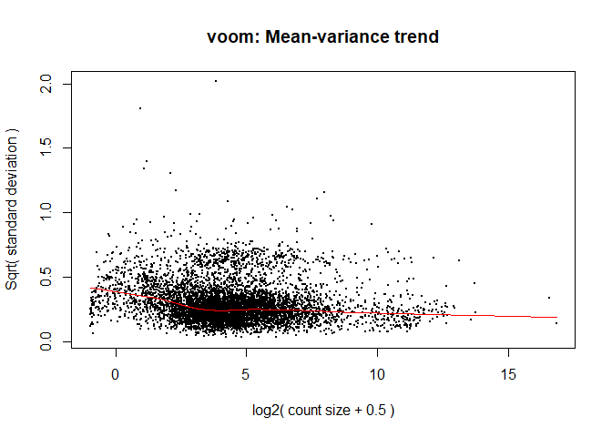

``` r
lmvoom<-lmFit(vw)
lmvoom<-eBayes(lmvoom)
plotSA(lmvoom, main= "voom")
```

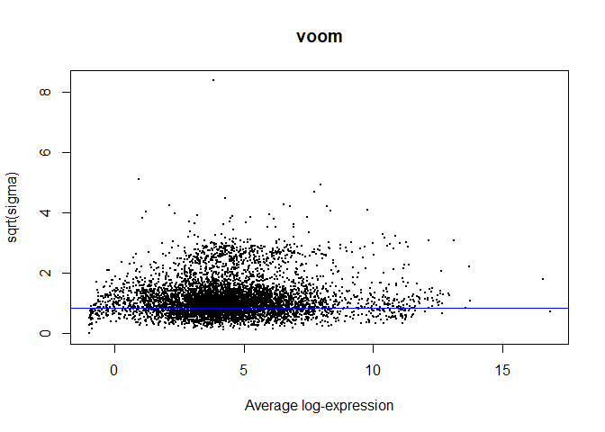

``` r
plot( sqrt(fit_g$sigma), sqrt(lmvoom$sigma), pch=20, ylim=c(0.5,3), xlim=c(0,2), xlab="Regular fit sqrt(sigma)", 
      ylab="Weighted fit sqrt(sigma)", cex=0.2, main="Effect of voom")
abline(0,1, lty=3)
```

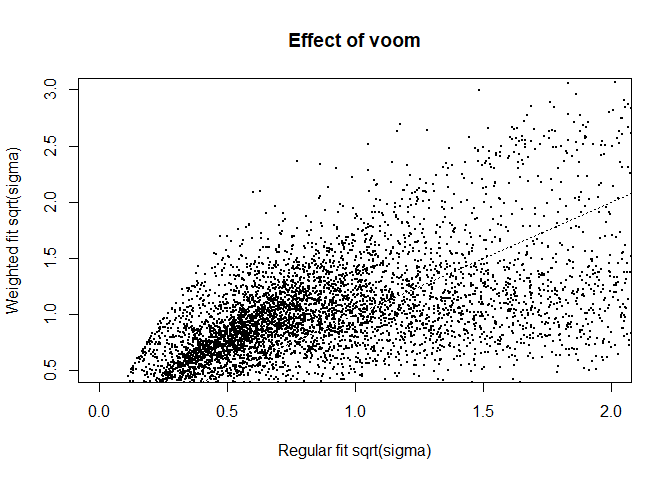

``` r
signif(topTable(lmvoom, 1, 7000, adjust.method="fdr", sort.by = "p", p.value = 0.05) ,3)
```

    ##       logFC AveExpr       t  P.Value adj.P.Val       B
    ## 989  16.900  16.900 1340.00 4.98e-10  4.62e-07 12.5000
    ## 5816 11.200  11.200  968.00 1.36e-09  4.62e-07 11.7000
    ## 4418 12.700  12.700  937.00 1.50e-09  4.62e-07 11.9000
    ## 1545 11.200  11.200  931.00 1.54e-09  4.62e-07 11.7000
    ## 872  11.500  11.500  913.00 1.63e-09  4.62e-07 11.7000
    ## 3743 11.300  11.300  912.00 1.64e-09  4.62e-07 11.7000
    ## 5698 11.300  11.300  890.00 1.77e-09  4.62e-07 11.7000
    ## 1829 11.100  11.100  877.00 1.84e-09  4.62e-07 11.6000
    ## 4698 10.400  10.400  876.00 1.85e-09  4.62e-07 11.6000
    ## 5202 10.900  10.900  872.00 1.88e-09  4.62e-07 11.6000
    ## 1899 10.400  10.400  872.00 1.88e-09  4.62e-07 11.6000
    ## 5446 10.600  10.600  853.00 2.01e-09  4.62e-07 11.6000
    ## 6605 11.100  11.100  847.00 2.06e-09  4.62e-07 11.6000
    ## 6320 11.500  11.500  844.00 2.08e-09  4.62e-07 11.7000
    ## 2863 11.300  11.300  835.00 2.15e-09  4.62e-07 11.6000
    ## 3981 10.100  10.100  833.00 2.17e-09  4.62e-07 11.5000
    ## 5020 11.100  11.100  832.00 2.17e-09  4.62e-07 11.6000
    ## 2259 10.700  10.700  831.00 2.18e-09  4.62e-07 11.6000
    ## 2940 11.100  11.100  831.00 2.18e-09  4.62e-07 11.6000
    ## 2602 13.600  13.600  825.00 2.23e-09  4.62e-07 11.9000
    ## 1126 11.300  11.300  823.00 2.24e-09  4.62e-07 11.6000
    ## 4150 10.800  10.800  821.00 2.27e-09  4.62e-07 11.6000
    ## 4130 11.600  11.600  820.00 2.27e-09  4.62e-07 11.7000
    ## 4474 10.900  10.900  819.00 2.29e-09  4.62e-07 11.6000
    ## 2518 10.300  10.300  815.00 2.31e-09  4.62e-07 11.5000
    ## 1083 10.900  10.900  809.00 2.37e-09  4.62e-07 11.6000
    ## 1513 10.700  10.700  806.00 2.40e-09  4.62e-07 11.5000
    ## 2998  9.850   9.850  795.00 2.50e-09  4.62e-07 11.4000
    ## 5851 10.600  10.600  794.00 2.51e-09  4.62e-07 11.5000
    ## 1807 11.100  11.100  790.00 2.55e-09  4.62e-07 11.6000
    ## 5033 10.800  10.800  789.00 2.57e-09  4.62e-07 11.5000
    ## 5385  9.730   9.730  786.00 2.59e-09  4.62e-07 11.4000
    ## 4424  9.860   9.860  784.00 2.61e-09  4.62e-07 11.4000
    ## 6059 12.000  12.000  783.00 2.62e-09  4.62e-07 11.7000
    ## 4646 11.100  11.100  777.00 2.68e-09  4.62e-07 11.6000
    ## 1679  9.550   9.550  773.00 2.73e-09  4.62e-07 11.4000
    ## 2551 10.500  10.500  762.00 2.85e-09  4.62e-07 11.5000
    ## 6210  9.810   9.810  756.00 2.93e-09  4.62e-07 11.4000
    ## 3116 10.100  10.100  747.00 3.03e-09  4.62e-07 11.4000
    ## 1542 10.000  10.000  741.00 3.11e-09  4.62e-07 11.4000
    ## 1568 10.200  10.200  738.00 3.15e-09  4.62e-07 11.4000
    ## 6431 11.600  11.600  726.00 3.32e-09  4.62e-07 11.6000
    ## 1221 10.700  10.700  723.00 3.36e-09  4.62e-07 11.5000
    ## 3770  9.990   9.990  710.00 3.54e-09  4.62e-07 11.4000
    ## 4892 10.700  10.700  699.00 3.72e-09  4.62e-07 11.4000
    ## 930  11.300  11.300  698.00 3.75e-09  4.62e-07 11.5000
    ## 3852 10.800  10.800  698.00 3.75e-09  4.62e-07 11.4000
    ## 2625 10.300  10.300  690.00 3.88e-09  4.62e-07 11.4000
    ## 3097 11.000  11.000  690.00 3.88e-09  4.62e-07 11.4000
    ## 3201 11.400  11.400  688.00 3.91e-09  4.62e-07 11.5000
    ## 1848  8.900   8.900  683.00 4.01e-09  4.62e-07 11.2000
    ## 2820  9.220   9.220  679.00 4.08e-09  4.62e-07 11.2000
    ## 4017 11.200  11.200  675.00 4.16e-09  4.62e-07 11.5000
    ## 3847 12.100  12.100  673.00 4.18e-09  4.62e-07 11.5000
    ## 879   9.760   9.760  662.00 4.40e-09  4.62e-07 11.3000
    ## 2428 11.200  11.200  659.00 4.48e-09  4.62e-07 11.4000
    ## 4644 11.400  11.400  654.00 4.58e-09  4.62e-07 11.4000
    ## 2152 11.100  11.100  653.00 4.60e-09  4.62e-07 11.4000
    ## 5889  9.930   9.930  648.00 4.73e-09  4.62e-07 11.3000
    ## 1302  9.130   9.130  647.00 4.73e-09  4.62e-07 11.2000
    ## 6377  8.660   8.660  647.00 4.73e-09  4.62e-07 11.1000
    ## 2558  8.570   8.570  646.00 4.76e-09  4.62e-07 11.1000
    ## 1750  9.450   9.450  645.00 4.79e-09  4.62e-07 11.2000
    ## 3444  8.380   8.380  641.00 4.87e-09  4.62e-07 11.1000
    ## 2089 12.300  12.300  640.00 4.89e-09  4.62e-07 11.5000
    ## 4923 10.600  10.600  638.00 4.95e-09  4.62e-07 11.3000
    ## 2228  8.280   8.280  633.00 5.08e-09  4.62e-07 11.1000
    ## 4163 10.500  10.500  630.00 5.14e-09  4.62e-07 11.3000
    ## 2247 11.600  11.600  630.00 5.14e-09  4.62e-07 11.4000
    ## 997  11.600  11.600  627.00 5.21e-09  4.62e-07 11.4000
    ## 6307 11.200  11.200  624.00 5.31e-09  4.62e-07 11.4000
    ## 2712  9.580   9.580  619.00 5.42e-09  4.62e-07 11.2000
    ## 2785 11.500  11.500  618.00 5.46e-09  4.62e-07 11.4000
    ## 5717  9.270   9.270  616.00 5.52e-09  4.62e-07 11.2000
    ## 2698  8.650   8.650  615.00 5.54e-09  4.62e-07 11.1000
    ## 5319 11.000  11.000  614.00 5.58e-09  4.62e-07 11.3000
    ## 2851  8.250   8.250  613.00 5.59e-09  4.62e-07 11.0000
    ## 33    8.550   8.550  613.00 5.60e-09  4.62e-07 11.1000
    ## 1014  8.650   8.650  612.00 5.62e-09  4.62e-07 11.1000
    ## 1455  8.980   8.980  608.00 5.74e-09  4.62e-07 11.1000
    ## 1944  8.950   8.950  606.00 5.80e-09  4.62e-07 11.1000
    ## 4146 12.500  12.500  605.00 5.84e-09  4.62e-07 11.5000
    ## 4736  8.050   8.050  602.00 5.91e-09  4.62e-07 11.0000
    ## 1827 10.300  10.300  598.00 6.04e-09  4.62e-07 11.2000
    ## 4594 10.400  10.400  595.00 6.15e-09  4.62e-07 11.2000
    ## 1220 10.400  10.400  590.00 6.30e-09  4.62e-07 11.2000
    ## 3423  8.150   8.150  589.00 6.32e-09  4.62e-07 11.0000
    ## 3664 10.700  10.700  589.00 6.35e-09  4.62e-07 11.2000
    ## 4307 11.600  11.600  588.00 6.36e-09  4.62e-07 11.3000
    ## 6080 11.000  11.000  588.00 6.37e-09  4.62e-07 11.3000
    ## 6524  8.490   8.490  588.00 6.38e-09  4.62e-07 11.0000
    ## 4164  9.850   9.850  586.00 6.45e-09  4.62e-07 11.2000
    ## 2087  9.860   9.860  584.00 6.51e-09  4.62e-07 11.2000
    ## 3620  9.990   9.990  581.00 6.60e-09  4.62e-07 11.2000
    ## 5161 10.400  10.400  579.00 6.68e-09  4.62e-07 11.2000
    ## 4642  7.970   7.970  579.00 6.69e-09  4.62e-07 10.9000
    ## 1884 11.200  11.200  578.00 6.71e-09  4.62e-07 11.3000
    ## 2975 12.700  12.700  575.00 6.82e-09  4.62e-07 11.4000
    ## 2023 10.000  10.000  574.00 6.86e-09  4.62e-07 11.2000
    ## 2372  8.040   8.040  573.00 6.91e-09  4.62e-07 10.9000
    ## 1524  7.840   7.840  570.00 7.02e-09  4.65e-07 10.9000
    ## 6253 10.200  10.200  567.00 7.12e-09  4.67e-07 11.2000
    ## 1112 11.400  11.400  564.00 7.25e-09  4.71e-07 11.3000
    ## 1035 10.200  10.200  559.00 7.46e-09  4.77e-07 11.2000
    ## 4213 13.800  13.800  558.00 7.48e-09  4.77e-07 11.5000
    ## 6406  8.240   8.240  554.00 7.67e-09  4.84e-07 10.9000
    ## 3474  9.200   9.200  552.00 7.74e-09  4.84e-07 11.0000
    ## 1607  8.690   8.690  546.00 8.03e-09  4.87e-07 11.0000
    ## 6000 10.400  10.400  546.00 8.03e-09  4.87e-07 11.1000
    ## 4491  9.960   9.960  545.00 8.06e-09  4.87e-07 11.1000
    ## 1596 11.100  11.100  544.00 8.10e-09  4.87e-07 11.2000
    ## 4922 10.900  10.900  543.00 8.16e-09  4.87e-07 11.2000
    ## 5660 12.500  12.500  540.00 8.27e-09  4.90e-07 11.3000
    ## 4392 10.600  10.600  536.00 8.48e-09  4.98e-07 11.1000
    ## 1761  9.250   9.250  530.00 8.77e-09  5.07e-07 11.0000
    ## 880  10.800  10.800  523.00 9.17e-09  5.07e-07 11.1000
    ## 4319  8.180   8.180  522.00 9.18e-09  5.07e-07 10.9000
    ## 5989  8.410   8.410  522.00 9.21e-09  5.07e-07 10.9000
    ## 3860  8.200   8.200  520.00 9.32e-09  5.07e-07 10.9000
    ## 2595  7.790   7.790  519.00 9.39e-09  5.07e-07 10.8000
    ## 3057 11.000  11.000  518.00 9.45e-09  5.07e-07 11.1000
    ## 1133  7.620   7.620  517.00 9.50e-09  5.07e-07 10.7000
    ## 6515 11.200  11.200  516.00 9.55e-09  5.07e-07 11.1000
    ## 6267  7.320   7.320  515.00 9.61e-09  5.07e-07 10.7000
    ## 878  11.800  11.800  514.00 9.66e-09  5.07e-07 11.2000
    ## 2803  7.850   7.850  514.00 9.69e-09  5.07e-07 10.8000
    ## 3692  7.780   7.780  512.00 9.78e-09  5.07e-07 10.8000
    ## 1470  8.070   8.070  508.00 1.00e-08  5.07e-07 10.8000
    ## 4501  7.470   7.470  508.00 1.00e-08  5.07e-07 10.7000
    ## 4479 10.800  10.800  508.00 1.00e-08  5.07e-07 11.1000
    ## 3273  7.310   7.310  507.00 1.01e-08  5.07e-07 10.7000
    ## 6553 12.600  12.600  504.00 1.03e-08  5.07e-07 11.2000
    ## 864   8.420   8.420  502.00 1.04e-08  5.07e-07 10.8000
    ## 4110  7.830   7.830  501.00 1.04e-08  5.07e-07 10.7000
    ## 3878  7.230   7.230  501.00 1.05e-08  5.07e-07 10.7000
    ## 4665  7.480   7.480  498.00 1.07e-08  5.07e-07 10.7000
    ## 4926  7.700   7.700  497.00 1.07e-08  5.07e-07 10.7000
    ## 3879  8.100   8.100  496.00 1.08e-08  5.07e-07 10.8000
    ## 6546  8.630   8.630  496.00 1.08e-08  5.07e-07 10.9000
    ## 3707  8.070   8.070  493.00 1.10e-08  5.07e-07 10.8000
    ## 1767  7.380   7.380  492.00 1.11e-08  5.07e-07 10.7000
    ## 3463  9.920   9.920  491.00 1.12e-08  5.07e-07 11.0000
    ## 6041  8.270   8.270  490.00 1.12e-08  5.07e-07 10.8000
    ## 5302 11.300  11.300  490.00 1.12e-08  5.07e-07 11.1000
    ## 2199 10.300  10.300  487.00 1.14e-08  5.07e-07 11.0000
    ## 3290  7.510   7.510  487.00 1.14e-08  5.07e-07 10.7000
    ## 4534  7.460   7.460  485.00 1.16e-08  5.07e-07 10.7000
    ## 3970  7.010   7.010  483.00 1.17e-08  5.07e-07 10.6000
    ## 1789  8.730   8.730  483.00 1.17e-08  5.07e-07 10.8000
    ## 6442  8.630   8.630  482.00 1.18e-08  5.07e-07 10.8000
    ## 6103  7.990   7.990  482.00 1.18e-08  5.07e-07 10.7000
    ## 1680  9.830   9.830  482.00 1.18e-08  5.07e-07 10.9000
    ## 4055 10.600  10.600  481.00 1.19e-08  5.07e-07 11.0000
    ## 1414  6.890   6.890  479.00 1.20e-08  5.07e-07 10.6000
    ## 5053  9.440   9.440  478.00 1.21e-08  5.07e-07 10.9000
    ## 5943 12.300  12.300  477.00 1.21e-08  5.07e-07 11.1000
    ## 3640 11.800  11.800  473.00 1.25e-08  5.07e-07 11.0000
    ## 741   7.230   7.230  471.00 1.26e-08  5.07e-07 10.6000
    ## 1959  8.020   8.020  471.00 1.27e-08  5.07e-07 10.7000
    ## 5969  8.210   8.210  469.00 1.28e-08  5.07e-07 10.7000
    ## 1982  7.220   7.220  469.00 1.28e-08  5.07e-07 10.6000
    ## 1711  9.450   9.450  469.00 1.28e-08  5.07e-07 10.9000
    ## 6078  7.500   7.500  468.00 1.29e-08  5.07e-07 10.6000
    ## 1493  8.400   8.400  468.00 1.29e-08  5.07e-07 10.8000
    ## 3311  6.850   6.850  466.00 1.31e-08  5.07e-07 10.5000
    ## 716  11.600  11.600  464.00 1.33e-08  5.07e-07 11.0000
    ## 6534  6.990   6.990  463.00 1.33e-08  5.07e-07 10.6000
    ## 4256 10.600  10.600  463.00 1.34e-08  5.07e-07 10.9000
    ## 5229  9.430   9.430  462.00 1.34e-08  5.07e-07 10.8000
    ## 1058  8.450   8.450  462.00 1.34e-08  5.07e-07 10.7000
    ## 3184  9.360   9.360  461.00 1.36e-08  5.07e-07 10.8000
    ## 2802  7.400   7.400  460.00 1.36e-08  5.07e-07 10.6000
    ## 863   7.020   7.020  460.00 1.37e-08  5.07e-07 10.5000
    ## 2855  7.420   7.420  459.00 1.37e-08  5.07e-07 10.6000
    ## 1139  8.350   8.350  459.00 1.37e-08  5.07e-07 10.7000
    ## 6036  6.930   6.930  458.00 1.38e-08  5.07e-07 10.5000
    ## 5019  6.930   6.930  458.00 1.38e-08  5.07e-07 10.5000
    ## 5249  6.830   6.830  457.00 1.39e-08  5.07e-07 10.5000
    ## 4178  9.690   9.690  457.00 1.39e-08  5.07e-07 10.8000
    ## 1888  7.580   7.580  457.00 1.40e-08  5.07e-07 10.6000
    ## 74   12.500  12.500  454.00 1.42e-08  5.07e-07 11.0000
    ## 1081  8.400   8.400  454.00 1.42e-08  5.07e-07 10.7000
    ## 714   7.630   7.630  453.00 1.43e-08  5.07e-07 10.6000
    ## 5396  9.560   9.560  453.00 1.43e-08  5.07e-07 10.8000
    ## 4382  8.030   8.030  453.00 1.43e-08  5.07e-07 10.7000
    ## 2562  8.380   8.380  452.00 1.44e-08  5.07e-07 10.7000
    ## 3610 10.400  10.400  451.00 1.45e-08  5.07e-07 10.9000
    ## 5350  9.940   9.940  450.00 1.46e-08  5.07e-07 10.8000
    ## 6192  7.650   7.650  449.00 1.47e-08  5.07e-07 10.6000
    ## 2679  6.580   6.580  448.00 1.48e-08  5.07e-07 10.5000
    ## 4354  6.780   6.780  448.00 1.48e-08  5.07e-07 10.5000
    ## 1309  7.730   7.730  447.00 1.49e-08  5.07e-07 10.6000
    ## 3906  6.920   6.920  447.00 1.49e-08  5.07e-07 10.5000
    ## 2314 12.100  12.100  446.00 1.50e-08  5.07e-07 11.0000
    ## 2492  7.680   7.680  446.00 1.50e-08  5.07e-07 10.6000
    ## 3478  6.890   6.890  445.00 1.51e-08  5.07e-07 10.5000
    ## 5107  8.840   8.840  444.00 1.52e-08  5.07e-07 10.7000
    ## 6264 10.500  10.500  444.00 1.52e-08  5.07e-07 10.9000
    ## 6674  7.690   7.690  444.00 1.52e-08  5.07e-07 10.6000
    ## 2884  7.740   7.740  444.00 1.53e-08  5.07e-07 10.6000
    ## 5268  8.040   8.040  443.00 1.53e-08  5.07e-07 10.6000
    ## 34    6.760   6.760  442.00 1.54e-08  5.07e-07 10.5000
    ## 3280  6.670   6.670  442.00 1.54e-08  5.07e-07 10.5000
    ## 2147  6.580   6.580  442.00 1.55e-08  5.07e-07 10.5000
    ## 5272 10.100  10.100  441.00 1.55e-08  5.07e-07 10.8000
    ## 6400 10.600  10.600  437.00 1.60e-08  5.17e-07 10.8000
    ## 3877 10.800  10.800  437.00 1.60e-08  5.17e-07 10.8000
    ## 4251  6.490   6.490  436.00 1.61e-08  5.18e-07 10.4000
    ## 5145  7.520   7.520  435.00 1.62e-08  5.19e-07 10.5000
    ## 4374 11.000  11.000  433.00 1.64e-08  5.20e-07 10.8000
    ## 2794  8.160   8.160  432.00 1.65e-08  5.20e-07 10.6000
    ## 4583  6.510   6.510  432.00 1.65e-08  5.20e-07 10.4000
    ## 5121  7.130   7.130  432.00 1.66e-08  5.20e-07 10.5000
    ## 3709  6.400   6.400  431.00 1.67e-08  5.20e-07 10.4000
    ## 1425  6.450   6.450  431.00 1.67e-08  5.20e-07 10.4000
    ## 6513  7.050   7.050  430.00 1.68e-08  5.20e-07 10.5000
    ## 1747  6.700   6.700  428.00 1.70e-08  5.20e-07 10.4000
    ## 5331  9.540   9.540  427.00 1.71e-08  5.20e-07 10.7000
    ## 2476  6.470   6.470  427.00 1.72e-08  5.20e-07 10.4000
    ## 2483 10.000  10.000  426.00 1.72e-08  5.20e-07 10.8000
    ## 847   6.990   6.990  426.00 1.73e-08  5.20e-07 10.4000
    ## 4162  7.240   7.240  425.00 1.74e-08  5.20e-07 10.5000
    ## 3124  6.520   6.520  425.00 1.74e-08  5.20e-07 10.4000
    ## 3403  7.400   7.400  424.00 1.75e-08  5.20e-07 10.5000
    ## 5154  7.370   7.370  424.00 1.76e-08  5.20e-07 10.5000
    ## 3453  7.230   7.230  424.00 1.76e-08  5.20e-07 10.5000
    ## 3292  6.950   6.950  422.00 1.78e-08  5.20e-07 10.4000
    ## 6657  8.140   8.140  422.00 1.79e-08  5.20e-07 10.6000
    ## 2418 12.000  12.000  421.00 1.79e-08  5.20e-07 10.9000
    ## 5505  6.650   6.650  419.00 1.82e-08  5.20e-07 10.4000
    ## 3689 11.100  11.100  419.00 1.82e-08  5.20e-07 10.8000
    ## 3428  6.590   6.590  418.00 1.83e-08  5.20e-07 10.4000
    ## 1649  6.660   6.660  417.00 1.84e-08  5.20e-07 10.4000
    ## 3564  6.530   6.530  417.00 1.84e-08  5.20e-07 10.4000
    ## 5212  8.870   8.870  417.00 1.84e-08  5.20e-07 10.6000
    ## 5535  7.350   7.350  416.00 1.85e-08  5.20e-07 10.5000
    ## 881   8.320   8.320  416.00 1.87e-08  5.20e-07 10.6000
    ## 1846  6.270   6.270  413.00 1.90e-08  5.20e-07 10.3000
    ## 3769  7.500   7.500  413.00 1.90e-08  5.20e-07 10.5000
    ## 2151 11.200  11.200  413.00 1.90e-08  5.20e-07 10.8000
    ## 3361  6.570   6.570  413.00 1.91e-08  5.20e-07 10.4000
    ## 5610 11.500  11.500  412.00 1.91e-08  5.20e-07 10.8000
    ## 4706  9.000   9.000  412.00 1.91e-08  5.20e-07 10.6000
    ## 5814  6.120   6.120  411.00 1.93e-08  5.20e-07 10.3000
    ## 4259  6.810   6.810  410.00 1.95e-08  5.20e-07 10.4000
    ## 3522  7.390   7.390  410.00 1.95e-08  5.20e-07 10.4000
    ## 1099  8.240   8.240  409.00 1.96e-08  5.20e-07 10.5000
    ## 5705 11.800  11.800  409.00 1.96e-08  5.20e-07 10.8000
    ## 1893  6.130   6.130  409.00 1.97e-08  5.20e-07 10.3000
    ## 1528  7.770   7.770  408.00 1.97e-08  5.20e-07 10.5000
    ## 2796 12.100  12.100  408.00 1.97e-08  5.20e-07 10.8000
    ## 5611 12.300  12.300  406.00 2.01e-08  5.20e-07 10.8000
    ## 3405  7.030   7.030  405.00 2.02e-08  5.20e-07 10.4000
    ## 4297  7.540   7.540  405.00 2.02e-08  5.20e-07 10.4000
    ## 3086  7.680   7.680  405.00 2.02e-08  5.20e-07 10.4000
    ## 5798  8.520   8.520  405.00 2.03e-08  5.20e-07 10.6000
    ## 3585  6.310   6.310  404.00 2.03e-08  5.20e-07 10.3000
    ## 4509  6.270   6.270  404.00 2.03e-08  5.20e-07 10.3000
    ## 1712 10.400  10.400  403.00 2.05e-08  5.20e-07 10.7000
    ## 5963  7.520   7.520  403.00 2.05e-08  5.20e-07 10.4000
    ## 6535  6.950   6.950  403.00 2.05e-08  5.20e-07 10.4000
    ## 1498  6.410   6.410  403.00 2.06e-08  5.20e-07 10.3000
    ## 4688 11.600  11.600  403.00 2.06e-08  5.20e-07 10.7000
    ## 1463  6.210   6.210  401.00 2.08e-08  5.20e-07 10.3000
    ## 1154  6.700   6.700  401.00 2.09e-08  5.20e-07 10.3000
    ## 4294  6.910   6.910  400.00 2.10e-08  5.20e-07 10.4000
    ## 1407  6.520   6.520  400.00 2.11e-08  5.20e-07 10.3000
    ## 3398  6.930   6.930  399.00 2.12e-08  5.20e-07 10.4000
    ## 5998  7.490   7.490  399.00 2.12e-08  5.20e-07 10.4000
    ## 1909  6.930   6.930  399.00 2.12e-08  5.20e-07 10.4000
    ## 2272  7.950   7.950  399.00 2.13e-08  5.20e-07 10.5000
    ## 4476  7.180   7.180  398.00 2.13e-08  5.20e-07 10.4000
    ## 1549  8.330   8.330  397.00 2.15e-08  5.20e-07 10.5000
    ## 4593  7.700   7.700  397.00 2.15e-08  5.20e-07 10.4000
    ## 5525  6.330   6.330  396.00 2.16e-08  5.20e-07 10.3000
    ## 1018  7.460   7.460  396.00 2.16e-08  5.20e-07 10.4000
    ## 5275  6.210   6.210  396.00 2.16e-08  5.20e-07 10.3000
    ## 6649  8.150   8.150  396.00 2.17e-08  5.20e-07 10.5000
    ## 809   8.380   8.380  396.00 2.17e-08  5.20e-07 10.5000
    ## 3586  7.480   7.480  395.00 2.18e-08  5.20e-07 10.4000
    ## 3587  6.730   6.730  394.00 2.21e-08  5.21e-07 10.3000
    ## 4791  5.990   5.990  394.00 2.21e-08  5.21e-07 10.3000
    ## 6051  6.460   6.460  393.00 2.22e-08  5.21e-07 10.3000
    ## 1149  9.740   9.740  392.00 2.23e-08  5.21e-07 10.6000
    ## 6574 10.800  10.800  392.00 2.23e-08  5.21e-07 10.7000
    ## 3240  6.500   6.500  392.00 2.24e-08  5.21e-07 10.3000
    ## 5349  7.700   7.700  392.00 2.24e-08  5.21e-07 10.4000
    ## 2795  7.620   7.620  391.00 2.25e-08  5.21e-07 10.4000
    ## 3475 13.000  13.000  391.00 2.25e-08  5.21e-07 10.8000
    ## 945   6.610   6.610  391.00 2.26e-08  5.21e-07 10.3000
    ## 666   6.550   6.550  390.00 2.27e-08  5.21e-07 10.3000
    ## 2963  6.750   6.750  390.00 2.28e-08  5.21e-07 10.3000
    ## 6456  8.500   8.500  390.00 2.28e-08  5.21e-07 10.5000
    ## 6636  5.960   5.960  388.00 2.31e-08  5.21e-07 10.2000
    ## 4322  6.950   6.950  388.00 2.31e-08  5.21e-07 10.3000
    ## 4019  6.210   6.210  388.00 2.31e-08  5.21e-07 10.3000
    ## 5247  7.020   7.020  388.00 2.32e-08  5.21e-07 10.3000
    ## 858  11.800  11.800  387.00 2.32e-08  5.21e-07 10.7000
    ## 5431  6.220   6.220  385.00 2.37e-08  5.23e-07 10.2000
    ## 910   5.910   5.910  384.00 2.38e-08  5.23e-07 10.2000
    ## 1432  6.910   6.910  384.00 2.39e-08  5.23e-07 10.3000
    ## 4403  6.030   6.030  384.00 2.39e-08  5.23e-07 10.2000
    ## 5661  5.800   5.800  383.00 2.40e-08  5.23e-07 10.2000
    ## 2948  5.870   5.870  383.00 2.40e-08  5.23e-07 10.2000
    ## 6035  6.910   6.910  383.00 2.40e-08  5.23e-07 10.3000
    ## 3889  5.840   5.840  383.00 2.41e-08  5.23e-07 10.2000
    ## 2837  9.830   9.830  383.00 2.41e-08  5.23e-07 10.5000
    ## 2840  9.830   9.830  383.00 2.41e-08  5.23e-07 10.5000
    ## 5160 10.800  10.800  381.00 2.44e-08  5.23e-07 10.6000
    ## 1038 10.100  10.100  381.00 2.44e-08  5.23e-07 10.6000
    ## 31   10.900  10.900  381.00 2.45e-08  5.23e-07 10.6000
    ## 2201  6.730   6.730  380.00 2.47e-08  5.23e-07 10.3000
    ## 3580  7.030   7.030  380.00 2.47e-08  5.23e-07 10.3000
    ## 3092  5.880   5.880  379.00 2.48e-08  5.23e-07 10.2000
    ## 3470  6.060   6.060  379.00 2.48e-08  5.23e-07 10.2000
    ## 2313  7.460   7.460  379.00 2.48e-08  5.23e-07 10.3000
    ## 2943  8.470   8.470  379.00 2.49e-08  5.23e-07 10.4000
    ## 729   6.910   6.910  378.00 2.50e-08  5.23e-07 10.3000
    ## 6273  6.990   6.990  378.00 2.50e-08  5.23e-07 10.3000
    ## 1797  7.650   7.650  378.00 2.50e-08  5.23e-07 10.3000
    ## 2226 11.200  11.200  378.00 2.51e-08  5.23e-07 10.6000
    ## 1476 11.800  11.800  377.00 2.53e-08  5.23e-07 10.6000
    ## 6025  6.280   6.280  376.00 2.55e-08  5.23e-07 10.2000
    ## 3560  5.930   5.930  376.00 2.55e-08  5.23e-07 10.2000
    ## 4632  7.470   7.470  375.00 2.57e-08  5.23e-07 10.3000
    ## 640   6.210   6.210  374.00 2.59e-08  5.23e-07 10.2000
    ## 1666 10.600  10.600  374.00 2.59e-08  5.23e-07 10.5000
    ## 739   6.560   6.560  374.00 2.59e-08  5.23e-07 10.2000
    ## 5109  7.040   7.040  373.00 2.60e-08  5.23e-07 10.3000
    ## 2203  6.300   6.300  373.00 2.61e-08  5.23e-07 10.2000
    ## 875   5.960   5.960  373.00 2.62e-08  5.23e-07 10.2000
    ## 5672  7.060   7.060  373.00 2.62e-08  5.23e-07 10.3000
    ## 1769  7.420   7.420  372.00 2.62e-08  5.23e-07 10.3000
    ## 5924  5.870   5.870  372.00 2.63e-08  5.23e-07 10.2000
    ## 69    6.970   6.970  372.00 2.63e-08  5.23e-07 10.3000
    ## 2229  8.050   8.050  371.00 2.65e-08  5.23e-07 10.4000
    ## 4625  7.480   7.480  370.00 2.67e-08  5.23e-07 10.3000
    ## 53    6.370   6.370  370.00 2.68e-08  5.23e-07 10.2000
    ## 3869  6.360   6.360  369.00 2.69e-08  5.23e-07 10.2000
    ## 6356  6.030   6.030  369.00 2.69e-08  5.23e-07 10.2000
    ## 4755  6.450   6.450  369.00 2.71e-08  5.23e-07 10.2000
    ## 3968  5.870   5.870  368.00 2.71e-08  5.23e-07 10.2000
    ## 6113  7.090   7.090  368.00 2.72e-08  5.23e-07 10.2000
    ## 5667  5.920   5.920  368.00 2.73e-08  5.23e-07 10.2000
    ## 4289 12.500  12.500  367.00 2.74e-08  5.23e-07 10.6000
    ## 3908  6.400   6.400  367.00 2.75e-08  5.23e-07 10.2000
    ## 1853  5.960   5.960  367.00 2.75e-08  5.23e-07 10.2000
    ## 1314  6.340   6.340  366.00 2.77e-08  5.23e-07 10.2000
    ## 1374  5.570   5.570  366.00 2.78e-08  5.23e-07 10.1000
    ## 1623 12.700  12.700  365.00 2.79e-08  5.23e-07 10.6000
    ## 3402  7.200   7.200  365.00 2.79e-08  5.23e-07 10.2000
    ## 4519  5.750   5.750  365.00 2.80e-08  5.23e-07 10.1000
    ## 4854  5.540   5.540  364.00 2.81e-08  5.23e-07 10.1000
    ## 1222  6.300   6.300  364.00 2.81e-08  5.23e-07 10.2000
    ## 1451  8.280   8.280  364.00 2.81e-08  5.23e-07 10.4000
    ## 3821  6.140   6.140  364.00 2.81e-08  5.23e-07 10.2000
    ## 1125  6.090   6.090  364.00 2.81e-08  5.23e-07 10.2000
    ## 3600  7.260   7.260  364.00 2.82e-08  5.23e-07 10.2000
    ## 1648  7.460   7.460  364.00 2.82e-08  5.23e-07 10.3000
    ## 1662  5.690   5.690  363.00 2.84e-08  5.23e-07 10.1000
    ## 3747 12.900  12.900  363.00 2.85e-08  5.23e-07 10.6000
    ## 3333  6.360   6.360  362.00 2.85e-08  5.23e-07 10.2000
    ## 2481  5.460   5.460  362.00 2.86e-08  5.23e-07 10.1000
    ## 3413  6.620   6.620  362.00 2.87e-08  5.23e-07 10.2000
    ## 3592  5.520   5.520  362.00 2.87e-08  5.23e-07 10.1000
    ## 3010 10.400  10.400  362.00 2.87e-08  5.23e-07 10.5000
    ## 899   7.530   7.530  361.00 2.88e-08  5.23e-07 10.3000
    ## 5649  7.710   7.710  361.00 2.89e-08  5.23e-07 10.3000
    ## 5204  7.030   7.030  360.00 2.90e-08  5.23e-07 10.2000
    ## 1237  5.620   5.620  360.00 2.92e-08  5.23e-07 10.1000
    ## 4423  6.640   6.640  359.00 2.93e-08  5.23e-07 10.2000
    ## 2225  9.450   9.450  359.00 2.93e-08  5.23e-07 10.4000
    ## 5409  5.480   5.480  359.00 2.93e-08  5.23e-07 10.1000
    ## 2451  6.380   6.380  359.00 2.95e-08  5.23e-07 10.1000
    ## 5971  6.310   6.310  358.00 2.95e-08  5.23e-07 10.1000
    ## 5648  7.410   7.410  358.00 2.95e-08  5.23e-07 10.2000
    ## 4546  9.960   9.960  358.00 2.96e-08  5.23e-07 10.4000
    ## 5748  5.470   5.470  358.00 2.96e-08  5.23e-07 10.1000
    ## 2585  8.050   8.050  358.00 2.96e-08  5.23e-07 10.3000
    ## 2605  5.600   5.600  357.00 2.98e-08  5.23e-07 10.1000
    ## 1842  5.530   5.530  357.00 3.00e-08  5.23e-07 10.1000
    ## 6619  5.560   5.560  356.00 3.01e-08  5.23e-07 10.1000
    ## 4381  5.430   5.430  356.00 3.01e-08  5.23e-07 10.1000
    ## 5620  5.780   5.780  356.00 3.02e-08  5.23e-07 10.1000
    ## 4320  8.640   8.640  355.00 3.03e-08  5.23e-07 10.3000
    ## 1475  8.200   8.200  355.00 3.04e-08  5.23e-07 10.3000
    ## 1439  8.100   8.100  355.00 3.04e-08  5.23e-07 10.3000
    ## 920   6.200   6.200  355.00 3.04e-08  5.23e-07 10.1000
    ## 3083  5.700   5.700  355.00 3.04e-08  5.23e-07 10.1000
    ## 3476 11.700  11.700  354.00 3.05e-08  5.23e-07 10.5000
    ## 4459 12.600  12.600  354.00 3.05e-08  5.23e-07 10.5000
    ## 964   6.100   6.100  353.00 3.10e-08  5.25e-07 10.1000
    ## 2332  6.400   6.400  353.00 3.10e-08  5.25e-07 10.1000
    ## 2140  6.200   6.200  353.00 3.10e-08  5.25e-07 10.1000
    ## 5929  6.820   6.820  352.00 3.11e-08  5.25e-07 10.2000
    ## 5248  7.890   7.890  352.00 3.11e-08  5.25e-07 10.2000
    ## 4129  5.950   5.950  352.00 3.11e-08  5.25e-07 10.1000
    ## 3662  6.170   6.170  351.00 3.14e-08  5.26e-07 10.1000
    ## 646   6.590   6.590  351.00 3.14e-08  5.26e-07 10.1000
    ## 2615  6.730   6.730  351.00 3.16e-08  5.26e-07 10.1000
    ## 922   5.360   5.360  351.00 3.16e-08  5.26e-07 10.1000
    ## 6322  6.940   6.940  350.00 3.19e-08  5.26e-07 10.1000
    ## 4929  6.350   6.350  349.00 3.20e-08  5.26e-07 10.1000
    ## 3055  6.050   6.050  349.00 3.20e-08  5.26e-07 10.1000
    ## 4874  6.710   6.710  349.00 3.20e-08  5.26e-07 10.1000
    ## 4047  7.530   7.530  349.00 3.22e-08  5.26e-07 10.2000
    ## 1798  6.170   6.170  349.00 3.22e-08  5.26e-07 10.1000
    ## 3684  5.400   5.400  348.00 3.22e-08  5.26e-07 10.1000
    ## 3015  8.470   8.470  348.00 3.22e-08  5.26e-07 10.3000
    ## 3831  6.260   6.260  348.00 3.23e-08  5.26e-07 10.1000
    ## 5026  6.940   6.940  348.00 3.24e-08  5.26e-07 10.1000
    ## 4587 10.800  10.800  348.00 3.24e-08  5.26e-07 10.4000
    ## 3719  7.030   7.030  347.00 3.26e-08  5.27e-07 10.1000
    ## 2411  9.110   9.110  347.00 3.27e-08  5.27e-07 10.3000
    ## 5674  5.300   5.300  347.00 3.27e-08  5.27e-07 10.1000
    ## 4576  7.660   7.660  346.00 3.28e-08  5.28e-07 10.2000
    ## 6397  5.320   5.320  346.00 3.29e-08  5.28e-07 10.1000
    ## 3964  9.010   9.010  345.00 3.31e-08  5.29e-07 10.3000
    ## 2599  6.190   6.190  345.00 3.32e-08  5.29e-07 10.1000
    ## 692  11.400  11.400  344.00 3.34e-08  5.29e-07 10.4000
    ## 2902  5.710   5.710  344.00 3.35e-08  5.29e-07 10.1000
    ## 84    5.700   5.700  344.00 3.35e-08  5.29e-07 10.1000
    ## 971   5.420   5.420  344.00 3.36e-08  5.29e-07 10.0000
    ## 4482  5.570   5.570  344.00 3.36e-08  5.29e-07 10.0000
    ## 6233  6.460   6.460  343.00 3.37e-08  5.29e-07 10.1000
    ## 3077  6.130   6.130  343.00 3.37e-08  5.29e-07 10.1000
    ## 6188  5.400   5.400  343.00 3.37e-08  5.29e-07 10.0000
    ## 2460  6.400   6.400  343.00 3.39e-08  5.29e-07 10.1000
    ## 5707  6.460   6.460  342.00 3.40e-08  5.31e-07 10.1000
    ## 848   7.320   7.320  341.00 3.44e-08  5.33e-07 10.1000
    ## 1214  5.190   5.190  341.00 3.45e-08  5.33e-07 10.0000
    ## 5471  5.680   5.680  341.00 3.45e-08  5.33e-07 10.0000
    ## 938  10.500  10.500  341.00 3.45e-08  5.33e-07 10.4000
    ## 4177 11.500  11.500  340.00 3.47e-08  5.33e-07 10.4000
    ## 3087  5.170   5.170  340.00 3.47e-08  5.33e-07 10.0000
    ## 3996  6.540   6.540  339.00 3.50e-08  5.37e-07 10.1000
    ## 3159  6.040   6.040  339.00 3.51e-08  5.37e-07 10.0000
    ## 4900 10.200  10.200  339.00 3.52e-08  5.38e-07 10.3000
    ## 4674  6.160   6.160  338.00 3.53e-08  5.38e-07 10.0000
    ## 1519  6.800   6.800  338.00 3.55e-08  5.38e-07 10.1000
    ## 6419  7.590   7.590  338.00 3.55e-08  5.38e-07 10.1000
    ## 2618  5.300   5.300  337.00 3.56e-08  5.39e-07 10.0000
    ## 6647  8.060   8.060  337.00 3.57e-08  5.39e-07 10.2000
    ## 5898  5.820   5.820  337.00 3.58e-08  5.39e-07 10.0000
    ## 852   9.800   9.800  337.00 3.59e-08  5.39e-07 10.3000
    ## 2261  6.310   6.310  336.00 3.61e-08  5.39e-07 10.0000
    ## 3286  6.530   6.530  336.00 3.62e-08  5.39e-07 10.1000
    ## 2358  5.890   5.890  335.00 3.63e-08  5.39e-07 10.0000
    ## 3653  7.230   7.230  335.00 3.64e-08  5.39e-07 10.1000
    ## 3063  5.680   5.680  334.00 3.68e-08  5.39e-07 10.0000
    ## 3979 10.600  10.600  334.00 3.68e-08  5.39e-07 10.3000
    ## 3745  6.930   6.930  333.00 3.69e-08  5.39e-07 10.1000
    ## 6135  6.930   6.930  333.00 3.70e-08  5.39e-07 10.1000
    ## 2575  7.060   7.060  333.00 3.70e-08  5.39e-07 10.1000
    ## 663   5.270   5.270  333.00 3.71e-08  5.39e-07  9.9900
    ## 6548  5.040   5.040  332.00 3.73e-08  5.39e-07 10.0000
    ## 2180  6.430   6.430  332.00 3.73e-08  5.39e-07 10.0000
    ## 1064  5.190   5.190  332.00 3.74e-08  5.39e-07  9.9800
    ## 4487  6.030   6.030  332.00 3.75e-08  5.39e-07 10.0000
    ## 1708  7.870   7.870  332.00 3.75e-08  5.39e-07 10.1000
    ## 5681  8.680   8.680  331.00 3.78e-08  5.39e-07 10.2000
    ## 654   5.630   5.630  331.00 3.79e-08  5.39e-07  9.9900
    ## 4344  5.460   5.460  331.00 3.79e-08  5.39e-07  9.9800
    ## 4847  7.230   7.230  331.00 3.79e-08  5.39e-07 10.1000
    ## 2104  7.090   7.090  330.00 3.80e-08  5.39e-07 10.1000
    ## 3024  6.350   6.350  330.00 3.81e-08  5.39e-07 10.0000
    ## 114   5.020   5.020  330.00 3.82e-08  5.39e-07  9.9800
    ## 6183  7.340   7.340  329.00 3.86e-08  5.39e-07 10.1000
    ## 5930  5.490   5.490  329.00 3.86e-08  5.39e-07  9.9700
    ## 6587  6.190   6.190  328.00 3.88e-08  5.39e-07  9.9900
    ## 4703  7.150   7.150  328.00 3.88e-08  5.39e-07 10.1000
    ## 5192  6.780   6.780  328.00 3.89e-08  5.39e-07 10.0000
    ## 2516  5.790   5.790  327.00 3.91e-08  5.39e-07  9.9800
    ## 1780  7.820   7.820  327.00 3.92e-08  5.39e-07 10.1000
    ## 3122  5.620   5.620  327.00 3.92e-08  5.39e-07  9.9700
    ## 947   6.780   6.780  326.00 3.95e-08  5.39e-07 10.0000
    ## 6268  6.540   6.540  326.00 3.96e-08  5.39e-07 10.0000
    ## 5951  6.200   6.200  326.00 3.96e-08  5.39e-07  9.9800
    ## 3469  5.360   5.360  326.00 3.97e-08  5.39e-07  9.9500
    ## 5056  4.820   4.820  326.00 3.97e-08  5.39e-07  9.9800
    ## 1958  9.050   9.050  326.00 3.97e-08  5.39e-07 10.2000
    ## 3588  6.120   6.120  325.00 3.98e-08  5.39e-07  9.9700
    ## 6591  6.390   6.390  325.00 3.99e-08  5.39e-07  9.9900
    ## 619   7.860   7.860  325.00 4.00e-08  5.39e-07 10.1000
    ## 1385  7.640   7.640  325.00 4.00e-08  5.39e-07 10.1000
    ## 836   5.920   5.920  325.00 4.01e-08  5.39e-07  9.9600
    ## 4352  8.540   8.540  324.00 4.03e-08  5.39e-07 10.2000
    ## 3320  4.870   4.870  324.00 4.04e-08  5.39e-07  9.9700
    ## 4735  5.870   5.870  323.00 4.06e-08  5.39e-07  9.9600
    ## 3425  6.590   6.590  323.00 4.08e-08  5.39e-07  9.9900
    ## 4347  4.990   4.990  323.00 4.08e-08  5.39e-07  9.9500
    ## 1479 10.600  10.600  323.00 4.09e-08  5.39e-07 10.2000
    ## 3533  6.150   6.150  322.00 4.11e-08  5.39e-07  9.9600
    ## 621   6.300   6.300  322.00 4.11e-08  5.39e-07  9.9700
    ## 1240  7.160   7.160  322.00 4.12e-08  5.39e-07 10.0000
    ## 2903  5.790   5.790  322.00 4.12e-08  5.39e-07  9.9400
    ## 2622  6.430   6.430  322.00 4.12e-08  5.39e-07  9.9700
    ## 1260  4.990   4.990  321.00 4.14e-08  5.39e-07  9.9400
    ## 5532  6.830   6.830  321.00 4.14e-08  5.39e-07  9.9900
    ## 6303  5.950   5.950  321.00 4.14e-08  5.39e-07  9.9500
    ## 3696  6.690   6.690  321.00 4.15e-08  5.39e-07  9.9800
    ## 6011  5.870   5.870  321.00 4.15e-08  5.39e-07  9.9400
    ## 6390  5.230   5.230  321.00 4.16e-08  5.39e-07  9.9300
    ## 3198  5.730   5.730  321.00 4.16e-08  5.39e-07  9.9400
    ## 2352  7.130   7.130  321.00 4.16e-08  5.39e-07 10.0000
    ## 2752  7.710   7.710  321.00 4.16e-08  5.39e-07 10.1000
    ## 1830  7.560   7.560  320.00 4.18e-08  5.39e-07 10.0000
    ## 2773  4.770   4.770  320.00 4.20e-08  5.39e-07  9.9600
    ## 5904  6.190   6.190  320.00 4.20e-08  5.39e-07  9.9500
    ## 5213  4.850   4.850  319.00 4.24e-08  5.39e-07  9.9400
    ## 5139  7.690   7.690  319.00 4.25e-08  5.39e-07 10.0000
    ## 952   4.970   4.970  319.00 4.25e-08  5.39e-07  9.9300
    ## 5711  5.440   5.440  319.00 4.25e-08  5.39e-07  9.9200
    ## 3110  5.280   5.280  318.00 4.26e-08  5.39e-07  9.9100
    ## 6102  8.250   8.250  318.00 4.27e-08  5.39e-07 10.1000
    ## 1903  5.090   5.090  318.00 4.28e-08  5.39e-07  9.9100
    ## 3807  4.610   4.610  318.00 4.29e-08  5.39e-07  9.9600
    ## 4118  6.230   6.230  318.00 4.29e-08  5.39e-07  9.9400
    ## 3661  4.640   4.640  317.00 4.30e-08  5.39e-07  9.9600
    ## 3177  4.960   4.960  317.00 4.31e-08  5.39e-07  9.9200
    ## 2010  4.930   4.930  317.00 4.31e-08  5.39e-07  9.9200
    ## 6384  5.460   5.460  317.00 4.31e-08  5.39e-07  9.9100
    ## 6391  7.310   7.310  317.00 4.31e-08  5.39e-07 10.0000
    ## 4573  5.720   5.720  317.00 4.31e-08  5.39e-07  9.9200
    ## 6201  7.290   7.290  317.00 4.33e-08  5.39e-07  9.9900
    ## 637   5.990   5.990  316.00 4.35e-08  5.39e-07  9.9200
    ## 939   7.580   7.580  316.00 4.37e-08  5.39e-07 10.0000
    ## 1657  8.680   8.680  316.00 4.37e-08  5.39e-07 10.1000
    ## 1340  6.460   6.460  316.00 4.37e-08  5.39e-07  9.9400
    ## 5451  6.370   6.370  316.00 4.38e-08  5.39e-07  9.9300
    ## 1361  5.340   5.340  315.00 4.39e-08  5.39e-07  9.9000
    ## 6613  5.090   5.090  315.00 4.39e-08  5.39e-07  9.9000
    ## 5028  5.140   5.140  315.00 4.39e-08  5.39e-07  9.9000
    ## 2369  5.760   5.760  315.00 4.39e-08  5.39e-07  9.9100
    ## 5961  4.930   4.930  315.00 4.40e-08  5.39e-07  9.9100
    ## 2215  5.100   5.100  315.00 4.42e-08  5.39e-07  9.9000
    ## 3956  5.590   5.590  315.00 4.42e-08  5.39e-07  9.9000
    ## 5556  5.210   5.210  314.00 4.45e-08  5.39e-07  9.8900
    ## 5257  6.410   6.410  314.00 4.45e-08  5.39e-07  9.9200
    ## 3703  5.330   5.330  314.00 4.46e-08  5.39e-07  9.8900
    ## 3584  5.300   5.300  314.00 4.46e-08  5.39e-07  9.8900
    ## 2339  4.810   4.810  313.00 4.47e-08  5.39e-07  9.9200
    ## 629   5.760   5.760  313.00 4.48e-08  5.39e-07  9.9000
    ## 6042  7.640   7.640  313.00 4.48e-08  5.39e-07 10.0000
    ## 6678  5.380   5.380  313.00 4.48e-08  5.39e-07  9.8800
    ## 2285  5.240   5.240  313.00 4.49e-08  5.39e-07  9.8800
    ## 5191  4.740   4.740  313.00 4.50e-08  5.39e-07  9.9200
    ## 3902  4.650   4.650  312.00 4.52e-08  5.39e-07  9.9300
    ## 2591  6.480   6.480  312.00 4.53e-08  5.39e-07  9.9200
    ## 3960  5.060   5.060  312.00 4.53e-08  5.39e-07  9.8800
    ## 4216  6.410   6.410  312.00 4.53e-08  5.39e-07  9.9100
    ## 6606  5.360   5.360  312.00 4.53e-08  5.39e-07  9.8800
    ## 1242  7.280   7.280  312.00 4.55e-08  5.39e-07  9.9600
    ## 3657  7.950   7.950  312.00 4.56e-08  5.39e-07 10.0000
    ## 4648 10.400  10.400  311.00 4.57e-08  5.39e-07 10.1000
    ## 3420 11.600  11.600  311.00 4.57e-08  5.39e-07 10.2000
    ## 2730 12.300  12.300  311.00 4.58e-08  5.39e-07 10.2000
    ## 4140  7.020   7.020  311.00 4.58e-08  5.39e-07  9.9400
    ## 4302  8.710   8.710  311.00 4.58e-08  5.39e-07 10.1000
    ## 2674  5.110   5.110  311.00 4.59e-08  5.39e-07  9.8700
    ## 5006  4.980   4.980  311.00 4.59e-08  5.39e-07  9.8800
    ## 1527  7.760   7.760  310.00 4.61e-08  5.39e-07  9.9900
    ## 5423  7.670   7.670  310.00 4.61e-08  5.39e-07  9.9800
    ## 1041  6.660   6.660  310.00 4.61e-08  5.39e-07  9.9200
    ## 1453  6.430   6.430  310.00 4.62e-08  5.39e-07  9.9000
    ## 1347  4.770   4.770  310.00 4.62e-08  5.39e-07  9.9000
    ## 6645  4.480   4.480  310.00 4.64e-08  5.39e-07  9.9300
    ## 2651  8.220   8.220  309.00 4.65e-08  5.39e-07 10.0000
    ## 1714  4.630   4.630  309.00 4.66e-08  5.39e-07  9.9100
    ## 4758  4.700   4.700  309.00 4.66e-08  5.39e-07  9.9000
    ## 6026  6.520   6.520  309.00 4.67e-08  5.39e-07  9.9000
    ## 1308  6.590   6.590  309.00 4.68e-08  5.39e-07  9.9000
    ## 6571  5.190   5.190  309.00 4.69e-08  5.39e-07  9.8600
    ## 4060  5.030   5.030  309.00 4.69e-08  5.39e-07  9.8700
    ## 4067  4.520   4.520  308.00 4.70e-08  5.39e-07  9.9200
    ## 4154  5.360   5.360  308.00 4.72e-08  5.39e-07  9.8500
    ## 2619  5.650   5.650  308.00 4.73e-08  5.39e-07  9.8600
    ## 1338  4.780   4.780  308.00 4.73e-08  5.39e-07  9.8900
    ## 5699  9.810   9.810  308.00 4.73e-08  5.39e-07 10.1000
    ## 5094  6.780   6.780  308.00 4.74e-08  5.39e-07  9.9100
    ## 1998  6.680   6.680  307.00 4.75e-08  5.39e-07  9.9000
    ## 6434  5.270   5.270  307.00 4.76e-08  5.39e-07  9.8500
    ## 3806  4.790   4.790  307.00 4.77e-08  5.39e-07  9.8800
    ## 3621  8.030   8.030  307.00 4.77e-08  5.39e-07  9.9900
    ## 5909  6.070   6.070  307.00 4.78e-08  5.39e-07  9.8700
    ## 2355  4.890   4.890  307.00 4.78e-08  5.39e-07  9.8700
    ## 6217  5.580   5.580  306.00 4.80e-08  5.39e-07  9.8500
    ## 798   6.810   6.810  306.00 4.80e-08  5.39e-07  9.9000
    ## 6583  7.560   7.560  306.00 4.81e-08  5.39e-07  9.9500
    ## 3182  4.720   4.720  306.00 4.83e-08  5.39e-07  9.8800
    ## 2603  5.430   5.430  306.00 4.83e-08  5.39e-07  9.8400
    ## 934  16.600  16.600  305.00 4.86e-08  5.39e-07 10.2000
    ## 6143 12.000  12.000  305.00 4.86e-08  5.39e-07 10.1000
    ## 4318  6.340   6.340  305.00 4.87e-08  5.39e-07  9.8700
    ## 1874  4.750   4.750  305.00 4.87e-08  5.39e-07  9.8700
    ## 6504  6.820   6.820  305.00 4.88e-08  5.39e-07  9.8900
    ## 4076 10.500  10.500  305.00 4.89e-08  5.39e-07 10.1000
    ## 6539  4.970   4.970  304.00 4.89e-08  5.39e-07  9.8400
    ## 4128  7.550   7.550  304.00 4.90e-08  5.39e-07  9.9400
    ## 2205  4.990   4.990  304.00 4.92e-08  5.39e-07  9.8400
    ## 6592  4.870   4.870  304.00 4.92e-08  5.39e-07  9.8500
    ## 1337  4.760   4.760  304.00 4.93e-08  5.39e-07  9.8600
    ## 891   6.850   6.850  304.00 4.94e-08  5.39e-07  9.8900
    ## 3713  4.930   4.930  303.00 4.95e-08  5.39e-07  9.8400
    ## 2432 10.100  10.100  303.00 4.95e-08  5.39e-07 10.1000
    ## 4901  7.500   7.500  303.00 4.96e-08  5.39e-07  9.9200
    ## 6357  4.950   4.950  303.00 4.97e-08  5.39e-07  9.8400
    ## 871   4.890   4.890  303.00 4.98e-08  5.39e-07  9.8400
    ## 5362  4.580   4.580  303.00 4.99e-08  5.39e-07  9.8800
    ## 5928 12.600  12.600  302.00 4.99e-08  5.39e-07 10.1000
    ## 6669  6.870   6.870  302.00 4.99e-08  5.39e-07  9.8800
    ## 2640  5.940   5.940  302.00 5.00e-08  5.39e-07  9.8400
    ## 2588  5.820   5.820  302.00 5.01e-08  5.39e-07  9.8300
    ## 4721  5.970   5.970  302.00 5.02e-08  5.39e-07  9.8300
    ## 5849  4.950   4.950  301.00 5.05e-08  5.39e-07  9.8300
    ## 2774  5.900   5.900  301.00 5.09e-08  5.39e-07  9.8200
    ## 3130  4.620   4.620  300.00 5.10e-08  5.39e-07  9.8600
    ## 6444  4.420   4.420  300.00 5.10e-08  5.39e-07  9.8700
    ## 3993  6.610   6.610  300.00 5.11e-08  5.39e-07  9.8500
    ## 3439  4.710   4.710  300.00 5.14e-08  5.39e-07  9.8400
    ## 1630  7.130   7.130  299.00 5.15e-08  5.39e-07  9.8800
    ## 857   5.580   5.580  299.00 5.16e-08  5.39e-07  9.8100
    ## 2898  4.990   4.990  299.00 5.16e-08  5.39e-07  9.8100
    ## 3832  6.900   6.900  299.00 5.16e-08  5.39e-07  9.8600
    ## 949   6.760   6.760  299.00 5.17e-08  5.39e-07  9.8500
    ## 5503  7.010   7.010  299.00 5.17e-08  5.39e-07  9.8700
    ## 5749  4.870   4.870  299.00 5.20e-08  5.39e-07  9.8200
    ## 2688  5.600   5.600  299.00 5.20e-08  5.39e-07  9.8000
    ## 4866  5.110   5.110  298.00 5.22e-08  5.39e-07  9.8000
    ## 655   5.690   5.690  298.00 5.22e-08  5.39e-07  9.8000
    ## 2869  4.700   4.700  298.00 5.22e-08  5.39e-07  9.8300
    ## 4572  5.200   5.200  298.00 5.22e-08  5.39e-07  9.7900
    ## 1941  4.790   4.790  298.00 5.23e-08  5.39e-07  9.8200
    ## 5457  4.880   4.880  298.00 5.23e-08  5.39e-07  9.8100
    ## 6017  6.070   6.070  298.00 5.23e-08  5.39e-07  9.8100
    ## 6256  4.580   4.580  298.00 5.23e-08  5.39e-07  9.8400
    ## 3445  9.460   9.460  298.00 5.23e-08  5.39e-07 10.0000
    ## 5287  6.810   6.810  298.00 5.23e-08  5.39e-07  9.8500
    ## 1897  4.440   4.440  298.00 5.24e-08  5.39e-07  9.8600
    ## 4004  6.630   6.630  298.00 5.25e-08  5.39e-07  9.8400
    ## 5384  5.170   5.170  297.00 5.26e-08  5.39e-07  9.7900
    ## 943   4.510   4.510  297.00 5.26e-08  5.39e-07  9.8500
    ## 6418  7.550   7.550  297.00 5.26e-08  5.39e-07  9.8900
    ## 3107  6.840   6.840  297.00 5.26e-08  5.39e-07  9.8500
    ## 3076  5.610   5.610  297.00 5.27e-08  5.39e-07  9.8000
    ## 4331  4.760   4.760  297.00 5.27e-08  5.39e-07  9.8200
    ## 6653  5.530   5.530  297.00 5.27e-08  5.39e-07  9.7900
    ## 4355  6.840   6.840  297.00 5.28e-08  5.39e-07  9.8400
    ## 4074  4.700   4.700  297.00 5.28e-08  5.39e-07  9.8300
    ## 6376  4.200   4.200  297.00 5.30e-08  5.39e-07  9.8600
    ## 5636  5.240   5.240  297.00 5.31e-08  5.39e-07  9.7800
    ## 2592  4.750   4.750  297.00 5.31e-08  5.39e-07  9.8200
    ## 1762  4.220   4.220  296.00 5.32e-08  5.39e-07  9.8600
    ## 5180  4.580   4.580  296.00 5.33e-08  5.39e-07  9.8300
    ## 6362  6.350   6.350  296.00 5.34e-08  5.39e-07  9.8100
    ## 761   5.670   5.670  296.00 5.35e-08  5.39e-07  9.7900
    ## 5002  4.550   4.550  295.00 5.38e-08  5.39e-07  9.8300
    ## 996   4.540   4.540  295.00 5.39e-08  5.39e-07  9.8300
    ## 4389  9.580   9.580  295.00 5.39e-08  5.39e-07  9.9900
    ## 1233  5.080   5.080  295.00 5.40e-08  5.39e-07  9.7800
    ## 4772  5.060   5.060  295.00 5.40e-08  5.39e-07  9.7800
    ## 2850  7.770   7.770  295.00 5.40e-08  5.39e-07  9.8900
    ## 3992  4.860   4.860  294.00 5.44e-08  5.39e-07  9.7900
    ## 5878  8.600   8.600  294.00 5.45e-08  5.39e-07  9.9400
    ## 2823  6.160   6.160  294.00 5.45e-08  5.39e-07  9.7900
    ## 2993  5.070   5.070  294.00 5.45e-08  5.39e-07  9.7700
    ## 1579  6.880   6.880  294.00 5.46e-08  5.39e-07  9.8200
    ## 1821  4.790   4.790  294.00 5.47e-08  5.39e-07  9.7900
    ## 5330  6.460   6.460  294.00 5.47e-08  5.39e-07  9.8000
    ## 4921  6.820   6.820  293.00 5.48e-08  5.39e-07  9.8200
    ## 946   4.590   4.590  293.00 5.49e-08  5.39e-07  9.8100
    ## 6378  8.800   8.800  293.00 5.49e-08  5.39e-07  9.9500
    ## 2646  5.210   5.210  293.00 5.50e-08  5.39e-07  9.7600
    ## 3853  5.430   5.430  293.00 5.51e-08  5.39e-07  9.7600
    ## 3072  4.790   4.790  293.00 5.51e-08  5.39e-07  9.7900
    ## 4673  5.560   5.560  293.00 5.52e-08  5.39e-07  9.7600
    ## 772   6.040   6.040  293.00 5.53e-08  5.39e-07  9.7800
    ## 3195  6.800   6.800  293.00 5.53e-08  5.39e-07  9.8100
    ## 1694  5.550   5.550  292.00 5.54e-08  5.39e-07  9.7600
    ## 4845  7.380   7.380  292.00 5.55e-08  5.39e-07  9.8400
    ## 48    4.920   4.920  292.00 5.58e-08  5.39e-07  9.7700
    ## 738   5.120   5.120  292.00 5.58e-08  5.39e-07  9.7500
    ## 2271 10.900  10.900  291.00 5.61e-08  5.39e-07 10.0000
    ## 691   4.320   4.320  291.00 5.61e-08  5.39e-07  9.8200
    ## 5048  5.370   5.370  291.00 5.65e-08  5.39e-07  9.7400
    ## 5388  6.210   6.210  291.00 5.66e-08  5.39e-07  9.7700
    ## 6614  4.500   4.500  291.00 5.66e-08  5.39e-07  9.8000
    ## 3872  5.200   5.200  290.00 5.66e-08  5.39e-07  9.7400
    ## 5708  4.960   4.960  290.00 5.66e-08  5.39e-07  9.7500
    ## 2264  4.160   4.160  290.00 5.68e-08  5.39e-07  9.8100
    ## 5293  7.260   7.260  290.00 5.68e-08  5.39e-07  9.8200
    ## 2396  4.820   4.820  290.00 5.69e-08  5.39e-07  9.7700
    ## 970   5.900   5.900  290.00 5.71e-08  5.39e-07  9.7500
    ## 1209  4.680   4.680  290.00 5.72e-08  5.39e-07  9.7800
    ## 1288  6.940   6.940  289.00 5.72e-08  5.39e-07  9.8000
    ## 5432  4.810   4.810  289.00 5.73e-08  5.39e-07  9.7600
    ## 3332  5.350   5.350  289.00 5.73e-08  5.39e-07  9.7400
    ## 3903  6.500   6.500  289.00 5.74e-08  5.39e-07  9.7700
    ## 2263  4.320   4.320  289.00 5.74e-08  5.39e-07  9.8000
    ## 4119  4.920   4.920  289.00 5.75e-08  5.39e-07  9.7500
    ## 4804  4.970   4.970  289.00 5.76e-08  5.39e-07  9.7400
    ## 1901  7.300   7.300  289.00 5.77e-08  5.39e-07  9.8100
    ## 6304  4.620   4.620  289.00 5.78e-08  5.39e-07  9.7800
    ## 5353  4.410   4.410  289.00 5.78e-08  5.39e-07  9.7900
    ## 1013  4.110   4.110  288.00 5.78e-08  5.39e-07  9.8000
    ## 1805  7.950   7.950  288.00 5.79e-08  5.39e-07  9.8500
    ## 3949  4.970   4.970  288.00 5.79e-08  5.39e-07  9.7400
    ## 1166  6.500   6.500  288.00 5.80e-08  5.39e-07  9.7600
    ## 4995  8.490   8.490  288.00 5.81e-08  5.39e-07  9.8900
    ## 1925  6.760   6.760  288.00 5.82e-08  5.39e-07  9.7800
    ## 5379  4.820   4.820  288.00 5.83e-08  5.39e-07  9.7500
    ## 5269  6.070   6.070  288.00 5.84e-08  5.39e-07  9.7400
    ## 925   7.310   7.310  288.00 5.84e-08  5.39e-07  9.8000
    ## 3041  5.090   5.090  287.00 5.85e-08  5.39e-07  9.7300
    ## 6424  5.800   5.800  287.00 5.88e-08  5.39e-07  9.7300
    ## 3084  6.970   6.970  287.00 5.88e-08  5.39e-07  9.7800
    ## 3793  4.290   4.290  287.00 5.88e-08  5.39e-07  9.7900
    ## 2422  4.920   4.920  287.00 5.88e-08  5.39e-07  9.7300
    ## 1947  4.290   4.290  287.00 5.89e-08  5.39e-07  9.7900
    ## 3098 10.000  10.000  287.00 5.89e-08  5.39e-07  9.9300
    ## 1391  4.170   4.170  287.00 5.89e-08  5.39e-07  9.7900
    ## 1032  6.080   6.080  287.00 5.90e-08  5.39e-07  9.7400
    ## 2695  8.520   8.520  287.00 5.90e-08  5.39e-07  9.8800
    ## 2379  4.550   4.550  286.00 5.91e-08  5.39e-07  9.7700
    ## 5591  5.320   5.320  286.00 5.91e-08  5.39e-07  9.7200
    ## 3835  5.820   5.820  286.00 5.92e-08  5.39e-07  9.7300
    ## 6586  7.340   7.340  286.00 5.93e-08  5.39e-07  9.7900
    ## 1674  5.350   5.350  286.00 5.93e-08  5.39e-07  9.7100
    ## 2571  4.680   4.680  286.00 5.93e-08  5.39e-07  9.7500
    ## 6416  5.940   5.940  286.00 5.94e-08  5.39e-07  9.7300
    ## 2910  4.830   4.830  286.00 5.95e-08  5.39e-07  9.7400
    ## 826   5.810   5.810  286.00 5.95e-08  5.39e-07  9.7200
    ## 1004  4.840   4.840  286.00 5.95e-08  5.39e-07  9.7300
    ## 1983  5.000   5.000  286.00 5.96e-08  5.39e-07  9.7200
    ## 5233  6.120   6.120  286.00 5.97e-08  5.39e-07  9.7300
    ## 818   5.470   5.470  285.00 5.98e-08  5.39e-07  9.7100
    ## 5999  4.050   4.050  285.00 5.99e-08  5.39e-07  9.7800
    ## 5845  4.720   4.720  285.00 5.99e-08  5.39e-07  9.7400
    ## 5935  4.580   4.580  285.00 6.00e-08  5.39e-07  9.7500
    ## 2068  4.250   4.250  285.00 6.01e-08  5.39e-07  9.7700
    ## 3561  7.970   7.970  285.00 6.02e-08  5.39e-07  9.8300
    ## 3525  6.350   6.350  285.00 6.02e-08  5.39e-07  9.7300
    ## 3232  4.930   4.930  285.00 6.03e-08  5.39e-07  9.7200
    ## 1942  4.730   4.730  284.00 6.04e-08  5.39e-07  9.7400
    ## 3738  4.470   4.470  284.00 6.04e-08  5.39e-07  9.7600
    ## 3464  5.750   5.750  284.00 6.04e-08  5.39e-07  9.7100
    ## 1375  5.360   5.360  284.00 6.04e-08  5.39e-07  9.7000
    ## 5854  6.690   6.690  284.00 6.04e-08  5.39e-07  9.7500
    ## 2480  6.530   6.530  284.00 6.04e-08  5.39e-07  9.7400
    ## 3732  4.920   4.920  284.00 6.05e-08  5.39e-07  9.7200
    ## 1771  4.850   4.850  284.00 6.06e-08  5.39e-07  9.7200
    ## 1200  8.580   8.580  284.00 6.06e-08  5.39e-07  9.8600
    ## 5297  6.190   6.190  284.00 6.07e-08  5.39e-07  9.7200
    ## 1877  7.380   7.380  284.00 6.08e-08  5.39e-07  9.7800
    ## 2193  6.730   6.730  283.00 6.12e-08  5.41e-07  9.7400
    ## 2336  4.880   4.880  283.00 6.12e-08  5.41e-07  9.7100
    ## 3575  4.660   4.660  283.00 6.13e-08  5.41e-07  9.7300
    ## 2420  7.960   7.960  283.00 6.13e-08  5.41e-07  9.8100
    ## 6562  4.050   4.050  283.00 6.17e-08  5.44e-07  9.7600
    ## 5842  4.990   4.990  282.00 6.20e-08  5.46e-07  9.6900
    ## 5721  6.630   6.630  282.00 6.22e-08  5.47e-07  9.7200
    ## 3042  4.400   4.400  281.00 6.25e-08  5.47e-07  9.7400
    ## 3411  4.530   4.530  281.00 6.25e-08  5.47e-07  9.7300
    ## 3048  5.310   5.310  281.00 6.26e-08  5.47e-07  9.6800
    ## 6166  4.120   4.120  281.00 6.26e-08  5.47e-07  9.7500
    ## 60    4.880   4.880  281.00 6.26e-08  5.47e-07  9.7000
    ## 2346  6.910   6.910  281.00 6.27e-08  5.47e-07  9.7300
    ## 2538  6.110   6.110  281.00 6.29e-08  5.48e-07  9.7000
    ## 2612  4.560   4.560  281.00 6.29e-08  5.48e-07  9.7200
    ## 2337  4.360   4.360  280.00 6.34e-08  5.49e-07  9.7300
    ## 688   5.320   5.320  280.00 6.36e-08  5.49e-07  9.6700
    ## 4330  6.880   6.880  279.00 6.38e-08  5.49e-07  9.7200
    ## 917   4.350   4.350  279.00 6.38e-08  5.49e-07  9.7300
    ## 6196  4.640   4.640  279.00 6.38e-08  5.49e-07  9.7100
    ## 5162  4.650   4.650  279.00 6.38e-08  5.49e-07  9.7100
    ## 4379  4.330   4.330  279.00 6.39e-08  5.49e-07  9.7300
    ## 1742  6.460   6.460  279.00 6.39e-08  5.49e-07  9.7000
    ## 6064  8.960   8.960  279.00 6.43e-08  5.49e-07  9.8300
    ## 2788  6.410   6.410  279.00 6.43e-08  5.49e-07  9.6900
    ## 4366  4.050   4.050  279.00 6.43e-08  5.49e-07  9.7300
    ## 638   4.210   4.210  279.00 6.43e-08  5.49e-07  9.7300
    ## 4853  7.060   7.060  279.00 6.44e-08  5.49e-07  9.7200
    ## 1075  4.350   4.350  279.00 6.44e-08  5.49e-07  9.7200
    ## 4075 10.400  10.400  279.00 6.44e-08  5.49e-07  9.8700
    ## 6582  4.120   4.120  279.00 6.45e-08  5.49e-07  9.7300
    ## 4167  5.740   5.740  278.00 6.46e-08  5.49e-07  9.6700
    ## 4679  8.030   8.030  278.00 6.46e-08  5.49e-07  9.7800
    ## 1063  4.310   4.310  278.00 6.47e-08  5.49e-07  9.7200
    ## 3967  4.090   4.090  278.00 6.48e-08  5.49e-07  9.7200
    ## 3603  5.410   5.410  278.00 6.49e-08  5.49e-07  9.6600
    ## 3338  4.570   4.570  278.00 6.49e-08  5.49e-07  9.7000
    ## 5701  6.660   6.660  277.00 6.53e-08  5.51e-07  9.6900
    ## 5693  4.550   4.550  277.00 6.53e-08  5.51e-07  9.7000
    ## 6479  7.040   7.040  277.00 6.54e-08  5.51e-07  9.7100
    ## 2221  4.240   4.240  277.00 6.58e-08  5.54e-07  9.7100
    ## 5598  4.690   4.690  276.00 6.60e-08  5.55e-07  9.6800
    ## 79    6.500   6.500  276.00 6.60e-08  5.55e-07  9.6800
    ## 3013  4.830   4.830  276.00 6.61e-08  5.55e-07  9.6700
    ## 3053  4.170   4.170  276.00 6.62e-08  5.55e-07  9.7100
    ## 5754  8.170   8.170  276.00 6.63e-08  5.55e-07  9.7700
    ## 6008  5.940   5.940  276.00 6.66e-08  5.56e-07  9.6500
    ## 6490  4.340   4.340  275.00 6.68e-08  5.57e-07  9.7000
    ## 3923  4.340   4.340  275.00 6.69e-08  5.57e-07  9.7000
    ## 1019  6.300   6.300  275.00 6.71e-08  5.58e-07  9.6600
    ## 4920  4.030   4.030  275.00 6.72e-08  5.58e-07  9.7000
    ## 3306  4.340   4.340  275.00 6.73e-08  5.58e-07  9.6900
    ## 6281  9.170   9.170  274.00 6.75e-08  5.58e-07  9.8000
    ## 1583  7.340   7.340  274.00 6.75e-08  5.58e-07  9.7000
    ## 2621  5.730   5.730  274.00 6.76e-08  5.58e-07  9.6400
    ## 3410  7.420   7.420  274.00 6.77e-08  5.58e-07  9.7000
    ## 4527 12.200  12.200  273.00 6.82e-08  5.58e-07  9.8600
    ## 4422  5.970   5.970  273.00 6.83e-08  5.58e-07  9.6400
    ## 6626  8.140   8.140  273.00 6.83e-08  5.58e-07  9.7500
    ## 1815  6.120   6.120  273.00 6.83e-08  5.58e-07  9.6400
    ## 5810  4.500   4.500  273.00 6.85e-08  5.58e-07  9.6700
    ## 991   7.960   7.960  273.00 6.85e-08  5.58e-07  9.7300
    ## 3179  3.970   3.970  273.00 6.86e-08  5.58e-07  9.6800
    ## 1228  4.090   4.090  273.00 6.87e-08  5.58e-07  9.6800
    ## 82    6.140   6.140  273.00 6.88e-08  5.58e-07  9.6400
    ## 4993  6.470   6.470  273.00 6.88e-08  5.58e-07  9.6500
    ## 3307  4.380   4.380  273.00 6.88e-08  5.58e-07  9.6700
    ## 708  11.800  11.800  273.00 6.88e-08  5.58e-07  9.8500
    ## 3344  5.230   5.230  273.00 6.88e-08  5.58e-07  9.6200
    ## 2123  4.280   4.280  272.00 6.90e-08  5.58e-07  9.6800
    ## 5978  4.520   4.520  272.00 6.91e-08  5.58e-07  9.6600
    ## 1945  4.340   4.340  272.00 6.92e-08  5.58e-07  9.6700
    ## 4562  4.530   4.530  272.00 6.92e-08  5.58e-07  9.6600
    ## 6347  4.910   4.910  272.00 6.93e-08  5.58e-07  9.6300
    ## 6525  5.460   5.460  272.00 6.93e-08  5.58e-07  9.6100
    ## 3686  6.150   6.150  272.00 6.94e-08  5.58e-07  9.6300
    ## 4062  4.070   4.070  272.00 6.94e-08  5.58e-07  9.6800
    ## 712   4.610   4.610  272.00 6.96e-08  5.58e-07  9.6500
    ## 4015  7.130   7.130  272.00 6.96e-08  5.58e-07  9.6700
    ## 3597  6.080   6.080  272.00 6.96e-08  5.58e-07  9.6300
    ## 2933  7.100   7.100  271.00 6.98e-08  5.59e-07  9.6700
    ## 933   5.000   5.000  271.00 7.00e-08  5.60e-07  9.6100
    ## 1062  4.410   4.410  271.00 7.00e-08  5.60e-07  9.6600
    ## 1211  4.870   4.870  271.00 7.01e-08  5.60e-07  9.6200
    ## 4157  3.910   3.910  271.00 7.03e-08  5.60e-07  9.6700
    ## 6252  6.380   6.380  271.00 7.04e-08  5.60e-07  9.6300
    ## 2316  6.950   6.950  271.00 7.05e-08  5.60e-07  9.6500
    ## 2274  4.390   4.390  271.00 7.06e-08  5.60e-07  9.6600
    ## 2880  4.150   4.150  270.00 7.07e-08  5.60e-07  9.6600
    ## 5653  4.280   4.280  270.00 7.07e-08  5.60e-07  9.6600
    ## 4012  4.560   4.560  270.00 7.07e-08  5.60e-07  9.6400
    ## 2664  4.130   4.130  270.00 7.10e-08  5.61e-07  9.6600
    ## 5054  4.550   4.550  270.00 7.10e-08  5.61e-07  9.6400
    ## 4660  8.020   8.020  270.00 7.11e-08  5.61e-07  9.7100
    ## 3391  4.070   4.070  270.00 7.13e-08  5.61e-07  9.6600
    ## 5260  4.570   4.570  270.00 7.13e-08  5.61e-07  9.6400
    ## 4443  4.330   4.330  270.00 7.13e-08  5.61e-07  9.6500
    ## 5195  7.720   7.720  269.00 7.15e-08  5.61e-07  9.6800
    ## 5755  5.490   5.490  269.00 7.16e-08  5.61e-07  9.5900
    ## 3579  7.560   7.560  269.00 7.16e-08  5.61e-07  9.6700
    ## 6602  5.630   5.630  269.00 7.18e-08  5.61e-07  9.5900
    ## 4305  4.090   4.090  269.00 7.18e-08  5.61e-07  9.6500
    ## 6338  7.550   7.550  269.00 7.20e-08  5.61e-07  9.6700
    ## 5513  4.100   4.100  269.00 7.20e-08  5.61e-07  9.6500
    ## 6660  5.190   5.190  269.00 7.21e-08  5.61e-07  9.5900
    ## 3454  3.920   3.920  268.00 7.26e-08  5.62e-07  9.6400
    ## 4161  5.490   5.490  268.00 7.27e-08  5.62e-07  9.5800
    ## 5188  5.500   5.500  268.00 7.27e-08  5.62e-07  9.5800
    ## 6544  5.350   5.350  268.00 7.29e-08  5.62e-07  9.5800
    ## 4940  5.510   5.510  268.00 7.30e-08  5.62e-07  9.5800
    ## 711   3.990   3.990  268.00 7.30e-08  5.62e-07  9.6400
    ## 5795  5.350   5.350  267.00 7.32e-08  5.62e-07  9.5700
    ## 6408  4.930   4.930  267.00 7.33e-08  5.62e-07  9.5900
    ## 4954  4.570   4.570  267.00 7.34e-08  5.62e-07  9.6200
    ## 6360  3.800   3.800  267.00 7.35e-08  5.62e-07  9.6300
    ## 4964  5.490   5.490  267.00 7.36e-08  5.62e-07  9.5700
    ## 6118  6.050   6.050  267.00 7.36e-08  5.62e-07  9.5900
    ## 4042  5.390   5.390  267.00 7.36e-08  5.62e-07  9.5700
    ## 2054  4.700   4.700  267.00 7.37e-08  5.62e-07  9.6000
    ## 6407  6.740   6.740  267.00 7.37e-08  5.62e-07  9.6100
    ## 3362  5.210   5.210  267.00 7.38e-08  5.62e-07  9.5700
    ## 1164  7.650   7.650  266.00 7.40e-08  5.62e-07  9.6500
    ## 3805  4.310   4.310  266.00 7.40e-08  5.62e-07  9.6200
    ## 6496  4.130   4.130  266.00 7.40e-08  5.62e-07  9.6300
    ## 3726  5.470   5.470  266.00 7.40e-08  5.62e-07  9.5700
    ## 1905  6.490   6.490  266.00 7.40e-08  5.62e-07  9.6000
    ## 5612  6.170   6.170  266.00 7.41e-08  5.62e-07  9.5900
    ## 1031  4.830   4.830  266.00 7.41e-08  5.62e-07  9.5900
    ## 3039  8.560   8.560  266.00 7.44e-08  5.62e-07  9.7000
    ## 3126  8.080   8.080  266.00 7.44e-08  5.62e-07  9.6800
    ## 5277  3.970   3.970  266.00 7.45e-08  5.62e-07  9.6200
    ## 4045  7.200   7.200  266.00 7.46e-08  5.62e-07  9.6200
    ## 5289  7.240   7.240  266.00 7.46e-08  5.62e-07  9.6200
    ## 2744  4.770   4.770  266.00 7.47e-08  5.62e-07  9.5900
    ## 4117  4.590   4.590  265.00 7.50e-08  5.62e-07  9.6000
    ## 5751  5.790   5.790  265.00 7.51e-08  5.62e-07  9.5700
    ## 1692  4.880   4.880  265.00 7.51e-08  5.62e-07  9.5700
    ## 1404  7.440   7.440  265.00 7.51e-08  5.62e-07  9.6300
    ## 1490  5.520   5.520  265.00 7.52e-08  5.62e-07  9.5600
    ## 5588  4.030   4.030  265.00 7.52e-08  5.62e-07  9.6200
    ## 2683  4.710   4.710  265.00 7.52e-08  5.62e-07  9.5900
    ## 5822  4.230   4.230  265.00 7.53e-08  5.62e-07  9.6100
    ## 3929  4.070   4.070  265.00 7.54e-08  5.62e-07  9.6200
    ## 1245  6.270   6.270  265.00 7.55e-08  5.62e-07  9.5800
    ## 5753  4.780   4.780  265.00 7.55e-08  5.62e-07  9.5800
    ## 1305  3.890   3.890  265.00 7.56e-08  5.62e-07  9.6100
    ## 1841  5.630   5.630  264.00 7.61e-08  5.66e-07  9.5500
    ## 5841  6.190   6.190  264.00 7.63e-08  5.66e-07  9.5700
    ## 5072  4.910   4.910  264.00 7.64e-08  5.66e-07  9.5600
    ## 1408  4.210   4.210  264.00 7.65e-08  5.66e-07  9.6000
    ## 5770  9.280   9.280  264.00 7.65e-08  5.66e-07  9.7000
    ## 1744  4.340   4.340  263.00 7.68e-08  5.66e-07  9.6000
    ## 4342  4.610   4.610  263.00 7.68e-08  5.66e-07  9.5800
    ## 4494  4.510   4.510  263.00 7.71e-08  5.66e-07  9.5800
    ## 2191  5.450   5.450  263.00 7.72e-08  5.66e-07  9.5400
    ## 4473  9.930   9.930  263.00 7.72e-08  5.66e-07  9.7100
    ## 2877  5.220   5.220  263.00 7.73e-08  5.66e-07  9.5400
    ## 5011  4.610   4.610  262.00 7.75e-08  5.66e-07  9.5800
    ## 3966  4.310   4.310  262.00 7.75e-08  5.66e-07  9.5900
    ## 3757  7.890   7.890  262.00 7.75e-08  5.66e-07  9.6300
    ## 6663  4.150   4.150  262.00 7.76e-08  5.66e-07  9.5900
    ## 3702  4.190   4.190  262.00 7.77e-08  5.66e-07  9.5900
    ## 5309  5.590   5.590  262.00 7.77e-08  5.66e-07  9.5400
    ## 6412  7.400   7.400  262.00 7.78e-08  5.66e-07  9.6000
    ## 5521  3.930   3.930  262.00 7.80e-08  5.66e-07  9.5900
    ## 3725  5.140   5.140  262.00 7.80e-08  5.66e-07  9.5300
    ## 5039  7.530   7.530  262.00 7.80e-08  5.66e-07  9.6100
    ## 2471  3.900   3.900  262.00 7.80e-08  5.66e-07  9.5900
    ## 3473  3.770   3.770  262.00 7.82e-08  5.66e-07  9.5900
    ## 2885  3.770   3.770  262.00 7.82e-08  5.66e-07  9.5800
    ## 4446  4.640   4.640  262.00 7.82e-08  5.66e-07  9.5700
    ## 1677  4.690   4.690  261.00 7.85e-08  5.66e-07  9.5600
    ## 6388  3.790   3.790  261.00 7.86e-08  5.66e-07  9.5800
    ## 4963  4.070   4.070  261.00 7.86e-08  5.66e-07  9.5800
    ## 5171  3.960   3.960  261.00 7.87e-08  5.66e-07  9.5800
    ## 4867  5.530   5.530  261.00 7.88e-08  5.66e-07  9.5300
    ## 4984  9.360   9.360  261.00 7.91e-08  5.66e-07  9.6800
    ## 1926  4.670   4.670  261.00 7.91e-08  5.66e-07  9.5500
    ## 4266 12.300  12.300  261.00 7.92e-08  5.66e-07  9.7300
    ## 2230  3.780   3.780  261.00 7.92e-08  5.66e-07  9.5800
    ## 6486  7.680   7.680  261.00 7.93e-08  5.66e-07  9.6000
    ## 1155  6.640   6.640  260.00 7.94e-08  5.66e-07  9.5500
    ## 3663  5.310   5.310  260.00 7.96e-08  5.66e-07  9.5200
    ## 3984  5.070   5.070  260.00 7.96e-08  5.66e-07  9.5200
    ## 6561  5.660   5.660  260.00 7.96e-08  5.66e-07  9.5200
    ## 4623  4.590   4.590  260.00 7.97e-08  5.66e-07  9.5600
    ## 3935  6.060   6.060  260.00 7.98e-08  5.66e-07  9.5300
    ## 3488  3.710   3.710  260.00 7.98e-08  5.66e-07  9.5700
    ## 3169  6.290   6.290  260.00 7.98e-08  5.66e-07  9.5400
    ## 1943  4.980   4.980  260.00 7.98e-08  5.66e-07  9.5200
    ## 3091  5.160   5.160  260.00 7.99e-08  5.66e-07  9.5200
    ## 4081  8.910   8.910  260.00 8.01e-08  5.66e-07  9.6500
    ## 4704  5.960   5.960  260.00 8.01e-08  5.66e-07  9.5300
    ## 2922  4.520   4.520  260.00 8.02e-08  5.66e-07  9.5600
    ## 3562  4.300   4.300  259.00 8.03e-08  5.66e-07  9.5600
    ## 6450  4.850   4.850  259.00 8.04e-08  5.66e-07  9.5300
    ## 6205  5.010   5.010  259.00 8.06e-08  5.67e-07  9.5200
    ## 4707  4.650   4.650  259.00 8.07e-08  5.67e-07  9.5400
    ## 620   4.590   4.590  259.00 8.08e-08  5.67e-07  9.5500
    ## 1522  6.110   6.110  259.00 8.09e-08  5.67e-07  9.5200
    ## 4180  4.900   4.900  259.00 8.10e-08  5.67e-07  9.5200
    ## 1109  5.130   5.130  259.00 8.11e-08  5.68e-07  9.5100
    ## 4145  9.410   9.410  258.00 8.14e-08  5.69e-07  9.6500
    ## 3176  5.330   5.330  258.00 8.17e-08  5.69e-07  9.5000
    ## 3062  5.500   5.500  258.00 8.19e-08  5.69e-07  9.5000
    ## 6370  5.330   5.330  258.00 8.19e-08  5.69e-07  9.5000
    ## 4426  6.710   6.710  258.00 8.20e-08  5.69e-07  9.5300
    ## 6237  6.150   6.150  258.00 8.21e-08  5.69e-07  9.5100
    ## 1546  4.090   4.090  257.00 8.22e-08  5.69e-07  9.5500
    ## 3459  6.760   6.760  257.00 8.23e-08  5.69e-07  9.5300
    ## 4550  5.520   5.520  257.00 8.23e-08  5.69e-07  9.5000
    ## 3638  7.330   7.330  257.00 8.25e-08  5.69e-07  9.5500
    ## 2220  5.780   5.780  257.00 8.25e-08  5.69e-07  9.5000
    ## 4126  4.830   4.830  257.00 8.26e-08  5.69e-07  9.5100
    ## 5571  5.220   5.220  257.00 8.27e-08  5.69e-07  9.4900
    ## 830   3.720   3.720  257.00 8.27e-08  5.69e-07  9.5400
    ## 5540  6.040   6.040  257.00 8.28e-08  5.69e-07  9.5000
    ## 4675  4.320   4.320  257.00 8.29e-08  5.69e-07  9.5400
    ## 1122  6.180   6.180  257.00 8.29e-08  5.69e-07  9.5100
    ## 1224  6.440   6.440  257.00 8.30e-08  5.69e-07  9.5100
    ## 2170  6.690   6.690  256.00 8.33e-08  5.69e-07  9.5200
    ## 2501  7.490   7.490  256.00 8.34e-08  5.69e-07  9.5500
    ## 1084  3.890   3.890  256.00 8.35e-08  5.69e-07  9.5400
    ## 2190  4.950   4.950  256.00 8.35e-08  5.69e-07  9.4900
    ## 2834  5.700   5.700  256.00 8.36e-08  5.69e-07  9.4900
    ## 5175  5.800   5.800  256.00 8.36e-08  5.69e-07  9.4900
    ## 5865  4.790   4.790  256.00 8.36e-08  5.69e-07  9.5000
    ## 1454  7.800   7.800  256.00 8.37e-08  5.69e-07  9.5700
    ## 6441  7.800   7.800  256.00 8.37e-08  5.69e-07  9.5700
    ## 1968  4.690   4.690  256.00 8.37e-08  5.69e-07  9.5100
    ## 3796  6.320   6.320  256.00 8.37e-08  5.69e-07  9.5000
    ## 641   3.720   3.720  256.00 8.39e-08  5.69e-07  9.5300
    ## 3958  3.730   3.730  256.00 8.39e-08  5.69e-07  9.5300
    ## 5966  3.940   3.940  256.00 8.40e-08  5.69e-07  9.5400
    ## 3854  3.930   3.930  256.00 8.42e-08  5.69e-07  9.5300
    ## 2333  5.700   5.700  256.00 8.42e-08  5.69e-07  9.4900
    ## 5408  4.290   4.290  255.00 8.44e-08  5.69e-07  9.5300
    ## 3204  3.900   3.900  255.00 8.44e-08  5.69e-07  9.5300
    ## 2091  6.650   6.650  255.00 8.44e-08  5.69e-07  9.5100
    ## 2570  7.310   7.310  255.00 8.47e-08  5.70e-07  9.5300
    ## 6542  3.810   3.810  255.00 8.49e-08  5.70e-07  9.5300
    ## 5307  4.490   4.490  255.00 8.49e-08  5.70e-07  9.5200
    ## 3287  5.150   5.150  255.00 8.49e-08  5.70e-07  9.4700
    ## 4861  4.000   4.000  255.00 8.51e-08  5.70e-07  9.5300
    ## 2912  4.720   4.720  255.00 8.51e-08  5.70e-07  9.5000
    ## 5837  3.690   3.690  255.00 8.52e-08  5.70e-07  9.5200
    ## 4378  3.790   3.790  254.00 8.52e-08  5.70e-07  9.5200
    ## 3756  5.080   5.080  254.00 8.55e-08  5.71e-07  9.4700
    ## 4868  5.390   5.390  254.00 8.55e-08  5.71e-07  9.4700
    ## 6607  9.910   9.910  254.00 8.57e-08  5.71e-07  9.6200
    ## 3492  7.140   7.140  254.00 8.57e-08  5.71e-07  9.5200
    ## 4208  3.910   3.910  254.00 8.58e-08  5.71e-07  9.5200
    ## 6006  4.820   4.820  254.00 8.60e-08  5.71e-07  9.4800
    ## 897   4.050   4.050  254.00 8.60e-08  5.71e-07  9.5200
    ## 4694  5.270   5.270  254.00 8.62e-08  5.71e-07  9.4600
    ## 4242  4.780   4.780  254.00 8.62e-08  5.71e-07  9.4800
    ## 5817  3.850   3.850  254.00 8.63e-08  5.71e-07  9.5100
    ## 777   5.340   5.340  253.00 8.64e-08  5.71e-07  9.4600
    ## 4652  4.420   4.420  253.00 8.65e-08  5.71e-07  9.5100
    ## 2805  4.640   4.640  253.00 8.65e-08  5.71e-07  9.4900
    ## 6566  5.420   5.420  253.00 8.66e-08  5.71e-07  9.4600
    ## 2899  5.170   5.170  253.00 8.67e-08  5.71e-07  9.4600
    ## 1693  6.470   6.470  253.00 8.70e-08  5.72e-07  9.4800
    ## 2080  4.660   4.660  253.00 8.71e-08  5.72e-07  9.4900
    ## 3544  8.180   8.180  253.00 8.72e-08  5.72e-07  9.5600
    ## 4369  7.200   7.200  253.00 8.73e-08  5.72e-07  9.5100
    ## 5623  4.780   4.780  252.00 8.76e-08  5.72e-07  9.4700
    ## 1616  6.660   6.660  252.00 8.76e-08  5.72e-07  9.4800
    ## 6505  4.940   4.940  252.00 8.76e-08  5.72e-07  9.4600
    ## 1100  4.390   4.390  252.00 8.76e-08  5.72e-07  9.5000
    ## 6144  5.350   5.350  252.00 8.76e-08  5.72e-07  9.4500
    ## 2779  8.370   8.370  252.00 8.79e-08  5.73e-07  9.5600
    ## 2561  5.190   5.190  252.00 8.80e-08  5.73e-07  9.4500
    ## 672   4.370   4.370  252.00 8.82e-08  5.73e-07  9.4900
    ## 6071  5.680   5.680  252.00 8.82e-08  5.73e-07  9.4500
    ## 4469  5.500   5.500  252.00 8.83e-08  5.73e-07  9.4500
    ## 5081  6.760   6.760  252.00 8.83e-08  5.73e-07  9.4800
    ## 1592  6.260   6.260  252.00 8.83e-08  5.73e-07  9.4600
    ## 5633  6.170   6.170  251.00 8.86e-08  5.74e-07  9.4600
    ## 4992  7.960   7.960  251.00 8.89e-08  5.75e-07  9.5300
    ## 2487  3.790   3.790  251.00 8.90e-08  5.75e-07  9.4900
    ## 3160  5.280   5.280  250.00 8.96e-08  5.78e-07  9.4300
    ## 1328  4.690   4.690  250.00 8.97e-08  5.78e-07  9.4600
    ## 2784  5.750   5.750  250.00 8.98e-08  5.78e-07  9.4400
    ## 2929  5.930   5.930  250.00 8.98e-08  5.78e-07  9.4400
    ## 916   4.610   4.610  250.00 8.99e-08  5.79e-07  9.4700
    ## 1875  5.090   5.090  250.00 9.00e-08  5.79e-07  9.4300
    ## 2100  4.620   4.620  250.00 9.06e-08  5.81e-07  9.4600
    ## 5135  4.930   4.930  249.00 9.07e-08  5.81e-07  9.4400
    ## 6675  5.650   5.650  249.00 9.07e-08  5.81e-07  9.4300
    ## 5456  5.080   5.080  249.00 9.08e-08  5.81e-07  9.4300
    ## 682   5.710   5.710  249.00 9.08e-08  5.81e-07  9.4300
    ## 2279  5.020   5.020  249.00 9.12e-08  5.82e-07  9.4300
    ## 4220  3.640   3.640  249.00 9.12e-08  5.82e-07  9.4600
    ## 1059  4.280   4.280  249.00 9.15e-08  5.82e-07  9.4700
    ## 2383  4.910   4.910  249.00 9.15e-08  5.82e-07  9.4300
    ## 2172  4.620   4.620  249.00 9.15e-08  5.82e-07  9.4500
    ## 3809  4.200   4.200  249.00 9.15e-08  5.82e-07  9.4700
    ## 1023  4.470   4.470  249.00 9.15e-08  5.82e-07  9.4600
    ## 6393  3.660   3.660  249.00 9.18e-08  5.83e-07  9.4600
    ## 5434  5.010   5.010  248.00 9.18e-08  5.83e-07  9.4200
    ## 6243  3.680   3.680  248.00 9.20e-08  5.83e-07  9.4600
    ## 2065  4.610   4.610  248.00 9.21e-08  5.83e-07  9.4500
    ## 3270  6.470   6.470  248.00 9.22e-08  5.83e-07  9.4400
    ## 6517  4.120   4.120  248.00 9.22e-08  5.83e-07  9.4600
    ## 1219  5.060   5.060  248.00 9.25e-08  5.83e-07  9.4100
    ## 61    5.590   5.590  248.00 9.25e-08  5.83e-07  9.4100
    ## 4049  3.740   3.740  248.00 9.26e-08  5.83e-07  9.4600
    ## 1434  4.830   4.830  248.00 9.29e-08  5.83e-07  9.4200
    ## 3424  3.640   3.640  247.00 9.29e-08  5.83e-07  9.4500
    ## 6223  5.430   5.430  247.00 9.30e-08  5.83e-07  9.4100
    ## 5599  4.620   4.620  247.00 9.30e-08  5.83e-07  9.4400
    ## 2826  4.320   4.320  247.00 9.31e-08  5.83e-07  9.4500
    ## 5095  6.640   6.640  247.00 9.32e-08  5.83e-07  9.4400
    ## 6029  4.420   4.420  247.00 9.33e-08  5.83e-07  9.4500
    ## 2006  3.790   3.790  247.00 9.35e-08  5.83e-07  9.4500
    ## 3616  3.930   3.930  247.00 9.36e-08  5.83e-07  9.4500
    ## 5913  4.260   4.260  247.00 9.37e-08  5.83e-07  9.4500
    ## 4819  4.800   4.800  247.00 9.38e-08  5.83e-07  9.4200
    ## 1698  6.020   6.020  247.00 9.38e-08  5.83e-07  9.4100
    ## 2208  3.600   3.600  247.00 9.38e-08  5.83e-07  9.4400
    ## 3211  6.690   6.690  247.00 9.38e-08  5.83e-07  9.4300
    ## 1582  5.400   5.400  247.00 9.39e-08  5.83e-07  9.4000
    ## 5765  5.040   5.040  247.00 9.39e-08  5.83e-07  9.4000
    ## 2490  4.200   4.200  247.00 9.40e-08  5.83e-07  9.4500
    ## 3937  4.400   4.400  246.00 9.42e-08  5.84e-07  9.4400
    ## 2563  6.980   6.980  246.00 9.43e-08  5.84e-07  9.4400
    ## 869   6.600   6.600  246.00 9.45e-08  5.84e-07  9.4200
    ## 932   5.950   5.950  246.00 9.46e-08  5.84e-07  9.4000
    ## 6329  3.630   3.630  246.00 9.48e-08  5.84e-07  9.4300
    ## 5843  3.710   3.710  246.00 9.48e-08  5.84e-07  9.4400
    ## 5785  3.570   3.570  246.00 9.48e-08  5.84e-07  9.4300
    ## 5981  4.730   4.730  246.00 9.49e-08  5.84e-07  9.4200
    ## 6312  6.990   6.990  246.00 9.50e-08  5.84e-07  9.4300
    ## 2120  5.050   5.050  246.00 9.50e-08  5.84e-07  9.3900
    ## 3965  7.240   7.240  246.00 9.51e-08  5.84e-07  9.4400
    ## 1346  3.590   3.590  246.00 9.52e-08  5.84e-07  9.4300
    ## 6027  4.550   4.550  246.00 9.52e-08  5.84e-07  9.4300
    ## 1114  3.940   3.940  245.00 9.53e-08  5.84e-07  9.4400
    ## 2526  8.110   8.110  245.00 9.55e-08  5.84e-07  9.4800
    ## 5579  6.870   6.870  245.00 9.62e-08  5.87e-07  9.4200
    ## 1981  6.420   6.420  245.00 9.62e-08  5.87e-07  9.4000
    ## 796   5.040   5.040  245.00 9.62e-08  5.87e-07  9.3900
    ## 6129  5.940   5.940  245.00 9.64e-08  5.87e-07  9.3900
    ## 2073  4.550   4.550  245.00 9.64e-08  5.87e-07  9.4200
    ## 4524  4.220   4.220  245.00 9.65e-08  5.87e-07  9.4300
    ## 3721  6.450   6.450  244.00 9.67e-08  5.88e-07  9.4000
    ## 5327  5.120   5.120  244.00 9.72e-08  5.90e-07  9.3800
    ## 3038  3.580   3.580  244.00 9.74e-08  5.91e-07  9.4100
    ## 3135  4.530   4.530  244.00 9.77e-08  5.91e-07  9.4100
    ## 2720  4.510   4.510  243.00 9.78e-08  5.91e-07  9.4100
    ## 65    5.710   5.710  243.00 9.78e-08  5.91e-07  9.3800
    ## 1927  4.710   4.710  243.00 9.79e-08  5.91e-07  9.3900
    ## 3082  5.550   5.550  243.00 9.80e-08  5.91e-07  9.3700
    ## 5152  3.960   3.960  243.00 9.80e-08  5.91e-07  9.4200
    ## 4637  4.550   4.550  243.00 9.81e-08  5.91e-07  9.4000
    ## 5133  4.710   4.710  243.00 9.84e-08  5.92e-07  9.3900
    ## 730   4.800   4.800  243.00 9.84e-08  5.92e-07  9.3800
    ## 4291  3.590   3.590  243.00 9.85e-08  5.92e-07  9.4000
    ## 2849  5.720   5.720  243.00 9.86e-08  5.92e-07  9.3700
    ## 4069  4.650   4.650  243.00 9.86e-08  5.92e-07  9.3900
    ## 5527  5.010   5.010  243.00 9.87e-08  5.92e-07  9.3700
    ## 6093  6.620   6.620  243.00 9.88e-08  5.92e-07  9.3900
    ## 2540  6.620   6.620  243.00 9.89e-08  5.92e-07  9.3900
    ## 6427  5.760   5.760  242.00 9.92e-08  5.93e-07  9.3700
    ## 1808  7.970   7.970  242.00 9.95e-08  5.93e-07  9.4400
    ## 6219  3.580   3.580  242.00 9.96e-08  5.93e-07  9.3900
    ## 1212  4.360   4.360  242.00 9.97e-08  5.93e-07  9.4000
    ## 907   3.890   3.890  242.00 9.97e-08  5.93e-07  9.4000
    ## 5169  3.940   3.940  242.00 9.97e-08  5.93e-07  9.4000
    ## 5228  3.770   3.770  242.00 9.97e-08  5.93e-07  9.4000
    ## 4777  4.820   4.820  242.00 9.99e-08  5.93e-07  9.3700
    ## 3634  5.840   5.840  242.00 9.99e-08  5.93e-07  9.3600
    ## 3417  4.540   4.540  242.00 1.00e-07  5.94e-07  9.3900
    ## 3194  5.360   5.360  241.00 1.00e-07  5.94e-07  9.3500
    ## 1147  5.050   5.050  241.00 1.00e-07  5.94e-07  9.3500
    ## 1225  3.580   3.580  241.00 1.00e-07  5.94e-07  9.3800
    ## 4671  3.780   3.780  241.00 1.01e-07  5.94e-07  9.3900
    ## 4795  4.030   4.030  241.00 1.01e-07  5.94e-07  9.4000
    ## 286  10.600  10.600  241.00 1.01e-07  5.94e-07  9.4900
    ## 4779  7.060   7.060  241.00 1.01e-07  5.95e-07  9.3900
    ## 3728  3.570   3.570  241.00 1.01e-07  5.95e-07  9.3800
    ## 3294  4.350   4.350  241.00 1.01e-07  5.95e-07  9.3800
    ## 4808  4.130   4.130  241.00 1.01e-07  5.95e-07  9.3900
    ## 3271  4.460   4.460  241.00 1.02e-07  5.95e-07  9.3800
    ## 4708  4.260   4.260  240.00 1.02e-07  5.95e-07  9.3900
    ## 3922  6.010   6.010  240.00 1.02e-07  5.95e-07  9.3500
    ## 1382  3.880   3.880  240.00 1.02e-07  5.95e-07  9.3900
    ## 4827  4.520   4.520  240.00 1.02e-07  5.95e-07  9.3700
    ## 924   7.100   7.100  240.00 1.02e-07  5.95e-07  9.3800
    ## 1796  5.880   5.880  240.00 1.02e-07  5.95e-07  9.3500
    ## 3529  3.880   3.880  240.00 1.02e-07  5.95e-07  9.3800
    ## 6276  5.010   5.010  240.00 1.02e-07  5.95e-07  9.3400
    ## 5445  7.790   7.790  240.00 1.02e-07  5.95e-07  9.4100
    ## 736   4.560   4.560  240.00 1.02e-07  5.95e-07  9.3700
    ## 1727  5.740   5.740  240.00 1.02e-07  5.95e-07  9.3400
    ## 5725  3.820   3.820  240.00 1.02e-07  5.95e-07  9.3800
    ## 6184  4.300   4.300  240.00 1.02e-07  5.95e-07  9.3800
    ## 3688  5.940   5.940  240.00 1.03e-07  5.96e-07  9.3400
    ## 6439  5.220   5.220  240.00 1.03e-07  5.96e-07  9.3300
    ## 4233  5.350   5.350  239.00 1.03e-07  5.96e-07  9.3300
    ## 2611  3.740   3.740  239.00 1.03e-07  5.96e-07  9.3700
    ## 5974  6.740   6.740  239.00 1.03e-07  5.96e-07  9.3600
    ## 1256  4.270   4.270  239.00 1.03e-07  5.96e-07  9.3700
    ## 1881  4.490   4.490  239.00 1.03e-07  5.97e-07  9.3600
    ## 1437  3.940   3.940  239.00 1.03e-07  5.97e-07  9.3700
    ## 5720  5.670   5.670  239.00 1.04e-07  5.97e-07  9.3300
    ## 4508  3.560   3.560  239.00 1.04e-07  5.97e-07  9.3600
    ## 4121  4.460   4.460  239.00 1.04e-07  5.97e-07  9.3600
    ## 5806  3.840   3.840  239.00 1.04e-07  5.97e-07  9.3700
    ## 5172  3.670   3.670  239.00 1.04e-07  5.97e-07  9.3600
    ## 2991  3.840   3.840  239.00 1.04e-07  5.97e-07  9.3700
    ## 2792  3.990   3.990  239.00 1.04e-07  5.97e-07  9.3700
    ## 980   3.730   3.730  239.00 1.04e-07  5.97e-07  9.3600
    ## 1577  6.070   6.070  238.00 1.04e-07  5.97e-07  9.3300
    ## 3174  6.680   6.680  238.00 1.04e-07  5.97e-07  9.3500
    ## 2108  3.500   3.500  238.00 1.05e-07  5.98e-07  9.3400
    ## 4530  7.700   7.700  238.00 1.05e-07  5.98e-07  9.3800
    ## 5044  9.900   9.900  238.00 1.05e-07  5.99e-07  9.4400
    ## 2238  5.750   5.750  238.00 1.05e-07  5.99e-07  9.3200
    ## 5234  5.440   5.440  238.00 1.05e-07  5.99e-07  9.3100
    ## 3695  4.080   4.080  238.00 1.05e-07  5.99e-07  9.3600
    ## 5357  4.890   4.890  238.00 1.05e-07  5.99e-07  9.3200
    ## 1278  4.540   4.540  238.00 1.06e-07  5.99e-07  9.3500
    ## 2946  5.900   5.900  238.00 1.06e-07  5.99e-07  9.3200
    ## 5917  6.890   6.890  238.00 1.06e-07  5.99e-07  9.3500
    ## 6079  5.000   5.000  237.00 1.06e-07  5.99e-07  9.3200
    ## 4748  4.950   4.950  237.00 1.06e-07  5.99e-07  9.3200
    ## 2254  4.470   4.470  237.00 1.06e-07  5.99e-07  9.3400
    ## 894   6.150   6.150  237.00 1.06e-07  5.99e-07  9.3200
    ## 4066  4.350   4.350  237.00 1.06e-07  5.99e-07  9.3500
    ## 4467 10.100  10.100  237.00 1.06e-07  5.99e-07  9.4300
    ## 998   9.260   9.260  237.00 1.06e-07  5.99e-07  9.4200
    ## 6018  6.480   6.480  237.00 1.06e-07  5.99e-07  9.3300
    ## 3342  5.130   5.130  237.00 1.06e-07  5.99e-07  9.3100
    ## 4523  5.840   5.840  237.00 1.07e-07  5.99e-07  9.3100
    ## 2676  7.230   7.230  237.00 1.07e-07  5.99e-07  9.3500
    ## 2297  6.570   6.570  236.00 1.07e-07  5.99e-07  9.3300
    ## 6635  7.030   7.030  236.00 1.07e-07  5.99e-07  9.3400
    ## 5891  6.200   6.200  236.00 1.07e-07  5.99e-07  9.3100
    ## 2079  5.290   5.290  236.00 1.07e-07  5.99e-07  9.3000
    ## 5435  4.080   4.080  236.00 1.07e-07  5.99e-07  9.3500
    ## 1702  7.720   7.720  236.00 1.07e-07  5.99e-07  9.3600
    ## 616   8.730   8.730  236.00 1.08e-07  6.03e-07  9.4000
    ## 1254  3.840   3.840  236.00 1.08e-07  6.03e-07  9.3400
    ## 6315  3.750   3.750  236.00 1.08e-07  6.03e-07  9.3300
    ## 2986  7.450   7.450  236.00 1.08e-07  6.03e-07  9.3500
    ## 2217  4.380   4.380  235.00 1.08e-07  6.03e-07  9.3300
    ## 1594  4.080   4.080  235.00 1.08e-07  6.03e-07  9.3400
    ## 1999  6.340   6.340  235.00 1.09e-07  6.03e-07  9.3100
    ## 2322  4.940   4.940  235.00 1.09e-07  6.03e-07  9.3000
    ## 2653  4.030   4.030  235.00 1.09e-07  6.03e-07  9.3300
    ## 1828  6.390   6.390  235.00 1.09e-07  6.03e-07  9.3100
    ## 3565  4.560   4.560  235.00 1.09e-07  6.03e-07  9.3200
    ## 4339  6.030   6.030  235.00 1.09e-07  6.03e-07  9.3000
    ## 6084  5.870   5.870  235.00 1.09e-07  6.03e-07  9.2900
    ## 2165  5.970   5.970  235.00 1.09e-07  6.03e-07  9.3000
    ## 2171  5.030   5.030  235.00 1.09e-07  6.03e-07  9.2900
    ## 5818  4.490   4.490  235.00 1.09e-07  6.03e-07  9.3200
    ## 1793  3.620   3.620  235.00 1.10e-07  6.04e-07  9.3200
    ## 3582  3.720   3.720  235.00 1.10e-07  6.04e-07  9.3200
    ## 6317  3.520   3.520  235.00 1.10e-07  6.04e-07  9.3100
    ## 3810  8.040   8.040  234.00 1.10e-07  6.04e-07  9.3600
    ## 3581  6.210   6.210  234.00 1.10e-07  6.04e-07  9.2900
    ## 5575  4.400   4.400  234.00 1.10e-07  6.04e-07  9.3200
    ## 3437  5.390   5.390  234.00 1.10e-07  6.04e-07  9.2800
    ## 5449  3.860   3.860  234.00 1.10e-07  6.05e-07  9.3200
    ## 1756  3.980   3.980  234.00 1.10e-07  6.05e-07  9.3200
    ## 2657  6.010   6.010  234.00 1.11e-07  6.05e-07  9.2900
    ## 5504  6.260   6.260  234.00 1.11e-07  6.05e-07  9.2900
    ## 1775  6.070   6.070  234.00 1.11e-07  6.07e-07  9.2800
    ## 2327  4.180   4.180  234.00 1.11e-07  6.07e-07  9.3100
    ## 1230  4.030   4.030  233.00 1.11e-07  6.07e-07  9.3100
    ## 937   6.110   6.110  233.00 1.11e-07  6.08e-07  9.2800
    ## 5156  4.130   4.130  233.00 1.12e-07  6.08e-07  9.3100
    ## 2737  4.430   4.430  233.00 1.12e-07  6.08e-07  9.3000
    ## 1976  4.520   4.520  233.00 1.12e-07  6.08e-07  9.3000
    ## 4574  4.310   4.310  233.00 1.12e-07  6.08e-07  9.3100
    ## 4630  4.560   4.560  233.00 1.12e-07  6.09e-07  9.3000
    ## 4888  5.410   5.410  233.00 1.13e-07  6.10e-07  9.2600
    ## 2690  4.650   4.650  232.00 1.13e-07  6.11e-07  9.2900
    ## 3436  7.040   7.040  232.00 1.13e-07  6.12e-07  9.3000
    ## 5772  7.220   7.220  232.00 1.13e-07  6.12e-07  9.3000
    ## 1866  5.260   5.260  232.00 1.13e-07  6.13e-07  9.2600
    ## 5524  5.910   5.910  232.00 1.13e-07  6.13e-07  9.2700
    ## 4031  3.940   3.940  232.00 1.14e-07  6.13e-07  9.3000
    ## 6308  3.830   3.830  232.00 1.14e-07  6.15e-07  9.2900
    ## 5508  6.480   6.480  231.00 1.14e-07  6.15e-07  9.2700
    ## 1090  6.540   6.540  231.00 1.14e-07  6.15e-07  9.2700
    ## 3783  6.000   6.000  231.00 1.14e-07  6.15e-07  9.2600
    ## 5134  4.990   4.990  231.00 1.14e-07  6.15e-07  9.2600
    ## 2095  4.810   4.810  231.00 1.15e-07  6.16e-07  9.2600
    ## 1922  6.450   6.450  231.00 1.15e-07  6.16e-07  9.2700
    ## 5113  3.850   3.850  231.00 1.15e-07  6.16e-07  9.2900
    ## 2596  4.930   4.930  231.00 1.15e-07  6.16e-07  9.2500
    ## 6240  4.030   4.030  231.00 1.15e-07  6.16e-07  9.2900
    ## 1689 10.400  10.400  231.00 1.15e-07  6.17e-07  9.3600
    ## 2791  3.440   3.440  231.00 1.15e-07  6.17e-07  9.2600
    ## 2955  3.730   3.730  231.00 1.16e-07  6.18e-07  9.2800
    ## 5250  6.880   6.880  231.00 1.16e-07  6.18e-07  9.2700
    ## 1586  3.440   3.440  231.00 1.16e-07  6.18e-07  9.2600
    ## 4987  5.170   5.170  230.00 1.16e-07  6.18e-07  9.2400
    ## 5880  4.340   4.340  230.00 1.16e-07  6.18e-07  9.2800
    ## 1387  3.470   3.470  230.00 1.16e-07  6.18e-07  9.2600
    ## 2446  4.930   4.930  230.00 1.16e-07  6.18e-07  9.2500
    ## 652   8.150   8.150  230.00 1.16e-07  6.18e-07  9.3100
    ## 2315  4.760   4.760  230.00 1.16e-07  6.18e-07  9.2600
    ## 4323  4.690   4.690  230.00 1.17e-07  6.19e-07  9.2600
    ## 115   3.900   3.900  230.00 1.17e-07  6.19e-07  9.2700
    ## 4541  5.030   5.030  230.00 1.17e-07  6.19e-07  9.2400
    ## 4740  6.290   6.290  230.00 1.17e-07  6.19e-07  9.2500
    ## 2157  3.480   3.480  230.00 1.17e-07  6.19e-07  9.2500
    ## 2022  8.100   8.100  229.00 1.17e-07  6.20e-07  9.3000
    ## 3282  5.230   5.230  229.00 1.18e-07  6.20e-07  9.2300
    ## 4176  6.820   6.820  229.00 1.18e-07  6.21e-07  9.2600
    ## 5764  5.010   5.010  229.00 1.18e-07  6.21e-07  9.2300
    ## 744   5.650   5.650  229.00 1.18e-07  6.22e-07  9.2300
    ## 625   5.520   5.520  229.00 1.18e-07  6.23e-07  9.2300
    ## 4217  3.620   3.620  229.00 1.19e-07  6.23e-07  9.2500
    ## 728   3.430   3.430  229.00 1.19e-07  6.23e-07  9.2400
    ## 2142  3.740   3.740  229.00 1.19e-07  6.23e-07  9.2600
    ## 3763  3.960   3.960  229.00 1.19e-07  6.23e-07  9.2600
    ## 1108  5.620   5.620  228.00 1.19e-07  6.23e-07  9.2200
    ## 2326  7.680   7.680  228.00 1.19e-07  6.23e-07  9.2800
    ## 639   6.080   6.080  228.00 1.19e-07  6.23e-07  9.2300
    ## 6060  7.320   7.320  228.00 1.19e-07  6.23e-07  9.2600
    ## 1178  3.590   3.590  228.00 1.19e-07  6.23e-07  9.2500
    ## 1452  3.720   3.720  228.00 1.20e-07  6.24e-07  9.2500
    ## 3731  3.800   3.800  228.00 1.20e-07  6.24e-07  9.2500
    ## 5663  5.060   5.060  228.00 1.20e-07  6.24e-07  9.2200
    ## 6493  3.610   3.610  228.00 1.20e-07  6.24e-07  9.2400
    ## 5799  6.480   6.480  228.00 1.20e-07  6.24e-07  9.2300
    ## 689   6.840   6.840  228.00 1.21e-07  6.27e-07  9.2400
    ## 6040  3.940   3.940  227.00 1.21e-07  6.28e-07  9.2500
    ## 3699  6.830   6.830  227.00 1.21e-07  6.28e-07  9.2400
    ## 2253  4.100   4.100  227.00 1.21e-07  6.28e-07  9.2500
    ## 3959  3.840   3.840  227.00 1.21e-07  6.28e-07  9.2400
    ## 1688  6.750   6.750  227.00 1.21e-07  6.28e-07  9.2300
    ## 4971  4.760   4.760  227.00 1.21e-07  6.28e-07  9.2200
    ## 5613  4.030   4.030  227.00 1.21e-07  6.28e-07  9.2400
    ## 926   8.020   8.020  227.00 1.22e-07  6.28e-07  9.2700
    ## 1859  3.380   3.380  227.00 1.22e-07  6.28e-07  9.2100
    ## 4903  5.180   5.180  227.00 1.22e-07  6.28e-07  9.2000
    ## 1236  4.460   4.460  227.00 1.22e-07  6.28e-07  9.2300
    ## 2111  5.860   5.860  227.00 1.22e-07  6.28e-07  9.2100
    ## 6077  7.610   7.610  227.00 1.22e-07  6.29e-07  9.2500
    ## 1218  6.400   6.400  226.00 1.23e-07  6.31e-07  9.2100
    ## 802   6.390   6.390  226.00 1.23e-07  6.32e-07  9.2100
    ## 4714  4.080   4.080  226.00 1.23e-07  6.32e-07  9.2300
    ## 4620  6.220   6.220  226.00 1.24e-07  6.35e-07  9.2000
    ## 3347  5.140   5.140  226.00 1.24e-07  6.35e-07  9.1900
    ## 1419  4.320   4.320  226.00 1.24e-07  6.35e-07  9.2200
    ## 6203  4.470   4.470  225.00 1.24e-07  6.37e-07  9.2200
    ## 1685  6.290   6.290  225.00 1.25e-07  6.39e-07  9.2000
    ## 4571  4.170   4.170  225.00 1.25e-07  6.40e-07  9.2200
    ## 4036  3.590   3.590  225.00 1.25e-07  6.40e-07  9.2100
    ## 1746  6.750   6.750  224.00 1.26e-07  6.43e-07  9.2000
    ## 6609  3.470   3.470  224.00 1.26e-07  6.43e-07  9.1900
    ## 2842  3.560   3.560  224.00 1.26e-07  6.43e-07  9.2000
    ## 3317  5.390   5.390  224.00 1.26e-07  6.43e-07  9.1700
    ## 4743  4.660   4.660  224.00 1.26e-07  6.43e-07  9.1900
    ## 4622  3.850   3.850  224.00 1.27e-07  6.44e-07  9.2100
    ## 1060  6.820   6.820  224.00 1.27e-07  6.44e-07  9.2000
    ## 1872  4.730   4.730  224.00 1.27e-07  6.45e-07  9.1900
    ## 1322  4.470   4.470  224.00 1.27e-07  6.45e-07  9.2000
    ## 4662  3.680   3.680  224.00 1.27e-07  6.45e-07  9.2000
    ## 2804  6.630   6.630  224.00 1.27e-07  6.45e-07  9.1900
    ## 5792  6.170   6.170  224.00 1.27e-07  6.45e-07  9.1800
    ## 1168  3.530   3.530  223.00 1.28e-07  6.45e-07  9.1900
    ## 3741  6.030   6.030  223.00 1.28e-07  6.45e-07  9.1700
    ## 743   5.730   5.730  223.00 1.28e-07  6.45e-07  9.1700
    ## 6204  4.850   4.850  223.00 1.28e-07  6.45e-07  9.1700
    ## 6091  3.610   3.610  223.00 1.28e-07  6.45e-07  9.1900
    ## 2511  4.440   4.440  223.00 1.28e-07  6.45e-07  9.1900
    ## 4529  5.610   5.610  223.00 1.28e-07  6.45e-07  9.1600
    ## 4525  3.770   3.770  223.00 1.29e-07  6.45e-07  9.1900
    ## 4308  6.550   6.550  223.00 1.29e-07  6.45e-07  9.1800
    ## 5811  3.530   3.530  223.00 1.29e-07  6.45e-07  9.1800
    ## 6050  7.170   7.170  223.00 1.29e-07  6.45e-07  9.1900
    ## 4207  5.730   5.730  223.00 1.29e-07  6.45e-07  9.1600
    ## 3804  4.730   4.730  223.00 1.29e-07  6.45e-07  9.1800
    ## 3845  5.580   5.580  223.00 1.29e-07  6.47e-07  9.1600
    ## 3132  4.880   4.880  223.00 1.29e-07  6.47e-07  9.1600
    ## 2243  6.220   6.220  222.00 1.30e-07  6.48e-07  9.1600
    ## 5797  4.890   4.890  222.00 1.30e-07  6.48e-07  9.1600
    ## 5425  4.360   4.360  222.00 1.30e-07  6.49e-07  9.1800
    ## 2742  4.640   4.640  222.00 1.30e-07  6.49e-07  9.1700
    ## 4405  3.660   3.660  222.00 1.30e-07  6.50e-07  9.1800
    ## 4153  5.760   5.760  222.00 1.30e-07  6.50e-07  9.1500
    ## 6413  6.000   6.000  222.00 1.31e-07  6.51e-07  9.1500
    ## 831   3.560   3.560  222.00 1.31e-07  6.52e-07  9.1700
    ## 3312  4.110   4.110  221.00 1.31e-07  6.52e-07  9.1800
    ## 2801  4.790   4.790  221.00 1.31e-07  6.52e-07  9.1600
    ## 5207  4.550   4.550  221.00 1.32e-07  6.53e-07  9.1700
    ## 4421  3.750   3.750  221.00 1.32e-07  6.53e-07  9.1700
    ## 2661  3.600   3.600  221.00 1.32e-07  6.53e-07  9.1600
    ## 2475  3.610   3.610  221.00 1.32e-07  6.53e-07  9.1600
    ## 3910  5.530   5.530  221.00 1.32e-07  6.53e-07  9.1400
    ## 55    5.780   5.780  221.00 1.32e-07  6.53e-07  9.1400
    ## 6021  3.860   3.860  221.00 1.32e-07  6.53e-07  9.1700
    ## 6030  6.990   6.990  221.00 1.33e-07  6.53e-07  9.1600
    ## 2004  7.260   7.260  221.00 1.33e-07  6.53e-07  9.1700
    ## 882   7.760   7.760  221.00 1.33e-07  6.53e-07  9.1900
    ## 3189  4.700   4.700  221.00 1.33e-07  6.53e-07  9.1500
    ## 999   4.350   4.350  220.00 1.33e-07  6.53e-07  9.1600
    ## 2200  5.220   5.220  220.00 1.33e-07  6.53e-07  9.1300
    ## 2404  3.770   3.770  220.00 1.33e-07  6.53e-07  9.1600
    ## 5181  4.260   4.260  220.00 1.33e-07  6.53e-07  9.1600
    ## 3643  4.500   4.500  220.00 1.33e-07  6.53e-07  9.1600
    ## 1965  4.710   4.710  220.00 1.33e-07  6.53e-07  9.1500
    ## 1930  5.290   5.290  220.00 1.34e-07  6.53e-07  9.1300
    ## 1585  3.550   3.550  220.00 1.34e-07  6.53e-07  9.1500
    ## 2457  8.130   8.130  220.00 1.34e-07  6.53e-07  9.1900
    ## 2514  5.720   5.720  220.00 1.34e-07  6.53e-07  9.1300
    ## 747   3.820   3.820  220.00 1.34e-07  6.53e-07  9.1600
    ## 5704  3.940   3.940  220.00 1.34e-07  6.53e-07  9.1600
    ## 3873  4.730   4.730  220.00 1.34e-07  6.53e-07  9.1400
    ## 3190  7.290   7.290  220.00 1.34e-07  6.53e-07  9.1600
    ## 1710  4.240   4.240  220.00 1.34e-07  6.53e-07  9.1600
    ## 2740  3.350   3.350  220.00 1.34e-07  6.53e-07  9.1300
    ## 1919  7.760   7.760  220.00 1.35e-07  6.53e-07  9.1700
    ## 3257  3.650   3.650  220.00 1.35e-07  6.53e-07  9.1500
    ## 1261  6.110   6.110  220.00 1.35e-07  6.53e-07  9.1300
    ## 2063  5.630   5.630  219.00 1.35e-07  6.53e-07  9.1200
    ## 56    4.440   4.440  219.00 1.35e-07  6.53e-07  9.1500
    ## 5975  8.560   8.560  219.00 1.35e-07  6.53e-07  9.1900
    ## 2109  5.260   5.260  219.00 1.35e-07  6.53e-07  9.1200
    ## 2559  3.890   3.890  219.00 1.36e-07  6.53e-07  9.1500
    ## 5373  5.730   5.730  219.00 1.36e-07  6.53e-07  9.1200
    ## 3994  5.200   5.200  219.00 1.36e-07  6.53e-07  9.1100
    ## 5466  6.190   6.190  219.00 1.36e-07  6.53e-07  9.1200
    ## 1610  7.010   7.010  219.00 1.36e-07  6.53e-07  9.1400
    ## 5514  4.500   4.500  219.00 1.36e-07  6.53e-07  9.1400
    ## 3532  8.470   8.470  219.00 1.36e-07  6.53e-07  9.1800
    ## 1682  4.440   4.440  219.00 1.36e-07  6.53e-07  9.1400
    ## 6622  7.520   7.520  219.00 1.36e-07  6.53e-07  9.1600
    ## 5340  4.170   4.170  219.00 1.36e-07  6.53e-07  9.1500
    ## 4334  3.950   3.950  219.00 1.36e-07  6.53e-07  9.1500
    ## 6423  4.040   4.040  219.00 1.36e-07  6.53e-07  9.1500
    ## 5177  5.220   5.220  219.00 1.36e-07  6.53e-07  9.1100
    ## 1806  6.700   6.700  219.00 1.36e-07  6.53e-07  9.1300
    ## 4018  4.840   4.840  219.00 1.36e-07  6.53e-07  9.1200
    ## 3131  3.890   3.890  219.00 1.36e-07  6.53e-07  9.1400
    ## 4514  5.380   5.380  219.00 1.37e-07  6.53e-07  9.1100
    ## 4383  6.710   6.710  219.00 1.37e-07  6.54e-07  9.1300
    ## 3864  5.040   5.040  218.00 1.37e-07  6.54e-07  9.1100
    ## 4834  4.470   4.470  218.00 1.37e-07  6.54e-07  9.1300
    ## 3253  3.430   3.430  218.00 1.37e-07  6.54e-07  9.1200
    ## 3549  3.430   3.430  218.00 1.37e-07  6.54e-07  9.1200
    ## 5897  4.010   4.010  218.00 1.38e-07  6.57e-07  9.1400
    ## 6658  3.850   3.850  218.00 1.38e-07  6.57e-07  9.1300
    ## 5013  3.870   3.870  218.00 1.38e-07  6.57e-07  9.1300
    ## 2161  5.570   5.570  218.00 1.38e-07  6.57e-07  9.1000
    ## 6195  3.680   3.680  218.00 1.38e-07  6.57e-07  9.1300
    ## 2787  4.920   4.920  218.00 1.38e-07  6.57e-07  9.1100
    ## 1512 10.500  10.500  218.00 1.38e-07  6.57e-07  9.1900
    ## 693   9.530   9.530  217.00 1.39e-07  6.58e-07  9.1800
    ## 2862  4.850   4.850  217.00 1.39e-07  6.58e-07  9.1100
    ## 994   5.510   5.510  217.00 1.39e-07  6.58e-07  9.1000
    ## 3355  5.750   5.750  217.00 1.39e-07  6.58e-07  9.1000
    ## 4252  6.390   6.390  217.00 1.39e-07  6.58e-07  9.1100
    ## 3596  4.250   4.250  217.00 1.39e-07  6.59e-07  9.1300
    ## 6072  4.110   4.110  217.00 1.39e-07  6.59e-07  9.1300
    ## 1422  3.610   3.610  217.00 1.40e-07  6.59e-07  9.1200
    ## 3971  5.420   5.420  217.00 1.40e-07  6.59e-07  9.0900
    ## 1839  5.170   5.170  217.00 1.40e-07  6.60e-07  9.0900
    ## 4586  3.720   3.720  217.00 1.40e-07  6.61e-07  9.1200
    ## 2594  4.660   4.660  217.00 1.41e-07  6.61e-07  9.1100
    ## 4400  3.670   3.670  217.00 1.41e-07  6.61e-07  9.1100
    ## 4364  3.790   3.790  216.00 1.41e-07  6.61e-07  9.1200
    ## 749   4.510   4.510  216.00 1.41e-07  6.61e-07  9.1100
    ## 4747  5.180   5.180  216.00 1.41e-07  6.61e-07  9.0800
    ## 3064  4.310   4.310  216.00 1.41e-07  6.61e-07  9.1100
    ## 1506  4.400   4.400  216.00 1.41e-07  6.61e-07  9.1100
    ## 4490  8.290   8.290  216.00 1.41e-07  6.62e-07  9.1400
    ## 6229  4.210   4.210  216.00 1.41e-07  6.62e-07  9.1100
    ## 2579  3.900   3.900  216.00 1.42e-07  6.62e-07  9.1100
    ## 5389  6.720   6.720  216.00 1.42e-07  6.62e-07  9.1000
    ## 1417  4.720   4.720  216.00 1.42e-07  6.63e-07  9.0900
    ## 4918  4.170   4.170  216.00 1.42e-07  6.64e-07  9.1100
    ## 3521  4.100   4.100  216.00 1.42e-07  6.64e-07  9.1100
    ## 3789  3.700   3.700  216.00 1.43e-07  6.64e-07  9.1000
    ## 3658  3.460   3.460  215.00 1.43e-07  6.65e-07  9.0900
    ## 1499  3.910   3.910  215.00 1.43e-07  6.65e-07  9.1100
    ## 3605  4.190   4.190  215.00 1.43e-07  6.67e-07  9.1000
    ## 1653  4.200   4.200  215.00 1.44e-07  6.67e-07  9.1000
    ## 6667  4.190   4.190  215.00 1.44e-07  6.67e-07  9.1000
    ## 5528  3.360   3.360  215.00 1.44e-07  6.67e-07  9.0700
    ## 3717  4.270   4.270  215.00 1.44e-07  6.67e-07  9.1000
    ## 5347  4.630   4.630  215.00 1.44e-07  6.68e-07  9.0900
    ## 5933  3.470   3.470  215.00 1.44e-07  6.68e-07  9.0800
    ## 4909  7.190   7.190  215.00 1.45e-07  6.70e-07  9.0900
    ## 3617  5.020   5.020  214.00 1.46e-07  6.72e-07  9.0600
    ## 2843  5.360   5.360  214.00 1.46e-07  6.72e-07  9.0600
    ## 2013 11.300  11.300  214.00 1.46e-07  6.72e-07  9.1400
    ## 4496  3.390   3.390  214.00 1.46e-07  6.73e-07  9.0600
    ## 5538  4.550   4.550  214.00 1.46e-07  6.74e-07  9.0800
    ## 1890  6.060   6.060  214.00 1.46e-07  6.74e-07  9.0600
    ## 5713  3.980   3.980  214.00 1.46e-07  6.74e-07  9.0800
    ## 2824  4.700   4.700  214.00 1.47e-07  6.74e-07  9.0700
    ## 2520  4.170   4.170  214.00 1.47e-07  6.75e-07  9.0800
    ## 4147  3.920   3.920  213.00 1.47e-07  6.75e-07  9.0800
    ## 6097  7.390   7.390  213.00 1.47e-07  6.75e-07  9.0900
    ## 5694  3.910   3.910  213.00 1.47e-07  6.75e-07  9.0800
    ## 5576  3.340   3.340  213.00 1.47e-07  6.75e-07  9.0500
    ## 3870  4.170   4.170  213.00 1.47e-07  6.76e-07  9.0800
    ## 113   7.440   7.440  213.00 1.48e-07  6.76e-07  9.0800
    ## 1954  5.060   5.060  213.00 1.48e-07  6.78e-07  9.0500
    ## 1835  4.030   4.030  213.00 1.48e-07  6.78e-07  9.0700
    ## 1116  5.930   5.930  213.00 1.48e-07  6.79e-07  9.0500
    ## 5949  6.170   6.170  213.00 1.49e-07  6.79e-07  9.0500
    ## 2746  3.910   3.910  213.00 1.49e-07  6.79e-07  9.0700
    ## 4304  3.890   3.890  213.00 1.49e-07  6.79e-07  9.0700
    ## 1867  5.680   5.680  213.00 1.49e-07  6.79e-07  9.0400
    ## 733   5.610   5.610  212.00 1.49e-07  6.79e-07  9.0400
    ## 3855  7.140   7.140  212.00 1.49e-07  6.79e-07  9.0700
    ## 1567  3.430   3.430  212.00 1.49e-07  6.79e-07  9.0500
    ## 1986  6.730   6.730  212.00 1.50e-07  6.79e-07  9.0600
    ## 5629  5.100   5.100  212.00 1.50e-07  6.79e-07  9.0400
    ## 1187  5.590   5.590  212.00 1.50e-07  6.79e-07  9.0400
    ## 797   4.130   4.130  212.00 1.50e-07  6.79e-07  9.0600
    ## 6305  6.060   6.060  212.00 1.50e-07  6.80e-07  9.0400
    ## 6401  5.110   5.110  212.00 1.50e-07  6.81e-07  9.0300
    ## 1124  6.060   6.060  212.00 1.50e-07  6.81e-07  9.0400
    ## 6075  4.410   4.410  211.00 1.51e-07  6.85e-07  9.0500
    ## 6280  4.810   4.810  211.00 1.52e-07  6.85e-07  9.0300
    ## 3485  4.550   4.550  211.00 1.52e-07  6.85e-07  9.0500
    ## 713   3.690   3.690  211.00 1.52e-07  6.86e-07  9.0500
    ## 5230  3.970   3.970  211.00 1.52e-07  6.86e-07  9.0500
    ## 1939  4.840   4.840  211.00 1.52e-07  6.86e-07  9.0300
    ## 3458  5.620   5.620  211.00 1.52e-07  6.86e-07  9.0200
    ## 4202  6.360   6.360  211.00 1.52e-07  6.86e-07  9.0300
    ## 2222  5.780   5.780  211.00 1.53e-07  6.89e-07  9.0200
    ## 4904  3.420   3.420  211.00 1.53e-07  6.89e-07  9.0300
    ## 6453  3.410   3.410  211.00 1.53e-07  6.89e-07  9.0200
    ## 4970  6.310   6.310  210.00 1.54e-07  6.91e-07  9.0200
    ## 2971  6.910   6.910  210.00 1.54e-07  6.91e-07  9.0300
    ## 5246  6.980   6.980  210.00 1.54e-07  6.91e-07  9.0300
    ## 5918  3.780   3.780  210.00 1.54e-07  6.91e-07  9.0400
    ## 2800  4.160   4.160  210.00 1.54e-07  6.92e-07  9.0400
    ## 6507  6.980   6.980  210.00 1.55e-07  6.92e-07  9.0300
    ## 1790  6.530   6.530  210.00 1.55e-07  6.92e-07  9.0200
    ## 6351  4.210   4.210  210.00 1.55e-07  6.92e-07  9.0400
    ## 4396  5.930   5.930  210.00 1.55e-07  6.93e-07  9.0100
    ## 5982  4.340   4.340  210.00 1.56e-07  6.93e-07  9.0300
    ## 6012  6.650   6.650  210.00 1.56e-07  6.93e-07  9.0200
    ## 2393  3.770   3.770  210.00 1.56e-07  6.93e-07  9.0300
    ## 3813  6.850   6.850  210.00 1.56e-07  6.93e-07  9.0200
    ## 6073  4.390   4.390  210.00 1.56e-07  6.93e-07  9.0300
    ## 4193  3.780   3.780  209.00 1.56e-07  6.93e-07  9.0300
    ## 2495  3.970   3.970  209.00 1.56e-07  6.93e-07  9.0300
    ## 966   4.640   4.640  209.00 1.56e-07  6.93e-07  9.0200
    ## 3377  5.710   5.710  209.00 1.56e-07  6.93e-07  9.0000
    ## 4537  4.240   4.240  209.00 1.56e-07  6.94e-07  9.0300
    ## 1898  6.410   6.410  209.00 1.57e-07  6.94e-07  9.0100
    ## 3690  5.610   5.610  209.00 1.57e-07  6.94e-07  9.0000
    ## 706   3.630   3.630  209.00 1.57e-07  6.94e-07  9.0200
    ## 5442  3.740   3.740  209.00 1.57e-07  6.94e-07  9.0200
    ## 2128 10.500  10.500  209.00 1.57e-07  6.94e-07  9.0600
    ## 2845  5.100   5.100  209.00 1.57e-07  6.95e-07  8.9900
    ## 4639  4.740   4.740  209.00 1.58e-07  6.95e-07  9.0100
    ## 3123  6.360   6.360  209.00 1.58e-07  6.95e-07  9.0000
    ## 3928  5.350   5.350  209.00 1.58e-07  6.95e-07  8.9900
    ## 5352  4.860   4.860  208.00 1.59e-07  6.99e-07  9.0000
    ## 5908  5.660   5.660  208.00 1.59e-07  7.00e-07  8.9900
    ## 4237  3.720   3.720  208.00 1.59e-07  7.00e-07  9.0100
    ## 6216  3.460   3.460  208.00 1.59e-07  7.01e-07  9.0000
    ## 4123  5.730   5.730  208.00 1.60e-07  7.01e-07  8.9800
    ## 2461  4.400   4.400  208.00 1.60e-07  7.01e-07  9.0100
    ## 1950  4.150   4.150  208.00 1.60e-07  7.01e-07  9.0100
    ## 1765  3.660   3.660  208.00 1.60e-07  7.02e-07  9.0000
    ## 3945  4.380   4.380  208.00 1.60e-07  7.02e-07  9.0000
    ## 4621  3.470   3.470  208.00 1.60e-07  7.02e-07  8.9900
    ## 4370  4.320   4.320  207.00 1.61e-07  7.04e-07  9.0000
    ## 5460  3.660   3.660  207.00 1.61e-07  7.05e-07  9.0000
    ## 4784  5.250   5.250  207.00 1.61e-07  7.05e-07  8.9700
    ## 1087  5.840   5.840  207.00 1.61e-07  7.05e-07  8.9800
    ## 4950  3.260   3.260  207.00 1.61e-07  7.05e-07  8.9600
    ## 2488  5.540   5.540  207.00 1.62e-07  7.06e-07  8.9700
    ## 2415  5.550   5.550  207.00 1.62e-07  7.06e-07  8.9700
    ## 3530  7.220   7.220  207.00 1.62e-07  7.06e-07  9.0000
    ## 5433  5.200   5.200  207.00 1.62e-07  7.06e-07  8.9700
    ## 2914  4.010   4.010  207.00 1.62e-07  7.07e-07  8.9900
    ## 3165  4.860   4.860  207.00 1.63e-07  7.07e-07  8.9700
    ## 740   5.150   5.150  207.00 1.63e-07  7.07e-07  8.9600
    ## 2692  7.920   7.920  207.00 1.63e-07  7.07e-07  9.0100
    ## 3256  4.450   4.450  206.00 1.63e-07  7.07e-07  8.9900
    ## 5386  4.180   4.180  206.00 1.63e-07  7.07e-07  8.9900
    ## 5436  4.890   4.890  206.00 1.63e-07  7.07e-07  8.9700
    ## 6415  7.190   7.190  206.00 1.64e-07  7.09e-07  8.9900
    ## 5868  3.790   3.790  206.00 1.64e-07  7.09e-07  8.9800
    ## 1007  6.380   6.380  206.00 1.64e-07  7.09e-07  8.9700
    ## 6662  3.330   3.330  206.00 1.64e-07  7.10e-07  8.9600
    ## 5085  6.760   6.760  206.00 1.64e-07  7.11e-07  8.9700
    ## 5110  4.840   4.840  206.00 1.65e-07  7.11e-07  8.9600
    ## 2192  5.470   5.470  206.00 1.65e-07  7.11e-07  8.9500
    ## 2236  3.360   3.360  206.00 1.65e-07  7.11e-07  8.9600
    ## 6127  3.300   3.300  206.00 1.65e-07  7.11e-07  8.9500
    ## 1037  3.820   3.820  205.00 1.65e-07  7.13e-07  8.9800
    ## 1631  3.960   3.960  205.00 1.67e-07  7.20e-07  8.9700
    ## 4535  3.480   3.480  205.00 1.67e-07  7.20e-07  8.9500
    ## 1879  5.990   5.990  205.00 1.68e-07  7.21e-07  8.9400
    ## 3578  3.890   3.890  204.00 1.68e-07  7.22e-07  8.9600
    ## 1553  3.970   3.970  204.00 1.68e-07  7.22e-07  8.9600
    ## 3787 11.700  11.700  204.00 1.68e-07  7.22e-07  8.9900
    ## 5569  5.450   5.450  204.00 1.68e-07  7.22e-07  8.9400
    ## 6648  3.840   3.840  204.00 1.69e-07  7.22e-07  8.9600
    ## 4543  4.030   4.030  204.00 1.69e-07  7.22e-07  8.9600
    ## 2900  3.250   3.250  204.00 1.69e-07  7.22e-07  8.9300
    ## 4771  4.600   4.600  204.00 1.69e-07  7.22e-07  8.9500
    ## 4796  5.390   5.390  204.00 1.69e-07  7.22e-07  8.9300
    ## 2248  3.240   3.240  204.00 1.69e-07  7.22e-07  8.9200
    ## 3572  4.630   4.630  204.00 1.69e-07  7.22e-07  8.9500
    ## 1001  5.610   5.610  204.00 1.69e-07  7.22e-07  8.9300
    ## 4629  5.490   5.490  204.00 1.70e-07  7.25e-07  8.9300
    ## 4526  4.950   4.950  204.00 1.70e-07  7.25e-07  8.9300
    ## 3987  5.830   5.830  204.00 1.70e-07  7.25e-07  8.9300
    ## 3093  3.700   3.700  204.00 1.70e-07  7.25e-07  8.9500
    ## 3836  6.130   6.130  204.00 1.70e-07  7.25e-07  8.9300
    ## 5651  4.880   4.880  203.00 1.70e-07  7.25e-07  8.9300
    ## 1128  3.770   3.770  203.00 1.71e-07  7.25e-07  8.9500
    ## 4681  3.970   3.970  203.00 1.71e-07  7.26e-07  8.9500
    ## 4250  4.880   4.880  203.00 1.71e-07  7.27e-07  8.9300
    ## 6477  4.710   4.710  203.00 1.72e-07  7.27e-07  8.9300
    ## 5846  5.840   5.840  203.00 1.72e-07  7.27e-07  8.9200
    ## 2029  8.790   8.790  203.00 1.72e-07  7.27e-07  8.9700
    ## 1373  5.230   5.230  203.00 1.72e-07  7.27e-07  8.9200
    ## 1532  3.680   3.680  203.00 1.72e-07  7.27e-07  8.9400
    ## 6558  3.180   3.180  203.00 1.72e-07  7.27e-07  8.9000
    ## 4197  3.910   3.910  203.00 1.72e-07  7.27e-07  8.9400
    ## 3841  3.930   3.930  203.00 1.72e-07  7.28e-07  8.9400
    ## 4596  4.450   4.450  203.00 1.72e-07  7.28e-07  8.9400
    ## 3760  3.850   3.850  203.00 1.73e-07  7.28e-07  8.9400
    ## 5801  5.250   5.250  202.00 1.73e-07  7.29e-07  8.9100
    ## 4329  3.690   3.690  202.00 1.73e-07  7.29e-07  8.9300
    ## 5491  3.960   3.960  202.00 1.73e-07  7.30e-07  8.9400
    ## 3734  3.180   3.180  202.00 1.74e-07  7.31e-07  8.8900
    ## 1448  6.220   6.220  202.00 1.75e-07  7.35e-07  8.9100
    ## 1991  3.400   3.400  202.00 1.75e-07  7.35e-07  8.9100
    ## 5788  3.650   3.650  202.00 1.75e-07  7.36e-07  8.9200
    ## 2129  8.570   8.570  202.00 1.75e-07  7.36e-07  8.9500
    ## 2504  7.480   7.480  202.00 1.76e-07  7.36e-07  8.9300
    ## 1948  3.700   3.700  201.00 1.76e-07  7.38e-07  8.9200
    ## 2669  4.800   4.800  201.00 1.76e-07  7.38e-07  8.9100
    ## 3200  4.190   4.190  201.00 1.76e-07  7.38e-07  8.9200
    ## 2667  4.520   4.520  201.00 1.76e-07  7.38e-07  8.9100
    ## 5012  5.110   5.110  201.00 1.76e-07  7.38e-07  8.9000
    ## 2776  4.830   4.830  201.00 1.77e-07  7.38e-07  8.9000
    ## 2403  4.420   4.420  201.00 1.77e-07  7.40e-07  8.9100
    ## 5045  4.780   4.780  201.00 1.77e-07  7.40e-07  8.9000
    ## 4222  3.780   3.780  201.00 1.78e-07  7.41e-07  8.9100
    ## 1334  4.420   4.420  201.00 1.78e-07  7.41e-07  8.9100
    ## 2266  3.650   3.650  201.00 1.78e-07  7.41e-07  8.9100
    ## 6359  4.150   4.150  200.00 1.79e-07  7.43e-07  8.9100
    ## 5395  3.450   3.450  200.00 1.79e-07  7.43e-07  8.8900
    ## 4198  4.100   4.100  200.00 1.79e-07  7.43e-07  8.9100
    ## 2981  8.510   8.510  200.00 1.79e-07  7.44e-07  8.9300
    ## 5312  3.280   3.280  200.00 1.79e-07  7.44e-07  8.8800
    ## 6066  4.260   4.260  200.00 1.79e-07  7.44e-07  8.9000
    ## 2302  3.740   3.740  200.00 1.80e-07  7.46e-07  8.9000
    ## 2537  7.280   7.280  200.00 1.80e-07  7.46e-07  8.9000
    ## 4528  5.050   5.050  200.00 1.80e-07  7.46e-07  8.8800
    ## 2513  3.950   3.950  200.00 1.80e-07  7.46e-07  8.9000
    ## 4832  4.410   4.410  200.00 1.80e-07  7.46e-07  8.9000
    ## 1097  6.440   6.440  200.00 1.81e-07  7.46e-07  8.8900
    ## 128   5.130   5.130  200.00 1.81e-07  7.46e-07  8.8800
    ## 3566  4.230   4.230  200.00 1.81e-07  7.47e-07  8.9000
    ## 2574  3.850   3.850  199.00 1.81e-07  7.48e-07  8.8900
    ## 4744  3.960   3.960  199.00 1.82e-07  7.50e-07  8.8900
    ## 6151  6.390   6.390  199.00 1.82e-07  7.50e-07  8.8800
    ## 1961  4.090   4.090  199.00 1.82e-07  7.51e-07  8.8900
    ## 2347  6.030   6.030  199.00 1.83e-07  7.52e-07  8.8700
    ## 2932  5.030   5.030  199.00 1.83e-07  7.52e-07  8.8700
    ## 5068  3.650   3.650  199.00 1.83e-07  7.54e-07  8.8800
    ## 3108  4.900   4.900  199.00 1.83e-07  7.54e-07  8.8700
    ## 2995  6.400   6.400  199.00 1.84e-07  7.54e-07  8.8700
    ## 1951  4.090   4.090  198.00 1.84e-07  7.56e-07  8.8800
    ## 6249  4.900   4.900  198.00 1.84e-07  7.56e-07  8.8600
    ## 1518  4.210   4.210  198.00 1.84e-07  7.56e-07  8.8800
    ## 940   3.220   3.220  198.00 1.85e-07  7.56e-07  8.8500
    ## 3060  5.040   5.040  198.00 1.85e-07  7.58e-07  8.8600
    ## 4732  3.360   3.360  198.00 1.86e-07  7.59e-07  8.8600
    ## 5716  3.140   3.140  198.00 1.86e-07  7.59e-07  8.8300
    ## 5872  5.510   5.510  198.00 1.86e-07  7.60e-07  8.8500
    ## 5323  5.540   5.540  198.00 1.87e-07  7.62e-07  8.8500
    ## 6646  3.580   3.580  198.00 1.87e-07  7.62e-07  8.8600
    ## 6316  3.680   3.680  198.00 1.87e-07  7.62e-07  8.8600
    ## 2835  6.650   6.650  197.00 1.87e-07  7.62e-07  8.8600
    ## 3766  6.310   6.310  197.00 1.87e-07  7.63e-07  8.8500
    ## 6293  5.420   5.420  197.00 1.87e-07  7.63e-07  8.8400
    ## 2076  4.110   4.110  197.00 1.87e-07  7.63e-07  8.8600
    ## 3646  3.840   3.840  197.00 1.88e-07  7.63e-07  8.8600
    ## 4741  3.760   3.760  197.00 1.88e-07  7.64e-07  8.8600
    ## 5111  5.830   5.830  197.00 1.88e-07  7.64e-07  8.8400
    ## 3891  4.150   4.150  197.00 1.89e-07  7.65e-07  8.8600
    ## 5443  3.470   3.470  197.00 1.89e-07  7.65e-07  8.8500
    ## 6177  6.820   6.820  197.00 1.89e-07  7.65e-07  8.8500
    ## 4634  4.880   4.880  197.00 1.89e-07  7.65e-07  8.8400
    ## 3849  5.400   5.400  197.00 1.89e-07  7.65e-07  8.8300
    ## 6133  3.890   3.890  197.00 1.90e-07  7.66e-07  8.8500
    ## 5544  4.500   4.500  197.00 1.90e-07  7.66e-07  8.8500
    ## 4181  5.720   5.720  197.00 1.90e-07  7.66e-07  8.8300
    ## 4782 10.900  10.900  197.00 1.90e-07  7.66e-07  8.8700
    ## 2673  4.970   4.970  196.00 1.90e-07  7.66e-07  8.8300
    ## 1669  3.420   3.420  196.00 1.90e-07  7.66e-07  8.8400
    ## 642   4.930   4.930  196.00 1.90e-07  7.66e-07  8.8300
    ## 1086  5.170   5.170  196.00 1.90e-07  7.66e-07  8.8300
    ## 4641  4.330   4.330  196.00 1.91e-07  7.68e-07  8.8500
    ## 3978  4.890   4.890  196.00 1.91e-07  7.68e-07  8.8300
    ## 6491  6.170   6.170  196.00 1.91e-07  7.69e-07  8.8300
    ## 5472  3.730   3.730  196.00 1.91e-07  7.69e-07  8.8400
    ## 1272  3.540   3.540  196.00 1.91e-07  7.69e-07  8.8400
    ## 3255  6.020   6.020  196.00 1.92e-07  7.69e-07  8.8300
    ## 1356  4.440   4.440  196.00 1.92e-07  7.69e-07  8.8400
    ## 4643  3.580   3.580  196.00 1.92e-07  7.70e-07  8.8400
    ## 3830  5.870   5.870  196.00 1.92e-07  7.70e-07  8.8200
    ## 3234  4.910   4.910  196.00 1.92e-07  7.70e-07  8.8300
    ## 4079  5.500   5.500  196.00 1.92e-07  7.70e-07  8.8200
    ## 1913  4.780   4.780  196.00 1.92e-07  7.70e-07  8.8300
    ## 5209  3.830   3.830  195.00 1.93e-07  7.71e-07  8.8400
    ## 2143  6.450   6.450  195.00 1.93e-07  7.71e-07  8.8300
    ## 5404  5.510   5.510  195.00 1.93e-07  7.71e-07  8.8200
    ## 5926  5.070   5.070  195.00 1.93e-07  7.72e-07  8.8200
    ## 4973  9.530   9.530  195.00 1.94e-07  7.72e-07  8.8500
    ## 4948  3.920   3.920  195.00 1.94e-07  7.72e-07  8.8300
    ## 957   4.590   4.590  195.00 1.94e-07  7.74e-07  8.8300
    ## 4701  3.110   3.110  195.00 1.94e-07  7.74e-07  8.7900
    ## 849   5.650   5.650  195.00 1.95e-07  7.74e-07  8.8100
    ## 2083  4.580   4.580  195.00 1.95e-07  7.74e-07  8.8200
    ## 3180  4.070   4.070  195.00 1.95e-07  7.74e-07  8.8300
    ## 6499  7.460   7.460  195.00 1.95e-07  7.74e-07  8.8300
    ## 3761  3.390   3.390  195.00 1.95e-07  7.74e-07  8.8100
    ## 887   4.410   4.410  195.00 1.95e-07  7.74e-07  8.8300
    ## 3178  6.190   6.190  195.00 1.95e-07  7.74e-07  8.8100
    ## 2536  3.170   3.170  195.00 1.95e-07  7.74e-07  8.7900
    ## 3540  6.040   6.040  195.00 1.95e-07  7.74e-07  8.8100
    ## 6148  3.870   3.870  195.00 1.96e-07  7.74e-07  8.8200
    ## 3154  3.560   3.560  195.00 1.96e-07  7.74e-07  8.8200
    ## 5688  3.830   3.830  195.00 1.96e-07  7.74e-07  8.8200
    ## 1675  4.710   4.710  195.00 1.96e-07  7.74e-07  8.8100
    ## 3426  4.470   4.470  194.00 1.96e-07  7.74e-07  8.8200
    ## 618   4.060   4.060  194.00 1.96e-07  7.74e-07  8.8200
    ## 1279  3.160   3.160  194.00 1.96e-07  7.74e-07  8.7900
    ## 1265  5.800   5.800  194.00 1.97e-07  7.76e-07  8.8000
    ## 3244  3.810   3.810  194.00 1.97e-07  7.76e-07  8.8200
    ## 3455  3.620   3.620  194.00 1.97e-07  7.76e-07  8.8100
    ## 1206  4.840   4.840  194.00 1.97e-07  7.76e-07  8.8000
    ## 2017  7.230   7.230  194.00 1.97e-07  7.76e-07  8.8200
    ## 1289  3.970   3.970  194.00 1.98e-07  7.78e-07  8.8100
    ## 1517  3.910   3.910  194.00 1.98e-07  7.78e-07  8.8100
    ## 4814  5.690   5.690  194.00 1.98e-07  7.78e-07  8.8000
    ## 3706  3.560   3.560  194.00 1.99e-07  7.80e-07  8.8000
    ## 4614  3.550   3.550  194.00 1.99e-07  7.80e-07  8.8000
    ## 5879  3.900   3.900  193.00 1.99e-07  7.81e-07  8.8100
    ## 6563  4.120   4.120  193.00 1.99e-07  7.81e-07  8.8100
    ## 5853  4.830   4.830  193.00 2.00e-07  7.81e-07  8.7900
    ## 2350  4.740   4.740  193.00 2.00e-07  7.83e-07  8.7900
    ## 765   7.750   7.750  193.00 2.01e-07  7.84e-07  8.8100
    ## 2689  4.470   4.470  193.00 2.01e-07  7.84e-07  8.8000
    ## 3952  3.660   3.660  193.00 2.01e-07  7.85e-07  8.8000
    ## 3939  5.350   5.350  193.00 2.01e-07  7.85e-07  8.7800
    ## 1034  9.000   9.000  193.00 2.01e-07  7.85e-07  8.8100
    ## 5224  4.460   4.460  193.00 2.01e-07  7.85e-07  8.8000
    ## 5580  3.820   3.820  193.00 2.02e-07  7.86e-07  8.8000
    ## 1920  3.100   3.100  193.00 2.02e-07  7.86e-07  8.7600
    ## 5201  3.890   3.890  193.00 2.02e-07  7.86e-07  8.8000
    ## 3300  4.990   4.990  193.00 2.02e-07  7.86e-07  8.7800
    ## 3339  4.550   4.550  192.00 2.03e-07  7.90e-07  8.7800
    ## 4314  7.320   7.320  192.00 2.04e-07  7.90e-07  8.7900
    ## 1900  3.960   3.960  192.00 2.04e-07  7.90e-07  8.7900
    ## 3229  4.670   4.670  192.00 2.04e-07  7.90e-07  8.7800
    ## 5274  4.820   4.820  192.00 2.04e-07  7.90e-07  8.7800
    ## 769   4.140   4.140  192.00 2.04e-07  7.90e-07  8.7900
    ## 5159  3.350   3.350  192.00 2.04e-07  7.90e-07  8.7700
    ## 4588  3.090   3.090  192.00 2.05e-07  7.91e-07  8.7400
    ## 1720  3.410   3.410  192.00 2.05e-07  7.91e-07  8.7700
    ## 4636  4.040   4.040  192.00 2.05e-07  7.92e-07  8.7800
    ## 644   7.600   7.600  192.00 2.05e-07  7.92e-07  8.7900
    ## 4793  4.430   4.430  192.00 2.05e-07  7.92e-07  8.7800
    ## 3364  3.540   3.540  192.00 2.05e-07  7.92e-07  8.7700
    ## 870   3.580   3.580  192.00 2.05e-07  7.92e-07  8.7800
    ## 6145  3.760   3.760  192.00 2.06e-07  7.92e-07  8.7800
    ## 4326  6.030   6.030  192.00 2.06e-07  7.92e-07  8.7700
    ## 1161  6.180   6.180  191.00 2.06e-07  7.92e-07  8.7700
    ## 2848  4.850   4.850  191.00 2.06e-07  7.92e-07  8.7700
    ## 6559  5.650   5.650  191.00 2.06e-07  7.92e-07  8.7600
    ## 4723  3.790   3.790  191.00 2.06e-07  7.93e-07  8.7700
    ## 41    5.070   5.070  191.00 2.07e-07  7.93e-07  8.7600
    ## 1779  5.870   5.870  191.00 2.07e-07  7.93e-07  8.7600
    ## 3460  6.110   6.110  191.00 2.07e-07  7.93e-07  8.7600
    ## 6046  5.480   5.480  191.00 2.07e-07  7.93e-07  8.7600
    ## 1933  3.660   3.660  191.00 2.07e-07  7.93e-07  8.7700
    ## 2749  3.970   3.970  191.00 2.07e-07  7.93e-07  8.7700
    ## 5962  6.370   6.370  191.00 2.08e-07  7.95e-07  8.7600
    ## 6379  6.070   6.070  191.00 2.08e-07  7.96e-07  8.7600
    ## 1664  4.870   4.870  191.00 2.08e-07  7.96e-07  8.7500
    ## 3175  5.160   5.160  191.00 2.08e-07  7.96e-07  8.7500
    ## 5371  3.550   3.550  191.00 2.09e-07  7.97e-07  8.7600
    ## 1205  7.730   7.730  190.00 2.09e-07  7.98e-07  8.7700
    ## 2216  3.370   3.370  190.00 2.09e-07  7.98e-07  8.7500
    ## 6358  3.530   3.530  190.00 2.09e-07  7.98e-07  8.7600
    ## 5278  3.970   3.970  190.00 2.10e-07  7.98e-07  8.7600
    ## 1573  4.780   4.780  190.00 2.10e-07  7.98e-07  8.7500
    ## 4999  4.310   4.310  190.00 2.10e-07  7.98e-07  8.7600
    ## 1511  3.440   3.440  190.00 2.10e-07  7.98e-07  8.7500
    ## 4908  4.510   4.510  190.00 2.10e-07  7.98e-07  8.7500
    ## 1411  3.400   3.400  190.00 2.10e-07  7.98e-07  8.7500
    ## 2966  5.530   5.530  190.00 2.10e-07  7.98e-07  8.7400
    ## 4944  5.250   5.250  190.00 2.10e-07  7.98e-07  8.7400
    ## 2854  3.590   3.590  190.00 2.10e-07  7.98e-07  8.7500
    ## 2503  7.870   7.870  190.00 2.10e-07  7.98e-07  8.7700
    ## 3113  3.080   3.080  190.00 2.11e-07  7.98e-07  8.7200
    ## 1764  6.500   6.500  190.00 2.11e-07  7.98e-07  8.7500
    ## 1324  4.530   4.530  190.00 2.11e-07  7.98e-07  8.7500
    ## 1410  5.380   5.380  190.00 2.11e-07  7.98e-07  8.7400
    ## 4980  5.710   5.710  190.00 2.11e-07  7.99e-07  8.7400
    ## 5861  4.520   4.520  190.00 2.12e-07  7.99e-07  8.7500
    ## 5642  4.770   4.770  190.00 2.12e-07  7.99e-07  8.7400
    ## 6259  4.400   4.400  190.00 2.12e-07  7.99e-07  8.7500
    ## 5807  3.060   3.060  190.00 2.12e-07  8.00e-07  8.7100
    ## 6473  5.310   5.310  190.00 2.12e-07  8.00e-07  8.7300
    ## 4052  4.350   4.350  190.00 2.12e-07  8.00e-07  8.7500
    ## 6270  6.040   6.040  190.00 2.12e-07  8.00e-07  8.7400
    ## 3197  3.410   3.410  190.00 2.12e-07  8.00e-07  8.7400
    ## 995   4.920   4.920  189.00 2.13e-07  8.01e-07  8.7300
    ## 1503  6.370   6.370  189.00 2.13e-07  8.01e-07  8.7400
    ## 5687 11.400  11.400  189.00 2.13e-07  8.01e-07  8.7500
    ## 2014  9.900   9.900  189.00 2.13e-07  8.01e-07  8.7500
    ## 3839  6.760   6.760  189.00 2.13e-07  8.01e-07  8.7400
    ## 1593  6.410   6.410  189.00 2.14e-07  8.01e-07  8.7300
    ## 6245  4.700   4.700  189.00 2.14e-07  8.02e-07  8.7300
    ## 2179  3.370   3.370  189.00 2.14e-07  8.02e-07  8.7300
    ## 1851  4.950   4.950  189.00 2.14e-07  8.02e-07  8.7300
    ## 2131  7.110   7.110  189.00 2.14e-07  8.02e-07  8.7400
    ## 6068  4.210   4.210  189.00 2.14e-07  8.02e-07  8.7400
    ## 2908  4.610   4.610  189.00 2.15e-07  8.03e-07  8.7300
    ## 2421  3.850   3.850  189.00 2.15e-07  8.03e-07  8.7400
    ## 6191  3.670   3.670  189.00 2.16e-07  8.05e-07  8.7300
    ## 2113  6.400   6.400  189.00 2.16e-07  8.05e-07  8.7300
    ## 720   5.150   5.150  189.00 2.16e-07  8.05e-07  8.7200
    ## 754   5.160   5.160  188.00 2.16e-07  8.05e-07  8.7200
    ## 2817  4.540   4.540  188.00 2.16e-07  8.05e-07  8.7300
    ## 3764  3.320   3.320  188.00 2.16e-07  8.05e-07  8.7200
    ## 5238  4.240   4.240  188.00 2.17e-07  8.05e-07  8.7300
    ## 5729  5.110   5.110  188.00 2.17e-07  8.05e-07  8.7100
    ## 5994  4.410   4.410  188.00 2.17e-07  8.05e-07  8.7300
    ## 3629  5.340   5.340  188.00 2.17e-07  8.05e-07  8.7100
    ## 5416  3.160   3.160  188.00 2.17e-07  8.06e-07  8.7000
    ## 3687  3.800   3.800  188.00 2.17e-07  8.06e-07  8.7300
    ## 5637  3.310   3.310  188.00 2.17e-07  8.06e-07  8.7100
    ## 3071  5.090   5.090  188.00 2.18e-07  8.10e-07  8.7100
    ## 6569  4.460   4.460  188.00 2.19e-07  8.13e-07  8.7200
    ## 1368  3.820   3.820  187.00 2.20e-07  8.13e-07  8.7200
    ## 6005  5.680   5.680  187.00 2.20e-07  8.13e-07  8.7000
    ## 2583  4.570   4.570  187.00 2.20e-07  8.13e-07  8.7100
    ## 5240  6.740   6.740  187.00 2.20e-07  8.13e-07  8.7100
    ## 5450  5.740   5.740  187.00 2.20e-07  8.14e-07  8.7000
    ## 5235  4.740   4.740  187.00 2.21e-07  8.15e-07  8.7000
    ## 1182  4.230   4.230  187.00 2.21e-07  8.15e-07  8.7100
    ## 6392  5.360   5.360  187.00 2.21e-07  8.15e-07  8.7000
    ## 5015  6.430   6.430  187.00 2.21e-07  8.16e-07  8.7000
    ## 6610  4.730   4.730  187.00 2.21e-07  8.16e-07  8.7000
    ## 832   3.610   3.610  187.00 2.22e-07  8.16e-07  8.7100
    ## 3558  4.360   4.360  187.00 2.22e-07  8.16e-07  8.7100
    ## 6573  4.860   4.860  187.00 2.22e-07  8.16e-07  8.7000
    ## 2628  3.090   3.090  187.00 2.22e-07  8.17e-07  8.6700
    ## 5631  6.500   6.500  187.00 2.23e-07  8.19e-07  8.7000
    ## 6056  3.490   3.490  187.00 2.23e-07  8.19e-07  8.7000
    ## 2582  5.510   5.510  186.00 2.23e-07  8.19e-07  8.6900
    ## 5866  4.020   4.020  186.00 2.24e-07  8.19e-07  8.7000
    ## 3752  6.710   6.710  186.00 2.24e-07  8.19e-07  8.7000
    ## 6353  3.520   3.520  186.00 2.24e-07  8.19e-07  8.6900
    ## 2380  9.080   9.080  186.00 2.24e-07  8.19e-07  8.7100
    ## 5155  3.420   3.420  186.00 2.24e-07  8.19e-07  8.6900
    ## 4719  5.260   5.260  186.00 2.24e-07  8.19e-07  8.6800
    ## 803   5.180   5.180  186.00 2.24e-07  8.19e-07  8.6800
    ## 4464  5.470   5.470  186.00 2.24e-07  8.19e-07  8.6800
    ## 80    4.210   4.210  186.00 2.24e-07  8.19e-07  8.7000
    ## 684   6.910   6.910  186.00 2.24e-07  8.19e-07  8.6900
    ## 3751  4.160   4.160  186.00 2.24e-07  8.19e-07  8.7000
    ## 2148  4.800   4.800  186.00 2.25e-07  8.19e-07  8.6900
    ## 6520  3.930   3.930  186.00 2.25e-07  8.20e-07  8.6900
    ## 6225  4.570   4.570  186.00 2.26e-07  8.22e-07  8.6900
    ## 23    7.750   7.750  186.00 2.26e-07  8.23e-07  8.7000
    ## 2373  4.690   4.690  186.00 2.26e-07  8.23e-07  8.6800
    ## 5073  3.830   3.830  186.00 2.26e-07  8.24e-07  8.6900
    ## 6214  3.120   3.120  186.00 2.27e-07  8.24e-07  8.6600
    ## 1760  4.080   4.080  186.00 2.27e-07  8.24e-07  8.6900
    ## 3134  3.840   3.840  186.00 2.27e-07  8.24e-07  8.6900
    ## 5197  7.350   7.350  185.00 2.27e-07  8.24e-07  8.6900
    ## 6269  3.180   3.180  185.00 2.27e-07  8.24e-07  8.6600
    ## 4517  6.580   6.580  185.00 2.27e-07  8.24e-07  8.6800
    ## 4712  5.520   5.520  185.00 2.28e-07  8.24e-07  8.6700
    ## 4545  4.050   4.050  185.00 2.28e-07  8.24e-07  8.6800
    ## 2729  3.070   3.070  185.00 2.28e-07  8.24e-07  8.6500
    ## 1065  3.900   3.900  185.00 2.28e-07  8.24e-07  8.6800
    ## 800   4.530   4.530  185.00 2.28e-07  8.24e-07  8.6800
    ## 4757  7.380   7.380  185.00 2.28e-07  8.24e-07  8.6800
    ## 4756  6.760   6.760  185.00 2.28e-07  8.24e-07  8.6800
    ## 3607  4.340   4.340  185.00 2.28e-07  8.24e-07  8.6800
    ## 2177  8.490   8.490  185.00 2.29e-07  8.24e-07  8.6900
    ## 2430  5.800   5.800  185.00 2.29e-07  8.25e-07  8.6700
    ## 6494  5.150   5.150  185.00 2.29e-07  8.25e-07  8.6600
    ## 647   3.310   3.310  185.00 2.29e-07  8.25e-07  8.6600
    ## 5517  4.720   4.720  185.00 2.29e-07  8.26e-07  8.6700
    ## 3776  4.510   4.510  185.00 2.29e-07  8.26e-07  8.6700
    ## 6336  4.100   4.100  185.00 2.30e-07  8.26e-07  8.6800
    ## 5654  4.090   4.090  185.00 2.30e-07  8.26e-07  8.6700
    ## 4617  6.580   6.580  185.00 2.30e-07  8.26e-07  8.6700
    ## 1080  3.200   3.200  185.00 2.30e-07  8.26e-07  8.6500
    ## 1364  3.800   3.800  185.00 2.30e-07  8.26e-07  8.6700
    ## 851   3.340   3.340  185.00 2.30e-07  8.26e-07  8.6600
    ## 3137  4.640   4.640  184.00 2.31e-07  8.28e-07  8.6600
    ## 4462  5.160   5.160  184.00 2.32e-07  8.30e-07  8.6500
    ## 721   4.790   4.790  184.00 2.32e-07  8.30e-07  8.6600
    ## 3944  3.050   3.050  184.00 2.32e-07  8.30e-07  8.6300
    ## 1799  6.010   6.010  184.00 2.32e-07  8.30e-07  8.6500
    ## 5874  4.310   4.310  184.00 2.32e-07  8.30e-07  8.6600
    ## 5543  4.910   4.910  184.00 2.32e-07  8.30e-07  8.6500
    ## 2242  3.720   3.720  184.00 2.33e-07  8.30e-07  8.6600
    ## 1514  3.180   3.180  184.00 2.33e-07  8.32e-07  8.6400
    ## 2659  4.200   4.200  184.00 2.33e-07  8.32e-07  8.6600
    ## 5834  6.070   6.070  184.00 2.33e-07  8.32e-07  8.6500
    ## 6409  4.330   4.330  184.00 2.34e-07  8.33e-07  8.6600
    ## 1464  5.760   5.760  184.00 2.34e-07  8.33e-07  8.6500
    ## 1985  4.210   4.210  184.00 2.34e-07  8.33e-07  8.6600
    ## 3626  3.080   3.080  184.00 2.34e-07  8.33e-07  8.6200
    ## 1372  3.500   3.500  184.00 2.34e-07  8.33e-07  8.6500
    ## 3799  4.880   4.880  184.00 2.34e-07  8.33e-07  8.6500
    ## 2321  6.280   6.280  183.00 2.35e-07  8.35e-07  8.6400
    ## 4284  4.340   4.340  183.00 2.37e-07  8.42e-07  8.6400
    ## 5461  3.860   3.860  183.00 2.37e-07  8.42e-07  8.6400
    ## 3768  3.950   3.950  183.00 2.38e-07  8.42e-07  8.6400
    ## 6668  6.420   6.420  183.00 2.38e-07  8.42e-07  8.6400
    ## 4886  4.250   4.250  183.00 2.38e-07  8.42e-07  8.6400
    ## 3737  4.790   4.790  183.00 2.38e-07  8.42e-07  8.6300
    ## 969   3.680   3.680  183.00 2.39e-07  8.44e-07  8.6400
    ## 3599  3.650   3.650  182.00 2.39e-07  8.44e-07  8.6400
    ## 5093  5.750   5.750  182.00 2.39e-07  8.44e-07  8.6300
    ## 4595  7.400   7.400  182.00 2.39e-07  8.45e-07  8.6400
    ## 4287  3.440   3.440  182.00 2.40e-07  8.46e-07  8.6300
    ## 3876  4.370   4.370  182.00 2.40e-07  8.46e-07  8.6300
    ## 4108  4.440   4.440  182.00 2.40e-07  8.46e-07  8.6300
    ## 4187  3.920   3.920  182.00 2.40e-07  8.46e-07  8.6300
    ## 4695  5.330   5.330  182.00 2.40e-07  8.46e-07  8.6200
    ## 6224  5.940   5.940  182.00 2.40e-07  8.46e-07  8.6200
    ## 5063  4.380   4.380  182.00 2.41e-07  8.49e-07  8.6300
    ## 1009  3.750   3.750  182.00 2.41e-07  8.49e-07  8.6300
    ## 3181  3.640   3.640  182.00 2.42e-07  8.50e-07  8.6200
    ## 643   4.720   4.720  182.00 2.42e-07  8.50e-07  8.6200
    ## 5077  3.360   3.360  182.00 2.42e-07  8.50e-07  8.6200
    ## 3907  5.490   5.490  182.00 2.42e-07  8.50e-07  8.6100
    ## 4234  5.740   5.740  182.00 2.42e-07  8.50e-07  8.6100
    ## 4365  3.560   3.560  182.00 2.43e-07  8.51e-07  8.6200
    ## 1118  5.980   5.980  182.00 2.43e-07  8.51e-07  8.6100
    ## 1298  4.430   4.430  181.00 2.43e-07  8.51e-07  8.6200
    ## 3114  3.560   3.560  181.00 2.44e-07  8.53e-07  8.6200
    ## 1117  5.770   5.770  181.00 2.44e-07  8.53e-07  8.6100
    ## 5397  4.790   4.790  181.00 2.44e-07  8.53e-07  8.6100
    ## 5777  4.000   4.000  181.00 2.44e-07  8.53e-07  8.6200
    ## 6580  6.300   6.300  181.00 2.44e-07  8.53e-07  8.6100
    ## 3202  4.240   4.240  181.00 2.44e-07  8.53e-07  8.6200
    ## 2751  8.980   8.980  181.00 2.44e-07  8.53e-07  8.6200
    ## 1207  4.080   4.080  181.00 2.45e-07  8.54e-07  8.6100
    ## 5184  3.830   3.830  181.00 2.45e-07  8.55e-07  8.6100
    ## 6528  4.430   4.430  181.00 2.45e-07  8.56e-07  8.6100
    ## 2639  5.690   5.690  181.00 2.46e-07  8.56e-07  8.6000
    ## 4072  4.230   4.230  181.00 2.46e-07  8.56e-07  8.6100
    ## 5206  4.100   4.100  181.00 2.46e-07  8.56e-07  8.6100
    ## 2648  3.850   3.850  181.00 2.46e-07  8.57e-07  8.6100
    ## 2178  4.460   4.460  181.00 2.47e-07  8.57e-07  8.6100
    ## 1709  4.130   4.130  180.00 2.47e-07  8.59e-07  8.6000
    ## 2392  5.370   5.370  180.00 2.47e-07  8.59e-07  8.5900
    ## 5005  5.350   5.350  180.00 2.48e-07  8.60e-07  8.5900
    ## 4938  4.070   4.070  180.00 2.48e-07  8.60e-07  8.6000
    ## 4166  4.590   4.590  180.00 2.48e-07  8.61e-07  8.6000
    ## 700   3.290   3.290  180.00 2.48e-07  8.61e-07  8.5900
    ## 2305  4.690   4.690  180.00 2.49e-07  8.61e-07  8.5900
    ## 3412  4.130   4.130  180.00 2.49e-07  8.62e-07  8.6000
    ## 6283  3.910   3.910  180.00 2.49e-07  8.62e-07  8.6000
    ## 4512  3.390   3.390  180.00 2.49e-07  8.62e-07  8.5900
    ## 4455  4.450   4.450  180.00 2.49e-07  8.62e-07  8.5900
    ## 3755  6.810   6.810  180.00 2.49e-07  8.62e-07  8.5900
    ## 5000  3.760   3.760  180.00 2.50e-07  8.63e-07  8.5900
    ## 5894  4.120   4.120  180.00 2.50e-07  8.63e-07  8.5900
    ## 2577  3.600   3.600  180.00 2.50e-07  8.63e-07  8.5900
    ## 3524 10.600  10.600  180.00 2.51e-07  8.64e-07  8.5800
    ## 4310  4.570   4.570  180.00 2.51e-07  8.64e-07  8.5900
    ## 6447  6.130   6.130  179.00 2.52e-07  8.67e-07  8.5800
    ## 2166  5.140   5.140  179.00 2.52e-07  8.68e-07  8.5700
    ## 1217  4.810   4.810  179.00 2.52e-07  8.68e-07  8.5800
    ## 2983  3.030   3.030  179.00 2.53e-07  8.69e-07  8.5500
    ## 4188  3.640   3.640  179.00 2.53e-07  8.69e-07  8.5800
    ## 1357 10.900  10.900  179.00 2.53e-07  8.69e-07  8.5700
    ## 1468  4.090   4.090  179.00 2.53e-07  8.69e-07  8.5800
    ## 2444  3.320   3.320  179.00 2.54e-07  8.70e-07  8.5700
    ## 6430  3.640   3.640  179.00 2.54e-07  8.71e-07  8.5800
    ## 2665  7.120   7.120  179.00 2.54e-07  8.71e-07  8.5800
    ## 2231  4.560   4.560  179.00 2.54e-07  8.71e-07  8.5800
    ## 6333  3.360   3.360  179.00 2.54e-07  8.71e-07  8.5700
    ## 3393  3.590   3.590  179.00 2.55e-07  8.71e-07  8.5700
    ## 2962  8.690   8.690  179.00 2.55e-07  8.71e-07  8.5800
    ## 5176  4.930   4.930  179.00 2.55e-07  8.71e-07  8.5700
    ## 5223  4.740   4.740  179.00 2.55e-07  8.72e-07  8.5700
    ## 2291  5.680   5.680  179.00 2.56e-07  8.72e-07  8.5600
    ## 6101  3.860   3.860  178.00 2.56e-07  8.72e-07  8.5700
    ## 2905  5.320   5.320  178.00 2.56e-07  8.72e-07  8.5600
    ## 1773  5.130   5.130  178.00 2.56e-07  8.72e-07  8.5600
    ## 4884  7.140   7.140  178.00 2.56e-07  8.72e-07  8.5700
    ## 3236  4.230   4.230  178.00 2.56e-07  8.72e-07  8.5700
    ## 982   3.980   3.980  178.00 2.56e-07  8.73e-07  8.5700
    ## 1588  5.220   5.220  178.00 2.57e-07  8.74e-07  8.5600
    ## 2351  6.580   6.580  178.00 2.57e-07  8.74e-07  8.5600
    ## 3823  4.680   4.680  178.00 2.57e-07  8.74e-07  8.5600
    ## 5035  6.780   6.780  178.00 2.58e-07  8.76e-07  8.5600
    ## 5678  4.570   4.570  178.00 2.58e-07  8.77e-07  8.5600
    ## 5276  5.490   5.490  178.00 2.58e-07  8.77e-07  8.5500
    ## 5102  3.820   3.820  178.00 2.59e-07  8.77e-07  8.5600
    ## 4925  6.660   6.660  178.00 2.59e-07  8.77e-07  8.5600
    ## 6301  4.250   4.250  178.00 2.59e-07  8.77e-07  8.5600
    ## 2206  3.390   3.390  178.00 2.59e-07  8.77e-07  8.5500
    ## 2687  3.790   3.790  178.00 2.59e-07  8.77e-07  8.5600
    ## 5986  4.230   4.230  178.00 2.59e-07  8.77e-07  8.5600
    ## 5179  3.900   3.900  178.00 2.59e-07  8.77e-07  8.5600
    ## 2092  4.380   4.380  178.00 2.59e-07  8.77e-07  8.5600
    ## 3819  4.900   4.900  178.00 2.60e-07  8.77e-07  8.5500
    ## 5510  3.340   3.340  178.00 2.60e-07  8.77e-07  8.5500
    ## 5887  4.910   4.910  178.00 2.60e-07  8.77e-07  8.5500
    ## 5473  3.610   3.610  178.00 2.60e-07  8.78e-07  8.5500
    ## 3343  3.190   3.190  177.00 2.61e-07  8.80e-07  8.5400
    ## 6055  4.400   4.400  177.00 2.61e-07  8.80e-07  8.5500
    ## 828   5.520   5.520  177.00 2.62e-07  8.81e-07  8.5400
    ## 1153  3.790   3.790  177.00 2.62e-07  8.81e-07  8.5500
    ## 4248  3.750   3.750  177.00 2.62e-07  8.81e-07  8.5500
    ## 5927  4.050   4.050  177.00 2.62e-07  8.81e-07  8.5500
    ## 4165  3.310   3.310  177.00 2.63e-07  8.81e-07  8.5400
    ## 1907  3.450   3.450  177.00 2.63e-07  8.81e-07  8.5400
    ## 4272  3.450   3.450  177.00 2.63e-07  8.81e-07  8.5400
    ## 4299  3.960   3.960  177.00 2.63e-07  8.81e-07  8.5500
    ## 3619  4.620   4.620  177.00 2.63e-07  8.81e-07  8.5400
    ## 5970  3.600   3.600  177.00 2.63e-07  8.81e-07  8.5400
    ## 4173  3.900   3.900  177.00 2.63e-07  8.81e-07  8.5400
    ## 1741  6.030   6.030  177.00 2.63e-07  8.81e-07  8.5400
    ## 2173  3.030   3.030  177.00 2.64e-07  8.81e-07  8.5100
    ## 3359  3.900   3.900  177.00 2.64e-07  8.81e-07  8.5400
    ## 6640  6.890   6.890  177.00 2.64e-07  8.81e-07  8.5400
    ## 1177  5.050   5.050  177.00 2.64e-07  8.81e-07  8.5300
    ## 2398  5.710   5.710  177.00 2.64e-07  8.81e-07  8.5300
    ## 1949  3.340   3.340  177.00 2.64e-07  8.81e-07  8.5300
    ## 4221  5.380   5.380  177.00 2.64e-07  8.81e-07  8.5300
    ## 45    5.300   5.300  177.00 2.64e-07  8.81e-07  8.5300
    ## 1488  6.480   6.480  177.00 2.64e-07  8.81e-07  8.5400
    ## 6572  4.850   4.850  177.00 2.65e-07  8.83e-07  8.5300
    ## 1687  4.830   4.830  176.00 2.65e-07  8.83e-07  8.5300
    ## 3316  4.910   4.910  176.00 2.65e-07  8.84e-07  8.5300
    ## 2852  5.460   5.460  176.00 2.66e-07  8.84e-07  8.5300
    ## 5298  4.750   4.750  176.00 2.66e-07  8.84e-07  8.5300
    ## 2988  7.850   7.850  176.00 2.66e-07  8.84e-07  8.5400
    ## 4368  5.150   5.150  176.00 2.66e-07  8.84e-07  8.5200
    ## 5844  5.960   5.960  176.00 2.66e-07  8.85e-07  8.5300
    ## 4218  3.990   3.990  176.00 2.66e-07  8.85e-07  8.5300
    ## 5458  3.570   3.570  176.00 2.67e-07  8.88e-07  8.5300
    ## 3186  3.650   3.650  176.00 2.68e-07  8.88e-07  8.5300
    ## 4024  4.630   4.630  176.00 2.68e-07  8.89e-07  8.5200
    ## 2822  4.500   4.500  176.00 2.68e-07  8.89e-07  8.5200
    ## 4889  3.730   3.730  176.00 2.68e-07  8.89e-07  8.5200
    ## 5218  6.350   6.350  176.00 2.69e-07  8.89e-07  8.5200
    ## 842   6.620   6.620  176.00 2.69e-07  8.89e-07  8.5200
    ## 6275  3.730   3.730  176.00 2.69e-07  8.89e-07  8.5200
    ## 6238  4.290   4.290  176.00 2.69e-07  8.90e-07  8.5200
    ## 6031  3.250   3.250  176.00 2.69e-07  8.90e-07  8.5100
    ## 4338  6.410   6.410  176.00 2.70e-07  8.90e-07  8.5200
    ## 2691  3.000   3.000  175.00 2.70e-07  8.91e-07  8.4900
    ## 1891  4.320   4.320  175.00 2.70e-07  8.91e-07  8.5200
    ## 3348  4.960   4.960  175.00 2.70e-07  8.91e-07  8.5100
    ## 3462  4.290   4.290  175.00 2.71e-07  8.93e-07  8.5200
    ## 2757  3.050   3.050  175.00 2.71e-07  8.94e-07  8.4900
    ## 3759  4.820   4.820  175.00 2.72e-07  8.95e-07  8.5100
    ## 6405  4.010   4.010  175.00 2.72e-07  8.95e-07  8.5100
    ## 1823  4.220   4.220  175.00 2.72e-07  8.96e-07  8.5100
    ## 484  11.200  11.200  175.00 2.72e-07  8.96e-07  8.4900
    ## 1008  4.620   4.620  175.00 2.73e-07  8.96e-07  8.5100
    ## 1365  4.940   4.940  175.00 2.73e-07  8.96e-07  8.5000
    ## 4542  5.960   5.960  175.00 2.73e-07  8.96e-07  8.5000
    ## 5079  3.050   3.050  175.00 2.73e-07  8.96e-07  8.4800
    ## 5131  6.840   6.840  175.00 2.73e-07  8.96e-07  8.5100
    ## 5214  5.840   5.840  175.00 2.74e-07  8.97e-07  8.5000
    ## 3237  4.660   4.660  175.00 2.74e-07  8.97e-07  8.5000
    ## 4934  4.360   4.360  175.00 2.74e-07  8.97e-07  8.5000
    ## 2656  4.780   4.780  175.00 2.74e-07  8.97e-07  8.5000
    ## 4565  6.930   6.930  175.00 2.74e-07  8.97e-07  8.5000
    ## 4836  3.050   3.050  175.00 2.74e-07  8.97e-07  8.4800
    ## 4134  4.440   4.440  175.00 2.74e-07  8.97e-07  8.5000
    ## 1443  3.370   3.370  174.00 2.75e-07  8.97e-07  8.5000
    ## 2164  5.360   5.360  174.00 2.75e-07  8.97e-07  8.4900
    ## 4419  3.000   3.000  174.00 2.75e-07  8.97e-07  8.4700
    ## 1386  3.940   3.940  174.00 2.75e-07  8.99e-07  8.5000
    ## 3243  4.460   4.460  174.00 2.76e-07  9.01e-07  8.5000
    ## 1274  3.900   3.900  174.00 2.77e-07  9.03e-07  8.4900
    ## 5596  5.910   5.910  174.00 2.78e-07  9.05e-07  8.4900
    ## 5882  4.480   4.480  174.00 2.78e-07  9.05e-07  8.4900
    ## 2019  3.320   3.320  174.00 2.79e-07  9.07e-07  8.4800
    ## 5888  4.430   4.430  174.00 2.79e-07  9.07e-07  8.4900
    ## 2928  5.080   5.080  173.00 2.80e-07  9.09e-07  8.4800
    ## 5406  3.740   3.740  173.00 2.80e-07  9.11e-07  8.4800
    ## 751   4.100   4.100  173.00 2.81e-07  9.11e-07  8.4800
    ## 1457  4.920   4.920  173.00 2.82e-07  9.15e-07  8.4700
    ## 4894  3.170   3.170  173.00 2.82e-07  9.15e-07  8.4600
    ## 5858  5.560   5.560  173.00 2.82e-07  9.15e-07  8.4700
    ## 5231  6.790   6.790  173.00 2.82e-07  9.15e-07  8.4700
    ## 1392  3.850   3.850  173.00 2.83e-07  9.15e-07  8.4700
    ## 3268  4.870   4.870  173.00 2.83e-07  9.15e-07  8.4700
    ## 1749  3.790   3.790  173.00 2.83e-07  9.16e-07  8.4700
    ## 5470  3.690   3.690  173.00 2.83e-07  9.16e-07  8.4700
    ## 3534  5.120   5.120  172.00 2.85e-07  9.20e-07  8.4600
    ## 2021  7.420   7.420  172.00 2.85e-07  9.20e-07  8.4700
    ## 1825  6.740   6.740  172.00 2.85e-07  9.20e-07  8.4600
    ## 135   4.350   4.350  172.00 2.85e-07  9.20e-07  8.4700
    ## 5426  4.930   4.930  172.00 2.85e-07  9.20e-07  8.4600
    ## 4967  5.820   5.820  172.00 2.85e-07  9.20e-07  8.4600
    ## 2857  4.050   4.050  172.00 2.85e-07  9.20e-07  8.4700
    ## 2970  4.890   4.890  172.00 2.86e-07  9.23e-07  8.4600
    ## 6437  4.520   4.520  172.00 2.86e-07  9.23e-07  8.4600
    ## 4697  5.550   5.550  172.00 2.87e-07  9.24e-07  8.4500
    ## 6222  7.600   7.600  172.00 2.87e-07  9.24e-07  8.4600
    ## 116   4.590   4.590  172.00 2.88e-07  9.26e-07  8.4500
    ## 3573  4.940   4.940  172.00 2.88e-07  9.26e-07  8.4500
    ## 3142  3.250   3.250  172.00 2.88e-07  9.26e-07  8.4500
    ## 2916  6.040   6.040  172.00 2.89e-07  9.28e-07  8.4500
    ## 1601  4.220   4.220  172.00 2.89e-07  9.29e-07  8.4500
    ## 4969  5.840   5.840  171.00 2.90e-07  9.32e-07  8.4400
    ## 4106  4.340   4.340  171.00 2.91e-07  9.34e-07  8.4500
    ## 1552  4.890   4.890  171.00 2.92e-07  9.35e-07  8.4400
    ## 3309  3.560   3.560  171.00 2.92e-07  9.36e-07  8.4400
    ## 2716  4.600   4.600  171.00 2.92e-07  9.36e-07  8.4400
    ## 1569  4.800   4.800  171.00 2.92e-07  9.36e-07  8.4400
    ## 5578  4.660   4.660  171.00 2.93e-07  9.38e-07  8.4400
    ## 3079  4.290   4.290  171.00 2.93e-07  9.38e-07  8.4400
    ## 39    7.960   7.960  171.00 2.93e-07  9.38e-07  8.4400
    ## 3526  3.110   3.110  171.00 2.93e-07  9.38e-07  8.4200
    ## 4453  3.570   3.570  171.00 2.94e-07  9.39e-07  8.4300
    ## 5318  4.910   4.910  171.00 2.94e-07  9.40e-07  8.4300
    ## 3374  3.650   3.650  170.00 2.95e-07  9.41e-07  8.4300
    ## 43    5.950   5.950  170.00 2.95e-07  9.42e-07  8.4300
    ## 2810  4.770   4.770  170.00 2.96e-07  9.44e-07  8.4300
    ## 1713  5.700   5.700  170.00 2.96e-07  9.44e-07  8.4200
    ## 1921  6.770   6.770  170.00 2.97e-07  9.44e-07  8.4300
    ## 4223  5.810   5.810  170.00 2.97e-07  9.44e-07  8.4200
    ## 4687  3.490   3.490  170.00 2.97e-07  9.44e-07  8.4200
    ## 4402  4.030   4.030  170.00 2.97e-07  9.44e-07  8.4300
    ## 70    6.090   6.090  170.00 2.97e-07  9.44e-07  8.4200
    ## 4127  4.830   4.830  170.00 2.98e-07  9.45e-07  8.4200
    ## 2750  3.750   3.750  170.00 2.98e-07  9.45e-07  8.4200
    ## 5316  5.840   5.840  170.00 2.98e-07  9.45e-07  8.4200
    ## 1287  5.660   5.660  170.00 2.98e-07  9.47e-07  8.4200
    ## 4724  3.810   3.810  170.00 2.99e-07  9.47e-07  8.4200
    ## 5329  3.790   3.790  170.00 2.99e-07  9.47e-07  8.4200
    ## 3838  5.470   5.470  170.00 2.99e-07  9.49e-07  8.4100
    ## 959   7.040   7.040  170.00 3.00e-07  9.50e-07  8.4200
    ## 6612  5.330   5.330  169.00 3.00e-07  9.50e-07  8.4100
    ## 2405  4.740   4.740  169.00 3.00e-07  9.50e-07  8.4100
    ## 3890  7.820   7.820  169.00 3.01e-07  9.50e-07  8.4100
    ## 1652  3.310   3.310  169.00 3.01e-07  9.50e-07  8.4100
    ## 3203  3.280   3.280  169.00 3.01e-07  9.50e-07  8.4100
    ## 3827  2.980   2.980  169.00 3.01e-07  9.51e-07  8.3900
    ## 4700  4.680   4.680  169.00 3.02e-07  9.53e-07  8.4100
    ## 1412  3.860   3.860  169.00 3.02e-07  9.53e-07  8.4100
    ## 2338  2.970   2.970  169.00 3.02e-07  9.53e-07  8.3800
    ## 1115  3.370   3.370  169.00 3.03e-07  9.53e-07  8.4000
    ## 6670  6.420   6.420  169.00 3.03e-07  9.53e-07  8.4100
    ## 6480  6.220   6.220  169.00 3.03e-07  9.53e-07  8.4000
    ## 1559  4.470   4.470  169.00 3.03e-07  9.53e-07  8.4100
    ## 2608  4.690   4.690  169.00 3.03e-07  9.53e-07  8.4000
    ## 2061  6.550   6.550  169.00 3.04e-07  9.54e-07  8.4000
    ## 2527  3.690   3.690  169.00 3.04e-07  9.54e-07  8.4000
    ## 5662  3.640   3.640  169.00 3.04e-07  9.55e-07  8.4000
    ## 1353  5.240   5.240  169.00 3.05e-07  9.57e-07  8.4000
    ## 3162  3.460   3.460  169.00 3.05e-07  9.58e-07  8.4000
    ## 5836  3.320   3.320  169.00 3.05e-07  9.58e-07  8.3900
    ## 6659  5.410   5.410  169.00 3.06e-07  9.58e-07  8.3900
    ## 4039  5.910   5.910  169.00 3.06e-07  9.58e-07  8.3900
    ## 1902  4.900   4.900  168.00 3.06e-07  9.58e-07  8.3900
    ## 3283  3.590   3.590  168.00 3.06e-07  9.59e-07  8.3900
    ## 5025  4.000   4.000  168.00 3.06e-07  9.59e-07  8.3900
    ## 2018  4.460   4.460  168.00 3.07e-07  9.61e-07  8.3900
    ## 6211  5.000   5.000  168.00 3.08e-07  9.64e-07  8.3900
    ## 1127  3.160   3.160  168.00 3.09e-07  9.64e-07  8.3800
    ## 3516  5.600   5.600  168.00 3.09e-07  9.64e-07  8.3800
    ## 5290  5.800   5.800  168.00 3.09e-07  9.65e-07  8.3800
    ## 4711  6.830   6.830  168.00 3.09e-07  9.65e-07  8.3800
    ## 5869  3.130   3.130  168.00 3.09e-07  9.65e-07  8.3700
    ## 6588  4.410   4.410  168.00 3.09e-07  9.65e-07  8.3800
    ## 759   5.620   5.620  168.00 3.10e-07  9.65e-07  8.3800
    ## 1858  5.780   5.780  168.00 3.10e-07  9.66e-07  8.3800
    ## 5441  3.950   3.950  168.00 3.10e-07  9.66e-07  8.3800
    ## 4798  4.140   4.140  168.00 3.10e-07  9.66e-07  8.3800
    ## 6258  4.510   4.510  168.00 3.11e-07  9.69e-07  8.3800
    ## 127   5.030   5.030  167.00 3.12e-07  9.69e-07  8.3700
    ## 4122  5.170   5.170  167.00 3.12e-07  9.69e-07  8.3700
    ## 5150  4.200   4.200  167.00 3.12e-07  9.69e-07  8.3800
    ## 1406  6.850   6.850  167.00 3.12e-07  9.69e-07  8.3800
    ## 622   4.460   4.460  167.00 3.13e-07  9.71e-07  8.3700
    ## 1123  4.140   4.140  167.00 3.13e-07  9.71e-07  8.3700
    ## 5590  5.070   5.070  167.00 3.13e-07  9.71e-07  8.3700
    ## 2245  5.490   5.490  167.00 3.13e-07  9.72e-07  8.3700
    ## 3651  3.960   3.960  167.00 3.14e-07  9.72e-07  8.3700
    ## 3089  3.960   3.960  167.00 3.15e-07  9.75e-07  8.3700
    ## 1438  4.470   4.470  167.00 3.15e-07  9.75e-07  8.3700
    ## 3950  3.160   3.160  167.00 3.15e-07  9.75e-07  8.3600
    ## 3559  4.100   4.100  167.00 3.16e-07  9.76e-07  8.3600
    ## 4551  5.570   5.570  167.00 3.16e-07  9.76e-07  8.3600
    ## 4016  5.500   5.500  167.00 3.16e-07  9.76e-07  8.3600
    ## 5007  8.260   8.260  167.00 3.16e-07  9.76e-07  8.3600
    ## 5320  3.760   3.760  167.00 3.16e-07  9.76e-07  8.3600
    ## 2218  3.950   3.950  167.00 3.17e-07  9.76e-07  8.3600
    ## 1435  4.870   4.870  167.00 3.17e-07  9.76e-07  8.3600
    ## 4742  3.710   3.710  167.00 3.17e-07  9.76e-07  8.3600
    ## 6445  5.040   5.040  167.00 3.17e-07  9.77e-07  8.3600
    ## 6175  4.200   4.200  166.00 3.18e-07  9.77e-07  8.3600
    ## 4951  3.450   3.450  166.00 3.18e-07  9.77e-07  8.3600
    ## 1810  4.150   4.150  166.00 3.18e-07  9.80e-07  8.3600
    ## 978   5.420   5.420  166.00 3.19e-07  9.80e-07  8.3500
    ## 5098  4.390   4.390  166.00 3.19e-07  9.80e-07  8.3600
    ## 3452  6.980   6.980  166.00 3.19e-07  9.80e-07  8.3500
    ## 3074  3.510   3.510  166.00 3.19e-07  9.80e-07  8.3500
    ## 2057  4.170   4.170  166.00 3.20e-07  9.81e-07  8.3500
    ## 2371  4.260   4.260  166.00 3.20e-07  9.81e-07  8.3500
    ## 4048  5.910   5.910  166.00 3.20e-07  9.81e-07  8.3500
    ## 2573  4.680   4.680  166.00 3.20e-07  9.81e-07  8.3500
    ## 1774  6.830   6.830  166.00 3.20e-07  9.81e-07  8.3500
    ## 5438  4.010   4.010  166.00 3.21e-07  9.83e-07  8.3500
    ## 4557  7.160   7.160  166.00 3.22e-07  9.85e-07  8.3500
    ## 5953  4.030   4.030  166.00 3.22e-07  9.85e-07  8.3500
    ## 5500  4.540   4.540  166.00 3.22e-07  9.85e-07  8.3400
    ## 1628  4.800   4.800  166.00 3.22e-07  9.85e-07  8.3400
    ## 2289  3.590   3.590  166.00 3.22e-07  9.85e-07  8.3400
    ## 2473  3.640   3.640  166.00 3.23e-07  9.85e-07  8.3400
    ## 4852  3.440   3.440  166.00 3.23e-07  9.85e-07  8.3400
    ## 5702  5.220   5.220  166.00 3.23e-07  9.85e-07  8.3400
    ## 4649  3.590   3.590  166.00 3.23e-07  9.85e-07  8.3400
    ## 4981  4.220   4.220  165.00 3.23e-07  9.85e-07  8.3400
    ## 2400  3.720   3.720  165.00 3.23e-07  9.85e-07  8.3400
    ## 2489  3.450   3.450  165.00 3.25e-07  9.89e-07  8.3400
    ## 3887  3.540   3.540  165.00 3.25e-07  9.89e-07  8.3400
    ## 1427  7.210   7.210  165.00 3.25e-07  9.89e-07  8.3300
    ## 1492  5.370   5.370  165.00 3.26e-07  9.91e-07  8.3300
    ## 6039  4.180   4.180  165.00 3.26e-07  9.92e-07  8.3300
    ## 1754  3.220   3.220  165.00 3.27e-07  9.93e-07  8.3300
    ## 5848  3.120   3.120  165.00 3.28e-07  9.97e-07  8.3200
    ## 2135  5.280   5.280  165.00 3.29e-07  9.98e-07  8.3200
    ## 5864  6.090   6.090  165.00 3.29e-07  9.98e-07  8.3200
    ## 2056  6.360   6.360  165.00 3.29e-07  9.98e-07  8.3200
    ## 6298  4.120   4.120  165.00 3.29e-07  9.98e-07  8.3200
    ## 5679  5.170   5.170  164.00 3.30e-07  9.99e-07  8.3200
    ## 1861  7.670   7.670  164.00 3.30e-07  1.00e-06  8.3200
    ## 1102  4.560   4.560  164.00 3.31e-07  1.00e-06  8.3200
    ## 2626  5.670   5.670  164.00 3.31e-07  1.00e-06  8.3200
    ## 2325  3.160   3.160  164.00 3.31e-07  1.00e-06  8.3100
    ## 1572  5.040   5.040  164.00 3.31e-07  1.00e-06  8.3100
    ## 4966  3.500   3.500  164.00 3.31e-07  1.00e-06  8.3200
    ## 1304  3.820   3.820  164.00 3.32e-07  1.00e-06  8.3100
    ## 5010  5.250   5.250  164.00 3.32e-07  1.00e-06  8.3100
    ## 3828  4.280   4.280  164.00 3.32e-07  1.00e-06  8.3100
    ## 4054  4.280   4.280  164.00 3.32e-07  1.00e-06  8.3100
    ## 1313  4.620   4.620  164.00 3.33e-07  1.00e-06  8.3100
    ## 2168  2.880   2.880  164.00 3.33e-07  1.00e-06  8.2900
    ## 4556  5.220   5.220  164.00 3.34e-07  1.01e-06  8.3100
    ## 3871  4.040   4.040  164.00 3.34e-07  1.01e-06  8.3100
    ## 1047  3.680   3.680  164.00 3.34e-07  1.01e-06  8.3100
    ## 1290  5.860   5.860  164.00 3.35e-07  1.01e-06  8.3100
    ## 1418  2.890   2.890  163.00 3.36e-07  1.01e-06  8.2800
    ## 1250  3.360   3.360  163.00 3.37e-07  1.01e-06  8.3000
    ## 3882  5.730   5.730  163.00 3.37e-07  1.01e-06  8.3000
    ## 1379  6.430   6.430  163.00 3.37e-07  1.01e-06  8.3000
    ## 3495  4.860   4.860  163.00 3.37e-07  1.01e-06  8.3000
    ## 1180  5.950   5.950  163.00 3.37e-07  1.01e-06  8.3000
    ## 1197  3.810   3.810  163.00 3.37e-07  1.01e-06  8.3000
    ## 3642  4.960   4.960  163.00 3.38e-07  1.01e-06  8.3000
    ## 2924  3.400   3.400  163.00 3.38e-07  1.01e-06  8.3000
    ## 4763  5.500   5.500  163.00 3.38e-07  1.01e-06  8.3000
    ## 4718  6.780   6.780  163.00 3.39e-07  1.01e-06  8.2900
    ## 4844  6.060   6.060  163.00 3.39e-07  1.01e-06  8.2900
    ## 3239  4.940   4.940  163.00 3.39e-07  1.01e-06  8.2900
    ## 5641  3.770   3.770  163.00 3.39e-07  1.01e-06  8.2900
    ## 3750  5.410   5.410  163.00 3.39e-07  1.01e-06  8.2900
    ## 5263  3.350   3.350  163.00 3.40e-07  1.01e-06  8.2900
    ## 3848 10.300  10.300  163.00 3.40e-07  1.01e-06  8.2600
    ## 1530  3.760   3.760  163.00 3.40e-07  1.01e-06  8.2900
    ## 6231  4.810   4.810  163.00 3.40e-07  1.01e-06  8.2900
    ## 2223  5.440   5.440  163.00 3.41e-07  1.02e-06  8.2900
    ## 5292  3.850   3.850  163.00 3.41e-07  1.02e-06  8.2900
    ## 1144  3.620   3.620  163.00 3.41e-07  1.02e-06  8.2900
    ## 2237  3.340   3.340  163.00 3.41e-07  1.02e-06  8.2900
    ## 6451  6.280   6.280  163.00 3.41e-07  1.02e-06  8.2900
    ## 5024  4.190   4.190  163.00 3.41e-07  1.02e-06  8.2900
    ## 6373  4.480   4.480  163.00 3.42e-07  1.02e-06  8.2800
    ## 37    3.290   3.290  162.00 3.42e-07  1.02e-06  8.2800
    ## 5412  4.410   4.410  162.00 3.42e-07  1.02e-06  8.2800
    ## 6632  3.090   3.090  162.00 3.43e-07  1.02e-06  8.2800
    ## 3781  3.090   3.090  162.00 3.43e-07  1.02e-06  8.2800
    ## 5601  4.110   4.110  162.00 3.43e-07  1.02e-06  8.2800
    ## 2353  4.860   4.860  162.00 3.44e-07  1.02e-06  8.2800
    ## 3742  3.130   3.130  162.00 3.44e-07  1.02e-06  8.2700
    ## 3158  4.200   4.200  162.00 3.44e-07  1.02e-06  8.2800
    ## 2519  5.420   5.420  162.00 3.44e-07  1.02e-06  8.2800
    ## 6495  5.150   5.150  162.00 3.44e-07  1.02e-06  8.2800
    ## 6545  6.520   6.520  162.00 3.44e-07  1.02e-06  8.2800
    ## 5541  4.970   4.970  162.00 3.44e-07  1.02e-06  8.2800
    ## 4857  7.580   7.580  162.00 3.45e-07  1.02e-06  8.2700
    ## 2987  2.890   2.890  162.00 3.45e-07  1.02e-06  8.2600
    ## 762   3.440   3.440  162.00 3.45e-07  1.02e-06  8.2700
    ## 1599  3.600   3.600  162.00 3.46e-07  1.02e-06  8.2700
    ## 3295  3.520   3.520  162.00 3.46e-07  1.02e-06  8.2700
    ## 310  10.300  10.300  162.00 3.46e-07  1.02e-06  8.2400
    ## 776   2.860   2.860  162.00 3.46e-07  1.02e-06  8.2500
    ## 5332  4.430   4.430  162.00 3.46e-07  1.02e-06  8.2700
    ## 5714  5.350   5.350  162.00 3.46e-07  1.02e-06  8.2700
    ## 709   8.220   8.220  162.00 3.46e-07  1.02e-06  8.2600
    ## 4998  4.890   4.890  162.00 3.47e-07  1.02e-06  8.2700
    ## 2553  3.490   3.490  162.00 3.47e-07  1.02e-06  8.2700
    ## 3392  6.420   6.420  162.00 3.48e-07  1.02e-06  8.2700
    ## 2532  4.790   4.790  162.00 3.48e-07  1.02e-06  8.2700
    ## 2728  4.210   4.210  162.00 3.48e-07  1.02e-06  8.2700
    ## 6096  5.500   5.500  162.00 3.48e-07  1.02e-06  8.2700
    ## 1957  3.910   3.910  161.00 3.49e-07  1.02e-06  8.2600
    ## 5108  6.220   6.220  161.00 3.49e-07  1.03e-06  8.2600
    ## 2419  8.240   8.240  161.00 3.50e-07  1.03e-06  8.2500
    ## 4726  3.450   3.450  161.00 3.51e-07  1.03e-06  8.2600
    ## 2156  3.860   3.860  161.00 3.51e-07  1.03e-06  8.2600
    ## 1469  7.380   7.380  161.00 3.52e-07  1.03e-06  8.2500
    ## 1150  6.320   6.320  161.00 3.52e-07  1.03e-06  8.2600
    ## 4734  3.180   3.180  161.00 3.52e-07  1.03e-06  8.2500
    ## 4873  3.680   3.680  161.00 3.53e-07  1.03e-06  8.2500
    ## 6248  3.500   3.500  161.00 3.54e-07  1.03e-06  8.2500
    ## 5080  3.980   3.980  161.00 3.54e-07  1.04e-06  8.2500
    ## 4185  5.970   5.970  161.00 3.55e-07  1.04e-06  8.2500
    ## 752   3.230   3.230  161.00 3.55e-07  1.04e-06  8.2500
    ## 799   3.890   3.890  161.00 3.55e-07  1.04e-06  8.2500
    ## 2539  5.500   5.500  160.00 3.56e-07  1.04e-06  8.2500
    ## 5686  4.100   4.100  160.00 3.56e-07  1.04e-06  8.2400
    ## 4965  3.010   3.010  160.00 3.57e-07  1.04e-06  8.2300
    ## 1581  3.290   3.290  160.00 3.57e-07  1.04e-06  8.2400
    ## 5046  3.410   3.410  160.00 3.58e-07  1.04e-06  8.2400
    ## 2167  4.420   4.420  160.00 3.58e-07  1.04e-06  8.2400
    ## 2133  4.030   4.030  160.00 3.59e-07  1.04e-06  8.2400
    ## 2124  3.990   3.990  160.00 3.59e-07  1.04e-06  8.2300
    ## 64    3.640   3.640  160.00 3.59e-07  1.04e-06  8.2300
    ## 3284  3.620   3.620  160.00 3.60e-07  1.04e-06  8.2300
    ## 3496  3.590   3.590  160.00 3.60e-07  1.04e-06  8.2300
    ## 6398  7.370   7.370  160.00 3.60e-07  1.04e-06  8.2300
    ## 1751  4.730   4.730  160.00 3.61e-07  1.05e-06  8.2300
    ## 3593  6.350   6.350  160.00 3.62e-07  1.05e-06  8.2300
    ## 5945  6.860   6.860  160.00 3.62e-07  1.05e-06  8.2300
    ## 4990  5.980   5.980  160.00 3.62e-07  1.05e-06  8.2300
    ## 29    3.360   3.360  160.00 3.62e-07  1.05e-06  8.2300
    ## 1626  6.370   6.370  159.00 3.62e-07  1.05e-06  8.2300
    ## 4493  4.000   4.000  159.00 3.63e-07  1.05e-06  8.2200
    ## 2453  3.660   3.660  159.00 3.63e-07  1.05e-06  8.2200
    ## 3894  7.540   7.540  159.00 3.63e-07  1.05e-06  8.2200
    ## 4788  2.910   2.910  159.00 3.63e-07  1.05e-06  8.2100
    ## 2341  6.470   6.470  159.00 3.64e-07  1.05e-06  8.2200
    ## 2524  3.830   3.830  159.00 3.64e-07  1.05e-06  8.2200
    ## 1837  5.270   5.270  159.00 3.64e-07  1.05e-06  8.2200
    ## 1111  3.840   3.840  159.00 3.65e-07  1.05e-06  8.2200
    ## 6043  3.920   3.920  159.00 3.66e-07  1.05e-06  8.2200
    ## 1263  3.330   3.330  159.00 3.67e-07  1.06e-06  8.2200
    ## 6202  3.180   3.180  159.00 3.67e-07  1.06e-06  8.2100
    ## 4006  4.740   4.740  159.00 3.68e-07  1.06e-06  8.2100
    ## 46    3.910   3.910  159.00 3.68e-07  1.06e-06  8.2100
    ## 4761  5.020   5.020  159.00 3.68e-07  1.06e-06  8.2100
    ## 671   3.310   3.310  159.00 3.68e-07  1.06e-06  8.2100
    ## 5881  4.560   4.560  159.00 3.69e-07  1.06e-06  8.2100
    ## 731   3.140   3.140  159.00 3.69e-07  1.06e-06  8.2000
    ## 2694  4.390   4.390  158.00 3.70e-07  1.06e-06  8.2000
    ## 5496  3.960   3.960  158.00 3.70e-07  1.06e-06  8.2000
    ## 927   3.830   3.830  158.00 3.71e-07  1.06e-06  8.2000
    ## 1638  2.890   2.890  158.00 3.71e-07  1.06e-06  8.1900
    ## 2926  3.440   3.440  158.00 3.71e-07  1.06e-06  8.2000
    ## 5148  3.660   3.660  158.00 3.71e-07  1.06e-06  8.2000
    ## 2915  3.030   3.030  158.00 3.71e-07  1.06e-06  8.2000
    ## 2426  3.370   3.370  158.00 3.71e-07  1.06e-06  8.2000
    ## 902   5.030   5.030  158.00 3.71e-07  1.06e-06  8.2000
    ## 850   6.300   6.300  158.00 3.72e-07  1.07e-06  8.2000
    ## 6250  3.320   3.320  158.00 3.72e-07  1.07e-06  8.2000
    ## 5271  5.180   5.180  158.00 3.73e-07  1.07e-06  8.2000
    ## 3556  3.760   3.760  158.00 3.74e-07  1.07e-06  8.1900
    ## 5359  3.020   3.020  158.00 3.74e-07  1.07e-06  8.1900
    ## 2534  6.330   6.330  158.00 3.75e-07  1.07e-06  8.1900
    ## 1547  4.890   4.890  158.00 3.75e-07  1.07e-06  8.1900
    ## 2472  4.850   4.850  158.00 3.75e-07  1.07e-06  8.1900
    ## 5781  3.730   3.730  158.00 3.75e-07  1.07e-06  8.1900
    ## 6666  3.380   3.380  158.00 3.76e-07  1.07e-06  8.1900
    ## 5873  6.510   6.510  157.00 3.77e-07  1.07e-06  8.1900
    ## 6455  4.080   4.080  157.00 3.77e-07  1.07e-06  8.1800
    ## 2144  4.190   4.190  157.00 3.77e-07  1.07e-06  8.1800
    ## 5756  4.120   4.120  157.00 3.77e-07  1.07e-06  8.1800
    ## 4510  3.880   3.880  157.00 3.79e-07  1.08e-06  8.1800
    ## 2020  4.100   4.100  157.00 3.79e-07  1.08e-06  8.1800
    ## 5723  4.820   4.820  157.00 3.80e-07  1.08e-06  8.1800
    ## 3990  5.970   5.970  157.00 3.81e-07  1.08e-06  8.1800
    ## 3718  2.980   2.980  157.00 3.81e-07  1.08e-06  8.1700
    ## 4891  4.200   4.200  157.00 3.81e-07  1.08e-06  8.1700
    ## 5294  6.050   6.050  157.00 3.81e-07  1.08e-06  8.1800
    ## 2499  4.020   4.020  157.00 3.81e-07  1.08e-06  8.1700
    ## 2781  7.830   7.830  157.00 3.81e-07  1.08e-06  8.1700
    ## 5321  4.990   4.990  157.00 3.82e-07  1.08e-06  8.1700
    ## 4495  7.460   7.460  157.00 3.82e-07  1.08e-06  8.1700
    ## 2580  3.210   3.210  157.00 3.82e-07  1.08e-06  8.1700
    ## 5778  6.660   6.660  157.00 3.82e-07  1.08e-06  8.1700
    ## 3972  3.750   3.750  157.00 3.83e-07  1.08e-06  8.1700
    ## 5572  7.600   7.600  157.00 3.84e-07  1.09e-06  8.1600
    ## 2500  4.780   4.780  157.00 3.84e-07  1.09e-06  8.1700
    ## 841   4.190   4.190  157.00 3.84e-07  1.09e-06  8.1700
    ## 4821  5.930   5.930  157.00 3.84e-07  1.09e-06  8.1700
    ## 1295  3.980   3.980  156.00 3.84e-07  1.09e-06  8.1600
    ## 5763  3.600   3.600  156.00 3.85e-07  1.09e-06  8.1700
    ## 4171  3.800   3.800  156.00 3.85e-07  1.09e-06  8.1600
    ## 3404  5.090   5.090  156.00 3.85e-07  1.09e-06  8.1600
    ## 6387  4.770   4.770  156.00 3.85e-07  1.09e-06  8.1600
    ## 5592  5.800   5.800  156.00 3.86e-07  1.09e-06  8.1600
    ## 3909  4.540   4.540  156.00 3.87e-07  1.09e-06  8.1600
    ## 4956  2.960   2.960  156.00 3.87e-07  1.09e-06  8.1500
    ## 4767  4.740   4.740  156.00 3.87e-07  1.09e-06  8.1600
    ## 3777  3.440   3.440  156.00 3.87e-07  1.09e-06  8.1600
    ## 3340  3.420   3.420  156.00 3.88e-07  1.09e-06  8.1600
    ## 4638  5.290   5.290  156.00 3.88e-07  1.09e-06  8.1600
    ## 5413  4.140   4.140  156.00 3.89e-07  1.09e-06  8.1500
    ## 5149  3.850   3.850  156.00 3.89e-07  1.09e-06  8.1500
    ## 3327  5.850   5.850  156.00 3.90e-07  1.09e-06  8.1500
    ## 4148  3.340   3.340  156.00 3.90e-07  1.09e-06  8.1500
    ## 6677  5.070   5.070  156.00 3.90e-07  1.09e-06  8.1500
    ## 3296  4.280   4.280  156.00 3.90e-07  1.09e-06  8.1500
    ## 1678  3.310   3.310  156.00 3.90e-07  1.09e-06  8.1500
    ## 4705  4.170   4.170  156.00 3.90e-07  1.09e-06  8.1500
    ## 4007  4.950   4.950  156.00 3.91e-07  1.09e-06  8.1500
    ## 36    3.890   3.890  156.00 3.91e-07  1.09e-06  8.1500
    ## 6641  5.720   5.720  156.00 3.91e-07  1.09e-06  8.1500
    ## 4398  4.470   4.470  156.00 3.92e-07  1.09e-06  8.1500
    ## 4209  5.360   5.360  156.00 3.92e-07  1.09e-06  8.1500
    ## 4009  3.340   3.340  156.00 3.92e-07  1.09e-06  8.1500
    ## 6354  3.870   3.870  156.00 3.92e-07  1.09e-06  8.1400
    ## 57    3.950   3.950  155.00 3.92e-07  1.10e-06  8.1400
    ## 3941  4.510   4.510  155.00 3.92e-07  1.10e-06  8.1400
    ## 5220  5.370   5.370  155.00 3.93e-07  1.10e-06  8.1500
    ## 4315  5.160   5.160  155.00 3.93e-07  1.10e-06  8.1500
    ## 5087  4.780   4.780  155.00 3.93e-07  1.10e-06  8.1400
    ## 4175  5.350   5.350  155.00 3.93e-07  1.10e-06  8.1400
    ## 5568  3.870   3.870  155.00 3.94e-07  1.10e-06  8.1400
    ## 3213  5.350   5.350  155.00 3.94e-07  1.10e-06  8.1400
    ## 4229  3.130   3.130  155.00 3.95e-07  1.10e-06  8.1400
    ## 3628  4.160   4.160  155.00 3.95e-07  1.10e-06  8.1400
    ## 5453  2.840   2.840  155.00 3.95e-07  1.10e-06  8.1300
    ## 1554  3.320   3.320  155.00 3.96e-07  1.10e-06  8.1400
    ## 3933  3.850   3.850  155.00 3.96e-07  1.10e-06  8.1300
    ## 4754  8.810   8.810  155.00 3.96e-07  1.10e-06  8.1100
    ## 2498  3.730   3.730  155.00 3.97e-07  1.10e-06  8.1300
    ## 1257  4.500   4.500  155.00 3.97e-07  1.10e-06  8.1300
    ## 6420  6.820   6.820  155.00 3.97e-07  1.10e-06  8.1300
    ## 6323  5.320   5.320  155.00 3.97e-07  1.10e-06  8.1400
    ## 1611  3.300   3.300  155.00 3.97e-07  1.10e-06  8.1400
    ## 120   4.900   4.900  155.00 3.97e-07  1.10e-06  8.1300
    ## 2363  3.220   3.220  155.00 3.97e-07  1.10e-06  8.1300
    ## 5625  3.310   3.310  155.00 3.97e-07  1.10e-06  8.1300
    ## 5057  6.170   6.170  155.00 3.98e-07  1.10e-06  8.1300
    ## 40    3.810   3.810  155.00 3.98e-07  1.10e-06  8.1300
    ## 656   3.990   3.990  155.00 3.98e-07  1.10e-06  8.1300
    ## 6130  4.360   4.360  155.00 3.98e-07  1.10e-06  8.1300
    ## 2718  3.380   3.380  155.00 3.99e-07  1.10e-06  8.1300
    ## 697   5.090   5.090  155.00 3.99e-07  1.10e-06  8.1300
    ## 4906  5.010   5.010  155.00 3.99e-07  1.10e-06  8.1300
    ## 6503  3.600   3.600  154.00 4.01e-07  1.11e-06  8.1200
    ## 4249  3.690   3.690  154.00 4.01e-07  1.11e-06  8.1200
    ## 623   3.570   3.570  154.00 4.01e-07  1.11e-06  8.1200
    ## 1882  4.200   4.200  154.00 4.01e-07  1.11e-06  8.1200
    ## 6617  2.970   2.970  154.00 4.01e-07  1.11e-06  8.1200
    ## 1413  6.190   6.190  154.00 4.02e-07  1.11e-06  8.1200
    ## 6326  4.420   4.420  154.00 4.02e-07  1.11e-06  8.1200
    ## 4991  3.240   3.240  154.00 4.02e-07  1.11e-06  8.1200
    ## 3433  6.570   6.570  154.00 4.02e-07  1.11e-06  8.1200
    ## 1269  3.470   3.470  154.00 4.03e-07  1.11e-06  8.1200
    ## 3700  3.070   3.070  154.00 4.03e-07  1.11e-06  8.1200
    ## 755   4.970   4.970  154.00 4.04e-07  1.11e-06  8.1200
    ## 5766  5.680   5.680  154.00 4.05e-07  1.11e-06  8.1100
    ## 911   5.040   5.040  154.00 4.05e-07  1.11e-06  8.1100
    ## 5454  4.950   4.950  154.00 4.05e-07  1.11e-06  8.1100
    ## 1911  3.780   3.780  154.00 4.06e-07  1.11e-06  8.1100
    ## 2941  4.950   4.950  154.00 4.06e-07  1.11e-06  8.1100
    ## 5474  4.720   4.720  154.00 4.06e-07  1.11e-06  8.1100
    ## 3480  3.320   3.320  154.00 4.06e-07  1.11e-06  8.1100
    ## 3598  3.430   3.430  154.00 4.07e-07  1.11e-06  8.1100
    ## 1092  3.940   3.940  154.00 4.07e-07  1.11e-06  8.1000
    ## 5677  4.030   4.030  154.00 4.08e-07  1.11e-06  8.1000
    ## 3096  9.950   9.950  154.00 4.08e-07  1.11e-06  8.0600
    ## 2631  4.720   4.720  154.00 4.08e-07  1.12e-06  8.1100
    ## 5664  2.990   2.990  153.00 4.09e-07  1.12e-06  8.1000
    ## 3450  4.000   4.000  153.00 4.09e-07  1.12e-06  8.1000
    ## 2858  4.660   4.660  153.00 4.09e-07  1.12e-06  8.1000
    ## 5883  4.280   4.280  153.00 4.10e-07  1.12e-06  8.1000
    ## 1932  6.520   6.520  153.00 4.10e-07  1.12e-06  8.1000
    ## 1598  6.430   6.430  153.00 4.11e-07  1.12e-06  8.1000
    ## 5905  3.640   3.640  153.00 4.12e-07  1.12e-06  8.1000
    ## 1234  5.580   5.580  153.00 4.12e-07  1.12e-06  8.1000
    ## 6180  3.380   3.380  153.00 4.12e-07  1.12e-06  8.1000
    ## 5506  4.360   4.360  153.00 4.13e-07  1.12e-06  8.0900
    ## 4458  3.640   3.640  153.00 4.13e-07  1.12e-06  8.0900
    ## 968   3.740   3.740  153.00 4.14e-07  1.13e-06  8.0900
    ## 3206  4.280   4.280  153.00 4.15e-07  1.13e-06  8.0900
    ## 4337  3.830   3.830  153.00 4.15e-07  1.13e-06  8.0900
    ## 5361  6.850   6.850  153.00 4.15e-07  1.13e-06  8.0900
    ## 3943  4.080   4.080  153.00 4.16e-07  1.13e-06  8.0800
    ## 3119  3.370   3.370  153.00 4.16e-07  1.13e-06  8.0900
    ## 5957  6.330   6.330  153.00 4.16e-07  1.13e-06  8.0900
    ## 4168  5.800   5.800  152.00 4.17e-07  1.13e-06  8.0900
    ## 4212 11.100  11.100  152.00 4.17e-07  1.13e-06  8.0100
    ## 5365  3.640   3.640  152.00 4.18e-07  1.13e-06  8.0800
    ## 753   5.390   5.390  152.00 4.18e-07  1.13e-06  8.0800
    ## 5652  4.900   4.900  152.00 4.18e-07  1.13e-06  8.0800
    ## 6263  4.520   4.520  152.00 4.18e-07  1.13e-06  8.0800
    ## 5014  2.780   2.780  152.00 4.18e-07  1.13e-06  8.0700
    ## 2277  3.480   3.480  152.00 4.19e-07  1.13e-06  8.0800
    ## 5973  3.270   3.270  152.00 4.19e-07  1.13e-06  8.0800
    ## 4863  3.360   3.360  152.00 4.20e-07  1.13e-06  8.0800
    ## 5004  4.620   4.620  152.00 4.20e-07  1.14e-06  8.0700
    ## 6340  3.910   3.910  152.00 4.21e-07  1.14e-06  8.0700
    ## 5942  3.180   3.180  152.00 4.21e-07  1.14e-06  8.0800
    ## 1894  7.090   7.090  152.00 4.21e-07  1.14e-06  8.0700
    ## 5394  3.530   3.530  152.00 4.21e-07  1.14e-06  8.0700
    ## 3081  4.470   4.470  152.00 4.22e-07  1.14e-06  8.0700
    ## 2681  3.290   3.290  152.00 4.22e-07  1.14e-06  8.0700
    ## 1142  5.120   5.120  152.00 4.23e-07  1.14e-06  8.0700
    ## 936   5.940   5.940  152.00 4.23e-07  1.14e-06  8.0700
    ## 909   4.660   4.660  152.00 4.23e-07  1.14e-06  8.0700
    ## 6054  3.400   3.400  152.00 4.23e-07  1.14e-06  8.0700
    ## 2973  3.140   3.140  152.00 4.23e-07  1.14e-06  8.0700
    ## 4385  7.420   7.420  152.00 4.24e-07  1.14e-06  8.0600
    ## 5203  9.290   9.290  152.00 4.24e-07  1.14e-06  8.0300
    ## 2859  4.240   4.240  152.00 4.24e-07  1.14e-06  8.0600
    ## 1277  3.010   3.010  152.00 4.24e-07  1.14e-06  8.0700
    ## 4924  3.390   3.390  152.00 4.24e-07  1.14e-06  8.0700
    ## 3330  7.730   7.730  152.00 4.25e-07  1.14e-06  8.0500
    ## 5295  5.750   5.750  152.00 4.25e-07  1.14e-06  8.0700
    ## 3881  4.440   4.440  152.00 4.25e-07  1.14e-06  8.0600
    ## 6414  4.380   4.380  151.00 4.25e-07  1.14e-06  8.0600
    ## 4655  4.390   4.390  151.00 4.25e-07  1.14e-06  8.0600
    ## 6128  4.230   4.230  151.00 4.25e-07  1.14e-06  8.0600
    ## 2961  3.710   3.710  151.00 4.26e-07  1.14e-06  8.0600
    ## 2235  4.770   4.770  151.00 4.27e-07  1.14e-06  8.0600
    ## 2593  6.430   6.430  151.00 4.27e-07  1.14e-06  8.0600
    ## 5096  3.600   3.600  151.00 4.27e-07  1.14e-06  8.0600
    ## 2361  7.330   7.330  151.00 4.27e-07  1.14e-06  8.0500
    ## 795   3.590   3.590  151.00 4.28e-07  1.14e-06  8.0500
    ## 6630  3.800   3.800  151.00 4.28e-07  1.14e-06  8.0500
    ## 3498  3.740   3.740  151.00 4.29e-07  1.14e-06  8.0500
    ## 2214  4.330   4.330  151.00 4.29e-07  1.14e-06  8.0500
    ## 5387  5.130   5.130  151.00 4.29e-07  1.14e-06  8.0600
    ## 4013  3.880   3.880  151.00 4.30e-07  1.15e-06  8.0500
    ## 1377  5.350   5.350  151.00 4.30e-07  1.15e-06  8.0500
    ## 2633  3.920   3.920  151.00 4.30e-07  1.15e-06  8.0500
    ## 4600  3.430   3.430  151.00 4.30e-07  1.15e-06  8.0500
    ## 2601  5.080   5.080  151.00 4.31e-07  1.15e-06  8.0500
    ## 3068  5.920   5.920  151.00 4.31e-07  1.15e-06  8.0500
    ## 1146  5.270   5.270  151.00 4.32e-07  1.15e-06  8.0500
    ## 5381  4.180   4.180  151.00 4.32e-07  1.15e-06  8.0400
    ## 2465  3.350   3.350  151.00 4.32e-07  1.15e-06  8.0500
    ## 6182  3.750   3.750  151.00 4.32e-07  1.15e-06  8.0400
    ## 1482  6.000   6.000  151.00 4.33e-07  1.15e-06  8.0500
    ## 4797  3.720   3.720  151.00 4.34e-07  1.15e-06  8.0400
    ## 5060  4.370   4.370  151.00 4.34e-07  1.15e-06  8.0400
    ## 1555  3.710   3.710  151.00 4.34e-07  1.15e-06  8.0400
    ## 1462  3.210   3.210  150.00 4.34e-07  1.15e-06  8.0400
    ## 3612  4.940   4.940  150.00 4.35e-07  1.15e-06  8.0400
    ## 844   5.680   5.680  150.00 4.36e-07  1.15e-06  8.0400
    ## 5852  4.230   4.230  150.00 4.36e-07  1.15e-06  8.0300
    ## 1297  4.070   4.070  150.00 4.36e-07  1.15e-06  8.0300
    ## 5254  4.760   4.760  150.00 4.37e-07  1.15e-06  8.0400
    ## 1502  3.730   3.730  150.00 4.37e-07  1.15e-06  8.0300
    ## 4645  4.180   4.180  150.00 4.37e-07  1.15e-06  8.0300
    ## 4902  3.590   3.590  150.00 4.37e-07  1.15e-06  8.0300
    ## 877   3.650   3.650  150.00 4.37e-07  1.15e-06  8.0300
    ## 3328  3.050   3.050  150.00 4.38e-07  1.16e-06  8.0400
    ## 3279  6.760   6.760  150.00 4.39e-07  1.16e-06  8.0300
    ## 2234  5.640   5.640  150.00 4.39e-07  1.16e-06  8.0300
    ## 3650  5.280   5.280  150.00 4.39e-07  1.16e-06  8.0300
    ## 6028  4.260   4.260  150.00 4.40e-07  1.16e-06  8.0200
    ## 6348  5.120   5.120  150.00 4.41e-07  1.16e-06  8.0300
    ## 2871  4.000   4.000  150.00 4.41e-07  1.16e-06  8.0200
    ## 2484  7.600   7.600  150.00 4.42e-07  1.16e-06  8.0100
    ## 38    2.890   2.890  150.00 4.42e-07  1.16e-06  8.0200
    ## 1880  3.970   3.970  150.00 4.42e-07  1.16e-06  8.0200
    ## 3373  3.900   3.900  149.00 4.43e-07  1.17e-06  8.0200
    ## 2493  5.530   5.530  149.00 4.43e-07  1.17e-06  8.0200
    ## 1318  3.200   3.200  149.00 4.44e-07  1.17e-06  8.0200
    ## 4149  3.190   3.190  149.00 4.44e-07  1.17e-06  8.0200
    ## 5495  3.610   3.610  149.00 4.44e-07  1.17e-06  8.0200
    ## 1141  6.210   6.210  149.00 4.46e-07  1.17e-06  8.0200
    ## 2604  2.990   2.990  149.00 4.46e-07  1.17e-06  8.0200
    ## 1395  2.960   2.960  149.00 4.47e-07  1.17e-06  8.0200
    ## 6009  3.930   3.930  149.00 4.47e-07  1.17e-06  8.0100
    ## 1381  5.600   5.600  149.00 4.48e-07  1.17e-06  8.0100
    ## 5992  3.210   3.210  149.00 4.48e-07  1.17e-06  8.0100
    ## 2300  3.270   3.270  149.00 4.49e-07  1.18e-06  8.0100
    ## 2550  5.340   5.340  149.00 4.49e-07  1.18e-06  8.0100
    ## 5519  6.630   6.630  149.00 4.50e-07  1.18e-06  8.0000
    ## 6549  4.320   4.320  149.00 4.50e-07  1.18e-06  8.0000
    ## 5767  3.370   3.370  149.00 4.50e-07  1.18e-06  8.0100
    ## 6601  4.640   4.640  149.00 4.50e-07  1.18e-06  8.0000
    ## 5194  3.430   3.430  149.00 4.51e-07  1.18e-06  8.0000
    ## 3044  3.890   3.890  149.00 4.51e-07  1.18e-06  8.0000
    ## 1614  5.200   5.200  149.00 4.52e-07  1.18e-06  8.0000
    ## 6013  7.400   7.400  149.00 4.52e-07  1.18e-06  7.9900
    ## 2968  4.000   4.000  149.00 4.52e-07  1.18e-06  7.9900
    ## 2865  4.820   4.820  148.00 4.54e-07  1.18e-06  8.0000
    ## 4730  5.590   5.590  148.00 4.54e-07  1.18e-06  8.0000
    ## 2211 12.600  12.600  148.00 4.55e-07  1.18e-06  7.8800
    ## 6590  3.440   3.440  148.00 4.55e-07  1.18e-06  7.9900
    ## 3942  3.230   3.230  148.00 4.55e-07  1.18e-06  8.0000
    ## 5242  2.920   2.920  148.00 4.55e-07  1.18e-06  8.0000
    ## 853   3.910   3.910  148.00 4.56e-07  1.19e-06  7.9900
    ## 76    4.220   4.220  148.00 4.56e-07  1.19e-06  7.9900
    ## 3004  3.220   3.220  148.00 4.56e-07  1.19e-06  8.0000
    ## 4488  2.700   2.700  148.00 4.56e-07  1.19e-06  7.9800
    ## 6488  4.750   4.750  148.00 4.57e-07  1.19e-06  7.9900
    ## 5198  8.180   8.180  148.00 4.57e-07  1.19e-06  7.9700
    ## 1566  5.510   5.510  148.00 4.58e-07  1.19e-06  7.9900
    ## 1590  4.360   4.360  148.00 4.58e-07  1.19e-06  7.9800
    ## 2224  5.630   5.630  148.00 4.58e-07  1.19e-06  7.9900
    ## 1251  4.670   4.670  148.00 4.59e-07  1.19e-06  7.9800
    ## 2032  5.290   5.290  148.00 4.59e-07  1.19e-06  7.9900
    ## 734   4.990   4.990  148.00 4.59e-07  1.19e-06  7.9900
    ## 2994  3.720   3.720  148.00 4.60e-07  1.19e-06  7.9800
    ## 3341  6.370   6.370  148.00 4.60e-07  1.19e-06  7.9800
    ## 2923  7.850   7.850  148.00 4.60e-07  1.19e-06  7.9700
    ## 4864  4.900   4.900  148.00 4.61e-07  1.19e-06  7.9800
    ## 2894  4.810   4.810  148.00 4.61e-07  1.19e-06  7.9800
    ## 4388  4.820   4.820  148.00 4.61e-07  1.19e-06  7.9800
    ## 4448  5.830   5.830  147.00 4.63e-07  1.20e-06  7.9800
    ## 6682  2.760   2.760  147.00 4.63e-07  1.20e-06  7.9700
    ## 4849  3.240   3.240  147.00 4.64e-07  1.20e-06  7.9800
    ## 1446  3.840   3.840  147.00 4.64e-07  1.20e-06  7.9700
    ## 6608  3.650   3.650  147.00 4.64e-07  1.20e-06  7.9700
    ## 1716  5.480   5.480  147.00 4.64e-07  1.20e-06  7.9800
    ## 4760  7.140   7.140  147.00 4.65e-07  1.20e-06  7.9700
    ## 2954  3.760   3.760  147.00 4.65e-07  1.20e-06  7.9700
    ## 3350  2.930   2.930  147.00 4.65e-07  1.20e-06  7.9800
    ## 6016  5.470   5.470  147.00 4.66e-07  1.20e-06  7.9700
    ## 5051  3.590   3.590  147.00 4.66e-07  1.20e-06  7.9700
    ## 4170  4.870   4.870  147.00 4.67e-07  1.20e-06  7.9700
    ## 6510  4.220   4.220  147.00 4.67e-07  1.20e-06  7.9600
    ## 1660  3.530   3.530  147.00 4.68e-07  1.20e-06  7.9600
    ## 4492  3.920   3.920  147.00 4.68e-07  1.20e-06  7.9600
    ## 4563  4.040   4.040  147.00 4.69e-07  1.20e-06  7.9600
    ## 5393  4.520   4.520  147.00 4.69e-07  1.20e-06  7.9600
    ## 6291  4.020   4.020  147.00 4.69e-07  1.20e-06  7.9600
    ## 2629  5.880   5.880  147.00 4.69e-07  1.20e-06  7.9600
    ## 1862  3.930   3.930  147.00 4.70e-07  1.20e-06  7.9500
    ## 670   6.610   6.610  147.00 4.70e-07  1.20e-06  7.9600
    ## 2969  2.810   2.810  147.00 4.70e-07  1.20e-06  7.9600
    ## 6119  4.150   4.150  147.00 4.70e-07  1.20e-06  7.9500
    ## 4738  6.520   6.520  147.00 4.70e-07  1.20e-06  7.9600
    ## 662   4.730   4.730  147.00 4.71e-07  1.21e-06  7.9600
    ## 4008  5.340   5.340  147.00 4.71e-07  1.21e-06  7.9600
    ## 3739  6.330   6.330  147.00 4.71e-07  1.21e-06  7.9600
    ## 3385  6.200   6.200  146.00 4.72e-07  1.21e-06  7.9600
    ## 6108  3.380   3.380  146.00 4.73e-07  1.21e-06  7.9600
    ## 4907  4.500   4.500  146.00 4.73e-07  1.21e-06  7.9500
    ## 1235  3.630   3.630  146.00 4.73e-07  1.21e-06  7.9500
    ## 4522  2.880   2.880  146.00 4.74e-07  1.21e-06  7.9600
    ## 905   3.220   3.220  146.00 4.75e-07  1.21e-06  7.9600
    ## 2542  3.190   3.190  146.00 4.75e-07  1.21e-06  7.9500
    ## 4699  6.710   6.710  146.00 4.75e-07  1.21e-06  7.9500
    ## 6599  5.130   5.130  146.00 4.75e-07  1.21e-06  7.9500
    ## 981   2.750   2.750  146.00 4.76e-07  1.21e-06  7.9500
    ## 1624 13.700  13.700  146.00 4.76e-07  1.21e-06  7.8000
    ## 4521  3.120   3.120  146.00 4.76e-07  1.21e-06  7.9500
    ## 4589  3.900   3.900  146.00 4.76e-07  1.21e-06  7.9400
    ## 1603  4.400   4.400  146.00 4.76e-07  1.21e-06  7.9400
    ## 5306  3.420   3.420  146.00 4.77e-07  1.21e-06  7.9500
    ## 1494  4.940   4.940  146.00 4.77e-07  1.21e-06  7.9500
    ## 4689  4.030   4.030  146.00 4.77e-07  1.21e-06  7.9400
    ## 6435  5.180   5.180  146.00 4.77e-07  1.21e-06  7.9500
    ## 3212  5.180   5.180  146.00 4.78e-07  1.21e-06  7.9500
    ## 6386  4.350   4.350  146.00 4.79e-07  1.22e-06  7.9400
    ## 5903  6.470   6.470  146.00 4.79e-07  1.22e-06  7.9400
    ## 1602  2.810   2.810  146.00 4.79e-07  1.22e-06  7.9400
    ## 6292  6.970   6.970  146.00 4.80e-07  1.22e-06  7.9300
    ## 5983  4.220   4.220  146.00 4.80e-07  1.22e-06  7.9300
    ## 4833  3.660   3.660  146.00 4.80e-07  1.22e-06  7.9300
    ## 4247  4.110   4.110  146.00 4.80e-07  1.22e-06  7.9300
    ## 3409  8.040   8.040  146.00 4.80e-07  1.22e-06  7.9200
    ## 6218  5.330   5.330  146.00 4.80e-07  1.22e-06  7.9400
    ## 5355  3.160   3.160  146.00 4.80e-07  1.22e-06  7.9400
    ## 3846  4.400   4.400  146.00 4.81e-07  1.22e-06  7.9300
    ## 4206  3.090   3.090  145.00 4.82e-07  1.22e-06  7.9400
    ## 1977  4.720   4.720  145.00 4.82e-07  1.22e-06  7.9300
    ## 1487  3.470   3.470  145.00 4.83e-07  1.22e-06  7.9300
    ## 3323  3.020   3.020  145.00 4.83e-07  1.22e-06  7.9400
    ## 6048  5.990   5.990  145.00 4.83e-07  1.22e-06  7.9300
    ## 6579  4.350   4.350  145.00 4.83e-07  1.22e-06  7.9300
    ## 1538  3.070   3.070  145.00 4.83e-07  1.22e-06  7.9400
    ## 3138  4.790   4.790  145.00 4.84e-07  1.22e-06  7.9300
    ## 2139  4.090   4.090  145.00 4.84e-07  1.22e-06  7.9200
    ## 5622  3.920   3.920  145.00 4.85e-07  1.22e-06  7.9200
    ## 6481  3.560   3.560  145.00 4.85e-07  1.22e-06  7.9200
    ## 6576  3.840   3.840  145.00 4.85e-07  1.22e-06  7.9200
    ## 5526  6.500   6.500  145.00 4.85e-07  1.22e-06  7.9300
    ## 2033  3.460   3.460  145.00 4.86e-07  1.22e-06  7.9300
    ## 1531  2.690   2.690  145.00 4.86e-07  1.22e-06  7.9200
    ## 6002  4.920   4.920  145.00 4.86e-07  1.22e-06  7.9300
    ## 3363  4.120   4.120  145.00 4.86e-07  1.22e-06  7.9200
    ## 771   6.810   6.810  145.00 4.87e-07  1.22e-06  7.9200
    ## 6570  4.470   4.470  145.00 4.87e-07  1.22e-06  7.9200
    ## 3940  3.040   3.040  145.00 4.88e-07  1.22e-06  7.9300
    ## 944   3.630   3.630  145.00 4.88e-07  1.22e-06  7.9200
    ## 5668  4.650   4.650  145.00 4.89e-07  1.23e-06  7.9200
    ## 3569  3.100   3.100  145.00 4.90e-07  1.23e-06  7.9200
    ## 3618  4.540   4.540  145.00 4.91e-07  1.23e-06  7.9100
    ## 6363  4.980   4.980  145.00 4.91e-07  1.23e-06  7.9200
    ## 2844  4.090   4.090  145.00 4.91e-07  1.23e-06  7.9100
    ## 3868  2.990   2.990  144.00 4.93e-07  1.24e-06  7.9200
    ## 833   4.290   4.290  144.00 4.94e-07  1.24e-06  7.9000
    ## 5022  3.490   3.490  144.00 4.94e-07  1.24e-06  7.9100
    ## 1776  3.070   3.070  144.00 4.94e-07  1.24e-06  7.9200
    ## 4536  4.650   4.650  144.00 4.94e-07  1.24e-06  7.9100
    ## 2958  3.870   3.870  144.00 4.95e-07  1.24e-06  7.9000
    ## 4317  5.260   5.260  144.00 4.95e-07  1.24e-06  7.9100
    ## 2324  5.100   5.100  144.00 4.96e-07  1.24e-06  7.9100
    ## 6575  6.980   6.980  144.00 4.97e-07  1.24e-06  7.9000
    ## 1604  5.620   5.620  144.00 4.97e-07  1.24e-06  7.9100
    ## 6141  4.980   4.980  144.00 4.97e-07  1.24e-06  7.9000
    ## 5976  3.880   3.880  144.00 4.97e-07  1.24e-06  7.8900
    ## 1484  4.240   4.240  144.00 4.97e-07  1.24e-06  7.8900
    ## 1832  2.820   2.820  144.00 4.97e-07  1.24e-06  7.9100
    ## 1477  3.270   3.270  144.00 4.98e-07  1.24e-06  7.9000
    ## 2196  3.920   3.920  144.00 4.99e-07  1.24e-06  7.8900
    ## 4633  3.960   3.960  144.00 5.00e-07  1.24e-06  7.8900
    ## 2976  5.390   5.390  144.00 5.00e-07  1.24e-06  7.9000
    ## 5304  4.550   4.550  144.00 5.00e-07  1.24e-06  7.8900
    ## 2874  3.310   3.310  144.00 5.00e-07  1.24e-06  7.9000
    ## 6271  3.200   3.200  144.00 5.01e-07  1.24e-06  7.9000
    ## 5467  4.810   4.810  144.00 5.03e-07  1.25e-06  7.8900
    ## 3911  3.750   3.750  143.00 5.03e-07  1.25e-06  7.8800
    ## 3667  6.240   6.240  143.00 5.04e-07  1.25e-06  7.8900
    ## 4962  3.310   3.310  143.00 5.04e-07  1.25e-06  7.8900
    ## 1886  3.150   3.150  143.00 5.04e-07  1.25e-06  7.8900
    ## 3196  4.260   4.260  143.00 5.05e-07  1.25e-06  7.8800
    ## 5414  2.930   2.930  143.00 5.05e-07  1.25e-06  7.8900
    ## 5452  4.730   4.730  143.00 5.06e-07  1.25e-06  7.8800
    ## 6147  3.030   3.030  143.00 5.06e-07  1.25e-06  7.8900
    ## 2726  6.910   6.910  143.00 5.07e-07  1.26e-06  7.8800
    ## 766   6.010   6.010  143.00 5.08e-07  1.26e-06  7.8800
    ## 5923  2.930   2.930  143.00 5.08e-07  1.26e-06  7.8900
    ## 1850  4.680   4.680  143.00 5.08e-07  1.26e-06  7.8800
    ## 4232  2.960   2.960  143.00 5.09e-07  1.26e-06  7.8900
    ## 90    4.890   4.890  143.00 5.09e-07  1.26e-06  7.8800
    ## 1563  3.330   3.330  143.00 5.09e-07  1.26e-06  7.8800
    ## 3649  4.810   4.810  143.00 5.09e-07  1.26e-06  7.8800
    ## 1280  4.520   4.520  143.00 5.10e-07  1.26e-06  7.8700
    ## 807   6.220   6.220  143.00 5.11e-07  1.26e-06  7.8700
    ## 1964  4.380   4.380  143.00 5.12e-07  1.26e-06  7.8700
    ## 3665  3.100   3.100  143.00 5.12e-07  1.26e-06  7.8800
    ## 4702  5.780   5.780  143.00 5.12e-07  1.26e-06  7.8700
    ## 6327  3.310   3.310  143.00 5.12e-07  1.26e-06  7.8700
    ## 3538  3.820   3.820  142.00 5.15e-07  1.27e-06  7.8600
    ## 5683  3.440   3.440  142.00 5.16e-07  1.27e-06  7.8600
    ## 5103  7.080   7.080  142.00 5.17e-07  1.27e-06  7.8500
    ## 4538  5.920   5.920  142.00 5.17e-07  1.27e-06  7.8600
    ## 5091  5.590   5.590  142.00 5.17e-07  1.27e-06  7.8600
    ## 3850  3.670   3.670  142.00 5.18e-07  1.27e-06  7.8500
    ## 4102  2.910   2.910  142.00 5.18e-07  1.27e-06  7.8700
    ## 1275  4.010   4.010  142.00 5.19e-07  1.27e-06  7.8500
    ## 2992  4.340   4.340  142.00 5.19e-07  1.27e-06  7.8500
    ## 3604  2.960   2.960  142.00 5.19e-07  1.27e-06  7.8700
    ## 6618  3.920   3.920  142.00 5.19e-07  1.27e-06  7.8500
    ## 3005  4.980   4.980  142.00 5.19e-07  1.27e-06  7.8600
    ## 6132  3.450   3.450  142.00 5.20e-07  1.27e-06  7.8500
    ## 2268  3.130   3.130  142.00 5.21e-07  1.28e-06  7.8600
    ## 3484  3.920   3.920  142.00 5.21e-07  1.28e-06  7.8400
    ## 3574  5.230   5.230  142.00 5.22e-07  1.28e-06  7.8500
    ## 4927  3.380   3.380  142.00 5.23e-07  1.28e-06  7.8500
    ## 5140  2.760   2.760  142.00 5.24e-07  1.28e-06  7.8600
    ## 2965  4.680   4.680  142.00 5.24e-07  1.28e-06  7.8500
    ## 2853  5.430   5.430  142.00 5.25e-07  1.28e-06  7.8500
    ## 2290  4.310   4.310  141.00 5.26e-07  1.29e-06  7.8300
    ## 953   4.810   4.810  141.00 5.27e-07  1.29e-06  7.8400
    ## 4091  2.810   2.810  141.00 5.27e-07  1.29e-06  7.8500
    ## 4682  8.560   8.560  141.00 5.28e-07  1.29e-06  7.8000
    ## 1204  3.760   3.760  141.00 5.28e-07  1.29e-06  7.8300
    ## 1654  4.590   4.590  141.00 5.30e-07  1.29e-06  7.8300
    ## 3589  4.900   4.900  141.00 5.30e-07  1.29e-06  7.8400
    ## 6425  4.980   4.980  141.00 5.30e-07  1.29e-06  7.8400
    ## 1681  3.200   3.200  141.00 5.31e-07  1.29e-06  7.8400
    ## 810   6.530   6.530  141.00 5.31e-07  1.29e-06  7.8300
    ## 5439  3.490   3.490  141.00 5.32e-07  1.30e-06  7.8300
    ## 1306  4.230   4.230  141.00 5.32e-07  1.30e-06  7.8200
    ## 5972  5.160   5.160  141.00 5.32e-07  1.30e-06  7.8300
    ## 5029  4.750   4.750  141.00 5.33e-07  1.30e-06  7.8300
    ## 62    3.060   3.060  141.00 5.33e-07  1.30e-06  7.8400
    ## 1025  5.690   5.690  141.00 5.33e-07  1.30e-06  7.8300
    ## 1433  5.140   5.140  141.00 5.34e-07  1.30e-06  7.8300
    ## 1421  3.930   3.930  141.00 5.34e-07  1.30e-06  7.8200
    ## 4432  7.780   7.780  141.00 5.35e-07  1.30e-06  7.8100
    ## 4133  2.950   2.950  141.00 5.35e-07  1.30e-06  7.8400
    ## 5392  5.130   5.130  141.00 5.35e-07  1.30e-06  7.8300
    ## 3331  4.090   4.090  140.00 5.38e-07  1.31e-06  7.8100
    ## 1800  3.000   3.000  140.00 5.38e-07  1.31e-06  7.8300
    ## 5112  4.500   4.500  140.00 5.39e-07  1.31e-06  7.8100
    ## 3001  4.620   4.620  140.00 5.40e-07  1.31e-06  7.8100
    ## 5902  2.890   2.890  140.00 5.40e-07  1.31e-06  7.8300
    ## 1561  3.740   3.740  140.00 5.41e-07  1.31e-06  7.8100
    ## 1996  4.370   4.370  140.00 5.41e-07  1.31e-06  7.8100
    ## 1399  7.070   7.070  140.00 5.41e-07  1.31e-06  7.8000
    ## 2860  4.420   4.420  140.00 5.42e-07  1.31e-06  7.8000
    ## 4684  3.130   3.130  140.00 5.42e-07  1.31e-06  7.8200
    ## 6541  7.760   7.760  140.00 5.43e-07  1.31e-06  7.7900
    ## 4518  7.250   7.250  140.00 5.43e-07  1.31e-06  7.8000
    ## 6221  6.050   6.050  140.00 5.43e-07  1.31e-06  7.8100
    ## 1936  5.940   5.940  140.00 5.43e-07  1.31e-06  7.8100
    ## 5830  4.520   4.520  140.00 5.44e-07  1.31e-06  7.8000
    ## 1719  5.460   5.460  140.00 5.45e-07  1.31e-06  7.8100
    ## 5671  3.580   3.580  140.00 5.45e-07  1.31e-06  7.8000
    ## 6664  3.320   3.320  140.00 5.45e-07  1.31e-06  7.8100
    ## 5757  6.080   6.080  140.00 5.45e-07  1.31e-06  7.8100
    ## 2951  3.840   3.840  140.00 5.46e-07  1.31e-06  7.7900
    ## 3368  4.010   4.010  140.00 5.46e-07  1.31e-06  7.7900
    ## 3308  4.030   4.030  140.00 5.47e-07  1.32e-06  7.7900
    ## 5136  6.820   6.820  140.00 5.48e-07  1.32e-06  7.7900
    ## 6598  4.170   4.170  139.00 5.49e-07  1.32e-06  7.7900
    ## 2847  3.830   3.830  139.00 5.49e-07  1.32e-06  7.7900
    ## 4997  3.060   3.060  139.00 5.50e-07  1.32e-06  7.8100
    ## 3632  4.350   4.350  139.00 5.50e-07  1.32e-06  7.7900
    ## 4949  3.270   3.270  139.00 5.51e-07  1.32e-06  7.8000
    ## 2947  4.960   4.960  139.00 5.51e-07  1.32e-06  7.8000
    ## 2342  3.650   3.650  139.00 5.51e-07  1.32e-06  7.7900
    ## 3715  5.330   5.330  139.00 5.52e-07  1.32e-06  7.8000
    ## 6328  3.700   3.700  139.00 5.52e-07  1.32e-06  7.7800
    ## 77    4.120   4.120  139.00 5.53e-07  1.33e-06  7.7800
    ## 5237  4.000   4.000  139.00 5.53e-07  1.33e-06  7.7800
    ## 6341  5.370   5.370  139.00 5.54e-07  1.33e-06  7.7900
    ## 921   7.240   7.240  139.00 5.54e-07  1.33e-06  7.7800
    ## 4930  4.550   4.550  139.00 5.54e-07  1.33e-06  7.7800
    ## 6436  2.670   2.670  139.00 5.54e-07  1.33e-06  7.8000
    ## 4499  3.210   3.210  139.00 5.54e-07  1.33e-06  7.7900
    ## 5050  2.800   2.800  139.00 5.55e-07  1.33e-06  7.8000
    ## 972   4.990   4.990  139.00 5.55e-07  1.33e-06  7.7900
    ## 2233  3.690   3.690  139.00 5.55e-07  1.33e-06  7.7800
    ## 648   2.730   2.730  139.00 5.56e-07  1.33e-06  7.8000
    ## 4195  5.180   5.180  139.00 5.56e-07  1.33e-06  7.7900
    ## 3011  3.740   3.740  139.00 5.57e-07  1.33e-06  7.7700
    ## 2930  5.880   5.880  139.00 5.57e-07  1.33e-06  7.7800
    ## 6448  5.550   5.550  139.00 5.58e-07  1.33e-06  7.7800
    ## 4670  6.700   6.700  139.00 5.58e-07  1.33e-06  7.7800
    ## 3946  5.040   5.040  139.00 5.59e-07  1.33e-06  7.7800
    ## 2931  3.930   3.930  139.00 5.59e-07  1.33e-06  7.7700
    ## 4878  4.980   4.980  139.00 5.59e-07  1.33e-06  7.7800
    ## 1232  3.590   3.590  139.00 5.59e-07  1.33e-06  7.7700
    ## 1362  6.540   6.540  139.00 5.61e-07  1.34e-06  7.7700
    ## 2950  2.790   2.790  139.00 5.61e-07  1.34e-06  7.7900
    ## 6516  8.080   8.080  138.00 5.62e-07  1.34e-06  7.7400
    ## 6090  4.620   4.620  138.00 5.63e-07  1.34e-06  7.7700
    ## 5132  4.400   4.400  138.00 5.64e-07  1.34e-06  7.7600
    ## 5919  3.450   3.450  138.00 5.64e-07  1.34e-06  7.7700
    ## 5959  4.050   4.050  138.00 5.65e-07  1.34e-06  7.7600
    ## 4065  4.790   4.790  138.00 5.66e-07  1.34e-06  7.7700
    ## 2427  5.710   5.710  138.00 5.67e-07  1.35e-06  7.7700
    ## 4790  3.460   3.460  138.00 5.67e-07  1.35e-06  7.7600
    ## 3900  4.440   4.440  138.00 5.68e-07  1.35e-06  7.7500
    ## 6290  3.880   3.880  138.00 5.70e-07  1.35e-06  7.7500
    ## 4192  4.320   4.320  138.00 5.71e-07  1.35e-06  7.7500
    ## 5114  7.330   7.330  138.00 5.71e-07  1.35e-06  7.7400
    ## 2258  3.560   3.560  138.00 5.72e-07  1.36e-06  7.7500
    ## 3817  2.770   2.770  138.00 5.73e-07  1.36e-06  7.7700
    ## 6242  3.350   3.350  138.00 5.74e-07  1.36e-06  7.7500
    ## 3040  4.050   4.050  138.00 5.74e-07  1.36e-06  7.7400
    ## 5689  5.770   5.770  138.00 5.74e-07  1.36e-06  7.7500
    ## 5183  6.470   6.470  137.00 5.74e-07  1.36e-06  7.7500
    ## 6625  5.540   5.540  137.00 5.75e-07  1.36e-06  7.7500
    ## 4597  3.710   3.710  137.00 5.75e-07  1.36e-06  7.7400
    ## 4228  2.830   2.830  137.00 5.75e-07  1.36e-06  7.7600
    ## 1551  3.940   3.940  137.00 5.76e-07  1.36e-06  7.7400
    ## 6361  4.860   4.860  137.00 5.77e-07  1.36e-06  7.7500
    ## 1011  6.010   6.010  137.00 5.77e-07  1.36e-06  7.7500
    ## 6578  3.740   3.740  137.00 5.77e-07  1.36e-06  7.7400
    ## 4219  4.560   4.560  137.00 5.78e-07  1.36e-06  7.7400
    ## 719   6.080   6.080  137.00 5.78e-07  1.36e-06  7.7400
    ## 6350  3.200   3.200  137.00 5.79e-07  1.36e-06  7.7500
    ## 942   5.950   5.950  137.00 5.80e-07  1.37e-06  7.7400
    ## 4033  3.000   3.000  137.00 5.80e-07  1.37e-06  7.7500
    ## 5092  7.050   7.050  137.00 5.82e-07  1.37e-06  7.7300
    ## 1525  4.000   4.000  137.00 5.82e-07  1.37e-06  7.7200
    ## 5374  3.330   3.330  137.00 5.82e-07  1.37e-06  7.7400
    ## 1984  3.730   3.730  137.00 5.83e-07  1.37e-06  7.7200
    ## 1070  3.960   3.960  137.00 5.83e-07  1.37e-06  7.7200
    ## 4932  4.570   4.570  137.00 5.83e-07  1.37e-06  7.7300
    ## 2090  4.900   4.900  137.00 5.83e-07  1.37e-06  7.7300
    ## 2841  4.020   4.020  137.00 5.83e-07  1.37e-06  7.7200
    ## 3710  3.500   3.500  137.00 5.84e-07  1.37e-06  7.7300
    ## 2370  3.600   3.600  137.00 5.84e-07  1.37e-06  7.7300
    ## 1243  4.140   4.140  137.00 5.85e-07  1.37e-06  7.7200
    ## 5401  4.400   4.400  137.00 5.85e-07  1.37e-06  7.7200
    ## 5650  2.740   2.740  137.00 5.85e-07  1.37e-06  7.7500
    ## 6512  3.970   3.970  137.00 5.86e-07  1.37e-06  7.7200
    ## 2836  9.220   9.220  137.00 5.86e-07  1.37e-06  7.6700
    ## 2839  9.220   9.220  137.00 5.86e-07  1.37e-06  7.6700
    ## 4656  5.210   5.210  137.00 5.86e-07  1.37e-06  7.7300
    ## 6337  4.660   4.660  137.00 5.87e-07  1.37e-06  7.7200
    ## 1670  2.690   2.690  136.00 5.88e-07  1.38e-06  7.7400
    ## 4533  2.840   2.840  136.00 5.88e-07  1.38e-06  7.7400
    ## 1564  3.800   3.800  136.00 5.88e-07  1.38e-06  7.7100
    ## 2132  6.540   6.540  136.00 5.88e-07  1.38e-06  7.7200
    ## 5090  3.150   3.150  136.00 5.89e-07  1.38e-06  7.7300
    ## 6189  3.100   3.100  136.00 5.90e-07  1.38e-06  7.7300
    ## 6142  3.340   3.340  136.00 5.90e-07  1.38e-06  7.7200
    ## 1343  5.310   5.310  136.00 5.90e-07  1.38e-06  7.7300
    ## 2194  3.980   3.980  136.00 5.91e-07  1.38e-06  7.7100
    ## 1196  6.400   6.400  136.00 5.92e-07  1.38e-06  7.7200
    ## 6523  4.960   4.960  136.00 5.92e-07  1.38e-06  7.7200
    ## 1415  4.030   4.030  136.00 5.92e-07  1.38e-06  7.7000
    ## 2296  4.210   4.210  136.00 5.93e-07  1.38e-06  7.7000
    ## 1621  4.340   4.340  136.00 5.95e-07  1.38e-06  7.7000
    ## 2250  4.450   4.450  136.00 5.96e-07  1.39e-06  7.7000
    ## 2169  4.460   4.460  136.00 5.97e-07  1.39e-06  7.7000
    ## 4346  4.000   4.000  136.00 5.98e-07  1.39e-06  7.6900
    ## 757   4.680   4.680  136.00 5.98e-07  1.39e-06  7.7000
    ## 6227  4.980   4.980  136.00 5.99e-07  1.39e-06  7.7100
    ## 2680  4.520   4.520  136.00 5.99e-07  1.39e-06  7.7000
    ## 5600  5.820   5.820  136.00 5.99e-07  1.39e-06  7.7100
    ## 5217  5.430   5.430  136.00 5.99e-07  1.39e-06  7.7100
    ## 3045  7.580   7.580  136.00 5.99e-07  1.39e-06  7.6800
    ## 3705  4.940   4.940  136.00 6.00e-07  1.39e-06  7.7000
    ## 2685  3.800   3.800  135.00 6.01e-07  1.39e-06  7.6900
    ## 5988  3.280   3.280  135.00 6.01e-07  1.39e-06  7.7100
    ## 5494  3.110   3.110  135.00 6.01e-07  1.39e-06  7.7100
    ## 2630  4.780   4.780  135.00 6.02e-07  1.39e-06  7.7000
    ## 6676  4.110   4.110  135.00 6.02e-07  1.40e-06  7.6900
    ## 2146  3.360   3.360  135.00 6.03e-07  1.40e-06  7.7000
    ## 3365  3.470   3.470  135.00 6.03e-07  1.40e-06  7.7000
    ## 1632  5.030   5.030  135.00 6.03e-07  1.40e-06  7.7000
    ## 4692  4.730   4.730  135.00 6.04e-07  1.40e-06  7.6900
    ## 698   5.300   5.300  135.00 6.04e-07  1.40e-06  7.7000
    ## 6673  3.460   3.460  135.00 6.05e-07  1.40e-06  7.6900
    ## 898   4.520   4.520  135.00 6.05e-07  1.40e-06  7.6900
    ## 1389  5.930   5.930  135.00 6.05e-07  1.40e-06  7.6900
    ## 3109  5.850   5.850  135.00 6.05e-07  1.40e-06  7.7000
    ## 6532  5.760   5.760  135.00 6.06e-07  1.40e-06  7.6900
    ## 6319  8.360   8.360  135.00 6.07e-07  1.40e-06  7.6500
    ## 3924  4.570   4.570  135.00 6.07e-07  1.40e-06  7.6800
    ## 2349  4.300   4.300  135.00 6.08e-07  1.40e-06  7.6800
    ## 2368  3.270   3.270  135.00 6.08e-07  1.40e-06  7.6900
    ## 52    4.470   4.470  135.00 6.08e-07  1.40e-06  7.6800
    ## 4913  3.130   3.130  135.00 6.09e-07  1.40e-06  7.7000
    ## 6314  4.340   4.340  135.00 6.09e-07  1.40e-06  7.6800
    ## 5061  3.130   3.130  135.00 6.10e-07  1.40e-06  7.7000
    ## 4875  4.560   4.560  135.00 6.11e-07  1.40e-06  7.6800
    ## 5805  7.470   7.470  135.00 6.11e-07  1.40e-06  7.6700
    ## 3371  2.840   2.840  135.00 6.11e-07  1.40e-06  7.7000
    ## 2521  3.190   3.190  135.00 6.11e-07  1.40e-06  7.6900
    ## 3156  4.870   4.870  135.00 6.11e-07  1.40e-06  7.6800
    ## 5646  2.760   2.760  135.00 6.11e-07  1.40e-06  7.7000
    ## 4725  4.050   4.050  135.00 6.12e-07  1.41e-06  7.6700
    ## 4295  2.770   2.770  135.00 6.12e-07  1.41e-06  7.7000
    ## 3812  4.220   4.220  135.00 6.12e-07  1.41e-06  7.6700
    ## 5016  7.240   7.240  135.00 6.12e-07  1.41e-06  7.6700
    ## 5437  2.700   2.700  135.00 6.13e-07  1.41e-06  7.7000
    ## 3656  3.030   3.030  135.00 6.14e-07  1.41e-06  7.7000
    ## 2323  4.210   4.210  134.00 6.15e-07  1.41e-06  7.6600
    ## 5322  4.670   4.670  134.00 6.16e-07  1.41e-06  7.6700
    ## 4498  4.810   4.810  134.00 6.16e-07  1.41e-06  7.6700
    ## 1595  2.670   2.670  134.00 6.18e-07  1.41e-06  7.6900
    ## 2365  5.590   5.590  134.00 6.19e-07  1.42e-06  7.6700
    ## 2861  6.450   6.450  134.00 6.20e-07  1.42e-06  7.6700
    ## 1706  4.260   4.260  134.00 6.23e-07  1.42e-06  7.6500
    ## 1165  5.540   5.540  134.00 6.23e-07  1.43e-06  7.6700
    ## 5382  6.280   6.280  134.00 6.24e-07  1.43e-06  7.6600
    ## 1131  2.590   2.590  134.00 6.24e-07  1.43e-06  7.6800
    ## 2918  4.240   4.240  134.00 6.25e-07  1.43e-06  7.6500
    ## 6094  3.720   3.720  134.00 6.25e-07  1.43e-06  7.6500
    ## 2548  5.620   5.620  134.00 6.28e-07  1.43e-06  7.6600
    ## 2482  4.300   4.300  134.00 6.28e-07  1.43e-06  7.6400
    ## 3746  4.030   4.030  134.00 6.29e-07  1.43e-06  7.6400
    ## 4659  4.800   4.800  133.00 6.29e-07  1.43e-06  7.6500
    ## 2783  6.700   6.700  133.00 6.31e-07  1.44e-06  7.6400
    ## 4592  3.090   3.090  133.00 6.32e-07  1.44e-06  7.6600
    ## 6438  3.360   3.360  133.00 6.32e-07  1.44e-06  7.6500
    ## 2319  3.860   3.860  133.00 6.33e-07  1.44e-06  7.6300
    ## 2149  5.510   5.510  133.00 6.33e-07  1.44e-06  7.6500
    ## 2077  3.330   3.330  133.00 6.35e-07  1.44e-06  7.6500
    ## 5509  6.280   6.280  133.00 6.35e-07  1.44e-06  7.6400
    ## 3218  2.600   2.600  133.00 6.35e-07  1.44e-06  7.6600
    ## 5058  3.900   3.900  133.00 6.36e-07  1.45e-06  7.6300
    ## 4989  4.000   4.000  133.00 6.37e-07  1.45e-06  7.6300
    ## 2721  4.150   4.150  133.00 6.38e-07  1.45e-06  7.6200
    ## 6382  4.040   4.040  133.00 6.38e-07  1.45e-06  7.6200
    ## 2997  4.310   4.310  133.00 6.38e-07  1.45e-06  7.6300
    ## 1276  4.220   4.220  133.00 6.39e-07  1.45e-06  7.6200
    ## 6302  5.820   5.820  133.00 6.39e-07  1.45e-06  7.6400
    ## 5424  4.110   4.110  133.00 6.40e-07  1.45e-06  7.6200
    ## 6487  6.260   6.260  133.00 6.40e-07  1.45e-06  7.6300
    ## 3095  4.740   4.740  133.00 6.41e-07  1.45e-06  7.6300
    ## 6160  3.250   3.250  133.00 6.41e-07  1.45e-06  7.6400
    ## 1576  3.290   3.290  133.00 6.42e-07  1.45e-06  7.6400
    ## 1868  2.710   2.710  133.00 6.43e-07  1.46e-06  7.6500
    ## 4917  3.970   3.970  132.00 6.45e-07  1.46e-06  7.6100
    ## 6186  5.940   5.940  132.00 6.45e-07  1.46e-06  7.6300
    ## 5995  6.640   6.640  132.00 6.45e-07  1.46e-06  7.6200
    ## 5640  4.790   4.790  132.00 6.45e-07  1.46e-06  7.6200
    ## 2328  7.360   7.360  132.00 6.45e-07  1.46e-06  7.6100
    ## 1315  3.100   3.100  132.00 6.46e-07  1.46e-06  7.6400
    ## 1759  4.440   4.440  132.00 6.46e-07  1.46e-06  7.6100
    ## 4239  2.690   2.690  132.00 6.46e-07  1.46e-06  7.6500
    ## 4325  4.880   4.880  132.00 6.46e-07  1.46e-06  7.6200
    ## 2439  3.900   3.900  132.00 6.46e-07  1.46e-06  7.6100
    ## 4872  3.780   3.780  132.00 6.47e-07  1.46e-06  7.6100
    ## 2819  5.160   5.160  132.00 6.47e-07  1.46e-06  7.6300
    ## 6022  4.840   4.840  132.00 6.48e-07  1.46e-06  7.6200
    ## 2311  5.190   5.190  132.00 6.49e-07  1.46e-06  7.6200
    ## 5980  5.320   5.320  132.00 6.49e-07  1.46e-06  7.6200
    ## 5507  2.860   2.860  132.00 6.49e-07  1.46e-06  7.6400
    ## 4815  3.760   3.760  132.00 6.49e-07  1.46e-06  7.6100
    ## 2458  6.810   6.810  132.00 6.50e-07  1.46e-06  7.6100
    ## 3576  4.700   4.700  132.00 6.50e-07  1.46e-06  7.6100
    ## 3351  4.120   4.120  132.00 6.52e-07  1.47e-06  7.6000
    ## 5493  3.790   3.790  132.00 6.52e-07  1.47e-06  7.6000
    ## 6146  4.230   4.230  132.00 6.52e-07  1.47e-06  7.6000
    ## 984   4.390   4.390  132.00 6.53e-07  1.47e-06  7.6000
    ## 4500  3.830   3.830  132.00 6.53e-07  1.47e-06  7.6000
    ## 3899  3.650   3.650  132.00 6.53e-07  1.47e-06  7.6000
    ## 4457  4.010   4.010  132.00 6.54e-07  1.47e-06  7.6000
    ## 3461  3.340   3.340  132.00 6.54e-07  1.47e-06  7.6100
    ## 667   5.580   5.580  132.00 6.54e-07  1.47e-06  7.6100
    ## 1201  5.120   5.120  132.00 6.54e-07  1.47e-06  7.6100
    ## 6044  3.000   3.000  132.00 6.54e-07  1.47e-06  7.6300
    ## 78    5.620   5.620  132.00 6.54e-07  1.47e-06  7.6100
    ## 6034  3.570   3.570  132.00 6.57e-07  1.47e-06  7.6000
    ## 5790  3.410   3.410  132.00 6.57e-07  1.47e-06  7.6000
    ## 5227  4.340   4.340  132.00 6.59e-07  1.48e-06  7.5900
    ## 4417  5.180   5.180  131.00 6.59e-07  1.48e-06  7.6100
    ## 5417  3.220   3.220  131.00 6.60e-07  1.48e-06  7.6100
    ## 6339  2.960   2.960  131.00 6.60e-07  1.48e-06  7.6200
    ## 5993  3.220   3.220  131.00 6.60e-07  1.48e-06  7.6100
    ## 2150  6.510   6.510  131.00 6.62e-07  1.48e-06  7.5900
    ## 5786  3.810   3.810  131.00 6.63e-07  1.48e-06  7.5800
    ## 2497  3.040   3.040  131.00 6.63e-07  1.48e-06  7.6100
    ## 6063  4.470   4.470  131.00 6.65e-07  1.48e-06  7.5800
    ## 4343  6.480   6.480  131.00 6.65e-07  1.49e-06  7.5900
    ## 4316  6.260   6.260  131.00 6.66e-07  1.49e-06  7.5900
    ## 3590  4.540   4.540  131.00 6.67e-07  1.49e-06  7.5800
    ## 6472  2.750   2.750  131.00 6.68e-07  1.49e-06  7.6100
    ## 2138  3.360   3.360  131.00 6.69e-07  1.49e-06  7.5900
    ## 4837  3.680   3.680  131.00 6.69e-07  1.49e-06  7.5700
    ## 1436  3.350   3.350  131.00 6.70e-07  1.49e-06  7.5900
    ## 2896  2.980   2.980  131.00 6.71e-07  1.49e-06  7.6000
    ## 3209  3.030   3.030  131.00 6.71e-07  1.49e-06  7.6000
    ## 3980  2.800   2.800  131.00 6.71e-07  1.49e-06  7.6100
    ## 6529  3.840   3.840  131.00 6.71e-07  1.49e-06  7.5700
    ## 5997  4.450   4.450  131.00 6.73e-07  1.50e-06  7.5700
    ## 4377  3.740   3.740  131.00 6.74e-07  1.50e-06  7.5600
    ## 5967  5.320   5.320  130.00 6.78e-07  1.51e-06  7.5800
    ## 3030  7.840   7.840  130.00 6.79e-07  1.51e-06  7.5400
    ## 4507  3.500   3.500  130.00 6.80e-07  1.51e-06  7.5600
    ## 1801  5.480   5.480  130.00 6.81e-07  1.51e-06  7.5700
    ## 2437  4.090   4.090  130.00 6.83e-07  1.52e-06  7.5500
    ## 1673  6.310   6.310  130.00 6.83e-07  1.52e-06  7.5600
    ## 6112  6.580   6.580  130.00 6.83e-07  1.52e-06  7.5600
    ## 1912  3.250   3.250  130.00 6.84e-07  1.52e-06  7.5700
    ## 1210  5.450   5.450  130.00 6.85e-07  1.52e-06  7.5600
    ## 2278  3.500   3.500  130.00 6.86e-07  1.52e-06  7.5500
    ## 3867  4.900   4.900  130.00 6.87e-07  1.52e-06  7.5600
    ## 6585  5.420   5.420  130.00 6.88e-07  1.52e-06  7.5600
    ## 5554  2.720   2.720  130.00 6.89e-07  1.52e-06  7.5800
    ## 3390  5.810   5.810  130.00 6.89e-07  1.52e-06  7.5600
    ## 5055  3.450   3.450  130.00 6.89e-07  1.52e-06  7.5500
    ## 51    5.050   5.050  129.00 6.91e-07  1.53e-06  7.5500
    ## 5860  3.710   3.710  129.00 6.92e-07  1.53e-06  7.5400
    ## 3985  3.930   3.930  129.00 6.92e-07  1.53e-06  7.5300
    ## 2889  6.030   6.030  129.00 6.93e-07  1.53e-06  7.5500
    ## 2780  4.130   4.130  129.00 6.93e-07  1.53e-06  7.5300
    ## 2893  5.490   5.490  129.00 6.94e-07  1.53e-06  7.5500
    ## 3414  2.950   2.950  129.00 6.95e-07  1.53e-06  7.5700
    ## 5097  6.100   6.100  129.00 6.96e-07  1.54e-06  7.5400
    ## 2545  4.420   4.420  129.00 6.97e-07  1.54e-06  7.5300
    ## 2375  4.630   4.630  129.00 6.97e-07  1.54e-06  7.5300
    ## 2525  5.810   5.810  129.00 6.98e-07  1.54e-06  7.5400
    ## 3353  3.510   3.510  129.00 6.98e-07  1.54e-06  7.5300
    ## 1467  3.780   3.780  129.00 6.99e-07  1.54e-06  7.5200
    ## 2901  3.550   3.550  129.00 6.99e-07  1.54e-06  7.5300
    ## 5130  4.740   4.740  129.00 7.01e-07  1.54e-06  7.5300
    ## 2086  3.220   3.220  129.00 7.02e-07  1.55e-06  7.5400
    ## 3418  3.980   3.980  129.00 7.03e-07  1.55e-06  7.5200
    ## 3888  5.550   5.550  129.00 7.04e-07  1.55e-06  7.5300
    ## 2617  5.710   5.710  129.00 7.04e-07  1.55e-06  7.5300
    ## 6631  5.650   5.650  129.00 7.05e-07  1.55e-06  7.5300
    ## 2438  4.220   4.220  129.00 7.06e-07  1.55e-06  7.5100
    ## 4809  6.900   6.900  129.00 7.06e-07  1.55e-06  7.5200
    ## 3779  3.130   3.130  129.00 7.06e-07  1.55e-06  7.5400
    ## 5115  5.830   5.830  129.00 7.06e-07  1.55e-06  7.5300
    ## 861   6.100   6.100  129.00 7.07e-07  1.55e-06  7.5300
    ## 5577  5.190   5.190  129.00 7.08e-07  1.55e-06  7.5300
    ## 5573  4.560   4.560  128.00 7.10e-07  1.56e-06  7.5100
    ## 3784  3.730   3.730  128.00 7.10e-07  1.56e-06  7.5100
    ## 1360  4.240   4.240  128.00 7.12e-07  1.56e-06  7.5000
    ## 3230  3.600   3.600  128.00 7.12e-07  1.56e-06  7.5100
    ## 4415  7.690   7.690  128.00 7.12e-07  1.56e-06  7.4900
    ## 1855  5.830   5.830  128.00 7.14e-07  1.56e-06  7.5200
    ## 1136  5.540   5.540  128.00 7.14e-07  1.56e-06  7.5200
    ## 1550  3.940   3.940  128.00 7.15e-07  1.56e-06  7.5000
    ## 2714  4.360   4.360  128.00 7.15e-07  1.56e-06  7.5000
    ## 1316  3.270   3.270  128.00 7.15e-07  1.56e-06  7.5200
    ## 3440  3.550   3.550  128.00 7.17e-07  1.57e-06  7.5000
    ## 3520  4.410   4.410  128.00 7.17e-07  1.57e-06  7.5000
    ## 5628  4.350   4.350  128.00 7.19e-07  1.57e-06  7.4900
    ## 3318  3.570   3.570  128.00 7.21e-07  1.57e-06  7.5000
    ## 1441  5.130   5.130  128.00 7.21e-07  1.57e-06  7.5100
    ## 2552  3.210   3.210  128.00 7.23e-07  1.58e-06  7.5100
    ## 3866  5.040   5.040  128.00 7.24e-07  1.58e-06  7.5000
    ## 812   2.770   2.770  128.00 7.25e-07  1.58e-06  7.5300
    ## 1416  4.030   4.030  127.00 7.25e-07  1.58e-06  7.4800
    ## 2814  3.440   3.440  127.00 7.27e-07  1.58e-06  7.4900
    ## 5536  4.040   4.040  127.00 7.27e-07  1.58e-06  7.4800
    ## 2610  5.550   5.550  127.00 7.27e-07  1.58e-06  7.5000
    ## 4728  4.530   4.530  127.00 7.28e-07  1.58e-06  7.4800
    ## 3744  4.200   4.200  127.00 7.29e-07  1.59e-06  7.4800
    ## 4678  5.650   5.650  127.00 7.29e-07  1.59e-06  7.5000
    ## 1137  4.590   4.590  127.00 7.29e-07  1.59e-06  7.4800
    ## 1423  4.680   4.680  127.00 7.30e-07  1.59e-06  7.4900
    ## 5315  5.720   5.720  127.00 7.31e-07  1.59e-06  7.4900
    ## 3938  3.040   3.040  127.00 7.31e-07  1.59e-06  7.5100
    ## 1816  4.790   4.790  127.00 7.31e-07  1.59e-06  7.4900
    ## 2298  3.440   3.440  127.00 7.31e-07  1.59e-06  7.4900
    ## 4722  2.840   2.840  127.00 7.32e-07  1.59e-06  7.5200
    ## 3515  4.460   4.460  127.00 7.32e-07  1.59e-06  7.4800
    ## 6639  5.660   5.660  127.00 7.34e-07  1.59e-06  7.4900
    ## 2141  5.430   5.430  127.00 7.35e-07  1.59e-06  7.4900
    ## 1267  3.320   3.320  127.00 7.35e-07  1.59e-06  7.4900
    ## 2344  2.680   2.680  127.00 7.35e-07  1.59e-06  7.5200
    ## 5151  4.470   4.470  127.00 7.35e-07  1.59e-06  7.4700
    ## 4590  3.600   3.600  127.00 7.36e-07  1.59e-06  7.4700
    ## 4433  7.130   7.130  127.00 7.37e-07  1.59e-06  7.4700
    ## 1229  4.030   4.030  127.00 7.37e-07  1.59e-06  7.4600
    ## 2455  3.550   3.550  127.00 7.37e-07  1.59e-06  7.4700
    ## 5291  5.200   5.200  127.00 7.38e-07  1.60e-06  7.4800
    ## 2547  5.470   5.470  127.00 7.39e-07  1.60e-06  7.4800
    ## 6394  3.230   3.230  127.00 7.39e-07  1.60e-06  7.4900
    ## 5305  3.540   3.540  127.00 7.39e-07  1.60e-06  7.4700
    ## 2399  8.070   8.070  127.00 7.40e-07  1.60e-06  7.4300
    ## 5070  3.840   3.840  127.00 7.41e-07  1.60e-06  7.4600
    ## 4450  3.580   3.580  127.00 7.42e-07  1.60e-06  7.4600
    ## 2597  4.770   4.770  127.00 7.43e-07  1.60e-06  7.4700
    ## 2435  5.100   5.100  126.00 7.43e-07  1.60e-06  7.4800
    ## 3896  3.580   3.580  126.00 7.46e-07  1.61e-06  7.4600
    ## 4020  3.450   3.450  126.00 7.47e-07  1.61e-06  7.4600
    ## 1763  4.510   4.510  126.00 7.47e-07  1.61e-06  7.4500
    ## 4139  3.100   3.100  126.00 7.48e-07  1.61e-06  7.4800
    ## 6343  2.680   2.680  126.00 7.48e-07  1.61e-06  7.5000
    ## 1639  3.480   3.480  126.00 7.48e-07  1.61e-06  7.4600
    ## 1042  6.190   6.190  126.00 7.49e-07  1.61e-06  7.4600
    ## 6106  7.440   7.440  126.00 7.50e-07  1.61e-06  7.4400
    ## 1483  4.580   4.580  126.00 7.50e-07  1.61e-06  7.4500
    ## 4043  4.050   4.050  126.00 7.51e-07  1.62e-06  7.4400
    ## 5168  5.000   5.000  126.00 7.52e-07  1.62e-06  7.4600
    ## 3288  5.280   5.280  126.00 7.53e-07  1.62e-06  7.4600
    ## 3791  4.670   4.670  126.00 7.54e-07  1.62e-06  7.4500
    ## 5259  5.140   5.140  126.00 7.56e-07  1.62e-06  7.4600
    ## 4601  4.320   4.320  126.00 7.57e-07  1.62e-06  7.4400
    ## 2913  3.350   3.350  126.00 7.57e-07  1.62e-06  7.4500
    ## 2517  4.110   4.110  126.00 7.57e-07  1.62e-06  7.4300
    ## 1562  5.950   5.950  126.00 7.57e-07  1.62e-06  7.4500
    ## 122   3.970   3.970  126.00 7.58e-07  1.63e-06  7.4300
    ## 5692  2.660   2.660  126.00 7.60e-07  1.63e-06  7.4900
    ## 6527  3.470   3.470  126.00 7.61e-07  1.63e-06  7.4400
    ## 4511  7.370   7.370  126.00 7.61e-07  1.63e-06  7.4200
    ## 1818  2.940   2.940  125.00 7.62e-07  1.63e-06  7.4700
    ## 5638  3.530   3.530  125.00 7.62e-07  1.63e-06  7.4400
    ## 4739  2.990   2.990  125.00 7.62e-07  1.63e-06  7.4700
    ## 3815  6.400   6.400  125.00 7.63e-07  1.63e-06  7.4400
    ## 5871  5.060   5.060  125.00 7.63e-07  1.63e-06  7.4500
    ## 1510  3.790   3.790  125.00 7.63e-07  1.63e-06  7.4300
    ## 5604  2.710   2.710  125.00 7.64e-07  1.63e-06  7.4800
    ## 5907  3.620   3.620  125.00 7.65e-07  1.63e-06  7.4300
    ## 5726  3.630   3.630  125.00 7.65e-07  1.63e-06  7.4300
    ## 683   5.070   5.070  125.00 7.66e-07  1.64e-06  7.4400
    ## 4658  3.000   3.000  125.00 7.66e-07  1.64e-06  7.4600
    ## 2364  3.610   3.610  125.00 7.67e-07  1.64e-06  7.4300
    ## 3067  3.370   3.370  125.00 7.67e-07  1.64e-06  7.4400
    ## 4158  7.850   7.850  125.00 7.68e-07  1.64e-06  7.4000
    ## 3735  4.460   4.460  125.00 7.68e-07  1.64e-06  7.4200
    ## 1043  5.040   5.040  125.00 7.69e-07  1.64e-06  7.4400
    ## 4862  3.160   3.160  125.00 7.70e-07  1.64e-06  7.4500
    ## 5167  6.600   6.600  125.00 7.70e-07  1.64e-06  7.4300
    ## 5464  4.140   4.140  125.00 7.71e-07  1.64e-06  7.4100
    ## 1273  4.450   4.450  125.00 7.71e-07  1.64e-06  7.4200
    ## 3774  5.690   5.690  125.00 7.72e-07  1.64e-06  7.4300
    ## 5502  4.950   4.950  125.00 7.72e-07  1.64e-06  7.4300
    ## 3325  3.490   3.490  125.00 7.73e-07  1.64e-06  7.4200
    ## 6518  3.630   3.630  125.00 7.74e-07  1.65e-06  7.4100
    ## 5597  5.380   5.380  125.00 7.75e-07  1.65e-06  7.4300
    ## 4005  4.590   4.590  125.00 7.76e-07  1.65e-06  7.4100
    ## 6137  2.660   2.660  125.00 7.76e-07  1.65e-06  7.4600
    ## 5032  6.580   6.580  125.00 7.79e-07  1.65e-06  7.4100
    ## 3310  5.580   5.580  125.00 7.79e-07  1.65e-06  7.4200
    ## 3528  3.250   3.250  125.00 7.80e-07  1.65e-06  7.4300
    ## 767   5.890   5.890  125.00 7.80e-07  1.65e-06  7.4200
    ## 962   3.400   3.400  125.00 7.80e-07  1.65e-06  7.4200
    ## 2672  5.590   5.590  124.00 7.81e-07  1.66e-06  7.4200
    ## 1319  3.260   3.260  124.00 7.81e-07  1.66e-06  7.4300
    ## 5354  4.810   4.810  124.00 7.81e-07  1.66e-06  7.4100
    ## 2529  4.140   4.140  124.00 7.84e-07  1.66e-06  7.4000
    ## 6181  2.820   2.820  124.00 7.84e-07  1.66e-06  7.4500
    ## 2186  3.620   3.620  124.00 7.84e-07  1.66e-06  7.4000
    ## 1665  3.410   3.410  124.00 7.87e-07  1.67e-06  7.4100
    ## 4044  4.270   4.270  124.00 7.88e-07  1.67e-06  7.3900
    ## 4974  2.820   2.820  124.00 7.89e-07  1.67e-06  7.4400
    ## 4566  3.370   3.370  124.00 7.91e-07  1.67e-06  7.4000
    ## 6375  4.630   4.630  124.00 7.92e-07  1.67e-06  7.3900
    ## 1268  4.780   4.780  124.00 7.92e-07  1.67e-06  7.4000
    ## 4348  4.740   4.740  124.00 7.93e-07  1.67e-06  7.4000
    ## 4189  3.390   3.390  124.00 7.94e-07  1.68e-06  7.4000
    ## 5977  5.850   5.850  124.00 7.95e-07  1.68e-06  7.4000
    ## 5991  7.040   7.040  124.00 7.95e-07  1.68e-06  7.3800
    ## 2775  2.730   2.730  124.00 7.98e-07  1.68e-06  7.4300
    ## 1444  5.840   5.840  123.00 8.03e-07  1.69e-06  7.3900
    ## 5776  4.310   4.310  123.00 8.04e-07  1.69e-06  7.3700
    ## 2441  5.150   5.150  123.00 8.04e-07  1.70e-06  7.3900
    ## 4544  3.410   3.410  123.00 8.06e-07  1.70e-06  7.3800
    ## 3762  4.330   4.330  123.00 8.06e-07  1.70e-06  7.3700
    ## 2011  3.440   3.440  123.00 8.06e-07  1.70e-06  7.3800
    ## 3517  3.990   3.990  123.00 8.07e-07  1.70e-06  7.3600
    ## 2097  5.300   5.300  123.00 8.07e-07  1.70e-06  7.3900
    ## 2303  4.100   4.100  123.00 8.08e-07  1.70e-06  7.3600
    ## 2722  4.210   4.210  123.00 8.08e-07  1.70e-06  7.3600
    ## 1915  4.370   4.370  123.00 8.10e-07  1.70e-06  7.3600
    ## 3451  4.980   4.980  123.00 8.10e-07  1.70e-06  7.3800
    ## 3803  5.350   5.350  123.00 8.11e-07  1.70e-06  7.3800
    ## 5178  3.180   3.180  123.00 8.12e-07  1.70e-06  7.3900
    ## 4657  4.650   4.650  123.00 8.12e-07  1.70e-06  7.3700
    ## 624   3.110   3.110  123.00 8.13e-07  1.71e-06  7.3900
    ## 3434  2.670   2.670  123.00 8.14e-07  1.71e-06  7.4200
    ## 1997  5.400   5.400  123.00 8.14e-07  1.71e-06  7.3800
    ## 5182  3.400   3.400  123.00 8.15e-07  1.71e-06  7.3700
    ## 6061  3.880   3.880  123.00 8.15e-07  1.71e-06  7.3500
    ## 2469  3.130   3.130  123.00 8.17e-07  1.71e-06  7.3900
    ## 4116  3.690   3.690  123.00 8.17e-07  1.71e-06  7.3500
    ## 6500  4.530   4.530  123.00 8.17e-07  1.71e-06  7.3600
    ## 1143  3.060   3.060  123.00 8.17e-07  1.71e-06  7.3900
    ## 4828  2.790   2.790  123.00 8.18e-07  1.71e-06  7.4100
    ## 5796  5.180   5.180  123.00 8.19e-07  1.71e-06  7.3700
    ## 3748  4.950   4.950  123.00 8.19e-07  1.71e-06  7.3700
    ## 5084  2.750   2.750  123.00 8.21e-07  1.72e-06  7.4100
    ## 3550  5.150   5.150  122.00 8.22e-07  1.72e-06  7.3700
    ## 1782  2.560   2.560  122.00 8.22e-07  1.72e-06  7.4100
    ## 6620  4.770   4.770  122.00 8.22e-07  1.72e-06  7.3600
    ## 3407  3.520   3.520  122.00 8.23e-07  1.72e-06  7.3500
    ## 1778  4.210   4.210  122.00 8.23e-07  1.72e-06  7.3400
    ## 5634  4.600   4.600  122.00 8.24e-07  1.72e-06  7.3500
    ## 2753  6.080   6.080  122.00 8.24e-07  1.72e-06  7.3600
    ## 1249  2.990   2.990  122.00 8.24e-07  1.72e-06  7.3900
    ## 3235  2.820   2.820  122.00 8.25e-07  1.72e-06  7.4000
    ## 811   4.080   4.080  122.00 8.25e-07  1.72e-06  7.3400
    ## 3633  3.610   3.610  122.00 8.25e-07  1.72e-06  7.3400
    ## 4373  5.000   5.000  122.00 8.26e-07  1.72e-06  7.3600
    ## 6131  5.610   5.610  122.00 8.26e-07  1.72e-06  7.3600
    ## 4311  3.130   3.130  122.00 8.28e-07  1.72e-06  7.3700
    ## 6589  3.910   3.910  122.00 8.28e-07  1.72e-06  7.3300
    ## 1203  3.770   3.770  122.00 8.30e-07  1.73e-06  7.3300
    ## 3354  4.910   4.910  122.00 8.31e-07  1.73e-06  7.3500
    ## 5530  3.490   3.490  122.00 8.31e-07  1.73e-06  7.3400
    ## 4204  4.490   4.490  122.00 8.32e-07  1.73e-06  7.3300
    ## 3322  3.660   3.660  122.00 8.33e-07  1.73e-06  7.3300
    ## 2748  3.930   3.930  122.00 8.34e-07  1.73e-06  7.3300
    ## 5360  5.130   5.130  122.00 8.34e-07  1.73e-06  7.3500
    ## 1420  3.940   3.940  122.00 8.34e-07  1.73e-06  7.3200
    ## 4210  4.110   4.110  122.00 8.34e-07  1.73e-06  7.3200
    ## 2832  4.230   4.230  122.00 8.35e-07  1.73e-06  7.3200
    ## 1523  4.220   4.220  122.00 8.35e-07  1.73e-06  7.3200
    ## 6087  5.190   5.190  122.00 8.36e-07  1.73e-06  7.3500
    ## 3773  5.920   5.920  122.00 8.37e-07  1.73e-06  7.3400
    ## 3171  2.460   2.460  122.00 8.38e-07  1.74e-06  7.3900
    ## 3231  3.940   3.940  122.00 8.39e-07  1.74e-06  7.3200
    ## 3977  3.250   3.250  122.00 8.39e-07  1.74e-06  7.3500
    ## 1332  3.380   3.380  122.00 8.39e-07  1.74e-06  7.3400
    ## 3714  6.640   6.640  122.00 8.41e-07  1.74e-06  7.3300
    ## 855   4.350   4.350  122.00 8.42e-07  1.74e-06  7.3200
    ## 6185  6.030   6.030  121.00 8.43e-07  1.74e-06  7.3300
    ## 1258  4.900   4.900  121.00 8.44e-07  1.74e-06  7.3300
    ## 366   4.460   4.460  121.00 8.47e-07  1.75e-06  7.3100
    ## 3652  3.240   3.240  121.00 8.48e-07  1.75e-06  7.3400
    ## 2299  2.790   2.790  121.00 8.48e-07  1.75e-06  7.3700
    ## 3608  4.270   4.270  121.00 8.49e-07  1.75e-06  7.3100
    ## 6557  3.590   3.590  121.00 8.51e-07  1.76e-06  7.3100
    ## 3947  5.670   5.670  121.00 8.52e-07  1.76e-06  7.3200
    ## 4905  3.760   3.760  121.00 8.52e-07  1.76e-06  7.3000
    ## 3883  4.620   4.620  121.00 8.52e-07  1.76e-06  7.3100
    ## 1929  3.370   3.370  121.00 8.52e-07  1.76e-06  7.3200
    ## 5534  3.120   3.120  121.00 8.55e-07  1.76e-06  7.3400
    ## 4225  5.170   5.170  121.00 8.55e-07  1.76e-06  7.3200
    ## 1450  3.610   3.610  121.00 8.59e-07  1.77e-06  7.3000
    ## 1918  4.550   4.550  121.00 8.60e-07  1.77e-06  7.3000
    ## 6104  2.580   2.580  121.00 8.62e-07  1.77e-06  7.3600
    ## 3934  6.270   6.270  121.00 8.63e-07  1.78e-06  7.3000
    ## 1358  2.800   2.800  121.00 8.63e-07  1.78e-06  7.3500
    ## 4224  6.100   6.100  120.00 8.64e-07  1.78e-06  7.3000
    ## 2099  3.820   3.820  120.00 8.64e-07  1.78e-06  7.2900
    ## 5789  4.150   4.150  120.00 8.64e-07  1.78e-06  7.2900
    ## 1181  4.410   4.410  120.00 8.64e-07  1.78e-06  7.2900
    ## 1216  4.340   4.340  120.00 8.66e-07  1.78e-06  7.2800
    ## 3685  5.890   5.890  120.00 8.66e-07  1.78e-06  7.3000
    ## 4169  3.010   3.010  120.00 8.67e-07  1.78e-06  7.3300
    ## 1085  3.660   3.660  120.00 8.67e-07  1.78e-06  7.2900
    ## 6374  2.790   2.790  120.00 8.67e-07  1.78e-06  7.3500
    ## 3008  5.050   5.050  120.00 8.68e-07  1.78e-06  7.3000
    ## 3753  2.660   2.660  120.00 8.70e-07  1.78e-06  7.3500
    ## 845   5.750   5.750  120.00 8.72e-07  1.79e-06  7.3000
    ## 4945  3.460   3.460  120.00 8.73e-07  1.79e-06  7.2900
    ## 1238  2.620   2.620  120.00 8.73e-07  1.79e-06  7.3500
    ## 85    2.830   2.830  120.00 8.74e-07  1.79e-06  7.3300
    ## 6136  7.150   7.150  120.00 8.75e-07  1.79e-06  7.2700
    ## 4203  6.050   6.050  120.00 8.79e-07  1.80e-06  7.2900
    ## 2812  5.800   5.800  120.00 8.80e-07  1.80e-06  7.2900
    ## 2867  5.340   5.340  120.00 8.80e-07  1.80e-06  7.2900
    ## 2642  5.890   5.890  120.00 8.81e-07  1.80e-06  7.2800
    ## 5915  6.910   6.910  120.00 8.81e-07  1.80e-06  7.2700
    ## 3465  6.860   6.860  120.00 8.84e-07  1.81e-06  7.2700
    ## 4301  8.420   8.420  120.00 8.85e-07  1.81e-06  7.2100
    ## 695   3.700   3.700  120.00 8.85e-07  1.81e-06  7.2600
    ## 5516  4.120   4.120  119.00 8.88e-07  1.81e-06  7.2500
    ## 6309  3.390   3.390  119.00 8.88e-07  1.81e-06  7.2700
    ## 5587  3.700   3.700  119.00 8.88e-07  1.81e-06  7.2600
    ## 5565  3.270   3.270  119.00 8.89e-07  1.81e-06  7.2800
    ## 5296  4.580   4.580  119.00 8.89e-07  1.81e-06  7.2600
    ## 2491  4.070   4.070  119.00 8.90e-07  1.81e-06  7.2500
    ## 2831  6.400   6.400  119.00 8.90e-07  1.81e-06  7.2700
    ## 1348  4.460   4.460  119.00 8.91e-07  1.81e-06  7.2600
    ## 5324  3.030   3.030  119.00 8.91e-07  1.81e-06  7.3000
    ## 895   5.380   5.380  119.00 8.91e-07  1.81e-06  7.2800
    ## 825   3.730   3.730  119.00 8.92e-07  1.82e-06  7.2500
    ## 2496  3.170   3.170  119.00 8.93e-07  1.82e-06  7.2800
    ## 2663  4.890   4.890  119.00 8.94e-07  1.82e-06  7.2700
    ## 906   2.790   2.790  119.00 8.95e-07  1.82e-06  7.3100
    ## 6577  4.300   4.300  119.00 8.95e-07  1.82e-06  7.2500
    ## 1814  5.470   5.470  119.00 8.96e-07  1.82e-06  7.2700
    ## 5965  3.500   3.500  119.00 8.96e-07  1.82e-06  7.2600
    ## 5455  2.680   2.680  119.00 8.96e-07  1.82e-06  7.3200
    ## 3912  6.510   6.510  119.00 8.96e-07  1.82e-06  7.2600
    ## 2878  4.780   4.780  119.00 8.98e-07  1.82e-06  7.2600
    ## 6261  4.770   4.770  119.00 8.99e-07  1.82e-06  7.2600
    ## 3720  3.170   3.170  119.00 9.00e-07  1.83e-06  7.2800
    ## 5377  3.870   3.870  119.00 9.00e-07  1.83e-06  7.2400
    ## 2543  2.600   2.600  119.00 9.00e-07  1.83e-06  7.3100
    ## 6367  4.450   4.450  119.00 9.01e-07  1.83e-06  7.2400
    ## 6062  2.850   2.850  119.00 9.01e-07  1.83e-06  7.3000
    ## 718   4.520   4.520  119.00 9.01e-07  1.83e-06  7.2400
    ## 4186  4.120   4.120  119.00 9.01e-07  1.83e-06  7.2400
    ## 867   5.930   5.930  119.00 9.03e-07  1.83e-06  7.2600
    ## 3824  3.140   3.140  119.00 9.04e-07  1.83e-06  7.2700
    ## 5205  3.810   3.810  119.00 9.05e-07  1.83e-06  7.2300
    ## 4136  2.640   2.640  119.00 9.08e-07  1.84e-06  7.3000
    ## 4561  3.340   3.340  119.00 9.09e-07  1.84e-06  7.2500
    ## 5313  2.730   2.730  118.00 9.10e-07  1.84e-06  7.3000
    ## 5619  3.100   3.100  118.00 9.10e-07  1.84e-06  7.2700
    ## 2478  4.680   4.680  118.00 9.11e-07  1.84e-06  7.2400
    ## 2733  4.370   4.370  118.00 9.11e-07  1.84e-06  7.2300
    ## 3834  4.060   4.060  118.00 9.12e-07  1.84e-06  7.2200
    ## 1883  3.800   3.800  118.00 9.14e-07  1.84e-06  7.2200
    ## 362   6.910   6.910  118.00 9.14e-07  1.84e-06  7.2300
    ## 4807  2.980   2.980  118.00 9.14e-07  1.84e-06  7.2800
    ## 4321  4.530   4.530  118.00 9.16e-07  1.85e-06  7.2300
    ## 5920  3.820   3.820  118.00 9.17e-07  1.85e-06  7.2200
    ## 3712  4.480   4.480  118.00 9.17e-07  1.85e-06  7.2200
    ## 2408  5.560   5.560  118.00 9.17e-07  1.85e-06  7.2400
    ## 4737  3.480   3.480  118.00 9.19e-07  1.85e-06  7.2300
    ## 4023  3.900   3.900  118.00 9.20e-07  1.85e-06  7.2100
    ## 5390  2.810   2.810  118.00 9.20e-07  1.85e-06  7.2800
    ## 3660  3.700   3.700  118.00 9.23e-07  1.86e-06  7.2100
    ## 3382  5.480   5.480  118.00 9.23e-07  1.86e-06  7.2400
    ## 3927  5.160   5.160  118.00 9.25e-07  1.86e-06  7.2300
    ## 1732  4.040   4.040  118.00 9.25e-07  1.86e-06  7.2100
    ## 4770  3.810   3.810  118.00 9.26e-07  1.86e-06  7.2100
    ## 1667  4.540   4.540  118.00 9.26e-07  1.86e-06  7.2100
    ## 1758  4.620   4.620  118.00 9.26e-07  1.86e-06  7.2200
    ## 3502  2.520   2.520  118.00 9.27e-07  1.86e-06  7.2900
    ## 4489  3.490   3.490  118.00 9.27e-07  1.86e-06  7.2200
    ## 5936  5.310   5.310  118.00 9.29e-07  1.86e-06  7.2300
    ## 948   3.150   3.150  118.00 9.30e-07  1.86e-06  7.2400
    ## 4174  3.400   3.400  118.00 9.30e-07  1.86e-06  7.2200
    ## 665   3.800   3.800  118.00 9.32e-07  1.87e-06  7.2000
    ## 1307  3.590   3.590  118.00 9.33e-07  1.87e-06  7.2100
    ## 2590  8.180   8.180  117.00 9.35e-07  1.87e-06  7.1600
    ## 6109  3.260   3.260  117.00 9.36e-07  1.87e-06  7.2300
    ## 6313  4.510   4.510  117.00 9.36e-07  1.87e-06  7.2000
    ## 5082  3.080   3.080  117.00 9.36e-07  1.87e-06  7.2400
    ## 2620  9.420   9.420  117.00 9.38e-07  1.88e-06  7.1200
    ## 1535  3.550   3.550  117.00 9.40e-07  1.88e-06  7.2000
    ## 2058  5.020   5.020  117.00 9.42e-07  1.88e-06  7.2100
    ## 2412  4.070   4.070  117.00 9.48e-07  1.89e-06  7.1800
    ## 4895  3.780   3.780  117.00 9.49e-07  1.90e-06  7.1800
    ## 1833  3.290   3.290  117.00 9.54e-07  1.91e-06  7.2000
    ## 5819  3.800   3.800  117.00 9.56e-07  1.91e-06  7.1700
    ## 4199  3.820   3.820  117.00 9.57e-07  1.91e-06  7.1700
    ## 2040  3.200   3.200  117.00 9.58e-07  1.91e-06  7.2000
    ## 6134  4.820   4.820  116.00 9.60e-07  1.92e-06  7.1800
    ## 6265  5.720   5.720  116.00 9.60e-07  1.92e-06  7.1900
    ## 3289  5.380   5.380  116.00 9.61e-07  1.92e-06  7.1900
    ## 5049  7.430   7.430  116.00 9.63e-07  1.92e-06  7.1500
    ## 3117  4.780   4.780  116.00 9.63e-07  1.92e-06  7.1800
    ## 4340  3.510   3.510  116.00 9.65e-07  1.92e-06  7.1700
    ## 5605  4.750   4.750  116.00 9.66e-07  1.92e-06  7.1700
    ## 2027  3.190   3.190  116.00 9.66e-07  1.92e-06  7.2000
    ## 2443  4.140   4.140  116.00 9.70e-07  1.93e-06  7.1500
    ## 2059  3.210   3.210  116.00 9.72e-07  1.93e-06  7.1900
    ## 6509  4.560   4.560  116.00 9.73e-07  1.93e-06  7.1600
    ## 4080  4.710   4.710  116.00 9.73e-07  1.93e-06  7.1600
    ## 3151  4.980   4.980  116.00 9.74e-07  1.94e-06  7.1700
    ## 145   5.970   5.970  116.00 9.77e-07  1.94e-06  7.1700
    ## 6502  2.830   2.830  116.00 9.77e-07  1.94e-06  7.2200
    ## 2886  3.350   3.350  116.00 9.77e-07  1.94e-06  7.1700
    ## 2870  4.130   4.130  116.00 9.77e-07  1.94e-06  7.1400
    ## 5916  4.350   4.350  116.00 9.79e-07  1.94e-06  7.1500
    ## 5812  4.090   4.090  116.00 9.80e-07  1.95e-06  7.1400
    ## 5031  2.910   2.910  116.00 9.80e-07  1.95e-06  7.2100
    ## 6661  3.990   3.990  116.00 9.81e-07  1.95e-06  7.1400
    ## 950   5.250   5.250  116.00 9.83e-07  1.95e-06  7.1700
    ## 660   6.950   6.950  116.00 9.84e-07  1.95e-06  7.1400
    ## 6037  5.890   5.890  115.00 9.86e-07  1.95e-06  7.1600
    ## 912   3.510   3.510  115.00 9.86e-07  1.95e-06  7.1500
    ## 1170  4.020   4.020  115.00 9.87e-07  1.95e-06  7.1300
    ## 3557  4.260   4.260  115.00 9.88e-07  1.96e-06  7.1300
    ## 4103  5.240   5.240  115.00 9.88e-07  1.96e-06  7.1600
    ## 287  10.400  10.400  115.00 9.88e-07  1.96e-06  7.0300
    ## 2110  7.110   7.110  115.00 9.88e-07  1.96e-06  7.1300
    ## 3140  4.600   4.600  115.00 9.91e-07  1.96e-06  7.1400
    ## 983   4.440   4.440  115.00 9.92e-07  1.96e-06  7.1300
    ## 2944  4.540   4.540  115.00 9.95e-07  1.97e-06  7.1300
    ## 1671  2.930   2.930  115.00 9.95e-07  1.97e-06  7.1900
    ## 750   2.920   2.920  115.00 9.96e-07  1.97e-06  7.1900
    ## 5644  3.330   3.330  115.00 9.98e-07  1.97e-06  7.1500
    ## 2406  3.000   3.000  115.00 1.00e-06  1.98e-06  7.1700
    ## 4813  4.920   4.920  115.00 1.00e-06  1.98e-06  7.1400
    ## 97    6.390   6.390  115.00 1.00e-06  1.98e-06  7.1300
    ## 1172  2.910   2.910  115.00 1.00e-06  1.98e-06  7.1800
    ## 2094  5.410   5.410  115.00 1.01e-06  1.99e-06  7.1400
    ## 1091  9.230   9.230  115.00 1.01e-06  1.99e-06  7.0400
    ## 2528  4.390   4.390  115.00 1.01e-06  1.99e-06  7.1100
    ## 2942  6.830   6.830  115.00 1.01e-06  1.99e-06  7.1100
    ## 4461  4.730   4.730  114.00 1.01e-06  1.99e-06  7.1200
    ## 901   3.710   3.710  114.00 1.01e-06  2.00e-06  7.1100
    ## 6282  3.590   3.590  114.00 1.01e-06  2.00e-06  7.1100
    ## 5375  3.740   3.740  114.00 1.01e-06  2.00e-06  7.1000
    ## 5950  3.530   3.530  114.00 1.02e-06  2.01e-06  7.1100
    ## 6124  2.950   2.950  114.00 1.02e-06  2.01e-06  7.1600
    ## 2856  5.010   5.010  114.00 1.02e-06  2.01e-06  7.1200
    ## 5595  2.840   2.840  114.00 1.02e-06  2.01e-06  7.1700
    ## 3694  3.230   3.230  114.00 1.02e-06  2.01e-06  7.1300
    ## 2125  5.080   5.080  114.00 1.02e-06  2.01e-06  7.1200
    ## 6321  4.840   4.840  114.00 1.03e-06  2.01e-06  7.1100
    ## 3814  2.760   2.760  114.00 1.03e-06  2.01e-06  7.1700
    ## 4581  6.020   6.020  114.00 1.03e-06  2.01e-06  7.1100
    ## 4599  2.660   2.660  114.00 1.03e-06  2.01e-06  7.1800
    ## 3238  3.780   3.780  114.00 1.03e-06  2.02e-06  7.0900
    ## 3693  4.090   4.090  114.00 1.03e-06  2.02e-06  7.0800
    ## 4406  3.640   3.640  114.00 1.03e-06  2.02e-06  7.0900
    ## 4200  3.170   3.170  114.00 1.03e-06  2.02e-06  7.1300
    ## 4063  3.230   3.230  114.00 1.03e-06  2.02e-06  7.1200
    ## 3205  3.310   3.310  114.00 1.03e-06  2.02e-06  7.1100
    ## 2876  4.890   4.890  114.00 1.03e-06  2.02e-06  7.1000
    ## 5009  3.440   3.440  114.00 1.03e-06  2.02e-06  7.1000
    ## 3441  3.800   3.800  114.00 1.03e-06  2.02e-06  7.0800
    ## 1617  2.550   2.550  114.00 1.03e-06  2.02e-06  7.1700
    ## 3466  3.780   3.780  114.00 1.04e-06  2.03e-06  7.0800
    ## 94    4.000   4.000  114.00 1.04e-06  2.03e-06  7.0800
    ## 167   5.240   5.240  114.00 1.04e-06  2.03e-06  7.1100
    ## 6024  6.210   6.210  114.00 1.04e-06  2.03e-06  7.1000
    ## 5833  3.410   3.410  114.00 1.04e-06  2.03e-06  7.1000
    ## 1704  3.770   3.770  113.00 1.04e-06  2.03e-06  7.0700
    ## 6652  4.060   4.060  113.00 1.04e-06  2.03e-06  7.0700
    ## 2239  3.760   3.760  113.00 1.04e-06  2.04e-06  7.0700
    ## 2267  3.390   3.390  113.00 1.04e-06  2.04e-06  7.0900
    ## 4848  4.170   4.170  113.00 1.05e-06  2.04e-06  7.0700
    ## 2917  4.950   4.950  113.00 1.05e-06  2.04e-06  7.0900
    ## 1938  4.520   4.520  113.00 1.05e-06  2.05e-06  7.0700
    ## 5804  6.480   6.480  113.00 1.05e-06  2.05e-06  7.0800
    ## 6426  4.560   4.560  113.00 1.05e-06  2.05e-06  7.0700
    ## 2614  4.200   4.200  113.00 1.05e-06  2.05e-06  7.0600
    ## 2731  5.710   5.710  113.00 1.05e-06  2.05e-06  7.0900
    ## 5555  2.830   2.830  113.00 1.05e-06  2.05e-06  7.1400
    ## 6234  2.970   2.970  113.00 1.05e-06  2.05e-06  7.1200
    ## 3247  5.570   5.570  113.00 1.05e-06  2.05e-06  7.0900
    ## 4580  3.350   3.350  113.00 1.06e-06  2.06e-06  7.0800
    ## 3833  3.730   3.730  113.00 1.06e-06  2.06e-06  7.0500
    ## 18   11.200  11.200  113.00 1.07e-06  2.07e-06  6.9100
    ## 3630  4.920   4.920  113.00 1.07e-06  2.08e-06  7.0700
    ## 4635  3.770   3.770  112.00 1.07e-06  2.08e-06  7.0400
    ## 3002  5.280   5.280  112.00 1.07e-06  2.08e-06  7.0700
    ## 1213  3.700   3.700  112.00 1.07e-06  2.08e-06  7.0400
    ## 2417  5.930   5.930  112.00 1.07e-06  2.09e-06  7.0600
    ## 3733  4.040   4.040  112.00 1.07e-06  2.09e-06  7.0400
    ## 5900  6.540   6.540  112.00 1.08e-06  2.09e-06  7.0500
    ## 4568  2.440   2.440  112.00 1.08e-06  2.09e-06  7.1400
    ## 1650  6.580   6.580  112.00 1.08e-06  2.09e-06  7.0500
    ## 6235  7.580   7.580  112.00 1.08e-06  2.09e-06  7.0200
    ## 4840  4.460   4.460  112.00 1.08e-06  2.09e-06  7.0400
    ## 118   5.400   5.400  112.00 1.08e-06  2.09e-06  7.0600
    ## 3969  5.280   5.280  112.00 1.08e-06  2.09e-06  7.0600
    ## 2964  2.820   2.820  112.00 1.08e-06  2.09e-06  7.1100
    ## 1613  4.340   4.340  112.00 1.08e-06  2.09e-06  7.0300
    ## 1834  3.190   3.190  112.00 1.08e-06  2.09e-06  7.0700
    ## 6554  3.260   3.260  112.00 1.08e-06  2.09e-06  7.0600
    ## 4478  3.930   3.930  112.00 1.08e-06  2.10e-06  7.0300
    ## 5398  3.370   3.370  112.00 1.09e-06  2.10e-06  7.0500
    ## 5185  3.360   3.360  112.00 1.09e-06  2.10e-06  7.0500
    ## 3078  5.190   5.190  112.00 1.09e-06  2.10e-06  7.0500
    ## 3408  3.700   3.700  112.00 1.09e-06  2.10e-06  7.0200
    ## 5703  4.550   4.550  112.00 1.09e-06  2.10e-06  7.0300
    ## 5342  4.670   4.670  112.00 1.09e-06  2.11e-06  7.0300
    ## 2281  4.950   4.950  112.00 1.09e-06  2.11e-06  7.0400
    ## 717   2.940   2.940  112.00 1.09e-06  2.11e-06  7.0800
    ## 2906  4.080   4.080  112.00 1.09e-06  2.11e-06  7.0100
    ## 4454  2.440   2.440  112.00 1.10e-06  2.11e-06  7.1200
    ## 2645  8.810   8.810  112.00 1.10e-06  2.11e-06  6.9500
    ## 6246  2.470   2.470  112.00 1.10e-06  2.12e-06  7.1200
    ## 3931  2.870   2.870  111.00 1.10e-06  2.12e-06  7.0800
    ## 1449  3.510   3.510  111.00 1.10e-06  2.12e-06  7.0200
    ## 4978  4.150   4.150  111.00 1.10e-06  2.12e-06  7.0100
    ## 6274  4.550   4.550  111.00 1.10e-06  2.13e-06  7.0100
    ## 2394  3.460   3.460  111.00 1.11e-06  2.13e-06  7.0200
    ## 2354  3.090   3.090  111.00 1.11e-06  2.13e-06  7.0600
    ## 4245  2.980   2.980  111.00 1.11e-06  2.13e-06  7.0600
    ## 2909  4.120   4.120  111.00 1.11e-06  2.13e-06  7.0000
    ## 1394  3.600   3.600  111.00 1.11e-06  2.13e-06  7.0100
    ## 5008  3.180   3.180  111.00 1.11e-06  2.13e-06  7.0400
    ## 4151  4.130   4.130  111.00 1.11e-06  2.13e-06  7.0000
    ## 4109  6.610   6.610  111.00 1.11e-06  2.13e-06  7.0100
    ## 4745  4.900   4.900  111.00 1.12e-06  2.15e-06  7.0100
    ## 2821  3.550   3.550  111.00 1.12e-06  2.15e-06  7.0000
    ## 2255  3.020   3.020  111.00 1.12e-06  2.15e-06  7.0500
    ## 3152  4.690   4.690  111.00 1.12e-06  2.15e-06  7.0000
    ## 6383  4.160   4.160  111.00 1.12e-06  2.15e-06  6.9900
    ## 2137  4.520   4.520  111.00 1.12e-06  2.15e-06  6.9900
    ## 4429  4.410   4.410  111.00 1.12e-06  2.15e-06  6.9900
    ## 821   3.340   3.340  111.00 1.12e-06  2.15e-06  7.0100
    ## 5301  4.310   4.310  111.00 1.12e-06  2.15e-06  6.9900
    ## 2251  5.410   5.410  111.00 1.12e-06  2.15e-06  7.0100
    ## 1533  2.830   2.830  111.00 1.13e-06  2.16e-06  7.0600
    ## 778   4.410   4.410  111.00 1.13e-06  2.16e-06  6.9800
    ## 1668  2.620   2.620  110.00 1.13e-06  2.17e-06  7.0800
    ## 5563  3.860   3.860  110.00 1.13e-06  2.17e-06  6.9800
    ## 1227  5.900   5.900  110.00 1.13e-06  2.17e-06  7.0000
    ## 2119  5.630   5.630  110.00 1.13e-06  2.17e-06  7.0000
    ## 6650  5.910   5.910  110.00 1.14e-06  2.17e-06  7.0000
    ## 3037  2.970   2.970  110.00 1.14e-06  2.17e-06  7.0400
    ## 3989  3.220   3.220  110.00 1.14e-06  2.17e-06  7.0100
    ## 2158  7.370   7.370  110.00 1.14e-06  2.17e-06  6.9700
    ## 3801  2.960   2.960  110.00 1.14e-06  2.17e-06  7.0400
    ## 4953  3.050   3.050  110.00 1.14e-06  2.17e-06  7.0300
    ## 5984  3.930   3.930  110.00 1.14e-06  2.17e-06  6.9700
    ## 1333  3.020   3.020  110.00 1.14e-06  2.17e-06  7.0300
    ## 3216  4.180   4.180  110.00 1.14e-06  2.17e-06  6.9700
    ## 4179  3.920   3.920  110.00 1.14e-06  2.17e-06  6.9700
    ## 661   3.870   3.870  110.00 1.14e-06  2.17e-06  6.9700
    ## 3591  5.790   5.790  110.00 1.14e-06  2.18e-06  6.9900
    ## 5669  4.340   4.340  110.00 1.14e-06  2.18e-06  6.9700
    ## 5358  6.050   6.050  110.00 1.14e-06  2.18e-06  6.9900
    ## 5616  3.820   3.820  110.00 1.15e-06  2.18e-06  6.9600
    ## 5489  5.480   5.480  110.00 1.15e-06  2.18e-06  6.9900
    ## 1303  3.050   3.050  110.00 1.15e-06  2.18e-06  7.0200
    ## 2452  5.070   5.070  110.00 1.15e-06  2.18e-06  6.9900
    ## 2830  3.620   3.620  110.00 1.15e-06  2.18e-06  6.9700
    ## 896   6.250   6.250  110.00 1.15e-06  2.18e-06  6.9800
    ## 4879  4.740   4.740  110.00 1.15e-06  2.19e-06  6.9700
    ## 1802  6.510   6.510  110.00 1.15e-06  2.19e-06  6.9700
    ## 1529  4.570   4.570  110.00 1.15e-06  2.19e-06  6.9700
    ## 6540  2.530   2.530  110.00 1.15e-06  2.19e-06  7.0600
    ## 3708  3.880   3.880  110.00 1.15e-06  2.19e-06  6.9500
    ## 2735  2.720   2.720  110.00 1.16e-06  2.19e-06  7.0400
    ## 6152  4.730   4.730  110.00 1.16e-06  2.20e-06  6.9700
    ## 5459  5.070   5.070  110.00 1.16e-06  2.20e-06  6.9800
    ## 2260  4.040   4.040  110.00 1.16e-06  2.20e-06  6.9500
    ## 4437  4.310   4.310  109.00 1.16e-06  2.21e-06  6.9500
    ## 1378  6.260   6.260  109.00 1.16e-06  2.21e-06  6.9600
    ## 900   3.140   3.140  109.00 1.16e-06  2.21e-06  6.9900
    ## 3631  4.030   4.030  109.00 1.17e-06  2.21e-06  6.9400
    ## 4626  7.700   7.700  109.00 1.17e-06  2.21e-06  6.9200
    ## 1847  2.720   2.720  109.00 1.17e-06  2.21e-06  7.0300
    ## 1369  4.230   4.230  109.00 1.17e-06  2.21e-06  6.9400
    ## 1924  3.870   3.870  109.00 1.17e-06  2.22e-06  6.9400
    ## 5088  5.770   5.770  109.00 1.17e-06  2.22e-06  6.9600
    ## 3153  3.880   3.880  109.00 1.18e-06  2.22e-06  6.9300
    ## 3567  4.300   4.300  109.00 1.18e-06  2.24e-06  6.9300
    ## 6665  3.110   3.110  109.00 1.18e-06  2.24e-06  6.9800
    ## 4010  4.250   4.250  109.00 1.19e-06  2.24e-06  6.9200
    ## 4384  4.290   4.290  109.00 1.19e-06  2.25e-06  6.9200
    ## 4196  4.140   4.140  109.00 1.19e-06  2.25e-06  6.9200
    ## 6069 10.800  10.800  109.00 1.19e-06  2.25e-06  6.7900
    ## 5444  7.400   7.400  109.00 1.19e-06  2.25e-06  6.9100
    ## 6458  7.300   7.300  109.00 1.19e-06  2.25e-06  6.9100
    ## 3884  6.230   6.230  109.00 1.19e-06  2.25e-06  6.9400
    ## 2738  4.600   4.600  109.00 1.19e-06  2.25e-06  6.9300
    ## 4303  4.130   4.130  109.00 1.19e-06  2.25e-06  6.9100
    ## 2074  3.250   3.250  109.00 1.19e-06  2.25e-06  6.9500
    ## 707   2.790   2.790  108.00 1.20e-06  2.25e-06  7.0000
    ## 3535  3.090   3.090  108.00 1.20e-06  2.25e-06  6.9700
    ## 1507  5.540   5.540  108.00 1.20e-06  2.26e-06  6.9400
    ## 6260  5.260   5.260  108.00 1.20e-06  2.26e-06  6.9400
    ## 1696  7.530   7.530  108.00 1.20e-06  2.26e-06  6.8900
    ## 2425  3.970   3.970  108.00 1.20e-06  2.26e-06  6.9000
    ## 1103  5.080   5.080  108.00 1.21e-06  2.27e-06  6.9300
    ## 4159  3.730   3.730  108.00 1.21e-06  2.27e-06  6.9100
    ## 3976  3.410   3.410  108.00 1.21e-06  2.27e-06  6.9200
    ## 5099  3.810   3.810  108.00 1.21e-06  2.27e-06  6.9000
    ## 1321  5.740   5.740  108.00 1.21e-06  2.27e-06  6.9300
    ## 4515  2.710   2.710  108.00 1.21e-06  2.27e-06  7.0000
    ## 4387  5.680   5.680  108.00 1.21e-06  2.27e-06  6.9300
    ## 4789  3.720   3.720  108.00 1.21e-06  2.28e-06  6.9000
    ## 1176  4.260   4.260  108.00 1.22e-06  2.28e-06  6.8900
    ## 3157  2.750   2.750  108.00 1.22e-06  2.28e-06  6.9900
    ## 3207  4.470   4.470  108.00 1.22e-06  2.28e-06  6.9000
    ## 4312  5.190   5.190  108.00 1.22e-06  2.29e-06  6.9200
    ## 2345  3.990   3.990  108.00 1.22e-06  2.29e-06  6.8900
    ## 1270  3.640   3.640  108.00 1.22e-06  2.29e-06  6.9000
    ## 3778  2.690   2.690  108.00 1.22e-06  2.29e-06  6.9900
    ## 3635  5.240   5.240  108.00 1.22e-06  2.29e-06  6.9200
    ## 3164  5.090   5.090  108.00 1.22e-06  2.29e-06  6.9200
    ## 1107  6.550   6.550  108.00 1.22e-06  2.29e-06  6.9000
    ## 5328  3.440   3.440  108.00 1.22e-06  2.29e-06  6.9000
    ## 2184  4.880   4.880  108.00 1.23e-06  2.29e-06  6.9100
    ## 5497  3.770   3.770  108.00 1.23e-06  2.29e-06  6.8800
    ## 3614  2.350   2.350  108.00 1.23e-06  2.29e-06  7.0100
    ## 5244  5.120   5.120  108.00 1.23e-06  2.30e-06  6.9100
    ## 4672  2.420   2.420  107.00 1.23e-06  2.30e-06  7.0000
    ## 5768  3.230   3.230  107.00 1.24e-06  2.31e-06  6.9100
    ## 5932  4.500   4.500  107.00 1.24e-06  2.31e-06  6.8800
    ## 975   2.940   2.940  107.00 1.24e-06  2.32e-06  6.9400
    ## 1953  2.470   2.470  107.00 1.25e-06  2.32e-06  6.9800
    ## 613   4.430   4.430  107.00 1.25e-06  2.33e-06  6.8700
    ## 1722  4.780   4.780  107.00 1.25e-06  2.33e-06  6.8800
    ## 1584  3.190   3.190  107.00 1.25e-06  2.33e-06  6.9100
    ## 3376  3.060   3.060  107.00 1.25e-06  2.34e-06  6.9200
    ## 958   3.020   3.020  107.00 1.25e-06  2.34e-06  6.9200
    ## 610   5.890   5.890  107.00 1.26e-06  2.34e-06  6.8800
    ## 1629  3.690   3.690  107.00 1.26e-06  2.34e-06  6.8600
    ## 1367  4.200   4.200  107.00 1.26e-06  2.35e-06  6.8500
    ## 6399  2.940   2.940  107.00 1.26e-06  2.35e-06  6.9200
    ## 2257  3.400   3.400  107.00 1.26e-06  2.35e-06  6.8700
    ## 2477  4.990   4.990  106.00 1.27e-06  2.36e-06  6.8700
    ## 843   7.250   7.250  106.00 1.27e-06  2.36e-06  6.8400
    ## 2401  3.900   3.900  106.00 1.27e-06  2.36e-06  6.8400
    ## 5925  5.860   5.860  106.00 1.27e-06  2.37e-06  6.8700
    ## 2875  5.600   5.600  106.00 1.28e-06  2.37e-06  6.8700
    ## 4231  2.710   2.710  106.00 1.28e-06  2.38e-06  6.9400
    ## 5174  5.330   5.330  106.00 1.28e-06  2.38e-06  6.8700
    ## 859   4.910   4.910  106.00 1.28e-06  2.38e-06  6.8600
    ## 819   5.210   5.210  106.00 1.28e-06  2.38e-06  6.8600
    ## 2121  3.740   3.740  106.00 1.28e-06  2.38e-06  6.8300
    ## 3199  2.720   2.720  106.00 1.28e-06  2.38e-06  6.9300
    ## 4002  4.140   4.140  106.00 1.29e-06  2.38e-06  6.8300
    ## 745   6.020   6.020  106.00 1.29e-06  2.39e-06  6.8500
    ## 632   2.680   2.680  106.00 1.29e-06  2.40e-06  6.9300
    ## 5850  6.270   6.270  106.00 1.30e-06  2.40e-06  6.8400
    ## 3301  3.180   3.180  106.00 1.30e-06  2.40e-06  6.8700
    ## 5676  2.990   2.990  106.00 1.30e-06  2.40e-06  6.8900
    ## 4135  4.950   4.950  106.00 1.30e-06  2.41e-06  6.8400
    ## 6452  3.600   3.600  106.00 1.30e-06  2.41e-06  6.8200
    ## 2459  3.530   3.530  106.00 1.30e-06  2.41e-06  6.8300
    ## 3141  6.330   6.330  106.00 1.30e-06  2.41e-06  6.8300
    ## 6092  4.150   4.150  106.00 1.30e-06  2.41e-06  6.8100
    ## 865   3.630   3.630  105.00 1.30e-06  2.41e-06  6.8200
    ## 1151  3.670   3.670  105.00 1.31e-06  2.41e-06  6.8200
    ## 1661  3.430   3.430  105.00 1.31e-06  2.42e-06  6.8300
    ## 5317  3.580   3.580  105.00 1.31e-06  2.42e-06  6.8200
    ## 4276  3.910   3.910  105.00 1.31e-06  2.42e-06  6.8100
    ## 5862  4.600   4.600  105.00 1.31e-06  2.42e-06  6.8200
    ## 2606  3.430   3.430  105.00 1.31e-06  2.42e-06  6.8300
    ## 6193  3.990   3.990  105.00 1.31e-06  2.42e-06  6.8000
    ## 4372  3.670   3.670  105.00 1.31e-06  2.42e-06  6.8100
    ## 5892  7.000   7.000  105.00 1.32e-06  2.43e-06  6.8000
    ## 5808  3.630   3.630  105.00 1.32e-06  2.43e-06  6.8100
    ## 3627  3.880   3.880  105.00 1.32e-06  2.44e-06  6.8000
    ## 3112  2.520   2.520  105.00 1.32e-06  2.44e-06  6.9200
    ## 2384  4.090   4.090  105.00 1.32e-06  2.44e-06  6.7900
    ## 6300  2.790   2.790  105.00 1.32e-06  2.44e-06  6.8900
    ## 5809  5.320   5.320  105.00 1.33e-06  2.44e-06  6.8300
    ## 2174  4.420   4.420  105.00 1.33e-06  2.44e-06  6.8000
    ## 1194  5.390   5.390  105.00 1.33e-06  2.44e-06  6.8200
    ## 3863  4.320   4.320  105.00 1.33e-06  2.44e-06  6.7900
    ## 5208  5.920   5.920  105.00 1.33e-06  2.44e-06  6.8200
    ## 4073  2.380   2.380  105.00 1.33e-06  2.45e-06  6.9200
    ## 2114  4.110   4.110  105.00 1.33e-06  2.45e-06  6.7800
    ## 5800  5.040   5.040  105.00 1.34e-06  2.46e-06  6.8100
    ## 1057  5.110   5.110  105.00 1.34e-06  2.46e-06  6.8100
    ## 5422  5.290   5.290  105.00 1.34e-06  2.46e-06  6.8100
    ## 1699  3.830   3.830  105.00 1.34e-06  2.46e-06  6.7800
    ## 5299  4.070   4.070  105.00 1.34e-06  2.46e-06  6.7800
    ## 3901  4.230   4.230  105.00 1.34e-06  2.46e-06  6.7800
    ## 4686  3.540   3.540  105.00 1.34e-06  2.46e-06  6.7900
    ## 6651  3.150   3.150  105.00 1.34e-06  2.46e-06  6.8300
    ## 2581  5.520   5.520  104.00 1.34e-06  2.46e-06  6.8100
    ## 1840  4.200   4.200  104.00 1.35e-06  2.47e-06  6.7700
    ## 5820  4.310   4.310  104.00 1.35e-06  2.47e-06  6.7800
    ## 1293  3.670   3.670  104.00 1.35e-06  2.48e-06  6.7700
    ## 5243  4.320   4.320  104.00 1.35e-06  2.48e-06  6.7700
    ## 2082  2.290   2.290  104.00 1.35e-06  2.48e-06  6.9100
    ## 5074  2.740   2.740  104.00 1.35e-06  2.48e-06  6.8700
    ## 6257  3.840   3.840  104.00 1.36e-06  2.48e-06  6.7600
    ## 5370  4.910   4.910  104.00 1.36e-06  2.48e-06  6.7900
    ## 4650  4.990   4.990  104.00 1.36e-06  2.48e-06  6.7900
    ## 6555  5.000   5.000  104.00 1.36e-06  2.49e-06  6.7900
    ## 1129  4.390   4.390  104.00 1.36e-06  2.49e-06  6.7600
    ## 3893  5.550   5.550  104.00 1.36e-06  2.49e-06  6.7900
    ## 2502  3.920   3.920  104.00 1.36e-06  2.49e-06  6.7600
    ## 1504  3.060   3.060  104.00 1.37e-06  2.50e-06  6.8200
    ## 4975  4.710   4.710  104.00 1.37e-06  2.50e-06  6.7700
    ## 4554  2.530   2.530  104.00 1.37e-06  2.50e-06  6.8800
    ## 6538  2.840   2.840  104.00 1.37e-06  2.50e-06  6.8500
    ## 4818  6.610   6.610  104.00 1.37e-06  2.50e-06  6.7700
    ## 3012  4.980   4.980  104.00 1.37e-06  2.50e-06  6.7800
    ## 89    3.280   3.280  104.00 1.38e-06  2.51e-06  6.7800
    ## 3790  5.780   5.780  104.00 1.38e-06  2.51e-06  6.7800
    ## 1101  4.630   4.630  104.00 1.38e-06  2.52e-06  6.7600
    ## 6318  3.920   3.920  104.00 1.38e-06  2.52e-06  6.7400
    ## 5727  5.230   5.230  104.00 1.38e-06  2.52e-06  6.7800
    ## 5403  3.820   3.820  103.00 1.38e-06  2.52e-06  6.7400
    ## 1030  4.380   4.380  103.00 1.39e-06  2.52e-06  6.7400
    ## 5236  3.970   3.970  103.00 1.39e-06  2.52e-06  6.7400
    ## 1027  2.720   2.720  103.00 1.39e-06  2.52e-06  6.8500
    ## 2287  2.950   2.950  103.00 1.39e-06  2.52e-06  6.8200
    ## 3697  5.050   5.050  103.00 1.39e-06  2.53e-06  6.7700
    ## 6629  2.980   2.980  103.00 1.39e-06  2.54e-06  6.8100
    ## 3865  2.990   2.990  103.00 1.40e-06  2.54e-06  6.8000
    ## 2284  3.860   3.860  103.00 1.40e-06  2.55e-06  6.7300
    ## 4928  4.560   4.560  103.00 1.40e-06  2.55e-06  6.7400
    ## 1578  5.020   5.020  103.00 1.40e-06  2.55e-06  6.7600
    ## 876   2.490   2.490  103.00 1.41e-06  2.55e-06  6.8600
    ## 2816  3.430   3.430  103.00 1.41e-06  2.55e-06  6.7400
    ## 2293  4.400   4.400  103.00 1.41e-06  2.56e-06  6.7200
    ## 2367  3.470   3.470  103.00 1.41e-06  2.56e-06  6.7400
    ## 786   2.320   2.320  103.00 1.41e-06  2.56e-06  6.8600
    ## 2734  3.800   3.800  103.00 1.41e-06  2.56e-06  6.7200
    ## 4071  4.130   4.130  103.00 1.41e-06  2.56e-06  6.7200
    ## 4870  2.740   2.740  103.00 1.41e-06  2.56e-06  6.8300
    ## 2623  2.570   2.570  103.00 1.41e-06  2.56e-06  6.8500
    ## 892   3.530   3.530  103.00 1.41e-06  2.56e-06  6.7300
    ## 6176  2.860   2.860  103.00 1.41e-06  2.56e-06  6.8100
    ## 3400  2.960   2.960  103.00 1.41e-06  2.56e-06  6.8000
    ## 1869 11.400  11.400  103.00 1.41e-06  2.56e-06  6.5600
    ## 4752  4.430   4.430  103.00 1.41e-06  2.56e-06  6.7200
    ## 6514  3.440   3.440  103.00 1.41e-06  2.56e-06  6.7400
    ## 2175  4.530   4.530  103.00 1.42e-06  2.56e-06  6.7200
    ## 1753  7.560   7.560  103.00 1.42e-06  2.57e-06  6.7000
    ## 4605  4.270   4.270  103.00 1.42e-06  2.57e-06  6.7100
    ## 3378  5.490   5.490  103.00 1.42e-06  2.57e-06  6.7400
    ## 3430  6.040   6.040  103.00 1.42e-06  2.57e-06  6.7400
    ## 2658  3.840   3.840  103.00 1.42e-06  2.57e-06  6.7100
    ## 6526  3.210   3.210  102.00 1.43e-06  2.58e-06  6.7500
    ## 2009  2.660   2.660  102.00 1.43e-06  2.58e-06  6.8200
    ## 5418  2.720   2.720  102.00 1.43e-06  2.58e-06  6.8100
    ## 2479  5.600   5.600  102.00 1.43e-06  2.58e-06  6.7300
    ## 1466  5.120   5.120  102.00 1.44e-06  2.59e-06  6.7300
    ## 4332  3.270   3.270  102.00 1.44e-06  2.59e-06  6.7400
    ## 3601  5.730   5.730  102.00 1.44e-06  2.59e-06  6.7300
    ## 3829  4.350   4.350  102.00 1.44e-06  2.60e-06  6.7000
    ## 4375  5.990   5.990  102.00 1.44e-06  2.60e-06  6.7200
    ## 3168  5.730   5.730  102.00 1.44e-06  2.60e-06  6.7200
    ## 4696  3.270   3.270  102.00 1.44e-06  2.60e-06  6.7300
    ## 5118  3.160   3.160  102.00 1.44e-06  2.60e-06  6.7500
    ## 2102  4.050   4.050  102.00 1.44e-06  2.60e-06  6.6900
    ## 5937  5.570   5.570  102.00 1.44e-06  2.60e-06  6.7200
    ## 4882  2.570   2.570  102.00 1.45e-06  2.60e-06  6.8200
    ## 2907  4.330   4.330  102.00 1.45e-06  2.60e-06  6.6900
    ## 73    2.790   2.790  102.00 1.45e-06  2.60e-06  6.7900
    ## 6366 11.200  11.200  102.00 1.45e-06  2.61e-06  6.5300
    ## 3070  2.930   2.930  102.00 1.45e-06  2.61e-06  6.7700
    ## 6564  4.500   4.500  102.00 1.45e-06  2.61e-06  6.6900
    ## 2670  3.120   3.120  102.00 1.45e-06  2.61e-06  6.7400
    ## 2181  2.920   2.920  102.00 1.45e-06  2.61e-06  6.7700
    ## 2122  3.550   3.550  102.00 1.46e-06  2.63e-06  6.6900
    ## 3161  5.700   5.700  102.00 1.46e-06  2.63e-06  6.7100
    ## 3192  3.270   3.270  102.00 1.47e-06  2.63e-06  6.7100
    ## 2677  6.250   6.250  102.00 1.47e-06  2.64e-06  6.6900
    ## 4040  6.920   6.920  102.00 1.47e-06  2.64e-06  6.6800
    ## 3014  3.890   3.890  101.00 1.47e-06  2.64e-06  6.6700
    ## 5759  2.430   2.430  101.00 1.48e-06  2.65e-06  6.8100
    ## 1113  4.890   4.890  101.00 1.48e-06  2.65e-06  6.6900
    ## 1491  4.800   4.800  101.00 1.48e-06  2.65e-06  6.6800
    ## 6395  4.550   4.550  101.00 1.48e-06  2.65e-06  6.6700
    ## 6567  2.970   2.970  101.00 1.48e-06  2.65e-06  6.7400
    ## 5793  3.720   3.720  101.00 1.49e-06  2.66e-06  6.6600
    ## 1931  5.030   5.030  101.00 1.49e-06  2.66e-06  6.6900
    ## 5288  3.340   3.340  101.00 1.49e-06  2.66e-06  6.6900
    ## 5428  4.860   4.860  101.00 1.49e-06  2.66e-06  6.6800
    ## 4349  3.560   3.560  101.00 1.49e-06  2.66e-06  6.6700
    ## 3139  2.630   2.630  101.00 1.49e-06  2.67e-06  6.7800
    ## 5190  4.220   4.220  101.00 1.49e-06  2.67e-06  6.6500
    ## 5071  6.810   6.810  101.00 1.50e-06  2.67e-06  6.6600
    ## 4466  4.560   4.560  101.00 1.50e-06  2.68e-06  6.6600
    ## 30    3.130   3.130  101.00 1.50e-06  2.68e-06  6.7000
    ## 1163  4.200   4.200  101.00 1.50e-06  2.68e-06  6.6500
    ## 6120  4.010   4.010  101.00 1.50e-06  2.68e-06  6.6400
    ## 723   2.250   2.250  101.00 1.50e-06  2.68e-06  6.8000
    ## 6687  2.920   2.920  101.00 1.50e-06  2.68e-06  6.7300
    ## 6530  4.920   4.920  101.00 1.51e-06  2.69e-06  6.6700
    ## 5369  3.250   3.250  101.00 1.51e-06  2.69e-06  6.6800
    ## 2381  3.790   3.790  101.00 1.51e-06  2.69e-06  6.6400
    ## 1565  5.220   5.220  101.00 1.51e-06  2.70e-06  6.6700
    ## 4843  3.140   3.140  101.00 1.51e-06  2.70e-06  6.6900
    ## 985   3.270   3.270  100.00 1.52e-06  2.70e-06  6.6700
    ## 5498  3.310   3.310  100.00 1.52e-06  2.70e-06  6.6700
    ## 3167  5.270   5.270  100.00 1.52e-06  2.70e-06  6.6700
    ## 2041  3.070   3.070  100.00 1.52e-06  2.71e-06  6.7000
    ## 3219  3.160   3.160  100.00 1.52e-06  2.71e-06  6.6800
    ## 5338  4.240   4.240  100.00 1.52e-06  2.71e-06  6.6300
    ## 4564  5.650   5.650  100.00 1.52e-06  2.71e-06  6.6600
    ## 5690  3.490   3.490  100.00 1.52e-06  2.71e-06  6.6500
    ## 6244  3.750   3.750  100.00 1.52e-06  2.71e-06  6.6300
    ## 2696  4.540   4.540  100.00 1.52e-06  2.71e-06  6.6400
    ## 2952  5.080   5.080  100.00 1.52e-06  2.71e-06  6.6600
    ## 1618  2.910   2.910  100.00 1.53e-06  2.71e-06  6.7100
    ## 2470  3.450   3.450  100.00 1.53e-06  2.71e-06  6.6500
    ## 2808  6.260   6.260  100.00 1.53e-06  2.71e-06  6.6500
    ## 4293  3.450   3.450  100.00 1.53e-06  2.71e-06  6.6400
    ## 5691  3.760   3.760  100.00 1.53e-06  2.72e-06  6.6200
    ## 4885  4.640   4.640  100.00 1.53e-06  2.72e-06  6.6300
    ## 6421  6.510   6.510  100.00 1.54e-06  2.72e-06  6.6400
    ## 1885  4.830   4.830  100.00 1.54e-06  2.72e-06  6.6400
    ## 5635  3.590   3.590  100.00 1.54e-06  2.72e-06  6.6300
    ## 976   6.020   6.020  100.00 1.54e-06  2.72e-06  6.6500
    ## 1300  9.440   9.440  100.00 1.54e-06  2.73e-06  6.5200
    ## 5378  2.580   2.580   99.90 1.54e-06  2.73e-06  6.7500
    ## 3704  3.800   3.800   99.90 1.54e-06  2.73e-06  6.6100
    ## 1329  3.110   3.110   99.90 1.55e-06  2.74e-06  6.6700
    ## 5059  5.770   5.770   99.90 1.55e-06  2.74e-06  6.6400
    ## 1811  3.960   3.960   99.80 1.55e-06  2.74e-06  6.6100
    ## 1871  3.350   3.350   99.80 1.55e-06  2.74e-06  6.6400
    ## 6604  4.680   4.680   99.70 1.55e-06  2.74e-06  6.6200
    ## 3399  3.510   3.510   99.70 1.55e-06  2.74e-06  6.6200
    ## 3352  3.120   3.120   99.70 1.55e-06  2.75e-06  6.6600
    ## 3493  2.400   2.400   99.70 1.55e-06  2.75e-06  6.7600
    ## 6521  2.660   2.660   99.70 1.56e-06  2.75e-06  6.7300
    ## 1259  6.520   6.520   99.60 1.56e-06  2.75e-06  6.6200
    ## 1876  3.320   3.320   99.60 1.56e-06  2.75e-06  6.6300
    ## 3260  5.590   5.590   99.60 1.56e-06  2.75e-06  6.6300
    ## 1003  3.560   3.560   99.50 1.56e-06  2.76e-06  6.6100
    ## 2107  5.200   5.200   99.50 1.56e-06  2.76e-06  6.6300
    ## 6466  2.800   2.800   99.40 1.57e-06  2.76e-06  6.7000
    ## 6215  3.690   3.690   99.40 1.57e-06  2.77e-06  6.6000
    ## 42    3.390   3.390   99.40 1.57e-06  2.77e-06  6.6200
    ## 2985  4.980   4.980   99.30 1.57e-06  2.77e-06  6.6200
    ## 928   5.580   5.580   99.10 1.58e-06  2.78e-06  6.6200
    ## 1460  4.070   4.070   99.10 1.58e-06  2.78e-06  6.5800
    ## 4785  3.730   3.730   99.10 1.58e-06  2.78e-06  6.5900
    ## 815   5.100   5.100   99.00 1.59e-06  2.79e-06  6.6100
    ## 722   3.280   3.280   99.00 1.59e-06  2.79e-06  6.6200
    ## 5715  3.490   3.490   99.00 1.59e-06  2.79e-06  6.6000
    ## 2360  3.820   3.820   99.00 1.59e-06  2.79e-06  6.5800
    ## 2202  4.490   4.490   98.90 1.59e-06  2.80e-06  6.5800
    ## 3577  2.490   2.490   98.90 1.59e-06  2.80e-06  6.7200
    ## 1068  5.520   5.520   98.90 1.59e-06  2.80e-06  6.6100
    ## 874   3.120   3.120   98.80 1.59e-06  2.80e-06  6.6300
    ## 4327  2.350   2.350   98.80 1.60e-06  2.81e-06  6.7300
    ## 1743  6.030   6.030   98.80 1.60e-06  2.81e-06  6.6000
    ## 4531  2.940   2.940   98.80 1.60e-06  2.81e-06  6.6600
    ## 1050  2.260   2.260   98.70 1.60e-06  2.81e-06  6.7400
    ## 2335  4.490   4.490   98.60 1.61e-06  2.82e-06  6.5700
    ## 1474  4.690   4.690   98.60 1.61e-06  2.82e-06  6.5800
    ## 4769  7.880   7.880   98.60 1.61e-06  2.82e-06  6.5300
    ## 3356  5.240   5.240   98.50 1.61e-06  2.82e-06  6.6000
    ## 6174  3.930   3.930   98.40 1.62e-06  2.83e-06  6.5600
    ## 4955  3.200   3.200   98.40 1.62e-06  2.83e-06  6.6100
    ## 87    2.980   2.980   98.30 1.62e-06  2.85e-06  6.6300
    ## 3406  4.500   4.500   98.30 1.62e-06  2.85e-06  6.5600
    ## 6179  3.580   3.580   98.20 1.63e-06  2.85e-06  6.5600
    ## 1609  4.500   4.500   98.20 1.63e-06  2.85e-06  6.5600
    ## 2209  3.510   3.510   98.20 1.63e-06  2.85e-06  6.5700
    ## 1231  5.600   5.600   98.20 1.63e-06  2.85e-06  6.5800
    ## 3547  3.680   3.680   98.20 1.63e-06  2.85e-06  6.5500
    ## 5511  4.130   4.130   98.10 1.63e-06  2.86e-06  6.5400
    ## 1627  4.140   4.140   98.00 1.64e-06  2.86e-06  6.5400
    ## 1015  3.130   3.130   97.90 1.64e-06  2.87e-06  6.6000
    ## 1098  4.300   4.300   97.90 1.64e-06  2.87e-06  6.5400
    ## 2474  4.970   4.970   97.80 1.65e-06  2.88e-06  6.5700
    ## 5326  5.100   5.100   97.80 1.65e-06  2.88e-06  6.5700
    ## 6334  4.350   4.350   97.80 1.65e-06  2.88e-06  6.5400
    ## 1472  3.250   3.250   97.80 1.65e-06  2.88e-06  6.5800
    ## 4386  3.510   3.510   97.70 1.65e-06  2.88e-06  6.5500
    ## 2397  3.510   3.510   97.70 1.65e-06  2.88e-06  6.5500
    ## 2725  2.900   2.900   97.60 1.66e-06  2.89e-06  6.6200
    ## 1145  2.820   2.820   97.50 1.67e-06  2.90e-06  6.6300
    ## 5193  5.300   5.300   97.40 1.67e-06  2.91e-06  6.5600
    ## 2101  4.540   4.540   97.40 1.67e-06  2.91e-06  6.5300
    ## 3448  3.000   3.000   97.40 1.67e-06  2.91e-06  6.6000
    ## 3381  3.060   3.060   97.40 1.67e-06  2.91e-06  6.5900
    ## 4313  3.050   3.050   97.40 1.67e-06  2.91e-06  6.5900
    ## 715   3.330   3.330   97.30 1.67e-06  2.91e-06  6.5500
    ## 2468  2.470   2.470   97.30 1.67e-06  2.91e-06  6.6700
    ## 3358  6.140   6.140   97.30 1.67e-06  2.91e-06  6.5400
    ## 4124  4.130   4.130   97.30 1.68e-06  2.92e-06  6.5100
    ## 1026  2.450   2.450   97.30 1.68e-06  2.92e-06  6.6700
    ## 2096  4.240   4.240   97.20 1.68e-06  2.92e-06  6.5100
    ## 2334  3.130   3.130   97.20 1.68e-06  2.92e-06  6.5700
    ## 5518  3.700   3.700   97.10 1.69e-06  2.93e-06  6.5100
    ## 774   5.960   5.960   97.10 1.69e-06  2.93e-06  6.5400
    ## 2374  4.070   4.070   97.10 1.69e-06  2.93e-06  6.5000
    ## 6279  2.950   2.950   97.00 1.69e-06  2.93e-06  6.5900
    ## 1543  3.980   3.980   97.00 1.69e-06  2.94e-06  6.5000
    ## 2159  4.210   4.210   96.90 1.70e-06  2.95e-06  6.5000
    ## 6284  2.530   2.530   96.90 1.70e-06  2.95e-06  6.6500
    ## 4731  3.350   3.350   96.80 1.70e-06  2.95e-06  6.5300
    ## 886   3.700   3.700   96.80 1.70e-06  2.95e-06  6.5000
    ## 4038  2.910   2.910   96.70 1.71e-06  2.96e-06  6.5900
    ## 5310  4.490   4.490   96.70 1.71e-06  2.96e-06  6.5000
    ## 2644  4.560   4.560   96.70 1.71e-06  2.96e-06  6.5000
    ## 2053  6.410   6.410   96.60 1.71e-06  2.96e-06  6.5100
    ## 5813  4.100   4.100   96.60 1.71e-06  2.96e-06  6.4900
    ## 3648  3.680   3.680   96.60 1.71e-06  2.97e-06  6.4900
    ## 3059  4.420   4.420   96.60 1.71e-06  2.97e-06  6.4900
    ## 3210  2.220   2.220   96.50 1.72e-06  2.97e-06  6.6600
    ## 4205  2.990   2.990   96.50 1.72e-06  2.97e-06  6.5700
    ## 5219  4.920   4.920   96.50 1.72e-06  2.98e-06  6.5100
    ## 2890  4.080   4.080   96.40 1.72e-06  2.98e-06  6.4800
    ## 1345  5.280   5.280   96.40 1.73e-06  2.98e-06  6.5200
    ## 6076  3.520   3.520   96.30 1.73e-06  2.98e-06  6.4900
    ## 2697  6.040   6.040   96.30 1.73e-06  2.99e-06  6.5000
    ## 5465  3.590   3.590   96.20 1.73e-06  2.99e-06  6.4900
    ## 5609  7.240   7.240   96.20 1.74e-06  3.00e-06  6.4700
    ## 1190  3.440   3.440   96.20 1.74e-06  3.00e-06  6.4900
    ## 5847  4.400   4.400   96.10 1.74e-06  3.00e-06  6.4700
    ## 2198  2.660   2.660   96.10 1.74e-06  3.00e-06  6.6000
    ## 4887  2.880   2.880   96.10 1.74e-06  3.00e-06  6.5700
    ## 2195  3.540   3.540   96.00 1.75e-06  3.01e-06  6.4800
    ## 1539  3.420   3.420   96.00 1.75e-06  3.01e-06  6.4900
    ## 4579  5.890   5.890   95.90 1.75e-06  3.02e-06  6.4900
    ## 5366  3.160   3.160   95.90 1.75e-06  3.02e-06  6.5200
    ## 2758  4.630   4.630   95.80 1.76e-06  3.03e-06  6.4700
    ## 2662  5.240   5.240   95.70 1.76e-06  3.03e-06  6.4900
    ## 2980  2.650   2.650   95.70 1.76e-06  3.03e-06  6.5900
    ## 2635  2.480   2.480   95.70 1.76e-06  3.04e-06  6.6100
    ## 3252  3.360   3.360   95.60 1.77e-06  3.04e-06  6.4800
    ## 3698  3.920   3.920   95.60 1.77e-06  3.04e-06  6.4500
    ## 6672  2.540   2.540   95.60 1.77e-06  3.04e-06  6.6000
    ## 4618  2.830   2.830   95.60 1.77e-06  3.04e-06  6.5600
    ## 123   2.440   2.440   95.60 1.77e-06  3.04e-06  6.6100
    ## 3797  3.300   3.300   95.60 1.77e-06  3.04e-06  6.4900
    ## 6070  5.420   5.420   95.50 1.77e-06  3.05e-06  6.4900
    ## 3654  3.160   3.160   95.50 1.77e-06  3.05e-06  6.5000
    ## 2715  5.280   5.280   95.50 1.78e-06  3.05e-06  6.4800
    ## 4865  3.590   3.590   95.40 1.78e-06  3.05e-06  6.4500
    ## 3214  2.250   2.250   95.40 1.78e-06  3.06e-06  6.6200
    ## 4548  4.710   4.710   95.30 1.78e-06  3.06e-06  6.4600
    ## 5586  2.200   2.200   95.20 1.79e-06  3.07e-06  6.6200
    ## 6149  7.310   7.310   95.20 1.79e-06  3.07e-06  6.4300
    ## 5520  4.020   4.020   95.20 1.79e-06  3.07e-06  6.4300
    ## 973   5.160   5.160   95.20 1.79e-06  3.08e-06  6.4700
    ## 6015  3.630   3.630   95.10 1.80e-06  3.08e-06  6.4400
    ## 6278  3.420   3.420   95.10 1.80e-06  3.09e-06  6.4600
    ## 3820  5.550   5.550   95.00 1.80e-06  3.09e-06  6.4600
    ## 4070  5.500   5.500   95.00 1.80e-06  3.09e-06  6.4700
    ## 6074  4.760   4.760   94.90 1.81e-06  3.10e-06  6.4500
    ## 1612  3.580   3.580   94.80 1.81e-06  3.10e-06  6.4300
    ## 5782  5.230   5.230   94.80 1.82e-06  3.11e-06  6.4600
    ## 4690  3.760   3.760   94.70 1.82e-06  3.12e-06  6.4200
    ## 5348  5.210   5.210   94.70 1.82e-06  3.12e-06  6.4500
    ## 1384  3.860   3.860   94.60 1.83e-06  3.13e-06  6.4100
    ## 2340  3.650   3.650   94.50 1.83e-06  3.13e-06  6.4200
    ## 987   6.520   6.520   94.50 1.83e-06  3.13e-06  6.4300
    ## 4001  2.890   2.890   94.40 1.84e-06  3.14e-06  6.5100
    ## 4190  4.150   4.150   94.40 1.84e-06  3.14e-06  6.4000
    ## 3740  3.370   3.370   94.40 1.84e-06  3.15e-06  6.4300
    ## 4613  6.090   6.090   94.20 1.85e-06  3.16e-06  6.4300
    ## 4107  3.920   3.920   94.20 1.85e-06  3.16e-06  6.4000
    ## 6190  3.250   3.250   94.20 1.85e-06  3.16e-06  6.4400
    ## 931   5.240   5.240   94.20 1.85e-06  3.16e-06  6.4300
    ## 6352  2.820   2.820   94.10 1.86e-06  3.17e-06  6.5000
    ## 4624  5.200   5.200   94.10 1.86e-06  3.17e-06  6.4300
    ## 5566  4.110   4.110   94.00 1.86e-06  3.17e-06  6.3900
    ## 6584  2.870   2.870   93.90 1.87e-06  3.18e-06  6.4900
    ## 3986  3.090   3.090   93.90 1.87e-06  3.18e-06  6.4500
    ## 5718  3.900   3.900   93.80 1.87e-06  3.19e-06  6.3800
    ## 6686  4.050   4.050   93.80 1.87e-06  3.19e-06  6.3800
    ## 3281  4.940   4.940   93.80 1.87e-06  3.19e-06  6.4100
    ## 5380  5.790   5.790   93.80 1.87e-06  3.19e-06  6.4100
    ## 3259  2.480   2.480   93.80 1.88e-06  3.19e-06  6.5500
    ## 6239  3.570   3.570   93.80 1.88e-06  3.19e-06  6.3900
    ## 649   6.530   6.530   93.60 1.89e-06  3.21e-06  6.3900
    ## 5216  2.780   2.780   93.60 1.89e-06  3.21e-06  6.4900
    ## 121   7.000   7.000   93.60 1.89e-06  3.22e-06  6.3700
    ## 4333  2.280   2.280   93.50 1.89e-06  3.22e-06  6.5600
    ## 1826  5.270   5.270   93.50 1.89e-06  3.22e-06  6.4100
    ## 6099  3.560   3.560   93.50 1.90e-06  3.22e-06  6.3800
    ## 1029  2.480   2.480   93.50 1.90e-06  3.22e-06  6.5300
    ## 1121  4.190   4.190   93.50 1.90e-06  3.22e-06  6.3700
    ## 6023  3.250   3.250   93.40 1.90e-06  3.22e-06  6.4100
    ## 5430  4.130   4.130   93.40 1.90e-06  3.22e-06  6.3600
    ## 5003  2.960   2.960   93.40 1.90e-06  3.22e-06  6.4600
    ## 3767  4.100   4.100   93.40 1.90e-06  3.22e-06  6.3600
    ## 1130  4.460   4.460   93.40 1.90e-06  3.23e-06  6.3700
    ## 5838  3.060   3.060   93.30 1.91e-06  3.23e-06  6.4400
    ## 703   5.730   5.730   93.30 1.91e-06  3.23e-06  6.3900
    ## 2761  2.790   2.790   93.20 1.91e-06  3.24e-06  6.4800
    ## 2897  3.890   3.890   93.20 1.91e-06  3.24e-06  6.3500
    ## 885   5.890   5.890   93.20 1.92e-06  3.24e-06  6.3900
    ## 1349  3.410   3.410   93.10 1.92e-06  3.25e-06  6.3800
    ## 3106  3.230   3.230   93.10 1.92e-06  3.25e-06  6.4000
    ## 2719  4.770   4.770   93.10 1.92e-06  3.25e-06  6.3700
    ## 5867  3.520   3.520   93.10 1.92e-06  3.25e-06  6.3700
    ## 4936  2.720   2.720   93.00 1.93e-06  3.26e-06  6.4800
    ## 4943  2.680   2.680   93.00 1.93e-06  3.26e-06  6.4800
    ## 1350  3.090   3.090   93.00 1.93e-06  3.26e-06  6.4200
    ## 6019  5.760   5.760   92.90 1.93e-06  3.26e-06  6.3800
    ## 4606  2.960   2.960   92.90 1.93e-06  3.27e-06  6.4400
    ## 6332  7.140   7.140   92.80 1.94e-06  3.27e-06  6.3400
    ## 6098  2.380   2.380   92.80 1.94e-06  3.28e-06  6.5200
    ## 1156  4.520   4.520   92.80 1.94e-06  3.28e-06  6.3500
    ## 1330  3.160   3.160   92.80 1.94e-06  3.28e-06  6.4000
    ## 4820  3.070   3.070   92.70 1.95e-06  3.29e-06  6.4100
    ## 6105  2.860   2.860   92.60 1.95e-06  3.29e-06  6.4400
    ## 2071  3.440   3.440   92.60 1.95e-06  3.29e-06  6.3600
    ## 3334  2.960   2.960   92.50 1.96e-06  3.30e-06  6.4200
    ## 5086  7.870   7.870   92.50 1.96e-06  3.30e-06  6.3000
    ## 1160  4.110   4.110   92.50 1.96e-06  3.30e-06  6.3300
    ## 5645  3.840   3.840   92.50 1.96e-06  3.30e-06  6.3300
    ## 1575  3.560   3.560   92.50 1.96e-06  3.30e-06  6.3400
    ## 3822  3.400   3.400   92.50 1.96e-06  3.30e-06  6.3500
    ## 6531  3.750   3.750   92.40 1.96e-06  3.31e-06  6.3300
    ## 6004  4.050   4.050   92.40 1.97e-06  3.31e-06  6.3200
    ## 2515  3.540   3.540   92.40 1.97e-06  3.31e-06  6.3400
    ## 4540  3.730   3.730   92.40 1.97e-06  3.31e-06  6.3300
    ## 602   3.580   3.580   92.40 1.97e-06  3.31e-06  6.3300
    ## 6207  3.720   3.720   92.40 1.97e-06  3.31e-06  6.3300
    ## 3997  3.370   3.370   92.20 1.98e-06  3.33e-06  6.3500
    ## 6433  4.430   4.430   92.20 1.98e-06  3.33e-06  6.3200
    ## 1509  3.910   3.910   92.00 1.99e-06  3.35e-06  6.3100
    ## 1299  2.260   2.260   92.00 1.99e-06  3.35e-06  6.5000
    ## 2252  3.040   3.040   92.00 1.99e-06  3.35e-06  6.3900
    ## 4046  3.580   3.580   91.70 2.01e-06  3.38e-06  6.3100
    ## 1734  2.600   2.600   91.70 2.01e-06  3.38e-06  6.4500
    ## 6296  2.770   2.770   91.70 2.01e-06  3.38e-06  6.4200
    ## 4846  4.950   4.950   91.60 2.02e-06  3.39e-06  6.3200
    ## 5341  4.070   4.070   91.50 2.02e-06  3.39e-06  6.2900
    ## 5165  4.840   4.840   91.50 2.02e-06  3.39e-06  6.3200
    ## 3818  4.320   4.320   91.50 2.02e-06  3.39e-06  6.2900
    ## 5383  2.220   2.220   91.50 2.02e-06  3.39e-06  6.4900
    ## 2627  3.210   3.210   91.50 2.02e-06  3.39e-06  6.3400
    ## 1917  6.250   6.250   91.50 2.03e-06  3.40e-06  6.3100
    ## 2634  3.850   3.850   91.50 2.03e-06  3.40e-06  6.2900
    ## 5402  3.830   3.830   91.40 2.03e-06  3.40e-06  6.2900
    ## 1515  3.080   3.080   91.40 2.03e-06  3.40e-06  6.3600
    ## 5420  2.580   2.580   91.20 2.04e-06  3.42e-06  6.4400
    ## 3303  7.450   7.450   91.20 2.04e-06  3.42e-06  6.2700
    ## 3299  2.780   2.780   91.20 2.04e-06  3.42e-06  6.4000
    ## 3276  2.660   2.660   91.20 2.05e-06  3.42e-06  6.4200
    ## 6178  2.550   2.550   91.20 2.05e-06  3.42e-06  6.4400
    ## 3397  3.030   3.030   91.10 2.05e-06  3.43e-06  6.3500
    ## 4877  4.710   4.710   91.10 2.05e-06  3.43e-06  6.2900
    ## 3602  5.190   5.190   91.10 2.05e-06  3.43e-06  6.3100
    ## 4835  4.290   4.290   91.00 2.06e-06  3.44e-06  6.2700
    ## 2016  3.060   3.060   91.00 2.06e-06  3.44e-06  6.3400
    ## 4680  3.590   3.590   90.90 2.07e-06  3.45e-06  6.2700
    ## 5901  4.140   4.140   90.90 2.07e-06  3.46e-06  6.2600
    ## 3144  2.590   2.590   90.80 2.07e-06  3.46e-06  6.4200
    ## 6568  3.080   3.080   90.80 2.07e-06  3.46e-06  6.3300
    ## 4328  4.650   4.650   90.80 2.07e-06  3.46e-06  6.2800
    ## 3568  3.330   3.330   90.80 2.07e-06  3.46e-06  6.3000
    ## 941   3.130   3.130   90.80 2.07e-06  3.46e-06  6.3300
    ## 4260  6.130   6.130   90.80 2.07e-06  3.46e-06  6.2900
    ## 4801  4.350   4.350   90.80 2.08e-06  3.46e-06  6.2600
    ## 2377  2.470   2.470   90.80 2.08e-06  3.46e-06  6.4300
    ## 2189  3.110   3.110   90.80 2.08e-06  3.46e-06  6.3300
    ## 6519  2.940   2.940   90.70 2.08e-06  3.47e-06  6.3500
    ## 866   2.370   2.370   90.60 2.09e-06  3.48e-06  6.4400
    ## 808   3.440   3.440   90.60 2.09e-06  3.48e-06  6.2700
    ## 3183  2.520   2.520   90.50 2.10e-06  3.49e-06  6.4100
    ## 6045  4.540   4.540   90.50 2.10e-06  3.49e-06  6.2600
    ## 1140  3.050   3.050   90.40 2.10e-06  3.49e-06  6.3200
    ## 6014  2.790   2.790   90.40 2.10e-06  3.49e-06  6.3700
    ## 1520  2.590   2.590   90.40 2.10e-06  3.49e-06  6.4000
    ## 3837  5.460   5.460   90.40 2.10e-06  3.50e-06  6.2800
    ## 1255  4.910   4.910   90.40 2.10e-06  3.50e-06  6.2700
    ## 1105  4.400   4.400   90.40 2.11e-06  3.50e-06  6.2500
    ## 2160  5.430   5.430   90.40 2.11e-06  3.50e-06  6.2800
    ## 2956  3.170   3.170   90.40 2.11e-06  3.50e-06  6.3000
    ## 5429  4.390   4.390   90.40 2.11e-06  3.50e-06  6.2400
    ## 5273  2.120   2.120   90.30 2.11e-06  3.50e-06  6.4500
    ## 2811  4.820   4.820   90.20 2.12e-06  3.52e-06  6.2600
    ## 4238  3.150   3.150   90.10 2.12e-06  3.52e-06  6.2900
    ## 2678  4.100   4.100   90.10 2.12e-06  3.52e-06  6.2300
    ## 3892  3.280   3.280   90.10 2.13e-06  3.52e-06  6.2700
    ## 2176  7.270   7.270   90.10 2.13e-06  3.53e-06  6.2200
    ## 805   3.510   3.510   90.00 2.13e-06  3.53e-06  6.2400
    ## 3641  4.700   4.700   90.00 2.13e-06  3.53e-06  6.2400
    ## 4775  3.730   3.730   89.90 2.14e-06  3.54e-06  6.2200
    ## 4910  3.870   3.870   89.90 2.14e-06  3.54e-06  6.2200
    ## 6272  3.200   3.200   89.90 2.14e-06  3.54e-06  6.2800
    ## 5153  3.840   3.840   89.90 2.14e-06  3.54e-06  6.2200
    ## 4582  6.150   6.150   89.90 2.14e-06  3.55e-06  6.2500
    ## 4654  4.050   4.050   89.80 2.14e-06  3.55e-06  6.2200
    ## 2130  4.010   4.010   89.80 2.15e-06  3.55e-06  6.2100
    ## 1301  9.720   9.720   89.80 2.15e-06  3.55e-06  6.1000
    ## 923   4.840   4.840   89.80 2.15e-06  3.55e-06  6.2400
    ## 3523  3.320   3.320   89.70 2.15e-06  3.55e-06  6.2500
    ## 1320  3.340   3.340   89.70 2.15e-06  3.55e-06  6.2500
    ## 1558  4.810   4.810   89.70 2.15e-06  3.55e-06  6.2400
    ## 1892  6.280   6.280   89.70 2.15e-06  3.55e-06  6.2400
    ## 4983  5.300   5.300   89.70 2.15e-06  3.55e-06  6.2500
    ## 2879  4.430   4.430   89.70 2.15e-06  3.55e-06  6.2200
    ## 4184  3.170   3.170   89.70 2.15e-06  3.55e-06  6.2700
    ## 5695  2.230   2.230   89.60 2.16e-06  3.57e-06  6.4200
    ## 756   3.010   3.010   89.60 2.17e-06  3.57e-06  6.2900
    ## 2828  5.590   5.590   89.50 2.17e-06  3.57e-06  6.2400
    ## 1536  5.610   5.610   89.40 2.17e-06  3.58e-06  6.2400
    ## 2210  5.850   5.850   89.40 2.17e-06  3.58e-06  6.2400
    ## 2030  4.480   4.480   89.40 2.18e-06  3.59e-06  6.2100
    ## 1376  3.460   3.460   89.40 2.18e-06  3.59e-06  6.2200
    ## 3479  3.240   3.240   89.30 2.18e-06  3.60e-06  6.2500
    ## 67    2.110   2.110   89.30 2.19e-06  3.60e-06  6.4100
    ## 117   3.740   3.740   89.30 2.19e-06  3.60e-06  6.2000
    ## 3880  3.450   3.450   89.20 2.19e-06  3.60e-06  6.2200
    ## 2846  5.010   5.010   89.20 2.19e-06  3.60e-06  6.2300
    ## 6506  8.070   8.070   89.20 2.19e-06  3.61e-06  6.1500
    ## 1700  5.730   5.730   89.20 2.19e-06  3.61e-06  6.2300
    ## 1987  6.920   6.920   89.10 2.20e-06  3.62e-06  6.1900
    ## 3724  3.610   3.610   89.00 2.21e-06  3.62e-06  6.2000
    ## 4812  3.370   3.370   89.00 2.21e-06  3.62e-06  6.2200
    ## 4041  4.380   4.380   89.00 2.21e-06  3.63e-06  6.1900
    ## 4631  3.730   3.730   89.00 2.21e-06  3.63e-06  6.1800
    ## 5334  3.500   3.500   88.90 2.21e-06  3.63e-06  6.2000
    ## 4486  5.920   5.920   88.90 2.21e-06  3.63e-06  6.2100
    ## 3490  3.260   3.260   88.90 2.21e-06  3.63e-06  6.2300
    ## 873   4.490   4.490   88.90 2.22e-06  3.64e-06  6.1900
    ## 2904  2.400   2.400   88.90 2.22e-06  3.64e-06  6.3700
    ## 5405  4.890   4.890   88.90 2.22e-06  3.64e-06  6.2100
    ## 4309  3.570   3.570   88.80 2.22e-06  3.64e-06  6.1900
    ## 2649  2.820   2.820   88.70 2.23e-06  3.65e-06  6.2900
    ## 5802  3.250   3.250   88.70 2.23e-06  3.65e-06  6.2200
    ## 3006  5.780   5.780   88.70 2.23e-06  3.66e-06  6.2000
    ## 5632  4.080   4.080   88.60 2.24e-06  3.66e-06  6.1700
    ## 2895  5.400   5.400   88.60 2.24e-06  3.66e-06  6.2100
    ## 5222  4.780   4.780   88.50 2.25e-06  3.68e-06  6.1900
    ## 4532  3.410   3.410   88.50 2.25e-06  3.68e-06  6.1900
    ## 5946  4.180   4.180   88.40 2.25e-06  3.68e-06  6.1600
    ## 3293  3.480   3.480   88.40 2.25e-06  3.68e-06  6.1800
    ## 3046  4.650   4.650   88.40 2.25e-06  3.68e-06  6.1800
    ## 5885  2.720   2.720   88.40 2.26e-06  3.69e-06  6.3000
    ## 4988  3.050   3.050   88.30 2.26e-06  3.69e-06  6.2400
    ## 4773  5.090   5.090   88.30 2.26e-06  3.69e-06  6.1900
    ## 2589  3.260   3.260   88.30 2.26e-06  3.69e-06  6.2000
    ## 3115  2.720   2.720   88.30 2.26e-06  3.69e-06  6.3000
    ## 88    5.230   5.230   88.20 2.27e-06  3.71e-06  6.1900
    ## 868   3.000   3.000   88.20 2.27e-06  3.71e-06  6.2400
    ## 960   3.210   3.210   88.10 2.28e-06  3.72e-06  6.2000
    ## 4141  3.010   3.010   88.00 2.29e-06  3.73e-06  6.2300
    ## 5724  4.720   4.720   87.90 2.29e-06  3.74e-06  6.1600
    ## 1485  4.400   4.400   87.90 2.29e-06  3.74e-06  6.1400
    ## 6372  3.610   3.610   87.90 2.29e-06  3.74e-06  6.1500
    ## 5773  2.640   2.640   87.90 2.30e-06  3.74e-06  6.2900
    ## 6032  4.650   4.650   87.90 2.30e-06  3.74e-06  6.1500
    ## 862   4.130   4.130   87.90 2.30e-06  3.74e-06  6.1300
    ## 1647  3.280   3.280   87.80 2.30e-06  3.75e-06  6.1800
    ## 4616  3.280   3.280   87.80 2.30e-06  3.75e-06  6.1800
    ## 6173  3.280   3.280   87.80 2.30e-06  3.75e-06  6.1800
    ## 3491  2.790   2.790   87.80 2.30e-06  3.75e-06  6.2600
    ## 2666  8.470   8.470   87.70 2.31e-06  3.75e-06  6.0600
    ## 4935  2.320   2.320   87.70 2.31e-06  3.76e-06  6.3400
    ## 3349  2.190   2.190   87.70 2.31e-06  3.76e-06  6.3500
    ## 4816  5.480   5.480   87.70 2.31e-06  3.76e-06  6.1700
    ## 2060  2.910   2.910   87.70 2.31e-06  3.76e-06  6.2300
    ## 2034  2.530   2.530   87.60 2.31e-06  3.76e-06  6.3000
    ## 2410  4.120   4.120   87.60 2.31e-06  3.76e-06  6.1200
    ## 1695  3.080   3.080   87.60 2.32e-06  3.77e-06  6.2000
    ## 5552  2.400   2.400   87.60 2.32e-06  3.77e-06  6.3200
    ## 5574  4.550   4.550   87.50 2.33e-06  3.78e-06  6.1300
    ## 1022  2.380   2.380   87.50 2.33e-06  3.78e-06  6.3200
    ## 5262  3.210   3.210   87.50 2.33e-06  3.78e-06  6.1700
    ## 5027  6.280   6.280   87.50 2.33e-06  3.78e-06  6.1500
    ## 2098  3.880   3.880   87.50 2.33e-06  3.78e-06  6.1200
    ## 6417  3.290   3.290   87.40 2.33e-06  3.78e-06  6.1600
    ## 1721  2.720   2.720   87.40 2.33e-06  3.79e-06  6.2600
    ## 4104  5.770   5.770   87.40 2.34e-06  3.79e-06  6.1500
    ## 4577  4.310   4.310   87.30 2.34e-06  3.80e-06  6.1100
    ## 1135  5.180   5.180   87.30 2.35e-06  3.80e-06  6.1500
    ## 3765  3.540   3.540   87.30 2.35e-06  3.80e-06  6.1300
    ## 1733  4.610   4.610   87.30 2.35e-06  3.80e-06  6.1200
    ## 5187  7.650   7.650   87.30 2.35e-06  3.80e-06  6.0900
    ## 2959  2.410   2.410   87.20 2.35e-06  3.81e-06  6.3000
    ## 1606  6.910   6.910   87.20 2.35e-06  3.81e-06  6.1100
    ## 2512  3.340   3.340   87.20 2.35e-06  3.81e-06  6.1400
    ## 4053  4.430   4.430   87.10 2.36e-06  3.81e-06  6.1100
    ## 5835  3.670   3.670   87.10 2.36e-06  3.82e-06  6.1100
    ## 5173  3.190   3.190   87.10 2.36e-06  3.82e-06  6.1600
    ## 4288  3.750   3.750   87.00 2.36e-06  3.82e-06  6.1000
    ## 6624  4.800   4.800   87.00 2.37e-06  3.82e-06  6.1300
    ## 3727  3.330   3.330   87.00 2.37e-06  3.83e-06  6.1400
    ## 1574  3.850   3.850   87.00 2.37e-06  3.83e-06  6.1000
    ## 3000  2.960   2.960   86.90 2.37e-06  3.83e-06  6.1900
    ## 1002  2.300   2.300   86.90 2.37e-06  3.83e-06  6.3100
    ## 6226  3.630   3.630   86.90 2.37e-06  3.83e-06  6.1000
    ## 58    3.410   3.410   86.90 2.38e-06  3.84e-06  6.1200
    ## 4115  2.780   2.780   86.80 2.38e-06  3.84e-06  6.2200
    ## 5186  5.450   5.450   86.80 2.38e-06  3.84e-06  6.1300
    ## 6385  3.580   3.580   86.80 2.39e-06  3.85e-06  6.1000
    ## 4399  2.870   2.870   86.70 2.39e-06  3.85e-06  6.2000
    ## 5593  2.800   2.800   86.70 2.40e-06  3.86e-06  6.2100
    ## 5787  3.650   3.650   86.70 2.40e-06  3.86e-06  6.0900
    ## 4160  7.670   7.670   86.60 2.40e-06  3.87e-06  6.0600
    ## 814   3.870   3.870   86.60 2.40e-06  3.87e-06  6.0800
    ## 5829  4.710   4.710   86.60 2.40e-06  3.87e-06  6.1000
    ## 3623  3.920   3.920   86.50 2.41e-06  3.87e-06  6.0800
    ## 5647  4.490   4.490   86.50 2.41e-06  3.88e-06  6.0900
    ## 6508  8.620   8.620   86.50 2.41e-06  3.88e-06  6.0000
    ## 4664  3.640   3.640   86.40 2.42e-06  3.89e-06  6.0800
    ## 1608  4.800   4.800   86.30 2.43e-06  3.90e-06  6.1000
    ## 5551  2.520   2.520   86.30 2.43e-06  3.90e-06  6.2500
    ## 6052  4.290   4.290   86.30 2.43e-06  3.90e-06  6.0700
    ## 3570  3.780   3.780   86.30 2.43e-06  3.90e-06  6.0700
    ## 1809  3.880   3.880   86.30 2.43e-06  3.90e-06  6.0700
    ## 1480  2.170   2.170   86.20 2.43e-06  3.91e-06  6.2900
    ## 5042  4.000   4.000   86.20 2.44e-06  3.92e-06  6.0600
    ## 1589  4.900   4.900   86.20 2.44e-06  3.92e-06  6.0900
    ## 1431  7.850   7.850   86.10 2.44e-06  3.92e-06  6.0300
    ## 764   2.910   2.910   86.00 2.45e-06  3.94e-06  6.1600
    ## 2818  3.280   3.280   86.00 2.45e-06  3.94e-06  6.1000
    ## 5875  4.280   4.280   86.00 2.46e-06  3.94e-06  6.0500
    ## 3497  4.250   4.250   86.00 2.46e-06  3.94e-06  6.0500
    ## 3477  7.950   7.950   85.90 2.46e-06  3.94e-06  6.0100
    ## 3088  2.950   2.950   85.80 2.47e-06  3.96e-06  6.1500
    ## 4851  3.740   3.740   85.70 2.48e-06  3.97e-06  6.0500
    ## 2911  3.820   3.820   85.70 2.48e-06  3.97e-06  6.0400
    ## 5831  3.740   3.740   85.60 2.49e-06  3.99e-06  6.0400
    ## 6117  4.840   4.840   85.50 2.50e-06  4.00e-06  6.0600
    ## 5255  3.980   3.980   85.50 2.50e-06  4.00e-06  6.0300
    ## 2286  3.850   3.850   85.50 2.50e-06  4.00e-06  6.0300
    ## 3258  3.500   3.500   85.40 2.51e-06  4.01e-06  6.0500
    ## 3335  2.780   2.780   85.40 2.51e-06  4.02e-06  6.1600
    ## 3583  4.540   4.540   85.40 2.51e-06  4.02e-06  6.0400
    ## 5606  4.370   4.370   85.30 2.52e-06  4.03e-06  6.0300
    ## 4032  2.970   2.970   85.20 2.52e-06  4.03e-06  6.1200
    ## 4959  4.510   4.510   85.20 2.52e-06  4.03e-06  6.0300
    ## 1424  3.110   3.110   85.20 2.53e-06  4.04e-06  6.0900
    ## 3324  6.870   6.870   85.10 2.54e-06  4.06e-06  6.0200
    ## 5308  3.860   3.860   85.00 2.54e-06  4.06e-06  6.0100
    ## 3982  4.950   4.950   85.00 2.54e-06  4.06e-06  6.0500
    ## 696   5.660   5.660   85.00 2.55e-06  4.06e-06  6.0500
    ## 1633  2.820   2.820   84.90 2.55e-06  4.07e-06  6.1400
    ## 4051  2.970   2.970   84.90 2.56e-06  4.08e-06  6.1100
    ## 6230  4.400   4.400   84.90 2.56e-06  4.08e-06  6.0100
    ## 5911  7.310   7.310   84.80 2.56e-06  4.09e-06  6.0000
    ## 1074  5.910   5.910   84.70 2.57e-06  4.10e-06  6.0300
    ## 1244  3.840   3.840   84.70 2.57e-06  4.10e-06  6.0000
    ## 2708  5.250   5.250   84.60 2.58e-06  4.11e-06  6.0400
    ## 702   6.380   6.380   84.60 2.58e-06  4.12e-06  6.0200
    ## 2827  4.750   4.750   84.60 2.58e-06  4.12e-06  6.0200
    ## 1061  3.340   3.340   84.50 2.59e-06  4.13e-06  6.0300
    ## 4341  3.730   3.730   84.50 2.60e-06  4.13e-06  5.9900
    ## 119   4.950   4.950   84.40 2.61e-06  4.15e-06  6.0200
    ## 6611  4.950   4.950   84.40 2.61e-06  4.15e-06  6.0200
    ## 1069  8.670   8.670   84.30 2.61e-06  4.16e-06  5.9000
    ## 3655  3.980   3.980   84.20 2.62e-06  4.16e-06  5.9700
    ## 4447  2.160   2.160   84.20 2.62e-06  4.16e-06  6.2200
    ## 6643  3.060   3.060   84.20 2.62e-06  4.17e-06  6.0600
    ## 6595  3.970   3.970   84.20 2.62e-06  4.17e-06  5.9700
    ## 5537  3.350   3.350   84.10 2.63e-06  4.17e-06  6.0100
    ## 4850  3.380   3.380   84.10 2.63e-06  4.17e-06  6.0000
    ## 3457  5.610   5.610   84.10 2.63e-06  4.17e-06  6.0100
    ## 2188  3.780   3.780   84.00 2.64e-06  4.20e-06  5.9700
    ## 2745  2.950   2.950   83.90 2.65e-06  4.21e-06  6.0600
    ## 615   4.280   4.280   83.80 2.66e-06  4.22e-06  5.9600
    ## 3143  4.540   4.540   83.80 2.66e-06  4.22e-06  5.9700
    ## 2984  5.610   5.610   83.80 2.66e-06  4.22e-06  6.0000
    ## 2530  5.490   5.490   83.80 2.66e-06  4.23e-06  6.0000
    ## 3127  4.790   4.790   83.70 2.67e-06  4.23e-06  5.9800
    ## 6492  2.840   2.840   83.70 2.67e-06  4.23e-06  6.0800
    ## 3802  5.950   5.950   83.70 2.67e-06  4.23e-06  5.9900
    ## 75    4.590   4.590   83.70 2.67e-06  4.23e-06  5.9700
    ## 1175  3.670   3.670   83.60 2.67e-06  4.24e-06  5.9600
    ## 3163  2.990   2.990   83.60 2.68e-06  4.24e-06  6.0500
    ## 1033  4.890   4.890   83.60 2.68e-06  4.24e-06  5.9800
    ## 1916  3.560   3.560   83.60 2.68e-06  4.24e-06  5.9600
    ## 3675  2.110   2.110   83.60 2.68e-06  4.24e-06  6.2000
    ## 3326  3.000   3.000   83.60 2.68e-06  4.24e-06  6.0400
    ## 5078  3.220   3.220   83.60 2.68e-06  4.24e-06  6.0000
    ## 694   3.030   3.030   83.50 2.69e-06  4.26e-06  6.0300
    ## 4480  3.470   3.470   83.40 2.70e-06  4.26e-06  5.9600
    ## 3844  3.310   3.310   83.40 2.70e-06  4.26e-06  5.9800
    ## 2269  3.500   3.500   83.30 2.71e-06  4.28e-06  5.9600
    ## 1795  2.540   2.540   83.30 2.71e-06  4.28e-06  6.1200
    ## 1895  4.910   4.910   83.30 2.71e-06  4.28e-06  5.9700
    ## 2265  3.260   3.260   83.20 2.72e-06  4.30e-06  5.9800
    ## 2654  4.000   4.000   83.10 2.73e-06  4.30e-06  5.9200
    ## 4627  4.920   4.920   83.00 2.74e-06  4.32e-06  5.9600
    ## 4916  2.060   2.060   83.00 2.74e-06  4.33e-06  6.1800
    ## 929   4.400   4.400   82.90 2.75e-06  4.33e-06  5.9200
    ## 1489  5.770   5.770   82.90 2.75e-06  4.33e-06  5.9600
    ## 6429  2.300   2.300   82.90 2.75e-06  4.33e-06  6.1500
    ## 5529  3.650   3.650   82.90 2.75e-06  4.34e-06  5.9200
    ## 6331  2.600   2.600   82.90 2.76e-06  4.34e-06  6.0900
    ## 5488  2.480   2.480   82.80 2.76e-06  4.35e-06  6.1100
    ## 5670  2.330   2.330   82.80 2.77e-06  4.36e-06  6.1300
    ## 196   4.470   4.470   82.60 2.79e-06  4.39e-06  5.9100
    ## 4088  2.090   2.090   82.50 2.79e-06  4.40e-06  6.1500
    ## 4298  2.170   2.170   82.50 2.79e-06  4.40e-06  6.1400
    ## 2069  3.780   3.780   82.50 2.79e-06  4.40e-06  5.9000
    ## 1486  3.930   3.930   82.30 2.81e-06  4.43e-06  5.8900
    ## 3758  5.240   5.240   82.30 2.81e-06  4.43e-06  5.9300
    ## 6522  4.110   4.110   82.30 2.81e-06  4.43e-06  5.8900
    ## 1393  4.190   4.190   82.20 2.82e-06  4.44e-06  5.8800
    ## 5570  3.950   3.950   82.20 2.83e-06  4.44e-06  5.8800
    ## 4363  3.350   3.350   82.20 2.83e-06  4.45e-06  5.9200
    ## 2431  3.650   3.650   82.10 2.83e-06  4.45e-06  5.8900
    ## 4841  2.300   2.300   82.10 2.83e-06  4.45e-06  6.1100
    ## 4898  5.280   5.280   82.00 2.84e-06  4.47e-06  5.9200
    ## 1093  9.220   9.220   82.00 2.84e-06  4.47e-06  5.7700
    ## 1036  3.680   3.680   82.00 2.84e-06  4.47e-06  5.8800
    ## 6220  4.990   4.990   82.00 2.85e-06  4.47e-06  5.9100
    ## 1226  2.870   2.870   82.00 2.85e-06  4.47e-06  6.0000
    ## 4569  2.870   2.870   81.90 2.85e-06  4.48e-06  5.9900
    ## 1730  6.910   6.910   81.90 2.86e-06  4.48e-06  5.8800
    ## 704   7.460   7.460   81.80 2.86e-06  4.49e-06  5.8500
    ## 2295  4.950   4.950   81.70 2.87e-06  4.50e-06  5.9000
    ## 5499  4.600   4.600   81.70 2.88e-06  4.52e-06  5.8700
    ## 4431  3.080   3.080   81.60 2.89e-06  4.53e-06  5.9400
    ## 2187  3.100   3.100   81.60 2.89e-06  4.53e-06  5.9300
    ## 4358  2.260   2.260   81.50 2.90e-06  4.54e-06  6.0900
    ## 2972  2.130   2.130   81.50 2.90e-06  4.54e-06  6.1100
    ## 1193  2.780   2.780   81.40 2.91e-06  4.56e-06  5.9900
    ## 3647  3.150   3.150   81.30 2.92e-06  4.56e-06  5.9100
    ## 4869  2.240   2.240   81.30 2.92e-06  4.56e-06  6.0900
    ## 1169  2.370   2.370   81.30 2.92e-06  4.56e-06  6.0700
    ## 1458  5.770   5.770   81.30 2.92e-06  4.56e-06  5.8800
    ## 1785  3.190   3.190   81.30 2.92e-06  4.57e-06  5.9000
    ## 3208  2.920   2.920   81.30 2.93e-06  4.57e-06  5.9500
    ## 3217  4.580   4.580   81.20 2.93e-06  4.58e-06  5.8500
    ## 3432  2.540   2.540   81.20 2.93e-06  4.58e-06  6.0300
    ## 2301  3.470   3.470   81.20 2.94e-06  4.59e-06  5.8600
    ## 2445  4.670   4.670   81.10 2.94e-06  4.60e-06  5.8500
    ## 59    2.420   2.420   81.10 2.95e-06  4.60e-06  6.0500
    ## 5990  4.230   4.230   81.10 2.95e-06  4.60e-06  5.8300
    ## 6126  3.350   3.350   81.00 2.95e-06  4.61e-06  5.8700
    ## 5258  5.110   5.110   81.00 2.95e-06  4.61e-06  5.8700
    ## 4972  3.420   3.420   81.00 2.96e-06  4.62e-06  5.8600
    ## 6428  3.890   3.890   81.00 2.96e-06  4.62e-06  5.8200
    ## 4414  5.650   5.650   80.90 2.96e-06  4.62e-06  5.8600
    ## 1860  4.170   4.170   80.90 2.97e-06  4.63e-06  5.8200
    ## 3895  3.330   3.330   80.80 2.98e-06  4.64e-06  5.8600
    ## 3145  4.390   4.390   80.80 2.98e-06  4.65e-06  5.8200
    ## 1188  5.320   5.320   80.70 2.99e-06  4.65e-06  5.8600
    ## 3431  3.190   3.190   80.70 2.99e-06  4.66e-06  5.8800
    ## 6095  3.100   3.100   80.70 2.99e-06  4.66e-06  5.8900
    ## 6600  4.480   4.480   80.70 2.99e-06  4.66e-06  5.8200
    ## 2699  4.640   4.640   80.60 3.00e-06  4.67e-06  5.8300
    ## 1481  3.180   3.180   80.60 3.00e-06  4.67e-06  5.8700
    ## 5469  2.340   2.340   80.60 3.01e-06  4.68e-06  6.0400
    ## 6368  6.590   6.590   80.50 3.01e-06  4.68e-06  5.8300
    ## 3007  6.910   6.910   80.50 3.02e-06  4.69e-06  5.8100
    ## 2613  4.970   4.970   80.40 3.02e-06  4.69e-06  5.8400
    ## 3313  4.360   4.360   80.40 3.02e-06  4.69e-06  5.8100
    ## 2467  3.880   3.880   80.40 3.02e-06  4.70e-06  5.8000
    ## 6086  3.350   3.350   80.30 3.04e-06  4.73e-06  5.8300
    ## 6633  5.790   5.790   80.20 3.04e-06  4.73e-06  5.8300
    ## 4776  5.420   5.420   80.20 3.04e-06  4.73e-06  5.8400
    ## 1089  4.330   4.330   80.20 3.05e-06  4.73e-06  5.7900
    ## 4059  3.740   3.740   80.20 3.05e-06  4.73e-06  5.7900
    ## 5559  1.980   1.980   80.20 3.05e-06  4.74e-06  6.0700
    ## 4585  3.650   3.650   80.10 3.06e-06  4.75e-06  5.7900
    ## 4567  1.950   1.950   80.10 3.06e-06  4.75e-06  6.0700
    ## 4152  5.150   5.150   80.00 3.07e-06  4.77e-06  5.8200
    ## 2249  3.680   3.680   80.00 3.07e-06  4.77e-06  5.7800
    ## 2031  3.850   3.850   80.00 3.08e-06  4.77e-06  5.7800
    ## 6454  3.030   3.030   79.90 3.08e-06  4.77e-06  5.8700
    ## 4803  3.450   3.450   79.90 3.08e-06  4.78e-06  5.8000
    ## 3467  2.550   2.550   79.80 3.10e-06  4.80e-06  5.9600
    ## 3780  3.670   3.670   79.80 3.10e-06  4.80e-06  5.7800
    ## 5101  4.530   4.530   79.70 3.11e-06  4.82e-06  5.7800
    ## 4570  3.010   3.010   79.70 3.11e-06  4.82e-06  5.8600
    ## 5856  5.550   5.550   79.70 3.11e-06  4.82e-06  5.8100
    ## 5064  2.710   2.710   79.60 3.11e-06  4.82e-06  5.9200
    ## 3951  3.870   3.870   79.60 3.12e-06  4.82e-06  5.7600
    ## 965   5.780   5.780   79.50 3.12e-06  4.83e-06  5.8000
    ## 4425  4.650   4.650   79.50 3.13e-06  4.84e-06  5.7800
    ## 4810  5.180   5.180   79.50 3.14e-06  4.85e-06  5.8000
    ## 5987  5.250   5.250   79.40 3.14e-06  4.85e-06  5.8000
    ## 2288  2.770   2.770   79.40 3.14e-06  4.86e-06  5.9000
    ## 3166  4.630   4.630   79.30 3.15e-06  4.87e-06  5.7600
    ## 1571  3.750   3.750   79.30 3.16e-06  4.88e-06  5.7500
    ## 4986  2.680   2.680   79.30 3.16e-06  4.88e-06  5.9100
    ## 5157  4.400   4.400   79.20 3.17e-06  4.90e-06  5.7400
    ## 1401  3.120   3.120   79.10 3.18e-06  4.91e-06  5.8100
    ## 5700  3.290   3.290   79.10 3.18e-06  4.91e-06  5.7800
    ## 4610  2.310   2.310   79.10 3.19e-06  4.91e-06  5.9800
    ## 4653  4.830   4.830   79.00 3.19e-06  4.92e-06  5.7600
    ## 4558  6.150   6.150   79.00 3.19e-06  4.93e-06  5.7600
    ## 1192  2.240   2.240   78.90 3.20e-06  4.93e-06  5.9800
    ## 4676  2.130   2.130   78.90 3.20e-06  4.93e-06  6.0000
    ## 5252  3.330   3.330   78.90 3.21e-06  4.94e-06  5.7700
    ## 4404  5.670   5.670   78.90 3.21e-06  4.95e-06  5.7700
    ## 5100  3.000   3.000   78.80 3.22e-06  4.95e-06  5.8200
    ## 2005  3.720   3.720   78.80 3.22e-06  4.95e-06  5.7300
    ## 4733  4.740   4.740   78.80 3.22e-06  4.96e-06  5.7400
    ## 5364  2.610   2.610   78.70 3.23e-06  4.97e-06  5.9000
    ## 6345  2.280   2.280   78.70 3.23e-06  4.97e-06  5.9700
    ## 827   3.340   3.340   78.70 3.23e-06  4.97e-06  5.7600
    ## 3644  3.740   3.740   78.70 3.23e-06  4.97e-06  5.7200
    ## 5643  4.470   4.470   78.60 3.24e-06  4.98e-06  5.7200
    ## 5038  3.410   3.410   78.60 3.24e-06  4.99e-06  5.7500
    ## 6543  3.510   3.510   78.60 3.25e-06  4.99e-06  5.7300
    ## 1398  7.200   7.200   78.60 3.25e-06  4.99e-06  5.7100
    ## 35    4.110   4.110   78.50 3.25e-06  4.99e-06  5.7100
    ## 3681  2.750   2.750   78.40 3.26e-06  5.01e-06  5.8600
    ## 6389  2.080   2.080   78.40 3.26e-06  5.01e-06  5.9800
    ## 1738  2.270   2.270   78.40 3.27e-06  5.02e-06  5.9500
    ## 3825  3.140   3.140   78.30 3.28e-06  5.03e-06  5.7700
    ## 4025  2.040   2.040   78.30 3.28e-06  5.03e-06  5.9800
    ## 4111  2.860   2.860   78.30 3.28e-06  5.03e-06  5.8300
    ## 2755  2.950   2.950   78.30 3.28e-06  5.04e-06  5.8100
    ## 2429  5.290   5.290   78.20 3.29e-06  5.05e-06  5.7400
    ## 5906  4.670   4.670   78.20 3.30e-06  5.05e-06  5.7100
    ## 6285  3.310   3.310   78.20 3.30e-06  5.05e-06  5.7400
    ## 6483  4.210   4.210   78.00 3.32e-06  5.08e-06  5.6900
    ## 5189  4.800   4.800   78.00 3.32e-06  5.09e-06  5.7100
    ## 1397  2.880   2.880   78.00 3.32e-06  5.09e-06  5.8100
    ## 2348  4.470   4.470   78.00 3.32e-06  5.09e-06  5.6900
    ## 2609  2.770   2.770   78.00 3.32e-06  5.09e-06  5.8300
    ## 2747  4.340   4.340   78.00 3.33e-06  5.09e-06  5.6800
    ## 2572  4.670   4.670   78.00 3.33e-06  5.09e-06  5.7000
    ## 95    3.500   3.500   78.00 3.33e-06  5.09e-06  5.7000
    ## 5823  3.630   3.630   77.90 3.33e-06  5.09e-06  5.6900
    ## 701   2.320   2.320   77.90 3.33e-06  5.10e-06  5.9200
    ## 4939  7.230   7.230   77.90 3.34e-06  5.10e-06  5.6700
    ## 4575  2.560   2.560   77.80 3.34e-06  5.11e-06  5.8700
    ## 4640  3.180   3.180   77.80 3.35e-06  5.12e-06  5.7400
    ## 1370  3.620   3.620   77.80 3.35e-06  5.12e-06  5.6800
    ## 4235  3.340   3.340   77.70 3.36e-06  5.13e-06  5.7100
    ## 6443  2.190   2.190   77.70 3.36e-06  5.13e-06  5.9400
    ## 2919  2.390   2.390   77.70 3.36e-06  5.13e-06  5.9000
    ## 4057  7.140   7.140   77.70 3.36e-06  5.13e-06  5.6700
    ## 92    2.980   2.980   77.60 3.37e-06  5.15e-06  5.7700
    ## 5828  3.050   3.050   77.60 3.38e-06  5.15e-06  5.7600
    ## 4460  3.330   3.330   77.50 3.38e-06  5.16e-06  5.7100
    ## 5215  2.750   2.750   77.50 3.38e-06  5.16e-06  5.8200
    ## 50    3.400   3.400   77.50 3.39e-06  5.17e-06  5.6900
    ## 760   4.070   4.070   77.50 3.39e-06  5.17e-06  5.6600
    ## 686   3.270   3.270   77.40 3.40e-06  5.18e-06  5.7100
    ## 179   8.410   8.410   77.40 3.40e-06  5.18e-06  5.5800
    ## 3826  2.330   2.330   77.40 3.40e-06  5.18e-06  5.9000
    ## 2329  4.290   4.290   77.30 3.42e-06  5.20e-06  5.6500
    ## 2883  5.480   5.480   77.30 3.42e-06  5.21e-06  5.6900
    ## 3191  3.470   3.470   77.20 3.43e-06  5.22e-06  5.6700
    ## 2055  5.570   5.570   77.20 3.43e-06  5.22e-06  5.6900
    ## 614   2.820   2.820   77.20 3.43e-06  5.22e-06  5.7900
    ## 4058  5.300   5.300   77.20 3.43e-06  5.22e-06  5.6900
    ## 4977  3.560   3.560   77.10 3.44e-06  5.23e-06  5.6500
    ## 5985  5.540   5.540   77.00 3.46e-06  5.25e-06  5.6800
    ## 1935  6.110   6.110   77.00 3.46e-06  5.26e-06  5.6700
    ## 5760  2.910   2.910   77.00 3.46e-06  5.26e-06  5.7500
    ## 1731  2.900   2.900   76.90 3.46e-06  5.26e-06  5.7500
    ## 4367  3.000   3.000   76.90 3.47e-06  5.27e-06  5.7300
    ## 979   4.680   4.680   76.90 3.47e-06  5.27e-06  5.6500
    ## 2309  3.340   3.340   76.90 3.48e-06  5.28e-06  5.6700
    ## 2103  3.720   3.720   76.70 3.49e-06  5.30e-06  5.6200
    ## 5884  4.870   4.870   76.70 3.50e-06  5.31e-06  5.6500
    ## 6209  2.080   2.080   76.60 3.52e-06  5.34e-06  5.9000
    ## 5333  5.640   5.640   76.60 3.52e-06  5.34e-06  5.6500
    ## 3548  4.870   4.870   76.50 3.52e-06  5.34e-06  5.6400
    ## 1021  3.370   3.370   76.50 3.53e-06  5.35e-06  5.6500
    ## 1940  2.180   2.180   76.50 3.53e-06  5.36e-06  5.8800
    ## 860   5.000   5.000   76.40 3.54e-06  5.36e-06  5.6500
    ## 1403  3.640   3.640   76.40 3.54e-06  5.36e-06  5.6100
    ## 6615  5.350   5.350   76.40 3.54e-06  5.37e-06  5.6500
    ## 6197  3.600   3.600   76.40 3.54e-06  5.37e-06  5.6200
    ## 1106  6.760   6.760   76.30 3.55e-06  5.38e-06  5.6100
    ## 2724  2.430   2.430   76.30 3.56e-06  5.38e-06  5.8300
    ## 2292  5.550   5.550   76.30 3.56e-06  5.38e-06  5.6400
    ## 1380  4.770   4.770   76.30 3.56e-06  5.38e-06  5.6300
    ## 1185  5.060   5.060   76.30 3.56e-06  5.39e-06  5.6400
    ## 1784  1.930   1.930   76.20 3.57e-06  5.39e-06  5.9000
    ## 1312  4.360   4.360   76.20 3.57e-06  5.40e-06  5.6000
    ## 5001  3.380   3.380   76.10 3.58e-06  5.41e-06  5.6300
    ## 5839  3.400   3.400   76.10 3.58e-06  5.41e-06  5.6200
    ## 3494  3.930   3.930   76.10 3.59e-06  5.42e-06  5.5900
    ## 2106  2.970   2.970   76.00 3.59e-06  5.43e-06  5.7000
    ## 5912  3.700   3.700   76.00 3.61e-06  5.45e-06  5.5900
    ## 2064  4.040   4.040   76.00 3.61e-06  5.45e-06  5.5800
    ## 2967  2.510   2.510   75.90 3.62e-06  5.46e-06  5.7900
    ## 6047  3.420   3.420   75.80 3.63e-06  5.48e-06  5.6000
    ## 4806  4.300   4.300   75.80 3.63e-06  5.48e-06  5.5700
    ## 2741  2.090   2.090   75.70 3.65e-06  5.50e-06  5.8600
    ## 6537  4.850   4.850   75.60 3.67e-06  5.53e-06  5.5900
    ## 787   2.770   2.770   75.50 3.67e-06  5.53e-06  5.7200
    ## 737   4.340   4.340   75.50 3.67e-06  5.54e-06  5.5600
    ## 6208  4.370   4.370   75.40 3.69e-06  5.56e-06  5.5600
    ## 3379  4.540   4.540   75.40 3.69e-06  5.56e-06  5.5600
    ## 3624  3.050   3.050   75.40 3.69e-06  5.56e-06  5.6500
    ## 3003  4.790   4.790   75.40 3.69e-06  5.56e-06  5.5800
    ## 2535  4.410   4.410   75.40 3.70e-06  5.57e-06  5.5600
    ## 3222  5.760   5.760   75.30 3.70e-06  5.57e-06  5.5900
    ## 4034  2.920   2.920   75.30 3.71e-06  5.58e-06  5.6700
    ## 5603  2.890   2.890   75.20 3.72e-06  5.60e-06  5.6700
    ## 2569  4.240   4.240   75.10 3.73e-06  5.61e-06  5.5400
    ## 5840  3.590   3.590   75.10 3.73e-06  5.62e-06  5.5500
    ## 4937  3.190   3.190   75.10 3.74e-06  5.62e-06  5.6100
    ## 4919  3.980   3.980   75.10 3.74e-06  5.62e-06  5.5400
    ## 1208  3.540   3.540   75.10 3.74e-06  5.63e-06  5.5500
    ## 4647  3.370   3.370   75.00 3.76e-06  5.65e-06  5.5700
    ## 5859  3.720   3.720   74.90 3.76e-06  5.65e-06  5.5300
    ## 1311  3.470   3.470   74.90 3.77e-06  5.66e-06  5.5500
    ## 63    3.310   3.310   74.90 3.77e-06  5.66e-06  5.5700
    ## 1820  5.300   5.300   74.90 3.77e-06  5.66e-06  5.5700
    ## 3375  3.490   3.490   74.90 3.77e-06  5.66e-06  5.5500
    ## 6344  2.650   2.650   74.80 3.77e-06  5.67e-06  5.7100
    ## 5940  4.480   4.480   74.80 3.78e-06  5.67e-06  5.5300
    ## 4194  2.200   2.200   74.70 3.79e-06  5.69e-06  5.8000
    ## 2312  4.550   4.550   74.70 3.79e-06  5.69e-06  5.5300
    ## 4839  2.340   2.340   74.60 3.81e-06  5.71e-06  5.7700
    ## 2632  3.290   3.290   74.50 3.83e-06  5.74e-06  5.5600
    ## 5399  3.930   3.930   74.50 3.83e-06  5.74e-06  5.5100
    ## 2409  5.470   5.470   74.50 3.83e-06  5.74e-06  5.5500
    ## 6287  4.400   4.400   74.50 3.83e-06  5.75e-06  5.5100
    ## 4946  2.480   2.480   74.40 3.85e-06  5.76e-06  5.7300
    ## 1787  2.500   2.500   74.40 3.85e-06  5.77e-06  5.7200
    ## 1786  2.890   2.890   74.30 3.86e-06  5.77e-06  5.6300
    ## 3125  3.810   3.810   74.30 3.86e-06  5.77e-06  5.5000
    ## 1246  4.860   4.860   74.30 3.86e-06  5.77e-06  5.5300
    ## 4243  2.130   2.130   74.30 3.87e-06  5.78e-06  5.7900
    ## 4783  4.120   4.120   74.20 3.88e-06  5.80e-06  5.4900
    ## 780   3.860   3.860   74.10 3.89e-06  5.82e-06  5.4900
    ## 1946  3.980   3.980   74.00 3.90e-06  5.84e-06  5.4800
    ## 4003  5.610   5.610   73.90 3.93e-06  5.87e-06  5.5200
    ## 6533  2.540   2.540   73.90 3.93e-06  5.88e-06  5.6900
    ## 1363  2.910   2.910   73.80 3.94e-06  5.89e-06  5.6000
    ## 4693  2.860   2.860   73.70 3.95e-06  5.91e-06  5.6000
    ## 4933  4.200   4.200   73.70 3.97e-06  5.92e-06  5.4600
    ## 1849  2.610   2.610   73.70 3.97e-06  5.92e-06  5.6600
    ## 1544  4.630   4.630   73.60 3.97e-06  5.92e-06  5.4800
    ## 3673  2.220   2.220   73.60 3.98e-06  5.94e-06  5.7400
    ## 3904  2.930   2.930   73.50 3.99e-06  5.95e-06  5.5800
    ## 3897  1.970   1.970   73.40 4.00e-06  5.98e-06  5.7700
    ## 4513  3.280   3.280   73.30 4.03e-06  6.01e-06  5.5000
    ## 4751  3.660   3.660   73.20 4.04e-06  6.02e-06  5.4500
    ## 3345  3.770   3.770   73.20 4.04e-06  6.02e-06  5.4400
    ## 5391  2.940   2.940   73.20 4.04e-06  6.03e-06  5.5600
    ## 3948  3.570   3.570   73.00 4.07e-06  6.07e-06  5.4500
    ## 1705  2.100   2.100   72.90 4.09e-06  6.09e-06  5.7300
    ## 6410  3.170   3.170   72.90 4.09e-06  6.10e-06  5.5000
    ## 908   2.260   2.260   72.90 4.10e-06  6.11e-06  5.7000
    ## 1157  3.810   3.810   72.90 4.10e-06  6.11e-06  5.4200
    ## 1281  6.690   6.690   72.70 4.13e-06  6.15e-06  5.4300
    ## 1241  3.090   3.090   72.60 4.14e-06  6.16e-06  5.5000
    ## 4890  3.110   3.110   72.60 4.16e-06  6.18e-06  5.4900
    ## 824   3.160   3.160   72.50 4.17e-06  6.20e-06  5.4800
    ## 2809  3.380   3.380   72.50 4.17e-06  6.20e-06  5.4400
    ## 2786  2.880   2.880   72.50 4.17e-06  6.21e-06  5.5400
    ## 659   4.380   4.380   72.40 4.18e-06  6.21e-06  5.4000
    ## 2555  4.860   4.860   72.40 4.19e-06  6.23e-06  5.4300
    ## 977   3.340   3.340   72.40 4.19e-06  6.23e-06  5.4400
    ## 1676  2.040   2.040   72.30 4.20e-06  6.23e-06  5.7100
    ## 1838  3.770   3.770   72.30 4.20e-06  6.24e-06  5.3900
    ## 1195  4.100   4.100   72.20 4.22e-06  6.26e-06  5.3900
    ## 4258  3.000   3.000   72.20 4.22e-06  6.27e-06  5.4900
    ## 4011  4.330   4.330   72.10 4.23e-06  6.28e-06  5.3900
    ## 1570  2.870   2.870   72.10 4.24e-06  6.29e-06  5.5200
    ## 6342  2.710   2.710   72.10 4.24e-06  6.29e-06  5.5600
    ## 83    3.700   3.700   72.10 4.25e-06  6.30e-06  5.3800
    ## 3482  5.520   5.520   72.00 4.25e-06  6.30e-06  5.4200
    ## 6556  2.460   2.460   72.00 4.26e-06  6.31e-06  5.6100
    ## 2359  4.980   4.980   72.00 4.26e-06  6.32e-06  5.4200
    ## 1119  3.520   3.520   72.00 4.26e-06  6.32e-06  5.3900
    ## 3545  8.570   8.570   71.90 4.27e-06  6.32e-06  5.2900
    ## 2085  3.750   3.750   71.90 4.27e-06  6.33e-06  5.3700
    ## 4608  2.440   2.440   71.90 4.28e-06  6.33e-06  5.6100
    ## 3551  2.550   2.550   71.90 4.28e-06  6.34e-06  5.5800
    ## 4257  2.130   2.130   71.90 4.28e-06  6.34e-06  5.6700
    ## 3056  2.800   2.800   71.90 4.28e-06  6.34e-06  5.5200
    ## 2578  5.150   5.150   71.80 4.28e-06  6.34e-06  5.4200
    ## 2762  2.830   2.830   71.70 4.30e-06  6.37e-06  5.5100
    ## 406  13.100  13.100   71.70 4.31e-06  6.38e-06  5.0800
    ## 5876  3.220   3.220   71.70 4.31e-06  6.38e-06  5.4200
    ## 5832  3.040   3.040   71.60 4.32e-06  6.39e-06  5.4600
    ## 6057  3.270   3.270   71.60 4.33e-06  6.40e-06  5.4100
    ## 4393  3.600   3.600   71.60 4.33e-06  6.40e-06  5.3700
    ## 3975  3.560   3.560   71.50 4.34e-06  6.41e-06  5.3700
    ## 4241  3.030   3.030   71.50 4.34e-06  6.41e-06  5.4500
    ## 2743  3.640   3.640   71.50 4.35e-06  6.42e-06  5.3600
    ## 1878  3.150   3.150   71.50 4.35e-06  6.42e-06  5.4200
    ## 3471  2.560   2.560   71.40 4.37e-06  6.45e-06  5.5600
    ## 3396  3.470   3.470   71.40 4.37e-06  6.45e-06  5.3700
    ## 1325  4.610   4.610   71.10 4.42e-06  6.53e-06  5.3400
    ## 6637  4.460   4.460   71.10 4.43e-06  6.54e-06  5.3300
    ## 5627  2.650   2.650   71.00 4.44e-06  6.55e-06  5.5200
    ## 1972  2.590   2.590   71.00 4.44e-06  6.55e-06  5.5300
    ## 2872  3.740   3.740   71.00 4.45e-06  6.56e-06  5.3200
    ## 3380  3.190   3.190   70.90 4.45e-06  6.56e-06  5.3900
    ## 3795  3.800   3.800   70.90 4.47e-06  6.59e-06  5.3100
    ## 6594  2.600   2.600   70.80 4.48e-06  6.60e-06  5.5200
    ## 5639  5.080   5.080   70.60 4.52e-06  6.67e-06  5.3500
    ## 6462  2.250   2.250   70.60 4.53e-06  6.67e-06  5.5800
    ## 4120  4.800   4.800   70.50 4.53e-06  6.68e-06  5.3300
    ## 2304  3.180   3.180   70.50 4.54e-06  6.69e-06  5.3700
    ## 6403  2.410   2.410   70.50 4.54e-06  6.69e-06  5.5500
    ## 6616  3.980   3.980   70.40 4.55e-06  6.70e-06  5.2900
    ## 4191  4.800   4.800   70.30 4.58e-06  6.74e-06  5.3200
    ## 3537  3.450   3.450   70.20 4.60e-06  6.76e-06  5.3100
    ## 840   2.950   2.950   70.20 4.61e-06  6.78e-06  5.4000
    ## 3118  2.160   2.160   70.20 4.61e-06  6.78e-06  5.5800
    ## 4994  2.500   2.500   70.10 4.62e-06  6.78e-06  5.5100
    ## 1215  3.740   3.740   70.10 4.62e-06  6.79e-06  5.2800
    ## 6089  4.190   4.190   69.90 4.65e-06  6.84e-06  5.2600
    ## 668   3.810   3.810   69.90 4.67e-06  6.86e-06  5.2600
    ## 3861  3.740   3.740   69.80 4.69e-06  6.88e-06  5.2600
    ## 5531  3.590   3.590   69.70 4.70e-06  6.91e-06  5.2600
    ## 2996  4.820   4.820   69.70 4.70e-06  6.91e-06  5.2800
    ## 4420  2.390   2.390   69.70 4.71e-06  6.92e-06  5.5100
    ## 66    3.670   3.670   69.70 4.71e-06  6.92e-06  5.2600
    ## 935   3.820   3.820   69.50 4.74e-06  6.95e-06  5.2400
    ## 5116  5.320   5.320   69.50 4.74e-06  6.96e-06  5.2900
    ## 1459  2.320   2.320   69.50 4.75e-06  6.97e-06  5.5100
    ## 2275  3.700   3.700   69.40 4.76e-06  6.97e-06  5.2400
    ## 1447  3.500   3.500   69.40 4.76e-06  6.98e-06  5.2600
    ## 5886  3.400   3.400   69.30 4.78e-06  7.01e-06  5.2600
    ## 4603  2.420   2.420   69.30 4.79e-06  7.02e-06  5.4800
    ## 3291  3.260   3.260   69.30 4.79e-06  7.02e-06  5.2900
    ## 328   4.960   4.960   69.30 4.80e-06  7.02e-06  5.2700
    ## 1173  2.930   2.930   69.20 4.80e-06  7.03e-06  5.3500
    ## 1331  3.000   3.000   69.10 4.84e-06  7.08e-06  5.3300
    ## 6552  3.610   3.610   69.00 4.85e-06  7.09e-06  5.2300
    ## 5281  3.830   3.830   69.00 4.85e-06  7.09e-06  5.2100
    ## 4619  2.970   2.970   69.00 4.85e-06  7.09e-06  5.3300
    ## 1388  3.230   3.230   68.90 4.87e-06  7.12e-06  5.2700
    ## 1262  2.460   2.460   68.90 4.87e-06  7.12e-06  5.4500
    ## 2684  5.270   5.270   68.90 4.88e-06  7.14e-06  5.2500
    ## 5762  3.690   3.690   68.80 4.90e-06  7.16e-06  5.2000
    ## 1138  2.180   2.180   68.70 4.91e-06  7.18e-06  5.5000
    ## 4253  3.430   3.430   68.70 4.92e-06  7.19e-06  5.2300
    ## 4211  3.710   3.710   68.60 4.94e-06  7.22e-06  5.1900
    ## 6123  2.450   2.450   68.60 4.95e-06  7.23e-06  5.4400
    ## 1540  4.190   4.190   68.60 4.95e-06  7.23e-06  5.1900
    ## 2660  3.800   3.800   68.60 4.95e-06  7.23e-06  5.1900
    ## 4411  3.380   3.380   68.60 4.95e-06  7.23e-06  5.2200
    ## 804   3.180   3.180   68.50 4.96e-06  7.24e-06  5.2600
    ## 1962  4.200   4.200   68.40 4.99e-06  7.28e-06  5.1800
    ## 2072  3.730   3.730   68.40 4.99e-06  7.28e-06  5.1800
    ## 2273  3.970   3.970   68.30 5.00e-06  7.30e-06  5.1700
    ## 2454  3.830   3.830   68.30 5.01e-06  7.30e-06  5.1700
    ## 4082  4.150   4.150   68.30 5.02e-06  7.31e-06  5.1700
    ## 5123  4.440   4.440   68.20 5.03e-06  7.33e-06  5.1700
    ## 1198  2.640   2.640   68.10 5.05e-06  7.35e-06  5.3600
    ## 4667  3.850   3.850   68.10 5.05e-06  7.35e-06  5.1600
    ## 890   3.130   3.130   68.10 5.05e-06  7.35e-06  5.2500
    ## 6489  2.940   2.940   68.10 5.06e-06  7.37e-06  5.2800
    ## 4750  3.600   3.600   68.10 5.06e-06  7.37e-06  5.1700
    ## 1642  3.720   3.720   68.10 5.07e-06  7.37e-06  5.1600
    ## 3018  2.080   2.080   68.00 5.09e-06  7.40e-06  5.4800
    ## 5608  7.090   7.090   67.90 5.10e-06  7.42e-06  5.1500
    ## 4957  6.300   6.300   67.90 5.11e-06  7.42e-06  5.1800
    ## 3103  3.970   3.970   67.70 5.15e-06  7.49e-06  5.1300
    ## 6114  5.020   5.020   67.70 5.15e-06  7.49e-06  5.1800
    ## 5564  4.430   4.430   67.70 5.16e-06  7.49e-06  5.1400
    ## 4428  7.040   7.040   67.60 5.17e-06  7.51e-06  5.1400
    ## 2825  2.900   2.900   67.60 5.17e-06  7.51e-06  5.2700
    ## 3248  3.540   3.540   67.60 5.17e-06  7.51e-06  5.1500
    ## 2447  3.930   3.930   67.60 5.18e-06  7.52e-06  5.1300
    ## 2736  2.860   2.860   67.50 5.19e-06  7.53e-06  5.2700
    ## 3173  3.380   3.380   67.50 5.19e-06  7.54e-06  5.1700
    ## 3622  2.600   2.600   67.50 5.20e-06  7.54e-06  5.3400
    ## 5732  6.190   6.190   67.50 5.20e-06  7.54e-06  5.1600
    ## 1355  4.450   4.450   67.40 5.21e-06  7.56e-06  5.1300
    ## 3701  3.260   3.260   67.40 5.21e-06  7.56e-06  5.1800
    ## 1248  2.990   2.990   67.40 5.22e-06  7.57e-06  5.2400
    ## 5791  2.510   2.510   67.40 5.22e-06  7.57e-06  5.3600
    ## 5279  6.500   6.500   67.40 5.23e-06  7.58e-06  5.1400
    ## 4685  3.890   3.890   67.40 5.23e-06  7.58e-06  5.1200
    ## 2197  3.810   3.810   67.30 5.24e-06  7.59e-06  5.1200
    ## 6623  3.860   3.860   67.30 5.25e-06  7.60e-06  5.1100
    ## 54    3.210   3.210   67.30 5.25e-06  7.60e-06  5.1800
    ## 839   3.720   3.720   67.20 5.26e-06  7.61e-06  5.1100
    ## 779   3.830   3.830   67.20 5.26e-06  7.62e-06  5.1100
    ## 2402  3.850   3.850   67.20 5.27e-06  7.62e-06  5.1100
    ## 6325  2.920   2.920   67.20 5.27e-06  7.62e-06  5.2400
    ## 4376  3.520   3.520   67.10 5.28e-06  7.64e-06  5.1300
    ## 1726  2.560   2.560   67.10 5.30e-06  7.66e-06  5.3300
    ## 5448  2.880   2.880   67.10 5.30e-06  7.67e-06  5.2400
    ## 1615  4.290   4.290   66.80 5.36e-06  7.75e-06  5.0900
    ## 5934  2.940   2.940   66.80 5.37e-06  7.76e-06  5.2100
    ## 1812  2.580   2.580   66.80 5.38e-06  7.77e-06  5.3000
    ## 1183  2.490   2.490   66.70 5.39e-06  7.78e-06  5.3300
    ## 4968  3.110   3.110   66.60 5.41e-06  7.81e-06  5.1700
    ## 5824  3.680   3.680   66.60 5.43e-06  7.83e-06  5.0800
    ## 6155  2.430   2.430   66.50 5.45e-06  7.87e-06  5.3300
    ## 5052  4.350   4.350   66.40 5.45e-06  7.87e-06  5.0700
    ## 6199  3.650   3.650   66.40 5.46e-06  7.88e-06  5.0700
    ## 3051  1.970   1.970   66.40 5.46e-06  7.88e-06  5.4200
    ## 2701  2.230   2.230   66.10 5.53e-06  7.98e-06  5.3500
    ## 1174  2.840   2.840   66.00 5.58e-06  8.04e-06  5.1900
    ## 5794  4.440   4.440   66.00 5.58e-06  8.04e-06  5.0400
    ## 3974  3.880   3.880   65.90 5.59e-06  8.05e-06  5.0300
    ## 72    9.600   9.600   65.90 5.59e-06  8.05e-06  4.9000
    ## 2213  3.730   3.730   65.90 5.59e-06  8.06e-06  5.0400
    ## 2028  4.830   4.830   65.90 5.60e-06  8.06e-06  5.0700
    ## 3962  4.370   4.370   65.90 5.60e-06  8.07e-06  5.0300
    ## 1039  2.970   2.970   65.80 5.63e-06  8.11e-06  5.1500
    ## 2012  2.150   2.150   65.70 5.64e-06  8.12e-06  5.3500
    ## 5523  5.750   5.750   65.70 5.65e-06  8.12e-06  5.0700
    ## 6335  4.460   4.460   65.70 5.65e-06  8.13e-06  5.0300
    ## 3336  2.260   2.260   65.70 5.66e-06  8.14e-06  5.3200
    ## 2557  2.540   2.540   65.60 5.67e-06  8.15e-06  5.2500
    ## 645   3.730   3.730   65.60 5.69e-06  8.18e-06  5.0200
    ## 4468  3.070   3.070   65.60 5.69e-06  8.18e-06  5.1100
    ## 1310  5.320   5.320   65.50 5.71e-06  8.21e-06  5.0600
    ## 3539  2.270   2.270   65.50 5.71e-06  8.21e-06  5.3100
    ## 3531  4.930   4.930   65.50 5.71e-06  8.21e-06  5.0500
    ## 3639  2.900   2.900   65.40 5.73e-06  8.23e-06  5.1400
    ## 3637  3.830   3.830   65.40 5.73e-06  8.23e-06  5.0000
    ## 5546  2.760   2.760   65.40 5.74e-06  8.23e-06  5.1800
    ## 4300  4.310   4.310   65.30 5.75e-06  8.25e-06  5.0000
    ## 4361  2.910   2.910   65.30 5.75e-06  8.25e-06  5.1400
    ## 1189  4.300   4.300   65.30 5.75e-06  8.25e-06  5.0000
    ## 4391 11.300  11.300   65.30 5.75e-06  8.25e-06  4.7900
    ## 6593  2.830   2.830   65.30 5.76e-06  8.26e-06  5.1500
    ## 4979  3.360   3.360   65.30 5.76e-06  8.26e-06  5.0400
    ## 5138  1.750   1.750   65.20 5.78e-06  8.29e-06  5.3800
    ## 1537  2.860   2.860   65.20 5.79e-06  8.30e-06  5.1400
    ## 5706  3.140   3.140   65.20 5.79e-06  8.30e-06  5.0700
    ## 1516  2.640   2.640   65.20 5.79e-06  8.30e-06  5.2000
    ## 6478  4.860   4.860   65.10 5.81e-06  8.32e-06  5.0200
    ## 149  10.000  10.000   65.10 5.82e-06  8.33e-06  4.8300
    ## 2105  2.490   2.490   65.00 5.83e-06  8.34e-06  5.2300
    ## 6153  2.620   2.620   65.00 5.85e-06  8.38e-06  5.1900
    ## 3105  2.780   2.780   64.90 5.87e-06  8.40e-06  5.1400
    ## 4290  3.810   3.810   64.90 5.87e-06  8.40e-06  4.9700
    ## 4584  5.820   5.820   64.90 5.88e-06  8.41e-06  5.0100
    ## 2882  5.350   5.350   64.80 5.89e-06  8.42e-06  5.0200
    ## 3242  2.570   2.570   64.80 5.90e-06  8.43e-06  5.1900
    ## 6497  1.980   1.980   64.70 5.92e-06  8.47e-06  5.3200
    ## 6396  2.310   2.310   64.70 5.93e-06  8.48e-06  5.2500
    ## 5089  1.750   1.750   64.60 5.94e-06  8.49e-06  5.3500
    ## 609   2.510   2.510   64.60 5.96e-06  8.52e-06  5.2000
    ## 1580  2.930   2.930   64.50 5.98e-06  8.54e-06  5.0800
    ## 1887  3.670   3.670   64.50 5.98e-06  8.54e-06  4.9600
    ## 3047  4.700   4.700   64.40 6.00e-06  8.57e-06  4.9700
    ## 1071  2.340   2.340   64.40 6.01e-06  8.58e-06  5.2300
    ## 2395  3.160   3.160   64.40 6.02e-06  8.59e-06  5.0200
    ## 990   7.000   7.000   64.30 6.03e-06  8.61e-06  4.9400
    ## 6     7.360   7.360   64.30 6.05e-06  8.63e-06  4.9200
    ## 2868  2.810   2.810   64.20 6.05e-06  8.63e-06  5.1000
    ## 4792  2.500   2.500   64.20 6.06e-06  8.65e-06  5.1800
    ## 2407  2.390   2.390   64.20 6.07e-06  8.66e-06  5.2100
    ## 5722  3.930   3.930   64.20 6.08e-06  8.67e-06  4.9300
    ## 98    4.640   4.640   64.10 6.09e-06  8.67e-06  4.9500
    ## 1409  2.330   2.330   64.10 6.10e-06  8.69e-06  5.2200
    ## 1012  2.450   2.450   64.10 6.10e-06  8.69e-06  5.1800
    ## 4982  3.330   3.330   64.10 6.11e-06  8.69e-06  4.9700
    ## 856   2.730   2.730   64.00 6.12e-06  8.72e-06  5.1000
    ## 1271  3.700   3.700   64.00 6.13e-06  8.72e-06  4.9200
    ## 1725  4.460   4.460   64.00 6.14e-06  8.74e-06  4.9200
    ## 5     8.450   8.450   63.90 6.16e-06  8.76e-06  4.8300
    ## 3995  2.920   2.920   63.90 6.16e-06  8.77e-06  5.0500
    ## 5076  3.850   3.850   63.90 6.16e-06  8.77e-06  4.9100
    ## 101   2.160   2.160   63.80 6.18e-06  8.79e-06  5.2400
    ## 4035  1.700   1.700   63.80 6.20e-06  8.81e-06  5.3100
    ## 5069  2.770   2.770   63.70 6.20e-06  8.82e-06  5.0800
    ## 5771  6.030   6.030   63.70 6.22e-06  8.83e-06  4.9400
    ## 3121  1.740   1.740   63.70 6.22e-06  8.84e-06  5.3000
    ## 1960  1.850   1.850   63.70 6.22e-06  8.84e-06  5.2900
    ## 3085  3.260   3.260   63.60 6.24e-06  8.86e-06  4.9600
    ## 2936  5.590   5.590   63.60 6.25e-06  8.87e-06  4.9400
    ## 6634  5.400   5.400   63.60 6.25e-06  8.87e-06  4.9500
    ## 1445  3.610   3.610   63.60 6.26e-06  8.89e-06  4.9000
    ## 1078  4.130   4.130   63.50 6.27e-06  8.90e-06  4.8900
    ## 813   4.280   4.280   63.50 6.28e-06  8.92e-06  4.8900
    ## 475  10.800  10.800   63.50 6.29e-06  8.92e-06  4.7000
    ## 1703  5.530   5.530   63.40 6.30e-06  8.93e-06  4.9300
    ## 6241  4.190   4.190   63.40 6.30e-06  8.93e-06  4.8800
    ## 3501  2.010   2.010   63.30 6.33e-06  8.97e-06  5.2400
    ## 5515  4.750   4.750   63.30 6.35e-06  9.00e-06  4.9000
    ## 370   3.540   3.540   63.20 6.36e-06  9.01e-06  4.8900
    ## 378   7.040   7.040   63.00 6.42e-06  9.09e-06  4.8600
    ## 4497  3.330   3.330   63.00 6.44e-06  9.11e-06  4.9100
    ## 3366  3.330   3.330   63.00 6.45e-06  9.13e-06  4.9000
    ## 251  12.100  12.100   62.90 6.46e-06  9.14e-06  4.6100
    ## 3615  4.130   4.130   62.90 6.47e-06  9.16e-06  4.8500
    ## 5261  2.840   2.840   62.80 6.48e-06  9.17e-06  5.0000
    ## 6484  3.620   3.620   62.80 6.48e-06  9.17e-06  4.8600
    ## 5550  5.360   5.360   62.80 6.49e-06  9.17e-06  4.9000
    ## 1770  5.880   5.880   62.80 6.49e-06  9.17e-06  4.8900
    ## 4390  1.860   1.860   62.80 6.49e-06  9.18e-06  5.2300
    ## 3265  1.860   1.860   62.80 6.49e-06  9.18e-06  5.2300
    ## 1788  5.910   5.910   62.80 6.51e-06  9.19e-06  4.8800
    ## 5017  2.240   2.240   62.70 6.54e-06  9.24e-06  5.1500
    ## 6440  2.620   2.620   62.70 6.54e-06  9.24e-06  5.0500
    ## 1605  4.810   4.810   62.70 6.54e-06  9.24e-06  4.8700
    ## 5738  3.940   3.940   62.60 6.55e-06  9.25e-06  4.8300
    ## 5325  3.400   3.400   62.60 6.56e-06  9.26e-06  4.8700
    ## 5221  4.780   4.780   62.50 6.60e-06  9.32e-06  4.8500
    ## 3988  6.260   6.260   62.50 6.61e-06  9.33e-06  4.8600
    ## 1856  7.000   7.000   62.30 6.65e-06  9.38e-06  4.8200
    ## 129   4.360   4.360   62.30 6.65e-06  9.38e-06  4.8200
    ## 2974  3.310   3.310   62.30 6.67e-06  9.41e-06  4.8600
    ## 5896  3.310   3.310   62.30 6.67e-06  9.41e-06  4.8600
    ## 854   2.630   2.630   62.20 6.68e-06  9.42e-06  5.0300
    ## 4516  1.930   1.930   62.10 6.73e-06  9.48e-06  5.1800
    ## 6560  3.630   3.630   62.10 6.73e-06  9.49e-06  4.8100
    ## 1591  2.550   2.550   62.10 6.74e-06  9.50e-06  5.0400
    ## 5769  1.690   1.690   62.00 6.76e-06  9.52e-06  5.2100
    ## 1478  5.690   5.690   62.00 6.76e-06  9.52e-06  4.8400
    ## 3983  3.890   3.890   62.00 6.77e-06  9.53e-06  4.7900
    ## 4897  6.410   6.410   61.90 6.80e-06  9.57e-06  4.8200
    ## 2462  3.270   3.270   61.60 6.91e-06  9.72e-06  4.8300
    ## 4029  1.790   1.790   61.50 6.93e-06  9.74e-06  5.1700
    ## 6346  2.950   2.950   61.50 6.94e-06  9.76e-06  4.8900
    ## 2949  3.830   3.830   61.50 6.95e-06  9.77e-06  4.7600
    ## 4412  2.480   2.480   61.40 6.96e-06  9.78e-06  5.0200
    ## 5124  3.220   3.220   61.40 6.97e-06  9.80e-06  4.8200
    ## 5137  3.410   3.410   61.40 6.97e-06  9.80e-06  4.7900
    ## 1817  3.180   3.180   61.40 6.98e-06  9.81e-06  4.8300
    ## 1199  2.870   2.870   61.40 6.98e-06  9.81e-06  4.9000
    ## 4749  2.410   2.410   61.30 6.99e-06  9.82e-06  5.0300
    ## 903   2.450   2.450   61.30 7.01e-06  9.84e-06  5.0200
    ## 4456  3.710   3.710   61.30 7.01e-06  9.84e-06  4.7500
    ## 4691  2.180   2.180   61.20 7.02e-06  9.86e-06  5.0800
    ## 2048  2.540   2.540   61.20 7.03e-06  9.87e-06  4.9900
    ## 3472  5.110   5.110   61.20 7.04e-06  9.87e-06  4.7900
    ## 259   7.000   7.000   61.20 7.05e-06  9.89e-06  4.7500
    ## 1079  3.980   3.980   61.10 7.06e-06  9.90e-06  4.7400
    ## 6251  3.150   3.150   61.00 7.10e-06  9.96e-06  4.8200
    ## 699   6.080   6.080   60.80 7.17e-06  1.01e-05  4.7600
    ## 2598  2.090   2.090   60.80 7.19e-06  1.01e-05  5.0700
    ## 1291  2.710   2.710   60.80 7.20e-06  1.01e-05  4.9100
    ## 2675  2.810   2.810   60.60 7.27e-06  1.02e-05  4.8700
    ## 471   4.950   4.950   60.60 7.27e-06  1.02e-05  4.7500
    ## 3782  3.340   3.340   60.50 7.29e-06  1.02e-05  4.7500
    ## 5914  2.970   2.970   60.40 7.32e-06  1.03e-05  4.8200
    ## 4227  2.290   2.290   60.40 7.33e-06  1.03e-05  5.0100
    ## 6088  2.940   2.940   60.40 7.33e-06  1.03e-05  4.8300
    ## 6681  2.220   2.220   60.40 7.34e-06  1.03e-05  5.0200
    ## 1110  2.090   2.090   60.30 7.35e-06  1.03e-05  5.0500
    ## 4947  2.080   2.080   60.30 7.37e-06  1.03e-05  5.0500
    ## 5372  5.750   5.750   60.30 7.37e-06  1.03e-05  4.7300
    ## 1283  3.470   3.470   60.30 7.38e-06  1.03e-05  4.7100
    ## 4717  2.080   2.080   60.30 7.38e-06  1.03e-05  5.0400
    ## 1148  3.100   3.100   60.30 7.39e-06  1.03e-05  4.7800
    ## 4014  4.630   4.630   60.20 7.40e-06  1.03e-05  4.7000
    ## 1978  5.500   5.500   60.20 7.41e-06  1.03e-05  4.7300
    ## 2568  5.500   5.500   60.20 7.41e-06  1.03e-05  4.7300
    ## 1044  2.730   2.730   60.10 7.44e-06  1.04e-05  4.8600
    ## 653   3.520   3.520   60.10 7.45e-06  1.04e-05  4.6900
    ## 1966  2.420   2.420   60.10 7.46e-06  1.04e-05  4.9500
    ## 3683  4.970   4.970   59.90 7.53e-06  1.05e-05  4.7000
    ## 4215  4.300   4.300   59.90 7.53e-06  1.05e-05  4.6600
    ## 3442  4.020   4.020   59.90 7.53e-06  1.05e-05  4.6500
    ## 955   4.160   4.160   59.80 7.55e-06  1.05e-05  4.6500
    ## 2624  2.050   2.050   59.80 7.55e-06  1.05e-05  5.0200
    ## 2207  4.150   4.150   59.70 7.59e-06  1.06e-05  4.6500
    ## 2283  3.670   3.670   59.70 7.59e-06  1.06e-05  4.6500
    ## 4799  2.390   2.390   59.70 7.60e-06  1.06e-05  4.9400
    ## 6355  5.060   5.060   59.60 7.62e-06  1.06e-05  4.6900
    ## 5712  3.450   3.450   59.60 7.65e-06  1.07e-05  4.6700
    ## 5282  2.490   2.490   59.50 7.68e-06  1.07e-05  4.8900
    ## 4881  3.690   3.690   59.50 7.69e-06  1.07e-05  4.6400
    ## 553   7.830   7.830   59.50 7.70e-06  1.07e-05  4.5900
    ## 2026  3.940   3.940   59.40 7.70e-06  1.07e-05  4.6300
    ## 3233  4.070   4.070   59.40 7.70e-06  1.07e-05  4.6300
    ## 6411  1.840   1.840   59.40 7.71e-06  1.07e-05  5.0400
    ## 3274  4.650   4.650   59.40 7.72e-06  1.07e-05  4.6500
    ## 3546  3.100   3.100   59.40 7.73e-06  1.07e-05  4.7200
    ## 2423  4.460   4.460   59.40 7.74e-06  1.08e-05  4.6300
    ## 132   3.870   3.870   59.30 7.76e-06  1.08e-05  4.6200
    ## 6655  2.730   2.730   59.30 7.78e-06  1.08e-05  4.8100
    ## 5614  2.880   2.880   59.30 7.78e-06  1.08e-05  4.7700
    ## 2643  5.100   5.100   59.20 7.78e-06  1.08e-05  4.6700
    ## 742   3.340   3.340   59.20 7.80e-06  1.08e-05  4.6600
    ## 3973  3.650   3.650   59.20 7.80e-06  1.08e-05  4.6200
    ## 6364  1.710   1.710   59.20 7.82e-06  1.09e-05  5.0400
    ## 6162  2.860   2.860   59.10 7.82e-06  1.09e-05  4.7600
    ## 2641  3.980   3.980   59.10 7.83e-06  1.09e-05  4.6000
    ## 5166  4.480   4.480   59.10 7.84e-06  1.09e-05  4.6200
    ## 3104  2.990   2.990   59.10 7.85e-06  1.09e-05  4.7300
    ## 5731  3.150   3.150   58.90 7.93e-06  1.10e-05  4.6800
    ## 6404  2.360   2.360   58.90 7.93e-06  1.10e-05  4.8900
    ## 2506  5.120   5.120   58.80 7.97e-06  1.11e-05  4.6400
    ## 3016  3.360   3.360   58.70 8.00e-06  1.11e-05  4.6200
    ## 1323  3.200   3.200   58.60 8.06e-06  1.12e-05  4.6400
    ## 4371  2.930   2.930   58.50 8.08e-06  1.12e-05  4.7100
    ## 919   2.540   2.540   58.50 8.08e-06  1.12e-05  4.8200
    ## 2927  4.260   4.260   58.50 8.11e-06  1.12e-05  4.5600
    ## 4780  3.070   3.070   58.50 8.11e-06  1.12e-05  4.6700
    ## 3918  2.490   2.490   58.40 8.12e-06  1.12e-05  4.8300
    ## 5656  1.830   1.830   58.40 8.12e-06  1.12e-05  4.9800
    ## 178  11.300  11.300   58.40 8.13e-06  1.12e-05  4.3500
    ## 304   8.440   8.440   58.40 8.15e-06  1.13e-05  4.4700
    ## 5144  6.550   6.550   58.30 8.16e-06  1.13e-05  4.5800
    ## 6010  3.800   3.800   58.20 8.22e-06  1.14e-05  4.5500
    ## 2025  4.040   4.040   58.10 8.26e-06  1.14e-05  4.5400
    ## 3009  2.290   2.290   58.10 8.28e-06  1.15e-05  4.8600
    ## 758   3.300   3.300   58.00 8.29e-06  1.15e-05  4.5900
    ## 6299  2.280   2.280   58.00 8.30e-06  1.15e-05  4.8600
    ## 4985  5.030   5.030   58.00 8.31e-06  1.15e-05  4.5800
    ## 5665  4.040   4.040   57.90 8.35e-06  1.15e-05  4.5200
    ## 1159  3.030   3.030   57.90 8.36e-06  1.15e-05  4.6400
    ## 5542  7.070   7.070   57.90 8.37e-06  1.15e-05  4.5300
    ## 4085  2.780   2.780   57.90 8.37e-06  1.16e-05  4.7000
    ## 1521  2.870   2.870   57.80 8.40e-06  1.16e-05  4.6700
    ## 5440  4.380   4.380   57.80 8.42e-06  1.16e-05  4.5200
    ## 4356  4.390   4.390   57.60 8.48e-06  1.17e-05  4.5100
    ## 4880  3.690   3.690   57.60 8.48e-06  1.17e-05  4.5100
    ## 3489  3.310   3.310   57.50 8.51e-06  1.17e-05  4.5600
    ## 4442  3.460   3.460   57.50 8.53e-06  1.18e-05  4.5300
    ## 486  11.000  11.000   57.50 8.53e-06  1.18e-05  4.3000
    ## 2713  3.650   3.650   57.50 8.54e-06  1.18e-05  4.5100
    ## 2084  2.790   2.790   57.40 8.58e-06  1.18e-05  4.6700
    ## 5241  2.160   2.160   57.40 8.58e-06  1.18e-05  4.8400
    ## 4201  4.400   4.400   57.40 8.60e-06  1.18e-05  4.4900
    ## 3269  3.860   3.860   57.30 8.61e-06  1.19e-05  4.4800
    ## 2777  3.780   3.780   57.30 8.65e-06  1.19e-05  4.4800
    ## 2317  3.280   3.280   57.30 8.65e-06  1.19e-05  4.5400
    ## 5280  1.700   1.700   57.20 8.68e-06  1.19e-05  4.9200
    ## 6232  3.780   3.780   57.20 8.69e-06  1.20e-05  4.4800
    ## 2382  6.210   6.210   57.10 8.74e-06  1.20e-05  4.5000
    ## 1005  1.720   1.720   57.00 8.75e-06  1.20e-05  4.9100
    ## 1045  1.840   1.840   57.00 8.79e-06  1.21e-05  4.8800
    ## 612   2.970   2.970   57.00 8.79e-06  1.21e-05  4.5900
    ## 230  10.600  10.600   56.90 8.81e-06  1.21e-05  4.2800
    ## 1752  5.590   5.590   56.80 8.87e-06  1.22e-05  4.5000
    ## 4353  3.920   3.920   56.70 8.89e-06  1.22e-05  4.4400
    ## 5602  4.090   4.090   56.70 8.90e-06  1.22e-05  4.4400
    ## 293   5.180   5.180   56.70 8.91e-06  1.22e-05  4.5000
    ## 1396  2.440   2.440   56.70 8.93e-06  1.23e-05  4.7300
    ## 5065  5.700   5.700   56.60 8.95e-06  1.23e-05  4.4800
    ## 6565  2.720   2.720   56.60 8.96e-06  1.23e-05  4.6400
    ## 1390  4.860   4.860   56.40 9.06e-06  1.24e-05  4.4600
    ## 3136  2.480   2.480   56.40 9.07e-06  1.24e-05  4.6900
    ## 651   5.720   5.720   56.40 9.08e-06  1.24e-05  4.4700
    ## 1508  4.150   4.150   56.30 9.10e-06  1.25e-05  4.4100
    ## 245  10.700  10.700   56.20 9.16e-06  1.26e-05  4.2200
    ## 2494  3.020   3.020   56.10 9.19e-06  1.26e-05  4.5200
    ## 5475  2.760   2.760   55.90 9.29e-06  1.27e-05  4.5800
    ## 4438  3.640   3.640   55.90 9.32e-06  1.28e-05  4.4000
    ## 5512  3.370   3.370   55.80 9.36e-06  1.28e-05  4.4200
    ## 4651  2.920   2.920   55.80 9.37e-06  1.28e-05  4.5200
    ## 126   2.810   2.810   55.70 9.40e-06  1.29e-05  4.5500
    ## 1040  4.370   4.370   55.70 9.43e-06  1.29e-05  4.3800
    ## 5547  1.610   1.610   55.60 9.46e-06  1.30e-05  4.8300
    ## 5251  2.890   2.890   55.50 9.52e-06  1.30e-05  4.5100
    ## 4394  3.250   3.250   55.50 9.54e-06  1.30e-05  4.4200
    ## 1865  2.420   2.420   55.30 9.63e-06  1.32e-05  4.6400
    ## 4896  3.480   3.480   55.30 9.63e-06  1.32e-05  4.3700
    ## 1548  3.640   3.640   55.20 9.71e-06  1.33e-05  4.3400
    ## 6049  3.100   3.100   55.10 9.74e-06  1.33e-05  4.4300
    ## 3346  3.590   3.590   55.00 9.79e-06  1.34e-05  4.3400
    ## 3625  4.570   4.570   55.00 9.80e-06  1.34e-05  4.3400
    ## 746   2.770   2.770   55.00 9.81e-06  1.34e-05  4.5100
    ## 4436  7.020   7.020   54.80 9.88e-06  1.35e-05  4.3200
    ## 687   2.860   2.860   54.80 9.89e-06  1.35e-05  4.4700
    ## 5122  5.230   5.230   54.70 9.95e-06  1.36e-05  4.3600
    ## 2607  3.300   3.300   54.60 1.00e-05  1.37e-05  4.3500
    ## 5363  4.250   4.250   54.60 1.00e-05  1.37e-05  4.2900
    ## 4912  3.990   3.990   54.40 1.01e-05  1.38e-05  4.2800
    ## 3915  3.580   3.580   54.40 1.02e-05  1.39e-05  4.2900
    ## 3527  3.070   3.070   54.40 1.02e-05  1.39e-05  4.3800
    ## 2183  3.830   3.830   54.30 1.02e-05  1.39e-05  4.2700
    ## 5617  3.320   3.320   54.30 1.02e-05  1.39e-05  4.3200
    ## 893   2.070   2.070   54.20 1.02e-05  1.40e-05  4.6500
    ## 2564  3.490   3.490   54.20 1.02e-05  1.40e-05  4.2900
    ## 915   3.320   3.320   54.20 1.03e-05  1.40e-05  4.3200
    ## 2126  5.700   5.700   54.10 1.03e-05  1.40e-05  4.3100
    ## 5486  5.530   5.530   54.10 1.03e-05  1.40e-05  4.3100
    ## 4471  2.210   2.210   54.10 1.03e-05  1.41e-05  4.6100
    ## 5581  5.620   5.620   54.00 1.04e-05  1.41e-05  4.3000
    ## 5585  6.280   6.280   54.00 1.04e-05  1.41e-05  4.2900
    ## 3101  3.340   3.340   53.90 1.05e-05  1.42e-05  4.2900
    ## 3857  1.970   1.970   53.80 1.05e-05  1.42e-05  4.6500
    ## 5239  6.690   6.690   53.80 1.05e-05  1.43e-05  4.2500
    ## 4131  2.160   2.160   53.80 1.05e-05  1.43e-05  4.6000
    ## 6053  3.950   3.950   53.80 1.05e-05  1.43e-05  4.2300
    ## 2549  3.660   3.660   53.80 1.05e-05  1.43e-05  4.2400
    ## 150   9.190   9.190   53.70 1.05e-05  1.43e-05  4.1000
    ## 5626  3.280   3.280   53.70 1.06e-05  1.43e-05  4.2900
    ## 5400  6.400   6.400   53.60 1.06e-05  1.44e-05  4.2500
    ## 5266  4.790   4.790   53.60 1.06e-05  1.44e-05  4.2500
    ## 5607  4.230   4.230   53.60 1.06e-05  1.44e-05  4.2200
    ## 4859  1.500   1.500   53.50 1.07e-05  1.45e-05  4.7100
    ## 4915  3.820   3.820   53.50 1.07e-05  1.45e-05  4.2100
    ## 1663  2.750   2.750   53.30 1.08e-05  1.46e-05  4.4000
    ## 3221  1.920   1.920   53.20 1.09e-05  1.48e-05  4.6100
    ## 1264  2.710   2.710   53.10 1.09e-05  1.48e-05  4.3900
    ## 6432  4.670   4.670   53.10 1.09e-05  1.48e-05  4.2100
    ## 4829  2.510   2.510   53.10 1.09e-05  1.48e-05  4.4600
    ## 2280  2.280   2.280   53.10 1.09e-05  1.48e-05  4.5200
    ## 4871  2.880   2.880   53.10 1.09e-05  1.48e-05  4.3400
    ## 2957  1.870   1.870   52.90 1.10e-05  1.50e-05  4.6100
    ## 4470  4.100   4.100   52.80 1.11e-05  1.50e-05  4.1600
    ## 5211  4.670   4.670   52.80 1.11e-05  1.50e-05  4.1900
    ## 3298  1.680   1.680   52.80 1.11e-05  1.51e-05  4.6300
    ## 4087  2.340   2.340   52.70 1.12e-05  1.51e-05  4.4800
    ## 2650  3.890   3.890   52.70 1.12e-05  1.52e-05  4.1500
    ## 3170  3.870   3.870   52.60 1.12e-05  1.52e-05  4.1500
    ## 2075  3.780   3.780   52.60 1.13e-05  1.52e-05  4.1500
    ## 451   7.190   7.190   52.50 1.13e-05  1.53e-05  4.1400
    ## 4477  5.410   5.410   52.50 1.13e-05  1.53e-05  4.1900
    ## 3065  3.070   3.070   52.50 1.13e-05  1.53e-05  4.2400
    ## 2892  3.710   3.710   52.40 1.13e-05  1.53e-05  4.1400
    ## 5468  1.790   1.790   52.40 1.14e-05  1.54e-05  4.5900
    ## 3481  2.760   2.760   52.40 1.14e-05  1.54e-05  4.3300
    ## 81    7.270   7.270   52.40 1.14e-05  1.54e-05  4.1300
    ## 1383  4.740   4.740   52.30 1.14e-05  1.55e-05  4.1500
    ## 2007  3.070   3.070   52.30 1.14e-05  1.55e-05  4.2300
    ## 2652  5.720   5.720   52.30 1.15e-05  1.55e-05  4.1700
    ## 5303  5.190   5.190   52.30 1.15e-05  1.55e-05  4.1800
    ## 1096  3.530   3.530   52.30 1.15e-05  1.55e-05  4.1400
    ## 3606  4.340   4.340   52.20 1.15e-05  1.55e-05  4.1200
    ## 3401  2.390   2.390   52.20 1.15e-05  1.55e-05  4.4300
    ## 4125  2.330   2.330   52.10 1.16e-05  1.56e-05  4.4400
    ## 5376  3.130   3.130   52.10 1.16e-05  1.56e-05  4.2000
    ## 1134  5.070   5.070   51.90 1.17e-05  1.58e-05  4.1500
    ## 4831  7.410   7.410   51.90 1.17e-05  1.58e-05  4.0800
    ## 6654  3.510   3.510   51.90 1.17e-05  1.58e-05  4.1200
    ## 4628  3.300   3.300   51.90 1.17e-05  1.58e-05  4.1500
    ## 3991  2.630   2.630   51.90 1.17e-05  1.58e-05  4.3300
    ## 2560  5.720   5.720   51.80 1.18e-05  1.59e-05  4.1300
    ## 6371  2.480   2.480   51.80 1.18e-05  1.59e-05  4.3700
    ## 2616  3.820   3.820   51.80 1.18e-05  1.59e-05  4.0800
    ## 6286  5.330   5.330   51.80 1.18e-05  1.59e-05  4.1400
    ## 2244  3.640   3.640   51.70 1.19e-05  1.60e-05  4.0900
    ## 456   9.510   9.510   51.70 1.19e-05  1.60e-05  3.9300
    ## 6001  8.990   8.990   51.60 1.19e-05  1.60e-05  3.9500
    ## 2232  3.590   3.590   51.60 1.19e-05  1.61e-05  4.0800
    ## 3553  1.480   1.480   51.60 1.20e-05  1.61e-05  4.5800
    ## 1736  2.360   2.360   51.50 1.20e-05  1.61e-05  4.3900
    ## 4268  5.540   5.540   51.50 1.20e-05  1.61e-05  4.1200
    ## 4271  5.540   5.540   51.50 1.20e-05  1.61e-05  4.1200
    ## 4277  5.540   5.540   51.50 1.20e-05  1.61e-05  4.1200
    ## 4280  5.540   5.540   51.50 1.20e-05  1.61e-05  4.1200
    ## 288   9.680   9.680   51.50 1.20e-05  1.62e-05  3.9100
    ## 4155  2.470   2.470   51.50 1.20e-05  1.62e-05  4.3500
    ## 4552  5.250   5.250   51.50 1.20e-05  1.62e-05  4.1200
    ## 748   2.480   2.480   51.40 1.21e-05  1.62e-05  4.3400
    ## 1923  2.120   2.120   51.40 1.21e-05  1.62e-05  4.4400
    ## 4027  1.630   1.630   51.40 1.21e-05  1.62e-05  4.5400
    ## 4236  3.380   3.380   51.40 1.21e-05  1.62e-05  4.1000
    ## 4860  2.870   2.870   51.40 1.21e-05  1.63e-05  4.2100
    ## 1534  1.770   1.770   51.30 1.21e-05  1.63e-05  4.5100
    ## 3094  3.540   3.540   51.30 1.22e-05  1.63e-05  4.0600
    ## 4762  4.170   4.170   51.30 1.22e-05  1.63e-05  4.0400
    ## 3187  3.470   3.470   51.20 1.22e-05  1.64e-05  4.0700
    ## 5752  2.110   2.110   51.20 1.22e-05  1.64e-05  4.4300
    ## 5170  4.290   4.290   51.10 1.23e-05  1.64e-05  4.0400
    ## 3729  4.500   4.500   51.10 1.23e-05  1.64e-05  4.0400
    ## 1252  2.800   2.800   51.10 1.23e-05  1.64e-05  4.2200
    ## 5270  3.730   3.730   51.10 1.23e-05  1.65e-05  4.0300
    ## 591   8.030   8.030   51.10 1.23e-05  1.65e-05  3.9700
    ## 3509  3.020   3.020   51.00 1.23e-05  1.65e-05  4.1500
    ## 217   4.470   4.470   51.00 1.24e-05  1.66e-05  4.0300
    ## 4503  4.840   4.840   51.00 1.24e-05  1.66e-05  4.0600
    ## 4112  3.830   3.830   51.00 1.24e-05  1.66e-05  4.0200
    ## 4401  1.470   1.470   51.00 1.24e-05  1.66e-05  4.5300
    ## 4089  3.520   3.520   50.90 1.25e-05  1.67e-05  4.0400
    ## 2510  2.050   2.050   50.80 1.25e-05  1.67e-05  4.4100
    ## 350   7.240   7.240   50.80 1.25e-05  1.67e-05  4.0000
    ## 5774  3.480   3.480   50.70 1.26e-05  1.68e-05  4.0300
    ## 3337  2.360   2.360   50.70 1.26e-05  1.68e-05  4.3200
    ## 1914  3.440   3.440   50.70 1.26e-05  1.69e-05  4.0300
    ## 2318  3.940   3.940   50.60 1.27e-05  1.69e-05  3.9900
    ## 2576  3.150   3.150   50.50 1.27e-05  1.70e-05  4.0800
    ## 5368  3.000   3.000   50.50 1.28e-05  1.70e-05  4.1100
    ## 5615  2.750   2.750   50.50 1.28e-05  1.70e-05  4.1800
    ## 3723  2.380   2.380   50.50 1.28e-05  1.71e-05  4.3000
    ## 2270  1.540   1.540   50.50 1.28e-05  1.71e-05  4.4900
    ## 4230  4.350   4.350   50.40 1.29e-05  1.72e-05  3.9800
    ## 1768  2.430   2.430   50.30 1.29e-05  1.72e-05  4.2700
    ## 3499  4.620   4.620   50.30 1.29e-05  1.72e-05  3.9900
    ## 1896  3.150   3.150   50.30 1.29e-05  1.73e-05  4.0600
    ## 3387  2.250   2.250   50.30 1.29e-05  1.73e-05  4.3200
    ## 4090  2.320   2.320   50.20 1.30e-05  1.73e-05  4.3000
    ## 2587  4.420   4.420   50.20 1.30e-05  1.73e-05  3.9600
    ## 5621  2.890   2.890   50.20 1.30e-05  1.74e-05  4.1100
    ## 1006  3.750   3.750   50.10 1.30e-05  1.74e-05  3.9600
    ## 4826  1.750   1.750   50.10 1.31e-05  1.74e-05  4.4300
    ## 3666  5.100   5.100   50.10 1.31e-05  1.74e-05  4.0100
    ## 889   3.710   3.710   50.10 1.31e-05  1.74e-05  3.9600
    ## 628   2.280   2.280   50.10 1.31e-05  1.75e-05  4.3000
    ## 4359  2.260   2.260   50.00 1.31e-05  1.75e-05  4.3000
    ## 6213  3.290   3.290   50.00 1.31e-05  1.75e-05  4.0100
    ## 1651  2.990   2.990   50.00 1.32e-05  1.75e-05  4.0700
    ## 5034  5.540   5.540   50.00 1.32e-05  1.75e-05  3.9900
    ## 5256  2.840   2.840   49.90 1.33e-05  1.77e-05  4.1000
    ## 340   8.190   8.190   49.70 1.34e-05  1.78e-05  3.8500
    ## 1697  1.460   1.460   49.70 1.34e-05  1.78e-05  4.4500
    ## 3961  1.690   1.690   49.70 1.34e-05  1.78e-05  4.4100
    ## 2320  5.600   5.600   49.70 1.34e-05  1.78e-05  3.9700
    ## 829   2.920   2.920   49.60 1.34e-05  1.79e-05  4.0700
    ## 4105  1.670   1.670   49.50 1.36e-05  1.80e-05  4.4000
    ## 2638  3.440   3.440   49.50 1.36e-05  1.81e-05  3.9400
    ## 6262  3.270   3.270   49.40 1.37e-05  1.81e-05  3.9600
    ## 2778  5.360   5.360   49.40 1.37e-05  1.81e-05  3.9500
    ## 5548  3.070   3.070   49.30 1.38e-05  1.83e-05  4.0000
    ## 5558  1.750   1.750   49.30 1.38e-05  1.83e-05  4.3600
    ## 4086  2.740   2.740   49.20 1.38e-05  1.83e-05  4.0800
    ## 492   9.990   9.990   49.20 1.38e-05  1.83e-05  3.7200
    ## 775   2.210   2.210   49.20 1.38e-05  1.83e-05  4.2500
    ## 5343  2.420   2.420   49.10 1.39e-05  1.85e-05  4.1800
    ## 5030  4.030   4.030   49.10 1.39e-05  1.85e-05  3.8700
    ## 5351  2.510   2.510   49.10 1.39e-05  1.85e-05  4.1500
    ## 4549  2.980   2.980   49.00 1.40e-05  1.85e-05  4.0000
    ## 4132  1.850   1.850   49.00 1.40e-05  1.86e-05  4.3200
    ## 1344  2.210   2.210   48.90 1.41e-05  1.86e-05  4.2300
    ## 4463  1.780   1.780   48.90 1.41e-05  1.87e-05  4.3300
    ## 337   6.370   6.370   48.90 1.41e-05  1.87e-05  3.8900
    ## 6121  3.320   3.320   48.80 1.41e-05  1.87e-05  3.9100
    ## 6310  3.110   3.110   48.70 1.42e-05  1.88e-05  3.9400
    ## 3843  3.000   3.000   48.70 1.42e-05  1.89e-05  3.9700
    ## 3932  3.820   3.820   48.70 1.43e-05  1.89e-05  3.8400
    ## 2182  3.670   3.670   48.60 1.43e-05  1.89e-05  3.8400
    ## 3415  1.680   1.680   48.60 1.44e-05  1.90e-05  4.3200
    ## 3672  2.010   2.010   48.50 1.45e-05  1.92e-05  4.2400
    ## 2813  2.410   2.410   48.40 1.46e-05  1.92e-05  4.1300
    ## 5737  4.040   4.040   48.40 1.46e-05  1.92e-05  3.8100
    ## 4520  2.360   2.360   48.40 1.46e-05  1.92e-05  4.1400
    ## 4602  2.730   2.730   48.40 1.46e-05  1.92e-05  4.0200
    ## 1597  2.340   2.340   48.30 1.46e-05  1.93e-05  4.1400
    ## 4452  1.550   1.550   48.30 1.46e-05  1.93e-05  4.3300
    ## 1831  2.890   2.890   48.30 1.46e-05  1.93e-05  3.9700
    ## 676   5.290   5.290   48.30 1.47e-05  1.93e-05  3.8600
    ## 725   5.290   5.290   48.30 1.47e-05  1.93e-05  3.8600
    ## 664   4.620   4.620   48.30 1.47e-05  1.93e-05  3.8200
    ## 5673  4.240   4.240   48.30 1.47e-05  1.94e-05  3.8000
    ## 3023  1.850   1.850   48.20 1.47e-05  1.95e-05  4.2600
    ## 367  10.900  10.900   48.10 1.48e-05  1.95e-05  3.5900
    ## 2815  1.710   1.710   48.10 1.48e-05  1.96e-05  4.2800
    ## 633   2.860   2.860   48.00 1.49e-05  1.96e-05  3.9500
    ## 130   2.730   2.730   48.00 1.49e-05  1.97e-05  3.9900
    ## 6110  3.140   3.140   48.00 1.49e-05  1.97e-05  3.8800
    ## 3930  1.960   1.960   48.00 1.50e-05  1.97e-05  4.2200
    ## 2693  2.460   2.460   47.90 1.50e-05  1.97e-05  4.0800
    ## 1701  4.270   4.270   47.90 1.50e-05  1.98e-05  3.7800
    ## 2797  1.710   1.710   47.90 1.50e-05  1.98e-05  4.2700
    ## 177   8.190   8.190   47.80 1.51e-05  1.98e-05  3.7000
    ## 914   3.960   3.960   47.70 1.52e-05  2.00e-05  3.7600
    ## 148   8.170   8.170   47.70 1.52e-05  2.00e-05  3.6900
    ## 1864  3.860   3.860   47.70 1.52e-05  2.00e-05  3.7500
    ## 4774  1.610   1.610   47.70 1.52e-05  2.01e-05  4.2700
    ## 904   2.730   2.730   47.60 1.54e-05  2.02e-05  3.9500
    ## 1049  2.670   2.670   47.50 1.54e-05  2.02e-05  3.9700
    ## 5040  4.000   4.000   47.50 1.54e-05  2.03e-05  3.7400
    ## 4083  3.880   3.880   47.40 1.55e-05  2.04e-05  3.7300
    ## 6289  2.140   2.140   47.30 1.56e-05  2.05e-05  4.1200
    ## 234   8.100   8.100   47.30 1.56e-05  2.05e-05  3.6600
    ## 4746  3.010   3.010   47.20 1.57e-05  2.07e-05  3.8400
    ## 327  10.400  10.400   47.10 1.58e-05  2.08e-05  3.5200
    ## 542   5.760   5.760   47.10 1.59e-05  2.08e-05  3.7500
    ## 3022  3.990   3.990   47.00 1.59e-05  2.09e-05  3.7000
    ## 1442  3.500   3.500   47.00 1.59e-05  2.09e-05  3.7300
    ## 2522  3.210   3.210   46.90 1.60e-05  2.10e-05  3.7700
    ## 986   4.740   4.740   46.90 1.60e-05  2.10e-05  3.7200
    ## 5719  3.150   3.150   46.90 1.60e-05  2.10e-05  3.7800
    ## 365   8.940   8.940   46.80 1.62e-05  2.12e-05  3.5600
    ## 2003  2.500   2.500   46.80 1.62e-05  2.12e-05  3.9600
    ## 918   3.020   3.020   46.70 1.62e-05  2.12e-05  3.8000
    ## 1556  3.700   3.700   46.70 1.62e-05  2.13e-05  3.6800
    ## 1824  2.960   2.960   46.70 1.63e-05  2.13e-05  3.8100
    ## 5583  6.430   6.430   46.70 1.63e-05  2.13e-05  3.7000
    ## 5675  3.110   3.110   46.60 1.64e-05  2.15e-05  3.7600
    ## 951   1.940   1.940   46.60 1.64e-05  2.15e-05  4.1100
    ## 5356  2.300   2.300   46.50 1.64e-05  2.15e-05  4.0100
    ## 3394  1.420   1.420   46.50 1.65e-05  2.16e-05  4.2000
    ## 3360  5.260   5.260   46.40 1.66e-05  2.17e-05  3.7100
    ## 5522  3.410   3.410   46.40 1.66e-05  2.17e-05  3.6900
    ## 5492  2.720   2.720   46.40 1.66e-05  2.17e-05  3.8600
    ## 418   8.720   8.720   46.40 1.66e-05  2.17e-05  3.5400
    ## 5803  3.340   3.340   46.40 1.66e-05  2.17e-05  3.7000
    ## 3250  3.290   3.290   46.30 1.67e-05  2.19e-05  3.7000
    ## 180   6.450   6.450   46.30 1.67e-05  2.19e-05  3.6600
    ## 1928  2.780   2.780   46.20 1.68e-05  2.19e-05  3.8300
    ## 4142  7.050   7.050   46.20 1.68e-05  2.19e-05  3.6400
    ## 1505  4.760   4.760   46.20 1.68e-05  2.19e-05  3.6600
    ## 5501  3.770   3.770   46.10 1.69e-05  2.20e-05  3.6300
    ## 6187  5.960   5.960   46.10 1.69e-05  2.21e-05  3.6700
    ## 3613  4.460   4.460   46.10 1.69e-05  2.21e-05  3.6300
    ## 3263  1.840   1.840   46.00 1.70e-05  2.22e-05  4.0900
    ## 6288  1.950   1.950   45.90 1.71e-05  2.23e-05  4.0600
    ## 6457  1.420   1.420   45.90 1.71e-05  2.23e-05  4.1600
    ## 131   3.600   3.600   45.90 1.72e-05  2.24e-05  3.6200
    ## 5196  4.700   4.700   45.70 1.73e-05  2.26e-05  3.6200
    ## 5941  2.410   2.410   45.70 1.74e-05  2.27e-05  3.9000
    ## 2799  6.230   6.230   45.60 1.75e-05  2.28e-05  3.6200
    ## 3188  3.190   3.190   45.60 1.75e-05  2.28e-05  3.6600
    ## 4811  2.360   2.360   45.40 1.77e-05  2.30e-05  3.9000
    ## 3150  2.260   2.260   45.40 1.77e-05  2.30e-05  3.9300
    ## 416   8.040   8.040   45.40 1.77e-05  2.31e-05  3.5000
    ## 3058  4.610   4.610   45.40 1.78e-05  2.32e-05  3.5800
    ## 1819  2.150   2.150   45.30 1.78e-05  2.32e-05  3.9500
    ## 455   7.990   7.990   45.30 1.78e-05  2.32e-05  3.5000
    ## 1672  5.530   5.530   45.30 1.78e-05  2.32e-05  3.6100
    ## 261   3.050   3.050   45.20 1.79e-05  2.34e-05  3.6600
    ## 522   5.350   5.350   45.10 1.81e-05  2.35e-05  3.5900
    ## 281   3.940   3.940   45.00 1.82e-05  2.37e-05  3.5200
    ## 1282  2.670   2.670   44.90 1.83e-05  2.38e-05  3.7500
    ## 3722  2.620   2.620   44.90 1.83e-05  2.39e-05  3.7700
    ## 6683  2.220   2.220   44.90 1.84e-05  2.39e-05  3.8900
    ## 1906  3.070   3.070   44.80 1.84e-05  2.40e-05  3.6200
    ## 1792  3.390   3.390   44.80 1.84e-05  2.40e-05  3.5500
    ## 954   2.290   2.290   44.80 1.85e-05  2.41e-05  3.8600
    ## 4286  2.490   2.490   44.70 1.86e-05  2.41e-05  3.7900
    ## 5893  3.340   3.340   44.70 1.86e-05  2.42e-05  3.5500
    ## 2070  4.160   4.160   44.70 1.86e-05  2.42e-05  3.4900
    ## 5415  2.940   2.940   44.60 1.88e-05  2.44e-05  3.6300
    ## 5956  4.480   4.480   44.50 1.89e-05  2.45e-05  3.4900
    ## 391   4.970   4.970   44.50 1.89e-05  2.45e-05  3.5300
    ## 4759  3.820   3.820   44.40 1.90e-05  2.47e-05  3.4700
    ## 1640  4.360   4.360   44.30 1.91e-05  2.48e-05  3.4700
    ## 5960  3.650   3.650   44.30 1.91e-05  2.48e-05  3.4700
    ## 4825  2.480   2.480   44.30 1.92e-05  2.49e-05  3.7600
    ## 1777  2.080   2.080   44.20 1.92e-05  2.49e-05  3.8800
    ## 3680  2.230   2.230   44.20 1.92e-05  2.49e-05  3.8300
    ## 6474  2.620   2.620   44.20 1.92e-05  2.49e-05  3.7100
    ## 2356  2.010   2.010   44.20 1.92e-05  2.49e-05  3.9000
    ## 5018  3.200   3.200   44.20 1.93e-05  2.50e-05  3.5300
    ## 169   5.660   5.660   44.10 1.93e-05  2.51e-05  3.5000
    ## 1056  3.640   3.640   44.10 1.94e-05  2.51e-05  3.4500
    ## 1095  3.570   3.570   44.00 1.95e-05  2.53e-05  3.4500
    ## 191   7.810   7.810   44.00 1.96e-05  2.53e-05  3.3900
    ## 2711  3.860   3.860   44.00 1.96e-05  2.54e-05  3.4300
    ## 4     5.710   5.710   43.90 1.97e-05  2.54e-05  3.4800
    ## 4911  1.700   1.700   43.90 1.97e-05  2.54e-05  3.9400
    ## 4899  2.980   2.980   43.90 1.97e-05  2.55e-05  3.5600
    ## 2600  4.950   4.950   43.80 1.99e-05  2.57e-05  3.4600
    ## 4064  2.830   2.830   43.70 1.99e-05  2.57e-05  3.5900
    ## 1684  1.950   1.950   43.70 1.99e-05  2.58e-05  3.8700
    ## 1707  4.180   4.180   43.70 2.00e-05  2.59e-05  3.4000
    ## 1186  3.590   3.590   43.70 2.00e-05  2.59e-05  3.4200
    ## 846   2.350   2.350   43.60 2.00e-05  2.59e-05  3.7500
    ## 3443  5.210   5.210   43.60 2.00e-05  2.59e-05  3.4600
    ## 567   6.370   6.370   43.60 2.01e-05  2.60e-05  3.4300
    ## 1152  3.350   3.350   43.60 2.01e-05  2.60e-05  3.4500
    ## 2450  1.620   1.620   43.60 2.01e-05  2.60e-05  3.9300
    ## 4362  3.890   3.890   43.50 2.03e-05  2.62e-05  3.3800
    ## 568   7.550   7.550   43.40 2.04e-05  2.64e-05  3.3500
    ## 1366  1.650   1.650   43.30 2.05e-05  2.64e-05  3.9000
    ## 133   4.030   4.030   43.30 2.05e-05  2.65e-05  3.3700
    ## 6603  3.210   3.210   43.20 2.07e-05  2.67e-05  3.4400
    ## 28   10.400  10.400   43.10 2.09e-05  2.69e-05  3.1700
    ## 348   4.580   4.580   43.10 2.09e-05  2.69e-05  3.3700
    ## 100   2.830   2.830   43.00 2.09e-05  2.70e-05  3.5300
    ## 4778  6.600   6.600   43.00 2.10e-05  2.71e-05  3.3600
    ## 3691  5.090   5.090   43.00 2.10e-05  2.71e-05  3.3900
    ## 673   6.710   6.710   42.90 2.11e-05  2.71e-05  3.3600
    ## 3422  2.980   2.980   42.90 2.11e-05  2.71e-05  3.4700
    ## 4855  2.910   2.910   42.90 2.11e-05  2.72e-05  3.4900
    ## 5682  4.030   4.030   42.90 2.12e-05  2.72e-05  3.3300
    ## 3771  3.420   3.420   42.90 2.12e-05  2.72e-05  3.3700
    ## 3754  3.770   3.770   42.80 2.13e-05  2.74e-05  3.3300
    ## 392   9.160   9.160   42.80 2.13e-05  2.74e-05  3.1900
    ## 208   4.710   4.710   42.80 2.14e-05  2.75e-05  3.3500
    ## 5939  1.840   1.840   42.70 2.14e-05  2.75e-05  3.8100
    ## 2366  4.140   4.140   42.70 2.15e-05  2.76e-05  3.3100
    ## 5685  2.470   2.470   42.70 2.15e-05  2.76e-05  3.6200
    ## 235   7.370   7.370   42.70 2.15e-05  2.76e-05  3.3000
    ## 2310  3.640   3.640   42.70 2.15e-05  2.76e-05  3.3200
    ## 3251  2.150   2.150   42.60 2.15e-05  2.77e-05  3.7100
    ## 5968  1.890   1.890   42.60 2.15e-05  2.77e-05  3.7800
    ## 361   8.730   8.730   42.50 2.17e-05  2.79e-05  3.1900
    ## 3020  4.540   4.540   42.50 2.18e-05  2.80e-05  3.3100
    ## 409   8.310   8.310   42.40 2.19e-05  2.82e-05  3.2000
    ## 6085  4.470   4.470   42.30 2.20e-05  2.83e-05  3.2900
    ## 6065  1.250   1.250   42.30 2.21e-05  2.84e-05  3.8700
    ## 2671  3.610   3.610   42.20 2.22e-05  2.85e-05  3.2800
    ## 2531  3.810   3.810   42.10 2.24e-05  2.87e-05  3.2600
    ## 5954  1.700   1.700   42.10 2.24e-05  2.87e-05  3.7800
    ## 1000  1.970   1.970   42.10 2.24e-05  2.88e-05  3.7100
    ## 3503  1.370   1.370   42.10 2.24e-05  2.88e-05  3.8300
    ## 5750  2.170   2.170   41.90 2.28e-05  2.92e-05  3.6400
    ## 5784  1.940   1.940   41.80 2.28e-05  2.93e-05  3.7000
    ## 3266  2.650   2.650   41.80 2.29e-05  2.94e-05  3.4700
    ## 3447  2.870   2.870   41.80 2.29e-05  2.94e-05  3.4000
    ## 4022  2.390   2.390   41.80 2.29e-05  2.94e-05  3.5600
    ## 617   3.300   3.300   41.70 2.30e-05  2.95e-05  3.2800
    ## 3372  3.460   3.460   41.70 2.30e-05  2.95e-05  3.2500
    ## 465   6.530   6.530   41.70 2.31e-05  2.96e-05  3.2500
    ## 395   8.280   8.280   41.70 2.31e-05  2.96e-05  3.1400
    ## 8     4.770   4.770   41.60 2.32e-05  2.98e-05  3.2400
    ## 888   3.150   3.150   41.50 2.34e-05  3.00e-05  3.2900
    ## 5083  4.270   4.270   41.40 2.35e-05  3.01e-05  3.1900
    ## 2331  1.440   1.440   41.40 2.36e-05  3.02e-05  3.7600
    ## 447   7.730   7.730   41.40 2.36e-05  3.02e-05  3.1500
    ## 5119  5.460   5.460   41.40 2.37e-05  3.03e-05  3.2400
    ## 436   7.930   7.930   41.30 2.38e-05  3.04e-05  3.1300
    ## 6295  2.460   2.460   41.30 2.38e-05  3.04e-05  3.4900
    ## 4842  2.160   2.160   41.20 2.39e-05  3.05e-05  3.5800
    ## 3486  2.950   2.950   41.20 2.39e-05  3.06e-05  3.3200
    ## 3816  2.690   2.690   41.20 2.39e-05  3.06e-05  3.4000
    ## 4805  1.940   1.940   41.20 2.40e-05  3.06e-05  3.6400
    ## 4028  1.800   1.800   41.10 2.42e-05  3.09e-05  3.6600
    ## 282   5.520   5.520   41.00 2.44e-05  3.11e-05  3.2000
    ## 294   5.950   5.950   40.90 2.45e-05  3.13e-05  3.1900
    ## 785   2.600   2.600   40.90 2.45e-05  3.13e-05  3.4000
    ## 992   2.340   2.340   40.80 2.46e-05  3.14e-05  3.4900
    ## 5733  6.520   6.520   40.80 2.46e-05  3.14e-05  3.1600
    ## 494   7.670   7.670   40.80 2.47e-05  3.15e-05  3.1000
    ## 6247  2.140   2.140   40.70 2.49e-05  3.17e-05  3.5400
    ## 2793  4.170   4.170   40.70 2.49e-05  3.18e-05  3.1200
    ## 3999  2.690   2.690   40.60 2.50e-05  3.19e-05  3.3500
    ## 4273  2.800   2.800   40.40 2.55e-05  3.25e-05  3.2900
    ## 588   7.260   7.260   40.30 2.57e-05  3.28e-05  3.0700
    ## 6597  6.070   6.070   40.30 2.57e-05  3.28e-05  3.1200
    ## 710   1.810   1.810   40.20 2.58e-05  3.29e-05  3.5800
    ## 68    2.650   2.650   40.20 2.59e-05  3.29e-05  3.3200
    ## 6482  3.620   3.620   40.20 2.59e-05  3.30e-05  3.0800
    ## 2067  5.130   5.130   40.10 2.60e-05  3.31e-05  3.1200
    ## 627   4.520   4.520   40.10 2.61e-05  3.32e-05  3.0700
    ## 6501  1.320   1.320   40.10 2.61e-05  3.32e-05  3.6500
    ## 537   6.500   6.500   40.10 2.61e-05  3.32e-05  3.0900
    ## 6422  2.880   2.880   40.00 2.63e-05  3.34e-05  3.2200
    ## 4324  2.110   2.110   40.00 2.63e-05  3.34e-05  3.4800
    ## 4484  5.890   5.890   40.00 2.63e-05  3.35e-05  3.1000
    ## 521   7.860   7.860   39.90 2.64e-05  3.35e-05  3.0000
    ## 5075  1.220   1.220   39.90 2.64e-05  3.36e-05  3.6500
    ## 11    3.040   3.040   39.90 2.65e-05  3.36e-05  3.1700
    ## 1359  4.560   4.560   39.90 2.65e-05  3.37e-05  3.0500
    ## 1327  2.480   2.480   39.90 2.65e-05  3.37e-05  3.3500
    ## 1010  2.670   2.670   39.90 2.65e-05  3.37e-05  3.2800
    ## 6067  2.330   2.330   39.70 2.68e-05  3.40e-05  3.3900
    ## 1813  3.540   3.540   39.70 2.68e-05  3.40e-05  3.0500
    ## 2362  1.830   1.830   39.70 2.70e-05  3.42e-05  3.5200
    ## 4357  4.260   4.260   39.60 2.70e-05  3.43e-05  3.0200
    ## 5958  2.770   2.770   39.60 2.72e-05  3.45e-05  3.2100
    ## 5245  3.760   3.760   39.50 2.72e-05  3.45e-05  3.0100
    ## 2081  2.010   2.010   39.50 2.73e-05  3.47e-05  3.4600
    ## 368   6.810   6.810   39.50 2.73e-05  3.47e-05  3.0100
    ## 91    2.230   2.230   39.50 2.74e-05  3.47e-05  3.3900
    ## 1781  5.020   5.020   39.50 2.74e-05  3.47e-05  3.0500
    ## 5684  5.050   5.050   39.40 2.74e-05  3.47e-05  3.0500
    ## 6161  5.640   5.640   39.40 2.75e-05  3.48e-05  3.0500
    ## 1352  3.220   3.220   39.40 2.75e-05  3.49e-05  3.0700
    ## 4172  1.630   1.630   39.40 2.75e-05  3.49e-05  3.5400
    ## 6138  1.920   1.920   39.40 2.76e-05  3.50e-05  3.4700
    ## 352   4.380   4.380   39.30 2.77e-05  3.50e-05  2.9900
    ## 3421  4.530   4.530   39.30 2.78e-05  3.52e-05  2.9900
    ## 1889  1.920   1.920   39.10 2.81e-05  3.55e-05  3.4500
    ## 518   6.030   6.030   39.10 2.81e-05  3.55e-05  3.0100
    ## 4360  1.610   1.610   39.10 2.81e-05  3.55e-05  3.5200
    ## 3905  1.260   1.260   39.00 2.84e-05  3.59e-05  3.5600
    ## 151   6.130   6.130   39.00 2.84e-05  3.60e-05  2.9900
    ## 3073  3.350   3.350   38.90 2.87e-05  3.63e-05  2.9900
    ## 1104  2.420   2.420   38.90 2.87e-05  3.63e-05  3.2700
    ## 4677  3.280   3.280   38.80 2.87e-05  3.63e-05  3.0000
    ## 6163  1.490   1.490   38.80 2.88e-05  3.64e-05  3.5100
    ## 6692  4.440   4.440   38.70 2.90e-05  3.66e-05  2.9300
    ## 390   5.190   5.190   38.70 2.91e-05  3.68e-05  2.9800
    ## 5314  3.990   3.990   38.60 2.92e-05  3.69e-05  2.9100
    ## 6596  5.630   5.630   38.60 2.92e-05  3.69e-05  2.9700
    ## 4942  2.200   2.200   38.60 2.92e-05  3.69e-05  3.3100
    ## 548   7.730   7.730   38.60 2.93e-05  3.70e-05  2.8700
    ## 5827  3.800   3.800   38.50 2.94e-05  3.72e-05  2.9000
    ## 6470  6.610   6.610   38.50 2.95e-05  3.73e-05  2.9200
    ## 1634  4.360   4.360   38.50 2.96e-05  3.74e-05  2.9000
    ## 417   7.190   7.190   38.50 2.96e-05  3.74e-05  2.8900
    ## 4663  1.740   1.740   38.40 2.98e-05  3.76e-05  3.4200
    ## 2960  1.570   1.570   38.40 2.99e-05  3.77e-05  3.4500
    ## 2586  4.290   4.290   38.40 2.99e-05  3.77e-05  2.8900
    ## 5367  2.330   2.330   38.30 3.00e-05  3.79e-05  3.2400
    ## 3926  1.520   1.520   38.10 3.04e-05  3.84e-05  3.4400
    ## 2343  3.580   3.580   38.00 3.08e-05  3.89e-05  2.8600
    ## 6198  2.390   2.390   37.90 3.10e-05  3.91e-05  3.1800
    ## 182   6.850   6.850   37.80 3.13e-05  3.94e-05  2.8400
    ## 690   1.520   1.520   37.80 3.13e-05  3.94e-05  3.4000
    ## 3859  2.230   2.230   37.70 3.14e-05  3.96e-05  3.2200
    ## 137   1.750   1.750   37.70 3.14e-05  3.96e-05  3.3500
    ## 546   5.630   5.630   37.70 3.16e-05  3.98e-05  2.8600
    ## 5120  3.160   3.160   37.60 3.17e-05  3.99e-05  2.9000
    ## 3886  1.200   1.200   37.60 3.19e-05  4.01e-05  3.4200
    ## 2881  2.060   2.060   37.50 3.20e-05  4.03e-05  3.2400
    ## 2227  2.070   2.070   37.50 3.20e-05  4.03e-05  3.2400
    ## 4380  2.440   2.440   37.50 3.20e-05  4.03e-05  3.1200
    ## 4397  2.740   2.740   37.50 3.21e-05  4.04e-05  3.0100
    ## 3645  2.460   2.460   37.50 3.21e-05  4.04e-05  3.1100
    ## 4413  4.650   4.650   37.50 3.22e-05  4.04e-05  2.8100
    ## 3272  3.000   3.000   37.40 3.22e-05  4.05e-05  2.9200
    ## 2378  1.980   1.980   37.30 3.27e-05  4.11e-05  3.2400
    ## 838   3.100   3.100   37.20 3.27e-05  4.11e-05  2.8700
    ## 1426  6.470   6.470   37.20 3.28e-05  4.12e-05  2.7900
    ## 506   6.330   6.330   37.20 3.30e-05  4.14e-05  2.7900
    ## 727   4.640   4.640   37.00 3.33e-05  4.18e-05  2.7700
    ## 2116  5.810   5.810   37.00 3.33e-05  4.18e-05  2.7900
    ## 349   8.300   8.300   37.00 3.33e-05  4.18e-05  2.6600
    ## 369   8.280   8.280   36.90 3.35e-05  4.21e-05  2.6500
    ## 2807  4.030   4.030   36.90 3.36e-05  4.21e-05  2.7300
    ## 2566  3.020   3.020   36.80 3.39e-05  4.26e-05  2.8500
    ## 2655  1.620   1.620   36.80 3.40e-05  4.26e-05  3.2800
    ## 4254  1.710   1.710   36.80 3.41e-05  4.27e-05  3.2500
    ## 1910  7.090   7.090   36.70 3.42e-05  4.29e-05  2.7100
    ## 2509  2.840   2.840   36.70 3.42e-05  4.29e-05  2.8900
    ## 6324  1.280   1.280   36.70 3.43e-05  4.31e-05  3.3200
    ## 4893  4.360   4.360   36.60 3.45e-05  4.32e-05  2.7000
    ## 292   3.920   3.920   36.60 3.45e-05  4.32e-05  2.6900
    ## 2127  1.790   1.790   36.60 3.45e-05  4.32e-05  3.2200
    ## 2008  1.160   1.160   36.60 3.45e-05  4.32e-05  3.3300
    ## 5779  2.910   2.910   36.60 3.46e-05  4.33e-05  2.8600
    ## 1335  3.770   3.770   36.60 3.47e-05  4.34e-05  2.6900
    ## 4506  7.930   7.930   36.60 3.47e-05  4.34e-05  2.6400
    ## 1723  2.530   2.530   36.50 3.49e-05  4.37e-05  2.9700
    ## 5036  5.180   5.180   36.40 3.51e-05  4.39e-05  2.7300
    ## 153   5.760   5.760   36.30 3.54e-05  4.44e-05  2.7100
    ## 988   2.140   2.140   36.20 3.56e-05  4.45e-05  3.0800
    ## 1088  1.880   1.880   36.20 3.58e-05  4.48e-05  3.1500
    ## 5047  2.120   2.120   36.20 3.59e-05  4.49e-05  3.0800
    ## 793   3.150   3.150   36.10 3.59e-05  4.49e-05  2.7400
    ## 4144  4.730   4.730   36.10 3.59e-05  4.49e-05  2.6700
    ## 3963  1.370   1.370   36.10 3.60e-05  4.50e-05  3.2500
    ## 1354  1.750   1.750   36.10 3.60e-05  4.50e-05  3.1800
    ## 552   5.230   5.230   36.10 3.62e-05  4.52e-05  2.7000
    ## 1191  2.630   2.630   36.00 3.64e-05  4.54e-05  2.8900
    ## 4336  6.180   6.180   36.00 3.64e-05  4.55e-05  2.6700
    ## 5210  3.110   3.110   36.00 3.64e-05  4.55e-05  2.7300
    ## 458   6.620   6.620   36.00 3.65e-05  4.56e-05  2.6500
    ## 4068  3.030   3.030   35.90 3.65e-05  4.56e-05  2.7500
    ## 1402  3.230   3.230   35.90 3.65e-05  4.56e-05  2.7000
    ## 3220  3.380   3.380   35.90 3.66e-05  4.57e-05  2.6600
    ## 5815  2.530   2.530   35.90 3.66e-05  4.57e-05  2.9100
    ## 1934  2.430   2.430   35.90 3.67e-05  4.58e-05  2.9500
    ## 675   4.510   4.510   35.80 3.69e-05  4.60e-05  2.6200
    ## 726   4.510   4.510   35.80 3.69e-05  4.60e-05  2.6200
    ## 154   6.920   6.920   35.80 3.69e-05  4.60e-05  2.6200
    ## 313   6.980   6.980   35.80 3.70e-05  4.61e-05  2.6100
    ## 823   2.960   2.960   35.70 3.72e-05  4.64e-05  2.7500
    ## 1239  5.860   5.860   35.70 3.74e-05  4.65e-05  2.6400
    ## 4958  4.610   4.610   35.60 3.76e-05  4.68e-05  2.6100
    ## 1804  1.510   1.510   35.60 3.77e-05  4.70e-05  3.1700
    ## 351   6.670   6.670   35.60 3.77e-05  4.70e-05  2.6000
    ## 442   6.370   6.370   35.60 3.78e-05  4.70e-05  2.6100
    ## 834   5.230   5.230   35.40 3.81e-05  4.75e-05  2.6300
    ## 6498  2.490   2.490   35.40 3.84e-05  4.78e-05  2.8700
    ## 5539  5.560   5.560   35.30 3.85e-05  4.79e-05  2.6100
    ## 3264  2.410   2.410   35.30 3.86e-05  4.80e-05  2.8900
    ## 4410  2.220   2.220   35.30 3.87e-05  4.82e-05  2.9500
    ## 262   6.840   6.840   35.20 3.88e-05  4.83e-05  2.5600
    ## 99    3.360   3.360   35.20 3.88e-05  4.83e-05  2.5900
    ## 6294  2.080   2.080   35.20 3.89e-05  4.83e-05  2.9900
    ## 1740  4.790   4.790   35.20 3.89e-05  4.84e-05  2.5800
    ## 2434  2.980   2.980   35.20 3.91e-05  4.86e-05  2.6800
    ## 1748  2.020   2.020   35.10 3.92e-05  4.87e-05  3.0000
    ## 452   6.160   6.160   35.10 3.92e-05  4.87e-05  2.5700
    ## 435   5.650   5.650   35.10 3.94e-05  4.90e-05  2.5800
    ## 1772  3.360   3.360   35.00 3.95e-05  4.90e-05  2.5700
    ## 5344  2.310   2.310   35.00 3.96e-05  4.91e-05  2.8900
    ## 3609  1.560   1.560   35.00 3.96e-05  4.92e-05  3.1000
    ## 429   5.450   5.450   35.00 3.97e-05  4.92e-05  2.5700
    ## 5041  3.810   3.810   34.90 3.98e-05  4.94e-05  2.5100
    ## 5870  2.120   2.120   34.90 3.99e-05  4.95e-05  2.9400
    ## 448   5.440   5.440   34.90 3.99e-05  4.95e-05  2.5700
    ## 6038  4.560   4.560   34.90 4.00e-05  4.95e-05  2.5200
    ## 556   6.920   6.920   34.90 4.00e-05  4.96e-05  2.5100
    ## 141   2.650   2.650   34.90 4.01e-05  4.97e-05  2.7500
    ## 1120  2.580   2.580   34.80 4.02e-05  4.98e-05  2.7800
    ## 1184  3.920   3.920   34.80 4.04e-05  5.01e-05  2.4900
    ## 3052  4.380   4.380   34.80 4.05e-05  5.01e-05  2.4900
    ## 4449  2.650   2.650   34.70 4.05e-05  5.02e-05  2.7400
    ## 3043  2.720   2.720   34.70 4.06e-05  5.02e-05  2.7100
    ## 2953  1.710   1.710   34.70 4.07e-05  5.04e-05  3.0300
    ## 140   3.040   3.040   34.70 4.08e-05  5.05e-05  2.6000
    ## 216   4.640   4.640   34.60 4.10e-05  5.08e-05  2.4900
    ## 1456  4.160   4.160   34.60 4.11e-05  5.09e-05  2.4700
    ## 5117  4.640   4.640   34.60 4.12e-05  5.09e-05  2.4900
    ## 563   3.840   3.840   34.60 4.12e-05  5.10e-05  2.4600
    ## 4931  1.920   1.920   34.50 4.14e-05  5.12e-05  2.9600
    ## 1637  1.670   1.670   34.40 4.17e-05  5.15e-05  3.0100
    ## 296   5.580   5.580   34.40 4.19e-05  5.19e-05  2.5000
    ## 5477  2.390   2.390   34.30 4.23e-05  5.22e-05  2.7800
    ## 5265  4.390   4.390   34.30 4.23e-05  5.23e-05  2.4400
    ## 374   6.950   6.950   34.30 4.23e-05  5.23e-05  2.4400
    ## 3383  2.200   2.200   34.30 4.24e-05  5.24e-05  2.8400
    ## 4838  2.450   2.450   34.20 4.25e-05  5.25e-05  2.7500
    ## 1017  2.240   2.240   34.20 4.26e-05  5.26e-05  2.8200
    ## 1351  2.710   2.710   34.10 4.31e-05  5.32e-05  2.6400
    ## 551   5.870   5.870   34.00 4.32e-05  5.33e-05  2.4500
    ## 5659  3.590   3.590   34.00 4.34e-05  5.36e-05  2.4100
    ## 510   5.900   5.900   33.90 4.36e-05  5.38e-05  2.4400
    ## 4553  4.730   4.730   33.90 4.37e-05  5.39e-05  2.4200
    ## 2891  1.990   1.990   33.90 4.38e-05  5.41e-05  2.8600
    ## 194   5.960   5.960   33.90 4.39e-05  5.41e-05  2.4300
    ## 4296  1.530   1.530   33.70 4.44e-05  5.47e-05  2.9600
    ## 2556  2.590   2.590   33.70 4.44e-05  5.47e-05  2.6400
    ## 2486  2.570   2.570   33.70 4.44e-05  5.47e-05  2.6500
    ## 505   5.780   5.780   33.70 4.45e-05  5.49e-05  2.4200
    ## 6685  3.060   3.060   33.70 4.45e-05  5.49e-05  2.4900
    ## 2112  2.370   2.370   33.70 4.47e-05  5.51e-05  2.7200
    ## 2732  1.140   1.140   33.70 4.47e-05  5.51e-05  3.0100
    ## 1656  2.250   2.250   33.60 4.49e-05  5.53e-05  2.7500
    ## 6621  3.540   3.540   33.50 4.52e-05  5.57e-05  2.3600
    ## 295   6.830   6.830   33.50 4.53e-05  5.58e-05  2.3600
    ## 956   1.680   1.680   33.50 4.53e-05  5.58e-05  2.9000
    ## 4000  2.350   2.350   33.50 4.53e-05  5.58e-05  2.7100
    ## 3541  5.330   5.330   33.50 4.55e-05  5.60e-05  2.4000
    ## 2702  1.610   1.610   33.50 4.55e-05  5.60e-05  2.9100
    ## 2979  2.050   2.050   33.50 4.55e-05  5.60e-05  2.7900
    ## 398   6.760   6.760   33.50 4.56e-05  5.61e-05  2.3500
    ## 3384  1.460   1.460   33.40 4.58e-05  5.63e-05  2.9300
    ## 3730  3.500   3.500   33.30 4.60e-05  5.66e-05  2.3500
    ## 3736  1.890   1.890   33.30 4.61e-05  5.67e-05  2.8300
    ## 3285  2.880   2.880   33.30 4.63e-05  5.69e-05  2.4900
    ## 3427  3.240   3.240   33.30 4.63e-05  5.69e-05  2.3900
    ## 2219  2.940   2.940   33.20 4.67e-05  5.73e-05  2.4600
    ## 500   5.910   5.910   33.20 4.68e-05  5.75e-05  2.3500
    ## 4182  1.240   1.240   33.10 4.73e-05  5.81e-05  2.9300
    ## 2554  3.320   3.320   32.90 4.79e-05  5.88e-05  2.3300
    ## 227   4.980   4.980   32.90 4.79e-05  5.88e-05  2.3200
    ## 6449  1.430   1.430   32.80 4.84e-05  5.94e-05  2.8700
    ## 5895  2.760   2.760   32.80 4.85e-05  5.95e-05  2.4700
    ## 4598  5.540   5.540   32.80 4.85e-05  5.96e-05  2.3100
    ## 382   6.080   6.080   32.80 4.86e-05  5.96e-05  2.3000
    ## 558   5.420   5.420   32.80 4.86e-05  5.96e-05  2.3100
    ## 2330  4.810   4.810   32.80 4.86e-05  5.96e-05  2.2900
    ## 1167  2.310   2.310   32.80 4.86e-05  5.96e-05  2.6300
    ## 371   5.530   5.530   32.70 4.90e-05  6.00e-05  2.3000
    ## 1292  1.700   1.700   32.70 4.91e-05  6.01e-05  2.8000
    ## 482   6.410   6.410   32.70 4.91e-05  6.02e-05  2.2700
    ## 3172  4.920   4.920   32.60 4.93e-05  6.04e-05  2.2800
    ## 5427  1.710   1.710   32.60 4.95e-05  6.06e-05  2.7800
    ## 566   6.140   6.140   32.50 4.97e-05  6.09e-05  2.2600
    ## 223   5.480   5.480   32.50 4.98e-05  6.10e-05  2.2800
    ## 3571  3.140   3.140   32.50 4.98e-05  6.10e-05  2.3200
    ## 837   3.600   3.600   32.50 4.98e-05  6.10e-05  2.2300
    ## 6679  1.600   1.600   32.40 5.02e-05  6.14e-05  2.7900
    ## 806   2.880   2.880   32.40 5.03e-05  6.15e-05  2.3800
    ## 4465  3.460   3.460   32.40 5.05e-05  6.18e-05  2.2300
    ## 4350  2.870   2.870   32.40 5.05e-05  6.18e-05  2.3800
    ## 572   5.610   5.610   32.30 5.10e-05  6.24e-05  2.2400
    ## 307   4.620   4.620   32.20 5.12e-05  6.25e-05  2.2000
    ## 1400  2.060   2.060   32.20 5.12e-05  6.26e-05  2.6400
    ## 249   6.270   6.270   32.20 5.15e-05  6.29e-05  2.2100
    ## 1171  1.310   1.310   32.10 5.17e-05  6.32e-05  2.8100
    ## 438   3.750   3.750   32.10 5.19e-05  6.34e-05  2.1700
    ## 3100  1.800   1.800   32.00 5.21e-05  6.36e-05  2.7000
    ## 2507  2.590   2.590   32.00 5.21e-05  6.37e-05  2.4400
    ## 136   2.600   2.600   32.00 5.23e-05  6.39e-05  2.4300
    ## 400   4.740   4.740   31.90 5.27e-05  6.43e-05  2.1800
    ## 467   7.240   7.240   31.90 5.30e-05  6.47e-05  2.1300
    ## 1757  1.490   1.490   31.80 5.31e-05  6.48e-05  2.7400
    ## 229   6.080   6.080   31.80 5.33e-05  6.51e-05  2.1700
    ## 258   6.710   6.710   31.80 5.34e-05  6.51e-05  2.1500
    ## 346   2.090   2.090   31.80 5.36e-05  6.53e-05  2.5800
    ## 2433  3.560   3.560   31.70 5.38e-05  6.56e-05  2.1300
    ## 3446  1.240   1.240   31.70 5.39e-05  6.57e-05  2.7600
    ## 210   6.380   6.380   31.60 5.42e-05  6.60e-05  2.1400
    ## 4609  2.540   2.540   31.50 5.48e-05  6.68e-05  2.3900
    ## 357   4.630   4.630   31.50 5.49e-05  6.69e-05  2.1100
    ## 1317  4.240   4.240   31.50 5.50e-05  6.70e-05  2.0900
    ## 188   6.300   6.300   31.50 5.51e-05  6.71e-05  2.1300
    ## 27    6.720   6.720   31.50 5.52e-05  6.72e-05  2.1000
    ## 3543  7.050   7.050   31.40 5.52e-05  6.73e-05  2.0900
    ## 2204  0.981   0.981   31.40 5.53e-05  6.73e-05  2.7700
    ## 1342  4.020   4.020   31.40 5.56e-05  6.77e-05  2.0700
    ## 314   6.430   6.430   31.40 5.57e-05  6.78e-05  2.1100
    ## 318   6.530   6.530   31.30 5.59e-05  6.81e-05  2.1000
    ## 4727  2.870   2.870   31.30 5.60e-05  6.81e-05  2.2500
    ## 470   4.010   4.010   31.20 5.64e-05  6.86e-05  2.0500
    ## 372   5.240   5.240   31.20 5.64e-05  6.86e-05  2.1200
    ## 631   1.430   1.430   31.20 5.66e-05  6.89e-05  2.6700
    ## 4094  2.050   2.050   31.10 5.70e-05  6.92e-05  2.5100
    ## 1286  4.180   4.180   31.10 5.71e-05  6.95e-05  2.0400
    ## 490   4.980   4.980   31.10 5.73e-05  6.97e-05  2.0900
    ## 209   5.140   5.140   31.10 5.74e-05  6.97e-05  2.0900
    ## 427   6.500   6.500   31.00 5.76e-05  7.00e-05  2.0600
    ## 380   4.290   4.290   31.00 5.78e-05  7.02e-05  2.0200
    ## 592   6.090   6.090   31.00 5.79e-05  7.03e-05  2.0700
    ## 421   5.390   5.390   30.90 5.80e-05  7.04e-05  2.0800
    ## 205   5.140   5.140   30.90 5.82e-05  7.07e-05  2.0700
    ## 3133  0.956   0.956   30.90 5.84e-05  7.09e-05  2.7000
    ## 5345  2.370   2.370   30.90 5.86e-05  7.11e-05  2.3700
    ## 6111  2.270   2.270   30.80 5.89e-05  7.15e-05  2.3900
    ## 2770  2.640   2.640   30.70 5.92e-05  7.18e-05  2.2500
    ## 5743  3.070   3.070   30.70 5.95e-05  7.22e-05  2.1100
    ## 573   6.270   6.270   30.70 5.96e-05  7.23e-05  2.0200
    ## 3674  1.790   1.790   30.70 5.97e-05  7.24e-05  2.5300
    ## 507   4.570   4.570   30.60 6.01e-05  7.29e-05  1.9900
    ## 3449  2.010   2.010   30.60 6.03e-05  7.31e-05  2.4500
    ## 557   6.160   6.160   30.50 6.04e-05  7.32e-05  2.0100
    ## 4282  6.820   6.820   30.50 6.05e-05  7.33e-05  1.9800
    ## 4713  2.180   2.180   30.50 6.05e-05  7.33e-05  2.3900
    ## 401   4.800   4.800   30.50 6.07e-05  7.35e-05  2.0000
    ## 252   6.330   6.330   30.50 6.10e-05  7.38e-05  1.9900
    ## 3636  1.930   1.930   30.40 6.10e-05  7.39e-05  2.4600
    ## 6402  2.200   2.200   30.40 6.11e-05  7.39e-05  2.3700
    ## 1526  1.950   1.950   30.40 6.12e-05  7.41e-05  2.4500
    ## 3120  1.320   1.320   30.40 6.13e-05  7.42e-05  2.5900
    ## 2978  1.970   1.970   30.40 6.14e-05  7.43e-05  2.4400
    ## 584   5.400   5.400   30.40 6.15e-05  7.44e-05  2.0000
    ## 2754  3.020   3.020   30.30 6.17e-05  7.46e-05  2.0700
    ## 5335  1.850   1.850   30.30 6.17e-05  7.46e-05  2.4700
    ## 211   6.210   6.210   30.30 6.21e-05  7.51e-05  1.9700
    ## 439   5.740   5.740   30.30 6.22e-05  7.51e-05  1.9800
    ## 1952  2.350   2.350   30.30 6.22e-05  7.52e-05  2.3000
    ## 2700  1.390   1.390   30.20 6.22e-05  7.52e-05  2.5600
    ## 497   5.600   5.600   30.20 6.24e-05  7.53e-05  1.9800
    ## 5553  2.460   2.460   30.20 6.24e-05  7.54e-05  2.2500
    ## 4275  3.950   3.950   30.20 6.27e-05  7.57e-05  1.9100
    ## 3487  5.020   5.020   30.20 6.28e-05  7.58e-05  1.9700
    ## 5744  2.650   2.650   30.10 6.30e-05  7.61e-05  2.1700
    ## 399   5.740   5.740   30.00 6.37e-05  7.68e-05  1.9500
    ## 6266  3.690   3.690   30.00 6.41e-05  7.74e-05  1.8900
    ## 4830  3.740   3.740   29.90 6.42e-05  7.75e-05  1.8900
    ## 103   2.170   2.170   29.90 6.42e-05  7.75e-05  2.3200
    ## 4716  1.920   1.920   29.90 6.44e-05  7.77e-05  2.3900
    ## 5734  2.100   2.100   29.90 6.44e-05  7.77e-05  2.3400
    ## 2768  3.120   3.120   29.90 6.44e-05  7.77e-05  1.9900
    ## 1870  2.880   2.880   29.90 6.47e-05  7.80e-05  2.0500
    ## 411   6.220   6.220   29.80 6.55e-05  7.90e-05  1.9000
    ## 14    4.300   4.300   29.70 6.61e-05  7.96e-05  1.8500
    ## 5337  1.200   1.200   29.60 6.63e-05  7.98e-05  2.5100
    ## 4056  2.400   2.400   29.60 6.63e-05  7.98e-05  2.2000
    ## 3389  2.750   2.750   29.60 6.68e-05  8.05e-05  2.0600
    ## 1803  6.030   6.030   29.60 6.68e-05  8.05e-05  1.8800
    ## 3185  1.940   1.940   29.60 6.68e-05  8.05e-05  2.3400
    ## 2723  1.990   1.990   29.60 6.69e-05  8.05e-05  2.3200
    ## 315   6.070   6.070   29.50 6.71e-05  8.08e-05  1.8700
    ## 264   5.870   5.870   29.50 6.72e-05  8.09e-05  1.8800
    ## 5697  2.530   2.530   29.50 6.74e-05  8.11e-05  2.1300
    ## 2887  3.370   3.370   29.50 6.75e-05  8.12e-05  1.8700
    ## 195   6.980   6.980   29.40 6.79e-05  8.17e-05  1.8200
    ## 184   6.580   6.580   29.40 6.80e-05  8.18e-05  1.8400
    ## 172   4.890   4.890   29.40 6.82e-05  8.20e-05  1.8500
    ## 5696  3.810   3.810   29.30 6.85e-05  8.23e-05  1.8000
    ## 3811  2.620   2.620   29.30 6.88e-05  8.27e-05  2.0600
    ## 574   5.440   5.440   29.30 6.88e-05  8.27e-05  1.8600
    ## 561   6.360   6.360   29.20 6.95e-05  8.35e-05  1.8200
    ## 155   6.380   6.380   29.20 6.95e-05  8.35e-05  1.8200
    ## 3215  1.400   1.400   29.20 6.96e-05  8.36e-05  2.4100
    ## 1162  4.200   4.200   29.10 6.98e-05  8.38e-05  1.7700
    ## 593   4.620   4.620   29.10 6.99e-05  8.39e-05  1.8000
    ## 2533  2.100   2.100   29.10 6.99e-05  8.40e-05  2.2300
    ## 124   1.500   1.500   29.10 7.00e-05  8.40e-05  2.3900
    ## 4084  3.730   3.730   29.10 7.01e-05  8.41e-05  1.7700
    ## 6550  0.984   0.984   29.10 7.01e-05  8.42e-05  2.4700
    ## 175   6.640   6.640   29.10 7.04e-05  8.45e-05  1.7900
    ## 3029  3.500   3.500   29.00 7.07e-05  8.48e-05  1.7900
    ## 3875  6.650   6.650   29.00 7.09e-05  8.50e-05  1.7800
    ## 5164  1.350   1.350   29.00 7.10e-05  8.51e-05  2.4000
    ## 587   5.450   5.450   29.00 7.11e-05  8.53e-05  1.8100
    ## 993   1.240   1.240   28.90 7.13e-05  8.54e-05  2.4100
    ## 4683  4.510   4.510   28.90 7.14e-05  8.56e-05  1.7600
    ## 25    6.770   6.770   28.90 7.20e-05  8.62e-05  1.7500
    ## 6475  2.410   2.410   28.90 7.20e-05  8.62e-05  2.0900
    ## 4138  3.850   3.850   28.80 7.21e-05  8.64e-05  1.7300
    ## 2145  2.190   2.190   28.80 7.23e-05  8.66e-05  2.1600
    ## 373   6.120   6.120   28.80 7.25e-05  8.68e-05  1.7700
    ## 308   5.080   5.080   28.80 7.26e-05  8.69e-05  1.7800
    ## 190   5.220   5.220   28.80 7.27e-05  8.70e-05  1.7800
    ## 1223  2.360   2.360   28.80 7.28e-05  8.71e-05  2.0900
    ## 1500  2.510   2.510   28.70 7.32e-05  8.76e-05  2.0300
    ## 5910  2.630   2.630   28.70 7.33e-05  8.76e-05  1.9800
    ## 1046  1.890   1.890   28.70 7.34e-05  8.78e-05  2.2300
    ## 3036  3.690   3.690   28.70 7.34e-05  8.78e-05  1.7200
    ## 1326  2.790   2.790   28.60 7.38e-05  8.82e-05  1.9100
    ## 2798  2.010   2.010   28.60 7.39e-05  8.83e-05  2.1900
    ## 6680  1.400   1.400   28.60 7.42e-05  8.86e-05  2.3300
    ## 3028  2.730   2.730   28.60 7.42e-05  8.86e-05  1.9300
    ## 6459  4.450   4.450   28.60 7.43e-05  8.88e-05  1.7000
    ## 576   4.740   4.740   28.60 7.43e-05  8.88e-05  1.7300
    ## 3772  2.740   2.740   28.50 7.46e-05  8.91e-05  1.9100
    ## 1990  1.360   1.360   28.50 7.50e-05  8.95e-05  2.3300
    ## 1429  2.380   2.380   28.30 7.61e-05  9.09e-05  2.0200
    ## 5105  1.690   1.690   28.30 7.65e-05  9.13e-05  2.2300
    ## 5549  2.210   2.210   28.30 7.66e-05  9.14e-05  2.0800
    ## 4858  1.740   1.740   28.30 7.66e-05  9.14e-05  2.2200
    ## 460   4.570   4.570   28.20 7.70e-05  9.19e-05  1.6700
    ## 1076  0.905   0.905   28.20 7.71e-05  9.20e-05  2.3600
    ## 3536  2.360   2.360   28.00 7.89e-05  9.40e-05  1.9800
    ## 5284  3.780   3.780   28.00 7.91e-05  9.43e-05  1.6100
    ## 1955  3.530   3.530   28.00 7.93e-05  9.45e-05  1.6300
    ## 3874  6.690   6.690   27.90 7.95e-05  9.47e-05  1.6300
    ## 6058  2.320   2.320   27.90 7.96e-05  9.48e-05  1.9900
    ## 289   3.290   3.290   27.90 7.97e-05  9.50e-05  1.6700
    ## 569   4.730   4.730   27.90 7.99e-05  9.52e-05  1.6300
    ## 199   5.390   5.390   27.90 8.00e-05  9.52e-05  1.6600
    ## 1735  0.930   0.930   27.90 8.01e-05  9.54e-05  2.3100
    ## 3275  1.860   1.860   27.80 8.07e-05  9.61e-05  2.1200
    ## 1094  2.740   2.740   27.80 8.08e-05  9.62e-05  1.8100
    ## 773   1.840   1.840   27.70 8.16e-05  9.71e-05  2.1100
    ## 162   5.240   5.240   27.70 8.16e-05  9.71e-05  1.6300
    ## 6381  1.070   1.070   27.70 8.19e-05  9.75e-05  2.2600
    ## 1717  4.550   4.550   27.70 8.20e-05  9.75e-05  1.5800
    ## 5163  1.750   1.750   27.70 8.20e-05  9.76e-05  2.1300
    ## 3128  2.570   2.570   27.60 8.24e-05  9.79e-05  1.8500
    ## 1641  2.820   2.820   27.60 8.24e-05  9.79e-05  1.7600
    ## 105   1.530   1.530   27.60 8.25e-05  9.80e-05  2.1700
    ## 562   4.120   4.120   27.50 8.37e-05  9.94e-05  1.5400
    ## 331   6.290   6.290   27.40 8.42e-05  1.00e-04  1.5700
    ## 3794  1.720   1.720   27.40 8.43e-05  1.00e-04  2.1000
    ## 6165  2.010   2.010   27.40 8.43e-05  1.00e-04  2.0200
    ## 4226  2.300   2.300   27.40 8.45e-05  1.00e-04  1.9200
    ## 325   3.930   3.930   27.40 8.48e-05  1.01e-04  1.5200
    ## 358   4.720   4.720   27.40 8.48e-05  1.01e-04  1.5500
    ## 1971  3.070   3.070   27.30 8.50e-05  1.01e-04  1.6400
    ## 444   6.120   6.120   27.30 8.51e-05  1.01e-04  1.5600
    ## 5783  1.370   1.370   27.30 8.51e-05  1.01e-04  2.1600
    ## 171   4.440   4.440   27.30 8.54e-05  1.01e-04  1.5200
    ## 326   2.850   2.850   27.30 8.58e-05  1.02e-04  1.7000
    ## 168   5.250   5.250   27.30 8.59e-05  1.02e-04  1.5700
    ## 630   1.760   1.760   27.20 8.63e-05  1.02e-04  2.0600
    ## 3080  1.180   1.180   27.20 8.64e-05  1.02e-04  2.1700
    ## 483   4.920   4.920   27.20 8.65e-05  1.03e-04  1.5400
    ## 685   5.520   5.520   27.10 8.69e-05  1.03e-04  1.5500
    ## 533   4.520   4.520   27.10 8.72e-05  1.03e-04  1.5000
    ## 4817  2.910   2.910   27.00 8.80e-05  1.04e-04  1.6400
    ## 4485  4.040   4.040   27.00 8.83e-05  1.05e-04  1.4600
    ## 93    2.470   2.470   27.00 8.84e-05  1.05e-04  1.8000
    ## 3262  1.180   1.180   27.00 8.87e-05  1.05e-04  2.1400
    ## 3749  3.160   3.160   27.00 8.87e-05  1.05e-04  1.5600
    ## 4941  2.540   2.540   27.00 8.87e-05  1.05e-04  1.7700
    ## 5825  2.740   2.740   27.00 8.88e-05  1.05e-04  1.6900
    ## 5561  1.360   1.360   26.90 8.90e-05  1.05e-04  2.1100
    ## 5311  3.130   3.130   26.90 8.94e-05  1.06e-04  1.5600
    ## 1247  3.520   3.520   26.90 8.95e-05  1.06e-04  1.4700
    ## 2015  2.400   2.400   26.90 8.97e-05  1.06e-04  1.8100
    ## 6164  1.380   1.380   26.90 8.98e-05  1.06e-04  2.0900
    ## 397   4.540   4.540   26.90 8.99e-05  1.06e-04  1.4600
    ## 4093  2.830   2.830   26.80 9.03e-05  1.07e-04  1.6300
    ## 320   4.610   4.610   26.80 9.03e-05  1.07e-04  1.4600
    ## 454   3.530   3.530   26.80 9.06e-05  1.07e-04  1.4600
    ## 213   5.690   5.690   26.80 9.08e-05  1.07e-04  1.4900
    ## 4292  2.250   2.250   26.70 9.14e-05  1.08e-04  1.8300
    ## 226   4.880   4.880   26.60 9.29e-05  1.10e-04  1.4500
    ## 635   2.590   2.590   26.50 9.37e-05  1.11e-04  1.6700
    ## 1783  1.720   1.720   26.50 9.39e-05  1.11e-04  1.9600
    ## 2759  3.970   3.970   26.40 9.50e-05  1.12e-04  1.3700
    ## 595   4.720   4.720   26.40 9.52e-05  1.12e-04  1.4000
    ## 6156  2.300   2.300   26.30 9.54e-05  1.13e-04  1.7600
    ## 300   2.950   2.950   26.30 9.56e-05  1.13e-04  1.5200
    ## 4137  1.850   1.850   26.30 9.59e-05  1.13e-04  1.9000
    ## 5557  1.950   1.950   26.30 9.59e-05  1.13e-04  1.8700
    ## 1908  2.510   2.510   26.30 9.61e-05  1.13e-04  1.6700
    ## 2937  0.967   0.967   26.30 9.63e-05  1.14e-04  2.0600
    ## 4026  1.040   1.040   26.30 9.64e-05  1.14e-04  2.0500
    ## 3225  2.520   2.520   26.20 9.64e-05  1.14e-04  1.6600
    ## 1979  2.840   2.840   26.20 9.65e-05  1.14e-04  1.5400
    ## 2567  2.840   2.840   26.20 9.65e-05  1.14e-04  1.5400
    ## 360   5.530   5.530   26.20 9.67e-05  1.14e-04  1.4100
    ## 2727  1.840   1.840   26.20 9.69e-05  1.14e-04  1.8900
    ## 555   4.520   4.520   26.20 9.69e-05  1.14e-04  1.3600
    ## 540   4.830   4.830   26.20 9.74e-05  1.15e-04  1.3800
    ## 2440  1.700   1.700   26.10 9.76e-05  1.15e-04  1.9200
    ## 4092  3.530   3.530   26.10 9.78e-05  1.15e-04  1.3600
    ## 375   4.920   4.920   26.10 9.80e-05  1.15e-04  1.3800
    ## 425   4.610   4.610   26.10 9.82e-05  1.15e-04  1.3500
    ## 1054  1.200   1.200   26.00 9.88e-05  1.16e-04  2.0000
    ## 5225  1.300   1.300   26.00 9.96e-05  1.17e-04  1.9700
    ## 4407  1.670   1.670   25.90 1.00e-04  1.18e-04  1.8900
    ## 816   2.030   2.030   25.90 1.01e-04  1.18e-04  1.7800
    ## 1296  2.230   2.230   25.90 1.01e-04  1.19e-04  1.7100
    ## 248   5.200   5.200   25.90 1.01e-04  1.19e-04  1.3500
    ## 3808  1.700   1.700   25.80 1.01e-04  1.19e-04  1.8700
    ## 835   4.820   4.820   25.80 1.01e-04  1.19e-04  1.3300
    ## 578   4.680   4.680   25.80 1.02e-04  1.19e-04  1.3100
    ## 163   4.890   4.890   25.80 1.02e-04  1.20e-04  1.3300
    ## 363   5.220   5.220   25.80 1.02e-04  1.20e-04  1.3400
    ## 4824  2.290   2.290   25.70 1.03e-04  1.21e-04  1.6600
    ## 237   5.230   5.230   25.70 1.03e-04  1.21e-04  1.3300
    ## 415   6.580   6.580   25.70 1.03e-04  1.21e-04  1.2900
    ## 597   1.940   1.940   25.60 1.04e-04  1.22e-04  1.7700
    ## 5253  0.826   0.826   25.60 1.04e-04  1.23e-04  1.9800
    ## 501   4.530   4.530   25.50 1.05e-04  1.23e-04  1.2500
    ## 142   3.120   3.120   25.50 1.06e-04  1.24e-04  1.3400
    ## 2212  9.770   9.770   25.50 1.06e-04  1.24e-04  1.0700
    ## 788   1.860   1.860   25.40 1.07e-04  1.25e-04  1.7600
    ## 408   4.430   4.430   25.40 1.07e-04  1.25e-04  1.2300
    ## 279   5.350   5.350   25.40 1.07e-04  1.25e-04  1.2800
    ## 343   5.690   5.690   25.40 1.07e-04  1.26e-04  1.2700
    ## 2782  2.740   2.740   25.40 1.07e-04  1.26e-04  1.4400
    ## 3518  7.520   7.520   25.30 1.07e-04  1.26e-04  1.1900
    ## 2829  3.320   3.320   25.30 1.08e-04  1.26e-04  1.2700
    ## 302   4.950   4.950   25.30 1.08e-04  1.27e-04  1.2500
    ## 5630  3.980   3.980   25.20 1.09e-04  1.27e-04  1.1900
    ## 193   5.380   5.380   25.20 1.09e-04  1.28e-04  1.2500
    ## 3329  1.780   1.780   25.20 1.09e-04  1.28e-04  1.7500
    ## 6671  2.530   2.530   25.20 1.10e-04  1.28e-04  1.4900
    ## 3513  2.640   2.640   25.20 1.10e-04  1.28e-04  1.4500
    ## 224   5.050   5.050   25.10 1.10e-04  1.29e-04  1.2300
    ## 321   4.460   4.460   25.10 1.10e-04  1.29e-04  1.1900
    ## 3504  6.930   6.930   25.10 1.11e-04  1.30e-04  1.1800
    ## 4961  2.360   2.360   25.10 1.11e-04  1.30e-04  1.5400
    ## 6365  1.340   1.340   25.00 1.12e-04  1.31e-04  1.8200
    ## 495   4.970   4.970   25.00 1.12e-04  1.31e-04  1.2100
    ## 1791  1.230   1.230   25.00 1.12e-04  1.31e-04  1.8400
    ## 2413  1.380   1.380   25.00 1.12e-04  1.31e-04  1.8100
    ## 305   5.020   5.020   25.00 1.12e-04  1.31e-04  1.2100
    ## 2523  2.900   2.900   25.00 1.12e-04  1.31e-04  1.3300
    ## 181   3.040   3.040   25.00 1.12e-04  1.31e-04  1.2800
    ## 5758  1.760   1.760   25.00 1.12e-04  1.31e-04  1.7200
    ## 6081  1.040   1.040   25.00 1.12e-04  1.31e-04  1.8600
    ## 4097  1.240   1.240   25.00 1.13e-04  1.31e-04  1.8300
    ## 225   5.320   5.320   25.00 1.13e-04  1.32e-04  1.2100
    ## 5709  1.260   1.260   24.90 1.13e-04  1.32e-04  1.8100
    ## 5658  1.100   1.100   24.90 1.13e-04  1.32e-04  1.8400
    ## 1048  5.810   5.810   24.90 1.14e-04  1.32e-04  1.1900
    ## 3090  3.090   3.090   24.90 1.14e-04  1.32e-04  1.2500
    ## 538   6.270   6.270   24.90 1.14e-04  1.33e-04  1.1700
    ## 339   4.700   4.700   24.80 1.15e-04  1.34e-04  1.1600
    ## 6536  0.952   0.952   24.80 1.15e-04  1.34e-04  1.8400
    ## 386   6.250   6.250   24.80 1.15e-04  1.34e-04  1.1600
    ## 5336  2.010   2.010   24.80 1.16e-04  1.35e-04  1.6100
    ## 157   5.790   5.790   24.80 1.16e-04  1.35e-04  1.1700
    ## 244   3.940   3.940   24.80 1.16e-04  1.35e-04  1.1100
    ## 547   4.430   4.430   24.70 1.16e-04  1.35e-04  1.1200
    ## 6003  1.480   1.480   24.70 1.16e-04  1.35e-04  1.7500
    ## 549   4.880   4.880   24.70 1.16e-04  1.35e-04  1.1600
    ## 523   5.620   5.620   24.70 1.16e-04  1.35e-04  1.1600
    ## 5147  1.580   1.580   24.70 1.16e-04  1.35e-04  1.7200
    ## 550   5.090   5.090   24.70 1.17e-04  1.36e-04  1.1600
    ## 3129  2.730   2.730   24.60 1.18e-04  1.37e-04  1.3200
    ## 4030  1.530   1.530   24.60 1.18e-04  1.38e-04  1.7100
    ## 1715  1.230   1.230   24.50 1.20e-04  1.39e-04  1.7500
    ## 792   2.670   2.670   24.40 1.20e-04  1.40e-04  1.3200
    ## 461   5.020   5.020   24.40 1.21e-04  1.40e-04  1.1100
    ## 3563  5.430   5.430   24.40 1.21e-04  1.41e-04  1.1200
    ## 5952  1.560   1.560   24.40 1.21e-04  1.41e-04  1.6800
    ## 453   5.230   5.230   24.30 1.22e-04  1.42e-04  1.1100
    ## 611   1.490   1.490   24.20 1.23e-04  1.43e-04  1.6700
    ## 478   3.560   3.560   24.20 1.24e-04  1.43e-04  1.0500
    ## 3555  2.170   2.170   24.10 1.25e-04  1.45e-04  1.4600
    ## 4409  1.720   1.720   24.10 1.26e-04  1.46e-04  1.5800
    ## 4451  2.700   2.700   24.10 1.26e-04  1.47e-04  1.2400
    ## 570   5.570   5.570   24.00 1.27e-04  1.47e-04  1.0500
    ## 6007  1.230   1.230   24.00 1.27e-04  1.47e-04  1.6700
    ## 5931  2.940   2.940   23.90 1.28e-04  1.49e-04  1.1400
    ## 152   3.770   3.770   23.90 1.28e-04  1.49e-04  0.9800
    ## 2044  2.170   2.170   23.90 1.29e-04  1.49e-04  1.4200
    ## 3049  3.630   3.630   23.90 1.29e-04  1.49e-04  0.9850
    ## 3913  1.640   1.640   23.90 1.29e-04  1.49e-04  1.5800
    ## 71    4.120   4.120   23.80 1.30e-04  1.50e-04  0.9600
    ## 3798  2.590   2.590   23.80 1.30e-04  1.50e-04  1.2500
    ## 377   5.330   5.330   23.80 1.30e-04  1.51e-04  1.0200
    ## 650   6.270   6.270   23.80 1.31e-04  1.51e-04  0.9940
    ## 3916  1.390   1.390   23.80 1.31e-04  1.52e-04  1.6100
    ## 5857  5.060   5.060   23.70 1.31e-04  1.52e-04  1.0000
    ## 32   -1.000  -1.000  -23.60 1.34e-04  1.53e-04  1.9100
    ## 156  -1.000  -1.000  -23.60 1.34e-04  1.53e-04  1.9100
    ## 192  -1.000  -1.000  -23.60 1.34e-04  1.53e-04  1.9100
    ## 260  -1.000  -1.000  -23.60 1.34e-04  1.53e-04  1.9100
    ## 277  -1.000  -1.000  -23.60 1.34e-04  1.53e-04  1.9100
    ## 335  -1.000  -1.000  -23.60 1.34e-04  1.53e-04  1.9100
    ## 385  -1.000  -1.000  -23.60 1.34e-04  1.53e-04  1.9100
    ## 410  -1.000  -1.000  -23.60 1.34e-04  1.53e-04  1.9100
    ## 422  -1.000  -1.000  -23.60 1.34e-04  1.53e-04  1.9100
    ## 434  -1.000  -1.000  -23.60 1.34e-04  1.53e-04  1.9100
    ## 571  -1.000  -1.000  -23.60 1.34e-04  1.53e-04  1.9100
    ## 626  -1.000  -1.000  -23.60 1.34e-04  1.53e-04  1.9100
    ## 669  -1.000  -1.000  -23.60 1.34e-04  1.53e-04  1.9100
    ## 674  -1.000  -1.000  -23.60 1.34e-04  1.53e-04  1.9100
    ## 677  -1.000  -1.000  -23.60 1.34e-04  1.53e-04  1.9100
    ## 724  -1.000  -1.000  -23.60 1.34e-04  1.53e-04  1.9100
    ## 735  -1.000  -1.000  -23.60 1.34e-04  1.53e-04  1.9100
    ## 770  -1.000  -1.000  -23.60 1.34e-04  1.53e-04  1.9100
    ## 782  -1.000  -1.000  -23.60 1.34e-04  1.53e-04  1.9100
    ## 783  -1.000  -1.000  -23.60 1.34e-04  1.53e-04  1.9100
    ## 801  -1.000  -1.000  -23.60 1.34e-04  1.53e-04  1.9100
    ## 822  -1.000  -1.000  -23.60 1.34e-04  1.53e-04  1.9100
    ## 884  -1.000  -1.000  -23.60 1.34e-04  1.53e-04  1.9100
    ## 961  -1.000  -1.000  -23.60 1.34e-04  1.53e-04  1.9100
    ## 1073 -1.000  -1.000  -23.60 1.34e-04  1.53e-04  1.9100
    ## 1284 -1.000  -1.000  -23.60 1.34e-04  1.53e-04  1.9100
    ## 1339 -1.000  -1.000  -23.60 1.34e-04  1.53e-04  1.9100
    ## 1440 -1.000  -1.000  -23.60 1.34e-04  1.53e-04  1.9100
    ## 1461 -1.000  -1.000  -23.60 1.34e-04  1.53e-04  1.9100
    ## 1560 -1.000  -1.000  -23.60 1.34e-04  1.53e-04  1.9100
    ## 1646 -1.000  -1.000  -23.60 1.34e-04  1.53e-04  1.9100
    ## 1655 -1.000  -1.000  -23.60 1.34e-04  1.53e-04  1.9100
    ## 1686 -1.000  -1.000  -23.60 1.34e-04  1.53e-04  1.9100
    ## 1690 -1.000  -1.000  -23.60 1.34e-04  1.53e-04  1.9100
    ## 1739 -1.000  -1.000  -23.60 1.34e-04  1.53e-04  1.9100
    ## 1766 -1.000  -1.000  -23.60 1.34e-04  1.53e-04  1.9100
    ## 1854 -1.000  -1.000  -23.60 1.34e-04  1.53e-04  1.9100
    ## 1937 -1.000  -1.000  -23.60 1.34e-04  1.53e-04  1.9100
    ## 1974 -1.000  -1.000  -23.60 1.34e-04  1.53e-04  1.9100
    ## 2062 -1.000  -1.000  -23.60 1.34e-04  1.53e-04  1.9100
    ## 2134 -1.000  -1.000  -23.60 1.34e-04  1.53e-04  1.9100
    ## 2162 -1.000  -1.000  -23.60 1.34e-04  1.53e-04  1.9100
    ## 2185 -1.000  -1.000  -23.60 1.34e-04  1.53e-04  1.9100
    ## 2246 -1.000  -1.000  -23.60 1.34e-04  1.53e-04  1.9100
    ## 2424 -1.000  -1.000  -23.60 1.34e-04  1.53e-04  1.9100
    ## 2466 -1.000  -1.000  -23.60 1.34e-04  1.53e-04  1.9100
    ## 2565 -1.000  -1.000  -23.60 1.34e-04  1.53e-04  1.9100
    ## 2637 -1.000  -1.000  -23.60 1.34e-04  1.53e-04  1.9100
    ## 2682 -1.000  -1.000  -23.60 1.34e-04  1.53e-04  1.9100
    ## 2710 -1.000  -1.000  -23.60 1.34e-04  1.53e-04  1.9100
    ## 2772 -1.000  -1.000  -23.60 1.34e-04  1.53e-04  1.9100
    ## 2866 -1.000  -1.000  -23.60 1.34e-04  1.53e-04  1.9100
    ## 2934 -1.000  -1.000  -23.60 1.34e-04  1.53e-04  1.9100
    ## 2982 -1.000  -1.000  -23.60 1.34e-04  1.53e-04  1.9100
    ## 3035 -1.000  -1.000  -23.60 1.34e-04  1.53e-04  1.9100
    ## 3061 -1.000  -1.000  -23.60 1.34e-04  1.53e-04  1.9100
    ## 3155 -1.000  -1.000  -23.60 1.34e-04  1.53e-04  1.9100
    ## 3228 -1.000  -1.000  -23.60 1.34e-04  1.53e-04  1.9100
    ## 3297 -1.000  -1.000  -23.60 1.34e-04  1.53e-04  1.9100
    ## 3302 -1.000  -1.000  -23.60 1.34e-04  1.53e-04  1.9100
    ## 3357 -1.000  -1.000  -23.60 1.34e-04  1.53e-04  1.9100
    ## 3483 -1.000  -1.000  -23.60 1.34e-04  1.53e-04  1.9100
    ## 3514 -1.000  -1.000  -23.60 1.34e-04  1.53e-04  1.9100
    ## 3542 -1.000  -1.000  -23.60 1.34e-04  1.53e-04  1.9100
    ## 3792 -1.000  -1.000  -23.60 1.34e-04  1.53e-04  1.9100
    ## 3840 -1.000  -1.000  -23.60 1.34e-04  1.53e-04  1.9100
    ## 3851 -1.000  -1.000  -23.60 1.34e-04  1.53e-04  1.9100
    ## 3957 -1.000  -1.000  -23.60 1.34e-04  1.53e-04  1.9100
    ## 3998 -1.000  -1.000  -23.60 1.34e-04  1.53e-04  1.9100
    ## 4050 -1.000  -1.000  -23.60 1.34e-04  1.53e-04  1.9100
    ## 4096 -1.000  -1.000  -23.60 1.34e-04  1.53e-04  1.9100
    ## 4285 -1.000  -1.000  -23.60 1.34e-04  1.53e-04  1.9100
    ## 4351 -1.000  -1.000  -23.60 1.34e-04  1.53e-04  1.9100
    ## 4416 -1.000  -1.000  -23.60 1.34e-04  1.53e-04  1.9100
    ## 4483 -1.000  -1.000  -23.60 1.34e-04  1.53e-04  1.9100
    ## 4502 -1.000  -1.000  -23.60 1.34e-04  1.53e-04  1.9100
    ## 4539 -1.000  -1.000  -23.60 1.34e-04  1.53e-04  1.9100
    ## 4612 -1.000  -1.000  -23.60 1.34e-04  1.53e-04  1.9100
    ## 4615 -1.000  -1.000  -23.60 1.34e-04  1.53e-04  1.9100
    ## 4661 -1.000  -1.000  -23.60 1.34e-04  1.53e-04  1.9100
    ## 4666 -1.000  -1.000  -23.60 1.34e-04  1.53e-04  1.9100
    ## 4765 -1.000  -1.000  -23.60 1.34e-04  1.53e-04  1.9100
    ## 4766 -1.000  -1.000  -23.60 1.34e-04  1.53e-04  1.9100
    ## 4781 -1.000  -1.000  -23.60 1.34e-04  1.53e-04  1.9100
    ## 4823 -1.000  -1.000  -23.60 1.34e-04  1.53e-04  1.9100
    ## 5066 -1.000  -1.000  -23.60 1.34e-04  1.53e-04  1.9100
    ## 5106 -1.000  -1.000  -23.60 1.34e-04  1.53e-04  1.9100
    ## 5232 -1.000  -1.000  -23.60 1.34e-04  1.53e-04  1.9100
    ## 5283 -1.000  -1.000  -23.60 1.34e-04  1.53e-04  1.9100
    ## 5483 -1.000  -1.000  -23.60 1.34e-04  1.53e-04  1.9100
    ## 5484 -1.000  -1.000  -23.60 1.34e-04  1.53e-04  1.9100
    ## 5485 -1.000  -1.000  -23.60 1.34e-04  1.53e-04  1.9100
    ## 5490 -1.000  -1.000  -23.60 1.34e-04  1.53e-04  1.9100
    ## 5655 -1.000  -1.000  -23.60 1.34e-04  1.53e-04  1.9100
    ## 5747 -1.000  -1.000  -23.60 1.34e-04  1.53e-04  1.9100
    ## 5821 -1.000  -1.000  -23.60 1.34e-04  1.53e-04  1.9100
    ## 5863 -1.000  -1.000  -23.60 1.34e-04  1.53e-04  1.9100
    ## 5899 -1.000  -1.000  -23.60 1.34e-04  1.53e-04  1.9100
    ## 5921 -1.000  -1.000  -23.60 1.34e-04  1.53e-04  1.9100
    ## 5922 -1.000  -1.000  -23.60 1.34e-04  1.53e-04  1.9100
    ## 5996 -1.000  -1.000  -23.60 1.34e-04  1.53e-04  1.9100
    ## 6107 -1.000  -1.000  -23.60 1.34e-04  1.53e-04  1.9100
    ## 6172 -1.000  -1.000  -23.60 1.34e-04  1.53e-04  1.9100
    ## 6311 -1.000  -1.000  -23.60 1.34e-04  1.53e-04  1.9100
    ## 6467 -1.000  -1.000  -23.60 1.34e-04  1.53e-04  1.9100
    ## 6468 -1.000  -1.000  -23.60 1.34e-04  1.53e-04  1.9100
    ## 6638 -1.000  -1.000  -23.60 1.34e-04  1.53e-04  1.9100
    ## 6642 -1.000  -1.000  -23.60 1.34e-04  1.53e-04  1.9100
    ## 6644 -1.000  -1.000  -23.60 1.34e-04  1.53e-04  1.9100
    ## 6691 -1.000  -1.000  -23.60 1.34e-04  1.53e-04  1.9100
    ## 3668  1.990   1.990   23.60 1.34e-04  1.53e-04  1.4200
    ## 3511  3.330   3.330   23.50 1.35e-04  1.54e-04  0.9680
    ## 3856  2.330   2.330   23.50 1.35e-04  1.54e-04  1.3000
    ## 301   4.790   4.790   23.50 1.36e-04  1.55e-04  0.9360
    ## 4960  2.120   2.120   23.50 1.37e-04  1.55e-04  1.3600
    ## 3069  1.910   1.910   23.40 1.37e-04  1.55e-04  1.4200
    ## 173   5.670   5.670   23.30 1.38e-04  1.57e-04  0.9330
    ## 1975  1.310   1.310   23.30 1.39e-04  1.57e-04  1.5500
    ## 5143  1.240   1.240   23.30 1.39e-04  1.58e-04  1.5500
    ## 212   6.370   6.370   23.30 1.39e-04  1.58e-04  0.9060
    ## 6139  1.130   1.130   23.30 1.39e-04  1.58e-04  1.5700
    ## 433   4.160   4.160   23.30 1.40e-04  1.58e-04  0.8660
    ## 1016  0.790   0.790   23.30 1.40e-04  1.58e-04  1.6200
    ## 201   5.520   5.520   23.30 1.40e-04  1.58e-04  0.9250
    ## 459   4.180   4.180   23.30 1.40e-04  1.59e-04  0.8630
    ## 5948  1.270   1.270   23.30 1.40e-04  1.59e-04  1.5400
    ## 520   4.340   4.340   23.20 1.40e-04  1.59e-04  0.8630
    ## 5480  4.130   4.130   23.20 1.40e-04  1.59e-04  0.8570
    ## 531   4.520   4.520   23.20 1.41e-04  1.59e-04  0.8720
    ## 480   4.030   4.030   23.20 1.41e-04  1.60e-04  0.8520
    ## 240   4.220   4.220   23.10 1.42e-04  1.61e-04  0.8430
    ## 381   4.280   4.280   23.10 1.43e-04  1.62e-04  0.8390
    ## 241   3.720   3.720   23.10 1.43e-04  1.62e-04  0.8370
    ## 579   3.890   3.890   23.10 1.44e-04  1.63e-04  0.8270
    ## 356   4.840   4.840   23.00 1.44e-04  1.63e-04  0.8680
    ## 493   3.880   3.880   23.00 1.46e-04  1.65e-04  0.8090
    ## 2935  5.210   5.210   23.00 1.46e-04  1.65e-04  0.8740
    ## 680  -0.984  -0.984  -22.90 1.46e-04  1.65e-04  1.8100
    ## 228   3.740   3.740   22.90 1.47e-04  1.66e-04  0.8040
    ## 336   4.460   4.460   22.90 1.47e-04  1.66e-04  0.8090
    ## 376   5.280   5.280   22.90 1.47e-04  1.66e-04  0.8620
    ## 3862  2.800   2.800   22.90 1.47e-04  1.67e-04  1.0100
    ## 3775  2.770   2.770   22.90 1.48e-04  1.67e-04  1.0100
    ## 402   3.500   3.500   22.80 1.48e-04  1.67e-04  0.8180
    ## 2117  3.900   3.900   22.80 1.49e-04  1.68e-04  0.7820
    ## 3786  4.200   4.200   22.80 1.49e-04  1.68e-04  0.7820
    ## 309   4.220   4.220   22.80 1.49e-04  1.68e-04  0.7810
    ## 508   3.910   3.910   22.80 1.50e-04  1.69e-04  0.7730
    ## 291   3.730   3.730   22.60 1.53e-04  1.72e-04  0.7540
    ## 4764  1.270   1.270   22.60 1.53e-04  1.72e-04  1.4300
    ## 4729  2.970   2.970   22.60 1.53e-04  1.73e-04  0.9010
    ## 586   4.080   4.080   22.60 1.53e-04  1.73e-04  0.7420
    ## 4794  1.810   1.810   22.60 1.54e-04  1.73e-04  1.3000
    ## 2038  1.680   1.680   22.60 1.54e-04  1.74e-04  1.3400
    ## 489   4.430   4.430   22.60 1.54e-04  1.74e-04  0.7460
    ## 4143  4.880   4.880   22.50 1.54e-04  1.74e-04  0.7810
    ## 1405  2.050   2.050   22.50 1.54e-04  1.74e-04  1.2200
    ## 1052  1.680   1.680   22.50 1.55e-04  1.74e-04  1.3300
    ## 581   4.640   4.640   22.50 1.55e-04  1.74e-04  0.7560
    ## 504   3.820   3.820   22.50 1.55e-04  1.74e-04  0.7330
    ## 583   4.200   4.200   22.50 1.55e-04  1.75e-04  0.7270
    ## 511   3.980   3.980   22.50 1.56e-04  1.76e-04  0.7180
    ## 204   5.420   5.420   22.40 1.57e-04  1.76e-04  0.7780
    ## 496   4.860   4.860   22.40 1.57e-04  1.77e-04  0.7580
    ## 222   4.970   4.970   22.40 1.57e-04  1.77e-04  0.7650
    ## 5890  3.030   3.030   22.40 1.58e-04  1.78e-04  0.8350
    ## 353   5.360   5.360   22.30 1.59e-04  1.79e-04  0.7610
    ## 466   5.090   5.090   22.30 1.60e-04  1.80e-04  0.7490
    ## 2256  2.350   2.350   22.30 1.60e-04  1.80e-04  1.0700
    ## 407   4.140   4.140   22.30 1.60e-04  1.80e-04  0.6860
    ## 2240  2.910   2.910   22.30 1.60e-04  1.80e-04  0.8600
    ## 10    5.310   5.310   22.30 1.60e-04  1.80e-04  0.7490
    ## 476   2.210   2.210   22.20 1.61e-04  1.81e-04  1.1200
    ## 6581  2.930   2.930   22.20 1.61e-04  1.81e-04  0.8420
    ## 347   4.010   4.010   22.20 1.62e-04  1.82e-04  0.6720
    ## 185   4.720   4.720   22.10 1.64e-04  1.84e-04  0.6910
    ## 2541  1.270   1.270   22.10 1.64e-04  1.84e-04  1.3400
    ## 3278  2.760   2.760   22.10 1.65e-04  1.85e-04  0.8730
    ## 6485  1.980   1.980   22.10 1.65e-04  1.85e-04  1.1600
    ## 2705  0.956   0.956   22.00 1.67e-04  1.87e-04  1.3600
    ## 2047 -0.941  -0.941  -22.00 1.67e-04  1.87e-04  1.6300
    ## 2544  4.270   4.270   22.00 1.67e-04  1.88e-04  0.6320
    ## 4976  4.070   4.070   21.90 1.68e-04  1.89e-04  0.6170
    ## 529   4.190   4.190   21.90 1.69e-04  1.89e-04  0.6180
    ## 219   5.280   5.280   21.90 1.69e-04  1.90e-04  0.6780
    ## 3054  1.320   1.320   21.90 1.69e-04  1.90e-04  1.2900
    ## 1724  4.510   4.510   21.80 1.70e-04  1.91e-04  0.6200
    ## 334   4.070   4.070   21.80 1.71e-04  1.91e-04  0.6000
    ## 3936  1.260   1.260   21.80 1.71e-04  1.92e-04  1.2900
    ## 5146  2.750   2.750   21.80 1.71e-04  1.92e-04  0.8300
    ## 323   3.750   3.750   21.80 1.71e-04  1.92e-04  0.6010
    ## 243   4.540   4.540   21.70 1.73e-04  1.94e-04  0.6020
    ## 257   3.430   3.430   21.70 1.75e-04  1.96e-04  0.6130
    ## 3914  2.910   2.910   21.60 1.76e-04  1.97e-04  0.7360
    ## 512   4.550   4.550   21.60 1.76e-04  1.97e-04  0.5810
    ## 5141  1.540   1.540   21.60 1.77e-04  1.98e-04  1.1900
    ## 342   4.270   4.270   21.50 1.78e-04  1.99e-04  0.5490
    ## 1956  3.520   3.520   21.50 1.78e-04  1.99e-04  0.5740
    ## 1430  2.600   2.600   21.50 1.78e-04  1.99e-04  0.8330
    ## 3193  1.510   1.510   21.50 1.78e-04  1.99e-04  1.1900
    ## 4481  4.260   4.260   21.50 1.79e-04  2.01e-04  0.5390
    ## 160   3.770   3.770   21.50 1.79e-04  2.01e-04  0.5400
    ## 3925  1.730   1.730   21.40 1.82e-04  2.04e-04  1.1000
    ## 187   3.820   3.820   21.30 1.82e-04  2.04e-04  0.5160
    ## 768   1.420   1.420   21.30 1.83e-04  2.04e-04  1.1700
    ## 239   3.280   3.280   21.30 1.83e-04  2.05e-04  0.5790
    ## 6461  1.090   1.090   21.30 1.84e-04  2.06e-04  1.2100
    ## 202   3.440   3.440   21.30 1.84e-04  2.06e-04  0.5390
    ## 498   4.630   4.630   21.20 1.85e-04  2.07e-04  0.5170
    ## 2463  1.120   1.120   21.20 1.85e-04  2.07e-04  1.2000
    ## 2376  0.797   0.797   21.20 1.86e-04  2.07e-04  1.2500
    ## 3031  3.870   3.870   21.20 1.88e-04  2.10e-04  0.4770
    ## 3842  1.640   1.640   21.10 1.88e-04  2.10e-04  1.0900
    ## 4335  2.950   2.950   21.10 1.88e-04  2.10e-04  0.6340
    ## 1077  4.180   4.180   21.10 1.90e-04  2.12e-04  0.4640
    ## 432   4.340   4.340   21.10 1.90e-04  2.12e-04  0.4670
    ## 491   3.900   3.900   21.10 1.90e-04  2.12e-04  0.4570
    ## 6116  3.300   3.300   21.10 1.90e-04  2.12e-04  0.5250
    ## 681   2.390   2.390   21.10 1.90e-04  2.12e-04  0.8280
    ## 2436  2.950   2.950   21.00 1.91e-04  2.13e-04  0.6180
    ## 1967  1.100   1.100   21.00 1.91e-04  2.13e-04  1.1700
    ## 1501 -0.878  -0.878  -21.00 1.92e-04  2.14e-04  1.4500
    ## 502   4.870   4.870   20.90 1.93e-04  2.15e-04  0.4850
    ## 5533  2.960   2.960   20.90 1.94e-04  2.16e-04  0.5940
    ## 3386  1.380   1.380   20.90 1.95e-04  2.17e-04  1.1000
    ## 5286  2.910   2.910   20.90 1.95e-04  2.17e-04  0.5990
    ## 12    3.250   3.250   20.90 1.95e-04  2.18e-04  0.5010
    ## 207   4.550   4.550   20.90 1.95e-04  2.18e-04  0.4410
    ## 6349  0.764   0.764   20.90 1.96e-04  2.18e-04  1.1900
    ## 3388  2.800   2.800   20.80 1.98e-04  2.20e-04  0.6210
    ## 5545  2.060   2.060   20.80 1.98e-04  2.20e-04  0.8960
    ## 166   3.960   3.960   20.80 1.98e-04  2.21e-04  0.4040
    ## 516   3.840   3.840   20.80 1.98e-04  2.21e-04  0.4060
    ## 414   4.730   4.730   20.80 1.98e-04  2.21e-04  0.4390
    ## 1904  1.890   1.890   20.70 2.00e-04  2.22e-04  0.9390
    ## 5339  1.940   1.940   20.70 2.00e-04  2.22e-04  0.9200
    ## 5462 -0.888  -0.888  -20.70 2.01e-04  2.23e-04  1.4000
    ## 364   3.960   3.960   20.70 2.01e-04  2.23e-04  0.3860
    ## 577   3.560   3.560   20.70 2.01e-04  2.24e-04  0.4070
    ## 333   6.940   6.940   20.70 2.02e-04  2.24e-04  0.3930
    ## 268   2.930   2.930   20.60 2.03e-04  2.26e-04  0.5410
    ## 6690  3.960   3.960   20.60 2.03e-04  2.26e-04  0.3710
    ## 3920 -0.974  -0.974  -20.60 2.04e-04  2.26e-04  1.3900
    ## 1471  4.290   4.290   20.60 2.04e-04  2.27e-04  0.3690
    ## 2390 -0.873  -0.873  -20.60 2.05e-04  2.28e-04  1.3700
    ## 2276  1.840   1.840   20.50 2.05e-04  2.28e-04  0.9200
    ## 513   3.520   3.520   20.50 2.06e-04  2.29e-04  0.3810
    ## 580   3.610   3.610   20.50 2.06e-04  2.29e-04  0.3680
    ## 446   4.500   4.500   20.50 2.07e-04  2.29e-04  0.3660
    ## 2306  0.862   0.862   20.40 2.08e-04  2.31e-04  1.0900
    ## 5736  4.530   4.530   20.40 2.09e-04  2.32e-04  0.3530
    ## 2155  1.230   1.230   20.40 2.10e-04  2.32e-04  1.0300
    ## 4261  8.340   8.340   20.40 2.10e-04  2.33e-04  0.2420
    ## 4822  3.300   3.300   20.40 2.10e-04  2.33e-04  0.3970
    ## 4183  1.160   1.160   20.40 2.10e-04  2.33e-04  1.0300
    ## 165   4.090   4.090   20.40 2.11e-04  2.34e-04  0.3230
    ## 5126 -0.918  -0.918  -20.40 2.11e-04  2.34e-04  1.3400
    ## 316   4.280   4.280   20.40 2.11e-04  2.34e-04  0.3260
    ## 515   3.500   3.500   20.30 2.13e-04  2.36e-04  0.3390
    ## 603   2.170   2.170   20.30 2.14e-04  2.37e-04  0.7570
    ## 582   2.020   2.020   20.20 2.17e-04  2.40e-04  0.7900
    ## 528   2.720   2.720   20.20 2.17e-04  2.40e-04  0.5280
    ## 338   4.590   4.590   20.20 2.17e-04  2.41e-04  0.3050
    ## 6469  1.420   1.420   20.10 2.19e-04  2.42e-04  0.9380
    ## 541   3.760   3.760   20.10 2.20e-04  2.43e-04  0.2740
    ## 139   2.550   2.550   20.00 2.24e-04  2.48e-04  0.5530
    ## 3019  2.550   2.550   20.00 2.24e-04  2.48e-04  0.5530
    ## 2037  0.715   0.715   20.00 2.24e-04  2.48e-04  1.0200
    ## 2024  1.050   1.050   19.90 2.26e-04  2.50e-04  0.9580
    ## 107  -0.946  -0.946  -19.90 2.26e-04  2.50e-04  1.2500
    ## 5479  1.880   1.880   19.90 2.27e-04  2.51e-04  0.7760
    ## 1822  1.680   1.680   19.90 2.27e-04  2.52e-04  0.8300
    ## 161   3.620   3.620   19.90 2.28e-04  2.52e-04  0.2390
    ## 5067  3.600   3.600   19.90 2.28e-04  2.52e-04  0.2390
    ## 473   3.610   3.610   19.80 2.28e-04  2.52e-04  0.2360
    ## 3500  2.770   2.770   19.80 2.29e-04  2.53e-04  0.4400
    ## 5584  1.660   1.660   19.80 2.29e-04  2.53e-04  0.8240
    ## 267   4.560   4.560   19.80 2.31e-04  2.55e-04  0.2240
    ## 1557  3.610   3.610   19.70 2.32e-04  2.57e-04  0.2120
    ## 345   3.540   3.540   19.70 2.33e-04  2.58e-04  0.2140
    ## 4560  0.849   0.849   19.60 2.36e-04  2.61e-04  0.9330
    ## 5624  4.000   4.000   19.60 2.37e-04  2.61e-04  0.1710
    ## 1980  0.692   0.692   19.60 2.37e-04  2.62e-04  0.9520
    ## 396   4.200   4.200   19.60 2.38e-04  2.63e-04  0.1650
    ## 2118 -0.942  -0.942  -19.60 2.38e-04  2.63e-04  1.1800
    ## 5300  5.140   5.140   19.60 2.39e-04  2.64e-04  0.2230
    ## 462   3.260   3.260   19.50 2.39e-04  2.64e-04  0.2340
    ## 379   6.930   6.930   19.50 2.40e-04  2.64e-04  0.1670
    ## 1428  3.180   3.180   19.50 2.41e-04  2.65e-04  0.2430
    ## 3429  4.310   4.310   19.50 2.42e-04  2.66e-04  0.1490
    ## 1683  1.550   1.550   19.50 2.42e-04  2.66e-04  0.7820
    ## 134   1.950   1.950   19.40 2.43e-04  2.68e-04  0.6620
    ## 317   4.250   4.250   19.40 2.44e-04  2.69e-04  0.1320
    ## 2448  3.290   3.290   19.40 2.44e-04  2.69e-04  0.2000
    ## 176   4.270   4.270   19.40 2.44e-04  2.69e-04  0.1320
    ## 280   4.460   4.460   19.40 2.45e-04  2.70e-04  0.1380
    ## 344   5.130   5.130   19.40 2.45e-04  2.70e-04  0.1910
    ## 5226  1.330   1.330   19.40 2.45e-04  2.70e-04  0.8080
    ## 387   4.010   4.010   19.40 2.46e-04  2.71e-04  0.1210
    ## 341   4.660   4.660   19.30 2.48e-04  2.73e-04  0.1370
    ## 247   3.370   3.370   19.30 2.49e-04  2.74e-04  0.1600
    ## 393   4.270   4.270   19.20 2.52e-04  2.77e-04  0.0926
    ## 2039  1.290   1.290   19.20 2.52e-04  2.78e-04  0.7750
    ## 431   4.360   4.360   19.20 2.54e-04  2.80e-04  0.0839
    ## 517   4.150   4.150   19.20 2.54e-04  2.80e-04  0.0771
    ## 469   4.360   4.360   19.20 2.54e-04  2.80e-04  0.0829
    ## 532   4.990   4.990   19.10 2.56e-04  2.81e-04  0.1270
    ## 3017  1.700   1.700   19.10 2.56e-04  2.81e-04  0.6700
    ## 488   4.340   4.340   19.10 2.56e-04  2.81e-04  0.0740
    ## 420   4.330   4.330   19.10 2.58e-04  2.84e-04  0.0629
    ## 383   3.140   3.140   19.10 2.59e-04  2.85e-04  0.1590
    ## 5128 -0.941  -0.941  -19.00 2.59e-04  2.85e-04  1.0800
    ## 6255  7.460   7.460   19.00 2.62e-04  2.87e-04  0.0238
    ## 443   3.240   3.240   19.00 2.62e-04  2.87e-04  0.1220
    ## 565   4.090   4.090   19.00 2.63e-04  2.89e-04  0.0327
    ## 265   3.960   3.960   19.00 2.63e-04  2.89e-04  0.0311
    ## 106   2.150   2.150   18.90 2.64e-04  2.90e-04  0.4890
    ## 2088  0.935   0.935   18.90 2.64e-04  2.90e-04  0.7720
    ## 1794  1.490   1.490   18.90 2.65e-04  2.91e-04  0.6760
    ## 4240  3.970   3.970   18.90 2.67e-04  2.93e-04  0.0132
    ## 5407  2.890   2.890   18.90 2.67e-04  2.93e-04  0.1950
    ## 206   4.070   4.070   18.80 2.68e-04  2.94e-04  0.0088
    ## 5826  1.940   1.940   18.80 2.69e-04  2.95e-04  0.5350
    ## 215   2.700   2.700   18.80 2.69e-04  2.95e-04  0.2530
    ## 3416  5.240   5.240   18.80 2.71e-04  2.97e-04  0.0611
    ## 3149  0.905   0.905   18.80 2.72e-04  2.98e-04  0.7400
    ## 2035  1.360   1.360   18.70 2.74e-04  3.00e-04  0.6600
    ## 174   4.290   4.290   18.70 2.74e-04  3.00e-04 -0.0177
    ## 3267  1.620   1.620   18.70 2.74e-04  3.01e-04  0.6020
    ## 4267  8.210   8.210   18.70 2.75e-04  3.01e-04 -0.1010
    ## 2262 -0.877  -0.877  -18.70 2.75e-04  3.01e-04  0.9950
    ## 5267  3.250   3.250   18.70 2.75e-04  3.01e-04  0.0538
    ## 2766  4.240   4.240   18.70 2.76e-04  3.02e-04 -0.0301
    ## 5481 -0.963  -0.963  -18.60 2.78e-04  3.05e-04  0.9890
    ## 332   4.130   4.130   18.50 2.81e-04  3.08e-04 -0.0549
    ## 4061 -0.846  -0.846  -18.50 2.82e-04  3.08e-04  0.9600
    ## 1992  2.080   2.080   18.50 2.82e-04  3.09e-04  0.4280
    ## 389   3.770   3.770   18.50 2.82e-04  3.09e-04 -0.0556
    ## 600   2.970   2.970   18.50 2.83e-04  3.10e-04  0.0923
    ## 236   5.160   5.160   18.40 2.88e-04  3.15e-04 -0.0215
    ## 820   1.320   1.320   18.40 2.90e-04  3.17e-04  0.5920
    ## 1587  2.610   2.610   18.40 2.90e-04  3.17e-04  0.1880
    ## 2999  2.160   2.160   18.30 2.92e-04  3.19e-04  0.3530
    ## 284   3.330   3.330   18.30 2.94e-04  3.21e-04 -0.0503
    ## 4445  0.812   0.812   18.30 2.94e-04  3.22e-04  0.6520
    ## 450   4.600   4.600   18.30 2.95e-04  3.23e-04 -0.0970
    ## 269   4.880   4.880   18.30 2.95e-04  3.23e-04 -0.0722
    ## 2066  1.460   1.460   18.10 3.01e-04  3.29e-04  0.5170
    ## 250   4.060   4.060   18.10 3.02e-04  3.30e-04 -0.1520
    ## 49    1.730   1.730   18.00 3.06e-04  3.34e-04  0.4300
    ## 322   3.490   3.490   18.00 3.06e-04  3.34e-04 -0.1360
    ## 5567 -0.927  -0.927  -18.00 3.07e-04  3.35e-04  0.8610
    ## 253   3.790   3.790   18.00 3.09e-04  3.37e-04 -0.1740
    ## 4244  1.600   1.600   18.00 3.11e-04  3.39e-04  0.4460
    ## 464   4.560   4.560   17.90 3.12e-04  3.40e-04 -0.1710
    ## 189   3.680   3.680   17.90 3.12e-04  3.40e-04 -0.1820
    ## 428   3.190   3.190   17.90 3.12e-04  3.41e-04 -0.1010
    ## 3711  3.240   3.240   17.90 3.13e-04  3.41e-04 -0.1150
    ## 354   3.020   3.020   17.90 3.13e-04  3.42e-04 -0.0572
    ## 3921 -0.935  -0.935  -17.90 3.14e-04  3.42e-04  0.8310
    ## 590   1.910   1.910   17.90 3.14e-04  3.42e-04  0.3420
    ## 303   3.860   3.860   17.90 3.15e-04  3.43e-04 -0.2050
    ## 445   3.930   3.930   17.80 3.17e-04  3.45e-04 -0.2130
    ## 5955  2.200   2.200   17.80 3.17e-04  3.46e-04  0.2290
    ## 545   2.720   2.720   17.80 3.18e-04  3.46e-04  0.0276
    ## 3438  1.530   1.530   17.80 3.18e-04  3.46e-04  0.4310
    ## 457   4.170   4.170   17.80 3.22e-04  3.50e-04 -0.2310
    ## 4021  1.130   1.130   17.70 3.23e-04  3.51e-04  0.4820
    ## 6689  3.760   3.760   17.70 3.23e-04  3.52e-04 -0.2340
    ## 564   3.110   3.110   17.70 3.23e-04  3.52e-04 -0.1250
    ## 2717  1.170   1.170   17.70 3.25e-04  3.54e-04  0.4660
    ## 24    6.240   6.240   17.70 3.27e-04  3.55e-04 -0.2070
    ## 2833  4.300   4.300   17.70 3.27e-04  3.56e-04 -0.2490
    ## 604   2.410   2.410   17.70 3.27e-04  3.56e-04  0.1110
    ## 4078  0.859   0.859   17.70 3.27e-04  3.56e-04  0.5070
    ## 4547  1.820   1.820   17.60 3.30e-04  3.59e-04  0.3060
    ## 530   3.620   3.620   17.50 3.36e-04  3.65e-04 -0.2720
    ## 543   3.470   3.470   17.50 3.37e-04  3.66e-04 -0.2570
    ## 5447  2.470   2.470   17.50 3.37e-04  3.67e-04  0.0473
    ## 4914  1.250   1.250   17.50 3.38e-04  3.67e-04  0.4030
    ## 200   3.610   3.610   17.40 3.39e-04  3.69e-04 -0.2850
    ## 2989  1.250   1.250   17.40 3.44e-04  3.73e-04  0.3820
    ## 3319  0.731   0.731   17.40 3.45e-04  3.74e-04  0.4600
    ## 2414  1.380   1.380   17.30 3.49e-04  3.79e-04  0.3390
    ## 3552  1.150   1.150   17.20 3.52e-04  3.82e-04  0.3680
    ## 514   4.690   4.690   17.20 3.52e-04  3.82e-04 -0.3180
    ## 4604  1.640   1.640   17.20 3.54e-04  3.84e-04  0.2670
    ## 2282  0.705   0.705   17.20 3.54e-04  3.85e-04  0.4290
    ## 1993  4.130   4.130   17.20 3.56e-04  3.86e-04 -0.3660
    ## 3679  1.620   1.620   17.10 3.64e-04  3.94e-04  0.2350
    ## 2584  4.590   4.590   17.00 3.67e-04  3.98e-04 -0.3830
    ## 636   3.390   3.390   17.00 3.70e-04  4.02e-04 -0.3680
    ## 1066  1.200   1.200   17.00 3.71e-04  4.02e-04  0.2920
    ## 559   4.440   4.440   16.90 3.73e-04  4.04e-04 -0.4150
    ## 5264  0.766   0.766   16.90 3.73e-04  4.04e-04  0.3520
    ## 2763  2.430   2.430   16.90 3.73e-04  4.04e-04 -0.0669
    ## 6158  5.930   5.930   16.90 3.74e-04  4.05e-04 -0.3770
    ## 2739  0.936   0.936   16.90 3.74e-04  4.05e-04  0.3210
    ## 5979 -0.708  -0.708  -16.90 3.75e-04  4.06e-04  0.5760
    ## 158   3.430   3.430   16.90 3.77e-04  4.09e-04 -0.3990
    ## 449   3.180   3.180   16.80 3.78e-04  4.09e-04 -0.3480
    ## 214   3.860   3.860   16.80 3.79e-04  4.11e-04 -0.4480
    ## 4395  1.430   1.430   16.70 3.90e-04  4.22e-04  0.1870
    ## 3021  2.480   2.480   16.70 3.91e-04  4.23e-04 -0.1490
    ## 254   3.190   3.190   16.60 3.92e-04  4.24e-04 -0.4000
    ## 232   3.000   3.000   16.60 3.92e-04  4.25e-04 -0.3460
    ## 2389 -0.919  -0.919  -16.60 3.93e-04  4.25e-04  0.5440
    ## 164   2.700   2.700   16.50 4.03e-04  4.35e-04 -0.2760
    ## 535   3.930   3.930   16.50 4.03e-04  4.36e-04 -0.5300
    ## 594   3.420   3.420   16.50 4.06e-04  4.39e-04 -0.4940
    ## 3898  0.898   0.898   16.50 4.06e-04  4.39e-04  0.2210
    ## 2806  1.330   1.330   16.40 4.08e-04  4.41e-04  0.1450
    ## 186   3.230   3.230   16.40 4.11e-04  4.44e-04 -0.4700
    ## 424   2.930   2.930   16.40 4.13e-04  4.46e-04 -0.3920
    ## 255   3.110   3.110   16.30 4.16e-04  4.50e-04 -0.4560
    ## 2707  1.450   1.450   16.30 4.16e-04  4.50e-04  0.0966
    ## 6115  2.180   2.180   16.30 4.21e-04  4.55e-04 -0.1340
    ## 423   3.020   3.020   16.20 4.29e-04  4.63e-04 -0.4690
    ## 5478  2.620   2.620   16.10 4.37e-04  4.72e-04 -0.3520
    ## 266   3.550   3.550   16.00 4.39e-04  4.74e-04 -0.6200
    ## 1336  1.680   1.680   16.00 4.40e-04  4.75e-04 -0.0323
    ## 1836  1.400   1.400   16.00 4.41e-04  4.76e-04  0.0314
    ## 5023  1.670   1.670   16.00 4.41e-04  4.76e-04 -0.0300
    ## 203   3.590   3.590   16.00 4.42e-04  4.77e-04 -0.6310
    ## 5421  2.710   2.710   16.00 4.44e-04  4.79e-04 -0.4080
    ## 3245  1.150   1.150   16.00 4.44e-04  4.79e-04  0.0638
    ## 263   3.820   3.820   16.00 4.45e-04  4.80e-04 -0.6560
    ## 283   3.840   3.840   16.00 4.45e-04  4.80e-04 -0.6580
    ## 534   3.250   3.250   16.00 4.45e-04  4.80e-04 -0.5810
    ## 5740 -0.905  -0.905  -16.00 4.46e-04  4.81e-04  0.3780
    ## 2416  1.930   1.930   15.90 4.47e-04  4.82e-04 -0.1260
    ## 2449  1.530   1.530   15.90 4.48e-04  4.82e-04 -0.0152
    ## 463   4.290   4.290   15.90 4.48e-04  4.82e-04 -0.6640
    ## 1843  1.160   1.160   15.90 4.53e-04  4.88e-04  0.0377
    ## 3456  0.894   0.894   15.90 4.54e-04  4.89e-04  0.0766
    ## 598   3.220   3.220   15.90 4.54e-04  4.89e-04 -0.6000
    ## 4996  1.450   1.450   15.80 4.59e-04  4.94e-04 -0.0296
    ## 1852  1.790   1.790   15.80 4.60e-04  4.95e-04 -0.1200
    ## 2387  0.629   0.629   15.80 4.61e-04  4.96e-04  0.1010
    ## 599   2.730   2.730   15.80 4.61e-04  4.96e-04 -0.4660
    ## 4952  1.980   1.980   15.80 4.62e-04  4.97e-04 -0.1840
    ## 6465 -0.872  -0.872  -15.80 4.62e-04  4.97e-04  0.3290
    ## 560   3.100   3.100   15.70 4.67e-04  5.03e-04 -0.6060
    ## 6330  3.570   3.570   15.60 4.74e-04  5.10e-04 -0.7220
    ## 1024  1.330   1.330   15.60 4.75e-04  5.11e-04 -0.0527
    ## 539   3.500   3.500   15.60 4.77e-04  5.13e-04 -0.7200
    ## 608   1.680   1.680   15.60 4.78e-04  5.13e-04 -0.1380
    ## 6020 -0.862  -0.862  -15.60 4.79e-04  5.14e-04  0.2820
    ## 1028  1.380   1.380   15.50 4.87e-04  5.24e-04 -0.0963
    ## 183   3.450   3.450   15.50 4.89e-04  5.25e-04 -0.7430
    ## 1067  1.090   1.090   15.50 4.89e-04  5.25e-04 -0.0512
    ## 6082  1.210   1.210   15.50 4.89e-04  5.25e-04 -0.0704
    ## 3111  1.320   1.320   15.50 4.89e-04  5.25e-04 -0.0891
    ## 527   3.200   3.200   15.50 4.90e-04  5.26e-04 -0.6950
    ## 5730  3.730   3.730   15.50 4.90e-04  5.26e-04 -0.7810
    ## 394   3.290   3.290   15.50 4.91e-04  5.27e-04 -0.7200
    ## 1055  2.010   2.010   15.40 4.94e-04  5.30e-04 -0.2820
    ## 4720  1.660   1.660   15.40 4.99e-04  5.35e-04 -0.1890
    ## 2442  0.801   0.801   15.30 5.06e-04  5.42e-04 -0.0488
    ## 412   3.560   3.560   15.30 5.10e-04  5.47e-04 -0.8170
    ## 4441 -0.877  -0.877  -15.30 5.11e-04  5.48e-04  0.2000
    ## 3954 -0.838  -0.838  -15.30 5.12e-04  5.49e-04  0.1920
    ## 2002  1.150   1.150   15.20 5.17e-04  5.54e-04 -0.1340
    ## 5129 -0.943  -0.943  -15.20 5.17e-04  5.54e-04  0.1930
    ## 413   3.050   3.050   15.20 5.22e-04  5.59e-04 -0.7370
    ## 278   3.740   3.740   15.10 5.24e-04  5.62e-04 -0.8690
    ## 246   3.040   3.040   15.10 5.24e-04  5.62e-04 -0.7400
    ## 6159  6.140   6.140   15.10 5.29e-04  5.67e-04 -0.8390
    ## 536   3.470   3.470   15.10 5.31e-04  5.69e-04 -0.8560
    ## 3858  3.160   3.160   15.10 5.32e-04  5.70e-04 -0.7940
    ## 4768  1.880   1.880   15.10 5.33e-04  5.71e-04 -0.3410
    ## 1341  2.110   2.110   15.00 5.35e-04  5.72e-04 -0.4200
    ## 974   1.540   1.540   15.00 5.38e-04  5.75e-04 -0.2560
    ## 2093  1.480   1.480   15.00 5.45e-04  5.83e-04 -0.2600
    ## 817   1.710   1.710   14.90 5.49e-04  5.88e-04 -0.3290
    ## 2546  1.010   1.010   14.90 5.54e-04  5.93e-04 -0.2020
    ## 6471  1.900   1.900   14.80 5.58e-04  5.97e-04 -0.4040
    ## 4246  1.850   1.850   14.80 5.60e-04  5.99e-04 -0.3960
    ## 47   -0.758  -0.758  -14.80 5.64e-04  6.03e-04  0.0561
    ## 125   1.520   1.520   14.70 5.76e-04  6.15e-04 -0.3400
    ## 147  -0.835  -0.835  -14.70 5.79e-04  6.19e-04  0.0333
    ## 2000  1.060   1.060   14.60 5.84e-04  6.24e-04 -0.2770
    ## 1620  0.734   0.734   14.60 5.86e-04  6.27e-04 -0.2310
    ## 3682 -0.891  -0.891  -14.60 5.88e-04  6.28e-04  0.0205
    ## 3716  0.794   0.794   14.60 5.89e-04  6.30e-04 -0.2470
    ## 4505 -0.650  -0.650  -14.50 5.96e-04  6.37e-04 -0.0311
    ## 3885  1.730   1.730   14.50 6.02e-04  6.43e-04 -0.4540
    ## 233   3.240   3.240   14.40 6.09e-04  6.50e-04 -0.9900
    ## 2153  1.380   1.380   14.40 6.13e-04  6.55e-04 -0.3950
    ## 6446  1.000   1.000   14.30 6.25e-04  6.67e-04 -0.3580
    ## 355   4.150   4.150   14.30 6.30e-04  6.72e-04 -1.1200
    ## 4408 -0.902  -0.902  -14.30 6.31e-04  6.73e-04 -0.0697
    ## 170   2.890   2.890   14.20 6.32e-04  6.75e-04 -0.9380
    ## 285   3.390   3.390   14.20 6.37e-04  6.80e-04 -1.0800
    ## 1473  4.600   4.600   14.10 6.49e-04  6.93e-04 -1.1300
    ## 5877  2.830   2.830   14.00 6.64e-04  7.08e-04 -0.9810
    ## 3261  1.260   1.260   14.00 6.64e-04  7.09e-04 -0.4800
    ## 2     6.770   6.770   14.00 6.67e-04  7.11e-04 -1.1700
    ## 6684  1.250   1.250   14.00 6.70e-04  7.15e-04 -0.4890
    ## 430   2.810   2.810   14.00 6.71e-04  7.15e-04 -0.9890
    ## 6194 -0.829  -0.829  -14.00 6.71e-04  7.15e-04 -0.1590
    ## 1863  0.776   0.776   13.90 6.77e-04  7.22e-04 -0.4260
    ## 1644 -0.935  -0.935  -13.90 6.81e-04  7.25e-04 -0.1630
    ## 6460  0.745   0.745   13.90 6.81e-04  7.25e-04 -0.4280
    ## 218   2.950   2.950   13.80 6.91e-04  7.36e-04 -1.0800
    ## 15    1.520   1.520   13.80 6.97e-04  7.43e-04 -0.5930
    ## 256   2.690   2.690   13.80 6.98e-04  7.43e-04 -0.9940
    ## 524   2.920   2.920   13.80 7.01e-04  7.46e-04 -1.0800
    ## 913  -0.674  -0.674  -13.70 7.08e-04  7.54e-04 -0.2500
    ## 110  -0.886  -0.886  -13.70 7.09e-04  7.54e-04 -0.2220
    ## 4214  1.050   1.050   13.70 7.12e-04  7.57e-04 -0.5350
    ## 1072  1.050   1.050   13.70 7.17e-04  7.63e-04 -0.5460
    ## 6627  1.190   1.190   13.70 7.18e-04  7.64e-04 -0.5700
    ## 2241 -0.714  -0.714  -13.60 7.30e-04  7.76e-04 -0.2830
    ## 2045  1.490   1.490   13.50 7.37e-04  7.84e-04 -0.6580
    ## 4263  7.710   7.710   13.50 7.40e-04  7.86e-04 -1.3600
    ## 2767  3.890   3.890   13.50 7.41e-04  7.87e-04 -1.3300
    ## 6228  1.130   1.130   13.50 7.47e-04  7.94e-04 -0.6120
    ## 221   2.880   2.880   13.50 7.49e-04  7.96e-04 -1.1600
    ## 21    5.980   5.980   13.50 7.51e-04  7.98e-04 -1.3000
    ## 2703  1.250   1.250   13.40 7.57e-04  8.04e-04 -0.6480
    ## 763   2.370   2.370   13.40 7.60e-04  8.07e-04 -0.9790
    ## 3554  1.410   1.410   13.40 7.63e-04  8.10e-04 -0.6860
    ## 5780  1.560   1.560   13.40 7.65e-04  8.12e-04 -0.7220
    ## 3505  3.120   3.120   13.40 7.65e-04  8.12e-04 -1.2600
    ## 2036  0.765   0.765   13.30 7.73e-04  8.20e-04 -0.5960
    ## 5560  1.470   1.470   13.30 7.73e-04  8.20e-04 -0.7150
    ## 2043  1.980   1.980   13.30 7.78e-04  8.26e-04 -0.8700
    ## 474   1.220   1.220   13.20 7.89e-04  8.37e-04 -0.6980
    ## 3146  0.485   0.485   13.20 7.90e-04  8.38e-04 -0.5770
    ## 1600  3.480   3.480   13.20 7.95e-04  8.43e-04 -1.3900
    ## 5487  1.070   1.070   13.20 8.02e-04  8.51e-04 -0.6960
    ## 5855  0.536   0.536   13.20 8.03e-04  8.51e-04 -0.6080
    ## 242   3.090   3.090   13.10 8.09e-04  8.57e-04 -1.3200
    ## 601   5.070   5.070   13.10 8.19e-04  8.69e-04 -1.4000
    ## 4265  6.560   6.560   13.00 8.38e-04  8.88e-04 -1.4600
    ## 1969  2.080   2.080   13.00 8.42e-04  8.92e-04 -1.0000
    ## 4264  7.990   7.990   12.90 8.56e-04  9.07e-04 -1.5800
    ## 5021  1.390   1.390   12.90 8.62e-04  9.13e-04 -0.8420
    ## 2464  0.600   0.600   12.80 8.71e-04  9.22e-04 -0.7240
    ## 311   2.700   2.700   12.80 8.71e-04  9.22e-04 -1.2900
    ## 481   1.530   1.530   12.80 8.71e-04  9.23e-04 -0.8850
    ## 3223  0.841   0.841   12.80 8.79e-04  9.30e-04 -0.7770
    ## 3507  0.841   0.841   12.80 8.79e-04  9.30e-04 -0.7770
    ## 678  -0.554  -0.554  -12.80 8.79e-04  9.31e-04 -0.5480
    ## 477   2.470   2.470   12.80 8.85e-04  9.36e-04 -1.2200
    ## 6464 -0.634  -0.634  -12.80 8.85e-04  9.36e-04 -0.5450
    ## 112  -0.672  -0.672  -12.70 8.89e-04  9.40e-04 -0.5450
    ## 3033  2.310   2.310   12.70 8.90e-04  9.41e-04 -1.1600
    ## 1020  0.738   0.738   12.70 8.91e-04  9.43e-04 -0.7780
    ## 3315  1.320   1.320   12.60 9.11e-04  9.63e-04 -0.9010
    ## 794  -0.866  -0.866  -12.60 9.16e-04  9.68e-04 -0.5570
    ## 2990 -0.591  -0.591  -12.60 9.25e-04  9.77e-04 -0.6080
    ## 5735  1.320   1.320   12.60 9.28e-04  9.81e-04 -0.9260
    ## 238   2.790   2.790   12.40 9.54e-04  1.01e-03 -1.4400
    ## 3676  1.110   1.110   12.40 9.54e-04  1.01e-03 -0.9280
    ## 1995 -0.753  -0.753  -12.40 9.59e-04  1.01e-03 -0.6320
    ## 330   1.430   1.430   12.40 9.60e-04  1.01e-03 -0.9900
    ## 3050  0.699   0.699   12.40 9.68e-04  1.02e-03 -0.8790
    ## 1973  1.980   1.980   12.40 9.74e-04  1.03e-03 -1.1600
    ## 2709  1.980   1.980   12.40 9.74e-04  1.03e-03 -1.1600
    ## 2385  1.580   1.580   12.40 9.75e-04  1.03e-03 -1.0400
    ## 3254  0.666   0.666   12.30 9.79e-04  1.03e-03 -0.8880
    ## 1     5.240   5.240   12.30 9.82e-04  1.04e-03 -1.6300
    ## 575   2.490   2.490   12.30 9.89e-04  1.04e-03 -1.3700
    ## 2838  3.180   3.180   12.30 1.00e-03  1.05e-03 -1.6300
    ## 3246  1.090   1.090   12.20 1.01e-03  1.06e-03 -0.9980
    ## 4559  1.200   1.200   12.10 1.04e-03  1.10e-03 -1.0600
    ## 312   1.970   1.970   12.00 1.06e-03  1.12e-03 -1.2700
    ## 4255  4.440   4.440   12.00 1.08e-03  1.14e-03 -1.8100
    ## 5618  1.280   1.280   11.90 1.08e-03  1.14e-03 -1.1200
    ## 2977  4.210   4.210   11.90 1.09e-03  1.15e-03 -1.8400
    ## 5062  0.612   0.612   11.90 1.10e-03  1.16e-03 -1.0300
    ## 2357  1.400   1.400   11.80 1.12e-03  1.18e-03 -1.1800
    ## 1737 -0.917  -0.917  -11.70 1.16e-03  1.23e-03 -0.8610
    ## 4753  0.777   0.777   11.70 1.17e-03  1.23e-03 -1.1400
    ## 3099  0.999   0.999   11.60 1.19e-03  1.25e-03 -1.2000
    ## 2001  1.220   1.220   11.60 1.19e-03  1.26e-03 -1.2400
    ## 2938  1.380   1.380   11.50 1.20e-03  1.27e-03 -1.2800
    ## 276   1.710   1.710   11.50 1.21e-03  1.27e-03 -1.3600
    ## 4270  2.010   2.010   11.50 1.21e-03  1.27e-03 -1.4600
    ## 4279  2.010   2.010   11.50 1.21e-03  1.27e-03 -1.4600
    ## 4281  2.010   2.010   11.50 1.21e-03  1.27e-03 -1.4600
    ## 634   1.330   1.330   11.50 1.22e-03  1.28e-03 -1.2900
    ## 791   1.610   1.610   11.50 1.23e-03  1.29e-03 -1.3500
    ## 5125 -0.771  -0.771  -11.50 1.23e-03  1.29e-03 -0.9530
    ## 6125  0.710   0.710   11.40 1.23e-03  1.29e-03 -1.2000
    ## 324   0.888   0.888   11.40 1.24e-03  1.30e-03 -1.2400
    ## 384   2.580   2.580   11.40 1.25e-03  1.31e-03 -1.7100
    ## 6157  2.760   2.760   11.30 1.27e-03  1.33e-03 -1.8000
    ## 1728  0.963   0.963   11.30 1.28e-03  1.35e-03 -1.2900
    ## 5728  1.560   1.560   11.20 1.30e-03  1.36e-03 -1.4100
    ## 585   2.730   2.730   11.20 1.30e-03  1.37e-03 -1.8300
    ## 5346  1.150   1.150   11.20 1.30e-03  1.37e-03 -1.3400
    ## 6254  4.480   4.480   11.20 1.32e-03  1.38e-03 -2.0700
    ## 2789  1.210   1.210   11.20 1.33e-03  1.39e-03 -1.3800
    ## 437   1.200   1.200   11.10 1.35e-03  1.42e-03 -1.4000
    ## 359   1.050   1.050   11.10 1.35e-03  1.42e-03 -1.3800
    ## 509   2.530   2.530   11.00 1.39e-03  1.45e-03 -1.8300
    ## 1132  4.540   4.540   11.00 1.39e-03  1.45e-03 -2.1400
    ## 5938  0.756   0.756   11.00 1.41e-03  1.47e-03 -1.3800
    ## 3224  0.565   0.565   11.00 1.41e-03  1.47e-03 -1.3400
    ## 3508  0.565   0.565   11.00 1.41e-03  1.47e-03 -1.3400
    ## 419   2.350   2.350   10.90 1.42e-03  1.49e-03 -1.8000
    ## 3506  1.210   1.210   10.90 1.43e-03  1.50e-03 -1.4700
    ## 596   3.240   3.240   10.80 1.45e-03  1.52e-03 -2.1300
    ## 299   2.010   2.010   10.80 1.46e-03  1.53e-03 -1.7000
    ## 4800  0.916   0.916   10.80 1.49e-03  1.56e-03 -1.4800
    ## 5594  0.491   0.491   10.70 1.53e-03  1.60e-03 -1.4400
    ## 468   2.720   2.720   10.60 1.54e-03  1.61e-03 -2.0500
    ## 4095  1.160   1.160   10.60 1.56e-03  1.63e-03 -1.5800
    ## 4787  0.630   0.630   10.60 1.56e-03  1.63e-03 -1.4900
    ## 485   2.140   2.140   10.60 1.56e-03  1.63e-03 -1.8300
    ## 6297 -0.628  -0.628  -10.50 1.59e-03  1.67e-03 -1.3100
    ## 2508 -0.616  -0.616  -10.50 1.61e-03  1.69e-03 -1.3300
    ## 4555  1.210   1.210   10.40 1.67e-03  1.74e-03 -1.6700
    ## 5104  1.390   1.390   10.30 1.69e-03  1.76e-03 -1.7200
    ## 589   1.420   1.420   10.30 1.69e-03  1.77e-03 -1.7300
    ## 3594  1.060   1.060   10.30 1.69e-03  1.77e-03 -1.6700
    ## 6688  1.710   1.710   10.30 1.71e-03  1.79e-03 -1.8200
    ## 2388 -0.827  -0.827  -10.20 1.74e-03  1.82e-03 -1.4000
    ## 298   2.300   2.300   10.20 1.76e-03  1.84e-03 -2.0500
    ## 3370 -0.504  -0.504  -10.20 1.77e-03  1.85e-03 -1.4700
    ## 5043  1.230   1.230   10.10 1.77e-03  1.85e-03 -1.7600
    ## 6206 -0.581  -0.581  -10.10 1.78e-03  1.86e-03 -1.4600
    ## 4475  1.120   1.120   10.10 1.81e-03  1.89e-03 -1.7600
    ## 146  -0.688  -0.688  -10.10 1.81e-03  1.89e-03 -1.4700
    ## 138   2.410   2.410   10.00 1.86e-03  1.94e-03 -2.1700
    ## 4472  1.150   1.150    9.99 1.86e-03  1.95e-03 -1.8100
    ## 2308  1.120   1.120    9.90 1.91e-03  2.00e-03 -1.8400
    ## 2939  1.340   1.340    9.89 1.92e-03  2.00e-03 -1.8800
    ## 7     2.720   2.720    9.77 1.99e-03  2.08e-03 -2.3800
    ## 1465 -0.495  -0.495   -9.75 2.00e-03  2.09e-03 -1.6300
    ## 5680 -0.758  -0.758   -9.71 2.03e-03  2.12e-03 -1.6000
    ## 5666  0.597   0.597    9.70 2.03e-03  2.12e-03 -1.8300
    ## 6306 -0.420  -0.420   -9.66 2.06e-03  2.15e-03 -1.6800
    ## 544   1.160   1.160    9.60 2.10e-03  2.19e-03 -1.9700
    ## 405   1.880   1.880    9.54 2.14e-03  2.23e-03 -2.1600
    ## 1745  1.010   1.010    9.53 2.14e-03  2.24e-03 -1.9700
    ## 2925  1.750   1.750    9.53 2.14e-03  2.24e-03 -2.1200
    ## 19    3.080   3.080    9.52 2.15e-03  2.24e-03 -2.6000
    ## 5657  0.367   0.367    9.52 2.15e-03  2.24e-03 -1.8600
    ## 3800  1.290   1.290    9.52 2.15e-03  2.24e-03 -2.0200
    ## 6140  1.310   1.310    9.46 2.19e-03  2.28e-03 -2.0500
    ## 1994 -0.791  -0.791   -9.43 2.21e-03  2.31e-03 -1.7200
    ## 6369  1.010   1.010    9.38 2.25e-03  2.35e-03 -2.0400
    ## 606   1.350   1.350    9.38 2.25e-03  2.35e-03 -2.0900
    ## 4709  0.393   0.393    9.37 2.26e-03  2.35e-03 -1.9300
    ## 784   0.600   0.600    9.33 2.29e-03  2.38e-03 -1.9800
    ## 3671  0.364   0.364    9.25 2.35e-03  2.45e-03 -1.9800
    ## 1497  1.140   1.140    9.23 2.36e-03  2.45e-03 -2.1200
    ## 3147  1.320   1.320    9.23 2.36e-03  2.46e-03 -2.1500
    ## 4113 -0.762  -0.762   -9.20 2.38e-03  2.48e-03 -1.8100
    ## 1636  1.290   1.290    9.19 2.39e-03  2.49e-03 -2.1600
    ## 1202  0.557   0.557    9.11 2.46e-03  2.55e-03 -2.0700
    ## 3670  0.443   0.443    9.10 2.46e-03  2.56e-03 -2.0600
    ## 5158  0.726   0.726    9.08 2.48e-03  2.58e-03 -2.1100
    ## 5742  1.400   1.400    9.00 2.55e-03  2.65e-03 -2.2600
    ## 2647  1.740   1.740    9.00 2.55e-03  2.65e-03 -2.3500
    ## 1718  1.070   1.070    8.95 2.59e-03  2.69e-03 -2.2300
    ## 1285  1.010   1.010    8.95 2.60e-03  2.70e-03 -2.2200
    ## 5463 -0.612  -0.612   -8.94 2.60e-03  2.70e-03 -1.9500
    ## 3321  0.501   0.501    8.92 2.62e-03  2.72e-03 -2.1500
    ## 1845 -0.643  -0.643   -8.86 2.67e-03  2.77e-03 -1.9800
    ## 883   1.080   1.080    8.82 2.71e-03  2.81e-03 -2.2900
    ## 607   1.100   1.100    8.74 2.78e-03  2.89e-03 -2.3300
    ## 3027  0.871   0.871    8.68 2.84e-03  2.95e-03 -2.3100
    ## 4611  1.380   1.380    8.66 2.86e-03  2.97e-03 -2.4100
    ## 6380  0.851   0.851    8.59 2.93e-03  3.04e-03 -2.3500
    ## 426   1.470   1.470    8.56 2.96e-03  3.08e-03 -2.4700
    ## 4156  1.110   1.110    8.52 3.01e-03  3.12e-03 -2.4300
    ## 705   1.410   1.410    8.49 3.04e-03  3.15e-03 -2.4900
    ## 2769  2.840   2.840    8.41 3.12e-03  3.24e-03 -3.0200
    ## 1988 -0.589  -0.589   -8.37 3.17e-03  3.28e-03 -2.2100
    ## 658   0.855   0.855    8.36 3.18e-03  3.30e-03 -2.4600
    ## 1541 -0.502  -0.502   -8.35 3.19e-03  3.31e-03 -2.2300
    ## 5741  0.567   0.567    8.34 3.20e-03  3.32e-03 -2.4200
    ## 4883  1.870   1.870    8.34 3.21e-03  3.32e-03 -2.6900
    ## 2046  0.652   0.652    8.33 3.22e-03  3.33e-03 -2.4400
    ## 3611  0.569   0.569    8.23 3.33e-03  3.45e-03 -2.4700
    ## 2790  0.628   0.628    8.21 3.35e-03  3.47e-03 -2.4900
    ## 6656  1.060   1.060    8.21 3.35e-03  3.47e-03 -2.5600
    ## 4504  0.745   0.745    8.21 3.36e-03  3.48e-03 -2.5100
    ## 6212 -0.429  -0.429   -8.18 3.39e-03  3.51e-03 -2.3300
    ## 2115  0.866   0.866    8.13 3.45e-03  3.57e-03 -2.5700
    ## 5745 -0.720  -0.720   -8.12 3.47e-03  3.59e-03 -2.3100
    ## 4856 -0.558  -0.558   -8.00 3.63e-03  3.75e-03 -2.3900
    ## 479   1.350   1.350    7.98 3.65e-03  3.78e-03 -2.7200
    ## 3241  1.070   1.070    7.93 3.72e-03  3.85e-03 -2.7000
    ## 3034  2.910   2.910    7.89 3.78e-03  3.91e-03 -3.2900
    ## 20    4.280   4.280    7.85 3.83e-03  3.96e-03 -3.4800
    ## 329   1.880   1.880    7.85 3.84e-03  3.97e-03 -2.9300
    ## 2668  1.590   1.590    7.72 4.03e-03  4.16e-03 -2.9000
    ## 26    2.470   2.470    7.72 4.03e-03  4.16e-03 -3.2000
    ## 3032  0.409   0.409    7.71 4.05e-03  4.18e-03 -2.7000
    ## 6277  0.936   0.936    7.67 4.11e-03  4.25e-03 -2.8100
    ## 1371  0.856   0.856    7.66 4.12e-03  4.26e-03 -2.8000
    ## 197   3.090   3.090    7.63 4.17e-03  4.31e-03 -3.4800
    ## 1179  0.416   0.416    7.63 4.18e-03  4.31e-03 -2.7400
    ## 6033  1.150   1.150    7.61 4.21e-03  4.35e-03 -2.8700
    ## 5739  1.110   1.110    7.47 4.45e-03  4.59e-03 -2.9400
    ## 198   0.833   0.833    7.38 4.61e-03  4.76e-03 -2.9400
    ## 1053  0.907   0.907    7.35 4.66e-03  4.81e-03 -2.9700
    ## 6170  0.826   0.826    7.27 4.82e-03  4.98e-03 -3.0000
    ## 3395  0.916   0.916    7.25 4.86e-03  5.01e-03 -3.0200
    ## 104   1.190   1.190    7.21 4.94e-03  5.10e-03 -3.0900
    ## 1963  0.856   0.856    7.18 5.00e-03  5.16e-03 -3.0500
    ## 554   0.571   0.571    7.15 5.07e-03  5.23e-03 -3.0200
    ## 220   1.710   1.710    7.13 5.09e-03  5.25e-03 -3.2400
    ## 22    3.210   3.210    7.12 5.12e-03  5.28e-03 -3.7800
    ## 6167 -0.328  -0.328   -7.07 5.23e-03  5.39e-03 -2.9000
    ## 2945  1.400   1.400    6.94 5.52e-03  5.69e-03 -3.2700
    ## 2163  1.040   1.040    6.94 5.53e-03  5.70e-03 -3.2100
    ## 5710  0.785   0.785    6.91 5.59e-03  5.76e-03 -3.1800
    ## 1844 -0.656  -0.656   -6.91 5.59e-03  5.76e-03 -2.9400
    ## 441   0.876   0.876    6.82 5.82e-03  5.99e-03 -3.2500
    ## 2505  0.551   0.551    6.80 5.88e-03  6.05e-03 -3.2100
    ## 503   2.110   2.110    6.78 5.91e-03  6.09e-03 -3.5700
    ## 487   1.620   1.620    6.77 5.95e-03  6.13e-03 -3.4200
    ## 6171 -0.336  -0.336   -6.67 6.22e-03  6.41e-03 -3.1300
    ## 4077 -0.535  -0.535   -6.63 6.32e-03  6.51e-03 -3.1200
    ## 3678 -0.301  -0.301   -6.63 6.33e-03  6.51e-03 -3.1600
    ## 404   1.530   1.530    6.60 6.41e-03  6.60e-03 -3.5000
    ## 271   1.990   1.990    6.52 6.65e-03  6.85e-03 -3.6800
    ## 231   2.220   2.220    6.44 6.88e-03  7.08e-03 -3.8000
    ## 270   2.870   2.870    6.36 7.12e-03  7.33e-03 -4.1100
    ## 3075  0.540   0.540    6.35 7.19e-03  7.39e-03 -3.4700
    ## 16    1.190   1.190    6.32 7.29e-03  7.49e-03 -3.6000
    ## 2888  0.963   0.963    6.31 7.32e-03  7.53e-03 -3.5600
    ## 4114 -0.633  -0.633   -6.23 7.60e-03  7.81e-03 -3.3400
    ## 4710 -0.431  -0.431   -6.16 7.85e-03  8.07e-03 -3.4200
    ## 4345 -0.559  -0.559   -6.10 8.05e-03  8.27e-03 -3.4300
    ## 5142  0.494   0.494    6.09 8.08e-03  8.31e-03 -3.6100
    ## 3917  0.312   0.312    6.05 8.26e-03  8.49e-03 -3.6100
    ## 6169  0.317   0.317    5.92 8.79e-03  9.03e-03 -3.6900
    ## 3066 -0.270  -0.270   -5.90 8.89e-03  9.13e-03 -3.6000
    ## 5419  1.060   1.060    5.89 8.92e-03  9.17e-03 -3.8400
    ## 3226 -0.327  -0.327   -5.79 9.36e-03  9.61e-03 -3.6600
    ## 3512 -0.327  -0.327   -5.79 9.36e-03  9.61e-03 -3.6600
    ## 1496  0.530   0.530    5.77 9.49e-03  9.74e-03 -3.8300
    ## 1158  0.388   0.388    5.74 9.63e-03  9.88e-03 -3.8200
    ## 4262  2.240   2.240    5.72 9.73e-03  9.98e-03 -4.2600
    ## 4269  2.240   2.240    5.72 9.73e-03  9.98e-03 -4.2600
    ## 4274  2.240   2.240    5.72 9.73e-03  9.98e-03 -4.2600
    ## 4278  2.240   2.240    5.72 9.73e-03  9.98e-03 -4.2600
    ## 5285  0.945   0.945    5.70 9.81e-03  1.01e-02 -3.9400
    ## 1635  1.880   1.880    5.69 9.87e-03  1.01e-02 -4.1600
    ## 290   1.590   1.590    5.64 1.01e-02  1.04e-02 -4.1000
    ## 1619  0.486   0.486    5.60 1.03e-02  1.06e-02 -3.9300
    ## 5199  0.971   0.971    5.53 1.07e-02  1.10e-02 -4.0600
    ## 2136  0.400   0.400    5.52 1.07e-02  1.10e-02 -3.9600
    ## 2706  0.505   0.505    5.50 1.09e-02  1.12e-02 -4.0000
    ## 789   1.420   1.420    5.47 1.10e-02  1.13e-02 -4.1700
    ## 1051  0.636   0.636    5.45 1.12e-02  1.14e-02 -4.0600
    ## 5410  0.414   0.414    5.43 1.13e-02  1.16e-02 -4.0300
    ## 2294  0.329   0.329    5.41 1.14e-02  1.17e-02 -4.0300
    ## 4578  0.945   0.945    5.39 1.15e-02  1.18e-02 -4.1500
    ## 4427  0.396   0.396    5.38 1.16e-02  1.19e-02 -4.0600
    ## 3953 -0.643  -0.643   -5.27 1.23e-02  1.26e-02 -3.9600
    ## 525   1.530   1.530    5.26 1.24e-02  1.27e-02 -4.3500
    ## 3788 -0.469  -0.469   -5.23 1.25e-02  1.28e-02 -4.0200
    ## 6154  0.810   0.810    5.16 1.30e-02  1.33e-02 -4.2900
    ## 6628  0.394   0.394    5.12 1.33e-02  1.36e-02 -4.2400
    ## 388   0.898   0.898    4.98 1.44e-02  1.48e-02 -4.4300
    ## 6476  0.218   0.218    4.89 1.52e-02  1.55e-02 -4.3800
    ## 3314  0.998   0.998    4.87 1.54e-02  1.57e-02 -4.5300
    ## 6122  0.348   0.348    4.85 1.55e-02  1.59e-02 -4.4300
    ## 6083  1.380   1.380    4.84 1.56e-02  1.59e-02 -4.6100
    ## 1873 -0.262  -0.262   -4.83 1.57e-02  1.60e-02 -4.3400
    ## 6463 -0.290  -0.290   -4.83 1.57e-02  1.61e-02 -4.3400
    ## 1625  0.506   0.506    4.82 1.58e-02  1.61e-02 -4.4800
    ## 1294 -0.342  -0.342   -4.74 1.65e-02  1.69e-02 -4.3900
    ## 319   0.608   0.608    4.72 1.67e-02  1.71e-02 -4.5700
    ## 44    0.182   0.182    4.67 1.72e-02  1.76e-02 -4.5400
    ## 526   0.713   0.713    4.64 1.76e-02  1.80e-02 -4.6600
    ## 3510  0.365   0.365    4.60 1.80e-02  1.84e-02 -4.6300
    ## 6168 -0.311  -0.311   -4.54 1.87e-02  1.91e-02 -4.5600
    ## 2704 -0.263  -0.263   -4.45 1.97e-02  2.01e-02 -4.6300
    ## 3277 -0.325  -0.325   -4.43 1.99e-02  2.03e-02 -4.6400
    ## 1266 -0.278  -0.278   -4.40 2.03e-02  2.07e-02 -4.6700
    ## 1970 -0.372  -0.372   -4.32 2.14e-02  2.19e-02 -4.7200
    ## 3919 -0.519  -0.519   -4.29 2.18e-02  2.22e-02 -4.7200
    ## 4802  0.384   0.384    4.29 2.18e-02  2.22e-02 -4.8700
    ## 4306 -0.637  -0.637   -4.29 2.18e-02  2.22e-02 -4.7000
    ## 3595  0.858   0.858    4.28 2.20e-02  2.25e-02 -4.9700
    ## 3519  1.840   1.840    4.26 2.23e-02  2.27e-02 -5.2000
    ## 297   0.729   0.729    4.25 2.24e-02  2.28e-02 -4.9700
    ## 5476  0.550   0.550    4.23 2.27e-02  2.31e-02 -4.9500
    ## 1755 -0.681  -0.681   -4.18 2.34e-02  2.38e-02 -4.7800
    ## 3249 -0.163  -0.163   -4.18 2.34e-02  2.38e-02 -4.8700
    ## 1691  0.593   0.593    4.12 2.43e-02  2.48e-02 -5.0500
    ## 2391 -0.445  -0.445   -4.05 2.55e-02  2.60e-02 -4.9300
    ## 3025 -0.297  -0.297   -3.99 2.66e-02  2.71e-02 -5.0100
    ## 3148  0.820   0.820    3.98 2.67e-02  2.71e-02 -5.2100
    ## 5482  0.946   0.946    3.88 2.86e-02  2.91e-02 -5.3200
    ## 1989  0.570   0.570    3.87 2.87e-02  2.93e-02 -5.2600
    ## 4591  0.166   0.166    3.78 3.07e-02  3.13e-02 -5.2700
    ## 3367 -0.451  -0.451   -3.75 3.14e-02  3.20e-02 -5.2000
    ## 3102  0.147   0.147    3.75 3.14e-02  3.20e-02 -5.3000
    ## 3     2.310   2.310    3.63 3.41e-02  3.47e-02 -5.9000
    ## 2771  0.717   0.717    3.60 3.48e-02  3.54e-02 -5.5300
    ## 3369  1.030   1.030    3.59 3.50e-02  3.56e-02 -5.5900
    ## 1729  0.347   0.347    3.39 4.07e-02  4.14e-02 -5.6600
    ## 5037  0.159   0.159    3.38 4.11e-02  4.18e-02 -5.6400
    ## 2051  1.320   1.320    3.32 4.30e-02  4.37e-02 -5.9000
    ## 5589  0.477   0.477    3.28 4.43e-02  4.51e-02 -5.7900
    ## 440   0.816   0.816    3.22 4.65e-02  4.72e-02 -5.9100
    ## 9     0.865   0.865    3.20 4.72e-02  4.79e-02 -5.9400
    ## 732  -0.722  -0.722   -3.18 4.79e-02  4.87e-02 -5.6900

``` r
g_num <- cbind(meangenedata, "observation"=1:nrow(meangenedata)) 
g_num
```

    ##        Gene_ID        K335N        P369E           WT observation
    ## 1        Q0010 2.347027e+01 7.778063e+01 2.856130e+01           1
    ## 2        Q0017 6.909523e+01 2.512843e+02 7.423550e+01           2
    ## 3        Q0032 1.906697e+00 1.411950e+01 2.999850e+00           3
    ## 4        Q0045 5.018260e+01 6.357163e+01 4.321417e+01           4
    ## 5        Q0050 3.354167e+02 4.343493e+02 2.950047e+02           5
    ## 6        Q0055 1.581147e+02 1.963127e+02 1.403113e+02           6
    ## 7        Q0060 4.635837e+00 1.016077e+01 4.749047e+00           7
    ## 8        Q0065 2.603947e+01 3.237573e+01 2.299573e+01           8
    ## 9        Q0070 1.164985e+00 2.324527e+00 7.852850e-01           9
    ## 10       Q0075 3.090040e+01 5.941850e+01 3.298407e+01          10
    ## 11       Q0080 6.752860e+00 8.493290e+00 7.978033e+00          11
    ## 12       Q0085 7.471700e+00 1.189440e+01 8.291923e+00          12
    ## 13       Q0092 5.017040e-01 2.581347e+00 8.972200e-01          13
    ## 14       Q0105 2.387277e+01 1.533987e+01 1.933257e+01          14
    ## 15       Q0110 2.256453e+00 2.929450e+00 2.012477e+00          15
    ## 16       Q0115 1.372453e+00 2.624007e+00 1.512680e+00          16
    ## 17       Q0120 5.318663e-01 1.311023e+00 7.568057e-01          17
    ## 18       Q0130 2.154117e+03 2.719830e+03 2.071420e+03          18
    ## 19       Q0140 5.403283e+00 1.409607e+01 6.466793e+00          19
    ## 20       Q0142 1.100649e+01 4.910133e+01 1.233257e+01          20
    ## 21       Q0143 3.968100e+01 1.347550e+02 4.586853e+01          21
    ## 22       Q0144 5.345430e+00 1.944893e+01 6.225667e+00          22
    ## 23       Q0160 2.165337e+02 2.270227e+02 2.018780e+02          23
    ## 24       Q0182 5.366917e+01 1.380487e+02 5.672403e+01          24
    ## 25       Q0250 8.869407e+01 1.632787e+02 8.896143e+01          25
    ## 26       Q0255 3.639633e+00 9.092857e+00 3.768590e+00          26
    ## 27       Q0275 8.475337e+01 1.514723e+02 8.980113e+01          27
    ## 28       Q0297 1.162570e+03 1.975097e+03 9.957753e+02          28
    ## 29     YAL001C 9.506113e+00 9.898720e+00 9.896657e+00          29
    ## 30     YAL002W 8.098660e+00 8.648320e+00 7.992113e+00          30
    ## 31     YAL003W 2.010880e+03 1.865863e+03 1.978960e+03          31
    ## 32     YAL004W 0.000000e+00 0.000000e+00 0.000000e+00          32
    ## 33     YAL005C 3.726660e+02 3.739737e+02 3.787547e+02          33
    ## 34     YAL007C 1.073500e+02 1.077320e+02 1.089153e+02          34
    ## 35     YAL008W 1.622923e+01 1.583060e+01 1.829793e+01          35
    ## 36     YAL009W 1.441393e+01 1.382693e+01 1.472087e+01          36
    ## 37     YAL010C 9.054713e+00 9.337440e+00 9.427140e+00          37
    ## 38     YAL011W 6.856637e+00 6.884493e+00 7.046520e+00          38
    ## 39     YAL012W 2.533133e+02 2.306640e+02 2.625470e+02          39
    ## 40     YAL013W 1.330383e+01 1.401303e+01 1.325250e+01          40
    ## 41     YAL014C 3.218187e+01 3.432007e+01 3.278847e+01          41
    ## 42     YAL015C 9.439497e+00 1.016135e+01 1.033483e+01          42
    ## 43   YAL016C-A 6.207317e+01 6.413520e+01 5.839557e+01          43
    ## 44   YAL016C-B 6.579533e-01 6.424927e-01 6.031963e-01          44
    ## 45     YAL016W 3.891493e+01 4.061243e+01 3.755043e+01          45
    ## 46     YAL017W 1.418840e+01 1.506543e+01 1.440473e+01          46
    ## 47     YAL018C 9.423873e-02 6.330890e-02 1.173017e-01          47
    ## 48     YAL019W 2.958367e+01 2.953267e+01 3.017410e+01          48
    ## 49   YAL019W-A 3.297327e+00 2.382547e+00 2.866700e+00          49
    ## 50     YAL020C 1.005576e+01 9.461693e+00 1.077063e+01          50
    ## 51     YAL021C 3.110530e+01 3.467513e+01 3.250930e+01          51
    ## 52     YAL022C 2.201503e+01 2.063097e+01 2.253247e+01          52
    ## 53     YAL023C 8.211343e+01 8.153723e+01 8.369193e+01          53
    ## 54     YAL024C 8.334900e+00 9.511917e+00 8.499647e+00          54
    ## 55     YAL025C 5.637333e+01 5.283933e+01 5.472810e+01          55
    ## 56     YAL026C 2.138943e+01 2.165260e+01 2.074870e+01          56
    ## 57   YAL026C-A 1.547790e+01 1.455617e+01 1.473133e+01          57
    ## 58     YAL027W 9.902023e+00 9.742920e+00 1.083013e+01          58
    ## 59     YAL028W 4.788567e+00 5.063783e+00 4.736420e+00          59
    ## 60     YAL029C 2.911517e+01 2.853413e+01 2.928663e+01          60
    ## 61     YAL030W 4.693007e+01 4.915470e+01 4.717133e+01          61
    ## 62     YAL031C 7.623683e+00 7.844843e+00 7.979297e+00          62
    ## 63   YAL031W-A 9.373337e+00 1.010552e+01 8.870837e+00          63
    ## 64     YAL032C 1.157483e+01 1.220630e+01 1.203100e+01          64
    ## 65     YAL033W 5.240547e+01 5.026357e+01 5.289943e+01          65
    ## 66     YAL034C 1.219857e+01 1.323357e+01 1.130353e+01          66
    ## 67   YAL034C-B 3.785987e+00 3.835013e+00 3.853610e+00          67
    ## 68   YAL034W-A 5.261653e+00 5.726570e+00 6.456270e+00          68
    ## 69     YAL035W 1.244077e+02 1.274470e+02 1.229937e+02          69
    ## 70     YAL036C 7.030623e+01 6.387640e+01 6.818597e+01          70
    ## 71   YAL037C-A 1.591860e+01 1.332690e+01 2.242370e+01          71
    ## 72   YAL037C-B 6.630287e+02 9.936763e+02 7.087153e+02          72
    ## 73     YAL037W 6.536627e+00 6.193730e+00 6.591803e+00          73
    ## 74     YAL038W 5.653917e+03 5.877233e+03 5.447700e+03          74
    ## 75     YAL039C 2.314863e+01 2.210777e+01 2.586930e+01          75
    ## 76     YAL040C 1.879487e+01 1.826860e+01 1.743327e+01          76
    ## 77     YAL041W 1.665030e+01 1.773143e+01 1.646027e+01          77
    ## 78   YAL042C-A 4.836670e+01 4.613953e+01 5.200290e+01          78
    ## 79     YAL042W 8.977760e+01 8.756187e+01 9.253223e+01          79
    ## 80     YAL043C 1.779730e+01 1.858703e+01 1.768613e+01          80
    ## 81     YAL044C 1.677590e+02 1.216407e+02 1.790270e+02          81
    ## 82   YAL044W-A 6.847020e+01 7.007473e+01 7.204577e+01          82
    ## 83     YAL045C 1.299947e+01 1.310017e+01 1.142823e+01          83
    ## 84     YAL046C 5.081057e+01 5.154423e+01 5.186887e+01          84
    ## 85     YAL047C 6.504073e+00 6.555633e+00 6.823290e+00          85
    ## 86   YAL047W-A 5.730040e-01 6.506287e-01 8.927507e-01          86
    ## 87     YAL048C 7.079813e+00 7.675087e+00 7.423107e+00          87
    ## 88     YAL049C 3.917993e+01 3.347030e+01 3.857967e+01          88
    ## 89     YAL051W 9.240107e+00 8.772807e+00 9.567550e+00          89
    ## 90     YAL053W 2.886563e+01 2.787520e+01 3.058097e+01          90
    ## 91     YAL054C 3.961887e+00 4.638373e+00 4.023860e+00          91
    ## 92     YAL055W 7.447383e+00 6.971533e+00 7.781497e+00          92
    ## 93   YAL056C-A 5.372483e+00 4.272223e+00 5.625237e+00          93
    ## 94     YAL056W 1.521760e+01 1.643587e+01 1.497513e+01          94
    ## 95     YAL058W 1.106413e+01 1.005539e+01 1.142610e+01          95
    ## 96   YAL059C-A 5.397153e-01 6.847750e-01 4.421720e-01          96
    ## 97     YAL059W 8.677970e+01 7.587140e+01 8.767840e+01          97
    ## 98     YAL060W 2.500220e+01 2.164787e+01 2.674570e+01          98
    ## 99     YAL061W 9.756053e+00 8.432307e+00 1.133600e+01          99
    ## 100    YAL062W 7.179513e+00 5.903970e+00 6.852510e+00         100
    ## 101    YAL063C 3.894673e+00 3.838240e+00 4.154557e+00         101
    ## 102  YAL063C-A 7.796883e-01 5.142963e-01 9.730313e-01         102
    ## 103  YAL064C-A 3.663723e+00 3.835823e+00 4.560897e+00         103
    ## 104    YAL064W 1.694980e+00 1.323937e+00 2.447283e+00         104
    ## 105  YAL064W-B 2.513617e+00 2.163410e+00 2.520573e+00         105
    ## 106    YAL065C 3.562990e+00 3.480573e+00 4.857847e+00         106
    ## 107    YAL066W 3.138740e-02 0.000000e+00 2.610610e-02         107
    ## 108    YAL067C 5.143480e-01 5.435443e-01 7.334243e-01         108
    ## 109  YAL067W-A 6.776903e-01 2.735500e-01 2.242120e-01         109
    ## 110    YAL068C 4.765247e-02 7.837037e-02 0.000000e+00         110
    ## 111  YAL068W-A 2.533853e-01 2.076883e-01 4.889857e-01         111
    ## 112    YAL069W 1.098751e-01 1.654295e-01 1.096531e-01         112
    ## 113  YAR002C-A 1.762223e+02 1.643633e+02 1.802010e+02         113
    ## 114    YAR002W 3.178763e+01 3.186560e+01 3.202417e+01         114
    ## 115    YAR003W 1.449477e+01 1.451853e+01 1.414753e+01         115
    ## 116    YAR007C 2.290620e+01 2.450287e+01 2.343073e+01         116
    ## 117    YAR008W 1.334183e+01 1.198640e+01 1.331283e+01         117
    ## 118    YAR009C 4.237803e+01 3.865163e+01 4.425263e+01         118
    ## 119    YAR010C 3.112537e+01 3.258040e+01 2.757693e+01         119
    ## 120    YAR014C 3.026090e+01 2.790790e+01 2.970483e+01         120
    ## 121    YAR015W 1.445403e+02 1.183953e+02 1.206630e+02         121
    ## 122    YAR018C 1.535647e+01 1.576750e+01 1.447920e+01         122
    ## 123    YAR019C 4.877253e+00 4.805167e+00 5.047350e+00         123
    ## 124  YAR019W-A 2.530790e+00 2.160853e+00 2.333093e+00         124
    ## 125    YAR020C 2.342250e+00 2.826887e+00 1.972250e+00         125
    ## 126    YAR023C 6.392140e+00 7.081163e+00 6.103823e+00         126
    ## 127    YAR027W 3.156437e+01 3.127643e+01 3.362603e+01         127
    ## 128    YAR028W 3.473883e+01 3.554967e+01 3.340187e+01         128
    ## 129    YAR029W 1.818943e+01 1.985567e+01 2.241750e+01         129
    ## 130    YAR030C 5.537770e+00 6.434950e+00 6.446973e+00         130
    ## 131    YAR031W 1.119437e+01 1.050193e+01 1.324700e+01         131
    ## 132    YAR033W 1.446187e+01 1.268610e+01 1.539187e+01         132
    ## 133  YAR035C-A 1.712823e+01 1.342137e+01 1.718954e+01         133
    ## 134    YAR035W 3.597917e+00 3.808573e+00 2.778123e+00         134
    ## 135    YAR042W 1.923283e+01 1.994830e+01 2.049590e+01         135
    ## 136    YAR047C 5.654833e+00 4.854990e+00 6.272147e+00         136
    ## 137    YAR050W 2.801210e+00 2.702597e+00 3.077637e+00         137
    ## 138    YAR053W 5.213853e+00 3.111283e+00 6.836193e+00         138
    ## 139    YAR060C 6.169130e+00 4.211480e+00 5.859013e+00         139
    ## 140    YAR064W 8.985867e+00 6.889663e+00 7.433020e+00         140
    ## 141    YAR066W 6.132323e+00 5.042340e+00 6.273533e+00         141
    ## 142    YAR068W 7.962060e+00 6.834523e+00 1.000937e+01         142
    ## 143    YAR069C 5.764737e-01 4.480250e-01 7.433303e-01         143
    ## 144    YAR070C 7.153837e-01 1.851323e-01 4.281850e-01         144
    ## 145    YAR071W 5.736307e+01 6.643077e+01 6.300827e+01         145
    ## 146    YAR073W 7.274083e-02 1.747077e-01 1.186393e-01         146
    ## 147    YAR075W 5.846943e-02 9.531013e-02 2.992157e-02         147
    ## 148    YBL001C 2.355107e+02 3.825707e+02 2.614050e+02         148
    ## 149    YBL002W 9.007737e+02 1.374143e+03 9.499357e+02         149
    ## 150    YBL003C 4.851713e+02 7.785390e+02 5.210457e+02         150
    ## 151    YBL004W 6.044427e+01 9.143290e+01 6.116600e+01         151
    ## 152    YBL005W 1.091540e+01 1.729477e+01 1.200807e+01         152
    ## 153  YBL005W-A 5.023080e+01 6.980643e+01 4.395067e+01         153
    ## 154  YBL005W-B 1.043710e+02 1.675530e+02 9.929307e+01         154
    ## 155    YBL006C 6.872257e+01 1.210543e+02 6.850560e+01         155
    ## 156  YBL006W-A 0.000000e+00 0.000000e+00 0.000000e+00         156
    ## 157    YBL007C 4.431617e+01 8.203693e+01 4.496600e+01         157
    ## 158    YBL008W 8.272487e+00 1.471913e+01 8.790587e+00         158
    ## 159  YBL008W-A 7.605130e-01 4.483620e-01 3.733067e-01         159
    ## 160    YBL009W 1.145210e+01 1.789957e+01 1.098367e+01         160
    ## 161    YBL010C 1.001625e+01 1.627087e+01 9.957723e+00         161
    ## 162    YBL011W 3.163690e+01 5.164577e+01 3.142223e+01         162
    ## 163    YBL012C 2.453733e+01 4.052967e+01 2.477630e+01         163
    ## 164    YBL013W 5.064190e+00 8.099170e+00 5.237673e+00         164
    ## 165    YBL014C 1.397687e+01 2.363420e+01 1.375877e+01         165
    ## 166    YBL015W 1.316443e+01 2.110343e+01 1.234123e+01         166
    ## 167    YBL016W 3.543957e+01 4.019163e+01 3.645977e+01         167
    ## 168    YBL017C 3.178977e+01 5.230593e+01 3.149660e+01         168
    ## 169    YBL018C 4.500280e+01 6.265343e+01 4.482830e+01         169
    ## 170    YBL019W 5.586150e+00 9.993630e+00 5.873460e+00         170
    ## 171    YBL020W 1.851877e+01 2.817463e+01 1.820627e+01         171
    ## 172    YBL021C 2.400793e+01 3.879623e+01 2.671363e+01         172
    ## 173    YBL022C 3.930777e+01 7.647023e+01 4.223183e+01         173
    ## 174    YBL023C 1.588553e+01 2.857373e+01 1.529127e+01         174
    ## 175    YBL024W 8.374697e+01 1.476250e+02 7.969763e+01         175
    ## 176    YBL025W 1.534793e+01 2.759650e+01 1.551120e+01         176
    ## 177    YBL026W 2.556387e+02 3.910813e+02 2.474507e+02         177
    ## 178    YBL027W 2.140817e+03 3.520207e+03 2.130143e+03         178
    ## 179    YBL028C 3.110677e+02 4.082090e+02 3.064700e+02         179
    ## 180  YBL029C-A 7.375393e+01 1.099031e+02 8.109437e+01         180
    ## 181    YBL029W 6.536307e+00 9.538043e+00 7.455497e+00         181
    ## 182    YBL030C 9.832173e+01 1.566637e+02 9.765057e+01         182
    ## 183    YBL031W 8.235427e+00 1.552170e+01 8.857760e+00         183
    ## 184    YBL032W 7.940020e+01 1.403940e+02 7.769117e+01         184
    ## 185    YBL033C 2.034330e+01 3.727497e+01 2.259363e+01         185
    ## 186    YBL034C 7.285310e+00 1.265983e+01 7.564197e+00         186
    ## 187    YBL035C 1.164829e+01 1.872167e+01 1.158084e+01         187
    ## 188    YBL036C 6.608970e+01 1.105270e+02 6.540713e+01         188
    ## 189    YBL037W 1.004651e+01 1.775570e+01 1.047065e+01         189
    ## 190    YBL038W 3.054527e+01 5.024833e+01 3.219327e+01         190
    ## 191    YBL039C 1.978670e+02 3.023233e+02 1.857423e+02         191
    ## 192  YBL039C-A 0.000000e+00 0.000000e+00 0.000000e+00         192
    ## 193  YBL039W-B 3.124440e+01 5.864387e+01 3.810527e+01         193
    ## 194    YBL040C 5.394483e+01 8.368257e+01 5.213287e+01         194
    ## 195    YBL041W 1.002597e+02 1.888470e+02 1.041142e+02         195
    ## 196    YBL042C 2.019113e+01 2.360523e+01 2.123063e+01         196
    ## 197    YBL043W 5.234637e+00 1.653713e+01 5.788707e+00         197
    ## 198    YBL044W 1.049809e+00 1.628407e+00 1.214037e+00         198
    ## 199    YBL045C 3.627750e+01 5.805763e+01 3.406647e+01         199
    ## 200    YBL046W 9.909950e+00 1.691127e+01 9.528603e+00         200
    ## 201    YBL047C 3.651460e+01 6.854787e+01 3.734703e+01         201
    ## 202    YBL048W 8.750860e+00 1.383173e+01 9.177720e+00         202
    ## 203    YBL049W 1.065667e+01 1.690740e+01 8.539003e+00         203
    ## 204    YBL050W 3.415850e+01 6.445450e+01 3.443063e+01         204
    ## 205    YBL051C 2.935130e+01 4.629623e+01 3.075707e+01         205
    ## 206    YBL052C 1.359510e+01 2.378757e+01 1.324417e+01         206
    ## 207    YBL053W 1.898040e+01 3.345973e+01 1.873250e+01         207
    ## 208    YBL054W 2.338023e+01 3.118110e+01 2.337500e+01         208
    ## 209    YBL055C 2.994343e+01 4.630240e+01 3.017070e+01         209
    ## 210    YBL056W 6.966490e+01 1.171840e+02 6.923067e+01         210
    ## 211    YBL057C 6.271270e+01 1.049663e+02 6.059787e+01         211
    ## 212    YBL058W 6.526127e+01 1.322710e+02 6.468940e+01         212
    ## 213  YBL059C-A 4.025277e+01 7.343217e+01 4.503490e+01         213
    ## 214    YBL059W 1.103440e+01 2.100237e+01 1.182703e+01         214
    ## 215    YBL060W 5.328523e+00 7.795367e+00 5.162410e+00         215
    ## 216    YBL061C 2.158453e+01 3.095617e+01 2.198113e+01         216
    ## 217    YBL062W 2.092487e+01 2.517487e+01 1.948220e+01         217
    ## 218    YBL063W 5.898800e+00 1.068857e+01 6.001540e+00         218
    ## 219    YBL064C 3.001340e+01 5.822877e+01 3.218080e+01         219
    ## 220    YBL065W 2.215073e+00 4.413817e+00 2.104323e+00         220
    ## 221    YBL066C 5.601200e+00 1.014044e+01 5.658147e+00         221
    ## 222    YBL067C 2.592093e+01 4.543983e+01 2.494387e+01         222
    ## 223    YBL068W 3.884377e+01 5.917247e+01 3.752323e+01         223
    ## 224  YBL068W-A 2.628133e+01 4.622937e+01 2.870903e+01         224
    ## 225    YBL069W 3.198617e+01 5.717053e+01 3.365667e+01         225
    ## 226    YBL070C 2.591303e+01 3.968017e+01 2.353660e+01         226
    ## 227    YBL071C 2.654637e+01 4.024207e+01 2.778467e+01         227
    ## 228  YBL071C-B 1.259838e+01 1.669317e+01 1.008741e+01         228
    ## 229  YBL071W-A 5.610647e+01 9.364177e+01 5.793557e+01         229
    ## 230    YBL072C 1.313990e+03 2.086003e+03 1.271057e+03         230
    ## 231    YBL073W 2.849213e+00 7.893993e+00 3.070557e+00         231
    ## 232    YBL074C 6.164637e+00 1.035688e+01 6.523123e+00         232
    ## 233    YBL075C 7.405680e+00 1.341140e+01 7.178970e+00         233
    ## 234    YBL076C 2.373963e+02 3.675157e+02 2.349227e+02         234
    ## 235    YBL077W 1.440193e+02 2.217657e+02 1.399687e+02         235
    ## 236    YBL078C 2.679470e+01 5.746877e+01 2.850420e+01         236
    ## 237    YBL079W 3.100217e+01 5.258357e+01 3.080290e+01         237
    ## 238    YBL080C 5.076650e+00 9.673293e+00 5.352577e+00         238
    ## 239    YBL081W 7.761857e+00 1.214770e+01 8.334010e+00         239
    ## 240    YBL082C 1.536957e+01 2.502433e+01 1.552140e+01         240
    ## 241    YBL083C 1.033963e+01 1.667573e+01 1.166599e+01         241
    ## 242    YBL084C 6.352770e+00 1.228963e+01 6.589883e+00         242
    ## 243    YBL085W 1.873067e+01 3.281793e+01 1.913160e+01         243
    ## 244    YBL086C 1.250387e+01 1.959440e+01 1.325587e+01         244
    ## 245    YBL087C 1.374967e+03 2.253450e+03 1.385220e+03         245
    ## 246    YBL088C 6.257743e+00 1.108400e+01 6.574500e+00         246
    ## 247    YBL089W 8.465490e+00 1.341290e+01 8.291187e+00         247
    ## 248    YBL090W 2.903703e+01 5.124393e+01 3.204370e+01         248
    ## 249    YBL091C 6.538180e+01 1.074667e+02 6.421453e+01         249
    ## 250  YBL091C-A 1.275313e+01 2.391757e+01 1.374383e+01         250
    ## 251    YBL092W 3.832267e+03 6.327140e+03 3.851530e+03         251
    ## 252    YBL093C 6.664940e+01 1.145263e+02 6.687303e+01         252
    ## 253    YBL094C 1.107547e+01 1.929913e+01 1.093197e+01         253
    ## 254    YBL095W 7.395517e+00 1.217147e+01 7.087447e+00         254
    ## 255    YBL096C 7.272387e+00 1.141955e+01 6.467510e+00         255
    ## 256    YBL097W 4.992377e+00 8.498597e+00 4.903493e+00         256
    ## 257    YBL098W 8.719757e+00 1.364533e+01 9.124170e+00         257
    ## 258    YBL099W 8.780880e+01 1.497837e+02 8.561473e+01         258
    ## 259    YBL100C 1.196087e+02 1.548890e+02 1.123167e+02         259
    ## 260  YBL100W-A 0.000000e+00 0.000000e+00 0.000000e+00         260
    ## 261  YBL100W-B 6.888990e+00 8.323380e+00 8.168880e+00         261
    ## 262  YBL100W-C 9.551800e+01 1.594073e+02 9.734800e+01         262
    ## 263    YBL101C 1.119853e+01 2.083470e+01 1.082087e+01         263
    ## 264    YBL102W 4.772787e+01 8.173540e+01 4.986923e+01         264
    ## 265    YBL103C 1.209493e+01 2.172547e+01 1.291303e+01         265
    ## 266    YBL104C 9.095233e+00 1.669737e+01 9.321867e+00         266
    ## 267    YBL105C 1.903310e+01 3.461880e+01 1.868787e+01         267
    ## 268    YBL106C 6.154520e+00 9.210207e+00 6.337527e+00         268
    ## 269    YBL107C 2.157553e+01 4.576913e+01 2.423920e+01         269
    ## 270  YBL107W-A 1.215507e+01 2.949007e+00 8.450507e+00         270
    ## 271  YBL108C-A 2.659923e+00 6.174600e+00 2.441657e+00         271
    ## 272    YBL108W 2.465203e-01 3.395320e-01 4.494447e-01         272
    ## 273    YBL109W 5.898280e-01 5.697477e-01 7.538217e-01         273
    ## 274    YBL111C 1.641813e-01 3.039287e-01 4.090680e-01         274
    ## 275    YBL112C 1.497747e-01 1.307359e+00 1.019773e+00         275
    ## 276    YBL113C 2.043143e+00 3.255677e+00 3.161113e+00         276
    ## 277  YBL113W-A 0.000000e+00 0.000000e+00 0.000000e+00         277
    ## 278    YBR001C 1.016370e+01 1.986713e+01 1.037883e+01         278
    ## 279    YBR002C 3.240257e+01 5.790453e+01 3.466077e+01         279
    ## 280    YBR003W 1.747020e+01 3.209787e+01 1.755290e+01         280
    ## 281    YBR004C 1.360240e+01 1.734813e+01 1.397413e+01         281
    ## 282    YBR005W 3.781613e+01 5.635120e+01 4.359093e+01         282
    ## 283    YBR006W 1.109038e+01 2.121503e+01 1.123905e+01         283
    ## 284    YBR007C 7.985727e+00 1.322577e+01 8.193467e+00         284
    ## 285    YBR008C 7.970247e+00 1.534277e+01 8.133413e+00         285
    ## 286    YBR009C 1.417053e+03 1.607610e+03 1.515907e+03         286
    ## 287    YBR010W 1.234553e+03 1.586717e+03 1.291613e+03         287
    ## 288    YBR011C 6.920713e+02 1.131790e+03 7.006827e+02         288
    ## 289    YBR012C 8.380563e+00 1.144092e+01 8.276820e+00         289
    ## 290  YBR012W-A 1.898227e+00 4.374077e+00 1.822853e+00         290
    ## 291  YBR012W-B 1.130873e+01 1.703413e+01 1.069218e+01         291
    ## 292    YBR013C 1.299827e+01 1.762483e+01 1.363797e+01         292
    ## 293    YBR014C 3.290910e+01 4.169917e+01 3.295633e+01         293
    ## 294    YBR015C 5.464130e+01 7.906327e+01 5.379230e+01         294
    ## 295    YBR016W 9.151353e+01 1.607513e+02 9.907413e+01         295
    ## 296    YBR017C 4.124037e+01 6.251377e+01 4.074203e+01         296
    ## 297    YBR018C 8.264657e-01 1.677703e+00 1.076340e+00         297
    ## 298    YBR019C 3.486257e+00 6.734487e+00 3.606753e+00         298
    ## 299    YBR020W 3.023973e+00 5.024827e+00 2.852447e+00         299
    ## 300    YBR021W 6.431037e+00 8.847853e+00 6.617870e+00         300
    ## 301    YBR022W 2.139127e+01 3.857153e+01 2.436453e+01         301
    ## 302    YBR023C 2.551197e+01 4.277533e+01 2.571393e+01         302
    ## 303    YBR024W 1.124517e+01 2.052623e+01 1.188620e+01         303
    ## 304    YBR025C 3.079637e+02 4.454150e+02 3.053617e+02         304
    ## 305    YBR026C 2.664370e+01 4.525560e+01 2.686367e+01         305
    ## 306    YBR027C 7.665720e-01 6.801233e-01 5.135157e-01         306
    ## 307    YBR028C 2.133210e+01 3.085257e+01 2.104400e+01         307
    ## 308    YBR029C 2.873493e+01 4.521750e+01 2.829277e+01         308
    ## 309    YBR030W 1.538987e+01 2.517927e+01 1.545500e+01         309
    ## 310    YBR031W 1.196797e+03 1.410880e+03 1.203070e+03         310
    ## 311    YBR032W 5.462807e+00 8.681863e+00 4.495017e+00         311
    ## 312    YBR033W 3.018387e+00 4.648687e+00 2.787203e+00         312
    ## 313    YBR034C 1.050266e+02 1.756857e+02 1.070963e+02         313
    ## 314    YBR035C 7.116507e+01 1.223513e+02 7.259020e+01         314
    ## 315    YBR036C 5.609483e+01 9.546313e+01 5.575797e+01         315
    ## 316    YBR037C 1.611020e+01 2.733207e+01 1.531060e+01         316
    ## 317    YBR038W 1.519830e+01 2.714073e+01 1.523260e+01         317
    ## 318    YBR039W 7.711757e+01 1.316280e+02 7.616983e+01         318
    ## 319    YBR040W 1.285910e+00 7.418283e-01 1.097547e+00         319
    ## 320    YBR041W 2.087643e+01 3.235787e+01 2.032497e+01         320
    ## 321    YBR042C 1.812330e+01 2.934380e+01 1.867313e+01         321
    ## 322    YBR043C 8.605423e+00 1.510647e+01 9.480617e+00         322
    ## 323    YBR044C 1.080447e+01 1.756860e+01 1.144493e+01         323
    ## 324    YBR045C 1.178733e+00 1.573477e+00 1.320147e+00         324
    ## 325    YBR046C 1.165740e+01 1.807927e+01 1.520420e+01         325
    ## 326    YBR047W 5.594437e+00 6.881190e+00 7.761403e+00         326
    ## 327    YBR048W 1.150727e+03 2.026897e+03 1.136025e+03         327
    ## 328    YBR049C 2.870093e+01 3.461763e+01 2.890020e+01         328
    ## 329    YBR050C 2.496120e+00 5.060783e+00 2.503477e+00         329
    ## 330    YBR051W 1.910970e+00 2.759707e+00 1.980537e+00         330
    ## 331    YBR052C 6.348917e+01 1.155067e+02 6.386357e+01         331
    ## 332    YBR053C 1.352003e+01 2.522683e+01 1.452123e+01         332
    ## 333    YBR054W 9.140867e+01 2.190253e+02 9.173413e+01         333
    ## 334    YBR055C 1.390327e+01 2.273127e+01 1.378930e+01         334
    ## 335  YBR056C-B 0.000000e+00 0.000000e+00 0.000000e+00         335
    ## 336    YBR056W 1.800027e+01 3.033627e+01 1.829653e+01         336
    ## 337  YBR056W-A 6.632967e+01 9.721727e+01 8.561097e+01         337
    ## 338    YBR057C 1.926320e+01 3.520013e+01 1.938973e+01         338
    ## 339    YBR058C 2.152140e+01 3.560340e+01 2.176400e+01         339
    ## 340  YBR058C-A 2.524380e+02 3.871337e+02 2.535473e+02         340
    ## 341    YBR059C 2.026430e+01 3.777617e+01 1.980717e+01         341
    ## 342    YBR060C 1.570667e+01 2.670947e+01 1.589013e+01         342
    ## 343    YBR061C 4.168230e+01 7.550490e+01 4.248933e+01         343
    ## 344    YBR062C 2.645570e+01 5.474983e+01 2.852787e+01         344
    ## 345    YBR063C 9.901777e+00 1.527623e+01 9.077813e+00         345
    ## 346    YBR064W 4.022447e+00 3.339137e+00 3.984763e+00         346
    ## 347    YBR065C 1.320910e+01 2.141863e+01 1.331250e+01         347
    ## 348    YBR066C 2.065133e+01 2.809110e+01 2.221597e+01         348
    ## 349    YBR067C 2.791283e+02 4.597963e+02 2.434150e+02         349
    ## 350    YBR068C 1.317847e+02 1.922953e+02 1.345113e+02         350
    ## 351    YBR069C 8.572037e+01 1.404303e+02 8.701003e+01         351
    ## 352    YBR070C 1.743143e+01 2.432523e+01 1.962910e+01         352
    ## 353    YBR071W 3.297460e+01 6.165997e+01 3.289840e+01         353
    ## 354  YBR072C-A 5.570953e+00 8.803780e+00 8.939373e+00         354
    ## 355    YBR072W 1.373125e+01 2.867510e+01 1.285840e+01         355
    ## 356    YBR073W 2.390200e+01 4.056700e+01 2.292310e+01         356
    ## 357    YBR074W 2.153263e+01 3.135183e+01 2.111993e+01         357
    ## 358  YBR076C-A 2.143360e+01 3.475277e+01 2.298217e+01         358
    ## 359    YBR076W 1.382423e+00 1.905513e+00 1.442570e+00         359
    ## 360    YBR077C 3.647737e+01 6.558827e+01 3.966587e+01         360
    ## 361    YBR078W 3.567587e+02 6.055137e+02 3.553257e+02         361
    ## 362    YBR079C 1.167057e+02 1.311330e+02 1.111680e+02         362
    ## 363    YBR080C 3.057740e+01 5.218720e+01 3.091367e+01         363
    ## 364    YBR081C 1.246600e+01 2.111560e+01 1.294317e+01         364
    ## 365    YBR082C 4.096407e+02 6.799587e+02 4.209220e+02         365
    ## 366    YBR083W 2.224950e+01 2.022253e+01 2.195773e+01         366
    ## 367  YBR084C-A 1.534937e+03 2.726297e+03 1.509820e+03         367
    ## 368    YBR084W 9.736603e+01 1.498887e+02 9.460280e+01         368
    ## 369  YBR085C-A 2.441310e+02 4.557057e+02 2.702490e+02         369
    ## 370    YBR085W 1.011322e+01 1.188217e+01 1.145247e+01         370
    ## 371    YBR086C 3.887510e+01 6.113173e+01 3.989573e+01         371
    ## 372    YBR087W 3.212080e+01 5.006923e+01 3.249227e+01         372
    ## 373    YBR088C 5.764347e+01 9.958037e+01 5.701397e+01         373
    ## 374  YBR089C-A 1.012393e+02 1.747683e+02 1.057287e+02         374
    ## 375    YBR089W 2.472477e+01 4.125837e+01 2.572520e+01         375
    ## 376    YBR090C 3.119170e+01 5.708727e+01 3.132930e+01         376
    ## 377    YBR091C 3.154507e+01 5.840163e+01 3.382683e+01         377
    ## 378    YBR092C 1.236630e+02 1.586100e+02 1.157290e+02         378
    ## 379    YBR093C 9.523007e+01 2.230763e+02 8.397073e+01         379
    ## 380    YBR094W 1.690800e+01 2.439290e+01 1.693750e+01         380
    ## 381    YBR095C 1.597810e+01 2.623167e+01 1.617843e+01         381
    ## 382    YBR096W 5.774447e+01 9.262743e+01 5.670870e+01         382
    ## 383    YBR097W 7.044620e+00 1.120630e+01 7.279613e+00         383
    ## 384    YBR098W 4.444827e+00 8.329317e+00 4.403610e+00         384
    ## 385    YBR099C 0.000000e+00 0.000000e+00 0.000000e+00         385
    ## 386    YBR101C 6.012480e+01 1.168413e+02 6.128653e+01         386
    ## 387    YBR102C 1.286670e+01 2.258570e+01 1.318913e+01         387
    ## 388  YBR103C-A 9.528347e-01 1.964920e+00 1.307997e+00         388
    ## 389    YBR103W 1.073617e+01 1.887930e+01 1.121170e+01         389
    ## 390    YBR104W 3.214420e+01 4.551517e+01 3.202603e+01         390
    ## 391    YBR105C 2.606723e+01 3.648580e+01 3.106810e+01         391
    ## 392    YBR106W 4.645413e+02 8.236547e+02 4.839513e+02         392
    ## 393    YBR107C 1.620520e+01 2.768550e+01 1.476127e+01         393
    ## 394    YBR108W 7.584097e+00 1.364747e+01 7.749397e+00         394
    ## 395    YBR109C 2.606040e+02 4.385273e+02 2.638900e+02         395
    ## 396  YBR109W-A 1.762283e+01 2.495577e+01 1.293540e+01         396
    ## 397    YBR110W 1.951357e+01 3.067137e+01 1.979687e+01         397
    ## 398    YBR111C 8.897593e+01 1.524137e+02 9.175873e+01         398
    ## 399  YBR111W-A 4.642140e+01 7.378727e+01 4.359737e+01         399
    ## 400    YBR112C 2.251897e+01 3.382173e+01 2.340473e+01         400
    ## 401    YBR113W 2.373107e+01 3.595363e+01 2.388030e+01         401
    ## 402    YBR114W 9.127740e+00 1.413707e+01 9.672963e+00         402
    ## 403    YBR115C 2.760247e-02 2.567657e+01 9.161433e-03         403
    ## 404    YBR116C 1.965860e+00 3.805143e+00 1.790277e+00         404
    ## 405    YBR117C 2.723227e+00 4.630273e+00 2.496590e+00         405
    ## 406    YBR118W 7.590843e+03 1.240390e+04 7.874863e+03         406
    ## 407    YBR119W 1.459170e+01 2.367940e+01 1.436853e+01         407
    ## 408    YBR120C 1.779303e+01 2.864530e+01 1.840323e+01         408
    ## 409    YBR121C 2.684040e+02 4.450463e+02 2.675973e+02         409
    ## 410  YBR121C-A 0.000000e+00 0.000000e+00 0.000000e+00         410
    ## 411    YBR122C 5.999697e+01 1.062633e+02 6.384587e+01         411
    ## 412    YBR123C 9.053970e+00 1.705253e+01 9.193083e+00         412
    ## 413    YBR124W 6.359557e+00 1.119777e+01 6.577593e+00         413
    ## 414    YBR125C 2.116170e+01 3.875630e+01 2.145977e+01         414
    ## 415    YBR126C 7.731430e+01 1.487427e+02 7.557693e+01         415
    ## 416  YBR126W-A 2.154353e+02 3.556067e+02 2.390493e+02         416
    ## 417  YBR126W-B 1.204628e+02 2.000033e+02 1.267023e+02         417
    ## 418    YBR127C 3.601787e+02 5.833490e+02 3.574673e+02         418
    ## 419    YBR128C 3.882110e+00 6.884220e+00 3.618923e+00         419
    ## 420    YBR129C 1.663110e+01 2.909963e+01 1.544673e+01         420
    ## 421    YBR130C 3.551837e+01 5.624423e+01 3.589783e+01         421
    ## 422  YBR131C-A 0.000000e+00 0.000000e+00 0.000000e+00         422
    ## 423    YBR131W 6.303923e+00 1.065934e+01 6.499327e+00         423
    ## 424    YBR132C 6.386480e+00 9.818490e+00 5.742013e+00         424
    ## 425    YBR133C 2.082550e+01 3.269257e+01 2.027447e+01         425
    ## 426    YBR134W 1.938627e+00 3.206227e+00 1.849487e+00         426
    ## 427    YBR135W 7.457293e+01 1.296733e+02 7.599320e+01         427
    ## 428    YBR136W 7.247287e+00 1.187377e+01 7.402723e+00         428
    ## 429    YBR137W 3.483833e+01 5.535767e+01 4.141657e+01         429
    ## 430    YBR138C 5.504840e+00 9.440443e+00 5.331250e+00         430
    ## 431    YBR139W 1.713397e+01 2.986013e+01 1.576293e+01         431
    ## 432    YBR140C 1.603693e+01 2.830023e+01 1.688467e+01         432
    ## 433    YBR141C 1.463980e+01 2.381267e+01 1.504800e+01         433
    ## 434  YBR141W-A 0.000000e+00 0.000000e+00 0.000000e+00         434
    ## 435    YBR142W 4.372897e+01 6.567740e+01 4.270153e+01         435
    ## 436    YBR143C 2.088497e+02 3.393103e+02 2.042023e+02         436
    ## 437    YBR144C 1.438667e+00 2.132540e+00 1.856947e+00         437
    ## 438    YBR145W 1.064673e+01 1.519013e+01 1.338913e+01         438
    ## 439    YBR146W 4.265973e+01 7.307717e+01 4.746347e+01         439
    ## 440    YBR147W 8.897443e-01 2.213973e+00 9.453120e-01         440
    ## 441    YBR148W 1.000965e+00 1.667437e+00 1.398613e+00         441
    ## 442    YBR149W 6.880810e+01 1.119070e+02 7.211587e+01         442
    ## 443    YBR150C 7.325267e+00 1.207863e+01 7.999007e+00         443
    ## 444    YBR151W 5.651083e+01 1.014688e+02 5.694040e+01         444
    ## 445    YBR152W 1.183767e+01 2.169717e+01 1.234157e+01         445
    ## 446    YBR153W 1.817380e+01 3.262543e+01 1.839927e+01         446
    ## 447    YBR154C 1.790470e+02 2.923713e+02 1.816457e+02         447
    ## 448    YBR155W 3.648897e+01 5.604830e+01 3.845623e+01         448
    ## 449    YBR156C 7.099917e+00 1.200260e+01 7.283613e+00         449
    ## 450    YBR157C 1.958470e+01 3.686447e+01 1.847977e+01         450
    ## 451    YBR158W 1.331543e+02 1.843617e+02 1.265237e+02         451
    ## 452    YBR159W 5.993000e+01 9.624830e+01 6.232053e+01         452
    ## 453    YBR160W 3.042400e+01 5.400333e+01 3.116237e+01         453
    ## 454    YBR161W 9.997840e+00 1.398083e+01 9.662157e+00         454
    ## 455    YBR162C 2.190637e+02 3.443513e+02 2.175090e+02         455
    ## 456  YBR162W-A 6.188530e+02 1.003371e+03 6.282720e+02         456
    ## 457    YBR163W 1.424190e+01 2.637637e+01 1.408383e+01         457
    ## 458    YBR164C 8.251450e+01 1.346093e+02 8.460677e+01         458
    ## 459    YBR165W 1.481620e+01 2.415900e+01 1.523473e+01         459
    ## 460    YBR166C 2.007270e+01 3.092770e+01 2.033757e+01         460
    ## 461    YBR167C 2.642220e+01 4.564460e+01 2.687200e+01         461
    ## 462    YBR168W 7.573643e+00 1.221070e+01 8.020743e+00         462
    ## 463    YBR169C 1.467377e+01 3.064377e+01 1.543103e+01         463
    ## 464    YBR170C 1.821850e+01 3.613943e+01 1.877757e+01         464
    ## 465    YBR171W 7.943333e+01 1.205183e+02 8.128603e+01         465
    ## 466    YBR172C 2.699327e+01 4.999343e+01 2.804580e+01         466
    ## 467    YBR173C 1.196803e+02 2.226693e+02 1.284043e+02         467
    ## 468    YBR174C 4.261660e+00 9.540677e+00 5.516223e+00         468
    ## 469    YBR175W 1.639157e+01 2.982990e+01 1.632147e+01         469
    ## 470    YBR176W 1.379543e+01 1.957443e+01 1.407347e+01         470
    ## 471    YBR177C 2.809100e+01 3.488930e+01 2.842533e+01         471
    ## 472    YBR178W 8.730773e-01 9.024523e-01 5.263727e-01         472
    ## 473    YBR179C 9.954017e+00 1.618157e+01 9.918157e+00         473
    ## 474    YBR180W 1.579860e+00 2.183983e+00 1.756360e+00         474
    ## 475    YBR181C 1.563833e+03 2.410800e+03 1.541763e+03         475
    ## 476    YBR182C 3.416427e+00 4.633933e+00 4.394753e+00         476
    ## 477  YBR182C-A 4.115370e+00 7.191993e+00 4.247160e+00         477
    ## 478    YBR183W 9.229393e+00 1.442637e+01 1.069001e+01         478
    ## 479    YBR184W 1.695923e+00 2.901787e+00 1.722747e+00         479
    ## 480    YBR185C 1.297267e+01 2.137227e+01 1.419740e+01         480
    ## 481    YBR186W 2.113490e+00 3.020210e+00 2.103197e+00         481
    ## 482    YBR187W 7.263797e+01 1.185747e+02 7.003627e+01         482
    ## 483    YBR188C 2.411853e+01 4.056313e+01 2.695633e+01         483
    ## 484    YBR189W 2.219993e+03 2.578650e+03 2.168220e+03         484
    ## 485    YBR190W 3.157383e+00 5.718557e+00 3.246967e+00         485
    ## 486    YBR191W 1.786453e+03 2.935727e+03 1.788393e+03         486
    ## 487  YBR191W-A 1.756247e+00 4.019717e+00 2.325390e+00         487
    ## 488    YBR192W 1.580003e+01 2.945417e+01 1.658207e+01         488
    ## 489    YBR193C 1.738763e+01 2.975433e+01 1.809323e+01         489
    ## 490    YBR194W 2.596730e+01 4.090880e+01 2.820103e+01         490
    ## 491    YBR195C 1.225620e+01 2.004813e+01 1.222167e+01         491
    ## 492    YBR196C 8.366030e+02 1.445087e+03 8.759903e+02         492
    ## 493  YBR196C-A 1.133513e+01 1.890920e+01 1.347363e+01         493
    ## 494  YBR196C-B 1.766340e+02 2.815407e+02 1.699633e+02         494
    ## 495    YBR197C 2.593497e+01 4.360483e+01 2.590257e+01         495
    ## 496    YBR198C 2.379810e+01 4.165090e+01 2.338103e+01         496
    ## 497    YBR199W 4.070537e+01 6.626043e+01 4.109170e+01         497
    ## 498    YBR200W 2.025297e+01 3.547813e+01 1.975227e+01         498
    ## 499  YBR200W-A 7.831480e-01 9.571407e-01 2.948533e-01         499
    ## 500  YBR201C-A 4.638627e+01 7.889370e+01 5.738370e+01         500
    ## 501    YBR201W 1.867710e+01 3.070990e+01 1.999397e+01         501
    ## 502    YBR202W 2.410953e+01 4.314883e+01 2.286923e+01         502
    ## 503    YBR203W 2.530110e+00 6.802500e+00 3.145577e+00         503
    ## 504    YBR204C 1.142683e+01 1.836100e+01 1.198603e+01         504
    ## 505    YBR205W 4.730150e+01 7.348470e+01 4.679087e+01         505
    ## 506    YBR206W 7.140800e+01 1.071281e+02 6.689237e+01         506
    ## 507    YBR207W 2.076933e+01 3.028480e+01 2.015523e+01         507
    ## 508    YBR208C 1.184326e+01 1.958400e+01 1.323820e+01         508
    ## 509    YBR209W 3.883683e+00 7.951933e+00 4.667830e+00         509
    ## 510    YBR210W 5.023283e+01 8.008883e+01 5.180063e+01         510
    ## 511    YBR211C 1.277437e+01 2.091100e+01 1.337967e+01         511
    ## 512    YBR212W 1.874067e+01 3.316150e+01 1.937480e+01         512
    ## 513    YBR213W 9.369557e+00 1.496140e+01 9.491703e+00         513
    ## 514    YBR214W 1.991303e+01 4.067343e+01 1.988113e+01         514
    ## 515    YBR215W 9.257423e+00 1.472390e+01 9.257793e+00         515
    ## 516    YBR216C 1.177117e+01 1.921627e+01 1.170103e+01         516
    ## 517    YBR217W 1.451770e+01 2.518287e+01 1.390063e+01         517
    ## 518    YBR218C 5.608603e+01 8.483653e+01 5.775177e+01         518
    ## 519    YBR219C 5.182563e-01 2.099817e+00 7.395180e-01         519
    ## 520    YBR220C 1.667150e+01 2.732957e+01 1.672133e+01         520
    ## 521    YBR221C 1.892317e+02 3.250517e+02 2.031370e+02         521
    ## 522  YBR221W-A 3.988653e+01 4.851107e+01 3.400040e+01         522
    ## 523    YBR222C 3.925440e+01 7.245517e+01 4.088483e+01         523
    ## 524    YBR223C 5.861810e+00 1.042458e+01 5.776190e+00         524
    ## 525  YBR223W-A 3.993447e+00 2.363660e+00 1.386817e+00         525
    ## 526    YBR224W 9.360533e-01 1.624670e+00 9.435287e-01         526
    ## 527    YBR225W 7.248597e+00 1.260977e+01 7.134533e+00         527
    ## 528    YBR226C 5.144757e+00 7.743467e+00 5.620740e+00         528
    ## 529    YBR227C 1.501447e+01 2.479210e+01 1.487310e+01         529
    ## 530    YBR228W 9.904383e+00 1.702490e+01 9.662313e+00         530
    ## 531    YBR229C 1.909980e+01 3.161883e+01 1.877730e+01         531
    ## 532    YBR230C 2.460993e+01 4.931193e+01 2.518397e+01         532
    ## 533  YBR230W-A 1.877343e+01 2.994947e+01 2.001240e+01         533
    ## 534    YBR231C 7.385663e+00 1.296020e+01 7.550603e+00         534
    ## 535    YBR232C 1.137489e+01 2.237593e+01 1.250687e+01         535
    ## 536    YBR233W 8.366727e+00 1.601080e+01 8.889957e+00         536
    ## 537  YBR233W-A 7.533913e+01 1.184633e+02 8.119197e+01         537
    ## 538    YBR234C 6.198983e+01 1.185070e+02 6.110610e+01         538
    ## 539    YBR235W 9.083177e+00 1.618727e+01 8.644420e+00         539
    ## 540    YBR236C 2.364753e+01 3.869927e+01 2.403553e+01         540
    ## 541    YBR237W 1.076157e+01 1.821530e+01 1.138667e+01         541
    ## 542    YBR238C 4.800250e+01 6.627050e+01 4.853660e+01         542
    ## 543    YBR239C 8.939740e+00 1.514207e+01 8.800163e+00         543
    ## 544    YBR240C 1.449797e+00 2.227017e+00 1.610200e+00         544
    ## 545    YBR241C 5.397447e+00 8.055873e+00 5.180520e+00         545
    ## 546    YBR242W 4.239913e+01 6.359873e+01 4.394850e+01         546
    ## 547    YBR243C 1.777833e+01 2.891007e+01 1.829097e+01         547
    ## 548    YBR244W 1.715390e+02 2.990367e+02 1.868313e+02         548
    ## 549    YBR245C 2.395143e+01 4.070773e+01 2.462903e+01         549
    ## 550    YBR246W 2.793170e+01 4.801263e+01 2.804197e+01         550
    ## 551    YBR247C 5.012997e+01 7.826123e+01 4.985137e+01         551
    ## 552    YBR248C 3.282263e+01 4.747387e+01 3.227383e+01         552
    ## 553    YBR249C 1.990153e+02 2.838490e+02 2.057900e+02         553
    ## 554    YBR250W 8.615150e-01 1.177756e+00 9.337887e-01         554
    ## 555    YBR251W 1.913623e+01 3.029210e+01 1.935217e+01         555
    ## 556    YBR252W 9.995743e+01 1.700763e+02 1.036993e+02         556
    ## 557    YBR253W 5.773803e+01 1.002256e+02 6.136100e+01         557
    ## 558    YBR254C 3.557217e+01 5.642003e+01 3.807997e+01         558
    ## 559  YBR255C-A 1.685180e+01 3.362483e+01 1.679270e+01         559
    ## 560    YBR255W 6.664910e+00 1.155317e+01 6.831107e+00         560
    ## 561    YBR256C 6.408713e+01 1.182237e+02 7.148743e+01         561
    ## 562    YBR257W 1.460113e+01 2.191827e+01 1.489543e+01         562
    ## 563    YBR258C 1.203830e+01 1.671723e+01 1.310793e+01         563
    ## 564    YBR259W 6.806053e+00 1.118083e+01 7.070220e+00         564
    ## 565    YBR260C 1.319013e+01 2.405917e+01 1.405017e+01         565
    ## 566    YBR261C 5.905083e+01 9.715837e+01 5.999170e+01         566
    ## 567    YBR262C 7.121917e+01 1.055953e+02 7.363847e+01         567
    ## 568    YBR263W 1.605500e+02 2.526583e+02 1.615187e+02         568
    ## 569    YBR264C 2.223783e+01 3.496297e+01 2.258893e+01         569
    ## 570    YBR265W 4.022030e+01 7.010490e+01 3.680093e+01         570
    ## 571    YBR266C 0.000000e+00 0.000000e+00 0.000000e+00         571
    ## 572    YBR267W 4.087510e+01 6.532693e+01 4.230350e+01         572
    ## 573    YBR268W 6.154807e+01 1.091144e+02 6.772390e+01         573
    ## 574    YBR269C 3.593857e+01 5.915370e+01 3.701193e+01         574
    ## 575    YBR270C 4.251710e+00 7.440283e+00 4.183307e+00         575
    ## 576    YBR271W 2.315487e+01 3.501220e+01 2.222103e+01         576
    ## 577    YBR272C 9.411537e+00 1.531333e+01 9.934620e+00         577
    ## 578    YBR273C 2.112880e+01 3.437390e+01 2.160377e+01         578
    ## 579    YBR274W 1.212000e+01 1.926883e+01 1.250360e+01         579
    ## 580    YBR275C 9.817320e+00 1.598280e+01 1.014494e+01         580
    ## 581    YBR276C 2.040577e+01 3.494280e+01 2.026273e+01         581
    ## 582    YBR277C 3.145120e+00 4.278587e+00 3.313010e+00         582
    ## 583    YBR278W 1.479913e+01 2.478477e+01 1.549810e+01         583
    ## 584    YBR279W 3.491937e+01 5.681980e+01 3.671637e+01         584
    ## 585    YBR280C 5.329833e+00 9.506197e+00 4.530100e+00         585
    ## 586    YBR281C 1.368000e+01 2.259523e+01 1.435393e+01         586
    ## 587    YBR282W 3.483343e+01 5.944387e+01 3.870070e+01         587
    ## 588    YBR283C 1.322950e+02 2.083377e+02 1.291813e+02         588
    ## 589    YBR284W 1.825340e+00 2.859017e+00 1.932070e+00         589
    ## 590    YBR285W 2.754087e+00 3.927837e+00 3.176677e+00         590
    ## 591    YBR286W 2.260407e+02 3.411607e+02 2.287117e+02         591
    ## 592    YBR287W 5.597417e+01 9.507663e+01 5.824213e+01         592
    ## 593    YBR288C 2.134570e+01 3.186553e+01 2.069853e+01         593
    ## 594    YBR289W 8.290620e+00 1.475123e+01 8.574377e+00         594
    ## 595    YBR290W 2.222197e+01 3.539587e+01 2.201330e+01         595
    ## 596    YBR291C 6.836270e+00 1.532257e+01 6.781420e+00         596
    ## 597    YBR292C 3.299357e+00 3.769277e+00 2.948970e+00         597
    ## 598    YBR293W 7.019770e+00 1.269010e+01 7.701137e+00         598
    ## 599    YBR294W 5.185840e+00 8.441843e+00 5.272683e+00         599
    ## 600    YBR295W 6.263087e+00 9.800440e+00 6.374273e+00         600
    ## 601    YBR296C 3.893923e+01 5.370563e+01 1.715083e+01         601
    ## 602  YBR296C-A 1.150317e+01 1.213866e+01 1.084947e+01         602
    ## 603    YBR297W 3.675347e+00 4.868390e+00 3.533117e+00         603
    ## 604    YBR298C 4.274497e+00 6.224143e+00 4.208060e+00         604
    ## 605  YBR298C-A 6.026843e-01 1.165392e+00 6.560217e-01         605
    ## 606    YBR299W 1.833623e+00 2.733950e+00 1.682597e+00         606
    ## 607    YBR300C 1.235751e+00 1.897483e+00 1.863920e+00         607
    ## 608    YBR301W 2.200397e+00 3.157343e+00 2.851037e+00         608
    ## 609    YBR302C 4.883723e+00 5.266253e+00 5.433563e+00         609
    ## 610    YCL001W 6.043607e+01 5.376147e+01 6.265680e+01         610
    ## 611  YCL001W-A 2.393790e+00 2.051263e+00 2.471590e+00         611
    ## 612  YCL001W-B 7.102563e+00 6.898687e+00 8.003570e+00         612
    ## 613    YCL002C 2.174367e+01 1.963490e+01 2.178190e+01         613
    ## 614    YCL004W 6.415667e+00 6.928313e+00 6.283847e+00         614
    ## 615    YCL005W 2.015833e+01 1.742417e+01 1.936113e+01         615
    ## 616  YCL005W-A 4.051677e+02 4.481333e+02 4.166417e+02         616
    ## 617    YCL007C 9.087213e+00 1.069690e+01 8.423747e+00         617
    ## 618    YCL008C 1.598513e+01 1.666903e+01 1.601270e+01         618
    ## 619    YCL009C 2.261460e+02 2.283653e+02 2.392197e+02         619
    ## 620    YCL010C 2.337123e+01 2.405690e+01 2.346507e+01         620
    ## 621    YCL011C 7.969527e+01 7.912973e+01 7.684293e+01         621
    ## 622    YCL012C 2.209053e+01 2.064723e+01 2.158777e+01         622
    ## 623    YCL014W 1.107963e+01 1.172203e+01 1.142493e+01         623
    ## 624    YCL016C 7.925297e+00 8.021293e+00 8.406537e+00         624
    ## 625    YCL017C 4.640457e+01 4.405123e+01 4.612560e+01         625
    ## 626    YCL018W 0.000000e+00 0.000000e+00 0.000000e+00         626
    ## 627    YCL019W 2.482883e+01 1.839763e+01 2.464870e+01         627
    ## 628    YCL020W 4.243900e+00 4.173347e+00 4.720580e+00         628
    ## 629  YCL021W-A 5.465370e+01 5.299237e+01 5.339830e+01         629
    ## 630    YCL022C 2.869210e+00 2.615320e+00 3.218547e+00         630
    ## 631    YCL023C 2.289740e+00 2.026107e+00 2.250247e+00         631
    ## 632    YCL024W 6.125083e+00 5.815870e+00 5.849897e+00         632
    ## 633    YCL025C 6.144533e+00 7.376420e+00 6.759480e+00         633
    ## 634  YCL026C-A 1.890913e+00 1.703657e+00 2.545907e+00         634
    ## 635  YCL026C-B 4.793217e+00 5.388263e+00 6.530000e+00         635
    ## 636    YCL027W 1.183390e+01 6.915800e+00 1.199390e+01         636
    ## 637    YCL028W 6.313373e+01 6.395667e+01 6.177027e+01         637
    ## 638    YCL029C 1.781297e+01 1.808957e+01 1.801990e+01         638
    ## 639    YCL030C 6.885373e+01 6.476993e+01 6.831330e+01         639
    ## 640    YCL031C 7.455507e+01 7.353233e+01 7.290203e+01         640
    ## 641    YCL032W 1.262200e+01 1.269293e+01 1.258273e+01         641
    ## 642    YCL033C 2.948123e+01 2.938003e+01 3.103197e+01         642
    ## 643    YCL034W 2.568733e+01 2.678120e+01 2.511030e+01         643
    ## 644    YCL035C 1.816733e+02 2.000383e+02 2.001023e+02         644
    ## 645    YCL036W 1.355090e+01 1.160689e+01 1.336580e+01         645
    ## 646    YCL037C 9.643153e+01 9.397403e+01 9.722080e+01         646
    ## 647    YCL038C 9.313297e+00 9.429407e+00 9.598467e+00         647
    ## 648    YCL039W 6.170007e+00 6.192533e+00 6.049657e+00         648
    ## 649    YCL040W 8.740607e+01 1.030890e+02 8.546503e+01         649
    ## 650    YCL041C 1.002156e+02 4.851457e+01 9.180607e+01         650
    ## 651    YCL042W 5.165317e+01 6.132340e+01 4.533723e+01         651
    ## 652    YCL043C 2.734143e+02 3.005810e+02 2.800580e+02         652
    ## 653    YCL044C 1.027804e+01 1.209810e+01 1.050674e+01         653
    ## 654    YCL045C 4.892817e+01 4.976957e+01 4.861820e+01         654
    ## 655    YCL046W 5.114457e+01 5.189847e+01 5.009393e+01         655
    ## 656    YCL047C 1.567180e+01 1.480290e+01 1.569010e+01         656
    ## 657    YCL048W 3.791837e-01 4.756783e-01 4.738543e-01         657
    ## 658  YCL048W-A 1.380490e+00 1.039677e+00 1.544097e+00         658
    ## 659    YCL049C 1.867120e+01 2.234717e+01 2.023507e+01         659
    ## 660    YCL050C 1.283257e+02 1.113003e+02 1.305903e+02         660
    ## 661    YCL051W 1.376553e+01 1.491187e+01 1.361463e+01         661
    ## 662    YCL052C 2.514903e+01 2.738153e+01 2.576977e+01         662
    ## 663    YCL054W 3.800550e+01 3.805163e+01 3.850110e+01         663
    ## 664    YCL055W 2.609443e+01 2.036630e+01 2.620707e+01         664
    ## 665    YCL056C 1.411077e+01 1.293750e+01 1.323793e+01         665
    ## 666  YCL057C-A 9.284510e+01 9.472413e+01 9.257840e+01         666
    ## 667    YCL057W 4.495623e+01 5.051217e+01 4.658187e+01         667
    ## 668    YCL058C 1.368500e+01 1.241747e+01 1.460453e+01         668
    ## 669  YCL058W-A 0.000000e+00 0.000000e+00 0.000000e+00         669
    ## 670    YCL059C 1.003576e+02 8.999063e+01 1.007178e+02         670
    ## 671    YCL061C 9.193863e+00 9.614297e+00 9.458397e+00         671
    ## 672    YCL063W 2.021123e+01 1.996097e+01 2.057537e+01         672
    ## 673    YCL064C 1.173553e+02 7.938490e+01 1.204247e+02         673
    ## 674    YCL065W 0.000000e+00 0.000000e+00 0.000000e+00         674
    ## 675    YCL066W 2.456520e+01 1.781077e+01 2.501260e+01         675
    ## 676    YCL067C 4.220310e+01 3.185873e+01 4.247280e+01         676
    ## 677    YCL068C 0.000000e+00 0.000000e+00 0.000000e+00         677
    ## 678    YCL069W 2.006640e-01 1.765757e-01 1.662607e-01         678
    ## 679    YCL073C 3.854997e-01 4.704487e-01 5.536043e-01         679
    ## 680    YCL076W 0.000000e+00 7.794333e-03 8.804167e-03         680
    ## 681    YCR001W 4.843760e+00 3.889407e+00 5.613533e+00         681
    ## 682    YCR002C 5.227150e+01 5.035400e+01 5.295077e+01         682
    ## 683    YCR003W 3.104627e+01 3.350127e+01 3.470750e+01         683
    ## 684    YCR004C 1.203400e+02 1.136287e+02 1.258900e+02         684
    ## 685    YCR005C 3.936510e+01 6.457063e+01 3.689330e+01         685
    ## 686    YCR006C 9.211010e+00 8.564390e+00 9.690070e+00         686
    ## 687    YCR007C 6.758540e+00 6.235070e+00 7.302000e+00         687
    ## 688    YCR008W 3.896437e+01 4.030157e+01 3.932157e+01         688
    ## 689    YCR009C 1.173527e+02 1.090857e+02 1.161957e+02         689
    ## 690    YCR010C 2.446703e+00 2.221177e+00 2.417483e+00         690
    ## 691    YCR011C 1.967813e+01 1.948187e+01 1.943770e+01         691
    ## 692    YCR012W 2.534543e+03 2.780560e+03 2.673920e+03         692
    ## 693    YCR013C 6.901557e+02 7.810897e+02 7.492023e+02         693
    ## 694    YCR014C 7.459167e+00 8.121633e+00 7.400820e+00         694
    ## 695    YCR015C 1.306607e+01 1.203187e+01 1.230653e+01         695
    ## 696    YCR016W 5.348983e+01 4.482803e+01 5.270303e+01         696
    ## 697    YCR017C 3.480763e+01 3.190783e+01 3.382783e+01         697
    ## 698    YCR018C 4.072047e+01 3.660710e+01 3.946237e+01         698
    ## 699  YCR018C-A 7.758723e+01 5.763347e+01 6.747177e+01         699
    ## 700    YCR019W 9.166087e+00 9.464283e+00 9.295240e+00         700
    ## 701    YCR020C 4.508653e+00 4.669860e+00 4.356680e+00         701
    ## 702  YCR020C-A 8.785040e+01 7.260393e+01 8.817403e+01         702
    ## 703  YCR020W-B 5.176957e+01 4.870763e+01 5.813690e+01         703
    ## 704    YCR021C 1.611387e+02 2.055173e+02 1.644207e+02         704
    ## 705    YCR022C 2.905393e+00 1.591773e+00 2.115567e+00         705
    ## 706    YCR023C 1.170090e+01 1.205293e+01 1.181113e+01         706
    ## 707    YCR024C 6.211753e+00 6.530720e+00 6.559303e+00         707
    ## 708  YCR024C-A 3.495157e+03 3.951863e+03 3.630287e+03         708
    ## 709  YCR024C-B 3.149837e+02 2.734060e+02 3.035417e+02         709
    ## 710    YCR025C 3.138250e+00 2.792807e+00 3.109313e+00         710
    ## 711    YCR026C 1.530033e+01 1.552820e+01 1.541880e+01         711
    ## 712    YCR027C 2.373317e+01 2.425820e+01 2.367057e+01         712
    ## 713    YCR028C 1.240183e+01 1.266020e+01 1.227493e+01         713
    ## 714  YCR028C-A 1.947433e+02 2.002787e+02 1.988537e+02         714
    ## 715    YCR030C 9.160590e+00 1.007488e+01 9.468120e+00         715
    ## 716    YCR031C 3.179187e+03 3.012360e+03 3.204680e+03         716
    ## 717    YCR032W 7.239197e+00 6.947103e+00 7.408603e+00         717
    ## 718    YCR033W 2.179587e+01 2.386633e+01 2.169777e+01         718
    ## 719    YCR034W 7.085593e+01 6.259440e+01 6.777050e+01         719
    ## 720    YCR035C 3.615397e+01 3.375243e+01 3.510267e+01         720
    ## 721    YCR036W 2.615650e+01 2.790393e+01 2.719517e+01         721
    ## 722    YCR037C 9.504510e+00 8.753940e+00 9.469527e+00         722
    ## 723    YCR038C 4.282293e+00 4.274753e+00 4.224540e+00         723
    ## 724  YCR038W-A 0.000000e+00 0.000000e+00 0.000000e+00         724
    ## 725    YCR039C 4.220310e+01 3.185873e+01 4.247280e+01         725
    ## 726    YCR040W 2.456520e+01 1.781077e+01 2.501260e+01         726
    ## 727    YCR041W 2.872383e+01 1.983293e+01 2.566823e+01         727
    ## 728    YCR042C 1.022673e+01 1.030253e+01 1.029586e+01         728
    ## 729    YCR043C 1.219480e+02 1.194560e+02 1.179023e+02         729
    ## 730    YCR044C 2.670090e+01 2.766957e+01 2.761000e+01         730
    ## 731    YCR045C 8.244720e+00 8.483747e+00 8.184937e+00         731
    ## 732  YCR045W-A 3.911833e-01 0.000000e+00 0.000000e+00         732
    ## 733    YCR046C 4.665497e+01 4.938223e+01 4.938203e+01         733
    ## 734    YCR047C 3.251163e+01 2.976403e+01 3.180433e+01         734
    ## 735  YCR047W-A 0.000000e+00 0.000000e+00 0.000000e+00         735
    ## 736    YCR048W 2.300040e+01 2.274280e+01 2.359697e+01         736
    ## 737    YCR049C 1.990103e+01 1.804463e+01 2.138783e+01         737
    ## 738    YCR050C 3.432533e+01 3.386077e+01 3.479313e+01         738
    ## 739    YCR051W 9.401940e+01 9.264507e+01 9.540223e+01         739
    ## 740    YCR052W 3.471743e+01 3.632837e+01 3.431900e+01         740
    ## 741    YCR053W 1.499740e+02 1.476767e+02 1.500137e+02         741
    ## 742    YCR054C 1.000824e+01 8.729477e+00 1.021903e+01         742
    ## 743    YCR057C 5.451753e+01 5.128977e+01 5.219443e+01         743
    ## 744    YCR059C 4.894840e+01 4.894000e+01 5.151460e+01         744
    ## 745    YCR060W 6.316390e+01 5.992673e+01 7.046367e+01         745
    ## 746    YCR061W 5.852880e+00 6.311350e+00 6.813493e+00         746
    ## 747    YCR063W 1.353647e+01 1.388553e+01 1.349893e+01         747
    ## 748    YCR064C 4.986190e+00 4.791683e+00 5.510470e+00         748
    ## 749    YCR065W 2.259750e+01 2.264397e+01 2.173493e+01         749
    ## 750    YCR066W 6.814217e+00 7.154310e+00 7.203373e+00         750
    ## 751    YCR067C 1.615063e+01 1.705470e+01 1.690683e+01         751
    ## 752    YCR068W 8.802127e+00 9.094307e+00 8.759130e+00         752
    ## 753    YCR069W 3.933503e+01 4.314263e+01 4.224547e+01         753
    ## 754    YCR071C 3.412633e+01 3.486923e+01 3.651410e+01         754
    ## 755    YCR072C 3.224973e+01 2.956797e+01 3.094510e+01         755
    ## 756    YCR073C 7.550743e+00 7.232077e+00 7.941327e+00         756
    ## 757  YCR073W-A 2.460907e+01 2.431490e+01 2.654797e+01         757
    ## 758    YCR075C 9.574257e+00 1.001277e+01 8.475423e+00         758
    ## 759  YCR075W-A 4.820547e+01 4.654450e+01 5.090503e+01         759
    ## 760    YCR076C 1.685233e+01 1.487360e+01 1.716313e+01         760
    ## 761    YCR077C 5.090673e+01 4.955977e+01 5.129083e+01         761
    ## 762    YCR079W 1.008330e+01 1.057056e+01 1.039577e+01         762
    ## 763  YCR081C-A 4.494887e+00 6.349380e+00 3.567197e+00         763
    ## 764    YCR081W 6.996940e+00 6.718417e+00 7.377740e+00         764
    ## 765    YCR082W 2.023490e+02 2.264467e+02 2.161993e+02         765
    ## 766    YCR083W 5.994800e+01 6.543657e+01 6.710917e+01         766
    ## 767    YCR084C 5.716270e+01 6.351573e+01 5.599277e+01         767
    ## 768    YCR085W 1.954200e+00 2.437667e+00 2.160763e+00         768
    ## 769    YCR086W 1.668250e+01 1.747140e+01 1.736097e+01         769
    ## 770  YCR087C-A 0.000000e+00 0.000000e+00 0.000000e+00         770
    ## 771    YCR087W 1.175187e+02 1.033147e+02 1.138053e+02         771
    ## 772    YCR088W 6.595360e+01 6.364913e+01 6.616300e+01         772
    ## 773    YCR089W 3.241703e+00 2.726097e+00 3.316467e+00         773
    ## 774    YCR090C 6.423213e+01 5.579177e+01 6.591963e+01         774
    ## 775    YCR091W 4.274707e+00 3.818710e+00 4.279287e+00         775
    ## 776    YCR092C 6.720593e+00 6.752060e+00 6.807217e+00         776
    ## 777    YCR093W 3.900833e+01 4.075627e+01 4.010997e+01         777
    ## 778    YCR094W 2.108600e+01 1.954423e+01 2.185547e+01         778
    ## 779    YCR095C 1.397677e+01 1.244493e+01 1.470017e+01         779
    ## 780  YCR095W-A 1.304003e+01 1.383073e+01 1.520523e+01         780
    ## 781    YCR096C 6.491567e-01 1.063319e+01 5.712683e+00         781
    ## 782    YCR097W 0.000000e+00 0.000000e+00 0.000000e+00         782
    ## 783  YCR097W-A 0.000000e+00 0.000000e+00 0.000000e+00         783
    ## 784    YCR098C 1.020076e+00 8.935473e-01 1.144533e+00         784
    ## 785    YCR099C 5.256007e+00 5.265453e+00 6.240693e+00         785
    ## 786    YCR100C 4.553203e+00 4.445337e+00 4.482713e+00         786
    ## 787    YCR101C 6.351343e+00 5.959487e+00 6.600413e+00         787
    ## 788    YCR102C 2.796273e+00 3.072570e+00 3.540937e+00         788
    ## 789  YCR102W-A 1.851883e+00 1.481773e+00 3.646213e+00         789
    ## 790    YCR104W 3.136597e-01 3.238873e-01 1.055028e+00         790
    ## 791    YCR105W 2.167873e+00 2.249287e+00 3.364853e+00         791
    ## 792    YCR106W 5.073383e+00 5.620033e+00 7.128013e+00         792
    ## 793    YCR107W 7.290907e+00 8.502713e+00 9.561540e+00         793
    ## 794    YCR108C 8.214133e-02 0.000000e+00 6.750800e-02         794
    ## 795    YDL001W 1.193717e+01 1.125660e+01 1.153750e+01         795
    ## 796    YDL002C 3.168140e+01 3.254280e+01 3.304753e+01         796
    ## 797    YDL003W 1.735483e+01 1.665733e+01 1.704970e+01         797
    ## 798    YDL004W 1.110040e+02 1.089737e+02 1.145847e+02         798
    ## 799    YDL005C 1.424877e+01 1.388883e+01 1.475530e+01         799
    ## 800    YDL006W 2.301763e+01 2.185267e+01 2.303633e+01         800
    ## 801  YDL007C-A 0.000000e+00 0.000000e+00 0.000000e+00         801
    ## 802    YDL007W 7.987400e+01 8.576783e+01 8.375233e+01         802
    ## 803    YDL008W 3.434110e+01 3.647827e+01 3.654290e+01         803
    ## 804    YDL009C 8.624797e+00 7.996843e+00 9.182793e+00         804
    ## 805    YDL010W 1.112380e+01 1.025081e+01 1.142833e+01         805
    ## 806    YDL011C 7.582623e+00 5.837033e+00 7.255280e+00         806
    ## 807    YDL012C 6.916187e+01 7.438797e+01 7.817070e+01         807
    ## 808    YDL013W 9.869600e+00 1.098940e+01 1.022345e+01         808
    ## 809    YDL014W 3.396133e+02 3.360797e+02 3.237680e+02         809
    ## 810    YDL015C 9.649280e+01 8.509090e+01 9.381380e+01         810
    ## 811    YDL016C 1.574713e+01 1.635600e+01 1.727517e+01         811
    ## 812    YDL017W 6.188730e+00 6.273903e+00 6.436540e+00         812
    ## 813    YDL018C 2.058780e+01 1.694577e+01 1.960033e+01         813
    ## 814    YDL019C 1.410107e+01 1.329243e+01 1.515433e+01         814
    ## 815    YDL020C 3.208363e+01 3.679783e+01 3.264240e+01         815
    ## 816    YDL021W 3.129730e+00 3.677160e+00 4.027637e+00         816
    ## 817  YDL022C-A 2.760297e+00 2.273560e+00 3.371257e+00         817
    ## 818    YDL022W 4.460333e+01 4.306947e+01 4.356837e+01         818
    ## 819    YDL023C 3.866863e+01 3.377250e+01 3.746740e+01         819
    ## 820    YDL024C 1.772157e+00 1.961853e+00 2.261627e+00         820
    ## 821    YDL025C 9.439127e+00 1.011983e+01 9.409190e+00         821
    ## 822  YDL025W-A 0.000000e+00 0.000000e+00 0.000000e+00         822
    ## 823    YDL026W 7.907160e+00 7.799903e+00 6.272040e+00         823
    ## 824    YDL027C 8.055830e+00 9.081457e+00 8.213173e+00         824
    ## 825    YDL028C 1.234560e+01 1.337630e+01 1.249850e+01         825
    ## 826    YDL029W 5.450873e+01 5.672140e+01 5.505650e+01         826
    ## 827    YDL030W 1.006777e+01 8.969673e+00 9.902963e+00         827
    ## 828    YDL031W 4.450543e+01 4.766037e+01 4.426440e+01         828
    ## 829    YDL032W 6.943277e+00 6.522660e+00 7.789977e+00         829
    ## 830    YDL033C 1.266780e+01 1.275807e+01 1.266313e+01         830
    ## 831    YDL034W 1.143761e+01 1.129987e+01 1.118980e+01         831
    ## 832    YDL035C 1.175787e+01 1.150187e+01 1.197323e+01         832
    ## 833    YDL036C 1.953050e+01 1.821147e+01 1.950837e+01         833
    ## 834    YDL037C 3.269030e+01 4.772560e+01 3.230367e+01         834
    ## 835    YDL039C 2.388043e+01 3.845707e+01 2.327637e+01         835
    ## 836    YDL040C 5.944760e+01 5.938753e+01 6.106183e+01         836
    ## 837    YDL041W 9.795920e+00 1.165120e+01 1.379703e+01         837
    ## 838    YDL042C 7.343190e+00 7.662247e+00 9.357430e+00         838
    ## 839    YDL043C 1.211490e+01 1.210447e+01 1.398237e+01         839
    ## 840    YDL044C 6.760700e+00 7.343617e+00 7.628147e+00         840
    ## 841    YDL045C 1.717677e+01 1.757263e+01 1.839350e+01         841
    ## 842  YDL045W-A 9.319660e+01 9.710717e+01 1.033756e+02         842
    ## 843    YDL046W 1.431043e+02 1.708003e+02 1.442377e+02         843
    ## 844    YDL047W 4.984073e+01 5.394040e+01 4.885507e+01         844
    ## 845    YDL048C 4.987867e+01 5.716917e+01 5.279840e+01         845
    ## 846    YDL049C 4.466723e+00 5.031650e+00 4.301067e+00         846
    ## 847    YDL050C 1.283717e+02 1.253300e+02 1.264263e+02         847
    ## 848    YDL051W 1.635960e+02 1.561530e+02 1.578940e+02         848
    ## 849    YDL052C 4.979560e+01 4.765830e+01 5.133643e+01         849
    ## 850    YDL053C 7.661437e+01 7.529047e+01 8.353613e+01         850
    ## 851    YDL054C 9.535213e+00 9.546667e+00 9.806493e+00         851
    ## 852    YDL055C 9.294833e+02 8.735710e+02 8.633167e+02         852
    ## 853    YDL056W 1.411660e+01 1.506983e+01 1.431503e+01         853
    ## 854    YDL057W 5.801663e+00 5.294310e+00 5.951233e+00         854
    ## 855    YDL058W 1.981447e+01 1.901297e+01 2.101613e+01         855
    ## 856    YDL059C 6.068913e+00 5.814537e+00 6.575867e+00         856
    ## 857    YDL060W 4.758257e+01 4.631863e+01 4.774220e+01         857
    ## 858    YDL061C 3.478883e+03 3.737083e+03 3.465117e+03         858
    ## 859    YDL062W 3.072570e+01 2.739883e+01 3.077317e+01         859
    ## 860    YDL063C 3.407887e+01 2.833693e+01 3.269263e+01         860
    ## 861    YDL064W 6.531953e+01 7.361057e+01 6.559277e+01         861
    ## 862    YDL065C 1.640033e+01 1.629240e+01 1.841563e+01         862
    ## 863    YDL066W 1.283003e+02 1.303653e+02 1.289103e+02         863
    ## 864    YDL067C 3.383940e+02 3.373670e+02 3.473920e+02         864
    ## 865    YDL068W 1.190593e+01 1.131884e+01 1.247670e+01         865
    ## 866    YDL069C 4.570530e+00 4.811607e+00 4.652300e+00         866
    ## 867    YDL070W 5.737543e+01 6.555600e+01 5.857573e+01         867
    ## 868    YDL071C 7.362850e+00 7.266697e+00 7.936183e+00         868
    ## 869    YDL072C 9.272400e+01 9.840180e+01 9.822350e+01         869
    ## 870    YDL073W 1.170810e+01 1.149337e+01 1.128143e+01         870
    ## 871    YDL074C 2.927483e+01 2.876337e+01 2.920470e+01         871
    ## 872    YDL075W 2.912073e+03 2.860860e+03 2.896873e+03         872
    ## 873    YDL076C 2.107297e+01 2.387240e+01 2.093893e+01         873
    ## 874    YDL077C 8.167830e+00 7.869813e+00 8.579097e+00         874
    ## 875    YDL078C 6.218947e+01 6.134233e+01 6.119923e+01         875
    ## 876    YDL079C 4.988347e+00 5.202477e+00 5.166693e+00         876
    ## 877    YDL080C 1.188787e+01 1.252433e+01 1.186803e+01         877
    ## 878    YDL081C 3.613303e+03 3.452623e+03 3.656140e+03         878
    ## 879    YDL082W 8.644533e+02 8.794237e+02 8.576697e+02         879
    ## 880    YDL083C 1.771070e+03 1.842327e+03 1.755197e+03         880
    ## 881    YDL084W 3.193993e+02 3.270340e+02 3.124307e+02         881
    ## 882  YDL085C-A 2.074060e+02 2.147997e+02 2.283063e+02         882
    ## 883    YDL085W 1.726543e+00 1.954237e+00 1.238450e+00         883
    ## 884  YDL086C-A 0.000000e+00 0.000000e+00 0.000000e+00         884
    ## 885    YDL086W 5.398383e+01 6.481730e+01 5.774390e+01         885
    ## 886    YDL087C 1.188690e+01 1.324707e+01 1.233393e+01         886
    ## 887    YDL088C 2.080747e+01 2.129353e+01 2.018243e+01         887
    ## 888    YDL089W 8.590460e+00 7.332893e+00 9.227130e+00         888
    ## 889    YDL090C 1.325353e+01 1.101590e+01 1.352000e+01         889
    ## 890    YDL091C 7.768287e+00 8.874720e+00 8.091977e+00         890
    ## 891    YDL092W 1.141753e+02 1.119013e+02 1.178423e+02         891
    ## 892    YDL093W 1.147443e+01 1.046145e+01 1.124607e+01         892
    ## 893    YDL094C 3.924883e+00 3.566773e+00 3.625820e+00         893
    ## 894    YDL095W 7.175140e+01 6.782827e+01 7.163007e+01         894
    ## 895    YDL096C 4.372227e+01 3.850947e+01 4.178647e+01         895
    ## 896    YDL097C 7.158803e+01 8.321897e+01 7.276897e+01         896
    ## 897    YDL098C 1.601670e+01 1.582980e+01 1.619400e+01         897
    ## 898    YDL099W 2.232887e+01 2.144477e+01 2.351040e+01         898
    ## 899    YDL100C 1.798130e+02 1.855307e+02 1.882173e+02         899
    ## 900    YDL101C 8.396407e+00 7.998367e+00 8.621883e+00         900
    ## 901    YDL102W 1.276043e+01 1.192310e+01 1.298927e+01         901
    ## 902    YDL103C 3.269603e+01 3.058017e+01 3.308657e+01         902
    ## 903    YDL104C 4.992023e+00 4.656703e+00 5.209067e+00         903
    ## 904    YDL105W 6.039177e+00 5.664263e+00 6.740403e+00         904
    ## 905    YDL106C 8.597243e+00 9.026437e+00 8.745617e+00         905
    ## 906    YDL107W 6.252863e+00 6.513390e+00 6.542047e+00         906
    ## 907    YDL108W 1.417050e+01 1.450390e+01 1.439710e+01         907
    ## 908    YDL109C 4.255643e+00 4.484230e+00 4.175647e+00         908
    ## 909    YDL110C 2.541903e+01 2.527130e+01 2.360247e+01         909
    ## 910    YDL111C 5.992567e+01 5.972267e+01 5.927003e+01         910
    ## 911    YDL112W 3.324413e+01 3.068947e+01 3.299103e+01         911
    ## 912    YDL113C 1.055167e+01 1.142773e+01 1.075087e+01         912
    ## 913    YDL114W 1.575703e-01 1.126984e-01 1.113817e-01         913
    ## 914  YDL114W-A 1.330818e+01 1.713223e+01 1.506560e+01         914
    ## 915    YDL115C 8.885603e+00 1.054423e+01 9.077570e+00         915
    ## 916    YDL116W 2.429827e+01 2.406843e+01 2.349190e+01         916
    ## 917    YDL117W 1.972440e+01 2.005913e+01 1.973197e+01         917
    ## 918    YDL118W 7.796547e+00 6.848653e+00 8.333113e+00         918
    ## 919    YDL119C 5.398767e+00 4.960530e+00 5.616810e+00         919
    ## 920    YDL120W 7.221647e+01 7.425757e+01 7.329543e+01         920
    ## 921    YDL121C 1.516693e+02 1.396463e+02 1.622530e+02         921
    ## 922    YDL122W 4.047780e+01 4.043213e+01 4.069013e+01         922
    ## 923    YDL123W 2.666637e+01 3.076217e+01 2.704230e+01         923
    ## 924    YDL124W 1.319747e+02 1.425963e+02 1.363017e+02         924
    ## 925    YDL125C 1.532287e+02 1.632737e+02 1.583920e+02         925
    ## 926    YDL126C 2.470877e+02 2.722770e+02 2.564207e+02         926
    ## 927    YDL127W 1.399637e+01 1.323767e+01 1.389840e+01         927
    ## 928    YDL128W 5.008190e+01 4.314523e+01 4.930470e+01         928
    ## 929    YDL129W 2.143107e+01 1.882760e+01 2.167287e+01         929
    ## 930    YDL130W 2.469220e+03 2.416967e+03 2.502067e+03         930
    ## 931  YDL130W-A 3.418163e+01 4.014887e+01 3.770110e+01         931
    ## 932    YDL131W 6.342823e+01 6.070993e+01 6.009703e+01         932
    ## 933    YDL132W 3.131143e+01 3.216193e+01 3.122903e+01         933
    ## 934  YDL133C-A 1.050910e+05 9.054790e+04 1.027060e+05         934
    ## 935    YDL133W 1.416167e+01 1.440030e+01 1.239273e+01         935
    ## 936    YDL134C 6.031770e+01 6.437897e+01 5.777587e+01         936
    ## 937    YDL135C 6.652417e+01 6.899643e+01 7.097713e+01         937
    ## 938    YDL136W 1.519657e+03 1.421350e+03 1.539720e+03         938
    ## 939    YDL137W 1.853457e+02 1.965783e+02 1.907877e+02         939
    ## 940    YDL138W 8.853860e+00 8.739000e+00 8.866397e+00         940
    ## 941    YDL139C 7.938100e+00 8.706400e+00 8.104347e+00         941
    ## 942    YDL140C 5.969720e+01 6.604313e+01 5.909500e+01         942
    ## 943    YDL141W 2.238070e+01 2.205453e+01 2.223097e+01         943
    ## 944    YDL142C 1.213103e+01 1.213600e+01 1.147873e+01         944
    ## 945    YDL143W 9.669203e+01 9.826180e+01 9.579063e+01         945
    ## 946    YDL144C 2.340483e+01 2.347750e+01 2.380807e+01         946
    ## 947    YDL145C 1.081017e+02 1.119533e+02 1.073720e+02         947
    ## 948    YDL146W 8.630343e+00 8.067830e+00 8.438573e+00         948
    ## 949    YDL147W 1.047703e+02 1.093833e+02 1.098187e+02         949
    ## 950    YDL148C 3.929113e+01 3.486660e+01 3.866923e+01         950
    ## 951    YDL149W 3.233587e+00 3.554390e+00 3.202397e+00         951
    ## 952    YDL150W 3.079583e+01 3.093723e+01 3.053893e+01         952
    ## 953    YDL151C 2.876847e+01 2.623087e+01 2.778857e+01         953
    ## 954    YDL152W 4.801800e+00 4.178670e+00 4.228207e+00         954
    ## 955    YDL153C 1.841880e+01 1.544590e+01 1.861707e+01         955
    ## 956    YDL154W 2.798053e+00 2.483537e+00 2.857317e+00         956
    ## 957    YDL155W 2.331580e+01 2.427320e+01 2.298443e+01         957
    ## 958    YDL156W 7.355617e+00 7.522283e+00 7.902087e+00         958
    ## 959    YDL157C 1.302053e+02 1.247953e+02 1.401063e+02         959
    ## 960    YDL158C 8.864193e+00 8.249570e+00 9.129480e+00         960
    ## 961  YDL159C-B 0.000000e+00 0.000000e+00 0.000000e+00         961
    ## 962    YDL159W 1.021684e+01 9.627333e+00 1.027040e+01         962
    ## 963  YDL159W-A 3.934440e-01 1.931577e-01 8.381607e-01         963
    ## 964    YDL160C 6.833927e+01 6.879733e+01 6.705930e+01         964
    ## 965  YDL160C-A 5.788567e+01 4.818400e+01 5.815650e+01         965
    ## 966    YDL161W 2.368250e+01 2.456283e+01 2.487423e+01         966
    ## 967    YDL162C 4.964337e-01 2.195457e-01 2.988310e-01         967
    ## 968    YDL163W 1.331783e+01 1.252517e+01 1.282493e+01         968
    ## 969    YDL164C 1.267993e+01 1.222673e+01 1.218090e+01         969
    ## 970    YDL165W 6.008350e+01 5.795020e+01 6.009040e+01         970
    ## 971    YDL166C 4.190643e+01 4.219743e+01 4.247550e+01         971
    ## 972    YDL167C 3.233447e+01 2.955300e+01 3.204353e+01         972
    ## 973    YDL168W 3.668230e+01 3.209250e+01 3.689173e+01         973
    ## 974    YDL169C 2.409933e+00 2.855163e+00 1.999640e+00         974
    ## 975    YDL170W 6.973653e+00 7.132420e+00 7.466227e+00         975
    ## 976    YDL171C 6.451713e+01 5.892950e+01 7.023673e+01         976
    ## 977    YDL172C 9.060960e+00 1.038413e+01 9.559490e+00         977
    ## 978    YDL173W 4.062890e+01 4.430187e+01 4.200427e+01         978
    ## 979    YDL174C 2.322260e+01 2.769243e+01 2.455203e+01         979
    ## 980    YDL175C 1.264680e+01 1.289540e+01 1.271527e+01         980
    ## 981    YDL176W 6.316880e+00 6.212390e+00 6.213190e+00         981
    ## 982    YDL177C 1.490857e+01 1.570013e+01 1.513533e+01         982
    ## 983    YDL178W 2.219397e+01 1.998087e+01 2.163380e+01         983
    ## 984    YDL179W 2.099097e+01 1.940960e+01 2.104920e+01         984
    ## 985    YDL180W 9.452163e+00 9.375607e+00 8.704860e+00         985
    ## 986    YDL181W 2.653670e+01 3.041053e+01 2.243630e+01         986
    ## 987    YDL182W 8.847363e+01 1.025403e+02 8.445447e+01         987
    ## 988    YDL183C 3.734483e+00 3.679860e+00 4.341750e+00         988
    ## 989    YDL184C 1.201293e+05 1.176953e+05 1.170853e+05         989
    ## 990  YDL185C-A 1.435857e+02 1.060559e+02 1.362087e+02         990
    ## 991    YDL185W 2.567790e+02 2.384840e+02 2.525770e+02         991
    ## 992    YDL186W 4.895037e+00 4.140200e+00 4.735407e+00         992
    ## 993    YDL187C 1.915213e+00 1.734977e+00 1.929910e+00         993
    ## 994    YDL188C 4.381740e+01 4.650700e+01 4.454883e+01         994
    ## 995    YDL189W 2.868220e+01 3.037533e+01 3.028803e+01         995
    ## 996    YDL190C 2.265860e+01 2.273873e+01 2.301870e+01         996
    ## 997    YDL191W 3.041240e+03 2.984503e+03 3.119223e+03         997
    ## 998    YDL192W 5.878793e+02 6.521870e+02 5.985353e+02         998
    ## 999    YDL193W 2.019667e+01 1.948163e+01 2.020790e+01         999
    ## 1000   YDL194W 3.673960e+00 3.202063e+00 3.420473e+00        1000
    ## 1001   YDL195W 4.710927e+01 5.015427e+01 4.736287e+01        1001
    ## 1002   YDL196W 4.303510e+00 4.508173e+00 4.491127e+00        1002
    ## 1003   YDL197C 1.076747e+01 1.191300e+01 1.118806e+01        1003
    ## 1004   YDL198C 2.850957e+01 2.782137e+01 2.803637e+01        1004
    ## 1005   YDL199C 2.781097e+00 2.739553e+00 2.883897e+00        1005
    ## 1006   YDL200C 1.374053e+01 1.133330e+01 1.386993e+01        1006
    ## 1007   YDL201W 8.580613e+01 7.931487e+01 8.415213e+01        1007
    ## 1008   YDL202W 2.346030e+01 2.388000e+01 2.504033e+01        1008
    ## 1009   YDL203C 1.303990e+01 1.260040e+01 1.316873e+01        1009
    ## 1010   YDL204W 6.395897e+00 5.983413e+00 5.212033e+00        1010
    ## 1011   YDL205C 6.043190e+01 6.837220e+01 6.362350e+01        1011
    ## 1012   YDL206W 5.225800e+00 4.697500e+00 4.977107e+00        1012
    ## 1013   YDL207W 1.669743e+01 1.676113e+01 1.668240e+01        1013
    ## 1014   YDL208W 3.996830e+02 3.973390e+02 4.047243e+02        1014
    ## 1015   YDL209C 8.409390e+00 8.550043e+00 7.866683e+00        1015
    ## 1016   YDL210W 1.192487e+00 1.241117e+00 1.253020e+00        1016
    ## 1017   YDL211C 4.025510e+00 4.751380e+00 3.935887e+00        1017
    ## 1018   YDL212W 1.724827e+02 1.744990e+02 1.789993e+02        1018
    ## 1019   YDL213C 7.845760e+01 7.657407e+01 8.071947e+01        1019
    ## 1020   YDL214C 1.275463e+00 1.040598e+00 1.195310e+00        1020
    ## 1021   YDL215C 9.990783e+00 9.143213e+00 1.038020e+01        1021
    ## 1022   YDL216C 4.765543e+00 4.558753e+00 4.814870e+00        1022
    ## 1023   YDL217C 2.120157e+01 2.183560e+01 2.179997e+01        1023
    ## 1024   YDL218W 1.980800e+00 1.738460e+00 2.339063e+00        1024
    ## 1025   YDL219W 5.314967e+01 4.788677e+01 5.241437e+01        1025
    ## 1026   YDL220C 5.066217e+00 4.828143e+00 4.991803e+00        1026
    ## 1027   YDL221W 5.919127e+00 6.032003e+00 6.285553e+00        1027
    ## 1028   YDL222C 2.070687e+00 2.475247e+00 1.814253e+00        1028
    ## 1029   YDL223C 4.927057e+00 5.062033e+00 5.216103e+00        1029
    ## 1030   YDL224C 1.973137e+01 2.173993e+01 1.942680e+01        1030
    ## 1031   YDL225W 2.768173e+01 2.847437e+01 2.771507e+01        1031
    ## 1032   YDL226C 6.555300e+01 6.824370e+01 6.813837e+01        1032
    ## 1033   YDL227C 3.221963e+01 2.744697e+01 2.818200e+01        1033
    ## 1034   YDL228C 5.272367e+02 4.740017e+02 5.368847e+02        1034
    ## 1035   YDL229W 1.227443e+03 1.180687e+03 1.220923e+03        1035
    ## 1036   YDL230W 1.179827e+01 1.324760e+01 1.183523e+01        1036
    ## 1037   YDL231C 1.385577e+01 1.376090e+01 1.337583e+01        1037
    ## 1038   YDL232W 1.031802e+03 1.103462e+03 1.087573e+03        1038
    ## 1039   YDL233W 7.391243e+00 6.817353e+00 7.787167e+00        1039
    ## 1040   YDL234C 2.006670e+01 1.796387e+01 2.274887e+01        1040
    ## 1041   YDL235C 9.921123e+01 1.033113e+02 9.909977e+01        1041
    ## 1042   YDL236W 7.549200e+01 6.668903e+01 7.515223e+01        1042
    ## 1043   YDL237W 3.298083e+01 3.041893e+01 3.393383e+01        1043
    ## 1044   YDL238C 5.741640e+00 6.570503e+00 6.166033e+00        1044
    ## 1045   YDL239C 3.002733e+00 3.208853e+00 3.045337e+00        1045
    ## 1046 YDL240C-A 2.883137e+00 3.211610e+00 3.560331e+00        1046
    ## 1047   YDL240W 1.235107e+01 1.264517e+01 1.198253e+01        1047
    ## 1048   YDL241W 6.354330e+01 3.734533e+01 7.255837e+01        1048
    ## 1049   YDL242W 6.077533e+00 5.327463e+00 6.266433e+00        1049
    ## 1050   YDL243C 4.264157e+00 4.265297e+00 4.351523e+00        1050
    ## 1051   YDL244W 8.214253e-01 1.038019e+00 1.346847e+00        1051
    ## 1052   YDL245C 2.764723e+00 2.369263e+00 3.026967e+00        1052
    ## 1053   YDL246C 1.263783e+00 1.131277e+00 1.793640e+00        1053
    ## 1054   YDL247W 1.785467e+00 1.692320e+00 1.936770e+00        1054
    ## 1055 YDL247W-A 4.259610e+00 2.766767e+00 3.665770e+00        1055
    ## 1056   YDL248W 1.325357e+01 1.039813e+01 1.251160e+01        1056
    ## 1057   YDR001C 3.203780e+01 3.669720e+01 3.320687e+01        1057
    ## 1058   YDR002W 3.502867e+02 3.436920e+02 3.573860e+02        1058
    ## 1059   YDR003W 1.863423e+01 1.918967e+01 1.882977e+01        1059
    ## 1060 YDR003W-A 1.165040e+02 1.075729e+02 1.130260e+02        1060
    ## 1061   YDR004W 9.702560e+00 1.014782e+01 9.053517e+00        1061
    ## 1062   YDR005C 2.067273e+01 2.053113e+01 2.101263e+01        1062
    ## 1063   YDR006C 1.914153e+01 1.949437e+01 1.940073e+01        1063
    ## 1064   YDR007W 3.605933e+01 3.564367e+01 3.594247e+01        1064
    ## 1065   YDR008C 1.439047e+01 1.412797e+01 1.482050e+01        1065
    ## 1066   YDR009W 1.644530e+00 1.692500e+00 2.056737e+00        1066
    ## 1067   YDR010C 1.483067e+00 1.556527e+00 1.874700e+00        1067
    ## 1068   YDR011W 4.398020e+01 4.264620e+01 4.971910e+01        1068
    ## 1069   YDR012W 4.456893e+02 3.403420e+02 4.409470e+02        1069
    ## 1070   YDR013W 1.479353e+01 1.571670e+01 1.461430e+01        1070
    ## 1071   YDR014W 4.591990e+00 4.330747e+00 4.773243e+00        1071
    ## 1072 YDR014W-A 1.402973e+00 1.837760e+00 1.515787e+00        1072
    ## 1073   YDR015C 0.000000e+00 0.000000e+00 0.000000e+00        1073
    ## 1074   YDR016C 5.336000e+01 6.537383e+01 6.061870e+01        1074
    ## 1075   YDR017C 2.018837e+01 1.984010e+01 1.985307e+01        1075
    ## 1076   YDR018C 1.359227e+00 1.358460e+00 1.400177e+00        1076
    ## 1077   YDR019C 2.070510e+01 1.237959e+01 2.124373e+01        1077
    ## 1078   YDR020C 1.756147e+01 1.520770e+01 1.832067e+01        1078
    ## 1079   YDR021W 1.588693e+01 1.364297e+01 1.638647e+01        1079
    ## 1080   YDR022C 8.623410e+00 8.824273e+00 8.658363e+00        1080
    ## 1081   YDR023W 3.421340e+02 3.300697e+02 3.411263e+02        1081
    ## 1082   YDR024W 5.455380e-01 3.778867e-01 5.167040e-01        1082
    ## 1083   YDR025W 1.871637e+03 1.835733e+03 1.868037e+03        1083
    ## 1084   YDR026C 1.433053e+01 1.420347e+01 1.444867e+01        1084
    ## 1085   YDR027C 1.186230e+01 1.275220e+01 1.186363e+01        1085
    ## 1086   YDR028C 3.440260e+01 3.670277e+01 3.527423e+01        1086
    ## 1087   YDR029W 5.892240e+01 5.647263e+01 5.484987e+01        1087
    ## 1088   YDR030C 3.138973e+00 2.950337e+00 3.448807e+00        1088
    ## 1089   YDR031W 1.986713e+01 1.799033e+01 2.106753e+01        1089
    ## 1090   YDR032C 9.110907e+01 9.041480e+01 9.662450e+01        1090
    ## 1091   YDR033W 5.704453e+02 6.853133e+02 5.483933e+02        1091
    ## 1092   YDR034C 1.437167e+01 1.535450e+01 1.485427e+01        1092
    ## 1093 YDR034C-A 6.899833e+02 4.967960e+02 6.176390e+02        1093
    ## 1094 YDR034C-C 6.889303e+00 5.173367e+00 6.683037e+00        1094
    ## 1095 YDR034C-D 1.131537e+01 1.005474e+01 1.289350e+01        1095
    ## 1096 YDR034W-B 1.197239e+01 9.816087e+00 1.136538e+01        1096
    ## 1097   YDR035W 8.542117e+01 8.288697e+01 9.024170e+01        1097
    ## 1098   YDR036C 1.853457e+01 1.857100e+01 2.071730e+01        1098
    ## 1099   YDR037W 3.060233e+02 2.948337e+02 3.074497e+02        1099
    ## 1100   YDR038C 2.059633e+01 2.076597e+01 2.016003e+01        1100
    ## 1101   YDR039C 2.309457e+01 2.604150e+01 2.355390e+01        1101
    ## 1102   YDR040C 2.414800e+01 2.262403e+01 2.274233e+01        1102
    ## 1103   YDR041W 3.208367e+01 3.195587e+01 3.598220e+01        1103
    ## 1104   YDR042C 4.713420e+00 4.459097e+00 5.381690e+00        1104
    ## 1105   YDR043C 2.103323e+01 1.906840e+01 2.190450e+01        1105
    ## 1106   YDR044W 1.129073e+02 9.281193e+01 1.190460e+02        1106
    ## 1107   YDR045C 9.843007e+01 8.421467e+01 9.797293e+01        1107
    ## 1108   YDR046C 4.722883e+01 5.004740e+01 4.904037e+01        1108
    ## 1109   YDR047W 3.433147e+01 3.390403e+01 3.522567e+01        1109
    ## 1110   YDR048C 3.939300e+00 3.613197e+00 3.737947e+00        1110
    ## 1111   YDR049W 1.368453e+01 1.348510e+01 1.429200e+01        1111
    ## 1112   YDR050C 2.671120e+03 2.804237e+03 2.703583e+03        1112
    ## 1113   YDR051C 2.968700e+01 2.687530e+01 3.074213e+01        1113
    ## 1114   YDR052C 1.478390e+01 1.503013e+01 1.469283e+01        1114
    ## 1115   YDR053W 1.008337e+01 9.684633e+00 9.796490e+00        1115
    ## 1116   YDR054C 5.852153e+01 6.282660e+01 6.072343e+01        1116
    ## 1117   YDR055W 5.252623e+01 5.288990e+01 5.670360e+01        1117
    ## 1118   YDR056C 6.398717e+01 5.930963e+01 6.406923e+01        1118
    ## 1119   YDR057W 1.140753e+01 1.007881e+01 1.146610e+01        1119
    ## 1120   YDR058C 5.376823e+00 4.905767e+00 6.181110e+00        1120
    ## 1121   YDR059C 1.648183e+01 1.871460e+01 1.803240e+01        1121
    ## 1122   YDR060W 7.397910e+01 6.993413e+01 7.253710e+01        1122
    ## 1123   YDR061W 1.656940e+01 1.754300e+01 1.743140e+01        1123
    ## 1124   YDR062W 6.792043e+01 6.336187e+01 6.697817e+01        1124
    ## 1125   YDR063W 6.789577e+01 6.685527e+01 6.838713e+01        1125
    ## 1126   YDR064W 2.511817e+03 2.535573e+03 2.476013e+03        1126
    ## 1127   YDR065W 8.395213e+00 8.583350e+00 8.312373e+00        1127
    ## 1128   YDR066C 1.320317e+01 1.286110e+01 1.332730e+01        1128
    ## 1129   YDR067C 2.088197e+01 1.910577e+01 2.146243e+01        1129
    ## 1130   YDR068W 2.197703e+01 1.984453e+01 2.266990e+01        1130
    ## 1131   YDR069C 5.560857e+00 5.500177e+00 5.539633e+00        1131
    ## 1132   YDR070C 2.789800e+01 3.762000e+01 1.117487e+01        1132
    ## 1133   YDR071C 1.947890e+02 1.979017e+02 1.966047e+02        1133
    ## 1134   YDR072C 3.518753e+01 2.791483e+01 3.658810e+01        1134
    ## 1135   YDR073W 3.568923e+01 3.279687e+01 3.902617e+01        1135
    ## 1136   YDR074W 4.503727e+01 4.921357e+01 4.376597e+01        1136
    ## 1137   YDR075W 2.419630e+01 2.219417e+01 2.423947e+01        1137
    ## 1138   YDR076W 4.190787e+00 3.892540e+00 3.994810e+00        1138
    ## 1139   YDR077W 3.326733e+02 3.202260e+02 3.276207e+02        1139
    ## 1140   YDR078C 7.399420e+00 8.076230e+00 7.970687e+00        1140
    ## 1141 YDR079C-A 7.224587e+01 7.037273e+01 7.871143e+01        1141
    ## 1142   YDR079W 3.248550e+01 3.512883e+01 3.519687e+01        1142
    ## 1143   YDR080W 7.801110e+00 7.636293e+00 8.106253e+00        1143
    ## 1144   YDR081C 1.193413e+01 1.146163e+01 1.204773e+01        1144
    ## 1145   YDR082W 6.294437e+00 6.621343e+00 6.766527e+00        1145
    ## 1146   YDR083W 3.969510e+01 3.619587e+01 3.871987e+01        1146
    ## 1147   YDR084C 3.195973e+01 3.285410e+01 3.338723e+01        1147
    ## 1148   YDR085C 8.150347e+00 7.433920e+00 8.674373e+00        1148
    ## 1149   YDR086C 8.704397e+02 8.258490e+02 8.763953e+02        1149
    ## 1150   YDR087C 8.049187e+01 7.444360e+01 8.270820e+01        1150
    ## 1151   YDR088C 1.188323e+01 1.182850e+01 1.291070e+01        1151
    ## 1152   YDR089W 1.078828e+01 8.529147e+00 9.841543e+00        1152
    ## 1153   YDR090C 1.293560e+01 1.356957e+01 1.339963e+01        1153
    ## 1154   YDR091C 1.041263e+02 1.038193e+02 1.017623e+02        1154
    ## 1155   YDR092W 9.577247e+01 1.019503e+02 9.939367e+01        1155
    ## 1156   YDR093W 2.294553e+01 2.075887e+01 2.382237e+01        1156
    ## 1157   YDR094W 1.333083e+01 1.258920e+01 1.468757e+01        1157
    ## 1158   YDR095C 7.365833e-01 7.521613e-01 9.473733e-01        1158
    ## 1159   YDR096W 8.121250e+00 6.998413e+00 7.903640e+00        1159
    ## 1160   YDR097C 1.739590e+01 1.560883e+01 1.753020e+01        1160
    ## 1161   YDR098C 7.364947e+01 6.851917e+01 7.400090e+01        1161
    ## 1162 YDR098C-A 1.512223e+01 2.292257e+01 1.644540e+01        1162
    ## 1163 YDR098C-B 1.744957e+01 1.921337e+01 1.719883e+01        1163
    ## 1164   YDR099W 1.942367e+02 2.090943e+02 1.986450e+02        1164
    ## 1165   YDR100W 4.642880e+01 4.331713e+01 4.863047e+01        1165
    ## 1166   YDR101C 9.257113e+01 8.905357e+01 8.816213e+01        1166
    ## 1167   YDR102C 3.957890e+00 4.519660e+00 4.941790e+00        1167
    ## 1168   YDR103W 1.108737e+01 1.090237e+01 1.108363e+01        1168
    ## 1169   YDR104C 4.506727e+00 4.817143e+00 4.639907e+00        1169
    ## 1170   YDR105C 1.615693e+01 1.483043e+01 1.613410e+01        1170
    ## 1171   YDR106W 2.040597e+00 1.859293e+00 2.043270e+00        1171
    ## 1172   YDR107C 7.110163e+00 7.147557e+00 6.766897e+00        1172
    ## 1173   YDR108W 7.406667e+00 6.621933e+00 7.337727e+00        1173
    ## 1174   YDR109C 6.781927e+00 6.183863e+00 6.980080e+00        1174
    ## 1175   YDR110W 1.264807e+01 1.136330e+01 1.276173e+01        1175
    ## 1176   YDR111C 1.988870e+01 1.814490e+01 1.794293e+01        1176
    ## 1177   YDR112W 3.405887e+01 3.173403e+01 3.228287e+01        1177
    ## 1178   YDR113C 1.165517e+01 1.145037e+01 1.147297e+01        1178
    ## 1179   YDR114C 7.459283e-01 9.143790e-01 8.464450e-01        1179
    ## 1180   YDR115W 5.975590e+01 5.911117e+01 6.478023e+01        1180
    ## 1181   YDR116C 1.962497e+01 2.083630e+01 2.174590e+01        1181
    ## 1182   YDR117C 1.863420e+01 1.771147e+01 1.846013e+01        1182
    ## 1183   YDR118W 5.331113e+00 4.824180e+00 5.192053e+00        1183
    ## 1184 YDR118W-A 1.539230e+01 1.201919e+01 1.676460e+01        1184
    ## 1185   YDR119W 3.532857e+01 2.941957e+01 3.427113e+01        1185
    ## 1186 YDR119W-A 1.132238e+01 1.322807e+01 1.030286e+01        1186
    ## 1187   YDR120C 4.883580e+01 4.596240e+01 4.838560e+01        1187
    ## 1188   YDR121W 4.134203e+01 3.516633e+01 4.183577e+01        1188
    ## 1189   YDR122W 1.804693e+01 2.152137e+01 1.825623e+01        1189
    ## 1190   YDR123C 1.083343e+01 9.805273e+00 1.051073e+01        1190
    ## 1191   YDR124W 6.215257e+00 4.985770e+00 5.888407e+00        1191
    ## 1192   YDR125C 4.367560e+00 4.124947e+00 4.179397e+00        1192
    ## 1193   YDR126W 6.602177e+00 6.050997e+00 6.523117e+00        1193
    ## 1194   YDR127W 4.140110e+01 3.845643e+01 4.461453e+01        1194
    ## 1195   YDR128W 1.625270e+01 1.832820e+01 1.556617e+01        1195
    ## 1196   YDR129C 8.723003e+01 7.774027e+01 8.741503e+01        1196
    ## 1197   YDR130C 1.311293e+01 1.377453e+01 1.379060e+01        1197
    ## 1198   YDR131C 5.710513e+00 5.426070e+00 6.057110e+00        1198
    ## 1199   YDR132C 6.699297e+00 6.418163e+00 7.356403e+00        1199
    ## 1200   YDR133C 3.912097e+02 3.646757e+02 3.917893e+02        1200
    ## 1201   YDR135C 3.538760e+01 3.211607e+01 3.515873e+01        1201
    ## 1202   YDR136C 1.064610e+00 8.496120e-01 1.009540e+00        1202
    ## 1203   YDR137W 1.305320e+01 1.259307e+01 1.370567e+01        1203
    ## 1204   YDR138W 1.264157e+01 1.352543e+01 1.288170e+01        1204
    ## 1205   YDR139C 2.019343e+02 2.093597e+02 2.259033e+02        1205
    ## 1206   YDR140W 2.802530e+01 2.722327e+01 2.893333e+01        1206
    ## 1207   YDR141C 1.659587e+01 1.585880e+01 1.663777e+01        1207
    ## 1208   YDR142C 1.090847e+01 1.204763e+01 1.052357e+01        1208
    ## 1209   YDR143C 2.515960e+01 2.532797e+01 2.480673e+01        1209
    ## 1210   YDR144C 4.413007e+01 4.052877e+01 4.541907e+01        1210
    ## 1211   YDR145W 2.828783e+01 2.856407e+01 2.915187e+01        1211
    ## 1212   YDR146C 2.017633e+01 2.030297e+01 1.966530e+01        1212
    ## 1213   YDR147W 1.292050e+01 1.182920e+01 1.264860e+01        1213
    ## 1214   YDR148C 3.611053e+01 3.595193e+01 3.614647e+01        1214
    ## 1215   YDR149C 1.177277e+01 1.334037e+01 1.366200e+01        1215
    ## 1216   YDR150W 1.896870e+01 1.948543e+01 2.092607e+01        1216
    ## 1217   YDR151C 2.763753e+01 2.855377e+01 2.667167e+01        1217
    ## 1218   YDR152W 8.439327e+01 8.104837e+01 8.714367e+01        1218
    ## 1219   YDR153C 3.341973e+01 3.208383e+01 3.300937e+01        1219
    ## 1220   YDR154C 1.301067e+03 1.352717e+03 1.320087e+03        1220
    ## 1221   YDR155C 1.713407e+03 1.742943e+03 1.694573e+03        1221
    ## 1222   YDR156W 7.726007e+01 7.925953e+01 7.887243e+01        1222
    ## 1223   YDR157W 5.099540e+00 4.888523e+00 3.985383e+00        1223
    ## 1224   YDR158W 8.756637e+01 8.310227e+01 8.766520e+01        1224
    ## 1225   YDR159W 1.148870e+01 1.156340e+01 1.143773e+01        1225
    ## 1226   YDR160W 6.766507e+00 7.179313e+00 6.514503e+00        1226
    ## 1227   YDR161W 6.225483e+01 5.405260e+01 6.124197e+01        1227
    ## 1228   YDR162C 1.648710e+01 1.670413e+01 1.647867e+01        1228
    ## 1229   YDR163W 1.587397e+01 1.509407e+01 1.647097e+01        1229
    ## 1230   YDR164C 1.600993e+01 1.560043e+01 1.602957e+01        1230
    ## 1231   YDR165W 5.197303e+01 4.405257e+01 4.857153e+01        1231
    ## 1232   YDR166C 1.169727e+01 1.108853e+01 1.179463e+01        1232
    ## 1233   YDR167W 3.291960e+01 3.323180e+01 3.375510e+01        1233
    ## 1234   YDR168W 4.764167e+01 4.480127e+01 4.948060e+01        1234
    ## 1235   YDR169C 1.157910e+01 1.231410e+01 1.180110e+01        1235
    ## 1236 YDR169C-A 2.122507e+01 2.116283e+01 2.196073e+01        1236
    ## 1237   YDR170C 4.829360e+01 4.847323e+01 4.889797e+01        1237
    ## 1238 YDR170W-A 5.723103e+00 5.540717e+00 5.707223e+00        1238
    ## 1239   YDR171W 5.032263e+01 7.667380e+01 4.975430e+01        1239
    ## 1240   YDR172W 1.467140e+02 1.410550e+02 1.397893e+02        1240
    ## 1241   YDR173C 7.842367e+00 7.616390e+00 8.586063e+00        1241
    ## 1242   YDR174W 1.555377e+02 1.507090e+02 1.593473e+02        1242
    ## 1243   YDR175C 1.653453e+01 1.788407e+01 1.683297e+01        1243
    ## 1244   YDR176W 1.300730e+01 1.482057e+01 1.357283e+01        1244
    ## 1245   YDR177W 7.437253e+01 7.639227e+01 7.862373e+01        1245
    ## 1246   YDR178W 2.704643e+01 3.202863e+01 2.711583e+01        1246
    ## 1247   YDR179C 1.216427e+01 8.689597e+00 1.255540e+01        1247
    ## 1248 YDR179W-A 7.982393e+00 7.026480e+00 7.295627e+00        1248
    ## 1249   YDR180W 7.714917e+00 7.315327e+00 7.367667e+00        1249
    ## 1250   YDR181C 9.498473e+00 9.883157e+00 9.854817e+00        1250
    ## 1251   YDR182W 2.558003e+01 2.370297e+01 2.545947e+01        1251
    ## 1252 YDR182W-A 6.886280e+00 5.881333e+00 6.678440e+00        1252
    ## 1253 YDR183C-A 7.234270e-01 4.876187e-01 6.852883e-01        1253
    ## 1254   YDR183W 1.373323e+01 1.363787e+01 1.397027e+01        1254
    ## 1255   YDR184C 3.165257e+01 2.709120e+01 3.009010e+01        1255
    ## 1256   YDR185C 1.901810e+01 1.883200e+01 1.841330e+01        1256
    ## 1257   YDR186C 2.238223e+01 2.115953e+01 2.278157e+01        1257
    ## 1258   YDR187C 2.839040e+01 3.138610e+01 2.848163e+01        1258
    ## 1259   YDR188W 8.739840e+01 1.017695e+02 8.527353e+01        1259
    ## 1260   YDR189W 3.148603e+01 3.134413e+01 3.110510e+01        1260
    ## 1261   YDR190C 7.053490e+01 6.598730e+01 6.966673e+01        1261
    ## 1262   YDR191W 4.781423e+00 5.259927e+00 4.949037e+00        1262
    ## 1263   YDR192C 9.498493e+00 9.388580e+00 9.813410e+00        1263
    ## 1264   YDR193W 6.143767e+00 5.576867e+00 6.497293e+00        1264
    ## 1265   YDR194C 5.293290e+01 5.661417e+01 5.664753e+01        1265
    ## 1266 YDR194W-A 3.770197e-01 2.582847e-01 3.434800e-01        1266
    ## 1267   YDR195W 9.123870e+00 9.729077e+00 9.583433e+00        1267
    ## 1268   YDR196C 2.571260e+01 2.864770e+01 2.688910e+01        1268
    ## 1269   YDR197W 1.048797e+01 1.087450e+01 1.032269e+01        1269
    ## 1270   YDR198C 1.229123e+01 1.128890e+01 1.222060e+01        1270
    ## 1271   YDR199W 1.344300e+01 1.134563e+01 1.278223e+01        1271
    ## 1272   YDR200C 1.094137e+01 1.129727e+01 1.122112e+01        1272
    ## 1273   YDR201W 2.091253e+01 2.268420e+01 2.071667e+01        1273
    ## 1274   YDR202C 1.402460e+01 1.468360e+01 1.470543e+01        1274
    ## 1275   YDR203W 1.497383e+01 1.578373e+01 1.610820e+01        1275
    ## 1276   YDR204W 1.759187e+01 1.908527e+01 1.783127e+01        1276
    ## 1277   YDR205W 7.663360e+00 7.406983e+00 7.609053e+00        1277
    ## 1278   YDR206W 2.321080e+01 2.241473e+01 2.249970e+01        1278
    ## 1279   YDR207C 8.469583e+00 8.363487e+00 8.451553e+00        1279
    ## 1280   YDR208W 2.196600e+01 2.362647e+01 2.189220e+01        1280
    ## 1281   YDR209C 1.093807e+02 8.761507e+01 1.123267e+02        1281
    ## 1282 YDR210C-C 6.139413e+00 5.255587e+00 6.178127e+00        1282
    ## 1283 YDR210C-D 1.033322e+01 1.161360e+01 9.797207e+00        1283
    ## 1284   YDR210W 0.000000e+00 0.000000e+00 0.000000e+00        1284
    ## 1285 YDR210W-A 1.656313e+00 1.174614e+00 1.769450e+00        1285
    ## 1286 YDR210W-B 1.871987e+01 1.402977e+01 2.089587e+01        1286
    ## 1287   YDR211W 5.200033e+01 4.772693e+01 5.099597e+01        1287
    ## 1288   YDR212W 1.190920e+02 1.260143e+02 1.212887e+02        1288
    ## 1289   YDR213W 1.482850e+01 1.520617e+01 1.552187e+01        1289
    ## 1290   YDR214W 5.620267e+01 5.584937e+01 6.098187e+01        1290
    ## 1291   YDR215C 5.783313e+00 6.516823e+00 5.852233e+00        1291
    ## 1292   YDR216W 2.848710e+00 2.881517e+00 2.498773e+00        1292
    ## 1293   YDR217C 1.202970e+01 1.173733e+01 1.292243e+01        1293
    ## 1294   YDR218C 3.580053e-01 2.163200e-01 2.996817e-01        1294
    ## 1295   YDR219C 1.482473e+01 1.582487e+01 1.529320e+01        1295
    ## 1296   YDR220C 4.703380e+00 3.585250e+00 4.351133e+00        1296
    ## 1297   YDR221W 1.654223e+01 1.567120e+01 1.676093e+01        1297
    ## 1298   YDR222W 2.060037e+01 2.180210e+01 2.080617e+01        1298
    ## 1299   YDR223W 4.215433e+00 4.252070e+00 4.368567e+00        1299
    ## 1300   YDR224C 7.289913e+02 5.904717e+02 7.695707e+02        1300
    ## 1301   YDR225W 9.078107e+02 7.007947e+02 9.411340e+02        1301
    ## 1302   YDR226W 5.541167e+02 5.653213e+02 5.576820e+02        1302
    ## 1303   YDR227W 7.600297e+00 8.103907e+00 7.634527e+00        1303
    ## 1304   YDR228C 1.337653e+01 1.407690e+01 1.341940e+01        1304
    ## 1305   YDR229W 1.437120e+01 1.419670e+01 1.426943e+01        1305
    ## 1306   YDR230W 1.748873e+01 1.887147e+01 1.862623e+01        1306
    ## 1307   YDR231C 1.172340e+01 1.197333e+01 1.104127e+01        1307
    ## 1308   YDR232W 9.337137e+01 9.767723e+01 9.655483e+01        1308
    ## 1309   YDR233C 2.083903e+02 2.118753e+02 2.151257e+02        1309
    ## 1310   YDR234W 3.723577e+01 4.517290e+01 3.618740e+01        1310
    ## 1311   YDR235W 1.125670e+01 9.821533e+00 1.067794e+01        1311
    ## 1312   YDR236C 1.956350e+01 2.201853e+01 1.867700e+01        1312
    ## 1313   YDR237W 2.311783e+01 2.468137e+01 2.460027e+01        1313
    ## 1314   YDR238C 8.120787e+01 8.096267e+01 7.919570e+01        1314
    ## 1315   YDR239C 7.878540e+00 8.027847e+00 8.312433e+00        1315
    ## 1316   YDR240C 9.295903e+00 8.786953e+00 9.286237e+00        1316
    ## 1317   YDR241W 2.158247e+01 1.460083e+01 1.987660e+01        1317
    ## 1318   YDR242W 8.483087e+00 8.829693e+00 8.839367e+00        1318
    ## 1319   YDR243C 8.854583e+00 8.907080e+00 9.408037e+00        1319
    ## 1320   YDR244W 9.806360e+00 9.028250e+00 9.978753e+00        1320
    ## 1321   YDR245W 5.464160e+01 4.851737e+01 5.602247e+01        1321
    ## 1322   YDR246W 2.122910e+01 2.215263e+01 2.172393e+01        1322
    ## 1323 YDR246W-A 8.273943e+00 9.589877e+00 8.346827e+00        1323
    ## 1324   YDR247W 2.192747e+01 2.296480e+01 2.313670e+01        1324
    ## 1325   YDR248C 2.166590e+01 2.391483e+01 2.626940e+01        1325
    ## 1326   YDR249C 6.894217e+00 5.354597e+00 7.092577e+00        1326
    ## 1327   YDR250C 5.397073e+00 5.310077e+00 4.529720e+00        1327
    ## 1328   YDR251W 2.494503e+01 2.518207e+01 2.582343e+01        1328
    ## 1329   YDR252W 8.536727e+00 7.884957e+00 7.993973e+00        1329
    ## 1330   YDR253C 8.099397e+00 8.398987e+00 8.906703e+00        1330
    ## 1331   YDR254W 7.726673e+00 7.881017e+00 6.990830e+00        1331
    ## 1332   YDR255C 9.719273e+00 1.035088e+01 9.703393e+00        1332
    ## 1333   YDR256C 7.739003e+00 7.737657e+00 7.283543e+00        1333
    ## 1334   YDR257C 2.035920e+01 2.103977e+01 2.141520e+01        1334
    ## 1335   YDR258C 1.150547e+01 1.567343e+01 1.264890e+01        1335
    ## 1336   YDR259C 2.781703e+00 2.232410e+00 3.193307e+00        1336
    ## 1337   YDR260C 2.635110e+01 2.677793e+01 2.666093e+01        1337
    ## 1338   YDR261C 2.680083e+01 2.718680e+01 2.710190e+01        1338
    ## 1339 YDR261C-C 0.000000e+00 0.000000e+00 0.000000e+00        1339
    ## 1340 YDR261C-D 8.817890e+01 8.943100e+01 8.573717e+01        1340
    ## 1341 YDR261W-A 4.642837e+00 2.934890e+00 4.032527e+00        1341
    ## 1342 YDR261W-B 1.676767e+01 1.262390e+01 1.842020e+01        1342
    ## 1343   YDR262W 4.075200e+01 3.692337e+01 4.036197e+01        1343
    ## 1344   YDR263C 4.362040e+00 4.200203e+00 3.836723e+00        1344
    ## 1345   YDR264C 4.051963e+01 3.493660e+01 3.958073e+01        1345
    ## 1346   YDR265W 1.156940e+01 1.152983e+01 1.148487e+01        1346
    ## 1347   YDR266C 2.689727e+01 2.672450e+01 2.653343e+01        1347
    ## 1348   YDR267C 2.237193e+01 2.022830e+01 2.186220e+01        1348
    ## 1349   YDR268W 1.071427e+01 9.648713e+00 1.009603e+01        1349
    ## 1350   YDR269C 8.322847e+00 7.614633e+00 8.141417e+00        1350
    ## 1351   YDR270W 6.685090e+00 5.258787e+00 6.327323e+00        1351
    ## 1352   YDR271C 9.324087e+00 7.597977e+00 9.583270e+00        1352
    ## 1353   YDR272W 3.784377e+01 3.568743e+01 3.863040e+01        1353
    ## 1354   YDR273W 2.920317e+00 3.051243e+00 2.650487e+00        1354
    ## 1355   YDR274C 2.162657e+01 2.344610e+01 1.927143e+01        1355
    ## 1356   YDR275W 2.116590e+01 2.190850e+01 2.077560e+01        1356
    ## 1357   YDR276C 1.776170e+03 2.104050e+03 1.840583e+03        1357
    ## 1358   YDR277C 6.310557e+00 6.514533e+00 6.623150e+00        1358
    ## 1359   YDR278C 2.217763e+01 2.777840e+01 1.977060e+01        1359
    ## 1360   YDR279W 1.838127e+01 1.759870e+01 1.928833e+01        1360
    ## 1361   YDR280W 4.035867e+01 3.958290e+01 4.040443e+01        1361
    ## 1362   YDR281C 9.965480e+01 8.717793e+01 9.179587e+01        1362
    ## 1363   YDR282C 6.968557e+00 6.689930e+00 7.488673e+00        1363
    ## 1364   YDR283C 1.333277e+01 1.374450e+01 1.313630e+01        1364
    ## 1365   YDR284C 3.070903e+01 2.887670e+01 3.079903e+01        1365
    ## 1366   YDR285W 2.524530e+00 2.644577e+00 2.780883e+00        1366
    ## 1367   YDR286C 1.699430e+01 1.774720e+01 1.900680e+01        1367
    ## 1368   YDR287W 1.345783e+01 1.349980e+01 1.401810e+01        1368
    ## 1369   YDR288W 1.859540e+01 1.715860e+01 1.907810e+01        1369
    ## 1370   YDR289C 1.212580e+01 1.091957e+01 1.243920e+01        1370
    ## 1371   YDR290W 1.331653e+00 1.032795e+00 1.610177e+00        1371
    ## 1372   YDR291W 1.070397e+01 1.064255e+01 1.102813e+01        1372
    ## 1373   YDR292C 3.843800e+01 3.636613e+01 3.641690e+01        1373
    ## 1374   YDR293C 4.689283e+01 4.719070e+01 4.719463e+01        1374
    ## 1375   YDR294C 3.992877e+01 4.046013e+01 4.129963e+01        1375
    ## 1376   YDR295C 1.013680e+01 1.025861e+01 1.123183e+01        1376
    ## 1377   YDR296W 3.962673e+01 3.864107e+01 4.243447e+01        1377
    ## 1378   YDR297W 7.797573e+01 6.939483e+01 8.151200e+01        1378
    ## 1379   YDR298C 9.003143e+01 8.072703e+01 8.614787e+01        1379
    ## 1380   YDR299W 2.746260e+01 2.426913e+01 2.909167e+01        1380
    ## 1381   YDR300C 4.975000e+01 4.515613e+01 4.897487e+01        1381
    ## 1382   YDR301W 1.405470e+01 1.423363e+01 1.439757e+01        1382
    ## 1383   YDR302W 2.728230e+01 2.246020e+01 2.919297e+01        1383
    ## 1384   YDR303C 1.456327e+01 1.309793e+01 1.446057e+01        1384
    ## 1385   YDR304C 1.975690e+02 1.942357e+02 2.053837e+02        1385
    ## 1386   YDR305C 1.525787e+01 1.445033e+01 1.490590e+01        1386
    ## 1387   YDR306C 1.050549e+01 1.054994e+01 1.061547e+01        1387
    ## 1388   YDR307W 9.409937e+00 8.221983e+00 9.079377e+00        1388
    ## 1389   YDR308C 6.095707e+01 5.662757e+01 6.407587e+01        1389
    ## 1390   YDR309C 3.009747e+01 2.469167e+01 3.147680e+01        1390
    ## 1391   YDR310C 1.737397e+01 1.754813e+01 1.749233e+01        1391
    ## 1392   YDR311W 1.361300e+01 1.435660e+01 1.393237e+01        1392
    ## 1393   YDR312W 1.786440e+01 1.638223e+01 1.902847e+01        1393
    ## 1394   YDR313C 1.174623e+01 1.208030e+01 1.105780e+01        1394
    ## 1395   YDR314C 7.149350e+00 7.396543e+00 7.314470e+00        1395
    ## 1396   YDR315C 4.979180e+00 4.585123e+00 5.181593e+00        1396
    ## 1397   YDR316W 6.469690e+00 6.926800e+00 7.172240e+00        1397
    ## 1398 YDR316W-A 1.509737e+02 1.640833e+02 1.258523e+02        1398
    ## 1399 YDR316W-B 1.326713e+02 1.245177e+02 1.439073e+02        1399
    ## 1400   YDR317W 3.872223e+00 3.263920e+00 3.906820e+00        1400
    ## 1401   YDR318W 7.705037e+00 8.397680e+00 8.591030e+00        1401
    ## 1402   YDR319C 9.900963e+00 7.573667e+00 9.285663e+00        1402
    ## 1403   YDR320C 1.215003e+01 1.113047e+01 1.280563e+01        1403
    ## 1404 YDR320C-A 1.763390e+02 1.655490e+02 1.763477e+02        1404
    ## 1405 YDR320W-B 4.266477e+00 3.505377e+00 3.187670e+00        1405
    ## 1406   YDR321W 1.210813e+02 1.079680e+02 1.151733e+02        1406
    ## 1407 YDR322C-A 9.025423e+01 9.180870e+01 9.210080e+01        1407
    ## 1408   YDR322W 1.793433e+01 1.796227e+01 1.830523e+01        1408
    ## 1409   YDR323C 4.303147e+00 4.740950e+00 4.579000e+00        1409
    ## 1410   YDR324C 4.265980e+01 3.968180e+01 4.103880e+01        1410
    ## 1411   YDR325W 1.016043e+01 9.869527e+00 1.011426e+01        1411
    ## 1412   YDR326C 1.355410e+01 1.422003e+01 1.422010e+01        1412
    ## 1413   YDR327W 6.825027e+01 7.415373e+01 7.595607e+01        1413
    ## 1414   YDR328C 1.176707e+02 1.179097e+02 1.179833e+02        1414
    ## 1415   YDR329C 1.562713e+01 1.535823e+01 1.657920e+01        1415
    ## 1416   YDR330W 1.514233e+01 1.651560e+01 1.592767e+01        1416
    ## 1417   YDR331W 2.582150e+01 2.651253e+01 2.523393e+01        1417
    ## 1418   YDR332W 6.850800e+00 6.950240e+00 6.883100e+00        1418
    ## 1419   YDR333C 1.943217e+01 1.981450e+01 1.905110e+01        1419
    ## 1420   YDR334W 1.420053e+01 1.553060e+01 1.476980e+01        1420
    ## 1421   YDR335W 1.445583e+01 1.532790e+01 1.430793e+01        1421
    ## 1422   YDR336W 1.158023e+01 1.188587e+01 1.172333e+01        1422
    ## 1423   YDR337W 2.450647e+01 2.442223e+01 2.674517e+01        1423
    ## 1424   YDR338C 7.689483e+00 8.507220e+00 8.273070e+00        1424
    ## 1425   YDR339C 8.675177e+01 8.671770e+01 8.741647e+01        1425
    ## 1426   YDR340W 1.095608e+02 6.596847e+01 9.410463e+01        1426
    ## 1427   YDR341C 1.529460e+02 1.372747e+02 1.526733e+02        1427
    ## 1428   YDR342C 1.124660e+01 6.747160e+00 8.336013e+00        1428
    ## 1429   YDR343C 5.052683e+00 4.035133e+00 5.142597e+00        1429
    ## 1430   YDR344C 5.661483e+00 4.529150e+00 6.673953e+00        1430
    ## 1431   YDR345C 1.973540e+02 2.551943e+02 2.409710e+02        1431
    ## 1432   YDR346C 1.191113e+02 1.177943e+02 1.216403e+02        1432
    ## 1433   YDR347W 3.314487e+01 3.439000e+01 3.661580e+01        1433
    ## 1434   YDR348C 2.755193e+01 2.847693e+01 2.752840e+01        1434
    ## 1435   YDR349C 2.756480e+01 2.974487e+01 2.882880e+01        1435
    ## 1436   YDR350C 9.502133e+00 1.003771e+01 9.473767e+00        1436
    ## 1437   YDR351W 1.478053e+01 1.501610e+01 1.463243e+01        1437
    ## 1438   YDR352W 2.182117e+01 2.088287e+01 2.235873e+01        1438
    ## 1439   YDR353W 2.672767e+02 2.821057e+02 2.713927e+02        1439
    ## 1440 YDR354C-A 0.000000e+00 0.000000e+00 0.000000e+00        1440
    ## 1441   YDR354W 3.540683e+01 3.247577e+01 3.611507e+01        1441
    ## 1442   YDR355C 1.180283e+01 9.484657e+00 1.119367e+01        1442
    ## 1443   YDR356W 9.699743e+00 9.832393e+00 1.007726e+01        1443
    ## 1444   YDR357C 5.350657e+01 5.600020e+01 6.113107e+01        1444
    ## 1445   YDR358W 1.090157e+01 1.287367e+01 1.143960e+01        1445
    ## 1446   YDR359C 1.346643e+01 1.433533e+01 1.358630e+01        1446
    ## 1447   YDR360W 1.120313e+01 1.136767e+01 9.907927e+00        1447
    ## 1448   YDR361C 7.640200e+01 7.086330e+01 7.558377e+01        1448
    ## 1449   YDR362C 1.046307e+01 1.140763e+01 1.081420e+01        1449
    ## 1450   YDR363W 1.130873e+01 1.222853e+01 1.152640e+01        1450
    ## 1451 YDR363W-A 3.008037e+02 3.140540e+02 3.169503e+02        1451
    ## 1452   YDR364C 1.282820e+01 1.271250e+01 1.251817e+01        1452
    ## 1453   YDR365C 8.708453e+01 8.341003e+01 8.584117e+01        1453
    ## 1454 YDR365W-A 2.135413e+02 2.210833e+02 2.316423e+02        1454
    ## 1455 YDR365W-B 4.995467e+02 5.116440e+02 5.057930e+02        1455
    ## 1456   YDR366C 2.048877e+01 1.423987e+01 1.782420e+01        1456
    ## 1457   YDR367W 3.001217e+01 2.863340e+01 3.078757e+01        1457
    ## 1458   YDR368W 5.705343e+01 4.787287e+01 5.767780e+01        1458
    ## 1459   YDR369C 4.540123e+00 4.286923e+00 4.660197e+00        1459
    ## 1460   YDR370C 1.629607e+01 1.731607e+01 1.537740e+01        1460
    ## 1461 YDR371C-A 0.000000e+00 0.000000e+00 0.000000e+00        1461
    ## 1462   YDR371W 8.670627e+00 8.579383e+00 8.968507e+00        1462
    ## 1463   YDR372C 7.371790e+01 7.374830e+01 7.288767e+01        1463
    ## 1464   YDR373W 5.175043e+01 5.355537e+01 5.621317e+01        1464
    ## 1465   YDR374C 1.780320e-01 2.458457e-01 2.066693e-01        1465
    ## 1466 YDR374W-A 3.241283e+01 3.347397e+01 3.722013e+01        1466
    ## 1467   YDR375C 1.276607e+01 1.381000e+01 1.314600e+01        1467
    ## 1468   YDR376W 1.633773e+01 1.708353e+01 1.624187e+01        1468
    ## 1469   YDR377W 1.753837e+02 1.547370e+02 1.702597e+02        1469
    ## 1470   YDR378C 2.644913e+02 2.710840e+02 2.698647e+02        1470
    ## 1471 YDR379C-A 1.560180e+01 2.753760e+01 1.615350e+01        1471
    ## 1472   YDR379W 8.778780e+00 9.529240e+00 8.804700e+00        1472
    ## 1473   YDR380W 1.941640e+01 4.158870e+01 1.641790e+01        1473
    ## 1474 YDR381C-A 2.645377e+01 2.338847e+01 2.625500e+01        1474
    ## 1475   YDR381W 3.000093e+02 2.838093e+02 2.949547e+02        1475
    ## 1476   YDR382W 3.589160e+03 3.332103e+03 3.599727e+03        1476
    ## 1477   YDR383C 8.892747e+00 9.137357e+00 9.376647e+00        1477
    ## 1478   YDR384C 5.413187e+01 4.362310e+01 5.617750e+01        1478
    ## 1479   YDR385W 1.593877e+03 1.490933e+03 1.628757e+03        1479
    ## 1480   YDR386W 3.936050e+00 4.088337e+00 4.012380e+00        1480
    ## 1481   YDR387C 8.362230e+00 9.150743e+00 8.227450e+00        1481
    ## 1482   YDR388W 6.531180e+01 5.963060e+01 6.597393e+01        1482
    ## 1483   YDR389W 2.294960e+01 2.480223e+01 2.253927e+01        1483
    ## 1484   YDR390C 1.842507e+01 1.768863e+01 1.914697e+01        1484
    ## 1485   YDR391C 1.972437e+01 1.970107e+01 2.238140e+01        1485
    ## 1486   YDR392W 1.434583e+01 1.400183e+01 1.598260e+01        1486
    ## 1487   YDR393W 1.029363e+01 1.091883e+01 1.059290e+01        1487
    ## 1488   YDR394W 8.522623e+01 9.383430e+01 8.707560e+01        1488
    ## 1489   YDR395W 5.777473e+01 4.792053e+01 5.656103e+01        1489
    ## 1490   YDR396W 4.431763e+01 4.625560e+01 4.556617e+01        1490
    ## 1491   YDR397C 2.793900e+01 2.879910e+01 2.526577e+01        1491
    ## 1492   YDR398W 4.238857e+01 3.890853e+01 4.117023e+01        1492
    ## 1493   YDR399W 3.442387e+02 3.316047e+02 3.385007e+02        1493
    ## 1494   YDR400W 3.074720e+01 2.875333e+01 3.141457e+01        1494
    ## 1495   YDR401W 5.653740e-01 7.446567e-01 5.774060e-01        1495
    ## 1496   YDR402C 1.142383e+00 7.713320e-01 9.404300e-01        1496
    ## 1497   YDR403W 1.630957e+00 1.376860e+00 2.171780e+00        1497
    ## 1498   YDR404C 8.472003e+01 8.493287e+01 8.350627e+01        1498
    ## 1499   YDR405W 1.424290e+01 1.472783e+01 1.462087e+01        1499
    ## 1500   YDR406W 5.016207e+00 4.595763e+00 6.035667e+00        1500
    ## 1501 YDR406W-A 4.348600e-02 4.590300e-02 4.324667e-02        1501
    ## 1502   YDR407C 1.297500e+01 1.233203e+01 1.306990e+01        1502
    ## 1503   YDR408C 8.582050e+01 7.837943e+01 8.248983e+01        1503
    ## 1504   YDR409W 7.683867e+00 8.218693e+00 7.674307e+00        1504
    ## 1505   YDR410C 2.899420e+01 2.228230e+01 2.933023e+01        1505
    ## 1506   YDR411C 2.057513e+01 2.016063e+01 2.107423e+01        1506
    ## 1507   YDR412W 4.786597e+01 4.225637e+01 4.816183e+01        1507
    ## 1508   YDR413C 1.610840e+01 1.623633e+01 1.959990e+01        1508
    ## 1509   YDR414C 1.476750e+01 1.351027e+01 1.521740e+01        1509
    ## 1510   YDR415C 1.390233e+01 1.279853e+01 1.332367e+01        1510
    ## 1511   YDR416W 1.049533e+01 1.044385e+01 1.017833e+01        1511
    ## 1512   YDR417C 1.556240e+03 1.361577e+03 1.511040e+03        1512
    ## 1513   YDR418W 1.702817e+03 1.673707e+03 1.703967e+03        1513
    ## 1514   YDR419W 8.669007e+00 8.494067e+00 8.492650e+00        1514
    ## 1515   YDR420W 7.727213e+00 8.378563e+00 7.720997e+00        1515
    ## 1516   YDR421W 5.375790e+00 6.037170e+00 5.751383e+00        1516
    ## 1517   YDR422C 1.435600e+01 1.485920e+01 1.425550e+01        1517
    ## 1518   YDR423C 1.768393e+01 1.791917e+01 1.853660e+01        1518
    ## 1519   YDR424C 1.112533e+02 1.085263e+02 1.131750e+02        1519
    ## 1520   YDR425W 5.350077e+00 5.723887e+00 5.459170e+00        1520
    ## 1521   YDR426C 6.371077e+00 7.378303e+00 6.696617e+00        1521
    ## 1522   YDR427W 6.768887e+01 7.075033e+01 6.725303e+01        1522
    ## 1523   YDR428C 1.866027e+01 1.718573e+01 1.872717e+01        1523
    ## 1524   YDR429C 2.297803e+02 2.280243e+02 2.292320e+02        1524
    ## 1525   YDR430C 1.487700e+01 1.609690e+01 1.552307e+01        1525
    ## 1526   YDR431W 3.646977e+00 3.471133e+00 2.997287e+00        1526
    ## 1527   YDR432W 2.110857e+02 2.244280e+02 2.150467e+02        1527
    ## 1528   YDR433W 2.146417e+02 2.230980e+02 2.169150e+02        1528
    ## 1529   YDR434W 2.435120e+01 2.176767e+01 2.384727e+01        1529
    ## 1530   YDR435C 1.271020e+01 1.295787e+01 1.343663e+01        1530
    ## 1531   YDR436W 5.938360e+00 5.984587e+00 5.995123e+00        1531
    ## 1532   YDR437W 1.246417e+01 1.206197e+01 1.238180e+01        1532
    ## 1533   YDR438W 6.810073e+00 6.562310e+00 6.415863e+00        1533
    ## 1534   YDR439W 2.811090e+00 3.045727e+00 2.910360e+00        1534
    ## 1535   YDR440W 1.142927e+01 1.065974e+01 1.147617e+01        1535
    ## 1536   YDR441C 5.017790e+01 4.358633e+01 5.181400e+01        1536
    ## 1537   YDR442W 6.300527e+00 6.771270e+00 7.168320e+00        1537
    ## 1538   YDR443C 7.732920e+00 8.076650e+00 7.928030e+00        1538
    ## 1539   YDR444W 9.905043e+00 1.080213e+01 9.882620e+00        1539
    ## 1540   YDR445C 1.845473e+01 1.888587e+01 1.595783e+01        1540
    ## 1541   YDR446W 1.528649e-01 2.373633e-01 2.309027e-01        1541
    ## 1542   YDR447C 1.043967e+03 1.027630e+03 1.046110e+03        1542
    ## 1543   YDR448W 1.478917e+01 1.639870e+01 1.479767e+01        1543
    ## 1544   YDR449C 2.642090e+01 2.195283e+01 2.454200e+01        1544
    ## 1545   YDR450W 2.447600e+03 2.418207e+03 2.418523e+03        1545
    ## 1546   YDR451C 1.659673e+01 1.667287e+01 1.632307e+01        1546
    ## 1547   YDR452W 2.886083e+01 2.814317e+01 3.051027e+01        1547
    ## 1548   YDR453C 1.068304e+01 1.294070e+01 1.237730e+01        1548
    ## 1549   YDR454C 3.212433e+02 3.143073e+02 3.301920e+02        1549
    ## 1550   YDR455C 1.468330e+01 1.441877e+01 1.562823e+01        1550
    ## 1551   YDR456W 1.548793e+01 1.480363e+01 1.434367e+01        1551
    ## 1552   YDR457W 2.808690e+01 2.929463e+01 3.024353e+01        1552
    ## 1553   YDR458C 1.503390e+01 1.488247e+01 1.548247e+01        1553
    ## 1554   YDR459C 9.540207e+00 9.246370e+00 9.691157e+00        1554
    ## 1555   YDR460W 1.224513e+01 1.260030e+01 1.303527e+01        1555
    ## 1556 YDR461C-A 1.364633e+01 1.089807e+01 1.319293e+01        1556
    ## 1557   YDR461W 1.050914e+01 9.479227e+00 1.618183e+01        1557
    ## 1558   YDR462W 2.541140e+01 2.765030e+01 2.971953e+01        1558
    ## 1559   YDR463W 2.188177e+01 2.078453e+01 2.215977e+01        1559
    ## 1560 YDR464C-A 0.000000e+00 0.000000e+00 0.000000e+00        1560
    ## 1561   YDR464W 1.232163e+01 1.303120e+01 1.314153e+01        1561
    ## 1562   YDR465C 6.455133e+01 5.681647e+01 6.297003e+01        1562
    ## 1563   YDR466W 9.404890e+00 9.889467e+00 9.439737e+00        1563
    ## 1564   YDR467C 1.365517e+01 1.288627e+01 1.381150e+01        1564
    ## 1565   YDR468C 3.846233e+01 3.373220e+01 3.839273e+01        1565
    ## 1566   YDR469W 4.541257e+01 4.285737e+01 4.749517e+01        1566
    ## 1567   YDR470C 1.038541e+01 1.017447e+01 1.029150e+01        1567
    ## 1568   YDR471W 1.171910e+03 1.179880e+03 1.155117e+03        1568
    ## 1569   YDR472W 2.806727e+01 2.779103e+01 2.624020e+01        1569
    ## 1570   YDR473C 6.875593e+00 6.379040e+00 7.143113e+00        1570
    ## 1571   YDR475C 1.272210e+01 1.394350e+01 1.215470e+01        1571
    ## 1572   YDR476C 3.152153e+01 3.176453e+01 3.393760e+01        1572
    ## 1573   YDR477W 2.750953e+01 2.721617e+01 2.595580e+01        1573
    ## 1574   YDR478W 1.415990e+01 1.298580e+01 1.474790e+01        1574
    ## 1575   YDR479C 1.068153e+01 1.193970e+01 1.131267e+01        1575
    ## 1576   YDR480W 8.962137e+00 9.427403e+00 9.478767e+00        1576
    ## 1577   YDR481C 6.869087e+01 6.648847e+01 6.455457e+01        1577
    ## 1578   YDR482C 3.176357e+01 2.983313e+01 3.433037e+01        1578
    ## 1579   YDR483W 1.165080e+02 1.138920e+02 1.203457e+02        1579
    ## 1580   YDR484W 7.451177e+00 6.573093e+00 7.306313e+00        1580
    ## 1581   YDR485C 9.117163e+00 9.191653e+00 9.498597e+00        1581
    ## 1582   YDR486C 4.098880e+01 4.138017e+01 4.289290e+01        1582
    ## 1583   YDR487C 1.600797e+02 1.568387e+02 1.676463e+02        1583
    ## 1584   YDR488C 8.282433e+00 8.608667e+00 8.975733e+00        1584
    ## 1585   YDR489W 1.136863e+01 1.111693e+01 1.124907e+01        1585
    ## 1586   YDR490C 1.030827e+01 1.037103e+01 1.031200e+01        1586
    ## 1587   YDR491C 6.904437e+00 4.380377e+00 5.847613e+00        1587
    ## 1588   YDR492W 3.830013e+01 3.582937e+01 3.590060e+01        1588
    ## 1589   YDR493W 2.823437e+01 2.783187e+01 3.237303e+01        1589
    ## 1590   YDR494W 1.918947e+01 2.002673e+01 2.076473e+01        1590
    ## 1591   YDR495C 5.464607e+00 4.989420e+00 5.573907e+00        1591
    ## 1592   YDR496C 7.710280e+01 7.337277e+01 7.746270e+01        1592
    ## 1593   YDR497C 8.638193e+01 8.018770e+01 8.719010e+01        1593
    ## 1594   YDR498C 1.664790e+01 1.653437e+01 1.616300e+01        1594
    ## 1595   YDR499W 5.937990e+00 5.803817e+00 5.914373e+00        1595
    ## 1596   YDR500C 2.134513e+03 2.090267e+03 2.198290e+03        1596
    ## 1597   YDR501W 4.504583e+00 4.270637e+00 4.925850e+00        1597
    ## 1598   YDR502C 8.202560e+01 8.344740e+01 9.155113e+01        1598
    ## 1599   YDR503C 1.190057e+01 1.129040e+01 1.161190e+01        1599
    ## 1600   YDR504C 1.450130e+01 6.639003e+00 1.240869e+01        1600
    ## 1601   YDR505C 1.874297e+01 1.762103e+01 1.823727e+01        1601
    ## 1602   YDR506C 6.563800e+00 6.414533e+00 6.556330e+00        1602
    ## 1603   YDR507C 2.089123e+01 1.971623e+01 2.132323e+01        1603
    ## 1604   YDR508C 4.880067e+01 5.158423e+01 4.626750e+01        1604
    ## 1605   YDR509W 2.548470e+01 3.132787e+01 2.593963e+01        1605
    ## 1606 YDR510C-A 1.059693e+02 1.336673e+02 1.220490e+02        1606
    ## 1607   YDR510W 4.050577e+02 4.140577e+02 4.163250e+02        1607
    ## 1608   YDR511W 2.632650e+01 2.593077e+01 3.007317e+01        1608
    ## 1609   YDR512C 2.184707e+01 2.095940e+01 2.387437e+01        1609
    ## 1610   YDR513W 1.230200e+02 1.340363e+02 1.291513e+02        1610
    ## 1611   YDR514C 9.396967e+00 9.567370e+00 9.129713e+00        1611
    ## 1612   YDR515W 1.078240e+01 1.194513e+01 1.171810e+01        1612
    ## 1613   YDR516C 1.862373e+01 2.010450e+01 2.073247e+01        1613
    ## 1614   YDR517W 3.715850e+01 3.443577e+01 3.761827e+01        1614
    ## 1615   YDR518W 1.985077e+01 1.703847e+01 2.034113e+01        1615
    ## 1616   YDR519W 9.851353e+01 9.826393e+01 1.041827e+02        1616
    ## 1617   YDR520C 5.391470e+00 5.226717e+00 5.395257e+00        1617
    ## 1618   YDR521W 7.234947e+00 6.726290e+00 7.096533e+00        1618
    ## 1619   YDR522C 8.808863e-01 7.521647e-01 1.088744e+00        1619
    ## 1620   YDR523C 1.076312e+00 1.269420e+00 1.150755e+00        1620
    ## 1621   YDR524C 2.063493e+01 1.890500e+01 1.974537e+01        1621
    ## 1622 YDR524C-A 5.123897e-01 7.070500e-01 0.000000e+00        1622
    ## 1623 YDR524C-B 6.318300e+03 6.976823e+03 6.631850e+03        1623
    ## 1624 YDR524W-C 1.522697e+04 1.159430e+04 1.400167e+04        1624
    ## 1625   YDR525W 8.149343e-01 1.185252e+00 7.919310e-01        1625
    ## 1626 YDR525W-A 8.021590e+01 7.857257e+01 8.729207e+01        1626
    ## 1627   YDR526C 1.679860e+01 1.626233e+01 1.830533e+01        1627
    ## 1628   YDR527W 2.819873e+01 2.618617e+01 2.756073e+01        1628
    ## 1629   YDR528W 1.260983e+01 1.293313e+01 1.176536e+01        1629
    ## 1630   YDR529C 1.395197e+02 1.358503e+02 1.438657e+02        1630
    ## 1631   YDR530C 1.518083e+01 1.538207e+01 1.477780e+01        1631
    ## 1632   YDR531W 3.262960e+01 3.029703e+01 3.345473e+01        1632
    ## 1633   YDR532C 6.513760e+00 6.312253e+00 6.903847e+00        1633
    ## 1634   YDR533C 2.016317e+01 1.681300e+01 2.372350e+01        1634
    ## 1635   YDR534C 4.084183e+00 1.595023e+00 4.703137e+00        1635
    ## 1636   YDR535C 2.273403e+00 1.434221e+00 2.252243e+00        1636
    ## 1637   YDR536W 2.892320e+00 2.512623e+00 2.635903e+00        1637
    ## 1638   YDR537C 6.881543e+00 6.900263e+00 7.019157e+00        1638
    ## 1639   YDR538W 1.080850e+01 1.022870e+01 1.096130e+01        1639
    ## 1640   YDR539W 2.096447e+01 1.696250e+01 2.261863e+01        1640
    ## 1641   YDR540C 6.653310e+00 5.553777e+00 7.673603e+00        1641
    ## 1642   YDR541C 1.219017e+01 1.200540e+01 1.393260e+01        1642
    ## 1643   YDR542W 4.423767e-01 5.270417e-01 5.068150e-01        1643
    ## 1644   YDR543C 0.000000e+00 7.264233e-02 0.000000e+00        1644
    ## 1645   YDR544C 6.146527e-01 5.005447e-01 5.381537e-01        1645
    ## 1646 YDR545C-A 0.000000e+00 0.000000e+00 0.000000e+00        1646
    ## 1647   YDR545W 9.233330e+00 8.694470e+00 9.677287e+00        1647
    ## 1648   YEL001C 1.733790e+02 1.721357e+02 1.795450e+02        1648
    ## 1649   YEL002C 1.000440e+02 1.000907e+02 1.018036e+02        1649
    ## 1650   YEL003W 9.799787e+01 8.623960e+01 1.013807e+02        1650
    ## 1651   YEL004W 7.774963e+00 6.711533e+00 7.949020e+00        1651
    ## 1652   YEL005C 9.232757e+00 9.474777e+00 9.592677e+00        1652
    ## 1653   YEL006W 1.746567e+01 1.820060e+01 1.783890e+01        1653
    ## 1654   YEL007W 2.260537e+01 2.469543e+01 2.343750e+01        1654
    ## 1655 YEL008C-A 0.000000e+00 0.000000e+00 0.000000e+00        1655
    ## 1656   YEL008W 4.063033e+00 3.945410e+00 4.796117e+00        1656
    ## 1657   YEL009C 3.938000e+02 4.212380e+02 4.174260e+02        1657
    ## 1658 YEL009C-A 3.170527e-01 4.265223e-01 5.670627e-01        1658
    ## 1659   YEL010W 8.623210e-01 5.496850e-01 5.723337e-01        1659
    ## 1660   YEL011W 1.139128e+01 1.091164e+01 1.075679e+01        1660
    ## 1661   YEL012W 1.015447e+01 1.082257e+01 9.911220e+00        1661
    ## 1662   YEL013W 5.141473e+01 5.071863e+01 5.102463e+01        1662
    ## 1663   YEL014C 6.343223e+00 6.656267e+00 5.713140e+00        1663
    ## 1664   YEL015W 2.875320e+01 2.959050e+01 2.778260e+01        1664
    ## 1665   YEL016C 9.954180e+00 9.909307e+00 1.057430e+01        1665
    ## 1666 YEL017C-A 1.503867e+03 1.624390e+03 1.574650e+03        1666
    ## 1667   YEL017W 2.219910e+01 2.427910e+01 2.199397e+01        1667
    ## 1668 YEL018C-A 5.772537e+00 5.509193e+00 5.650317e+00        1668
    ## 1669   YEL018W 1.005634e+01 1.020238e+01 1.034980e+01        1669
    ## 1670   YEL019C 5.893307e+00 6.034510e+00 5.980030e+00        1670
    ## 1671   YEL020C 6.960643e+00 7.386647e+00 7.077333e+00        1671
    ## 1672 YEL020C-B 4.721173e+01 3.758280e+01 5.398007e+01        1672
    ## 1673 YEL020W-A 7.790883e+01 7.373937e+01 8.465410e+01        1673
    ## 1674   YEL021W 4.073787e+01 4.033753e+01 3.944093e+01        1674
    ## 1675   YEL022W 2.628667e+01 2.482233e+01 2.583347e+01        1675
    ## 1676   YEL023C 3.718340e+00 3.527237e+00 3.623250e+00        1676
    ## 1677   YEL024W 2.486320e+01 2.563663e+01 2.543357e+01        1677
    ## 1678   YEL025C 9.649480e+00 9.275170e+00 9.257423e+00        1678
    ## 1679   YEL026W 7.535317e+02 7.497337e+02 7.479317e+02        1679
    ## 1680   YEL027W 8.884870e+02 9.319983e+02 9.001013e+02        1680
    ## 1681   YEL028W 8.672490e+00 8.881030e+00 8.429757e+00        1681
    ## 1682   YEL029C 2.087200e+01 2.099677e+01 2.173957e+01        1682
    ## 1683 YEL030C-A 2.493183e+00 2.103810e+00 2.748893e+00        1683
    ## 1684   YEL030W 3.550433e+00 3.427537e+00 3.134387e+00        1684
    ## 1685   YEL031W 7.604867e+01 8.097983e+01 7.620763e+01        1685
    ## 1686 YEL032C-A 0.000000e+00 0.000000e+00 0.000000e+00        1686
    ## 1687   YEL032W 2.887383e+01 2.778130e+01 2.692597e+01        1687
    ## 1688   YEL033W 1.085553e+02 1.108183e+02 1.027617e+02        1688
    ## 1689 YEL034C-A 1.345263e+03 1.484420e+03 1.311953e+03        1689
    ## 1690   YEL034W 0.000000e+00 0.000000e+00 0.000000e+00        1690
    ## 1691   YEL035C 9.217513e-01 1.402611e+00 7.681590e-01        1691
    ## 1692   YEL036C 2.924513e+01 2.849720e+01 2.938743e+01        1692
    ## 1693   YEL037C 8.473010e+01 8.943323e+01 8.952353e+01        1693
    ## 1694   YEL038W 4.600347e+01 4.736573e+01 4.591063e+01        1694
    ## 1695   YEL039C 7.597240e+00 7.894133e+00 8.383680e+00        1695
    ## 1696   YEL040W 1.946423e+02 1.642107e+02 1.972170e+02        1696
    ## 1697   YEL041W 2.207730e+00 2.264650e+00 2.270783e+00        1697
    ## 1698   YEL042W 6.567417e+01 6.230817e+01 6.536380e+01        1698
    ## 1699   YEL043W 1.322870e+01 1.456190e+01 1.339023e+01        1699
    ## 1700   YEL044W 5.431637e+01 4.724593e+01 5.653993e+01        1700
    ## 1701   YEL045C 2.006467e+01 1.603103e+01 2.042147e+01        1701
    ## 1702   YEL046C 2.065497e+02 2.033457e+02 2.210710e+02        1702
    ## 1703   YEL047C 4.855950e+01 3.935697e+01 4.987393e+01        1703
    ## 1704   YEL048C 1.302907e+01 1.264420e+01 1.385500e+01        1704
    ## 1705   YEL049W 3.862120e+00 3.814220e+00 3.655677e+00        1705
    ## 1706   YEL050C 1.780143e+01 1.914833e+01 1.925217e+01        1706
    ## 1707 YEL050W-A 1.872397e+01 1.486880e+01 1.945893e+01        1707
    ## 1708   YEL051W 2.298273e+02 2.284320e+02 2.409570e+02        1708
    ## 1709   YEL052W 1.673010e+01 1.755103e+01 1.673050e+01        1709
    ## 1710   YEL053C 1.806633e+01 1.875633e+01 1.818177e+01        1710
    ## 1711 YEL053W-A 7.103513e+02 6.808140e+02 7.091697e+02        1711
    ## 1712   YEL054C 1.424307e+03 1.330760e+03 1.391723e+03        1712
    ## 1713   YEL055C 5.288627e+01 4.879340e+01 5.262757e+01        1713
    ## 1714   YEL056W 2.430267e+01 2.426910e+01 2.405330e+01        1714
    ## 1715   YEL057C 1.829703e+00 1.714127e+00 2.000413e+00        1715
    ## 1716   YEL058W 4.455190e+01 4.168770e+01 4.612370e+01        1716
    ## 1717 YEL059C-A 2.259143e+01 1.798687e+01 2.964527e+01        1717
    ## 1718   YEL059W 1.336734e+00 1.479867e+00 2.056010e+00        1718
    ## 1719   YEL060C 4.295663e+01 4.150420e+01 4.617363e+01        1719
    ## 1720   YEL061C 1.033773e+01 1.004849e+01 1.008402e+01        1720
    ## 1721   YEL062W 6.024533e+00 5.881760e+00 6.369603e+00        1721
    ## 1722   YEL063C 2.773893e+01 2.500550e+01 2.811627e+01        1722
    ## 1723   YEL064C 5.327663e+00 5.875073e+00 4.724990e+00        1723
    ## 1724   YEL065W 2.951133e+01 1.582937e+01 2.342710e+01        1724
    ## 1725   YEL066W 2.093597e+01 1.968547e+01 2.412583e+01        1725
    ## 1726   YEL067C 5.488697e+00 5.075970e+00 5.626267e+00        1726
    ## 1727   YEL068C 5.155980e+01 5.276930e+01 5.452817e+01        1727
    ## 1728   YEL069C 1.380333e+00 1.270523e+00 1.726840e+00        1728
    ## 1729   YEL070W 7.071957e-01 6.382933e-01 9.962820e-01        1729
    ## 1730   YEL071W 1.103003e+02 1.382957e+02 1.127460e+02        1730
    ## 1731   YEL072W 6.740773e+00 6.796420e+00 7.429147e+00        1731
    ## 1732   YEL073C 1.540250e+01 1.560220e+01 1.683603e+01        1732
    ## 1733   YEL074W 2.404170e+01 2.208703e+01 2.578430e+01        1733
    ## 1734   YEL075C 5.767917e+00 5.458743e+00 5.419497e+00        1734
    ## 1735 YEL075W-A 1.437300e+00 1.365703e+00 1.412137e+00        1735
    ## 1736   YEL076C 4.840530e+00 4.291097e+00 4.805490e+00        1736
    ## 1737 YEL076C-A 0.000000e+00 9.391667e-02 0.000000e+00        1737
    ## 1738   YEL077C 4.255170e+00 4.231793e+00 4.483170e+00        1738
    ## 1739 YEL077W-A 0.000000e+00 0.000000e+00 0.000000e+00        1739
    ## 1740   YER001W 3.097447e+01 2.138443e+01 3.007283e+01        1740
    ## 1741   YER002W 6.647470e+01 6.151807e+01 6.679793e+01        1741
    ## 1742   YER003C 9.008947e+01 8.552720e+01 8.674883e+01        1742
    ## 1743   YER004W 6.010173e+01 7.153067e+01 6.342020e+01        1743
    ## 1744   YER005W 1.967943e+01 1.946717e+01 1.996700e+01        1744
    ## 1745 YER006C-A 1.877997e+00 1.273963e+00 1.425062e+00        1745
    ## 1746   YER006W 1.110195e+02 1.026404e+02 1.077523e+02        1746
    ## 1747 YER007C-A 1.035247e+02 1.042969e+02 1.024776e+02        1747
    ## 1748   YER007W 3.633797e+00 3.230810e+00 3.851330e+00        1748
    ## 1749   YER008C 1.296523e+01 1.361943e+01 1.348060e+01        1749
    ## 1750   YER009W 7.073767e+02 6.927683e+02 6.923107e+02        1750
    ## 1751   YER010C 2.508103e+01 2.709323e+01 2.577013e+01        1751
    ## 1752   YER011W 5.545797e+01 4.133143e+01 4.773103e+01        1752
    ## 1753   YER012W 1.747553e+02 2.136490e+02 1.800700e+02        1753
    ## 1754   YER013W 8.703980e+00 9.025600e+00 8.780023e+00        1754
    ## 1755 YER014C-A 2.992440e-01 0.000000e+00 1.068123e-01        1755
    ## 1756   YER014W 1.545693e+01 1.504173e+01 1.538857e+01        1756
    ## 1757   YER015W 2.307400e+00 2.465323e+00 2.151010e+00        1757
    ## 1758   YER016W 2.448303e+01 2.272260e+01 2.533407e+01        1758
    ## 1759   YER017C 2.066127e+01 2.244813e+01 2.076973e+01        1759
    ## 1760   YER018C 1.658577e+01 1.663210e+01 1.588153e+01        1760
    ## 1761 YER019C-A 6.222827e+02 6.009613e+02 6.048167e+02        1761
    ## 1762   YER019W 1.812513e+01 1.814080e+01 1.806610e+01        1762
    ## 1763   YER020W 2.143327e+01 2.187507e+01 2.356593e+01        1763
    ## 1764   YER021W 8.726410e+01 9.521613e+01 8.864053e+01        1764
    ## 1765   YER022W 1.213273e+01 1.197857e+01 1.236567e+01        1765
    ## 1766 YER023C-A 0.000000e+00 0.000000e+00 0.000000e+00        1766
    ## 1767   YER023W 1.645530e+02 1.671967e+02 1.663880e+02        1767
    ## 1768   YER024W 4.937387e+00 5.232747e+00 4.533300e+00        1768
    ## 1769   YER025W 1.740523e+02 1.701057e+02 1.668073e+02        1769
    ## 1770   YER026C 6.025963e+01 5.013313e+01 6.587197e+01        1770
    ## 1771   YER027C 2.813747e+01 2.867763e+01 2.798500e+01        1771
    ## 1772   YER028C 8.226700e+00 1.074306e+01 1.054933e+01        1772
    ## 1773   YER029C 3.418077e+01 3.342283e+01 3.593223e+01        1773
    ## 1774   YER030W 1.116790e+02 1.082373e+02 1.210850e+02        1774
    ## 1775   YER031C 6.604267e+01 6.920380e+01 6.508233e+01        1775
    ## 1776   YER032W 7.780770e+00 8.113773e+00 7.846193e+00        1776
    ## 1777   YER033C 3.622523e+00 3.564257e+00 4.047503e+00        1777
    ## 1778   YER034W 1.770020e+01 1.737450e+01 1.903133e+01        1778
    ## 1779   YER035W 5.633710e+01 6.069847e+01 5.692407e+01        1779
    ## 1780   YER036C 2.287777e+02 2.304550e+02 2.182590e+02        1780
    ## 1781   YER037W 2.750623e+01 3.953850e+01 2.967040e+01        1781
    ## 1782   YER038C 5.447420e+00 5.310750e+00 5.386093e+00        1782
    ## 1783 YER038W-A 3.118560e+00 2.794383e+00 2.528230e+00        1783
    ## 1784   YER039C 3.323310e+00 3.273307e+00 3.342420e+00        1784
    ## 1785 YER039C-A 8.285943e+00 8.414023e+00 9.206683e+00        1785
    ## 1786   YER040W 6.903730e+00 7.349337e+00 6.571000e+00        1786
    ## 1787   YER041W 4.905477e+00 5.268470e+00 5.324927e+00        1787
    ## 1788   YER042W 6.009777e+01 5.151447e+01 6.812770e+01        1788
    ## 1789   YER043C 4.248780e+02 4.342050e+02 4.177057e+02        1789
    ## 1790   YER044C 8.869490e+01 9.616327e+01 9.106277e+01        1790
    ## 1791 YER044C-A 1.935013e+00 1.695973e+00 1.931867e+00        1791
    ## 1792   YER045C 1.006021e+01 8.878273e+00 1.120477e+01        1792
    ## 1793   YER046W 1.186190e+01 1.180947e+01 1.166530e+01        1793
    ## 1794 YER046W-A 2.223963e+00 2.075023e+00 2.686787e+00        1794
    ## 1795   YER047C 5.136143e+00 5.546060e+00 5.321450e+00        1795
    ## 1796   YER048C 5.889227e+01 5.670817e+01 6.006853e+01        1796
    ## 1797 YER048W-A 2.006883e+02 1.958933e+02 2.048087e+02        1797
    ## 1798   YER049W 7.252897e+01 7.057287e+01 7.217203e+01        1798
    ## 1799   YER050C 6.315460e+01 6.148067e+01 6.696457e+01        1799
    ## 1800   YER051W 7.569963e+00 7.310653e+00 7.609660e+00        1800
    ## 1801   YER052C 4.529410e+01 4.130630e+01 4.616093e+01        1801
    ## 1802   YER053C 8.458100e+01 9.977323e+01 8.797017e+01        1802
    ## 1803 YER053C-A 7.571293e+01 4.544943e+01 7.869757e+01        1803
    ## 1804   YER054C 2.508813e+00 2.269717e+00 2.267980e+00        1804
    ## 1805   YER055C 2.568290e+02 2.404247e+02 2.423147e+02        1805
    ## 1806   YER056C 1.069663e+02 9.894157e+01 1.048623e+02        1806
    ## 1807 YER056C-A 2.186997e+03 2.241910e+03 2.223910e+03        1807
    ## 1808   YER057C 2.411653e+02 2.634947e+02 2.484317e+02        1808
    ## 1809   YER058W 1.317993e+01 1.457067e+01 1.492687e+01        1809
    ## 1810   YER059W 1.677570e+01 1.787150e+01 1.729337e+01        1810
    ## 1811   YER060W 1.528903e+01 1.417407e+01 1.585997e+01        1811
    ## 1812 YER060W-A 5.815080e+00 5.228047e+00 5.396777e+00        1812
    ## 1813   YER061C 1.218080e+01 9.480677e+00 1.184667e+01        1813
    ## 1814   YER062C 4.073477e+01 4.621633e+01 4.474243e+01        1814
    ## 1815   YER063W 6.735857e+01 7.083037e+01 6.883927e+01        1815
    ## 1816   YER064C 2.853693e+01 2.568253e+01 2.707337e+01        1816
    ## 1817   YER065C 9.273753e+00 7.930390e+00 8.622910e+00        1817
    ## 1818 YER066C-A 7.206297e+00 7.344243e+00 6.973813e+00        1818
    ## 1819   YER066W 4.002343e+00 4.166050e+00 3.635150e+00        1819
    ## 1820 YER067C-A 3.741133e+01 4.388147e+01 3.602730e+01        1820
    ## 1821   YER067W 2.677993e+01 2.716283e+01 2.734120e+01        1821
    ## 1822 YER068C-A 2.617427e+00 2.389303e+00 3.155000e+00        1822
    ## 1823   YER068W 1.792417e+01 1.764740e+01 1.869847e+01        1823
    ## 1824   YER069W 7.337527e+00 6.551177e+00 7.956153e+00        1824
    ## 1825   YER070W 1.114063e+02 1.002585e+02 1.082950e+02        1825
    ## 1826   YER071C 3.934200e+01 3.481380e+01 4.071190e+01        1826
    ## 1827   YER072W 1.256760e+03 1.214817e+03 1.253040e+03        1827
    ## 1828   YER073W 8.371530e+01 8.029210e+01 8.594403e+01        1828
    ## 1829   YER074W 2.223780e+03 2.256310e+03 2.259833e+03        1829
    ## 1830 YER074W-A 1.823900e+02 1.904033e+02 1.925783e+02        1830
    ## 1831   YER075C 7.258907e+00 6.232313e+00 7.357037e+00        1831
    ## 1832   YER076C 6.464590e+00 6.643697e+00 6.605483e+00        1832
    ## 1833 YER076W-A 9.482420e+00 8.863920e+00 9.426507e+00        1833
    ## 1834   YER077C 8.283443e+00 8.642050e+00 8.929837e+00        1834
    ## 1835   YER078C 1.588280e+01 1.603853e+01 1.545050e+01        1835
    ## 1836 YER078W-A 2.530550e+00 1.881858e+00 2.058347e+00        1836
    ## 1837 YER079C-A 3.690787e+01 3.732527e+01 4.006847e+01        1837
    ## 1838   YER079W 1.298227e+01 1.221493e+01 1.425390e+01        1838
    ## 1839   YER080W 3.538327e+01 3.457193e+01 3.655007e+01        1839
    ## 1840   YER081W 1.815997e+01 1.886443e+01 1.683640e+01        1840
    ## 1841   YER082C 4.965897e+01 4.767927e+01 4.954153e+01        1841
    ## 1842   YER083C 4.537440e+01 4.552280e+01 4.586057e+01        1842
    ## 1843   YER084W 1.529760e+00 1.704053e+00 1.973527e+00        1843
    ## 1844 YER084W-A 1.206912e-01 2.286983e-01 6.553867e-02        1844
    ## 1845   YER085C 1.822380e-01 7.749127e-02 1.662906e-01        1845
    ## 1846   YER086W 7.681433e+01 7.691153e+01 7.619733e+01        1846
    ## 1847 YER087C-A 6.102017e+00 5.919257e+00 6.254717e+00        1847
    ## 1848 YER087C-B 4.753023e+02 4.753043e+02 4.799960e+02        1848
    ## 1849   YER087W 5.342507e+00 5.557240e+00 5.884880e+00        1849
    ## 1850   YER088C 2.458430e+01 2.655657e+01 2.457233e+01        1850
    ## 1851 YER088C-A 2.934987e+01 3.057107e+01 3.130773e+01        1851
    ## 1852 YER088W-B 2.668250e+00 2.634815e+00 3.694797e+00        1852
    ## 1853   YER089C 6.126930e+01 6.244790e+01 6.208143e+01        1853
    ## 1854 YER090C-A 0.000000e+00 0.000000e+00 0.000000e+00        1854
    ## 1855   YER090W 5.864040e+01 5.230550e+01 5.838203e+01        1855
    ## 1856   YER091C 1.409003e+02 1.048570e+02 1.390963e+02        1856
    ## 1857 YER091C-A 3.234017e-01 6.510577e-01 7.007387e-01        1857
    ## 1858   YER092W 5.345003e+01 5.291973e+01 5.765167e+01        1858
    ## 1859   YER093C 9.930497e+00 9.931380e+00 9.911093e+00        1859
    ## 1860 YER093C-A 1.613220e+01 1.788417e+01 1.872363e+01        1860
    ## 1861   YER094C 1.939003e+02 2.188120e+02 1.961053e+02        1861
    ## 1862   YER095W 1.424203e+01 1.527967e+01 1.478633e+01        1862
    ## 1863   YER096W 1.277603e+00 1.082083e+00 1.285310e+00        1863
    ## 1864   YER097W 1.388977e+01 1.584643e+01 1.238860e+01        1864
    ## 1865   YER098W 4.636670e+00 4.731970e+00 5.222953e+00        1865
    ## 1866   YER099C 3.882590e+01 3.696270e+01 3.743767e+01        1866
    ## 1867   YER100W 5.121940e+01 4.903230e+01 5.235617e+01        1867
    ## 1868   YER101C 5.940797e+00 6.093463e+00 6.102997e+00        1868
    ## 1869   YER102W 2.471757e+03 3.275417e+03 2.451900e+03        1869
    ## 1870   YER103W 6.312863e+00 8.199410e+00 6.292607e+00        1870
    ## 1871   YER104W 9.269997e+00 1.018681e+01 9.671963e+00        1871
    ## 1872   YER105C 2.623723e+01 2.528747e+01 2.639303e+01        1872
    ## 1873   YER106W 2.980457e-01 3.161663e-01 3.904480e-01        1873
    ## 1874   YER107C 2.656633e+01 2.656120e+01 2.620030e+01        1874
    ## 1875 YER107W-A 3.310223e+01 3.445943e+01 3.346267e+01        1875
    ## 1876   YER109C 9.533440e+00 9.952427e+00 9.063353e+00        1876
    ## 1877   YER110C 1.709797e+02 1.605340e+02 1.683763e+02        1877
    ## 1878   YER111C 8.539707e+00 7.821550e+00 8.886830e+00        1878
    ## 1879   YER112W 6.364740e+01 6.072023e+01 6.546190e+01        1879
    ## 1880   YER113C 1.544727e+01 1.460513e+01 1.556297e+01        1880
    ## 1881   YER114C 2.233647e+01 2.152587e+01 2.194510e+01        1881
    ## 1882   YER115C 1.834453e+01 1.827087e+01 1.721043e+01        1882
    ## 1883   YER116C 1.293657e+01 1.411503e+01 1.328810e+01        1883
    ## 1884   YER117W 2.295207e+03 2.244640e+03 2.352683e+03        1884
    ## 1885   YER118C 2.906580e+01 2.569653e+01 2.893250e+01        1885
    ## 1886   YER119C 8.525700e+00 8.168397e+00 8.516713e+00        1886
    ## 1887 YER119C-A 1.142618e+01 1.343013e+01 1.180390e+01        1887
    ## 1888   YER120W 1.944260e+02 1.895373e+02 1.901480e+02        1888
    ## 1889   YER121W 3.104820e+00 3.212427e+00 3.571443e+00        1889
    ## 1890   YER122C 6.733047e+01 6.370257e+01 6.822173e+01        1890
    ## 1891   YER123W 1.943930e+01 1.898703e+01 2.018490e+01        1891
    ## 1892   YER124C 8.588607e+01 6.990800e+01 7.723530e+01        1892
    ## 1893   YER125W 6.964123e+01 6.922400e+01 6.956210e+01        1893
    ## 1894   YER126C 1.425323e+02 1.260370e+02 1.401593e+02        1894
    ## 1895   YER127W 3.155327e+01 2.677667e+01 3.050117e+01        1895
    ## 1896   YER128W 7.881390e+00 7.938170e+00 9.336510e+00        1896
    ## 1897   YER129W 2.112860e+01 2.140453e+01 2.129403e+01        1897
    ## 1898   YER130C 8.115203e+01 8.796573e+01 8.498290e+01        1898
    ## 1899   YER131W 1.355093e+03 1.345020e+03 1.347110e+03        1899
    ## 1900   YER132C 1.522853e+01 1.467670e+01 1.531757e+01        1900
    ## 1901   YER133W 1.589890e+02 1.511400e+02 1.601237e+02        1901
    ## 1902 YER133W-A 2.881097e+01 2.851283e+01 3.058880e+01        1902
    ## 1903   YER134C 3.347883e+01 3.345007e+01 3.394497e+01        1903
    ## 1904   YER135C 2.931320e+00 3.810157e+00 2.939103e+00        1904
    ## 1905   YER136W 8.921330e+01 8.691643e+01 9.214387e+01        1905
    ## 1906   YER137C 8.248773e+00 7.000613e+00 8.535007e+00        1906
    ## 1907 YER137C-A 1.047167e+01 1.017974e+01 1.058010e+01        1907
    ## 1908 YER137W-A 5.075043e+00 4.530740e+00 6.133600e+00        1908
    ## 1909   YER138C 1.214647e+02 1.229683e+02 1.194080e+02        1909
    ## 1910 YER138W-A 1.634897e+02 9.702763e+01 1.559830e+02        1910
    ## 1911   YER139C 1.281610e+01 1.363270e+01 1.330623e+01        1911
    ## 1912   YER140W 9.355540e+00 8.797303e+00 8.985790e+00        1912
    ## 1913   YER141W 2.646493e+01 2.790950e+01 2.656430e+01        1913
    ## 1914   YER142C 9.189447e+00 1.118430e+01 1.074650e+01        1914
    ## 1915   YER143W 1.903510e+01 2.087370e+01 2.059503e+01        1915
    ## 1916   YER144C 1.193703e+01 1.055620e+01 1.144980e+01        1916
    ## 1917   YER145C 8.331507e+01 6.820017e+01 7.632830e+01        1917
    ## 1918 YER145C-A 2.426903e+01 2.188120e+01 2.257250e+01        1918
    ## 1919   YER146W 2.190240e+02 2.045550e+02 2.248413e+02        1919
    ## 1920   YER147C 8.097350e+00 8.088290e+00 8.044847e+00        1920
    ## 1921 YER147C-A 1.087093e+02 1.022667e+02 1.142737e+02        1921
    ## 1922   YER148W 8.925827e+01 8.359890e+01 8.853523e+01        1922
    ## 1923 YER148W-A 3.913003e+00 3.613307e+00 4.044430e+00        1923
    ## 1924   YER149C 1.392663e+01 1.353610e+01 1.492530e+01        1924
    ## 1925   YER150W 1.098405e+02 1.101123e+02 1.048060e+02        1925
    ## 1926   YER151C 2.451103e+01 2.522427e+01 2.516247e+01        1926
    ## 1927   YER152C 2.581167e+01 2.619620e+01 2.521077e+01        1927
    ## 1928 YER152W-A 5.726857e+00 6.646147e+00 6.790753e+00        1928
    ## 1929   YER153C 9.664780e+00 1.025679e+01 9.586760e+00        1929
    ## 1930   YER154W 3.856853e+01 3.995370e+01 3.777880e+01        1930
    ## 1931   YER155C 3.364570e+01 2.964823e+01 3.352500e+01        1931
    ## 1932   YER156C 9.097400e+01 9.709463e+01 8.612597e+01        1932
    ## 1933   YER157W 1.224497e+01 1.189423e+01 1.235327e+01        1933
    ## 1934   YER158C 4.894210e+00 4.368973e+00 5.401763e+00        1934
    ## 1935 YER158W-A 5.983983e+01 7.447297e+01 7.184093e+01        1935
    ## 1936   YER159C 5.677700e+01 6.246717e+01 6.339327e+01        1936
    ## 1937 YER159C-A 0.000000e+00 0.000000e+00 0.000000e+00        1937
    ## 1938   YER160C 2.273623e+01 2.113757e+01 2.364937e+01        1938
    ## 1939   YER161C 2.793837e+01 2.750403e+01 2.896890e+01        1939
    ## 1940   YER162C 3.911207e+00 4.145767e+00 4.063990e+00        1940
    ## 1941   YER163C 2.697283e+01 2.749347e+01 2.713893e+01        1941
    ## 1942   YER164W 2.595353e+01 2.631633e+01 2.569790e+01        1942
    ## 1943 YER165C-A 3.049690e+01 3.103283e+01 3.162213e+01        1943
    ## 1944   YER165W 4.909050e+02 5.015400e+02 4.917227e+02        1944
    ## 1945   YER166W 1.957403e+01 1.990760e+01 1.998623e+01        1945
    ## 1946   YER167W 1.461200e+01 1.671073e+01 1.449467e+01        1946
    ## 1947   YER168C 1.923993e+01 1.900000e+01 1.900013e+01        1947
    ## 1948   YER169W 1.259910e+01 1.221667e+01 1.260657e+01        1948
    ## 1949   YER170W 9.781093e+00 9.581333e+00 9.437113e+00        1949
    ## 1950   YER171W 1.748610e+01 1.683450e+01 1.747063e+01        1950
    ## 1951   YER172C 1.677170e+01 1.608967e+01 1.671703e+01        1951
    ## 1952 YER172C-A 3.986047e+00 5.013467e+00 4.857557e+00        1952
    ## 1953   YER173W 5.141043e+00 5.062913e+00 4.951930e+00        1953
    ## 1954   YER174C 3.346703e+01 3.189513e+01 3.348583e+01        1954
    ## 1955   YER175C 1.031431e+01 9.538327e+00 1.382580e+01        1955
    ## 1956 YER175W-A 1.355133e+01 8.250173e+00 1.170993e+01        1956
    ## 1957   YER176W 1.406343e+01 1.474080e+01 1.488777e+01        1957
    ## 1958   YER177W 5.174780e+02 5.181770e+02 5.522893e+02        1958
    ## 1959   YER178W 2.547427e+02 2.623553e+02 2.612443e+02        1959
    ## 1960   YER179W 3.058680e+00 3.049573e+00 3.188047e+00        1960
    ## 1961   YER180C 1.663827e+01 1.679523e+01 1.607930e+01        1961
    ## 1962 YER180C-A 1.707563e+01 1.982853e+01 1.678353e+01        1962
    ## 1963   YER181C 1.438717e+00 1.555517e+00 9.885867e-01        1963
    ## 1964   YER182W 1.938297e+01 2.100623e+01 2.055533e+01        1964
    ## 1965   YER183C 2.498023e+01 2.590810e+01 2.612117e+01        1965
    ## 1966   YER184C 4.827543e+00 4.585887e+00 5.140030e+00        1966
    ## 1967   YER185W 1.637510e+00 1.521773e+00 1.798977e+00        1967
    ## 1968   YER186C 2.519093e+01 2.495117e+01 2.578287e+01        1968
    ## 1969   YER187W 3.697133e+00 2.836743e+00 4.856243e+00        1969
    ## 1970 YER188C-A 3.707080e-01 1.921363e-01 2.657120e-01        1970
    ## 1971   YER188W 6.918323e+00 7.401560e+00 9.655480e+00        1971
    ## 1972   YER189W 5.677977e+00 5.213287e+00 5.705800e+00        1972
    ## 1973 YER190C-A 2.889717e+00 2.998820e+00 4.683823e+00        1973
    ## 1974 YER190C-B 0.000000e+00 0.000000e+00 0.000000e+00        1974
    ## 1975   YER190W 1.949807e+00 1.818643e+00 2.173517e+00        1975
    ## 1976   YFL001W 2.198440e+01 2.231640e+01 2.286550e+01        1976
    ## 1977   YFL002C 2.691940e+01 2.468300e+01 2.614793e+01        1977
    ## 1978 YFL002W-A 4.724283e+01 3.843840e+01 4.972557e+01        1978
    ## 1979 YFL002W-B 7.203783e+00 5.478207e+00 7.531853e+00        1979
    ## 1980   YFL003C 1.089689e+00 1.100633e+00 1.155973e+00        1980
    ## 1981   YFL004W 8.793993e+01 8.248117e+01 8.427360e+01        1981
    ## 1982   YFL005W 1.495490e+02 1.475397e+02 1.501770e+02        1982
    ## 1983   YFL007W 3.130463e+01 3.131883e+01 3.206420e+01        1983
    ## 1984   YFL008W 1.306780e+01 1.225017e+01 1.301160e+01        1984
    ## 1985   YFL009W 1.865057e+01 1.772093e+01 1.784583e+01        1985
    ## 1986   YFL010C 1.082510e+02 1.006664e+02 1.084053e+02        1986
    ## 1987 YFL010W-A 1.298173e+02 1.056160e+02 1.276550e+02        1987
    ## 1988   YFL011W 1.898530e-01 1.019426e-01 2.068553e-01        1988
    ## 1989   YFL012W 1.022646e+00 6.845367e-01 1.314643e+00        1989
    ## 1990 YFL012W-A 2.007030e+00 2.229173e+00 1.949963e+00        1990
    ## 1991   YFL013C 9.967100e+00 1.003284e+01 1.021220e+01        1991
    ## 1992 YFL013W-A 3.216427e+00 4.570760e+00 3.471317e+00        1992
    ## 1993   YFL014W 2.182137e+01 2.019880e+01 1.109165e+01        1993
    ## 1994   YFL015C 4.422817e-02 1.554473e-01 4.085097e-02        1994
    ## 1995 YFL015W-A 1.279140e-01 1.033700e-01 5.128330e-02        1995
    ## 1996   YFL016C 1.942883e+01 2.110157e+01 1.990950e+01        1996
    ## 1997   YFL017C 4.475673e+01 4.043143e+01 3.995330e+01        1997
    ## 1998 YFL017W-A 1.033298e+02 1.036477e+02 9.923340e+01        1998
    ## 1999   YFL018C 8.016697e+01 7.821700e+01 8.363850e+01        1999
    ## 2000   YFL019C 1.401600e+00 1.808580e+00 1.544637e+00        2000
    ## 2001   YFL020C 1.470303e+00 1.913070e+00 2.147677e+00        2001
    ## 2002 YFL021C-A 1.994543e+00 1.549210e+00 1.634283e+00        2002
    ## 2003   YFL021W 5.011127e+00 4.869010e+00 5.675050e+00        2003
    ## 2004   YFL022C 1.557273e+02 1.450927e+02 1.575450e+02        2004
    ## 2005   YFL023W 1.291370e+01 1.169107e+01 1.337707e+01        2005
    ## 2006   YFL024C 1.332103e+01 1.345967e+01 1.321933e+01        2006
    ## 2007   YFL025C 8.466680e+00 7.152693e+00 8.216373e+00        2007
    ## 2008   YFL026W 1.757187e+00 1.745990e+00 1.688943e+00        2008
    ## 2009   YFL027C 5.966997e+00 5.629063e+00 5.833313e+00        2009
    ## 2010   YFL028C 3.028600e+01 2.996717e+01 2.992007e+01        2010
    ## 2011   YFL029C 1.003702e+01 1.076083e+01 1.016734e+01        2011
    ## 2012   YFL030W 3.982177e+00 4.073487e+00 3.770917e+00        2012
    ## 2013 YFL031C-A 2.302357e+03 2.679957e+03 2.433003e+03        2013
    ## 2014   YFL031W 8.921623e+02 1.034942e+03 9.333707e+02        2014
    ## 2015   YFL032W 4.462733e+00 4.323350e+00 5.616737e+00        2015
    ## 2016   YFL033C 7.768053e+00 8.255953e+00 7.528303e+00        2016
    ## 2017 YFL034C-A 1.442210e+02 1.591290e+02 1.473463e+02        2017
    ## 2018 YFL034C-B 2.107657e+01 2.244200e+01 2.124763e+01        2018
    ## 2019   YFL034W 9.521540e+00 9.632633e+00 9.290550e+00        2019
    ## 2020   YFL036W 1.602940e+01 1.712393e+01 1.676193e+01        2020
    ## 2021   YFL037W 1.620947e+02 1.826577e+02 1.683617e+02        2021
    ## 2022   YFL038C 2.650567e+02 2.892130e+02 2.663883e+02        2022
    ## 2023   YFL039C 1.040043e+03 1.016669e+03 1.056110e+03        2023
    ## 2024   YFL040W 1.430237e+00 1.690140e+00 1.607160e+00        2024
    ## 2025   YFL041W 1.719683e+01 1.417613e+01 1.677557e+01        2025
    ## 2026 YFL041W-A 1.504630e+01 1.624567e+01 1.332360e+01        2026
    ## 2027   YFL042C 8.373373e+00 8.571920e+00 8.983327e+00        2027
    ## 2028   YFL044C 2.515743e+01 3.129957e+01 2.793193e+01        2028
    ## 2029   YFL045C 4.685303e+02 4.143843e+02 4.472493e+02        2029
    ## 2030   YFL046W 2.007460e+01 2.267580e+01 2.290687e+01        2030
    ## 2031   YFL047W 1.440917e+01 1.286223e+01 1.467170e+01        2031
    ## 2032   YFL048C 3.896250e+01 3.678453e+01 4.056247e+01        2032
    ## 2033   YFL049W 1.018851e+01 1.079070e+01 1.060457e+01        2033
    ## 2034   YFL050C 5.081847e+00 5.435393e+00 5.337077e+00        2034
    ## 2035   YFL051C 2.208090e+00 1.788257e+00 2.231717e+00        2035
    ## 2036   YFL052W 1.299523e+00 1.068847e+00 1.239973e+00        2036
    ## 2037   YFL053W 1.173963e+00 1.097690e+00 1.154010e+00        2037
    ## 2038   YFL054C 2.758917e+00 2.356863e+00 3.005243e+00        2038
    ## 2039   YFL055W 2.007963e+00 1.714747e+00 2.142380e+00        2039
    ## 2040   YFL056C 8.454240e+00 9.028017e+00 8.525640e+00        2040
    ## 2041   YFL057C 7.896167e+00 8.218277e+00 7.566700e+00        2041
    ## 2042   YFL058W 4.648010e-01 3.399320e-01 5.147413e-01        2042
    ## 2043   YFL059W 3.655707e+00 2.608510e+00 4.282837e+00        2043
    ## 2044   YFL060C 4.220890e+00 3.376453e+00 4.472393e+00        2044
    ## 2045   YFL061W 2.353497e+00 1.874117e+00 2.756787e+00        2045
    ## 2046   YFL062W 1.030387e+00 9.354817e-01 1.267653e+00        2046
    ## 2047   YFL063W 1.521367e-02 1.997713e-02 2.716267e-02        2047
    ## 2048   YFL064C 5.380713e+00 4.977397e+00 5.599437e+00        2048
    ## 2049   YFL065C 4.471920e-01 1.484017e-01 7.371347e-01        2049
    ## 2050   YFL066C 1.747953e+00 4.595830e-01 1.750447e+00        2050
    ## 2051   YFL067W 3.540657e+00 7.884283e-01 2.487973e+00        2051
    ## 2052   YFL068W 3.813693e-01 3.244360e-01 1.440883e-01        2052
    ## 2053   YFR001W 8.669657e+01 7.581003e+01 9.157170e+01        2053
    ## 2054   YFR002W 2.583747e+01 2.507820e+01 2.539113e+01        2054
    ## 2055   YFR003C 4.168707e+01 5.119177e+01 4.852480e+01        2055
    ## 2056   YFR004W 7.789043e+01 8.659530e+01 8.085997e+01        2056
    ## 2057   YFR005C 1.791280e+01 1.691760e+01 1.784177e+01        2057
    ## 2058   YFR006W 3.389310e+01 3.207067e+01 3.001193e+01        2058
    ## 2059   YFR007W 8.615887e+00 8.583537e+00 9.157193e+00        2059
    ## 2060   YFR008W 6.634003e+00 7.162133e+00 7.196020e+00        2060
    ## 2061   YFR009W 9.637097e+01 8.774343e+01 9.632010e+01        2061
    ## 2062 YFR009W-A 0.000000e+00 0.000000e+00 0.000000e+00        2062
    ## 2063   YFR010W 4.727647e+01 5.017497e+01 4.955157e+01        2063
    ## 2064 YFR010W-A 1.590947e+01 1.473449e+01 1.725593e+01        2064
    ## 2065   YFR011C 2.383993e+01 2.363157e+01 2.445357e+01        2065
    ## 2066   YFR012W 1.915073e+00 2.462870e+00 2.403440e+00        2066
    ## 2067 YFR012W-A 3.905393e+01 2.770460e+01 3.829790e+01        2067
    ## 2068   YFR013W 1.842767e+01 1.861797e+01 1.868547e+01        2068
    ## 2069   YFR014C 1.283377e+01 1.432063e+01 1.266050e+01        2069
    ## 2070   YFR015C 1.855037e+01 1.476770e+01 1.914450e+01        2070
    ## 2071   YFR016C 9.915887e+00 1.010824e+01 1.096300e+01        2071
    ## 2072   YFR017C 1.219810e+01 1.398833e+01 1.209521e+01        2072
    ## 2073   YFR018C 2.253500e+01 2.286417e+01 2.335380e+01        2073
    ## 2074   YFR019W 8.626490e+00 9.225923e+00 9.282940e+00        2074
    ## 2075   YFR020W 1.204583e+01 1.491027e+01 1.287223e+01        2075
    ## 2076   YFR021W 1.706173e+01 1.697653e+01 1.634250e+01        2076
    ## 2077   YFR022W 9.639053e+00 9.199323e+00 9.764547e+00        2077
    ## 2078   YFR023W 3.518087e-01 2.740617e-01 5.841690e-01        2078
    ## 2079 YFR024C-A 3.764430e+01 3.880143e+01 3.955573e+01        2079
    ## 2080   YFR025C 2.496193e+01 2.423120e+01 2.496970e+01        2080
    ## 2081   YFR026C 3.594217e+00 3.762100e+00 3.238520e+00        2081
    ## 2082   YFR027W 4.399710e+00 4.361620e+00 4.423820e+00        2082
    ## 2083   YFR028C 2.382767e+01 2.390067e+01 2.272370e+01        2083
    ## 2084   YFR029W 6.145320e+00 6.985750e+00 6.169893e+00        2084
    ## 2085   YFR030W 1.266250e+01 1.208127e+01 1.406180e+01        2085
    ## 2086   YFR031C 8.497250e+00 8.964523e+00 8.968293e+00        2086
    ## 2087 YFR031C-A 9.439260e+02 9.112073e+02 9.230557e+02        2087
    ## 2088   YFR032C 1.348323e+00 1.544133e+00 1.350607e+00        2088
    ## 2089 YFR032C-A 4.911170e+03 5.069547e+03 5.147160e+03        2089
    ## 2090 YFR032C-B 2.905730e+01 2.816810e+01 3.103690e+01        2090
    ## 2091   YFR033C 1.010136e+02 9.647780e+01 1.027249e+02        2091
    ## 2092   YFR034C 2.003073e+01 1.978877e+01 2.097620e+01        2092
    ## 2093 YFR034W-A 2.115510e+00 2.034230e+00 2.787753e+00        2093
    ## 2094   YFR035C 3.919677e+01 4.221580e+01 4.485973e+01        2094
    ## 2095   YFR036W 2.699757e+01 2.742760e+01 2.821297e+01        2095
    ## 2096 YFR036W-A 1.816557e+01 1.968787e+01 1.737753e+01        2096
    ## 2097   YFR037C 3.772680e+01 4.186000e+01 3.760123e+01        2097
    ## 2098   YFR038W 1.503990e+01 1.323683e+01 1.441437e+01        2098
    ## 2099   YFR039C 1.357727e+01 1.300477e+01 1.419750e+01        2099
    ## 2100   YFR040W 2.409853e+01 2.376973e+01 2.461453e+01        2100
    ## 2101   YFR041C 2.369770e+01 2.098700e+01 2.348017e+01        2101
    ## 2102   YFR042W 1.658033e+01 1.507047e+01 1.669267e+01        2102
    ## 2103   YFR043C 1.258333e+01 1.188357e+01 1.371113e+01        2103
    ## 2104   YFR044C 1.381940e+02 1.319327e+02 1.365900e+02        2104
    ## 2105   YFR045W 5.192770e+00 5.370917e+00 4.834187e+00        2105
    ## 2106   YFR046C 6.881310e+00 7.627487e+00 7.544113e+00        2106
    ## 2107   YFR047C 3.464243e+01 3.462690e+01 3.948987e+01        2107
    ## 2108   YFR048W 1.082677e+01 1.085977e+01 1.079893e+01        2108
    ## 2109   YFR049W 3.753683e+01 3.709527e+01 3.914390e+01        2109
    ## 2110   YFR050C 1.297490e+02 1.523237e+02 1.310463e+02        2110
    ## 2111   YFR051C 5.733180e+01 5.983077e+01 5.622177e+01        2111
    ## 2112 YFR052C-A 4.181727e+00 4.682577e+00 5.224567e+00        2112
    ## 2113   YFR052W 7.985407e+01 8.753247e+01 8.376880e+01        2113
    ## 2114   YFR053C 1.587550e+01 1.671727e+01 1.776680e+01        2114
    ## 2115   YFR054C 1.269893e+00 1.091880e+00 1.648863e+00        2115
    ## 2116   YFR055W 6.337457e+01 4.246370e+01 6.434097e+01        2116
    ## 2117   YFR056C 1.737783e+01 1.064353e+01 1.611027e+01        2117
    ## 2118   YFR057W 3.120553e-02 3.085657e-02 0.000000e+00        2118
    ## 2119   YGL001C 5.013400e+01 4.526140e+01 5.221550e+01        2119
    ## 2120   YGL002W 3.336897e+01 3.251967e+01 3.199180e+01        2120
    ## 2121   YGL003C 1.261647e+01 1.355327e+01 1.230963e+01        2121
    ## 2122   YGL004C 1.158927e+01 1.057167e+01 1.143247e+01        2122
    ## 2123   YGL005C 1.910477e+01 1.880493e+01 1.873903e+01        2123
    ## 2124   YGL006W 1.520730e+01 1.505430e+01 1.597373e+01        2124
    ## 2125 YGL006W-A 3.239687e+01 3.586257e+01 3.190253e+01        2125
    ## 2126 YGL007C-A 4.325497e+01 5.890480e+01 5.313393e+01        2126
    ## 2127   YGL007W 2.960377e+00 3.163660e+00 2.737070e+00        2127
    ## 2128   YGL008C 1.399990e+03 1.578747e+03 1.383213e+03        2128
    ## 2129   YGL009C 3.527793e+02 3.923323e+02 3.913683e+02        2129
    ## 2130   YGL010W 1.572780e+01 1.651063e+01 1.450920e+01        2130
    ## 2131   YGL011C 1.306007e+02 1.449720e+02 1.371537e+02        2131
    ## 2132   YGL012W 9.282913e+01 8.658930e+01 9.932973e+01        2132
    ## 2133   YGL013C 1.527327e+01 1.610680e+01 1.618367e+01        2133
    ## 2134 YGL014C-A 0.000000e+00 0.000000e+00 0.000000e+00        2134
    ## 2135   YGL014W 3.798400e+01 4.009553e+01 3.684683e+01        2135
    ## 2136   YGL015C 7.941127e-01 9.641740e-01 7.127423e-01        2136
    ## 2137   YGL016W 2.384757e+01 2.122103e+01 2.244497e+01        2137
    ## 2138   YGL017W 9.528007e+00 1.014917e+01 9.682497e+00        2138
    ## 2139   YGL018C 1.638297e+01 1.608393e+01 1.728830e+01        2139
    ## 2140   YGL019W 7.214263e+01 7.279360e+01 7.418030e+01        2140
    ## 2141   YGL020C 4.324257e+01 3.971713e+01 4.464327e+01        2141
    ## 2142   YGL021W 1.304370e+01 1.280520e+01 1.273453e+01        2142
    ## 2143   YGL022W 8.501347e+01 9.164767e+01 8.471730e+01        2143
    ## 2144   YGL023C 1.722203e+01 1.839767e+01 1.748873e+01        2144
    ## 2145   YGL024W 4.562200e+00 4.116137e+00 3.577157e+00        2145
    ## 2146   YGL025C 9.799383e+00 1.006662e+01 9.460513e+00        2146
    ## 2147   YGL026C 9.531720e+01 9.498200e+01 9.446990e+01        2147
    ## 2148   YGL027C 2.788730e+01 2.630893e+01 2.773357e+01        2148
    ## 2149   YGL028C 4.799337e+01 4.273447e+01 4.492967e+01        2149
    ## 2150   YGL029W 9.369660e+01 8.382457e+01 9.571717e+01        2150
    ## 2151   YGL030W 2.237953e+03 2.390880e+03 2.249510e+03        2151
    ## 2152   YGL031C 2.180263e+03 2.141433e+03 2.224437e+03        2152
    ## 2153   YGL032C 1.959250e+00 1.844071e+00 2.529407e+00        2153
    ## 2154   YGL033W 4.339307e-01 3.767190e-01 5.891983e-01        2154
    ## 2155   YGL034C 1.781753e+00 1.716483e+00 2.072923e+00        2155
    ## 2156   YGL035C 1.394560e+01 1.360447e+01 1.443830e+01        2156
    ## 2157   YGL036W 1.069153e+01 1.057387e+01 1.059547e+01        2157
    ## 2158   YGL037C 1.584957e+02 1.848293e+02 1.540577e+02        2158
    ## 2159   YGL038C 1.804073e+01 1.909043e+01 1.683253e+01        2159
    ## 2160   YGL039W 4.421427e+01 3.845663e+01 4.523693e+01        2160
    ## 2161   YGL040C 4.708717e+01 4.554673e+01 4.848233e+01        2161
    ## 2162   YGL041C 0.000000e+00 0.000000e+00 0.000000e+00        2162
    ## 2163 YGL041C-B 1.883477e+00 1.096717e+00 1.771200e+00        2163
    ## 2164 YGL041W-A 3.899480e+01 4.074150e+01 4.228067e+01        2164
    ## 2165   YGL042C 6.316463e+01 5.993863e+01 6.331387e+01        2165
    ## 2166   YGL043W 3.448097e+01 3.353340e+01 3.607720e+01        2166
    ## 2167   YGL044C 2.071743e+01 2.017440e+01 2.166757e+01        2167
    ## 2168   YGL045W 6.884797e+00 6.869973e+00 6.802323e+00        2168
    ## 2169   YGL047W 2.041923e+01 2.232217e+01 2.162830e+01        2169
    ## 2170   YGL048C 9.978977e+01 1.065060e+02 1.028700e+02        2170
    ## 2171   YGL049C 3.253913e+01 3.139153e+01 3.278193e+01        2171
    ## 2172   YGL050W 2.422210e+01 2.369730e+01 2.454453e+01        2172
    ## 2173   YGL051W 7.619260e+00 7.754320e+00 7.689740e+00        2173
    ## 2174   YGL052W 2.234897e+01 2.049153e+01 1.988740e+01        2174
    ## 2175   YGL053W 2.325563e+01 2.100823e+01 2.362337e+01        2175
    ## 2176   YGL054C 1.674740e+02 1.346173e+02 1.631370e+02        2176
    ## 2177   YGL055W 3.558337e+02 3.858357e+02 3.385983e+02        2177
    ## 2178   YGL056C 2.154850e+01 2.087613e+01 2.220130e+01        2178
    ## 2179   YGL057C 9.979467e+00 9.888130e+00 9.684467e+00        2179
    ## 2180   YGL058W 8.402420e+01 8.721960e+01 8.518097e+01        2180
    ## 2181   YGL059W 6.856333e+00 7.354300e+00 6.957267e+00        2181
    ## 2182   YGL060W 1.288397e+01 1.071683e+01 1.325340e+01        2182
    ## 2183   YGL061C 1.437890e+01 1.217073e+01 1.486413e+01        2183
    ## 2184   YGL062W 2.742527e+01 3.104873e+01 2.821247e+01        2184
    ## 2185 YGL063C-A 0.000000e+00 0.000000e+00 0.000000e+00        2185
    ## 2186   YGL063W 1.197027e+01 1.217967e+01 1.129520e+01        2186
    ## 2187   YGL064C 7.862843e+00 7.828870e+00 8.626057e+00        2187
    ## 2188   YGL065C 1.388830e+01 1.224257e+01 1.350163e+01        2188
    ## 2189   YGL066W 7.750083e+00 8.142293e+00 8.533533e+00        2189
    ## 2190   YGL067W 3.004793e+01 3.106843e+01 3.012503e+01        2190
    ## 2191   YGL068W 4.264613e+01 4.262457e+01 4.425130e+01        2191
    ## 2192   YGL069C 4.285717e+01 4.333657e+01 4.560180e+01        2192
    ## 2193   YGL070C 1.023699e+02 1.076133e+02 1.074047e+02        2193
    ## 2194   YGL071W 1.569197e+01 1.460220e+01 1.556960e+01        2194
    ## 2195   YGL072C 1.092147e+01 1.185915e+01 1.074250e+01        2195
    ## 2196   YGL073W 1.405790e+01 1.503480e+01 1.486953e+01        2196
    ## 2197   YGL074C 1.237940e+01 1.466720e+01 1.350297e+01        2197
    ## 2198   YGL075C 5.792237e+00 5.670430e+00 6.054597e+00        2198
    ## 2199   YGL076C 1.248370e+03 1.204280e+03 1.267397e+03        2199
    ## 2200   YGL077C 3.807747e+01 3.630937e+01 3.628493e+01        2200
    ## 2201   YGL078C 1.074881e+02 1.056784e+02 1.042399e+02        2201
    ## 2202   YGL079W 2.102183e+01 2.116197e+01 2.363080e+01        2202
    ## 2203   YGL080W 7.725503e+01 7.913053e+01 7.858787e+01        2203
    ## 2204   YGL081W 1.454263e+00 1.474890e+00 1.492413e+00        2204
    ## 2205   YGL082W 3.145113e+01 3.089263e+01 3.143020e+01        2205
    ## 2206   YGL083W 1.004251e+01 9.790073e+00 1.015519e+01        2206
    ## 2207   YGL084C 1.863887e+01 1.533743e+01 1.806730e+01        2207
    ## 2208   YGL085W 1.167163e+01 1.162280e+01 1.158750e+01        2208
    ## 2209   YGL086W 1.099737e+01 1.026967e+01 1.134510e+01        2209
    ## 2210   YGL087C 5.379423e+01 6.390863e+01 5.449027e+01        2210
    ## 2211   YGL088W 7.266123e+03 5.649603e+03 6.270820e+03        2211
    ## 2212   YGL089C 1.221207e+03 4.514170e+02 1.215820e+03        2212
    ## 2213   YGL090W 1.353890e+01 1.157677e+01 1.326423e+01        2213
    ## 2214   YGL091C 1.876287e+01 2.022183e+01 1.971737e+01        2214
    ## 2215   YGL092W 3.391303e+01 3.350807e+01 3.410670e+01        2215
    ## 2216   YGL093W 9.776140e+00 9.698323e+00 9.982130e+00        2216
    ## 2217   YGL094C 2.015097e+01 2.072513e+01 2.002623e+01        2217
    ## 2218   YGL095C 1.504647e+01 1.454957e+01 1.542900e+01        2218
    ## 2219   YGL096W 7.205240e+00 6.247750e+00 8.252403e+00        2219
    ## 2220   YGL097W 5.325797e+01 5.598813e+01 5.424867e+01        2220
    ## 2221   YGL098W 1.830497e+01 1.830467e+01 1.859080e+01        2221
    ## 2222   YGL099W 5.645460e+01 5.279473e+01 5.377273e+01        2222
    ## 2223   YGL100W 4.248150e+01 4.493320e+01 4.110280e+01        2223
    ## 2224   YGL101W 4.973360e+01 5.146223e+01 4.639220e+01        2224
    ## 2225   YGL102C 6.720933e+02 7.158177e+02 7.118400e+02        2225
    ## 2226   YGL103W 2.422873e+03 2.247610e+03 2.401913e+03        2226
    ## 2227   YGL104C 3.626610e+00 4.055713e+00 3.435607e+00        2227
    ## 2228   YGL105W 3.121237e+02 3.112947e+02 3.106210e+02        2228
    ## 2229   YGL106W 2.637040e+02 2.569717e+02 2.704973e+02        2229
    ## 2230   YGL107C 1.329540e+01 1.321353e+01 1.333817e+01        2230
    ## 2231   YGL108C 2.272517e+01 2.265330e+01 2.398480e+01        2231
    ## 2232   YGL109W 1.081092e+01 1.083670e+01 1.300213e+01        2232
    ## 2233   YGL110C 1.250560e+01 1.199757e+01 1.285813e+01        2233
    ## 2234   YGL111W 5.047980e+01 4.644307e+01 5.110460e+01        2234
    ## 2235   YGL112C 2.754163e+01 2.554750e+01 2.745010e+01        2235
    ## 2236   YGL113W 9.676787e+00 9.738097e+00 9.873713e+00        2236
    ## 2237   YGL114W 9.799977e+00 9.391070e+00 9.684843e+00        2237
    ## 2238   YGL115W 5.419593e+01 5.158847e+01 5.422487e+01        2238
    ## 2239   YGL116W 1.323233e+01 1.236183e+01 1.351020e+01        2239
    ## 2240   YGL117W 6.192337e+00 6.226750e+00 8.879183e+00        2240
    ## 2241   YGL118C 1.127550e-01 7.891740e-02 1.389136e-01        2241
    ## 2242   YGL119W 1.264607e+01 1.240543e+01 1.296880e+01        2242
    ## 2243   YGL120C 7.617190e+01 7.103987e+01 7.452693e+01        2243
    ## 2244   YGL121C 1.130950e+01 1.350010e+01 1.113253e+01        2244
    ## 2245   YGL122C 4.360000e+01 4.295003e+01 4.665297e+01        2245
    ## 2246 YGL123C-A 0.000000e+00 0.000000e+00 0.000000e+00        2246
    ## 2247   YGL123W 3.125220e+03 3.006313e+03 3.121510e+03        2247
    ## 2248   YGL124C 9.001123e+00 8.963553e+00 8.889190e+00        2248
    ## 2249   YGL125W 1.165930e+01 1.330963e+01 1.212177e+01        2249
    ## 2250   YGL126W 2.199460e+01 2.024177e+01 2.174900e+01        2250
    ## 2251   YGL127C 4.133397e+01 4.557477e+01 3.975997e+01        2251
    ## 2252   YGL128C 7.403397e+00 7.631857e+00 8.099807e+00        2252
    ## 2253   YGL129C 1.638173e+01 1.656403e+01 1.694510e+01        2253
    ## 2254   YGL130W 2.180717e+01 2.125900e+01 2.205047e+01        2254
    ## 2255   YGL131C 7.307580e+00 7.813670e+00 7.676413e+00        2255
    ## 2256   YGL132W 5.323157e+00 3.806593e+00 4.809667e+00        2256
    ## 2257   YGL133W 9.837107e+00 9.716257e+00 1.054647e+01        2257
    ## 2258   YGL134W 1.093683e+01 1.168480e+01 1.121120e+01        2258
    ## 2259   YGL135W 1.663043e+03 1.638337e+03 1.663397e+03        2259
    ## 2260   YGL136C 1.653090e+01 1.502660e+01 1.637357e+01        2260
    ## 2261   YGL137W 7.949067e+01 8.020410e+01 7.754153e+01        2261
    ## 2262   YGL138C 4.037880e-02 6.411677e-02 2.999107e-02        2262
    ## 2263   YGL139W 1.938887e+01 1.965113e+01 1.944427e+01        2263
    ## 2264   YGL140C 1.739003e+01 1.751027e+01 1.741253e+01        2264
    ## 2265   YGL141W 8.573920e+00 9.606673e+00 9.104910e+00        2265
    ## 2266   YGL142C 1.224777e+01 1.183197e+01 1.199740e+01        2266
    ## 2267   YGL143C 9.739043e+00 9.811570e+00 1.048687e+01        2267
    ## 2268   YGL144C 8.193007e+00 8.084060e+00 8.475240e+00        2268
    ## 2269   YGL145W 1.129437e+01 1.010137e+01 1.117853e+01        2269
    ## 2270   YGL146C 2.426760e+00 2.345647e+00 2.455787e+00        2270
    ## 2271   YGL147C 1.992277e+03 1.856260e+03 2.061700e+03        2271
    ## 2272   YGL148W 2.440930e+02 2.534560e+02 2.437463e+02        2272
    ## 2273   YGL149W 1.603377e+01 1.369417e+01 1.579070e+01        2273
    ## 2274   YGL150C 2.015797e+01 2.063137e+01 2.047330e+01        2274
    ## 2275   YGL151W 1.299993e+01 1.139920e+01 1.316830e+01        2275
    ## 2276   YGL152C 3.520500e+00 2.617173e+00 3.124613e+00        2276
    ## 2277   YGL153W 1.090583e+01 1.034733e+01 1.077377e+01        2277
    ## 2278   YGL154C 1.069893e+01 1.044853e+01 1.120113e+01        2278
    ## 2279   YGL155W 3.130323e+01 3.246730e+01 3.239213e+01        2279
    ## 2280   YGL156W 4.173557e+00 4.690217e+00 4.269033e+00        2280
    ## 2281   YGL157W 3.011007e+01 2.857673e+01 3.241443e+01        2281
    ## 2282   YGL158W 1.093489e+00 1.203930e+00 1.095937e+00        2282
    ## 2283   YGL159W 1.258773e+01 1.102947e+01 1.319907e+01        2283
    ## 2284   YGL160W 1.433463e+01 1.314637e+01 1.450140e+01        2284
    ## 2285   YGL161C 3.757110e+01 3.688590e+01 3.760653e+01        2285
    ## 2286   YGL162W 1.371933e+01 1.319207e+01 1.501063e+01        2286
    ## 2287   YGL163C 6.952193e+00 7.302043e+00 7.475297e+00        2287
    ## 2288   YGL164C 6.249707e+00 6.049470e+00 6.653000e+00        2288
    ## 2289   YGL165C 1.145003e+01 1.192344e+01 1.138237e+01        2289
    ## 2290   YGL166W 1.844263e+01 1.992573e+01 1.966107e+01        2290
    ## 2291   YGL167C 4.969323e+01 5.318033e+01 4.920447e+01        2291
    ## 2292   YGL168W 5.071937e+01 4.107793e+01 4.730313e+01        2292
    ## 2293   YGL169W 2.116230e+01 1.916993e+01 2.146967e+01        2293
    ## 2294   YGL170C 8.689177e-01 6.905213e-01 7.167297e-01        2294
    ## 2295   YGL171W 3.157003e+01 2.735990e+01 3.221630e+01        2295
    ## 2296   YGL172W 1.771913e+01 1.882617e+01 1.735877e+01        2296
    ## 2297   YGL173C 9.338443e+01 9.149203e+01 9.803560e+01        2297
    ## 2298   YGL174W 1.012648e+01 1.010292e+01 1.075487e+01        2298
    ## 2299   YGL175C 6.453770e+00 6.571937e+00 6.267850e+00        2299
    ## 2300   YGL176C 9.401210e+00 9.102857e+00 8.951653e+00        2300
    ## 2301   YGL177W 9.819453e+00 1.098196e+01 1.091167e+01        2301
    ## 2302   YGL178W 1.300410e+01 1.259497e+01 1.302247e+01        2302
    ## 2303   YGL179C 1.585637e+01 1.660713e+01 1.739657e+01        2303
    ## 2304   YGL180W 7.981910e+00 8.639387e+00 9.119087e+00        2304
    ## 2305   YGL181W 2.471313e+01 2.631950e+01 2.509010e+01        2305
    ## 2306   YGL182C 1.254284e+00 1.405370e+00 1.297113e+00        2306
    ## 2307   YGL183C 5.638457e-01 5.355950e-01 5.311653e-01        2307
    ## 2308   YGL184C 1.470693e+00 1.491127e+00 2.128713e+00        2308
    ## 2309   YGL185C 9.029333e+00 1.026035e+01 9.562193e+00        2309
    ## 2310   YGL186C 1.311367e+01 1.031515e+01 1.275060e+01        2310
    ## 2311   YGL187C 3.666487e+01 3.762040e+01 3.385907e+01        2311
    ## 2312   YGL188C 2.320123e+01 2.494160e+01 2.084223e+01        2312
    ## 2313 YGL188C-A 1.770780e+02 1.721487e+02 1.793157e+02        2313
    ## 2314   YGL189C 4.474970e+03 4.228423e+03 4.536390e+03        2314
    ## 2315   YGL190C 2.705757e+01 2.657503e+01 2.589290e+01        2315
    ## 2316   YGL191W 1.232113e+02 1.277183e+02 1.198150e+02        2316
    ## 2317   YGL192W 8.925840e+00 1.014264e+01 8.593270e+00        2317
    ## 2318   YGL193C 1.445120e+01 1.681710e+01 1.332857e+01        2318
    ## 2319   YGL194C 1.371640e+01 1.461320e+01 1.360883e+01        2319
    ## 2320 YGL194C-A 5.538717e+01 3.985030e+01 5.008673e+01        2320
    ## 2321   YGL195W 7.788587e+01 7.326830e+01 8.025580e+01        2321
    ## 2322   YGL196W 2.952977e+01 3.053693e+01 3.081363e+01        2322
    ## 2323   YGL197W 1.742223e+01 1.886060e+01 1.762690e+01        2323
    ## 2324   YGL198W 3.262730e+01 3.579160e+01 3.331263e+01        2324
    ## 2325   YGL199C 8.427050e+00 8.607057e+00 8.309450e+00        2325
    ## 2326   YGL200C 2.085067e+02 1.935230e+02 2.104370e+02        2326
    ## 2327   YGL201C 1.759357e+01 1.794323e+01 1.735213e+01        2327
    ## 2328   YGL202W 1.717810e+02 1.494100e+02 1.718300e+02        2328
    ## 2329   YGL203C 1.988163e+01 1.739080e+01 2.020873e+01        2329
    ## 2330   YGL204C 2.933080e+01 2.153510e+01 3.315520e+01        2330
    ## 2331   YGL205W 2.250343e+00 2.276650e+00 2.122490e+00        2331
    ## 2332   YGL206C 8.326790e+01 8.335587e+01 8.564777e+01        2332
    ## 2333   YGL207W 5.240573e+01 5.003397e+01 5.202707e+01        2333
    ## 2334   YGL208W 8.142963e+00 8.650807e+00 7.933940e+00        2334
    ## 2335   YGL209W 2.084177e+01 2.147950e+01 2.364943e+01        2335
    ## 2336   YGL210W 2.889130e+01 2.867677e+01 2.942650e+01        2336
    ## 2337   YGL211W 2.019057e+01 1.981163e+01 2.006077e+01        2337
    ## 2338   YGL212W 7.268373e+00 7.378353e+00 7.394307e+00        2338
    ## 2339   YGL213C 2.775183e+01 2.740530e+01 2.753570e+01        2339
    ## 2340   YGL214W 1.282437e+01 1.183273e+01 1.152200e+01        2340
    ## 2341   YGL215W 8.429910e+01 9.394113e+01 8.633437e+01        2341
    ## 2342   YGL216W 1.192250e+01 1.254083e+01 1.175113e+01        2342
    ## 2343   YGL217C 9.713560e+00 1.241567e+01 1.258447e+01        2343
    ## 2344   YGL218W 6.042570e+00 5.903023e+00 5.846347e+00        2344
    ## 2345   YGL219C 1.465600e+01 1.628930e+01 1.542533e+01        2345
    ## 2346   YGL220W 1.158720e+02 1.227880e+02 1.208657e+02        2346
    ## 2347   YGL221C 6.568870e+01 6.183713e+01 6.664247e+01        2347
    ## 2348   YGL222C 2.098473e+01 2.392067e+01 2.040447e+01        2348
    ## 2349   YGL223C 1.925713e+01 1.826490e+01 1.991760e+01        2349
    ## 2350   YGL224C 2.543470e+01 2.656783e+01 2.693887e+01        2350
    ## 2351   YGL225W 9.849483e+01 9.814597e+01 9.001463e+01        2351
    ## 2352 YGL226C-A 1.406010e+02 1.417820e+02 1.351407e+02        2352
    ## 2353   YGL226W 2.748420e+01 2.845560e+01 2.974120e+01        2353
    ## 2354   YGL227W 7.702547e+00 8.274053e+00 8.039390e+00        2354
    ## 2355   YGL228W 2.891680e+01 2.897600e+01 2.938360e+01        2355
    ## 2356   YGL229C 3.592657e+00 3.266390e+00 3.707120e+00        2356
    ## 2357   YGL230C 1.917367e+00 1.866923e+00 2.720240e+00        2357
    ## 2358   YGL231C 5.823087e+01 5.817047e+01 5.961717e+01        2358
    ## 2359   YGL232W 3.089263e+01 2.804327e+01 3.442187e+01        2359
    ## 2360   YGL233W 1.415560e+01 1.278193e+01 1.397753e+01        2360
    ## 2361   YGL234W 1.728513e+02 1.564443e+02 1.512200e+02        2361
    ## 2362   YGL235W 3.269703e+00 2.862107e+00 3.027053e+00        2362
    ## 2363   YGL236C 8.812320e+00 8.619787e+00 9.007453e+00        2363
    ## 2364   YGL237C 1.133293e+01 1.223870e+01 1.164927e+01        2364
    ## 2365   YGL238W 5.008913e+01 4.464370e+01 4.822257e+01        2365
    ## 2366   YGL239C 1.511907e+01 2.018870e+01 1.659880e+01        2366
    ## 2367   YGL240W 1.004761e+01 1.099423e+01 1.079487e+01        2367
    ## 2368   YGL241W 9.443077e+00 8.900437e+00 9.130463e+00        2368
    ## 2369   YGL242C 5.297663e+01 5.342117e+01 5.461927e+01        2369
    ## 2370   YGL243W 1.204000e+01 1.125447e+01 1.151640e+01        2370
    ## 2371   YGL244W 1.893273e+01 1.797917e+01 1.910693e+01        2371
    ## 2372   YGL245W 2.629353e+02 2.597873e+02 2.627243e+02        2372
    ## 2373   YGL246C 2.572360e+01 2.450070e+01 2.598433e+01        2373
    ## 2374   YGL247W 1.650580e+01 1.529337e+01 1.724807e+01        2374
    ## 2375   YGL248W 2.326753e+01 2.563910e+01 2.392197e+01        2375
    ## 2376   YGL249W 1.296447e+00 1.192993e+00 1.223077e+00        2376
    ## 2377   YGL250W 5.094220e+00 4.885350e+00 5.181887e+00        2377
    ## 2378   YGL251C 3.504203e+00 3.154947e+00 3.701267e+00        2378
    ## 2379   YGL252C 2.311080e+01 2.289693e+01 2.264650e+01        2379
    ## 2380   YGL253W 5.453143e+02 5.026090e+02 5.783640e+02        2380
    ## 2381   YGL254W 1.301373e+01 1.291400e+01 1.423483e+01        2381
    ## 2382   YGL255W 8.824683e+01 6.937100e+01 6.481787e+01        2382
    ## 2383   YGL256W 2.954843e+01 2.899157e+01 3.015497e+01        2383
    ## 2384   YGL257C 1.730863e+01 1.552577e+01 1.676217e+01        2384
    ## 2385   YGL258W 2.706430e+00 1.927927e+00 2.966237e+00        2385
    ## 2386 YGL258W-A 1.188137e+00 1.221598e+00 5.808373e-01        2386
    ## 2387   YGL259W 1.085264e+00 9.865387e-01 1.068113e+00        2387
    ## 2388   YGL260W 9.840500e-02 9.894233e-02 0.000000e+00        2388
    ## 2389   YGL261C 3.147217e-02 0.000000e+00 5.639623e-02        2389
    ## 2390   YGL262W 3.834720e-02 4.943900e-02 4.982100e-02        2390
    ## 2391   YGL263W 2.915527e-01 3.136543e-01 1.160749e-01        2391
    ## 2392   YGR001C 4.217643e+01 3.911213e+01 4.125093e+01        2392
    ## 2393   YGR002C 1.291770e+01 1.335263e+01 1.303890e+01        2393
    ## 2394   YGR003W 1.090317e+01 1.003713e+01 1.067420e+01        2394
    ## 2395   YGR004W 8.557090e+00 7.790013e+00 9.008293e+00        2395
    ## 2396   YGR005C 2.774023e+01 2.740543e+01 2.804560e+01        2396
    ## 2397   YGR006W 1.050357e+01 1.154827e+01 1.064764e+01        2397
    ## 2398   YGR007W 5.163800e+01 5.410347e+01 4.963327e+01        2398
    ## 2399   YGR008C 2.420790e+02 2.912290e+02 2.712743e+02        2399
    ## 2400   YGR009C 1.231920e+01 1.295333e+01 1.285637e+01        2400
    ## 2401   YGR010W 1.356577e+01 1.483560e+01 1.486823e+01        2401
    ## 2402   YGR011W 1.428223e+01 1.266264e+01 1.495863e+01        2402
    ## 2403   YGR012W 2.059057e+01 2.050310e+01 2.147353e+01        2403
    ## 2404   YGR013W 1.293403e+01 1.323457e+01 1.329787e+01        2404
    ## 2405   YGR014W 2.587497e+01 2.733030e+01 2.551930e+01        2405
    ## 2406   YGR015C 7.299020e+00 7.380713e+00 7.755163e+00        2406
    ## 2407   YGR016W 4.663317e+00 4.572183e+00 5.036897e+00        2407
    ## 2408   YGR017W 4.764693e+01 4.312227e+01 4.901180e+01        2408
    ## 2409   YGR018C 3.973490e+01 4.286247e+01 4.922113e+01        2409
    ## 2410   YGR019W 1.579487e+01 1.683790e+01 1.812890e+01        2410
    ## 2411   YGR020C 5.606710e+02 5.326627e+02 5.690827e+02        2411
    ## 2412   YGR021W 1.583680e+01 1.584920e+01 1.724510e+01        2412
    ## 2413   YGR022C 2.070007e+00 2.296030e+00 1.932070e+00        2413
    ## 2414   YGR023W 1.804377e+00 2.142130e+00 2.371347e+00        2414
    ## 2415   YGR024C 4.683320e+01 4.468263e+01 4.768110e+01        2415
    ## 2416   YGR025W 3.872177e+00 2.620110e+00 3.552653e+00        2416
    ## 2417   YGR026W 6.346513e+01 5.534623e+01 6.283400e+01        2417
    ## 2418   YGR027C 4.199590e+03 3.916910e+03 4.187713e+03        2418
    ## 2419 YGR027W-A 3.152923e+02 3.150397e+02 2.772947e+02        2419
    ## 2420 YGR027W-B 2.400267e+02 2.582967e+02 2.468523e+02        2420
    ## 2421   YGR028W 1.383153e+01 1.373090e+01 1.432773e+01        2421
    ## 2422   YGR029W 3.012543e+01 2.939200e+01 2.957003e+01        2422
    ## 2423   YGR030C 2.341187e+01 1.892103e+01 2.245383e+01        2423
    ## 2424 YGR031C-A 0.000000e+00 0.000000e+00 0.000000e+00        2424
    ## 2425   YGR031W 1.566420e+01 1.424137e+01 1.549933e+01        2425
    ## 2426   YGR032W 1.008155e+01 9.911790e+00 9.616483e+00        2426
    ## 2427   YGR033C 5.415363e+01 4.860500e+01 5.326040e+01        2427
    ## 2428   YGR034W 2.300787e+03 2.226410e+03 2.300773e+03        2428
    ## 2429   YGR035C 3.458900e+01 3.924173e+01 4.211117e+01        2429
    ## 2430 YGR035W-A 5.618493e+01 5.248607e+01 5.657890e+01        2430
    ## 2431   YGR036C 1.264452e+01 1.118547e+01 1.237740e+01        2431
    ## 2432   YGR037C 1.043514e+03 1.134293e+03 1.050363e+03        2432
    ## 2433 YGR038C-A 1.383453e+01 1.021009e+01 1.027544e+01        2433
    ## 2434 YGR038C-B 8.245753e+00 6.370680e+00 7.653533e+00        2434
    ## 2435   YGR038W 3.496167e+01 3.161190e+01 3.477783e+01        2435
    ## 2436   YGR039W 7.188680e+00 5.788827e+00 9.029890e+00        2436
    ## 2437   YGR040W 1.702397e+01 1.575327e+01 1.693210e+01        2437
    ## 2438   YGR041W 1.848990e+01 1.726850e+01 1.882257e+01        2438
    ## 2439   YGR042W 1.405113e+01 1.509247e+01 1.411940e+01        2439
    ## 2440   YGR043C 2.646977e+00 3.096047e+00 2.538687e+00        2440
    ## 2441   YGR044C 3.524967e+01 3.297523e+01 3.709590e+01        2441
    ## 2442   YGR045C 1.366170e+00 1.216053e+00 1.151990e+00        2442
    ## 2443   YGR046W 1.718997e+01 1.792570e+01 1.621640e+01        2443
    ## 2444   YGR047C 9.368437e+00 9.660570e+00 9.396360e+00        2444
    ## 2445   YGR048W 2.356267e+01 2.749140e+01 2.393860e+01        2445
    ## 2446   YGR049W 3.036277e+01 2.927617e+01 3.057750e+01        2446
    ## 2447   YGR050C 1.492117e+01 1.350150e+01 1.606670e+01        2447
    ## 2448   YGR051C 9.735073e+00 6.934817e+00 1.172293e+01        2448
    ## 2449   YGR052W 2.562903e+00 1.971370e+00 2.693077e+00        2449
    ## 2450   YGR053C 2.462953e+00 2.560293e+00 2.696813e+00        2450
    ## 2451   YGR054W 8.432853e+01 8.183563e+01 8.289653e+01        2451
    ## 2452   YGR055W 3.326060e+01 3.079160e+01 3.512060e+01        2452
    ## 2453   YGR056W 1.196813e+01 1.251813e+01 1.189513e+01        2453
    ## 2454   YGR057C 1.436043e+01 1.246330e+01 1.447083e+01        2454
    ## 2455   YGR058W 1.161810e+01 1.078987e+01 1.130923e+01        2455
    ## 2456   YGR059W 3.459517e-01 3.133043e-01 4.519013e-01        2456
    ## 2457   YGR060W 2.707713e+02 2.975960e+02 2.737050e+02        2457
    ## 2458   YGR061C 1.220840e+02 1.078470e+02 1.068797e+02        2458
    ## 2459   YGR062C 1.054092e+01 1.106067e+01 1.158100e+01        2459
    ## 2460   YGR063C 8.553077e+01 8.376000e+01 8.265003e+01        2460
    ## 2461   YGR064W 2.031523e+01 2.028787e+01 2.115980e+01        2461
    ## 2462   YGR065C 9.806753e+00 8.372747e+00 9.274010e+00        2462
    ## 2463   YGR066C 1.799057e+00 1.522837e+00 1.692820e+00        2463
    ## 2464   YGR067C 9.320303e-01 1.044795e+00 1.074244e+00        2464
    ## 2465   YGR068C 9.854950e+00 9.883383e+00 9.437323e+00        2465
    ## 2466 YGR068W-A 0.000000e+00 0.000000e+00 0.000000e+00        2466
    ## 2467   YGR069W 1.415647e+01 1.531167e+01 1.327873e+01        2467
    ## 2468   YGR070W 5.110670e+00 5.143750e+00 4.906020e+00        2468
    ## 2469   YGR071C 8.523073e+00 8.275563e+00 7.998923e+00        2469
    ## 2470   YGR072W 9.939393e+00 1.047636e+01 1.095667e+01        2470
    ## 2471   YGR073C 1.429253e+01 1.449203e+01 1.434707e+01        2471
    ## 2472   YGR074W 2.702620e+01 2.865690e+01 2.924297e+01        2472
    ## 2473   YGR075C 1.225010e+01 1.163250e+01 1.195893e+01        2473
    ## 2474   YGR076C 3.028713e+01 2.905200e+01 3.352833e+01        2474
    ## 2475   YGR077C 1.169807e+01 1.182097e+01 1.154107e+01        2475
    ## 2476   YGR078C 8.849817e+01 8.752460e+01 8.775793e+01        2476
    ## 2477   YGR079W 3.353907e+01 2.930663e+01 3.138077e+01        2477
    ## 2478   YGR080W 2.401343e+01 2.671203e+01 2.459137e+01        2478
    ## 2479   YGR081C 5.035080e+01 4.379890e+01 5.016450e+01        2479
    ## 2480   YGR082W 9.029167e+01 9.014037e+01 9.446180e+01        2480
    ## 2481   YGR083C 4.362800e+01 4.368243e+01 4.362957e+01        2481
    ## 2482   YGR084C 1.828440e+01 1.996700e+01 1.926350e+01        2482
    ## 2483   YGR085C 1.060197e+03 1.011826e+03 1.071210e+03        2483
    ## 2484   YGR086C 2.010440e+02 1.779590e+02 2.029243e+02        2484
    ## 2485   YGR087C 4.484370e-01 4.253747e-01 6.324760e-01        2485
    ## 2486   YGR088W 5.514027e+00 6.102223e+00 4.800423e+00        2486
    ## 2487   YGR089W 1.320930e+01 1.334640e+01 1.341853e+01        2487
    ## 2488   YGR090W 4.774353e+01 4.466723e+01 4.593240e+01        2488
    ## 2489   YGR091W 1.047720e+01 1.016315e+01 1.063603e+01        2489
    ## 2490   YGR092W 1.818563e+01 1.766553e+01 1.788847e+01        2490
    ## 2491   YGR093W 1.647220e+01 1.542903e+01 1.693347e+01        2491
    ## 2492   YGR094W 2.010950e+02 2.074473e+02 2.036547e+02        2492
    ## 2493   YGR095C 4.665013e+01 4.321023e+01 4.760393e+01        2493
    ## 2494   YGR096W 7.939533e+00 6.914767e+00 7.989907e+00        2494
    ## 2495   YGR097W 1.489317e+01 1.506767e+01 1.547040e+01        2495
    ## 2496   YGR098C 8.732163e+00 8.179447e+00 8.591590e+00        2496
    ## 2497   YGR099W 7.498880e+00 7.709373e+00 7.902440e+00        2497
    ## 2498   YGR100W 1.230197e+01 1.292027e+01 1.299540e+01        2498
    ## 2499   YGR101W 1.517367e+01 1.620523e+01 1.566017e+01        2499
    ## 2500   YGR102C 2.612817e+01 2.643937e+01 2.817923e+01        2500
    ## 2501   YGR103W 1.848057e+02 1.715520e+02 1.811413e+02        2501
    ## 2502   YGR104C 1.491683e+01 1.382770e+01 1.535540e+01        2502
    ## 2503   YGR105W 2.309227e+02 2.221407e+02 2.492707e+02        2503
    ## 2504   YGR106C 1.846830e+02 1.677663e+02 1.818330e+02        2504
    ## 2505   YGR107W 8.735430e-01 8.745767e-01 1.164159e+00        2505
    ## 2506   YGR108W 3.187053e+01 3.994207e+01 3.189847e+01        2506
    ## 2507   YGR109C 6.301003e+00 4.883997e+00 5.441930e+00        2507
    ## 2508 YGR109W-A 1.259213e-01 1.321125e-01 2.026333e-01        2508
    ## 2509 YGR109W-B 7.662917e+00 6.151080e+00 6.290580e+00        2509
    ## 2510   YGR110W 3.792127e+00 3.410443e+00 3.701513e+00        2510
    ## 2511   YGR111W 2.068023e+01 2.154413e+01 2.130773e+01        2511
    ## 2512   YGR112W 9.008667e+00 9.905257e+00 9.925370e+00        2512
    ## 2513   YGR113W 1.459577e+01 1.520983e+01 1.504277e+01        2513
    ## 2514   YGR114C 5.070077e+01 5.211910e+01 5.404783e+01        2514
    ## 2515   YGR115C 1.183657e+01 1.079850e+01 1.071757e+01        2515
    ## 2516   YGR116W 5.500200e+01 5.558253e+01 5.404193e+01        2516
    ## 2517   YGR117C 1.713093e+01 1.595923e+01 1.736860e+01        2517
    ## 2518   YGR118W 1.259117e+03 1.245737e+03 1.262663e+03        2518
    ## 2519   YGR119C 4.194597e+01 4.461187e+01 4.086103e+01        2519
    ## 2520   YGR120C 1.792043e+01 1.719347e+01 1.755183e+01        2520
    ## 2521   YGR121C 8.575173e+00 8.871400e+00 8.388810e+00        2521
    ## 2522 YGR121W-A 9.401513e+00 7.749023e+00 9.179050e+00        2522
    ## 2523 YGR122C-A 6.158143e+00 6.375680e+00 8.595653e+00        2523
    ## 2524   YGR122W 1.402660e+01 1.324153e+01 1.383357e+01        2524
    ## 2525   YGR123C 5.794300e+01 5.174280e+01 5.767237e+01        2525
    ## 2526   YGR124W 2.793960e+02 2.615340e+02 2.852623e+02        2526
    ## 2527   YGR125W 1.272660e+01 1.208880e+01 1.241087e+01        2527
    ## 2528   YGR126W 1.996497e+01 2.171590e+01 1.961337e+01        2528
    ## 2529   YGR127W 1.724503e+01 1.796713e+01 1.637793e+01        2529
    ## 2530   YGR128C 4.743383e+01 3.976870e+01 4.647340e+01        2530
    ## 2531   YGR129W 1.462763e+01 1.152283e+01 1.467353e+01        2531
    ## 2532   YGR130C 2.619423e+01 2.826760e+01 2.680300e+01        2532
    ## 2533   YGR131W 3.390070e+00 3.716920e+00 4.261773e+00        2533
    ## 2534   YGR132C 7.608507e+01 8.484653e+01 7.855147e+01        2534
    ## 2535   YGR133W 1.972153e+01 2.298693e+01 1.983523e+01        2535
    ## 2536   YGR134W 8.590860e+00 8.481083e+00 8.482800e+00        2536
    ## 2537   YGR135W 1.467950e+02 1.623100e+02 1.551903e+02        2537
    ## 2538   YGR136W 6.669983e+01 6.973037e+01 6.925320e+01        2538
    ## 2539   YGR137W 4.539593e+01 4.258217e+01 4.661547e+01        2539
    ## 2540   YGR138C 9.454487e+01 1.013320e+02 9.808990e+01        2540
    ## 2541   YGR139W 2.069920e+00 1.968513e+00 1.725183e+00        2541
    ## 2542   YGR140W 8.474767e+00 8.514897e+00 8.856450e+00        2542
    ## 2543   YGR141W 5.669430e+00 5.519047e+00 5.485917e+00        2543
    ## 2544   YGR142W 1.554287e+01 2.636463e+01 1.602834e+01        2544
    ## 2545   YGR143W 2.068110e+01 2.211350e+01 2.016663e+01        2545
    ## 2546   YGR144W 1.570350e+00 1.316303e+00 1.660763e+00        2546
    ## 2547   YGR145W 4.586837e+01 4.090780e+01 4.496020e+01        2547
    ## 2548   YGR146C 4.958427e+01 4.547947e+01 5.094933e+01        2548
    ## 2549 YGR146C-A 1.144398e+01 1.147779e+01 1.371137e+01        2549
    ## 2550   YGR147C 3.917420e+01 3.839450e+01 4.215423e+01        2550
    ## 2551   YGR148C 1.471403e+03 1.446740e+03 1.477833e+03        2551
    ## 2552   YGR149W 9.027973e+00 8.651527e+00 8.494953e+00        2552
    ## 2553   YGR150C 1.063363e+01 1.060231e+01 1.108483e+01        2553
    ## 2554   YGR151C 8.190593e+00 9.345570e+00 1.119452e+01        2554
    ## 2555   YGR152C 2.931410e+01 2.546917e+01 3.087157e+01        2555
    ## 2556   YGR153W 5.457680e+00 4.909007e+00 6.249433e+00        2556
    ## 2557   YGR154C 5.433610e+00 4.979673e+00 5.506090e+00        2557
    ## 2558   YGR155W 3.786980e+02 3.807277e+02 3.764780e+02        2558
    ## 2559   YGR156W 1.452673e+01 1.406823e+01 1.440360e+01        2559
    ## 2560   YGR157W 5.751157e+01 4.325527e+01 5.765947e+01        2560
    ## 2561   YGR158C 3.634970e+01 3.522973e+01 3.668733e+01        2561
    ## 2562   YGR159C 3.364260e+02 3.370100e+02 3.253023e+02        2562
    ## 2563   YGR160W 1.239273e+02 1.310420e+02 1.222803e+02        2563
    ## 2564   YGR161C 9.721873e+00 1.081967e+01 1.182662e+01        2564
    ## 2565 YGR161C-C 0.000000e+00 0.000000e+00 0.000000e+00        2565
    ## 2566 YGR161C-D 7.598940e+00 8.683633e+00 6.720627e+00        2566
    ## 2567 YGR161W-A 7.203783e+00 5.478207e+00 7.531853e+00        2567
    ## 2568 YGR161W-B 4.724283e+01 3.843840e+01 4.972557e+01        2568
    ## 2569 YGR161W-C 1.815410e+01 1.711007e+01 2.019073e+01        2569
    ## 2570   YGR162W 1.638913e+02 1.522083e+02 1.596050e+02        2570
    ## 2571   YGR163W 2.531703e+01 2.476430e+01 2.513520e+01        2571
    ## 2572   YGR164W 2.589037e+01 2.652563e+01 2.251223e+01        2572
    ## 2573   YGR165W 2.402220e+01 2.551580e+01 2.567367e+01        2573
    ## 2574   YGR166W 1.395867e+01 1.358863e+01 1.413960e+01        2574
    ## 2575   YGR167W 1.303593e+02 1.318523e+02 1.363943e+02        2575
    ## 2576   YGR168C 8.814533e+00 7.474543e+00 8.825080e+00        2576
    ## 2577   YGR169C 1.132330e+01 1.177820e+01 1.173020e+01        2577
    ## 2578 YGR169C-A 3.539443e+01 3.144223e+01 3.887153e+01        2578
    ## 2579   YGR170W 1.435020e+01 1.477273e+01 1.431917e+01        2579
    ## 2580   YGR171C 8.555723e+00 8.922170e+00 8.780413e+00        2580
    ## 2581   YGR172C 4.836463e+01 4.168337e+01 4.632463e+01        2581
    ## 2582   YGR173W 4.663117e+01 4.322340e+01 4.534997e+01        2582
    ## 2583   YGR174C 2.253657e+01 2.389663e+01 2.346697e+01        2583
    ## 2584 YGR174W-A 3.325090e+01 1.492711e+01 2.636280e+01        2584
    ## 2585   YGR175C 2.562337e+02 2.704667e+02 2.644187e+02        2585
    ## 2586   YGR176W 1.925217e+01 2.251730e+01 1.602603e+01        2586
    ## 2587   YGR177C 2.120330e+01 2.362260e+01 1.813377e+01        2587
    ## 2588   YGR178C 5.532990e+01 5.715393e+01 5.542000e+01        2588
    ## 2589   YGR179C 8.639333e+00 9.584393e+00 8.945197e+00        2589
    ## 2590   YGR180C 2.967357e+02 2.594707e+02 3.172867e+02        2590
    ## 2591   YGR181W 8.790543e+01 8.793523e+01 9.135530e+01        2591
    ## 2592   YGR182C 2.662710e+01 2.620823e+01 2.616103e+01        2592
    ## 2593   YGR183C 8.993827e+01 8.026397e+01 8.780600e+01        2593
    ## 2594   YGR184C 2.409397e+01 2.512527e+01 2.512240e+01        2594
    ## 2595   YGR185C 2.204170e+02 2.184653e+02 2.226973e+02        2595
    ## 2596   YGR186W 2.992410e+01 2.940203e+01 3.078473e+01        2596
    ## 2597   YGR187C 2.752833e+01 2.529373e+01 2.787843e+01        2597
    ## 2598   YGR188C 3.904917e+00 3.587363e+00 3.788657e+00        2598
    ## 2599   YGR189C 7.292487e+01 7.106187e+01 7.297857e+01        2599
    ## 2600   YGR190C 3.450130e+01 2.508847e+01 3.268803e+01        2600
    ## 2601   YGR191W 3.445577e+01 3.163763e+01 3.396420e+01        2601
    ## 2602   YGR192C 1.204360e+04 1.246903e+04 1.244857e+04        2602
    ## 2603   YGR193C 4.242910e+01 4.237687e+01 4.345627e+01        2603
    ## 2604   YGR194C 7.396073e+00 7.595533e+00 7.335430e+00        2604
    ## 2605   YGR195W 4.769580e+01 4.807020e+01 4.833643e+01        2605
    ## 2606   YGR196C 9.960943e+00 9.997893e+00 1.079460e+01        2606
    ## 2607   YGR197C 8.633517e+00 1.032588e+01 9.104937e+00        2607
    ## 2608   YGR198W 2.629733e+01 2.453437e+01 2.499377e+01        2608
    ## 2609   YGR199W 6.622740e+00 5.998777e+00 6.327960e+00        2609
    ## 2610   YGR200C 4.889557e+01 4.327260e+01 4.670110e+01        2610
    ## 2611   YGR201C 1.271263e+01 1.292280e+01 1.294683e+01        2611
    ## 2612   YGR202C 2.285990e+01 2.308027e+01 2.338567e+01        2612
    ## 2613   YGR203W 3.235417e+01 2.779233e+01 3.270940e+01        2613
    ## 2614 YGR204C-A 1.786150e+01 1.705577e+01 1.895013e+01        2614
    ## 2615   YGR204W 1.073837e+02 1.034133e+02 1.051397e+02        2615
    ## 2616   YGR205W 1.377187e+01 1.214570e+01 1.519323e+01        2616
    ## 2617   YGR206W 5.363713e+01 4.823853e+01 5.395237e+01        2617
    ## 2618   YGR207C 3.892207e+01 3.872460e+01 3.922117e+01        2618
    ## 2619   YGR208W 5.041367e+01 4.889510e+01 5.003637e+01        2619
    ## 2620   YGR209C 6.076227e+02 7.702900e+02 6.819747e+02        2620
    ## 2621   YGR210C 5.389347e+01 5.229757e+01 5.163857e+01        2621
    ## 2622   YGR211W 8.768023e+01 8.508117e+01 8.434263e+01        2622
    ## 2623   YGR212W 5.263783e+00 5.486663e+00 5.519650e+00        2623
    ## 2624   YGR213C 3.462833e+00 3.674583e+00 3.756927e+00        2624
    ## 2625   YGR214W 1.254600e+03 1.225133e+03 1.254903e+03        2625
    ## 2626   YGR215W 4.899893e+01 4.915183e+01 5.322670e+01        2626
    ## 2627   YGR216C 9.126533e+00 8.289553e+00 8.893940e+00        2627
    ## 2628   YGR217W 7.994443e+00 8.004710e+00 8.095097e+00        2628
    ## 2629   YGR218W 6.091773e+01 5.479587e+01 5.964253e+01        2629
    ## 2630   YGR219W 2.770470e+01 2.546053e+01 2.770867e+01        2630
    ## 2631   YGR220C 2.483557e+01 2.580270e+01 2.696547e+01        2631
    ## 2632   YGR221C 9.042427e+00 9.981007e+00 8.825000e+00        2632
    ## 2633   YGR222W 1.516673e+01 1.418390e+01 1.457873e+01        2633
    ## 2634   YGR223C 1.325670e+01 1.492193e+01 1.367497e+01        2634
    ## 2635   YGR224W 4.980957e+00 5.247000e+00 5.043017e+00        2635
    ## 2636   YGR225W 4.450330e-01 5.753383e-01 5.353033e-01        2636
    ## 2637   YGR226C 0.000000e+00 0.000000e+00 0.000000e+00        2637
    ## 2638   YGR227W 1.099437e+01 9.143623e+00 1.099983e+01        2638
    ## 2639   YGR228W 4.954127e+01 5.006010e+01 5.349980e+01        2639
    ## 2640   YGR229C 6.107607e+01 5.945900e+01 6.171893e+01        2640
    ## 2641   YGR230W 1.600787e+01 1.357147e+01 1.633177e+01        2641
    ## 2642   YGR231C 5.450277e+01 6.244073e+01 6.032813e+01        2642
    ## 2643   YGR232W 3.127460e+01 3.932337e+01 3.169320e+01        2643
    ## 2644   YGR233C 2.378323e+01 2.138223e+01 2.430560e+01        2644
    ## 2645   YGR234W 4.630350e+02 3.934250e+02 4.931733e+02        2645
    ## 2646   YGR235C 3.615310e+01 3.656097e+01 3.718660e+01        2646
    ## 2647   YGR236C 3.147870e+00 3.707407e+00 1.923930e+00        2647
    ## 2648   YGR237C 1.357783e+01 1.384630e+01 1.425837e+01        2648
    ## 2649   YGR238C 6.765213e+00 6.264480e+00 6.727410e+00        2649
    ## 2650   YGR239C 1.294813e+01 1.617967e+01 1.414897e+01        2650
    ## 2651   YGR240C 2.988680e+02 2.883653e+02 3.090463e+02        2651
    ## 2652 YGR240C-A 5.604547e+01 4.343993e+01 5.894850e+01        2652
    ## 2653   YGR241C 1.564577e+01 1.609137e+01 1.573160e+01        2653
    ## 2654   YGR242W 1.567040e+01 1.656650e+01 1.438920e+01        2654
    ## 2655   YGR243W 2.736743e+00 2.583320e+00 2.417130e+00        2655
    ## 2656   YGR244C 2.694400e+01 2.618793e+01 2.808543e+01        2656
    ## 2657   YGR245C 6.637700e+01 6.313090e+01 6.262583e+01        2657
    ## 2658   YGR246C 1.384687e+01 1.311327e+01 1.460050e+01        2658
    ## 2659   YGR247W 1.805157e+01 1.734270e+01 1.828267e+01        2659
    ## 2660   YGR248W 1.388817e+01 1.429590e+01 1.222780e+01        2660
    ## 2661   YGR249W 1.166690e+01 1.145247e+01 1.170687e+01        2661
    ## 2662   YGR250C 3.476817e+01 4.070713e+01 3.687640e+01        2662
    ## 2663   YGR251W 3.053693e+01 2.735480e+01 2.986273e+01        2663
    ## 2664   YGR252W 1.688370e+01 1.710597e+01 1.717750e+01        2664
    ## 2665   YGR253C 1.324973e+02 1.474657e+02 1.360397e+02        2665
    ## 2666   YGR254W 3.202463e+02 4.177973e+02 3.336000e+02        2666
    ## 2667   YGR255C 2.190747e+01 2.251423e+01 2.309420e+01        2667
    ## 2668   YGR256W 2.725863e+00 3.413957e+00 1.654640e+00        2668
    ## 2669   YGR257C 2.731940e+01 2.650913e+01 2.806160e+01        2669
    ## 2670   YGR258C 7.862297e+00 8.543080e+00 8.226173e+00        2670
    ## 2671   YGR259C 1.095701e+01 1.082808e+01 1.367107e+01        2671
    ## 2672   YGR260W 4.817077e+01 4.449350e+01 5.048760e+01        2672
    ## 2673   YGR261C 3.145397e+01 2.971220e+01 3.121640e+01        2673
    ## 2674   YGR262C 3.434943e+01 3.428540e+01 3.373263e+01        2674
    ## 2675   YGR263C 6.486037e+00 6.115833e+00 7.020163e+00        2675
    ## 2676   YGR264C 1.547457e+02 1.428017e+02 1.502237e+02        2676
    ## 2677   YGR265W 8.060183e+01 6.805883e+01 7.805623e+01        2677
    ## 2678   YGR266W 1.735773e+01 1.542643e+01 1.726500e+01        2678
    ## 2679   YGR267C 9.490013e+01 9.536743e+01 9.511400e+01        2679
    ## 2680   YGR268C 2.215223e+01 2.370153e+01 2.171107e+01        2680
    ## 2681   YGR269W 9.067067e+00 9.309693e+00 9.519450e+00        2681
    ## 2682 YGR270C-A 0.000000e+00 0.000000e+00 0.000000e+00        2682
    ## 2683   YGR270W 2.525657e+01 2.604560e+01 2.564857e+01        2683
    ## 2684 YGR271C-A 3.920260e+01 3.351350e+01 4.178440e+01        2684
    ## 2685   YGR271W 1.328890e+01 1.297750e+01 1.396583e+01        2685
    ## 2686   YGR273C 4.431640e-01 5.249483e-01 4.427877e-01        2686
    ## 2687   YGR274C 1.314517e+01 1.367540e+01 1.307163e+01        2687
    ## 2688   YGR275W 4.891223e+01 4.741623e+01 4.760243e+01        2688
    ## 2689   YGR276C 2.156043e+01 2.112683e+01 2.232100e+01        2689
    ## 2690   YGR277C 2.491180e+01 2.399273e+01 2.484177e+01        2690
    ## 2691   YGR278W 7.521070e+00 7.417413e+00 7.502340e+00        2691
    ## 2692   YGR279C 2.400677e+02 2.292430e+02 2.551807e+02        2692
    ## 2693   YGR280C 4.811797e+00 4.722620e+00 5.443873e+00        2693
    ## 2694   YGR281W 1.958280e+01 2.083007e+01 2.087890e+01        2694
    ## 2695   YGR282C 3.557983e+02 3.612250e+02 3.838527e+02        2695
    ## 2696   YGR283C 2.303150e+01 2.115520e+01 2.406363e+01        2696
    ## 2697   YGR284C 6.860073e+01 5.856663e+01 6.870163e+01        2697
    ## 2698   YGR285C 4.011990e+02 3.963937e+02 4.035840e+02        2698
    ## 2699   YGR286C 2.385677e+01 2.688750e+01 2.281600e+01        2699
    ## 2700   YGR287C 2.218833e+00 1.965060e+00 2.192713e+00        2700
    ## 2701   YGR288W 3.996737e+00 4.218497e+00 4.347057e+00        2701
    ## 2702   YGR289C 2.677090e+00 2.353747e+00 2.648260e+00        2702
    ## 2703   YGR290W 2.221907e+00 1.588733e+00 1.880327e+00        2703
    ## 2704   YGR291C 3.923620e-01 3.320030e-01 2.794647e-01        2704
    ## 2705   YGR292W 1.531883e+00 1.440037e+00 1.352820e+00        2705
    ## 2706   YGR293C 9.322217e-01 1.104474e+00 7.428540e-01        2706
    ## 2707   YGR294W 2.028997e+00 2.659637e+00 2.052833e+00        2707
    ## 2708   YGR295C 3.941263e+01 3.382577e+01 3.978907e+01        2708
    ## 2709 YGR296C-A 2.889717e+00 2.998820e+00 4.683823e+00        2709
    ## 2710 YGR296C-B 0.000000e+00 0.000000e+00 0.000000e+00        2710
    ## 2711   YGR296W 1.395243e+01 1.232613e+01 1.611540e+01        2711
    ## 2712   YHL001W 7.681820e+02 7.782993e+02 7.561527e+02        2712
    ## 2713 YHL002C-A 1.129893e+01 1.346177e+01 1.151427e+01        2713
    ## 2714   YHL002W 1.968097e+01 2.115803e+01 1.935457e+01        2714
    ## 2715   YHL003C 4.044210e+01 3.494143e+01 3.985473e+01        2715
    ## 2716   YHL004W 2.305043e+01 2.462483e+01 2.340903e+01        2716
    ## 2717   YHL005C 1.983820e+00 1.588460e+00 1.706233e+00        2717
    ## 2718   YHL006C 9.886940e+00 9.718037e+00 1.021170e+01        2718
    ## 2719 YHL006W-A 2.508410e+01 2.630467e+01 2.903890e+01        2719
    ## 2720   YHL007C 2.183560e+01 2.262827e+01 2.223433e+01        2720
    ## 2721   YHL008C 1.679640e+01 1.816263e+01 1.694597e+01        2721
    ## 2722   YHL009C 1.788137e+01 1.716523e+01 1.887920e+01        2722
    ## 2723 YHL009W-A 3.441130e+00 3.128180e+00 3.876123e+00        2723
    ## 2724 YHL009W-B 4.802650e+00 4.773623e+00 5.133770e+00        2724
    ## 2725   YHL010C 6.680773e+00 7.221303e+00 6.984423e+00        2725
    ## 2726   YHL011C 1.264997e+02 1.109970e+02 1.232627e+02        2726
    ## 2727   YHL012W 3.501087e+00 2.823567e+00 2.954583e+00        2727
    ## 2728   YHL013C 1.746920e+01 1.783307e+01 1.865393e+01        2728
    ## 2729   YHL014C 7.984537e+00 7.887387e+00 7.901067e+00        2729
    ## 2730   YHL015W 5.012477e+03 4.614943e+03 5.144593e+03        2730
    ## 2731 YHL015W-A 5.613367e+01 4.856940e+01 5.151353e+01        2731
    ## 2732   YHL016C 1.694863e+00 1.766183e+00 1.659913e+00        2732
    ## 2733   YHL017W 2.112740e+01 1.908070e+01 2.046827e+01        2733
    ## 2734   YHL018W 1.341237e+01 1.414050e+01 1.272247e+01        2734
    ## 2735   YHL019C 5.974380e+00 6.054747e+00 6.298767e+00        2735
    ## 2736 YHL019W-A 6.332920e+00 7.162627e+00 6.838037e+00        2736
    ## 2737   YHL020C 2.151713e+01 2.071927e+01 2.099600e+01        2737
    ## 2738   YHL021C 2.352320e+01 2.236753e+01 2.524020e+01        2738
    ## 2739   YHL022C 1.519417e+00 1.270863e+00 1.459987e+00        2739
    ## 2740   YHL023C 9.648230e+00 9.720650e+00 9.651117e+00        2740
    ## 2741   YHL024W 3.815393e+00 3.653223e+00 3.819693e+00        2741
    ## 2742   YHL025W 2.397430e+01 2.413743e+01 2.501753e+01        2742
    ## 2743   YHL026C 1.155780e+01 1.302507e+01 1.131437e+01        2743
    ## 2744   YHL027W 2.649887e+01 2.663807e+01 2.729010e+01        2744
    ## 2745   YHL028W 7.190627e+00 6.903373e+00 7.617527e+00        2745
    ## 2746   YHL029C 1.470197e+01 1.471460e+01 1.425187e+01        2746
    ## 2747   YHL030W 1.808373e+01 2.131340e+01 1.984140e+01        2747
    ## 2748 YHL030W-A 1.412650e+01 1.544953e+01 1.473070e+01        2748
    ## 2749   YHL031C 1.473990e+01 1.543607e+01 1.519377e+01        2749
    ## 2750   YHL032C 1.309910e+01 1.312387e+01 1.253140e+01        2750
    ## 2751   YHL033C 4.822607e+02 5.467423e+02 4.834417e+02        2751
    ## 2752   YHL034C 2.021760e+02 2.112863e+02 2.138957e+02        2752
    ## 2753 YHL034W-A 6.735633e+01 6.223123e+01 7.175433e+01        2753
    ## 2754   YHL035C 8.156437e+00 6.366793e+00 8.514660e+00        2754
    ## 2755   YHL036W 6.891947e+00 7.667103e+00 7.162340e+00        2755
    ## 2756   YHL037C 5.033700e-01 7.001440e-01 5.408470e-01        2756
    ## 2757   YHL038C 7.862393e+00 7.704807e+00 7.812887e+00        2757
    ## 2758   YHL039W 2.563610e+01 2.245390e+01 2.499633e+01        2758
    ## 2759   YHL040C 1.707823e+01 1.158513e+01 1.751340e+01        2759
    ## 2760   YHL041W 4.172327e-01 1.691111e-01 3.734707e-01        2760
    ## 2761   YHL042W 6.584557e+00 6.117590e+00 6.484867e+00        2761
    ## 2762   YHL043W 6.566503e+00 6.257607e+00 7.008507e+00        2762
    ## 2763   YHL044W 4.946910e+00 3.818487e+00 6.095530e+00        2763
    ## 2764   YHL045W 6.844780e-01 4.618817e-01 7.409940e-01        2764
    ## 2765   YHL046C 4.530653e-01 2.509249e-01 4.181303e-01        2765
    ## 2766 YHL046W-A 2.001283e+01 1.250743e+01 2.472443e+01        2766
    ## 2767   YHL047C 1.604703e+01 8.719387e+00 2.077397e+01        2767
    ## 2768 YHL048C-A 9.759043e+00 7.061570e+00 7.981910e+00        2768
    ## 2769   YHL048W 6.182677e+00 4.002160e+00 1.175150e+01        2769
    ## 2770   YHL049C 5.530573e+00 5.079057e+00 6.624747e+00        2770
    ## 2771   YHL050C 1.109778e+00 7.390783e-01 1.725253e+00        2771
    ## 2772 YHL050W-A 0.000000e+00 0.000000e+00 0.000000e+00        2772
    ## 2773   YHR001W 2.686360e+01 2.666780e+01 2.679260e+01        2773
    ## 2774 YHR001W-A 5.900387e+01 6.068670e+01 5.849560e+01        2774
    ## 2775   YHR002W 5.978067e+00 6.202027e+00 6.183967e+00        2775
    ## 2776   YHR003C 2.791220e+01 2.730700e+01 2.891177e+01        2776
    ## 2777   YHR004C 1.276290e+01 1.484097e+01 1.228587e+01        2777
    ## 2778   YHR005C 4.466270e+01 3.368693e+01 4.464717e+01        2778
    ## 2779 YHR005C-A 3.220540e+02 3.206997e+02 3.478677e+02        2779
    ## 2780   YHR006W 1.614967e+01 1.729613e+01 1.753093e+01        2780
    ## 2781   YHR007C 2.196287e+02 2.459820e+02 2.152803e+02        2781
    ## 2782 YHR007C-A 6.497423e+00 7.076047e+00 5.076940e+00        2782
    ## 2783   YHR008C 9.742833e+01 1.122243e+02 1.018961e+02        2783
    ## 2784   YHR009C 5.316473e+01 5.219183e+01 5.497073e+01        2784
    ## 2785   YHR010W 2.921387e+03 2.832237e+03 2.958323e+03        2785
    ## 2786   YHR011W 6.483293e+00 7.269987e+00 6.810727e+00        2786
    ## 2787   YHR012W 2.972247e+01 3.050080e+01 2.896660e+01        2787
    ## 2788   YHR013C 8.562433e+01 8.178097e+01 8.563460e+01        2788
    ## 2789   YHR014W 2.055147e+00 1.435423e+00 2.016003e+00        2789
    ## 2790   YHR015W 1.111322e+00 8.737753e-01 1.167607e+00        2790
    ## 2791   YHR016C 1.041603e+01 1.034234e+01 1.036270e+01        2791
    ## 2792   YHR017W 1.539783e+01 1.562477e+01 1.519913e+01        2792
    ## 2793   YHR018C 1.746967e+01 1.493700e+01 2.040480e+01        2793
    ## 2794   YHR019C 2.890780e+02 2.906490e+02 2.799257e+02        2794
    ## 2795   YHR020W 2.010080e+02 1.933800e+02 1.947103e+02        2795
    ## 2796   YHR021C 4.462647e+03 4.253403e+03 4.618793e+03        2796
    ## 2797 YHR021W-A 2.629860e+00 2.825337e+00 2.834600e+00        2797
    ## 2798   YHR022C 3.620593e+00 3.104837e+00 3.868557e+00        2798
    ## 2799 YHR022C-A 8.724900e+01 5.926390e+01 8.063107e+01        2799
    ## 2800   YHR023W 1.729600e+01 1.707267e+01 1.779827e+01        2800
    ## 2801   YHR024C 2.649587e+01 2.779733e+01 2.725723e+01        2801
    ## 2802   YHR025W 1.696900e+02 1.661440e+02 1.695207e+02        2802
    ## 2803   YHR026W 2.272600e+02 2.309257e+02 2.319290e+02        2803
    ## 2804   YHR027C 9.507817e+01 1.027210e+02 9.825233e+01        2804
    ## 2805   YHR028C 2.489167e+01 2.406023e+01 2.453563e+01        2805
    ## 2806 YHR028W-A 1.702790e+00 2.164147e+00 2.190763e+00        2806
    ## 2807   YHR029C 1.585903e+01 1.340377e+01 1.871197e+01        2807
    ## 2808   YHR030C 7.382947e+01 7.096807e+01 8.446590e+01        2808
    ## 2809   YHR031C 1.043420e+01 9.161267e+00 1.019750e+01        2809
    ## 2810 YHR032C-A 2.742890e+01 2.568960e+01 2.727300e+01        2810
    ## 2811   YHR032W 2.925873e+01 2.529900e+01 2.858377e+01        2811
    ## 2812 YHR032W-A 5.776133e+01 5.087107e+01 5.689920e+01        2812
    ## 2813   YHR033W 5.232980e+00 4.524713e+00 4.722187e+00        2813
    ## 2814   YHR034C 1.025410e+01 1.010856e+01 1.081310e+01        2814
    ## 2815   YHR035W 2.863393e+00 2.639547e+00 2.800710e+00        2815
    ## 2816   YHR036W 1.048558e+01 1.057217e+01 9.712653e+00        2816
    ## 2817   YHR037W 2.291053e+01 2.201433e+01 2.331773e+01        2817
    ## 2818   YHR038W 9.103990e+00 8.816760e+00 9.816280e+00        2818
    ## 2819   YHR039C 3.613787e+01 3.324963e+01 3.684727e+01        2819
    ## 2820 YHR039C-A 5.916473e+02 6.016697e+02 5.990677e+02        2820
    ## 2821   YHR040W 1.180343e+01 1.082179e+01 1.110373e+01        2821
    ## 2822   YHR041C 2.262833e+01 2.129200e+01 2.237267e+01        2822
    ## 2823   YHR042W 7.256980e+01 7.045053e+01 6.948190e+01        2823
    ## 2824   YHR043C 2.529477e+01 2.511943e+01 2.631510e+01        2824
    ## 2825   YHR044C 6.491510e+00 7.115203e+00 7.327040e+00        2825
    ## 2826   YHR045W 1.921737e+01 1.956693e+01 1.982303e+01        2826
    ## 2827   YHR046C 2.643303e+01 2.436727e+01 2.874207e+01        2827
    ## 2828   YHR047C 5.056500e+01 4.287360e+01 4.986657e+01        2828
    ## 2829   YHR048W 1.029867e+01 7.502733e+00 1.102767e+01        2829
    ## 2830 YHR049C-A 1.238990e+01 1.165377e+01 1.131953e+01        2830
    ## 2831   YHR049W 9.144717e+01 7.856087e+01 8.250137e+01        2831
    ## 2832   YHR050W 1.815990e+01 1.926597e+01 1.749290e+01        2832
    ## 2833 YHR050W-A 2.606720e+01 1.265707e+01 2.143640e+01        2833
    ## 2834   YHR051W 5.082917e+01 5.288860e+01 5.053400e+01        2834
    ## 2835   YHR052W 1.045857e+02 9.550077e+01 1.007160e+02        2835
    ## 2836 YHR052W-A 5.448617e+02 6.623413e+02 5.825367e+02        2836
    ## 2837   YHR053C 8.852487e+02 9.455580e+02 9.016660e+02        2837
    ## 2838   YHR054C 9.157223e+00 5.507293e+00 1.244396e+01        2838
    ## 2839 YHR054W-A 5.448617e+02 6.623413e+02 5.825367e+02        2839
    ## 2840   YHR055C 8.852487e+02 9.455580e+02 9.016660e+02        2840
    ## 2841   YHR056C 1.581367e+01 1.501397e+01 1.623150e+01        2841
    ## 2842 YHR056W-A 1.134780e+01 1.115073e+01 1.135020e+01        2842
    ## 2843   YHR057C 3.984783e+01 4.199187e+01 3.986087e+01        2843
    ## 2844   YHR058C 1.632967e+01 1.728187e+01 1.608990e+01        2844
    ## 2845   YHR059W 3.271273e+01 3.464877e+01 3.393577e+01        2845
    ## 2846   YHR060W 3.028930e+01 3.014847e+01 3.483273e+01        2846
    ## 2847   YHR061C 1.395480e+01 1.317890e+01 1.410340e+01        2847
    ## 2848   YHR062C 2.836263e+01 2.757963e+01 2.935583e+01        2848
    ## 2849   YHR063C 5.251490e+01 5.084040e+01 5.369060e+01        2849
    ## 2850 YHR063W-A 2.260117e+02 2.114940e+02 2.162200e+02        2850
    ## 2851   YHR064C 3.037033e+02 3.042810e+02 3.065983e+02        2851
    ## 2852   YHR065C 4.449617e+01 4.159290e+01 4.477623e+01        2852
    ## 2853   YHR066W 4.425817e+01 4.002180e+01 4.338533e+01        2853
    ## 2854   YHR067W 1.179817e+01 1.136407e+01 1.151257e+01        2854
    ## 2855   YHR068W 1.708393e+02 1.692353e+02 1.733903e+02        2855
    ## 2856   YHR069C 3.289320e+01 2.956583e+01 3.301270e+01        2856
    ## 2857 YHR069C-A 1.617897e+01 1.639330e+01 1.551093e+01        2857
    ## 2858 YHR070C-A 2.563140e+01 2.365367e+01 2.489130e+01        2858
    ## 2859   YHR070W 1.895997e+01 1.766427e+01 1.864837e+01        2859
    ## 2860 YHR071C-A 2.173093e+01 1.994357e+01 2.091710e+01        2860
    ## 2861   YHR071W 9.224873e+01 8.061190e+01 8.832210e+01        2861
    ## 2862   YHR072W 2.880273e+01 2.749490e+01 2.863953e+01        2862
    ## 2863 YHR072W-A 2.413013e+03 2.456397e+03 2.464150e+03        2863
    ## 2864 YHR073C-B 6.067033e+00 0.000000e+00 3.203080e+00        2864
    ## 2865   YHR073W 2.688370e+01 2.909243e+01 2.704533e+01        2865
    ## 2866 YHR073W-A 0.000000e+00 0.000000e+00 0.000000e+00        2866
    ## 2867   YHR074W 4.180803e+01 3.716723e+01 4.107507e+01        2867
    ## 2868   YHR075C 6.854990e+00 6.684060e+00 6.065187e+00        2868
    ## 2869   YHR076W 2.576590e+01 2.552153e+01 2.530430e+01        2869
    ## 2870   YHR077C 1.746670e+01 1.601033e+01 1.747140e+01        2870
    ## 2871   YHR078W 1.611350e+01 1.504643e+01 1.538003e+01        2871
    ## 2872   YHR079C 1.233873e+01 1.404637e+01 1.218697e+01        2872
    ## 2873 YHR079C-A 4.252947e-01 4.563703e-01 5.666190e-01        2873
    ## 2874   YHR080C 9.534297e+00 9.162210e+00 9.656930e+00        2874
    ## 2875   YHR081W 4.801123e+01 4.461187e+01 5.196813e+01        2875
    ## 2876   YHR082C 2.821703e+01 3.125607e+01 2.801193e+01        2876
    ## 2877   YHR083W 3.659127e+01 3.756467e+01 3.615817e+01        2877
    ## 2878   YHR084W 2.799843e+01 2.519223e+01 2.754427e+01        2878
    ## 2879   YHR085W 2.185590e+01 1.942407e+01 2.215840e+01        2879
    ## 2880   YHR086W 1.705060e+01 1.736327e+01 1.721617e+01        2880
    ## 2881 YHR086W-A 3.913130e+00 3.817503e+00 3.342673e+00        2881
    ## 2882   YHR087W 3.804500e+01 4.649453e+01 3.720430e+01        2882
    ## 2883   YHR088W 4.638560e+01 3.926990e+01 4.765967e+01        2883
    ## 2884   YHR089C 2.161917e+02 2.142770e+02 2.094567e+02        2884
    ## 2885   YHR090C 1.314043e+01 1.313093e+01 1.305427e+01        2885
    ## 2886   YHR091C 9.394980e+00 1.009934e+01 9.506497e+00        2886
    ## 2887   YHR092C 1.202656e+01 8.572200e+00 9.243400e+00        2887
    ## 2888   YHR093W 1.643210e+00 1.009954e+00 1.787987e+00        2888
    ## 2889   YHR094C 6.179023e+01 6.355753e+01 7.013860e+01        2889
    ## 2890   YHR095W 1.754037e+01 1.630877e+01 1.552350e+01        2890
    ## 2891   YHR096C 3.470780e+00 3.792143e+00 3.158190e+00        2891
    ## 2892   YHR097C 1.322493e+01 1.111110e+01 1.352980e+01        2892
    ## 2893   YHR098C 4.554927e+01 4.156783e+01 4.654167e+01        2893
    ## 2894   YHR099W 2.658390e+01 2.707867e+01 2.891480e+01        2894
    ## 2895   YHR100C 4.275137e+01 3.775227e+01 4.488567e+01        2895
    ## 2896   YHR101C 7.394017e+00 7.182047e+00 7.547907e+00        2896
    ## 2897   YHR102W 1.366573e+01 1.534983e+01 1.404800e+01        2897
    ## 2898   YHR103W 3.164780e+01 3.116647e+01 3.097360e+01        2898
    ## 2899   YHR104W 3.559863e+01 3.479860e+01 3.627807e+01        2899
    ## 2900   YHR105W 8.971247e+00 9.092637e+00 9.007943e+00        2900
    ## 2901   YHR106W 1.135290e+01 1.152627e+01 1.075263e+01        2901
    ## 2902   YHR107C 5.130540e+01 5.203290e+01 5.239653e+01        2902
    ## 2903   YHR108W 5.490290e+01 5.565513e+01 5.400577e+01        2903
    ## 2904   YHR109W 4.635420e+00 4.908877e+00 4.776963e+00        2904
    ## 2905   YHR110W 3.855230e+01 3.836167e+01 4.112507e+01        2905
    ## 2906   YHR111W 1.584010e+01 1.596123e+01 1.738997e+01        2906
    ## 2907   YHR112C 1.863490e+01 1.926957e+01 2.098523e+01        2907
    ## 2908   YHR113W 2.389067e+01 2.476293e+01 2.333027e+01        2908
    ## 2909   YHR114W 1.771280e+01 1.598470e+01 1.718690e+01        2909
    ## 2910   YHR115C 2.749213e+01 2.793510e+01 2.817067e+01        2910
    ## 2911   YHR116W 1.279993e+01 1.359800e+01 1.458887e+01        2911
    ## 2912   YHR117W 2.538437e+01 2.616853e+01 2.614707e+01        2912
    ## 2913   YHR118C 1.004930e+01 9.385163e+00 9.625193e+00        2913
    ## 2914   YHR119W 1.520970e+01 1.580930e+01 1.568797e+01        2914
    ## 2915   YHR120W 7.525667e+00 7.725087e+00 7.748720e+00        2915
    ## 2916   YHR121W 6.688357e+01 6.177003e+01 6.734333e+01        2916
    ## 2917   YHR122W 3.052227e+01 2.842573e+01 3.218783e+01        2917
    ## 2918   YHR123W 1.920093e+01 1.761213e+01 1.823840e+01        2918
    ## 2919   YHR124W 4.747923e+00 4.560350e+00 4.915377e+00        2919
    ## 2920   YHR125W 1.199956e-01 1.480475e-01 4.977263e-01        2920
    ## 2921   YHR126C 2.694067e-01 2.998777e-01 4.567300e-01        2921
    ## 2922   YHR127W 2.204200e+01 2.241853e+01 2.270940e+01        2922
    ## 2923   YHR128W 2.372117e+02 2.111347e+02 2.441950e+02        2923
    ## 2924   YHR129C 9.762177e+00 1.014952e+01 1.016343e+01        2924
    ## 2925   YHR130C 3.712090e+00 1.985990e+00 3.107850e+00        2925
    ## 2926   YHR131C 1.020810e+01 1.018057e+01 1.064430e+01        2926
    ## 2927 YHR131W-A 2.094480e+01 1.687743e+01 1.821327e+01        2927
    ## 2928   YHR132C 3.406903e+01 3.181663e+01 3.389117e+01        2928
    ## 2929 YHR132W-A 5.973263e+01 5.912133e+01 6.229573e+01        2929
    ## 2930   YHR133C 6.031897e+01 5.467347e+01 6.091840e+01        2930
    ## 2931   YHR134W 1.439270e+01 1.534607e+01 1.435187e+01        2931
    ## 2932   YHR135C 3.132203e+01 3.328530e+01 3.198757e+01        2932
    ## 2933   YHR136C 1.317637e+02 1.365347e+02 1.407153e+02        2933
    ## 2934 YHR137C-A 0.000000e+00 0.000000e+00 0.000000e+00        2934
    ## 2935   YHR137W 3.180833e+01 5.369067e+01 2.820383e+01        2935
    ## 2936   YHR138C 4.494017e+01 4.343733e+01 5.529540e+01        2936
    ## 2937   YHR139C 1.419943e+00 1.420650e+00 1.524800e+00        2937
    ## 2938 YHR139C-A 2.545403e+00 1.660540e+00 2.199870e+00        2938
    ## 2939   YHR140W 2.102150e+00 1.552210e+00 2.540580e+00        2939
    ## 2940   YHR141C 2.141430e+03 2.107780e+03 2.150557e+03        2940
    ## 2941   YHR142W 3.130510e+01 2.888933e+01 3.092450e+01        2941
    ## 2942   YHR143W 1.228743e+02 1.033146e+02 1.135367e+02        2942
    ## 2943 YHR143W-A 3.462183e+02 3.649570e+02 3.508543e+02        2943
    ## 2944   YHR144C 2.314233e+01 2.142700e+01 2.389900e+01        2944
    ## 2945   YHR145C 2.996860e+00 1.430092e+00 2.231243e+00        2945
    ## 2946   YHR146W 5.879133e+01 5.796493e+01 6.139273e+01        2946
    ## 2947   YHR147C 3.041263e+01 2.929787e+01 3.228997e+01        2947
    ## 2948   YHR148W 5.755193e+01 5.778453e+01 5.811977e+01        2948
    ## 2949   YHR149C 1.434207e+01 1.233593e+01 1.466687e+01        2949
    ## 2950   YHR150W 6.460323e+00 6.520330e+00 6.322687e+00        2950
    ## 2951   YHR151C 1.411520e+01 1.402123e+01 1.321190e+01        2951
    ## 2952   YHR152W 3.473433e+01 3.061493e+01 3.479047e+01        2952
    ## 2953   YHR153C 2.804090e+00 2.555713e+00 2.954850e+00        2953
    ## 2954   YHR154W 1.302427e+01 1.267830e+01 1.353763e+01        2954
    ## 2955   YHR155W 1.258570e+01 1.275463e+01 1.288860e+01        2955
    ## 2956   YHR156C 8.709393e+00 8.004463e+00 8.736530e+00        2956
    ## 2957   YHR157W 3.278210e+00 3.008787e+00 3.146497e+00        2957
    ## 2958   YHR158C 1.355530e+01 1.452353e+01 1.420553e+01        2958
    ## 2959   YHR159W 4.661847e+00 4.827430e+00 4.953263e+00        2959
    ## 2960   YHR160C 2.571540e+00 2.538527e+00 2.324080e+00        2960
    ## 2961   YHR161C 1.242863e+01 1.299880e+01 1.225013e+01        2961
    ## 2962   YHR162W 4.143520e+02 3.828803e+02 4.404353e+02        2962
    ## 2963   YHR163W 1.054299e+02 1.079800e+02 1.081640e+02        2963
    ## 2964   YHR164C 6.366490e+00 6.675450e+00 6.716087e+00        2964
    ## 2965   YHR165C 2.432667e+01 2.650243e+01 2.476380e+01        2965
    ## 2966 YHR165W-A 4.377643e+01 4.690543e+01 4.649623e+01        2966
    ## 2967   YHR166C 5.081420e+00 5.060513e+00 5.466943e+00        2967
    ## 2968   YHR167W 1.513867e+01 1.614733e+01 1.524723e+01        2968
    ## 2969   YHR168W 6.619470e+00 6.458037e+00 6.506523e+00        2969
    ## 2970   YHR169W 2.979263e+01 2.800883e+01 2.990880e+01        2970
    ## 2971   YHR170W 1.248697e+02 1.142777e+02 1.192170e+02        2971
    ## 2972   YHR171W 3.804120e+00 3.879143e+00 3.970287e+00        2972
    ## 2973   YHR172W 8.135780e+00 8.484730e+00 8.269097e+00        2973
    ## 2974   YHR173C 9.740887e+00 8.614253e+00 1.001940e+01        2974
    ## 2975   YHR174W 6.310027e+03 6.683533e+03 6.537590e+03        2975
    ## 2976   YHR175W 4.316647e+01 3.914047e+01 4.235437e+01        2976
    ## 2977 YHR175W-A 2.837110e+01 9.821237e+00 2.062601e+01        2977
    ## 2978   YHR176W 3.265260e+00 3.169960e+00 3.835750e+00        2978
    ## 2979   YHR177W 3.512260e+00 3.406960e+00 4.076990e+00        2979
    ## 2980   YHR178W 5.724020e+00 5.624470e+00 5.998367e+00        2980
    ## 2981   YHR179W 3.717633e+02 3.408463e+02 3.830853e+02        2981
    ## 2982 YHR180C-B 0.000000e+00 0.000000e+00 0.000000e+00        2982
    ## 2983   YHR180W 7.596863e+00 7.685063e+00 7.699900e+00        2983
    ## 2984 YHR180W-A 5.181907e+01 4.327627e+01 5.075673e+01        2984
    ## 2985   YHR181W 3.300570e+01 2.866673e+01 3.171650e+01        2985
    ## 2986 YHR182C-A 1.673573e+02 1.732880e+02 1.821330e+02        2986
    ## 2987   YHR182W 6.950987e+00 6.879993e+00 6.838793e+00        2987
    ## 2988   YHR183W 2.161293e+02 2.290757e+02 2.453727e+02        2988
    ## 2989   YHR184W 1.729267e+00 1.756870e+00 2.156877e+00        2989
    ## 2990   YHR185C 1.780580e-01 1.359467e-01 1.779237e-01        2990
    ## 2991   YHR186C 1.372437e+01 1.404873e+01 1.383363e+01        2991
    ## 2992   YHR187W 2.029040e+01 1.888523e+01 2.029280e+01        2992
    ## 2993   YHR188C 3.323127e+01 3.267410e+01 3.350197e+01        2993
    ## 2994   YHR189W 1.282377e+01 1.301027e+01 1.223150e+01        2994
    ## 2995   YHR190W 8.230243e+01 8.788067e+01 8.103810e+01        2995
    ## 2996   YHR191C 2.864000e+01 2.476850e+01 3.021323e+01        2996
    ## 2997   YHR192W 1.946940e+01 1.846680e+01 2.018370e+01        2997
    ## 2998   YHR193C 9.224340e+02 9.190703e+02 9.281403e+02        2998
    ## 2999 YHR193C-A 3.282430e+00 4.845150e+00 3.940327e+00        2999
    ## 3000   YHR194W 7.062960e+00 7.692817e+00 7.113250e+00        3000
    ## 3001   YHR195W 2.328620e+01 2.539467e+01 2.379057e+01        3001
    ## 3002   YHR196W 4.057903e+01 3.564937e+01 3.927660e+01        3002
    ## 3003   YHR197W 2.916170e+01 2.444730e+01 2.827277e+01        3003
    ## 3004   YHR198C 8.612047e+00 8.886713e+00 9.033143e+00        3004
    ## 3005   YHR199C 3.034807e+01 3.291143e+01 3.021230e+01        3005
    ## 3006 YHR199C-A 5.061183e+01 6.053943e+01 5.223870e+01        3006
    ## 3007   YHR200W 1.122867e+02 1.388503e+02 1.106513e+02        3007
    ## 3008   YHR201C 3.330910e+01 3.048337e+01 3.412770e+01        3008
    ## 3009   YHR202W 4.179450e+00 4.312043e+00 4.649017e+00        3009
    ## 3010   YHR203C 1.390987e+03 1.286133e+03 1.334313e+03        3010
    ## 3011   YHR204W 1.256220e+01 1.337397e+01 1.259247e+01        3011
    ## 3012   YHR205W 3.124227e+01 3.309443e+01 2.883673e+01        3012
    ## 3013   YHR206W 2.840807e+01 2.796017e+01 2.761477e+01        3013
    ## 3014   YHR207C 1.441733e+01 1.355663e+01 1.513520e+01        3014
    ## 3015   YHR208W 3.439030e+02 3.518047e+02 3.655937e+02        3015
    ## 3016   YHR209W 9.163060e+00 9.455347e+00 1.078947e+01        3016
    ## 3017   YHR210C 2.999130e+00 2.308253e+00 2.998503e+00        3017
    ## 3018   YHR211W 3.663997e+00 3.628950e+00 3.861177e+00        3018
    ## 3019   YHR212C 6.169130e+00 4.211480e+00 5.859013e+00        3019
    ## 3020 YHR212W-A 2.348793e+01 1.908117e+01 2.624493e+01        3020
    ## 3021   YHR213W 5.820323e+00 3.815310e+00 5.815143e+00        3021
    ## 3022 YHR213W-A 1.694477e+01 1.331840e+01 1.630073e+01        3022
    ## 3023 YHR213W-B 3.095237e+00 3.279733e+00 2.966653e+00        3023
    ## 3024 YHR214C-B 8.144740e+01 8.240607e+01 7.946223e+01        3024
    ## 3025 YHR214C-C 2.376923e-01 3.197367e-01 3.923940e-01        3025
    ## 3026 YHR214C-D 5.764737e-01 4.480250e-01 7.433303e-01        3026
    ## 3027 YHR214C-E 1.257789e+00 1.125029e+00 1.642967e+00        3027
    ## 3028   YHR214W 6.915540e+00 5.168497e+00 6.448823e+00        3028
    ## 3029 YHR214W-A 1.219287e+01 8.682580e+00 1.180318e+01        3029
    ## 3030   YHR215W 2.236043e+02 2.113940e+02 2.511043e+02        3030
    ## 3031   YHR216W 1.093883e+01 1.337200e+01 1.908187e+01        3031
    ## 3032   YHR217C 8.243767e-01 7.511480e-01 9.141433e-01        3032
    ## 3033   YHR218W 3.454830e+00 4.119313e+00 6.178873e+00        3033
    ## 3034 YHR218W-A 3.559770e+00 8.360950e+00 1.122824e+01        3034
    ## 3035 YHR219C-A 0.000000e+00 0.000000e+00 0.000000e+00        3035
    ## 3036   YHR219W 1.049444e+01 1.174940e+01 1.544060e+01        3036
    ## 3037   YIL001W 7.531257e+00 7.063347e+00 7.433753e+00        3037
    ## 3038   YIL002C 1.147070e+01 1.146580e+01 1.138673e+01        3038
    ## 3039 YIL002W-A 3.630703e+02 3.746863e+02 3.962193e+02        3039
    ## 3040   YIL003W 1.610343e+01 1.547807e+01 1.676213e+01        3040
    ## 3041   YIL004C 3.421220e+01 3.344827e+01 3.333293e+01        3041
    ## 3042   YIL005W 2.080710e+01 2.040917e+01 2.066860e+01        3042
    ## 3043   YIL006W 5.654283e+00 7.022253e+00 5.698590e+00        3043
    ## 3044   YIL007C 1.397540e+01 1.492223e+01 1.420670e+01        3044
    ## 3045   YIL008W 1.943023e+02 1.745027e+02 2.045910e+02        3045
    ## 3046 YIL009C-A 2.463667e+01 2.273790e+01 2.652393e+01        3046
    ## 3047   YIL009W 2.855707e+01 2.300303e+01 2.509690e+01        3047
    ## 3048   YIL010W 3.954473e+01 3.831743e+01 3.936973e+01        3048
    ## 3049   YIL011W 1.430594e+01 9.117070e+00 1.291818e+01        3049
    ## 3050   YIL012W 1.223163e+00 1.150752e+00 1.004370e+00        3050
    ## 3051   YIL013C 3.460900e+00 3.305983e+00 3.492030e+00        3051
    ## 3052 YIL014C-A 2.093153e+01 1.648887e+01 2.408613e+01        3052
    ## 3053   YIL014W 1.757377e+01 1.733747e+01 1.758957e+01        3053
    ## 3054   YIL015W 2.079870e+00 1.775470e+00 2.132673e+00        3054
    ## 3055   YIL016W 6.618207e+01 6.481073e+01 6.644403e+01        3055
    ## 3056   YIL017C 6.174833e+00 6.882087e+00 6.364973e+00        3056
    ## 3057   YIL018W 2.098897e+03 2.000813e+03 2.093680e+03        3057
    ## 3058   YIL019W 2.673587e+01 2.011910e+01 2.565977e+01        3058
    ## 3059   YIL020C 2.152917e+01 1.934087e+01 2.184743e+01        3059
    ## 3060 YIL020C-A 3.256747e+01 3.135220e+01 3.334913e+01        3060
    ## 3061 YIL021C-A 0.000000e+00 0.000000e+00 0.000000e+00        3061
    ## 3062   YIL021W 4.519783e+01 4.352023e+01 4.533707e+01        3062
    ## 3063   YIL022W 5.032650e+01 5.153580e+01 5.071483e+01        3063
    ## 3064   YIL023C 1.897360e+01 1.943950e+01 1.980267e+01        3064
    ## 3065   YIL024C 8.083353e+00 8.556110e+00 7.178680e+00        3065
    ## 3066   YIL025C 2.992807e-01 3.278283e-01 3.625087e-01        3066
    ## 3067   YIL026C 9.781420e+00 9.535007e+00 1.022164e+01        3067
    ## 3068   YIL027C 6.180980e+01 5.657617e+01 6.253343e+01        3068
    ## 3069   YIL028W 2.804417e+00 3.411763e+00 3.629720e+00        3069
    ## 3070   YIL029C 6.929167e+00 6.984360e+00 7.417063e+00        3070
    ## 3071 YIL029W-A 3.237607e+01 3.464443e+01 3.375767e+01        3071
    ## 3072   YIL030C 2.688570e+01 2.741723e+01 2.694470e+01        3072
    ## 3073 YIL030W-A 8.318513e+00 1.051834e+01 1.045328e+01        3073
    ## 3074   YIL031W 1.119680e+01 1.086030e+01 1.068077e+01        3074
    ## 3075   YIL032C 1.028857e+00 7.719510e-01 1.082052e+00        3075
    ## 3076   YIL033C 4.798100e+01 4.943707e+01 4.798370e+01        3076
    ## 3077   YIL034C 7.073347e+01 6.914793e+01 6.877213e+01        3077
    ## 3078   YIL035C 3.772107e+01 3.330623e+01 3.690227e+01        3078
    ## 3079   YIL036W 1.841250e+01 1.958700e+01 1.923560e+01        3079
    ## 3080   YIL037C 1.867080e+00 1.655633e+00 1.797170e+00        3080
    ## 3081   YIL038C 2.202140e+01 2.074350e+01 2.234030e+01        3081
    ## 3082   YIL039W 4.750213e+01 4.511337e+01 4.644570e+01        3082
    ## 3083   YIL040W 5.208687e+01 5.118653e+01 5.167900e+01        3083
    ## 3084   YIL041W 1.254227e+02 1.286800e+02 1.213293e+02        3084
    ## 3085   YIL042C 8.888080e+00 9.886073e+00 8.511723e+00        3085
    ## 3086   YIL043C 2.053163e+02 2.002400e+02 2.081600e+02        3086
    ## 3087   YIL044C 3.531187e+01 3.540160e+01 3.546410e+01        3087
    ## 3088   YIL045W 7.109437e+00 7.633230e+00 6.966753e+00        3088
    ## 3089   YIL046W 1.513260e+01 1.553557e+01 1.464803e+01        3089
    ## 3090 YIL046W-A 7.242510e+00 7.099630e+00 1.004689e+01        3090
    ## 3091   YIL047C 3.540583e+01 3.436153e+01 3.564033e+01        3091
    ## 3092 YIL047C-A 5.853413e+01 5.798230e+01 5.867153e+01        3092
    ## 3093   YIL048W 1.232477e+01 1.276213e+01 1.249637e+01        3093
    ## 3094   YIL049W 1.190803e+01 9.881980e+00 1.182123e+01        3094
    ## 3095   YIL050W 2.621113e+01 2.495033e+01 2.755203e+01        3095
    ## 3096   YIL051C 1.020490e+03 8.847197e+02 1.059620e+03        3096
    ## 3097   YIL052C 2.079590e+03 2.057583e+03 2.012160e+03        3097
    ## 3098   YIL053W 9.747490e+02 1.074970e+03 1.018523e+03        3098
    ## 3099   YIL054W 1.411027e+00 1.791193e+00 1.322910e+00        3099
    ## 3100   YIL055C 3.303333e+00 2.897597e+00 2.800023e+00        3100
    ## 3101   YIL056W 9.278640e+00 9.025870e+00 1.076175e+01        3101
    ## 3102   YIL057C 5.808250e-01 6.372807e-01 6.044933e-01        3102
    ## 3103   YIL058W 1.483320e+01 1.415060e+01 1.677680e+01        3103
    ## 3104   YIL059C 6.989630e+00 8.082733e+00 7.227493e+00        3104
    ## 3105   YIL060W 5.986060e+00 6.421483e+00 6.788053e+00        3105
    ## 3106   YIL061C 8.954793e+00 8.465020e+00 9.336370e+00        3106
    ## 3107   YIL062C 1.105073e+02 1.165580e+02 1.142117e+02        3107
    ## 3108   YIL063C 2.859433e+01 2.920613e+01 3.033153e+01        3108
    ## 3109   YIL064W 6.066917e+01 5.368507e+01 5.689493e+01        3109
    ## 3110   YIL065C 3.871260e+01 3.799027e+01 3.808583e+01        3110
    ## 3111   YIL066C 2.211063e+00 1.673760e+00 2.128340e+00        3111
    ## 3112 YIL066W-A 5.200860e+00 5.168153e+00 5.390127e+00        3112
    ## 3113   YIL067C 7.934440e+00 7.921433e+00 7.974907e+00        3113
    ## 3114   YIL068C 1.138017e+01 1.103597e+01 1.148047e+01        3114
    ## 3115 YIL068W-A 5.850347e+00 6.335070e+00 6.034067e+00        3115
    ## 3116   YIL069C 1.127677e+03 1.106683e+03 1.110680e+03        3116
    ## 3117   YIL070C 2.518817e+01 2.780623e+01 2.792690e+01        3117
    ## 3118   YIL071C 4.101687e+00 3.826450e+00 3.940960e+00        3118
    ## 3119 YIL071W-A 1.000223e+01 9.919220e+00 9.535327e+00        3119
    ## 3120   YIL072W 2.083120e+00 1.865610e+00 2.064087e+00        3120
    ## 3121   YIL073C 2.873310e+00 2.794697e+00 2.847587e+00        3121
    ## 3122   YIL074C 4.800647e+01 4.901943e+01 4.910570e+01        3122
    ## 3123   YIL075C 7.863363e+01 8.520457e+01 8.178053e+01        3123
    ## 3124   YIL076W 9.207400e+01 9.094640e+01 9.098090e+01        3124
    ## 3125   YIL077C 1.311037e+01 1.469003e+01 1.271157e+01        3125
    ## 3126   YIL078W 2.755987e+02 2.575420e+02 2.772397e+02        3126
    ## 3127   YIL079C 2.853410e+01 2.472603e+01 2.867970e+01        3127
    ## 3128   YIL082W 6.408927e+00 4.801493e+00 5.232707e+00        3128
    ## 3129 YIL082W-A 7.480787e+00 5.337430e+00 5.777270e+00        3129
    ## 3130   YIL083C 2.386103e+01 2.408270e+01 2.423480e+01        3130
    ## 3131   YIL084C 1.423270e+01 1.465230e+01 1.423337e+01        3131
    ## 3132   YIL085C 2.967237e+01 2.827720e+01 2.920687e+01        3132
    ## 3133   YIL086C 1.425243e+00 1.447047e+00 1.446160e+00        3133
    ## 3134   YIL087C 1.347077e+01 1.397440e+01 1.406913e+01        3134
    ## 3135   YIL088C 2.296287e+01 2.217850e+01 2.275197e+01        3135
    ## 3136   YIL089W 4.760600e+00 5.411490e+00 5.044453e+00        3136
    ## 3137   YIL090W 2.484080e+01 2.499220e+01 2.360610e+01        3137
    ## 3138   YIL091C 2.820723e+01 2.586167e+01 2.755100e+01        3138
    ## 3139   YIL092W 5.542617e+00 5.872377e+00 5.657323e+00        3139
    ## 3140   YIL093C 2.222203e+01 2.452437e+01 2.450873e+01        3140
    ## 3141   YIL094C 7.296310e+01 8.673353e+01 8.140393e+01        3141
    ## 3142   YIL095W 8.828040e+00 9.086017e+00 9.111207e+00        3142
    ## 3143   YIL096C 2.364200e+01 2.072027e+01 2.391833e+01        3143
    ## 3144   YIL097W 5.727657e+00 5.347550e+00 5.501613e+00        3144
    ## 3145   YIL098C 1.989183e+01 1.934953e+01 2.250060e+01        3145
    ## 3146   YIL099W 8.979523e-01 9.321923e-01 8.685583e-01        3146
    ## 3147 YIL100C-A 2.244533e+00 1.461706e+00 2.378293e+00        3147
    ## 3148   YIL100W 7.757767e-01 1.829625e+00 1.350673e+00        3148
    ## 3149   YIL101C 1.319530e+00 1.308737e+00 1.496583e+00        3149
    ## 3150   YIL102C 3.932380e+00 4.507893e+00 4.436193e+00        3150
    ## 3151 YIL102C-A 2.894383e+01 3.203710e+01 3.230307e+01        3151
    ## 3152   YIL103W 2.634983e+01 2.360120e+01 2.604380e+01        3152
    ## 3153   YIL104C 1.472130e+01 1.345270e+01 1.464337e+01        3153
    ## 3154   YIL105C 1.148793e+01 1.110733e+01 1.139397e+01        3154
    ## 3155 YIL105W-A 0.000000e+00 0.000000e+00 0.000000e+00        3155
    ## 3156   YIL106W 2.781513e+01 3.042587e+01 2.799187e+01        3156
    ## 3157   YIL107C 6.020630e+00 6.379823e+00 6.233973e+00        3157
    ## 3158   YIL108W 1.821190e+01 1.817803e+01 1.717670e+01        3158
    ## 3159   YIL109C 6.598037e+01 6.601770e+01 6.433267e+01        3159
    ## 3160   YIL110W 3.885407e+01 3.736173e+01 3.880100e+01        3160
    ## 3161   YIL111W 5.096067e+01 4.796990e+01 5.638063e+01        3161
    ## 3162   YIL112W 1.025157e+01 1.056437e+01 1.071133e+01        3162
    ## 3163   YIL113W 7.167160e+00 7.253347e+00 7.863617e+00        3163
    ## 3164   YIL114C 3.404333e+01 3.122477e+01 3.570403e+01        3164
    ## 3165   YIL115C 2.887187e+01 2.773970e+01 2.926100e+01        3165
    ## 3166 YIL115W-A 2.462947e+01 2.201357e+01 2.607523e+01        3166
    ## 3167   YIL116W 4.011153e+01 3.481567e+01 3.919927e+01        3167
    ## 3168   YIL117C 5.152877e+01 4.919017e+01 5.764697e+01        3168
    ## 3169   YIL118W 7.771827e+01 8.006223e+01 7.557867e+01        3169
    ## 3170   YIL119C 1.534497e+01 1.246617e+01 1.486263e+01        3170
    ## 3171   YIL120W 4.999230e+00 5.009720e+00 5.034333e+00        3171
    ## 3172   YIL121W 3.084190e+01 2.335307e+01 3.671730e+01        3172
    ## 3173   YIL122W 9.712053e+00 9.328180e+00 1.078697e+01        3173
    ## 3174   YIL123W 9.995863e+01 1.064510e+02 1.000738e+02        3174
    ## 3175   YIL124W 3.557420e+01 3.639240e+01 3.403600e+01        3175
    ## 3176   YIL125W 3.932863e+01 4.061313e+01 3.901380e+01        3176
    ## 3177   YIL126W 3.034353e+01 3.074227e+01 3.065080e+01        3177
    ## 3178   YIL127C 7.444197e+01 6.925407e+01 7.459823e+01        3178
    ## 3179   YIL128W 1.519580e+01 1.514617e+01 1.504103e+01        3179
    ## 3180   YIL129C 1.586243e+01 1.640863e+01 1.660237e+01        3180
    ## 3181   YIL130W 1.201143e+01 1.220230e+01 1.168867e+01        3181
    ## 3182   YIL131C 2.602797e+01 2.564260e+01 2.584753e+01        3182
    ## 3183   YIL132C 5.109933e+00 5.155820e+00 5.424387e+00        3183
    ## 3184   YIL133C 6.756850e+02 6.487267e+02 6.470360e+02        3184
    ## 3185 YIL134C-A 3.449330e+00 3.645037e+00 2.974477e+00        3185
    ## 3186   YIL134W 1.200993e+01 1.175437e+01 1.231467e+01        3186
    ## 3187   YIL135C 1.017335e+01 1.191310e+01 9.805733e+00        3187
    ## 3188   YIL136W 8.970333e+00 9.326503e+00 7.610643e+00        3188
    ## 3189   YIL137C 2.602337e+01 2.487337e+01 2.575013e+01        3189
    ## 3190   YIL138C 1.478990e+02 1.609260e+02 1.585037e+02        3190
    ## 3191   YIL139C 1.059793e+01 9.851887e+00 1.124847e+01        3191
    ## 3192   YIL140W 9.471357e+00 8.717140e+00 9.354900e+00        3192
    ## 3193   YIL141W 2.688980e+00 2.249027e+00 2.159510e+00        3193
    ## 3194 YIL142C-A 4.178080e+01 3.978473e+01 4.058600e+01        3194
    ## 3195   YIL142W 1.100277e+02 1.141860e+02 1.082573e+02        3195
    ## 3196   YIL143C 1.800000e+01 1.944960e+01 1.838683e+01        3196
    ## 3197   YIL144W 9.946667e+00 1.017819e+01 1.025750e+01        3197
    ## 3198   YIL145C 5.272323e+01 5.325417e+01 5.174090e+01        3198
    ## 3199   YIL146C 5.976970e+00 6.318447e+00 6.041297e+00        3199
    ## 3200   YIL147C 1.735557e+01 1.817550e+01 1.763877e+01        3200
    ## 3201   YIL148W 2.686143e+03 2.655870e+03 2.753233e+03        3201
    ## 3202   YIL149C 1.802983e+01 1.828040e+01 1.904963e+01        3202
    ## 3203   YIL150C 9.262617e+00 8.996513e+00 9.317747e+00        3203
    ## 3204   YIL151C 1.434973e+01 1.455947e+01 1.432393e+01        3204
    ## 3205   YIL152W 9.206333e+00 9.841450e+00 9.189717e+00        3205
    ## 3206   YIL153W 1.817060e+01 1.954397e+01 1.906830e+01        3206
    ## 3207   YIL154C 2.037683e+01 2.294493e+01 2.176633e+01        3207
    ## 3208   YIL155C 7.267770e+00 6.682500e+00 7.325190e+00        3208
    ## 3209   YIL156W 7.573253e+00 7.577850e+00 7.929400e+00        3209
    ## 3210 YIL156W-A 4.181060e+00 4.120760e+00 4.207977e+00        3210
    ## 3211 YIL156W-B 9.847437e+01 1.044287e+02 1.045977e+02        3211
    ## 3212   YIL157C 3.422537e+01 3.546570e+01 3.768563e+01        3212
    ## 3213   YIL158W 4.121177e+01 3.816597e+01 4.154857e+01        3213
    ## 3214   YIL159W 4.288203e+00 4.183440e+00 4.292620e+00        3214
    ## 3215   YIL160C 2.247680e+00 2.210993e+00 1.970683e+00        3215
    ## 3216   YIL161W 1.769490e+01 1.674027e+01 1.865400e+01        3216
    ## 3217   YIL162W 2.244453e+01 2.231507e+01 2.584683e+01        3217
    ## 3218   YIL163C 5.619657e+00 5.542033e+00 5.553177e+00        3218
    ## 3219   YIL164C 8.054040e+00 8.414690e+00 8.779870e+00        3219
    ## 3220   YIL165C 8.603397e+00 9.830973e+00 1.151377e+01        3220
    ## 3221   YIL166C 3.245223e+00 3.157027e+00 3.449673e+00        3221
    ## 3222   YIL169C 5.670500e+01 4.703683e+01 5.765943e+01        3222
    ## 3223 YIL171W-A 1.313780e+00 1.134060e+00 1.440020e+00        3223
    ## 3224   YIL172C 9.984880e-01 8.861380e-01 1.057440e+00        3224
    ## 3225   YIL173W 5.472353e+00 4.426763e+00 5.980037e+00        3225
    ## 3226   YIL176C 3.498197e-01 2.943173e-01 2.512060e-01        3226
    ## 3227   YIL177C 8.226580e-02 2.812157e-01 4.845700e-01        3227
    ## 3228 YIL177W-A 0.000000e+00 0.000000e+00 0.000000e+00        3228
    ## 3229   YIR001C 2.434900e+01 2.461920e+01 2.575003e+01        3229
    ## 3230   YIR002C 1.139667e+01 1.129297e+01 1.209963e+01        3230
    ## 3231   YIR003W 1.414113e+01 1.539203e+01 1.515040e+01        3231
    ## 3232   YIR004W 3.010330e+01 3.021347e+01 2.947600e+01        3232
    ## 3233   YIR005W 1.640220e+01 1.468280e+01 1.804663e+01        3233
    ## 3234   YIR006C 2.861360e+01 3.024330e+01 3.009947e+01        3234
    ## 3235   YIR007W 6.427797e+00 6.496487e+00 6.731357e+00        3235
    ## 3236   YIR008C 1.810237e+01 1.888857e+01 1.786230e+01        3236
    ## 3237   YIR009W 2.434057e+01 2.582603e+01 2.434880e+01        3237
    ## 3238   YIR010W 1.264393e+01 1.387637e+01 1.329873e+01        3238
    ## 3239   YIR011C 3.107127e+01 2.888910e+01 3.084213e+01        3239
    ## 3240   YIR012W 9.130243e+01 8.951977e+01 8.942000e+01        3240
    ## 3241   YIR013C 1.756120e+00 1.176887e+00 1.926913e+00        3241
    ## 3242   YIR014W 5.082990e+00 5.612333e+00 5.599797e+00        3242
    ## 3243   YIR015W 2.229887e+01 2.108960e+01 2.107030e+01        3243
    ## 3244   YIR016W 1.372927e+01 1.321493e+01 1.367717e+01        3244
    ## 3245   YIR017C 1.568071e+00 1.618207e+00 1.975107e+00        3245
    ## 3246 YIR017W-A 1.892577e+00 1.364653e+00 1.684553e+00        3246
    ## 3247 YIR018C-A 4.818840e+01 4.327780e+01 4.946853e+01        3247
    ## 3248   YIR018W 1.071052e+01 1.062938e+01 1.222390e+01        3248
    ## 3249   YIR019C 3.905207e-01 4.096550e-01 3.791477e-01        3249
    ## 3250   YIR020C 8.942597e+00 1.051711e+01 8.540957e+00        3250
    ## 3251 YIR020C-B 3.879563e+00 4.275093e+00 3.682490e+00        3251
    ## 3252 YIR020W-A 1.027907e+01 9.780473e+00 9.301280e+00        3252
    ## 3253   YIR021W 1.022021e+01 1.030719e+01 1.039633e+01        3253
    ## 3254 YIR021W-A 9.769243e-01 1.115844e+00 1.174365e+00        3254
    ## 3255   YIR022W 6.468060e+01 6.196863e+01 6.719607e+01        3255
    ## 3256 YIR023C-A 2.134213e+01 2.190430e+01 2.085123e+01        3256
    ## 3257   YIR023W 1.210153e+01 1.189470e+01 1.220533e+01        3257
    ## 3258   YIR024C 1.015137e+01 1.143027e+01 1.092470e+01        3258
    ## 3259   YIR025W 4.931207e+00 5.214817e+00 5.038993e+00        3259
    ## 3260   YIR026C 4.961073e+01 4.353307e+01 5.060080e+01        3260
    ## 3261   YIR027C 1.876887e+00 1.619967e+00 2.233177e+00        3261
    ## 3262   YIR028W 1.650340e+00 1.804767e+00 1.860690e+00        3262
    ## 3263   YIR029W 2.995217e+00 3.270123e+00 2.967153e+00        3263
    ## 3264   YIR030C 4.637033e+00 4.420893e+00 5.424943e+00        3264
    ## 3265 YIR030W-A 3.236687e+00 3.104677e+00 3.073903e+00        3265
    ## 3266   YIR031C 5.226580e+00 6.360043e+00 5.732397e+00        3266
    ## 3267   YIR032C 2.679343e+00 2.908577e+00 2.183303e+00        3267
    ## 3268   YIR033W 2.840543e+01 2.986747e+01 2.782850e+01        3268
    ## 3269   YIR034C 1.257323e+01 1.537667e+01 1.430280e+01        3269
    ## 3270   YIR035C 8.662737e+01 8.670827e+01 9.167277e+01        3270
    ## 3271   YIR036C 2.110923e+01 2.162480e+01 2.186717e+01        3271
    ## 3272 YIR036W-A 8.310293e+00 6.521307e+00 7.772990e+00        3272
    ## 3273   YIR037W 1.569807e+02 1.584897e+02 1.579077e+02        3273
    ## 3274   YIR038C 2.414383e+01 2.785167e+01 2.207603e+01        3274
    ## 3275   YIR039C 2.827697e+00 3.062780e+00 3.494763e+00        3275
    ## 3276   YIR040C 5.631933e+00 5.778220e+00 6.052337e+00        3276
    ## 3277   YIR041W 2.640410e-01 2.495755e-01 3.886843e-01        3277
    ## 3278   YIR042C 4.984727e+00 6.905557e+00 7.187710e+00        3278
    ## 3279   YJL001W 1.021549e+02 1.156737e+02 1.058076e+02        3279
    ## 3280   YJL002C 1.014633e+02 1.004088e+02 1.015030e+02        3280
    ## 3281   YJL003W 2.920880e+01 3.303180e+01 2.869173e+01        3281
    ## 3282   YJL004C 3.816253e+01 3.665030e+01 3.637117e+01        3282
    ## 3283   YJL005W 1.140290e+01 1.189327e+01 1.139517e+01        3283
    ## 3284   YJL006C 1.184727e+01 1.146647e+01 1.210410e+01        3284
    ## 3285   YJL007C 7.113663e+00 7.668510e+00 5.887543e+00        3285
    ## 3286   YJL008C 9.192070e+01 9.386190e+01 9.031297e+01        3286
    ## 3287   YJL009W 3.426533e+01 3.567883e+01 3.483943e+01        3287
    ## 3288   YJL010C 4.008600e+01 3.578223e+01 3.896717e+01        3288
    ## 3289   YJL011C 4.264877e+01 3.802093e+01 4.260313e+01        3289
    ## 3290   YJL012C 1.842627e+02 1.814093e+02 1.807757e+02        3290
    ## 3291   YJL013C 8.489667e+00 9.753640e+00 8.953443e+00        3291
    ## 3292   YJL014W 1.222817e+02 1.251753e+02 1.229297e+02        3292
    ## 3293   YJL015C 9.988350e+00 1.112267e+01 1.090025e+01        3293
    ## 3294   YJL016W 2.019253e+01 1.953283e+01 1.999693e+01        3294
    ## 3295   YJL019W 1.120727e+01 1.113557e+01 1.069583e+01        3295
    ## 3296   YJL020C 1.850937e+01 1.977897e+01 1.866687e+01        3296
    ## 3297 YJL020W-A 0.000000e+00 0.000000e+00 0.000000e+00        3297
    ## 3298   YJL022W 2.803297e+00 2.691693e+00 2.636090e+00        3298
    ## 3299   YJL023C 6.579720e+00 6.080717e+00 6.387957e+00        3299
    ## 3300   YJL024C 3.142220e+01 3.030687e+01 3.231103e+01        3300
    ## 3301   YJL025W 8.926250e+00 8.240483e+00 8.469833e+00        3301
    ## 3302 YJL026C-A 0.000000e+00 0.000000e+00 0.000000e+00        3302
    ## 3303   YJL026W 1.832700e+02 1.514293e+02 1.892380e+02        3303
    ## 3304   YJL027C 4.186643e-01 4.082233e-01 6.180193e-01        3304
    ## 3305   YJL028W 4.780623e-01 3.764670e-01 6.422080e-01        3305
    ## 3306   YJL029C 1.951657e+01 1.991290e+01 1.981907e+01        3306
    ## 3307   YJL030W 2.056387e+01 2.010310e+01 2.033947e+01        3307
    ## 3308   YJL031C 1.565270e+01 1.534303e+01 1.653623e+01        3308
    ## 3309   YJL032W 1.161447e+01 1.114807e+01 1.115940e+01        3309
    ## 3310   YJL033W 4.970680e+01 4.407663e+01 4.855540e+01        3310
    ## 3311   YJL034W 1.139600e+02 1.148132e+02 1.148481e+02        3311
    ## 3312   YJL035C 1.669577e+01 1.712860e+01 1.652360e+01        3312
    ## 3313   YJL036W 1.889200e+01 2.200403e+01 1.953660e+01        3313
    ## 3314   YJL037W 1.324893e+00 1.059018e+00 2.300447e+00        3314
    ## 3315   YJL038C 2.009600e+00 1.636953e+00 2.381120e+00        3315
    ## 3316   YJL039C 3.036873e+01 2.845240e+01 3.015577e+01        3316
    ## 3317   YJL041W 4.126523e+01 4.254990e+01 4.021590e+01        3317
    ## 3318   YJL042W 1.112300e+01 1.183267e+01 1.106777e+01        3318
    ## 3319   YJL043W 1.209100e+00 1.188760e+00 1.083360e+00        3319
    ## 3320   YJL044C 2.862327e+01 2.882407e+01 2.877010e+01        3320
    ## 3321   YJL045W 8.937403e-01 8.348210e-01 1.024646e+00        3321
    ## 3322   YJL046W 1.195710e+01 1.173770e+01 1.269553e+01        3322
    ## 3323   YJL047C 7.573173e+00 7.527507e+00 7.821417e+00        3323
    ## 3324 YJL047C-A 1.069770e+02 1.336107e+02 1.109287e+02        3324
    ## 3325   YJL048C 1.051776e+01 1.056581e+01 1.124367e+01        3325
    ## 3326   YJL049W 7.158197e+00 7.484603e+00 7.923403e+00        3326
    ## 3327   YJL050W 6.049960e+01 5.456843e+01 5.687767e+01        3327
    ## 3328   YJL051W 7.930843e+00 7.626897e+00 7.765087e+00        3328
    ## 3329 YJL052C-A 2.751183e+00 2.741537e+00 3.348983e+00        3329
    ## 3330   YJL052W 1.947730e+02 2.249970e+02 2.146453e+02        3330
    ## 3331   YJL053W 1.654297e+01 1.592703e+01 1.722700e+01        3331
    ## 3332   YJL054W 3.961193e+01 4.090663e+01 4.023177e+01        3332
    ## 3333   YJL055W 8.073487e+01 8.193870e+01 8.308967e+01        3333
    ## 3334   YJL056C 7.321903e+00 7.596517e+00 6.963353e+00        3334
    ## 3335   YJL057C 6.068043e+00 6.616447e+00 6.427397e+00        3335
    ## 3336   YJL058C 4.112563e+00 4.280140e+00 4.494097e+00        3336
    ## 3337   YJL059W 4.947020e+00 4.312967e+00 4.665267e+00        3337
    ## 3338   YJL060W 2.326080e+01 2.296580e+01 2.352357e+01        3338
    ## 3339   YJL061W 2.337970e+01 2.213063e+01 2.306937e+01        3339
    ## 3340   YJL062W 1.046763e+01 1.002386e+01 1.001492e+01        3340
    ## 3341 YJL062W-A 7.684773e+01 8.548607e+01 8.532977e+01        3341
    ## 3342   YJL063C 3.372910e+01 3.443267e+01 3.534967e+01        3342
    ## 3343   YJL064W 8.736850e+00 8.498450e+00 8.568903e+00        3343
    ## 3344   YJL065C 3.693333e+01 3.627603e+01 3.759340e+01        3344
    ## 3345   YJL066C 1.202477e+01 1.353627e+01 1.388510e+01        3345
    ## 3346   YJL067W 1.036776e+01 1.260703e+01 1.178257e+01        3346
    ## 3347   YJL068C 3.489003e+01 3.393523e+01 3.573633e+01        3347
    ## 3348   YJL069C 3.153210e+01 2.942163e+01 3.106440e+01        3348
    ## 3349   YJL070C 4.158297e+00 4.041760e+00 4.014320e+00        3349
    ## 3350   YJL071W 7.237140e+00 7.006037e+00 7.192727e+00        3350
    ## 3351   YJL072C 1.745457e+01 1.607047e+01 1.707583e+01        3351
    ## 3352   YJL073W 8.225637e+00 7.864487e+00 8.568093e+00        3352
    ## 3353   YJL074C 1.095042e+01 1.049329e+01 1.126923e+01        3353
    ## 3354   YJL075C 2.796457e+01 3.132703e+01 2.975910e+01        3354
    ## 3355   YJL076W 5.254407e+01 5.542740e+01 5.220037e+01        3355
    ## 3356   YJL077C 3.592663e+01 3.555667e+01 4.084363e+01        3356
    ## 3357 YJL077W-A 0.000000e+00 0.000000e+00 0.000000e+00        3357
    ## 3358 YJL077W-B 7.275467e+01 6.300417e+01 7.483033e+01        3358
    ## 3359   YJL078C 1.406990e+01 1.481847e+01 1.454397e+01        3359
    ## 3360   YJL079C 3.471143e+01 4.587783e+01 3.374017e+01        3360
    ## 3361   YJL080C 9.463953e+01 9.513180e+01 9.338533e+01        3361
    ## 3362   YJL081C 3.587980e+01 3.724813e+01 3.666043e+01        3362
    ## 3363   YJL082W 1.622390e+01 1.678693e+01 1.749707e+01        3363
    ## 3364   YJL083W 1.090637e+01 1.128037e+01 1.120657e+01        3364
    ## 3365   YJL084C 1.063650e+01 1.092427e+01 1.023169e+01        3365
    ## 3366   YJL085W 9.878970e+00 8.710410e+00 1.009772e+01        3366
    ## 3367   YJL086C 3.215050e-01 1.018663e-01 2.921060e-01        3367
    ## 3368   YJL087C 1.543723e+01 1.508693e+01 1.626327e+01        3368
    ## 3369   YJL088W 1.273583e+00 9.561237e-01 2.790820e+00        3369
    ## 3370   YJL089W 1.857197e-01 1.887690e-01 2.427960e-01        3370
    ## 3371   YJL090C 6.815087e+00 6.609447e+00 6.575877e+00        3371
    ## 3372   YJL091C 1.156693e+01 9.082300e+00 1.101843e+01        3372
    ## 3373   YJL092W 1.400693e+01 1.496313e+01 1.428807e+01        3373
    ## 3374   YJL093C 1.216637e+01 1.226143e+01 1.170783e+01        3374
    ## 3375   YJL094C 1.155787e+01 1.007051e+01 1.065703e+01        3375
    ## 3376   YJL095W 7.590367e+00 8.175550e+00 7.794387e+00        3376
    ## 3377   YJL096W 5.141663e+01 5.026667e+01 5.377760e+01        3377
    ## 3378   YJL097W 4.615227e+01 4.075980e+01 4.701167e+01        3378
    ## 3379   YJL098W 2.356730e+01 2.048310e+01 2.417490e+01        3379
    ## 3380   YJL099W 8.261907e+00 9.334957e+00 8.382577e+00        3380
    ## 3381   YJL100W 7.562710e+00 8.214363e+00 7.730883e+00        3381
    ## 3382   YJL101C 4.327137e+01 4.155323e+01 4.730683e+01        3382
    ## 3383   YJL102W 3.832437e+00 4.597127e+00 3.894803e+00        3383
    ## 3384   YJL103C 2.151130e+00 2.207390e+00 2.417103e+00        3384
    ## 3385   YJL104W 7.066160e+01 7.023727e+01 7.810390e+01        3385
    ## 3386   YJL105W 2.306370e+00 1.856850e+00 2.140117e+00        3386
    ## 3387   YJL106W 4.232967e+00 4.002607e+00 4.558117e+00        3387
    ## 3388   YJL107C 6.856513e+00 5.060597e+00 7.673683e+00        3388
    ## 3389   YJL108C 6.317680e+00 5.312657e+00 7.121500e+00        3389
    ## 3390   YJL109C 5.855460e+01 5.186413e+01 5.700893e+01        3390
    ## 3391   YJL110C 1.623693e+01 1.619593e+01 1.644443e+01        3391
    ## 3392   YJL111W 8.310920e+01 9.056853e+01 8.165647e+01        3392
    ## 3393   YJL112W 1.137290e+01 1.186287e+01 1.150120e+01        3393
    ## 3394   YJL113W 2.218387e+00 2.127990e+00 2.190013e+00        3394
    ## 3395   YJL114W 1.790780e+00 1.092457e+00 1.341083e+00        3395
    ## 3396   YJL115W 1.086157e+01 9.761677e+00 1.121314e+01        3396
    ## 3397   YJL116C 7.345933e+00 8.042420e+00 7.575507e+00        3397
    ## 3398   YJL117W 1.218757e+02 1.191683e+02 1.225120e+02        3398
    ## 3399   YJL118W 1.058030e+01 1.060977e+01 1.155447e+01        3399
    ## 3400   YJL119C 6.965023e+00 7.323803e+00 7.493843e+00        3400
    ## 3401   YJL120W 4.512440e+00 5.118003e+00 4.611737e+00        3401
    ## 3402   YJL121C 1.444007e+02 1.455493e+02 1.501527e+02        3402
    ## 3403   YJL122W 1.660507e+02 1.710247e+02 1.670097e+02        3403
    ## 3404   YJL123C 3.442533e+01 3.194983e+01 3.450667e+01        3404
    ## 3405   YJL124C 1.278807e+02 1.317237e+02 1.298627e+02        3405
    ## 3406   YJL125C 2.281587e+01 2.055517e+01 2.326040e+01        3406
    ## 3407   YJL126W 1.053303e+01 1.137973e+01 1.092097e+01        3407
    ## 3408   YJL127C 1.196010e+01 1.312103e+01 1.246557e+01        3408
    ## 3409 YJL127C-B 2.590060e+02 2.455907e+02 2.875487e+02        3409
    ## 3410 YJL127W-A 1.646007e+02 1.764103e+02 1.697070e+02        3410
    ## 3411   YJL128C 2.247797e+01 2.296460e+01 2.260870e+01        3411
    ## 3412   YJL129C 1.683847e+01 1.762100e+01 1.675280e+01        3412
    ## 3413   YJL130C 9.715943e+01 9.697140e+01 9.990300e+01        3413
    ## 3414   YJL131C 7.241763e+00 7.066077e+00 7.427303e+00        3414
    ## 3415   YJL132W 2.608373e+00 2.812260e+00 2.662670e+00        3415
    ## 3416 YJL133C-A 2.978633e+01 6.046267e+01 2.858830e+01        3416
    ## 3417   YJL133W 2.240723e+01 2.324990e+01 2.283950e+01        3417
    ## 3418   YJL134W 1.575703e+01 1.455897e+01 1.555550e+01        3418
    ## 3419   YJL135W 5.909190e-01 3.513257e-01 2.917950e-01        3419
    ## 3420   YJL136C 3.073737e+03 2.827670e+03 3.119743e+03        3420
    ## 3421 YJL136W-A 2.399303e+01 2.585263e+01 1.852667e+01        3421
    ## 3422   YJL137C 6.916217e+00 8.359747e+00 6.969127e+00        3422
    ## 3423   YJL138C 2.815270e+02 2.851397e+02 2.831400e+02        3423
    ## 3424   YJL139C 1.191590e+01 1.199590e+01 1.203603e+01        3424
    ## 3425   YJL140W 9.436193e+01 9.484620e+01 9.815883e+01        3425
    ## 3426   YJL141C 2.168923e+01 2.217337e+01 2.099577e+01        3426
    ## 3427   YJL142C 1.058401e+01 8.411160e+00 7.957940e+00        3427
    ## 3428   YJL143W 9.525820e+01 9.596690e+01 9.698223e+01        3428
    ## 3429   YJL144W 1.714300e+01 2.829307e+01 1.487387e+01        3429
    ## 3430   YJL145W 6.964313e+01 5.932913e+01 6.777820e+01        3430
    ## 3431   YJL146W 8.423037e+00 9.245637e+00 8.323920e+00        3431
    ## 3432   YJL147C 5.405600e+00 5.478717e+00 5.082260e+00        3432
    ## 3433   YJL148W 9.823637e+01 8.792303e+01 9.673300e+01        3433
    ## 3434   YJL149W 5.906880e+00 5.724817e+00 5.913843e+00        3434
    ## 3435   YJL150W 7.192450e-01 5.302280e-01 5.307770e-01        3435
    ## 3436   YJL151C 1.319983e+02 1.257840e+02 1.362143e+02        3436
    ## 3437   YJL152W 4.144570e+01 4.021890e+01 4.237293e+01        3437
    ## 3438   YJL153C 2.164373e+00 2.821737e+00 2.223430e+00        3438
    ## 3439   YJL154C 2.589910e+01 2.586233e+01 2.549057e+01        3439
    ## 3440   YJL155C 1.072533e+01 1.146557e+01 1.139610e+01        3440
    ## 3441   YJL156C 1.375203e+01 1.269463e+01 1.378397e+01        3441
    ## 3442 YJL156W-A 1.604107e+01 1.403653e+01 1.711717e+01        3442
    ## 3443   YJL157C 4.153403e+01 2.967843e+01 3.913890e+01        3443
    ## 3444   YJL158C 3.328920e+02 3.313397e+02 3.309517e+02        3444
    ## 3445   YJL159W 6.832320e+02 7.421810e+02 6.943147e+02        3445
    ## 3446   YJL160C 1.875083e+00 1.935623e+00 1.758043e+00        3446
    ## 3447   YJL161W 6.658943e+00 6.178857e+00 7.622830e+00        3447
    ## 3448   YJL162C 7.298997e+00 7.343620e+00 7.865220e+00        3448
    ## 3449   YJL163C 3.391037e+00 3.970647e+00 3.260623e+00        3449
    ## 3450   YJL164C 1.514637e+01 1.614710e+01 1.534420e+01        3450
    ## 3451   YJL165C 3.030537e+01 2.972687e+01 3.308543e+01        3451
    ## 3452   YJL166W 1.287213e+02 1.177340e+02 1.317083e+02        3452
    ## 3453   YJL167W 1.515667e+02 1.499103e+02 1.473067e+02        3453
    ## 3454   YJL168C 1.468323e+01 1.460027e+01 1.477460e+01        3454
    ## 3455   YJL169W 1.172500e+01 1.202153e+01 1.159600e+01        3455
    ## 3456   YJL170C 1.307603e+00 1.263359e+00 1.512563e+00        3456
    ## 3457   YJL171C 4.998617e+01 4.339653e+01 5.240627e+01        3457
    ## 3458   YJL172W 4.768443e+01 4.804430e+01 5.067837e+01        3458
    ## 3459   YJL173C 1.051217e+02 1.073787e+02 1.121410e+02        3459
    ## 3460   YJL174W 6.978083e+01 6.512550e+01 7.038063e+01        3460
    ## 3461   YJL175W 9.270287e+00 9.716497e+00 9.855770e+00        3461
    ## 3462   YJL176C 1.900780e+01 1.974193e+01 1.858143e+01        3462
    ## 3463   YJL177W 9.921047e+02 9.456610e+02 9.766623e+02        3463
    ## 3464   YJL178C 5.230823e+01 5.447960e+01 5.362523e+01        3464
    ## 3465   YJL179W 1.229443e+02 1.049366e+02 1.187597e+02        3465
    ## 3466   YJL180C 1.263170e+01 1.385523e+01 1.338667e+01        3466
    ## 3467   YJL181W 5.599963e+00 5.152547e+00 5.381083e+00        3467
    ## 3468   YJL182C 5.658690e-01 2.207497e-01 3.633690e-01        3468
    ## 3469   YJL183W 4.032650e+01 4.102203e+01 4.033733e+01        3469
    ## 3470   YJL184W 6.586540e+01 6.670803e+01 6.559963e+01        3470
    ## 3471   YJL185C 5.171673e+00 5.705367e+00 5.380413e+00        3471
    ## 3472   YJL186W 3.617817e+01 2.938657e+01 3.670860e+01        3472
    ## 3473   YJL187C 1.317403e+01 1.320620e+01 1.310747e+01        3473
    ## 3474   YJL188C 5.937883e+02 5.768873e+02 5.941270e+02        3474
    ## 3475   YJL189W 8.050910e+03 7.597973e+03 8.341077e+03        3475
    ## 3476   YJL190C 3.377603e+03 3.121467e+03 3.388400e+03        3476
    ## 3477   YJL191W 2.425973e+02 2.866197e+02 2.183793e+02        3477
    ## 3478   YJL192C 1.177830e+02 1.173657e+02 1.193360e+02        3478
    ## 3479   YJL193W 9.212367e+00 8.404700e+00 9.173960e+00        3479
    ## 3480   YJL194W 9.719363e+00 9.284630e+00 9.370040e+00        3480
    ## 3481   YJL195C 6.389830e+00 6.760053e+00 5.771747e+00        3481
    ## 3482   YJL196C 4.716873e+01 4.002307e+01 4.977233e+01        3482
    ## 3483 YJL197C-A 0.000000e+00 0.000000e+00 0.000000e+00        3483
    ## 3484   YJL197W 1.469423e+01 1.407083e+01 1.513553e+01        3484
    ## 3485   YJL198W 2.348573e+01 2.288517e+01 2.236713e+01        3485
    ## 3486   YJL199C 8.128237e+00 7.062977e+00 6.529063e+00        3486
    ## 3487   YJL200C 2.740393e+01 4.279863e+01 2.799343e+01        3487
    ## 3488   YJL201W 1.259007e+01 1.262750e+01 1.262650e+01        3488
    ## 3489   YJL202C 1.007002e+01 8.510750e+00 9.638270e+00        3489
    ## 3490   YJL203W 9.663137e+00 8.799630e+00 8.847787e+00        3490
    ## 3491   YJL204C 6.554943e+00 6.126570e+00 6.630057e+00        3491
    ## 3492   YJL205C 1.356927e+02 1.412363e+02 1.459260e+02        3492
    ## 3493   YJL206C 4.655533e+00 4.842760e+00 4.784157e+00        3493
    ## 3494   YJL207C 1.561127e+01 1.351137e+01 1.519553e+01        3494
    ## 3495   YJL208C 2.823400e+01 2.778610e+01 2.993783e+01        3495
    ## 3496   YJL209W 1.128317e+01 1.187717e+01 1.142257e+01        3496
    ## 3497   YJL210W 1.906127e+01 1.699007e+01 1.943343e+01        3497
    ## 3498   YJL211C 1.300733e+01 1.246470e+01 1.325583e+01        3498
    ## 3499   YJL212C 2.559250e+01 2.051193e+01 2.645640e+01        3499
    ## 3500   YJL213W 6.475227e+00 4.991647e+00 7.792767e+00        3500
    ## 3501   YJL214W 3.438953e+00 3.480960e+00 3.677053e+00        3501
    ## 3502   YJL215C 5.182890e+00 5.328377e+00 5.235463e+00        3502
    ## 3503   YJL216C 2.109050e+00 2.136550e+00 2.020550e+00        3503
    ## 3504   YJL217W 1.467333e+02 7.550503e+01 1.616657e+02        3504
    ## 3505   YJL218W 9.697637e+00 5.334853e+00 1.054015e+01        3505
    ## 3506   YJL219W 1.646643e+00 1.566203e+00 2.270510e+00        3506
    ## 3507   YJL220W 1.313780e+00 1.134060e+00 1.440020e+00        3507
    ## 3508   YJL221C 9.984880e-01 8.861380e-01 1.057440e+00        3508
    ## 3509   YJL222W 7.776020e+00 6.901707e+00 8.246053e+00        3509
    ## 3510 YJL222W-A 8.213910e-01 6.447070e-01 9.115530e-01        3510
    ## 3511 YJL222W-B 7.445133e+00 1.017679e+01 1.143039e+01        3511
    ## 3512   YJL223C 3.498197e-01 2.943173e-01 2.512060e-01        3512
    ## 3513   YJL225C 6.831363e+00 4.885837e+00 5.693007e+00        3513
    ## 3514 YJL225W-A 0.000000e+00 0.000000e+00 0.000000e+00        3514
    ## 3515   YJR001W 2.166070e+01 2.051680e+01 2.262623e+01        3515
    ## 3516   YJR002W 4.995500e+01 4.572877e+01 4.846477e+01        3516
    ## 3517   YJR003C 1.558950e+01 1.465820e+01 1.600073e+01        3517
    ## 3518   YJR004C 2.385750e+02 1.092791e+02 2.328083e+02        3518
    ## 3519 YJR005C-A 3.799160e+00 1.251593e+00 5.638457e+00        3519
    ## 3520   YJR005W 2.137843e+01 1.969043e+01 2.141960e+01        3520
    ## 3521   YJR006W 1.659427e+01 1.641603e+01 1.705247e+01        3521
    ## 3522   YJR007W 1.694827e+02 1.639493e+02 1.678587e+02        3522
    ## 3523   YJR008W 9.095213e+00 1.005664e+01 9.286020e+00        3523
    ## 3524   YJR009C 1.448780e+03 1.718177e+03 1.537350e+03        3524
    ## 3525 YJR010C-A 8.317603e+01 7.912417e+01 8.158263e+01        3525
    ## 3526   YJR010W 8.006970e+00 8.233963e+00 8.107910e+00        3526
    ## 3527   YJR011C 8.007943e+00 7.222787e+00 8.570603e+00        3527
    ## 3528   YJR012C 9.011273e+00 8.745560e+00 9.347727e+00        3528
    ## 3529   YJR013W 1.441230e+01 1.421097e+01 1.406913e+01        3529
    ## 3530   YJR014W 1.508320e+02 1.402650e+02 1.535037e+02        3530
    ## 3531   YJR015W 3.237803e+01 2.641653e+01 3.175020e+01        3531
    ## 3532   YJR016C 3.584043e+02 3.705253e+02 3.330203e+02        3532
    ## 3533   YJR017C 6.942510e+01 7.087853e+01 7.197400e+01        3533
    ## 3534   YJR018W 3.312697e+01 3.578947e+01 3.423823e+01        3534
    ## 3535   YJR019C 7.775627e+00 8.354547e+00 7.915053e+00        3535
    ## 3536   YJR020W 4.582550e+00 5.356833e+00 4.092230e+00        3536
    ## 3537   YJR021C 1.013068e+01 1.129423e+01 9.824947e+00        3537
    ## 3538   YJR022W 1.322337e+01 1.354777e+01 1.417567e+01        3538
    ## 3539   YJR023C 4.491570e+00 4.388363e+00 4.116560e+00        3539
    ## 3540   YJR024C 6.637117e+01 6.229807e+01 6.726450e+01        3540
    ## 3541   YJR025C 4.183047e+01 3.063147e+01 4.911970e+01        3541
    ## 3542   YJR026W 0.000000e+00 0.000000e+00 0.000000e+00        3542
    ## 3543   YJR027W 1.614940e+02 1.595353e+02 8.972010e+01        3543
    ## 3544   YJR028W 2.895147e+02 3.017223e+02 2.761640e+02        3544
    ## 3545   YJR029W 4.063897e+02 4.343610e+02 3.107733e+02        3545
    ## 3546   YJR030C 8.409173e+00 8.451777e+00 7.354103e+00        3546
    ## 3547   YJR031C 1.288983e+01 1.160913e+01 1.251223e+01        3547
    ## 3548   YJR032W 3.009067e+01 2.585610e+01 3.072523e+01        3548
    ## 3549   YJR033C 1.020940e+01 1.037535e+01 1.034293e+01        3549
    ## 3550   YJR034W 3.308600e+01 3.494280e+01 3.726247e+01        3550
    ## 3551   YJR035W 5.066880e+00 5.511843e+00 5.511740e+00        3551
    ## 3552   YJR036C 1.630427e+00 1.960937e+00 1.589833e+00        3552
    ## 3553   YJR037W 2.263923e+00 2.282473e+00 2.317863e+00        3553
    ## 3554   YJR038C 2.635530e+00 1.826937e+00 2.076877e+00        3554
    ## 3555   YJR039W 3.799150e+00 4.698697e+00 3.554733e+00        3555
    ## 3556   YJR040W 1.331207e+01 1.259057e+01 1.317297e+01        3556
    ## 3557   YJR041C 1.964903e+01 1.770590e+01 1.882877e+01        3557
    ## 3558   YJR042W 2.062470e+01 1.952717e+01 1.982313e+01        3558
    ## 3559   YJR043C 1.604913e+01 1.671123e+01 1.705397e+01        3559
    ## 3560   YJR044C 6.049670e+01 6.109200e+01 6.016340e+01        3560
    ## 3561   YJR045C 2.392610e+02 2.534160e+02 2.562230e+02        3561
    ## 3562   YJR046W 1.897200e+01 1.944087e+01 1.936760e+01        3562
    ## 3563   YJR047C 4.707160e+01 2.918260e+01 5.578780e+01        3563
    ## 3564   YJR048W 9.250093e+01 9.121133e+01 9.114707e+01        3564
    ## 3565   YJR049C 2.334740e+01 2.260583e+01 2.343433e+01        3565
    ## 3566   YJR050W 1.876987e+01 1.792450e+01 1.811060e+01        3566
    ## 3567   YJR051W 1.954343e+01 1.804877e+01 2.013460e+01        3567
    ## 3568   YJR052W 9.020257e+00 9.842117e+00 9.917377e+00        3568
    ## 3569   YJR053W 7.944323e+00 8.290550e+00 8.005997e+00        3569
    ## 3570   YJR054W 1.370370e+01 1.232000e+01 1.383297e+01        3570
    ## 3571   YJR055W 8.899837e+00 6.981730e+00 9.217043e+00        3571
    ## 3572   YJR056C 2.402723e+01 2.495970e+01 2.371430e+01        3572
    ## 3573   YJR057W 3.007410e+01 2.927493e+01 3.151770e+01        3573
    ## 3574   YJR058C 3.627723e+01 3.559157e+01 3.918573e+01        3574
    ## 3575   YJR059W 2.443157e+01 2.473803e+01 2.500950e+01        3575
    ## 3576   YJR060W 2.654693e+01 2.418207e+01 2.607437e+01        3576
    ## 3577   YJR061W 4.972413e+00 5.220447e+00 5.155870e+00        3577
    ## 3578   YJR062C 1.400647e+01 1.434080e+01 1.456463e+01        3578
    ## 3579   YJR063W 1.825710e+02 1.962500e+02 1.872817e+02        3579
    ## 3580   YJR064W 1.296750e+02 1.325900e+02 1.280260e+02        3580
    ## 3581   YJR065C 7.220470e+01 7.643553e+01 7.216423e+01        3581
    ## 3582   YJR066W 1.254923e+01 1.271943e+01 1.282303e+01        3582
    ## 3583   YJR067C 2.291913e+01 2.092643e+01 2.444830e+01        3583
    ## 3584   YJR068W 3.875473e+01 3.839927e+01 3.927650e+01        3584
    ## 3585   YJR069C 7.875513e+01 7.840527e+01 7.957937e+01        3585
    ## 3586   YJR070C 1.812770e+02 1.744610e+02 1.783453e+02        3586
    ## 3587   YJR071W 1.071330e+02 1.043484e+02 1.064370e+02        3587
    ## 3588   YJR072C 6.989547e+01 6.772807e+01 6.968107e+01        3588
    ## 3589   YJR073C 2.993650e+01 2.789560e+01 3.055240e+01        3589
    ## 3590   YJR074W 2.293867e+01 2.171230e+01 2.390050e+01        3590
    ## 3591   YJR075W 5.689817e+01 5.039613e+01 5.797937e+01        3591
    ## 3592   YJR076C 4.544447e+01 4.528853e+01 4.513040e+01        3592
    ## 3593   YJR077C 8.635030e+01 7.909823e+01 7.790767e+01        3593
    ## 3594   YJR078W 1.509310e+00 1.344063e+00 1.957107e+00        3594
    ## 3595   YJR079W 1.837200e+00 8.091103e-01 1.448151e+00        3595
    ## 3596   YJR080C 1.842653e+01 1.823320e+01 1.897703e+01        3596
    ## 3597   YJR082C 6.502230e+01 6.792577e+01 6.790443e+01        3597
    ## 3598   YJR083C 1.001731e+01 1.055420e+01 1.033682e+01        3598
    ## 3599   YJR084W 1.178903e+01 1.231043e+01 1.208603e+01        3599
    ## 3600   YJR085C 1.518940e+02 1.570400e+02 1.509693e+02        3600
    ## 3601   YJR086W 5.377790e+01 4.792413e+01 5.609073e+01        3601
    ## 3602   YJR087W 3.713210e+01 3.278380e+01 3.839217e+01        3602
    ## 3603   YJR088C 4.228877e+01 4.099250e+01 4.236453e+01        3603
    ## 3604   YJR089W 7.284303e+00 7.174157e+00 7.466723e+00        3604
    ## 3605   YJR090C 1.763650e+01 1.814320e+01 1.743373e+01        3605
    ## 3606   YJR091C 1.796090e+01 2.272443e+01 1.875263e+01        3606
    ## 3607   YJR092W 1.931350e+01 2.037393e+01 1.949770e+01        3607
    ## 3608   YJR093C 1.878823e+01 1.967713e+01 1.782573e+01        3608
    ## 3609   YJR094C 2.424327e+00 2.301107e+00 2.608313e+00        3609
    ## 3610 YJR094W-A 1.421983e+03 1.339990e+03 1.388417e+03        3610
    ## 3611   YJR095W 8.361260e-01 1.047009e+00 1.077914e+00        3611
    ## 3612   YJR096W 2.909130e+01 3.173510e+01 2.990257e+01        3612
    ## 3613   YJR097W 2.318537e+01 1.812823e+01 2.352003e+01        3613
    ## 3614   YJR098C 4.566480e+00 4.592207e+00 4.653760e+00        3614
    ## 3615   YJR099W 1.687457e+01 1.544627e+01 1.880730e+01        3615
    ## 3616   YJR100C 1.465447e+01 1.470020e+01 1.496583e+01        3616
    ## 3617   YJR101W 3.135617e+01 3.166817e+01 3.301393e+01        3617
    ## 3618   YJR102C 2.176823e+01 2.303413e+01 2.366413e+01        3618
    ## 3619   YJR103W 2.344740e+01 2.377947e+01 2.497367e+01        3619
    ## 3620   YJR104C 1.010012e+03 1.004491e+03 1.039850e+03        3620
    ## 3621   YJR105W 2.675780e+02 2.511080e+02 2.643677e+02        3621
    ## 3622   YJR106W 5.410140e+00 5.943980e+00 5.404657e+00        3622
    ## 3623   YJR107W 1.453220e+01 1.571523e+01 1.376823e+01        3623
    ## 3624   YJR108W 7.433510e+00 8.333987e+00 7.673437e+00        3624
    ## 3625   YJR109C 2.230133e+01 2.111743e+01 2.680220e+01        3625
    ## 3626   YJR110W 7.878420e+00 7.996827e+00 7.964457e+00        3626
    ## 3627   YJR111C 1.486033e+01 1.343820e+01 1.453490e+01        3627
    ## 3628   YJR112W 1.778103e+01 1.757163e+01 1.665177e+01        3628
    ## 3629 YJR112W-A 3.898450e+01 4.169713e+01 3.937897e+01        3629
    ## 3630   YJR113C 2.798370e+01 2.986543e+01 3.170700e+01        3630
    ## 3631   YJR114W 1.554687e+01 1.678170e+01 1.517927e+01        3631
    ## 3632   YJR115W 2.085427e+01 1.983253e+01 1.916150e+01        3632
    ## 3633   YJR116W 1.167757e+01 1.222427e+01 1.128343e+01        3633
    ## 3634   YJR117W 5.806037e+01 5.490577e+01 5.705060e+01        3634
    ## 3635   YJR118C 3.929860e+01 3.452970e+01 3.859737e+01        3635
    ## 3636   YJR119C 3.198463e+00 3.074943e+00 3.719503e+00        3636
    ## 3637   YJR120W 1.319403e+01 1.518283e+01 1.291220e+01        3637
    ## 3638   YJR121W 1.628820e+02 1.637217e+02 1.531487e+02        3638
    ## 3639   YJR122W 6.587640e+00 6.845597e+00 7.485307e+00        3639
    ## 3640   YJR123W 3.564653e+03 3.368820e+03 3.574777e+03        3640
    ## 3641   YJR124C 2.641440e+01 2.339527e+01 2.694430e+01        3641
    ## 3642   YJR125C 3.021700e+01 3.200683e+01 2.962623e+01        3642
    ## 3643   YJR126C 2.180373e+01 2.263547e+01 2.176273e+01        3643
    ## 3644   YJR127C 1.362843e+01 1.188020e+01 1.307160e+01        3644
    ## 3645   YJR128W 4.825320e+00 4.593767e+00 5.592470e+00        3645
    ## 3646   YJR129C 1.356500e+01 1.366780e+01 1.410280e+01        3646
    ## 3647   YJR130C 8.451440e+00 7.899873e+00 8.830237e+00        3647
    ## 3648   YJR131W 1.257930e+01 1.159050e+01 1.286743e+01        3648
    ## 3649   YJR132W 2.822267e+01 2.608813e+01 2.828050e+01        3649
    ## 3650   YJR133W 4.015683e+01 3.648083e+01 3.852393e+01        3650
    ## 3651   YJR134C 1.483220e+01 1.486463e+01 1.562353e+01        3651
    ## 3652   YJR135C 8.966983e+00 8.606007e+00 9.215827e+00        3652
    ## 3653 YJR135W-A 1.458297e+02 1.528637e+02 1.510773e+02        3653
    ## 3654   YJR136C 8.034270e+00 8.804950e+00 8.492943e+00        3654
    ## 3655   YJR137C 1.483737e+01 1.447410e+01 1.649640e+01        3655
    ## 3656   YJR138W 7.520613e+00 7.897037e+00 7.645207e+00        3656
    ## 3657   YJR139C 2.500563e+02 2.385910e+02 2.539877e+02        3657
    ## 3658   YJR140C 1.040903e+01 1.054710e+01 1.062067e+01        3658
    ## 3659 YJR140W-A 6.972800e-01 3.075497e+00 7.633167e-01        3659
    ## 3660   YJR141W 1.184527e+01 1.281687e+01 1.271373e+01        3660
    ## 3661   YJR142W 2.436157e+01 2.446893e+01 2.446413e+01        3661
    ## 3662   YJR143C 7.261920e+01 7.059813e+01 7.174573e+01        3662
    ## 3663   YJR144W 3.963253e+01 3.968473e+01 3.826107e+01        3663
    ## 3664   YJR145C 1.642190e+03 1.575313e+03 1.614340e+03        3664
    ## 3665   YJR146W 7.893877e+00 8.259637e+00 7.997233e+00        3665
    ## 3666   YJR147W 3.682413e+01 2.827157e+01 3.682867e+01        3666
    ## 3667   YJR148W 7.696017e+01 6.975827e+01 7.811757e+01        3667
    ## 3668   YJR149W 3.884377e+00 2.972347e+00 3.624543e+00        3668
    ## 3669   YJR150C 7.956860e-01 5.472193e-01 1.542130e+00        3669
    ## 3670   YJR151C 8.502493e-01 7.941367e-01 9.369650e-01        3670
    ## 3671 YJR151W-A 7.644647e-01 8.316847e-01 7.657460e-01        3671
    ## 3672   YJR152W 3.382063e+00 3.427717e+00 3.759430e+00        3672
    ## 3673   YJR153W 4.072947e+00 4.093733e+00 4.332840e+00        3673
    ## 3674   YJR154W 2.833830e+00 3.279990e+00 2.774013e+00        3674
    ## 3675   YJR155W 3.789947e+00 3.893763e+00 3.770057e+00        3675
    ## 3676   YJR156C 1.475533e+00 1.532383e+00 1.984877e+00        3676
    ## 3677   YJR157W 9.771877e-01 5.167620e-01 7.869587e-01        3677
    ## 3678   YJR158W 3.086783e-01 2.834983e-01 3.433497e-01        3678
    ## 3679   YJR159W 2.327403e+00 2.361520e+00 3.100067e+00        3679
    ## 3680   YJR160C 4.209720e+00 3.880073e+00 4.515273e+00        3680
    ## 3681   YJR161C 6.065107e+00 6.026227e+00 6.574517e+00        3681
    ## 3682   YJR162C 0.000000e+00 6.663967e-02 5.346933e-02        3682
    ## 3683   YKL001C 2.989690e+01 2.774357e+01 3.534090e+01        3683
    ## 3684   YKL002W 4.136003e+01 4.176723e+01 4.167343e+01        3684
    ## 3685   YKL003C 5.446773e+01 6.222323e+01 6.053503e+01        3685
    ## 3686   YKL004W 7.204017e+01 6.860337e+01 7.127207e+01        3686
    ## 3687   YKL005C 1.343120e+01 1.369050e+01 1.309667e+01        3687
    ## 3688 YKL006C-A 5.959263e+01 6.003640e+01 6.296043e+01        3688
    ## 3689   YKL006W 2.237953e+03 2.107283e+03 2.246433e+03        3689
    ## 3690   YKL007W 4.650727e+01 4.970710e+01 4.842423e+01        3690
    ## 3691   YKL008C 3.732730e+01 2.725847e+01 3.689947e+01        3691
    ## 3692   YKL009W 2.218433e+02 2.173610e+02 2.196493e+02        3692
    ## 3693   YKL010C 1.660600e+01 1.564030e+01 1.730333e+01        3693
    ## 3694   YKL011C 8.541343e+00 8.820803e+00 9.202597e+00        3694
    ## 3695   YKL012W 1.633373e+01 1.624617e+01 1.671213e+01        3695
    ## 3696   YKL013C 1.041913e+02 1.004058e+02 1.045693e+02        3696
    ## 3697   YKL014C 3.464457e+01 3.022920e+01 3.341567e+01        3697
    ## 3698   YKL015W 1.423770e+01 1.570147e+01 1.410113e+01        3698
    ## 3699   YKL016C 1.172397e+02 1.086140e+02 1.149140e+02        3699
    ## 3700   YKL017C 7.727973e+00 7.886677e+00 8.020440e+00        3700
    ## 3701 YKL018C-A 8.618027e+00 8.748917e+00 9.832037e+00        3701
    ## 3702   YKL018W 1.775810e+01 1.760260e+01 1.800520e+01        3702
    ## 3703   YKL019W 3.972140e+01 3.947480e+01 4.038317e+01        3703
    ## 3704   YKL020C 1.285680e+01 1.428903e+01 1.322433e+01        3704
    ## 3705   YKL021C 3.168570e+01 2.866930e+01 3.052257e+01        3705
    ## 3706   YKL022C 1.111110e+01 1.148447e+01 1.117640e+01        3706
    ## 3707 YKL023C-A 2.656657e+02 2.648107e+02 2.718843e+02        3707
    ## 3708   YKL023W 1.405003e+01 1.360103e+01 1.500620e+01        3708
    ## 3709   YKL024C 8.352793e+01 8.396357e+01 8.356477e+01        3709
    ## 3710   YKL025C 1.082607e+01 1.046750e+01 1.117897e+01        3710
    ## 3711   YKL026C 7.386567e+00 1.241680e+01 7.858913e+00        3711
    ## 3712   YKL027W 2.276710e+01 2.056057e+01 2.227397e+01        3712
    ## 3713   YKL028W 2.973977e+01 3.028303e+01 2.982040e+01        3713
    ## 3714   YKL029C 1.005615e+02 9.075907e+01 1.060196e+02        3714
    ## 3715   YKL030W 3.981330e+01 3.751443e+01 4.171120e+01        3715
    ## 3716   YKL031W 1.192627e+00 1.369465e+00 1.148082e+00        3716
    ## 3717   YKL032C 1.836023e+01 1.915763e+01 1.871530e+01        3717
    ## 3718   YKL033W 7.503080e+00 7.284397e+00 7.424187e+00        3718
    ## 3719 YKL033W-A 1.300110e+02 1.278557e+02 1.334573e+02        3719
    ## 3720   YKL034W 8.222343e+00 8.446567e+00 8.798740e+00        3720
    ## 3721   YKL035W 8.942550e+01 8.829147e+01 8.400957e+01        3721
    ## 3722   YKL036C 6.131407e+00 5.127640e+00 5.685797e+00        3722
    ## 3723   YKL037W 4.741233e+00 4.369033e+00 5.021880e+00        3723
    ## 3724   YKL038W 1.173447e+01 1.236750e+01 1.099310e+01        3724
    ## 3725   YKL039W 3.544413e+01 3.415160e+01 3.456043e+01        3725
    ## 3726   YKL040C 4.376983e+01 4.315270e+01 4.498070e+01        3726
    ## 3727   YKL041W 9.686207e+00 8.967537e+00 9.982950e+00        3727
    ## 3728   YKL042W 1.146380e+01 1.134307e+01 1.141247e+01        3728
    ## 3729   YKL043W 2.334070e+01 1.898920e+01 2.432887e+01        3729
    ## 3730   YKL044W 9.439207e+00 1.034376e+01 1.294007e+01        3730
    ## 3731   YKL045W 1.338657e+01 1.324277e+01 1.360297e+01        3731
    ## 3732   YKL046C 2.999603e+01 2.927517e+01 2.991580e+01        3732
    ## 3733   YKL047W 1.681743e+01 1.519143e+01 1.588040e+01        3733
    ## 3734   YKL048C 8.516960e+00 8.566097e+00 8.535600e+00        3734
    ## 3735   YKL049C 2.051217e+01 2.127417e+01 2.263780e+01        3735
    ## 3736   YKL050C 3.121937e+00 3.530357e+00 2.978720e+00        3736
    ## 3737   YKL051W 2.752453e+01 2.614767e+01 2.780780e+01        3737
    ## 3738   YKL052C 2.152710e+01 2.171223e+01 2.195683e+01        3738
    ## 3739 YKL053C-A 7.473923e+01 8.259263e+01 8.350107e+01        3739
    ## 3740   YKL053W 1.024429e+01 9.278147e+00 9.950333e+00        3740
    ## 3741   YKL054C 6.439630e+01 6.324183e+01 6.753770e+01        3741
    ## 3742   YKL055C 8.225670e+00 8.137433e+00 8.421503e+00        3742
    ## 3743   YKL056C 2.434190e+03 2.465150e+03 2.470083e+03        3743
    ## 3744   YKL057C 1.882830e+01 1.724310e+01 1.762663e+01        3744
    ## 3745   YKL058W 1.195060e+02 1.203990e+02 1.246750e+02        3745
    ## 3746   YKL059C 1.520003e+01 1.577190e+01 1.649957e+01        3746
    ## 3747   YKL060C 7.539397e+03 8.295817e+03 7.667273e+03        3747
    ## 3748   YKL061W 3.059637e+01 2.877200e+01 3.224417e+01        3748
    ## 3749   YKL062W 9.553267e+00 6.831703e+00 9.229950e+00        3749
    ## 3750   YKL063C 4.217727e+01 4.011280e+01 4.385390e+01        3750
    ## 3751   YKL064W 1.684243e+01 1.759633e+01 1.767033e+01        3751
    ## 3752   YKL065C 9.846797e+01 1.081068e+02 1.061417e+02        3752
    ## 3753 YKL065W-A 5.957227e+00 5.745387e+00 5.774000e+00        3753
    ## 3754   YKL066W 1.354163e+01 1.136284e+01 1.481613e+01        3754
    ## 3755   YKL067W 1.077667e+02 1.084217e+02 1.183617e+02        3755
    ## 3756   YKL068W 3.295237e+01 3.414060e+01 3.301577e+01        3756
    ## 3757 YKL068W-A 2.336733e+02 2.298653e+02 2.481420e+02        3757
    ## 3758   YKL069W 3.810330e+01 3.355617e+01 4.027937e+01        3758
    ## 3759   YKL070W 2.880127e+01 2.692797e+01 2.733423e+01        3759
    ## 3760   YKL071W 1.358983e+01 1.397240e+01 1.411330e+01        3760
    ## 3761   YKL072W 9.951313e+00 1.008840e+01 9.808443e+00        3761
    ## 3762   YKL073W 2.020413e+01 1.859017e+01 2.028770e+01        3762
    ## 3763   YKL074C 1.532003e+01 1.485493e+01 1.504853e+01        3763
    ## 3764   YKL075C 9.382307e+00 9.451187e+00 9.645470e+00        3764
    ## 3765   YKL076C 1.162757e+01 1.133707e+01 1.038845e+01        3765
    ## 3766   YKL077W 8.132523e+01 7.531593e+01 8.083660e+01        3766
    ## 3767   YKL078W 1.743770e+01 1.544950e+01 1.700827e+01        3767
    ## 3768   YKL079W 1.465903e+01 1.540103e+01 1.488723e+01        3768
    ## 3769   YKL080W 1.815803e+02 1.764397e+02 1.821260e+02        3769
    ## 3770   YKL081W 1.026764e+03 1.004193e+03 1.018844e+03        3770
    ## 3771   YKL082C 9.960780e+00 9.120490e+00 1.162150e+01        3771
    ## 3772   YKL083W 7.110017e+00 5.256637e+00 6.371013e+00        3772
    ## 3773   YKL084W 5.918940e+01 5.635200e+01 6.466167e+01        3773
    ## 3774   YKL085W 4.769160e+01 5.406720e+01 5.227100e+01        3774
    ## 3775   YKL086W 5.213000e+00 7.671577e+00 6.280200e+00        3775
    ## 3776   YKL087C 2.151123e+01 2.278270e+01 2.248750e+01        3776
    ## 3777   YKL088W 1.039702e+01 1.002961e+01 1.053847e+01        3777
    ## 3778   YKL089W 5.941510e+00 5.828067e+00 6.153677e+00        3778
    ## 3779   YKL090W 8.470660e+00 8.254967e+00 7.990177e+00        3779
    ## 3780   YKL091C 1.144800e+01 1.311190e+01 1.215920e+01        3780
    ## 3781   YKL092C 8.119043e+00 7.862037e+00 8.027487e+00        3781
    ## 3782   YKL093W 9.928257e+00 1.020394e+01 8.727297e+00        3782
    ## 3783   YKL094W 6.164667e+01 6.567987e+01 6.318713e+01        3783
    ## 3784   YKL095W 1.242053e+01 1.257177e+01 1.336640e+01        3784
    ## 3785 YKL096C-B 4.097240e-01 4.105640e-01 4.814100e-01        3785
    ## 3786   YKL096W 2.049020e+01 1.288503e+01 2.149403e+01        3786
    ## 3787 YKL096W-A 3.434720e+03 3.513613e+03 3.007837e+03        3787
    ## 3788   YKL097C 3.220253e-01 2.083433e-01 1.477686e-01        3788
    ## 3789   YKL098W 1.242017e+01 1.273330e+01 1.239980e+01        3789
    ## 3790   YKL099C 5.754127e+01 4.953123e+01 5.630337e+01        3790
    ## 3791   YKL100C 2.503730e+01 2.363393e+01 2.621760e+01        3791
    ## 3792 YKL100W-A 0.000000e+00 0.000000e+00 0.000000e+00        3792
    ## 3793   YKL101W 1.924007e+01 1.900503e+01 1.899700e+01        3793
    ## 3794   YKL102C 3.035747e+00 2.863310e+00 2.495677e+00        3794
    ## 3795   YKL103C 1.305210e+01 1.257667e+01 1.466220e+01        3795
    ## 3796   YKL104C 8.014047e+01 7.674433e+01 8.124553e+01        3796
    ## 3797   YKL105C 8.926277e+00 9.835713e+00 9.284210e+00        3797
    ## 3798 YKL106C-A 5.456413e+00 4.677230e+00 6.624387e+00        3798
    ## 3799   YKL106W 2.937893e+01 2.793383e+01 2.976543e+01        3799
    ## 3800   YKL107W 1.981773e+00 2.463870e+00 1.495693e+00        3800
    ## 3801   YKL108W 7.485183e+00 7.336687e+00 7.009883e+00        3801
    ## 3802   YKL109W 5.606993e+01 6.866853e+01 5.932500e+01        3802
    ## 3803   YKL110C 4.172983e+01 3.748437e+01 4.169560e+01        3803
    ## 3804   YKL111C 2.586240e+01 2.675187e+01 2.557717e+01        3804
    ## 3805   YKL112W 1.952193e+01 1.908173e+01 1.940900e+01        3805
    ## 3806   YKL113C 2.695503e+01 2.703837e+01 2.735507e+01        3806
    ## 3807   YKL114C 2.386210e+01 2.380360e+01 2.385063e+01        3807
    ## 3808   YKL115C 2.748270e+00 2.474620e+00 3.062303e+00        3808
    ## 3809   YKL116C 1.774980e+01 1.771087e+01 1.816797e+01        3809
    ## 3810   YKL117W 2.496403e+02 2.743933e+02 2.622627e+02        3810
    ## 3811   YKL118W 5.741720e+00 4.856653e+00 6.447393e+00        3811
    ## 3812   YKL119C 1.727677e+01 1.848620e+01 1.870853e+01        3812
    ## 3813   YKL120W 1.106097e+02 1.138417e+02 1.206080e+02        3813
    ## 3814   YKL121W 6.100467e+00 6.430273e+00 6.275433e+00        3814
    ## 3815   YKL122C 8.617803e+01 7.743430e+01 8.913647e+01        3815
    ## 3816   YKL123W 6.026983e+00 5.323947e+00 6.509367e+00        3816
    ## 3817   YKL124W 6.404373e+00 6.335160e+00 6.214800e+00        3817
    ## 3818   YKL125W 2.033780e+01 1.802790e+01 2.029930e+01        3818
    ## 3819   YKL126W 2.853627e+01 3.058650e+01 2.920787e+01        3819
    ## 3820   YKL127W 4.811733e+01 4.195037e+01 4.903820e+01        3820
    ## 3821   YKL128C 7.102607e+01 6.990760e+01 6.936617e+01        3821
    ## 3822   YKL129C 9.487360e+00 1.045910e+01 1.032008e+01        3822
    ## 3823   YKL130C 2.564460e+01 2.413743e+01 2.548013e+01        3823
    ## 3824   YKL131W 8.265100e+00 8.617203e+00 8.062637e+00        3824
    ## 3825   YKL132C 8.234333e+00 7.923323e+00 8.887523e+00        3825
    ## 3826   YKL133C 4.475723e+00 4.720997e+00 4.414430e+00        3826
    ## 3827   YKL134C 7.468077e+00 7.432003e+00 7.327917e+00        3827
    ## 3828   YKL135C 1.903970e+01 1.829977e+01 1.956427e+01        3828
    ## 3829   YKL136W 2.121057e+01 1.993073e+01 1.875540e+01        3829
    ## 3830   YKL137W 5.585430e+01 5.753310e+01 6.036087e+01        3830
    ## 3831   YKL138C 7.487620e+01 7.636953e+01 7.718090e+01        3831
    ## 3832 YKL138C-A 1.165583e+02 1.224870e+02 1.172610e+02        3832
    ## 3833   YKL139W 1.290880e+01 1.216757e+01 1.333403e+01        3833
    ## 3834   YKL140W 1.672420e+01 1.528863e+01 1.647750e+01        3834
    ## 3835   YKL141W 5.465643e+01 5.621087e+01 5.691487e+01        3835
    ## 3836   YKL142W 6.740610e+01 6.875540e+01 7.273147e+01        3836
    ## 3837   YKL143W 4.539533e+01 3.938040e+01 4.631857e+01        3837
    ## 3838   YKL144C 4.495560e+01 4.168857e+01 4.487647e+01        3838
    ## 3839   YKL145W 1.028331e+02 1.133860e+02 1.072096e+02        3839
    ## 3840 YKL145W-A 0.000000e+00 0.000000e+00 0.000000e+00        3840
    ## 3841   YKL146W 1.447353e+01 1.504377e+01 1.458557e+01        3841
    ## 3842   YKL147C 2.601910e+00 2.984890e+00 2.304280e+00        3842
    ## 3843   YKL148C 7.075953e+00 8.379327e+00 7.156740e+00        3843
    ## 3844   YKL149C 9.267363e+00 8.947660e+00 1.001449e+01        3844
    ## 3845   YKL150W 4.779563e+01 4.835783e+01 4.566600e+01        3845
    ## 3846   YKL151C 2.018200e+01 2.153303e+01 1.997397e+01        3846
    ## 3847   YKL152C 4.423347e+03 4.618893e+03 4.505320e+03        3847
    ## 3848   YKL153W 1.126950e+03 1.356357e+03 1.240550e+03        3848
    ## 3849   YKL154W 4.125523e+01 4.078590e+01 4.352257e+01        3849
    ## 3850   YKL155C 1.179757e+01 1.246637e+01 1.253393e+01        3850
    ## 3851 YKL156C-A 0.000000e+00 0.000000e+00 0.000000e+00        3851
    ## 3852   YKL156W 1.852737e+03 1.864607e+03 1.809393e+03        3852
    ## 3853   YKL157W 4.281247e+01 4.320487e+01 4.186327e+01        3853
    ## 3854   YKL159C 1.473217e+01 1.466590e+01 1.493383e+01        3854
    ## 3855   YKL160W 1.395547e+02 1.351720e+02 1.479307e+02        3855
    ## 3856   YKL161C 4.378407e+00 5.372467e+00 3.917673e+00        3856
    ## 3857   YKL162C 3.461963e+00 3.240543e+00 3.548877e+00        3857
    ## 3858 YKL162C-A 9.561250e+00 5.775647e+00 1.083329e+01        3858
    ## 3859   YKL163W 4.120820e+00 4.609270e+00 3.845453e+00        3859
    ## 3860   YKL164C 2.930463e+02 2.904543e+02 2.980740e+02        3860
    ## 3861   YKL165C 1.357150e+01 1.171357e+01 1.332483e+01        3861
    ## 3862 YKL165C-A 6.713730e+00 5.204803e+00 7.639147e+00        3862
    ## 3863   YKL166C 1.985140e+01 1.814773e+01 2.029470e+01        3863
    ## 3864   YKL167C 3.135173e+01 3.258660e+01 3.298540e+01        3864
    ## 3865   YKL168C 7.264903e+00 7.777407e+00 7.300497e+00        3865
    ## 3866   YKL169C 3.238303e+01 3.059737e+01 3.418317e+01        3866
    ## 3867   YKL170W 2.863437e+01 2.839753e+01 3.123553e+01        3867
    ## 3868   YKL171W 7.295117e+00 7.586893e+00 7.395460e+00        3868
    ## 3869   YKL172W 8.105380e+01 8.051223e+01 8.261240e+01        3869
    ## 3870   YKL173W 1.767700e+01 1.703500e+01 1.763450e+01        3870
    ## 3871   YKL174C 1.638010e+01 1.541440e+01 1.608307e+01        3871
    ## 3872   YKL175W 3.568110e+01 3.672210e+01 3.608383e+01        3872
    ## 3873   YKL176C 2.635413e+01 2.627040e+01 2.524497e+01        3873
    ## 3874   YKL177W 1.266883e+02 6.782137e+01 1.258777e+02        3874
    ## 3875   YKL178C 1.210047e+02 6.714410e+01 1.225923e+02        3875
    ## 3876   YKL179C 1.965560e+01 2.020017e+01 2.085110e+01        3876
    ## 3877   YKL180W 1.763857e+03 1.666070e+03 1.761763e+03        3877
    ## 3878   YKL181W 1.484060e+02 1.496473e+02 1.494427e+02        3878
    ## 3879   YKL182W 2.773233e+02 2.764807e+02 2.701200e+02        3879
    ## 3880 YKL183C-A 1.009180e+01 1.013164e+01 1.114067e+01        3880
    ## 3881   YKL183W 2.120340e+01 2.047140e+01 2.213613e+01        3881
    ## 3882   YKL184W 5.386213e+01 4.958440e+01 5.386733e+01        3882
    ## 3883   YKL185W 2.301793e+01 2.553417e+01 2.364813e+01        3883
    ## 3884   YKL186C 7.766213e+01 6.768967e+01 7.868587e+01        3884
    ## 3885   YKL187C 3.035863e+00 2.232907e+00 3.314000e+00        3885
    ## 3886   YKL188C 1.745877e+00 1.799120e+00 1.827313e+00        3886
    ## 3887   YKL189W 1.109330e+01 1.090940e+01 1.145190e+01        3887
    ## 3888   YKL190W 4.486530e+01 4.958150e+01 4.439810e+01        3888
    ## 3889   YKL191W 5.716423e+01 5.673087e+01 5.669683e+01        3889
    ## 3890   YKL192C 2.140923e+02 2.432837e+02 2.216513e+02        3890
    ## 3891   YKL193C 1.678410e+01 1.721290e+01 1.760750e+01        3891
    ## 3892   YKL194C 8.743753e+00 9.700207e+00 9.295890e+00        3892
    ## 3893   YKL195W 4.249820e+01 4.945783e+01 4.705727e+01        3893
    ## 3894   YKL196C 1.793413e+02 2.007853e+02 1.778463e+02        3894
    ## 3895   YKL197C 9.083727e+00 1.022132e+01 9.427070e+00        3895
    ## 3896   YKL198C 1.124097e+01 1.195630e+01 1.115643e+01        3896
    ## 3897   YKL201C 3.388317e+00 3.511280e+00 3.393603e+00        3897
    ## 3898   YKL202W 1.469230e+00 1.229300e+00 1.400393e+00        3898
    ## 3899   YKL203C 1.188960e+01 1.256600e+01 1.171880e+01        3899
    ## 3900   YKL204W 2.025950e+01 2.212323e+01 2.110280e+01        3900
    ## 3901   YKL205W 1.909310e+01 1.709380e+01 1.864140e+01        3901
    ## 3902   YKL206C 2.460913e+01 2.466350e+01 2.443670e+01        3902
    ## 3903   YKL207W 9.126263e+01 8.712917e+01 9.086460e+01        3903
    ## 3904   YKL208W 6.690477e+00 7.210577e+00 7.496517e+00        3904
    ## 3905   YKL209C 1.843777e+00 1.911567e+00 1.942830e+00        3905
    ## 3906   YKL210W 1.194473e+02 1.204713e+02 1.215697e+02        3906
    ## 3907   YKL211C 4.617473e+01 4.271367e+01 4.496490e+01        3907
    ## 3908   YKL212W 8.487040e+01 8.269523e+01 8.458233e+01        3908
    ## 3909   YKL213C 2.206127e+01 2.374263e+01 2.242823e+01        3909
    ## 3910   YKL214C 4.606247e+01 4.404310e+01 4.664467e+01        3910
    ## 3911   YKL215C 1.296960e+01 1.247913e+01 1.335493e+01        3911
    ## 3912   YKL216W 9.492783e+01 8.269043e+01 9.475173e+01        3912
    ## 3913   YKL217W 2.912963e+00 2.327553e+00 2.610040e+00        3913
    ## 3914   YKL218C 6.878103e+00 5.747360e+00 8.802337e+00        3914
    ## 3915   YKL219W 1.174993e+01 1.030456e+01 1.255077e+01        3915
    ## 3916   YKL220C 2.213943e+00 1.899967e+00 2.260407e+00        3916
    ## 3917   YKL221W 7.833353e-01 6.615777e-01 7.828107e-01        3917
    ## 3918   YKL222C 5.203290e+00 4.769030e+00 5.374093e+00        3918
    ## 3919   YKL223W 1.053963e-01 1.657360e-01 3.432300e-01        3919
    ## 3920   YKL224C 0.000000e+00 0.000000e+00 2.795897e-02        3920
    ## 3921   YKL225W 4.840930e-02 2.185040e-02 0.000000e+00        3921
    ## 3922   YKR001C 6.397850e+01 6.177080e+01 6.559900e+01        3922
    ## 3923   YKR002W 1.952017e+01 1.990430e+01 1.983647e+01        3923
    ## 3924   YKR003W 2.393833e+01 2.203580e+01 2.384603e+01        3924
    ## 3925   YKR004C 3.227040e+00 2.464793e+00 2.798177e+00        3925
    ## 3926   YKR005C 2.260310e+00 2.504863e+00 2.348347e+00        3926
    ## 3927   YKR006C 3.418163e+01 3.371627e+01 3.778517e+01        3927
    ## 3928   YKR007W 4.007417e+01 4.164763e+01 3.914337e+01        3928
    ## 3929   YKR008W 1.640440e+01 1.631003e+01 1.610940e+01        3929
    ## 3930   YKR009C 3.179537e+00 3.541153e+00 3.453670e+00        3930
    ## 3931   YKR010C 6.799973e+00 6.992317e+00 6.576400e+00        3931
    ## 3932   YKR011C 1.202027e+01 1.525803e+01 1.372230e+01        3932
    ## 3933   YKR012C 1.429910e+01 1.409410e+01 1.345853e+01        3933
    ## 3934   YKR013W 8.334467e+01 7.334213e+01 7.306160e+01        3934
    ## 3935   YKR014C 6.688403e+01 6.399640e+01 6.720630e+01        3935
    ## 3936   YKR015C 1.980497e+00 1.704597e+00 2.033323e+00        3936
    ## 3937   YKR016W 2.036813e+01 2.100410e+01 2.047723e+01        3937
    ## 3938   YKR017C 7.721793e+00 7.527253e+00 7.959863e+00        3938
    ## 3939   YKR018C 3.861010e+01 4.109077e+01 4.097387e+01        3939
    ## 3940   YKR019C 7.529083e+00 7.769787e+00 7.837397e+00        3940
    ## 3941   YKR020W 2.224557e+01 2.135373e+01 2.305970e+01        3941
    ## 3942   YKR021W 8.660293e+00 9.088620e+00 8.923460e+00        3942
    ## 3943   YKR022C 1.618487e+01 1.704747e+01 1.595200e+01        3943
    ## 3944   YKR023W 7.850840e+00 7.816723e+00 7.758463e+00        3944
    ## 3945   YKR024C 2.083307e+01 1.986983e+01 2.044370e+01        3945
    ## 3946   YKR025W 3.382160e+01 3.064213e+01 3.270070e+01        3946
    ## 3947   YKR026C 5.175907e+01 4.665967e+01 5.288353e+01        3947
    ## 3948   YKR027W 1.215720e+01 1.051373e+01 1.139277e+01        3948
    ## 3949   YKR028W 3.072613e+01 3.120077e+01 3.040970e+01        3949
    ## 3950   YKR029C 8.300113e+00 8.539883e+00 8.554303e+00        3950
    ## 3951   YKR030W 1.496117e+01 1.301490e+01 1.439240e+01        3951
    ## 3952   YKR031C 1.198797e+01 1.241563e+01 1.202730e+01        3952
    ## 3953   YKR032W 1.990387e-01 2.152447e-01 2.524663e-02        3953
    ## 3954   YKR033C 2.562803e-02 7.747400e-02 7.633700e-02        3954
    ## 3955   YKR034W 2.453723e-01 1.678767e-01 4.544263e-01        3955
    ## 3956   YKR035C 4.713387e+01 4.846520e+01 4.753273e+01        3956
    ## 3957 YKR035W-A 0.000000e+00 0.000000e+00 0.000000e+00        3957
    ## 3958   YKR036C 1.283473e+01 1.270723e+01 1.277083e+01        3958
    ## 3959   YKR037C 1.363070e+01 1.401297e+01 1.373890e+01        3959
    ## 3960   YKR038C 3.316887e+01 3.257257e+01 3.295197e+01        3960
    ## 3961   YKR039W 2.646400e+00 2.838013e+00 2.677833e+00        3961
    ## 3962   YKR040C 2.102727e+01 2.166567e+01 1.800793e+01        3962
    ## 3963   YKR041W 1.982120e+00 2.172670e+00 2.093233e+00        3963
    ## 3964   YKR042W 4.982470e+02 5.334683e+02 5.188417e+02        3964
    ## 3965   YKR043C 1.541893e+02 1.443550e+02 1.545833e+02        3965
    ## 3966   YKR044W 1.958867e+01 1.916817e+01 1.916383e+01        3966
    ## 3967   YKR045C 1.665727e+01 1.659007e+01 1.645150e+01        3967
    ## 3968   YKR046C 5.808660e+01 5.807167e+01 5.725003e+01        3968
    ## 3969   YKR047W 4.128060e+01 3.714757e+01 3.641547e+01        3969
    ## 3970   YKR048C 1.281793e+02 1.281347e+02 1.290413e+02        3970
    ## 3971   YKR049C 4.166230e+01 4.395730e+01 4.178873e+01        3971
    ## 3972   YKR050W 1.304727e+01 1.323117e+01 1.249497e+01        3972
    ## 3973   YKR051W 1.154963e+01 1.335827e+01 1.123160e+01        3973
    ## 3974   YKR052C 1.509570e+01 1.287160e+01 1.489950e+01        3974
    ## 3975   YKR053C 1.081470e+01 1.230690e+01 1.082947e+01        3975
    ## 3976   YKR054C 9.633723e+00 1.018343e+01 1.049840e+01        3976
    ## 3977   YKR055W 8.745943e+00 8.898957e+00 9.346590e+00        3977
    ## 3978   YKR056W 2.979723e+01 2.813850e+01 2.947137e+01        3978
    ## 3979   YKR057W 1.453340e+03 1.584273e+03 1.541943e+03        3979
    ## 3980   YKR058W 6.468960e+00 6.616927e+00 6.360677e+00        3980
    ## 3981   YKR059W 1.086600e+03 1.093423e+03 1.085167e+03        3981
    ## 3982   YKR060W 3.122120e+01 2.775907e+01 3.278813e+01        3982
    ## 3983   YKR061W 1.415703e+01 1.314963e+01 1.586510e+01        3983
    ## 3984   YKR062W 3.344523e+01 3.246130e+01 3.360790e+01        3984
    ## 3985   YKR063C 1.505720e+01 1.410330e+01 1.523487e+01        3985
    ## 3986   YKR064W 8.334560e+00 7.613120e+00 8.037197e+00        3986
    ## 3987   YKR065C 5.437510e+01 5.852980e+01 5.648493e+01        3987
    ## 3988   YKR066C 6.525320e+01 8.789737e+01 7.614630e+01        3988
    ## 3989   YKR067W 8.659543e+00 8.600610e+00 9.232903e+00        3989
    ## 3990   YKR068C 6.426400e+01 5.871040e+01 6.438683e+01        3990
    ## 3991   YKR069W 5.492693e+00 6.210507e+00 5.398430e+00        3991
    ## 3992   YKR070W 2.889173e+01 2.837260e+01 2.832087e+01        3992
    ## 3993   YKR071C 9.549723e+01 9.648920e+01 1.001137e+02        3993
    ## 3994   YKR072C 3.549737e+01 3.749263e+01 3.617290e+01        3994
    ## 3995   YKR073C 7.636577e+00 6.720717e+00 6.883910e+00        3995
    ## 3996   YKR074W 9.197640e+01 9.069607e+01 9.414497e+01        3996
    ## 3997   YKR075C 9.270017e+00 1.000578e+01 1.024827e+01        3997
    ## 3998 YKR075W-A 0.000000e+00 0.000000e+00 0.000000e+00        3998
    ## 3999   YKR076W 5.305030e+00 6.446057e+00 6.208600e+00        3999
    ## 4000   YKR077W 4.455283e+00 5.183380e+00 4.180467e+00        4000
    ## 4001   YKR078W 6.843177e+00 6.680553e+00 7.232840e+00        4001
    ## 4002   YKR079C 1.782917e+01 1.602593e+01 1.740710e+01        4002
    ## 4003   YKR080W 5.159557e+01 4.238580e+01 5.138237e+01        4003
    ## 4004   YKR081C 1.001961e+02 9.550537e+01 9.920560e+01        4004
    ## 4005   YKR082W 2.442050e+01 2.226427e+01 2.427013e+01        4005
    ## 4006   YKR083C 2.497903e+01 2.672270e+01 2.677827e+01        4006
    ## 4007   YKR084C 3.103850e+01 2.902630e+01 3.141900e+01        4007
    ## 4008   YKR085C 3.966607e+01 3.844283e+01 4.241187e+01        4008
    ## 4009   YKR086W 9.815357e+00 9.657100e+00 9.361030e+00        4009
    ## 4010   YKR087C 1.777407e+01 1.977953e+01 1.822633e+01        4010
    ## 4011   YKR088C 2.056850e+01 1.765840e+01 2.065787e+01        4011
    ## 4012   YKR089C 2.282597e+01 2.344260e+01 2.318047e+01        4012
    ## 4013   YKR090W 1.377203e+01 1.471803e+01 1.424087e+01        4013
    ## 4014   YKR091W 2.230593e+01 2.307813e+01 2.763110e+01        4014
    ## 4015   YKR092C 1.399773e+02 1.346813e+02 1.438503e+02        4015
    ## 4016   YKR093W 4.704370e+01 4.310490e+01 4.445113e+01        4016
    ## 4017   YKR094C 2.424173e+03 2.338157e+03 2.395253e+03        4017
    ## 4018   YKR095W 2.775677e+01 2.755587e+01 2.886557e+01        4018
    ## 4019 YKR095W-A 7.349777e+01 7.439023e+01 7.307223e+01        4019
    ## 4020   YKR096W 1.018520e+01 1.088237e+01 1.027083e+01        4020
    ## 4021   YKR097W 1.513223e+00 1.700370e+00 1.883763e+00        4021
    ## 4022   YKR098C 4.303107e+00 5.107850e+00 4.862320e+00        4022
    ## 4023   YKR099W 1.475883e+01 1.363880e+01 1.478657e+01        4023
    ## 4024   YKR100C 2.330000e+01 2.455340e+01 2.479917e+01        4024
    ## 4025   YKR101W 3.591527e+00 3.574593e+00 3.701237e+00        4025
    ## 4026   YKR102W 1.518960e+00 1.498387e+00 1.644150e+00        4026
    ## 4027   YKR103W 2.569507e+00 2.692660e+00 2.546110e+00        4027
    ## 4028   YKR104W 2.896963e+00 3.215690e+00 2.878580e+00        4028
    ## 4029   YKR105C 2.884027e+00 3.015393e+00 2.996480e+00        4029
    ## 4030   YKR106W 2.119197e+00 2.521663e+00 2.529387e+00        4030
    ## 4031   YLL001W 1.472467e+01 1.509777e+01 1.471960e+01        4031
    ## 4032   YLL002W 7.094947e+00 7.181143e+00 7.763700e+00        4032
    ## 4033   YLL003W 7.327413e+00 7.672773e+00 7.485443e+00        4033
    ## 4034   YLL004W 7.124127e+00 6.671253e+00 7.456517e+00        4034
    ## 4035   YLL005C 2.745940e+00 2.779023e+00 2.741550e+00        4035
    ## 4036   YLL006W 1.138610e+01 1.161377e+01 1.157927e+01        4036
    ## 4037 YLL006W-A 1.279787e+00 4.406357e-01 1.247338e+00        4037
    ## 4038   YLL007C 6.818617e+00 6.880753e+00 7.334560e+00        4038
    ## 4039   YLL008W 6.251523e+01 5.682717e+01 5.998443e+01        4039
    ## 4040   YLL009C 1.104949e+02 1.180129e+02 1.344807e+02        4040
    ## 4041   YLL010C 1.941843e+01 2.205067e+01 1.951203e+01        4041
    ## 4042   YLL011W 4.195470e+01 4.041273e+01 4.172817e+01        4042
    ## 4043   YLL012W 1.581880e+01 1.552140e+01 1.689313e+01        4043
    ## 4044   YLL013C 1.789133e+01 1.876400e+01 1.969613e+01        4044
    ## 4045   YLL014W 1.501410e+02 1.409300e+02 1.490750e+02        4045
    ## 4046   YLL015W 1.196033e+01 1.076510e+01 1.176550e+01        4046
    ## 4047   YLL018C 1.860587e+02 1.790987e+02 1.876453e+02        4047
    ## 4048 YLL018C-A 6.017883e+01 5.636767e+01 6.199030e+01        4048
    ## 4049   YLL019C 1.287947e+01 1.301853e+01 1.281753e+01        4049
    ## 4050 YLL019W-A 0.000000e+00 0.000000e+00 0.000000e+00        4050
    ## 4051   YLL020C 7.682263e+00 7.382397e+00 6.966307e+00        4051
    ## 4052   YLL021W 1.952937e+01 1.965433e+01 2.054367e+01        4052
    ## 4053   YLL022C 2.134793e+01 1.936420e+01 2.242070e+01        4053
    ## 4054   YLL023C 1.892677e+01 1.823093e+01 1.949300e+01        4054
    ## 4055   YLL024C 1.506590e+03 1.590047e+03 1.569113e+03        4055
    ## 4056   YLL025W 4.139003e+00 5.331540e+00 4.923713e+00        4056
    ## 4057   YLL026W 1.263130e+02 1.636443e+02 1.336833e+02        4057
    ## 4058   YLL027W 3.546900e+01 4.333013e+01 3.814737e+01        4058
    ## 4059   YLL028W 1.265437e+01 1.210930e+01 1.386107e+01        4059
    ## 4060   YLL029W 3.191663e+01 3.252393e+01 3.233167e+01        4060
    ## 4061   YLL030C 4.988817e-02 4.479400e-02 7.433380e-02        4061
    ## 4062   YLL031C 1.643903e+01 1.631173e+01 1.619047e+01        4062
    ## 4063   YLL032C 8.924197e+00 8.501557e+00 9.153990e+00        4063
    ## 4064   YLL033W 7.007227e+00 5.885093e+00 6.997347e+00        4064
    ## 4065   YLL034C 2.797573e+01 2.567697e+01 2.779517e+01        4065
    ## 4066   YLL035W 2.027777e+01 1.963413e+01 1.970043e+01        4066
    ## 4067   YLL036C 2.260543e+01 2.241637e+01 2.246873e+01        4067
    ## 4068   YLL037W 8.221637e+00 8.339003e+00 6.589647e+00        4068
    ## 4069   YLL038C 2.439533e+01 2.515143e+01 2.428957e+01        4069
    ## 4070   YLL039C 4.077427e+01 4.817610e+01 4.531030e+01        4070
    ## 4071   YLL040C 1.656170e+01 1.633970e+01 1.816900e+01        4071
    ## 4072   YLL041C 1.806257e+01 1.878957e+01 1.777640e+01        4072
    ## 4073   YLL042C 4.610867e+00 4.724043e+00 4.735260e+00        4073
    ## 4074   YLL043W 2.542773e+01 2.579450e+01 2.535030e+01        4074
    ## 4075   YLL044W 1.403117e+03 1.283057e+03 1.409937e+03        4075
    ## 4076   YLL045C 1.457293e+03 1.349423e+03 1.475673e+03        4076
    ## 4077   YLL046C 1.118614e-01 2.418367e-01 2.243757e-01        4077
    ## 4078   YLL047W 1.296807e+00 1.426770e+00 1.225243e+00        4078
    ## 4079   YLL048C 4.614050e+01 4.297730e+01 4.487883e+01        4079
    ## 4080   YLL049W 2.567047e+01 2.426163e+01 2.723073e+01        4080
    ## 4081   YLL050C 4.658537e+02 5.086837e+02 4.711967e+02        4081
    ## 4082   YLL051C 1.827963e+01 1.551220e+01 1.801910e+01        4082
    ## 4083   YLL052C 1.493830e+01 1.238403e+01 1.569583e+01        4083
    ## 4084   YLL053C 1.425413e+01 1.015053e+01 1.436083e+01        4084
    ## 4085   YLL054C 6.440077e+00 5.867867e+00 6.759417e+00        4085
    ## 4086   YLL055W 6.315920e+00 5.642547e+00 6.669880e+00        4086
    ## 4087   YLL056C 4.368270e+00 4.390033e+00 4.895543e+00        4087
    ## 4088   YLL057C 3.683147e+00 3.798857e+00 3.788363e+00        4088
    ## 4089   YLL058W 1.088303e+01 9.890803e+00 1.221270e+01        4089
    ## 4090   YLL059C 4.314843e+00 4.306227e+00 4.848127e+00        4090
    ## 4091   YLL060C 6.401220e+00 6.572857e+00 6.569927e+00        4091
    ## 4092   YLL061W 1.184390e+01 8.741443e+00 1.309487e+01        4092
    ## 4093   YLL062C 6.634097e+00 5.577197e+00 7.794377e+00        4093
    ## 4094   YLL063C 3.984610e+00 3.249607e+00 3.758147e+00        4094
    ## 4095   YLL064C 1.825517e+00 2.041343e+00 1.373250e+00        4095
    ## 4096   YLL065W 0.000000e+00 0.000000e+00 0.000000e+00        4096
    ## 4097   YLL066C 1.888957e+00 1.705730e+00 1.978993e+00        4097
    ## 4098 YLL066W-A 3.813693e-01 3.244360e-01 1.440883e-01        4098
    ## 4099 YLL066W-B 4.778467e-01 4.345240e-01 8.756987e-01        4099
    ## 4100   YLL067C 9.278397e-01 4.741363e-01 1.054739e+00        4100
    ## 4101 YLL067W-A 3.813693e-01 3.244360e-01 1.440883e-01        4101
    ## 4102   YLR001C 6.920213e+00 6.931327e+00 7.149417e+00        4102
    ## 4103   YLR002C 3.869070e+01 3.453180e+01 3.857703e+01        4103
    ## 4104   YLR003C 5.761303e+01 4.850420e+01 5.714813e+01        4104
    ## 4105   YLR004C 2.585010e+00 2.781293e+00 2.705307e+00        4105
    ## 4106   YLR005W 1.922103e+01 1.971507e+01 2.048920e+01        4106
    ## 4107   YLR006C 1.404297e+01 1.564017e+01 1.413743e+01        4107
    ## 4108   YLR007W 2.085333e+01 2.194327e+01 2.080053e+01        4108
    ## 4109   YLR008C 1.029932e+02 8.773430e+01 1.006047e+02        4109
    ## 4110   YLR009W 2.234720e+02 2.276613e+02 2.283263e+02        4110
    ## 4111   YLR010C 6.807007e+00 6.375450e+00 7.059313e+00        4111
    ## 4112   YLR011W 1.213970e+01 1.522983e+01 1.394617e+01        4112
    ## 4113   YLR012C 1.562331e-01 9.043700e-02 2.939293e-02        4113
    ## 4114   YLR013W 6.959380e-02 1.283240e-01 2.499103e-01        4114
    ## 4115   YLR014C 6.544283e+00 6.062727e+00 6.518127e+00        4115
    ## 4116   YLR015W 1.269417e+01 1.186113e+01 1.277800e+01        4116
    ## 4117   YLR016C 2.328923e+01 2.395733e+01 2.348857e+01        4117
    ## 4118   YLR017W 7.543710e+01 7.307380e+01 7.568173e+01        4118
    ## 4119   YLR018C 2.945510e+01 3.017903e+01 2.997043e+01        4119
    ## 4120   YLR019W 2.727553e+01 3.044097e+01 2.487247e+01        4120
    ## 4121   YLR020C 2.117790e+01 2.144657e+01 2.195757e+01        4121
    ## 4122   YLR021W 3.405067e+01 3.529660e+01 3.693523e+01        4122
    ## 4123   YLR022C 5.229440e+01 5.068803e+01 5.434087e+01        4123
    ## 4124   YLR023C 1.600590e+01 1.810357e+01 1.710643e+01        4124
    ## 4125   YLR024C 4.309560e+00 4.873053e+00 4.413287e+00        4125
    ## 4126   YLR025W 2.733763e+01 2.795687e+01 2.830193e+01        4126
    ## 4127   YLR026C 2.681530e+01 2.885103e+01 2.803573e+01        4127
    ## 4128   YLR027C 1.807837e+02 1.904773e+02 1.909370e+02        4128
    ## 4129   YLR028C 6.232183e+01 6.089697e+01 6.127877e+01        4129
    ## 4130   YLR029C 3.051373e+03 2.980907e+03 3.048233e+03        4130
    ## 4131   YLR030W 3.782120e+00 4.218457e+00 3.916780e+00        4131
    ## 4132   YLR031W 3.175173e+00 3.211160e+00 2.935287e+00        4132
    ## 4133   YLR032W 7.263727e+00 7.057333e+00 7.338187e+00        4133
    ## 4134   YLR033W 2.183983e+01 2.052093e+01 2.147633e+01        4134
    ## 4135   YLR034C 3.235500e+01 2.828757e+01 3.056540e+01        4135
    ## 4136   YLR035C 5.695017e+00 5.621033e+00 5.840700e+00        4136
    ## 4137 YLR035C-A 3.186233e+00 3.430373e+00 2.741057e+00        4137
    ## 4138   YLR036C 1.541257e+01 1.094680e+01 1.583277e+01        4138
    ## 4139   YLR037C 7.831700e+00 8.020317e+00 8.305433e+00        4139
    ## 4140   YLR038C 1.306923e+02 1.255837e+02 1.319550e+02        4140
    ## 4141   YLR039C 7.713643e+00 7.144957e+00 7.802803e+00        4141
    ## 4142   YLR040C 1.473190e+02 1.012521e+02 1.527383e+02        4142
    ## 4143   YLR041W 3.396717e+01 1.977507e+01 3.582913e+01        4143
    ## 4144   YLR042C 2.865400e+01 2.065153e+01 2.950613e+01        4144
    ## 4145   YLR043C 6.800457e+02 6.488263e+02 7.189277e+02        4145
    ## 4146   YLR044C 5.809433e+03 6.117617e+03 5.891653e+03        4146
    ## 4147   YLR045C 1.428547e+01 1.473553e+01 1.474367e+01        4147
    ## 4148   YLR046C 9.791713e+00 9.375910e+00 9.756693e+00        4148
    ## 4149   YLR047C 8.765207e+00 8.389730e+00 8.686167e+00        4149
    ## 4150   YLR048W 1.778773e+03 1.754767e+03 1.788363e+03        4150
    ## 4151   YLR049C 1.745680e+01 1.602763e+01 1.765740e+01        4151
    ## 4152   YLR050C 3.407063e+01 3.233427e+01 3.886790e+01        4152
    ## 4153   YLR051C 5.208587e+01 5.315107e+01 5.545153e+01        4153
    ## 4154   YLR052W 4.078333e+01 4.014463e+01 4.119973e+01        4154
    ## 4155   YLR053C 4.639680e+00 5.326210e+00 5.137010e+00        4155
    ## 4156   YLR054C 1.438830e+00 1.439630e+00 2.195957e+00        4156
    ## 4157   YLR055C 1.455977e+01 1.444627e+01 1.455977e+01        4157
    ## 4158   YLR056W 2.226063e+02 2.548487e+02 2.139713e+02        4158
    ## 4159   YLR057W 1.299867e+01 1.211990e+01 1.331397e+01        4159
    ## 4160   YLR058C 2.279060e+02 1.761243e+02 2.086843e+02        4160
    ## 4161   YLR059C 4.362127e+01 4.548803e+01 4.463680e+01        4161
    ## 4162   YLR060W 1.520790e+02 1.479883e+02 1.511473e+02        4162
    ## 4163   YLR061W 1.430320e+03 1.380517e+03 1.404267e+03        4163
    ## 4164   YLR062C 9.032143e+02 9.321643e+02 9.304673e+02        4164
    ## 4165   YLR063W 9.598120e+00 9.270580e+00 9.430320e+00        4165
    ## 4166   YLR064W 2.421597e+01 2.272453e+01 2.358927e+01        4166
    ## 4167   YLR065C 5.237273e+01 5.215913e+01 5.422580e+01        4167
    ## 4168   YLR066W 5.767383e+01 5.206580e+01 5.602413e+01        4168
    ## 4169   YLR067C 7.792140e+00 7.457647e+00 7.357223e+00        4169
    ## 4170   YLR068W 2.784960e+01 2.824463e+01 3.029240e+01        4170
    ## 4171   YLR069C 1.319140e+01 1.320260e+01 1.391453e+01        4171
    ## 4172   YLR070C 2.536143e+00 2.504587e+00 2.775887e+00        4172
    ## 4173   YLR071C 1.480693e+01 1.405957e+01 1.434077e+01        4173
    ## 4174   YLR072W 9.614247e+00 1.036497e+01 1.015439e+01        4174
    ## 4175   YLR073C 3.983970e+01 4.227717e+01 3.855047e+01        4175
    ## 4176   YLR074C 1.142300e+02 1.076355e+02 1.158537e+02        4176
    ## 4177   YLR075W 3.055227e+03 2.806327e+03 3.042547e+03        4177
    ## 4178   YLR076C 8.047553e+02 8.236967e+02 8.478327e+02        4178
    ## 4179   YLR077W 1.451947e+01 1.544480e+01 1.397570e+01        4179
    ## 4180   YLR078C 2.984543e+01 2.885007e+01 2.907773e+01        4180
    ## 4181   YLR079W 5.126373e+01 5.075837e+01 5.441180e+01        4181
    ## 4182   YLR080W 1.764363e+00 1.898753e+00 1.911453e+00        4182
    ## 4183   YLR081W 1.701687e+00 1.596427e+00 1.918417e+00        4183
    ## 4184   YLR082C 8.203493e+00 8.263847e+00 8.976573e+00        4184
    ## 4185   YLR083C 6.491023e+01 5.866487e+01 6.258453e+01        4185
    ## 4186   YLR084C 1.734077e+01 1.598127e+01 1.743227e+01        4186
    ## 4187   YLR085C 1.424803e+01 1.486847e+01 1.489353e+01        4187
    ## 4188   YLR086W 1.169857e+01 1.195897e+01 1.223460e+01        4188
    ## 4189   YLR087C 9.596220e+00 1.030999e+01 1.000735e+01        4189
    ## 4190   YLR088W 1.814590e+01 1.602250e+01 1.749303e+01        4190
    ## 4191   YLR089C 2.867187e+01 2.430283e+01 2.922423e+01        4191
    ## 4192   YLR090W 1.939917e+01 1.861093e+01 2.027397e+01        4192
    ## 4193   YLR091W 1.335917e+01 1.332950e+01 1.295217e+01        4193
    ## 4194   YLR092W 4.074367e+00 4.239207e+00 3.977410e+00        4194
    ## 4195   YLR093C 3.625860e+01 3.371013e+01 3.724873e+01        4195
    ## 4196   YLR094C 1.670507e+01 1.642700e+01 1.817947e+01        4196
    ## 4197   YLR095C 1.418650e+01 1.476503e+01 1.455210e+01        4197
    ## 4198   YLR096W 1.633527e+01 1.704123e+01 1.644680e+01        4198
    ## 4199   YLR097C 1.387270e+01 1.409173e+01 1.293103e+01        4199
    ## 4200   YLR098C 8.520853e+00 8.771293e+00 8.158997e+00        4200
    ## 4201   YLR099C 1.894070e+01 2.354360e+01 1.976027e+01        4201
    ## 4202 YLR099W-A 8.304090e+01 7.787873e+01 8.369643e+01        4202
    ## 4203   YLR100W 6.884843e+01 6.062060e+01 6.865963e+01        4203
    ## 4204   YLR101C 2.193953e+01 2.092263e+01 2.320517e+01        4204
    ## 4205   YLR102C 7.545180e+00 7.118370e+00 7.721950e+00        4205
    ## 4206   YLR103C 8.183773e+00 7.838390e+00 8.088457e+00        4206
    ## 4207   YLR104W 5.442443e+01 5.151157e+01 5.156017e+01        4207
    ## 4208   YLR105C 1.443123e+01 1.470817e+01 1.456543e+01        4208
    ## 4209   YLR106C 3.919057e+01 3.978687e+01 4.277783e+01        4209
    ## 4210   YLR107W 1.675053e+01 1.606600e+01 1.765157e+01        4210
    ## 4211   YLR108C 1.194070e+01 1.379977e+01 1.205483e+01        4211
    ## 4212   YLR109W 2.063973e+03 2.536780e+03 2.166123e+03        4212
    ## 4213   YLR110C 1.357173e+04 1.452000e+04 1.400797e+04        4213
    ## 4214   YLR111W 1.412984e+00 1.499457e+00 1.839167e+00        4214
    ## 4215   YLR112W 1.835280e+01 1.782323e+01 2.176633e+01        4215
    ## 4216   YLR113W 8.502470e+01 8.221293e+01 8.557493e+01        4216
    ## 4217   YLR114C 1.173620e+01 1.195137e+01 1.174207e+01        4217
    ## 4218   YLR115W 1.494830e+01 1.578667e+01 1.536500e+01        4218
    ## 4219   YLR116W 2.241227e+01 2.438397e+01 2.267140e+01        4219
    ## 4220   YLR117C 1.192290e+01 1.193720e+01 1.201893e+01        4220
    ## 4221   YLR118C 4.188437e+01 3.944130e+01 4.254983e+01        4221
    ## 4222   YLR119W 1.293827e+01 1.334330e+01 1.340137e+01        4222
    ## 4223   YLR120C 5.637890e+01 5.288443e+01 5.786187e+01        4223
    ## 4224 YLR120W-A 6.391203e+01 6.705447e+01 7.374517e+01        4224
    ## 4225   YLR121C 3.524583e+01 3.342773e+01 3.772103e+01        4225
    ## 4226   YLR122C 4.707350e+00 3.777403e+00 4.833967e+00        4226
    ## 4227   YLR123C 4.144563e+00 4.454910e+00 4.584023e+00        4227
    ## 4228   YLR124W 6.639550e+00 6.495017e+00 6.728710e+00        4228
    ## 4229   YLR125W 8.445620e+00 8.134357e+00 8.195847e+00        4229
    ## 4230   YLR126C 2.204017e+01 1.715993e+01 2.073567e+01        4230
    ## 4231   YLR127C 6.186793e+00 5.861177e+00 6.135180e+00        4231
    ## 4232   YLR128W 7.106643e+00 7.327677e+00 7.370887e+00        4232
    ## 4233   YLR129W 4.126327e+01 3.931320e+01 3.989153e+01        4233
    ## 4234   YLR130C 5.508540e+01 5.069373e+01 5.340083e+01        4234
    ## 4235   YLR131C 9.494447e+00 1.033302e+01 9.129443e+00        4235
    ## 4236   YLR132C 9.013180e+00 1.102087e+01 9.889920e+00        4236
    ## 4237   YLR133W 1.254907e+01 1.263523e+01 1.295693e+01        4237
    ## 4238   YLR134W 8.555197e+00 7.926800e+00 8.697127e+00        4238
    ## 4239   YLR135W 5.867727e+00 5.955923e+00 6.036800e+00        4239
    ## 4240   YLR136C 1.891147e+01 1.043419e+01 1.764140e+01        4240
    ## 4241   YLR137W 7.991697e+00 7.156990e+00 7.955293e+00        4241
    ## 4242   YLR138W 2.691377e+01 2.655340e+01 2.751270e+01        4242
    ## 4243   YLR139C 3.761800e+00 3.977370e+00 3.930683e+00        4243
    ## 4244   YLR140W 2.845513e+00 2.127790e+00 2.670923e+00        4244
    ## 4245   YLR141W 7.528327e+00 7.134673e+00 7.593753e+00        4245
    ## 4246   YLR142W 2.625653e+00 3.935833e+00 2.895983e+00        4246
    ## 4247   YLR143W 1.744643e+01 1.618403e+01 1.686867e+01        4247
    ## 4248   YLR144C 1.297170e+01 1.320150e+01 1.258207e+01        4248
    ## 4249   YLR145W 1.274640e+01 1.243393e+01 1.201250e+01        4249
    ## 4250   YLR146C 2.970513e+01 2.806373e+01 2.907137e+01        4250
    ## 4251 YLR146W-A 8.942280e+01 8.882937e+01 8.944703e+01        4251
    ## 4252   YLR147C 8.008290e+01 8.369720e+01 8.642603e+01        4252
    ## 4253   YLR148W 1.069433e+01 9.400940e+00 1.070590e+01        4253
    ## 4254   YLR149C 2.772407e+00 2.977827e+00 2.600100e+00        4254
    ## 4255 YLR149C-A 3.198973e+01 1.103042e+01 2.671685e+01        4255
    ## 4256   YLR150W 1.614630e+03 1.544287e+03 1.634040e+03        4256
    ## 4257   YLR151C 3.728873e+00 3.957017e+00 3.913297e+00        4257
    ## 4258   YLR152C 7.377453e+00 7.143447e+00 8.035997e+00        4258
    ## 4259   YLR153C 1.104943e+02 1.126067e+02 1.131160e+02        4259
    ## 4260   YLR154C 7.244863e+01 6.205713e+01 7.463960e+01        4260
    ## 4261 YLR154C-G 6.533800e+02 2.353613e+02 2.190750e+02        4261
    ## 4262 YLR154C-H 8.697780e+00 3.253473e+00 2.563543e+00        4262
    ## 4263 YLR154W-A 5.587423e+02 1.316347e+02 1.237974e+02        4263
    ## 4264 YLR154W-B 7.362600e+02 1.394127e+02 1.580457e+02        4264
    ## 4265 YLR154W-C 2.239638e+02 5.976973e+01 6.095460e+01        4265
    ## 4266 YLR154W-E 4.722237e+03 5.391083e+03 4.890877e+03        4266
    ## 4267 YLR154W-F 6.286020e+02 2.173157e+02 1.891080e+02        4267
    ## 4268   YLR155C 3.831843e+01 5.136720e+01 4.979123e+01        4268
    ## 4269 YLR156C-A 8.697780e+00 3.253473e+00 2.563543e+00        4269
    ## 4270   YLR156W 2.506110e+00 4.424690e+00 3.885250e+00        4270
    ## 4271   YLR157C 3.831843e+01 5.136720e+01 4.979123e+01        4271
    ## 4272 YLR157C-A 1.047167e+01 1.017974e+01 1.058010e+01        4272
    ## 4273 YLR157C-B 5.725193e+00 7.012143e+00 6.767043e+00        4273
    ## 4274 YLR157C-C 8.697780e+00 3.253473e+00 2.563543e+00        4274
    ## 4275 YLR157W-D 1.257053e+01 1.431033e+01 1.864273e+01        4275
    ## 4276 YLR157W-E 1.485243e+01 1.362633e+01 1.500690e+01        4276
    ## 4277   YLR158C 3.831843e+01 5.136720e+01 4.979123e+01        4277
    ## 4278 YLR159C-A 8.697780e+00 3.253473e+00 2.563543e+00        4278
    ## 4279   YLR159W 2.506110e+00 4.424690e+00 3.885250e+00        4279
    ## 4280   YLR160C 3.831843e+01 5.136720e+01 4.979123e+01        4280
    ## 4281   YLR161W 2.506110e+00 4.424690e+00 3.885250e+00        4281
    ## 4282   YLR162W 1.656163e+02 9.534093e+01 9.059863e+01        4282
    ## 4283 YLR162W-A 6.547890e-01 7.212173e-01 1.380418e+00        4283
    ## 4284   YLR163C 1.944523e+01 1.935080e+01 2.039627e+01        4284
    ## 4285 YLR163W-A 0.000000e+00 0.000000e+00 0.000000e+00        4285
    ## 4286   YLR164W 5.045420e+00 5.632390e+00 4.761020e+00        4286
    ## 4287   YLR165C 1.023989e+01 1.058293e+01 1.026100e+01        4287
    ## 4288   YLR166C 1.361790e+01 1.205237e+01 1.316900e+01        4288
    ## 4289   YLR167W 5.831043e+03 5.449353e+03 5.984210e+03        4289
    ## 4290   YLR168C 1.260097e+01 1.495883e+01 1.323687e+01        4290
    ## 4291   YLR169W 1.153497e+01 1.159960e+01 1.148303e+01        4291
    ## 4292   YLR170C 3.721303e+00 4.884867e+00 4.262850e+00        4292
    ## 4293   YLR171W 1.095787e+01 9.940113e+00 1.048061e+01        4293
    ## 4294   YLR172C 1.212193e+02 1.179797e+02 1.206347e+02        4294
    ## 4295   YLR173W 6.300793e+00 6.216387e+00 6.424920e+00        4295
    ## 4296   YLR174W 2.353480e+00 2.562930e+00 2.256363e+00        4296
    ## 4297   YLR175W 1.834030e+02 1.899833e+02 1.846790e+02        4297
    ## 4298   YLR176C 4.097467e+00 3.915963e+00 4.035373e+00        4298
    ## 4299   YLR177W 1.542640e+01 1.462577e+01 1.508810e+01        4299
    ## 4300   YLR178C 1.959280e+01 2.122367e+01 1.743817e+01        4300
    ## 4301   YLR179C 3.222290e+02 3.205680e+02 3.845077e+02        4301
    ## 4302   YLR180W 4.054897e+02 4.359170e+02 4.135363e+02        4302
    ## 4303   YLR181C 1.719247e+01 1.601933e+01 1.782540e+01        4303
    ## 4304   YLR182W 1.406200e+01 1.426253e+01 1.457170e+01        4304
    ## 4305   YLR183C 1.660103e+01 1.661500e+01 1.636213e+01        4305
    ## 4306   YLR184W 5.059433e-02 3.200957e-01 8.843807e-02        4306
    ## 4307   YLR185W 3.146617e+03 3.133620e+03 3.276493e+03        4307
    ## 4308   YLR186W 9.159140e+01 9.775677e+01 9.136597e+01        4308
    ## 4309   YLR187W 1.090287e+01 1.212417e+01 1.102313e+01        4309
    ## 4310   YLR188W 2.293620e+01 2.421243e+01 2.287910e+01        4310
    ## 4311   YLR189C 8.109753e+00 8.579103e+00 8.124037e+00        4311
    ## 4312   YLR190W 3.419540e+01 3.893647e+01 3.500343e+01        4312
    ## 4313   YLR191W 8.039677e+00 7.422853e+00 7.932093e+00        4313
    ## 4314   YLR192C 1.627213e+02 1.501407e+02 1.659703e+02        4314
    ## 4315   YLR193C 3.430957e+01 3.425467e+01 3.704563e+01        4315
    ## 4316   YLR194C 7.268143e+01 7.422170e+01 8.256143e+01        4316
    ## 4317   YLR195C 3.890067e+01 3.578027e+01 3.915773e+01        4317
    ## 4318   YLR196W 8.249547e+01 7.893770e+01 8.083000e+01        4318
    ## 4319   YLR197W 2.937480e+02 2.865407e+02 2.885700e+02        4319
    ## 4320   YLR198C 4.095857e+02 3.849507e+02 3.978823e+02        4320
    ## 4321   YLR199C 2.177763e+01 2.407770e+01 2.210043e+01        4321
    ## 4322   YLR200W 1.222247e+02 1.215047e+02 1.252590e+02        4322
    ## 4323   YLR201C 2.582797e+01 2.477383e+01 2.557170e+01        4323
    ## 4324   YLR202C 3.842117e+00 3.519110e+00 4.131627e+00        4324
    ## 4325   YLR203C 2.804187e+01 3.073243e+01 2.820633e+01        4325
    ## 4326   YLR204W 6.393210e+01 6.269587e+01 6.792283e+01        4326
    ## 4327   YLR205C 4.543337e+00 4.527967e+00 4.678867e+00        4327
    ## 4328   YLR206W 2.332320e+01 2.680750e+01 2.384747e+01        4328
    ## 4329   YLR207W 1.255213e+01 1.256943e+01 1.218257e+01        4329
    ## 4330   YLR208W 1.155510e+02 1.209793e+02 1.143530e+02        4330
    ## 4331   YLR209C 2.673200e+01 2.639677e+01 2.690613e+01        4331
    ## 4332   YLR210W 8.744457e+00 9.552570e+00 9.197477e+00        4332
    ## 4333   YLR211C 4.406490e+00 4.371247e+00 4.254363e+00        4333
    ## 4334   YLR212C 1.467067e+01 1.485973e+01 1.518123e+01        4334
    ## 4335   YLR213C 7.871370e+00 5.599933e+00 8.503040e+00        4335
    ## 4336   YLR214W 8.463597e+01 5.343907e+01 8.222263e+01        4336
    ## 4337   YLR215C 1.360353e+01 1.332783e+01 1.419147e+01        4337
    ## 4338   YLR216C 8.656820e+01 7.980577e+01 8.747860e+01        4338
    ## 4339   YLR217W 6.455547e+01 6.334117e+01 6.735673e+01        4339
    ## 4340   YLR218C 1.043330e+01 1.085303e+01 1.133070e+01        4340
    ## 4341   YLR219W 1.250880e+01 1.369747e+01 1.208110e+01        4341
    ## 4342   YLR220W 2.404963e+01 2.424627e+01 2.354953e+01        4342
    ## 4343   YLR221C 9.087213e+01 8.168813e+01 9.342970e+01        4343
    ## 4344   YLR222C 4.355437e+01 4.385603e+01 4.299287e+01        4344
    ## 4345 YLR222C-A 2.107723e-01 2.452180e-01 9.018633e-02        4345
    ## 4346   YLR223C 1.547437e+01 1.488000e+01 1.611550e+01        4346
    ## 4347   YLR224W 3.156847e+01 3.127000e+01 3.123870e+01        4347
    ## 4348   YLR225C 2.504097e+01 2.780077e+01 2.581217e+01        4348
    ## 4349   YLR226W 1.193663e+01 1.080253e+01 1.125627e+01        4349
    ## 4350   YLR227C 7.468743e+00 5.779673e+00 7.235780e+00        4350
    ## 4351 YLR227W-A 0.000000e+00 0.000000e+00 0.000000e+00        4351
    ## 4352 YLR227W-B 3.687647e+02 3.624897e+02 3.874080e+02        4352
    ## 4353   YLR228C 1.503087e+01 1.303050e+01 1.597333e+01        4353
    ## 4354   YLR229C 1.088953e+02 1.095110e+02 1.103970e+02        4354
    ## 4355   YLR230W 1.179397e+02 1.119250e+02 1.135737e+02        4355
    ## 4356   YLR231C 2.118373e+01 1.795867e+01 2.237853e+01        4356
    ## 4357   YLR232W 1.867477e+01 1.583937e+01 2.196480e+01        4357
    ## 4358   YLR233C 4.218710e+00 4.204813e+00 4.423530e+00        4358
    ## 4359   YLR234W 3.993690e+00 4.526313e+00 4.415917e+00        4359
    ## 4360   YLR235C 2.529193e+00 2.440837e+00 2.721653e+00        4360
    ## 4361   YLR236C 6.640763e+00 6.838453e+00 7.530423e+00        4361
    ## 4362   YLR237W 1.528873e+01 1.222113e+01 1.566230e+01        4362
    ## 4363   YLR238W 9.057360e+00 1.014357e+01 9.898973e+00        4363
    ## 4364   YLR239C 1.322323e+01 1.320703e+01 1.358383e+01        4364
    ## 4365   YLR240W 1.120600e+01 1.118953e+01 1.160667e+01        4365
    ## 4366   YLR241W 1.600540e+01 1.617157e+01 1.611890e+01        4366
    ## 4367   YLR242C 7.711107e+00 7.044633e+00 7.816923e+00        4367
    ## 4368   YLR243W 3.568900e+01 3.347983e+01 3.580917e+01        4368
    ## 4369   YLR244C 1.492770e+02 1.403500e+02 1.500223e+02        4369
    ## 4370   YLR245C 1.944683e+01 1.991350e+01 1.900637e+01        4370
    ## 4371   YLR246W 7.057383e+00 7.685560e+00 6.613960e+00        4371
    ## 4372   YLR247C 1.154933e+01 1.271773e+01 1.234800e+01        4372
    ## 4373   YLR248W 3.232010e+01 3.258250e+01 2.937123e+01        4373
    ## 4374   YLR249W 2.069610e+03 1.965297e+03 2.095243e+03        4374
    ## 4375   YLR250W 6.416397e+01 5.732703e+01 6.777513e+01        4375
    ## 4376   YLR251W 1.032208e+01 1.201590e+01 1.074605e+01        4376
    ## 4377   YLR252W 1.228133e+01 1.301427e+01 1.321280e+01        4377
    ## 4378   YLR253W 1.328260e+01 1.345523e+01 1.330413e+01        4378
    ## 4379   YLR254C 1.943860e+01 1.971030e+01 1.979370e+01        4379
    ## 4380   YLR255C 5.317293e+00 5.111730e+00 4.384513e+00        4380
    ## 4381   YLR256W 4.252770e+01 4.243513e+01 4.270273e+01        4381
    ## 4382 YLR256W-A 2.586003e+02 2.667563e+02 2.589167e+02        4382
    ## 4383   YLR257W 9.972307e+01 1.046386e+02 1.081134e+02        4383
    ## 4384   YLR258W 1.964783e+01 1.973003e+01 1.785497e+01        4384
    ## 4385   YLR259C 1.659993e+02 1.626053e+02 1.853190e+02        4385
    ## 4386   YLR260W 1.035027e+01 1.146853e+01 1.093033e+01        4386
    ## 4387   YLR261C 5.312867e+01 4.660373e+01 5.320873e+01        4387
    ## 4388   YLR262C 2.827357e+01 2.640990e+01 2.870067e+01        4388
    ## 4389 YLR262C-A 7.758550e+02 7.257187e+02 7.906803e+02        4389
    ## 4390   YLR263W 3.088160e+00 3.067550e+00 3.224130e+00        4390
    ## 4391 YLR264C-A 3.190567e+03 1.937283e+03 2.802513e+03        4391
    ## 4392   YLR264W 1.492080e+03 1.516397e+03 1.563987e+03        4392
    ## 4393   YLR265C 1.221483e+01 1.069325e+01 1.214733e+01        4393
    ## 4394   YLR266C 9.694193e+00 8.160447e+00 9.264197e+00        4394
    ## 4395   YLR267W 2.112433e+00 2.585550e+00 1.937610e+00        4395
    ## 4396   YLR268W 5.802003e+01 6.231343e+01 6.074120e+01        4396
    ## 4397   YLR269C 5.529473e+00 6.104923e+00 6.944763e+00        4397
    ## 4398   YLR270W 2.133820e+01 2.104217e+01 2.260820e+01        4398
    ## 4399   YLR271W 6.786010e+00 6.533023e+00 7.151530e+00        4399
    ## 4400   YLR272C 1.209270e+01 1.212913e+01 1.240877e+01        4400
    ## 4401   YLR273C 2.307570e+00 2.283383e+00 2.246047e+00        4401
    ## 4402   YLR274W 1.635797e+01 1.570177e+01 1.545537e+01        4402
    ## 4403   YLR275W 6.423103e+01 6.516210e+01 6.495727e+01        4403
    ## 4404   YLR276C 5.385987e+01 4.453747e+01 5.314673e+01        4404
    ## 4405   YLR277C 1.223137e+01 1.218690e+01 1.194633e+01        4405
    ## 4406   YLR278C 1.167937e+01 1.262050e+01 1.168903e+01        4406
    ## 4407   YLR279W 2.393307e+00 2.774363e+00 2.930380e+00        4407
    ## 4408   YLR280C 3.229290e-02 7.593733e-02 0.000000e+00        4408
    ## 4409   YLR281C 2.604397e+00 2.618493e+00 3.195353e+00        4409
    ## 4410   YLR282C 3.991313e+00 4.636293e+00 3.853207e+00        4410
    ## 4411   YLR283W 9.279307e+00 9.826757e+00 1.074307e+01        4411
    ## 4412   YLR284C 5.059540e+00 4.824480e+00 5.411260e+00        4412
    ## 4413 YLR285C-A 2.823400e+01 1.984077e+01 2.650553e+01        4413
    ## 4414   YLR285W 5.186420e+01 4.429350e+01 5.374960e+01        4414
    ## 4415   YLR286C 2.213123e+02 1.868427e+02 2.112147e+02        4415
    ## 4416 YLR286W-A 0.000000e+00 0.000000e+00 0.000000e+00        4416
    ## 4417   YLR287C 3.774903e+01 3.380977e+01 3.574227e+01        4417
    ## 4418 YLR287C-A 6.411723e+03 6.576280e+03 6.467140e+03        4418
    ## 4419   YLR288C 7.578787e+00 7.453080e+00 7.519087e+00        4419
    ## 4420   YLR289W 4.498303e+00 4.885830e+00 4.838483e+00        4420
    ## 4421   YLR290C 1.319797e+01 1.285753e+01 1.288987e+01        4421
    ## 4422   YLR291C 6.321987e+01 6.062060e+01 6.318147e+01        4422
    ## 4423   YLR292C 9.890937e+01 9.758467e+01 1.009583e+02        4423
    ## 4424   YLR293C 9.214650e+02 9.317033e+02 9.298940e+02        4424
    ## 4425   YLR294C 2.702267e+01 2.276500e+01 2.434750e+01        4425
    ## 4426   YLR295C 1.012464e+02 1.078523e+02 1.031630e+02        4426
    ## 4427   YLR296W 6.799553e-01 9.249607e-01 8.553677e-01        4427
    ## 4428   YLR297W 1.136390e+02 1.544550e+02 1.281510e+02        4428
    ## 4429   YLR298C 1.948707e+01 2.154030e+01 2.147253e+01        4429
    ## 4430 YLR299C-A 0.000000e+00 4.349097e+00 3.349567e+00        4430
    ## 4431   YLR299W 7.822323e+00 7.649200e+00 8.480890e+00        4431
    ## 4432   YLR300W 2.270797e+02 1.998377e+02 2.317220e+02        4432
    ## 4433   YLR301W 1.400703e+02 1.283140e+02 1.510193e+02        4433
    ## 4434   YLR302C 3.283800e-01 5.775020e-01 7.828967e-02        4434
    ## 4435   YLR303W 8.048303e+01 6.462777e+01 5.301867e-02        4435
    ## 4436   YLR304C 1.148357e+02 1.605520e+02 1.159980e+02        4436
    ## 4437   YLR305C 1.963803e+01 1.810650e+01 2.017270e+01        4437
    ## 4438   YLR306W 1.221153e+01 1.071603e+01 1.300900e+01        4438
    ## 4439 YLR307C-A 8.162797e-01 2.963077e-01 9.533813e-01        4439
    ## 4440   YLR307W 4.727113e-01 3.425127e-01 6.828613e-01        4440
    ## 4441   YLR308W 2.401257e-02 2.886937e-02 8.276423e-02        4441
    ## 4442   YLR309C 1.076997e+01 9.478027e+00 1.131283e+01        4442
    ## 4443   YLR310C 1.979277e+01 1.960083e+01 1.934793e+01        4443
    ## 4444   YLR311C 8.448763e-01 3.646873e-01 4.450407e-01        4444
    ## 4445   YLR312C 1.286093e+00 1.320353e+00 1.165097e+00        4445
    ## 4446 YLR312W-A 2.438630e+01 2.400243e+01 2.475767e+01        4446
    ## 4447   YLR313C 3.895307e+00 3.925547e+00 4.044883e+00        4447
    ## 4448   YLR314C 5.851357e+01 5.303737e+01 5.819890e+01        4448
    ## 4449   YLR315W 5.385163e+00 6.632880e+00 5.395340e+00        4449
    ## 4450   YLR316C 1.199823e+01 1.115160e+01 1.136393e+01        4450
    ## 4451   YLR317W 5.475433e+00 7.341737e+00 5.316087e+00        4451
    ## 4452   YLR318W 2.503847e+00 2.361373e+00 2.411580e+00        4452
    ## 4453   YLR319C 1.121460e+01 1.123027e+01 1.169023e+01        4453
    ## 4454   YLR320W 4.976073e+00 4.991900e+00 4.868083e+00        4454
    ## 4455   YLR321C 2.175473e+01 2.055550e+01 2.159323e+01        4455
    ## 4456   YLR322W 1.145041e+01 1.374213e+01 1.268580e+01        4456
    ## 4457   YLR323C 1.548893e+01 1.508767e+01 1.636747e+01        4457
    ## 4458   YLR324W 1.175687e+01 1.175280e+01 1.237177e+01        4458
    ## 4459   YLR325C 6.359177e+03 5.849657e+03 6.411760e+03        4459
    ## 4460   YLR326W 9.330530e+00 9.052310e+00 1.021888e+01        4460
    ## 4461   YLR327C 2.436673e+01 2.722487e+01 2.665073e+01        4461
    ## 4462   YLR328W 3.671280e+01 3.427190e+01 3.488413e+01        4462
    ## 4463   YLR329W 2.822397e+00 3.074873e+00 2.881340e+00        4463
    ## 4464   YLR330W 4.345063e+01 4.217447e+01 4.548187e+01        4464
    ## 4465   YLR331C 1.133367e+01 8.645500e+00 1.168873e+01        4465
    ## 4466   YLR332W 2.197867e+01 2.243933e+01 2.483307e+01        4466
    ## 4467   YLR333C 1.103237e+03 1.004323e+03 1.126137e+03        4467
    ## 4468   YLR334C 8.041207e+00 7.337967e+00 8.420053e+00        4468
    ## 4469   YLR335W 4.558073e+01 4.367127e+01 4.545420e+01        4469
    ## 4470   YLR336C 1.762253e+01 1.452470e+01 1.796153e+01        4470
    ## 4471   YLR337C 4.041520e+00 4.399560e+00 3.944100e+00        4471
    ## 4472   YLR338W 1.968653e+00 1.912287e+00 1.331463e+00        4472
    ## 4473   YLR339C 1.023661e+03 9.212957e+02 9.882150e+02        4473
    ## 4474   YLR340W 1.854250e+03 1.834923e+03 1.872713e+03        4474
    ## 4475   YLR341W 1.718930e+00 1.329197e+00 2.008347e+00        4475
    ## 4476   YLR342W 1.456340e+02 1.421407e+02 1.468000e+02        4476
    ## 4477 YLR342W-A 4.779950e+01 3.536590e+01 4.347533e+01        4477
    ## 4478   YLR343W 1.531490e+01 1.393720e+01 1.501013e+01        4478
    ## 4479   YLR344W 1.760133e+03 1.672800e+03 1.739347e+03        4479
    ## 4480   YLR345W 1.031140e+01 1.136997e+01 1.016675e+01        4480
    ## 4481   YLR346C 1.802863e+01 1.408373e+01 2.577527e+01        4481
    ## 4482   YLR347C 4.751893e+01 4.689660e+01 4.669550e+01        4482
    ## 4483 YLR347W-A 0.000000e+00 0.000000e+00 0.000000e+00        4483
    ## 4484   YLR348C 6.052573e+01 4.671387e+01 7.253150e+01        4484
    ## 4485   YLR349W 1.729483e+01 1.233840e+01 1.915097e+01        4485
    ## 4486   YLR350W 6.159773e+01 5.370087e+01 6.487823e+01        4486
    ## 4487   YLR351C 6.415347e+01 6.471287e+01 6.614267e+01        4487
    ## 4488   YLR352W 6.006787e+00 6.023047e+00 6.027267e+00        4488
    ## 4489   YLR353W 1.055073e+01 1.121337e+01 1.039270e+01        4489
    ## 4490   YLR354C 3.140607e+02 2.961237e+02 3.298593e+02        4490
    ## 4491   YLR355C 9.728357e+02 9.906397e+02 1.013939e+03        4491
    ## 4492   YLR356W 1.452437e+01 1.414067e+01 1.515553e+01        4492
    ## 4493   YLR357W 1.514157e+01 1.610157e+01 1.537607e+01        4493
    ## 4494   YLR358C 2.262970e+01 2.199453e+01 2.237863e+01        4494
    ## 4495   YLR359W 1.879177e+02 1.747337e+02 1.640020e+02        4495
    ## 4496   YLR360W 1.002339e+01 9.876730e+00 1.002404e+01        4496
    ## 4497   YLR361C 1.029374e+01 8.781130e+00 9.589843e+00        4497
    ## 4498 YLR361C-A 2.645790e+01 2.693610e+01 2.904587e+01        4498
    ## 4499   YLR362W 8.540187e+00 8.716500e+00 9.010757e+00        4499
    ## 4500   YLR363C 1.417957e+01 1.314020e+01 1.388083e+01        4500
    ## 4501 YLR363W-A 1.764303e+02 1.749887e+02 1.774820e+02        4501
    ## 4502 YLR364C-A 0.000000e+00 0.000000e+00 0.000000e+00        4502
    ## 4503   YLR364W 2.921730e+01 2.402093e+01 3.170807e+01        4503
    ## 4504   YLR365W 9.529713e-01 1.248724e+00 1.353220e+00        4504
    ## 4505   YLR366W 1.507276e-01 1.167672e-01 1.453983e-01        4505
    ## 4506   YLR367W 2.077623e+02 3.527590e+02 1.958403e+02        4506
    ## 4507   YLR368W 1.070963e+01 1.050155e+01 1.124640e+01        4507
    ## 4508   YLR369W 1.130660e+01 1.128183e+01 1.118913e+01        4508
    ## 4509   YLR370C 7.683870e+01 7.599323e+01 7.698983e+01        4509
    ## 4510   YLR371W 1.406670e+01 1.478623e+01 1.395710e+01        4510
    ## 4511   YLR372W 1.759537e+02 1.494553e+02 1.694150e+02        4511
    ## 4512   YLR373C 9.971310e+00 1.017373e+01 9.811907e+00        4512
    ## 4513   YLR374C 9.622890e+00 9.559260e+00 8.549667e+00        4513
    ## 4514   YLR375W 4.016593e+01 4.250260e+01 4.075397e+01        4514
    ## 4515   YLR376C 5.913980e+00 6.248213e+00 6.021710e+00        4515
    ## 4516   YLR377C 3.414860e+00 3.334223e+00 3.199843e+00        4516
    ## 4517   YLR378C 9.372340e+01 1.000927e+02 9.104353e+01        4517
    ## 4518   YLR379W 1.445903e+02 1.648693e+02 1.451720e+02        4518
    ## 4519   YLR380W 5.292930e+01 5.367350e+01 5.307613e+01        4519
    ## 4520   YLR381W 4.480653e+00 5.019847e+00 4.385307e+00        4520
    ## 4521   YLR382C 7.972757e+00 8.204527e+00 8.336760e+00        4521
    ## 4522   YLR383W 6.742097e+00 6.905227e+00 6.944260e+00        4522
    ## 4523   YLR384C 5.849060e+01 5.521293e+01 5.620700e+01        4523
    ## 4524   YLR385C 1.829693e+01 1.786537e+01 1.837530e+01        4524
    ## 4525   YLR386W 1.308577e+01 1.291650e+01 1.328757e+01        4525
    ## 4526   YLR387C 2.949003e+01 3.118527e+01 3.076203e+01        4526
    ## 4527   YLR388W 4.817037e+03 4.317740e+03 4.840710e+03        4527
    ## 4528   YLR389C 3.231267e+01 3.383873e+01 3.191747e+01        4528
    ## 4529   YLR390W 4.736227e+01 4.766483e+01 5.007267e+01        4529
    ## 4530 YLR390W-A 1.969250e+02 2.138677e+02 2.105903e+02        4530
    ## 4531   YLR392C 6.877687e+00 7.398503e+00 7.320957e+00        4531
    ## 4532   YLR393W 9.995623e+00 1.080190e+01 9.692883e+00        4532
    ## 4533   YLR394W 6.553987e+00 6.790250e+00 6.609670e+00        4533
    ## 4534   YLR395C 1.736227e+02 1.747017e+02 1.769853e+02        4534
    ## 4535   YLR396C 1.053317e+01 1.056660e+01 1.079630e+01        4535
    ## 4536   YLR397C 2.522043e+01 2.337923e+01 2.522740e+01        4536
    ## 4537   YLR398C 1.887030e+01 1.806967e+01 1.830680e+01        4537
    ## 4538   YLR399C 5.799850e+01 6.410570e+01 5.785833e+01        4538
    ## 4539 YLR399W-A 0.000000e+00 0.000000e+00 0.000000e+00        4539
    ## 4540   YLR400W 1.318317e+01 1.193100e+01 1.323193e+01        4540
    ## 4541   YLR401C 3.222590e+01 3.123250e+01 3.275123e+01        4541
    ## 4542   YLR402W 6.215710e+01 6.454307e+01 5.887630e+01        4542
    ## 4543   YLR403W 1.542583e+01 1.606830e+01 1.590267e+01        4543
    ## 4544   YLR404W 9.866240e+00 9.954343e+00 1.055383e+01        4544
    ## 4545   YLR405W 1.609953e+01 1.654470e+01 1.571520e+01        4545
    ## 4546   YLR406C 1.020811e+03 9.521443e+02 1.010265e+03        4546
    ## 4547 YLR406C-A 2.571820e+00 3.633810e+00 2.955193e+00        4547
    ## 4548   YLR407W 2.586207e+01 2.383913e+01 2.751447e+01        4548
    ## 4549   YLR408C 7.073393e+00 6.910893e+00 8.204167e+00        4549
    ## 4550   YLR409C 4.619643e+01 4.415670e+01 4.551533e+01        4550
    ## 4551   YLR410W 4.781953e+01 4.480297e+01 4.885377e+01        4551
    ## 4552 YLR410W-A 4.114720e+01 3.150527e+01 4.096017e+01        4552
    ## 4553 YLR410W-B 2.731313e+01 2.073606e+01 3.142787e+01        4553
    ## 4554   YLR411W 5.319750e+00 5.153160e+00 5.399883e+00        4554
    ## 4555 YLR412C-A 1.420153e+00 1.925857e+00 2.167313e+00        4555
    ## 4556   YLR412W 3.562433e+01 3.856697e+01 3.610550e+01        4556
    ## 4557   YLR413W 1.469777e+02 1.323487e+02 1.472847e+02        4557
    ## 4558   YLR414C 7.041777e+01 6.274580e+01 7.896653e+01        4558
    ## 4559   YLR415C 2.106407e+00 1.863163e+00 1.471313e+00        4559
    ## 4560   YLR416C 1.395887e+00 1.253370e+00 1.256400e+00        4560
    ## 4561   YLR417W 9.667327e+00 9.240427e+00 9.953530e+00        4561
    ## 4562   YLR418C 2.275123e+01 2.224080e+01 2.272177e+01        4562
    ## 4563   YLR419W 1.603530e+01 1.541817e+01 1.658300e+01        4563
    ## 4564   YLR420W 5.276390e+01 4.526167e+01 5.137203e+01        4564
    ## 4565   YLR421C 1.139770e+02 1.269060e+02 1.232387e+02        4565
    ## 4566   YLR422W 9.878440e+00 1.013350e+01 9.444673e+00        4566
    ## 4567   YLR423C 3.388180e+00 3.367163e+00 3.374090e+00        4567
    ## 4568   YLR424W 4.997507e+00 4.874517e+00 4.911003e+00        4568
    ## 4569   YLR425W 6.550507e+00 7.192543e+00 6.693913e+00        4569
    ## 4570   YLR426W 7.475033e+00 8.044067e+00 7.234520e+00        4570
    ## 4571   YLR427W 1.716517e+01 1.779393e+01 1.759920e+01        4571
    ## 4572   YLR428C 3.592157e+01 3.613870e+01 3.684133e+01        4572
    ## 4573   YLR429W 5.210150e+01 5.307973e+01 5.151123e+01        4573
    ## 4574   YLR430W 1.908877e+01 1.911503e+01 1.970997e+01        4574
    ## 4575   YLR431C 5.635287e+00 5.169080e+00 5.454633e+00        4575
    ## 4576   YLR432W 2.083033e+02 1.982057e+02 2.004840e+02        4576
    ## 4577   YLR433C 2.031020e+01 1.778743e+01 1.999553e+01        4577
    ## 4578   YLR434C 1.996057e+00 9.910800e-01 1.416294e+00        4578
    ## 4579   YLR435W 6.011073e+01 5.305613e+01 6.314437e+01        4579
    ## 4580   YLR436C 9.646893e+00 1.014550e+01 9.368947e+00        4580
    ## 4581   YLR437C 6.490157e+01 5.921037e+01 6.888633e+01        4581
    ## 4582 YLR437C-A 6.813840e+01 7.883310e+01 6.501603e+01        4582
    ## 4583 YLR438C-A 9.002093e+01 9.095630e+01 9.031583e+01        4583
    ## 4584   YLR438W 5.245503e+01 6.506467e+01 5.100027e+01        4584
    ## 4585   YLR439W 1.124437e+01 1.284693e+01 1.223817e+01        4585
    ## 4586   YLR440C 1.289830e+01 1.259687e+01 1.254703e+01        4586
    ## 4587   YLR441C 1.852473e+03 1.729803e+03 1.874167e+03        4587
    ## 4588   YLR442C 8.012683e+00 7.993107e+00 8.042307e+00        4588
    ## 4589   YLR443W 1.445627e+01 1.492283e+01 1.391443e+01        4589
    ## 4590   YLR444C 1.209427e+01 1.146499e+01 1.123643e+01        4590
    ## 4591   YLR445W 5.927373e-01 6.012657e-01 6.739853e-01        4591
    ## 4592   YLR446W 8.247427e+00 7.844117e+00 7.920917e+00        4592
    ## 4593   YLR447C 2.120667e+02 2.040147e+02 2.054783e+02        4593
    ## 4594   YLR448W 1.381997e+03 1.331320e+03 1.343120e+03        4594
    ## 4595   YLR449W 1.780857e+02 1.589803e+02 1.701597e+02        4595
    ## 4596   YLR450W 2.133823e+01 2.189780e+01 2.081113e+01        4596
    ## 4597   YLR451W 1.263683e+01 1.211277e+01 1.300137e+01        4597
    ## 4598   YLR452C 5.278137e+01 3.436730e+01 5.400027e+01        4598
    ## 4599   YLR453C 5.750283e+00 5.982330e+00 5.746467e+00        4599
    ## 4600   YLR454W 1.030961e+01 1.002125e+01 1.057977e+01        4600
    ## 4601   YLR455W 1.901160e+01 2.053510e+01 1.881020e+01        4601
    ## 4602   YLR456W 6.211830e+00 5.613713e+00 6.668860e+00        4602
    ## 4603   YLR457C 4.608657e+00 5.055433e+00 4.868390e+00        4603
    ## 4604   YLR458W 2.688450e+00 2.183340e+00 3.011103e+00        4604
    ## 4605   YLR459W 1.986783e+01 1.762450e+01 1.875787e+01        4605
    ## 4606   YLR460C 7.241837e+00 6.980180e+00 7.609997e+00        4606
    ## 4607   YLR461W 6.348890e-01 6.175903e-01 1.028062e+00        4607
    ## 4608   YLR462W 5.162690e+00 4.722430e+00 4.904043e+00        4608
    ## 4609   YLR463C 4.728807e+00 5.233480e+00 6.096083e+00        4609
    ## 4610   YLR464W 4.495340e+00 4.296253e+00 4.581560e+00        4610
    ## 4611   YLR465C 2.289613e+00 1.499794e+00 2.637003e+00        4611
    ## 4612 YLR466C-A 0.000000e+00 0.000000e+00 0.000000e+00        4612
    ## 4613 YLR466C-B 6.145453e+01 7.424810e+01 6.819623e+01        4613
    ## 4614   YLR466W 1.144971e+01 1.122420e+01 1.105413e+01        4614
    ## 4615 YLR467C-A 0.000000e+00 0.000000e+00 0.000000e+00        4615
    ## 4616   YLR467W 9.233330e+00 8.694470e+00 9.677287e+00        4616
    ## 4617   YML001W 9.566573e+01 1.001583e+02 9.084190e+01        4617
    ## 4618   YML002W 6.757467e+00 6.324000e+00 6.763940e+00        4618
    ## 4619   YML003W 7.634627e+00 6.799050e+00 7.530680e+00        4619
    ## 4620   YML004C 7.242953e+01 7.266770e+01 7.707190e+01        4620
    ## 4621   YML005W 1.050870e+01 1.046768e+01 1.071430e+01        4621
    ## 4622   YML006C 1.411327e+01 1.379277e+01 1.371960e+01        4622
    ## 4623 YML007C-A 2.353857e+01 2.316350e+01 2.388893e+01        4623
    ## 4624   YML007W 3.373987e+01 3.958817e+01 3.591840e+01        4624
    ## 4625   YML008C 1.807317e+02 1.734077e+02 1.793227e+02        4625
    ## 4626   YML009C 2.060770e+02 1.885153e+02 2.317627e+02        4626
    ## 4627 YML009C-A 3.155373e+01 3.122883e+01 2.699700e+01        4627
    ## 4628 YML009W-B 9.969753e+00 8.337387e+00 9.739960e+00        4628
    ## 4629   YML010W 4.578907e+01 4.481813e+01 4.285643e+01        4629
    ## 4630   YML011C 2.270777e+01 2.298903e+01 2.362230e+01        4630
    ## 4631 YML012C-A 1.319783e+01 1.331910e+01 1.192580e+01        4631
    ## 4632   YML012W 1.726507e+02 1.786117e+02 1.796040e+02        4632
    ## 4633   YML013W 1.469743e+01 1.566833e+01 1.472337e+01        4633
    ## 4634   YML014W 2.951653e+01 2.795073e+01 2.937363e+01        4634
    ## 4635   YML015C 1.309063e+01 1.384857e+01 1.261043e+01        4635
    ## 4636   YML016C 1.557260e+01 1.632610e+01 1.607857e+01        4636
    ## 4637   YML017W 2.299263e+01 2.242453e+01 2.323157e+01        4637
    ## 4638   YML018C 3.922210e+01 3.668970e+01 4.006763e+01        4638
    ## 4639   YML019W 2.690493e+01 2.552443e+01 2.628810e+01        4639
    ## 4640   YML020W 8.244880e+00 9.177030e+00 8.309290e+00        4640
    ## 4641   YML021C 1.990647e+01 1.907930e+01 1.999510e+01        4641
    ## 4642   YML022W 2.502863e+02 2.481730e+02 2.502857e+02        4642
    ## 4643   YML023C 1.153977e+01 1.155737e+01 1.120467e+01        4643
    ## 4644   YML024W 2.732063e+03 2.721873e+03 2.823750e+03        4644
    ## 4645   YML025C 1.700463e+01 1.828570e+01 1.745667e+01        4645
    ## 4646   YML026C 2.182073e+03 2.126500e+03 2.161820e+03        4646
    ## 4647   YML027W 1.006291e+01 1.042040e+01 9.159313e+00        4647
    ## 4648   YML028W 1.276357e+03 1.400990e+03 1.346557e+03        4648
    ## 4649   YML029W 1.124920e+01 1.172890e+01 1.177550e+01        4649
    ## 4650   YML030W 2.881820e+01 3.271693e+01 3.219100e+01        4650
    ## 4651 YML031C-A 6.632893e+00 7.711313e+00 6.859467e+00        4651
    ## 4652   YML031W 2.097957e+01 2.123623e+01 2.059790e+01        4652
    ## 4653   YML032C 2.613593e+01 3.101613e+01 2.710013e+01        4653
    ## 4654 YML034C-A 1.642133e+01 1.490193e+01 1.690143e+01        4654
    ## 4655   YML034W 2.003230e+01 1.991523e+01 2.134973e+01        4655
    ## 4656   YML035C 3.789237e+01 3.436347e+01 3.739867e+01        4656
    ## 4657   YML036W 2.392853e+01 2.372020e+01 2.611537e+01        4657
    ## 4658   YML037C 7.368140e+00 7.717133e+00 7.345070e+00        4658
    ## 4659   YML038C 2.693257e+01 2.895057e+01 2.630790e+01        4659
    ## 4660   YML039W 2.641633e+02 2.479200e+02 2.667883e+02        4660
    ## 4661   YML040W 0.000000e+00 0.000000e+00 0.000000e+00        4661
    ## 4662   YML041C 1.229487e+01 1.213640e+01 1.244700e+01        4662
    ## 4663   YML042W 2.760477e+00 3.066513e+00 2.722227e+00        4663
    ## 4664   YML043C 1.254190e+01 1.113580e+01 1.215127e+01        4664
    ## 4665   YML045W 1.782100e+02 1.784057e+02 1.756920e+02        4665
    ## 4666 YML045W-A 0.000000e+00 0.000000e+00 0.000000e+00        4666
    ## 4667   YML046W 1.494060e+01 1.269087e+01 1.433150e+01        4667
    ## 4668   YML047C 1.074890e+00 4.494040e-01 8.267323e-01        4668
    ## 4669 YML047W-A 2.064343e-01 4.257617e-01 4.591547e-01        4669
    ## 4670   YML048W 9.794887e+01 1.119117e+02 1.013867e+02        4670
    ## 4671   YML049C 1.316033e+01 1.325790e+01 1.343237e+01        4671
    ## 4672   YML050W 4.790647e+00 4.924987e+00 4.804120e+00        4672
    ## 4673   YML051W 4.751903e+01 4.681953e+01 4.589130e+01        4673
    ## 4674   YML052W 7.114083e+01 6.963997e+01 7.183280e+01        4674
    ## 4675   YML053C 1.935413e+01 1.974263e+01 1.922820e+01        4675
    ## 4676   YML054C 3.811210e+00 3.995143e+00 3.861933e+00        4676
    ## 4677 YML054C-A 8.482290e+00 8.610260e+00 1.071124e+01        4677
    ## 4678   YML055W 4.994330e+01 4.668137e+01 5.295227e+01        4678
    ## 4679   YML056C 2.683993e+02 2.493670e+02 2.635773e+02        4679
    ## 4680 YML057C-A 1.089676e+01 1.167663e+01 1.221173e+01        4680
    ## 4681   YML057W 1.481127e+01 1.536433e+01 1.534460e+01        4681
    ## 4682   YML058W 3.551257e+02 4.170513e+02 3.607533e+02        4682
    ## 4683 YML058W-A 2.118993e+01 1.816297e+01 2.893167e+01        4683
    ## 4684   YML059C 8.387930e+00 8.367367e+00 8.022190e+00        4684
    ## 4685   YML060W 1.500987e+01 1.292820e+01 1.503000e+01        4685
    ## 4686   YML061C 1.093227e+01 1.173647e+01 1.071783e+01        4686
    ## 4687   YML062C 1.073797e+01 1.055223e+01 1.103560e+01        4687
    ## 4688   YML063W 3.040667e+03 2.877833e+03 3.107827e+03        4688
    ## 4689   YML064C 1.532380e+01 1.647663e+01 1.576163e+01        4689
    ## 4690   YML065W 1.349110e+01 1.218447e+01 1.342787e+01        4690
    ## 4691   YML066C 3.846920e+00 4.005117e+00 4.218267e+00        4691
    ## 4692   YML067C 2.588217e+01 2.500613e+01 2.751293e+01        4692
    ## 4693   YML068W 6.540200e+00 7.217967e+00 6.567253e+00        4693
    ## 4694   YML069W 3.872387e+01 3.718620e+01 3.843990e+01        4694
    ## 4695   YML070W 4.035167e+01 3.803323e+01 4.081463e+01        4695
    ## 4696   YML071C 8.692003e+00 9.293037e+00 9.453163e+00        4696
    ## 4697   YML072C 4.588107e+01 4.487350e+01 4.877160e+01        4697
    ## 4698   YML073C 1.373843e+03 1.364777e+03 1.365150e+03        4698
    ## 4699   YML074C 1.084103e+02 9.683240e+01 1.085027e+02        4699
    ## 4700   YML075C 2.604603e+01 2.424553e+01 2.515250e+01        4700
    ## 4701   YML076C 8.138597e+00 8.178987e+00 8.149667e+00        4701
    ## 4702   YML077W 5.158940e+01 5.779740e+01 5.454387e+01        4702
    ## 4703   YML078W 1.374880e+02 1.436237e+02 1.434347e+02        4703
    ## 4704   YML079W 6.049790e+01 6.125150e+01 6.362747e+01        4704
    ## 4705   YML080W 1.800900e+01 1.680777e+01 1.755460e+01        4705
    ## 4706 YML081C-A 4.981483e+02 5.249270e+02 5.167913e+02        4706
    ## 4707   YML081W 2.501347e+01 2.423297e+01 2.451463e+01        4707
    ## 4708   YML082W 1.847003e+01 1.847860e+01 1.900297e+01        4708
    ## 4709   YML083C 8.178147e-01 7.636677e-01 8.607153e-01        4709
    ## 4710   YML084W 2.991850e-01 1.741708e-01 2.572210e-01        4710
    ## 4711   YML085C 1.084560e+02 1.205983e+02 1.102837e+02        4711
    ## 4712   YML086C 4.716130e+01 4.533023e+01 4.364123e+01        4712
    ## 4713   YML087C 3.574983e+00 4.486963e+00 4.055040e+00        4713
    ## 4714   YML088W 1.612107e+01 1.648987e+01 1.667860e+01        4714
    ## 4715   YML089C 4.488140e-01 4.620507e-01 5.546570e-01        4715
    ## 4716   YML090W 3.027143e+00 3.194733e+00 3.687253e+00        4716
    ## 4717   YML091C 3.535113e+00 3.819620e+00 3.795817e+00        4717
    ## 4718   YML092C 1.040413e+02 1.168487e+02 1.087537e+02        4718
    ## 4719   YML093W 3.862240e+01 3.616460e+01 3.834450e+01        4719
    ## 4720 YML094C-A 2.929297e+00 2.137733e+00 2.981523e+00        4720
    ## 4721   YML094W 6.329260e+01 6.087567e+01 6.227783e+01        4721
    ## 4722   YML095C 6.474567e+00 6.695187e+00 6.758683e+00        4722
    ## 4723   YML096W 1.367390e+01 1.318113e+01 1.316987e+01        4723
    ## 4724   YML097C 1.333353e+01 1.323043e+01 1.390860e+01        4724
    ## 4725   YML098W 1.623303e+01 1.530047e+01 1.654780e+01        4725
    ## 4726   YML099C 1.051730e+01 1.018164e+01 1.068043e+01        4726
    ## 4727 YML099W-A 7.860820e+00 5.889443e+00 6.788627e+00        4727
    ## 4728   YML100W 2.198550e+01 2.395690e+01 2.197760e+01        4728
    ## 4729 YML100W-A 6.001943e+00 9.076547e+00 7.147370e+00        4729
    ## 4730   YML101C 4.650247e+01 4.576717e+01 5.043967e+01        4730
    ## 4731 YML101C-A 9.315110e+00 9.497260e+00 1.021982e+01        4731
    ## 4732   YML102W 9.899013e+00 9.652567e+00 9.760003e+00        4732
    ## 4733   YML103C 2.766463e+01 2.361230e+01 2.740647e+01        4733
    ## 4734   YML104C 8.756443e+00 8.431497e+00 8.538390e+00        4734
    ## 4735   YML105C 5.703330e+01 5.880193e+01 5.765593e+01        4735
    ## 4736   YML106W 2.634420e+02 2.643000e+02 2.646083e+02        4736
    ## 4737   YML107C 1.016417e+01 1.095130e+01 1.081671e+01        4737
    ## 4738   YML108W 9.397997e+01 8.472573e+01 9.495960e+01        4738
    ## 4739   YML109W 7.345750e+00 7.361660e+00 7.713080e+00        4739
    ## 4740   YML110C 7.610740e+01 7.596017e+01 8.073363e+01        4740
    ## 4741   YML111W 1.330250e+01 1.284247e+01 1.287270e+01        4741
    ## 4742   YML112W 1.232870e+01 1.239823e+01 1.294160e+01        4742
    ## 4743   YML113W 2.538003e+01 2.426727e+01 2.496377e+01        4743
    ## 4744   YML114C 1.493423e+01 1.545717e+01 1.485410e+01        4744
    ## 4745   YML115C 3.010357e+01 2.732680e+01 3.077753e+01        4745
    ## 4746   YML116W 7.959670e+00 6.751020e+00 8.048247e+00        4746
    ## 4747 YML116W-A 3.477200e+01 3.602460e+01 3.676237e+01        4747
    ## 4748   YML117W 2.971313e+01 3.083597e+01 3.090793e+01        4748
    ## 4749   YML118W 4.514033e+00 4.863790e+00 5.026393e+00        4749
    ## 4750   YML119W 1.153837e+01 1.266753e+01 1.081792e+01        4750
    ## 4751   YML120C 1.153787e+01 1.317950e+01 1.164310e+01        4751
    ## 4752   YML121W 2.166550e+01 1.967477e+01 2.210587e+01        4752
    ## 4753   YML122C 1.097741e+00 1.164837e+00 1.390348e+00        4753
    ## 4754   YML123C 4.297637e+02 4.929743e+02 4.245823e+02        4754
    ## 4755   YML124C 8.563573e+01 8.632360e+01 8.804440e+01        4755
    ## 4756   YML125C 1.031407e+02 1.139613e+02 1.071487e+02        4756
    ## 4757   YML126C 1.701680e+02 1.738680e+02 1.563980e+02        4757
    ## 4758   YML127W 2.562957e+01 2.547337e+01 2.530487e+01        4758
    ## 4759   YML128C 1.391813e+01 1.541713e+01 1.187027e+01        4759
    ## 4760   YML129C 1.298060e+02 1.439137e+02 1.481763e+02        4760
    ## 4761   YML130C 3.174543e+01 3.083743e+01 3.351590e+01        4761
    ## 4762   YML131W 1.813487e+01 1.524783e+01 1.935120e+01        4762
    ## 4763   YML132W 4.244437e+01 4.586733e+01 4.598760e+01        4763
    ## 4764   YML133C 1.956597e+00 1.730590e+00 2.067250e+00        4764
    ## 4765 YML133W-A 0.000000e+00 0.000000e+00 0.000000e+00        4765
    ## 4766 YML133W-B 0.000000e+00 0.000000e+00 0.000000e+00        4766
    ## 4767   YMR001C 2.551923e+01 2.740617e+01 2.558813e+01        4767
    ## 4768 YMR001C-A 3.719783e+00 2.489080e+00 3.442763e+00        4768
    ## 4769   YMR002W 2.164447e+02 2.692727e+02 2.234327e+02        4769
    ## 4770   YMR003W 1.357100e+01 1.297490e+01 1.419957e+01        4770
    ## 4771   YMR004W 2.304180e+01 2.403497e+01 2.418660e+01        4771
    ## 4772   YMR005W 3.285993e+01 3.251830e+01 3.333947e+01        4772
    ## 4773   YMR006C 3.527207e+01 3.036710e+01 3.500030e+01        4773
    ## 4774   YMR007W 2.656093e+00 2.470813e+00 2.550940e+00        4774
    ## 4775   YMR008C 1.257143e+01 1.207413e+01 1.359750e+01        4775
    ## 4776   YMR009W 4.093710e+01 3.917167e+01 4.737767e+01        4776
    ## 4777   YMR010W 2.819097e+01 2.707850e+01 2.776170e+01        4777
    ## 4778   YMR011W 1.148433e+02 7.433673e+01 1.050371e+02        4778
    ## 4779   YMR012W 1.363903e+02 1.275687e+02 1.363110e+02        4779
    ## 4780   YMR013C 8.634740e+00 7.389450e+00 7.771760e+00        4780
    ## 4781 YMR013C-A 0.000000e+00 0.000000e+00 0.000000e+00        4781
    ## 4782 YMR013W-A 1.992077e+03 2.049423e+03 1.759117e+03        4782
    ## 4783   YMR014W 1.741957e+01 1.535173e+01 1.793197e+01        4783
    ## 4784   YMR015C 3.852307e+01 3.626310e+01 3.775263e+01        4784
    ## 4785   YMR016C 1.269440e+01 1.214037e+01 1.352000e+01        4785
    ## 4786   YMR017W 6.589580e-01 5.733293e-01 8.824383e-01        4786
    ## 4787   YMR018W 9.216897e-01 1.096043e+00 1.133839e+00        4787
    ## 4788   YMR019W 7.097847e+00 6.973237e+00 6.957457e+00        4788
    ## 4789   YMR020W 1.199593e+01 1.294580e+01 1.313700e+01        4789
    ## 4790   YMR021C 1.015853e+01 1.049101e+01 1.082480e+01        4790
    ## 4791   YMR022W 6.361407e+01 6.314113e+01 6.305737e+01        4791
    ## 4792   YMR023C 4.866507e+00 5.427037e+00 5.203820e+00        4792
    ## 4793   YMR024W 2.037050e+01 2.148343e+01 2.121080e+01        4793
    ## 4794   YMR025W 2.639057e+00 2.977303e+00 3.437343e+00        4794
    ## 4795   YMR026C 1.572523e+01 1.611550e+01 1.574763e+01        4795
    ## 4796   YMR027W 4.152020e+01 4.014427e+01 4.286373e+01        4796
    ## 4797   YMR028W 1.237140e+01 1.311553e+01 1.249010e+01        4797
    ## 4798   YMR029C 1.721033e+01 1.649660e+01 1.752633e+01        4798
    ## 4799   YMR030W 4.515640e+00 5.041850e+00 4.670607e+00        4799
    ## 4800 YMR030W-A 1.589653e+00 1.441167e+00 1.156578e+00        4800
    ## 4801   YMR031C 1.977083e+01 2.149193e+01 1.869550e+01        4801
    ## 4802 YMR031W-A 8.903880e-01 9.116167e-01 6.315600e-01        4802
    ## 4803   YMR032W 1.034479e+01 1.117885e+01 9.854873e+00        4803
    ## 4804   YMR033W 3.082963e+01 3.128367e+01 3.049110e+01        4804
    ## 4805   YMR034C 3.438883e+00 3.084773e+00 3.509513e+00        4805
    ## 4806   YMR035W 1.771890e+01 1.902680e+01 2.095557e+01        4806
    ## 4807   YMR036C 7.356463e+00 7.221243e+00 7.663457e+00        4807
    ## 4808   YMR037C 1.691610e+01 1.724957e+01 1.675123e+01        4808
    ## 4809   YMR038C 1.198610e+02 1.095323e+02 1.278160e+02        4809
    ## 4810   YMR039C 3.666453e+01 3.207580e+01 3.864590e+01        4810
    ## 4811   YMR040W 4.569843e+00 4.341863e+00 5.067593e+00        4811
    ## 4812   YMR041C 1.010750e+01 9.238660e+00 1.019875e+01        4812
    ## 4813   YMR042W 3.005140e+01 2.796390e+01 3.157447e+01        4813
    ## 4814   YMR043W 5.078507e+01 4.960927e+01 5.344773e+01        4814
    ## 4815   YMR044W 1.249673e+01 1.336307e+01 1.334327e+01        4815
    ## 4816   YMR045C 4.350927e+01 4.888463e+01 4.079273e+01        4816
    ## 4817   YMR046C 6.477490e+00 8.519553e+00 6.247350e+00        4817
    ## 4818 YMR046W-A 9.558427e+01 8.945777e+01 1.075087e+02        4818
    ## 4819   YMR047C 2.692410e+01 2.789053e+01 2.703857e+01        4819
    ## 4820   YMR048W 7.516050e+00 8.099007e+00 8.177070e+00        4820
    ## 4821   YMR049C 6.238550e+01 5.681010e+01 6.201833e+01        4821
    ## 4822   YMR050C 9.938770e+00 1.155967e+01 7.041503e+00        4822
    ## 4823   YMR051C 0.000000e+00 0.000000e+00 0.000000e+00        4823
    ## 4824 YMR052C-A 3.941937e+00 4.182653e+00 5.180973e+00        4824
    ## 4825   YMR052W 5.262727e+00 4.606903e+00 5.412413e+00        4825
    ## 4826   YMR053C 2.767467e+00 2.997890e+00 2.837773e+00        4826
    ## 4827   YMR054W 2.226747e+01 2.296683e+01 2.221763e+01        4827
    ## 4828   YMR055C 6.526480e+00 6.451897e+00 6.242767e+00        4828
    ## 4829   YMR056C 5.379170e+00 4.774657e+00 5.405993e+00        4829
    ## 4830   YMR057C 1.495497e+01 1.034787e+01 1.374917e+01        4830
    ## 4831   YMR058W 2.040950e+02 1.344757e+02 1.783503e+02        4831
    ## 4832   YMR059W 2.139230e+01 2.035320e+01 2.062570e+01        4832
    ## 4833   YMR060C 1.229337e+01 1.175053e+01 1.250580e+01        4833
    ## 4834   YMR061W 2.217030e+01 2.120727e+01 2.179037e+01        4834
    ## 4835   YMR062C 1.906670e+01 1.772753e+01 2.034470e+01        4835
    ## 4836   YMR063W 7.823507e+00 7.816570e+00 7.679727e+00        4836
    ## 4837   YMR064W 1.267060e+01 1.178950e+01 1.245490e+01        4837
    ## 4838   YMR065W 5.389033e+00 4.368690e+00 5.226427e+00        4838
    ## 4839   YMR066W 4.615193e+00 4.366087e+00 4.699610e+00        4839
    ## 4840   YMR067C 2.044707e+01 2.289627e+01 2.145980e+01        4840
    ## 4841   YMR068W 4.293317e+00 4.557450e+00 4.439337e+00        4841
    ## 4842   YMR069W 4.190527e+00 3.630650e+00 4.144723e+00        4842
    ## 4843   YMR070W 8.340830e+00 7.921567e+00 8.620863e+00        4843
    ## 4844   YMR071C 6.838020e+01 6.261293e+01 6.848873e+01        4844
    ## 4845   YMR072W 1.659283e+02 1.607707e+02 1.712223e+02        4845
    ## 4846   YMR073C 3.131217e+01 2.788813e+01 3.242963e+01        4846
    ## 4847   YMR074C 1.470357e+02 1.486353e+02 1.542373e+02        4847
    ## 4848 YMR075C-A 1.829377e+01 1.782520e+01 1.654093e+01        4848
    ## 4849   YMR075W 9.168703e+00 8.744207e+00 8.844960e+00        4849
    ## 4850   YMR076C 1.021122e+01 9.281580e+00 1.032775e+01        4850
    ## 4851   YMR077C 1.254693e+01 1.230457e+01 1.386430e+01        4851
    ## 4852   YMR078C 1.059066e+01 1.011584e+01 1.035769e+01        4852
    ## 4853   YMR079W 1.375897e+02 1.291990e+02 1.333533e+02        4853
    ## 4854   YMR080C 4.597467e+01 4.594580e+01 4.572677e+01        4854
    ## 4855   YMR081C 7.902340e+00 6.641993e+00 6.543707e+00        4855
    ## 4856   YMR082C 1.175563e-01 1.972893e-01 2.283547e-01        4856
    ## 4857   YMR083W 1.984397e+02 1.768233e+02 1.986763e+02        4857
    ## 4858   YMR084W 2.765787e+00 2.627660e+00 3.175070e+00        4858
    ## 4859   YMR085W 2.360833e+00 2.326157e+00 2.327693e+00        4859
    ## 4860 YMR086C-A 7.446007e+00 6.284427e+00 6.737220e+00        4860
    ## 4861   YMR086W 1.537413e+01 1.558617e+01 1.569963e+01        4861
    ## 4862   YMR087W 8.157517e+00 8.667243e+00 8.529867e+00        4862
    ## 4863   YMR088C 1.006202e+01 9.582143e+00 9.692750e+00        4863
    ## 4864   YMR089C 2.836453e+01 3.093017e+01 2.897947e+01        4864
    ## 4865   YMR090W 1.116092e+01 1.229700e+01 1.123570e+01        4865
    ## 4866   YMR091C 3.380820e+01 3.445360e+01 3.366683e+01        4866
    ## 4867   YMR092C 4.633797e+01 4.446870e+01 4.610777e+01        4867
    ## 4868   YMR093W 4.233697e+01 4.049473e+01 4.118663e+01        4868
    ## 4869   YMR094W 4.244667e+00 4.082627e+00 4.305540e+00        4869
    ## 4870   YMR095C 5.974443e+00 6.209290e+00 6.362617e+00        4870
    ## 4871   YMR096W 6.814540e+00 6.334973e+00 7.469297e+00        4871
    ## 4872   YMR097C 1.275790e+01 1.312973e+01 1.376603e+01        4872
    ## 4873   YMR098C 1.249557e+01 1.195023e+01 1.257630e+01        4873
    ## 4874   YMR099C 1.045150e+02 1.022057e+02 1.061377e+02        4874
    ## 4875   YMR100W 2.249470e+01 2.443290e+01 2.257340e+01        4875
    ## 4876   YMR101C 8.308837e-01 4.237007e-01 8.951877e-01        4876
    ## 4877   YMR102C 2.570277e+01 2.384890e+01 2.773933e+01        4877
    ## 4878   YMR103C 2.964783e+01 3.083270e+01 3.271353e+01        4878
    ## 4879   YMR104C 2.447337e+01 2.649067e+01 2.764037e+01        4879
    ## 4880   YMR105C 1.276027e+01 1.348257e+01 1.116143e+01        4880
    ## 4881 YMR105W-A 1.118537e+01 1.342256e+01 1.274557e+01        4881
    ## 4882   YMR106C 5.491983e+00 5.551557e+00 5.278917e+00        4882
    ## 4883   YMR107W 3.394510e+00 4.387947e+00 2.040547e+00        4883
    ## 4884   YMR108W 1.390283e+02 1.333413e+02 1.489983e+02        4884
    ## 4885   YMR109W 2.353357e+01 2.633580e+01 2.337037e+01        4885
    ## 4886   YMR110C 1.796713e+01 1.901007e+01 1.843497e+01        4886
    ## 4887   YMR111C 6.541083e+00 7.006980e+00 6.999777e+00        4887
    ## 4888   YMR112C 4.147250e+01 4.120627e+01 4.328197e+01        4888
    ## 4889   YMR113W 1.244640e+01 1.279470e+01 1.306850e+01        4889
    ## 4890   YMR114C 7.583113e+00 8.263060e+00 8.577173e+00        4890
    ## 4891   YMR115W 1.759053e+01 1.854057e+01 1.735930e+01        4891
    ## 4892   YMR116C 1.737107e+03 1.688940e+03 1.695073e+03        4892
    ## 4893   YMR117C 2.092523e+01 1.645753e+01 2.347843e+01        4893
    ## 4894   YMR118C 8.347757e+00 8.572410e+00 8.565997e+00        4894
    ## 4895   YMR119W 1.330187e+01 1.387673e+01 1.268037e+01        4895
    ## 4896 YMR119W-A 1.151204e+01 1.094427e+01 9.565280e+00        4896
    ## 4897   YMR120C 9.976413e+01 8.144027e+01 7.375747e+01        4897
    ## 4898   YMR121C 3.675847e+01 4.266933e+01 3.580030e+01        4898
    ## 4899   YMR122C 6.534500e+00 7.757740e+00 7.910753e+00        4899
    ## 4900 YMR122W-A 1.168333e+03 1.161357e+03 1.251577e+03        4900
    ## 4901   YMR123W 1.802460e+02 1.756743e+02 1.867513e+02        4901
    ## 4902   YMR124W 1.119223e+01 1.183557e+01 1.171770e+01        4902
    ## 4903   YMR125W 3.668153e+01 3.483530e+01 3.590513e+01        4903
    ## 4904   YMR126C 1.033806e+01 1.012201e+01 1.024613e+01        4904
    ## 4905   YMR127C 1.321120e+01 1.245580e+01 1.354010e+01        4905
    ## 4906   YMR128W 3.256040e+01 3.019060e+01 3.255670e+01        4906
    ## 4907   YMR129W 2.257383e+01 2.104007e+01 2.264083e+01        4907
    ## 4908   YMR130W 2.249877e+01 2.160043e+01 2.283837e+01        4908
    ## 4909   YMR131C 1.508880e+02 1.380907e+02 1.469940e+02        4909
    ## 4910   YMR132C 1.457257e+01 1.315763e+01 1.475977e+01        4910
    ## 4911   YMR133W 2.808033e+00 2.586280e+00 2.829730e+00        4911
    ## 4912   YMR134W 1.460317e+01 1.753853e+01 1.435547e+01        4912
    ## 4913   YMR135C 8.458337e+00 8.029157e+00 8.343183e+00        4913
    ## 4914 YMR135W-A 1.631133e+00 2.072063e+00 1.948640e+00        4914
    ## 4915   YMR136W 1.374917e+01 1.218230e+01 1.512887e+01        4915
    ## 4916   YMR137C 3.707697e+00 3.621597e+00 3.714647e+00        4916
    ## 4917   YMR138W 1.493770e+01 1.464383e+01 1.583780e+01        4917
    ## 4918   YMR139W 1.707547e+01 1.776513e+01 1.754130e+01        4918
    ## 4919   YMR140W 1.460923e+01 1.677863e+01 1.466583e+01        4919
    ## 4920   YMR141C 1.573903e+01 1.589517e+01 1.591377e+01        4920
    ## 4921 YMR141W-A 1.099550e+02 1.117043e+02 1.159740e+02        4921
    ## 4922   YMR142C 1.979383e+03 1.900217e+03 1.987803e+03        4922
    ## 4923   YMR143W 1.571860e+03 1.622260e+03 1.621540e+03        4923
    ## 4924   YMR144W 9.884343e+00 1.029223e+01 9.798710e+00        4924
    ## 4925   YMR145C 9.919417e+01 1.062087e+02 9.594830e+01        4925
    ## 4926   YMR146C 2.092663e+02 2.047647e+02 2.066610e+02        4926
    ## 4927   YMR147W 1.019454e+01 1.001887e+01 9.627580e+00        4927
    ## 4928   YMR148W 2.242727e+01 2.490097e+01 2.217957e+01        4928
    ## 4929   YMR149W 8.143263e+01 7.944667e+01 8.185510e+01        4929
    ## 4930   YMR150C 2.261817e+01 2.221693e+01 2.419110e+01        4930
    ## 4931   YMR151W 3.525867e+00 3.377093e+00 2.986427e+00        4931
    ## 4932   YMR152W 2.328923e+01 2.424593e+01 2.212200e+01        4932
    ## 4933 YMR153C-A 1.714950e+01 1.682180e+01 1.965027e+01        4933
    ## 4934   YMR153W 2.022423e+01 1.929270e+01 2.047567e+01        4934
    ## 4935   YMR154C 4.377867e+00 4.512967e+00 4.611093e+00        4935
    ## 4936   YMR155W 6.090520e+00 6.332450e+00 5.879087e+00        4936
    ## 4937   YMR156C 8.003323e+00 8.885813e+00 8.947317e+00        4937
    ## 4938   YMR157C 1.591847e+01 1.610683e+01 1.676237e+01        4938
    ## 4939 YMR158C-A 1.529123e+02 1.292303e+02 1.697493e+02        4939
    ## 4940   YMR158W 4.528737e+01 4.408580e+01 4.596950e+01        4940
    ## 4941 YMR158W-B 4.956367e+00 6.311267e+00 4.792733e+00        4941
    ## 4942   YMR159C 3.817290e+00 4.514010e+00 3.971023e+00        4942
    ## 4943   YMR160W 5.925823e+00 6.135543e+00 5.708853e+00        4943
    ## 4944   YMR161W 3.612333e+01 3.846440e+01 3.828907e+01        4944
    ## 4945   YMR162C 1.034385e+01 1.097570e+01 1.020393e+01        4945
    ## 4946   YMR163C 5.235717e+00 5.153767e+00 4.821533e+00        4946
    ## 4947   YMR164C 3.893407e+00 3.571607e+00 3.742943e+00        4947
    ## 4948   YMR165C 1.468613e+01 1.487357e+01 1.424977e+01        4948
    ## 4949   YMR166C 8.888547e+00 9.250493e+00 9.385440e+00        4949
    ## 4950   YMR167W 9.008447e+00 9.105563e+00 9.030113e+00        4950
    ## 4951   YMR168C 1.042943e+01 1.017778e+01 1.065280e+01        4951
    ## 4952   YMR169C 3.800143e+00 3.961033e+00 2.690770e+00        4952
    ## 4953   YMR170C 8.064633e+00 7.509703e+00 7.764943e+00        4953
    ## 4954   YMR171C 2.333330e+01 2.359533e+01 2.294633e+01        4954
    ## 4955 YMR172C-A 8.495203e+00 8.459647e+00 9.166390e+00        4955
    ## 4956   YMR172W 7.396720e+00 7.184427e+00 7.286997e+00        4956
    ## 4957   YMR173W 7.887917e+01 8.959180e+01 6.802960e+01        4957
    ## 4958 YMR173W-A 2.277927e+01 2.960860e+01 2.017933e+01        4958
    ## 4959   YMR174C 2.204257e+01 2.422743e+01 2.076307e+01        4959
    ## 4960   YMR175W 3.830037e+00 4.473150e+00 3.329360e+00        4960
    ## 4961 YMR175W-A 3.976273e+00 5.389400e+00 4.641283e+00        4961
    ## 4962   YMR176W 9.383117e+00 9.142073e+00 9.656377e+00        4962
    ## 4963   YMR177W 1.639023e+01 1.607883e+01 1.631980e+01        4963
    ## 4964   YMR178W 4.414357e+01 4.379117e+01 4.557663e+01        4964
    ## 4965   YMR179W 7.482243e+00 7.676910e+00 7.487493e+00        4965
    ## 4966   YMR180C 1.113503e+01 1.076133e+01 1.062257e+01        4966
    ## 4967   YMR181C 5.355130e+01 5.863913e+01 5.558587e+01        4967
    ## 4968   YMR182C 7.679730e+00 7.931677e+00 8.773467e+00        4968
    ## 4969 YMR182W-A 5.502063e+01 5.998220e+01 5.583653e+01        4969
    ## 4970   YMR183C 7.562560e+01 8.179647e+01 7.844377e+01        4970
    ## 4971   YMR184W 2.601177e+01 2.658267e+01 2.722267e+01        4971
    ## 4972   YMR185W 1.053371e+01 9.500077e+00 1.061817e+01        4972
    ## 4973   YMR186W 7.626537e+02 6.816027e+02 7.766140e+02        4973
    ## 4974   YMR187C 6.460440e+00 6.519990e+00 6.754717e+00        4974
    ## 4975   YMR188C 2.516920e+01 2.426907e+01 2.755333e+01        4975
    ## 4976   YMR189W 1.819810e+01 1.177850e+01 2.020017e+01        4976
    ## 4977   YMR190C 1.093830e+01 1.217740e+01 1.072696e+01        4977
    ## 4978   YMR191W 1.811620e+01 1.630353e+01 1.734710e+01        4978
    ## 4979   YMR192W 9.874967e+00 8.954053e+00 1.042927e+01        4979
    ## 4980 YMR193C-A 5.331827e+01 4.952313e+01 5.260543e+01        4980
    ## 4981   YMR193W 1.752830e+01 1.834083e+01 1.867237e+01        4981
    ## 4982 YMR194C-A 9.720327e+00 8.793813e+00 1.026170e+01        4982
    ## 4983 YMR194C-B 3.710107e+01 4.286650e+01 3.674237e+01        4983
    ## 4984   YMR194W 6.387053e+02 6.972323e+02 6.389873e+02        4984
    ## 4985   YMR195W 3.245960e+01 2.811730e+01 3.641680e+01        4985
    ## 4986   YMR196W 5.716610e+00 6.212647e+00 5.764237e+00        4986
    ## 4987   YMR197C 3.581210e+01 3.637480e+01 3.462717e+01        4987
    ## 4988   YMR198W 7.531210e+00 8.238773e+00 7.630223e+00        4988
    ## 4989   YMR199W 1.620423e+01 1.545987e+01 1.493347e+01        4989
    ## 4990   YMR200W 6.488680e+01 5.900937e+01 6.414100e+01        4990
    ## 4991   YMR201C 8.948783e+00 9.173283e+00 8.767527e+00        4991
    ## 4992   YMR202W 2.402303e+02 2.601853e+02 2.431570e+02        4992
    ## 4993   YMR203W 8.807623e+01 9.100163e+01 8.606100e+01        4993
    ## 4994   YMR204C 4.993400e+00 5.440123e+00 5.012670e+00        4994
    ## 4995   YMR205C 3.531727e+02 3.501277e+02 3.765610e+02        4995
    ## 4996   YMR206W 2.676333e+00 1.997510e+00 2.079070e+00        4996
    ## 4997   YMR207C 7.677547e+00 8.051273e+00 7.874227e+00        4997
    ## 4998   YMR208W 2.946823e+01 2.797590e+01 3.026753e+01        4998
    ## 4999   YMR209C 1.951637e+01 1.876473e+01 1.976440e+01        4999
    ## 5000   YMR210W 1.335667e+01 1.293980e+01 1.274983e+01        5000
    ## 5001   YMR211W 1.039348e+01 9.182207e+00 1.014318e+01        5001
    ## 5002   YMR212C 2.320297e+01 2.283803e+01 2.291297e+01        5002
    ## 5003   YMR213W 6.936603e+00 7.549630e+00 7.332290e+00        5003
    ## 5004   YMR214W 2.517770e+01 2.343960e+01 2.349087e+01        5004
    ## 5005   YMR215W 4.118123e+01 3.854417e+01 4.123773e+01        5005
    ## 5006   YMR216C 3.072967e+01 3.125803e+01 3.105627e+01        5006
    ## 5007   YMR217W 3.241193e+02 2.819820e+02 3.110100e+02        5007
    ## 5008   YMR218C 8.669090e+00 8.213923e+00 8.838610e+00        5008
    ## 5009   YMR219W 1.006922e+01 1.015205e+01 1.085727e+01        5009
    ## 5010   YMR220W 3.793237e+01 3.587940e+01 3.902197e+01        5010
    ## 5011   YMR221C 2.426420e+01 2.356073e+01 2.376400e+01        5011
    ## 5012   YMR222C 3.443403e+01 3.499667e+01 3.296050e+01        5012
    ## 5013   YMR223W 1.394467e+01 1.397663e+01 1.436730e+01        5013
    ## 5014   YMR224C 6.308590e+00 6.345167e+00 6.394097e+00        5014
    ## 5015   YMR225C 8.129723e+01 8.675167e+01 8.900823e+01        5015
    ## 5016   YMR226C 1.580467e+02 1.376143e+02 1.568223e+02        5016
    ## 5017   YMR227C 4.330857e+00 3.990777e+00 4.327977e+00        5017
    ## 5018   YMR228W 8.938310e+00 7.648390e+00 9.500270e+00        5018
    ## 5019   YMR229C 1.223253e+02 1.221367e+02 1.206807e+02        5019
    ## 5020   YMR230W 2.153173e+03 2.193597e+03 2.193260e+03        5020
    ## 5021 YMR230W-A 1.688890e+00 2.310960e+00 2.409738e+00        5021
    ## 5022   YMR231W 1.068963e+01 1.109367e+01 1.045123e+01        5022
    ## 5023   YMR232W 2.912157e+00 2.174133e+00 3.019293e+00        5023
    ## 5024   YMR233W 1.797753e+01 1.710457e+01 1.820980e+01        5024
    ## 5025   YMR234W 1.582100e+01 1.494790e+01 1.558440e+01        5025
    ## 5026   YMR235C 1.218760e+02 1.248703e+02 1.197967e+02        5026
    ## 5027   YMR236W 8.100100e+01 6.823327e+01 8.272143e+01        5027
    ## 5028   YMR237W 3.510427e+01 3.474240e+01 3.445837e+01        5028
    ## 5029   YMR238W 2.655193e+01 2.503220e+01 2.741780e+01        5029
    ## 5030   YMR239C 1.741837e+01 1.375713e+01 1.661280e+01        5030
    ## 5031   YMR240C 6.788400e+00 7.201010e+00 7.040067e+00        5031
    ## 5032   YMR241W 9.065470e+01 1.041310e+02 9.194393e+01        5032
    ## 5033   YMR242C 1.740890e+03 1.706040e+03 1.737237e+03        5033
    ## 5034 YMR242W-A 5.574850e+01 4.119093e+01 4.259247e+01        5034
    ## 5035   YMR243C 1.118333e+02 1.025900e+02 1.129263e+02        5035
    ## 5036 YMR244C-A 3.451057e+01 2.927017e+01 4.475423e+01        5036
    ## 5037   YMR244W 5.802967e-01 5.937987e-01 6.768473e-01        5037
    ## 5038   YMR245W 1.020381e+01 9.448610e+00 1.072659e+01        5038
    ## 5039   YMR246W 1.896163e+02 1.766853e+02 1.873200e+02        5039
    ## 5040   YMR247C 1.696790e+01 1.338050e+01 1.637933e+01        5040
    ## 5041 YMR247W-A 1.141173e+01 1.372407e+01 1.595227e+01        5041
    ## 5042   YMR250W 1.564973e+01 1.649550e+01 1.440767e+01        5042
    ## 5043   YMR251W 2.087937e+00 1.414913e+00 2.104033e+00        5043
    ## 5044 YMR251W-A 9.035873e+02 1.017138e+03 9.469213e+02        5044
    ## 5045   YMR252C 2.784917e+01 2.633293e+01 2.684000e+01        5045
    ## 5046   YMR253C 1.009226e+01 9.966090e+00 1.044025e+01        5046
    ## 5047   YMR254C 4.199630e+00 3.832907e+00 3.501420e+00        5047
    ## 5048   YMR255W 4.014137e+01 4.074233e+01 4.144973e+01        5048
    ## 5049   YMR256C 1.835743e+02 1.549343e+02 1.805247e+02        5049
    ## 5050   YMR257C 6.385950e+00 6.582263e+00 6.431360e+00        5050
    ## 5051   YMR258C 1.196413e+01 1.127767e+01 1.144717e+01        5051
    ## 5052   YMR259C 2.123863e+01 1.781150e+01 2.096023e+01        5052
    ## 5053   YMR260C 6.953607e+02 6.743460e+02 7.057927e+02        5053
    ## 5054   YMR261C 2.265387e+01 2.298887e+01 2.326630e+01        5054
    ## 5055   YMR262W 1.080379e+01 1.008024e+01 1.048899e+01        5055
    ## 5056   YMR263W 2.773080e+01 2.769997e+01 2.775007e+01        5056
    ## 5057   YMR264W 6.692120e+01 7.319663e+01 7.410293e+01        5057
    ## 5058   YMR265C 1.467177e+01 1.480873e+01 1.376693e+01        5058
    ## 5059   YMR266W 5.913800e+01 5.004517e+01 5.340600e+01        5059
    ## 5060   YMR267W 1.968230e+01 1.968843e+01 2.104967e+01        5060
    ## 5061   YMR268C 8.260680e+00 8.439177e+00 8.000353e+00        5061
    ## 5062   YMR269W 1.109010e+00 9.315470e-01 1.050714e+00        5062
    ## 5063   YMR270C 1.971530e+01 2.091877e+01 2.039303e+01        5063
    ## 5064   YMR271C 6.321793e+00 5.762483e+00 6.090310e+00        5064
    ## 5065   YMR272C 5.430177e+01 4.329563e+01 5.751143e+01        5065
    ## 5066 YMR272W-A 0.000000e+00 0.000000e+00 0.000000e+00        5066
    ## 5067 YMR272W-B 1.285396e+01 1.434300e+01 8.405227e+00        5067
    ## 5068   YMR273C 1.192787e+01 1.229930e+01 1.192127e+01        5068
    ## 5069   YMR274C 6.363177e+00 5.918513e+00 6.723920e+00        5069
    ## 5070   YMR275C 1.352570e+01 1.452543e+01 1.350913e+01        5070
    ## 5071   YMR276W 1.040957e+02 1.248637e+02 1.065944e+02        5071
    ## 5072   YMR277W 2.979140e+01 3.009483e+01 2.911290e+01        5072
    ## 5073   YMR278W 1.410073e+01 1.350207e+01 1.360093e+01        5073
    ## 5074   YMR279C 6.416050e+00 6.103110e+00 6.061757e+00        5074
    ## 5075   YMR280C 1.863687e+00 1.845080e+00 1.802030e+00        5075
    ## 5076   YMR281W 1.478763e+01 1.252243e+01 1.449043e+01        5076
    ## 5077   YMR282C 9.910200e+00 9.583757e+00 9.803303e+00        5077
    ## 5078   YMR283C 8.304967e+00 9.245857e+00 9.000380e+00        5078
    ## 5079   YMR284W 7.668720e+00 7.812190e+00 7.799693e+00        5079
    ## 5080   YMR285C 1.488987e+01 1.582247e+01 1.514033e+01        5080
    ## 5081   YMR286W 1.095933e+02 1.041048e+02 1.110260e+02        5081
    ## 5082   YMR287C 7.731720e+00 8.256850e+00 7.942790e+00        5082
    ## 5083   YMR288W 1.925787e+01 1.588780e+01 2.166833e+01        5083
    ## 5084   YMR289W 6.300977e+00 6.301740e+00 6.067907e+00        5084
    ## 5085   YMR290C 1.124467e+02 1.030196e+02 1.088760e+02        5085
    ## 5086 YMR290W-A 2.454277e+02 2.565100e+02 2.024687e+02        5086
    ## 5087   YMR291W 2.584633e+01 2.700907e+01 2.805853e+01        5087
    ## 5088   YMR292W 5.664560e+01 4.956860e+01 5.652977e+01        5088
    ## 5089   YMR293C 2.899823e+00 2.861703e+00 2.824717e+00        5089
    ## 5090   YMR294W 8.253183e+00 8.211693e+00 8.620900e+00        5090
    ## 5091 YMR294W-A 4.797203e+01 4.513503e+01 5.035947e+01        5091
    ## 5092   YMR295C 1.336440e+02 1.216263e+02 1.408037e+02        5092
    ## 5093   YMR296C 5.112210e+01 5.557990e+01 5.336790e+01        5093
    ## 5094   YMR297W 1.062504e+02 1.111033e+02 1.107927e+02        5094
    ## 5095   YMR298W 1.014842e+02 9.572263e+01 1.015523e+02        5095
    ## 5096   YMR299C 1.148077e+01 1.204987e+01 1.142073e+01        5096
    ## 5097   YMR300C 7.372287e+01 6.536073e+01 6.584343e+01        5097
    ## 5098   YMR301C 2.116247e+01 1.977290e+01 2.053070e+01        5098
    ## 5099   YMR302C 1.338600e+01 1.424257e+01 1.290280e+01        5099
    ## 5100   YMR303C 7.826470e+00 7.042273e+00 7.611360e+00        5100
    ## 5101 YMR304C-A 2.388830e+01 2.047950e+01 2.344450e+01        5101
    ## 5102   YMR304W 1.345167e+01 1.332240e+01 1.396633e+01        5102
    ## 5103   YMR305C 1.424540e+02 1.244010e+02 1.385283e+02        5103
    ## 5104 YMR306C-A 1.681173e+00 2.066457e+00 2.727937e+00        5104
    ## 5105   YMR306W 2.928667e+00 2.442807e+00 2.805647e+00        5105
    ## 5106 YMR307C-A 0.000000e+00 0.000000e+00 0.000000e+00        5106
    ## 5107   YMR307W 4.690237e+02 4.591630e+02 4.478273e+02        5107
    ## 5108   YMR308C 7.700143e+01 6.951703e+01 7.517700e+01        5108
    ## 5109   YMR309C 1.326300e+02 1.320900e+02 1.282050e+02        5109
    ## 5110   YMR310C 2.775153e+01 2.768470e+01 2.908357e+01        5110
    ## 5111   YMR311C 5.398483e+01 5.828037e+01 5.642600e+01        5111
    ## 5112   YMR312W 2.230850e+01 2.112337e+01 2.303710e+01        5112
    ## 5113   YMR313C 1.376207e+01 1.414183e+01 1.397703e+01        5113
    ## 5114   YMR314W 1.516387e+02 1.749557e+02 1.550680e+02        5114
    ## 5115   YMR315W 5.361483e+01 5.515263e+01 6.064227e+01        5115
    ## 5116 YMR315W-A 3.983170e+01 3.488863e+01 4.372353e+01        5116
    ## 5117 YMR316C-A 2.509117e+01 1.965820e+01 2.944250e+01        5117
    ## 5118 YMR316C-B 8.037340e+00 8.727387e+00 8.509200e+00        5118
    ## 5119   YMR316W 4.514277e+01 3.527517e+01 5.223227e+01        5119
    ## 5120   YMR317W 9.728097e+00 7.527340e+00 8.211387e+00        5120
    ## 5121   YMR318C 1.414630e+02 1.384830e+02 1.383183e+02        5121
    ## 5122   YMR319C 4.179630e+01 3.159447e+01 3.821463e+01        5122
    ## 5123   YMR320W 2.219370e+01 1.903630e+01 2.279717e+01        5123
    ## 5124   YMR321C 8.321853e+00 8.518613e+00 9.640267e+00        5124
    ## 5125   YMR322C 5.690300e-02 6.233013e-02 1.422947e-01        5125
    ## 5126   YMR323W 4.257957e-02 1.672797e-02 2.877473e-02        5126
    ## 5127   YMR324C 5.394590e-01 6.660057e-01 4.484223e-01        5127
    ## 5128   YMR325W 0.000000e+00 2.435393e-02 3.955863e-02        5128
    ## 5129   YMR326C 6.246400e-02 0.000000e+00 0.000000e+00        5129
    ## 5130   YNL001W 2.664110e+01 2.469433e+01 2.723073e+01        5130
    ## 5131   YNL002C 1.173663e+02 1.069373e+02 1.177190e+02        5131
    ## 5132   YNL003C 1.989373e+01 2.046687e+01 2.167000e+01        5132
    ## 5133   YNL004W 2.512343e+01 2.611143e+01 2.554400e+01        5133
    ## 5134   YNL005C 3.037137e+01 3.164310e+01 3.162290e+01        5134
    ## 5135   YNL006W 2.930157e+01 3.028100e+01 3.034980e+01        5135
    ## 5136   YNL007C 1.039478e+02 1.192878e+02 1.139079e+02        5136
    ## 5137   YNL008C 1.075667e+01 9.184300e+00 1.043937e+01        5137
    ## 5138   YNL009W 2.853517e+00 2.824377e+00 2.887107e+00        5138
    ## 5139   YNL010W 2.083753e+02 1.989040e+02 2.102373e+02        5139
    ## 5140   YNL011C 6.304330e+00 6.366217e+00 6.206597e+00        5140
    ## 5141   YNL012W 2.574180e+00 2.098527e+00 2.590640e+00        5141
    ## 5142   YNL013C 7.549600e-01 1.064019e+00 9.230577e-01        5142
    ## 5143   YNL014W 1.915230e+00 2.004153e+00 1.700040e+00        5143
    ## 5144   YNL015W 1.035390e+02 7.704157e+01 1.023334e+02        5144
    ## 5145   YNL016W 1.847093e+02 1.793973e+02 1.836657e+02        5145
    ## 5146   YNL017C 5.635897e+00 7.837223e+00 5.450070e+00        5146
    ## 5147   YNL018C 2.318157e+00 2.801843e+00 2.372537e+00        5147
    ## 5148   YNL019C 1.186493e+01 1.251293e+01 1.198793e+01        5148
    ## 5149   YNL020C 1.348753e+01 1.398470e+01 1.435667e+01        5149
    ## 5150   YNL021W 1.802003e+01 1.725950e+01 1.836453e+01        5150
    ## 5151   YNL022C 2.248327e+01 2.047987e+01 2.204363e+01        5151
    ## 5152   YNL023C 1.492697e+01 1.490147e+01 1.523773e+01        5152
    ## 5153   YNL024C 1.407243e+01 1.286550e+01 1.450567e+01        5153
    ## 5154 YNL024C-A 1.635497e+02 1.680307e+02 1.636240e+02        5154
    ## 5155   YNL025C 1.034377e+01 9.999153e+00 1.016336e+01        5155
    ## 5156   YNL026W 1.678930e+01 1.682207e+01 1.728753e+01        5156
    ## 5157   YNL027W 2.005083e+01 1.926983e+01 2.256663e+01        5157
    ## 5158   YNL028W 1.009160e+00 1.105680e+00 1.367563e+00        5158
    ## 5159   YNL029C 9.578937e+00 9.853033e+00 9.716857e+00        5159
    ## 5160   YNL030W 1.752413e+03 1.773853e+03 1.884153e+03        5160
    ## 5161   YNL031C 1.352437e+03 1.408640e+03 1.373350e+03        5161
    ## 5162   YNL032W 2.443350e+01 2.432910e+01 2.489943e+01        5162
    ## 5163   YNL033W 2.563050e+00 3.128090e+00 2.929580e+00        5163
    ## 5164   YNL034W 2.001530e+00 2.216630e+00 1.947643e+00        5164
    ## 5165   YNL035C 2.940247e+01 2.566327e+01 2.925887e+01        5165
    ## 5166   YNL036W 1.932523e+01 2.421350e+01 2.221990e+01        5166
    ## 5167   YNL037C 8.830143e+01 1.020070e+02 9.899243e+01        5167
    ## 5168   YNL038W 3.310603e+01 2.963247e+01 3.163347e+01        5168
    ## 5169   YNL039W 1.471810e+01 1.508483e+01 1.483913e+01        5169
    ## 5170   YNL040W 2.059870e+01 1.645677e+01 2.039843e+01        5170
    ## 5171   YNL041C 1.515583e+01 1.490477e+01 1.506393e+01        5171
    ## 5172   YNL042W 1.239470e+01 1.218760e+01 1.223210e+01        5172
    ## 5173 YNL042W-B 8.880403e+00 8.959873e+00 8.146057e+00        5173
    ## 5174   YNL043C 4.088210e+01 3.671270e+01 4.214967e+01        5174
    ## 5175   YNL044W 5.542337e+01 5.392790e+01 5.676460e+01        5175
    ## 5176   YNL045W 2.902750e+01 3.113033e+01 2.983530e+01        5176
    ## 5177   YNL046W 3.716033e+01 3.552027e+01 3.738070e+01        5177
    ## 5178   YNL047C 8.920390e+00 8.397733e+00 8.467697e+00        5178
    ## 5179   YNL048W 1.470983e+01 1.404987e+01 1.468427e+01        5179
    ## 5180   YNL049C 2.368133e+01 2.334427e+01 2.333097e+01        5180
    ## 5181   YNL050C 1.867967e+01 1.825837e+01 1.900760e+01        5181
    ## 5182   YNL051W 1.034772e+01 9.669230e+00 1.025100e+01        5182
    ## 5183   YNL052W 8.694553e+01 9.500410e+01 8.326930e+01        5183
    ## 5184   YNL053W 1.375193e+01 1.407657e+01 1.340683e+01        5184
    ## 5185   YNL054W 9.370757e+00 1.016971e+01 9.765500e+00        5185
    ## 5186 YNL054W-A 4.346563e+01 3.938883e+01 4.734973e+01        5186
    ## 5187   YNL055C 2.129813e+02 1.727613e+02 2.190587e+02        5187
    ## 5188   YNL056W 4.370373e+01 4.556057e+01 4.485840e+01        5188
    ## 5189   YNL057W 2.917390e+01 2.470070e+01 2.861057e+01        5189
    ## 5190   YNL058C 1.815423e+01 1.714383e+01 1.934530e+01        5190
    ## 5191   YNL059C 2.630857e+01 2.615113e+01 2.645803e+01        5191
    ## 5192   YNL061W 1.088493e+02 1.118900e+02 1.070760e+02        5192
    ## 5193   YNL062C 4.115333e+01 3.556983e+01 4.035343e+01        5193
    ## 5194   YNL063W 1.018826e+01 1.011474e+01 1.064867e+01        5194
    ## 5195   YNL064C 2.132797e+02 2.013943e+02 2.162483e+02        5195
    ## 5196   YNL065W 2.714753e+01 2.139097e+01 2.862657e+01        5196
    ## 5197   YNL066W 1.658517e+02 1.705240e+02 1.532020e+02        5197
    ## 5198   YNL067W 2.724923e+02 3.163930e+02 2.789690e+02        5198
    ## 5199 YNL067W-A 9.901423e-01 1.987817e+00 1.530365e+00        5199
    ## 5200 YNL067W-B 6.181303e-01 3.209197e-01 7.874580e-01        5200
    ## 5201   YNL068C 1.404880e+01 1.468627e+01 1.430367e+01        5201
    ## 5202   YNL069C 1.916400e+03 1.897333e+03 1.926810e+03        5202
    ## 5203   YNL070W 6.649380e+02 5.656870e+02 6.563447e+02        5203
    ## 5204   YNL071W 1.270597e+02 1.319073e+02 1.310220e+02        5204
    ## 5205   YNL072W 1.338430e+01 1.426477e+01 1.308813e+01        5205
    ## 5206   YNL073W 1.612600e+01 1.699480e+01 1.677073e+01        5206
    ## 5207   YNL074C 2.231427e+01 2.312740e+01 2.325353e+01        5207
    ## 5208   YNL075W 6.190927e+01 5.471810e+01 6.391400e+01        5208
    ## 5209   YNL076W 1.345180e+01 1.401033e+01 1.361330e+01        5209
    ## 5210   YNL077W 7.791647e+00 9.484580e+00 7.329203e+00        5210
    ## 5211   YNL078W 2.683597e+01 2.137730e+01 2.699040e+01        5211
    ## 5212   YNL079C 4.672343e+02 4.551013e+02 4.791340e+02        5212
    ## 5213   YNL080C 2.830987e+01 2.830817e+01 2.856673e+01        5213
    ## 5214   YNL081C 5.500113e+01 5.552320e+01 5.972067e+01        5214
    ## 5215   YNL082W 6.359943e+00 5.898233e+00 6.475187e+00        5215
    ## 5216   YNL083W 6.114490e+00 6.559470e+00 6.510383e+00        5216
    ## 5217   YNL084C 4.404293e+01 3.984840e+01 4.376460e+01        5217
    ## 5218   YNL085W 8.421533e+01 7.661230e+01 8.242860e+01        5218
    ## 5219   YNL086W 2.786180e+01 2.937897e+01 3.225297e+01        5219
    ## 5220   YNL087W 4.226700e+01 3.871737e+01 4.165293e+01        5220
    ## 5221   YNL088W 2.791740e+01 2.366163e+01 2.946070e+01        5221
    ## 5222   YNL089C 2.763407e+01 2.460813e+01 2.861910e+01        5222
    ## 5223   YNL090W 2.608747e+01 2.712557e+01 2.536767e+01        5223
    ## 5224   YNL091W 2.079943e+01 2.184957e+01 2.179663e+01        5224
    ## 5225   YNL092W 1.794273e+00 2.055253e+00 2.044263e+00        5225
    ## 5226   YNL093W 2.078930e+00 1.767307e+00 2.216060e+00        5226
    ## 5227   YNL094W 1.936773e+01 2.081170e+01 1.912437e+01        5227
    ## 5228   YNL095C 1.310660e+01 1.299497e+01 1.325417e+01        5228
    ## 5229   YNL096C 6.971983e+02 6.682787e+02 6.972053e+02        5229
    ## 5230   YNL097C 1.541407e+01 1.485970e+01 1.528290e+01        5230
    ## 5231 YNL097C-B 1.038317e+02 1.156263e+02 1.116173e+02        5231
    ## 5232 YNL097W-A 0.000000e+00 0.000000e+00 0.000000e+00        5232
    ## 5233   YNL098C 6.992737e+01 6.710600e+01 6.979073e+01        5233
    ## 5234   YNL099C 4.313163e+01 4.159577e+01 4.374263e+01        5234
    ## 5235   YNL100W 2.703610e+01 2.541203e+01 2.646180e+01        5235
    ## 5236   YNL101W 1.485470e+01 1.612573e+01 1.452540e+01        5236
    ## 5237   YNL102W 1.584563e+01 1.484447e+01 1.589733e+01        5237
    ## 5238   YNL103W 1.798043e+01 1.895163e+01 1.828907e+01        5238
    ## 5239 YNL103W-A 1.122511e+02 8.307800e+01 1.165357e+02        5239
    ## 5240   YNL104C 1.056730e+02 1.015048e+02 1.119877e+02        5240
    ## 5241   YNL105W 4.217127e+00 3.882420e+00 3.846653e+00        5241
    ## 5242   YNL106C 6.949877e+00 7.134333e+00 7.162987e+00        5242
    ## 5243   YNL107W 2.061683e+01 1.830110e+01 1.940600e+01        5243
    ## 5244   YNL108C 3.615377e+01 3.180273e+01 3.535980e+01        5244
    ## 5245   YNL109W 1.413547e+01 1.102317e+01 1.425980e+01        5245
    ## 5246   YNL110C 1.309603e+02 1.199330e+02 1.274157e+02        5246
    ## 5247   YNL111C 1.298663e+02 1.312227e+02 1.269897e+02        5247
    ## 5248   YNL112W 2.424623e+02 2.373623e+02 2.298947e+02        5248
    ## 5249   YNL113W 1.122010e+02 1.131820e+02 1.134893e+02        5249
    ## 5250   YNL114C 1.161197e+02 1.130293e+02 1.221120e+02        5250
    ## 5251   YNL115C 7.588323e+00 6.548450e+00 6.714740e+00        5251
    ## 5252   YNL116W 9.692957e+00 1.006651e+01 8.917280e+00        5252
    ## 5253   YNL117W 1.274313e+00 1.251812e+00 1.293067e+00        5253
    ## 5254   YNL118C 2.563867e+01 2.788950e+01 2.639237e+01        5254
    ## 5255   YNL119W 1.603993e+01 1.412343e+01 1.572527e+01        5255
    ## 5256   YNL120C 6.062010e+00 6.842650e+00 7.183587e+00        5256
    ## 5257   YNL121C 8.375090e+01 8.676770e+01 8.350650e+01        5257
    ## 5258   YNL122C 3.347210e+01 3.116917e+01 3.746490e+01        5258
    ## 5259   YNL123W 3.538530e+01 3.256323e+01 3.636633e+01        5259
    ## 5260   YNL124W 2.286067e+01 2.319697e+01 2.348643e+01        5260
    ## 5261   YNL125C 6.779313e+00 7.072123e+00 6.200130e+00        5261
    ## 5262   YNL126W 9.196330e+00 8.281147e+00 8.783847e+00        5262
    ## 5263   YNL127W 9.636867e+00 9.555117e+00 9.964893e+00        5263
    ## 5264   YNL128W 1.261547e+00 1.109133e+00 1.233503e+00        5264
    ## 5265   YNL129W 2.184643e+01 1.644643e+01 2.389980e+01        5265
    ## 5266   YNL130C 2.945180e+01 2.332477e+01 2.941660e+01        5266
    ## 5267 YNL130C-A 9.501540e+00 6.689550e+00 1.147787e+01        5267
    ## 5268   YNL131W 2.624160e+02 2.583827e+02 2.680773e+02        5268
    ## 5269   YNL132W 6.848537e+01 6.570253e+01 6.606017e+01        5269
    ## 5270   YNL133C 1.360227e+01 1.125940e+01 1.370547e+01        5270
    ## 5271   YNL134C 3.440020e+01 3.534793e+01 3.749610e+01        5271
    ## 5272   YNL135C 1.112360e+03 1.117637e+03 1.173350e+03        5272
    ## 5273   YNL136W 3.805970e+00 3.844117e+00 3.863203e+00        5273
    ## 5274   YNL137C 2.678597e+01 2.788260e+01 2.845947e+01        5274
    ## 5275   YNL138W 7.295237e+01 7.405917e+01 7.369357e+01        5275
    ## 5276 YNL138W-A 4.503187e+01 4.252550e+01 4.600913e+01        5276
    ## 5277   YNL139C 1.519343e+01 1.504453e+01 1.526593e+01        5277
    ## 5278   YNL140C 1.479963e+01 1.518633e+01 1.551590e+01        5278
    ## 5279   YNL141W 1.029115e+02 7.740067e+01 9.177813e+01        5279
    ## 5280   YNL142W 2.815040e+00 2.684467e+00 2.734337e+00        5280
    ## 5281   YNL143C 1.504550e+01 1.350393e+01 1.277817e+01        5281
    ## 5282   YNL144C 5.150640e+00 4.809143e+00 5.425037e+00        5282
    ## 5283 YNL144W-A 0.000000e+00 0.000000e+00 0.000000e+00        5283
    ## 5284   YNL145W 1.187120e+01 1.164512e+01 1.684947e+01        5284
    ## 5285 YNL146C-A 9.532647e-01 1.715323e+00 1.714123e+00        5285
    ## 5286   YNL146W 8.383357e+00 5.473940e+00 7.564403e+00        5286
    ## 5287   YNL147W 1.127917e+02 1.082303e+02 1.137527e+02        5287
    ## 5288   YNL148C 9.507480e+00 9.262643e+00 1.013366e+01        5288
    ## 5289   YNL149C 1.450000e+02 1.553797e+02 1.514517e+02        5289
    ## 5290   YNL150W 5.246220e+01 5.700743e+01 5.680623e+01        5290
    ## 5291   YNL151C 3.765727e+01 3.395120e+01 3.737793e+01        5291
    ## 5292   YNL152W 1.375683e+01 1.434300e+01 1.355550e+01        5292
    ## 5293   YNL153C 1.476103e+02 1.555750e+02 1.559263e+02        5293
    ## 5294   YNL154C 6.705270e+01 6.195000e+01 6.860837e+01        5294
    ## 5295   YNL155W 5.014567e+01 5.529283e+01 5.445553e+01        5295
    ## 5296   YNL156C 2.267847e+01 2.501193e+01 2.286977e+01        5296
    ## 5297   YNL157W 7.066257e+01 7.403250e+01 7.308247e+01        5297
    ## 5298   YNL158W 2.561427e+01 2.738733e+01 2.612930e+01        5298
    ## 5299   YNL159C 1.572170e+01 1.734983e+01 1.578270e+01        5299
    ## 5300   YNL160W 3.032277e+01 5.425853e+01 2.539103e+01        5300
    ## 5301   YNL161W 1.865817e+01 2.055970e+01 1.869510e+01        5301
    ## 5302   YNL162W 2.545987e+03 2.466033e+03 2.619680e+03        5302
    ## 5303 YNL162W-A 4.006980e+01 3.043427e+01 3.853710e+01        5303
    ## 5304   YNL163C 2.364433e+01 2.184637e+01 2.340690e+01        5304
    ## 5305   YNL164C 1.104512e+01 1.071807e+01 1.154120e+01        5305
    ## 5306   YNL165W 1.038858e+01 9.866197e+00 1.033707e+01        5306
    ## 5307   YNL166C 2.157287e+01 2.225223e+01 2.197593e+01        5307
    ## 5308   YNL167C 1.330330e+01 1.507967e+01 1.361790e+01        5308
    ## 5309   YNL168C 4.643083e+01 4.763810e+01 4.858853e+01        5309
    ## 5310   YNL169C 2.241533e+01 2.038913e+01 2.323463e+01        5310
    ## 5311   YNL170W 9.596700e+00 6.721923e+00 8.635390e+00        5311
    ## 5312   YNL171C 9.306067e+00 9.139260e+00 9.277690e+00        5312
    ## 5313   YNL172W 6.034370e+00 6.307647e+00 6.096450e+00        5313
    ## 5314   YNL173C 1.623757e+01 1.285223e+01 1.736443e+01        5314
    ## 5315   YNL174W 5.422810e+01 4.856237e+01 5.428277e+01        5315
    ## 5316   YNL175C 5.913860e+01 5.392340e+01 5.710267e+01        5316
    ## 5317   YNL176C 1.136137e+01 1.206550e+01 1.097477e+01        5317
    ## 5318   YNL177C 2.854570e+01 3.076413e+01 2.957000e+01        5318
    ## 5319   YNL178W 2.040863e+03 2.111203e+03 2.032613e+03        5319
    ## 5320   YNL179C 1.298313e+01 1.341840e+01 1.271423e+01        5320
    ## 5321   YNL180C 3.099247e+01 3.278023e+01 3.015227e+01        5321
    ## 5322   YNL181W 2.520397e+01 2.371623e+01 2.607807e+01        5322
    ## 5323   YNL182C 4.715587e+01 4.423860e+01 4.696257e+01        5323
    ## 5324   YNL183C 7.410660e+00 7.876173e+00 7.720107e+00        5324
    ## 5325   YNL184C 1.062881e+01 9.179583e+00 1.053333e+01        5325
    ## 5326   YNL185C 3.128743e+01 3.379253e+01 3.639750e+01        5326
    ## 5327   YNL186W 3.461427e+01 3.331253e+01 3.460877e+01        5327
    ## 5328   YNL187W 9.834957e+00 1.062170e+01 1.062180e+01        5328
    ## 5329   YNL188W 1.296793e+01 1.328337e+01 1.367770e+01        5329
    ## 5330   YNL189W 8.906007e+01 8.507757e+01 8.843580e+01        5330
    ## 5331   YNL190W 7.213050e+02 7.624540e+02 7.467393e+02        5331
    ## 5332   YNL191W 2.118653e+01 2.025870e+01 2.173997e+01        5332
    ## 5333   YNL192W 4.990000e+01 4.405950e+01 5.473467e+01        5333
    ## 5334   YNL193W 1.105907e+01 1.014047e+01 1.129603e+01        5334
    ## 5335   YNL194C 2.967577e+00 2.926513e+00 3.480167e+00        5335
    ## 5336   YNL195C 3.515813e+00 3.109617e+00 4.053290e+00        5336
    ## 5337   YNL196C 1.874320e+00 1.830493e+00 1.692880e+00        5337
    ## 5338   YNL197C 1.777283e+01 1.972733e+01 1.772307e+01        5338
    ## 5339   YNL198C 3.809293e+00 3.472450e+00 2.809727e+00        5339
    ## 5340   YNL199C 1.793803e+01 1.742943e+01 1.727720e+01        5340
    ## 5341   YNL200C 1.599787e+01 1.749210e+01 1.541893e+01        5341
    ## 5342   YNL201C 2.552363e+01 2.336457e+01 2.618230e+01        5342
    ## 5343   YNL202W 4.580177e+00 5.269420e+00 4.721387e+00        5343
    ## 5344   YNL203C 4.337413e+00 4.987047e+00 4.075240e+00        5344
    ## 5345   YNL204C 4.421347e+00 5.363007e+00 4.280663e+00        5345
    ## 5346   YNL205C 1.957950e+00 1.860343e+00 1.374870e+00        5346
    ## 5347   YNL206C 2.457627e+01 2.358333e+01 2.461670e+01        5347
    ## 5348   YNL207W 3.810283e+01 3.321857e+01 3.821973e+01        5348
    ## 5349   YNL208W 2.049410e+02 2.062247e+02 2.131840e+02        5349
    ## 5350   YNL209W 9.989293e+02 9.521770e+02 9.994227e+02        5350
    ## 5351   YNL210W 5.391067e+00 4.762530e+00 5.492933e+00        5351
    ## 5352   YNL211C 2.760167e+01 2.887250e+01 2.900103e+01        5352
    ## 5353   YNL212W 2.069717e+01 2.055093e+01 2.089497e+01        5353
    ## 5354   YNL213C 2.675183e+01 2.683390e+01 2.943757e+01        5354
    ## 5355   YNL214W 8.292227e+00 8.385160e+00 8.679477e+00        5355
    ## 5356   YNL215W 4.512470e+00 4.075810e+00 4.708510e+00        5356
    ## 5357   YNL216W 2.862850e+01 2.906070e+01 2.987553e+01        5357
    ## 5358   YNL217W 6.898820e+01 6.016410e+01 6.916197e+01        5358
    ## 5359   YNL218W 7.651277e+00 7.711477e+00 7.478680e+00        5359
    ## 5360   YNL219C 3.649533e+01 3.242790e+01 3.486380e+01        5360
    ## 5361   YNL220W 1.210970e+02 1.175573e+02 1.071511e+02        5361
    ## 5362   YNL221C 2.334640e+01 2.321057e+01 2.352963e+01        5362
    ## 5363   YNL222W 1.924853e+01 1.619837e+01 2.027547e+01        5363
    ## 5364   YNL223W 5.435800e+00 5.914827e+00 5.537013e+00        5364
    ## 5365   YNL224C 1.219810e+01 1.157597e+01 1.217840e+01        5365
    ## 5366   YNL225C 8.538367e+00 8.003143e+00 8.745127e+00        5366
    ## 5367   YNL226W 4.483247e+00 4.150953e+00 5.010963e+00        5367
    ## 5368   YNL227C 7.862777e+00 6.752817e+00 7.949167e+00        5368
    ## 5369   YNL228W 9.098430e+00 8.601760e+00 9.400307e+00        5369
    ## 5370   YNL229C 2.999097e+01 2.739197e+01 3.128803e+01        5370
    ## 5371   YNL230C 1.139697e+01 1.099140e+01 1.115557e+01        5371
    ## 5372   YNL231C 5.359593e+01 4.623870e+01 6.143240e+01        5372
    ## 5373   YNL232W 5.398427e+01 5.067523e+01 5.290720e+01        5373
    ## 5374   YNL233W 9.233817e+00 9.750337e+00 9.701603e+00        5374
    ## 5375   YNL234W 1.228227e+01 1.345620e+01 1.282190e+01        5375
    ## 5376   YNL235C 8.112977e+00 9.099767e+00 7.590187e+00        5376
    ## 5377   YNL236W 1.451437e+01 1.340700e+01 1.449173e+01        5377
    ## 5378   YNL237W 5.350097e+00 5.397657e+00 5.637407e+00        5378
    ## 5379   YNL238W 2.804493e+01 2.780333e+01 2.738773e+01        5379
    ## 5380   YNL239W 5.207157e+01 6.101540e+01 5.229470e+01        5380
    ## 5381   YNL240C 1.783077e+01 1.688717e+01 1.810610e+01        5381
    ## 5382   YNL241C 7.166837e+01 8.091173e+01 8.000223e+01        5382
    ## 5383   YNL242W 4.092987e+00 4.202637e+00 4.223650e+00        5383
    ## 5384   YNL243W 3.551673e+01 3.490387e+01 3.580053e+01        5384
    ## 5385   YNL244C 8.523240e+02 8.550250e+02 8.473607e+02        5385
    ## 5386   YNL245C 1.731803e+01 1.808380e+01 1.753753e+01        5386
    ## 5387   YNL246W 3.569587e+01 3.282720e+01 3.540203e+01        5387
    ## 5388   YNL247W 7.538053e+01 7.196513e+01 7.361707e+01        5388
    ## 5389   YNL248C 1.094419e+02 1.007928e+02 1.057937e+02        5389
    ## 5390   YNL249C 6.581633e+00 6.609697e+00 6.307750e+00        5390
    ## 5391   YNL250W 7.104843e+00 6.830467e+00 7.662353e+00        5391
    ## 5392   YNL251C 3.560203e+01 3.566637e+01 3.265690e+01        5392
    ## 5393   YNL252C 2.153557e+01 2.226790e+01 2.339063e+01        5393
    ## 5394   YNL253W 1.114293e+01 1.070412e+01 1.130580e+01        5394
    ## 5395   YNL254C 1.023482e+01 1.049334e+01 1.047393e+01        5395
    ## 5396   YNL255C 7.762240e+02 7.378787e+02 7.501640e+02        5396
    ## 5397   YNL256W 2.782650e+01 2.612680e+01 2.748117e+01        5397
    ## 5398   YNL257C 9.983560e+00 9.417920e+00 1.019607e+01        5398
    ## 5399   YNL258C 1.509737e+01 1.349273e+01 1.569540e+01        5399
    ## 5400   YNL259C 9.863203e+01 6.935727e+01 8.663977e+01        5400
    ## 5401   YNL260C 2.138167e+01 1.960183e+01 2.074890e+01        5401
    ## 5402   YNL261W 1.423583e+01 1.275133e+01 1.409990e+01        5402
    ## 5403   YNL262W 1.373247e+01 1.291040e+01 1.434237e+01        5403
    ## 5404   YNL263C 4.418553e+01 4.434857e+01 4.711293e+01        5404
    ## 5405   YNL264C 2.971387e+01 2.661297e+01 3.112877e+01        5405
    ## 5406   YNL265C 1.290627e+01 1.258540e+01 1.323780e+01        5406
    ## 5407   YNL266W 8.485413e+00 5.270240e+00 7.386843e+00        5407
    ## 5408   YNL267W 1.896633e+01 1.877863e+01 1.929560e+01        5408
    ## 5409   YNL268W 4.439290e+01 4.412040e+01 4.412110e+01        5409
    ## 5410   YNL269W 9.741343e-01 7.017177e-01 8.348503e-01        5410
    ## 5411   YNL270C 6.404513e-01 4.137120e-01 7.419673e-01        5411
    ## 5412   YNL271C 2.022203e+01 2.158953e+01 2.041943e+01        5412
    ## 5413   YNL272C 1.654560e+01 1.772900e+01 1.717307e+01        5413
    ## 5414   YNL273W 7.019533e+00 7.123980e+00 7.285853e+00        5414
    ## 5415   YNL274C 6.944290e+00 6.599410e+00 8.030113e+00        5415
    ## 5416   YNL275W 8.505447e+00 8.375427e+00 8.362590e+00        5416
    ## 5417   YNL276C 8.892513e+00 8.560880e+00 9.085687e+00        5417
    ## 5418   YNL277W 5.966250e+00 5.979940e+00 6.305813e+00        5418
    ## 5419 YNL277W-A 1.390947e+00 1.210664e+00 2.329203e+00        5419
    ## 5420   YNL278W 5.458283e+00 5.306683e+00 5.676820e+00        5420
    ## 5421   YNL279W 7.502177e+00 4.428840e+00 6.565403e+00        5421
    ## 5422   YNL280C 4.015347e+01 3.541637e+01 4.023120e+01        5422
    ## 5423   YNL281W 1.961490e+02 2.056067e+02 2.078470e+02        5423
    ## 5424   YNL282W 1.594847e+01 1.732263e+01 1.688753e+01        5424
    ## 5425   YNL283C 2.001283e+01 1.967723e+01 2.050477e+01        5425
    ## 5426   YNL284C 3.017183e+01 2.870660e+01 3.086213e+01        5426
    ## 5427 YNL284C-A 2.532497e+00 2.913287e+00 2.910683e+00        5427
    ## 5428 YNL284C-B 2.881887e+01 3.035863e+01 2.645307e+01        5428
    ## 5429   YNL285W 2.059573e+01 1.891990e+01 2.178707e+01        5429
    ## 5430   YNL286W 1.704370e+01 1.597057e+01 1.816770e+01        5430
    ## 5431   YNL287W 7.402330e+01 7.451700e+01 7.310767e+01        5431
    ## 5432   YNL288W 2.718990e+01 2.781880e+01 2.741327e+01        5432
    ## 5433   YNL289W 3.681880e+01 3.505830e+01 3.707050e+01        5433
    ## 5434   YNL290W 3.157473e+01 3.101130e+01 3.230040e+01        5434
    ## 5435   YNL291C 1.635870e+01 1.611323e+01 1.661097e+01        5435
    ## 5436   YNL292W 2.980027e+01 2.823017e+01 2.937123e+01        5436
    ## 5437   YNL293W 5.902123e+00 5.988560e+00 6.060143e+00        5437
    ## 5438   YNL294C 1.514583e+01 1.608873e+01 1.557390e+01        5438
    ## 5439   YNL295W 1.056077e+01 1.046753e+01 1.109143e+01        5439
    ## 5440   YNL296W 1.786100e+01 2.225540e+01 2.100440e+01        5440
    ## 5441   YNL297C 1.516807e+01 1.441377e+01 1.514657e+01        5441
    ## 5442   YNL298W 1.309797e+01 1.266307e+01 1.288820e+01        5442
    ## 5443   YNL299W 1.047207e+01 1.045604e+01 1.074303e+01        5443
    ## 5444   YNL300W 1.620453e+02 1.883780e+02 1.559323e+02        5444
    ## 5445   YNL301C 2.330947e+02 2.166127e+02 2.153080e+02        5445
    ## 5446   YNL302C 1.490667e+03 1.501170e+03 1.510543e+03        5446
    ## 5447   YNL303W 6.306027e+00 3.981490e+00 5.076107e+00        5447
    ## 5448   YNL304W 6.488257e+00 7.349813e+00 6.785850e+00        5448
    ## 5449   YNL305C 1.390410e+01 1.388600e+01 1.421257e+01        5449
    ## 5450   YNL306W 5.111680e+01 5.244697e+01 5.532113e+01        5450
    ## 5451   YNL307C 8.055287e+01 8.396290e+01 8.211917e+01        5451
    ## 5452   YNL308C 2.622627e+01 2.492043e+01 2.726593e+01        5452
    ## 5453   YNL309W 6.694497e+00 6.580580e+00 6.683713e+00        5453
    ## 5454   YNL310C 2.952780e+01 3.002757e+01 3.205083e+01        5454
    ## 5455   YNL311C 6.049443e+00 5.907420e+00 5.800433e+00        5455
    ## 5456   YNL312W 3.339087e+01 3.249990e+01 3.385500e+01        5456
    ## 5457   YNL313C 2.918247e+01 2.892633e+01 2.858170e+01        5457
    ## 5458   YNL314W 1.115893e+01 1.132843e+01 1.165800e+01        5458
    ## 5459   YNL315C 3.080663e+01 3.512253e+01 3.348483e+01        5459
    ## 5460   YNL316C 1.225943e+01 1.189800e+01 1.219957e+01        5460
    ## 5461   YNL317W 1.442400e+01 1.374020e+01 1.405513e+01        5461
    ## 5462   YNL318C 3.332310e-02 4.868830e-02 3.881917e-02        5462
    ## 5463   YNL319W 1.301310e-01 1.180318e-01 2.195345e-01        5463
    ## 5464   YNL320W 1.626530e+01 1.773523e+01 1.745660e+01        5464
    ## 5465   YNL321W 1.139877e+01 1.228090e+01 1.106610e+01        5465
    ## 5466   YNL322C 7.217150e+01 6.983630e+01 7.506917e+01        5466
    ## 5467   YNL323W 2.849507e+01 2.621137e+01 2.823627e+01        5467
    ## 5468   YNL324W 2.888867e+00 3.096413e+00 2.897370e+00        5468
    ## 5469   YNL325C 4.495743e+00 4.478127e+00 4.751203e+00        5469
    ## 5470   YNL326C 1.245497e+01 1.207163e+01 1.267470e+01        5470
    ## 5471   YNL327W 5.065623e+01 5.131880e+01 5.021667e+01        5471
    ## 5472   YNL328C 1.306417e+01 1.265860e+01 1.260183e+01        5472
    ## 5473   YNL329C 1.190503e+01 1.143737e+01 1.187440e+01        5473
    ## 5474   YNL330C 2.661053e+01 2.470830e+01 2.644350e+01        5474
    ## 5475   YNL331C 5.768307e+00 6.650263e+00 6.426803e+00        5475
    ## 5476   YNL332W 7.789057e-01 8.526497e-01 1.314950e+00        5476
    ## 5477   YNL333W 4.464783e+00 4.458087e+00 5.395780e+00        5477
    ## 5478   YNL334C 5.258633e+00 4.504567e+00 7.514603e+00        5478
    ## 5479   YNL335W 2.919870e+00 2.900807e+00 3.819230e+00        5479
    ## 5480   YNL336W 1.738737e+01 1.281897e+01 2.209317e+01        5480
    ## 5481   YNL337W 0.000000e+00 0.000000e+00 4.013233e-02        5481
    ## 5482   YNL338W 2.330625e+00 8.837917e-01 1.323934e+00        5482
    ## 5483   YNL339C 0.000000e+00 0.000000e+00 0.000000e+00        5483
    ## 5484 YNL339W-A 0.000000e+00 0.000000e+00 0.000000e+00        5484
    ## 5485 YNL339W-B 0.000000e+00 0.000000e+00 0.000000e+00        5485
    ## 5486   YNR001C 4.262510e+01 5.448697e+01 4.118500e+01        5486
    ## 5487 YNR001W-A 1.363096e+00 1.649230e+00 1.829841e+00        5487
    ## 5488   YNR002C 5.174080e+00 5.205630e+00 4.871493e+00        5488
    ## 5489   YNR003C 4.638690e+01 4.070540e+01 4.576100e+01        5489
    ## 5490 YNR003W-A 0.000000e+00 0.000000e+00 0.000000e+00        5490
    ## 5491   YNR004W 1.520903e+01 1.471060e+01 1.528830e+01        5491
    ## 5492   YNR005C 5.470590e+00 6.359433e+00 6.428367e+00        5492
    ## 5493   YNR006W 1.303693e+01 1.298200e+01 1.390883e+01        5493
    ## 5494   YNR007C 7.904070e+00 8.210763e+00 8.313533e+00        5494
    ## 5495   YNR008W 1.171253e+01 1.135470e+01 1.206260e+01        5495
    ## 5496   YNR009W 1.470570e+01 1.562957e+01 1.491903e+01        5496
    ## 5497   YNR010W 1.279607e+01 1.386243e+01 1.266053e+01        5497
    ## 5498   YNR011C 9.489930e+00 8.936083e+00 9.781550e+00        5498
    ## 5499   YNR012W 2.540037e+01 2.162700e+01 2.429553e+01        5499
    ## 5500   YNR013C 2.266590e+01 2.210073e+01 2.371047e+01        5500
    ## 5501   YNR014W 1.385657e+01 1.140376e+01 1.439673e+01        5501
    ## 5502   YNR015W 3.175453e+01 2.851157e+01 3.083513e+01        5502
    ## 5503   YNR016C 1.253317e+02 1.321150e+02 1.266753e+02        5503
    ## 5504   YNR017W 7.537843e+01 7.389727e+01 7.889117e+01        5504
    ## 5505   YNR018W 9.946237e+01 9.893360e+01 1.007834e+02        5505
    ## 5506   YNR019W 1.927623e+01 2.007130e+01 2.078937e+01        5506
    ## 5507   YNR020C 6.690237e+00 6.706953e+00 6.948590e+00        5507
    ## 5508   YNR021W 9.142970e+01 8.533963e+01 8.985717e+01        5508
    ## 5509   YNR022C 7.362923e+01 7.449033e+01 8.318313e+01        5509
    ## 5510   YNR023W 9.513107e+00 9.846610e+00 9.599470e+00        5510
    ## 5511   YNR024W 1.630300e+01 1.661203e+01 1.826817e+01        5511
    ## 5512   YNR025C 1.007286e+01 8.881513e+00 1.062203e+01        5512
    ## 5513   YNR026C 1.679837e+01 1.653590e+01 1.678713e+01        5513
    ## 5514   YNR027W 2.225237e+01 2.150143e+01 2.242777e+01        5514
    ## 5515   YNR028W 2.892983e+01 2.326653e+01 2.715613e+01        5515
    ## 5516   YNR029C 1.749087e+01 1.601497e+01 1.733123e+01        5516
    ## 5517   YNR030W 2.625590e+01 2.484443e+01 2.624850e+01        5517
    ## 5518   YNR031C 1.208800e+01 1.327427e+01 1.205680e+01        5518
    ## 5519 YNR032C-A 9.221323e+01 9.861230e+01 1.046350e+02        5519
    ## 5520   YNR032W 1.627793e+01 1.460883e+01 1.621233e+01        5520
    ## 5521   YNR033W 1.478950e+01 1.467113e+01 1.490367e+01        5521
    ## 5522   YNR034W 1.063990e+01 8.930113e+00 1.103433e+01        5522
    ## 5523 YNR034W-A 5.058857e+01 6.188413e+01 4.853287e+01        5523
    ## 5524   YNR035C 5.808760e+01 6.173780e+01 5.925117e+01        5524
    ## 5525   YNR036C 7.917600e+01 8.064127e+01 7.994170e+01        5525
    ## 5526   YNR037C 8.382793e+01 9.265833e+01 9.432920e+01        5526
    ## 5527   YNR038W 3.130277e+01 3.258260e+01 3.150427e+01        5527
    ## 5528   YNR039C 9.744413e+00 9.700903e+00 9.837000e+00        5528
    ## 5529   YNR040W 1.176083e+01 1.155090e+01 1.302650e+01        5529
    ## 5530   YNR041C 1.112353e+01 1.089150e+01 1.032230e+01        5530
    ## 5531   YNR042W 1.259587e+01 1.138820e+01 1.082464e+01        5531
    ## 5532   YNR043W 1.134667e+02 1.163667e+02 1.110300e+02        5532
    ## 5533   YNR044W 8.442710e+00 5.617447e+00 8.134333e+00        5533
    ## 5534   YNR045W 8.020730e+00 8.510487e+00 8.080517e+00        5534
    ## 5535   YNR046W 1.613513e+02 1.650550e+02 1.600167e+02        5535
    ## 5536   YNR047W 1.542183e+01 1.673530e+01 1.563960e+01        5536
    ## 5537   YNR048W 1.009614e+01 9.077237e+00 9.964927e+00        5537
    ## 5538   YNR049C 2.296440e+01 2.240447e+01 2.350173e+01        5538
    ## 5539   YNR050C 4.004127e+01 6.145490e+01 4.168393e+01        5539
    ## 5540   YNR051C 6.337310e+01 6.693593e+01 6.526523e+01        5540
    ## 5541   YNR052C 3.035030e+01 3.225773e+01 2.987013e+01        5541
    ## 5542   YNR053C 1.409250e+02 1.089507e+02 1.548090e+02        5542
    ## 5543   YNR054C 2.928840e+01 2.873710e+01 3.067743e+01        5543
    ## 5544   YNR055C 2.257513e+01 2.146137e+01 2.240057e+01        5544
    ## 5545   YNR056C 3.872097e+00 3.048963e+00 4.176477e+00        5545
    ## 5546   YNR057C 6.698707e+00 5.943413e+00 6.152837e+00        5546
    ## 5547   YNR058W 2.525630e+00 2.610930e+00 2.532573e+00        5547
    ## 5548   YNR059W 7.303460e+00 8.794547e+00 7.706840e+00        5548
    ## 5549   YNR060W 4.695693e+00 3.654720e+00 4.093820e+00        5549
    ## 5550   YNR061C 4.414433e+01 3.507880e+01 4.322307e+01        5550
    ## 5551   YNR062C 5.278753e+00 5.054003e+00 5.421757e+00        5551
    ## 5552   YNR063W 4.757970e+00 4.656650e+00 4.938837e+00        5552
    ## 5553   YNR064C 5.207350e+00 4.337500e+00 5.580173e+00        5553
    ## 5554   YNR065C 5.973970e+00 6.178733e+00 6.102310e+00        5554
    ## 5555   YNR066C 6.495580e+00 6.848970e+00 6.534293e+00        5555
    ## 5556   YNR067C 3.639893e+01 3.689707e+01 3.615580e+01        5556
    ## 5557   YNR068C 3.644583e+00 2.930540e+00 3.578147e+00        5557
    ## 5558   YNR069C 2.962740e+00 2.730180e+00 2.901890e+00        5558
    ## 5559   YNR070W 3.409833e+00 3.437180e+00 3.468967e+00        5559
    ## 5560   YNR071C 2.035693e+00 2.014623e+00 2.826233e+00        5560
    ## 5561   YNR072W 2.066497e+00 1.904477e+00 2.221207e+00        5561
    ## 5562   YNR073C 6.443463e-01 4.818810e-01 9.548603e-01        5562
    ## 5563   YNR074C 1.451847e+01 1.328473e+01 1.442690e+01        5563
    ## 5564 YNR075C-A 1.881527e+01 2.263920e+01 2.179653e+01        5564
    ## 5565   YNR075W 8.903853e+00 9.543393e+00 9.071947e+00        5565
    ## 5566   YNR076W 1.559203e+01 1.719470e+01 1.757050e+01        5566
    ## 5567   YNR077C 4.178367e-02 0.000000e+00 3.731500e-02        5567
    ## 5568   YOL001W 1.422670e+01 1.369760e+01 1.459077e+01        5568
    ## 5569   YOL002C 4.313600e+01 4.183177e+01 4.470447e+01        5569
    ## 5570   YOL003C 1.545143e+01 1.376900e+01 1.567020e+01        5570
    ## 5571   YOL004W 3.620580e+01 3.753353e+01 3.624403e+01        5571
    ## 5572   YOL005C 1.939533e+02 1.808647e+02 2.079330e+02        5572
    ## 5573   YOL006C 2.333657e+01 2.180353e+01 2.400937e+01        5573
    ## 5574   YOL007C 2.362570e+01 2.095797e+01 2.414660e+01        5574
    ## 5575   YOL008W 2.018357e+01 2.081200e+01 2.087760e+01        5575
    ## 5576   YOL009C 9.569340e+00 9.685143e+00 9.572433e+00        5576
    ## 5577   YOL010W 3.731060e+01 3.366897e+01 3.695200e+01        5577
    ## 5578   YOL011W 2.584233e+01 2.464110e+01 2.412603e+01        5578
    ## 5579   YOL012C 1.160860e+02 1.205697e+02 1.121627e+02        5579
    ## 5580   YOL013C 1.377710e+01 1.385293e+01 1.331423e+01        5580
    ## 5581 YOL013W-A 4.542743e+01 5.808357e+01 4.357430e+01        5581
    ## 5582 YOL013W-B 4.552487e-01 2.513933e-01 6.409553e-01        5582
    ## 5583   YOL014W 8.746447e+01 6.910953e+01 1.041550e+02        5583
    ## 5584   YOL015W 2.765257e+00 2.281573e+00 3.009517e+00        5584
    ## 5585   YOL016C 7.821917e+01 6.473153e+01 9.154653e+01        5585
    ## 5586   YOL017W 4.138010e+00 4.078573e+00 4.059730e+00        5586
    ## 5587   YOL018C 1.196137e+01 1.258673e+01 1.302277e+01        5587
    ## 5588   YOL019W 1.568030e+01 1.572690e+01 1.593530e+01        5588
    ## 5589 YOL019W-A 6.411030e-01 8.594803e-01 1.238911e+00        5589
    ## 5590   YOL020W 3.326227e+01 3.159153e+01 3.417203e+01        5590
    ## 5591   YOL021C 3.961737e+01 3.882527e+01 4.009997e+01        5591
    ## 5592   YOL022C 5.680667e+01 5.202543e+01 5.689090e+01        5592
    ## 5593   YOL023W 6.163450e+00 6.721307e+00 6.488780e+00        5593
    ## 5594   YOL024W 9.617493e-01 9.261443e-01 8.328920e-01        5594
    ## 5595   YOL025W 6.439293e+00 6.686470e+00 6.811520e+00        5595
    ## 5596   YOL026C 5.692833e+01 6.241353e+01 5.984150e+01        5596
    ## 5597   YOL027C 3.921163e+01 4.403807e+01 4.021970e+01        5597
    ## 5598   YOL028C 2.548087e+01 2.563513e+01 2.499543e+01        5598
    ## 5599   YOL029C 2.445873e+01 2.403447e+01 2.359720e+01        5599
    ## 5600   YOL030W 5.292087e+01 5.965873e+01 5.531553e+01        5600
    ## 5601   YOL031C 1.656740e+01 1.645490e+01 1.745680e+01        5601
    ## 5602   YOL032W 1.589943e+01 1.872140e+01 1.523390e+01        5602
    ## 5603   YOL033W 6.499910e+00 7.067963e+00 7.215657e+00        5603
    ## 5604   YOL034W 6.002790e+00 5.973887e+00 6.186720e+00        5604
    ## 5605   YOL035C 2.529887e+01 2.823540e+01 2.586720e+01        5605
    ## 5606   YOL036W 1.939437e+01 2.207667e+01 1.935407e+01        5606
    ## 5607   YOL037C 1.782940e+01 2.074703e+01 1.640353e+01        5607
    ## 5608 YOL038C-A 1.144420e+02 1.545417e+02 1.423057e+02        5608
    ## 5609   YOL038W 1.459803e+02 1.710897e+02 1.381837e+02        5609
    ## 5610   YOL039W 2.884473e+03 2.702167e+03 2.888750e+03        5610
    ## 5611   YOL040C 5.119623e+03 4.732887e+03 5.058733e+03        5611
    ## 5612   YOL041C 7.383533e+01 7.026283e+01 7.077443e+01        5612
    ## 5613   YOL042W 1.570923e+01 1.617207e+01 1.571913e+01        5613
    ## 5614   YOL043C 6.748727e+00 7.415337e+00 6.425183e+00        5614
    ## 5615   YOL044W 6.374493e+00 5.700833e+00 6.708997e+00        5615
    ## 5616   YOL045W 1.351760e+01 1.308253e+01 1.440960e+01        5616
    ## 5617   YOL046C 1.042917e+01 8.654883e+00 9.466487e+00        5617
    ## 5618   YOL047C 1.765660e+00 2.406947e+00 1.689873e+00        5618
    ## 5619   YOL048C 7.784707e+00 8.182250e+00 8.285160e+00        5619
    ## 5620   YOL049W 5.438307e+01 5.408970e+01 5.510240e+01        5620
    ## 5621   YOL050C 7.616653e+00 6.760677e+00 6.413143e+00        5621
    ## 5622   YOL051W 1.426317e+01 1.521010e+01 1.434953e+01        5622
    ## 5623   YOL052C 2.688497e+01 2.660193e+01 2.755947e+01        5623
    ## 5624 YOL052C-A 1.314913e+01 2.222560e+01 1.272107e+01        5624
    ## 5625   YOL053W 9.323580e+00 9.236710e+00 9.661873e+00        5625
    ## 5626   YOL054W 9.463433e+00 8.321103e+00 9.977230e+00        5626
    ## 5627   YOL055C 5.479913e+00 6.082450e+00 5.726993e+00        5627
    ## 5628   YOL056W 1.984360e+01 1.907750e+01 2.096490e+01        5628
    ## 5629   YOL057W 3.487630e+01 3.338513e+01 3.307100e+01        5629
    ## 5630   YOL058W 1.224440e+01 1.466500e+01 1.977283e+01        5630
    ## 5631   YOL059W 8.538180e+01 9.281827e+01 9.258520e+01        5631
    ## 5632   YOL060C 1.551180e+01 1.764473e+01 1.599150e+01        5632
    ## 5633   YOL061W 7.266917e+01 7.256607e+01 6.901273e+01        5633
    ## 5634   YOL062C 2.310350e+01 2.532987e+01 2.311433e+01        5634
    ## 5635   YOL063C 1.121710e+01 1.225960e+01 1.122077e+01        5635
    ## 5636   YOL064C 3.680250e+01 3.741097e+01 3.783003e+01        5636
    ## 5637   YOL065C 9.523423e+00 9.292460e+00 9.526523e+00        5637
    ## 5638   YOL066C 1.057247e+01 1.117630e+01 1.135820e+01        5638
    ## 5639   YOL067C 3.022720e+01 3.730073e+01 3.255943e+01        5639
    ## 5640   YOL068C 2.639823e+01 2.870063e+01 2.623183e+01        5640
    ## 5641   YOL069W 1.288510e+01 1.360280e+01 1.304883e+01        5641
    ## 5642   YOL070C 2.653003e+01 2.773767e+01 2.613097e+01        5642
    ## 5643   YOL071W 1.971860e+01 2.279447e+01 2.283700e+01        5643
    ## 5644   YOL072W 9.214677e+00 9.959460e+00 9.543367e+00        5644
    ## 5645   YOL073C 1.368513e+01 1.475600e+01 1.309437e+01        5645
    ## 5646   YOL075C 6.139490e+00 6.325257e+00 6.295487e+00        5646
    ## 5647   YOL076W 2.329137e+01 2.014930e+01 2.256890e+01        5647
    ## 5648   YOL077C 1.733457e+02 1.658540e+02 1.678703e+02        5648
    ## 5649 YOL077W-A 2.150060e+02 2.057077e+02 2.064063e+02        5649
    ## 5650   YOL078W 6.103410e+00 6.170743e+00 6.279480e+00        5650
    ## 5651   YOL079W 2.944857e+01 2.938107e+01 2.799367e+01        5651
    ## 5652   YOL080C 3.006227e+01 2.783057e+01 2.992930e+01        5652
    ## 5653   YOL081W 1.875473e+01 1.916310e+01 1.898377e+01        5653
    ## 5654   YOL082W 1.626577e+01 1.705727e+01 1.633910e+01        5654
    ## 5655 YOL083C-A 0.000000e+00 0.000000e+00 0.000000e+00        5655
    ## 5656   YOL083W 3.128293e+00 2.950850e+00 3.110217e+00        5656
    ## 5657   YOL084W 7.507900e-01 8.172863e-01 8.015043e-01        5657
    ## 5658   YOL085C 1.536083e+00 1.655430e+00 1.742267e+00        5658
    ## 5659 YOL085W-A 1.265727e+01 9.541487e+00 1.266813e+01        5659
    ## 5660   YOL086C 5.629947e+03 5.967520e+03 5.899093e+03        5660
    ## 5661 YOL086W-A 5.537177e+01 5.546847e+01 5.510563e+01        5661
    ## 5662   YOL087C 1.165753e+01 1.225037e+01 1.188743e+01        5662
    ## 5663   YOL088C 3.247673e+01 3.244527e+01 3.388240e+01        5663
    ## 5664   YOL089C 7.600827e+00 7.354223e+00 7.441147e+00        5664
    ## 5665   YOL090W 1.666983e+01 1.410723e+01 1.713913e+01        5665
    ## 5666   YOL091W 9.816807e-01 9.167060e-01 1.148827e+00        5666
    ## 5667   YOL092W 6.066560e+01 5.958680e+01 5.996510e+01        5667
    ## 5668   YOL093W 2.433740e+01 2.371110e+01 2.581880e+01        5668
    ## 5669   YOL094C 2.003577e+01 1.858240e+01 2.074927e+01        5669
    ## 5670   YOL095C 4.686083e+00 4.407037e+00 4.525363e+00        5670
    ## 5671   YOL096C 1.132140e+01 1.189680e+01 1.117663e+01        5671
    ## 5672   YOL097C 1.354557e+02 1.312067e+02 1.310570e+02        5672
    ## 5673 YOL097W-A 1.613960e+01 1.818553e+01 2.104690e+01        5673
    ## 5674   YOL098C 3.890097e+01 3.908713e+01 3.883993e+01        5674
    ## 5675   YOL099C 8.571553e+00 7.236713e+00 8.721417e+00        5675
    ## 5676   YOL100W 7.126437e+00 7.617343e+00 7.566323e+00        5676
    ## 5677   YOL101C 1.525149e+01 1.584349e+01 1.632353e+01        5677
    ## 5678   YOL102C 2.278813e+01 2.280697e+01 2.411307e+01        5678
    ## 5679   YOL103W 3.458350e+01 3.728370e+01 3.479210e+01        5679
    ## 5680 YOL103W-A 1.605153e-01 4.522200e-02 7.448193e-02        5680
    ## 5681 YOL103W-B 3.945577e+02 4.081183e+02 4.226183e+02        5681
    ## 5682   YOL104C 1.730667e+01 1.338833e+01 1.699550e+01        5682
    ## 5683   YOL105C 1.055263e+01 1.003492e+01 1.058940e+01        5683
    ## 5684   YOL106W 3.873920e+01 2.646040e+01 3.369250e+01        5684
    ## 5685   YOL107W 5.393427e+00 4.545647e+00 5.172797e+00        5685
    ## 5686   YOL108C 1.623643e+01 1.654753e+01 1.730773e+01        5686
    ## 5687   YOL109W 2.660330e+03 2.415320e+03 2.880650e+03        5687
    ## 5688   YOL110W 1.366583e+01 1.351973e+01 1.408427e+01        5688
    ## 5689   YOL111C 5.377230e+01 5.102400e+01 5.741047e+01        5689
    ## 5690   YOL112W 1.014956e+01 1.115440e+01 1.091084e+01        5690
    ## 5691   YOL113W 1.258357e+01 1.388043e+01 1.271383e+01        5691
    ## 5692   YOL114C 5.853643e+00 5.692553e+00 5.859700e+00        5692
    ## 5693   YOL115W 2.270730e+01 2.301257e+01 2.325643e+01        5693
    ## 5694   YOL116W 1.437917e+01 1.442940e+01 1.485957e+01        5694
    ## 5695   YOL117W 4.233897e+00 4.103570e+00 4.251537e+00        5695
    ## 5696   YOL118C 1.304486e+01 1.134239e+01 1.683157e+01        5696
    ## 5697   YOL119C 5.757240e+00 4.489907e+00 5.616590e+00        5697
    ## 5698   YOL120C 2.525967e+03 2.495923e+03 2.481290e+03        5698
    ## 5699   YOL121C 8.727020e+02 9.458283e+02 8.802793e+02        5699
    ## 5700   YOL122C 9.146937e+00 9.898683e+00 8.780810e+00        5700
    ## 5701   YOL123W 1.007243e+02 1.031395e+02 9.741690e+01        5701
    ## 5702   YOL124C 3.764270e+01 3.492193e+01 3.744410e+01        5702
    ## 5703   YOL125W 2.342607e+01 2.153440e+01 2.407670e+01        5703
    ## 5704   YOL126C 1.455197e+01 1.505410e+01 1.482080e+01        5704
    ## 5705   YOL127W 3.609980e+03 3.386250e+03 3.643820e+03        5705
    ## 5706   YOL128C 8.198803e+00 7.761217e+00 8.951493e+00        5706
    ## 5707   YOL129W 8.635233e+01 8.750063e+01 8.946040e+01        5707
    ## 5708   YOL130W 3.110907e+01 3.065467e+01 3.034347e+01        5708
    ## 5709   YOL131W 2.030240e+00 1.740167e+00 1.924720e+00        5709
    ## 5710   YOL132W 1.237217e+00 9.583237e-01 1.519473e+00        5710
    ## 5711   YOL133W 4.271233e+01 4.252000e+01 4.349883e+01        5711
    ## 5712   YOL134C 1.066917e+01 1.128957e+01 9.502063e+00        5712
    ## 5713   YOL135C 1.499080e+01 1.516770e+01 1.554920e+01        5713
    ## 5714   YOL136C 4.115473e+01 3.840637e+01 4.173643e+01        5714
    ## 5715   YOL137W 1.132017e+01 1.023990e+01 1.071997e+01        5715
    ## 5716   YOL138C 8.321483e+00 8.279447e+00 8.300700e+00        5716
    ## 5717   YOL139C 6.137937e+02 6.276537e+02 6.133640e+02        5717
    ## 5718   YOL140W 1.470530e+01 1.346270e+01 1.511227e+01        5718
    ## 5719   YOL141W 8.885723e+00 7.424463e+00 8.879290e+00        5719
    ## 5720   YOL142W 4.902480e+01 5.107650e+01 5.169227e+01        5720
    ## 5721   YOL143C 9.738817e+01 9.682867e+01 1.018690e+02        5721
    ## 5722   YOL144W 1.555173e+01 1.322167e+01 1.546110e+01        5722
    ## 5723   YOL145C 2.793843e+01 2.654370e+01 2.877937e+01        5723
    ## 5724   YOL146W 2.604100e+01 2.381083e+01 2.785193e+01        5724
    ## 5725   YOL147C 1.357277e+01 1.346153e+01 1.376327e+01        5725
    ## 5726   YOL148C 1.143453e+01 1.236043e+01 1.199193e+01        5726
    ## 5727   YOL149W 3.803753e+01 3.401983e+01 3.902290e+01        5727
    ## 5728   YOL150C 2.614943e+00 2.980217e+00 1.848850e+00        5728
    ## 5729   YOL151W 3.325817e+01 3.547207e+01 3.366850e+01        5729
    ## 5730   YOL152W 1.399553e+01 8.468803e+00 1.764277e+01        5730
    ## 5731   YOL154W 8.596153e+00 7.645627e+00 8.932327e+00        5731
    ## 5732   YOL155C 7.764893e+01 6.198590e+01 7.921787e+01        5732
    ## 5733 YOL155W-A 1.002624e+02 6.952780e+01 1.089518e+02        5733
    ## 5734   YOL156W 3.539927e+00 3.533287e+00 4.289690e+00        5734
    ## 5735   YOL157C 1.923883e+00 1.675187e+00 2.428557e+00        5735
    ## 5736   YOL158C 2.691400e+01 1.529067e+01 2.803263e+01        5736
    ## 5737   YOL159C 1.557893e+01 1.416407e+01 1.820210e+01        5737
    ## 5738 YOL159C-A 1.517753e+01 1.332447e+01 1.601603e+01        5738
    ## 5739   YOL160W 1.875420e+00 1.181607e+00 2.011163e+00        5739
    ## 5740   YOL161C 4.936467e-02 0.000000e+00 5.420327e-02        5740
    ## 5741   YOL162W 8.597867e-01 9.731900e-01 1.124387e+00        5741
    ## 5742   YOL163W 1.530927e+00 2.557793e+00 2.477647e+00        5742
    ## 5743   YOL164W 6.959620e+00 9.390303e+00 7.476123e+00        5743
    ## 5744 YOL164W-A 5.015023e+00 6.630323e+00 5.793273e+00        5744
    ## 5745   YOL165C 8.989967e-02 4.881100e-02 1.907568e-01        5745
    ## 5746   YOL166C 6.857983e-01 3.748470e-01 4.843637e-01        5746
    ## 5747 YOL166W-A 0.000000e+00 0.000000e+00 0.000000e+00        5747
    ## 5748   YOR001W 4.401230e+01 4.380837e+01 4.370150e+01        5748
    ## 5749   YOR002W 2.899787e+01 2.849263e+01 2.901317e+01        5749
    ## 5750   YOR003W 3.817070e+00 4.376890e+00 3.827210e+00        5750
    ## 5751   YOR004W 5.625603e+01 5.371517e+01 5.437413e+01        5751
    ## 5752   YOR005C 3.580117e+00 4.003377e+00 3.884313e+00        5752
    ## 5753   YOR006C 2.664883e+01 2.699223e+01 2.750663e+01        5753
    ## 5754   YOR007C 2.766130e+02 2.897760e+02 2.993747e+02        5754
    ## 5755   YOR008C 4.495643e+01 4.336880e+01 4.495023e+01        5755
    ## 5756 YOR008C-A 1.742910e+01 1.699783e+01 1.629873e+01        5756
    ## 5757 YOR008W-B 6.981953e+01 6.242517e+01 6.899630e+01        5757
    ## 5758   YOR009W 3.062790e+00 2.531753e+00 3.119900e+00        5758
    ## 5759   YOR010C 4.914953e+00 4.980490e+00 4.781243e+00        5759
    ## 5760   YOR011W 6.675503e+00 6.898547e+00 7.418203e+00        5760
    ## 5761 YOR011W-A 8.935337e-01 4.336017e-01 1.047588e+00        5761
    ## 5762   YOR012W 1.129840e+01 1.310473e+01 1.284133e+01        5762
    ## 5763   YOR013W 1.141733e+01 1.149223e+01 1.201940e+01        5763
    ## 5764   YOR014W 3.174600e+01 3.259543e+01 3.106083e+01        5764
    ## 5765   YOR015W 3.287237e+01 3.257427e+01 3.158280e+01        5765
    ## 5766   YOR016C 5.283763e+01 4.794033e+01 5.165417e+01        5766
    ## 5767   YOR017W 9.743487e+00 1.012257e+01 9.614377e+00        5767
    ## 5768   YOR018W 8.996093e+00 9.238127e+00 8.525117e+00        5768
    ## 5769   YOR019W 2.718543e+00 2.686053e+00 2.743740e+00        5769
    ## 5770   YOR020C 5.929933e+02 6.201137e+02 6.544637e+02        5770
    ## 5771 YOR020W-A 5.692520e+01 7.532090e+01 6.382993e+01        5771
    ## 5772   YOR021C 1.547937e+02 1.425360e+02 1.498287e+02        5772
    ## 5773   YOR022C 5.544200e+00 5.978210e+00 5.695103e+00        5773
    ## 5774   YOR023C 9.949187e+00 1.201727e+01 1.011062e+01        5774
    ## 5775   YOR024W 4.711300e-01 2.140640e-01 3.755230e-01        5775
    ## 5776   YOR025W 1.890910e+01 2.050750e+01 1.877873e+01        5776
    ## 5777   YOR026W 1.558253e+01 1.587597e+01 1.507627e+01        5777
    ## 5778   YOR027W 9.746507e+01 9.635730e+01 1.074458e+02        5778
    ## 5779   YOR028C 7.516513e+00 6.090790e+00 7.603050e+00        5779
    ## 5780   YOR029W 2.715690e+00 1.928597e+00 2.794297e+00        5780
    ## 5781   YOR030W 1.240603e+01 1.315513e+01 1.274857e+01        5781
    ## 5782   YOR031W 3.432367e+01 4.028993e+01 3.680643e+01        5782
    ## 5783   YOR032C 2.265323e+00 1.974420e+00 2.001860e+00        5783
    ## 5784 YOR032W-A 3.325690e+00 3.564963e+00 3.114653e+00        5784
    ## 5785   YOR033C 1.132047e+01 1.135510e+01 1.135796e+01        5785
    ## 5786   YOR034C 1.391490e+01 1.292877e+01 1.373620e+01        5786
    ## 5787 YOR034C-A 1.162350e+01 1.165963e+01 1.295163e+01        5787
    ## 5788   YOR035C 1.184387e+01 1.202730e+01 1.225713e+01        5788
    ## 5789   YOR036W 1.643307e+01 1.744890e+01 1.808307e+01        5789
    ## 5790   YOR037W 9.815233e+00 1.048967e+01 1.010062e+01        5790
    ## 5791   YOR038C 5.367163e+00 5.357760e+00 4.901680e+00        5791
    ## 5792   YOR039W 7.301227e+01 6.862573e+01 7.281553e+01        5792
    ## 5793   YOR040W 1.193360e+01 1.316357e+01 1.295940e+01        5793
    ## 5794   YOR041C 2.157940e+01 1.894183e+01 2.308310e+01        5794
    ## 5795   YOR042W 3.969503e+01 3.982353e+01 4.114240e+01        5795
    ## 5796   YOR043W 3.620203e+01 3.750620e+01 3.338060e+01        5796
    ## 5797   YOR044W 2.896967e+01 3.002227e+01 2.863483e+01        5797
    ## 5798   YOR045W 3.561187e+02 3.727803e+02 3.708623e+02        5798
    ## 5799   YOR046C 9.103397e+01 8.521120e+01 9.051140e+01        5799
    ## 5800   YOR047C 3.048443e+01 3.498877e+01 3.216830e+01        5800
    ## 5801   YOR048C 3.831937e+01 3.621540e+01 3.822320e+01        5801
    ## 5802   YOR049C 8.493663e+00 9.134460e+00 9.404727e+00        5802
    ## 5803   YOR050C 9.003230e+00 1.089912e+01 8.999610e+00        5803
    ## 5804   YOR051C 9.270940e+01 8.074313e+01 9.375810e+01        5804
    ## 5805   YOR052C 1.616757e+02 1.886627e+02 1.816040e+02        5805
    ## 5806   YOR053W 1.378810e+01 1.395470e+01 1.363053e+01        5806
    ## 5807   YOR054C 7.849223e+00 7.864637e+00 7.838083e+00        5807
    ## 5808   YOR055W 1.155857e+01 1.153680e+01 1.256747e+01        5808
    ## 5809   YOR056C 4.096150e+01 3.635533e+01 4.154400e+01        5809
    ## 5810   YOR057W 2.190083e+01 2.222230e+01 2.244603e+01        5810
    ## 5811   YOR058C 1.095140e+01 1.116467e+01 1.110393e+01        5811
    ## 5812   YOR059C 1.586177e+01 1.747983e+01 1.632540e+01        5812
    ## 5813   YOR060C 1.566693e+01 1.772123e+01 1.669577e+01        5813
    ## 5814   YOR061W 6.883620e+01 6.879140e+01 6.891730e+01        5814
    ## 5815   YOR062C 4.821953e+00 5.981877e+00 5.138733e+00        5815
    ## 5816   YOR063W 2.262203e+03 2.279280e+03 2.275700e+03        5816
    ## 5817   YOR064C 1.399600e+01 1.376720e+01 1.392707e+01        5817
    ## 5818   YOR065W 2.147143e+01 2.204700e+01 2.229307e+01        5818
    ## 5819   YOR066W 1.397170e+01 1.346317e+01 1.276450e+01        5819
    ## 5820   YOR067C 2.014633e+01 1.809147e+01 1.994947e+01        5820
    ## 5821   YOR068C 0.000000e+00 0.000000e+00 0.000000e+00        5821
    ## 5822   YOR069W 1.819533e+01 1.815723e+01 1.853523e+01        5822
    ## 5823   YOR070C 1.137320e+01 1.282543e+01 1.139443e+01        5823
    ## 5824   YOR071C 1.252007e+01 1.121070e+01 1.318903e+01        5824
    ## 5825   YOR072W 6.232390e+00 5.215193e+00 7.199717e+00        5825
    ## 5826 YOR072W-A 3.106263e+00 4.067367e+00 2.958890e+00        5826
    ## 5827 YOR072W-B 1.228600e+01 1.597953e+01 1.231973e+01        5827
    ## 5828   YOR073W 7.583913e+00 8.285577e+00 7.451587e+00        5828
    ## 5829 YOR073W-A 2.712370e+01 2.341883e+01 2.660847e+01        5829
    ## 5830   YOR074C 2.323760e+01 2.131480e+01 2.261390e+01        5830
    ## 5831   YOR075W 1.326387e+01 1.194547e+01 1.342410e+01        5831
    ## 5832   YOR076C 7.797673e+00 7.260017e+00 8.223100e+00        5832
    ## 5833   YOR077W 9.663973e+00 1.021835e+01 1.046667e+01        5833
    ## 5834   YOR078W 6.767800e+01 6.355080e+01 6.923887e+01        5834
    ## 5835   YOR079C 1.255820e+01 1.141163e+01 1.280717e+01        5835
    ## 5836   YOR080W 9.402940e+00 9.323290e+00 9.683023e+00        5836
    ## 5837   YOR081C 1.233380e+01 1.240777e+01 1.242170e+01        5837
    ## 5838   YOR082C 7.532017e+00 8.227523e+00 7.735313e+00        5838
    ## 5839   YOR083W 9.599730e+00 1.085648e+01 9.792037e+00        5839
    ## 5840   YOR084W 1.067817e+01 1.227910e+01 1.171220e+01        5840
    ## 5841   YOR085W 7.084307e+01 7.473810e+01 7.204937e+01        5841
    ## 5842   YOR086C 3.088713e+01 3.097503e+01 3.169867e+01        5842
    ## 5843   YOR087W 1.254453e+01 1.251730e+01 1.269757e+01        5843
    ## 5844   YOR089C 6.321137e+01 5.867073e+01 6.376323e+01        5844
    ## 5845   YOR090C 2.591690e+01 2.622533e+01 2.561427e+01        5845
    ## 5846   YOR091W 5.865170e+01 5.459053e+01 5.750323e+01        5846
    ## 5847   YOR092W 2.010927e+01 1.971087e+01 2.231470e+01        5847
    ## 5848   YOR093C 8.218653e+00 8.305707e+00 8.042530e+00        5848
    ## 5849   YOR094W 3.036813e+01 3.081087e+01 3.020093e+01        5849
    ## 5850   YOR095C 8.180630e+01 6.938870e+01 7.881747e+01        5850
    ## 5851   YOR096W 1.586143e+03 1.564797e+03 1.596417e+03        5851
    ## 5852   YOR097C 1.808357e+01 1.911467e+01 1.780160e+01        5852
    ## 5853   YOR098C 2.880050e+01 2.774697e+01 2.710653e+01        5853
    ## 5854   YOR099W 1.048363e+02 9.940393e+01 1.035163e+02        5854
    ## 5855   YOR100C 8.935063e-01 9.654207e-01 9.928103e-01        5855
    ## 5856   YOR101W 4.978403e+01 4.119897e+01 4.854210e+01        5856
    ## 5857   YOR102W 4.212283e+01 2.284607e+01 3.716360e+01        5857
    ## 5858   YOR103C 4.875023e+01 4.474627e+01 4.691090e+01        5858
    ## 5859   YOR104W 1.301577e+01 1.161817e+01 1.334357e+01        5859
    ## 5860   YOR105W 1.242887e+01 1.222417e+01 1.315860e+01        5860
    ## 5861   YOR106W 2.198167e+01 2.227423e+01 2.323720e+01        5861
    ## 5862   YOR107W 2.346947e+01 2.253877e+01 2.549713e+01        5862
    ## 5863 YOR108C-A 0.000000e+00 0.000000e+00 0.000000e+00        5863
    ## 5864   YOR108W 7.161043e+01 6.472623e+01 6.723530e+01        5864
    ## 5865   YOR109W 2.767397e+01 2.675753e+01 2.698590e+01        5865
    ## 5866   YOR110W 1.524440e+01 1.598813e+01 1.582623e+01        5866
    ## 5867   YOR111W 1.139510e+01 1.031537e+01 1.127203e+01        5867
    ## 5868   YOR112W 1.331490e+01 1.307113e+01 1.355287e+01        5868
    ## 5869   YOR113W 8.096333e+00 8.318767e+00 8.318127e+00        5869
    ## 5870   YOR114W 4.211190e+00 3.486483e+00 3.910940e+00        5870
    ## 5871   YOR115C 3.414977e+01 3.079693e+01 3.378357e+01        5871
    ## 5872   YOR116C 4.422047e+01 4.681917e+01 4.388833e+01        5872
    ## 5873   YOR117W 8.534777e+01 9.585233e+01 9.071163e+01        5873
    ## 5874   YOR118W 1.988193e+01 1.879207e+01 1.919747e+01        5874
    ## 5875   YOR119C 1.976593e+01 1.735040e+01 1.961570e+01        5875
    ## 5876   YOR120W 9.076927e+00 9.181113e+00 8.138330e+00        5876
    ## 5877   YOR121C 9.141153e+00 4.790920e+00 6.510777e+00        5877
    ## 5878   YOR122C 3.862720e+02 4.031757e+02 3.726630e+02        5878
    ## 5879   YOR123C 1.438557e+01 1.411353e+01 1.475257e+01        5879
    ## 5880   YOR124C 1.962540e+01 1.948173e+01 2.019253e+01        5880
    ## 5881   YOR125C 2.243177e+01 2.411543e+01 2.279837e+01        5881
    ## 5882   YOR126C 2.241473e+01 2.103400e+01 2.201170e+01        5882
    ## 5883   YOR127W 1.826313e+01 1.963777e+01 1.873497e+01        5883
    ## 5884   YOR128C 3.100197e+01 2.587207e+01 2.958490e+01        5884
    ## 5885   YOR129C 5.916180e+00 6.369653e+00 5.973393e+00        5885
    ## 5886   YOR130C 9.567200e+00 9.754193e+00 1.095587e+01        5886
    ## 5887   YOR131C 2.970527e+01 2.856307e+01 3.065543e+01        5887
    ## 5888   YOR132W 2.033170e+01 2.168877e+01 2.103513e+01        5888
    ## 5889   YOR133W 9.623837e+02 9.883320e+02 9.657970e+02        5889
    ## 5890   YOR134W 7.845540e+00 6.129443e+00 9.400337e+00        5890
    ## 5891   YOR135C 7.084087e+01 7.557660e+01 7.272903e+01        5891
    ## 5892   YOR136W 1.155080e+02 1.403583e+02 1.268790e+02        5892
    ## 5893   YOR137C 9.774563e+00 8.528400e+00 1.072199e+01        5893
    ## 5894   YOR138C 1.674733e+01 1.657703e+01 1.746847e+01        5894
    ## 5895   YOR139C 5.397050e+00 6.880500e+00 6.701930e+00        5895
    ## 5896   YOR140W 9.068137e+00 1.034165e+01 8.943767e+00        5896
    ## 5897   YOR141C 1.576907e+01 1.524667e+01 1.568740e+01        5897
    ## 5898   YOR142W 5.659397e+01 5.645147e+01 5.526263e+01        5898
    ## 5899 YOR142W-A 0.000000e+00 0.000000e+00 0.000000e+00        5899
    ## 5900 YOR142W-B 9.386830e+01 1.004402e+02 8.486857e+01        5900
    ## 5901   YOR143C 1.765480e+01 1.582290e+01 1.784607e+01        5901
    ## 5902   YOR144C 6.746277e+00 6.940523e+00 6.984123e+00        5902
    ## 5903   YOR145C 9.084017e+01 8.188263e+01 9.172707e+01        5903
    ## 5904   YOR146W 7.175437e+01 7.198797e+01 7.423300e+01        5904
    ## 5905   YOR147W 1.236413e+01 1.166563e+01 1.190390e+01        5905
    ## 5906   YOR148C 2.463367e+01 2.305717e+01 2.746330e+01        5906
    ## 5907   YOR149C 1.192340e+01 1.132683e+01 1.222983e+01        5907
    ## 5908   YOR150W 4.826660e+01 5.026217e+01 5.166260e+01        5908
    ## 5909   YOR151C 6.768970e+01 6.686547e+01 6.514000e+01        5909
    ## 5910   YOR152C 6.016650e+00 4.827637e+00 6.370437e+00        5910
    ## 5911   YOR153W 1.527967e+02 1.422997e+02 1.822717e+02        5911
    ## 5912   YOR154W 1.317597e+01 1.150343e+01 1.286207e+01        5912
    ## 5913   YOR155C 1.856030e+01 1.900570e+01 1.847950e+01        5913
    ## 5914   YOR156C 6.990670e+00 7.998057e+00 7.094970e+00        5914
    ## 5915   YOR157C 1.154487e+02 1.315727e+02 1.125330e+02        5915
    ## 5916   YOR158W 1.903353e+01 1.943740e+01 2.105280e+01        5916
    ## 5917   YOR159C 1.162033e+02 1.146333e+02 1.230940e+02        5917
    ## 5918   YOR160W 1.344453e+01 1.327803e+01 1.299677e+01        5918
    ## 5919   YOR161C 1.074213e+01 1.047380e+01 1.008899e+01        5919
    ## 5920 YOR161C-C 1.292903e+01 1.411717e+01 1.373083e+01        5920
    ## 5921 YOR161W-A 0.000000e+00 0.000000e+00 0.000000e+00        5921
    ## 5922 YOR161W-B 0.000000e+00 0.000000e+00 0.000000e+00        5922
    ## 5923   YOR162C 6.963353e+00 7.215573e+00 7.159463e+00        5923
    ## 5924   YOR163W 5.768843e+01 5.849053e+01 5.777303e+01        5924
    ## 5925   YOR164C 6.032440e+01 5.238487e+01 5.998773e+01        5925
    ## 5926   YOR165W 3.366627e+01 3.189190e+01 3.375763e+01        5926
    ## 5927   YOR166C 1.641387e+01 1.624427e+01 1.557653e+01        5927
    ## 5928   YOR167C 6.483047e+03 5.811950e+03 6.415337e+03        5928
    ## 5929   YOR168W 1.139903e+02 1.097933e+02 1.128137e+02        5929
    ## 5930   YOR169C 4.490573e+01 4.400307e+01 4.475857e+01        5930
    ## 5931   YOR170W 8.222643e+00 5.742113e+00 7.853523e+00        5931
    ## 5932   YOR171C 2.300597e+01 2.065073e+01 2.283120e+01        5932
    ## 5933   YOR172W 1.064520e+01 1.068937e+01 1.047577e+01        5933
    ## 5934   YOR173W 7.294953e+00 7.596867e+00 6.687057e+00        5934
    ## 5935   YOR174W 2.309320e+01 2.357477e+01 2.344987e+01        5935
    ## 5936   YOR175C 4.193980e+01 3.687543e+01 3.921293e+01        5936
    ## 5937   YOR176W 4.961913e+01 4.283640e+01 4.851947e+01        5937
    ## 5938   YOR177C 1.103407e+00 1.101281e+00 1.377877e+00        5938
    ## 5939   YOR178C 3.302880e+00 2.981903e+00 2.968213e+00        5939
    ## 5940   YOR179C 2.192000e+01 1.989033e+01 2.375187e+01        5940
    ## 5941   YOR180C 5.267227e+00 4.740847e+00 4.500593e+00        5941
    ## 5942   YOR181W 8.375740e+00 8.627770e+00 8.746603e+00        5942
    ## 5943   YOR182C 5.201513e+03 4.914357e+03 5.240953e+03        5943
    ## 5944   YOR183W 3.545773e-01 5.111493e-01 2.187903e-01        5944
    ## 5945   YOR184W 1.231767e+02 1.090697e+02 1.158940e+02        5945
    ## 5946   YOR185C 1.800293e+01 1.637767e+01 1.874880e+01        5946
    ## 5947 YOR186C-A 0.000000e+00 7.936830e-01 3.534300e-01        5947
    ## 5948   YOR186W 2.119407e+00 1.841903e+00 1.806917e+00        5948
    ## 5949   YOR187W 7.187500e+01 6.879983e+01 7.413293e+01        5949
    ## 5950   YOR188W 1.126097e+01 1.055907e+01 1.144750e+01        5950
    ## 5951   YOR189W 7.364043e+01 7.373720e+01 7.143663e+01        5951
    ## 5952   YOR190W 2.565490e+00 2.172000e+00 2.634170e+00        5952
    ## 5953   YOR191W 1.542850e+01 1.633687e+01 1.559250e+01        5953
    ## 5954   YOR192C 2.623617e+00 2.909927e+00 2.696537e+00        5954
    ## 5955 YOR192C-A 3.637767e+00 3.647793e+00 5.172767e+00        5955
    ## 5956 YOR192C-B 2.322237e+01 1.835287e+01 2.442023e+01        5956
    ## 5957 YOR192C-C 7.954133e+01 7.589153e+01 8.522440e+01        5957
    ## 5958   YOR193W 6.671887e+00 5.569990e+00 6.786657e+00        5958
    ## 5959   YOR194C 1.589223e+01 1.562390e+01 1.684883e+01        5959
    ## 5960   YOR195W 1.294270e+01 1.043362e+01 1.303677e+01        5960
    ## 5961   YOR196C 2.987170e+01 2.990687e+01 3.026133e+01        5961
    ## 5962   YOR197W 8.520080e+01 7.816550e+01 8.346107e+01        5962
    ## 5963   YOR198C 1.808983e+02 1.871573e+02 1.815177e+02        5963
    ## 5964   YOR199W 3.348290e-01 7.931977e-01 6.276600e-01        5964
    ## 5965   YOR200W 1.035655e+01 1.110525e+01 1.109207e+01        5965
    ## 5966   YOR201C 1.491297e+01 1.491013e+01 1.466890e+01        5966
    ## 5967   YOR202W 4.094483e+01 3.690647e+01 4.055350e+01        5967
    ## 5968   YOR203W 2.971543e+00 3.287823e+00 3.339023e+00        5968
    ## 5969   YOR204W 2.938013e+02 3.014660e+02 2.916343e+02        5969
    ## 5970   YOR205C 1.189080e+01 1.139247e+01 1.150980e+01        5970
    ## 5971   YOR206W 8.027943e+01 7.878410e+01 7.802927e+01        5971
    ## 5972   YOR207C 3.639340e+01 3.331313e+01 3.633440e+01        5972
    ## 5973   YOR208W 9.166777e+00 8.890130e+00 9.316357e+00        5973
    ## 5974   YOR209C 1.073643e+02 1.026469e+02 1.102940e+02        5974
    ## 5975   YOR210W 3.899923e+02 3.527103e+02 3.858703e+02        5975
    ## 5976   YOR211C 1.416673e+01 1.382313e+01 1.482513e+01        5976
    ## 5977   YOR212W 5.998337e+01 5.292837e+01 5.890000e+01        5977
    ## 5978   YOR213C 2.237360e+01 2.212917e+01 2.269347e+01        5978
    ## 5979   YOR214C 1.214677e-01 1.033687e-01 1.118760e-01        5979
    ## 5980   YOR215C 3.737657e+01 4.181680e+01 3.914487e+01        5980
    ## 5981   YOR216C 2.551837e+01 2.634287e+01 2.639960e+01        5981
    ## 5982   YOR217W 2.021717e+01 1.934907e+01 1.954223e+01        5982
    ## 5983   YOR218C 1.890373e+01 1.808523e+01 1.749693e+01        5983
    ## 5984   YOR219C 1.515097e+01 1.393577e+01 1.526747e+01        5984
    ## 5985   YOR220W 4.750283e+01 4.078810e+01 5.003760e+01        5985
    ## 5986   YOR221C 1.797667e+01 1.805997e+01 1.895603e+01        5986
    ## 5987   YOR222W 3.732497e+01 4.162390e+01 3.426957e+01        5987
    ## 5988   YOR223W 8.970640e+00 9.519473e+00 9.219713e+00        5988
    ## 5989   YOR224C 3.411160e+02 3.421093e+02 3.331960e+02        5989
    ## 5990   YOR225W 1.769323e+01 1.717873e+01 1.987163e+01        5990
    ## 5991   YOR226C 1.303563e+02 1.216443e+02 1.434100e+02        5991
    ## 5992   YOR227W 8.580743e+00 8.986933e+00 8.702277e+00        5992
    ## 5993   YOR228C 8.852310e+00 9.071600e+00 8.545100e+00        5993
    ## 5994   YOR229W 2.125543e+01 2.008790e+01 2.075740e+01        5994
    ## 5995   YOR230W 1.024790e+02 9.122497e+01 1.040760e+02        5995
    ## 5996 YOR231C-A 0.000000e+00 0.000000e+00 0.000000e+00        5996
    ## 5997   YOR231W 2.062153e+01 2.246797e+01 2.080147e+01        5997
    ## 5998   YOR232W 1.751543e+02 1.812343e+02 1.807077e+02        5998
    ## 5999   YOR233W 1.601817e+01 1.597983e+01 1.603910e+01        5999
    ## 6000   YOR234C 1.383617e+03 1.326363e+03 1.373727e+03        6000
    ## 6001   YOR235W 5.647993e+02 3.781560e+02 6.152710e+02        6001
    ## 6002   YOR236W 2.974727e+01 2.833337e+01 3.107677e+01        6002
    ## 6003   YOR237W 2.373553e+00 2.053427e+00 2.467993e+00        6003
    ## 6004   YOR238W 1.580450e+01 1.512677e+01 1.715417e+01        6004
    ## 6005   YOR239W 5.212227e+01 4.856040e+01 5.190833e+01        6005
    ## 6006   YOR241W 2.789683e+01 2.832387e+01 2.731650e+01        6006
    ## 6007   YOR242C 1.778053e+00 1.741183e+00 2.016220e+00        6007
    ## 6008   YOR243C 6.234840e+01 5.964737e+01 6.019123e+01        6008
    ## 6009   YOR244W 1.455113e+01 1.428613e+01 1.526820e+01        6009
    ## 6010   YOR245C 1.419887e+01 1.200567e+01 1.429923e+01        6010
    ## 6011   YOR246C 5.702320e+01 5.835447e+01 5.878717e+01        6011
    ## 6012   YOR247W 9.510180e+01 1.031557e+02 1.011020e+02        6012
    ## 6013   YOR248W 1.556637e+02 1.794280e+02 1.697900e+02        6013
    ## 6014   YOR249C 6.414587e+00 6.155590e+00 6.678037e+00        6014
    ## 6015   YOR250C 1.136447e+01 1.264823e+01 1.172223e+01        6015
    ## 6016   YOR251C 4.544313e+01 4.144397e+01 4.515240e+01        6016
    ## 6017   YOR252W 6.534057e+01 6.682840e+01 6.813513e+01        6017
    ## 6018   YOR253W 9.043730e+01 8.502557e+01 9.012120e+01        6018
    ## 6019   YOR254C 5.695843e+01 4.831677e+01 5.604407e+01        6019
    ## 6020   YOR255W 2.653180e-02 8.456067e-02 4.095960e-02        6020
    ## 6021   YOR256C 1.403143e+01 1.373217e+01 1.416210e+01        6021
    ## 6022   YOR257W 2.876213e+01 2.647213e+01 2.903767e+01        6022
    ## 6023   YOR258W 9.167050e+00 8.539113e+00 9.387997e+00        6023
    ## 6024   YOR259C 6.840280e+01 7.998690e+01 7.243773e+01        6024
    ## 6025   YOR260W 7.768507e+01 7.646067e+01 7.823580e+01        6025
    ## 6026   YOR261C 8.989540e+01 9.090337e+01 9.393747e+01        6026
    ## 6027   YOR262W 2.278913e+01 2.262157e+01 2.339940e+01        6027
    ## 6028   YOR263C 1.905327e+01 1.904257e+01 1.784047e+01        6028
    ## 6029   YOR264W 2.117190e+01 2.118513e+01 2.058190e+01        6029
    ## 6030   YOR265W 1.211680e+02 1.264893e+02 1.318877e+02        6030
    ## 6031   YOR266W 8.924687e+00 8.999050e+00 9.212867e+00        6031
    ## 6032   YOR267C 2.266643e+01 2.640577e+01 2.506783e+01        6032
    ## 6033   YOR268C 1.679350e+00 2.276503e+00 1.287953e+00        6033
    ## 6034   YOR269W 1.124077e+01 1.181657e+01 1.102520e+01        6034
    ## 6035   YOR270C 1.192997e+02 1.214263e+02 1.175210e+02        6035
    ## 6036   YOR271C 1.206623e+02 1.217163e+02 1.224370e+02        6036
    ## 6037   YOR272W 6.226937e+01 5.404137e+01 5.999087e+01        6037
    ## 6038   YOR273C 2.437917e+01 1.858197e+01 2.734967e+01        6038
    ## 6039   YOR274W 1.765907e+01 1.711843e+01 1.826117e+01        6039
    ## 6040   YOR275C 1.474847e+01 1.508637e+01 1.464720e+01        6040
    ## 6041   YOR276W 3.139527e+02 3.066777e+02 3.044317e+02        6041
    ## 6042   YOR277C 1.953923e+02 2.056083e+02 1.949053e+02        6042
    ## 6043   YOR278W 1.493283e+01 1.414797e+01 1.493647e+01        6043
    ## 6044   YOR279C 7.721180e+00 7.345300e+00 7.485593e+00        6044
    ## 6045   YOR280C 2.260877e+01 2.133163e+01 2.468353e+01        6045
    ## 6046   YOR281C 4.495380e+01 4.229867e+01 4.520073e+01        6046
    ## 6047   YOR282W 1.028602e+01 9.503233e+00 1.085353e+01        6047
    ## 6048   YOR283W 6.409090e+01 5.897390e+01 6.590550e+01        6048
    ## 6049   YOR284W 7.828227e+00 7.569300e+00 8.901043e+00        6049
    ## 6050   YOR285W 1.369017e+02 1.465337e+02 1.483903e+02        6050
    ## 6051   YOR286W 8.641413e+01 8.797090e+01 8.819830e+01        6051
    ## 6052   YOR287C 1.906770e+01 1.776387e+01 2.055847e+01        6052
    ## 6053   YOR288C 1.589453e+01 1.317553e+01 1.606420e+01        6053
    ## 6054   YOR289W 9.919667e+00 9.828540e+00 1.032616e+01        6054
    ## 6055   YOR290C 1.998813e+01 2.126827e+01 2.057343e+01        6055
    ## 6056   YOR291W 1.067727e+01 1.056563e+01 1.094740e+01        6056
    ## 6057   YOR292C 9.252767e+00 8.505753e+00 9.728537e+00        6057
    ## 6058 YOR293C-A 4.309703e+00 4.032817e+00 5.210230e+00        6058
    ## 6059   YOR293W 4.153490e+03 4.073307e+03 4.208100e+03        6059
    ## 6060   YOR294W 1.567767e+02 1.670413e+02 1.538210e+02        6060
    ## 6061   YOR295W 1.435657e+01 1.360710e+01 1.483970e+01        6061
    ## 6062   YOR296W 6.590910e+00 6.666180e+00 6.936303e+00        6062
    ## 6063   YOR297C 2.257893e+01 2.059873e+01 2.200150e+01        6063
    ## 6064 YOR298C-A 4.738693e+02 5.155847e+02 5.061357e+02        6064
    ## 6065   YOR298W 1.857687e+00 1.888367e+00 1.876423e+00        6065
    ## 6066   YOR299W 1.847683e+01 1.921493e+01 1.837527e+01        6066
    ## 6067   YOR300W 4.445930e+00 4.998493e+00 4.182493e+00        6067
    ## 6068   YOR301W 1.809160e+01 1.750383e+01 1.844223e+01        6068
    ## 6069   YOR302W 1.763947e+03 1.550313e+03 2.081280e+03        6069
    ## 6070   YOR303W 4.042540e+01 4.002840e+01 4.639970e+01        6070
    ## 6071 YOR304C-A 5.218097e+01 5.042457e+01 4.965133e+01        6071
    ## 6072   YOR304W 1.642160e+01 1.704013e+01 1.689780e+01        6072
    ## 6073   YOR305W 2.097427e+01 2.048640e+01 2.001090e+01        6073
    ## 6074   YOR306C 2.632523e+01 2.480357e+01 2.867760e+01        6074
    ## 6075   YOR307C 2.062563e+01 2.037273e+01 2.131167e+01        6075
    ## 6076   YOR308C 1.071220e+01 1.051640e+01 1.160267e+01        6076
    ## 6077   YOR309C 2.053900e+02 1.894183e+02 1.899863e+02        6077
    ## 6078   YOR310C 1.820623e+02 1.812813e+02 1.779943e+02        6078
    ## 6079   YOR311C 3.232790e+01 3.143567e+01 3.092257e+01        6079
    ## 6080   YOR312C 2.024937e+03 1.982870e+03 2.072960e+03        6080
    ## 6081   YOR313C 1.514027e+00 1.659643e+00 1.498000e+00        6081
    ## 6082   YOR314W 2.048800e+00 1.865620e+00 1.559133e+00        6082
    ## 6083 YOR314W-A 1.176620e+00 3.392710e+00 2.174780e+00        6083
    ## 6084   YOR315W 5.648207e+01 5.983447e+01 5.725920e+01        6084
    ## 6085   YOR316C 2.402240e+01 1.806170e+01 2.363673e+01        6085
    ## 6086 YOR316C-A 1.020228e+01 9.047820e+00 9.804983e+00        6086
    ## 6087   YOR317W 3.764267e+01 3.356633e+01 3.673050e+01        6087
    ## 6088   YOR318C 7.202977e+00 6.638843e+00 7.679963e+00        6088
    ## 6089   YOR319W 1.864827e+01 1.605647e+01 1.884407e+01        6089
    ## 6090   YOR320C 2.490913e+01 2.288373e+01 2.461380e+01        6090
    ## 6091   YOR321W 1.160650e+01 1.172233e+01 1.187750e+01        6091
    ## 6092   YOR322C 1.697040e+01 1.839790e+01 1.650443e+01        6092
    ## 6093   YOR323C 1.007232e+02 9.429057e+01 9.927033e+01        6093
    ## 6094   YOR324C 1.261487e+01 1.317843e+01 1.224123e+01        6094
    ## 6095   YOR325W 8.002863e+00 8.547210e+00 7.655853e+00        6095
    ## 6096   YOR326W 4.285113e+01 4.696850e+01 4.450127e+01        6096
    ## 6097   YOR327C 1.657377e+02 1.611977e+02 1.768363e+02        6097
    ## 6098   YOR328W 4.770760e+00 4.741940e+00 4.559400e+00        6098
    ## 6099   YOR329C 1.092367e+01 1.204870e+01 1.098823e+01        6099
    ## 6100 YOR329W-A 4.911017e-01 7.320183e-01 2.981033e-01        6100
    ## 6101   YOR330C 1.377150e+01 1.441437e+01 1.382627e+01        6101
    ## 6102   YOR331C 3.116363e+02 2.926517e+02 3.082037e+02        6102
    ## 6103   YOR332W 2.526500e+02 2.515803e+02 2.585773e+02        6103
    ## 6104   YOR333C 5.592330e+00 5.432597e+00 5.455377e+00        6104
    ## 6105   YOR334W 7.091283e+00 6.537410e+00 6.728553e+00        6105
    ## 6106   YOR335C 1.834737e+02 1.568250e+02 1.802173e+02        6106
    ## 6107 YOR335W-A 0.000000e+00 0.000000e+00 0.000000e+00        6107
    ## 6108   YOR336W 1.018570e+01 9.637147e+00 9.925997e+00        6108
    ## 6109   YOR337W 9.402490e+00 8.741580e+00 9.045120e+00        6109
    ## 6110   YOR338W 8.263337e+00 7.504693e+00 9.173240e+00        6110
    ## 6111   YOR339C 4.102363e+00 3.983430e+00 4.943637e+00        6111
    ## 6112   YOR340C 9.941317e+01 8.740367e+01 9.887060e+01        6112
    ## 6113   YOR341W 1.381070e+02 1.329813e+02 1.366600e+02        6113
    ## 6114   YOR342C 3.357887e+01 2.816533e+01 3.451443e+01        6114
    ## 6115   YOR343C 4.845407e+00 3.142680e+00 4.293293e+00        6115
    ## 6116 YOR343W-A 9.812300e+00 7.140643e+00 1.158976e+01        6116
    ## 6117 YOR343W-B 2.884620e+01 2.571087e+01 3.021757e+01        6117
    ## 6118   YOR344C 6.374037e+01 6.650447e+01 6.676730e+01        6118
    ## 6119   YOR345C 1.742663e+01 1.659500e+01 1.787320e+01        6119
    ## 6120   YOR346W 1.611307e+01 1.456310e+01 1.605010e+01        6120
    ## 6121   YOR347C 8.701777e+00 9.205357e+00 1.064753e+01        6121
    ## 6122   YOR348C 8.764067e-01 8.076410e-01 6.461280e-01        6122
    ## 6123   YOR349W 5.247810e+00 4.814390e+00 4.839037e+00        6123
    ## 6124   YOR350C 7.339237e+00 6.961573e+00 7.363237e+00        6124
    ## 6125   YOR351C 1.000791e+00 1.162778e+00 1.254860e+00        6125
    ## 6126   YOR352W 9.236590e+00 9.527457e+00 1.038128e+01        6126
    ## 6127   YOR353C 9.271180e+00 9.424670e+00 9.371683e+00        6127
    ## 6128   YOR354C 1.755857e+01 1.875067e+01 1.868830e+01        6128
    ## 6129   YOR355W 6.250833e+01 5.900793e+01 6.066120e+01        6129
    ## 6130   YOR356W 1.944507e+01 2.091070e+01 1.987830e+01        6130
    ## 6131   YOR357C 4.783660e+01 4.536567e+01 5.166860e+01        6131
    ## 6132   YOR358W 1.031034e+01 1.082373e+01 1.023731e+01        6132
    ## 6133   YOR359W 1.471463e+01 1.419870e+01 1.416033e+01        6133
    ## 6134   YOR360C 2.915107e+01 2.602113e+01 2.828493e+01        6134
    ## 6135   YOR361C 1.234477e+02 1.215903e+02 1.180827e+02        6135
    ## 6136   YOR362C 1.325630e+02 1.561960e+02 1.369977e+02        6136
    ## 6137   YOR363C 5.723997e+00 5.815243e+00 5.922870e+00        6137
    ## 6138   YOR364W 3.383283e+00 3.015540e+00 3.448313e+00        6138
    ## 6139   YOR365C 1.819460e+00 1.569730e+00 1.676213e+00        6139
    ## 6140   YOR366W 2.345937e+00 2.231030e+00 1.466759e+00        6140
    ## 6141   YOR367W 3.108590e+01 3.261130e+01 2.966640e+01        6141
    ## 6142   YOR368W 9.969283e+00 9.520530e+00 9.412243e+00        6142
    ## 6143   YOR369C 4.191687e+03 3.856793e+03 4.296580e+03        6143
    ## 6144   YOR370C 4.064647e+01 4.081950e+01 3.918453e+01        6144
    ## 6145   YOR371C 1.295687e+01 1.340113e+01 1.289237e+01        6145
    ## 6146   YOR372C 1.748943e+01 1.910107e+01 1.837740e+01        6146
    ## 6147   YOR373W 7.619023e+00 7.856817e+00 7.537293e+00        6147
    ## 6148   YOR374W 1.427147e+01 1.437257e+01 1.380120e+01        6148
    ## 6149   YOR375C 1.418243e+02 1.778237e+02 1.575893e+02        6149
    ## 6150   YOR376W 3.867753e-01 4.219657e-01 5.724603e-01        6150
    ## 6151 YOR376W-A 8.065533e+01 8.759847e+01 8.239770e+01        6151
    ## 6152   YOR377W 2.784587e+01 2.461713e+01 2.594523e+01        6152
    ## 6153   YOR378W 5.658133e+00 5.300843e+00 5.949570e+00        6153
    ## 6154   YOR379C 1.018231e+00 1.784023e+00 1.052805e+00        6154
    ## 6155   YOR380W 5.061940e+00 4.962857e+00 4.605180e+00        6155
    ## 6156   YOR381W 4.679490e+00 3.764160e+00 4.905753e+00        6156
    ## 6157 YOR381W-A 5.889250e+00 4.349100e+00 9.437500e+00        6157
    ## 6158   YOR382W 7.177293e+01 3.338587e+01 9.208743e+01        6158
    ## 6159   YOR383C 8.361223e+01 3.543823e+01 1.160702e+02        6159
    ## 6160   YOR384W 8.785820e+00 8.979347e+00 9.325657e+00        6160
    ## 6161   YOR385W 4.857860e+01 4.009393e+01 6.155253e+01        6161
    ## 6162   YOR386W 6.406913e+00 6.588823e+00 7.349113e+00        6162
    ## 6163   YOR387C 2.192797e+00 2.310777e+00 2.412437e+00        6163
    ## 6164   YOR388C 2.222377e+00 1.917843e+00 2.172133e+00        6164
    ## 6165   YOR389W 3.684280e+00 3.095647e+00 3.886317e+00        6165
    ## 6166   YOR390W 1.691573e+01 1.689123e+01 1.673453e+01        6166
    ## 6167   YOR391C 2.705383e-01 2.886243e-01 3.315687e-01        6167
    ## 6168   YOR392W 3.667310e-01 3.232167e-01 2.340523e-01        6168
    ## 6169   YOR393W 7.199193e-01 6.869750e-01 8.346957e-01        6169
    ## 6170 YOR394C-A 1.052442e+00 1.627284e+00 1.187134e+00        6170
    ## 6171   YOR394W 2.907877e-01 2.552610e-01 3.326483e-01        6171
    ## 6172 YOR396C-A 0.000000e+00 0.000000e+00 0.000000e+00        6172
    ## 6173   YOR396W 9.233330e+00 8.694470e+00 9.677287e+00        6173
    ## 6174   YPL001W 1.524797e+01 1.383693e+01 1.533547e+01        6174
    ## 6175   YPL002C 1.811717e+01 1.726327e+01 1.834513e+01        6175
    ## 6176   YPL003W 6.923833e+00 6.477530e+00 6.822103e+00        6176
    ## 6177   YPL004C 1.109343e+02 1.189093e+02 1.086330e+02        6177
    ## 6178   YPL005W 5.316810e+00 5.529567e+00 5.181640e+00        6178
    ## 6179   YPL006W 1.095080e+01 1.214457e+01 1.139017e+01        6179
    ## 6180   YPL007C 9.910330e+00 9.645980e+00 1.015237e+01        6180
    ## 6181   YPL008W 6.724977e+00 6.509673e+00 6.428670e+00        6181
    ## 6182   YPL009C 1.328767e+01 1.253517e+01 1.319193e+01        6182
    ## 6183   YPL010W 1.578430e+02 1.658400e+02 1.595173e+02        6183
    ## 6184   YPL011C 1.888863e+01 1.951050e+01 1.934613e+01        6184
    ## 6185   YPL012W 6.924920e+01 6.011303e+01 6.554127e+01        6185
    ## 6186   YPL013C 6.116720e+01 5.718763e+01 6.496057e+01        6186
    ## 6187   YPL014W 5.326960e+01 7.687727e+01 5.756820e+01        6187
    ## 6188   YPL015C 4.130040e+01 4.176693e+01 4.177690e+01        6188
    ## 6189   YPL016W 8.073877e+00 7.837917e+00 8.248727e+00        6189
    ## 6190   YPL017C 8.755787e+00 9.541023e+00 8.782953e+00        6190
    ## 6191   YPL018W 1.237450e+01 1.241887e+01 1.196460e+01        6191
    ## 6192   YPL019C 2.005123e+02 2.022200e+02 1.963887e+02        6192
    ## 6193   YPL020C 1.550843e+01 1.459233e+01 1.626173e+01        6193
    ## 6194   YPL021W 7.856770e-02 8.864497e-02 2.335093e-02        6194
    ## 6195   YPL022W 1.243433e+01 1.215917e+01 1.248153e+01        6195
    ## 6196   YPL023C 2.429143e+01 2.408380e+01 2.467250e+01        6196
    ## 6197   YPL024W 1.196127e+01 1.073497e+01 1.223807e+01        6197
    ## 6198   YPL025C 5.250343e+00 4.748617e+00 4.310863e+00        6198
    ## 6199   YPL026C 1.147967e+01 1.157630e+01 1.329743e+01        6199
    ## 6200   YPL027W 4.298323e-01 3.847170e-01 4.915657e-01        6200
    ## 6201   YPL028W 1.602230e+02 1.517790e+02 1.550053e+02        6201
    ## 6202   YPL029W 8.405860e+00 8.733540e+00 8.493333e+00        6202
    ## 6203   YPL030W 2.110323e+01 2.196513e+01 2.176353e+01        6203
    ## 6204   YPL031C 2.905440e+01 2.775093e+01 2.802803e+01        6204
    ## 6205   YPL032C 3.167497e+01 3.230083e+01 3.112847e+01        6205
    ## 6206   YPL033C 2.013823e-01 1.237589e-01 1.825690e-01        6206
    ## 6207   YPL034W 1.216843e+01 1.352170e+01 1.228027e+01        6207
    ## 6208   YPL035C 1.904127e+01 2.224277e+01 1.931407e+01        6208
    ## 6209   YPL036W 3.630170e+00 3.717730e+00 3.804053e+00        6209
    ## 6210   YPL037C 9.011493e+02 9.002017e+02 8.890420e+02        6210
    ## 6211   YPL038W 3.005940e+01 3.189413e+01 3.235147e+01        6211
    ## 6212 YPL038W-A 2.281997e-01 2.883017e-01 2.140290e-01        6212
    ## 6213   YPL039W 1.000402e+01 8.255607e+00 9.581113e+00        6213
    ## 6214   YPL040C 8.213297e+00 8.121163e+00 8.265140e+00        6214
    ## 6215   YPL041C 1.297473e+01 1.169710e+01 1.258847e+01        6215
    ## 6216   YPL042C 1.051665e+01 1.065813e+01 1.040004e+01        6216
    ## 6217   YPL043W 4.738920e+01 4.804667e+01 4.658440e+01        6217
    ## 6218   YPL044C 4.200863e+01 3.805610e+01 3.929213e+01        6218
    ## 6219   YPL045W 1.139417e+01 1.145427e+01 1.150873e+01        6219
    ## 6220   YPL046C 3.294210e+01 2.818683e+01 3.289260e+01        6220
    ## 6221   YPL047W 6.280890e+01 7.054033e+01 6.439783e+01        6221
    ## 6222   YPL048W 1.989043e+02 1.802620e+02 2.026627e+02        6222
    ## 6223   YPL049C 4.356160e+01 4.158470e+01 4.303817e+01        6223
    ## 6224   YPL050C 6.248143e+01 5.796750e+01 6.256833e+01        6224
    ## 6225   YPL051W 2.249790e+01 2.372660e+01 2.370287e+01        6225
    ## 6226   YPL052W 1.190703e+01 1.112573e+01 1.256577e+01        6226
    ## 6227   YPL053C 3.123920e+01 2.931100e+01 3.240940e+01        6227
    ## 6228   YPL054W 1.421497e+00 1.772377e+00 1.907930e+00        6228
    ## 6229   YPL055C 1.770650e+01 1.839223e+01 1.780730e+01        6229
    ## 6230   YPL056C 2.074933e+01 1.896280e+01 2.206653e+01        6230
    ## 6231   YPL057C 2.637107e+01 2.802663e+01 2.835393e+01        6231
    ## 6232   YPL058C 1.367177e+01 1.184578e+01 1.436880e+01        6232
    ## 6233   YPL059W 8.600163e+01 8.760543e+01 8.909840e+01        6233
    ## 6234   YPL060W 7.076377e+00 7.352257e+00 7.548527e+00        6234
    ## 6235   YPL061W 1.881787e+02 1.740763e+02 2.119250e+02        6235
    ## 6236   YPL062W 4.400660e-01 4.524283e-01 5.842830e-01        6236
    ## 6237   YPL063W 7.010067e+01 6.846940e+01 7.241120e+01        6237
    ## 6238   YPL064C 1.916670e+01 1.963013e+01 1.847640e+01        6238
    ## 6239   YPL065W 1.196277e+01 1.073657e+01 1.153257e+01        6239
    ## 6240   YPL066W 1.614723e+01 1.569420e+01 1.573117e+01        6240
    ## 6241   YPL067C 1.781903e+01 1.597640e+01 1.946897e+01        6241
    ## 6242   YPL068C 9.804487e+00 9.347627e+00 9.883520e+00        6242
    ## 6243   YPL069C 1.234333e+01 1.241433e+01 1.226157e+01        6243
    ## 6244   YPL070W 1.291780e+01 1.233820e+01 1.373217e+01        6244
    ## 6245   YPL071C 2.478033e+01 2.634803e+01 2.559643e+01        6245
    ## 6246   YPL072W 5.050303e+00 4.970230e+00 5.127073e+00        6246
    ## 6247   YPL073C 3.709600e+00 3.770083e+00 4.290677e+00        6247
    ## 6248   YPL074W 1.101287e+01 1.052417e+01 1.097647e+01        6248
    ## 6249   YPL075W 2.944053e+01 3.011587e+01 2.838180e+01        6249
    ## 6250   YPL076W 9.564953e+00 9.274560e+00 9.702333e+00        6250
    ## 6251   YPL077C 7.638070e+00 8.668180e+00 8.802257e+00        6251
    ## 6252   YPL078C 8.121937e+01 8.520733e+01 8.123397e+01        6252
    ## 6253   YPL079W 1.117333e+03 1.162157e+03 1.148443e+03        6253
    ## 6254   YPL080C 3.126650e+01 1.071927e+01 3.094910e+01        6254
    ## 6255   YPL081W 2.433287e+02 8.909567e+01 2.506720e+02        6255
    ## 6256   YPL082C 2.327610e+01 2.351667e+01 2.364770e+01        6256
    ## 6257   YPL083C 1.412753e+01 1.301883e+01 1.436790e+01        6257
    ## 6258   YPL084W 2.260990e+01 2.133560e+01 2.270323e+01        6258
    ## 6259   YPL085W 2.012793e+01 2.036017e+01 2.122543e+01        6259
    ## 6260   YPL086C 3.928320e+01 3.477837e+01 3.921250e+01        6260
    ## 6261   YPL087W 2.672013e+01 2.540483e+01 2.845550e+01        6261
    ## 6262   YPL088W 8.144733e+00 9.917260e+00 9.378607e+00        6262
    ## 6263   YPL089C 2.163883e+01 2.252520e+01 2.342733e+01        6263
    ## 6264   YPL090C 1.480953e+03 1.403623e+03 1.480203e+03        6264
    ## 6265   YPL091W 5.505383e+01 4.817730e+01 5.359520e+01        6265
    ## 6266   YPL092W 1.416827e+01 9.951970e+00 1.343340e+01        6266
    ## 6267   YPL093W 1.593827e+02 1.586027e+02 1.583987e+02        6267
    ## 6268   YPL094C 9.243353e+01 9.119340e+01 9.497497e+01        6268
    ## 6269   YPL095C 8.479503e+00 8.667593e+00 8.532747e+00        6269
    ## 6270 YPL096C-A 6.203863e+01 6.657690e+01 6.693637e+01        6270
    ## 6271   YPL096W 8.463200e+00 8.799520e+00 8.875380e+00        6271
    ## 6272   YPL097W 8.239233e+00 9.110937e+00 8.758740e+00        6272
    ## 6273   YPL098C 1.248060e+02 1.288590e+02 1.252100e+02        6273
    ## 6274   YPL099C 2.217907e+01 2.218497e+01 2.454340e+01        6274
    ## 6275   YPL100W 1.243787e+01 1.292650e+01 1.301723e+01        6275
    ## 6276   YPL101W 3.170623e+01 3.242970e+01 3.103350e+01        6276
    ## 6277   YPL102C 1.753273e+00 1.458458e+00 1.087015e+00        6277
    ## 6278   YPL103C 9.618880e+00 1.064337e+01 1.027103e+01        6278
    ## 6279   YPL104W 6.956327e+00 7.131913e+00 7.529073e+00        6279
    ## 6280   YPL105C 2.687913e+01 2.833343e+01 2.765957e+01        6280
    ## 6281   YPL106C 5.809060e+02 5.472400e+02 5.996670e+02        6281
    ## 6282   YPL107W 1.105980e+01 1.147500e+01 1.205880e+01        6282
    ## 6283   YPL108W 1.483483e+01 1.414263e+01 1.471147e+01        6283
    ## 6284   YPL109C 5.175290e+00 5.213310e+00 5.452980e+00        6284
    ## 6285   YPL110C 9.239597e+00 8.914077e+00 1.006001e+01        6285
    ## 6286   YPL111W 3.739960e+01 4.743640e+01 3.554277e+01        6286
    ## 6287   YPL112C 2.126620e+01 1.872387e+01 2.216157e+01        6287
    ## 6288   YPL113C 3.577370e+00 3.339690e+00 3.177400e+00        6288
    ## 6289   YPL114W 3.926577e+00 4.174717e+00 3.659313e+00        6289
    ## 6290   YPL115C 1.385067e+01 1.480147e+01 1.388740e+01        6290
    ## 6291   YPL116W 1.531940e+01 1.637553e+01 1.545877e+01        6291
    ## 6292   YPL117C 1.317437e+02 1.157497e+02 1.283937e+02        6292
    ## 6293   YPL118W 4.075083e+01 4.319763e+01 4.334837e+01        6293
    ## 6294   YPL119C 3.554057e+00 4.124863e+00 3.492693e+00        6294
    ## 6295 YPL119C-A 5.301037e+00 4.489487e+00 5.230390e+00        6295
    ## 6296   YPL120W 6.456233e+00 6.060773e+00 6.518203e+00        6296
    ## 6297   YPL121C 1.587440e-01 1.015261e-01 1.838523e-01        6297
    ## 6298   YPL122C 1.737840e+01 1.631097e+01 1.689817e+01        6298
    ## 6299   YPL123C 4.198680e+00 4.629647e+00 4.229510e+00        6299
    ## 6300   YPL124W 6.235577e+00 6.343307e+00 6.632903e+00        6300
    ## 6301   YPL125W 1.890137e+01 1.795187e+01 1.888920e+01        6301
    ## 6302   YPL126W 5.864880e+01 5.218703e+01 5.739237e+01        6302
    ## 6303   YPL127C 6.144760e+01 6.231483e+01 6.029397e+01        6303
    ## 6304   YPL128C 2.418610e+01 2.425443e+01 2.379320e+01        6304
    ## 6305   YPL129W 6.668817e+01 6.340940e+01 6.810223e+01        6305
    ## 6306   YPL130W 2.641650e-01 2.230060e-01 2.551283e-01        6306
    ## 6307   YPL131W 2.449473e+03 2.355263e+03 2.434933e+03        6307
    ## 6308   YPL132W 1.352260e+01 1.364323e+01 1.387650e+01        6308
    ## 6309   YPL133C 1.002245e+01 1.038890e+01 9.629060e+00        6309
    ## 6310   YPL134C 7.704763e+00 9.133143e+00 7.710200e+00        6310
    ## 6311 YPL135C-A 0.000000e+00 0.000000e+00 0.000000e+00        6311
    ## 6312   YPL135W 1.218430e+02 1.311613e+02 1.261057e+02        6312
    ## 6313   YPL136W 2.115007e+01 2.358300e+01 2.241860e+01        6313
    ## 6314   YPL137C 1.909343e+01 2.081160e+01 1.958813e+01        6314
    ## 6315   YPL138C 1.311033e+01 1.299063e+01 1.282313e+01        6315
    ## 6316   YPL139C 1.229897e+01 1.204277e+01 1.249580e+01        6316
    ## 6317   YPL140C 1.095573e+01 1.095850e+01 1.106940e+01        6317
    ## 6318   YPL141C 1.506650e+01 1.374093e+01 1.512263e+01        6318
    ## 6319   YPL142C 3.051710e+02 3.624800e+02 3.167663e+02        6319
    ## 6320   YPL143W 2.947753e+03 2.881533e+03 2.934883e+03        6320
    ## 6321   YPL144W 2.932100e+01 2.631243e+01 2.911477e+01        6321
    ## 6322   YPL145C 1.253067e+02 1.218640e+02 1.203543e+02        6322
    ## 6323   YPL146C 4.071227e+01 3.735773e+01 4.023880e+01        6323
    ## 6324   YPL147W 1.915720e+00 1.860007e+00 1.999107e+00        6324
    ## 6325   YPL148C 6.621923e+00 7.522900e+00 7.148450e+00        6325
    ## 6326   YPL149W 2.071730e+01 2.014677e+01 2.171807e+01        6326
    ## 6327   YPL150W 9.324543e+00 9.695427e+00 9.190737e+00        6327
    ## 6328   YPL151C 1.225720e+01 1.302497e+01 1.226673e+01        6328
    ## 6329   YPL152W 1.186933e+01 1.198927e+01 1.188613e+01        6329
    ## 6330 YPL152W-A 1.025382e+01 8.437750e+00 1.677573e+01        6330
    ## 6331   YPL153C 5.453313e+00 5.400990e+00 5.819107e+00        6331
    ## 6332   YPL154C 1.304530e+02 1.603103e+02 1.332533e+02        6332
    ## 6333   YPL155C 9.563610e+00 9.843850e+00 9.881377e+00        6333
    ## 6334   YPL156C 2.040793e+01 1.843067e+01 2.077047e+01        6334
    ## 6335   YPL157W 2.306737e+01 1.910620e+01 2.240663e+01        6335
    ## 6336   YPL158C 1.651390e+01 1.713223e+01 1.628103e+01        6336
    ## 6337   YPL159C 2.349203e+01 2.576243e+01 2.499800e+01        6337
    ## 6338   YPL160W 1.912960e+02 1.789783e+02 1.899990e+02        6338
    ## 6339   YPL161C 7.480277e+00 7.222463e+00 7.140557e+00        6339
    ## 6340   YPL162C 1.424363e+01 1.418170e+01 1.505087e+01        6340
    ## 6341   YPL163C 4.322607e+01 3.893673e+01 4.016483e+01        6341
    ## 6342   YPL164C 5.756673e+00 6.403650e+00 6.043123e+00        6342
    ## 6343   YPL165C 5.805167e+00 6.000260e+00 5.862990e+00        6343
    ## 6344   YPL166W 5.713760e+00 6.113930e+00 5.559200e+00        6344
    ## 6345   YPL167C 4.207270e+00 4.481567e+00 4.383013e+00        6345
    ## 6346   YPL168W 6.987473e+00 7.874897e+00 6.922553e+00        6346
    ## 6347   YPL169C 2.952943e+01 3.003773e+01 2.912430e+01        6347
    ## 6348   YPL170W 3.291007e+01 3.417017e+01 3.610163e+01        6348
    ## 6349   YPL171C 1.149896e+00 1.202247e+00 1.242347e+00        6349
    ## 6350   YPL172C 8.748063e+00 8.453027e+00 8.927770e+00        6350
    ## 6351   YPL173W 1.757463e+01 1.795860e+01 1.835650e+01        6351
    ## 6352   YPL174C 6.704567e+00 6.671333e+00 6.250973e+00        6352
    ## 6353   YPL175W 1.112583e+01 1.071877e+01 1.095753e+01        6353
    ## 6354   YPL176C 1.432483e+01 1.359743e+01 1.439767e+01        6354
    ## 6355   YPL177C 3.496277e+01 2.833807e+01 3.558127e+01        6355
    ## 6356   YPL178W 6.582153e+01 6.472277e+01 6.462887e+01        6356
    ## 6357   YPL179W 3.087260e+01 3.034513e+01 3.033667e+01        6357
    ## 6358   YPL180W 1.108513e+01 1.079163e+01 1.116473e+01        6358
    ## 6359   YPL181W 1.686630e+01 1.710633e+01 1.764840e+01        6359
    ## 6360   YPL182C 1.347543e+01 1.349657e+01 1.343933e+01        6360
    ## 6361   YPL183C 2.957630e+01 2.695267e+01 2.898243e+01        6361
    ## 6362 YPL183W-A 8.193857e+01 7.883413e+01 8.223513e+01        6362
    ## 6363   YPL184C 3.036303e+01 3.288380e+01 3.025637e+01        6363
    ## 6364   YPL185W 2.703727e+00 2.806977e+00 2.801083e+00        6364
    ## 6365   YPL186C 2.106127e+00 2.160837e+00 1.845537e+00        6365
    ## 6366   YPL187W 2.541467e+03 1.992247e+03 2.720253e+03        6366
    ## 6367   YPL188W 2.234093e+01 2.018977e+01 2.181983e+01        6367
    ## 6368 YPL189C-A 1.019606e+02 8.332593e+01 1.034517e+02        6368
    ## 6369   YPL189W 1.684627e+00 1.190070e+00 1.735270e+00        6369
    ## 6370   YPL190C 3.887077e+01 4.055880e+01 3.960907e+01        6370
    ## 6371   YPL191C 5.310573e+00 4.683827e+00 5.294267e+00        6371
    ## 6372   YPL192C 1.253190e+01 1.129195e+01 1.130390e+01        6372
    ## 6373   YPL193W 2.203673e+01 2.097787e+01 2.250133e+01        6373
    ## 6374   YPL194W 6.242687e+00 6.550490e+00 6.411300e+00        6374
    ## 6375   YPL195W 2.495377e+01 2.282123e+01 2.503333e+01        6375
    ## 6376   YPL196W 1.791500e+01 1.790523e+01 1.792887e+01        6376
    ## 6377   YPL197C 4.056627e+02 4.025863e+02 4.004500e+02        6377
    ## 6378   YPL198W 4.367783e+02 4.683033e+02 4.359483e+02        6378
    ## 6379   YPL199C 6.740893e+01 6.374607e+01 6.926710e+01        6379
    ## 6380   YPL200W 1.476617e+00 1.434933e+00 1.034280e+00        6380
    ## 6381   YPL201C 1.575220e+00 1.687080e+00 1.539703e+00        6381
    ## 6382   YPL202C 1.576493e+01 1.549663e+01 1.676957e+01        6382
    ## 6383   YPL203W 1.708763e+01 1.840620e+01 1.659523e+01        6383
    ## 6384   YPL204W 4.323300e+01 4.309527e+01 4.410007e+01        6384
    ## 6385   YPL205C 1.203687e+01 1.072454e+01 1.171247e+01        6385
    ## 6386   YPL206C 1.929790e+01 2.080457e+01 1.955427e+01        6386
    ## 6387   YPL207W 2.798403e+01 2.579933e+01 2.677057e+01        6387
    ## 6388   YPL208W 1.337560e+01 1.325417e+01 1.330120e+01        6388
    ## 6389   YPL209C 3.743950e+00 3.795493e+00 3.639557e+00        6389
    ## 6390   YPL210C 3.660407e+01 3.726547e+01 3.706240e+01        6390
    ## 6391   YPL211W 1.565987e+02 1.624553e+02 1.539930e+02        6391
    ## 6392   YPL212C 4.221897e+01 3.922563e+01 4.056040e+01        6392
    ## 6393   YPL213W 1.208207e+01 1.205960e+01 1.217890e+01        6393
    ## 6394   YPL214C 8.656987e+00 8.799333e+00 9.209377e+00        6394
    ## 6395   YPL215W 2.149683e+01 2.447577e+01 2.312700e+01        6395
    ## 6396   YPL216W 4.464567e+00 4.246520e+00 4.669397e+00        6396
    ## 6397   YPL217C 3.949460e+01 3.923143e+01 3.952550e+01        6397
    ## 6398   YPL218W 1.604060e+02 1.780797e+02 1.576903e+02        6398
    ## 6399   YPL219W 6.894630e+00 7.355140e+00 7.290147e+00        6399
    ## 6400   YPL220W 1.526520e+03 1.479900e+03 1.577023e+03        6400
    ## 6401   YPL221W 3.323133e+01 3.517833e+01 3.405717e+01        6401
    ## 6402 YPL222C-A 4.511343e+00 4.188517e+00 3.597727e+00        6402
    ## 6403   YPL222W 4.957037e+00 4.948000e+00 4.579613e+00        6403
    ## 6404   YPL223C 4.565883e+00 4.913387e+00 4.398097e+00        6404
    ## 6405   YPL224C 1.541260e+01 1.527157e+01 1.608770e+01        6405
    ## 6406   YPL225W 2.998373e+02 2.985663e+02 3.046727e+02        6406
    ## 6407   YPL226W 1.102093e+02 1.053233e+02 1.038353e+02        6407
    ## 6408   YPL227C 3.043587e+01 2.946973e+01 2.978193e+01        6408
    ## 6409   YPL228W 1.900580e+01 2.012470e+01 1.966303e+01        6409
    ## 6410   YPL229W 9.144003e+00 8.281750e+00 8.109363e+00        6410
    ## 6411   YPL230W 3.097210e+00 2.984917e+00 3.175967e+00        6411
    ## 6412   YPL231W 1.748307e+02 1.624580e+02 1.692807e+02        6412
    ## 6413   YPL232W 6.396117e+01 6.144633e+01 6.575210e+01        6413
    ## 6414   YPL233W 2.119563e+01 1.962293e+01 2.036817e+01        6414
    ## 6415   YPL234C 1.387320e+02 1.526427e+02 1.458320e+02        6415
    ## 6416   YPL235W 6.236213e+01 5.971510e+01 6.126777e+01        6416
    ## 6417   YPL236C 9.164077e+00 9.850353e+00 8.858753e+00        6417
    ## 6418   YPL237W 1.852577e+02 1.933600e+02 1.816733e+02        6418
    ## 6419   YPL238C 1.892100e+02 1.975610e+02 1.882377e+02        6419
    ## 6420   YPL239W 1.120423e+02 1.054497e+02 1.194623e+02        6420
    ## 6421   YPL240C 8.316213e+01 1.004600e+02 8.950337e+01        6421
    ## 6422   YPL241C 6.970480e+00 6.105280e+00 7.633593e+00        6422
    ## 6423   YPL242C 1.620653e+01 1.563373e+01 1.601080e+01        6423
    ## 6424   YPL243W 5.628227e+01 5.404250e+01 5.540903e+01        6424
    ## 6425   YPL244C 2.939327e+01 3.226300e+01 3.153087e+01        6425
    ## 6426   YPL245W 2.383503e+01 2.380840e+01 2.156577e+01        6426
    ## 6427   YPL246C 5.258157e+01 5.535603e+01 5.296920e+01        6427
    ## 6428   YPL247C 1.364270e+01 1.556063e+01 1.391053e+01        6428
    ## 6429   YPL248C 4.580020e+00 4.342140e+00 4.368730e+00        6429
    ## 6430   YPL249C 1.216147e+01 1.164850e+01 1.203160e+01        6430
    ## 6431 YPL249C-A 3.211230e+03 3.105543e+03 3.185890e+03        6431
    ## 6432   YPL250C 2.247480e+01 2.378493e+01 2.890620e+01        6432
    ## 6433 YPL250W-A 1.939563e+01 2.201640e+01 2.177560e+01        6433
    ## 6434   YPL251W 3.836137e+01 3.756077e+01 3.837133e+01        6434
    ## 6435   YPL252C 3.459497e+01 3.497817e+01 3.782433e+01        6435
    ## 6436   YPL253C 5.937247e+00 5.834173e+00 5.874640e+00        6436
    ## 6437   YPL254W 2.275617e+01 2.154927e+01 2.290813e+01        6437
    ## 6438   YPL255W 9.756017e+00 1.009658e+01 9.473267e+00        6438
    ## 6439   YPL256C 3.758090e+01 3.669223e+01 3.583763e+01        6439
    ## 6440   YPL257W 5.279937e+00 5.923660e+00 5.787753e+00        6440
    ## 6441 YPL257W-A 2.135413e+02 2.210833e+02 2.316423e+02        6441
    ## 6442 YPL257W-B 3.862057e+02 3.979673e+02 3.999497e+02        6442
    ## 6443   YPL258C 4.152803e+00 4.074563e+00 3.926310e+00        6443
    ## 6444   YPL259C 2.104673e+01 2.095040e+01 2.081857e+01        6444
    ## 6445   YPL260W 3.142590e+01 3.389580e+01 3.193607e+01        6445
    ## 6446   YPL261C 1.457026e+00 1.725013e+00 1.350447e+00        6446
    ## 6447   YPL262W 7.012147e+01 6.612837e+01 7.245597e+01        6447
    ## 6448   YPL263C 4.825507e+01 4.349910e+01 4.751143e+01        6448
    ## 6449   YPL264C 2.071470e+00 2.189700e+00 2.339873e+00        6449
    ## 6450   YPL265W 2.773667e+01 2.870683e+01 2.831810e+01        6450
    ## 6451   YPL266W 8.110353e+01 7.286810e+01 7.719713e+01        6451
    ## 6452   YPL267W 1.212967e+01 1.102525e+01 1.169228e+01        6452
    ## 6453   YPL268W 1.002730e+01 1.023384e+01 1.015113e+01        6453
    ## 6454   YPL269W 7.328113e+00 8.135870e+00 7.522383e+00        6454
    ## 6455   YPL270W 1.653797e+01 1.575317e+01 1.679340e+01        6455
    ## 6456   YPL271W 3.562303e+02 3.537310e+02 3.714617e+02        6456
    ## 6457   YPL272C 2.216907e+00 2.173030e+00 2.119527e+00        6457
    ## 6458   YPL273W 1.661443e+02 1.397887e+02 1.654287e+02        6458
    ## 6459   YPL274W 2.364120e+01 1.622347e+01 2.516310e+01        6459
    ## 6460   YPL277C 1.138400e+00 1.094050e+00 1.302330e+00        6460
    ## 6461   YPL278C 1.615573e+00 1.512743e+00 1.778130e+00        6461
    ## 6462   YPL279C 4.267340e+00 4.090180e+00 4.418873e+00        6462
    ## 6463   YPL280W 3.540870e-01 2.546070e-01 3.482263e-01        6463
    ## 6464   YPL281C 1.218458e-01 1.367044e-01 1.764633e-01        6464
    ## 6465   YPL282C 3.125127e-02 8.168183e-02 2.821320e-02        6465
    ## 6466   YPL283C 6.496423e+00 6.235710e+00 6.692157e+00        6466
    ## 6467 YPL283W-A 0.000000e+00 0.000000e+00 0.000000e+00        6467
    ## 6468 YPL283W-B 0.000000e+00 0.000000e+00 0.000000e+00        6468
    ## 6469   YPR001W 2.338403e+00 1.898803e+00 2.336297e+00        6469
    ## 6470 YPR002C-A 1.122320e+02 7.241360e+01 1.138339e+02        6470
    ## 6471   YPR002W 2.664520e+00 4.066197e+00 3.061053e+00        6471
    ## 6472   YPR003C 6.158897e+00 6.131020e+00 6.332630e+00        6472
    ## 6473   YPR004C 4.047713e+01 3.771133e+01 3.937993e+01        6473
    ## 6474   YPR005C 5.599157e+00 5.174607e+00 6.207773e+00        6474
    ## 6475   YPR006C 4.868523e+00 4.178057e+00 5.451863e+00        6475
    ## 6476   YPR007C 6.197103e-01 6.560967e-01 7.158130e-01        6476
    ## 6477   YPR008W 2.489983e+01 2.629927e+01 2.566983e+01        6477
    ## 6478   YPR009W 3.011460e+01 2.508013e+01 3.066473e+01        6478
    ## 6479   YPR010C 1.360313e+02 1.280733e+02 1.298833e+02        6479
    ## 6480 YPR010C-A 7.758453e+01 7.018840e+01 7.477903e+01        6480
    ## 6481   YPR011C 1.098967e+01 1.166153e+01 1.115667e+01        6481
    ## 6482   YPR012W 1.298300e+01 1.005215e+01 1.253966e+01        6482
    ## 6483   YPR013C 1.768383e+01 1.672830e+01 1.958043e+01        6483
    ## 6484   YPR014C 1.194893e+01 1.079582e+01 1.283687e+01        6484
    ## 6485   YPR015C 3.494797e+00 2.931470e+00 3.933290e+00        6485
    ## 6486   YPR016C 2.126833e+02 1.967250e+02 2.056357e+02        6486
    ## 6487 YPR016W-A 8.115793e+01 7.096533e+01 7.664507e+01        6487
    ## 6488   YPR017C 2.626407e+01 2.522693e+01 2.751213e+01        6488
    ## 6489   YPR018W 6.696693e+00 7.592150e+00 7.265110e+00        6489
    ## 6490   YPR019W 1.992860e+01 1.980890e+01 1.952933e+01        6490
    ## 6491   YPR020W 7.380763e+01 6.824950e+01 7.279317e+01        6491
    ## 6492   YPR021C 6.937877e+00 6.320813e+00 6.667320e+00        6492
    ## 6493   YPR022C 1.171910e+01 1.157470e+01 1.181303e+01        6493
    ## 6494   YPR023C 3.510303e+01 3.633037e+01 3.384297e+01        6494
    ## 6495   YPR024W 3.382567e+01 3.674507e+01 3.471430e+01        6495
    ## 6496   YPR025C 1.707610e+01 1.685493e+01 1.718137e+01        6496
    ## 6497   YPR026W 3.507767e+00 3.526587e+00 3.326007e+00        6497
    ## 6498   YPR027C 5.423280e+00 4.498877e+00 5.481223e+00        6498
    ## 6499   YPR028W 1.830833e+02 1.650043e+02 1.775197e+02        6499
    ## 6500   YPR029C 2.326883e+01 2.134583e+01 2.343647e+01        6500
    ## 6501   YPR030W 2.008440e+00 2.047657e+00 1.931370e+00        6501
    ## 6502   YPR031W 6.600183e+00 6.421543e+00 6.785510e+00        6502
    ## 6503   YPR032W 1.182157e+01 1.125680e+01 1.183463e+01        6503
    ## 6504   YPR033C 1.128870e+02 1.092257e+02 1.148957e+02        6504
    ## 6505   YPR034W 2.979027e+01 3.078043e+01 2.975803e+01        6505
    ## 6506   YPR035W 2.310827e+02 3.003033e+02 2.764617e+02        6506
    ## 6507   YPR036W 1.267247e+02 1.195373e+02 1.305990e+02        6507
    ## 6508 YPR036W-A 3.324657e+02 4.096493e+02 4.424120e+02        6508
    ## 6509   YPR037C 2.202147e+01 2.458860e+01 2.290647e+01        6509
    ## 6510   YPR038W 1.744377e+01 1.826433e+01 1.882497e+01        6510
    ## 6511   YPR039W 3.945610e-01 5.914953e-01 6.895790e-01        6511
    ## 6512   YPR040W 1.459773e+01 1.577623e+01 1.504413e+01        6512
    ## 6513   YPR041W 1.338473e+02 1.307553e+02 1.314657e+02        6513
    ## 6514   YPR042C 9.891473e+00 1.086863e+01 1.037609e+01        6514
    ## 6515   YPR043W 2.392703e+03 2.267197e+03 2.356420e+03        6515
    ## 6516   YPR044C 2.541573e+02 2.982507e+02 2.617927e+02        6516
    ## 6517   YPR045C 1.704097e+01 1.692933e+01 1.660837e+01        6517
    ## 6518   YPR046W 1.239593e+01 1.146133e+01 1.184087e+01        6518
    ## 6519   YPR047W 6.961023e+00 7.072887e+00 7.568373e+00        6519
    ## 6520   YPR048W 1.509200e+01 1.437847e+01 1.470263e+01        6520
    ## 6521   YPR049C 5.829287e+00 5.618300e+00 5.975977e+00        6521
    ## 6522   YPR050C 1.548077e+01 1.792933e+01 1.682710e+01        6522
    ## 6523   YPR051W 2.887120e+01 3.144253e+01 3.156887e+01        6523
    ## 6524   YPR052C 3.546087e+02 3.610780e+02 3.605443e+02        6524
    ## 6525   YPR053C 4.442053e+01 4.268757e+01 4.370993e+01        6525
    ## 6526   YPR054W 8.416760e+00 8.710157e+00 9.168017e+00        6526
    ## 6527   YPR055W 1.084247e+01 1.013170e+01 1.073663e+01        6527
    ## 6528   YPR056W 2.079437e+01 2.178813e+01 2.057833e+01        6528
    ## 6529   YPR057W 1.335907e+01 1.445737e+01 1.376590e+01        6529
    ## 6530   YPR058W 2.996950e+01 2.777267e+01 3.199460e+01        6530
    ## 6531   YPR059C 1.340153e+01 1.212493e+01 1.345883e+01        6531
    ## 6532   YPR060C 5.541653e+01 5.003193e+01 5.563580e+01        6532
    ## 6533   YPR061C 5.129323e+00 5.593107e+00 5.208893e+00        6533
    ## 6534   YPR062W 1.262490e+02 1.273433e+02 1.255207e+02        6534
    ## 6535   YPR063C 1.211593e+02 1.231297e+02 1.247013e+02        6535
    ## 6536   YPR064W 1.414017e+00 1.509683e+00 1.380600e+00        6536
    ## 6537   YPR065W 2.568280e+01 3.101000e+01 2.883950e+01        6537
    ## 6538   YPR066W 6.581060e+00 6.455510e+00 6.895557e+00        6538
    ## 6539   YPR067W 3.076383e+01 3.074190e+01 3.128480e+01        6539
    ## 6540   YPR068C 5.178717e+00 5.222567e+00 5.376893e+00        6540
    ## 6541   YPR069C 2.280550e+02 1.974810e+02 2.258957e+02        6541
    ## 6542   YPR070W 1.361797e+01 1.342167e+01 1.350043e+01        6542
    ## 6543   YPR071W 1.160567e+01 1.017277e+01 1.093362e+01        6543
    ## 6544   YPR072W 4.054787e+01 3.932160e+01 4.079843e+01        6544
    ## 6545   YPR073C 9.240730e+01 8.617603e+01 9.633540e+01        6545
    ## 6546   YPR074C 3.905323e+02 4.038650e+02 3.929847e+02        6546
    ## 6547 YPR074W-A 7.082713e-01 1.089277e+00 5.781143e-01        6547
    ## 6548   YPR075C 3.245323e+01 3.244390e+01 3.227800e+01        6548
    ## 6549   YPR076W 1.860267e+01 1.960760e+01 2.006417e+01        6549
    ## 6550   YPR077C 1.428847e+00 1.507945e+00 1.496320e+00        6550
    ## 6551   YPR078C 4.888167e-01 5.759773e-01 9.249940e-01        6551
    ## 6552   YPR079W 1.177267e+01 1.078017e+01 1.260237e+01        6552
    ## 6553   YPR080W 6.074127e+03 5.940627e+03 6.349327e+03        6553
    ## 6554   YPR081C 8.679523e+00 9.129653e+00 9.370957e+00        6554
    ## 6555   YPR082C 3.293430e+01 2.900013e+01 3.240563e+01        6555
    ## 6556   YPR083W 4.957300e+00 5.230890e+00 4.781470e+00        6556
    ## 6557   YPR084W 1.122937e+01 1.209003e+01 1.132743e+01        6557
    ## 6558   YPR085C 8.604150e+00 8.583213e+00 8.551727e+00        6558
    ## 6559   YPR086W 4.999397e+01 4.784850e+01 5.165110e+01        6559
    ## 6560   YPR087W 1.273967e+01 1.077429e+01 1.230273e+01        6560
    ## 6561   YPR088C 5.046793e+01 4.872843e+01 5.098677e+01        6561
    ## 6562   YPR089W 1.600457e+01 1.607553e+01 1.612253e+01        6562
    ## 6563   YPR091C 1.685503e+01 1.724680e+01 1.642390e+01        6563
    ## 6564   YPR092W 2.344567e+01 2.069593e+01 2.256003e+01        6564
    ## 6565   YPR093C 5.654040e+00 6.528200e+00 6.083790e+00        6565
    ## 6566   YPR094W 4.176673e+01 4.199067e+01 4.356603e+01        6566
    ## 6567   YPR095C 7.354627e+00 7.593897e+00 7.032450e+00        6567
    ## 6568   YPR096C 7.661793e+00 8.394490e+00 7.843743e+00        6568
    ## 6569   YPR097W 2.137277e+01 2.108647e+01 2.229427e+01        6569
    ## 6570   YPR098C 2.109200e+01 2.278863e+01 2.133303e+01        6570
    ## 6571   YPR099C 3.589813e+01 3.579987e+01 3.654547e+01        6571
    ## 6572   YPR100W 2.724263e+01 2.887210e+01 2.902820e+01        6572
    ## 6573   YPR101W 2.818383e+01 2.799047e+01 2.970380e+01        6573
    ## 6574   YPR102C 1.775590e+03 1.702373e+03 1.834190e+03        6574
    ## 6575   YPR103W 1.201420e+02 1.364293e+02 1.219650e+02        6575
    ## 6576   YPR104C 1.337993e+01 1.431203e+01 1.365597e+01        6576
    ## 6577   YPR105C 2.003453e+01 1.814053e+01 1.943483e+01        6577
    ## 6578   YPR106W 1.340310e+01 1.252577e+01 1.268053e+01        6578
    ## 6579   YPR107C 1.900313e+01 2.040377e+01 2.035107e+01        6579
    ## 6580   YPR108W 7.458683e+01 8.198887e+01 7.807283e+01        6580
    ## 6581 YPR108W-A 5.982243e+00 8.980467e+00 6.736940e+00        6581
    ## 6582   YPR109W 1.674347e+01 1.678770e+01 1.695403e+01        6582
    ## 6583   YPR110C 1.937363e+02 1.822987e+02 1.868217e+02        6583
    ## 6584   YPR111W 6.616600e+00 7.144917e+00 6.720923e+00        6584
    ## 6585   YPR112C 4.381483e+01 3.943790e+01 4.351520e+01        6585
    ## 6586   YPR113W 1.610220e+02 1.568420e+02 1.672157e+02        6586
    ## 6587   YPR114W 7.214493e+01 7.380700e+01 7.130413e+01        6587
    ## 6588   YPR115W 2.112270e+01 2.118520e+01 1.995403e+01        6588
    ## 6589   YPR116W 1.380810e+01 1.471097e+01 1.504080e+01        6589
    ## 6590   YPR117W 1.017922e+01 1.013352e+01 1.065940e+01        6590
    ## 6591   YPR118W 8.491720e+01 8.169060e+01 8.368573e+01        6591
    ## 6592   YPR119W 2.900257e+01 2.851443e+01 2.858700e+01        6592
    ## 6593   YPR120C 6.991107e+00 6.176590e+00 6.756750e+00        6593
    ## 6594   YPR121W 5.697277e+00 5.762013e+00 5.246157e+00        6594
    ## 6595   YPR122W 1.554160e+01 1.399597e+01 1.596107e+01        6595
    ## 6596   YPR123C 5.476110e+01 3.807227e+01 5.641350e+01        6596
    ## 6597   YPR124W 7.475423e+01 5.139733e+01 7.715497e+01        6597
    ## 6598   YPR125W 1.699693e+01 1.827973e+01 1.709760e+01        6598
    ## 6599   YPR126C 3.414393e+01 3.629190e+01 3.301177e+01        6599
    ## 6600   YPR127W 2.073047e+01 2.395157e+01 2.083687e+01        6600
    ## 6601   YPR128C 2.420493e+01 2.360577e+01 2.562697e+01        6601
    ## 6602   YPR129W 4.823803e+01 5.032817e+01 4.877390e+01        6602
    ## 6603   YPR130C 9.124650e+00 9.566497e+00 7.688830e+00        6603
    ## 6604   YPR131C 2.603470e+01 2.329350e+01 2.635487e+01        6604
    ## 6605   YPR132W 2.220610e+03 2.266500e+03 2.245370e+03        6605
    ## 6606   YPR133C 4.056340e+01 4.011490e+01 4.111563e+01        6606
    ## 6607 YPR133W-A 9.019893e+02 9.824167e+02 1.000976e+03        6607
    ## 6608   YPR134W 1.192940e+01 1.182130e+01 1.253407e+01        6608
    ## 6609   YPR135W 1.066652e+01 1.051597e+01 1.065034e+01        6609
    ## 6610   YPR136C 2.518153e+01 2.672390e+01 2.640423e+01        6610
    ## 6611 YPR137C-A 3.112537e+01 3.258040e+01 2.757693e+01        6611
    ## 6612 YPR137C-B 3.936627e+01 4.147983e+01 3.819977e+01        6612
    ## 6613   YPR137W 3.348660e+01 3.371933e+01 3.314027e+01        6613
    ## 6614   YPR138C 2.229903e+01 2.195560e+01 2.229433e+01        6614
    ## 6615   YPR139C 4.054533e+01 3.633900e+01 4.469123e+01        6615
    ## 6616   YPR140W 1.577063e+01 1.393130e+01 1.637420e+01        6616
    ## 6617   YPR141C 7.406813e+00 7.220513e+00 7.430370e+00        6617
    ## 6618   YPR142C 1.479583e+01 1.399820e+01 1.499983e+01        6618
    ## 6619   YPR143W 4.671790e+01 4.658363e+01 4.714777e+01        6619
    ## 6620   YPR144C 2.777530e+01 2.510143e+01 2.739520e+01        6620
    ## 6621 YPR145C-A 1.019159e+01 1.007567e+01 1.343547e+01        6621
    ## 6622   YPR145W 1.739620e+02 1.854550e+02 1.907047e+02        6622
    ## 6623   YPR146C 1.330847e+01 1.543607e+01 1.329663e+01        6623
    ## 6624   YPR147C 2.532870e+01 2.975160e+01 2.709283e+01        6624
    ## 6625   YPR148C 4.576853e+01 4.343693e+01 4.862087e+01        6625
    ## 6626   YPR149W 2.845217e+02 2.689210e+02 2.905263e+02        6626
    ## 6627   YPR150W 1.518480e+00 2.078587e+00 1.780930e+00        6627
    ## 6628   YPR151C 8.876103e-01 9.019227e-01 6.665100e-01        6628
    ## 6629   YPR152C 7.485943e+00 7.053953e+00 7.564170e+00        6629
    ## 6630   YPR153W 1.301660e+01 1.388147e+01 1.341470e+01        6630
    ## 6631   YPR154W 4.655377e+01 5.258447e+01 5.062047e+01        6631
    ## 6632   YPR155C 7.855043e+00 8.108577e+00 8.030407e+00        6632
    ## 6633   YPR156C 5.150277e+01 6.189457e+01 5.145723e+01        6633
    ## 6634   YPR157W 3.877197e+01 4.837457e+01 3.896530e+01        6634
    ## 6635 YPR158C-C 1.252187e+02 1.353643e+02 1.294167e+02        6635
    ## 6636 YPR158C-D 6.192453e+01 6.202467e+01 6.139153e+01        6636
    ## 6637   YPR158W 1.994413e+01 2.386373e+01 2.085920e+01        6637
    ## 6638 YPR158W-A 0.000000e+00 0.000000e+00 0.000000e+00        6638
    ## 6639 YPR158W-B 4.970173e+01 5.341243e+01 4.708200e+01        6639
    ## 6640 YPR159C-A 1.202493e+02 1.238460e+02 1.114484e+02        6640
    ## 6641   YPR159W 5.335863e+01 5.396267e+01 4.918243e+01        6641
    ## 6642 YPR160C-A 0.000000e+00 0.000000e+00 0.000000e+00        6642
    ## 6643   YPR160W 8.275120e+00 7.488557e+00 7.693860e+00        6643
    ## 6644 YPR160W-A 0.000000e+00 0.000000e+00 0.000000e+00        6644
    ## 6645   YPR161C 2.185607e+01 2.177190e+01 2.173647e+01        6645
    ## 6646   YPR162C 1.126083e+01 1.162927e+01 1.156040e+01        6646
    ## 6647   YPR163C 2.718797e+02 2.575167e+02 2.703017e+02        6647
    ## 6648   YPR164W 1.405963e+01 1.397510e+01 1.356413e+01        6648
    ## 6649   YPR165W 2.777737e+02 2.806500e+02 2.906113e+02        6649
    ## 6650   YPR166C 5.590860e+01 5.884320e+01 6.511510e+01        6650
    ## 6651   YPR167C 7.992933e+00 8.586233e+00 8.568393e+00        6651
    ## 6652   YPR168W 1.562793e+01 1.716100e+01 1.583480e+01        6652
    ## 6653   YPR169W 4.573817e+01 4.488803e+01 4.638647e+01        6653
    ## 6654 YPR169W-A 9.717037e+00 1.122693e+01 1.187007e+01        6654
    ## 6655   YPR170C 6.000013e+00 6.618447e+00 5.802250e+00        6655
    ## 6656 YPR170W-A 1.177205e+00 1.805643e+00 1.831426e+00        6656
    ## 6657 YPR170W-B 2.770967e+02 2.889870e+02 2.816533e+02        6657
    ## 6658   YPR171W 1.365157e+01 1.407600e+01 1.400210e+01        6658
    ## 6659   YPR172W 4.073287e+01 4.155127e+01 4.422110e+01        6659
    ## 6660   YPR173C 3.607020e+01 3.642967e+01 3.516780e+01        6660
    ## 6661   YPR174C 1.502790e+01 1.630550e+01 1.495513e+01        6661
    ## 6662   YPR175W 9.510300e+00 9.679930e+00 9.543150e+00        6662
    ## 6663   YPR176C 1.743583e+01 1.706117e+01 1.723823e+01        6663
    ## 6664   YPR177C 9.425783e+00 9.789563e+00 9.250743e+00        6664
    ## 6665   YPR178W 7.789043e+00 8.349687e+00 8.270273e+00        6665
    ## 6666   YPR179C 9.744757e+00 9.786967e+00 1.018215e+01        6666
    ## 6667   YPR180W 1.734243e+01 1.805653e+01 1.781593e+01        6667
    ## 6668   YPR181C 8.309683e+01 9.005097e+01 8.266737e+01        6668
    ## 6669   YPR182W 1.132253e+02 1.193560e+02 1.160840e+02        6669
    ## 6670   YPR183W 8.587350e+01 8.073080e+01 8.964697e+01        6670
    ## 6671   YPR184W 5.608353e+00 5.977580e+00 4.398047e+00        6671
    ## 6672   YPR185W 5.151493e+00 5.453253e+00 5.375530e+00        6672
    ## 6673   YPR186C 1.033107e+01 1.034831e+01 1.094503e+01        6673
    ## 6674   YPR187W 2.063023e+02 2.084733e+02 2.020757e+02        6674
    ## 6675   YPR188C 4.999457e+01 4.828857e+01 5.076017e+01        6675
    ## 6676   YPR189W 1.706240e+01 1.594303e+01 1.718003e+01        6676
    ## 6677   YPR190C 3.402150e+01 3.150280e+01 3.394660e+01        6677
    ## 6678   YPR191W 4.111313e+01 4.172513e+01 4.071373e+01        6678
    ## 6679   YPR192W 2.727087e+00 2.520933e+00 2.353953e+00        6679
    ## 6680   YPR193C 1.969737e+00 2.264333e+00 2.205230e+00        6680
    ## 6681   YPR194C 4.117257e+00 3.961853e+00 4.366023e+00        6681
    ## 6682   YPR195C 6.212380e+00 6.262543e+00 6.325520e+00        6682
    ## 6683   YPR196W 4.064943e+00 3.932543e+00 4.530490e+00        6683
    ## 6684   YPR197C 2.061477e+00 1.554100e+00 2.050340e+00        6684
    ## 6685   YPR198W 8.232870e+00 6.669273e+00 8.744280e+00        6685
    ## 6686   YPR199C 1.618157e+01 1.502443e+01 1.702353e+01        6686
    ## 6687   YPR200C 6.818160e+00 7.352797e+00 7.106177e+00        6687
    ## 6688   YPR201W 3.144263e+00 1.963420e+00 3.368170e+00        6688
    ## 6689   YPR202W 1.555837e+01 8.926783e+00 1.604130e+01        6689
    ## 6690   YPR203W 1.644830e+01 1.083871e+01 1.924470e+01        6690
    ## 6691 YPR204C-A 0.000000e+00 0.000000e+00 0.000000e+00        6691
    ## 6692   YPR204W 2.304793e+01 1.729990e+01 2.368233e+01        6692

``` r
#Check most significant observation
g_voom <- g_num %>% filter(observation %in% 934)
g_voom
```

    ##     Gene_ID  K335N   P369E     WT observation
    ## 1 YDL133C-A 105091 90547.9 102706         934

Repeating the Hsh155 expression pattern and for 3 ICGs:

``` r
 I1 <- "YMR288W"
 hsh155expressionmean <- meangenedata %>% filter(Gene_ID %in% I1)
 hsh155expressionmean
```

    ##   Gene_ID    K335N   P369E       WT
    ## 1 YMR288W 19.25787 15.8878 21.66833

``` r
 hsh155expressionmean$Gene_ID <- "Hsh155"
 hsh155mean <- hsh155expressionmean %>%
  as.data.frame() %>% 
  column_to_rownames("Gene_ID") %>%
  t() %>% as.data.frame() %>% 
  rownames_to_column("sample_id") %>% 
  melt(id = "sample_id") %>% 
  as_tibble() %>% 
  dplyr::select(sample_id,
         gene = variable, 
         expression = value)
 hsh155mean
```

    ## # A tibble: 3 x 3
    ##   sample_id gene   expression
    ##   <chr>     <fct>       <dbl>
    ## 1 K335N     Hsh155       19.3
    ## 2 P369E     Hsh155       15.9
    ## 3 WT        Hsh155       21.7

``` r
 ggplot(hsh155mean, aes(x=sample_id, y=expression)) + geom_point(aes(color=sample_id)) + theme(axis.text.x = element_text(angle=90, hjust=1)) 
```

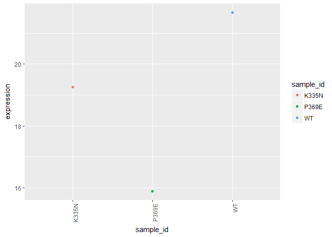

``` r
intronrnaseqmean <- meangenedata %>%
  filter(Gene_ID %in% introndata$V2)
intronrnaseqmean %>%
  as_tibble()
```

    ## # A tibble: 278 x 4
    ##    Gene_ID     K335N   P369E      WT
    ##    <fct>       <dbl>   <dbl>   <dbl>
    ##  1 YAL001C      9.51    9.90    9.90
    ##  2 YAL003W   2011.   1866.   1979.  
    ##  3 YAL030W     46.9    49.2    47.2 
    ##  4 YBL018C     45.0    62.7    44.8 
    ##  5 YBL026W    256.    391.    247.  
    ##  6 YBL027W   2141.   3520.   2130.  
    ##  7 YBL040C     53.9    83.7    52.1 
    ##  8 YBL050W     34.2    64.5    34.4 
    ##  9 YBL059C-A   40.3    73.4    45.0 
    ## 10 YBL059W     11.0    21.0    11.8 
    ## # ... with 268 more rows

``` r
IDD <- c("YML085C","YFL039C","YBR111W-A")
 ICGexpressionmean <- intronrnaseqmean %>% filter(Gene_ID %in% IDD)
 ICGexpressionmean
```

    ##     Gene_ID     K335N      P369E         WT
    ## 1 YBR111W-A   46.4214   73.78727   43.59737
    ## 2   YFL039C 1040.0433 1016.66900 1056.11000
    ## 3   YML085C  108.4560  120.59833  110.28367

``` r
 ICGexpressionmean$Gene_ID <- c("Tub1", "Act1", "Sus1")
 ICGmean <- ICGexpressionmean %>%
  as.data.frame() %>% 
  column_to_rownames("Gene_ID") %>%
  t() %>% as.data.frame() %>% 
  rownames_to_column("sample_id") %>% 
  melt(id = "sample_id") %>% 
  as_tibble() %>% 
  dplyr::select(sample_id,
         gene = variable, 
         expression = value)
 ICGmean
```

    ## # A tibble: 9 x 3
    ##   sample_id gene  expression
    ##   <chr>     <fct>      <dbl>
    ## 1 K335N     Tub1        46.4
    ## 2 P369E     Tub1        73.8
    ## 3 WT        Tub1        43.6
    ## 4 K335N     Act1      1040. 
    ## 5 P369E     Act1      1017. 
    ## 6 WT        Act1      1056. 
    ## 7 K335N     Sus1       108. 
    ## 8 P369E     Sus1       121. 
    ## 9 WT        Sus1       110.

``` r
 ggplot(ICGmean, aes(x=sample_id, y=expression)) + geom_point(aes(color=sample_id)) + theme(axis.text.x = element_text(angle=90, hjust=1)) + facet_wrap(~gene)
```

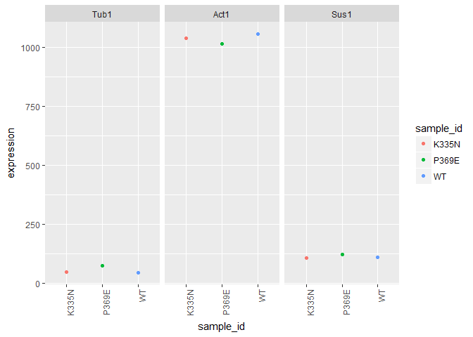

``` r
meltintron <- melt(intronrnaseqmean, id="Gene_ID")
meltintron %>%
  as_tibble()
```

    ## # A tibble: 834 x 3
    ##    Gene_ID   variable   value
    ##    <fct>     <fct>      <dbl>
    ##  1 YAL001C   K335N       9.51
    ##  2 YAL003W   K335N    2011.  
    ##  3 YAL030W   K335N      46.9 
    ##  4 YBL018C   K335N      45.0 
    ##  5 YBL026W   K335N     256.  
    ##  6 YBL027W   K335N    2141.  
    ##  7 YBL040C   K335N      53.9 
    ##  8 YBL050W   K335N      34.2 
    ##  9 YBL059C-A K335N      40.3 
    ## 10 YBL059W   K335N      11.0 
    ## # ... with 824 more rows

``` r
ggplot(meltintron, aes(x=Gene_ID, y=value, color = variable)) + geom_point() + theme(axis.text.x = element_text(angle = 90, hjust = 1))
```

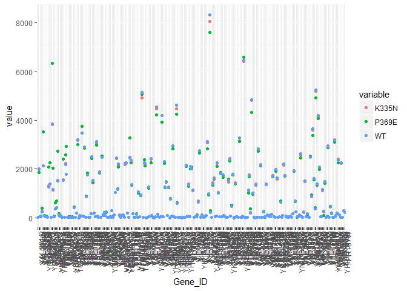

``` r
logmeltintron <- meltintron
logmeltintron$value <- log(meltintron$value,2)
ggplot(logmeltintron, aes(x=Gene_ID, y=value, color = variable)) + geom_point()
```

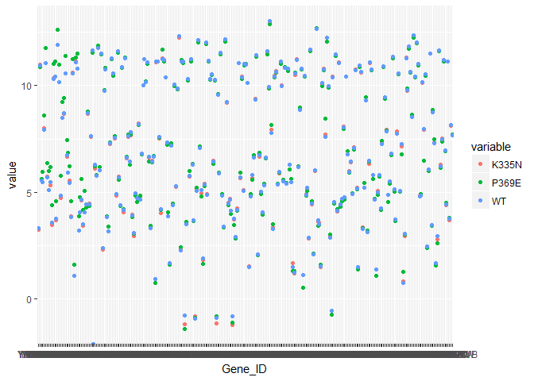

``` r
#Goana does not accept yeast names. Therefore, merge a list containing the yeast names and human names based on the yeast identifiers https://yeastmine.yeastgenome.org. Once merged, do goana analysis based on human gene identifiers.
homologlist <- read.table(file = "https://raw.githubusercontent.com/STAT540-UBC/Repo_team_Splice_and_Dice/master/Data/YeastHumanHomologsWithYeastIdentifiers.tsv?token=AMwAPnrPZQg5Ecb9NMG4cQ8hGjF35dl-ks5aySiQwA%3D%3D", sep = '\t', header = TRUE)
#Join to MetaData
colnames(homologlist)[5] <- "Gene_ID"
homologlist <- homologlist %>% left_join(meangenedata, by = "Gene_ID")
```

    ## Warning: Column `Gene_ID` joining factors with different levels, coercing
    ## to character vector

``` r
#Look at K335N mutant samples compared to control
homologlist <- homologlist %>% left_join(expression_coeff_2, by = "Gene_ID")
```

    ## Warning: Column `Gene_ID` joining character vector and factor, coercing
    ## into character vector

``` r
#Remove NA values
homologlist[rowSums(is.na(homologlist)) == 0,]
```

    ##           X100 H..sapiens            ADA
    ## 1        10000 H. sapiens           AKT3
    ## 3        10000 H. sapiens           AKT3
    ## 14   100125288 H. sapiens          ZGLP1
    ## 19   100129583 H. sapiens         FAM47E
    ## 34   100132911 H. sapiens         DPH3P1
    ## 43   100271849 H. sapiens          MEF2B
    ## 45   100271927 H. sapiens         RASA4B
    ## 80       10040 H. sapiens         TOM1L1
    ## 83       10043 H. sapiens           TOM1
    ## 88       10049 H. sapiens         DNAJB6
    ## 94   100507577 H. sapiens   LOC100507577
    ## 122  100533184 H. sapiens ARHGAP19-SLIT1
    ## 164      10095 H. sapiens         ARPC1B
    ## 187      10110 H. sapiens           SGK2
    ## 215      10156 H. sapiens          RASA4
    ## 225       1017 H. sapiens           CDK2
    ## 228      10175 H. sapiens          CNIH1
    ## 231       1018 H. sapiens           CDK3
    ## 233       1019 H. sapiens           CDK4
    ## 235      10195 H. sapiens           ALG3
    ## 236      10196 H. sapiens          PRMT3
    ## 245      10204 H. sapiens          NUTF2
    ## 247       1021 H. sapiens           CDK6
    ## 273      10254 H. sapiens          STAM2
    ## 297      10276 H. sapiens           NET1
    ## 310      10294 H. sapiens         DNAJA2
    ## 311      10295 H. sapiens          BCKDK
    ## 318      10300 H. sapiens         KATNB1
    ## 331      10313 H. sapiens           RTN3
    ## 341      10362 H. sapiens         HMG20B
    ## 345      10363 H. sapiens         HMG20A
    ## 362      10395 H. sapiens           DLC1
    ## 365      10399 H. sapiens         GNB2L1
    ## 367       1040 H. sapiens           CDS1
    ## 369      10401 H. sapiens          PIAS3
    ## 373      10419 H. sapiens          PRMT5
    ## 375      10422 H. sapiens          UBAC1
    ## 383      10428 H. sapiens          CFDP1
    ## 422      10493 H. sapiens           VAT1
    ## 428      10498 H. sapiens          CARM1
    ## 440      10525 H. sapiens          HYOU1
    ## 447      10529 H. sapiens           NEBL
    ## 464      10552 H. sapiens         ARPC1A
    ## 490      10587 H. sapiens         TXNRD2
    ## 497      10597 H. sapiens       TRAPPC2B
    ## 506       1062 H. sapiens          CENPE
    ## 512      10628 H. sapiens          TXNIP
    ## 555      10723 H. sapiens        SLC12A7
    ## 567      10750 H. sapiens           GRAP
    ## 574      10775 H. sapiens           POP4
    ## 583      10797 H. sapiens         MTHFD2
    ## 595      10808 H. sapiens          HSPH1
    ## 600      10840 H. sapiens        ALDH1L1
    ## 604      10845 H. sapiens           CLPX
    ## 610      10861 H. sapiens        SLC26A1
    ## 614      10868 H. sapiens          USP20
    ## 642      10928 H. sapiens         RALBP1
    ## 646      10938 H. sapiens           EHD1
    ## 649      10940 H. sapiens           POP1
    ## 651      10945 H. sapiens         KDELR1
    ## 679      10988 H. sapiens         METAP2
    ## 685      10991 H. sapiens        SLC38A3
    ## 686      10991 H. sapiens        SLC38A3
    ## 690      10993 H. sapiens            SDS
    ## 695      10994 H. sapiens          ILVBL
    ## 699      10994 H. sapiens          ILVBL
    ## 700      10998 H. sapiens        SLC27A5
    ## 701      10999 H. sapiens        SLC27A4
    ## 702      11000 H. sapiens        SLC27A3
    ## 703      11001 H. sapiens        SLC27A2
    ## 706      11014 H. sapiens         KDELR2
    ## 707      11015 H. sapiens         KDELR3
    ## 718      11020 H. sapiens          IFT27
    ## 732      11036 H. sapiens        GTF2A1L
    ## 733      11037 H. sapiens          STON1
    ## 734      11037 H. sapiens          STON1
    ## 737      11040 H. sapiens           PIM2
    ## 746      11057 H. sapiens          ABHD2
    ## 760      11072 H. sapiens         DUSP14
    ## 764      11073 H. sapiens         TOPBP1
    ## 768      11080 H. sapiens         DNAJB4
    ## 781       1111 H. sapiens          CHEK1
    ## 789      11127 H. sapiens          KIF3A
    ## 793      11136 H. sapiens         SLC7A9
    ## 794      11136 H. sapiens         SLC7A9
    ## 795      11136 H. sapiens         SLC7A9
    ## 800      11136 H. sapiens         SLC7A9
    ## 821      11143 H. sapiens           KAT7
    ## 834      11163 H. sapiens          NUDT4
    ## 835      11164 H. sapiens          NUDT5
    ## 836      11165 H. sapiens          NUDT3
    ## 850      11181 H. sapiens           TREH
    ## 856      11182 H. sapiens         SLC2A6
    ## 859      11182 H. sapiens         SLC2A6
    ## 861      11182 H. sapiens         SLC2A6
    ## 862      11182 H. sapiens         SLC2A6
    ## 879      11196 H. sapiens        SEC23IP
    ## 888      11212 H. sapiens          PROSC
    ## 889      11213 H. sapiens          IRAK3
    ## 892      11214 H. sapiens         AKAP13
    ## 897      11221 H. sapiens         DUSP10
    ## 903      11224 H. sapiens          RPL35
    ## 904       1123 H. sapiens           CHN1
    ## 905       1123 H. sapiens           CHN1
    ## 910      11232 H. sapiens          POLG2
    ## 912       1124 H. sapiens           CHN2
    ## 913       1124 H. sapiens           CHN2
    ## 928      11262 H. sapiens          SP140
    ## 940      11274 H. sapiens          USP18
    ## 952     147872 H. sapiens        CCDC155
    ## 980      23332 H. sapiens         CLASP1
    ## 992      23365 H. sapiens       ARHGEF12
    ## 996      23370 H. sapiens       ARHGEF18
    ## 997      23371 H. sapiens           TNS2
    ## 999      23380 H. sapiens         SRGAP2
    ## 1008     23387 H. sapiens           SIK3
    ## 1014     23395 H. sapiens          LARS2
    ## 1016     23396 H. sapiens        PIP5K1C
    ## 1017     23397 H. sapiens          NCAPH
    ## 1020     23399 H. sapiens        CTDNEP1
    ## 1041     23428 H. sapiens         SLC7A8
    ## 1042     23428 H. sapiens         SLC7A8
    ## 1043     23428 H. sapiens         SLC7A8
    ## 1048     23428 H. sapiens         SLC7A8
    ## 1095     23483 H. sapiens           TGDS
    ## 1111     23524 H. sapiens          SRRM2
    ## 1129     23550 H. sapiens           PSD4
    ## 1140     23586 H. sapiens          DDX58
    ## 1142     23586 H. sapiens          DDX58
    ## 1144     23586 H. sapiens          DDX58
    ## 1174     23616 H. sapiens         SH3BP1
    ## 1193     23640 H. sapiens         HSPBP1
    ## 1196     23649 H. sapiens          POLA2
    ## 1197     23657 H. sapiens        SLC7A11
    ## 1198     23657 H. sapiens        SLC7A11
    ## 1199     23657 H. sapiens        SLC7A11
    ## 1204     23657 H. sapiens        SLC7A11
    ## 1229     23678 H. sapiens           SGK3
    ## 1236     23710 H. sapiens      GABARAPL1
    ## 1242     23761 H. sapiens           PISD
    ## 1245     23766 H. sapiens      GABARAPL3
    ## 1249     24137 H. sapiens          KIF4A
    ## 1251     24140 H. sapiens          FTSJ1
    ## 1253     24148 H. sapiens          PRPF6
    ## 1278      2531 H. sapiens           KDSR
    ## 1279      2531 H. sapiens           KDSR
    ## 1299    253558 H. sapiens         LCLAT1
    ## 1302    253725 H. sapiens         FAM21C
    ## 1310    254042 H. sapiens        METAP1D
    ## 1314    254048 H. sapiens           UBN2
    ## 1319    254263 H. sapiens          CNIH2
    ## 1325    254394 H. sapiens           MCM9
    ## 1327      2548 H. sapiens            GAA
    ## 1346    255626 H. sapiens      HIST1H2BA
    ## 1355    255967 H. sapiens           PAN3
    ## 1359    256281 H. sapiens         NUDT14
    ## 1369    257106 H. sapiens       ARHGAP30
    ## 1370    257202 H. sapiens           GPX6
    ## 1380    257468 H. sapiens        MEIS3P2
    ## 1386     25763 H. sapiens           HYPM
    ## 1392     25788 H. sapiens         RAD54B
    ## 1410      2582 H. sapiens           GALE
    ## 1413     25822 H. sapiens         DNAJB5
    ## 1422     25827 H. sapiens          FBXL2
    ## 1423     25829 H. sapiens       TMEM184B
    ## 1428      2584 H. sapiens          GALK1
    ## 1433      2585 H. sapiens          GALK2
    ## 1445     25885 H. sapiens         POLR1A
    ## 1451     25902 H. sapiens        MTHFD1L
    ## 1454      2592 H. sapiens           GALT
    ## 1458     25929 H. sapiens         GEMIN5
    ## 1469      2595 H. sapiens           GANC
    ## 1484     25979 H. sapiens         DHRS7B
    ## 1488     25980 H. sapiens           AAR2
    ## 1508     26031 H. sapiens         OSBPL3
    ## 1518     26058 H. sapiens         GIGYF2
    ## 1520     26061 H. sapiens          HACL1
    ## 1526     26088 H. sapiens           GGA1
    ## 1554      2617 H. sapiens           GARS
    ## 1573     26235 H. sapiens          FBXL4
    ## 1602     26353 H. sapiens          HSPB8
    ## 1607      2645 H. sapiens            GCK
    ## 1616     26499 H. sapiens          PLEK2
    ## 1624     26519 H. sapiens         TIMM10
    ## 1646      2669 H. sapiens            GEM
    ## 1647    266971 H. sapiens          PIPSL
    ## 1648       267 H. sapiens           AMFR
    ## 1675     27005 H. sapiens          USP21
    ## 1681     27013 H. sapiens         CNPPD1
    ## 1687     27013 H. sapiens         CNPPD1
    ## 1697     27032 H. sapiens         ATP2C1
    ## 1702     27068 H. sapiens           PPA2
    ## 1710     27079 H. sapiens         RPUSD2
    ## 1717     27097 H. sapiens          TAF5L
    ## 1725     27106 H. sapiens         ARRDC2
    ## 1743     27129 H. sapiens          HSPB7
    ## 1766     27230 H. sapiens          SERP1
    ## 1767     27231 H. sapiens          NMRK2
    ## 1771     27246 H. sapiens         RNF115
    ## 1775     27258 H. sapiens           LSM3
    ## 1785     27301 H. sapiens          APEX2
    ## 1793     27327 H. sapiens         TNRC6A
    ## 1796     27330 H. sapiens        RPS6KA6
    ## 1802     27339 H. sapiens         PRPF19
    ## 1803     27340 H. sapiens          UTP20
    ## 1832       276 H. sapiens          AMY1A
    ## 1833       276 H. sapiens          AMY1A
    ## 1835       276 H. sapiens          AMY1A
    ## 1836      2762 H. sapiens           GMDS
    ## 1846      2766 H. sapiens           GMPR
    ## 1855       277 H. sapiens          AMY1B
    ## 1856       277 H. sapiens          AMY1B
    ## 1858       277 H. sapiens          AMY1B
    ## 1872       278 H. sapiens          AMY1C
    ## 1873       278 H. sapiens          AMY1C
    ## 1875       278 H. sapiens          AMY1C
    ## 1886       279 H. sapiens          AMY2A
    ## 1887       279 H. sapiens          AMY2A
    ## 1889       279 H. sapiens          AMY2A
    ## 1895       280 H. sapiens          AMY2B
    ## 1896       280 H. sapiens          AMY2B
    ## 1898       280 H. sapiens          AMY2B
    ## 1907      2821 H. sapiens            GPI
    ## 1908      2822 H. sapiens          GPLD1
    ## 1949    284129 H. sapiens       SLC26A11
    ## 1951    284273 H. sapiens          ZADH2
    ## 1953    284273 H. sapiens          ZADH2
    ## 1961    284486 H. sapiens          THEM5
    ## 1963    284611 H. sapiens        FAM102B
    ## 1969    285126 H. sapiens        DNAJC5G
    ## 1974    285193 H. sapiens         DUSP28
    ## 1985    285381 H. sapiens           DPH3
    ## 1990    285588 H. sapiens         EFCAB9
    ## 1994    285643 H. sapiens          KIF4B
    ## 1997    285849 H. sapiens       COX6A1P2
    ## 2012    286436 H. sapiens          H2BFM
    ## 2015    286749 H. sapiens  STON1-GTF2A1L
    ## 2016      2868 H. sapiens           GRK4
    ## 2017      2869 H. sapiens           GRK5
    ## 2018      2870 H. sapiens           GRK6
    ## 2026      2876 H. sapiens           GPX1
    ## 2029      2877 H. sapiens           GPX2
    ## 2032      2878 H. sapiens           GPX3
    ## 2035      2879 H. sapiens           GPX4
    ## 2038      2880 H. sapiens           GPX5
    ## 2041      2882 H. sapiens           GPX7
    ## 2044      2885 H. sapiens           GRB2
    ## 2045      2889 H. sapiens        RAPGEF1
    ## 2049     28954 H. sapiens           REM1
    ## 2055     28965 H. sapiens        SLC27A6
    ## 2060     28989 H. sapiens          NTMT1
    ## 2065       290 H. sapiens          ANPEP
    ## 2079      2909 H. sapiens       ARHGAP35
    ## 2080      2909 H. sapiens       ARHGAP35
    ## 2088     29097 H. sapiens          CNIH4
    ## 2090     29098 H. sapiens         RANGRF
    ## 2091       291 H. sapiens        SLC25A4
    ## 2092       291 H. sapiens        SLC25A4
    ## 2093       291 H. sapiens        SLC25A4
    ## 2105     29127 H. sapiens        RACGAP1
    ## 2106     29127 H. sapiens        RACGAP1
    ## 2109       292 H. sapiens        SLC25A5
    ## 2110       292 H. sapiens        SLC25A5
    ## 2111       292 H. sapiens        SLC25A5
    ## 2112      2923 H. sapiens          PDIA3
    ## 2114       293 H. sapiens        SLC25A6
    ## 2115       293 H. sapiens        SLC25A6
    ## 2116       293 H. sapiens        SLC25A6
    ## 2118      2931 H. sapiens          GSK3A
    ## 2121      2932 H. sapiens          GSK3B
    ## 2127      2936 H. sapiens            GSR
    ## 2129      2952 H. sapiens          GSTT1
    ## 2130      2953 H. sapiens          GSTT2
    ## 2134      2954 H. sapiens          GSTZ1
    ## 2138      2957 H. sapiens         GTF2A1
    ## 2159     29789 H. sapiens           OLA1
    ## 2164     29799 H. sapiens          YPEL1
    ## 2168     29855 H. sapiens           UBN1
    ## 2174     29883 H. sapiens          CNOT7
    ## 2208     29927 H. sapiens        SEC61A1
    ## 2217     29941 H. sapiens           PKN3
    ## 2219     29953 H. sapiens          TRHDE
    ## 2255     29988 H. sapiens         SLC2A8
    ## 2258     29988 H. sapiens         SLC2A8
    ## 2260     29988 H. sapiens         SLC2A8
    ## 2261     29988 H. sapiens         SLC2A8
    ## 2282     30000 H. sapiens          TNPO2
    ## 2283     30001 H. sapiens          ERO1A
    ## 2290      3012 H. sapiens      HIST1H2AE
    ## 2292      3013 H. sapiens      HIST1H2AD
    ## 2294      3014 H. sapiens          H2AFX
    ## 2297      3017 H. sapiens      HIST1H2BD
    ## 2299      3018 H. sapiens      HIST1H2BB
    ## 2301      3020 H. sapiens          H3F3A
    ## 2303      3021 H. sapiens          H3F3B
    ## 2346     30846 H. sapiens           EHD2
    ## 2348     30849 H. sapiens         PIK3R4
    ## 2354      3098 H. sapiens            HK1
    ## 2359      3099 H. sapiens            HK2
    ## 2366      3101 H. sapiens            HK3
    ## 2374      3146 H. sapiens          HMGB1
    ## 2376      3149 H. sapiens          HMGB3
    ## 2386      3162 H. sapiens          HMOX1
    ## 2387      3163 H. sapiens          HMOX2
    ## 2390       317 H. sapiens          APAF1
    ## 2395    317772 H. sapiens      HIST2H2AB
    ## 2404      3190 H. sapiens         HNRNPK
    ## 2405      3190 H. sapiens         HNRNPK
    ## 2530      3265 H. sapiens           HRAS
    ## 2532      3266 H. sapiens           ERAS
    ## 2536      3275 H. sapiens          PRMT2
    ## 2537      3276 H. sapiens          PRMT1
    ## 2538       328 H. sapiens          APEX1
    ## 2543      3290 H. sapiens        HSD11B1
    ## 2550      3293 H. sapiens        HSD17B3
    ## 2569      3300 H. sapiens         DNAJB2
    ## 2574      3303 H. sapiens         HSPA1A
    ## 2580      3304 H. sapiens         HSPA1B
    ## 2586      3305 H. sapiens         HSPA1L
    ## 2590      3306 H. sapiens          HSPA2
    ## 2593      3308 H. sapiens          HSPA4
    ## 2600      3310 H. sapiens          HSPA6
    ## 2604      3311 H. sapiens          HSPA7
    ## 2610      3312 H. sapiens          HSPA8
    ## 2616      3315 H. sapiens          HSPB1
    ## 2617      3316 H. sapiens          HSPB2
    ## 2630      3336 H. sapiens          HSPE1
    ## 2631      3337 H. sapiens         DNAJB1
    ## 2633    333932 H. sapiens       HIST2H3A
    ## 2637      3376 H. sapiens           IARS
    ## 2638      3376 H. sapiens           IARS
    ## 2639    337873 H. sapiens      HIST2H2BC
    ## 2641    337874 H. sapiens      HIST2H2BD
    ## 2650    338440 H. sapiens           ANO9
    ## 2651    338599 H. sapiens          DUPD1
    ## 2674    340485 H. sapiens          ACER2
    ## 2683    341359 H. sapiens          SYT10
    ## 2686    341392 H. sapiens          ACSM4
    ## 2711      3431 H. sapiens          SP110
    ## 2716    343578 H. sapiens       ARHGAP40
    ## 2720    344558 H. sapiens         SH3RF3
    ## 2751    347744 H. sapiens        C6orf52
    ## 2755    348158 H. sapiens         ACSM2B
    ## 2760      3614 H. sapiens         IMPDH1
    ## 2762      3615 H. sapiens         IMPDH2
    ## 2783       495 H. sapiens          ATP4A
    ## 2794       498 H. sapiens         ATP5A1
    ## 2799      4999 H. sapiens           ORC2
    ## 2809       501 H. sapiens        ALDH7A1
    ## 2812      5034 H. sapiens           P4HB
    ## 2814      5036 H. sapiens          PA2G4
    ## 2825      5045 H. sapiens          FURIN
    ## 2826      5046 H. sapiens          PCSK6
    ## 2844       506 H. sapiens          ATP5B
    ## 2845       506 H. sapiens          ATP5B
    ## 2851     50618 H. sapiens          ITSN2
    ## 2852     50618 H. sapiens          ITSN2
    ## 2858      5062 H. sapiens           PAK2
    ## 2864     50636 H. sapiens           ANO7
    ## 2867     50650 H. sapiens        ARHGEF3
    ## 2868     50700 H. sapiens           RDH8
    ## 2881      5087 H. sapiens           PBX1
    ## 2886      5089 H. sapiens           PBX2
    ## 2892      5090 H. sapiens           PBX3
    ## 2896      5091 H. sapiens             PC
    ## 2897      5091 H. sapiens             PC
    ## 2900      5093 H. sapiens          PCBP1
    ## 2901      5093 H. sapiens          PCBP1
    ## 2903      5094 H. sapiens          PCBP2
    ## 2904      5094 H. sapiens          PCBP2
    ## 2910      5095 H. sapiens           PCCA
    ## 2919     51004 H. sapiens           COQ6
    ## 2920     51004 H. sapiens           COQ6
    ## 2924     51009 H. sapiens          DERL2
    ## 2936     51020 H. sapiens          HDDC2
    ## 2951     51035 H. sapiens          UBXN1
    ## 2961     51074 H. sapiens           APIP
    ## 2966     51094 H. sapiens        ADIPOR1
    ## 2973     51102 H. sapiens           MECR
    ## 2983      5111 H. sapiens           PCNA
    ## 2996     51135 H. sapiens          IRAK4
    ## 3001     51144 H. sapiens       HSD17B12
    ## 3010     51166 H. sapiens          AADAT
    ## 3043     51207 H. sapiens         DUSP13
    ## 3049      5122 H. sapiens          PCSK1
    ## 3055      5125 H. sapiens          PCSK5
    ## 3057      5126 H. sapiens          PCSK2
    ## 3079     51292 H. sapiens          GMPR2
    ## 3095     51337 H. sapiens          THEM6
    ## 3107     51371 H. sapiens           POMP
    ## 3129     51422 H. sapiens         PRKAG2
    ## 3143     51434 H. sapiens         ANAPC7
    ## 3162     51475 H. sapiens          CABP2
    ## 3187     51520 H. sapiens           LARS
    ## 3192     51540 H. sapiens           SCLY
    ## 3206     51588 H. sapiens          PIAS4
    ## 3209       516 H. sapiens         ATP5G1
    ## 3223      5162 H. sapiens           PDHB
    ## 3231     51635 H. sapiens          DHRS7
    ## 3239     51646 H. sapiens          YPEL5
    ## 3241     51649 H. sapiens         MRPS23
    ## 3244     51651 H. sapiens          PTRH2
    ## 3247     51657 H. sapiens         STYXL1
    ## 3269       517 H. sapiens         ATP5G2
    ## 3277     51701 H. sapiens            NLK
    ## 3287      5172 H. sapiens        SLC26A4
    ## 3300     51752 H. sapiens          ERAP1
    ## 3304     51760 H. sapiens          SYT17
    ## 3316       518 H. sapiens         ATP5G3
    ## 3323     51806 H. sapiens         CALML5
    ## 3326      5184 H. sapiens           PEPD
    ## 3330      5188 H. sapiens           GATB
    ## 3333      5191 H. sapiens           PEX7
    ## 3366      5211 H. sapiens           PFKL
    ## 3369      5213 H. sapiens           PFKM
    ## 3371      5214 H. sapiens           PFKP
    ## 3412      5245 H. sapiens            PHB
    ## 3413       525 H. sapiens       ATP6V1B1
    ## 3417       526 H. sapiens       ATP6V1B2
    ## 3424      5279 H. sapiens           PIGC
    ## 3436      5292 H. sapiens           PIM1
    ## 3442      5305 H. sapiens        PIP4K2A
    ## 3448      5316 H. sapiens         PKNOX1
    ## 3462     53347 H. sapiens        UBASH3A
    ## 3473      5341 H. sapiens           PLEK
    ## 3481     53632 H. sapiens         PRKAG3
    ## 3489       538 H. sapiens          ATP7A
    ## 3490       538 H. sapiens          ATP7A
    ## 3514       540 H. sapiens          ATP7B
    ## 3515       540 H. sapiens          ATP7B
    ## 3517     54039 H. sapiens          PCBP3
    ## 3518     54039 H. sapiens          PCBP3
    ## 3520     54093 H. sapiens          SETD4
    ## 3521     54107 H. sapiens          POLE3
    ## 3536     54145 H. sapiens          H2BFS
    ## 3540     54148 H. sapiens         MRPL39
    ## 3561     54332 H. sapiens          GDAP1
    ## 3564      5434 H. sapiens         POLR2E
    ## 3574     54407 H. sapiens        SLC38A2
    ## 3575     54407 H. sapiens        SLC38A2
    ## 3579      5442 H. sapiens         POLRMT
    ## 3583     54434 H. sapiens           SSH1
    ## 3594     54456 H. sapiens        MOV10L1
    ## 3598     54460 H. sapiens         MRPS21
    ## 3603     54468 H. sapiens           MIOS
    ## 3609     54495 H. sapiens           TMX3
    ## 3611     54495 H. sapiens           TMX3
    ## 3614       545 H. sapiens            ATR
    ## 3617     54504 H. sapiens           CPVL
    ## 3645     54602 H. sapiens         NDFIP2
    ## 3658     54622 H. sapiens          ARL15
    ## 3660     54623 H. sapiens           PAF1
    ## 3664      5464 H. sapiens           PPA1
    ## 3687      5476 H. sapiens           CTSA
    ## 3688      5476 H. sapiens           CTSA
    ## 3690     54760 H. sapiens          PCSK4
    ## 3692     54762 H. sapiens        GRAMD1C
    ## 3725    548593 H. sapiens          SLX1A
    ## 3742     54886 H. sapiens         PLPPR1
    ## 3743     54888 H. sapiens          NSUN2
    ## 3745     54896 H. sapiens          PQLC2
    ## 3763     54935 H. sapiens         DUSP23
    ## 3765      5494 H. sapiens          PPM1A
    ## 3767     54948 H. sapiens         MRPL16
    ## 3769      5495 H. sapiens          PPM1B
    ## 3771     54952 H. sapiens       TRNAU1AP
    ## 3778      5496 H. sapiens          PPM1G
    ## 3779     54961 H. sapiens           SSH3
    ## 3790     54981 H. sapiens          NMRK1
    ## 3794     54988 H. sapiens          ACSM5
    ## 3816     55015 H. sapiens         PRPF39
    ## 3847     55089 H. sapiens        SLC38A4
    ## 3848     55089 H. sapiens        SLC38A4
    ## 3861     55107 H. sapiens           ANO1
    ## 3863     55114 H. sapiens       ARHGAP17
    ## 3916     55291 H. sapiens         PPP6R3
    ## 3923      5530 H. sapiens         PPP3CA
    ## 3937      5532 H. sapiens         PPP3CB
    ## 3939     55326 H. sapiens         AGPAT5
    ## 3942      5533 H. sapiens         PPP3CC
    ## 3943     55331 H. sapiens          ACER3
    ## 3954     55345 H. sapiens          ZGRF1
    ## 3972    554313 H. sapiens       HIST2H4B
    ## 3991     55506 H. sapiens         H2AFY2
    ## 4008     55582 H. sapiens          KIF27
    ## 4010     55589 H. sapiens          BMP2K
    ## 4014     55605 H. sapiens         KIF21A
    ## 4020     55621 H. sapiens          TRMT1
    ## 4051     55650 H. sapiens           PIGV
    ## 4062     55666 H. sapiens         NPLOC4
    ## 4063     55669 H. sapiens           MFN1
    ## 4074     55681 H. sapiens          SCYL2
    ## 4081     55696 H. sapiens          RBM22
    ## 4085     55699 H. sapiens          IARS2
    ## 4093      5571 H. sapiens         PRKAG1
    ## 4104     55735 H. sapiens        DNAJC11
    ## 4113     55748 H. sapiens          CNDP2
    ## 4117     55751 H. sapiens       TMEM184C
    ## 4133     55766 H. sapiens          H2AFJ
    ## 4139      5578 H. sapiens          PRKCA
    ## 4141      5578 H. sapiens          PRKCA
    ## 4146      5579 H. sapiens          PRKCB
    ## 4148      5579 H. sapiens          PRKCB
    ## 4156      5580 H. sapiens          PRKCD
    ## 4158      5580 H. sapiens          PRKCD
    ## 4164      5581 H. sapiens          PRKCE
    ## 4166      5581 H. sapiens          PRKCE
    ## 4174      5582 H. sapiens          PRKCG
    ## 4176      5582 H. sapiens          PRKCG
    ## 4179     55823 H. sapiens          VPS11
    ## 4181      5583 H. sapiens          PRKCH
    ## 4183      5583 H. sapiens          PRKCH
    ## 4187      5584 H. sapiens          PRKCI
    ## 4189      5584 H. sapiens          PRKCI
    ## 4193      5585 H. sapiens           PKN1
    ## 4198     55858 H. sapiens        TMEM165
    ## 4199      5586 H. sapiens           PKN2
    ## 4204     55869 H. sapiens          HDAC8
    ## 4208      5588 H. sapiens          PRKCQ
    ## 4210      5588 H. sapiens          PRKCQ
    ## 4216      5590 H. sapiens          PRKCZ
    ## 4218      5590 H. sapiens          PRKCZ
    ## 4221     55902 H. sapiens          ACSS2
    ## 4223      5591 H. sapiens          PRKDC
    ## 4234      5594 H. sapiens          MAPK1
    ## 4237      5595 H. sapiens          MAPK3
    ## 4240      5596 H. sapiens          MAPK4
    ## 4244     55968 H. sapiens         NSFL1C
    ## 4245      5597 H. sapiens          MAPK6
    ## 4252      5598 H. sapiens          MAPK7
    ## 4278     56052 H. sapiens           ALG1
    ## 4285      5611 H. sapiens         DNAJC3
    ## 4298     56255 H. sapiens           TMX4
    ## 4302     56267 H. sapiens          CCBL2
    ## 4308     56301 H. sapiens        SLC7A10
    ## 4309     56301 H. sapiens        SLC7A10
    ## 4310     56301 H. sapiens        SLC7A10
    ## 4315     56301 H. sapiens        SLC7A10
    ## 4333      5631 H. sapiens          PRPS1
    ## 4342      5634 H. sapiens          PRPS2
    ## 4346     56341 H. sapiens          PRMT8
    ## 4349      5635 H. sapiens        PRPSAP1
    ## 4354      5636 H. sapiens        PRPSAP2
    ## 4360     56474 H. sapiens          CTPS2
    ## 4364     56605 H. sapiens          ERO1B
    ## 4365     56606 H. sapiens         SLC2A9
    ## 4367      5662 H. sapiens            PSD
    ## 4401     56894 H. sapiens         AGPAT3
    ## 4403     56895 H. sapiens         AGPAT4
    ## 4415     56917 H. sapiens          MEIS3
    ## 4421     56922 H. sapiens          MCCC1
    ## 4428     56940 H. sapiens         DUSP22
    ## 4433     56942 H. sapiens           CMC2
    ## 4435     56943 H. sapiens           ENY2
    ## 4446     56992 H. sapiens          KIF15
    ## 4451     56996 H. sapiens        SLC12A9
    ## 4458     57010 H. sapiens          CABP4
    ## 4467     57038 H. sapiens          RARS2
    ## 4469      5704 H. sapiens          PSMC4
    ## 4475     57060 H. sapiens          PCBP4
    ## 4476     57060 H. sapiens          PCBP4
    ## 4478     57062 H. sapiens          DDX24
    ## 4486     57101 H. sapiens           ANO2
    ## 4509     57142 H. sapiens           RTN4
    ## 4529     57176 H. sapiens          VARS2
    ## 4530     57178 H. sapiens          ZMIZ1
    ## 4550      5723 H. sapiens           PSPH
    ## 4556     57380 H. sapiens           MRS2
    ## 4576     57468 H. sapiens        SLC12A5
    ## 4583     57476 H. sapiens        GRAMD1B
    ## 4595     57514 H. sapiens       ARHGAP31
    ## 4599     57522 H. sapiens         SRGAP1
    ## 4605     57537 H. sapiens         SORCS2
    ## 4616     57558 H. sapiens          USP35
    ## 4620     57561 H. sapiens         ARRDC3
    ## 4631     57576 H. sapiens          KIF17
    ## 4635     57586 H. sapiens          SYT13
    ## 4637     57589 H. sapiens           RIC1
    ## 4653     57630 H. sapiens         SH3RF1
    ## 4664     57655 H. sapiens        GRAMD1A
    ## 4669     57679 H. sapiens           ALS2
    ## 4672     57687 H. sapiens          VAT1L
    ## 4676     57690 H. sapiens         TNRC6C
    ## 4694     57732 H. sapiens        ZFYVE28
    ## 4713     57819 H. sapiens           LSM2
    ## 4786     58504 H. sapiens       ARHGAP22
    ## 4792     58513 H. sapiens        EPS15L1
    ## 4793     58513 H. sapiens        EPS15L1
    ## 4805       586 H. sapiens          BCAT1
    ## 4817      5868 H. sapiens          RAB5A
    ## 4821      5869 H. sapiens          RAB5B
    ## 4826       587 H. sapiens          BCAT2
    ## 4837      5878 H. sapiens          RAB5C
    ## 4856      5891 H. sapiens            MOK
    ## 4863      5898 H. sapiens           RALA
    ## 4865      5899 H. sapiens           RALB
    ## 4875      5905 H. sapiens        RANGAP1
    ## 4884      5917 H. sapiens           RARS
    ## 4886      5921 H. sapiens          RASA1
    ## 4889      5922 H. sapiens          RASA2
    ## 4898      5928 H. sapiens          RBBP4
    ## 4904      5931 H. sapiens          RBBP7
    ## 4907     59342 H. sapiens         SCPEP1
    ## 4925      5976 H. sapiens           UPF1
    ## 4929      5983 H. sapiens           RFC3
    ## 4966      6014 H. sapiens           RIT2
    ## 4970      6016 H. sapiens           RIT1
    ## 4978     60436 H. sapiens          TGIF2
    ## 4989     60488 H. sapiens         MRPS35
    ## 5023      6124 H. sapiens           RPL4
    ## 5037      6132 H. sapiens           RPL8
    ## 5043      6135 H. sapiens          RPL11
    ## 5057      6143 H. sapiens          RPL19
    ## 5058      6144 H. sapiens          RPL21
    ## 5059      6144 H. sapiens          RPL21
    ## 5075      6161 H. sapiens          RPL32
    ## 5078      6165 H. sapiens         RPL35A
    ## 5109      6193 H. sapiens           RPS5
    ## 5111      6194 H. sapiens           RPS6
    ## 5112      6194 H. sapiens           RPS6
    ## 5113      6195 H. sapiens        RPS6KA1
    ## 5117      6196 H. sapiens        RPS6KA2
    ## 5121      6197 H. sapiens        RPS6KA3
    ## 5126      6198 H. sapiens        RPS6KB1
    ## 5129      6199 H. sapiens        RPS6KB2
    ## 5133      6202 H. sapiens           RPS8
    ## 5134      6202 H. sapiens           RPS8
    ## 5135      6203 H. sapiens           RPS9
    ## 5139      6205 H. sapiens          RPS11
    ## 5147      6210 H. sapiens         RPS15A
    ## 5149      6217 H. sapiens          RPS16
    ## 5178      6236 H. sapiens           RRAD
    ## 5180      6237 H. sapiens           RRAS
    ## 5188      6252 H. sapiens           RTN1
    ## 5190      6253 H. sapiens           RTN2
    ## 5191      6272 H. sapiens          SORT1
    ## 5201      6296 H. sapiens          ACSM3
    ## 5222      6341 H. sapiens           SCO1
    ## 5223      6341 H. sapiens           SCO1
    ## 5225      6345 H. sapiens            SRL
    ## 5232     63876 H. sapiens         PKNOX2
    ## 5245     63904 H. sapiens         DUSP21
    ## 5249     63908 H. sapiens           NAPB
    ## 5258     63929 H. sapiens        XPNPEP3
    ## 5274     63982 H. sapiens           ANO3
    ## 5275      6399 H. sapiens        TRAPPC2
    ## 5291     64135 H. sapiens          IFIH1
    ## 5293     64135 H. sapiens          IFIH1
    ## 5295     64135 H. sapiens          IFIH1
    ## 5311     64137 H. sapiens          ABCG4
    ## 5325     64167 H. sapiens          ERAP2
    ## 5352    642623 H. sapiens         UBTFL1
    ## 5361     64283 H. sapiens       ARHGEF28
    ## 5362     64284 H. sapiens          RAB17
    ## 5375    643246 H. sapiens      MAP1LC3B2
    ## 5380    643615 H. sapiens         UBTFL6
    ## 5384     64374 H. sapiens           SIL1
    ## 5426      6446 H. sapiens           SGK1
    ## 5430    644974 H. sapiens         ALG1L2
    ## 5432      6453 H. sapiens          ITSN1
    ## 5433      6453 H. sapiens          ITSN1
    ## 5437    645332 H. sapiens       FAM86C2P
    ## 5442    645432 H. sapiens         ARRDC5
    ## 5456     64577 H. sapiens        ALDH8A1
    ## 5463     64598 H. sapiens         MOSPD3
    ## 5465     64599 H. sapiens         GIGYF1
    ## 5472     64682 H. sapiens         ANAPC1
    ## 5474      6470 H. sapiens          SHMT1
    ## 5477    647135 H. sapiens        SRGAP2B
    ## 5479     64714 H. sapiens          PDIA2
    ## 5481      6472 H. sapiens          SHMT2
    ## 5488     64748 H. sapiens         PLPPR2
    ## 5493     64759 H. sapiens           TNS3
    ## 5494      6476 H. sapiens             SI
    ## 5504     64789 H. sapiens           EXO5
    ## 5513     64839 H. sapiens         FBXL17
    ## 5518     64854 H. sapiens          USP46
    ## 5532     64926 H. sapiens         RASAL3
    ## 5538     64965 H. sapiens          MRPS9
    ## 5540     64969 H. sapiens          MRPS5
    ## 5541     64975 H. sapiens         MRPL41
    ## 5552     65010 H. sapiens        SLC26A6
    ## 5554     65012 H. sapiens       SLC26A10
    ## 5557      6503 H. sapiens            SLA
    ## 5570      6513 H. sapiens         SLC2A1
    ## 5572      6514 H. sapiens         SLC2A2
    ## 5574      6515 H. sapiens         SLC2A3
    ## 5576      6517 H. sapiens         SLC2A4
    ## 5578      6518 H. sapiens         SLC2A5
    ## 5583      6519 H. sapiens         SLC3A1
    ## 5584      6519 H. sapiens         SLC3A1
    ## 5586      6519 H. sapiens         SLC3A1
    ## 5590      6520 H. sapiens         SLC3A2
    ## 5591      6520 H. sapiens         SLC3A2
    ## 5593      6520 H. sapiens         SLC3A2
    ## 5618    653333 H. sapiens        FAM86B2
    ## 5622    653464 H. sapiens        SRGAP2C
    ## 5629    653519 H. sapiens         GPR89A
    ## 5630    653604 H. sapiens       HIST2H3D
    ## 5632    653689 H. sapiens         GSTT2B
    ## 5648      6557 H. sapiens        SLC12A1
    ## 5649      6558 H. sapiens        SLC12A2
    ## 5650      6559 H. sapiens        SLC12A3
    ## 5651      6560 H. sapiens        SLC12A4
    ## 5662      6594 H. sapiens        SMARCA1
    ## 5667      6596 H. sapiens           HLTF
    ## 5673     65975 H. sapiens          STK33
    ## 5676     65979 H. sapiens        PHACTR4
    ## 5678      6598 H. sapiens        SMARCB1
    ## 5681     65983 H. sapiens         GRAMD3
    ## 5685     65985 H. sapiens           AACS
    ## 5686     65985 H. sapiens           AACS
    ## 5687     65985 H. sapiens           AACS
    ## 5699     66035 H. sapiens        SLC2A11
    ## 5704      6605 H. sapiens        SMARCE1
    ## 5721      6626 H. sapiens          SNRPA
    ## 5730      8260 H. sapiens          NAA10
    ## 5732      8277 H. sapiens          TKTL1
    ## 5738       829 H. sapiens         CAPZA1
    ## 5739      8290 H. sapiens        HIST3H3
    ## 5742      8294 H. sapiens       HIST1H4I
    ## 5748       830 H. sapiens         CAPZA2
    ## 5761      8329 H. sapiens      HIST1H2AI
    ## 5764      8330 H. sapiens      HIST1H2AK
    ## 5766      8331 H. sapiens      HIST1H2AJ
    ## 5768      8332 H. sapiens      HIST1H2AL
    ## 5770      8334 H. sapiens      HIST1H2AC
    ## 5772      8335 H. sapiens      HIST1H2AB
    ## 5774      8336 H. sapiens      HIST1H2AM
    ## 5776      8337 H. sapiens     HIST2H2AA3
    ## 5778      8338 H. sapiens      HIST2H2AC
    ## 5780      8339 H. sapiens      HIST1H2BG
    ## 5782      8340 H. sapiens      HIST1H2BL
    ## 5787      8341 H. sapiens      HIST1H2BN
    ## 5789      8342 H. sapiens      HIST1H2BM
    ## 5791      8343 H. sapiens      HIST1H2BF
    ## 5793      8344 H. sapiens      HIST1H2BE
    ## 5797     83447 H. sapiens       SLC25A31
    ## 5798     83447 H. sapiens       SLC25A31
    ## 5799     83447 H. sapiens       SLC25A31
    ## 5801      8345 H. sapiens      HIST1H2BH
    ## 5806     83452 H. sapiens         RAB33B
    ## 5809      8346 H. sapiens      HIST1H2BI
    ## 5812      8347 H. sapiens      HIST1H2BC
    ## 5816     83478 H. sapiens       ARHGAP24
    ## 5821      8348 H. sapiens      HIST1H2BO
    ## 5824      8349 H. sapiens      HIST2H2BE
    ## 5826      8350 H. sapiens       HIST1H3A
    ## 5828      8352 H. sapiens       HIST1H3C
    ## 5830      8353 H. sapiens       HIST1H3E
    ## 5832      8354 H. sapiens       HIST1H3I
    ## 5838      8355 H. sapiens       HIST1H3G
    ## 5840      8356 H. sapiens       HIST1H3J
    ## 5842      8357 H. sapiens       HIST1H3H
    ## 5844      8358 H. sapiens       HIST1H3B
    ## 5846      8359 H. sapiens       HIST1H4A
    ## 5847      8359 H. sapiens       HIST1H4A
    ## 5859      8360 H. sapiens       HIST1H4D
    ## 5865      8361 H. sapiens       HIST1H4F
    ## 5870      8362 H. sapiens       HIST1H4K
    ## 5875      8363 H. sapiens       HIST1H4J
    ## 5880     83637 H. sapiens          ZMIZ2
    ## 5882      8364 H. sapiens       HIST1H4C
    ## 5888      8365 H. sapiens       HIST1H4H
    ## 5893      8366 H. sapiens       HIST1H4B
    ## 5899      8367 H. sapiens       HIST1H4E
    ## 5904      8368 H. sapiens       HIST1H4L
    ## 5909      8369 H. sapiens       HIST1H4G
    ## 5914     83693 H. sapiens          HSDL1
    ## 5919      8370 H. sapiens       HIST2H4A
    ## 5926     83719 H. sapiens          YPEL3
    ## 5933     83740 H. sapiens         H2AFB3
    ## 5936     83747 H. sapiens       C20orf57
    ## 5943     83849 H. sapiens          SYT15
    ## 5952     83903 H. sapiens           GSG2
    ## 5957      8394 H. sapiens        PIP5K1A
    ## 5958     83940 H. sapiens         TATDN1
    ## 5964      8395 H. sapiens        PIP5K1B
    ## 5967      8396 H. sapiens        PIP4K2B
    ## 5992     84076 H. sapiens          TKTL2
    ## 5998     84100 H. sapiens           ARL6
    ## 6010     84144 H. sapiens          SYDE2
    ## 6011     84144 H. sapiens          SYDE2
    ## 6028     84174 H. sapiens           SLA2
    ## 6054     84250 H. sapiens           SLF1
    ## 6059     84258 H. sapiens           SYT3
    ## 6062     84263 H. sapiens          HSDL2
    ## 6084     84275 H. sapiens       SLC25A33
    ## 6110     84321 H. sapiens          THOC3
    ## 6120      8437 H. sapiens         RASAL1
    ## 6127     84418 H. sapiens         CYSTM1
    ## 6136     84447 H. sapiens          SYVN1
    ## 6137     84455 H. sapiens         EFCAB7
    ## 6146     84513 H. sapiens          PLPP5
    ## 6155     84532 H. sapiens          ACSS1
    ## 6159     84557 H. sapiens       MAP1LC3A
    ## 6161     84561 H. sapiens        SLC12A8
    ## 6163      8458 H. sapiens           TTF2
    ## 6168      8463 H. sapiens          TEAD2
    ## 6171     84640 H. sapiens          USP38
    ## 6178      8467 H. sapiens        SMARCA5
    ## 6188     84696 H. sapiens          ABHD1
    ## 6205     84735 H. sapiens          CNDP1
    ## 6210     84779 H. sapiens          NAA11
    ## 6225     84820 H. sapiens        POLR2J4
    ## 6227     84826 H. sapiens         SFT2D3
    ## 6244     84909 H. sapiens         C9orf3
    ## 6257      8493 H. sapiens          PPM1D
    ## 6267     84942 H. sapiens          WDR73
    ## 6272     84951 H. sapiens           TNS4
    ## 6275     84959 H. sapiens        UBASH3B
    ## 6277     84961 H. sapiens         FBXL20
    ## 6281     84986 H. sapiens       ARHGAP19
    ## 6294     85021 H. sapiens          REPS1
    ## 6298      8514 H. sapiens         KCNAB2
    ## 6304      8514 H. sapiens         KCNAB2
    ## 6317     85235 H. sapiens      HIST1H2AH
    ## 6319     85236 H. sapiens      HIST1H2BK
    ## 6336     85360 H. sapiens          SYDE1
    ## 6337     85360 H. sapiens          SYDE1
    ## 6363     85439 H. sapiens          STON2
    ## 6364     85439 H. sapiens          STON2
    ## 6372     85464 H. sapiens           SSH2
    ## 6379     85479 H. sapiens        DNAJC5B
    ## 6386      8554 H. sapiens          PIAS1
    ## 6388      8555 H. sapiens         CDC14B
    ## 6389      8556 H. sapiens         CDC14A
    ## 6392      8562 H. sapiens           DENR
    ## 6393      8564 H. sapiens            KMO
    ## 6394      8564 H. sapiens            KMO
    ## 6395      8565 H. sapiens           YARS
    ## 6398      8566 H. sapiens           PDXK
    ## 6422      8611 H. sapiens          PLPP1
    ## 6423      8612 H. sapiens          PLPP2
    ## 6424      8613 H. sapiens          PLPP3
    ## 6436      8760 H. sapiens           CDS2
    ## 6443      8775 H. sapiens           NAPA
    ## 6468       883 H. sapiens          CCBL1
    ## 6473      8831 H. sapiens        SYNGAP1
    ## 6477      8841 H. sapiens          HDAC3
    ## 6484      8854 H. sapiens        ALDH1A2
    ## 6494     88745 H. sapiens          RRP36
    ## 6498      8881 H. sapiens          CDC16
    ## 6572      8968 H. sapiens       HIST1H3F
    ## 6574      8969 H. sapiens      HIST1H2AG
    ## 6576      8970 H. sapiens      HIST1H2BJ
    ## 6579      8972 H. sapiens           MGAM
    ## 6580      8975 H. sapiens          USP13
    ## 6605      8986 H. sapiens        RPS6KA4
    ## 6615      8988 H. sapiens          HSPB3
    ## 6627     89941 H. sapiens          RHOT2
    ## 6630     90019 H. sapiens           SYT8
    ## 6635      9014 H. sapiens          TAF1B
    ## 6652     90316 H. sapiens        TGIF2LX
    ## 6665     90441 H. sapiens         ZNF622
    ## 6666     90441 H. sapiens         ZNF622
    ## 6676      9054 H. sapiens           NFS1
    ## 6678      9056 H. sapiens         SLC7A7
    ## 6679      9056 H. sapiens         SLC7A7
    ## 6680      9056 H. sapiens         SLC7A7
    ## 6685      9056 H. sapiens         SLC7A7
    ## 6702      9057 H. sapiens         SLC7A6
    ## 6703      9057 H. sapiens         SLC7A6
    ## 6704      9057 H. sapiens         SLC7A6
    ## 6709      9057 H. sapiens         SLC7A6
    ## 6729     90627 H. sapiens        STARD13
    ## 6730      9063 H. sapiens          PIAS2
    ## 6732     90634 H. sapiens        N4BP2L1
    ## 6737     90655 H. sapiens        TGIF2LY
    ## 6741      9066 H. sapiens           SYT7
    ## 6743     90665 H. sapiens          TBL1Y
    ## 6768      9099 H. sapiens           USP2
    ## 6774      9101 H. sapiens           USP8
    ## 6783      9104 H. sapiens            RGN
    ## 6807     91319 H. sapiens          DERL3
    ## 6831      9140 H. sapiens          ATG12
    ## 6834     91408 H. sapiens         BTF3L4
    ## 6841      9146 H. sapiens            HGS
    ## 6846      9156 H. sapiens           EXO1
    ## 6850      9159 H. sapiens          PCSK7
    ## 6856     91683 H. sapiens          SYT12
    ## 6867      9181 H. sapiens        ARHGEF2
    ## 6871      9185 H. sapiens          REPS2
    ## 6872     91860 H. sapiens         CALML4
    ## 6873     91869 H. sapiens           RFT1
    ## 6881     91947 H. sapiens         ARRDC4
    ## 6889      9196 H. sapiens         KCNAB3
    ## 6895      9196 H. sapiens         KCNAB3
    ## 6905      9197 H. sapiens        SLC33A1
    ## 6906      9197 H. sapiens        SLC33A1
    ## 6916      9217 H. sapiens           VAPB
    ## 6919      9218 H. sapiens           VAPA
    ## 6922     92235 H. sapiens         DUSP27
    ## 6926     92241 H. sapiens          RCSD1
    ## 6941      9252 H. sapiens        RPS6KA5
    ## 6959     92714 H. sapiens         ARRDC1
    ## 6967     92715 H. sapiens           DPH7
    ## 6971     92745 H. sapiens        SLC38A5
    ## 6972     92745 H. sapiens        SLC38A5
    ## 6978     92815 H. sapiens       HIST3H2A
    ## 6984     92935 H. sapiens          MARS2
    ## 6986     92935 H. sapiens          MARS2
    ## 6988     92935 H. sapiens          MARS2
    ## 6996     93109 H. sapiens         TMEM44
    ## 7004      9319 H. sapiens         TRIP13
    ## 7011      9328 H. sapiens         GTF3C5
    ## 7013     93349 H. sapiens         SP140L
    ## 7017      9337 H. sapiens          CNOT8
    ## 7025     93432 H. sapiens          MGAM2
    ## 7027      9349 H. sapiens          RPL23
    ## 7035      9361 H. sapiens          LONP1
    ## 7040      9363 H. sapiens         RAB33A
    ## 7044     93661 H. sapiens         CAPZA3
    ## 7045     93663 H. sapiens       ARHGAP18
    ## 7047      9371 H. sapiens          KIF3B
    ## 7049      9372 H. sapiens         ZFYVE9
    ## 7083      9402 H. sapiens          GRAP2
    ## 7088     94086 H. sapiens          HSPB9
    ## 7097      9412 H. sapiens          MED21
    ## 7124      9462 H. sapiens         RASAL2
    ## 7132      9478 H. sapiens          CABP1
    ## 7138      9489 H. sapiens           PGS1
    ## 7142      9512 H. sapiens          PMPCB
    ## 7144      9515 H. sapiens        STXBP5L
    ## 7148      9520 H. sapiens         NPEPPS
    ## 7163      9540 H. sapiens         TP53I3
    ## 7164      9540 H. sapiens         TP53I3
    ## 7165      9540 H. sapiens         TP53I3
    ## 7166      9540 H. sapiens         TP53I3
    ## 7171      9540 H. sapiens         TP53I3
    ## 7187      9555 H. sapiens          H2AFY
    ## 7189      9557 H. sapiens          CHD1L
    ## 7206      9588 H. sapiens          PRDX6
    ## 7207      9601 H. sapiens          PDIA4
    ## 7211      9611 H. sapiens          NCOR1
    ## 7212      9612 H. sapiens          NCOR2
    ## 7217      9619 H. sapiens          ABCG1
    ## 7230      9631 H. sapiens         NUP155
    ## 7260      9688 H. sapiens          NUP93
    ## 7270      9701 H. sapiens         PPP6R2
    ## 7288      9743 H. sapiens       ARHGAP32
    ## 7292      9749 H. sapiens        PHACTR2
    ## 7294      9754 H. sapiens         STARD8
    ## 7298      9765 H. sapiens        ZFYVE16
    ## 7313      9797 H. sapiens         TATDN2
    ## 7314      9798 H. sapiens           IST1
    ## 7327      9824 H. sapiens      ARHGAP11A
    ## 7329      9826 H. sapiens       ARHGEF11
    ## 7332       983 H. sapiens           CDK1
    ## 7356      9879 H. sapiens          DDX46
    ## 7357      9879 H. sapiens          DDX46
    ## 7398      9890 H. sapiens         PLPPR4
    ## 7406      9901 H. sapiens         SRGAP3
    ## 7417      9912 H. sapiens       ARHGAP44
    ## 7423      9914 H. sapiens         ATP2C2
    ## 7431      9926 H. sapiens         LPGAT1
    ## 7433      9927 H. sapiens           MFN2
    ## 7435      9931 H. sapiens           HELZ
    ## 7438      9938 H. sapiens       ARHGAP25
    ## 7459       996 H. sapiens          CDC27
    ## 7479      9990 H. sapiens        SLC12A6
    ## 7480      9997 H. sapiens           SCO2
    ## 7481      9997 H. sapiens           SCO2
    ##                                                                                                                            adenosine.deaminase
    ## 1                                                                                                v-akt murine thymoma viral oncogene homolog 3
    ## 3                                                                                                v-akt murine thymoma viral oncogene homolog 3
    ## 14                                                                                                            zinc finger, GATA-like protein 1
    ## 19                                                                                                family with sequence similarity 47, member E
    ## 34                                                                                                     diphthamide biosynthesis 3 pseudogene 1
    ## 43                                                                                                                  myocyte enhancer factor 2B
    ## 45                                                                                                                RAS p21 protein activator 4B
    ## 80                                                                                          target of myb1 like 1 membrane trafficking protein
    ## 83                                                                                                 target of myb1 membrane trafficking protein
    ## 88                                                                                                 DnaJ (Hsp40) homolog, subfamily B, member 6
    ## 94                                                                                                                uncharacterized LOC100507577
    ## 122                                                                                                 ARHGAP19-SLIT1 readthrough (NMD candidate)
    ## 164                                                                                               actin related protein 2/3 complex subunit 1B
    ## 187                                                                                                    serum/glucocorticoid regulated kinase 2
    ## 215                                                                                                                RAS p21 protein activator 4
    ## 225                                                                                                                  cyclin-dependent kinase 2
    ## 228                                                                                         cornichon family AMPA receptor auxiliary protein 1
    ## 231                                                                                                                  cyclin-dependent kinase 3
    ## 233                                                                                                                  cyclin-dependent kinase 4
    ## 235                                                                                                       ALG3, alpha-1,3- mannosyltransferase
    ## 236                                                                                                       protein arginine methyltransferase 3
    ## 245                                                                                                                 nuclear transport factor 2
    ## 247                                                                                                                  cyclin-dependent kinase 6
    ## 273                                                                          signal transducing adaptor molecule (SH3 domain and ITAM motif) 2
    ## 297                                                                                                        neuroepithelial cell transforming 1
    ## 310                                                                                                DnaJ (Hsp40) homolog, subfamily A, member 2
    ## 311                                                                                               branched chain ketoacid dehydrogenase kinase
    ## 318                                                                                             katanin p80 (WD repeat containing) subunit B 1
    ## 331                                                                                                                                reticulon 3
    ## 341                                                                                                                    high mobility group 20B
    ## 345                                                                                                                    high mobility group 20A
    ## 362                                                                                                         DLC1 Rho GTPase activating protein
    ## 365                                                                  guanine nucleotide binding protein (G protein), beta polypeptide 2-like 1
    ## 367                                                                         CDP-diacylglycerol synthase (phosphatidate cytidylyltransferase) 1
    ## 369                                                                                                     protein inhibitor of activated STAT, 3
    ## 373                                                                                                       protein arginine methyltransferase 5
    ## 375                                                                                                                    UBA domain containing 1
    ## 383                                                                                                         craniofacial development protein 1
    ## 422                                                                                                                  vesicle amine transport 1
    ## 428                                                                                        coactivator-associated arginine methyltransferase 1
    ## 440                                                                                                                     hypoxia up-regulated 1
    ## 447                                                                                                                                  nebulette
    ## 464                                                                                               actin related protein 2/3 complex subunit 1A
    ## 490                                                                                                                    thioredoxin reductase 2
    ## 497                                                                                                    trafficking protein particle complex 2B
    ## 506                                                                                                                       centromere protein E
    ## 512                                                                                                            thioredoxin interacting protein
    ## 555                                                                        solute carrier family 12 (potassium/chloride transporter), member 7
    ## 567                                                                                                               GRB2-related adaptor protein
    ## 574                                                                                                   POP4 homolog, ribonuclease P/MRP subunit
    ## 583                                       methylenetetrahydrofolate dehydrogenase (NADP+ dependent) 2, methenyltetrahydrofolate cyclohydrolase
    ## 595                                                                                                         heat shock 105kDa/110kDa protein 1
    ## 600                                                                                                 aldehyde dehydrogenase 1 family, member L1
    ## 604                                                                              caseinolytic mitochondrial matrix peptidase chaperone subunit
    ## 610                                                                                       solute carrier family 26 (anion exchanger), member 1
    ## 614                                                                                                            ubiquitin specific peptidase 20
    ## 642                                                                                                                     ralA binding protein 1
    ## 646                                                                                                                     EH-domain containing 1
    ## 649                                                                                                   POP1 homolog, ribonuclease P/MRP subunit
    ## 651                                                                  KDEL (Lys-Asp-Glu-Leu) endoplasmic reticulum protein retention receptor 1
    ## 679                                                                                                                 methionyl aminopeptidase 2
    ## 685                                                                                                         solute carrier family 38, member 3
    ## 686                                                                                                         solute carrier family 38, member 3
    ## 690                                                                                                                         serine dehydratase
    ## 695                                                                                                ilvB (bacterial acetolactate synthase)-like
    ## 699                                                                                                ilvB (bacterial acetolactate synthase)-like
    ## 700                                                                                solute carrier family 27 (fatty acid transporter), member 5
    ## 701                                                                                solute carrier family 27 (fatty acid transporter), member 4
    ## 702                                                                                solute carrier family 27 (fatty acid transporter), member 3
    ## 703                                                                                solute carrier family 27 (fatty acid transporter), member 2
    ## 706                                                                  KDEL (Lys-Asp-Glu-Leu) endoplasmic reticulum protein retention receptor 2
    ## 707                                                                  KDEL (Lys-Asp-Glu-Leu) endoplasmic reticulum protein retention receptor 3
    ## 718                                                                                                                intraflagellar transport 27
    ## 732                                                                                                   general transcription factor IIA, 1-like
    ## 733                                                                                                                                   stonin 1
    ## 734                                                                                                                                   stonin 1
    ## 737                                                                                              Pim-2 proto-oncogene, serine/threonine kinase
    ## 746                                                                                                            abhydrolase domain containing 2
    ## 760                                                                                                            dual specificity phosphatase 14
    ## 764                                                                                                   topoisomerase (DNA) II binding protein 1
    ## 768                                                                                                DnaJ (Hsp40) homolog, subfamily B, member 4
    ## 781                                                                                                                        checkpoint kinase 1
    ## 789                                                                                                                   kinesin family member 3A
    ## 793                                                        solute carrier family 7 (amino acid transporter light chain, bo,+ system), member 9
    ## 794                                                        solute carrier family 7 (amino acid transporter light chain, bo,+ system), member 9
    ## 795                                                        solute carrier family 7 (amino acid transporter light chain, bo,+ system), member 9
    ## 800                                                        solute carrier family 7 (amino acid transporter light chain, bo,+ system), member 9
    ## 821                                                                                                              K(lysine) acetyltransferase 7
    ## 834                                                                                nudix (nucleoside diphosphate linked moiety X)-type motif 4
    ## 835                                                                                nudix (nucleoside diphosphate linked moiety X)-type motif 5
    ## 836                                                                                nudix (nucleoside diphosphate linked moiety X)-type motif 3
    ## 850                                                                                             trehalase (brush-border membrane glycoprotein)
    ## 856                                                                        solute carrier family 2 (facilitated glucose transporter), member 6
    ## 859                                                                        solute carrier family 2 (facilitated glucose transporter), member 6
    ## 861                                                                        solute carrier family 2 (facilitated glucose transporter), member 6
    ## 862                                                                        solute carrier family 2 (facilitated glucose transporter), member 6
    ## 879                                                                                                                  SEC23 interacting protein
    ## 888                                                                                      proline synthetase co-transcribed homolog (bacterial)
    ## 889                                                                                                 interleukin-1 receptor-associated kinase 3
    ## 892                                                                                                          A kinase (PRKA) anchor protein 13
    ## 897                                                                                                            dual specificity phosphatase 10
    ## 903                                                                                                                      ribosomal protein L35
    ## 904                                                                                                                                 chimerin 1
    ## 905                                                                                                                                 chimerin 1
    ## 910                                                                                      polymerase (DNA directed), gamma 2, accessory subunit
    ## 912                                                                                                                                 chimerin 2
    ## 913                                                                                                                                 chimerin 2
    ## 928                                                                                                                 SP140 nuclear body protein
    ## 940                                                                                                            ubiquitin specific peptidase 18
    ## 952                                                                                                          coiled-coil domain containing 155
    ## 980                                                                                                    cytoplasmic linker associated protein 1
    ## 992                                                                                            Rho guanine nucleotide exchange factor (GEF) 12
    ## 996                                                                                        Rho/Rac guanine nucleotide exchange factor (GEF) 18
    ## 997                                                                                                                                   tensin 2
    ## 999                                                                                                  SLIT-ROBO Rho GTPase activating protein 2
    ## 1008                                                                                                                       SIK family kinase 3
    ## 1014                                                                                                   leucyl-tRNA synthetase 2, mitochondrial
    ## 1016                                                                                  phosphatidylinositol-4-phosphate 5-kinase, type I, gamma
    ## 1017                                                                                                    non-SMC condensin I complex, subunit H
    ## 1020                                                                                                        CTD nuclear envelope phosphatase 1
    ## 1041                                                          solute carrier family 7 (amino acid transporter light chain, L system), member 8
    ## 1042                                                          solute carrier family 7 (amino acid transporter light chain, L system), member 8
    ## 1043                                                          solute carrier family 7 (amino acid transporter light chain, L system), member 8
    ## 1048                                                          solute carrier family 7 (amino acid transporter light chain, L system), member 8
    ## 1095                                                                                                               TDP-glucose 4,6-dehydratase
    ## 1111                                                                                                       serine/arginine repetitive matrix 2
    ## 1129                                                                                                   pleckstrin and Sec7 domain containing 4
    ## 1140                                                                                                 DEAD (Asp-Glu-Ala-Asp) box polypeptide 58
    ## 1142                                                                                                 DEAD (Asp-Glu-Ala-Asp) box polypeptide 58
    ## 1144                                                                                                 DEAD (Asp-Glu-Ala-Asp) box polypeptide 58
    ## 1174                                                                                                              SH3-domain binding protein 1
    ## 1193                                                                        HSPA (heat shock 70kDa) binding protein, cytoplasmic cochaperone 1
    ## 1196                                                                                     polymerase (DNA directed), alpha 2, accessory subunit
    ## 1197                                               solute carrier family 7 (anionic amino acid transporter light chain, xc- system), member 11
    ## 1198                                               solute carrier family 7 (anionic amino acid transporter light chain, xc- system), member 11
    ## 1199                                               solute carrier family 7 (anionic amino acid transporter light chain, xc- system), member 11
    ## 1204                                               solute carrier family 7 (anionic amino acid transporter light chain, xc- system), member 11
    ## 1229                                                                                    serum/glucocorticoid regulated kinase family, member 3
    ## 1236                                                                                                GABA(A) receptor-associated protein like 1
    ## 1242                                                                                                          phosphatidylserine decarboxylase
    ## 1245                                                                                   GABA(A) receptors associated protein like 3, pseudogene
    ## 1249                                                                                                                  kinesin family member 4A
    ## 1251                                                                                            FtsJ RNA methyltransferase homolog 1 (E. coli)
    ## 1253                                                                                                              pre-mRNA processing factor 6
    ## 1278                                                                                                        3-ketodihydrosphingosine reductase
    ## 1279                                                                                                        3-ketodihydrosphingosine reductase
    ## 1299                                                                                                         lysocardiolipin acyltransferase 1
    ## 1302                                                                                              family with sequence similarity 21, member C
    ## 1310                                                                                          methionyl aminopeptidase type 1D (mitochondrial)
    ## 1314                                                                                                                              ubinuclein 2
    ## 1319                                                                                        cornichon family AMPA receptor auxiliary protein 2
    ## 1325                                                                       minichromosome maintenance 9 homologous recombination repair factor
    ## 1327                                                                                                                  glucosidase, alpha; acid
    ## 1346                                                                                                                   histone cluster 1, H2ba
    ## 1355                                                                                                PAN3 poly(A) specific ribonuclease subunit
    ## 1359                                                                              nudix (nucleoside diphosphate linked moiety X)-type motif 14
    ## 1369                                                                                                          Rho GTPase activating protein 30
    ## 1370                                                                                                                  glutathione peroxidase 6
    ## 1380                                                                                                              Meis homeobox 3 pseudogene 2
    ## 1386                                                                                                          huntingtin interacting protein M
    ## 1392                                                                                                           RAD54 homolog B (S. cerevisiae)
    ## 1410                                                                                                                 UDP-galactose-4-epimerase
    ## 1413                                                                                               DnaJ (Hsp40) homolog, subfamily B, member 5
    ## 1422                                                                                                   F-box and leucine-rich repeat protein 2
    ## 1423                                                                                                                transmembrane protein 184B
    ## 1428                                                                                                                           galactokinase 1
    ## 1433                                                                                                                           galactokinase 2
    ## 1445                                                                                                          polymerase (RNA) I polypeptide A
    ## 1451                                                                          methylenetetrahydrofolate dehydrogenase (NADP+ dependent) 1-like
    ## 1454                                                                                                 galactose-1-phosphate uridylyltransferase
    ## 1458                                                                                                gem nuclear organelle associated protein 5
    ## 1469                                                                                                             glucosidase, alpha; neutral C
    ## 1484                                                                                            dehydrogenase/reductase (SDR family) member 7B
    ## 1488                                                                                                              AAR2 splicing factor homolog
    ## 1508                                                                                                          oxysterol binding protein-like 3
    ## 1518                                                                                                           GRB10 interacting GYF protein 2
    ## 1520                                                                                                                 2-hydroxyacyl-CoA lyase 1
    ## 1526                                                                     golgi-associated, gamma adaptin ear containing, ARF binding protein 1
    ## 1554                                                                                                                    glycyl-tRNA synthetase
    ## 1573                                                                                                   F-box and leucine-rich repeat protein 4
    ## 1602                                                                                                                heat shock 22kDa protein 8
    ## 1607                                                                                                                glucokinase (hexokinase 4)
    ## 1616                                                                                                                              pleckstrin 2
    ## 1624                                                                            translocase of inner mitochondrial membrane 10 homolog (yeast)
    ## 1646                                                                                      GTP binding protein overexpressed in skeletal muscle
    ## 1647                                                                                                        PIP5K1A and PSMD4-like, pseudogene
    ## 1648                                                                           autocrine motility factor receptor, E3 ubiquitin protein ligase
    ## 1675                                                                                                           ubiquitin specific peptidase 21
    ## 1681                                                                                                     cyclin Pas1/PHO80 domain containing 1
    ## 1687                                                                                                     cyclin Pas1/PHO80 domain containing 1
    ## 1697                                                                                              ATPase, Ca++ transporting, type 2C, member 1
    ## 1702                                                                                                             pyrophosphatase (inorganic) 2
    ## 1710                                                                                          RNA pseudouridylate synthase domain containing 2
    ## 1717                                                   TAF5-like RNA polymerase II, p300/CBP-associated factor (PCAF)-associated factor, 65kDa
    ## 1725                                                                                                              arrestin domain containing 2
    ## 1743                                                                                heat shock 27kDa protein family, member 7 (cardiovascular)
    ## 1766                                                                                         stress-associated endoplasmic reticulum protein 1
    ## 1767                                                                                                            nicotinamide riboside kinase 2
    ## 1771                                                                                                                   ring finger protein 115
    ## 1775                                                                        LSM3 homolog, U6 small nuclear RNA and mRNA degradation associated
    ## 1785                                                                                      APEX nuclease (apurinic/apyrimidinic endonuclease) 2
    ## 1793                                                                                                        trinucleotide repeat containing 6A
    ## 1796                                                                                         ribosomal protein S6 kinase, 90kDa, polypeptide 6
    ## 1802                                                                                                             pre-mRNA processing factor 19
    ## 1803                                                                                            UTP20 small subunit (SSU) processome component
    ## 1832                                                                                                              amylase, alpha 1A (salivary)
    ## 1833                                                                                                              amylase, alpha 1A (salivary)
    ## 1835                                                                                                              amylase, alpha 1A (salivary)
    ## 1836                                                                                                               GDP-mannose 4,6-dehydratase
    ## 1846                                                                                                         guanosine monophosphate reductase
    ## 1855                                                                                                              amylase, alpha 1B (salivary)
    ## 1856                                                                                                              amylase, alpha 1B (salivary)
    ## 1858                                                                                                              amylase, alpha 1B (salivary)
    ## 1872                                                                                                              amylase, alpha 1C (salivary)
    ## 1873                                                                                                              amylase, alpha 1C (salivary)
    ## 1875                                                                                                              amylase, alpha 1C (salivary)
    ## 1886                                                                                                            amylase, alpha 2A (pancreatic)
    ## 1887                                                                                                            amylase, alpha 2A (pancreatic)
    ## 1889                                                                                                            amylase, alpha 2A (pancreatic)
    ## 1895                                                                                                            amylase, alpha 2B (pancreatic)
    ## 1896                                                                                                            amylase, alpha 2B (pancreatic)
    ## 1898                                                                                                            amylase, alpha 2B (pancreatic)
    ## 1907                                                                                                             glucose-6-phosphate isomerase
    ## 1908                                                                                    glycosylphosphatidylinositol specific phospholipase D1
    ## 1949                                                                                     solute carrier family 26 (anion exchanger), member 11
    ## 1951                                                                                    zinc binding alcohol dehydrogenase domain containing 2
    ## 1953                                                                                    zinc binding alcohol dehydrogenase domain containing 2
    ## 1961                                                                                                         thioesterase superfamily member 5
    ## 1963                                                                                             family with sequence similarity 102, member B
    ## 1969                                                                                         DnaJ (Hsp40) homolog, subfamily C, member 5 gamma
    ## 1974                                                                                                           dual specificity phosphatase 28
    ## 1985                                                                                                                diphthamide biosynthesis 3
    ## 1990                                                                                                          EF-hand calcium binding domain 9
    ## 1994                                                                                                                  kinesin family member 4B
    ## 1997                                                                               cytochrome c oxidase subunit VIa polypeptide 1 pseudogene 2
    ## 2012                                                                                                              H2B histone family, member M
    ## 2015                                                                                                                 STON1-GTF2A1L readthrough
    ## 2016                                                                                                       G protein-coupled receptor kinase 4
    ## 2017                                                                                                       G protein-coupled receptor kinase 5
    ## 2018                                                                                                       G protein-coupled receptor kinase 6
    ## 2026                                                                                                                  glutathione peroxidase 1
    ## 2029                                                                                                                  glutathione peroxidase 2
    ## 2032                                                                                                                  glutathione peroxidase 3
    ## 2035                                                                                                                  glutathione peroxidase 4
    ## 2038                                                                                                                  glutathione peroxidase 5
    ## 2041                                                                                                                  glutathione peroxidase 7
    ## 2044                                                                                                    growth factor receptor-bound protein 2
    ## 2045                                                                                            Rap guanine nucleotide exchange factor (GEF) 1
    ## 2049                                                                                                      RAS (RAD and GEM)-like GTP-binding 1
    ## 2055                                                                               solute carrier family 27 (fatty acid transporter), member 6
    ## 2060                                                                                              N-terminal Xaa-Pro-Lys N-methyltransferase 1
    ## 2065                                                                                                          alanyl (membrane) aminopeptidase
    ## 2079                                                                                                          Rho GTPase activating protein 35
    ## 2080                                                                                                          Rho GTPase activating protein 35
    ## 2088                                                                                        cornichon family AMPA receptor auxiliary protein 4
    ## 2090                                                                                                     RAN guanine nucleotide release factor
    ## 2091                                               solute carrier family 25 (mitochondrial carrier; adenine nucleotide translocator), member 4
    ## 2092                                               solute carrier family 25 (mitochondrial carrier; adenine nucleotide translocator), member 4
    ## 2093                                               solute carrier family 25 (mitochondrial carrier; adenine nucleotide translocator), member 4
    ## 2105                                                                                                           Rac GTPase activating protein 1
    ## 2106                                                                                                           Rac GTPase activating protein 1
    ## 2109                                               solute carrier family 25 (mitochondrial carrier; adenine nucleotide translocator), member 5
    ## 2110                                               solute carrier family 25 (mitochondrial carrier; adenine nucleotide translocator), member 5
    ## 2111                                               solute carrier family 25 (mitochondrial carrier; adenine nucleotide translocator), member 5
    ## 2112                                                                                            protein disulfide isomerase family A, member 3
    ## 2114                                               solute carrier family 25 (mitochondrial carrier; adenine nucleotide translocator), member 6
    ## 2115                                               solute carrier family 25 (mitochondrial carrier; adenine nucleotide translocator), member 6
    ## 2116                                               solute carrier family 25 (mitochondrial carrier; adenine nucleotide translocator), member 6
    ## 2118                                                                                                          glycogen synthase kinase 3 alpha
    ## 2121                                                                                                           glycogen synthase kinase 3 beta
    ## 2127                                                                                                                     glutathione reductase
    ## 2129                                                                                                         glutathione S-transferase theta 1
    ## 2130                                                                                       glutathione S-transferase theta 2 (gene/pseudogene)
    ## 2134                                                                                                          glutathione S-transferase zeta 1
    ## 2138                                                                                             general transcription factor IIA, 1, 19/37kDa
    ## 2159                                                                                                                         Obg-like ATPase 1
    ## 2164                                                                                                                             yippee like 1
    ## 2168                                                                                                                              ubinuclein 1
    ## 2174                                                                                                 CCR4-NOT transcription complex, subunit 7
    ## 2208                                                                                                          Sec61 translocon alpha 1 subunit
    ## 2217                                                                                                                         protein kinase N3
    ## 2219                                                                                            thyrotropin-releasing hormone degrading enzyme
    ## 2255                                                                       solute carrier family 2 (facilitated glucose transporter), member 8
    ## 2258                                                                       solute carrier family 2 (facilitated glucose transporter), member 8
    ## 2260                                                                       solute carrier family 2 (facilitated glucose transporter), member 8
    ## 2261                                                                       solute carrier family 2 (facilitated glucose transporter), member 8
    ## 2282                                                                                                                             transportin 2
    ## 2283                                                                                                endoplasmic reticulum oxidoreductase alpha
    ## 2290                                                                                                                   histone cluster 1, H2ae
    ## 2292                                                                                                                   histone cluster 1, H2ad
    ## 2294                                                                                                              H2A histone family, member X
    ## 2297                                                                                                                   histone cluster 1, H2bd
    ## 2299                                                                                                                   histone cluster 1, H2bb
    ## 2301                                                                                                                     H3 histone, family 3A
    ## 2303                                                                                                             H3 histone, family 3B (H3.3B)
    ## 2346                                                                                                                    EH-domain containing 2
    ## 2348                                                                                           phosphoinositide-3-kinase, regulatory subunit 4
    ## 2354                                                                                                                              hexokinase 1
    ## 2359                                                                                                                              hexokinase 2
    ## 2366                                                                                                                 hexokinase 3 (white cell)
    ## 2374                                                                                                                 high mobility group box 1
    ## 2376                                                                                                                 high mobility group box 3
    ## 2386                                                                                                                          heme oxygenase 1
    ## 2387                                                                                                                          heme oxygenase 2
    ## 2390                                                                                                   apoptotic peptidase activating factor 1
    ## 2395                                                                                                                   histone cluster 2, H2ab
    ## 2404                                                                                                 heterogeneous nuclear ribonucleoprotein K
    ## 2405                                                                                                 heterogeneous nuclear ribonucleoprotein K
    ## 2530                                                                                                 Harvey rat sarcoma viral oncogene homolog
    ## 2532                                                                                                                     ES cell expressed Ras
    ## 2536                                                                                                      protein arginine methyltransferase 2
    ## 2537                                                                                                      protein arginine methyltransferase 1
    ## 2538                                                                                       APEX nuclease (multifunctional DNA repair enzyme) 1
    ## 2543                                                                                                  hydroxysteroid (11-beta) dehydrogenase 1
    ## 2550                                                                                                  hydroxysteroid (17-beta) dehydrogenase 3
    ## 2569                                                                                               DnaJ (Hsp40) homolog, subfamily B, member 2
    ## 2574                                                                                                               heat shock 70kDa protein 1A
    ## 2580                                                                                                               heat shock 70kDa protein 1B
    ## 2586                                                                                                           heat shock 70kDa protein 1-like
    ## 2590                                                                                                                heat shock 70kDa protein 2
    ## 2593                                                                                                                heat shock 70kDa protein 4
    ## 2600                      heat shock 70kDa protein 6 (HSP70B)\tYAL005C\tS. cerevisiae\n3310\tH. sapiens\tHSPA6\theat shock 70kDa protein 6 (HSP70B)
    ## 2604                                                                                                       heat shock 70kDa protein 7 (HSP70B)
    ## 2610                                                                                                                heat shock 70kDa protein 8
    ## 2616                                                                                                                heat shock 27kDa protein 1
    ## 2617                                                                                                                heat shock 27kDa protein 2
    ## 2630                                                                                                                heat shock 10kDa protein 1
    ## 2631                                                                                               DnaJ (Hsp40) homolog, subfamily B, member 1
    ## 2633                                                                                                                    histone cluster 2, H3a
    ## 2637                                                                                                                 isoleucyl-tRNA synthetase
    ## 2638                                                                                                                 isoleucyl-tRNA synthetase
    ## 2639                                                                                                      histone cluster 2, H2bc (pseudogene)
    ## 2641                                                                                                      histone cluster 2, H2bd (pseudogene)
    ## 2650                                                                                                                               anoctamin 9
    ## 2651                                                                        dual specificity phosphatase and pro isomerase domain containing 1
    ## 2674                                                                                                                     alkaline ceramidase 2
    ## 2683                                                                                                                           synaptotagmin X
    ## 2686                                                                                          acyl-CoA synthetase medium-chain family member 4
    ## 2711                                                                                                                SP110 nuclear body protein
    ## 2716                                                                                                          Rho GTPase activating protein 40
    ## 2720                                                                                                       SH3 domain containing ring finger 3
    ## 2751                                                                                                        chromosome 6 open reading frame 52
    ## 2755                                                                                         acyl-CoA synthetase medium-chain family member 2B
    ## 2760 IMP (inosine 5-monophosphate) dehydrogenase 1\tYHR216W\tS. cerevisiae\n3614\tH. sapiens\tIMPDH1\tIMP (inosine 5-monophosphate) dehydrogenase 1
    ## 2762 IMP (inosine 5-monophosphate) dehydrogenase 2\tYHR216W\tS. cerevisiae\n3615\tH. sapiens\tIMPDH2\tIMP (inosine 5-monophosphate) dehydrogenase 2
    ## 2783                                                                                               ATPase, H+/K+ exchanging, alpha polypeptide
    ## 2794                                                  ATP synthase, H+ transporting, mitochondrial F1 complex, alpha subunit 1, cardiac muscle
    ## 2799                                                                                                     origin recognition complex, subunit 2
    ## 2809                                                                                                aldehyde dehydrogenase 7 family, member A1
    ## 2812                                                                                                    prolyl 4-hydroxylase, beta polypeptide
    ## 2814                                                                                                       proliferation-associated 2G4, 38kDa
    ## 2825                                                                                           furin (paired basic amino acid cleaving enzyme)
    ## 2826                                                                                             proprotein convertase subtilisin/kexin type 6
    ## 2844                                                                 ATP synthase, H+ transporting, mitochondrial F1 complex, beta polypeptide
    ## 2845                                                                 ATP synthase, H+ transporting, mitochondrial F1 complex, beta polypeptide
    ## 2851                                                                                                                             intersectin 2
    ## 2852                                                                                                                             intersectin 2
    ## 2858                                                                                                p21 protein (Cdc42/Rac)-activated kinase 2
    ## 2864                                                                                                                               anoctamin 7
    ## 2867                                                                                            Rho guanine nucleotide exchange factor (GEF) 3
    ## 2868                                                                                                       retinol dehydrogenase 8 (all-trans)
    ## 2881                                                                                                            pre-B-cell leukemia homeobox 1
    ## 2886                                                                                                            pre-B-cell leukemia homeobox 2
    ## 2892                                                                                                            pre-B-cell leukemia homeobox 3
    ## 2896                                                                                                                      pyruvate carboxylase
    ## 2897                                                                                                                      pyruvate carboxylase
    ## 2900                                                                                                                poly(rC) binding protein 1
    ## 2901                                                                                                                poly(rC) binding protein 1
    ## 2903                                                                                                                poly(rC) binding protein 2
    ## 2904                                                                                                                poly(rC) binding protein 2
    ## 2910                                                                                              propionyl CoA carboxylase, alpha polypeptide
    ## 2919                                                                                                                 coenzyme Q6 monooxygenase
    ## 2920                                                                                                                 coenzyme Q6 monooxygenase
    ## 2924                                                                                                                                  derlin 2
    ## 2936                                                                                                                    HD domain containing 2
    ## 2951                                                                                                                      UBX domain protein 1
    ## 2961                                                                                                                 APAF1 interacting protein
    ## 2966                                                                                                                    adiponectin receptor 1
    ## 2973                                                                                                 mitochondrial trans-2-enoyl-CoA reductase
    ## 2983                                                                                                        proliferating cell nuclear antigen
    ## 2996                                                                                                interleukin-1 receptor-associated kinase 4
    ## 3001                                                                                                 hydroxysteroid (17-beta) dehydrogenase 12
    ## 3010                                                                                                             aminoadipate aminotransferase
    ## 3043                                                                                                           dual specificity phosphatase 13
    ## 3049                                                                                             proprotein convertase subtilisin/kexin type 1
    ## 3055                                                                                             proprotein convertase subtilisin/kexin type 5
    ## 3057                                                                                             proprotein convertase subtilisin/kexin type 2
    ## 3079                                                                                                       guanosine monophosphate reductase 2
    ## 3095                                                                                                         thioesterase superfamily member 6
    ## 3107                                                                                                             proteasome maturation protein
    ## 3129                                                                              protein kinase, AMP-activated, gamma 2 non-catalytic subunit
    ## 3143                                                                                                      anaphase promoting complex subunit 7
    ## 3162                                                                                                                 calcium binding protein 2
    ## 3187                                                                                                                    leucyl-tRNA synthetase
    ## 3192                                                                                                                      selenocysteine lyase
    ## 3206                                                                                                    protein inhibitor of activated STAT, 4
    ## 3209                                                           ATP synthase, H+ transporting, mitochondrial Fo complex, subunit C1 (subunit 9)
    ## 3223                                                                                                   pyruvate dehydrogenase (lipoamide) beta
    ## 3231                                                                                             dehydrogenase/reductase (SDR family) member 7
    ## 3239                                                                                                                             yippee like 5
    ## 3241                                                                                                       mitochondrial ribosomal protein S23
    ## 3244                                                                                                                 peptidyl-tRNA hydrolase 2
    ## 3247                                                                                              serine/threonine/tyrosine interacting-like 1
    ## 3269                                                           ATP synthase, H+ transporting, mitochondrial Fo complex, subunit C2 (subunit 9)
    ## 3277                                                                                                                          nemo-like kinase
    ## 3287                                                                                      solute carrier family 26 (anion exchanger), member 4
    ## 3300                                                                                                    endoplasmic reticulum aminopeptidase 1
    ## 3304                                                                                                                        synaptotagmin XVII
    ## 3316                                                           ATP synthase, H+ transporting, mitochondrial Fo complex, subunit C3 (subunit 9)
    ## 3323                                                                                                                         calmodulin-like 5
    ## 3326                                                                                                                               peptidase D
    ## 3330                                                                                            glutamyl-tRNA(Gln) amidotransferase, subunit B
    ## 3333                                                                                                           peroxisomal biogenesis factor 7
    ## 3366                                                                                                                phosphofructokinase, liver
    ## 3369                                                                                                               phosphofructokinase, muscle
    ## 3371                                                                                                             phosphofructokinase, platelet
    ## 3412                                                                                                                                prohibitin
    ## 3413                                                                                ATPase, H+ transporting, lysosomal 56/58kDa, V1 subunit B1
    ## 3417                                                                                ATPase, H+ transporting, lysosomal 56/58kDa, V1 subunit B2
    ## 3424                                                                                   phosphatidylinositol glycan anchor biosynthesis class C
    ## 3436                                                                                             Pim-1 proto-oncogene, serine/threonine kinase
    ## 3442                                                                                 phosphatidylinositol-5-phosphate 4-kinase, type II, alpha
    ## 3448                                                                                                                  PBX/knotted 1 homeobox 1
    ## 3462                                                                                          ubiquitin associated and SH3 domain containing A
    ## 3473                                                                                                                                pleckstrin
    ## 3481                                                                              protein kinase, AMP-activated, gamma 3 non-catalytic subunit
    ## 3489                                                                                              ATPase, Cu++ transporting, alpha polypeptide
    ## 3490                                                                                              ATPase, Cu++ transporting, alpha polypeptide
    ## 3514                                                                                               ATPase, Cu++ transporting, beta polypeptide
    ## 3515                                                                                               ATPase, Cu++ transporting, beta polypeptide
    ## 3517                                                                                                                poly(rC) binding protein 3
    ## 3518                                                                                                                poly(rC) binding protein 3
    ## 3520                                                                                                                   SET domain containing 4
    ## 3521                                                                                   polymerase (DNA directed), epsilon 3, accessory subunit
    ## 3536                                                                                                 H2B histone family, member S (pseudogene)
    ## 3540                                                                                                       mitochondrial ribosomal protein L39
    ## 3561                                                                                  ganglioside induced differentiation associated protein 1
    ## 3564                                                                                   polymerase (RNA) II (DNA directed) polypeptide E, 25kDa
    ## 3574                                                                                                        solute carrier family 38, member 2
    ## 3575                                                                                                        solute carrier family 38, member 2
    ## 3579                                                                                             polymerase (RNA) mitochondrial (DNA directed)
    ## 3583                                                                                                           slingshot protein phosphatase 1
    ## 3594                                                                                                    Mov10 RISC complex RNA helicase like 1
    ## 3598                                                                                                       mitochondrial ribosomal protein S21
    ## 3603                                                                                   missing oocyte, meiosis regulator, homolog (Drosophila)
    ## 3609                                                                                               thioredoxin-related transmembrane protein 3
    ## 3611                                                                                               thioredoxin-related transmembrane protein 3
    ## 3614                                                                                                               ATR serine/threonine kinase
    ## 3617                                                                                                       carboxypeptidase, vitellogenic-like
    ## 3645                                                                                                        Nedd4 family interacting protein 2
    ## 3658                                                                                                           ADP-ribosylation factor-like 15
    ## 3660                                                                                    PAF1 homolog, Paf1/RNA polymerase II complex component
    ## 3664                                                                                                             pyrophosphatase (inorganic) 1
    ## 3687                                                                                                                               cathepsin A
    ## 3688                                                                                                                               cathepsin A
    ## 3690                                                                                             proprotein convertase subtilisin/kexin type 4
    ## 3692                                                                                                                 GRAM domain containing 1C
    ## 3725                                                                                   SLX1 homolog A, structure-specific endonuclease subunit
    ## 3742                                                                                                        phospholipid phosphatase related 1
    ## 3743                                                                                           NOP2/Sun RNA methyltransferase family, member 2
    ## 3745                                                                                                               PQ loop repeat containing 2
    ## 3763                                                                                                           dual specificity phosphatase 23
    ## 3765                                                                                              protein phosphatase, Mg2+/Mn2+ dependent, 1A
    ## 3767                                                                                                       mitochondrial ribosomal protein L16
    ## 3769                                                                                              protein phosphatase, Mg2+/Mn2+ dependent, 1B
    ## 3771                                                                                                tRNA selenocysteine 1 associated protein 1
    ## 3778                                                                                              protein phosphatase, Mg2+/Mn2+ dependent, 1G
    ## 3779                                                                                                           slingshot protein phosphatase 3
    ## 3790                                                                                                            nicotinamide riboside kinase 1
    ## 3794                                                                                          acyl-CoA synthetase medium-chain family member 5
    ## 3816                                                                                                             pre-mRNA processing factor 39
    ## 3847                                                                                                        solute carrier family 38, member 4
    ## 3848                                                                                                        solute carrier family 38, member 4
    ## 3861                                                                                           anoctamin 1, calcium activated chloride channel
    ## 3863                                                                                                          Rho GTPase activating protein 17
    ## 3916                                                                                               protein phosphatase 6, regulatory subunit 3
    ## 3923                                                                                   protein phosphatase 3, catalytic subunit, alpha isozyme
    ## 3937                                                                                    protein phosphatase 3, catalytic subunit, beta isozyme
    ## 3939                                                                                            1-acylglycerol-3-phosphate O-acyltransferase 5
    ## 3942                                                                                   protein phosphatase 3, catalytic subunit, gamma isozyme
    ## 3943                                                                                                                     alkaline ceramidase 3
    ## 3954                                                                                                        zinc finger, GRF-type containing 1
    ## 3972                                                                                                                    histone cluster 2, H4b
    ## 3991                                                                                                             H2A histone family, member Y2
    ## 4008                                                                                                                  kinesin family member 27
    ## 4010                                                                                                                     BMP2 inducible kinase
    ## 4014                                                                                                                 kinesin family member 21A
    ## 4020                                                                                                                  tRNA methyltransferase 1
    ## 4051                                                                                   phosphatidylinositol glycan anchor biosynthesis class V
    ## 4062                                                                                                NPL4 homolog, ubiquitin recognition factor
    ## 4063                                                                                                                               mitofusin 1
    ## 4074                                                                                                                  SCY1-like, kinase-like 2
    ## 4081                                                                                                              RNA binding motif protein 22
    ## 4085                                                                                                isoleucyl-tRNA synthetase 2, mitochondrial
    ## 4093                                                                              protein kinase, AMP-activated, gamma 1 non-catalytic subunit
    ## 4104                                                                                              DnaJ (Hsp40) homolog, subfamily C, member 11
    ## 4113                                                                                          CNDP dipeptidase 2 (metallopeptidase M20 family)
    ## 4117                                                                                                                transmembrane protein 184C
    ## 4133                                                                                                              H2A histone family, member J
    ## 4139                                                                                                                   protein kinase C, alpha
    ## 4141                                                                                                                   protein kinase C, alpha
    ## 4146                                                                                                                    protein kinase C, beta
    ## 4148                                                                                                                    protein kinase C, beta
    ## 4156                                                                                                                   protein kinase C, delta
    ## 4158                                                                                                                   protein kinase C, delta
    ## 4164                                                                                                                 protein kinase C, epsilon
    ## 4166                                                                                                                 protein kinase C, epsilon
    ## 4174                                                                                                                   protein kinase C, gamma
    ## 4176                                                                                                                   protein kinase C, gamma
    ## 4179                                                                                       vacuolar protein sorting 11 homolog (S. cerevisiae)
    ## 4181                                                                                                                     protein kinase C, eta
    ## 4183                                                                                                                     protein kinase C, eta
    ## 4187                                                                                                                    protein kinase C, iota
    ## 4189                                                                                                                    protein kinase C, iota
    ## 4193                                                                                                                         protein kinase N1
    ## 4198                                                                                                                 transmembrane protein 165
    ## 4199                                                                                                                         protein kinase N2
    ## 4204                                                                                                                     histone deacetylase 8
    ## 4208                                                                                                                   protein kinase C, theta
    ## 4210                                                                                                                   protein kinase C, theta
    ## 4216                                                                                                                    protein kinase C, zeta
    ## 4218                                                                                                                    protein kinase C, zeta
    ## 4221                                                                                           acyl-CoA synthetase short-chain family member 2
    ## 4223                                                                                      protein kinase, DNA-activated, catalytic polypeptide
    ## 4234                                                                                                        mitogen-activated protein kinase 1
    ## 4237                                                                                                        mitogen-activated protein kinase 3
    ## 4240                                                                                                        mitogen-activated protein kinase 4
    ## 4244                                                                                                                NSFL1 (p97) cofactor (p47)
    ## 4245                                                                                                        mitogen-activated protein kinase 6
    ## 4252                                                                                                        mitogen-activated protein kinase 7
    ## 4278                                                                               ALG1, chitobiosyldiphosphodolichol beta-mannosyltransferase
    ## 4285                                                                                               DnaJ (Hsp40) homolog, subfamily C, member 3
    ## 4298                                                                                               thioredoxin-related transmembrane protein 4
    ## 4302                                                                                                           cysteine conjugate-beta lyase 2
    ## 4308                                               solute carrier family 7 (neutral amino acid transporter light chain, asc system), member 10
    ## 4309                                               solute carrier family 7 (neutral amino acid transporter light chain, asc system), member 10
    ## 4310                                               solute carrier family 7 (neutral amino acid transporter light chain, asc system), member 10
    ## 4315                                               solute carrier family 7 (neutral amino acid transporter light chain, asc system), member 10
    ## 4333                                                                                                 phosphoribosyl pyrophosphate synthetase 1
    ## 4342                                                                                                 phosphoribosyl pyrophosphate synthetase 2
    ## 4346                                                                                                      protein arginine methyltransferase 8
    ## 4349                                                                              phosphoribosyl pyrophosphate synthetase-associated protein 1
    ## 4354                                                                              phosphoribosyl pyrophosphate synthetase-associated protein 2
    ## 4360                                                                                                                            CTP synthase 2
    ## 4364                                                                                                 endoplasmic reticulum oxidoreductase beta
    ## 4365                                                                       solute carrier family 2 (facilitated glucose transporter), member 9
    ## 4367                                                                                                     pleckstrin and Sec7 domain containing
    ## 4401                                                                                            1-acylglycerol-3-phosphate O-acyltransferase 3
    ## 4403                                                                                            1-acylglycerol-3-phosphate O-acyltransferase 4
    ## 4415                                                                                                                           Meis homeobox 3
    ## 4421                                                                                                 methylcrotonoyl-CoA carboxylase 1 (alpha)
    ## 4428                                                                                                           dual specificity phosphatase 22
    ## 4433                                                                                                               C-x(9)-C motif containing 2
    ## 4435                                                                                                 enhancer of yellow 2 homolog (Drosophila)
    ## 4446                                                                                                                  kinesin family member 15
    ## 4451                                                                                                        solute carrier family 12, member 9
    ## 4458                                                                                                                 calcium binding protein 4
    ## 4467                                                                                                  arginyl-tRNA synthetase 2, mitochondrial
    ## 4469                                                                                                          proteasome 26S subunit, ATPase 4
    ## 4475                                                                                                                poly(rC) binding protein 4
    ## 4476                                                                                                                poly(rC) binding protein 4
    ## 4478                                                                                                    DEAD (Asp-Glu-Ala-Asp) box helicase 24
    ## 4486                                                                                           anoctamin 2, calcium activated chloride channel
    ## 4509                                                                                                                               reticulon 4
    ## 4529                                                                                                    valyl-tRNA synthetase 2, mitochondrial
    ## 4530                                                                                                        zinc finger, MIZ-type containing 1
    ## 4550                                                                                                                 phosphoserine phosphatase
    ## 4556                                                                                                                MRS2 magnesium transporter
    ## 4576                                                                       solute carrier family 12 (potassium/chloride transporter), member 5
    ## 4583                                                                                                                 GRAM domain containing 1B
    ## 4595                                                                                                          Rho GTPase activating protein 31
    ## 4599                                                                                                 SLIT-ROBO Rho GTPase activating protein 1
    ## 4605                                                                                       sortilin-related VPS10 domain containing receptor 2
    ## 4616                                                                                                           ubiquitin specific peptidase 35
    ## 4620                                                                                                              arrestin domain containing 3
    ## 4631                                                                                                                  kinesin family member 17
    ## 4635                                                                                                                        synaptotagmin XIII
    ## 4637                                                                                                 RIC1 homolog, RAB6A GEF complex partner 1
    ## 4653                                                                                                       SH3 domain containing ring finger 1
    ## 4664                                                                                                                 GRAM domain containing 1A
    ## 4669                                                                                        ALS2, alsin Rho guanine nucleotide exchange factor
    ## 4672                                                                                                            vesicle amine transport 1-like
    ## 4676                                                                                                        trinucleotide repeat containing 6C
    ## 4694                                                                                                    zinc finger, FYVE domain containing 28
    ## 4713                                                                        LSM2 homolog, U6 small nuclear RNA and mRNA degradation associated
    ## 4786                                                                                                          Rho GTPase activating protein 22
    ## 4792                                                                              epidermal growth factor receptor pathway substrate 15-like 1
    ## 4793                                                                              epidermal growth factor receptor pathway substrate 15-like 1
    ## 4805                                                                                       branched chain amino-acid transaminase 1, cytosolic
    ## 4817                                                                                                         RAB5A, member RAS oncogene family
    ## 4821                                                                                                         RAB5B, member RAS oncogene family
    ## 4826                                                                                   branched chain amino-acid transaminase 2, mitochondrial
    ## 4837                                                                                                         RAB5C, member RAS oncogene family
    ## 4856                                                                                                                        MOK protein kinase
    ## 4863                                                                              v-ral simian leukemia viral oncogene homolog A (ras related)
    ## 4865                                                                                            v-ral simian leukemia viral oncogene homolog B
    ## 4875                                                                                                           Ran GTPase activating protein 1
    ## 4884                                                                                                                   arginyl-tRNA synthetase
    ## 4886                                                                                   RAS p21 protein activator (GTPase activating protein) 1
    ## 4889                                                                                                               RAS p21 protein activator 2
    ## 4898                                                                                                          retinoblastoma binding protein 4
    ## 4904                                                                                                          retinoblastoma binding protein 7
    ## 4907                                                                                                                 serine carboxypeptidase 1
    ## 4925                                                                                    UPF1 regulator of nonsense transcripts homolog (yeast)
    ## 4929                                                                                               replication factor C (activator 1) 3, 38kDa
    ## 4966                                                                                                                   Ras-like without CAAX 2
    ## 4970                                                                                                                   Ras-like without CAAX 1
    ## 4978                                                                                                            TGFB-induced factor homeobox 2
    ## 4989                                                                                                       mitochondrial ribosomal protein S35
    ## 5023                                                                                                                      ribosomal protein L4
    ## 5037                                                                                                                      ribosomal protein L8
    ## 5043                                                                                                                     ribosomal protein L11
    ## 5057                                                                                                                     ribosomal protein L19
    ## 5058                                                                                                                     ribosomal protein L21
    ## 5059                                                                                                                     ribosomal protein L21
    ## 5075                                                                                                                     ribosomal protein L32
    ## 5078                                                                                                                    ribosomal protein L35a
    ## 5109                                                                                                                      ribosomal protein S5
    ## 5111                                                                                                                      ribosomal protein S6
    ## 5112                                                                                                                      ribosomal protein S6
    ## 5113                                                                                         ribosomal protein S6 kinase, 90kDa, polypeptide 1
    ## 5117                                                                                         ribosomal protein S6 kinase, 90kDa, polypeptide 2
    ## 5121                                                                                         ribosomal protein S6 kinase, 90kDa, polypeptide 3
    ## 5126                                                                                         ribosomal protein S6 kinase, 70kDa, polypeptide 1
    ## 5129                                                                                         ribosomal protein S6 kinase, 70kDa, polypeptide 2
    ## 5133                                                                                                                      ribosomal protein S8
    ## 5134                                                                                                                      ribosomal protein S8
    ## 5135                                                                                                                      ribosomal protein S9
    ## 5139                                                                                                                     ribosomal protein S11
    ## 5147                                                                                                                    ribosomal protein S15a
    ## 5149                                                                                                                     ribosomal protein S16
    ## 5178                                                                                                      Ras-related associated with diabetes
    ## 5180                                                                                                related RAS viral (r-ras) oncogene homolog
    ## 5188                                                                                                                               reticulon 1
    ## 5190                                                                                                                               reticulon 2
    ## 5191                                                                                                                                sortilin 1
    ## 5201                                                                                          acyl-CoA synthetase medium-chain family member 3
    ## 5222                                                                                                SCO1 cytochrome c oxidase assembly protein
    ## 5223                                                                                                SCO1 cytochrome c oxidase assembly protein
    ## 5225                                                                                                                              sarcalumenin
    ## 5232                                                                                                                  PBX/knotted 1 homeobox 2
    ## 5245                                                                                                           dual specificity phosphatase 21
    ## 5249                                                                                N-ethylmaleimide-sensitive factor attachment protein, beta
    ## 5258                                                                                                  X-prolyl aminopeptidase 3, mitochondrial
    ## 5274                                                                                                                               anoctamin 3
    ## 5275                                                                                                    trafficking protein particle complex 2
    ## 5291                                                                                               interferon induced with helicase C domain 1
    ## 5293                                                                                               interferon induced with helicase C domain 1
    ## 5295                                                                                               interferon induced with helicase C domain 1
    ## 5311                                                                                      ATP-binding cassette, sub-family G (WHITE), member 4
    ## 5325                                                                                                    endoplasmic reticulum aminopeptidase 2
    ## 5352                                                                            upstream binding transcription factor, RNA polymerase I-like 1
    ## 5361                                                                                           Rho guanine nucleotide exchange factor (GEF) 28
    ## 5362                                                                                                         RAB17, member RAS oncogene family
    ## 5375                                                                                     microtubule-associated protein 1 light chain 3 beta 2
    ## 5380                                                               upstream binding transcription factor, RNA polymerase I-like 6 (pseudogene)
    ## 5384                                                                                                           SIL1 nucleotide exchange factor
    ## 5426                                                                                                   serum/glucocorticoid regulated kinase 1
    ## 5430                                                                        ALG1, chitobiosyldiphosphodolichol beta-mannosyltransferase-like 2
    ## 5432                                                                                                        intersectin 1 (SH3 domain protein)
    ## 5433                                                                                                        intersectin 1 (SH3 domain protein)
    ## 5437                                                                                 family with sequence similarity 86, member C2, pseudogene
    ## 5442                                                                                                              arrestin domain containing 5
    ## 5456                                                                                                aldehyde dehydrogenase 8 family, member A1
    ## 5463                                                                                                          motile sperm domain containing 3
    ## 5465                                                                                                           GRB10 interacting GYF protein 1
    ## 5472                                                                                                      anaphase promoting complex subunit 1
    ## 5474                                                                                               serine hydroxymethyltransferase 1 (soluble)
    ## 5477                                                                                                SLIT-ROBO Rho GTPase activating protein 2B
    ## 5479                                                                                            protein disulfide isomerase family A, member 2
    ## 5481                                                                                         serine hydroxymethyltransferase 2 (mitochondrial)
    ## 5488                                                                                                        phospholipid phosphatase related 2
    ## 5493                                                                                                                                  tensin 3
    ## 5494                                                                                                    sucrase-isomaltase (alpha-glucosidase)
    ## 5504                                                                                                                             exonuclease 5
    ## 5513                                                                                                  F-box and leucine-rich repeat protein 17
    ## 5518                                                                                                           ubiquitin specific peptidase 46
    ## 5532                                                                                                              RAS protein activator like 3
    ## 5538                                                                                                        mitochondrial ribosomal protein S9
    ## 5540                                                                                                        mitochondrial ribosomal protein S5
    ## 5541                                                                                                       mitochondrial ribosomal protein L41
    ## 5552                                                                                      solute carrier family 26 (anion exchanger), member 6
    ## 5554                                                                                                       solute carrier family 26, member 10
    ## 5557                                                                                                                          Src-like-adaptor
    ## 5570                                                                       solute carrier family 2 (facilitated glucose transporter), member 1
    ## 5572                                                                       solute carrier family 2 (facilitated glucose transporter), member 2
    ## 5574                                                                       solute carrier family 2 (facilitated glucose transporter), member 3
    ## 5576                                                                       solute carrier family 2 (facilitated glucose transporter), member 4
    ## 5578                                                              solute carrier family 2 (facilitated glucose/fructose transporter), member 5
    ## 5583                                                                    solute carrier family 3 (amino acid transporter heavy chain), member 1
    ## 5584                                                                    solute carrier family 3 (amino acid transporter heavy chain), member 1
    ## 5586                                                                    solute carrier family 3 (amino acid transporter heavy chain), member 1
    ## 5590                                                                    solute carrier family 3 (amino acid transporter heavy chain), member 2
    ## 5591                                                                    solute carrier family 3 (amino acid transporter heavy chain), member 2
    ## 5593                                                                    solute carrier family 3 (amino acid transporter heavy chain), member 2
    ## 5618                                                                                             family with sequence similarity 86, member B2
    ## 5622                                                                                                SLIT-ROBO Rho GTPase activating protein 2C
    ## 5629                                                                                                            G protein-coupled receptor 89A
    ## 5630                                                                                                                    histone cluster 2, H3d
    ## 5632                                                                                      glutathione S-transferase theta 2B (gene/pseudogene)
    ## 5648                                                                solute carrier family 12 (sodium/potassium/chloride transporter), member 1
    ## 5649                                                                solute carrier family 12 (sodium/potassium/chloride transporter), member 2
    ## 5650                                                                          solute carrier family 12 (sodium/chloride transporter), member 3
    ## 5651                                                                       solute carrier family 12 (potassium/chloride transporter), member 4
    ## 5662                                         SWI/SNF related, matrix associated, actin dependent regulator of chromatin, subfamily a, member 1
    ## 5667                                                                                                        helicase-like transcription factor
    ## 5673                                                                                                                serine/threonine kinase 33
    ## 5676                                                                                                         phosphatase and actin regulator 4
    ## 5678                                         SWI/SNF related, matrix associated, actin dependent regulator of chromatin, subfamily b, member 1
    ## 5681                                                                                                                  GRAM domain containing 3
    ## 5685                                                                                                                acetoacetyl-CoA synthetase
    ## 5686                                                                                                                acetoacetyl-CoA synthetase
    ## 5687                                                                                                                acetoacetyl-CoA synthetase
    ## 5699                                                                      solute carrier family 2 (facilitated glucose transporter), member 11
    ## 5704                                         SWI/SNF related, matrix associated, actin dependent regulator of chromatin, subfamily e, member 1
    ## 5721                                                                                             small nuclear ribonucleoprotein polypeptide A
    ## 5730                                                                                     N(alpha)-acetyltransferase 10, NatA catalytic subunit
    ## 5732                                                                                                                      transketolase-like 1
    ## 5738                                                                                   capping protein (actin filament) muscle Z-line, alpha 1
    ## 5739                                                                                                                     histone cluster 3, H3
    ## 5742                                                                                                                    histone cluster 1, H4i
    ## 5748                                                                                   capping protein (actin filament) muscle Z-line, alpha 2
    ## 5761                                                                                                                   histone cluster 1, H2ai
    ## 5764                                                                                                                   histone cluster 1, H2ak
    ## 5766                                                                                                                   histone cluster 1, H2aj
    ## 5768                                                                                                                   histone cluster 1, H2al
    ## 5770                                                                                                                   histone cluster 1, H2ac
    ## 5772                                                                                                                   histone cluster 1, H2ab
    ## 5774                                                                                                                   histone cluster 1, H2am
    ## 5776                                                                                                                  histone cluster 2, H2aa3
    ## 5778                                                                                                                   histone cluster 2, H2ac
    ## 5780                                                                                                                   histone cluster 1, H2bg
    ## 5782                                                                                                                   histone cluster 1, H2bl
    ## 5787                                                                                                                   histone cluster 1, H2bn
    ## 5789                                                                                                                   histone cluster 1, H2bm
    ## 5791                                                                                                                   histone cluster 1, H2bf
    ## 5793                                                                                                                   histone cluster 1, H2be
    ## 5797                                              solute carrier family 25 (mitochondrial carrier; adenine nucleotide translocator), member 31
    ## 5798                                              solute carrier family 25 (mitochondrial carrier; adenine nucleotide translocator), member 31
    ## 5799                                              solute carrier family 25 (mitochondrial carrier; adenine nucleotide translocator), member 31
    ## 5801                                                                                                                   histone cluster 1, H2bh
    ## 5806                                                                                                        RAB33B, member RAS oncogene family
    ## 5809                                                                                                                   histone cluster 1, H2bi
    ## 5812                                                                                                                   histone cluster 1, H2bc
    ## 5816                                                                                                          Rho GTPase activating protein 24
    ## 5821                                                                                                                   histone cluster 1, H2bo
    ## 5824                                                                                                                   histone cluster 2, H2be
    ## 5826                                                                                                                    histone cluster 1, H3a
    ## 5828                                                                                                                    histone cluster 1, H3c
    ## 5830                                                                                                                    histone cluster 1, H3e
    ## 5832                                                                                                                    histone cluster 1, H3i
    ## 5838                                                                                                                    histone cluster 1, H3g
    ## 5840                                                                                                                    histone cluster 1, H3j
    ## 5842                                                                                                                    histone cluster 1, H3h
    ## 5844                                                                                                                    histone cluster 1, H3b
    ## 5846                                                                                                                    histone cluster 1, H4a
    ## 5847                                                                                                                    histone cluster 1, H4a
    ## 5859                                                                                                                    histone cluster 1, H4d
    ## 5865                                                                                                                    histone cluster 1, H4f
    ## 5870                                                                                                                    histone cluster 1, H4k
    ## 5875                                                                                                                    histone cluster 1, H4j
    ## 5880                                                                                                        zinc finger, MIZ-type containing 2
    ## 5882                                                                                                                    histone cluster 1, H4c
    ## 5888                                                                                                                    histone cluster 1, H4h
    ## 5893                                                                                                                    histone cluster 1, H4b
    ## 5899                                                                                                                    histone cluster 1, H4e
    ## 5904                                                                                                                    histone cluster 1, H4l
    ## 5909                                                                                                                    histone cluster 1, H4g
    ## 5914                                                                                                       hydroxysteroid dehydrogenase like 1
    ## 5919                                                                                                                    histone cluster 2, H4a
    ## 5926                                                                                                                             yippee like 3
    ## 5933                                                                                                             H2A histone family, member B3
    ## 5936                                                                                                       chromosome 20 open reading frame 57
    ## 5943                                                                                                                          synaptotagmin XV
    ## 5952                                                                                                           germ cell associated 2 (haspin)
    ## 5957                                                                                  phosphatidylinositol-4-phosphate 5-kinase, type I, alpha
    ## 5958                                                                                                            TatD DNase domain containing 1
    ## 5964                                                                                   phosphatidylinositol-4-phosphate 5-kinase, type I, beta
    ## 5967                                                                                  phosphatidylinositol-5-phosphate 4-kinase, type II, beta
    ## 5992                                                                                                                      transketolase-like 2
    ## 5998                                                                                                            ADP-ribosylation factor-like 6
    ## 6010                                                                                   synapse defective 1, Rho GTPase, homolog 2 (C. elegans)
    ## 6011                                                                                   synapse defective 1, Rho GTPase, homolog 2 (C. elegans)
    ## 6028                                                                                                                        Src-like-adaptor 2
    ## 6054                                                                                                   SMC5-SMC6 complex localization factor 1
    ## 6059                                                                                                                         synaptotagmin III
    ## 6062                                                                                                       hydroxysteroid dehydrogenase like 2
    ## 6084                                                                       solute carrier family 25 (pyrimidine nucleotide carrier), member 33
    ## 6110                                                                                                                             THO complex 3
    ## 6120                                                                                                  RAS protein activator like 1 (GAP1 like)
    ## 6127                                                                                           cysteine-rich transmembrane module containing 1
    ## 6136                                                                                                synovial apoptosis inhibitor 1, synoviolin
    ## 6137                                                                                                          EF-hand calcium binding domain 7
    ## 6146                                                                                                                phospholipid phosphatase 5
    ## 6155                                                                                           acyl-CoA synthetase short-chain family member 1
    ## 6159                                                                                      microtubule-associated protein 1 light chain 3 alpha
    ## 6161                                                                                                        solute carrier family 12, member 8
    ## 6163                                                                                       transcription termination factor, RNA polymerase II
    ## 6168                                                                                                                TEA domain family member 2
    ## 6171                                                                                                           ubiquitin specific peptidase 38
    ## 6178                                         SWI/SNF related, matrix associated, actin dependent regulator of chromatin, subfamily a, member 5
    ## 6188                                                                                                           abhydrolase domain containing 1
    ## 6205                                                                                     carnosine dipeptidase 1 (metallopeptidase M20 family)
    ## 6210                                                                                     N(alpha)-acetyltransferase 11, NatA catalytic subunit
    ## 6225                                                                             polymerase (RNA) II (DNA directed) polypeptide J4, pseudogene
    ## 6227                                                                                                                  SFT2 domain containing 3
    ## 6244                                                                                                         chromosome 9 open reading frame 3
    ## 6257                                                                                              protein phosphatase, Mg2+/Mn2+ dependent, 1D
    ## 6267                                                                                                                       WD repeat domain 73
    ## 6272                                                                                                                                  tensin 4
    ## 6275                                                                                          ubiquitin associated and SH3 domain containing B
    ## 6277                                                                                                  F-box and leucine-rich repeat protein 20
    ## 6281                                                                                                          Rho GTPase activating protein 19
    ## 6294                                                                                                 RALBP1 associated Eps domain containing 1
    ## 6298                                                                    potassium channel, voltage gated subfamily A regulatory beta subunit 2
    ## 6304                                                                    potassium channel, voltage gated subfamily A regulatory beta subunit 2
    ## 6317                                                                                                                   histone cluster 1, H2ah
    ## 6319                                                                                                                   histone cluster 1, H2bk
    ## 6336                                                                                   synapse defective 1, Rho GTPase, homolog 1 (C. elegans)
    ## 6337                                                                                   synapse defective 1, Rho GTPase, homolog 1 (C. elegans)
    ## 6363                                                                                                                                  stonin 2
    ## 6364                                                                                                                                  stonin 2
    ## 6372                                                                                                           slingshot protein phosphatase 2
    ## 6379                                                                                          DnaJ (Hsp40) homolog, subfamily C, member 5 beta
    ## 6386                                                                                                    protein inhibitor of activated STAT, 1
    ## 6388                                                                                                                   cell division cycle 14B
    ## 6389                                                                                                                   cell division cycle 14A
    ## 6392                                                                                                                 density-regulated protein
    ## 6393                                                                                     kynurenine 3-monooxygenase (kynurenine 3-hydroxylase)
    ## 6394                                                                                     kynurenine 3-monooxygenase (kynurenine 3-hydroxylase)
    ## 6395                                                                                                                   tyrosyl-tRNA synthetase
    ## 6398                                                                                                 pyridoxal (pyridoxine, vitamin B6) kinase
    ## 6422                                                                                                                phospholipid phosphatase 1
    ## 6423                                                                                                                phospholipid phosphatase 2
    ## 6424                                                                                                                phospholipid phosphatase 3
    ## 6436                                                                        CDP-diacylglycerol synthase (phosphatidate cytidylyltransferase) 2
    ## 6443                                                                               N-ethylmaleimide-sensitive factor attachment protein, alpha
    ## 6468                                                                                                cysteine conjugate-beta lyase, cytoplasmic
    ## 6473                                                                                                  synaptic Ras GTPase activating protein 1
    ## 6477                                                                                                                     histone deacetylase 3
    ## 6484                                                                                                aldehyde dehydrogenase 1 family, member A2
    ## 6494                                                                                                               ribosomal RNA processing 36
    ## 6498                                                                                                                    cell division cycle 16
    ## 6572                                                                                                                    histone cluster 1, H3f
    ## 6574                                                                                                                   histone cluster 1, H2ag
    ## 6576                                                                                                                   histone cluster 1, H2bj
    ## 6579                                                                                                                      maltase-glucoamylase
    ## 6580                                                                                        ubiquitin specific peptidase 13 (isopeptidase T-3)
    ## 6605                                                                                         ribosomal protein S6 kinase, 90kDa, polypeptide 4
    ## 6615                                                                                                                heat shock 27kDa protein 3
    ## 6627                                                                                                              ras homolog family member T2
    ## 6630                                                                                                                        synaptotagmin VIII
    ## 6635                                                              TATA box binding protein (TBP)-associated factor, RNA polymerase I, B, 63kDa
    ## 6652                                                                                             TGFB-induced factor homeobox 2-like, X-linked
    ## 6665                                                                                                                   zinc finger protein 622
    ## 6666                                                                                                                   zinc finger protein 622
    ## 6676                                                                                                                 NFS1 cysteine desulfurase
    ## 6678                                                        solute carrier family 7 (amino acid transporter light chain, y+L system), member 7
    ## 6679                                                        solute carrier family 7 (amino acid transporter light chain, y+L system), member 7
    ## 6680                                                        solute carrier family 7 (amino acid transporter light chain, y+L system), member 7
    ## 6685                                                        solute carrier family 7 (amino acid transporter light chain, y+L system), member 7
    ## 6702                                                        solute carrier family 7 (amino acid transporter light chain, y+L system), member 6
    ## 6703                                                        solute carrier family 7 (amino acid transporter light chain, y+L system), member 6
    ## 6704                                                        solute carrier family 7 (amino acid transporter light chain, y+L system), member 6
    ## 6709                                                        solute carrier family 7 (amino acid transporter light chain, y+L system), member 6
    ## 6729                                                                                          StAR-related lipid transfer domain containing 13
    ## 6730                                                                                                    protein inhibitor of activated STAT, 2
    ## 6732                                                                                                            NEDD4 binding protein 2-like 1
    ## 6737                                                                                             TGFB-induced factor homeobox 2-like, Y-linked
    ## 6741                                                                                                                         synaptotagmin VII
    ## 6743                                                                                                        transducin (beta)-like 1, Y-linked
    ## 6768                                                                                                            ubiquitin specific peptidase 2
    ## 6774                                                                                                            ubiquitin specific peptidase 8
    ## 6783                                                                                                                                regucalcin
    ## 6807                                                                                                                                  derlin 3
    ## 6831                                                                                                                      autophagy related 12
    ## 6834                                                                                                       basic transcription factor 3-like 4
    ## 6841                                                                              hepatocyte growth factor-regulated tyrosine kinase substrate
    ## 6846                                                                                                                             exonuclease 1
    ## 6850                                                                                             proprotein convertase subtilisin/kexin type 7
    ## 6856                                                                                                                         synaptotagmin XII
    ## 6867                                                                                        Rho/Rac guanine nucleotide exchange factor (GEF) 2
    ## 6871                                                                                                 RALBP1 associated Eps domain containing 2
    ## 6872                                                                                                                         calmodulin-like 4
    ## 6873                                                                                                                              RFT1 homolog
    ## 6881                                                                                                              arrestin domain containing 4
    ## 6889                                                                    potassium channel, voltage gated subfamily A regulatory beta subunit 3
    ## 6895                                                                    potassium channel, voltage gated subfamily A regulatory beta subunit 3
    ## 6905                                                                               solute carrier family 33 (acetyl-CoA transporter), member 1
    ## 6906                                                                               solute carrier family 33 (acetyl-CoA transporter), member 1
    ## 6916                                                                     VAMP (vesicle-associated membrane protein)-associated protein B and C
    ## 6919                                                                    VAMP (vesicle-associated membrane protein)-associated protein A, 33kDa
    ## 6922                                                                                                dual specificity phosphatase 27 (putative)
    ## 6926                                                                                                                  RCSD domain containing 1
    ## 6941                                                                                         ribosomal protein S6 kinase, 90kDa, polypeptide 5
    ## 6959                                                                                                              arrestin domain containing 1
    ## 6967                                                                                                                diphthamide biosynthesis 7
    ## 6971                                                                                                        solute carrier family 38, member 5
    ## 6972                                                                                                        solute carrier family 38, member 5
    ## 6978                                                                                                                    histone cluster 3, H2a
    ## 6984                                                                                                methionyl-tRNA synthetase 2, mitochondrial
    ## 6986                                                                                                methionyl-tRNA synthetase 2, mitochondrial
    ## 6988                                                                                                methionyl-tRNA synthetase 2, mitochondrial
    ## 6996                                                                                                                  transmembrane protein 44
    ## 7004                                                                                                    thyroid hormone receptor interactor 13
    ## 7011                                                                                   general transcription factor IIIC, polypeptide 5, 63kDa
    ## 7013                                                                                                           SP140 nuclear body protein-like
    ## 7017                                                                                                 CCR4-NOT transcription complex, subunit 8
    ## 7025                                                                                                         maltase-glucoamylase 2 (putative)
    ## 7027                                                                                                                     ribosomal protein L23
    ## 7035                                                                                                            lon peptidase 1, mitochondrial
    ## 7040                                                                                                        RAB33A, member RAS oncogene family
    ## 7044                                                                                   capping protein (actin filament) muscle Z-line, alpha 3
    ## 7045                                                                                                          Rho GTPase activating protein 18
    ## 7047                                                                                                                  kinesin family member 3B
    ## 7049                                                                                                     zinc finger, FYVE domain containing 9
    ## 7083                                                                                                            GRB2-related adaptor protein 2
    ## 7088                                                                                          heat shock protein, alpha-crystallin-related, B9
    ## 7097                                                                                                               mediator complex subunit 21
    ## 7124                                                                                                              RAS protein activator like 2
    ## 7132                                                                                                                 calcium binding protein 1
    ## 7138                                                                                                   phosphatidylglycerophosphate synthase 1
    ## 7142                                                                                                 peptidase (mitochondrial processing) beta
    ## 7144                                                                                                           syntaxin binding protein 5-like
    ## 7148                                                                                                        aminopeptidase puromycin sensitive
    ## 7163                                                                                                     tumor protein p53 inducible protein 3
    ## 7164                                                                                                     tumor protein p53 inducible protein 3
    ## 7165                                                                                                     tumor protein p53 inducible protein 3
    ## 7166                                                                                                     tumor protein p53 inducible protein 3
    ## 7171                                                                                                     tumor protein p53 inducible protein 3
    ## 7187                                                                                                              H2A histone family, member Y
    ## 7189                                                                                          chromodomain helicase DNA binding protein 1-like
    ## 7206                                                                                                                           peroxiredoxin 6
    ## 7207                                                                                            protein disulfide isomerase family A, member 4
    ## 7211                                                                                                            nuclear receptor corepressor 1
    ## 7212                                                                                                            nuclear receptor corepressor 2
    ## 7217                                                                                      ATP-binding cassette, sub-family G (WHITE), member 1
    ## 7230                                                                                                                        nucleoporin 155kDa
    ## 7260                                                                                                                         nucleoporin 93kDa
    ## 7270                                                                                               protein phosphatase 6, regulatory subunit 2
    ## 7288                                                                                                          Rho GTPase activating protein 32
    ## 7292                                                                                                         phosphatase and actin regulator 2
    ## 7294                                                                                           StAR-related lipid transfer domain containing 8
    ## 7298                                                                                                    zinc finger, FYVE domain containing 16
    ## 7313                                                                                                            TatD DNase domain containing 2
    ## 7314                                                                                              increased sodium tolerance 1 homolog (yeast)
    ## 7327                                                                                                         Rho GTPase activating protein 11A
    ## 7329                                                                                           Rho guanine nucleotide exchange factor (GEF) 11
    ## 7332                                                                                                                 cyclin-dependent kinase 1
    ## 7356                                                                                                 DEAD (Asp-Glu-Ala-Asp) box polypeptide 46
    ## 7357                                                                                                 DEAD (Asp-Glu-Ala-Asp) box polypeptide 46
    ## 7398                                                                                                        phospholipid phosphatase related 4
    ## 7406                                                                                                 SLIT-ROBO Rho GTPase activating protein 3
    ## 7417                                                                                                          Rho GTPase activating protein 44
    ## 7423                                                                                              ATPase, Ca++ transporting, type 2C, member 2
    ## 7431                                                                                                lysophosphatidylglycerol acyltransferase 1
    ## 7433                                                                                                                               mitofusin 2
    ## 7435                                                                                                                 helicase with zinc finger
    ## 7438                                                                                                          Rho GTPase activating protein 25
    ## 7459                                                                                                                    cell division cycle 27
    ## 7479                                                                       solute carrier family 12 (potassium/chloride transporter), member 6
    ## 7480                                                                                                SCO2 cytochrome c oxidase assembly protein
    ## 7481                                                                                                SCO2 cytochrome c oxidase assembly protein
    ##        Gene_ID S..cerevisiae        K335N       P369E           WT
    ## 1      YBL105C S. cerevisiae 1.903310e+01   34.618800 1.868787e+01
    ## 3      YKL126W S. cerevisiae 2.853627e+01   30.586500 2.920787e+01
    ## 14     YKL185W S. cerevisiae 2.301793e+01   25.534167 2.364813e+01
    ## 19     YBL021C S. cerevisiae 2.400793e+01   38.796233 2.671363e+01
    ## 34   YBL071W-A S. cerevisiae 5.610647e+01   93.641767 5.793557e+01
    ## 43     YBR182C S. cerevisiae 3.416427e+00    4.633933 4.394753e+00
    ## 45     YBR140C S. cerevisiae 1.603693e+01   28.300233 1.688467e+01
    ## 80     YHL002W S. cerevisiae 1.968097e+01   21.158033 1.935457e+01
    ## 83     YHL002W S. cerevisiae 1.968097e+01   21.158033 1.935457e+01
    ## 88     YNL007C S. cerevisiae 1.039478e+02  119.287800 1.139079e+02
    ## 94     YBL022C S. cerevisiae 3.930777e+01   76.470233 4.223183e+01
    ## 122    YDL240W S. cerevisiae 1.235107e+01   12.645167 1.198253e+01
    ## 164    YBR234C S. cerevisiae 6.198983e+01  118.507000 6.110610e+01
    ## 187    YKL126W S. cerevisiae 2.853627e+01   30.586500 2.920787e+01
    ## 215    YBR140C S. cerevisiae 1.603693e+01   28.300233 1.688467e+01
    ## 225    YBR160W S. cerevisiae 3.042400e+01   54.003333 3.116237e+01
    ## 228    YBR210W S. cerevisiae 5.023283e+01   80.088833 5.180063e+01
    ## 231    YBR160W S. cerevisiae 3.042400e+01   54.003333 3.116237e+01
    ## 233    YBR160W S. cerevisiae 3.042400e+01   54.003333 3.116237e+01
    ## 235    YBL082C S. cerevisiae 1.536957e+01   25.024333 1.552140e+01
    ## 236    YBR034C S. cerevisiae 1.050266e+02  175.685667 1.070963e+02
    ## 245    YKL186C S. cerevisiae 7.766213e+01   67.689667 7.868587e+01
    ## 247    YBR160W S. cerevisiae 3.042400e+01   54.003333 3.116237e+01
    ## 273    YHL002W S. cerevisiae 1.968097e+01   21.158033 1.935457e+01
    ## 297    YLR371W S. cerevisiae 1.406670e+01   14.786233 1.395710e+01
    ## 310    YNL077W S. cerevisiae 7.791647e+00    9.484580 7.329203e+00
    ## 311    YGL059W S. cerevisiae 6.856333e+00    7.354300 6.957267e+00
    ## 318    YBR198C S. cerevisiae 2.379810e+01   41.650900 2.338103e+01
    ## 331    YDR233C S. cerevisiae 2.083903e+02  211.875333 2.151257e+02
    ## 341  YBR089C-A S. cerevisiae 1.012393e+02  174.768333 1.057287e+02
    ## 345  YBR089C-A S. cerevisiae 1.012393e+02  174.768333 1.057287e+02
    ## 362    YDL240W S. cerevisiae 1.235107e+01   12.645167 1.198253e+01
    ## 365    YMR116C S. cerevisiae 1.737107e+03 1688.940000 1.695073e+03
    ## 367    YBR029C S. cerevisiae 2.873493e+01   45.217500 2.829277e+01
    ## 369    YDR409W S. cerevisiae 7.683867e+00    8.218693 7.674307e+00
    ## 373    YBR133C S. cerevisiae 2.082550e+01   32.692567 2.027447e+01
    ## 375    YBR273C S. cerevisiae 2.112880e+01   34.373900 2.160377e+01
    ## 383    YBR231C S. cerevisiae 7.385663e+00   12.960200 7.550603e+00
    ## 422    YBR046C S. cerevisiae 1.165740e+01   18.079267 1.520420e+01
    ## 428    YBR034C S. cerevisiae 1.050266e+02  175.685667 1.070963e+02
    ## 440    YBR169C S. cerevisiae 1.467377e+01   30.643767 1.543103e+01
    ## 447    YBL085W S. cerevisiae 1.873067e+01   32.817933 1.913160e+01
    ## 464    YBR234C S. cerevisiae 6.198983e+01  118.507000 6.110610e+01
    ## 490    YPL091W S. cerevisiae 5.505383e+01   48.177300 5.359520e+01
    ## 497    YBR254C S. cerevisiae 3.557217e+01   56.420033 3.807997e+01
    ## 506    YBL063W S. cerevisiae 5.898800e+00   10.688567 6.001540e+00
    ## 512    YBL101C S. cerevisiae 1.119853e+01   20.834700 1.082087e+01
    ## 555    YBR235W S. cerevisiae 9.083177e+00   16.187267 8.644420e+00
    ## 567    YBL007C S. cerevisiae 4.431617e+01   82.036933 4.496600e+01
    ## 574    YBR257W S. cerevisiae 1.460113e+01   21.918267 1.489543e+01
    ## 583    YBR084W S. cerevisiae 9.736603e+01  149.888667 9.460280e+01
    ## 595    YBR169C S. cerevisiae 1.467377e+01   30.643767 1.543103e+01
    ## 600    YOR374W S. cerevisiae 1.427147e+01   14.372567 1.380120e+01
    ## 604    YBR227C S. cerevisiae 1.501447e+01   24.792100 1.487310e+01
    ## 610    YBR294W S. cerevisiae 5.185840e+00    8.441843 5.272683e+00
    ## 614    YDR069C S. cerevisiae 5.560857e+00    5.500177 5.539633e+00
    ## 642    YBR260C S. cerevisiae 1.319013e+01   24.059167 1.405017e+01
    ## 646    YBL047C S. cerevisiae 3.651460e+01   68.547867 3.734703e+01
    ## 649    YNL221C S. cerevisiae 2.334640e+01   23.210567 2.352963e+01
    ## 651    YBL040C S. cerevisiae 5.394483e+01   83.682567 5.213287e+01
    ## 679    YBL091C S. cerevisiae 6.538180e+01  107.466667 6.421453e+01
    ## 685    YBL089W S. cerevisiae 8.465490e+00   13.412900 8.291187e+00
    ## 686    YEL064C S. cerevisiae 5.327663e+00    5.875073 4.724990e+00
    ## 690    YCL064C S. cerevisiae 1.173553e+02   79.384900 1.204247e+02
    ## 695    YEL020C S. cerevisiae 6.960643e+00    7.386647 7.077333e+00
    ## 699    YMR108W S. cerevisiae 1.390283e+02  133.341333 1.489983e+02
    ## 700    YBR041W S. cerevisiae 2.087643e+01   32.357867 2.032497e+01
    ## 701    YBR041W S. cerevisiae 2.087643e+01   32.357867 2.032497e+01
    ## 702    YBR041W S. cerevisiae 2.087643e+01   32.357867 2.032497e+01
    ## 703    YBR041W S. cerevisiae 2.087643e+01   32.357867 2.032497e+01
    ## 706    YBL040C S. cerevisiae 5.394483e+01   83.682567 5.213287e+01
    ## 707    YBL040C S. cerevisiae 5.394483e+01   83.682567 5.213287e+01
    ## 718    YBR264C S. cerevisiae 2.223783e+01   34.962967 2.258893e+01
    ## 732    YOR194C S. cerevisiae 1.589223e+01   15.623900 1.684883e+01
    ## 733    YBR288C S. cerevisiae 2.134570e+01   31.865533 2.069853e+01
    ## 734    YOR194C S. cerevisiae 1.589223e+01   15.623900 1.684883e+01
    ## 737    YOL045W S. cerevisiae 1.351760e+01   13.082533 1.440960e+01
    ## 746    YBR177C S. cerevisiae 2.809100e+01   34.889300 2.842533e+01
    ## 760    YBR276C S. cerevisiae 2.040577e+01   34.942800 2.026273e+01
    ## 764    YJL090C S. cerevisiae 6.815087e+00    6.609447 6.575877e+00
    ## 768    YNL007C S. cerevisiae 1.039478e+02  119.287800 1.139079e+02
    ## 781    YBR274W S. cerevisiae 1.212000e+01   19.268833 1.250360e+01
    ## 789    YBL063W S. cerevisiae 5.898800e+00   10.688567 6.001540e+00
    ## 793    YBR068C S. cerevisiae 1.317847e+02  192.295333 1.345113e+02
    ## 794    YBR069C S. cerevisiae 8.572037e+01  140.430333 8.701003e+01
    ## 795    YBR132C S. cerevisiae 6.386480e+00    9.818490 5.742013e+00
    ## 800    YDR508C S. cerevisiae 4.880067e+01   51.584233 4.626750e+01
    ## 821    YBL052C S. cerevisiae 1.359510e+01   23.787567 1.324417e+01
    ## 834    YOR163W S. cerevisiae 5.768843e+01   58.490533 5.777303e+01
    ## 835    YBR111C S. cerevisiae 8.897593e+01  152.413667 9.175873e+01
    ## 836    YOR163W S. cerevisiae 5.768843e+01   58.490533 5.777303e+01
    ## 850    YBR001C S. cerevisiae 1.016370e+01   19.867133 1.037883e+01
    ## 856    YDR343C S. cerevisiae 5.052683e+00    4.035133 5.142597e+00
    ## 859    YEL069C S. cerevisiae 1.380333e+00    1.270523 1.726840e+00
    ## 861    YFL040W S. cerevisiae 1.430237e+00    1.690140 1.607160e+00
    ## 862    YHR092C S. cerevisiae 1.202656e+01    8.572200 9.243400e+00
    ## 879    YOR022C S. cerevisiae 5.544200e+00    5.978210 5.695103e+00
    ## 888    YBL036C S. cerevisiae 6.608970e+01  110.527000 6.540713e+01
    ## 889    YBL009W S. cerevisiae 1.145210e+01   17.899567 1.098367e+01
    ## 892    YLR371W S. cerevisiae 1.406670e+01   14.786233 1.395710e+01
    ## 897    YBR276C S. cerevisiae 2.040577e+01   34.942800 2.026273e+01
    ## 903    YDL191W S. cerevisiae 3.041240e+03 2984.503333 3.119223e+03
    ## 904    YBR260C S. cerevisiae 1.319013e+01   24.059167 1.405017e+01
    ## 905    YDR379W S. cerevisiae 8.778780e+00    9.529240 8.804700e+00
    ## 910    YBR121C S. cerevisiae 2.684040e+02  445.046333 2.675973e+02
    ## 912    YBR260C S. cerevisiae 1.319013e+01   24.059167 1.405017e+01
    ## 913    YDR379W S. cerevisiae 8.778780e+00    9.529240 8.804700e+00
    ## 928  YBR089C-A S. cerevisiae 1.012393e+02  174.768333 1.057287e+02
    ## 940    YDR069C S. cerevisiae 5.560857e+00    5.500177 5.539633e+00
    ## 952    YBR276C S. cerevisiae 2.040577e+01   34.942800 2.026273e+01
    ## 980    YBL034C S. cerevisiae 7.285310e+00   12.659833 7.564197e+00
    ## 992    YLR371W S. cerevisiae 1.406670e+01   14.786233 1.395710e+01
    ## 996    YLR371W S. cerevisiae 1.406670e+01   14.786233 1.395710e+01
    ## 997    YNL128W S. cerevisiae 1.261547e+00    1.109133 1.233503e+00
    ## 999    YDR379W S. cerevisiae 8.778780e+00    9.529240 8.804700e+00
    ## 1008   YOL045W S. cerevisiae 1.351760e+01   13.082533 1.440960e+01
    ## 1014   YGR171C S. cerevisiae 8.555723e+00    8.922170 8.780413e+00
    ## 1016   YDR208W S. cerevisiae 2.196600e+01   23.626467 2.189220e+01
    ## 1017   YBL097W S. cerevisiae 4.992377e+00    8.498597 4.903493e+00
    ## 1020   YHR004C S. cerevisiae 1.276290e+01   14.840967 1.228587e+01
    ## 1041   YBR068C S. cerevisiae 1.317847e+02  192.295333 1.345113e+02
    ## 1042   YBR069C S. cerevisiae 8.572037e+01  140.430333 8.701003e+01
    ## 1043   YBR132C S. cerevisiae 6.386480e+00    9.818490 5.742013e+00
    ## 1048   YDR508C S. cerevisiae 4.880067e+01   51.584233 4.626750e+01
    ## 1095   YBR019C S. cerevisiae 3.486257e+00    6.734487 3.606753e+00
    ## 1111   YHR211W S. cerevisiae 3.663997e+00    3.628950 3.861177e+00
    ## 1129   YBL085W S. cerevisiae 1.873067e+01   32.817933 1.913160e+01
    ## 1140   YBL113C S. cerevisiae 2.043143e+00    3.255677 3.161113e+00
    ## 1142   YEL077C S. cerevisiae 4.255170e+00    4.231793 4.483170e+00
    ## 1144   YFL066C S. cerevisiae 1.747953e+00    0.459583 1.750447e+00
    ## 1174   YDR379W S. cerevisiae 8.778780e+00    9.529240 8.804700e+00
    ## 1193   YBR101C S. cerevisiae 6.012480e+01  116.841333 6.128653e+01
    ## 1196   YBL035C S. cerevisiae 1.164829e+01   18.721667 1.158084e+01
    ## 1197   YBR068C S. cerevisiae 1.317847e+02  192.295333 1.345113e+02
    ## 1198   YBR069C S. cerevisiae 8.572037e+01  140.430333 8.701003e+01
    ## 1199   YBR132C S. cerevisiae 6.386480e+00    9.818490 5.742013e+00
    ## 1204   YDR508C S. cerevisiae 4.880067e+01   51.584233 4.626750e+01
    ## 1229   YKL126W S. cerevisiae 2.853627e+01   30.586500 2.920787e+01
    ## 1236   YBL078C S. cerevisiae 2.679470e+01   57.468767 2.850420e+01
    ## 1242   YNL169C S. cerevisiae 2.241533e+01   20.389133 2.323463e+01
    ## 1245   YBL078C S. cerevisiae 2.679470e+01   57.468767 2.850420e+01
    ## 1249   YBL063W S. cerevisiae 5.898800e+00   10.688567 6.001540e+00
    ## 1251   YBR061C S. cerevisiae 4.168230e+01   75.504900 4.248933e+01
    ## 1253   YBR055C S. cerevisiae 1.390327e+01   22.731267 1.378930e+01
    ## 1278   YBR115C S. cerevisiae 2.760247e-02   25.676567 9.161433e-03
    ## 1279   YBR265W S. cerevisiae 4.022030e+01   70.104900 3.680093e+01
    ## 1299   YBR042C S. cerevisiae 1.812330e+01   29.343800 1.867313e+01
    ## 1302   YBR215W S. cerevisiae 9.257423e+00   14.723900 9.257793e+00
    ## 1310   YBL091C S. cerevisiae 6.538180e+01  107.466667 6.421453e+01
    ## 1314   YBR215W S. cerevisiae 9.257423e+00   14.723900 9.257793e+00
    ## 1319   YBR210W S. cerevisiae 5.023283e+01   80.088833 5.180063e+01
    ## 1325   YBL023C S. cerevisiae 1.588553e+01   28.573733 1.529127e+01
    ## 1327   YBR229C S. cerevisiae 1.909980e+01   31.618833 1.877730e+01
    ## 1346   YBL002W S. cerevisiae 9.007737e+02 1374.143333 9.499357e+02
    ## 1355   YKL025C S. cerevisiae 1.082607e+01   10.467500 1.117897e+01
    ## 1359   YBR111C S. cerevisiae 8.897593e+01  152.413667 9.175873e+01
    ## 1369   YBR260C S. cerevisiae 1.319013e+01   24.059167 1.405017e+01
    ## 1370   YBR244W S. cerevisiae 1.715390e+02  299.036667 1.868313e+02
    ## 1380   YCR039C S. cerevisiae 4.220310e+01   31.858733 4.247280e+01
    ## 1386   YBL003C S. cerevisiae 4.851713e+02  778.539000 5.210457e+02
    ## 1392   YBR073W S. cerevisiae 2.390200e+01   40.567000 2.292310e+01
    ## 1410   YBR019C S. cerevisiae 3.486257e+00    6.734487 3.606753e+00
    ## 1413   YNL007C S. cerevisiae 1.039478e+02  119.287800 1.139079e+02
    ## 1422   YJR090C S. cerevisiae 1.763650e+01   18.143200 1.743373e+01
    ## 1423   YKR051W S. cerevisiae 1.154963e+01   13.358267 1.123160e+01
    ## 1428   YBR020W S. cerevisiae 3.023973e+00    5.024827 2.852447e+00
    ## 1433   YBR020W S. cerevisiae 3.023973e+00    5.024827 2.852447e+00
    ## 1445   YOR341W S. cerevisiae 1.381070e+02  132.981333 1.366600e+02
    ## 1451   YBR084W S. cerevisiae 9.736603e+01  149.888667 9.460280e+01
    ## 1454   YBR018C S. cerevisiae 8.264657e-01    1.677703 1.076340e+00
    ## 1458   YBR246W S. cerevisiae 2.793170e+01   48.012633 2.804197e+01
    ## 1469   YBR229C S. cerevisiae 1.909980e+01   31.618833 1.877730e+01
    ## 1484   YBR115C S. cerevisiae 2.760247e-02   25.676567 9.161433e-03
    ## 1488   YBL074C S. cerevisiae 6.164637e+00   10.356877 6.523123e+00
    ## 1508   YHR073W S. cerevisiae 2.688370e+01   29.092433 2.704533e+01
    ## 1518   YBR172C S. cerevisiae 2.699327e+01   49.993433 2.804580e+01
    ## 1520   YEL020C S. cerevisiae 6.960643e+00    7.386647 7.077333e+00
    ## 1526   YHL002W S. cerevisiae 1.968097e+01   21.158033 1.935457e+01
    ## 1554   YBR121C S. cerevisiae 2.684040e+02  445.046333 2.675973e+02
    ## 1573   YJR090C S. cerevisiae 1.763650e+01   18.143200 1.743373e+01
    ## 1602   YBR072W S. cerevisiae 1.373125e+01   28.675100 1.285840e+01
    ## 1607   YCL040W S. cerevisiae 8.740607e+01  103.089033 8.546503e+01
    ## 1616   YBR129C S. cerevisiae 1.663110e+01   29.099633 1.544673e+01
    ## 1624   YBR091C S. cerevisiae 3.154507e+01   58.401633 3.382683e+01
    ## 1646   YOR101W S. cerevisiae 4.978403e+01   41.198967 4.854210e+01
    ## 1647   YDR208W S. cerevisiae 2.196600e+01   23.626467 2.189220e+01
    ## 1648   YOL013C S. cerevisiae 1.377710e+01   13.852933 1.331423e+01
    ## 1675   YDR069C S. cerevisiae 5.560857e+00    5.500177 5.539633e+00
    ## 1681   YDL127W S. cerevisiae 1.399637e+01   13.237667 1.389840e+01
    ## 1687   YIL050W S. cerevisiae 2.621113e+01   24.950333 2.755203e+01
    ## 1697   YGL167C S. cerevisiae 4.969323e+01   53.180333 4.920447e+01
    ## 1702   YBR011C S. cerevisiae 6.920713e+02 1131.790000 7.006827e+02
    ## 1710   YOL066C S. cerevisiae 1.057247e+01   11.176300 1.135820e+01
    ## 1717   YBR198C S. cerevisiae 2.379810e+01   41.650900 2.338103e+01
    ## 1725   YBL101C S. cerevisiae 1.119853e+01   20.834700 1.082087e+01
    ## 1743   YBR072W S. cerevisiae 1.373125e+01   28.675100 1.285840e+01
    ## 1766 YBR162W-A S. cerevisiae 6.188530e+02 1003.370667 6.282720e+02
    ## 1767   YNL129W S. cerevisiae 2.184643e+01   16.446433 2.389980e+01
    ## 1771   YBR062C S. cerevisiae 2.645570e+01   54.749833 2.852787e+01
    ## 1775 YLR438C-A S. cerevisiae 9.002093e+01   90.956300 9.031583e+01
    ## 1785   YBL019W S. cerevisiae 5.586150e+00    9.993630 5.873460e+00
    ## 1793   YBR273C S. cerevisiae 2.112880e+01   34.373900 2.160377e+01
    ## 1796   YBR028C S. cerevisiae 2.133210e+01   30.852567 2.104400e+01
    ## 1802   YBR198C S. cerevisiae 2.379810e+01   41.650900 2.338103e+01
    ## 1803   YBL004W S. cerevisiae 6.044427e+01   91.432900 6.116600e+01
    ## 1832   YIL172C S. cerevisiae 9.984880e-01    0.886138 1.057440e+00
    ## 1833   YJL216C S. cerevisiae 2.109050e+00    2.136550 2.020550e+00
    ## 1835   YOL157C S. cerevisiae 1.923883e+00    1.675187 2.428557e+00
    ## 1836   YBR019C S. cerevisiae 3.486257e+00    6.734487 3.606753e+00
    ## 1846   YLR432W S. cerevisiae 2.083033e+02  198.205667 2.004840e+02
    ## 1855   YIL172C S. cerevisiae 9.984880e-01    0.886138 1.057440e+00
    ## 1856   YJL216C S. cerevisiae 2.109050e+00    2.136550 2.020550e+00
    ## 1858   YOL157C S. cerevisiae 1.923883e+00    1.675187 2.428557e+00
    ## 1872   YIL172C S. cerevisiae 9.984880e-01    0.886138 1.057440e+00
    ## 1873   YJL216C S. cerevisiae 2.109050e+00    2.136550 2.020550e+00
    ## 1875   YOL157C S. cerevisiae 1.923883e+00    1.675187 2.428557e+00
    ## 1886   YIL172C S. cerevisiae 9.984880e-01    0.886138 1.057440e+00
    ## 1887   YJL216C S. cerevisiae 2.109050e+00    2.136550 2.020550e+00
    ## 1889   YOL157C S. cerevisiae 1.923883e+00    1.675187 2.428557e+00
    ## 1895   YIL172C S. cerevisiae 9.984880e-01    0.886138 1.057440e+00
    ## 1896   YJL216C S. cerevisiae 2.109050e+00    2.136550 2.020550e+00
    ## 1898   YOL157C S. cerevisiae 1.923883e+00    1.675187 2.428557e+00
    ## 1907   YBR196C S. cerevisiae 8.366030e+02 1445.086667 8.759903e+02
    ## 1908   YJL132W S. cerevisiae 2.608373e+00    2.812260 2.662670e+00
    ## 1949   YBR294W S. cerevisiae 5.185840e+00    8.441843 5.272683e+00
    ## 1951   YBL069W S. cerevisiae 3.198617e+01   57.170533 3.365667e+01
    ## 1953   YER101C S. cerevisiae 5.940797e+00    6.093463 6.102997e+00
    ## 1961   YBL095W S. cerevisiae 7.395517e+00   12.171467 7.087447e+00
    ## 1963   YBL086C S. cerevisiae 1.250387e+01   19.594400 1.325587e+01
    ## 1969   YNL007C S. cerevisiae 1.039478e+02  119.287800 1.139079e+02
    ## 1974   YBR276C S. cerevisiae 2.040577e+01   34.942800 2.026273e+01
    ## 1985 YBL071W-A S. cerevisiae 5.610647e+01   93.641767 5.793557e+01
    ## 1990   YBR109C S. cerevisiae 2.606040e+02  438.527333 2.638900e+02
    ## 1994   YBL063W S. cerevisiae 5.898800e+00   10.688567 6.001540e+00
    ## 1997   YGL191W S. cerevisiae 1.232113e+02  127.718333 1.198150e+02
    ## 2012   YBL002W S. cerevisiae 9.007737e+02 1374.143333 9.499357e+02
    ## 2015   YOR194C S. cerevisiae 1.589223e+01   15.623900 1.684883e+01
    ## 2016   YBR028C S. cerevisiae 2.133210e+01   30.852567 2.104400e+01
    ## 2017   YBR028C S. cerevisiae 2.133210e+01   30.852567 2.104400e+01
    ## 2018   YBR028C S. cerevisiae 2.133210e+01   30.852567 2.104400e+01
    ## 2026   YBR244W S. cerevisiae 1.715390e+02  299.036667 1.868313e+02
    ## 2029   YBR244W S. cerevisiae 1.715390e+02  299.036667 1.868313e+02
    ## 2032   YBR244W S. cerevisiae 1.715390e+02  299.036667 1.868313e+02
    ## 2035   YBR244W S. cerevisiae 1.715390e+02  299.036667 1.868313e+02
    ## 2038   YBR244W S. cerevisiae 1.715390e+02  299.036667 1.868313e+02
    ## 2041   YBR244W S. cerevisiae 1.715390e+02  299.036667 1.868313e+02
    ## 2044   YBL007C S. cerevisiae 4.431617e+01   82.036933 4.496600e+01
    ## 2045   YCR038C S. cerevisiae 4.282293e+00    4.274753 4.224540e+00
    ## 2049   YOR101W S. cerevisiae 4.978403e+01   41.198967 4.854210e+01
    ## 2055   YBR041W S. cerevisiae 2.087643e+01   32.357867 2.032497e+01
    ## 2060   YBR261C S. cerevisiae 5.905083e+01   97.158367 5.999170e+01
    ## 2065   YHR047C S. cerevisiae 5.056500e+01   42.873600 4.986657e+01
    ## 2079   YBR260C S. cerevisiae 1.319013e+01   24.059167 1.405017e+01
    ## 2080   YDR379W S. cerevisiae 8.778780e+00    9.529240 8.804700e+00
    ## 2088   YBR210W S. cerevisiae 5.023283e+01   80.088833 5.180063e+01
    ## 2090   YJR074W S. cerevisiae 2.293867e+01   21.712300 2.390050e+01
    ## 2091   YBL030C S. cerevisiae 9.832173e+01  156.663667 9.765057e+01
    ## 2092   YBR085W S. cerevisiae 1.011322e+01   11.882167 1.145247e+01
    ## 2093   YMR056C S. cerevisiae 5.379170e+00    4.774657 5.405993e+00
    ## 2105   YBR260C S. cerevisiae 1.319013e+01   24.059167 1.405017e+01
    ## 2106   YDR379W S. cerevisiae 8.778780e+00    9.529240 8.804700e+00
    ## 2109   YBL030C S. cerevisiae 9.832173e+01  156.663667 9.765057e+01
    ## 2110   YBR085W S. cerevisiae 1.011322e+01   11.882167 1.145247e+01
    ## 2111   YMR056C S. cerevisiae 5.379170e+00    4.774657 5.405993e+00
    ## 2112   YCL043C S. cerevisiae 2.734143e+02  300.581000 2.800580e+02
    ## 2114   YBL030C S. cerevisiae 9.832173e+01  156.663667 9.765057e+01
    ## 2115   YBR085W S. cerevisiae 1.011322e+01   11.882167 1.145247e+01
    ## 2116   YMR056C S. cerevisiae 5.379170e+00    4.774657 5.405993e+00
    ## 2118   YMR139W S. cerevisiae 1.707547e+01   17.765133 1.754130e+01
    ## 2121   YMR139W S. cerevisiae 1.707547e+01   17.765133 1.754130e+01
    ## 2127   YPL091W S. cerevisiae 5.505383e+01   48.177300 5.359520e+01
    ## 2129   YLL060C S. cerevisiae 6.401220e+00    6.572857 6.569927e+00
    ## 2130   YLL060C S. cerevisiae 6.401220e+00    6.572857 6.569927e+00
    ## 2134   YLL060C S. cerevisiae 6.401220e+00    6.572857 6.569927e+00
    ## 2138   YOR194C S. cerevisiae 1.589223e+01   15.623900 1.684883e+01
    ## 2159   YBR025C S. cerevisiae 3.079637e+02  445.415000 3.053617e+02
    ## 2164   YBL049W S. cerevisiae 1.065667e+01   16.907400 8.539003e+00
    ## 2168   YBR215W S. cerevisiae 9.257423e+00   14.723900 9.257793e+00
    ## 2174   YNR052C S. cerevisiae 3.035030e+01   32.257733 2.987013e+01
    ## 2208   YBR283C S. cerevisiae 1.322950e+02  208.337667 1.291813e+02
    ## 2217   YBL105C S. cerevisiae 1.903310e+01   34.618800 1.868787e+01
    ## 2219   YHR047C S. cerevisiae 5.056500e+01   42.873600 4.986657e+01
    ## 2255   YDR343C S. cerevisiae 5.052683e+00    4.035133 5.142597e+00
    ## 2258   YEL069C S. cerevisiae 1.380333e+00    1.270523 1.726840e+00
    ## 2260   YFL040W S. cerevisiae 1.430237e+00    1.690140 1.607160e+00
    ## 2261   YHR092C S. cerevisiae 1.202656e+01    8.572200 9.243400e+00
    ## 2282   YBR017C S. cerevisiae 4.124037e+01   62.513767 4.074203e+01
    ## 2283   YML130C S. cerevisiae 3.174543e+01   30.837433 3.351590e+01
    ## 2290   YBL003C S. cerevisiae 4.851713e+02  778.539000 5.210457e+02
    ## 2292   YBL003C S. cerevisiae 4.851713e+02  778.539000 5.210457e+02
    ## 2294   YBL003C S. cerevisiae 4.851713e+02  778.539000 5.210457e+02
    ## 2297   YBL002W S. cerevisiae 9.007737e+02 1374.143333 9.499357e+02
    ## 2299   YBL002W S. cerevisiae 9.007737e+02 1374.143333 9.499357e+02
    ## 2301   YBR010W S. cerevisiae 1.234553e+03 1586.716667 1.291613e+03
    ## 2303   YBR010W S. cerevisiae 1.234553e+03 1586.716667 1.291613e+03
    ## 2346   YBL047C S. cerevisiae 3.651460e+01   68.547867 3.734703e+01
    ## 2348   YBR097W S. cerevisiae 7.044620e+00   11.206300 7.279613e+00
    ## 2354   YCL040W S. cerevisiae 8.740607e+01  103.089033 8.546503e+01
    ## 2359   YCL040W S. cerevisiae 8.740607e+01  103.089033 8.546503e+01
    ## 2366   YCL040W S. cerevisiae 8.740607e+01  103.089033 8.546503e+01
    ## 2374 YBR089C-A S. cerevisiae 1.012393e+02  174.768333 1.057287e+02
    ## 2376 YBR089C-A S. cerevisiae 1.012393e+02  174.768333 1.057287e+02
    ## 2386   YLR205C S. cerevisiae 4.543337e+00    4.527967 4.678867e+00
    ## 2387   YLR205C S. cerevisiae 4.543337e+00    4.527967 4.678867e+00
    ## 2390   YMR116C S. cerevisiae 1.737107e+03 1688.940000 1.695073e+03
    ## 2395   YBL003C S. cerevisiae 4.851713e+02  778.539000 5.210457e+02
    ## 2404   YBL032W S. cerevisiae 7.940020e+01  140.394000 7.769117e+01
    ## 2405   YBR233W S. cerevisiae 8.366727e+00   16.010800 8.889957e+00
    ## 2530   YOR101W S. cerevisiae 4.978403e+01   41.198967 4.854210e+01
    ## 2532   YOR101W S. cerevisiae 4.978403e+01   41.198967 4.854210e+01
    ## 2536   YBR034C S. cerevisiae 1.050266e+02  175.685667 1.070963e+02
    ## 2537   YBR034C S. cerevisiae 1.050266e+02  175.685667 1.070963e+02
    ## 2538   YBL019W S. cerevisiae 5.586150e+00    9.993630 5.873460e+00
    ## 2543   YBR115C S. cerevisiae 2.760247e-02   25.676567 9.161433e-03
    ## 2550   YBR159W S. cerevisiae 5.993000e+01   96.248300 6.232053e+01
    ## 2569   YNL007C S. cerevisiae 1.039478e+02  119.287800 1.139079e+02
    ## 2574   YBL075C S. cerevisiae 7.405680e+00   13.411400 7.178970e+00
    ## 2580   YBL075C S. cerevisiae 7.405680e+00   13.411400 7.178970e+00
    ## 2586   YBL075C S. cerevisiae 7.405680e+00   13.411400 7.178970e+00
    ## 2590   YBL075C S. cerevisiae 7.405680e+00   13.411400 7.178970e+00
    ## 2593   YBR169C S. cerevisiae 1.467377e+01   30.643767 1.543103e+01
    ## 2600   YBL075C S. cerevisiae 7.405680e+00   13.411400 7.178970e+00
    ## 2604   YBL075C S. cerevisiae 7.405680e+00   13.411400 7.178970e+00
    ## 2610   YBL075C S. cerevisiae 7.405680e+00   13.411400 7.178970e+00
    ## 2616   YBR072W S. cerevisiae 1.373125e+01   28.675100 1.285840e+01
    ## 2617   YBR072W S. cerevisiae 1.373125e+01   28.675100 1.285840e+01
    ## 2630   YOR020C S. cerevisiae 5.929933e+02  620.113667 6.544637e+02
    ## 2631   YNL007C S. cerevisiae 1.039478e+02  119.287800 1.139079e+02
    ## 2633   YBR010W S. cerevisiae 1.234553e+03 1586.716667 1.291613e+03
    ## 2637   YBL076C S. cerevisiae 2.373963e+02  367.515667 2.349227e+02
    ## 2638   YGR171C S. cerevisiae 8.555723e+00    8.922170 8.780413e+00
    ## 2639   YBL002W S. cerevisiae 9.007737e+02 1374.143333 9.499357e+02
    ## 2641   YBL002W S. cerevisiae 9.007737e+02 1374.143333 9.499357e+02
    ## 2650   YBR086C S. cerevisiae 3.887510e+01   61.131733 3.989573e+01
    ## 2651   YBR276C S. cerevisiae 2.040577e+01   34.942800 2.026273e+01
    ## 2674   YBR183W S. cerevisiae 9.229393e+00   14.426367 1.069001e+01
    ## 2683   YNL087W S. cerevisiae 4.226700e+01   38.717367 4.165293e+01
    ## 2686   YLR153C S. cerevisiae 1.104943e+02  112.606667 1.131160e+02
    ## 2711 YBR089C-A S. cerevisiae 1.012393e+02  174.768333 1.057287e+02
    ## 2716   YDL240W S. cerevisiae 1.235107e+01   12.645167 1.198253e+01
    ## 2720   YBL085W S. cerevisiae 1.873067e+01   32.817933 1.913160e+01
    ## 2751   YBR212W S. cerevisiae 1.874067e+01   33.161500 1.937480e+01
    ## 2755   YLR153C S. cerevisiae 1.104943e+02  112.606667 1.131160e+02
    ## 2760   YLR432W S. cerevisiae 2.083033e+02  198.205667 2.004840e+02
    ## 2762   YLR432W S. cerevisiae 2.083033e+02  198.205667 2.004840e+02
    ## 2783   YGL167C S. cerevisiae 4.969323e+01   53.180333 4.920447e+01
    ## 2794   YBL099W S. cerevisiae 8.780880e+01  149.783667 8.561473e+01
    ## 2799   YBR060C S. cerevisiae 1.570667e+01   26.709467 1.589013e+01
    ## 2809   YBR006W S. cerevisiae 1.109038e+01   21.215033 1.123905e+01
    ## 2812   YCL043C S. cerevisiae 2.734143e+02  300.581000 2.800580e+02
    ## 2814   YBL091C S. cerevisiae 6.538180e+01  107.466667 6.421453e+01
    ## 2825   YNL238W S. cerevisiae 2.804493e+01   27.803333 2.738773e+01
    ## 2826   YNL238W S. cerevisiae 2.804493e+01   27.803333 2.738773e+01
    ## 2844   YBL099W S. cerevisiae 8.780880e+01  149.783667 8.561473e+01
    ## 2845   YBR127C S. cerevisiae 3.601787e+02  583.349000 3.574673e+02
    ## 2851   YBL007C S. cerevisiae 4.431617e+01   82.036933 4.496600e+01
    ## 2852   YBL047C S. cerevisiae 3.651460e+01   68.547867 3.734703e+01
    ## 2858   YNL278W S. cerevisiae 5.458283e+00    5.306683 5.676820e+00
    ## 2864   YBR086C S. cerevisiae 3.887510e+01   61.131733 3.989573e+01
    ## 2867   YLR371W S. cerevisiae 1.406670e+01   14.786233 1.395710e+01
    ## 2868   YBR115C S. cerevisiae 2.760247e-02   25.676567 9.161433e-03
    ## 2881   YCR039C S. cerevisiae 4.220310e+01   31.858733 4.247280e+01
    ## 2886   YCR039C S. cerevisiae 4.220310e+01   31.858733 4.247280e+01
    ## 2892   YCR039C S. cerevisiae 4.220310e+01   31.858733 4.247280e+01
    ## 2896   YBR208C S. cerevisiae 1.184326e+01   19.584000 1.323820e+01
    ## 2897   YBR218C S. cerevisiae 5.608603e+01   84.836533 5.775177e+01
    ## 2900   YBL032W S. cerevisiae 7.940020e+01  140.394000 7.769117e+01
    ## 2901   YBR233W S. cerevisiae 8.366727e+00   16.010800 8.889957e+00
    ## 2903   YBL032W S. cerevisiae 7.940020e+01  140.394000 7.769117e+01
    ## 2904   YBR233W S. cerevisiae 8.366727e+00   16.010800 8.889957e+00
    ## 2910   YBR208C S. cerevisiae 1.184326e+01   19.584000 1.323820e+01
    ## 2919   YBL098W S. cerevisiae 8.719757e+00   13.645333 9.124170e+00
    ## 2920   YGR255C S. cerevisiae 2.190747e+01   22.514233 2.309420e+01
    ## 2924   YBR201W S. cerevisiae 1.867710e+01   30.709900 1.999397e+01
    ## 2936   YBR242W S. cerevisiae 4.239913e+01   63.598733 4.394850e+01
    ## 2951   YBR273C S. cerevisiae 2.112880e+01   34.373900 2.160377e+01
    ## 2961   YJR024C S. cerevisiae 6.637117e+01   62.298067 6.726450e+01
    ## 2966   YOL002C S. cerevisiae 4.313600e+01   41.831767 4.470447e+01
    ## 2973   YBR026C S. cerevisiae 2.664370e+01   45.255600 2.686367e+01
    ## 2983   YBR088C S. cerevisiae 5.764347e+01   99.580367 5.701397e+01
    ## 2996   YBL009W S. cerevisiae 1.145210e+01   17.899567 1.098367e+01
    ## 3001   YBR159W S. cerevisiae 5.993000e+01   96.248300 6.232053e+01
    ## 3010   YGL202W S. cerevisiae 1.717810e+02  149.410000 1.718300e+02
    ## 3043   YBR276C S. cerevisiae 2.040577e+01   34.942800 2.026273e+01
    ## 3049   YNL238W S. cerevisiae 2.804493e+01   27.803333 2.738773e+01
    ## 3055   YNL238W S. cerevisiae 2.804493e+01   27.803333 2.738773e+01
    ## 3057   YNL238W S. cerevisiae 2.804493e+01   27.803333 2.738773e+01
    ## 3079   YLR432W S. cerevisiae 2.083033e+02  198.205667 2.004840e+02
    ## 3095   YBR096W S. cerevisiae 5.774447e+01   92.627433 5.670870e+01
    ## 3107   YBR173C S. cerevisiae 1.196803e+02  222.669333 1.284043e+02
    ## 3129   YBR214W S. cerevisiae 1.991303e+01   40.673433 1.988113e+01
    ## 3143   YBL084C S. cerevisiae 6.352770e+00   12.289633 6.589883e+00
    ## 3162   YBR109C S. cerevisiae 2.606040e+02  438.527333 2.638900e+02
    ## 3187   YGR171C S. cerevisiae 8.555723e+00    8.922170 8.780413e+00
    ## 3192   YCL017C S. cerevisiae 4.640457e+01   44.051233 4.612560e+01
    ## 3206   YDR409W S. cerevisiae 7.683867e+00    8.218693 7.674307e+00
    ## 3209     Q0130 S. cerevisiae 2.154117e+03 2719.830000 2.071420e+03
    ## 3223   YBR117C S. cerevisiae 2.723227e+00    4.630273 2.496590e+00
    ## 3231   YBR115C S. cerevisiae 2.760247e-02   25.676567 9.161433e-03
    ## 3239   YBL049W S. cerevisiae 1.065667e+01   16.907400 8.539003e+00
    ## 3241   YIL093C S. cerevisiae 2.222203e+01   24.524367 2.450873e+01
    ## 3244   YBL057C S. cerevisiae 6.271270e+01  104.966333 6.059787e+01
    ## 3247   YBR276C S. cerevisiae 2.040577e+01   34.942800 2.026273e+01
    ## 3269     Q0130 S. cerevisiae 2.154117e+03 2719.830000 2.071420e+03
    ## 3277   YBL016W S. cerevisiae 3.543957e+01   40.191633 3.645977e+01
    ## 3287   YBR294W S. cerevisiae 5.185840e+00    8.441843 5.272683e+00
    ## 3300   YHR047C S. cerevisiae 5.056500e+01   42.873600 4.986657e+01
    ## 3304   YNL087W S. cerevisiae 4.226700e+01   38.717367 4.165293e+01
    ## 3316     Q0130 S. cerevisiae 2.154117e+03 2719.830000 2.071420e+03
    ## 3323   YBR109C S. cerevisiae 2.606040e+02  438.527333 2.638900e+02
    ## 3326   YBL091C S. cerevisiae 6.538180e+01  107.466667 6.421453e+01
    ## 3330   YBL080C S. cerevisiae 5.076650e+00    9.673293 5.352577e+00
    ## 3333   YBR246W S. cerevisiae 2.793170e+01   48.012633 2.804197e+01
    ## 3366   YMR205C S. cerevisiae 3.531727e+02  350.127667 3.765610e+02
    ## 3369   YMR205C S. cerevisiae 3.531727e+02  350.127667 3.765610e+02
    ## 3371   YMR205C S. cerevisiae 3.531727e+02  350.127667 3.765610e+02
    ## 3412   YGR132C S. cerevisiae 7.608507e+01   84.846533 7.855147e+01
    ## 3413   YBR127C S. cerevisiae 3.601787e+02  583.349000 3.574673e+02
    ## 3417   YBR127C S. cerevisiae 3.601787e+02  583.349000 3.574673e+02
    ## 3424   YPL076W S. cerevisiae 9.564953e+00    9.274560 9.702333e+00
    ## 3436   YOL045W S. cerevisiae 1.351760e+01   13.082533 1.440960e+01
    ## 3442   YDR208W S. cerevisiae 2.196600e+01   23.626467 2.189220e+01
    ## 3448   YCR039C S. cerevisiae 4.220310e+01   31.858733 4.247280e+01
    ## 3462   YNL108C S. cerevisiae 3.615377e+01   31.802733 3.535980e+01
    ## 3473   YBR129C S. cerevisiae 1.663110e+01   29.099633 1.544673e+01
    ## 3481   YBR214W S. cerevisiae 1.991303e+01   40.673433 1.988113e+01
    ## 3489   YBR295W S. cerevisiae 6.263087e+00    9.800440 6.374273e+00
    ## 3490   YDR270W S. cerevisiae 6.685090e+00    5.258787 6.327323e+00
    ## 3514   YBR295W S. cerevisiae 6.263087e+00    9.800440 6.374273e+00
    ## 3515   YDR270W S. cerevisiae 6.685090e+00    5.258787 6.327323e+00
    ## 3517   YBL032W S. cerevisiae 7.940020e+01  140.394000 7.769117e+01
    ## 3518   YBR233W S. cerevisiae 8.366727e+00   16.010800 8.889957e+00
    ## 3520   YDR198C S. cerevisiae 1.229123e+01   11.288900 1.222060e+01
    ## 3521   YBL021C S. cerevisiae 2.400793e+01   38.796233 2.671363e+01
    ## 3536   YBL002W S. cerevisiae 9.007737e+02 1374.143333 9.499357e+02
    ## 3540   YKL194C S. cerevisiae 8.743753e+00    9.700207 9.295890e+00
    ## 3561   YLL060C S. cerevisiae 6.401220e+00    6.572857 6.569927e+00
    ## 3564   YBR154C S. cerevisiae 1.790470e+02  292.371333 1.816457e+02
    ## 3574   YBL089W S. cerevisiae 8.465490e+00   13.412900 8.291187e+00
    ## 3575   YEL064C S. cerevisiae 5.327663e+00    5.875073 4.724990e+00
    ## 3579   YFL036W S. cerevisiae 1.602940e+01   17.123933 1.676193e+01
    ## 3583   YBR276C S. cerevisiae 2.040577e+01   34.942800 2.026273e+01
    ## 3594   YMR080C S. cerevisiae 4.597467e+01   45.945800 4.572677e+01
    ## 3598   YBL090W S. cerevisiae 2.903703e+01   51.243933 3.204370e+01
    ## 3603   YBL104C S. cerevisiae 9.095233e+00   16.697367 9.321867e+00
    ## 3609   YCL043C S. cerevisiae 2.734143e+02  300.581000 2.800580e+02
    ## 3611   YIL005W S. cerevisiae 2.080710e+01   20.409167 2.066860e+01
    ## 3614   YBR136W S. cerevisiae 7.247287e+00   11.873767 7.402723e+00
    ## 3617   YGL203C S. cerevisiae 1.988163e+01   17.390800 2.020873e+01
    ## 3645   YBR290W S. cerevisiae 2.222197e+01   35.395867 2.201330e+01
    ## 3658   YBR164C S. cerevisiae 8.251450e+01  134.609333 8.460677e+01
    ## 3660   YBR279W S. cerevisiae 3.491937e+01   56.819800 3.671637e+01
    ## 3664   YBR011C S. cerevisiae 6.920713e+02 1131.790000 7.006827e+02
    ## 3687   YBR139W S. cerevisiae 1.713397e+01   29.860133 1.576293e+01
    ## 3688   YGL203C S. cerevisiae 1.988163e+01   17.390800 2.020873e+01
    ## 3690   YNL238W S. cerevisiae 2.804493e+01   27.803333 2.738773e+01
    ## 3692   YFL042C S. cerevisiae 8.373373e+00    8.571920 8.983327e+00
    ## 3725   YBR228W S. cerevisiae 9.904383e+00   17.024900 9.662313e+00
    ## 3742   YDR503C S. cerevisiae 1.190057e+01   11.290400 1.161190e+01
    ## 3743   YBL024W S. cerevisiae 8.374697e+01  147.625000 7.969763e+01
    ## 3745   YBR147W S. cerevisiae 8.897443e-01    2.213973 9.453120e-01
    ## 3763   YFR028C S. cerevisiae 2.382767e+01   23.900667 2.272370e+01
    ## 3765   YBL056W S. cerevisiae 6.966490e+01  117.184000 6.923067e+01
    ## 3767   YBL038W S. cerevisiae 3.054527e+01   50.248333 3.219327e+01
    ## 3769   YBL056W S. cerevisiae 6.966490e+01  117.184000 6.923067e+01
    ## 3771   YBR212W S. cerevisiae 1.874067e+01   33.161500 1.937480e+01
    ## 3778   YBR125C S. cerevisiae 2.116170e+01   38.756300 2.145977e+01
    ## 3779   YBR276C S. cerevisiae 2.040577e+01   34.942800 2.026273e+01
    ## 3790   YNL129W S. cerevisiae 2.184643e+01   16.446433 2.389980e+01
    ## 3794   YLR153C S. cerevisiae 1.104943e+02  112.606667 1.131160e+02
    ## 3816   YML046W S. cerevisiae 1.494060e+01   12.690867 1.433150e+01
    ## 3847   YBL089W S. cerevisiae 8.465490e+00   13.412900 8.291187e+00
    ## 3848   YEL064C S. cerevisiae 5.327663e+00    5.875073 4.724990e+00
    ## 3861   YBR086C S. cerevisiae 3.887510e+01   61.131733 3.989573e+01
    ## 3863   YDR379W S. cerevisiae 8.778780e+00    9.529240 8.804700e+00
    ## 3916   YJL098W S. cerevisiae 2.356730e+01   20.483100 2.417490e+01
    ## 3923   YML057W S. cerevisiae 1.481127e+01   15.364333 1.534460e+01
    ## 3937   YML057W S. cerevisiae 1.481127e+01   15.364333 1.534460e+01
    ## 3939   YBR042C S. cerevisiae 1.812330e+01   29.343800 1.867313e+01
    ## 3942   YML057W S. cerevisiae 1.481127e+01   15.364333 1.534460e+01
    ## 3943   YBR183W S. cerevisiae 9.229393e+00   14.426367 1.069001e+01
    ## 3954   YMR080C S. cerevisiae 4.597467e+01   45.945800 4.572677e+01
    ## 3972   YBR009C S. cerevisiae 1.417053e+03 1607.610000 1.515907e+03
    ## 3991   YBL003C S. cerevisiae 4.851713e+02  778.539000 5.210457e+02
    ## 4008   YBL063W S. cerevisiae 5.898800e+00   10.688567 6.001540e+00
    ## 4010   YBR059C S. cerevisiae 2.026430e+01   37.776167 1.980717e+01
    ## 4014   YBL063W S. cerevisiae 5.898800e+00   10.688567 6.001540e+00
    ## 4020   YDR120C S. cerevisiae 4.883580e+01   45.962400 4.838560e+01
    ## 4051   YBR004C S. cerevisiae 1.360240e+01   17.348133 1.397413e+01
    ## 4062   YBR170C S. cerevisiae 1.821850e+01   36.139433 1.877757e+01
    ## 4063   YBR179C S. cerevisiae 9.954017e+00   16.181567 9.918157e+00
    ## 4074   YGL083W S. cerevisiae 1.004251e+01    9.790073 1.015519e+01
    ## 4081   YBR065C S. cerevisiae 1.320910e+01   21.418633 1.331250e+01
    ## 4085   YGR171C S. cerevisiae 8.555723e+00    8.922170 8.780413e+00
    ## 4093   YBR214W S. cerevisiae 1.991303e+01   40.673433 1.988113e+01
    ## 4104   YNL077W S. cerevisiae 7.791647e+00    9.484580 7.329203e+00
    ## 4113   YBR281C S. cerevisiae 1.368000e+01   22.595233 1.435393e+01
    ## 4117   YKR051W S. cerevisiae 1.154963e+01   13.358267 1.123160e+01
    ## 4133   YBL003C S. cerevisiae 4.851713e+02  778.539000 5.210457e+02
    ## 4139   YBL105C S. cerevisiae 1.903310e+01   34.618800 1.868787e+01
    ## 4141   YKL126W S. cerevisiae 2.853627e+01   30.586500 2.920787e+01
    ## 4146   YBL105C S. cerevisiae 1.903310e+01   34.618800 1.868787e+01
    ## 4148   YKL126W S. cerevisiae 2.853627e+01   30.586500 2.920787e+01
    ## 4156   YBL105C S. cerevisiae 1.903310e+01   34.618800 1.868787e+01
    ## 4158   YKL126W S. cerevisiae 2.853627e+01   30.586500 2.920787e+01
    ## 4164   YBL105C S. cerevisiae 1.903310e+01   34.618800 1.868787e+01
    ## 4166   YKL126W S. cerevisiae 2.853627e+01   30.586500 2.920787e+01
    ## 4174   YBL105C S. cerevisiae 1.903310e+01   34.618800 1.868787e+01
    ## 4176   YKL126W S. cerevisiae 2.853627e+01   30.586500 2.920787e+01
    ## 4179   YMR231W S. cerevisiae 1.068963e+01   11.093667 1.045123e+01
    ## 4181   YBL105C S. cerevisiae 1.903310e+01   34.618800 1.868787e+01
    ## 4183   YKL126W S. cerevisiae 2.853627e+01   30.586500 2.920787e+01
    ## 4187   YBL105C S. cerevisiae 1.903310e+01   34.618800 1.868787e+01
    ## 4189   YKL126W S. cerevisiae 2.853627e+01   30.586500 2.920787e+01
    ## 4193   YBL105C S. cerevisiae 1.903310e+01   34.618800 1.868787e+01
    ## 4198   YBR187W S. cerevisiae 7.263797e+01  118.574667 7.003627e+01
    ## 4199   YBL105C S. cerevisiae 1.903310e+01   34.618800 1.868787e+01
    ## 4204   YPR068C S. cerevisiae 5.178717e+00    5.222567 5.376893e+00
    ## 4208   YBL105C S. cerevisiae 1.903310e+01   34.618800 1.868787e+01
    ## 4210   YKL126W S. cerevisiae 2.853627e+01   30.586500 2.920787e+01
    ## 4216   YBL105C S. cerevisiae 1.903310e+01   34.618800 1.868787e+01
    ## 4218   YKL126W S. cerevisiae 2.853627e+01   30.586500 2.920787e+01
    ## 4221   YLR153C S. cerevisiae 1.104943e+02  112.606667 1.131160e+02
    ## 4223   YBR136W S. cerevisiae 7.247287e+00   11.873767 7.402723e+00
    ## 4234   YBL016W S. cerevisiae 3.543957e+01   40.191633 3.645977e+01
    ## 4237   YBL016W S. cerevisiae 3.543957e+01   40.191633 3.645977e+01
    ## 4240   YBL016W S. cerevisiae 3.543957e+01   40.191633 3.645977e+01
    ## 4244   YBL058W S. cerevisiae 6.526127e+01  132.271000 6.468940e+01
    ## 4245   YBL016W S. cerevisiae 3.543957e+01   40.191633 3.645977e+01
    ## 4252   YBL016W S. cerevisiae 3.543957e+01   40.191633 3.645977e+01
    ## 4278   YBR110W S. cerevisiae 1.951357e+01   30.671367 1.979687e+01
    ## 4285   YNL007C S. cerevisiae 1.039478e+02  119.287800 1.139079e+02
    ## 4298   YIL005W S. cerevisiae 2.080710e+01   20.409167 2.066860e+01
    ## 4302   YGL202W S. cerevisiae 1.717810e+02  149.410000 1.718300e+02
    ## 4308   YBR068C S. cerevisiae 1.317847e+02  192.295333 1.345113e+02
    ## 4309   YBR069C S. cerevisiae 8.572037e+01  140.430333 8.701003e+01
    ## 4310   YBR132C S. cerevisiae 6.386480e+00    9.818490 5.742013e+00
    ## 4315   YDR508C S. cerevisiae 4.880067e+01   51.584233 4.626750e+01
    ## 4333   YBL068W S. cerevisiae 3.884377e+01   59.172467 3.752323e+01
    ## 4342   YBL068W S. cerevisiae 3.884377e+01   59.172467 3.752323e+01
    ## 4346   YBR034C S. cerevisiae 1.050266e+02  175.685667 1.070963e+02
    ## 4349   YBL068W S. cerevisiae 3.884377e+01   59.172467 3.752323e+01
    ## 4354   YBL068W S. cerevisiae 3.884377e+01   59.172467 3.752323e+01
    ## 4360   YBL039C S. cerevisiae 1.978670e+02  302.323333 1.857423e+02
    ## 4364   YML130C S. cerevisiae 3.174543e+01   30.837433 3.351590e+01
    ## 4365   YBR241C S. cerevisiae 5.397447e+00    8.055873 5.180520e+00
    ## 4367   YBL085W S. cerevisiae 1.873067e+01   32.817933 1.913160e+01
    ## 4401   YBR042C S. cerevisiae 1.812330e+01   29.343800 1.867313e+01
    ## 4403   YBR042C S. cerevisiae 1.812330e+01   29.343800 1.867313e+01
    ## 4415   YCR039C S. cerevisiae 4.220310e+01   31.858733 4.247280e+01
    ## 4421   YBR208C S. cerevisiae 1.184326e+01   19.584000 1.323820e+01
    ## 4428   YBR276C S. cerevisiae 2.040577e+01   34.942800 2.026273e+01
    ## 4433 YBL059C-A S. cerevisiae 4.025277e+01   73.432167 4.503490e+01
    ## 4435 YBR111W-A S. cerevisiae 4.642140e+01   73.787267 4.359737e+01
    ## 4446   YBL063W S. cerevisiae 5.898800e+00   10.688567 6.001540e+00
    ## 4451   YBR235W S. cerevisiae 9.083177e+00   16.187267 8.644420e+00
    ## 4458   YBR109C S. cerevisiae 2.606040e+02  438.527333 2.638900e+02
    ## 4467   YDR341C S. cerevisiae 1.529460e+02  137.274667 1.526733e+02
    ## 4469   YDR394W S. cerevisiae 8.522623e+01   93.834300 8.707560e+01
    ## 4475   YBL032W S. cerevisiae 7.940020e+01  140.394000 7.769117e+01
    ## 4476   YBR233W S. cerevisiae 8.366727e+00   16.010800 8.889957e+00
    ## 4478   YBR142W S. cerevisiae 4.372897e+01   65.677400 4.270153e+01
    ## 4486   YBR086C S. cerevisiae 3.887510e+01   61.131733 3.989573e+01
    ## 4509   YDR233C S. cerevisiae 2.083903e+02  211.875333 2.151257e+02
    ## 4529   YGR171C S. cerevisiae 8.555723e+00    8.922170 8.780413e+00
    ## 4530   YDR409W S. cerevisiae 7.683867e+00    8.218693 7.674307e+00
    ## 4550   YGR208W S. cerevisiae 5.041367e+01   48.895100 5.003637e+01
    ## 4556   YOR334W S. cerevisiae 7.091283e+00    6.537410 6.728553e+00
    ## 4576   YBR235W S. cerevisiae 9.083177e+00   16.187267 8.644420e+00
    ## 4583   YFL042C S. cerevisiae 8.373373e+00    8.571920 8.983327e+00
    ## 4595   YBR260C S. cerevisiae 1.319013e+01   24.059167 1.405017e+01
    ## 4599   YDR379W S. cerevisiae 8.778780e+00    9.529240 8.804700e+00
    ## 4605   YBL017C S. cerevisiae 3.178977e+01   52.305933 3.149660e+01
    ## 4616   YBL067C S. cerevisiae 2.592093e+01   45.439833 2.494387e+01
    ## 4620   YBL101C S. cerevisiae 1.119853e+01   20.834700 1.082087e+01
    ## 4631   YBL063W S. cerevisiae 5.898800e+00   10.688567 6.001540e+00
    ## 4635   YNL087W S. cerevisiae 4.226700e+01   38.717367 4.165293e+01
    ## 4637   YLR039C S. cerevisiae 7.713643e+00    7.144957 7.802803e+00
    ## 4653   YBL085W S. cerevisiae 1.873067e+01   32.817933 1.913160e+01
    ## 4664   YFL042C S. cerevisiae 8.373373e+00    8.571920 8.983327e+00
    ## 4669   YBR280C S. cerevisiae 5.329833e+00    9.506197 4.530100e+00
    ## 4672   YBR046C S. cerevisiae 1.165740e+01   18.079267 1.520420e+01
    ## 4676   YBR273C S. cerevisiae 2.112880e+01   34.373900 2.160377e+01
    ## 4694   YFR019W S. cerevisiae 8.626490e+00    9.225923 9.282940e+00
    ## 4713   YBL026W S. cerevisiae 2.556387e+02  391.081333 2.474507e+02
    ## 4786   YDR379W S. cerevisiae 8.778780e+00    9.529240 8.804700e+00
    ## 4792   YBL007C S. cerevisiae 4.431617e+01   82.036933 4.496600e+01
    ## 4793   YBL047C S. cerevisiae 3.651460e+01   68.547867 3.734703e+01
    ## 4805   YJR148W S. cerevisiae 7.696017e+01   69.758267 7.811757e+01
    ## 4817   YBR264C S. cerevisiae 2.223783e+01   34.962967 2.258893e+01
    ## 4821   YBR264C S. cerevisiae 2.223783e+01   34.962967 2.258893e+01
    ## 4826   YJR148W S. cerevisiae 7.696017e+01   69.758267 7.811757e+01
    ## 4837   YBR264C S. cerevisiae 2.223783e+01   34.962967 2.258893e+01
    ## 4856   YJL106W S. cerevisiae 4.232967e+00    4.002607 4.558117e+00
    ## 4863   YOR101W S. cerevisiae 4.978403e+01   41.198967 4.854210e+01
    ## 4865   YOR101W S. cerevisiae 4.978403e+01   41.198967 4.854210e+01
    ## 4875   YMR235C S. cerevisiae 1.218760e+02  124.870333 1.197967e+02
    ## 4884   YDR341C S. cerevisiae 1.529460e+02  137.274667 1.526733e+02
    ## 4886   YBR140C S. cerevisiae 1.603693e+01   28.300233 1.688467e+01
    ## 4889   YBR140C S. cerevisiae 1.603693e+01   28.300233 1.688467e+01
    ## 4898   YBR195C S. cerevisiae 1.225620e+01   20.048133 1.222167e+01
    ## 4904   YBR195C S. cerevisiae 1.225620e+01   20.048133 1.222167e+01
    ## 4907   YGL203C S. cerevisiae 1.988163e+01   17.390800 2.020873e+01
    ## 4925   YMR080C S. cerevisiae 4.597467e+01   45.945800 4.572677e+01
    ## 4929   YBR087W S. cerevisiae 3.212080e+01   50.069233 3.249227e+01
    ## 4966   YOR101W S. cerevisiae 4.978403e+01   41.198967 4.854210e+01
    ## 4970   YOR101W S. cerevisiae 4.978403e+01   41.198967 4.854210e+01
    ## 4978   YCR039C S. cerevisiae 4.220310e+01   31.858733 4.247280e+01
    ## 4989   YDR175C S. cerevisiae 1.653453e+01   17.884067 1.683297e+01
    ## 5023   YBR031W S. cerevisiae 1.196797e+03 1410.880000 1.203070e+03
    ## 5037   YIL018W S. cerevisiae 2.098897e+03 2000.813333 2.093680e+03
    ## 5043   YPR102C S. cerevisiae 1.775590e+03 1702.373333 1.834190e+03
    ## 5057 YBR084C-A S. cerevisiae 1.534937e+03 2726.296667 1.509820e+03
    ## 5058   YBR191W S. cerevisiae 1.786453e+03 2935.726667 1.788393e+03
    ## 5059   YPL079W S. cerevisiae 1.117333e+03 1162.156667 1.148443e+03
    ## 5075   YBL092W S. cerevisiae 3.832267e+03 6327.140000 3.851530e+03
    ## 5078   YOR234C S. cerevisiae 1.383617e+03 1326.363333 1.373727e+03
    ## 5109   YJR123W S. cerevisiae 3.564653e+03 3368.820000 3.574777e+03
    ## 5111   YBR181C S. cerevisiae 1.563833e+03 2410.800000 1.541763e+03
    ## 5112   YPL090C S. cerevisiae 1.480953e+03 1403.623333 1.480203e+03
    ## 5113   YBR028C S. cerevisiae 2.133210e+01   30.852567 2.104400e+01
    ## 5117   YBR028C S. cerevisiae 2.133210e+01   30.852567 2.104400e+01
    ## 5121   YBR028C S. cerevisiae 2.133210e+01   30.852567 2.104400e+01
    ## 5126   YKL126W S. cerevisiae 2.853627e+01   30.586500 2.920787e+01
    ## 5129   YKL126W S. cerevisiae 2.853627e+01   30.586500 2.920787e+01
    ## 5133   YBL072C S. cerevisiae 1.313990e+03 2086.003333 1.271057e+03
    ## 5134   YER102W S. cerevisiae 2.471757e+03 3275.416667 2.451900e+03
    ## 5135   YBR189W S. cerevisiae 2.219993e+03 2578.650000 2.168220e+03
    ## 5139   YBR048W S. cerevisiae 1.150727e+03 2026.896667 1.136025e+03
    ## 5147   YJL190C S. cerevisiae 3.377603e+03 3121.466667 3.388400e+03
    ## 5149   YBR146W S. cerevisiae 4.265973e+01   73.077167 4.746347e+01
    ## 5178   YOR101W S. cerevisiae 4.978403e+01   41.198967 4.854210e+01
    ## 5180   YOR101W S. cerevisiae 4.978403e+01   41.198967 4.854210e+01
    ## 5188   YDR233C S. cerevisiae 2.083903e+02  211.875333 2.151257e+02
    ## 5190   YDR233C S. cerevisiae 2.083903e+02  211.875333 2.151257e+02
    ## 5191   YBL017C S. cerevisiae 3.178977e+01   52.305933 3.149660e+01
    ## 5201   YLR153C S. cerevisiae 1.104943e+02  112.606667 1.131160e+02
    ## 5222   YBR024W S. cerevisiae 1.124517e+01   20.526233 1.188620e+01
    ## 5223   YBR037C S. cerevisiae 1.611020e+01   27.332067 1.531060e+01
    ## 5225   YBL047C S. cerevisiae 3.651460e+01   68.547867 3.734703e+01
    ## 5232   YCR039C S. cerevisiae 4.220310e+01   31.858733 4.247280e+01
    ## 5245   YBR276C S. cerevisiae 2.040577e+01   34.942800 2.026273e+01
    ## 5249   YBL050W S. cerevisiae 3.415850e+01   64.454500 3.443063e+01
    ## 5258   YBL091C S. cerevisiae 6.538180e+01  107.466667 6.421453e+01
    ## 5274   YBR086C S. cerevisiae 3.887510e+01   61.131733 3.989573e+01
    ## 5275   YBR254C S. cerevisiae 3.557217e+01   56.420033 3.807997e+01
    ## 5291   YBL113C S. cerevisiae 2.043143e+00    3.255677 3.161113e+00
    ## 5293   YEL077C S. cerevisiae 4.255170e+00    4.231793 4.483170e+00
    ## 5295   YFL066C S. cerevisiae 1.747953e+00    0.459583 1.750447e+00
    ## 5311   YDR011W S. cerevisiae 4.398020e+01   42.646200 4.971910e+01
    ## 5325   YHR047C S. cerevisiae 5.056500e+01   42.873600 4.986657e+01
    ## 5352 YBR089C-A S. cerevisiae 1.012393e+02  174.768333 1.057287e+02
    ## 5361   YLR371W S. cerevisiae 1.406670e+01   14.786233 1.395710e+01
    ## 5362   YBR264C S. cerevisiae 2.223783e+01   34.962967 2.258893e+01
    ## 5375   YBL078C S. cerevisiae 2.679470e+01   57.468767 2.850420e+01
    ## 5380 YBR089C-A S. cerevisiae 1.012393e+02  174.768333 1.057287e+02
    ## 5384   YBR101C S. cerevisiae 6.012480e+01  116.841333 6.128653e+01
    ## 5426   YKL126W S. cerevisiae 2.853627e+01   30.586500 2.920787e+01
    ## 5430   YBR110W S. cerevisiae 1.951357e+01   30.671367 1.979687e+01
    ## 5432   YBL007C S. cerevisiae 4.431617e+01   82.036933 4.496600e+01
    ## 5433   YBL047C S. cerevisiae 3.651460e+01   68.547867 3.734703e+01
    ## 5437   YBR271W S. cerevisiae 2.315487e+01   35.012200 2.222103e+01
    ## 5442   YBL101C S. cerevisiae 1.119853e+01   20.834700 1.082087e+01
    ## 5456   YOR374W S. cerevisiae 1.427147e+01   14.372567 1.380120e+01
    ## 5463 YBL091C-A S. cerevisiae 1.275313e+01   23.917567 1.374383e+01
    ## 5465   YBR172C S. cerevisiae 2.699327e+01   49.993433 2.804580e+01
    ## 5472   YNL172W S. cerevisiae 6.034370e+00    6.307647 6.096450e+00
    ## 5474   YBR263W S. cerevisiae 1.605500e+02  252.658333 1.615187e+02
    ## 5477   YDR379W S. cerevisiae 8.778780e+00    9.529240 8.804700e+00
    ## 5479   YCL043C S. cerevisiae 2.734143e+02  300.581000 2.800580e+02
    ## 5481   YBR263W S. cerevisiae 1.605500e+02  252.658333 1.615187e+02
    ## 5488   YDR503C S. cerevisiae 1.190057e+01   11.290400 1.161190e+01
    ## 5493   YNL128W S. cerevisiae 1.261547e+00    1.109133 1.233503e+00
    ## 5494   YBR229C S. cerevisiae 1.909980e+01   31.618833 1.877730e+01
    ## 5504   YBR163W S. cerevisiae 1.424190e+01   26.376367 1.408383e+01
    ## 5513   YJR090C S. cerevisiae 1.763650e+01   18.143200 1.743373e+01
    ## 5518   YBL067C S. cerevisiae 2.592093e+01   45.439833 2.494387e+01
    ## 5532   YBR140C S. cerevisiae 1.603693e+01   28.300233 1.688467e+01
    ## 5538   YBR146W S. cerevisiae 4.265973e+01   73.077167 4.746347e+01
    ## 5540   YBR251W S. cerevisiae 1.913623e+01   30.292100 1.935217e+01
    ## 5541   YBR282W S. cerevisiae 3.483343e+01   59.443867 3.870070e+01
    ## 5552   YBR294W S. cerevisiae 5.185840e+00    8.441843 5.272683e+00
    ## 5554   YBR294W S. cerevisiae 5.185840e+00    8.441843 5.272683e+00
    ## 5557   YBL007C S. cerevisiae 4.431617e+01   82.036933 4.496600e+01
    ## 5570   YBR241C S. cerevisiae 5.397447e+00    8.055873 5.180520e+00
    ## 5572   YBR241C S. cerevisiae 5.397447e+00    8.055873 5.180520e+00
    ## 5574   YBR241C S. cerevisiae 5.397447e+00    8.055873 5.180520e+00
    ## 5576   YBR241C S. cerevisiae 5.397447e+00    8.055873 5.180520e+00
    ## 5578   YBR241C S. cerevisiae 5.397447e+00    8.055873 5.180520e+00
    ## 5583   YIL172C S. cerevisiae 9.984880e-01    0.886138 1.057440e+00
    ## 5584   YJL216C S. cerevisiae 2.109050e+00    2.136550 2.020550e+00
    ## 5586   YOL157C S. cerevisiae 1.923883e+00    1.675187 2.428557e+00
    ## 5590   YIL172C S. cerevisiae 9.984880e-01    0.886138 1.057440e+00
    ## 5591   YJL216C S. cerevisiae 2.109050e+00    2.136550 2.020550e+00
    ## 5593   YOL157C S. cerevisiae 1.923883e+00    1.675187 2.428557e+00
    ## 5618   YBR271W S. cerevisiae 2.315487e+01   35.012200 2.222103e+01
    ## 5622   YDR379W S. cerevisiae 8.778780e+00    9.529240 8.804700e+00
    ## 5629   YHR078W S. cerevisiae 1.611350e+01   15.046433 1.538003e+01
    ## 5630   YBR010W S. cerevisiae 1.234553e+03 1586.716667 1.291613e+03
    ## 5632   YLL060C S. cerevisiae 6.401220e+00    6.572857 6.569927e+00
    ## 5648   YBR235W S. cerevisiae 9.083177e+00   16.187267 8.644420e+00
    ## 5649   YBR235W S. cerevisiae 9.083177e+00   16.187267 8.644420e+00
    ## 5650   YBR235W S. cerevisiae 9.083177e+00   16.187267 8.644420e+00
    ## 5651   YBR235W S. cerevisiae 9.083177e+00   16.187267 8.644420e+00
    ## 5662   YBR245C S. cerevisiae 2.395143e+01   40.707733 2.462903e+01
    ## 5667   YBR114W S. cerevisiae 9.127740e+00   14.137067 9.672963e+00
    ## 5673   YBR274W S. cerevisiae 1.212000e+01   19.268833 1.250360e+01
    ## 5676   YER158C S. cerevisiae 4.894210e+00    4.368973 5.401763e+00
    ## 5678   YBR289W S. cerevisiae 8.290620e+00   14.751233 8.574377e+00
    ## 5681   YFL042C S. cerevisiae 8.373373e+00    8.571920 8.983327e+00
    ## 5685   YBR115C S. cerevisiae 2.760247e-02   25.676567 9.161433e-03
    ## 5686   YBR222C S. cerevisiae 3.925440e+01   72.455167 4.088483e+01
    ## 5687   YLR153C S. cerevisiae 1.104943e+02  112.606667 1.131160e+02
    ## 5699   YBR241C S. cerevisiae 5.397447e+00    8.055873 5.180520e+00
    ## 5704 YBR089C-A S. cerevisiae 1.012393e+02  174.768333 1.057287e+02
    ## 5721   YBR119W S. cerevisiae 1.459170e+01   23.679400 1.436853e+01
    ## 5730   YHR013C S. cerevisiae 8.562433e+01   81.780967 8.563460e+01
    ## 5732   YBR117C S. cerevisiae 2.723227e+00    4.630273 2.496590e+00
    ## 5738   YKL007W S. cerevisiae 4.650727e+01   49.707100 4.842423e+01
    ## 5739   YBR010W S. cerevisiae 1.234553e+03 1586.716667 1.291613e+03
    ## 5742   YBR009C S. cerevisiae 1.417053e+03 1607.610000 1.515907e+03
    ## 5748   YKL007W S. cerevisiae 4.650727e+01   49.707100 4.842423e+01
    ## 5761   YBL003C S. cerevisiae 4.851713e+02  778.539000 5.210457e+02
    ## 5764   YBL003C S. cerevisiae 4.851713e+02  778.539000 5.210457e+02
    ## 5766   YBL003C S. cerevisiae 4.851713e+02  778.539000 5.210457e+02
    ## 5768   YBL003C S. cerevisiae 4.851713e+02  778.539000 5.210457e+02
    ## 5770   YBL003C S. cerevisiae 4.851713e+02  778.539000 5.210457e+02
    ## 5772   YBL003C S. cerevisiae 4.851713e+02  778.539000 5.210457e+02
    ## 5774   YBL003C S. cerevisiae 4.851713e+02  778.539000 5.210457e+02
    ## 5776   YBL003C S. cerevisiae 4.851713e+02  778.539000 5.210457e+02
    ## 5778   YBL003C S. cerevisiae 4.851713e+02  778.539000 5.210457e+02
    ## 5780   YBL002W S. cerevisiae 9.007737e+02 1374.143333 9.499357e+02
    ## 5782   YBL002W S. cerevisiae 9.007737e+02 1374.143333 9.499357e+02
    ## 5787   YBL002W S. cerevisiae 9.007737e+02 1374.143333 9.499357e+02
    ## 5789   YBL002W S. cerevisiae 9.007737e+02 1374.143333 9.499357e+02
    ## 5791   YBL002W S. cerevisiae 9.007737e+02 1374.143333 9.499357e+02
    ## 5793   YBL002W S. cerevisiae 9.007737e+02 1374.143333 9.499357e+02
    ## 5797   YBL030C S. cerevisiae 9.832173e+01  156.663667 9.765057e+01
    ## 5798   YBR085W S. cerevisiae 1.011322e+01   11.882167 1.145247e+01
    ## 5799   YMR056C S. cerevisiae 5.379170e+00    4.774657 5.405993e+00
    ## 5801   YBL002W S. cerevisiae 9.007737e+02 1374.143333 9.499357e+02
    ## 5806   YBR264C S. cerevisiae 2.223783e+01   34.962967 2.258893e+01
    ## 5809   YBL002W S. cerevisiae 9.007737e+02 1374.143333 9.499357e+02
    ## 5812   YBL002W S. cerevisiae 9.007737e+02 1374.143333 9.499357e+02
    ## 5816   YDR379W S. cerevisiae 8.778780e+00    9.529240 8.804700e+00
    ## 5821   YBL002W S. cerevisiae 9.007737e+02 1374.143333 9.499357e+02
    ## 5824   YBL002W S. cerevisiae 9.007737e+02 1374.143333 9.499357e+02
    ## 5826   YBR010W S. cerevisiae 1.234553e+03 1586.716667 1.291613e+03
    ## 5828   YBR010W S. cerevisiae 1.234553e+03 1586.716667 1.291613e+03
    ## 5830   YBR010W S. cerevisiae 1.234553e+03 1586.716667 1.291613e+03
    ## 5832   YBR010W S. cerevisiae 1.234553e+03 1586.716667 1.291613e+03
    ## 5838   YBR010W S. cerevisiae 1.234553e+03 1586.716667 1.291613e+03
    ## 5840   YBR010W S. cerevisiae 1.234553e+03 1586.716667 1.291613e+03
    ## 5842   YBR010W S. cerevisiae 1.234553e+03 1586.716667 1.291613e+03
    ## 5844   YBR010W S. cerevisiae 1.234553e+03 1586.716667 1.291613e+03
    ## 5846   YBL003C S. cerevisiae 4.851713e+02  778.539000 5.210457e+02
    ## 5847   YBR009C S. cerevisiae 1.417053e+03 1607.610000 1.515907e+03
    ## 5859   YBR009C S. cerevisiae 1.417053e+03 1607.610000 1.515907e+03
    ## 5865   YBR009C S. cerevisiae 1.417053e+03 1607.610000 1.515907e+03
    ## 5870   YBR009C S. cerevisiae 1.417053e+03 1607.610000 1.515907e+03
    ## 5875   YBR009C S. cerevisiae 1.417053e+03 1607.610000 1.515907e+03
    ## 5880   YDR409W S. cerevisiae 7.683867e+00    8.218693 7.674307e+00
    ## 5882   YBR009C S. cerevisiae 1.417053e+03 1607.610000 1.515907e+03
    ## 5888   YBR009C S. cerevisiae 1.417053e+03 1607.610000 1.515907e+03
    ## 5893   YBR009C S. cerevisiae 1.417053e+03 1607.610000 1.515907e+03
    ## 5899   YBR009C S. cerevisiae 1.417053e+03 1607.610000 1.515907e+03
    ## 5904   YBR009C S. cerevisiae 1.417053e+03 1607.610000 1.515907e+03
    ## 5909   YBR009C S. cerevisiae 1.417053e+03 1607.610000 1.515907e+03
    ## 5914   YBR159W S. cerevisiae 5.993000e+01   96.248300 6.232053e+01
    ## 5919   YBR009C S. cerevisiae 1.417053e+03 1607.610000 1.515907e+03
    ## 5926   YBL049W S. cerevisiae 1.065667e+01   16.907400 8.539003e+00
    ## 5933   YBL003C S. cerevisiae 4.851713e+02  778.539000 5.210457e+02
    ## 5936   YBR276C S. cerevisiae 2.040577e+01   34.942800 2.026273e+01
    ## 5943   YNL087W S. cerevisiae 4.226700e+01   38.717367 4.165293e+01
    ## 5952   YBL009W S. cerevisiae 1.145210e+01   17.899567 1.098367e+01
    ## 5957   YDR208W S. cerevisiae 2.196600e+01   23.626467 2.189220e+01
    ## 5958   YBL055C S. cerevisiae 2.994343e+01   46.302400 3.017070e+01
    ## 5964   YDR208W S. cerevisiae 2.196600e+01   23.626467 2.189220e+01
    ## 5967   YDR208W S. cerevisiae 2.196600e+01   23.626467 2.189220e+01
    ## 5992   YBR117C S. cerevisiae 2.723227e+00    4.630273 2.496590e+00
    ## 5998   YBR164C S. cerevisiae 8.251450e+01  134.609333 8.460677e+01
    ## 6010   YBR260C S. cerevisiae 1.319013e+01   24.059167 1.405017e+01
    ## 6011   YDR379W S. cerevisiae 8.778780e+00    9.529240 8.804700e+00
    ## 6028   YBL007C S. cerevisiae 4.431617e+01   82.036933 4.496600e+01
    ## 6054   YJL090C S. cerevisiae 6.815087e+00    6.609447 6.575877e+00
    ## 6059   YNL087W S. cerevisiae 4.226700e+01   38.717367 4.165293e+01
    ## 6062   YBR159W S. cerevisiae 5.993000e+01   96.248300 6.232053e+01
    ## 6084   YBR192W S. cerevisiae 1.580003e+01   29.454167 1.658207e+01
    ## 6110   YBR103W S. cerevisiae 1.073617e+01   18.879300 1.121170e+01
    ## 6120   YBR140C S. cerevisiae 1.603693e+01   28.300233 1.688467e+01
    ## 6127   YBR016W S. cerevisiae 9.151353e+01  160.751333 9.907413e+01
    ## 6136   YOL013C S. cerevisiae 1.377710e+01   13.852933 1.331423e+01
    ## 6137   YBR109C S. cerevisiae 2.606040e+02  438.527333 2.638900e+02
    ## 6146   YDR503C S. cerevisiae 1.190057e+01   11.290400 1.161190e+01
    ## 6155   YLR153C S. cerevisiae 1.104943e+02  112.606667 1.131160e+02
    ## 6159   YBL078C S. cerevisiae 2.679470e+01   57.468767 2.850420e+01
    ## 6161   YBR235W S. cerevisiae 9.083177e+00   16.187267 8.644420e+00
    ## 6163   YBR073W S. cerevisiae 2.390200e+01   40.567000 2.292310e+01
    ## 6168   YBR083W S. cerevisiae 2.224950e+01   20.222533 2.195773e+01
    ## 6171   YBL067C S. cerevisiae 2.592093e+01   45.439833 2.494387e+01
    ## 6178   YBR245C S. cerevisiae 2.395143e+01   40.707733 2.462903e+01
    ## 6188   YBR177C S. cerevisiae 2.809100e+01   34.889300 2.842533e+01
    ## 6205   YBR281C S. cerevisiae 1.368000e+01   22.595233 1.435393e+01
    ## 6210   YHR013C S. cerevisiae 8.562433e+01   81.780967 8.563460e+01
    ## 6225   YNL087W S. cerevisiae 4.226700e+01   38.717367 4.165293e+01
    ## 6227   YBL102W S. cerevisiae 4.772787e+01   81.735400 4.986923e+01
    ## 6244   YHR047C S. cerevisiae 5.056500e+01   42.873600 4.986657e+01
    ## 6257   YBR125C S. cerevisiae 2.116170e+01   38.756300 2.145977e+01
    ## 6267   YBR246W S. cerevisiae 2.793170e+01   48.012633 2.804197e+01
    ## 6272   YNL128W S. cerevisiae 1.261547e+00    1.109133 1.233503e+00
    ## 6275   YNL108C S. cerevisiae 3.615377e+01   31.802733 3.535980e+01
    ## 6277   YJR090C S. cerevisiae 1.763650e+01   18.143200 1.743373e+01
    ## 6281   YDL240W S. cerevisiae 1.235107e+01   12.645167 1.198253e+01
    ## 6294   YBL047C S. cerevisiae 3.651460e+01   68.547867 3.734703e+01
    ## 6298   YBR149W S. cerevisiae 6.880810e+01  111.907000 7.211587e+01
    ## 6304   YFL057C S. cerevisiae 7.896167e+00    8.218277 7.566700e+00
    ## 6317   YBL003C S. cerevisiae 4.851713e+02  778.539000 5.210457e+02
    ## 6319   YBL002W S. cerevisiae 9.007737e+02 1374.143333 9.499357e+02
    ## 6336   YBR260C S. cerevisiae 1.319013e+01   24.059167 1.405017e+01
    ## 6337   YDR379W S. cerevisiae 8.778780e+00    9.529240 8.804700e+00
    ## 6363   YBR288C S. cerevisiae 2.134570e+01   31.865533 2.069853e+01
    ## 6364   YOR194C S. cerevisiae 1.589223e+01   15.623900 1.684883e+01
    ## 6372   YBR276C S. cerevisiae 2.040577e+01   34.942800 2.026273e+01
    ## 6379   YNL007C S. cerevisiae 1.039478e+02  119.287800 1.139079e+02
    ## 6386   YDR409W S. cerevisiae 7.683867e+00    8.218693 7.674307e+00
    ## 6388   YFR028C S. cerevisiae 2.382767e+01   23.900667 2.272370e+01
    ## 6389   YFR028C S. cerevisiae 2.382767e+01   23.900667 2.272370e+01
    ## 6392   YJR014W S. cerevisiae 1.508320e+02  140.265000 1.535037e+02
    ## 6393   YBL098W S. cerevisiae 8.719757e+00   13.645333 9.124170e+00
    ## 6394   YGR255C S. cerevisiae 2.190747e+01   22.514233 2.309420e+01
    ## 6395   YGR171C S. cerevisiae 8.555723e+00    8.922170 8.780413e+00
    ## 6398   YNR027W S. cerevisiae 2.225237e+01   21.501433 2.242777e+01
    ## 6422   YDR503C S. cerevisiae 1.190057e+01   11.290400 1.161190e+01
    ## 6423   YDR503C S. cerevisiae 1.190057e+01   11.290400 1.161190e+01
    ## 6424   YDR503C S. cerevisiae 1.190057e+01   11.290400 1.161190e+01
    ## 6436   YBR029C S. cerevisiae 2.873493e+01   45.217500 2.829277e+01
    ## 6443   YBL050W S. cerevisiae 3.415850e+01   64.454500 3.443063e+01
    ## 6468   YGL202W S. cerevisiae 1.717810e+02  149.410000 1.718300e+02
    ## 6473   YBR140C S. cerevisiae 1.603693e+01   28.300233 1.688467e+01
    ## 6477   YGL194C S. cerevisiae 1.371640e+01   14.613200 1.360883e+01
    ## 6484   YOR374W S. cerevisiae 1.427147e+01   14.372567 1.380120e+01
    ## 6494   YOR287C S. cerevisiae 1.906770e+01   17.763867 2.055847e+01
    ## 6498   YBL084C S. cerevisiae 6.352770e+00   12.289633 6.589883e+00
    ## 6572   YBR010W S. cerevisiae 1.234553e+03 1586.716667 1.291613e+03
    ## 6574   YBL003C S. cerevisiae 4.851713e+02  778.539000 5.210457e+02
    ## 6576   YBL002W S. cerevisiae 9.007737e+02 1374.143333 9.499357e+02
    ## 6579   YBR229C S. cerevisiae 1.909980e+01   31.618833 1.877730e+01
    ## 6580   YBR058C S. cerevisiae 2.152140e+01   35.603400 2.176400e+01
    ## 6605   YBR028C S. cerevisiae 2.133210e+01   30.852567 2.104400e+01
    ## 6615   YBR072W S. cerevisiae 1.373125e+01   28.675100 1.285840e+01
    ## 6627   YAL048C S. cerevisiae 7.079813e+00    7.675087 7.423107e+00
    ## 6630   YNL087W S. cerevisiae 4.226700e+01   38.717367 4.165293e+01
    ## 6635   YJL025W S. cerevisiae 8.926250e+00    8.240483 8.469833e+00
    ## 6652   YCR039C S. cerevisiae 4.220310e+01   31.858733 4.247280e+01
    ## 6665   YBR267W S. cerevisiae 4.087510e+01   65.326933 4.230350e+01
    ## 6666   YLR387C S. cerevisiae 2.949003e+01   31.185267 3.076203e+01
    ## 6676   YCL017C S. cerevisiae 4.640457e+01   44.051233 4.612560e+01
    ## 6678   YBR068C S. cerevisiae 1.317847e+02  192.295333 1.345113e+02
    ## 6679   YBR069C S. cerevisiae 8.572037e+01  140.430333 8.701003e+01
    ## 6680   YBR132C S. cerevisiae 6.386480e+00    9.818490 5.742013e+00
    ## 6685   YDR508C S. cerevisiae 4.880067e+01   51.584233 4.626750e+01
    ## 6702   YBR068C S. cerevisiae 1.317847e+02  192.295333 1.345113e+02
    ## 6703   YBR069C S. cerevisiae 8.572037e+01  140.430333 8.701003e+01
    ## 6704   YBR132C S. cerevisiae 6.386480e+00    9.818490 5.742013e+00
    ## 6709   YDR508C S. cerevisiae 4.880067e+01   51.584233 4.626750e+01
    ## 6729   YDL240W S. cerevisiae 1.235107e+01   12.645167 1.198253e+01
    ## 6730   YDR409W S. cerevisiae 7.683867e+00    8.218693 7.674307e+00
    ## 6732   YNL129W S. cerevisiae 2.184643e+01   16.446433 2.389980e+01
    ## 6737   YCR039C S. cerevisiae 4.220310e+01   31.858733 4.247280e+01
    ## 6741   YNL087W S. cerevisiae 4.226700e+01   38.717367 4.165293e+01
    ## 6743   YBR103W S. cerevisiae 1.073617e+01   18.879300 1.121170e+01
    ## 6768   YDR069C S. cerevisiae 5.560857e+00    5.500177 5.539633e+00
    ## 6774   YDR069C S. cerevisiae 5.560857e+00    5.500177 5.539633e+00
    ## 6783   YBR053C S. cerevisiae 1.352003e+01   25.226833 1.452123e+01
    ## 6807   YBR201W S. cerevisiae 1.867710e+01   30.709900 1.999397e+01
    ## 6831   YBR217W S. cerevisiae 1.451770e+01   25.182867 1.390063e+01
    ## 6834   YFL010C S. cerevisiae 1.082510e+02  100.666367 1.084053e+02
    ## 6841   YHL002W S. cerevisiae 1.968097e+01   21.158033 1.935457e+01
    ## 6846   YDR263C S. cerevisiae 4.362040e+00    4.200203 3.836723e+00
    ## 6850   YNL238W S. cerevisiae 2.804493e+01   27.803333 2.738773e+01
    ## 6856   YNL087W S. cerevisiae 4.226700e+01   38.717367 4.165293e+01
    ## 6867   YLR371W S. cerevisiae 1.406670e+01   14.786233 1.395710e+01
    ## 6871   YBL047C S. cerevisiae 3.651460e+01   68.547867 3.734703e+01
    ## 6872   YBR109C S. cerevisiae 2.606040e+02  438.527333 2.638900e+02
    ## 6873   YBL020W S. cerevisiae 1.851877e+01   28.174633 1.820627e+01
    ## 6881   YBL101C S. cerevisiae 1.119853e+01   20.834700 1.082087e+01
    ## 6889   YBR149W S. cerevisiae 6.880810e+01  111.907000 7.211587e+01
    ## 6895   YFL057C S. cerevisiae 7.896167e+00    8.218277 7.566700e+00
    ## 6905   YBR219C S. cerevisiae 5.182563e-01    2.099817 7.395180e-01
    ## 6906   YBR220C S. cerevisiae 1.667150e+01   27.329567 1.672133e+01
    ## 6916 YBL091C-A S. cerevisiae 1.275313e+01   23.917567 1.374383e+01
    ## 6919 YBL091C-A S. cerevisiae 1.275313e+01   23.917567 1.374383e+01
    ## 6922   YBR276C S. cerevisiae 2.040577e+01   34.942800 2.026273e+01
    ## 6926   YBR215W S. cerevisiae 9.257423e+00   14.723900 9.257793e+00
    ## 6941   YBR028C S. cerevisiae 2.133210e+01   30.852567 2.104400e+01
    ## 6959   YBL101C S. cerevisiae 1.119853e+01   20.834700 1.082087e+01
    ## 6967   YBR246W S. cerevisiae 2.793170e+01   48.012633 2.804197e+01
    ## 6971   YBL089W S. cerevisiae 8.465490e+00   13.412900 8.291187e+00
    ## 6972   YEL064C S. cerevisiae 5.327663e+00    5.875073 4.724990e+00
    ## 6978   YBL003C S. cerevisiae 4.851713e+02  778.539000 5.210457e+02
    ## 6984   YBL076C S. cerevisiae 2.373963e+02  367.515667 2.349227e+02
    ## 6986   YGR171C S. cerevisiae 8.555723e+00    8.922170 8.780413e+00
    ## 6988   YGR264C S. cerevisiae 1.547457e+02  142.801667 1.502237e+02
    ## 6996   YBR147W S. cerevisiae 8.897443e-01    2.213973 9.453120e-01
    ## 7004   YBR186W S. cerevisiae 2.113490e+00    3.020210 2.103197e+00
    ## 7011   YBR123C S. cerevisiae 9.053970e+00   17.052533 9.193083e+00
    ## 7013 YBR089C-A S. cerevisiae 1.012393e+02  174.768333 1.057287e+02
    ## 7017   YNR052C S. cerevisiae 3.035030e+01   32.257733 2.987013e+01
    ## 7025   YBR229C S. cerevisiae 1.909980e+01   31.618833 1.877730e+01
    ## 7027   YBL087C S. cerevisiae 1.374967e+03 2253.450000 1.385220e+03
    ## 7035   YBL022C S. cerevisiae 3.930777e+01   76.470233 4.223183e+01
    ## 7040   YBR264C S. cerevisiae 2.223783e+01   34.962967 2.258893e+01
    ## 7044   YKL007W S. cerevisiae 4.650727e+01   49.707100 4.842423e+01
    ## 7045   YDL240W S. cerevisiae 1.235107e+01   12.645167 1.198253e+01
    ## 7047   YBL063W S. cerevisiae 5.898800e+00   10.688567 6.001540e+00
    ## 7049   YFR019W S. cerevisiae 8.626490e+00    9.225923 9.282940e+00
    ## 7083   YBL007C S. cerevisiae 4.431617e+01   82.036933 4.496600e+01
    ## 7088   YBR072W S. cerevisiae 1.373125e+01   28.675100 1.285840e+01
    ## 7097   YDR308C S. cerevisiae 6.095707e+01   56.627567 6.407587e+01
    ## 7124   YBR140C S. cerevisiae 1.603693e+01   28.300233 1.688467e+01
    ## 7132   YBR109C S. cerevisiae 2.606040e+02  438.527333 2.638900e+02
    ## 7138   YCL004W S. cerevisiae 6.415667e+00    6.928313 6.283847e+00
    ## 7142   YBL045C S. cerevisiae 3.627750e+01   58.057633 3.406647e+01
    ## 7144   YBL106C S. cerevisiae 6.154520e+00    9.210207 6.337527e+00
    ## 7148   YHR047C S. cerevisiae 5.056500e+01   42.873600 4.986657e+01
    ## 7163   YBL069W S. cerevisiae 3.198617e+01   57.170533 3.365667e+01
    ## 7164   YBR026C S. cerevisiae 2.664370e+01   45.255600 2.686367e+01
    ## 7165   YBR046C S. cerevisiae 1.165740e+01   18.079267 1.520420e+01
    ## 7166   YBR145W S. cerevisiae 1.064673e+01   15.190133 1.338913e+01
    ## 7171   YER101C S. cerevisiae 5.940797e+00    6.093463 6.102997e+00
    ## 7187   YBL003C S. cerevisiae 4.851713e+02  778.539000 5.210457e+02
    ## 7189   YBR245C S. cerevisiae 2.395143e+01   40.707733 2.462903e+01
    ## 7206   YBL064C S. cerevisiae 3.001340e+01   58.228767 3.218080e+01
    ## 7207   YCL043C S. cerevisiae 2.734143e+02  300.581000 2.800580e+02
    ## 7211   YCR033W S. cerevisiae 2.179587e+01   23.866333 2.169777e+01
    ## 7212   YCR033W S. cerevisiae 2.179587e+01   23.866333 2.169777e+01
    ## 7217   YDR011W S. cerevisiae 4.398020e+01   42.646200 4.971910e+01
    ## 7230   YBL079W S. cerevisiae 3.100217e+01   52.583567 3.080290e+01
    ## 7260   YFR002W S. cerevisiae 2.583747e+01   25.078200 2.539113e+01
    ## 7270   YJL098W S. cerevisiae 2.356730e+01   20.483100 2.417490e+01
    ## 7288   YBR260C S. cerevisiae 1.319013e+01   24.059167 1.405017e+01
    ## 7292   YER158C S. cerevisiae 4.894210e+00    4.368973 5.401763e+00
    ## 7294   YDL240W S. cerevisiae 1.235107e+01   12.645167 1.198253e+01
    ## 7298   YFR019W S. cerevisiae 8.626490e+00    9.225923 9.282940e+00
    ## 7313   YBL055C S. cerevisiae 2.994343e+01   46.302400 3.017070e+01
    ## 7314   YNL265C S. cerevisiae 1.290627e+01   12.585400 1.323780e+01
    ## 7327   YDL240W S. cerevisiae 1.235107e+01   12.645167 1.198253e+01
    ## 7329   YLR371W S. cerevisiae 1.406670e+01   14.786233 1.395710e+01
    ## 7332   YBR160W S. cerevisiae 3.042400e+01   54.003333 3.116237e+01
    ## 7356   YBR142W S. cerevisiae 4.372897e+01   65.677400 4.270153e+01
    ## 7357   YBR237W S. cerevisiae 1.076157e+01   18.215300 1.138667e+01
    ## 7398   YDR503C S. cerevisiae 1.190057e+01   11.290400 1.161190e+01
    ## 7406   YDR379W S. cerevisiae 8.778780e+00    9.529240 8.804700e+00
    ## 7417   YDR379W S. cerevisiae 8.778780e+00    9.529240 8.804700e+00
    ## 7423   YGL167C S. cerevisiae 4.969323e+01   53.180333 4.920447e+01
    ## 7431   YBR042C S. cerevisiae 1.812330e+01   29.343800 1.867313e+01
    ## 7433   YBR179C S. cerevisiae 9.954017e+00   16.181567 9.918157e+00
    ## 7435   YMR080C S. cerevisiae 4.597467e+01   45.945800 4.572677e+01
    ## 7438   YDR379W S. cerevisiae 8.778780e+00    9.529240 8.804700e+00
    ## 7459   YBL084C S. cerevisiae 6.352770e+00   12.289633 6.589883e+00
    ## 7479   YBR235W S. cerevisiae 9.083177e+00   16.187267 8.644420e+00
    ## 7480   YBR024W S. cerevisiae 1.124517e+01   20.526233 1.188620e+01
    ## 7481   YBR037C S. cerevisiae 1.611020e+01   27.332067 1.531060e+01
    ##           logFC   AveExpr          t      P.Value    adj.P.Val
    ## 1     0.4148024  3.342053   9.076218 8.218268e-06 1.958125e-04
    ## 3    -0.1859023  5.622158  -4.182352 2.391571e-03 2.462161e-02
    ## 14   -0.1902290  6.276080  -4.224561 2.247152e-03 2.343721e-02
    ## 19    0.9095126  5.737063  15.464105 9.100405e-08 1.032587e-05
    ## 34    0.6657491 10.567541  10.404214 2.663509e-06 7.887803e-05
    ## 43    0.5219263  3.004674   4.048245 2.919810e-03 2.912054e-02
    ## 45    0.6030240  4.349391   6.605698 1.007123e-04 1.737424e-03
    ## 80   -0.1951442  5.369026  -4.419840 1.690159e-03 1.882772e-02
    ## 83   -0.1951442  5.369026  -4.419840 1.690159e-03 1.882772e-02
    ## 88   -0.1755322  3.712261  -4.425093 1.677384e-03 1.871808e-02
    ## 94    0.7425877  4.469861  12.815882 4.581698e-07 2.321030e-05
    ## 122  -0.7311308  5.869737  -5.975345 2.125459e-04 3.383243e-03
    ## 164   0.6677602  3.799027  14.472331 1.614102e-07 1.297274e-05
    ## 187  -0.1859023  5.622158  -4.182352 2.391571e-03 2.462161e-02
    ## 215   0.6030240  4.349391   6.605698 1.007123e-04 1.737424e-03
    ## 225   0.3849036  3.814731   6.112916 1.798006e-04 2.942737e-03
    ## 228   0.5980048  4.195258   7.879890 2.563762e-05 5.245029e-04
    ## 231   0.3849036  3.814731   6.112916 1.798006e-04 2.942737e-03
    ## 233   0.3849036  3.814731   6.112916 1.798006e-04 2.942737e-03
    ## 235   0.5624675  3.962906   4.566653 1.369309e-03 1.563560e-02
    ## 236   0.7554210  6.472747  11.679897 1.008314e-06 3.698890e-05
    ## 245  -0.2065796  2.546287  -4.704852 1.126377e-03 1.338857e-02
    ## 247   0.3849036  3.814731   6.112916 1.798006e-04 2.942737e-03
    ## 273  -0.1951442  5.369026  -4.419840 1.690159e-03 1.882772e-02
    ## 297  -0.2317027  7.388319  -5.566297 3.547732e-04 5.054726e-03
    ## 310  -0.2951385  4.803116  -4.993385 7.559439e-04 9.405829e-03
    ## 311  -0.2125164  3.929095  -3.923927 3.521045e-03 3.309990e-02
    ## 318   0.6645536  5.675298  17.307689 3.417890e-08 9.192258e-06
    ## 331   0.2584519  5.403741   5.327025 4.838523e-04 6.493870e-03
    ## 341   0.6750426  5.027919   5.450655 4.117649e-04 5.704756e-03
    ## 345   0.6750426  5.027919   5.450655 4.117649e-04 5.704756e-03
    ## 362  -0.7311308  5.869737  -5.975345 2.125459e-04 3.383243e-03
    ## 365  -0.2990835  4.528300  -4.639919 1.234198e-03 1.445483e-02
    ## 367   0.6154650  4.407201  12.831669 4.533791e-07 2.315135e-05
    ## 369  -0.3408241  4.890394  -5.794913 2.657001e-04 4.067059e-03
    ## 373   0.3256600  2.402954   4.302421 2.004584e-03 2.168689e-02
    ## 375   0.5606418  4.115684  10.248868 3.018981e-06 8.719527e-05
    ## 383   0.8290886  4.149164   7.306896 4.640706e-05 8.842277e-04
    ## 422   0.2027338  3.277805   3.820491 4.121227e-03 3.715507e-02
    ## 428   0.7554210  6.472747  11.679897 1.008314e-06 3.698890e-05
    ## 440   0.8847238  4.712474  13.076310 3.858028e-07 2.090348e-05
    ## 447   0.5429820  4.158307  14.314721 1.773908e-07 1.364199e-05
    ## 464   0.6677602  3.799027  14.472331 1.614102e-07 1.297274e-05
    ## 490  -0.4020371  3.940065  -3.870363 3.819364e-03 3.486400e-02
    ## 497   0.8885560  4.599781   8.855835 1.003906e-05 2.347228e-04
    ## 506   0.8861237  5.368917   9.707992 4.731032e-06 1.247859e-04
    ## 512   0.7372893  5.930426  13.362574 3.205105e-07 1.911980e-05
    ## 555   0.6456656  4.957750  13.907771 2.273807e-07 1.531552e-05
    ## 567   0.6538520  3.732903  11.936681 8.387397e-07 3.346047e-05
    ## 574   0.3891523  4.071901   5.494198 3.892185e-04 5.472207e-03
    ## 583   0.8930551  8.282590   5.694967 3.012338e-04 4.420173e-03
    ## 595   0.8847238  4.712474  13.076310 3.858028e-07 2.090348e-05
    ## 600   0.3206897  7.332051   3.994524 3.165048e-03 3.093798e-02
    ## 604   0.6351236  3.890879  11.015184 1.652248e-06 5.195220e-05
    ## 610   0.4674428  3.372351  10.401539 2.669224e-06 7.887803e-05
    ## 614   0.3914345  4.702557   4.275589 2.084863e-03 2.229092e-02
    ## 642   0.6896942  6.192554  15.541424 8.715436e-08 1.032587e-05
    ## 646   0.5140393  3.740465   5.307833 4.962182e-04 6.612444e-03
    ## 649  -0.2130950  4.426181  -5.222897 5.552007e-04 7.261980e-03
    ## 651   0.8941540  7.004795  16.097707 6.423262e-08 1.024047e-05
    ## 679   0.7657437  4.259104   7.117404 5.690288e-05 1.074589e-03
    ## 685   0.7588880  5.292228   6.837214 7.749376e-05 1.385554e-03
    ## 686  -0.8005373  4.645869  -4.633935 1.244678e-03 1.455088e-02
    ## 690  -0.4029405  4.654654  -5.031932 7.173768e-04 9.004468e-03
    ## 695  -0.3106345  5.605207  -3.617548 5.635225e-03 4.760596e-02
    ## 699   0.1451887  4.774920   3.758730 4.530391e-03 4.005192e-02
    ## 700   0.6119388  4.615964   8.550006 1.334342e-05 3.052725e-04
    ## 701   0.6119388  4.615964   8.550006 1.334342e-05 3.052725e-04
    ## 702   0.6119388  4.615964   8.550006 1.334342e-05 3.052725e-04
    ## 703   0.6119388  4.615964   8.550006 1.334342e-05 3.052725e-04
    ## 706   0.8941540  7.004795  16.097707 6.423262e-08 1.024047e-05
    ## 707   0.8941540  7.004795  16.097707 6.423262e-08 1.024047e-05
    ## 718   0.7582834  5.646737  20.627178 7.350668e-09 9.192258e-06
    ## 732  -0.2495019  3.914052  -4.154273 2.493097e-03 2.550231e-02
    ## 733   0.6535534  3.726205  14.941190 1.225643e-07 1.150482e-05
    ## 734  -0.2495019  3.914052  -4.154273 2.493097e-03 2.550231e-02
    ## 737  -0.2048016  3.642698  -4.107349 2.673136e-03 2.699783e-02
    ## 746   0.5653866  3.882539  14.099620 2.020995e-07 1.464735e-05
    ## 760   0.2443184  2.713210   4.912455 8.443823e-04 1.038476e-02
    ## 764  -0.2686962  3.755550  -5.383613 4.492911e-04 6.114765e-03
    ## 768  -0.1755322  3.712261  -4.425093 1.677384e-03 1.871808e-02
    ## 781   0.5687359  3.879457   8.789106 1.067474e-05 2.477705e-04
    ## 789   0.8861237  5.368917   9.707992 4.731032e-06 1.247859e-04
    ## 793   0.6878692  6.706039   8.058364 2.145582e-05 4.565083e-04
    ## 794   0.4203110  4.539088   5.321247 4.875401e-04 6.524043e-03
    ## 795   0.5832003  4.756290   9.604384 5.168617e-06 1.341109e-04
    ## 800   0.2667687  4.927333   3.657097 5.299702e-03 4.510400e-02
    ## 821   0.7305001  4.694697  11.797602 9.262910e-07 3.498530e-05
    ## 834  -0.1935126  5.917106  -3.869668 3.823406e-03 3.486400e-02
    ## 835   0.6336117  5.805011   5.762959 2.765387e-04 4.172923e-03
    ## 836  -0.1935126  5.917106  -3.869668 3.823406e-03 3.486400e-02
    ## 850   0.7793696  5.434958  12.187653 7.029747e-07 3.052441e-05
    ## 856  -0.2021964  3.100111  -4.754621 1.050593e-03 1.260514e-02
    ## 859   0.3192082  6.938706   4.596089 1.313209e-03 1.511617e-02
    ## 861  -0.2324223  4.246489  -3.612406 5.680453e-03 4.777119e-02
    ## 862  -0.2118261  2.158846  -4.228567 2.233936e-03 2.333750e-02
    ## 879   0.2149915  3.771475   4.604710 1.297250e-03 1.502785e-02
    ## 888   0.6699876  3.943824  14.947951 1.220859e-07 1.150482e-05
    ## 889   0.5668641  3.886511   7.585065 3.464455e-05 6.825191e-04
    ## 892  -0.2317027  7.388319  -5.566297 3.547732e-04 5.054726e-03
    ## 897   0.2443184  2.713210   4.912455 8.443823e-04 1.038476e-02
    ## 903   0.1491600  9.264950   3.838774 4.007737e-03 3.633720e-02
    ## 904   0.6896942  6.192554  15.541424 8.715436e-08 1.032587e-05
    ## 905   1.0010598  4.740831   8.037789 2.189737e-05 4.597728e-04
    ## 910   0.7822687  6.263909   6.641502 9.667193e-05 1.685946e-03
    ## 912   0.6896942  6.192554  15.541424 8.715436e-08 1.032587e-05
    ## 913   1.0010598  4.740831   8.037789 2.189737e-05 4.597728e-04
    ## 928   0.6750426  5.027919   5.450655 4.117649e-04 5.704756e-03
    ## 940   0.3914345  4.702557   4.275589 2.084863e-03 2.229092e-02
    ## 952   0.2443184  2.713210   4.912455 8.443823e-04 1.038476e-02
    ## 980   0.5731297  4.055522   5.784117 2.693095e-04 4.092318e-03
    ## 992  -0.2317027  7.388319  -5.566297 3.547732e-04 5.054726e-03
    ## 996  -0.2317027  7.388319  -5.566297 3.547732e-04 5.054726e-03
    ## 997  -0.3559391  4.553558  -5.270696 5.211293e-04 6.858492e-03
    ## 999   1.0010598  4.740831   8.037789 2.189737e-05 4.597728e-04
    ## 1008 -0.2048016  3.642698  -4.107349 2.673136e-03 2.699783e-02
    ## 1014 -0.2019155  5.595793  -4.403784 1.729849e-03 1.916949e-02
    ## 1016 -0.3111110  6.720975  -7.377382 4.306043e-05 8.229183e-04
    ## 1017  0.5050549  3.732093   5.460765 4.064068e-04 5.651622e-03
    ## 1020 -0.3788500  5.447832  -6.803712 8.045762e-05 1.430532e-03
    ## 1041  0.6878692  6.706039   8.058364 2.145582e-05 4.565083e-04
    ## 1042  0.4203110  4.539088   5.321247 4.875401e-04 6.524043e-03
    ## 1043  0.5832003  4.756290   9.604384 5.168617e-06 1.341109e-04
    ## 1048  0.2667687  4.927333   3.657097 5.299702e-03 4.510400e-02
    ## 1095  0.4151570  2.713633   7.059486 6.060997e-05 1.134526e-03
    ## 1111 -0.3442818  3.063482  -5.690132 3.030788e-04 4.420755e-03
    ## 1129  0.5429820  4.158307  14.314721 1.773908e-07 1.364199e-05
    ## 1140  0.7961612  3.991722  21.074944 6.085578e-09 9.192258e-06
    ## 1142 -0.4796907  4.912875  -8.354704 1.607141e-05 3.561937e-04
    ## 1144 -0.7833381  2.358316  -8.085073 2.089716e-05 4.461090e-04
    ## 1174  1.0010598  4.740831   8.037789 2.189737e-05 4.597728e-04
    ## 1193  0.6893007  4.227188  17.529222 3.058877e-08 9.192258e-06
    ## 1196  0.7177014  6.343262  11.815180 9.146869e-07 3.496076e-05
    ## 1197  0.6878692  6.706039   8.058364 2.145582e-05 4.565083e-04
    ## 1198  0.4203110  4.539088   5.321247 4.875401e-04 6.524043e-03
    ## 1199  0.5832003  4.756290   9.604384 5.168617e-06 1.341109e-04
    ## 1204  0.2667687  4.927333   3.657097 5.299702e-03 4.510400e-02
    ## 1229 -0.1859023  5.622158  -4.182352 2.391571e-03 2.462161e-02
    ## 1236  0.7082024  5.320523  14.642267 1.459434e-07 1.276105e-05
    ## 1242 -0.3829961  3.487453  -3.782183 4.370180e-03 3.895930e-02
    ## 1245  0.7082024  5.320523  14.642267 1.459434e-07 1.276105e-05
    ## 1249  0.8861237  5.368917   9.707992 4.731032e-06 1.247859e-04
    ## 1251  0.9716304  5.235861  16.837708 4.344805e-08 9.192258e-06
    ## 1253  0.6662258  4.616212   6.389988 1.293150e-04 2.206998e-03
    ## 1278  0.4485660  2.443113   5.184535 5.842869e-04 7.580292e-03
    ## 1279  0.6357382  5.680241   7.096055 5.823964e-05 1.093364e-03
    ## 1299  0.6410318  3.785195  14.568696 1.524284e-07 1.297274e-05
    ## 1302  0.5889753  4.078524  15.164135 1.078270e-07 1.066922e-05
    ## 1310  0.7657437  4.259104   7.117404 5.690288e-05 1.074589e-03
    ## 1314  0.5889753  4.078524  15.164135 1.078270e-07 1.066922e-05
    ## 1319  0.5980048  4.195258   7.879890 2.563762e-05 5.245029e-04
    ## 1325  0.7972066  6.679978  13.286520 3.365744e-07 1.952575e-05
    ## 1327  0.9219750  5.103257  15.971623 6.877242e-08 1.024047e-05
    ## 1346  0.6791455  9.188262   7.643761 3.260599e-05 6.463480e-04
    ## 1355  0.5616758  3.579764   4.345248 1.883210e-03 2.065383e-02
    ## 1359  0.6336117  5.805011   5.762959 2.765387e-04 4.172923e-03
    ## 1369  0.6896942  6.192554  15.541424 8.715436e-08 1.032587e-05
    ## 1370  0.6975280  4.996185  14.460104 1.625911e-07 1.297274e-05
    ## 1380 -0.4029405  4.654654  -5.031932 7.173768e-04 9.004468e-03
    ## 1386  0.5750087  6.183560  11.618587 1.054193e-06 3.823246e-05
    ## 1392  0.4853614  4.770358  13.803855 2.425224e-07 1.579613e-05
    ## 1410  0.4151570  2.713633   7.059486 6.060997e-05 1.134526e-03
    ## 1413 -0.1755322  3.712261  -4.425093 1.677384e-03 1.871808e-02
    ## 1422  0.2969178  4.503999   4.214410 2.281015e-03 2.375158e-02
    ## 1423 -0.1892912  4.109055  -4.773204 1.023718e-03 1.234535e-02
    ## 1428  0.3264740  3.353297   3.784816 4.352571e-03 3.885659e-02
    ## 1433  0.3264740  3.353297   3.784816 4.352571e-03 3.885659e-02
    ## 1445 -0.2325272  5.127458  -4.708959 1.119907e-03 1.333650e-02
    ## 1451  0.8930551  8.282590   5.694967 3.012338e-04 4.420173e-03
    ## 1454  0.5857244  2.901537  17.147835 3.705952e-08 9.192258e-06
    ## 1458  0.6142798  5.929116   6.363544 1.333917e-04 2.252485e-03
    ## 1469  0.9219750  5.103257  15.971623 6.877242e-08 1.024047e-05
    ## 1484  0.4485660  2.443113   5.184535 5.842869e-04 7.580292e-03
    ## 1488  0.6573356  3.587222  13.624878 2.712880e-07 1.728658e-05
    ## 1508 -0.1577250  5.425001  -3.906597 3.614767e-03 3.353642e-02
    ## 1518  0.8795151  7.264000  15.686337 8.041571e-08 1.032587e-05
    ## 1520 -0.3106345  5.605207  -3.617548 5.635225e-03 4.760596e-02
    ## 1526 -0.1951442  5.369026  -4.419840 1.690159e-03 1.882772e-02
    ## 1554  0.7822687  6.263909   6.641502 9.667193e-05 1.685946e-03
    ## 1573  0.2969178  4.503999   4.214410 2.281015e-03 2.375158e-02
    ## 1602  0.6990906  4.959751   7.400751 4.201000e-05 8.052547e-04
    ## 1607 -1.0066052  6.302628  -6.500037 1.137503e-04 1.951797e-03
    ## 1616  0.6199224  5.478696  12.841758 4.503466e-07 2.315135e-05
    ## 1624  0.3484893  7.067794   4.019387 3.048934e-03 3.017263e-02
    ## 1646 -0.8128517  5.154642  -4.378723 1.793806e-03 1.980945e-02
    ## 1647 -0.3111110  6.720975  -7.377382 4.306043e-05 8.229183e-04
    ## 1648  0.3355553  5.689456   5.593018 3.428586e-04 4.928784e-03
    ## 1675  0.3914345  4.702557   4.275589 2.084863e-03 2.229092e-02
    ## 1681 -0.2030239  5.655097  -4.064073 2.851464e-03 2.848340e-02
    ## 1687 -0.2060787  9.948515  -4.500549 1.504868e-03 1.700101e-02
    ## 1697 -0.2885686  5.618537  -3.938293 3.445306e-03 3.265921e-02
    ## 1702  0.3412225  3.616079   4.348933 1.873137e-03 2.057871e-02
    ## 1710  0.2786912  5.179006   5.385548 4.481578e-04 6.112374e-03
    ## 1717  0.6645536  5.675298  17.307689 3.417890e-08 9.192258e-06
    ## 1725  0.7372893  5.930426  13.362574 3.205105e-07 1.911980e-05
    ## 1743  0.6990906  4.959751   7.400751 4.201000e-05 8.052547e-04
    ## 1766  0.7682394  4.359209  16.941379 4.118585e-08 9.192258e-06
    ## 1767 -0.3022173  4.917762  -4.900810 8.579987e-04 1.051172e-02
    ## 1771  0.5025531  3.824751  11.018580 1.647975e-06 5.195220e-05
    ## 1775  0.2946123  5.877455   4.480239 1.549352e-03 1.741112e-02
    ## 1785  0.5335889  4.597410   8.679830 1.181355e-05 2.722234e-04
    ## 1793  0.5606418  4.115684  10.248868 3.018981e-06 8.719527e-05
    ## 1796  0.6031874  5.181903  12.715589 4.899441e-07 2.369731e-05
    ## 1802  0.6645536  5.675298  17.307689 3.417890e-08 9.192258e-06
    ## 1803  0.5445537  4.016304  14.425054 1.660297e-07 1.308355e-05
    ## 1832 -0.1885041  3.046837  -3.884331 3.739077e-03 3.419599e-02
    ## 1833 -0.9553650  6.948261  -5.760871 2.772636e-04 4.173994e-03
    ## 1835 -0.7123143  4.677243  -6.037674 1.969696e-04 3.199127e-03
    ## 1836  0.4151570  2.713633   7.059486 6.060997e-05 1.134526e-03
    ## 1846 -0.1656104  4.480998  -3.999348 3.142160e-03 3.076136e-02
    ## 1855 -0.1885041  3.046837  -3.884331 3.739077e-03 3.419599e-02
    ## 1856 -0.9553650  6.948261  -5.760871 2.772636e-04 4.173994e-03
    ## 1858 -0.7123143  4.677243  -6.037674 1.969696e-04 3.199127e-03
    ## 1872 -0.1885041  3.046837  -3.884331 3.739077e-03 3.419599e-02
    ## 1873 -0.9553650  6.948261  -5.760871 2.772636e-04 4.173994e-03
    ## 1875 -0.7123143  4.677243  -6.037674 1.969696e-04 3.199127e-03
    ## 1886 -0.1885041  3.046837  -3.884331 3.739077e-03 3.419599e-02
    ## 1887 -0.9553650  6.948261  -5.760871 2.772636e-04 4.173994e-03
    ## 1889 -0.7123143  4.677243  -6.037674 1.969696e-04 3.199127e-03
    ## 1895 -0.1885041  3.046837  -3.884331 3.739077e-03 3.419599e-02
    ## 1896 -0.9553650  6.948261  -5.760871 2.772636e-04 4.173994e-03
    ## 1898 -0.7123143  4.677243  -6.037674 1.969696e-04 3.199127e-03
    ## 1907  0.6061341  4.106924   5.577951 3.495226e-04 4.996970e-03
    ## 1908  0.9539625  5.330157   9.521826 5.549291e-06 1.417505e-04
    ## 1949  0.4674428  3.372351  10.401539 2.669224e-06 7.887803e-05
    ## 1951  0.5629414  4.994308   5.204820 5.687069e-04 7.408278e-03
    ## 1953  0.4054635 11.402961   6.280414 1.471476e-04 2.452332e-03
    ## 1961  0.4801674  3.477998   4.102416 2.692850e-03 2.715397e-02
    ## 1963  0.7102766 10.667997  12.146741 7.233419e-07 3.098719e-05
    ## 1969 -0.1755322  3.712261  -4.425093 1.677384e-03 1.871808e-02
    ## 1974  0.2443184  2.713210   4.912455 8.443823e-04 1.038476e-02
    ## 1985  0.6657491 10.567541  10.404214 2.663509e-06 7.887803e-05
    ## 1990  0.4382435  4.387021   6.919632 7.069812e-05 1.278374e-03
    ## 1994  0.8861237  5.368917   9.707992 4.731032e-06 1.247859e-04
    ## 1997  0.1399245  3.609136   4.064750 2.848582e-03 2.848340e-02
    ## 2012  0.6791455  9.188262   7.643761 3.260599e-05 6.463480e-04
    ## 2015 -0.2495019  3.914052  -4.154273 2.493097e-03 2.550231e-02
    ## 2016  0.6031874  5.181903  12.715589 4.899441e-07 2.369731e-05
    ## 2017  0.6031874  5.181903  12.715589 4.899441e-07 2.369731e-05
    ## 2018  0.6031874  5.181903  12.715589 4.899441e-07 2.369731e-05
    ## 2026  0.6975280  4.996185  14.460104 1.625911e-07 1.297274e-05
    ## 2029  0.6975280  4.996185  14.460104 1.625911e-07 1.297274e-05
    ## 2032  0.6975280  4.996185  14.460104 1.625911e-07 1.297274e-05
    ## 2035  0.6975280  4.996185  14.460104 1.625911e-07 1.297274e-05
    ## 2038  0.6975280  4.996185  14.460104 1.625911e-07 1.297274e-05
    ## 2041  0.6975280  4.996185  14.460104 1.625911e-07 1.297274e-05
    ## 2044  0.6538520  3.732903  11.936681 8.387397e-07 3.346047e-05
    ## 2045 -0.3750576  5.373009  -4.321535 1.949412e-03 2.123396e-02
    ## 2049 -0.8128517  5.154642  -4.378723 1.793806e-03 1.980945e-02
    ## 2055  0.6119388  4.615964   8.550006 1.334342e-05 3.052725e-04
    ## 2060  0.5494029  6.407829   5.592113 3.432553e-04 4.928784e-03
    ## 2065 -0.3441791  3.644011  -5.557566 3.587630e-04 5.077570e-03
    ## 2079  0.6896942  6.192554  15.541424 8.715436e-08 1.032587e-05
    ## 2080  1.0010598  4.740831   8.037789 2.189737e-05 4.597728e-04
    ## 2088  0.5980048  4.195258   7.879890 2.563762e-05 5.245029e-04
    ## 2090 -0.1663020  5.857495  -3.817164 4.142244e-03 3.725478e-02
    ## 2091  0.7223411  3.755527  14.022294 2.118944e-07 1.477245e-05
    ## 2092  0.6136079  5.604058  12.707511 4.926078e-07 2.369731e-05
    ## 2093 -0.4262907  3.987044  -4.910134 8.470777e-04 1.039788e-02
    ## 2105  0.6896942  6.192554  15.541424 8.715436e-08 1.032587e-05
    ## 2106  1.0010598  4.740831   8.037789 2.189737e-05 4.597728e-04
    ## 2109  0.7223411  3.755527  14.022294 2.118944e-07 1.477245e-05
    ## 2110  0.6136079  5.604058  12.707511 4.926078e-07 2.369731e-05
    ## 2111 -0.4262907  3.987044  -4.910134 8.470777e-04 1.039788e-02
    ## 2112  0.1847517  3.800388   3.884269 3.739433e-03 3.419599e-02
    ## 2114  0.7223411  3.755527  14.022294 2.118944e-07 1.477245e-05
    ## 2115  0.6136079  5.604058  12.707511 4.926078e-07 2.369731e-05
    ## 2116 -0.4262907  3.987044  -4.910134 8.470777e-04 1.039788e-02
    ## 2118  0.1669507  4.195228   3.698473 4.971083e-03 4.299515e-02
    ## 2121  0.1669507  4.195228   3.698473 4.971083e-03 4.299515e-02
    ## 2127 -0.4020371  3.940065  -3.870363 3.819364e-03 3.486400e-02
    ## 2129 -0.3319542  3.814099  -3.588915 5.892030e-03 4.933182e-02
    ## 2130 -0.3319542  3.814099  -3.588915 5.892030e-03 4.933182e-02
    ## 2134 -0.3319542  3.814099  -3.588915 5.892030e-03 4.933182e-02
    ## 2138 -0.2495019  3.914052  -4.154273 2.493097e-03 2.550231e-02
    ## 2159  0.6998211  5.126578  12.617666 5.233352e-07 2.471031e-05
    ## 2164  0.8612597  5.505351  17.965719 2.467556e-08 9.192258e-06
    ## 2168  0.5889753  4.078524  15.164135 1.078270e-07 1.066922e-05
    ## 2174 -0.3626821  7.091227  -5.617084 3.324989e-04 4.801676e-03
    ## 2208  0.2800504  2.373392   4.693539 1.144411e-03 1.355245e-02
    ## 2217  0.4148024  3.342053   9.076218 8.218268e-06 1.958125e-04
    ## 2219 -0.3441791  3.644011  -5.557566 3.587630e-04 5.077570e-03
    ## 2255 -0.2021964  3.100111  -4.754621 1.050593e-03 1.260514e-02
    ## 2258  0.3192082  6.938706   4.596089 1.313209e-03 1.511617e-02
    ## 2260 -0.2324223  4.246489  -3.612406 5.680453e-03 4.777119e-02
    ## 2261 -0.2118261  2.158846  -4.228567 2.233936e-03 2.333750e-02
    ## 2282  0.2897864  2.062327   5.417731 4.297514e-04 5.886487e-03
    ## 2283 -0.2126674  4.357320  -4.571512 1.359873e-03 1.555568e-02
    ## 2290  0.5750087  6.183560  11.618587 1.054193e-06 3.823246e-05
    ## 2292  0.5750087  6.183560  11.618587 1.054193e-06 3.823246e-05
    ## 2294  0.5750087  6.183560  11.618587 1.054193e-06 3.823246e-05
    ## 2297  0.6791455  9.188262   7.643761 3.260599e-05 6.463480e-04
    ## 2299  0.6791455  9.188262   7.643761 3.260599e-05 6.463480e-04
    ## 2301  0.7067231  9.681531  11.739046 9.661347e-07 3.627551e-05
    ## 2303  0.7067231  9.681531  11.739046 9.661347e-07 3.627551e-05
    ## 2346  0.5140393  3.740465   5.307833 4.962182e-04 6.612444e-03
    ## 2348  0.6056698  3.095149  13.903760 2.279452e-07 1.531552e-05
    ## 2354 -1.0066052  6.302628  -6.500037 1.137503e-04 1.951797e-03
    ## 2359 -1.0066052  6.302628  -6.500037 1.137503e-04 1.951797e-03
    ## 2366 -1.0066052  6.302628  -6.500037 1.137503e-04 1.951797e-03
    ## 2374  0.6750426  5.027919   5.450655 4.117649e-04 5.704756e-03
    ## 2376  0.6750426  5.027919   5.450655 4.117649e-04 5.704756e-03
    ## 2386  0.1807050  4.786965   3.764452 4.490739e-03 3.986702e-02
    ## 2387  0.1807050  4.786965   3.764452 4.490739e-03 3.986702e-02
    ## 2390 -0.2990835  4.528300  -4.639919 1.234198e-03 1.445483e-02
    ## 2395  0.5750087  6.183560  11.618587 1.054193e-06 3.823246e-05
    ## 2404  0.7834811  4.850120  12.585041 5.350131e-07 2.474629e-05
    ## 2405  0.6332898  6.533616   6.959145 6.767349e-05 1.241264e-03
    ## 2530 -0.8128517  5.154642  -4.378723 1.793806e-03 1.980945e-02
    ## 2532 -0.8128517  5.154642  -4.378723 1.793806e-03 1.980945e-02
    ## 2536  0.7554210  6.472747  11.679897 1.008314e-06 3.698890e-05
    ## 2537  0.7554210  6.472747  11.679897 1.008314e-06 3.698890e-05
    ## 2538  0.5335889  4.597410   8.679830 1.181355e-05 2.722234e-04
    ## 2543  0.4485660  2.443113   5.184535 5.842869e-04 7.580292e-03
    ## 2550  0.7700034  5.329593  16.585496 4.954886e-08 9.192258e-06
    ## 2569 -0.1755322  3.712261  -4.425093 1.677384e-03 1.871808e-02
    ## 2574  0.6247408  8.111601  11.643521 1.035262e-06 3.776044e-05
    ## 2580  0.6247408  8.111601  11.643521 1.035262e-06 3.776044e-05
    ## 2586  0.6247408  8.111601  11.643521 1.035262e-06 3.776044e-05
    ## 2590  0.6247408  8.111601  11.643521 1.035262e-06 3.776044e-05
    ## 2593  0.8847238  4.712474  13.076310 3.858028e-07 2.090348e-05
    ## 2600  0.6247408  8.111601  11.643521 1.035262e-06 3.776044e-05
    ## 2604  0.6247408  8.111601  11.643521 1.035262e-06 3.776044e-05
    ## 2610  0.6247408  8.111601  11.643521 1.035262e-06 3.776044e-05
    ## 2616  0.6990906  4.959751   7.400751 4.201000e-05 8.052547e-04
    ## 2617  0.6990906  4.959751   7.400751 4.201000e-05 8.052547e-04
    ## 2630  0.3866753  6.084189   5.237638 5.444430e-04 7.135893e-03
    ## 2631 -0.1755322  3.712261  -4.425093 1.677384e-03 1.871808e-02
    ## 2633  0.7067231  9.681531  11.739046 9.661347e-07 3.627551e-05
    ## 2637  0.6135452  7.389288   9.802863 4.365954e-06 1.185902e-04
    ## 2638 -0.2019155  5.595793  -4.403784 1.729849e-03 1.916949e-02
    ## 2639  0.6791455  9.188262   7.643761 3.260599e-05 6.463480e-04
    ## 2641  0.6791455  9.188262   7.643761 3.260599e-05 6.463480e-04
    ## 2650  0.5955301  5.337406  12.984276 4.098213e-07 2.198227e-05
    ## 2651  0.2443184  2.713210   4.912455 8.443823e-04 1.038476e-02
    ## 2674  0.3281399  2.343275   6.041622 1.960259e-04 3.191922e-03
    ## 2683 -0.2151042  4.901648  -3.931824 3.479195e-03 3.285163e-02
    ## 2686 -0.2125929  6.178846  -3.613851 5.667707e-03 4.772688e-02
    ## 2711  0.6750426  5.027919   5.450655 4.117649e-04 5.704756e-03
    ## 2716 -0.7311308  5.869737  -5.975345 2.125459e-04 3.383243e-03
    ## 2720  0.5429820  4.158307  14.314721 1.773908e-07 1.364199e-05
    ## 2751  0.5360080  3.811683   9.271423 6.906133e-06 1.715247e-04
    ## 2755 -0.2125929  6.178846  -3.613851 5.667707e-03 4.772688e-02
    ## 2760 -0.1656104  4.480998  -3.999348 3.142160e-03 3.076136e-02
    ## 2762 -0.1656104  4.480998  -3.999348 3.142160e-03 3.076136e-02
    ## 2783 -0.2885686  5.618537  -3.938293 3.445306e-03 3.265921e-02
    ## 2794  0.3628058  7.027582   4.602685 1.300981e-03 1.504377e-02
    ## 2799  0.8114078  5.759222  11.212170 1.423480e-06 4.707810e-05
    ## 2809  0.5625699  3.654158  16.965522 4.067798e-08 9.192258e-06
    ## 2812  0.1847517  3.800388   3.884269 3.739433e-03 3.419599e-02
    ## 2814  0.7657437  4.259104   7.117404 5.690288e-05 1.074589e-03
    ## 2825  0.2171634  5.856831   4.145444 2.525960e-03 2.579712e-02
    ## 2826  0.2171634  5.856831   4.145444 2.525960e-03 2.579712e-02
    ## 2844  0.3628058  7.027582   4.602685 1.300981e-03 1.504377e-02
    ## 2845  0.5220163  2.937292   9.512305 5.595144e-06 1.422861e-04
    ## 2851  0.6538520  3.732903  11.936681 8.387397e-07 3.346047e-05
    ## 2852  0.5140393  3.740465   5.307833 4.962182e-04 6.612444e-03
    ## 2858 -0.5004502  3.180787 -11.166203 1.473550e-06 4.839836e-05
    ## 2864  0.5955301  5.337406  12.984276 4.098213e-07 2.198227e-05
    ## 2867 -0.2317027  7.388319  -5.566297 3.547732e-04 5.054726e-03
    ## 2868  0.4485660  2.443113   5.184535 5.842869e-04 7.580292e-03
    ## 2881 -0.4029405  4.654654  -5.031932 7.173768e-04 9.004468e-03
    ## 2886 -0.4029405  4.654654  -5.031932 7.173768e-04 9.004468e-03
    ## 2892 -0.4029405  4.654654  -5.031932 7.173768e-04 9.004468e-03
    ## 2896  0.6710494  3.052510   6.034064 1.978370e-04 3.203541e-03
    ## 2897  0.5220823  2.017431   4.854857 9.140862e-04 1.117742e-02
    ## 2900  0.7834811  4.850120  12.585041 5.350131e-07 2.474629e-05
    ## 2901  0.6332898  6.533616   6.959145 6.767349e-05 1.241264e-03
    ## 2903  0.7834811  4.850120  12.585041 5.350131e-07 2.474629e-05
    ## 2904  0.6332898  6.533616   6.959145 6.767349e-05 1.241264e-03
    ## 2910  0.6710494  3.052510   6.034064 1.978370e-04 3.203541e-03
    ## 2919  0.7490287  6.742685  15.346860 9.720618e-08 1.032587e-05
    ## 2920  0.1633050  2.472265   3.887077 3.723505e-03 3.414817e-02
    ## 2924  0.7673490  4.992060  10.761601 2.008644e-06 6.134534e-05
    ## 2936  0.6186757  4.594751  14.757245 1.364119e-07 1.257266e-05
    ## 2951  0.5606418  4.115684  10.248868 3.018981e-06 8.719527e-05
    ## 2961 -0.4171655  5.416892  -4.511460 1.481537e-03 1.676711e-02
    ## 2966 -0.1380168  4.165314  -3.920015 3.541978e-03 3.318832e-02
    ## 2973  0.4762587  4.757321  10.025967 3.623882e-06 1.018997e-04
    ## 2983  0.7715786  6.979683  13.165403 3.640271e-07 2.038232e-05
    ## 2996  0.5668641  3.886511   7.585065 3.464455e-05 6.825191e-04
    ## 3001  0.7700034  5.329593  16.585496 4.954886e-08 9.192258e-06
    ## 3010 -0.1661501  4.467084  -3.681664 5.101920e-03 4.377091e-02
    ## 3043  0.2443184  2.713210   4.912455 8.443823e-04 1.038476e-02
    ## 3049  0.2171634  5.856831   4.145444 2.525960e-03 2.579712e-02
    ## 3055  0.2171634  5.856831   4.145444 2.525960e-03 2.579712e-02
    ## 3057  0.2171634  5.856831   4.145444 2.525960e-03 2.579712e-02
    ## 3079 -0.1656104  4.480998  -3.999348 3.142160e-03 3.076136e-02
    ## 3095  0.4993232  3.505850  11.714299 9.835399e-07 3.649962e-05
    ## 3107  0.7983137  3.193577   7.014007 6.370619e-05 1.185530e-03
    ## 3129  0.5320269  3.792442  11.518029 1.134519e-06 4.023132e-05
    ## 3143  0.7200271  4.690370  16.190176 6.111426e-08 1.000237e-05
    ## 3162  0.4382435  4.387021   6.919632 7.069812e-05 1.278374e-03
    ## 3187 -0.2019155  5.595793  -4.403784 1.729849e-03 1.916949e-02
    ## 3192 -0.3871840  4.665482  -4.361495 1.839238e-03 2.024113e-02
    ## 3206 -0.3408241  4.890394  -5.794913 2.657001e-04 4.067059e-03
    ## 3209  1.0179613  3.465798  10.659742 2.175042e-06 6.517977e-05
    ## 3223  0.7083351 13.143123  11.923516 8.466227e-07 3.356517e-05
    ## 3231  0.4485660  2.443113   5.184535 5.842869e-04 7.580292e-03
    ## 3239  0.8612597  5.505351  17.965719 2.467556e-08 9.192258e-06
    ## 3241  0.2405892  6.377801   5.689421 3.033512e-04 4.420755e-03
    ## 3244  0.9876543  6.416961  17.671035 2.851096e-08 9.192258e-06
    ## 3247  0.2443184  2.713210   4.912455 8.443823e-04 1.038476e-02
    ## 3269  1.0179613  3.465798  10.659742 2.175042e-06 6.517977e-05
    ## 3277  0.6687432  5.339271  16.593832 4.933268e-08 9.192258e-06
    ## 3287  0.4674428  3.372351  10.401539 2.669224e-06 7.887803e-05
    ## 3300 -0.3441791  3.644011  -5.557566 3.587630e-04 5.077570e-03
    ## 3304 -0.2151042  4.901648  -3.931824 3.479195e-03 3.285163e-02
    ## 3316  1.0179613  3.465798  10.659742 2.175042e-06 6.517977e-05
    ## 3323  0.4382435  4.387021   6.919632 7.069812e-05 1.278374e-03
    ## 3326  0.7657437  4.259104   7.117404 5.690288e-05 1.074589e-03
    ## 3330  0.4889734  3.613724   5.541320 3.663167e-04 5.173007e-03
    ## 3333  0.6142798  5.929116   6.363544 1.333917e-04 2.252485e-03
    ## 3366 -0.1847433  2.389747  -3.792245 4.303286e-03 3.852437e-02
    ## 3369 -0.1847433  2.389747  -3.792245 4.303286e-03 3.852437e-02
    ## 3371 -0.1847433  2.389747  -3.792245 4.303286e-03 3.852437e-02
    ## 3412  0.1928730  4.572578   4.378824 1.793543e-03 1.980945e-02
    ## 3413  0.5220163  2.937292   9.512305 5.595144e-06 1.422861e-04
    ## 3417  0.5220163  2.937292   9.512305 5.595144e-06 1.422861e-04
    ## 3424  0.1334351  3.505544   3.839860 4.001096e-03 3.632859e-02
    ## 3436 -0.2048016  3.642698  -4.107349 2.673136e-03 2.699783e-02
    ## 3442 -0.3111110  6.720975  -7.377382 4.306043e-05 8.229183e-04
    ## 3448 -0.4029405  4.654654  -5.031932 7.173768e-04 9.004468e-03
    ## 3462 -0.2900569  4.004205  -4.235028 2.212796e-03 2.319258e-02
    ## 3473  0.6199224  5.478696  12.841758 4.503466e-07 2.315135e-05
    ## 3481  0.5320269  3.792442  11.518029 1.134519e-06 4.023132e-05
    ## 3489  0.4464782  5.176783   3.891698 3.697457e-03 3.400701e-02
    ## 3490 -0.2185507  3.560465  -4.976591 7.734399e-04 9.567572e-03
    ## 3514  0.4464782  5.176783   3.891698 3.697457e-03 3.400701e-02
    ## 3515 -0.2185507  3.560465  -4.976591 7.734399e-04 9.567572e-03
    ## 3517  0.7834811  4.850120  12.585041 5.350131e-07 2.474629e-05
    ## 3518  0.6332898  6.533616   6.959145 6.767349e-05 1.241264e-03
    ## 3520 -0.1976732  3.953363  -3.946017 3.405298e-03 3.259743e-02
    ## 3521  0.9095126  5.737063  15.464105 9.100405e-08 1.032587e-05
    ## 3536  0.6791455  9.188262   7.643761 3.260599e-05 6.463480e-04
    ## 3540  0.2042298  5.621255   3.749241 4.596961e-03 4.052818e-02
    ## 3561 -0.3319542  3.814099  -3.588915 5.892030e-03 4.933182e-02
    ## 3564  0.5782609  5.517318   6.942366 6.894020e-05 1.257272e-03
    ## 3574  0.7588880  5.292228   6.837214 7.749376e-05 1.385554e-03
    ## 3575 -0.8005373  4.645869  -4.633935 1.244678e-03 1.455088e-02
    ## 3579  0.1691717  7.441346   4.028651 3.006835e-03 2.980222e-02
    ## 3583  0.2443184  2.713210   4.912455 8.443823e-04 1.038476e-02
    ## 3594 -0.1764518  3.323122  -4.046421 2.927796e-03 2.915463e-02
    ## 3598  0.6920638  6.317557  15.320205 9.868061e-08 1.032587e-05
    ## 3603  0.7721110  4.710865  17.315560 3.404362e-08 9.192258e-06
    ## 3609  0.1847517  3.800388   3.884269 3.739433e-03 3.419599e-02
    ## 3611  0.2112950  3.186177   5.058744 6.918053e-04 8.778913e-03
    ## 3614  0.6197427  5.522917   6.357381 1.343619e-04 2.258579e-03
    ## 3617 -0.3962324  4.932390  -4.443151 1.634256e-03 1.826875e-02
    ## 3645  0.8941548  3.592325  12.048896 7.747509e-07 3.184153e-05
    ## 3658  0.6085027  4.368402  12.444186 5.888474e-07 2.665683e-05
    ## 3660  0.5862906  3.204894  13.936618 2.233651e-07 1.531552e-05
    ## 3664  0.3412225  3.616079   4.348933 1.873137e-03 2.057871e-02
    ## 3687  0.7175803  4.510538  17.356628 3.334731e-08 9.192258e-06
    ## 3688 -0.3962324  4.932390  -4.443151 1.634256e-03 1.826875e-02
    ## 3690  0.2171634  5.856831   4.145444 2.525960e-03 2.579712e-02
    ## 3692  0.2836095  4.954528   5.030078 7.191832e-04 9.004468e-03
    ## 3725  0.6472091  4.674411  15.098442 1.119546e-07 1.082736e-05
    ## 3742 -0.8595486  3.763617  -4.591352 1.322068e-03 1.517762e-02
    ## 3743  0.7444552  4.443894   8.002408 2.268017e-05 4.746477e-04
    ## 3745  0.2239854  2.118840   3.662499 5.255530e-03 4.478778e-02
    ## 3763  0.1268378  3.236591   3.597128 5.817135e-03 4.879208e-02
    ## 3765  0.7149637  6.260211  12.703997 4.937714e-07 2.369731e-05
    ## 3767  0.6048934  7.820191   9.525380 5.532280e-06 1.417505e-04
    ## 3769  0.7149637  6.260211  12.703997 4.937714e-07 2.369731e-05
    ## 3771  0.5360080  3.811683   9.271423 6.906133e-06 1.715247e-04
    ## 3778  0.9088605  6.619176   9.752840 4.554420e-06 1.215472e-04
    ## 3779  0.2443184  2.713210   4.912455 8.443823e-04 1.038476e-02
    ## 3790 -0.3022173  4.917762  -4.900810 8.579987e-04 1.051172e-02
    ## 3794 -0.2125929  6.178846  -3.613851 5.667707e-03 4.772688e-02
    ## 3816 -0.2414393  1.916092  -5.169343 5.962571e-04 7.719897e-03
    ## 3847  0.7588880  5.292228   6.837214 7.749376e-05 1.385554e-03
    ## 3848 -0.8005373  4.645869  -4.633935 1.244678e-03 1.455088e-02
    ## 3861  0.5955301  5.337406  12.984276 4.098213e-07 2.198227e-05
    ## 3863  1.0010598  4.740831   8.037789 2.189737e-05 4.597728e-04
    ## 3916  0.1312699  3.542323   3.985970 3.206073e-03 3.119979e-02
    ## 3923  0.2300327  8.568075   4.786557 1.004862e-03 1.214779e-02
    ## 3937  0.2300327  8.568075   4.786557 1.004862e-03 1.214779e-02
    ## 3939  0.6410318  3.785195  14.568696 1.524284e-07 1.297274e-05
    ## 3942  0.2300327  8.568075   4.786557 1.004862e-03 1.214779e-02
    ## 3943  0.3281399  2.343275   6.041622 1.960259e-04 3.191922e-03
    ## 3954 -0.1764518  3.323122  -4.046421 2.927796e-03 2.915463e-02
    ## 3972  0.3589662 10.413094   4.746681 1.062306e-03 1.272177e-02
    ## 3991  0.5750087  6.183560  11.618587 1.054193e-06 3.823246e-05
    ## 4008  0.8861237  5.368917   9.707992 4.731032e-06 1.247859e-04
    ## 4010  0.6656761  4.451997  13.569313 2.809719e-07 1.728658e-05
    ## 4014  0.8861237  5.368917   9.707992 4.731032e-06 1.247859e-04
    ## 4020 -0.2170882  5.403548  -5.141275 6.190749e-04 7.966845e-03
    ## 4051  0.5457080  5.591607   6.384081 1.302137e-04 2.216411e-03
    ## 4062  0.5850935  6.569394  10.392069 2.689568e-06 7.911296e-05
    ## 4063  0.1781302  2.272767   3.942999 3.420870e-03 3.259743e-02
    ## 4074 -0.2387752  4.342866  -6.018881 2.015312e-04 3.240235e-03
    ## 4081  0.3954752  4.723031   4.624843 1.260785e-03 1.465864e-02
    ## 4085 -0.2019155  5.595793  -4.403784 1.729849e-03 1.916949e-02
    ## 4093  0.5320269  3.792442  11.518029 1.134519e-06 4.023132e-05
    ## 4104 -0.2951385  4.803116  -4.993385 7.559439e-04 9.405829e-03
    ## 4113  0.7231940  5.525603   7.816796 2.732379e-05 5.536754e-04
    ## 4117 -0.1892912  4.109055  -4.773204 1.023718e-03 1.234535e-02
    ## 4133  0.5750087  6.183560  11.618587 1.054193e-06 3.823246e-05
    ## 4139  0.4148024  3.342053   9.076218 8.218268e-06 1.958125e-04
    ## 4141 -0.1859023  5.622158  -4.182352 2.391571e-03 2.462161e-02
    ## 4146  0.4148024  3.342053   9.076218 8.218268e-06 1.958125e-04
    ## 4148 -0.1859023  5.622158  -4.182352 2.391571e-03 2.462161e-02
    ## 4156  0.4148024  3.342053   9.076218 8.218268e-06 1.958125e-04
    ## 4158 -0.1859023  5.622158  -4.182352 2.391571e-03 2.462161e-02
    ## 4164  0.4148024  3.342053   9.076218 8.218268e-06 1.958125e-04
    ## 4166 -0.1859023  5.622158  -4.182352 2.391571e-03 2.462161e-02
    ## 4174  0.4148024  3.342053   9.076218 8.218268e-06 1.958125e-04
    ## 4176 -0.1859023  5.622158  -4.182352 2.391571e-03 2.462161e-02
    ## 4179 -0.1926747  2.507717  -4.000348 3.137433e-03 3.076136e-02
    ## 4181  0.4148024  3.342053   9.076218 8.218268e-06 1.958125e-04
    ## 4183 -0.1859023  5.622158  -4.182352 2.391571e-03 2.462161e-02
    ## 4187  0.4148024  3.342053   9.076218 8.218268e-06 1.958125e-04
    ## 4189 -0.1859023  5.622158  -4.182352 2.391571e-03 2.462161e-02
    ## 4193  0.4148024  3.342053   9.076218 8.218268e-06 1.958125e-04
    ## 4198  0.6861560  5.032269   6.722377 8.818155e-05 1.559177e-03
    ## 4199  0.4148024  3.342053   9.076218 8.218268e-06 1.958125e-04
    ## 4204 -0.2046585  7.779176  -4.940259 8.128025e-04 1.001567e-02
    ## 4208  0.4148024  3.342053   9.076218 8.218268e-06 1.958125e-04
    ## 4210 -0.1859023  5.622158  -4.182352 2.391571e-03 2.462161e-02
    ## 4216  0.4148024  3.342053   9.076218 8.218268e-06 1.958125e-04
    ## 4218 -0.1859023  5.622158  -4.182352 2.391571e-03 2.462161e-02
    ## 4221 -0.2125929  6.178846  -3.613851 5.667707e-03 4.772688e-02
    ## 4223  0.6197427  5.522917   6.357381 1.343619e-04 2.258579e-03
    ## 4234  0.6687432  5.339271  16.593832 4.933268e-08 9.192258e-06
    ## 4237  0.6687432  5.339271  16.593832 4.933268e-08 9.192258e-06
    ## 4240  0.6687432  5.339271  16.593832 4.933268e-08 9.192258e-06
    ## 4244  0.8219324  5.754705   8.414197 1.518051e-05 3.423930e-04
    ## 4245  0.6687432  5.339271  16.593832 4.933268e-08 9.192258e-06
    ## 4252  0.6687432  5.339271  16.593832 4.933268e-08 9.192258e-06
    ## 4278  0.7555272  6.784188   6.895535 7.261497e-05 1.309326e-03
    ## 4285 -0.1755322  3.712261  -4.425093 1.677384e-03 1.871808e-02
    ## 4298  0.2112950  3.186177   5.058744 6.918053e-04 8.778913e-03
    ## 4302 -0.1661501  4.467084  -3.681664 5.101920e-03 4.377091e-02
    ## 4308  0.6878692  6.706039   8.058364 2.145582e-05 4.565083e-04
    ## 4309  0.4203110  4.539088   5.321247 4.875401e-04 6.524043e-03
    ## 4310  0.5832003  4.756290   9.604384 5.168617e-06 1.341109e-04
    ## 4315  0.2667687  4.927333   3.657097 5.299702e-03 4.510400e-02
    ## 4333  0.7523327  5.149524   5.065937 6.851142e-04 8.711994e-03
    ## 4342  0.7523327  5.149524   5.065937 6.851142e-04 8.711994e-03
    ## 4346  0.7554210  6.472747  11.679897 1.008314e-06 3.698890e-05
    ## 4349  0.7523327  5.149524   5.065937 6.851142e-04 8.711994e-03
    ## 4354  0.7523327  5.149524   5.065937 6.851142e-04 8.711994e-03
    ## 4360  0.8365647  5.456373   5.326371 4.842679e-04 6.493870e-03
    ## 4364 -0.2126674  4.357320  -4.571512 1.359873e-03 1.555568e-02
    ## 4365  0.5505903  5.703167   7.903297 2.504141e-05 5.156108e-04
    ## 4367  0.5429820  4.158307  14.314721 1.773908e-07 1.364199e-05
    ## 4401  0.6410318  3.785195  14.568696 1.524284e-07 1.297274e-05
    ## 4403  0.6410318  3.785195  14.568696 1.524284e-07 1.297274e-05
    ## 4415 -0.4029405  4.654654  -5.031932 7.173768e-04 9.004468e-03
    ## 4421  0.6710494  3.052510   6.034064 1.978370e-04 3.203541e-03
    ## 4428  0.2443184  2.713210   4.912455 8.443823e-04 1.038476e-02
    ## 4433  0.7712012  4.093748  11.692188 9.993843e-07 3.687324e-05
    ## 4435  0.5309652  4.864748   8.319899 1.661916e-05 3.670591e-04
    ## 4446  0.8861237  5.368917   9.707992 4.731032e-06 1.247859e-04
    ## 4451  0.6456656  4.957750  13.907771 2.273807e-07 1.531552e-05
    ## 4458  0.4382435  4.387021   6.919632 7.069812e-05 1.278374e-03
    ## 4467 -0.5487848  3.532437  -4.376338 1.800025e-03 1.984380e-02
    ## 4469 -0.2554341  5.830142  -5.355689 4.659995e-04 6.301854e-03
    ## 4475  0.7834811  4.850120  12.585041 5.350131e-07 2.474629e-05
    ## 4476  0.6332898  6.533616   6.959145 6.767349e-05 1.241264e-03
    ## 4478  0.6926534  7.946579  14.669679 1.436058e-07 1.276105e-05
    ## 4486  0.5955301  5.337406  12.984276 4.098213e-07 2.198227e-05
    ## 4509  0.2584519  5.403741   5.327025 4.838523e-04 6.493870e-03
    ## 4529 -0.2019155  5.595793  -4.403784 1.729849e-03 1.916949e-02
    ## 4530 -0.3408241  4.890394  -5.794913 2.657001e-04 4.067059e-03
    ## 4550  0.3418687  9.420911   4.658533 1.202200e-03 1.413194e-02
    ## 4556 -0.2220125  7.459268  -3.898863 3.657443e-03 3.373621e-02
    ## 4576  0.6456656  4.957750  13.907771 2.273807e-07 1.531552e-05
    ## 4583  0.2836095  4.954528   5.030078 7.191832e-04 9.004468e-03
    ## 4595  0.6896942  6.192554  15.541424 8.715436e-08 1.032587e-05
    ## 4599  1.0010598  4.740831   8.037789 2.189737e-05 4.597728e-04
    ## 4605  0.4500725  5.731026   5.466899 4.031928e-04 5.631465e-03
    ## 4616  0.5704536  5.560119   8.210572 1.847751e-05 3.998032e-04
    ## 4620  0.7372893  5.930426  13.362574 3.205105e-07 1.911980e-05
    ## 4631  0.8861237  5.368917   9.707992 4.731032e-06 1.247859e-04
    ## 4635 -0.2151042  4.901648  -3.931824 3.479195e-03 3.285163e-02
    ## 4637 -0.5315934  7.070623  -6.942917 6.889822e-05 1.257272e-03
    ## 4653  0.5429820  4.158307  14.314721 1.773908e-07 1.364199e-05
    ## 4664  0.2836095  4.954528   5.030078 7.191832e-04 9.004468e-03
    ## 4669  0.6183225  4.284850  15.999978 6.772130e-08 1.024047e-05
    ## 4672  0.2027338  3.277805   3.820491 4.121227e-03 3.715507e-02
    ## 4676  0.5606418  4.115684  10.248868 3.018981e-06 8.719527e-05
    ## 4694  0.2517876  4.020424   5.753549 2.798213e-04 4.192722e-03
    ## 4713  0.7172851 11.300646  10.291282 2.916996e-06 8.501911e-05
    ## 4786  1.0010598  4.740831   8.037789 2.189737e-05 4.597728e-04
    ## 4792  0.6538520  3.732903  11.936681 8.387397e-07 3.346047e-05
    ## 4793  0.5140393  3.740465   5.307833 4.962182e-04 6.612444e-03
    ## 4805 -0.2034192  2.695783  -3.937664 3.448584e-03 3.265921e-02
    ## 4817  0.7582834  5.646737  20.627178 7.350668e-09 9.192258e-06
    ## 4821  0.7582834  5.646737  20.627178 7.350668e-09 9.192258e-06
    ## 4826 -0.2034192  2.695783  -3.937664 3.448584e-03 3.265921e-02
    ## 4837  0.7582834  5.646737  20.627178 7.350668e-09 9.192258e-06
    ## 4856 -0.2906098  3.241715  -5.279706 5.149632e-04 6.791344e-03
    ## 4863 -0.8128517  5.154642  -4.378723 1.793806e-03 1.980945e-02
    ## 4865 -0.8128517  5.154642  -4.378723 1.793806e-03 1.980945e-02
    ## 4875 -0.2376818  6.322517  -5.422524 4.270810e-04 5.862490e-03
    ## 4884 -0.5487848  3.532437  -4.376338 1.800025e-03 1.984380e-02
    ## 4886  0.6030240  4.349391   6.605698 1.007123e-04 1.737424e-03
    ## 4889  0.6030240  4.349391   6.605698 1.007123e-04 1.737424e-03
    ## 4898  0.7866198  9.996012  11.403968 1.233918e-06 4.234462e-05
    ## 4904  0.7866198  9.996012  11.403968 1.233918e-06 4.234462e-05
    ## 4907 -0.3962324  4.932390  -4.443151 1.634256e-03 1.826875e-02
    ## 4925 -0.1764518  3.323122  -4.046421 2.927796e-03 2.915463e-02
    ## 4929  0.7643815  6.162142   5.845631 2.494325e-04 3.864387e-03
    ## 4966 -0.8128517  5.154642  -4.378723 1.793806e-03 1.980945e-02
    ## 4970 -0.8128517  5.154642  -4.378723 1.793806e-03 1.980945e-02
    ## 4978 -0.4029405  4.654654  -5.031932 7.173768e-04 9.004468e-03
    ## 4989  0.1546849  4.068871   4.231673 2.223747e-03 2.326914e-02
    ## 5023  0.4681611  3.174035   5.070767 6.806599e-04 8.689305e-03
    ## 5037 -0.3627776  4.751729  -3.985883 3.206495e-03 3.119979e-02
    ## 5043  0.1792420  7.010681   4.007764 3.102644e-03 3.046796e-02
    ## 5057  0.6071149  6.837572  12.301750 6.494455e-07 2.858904e-05
    ## 5058  0.5662797  2.487832   6.219510 1.582056e-04 2.622059e-03
    ## 5059 -1.3284248  4.649608 -13.272865 3.395516e-07 1.952575e-05
    ## 5075  0.7524540  6.367725   6.032372 1.982451e-04 3.203541e-03
    ## 5078 -0.5774730  8.997577 -10.104073 3.397910e-06 9.596841e-05
    ## 5109 -0.1564543  4.834710  -3.786764 4.339589e-03 3.879495e-02
    ## 5111  0.2491297  2.831776   3.617182 5.638431e-03 4.760596e-02
    ## 5112 -0.1819167  5.786390  -4.772255 1.025072e-03 1.234535e-02
    ## 5113  0.6031874  5.181903  12.715589 4.899441e-07 2.369731e-05
    ## 5117  0.6031874  5.181903  12.715589 4.899441e-07 2.369731e-05
    ## 5121  0.6031874  5.181903  12.715589 4.899441e-07 2.369731e-05
    ## 5126 -0.1859023  5.622158  -4.182352 2.391571e-03 2.462161e-02
    ## 5129 -0.1859023  5.622158  -4.182352 2.391571e-03 2.462161e-02
    ## 5133  0.8774734  2.854060   5.795778 2.654130e-04 4.067059e-03
    ## 5134  0.2637499  3.305260   4.011134 3.086966e-03 3.045457e-02
    ## 5135  0.5030508  2.788858   3.966064 3.303744e-03 3.185468e-02
    ## 5139  0.2476822  5.070833   4.474964 1.561134e-03 1.748196e-02
    ## 5147  0.2374255  7.969317   5.561544 3.569389e-04 5.062980e-03
    ## 5149  0.4228813  2.105641   6.046576 1.948482e-04 3.180860e-03
    ## 5178 -0.8128517  5.154642  -4.378723 1.793806e-03 1.980945e-02
    ## 5180 -0.8128517  5.154642  -4.378723 1.793806e-03 1.980945e-02
    ## 5188  0.2584519  5.403741   5.327025 4.838523e-04 6.493870e-03
    ## 5190  0.2584519  5.403741   5.327025 4.838523e-04 6.493870e-03
    ## 5191  0.4500725  5.731026   5.466899 4.031928e-04 5.631465e-03
    ## 5201 -0.2125929  6.178846  -3.613851 5.667707e-03 4.772688e-02
    ## 5222  0.5278729  8.452239  11.446444 1.195820e-06 4.148326e-05
    ## 5223  0.7277520  4.427805  11.447826 1.194602e-06 4.148326e-05
    ## 5225  0.5140393  3.740465   5.307833 4.962182e-04 6.612444e-03
    ## 5232 -0.4029405  4.654654  -5.031932 7.173768e-04 9.004468e-03
    ## 5245  0.2443184  2.713210   4.912455 8.443823e-04 1.038476e-02
    ## 5249  0.6091950  5.237875  11.144054 1.498368e-06 4.845212e-05
    ## 5258  0.7657437  4.259104   7.117404 5.690288e-05 1.074589e-03
    ## 5274  0.5955301  5.337406  12.984276 4.098213e-07 2.198227e-05
    ## 5275  0.8885560  4.599781   8.855835 1.003906e-05 2.347228e-04
    ## 5291  0.7961612  3.991722  21.074944 6.085578e-09 9.192258e-06
    ## 5293 -0.4796907  4.912875  -8.354704 1.607141e-05 3.561937e-04
    ## 5295 -0.7833381  2.358316  -8.085073 2.089716e-05 4.461090e-04
    ## 5311 -0.3858121  8.672448  -4.315947 1.965372e-03 2.137133e-02
    ## 5325 -0.3441791  3.644011  -5.557566 3.587630e-04 5.077570e-03
    ## 5352  0.6750426  5.027919   5.450655 4.117649e-04 5.704756e-03
    ## 5361 -0.2317027  7.388319  -5.566297 3.547732e-04 5.054726e-03
    ## 5362  0.7582834  5.646737  20.627178 7.350668e-09 9.192258e-06
    ## 5375  0.7082024  5.320523  14.642267 1.459434e-07 1.276105e-05
    ## 5380  0.6750426  5.027919   5.450655 4.117649e-04 5.704756e-03
    ## 5384  0.6893007  4.227188  17.529222 3.058877e-08 9.192258e-06
    ## 5426 -0.1859023  5.622158  -4.182352 2.391571e-03 2.462161e-02
    ## 5430  0.7555272  6.784188   6.895535 7.261497e-05 1.309326e-03
    ## 5432  0.6538520  3.732903  11.936681 8.387397e-07 3.346047e-05
    ## 5433  0.5140393  3.740465   5.307833 4.962182e-04 6.612444e-03
    ## 5437  0.5583459  3.838521   7.892630 2.531121e-05 5.194902e-04
    ## 5442  0.7372893  5.930426  13.362574 3.205105e-07 1.911980e-05
    ## 5456  0.3206897  7.332051   3.994524 3.165048e-03 3.093798e-02
    ## 5463  0.7234105 12.147161  11.715742 9.825153e-07 3.649962e-05
    ## 5465  0.8795151  7.264000  15.686337 8.041571e-08 1.032587e-05
    ## 5472 -0.2801833  4.199387  -5.448515 4.129089e-04 5.704756e-03
    ## 5474  0.5883303  4.860011  12.650672 5.118073e-07 2.437960e-05
    ## 5477  1.0010598  4.740831   8.037789 2.189737e-05 4.597728e-04
    ## 5479  0.1847517  3.800388   3.884269 3.739433e-03 3.419599e-02
    ## 5481  0.5883303  4.860011  12.650672 5.118073e-07 2.437960e-05
    ## 5488 -0.8595486  3.763617  -4.591352 1.322068e-03 1.517762e-02
    ## 5493 -0.3559391  4.553558  -5.270696 5.211293e-04 6.858492e-03
    ## 5494  0.9219750  5.103257  15.971623 6.877242e-08 1.024047e-05
    ## 5504  0.6860494  6.657263  11.139983 1.502980e-06 4.845212e-05
    ## 5513  0.2969178  4.503999   4.214410 2.281015e-03 2.375158e-02
    ## 5518  0.5704536  5.560119   8.210572 1.847751e-05 3.998032e-04
    ## 5532  0.6030240  4.349391   6.605698 1.007123e-04 1.737424e-03
    ## 5538  0.4228813  2.105641   6.046576 1.948482e-04 3.180860e-03
    ## 5540  0.7478810  6.951071  10.753788 2.020897e-06 6.142566e-05
    ## 5541  0.6439032  7.282757  13.213477 3.528446e-07 1.993104e-05
    ## 5552  0.4674428  3.372351  10.401539 2.669224e-06 7.887803e-05
    ## 5554  0.4674428  3.372351  10.401539 2.669224e-06 7.887803e-05
    ## 5557  0.6538520  3.732903  11.936681 8.387397e-07 3.346047e-05
    ## 5570  0.5505903  5.703167   7.903297 2.504141e-05 5.156108e-04
    ## 5572  0.5505903  5.703167   7.903297 2.504141e-05 5.156108e-04
    ## 5574  0.5505903  5.703167   7.903297 2.504141e-05 5.156108e-04
    ## 5576  0.5505903  5.703167   7.903297 2.504141e-05 5.156108e-04
    ## 5578  0.5505903  5.703167   7.903297 2.504141e-05 5.156108e-04
    ## 5583 -0.1885041  3.046837  -3.884331 3.739077e-03 3.419599e-02
    ## 5584 -0.9553650  6.948261  -5.760871 2.772636e-04 4.173994e-03
    ## 5586 -0.7123143  4.677243  -6.037674 1.969696e-04 3.199127e-03
    ## 5590 -0.1885041  3.046837  -3.884331 3.739077e-03 3.419599e-02
    ## 5591 -0.9553650  6.948261  -5.760871 2.772636e-04 4.173994e-03
    ## 5593 -0.7123143  4.677243  -6.037674 1.969696e-04 3.199127e-03
    ## 5618  0.5583459  3.838521   7.892630 2.531121e-05 5.194902e-04
    ## 5622  1.0010598  4.740831   8.037789 2.189737e-05 4.597728e-04
    ## 5629  0.1531237  3.984823   3.739084 4.669361e-03 4.100136e-02
    ## 5630  0.7067231  9.681531  11.739046 9.661347e-07 3.627551e-05
    ## 5632 -0.3319542  3.814099  -3.588915 5.892030e-03 4.933182e-02
    ## 5648  0.6456656  4.957750  13.907771 2.273807e-07 1.531552e-05
    ## 5649  0.6456656  4.957750  13.907771 2.273807e-07 1.531552e-05
    ## 5650  0.6456656  4.957750  13.907771 2.273807e-07 1.531552e-05
    ## 5651  0.6456656  4.957750  13.907771 2.273807e-07 1.531552e-05
    ## 5662  0.7207051  5.192355  12.900078 4.332505e-07 2.280179e-05
    ## 5667  3.2435196  2.676509  93.330309 1.066258e-14 6.805923e-11
    ## 5673  0.5687359  3.879457   8.789106 1.067474e-05 2.477705e-04
    ## 5676  0.2971858  6.156206   4.008806 3.097789e-03 3.046796e-02
    ## 5678  0.6072686  4.852402   8.095018 2.069324e-05 4.432381e-04
    ## 5681  0.2836095  4.954528   5.030078 7.191832e-04 9.004468e-03
    ## 5685  0.4485660  2.443113   5.184535 5.842869e-04 7.580292e-03
    ## 5686  0.5987068  3.342312  13.753228 2.503009e-07 1.613809e-05
    ## 5687 -0.2125929  6.178846  -3.613851 5.667707e-03 4.772688e-02
    ## 5699  0.5505903  5.703167   7.903297 2.504141e-05 5.156108e-04
    ## 5704  0.6750426  5.027919   5.450655 4.117649e-04 5.704756e-03
    ## 5721  0.6036461  4.591146   7.507994 3.753645e-05 7.309522e-04
    ## 5730 -0.1893571  2.270786  -4.134381 2.567792e-03 2.601621e-02
    ## 5732  0.7083351 13.143123  11.923516 8.466227e-07 3.356517e-05
    ## 5738 -0.4170475  5.188336  -5.703079 2.981654e-04 4.396575e-03
    ## 5739  0.7067231  9.681531  11.739046 9.661347e-07 3.627551e-05
    ## 5742  0.3589662 10.413094   4.746681 1.062306e-03 1.272177e-02
    ## 5748 -0.4170475  5.188336  -5.703079 2.981654e-04 4.396575e-03
    ## 5761  0.5750087  6.183560  11.618587 1.054193e-06 3.823246e-05
    ## 5764  0.5750087  6.183560  11.618587 1.054193e-06 3.823246e-05
    ## 5766  0.5750087  6.183560  11.618587 1.054193e-06 3.823246e-05
    ## 5768  0.5750087  6.183560  11.618587 1.054193e-06 3.823246e-05
    ## 5770  0.5750087  6.183560  11.618587 1.054193e-06 3.823246e-05
    ## 5772  0.5750087  6.183560  11.618587 1.054193e-06 3.823246e-05
    ## 5774  0.5750087  6.183560  11.618587 1.054193e-06 3.823246e-05
    ## 5776  0.5750087  6.183560  11.618587 1.054193e-06 3.823246e-05
    ## 5778  0.5750087  6.183560  11.618587 1.054193e-06 3.823246e-05
    ## 5780  0.6791455  9.188262   7.643761 3.260599e-05 6.463480e-04
    ## 5782  0.6791455  9.188262   7.643761 3.260599e-05 6.463480e-04
    ## 5787  0.6791455  9.188262   7.643761 3.260599e-05 6.463480e-04
    ## 5789  0.6791455  9.188262   7.643761 3.260599e-05 6.463480e-04
    ## 5791  0.6791455  9.188262   7.643761 3.260599e-05 6.463480e-04
    ## 5793  0.6791455  9.188262   7.643761 3.260599e-05 6.463480e-04
    ## 5797  0.7223411  3.755527  14.022294 2.118944e-07 1.477245e-05
    ## 5798  0.6136079  5.604058  12.707511 4.926078e-07 2.369731e-05
    ## 5799 -0.4262907  3.987044  -4.910134 8.470777e-04 1.039788e-02
    ## 5801  0.6791455  9.188262   7.643761 3.260599e-05 6.463480e-04
    ## 5806  0.7582834  5.646737  20.627178 7.350668e-09 9.192258e-06
    ## 5809  0.6791455  9.188262   7.643761 3.260599e-05 6.463480e-04
    ## 5812  0.6791455  9.188262   7.643761 3.260599e-05 6.463480e-04
    ## 5816  1.0010598  4.740831   8.037789 2.189737e-05 4.597728e-04
    ## 5821  0.6791455  9.188262   7.643761 3.260599e-05 6.463480e-04
    ## 5824  0.6791455  9.188262   7.643761 3.260599e-05 6.463480e-04
    ## 5826  0.7067231  9.681531  11.739046 9.661347e-07 3.627551e-05
    ## 5828  0.7067231  9.681531  11.739046 9.661347e-07 3.627551e-05
    ## 5830  0.7067231  9.681531  11.739046 9.661347e-07 3.627551e-05
    ## 5832  0.7067231  9.681531  11.739046 9.661347e-07 3.627551e-05
    ## 5838  0.7067231  9.681531  11.739046 9.661347e-07 3.627551e-05
    ## 5840  0.7067231  9.681531  11.739046 9.661347e-07 3.627551e-05
    ## 5842  0.7067231  9.681531  11.739046 9.661347e-07 3.627551e-05
    ## 5844  0.7067231  9.681531  11.739046 9.661347e-07 3.627551e-05
    ## 5846  0.5750087  6.183560  11.618587 1.054193e-06 3.823246e-05
    ## 5847  0.3589662 10.413094   4.746681 1.062306e-03 1.272177e-02
    ## 5859  0.3589662 10.413094   4.746681 1.062306e-03 1.272177e-02
    ## 5865  0.3589662 10.413094   4.746681 1.062306e-03 1.272177e-02
    ## 5870  0.3589662 10.413094   4.746681 1.062306e-03 1.272177e-02
    ## 5875  0.3589662 10.413094   4.746681 1.062306e-03 1.272177e-02
    ## 5880 -0.3408241  4.890394  -5.794913 2.657001e-04 4.067059e-03
    ## 5882  0.3589662 10.413094   4.746681 1.062306e-03 1.272177e-02
    ## 5888  0.3589662 10.413094   4.746681 1.062306e-03 1.272177e-02
    ## 5893  0.3589662 10.413094   4.746681 1.062306e-03 1.272177e-02
    ## 5899  0.3589662 10.413094   4.746681 1.062306e-03 1.272177e-02
    ## 5904  0.3589662 10.413094   4.746681 1.062306e-03 1.272177e-02
    ## 5909  0.3589662 10.413094   4.746681 1.062306e-03 1.272177e-02
    ## 5914  0.7700034  5.329593  16.585496 4.954886e-08 9.192258e-06
    ## 5919  0.3589662 10.413094   4.746681 1.062306e-03 1.272177e-02
    ## 5926  0.8612597  5.505351  17.965719 2.467556e-08 9.192258e-06
    ## 5933  0.5750087  6.183560  11.618587 1.054193e-06 3.823246e-05
    ## 5936  0.2443184  2.713210   4.912455 8.443823e-04 1.038476e-02
    ## 5943 -0.2151042  4.901648  -3.931824 3.479195e-03 3.285163e-02
    ## 5952  0.5668641  3.886511   7.585065 3.464455e-05 6.825191e-04
    ## 5957 -0.3111110  6.720975  -7.377382 4.306043e-05 8.229183e-04
    ## 5958  0.7249704  6.421843  15.416539 9.346579e-08 1.032587e-05
    ## 5964 -0.3111110  6.720975  -7.377382 4.306043e-05 8.229183e-04
    ## 5967 -0.3111110  6.720975  -7.377382 4.306043e-05 8.229183e-04
    ## 5992  0.7083351 13.143123  11.923516 8.466227e-07 3.356517e-05
    ## 5998  0.6085027  4.368402  12.444186 5.888474e-07 2.665683e-05
    ## 6010  0.6896942  6.192554  15.541424 8.715436e-08 1.032587e-05
    ## 6011  1.0010598  4.740831   8.037789 2.189737e-05 4.597728e-04
    ## 6028  0.6538520  3.732903  11.936681 8.387397e-07 3.346047e-05
    ## 6054 -0.2686962  3.755550  -5.383613 4.492911e-04 6.114765e-03
    ## 6059 -0.2151042  4.901648  -3.931824 3.479195e-03 3.285163e-02
    ## 6062  0.7700034  5.329593  16.585496 4.954886e-08 9.192258e-06
    ## 6084  0.6829706  4.592962  12.164339 7.145022e-07 3.081532e-05
    ## 6110  0.4647796  5.287302   7.469368 3.908451e-05 7.537053e-04
    ## 6120  0.6030240  4.349391   6.605698 1.007123e-04 1.737424e-03
    ## 6127  0.5663074  5.650534  14.370846 1.715076e-07 1.335040e-05
    ## 6136  0.3355553  5.689456   5.593018 3.428586e-04 4.928784e-03
    ## 6137  0.4382435  4.387021   6.919632 7.069812e-05 1.278374e-03
    ## 6146 -0.8595486  3.763617  -4.591352 1.322068e-03 1.517762e-02
    ## 6155 -0.2125929  6.178846  -3.613851 5.667707e-03 4.772688e-02
    ## 6159  0.7082024  5.320523  14.642267 1.459434e-07 1.276105e-05
    ## 6161  0.6456656  4.957750  13.907771 2.273807e-07 1.531552e-05
    ## 6163  0.4853614  4.770358  13.803855 2.425224e-07 1.579613e-05
    ## 6168  0.8284462 10.853143  12.509758 5.630752e-07 2.567221e-05
    ## 6171  0.5704536  5.560119   8.210572 1.847751e-05 3.998032e-04
    ## 6178  0.7207051  5.192355  12.900078 4.332505e-07 2.280179e-05
    ## 6188  0.5653866  3.882539  14.099620 2.020995e-07 1.464735e-05
    ## 6205  0.7231940  5.525603   7.816796 2.732379e-05 5.536754e-04
    ## 6210 -0.1893571  2.270786  -4.134381 2.567792e-03 2.601621e-02
    ## 6225 -0.2151042  4.901648  -3.931824 3.479195e-03 3.285163e-02
    ## 6227  0.7119475  4.178155  15.181454 1.067671e-07 1.066922e-05
    ## 6244 -0.3441791  3.644011  -5.557566 3.587630e-04 5.077570e-03
    ## 6257  0.9088605  6.619176   9.752840 4.554420e-06 1.215472e-04
    ## 6267  0.6142798  5.929116   6.363544 1.333917e-04 2.252485e-03
    ## 6272 -0.3559391  4.553558  -5.270696 5.211293e-04 6.858492e-03
    ## 6275 -0.2900569  4.004205  -4.235028 2.212796e-03 2.319258e-02
    ## 6277  0.2969178  4.503999   4.214410 2.281015e-03 2.375158e-02
    ## 6281 -0.7311308  5.869737  -5.975345 2.125459e-04 3.383243e-03
    ## 6294  0.5140393  3.740465   5.307833 4.962182e-04 6.612444e-03
    ## 6298  0.5463568  3.580619  15.965910 6.898638e-08 1.024047e-05
    ## 6304 -0.2461879  2.694305  -3.993014 3.172249e-03 3.096096e-02
    ## 6317  0.5750087  6.183560  11.618587 1.054193e-06 3.823246e-05
    ## 6319  0.6791455  9.188262   7.643761 3.260599e-05 6.463480e-04
    ## 6336  0.6896942  6.192554  15.541424 8.715436e-08 1.032587e-05
    ## 6337  1.0010598  4.740831   8.037789 2.189737e-05 4.597728e-04
    ## 6363  0.6535534  3.726205  14.941190 1.225643e-07 1.150482e-05
    ## 6364 -0.2495019  3.914052  -4.154273 2.493097e-03 2.550231e-02
    ## 6372  0.2443184  2.713210   4.912455 8.443823e-04 1.038476e-02
    ## 6379 -0.1755322  3.712261  -4.425093 1.677384e-03 1.871808e-02
    ## 6386 -0.3408241  4.890394  -5.794913 2.657001e-04 4.067059e-03
    ## 6388  0.1268378  3.236591   3.597128 5.817135e-03 4.879208e-02
    ## 6389  0.1268378  3.236591   3.597128 5.817135e-03 4.879208e-02
    ## 6392 -0.2666156  5.046967  -5.748615 2.815596e-04 4.208888e-03
    ## 6393  0.7490287  6.742685  15.346860 9.720618e-08 1.032587e-05
    ## 6394  0.1633050  2.472265   3.887077 3.723505e-03 3.414817e-02
    ## 6395 -0.2019155  5.595793  -4.403784 1.729849e-03 1.916949e-02
    ## 6398 -0.2807505  4.875040  -6.216996 1.586810e-04 2.622059e-03
    ## 6422 -0.8595486  3.763617  -4.591352 1.322068e-03 1.517762e-02
    ## 6423 -0.8595486  3.763617  -4.591352 1.322068e-03 1.517762e-02
    ## 6424 -0.8595486  3.763617  -4.591352 1.322068e-03 1.517762e-02
    ## 6436  0.6154650  4.407201  12.831669 4.533791e-07 2.315135e-05
    ## 6443  0.6091950  5.237875  11.144054 1.498368e-06 4.845212e-05
    ## 6468 -0.1661501  4.467084  -3.681664 5.101920e-03 4.377091e-02
    ## 6473  0.6030240  4.349391   6.605698 1.007123e-04 1.737424e-03
    ## 6477 -0.4464468  5.672125  -8.039211 2.186654e-05 4.597728e-04
    ## 6484  0.3206897  7.332051   3.994524 3.165048e-03 3.093798e-02
    ## 6494 -0.2249041  4.168972  -4.849954 9.202990e-04 1.121044e-02
    ## 6498  0.7200271  4.690370  16.190176 6.111426e-08 1.000237e-05
    ## 6572  0.7067231  9.681531  11.739046 9.661347e-07 3.627551e-05
    ## 6574  0.5750087  6.183560  11.618587 1.054193e-06 3.823246e-05
    ## 6576  0.6791455  9.188262   7.643761 3.260599e-05 6.463480e-04
    ## 6579  0.9219750  5.103257  15.971623 6.877242e-08 1.024047e-05
    ## 6580  0.6089051  8.201446  10.106082 3.392308e-06 9.596841e-05
    ## 6605  0.6031874  5.181903  12.715589 4.899441e-07 2.369731e-05
    ## 6615  0.6990906  4.959751   7.400751 4.201000e-05 8.052547e-04
    ## 6627 -0.2100239  5.321493  -5.281146 5.139855e-04 6.791344e-03
    ## 6630 -0.2151042  4.901648  -3.931824 3.479195e-03 3.285163e-02
    ## 6635 -0.2699261  7.464639  -3.970583 3.281298e-03 3.168612e-02
    ## 6652 -0.4029405  4.654654  -5.031932 7.173768e-04 9.004468e-03
    ## 6665  0.7915050  6.316693   7.484440 3.847230e-05 7.441475e-04
    ## 6666 -0.1587514 12.184204  -3.582512 5.951124e-03 4.952546e-02
    ## 6676 -0.3871840  4.665482  -4.361495 1.839238e-03 2.024113e-02
    ## 6678  0.6878692  6.706039   8.058364 2.145582e-05 4.565083e-04
    ## 6679  0.4203110  4.539088   5.321247 4.875401e-04 6.524043e-03
    ## 6680  0.5832003  4.756290   9.604384 5.168617e-06 1.341109e-04
    ## 6685  0.2667687  4.927333   3.657097 5.299702e-03 4.510400e-02
    ## 6702  0.6878692  6.706039   8.058364 2.145582e-05 4.565083e-04
    ## 6703  0.4203110  4.539088   5.321247 4.875401e-04 6.524043e-03
    ## 6704  0.5832003  4.756290   9.604384 5.168617e-06 1.341109e-04
    ## 6709  0.2667687  4.927333   3.657097 5.299702e-03 4.510400e-02
    ## 6729 -0.7311308  5.869737  -5.975345 2.125459e-04 3.383243e-03
    ## 6730 -0.3408241  4.890394  -5.794913 2.657001e-04 4.067059e-03
    ## 6732 -0.3022173  4.917762  -4.900810 8.579987e-04 1.051172e-02
    ## 6737 -0.4029405  4.654654  -5.031932 7.173768e-04 9.004468e-03
    ## 6741 -0.2151042  4.901648  -3.931824 3.479195e-03 3.285163e-02
    ## 6743  0.4647796  5.287302   7.469368 3.908451e-05 7.537053e-04
    ## 6768  0.3914345  4.702557   4.275589 2.084863e-03 2.229092e-02
    ## 6774  0.3914345  4.702557   4.275589 2.084863e-03 2.229092e-02
    ## 6783  1.2276790  6.961946   7.960208 2.365426e-05 4.902116e-04
    ## 6807  0.7673490  4.992060  10.761601 2.008644e-06 6.134534e-05
    ## 6831  0.5729022  6.087887  10.277001 2.950904e-06 8.561647e-05
    ## 6834 -0.2897409  6.947871  -5.314343 4.919859e-04 6.569762e-03
    ## 6841 -0.1951442  5.369026  -4.419840 1.690159e-03 1.882772e-02
    ## 6846 -0.1963297  5.366386  -3.837482 4.015643e-03 3.635724e-02
    ## 6850  0.2171634  5.856831   4.145444 2.525960e-03 2.579712e-02
    ## 6856 -0.2151042  4.901648  -3.931824 3.479195e-03 3.285163e-02
    ## 6867 -0.2317027  7.388319  -5.566297 3.547732e-04 5.054726e-03
    ## 6871  0.5140393  3.740465   5.307833 4.962182e-04 6.612444e-03
    ## 6872  0.4382435  4.387021   6.919632 7.069812e-05 1.278374e-03
    ## 6873  0.6248598  5.008647   7.874064 2.578844e-05 5.259028e-04
    ## 6881  0.7372893  5.930426  13.362574 3.205105e-07 1.911980e-05
    ## 6889  0.5463568  3.580619  15.965910 6.898638e-08 1.024047e-05
    ## 6895 -0.2461879  2.694305  -3.993014 3.172249e-03 3.096096e-02
    ## 6905  0.6245210  4.506811  12.608766 5.264926e-07 2.471031e-05
    ## 6906  0.7708609  7.876725  15.150851 1.086479e-07 1.066922e-05
    ## 6916  0.7234105 12.147161  11.715742 9.825153e-07 3.649962e-05
    ## 6919  0.7234105 12.147161  11.715742 9.825153e-07 3.649962e-05
    ## 6922  0.2443184  2.713210   4.912455 8.443823e-04 1.038476e-02
    ## 6926  0.5889753  4.078524  15.164135 1.078270e-07 1.066922e-05
    ## 6941  0.6031874  5.181903  12.715589 4.899441e-07 2.369731e-05
    ## 6959  0.7372893  5.930426  13.362574 3.205105e-07 1.911980e-05
    ## 6967  0.6142798  5.929116   6.363544 1.333917e-04 2.252485e-03
    ## 6971  0.7588880  5.292228   6.837214 7.749376e-05 1.385554e-03
    ## 6972 -0.8005373  4.645869  -4.633935 1.244678e-03 1.455088e-02
    ## 6978  0.5750087  6.183560  11.618587 1.054193e-06 3.823246e-05
    ## 6984  0.6135452  7.389288   9.802863 4.365954e-06 1.185902e-04
    ## 6986 -0.2019155  5.595793  -4.403784 1.729849e-03 1.916949e-02
    ## 6988 -0.2362952  6.291534  -4.262283 2.125939e-03 2.257881e-02
    ## 6996  0.2239854  2.118840   3.662499 5.255530e-03 4.478778e-02
    ## 7004  0.6823255  6.451298  11.415213 1.223703e-06 4.222107e-05
    ## 7011  0.6063888  3.433867   6.379898 1.308542e-04 2.221389e-03
    ## 7013  0.6750426  5.027919   5.450655 4.117649e-04 5.704756e-03
    ## 7017 -0.3626821  7.091227  -5.617084 3.324989e-04 4.801676e-03
    ## 7025  0.9219750  5.103257  15.971623 6.877242e-08 1.024047e-05
    ## 7027  0.6065055  3.428104  12.966815 4.145626e-07 2.205127e-05
    ## 7035  0.7425877  4.469861  12.815882 4.581698e-07 2.321030e-05
    ## 7040  0.7582834  5.646737  20.627178 7.350668e-09 9.192258e-06
    ## 7044 -0.4170475  5.188336  -5.703079 2.981654e-04 4.396575e-03
    ## 7045 -0.7311308  5.869737  -5.975345 2.125459e-04 3.383243e-03
    ## 7047  0.8861237  5.368917   9.707992 4.731032e-06 1.247859e-04
    ## 7049  0.2517876  4.020424   5.753549 2.798213e-04 4.192722e-03
    ## 7083  0.6538520  3.732903  11.936681 8.387397e-07 3.346047e-05
    ## 7088  0.6990906  4.959751   7.400751 4.201000e-05 8.052547e-04
    ## 7097 -0.2593534  4.981486  -4.552665 1.396863e-03 1.592174e-02
    ## 7124  0.6030240  4.349391   6.605698 1.007123e-04 1.737424e-03
    ## 7132  0.4382435  4.387021   6.919632 7.069812e-05 1.278374e-03
    ## 7138 -0.1806884  4.456022  -4.631965 1.248149e-03 1.456478e-02
    ## 7142  0.6249565  3.883325  11.124611 1.520535e-06 4.877173e-05
    ## 7144  0.9856380  4.995268  11.816271 9.139720e-07 3.496076e-05
    ## 7148 -0.3441791  3.644011  -5.557566 3.587630e-04 5.077570e-03
    ## 7163  0.5629414  4.994308   5.204820 5.687069e-04 7.408278e-03
    ## 7164  0.4762587  4.757321  10.025967 3.623882e-06 1.018997e-04
    ## 7165  0.2027338  3.277805   3.820491 4.121227e-03 3.715507e-02
    ## 7166  0.7310983  5.803886   9.200178 7.356200e-06 1.792161e-04
    ## 7171  0.4054635 11.402961   6.280414 1.471476e-04 2.452332e-03
    ## 7187  0.5750087  6.183560  11.618587 1.054193e-06 3.823246e-05
    ## 7189  0.7207051  5.192355  12.900078 4.332505e-07 2.280179e-05
    ## 7206  0.5134250  2.536265   4.759768 1.043074e-03 1.253850e-02
    ## 7207  0.1847517  3.800388   3.884269 3.739433e-03 3.419599e-02
    ## 7211 -0.1718441  6.128774  -3.900261 3.649690e-03 3.371342e-02
    ## 7212 -0.1718441  6.128774  -3.900261 3.649690e-03 3.371342e-02
    ## 7217 -0.3858121  8.672448  -4.315947 1.965372e-03 2.137133e-02
    ## 7230  0.6487363  3.245954  13.231441 3.487638e-07 1.987642e-05
    ## 7260  0.2764683  5.641108   3.928523 3.496626e-03 3.296745e-02
    ## 7270  0.1312699  3.542323   3.985970 3.206073e-03 3.119979e-02
    ## 7288  0.6896942  6.192554  15.541424 8.715436e-08 1.032587e-05
    ## 7292  0.2971858  6.156206   4.008806 3.097789e-03 3.046796e-02
    ## 7294 -0.7311308  5.869737  -5.975345 2.125459e-04 3.383243e-03
    ## 7298  0.2517876  4.020424   5.753549 2.798213e-04 4.192722e-03
    ## 7313  0.7249704  6.421843  15.416539 9.346579e-08 1.032587e-05
    ## 7314 -0.4823829  3.311858  -5.330061 4.819268e-04 6.489744e-03
    ## 7327 -0.7311308  5.869737  -5.975345 2.125459e-04 3.383243e-03
    ## 7329 -0.2317027  7.388319  -5.566297 3.547732e-04 5.054726e-03
    ## 7332  0.3849036  3.814731   6.112916 1.798006e-04 2.942737e-03
    ## 7356  0.6926534  7.946579  14.669679 1.436058e-07 1.276105e-05
    ## 7357  0.4412584  5.822173   5.577025 3.499367e-04 4.996970e-03
    ## 7398 -0.8595486  3.763617  -4.591352 1.322068e-03 1.517762e-02
    ## 7406  1.0010598  4.740831   8.037789 2.189737e-05 4.597728e-04
    ## 7417  1.0010598  4.740831   8.037789 2.189737e-05 4.597728e-04
    ## 7423 -0.2885686  5.618537  -3.938293 3.445306e-03 3.265921e-02
    ## 7431  0.6410318  3.785195  14.568696 1.524284e-07 1.297274e-05
    ## 7433  0.1781302  2.272767   3.942999 3.420870e-03 3.259743e-02
    ## 7435 -0.1764518  3.323122  -4.046421 2.927796e-03 2.915463e-02
    ## 7438  1.0010598  4.740831   8.037789 2.189737e-05 4.597728e-04
    ## 7459  0.7200271  4.690370  16.190176 6.111426e-08 1.000237e-05
    ## 7479  0.6456656  4.957750  13.907771 2.273807e-07 1.531552e-05
    ## 7480  0.5278729  8.452239  11.446444 1.195820e-06 4.148326e-05
    ## 7481  0.7277520  4.427805  11.447826 1.194602e-06 4.148326e-05
    ##                 B
    ## 1     4.015996550
    ## 3    -2.018150506
    ## 14   -1.952550279
    ## 19    8.676114651
    ## 34    5.204313718
    ## 43   -2.228042139
    ## 45    1.348778344
    ## 80   -1.652054183
    ## 83   -1.652054183
    ## 88   -1.644039589
    ## 94    7.035132166
    ## 122   0.551687805
    ## 164   8.099715566
    ## 187  -2.018150506
    ## 215   1.348778344
    ## 225   0.730201221
    ## 228   2.807768355
    ## 231   0.730201221
    ## 233   0.730201221
    ## 235  -1.429485555
    ## 236   6.219306144
    ## 245  -1.222679535
    ## 247   0.730201221
    ## 273  -1.652054183
    ## 297   0.005409522
    ## 310  -0.799557551
    ## 311  -2.424532128
    ## 318   9.644840407
    ## 331  -0.325077133
    ## 341  -0.153299334
    ## 345  -0.153299334
    ## 362   0.551687805
    ## 365  -1.319516858
    ## 367   7.045944848
    ## 369   0.313605786
    ## 373  -1.832141787
    ## 375   5.072710015
    ## 383   2.175483418
    ## 422  -2.589344626
    ## 428   6.219306144
    ## 440   7.211769745
    ## 447   8.004151568
    ## 464   8.099715566
    ## 490  -2.509734359
    ## 497   3.803968589
    ## 506   4.599657460
    ## 512   7.401765609
    ## 555   7.752069493
    ## 567   6.410490308
    ## 574  -0.093316933
    ## 583   0.179773129
    ## 595   7.211769745
    ## 600  -2.312730508
    ## 604   5.704541967
    ## 610   5.202063476
    ## 614  -1.873548121
    ## 642   8.719322591
    ## 646  -0.351938401
    ## 649  -0.471451903
    ## 651   9.023245978
    ## 679   1.958017972
    ## 685   1.628478860
    ## 686  -1.328470614
    ## 690  -0.743924078
    ## 695  -2.915904186
    ## 699  -2.688295853
    ## 700   3.502097885
    ## 701   3.502097885
    ## 702   3.502097885
    ## 703   3.502097885
    ## 706   9.023245978
    ## 707   9.023245978
    ## 718  11.114757328
    ## 732  -2.061913743
    ## 733   8.377447217
    ## 734  -2.061913743
    ## 737  -2.135266259
    ## 746   7.871880898
    ## 760  -0.917046851
    ## 764  -0.246180284
    ## 768  -1.644039589
    ## 781   3.738870557
    ## 789   4.599657460
    ## 793   2.997275652
    ## 794  -0.333159188
    ## 795   4.506308530
    ## 800  -2.851955587
    ## 821   6.307453874
    ## 834  -2.510841835
    ## 835   0.270970552
    ## 836  -2.510841835
    ## 850   6.593421632
    ## 856  -1.148855947
    ## 859  -1.385213877
    ## 861  -2.924227338
    ## 862  -1.946335826
    ## 879  -1.372270657
    ## 888   8.381382239
    ## 889   2.487083865
    ## 892   0.005409522
    ## 897  -0.917046851
    ## 903  -2.560129069
    ## 904   8.719322591
    ## 905   2.975602108
    ## 910   1.392480438
    ## 912   8.719322591
    ## 913   2.975602108
    ## 928  -0.153299334
    ## 940  -1.873548121
    ## 952  -0.917046851
    ## 980   0.299217241
    ## 992   0.005409522
    ## 996   0.005409522
    ## 997  -0.404067704
    ## 999   2.975602108
    ## 1008 -2.135266259
    ## 1014 -1.676571004
    ## 1016  2.255290377
    ## 1017 -0.139348600
    ## 1020  1.588423785
    ## 1041  2.997275652
    ## 1042 -0.333159188
    ## 1043  4.506308530
    ## 1048 -2.851955587
    ## 1095  1.890688088
    ## 1111  0.173263545
    ## 1129  8.004151568
    ## 1140 11.290459446
    ## 1142  3.304515735
    ## 1144  3.025342745
    ## 1174  2.975602108
    ## 1193  9.753176916
    ## 1196  6.320543346
    ## 1197  2.997275652
    ## 1198 -0.333159188
    ## 1199  4.506308530
    ## 1204 -2.851955587
    ## 1229 -2.018150506
    ## 1236  8.201498008
    ## 1242 -2.650673815
    ## 1245  8.201498008
    ## 1249  4.599657460
    ## 1251  9.409539904
    ## 1253  1.081958820
    ## 1278 -0.525768621
    ## 1279  1.933247061
    ## 1299  8.157591269
    ## 1302  8.506176960
    ## 1310  1.958017972
    ## 1314  8.506176960
    ## 1319  2.807768355
    ## 1325  7.351705036
    ## 1327  8.955409480
    ## 1346  2.551700602
    ## 1355 -1.766246893
    ## 1359  0.270970552
    ## 1369  8.719322591
    ## 1370  8.092342274
    ## 1380 -0.743924078
    ## 1386  6.173043815
    ## 1392  7.686434884
    ## 1410  1.890688088
    ## 1413 -1.644039589
    ## 1422 -1.968306739
    ## 1423 -1.121381440
    ## 1428 -2.646453744
    ## 1433 -2.646453744
    ## 1445 -1.216575262
    ## 1451  0.179773129
    ## 1454  9.565652422
    ## 1458  1.048829916
    ## 1469  8.955409480
    ## 1484 -0.525768621
    ## 1488  7.572151910
    ## 1508 -2.452063388
    ## 1518  8.799660309
    ## 1520 -2.915904186
    ## 1526 -1.652054183
    ## 1554  1.392480438
    ## 1573 -1.968306739
    ## 1602  2.281620729
    ## 1607  1.218841162
    ## 1616  7.052847826
    ## 1624 -2.273492650
    ## 1646 -1.714907546
    ## 1647  2.255290377
    ## 1648  0.041812702
    ## 1675 -1.873548121
    ## 1681 -2.203154948
    ## 1687 -1.529336165
    ## 1697 -2.401735483
    ## 1702 -1.760587036
    ## 1710 -0.243491223
    ## 1717  9.644840407
    ## 1725  7.401765609
    ## 1743  2.281620729
    ## 1766  9.462095253
    ## 1767 -0.934028593
    ## 1771  5.707247920
    ## 1775 -1.560134890
    ## 1785  3.631346555
    ## 1793  5.072710015
    ## 1796  6.966118397
    ## 1802  9.644840407
    ## 1803  8.071168907
    ## 1832 -2.487485164
    ## 1833  0.268179236
    ## 1835  0.632888216
    ## 1836  1.890688088
    ## 1846 -2.305112532
    ## 1855 -2.487485164
    ## 1856  0.268179236
    ## 1858  0.632888216
    ## 1872 -2.487485164
    ## 1873  0.268179236
    ## 1875  0.632888216
    ## 1886 -2.487485164
    ## 1887  0.268179236
    ## 1889  0.632888216
    ## 1895 -2.487485164
    ## 1896  0.268179236
    ## 1898  0.632888216
    ## 1907  0.021298468
    ## 1908  4.431274082
    ## 1949  5.202063476
    ## 1951 -0.497020797
    ## 1953  0.944078410
    ## 1961 -2.142993137
    ## 1963  6.563861057
    ## 1969 -1.644039589
    ## 1974 -0.917046851
    ## 1985  5.204313718
    ## 1990  1.726417798
    ## 1994  4.599657460
    ## 1997 -2.202092551
    ## 2012  2.551700602
    ## 2015 -2.061913743
    ## 2016  6.966118397
    ## 2017  6.966118397
    ## 2018  6.966118397
    ## 2026  8.092342274
    ## 2029  8.092342274
    ## 2032  8.092342274
    ## 2035  8.092342274
    ## 2038  8.092342274
    ## 2041  8.092342274
    ## 2044  6.410490308
    ## 2045 -1.802702522
    ## 2049 -1.714907546
    ## 2055  3.502097885
    ## 2060  0.040580536
    ## 2065 -0.006507010
    ## 2079  8.719322591
    ## 2080  2.975602108
    ## 2088  2.807768355
    ## 2090 -2.594665278
    ## 2091  7.823800875
    ## 2092  6.960534914
    ## 2093 -0.920430228
    ## 2105  8.719322591
    ## 2106  2.975602108
    ## 2109  7.823800875
    ## 2110  6.960534914
    ## 2111 -0.920430228
    ## 2112 -2.487584906
    ## 2114  7.823800875
    ## 2115  6.960534914
    ## 2116 -0.920430228
    ## 2118 -2.785206382
    ## 2121 -2.785206382
    ## 2127 -2.509734359
    ## 2129 -2.962288799
    ## 2130 -2.962288799
    ## 2134 -2.962288799
    ## 2138 -2.061913743
    ## 2159  6.898194122
    ## 2164  9.961985830
    ## 2168  8.506176960
    ## 2174  0.074511555
    ## 2208 -1.239509854
    ## 2217  4.015996550
    ## 2219 -0.006507010
    ## 2255 -1.148855947
    ## 2258 -1.385213877
    ## 2260 -2.924227338
    ## 2261 -1.946335826
    ## 2282 -0.198833074
    ## 2283 -1.422168282
    ## 2290  6.173043815
    ## 2292  6.173043815
    ## 2294  6.173043815
    ## 2297  2.551700602
    ## 2299  2.551700602
    ## 2301  6.263711686
    ## 2303  6.263711686
    ## 2346 -0.351938401
    ## 2348  7.749546370
    ## 2354  1.218841162
    ## 2359  1.218841162
    ## 2366  1.218841162
    ## 2374 -0.153299334
    ## 2376 -0.153299334
    ## 2386 -2.679111594
    ## 2387 -2.679111594
    ## 2390 -1.319516858
    ## 2395  6.173043815
    ## 2404  6.875443947
    ## 2405  1.773073707
    ## 2530 -1.714907546
    ## 2532 -1.714907546
    ## 2536  6.219306144
    ## 2537  6.219306144
    ## 2538  3.631346555
    ## 2543 -0.525768621
    ## 2550  9.280106510
    ## 2569 -1.644039589
    ## 2574  6.191887284
    ## 2580  6.191887284
    ## 2586  6.191887284
    ## 2590  6.191887284
    ## 2593  7.211769745
    ## 2600  6.191887284
    ## 2604  6.191887284
    ## 2610  6.191887284
    ## 2616  2.281620729
    ## 2617  2.281620729
    ## 2630 -0.450635380
    ## 2631 -1.644039589
    ## 2633  6.263711686
    ## 2637  4.684347511
    ## 2638 -1.676571004
    ## 2639  2.551700602
    ## 2641  2.551700602
    ## 2650  7.149766190
    ## 2651 -0.917046851
    ## 2674  0.638012323
    ## 2683 -2.411997831
    ## 2686 -2.921888585
    ## 2711 -0.153299334
    ## 2716  0.551687805
    ## 2720  8.004151568
    ## 2751  4.200083988
    ## 2755 -2.921888585
    ## 2760 -2.305112532
    ## 2762 -2.305112532
    ## 2783 -2.401735483
    ## 2794 -1.375311157
    ## 2799  5.860176469
    ## 2809  9.474280692
    ## 2812 -2.487584906
    ## 2814  1.958017972
    ## 2825 -2.075694258
    ## 2826 -2.075694258
    ## 2844 -1.375311157
    ## 2845  4.422583033
    ## 2851  6.410490308
    ## 2852 -0.351938401
    ## 2858  5.824096504
    ## 2864  7.149766190
    ## 2867  0.005409522
    ## 2868 -0.525768621
    ## 2881 -0.743924078
    ## 2886 -0.743924078
    ## 2892 -0.743924078
    ## 2896  0.628199565
    ## 2897 -1.001232113
    ## 2900  6.875443947
    ## 2901  1.773073707
    ## 2903  6.875443947
    ## 2904  1.773073707
    ## 2910  0.628199565
    ## 2919  8.610132810
    ## 2920 -2.483113712
    ## 2924  5.500204171
    ## 2936  8.269636078
    ## 2951  5.072710015
    ## 2961 -1.512813742
    ## 2966 -2.430745061
    ## 2973  4.880603286
    ## 2983  7.271362454
    ## 2996  2.487083865
    ## 3001  9.280106510
    ## 3010 -2.812304064
    ## 3043 -0.917046851
    ## 3049 -2.075694258
    ## 3055 -2.075694258
    ## 3057 -2.075694258
    ## 3079 -2.305112532
    ## 3095  6.245160116
    ## 3107  1.837532706
    ## 3129  6.096642164
    ## 3143  9.072614763
    ## 3162  1.726417798
    ## 3187 -1.676571004
    ## 3192 -1.741311312
    ## 3206  0.313605786
    ## 3209  5.416830213
    ## 3223  6.400787804
    ## 3231 -0.525768621
    ## 3239  9.961985830
    ## 3241  0.172305934
    ## 3244  9.821685584
    ## 3247 -0.917046851
    ## 3269  5.416830213
    ## 3277  9.284420481
    ## 3287  5.202063476
    ## 3300 -0.006507010
    ## 3304 -2.411997831
    ## 3316  5.416830213
    ## 3323  1.726417798
    ## 3326  1.958017972
    ## 3330 -0.028708647
    ## 3333  1.048829916
    ## 3366 -2.634549777
    ## 3369 -2.634549777
    ## 3371 -2.634549777
    ## 3412 -1.714752926
    ## 3413  4.422583033
    ## 3417  4.422583033
    ## 3424 -2.558393600
    ## 3436 -2.135266259
    ## 3442  2.255290377
    ## 3448 -0.743924078
    ## 3462 -1.936317784
    ## 3473  7.052847826
    ## 3481  6.096642164
    ## 3489 -2.475760216
    ## 3490 -0.823861135
    ## 3514 -2.475760216
    ## 3515 -0.823861135
    ## 3517  6.875443947
    ## 3518  1.773073707
    ## 3520 -2.389488132
    ## 3521  8.676114651
    ## 3536  2.551700602
    ## 3540 -2.703532966
    ## 3561 -2.962288799
    ## 3564  1.753285664
    ## 3574  1.628478860
    ## 3575 -1.328470614
    ## 3579 -2.258891542
    ## 3583 -0.917046851
    ## 3594 -2.230911560
    ## 3598  8.595054257
    ## 3603  9.648717157
    ## 3609 -2.487584906
    ## 3611 -0.705353511
    ## 3614  1.041095377
    ## 3617 -1.616519814
    ## 3645  6.492754380
    ## 3658  6.776528221
    ## 3660  7.770197368
    ## 3664 -1.760587036
    ## 3687  9.668912706
    ## 3688 -1.616519814
    ## 3690 -2.075694258
    ## 3692 -0.746596206
    ## 3725  8.468463670
    ## 3742 -1.392329811
    ## 3743  2.938227510
    ## 3745 -2.843231827
    ## 3763 -2.948976733
    ## 3765  6.958105123
    ## 3767  4.434516458
    ## 3769  6.958105123
    ## 3771  4.200083988
    ## 3778  4.639785766
    ## 3779 -0.917046851
    ## 3790 -0.934028593
    ## 3794 -2.921888585
    ## 3816 -0.547337369
    ## 3847  1.628478860
    ## 3848 -1.328470614
    ## 3861  7.149766190
    ## 3863  2.975602108
    ## 3916 -2.326246339
    ## 3923 -1.101667257
    ## 3937 -1.101667257
    ## 3939  8.157591269
    ## 3942 -1.101667257
    ## 3943  0.638012323
    ## 3954 -2.230911560
    ## 3972 -1.160609955
    ## 3991  6.173043815
    ## 4008  4.599657460
    ## 4010  7.536347917
    ## 4014  4.599657460
    ## 4020 -0.587273249
    ## 4051  1.074566327
    ## 4062  5.194090979
    ## 4063 -2.394272365
    ## 4074  0.608460865
    ## 4081 -1.342085456
    ## 4085 -1.676571004
    ## 4093  6.096642164
    ## 4104 -0.799557551
    ## 4113  2.739949254
    ## 4117 -1.121381440
    ## 4133  6.173043815
    ## 4139  4.015996550
    ## 4141 -2.018150506
    ## 4146  4.015996550
    ## 4148 -2.018150506
    ## 4156  4.015996550
    ## 4158 -2.018150506
    ## 4164  4.015996550
    ## 4166 -2.018150506
    ## 4174  4.015996550
    ## 4176 -2.018150506
    ## 4179 -2.303532262
    ## 4181  4.015996550
    ## 4183 -2.018150506
    ## 4187  4.015996550
    ## 4189 -2.018150506
    ## 4193  4.015996550
    ## 4198  1.490592569
    ## 4199  4.015996550
    ## 4204 -0.876577536
    ## 4208  4.015996550
    ## 4210 -2.018150506
    ## 4216  4.015996550
    ## 4218 -2.018150506
    ## 4221 -2.921888585
    ## 4223  1.041095377
    ## 4234  9.284420481
    ## 4237  9.284420481
    ## 4240  9.284420481
    ## 4244  3.365108255
    ## 4245  9.284420481
    ## 4252  9.284420481
    ## 4278  1.697870881
    ## 4285 -1.644039589
    ## 4298 -0.705353511
    ## 4302 -2.812304064
    ## 4308  2.997275652
    ## 4309 -0.333159188
    ## 4310  4.506308530
    ## 4315 -2.851955587
    ## 4333 -0.695024400
    ## 4342 -0.695024400
    ## 4346  6.219306144
    ## 4349 -0.695024400
    ## 4354 -0.695024400
    ## 4360 -0.325990993
    ## 4364 -1.422168282
    ## 4365  2.832817031
    ## 4367  8.004151568
    ## 4401  8.157591269
    ## 4403  8.157591269
    ## 4415 -0.743924078
    ## 4421  0.628199565
    ## 4428 -0.917046851
    ## 4433  6.228552059
    ## 4435  3.268899766
    ## 4446  4.599657460
    ## 4451  7.752069493
    ## 4458  1.726417798
    ## 4467 -1.718561359
    ## 4469 -0.285055878
    ## 4475  6.875443947
    ## 4476  1.773073707
    ## 4478  8.217795743
    ## 4486  7.149766190
    ## 4509 -0.325077133
    ## 4529 -1.676571004
    ## 4530  0.313605786
    ## 4550 -1.291697077
    ## 4556 -2.464361044
    ## 4576  7.752069493
    ## 4583 -0.746596206
    ## 4595  8.719322591
    ## 4599  2.975602108
    ## 4605 -0.130891562
    ## 4616  3.156220775
    ## 4620  7.401765609
    ## 4631  4.599657460
    ## 4635 -2.411997831
    ## 4637  1.753935750
    ## 4653  8.004151568
    ## 4664 -0.746596206
    ## 4669  8.970717991
    ## 4672 -2.589344626
    ## 4676  5.072710015
    ## 4694  0.258387873
    ## 4713  5.108825521
    ## 4786  2.975602108
    ## 4792  6.410490308
    ## 4793 -0.351938401
    ## 4805 -2.402732520
    ## 4817 11.114757328
    ## 4821 11.114757328
    ## 4826 -2.402732520
    ## 4837 11.114757328
    ## 4856 -0.391401231
    ## 4863 -1.714907546
    ## 4865 -1.714907546
    ## 4875 -0.192195093
    ## 4884 -1.718561359
    ## 4886  1.348778344
    ## 4889  1.348778344
    ## 4898  6.009183968
    ## 4904  6.009183968
    ## 4907 -1.616519814
    ## 4925 -2.230911560
    ## 4929  0.380984968
    ## 4966 -1.714907546
    ## 4970 -1.714907546
    ## 4978 -0.743924078
    ## 4989 -1.941519362
    ## 5023 -0.688092025
    ## 5037 -2.326384707
    ## 5043 -2.291827173
    ## 5057  6.675337967
    ## 5058  0.866747091
    ## 5059  7.342685809
    ## 5075  0.626001042
    ## 5078  4.948364337
    ## 5109 -2.643331498
    ## 5111 -2.916496555
    ## 5112 -1.122782608
    ## 5113  6.966118397
    ## 5117  6.966118397
    ## 5121  6.966118397
    ## 5126 -2.018150506
    ## 5129 -2.018150506
    ## 5133  0.314758611
    ## 5134 -2.286508806
    ## 5135 -2.357733334
    ## 5139 -1.568142914
    ## 5147 -0.001075461
    ## 5149  0.644441725
    ## 5178 -1.714907546
    ## 5180 -1.714907546
    ## 5188 -0.325077133
    ## 5190 -0.325077133
    ## 5191 -0.130891562
    ## 5201 -2.921888585
    ## 5222  6.041852754
    ## 5223  6.042914063
    ## 5225 -0.351938401
    ## 5232 -0.743924078
    ## 5245 -0.917046851
    ## 5249  5.806660709
    ## 5258  1.958017972
    ## 5274  7.149766190
    ## 5275  3.803968589
    ## 5291 11.290459446
    ## 5293  3.304515735
    ## 5295  3.025342745
    ## 5311 -1.811304005
    ## 5325 -0.006507010
    ## 5352 -0.153299334
    ## 5361  0.005409522
    ## 5362 11.114757328
    ## 5375  8.201498008
    ## 5380 -0.153299334
    ## 5384  9.753176916
    ## 5426 -2.018150506
    ## 5430  1.697870881
    ## 5432  6.410490308
    ## 5433 -0.351938401
    ## 5437  2.821409209
    ## 5442  7.401765609
    ## 5456 -2.312730508
    ## 5463  6.246243132
    ## 5465  8.799660309
    ## 5472 -0.156254339
    ## 5474  6.921148607
    ## 5477  2.975602108
    ## 5479 -2.487584906
    ## 5481  6.921148607
    ## 5488 -1.392329811
    ## 5493 -0.404067704
    ## 5494  8.955409480
    ## 5504  5.803451993
    ## 5513 -1.968306739
    ## 5518  3.156220775
    ## 5532  1.348778344
    ## 5538  0.644441725
    ## 5540  5.493835381
    ## 5541  7.303343962
    ## 5552  5.202063476
    ## 5554  5.202063476
    ## 5557  6.410490308
    ## 5570  2.832817031
    ## 5572  2.832817031
    ## 5574  2.832817031
    ## 5576  2.832817031
    ## 5578  2.832817031
    ## 5583 -2.487485164
    ## 5584  0.268179236
    ## 5586  0.632888216
    ## 5590 -2.487485164
    ## 5591  0.268179236
    ## 5593  0.632888216
    ## 5618  2.821409209
    ## 5622  2.975602108
    ## 5629 -2.719852428
    ## 5630  6.263711686
    ## 5632 -2.962288799
    ## 5648  7.752069493
    ## 5649  7.752069493
    ## 5650  7.752069493
    ## 5651  7.752069493
    ## 5662  7.092641600
    ## 5667 19.113297470
    ## 5673  3.738870557
    ## 5676 -2.290182984
    ## 5678  3.035774568
    ## 5681 -0.746596206
    ## 5685 -0.525768621
    ## 5686  7.654267817
    ## 5687 -2.921888585
    ## 5699  2.832817031
    ## 5704 -0.153299334
    ## 5721  2.401643948
    ## 5730 -2.092976064
    ## 5732  6.400787804
    ## 5738  0.190688199
    ## 5739  6.263711686
    ## 5742 -1.160609955
    ## 5748  0.190688199
    ## 5761  6.173043815
    ## 5764  6.173043815
    ## 5766  6.173043815
    ## 5768  6.173043815
    ## 5770  6.173043815
    ## 5772  6.173043815
    ## 5774  6.173043815
    ## 5776  6.173043815
    ## 5778  6.173043815
    ## 5780  2.551700602
    ## 5782  2.551700602
    ## 5787  2.551700602
    ## 5789  2.551700602
    ## 5791  2.551700602
    ## 5793  2.551700602
    ## 5797  7.823800875
    ## 5798  6.960534914
    ## 5799 -0.920430228
    ## 5801  2.551700602
    ## 5806 11.114757328
    ## 5809  2.551700602
    ## 5812  2.551700602
    ## 5816  2.975602108
    ## 5821  2.551700602
    ## 5824  2.551700602
    ## 5826  6.263711686
    ## 5828  6.263711686
    ## 5830  6.263711686
    ## 5832  6.263711686
    ## 5838  6.263711686
    ## 5840  6.263711686
    ## 5842  6.263711686
    ## 5844  6.263711686
    ## 5846  6.173043815
    ## 5847 -1.160609955
    ## 5859 -1.160609955
    ## 5865 -1.160609955
    ## 5870 -1.160609955
    ## 5875 -1.160609955
    ## 5880  0.313605786
    ## 5882 -1.160609955
    ## 5888 -1.160609955
    ## 5893 -1.160609955
    ## 5899 -1.160609955
    ## 5904 -1.160609955
    ## 5909 -1.160609955
    ## 5914  9.280106510
    ## 5919 -1.160609955
    ## 5926  9.961985830
    ## 5933  6.173043815
    ## 5936 -0.917046851
    ## 5943 -2.411997831
    ## 5952  2.487083865
    ## 5957  2.255290377
    ## 5958  8.649413142
    ## 5964  2.255290377
    ## 5967  2.255290377
    ## 5992  6.400787804
    ## 5998  6.776528221
    ## 6010  8.719322591
    ## 6011  2.975602108
    ## 6028  6.410490308
    ## 6054 -0.246180284
    ## 6059 -2.411997831
    ## 6062  9.280106510
    ## 6084  6.576588630
    ## 6110  2.358567734
    ## 6120  1.348778344
    ## 6127  8.038311427
    ## 6136  0.041812702
    ## 6137  1.726417798
    ## 6146 -1.392329811
    ## 6155 -2.921888585
    ## 6159  8.201498008
    ## 6161  7.752069493
    ## 6163  7.686434884
    ## 6168  6.822717165
    ## 6171  3.156220775
    ## 6178  7.092641600
    ## 6188  7.871880898
    ## 6205  2.739949254
    ## 6210 -2.092976064
    ## 6225 -2.411997831
    ## 6227  8.516089587
    ## 6244 -0.006507010
    ## 6257  4.639785766
    ## 6267  1.048829916
    ## 6272 -0.404067704
    ## 6275 -1.936317784
    ## 6277 -1.968306739
    ## 6281  0.551687805
    ## 6294 -0.351938401
    ## 6298  8.952321509
    ## 6304 -2.315115820
    ## 6317  6.173043815
    ## 6319  2.551700602
    ## 6336  8.719322591
    ## 6337  2.975602108
    ## 6363  8.377447217
    ## 6364 -2.061913743
    ## 6372 -0.917046851
    ## 6379 -1.644039589
    ## 6386  0.313605786
    ## 6388 -2.948976733
    ## 6389 -2.948976733
    ## 6392  0.251784526
    ## 6393  8.610132810
    ## 6394 -2.483113712
    ## 6395 -1.676571004
    ## 6398  0.863544774
    ## 6422 -1.392329811
    ## 6423 -1.392329811
    ## 6424 -1.392329811
    ## 6436  7.045944848
    ## 6443  5.806660709
    ## 6468 -2.812304064
    ## 6473  1.348778344
    ## 6477  2.977101542
    ## 6484 -2.312730508
    ## 6494 -1.008419543
    ## 6498  9.072614763
    ## 6572  6.263711686
    ## 6574  6.173043815
    ## 6576  2.551700602
    ## 6579  8.955409480
    ## 6580  4.950100465
    ## 6605  6.966118397
    ## 6615  2.281620729
    ## 6627 -0.389378839
    ## 6630 -2.411997831
    ## 6635 -2.350581495
    ## 6652 -0.743924078
    ## 6665  2.375396169
    ## 6666 -2.972671543
    ## 6676 -1.741311312
    ## 6678  2.997275652
    ## 6679 -0.333159188
    ## 6680  4.506308530
    ## 6685 -2.851955587
    ## 6702  2.997275652
    ## 6703 -0.333159188
    ## 6704  4.506308530
    ## 6709 -2.851955587
    ## 6729  0.551687805
    ## 6730  0.313605786
    ## 6732 -0.934028593
    ## 6737 -0.743924078
    ## 6741 -2.411997831
    ## 6743  2.358567734
    ## 6768 -1.873548121
    ## 6774 -1.873548121
    ## 6783  2.893474967
    ## 6807  5.500204171
    ## 6831  5.096680578
    ## 6834 -0.342821346
    ## 6841 -1.652054183
    ## 6846 -2.562191431
    ## 6850 -2.075694258
    ## 6856 -2.411997831
    ## 6867  0.005409522
    ## 6871 -0.351938401
    ## 6872  1.726417798
    ## 6873  2.801523937
    ## 6881  7.401765609
    ## 6889  8.952321509
    ## 6895 -2.315115820
    ## 6905  6.891994143
    ## 6906  8.498565471
    ## 6916  6.246243132
    ## 6919  6.246243132
    ## 6922 -0.917046851
    ## 6926  8.506176960
    ## 6941  6.966118397
    ## 6959  7.401765609
    ## 6967  1.048829916
    ## 6971  1.628478860
    ## 6972 -1.328470614
    ## 6978  6.173043815
    ## 6984  4.684347511
    ## 6986 -1.676571004
    ## 6988 -1.894116043
    ## 6996 -2.843231827
    ## 7004  6.017844205
    ## 7011  1.069329548
    ## 7013 -0.153299334
    ## 7017  0.074511555
    ## 7025  8.955409480
    ## 7027  7.137950936
    ## 7035  7.035132166
    ## 7040 11.114757328
    ## 7044  0.190688199
    ## 7045  0.551687805
    ## 7047  4.599657460
    ## 7049  0.258387873
    ## 7083  6.410490308
    ## 7088  2.281620729
    ## 7097 -1.450564689
    ## 7124  1.348778344
    ## 7132  1.726417798
    ## 7138 -1.331419806
    ## 7142  5.791326908
    ## 7144  6.321355164
    ## 7148 -0.006507010
    ## 7163 -0.497020797
    ## 7164  4.880603286
    ## 7165 -2.589344626
    ## 7166  4.133294380
    ## 7171  0.944078410
    ## 7187  6.173043815
    ## 7189  7.092641600
    ## 7206 -1.141241348
    ## 7207 -2.487584906
    ## 7211 -2.462137807
    ## 7212 -2.462137807
    ## 7217 -1.811304005
    ## 7230  7.315263973
    ## 7260 -2.417236864
    ## 7270 -2.326246339
    ## 7288  8.719322591
    ## 7292 -2.290182984
    ## 7294  0.551687805
    ## 7298  0.258387873
    ## 7313  8.649413142
    ## 7314 -0.320832499
    ## 7327  0.551687805
    ## 7329  0.005409522
    ## 7332  0.730201221
    ## 7356  8.217795743
    ## 7357  0.020036816
    ## 7398 -1.392329811
    ## 7406  2.975602108
    ## 7417  2.975602108
    ## 7423 -2.401735483
    ## 7431  8.157591269
    ## 7433 -2.394272365
    ## 7435 -2.230911560
    ## 7438  2.975602108
    ## 7459  9.072614763
    ## 7479  7.752069493
    ## 7480  6.041852754
    ## 7481  6.042914063

``` r
#Change name of human genes
colnames(homologlist)[3] <- "Human_Gene_ID"
homologlist <- homologlist[!duplicated(homologlist$Human_Gene_ID), ]


if (!file.exists("GO.xml")) { goToday("GO.xml") }

ermineInputGeneScores <- homologlist %>% 
  mutate(absolute_pvalue = abs(logFC)) %>% 
  select(Human_Gene_ID, absolute_pvalue) %>% 
  na.omit() %>% 
  as.data.frame() %>% 
  arrange(desc(absolute_pvalue))

ermineInputGeneScores
```

    ##      Human_Gene_ID absolute_pvalue
    ## 1             HLTF       3.2435196
    ## 2              RGN       1.2276790
    ## 3           ATP5G1       1.0179613
    ## 4           ATP5G2       1.0179613
    ## 5           ATP5G3       1.0179613
    ## 6              GCK       1.0066052
    ## 7              HK1       1.0066052
    ## 8              HK2       1.0066052
    ## 9              HK3       1.0066052
    ## 10          SRGAP2       1.0010598
    ## 11          SH3BP1       1.0010598
    ## 12        ARHGAP17       1.0010598
    ## 13          SRGAP1       1.0010598
    ## 14        ARHGAP22       1.0010598
    ## 15         SRGAP2B       1.0010598
    ## 16         SRGAP2C       1.0010598
    ## 17        ARHGAP24       1.0010598
    ## 18          SRGAP3       1.0010598
    ## 19        ARHGAP44       1.0010598
    ## 20        ARHGAP25       1.0010598
    ## 21           PTRH2       0.9876543
    ## 22         STXBP5L       0.9856380
    ## 23           FTSJ1       0.9716304
    ## 24           GPLD1       0.9539625
    ## 25             GAA       0.9219750
    ## 26            GANC       0.9219750
    ## 27              SI       0.9219750
    ## 28            MGAM       0.9219750
    ## 29           MGAM2       0.9219750
    ## 30          FAM47E       0.9095126
    ## 31           POLE3       0.9095126
    ## 32           PPM1G       0.9088605
    ## 33           PPM1D       0.9088605
    ## 34          NDFIP2       0.8941548
    ## 35          KDELR1       0.8941540
    ## 36          KDELR2       0.8941540
    ## 37          KDELR3       0.8941540
    ## 38          MTHFD2       0.8930551
    ## 39         MTHFD1L       0.8930551
    ## 40        TRAPPC2B       0.8885560
    ## 41         TRAPPC2       0.8885560
    ## 42           CENPE       0.8861237
    ## 43           KIF3A       0.8861237
    ## 44           KIF4A       0.8861237
    ## 45           KIF4B       0.8861237
    ## 46           KIF27       0.8861237
    ## 47          KIF21A       0.8861237
    ## 48           KIF15       0.8861237
    ## 49           KIF17       0.8861237
    ## 50           KIF3B       0.8861237
    ## 51           HYOU1       0.8847238
    ## 52           HSPH1       0.8847238
    ## 53           HSPA4       0.8847238
    ## 54          GIGYF2       0.8795151
    ## 55          GIGYF1       0.8795151
    ## 56            RPS8       0.8774734
    ## 57           YPEL1       0.8612597
    ## 58           YPEL5       0.8612597
    ## 59           YPEL3       0.8612597
    ## 60          PLPPR1       0.8595486
    ## 61          PLPPR2       0.8595486
    ## 62           PLPP1       0.8595486
    ## 63           PLPP2       0.8595486
    ## 64           PLPP3       0.8595486
    ## 65          PLPPR4       0.8595486
    ## 66           CTPS2       0.8365647
    ## 67           CFDP1       0.8290886
    ## 68           TEAD2       0.8284462
    ## 69          NSFL1C       0.8219324
    ## 70            ORC2       0.8114078
    ## 71            POMP       0.7983137
    ## 72            MCM9       0.7972066
    ## 73          ZNF622       0.7915050
    ## 74           RBBP4       0.7866198
    ## 75           RBBP7       0.7866198
    ## 76          HNRNPK       0.7834811
    ## 77           PCBP1       0.7834811
    ## 78           PCBP2       0.7834811
    ## 79           PCBP3       0.7834811
    ## 80           PCBP4       0.7834811
    ## 81           POLG2       0.7822687
    ## 82            GARS       0.7822687
    ## 83            TREH       0.7793696
    ## 84            MIOS       0.7721110
    ## 85            PCNA       0.7715786
    ## 86            CMC2       0.7712012
    ## 87         HSD17B3       0.7700034
    ## 88        HSD17B12       0.7700034
    ## 89           HSDL1       0.7700034
    ## 90           HSDL2       0.7700034
    ## 91           SERP1       0.7682394
    ## 92           DERL2       0.7673490
    ## 93           DERL3       0.7673490
    ## 94          METAP2       0.7657437
    ## 95         METAP1D       0.7657437
    ## 96           PA2G4       0.7657437
    ## 97            PEPD       0.7657437
    ## 98         XPNPEP3       0.7657437
    ## 99            RFC3       0.7643815
    ## 100        SLC38A3       0.7588880
    ## 101        SLC38A2       0.7588880
    ## 102        SLC38A4       0.7588880
    ## 103        SLC38A5       0.7588880
    ## 104          IFT27       0.7582834
    ## 105          RAB5A       0.7582834
    ## 106          RAB5B       0.7582834
    ## 107          RAB5C       0.7582834
    ## 108          RAB17       0.7582834
    ## 109         RAB33B       0.7582834
    ## 110         RAB33A       0.7582834
    ## 111           ALG1       0.7555272
    ## 112         ALG1L2       0.7555272
    ## 113          PRMT3       0.7554210
    ## 114          CARM1       0.7554210
    ## 115          PRMT2       0.7554210
    ## 116          PRMT1       0.7554210
    ## 117          PRMT8       0.7554210
    ## 118          RPL32       0.7524540
    ## 119          PRPS1       0.7523327
    ## 120          PRPS2       0.7523327
    ## 121        PRPSAP1       0.7523327
    ## 122        PRPSAP2       0.7523327
    ## 123           COQ6       0.7490287
    ## 124            KMO       0.7490287
    ## 125          MRPS5       0.7478810
    ## 126          NSUN2       0.7444552
    ## 127   LOC100507577       0.7425877
    ## 128          LONP1       0.7425877
    ## 129          TXNIP       0.7372893
    ## 130         ARRDC2       0.7372893
    ## 131         ARRDC3       0.7372893
    ## 132         ARRDC5       0.7372893
    ## 133         ARRDC4       0.7372893
    ## 134         ARRDC1       0.7372893
    ## 135 ARHGAP19-SLIT1       0.7311308
    ## 136           DLC1       0.7311308
    ## 137       ARHGAP40       0.7311308
    ## 138       ARHGAP19       0.7311308
    ## 139        STARD13       0.7311308
    ## 140       ARHGAP18       0.7311308
    ## 141         STARD8       0.7311308
    ## 142      ARHGAP11A       0.7311308
    ## 143           KAT7       0.7305001
    ## 144         TATDN1       0.7249704
    ## 145         TATDN2       0.7249704
    ## 146         MOSPD3       0.7234105
    ## 147           VAPB       0.7234105
    ## 148           VAPA       0.7234105
    ## 149          CNDP2       0.7231940
    ## 150          CNDP1       0.7231940
    ## 151        SLC25A4       0.7223411
    ## 152        SLC25A5       0.7223411
    ## 153        SLC25A6       0.7223411
    ## 154       SLC25A31       0.7223411
    ## 155        SMARCA1       0.7207051
    ## 156        SMARCA5       0.7207051
    ## 157          CHD1L       0.7207051
    ## 158         ANAPC7       0.7200271
    ## 159          CDC16       0.7200271
    ## 160          CDC27       0.7200271
    ## 161          POLA2       0.7177014
    ## 162           CTSA       0.7175803
    ## 163           LSM2       0.7172851
    ## 164          PPM1A       0.7149637
    ## 165          PPM1B       0.7149637
    ## 166         SFT2D3       0.7119475
    ## 167        FAM102B       0.7102766
    ## 168           PDHB       0.7083351
    ## 169          TKTL1       0.7083351
    ## 170          TKTL2       0.7083351
    ## 171      GABARAPL1       0.7082024
    ## 172      GABARAPL3       0.7082024
    ## 173      MAP1LC3B2       0.7082024
    ## 174       MAP1LC3A       0.7082024
    ## 175          H3F3A       0.7067231
    ## 176          H3F3B       0.7067231
    ## 177       HIST2H3A       0.7067231
    ## 178       HIST2H3D       0.7067231
    ## 179        HIST3H3       0.7067231
    ## 180       HIST1H3A       0.7067231
    ## 181       HIST1H3C       0.7067231
    ## 182       HIST1H3E       0.7067231
    ## 183       HIST1H3I       0.7067231
    ## 184       HIST1H3G       0.7067231
    ## 185       HIST1H3J       0.7067231
    ## 186       HIST1H3H       0.7067231
    ## 187       HIST1H3B       0.7067231
    ## 188       HIST1H3F       0.7067231
    ## 189           OLA1       0.6998211
    ## 190          HSPB8       0.6990906
    ## 191          HSPB7       0.6990906
    ## 192          HSPB1       0.6990906
    ## 193          HSPB2       0.6990906
    ## 194          HSPB3       0.6990906
    ## 195          HSPB9       0.6990906
    ## 196           GPX6       0.6975280
    ## 197           GPX1       0.6975280
    ## 198           GPX2       0.6975280
    ## 199           GPX3       0.6975280
    ## 200           GPX4       0.6975280
    ## 201           GPX5       0.6975280
    ## 202           GPX7       0.6975280
    ## 203          DDX24       0.6926534
    ## 204          DDX46       0.6926534
    ## 205         MRPS21       0.6920638
    ## 206         RALBP1       0.6896942
    ## 207           CHN1       0.6896942
    ## 208           CHN2       0.6896942
    ## 209       ARHGAP30       0.6896942
    ## 210       ARHGAP35       0.6896942
    ## 211        RACGAP1       0.6896942
    ## 212       ARHGAP31       0.6896942
    ## 213          SYDE2       0.6896942
    ## 214          SYDE1       0.6896942
    ## 215       ARHGAP32       0.6896942
    ## 216         HSPBP1       0.6893007
    ## 217           SIL1       0.6893007
    ## 218         SLC7A9       0.6878692
    ## 219         SLC7A8       0.6878692
    ## 220        SLC7A11       0.6878692
    ## 221        SLC7A10       0.6878692
    ## 222         SLC7A7       0.6878692
    ## 223         SLC7A6       0.6878692
    ## 224        TMEM165       0.6861560
    ## 225           EXO5       0.6860494
    ## 226       SLC25A33       0.6829706
    ## 227         TRIP13       0.6823255
    ## 228      HIST1H2BA       0.6791455
    ## 229          H2BFM       0.6791455
    ## 230      HIST1H2BD       0.6791455
    ## 231      HIST1H2BB       0.6791455
    ## 232      HIST2H2BC       0.6791455
    ## 233      HIST2H2BD       0.6791455
    ## 234          H2BFS       0.6791455
    ## 235      HIST1H2BG       0.6791455
    ## 236      HIST1H2BL       0.6791455
    ## 237      HIST1H2BN       0.6791455
    ## 238      HIST1H2BM       0.6791455
    ## 239      HIST1H2BF       0.6791455
    ## 240      HIST1H2BE       0.6791455
    ## 241      HIST1H2BH       0.6791455
    ## 242      HIST1H2BI       0.6791455
    ## 243      HIST1H2BC       0.6791455
    ## 244      HIST1H2BO       0.6791455
    ## 245      HIST2H2BE       0.6791455
    ## 246      HIST1H2BK       0.6791455
    ## 247      HIST1H2BJ       0.6791455
    ## 248         HMG20B       0.6750426
    ## 249         HMG20A       0.6750426
    ## 250          SP140       0.6750426
    ## 251          HMGB1       0.6750426
    ## 252          HMGB3       0.6750426
    ## 253          SP110       0.6750426
    ## 254         UBTFL1       0.6750426
    ## 255         UBTFL6       0.6750426
    ## 256        SMARCE1       0.6750426
    ## 257         SP140L       0.6750426
    ## 258             PC       0.6710494
    ## 259           PCCA       0.6710494
    ## 260          MCCC1       0.6710494
    ## 261          PROSC       0.6699876
    ## 262            NLK       0.6687432
    ## 263          MAPK1       0.6687432
    ## 264          MAPK3       0.6687432
    ## 265          MAPK4       0.6687432
    ## 266          MAPK6       0.6687432
    ## 267          MAPK7       0.6687432
    ## 268         ARPC1B       0.6677602
    ## 269         ARPC1A       0.6677602
    ## 270          PRPF6       0.6662258
    ## 271         DPH3P1       0.6657491
    ## 272           DPH3       0.6657491
    ## 273          BMP2K       0.6656761
    ## 274         KATNB1       0.6645536
    ## 275          TAF5L       0.6645536
    ## 276         PRPF19       0.6645536
    ## 277           AAR2       0.6573356
    ## 278           GRAP       0.6538520
    ## 279           GRB2       0.6538520
    ## 280          ITSN2       0.6538520
    ## 281        EPS15L1       0.6538520
    ## 282          ITSN1       0.6538520
    ## 283            SLA       0.6538520
    ## 284           SLA2       0.6538520
    ## 285          GRAP2       0.6538520
    ## 286          STON1       0.6535534
    ## 287          STON2       0.6535534
    ## 288         NUP155       0.6487363
    ## 289          SLX1A       0.6472091
    ## 290        SLC12A7       0.6456656
    ## 291        SLC12A9       0.6456656
    ## 292        SLC12A5       0.6456656
    ## 293        SLC12A1       0.6456656
    ## 294        SLC12A2       0.6456656
    ## 295        SLC12A3       0.6456656
    ## 296        SLC12A4       0.6456656
    ## 297        SLC12A8       0.6456656
    ## 298        SLC12A6       0.6456656
    ## 299         MRPL41       0.6439032
    ## 300         LCLAT1       0.6410318
    ## 301         AGPAT5       0.6410318
    ## 302         AGPAT3       0.6410318
    ## 303         AGPAT4       0.6410318
    ## 304         LPGAT1       0.6410318
    ## 305           CLPX       0.6351236
    ## 306          NUDT5       0.6336117
    ## 307         NUDT14       0.6336117
    ## 308          PMPCB       0.6249565
    ## 309           RFT1       0.6248598
    ## 310          HSPA6       0.6247408
    ## 311        SLC33A1       0.6245210
    ## 312          PLEK2       0.6199224
    ## 313           PLEK       0.6199224
    ## 314            ATR       0.6197427
    ## 315          PRKDC       0.6197427
    ## 316          HDDC2       0.6186757
    ## 317           ALS2       0.6183225
    ## 318           CDS1       0.6154650
    ## 319           CDS2       0.6154650
    ## 320         GEMIN5       0.6142798
    ## 321           PEX7       0.6142798
    ## 322          WDR73       0.6142798
    ## 323           DPH7       0.6142798
    ## 324           IARS       0.6135452
    ## 325          MARS2       0.6135452
    ## 326        SLC27A5       0.6119388
    ## 327        SLC27A4       0.6119388
    ## 328        SLC27A3       0.6119388
    ## 329        SLC27A2       0.6119388
    ## 330        SLC27A6       0.6119388
    ## 331           NAPB       0.6091950
    ## 332           NAPA       0.6091950
    ## 333          USP13       0.6089051
    ## 334          ARL15       0.6085027
    ## 335           ARL6       0.6085027
    ## 336        SMARCB1       0.6072686
    ## 337          RPL23       0.6065055
    ## 338         GTF3C5       0.6063888
    ## 339            GPI       0.6061341
    ## 340         PIK3R4       0.6056698
    ## 341         MRPL16       0.6048934
    ## 342          SNRPA       0.6036461
    ## 343        RPS6KA6       0.6031874
    ## 344           GRK4       0.6031874
    ## 345           GRK5       0.6031874
    ## 346           GRK6       0.6031874
    ## 347        RPS6KA1       0.6031874
    ## 348        RPS6KA2       0.6031874
    ## 349        RPS6KA3       0.6031874
    ## 350        RPS6KA4       0.6031874
    ## 351        RPS6KA5       0.6031874
    ## 352         RASA4B       0.6030240
    ## 353          RASA4       0.6030240
    ## 354          RASA1       0.6030240
    ## 355          RASA2       0.6030240
    ## 356         RASAL3       0.6030240
    ## 357         RASAL1       0.6030240
    ## 358        SYNGAP1       0.6030240
    ## 359         RASAL2       0.6030240
    ## 360          CNIH1       0.5980048
    ## 361          CNIH2       0.5980048
    ## 362          CNIH4       0.5980048
    ## 363           ANO9       0.5955301
    ## 364           ANO7       0.5955301
    ## 365           ANO1       0.5955301
    ## 366           ANO2       0.5955301
    ## 367           ANO3       0.5955301
    ## 368         FAM21C       0.5889753
    ## 369           UBN2       0.5889753
    ## 370           UBN1       0.5889753
    ## 371          RCSD1       0.5889753
    ## 372          SHMT1       0.5883303
    ## 373          SHMT2       0.5883303
    ## 374           PAF1       0.5862906
    ## 375           GALT       0.5857244
    ## 376         NPLOC4       0.5850935
    ## 377         POLR2E       0.5782609
    ## 378         RPL35A       0.5774730
    ## 379           HYPM       0.5750087
    ## 380      HIST1H2AE       0.5750087
    ## 381      HIST1H2AD       0.5750087
    ## 382          H2AFX       0.5750087
    ## 383      HIST2H2AB       0.5750087
    ## 384         H2AFY2       0.5750087
    ## 385          H2AFJ       0.5750087
    ## 386      HIST1H2AI       0.5750087
    ## 387      HIST1H2AK       0.5750087
    ## 388      HIST1H2AJ       0.5750087
    ## 389      HIST1H2AL       0.5750087
    ## 390      HIST1H2AC       0.5750087
    ## 391      HIST1H2AB       0.5750087
    ## 392      HIST1H2AM       0.5750087
    ## 393     HIST2H2AA3       0.5750087
    ## 394      HIST2H2AC       0.5750087
    ## 395       HIST1H4A       0.5750087
    ## 396         H2AFB3       0.5750087
    ## 397      HIST1H2AH       0.5750087
    ## 398      HIST1H2AG       0.5750087
    ## 399       HIST3H2A       0.5750087
    ## 400          H2AFY       0.5750087
    ## 401         CLASP1       0.5731297
    ## 402          ATG12       0.5729022
    ## 403          USP35       0.5704536
    ## 404          USP46       0.5704536
    ## 405          USP38       0.5704536
    ## 406          CHEK1       0.5687359
    ## 407          STK33       0.5687359
    ## 408          IRAK3       0.5668641
    ## 409          IRAK4       0.5668641
    ## 410           GSG2       0.5668641
    ## 411         CYSTM1       0.5663074
    ## 412          RPL21       0.5662797
    ## 413          ABHD2       0.5653866
    ## 414          ABHD1       0.5653866
    ## 415          ZADH2       0.5629414
    ## 416        ALDH7A1       0.5625699
    ## 417           ALG3       0.5624675
    ## 418           PAN3       0.5616758
    ## 419          UBAC1       0.5606418
    ## 420         TNRC6A       0.5606418
    ## 421          UBXN1       0.5606418
    ## 422         TNRC6C       0.5606418
    ## 423       FAM86C2P       0.5583459
    ## 424        FAM86B2       0.5583459
    ## 425         SLC2A9       0.5505903
    ## 426         SLC2A1       0.5505903
    ## 427         SLC2A2       0.5505903
    ## 428         SLC2A3       0.5505903
    ## 429         SLC2A4       0.5505903
    ## 430         SLC2A5       0.5505903
    ## 431        SLC2A11       0.5505903
    ## 432          NTMT1       0.5494029
    ## 433          RARS2       0.5487848
    ## 434           RARS       0.5487848
    ## 435         KCNAB2       0.5463568
    ## 436         KCNAB3       0.5463568
    ## 437           PIGV       0.5457080
    ## 438          UTP20       0.5445537
    ## 439           NEBL       0.5429820
    ## 440           PSD4       0.5429820
    ## 441         SH3RF3       0.5429820
    ## 442            PSD       0.5429820
    ## 443         SH3RF1       0.5429820
    ## 444        C6orf52       0.5360080
    ## 445       TRNAU1AP       0.5360080
    ## 446          APEX2       0.5335889
    ## 447          APEX1       0.5335889
    ## 448         PRKAG2       0.5320269
    ## 449         PRKAG3       0.5320269
    ## 450         PRKAG1       0.5320269
    ## 451           RIC1       0.5315934
    ## 452           ENY2       0.5309652
    ## 453           SCO1       0.5278729
    ## 454           SCO2       0.5278729
    ## 455       ATP6V1B1       0.5220163
    ## 456       ATP6V1B2       0.5220163
    ## 457          MEF2B       0.5219263
    ## 458           EHD1       0.5140393
    ## 459           EHD2       0.5140393
    ## 460            SRL       0.5140393
    ## 461          REPS1       0.5140393
    ## 462          REPS2       0.5140393
    ## 463          PRDX6       0.5134250
    ## 464          NCAPH       0.5050549
    ## 465           RPS9       0.5030508
    ## 466         RNF115       0.5025531
    ## 467          THEM6       0.4993232
    ## 468           GATB       0.4889734
    ## 469         RAD54B       0.4853614
    ## 470           TTF2       0.4853614
    ## 471           IST1       0.4823829
    ## 472          THEM5       0.4801674
    ## 473           MECR       0.4762587
    ## 474           RPL4       0.4681611
    ## 475        SLC26A1       0.4674428
    ## 476       SLC26A11       0.4674428
    ## 477        SLC26A4       0.4674428
    ## 478        SLC26A6       0.4674428
    ## 479       SLC26A10       0.4674428
    ## 480          THOC3       0.4647796
    ## 481          TBL1Y       0.4647796
    ## 482         SORCS2       0.4500725
    ## 483          SORT1       0.4500725
    ## 484           KDSR       0.4485660
    ## 485         DHRS7B       0.4485660
    ## 486        HSD11B1       0.4485660
    ## 487           RDH8       0.4485660
    ## 488          DHRS7       0.4485660
    ## 489          ATP7A       0.4464782
    ## 490          ATP7B       0.4464782
    ## 491          HDAC3       0.4464468
    ## 492         EFCAB9       0.4382435
    ## 493          CABP2       0.4382435
    ## 494         CALML5       0.4382435
    ## 495          CABP4       0.4382435
    ## 496         EFCAB7       0.4382435
    ## 497         CALML4       0.4382435
    ## 498          CABP1       0.4382435
    ## 499          RPS16       0.4228813
    ## 500          MRPS9       0.4228813
    ## 501           APIP       0.4171655
    ## 502         CAPZA1       0.4170475
    ## 503         CAPZA2       0.4170475
    ## 504         CAPZA3       0.4170475
    ## 505           TGDS       0.4151570
    ## 506           GALE       0.4151570
    ## 507           GMDS       0.4151570
    ## 508           AKT3       0.4148024
    ## 509           PKN3       0.4148024
    ## 510          PRKCA       0.4148024
    ## 511          PRKCB       0.4148024
    ## 512          PRKCD       0.4148024
    ## 513          PRKCE       0.4148024
    ## 514          PRKCG       0.4148024
    ## 515          PRKCH       0.4148024
    ## 516          PRKCI       0.4148024
    ## 517           PKN1       0.4148024
    ## 518           PKN2       0.4148024
    ## 519          PRKCQ       0.4148024
    ## 520          PRKCZ       0.4148024
    ## 521            SDS       0.4029405
    ## 522           CPVL       0.3962324
    ## 523         SCPEP1       0.3962324
    ## 524          RBM22       0.3954752
    ## 525          USP20       0.3914345
    ## 526          USP18       0.3914345
    ## 527          USP21       0.3914345
    ## 528           USP2       0.3914345
    ## 529           USP8       0.3914345
    ## 530           POP4       0.3891523
    ## 531           SCLY       0.3871840
    ## 532           NFS1       0.3871840
    ## 533          HSPE1       0.3866753
    ## 534           CDK2       0.3849036
    ## 535           CDK3       0.3849036
    ## 536           CDK4       0.3849036
    ## 537           CDK6       0.3849036
    ## 538           CDK1       0.3849036
    ## 539           PISD       0.3829961
    ## 540        CTDNEP1       0.3788500
    ## 541        RAPGEF1       0.3750576
    ## 542         ATP5A1       0.3628058
    ## 543          ATP5B       0.3628058
    ## 544          CNOT7       0.3626821
    ## 545          CNOT8       0.3626821
    ## 546       HIST2H4B       0.3589662
    ## 547       HIST1H4I       0.3589662
    ## 548       HIST1H4D       0.3589662
    ## 549       HIST1H4F       0.3589662
    ## 550       HIST1H4K       0.3589662
    ## 551       HIST1H4J       0.3589662
    ## 552       HIST1H4C       0.3589662
    ## 553       HIST1H4H       0.3589662
    ## 554       HIST1H4B       0.3589662
    ## 555       HIST1H4E       0.3589662
    ## 556       HIST1H4L       0.3589662
    ## 557       HIST1H4G       0.3589662
    ## 558       HIST2H4A       0.3589662
    ## 559           TNS2       0.3559391
    ## 560           TNS3       0.3559391
    ## 561           TNS4       0.3559391
    ## 562         TIMM10       0.3484893
    ## 563          ANPEP       0.3441791
    ## 564          TRHDE       0.3441791
    ## 565          ERAP1       0.3441791
    ## 566          ERAP2       0.3441791
    ## 567         C9orf3       0.3441791
    ## 568         NPEPPS       0.3441791
    ## 569           PSPH       0.3418687
    ## 570           PPA2       0.3412225
    ## 571           PPA1       0.3412225
    ## 572          PIAS3       0.3408241
    ## 573          PIAS4       0.3408241
    ## 574          ZMIZ1       0.3408241
    ## 575          ZMIZ2       0.3408241
    ## 576          PIAS1       0.3408241
    ## 577          PIAS2       0.3408241
    ## 578           AMFR       0.3355553
    ## 579          SYVN1       0.3355553
    ## 580          GSTT1       0.3319542
    ## 581          GSTT2       0.3319542
    ## 582         GSTT2B       0.3319542
    ## 583          ACER2       0.3281399
    ## 584          ACER3       0.3281399
    ## 585          GALK1       0.3264740
    ## 586          GALK2       0.3264740
    ## 587          PRMT5       0.3256600
    ## 588        PIP5K1C       0.3111110
    ## 589          PIPSL       0.3111110
    ## 590        PIP4K2A       0.3111110
    ## 591        PIP5K1A       0.3111110
    ## 592        PIP5K1B       0.3111110
    ## 593        PIP4K2B       0.3111110
    ## 594          HACL1       0.3106345
    ## 595          NMRK2       0.3022173
    ## 596          NMRK1       0.3022173
    ## 597        N4BP2L1       0.3022173
    ## 598         GNB2L1       0.2990835
    ## 599          APAF1       0.2990835
    ## 600          FBXL2       0.2969178
    ## 601          FBXL4       0.2969178
    ## 602         FBXL17       0.2969178
    ## 603         FBXL20       0.2969178
    ## 604           LSM3       0.2946123
    ## 605            MOK       0.2906098
    ## 606        UBASH3A       0.2900569
    ## 607        UBASH3B       0.2900569
    ## 608          TNPO2       0.2897864
    ## 609          ATP4A       0.2885686
    ## 610         ANAPC1       0.2801833
    ## 611        SEC61A1       0.2800504
    ## 612          NUP93       0.2764683
    ## 613          TAF1B       0.2699261
    ## 614         TOPBP1       0.2686962
    ## 615           DENR       0.2666156
    ## 616          MED21       0.2593534
    ## 617          PSMC4       0.2554341
    ## 618        ZFYVE28       0.2517876
    ## 619         ZFYVE9       0.2517876
    ## 620        ZFYVE16       0.2517876
    ## 621        GTF2A1L       0.2495019
    ## 622  STON1-GTF2A1L       0.2495019
    ## 623         GTF2A1       0.2495019
    ## 624           RPS6       0.2491297
    ## 625          RPS11       0.2476822
    ## 626         DUSP14       0.2443184
    ## 627         DUSP10       0.2443184
    ## 628        CCDC155       0.2443184
    ## 629         DUSP28       0.2443184
    ## 630          DUPD1       0.2443184
    ## 631         DUSP13       0.2443184
    ## 632         STYXL1       0.2443184
    ## 633           SSH1       0.2443184
    ## 634           SSH3       0.2443184
    ## 635         DUSP22       0.2443184
    ## 636         DUSP21       0.2443184
    ## 637       C20orf57       0.2443184
    ## 638           SSH2       0.2443184
    ## 639         DUSP27       0.2443184
    ## 640         MRPS23       0.2405892
    ## 641          SCYL2       0.2387752
    ## 642        RANGAP1       0.2376818
    ## 643         RPS15A       0.2374255
    ## 644         POLR1A       0.2325272
    ## 645          RRP36       0.2249041
    ## 646          PQLC2       0.2239854
    ## 647         TMEM44       0.2239854
    ## 648           MRS2       0.2220125
    ## 649          FURIN       0.2171634
    ## 650          PCSK6       0.2171634
    ## 651          PCSK1       0.2171634
    ## 652          PCSK5       0.2171634
    ## 653          PCSK2       0.2171634
    ## 654          PCSK4       0.2171634
    ## 655          PCSK7       0.2171634
    ## 656          TRMT1       0.2170882
    ## 657          SYT10       0.2151042
    ## 658          SYT17       0.2151042
    ## 659          SYT13       0.2151042
    ## 660          SYT15       0.2151042
    ## 661           SYT3       0.2151042
    ## 662        POLR2J4       0.2151042
    ## 663           SYT8       0.2151042
    ## 664           SYT7       0.2151042
    ## 665          SYT12       0.2151042
    ## 666        SEC23IP       0.2149915
    ## 667           POP1       0.2130950
    ## 668          ERO1A       0.2126674
    ## 669          ERO1B       0.2126674
    ## 670          BCKDK       0.2125164
    ## 671           TMX4       0.2112950
    ## 672          RHOT2       0.2100239
    ## 673         CNPPD1       0.2030239
    ## 674           VAT1       0.2027338
    ## 675          VAT1L       0.2027338
    ## 676          LARS2       0.2019155
    ## 677           LARS       0.2019155
    ## 678          IARS2       0.2019155
    ## 679           YARS       0.2019155
    ## 680          SETD4       0.1976732
    ## 681           EXO1       0.1963297
    ## 682          NUDT4       0.1935126
    ## 683          NUDT3       0.1935126
    ## 684            PHB       0.1928730
    ## 685          VPS11       0.1926747
    ## 686          ZGLP1       0.1902290
    ## 687          NAA10       0.1893571
    ## 688          NAA11       0.1893571
    ## 689       TMEM184B       0.1892912
    ## 690       TMEM184C       0.1892912
    ## 691          PDIA3       0.1847517
    ## 692           P4HB       0.1847517
    ## 693           TMX3       0.1847517
    ## 694          PDIA2       0.1847517
    ## 695          PDIA4       0.1847517
    ## 696          HMOX1       0.1807050
    ## 697          HMOX2       0.1807050
    ## 698           PGS1       0.1806884
    ## 699           MFN1       0.1781302
    ## 700           MFN2       0.1781302
    ## 701        MOV10L1       0.1764518
    ## 702           HELZ       0.1764518
    ## 703         DNAJB6       0.1755322
    ## 704         DNAJB4       0.1755322
    ## 705         DNAJB5       0.1755322
    ## 706        DNAJC5G       0.1755322
    ## 707         DNAJB2       0.1755322
    ## 708         DNAJB1       0.1755322
    ## 709         DNAJC3       0.1755322
    ## 710        DNAJC5B       0.1755322
    ## 711          NCOR1       0.1718441
    ## 712          NCOR2       0.1718441
    ## 713         POLRMT       0.1691717
    ## 714         RANGRF       0.1663020
    ## 715          AADAT       0.1661501
    ## 716         IMPDH1       0.1656104
    ## 717         IMPDH2       0.1656104
    ## 718           RPS5       0.1564543
    ## 719         MRPS35       0.1546849
    ## 720         GPR89A       0.1531237
    ## 721       COX6A1P2       0.1399245
    ## 722           PIGC       0.1334351
    ## 723         DUSP23       0.1268378
    ## 724         CDC14B       0.1268378
    ## 725         CDC14A       0.1268378

``` r
typeof(ermineInputGeneScores)
```

    ## [1] "list"

``` r
ermineInputGeneScores
```

    ##      Human_Gene_ID absolute_pvalue
    ## 1             HLTF       3.2435196
    ## 2              RGN       1.2276790
    ## 3           ATP5G1       1.0179613
    ## 4           ATP5G2       1.0179613
    ## 5           ATP5G3       1.0179613
    ## 6              GCK       1.0066052
    ## 7              HK1       1.0066052
    ## 8              HK2       1.0066052
    ## 9              HK3       1.0066052
    ## 10          SRGAP2       1.0010598
    ## 11          SH3BP1       1.0010598
    ## 12        ARHGAP17       1.0010598
    ## 13          SRGAP1       1.0010598
    ## 14        ARHGAP22       1.0010598
    ## 15         SRGAP2B       1.0010598
    ## 16         SRGAP2C       1.0010598
    ## 17        ARHGAP24       1.0010598
    ## 18          SRGAP3       1.0010598
    ## 19        ARHGAP44       1.0010598
    ## 20        ARHGAP25       1.0010598
    ## 21           PTRH2       0.9876543
    ## 22         STXBP5L       0.9856380
    ## 23           FTSJ1       0.9716304
    ## 24           GPLD1       0.9539625
    ## 25             GAA       0.9219750
    ## 26            GANC       0.9219750
    ## 27              SI       0.9219750
    ## 28            MGAM       0.9219750
    ## 29           MGAM2       0.9219750
    ## 30          FAM47E       0.9095126
    ## 31           POLE3       0.9095126
    ## 32           PPM1G       0.9088605
    ## 33           PPM1D       0.9088605
    ## 34          NDFIP2       0.8941548
    ## 35          KDELR1       0.8941540
    ## 36          KDELR2       0.8941540
    ## 37          KDELR3       0.8941540
    ## 38          MTHFD2       0.8930551
    ## 39         MTHFD1L       0.8930551
    ## 40        TRAPPC2B       0.8885560
    ## 41         TRAPPC2       0.8885560
    ## 42           CENPE       0.8861237
    ## 43           KIF3A       0.8861237
    ## 44           KIF4A       0.8861237
    ## 45           KIF4B       0.8861237
    ## 46           KIF27       0.8861237
    ## 47          KIF21A       0.8861237
    ## 48           KIF15       0.8861237
    ## 49           KIF17       0.8861237
    ## 50           KIF3B       0.8861237
    ## 51           HYOU1       0.8847238
    ## 52           HSPH1       0.8847238
    ## 53           HSPA4       0.8847238
    ## 54          GIGYF2       0.8795151
    ## 55          GIGYF1       0.8795151
    ## 56            RPS8       0.8774734
    ## 57           YPEL1       0.8612597
    ## 58           YPEL5       0.8612597
    ## 59           YPEL3       0.8612597
    ## 60          PLPPR1       0.8595486
    ## 61          PLPPR2       0.8595486
    ## 62           PLPP1       0.8595486
    ## 63           PLPP2       0.8595486
    ## 64           PLPP3       0.8595486
    ## 65          PLPPR4       0.8595486
    ## 66           CTPS2       0.8365647
    ## 67           CFDP1       0.8290886
    ## 68           TEAD2       0.8284462
    ## 69          NSFL1C       0.8219324
    ## 70            ORC2       0.8114078
    ## 71            POMP       0.7983137
    ## 72            MCM9       0.7972066
    ## 73          ZNF622       0.7915050
    ## 74           RBBP4       0.7866198
    ## 75           RBBP7       0.7866198
    ## 76          HNRNPK       0.7834811
    ## 77           PCBP1       0.7834811
    ## 78           PCBP2       0.7834811
    ## 79           PCBP3       0.7834811
    ## 80           PCBP4       0.7834811
    ## 81           POLG2       0.7822687
    ## 82            GARS       0.7822687
    ## 83            TREH       0.7793696
    ## 84            MIOS       0.7721110
    ## 85            PCNA       0.7715786
    ## 86            CMC2       0.7712012
    ## 87         HSD17B3       0.7700034
    ## 88        HSD17B12       0.7700034
    ## 89           HSDL1       0.7700034
    ## 90           HSDL2       0.7700034
    ## 91           SERP1       0.7682394
    ## 92           DERL2       0.7673490
    ## 93           DERL3       0.7673490
    ## 94          METAP2       0.7657437
    ## 95         METAP1D       0.7657437
    ## 96           PA2G4       0.7657437
    ## 97            PEPD       0.7657437
    ## 98         XPNPEP3       0.7657437
    ## 99            RFC3       0.7643815
    ## 100        SLC38A3       0.7588880
    ## 101        SLC38A2       0.7588880
    ## 102        SLC38A4       0.7588880
    ## 103        SLC38A5       0.7588880
    ## 104          IFT27       0.7582834
    ## 105          RAB5A       0.7582834
    ## 106          RAB5B       0.7582834
    ## 107          RAB5C       0.7582834
    ## 108          RAB17       0.7582834
    ## 109         RAB33B       0.7582834
    ## 110         RAB33A       0.7582834
    ## 111           ALG1       0.7555272
    ## 112         ALG1L2       0.7555272
    ## 113          PRMT3       0.7554210
    ## 114          CARM1       0.7554210
    ## 115          PRMT2       0.7554210
    ## 116          PRMT1       0.7554210
    ## 117          PRMT8       0.7554210
    ## 118          RPL32       0.7524540
    ## 119          PRPS1       0.7523327
    ## 120          PRPS2       0.7523327
    ## 121        PRPSAP1       0.7523327
    ## 122        PRPSAP2       0.7523327
    ## 123           COQ6       0.7490287
    ## 124            KMO       0.7490287
    ## 125          MRPS5       0.7478810
    ## 126          NSUN2       0.7444552
    ## 127   LOC100507577       0.7425877
    ## 128          LONP1       0.7425877
    ## 129          TXNIP       0.7372893
    ## 130         ARRDC2       0.7372893
    ## 131         ARRDC3       0.7372893
    ## 132         ARRDC5       0.7372893
    ## 133         ARRDC4       0.7372893
    ## 134         ARRDC1       0.7372893
    ## 135 ARHGAP19-SLIT1       0.7311308
    ## 136           DLC1       0.7311308
    ## 137       ARHGAP40       0.7311308
    ## 138       ARHGAP19       0.7311308
    ## 139        STARD13       0.7311308
    ## 140       ARHGAP18       0.7311308
    ## 141         STARD8       0.7311308
    ## 142      ARHGAP11A       0.7311308
    ## 143           KAT7       0.7305001
    ## 144         TATDN1       0.7249704
    ## 145         TATDN2       0.7249704
    ## 146         MOSPD3       0.7234105
    ## 147           VAPB       0.7234105
    ## 148           VAPA       0.7234105
    ## 149          CNDP2       0.7231940
    ## 150          CNDP1       0.7231940
    ## 151        SLC25A4       0.7223411
    ## 152        SLC25A5       0.7223411
    ## 153        SLC25A6       0.7223411
    ## 154       SLC25A31       0.7223411
    ## 155        SMARCA1       0.7207051
    ## 156        SMARCA5       0.7207051
    ## 157          CHD1L       0.7207051
    ## 158         ANAPC7       0.7200271
    ## 159          CDC16       0.7200271
    ## 160          CDC27       0.7200271
    ## 161          POLA2       0.7177014
    ## 162           CTSA       0.7175803
    ## 163           LSM2       0.7172851
    ## 164          PPM1A       0.7149637
    ## 165          PPM1B       0.7149637
    ## 166         SFT2D3       0.7119475
    ## 167        FAM102B       0.7102766
    ## 168           PDHB       0.7083351
    ## 169          TKTL1       0.7083351
    ## 170          TKTL2       0.7083351
    ## 171      GABARAPL1       0.7082024
    ## 172      GABARAPL3       0.7082024
    ## 173      MAP1LC3B2       0.7082024
    ## 174       MAP1LC3A       0.7082024
    ## 175          H3F3A       0.7067231
    ## 176          H3F3B       0.7067231
    ## 177       HIST2H3A       0.7067231
    ## 178       HIST2H3D       0.7067231
    ## 179        HIST3H3       0.7067231
    ## 180       HIST1H3A       0.7067231
    ## 181       HIST1H3C       0.7067231
    ## 182       HIST1H3E       0.7067231
    ## 183       HIST1H3I       0.7067231
    ## 184       HIST1H3G       0.7067231
    ## 185       HIST1H3J       0.7067231
    ## 186       HIST1H3H       0.7067231
    ## 187       HIST1H3B       0.7067231
    ## 188       HIST1H3F       0.7067231
    ## 189           OLA1       0.6998211
    ## 190          HSPB8       0.6990906
    ## 191          HSPB7       0.6990906
    ## 192          HSPB1       0.6990906
    ## 193          HSPB2       0.6990906
    ## 194          HSPB3       0.6990906
    ## 195          HSPB9       0.6990906
    ## 196           GPX6       0.6975280
    ## 197           GPX1       0.6975280
    ## 198           GPX2       0.6975280
    ## 199           GPX3       0.6975280
    ## 200           GPX4       0.6975280
    ## 201           GPX5       0.6975280
    ## 202           GPX7       0.6975280
    ## 203          DDX24       0.6926534
    ## 204          DDX46       0.6926534
    ## 205         MRPS21       0.6920638
    ## 206         RALBP1       0.6896942
    ## 207           CHN1       0.6896942
    ## 208           CHN2       0.6896942
    ## 209       ARHGAP30       0.6896942
    ## 210       ARHGAP35       0.6896942
    ## 211        RACGAP1       0.6896942
    ## 212       ARHGAP31       0.6896942
    ## 213          SYDE2       0.6896942
    ## 214          SYDE1       0.6896942
    ## 215       ARHGAP32       0.6896942
    ## 216         HSPBP1       0.6893007
    ## 217           SIL1       0.6893007
    ## 218         SLC7A9       0.6878692
    ## 219         SLC7A8       0.6878692
    ## 220        SLC7A11       0.6878692
    ## 221        SLC7A10       0.6878692
    ## 222         SLC7A7       0.6878692
    ## 223         SLC7A6       0.6878692
    ## 224        TMEM165       0.6861560
    ## 225           EXO5       0.6860494
    ## 226       SLC25A33       0.6829706
    ## 227         TRIP13       0.6823255
    ## 228      HIST1H2BA       0.6791455
    ## 229          H2BFM       0.6791455
    ## 230      HIST1H2BD       0.6791455
    ## 231      HIST1H2BB       0.6791455
    ## 232      HIST2H2BC       0.6791455
    ## 233      HIST2H2BD       0.6791455
    ## 234          H2BFS       0.6791455
    ## 235      HIST1H2BG       0.6791455
    ## 236      HIST1H2BL       0.6791455
    ## 237      HIST1H2BN       0.6791455
    ## 238      HIST1H2BM       0.6791455
    ## 239      HIST1H2BF       0.6791455
    ## 240      HIST1H2BE       0.6791455
    ## 241      HIST1H2BH       0.6791455
    ## 242      HIST1H2BI       0.6791455
    ## 243      HIST1H2BC       0.6791455
    ## 244      HIST1H2BO       0.6791455
    ## 245      HIST2H2BE       0.6791455
    ## 246      HIST1H2BK       0.6791455
    ## 247      HIST1H2BJ       0.6791455
    ## 248         HMG20B       0.6750426
    ## 249         HMG20A       0.6750426
    ## 250          SP140       0.6750426
    ## 251          HMGB1       0.6750426
    ## 252          HMGB3       0.6750426
    ## 253          SP110       0.6750426
    ## 254         UBTFL1       0.6750426
    ## 255         UBTFL6       0.6750426
    ## 256        SMARCE1       0.6750426
    ## 257         SP140L       0.6750426
    ## 258             PC       0.6710494
    ## 259           PCCA       0.6710494
    ## 260          MCCC1       0.6710494
    ## 261          PROSC       0.6699876
    ## 262            NLK       0.6687432
    ## 263          MAPK1       0.6687432
    ## 264          MAPK3       0.6687432
    ## 265          MAPK4       0.6687432
    ## 266          MAPK6       0.6687432
    ## 267          MAPK7       0.6687432
    ## 268         ARPC1B       0.6677602
    ## 269         ARPC1A       0.6677602
    ## 270          PRPF6       0.6662258
    ## 271         DPH3P1       0.6657491
    ## 272           DPH3       0.6657491
    ## 273          BMP2K       0.6656761
    ## 274         KATNB1       0.6645536
    ## 275          TAF5L       0.6645536
    ## 276         PRPF19       0.6645536
    ## 277           AAR2       0.6573356
    ## 278           GRAP       0.6538520
    ## 279           GRB2       0.6538520
    ## 280          ITSN2       0.6538520
    ## 281        EPS15L1       0.6538520
    ## 282          ITSN1       0.6538520
    ## 283            SLA       0.6538520
    ## 284           SLA2       0.6538520
    ## 285          GRAP2       0.6538520
    ## 286          STON1       0.6535534
    ## 287          STON2       0.6535534
    ## 288         NUP155       0.6487363
    ## 289          SLX1A       0.6472091
    ## 290        SLC12A7       0.6456656
    ## 291        SLC12A9       0.6456656
    ## 292        SLC12A5       0.6456656
    ## 293        SLC12A1       0.6456656
    ## 294        SLC12A2       0.6456656
    ## 295        SLC12A3       0.6456656
    ## 296        SLC12A4       0.6456656
    ## 297        SLC12A8       0.6456656
    ## 298        SLC12A6       0.6456656
    ## 299         MRPL41       0.6439032
    ## 300         LCLAT1       0.6410318
    ## 301         AGPAT5       0.6410318
    ## 302         AGPAT3       0.6410318
    ## 303         AGPAT4       0.6410318
    ## 304         LPGAT1       0.6410318
    ## 305           CLPX       0.6351236
    ## 306          NUDT5       0.6336117
    ## 307         NUDT14       0.6336117
    ## 308          PMPCB       0.6249565
    ## 309           RFT1       0.6248598
    ## 310          HSPA6       0.6247408
    ## 311        SLC33A1       0.6245210
    ## 312          PLEK2       0.6199224
    ## 313           PLEK       0.6199224
    ## 314            ATR       0.6197427
    ## 315          PRKDC       0.6197427
    ## 316          HDDC2       0.6186757
    ## 317           ALS2       0.6183225
    ## 318           CDS1       0.6154650
    ## 319           CDS2       0.6154650
    ## 320         GEMIN5       0.6142798
    ## 321           PEX7       0.6142798
    ## 322          WDR73       0.6142798
    ## 323           DPH7       0.6142798
    ## 324           IARS       0.6135452
    ## 325          MARS2       0.6135452
    ## 326        SLC27A5       0.6119388
    ## 327        SLC27A4       0.6119388
    ## 328        SLC27A3       0.6119388
    ## 329        SLC27A2       0.6119388
    ## 330        SLC27A6       0.6119388
    ## 331           NAPB       0.6091950
    ## 332           NAPA       0.6091950
    ## 333          USP13       0.6089051
    ## 334          ARL15       0.6085027
    ## 335           ARL6       0.6085027
    ## 336        SMARCB1       0.6072686
    ## 337          RPL23       0.6065055
    ## 338         GTF3C5       0.6063888
    ## 339            GPI       0.6061341
    ## 340         PIK3R4       0.6056698
    ## 341         MRPL16       0.6048934
    ## 342          SNRPA       0.6036461
    ## 343        RPS6KA6       0.6031874
    ## 344           GRK4       0.6031874
    ## 345           GRK5       0.6031874
    ## 346           GRK6       0.6031874
    ## 347        RPS6KA1       0.6031874
    ## 348        RPS6KA2       0.6031874
    ## 349        RPS6KA3       0.6031874
    ## 350        RPS6KA4       0.6031874
    ## 351        RPS6KA5       0.6031874
    ## 352         RASA4B       0.6030240
    ## 353          RASA4       0.6030240
    ## 354          RASA1       0.6030240
    ## 355          RASA2       0.6030240
    ## 356         RASAL3       0.6030240
    ## 357         RASAL1       0.6030240
    ## 358        SYNGAP1       0.6030240
    ## 359         RASAL2       0.6030240
    ## 360          CNIH1       0.5980048
    ## 361          CNIH2       0.5980048
    ## 362          CNIH4       0.5980048
    ## 363           ANO9       0.5955301
    ## 364           ANO7       0.5955301
    ## 365           ANO1       0.5955301
    ## 366           ANO2       0.5955301
    ## 367           ANO3       0.5955301
    ## 368         FAM21C       0.5889753
    ## 369           UBN2       0.5889753
    ## 370           UBN1       0.5889753
    ## 371          RCSD1       0.5889753
    ## 372          SHMT1       0.5883303
    ## 373          SHMT2       0.5883303
    ## 374           PAF1       0.5862906
    ## 375           GALT       0.5857244
    ## 376         NPLOC4       0.5850935
    ## 377         POLR2E       0.5782609
    ## 378         RPL35A       0.5774730
    ## 379           HYPM       0.5750087
    ## 380      HIST1H2AE       0.5750087
    ## 381      HIST1H2AD       0.5750087
    ## 382          H2AFX       0.5750087
    ## 383      HIST2H2AB       0.5750087
    ## 384         H2AFY2       0.5750087
    ## 385          H2AFJ       0.5750087
    ## 386      HIST1H2AI       0.5750087
    ## 387      HIST1H2AK       0.5750087
    ## 388      HIST1H2AJ       0.5750087
    ## 389      HIST1H2AL       0.5750087
    ## 390      HIST1H2AC       0.5750087
    ## 391      HIST1H2AB       0.5750087
    ## 392      HIST1H2AM       0.5750087
    ## 393     HIST2H2AA3       0.5750087
    ## 394      HIST2H2AC       0.5750087
    ## 395       HIST1H4A       0.5750087
    ## 396         H2AFB3       0.5750087
    ## 397      HIST1H2AH       0.5750087
    ## 398      HIST1H2AG       0.5750087
    ## 399       HIST3H2A       0.5750087
    ## 400          H2AFY       0.5750087
    ## 401         CLASP1       0.5731297
    ## 402          ATG12       0.5729022
    ## 403          USP35       0.5704536
    ## 404          USP46       0.5704536
    ## 405          USP38       0.5704536
    ## 406          CHEK1       0.5687359
    ## 407          STK33       0.5687359
    ## 408          IRAK3       0.5668641
    ## 409          IRAK4       0.5668641
    ## 410           GSG2       0.5668641
    ## 411         CYSTM1       0.5663074
    ## 412          RPL21       0.5662797
    ## 413          ABHD2       0.5653866
    ## 414          ABHD1       0.5653866
    ## 415          ZADH2       0.5629414
    ## 416        ALDH7A1       0.5625699
    ## 417           ALG3       0.5624675
    ## 418           PAN3       0.5616758
    ## 419          UBAC1       0.5606418
    ## 420         TNRC6A       0.5606418
    ## 421          UBXN1       0.5606418
    ## 422         TNRC6C       0.5606418
    ## 423       FAM86C2P       0.5583459
    ## 424        FAM86B2       0.5583459
    ## 425         SLC2A9       0.5505903
    ## 426         SLC2A1       0.5505903
    ## 427         SLC2A2       0.5505903
    ## 428         SLC2A3       0.5505903
    ## 429         SLC2A4       0.5505903
    ## 430         SLC2A5       0.5505903
    ## 431        SLC2A11       0.5505903
    ## 432          NTMT1       0.5494029
    ## 433          RARS2       0.5487848
    ## 434           RARS       0.5487848
    ## 435         KCNAB2       0.5463568
    ## 436         KCNAB3       0.5463568
    ## 437           PIGV       0.5457080
    ## 438          UTP20       0.5445537
    ## 439           NEBL       0.5429820
    ## 440           PSD4       0.5429820
    ## 441         SH3RF3       0.5429820
    ## 442            PSD       0.5429820
    ## 443         SH3RF1       0.5429820
    ## 444        C6orf52       0.5360080
    ## 445       TRNAU1AP       0.5360080
    ## 446          APEX2       0.5335889
    ## 447          APEX1       0.5335889
    ## 448         PRKAG2       0.5320269
    ## 449         PRKAG3       0.5320269
    ## 450         PRKAG1       0.5320269
    ## 451           RIC1       0.5315934
    ## 452           ENY2       0.5309652
    ## 453           SCO1       0.5278729
    ## 454           SCO2       0.5278729
    ## 455       ATP6V1B1       0.5220163
    ## 456       ATP6V1B2       0.5220163
    ## 457          MEF2B       0.5219263
    ## 458           EHD1       0.5140393
    ## 459           EHD2       0.5140393
    ## 460            SRL       0.5140393
    ## 461          REPS1       0.5140393
    ## 462          REPS2       0.5140393
    ## 463          PRDX6       0.5134250
    ## 464          NCAPH       0.5050549
    ## 465           RPS9       0.5030508
    ## 466         RNF115       0.5025531
    ## 467          THEM6       0.4993232
    ## 468           GATB       0.4889734
    ## 469         RAD54B       0.4853614
    ## 470           TTF2       0.4853614
    ## 471           IST1       0.4823829
    ## 472          THEM5       0.4801674
    ## 473           MECR       0.4762587
    ## 474           RPL4       0.4681611
    ## 475        SLC26A1       0.4674428
    ## 476       SLC26A11       0.4674428
    ## 477        SLC26A4       0.4674428
    ## 478        SLC26A6       0.4674428
    ## 479       SLC26A10       0.4674428
    ## 480          THOC3       0.4647796
    ## 481          TBL1Y       0.4647796
    ## 482         SORCS2       0.4500725
    ## 483          SORT1       0.4500725
    ## 484           KDSR       0.4485660
    ## 485         DHRS7B       0.4485660
    ## 486        HSD11B1       0.4485660
    ## 487           RDH8       0.4485660
    ## 488          DHRS7       0.4485660
    ## 489          ATP7A       0.4464782
    ## 490          ATP7B       0.4464782
    ## 491          HDAC3       0.4464468
    ## 492         EFCAB9       0.4382435
    ## 493          CABP2       0.4382435
    ## 494         CALML5       0.4382435
    ## 495          CABP4       0.4382435
    ## 496         EFCAB7       0.4382435
    ## 497         CALML4       0.4382435
    ## 498          CABP1       0.4382435
    ## 499          RPS16       0.4228813
    ## 500          MRPS9       0.4228813
    ## 501           APIP       0.4171655
    ## 502         CAPZA1       0.4170475
    ## 503         CAPZA2       0.4170475
    ## 504         CAPZA3       0.4170475
    ## 505           TGDS       0.4151570
    ## 506           GALE       0.4151570
    ## 507           GMDS       0.4151570
    ## 508           AKT3       0.4148024
    ## 509           PKN3       0.4148024
    ## 510          PRKCA       0.4148024
    ## 511          PRKCB       0.4148024
    ## 512          PRKCD       0.4148024
    ## 513          PRKCE       0.4148024
    ## 514          PRKCG       0.4148024
    ## 515          PRKCH       0.4148024
    ## 516          PRKCI       0.4148024
    ## 517           PKN1       0.4148024
    ## 518           PKN2       0.4148024
    ## 519          PRKCQ       0.4148024
    ## 520          PRKCZ       0.4148024
    ## 521            SDS       0.4029405
    ## 522           CPVL       0.3962324
    ## 523         SCPEP1       0.3962324
    ## 524          RBM22       0.3954752
    ## 525          USP20       0.3914345
    ## 526          USP18       0.3914345
    ## 527          USP21       0.3914345
    ## 528           USP2       0.3914345
    ## 529           USP8       0.3914345
    ## 530           POP4       0.3891523
    ## 531           SCLY       0.3871840
    ## 532           NFS1       0.3871840
    ## 533          HSPE1       0.3866753
    ## 534           CDK2       0.3849036
    ## 535           CDK3       0.3849036
    ## 536           CDK4       0.3849036
    ## 537           CDK6       0.3849036
    ## 538           CDK1       0.3849036
    ## 539           PISD       0.3829961
    ## 540        CTDNEP1       0.3788500
    ## 541        RAPGEF1       0.3750576
    ## 542         ATP5A1       0.3628058
    ## 543          ATP5B       0.3628058
    ## 544          CNOT7       0.3626821
    ## 545          CNOT8       0.3626821
    ## 546       HIST2H4B       0.3589662
    ## 547       HIST1H4I       0.3589662
    ## 548       HIST1H4D       0.3589662
    ## 549       HIST1H4F       0.3589662
    ## 550       HIST1H4K       0.3589662
    ## 551       HIST1H4J       0.3589662
    ## 552       HIST1H4C       0.3589662
    ## 553       HIST1H4H       0.3589662
    ## 554       HIST1H4B       0.3589662
    ## 555       HIST1H4E       0.3589662
    ## 556       HIST1H4L       0.3589662
    ## 557       HIST1H4G       0.3589662
    ## 558       HIST2H4A       0.3589662
    ## 559           TNS2       0.3559391
    ## 560           TNS3       0.3559391
    ## 561           TNS4       0.3559391
    ## 562         TIMM10       0.3484893
    ## 563          ANPEP       0.3441791
    ## 564          TRHDE       0.3441791
    ## 565          ERAP1       0.3441791
    ## 566          ERAP2       0.3441791
    ## 567         C9orf3       0.3441791
    ## 568         NPEPPS       0.3441791
    ## 569           PSPH       0.3418687
    ## 570           PPA2       0.3412225
    ## 571           PPA1       0.3412225
    ## 572          PIAS3       0.3408241
    ## 573          PIAS4       0.3408241
    ## 574          ZMIZ1       0.3408241
    ## 575          ZMIZ2       0.3408241
    ## 576          PIAS1       0.3408241
    ## 577          PIAS2       0.3408241
    ## 578           AMFR       0.3355553
    ## 579          SYVN1       0.3355553
    ## 580          GSTT1       0.3319542
    ## 581          GSTT2       0.3319542
    ## 582         GSTT2B       0.3319542
    ## 583          ACER2       0.3281399
    ## 584          ACER3       0.3281399
    ## 585          GALK1       0.3264740
    ## 586          GALK2       0.3264740
    ## 587          PRMT5       0.3256600
    ## 588        PIP5K1C       0.3111110
    ## 589          PIPSL       0.3111110
    ## 590        PIP4K2A       0.3111110
    ## 591        PIP5K1A       0.3111110
    ## 592        PIP5K1B       0.3111110
    ## 593        PIP4K2B       0.3111110
    ## 594          HACL1       0.3106345
    ## 595          NMRK2       0.3022173
    ## 596          NMRK1       0.3022173
    ## 597        N4BP2L1       0.3022173
    ## 598         GNB2L1       0.2990835
    ## 599          APAF1       0.2990835
    ## 600          FBXL2       0.2969178
    ## 601          FBXL4       0.2969178
    ## 602         FBXL17       0.2969178
    ## 603         FBXL20       0.2969178
    ## 604           LSM3       0.2946123
    ## 605            MOK       0.2906098
    ## 606        UBASH3A       0.2900569
    ## 607        UBASH3B       0.2900569
    ## 608          TNPO2       0.2897864
    ## 609          ATP4A       0.2885686
    ## 610         ANAPC1       0.2801833
    ## 611        SEC61A1       0.2800504
    ## 612          NUP93       0.2764683
    ## 613          TAF1B       0.2699261
    ## 614         TOPBP1       0.2686962
    ## 615           DENR       0.2666156
    ## 616          MED21       0.2593534
    ## 617          PSMC4       0.2554341
    ## 618        ZFYVE28       0.2517876
    ## 619         ZFYVE9       0.2517876
    ## 620        ZFYVE16       0.2517876
    ## 621        GTF2A1L       0.2495019
    ## 622  STON1-GTF2A1L       0.2495019
    ## 623         GTF2A1       0.2495019
    ## 624           RPS6       0.2491297
    ## 625          RPS11       0.2476822
    ## 626         DUSP14       0.2443184
    ## 627         DUSP10       0.2443184
    ## 628        CCDC155       0.2443184
    ## 629         DUSP28       0.2443184
    ## 630          DUPD1       0.2443184
    ## 631         DUSP13       0.2443184
    ## 632         STYXL1       0.2443184
    ## 633           SSH1       0.2443184
    ## 634           SSH3       0.2443184
    ## 635         DUSP22       0.2443184
    ## 636         DUSP21       0.2443184
    ## 637       C20orf57       0.2443184
    ## 638           SSH2       0.2443184
    ## 639         DUSP27       0.2443184
    ## 640         MRPS23       0.2405892
    ## 641          SCYL2       0.2387752
    ## 642        RANGAP1       0.2376818
    ## 643         RPS15A       0.2374255
    ## 644         POLR1A       0.2325272
    ## 645          RRP36       0.2249041
    ## 646          PQLC2       0.2239854
    ## 647         TMEM44       0.2239854
    ## 648           MRS2       0.2220125
    ## 649          FURIN       0.2171634
    ## 650          PCSK6       0.2171634
    ## 651          PCSK1       0.2171634
    ## 652          PCSK5       0.2171634
    ## 653          PCSK2       0.2171634
    ## 654          PCSK4       0.2171634
    ## 655          PCSK7       0.2171634
    ## 656          TRMT1       0.2170882
    ## 657          SYT10       0.2151042
    ## 658          SYT17       0.2151042
    ## 659          SYT13       0.2151042
    ## 660          SYT15       0.2151042
    ## 661           SYT3       0.2151042
    ## 662        POLR2J4       0.2151042
    ## 663           SYT8       0.2151042
    ## 664           SYT7       0.2151042
    ## 665          SYT12       0.2151042
    ## 666        SEC23IP       0.2149915
    ## 667           POP1       0.2130950
    ## 668          ERO1A       0.2126674
    ## 669          ERO1B       0.2126674
    ## 670          BCKDK       0.2125164
    ## 671           TMX4       0.2112950
    ## 672          RHOT2       0.2100239
    ## 673         CNPPD1       0.2030239
    ## 674           VAT1       0.2027338
    ## 675          VAT1L       0.2027338
    ## 676          LARS2       0.2019155
    ## 677           LARS       0.2019155
    ## 678          IARS2       0.2019155
    ## 679           YARS       0.2019155
    ## 680          SETD4       0.1976732
    ## 681           EXO1       0.1963297
    ## 682          NUDT4       0.1935126
    ## 683          NUDT3       0.1935126
    ## 684            PHB       0.1928730
    ## 685          VPS11       0.1926747
    ## 686          ZGLP1       0.1902290
    ## 687          NAA10       0.1893571
    ## 688          NAA11       0.1893571
    ## 689       TMEM184B       0.1892912
    ## 690       TMEM184C       0.1892912
    ## 691          PDIA3       0.1847517
    ## 692           P4HB       0.1847517
    ## 693           TMX3       0.1847517
    ## 694          PDIA2       0.1847517
    ## 695          PDIA4       0.1847517
    ## 696          HMOX1       0.1807050
    ## 697          HMOX2       0.1807050
    ## 698           PGS1       0.1806884
    ## 699           MFN1       0.1781302
    ## 700           MFN2       0.1781302
    ## 701        MOV10L1       0.1764518
    ## 702           HELZ       0.1764518
    ## 703         DNAJB6       0.1755322
    ## 704         DNAJB4       0.1755322
    ## 705         DNAJB5       0.1755322
    ## 706        DNAJC5G       0.1755322
    ## 707         DNAJB2       0.1755322
    ## 708         DNAJB1       0.1755322
    ## 709         DNAJC3       0.1755322
    ## 710        DNAJC5B       0.1755322
    ## 711          NCOR1       0.1718441
    ## 712          NCOR2       0.1718441
    ## 713         POLRMT       0.1691717
    ## 714         RANGRF       0.1663020
    ## 715          AADAT       0.1661501
    ## 716         IMPDH1       0.1656104
    ## 717         IMPDH2       0.1656104
    ## 718           RPS5       0.1564543
    ## 719         MRPS35       0.1546849
    ## 720         GPR89A       0.1531237
    ## 721       COX6A1P2       0.1399245
    ## 722           PIGC       0.1334351
    ## 723         DUSP23       0.1268378
    ## 724         CDC14B       0.1268378
    ## 725         CDC14A       0.1268378

``` r
typeof(ermineInputGeneScores)
```

    ## [1] "list"

``` r
ermineInputGeneScores <- ermineInputGeneScores %>%
  column_to_rownames("Human_Gene_ID")

head(ermineInputGeneScores) # print the first few rows
```

    ##        absolute_pvalue
    ## HLTF          3.243520
    ## RGN           1.227679
    ## ATP5G1        1.017961
    ## ATP5G2        1.017961
    ## ATP5G3        1.017961
    ## GCK           1.006605

``` r
enrichmentResult <- precRecall(scores = ermineInputGeneScores, 
                               scoreColumn = 1, # column 1 is the scores 
                               bigIsBetter = TRUE, # larger logFC should be ranked higher
                               annotation = "Generic_human", # ask ermineJ to use the Generic_human annotation file (will automatically download)
                               aspects = "B", # look at only biological processes 
                               iterations = 10000, # 10K sampling iterations so that results are stable
                               geneSetDescription = "GO.xml") # use the GO XML file in current directory

enrichmentResult$results %>% arrange(MFPvalue)
```

    ## # A tibble: 500 x 12
    ##    Name         ID    NumProbes NumGenes RawScore     Pval CorrectedPvalue
    ##    <chr>        <chr>     <int>    <int>    <dbl>    <dbl>           <dbl>
    ##  1 generation ~ GO:0~        20       20    0.266 1.00e-12 0.000000000495 
    ##  2 purine nucl~ GO:0~        27       27    0.196 1.00e-12 0.000000000248 
    ##  3 nucleoside ~ GO:0~        24       24    0.214 1.00e-12 0.0000000000990
    ##  4 purine nucl~ GO:0~        23       23    0.220 1.00e-12 0.0000000000825
    ##  5 nucleoside ~ GO:0~        22       22    0.228 1.00e-12 0.0000000000707
    ##  6 purine nucl~ GO:0~        21       21    0.232 1.00e-12 0.0000000000619
    ##  7 purine ribo~ GO:0~        26       26    0.200 1.00e-12 0.0000000000550
    ##  8 ribonucleos~ GO:0~        23       23    0.220 1.00e-12 0.0000000000495
    ##  9 nucleotide ~ GO:0~        25       25    0.224 1.00e-12 0.0000000000450
    ## 10 purine ribo~ GO:0~        23       23    0.220 1.00e-12 0.0000000000412
    ## # ... with 490 more rows, and 5 more variables: MFPvalue <dbl>,
    ## #   CorrectedMFPvalue <dbl>, Multifunctionality <dbl>, `Same as` <chr>,
    ## #   GeneMembers <chr>

``` r
enrichmentResult$results %>% 
  ggplot(aes(x = -log10(Pval), y = -log10(MFPvalue))) +
  geom_point(alpha = 0.2)
```

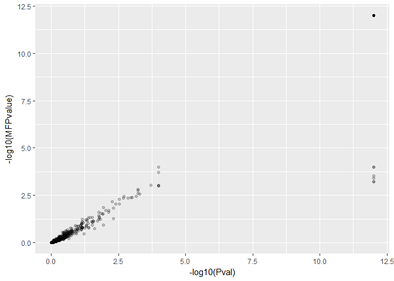

``` r
enrichmentResult$results %>% 
  select(Name, Pval, MFPvalue) %>% 
  mutate(neg_log_pvalue = -log10(Pval),
         neg_log_mfpvalue = -log10(MFPvalue)) %>% 
  mutate(log_pvalue_change = neg_log_mfpvalue - neg_log_pvalue) %>% 
  arrange(desc(abs(log_pvalue_change))) %>% 
  head(10) %>% 
  kable()
```

| Name                                      |    Pval|  MFPvalue|  neg\_log\_pvalue|  neg\_log\_mfpvalue|  log\_pvalue\_change|
|:------------------------------------------|-------:|---------:|-----------------:|-------------------:|--------------------:|
| organic acid biosynthetic process         |  0.0000|    0.0006|         12.000000|           3.2218487|            -8.778151|
| carboxylic acid biosynthetic process      |  0.0000|    0.0006|         12.000000|           3.2218487|            -8.778151|
| carbohydrate derivative metabolic process |  0.0000|    0.0004|         12.000000|           3.3979400|            -8.602060|
| organophosphate metabolic process         |  0.0000|    0.0003|         12.000000|           3.5228787|            -8.477121|
| nucleoside phosphate metabolic process    |  0.0000|    0.0001|         12.000000|           4.0000000|            -8.000000|
| nucleotide metabolic process              |  0.0000|    0.0001|         12.000000|           4.0000000|            -8.000000|
| multicellular organism development        |  0.0049|    0.0534|          2.309804|           1.2724587|            -1.037345|
| system development                        |  0.0115|    0.1167|          1.939302|           0.9329291|            -1.006373|
| heterocycle biosynthetic process          |  0.0001|    0.0010|          4.000000|           3.0000000|            -1.000000|
| aromatic compound biosynthetic process    |  0.0001|    0.0010|          4.000000|           3.0000000|            -1.000000|

``` r
#Table of the top differentially expressed genes that have a human homolog
sig_list_P369E <- c("YBR114W", "YLR301W", "YBR264C", "YBR138C", "YBL113C")
sig_gene_P369E <- homologlist %>% filter(Gene_ID %in% sig_list_P369E)
sig_gene_P369E
```

    ##    X100 H..sapiens Human_Gene_ID                adenosine.deaminase
    ## 1 11020 H. sapiens         IFT27        intraflagellar transport 27
    ## 2  5868 H. sapiens         RAB5A  RAB5A, member RAS oncogene family
    ## 3  5869 H. sapiens         RAB5B  RAB5B, member RAS oncogene family
    ## 4  5878 H. sapiens         RAB5C  RAB5C, member RAS oncogene family
    ## 5 64284 H. sapiens         RAB17  RAB17, member RAS oncogene family
    ## 6  6596 H. sapiens          HLTF helicase-like transcription factor
    ## 7 83452 H. sapiens        RAB33B RAB33B, member RAS oncogene family
    ## 8  9363 H. sapiens        RAB33A RAB33A, member RAS oncogene family
    ##   Gene_ID S..cerevisiae    K335N    P369E        WT     logFC  AveExpr
    ## 1 YBR264C S. cerevisiae 22.23783 34.96297 22.588933 0.7582834 5.646737
    ## 2 YBR264C S. cerevisiae 22.23783 34.96297 22.588933 0.7582834 5.646737
    ## 3 YBR264C S. cerevisiae 22.23783 34.96297 22.588933 0.7582834 5.646737
    ## 4 YBR264C S. cerevisiae 22.23783 34.96297 22.588933 0.7582834 5.646737
    ## 5 YBR264C S. cerevisiae 22.23783 34.96297 22.588933 0.7582834 5.646737
    ## 6 YBR114W S. cerevisiae  9.12774 14.13707  9.672963 3.2435196 2.676509
    ## 7 YBR264C S. cerevisiae 22.23783 34.96297 22.588933 0.7582834 5.646737
    ## 8 YBR264C S. cerevisiae 22.23783 34.96297 22.588933 0.7582834 5.646737
    ##          t      P.Value    adj.P.Val        B
    ## 1 20.62718 7.350668e-09 9.192258e-06 11.11476
    ## 2 20.62718 7.350668e-09 9.192258e-06 11.11476
    ## 3 20.62718 7.350668e-09 9.192258e-06 11.11476
    ## 4 20.62718 7.350668e-09 9.192258e-06 11.11476
    ## 5 20.62718 7.350668e-09 9.192258e-06 11.11476
    ## 6 93.33031 1.066258e-14 6.805923e-11 19.11330
    ## 7 20.62718 7.350668e-09 9.192258e-06 11.11476
    ## 8 20.62718 7.350668e-09 9.192258e-06 11.11476

``` r
sig_list_K335N <- c("YLR301W", "YDR069C", "YHL048C-A", "YBR295W", "YJR025C")
sig_list_K335N <- homologlist %>% filter(Gene_ID %in% sig_list_K335N)
sig_list_K335N
```

    ##    X100 H..sapiens Human_Gene_ID
    ## 1 10868 H. sapiens         USP20
    ## 2 11274 H. sapiens         USP18
    ## 3 23498 H. sapiens          HAAO
    ## 4 27005 H. sapiens         USP21
    ## 5   538 H. sapiens         ATP7A
    ## 6   540 H. sapiens         ATP7B
    ## 7  9099 H. sapiens          USP2
    ## 8  9101 H. sapiens          USP8
    ##                            adenosine.deaminase Gene_ID S..cerevisiae
    ## 1              ubiquitin specific peptidase 20 YDR069C S. cerevisiae
    ## 2              ubiquitin specific peptidase 18 YDR069C S. cerevisiae
    ## 3        3-hydroxyanthranilate 3,4-dioxygenase YJR025C S. cerevisiae
    ## 4              ubiquitin specific peptidase 21 YDR069C S. cerevisiae
    ## 5 ATPase, Cu++ transporting, alpha polypeptide YBR295W S. cerevisiae
    ## 6  ATPase, Cu++ transporting, beta polypeptide YBR295W S. cerevisiae
    ## 7               ubiquitin specific peptidase 2 YDR069C S. cerevisiae
    ## 8               ubiquitin specific peptidase 8 YDR069C S. cerevisiae
    ##       K335N     P369E        WT     logFC  AveExpr        t     P.Value
    ## 1  5.560857  5.500177  5.539633 0.3914345 4.702557 4.275589 0.002084863
    ## 2  5.560857  5.500177  5.539633 0.3914345 4.702557 4.275589 0.002084863
    ## 3 41.830467 30.631467 49.119700        NA       NA       NA          NA
    ## 4  5.560857  5.500177  5.539633 0.3914345 4.702557 4.275589 0.002084863
    ## 5  6.263087  9.800440  6.374273 0.4464782 5.176783 3.891698 0.003697457
    ## 6  6.263087  9.800440  6.374273 0.4464782 5.176783 3.891698 0.003697457
    ## 7  5.560857  5.500177  5.539633 0.3914345 4.702557 4.275589 0.002084863
    ## 8  5.560857  5.500177  5.539633 0.3914345 4.702557 4.275589 0.002084863
    ##    adj.P.Val         B
    ## 1 0.02229092 -1.873548
    ## 2 0.02229092 -1.873548
    ## 3         NA        NA
    ## 4 0.02229092 -1.873548
    ## 5 0.03400701 -2.475760
    ## 6 0.03400701 -2.475760
    ## 7 0.02229092 -1.873548
    ## 8 0.02229092 -1.873548
