Project-Trial
================
Arun Kumar
13 March 2018

STAT 540 Group Project - Splice and Dice
========================================

Loading the Bam files
=====================

``` r
#loading libraries

#James
combined_gene_sf <- file.path("C:/Users/11jpw/Desktop/Files/UBC Masters 2017/2018 Semester 2/STATS540/SF3B1_rna_seq/2017-01-30_yeast/combined.gene.sf.tpm")
#Arun
#combined_gene_sf <- file.path("E:/Projects/Splice and Dice/SF3B1_rna_seq/2017-01-30_yeast/combined.gene.sf.tpm")
genedata <- read.table(combined_gene_sf)
genedata %>%
  as_tibble()
```

    ## # A tibble: 6,693 x 10
    ##    V1      V2      V3       V4      V5      V6     V7    V8    V9    V10  
    ##    <fct>   <fct>   <fct>    <fct>   <fct>   <fct>  <fct> <fct> <fct> <fct>
    ##  1 gene_id K335N1  K335N2   K335N3  P369E1  P369E2 P369~ WT1   WT2   WT3  
    ##  2 Q0010   21.5097 25.7552  23.1459 82.111  82.87~ 68.3~ 23.9~ 32.2~ 29.4~
    ##  3 Q0017   55.1604 82.3234  69.8019 199.405 264.3~ 290.~ 58.8~ 64.4~ 99.4~
    ##  4 Q0032   1.50128 2.18501  2.0338  14.8162 14.55~ 12.9~ 2.24~ 3.79~ 2.95~
    ##  5 Q0045   56.1937 42.4625  51.8916 63.9759 61.05~ 65.6~ 54.9~ 38.2~ 36.4~
    ##  6 Q0050   324.732 320.425  361.093 437.584 419.4~ 446.~ 316.~ 287.~ 280.~
    ##  7 Q0055   162.085 149.234  163.025 199.698 192.2~ 197.~ 153.9 134.~ 132.~
    ##  8 Q0060   4.26592 4.71197  4.92962 9.06441 10.13~ 11.2~ 4.69~ 4.15~ 5.40~
    ##  9 Q0065   25.3249 25.4588  27.3347 29.9324 30.37~ 36.8~ 24.9~ 21.5~ 22.4~
    ## 10 Q0070   1.07462 0.860935 1.5594  2.03596 2.272~ 2.66~ 0.94~ 0.67~ 0.72~
    ## # ... with 6,683 more rows

First, to confirm that the two mutations did not affect the expression of Hsh155, we do a quick check on the database before averaging the triplicates. We will repeat this process later.

##### Hsh155 expression:

``` r
colnames(genedata) <- c("Gene_ID", "K335N1", "K335N2", "K335N3", "P369E1", "P369E2", "P369E3", "WT1", "WT2", "WT3")
genedata = genedata[-1,]

 I <- "YMR288W"
 hsh155expression <- genedata %>% filter(Gene_ID %in% I)
 hsh155expression
```

    ##   Gene_ID  K335N1 K335N2  K335N3  P369E1  P369E2  P369E3     WT1     WT2
    ## 1 YMR288W 19.6182 17.665 20.4904 16.1773 15.1637 16.3224 23.9353 21.3881
    ##       WT3
    ## 1 19.6816

``` r
 hsh155expression$Gene_ID <- "Hsh155"
 hsh155 <- hsh155expression %>%
  as.data.frame() %>% 
  column_to_rownames("Gene_ID") %>%
  t() %>% as.data.frame() %>% 
  rownames_to_column("sample_id") %>% 
  melt(id = "sample_id") %>% 
  as_tibble() %>% 
  dplyr::select(sample_id,
         gene = variable, 
         expression = value)
 hsh155
```

    ## # A tibble: 9 x 3
    ##   sample_id gene   expression
    ##   <chr>     <fct>  <chr>     
    ## 1 K335N1    Hsh155 19.6182   
    ## 2 K335N2    Hsh155 17.665    
    ## 3 K335N3    Hsh155 20.4904   
    ## 4 P369E1    Hsh155 16.1773   
    ## 5 P369E2    Hsh155 15.1637   
    ## 6 P369E3    Hsh155 16.3224   
    ## 7 WT1       Hsh155 23.9353   
    ## 8 WT2       Hsh155 21.3881   
    ## 9 WT3       Hsh155 19.6816

``` r
 ggplot(hsh155, aes(x=sample_id, y=expression)) + geom_point(aes(color=sample_id)) + theme(axis.text.x = element_text(angle=90, hjust=1))
```

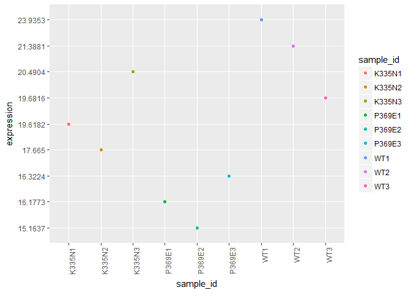

###### Let's shift the focus to the expression of intron containing genes (ICG) in all these replicates.

``` r
 ID <- c("YML085C","YFL039C","YBR111W-A")
 ICGexpression <- genedata %>% filter(Gene_ID %in% ID)
 ICGexpression
```

    ##     Gene_ID  K335N1  K335N2  K335N3  P369E1  P369E2  P369E3     WT1
    ## 1 YBR111W-A  51.294 44.4084 43.5618 83.3258 70.4225 67.6135  50.732
    ## 2   YFL039C 1051.76 1054.13 1014.24 1043.25 999.887 1006.87 1014.83
    ## 3   YML085C 110.898  106.66  107.81 125.573 118.223 117.999 109.237
    ##       WT2     WT3
    ## 1 39.0769 40.9832
    ## 2  1083.8  1069.7
    ## 3 109.326 112.288

``` r
 ICGexpression$Gene_ID <- c("Tub1", "Act1", "Sus1")
 ICG <- ICGexpression %>%
  as.data.frame() %>% 
  column_to_rownames("Gene_ID") %>%
  t() %>% as.data.frame() %>% 
  rownames_to_column("sample_id") %>% 
  melt(id = "sample_id") %>% 
  as_tibble() %>% 
  dplyr::select(sample_id,
         gene = variable, 
         expression = value)
```

    ## Warning: attributes are not identical across measure variables; they will
    ## be dropped

``` r
 ICG
```

    ## # A tibble: 27 x 3
    ##    sample_id gene  expression
    ##    <chr>     <fct> <chr>     
    ##  1 K335N1    Tub1  51.294    
    ##  2 K335N2    Tub1  44.4084   
    ##  3 K335N3    Tub1  43.5618   
    ##  4 P369E1    Tub1  83.3258   
    ##  5 P369E2    Tub1  70.4225   
    ##  6 P369E3    Tub1  67.6135   
    ##  7 WT1       Tub1  50.732    
    ##  8 WT2       Tub1  39.0769   
    ##  9 WT3       Tub1  40.9832   
    ## 10 K335N1    Act1  1051.76   
    ## # ... with 17 more rows

``` r
 ggplot(ICG, aes(x=sample_id, y=expression))+geom_point(aes(color=sample_id)) + theme(axis.text.x = element_text(angle=90, hjust=1)) + facet_wrap(~gene)
```

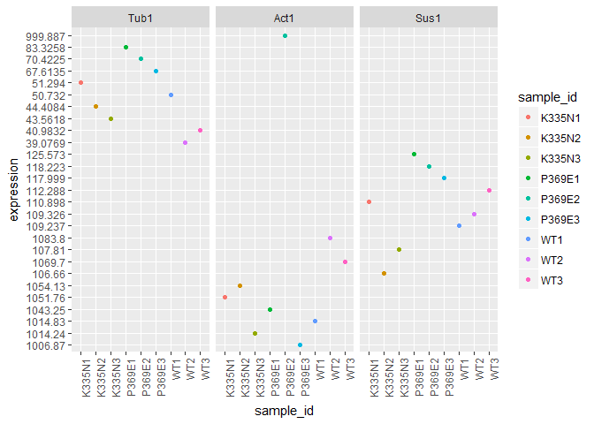

### Filtering the intron containing genes

Instead of loading the intron containing genes one by one, I downloaded the Ares database.

``` r
intronlist <- file.path("http://intron.ucsc.edu/yeast4.1/yeastbasic.txt")
introndata <- read.table(intronlist)
introndata %>%
  as_tibble()
```

    ## # A tibble: 298 x 6
    ##    V1                         V2      V3        V4     V5 V6              
    ##    <fct>                      <fct>   <fct>  <int>  <int> <fct>           
    ##  1 SNR17A_chr15_780120_780277 SNR17A  chr15 780120 780277 GTATGTAATATACCC~
    ##  2 SNR17B_chr16_281502_281372 SNR17B  chr16 281502 281372 GTATGTTTTATACCA~
    ##  3 YAL001C_chr1_151097_151007 YAL001C chr1  151097 151007 GTATGTTCATGTCTC~
    ##  4 YAL003W_chr1_142255_142621 YAL003W chr1  142255 142621 GTATGTTCCGATTTA~
    ##  5 YAL030W_chr1_87389_87502   YAL030W chr1   87389  87502 GTAAGTACAGAAAGC~
    ##  6 YBL018C_chr2_186389_186314 YBL018C chr2  186389 186314 GTATGTATATTTTTG~
    ##  7 YBL026W_chr2_170638_170766 YBL026W chr2  170638 170766 GTATGTTCATAATGA~
    ##  8 YBL027W_chr2_168386_168770 YBL027W chr2  168386 168770 GTATGTTTAACAGTG~
    ##  9 YBL040C_chr2_142808_142711 YBL040C chr2  142808 142711 GTATGTTACTATTTG~
    ## 10 YBL050W_chr2_125116_125232 YBL050W chr2  125116 125232 GTATGTAGTAGGGAA~
    ## # ... with 288 more rows

Filtering the Ares database with the RNA-seq data, we now have a dataset of only intron containing genes. We can check for intron retention, and expression using differential gene expression analysis on this set rather than the whole genome.

``` r
intronrnaseq <- genedata %>%
  filter(Gene_ID %in% introndata$V2)
intronrnaseq %>%
  as_tibble()
```

    ## # A tibble: 278 x 10
    ##    Gene_ID   K335N1  K335N2  K335N3 P369E1 P369E2 P369E3 WT1   WT2   WT3  
    ##    <fct>     <fct>   <fct>   <fct>  <fct>  <fct>  <fct>  <fct> <fct> <fct>
    ##  1 YAL001C   9.126   9.59261 9.799~ 9.707~ 9.515~ 10.47~ 9.49~ 9.67~ 10.5~
    ##  2 YAL003W   1791.68 2152.02 2088.~ 1672.~ 1980.~ 1944.~ 1637~ 2153~ 2145~
    ##  3 YAL030W   52.9617 41.4821 46.34~ 52.31~ 47.59~ 47.55~ 48.1~ 46.1~ 47.1~
    ##  4 YBL018C   48.0539 41.8079 45.14~ 69.40~ 58.91~ 59.64~ 49.3~ 42.1~ 42.9~
    ##  5 YBL026W   273.991 246.724 246.2~ 446.0~ 360.8~ 366.4~ 281.~ 233.~ 226.~
    ##  6 YBL027W   2009.2  2212.03 2201.~ 3442.~ 3687.~ 3431.~ 1921~ 2251~ 2217~
    ##  7 YBL040C   56.4636 53.3105 52.06~ 87.14~ 81.10~ 82.79~ 53.6~ 50.3~ 52.4~
    ##  8 YBL050W   33.4837 32.793  36.19~ 63.72~ 65.24~ 64.39~ 33.2~ 36.0~ 33.9~
    ##  9 YBL059C-A 44.1476 41.4215 35.18~ 82.01~ 66.52~ 71.76~ 48.7~ 42.0~ 44.2~
    ## 10 YBL059W   11.5659 10.7594 10.77~ 22.94~ 18.88~ 21.17~ 12.2~ 10.9~ 12.2~
    ## # ... with 268 more rows

### Differential gene expression analysis on ICG's

``` r
g <- genedata
g <- mutate_all(g, function(x) as.numeric((as.character(x))))
```

    ## Warning in (function (x) : NAs introduced by coercion

``` r
g$Gene_ID <- genedata$Gene_ID
g %>%
  as_tibble()
```

    ## # A tibble: 6,692 x 10
    ##    Gene_ID K335N1  K335N2 K335N3 P369E1 P369E2 P369E3     WT1     WT2
    ##    <fct>    <dbl>   <dbl>  <dbl>  <dbl>  <dbl>  <dbl>   <dbl>   <dbl>
    ##  1 Q0010    21.5   25.8    23.1   82.1   82.9   68.4   24.0    32.2  
    ##  2 Q0017    55.2   82.3    69.8  199.   264.   290.    58.8    64.5  
    ##  3 Q0032     1.50   2.19    2.03  14.8   14.6   13.0    2.25    3.80 
    ##  4 Q0045    56.2   42.5    51.9   64.0   61.1   65.7   55.0    38.3  
    ##  5 Q0050   325.   320.    361.   438.   419.   446.   316.    288.   
    ##  6 Q0055   162.   149.    163.   200.   192.   197.   154.    134.   
    ##  7 Q0060     4.27   4.71    4.93   9.06  10.1   11.3    4.69    4.15 
    ##  8 Q0065    25.3   25.5    27.3   29.9   30.4   36.8   24.9    21.6  
    ##  9 Q0070     1.07   0.861   1.56   2.04   2.27   2.67   0.948   0.680
    ## 10 Q0075    31.5   32.9    28.3   57.7   60.9   59.6   27.3    32.9  
    ## # ... with 6,682 more rows, and 1 more variable: WT3 <dbl>

``` r
g$K335N <- rowMeans(subset(g, select = c(K335N1,K335N2,K335N3)), na.rm = TRUE)
g$P369E <- rowMeans(subset(g, select = c(P369E1,P369E2,P369E3)), na.rm = TRUE)
g$WT <- rowMeans(subset(g, select = c(WT1,WT2,WT3)), na.rm = TRUE)
meangenedata <- g[-c(2,3,4,5,6,7,8,9,10)]
meangenedata %>%
  as_tibble()
```

    ## # A tibble: 6,692 x 4
    ##    Gene_ID  K335N  P369E      WT
    ##    <fct>    <dbl>  <dbl>   <dbl>
    ##  1 Q0010    23.5   77.8   28.6  
    ##  2 Q0017    69.1  251.    74.2  
    ##  3 Q0032     1.91  14.1    3.00 
    ##  4 Q0045    50.2   63.6   43.2  
    ##  5 Q0050   335.   434.   295.   
    ##  6 Q0055   158.   196.   140.   
    ##  7 Q0060     4.64  10.2    4.75 
    ##  8 Q0065    26.0   32.4   23.0  
    ##  9 Q0070     1.16   2.32   0.785
    ## 10 Q0075    30.9   59.4   33.0  
    ## # ... with 6,682 more rows

Repeating the Hsh155 expression pattern and for 3 ICGs:

``` r
 I1 <- "YMR288W"
 hsh155expressionmean <- meangenedata %>% filter(Gene_ID %in% I1)
 hsh155expressionmean
```

    ##   Gene_ID    K335N   P369E       WT
    ## 1 YMR288W 19.25787 15.8878 21.66833

``` r
 hsh155expressionmean$Gene_ID <- "Hsh155"
 hsh155mean <- hsh155expressionmean %>%
  as.data.frame() %>% 
  column_to_rownames("Gene_ID") %>%
  t() %>% as.data.frame() %>% 
  rownames_to_column("sample_id") %>% 
  melt(id = "sample_id") %>% 
  as_tibble() %>% 
  dplyr::select(sample_id,
         gene = variable, 
         expression = value)
 hsh155mean
```

    ## # A tibble: 3 x 3
    ##   sample_id gene   expression
    ##   <chr>     <fct>       <dbl>
    ## 1 K335N     Hsh155       19.3
    ## 2 P369E     Hsh155       15.9
    ## 3 WT        Hsh155       21.7

``` r
 ggplot(hsh155mean, aes(x=sample_id, y=expression)) + geom_point(aes(color=sample_id)) + theme(axis.text.x = element_text(angle=90, hjust=1)) 
```

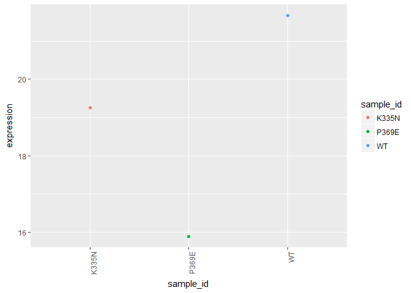

``` r
intronrnaseqmean <- meangenedata %>%
  filter(Gene_ID %in% introndata$V2)
intronrnaseqmean %>%
  as_tibble()
```

    ## # A tibble: 278 x 4
    ##    Gene_ID     K335N   P369E      WT
    ##    <fct>       <dbl>   <dbl>   <dbl>
    ##  1 YAL001C      9.51    9.90    9.90
    ##  2 YAL003W   2011.   1866.   1979.  
    ##  3 YAL030W     46.9    49.2    47.2 
    ##  4 YBL018C     45.0    62.7    44.8 
    ##  5 YBL026W    256.    391.    247.  
    ##  6 YBL027W   2141.   3520.   2130.  
    ##  7 YBL040C     53.9    83.7    52.1 
    ##  8 YBL050W     34.2    64.5    34.4 
    ##  9 YBL059C-A   40.3    73.4    45.0 
    ## 10 YBL059W     11.0    21.0    11.8 
    ## # ... with 268 more rows

``` r
IDD <- c("YML085C","YFL039C","YBR111W-A")
 ICGexpressionmean <- intronrnaseqmean %>% filter(Gene_ID %in% IDD)
 ICGexpressionmean
```

    ##     Gene_ID     K335N      P369E         WT
    ## 1 YBR111W-A   46.4214   73.78727   43.59737
    ## 2   YFL039C 1040.0433 1016.66900 1056.11000
    ## 3   YML085C  108.4560  120.59833  110.28367

``` r
 ICGexpressionmean$Gene_ID <- c("Tub1", "Act1", "Sus1")
 ICGmean <- ICGexpressionmean %>%
  as.data.frame() %>% 
  column_to_rownames("Gene_ID") %>%
  t() %>% as.data.frame() %>% 
  rownames_to_column("sample_id") %>% 
  melt(id = "sample_id") %>% 
  as_tibble() %>% 
  dplyr::select(sample_id,
         gene = variable, 
         expression = value)
 ICGmean
```

    ## # A tibble: 9 x 3
    ##   sample_id gene  expression
    ##   <chr>     <fct>      <dbl>
    ## 1 K335N     Tub1        46.4
    ## 2 P369E     Tub1        73.8
    ## 3 WT        Tub1        43.6
    ## 4 K335N     Act1      1040. 
    ## 5 P369E     Act1      1017. 
    ## 6 WT        Act1      1056. 
    ## 7 K335N     Sus1       108. 
    ## 8 P369E     Sus1       121. 
    ## 9 WT        Sus1       110.

``` r
 ggplot(ICGmean, aes(x=sample_id, y=expression)) + geom_point(aes(color=sample_id)) + theme(axis.text.x = element_text(angle=90, hjust=1)) + facet_wrap(~gene)
```

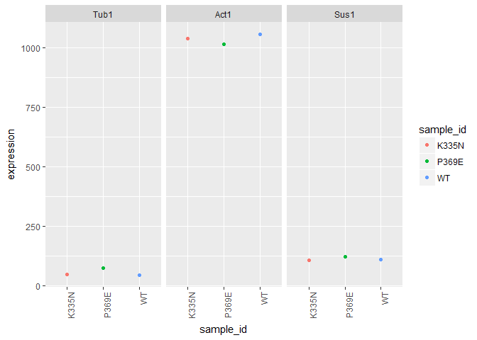

``` r
meltintron <- melt(intronrnaseqmean, id="Gene_ID")
meltintron %>%
  as_tibble()
```

    ## # A tibble: 834 x 3
    ##    Gene_ID   variable   value
    ##    <fct>     <fct>      <dbl>
    ##  1 YAL001C   K335N       9.51
    ##  2 YAL003W   K335N    2011.  
    ##  3 YAL030W   K335N      46.9 
    ##  4 YBL018C   K335N      45.0 
    ##  5 YBL026W   K335N     256.  
    ##  6 YBL027W   K335N    2141.  
    ##  7 YBL040C   K335N      53.9 
    ##  8 YBL050W   K335N      34.2 
    ##  9 YBL059C-A K335N      40.3 
    ## 10 YBL059W   K335N      11.0 
    ## # ... with 824 more rows

``` r
ggplot(meltintron, aes(x=Gene_ID, y=value, color = variable)) + geom_point() + theme(axis.text.x = element_text(angle = 90, hjust = 1))
```

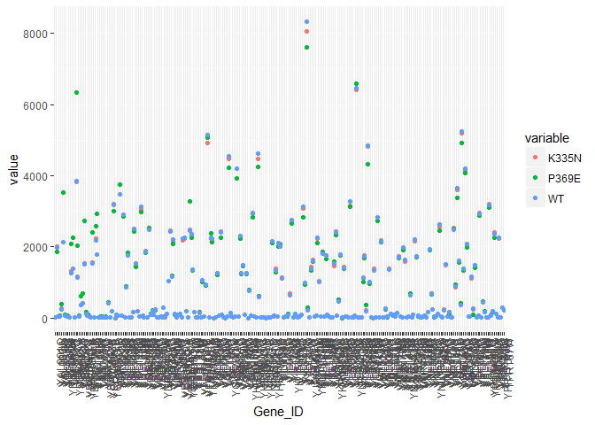

``` r
logmeltintron <- meltintron
logmeltintron$value <- log(meltintron$value,2)
ggplot(logmeltintron, aes(x=Gene_ID, y=value, color = variable)) + geom_point()
```

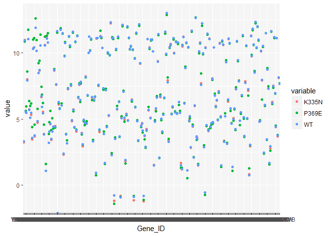

``` r
clust_dist_col = "euclidean"
clust_method = "ward.D2"
clust_scale = "none"  

matr <- data.frame(meangenedata[,-1])
n <- log(matr,2)
n <- subset(n, K335N!=-Inf)
n <- subset(n, P369E!=-Inf)
n <- subset(n, WT!=-Inf)
j <- t(n)
pheatmap(n, na.rm = TRUE, cluster_rows = TRUE, scale=clust_scale, clustering_method = clust_method, clustering_distance_cols = clust_dist_col, show_colnames = T, show_rownames = FALSE, main ="clustering heatmap")
```

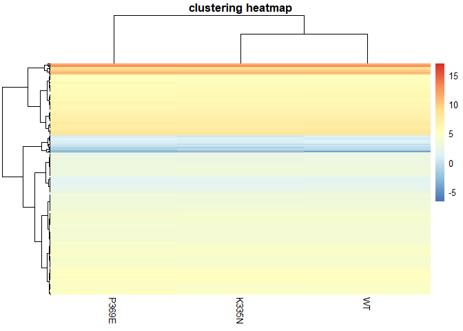

``` r
clust_scale = "row"
pheatmap(n, na.rm = TRUE, cluster_rows = TRUE, scale=clust_scale, clustering_method = clust_method, clustering_distance_cols = clust_dist_col, show_colnames = T, show_rownames = FALSE, main ="clustering heatmap")
```

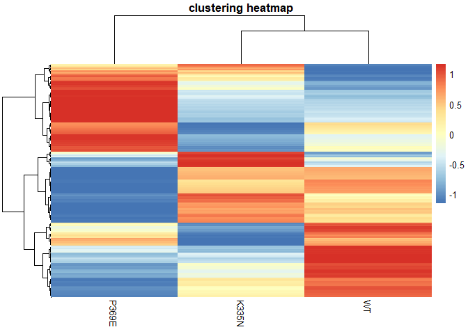

``` r
clust_method = "average"
pheatmap(n, na.rm = TRUE, cluster_rows = TRUE, scale=clust_scale, clustering_method = clust_method, clustering_distance_cols = clust_dist_col, show_colnames = T, show_rownames = FALSE, main ="clustering heatmap")
```

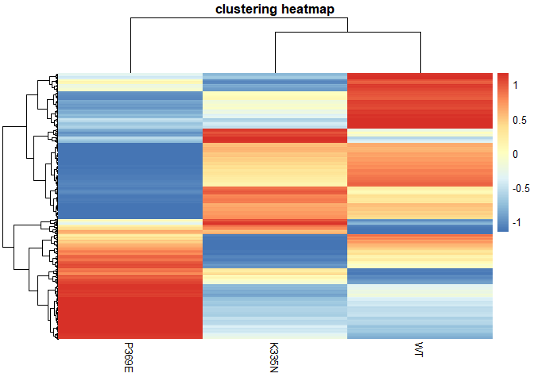

``` r
clust_dist_col = "euclidean"
clust_method = "ward.D2"
clust_scale = "none"  

matri <- data.frame(intronrnaseqmean[,-1])
ni <- log(matri,2)
ni <- subset(ni, K335N!=-Inf)
ni <- subset(ni, P369E!=-Inf)
ni <- subset(ni, WT!=-Inf)
ji <- t(ni)
pheatmap(ni, na.rm = TRUE, cluster_rows = TRUE, scale=clust_scale, clustering_method = clust_method, clustering_distance_cols = clust_dist_col, show_colnames = T, show_rownames = FALSE, main ="clustering heatmap")
```

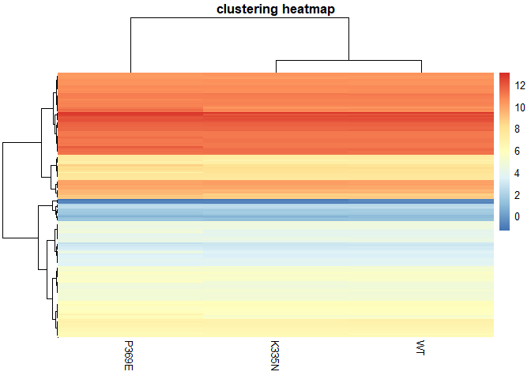

``` r
clust_scale = "row"

pheatmap(ni, na.rm = TRUE, cluster_rows = TRUE, scale=clust_scale, clustering_method = clust_method, clustering_distance_cols = clust_dist_col, show_colnames = T, show_rownames = FALSE, main ="clustering heatmap")
```

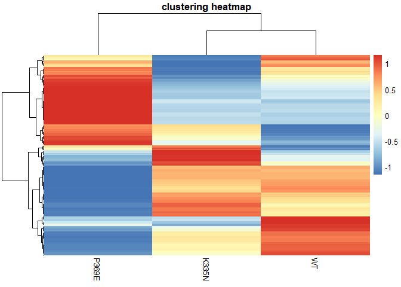

``` r
clust_method = "average"

pheatmap(ni, na.rm = TRUE, cluster_rows = TRUE, scale=clust_scale, clustering_method = clust_method, clustering_distance_cols = clust_dist_col, show_colnames = T, show_rownames = FALSE, main ="clustering heatmap")
```

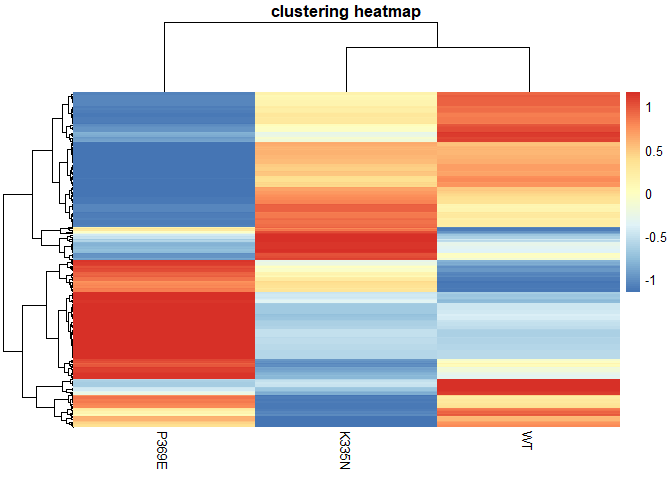
